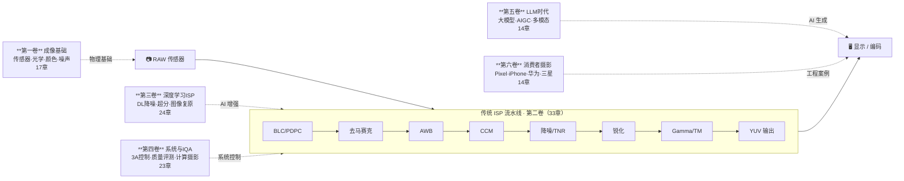

# ISP算法手册 — Image Signal Processing Algorithm Handbook

> 把ISP真正讲成一门可落地的系统工程学 ·

[](LICENSE)
[](#)
[](#)
[](#)
[](#)
[](https://aiisp.github.io/isp_handbook/) · [](https://github.com/AIISP/isp_handbook/actions/workflows/docs.yml)

> **📌 本手册的定位**：这是一本面向 ISP 算法理论框架的学习手册，不是平台调参手册。手册只涉及公开发表的算法原理、公开可查的工程知识和公开硬件上的可复现实验——不涉及任何 NDA 协议下的平台内部参数、私有调参工具的操作细节，或不宜公开的厂商 know-how。这是边界，也是立场。

> **已在工程一线的工程师，直接看这里：**

> 📊 [工程经验数字速查表](ENGINEERING_NUMBERS.md) — 30+ 关键阈值、三平台参数名、量化损失数字，每条标注来源章节。手册里转发最多的一页。

> 🐛 [ISP伪影排查指南](part4_system_iqa/ch21_isp_artifact_debug/ch21_isp_artifact_debug_ch.md) — 按症状 → 根因 → 解法的快速导航。

***

## 📢 参与与共建

> **这是一本正在生长的手册，欢迎您的加入。**

### 🔬 树莓派实验数据持续补充中

手册的原理验证代码（BLC 校正、AWB 灰世界、LSC 增益计算、Gamma 曲线等）正在基于 **树莓派 4B + IMX477 摄像头**进行真机实测。

**为什么选树莓派，不选手机或商业平台？**

- **手机平台**：访问手机 RAW 数据需要 OEM 合作协议，ISP 参数文件受 NDA 保护，任何基于高通 CamX / MTK FeaturePipe / 海思越影的实测结果都无法公开复现，更无法合法公开分享。
- **其他嵌入式平台**（RV1126、JetsonNano）：ISP 调参工具和参数格式同样是私有的，且硬件门槛比树莓派高。
- **树莓派 + IMX477 HQ Camera**：RAW 数据通过 `libcamera-still --raw` 完全开放，`rawpy`/`picamera2` 直接读取 DNG，所有算法均可在 Raspberry Pi OS 上复现。**任何读者花不到 100 美元即可搭建完全一致的验证环境——这是唯一满足"公开、可复现、无授权限制"三个条件的组合。**

当前进展：

- ✅ 环境搭建完成（LibCamera + RawPy + OpenCV，Raspberry Pi OS Bookworm）
- 🔄 第二卷核心模块实测进行中（BLC → Demosaic → AWB → CCM → Gamma）
- ⏳ 待完成：TNR、HDR 合帧、LSC 增益图生成

实测代码和数据将随各章节陆续补充。当前这个精简版未包含 `QUICK_START.ipynb` 与配套 notebook；如需查看完整流水线示例，请访问原仓库中的 [QUICK\_START.ipynb](https://github.com/AIISP/isp_handbook/blob/main/QUICK_START.ipynb)。**欢迎有树莓派 + LibCamera 经验的工程师提 PR 加速这一进程。**

***

### 🤝 诚邀领域专家认领「工程师手记」

手册每章设有 **工程师手记** 模块，记录调参坑、量产经验、平台差异等课本上没有的内容——这正是手册最有价值、也最难靠单人完成的部分。

**如果你在以下领域有实战经验，欢迎认领对应章节：**

| 领域                                     | 对应章节               | 当前状态      |
| -------------------------------------- | ------------------ | --------- |
| 高通 Spectra ISP 调试（Chromatix 调参）        | 第二卷 ch01–ch17 任意章节 | 工程师手记待补充  |
| MTK Imagiq NDD 调参                      | 第二卷 AWB/TNR/CCM    | 工程师手记待补充  |
| 多摄对齐/融合工程                              | 第二卷第22章、第四卷第14章    | 工程师手记待补充  |
| DL 模型 NPU 量化部署（SNPE/NeuroPilot/ARM NN） | 第三卷第14章、第五卷第13章    | 量化实测数据待补充 |
| 3A 控制系统（AE/AF 工程实现）                    | 第四卷第01–03章         | 平台实现差异待补充 |
| Imatest / ISO 12233 实验室测量              | 第四卷第10章、附录B        | 实测步骤待完善   |
| Video ISP 实时约束（DRAM bandwidth/latency） | 第四卷第15–16章         | 定量分析待补充   |

**认领方式：** 在 [Discussions](https://github.com/AIISP/isp_handbook/discussions) 发帖或提 Issue，说明你想认领的章节即可。贡献者将在对应章节标注「工程师手记：作者@GitHub」。

***

### ⚠️ 第五卷声明：趋势跟踪中，落地实践待完善

**第五卷（LLM 时代 · 第01–14章）的定位是跟踪前沿趋势**，而非工程实践手册。

该卷内容描述的是 2023–2025 年 LLM/AIGC 与 ISP 交叉方向的学术进展，落地实践经验尚不充分：

- LLM × 视觉领域每季度都有重大进展，本卷初版内容在细节上可能已过时
- 标注 📚 综述 的章节属于学术背景阅读，建议结合最新论文和 arXiv 使用
- 标注 🔧 工程落地 的章节（ch03 LLM辅助调参、ch06 Prompt驱动ISP参数生成等）有一定参考价值，但仍处于早期探索阶段，工程可行性因场景而异

**我们诚邀有 LLM × ISP 实际落地经验的工程师和研究员参与完善**——欢迎在 [Discussions](https://github.com/AIISP/isp_handbook/discussions) 分享你的工程实践，或直接提 PR。这是整本手册最需要社区力量的部分。

***

## 手册覆盖范围



***

## 3 分钟找到你要读的章节

**不知道从哪里开始？按你现在的问题选：**

***

### → 我刚进相机团队 / 想系统补 ISP 基础

```
第一卷第01章（ISP流水线概述）
  → 第一卷第03章（传感器物理）
  → 第一卷第05章（颜色科学）
  → 第二卷第01–09章（BLC→AWB，传统ISP核心9个模块）
```

读完这条路，能独立理解 RAW 到 JPEG 的每一步发生了什么，以及为什么那么做。

***

### → 我在调一个具体问题（AWB 偏色 / TNR 鬼影 / 过锐 / 夜景噪声 / HDR 鬼影）

**直接跳到这一章：**

| 问题现象          | 直接读                                                                                                           |
| ------------- | ------------------------------------------------------------------------------------------------------------- |
| AWB 室内偏黄/偏绿   | [第二卷第05章 AWB](part2_traditional_isp/ch05_awb/ch05_awb_ch.md)                                                  |
| TNR 运动鬼影      | [第二卷第12章 时域降噪](part2_traditional_isp/ch12_temporal_nr/ch12_temporal_nr_ch.md)                                 |
| 边缘振铃/过锐       | [第二卷第04章 锐化](part2_traditional_isp/ch04_sharpening/ch04_sharpening_ch.md)                                     |
| 降噪后蜡质感/塑料感    | [第二卷第03章 降噪](part2_traditional_isp/ch03_denoising/ch03_denoising_ch.md)                                       |
| HDR 合并鬼影      | [第二卷第10章 HDR合帧](part2_traditional_isp/ch10_hdr_merge/ch10_hdr_merge_ch.md)                                    |
| BLC 整体偏色      | [第二卷第01章 BLC\&PDPC](part2_traditional_isp/ch01_blc_pdpc/ch01_blc_pdpc_ch.md)                                  |
| 不知道 Bug 在哪个模块 | [第四卷第21章 Artifact Debug](part4_system_iqa/ch21_isp_artifact_debug/ch21_isp_artifact_debug_ch.md) ← **推荐先读这章** |
| 调参顺序乱/改了又改    | [第四卷第17章 调参工作流](part4_system_iqa/ch17_isp_tuning_workflow/ch17_isp_tuning_workflow_ch.md)                     |

***

### → 我想了解 AI-ISP / DL 在工程上怎么落地

```
第三卷第01章（DL-ISP综述）
  → 第三卷第14章（端侧 NPU 部署与量化）
  → 第四卷第17章（调参工作流：DL 模块进入量产的流程）
  → 第六卷第02章（Google Night Sight 工程实现）
  → 第六卷第03章（Apple Deep Fusion 架构）
```

这条路回答的不是"有哪些 DL 算法"，而是"在手机上这些算法真正怎么跑"。

***

## 立即动手：在浏览器里跑 ISP 代码

**第一次来？从这里开始：**

[](https://colab.research.google.com/github/AIISP/isp_handbook/blob/main/QUICK_START.ipynb)
**[QUICK\_START.ipynb（原仓库）](https://github.com/AIISP/isp_handbook/blob/main/QUICK_START.ipynb)** — 合成 RAW → JPEG 完整流水线演示，一个 notebook 跑通。本地或 Colab 均可，无需真实相机。当前精简版未包含该文件，每个 ISP 模块直链对应章节。

***

无需安装，点击直接打开（Colab）：

| 章节       | 主题                     | Notebook                                                                                                                                                                                                                       |
| -------- | ---------------------- | ------------------------------------------------------------------------------------------------------------------------------------------------------------------------------------------------------------------------------ |
| **快速入门** | **合成 RAW→JPEG 完整流水线**  | [](https://colab.research.google.com/github/AIISP/isp_handbook/blob/main/QUICK_START.ipynb)                                                                  |
| 第一卷第01章  | ISP 流水线完整演示            | [](https://colab.research.google.com/github/AIISP/isp_handbook/blob/main/part1_imaging_fundamentals/ch01_isp_pipeline_overview/ch01_pipeline_notebook.ipynb) |
| 第二卷第02章  | Demosaic 算法对比（双线性/AHD） | [](https://colab.research.google.com/github/AIISP/isp_handbook/blob/main/part2_traditional_isp/ch02_demosaic/ch02_demosaic_notebook.ipynb)                   |
| 第二卷第05章  | AWB 灰世界/Bayesian 实验    | [](https://colab.research.google.com/github/AIISP/isp_handbook/blob/main/part2_traditional_isp/ch05_awb/ch05_awb_notebook.ipynb)                             |
| 第二卷第07章  | Gamma / 色调映射曲线         | [](https://colab.research.google.com/github/AIISP/isp_handbook/blob/main/part2_traditional_isp/ch07_gamma_tonemapping/ch07_gamma_tonemapping_notebook.ipynb) |
| 第三卷第03章  | 超分辨率：插值 vs 学习方法对比      | [](https://colab.research.google.com/github/AIISP/isp_handbook/blob/main/part3_dl_isp/ch03_super_resolution/ch03_sr_notebook.ipynb)                          |
| 第四卷第01章  | 3A 控制环路仿真              | [](https://colab.research.google.com/github/AIISP/isp_handbook/blob/main/part4_system_iqa/ch01_3a_system/ch01_3a_notebook.ipynb)                             |

本地运行：

```bash
# 注意：以下依赖文件不在当前精简版目录中，需要到原始完整仓库执行
# 方案 A — conda（推荐，自动处理 PyTorch CUDA 版本）
conda env create -f environment.yml
conda activate isp
jupyter lab

# 方案 B — pip
pip install -r requirements.txt
jupyter lab
```

### 本地构建文档站

```bash
pip install -r requirements-docs.txt
mkdocs serve          # 本地预览，访问 http://127.0.0.1:8000
mkdocs build --strict # 严格模式构建，验证链接与格式
```

***

## 简介

一部从第一性原理到大语言模型时代、全面覆盖图像信号处理（Image Signal Processing，ISP）的开源手册。面向不仅需要了解算法*做了什么*，更需要理解*为何有效*、*如何标定*以及*在哪里失效*的工程师。

**覆盖范围：** 6 卷，125 章（含中英双语），每章遵循统一结构：
§1 原理 → §2 标定/方法 → §3 调参 → §4 伪影 → §5 评测 → §6 代码示例 → 参考资料 → §8 术语表。

**目标读者：** 算法工程师、深度学习研究员、系统设计师、IQA 工程师。

**语言：** 中英双语（`_ch.md` 中文版 + `_en.md` 英文版，数学公式与代码两版完全相同）。

### 为什么需要这本手册？

业界长期缺少对初学者真正友好的 ISP 技术文档。工程师入职后拿到的，往往是"新增功能说明"式的平台文档——它告诉你第 N 版加了什么特性，却很少解释算法为何演进成今天这个样子。去马赛克如何从双线性插值走到边缘感知 AHD，降噪如何从双边滤波走到 Transformer，这段演化脉络在大多数商业文档里几乎无从追溯。

### 内容边界与信息安全说明

**本手册不收录以下内容，这是主动的范围决定，不是疏漏：**

| 不收录的内容                                  | 原因                             |
| --------------------------------------- | ------------------------------ |
| 供应商内部调参数值（Chromatix .bin 参数、MTK NDD 数据） | 受 OEM/ODM 与芯片厂商 NDA 约束，泄露属合规违规 |
| 量产项目的 CCM 矩阵 / LSC 增益表 / 传感器标定数据        | 属于手机厂商核心竞争力 IP，通常要求保密协议        |
| 非公开平台的寄存器级实现细节                          | 芯片厂商技术文档为 NDA 管控资产             |
| 特定商用机型的实测 MTF/SNR/ΔE 对比                 | 涉及竞品分析，可能触发商业纠纷                |
| 任何来自量产项目、未经公开发表的工程经验                    | 不接受此类 PR，以保护贡献者本人              |

**本手册的内容来源边界：** 官方公开文档 + 开源代码 + 已发表学术论文 + 开源硬件实测。手册中所有涉及具体平台的描述，均来自芯片厂商官网、Hot Chips/ISSCC 等公开会议、AOSP/OpenHarmony 开源代码库。

**代码验证使用树莓派 + LibCamera/RawPy 的原因正是如此**：开源硬件确保所有读者都能复现，没有任何 NDA 限制，全部流程可公开审查。

这个定位填补的是"基础教材"与"商业私有文档"之间的空白——读者拿到真实平台文档后，能迅速辨别哪些是通用算法的标准实现、哪些是商业平台私有优化，从而缩短上手时间。

***

## 章节状态说明

**当前版本：v0.1 public beta（社区审阅版）**

全书 125 章均已发布。定位是 **"面向社区开放审阅的首个公测版本"**，而非最终定稿。已完成：

- 核心章节（第二卷 ch01–ch17、第四卷 ch01–ch23、第六卷）经过多轮技术勘误
- 关键工程数字均有来源标注（`[公开文档]` / `[论文实验]` / `[作者经验，待社区验证]` / `[待实测]`）
- 已修复 P0/P1 级技术错误（见 [CHANGELOG.md](CHANGELOG.md)）

仍有改进空间（欢迎贡献）：

- 27 个 stub 占位图片需替换为真实图表（可用 `find . -name "*.png" -size 20498c` 定位）
- Part4/5/6 英文版翻译覆盖率约 70%
- 标注"作者经验，待社区验证"的工程参数等待实测数据补充

欢迎提 Issue 或 PR，详见 [CONTRIBUTING.md](CONTRIBUTING.md)。

> **章节编号说明：** 编号刻意非连续——每个部分预留扩展槽位，便于后续插入新章节时无需重新编号。目录名与逻辑章节号不同时，表格中提供 `目录` 列作为对照。

***

## 目录结构

| 卷                    | 内容                                                                                                   | 章节数                             |
| -------------------- | ---------------------------------------------------------------------------------------------------- | ------------------------------- |
| 第一卷 — 成像基础           | 光学、传感器、噪声模型、颜色科学、RAW格式、动态范围、HDR、流水线概述、相机系统标定、深度感知、Pixel Binning                                      | 第01–17章（初版已发布，其中ch13–ch16为选读章节） |
| 第二卷 — 传统ISP算法        | BLC、PDPC、去马赛克、降噪、锐化、AWB、CCM、Gamma、TMO、LSC、CSC、HDR合帧、视频色彩元数据、宽色域/HDR色彩管道、EIS、色差校正、夜景多帧、散景渲染、防闪烁、ISP标定 | 第01–31章（32章含视频色彩元数据）+ 导读文档×2    |
| 第三卷 — 深度学习ISP        | DL综述、端到端复原、超分、风格迁移、LLIE、AI TMO、扩散模型、视频降噪、压缩感知、视频ISP、DL夜景多帧、神经散景、端侧部署                                 | 第01–24章（初版已发布）                  |
| 第四卷 — 系统工程与IQA       | 3A控制、AE/AF/AWB、计算摄影、FR/NR/盲IQA、任务驱动ISP、ISP测试工具链、HVS模型、多摄架构、实时系统约束、HAL架构、场景自适应参数切换                    | 第01–23章（初版已发布）                  |
| 第五卷 — 大语言模型时代        | 基础模型、AIGC、LLM辅助ISP调参、多模态大模型、文本引导复原、RAW基础模型、合成数据、端侧AI部署                                               | 第01–14章（初版已发布）                  |
| 第六卷 — 消费级摄影器材与手机算法革命 | 摄影史、Night Sight/Deep Fusion/RYYB深度解析、手机ISP芯片对比、夜景算法、散景算法、手机视频ISP、计算变焦、未来影像                           | 第01–14章（初版已发布）                  |
| 附录                   | 数学基础、标定卡、SoC对比、开源工具、数据集、基准测试、符号表、参考文献、开发环境搭建                                                         | 附录A–J                           |

***

## 快速入门

| 身份              | 入口章节              | 推荐阅读路径                                        |
| --------------- | ----------------- | --------------------------------------------- |
| **ISP 初学者**     | 第一卷第01章 ISP流水线概述  | 第一卷 Ch01–Ch08（成像基础）→ 第二卷（传统ISP算法）             |
| **算法工程师**       | 第二卷第01章 BLC黑电平校正  | 第二卷按流水线顺序读；各章独立，可按需跳读                         |
| **深度学习研究员**     | 第一卷第04章 噪声模型      | 第一卷 Ch04–Ch05 → 第三卷 DL-ISP 全章；IQA背景见第四卷第04章   |
| **系统/IQA 工程师**  | 第一卷第01章 ISP流水线概述  | 第一卷建立全局认知 → 第四卷（3A + IQA + 调参 + 平台架构）；附录B、E常用 |
| **消费摄影 / 产品分析** | 第六卷第01章 消费级摄影器材演进 | 第六卷（手机计算摄影案例）；算法细节见第二卷、第三卷对应章节                |

***

## 代码说明

> **关于本仓库的代码：**
>
> - 部分章节涉及的代码量较大（如 DL 模型训练、大型数据集处理），不适合直接内联到本文档仓库中，这些内容将以独立代码仓的形式补充，敬请期待。
> - 对于**原理验证类的简单代码示例**（如 BLC 校正、LSC 增益计算、AWB 灰度世界算法等），我们将使用 **树莓派 4B + IMX477 摄像头** 进行实际硬件验证，确保代码可在真实 RAW 图像流水线中运行。该验证工作正在进行中，完成后将统一补充至各章节。
> - 当前仓库中已有的代码示例（`.ipynb` 文件及 `code/` 目录下的脚本）供读者参考，已基本可运行，欢迎提 Issue 报告 bug。

## 安装依赖

```bash
# 方案 A — conda（推荐，自动处理 PyTorch CPU/GPU 版本）
conda env create -f environment.yml
conda activate isp

# 方案 B — pip
pip install -r requirements.txt
```

所有依赖已固化在 [`requirements.txt`](requirements.txt)（pip）和 [`environment.yml`](environment.yml)（conda）中。

***

## 工程速查手册

📊 **[工程经验数字速查表 →](ENGINEERING_NUMBERS.md)**  跨卷汇总 30+ 个手册中最有价值的工程数字（对齐误差阈值、量化损失、AE容差、PDAF精度退化……），每条标注来源章节，可直接截图存用。

**本手册中被收藏最多的一页。** 从第二卷全部章节提取的三平台参数名，可直接对照调参工具使用。

> 下表参数名为基于 Chromatix / NDD 调参体系的工程参考命名，各平台私有 BSP 的实际参数名随版本迭代而变化，调参时务必查阅对应 BSP 版本的实际 API 文档。

### ISP 模块 × 三平台参数速查表

| 模块                | 功能            | 高通（Chromatix）                        | MTK（NDD/Imagiq）               | 海思（麒麟）                     |
| ----------------- | ------------- | ------------------------------------ | ----------------------------- | -------------------------- |
| **BLC/DPC**       | 坏点静态表         | `BPC_StaticMap`（TuningManager）       | `pdpc_map_file`               | EEPROM 加载                  |
| <br />            | 黑电平各通道偏置      | `BLS_OB_Level[R/Gr/Gb/B]`            | `OB_offset_R/Gr/Gb/B`         | `ISP_OB_Level[]`           |
| **空域降噪 (ANR)**    | 总开关           | `ANR_Enable`                         | `NREnabled`                   | `SNR_Enable`               |
| <br />            | 亮度降噪强度        | `ANR_LumaFilter`（LUT/ISO）            | `NRLumaStrength[ISOLevel]`    | `SNR_LumaStrength`         |
| <br />            | 色度降噪强度        | `ANR_ChromaFilter`（LUT/ISO）          | `NRChromaStrength[ISOLevel]`  | `SNR_ChromaStrength`       |
| <br />            | 纹理保护阈值        | `ANR_TextureThreshold`               | `NRTextureProtectThr`         | `SNR_TextureMask`          |
| <br />            | 皮肤保护          | `ANR_SkinEnable` + `ANR_SkinMask`    | `NRSkinProtect`               | `SNR_FaceSkinProtect`      |
| <br />            | ISO 自适应表      | `ANR_ISOAutoTable`（Chromatix XML）    | `NRISOTable`（NDD array）       | `SNR_ISOParam[]`           |
| **HNR**（845/865+） | 总开关           | `HNR_Enable`                         | —                             | —                          |
| <br />            | DCT 系数阈值      | `HNR_DCT_Threshold`                  | —                             | —                          |
| <br />            | 频域/空域混合比      | `HNR_Blend_Ratio`                    | —                             | —                          |
| **锐化 (EE)**       | 总开关           | `EE_Enable`                          | `EEEnabled`                   | `EE_Enable`                |
| <br />            | USM 强度        | `EE_Gain`（0–4.0，LUT/ISO）             | `EEStrength[ISOLevel]`        | `EE_Strength`              |
| <br />            | 过冲限制          | `EE_OvershotThreshold`（DN）           | `EEOvershotLimit`             | `EE_OvershotClamp`         |
| <br />            | 纹理保护阈值        | `EE_TextureThreshold`                | `EETextureThr`                | `EE_TextureMask`           |
| <br />            | 皮肤抑制          | `EE_SkinEnable` + `EE_SkinGainScale` | `EESkinProtect`               | `EE_FaceSkinReduce`        |
| <br />            | 色度锐化          | `EE_ChromaEnable`                    | `EEChromaEnable`              | `EE_ChromaSharpEnable`     |
| **AWB**           | R/B 增益        | `AWB_GainR` / `AWB_GainB`            | `NDD_AWBGainR/B`              | `ISP_AWB_RGain/BGain`      |
| <br />            | 色温范围          | `AWB_CCTLow` / `AWB_CCTHigh`         | `AWBCCTRange[min,max]`        | `AWB_CCTClampMin/Max`      |
| <br />            | 时域平滑强度        | `AWBDecay`（0.0–1.0）                  | `AWBTemporalFilter`           | `AWB_StabilizeWeight`      |
| <br />            | 有效像素范围        | `AWB_LumaLow/High`                   | `AWBPixelMaskLuma`            | `AWB_ValidPixelRange`      |
| <br />            | 多光源检测         | `AWB_MultiIlluminantEnable`          | `AWBMultiIlluminant`          | `AWB_MultiLightEnable`     |
| <br />            | 记忆色增强（MCE）    | `MCE_Enable` + Cb-Cr zone            | `DAY_LOCUS_OFFSET`            | `ISP_MCE_Enable`           |
| **CCM**           | 3×3 颜色矩阵      | `CCM_ColorCorrectionMatrix`          | `CCM_Matrix[9]`               | `ISP_CCM_Matrix`           |
| <br />            | 偏移量           | `CCM_Offset[3]`                      | `CCM_Offset[3]`               | `ISP_CCM_Bias[3]`          |
| <br />            | 饱和度缩放         | `ColorCorrectionSaturation`          | `CCM_Saturation`（0–2.0）       | `CCM_SatScale`             |
| **Gamma / 色调映射**  | Gamma LUT     | `GammaTable[256]`                    | `GammaCurveTable`             | `ISP_Gamma_LUT[1024]`      |
| <br />            | 场景模式切换        | `GammaSceneMode`                     | `GammaMode`                   | `ISP_TM_Mode`              |
| <br />            | 暗部提升          | `ShadowBoost`（0–2.0）                 | `Shadow_Enhancement`          | `ISP_Shadow_Gain`          |
| <br />            | 自适应 Gamma     | `ADRC_Enable`（GTM 模块）                | `AdaptiveGamma_Enable`        | `ISP_AGCC_Enable`          |
| <br />            | 高光抑制          | `HighlightSuppression`（0–1.0）        | `HLR_Strength`                | `ISP_HL_Protection`        |
| **LSC**           | 总开关           | `LSC_Enable`                         | `LSCEnabled`                  | `LSC_Enable`               |
| <br />            | 网格大小          | `LSC_MeshGridWidth/Height`           | `LSCMeshWidth/Height`         | `LSC_GridSize`             |
| <br />            | 增益表           | `LSC_R/Gr/Gb/B_gain[m×n]`            | `LSCGainR/Gr/Gb/B[row][col]`  | `LSC_GainTable_R/Gr/Gb/B`  |
| <br />            | 最大增益截断        | `LSC_MaxGain`                        | `LSCMaxGain`（默认 4.0）          | `LSC_MaxGainClamp`         |
| <br />            | 色温插值节点        | `LSC_CCT_tables[]`（5–8节）             | `LSCIlluminantTable[N_CCT]`   | `LSC_IlluminantGains[N]`   |
| **TNR（时域降噪）**     | 总开关           | `TNR_Enable`                         | `TNREnable`                   | `TNR_Enable`               |
| <br />            | 运动判决阈值        | `TNR_MotionThreshold[ISOTable]`      | `TNRMotionThr[ISOLevel]`      | `TNR_MotionDetectThresh`   |
| <br />            | 静止混合系数 α\_min | `TNR_AlphaMin`（0–1）                  | `TNRAlphaMin`                 | `TNR_StaticBlendRatio`     |
| <br />            | 运动混合系数 α\_max | `TNR_AlphaMax`（0–1）                  | `TNRAlphaMax`                 | `TNR_MotionBlendRatio`     |
| <br />            | 亮度降噪强度        | `TNR_LumaStrength[ISOTable]`         | `TNRLumaStrength[ISOLevel]`   | `TNR_LumaFilterStrength`   |
| <br />            | 色度降噪强度        | `TNR_ChromaStrength[ISOTable]`       | `TNRChromaStrength[ISOLevel]` | `TNR_ChromaFilterStrength` |
| <br />            | 块匹配块大小        | `TNR_BlockSize`（8/16/32 px）          | `TNRBlockSize`                | `TNR_MEBlockSize`          |
| <br />            | EIS 集成        | `TNR_UseEISHint = 1`（865+）           | `TNRBeforeEIS`                | `TNR_EISOrder`             |
| **HDR 合并**        | 交错式 HDR       | SHDR（2–3 帧，BPS）                      | DOL-HDR（2–3 帧）                | ZHDR / LS-HDR              |
| <br />            | 多帧 HDR        | MFHDR（≤9 帧）                          | MFHDR（3 帧）                    | XD-Fusion HDR              |
| <br />            | 鬼影判决阈值        | `HDR_Ghost_Threshold`                | `HDR_Motion_Threshold`        | NPU 语义分割                   |
| <br />            | 局部色调映射        | LTM（分块自适应）                           | 双边引导滤波 LTM                    | 拉普拉斯多尺度金字塔                 |

**章节交叉索引：** 每行对应第二卷的详细说明 —
[第01章 BLC/DPC](part2_traditional_isp/ch01_blc_pdpc/ch01_blc_pdpc_ch.md) · [第02章 去马赛克](part2_traditional_isp/ch02_demosaic/ch02_demosaic_ch.md) · [第03章 降噪](part2_traditional_isp/ch03_denoising/ch03_denoising_ch.md) · [第04章 锐化](part2_traditional_isp/ch04_sharpening/ch04_sharpening_ch.md) · [第05章 AWB](part2_traditional_isp/ch05_awb/ch05_awb_ch.md) · [第06章 CCM](part2_traditional_isp/ch06_ccm/ch06_ccm_ch.md) · [第07章 Gamma](part2_traditional_isp/ch07_gamma_tonemapping/ch07_gamma_tonemapping_ch.md) · [第08章 LSC](part2_traditional_isp/ch08_lsc/ch08_lsc_ch.md) · [第10章 HDR 合并](part2_traditional_isp/ch10_hdr_merge/ch10_hdr_merge_ch.md) · [第12章 TNR](part2_traditional_isp/ch12_temporal_nr/ch12_temporal_nr_ch.md)

***

### 伪影 → 根因 → 章节 快速定位表

看到画面问题，一行找到根因和修复方向：

| 症状            | 根因              | 模块       | 修复方向                                   | 章节                                                                                     |
| ------------- | --------------- | -------- | -------------------------------------- | -------------------------------------------------------------------------------------- |
| 暗部偏色（蓝/红色调）   | OB 偏置错误         | BLC      | 按温度重标定                                 | [第01章](part2_traditional_isp/ch01_blc_pdpc/ch01_blc_pdpc_ch.md)                        |
| 边缘拉链纹 / 伪彩    | 去马赛克方向判断错误      | Demosaic | 降低边缘阈值；检查 RAW NR 顺序                    | [第02章](part2_traditional_isp/ch02_demosaic/ch02_demosaic_ch.md)                        |
| 皮肤橡皮感 / 蜡像效果  | NR 过度平滑         | 空域降噪     | 降低 `ANR_LumaFilter`；提高纹理保护阈值           | [第03章](part2_traditional_isp/ch03_denoising/ch03_denoising_ch.md)                      |
| 边缘白色振铃        | 过度锐化            | EE 锐化    | 降低 `EE_Gain`；限制过冲                      | [第04章](part2_traditional_isp/ch04_sharpening/ch04_sharpening_ch.md)                    |
| AWB 室内绿 / 黄偏  | 缺少 A 光源先验       | AWB      | 向 CCT 表中添加白炽灯光源                        | [第05章](part2_traditional_isp/ch05_awb/ch05_awb_ch.md)                                  |
| 镜头暗角（角落变暗）    | LSC 未生效 / 增益偏低  | LSC      | 重新标定均匀光场增益图                            | [第08章](part2_traditional_isp/ch08_lsc/ch08_lsc_ch.md)                                  |
| TNR 运动鬼影 / 拖尾 | 运动估计失败          | TNR      | 提高 `TNR_MotionThreshold`；降低 `AlphaMax` | [第12章](part2_traditional_isp/ch12_temporal_nr/ch12_temporal_nr_ch.md)                  |
| HDR 合并后运动体拖影  | 鬼影阈值过宽松         | HDR 合并   | 降低 `HDR_Ghost_Threshold`；优先选短曝光        | [第10章](part2_traditional_isp/ch10_hdr_merge/ch10_hdr_merge_ch.md)                      |
| 天空 / 渐变条带感    | Gamma LUT 分辨率不足 | Gamma    | 使用 1024 档 LUT；平滑插值                     | [第07章](part2_traditional_isp/ch07_gamma_tonemapping/ch07_gamma_tonemapping_ch.md)      |
| 颜色在边缘渗透       | 色度 NR 过强跨越边缘    | 空域降噪     | 使用亮度引导的色度滤波                            | [第03章](part2_traditional_isp/ch03_denoising/ch03_denoising_ch.md)                      |
| 不知道是哪个模块引起的   | —               | —        | 系统性伪影隔离法                               | [第四卷第21章 伪影调试](part4_system_iqa/ch21_isp_artifact_debug/ch21_isp_artifact_debug_ch.md) |

***

### 关键行业数字（已验证）

| 指标                | 典型值                          | 说明                           |
| ----------------- | ---------------------------- | ---------------------------- |
| TNR/HDR 对齐误差上限    | ≤ 0.25 px                    | 超过 0.5 px 时 SNR 增益减半         |
| PDAF 精度（弱光退化）     | ±1μm → ±5–8μm                | EV < 3 时退化约 5 倍              |
| EIS 裁剪比           | 10–20%                       | 有效 FOV 缩小                    |
| INT8 量化损失（敏感层）    | 0.3–0.8 dB PSNR              | 最后一层最敏感                      |
| Anti-Banding 约束   | 10ms 整数倍（50Hz）/ 8.33ms（60Hz） | 中国/欧洲 50Hz；美国 60Hz           |
| AE 容差（防呼吸）        | ±3–5%                        | 稳定场景下防止振荡                    |
| 骁龙 8 Gen 3 手机 NPU | \~34 TOPS（第三方估算）             | 高通官方未公布手机版整数，见附录 C §C.9      |
| 骁龙 8 Elite 手机 NPU | \~49 TOPS（第三方估算）             | 同上                           |
| 色准目标（ΔE00）        | < 2.0                        | CIEDE2000；高于 3.0 训练有素的观察者可察觉 |

***

## 章节列表

> 章节编号**刻意非连续**——空位是有意为之的扩展槽。
> `目录` 列显示实际目录名（适用于已完成章节，目录名与章节号不同的情况）。

### 第一卷 — 成像基础（第01章–第17章）

| 章  | 标题                              | 目录                            | 状态                                   |
| -- | ------------------------------- | ----------------------------- | ------------------------------------ |
| 01 | ISP流水线概述                        | ch01\_isp\_pipeline\_overview | ✅ 已发布                                |
| 02 | 光学基础                            | ch02\_optics\_basics          | ✅ 已发布                                |
| 03 | 传感器物理                           | ch03\_sensor\_physics         | ✅ 已发布                                |
| 04 | 噪声模型（泊松-高斯）                     | ch04\_noise\_models           | ✅ 已发布                                |
| 05 | 颜色科学基础                          | ch05\_color\_science\_basics  | ✅ 已发布                                |
| 06 | RAW格式与CFA图案                     | ch06\_raw\_format\_bayer      | ✅ 已发布                                |
| 07 | 动态范围与HDR算法                      | ch07\_dynamic\_range\_hdr     | ✅ 已发布                                |
| 08 | 光学像差、镜头特性与标定光源                  | ch08\_optics\_aberrations     | ✅ 已发布                                |
| 09 | 相机系统标定（几何标定、辐射标定与光度标定）          | ch09\_camera\_calibration     | ✅ 已发布                                |
| 10 | ISP SoC硬件架构（FPGA/ASIC/NPU）      | ch10\_soc\_hardware           | ✅ 已发布（亦见第四卷第12章，第一卷侧重基础硬件，第四卷侧重软件架构） |
| 11 | 同色异谱、标准观察者与颜色外观模型               | ch11\_metamerism              | ✅ 已发布                                |
| 12 | 深度感知：结构光、ToF与双目立体视觉             | ch12\_depth\_sensing          | ✅ 已发布                                |
| 13 | 光场与计算光学                         | ch13\_plenoptic               | ✅ 已发布（选读；内容亦汇入附录I）                   |
| 14 | 高光谱与多光谱成像                       | ch14\_hyperspectral           | ✅ 已发布（选读；内容亦汇入附录I）                   |
| 15 | 无镜头与计算孔径成像系统                    | ch15\_lensless                | ✅ 已发布（选读；内容亦汇入附录I）                   |
| 16 | 神经形态与事件驱动成像                     | ch16\_neuromorphic            | ✅ 已发布（选读；内容亦汇入附录I）                   |
| 17 | 传感器像素合并机制与ISP自适应（Pixel Binning） | ch17\_sensor\_binning         | ✅ 已发布                                |

### 第二卷 — 传统ISP算法（第01章–第31章）

| 章  | 标题                                      | 目录                            | 状态    |
| -- | --------------------------------------- | ----------------------------- | ----- |
| 01 | 黑电平校正与坏点校正（BLC & PDPC）                  | ch01\_blc\_pdpc               | ✅ 已发布 |
| 02 | 去马赛克                                    | ch02\_demosaic                | ✅ 已发布 |
| 03 | 降噪                                      | ch03\_denoising               | ✅ 已发布 |
| 04 | 锐化与边缘增强                                 | ch04\_sharpening              | ✅ 已发布 |
| 05 | 自动白平衡                                   | ch05\_awb                     | ✅ 已发布 |
| 06 | 色彩校正矩阵                                  | ch06\_ccm                     | ✅ 已发布 |
| 07 | 伽马与色调映射                                 | ch07\_gamma\_tonemapping      | ✅ 已发布 |
| 08 | 镜头阴影校正                                  | ch08\_lsc                     | ✅ 已发布 |
| 09 | 颜色空间转换与输出                               | ch09\_csc\_output             | ✅ 已发布 |
| 10 | HDR合帧                                   | ch10\_hdr\_merge              | ✅ 已发布 |
| 11 | 色彩增强与饱和度调节                              | ch11\_color\_enhancement      | ✅ 已发布 |
| 12 | 视频时域降噪                                  | ch12\_temporal\_nr            | ✅ 已发布 |
| 13 | 数字变焦与图像重采样                              | ch13\_digital\_zoom           | ✅ 已发布 |
| 14 | 人脸检测与皮肤增强                               | ch14\_face\_skin\_enhancement | ✅ 已发布 |
| 15 | 几何畸变校正                                  | ch15\_distortion\_correction  | ✅ 已发布 |
| 16 | 图像编码输出流水线（JPEG/HEIF/AVIF）               | ch16\_jpeg\_heif\_encoding    | ✅ 已发布 |
| 17 | 场景亮度分析与感知测光                             | ch17\_luminance\_metering     | ✅ 已发布 |
| 18 | 局部色调映射算法                                | ch18\_local\_tonemapping      | ✅ 已发布 |
| 19 | HDR显示信号链（PQ / HLG / Dolby Vision）       | ch19\_hdr\_display\_pipeline  | ✅ 已发布 |
| 20 | 视频色彩元数据与信号传递（Video Color Metadata）      | ch20\_video\_color\_metadata  | ✅ 已发布 |
| 21 | 宽色域与HDR色彩管道（WCG & HDR Color Pipeline）   | ch21\_wide\_color\_gamut      | ✅ 已发布 |
| 22 | 多摄像头融合与拼接                               | ch22\_multi\_camera\_fusion   | ✅ 已发布 |
| 23 | 电子防抖（EIS）与光学防抖（OIS）反馈闭环                 | ch23\_eis\_ois                | ✅ 已发布 |
| 24 | 色差校正（横向TCA与轴向LCA）                       | ch24\_chromatic\_aberration   | ✅ 已发布 |
| 25 | RAW视频与电影ISP流水线                          | ch25\_raw\_video\_cinema      | ✅ 已发布 |
| 26 | 多帧Burst合成与夜景算法（DL多帧及混合pipeline见第三卷第11章） | ch26\_burst\_night\_mode      | ✅ 已发布 |
| 27 | 计算散景与人像模式渲染                             | ch27\_bokeh\_portrait         | ✅ 已发布 |
| 28 | 防频闪与荧光灯Flicker抑制                        | ch28\_anti\_banding           | ✅ 已发布 |
| 29 | 车载/工业传感器ISP                             | ch29\_automotive\_isp         | ✅ 已发布 |
| 30 | ISP全流水线标定与验证方法论                         | ch30\_isp\_calibration        | ✅ 已发布 |
| 31 | ISP Bring-up 实战指南                       | ch31\_isp\_bringup            | ✅ 已发布 |

**第二卷导读文档（非章节内容，跨卷知识导航）：**

| 文档              | 说明                       | 目录                         | 状态    |
| --------------- | ------------------------ | -------------------------- | ----- |
| 📌 HDR成像体系学习路径图 | 跨卷HDR阅读导引（第二卷前言性质，非技术章节） | ch32\_hdr\_reading\_guide  | ✅ 已发布 |
| 📌 视频ISP全链路综论   | 第二卷视频ISP综述（见下方范围说明）      | ch33\_video\_isp\_overview | ✅ 已发布 |

> **ch33 vs 第三卷第11章（视频ISP）范围说明：**
>
> - **ch33\_video\_isp\_overview（第二卷）**：传统视频ISP pipeline 全链路综论，覆盖帧率/分辨率/时域降噪/视频编码等工程概念；属于读者完成第二卷后的整合性导读，无新算法推导
> - **第三卷第11章 ch11\_video\_isp**：DL 驱动的视频ISP，聚焦深度学习端到端视频复原、视频降噪的神经网络方法、运动估计与帧对齐的DL实现
> - 两者互补，无实质性内容重叠

### 第三卷 — 深度学习ISP（第01章–第24章）

| 章  | 标题                                                                                   | 目录                              | 状态                           |
| -- | ------------------------------------------------------------------------------------ | ------------------------------- | ---------------------------- |
| 01 | 深度学习ISP综述                                                                            | ch01\_dl\_overview              | ✅ 已发布                        |
| 02 | 端到端图像复原（RGB域通用复原，RAW域DL去噪见第三卷第20章）                                                   | ch02\_e2e\_restoration          | ✅ 已发布                        |
| 03 | 超分辨率                                                                                 | ch03\_super\_resolution         | ✅ 已发布                        |
| 04 | 风格迁移与自动化图像编辑                                                                         | ch04\_style\_transfer           | ✅ 已发布                        |
| 05 | 低照度图像增强（LLIE）                                                                        | ch05\_llie                      | ✅ 已发布                        |
| 06 | AI驱动的色调映射（Deep TMO）                                                                  | ch06\_ai\_tonemapping           | ✅ 已发布                        |
| 07 | 扩散模型图像复原                                                                             | ch07\_diffusion\_restoration    | ✅ 已发布                        |
| 08 | 深度学习视频降噪与视频ISP                                                                       | ch08\_video\_denoising          | ✅ 已发布                        |
| 09 | 压缩感知与深度学习图像复原                                                                        | ch09\_compressed\_sensing       | ✅ 已发布                        |
| 10 | 基于深度学习的视频ISP                                                                         | ch10\_video\_isp                | ✅ 已发布                        |
| 11 | 深度学习多帧Burst降噪与夜景模式（§3专讲传统对齐+DL降噪混合方案）                                                | ch11\_burst\_dl\_night          | ✅ 已发布                        |
| 12 | 基于深度学习的视频防抖与时序对齐                                                                     | ch12\_dl\_video\_stabilization  | ✅ 已发布                        |
| 13 | 神经散景与语义景深估计                                                                          | ch13\_neural\_bokeh             | ✅ 已发布                        |
| 14 | 端侧神经网络ISP：NPU部署与量化                                                                   | ch14\_on\_device\_npu           | ✅ 已发布                        |
| 15 | 计算成像中的NeRF / 3DGS                                                                    | ch15\_nerf\_3dgs                | ✅ 已发布                        |
| 16 | 生成式模型RAW-to-RGB神经渲染                                                                  | ch16\_generative\_raw\_rgb      | ✅ 已发布                        |
| 17 | 自监督与无监督ISP学习                                                                         | ch17\_self\_supervised\_isp     | ✅ 已发布                        |
| 18 | All-in-One 统一图像复原（TPAMI 2025）                                                        | ch18\_all\_in\_one\_restoration | ✅ 已发布                        |
| 19 | 可逆 ISP（Invertible Image Signal Processing）                                           | ch19\_invertible\_isp           | ✅ 已发布                        |
| 20 | 深度学习图像去噪综合（RAW域+RGB域；含DnCNN/FFDNet/CBDNet/NAFNet/Restormer方法详解、自监督去噪、扩散模型去噪、NPU工程部署） | ch20\_dl\_denoising\_overview   | ✅ 已发布                        |
| 21 | 深度学习单帧图像去噪（方法导读）                                                                     | ch21\_image\_denoising\_dl      | ✅ 已发布（内容已并入第三卷第20章，本章为导航重定向） |
| 22 | 多退化统一图像复原（All-Weather Multi-Degradation Restoration）                                 | ch22\_universal\_restoration    | ✅ 已发布                        |
| 23 | AI 个性化照片调色（Reference-Based Photo Retouching）                                         | ch23\_reference\_retouching     | ✅ 已发布                        |
| 24 | 神经 ISP 全流水线（Neural ISP Pipeline：从 RAW 到 RGB 的端到端学习）                                  | ch24\_neural\_isp\_pipeline     | ✅ 已发布                        |

> **说明：** 无参考图像质量评估（盲IQA）已迁入第四卷，见第四卷第05章。

### 第四卷 — 系统工程与IQA（第01章–第23章）

| 章  | 标题                                                | 目录                                | 状态                                 |
| -- | ------------------------------------------------- | --------------------------------- | ---------------------------------- |
| 01 | 3A控制系统（传统+AI协同）                                   | ch01\_3a\_system                  | ✅ 已发布                              |
| 02 | 自动曝光算法深度解析                                        | ch02\_ae\_fundamentals            | ✅ 已发布                              |
| 03 | 自动对焦算法深度解析                                        | ch03\_af\_fundamentals            | ✅ 已发布                              |
| 04 | 感知图像质量评估（有参考IQA：SSIM/LPIPS/DISTS）                 | ch04\_perceptual\_iqa             | ✅ 已发布                              |
| 05 | 无参考图像质量评估——深度学习盲IQA与VLM-IQA                       | ch05\_blind\_iqa                  | ✅ 已发布（从第三卷迁入，与第04/08/11章构成IQA连续模块） |
| 06 | 面向机器视觉的任务驱动型ISP                                   | ch06\_task\_driven\_isp           | ✅ 已发布                              |
| 07 | 计算摄影                                              | ch07\_computational\_photography  | ✅ 已发布                              |
| 08 | 图像质量评估系统（FR-IQA / NR-IQA 自动化工程；算法原理见第四卷第04章/第05章） | ch08\_iqa\_system                 | ✅ 已发布                              |
| 09 | 3A高级专题（多摄同步/PDAF衰退/环路耦合）                          | ch09\_3a\_advanced\_topics        | ✅ 已发布                              |
| 10 | ISP测试与IQA工具链（Imatest / OpenCV / 自制标定卡）            | ch10\_isp\_testing\_toolchain     | ✅ 已发布                              |
| 11 | 人类视觉系统（HVS）模型与感知驱动的ISP设计                          | ch11\_hvs\_models                 | ✅ 已发布                              |
| 12 | ISP SoC硬件架构（FPGA/ASIC/NPU）                        | ch12\_soc\_hardware               | ✅ 已发布                              |
| 13 | AR/VR显示ISP                                        | ch13\_ar\_vr\_isp                 | ✅ 已发布                              |
| 14 | 多摄系统架构设计与跨路一致性保障                                  | ch14\_multi\_camera\_architecture | ✅ 已发布                              |
| 15 | 实时ISP系统约束：延迟、Buffer与功耗预算                          | ch15\_realtime\_constraints       | ✅ 已发布                              |
| 16 | 视频ISP系统工程                                         | ch16\_video\_isp\_engineering     | ✅ 已发布                              |
| 17 | ISP调参工作流：从样机到量产                                   | ch17\_isp\_tuning\_workflow       | ✅ 已发布                              |
| 18 | 手机相机HAL与ISP软件架构（CamX-CHI / FeaturePipe / 越影）      | ch18\_camera\_hal\_architecture   | ✅ 已发布                              |
| 19 | 强化学习 ISP 参数优化（DRL-ISP）                            | ch19\_drl\_isp                    | ✅ 已发布                              |
| 20 | ISP多场景参数版本管理工程                                    | ch20\_isp\_parameter\_management  | ✅ 已发布                              |
| 21 | ISP Artifact分析与Debug方法论                           | ch21\_isp\_artifact\_debug        | ✅ 已发布                              |
| 22 | ISP 功耗优化（ISP Power Optimization）                  | ch22\_isp\_power\_optimization    | ✅ 已发布                              |
| 23 | 场景自适应ISP参数动态切换                                    | ch23\_scene\_adaptive\_params     | ✅ 已发布                              |

### 第五卷 — 大语言模型时代（第01章–第14章）

| 章  | 标题                           | 目录                              | 类型      | 状态        |
| -- | ---------------------------- | ------------------------------- | ------- | --------- |
| 01 | 视觉基础模型                       | ch01\_foundation\_models        | 📚 综述   | ✅ 已发布     |
| 02 | AIGC与生成式图像增强                 | ch02\_aigc                      | 📚 综述   | ✅ 已发布     |
| 03 | LLM 作为 ISP 知识库：语义参数检索与描述性调参  | ch03\_llm\_isp\_tuning          | 🔧 工程落地 | ✅ 已发布     |
| 04 | 多模态大模型与相机场景理解                | ch04\_multimodal\_models        | 📚 综述   | ✅ 已发布     |
| 05 | 文本引导图像增强与零样本复原               | ch05\_text\_guided\_restoration | 📚 综述   | ✅ 已发布     |
| 06 | 提示词驱动的ISP参数生成                | ch06\_prompt\_driven\_isp       | 🔧 工程落地 | ✅ 已发布     |
| 07 | RAW基础模型与传感器数据预训练             | ch07\_raw\_foundation\_models   | 📚 综述   | ✅ 已发布     |
| 08 | 大模型驱动的相机系统自动化调参              | ch08\_llm\_camera\_tuning       | 🔧 工程落地 | ✅ 已发布     |
| 09 | In-Context Learning与场景自适应ISP | ch09\_in\_context\_learning     | 🔧 工程落地 | ✅ 已发布     |
| 10 | 用于成像仿真的世界模型                  | ch10\_world\_models             | 📚 综述   | ✅ 已发布（选读） |
| 11 | ISP训练流水线的合成数据生成              | ch11\_synthetic\_data           | 🔧 工程落地 | ✅ 已发布     |
| 12 | 影像安全与对抗攻击：ISP流水线中的安全威胁与防御    | ch12\_privacy\_photography      | 📚 综述   | 📚 选读/降级  |
| 13 | 相机端侧推理优化：Edge AI部署           | ch13\_edge\_ai                  | 🔧 工程落地 | ✅ 已发布     |
| 14 | 具身AI与相机-机器人协同设计              | ch14\_embodied\_ai              | 📚 综述   | ✅ 已发布（选读） |

> **图例：** 🔧 工程落地 — 可直接应用于端侧部署或调参流程；📚 综述 — 学术背景阅读，该领域进展较快，建议结合最新论文参考

### 第六卷 — 消费级摄影器材与手机算法革命（第01章–第14章）

| 章  | 标题                                            | 目录                                     | 状态    |
| -- | --------------------------------------------- | -------------------------------------- | ----- |
| 01 | 消费级摄影器材演进与手机计算摄影十年革命                          | ch01\_consumer\_photography\_evolution | ✅ 已发布 |
| 02 | Google Night Sight 与 HDR+ 多帧流水线深度解析           | ch02\_night\_sight\_hdrplus            | ✅ 已发布 |
| 03 | Apple Deep Fusion、ProRAW 与 Photonic Engine 架构 | ch03\_apple\_deep\_fusion              | ✅ 已发布 |
| 04 | 手机 ISP 芯片架构对比（高通/联发科/苹果/自研）                   | ch04\_mobile\_isp\_chips               | ✅ 已发布 |
| 05 | 华为 RYYB 传感器、XD Fusion Engine 与可变光圈            | ch05\_huawei\_ryyb                     | ✅ 已发布 |
| 06 | 三星 ISOCELL、Tetra Pixel 与 AI-ISP 技术栈           | ch06\_samsung\_isocell                 | ✅ 已发布 |
| 07 | 人像模式大对比：各厂深度估计与散景方案技术解析                       | ch07\_portrait\_mode\_comparison       | ✅ 已发布 |
| 08 | 计算摄影的美学边界：真实感 vs 风格化                          | ch08\_aesthetic\_boundaries            | ✅ 已发布 |
| 09 | 手机视频 ISP：Log 模式、8K 流水线与电影级处理                  | ch09\_smartphone\_video\_isp           | ✅ 已发布 |
| 10 | 计算变焦：全焦段连续覆盖算法                                | ch10\_computational\_zoom              | ✅ 已发布 |
| 11 | 屏下摄像与屏下摄像头图像复原                                | ch11\_under\_display\_camera           | ✅ 已发布 |
| 12 | 未来消费级影像：XR 设备与空间摄影                            | ch12\_future\_imaging\_xr              | ✅ 已发布 |
| 13 | 可穿戴与微型相机模组 ISP 设计                             | ch13\_wearable\_isp                    | ✅ 已发布 |
| 14 | 开源 ISP 实现综述与社区基准测试                            | ch14\_opensource\_isp\_review          | ✅ 已发布 |

### 附录

| 附录 | 标题                                                               |
| -- | ---------------------------------------------------------------- |
| A  | 数学基础 — Math Foundations                                          |
| B  | 标定卡标准参考 — Calibration Card Standards                             |
| C  | ISP SoC对比（通用版）— ISP SoC Comparison (Generic)                     |
| D  | 开源工具 — Open-Source Tools                                         |
| E  | 数据集索引 — Dataset Index                                            |
| F  | 基准测试结果 — Benchmark Results                                       |
| G  | 符号与标记 — Notation & Symbols                                       |
| H  | 参考文献 — References                                                |
| I  | 特殊成像系统（选读）— Special Imaging Systems（光场/高光谱/无镜头/神经形态，Ch13-Ch16迁入） |

***

## 仓库结构

```
ISP_handbook/
├── README_ch.md            # 中文版 README
├── README_en.md            # English README
├── ACKNOWLEDGEMENTS_ch.md  # 致谢（中文）
├── ACKNOWLEDGEMENTS_en.md  # Acknowledgements (English)
├── code/
│   ├── requirements.txt
│   └── isp_utils/          # 共享工具（raw_io, metrics, display）
├── part1_imaging_fundamentals/    # 第一卷 — 成像基础（ch01–ch17）
│   ├── ch01_isp_pipeline_overview/
│   │   ├── ch01_isp_pipeline_overview_ch.md   # 中文版
│   │   ├── ch01_isp_pipeline_overview_en.md   # English
│   │   └── img/
│   └── ...（ch02–ch16，每章含 _ch.md + _en.md）
├── part2_traditional_isp/         # 第二卷 — 传统ISP算法（ch01–ch33）
│   ├── ch01_blc_pdpc/             # 第二卷第01章 — BLC与PDPC
│   ├── ch02_demosaic/             # 第二卷第02章 — 去马赛克
│   ├── ch05_awb/                  # 第二卷第05章 — 自动白平衡
│   └── ...（每章含 _ch.md + _en.md）
├── part3_dl_isp/                  # 第三卷 — 深度学习ISP（ch01–ch24）
│   ├── ch01_dl_overview/          # 第三卷第01章 — DL ISP综述
│   ├── ch07_diffusion_restoration/ # 第三卷第07章 — 扩散模型复原
│   ├── ch11_burst_dl_night/       # 第三卷第11章 — DL多帧夜景
│   └── ...（每章含 _ch.md）
├── part4_system_iqa/              # 第四卷 — 系统工程与IQA（ch01–ch23）
│   ├── ch01_3a_system/            # 第四卷第01章 — 3A控制系统
│   ├── ch05_blind_iqa/            # 第四卷第05章 — DL盲IQA（从第三卷迁入）
│   ├── ch18_camera_hal_architecture/ # 第四卷第18章 — 相机HAL架构
│   └── ...（每章含 _ch.md）
├── part5_llm_era/                 # 第五卷 — 大语言模型时代（ch01–ch14）
│   ├── ch01_foundation_models/    # 第五卷第01章 — 视觉基础模型
│   ├── ch04_multimodal_models/    # 第五卷第04章 — 多模态大模型
│   └── ...（ch01–ch14，每章含 _ch.md + _en.md）
├── part6_consumer_photography/    # 第六卷 — 消费级摄影器材（ch01–ch14）
│   ├── ch01_consumer_photography_evolution/  # 第六卷第01章
│   ├── ch02_night_sight_hdrplus/  # 第六卷第02章 — Google Night Sight
│   └── ...（ch01–ch14，每章含 _ch.md + _en.md）
└── appendix/
    ├── appendix_A_math_ch.md / _en.md
    ├── appendix_B_calibration_cards_ch.md / _en.md
    ├── appendix_C_soc_comparison_ch.md / _en.md
    ├── appendix_D_open_source_tools_ch.md / _en.md
    ├── appendix_E_datasets_ch.md / _en.md
    ├── appendix_F_benchmarks_ch.md / _en.md
    ├── appendix_G_notation_ch.md / _en.md
    └── appendix_H_references_ch.md / _en.md
```

**双语约定：** 每章提供 `_ch.md`（中文）和 `_en.md`（英文）两个文件，数学公式和代码块两版完全相同，仅正文语言不同。参考 [d2l-ai/d2l-zh](https://github.com/d2l-ai/d2l-zh) 的双语书写惯例。

***

## 版本声明

本仓库为**开源公开版**，内容来源于：

- 公开学术论文与行业标准
- 开源代码（Qualcomm CAMX/CHI-CDK、OpenHarmony、AOSP 等 BSD-3 / Apache-2.0 协议项目）
- 公开专利及厂商官方技术文档
- 作者基于公开资料的工程经验整理

不含任何供应商特定内部寄存器配置、量产项目内部调参数值或非公开的商业机密信息。

如果其中某些内容由于引用了网上资源存在侵权，请提 Issue，作者将立刻删除相关内容。

***

## 如何贡献 / Call for Contributors

**这本手册需要你！** 欢迎社区参与共同完善，贡献形式不限大小：

### 📌 提 Issue（最简单的参与方式）

- **技术勘误**：发现公式错误、概念偏差、代码 Bug
- **内容补充建议**：某章缺少重要算法/方法，或某个知识点讲解不够深入
- **认领章节**：在 Issue 中声明"我想完善第X卷第Y章"，防止重复工作
- **LLM 生成内容问题**：如发现 AI 辅助内容存在幻觉、错误引用或逻辑不通，请直接指出

### 🔧 提 Pull Request（深度贡献）

1. Fork 本仓库
2. 新建分支：`git checkout -b fix/ch-XX-your-description` 或 `feature/ch-XX-new-topic`
3. 修改时遵循统一8节模板：§1 原理 → §2 标定 → §3 调参 → §4 伪影 → §5 评测 → §6 代码 → 参考文献 → §8 术语表
4. 尽量同时提供 `_ch.md`（中文）和 `_en.md`（英文）两个版本；仅提供其中一个语言版本也完全可以
5. PR 描述中说明：修改了什么 + 依据的公开资料来源

### 💡 哪些章节最需要改进？

根据自评，以下方向最急需社区贡献：

**内容质量问题：**

- 含有 AI 辅助生成痕迹（表述机械、举例脱离工程实际）的章节——尤其是**第五卷所有章节**（LLM/AIGC 领域进展极快，初版内容可能已过时）
- **第六卷产品分析章节**（Apple Deep Fusion、RYYB、Samsung ISOCELL 等）：内部实现细节来自公开资料推断，如有一手工程经验欢迎订正
- 参考文献不足、缺少近两年（2023–2025）新方法的章节
- 图片占位符（`[待补充]` 或 `[Fig X.X]`）——如可提供示意图、流程图或引用授权图片，请直接 PR

**工程深度不足：**

- 各 DL 算法章节缺少 on-device 部署细节（高通 SNPE / MTK NeuroPilot / ARM NN 量化效果）
- ISP 测试工具链（Imatest 操作、ISO 12233 实拍步骤）停留在概念层，需要有实验室经验的工程师补充
- Video ISP 实时约束定量分析（DRAM bandwidth、latency budget）

**结构性缺失：**

- 全局术语索引（各章术语表独立，无跨卷检索）
- Appendix F（基准测试结果）数字尚不完整
- 代码示例缺失或无法运行的章节

**任何你在工作中发现与实际不符的内容，都请毫不客气地提 Issue！**

Issues 同样欢迎提 bug 报告、侵权内容举报，以及任何阅读体验反馈。

***

## 致谢

本手册受以下优秀资源启发，并直接引用了以下开源项目和公开技术文献：

**核心开源资源：**

- [Qualcomm CAMX](https://github.com/quic/camx) — 官方开源相机流水线框架（BSD-3）
- [Qualcomm CHI-CDK](https://github.com/quic/chi-cdk) — Chromatix XML 参数结构定义（完全公开）
- [OpenHarmony Camera HAL](https://gitee.com/openharmony/drivers_peripheral_camera) — 华为官方开源相机接口
- [MediaTek Hot Chips 34（2022）](https://hotchips.org/archives/hc34/) — 天玑9000芯片架构深度论文
- [Android Camera HAL3 文档](https://source.android.com/docs/core/camera) — Google 官方架构规范

**学术与经典教材：**

- Gonzalez & Woods, *Digital Image Processing*（第4版）
- Reinhard et al., *High Dynamic Range Imaging*（第2版）
- Nakamura, J., *Image Sensors and Signal Processing for Digital Still Cameras*
- EMVA Standard 1288 — 相机特性描述行业标准（<https://www.emva.org）>

**工具与数据集：**

- colour-science.org — 开源颜色科学库
- IQA-PyTorch — 图像质量评估工具库
- SIDD / DND / MIT-FiveK / Gehler-Shi ColorChecker 等公开数据集

完整致谢列表见 [ACKNOWLEDGEMENTS\_ch.md](./ACKNOWLEDGEMENTS_ch.md)。

***

## 关键词索引

按字母顺序排列，格式：`关键词` → 卷-章（可直接点击目录跳转对应章节）。

### A–B

| 关键词             | 覆盖章节                                    |
| --------------- | --------------------------------------- |
| AE（自动曝光）        | 第四卷第02章（基础）、第四卷第01章（3A联控）、第四卷第09章（高级专题） |
| AF（自动对焦）        | 第四卷第03章（基础）、第四卷第01章（3A联控）、第四卷第09章（高级专题） |
| All-in-One 统一复原 | 第三卷第18章、第三卷第22章                         |
| AR/VR ISP       | 第四卷第13章                                 |
| AWB（自动白平衡）      | 第二卷第05章（算法原理）、第四卷第01章（控制逻辑）             |
| BLC（黑电平校正）      | 第二卷第01章                                 |
| BM3D            | 第二卷第03章（降噪基线）、第三卷第20章（与DL对比）            |
| Bayer / CFA     | 第一卷第06章                                 |
| Burst 合成        | 第二卷第26章（传统）、第三卷第11章（DL多帧）               |

### C–D

| 关键词                | 覆盖章节                                      |
| ------------------ | ----------------------------------------- |
| CCM（颜色校正矩阵）        | 第二卷第06章                                   |
| CLIP / CLIP-IQA    | 第五卷第01章（基础模型）、第五卷第04章（多模态IQA）             |
| CSC（颜色空间转换）        | 第二卷第09章                                   |
| ControlNet / 条件扩散  | 第三卷第07章、第五卷第05章                           |
| Deep Fusion（Apple） | 第六卷第03章                                   |
| DiffBIR / 扩散模型复原   | 第三卷第07章                                   |
| DnCNN / FFDNet     | 第三卷第20章                                   |
| ΔE00（色差）           | 第一卷第05章（定义）、第四卷第08章（测评应用）                 |
| 动态范围 / HDR         | 第一卷第07章（基础）、第二卷第10章（HDR合帧）、第二卷第19章（HDR显示） |

### E–G

| 关键词                  | 覆盖章节                                       |
| -------------------- | ------------------------------------------ |
| EIS / OIS（防抖）        | 第二卷第23章（OIS）、第三卷第12章（DL防抖）                 |
| ESRGAN / Real-ESRGAN | 第三卷第03章                                    |
| 端侧部署 / NPU           | 第三卷第14章、第五卷第13章                            |
| 扩散模型                 | 第三卷第07章、第五卷第02章（AIGC）                      |
| Gamma / 色调映射（TMO）    | 第二卷第07章（基础）、第二卷第18章（局部TMO）、第三卷第06章（AI TMO） |
| 高光谱成像                | 第一卷第14章（选读）                                |
| 功耗优化                 | 第四卷第22章                                    |

### H–L

| 关键词                          | 覆盖章节                                           |
| ---------------------------- | ---------------------------------------------- |
| HAL / CamX-CHI / FeaturePipe | 第四卷第18章                                        |
| HAT（超分辨率）                    | 第三卷第03章                                        |
| HDR+ / Night Sight（Google）   | 第六卷第02章                                        |
| HVS（人类视觉系统）                  | 第四卷第11章                                        |
| INT8量化 / 模型压缩                | 第三卷第14章（工程实践）、第三卷第01章（方法论）                     |
| IQA（图像质量评估）综述                | 第四卷第04章（FR/感知）、第四卷第05章（盲IQA/VLM）、第四卷第08章（系统工程） |
| ISOCELL / 三星                 | 第六卷第06章                                        |
| 卷积神经网络（CNN）去噪                | 第三卷第20章                                        |
| LLIE（低照度增强）                  | 第三卷第05章                                        |
| LLM ISP 调参                   | 第五卷第03章、第五卷第08章                                |
| LoRA / 微调                    | 第五卷第01章                                        |
| LPIPS                        | 第四卷第04章                                        |
| LSC（镜头阴影校正）                  | 第二卷第08章                                        |

### M–N

| 关键词               | 覆盖章节                                |
| ----------------- | ----------------------------------- |
| MariSilicon（OPPO） | 第六卷第04章                             |
| MTF / MTF50       | 第一卷第08章（定义）、第四卷第10章（Imatest测量）      |
| 多摄系统              | 第二卷第22章（融合）、第四卷第14章（架构）、第四卷第09章（同步） |
| NAFNet            | 第三卷第01章、第三卷第02章                     |
| NeRF / 3DGS       | 第三卷第15章                             |
| 神经形态相机            | 第一卷第16章（选读）                         |
| 噪声模型（泊松-高斯）       | 第一卷第04章                             |

### P–R

| 关键词                        | 覆盖章节                               |
| -------------------------- | ---------------------------------- |
| PDAF（相位对焦）                 | 第四卷第03章（基础）、第四卷第09章（衰退/校准/Dual-PD） |
| PDPC（坏点校正）                 | 第二卷第01章                            |
| Photonic Engine（Apple）     | 第六卷第03章                            |
| PSNR / SSIM                | 第四卷第04章                            |
| PyNET / CycleISP（端到端ISP）   | 第三卷第24章                            |
| Q-Align / Q-Bench（VLM-IQA） | 第五卷第04章                            |
| RAW 基础模型                   | 第五卷第07章                            |
| RAW 格式 / Bayer 图案          | 第一卷第06章                            |
| Restormer                  | 第三卷第02章                            |
| RYYB（华为）                   | 第六卷第05章                            |

### S–Z

| 关键词                    | 覆盖章节                                      |
| ---------------------- | ----------------------------------------- |
| 散景 / 人像模式              | 第二卷第27章（传统）、第三卷第13章（DL神经散景）、第六卷第07章（产品对比） |
| SIDD（去噪数据集）            | 第三卷第20章、附录E                               |
| SNR（信噪比）               | 第一卷第03章（传感器）、第一卷第04章（噪声模型）                |
| SoC / NPU 架构           | 第一卷第10章（硬件基础）、第四卷第12章（软件架构）               |
| 超分辨率（SR）               | 第三卷第03章                                   |
| 色彩科学                   | 第一卷第05章                                   |
| 深度感知 / ToF             | 第一卷第12章                                   |
| Stable Diffusion / 生成式 | 第五卷第02章                                   |
| 视频ISP                  | 第二卷第12章（TNR）、第三卷第08章、第四卷第16章、第六卷第09章      |
| 屏下摄像                   | 第六卷第11章                                   |
| 文本引导复原                 | 第五卷第05章、第五卷第06章                           |
| 无镜头成像                  | 第一卷第15章（选读）                               |
| 像素合并（Pixel Binning）    | 第一卷第17章                                   |
| 压缩感知                   | 第三卷第09章                                   |
| 夜景模式                   | 第六卷第02章（Night Sight）、第二卷第26章（Burst）       |
| 语义分割 / 任务驱动ISP         | 第四卷第06章                                   |
| Zero-DCE               | 第三卷第05章                                   |
| 畸变校正                   | 第二卷第15章                                   |
| 可逆ISP                  | 第三卷第19章                                   |

***

## 如何引用本手册

如果本手册对你的研究、课程或工程项目有帮助，欢迎按以下格式引用：

```bibtex
@book{isp_handbook_2024,
  title     = {{ISP Algorithm Handbook: Image Signal Processing from First Principles to LLM-Era Methods}},
  author    = {{ISP Algorithm Handbook Contributors}},
  year      = {2024},
  url       = {https://github.com/AIISP/isp_handbook},
  note      = {Open-source bilingual handbook, CC BY-NC-ND 4.0}
}
```

正式出版信息待定；引用时请附上 GitHub 仓库链接及访问日期。

***

## 贡献指南

详细贡献规范（章节模板、双语约定、代码要求、PR 流程）见 **[CONTRIBUTING.md](CONTRIBUTING.md)**。

***

## 许可证

本手册内容采用 **Creative Commons Attribution-NonCommercial-NoDerivatives 4.0 International (CC BY-NC-ND 4.0)** 许可证发布。

版权所有 © 2024–2026 ISP Algorithm Handbook Contributors

您可以在遵守许可证条款的前提下：

- **共享** — 以任何媒介或格式复制、发行本手册
- **非商业传播** — 仅可用于个人学习、教学、研究与其他非商业场景

需遵守以下条款：

- **署名** — 您必须给出适当的署名，提供许可证链接，同时说明是否对原始作品进行了修改
- **非商业** — 不得将本手册内容用于商业用途
- **禁止演绎** — 不得修改、转换、翻译、节选重组或基于本手册内容再创作后发布

完整许可证说明：<https://creativecommons.org/licenses/by-nc-nd/4.0/>
