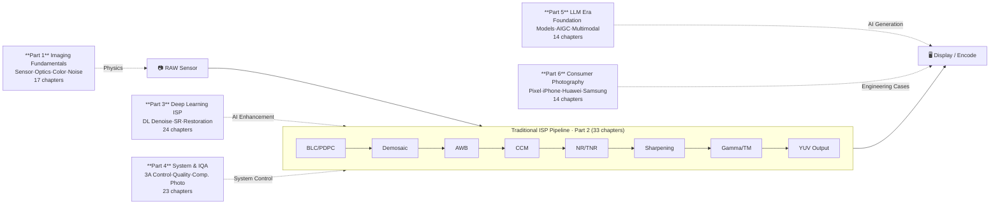
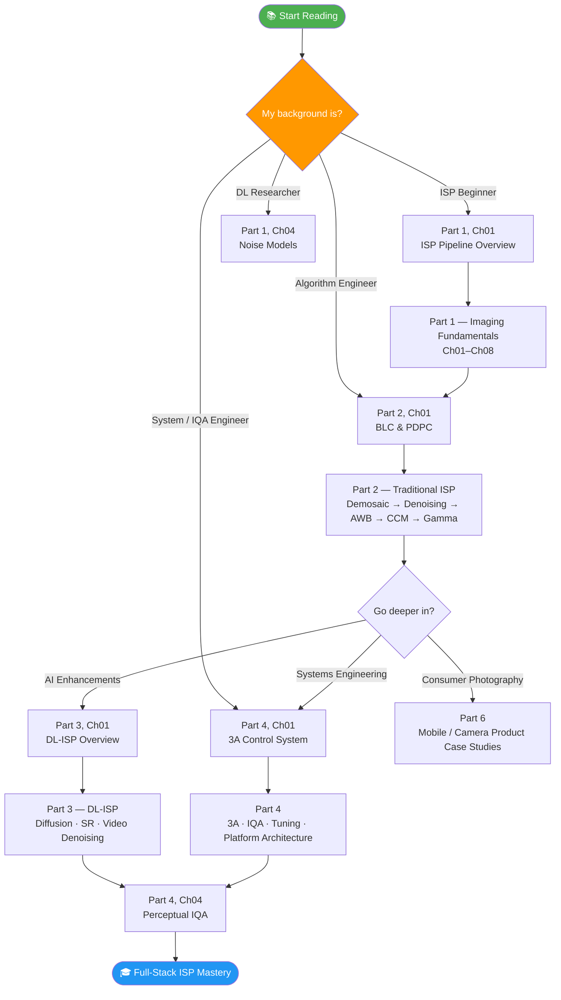

# ISP Algorithm Handbook

*中文名称：图像信号处理算法手册*

> Treating ISP as a rigorous, deployable systems-engineering discipline. · [Preface: Why this book exists →](PREFACE_en.md)

[](LICENSE)


-orange)
[](https://aiisp.github.io/isp_handbook/)
[](https://github.com/AIISP/isp_handbook/actions/workflows/docs.yml)

> **📌 Scope of this handbook**: This is a learning resource for ISP algorithm theory and system architecture — not a platform tuning manual. Every topic covered here is based on publicly published algorithm research, publicly verifiable engineering knowledge, and experiments reproducible on open hardware. The handbook does not contain any platform-internal parameters covered by NDA, proprietary tuning-tool workflows, or vendor know-how that is not public. That is both the boundary and the position.

> **Quick links for engineers already in the field:**
> 📊 [Engineering Numbers Quick Reference](ENGINEERING_NUMBERS.md) — 30+ threshold values, platform parameter names, quantization loss figures, all with source chapters. The most-bookmarked page in this handbook.
> 🐛 [Jump to artifact debug guide](part4_system_iqa/ch21_isp_artifact_debug/ch21_isp_artifact_debug_en.md) — symptom → root cause → fix, for common ISP bugs.

---

## 📢 Join & Contribute

> **This handbook is a living document — contributions of any size are welcome.**

### 🔬 Raspberry Pi Experiments: In Progress

All principle-verification code examples (BLC correction, AWB gray-world, LSC gain computation, Gamma curves, etc.) are being validated on a **Raspberry Pi 4B + IMX477 camera** to ensure reproducibility on real RAW data.

**Why Raspberry Pi, and not a phone or commercial platform?**

- **Phone platforms**: Accessing RAW data on a phone requires an OEM partnership agreement. ISP parameter files are NDA-protected. Any real-device measurements based on Qualcomm CamX / MTK FeaturePipe / HiSilicon Kirin ISP cannot be publicly reproduced, and legally cannot be shared openly.
- **Other embedded platforms** (RV1126, Jetson Nano): ISP tuning tools and parameter formats are likewise proprietary, and the hardware cost is higher than a Raspberry Pi.
- **Raspberry Pi + IMX477 HQ Camera**: RAW data is fully accessible via `libcamera-still --raw`; DNG files read directly with `rawpy`/`picamera2`; every algorithm in this handbook can be reproduced on Raspberry Pi OS. **Any reader can build an identical validation environment for under $100 — the only combination that satisfies all three requirements: open, reproducible, and license-free.**

Current status:
- ✅ Environment ready (LibCamera + RawPy + OpenCV on Raspberry Pi OS Bookworm)
- 🔄 Part 2 core modules under test (BLC → Demosaic → AWB → CCM → Gamma)
- ⏳ Pending: TNR, HDR merge, LSC gain map generation

Validated code and measurements will be added to individual chapters as they complete. The full-pipeline demo is in [QUICK_START.ipynb](QUICK_START.ipynb). **Engineers with Raspberry Pi + LibCamera experience are especially welcome to contribute PRs.**

---

### 🤝 Call for Domain Experts: Claim an "Engineering Notes" Section

Every chapter has an **Engineering Notes** block for tuning pitfalls, mass-production experience, and platform-specific differences — content that is not in textbooks and is hardest to produce without real-world experience.

**If you have hands-on experience in any of the following areas, please claim a chapter:**

| Domain | Relevant Chapters | Current Gap |
|--------|------------------|-------------|
| Qualcomm Spectra ISP tuning (Chromatix) | Part 2, Ch01–Ch17 (any) | Engineering notes missing |
| MTK Imagiq NDD tuning | Part 2 AWB / TNR / CCM | Engineering notes missing |
| Multi-camera alignment & fusion | Part 2 Ch22, Part 4 Ch14 | Engineering notes missing |
| DL model NPU quantization (SNPE / NeuroPilot / ARM NN) | Part 3 Ch14, Part 5 Ch13 | Real quantization benchmark missing |
| 3A control systems (AE / AF engineering) | Part 4 Ch01–Ch03 | Platform-level implementation notes needed |
| Imatest / ISO 12233 lab measurements | Part 4 Ch10, Appendix B | Real measurement step-by-step needed |
| Video ISP real-time constraints (DRAM bandwidth / latency) | Part 4 Ch15–16 | Quantitative analysis needed |

**How to claim:** Post in [Discussions](https://github.com/AIISP/isp_handbook/discussions) or open an Issue stating which chapter you'd like to contribute to. Contributors are credited inline as "Engineering Notes: Author@GitHub".

---

### ⚠️ Part 5 Notice: Trend Tracking, Engineering Validation Incomplete

**Part 5 (LLM Era, Ch01–Ch14) is intended as a trend-tracking resource**, not an engineering practice guide.

The content describes 2023–2025 academic developments at the intersection of LLMs/AIGC and ISP. Practical deployment validation is not yet complete:

- The LLM × vision space advances rapidly; some details in this initial release may already be outdated
- Chapters marked 📚 Survey are academic background reading — use them alongside the latest arXiv and conference papers
- Chapters marked 🔧 Engineering (e.g., Ch03 LLM-Assisted ISP Tuning, Ch06 Prompt-Driven Parameter Generation) have practical reference value but remain in early-exploration territory; real-world viability depends heavily on deployment context

**We actively invite engineers and researchers with hands-on LLM × ISP experience to contribute.** Join the discussion in [Discussions](https://github.com/AIISP/isp_handbook/discussions) or submit a PR directly. Part 5 is where community expertise matters most.

---

## What This Handbook Covers



---

## Start Here — Find Your Chapter in 3 Minutes

**Pick the path that matches your current situation:**

---

### → I'm new to camera / ISP and want a solid foundation

```
Part 1, Ch01 (ISP Pipeline Overview)
  → Part 1, Ch03 (Sensor Physics)
  → Part 1, Ch05 (Color Science)
  → Part 2, Ch01–09 (BLC → AWB, the 9 core traditional ISP modules)
```
After this path you'll understand every step from RAW to JPEG — and *why* each step exists.

---

### → I'm debugging a specific problem right now

**Jump directly to the relevant chapter:**

| Symptom | Go to |
|---------|-------|
| AWB yellow/green cast indoors | [Part 2 Ch05 AWB](part2_traditional_isp/ch05_awb/ch05_awb_en.md) |
| TNR motion ghost / trailing | [Part 2 Ch12 Temporal NR](part2_traditional_isp/ch12_temporal_nr/ch12_temporal_nr_en.md) |
| Edge ringing / over-sharpening | [Part 2 Ch04 Sharpening](part2_traditional_isp/ch04_sharpening/ch04_sharpening_en.md) |
| Waxy / plastic skin after NR | [Part 2 Ch03 Denoising](part2_traditional_isp/ch03_denoising/ch03_denoising_en.md) |
| HDR merge ghosting | [Part 2 Ch10 HDR Merge](part2_traditional_isp/ch10_hdr_merge/ch10_hdr_merge_en.md) |
| BLC global color cast | [Part 2 Ch01 BLC & PDPC](part2_traditional_isp/ch01_blc_pdpc/ch01_blc_pdpc_en.md) |
| Don't know which module caused the bug | [Part 4 Ch21 Artifact Debug](part4_system_iqa/ch21_isp_artifact_debug/ch21_isp_artifact_debug_en.md) ← **start here** |
| Tuning keeps going in circles | [Part 4 Ch17 Tuning Workflow](part4_system_iqa/ch17_isp_tuning_workflow/ch17_isp_tuning_workflow_en.md) |

---

### → I want to understand how AI-ISP actually lands on a phone

```
Part 3, Ch01 (DL-ISP Overview)
  → Part 3, Ch14 (On-device NPU Deployment & Quantization)
  → Part 4, Ch17 (Tuning Workflow: how DL modules enter mass production)
  → Part 6, Ch02 (Google Night Sight — real engineering deep-dive)
  → Part 6, Ch03 (Apple Deep Fusion architecture)
```

---

## Run Code Now — No Install Required

**New here? Start with the Quick Start notebook:**

[](https://colab.research.google.com/github/AIISP/isp_handbook/blob/main/QUICK_START.ipynb)
**[QUICK_START.ipynb](QUICK_START.ipynb)** — Synthetic RAW → JPEG in one notebook. Runs locally or in Colab. No camera required. Each pipeline step links to its chapter.

---

| Chapter | Topic | Open in Colab |
|---------|-------|---------------|
| **Quick Start** | **Full RAW→JPEG pipeline demo** | [](https://colab.research.google.com/github/AIISP/isp_handbook/blob/main/QUICK_START.ipynb) |
| Part 1 Ch01 | ISP pipeline end-to-end demo | [](https://colab.research.google.com/github/AIISP/isp_handbook/blob/main/part1_imaging_fundamentals/ch01_isp_pipeline_overview/ch01_pipeline_notebook.ipynb) |
| Part 2 Ch02 | Demosaic comparison (bilinear / AHD) | [](https://colab.research.google.com/github/AIISP/isp_handbook/blob/main/part2_traditional_isp/ch02_demosaic/ch02_demosaic_notebook.ipynb) |
| Part 2 Ch05 | AWB Gray World / Bayesian experiment | [](https://colab.research.google.com/github/AIISP/isp_handbook/blob/main/part2_traditional_isp/ch05_awb/ch05_awb_notebook.ipynb) |
| Part 2 Ch07 | Gamma / tone mapping curves | [](https://colab.research.google.com/github/AIISP/isp_handbook/blob/main/part2_traditional_isp/ch07_gamma_tonemapping/ch07_gamma_tonemapping_notebook.ipynb) |
| Part 3 Ch03 | Super-resolution: interpolation vs. learning | [](https://colab.research.google.com/github/AIISP/isp_handbook/blob/main/part3_dl_isp/ch03_super_resolution/ch03_sr_notebook.ipynb) |
| Part 4 Ch01 | 3A control loop simulation | [](https://colab.research.google.com/github/AIISP/isp_handbook/blob/main/part4_system_iqa/ch01_3a_system/ch01_3a_notebook.ipynb) |

Local setup:
```bash
# Option A — conda (recommended, handles PyTorch CUDA automatically)
conda env create -f environment.yml
conda activate isp
jupyter lab

# Option B — pip only
pip install -r requirements.txt
jupyter lab
```

### Build the documentation site locally

```bash
pip install -r requirements-docs.txt
mkdocs serve          # live preview at http://127.0.0.1:8000
mkdocs build --strict # strict build to validate all links and formatting
```

---

## Introduction

An open-source handbook covering Image Signal Processing (ISP) from first principles to LLM-era methods. Written for engineers who need to understand not just *what* algorithms do, but *why* they work, *how* to calibrate them, and *where* they break.

**Coverage:** 6 volumes, 125 chapters (bilingual Chinese + English). Each chapter follows a consistent 8-section template:
§1 Theory → §2 Calibration/Methods → §3 Tuning → §4 Artifacts → §5 Evaluation → §6 Code → References → §8 Glossary.

**Audience:** Algorithm engineers, deep learning researchers, system designers, and IQA practitioners.

**Language:** English + Chinese (`_en.md` English + `_ch.md` Chinese; math and code are identical in both).

### Why This Handbook Exists

The ISP field has long lacked beginner-friendly technical documentation. Engineers joining a new team typically receive platform documents structured as *"what's new in version N"* — they describe features added, but rarely explain *why* the algorithm evolved to its current form. The story of how demosaic progressed from bilinear interpolation to edge-aware AHD, or how denoising evolved from bilateral filtering to Transformers, is almost impossible to reconstruct from commercial documentation alone.

Out of information-security constraints, this handbook contains **no** proprietary tuning values, production-calibration data, or undisclosed commercial trade secrets. The focus is on **universal principles and public implementations**, drawing from open-source platforms (Qualcomm CamX/CHI-CDK, OpenHarmony, AOSP) and peer-reviewed literature. This positioning fills the gap between textbook theory and commercial platform documentation: when a reader later encounters a real production platform's documentation, they can quickly distinguish standard algorithmic implementations from a platform's proprietary optimizations — dramatically reducing on-boarding time. All platform-specific content in this handbook comes from official public documentation, open-source code, or published papers.

> **Chapter numbering note:** Numbers are intentionally non-consecutive — each volume reserves a wide range so new chapters can be inserted without renumbering. Where a directory name differs from the logical chapter number, a `Dir` column is provided in the chapter table.

---

## Chapter Status — v0.1 Public Beta

This is the **first community review release** of the handbook, not a final edition. All 125 chapters are published. The designation "v0.1 public beta" is intentional — it sets an honest expectation that this is an open, evolving resource rather than a closed authoritative reference.

Completed:
- Core pipeline chapters (Part 2 Ch01–17, Part 4 Ch01–23, Part 6) have gone through multiple rounds of technical review; key engineering numbers carry provenance labels (`[official documentation]` / `[paper results]` / `[author experience, community validation needed]` / `[pending measurement]`)
- P0/P1 factual errors corrected — see [CHANGELOG.md](CHANGELOG.md) for details

Still in progress (contributions welcome):
- 27 stub placeholder PNG images need replacement with real diagrams (`find . -name "*.png" -size 20498c`)
- Part 4 / 5 / 6 English translations at ~70% coverage
- Engineering parameters labeled "author experience, community validation needed" are waiting for real measurement data

See [ROADMAP.md](ROADMAP.md) for the full improvement plan.

---

## Table of Contents

| Volume | Content | Chapter Range |
|--------|---------|---------------|
| Part 1 — Imaging Fundamentals | Optics, sensors, noise models, color science, RAW format, dynamic range, HDR, pipeline overview, camera system calibration, depth sensing, Pixel Binning | Ch01–Ch17 (published; Ch13–Ch16 are optional reading) |
| Part 2 — Traditional ISP Algorithms | BLC, PDPC, Demosaic, Denoising, Sharpening, AWB, CCM, Gamma, TMO, LSC, CSC, HDR Merge, Video Color Metadata, WCG/HDR Pipeline, EIS, Chromatic Aberration, Night Mode, Bokeh, Anti-Banding, ISP Calibration, Automotive ISP, RAW Video | Ch01–Ch33 (31 pipeline chapters + ch32/ch33 guide documents) |
| Part 3 — Deep Learning ISP | DL overview, end-to-end restoration, SR, style transfer, LLIE, AI TMO, diffusion, video denoising, compressed sensing, video ISP, DL burst night mode, neural bokeh, on-device deployment | Ch01–Ch24 (published) |
| Part 4 — System Engineering & IQA | 3A control, AE/AF/AWB, computational photography, FR/NR/blind IQA, task-driven ISP, ISP testing toolchain, HVS models, multi-camera architecture, real-time constraints, HAL architecture, scene-adaptive parameter switching | Ch01–Ch23 (published) |
| Part 5 — LLM Era Imaging | Foundation models, AIGC, LLM-assisted ISP tuning, multimodal models, text-guided restoration, RAW foundation models, synthetic data, edge AI deployment | Ch01–Ch14 (published) |
| Part 6 — Consumer Photography & Mobile Algorithm Revolution | Photography history, Night Sight / Deep Fusion / RYYB deep dives, mobile ISP chip comparison, Portrait Mode comparison, smartphone video ISP, computational zoom, future imaging | Ch01–Ch14 (published) |
| Appendices | Math foundations, calibration cards, SoC comparison, open-source tools, datasets, benchmarks, notation, references, environment setup | App A–J |

---

## Quick Start

### Learning Path Navigator



### Text-Based Path Guide

### Algorithm Engineer
Start from **Part 2, Ch01 (BLC)** and read through the ISP pipeline in order. Each chapter is self-contained; feel free to jump around as needed.

### DL Researcher
Recommended path: **Part 1, Ch04 Noise Models** → **Part 1, Ch05 Color Science Basics** → **All of Part 3 DL ISP**.
For IQA metric background, read the Perceptual IQA chapters in Part 4 first.

### System Designer / IQA Engineer
Start with **Part 1, Ch01 ISP Pipeline Overview** to build a global picture, then proceed to **Part 4 (3A + IQA)**. Appendix B (Calibration Cards) and Appendix E (Datasets) are frequent references.

---

## Code Notes

> **About code in this repository:**
>
> - Some chapters involve substantial code (e.g., DL model training, large dataset processing) that is not suitable for inlining into this document repo. These will be supplemented as standalone code repositories — stay tuned.
> - For **principle-verification code examples** (e.g., BLC correction, LSC gain computation, AWB gray-world algorithm), we plan to validate using a **Raspberry Pi 4B + IMX477 camera** to ensure the code runs in a real RAW image pipeline. This validation is ongoing and will be added to each chapter when complete.
> - Existing code examples in the repository (`.ipynb` files and scripts under `code/`) are provided for reference and are mostly runnable. Feel free to open an Issue to report bugs.

## Installation

```bash
# Option A — conda (recommended)
conda env create -f environment.yml
conda activate isp

# Option B — pip only
pip install -r requirements.txt
```

All dependencies are pinned in [`requirements.txt`](requirements.txt) (pip) and [`environment.yml`](environment.yml) (conda). The conda option handles PyTorch CUDA vs CPU variants automatically.

---

## Engineering Quick Reference

📊 **[Engineering Numbers Quick Reference →](ENGINEERING_NUMBERS.md)**  30+ key engineering numbers from across the handbook (alignment error thresholds, quantization loss, AE tolerance, PDAF accuracy degradation…), each with source chapter. Screenshot-friendly.

**The single most-bookmarked page in this handbook.** Platform parameter names extracted from all Part 2 chapters — copy-pasteable into tuning tools.

> Parameter names are engineering reference names based on Chromatix / NDD tuning systems. Actual names vary by BSP version — always verify against your platform's SDK documentation.

### ISP Module × Platform Parameter Cheat Sheet

| Module | Function | Qualcomm (Chromatix) | MTK (NDD/Imagiq) | HiSilicon (Kirin) |
|--------|----------|---------------------|------------------|-------------------|
| **BLC/DPC** | DPC static map | `BPC_StaticMap` (TuningManager) | `pdpc_map_file` | EEPROM-loaded |
| | OB per-channel | `BLS_OB_Level[R/Gr/Gb/B]` | `OB_offset_R/Gr/Gb/B` | `ISP_OB_Level[]` |
| **Spatial NR** | Enable | `ANR_Enable` | `NREnabled` | `SNR_Enable` |
| | Luma strength | `ANR_LumaFilter` (LUT/ISO) | `NRLumaStrength[ISOLevel]` | `SNR_LumaStrength` |
| | Chroma strength | `ANR_ChromaFilter` (LUT/ISO) | `NRChromaStrength[ISOLevel]` | `SNR_ChromaStrength` |
| | Texture threshold | `ANR_TextureThreshold` | `NRTextureProtectThr` | `SNR_TextureMask` |
| | Skin protection | `ANR_SkinEnable` + `ANR_SkinMask` | `NRSkinProtect` | `SNR_FaceSkinProtect` |
| | ISO adaptive LUT | `ANR_ISOAutoTable` (Chromatix XML) | `NRISOTable` (NDD array) | `SNR_ISOParam[]` |
| **HNR** (845/865+) | Enable | `HNR_Enable` | — | — |
| | DCT threshold | `HNR_DCT_Threshold` | — | — |
| | Blend ratio | `HNR_Blend_Ratio` | — | — |
| **Sharpening (EE)** | Enable | `EE_Enable` | `EEEnabled` | `EE_Enable` |
| | USM strength | `EE_Gain` (0–4.0, LUT/ISO) | `EEStrength[ISOLevel]` | `EE_Strength` |
| | Overshoot limit | `EE_OvershotThreshold` (DN) | `EEOvershotLimit` | `EE_OvershotClamp` |
| | Texture threshold | `EE_TextureThreshold` | `EETextureThr` | `EE_TextureMask` |
| | Skin reduce | `EE_SkinEnable` + `EE_SkinGainScale` | `EESkinProtect` | `EE_FaceSkinReduce` |
| | Chroma sharpening | `EE_ChromaEnable` | `EEChromaEnable` | `EE_ChromaSharpEnable` |
| **AWB** | R/B gain | `AWB_GainR` / `AWB_GainB` | `NDD_AWBGainR/B` | `ISP_AWB_RGain/BGain` |
| | CCT range | `AWB_CCTLow` / `AWB_CCTHigh` | `AWBCCTRange[min,max]` | `AWB_CCTClampMin/Max` |
| | Temporal smoothing | `AWBDecay` (0.0–1.0) | `AWBTemporalFilter` | `AWB_StabilizeWeight` |
| | Valid pixel range | `AWB_LumaLow/High` | `AWBPixelMaskLuma` | `AWB_ValidPixelRange` |
| | Multi-illuminant | `AWB_MultiIlluminantEnable` | `AWBMultiIlluminant` | `AWB_MultiLightEnable` |
| | Memory color (MCE) | `MCE_Enable` + Cb-Cr zone | `DAY_LOCUS_OFFSET` | `ISP_MCE_Enable` |
| **CCM** | 3×3 matrix | `CCM_ColorCorrectionMatrix` | `CCM_Matrix[9]` | `ISP_CCM_Matrix` |
| | Offset | `CCM_Offset[3]` | `CCM_Offset[3]` | `ISP_CCM_Bias[3]` |
| | Saturation scale | `ColorCorrectionSaturation` | `CCM_Saturation` (0–2.0) | `CCM_SatScale` |
| **Gamma / TM** | LUT | `GammaTable[256]` | `GammaCurveTable` | `ISP_Gamma_LUT[1024]` |
| | Scene mode switch | `GammaSceneMode` | `GammaMode` | `ISP_TM_Mode` |
| | Shadow boost | `ShadowBoost` (0–2.0) | `Shadow_Enhancement` | `ISP_Shadow_Gain` |
| | Adaptive gamma | `ADRC_Enable` (GTM module) | `AdaptiveGamma_Enable` | `ISP_AGCC_Enable` |
| | Highlight suppression | `HighlightSuppression` (0–1.0) | `HLR_Strength` | `ISP_HL_Protection` |
| **LSC** | Enable | `LSC_Enable` | `LSCEnabled` | `LSC_Enable` |
| | Grid size | `LSC_MeshGridWidth/Height` | `LSCMeshWidth/Height` | `LSC_GridSize` |
| | Gain table | `LSC_R/Gr/Gb/B_gain[m×n]` | `LSCGainR/Gr/Gb/B[row][col]` | `LSC_GainTable_R/Gr/Gb/B` |
| | Max gain clamp | `LSC_MaxGain` | `LSCMaxGain` (default 4.0) | `LSC_MaxGainClamp` |
| | CCT interpolation | `LSC_CCT_tables[]` (5–8 nodes) | `LSCIlluminantTable[N_CCT]` | `LSC_IlluminantGains[N]` |
| **TNR** | Enable | `TNR_Enable` | `TNREnable` | `TNR_Enable` |
| | Motion threshold | `TNR_MotionThreshold[ISOTable]` | `TNRMotionThr[ISOLevel]` | `TNR_MotionDetectThresh` |
| | Blend min α | `TNR_AlphaMin` (0–1) | `TNRAlphaMin` | `TNR_StaticBlendRatio` |
| | Blend max α | `TNR_AlphaMax` (0–1) | `TNRAlphaMax` | `TNR_MotionBlendRatio` |
| | Luma strength | `TNR_LumaStrength[ISOTable]` | `TNRLumaStrength[ISOLevel]` | `TNR_LumaFilterStrength` |
| | Chroma strength | `TNR_ChromaStrength[ISOTable]` | `TNRChromaStrength[ISOLevel]` | `TNR_ChromaFilterStrength` |
| | Block size | `TNR_BlockSize` (8/16/32 px) | `TNRBlockSize` | `TNR_MEBlockSize` |
| | EIS integration | `TNR_UseEISHint = 1` (865+) | `TNRBeforeEIS` | `TNR_EISOrder` |
| **HDR Merge** | Staggered HDR | SHDR (2–3 frames, BPS) | DOL-HDR (2–3 frames) | ZHDR / LS-HDR |
| | Multi-frame HDR | MFHDR (≤9 frames) | MFHDR (3 frames) | XD-Fusion HDR |
| | Ghost threshold | `HDR_Ghost_Threshold` | `HDR_Motion_Threshold` | NPU segmentation |
| | Local TM | LTM (block-adaptive) | Bilateral-guided LTM | Laplacian pyramid |

**Chapter cross-references:** Each row maps to detailed explanations in Part 2:
[Ch01 BLC/DPC](part2_traditional_isp/ch01_blc_pdpc/ch01_blc_pdpc_en.md) · [Ch02 Demosaic](part2_traditional_isp/ch02_demosaic/ch02_demosaic_en.md) · [Ch03 NR](part2_traditional_isp/ch03_denoising/ch03_denoising_en.md) · [Ch04 Sharpening](part2_traditional_isp/ch04_sharpening/ch04_sharpening_en.md) · [Ch05 AWB](part2_traditional_isp/ch05_awb/ch05_awb_en.md) · [Ch06 CCM](part2_traditional_isp/ch06_ccm/ch06_ccm_en.md) · [Ch07 Gamma](part2_traditional_isp/ch07_gamma_tonemapping/ch07_gamma_tonemapping_en.md) · [Ch08 LSC](part2_traditional_isp/ch08_lsc/ch08_lsc_en.md) · [Ch10 HDR](part2_traditional_isp/ch10_hdr_merge/ch10_hdr_merge_en.md) · [Ch12 TNR](part2_traditional_isp/ch12_temporal_nr/ch12_temporal_nr_en.md)

---

### Artifact → Root Cause → Chapter Quick Reference

When you see a visual defect, find the cause and the fix in one lookup:

| Symptom | Root Cause | Module | Fix Direction | Chapter |
|---------|-----------|--------|---------------|---------|
| Shadow color cast (blue/red tint) | Wrong OB offset | BLC | Re-calibrate per temperature | [Ch01](part2_traditional_isp/ch01_blc_pdpc/ch01_blc_pdpc_en.md) |
| Zipper / false color at edges | Demosaic direction error | Demosaic | Reduce edge threshold; check RAW NR order | [Ch02](part2_traditional_isp/ch02_demosaic/ch02_demosaic_en.md) |
| Waxy / plastic skin after NR | Over-smoothing | Spatial NR | Lower `ANR_LumaFilter`; raise texture threshold | [Ch03](part2_traditional_isp/ch03_denoising/ch03_denoising_en.md) |
| White ringing at edges | Over-sharpening | EE | Lower `EE_Gain`; add overshoot clamp | [Ch04](part2_traditional_isp/ch04_sharpening/ch04_sharpening_en.md) |
| AWB green/yellow cast indoors | Missing A-light prior | AWB | Add incandescent illuminant to CCT table | [Ch05](part2_traditional_isp/ch05_awb/ch05_awb_en.md) |
| Lens vignetting (dark corners) | LSC not applied / gain too low | LSC | Re-calibrate uniform-field gain map | [Ch08](part2_traditional_isp/ch08_lsc/ch08_lsc_en.md) |
| Motion ghost in TNR | ME failure on fast motion | TNR | Raise `TNR_MotionThreshold`; reduce `AlphaMax` | [Ch12](part2_traditional_isp/ch12_temporal_nr/ch12_temporal_nr_en.md) |
| HDR ghost / smear on moving objects | Ghost threshold too permissive | HDR Merge | Lower `HDR_Ghost_Threshold`; prefer short-exp | [Ch10](part2_traditional_isp/ch10_hdr_merge/ch10_hdr_merge_en.md) |
| Banding in sky gradients | Gamma LUT resolution too low | Gamma | Use 1024-entry LUT; smooth interpolation | [Ch07](part2_traditional_isp/ch07_gamma_tonemapping/ch07_gamma_tonemapping_en.md) |
| Color bleeding at edges | Strong chroma NR across edges | Spatial NR | Use luma-guided chroma filter | [Ch03](part2_traditional_isp/ch03_denoising/ch03_denoising_en.md) |
| Unknown artifact / can't isolate module | — | — | Use systematic artifact isolation | [Ch21 Artifact Debug](part4_system_iqa/ch21_isp_artifact_debug/ch21_isp_artifact_debug_en.md) |

---

### Key Industry Numbers (Verified)

| Metric | Typical Value | Notes |
|--------|--------------|-------|
| TNR/HDR alignment error limit | ≤ 0.25 px | SNR gain halves at > 0.5 px misalignment |
| PDAF accuracy degradation (low light) | ±1μm → ±5–8μm | ~5× worse below EV 3 |
| EIS crop ratio | 10–20% | Effective FOV reduction |
| INT8 quantization loss (sensitive layers) | 0.3–0.8 dB PSNR | Last layer most sensitive |
| Anti-banding constraint | 10ms multiples (50Hz) / 8.33ms (60Hz) | China/Europe 50Hz; US 60Hz |
| AE Tolerance (anti-breathing) | ±3–5% | Prevents oscillation in stable scenes |
| Snapdragon 8 Gen 3 NPU | ~34 TOPS (est.) | Third-party estimates; Qualcomm publishes no phone-chip integer |
| Snapdragon 8 Elite NPU | ~49 TOPS (est.) | Same caveat |
| ΔE00 target (color accuracy) | < 2.0 | CIEDE2000; above 3.0 is visible to trained observers |

---

## Chapter List

> Chapter numbers are **non-consecutive by design** — gaps are intentional expansion slots.
> The `Dir` column shows the actual directory name (for completed chapters where it differs from the chapter number).

### Part 1 — Imaging Fundamentals (Ch01–Ch17)

| Ch | Title | Dir | Status |
|----|-------|-----|--------|
| 01 | ISP Pipeline Overview | ch01_isp_pipeline_overview | ✅ Initial |
| 02 | Optics Basics | ch02_optics_basics | ✅ Initial |
| 03 | Image Sensor Physics | ch03_sensor_physics | ✅ Initial |
| 04 | Noise Models (Poisson-Gaussian) | ch04_noise_models | ✅ Initial |
| 05 | Color Science Basics | ch05_color_science_basics | ✅ Initial |
| 06 | RAW Format & CFA Patterns | ch06_raw_format_bayer | ✅ Initial |
| 07 | Dynamic Range & HDR Algorithms | ch07_dynamic_range_hdr | ✅ Initial |
| 08 | Optics Aberrations, Lens Characteristics & Calibration Light Sources | ch08_optics_aberrations | ✅ Initial |
| 09 | Camera System Calibration (Geometric, Radiometric & Photometric) | ch09_camera_calibration | ✅ Initial |
| 10 | ISP SoC Hardware Architecture (FPGA/ASIC/NPU) | ch10_soc_hardware | ✅ Initial (see also Part 4, Ch12; Part 1 covers hardware fundamentals, Part 4 covers software architecture) |
| 11 | Metamerism, Standard Observer & Color Appearance Models | ch11_metamerism | ✅ Initial |
| 12 | Depth Sensing: Structured Light, ToF & Stereo Vision | ch12_depth_sensing | ✅ Initial |
| 13 | Plenoptic & Computational Optics | ch13_plenoptic | ✅ Initial (Optional; content also in Appendix I) |
| 14 | Hyperspectral & Multi-Spectral Imaging | ch14_hyperspectral | ✅ Initial (Optional; content also in Appendix I) |
| 15 | Lensless & Computational Aperture Systems | ch15_lensless | ✅ Initial (Optional; content also in Appendix I) |
| 16 | Neuromorphic & Event-Driven Imaging | ch16_neuromorphic | ✅ Initial (Optional; content also in Appendix I) |
| 17 | Sensor Pixel Binning Mechanisms & ISP Adaptation | ch17_sensor_binning | ✅ Initial |

### Part 2 — Traditional ISP Algorithms (Ch01–Ch31)

| Ch | Title | Dir | Status |
|----|-------|-----|--------|
| 01 | Black Level Correction & Pixel Defect Correction (BLC & PDPC) | ch01_blc_pdpc | ✅ Initial |
| 02 | Demosaic (Bayer Interpolation) | ch02_demosaic | ✅ Initial |
| 03 | Image Denoising | ch03_denoising | ✅ Initial |
| 04 | Sharpening & Edge Enhancement | ch04_sharpening | ✅ Initial |
| 05 | Auto White Balance (AWB) | ch05_awb | ✅ Initial |
| 06 | Color Correction Matrix (CCM) | ch06_ccm | ✅ Initial |
| 07 | Gamma Correction & Tone Mapping | ch07_gamma_tonemapping | ✅ Initial |
| 08 | Lens Shading Correction (LSC) | ch08_lsc | ✅ Initial |
| 09 | Color Space Conversion & Output (CSC) | ch09_csc_output | ✅ Initial |
| 10 | HDR Capture & Exposure Merging | ch10_hdr_merge | ✅ Initial |
| 11 | Color Enhancement & Saturation Adjustment | ch11_color_enhancement | ✅ Initial |
| 12 | Temporal Noise Reduction for Video | ch12_temporal_nr | ✅ Initial |
| 13 | Digital Zoom & Image Resampling | ch13_digital_zoom | ✅ Initial |
| 14 | Face Detection & Skin Enhancement | ch14_face_skin_enhancement | ✅ Initial |
| 15 | Geometric Distortion Correction | ch15_distortion_correction | ✅ Initial |
| 16 | JPEG/HEIF/AVIF Encoding Pipeline | ch16_jpeg_heif_encoding | ✅ Initial |
| 17 | Scene Luminance Analysis & Perceptual Metering | ch17_luminance_metering | ✅ Initial |
| 18 | Local Tone Mapping Algorithms | ch18_local_tonemapping | ✅ Initial |
| 19 | HDR Display Signal Chain (PQ / HLG / Dolby Vision) | ch19_hdr_display_pipeline | ✅ Initial |
| 20 | Video Color Metadata & Signaling | ch20_video_color_metadata | ✅ Initial |
| 21 | Wide Color Gamut & HDR Color Pipeline (WCG) | ch21_wide_color_gamut | ✅ Initial |
| 22 | Multi-Camera Fusion & Stitching | ch22_multi_camera_fusion | ✅ Initial |
| 23 | Electronic Image Stabilization (EIS) & OIS Feedback Loop | ch23_eis_ois | ✅ Initial |
| 24 | Chromatic Aberration Correction (Lateral TCA & Axial LCA) | ch24_chromatic_aberration | ✅ Initial |
| 25 | RAW Video & Cinema ISP Pipeline | ch25_raw_video_cinema | ✅ Initial |
| 26 | Multi-Frame Burst & Night Mode (traditional; DL variant → Part 3, Ch11) | ch26_burst_night_mode | ✅ Initial |
| 27 | Computational Bokeh & Portrait Mode Rendering | ch27_bokeh_portrait | ✅ Initial |
| 28 | Anti-Banding & Fluorescent Flicker Suppression | ch28_anti_banding | ✅ Initial |
| 29 | ISP for Automotive / Industrial Sensors | ch29_automotive_isp | ✅ Initial |
| 30 | ISP Pipeline Calibration & Validation Methodology | ch30_isp_calibration | ✅ Initial |
| 31 | ISP Bring-up Practical Guide | ch31_isp_bringup | ✅ Initial |

**Part 2 Navigation Documents (non-chapter, cross-volume reading guides):**

| Doc | Description | Dir | Status |
|-----|------------|-----|--------|
| 📌 HDR Reading Guide | Cross-volume HDR learning path (preface-style, no new technical content) | ch32_hdr_reading_guide | ✅ Initial |
| 📌 Video ISP Overview | Part 2 video ISP synthesis guide (see scope note below) | ch33_video_isp_overview | ✅ Initial |

> **ch33 vs Part 3, Ch11 (Video ISP) scope note:**
> - **ch33_video_isp_overview (Part 2):** Traditional video ISP pipeline survey covering frame rate, resolution, temporal NR, and video encoding — a consolidation guide for readers finishing Part 2; no new algorithm derivations.
> - **Part 3, Ch11 ch11_video_isp:** DL-driven video ISP focusing on deep learning end-to-end video restoration, neural-network-based video denoising, and DL implementations of motion estimation and frame alignment.
> - The two are complementary with no substantive content overlap.

### Part 3 — Deep Learning ISP (Ch01–Ch24)

| Ch | Title | Dir | Status |
|----|-------|-----|--------|
| 01 | DL ISP Overview | ch01_dl_overview | ✅ Initial |
| 02 | End-to-End Image Restoration (RGB-domain general restoration; RAW-domain DL denoising → Part 3, Ch20) | ch02_e2e_restoration | ✅ Initial |
| 03 | Super Resolution | ch03_super_resolution | ✅ Initial |
| 04 | Style Transfer & Automated Photo Editing | ch04_style_transfer | ✅ Initial |
| 05 | Low-Light Image Enhancement (LLIE) | ch05_llie | ✅ Initial |
| 06 | AI-Driven Tone Mapping (Deep TMO) | ch06_ai_tonemapping | ✅ Initial |
| 07 | Diffusion Models for Image Restoration | ch07_diffusion_restoration | ✅ Initial |
| 08 | DL Video Denoising & Video ISP | ch08_video_denoising | ✅ Initial |
| 09 | Compressed Sensing & DL Image Restoration | ch09_compressed_sensing | ✅ Initial |
| 10 | Deep Learning-Based Video ISP | ch10_video_isp | ✅ Initial |
| 11 | DL Burst Denoising & Multi-Frame Night Mode (§3 focuses on traditional alignment + DL denoising hybrid pipelines) | ch11_burst_dl_night | ✅ Initial |
| 12 | DL-Based Video Stabilization & Temporal Alignment | ch12_dl_video_stabilization | ✅ Initial |
| 13 | Neural Bokeh & Semantic Depth-of-Field Estimation | ch13_neural_bokeh | ✅ Initial |
| 14 | On-Device Neural ISP: NPU Deployment & Quantization | ch14_on_device_npu | ✅ Initial |
| 15 | NeRF / 3DGS in Computational Imaging | ch15_nerf_3dgs | ✅ Initial |
| 16 | Generative Models for RAW-to-RGB Neural Rendering | ch16_generative_raw_rgb | ✅ Initial |
| 17 | Self-Supervised & Unsupervised ISP Learning | ch17_self_supervised_isp | ✅ Initial |
| 18 | All-in-One Unified Image Restoration (TPAMI 2025) | ch18_all_in_one_restoration | ✅ Initial |
| 19 | Invertible Image Signal Processing | ch19_invertible_isp | ✅ Initial |
| 20 | Deep Learning Image Denoising Survey (RAW + RGB; DnCNN/FFDNet/CBDNet/NAFNet/Restormer, self-supervised denoising, diffusion denoising, NPU deployment) | ch20_dl_denoising_overview | ✅ Initial |
| 21 | DL Single-Image Denoising (Methods Overview) | ch21_image_denoising_dl | ✅ Initial (content merged into Part 3, Ch20; this chapter serves as a navigation redirect) |
| 22 | Multi-Degradation Unified Image Restoration (All-Weather) | ch22_universal_restoration | ✅ Initial |
| 23 | AI-Personalized Photo Retouching (Reference-Based) | ch23_reference_retouching | ✅ Initial |
| 24 | Neural ISP Pipeline (End-to-End Learning from RAW to RGB) | ch24_neural_isp_pipeline | ✅ Initial |

> **Note:** No-reference image quality assessment (Blind IQA) has been moved to Part 4; see Part 4, Ch05.

### Part 4 — System Engineering & IQA (Ch01–Ch23)

| Ch | Title | Dir | Status |
|----|-------|-----|--------|
| 01 | 3A Control System (Traditional + AI) | ch01_3a_system | ✅ Initial |
| 02 | Auto Exposure Algorithm Deep Dive | ch02_ae_fundamentals | ✅ Initial |
| 03 | Auto Focus Algorithm Deep Dive | ch03_af_fundamentals | ✅ Initial |
| 04 | Perceptual IQA (FR-IQA: SSIM / LPIPS / DISTS) | ch04_perceptual_iqa | ✅ Initial |
| 05 | Blind IQA — DL-Based & VLM-IQA | ch05_blind_iqa | ✅ Initial (migrated from Part 3; forms continuous IQA module with Ch04/Ch08/Ch11) |
| 06 | Task-Driven ISP for Machine Vision | ch06_task_driven_isp | ✅ Initial |
| 07 | Computational Photography | ch07_computational_photography | ✅ Initial |
| 08 | IQA System (FR-IQA / NR-IQA Automation Engineering; algorithm fundamentals → Ch04/Ch05) | ch08_iqa_system | ✅ Initial |
| 09 | 3A Advanced Topics (Multi-Camera Sync / PDAF Degradation / Loop Coupling) | ch09_3a_advanced_topics | ✅ Initial |
| 10 | ISP Testing & IQA Toolchain (Imatest / OpenCV / Custom Charts) | ch10_isp_testing_toolchain | ✅ Initial |
| 11 | Human Visual System (HVS) Models & Perceptual ISP Design | ch11_hvs_models | ✅ Initial |
| 12 | ISP SoC Hardware Architecture (FPGA/ASIC/NPU) | ch12_soc_hardware | ✅ Initial |
| 13 | ISP for AR/VR Displays | ch13_ar_vr_isp | ✅ Initial |
| 14 | Multi-Camera System Architecture & Cross-Stream Consistency | ch14_multi_camera_architecture | ✅ Initial |
| 15 | Real-Time ISP Constraints: Latency, Buffer & Power Budgets | ch15_realtime_constraints | ✅ Initial |
| 16 | Video ISP System Engineering | ch16_video_isp_engineering | ✅ Initial |
| 17 | ISP Tuning Workflow: From Prototype to Mass Production | ch17_isp_tuning_workflow | ✅ Initial |
| 18 | Camera HAL & ISP Software Architecture (CamX-CHI / FeaturePipe / HiSilicon) | ch18_camera_hal_architecture | ✅ Initial |
| 19 | Reinforcement Learning ISP Parameter Optimization (DRL-ISP) | ch19_drl_isp | ✅ Initial |
| 20 | ISP Multi-Scene Parameter Version Management | ch20_isp_parameter_management | ✅ Initial |
| 21 | ISP Artifact Analysis & Debug Methodology | ch21_isp_artifact_debug | ✅ Initial |
| 22 | ISP Power Optimization | ch22_isp_power_optimization | ✅ Initial |
| 23 | Scene-Adaptive ISP Parameter Dynamic Switching | ch23_scene_adaptive_params | ✅ Initial |

### Part 5 — LLM Era Imaging (Ch01–Ch14)

| Ch | Title | Dir | Type | Status |
|----|-------|-----|------|--------|
| 01 | Foundation Models for Vision | ch01_foundation_models | 📚 Survey | ✅ Initial |
| 02 | AIGC & Generative Image Enhancement | ch02_aigc | 📚 Survey | ✅ Initial |
| 03 | LLM-Assisted ISP Tuning | ch03_llm_isp_tuning | 🔧 Engineering | ✅ Initial |
| 04 | Multimodal Foundation Models for Camera Scene Understanding | ch04_multimodal_models | 📚 Survey | ✅ Initial |
| 05 | Text-Guided Image Enhancement & Zero-Shot Restoration | ch05_text_guided_restoration | 📚 Survey | ✅ Initial |
| 06 | Prompt-Driven ISP Parameter Generation | ch06_prompt_driven_isp | 🔧 Engineering | ✅ Initial |
| 07 | RAW Foundation Models & Pre-Training on Sensor Data | ch07_raw_foundation_models | 📚 Survey | ✅ Initial |
| 08 | LLM for Automated Camera System Tuning | ch08_llm_camera_tuning | 🔧 Engineering | ✅ Initial |
| 09 | In-Context Learning for Scene-Adaptive ISP | ch09_in_context_learning | 🔧 Engineering | ✅ Initial |
| 10 | World Models for Imaging Simulation | ch10_world_models | 📚 Survey | ✅ Initial (Optional) |
| 11 | Synthetic Data Generation for ISP Training Pipelines | ch11_synthetic_data | 🔧 Engineering | ✅ Initial |
| 12 | Privacy-Preserving Computational Photography | ch12_privacy_photography | 📚 Survey | 📚 Optional/Deferred |
| 13 | On-Device Edge AI for Camera: Inference Optimization | ch13_edge_ai | 🔧 Engineering | ✅ Initial |
| 14 | Embodied AI & Camera-Robot Co-Design | ch14_embodied_ai | 📚 Survey | ✅ Initial (Optional) |

> **Legend:** 🔧 Engineering — directly applicable to on-device deployment or tuning workflows; 📚 Survey — academic/background reading, field moves fast

### Part 6 — Consumer Photography & Mobile Algorithm Revolution (Ch01–Ch14)

| Ch | Title | Dir | Status |
|----|-------|-----|--------|
| 01 | Consumer Photography Evolution & Decade of Mobile Computational Photography | ch01_consumer_photography_evolution | ✅ Initial |
| 02 | Google Night Sight & HDR+ Multi-Frame Pipeline Deep Dive | ch02_night_sight_hdrplus | ✅ Initial |
| 03 | Apple Deep Fusion, ProRAW & Photonic Engine Architecture | ch03_apple_deep_fusion | ✅ Initial |
| 04 | Mobile ISP Chip Architecture Comparison (Qualcomm / MediaTek / Apple / Custom) | ch04_mobile_isp_chips | ✅ Initial |
| 05 | Huawei RYYB Sensor, XD Fusion Engine & Variable Aperture | ch05_huawei_ryyb | ✅ Initial |
| 06 | Samsung ISOCELL, Tetra Pixel & AI-ISP Stack | ch06_samsung_isocell | ✅ Initial |
| 07 | Portrait Mode Across OEMs: Depth Estimation & Bokeh Technical Comparison | ch07_portrait_mode_comparison | ✅ Initial |
| 08 | Aesthetic Boundaries of Computational Photography: Realism vs. Stylization | ch08_aesthetic_boundaries | ✅ Initial |
| 09 | Smartphone Video ISP: Log Mode, 8K Pipeline & Cinematic Processing | ch09_smartphone_video_isp | ✅ Initial |
| 10 | Computational Zoom: Continuous All-Focal-Length Coverage Algorithms | ch10_computational_zoom | ✅ Initial |
| 11 | Under-Display Camera & Image Restoration | ch11_under_display_camera | ✅ Initial |
| 12 | Future Consumer Imaging: XR Devices & Spatial Photography | ch12_future_imaging_xr | ✅ Initial |
| 13 | Wearable & Micro Camera Module ISP Design | ch13_wearable_isp | ✅ Initial |
| 14 | Open-Source ISP Implementations: Review & Community Benchmarks | ch14_opensource_isp_review | ✅ Initial |

### Appendices

| App | Title |
|-----|-------|
| A | Math Foundations — 数学基础 |
| B | Calibration Card Standards — 标定卡参考 |
| C | ISP SoC Comparison (Generic) — SoC对比（通用版） |
| D | Open-Source Tools — 开源工具 |
| E | Dataset Index — 数据集索引 |
| F | Benchmark Results — 基准测试结果 |
| G | Notation & Symbols — 符号表 |
| H | References — 参考文献 |
| I | Special Imaging Systems (Optional Reading) — Plenoptic / Hyperspectral / Lensless / Neuromorphic (relocated from Ch13–Ch16) |

---

## Repository Structure

```
ISP_handbook/
├── README_ch.md            # Chinese README
├── README_en.md            # English README
├── ACKNOWLEDGEMENTS_ch.md  # Acknowledgements (Chinese)
├── ACKNOWLEDGEMENTS_en.md  # Acknowledgements (English)
├── code/
│   ├── requirements.txt
│   └── isp_utils/          # Shared utilities (raw_io, metrics, display)
├── part1_imaging_fundamentals/    # Part 1 — Imaging Fundamentals (ch01–ch16)
│   ├── ch01_isp_pipeline_overview/
│   │   ├── ch01_isp_pipeline_overview_ch.md   # Chinese
│   │   ├── ch01_isp_pipeline_overview_en.md   # English
│   │   └── img/
│   └── ...  (ch02–ch16, each chapter has _ch.md + _en.md)
├── part2_traditional_isp/         # Part 2 — Traditional ISP Algorithms (ch01–ch33)
│   ├── ch01_blc_pdpc/             # Part 2, Ch01 — BLC & PDPC
│   ├── ch02_demosaic/             # Part 2, Ch02 — Demosaic
│   ├── ch05_awb/                  # Part 2, Ch05 — Auto White Balance
│   └── ...  (each chapter has _ch.md + _en.md)
├── part3_dl_isp/                  # Part 3 — Deep Learning ISP (ch01–ch24)
│   ├── ch01_dl_overview/          # Part 3, Ch01 — DL ISP Overview
│   ├── ch07_diffusion_restoration/ # Part 3, Ch07 — Diffusion Restoration
│   ├── ch11_burst_dl_night/       # Part 3, Ch11 — DL Burst Night Mode
│   └── ...  (each chapter has _ch.md)
├── part4_system_iqa/              # Part 4 — System Engineering & IQA (ch01–ch23)
│   ├── ch01_3a_system/            # Part 4, Ch01 — 3A Control System
│   ├── ch05_blind_iqa/            # Part 4, Ch05 — DL Blind IQA (migrated from Part 3)
│   ├── ch18_camera_hal_architecture/ # Part 4, Ch18 — Camera HAL Architecture
│   └── ...  (each chapter has _ch.md)
├── part5_llm_era/                 # Part 5 — LLM Era Imaging (ch01–ch14)
│   ├── ch01_foundation_models/    # Part 5, Ch01 — Foundation Models for Vision
│   ├── ch04_multimodal_models/    # Part 5, Ch04 — Multimodal Foundation Models
│   └── ...  (ch01–ch14, each chapter has _ch.md + _en.md)
├── part6_consumer_photography/    # Part 6 — Consumer Photography (ch01–ch14)
│   ├── ch01_consumer_photography_evolution/  # Part 6, Ch01
│   ├── ch02_night_sight_hdrplus/  # Part 6, Ch02 — Google Night Sight
│   └── ...  (ch01–ch14, each chapter has _ch.md + _en.md)
└── appendix/
    ├── appendix_A_math_ch.md / _en.md
    ├── appendix_B_calibration_cards_ch.md / _en.md
    ├── appendix_C_soc_comparison_ch.md / _en.md
    ├── appendix_D_open_source_tools_ch.md / _en.md
    ├── appendix_E_datasets_ch.md / _en.md
    ├── appendix_F_benchmarks_ch.md / _en.md
    ├── appendix_G_notation_ch.md / _en.md
    └── appendix_H_references_ch.md / _en.md
```

**Bilingual convention:** Each chapter provides `_ch.md` (Chinese) and `_en.md` (English). Mathematical formulas and code blocks are identical in both; only the prose language differs. Follows the bilingual writing convention of [d2l-ai/d2l-zh](https://github.com/d2l-ai/d2l-zh).

---

## Disclaimer

This repository is an **open-source public release**. Content is sourced from:

- Published academic papers and industry standards
- Open-source code (Qualcomm CAMX/CHI-CDK, OpenHarmony, AOSP — BSD-3 / Apache-2.0)
- Public patents and vendor technical documentation
- Author's engineering experience derived from public materials

No vendor-specific internal register configurations, production-project tuning parameters, or non-public commercial secrets are included.

If any content infringes on third-party rights due to an external resource citation, please open an Issue and the author will remove it promptly.

---

## How to Contribute / Call for Contributors

**This handbook needs you!** Community contributions of any size are welcome.

### File an Issue (easiest way to contribute)
- **Technical corrections:** Found a formula error, conceptual mistake, or code bug
- **Content suggestions:** A chapter is missing an important algorithm, or a concept is not explained deeply enough
- **Claim a chapter:** Post "I want to improve Part X, Ch Y" in an Issue to avoid duplicate effort
- **LLM-generated content issues:** If you spot hallucinations, incorrect citations, or faulty logic from AI-assisted content, please call it out

### Submit a Pull Request (in-depth contribution)
1. Fork this repository
2. Create a branch: `git checkout -b fix/ch-XX-your-description` or `feature/ch-XX-new-topic`
3. Follow the unified 8-section template: §1 Theory → §2 Calibration → §3 Tuning → §4 Artifacts → §5 Evaluation → §6 Code → References → §8 Glossary
4. Ideally provide both `_ch.md` (Chinese) and `_en.md` (English); a single language version is also perfectly fine
5. In the PR description, state: what was changed + the public source(s) used

### Which chapters need improvement most?

**Content quality issues:**
- Chapters showing AI-generation artifacts (mechanical prose, examples disconnected from real engineering) — especially **all Part 5 chapters** (LLM/AIGC field moves fast; initial content may already be outdated)
- **Part 6 product-analysis chapters** (Apple Deep Fusion, RYYB, Samsung ISOCELL, etc.): internal implementation details are inferred from public sources; first-hand engineering experience is welcome
- Chapters lacking references to recent methods (2023–2025)
- Image placeholders (`[TBD]` or `[Fig X.X]`) — if you can provide diagrams, flowcharts, or properly licensed figures, please submit a PR

**Engineering depth gaps:**
- DL algorithm chapters lack on-device deployment details (Qualcomm SNPE / MTK NeuroPilot / ARM NN quantization results)
- ISP testing toolchain (Imatest procedures, ISO 12233 real-capture steps) stays at the conceptual level; engineers with lab experience are needed
- Video ISP real-time constraint quantitative analysis (DRAM bandwidth, latency budgets)

**Structural gaps:**
- Global glossary index (each chapter has its own glossary table; no cross-volume search)
- Appendix F (benchmark results) figures are incomplete
- Chapters with missing or non-runnable code examples

**If you encounter anything in your day-to-day work that contradicts what is written here, please open an Issue without hesitation!**

Issues are also welcome for bug reports, copyright concerns, and any reading-experience feedback.

---

## Acknowledgements

This handbook was inspired by and directly references the following open-source projects and public technical resources:

**Core open-source resources:**
- [Qualcomm CAMX](https://github.com/quic/camx) — Official open-source camera pipeline framework (BSD-3)
- [Qualcomm CHI-CDK](https://github.com/quic/chi-cdk) — Chromatix XML parameter structure definitions (fully public)
- [OpenHarmony Camera HAL](https://gitee.com/openharmony/drivers_peripheral_camera) — Huawei official open-source camera interface
- [MediaTek Hot Chips 34 (2022)](https://hotchips.org/archives/hc34/) — Dimensity 9000 chip architecture paper
- [Android Camera HAL3 Documentation](https://source.android.com/docs/core/camera) — Google official architecture specification

**Academic references & classic textbooks:**
- Gonzalez & Woods, *Digital Image Processing* (4th ed.)
- Reinhard et al., *High Dynamic Range Imaging* (2nd ed.)
- Nakamura, J., *Image Sensors and Signal Processing for Digital Still Cameras*
- EMVA Standard 1288 — Camera characterization industry standard (https://www.emva.org)

**Tools & datasets:**
- colour-science.org — Open-source color science library
- IQA-PyTorch — Image quality assessment toolkit
- SIDD / DND / MIT-FiveK / Gehler-Shi ColorChecker and other public datasets

Full acknowledgements: [ACKNOWLEDGEMENTS_en.md](./ACKNOWLEDGEMENTS_en.md).

---

## How to Cite This Handbook

If this handbook has been useful in your research, coursework, or engineering projects, please cite it as follows:

```bibtex
@book{isp_handbook_2024,
  title     = {{ISP Algorithm Handbook: Image Signal Processing from First Principles to LLM-Era Methods}},
  author    = {{ISP Algorithm Handbook Contributors}},
  year      = {2024},
  url       = {https://github.com/AIISP/isp_handbook},
  note      = {Open-source bilingual handbook, CC BY 4.0}
}
```

Formal publication details are TBD; when citing, please include the GitHub repository URL and your access date.

---

## Contributing

For detailed contribution guidelines — chapter templates, bilingual conventions, code requirements, and PR workflow — see **[CONTRIBUTING.md](CONTRIBUTING.md)**.

---

## License

This handbook is released under the **Creative Commons Attribution 4.0 International (CC BY 4.0)** license.

Copyright © 2024–2026 ISP Algorithm Handbook Contributors

You are free to:
- **Share** — copy and redistribute the material in any medium or format
- **Adapt** — remix, transform, and build upon the material for any purpose, even commercially

Under the following terms:
- **Attribution** — You must give appropriate credit, provide a link to the license, and indicate if changes were made.

Full license text: https://creativecommons.org/licenses/by/4.0/legalcode
