# 第一卷第01章：ISP 流水线总览（ISP Pipeline Overview）

> **流水线位置（Pipeline position）：** 本章即流水线全貌——从光子到显示像素的完整链路

> **前置章节（Prerequisites）：** 无——本章是入口

> **读者路径（Reader path）：** 所有读者

---

## §1 原理 (Theory)

### 1.1 从光子到像素的完整成像链路

一张手机照片的诞生跨越物理、电子、信号处理三个领域，可分解为以下六个主要阶段：

```
光子（Photons） → 镜头（Lens） → 传感器·彩色滤波阵列（Sensor/CFA） → 模数转换（ADC） → RAW 域处理（RAW Domain） → 图像信号处理器（ISP） → 可显示图像（Display-ready Image）
```


<div align="center">
  
  <br><em>图 1-1：ISP 完整流水线数据流图——蓝色为 RAW 域，绿色为 RGB 域，橙色为 YUV 域；底部折线图示意各阶段相对数据带宽。</em>
</div>

#### 阶段一：光学系统 (Lens / Optics)

入射光经过镜头组（通常由多片非球面玻璃或塑料镜片组成），汇聚到图像传感器平面。这一过程中存在：

- **几何畸变 (Distortion)**：桶形/枕形，由镜头设计决定，需要在 ISP 中通过 LDC (Lens Distortion Correction) 矫正。→ 深入学习见第二卷第15章（Brown-Conrady模型、标定方法、硬件逆映射LUT实现、鱼眼及卷帘快门特殊情形）。
- **色差 (Chromatic Aberration)**：不同波长的光折射率不同，导致色通道在像平面上的落点略有偏移，需要 CA Correction 处理。
- **暗角 (Lens Shading / Vignetting)**：边缘像素接收的光通量少于中心，需要 LSC (Lens Shading Correction) 进行增益补偿。
- **衍射极限 (Diffraction Limit)**：光圈越小，艾里斑越大，有效分辨率下降。非相干照明、衍射受限系统在像平面的光学截止频率为 $f_c = \frac{1}{\lambda N}$，其中 $\lambda$ 为波长，$N$ 为 f-number（光圈值）；注意此处用 $N$ 而非 $f$ 或 $F$，以避免与焦距符号混淆。

#### 阶段二：CMOS 传感器与 CFA

现代图像传感器（CMOS Image Sensor, CIS）在每个像素上放置一个光电二极管，将光子转化为电荷。核心物理定律是泊松统计：

$$
N_{e^-} \sim \text{Poisson}(\mu_{e^-}), \quad \sigma_{\text{shot}} = \sqrt{\mu_{e^-}}
$$

其中 $\mu_{e^-}$ 是曝光时间内的平均**光电子数**（$\mu_{e^-} = \text{QE} \times \mu_{\text{photon}}$，即光子数乘以量子效率 QE）。因此，**信噪比 (SNR) 本质上受限于光电子数的平方根**，这是提升低光画质的物理瓶颈。注意：在传感器规格书中，噪声与信号的单位通常统一为电子数 $e^-$，以便消除 QE 的影响直接比较不同传感器。

由于成本与工艺原因，单个像素无法同时感知三种颜色。工业界主流方案是在传感器表面铺设**彩色滤波阵列 (Color Filter Array, CFA)**。Bayer 阵列（1976 年由 Bryce Bayer 在柯达发明）是最广泛使用的 CFA 方案 **[1]**：


<div align="center">
  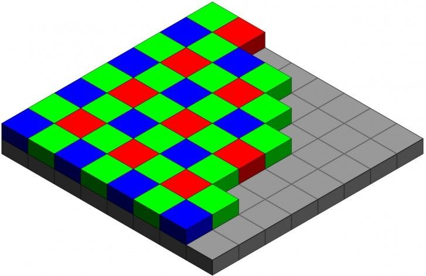
  <br><em>图 1-2：Bayer 阵列示意图</em>
</div>

```
R  G  R  G
G  B  G  B
R  G  R  G
G  B  G  B
```

绿色像素占 50% 的原因是人眼对绿色亮度通道最敏感（亮度方程 $Y = 0.2126R + 0.7152G + 0.0722B$）**[14]**。此外还有 RGGB、BGGR、GRBG、GBRG 等变体，以及 Quad-Bayer（2×2 像素合并）、Nona-Bayer（3×3 像素合并）等大像素方案。

关键传感器参数：
- **Full Well Capacity (FWC)**：每个像素能存储的最大电荷量（大像素 >2 μm：10,000–50,000 e⁻；小像素 <1 μm：2,000–5,000 e⁻）
- **Read Noise**：像素读出时引入的电子噪声（现代 BSI 传感器通常 1–3 e⁻ RMS；旧式 FSI：4–10 e⁻ RMS）
- **Dark Current**：无光照时因热激发产生的电子（随温度指数增长）
- **Quantum Efficiency (QE)**：光子转化为电子的效率（峰值通常 70–80% for BSI，绿光波段；受硅材料带隙和界面缺陷限制，实测极少超过 80%）
- **Dynamic Range (DR)**：$\text{DR} = 20\log_{10}\frac{\text{FWC}}{\sigma_\text{noise\_floor}}$ dB，其中 $\sigma_\text{noise\_floor} = \sqrt{\sigma_\text{read}^2 + \sigma_\text{dark}^2}$ 为暗噪声底（不可仅用读出噪声代替，高温/长曝光时暗电流噪声不可忽略）**[17]**

#### 阶段三：模数转换 (ADC)

模拟电荷经过电压放大后，被 ADC 量化为数字值。现代手机传感器通常采用 10–14 bit ADC 。量化引入均匀分布的量化噪声，标准差为 $\sigma_q = \frac{\text{LSB}}{\sqrt{12}}$。

**模拟增益 (Analog Gain, AG)** 在 ADC 之前放大信号，提升信噪比但同时放大噪声；**数字增益 (Digital Gain, DG)** 在 ADC 之后进行，不改善信噪比。ISO 值通常是两者的复合映射关系。

#### 阶段四：RAW 域与 ISP 处理

ADC 输出的数字 Bayer 图像（RAW 数据）是 ISP 的输入。ISP（Image Signal Processor）是一个专用硬件/软件处理单元，负责将 RAW 数据转换为适合显示和存储的图像。

完整的 ISP 处理流水线模块如下：

| 序号 | 模块名称 | 英文缩写 | 核心功能 |
|------|---------|---------|---------|
| 1 | 黑电平校正 | BLC | 减去传感器暗电流偏置，恢复真实零点 |
| 2 | 坏点校正 | DPC/BPC | 检测并插值替换热点/冷点像素（须在 LSC 增益放大之前完成，否则坏点值被等比放大后更难准确检测） |
| 3 | 横向色差预校正 | LCA Pre-Corr | **须在 Demosaic 前**，在 RAW Bayer 域对 R/B 通道施加径向多项式缩放（radial remapping），以 G 通道为基准消除横向色差；若在 Demosaic 之后校正，色差已被"烘入"插值结果，无法完全还原 → 详见第一卷第02章 §1.6.3 |
| 4 | 镜头阴影校正 | LSC | 按空间位置乘以增益系数，补偿暗角 |
| 5 | 去噪（RAW域） | RAW NR | 在 Bayer 域进行降噪，保留边缘 |
| 6 | 自动白平衡 | AWB | 估计光源色温，计算 R/G/B 通道增益 |
| 7 | 去马赛克 | Demosaic | 从 Bayer 插值出全分辨率 RGB |
| 8 | 色彩校正矩阵 | CCM | 3×3 矩阵将传感器 RGB 转换到标准色彩空间 |
| 9 | 去噪（RGB域） | RGB NR | 联合双边/非局部均值等算法降噪 |
| 10 | 色调映射 | TMO/LTM | 将 HDR 线性辐射值压缩至可显示的 LDR 范围（全局/局部算法）；注：EV 是测光参数，属于 3A 控制域，并非像素处理模块 |
| 11 | 色彩增强 | Color Enhance | 饱和度/色相调整、肤色保护 |
| 12 | 锐化与边缘增强 | Sharpening/EE | 高频增强（Unsharp Mask / 自适应锐化）；EE（边缘增强）是锐化的子集，两者在多数 ISP 实现中合并为一个模块；**应在 Gamma 编码之前执行**，以保证线性域频率响应的准确性 |
| 13 | 伽马编码 | Gamma | sRGB gamma 2.2 或 BT.709 OETF **[14]**；Gamma 是线性到感知域的非线性映射，须在所有线性域空间处理（NR、锐化、色调映射）完成之后执行 |
| 14 | 镜头畸变校正 | LDC | 多项式逆映射矫正桶/枕形畸变；可在 post-ISP（RGB/YUV 域）执行，此时插值质量更好；移动端 ISP 通常以硬件 mesh warp 单元实现 → **详见第二卷第15章** |
| 15 | 色彩空间转换 | CSC | RGB→YCbCr（或 YUV），使亮度与色度分离，便于色度下采样（4:2:0）和视频编码 |
| 16 | 缩放/输出 | Scaler | 缩放到显示分辨率，NV21/P010 等格式封装 |

### 1.2 各阶段数据格式

| 处理阶段 | 数据格式 | 位深 | 色彩空间 | 典型数据率 (4K@30fps) |
|---------|---------|------|---------|---------------------|
| 传感器输出 (RAW) | Bayer RGGB | 10–14 bit | 传感器原生 RGB | ~4–8 Gbps |
| BLC / LSC 后 | Bayer, 浮点或高精度整数 | 14–16 bit | 传感器 RGB | ~4–8 Gbps |
| 去马赛克后 | Planar/Packed RGB | 16 bit | 线性传感器 RGB | ~12–24 Gbps |
| CCM 后 | RGB | 16 bit | 线性 sRGB (D65) | ~12–24 Gbps |
| Gamma 后 | RGB | 8–10 bit | sRGB / BT.709 | ~6–12 Gbps |
| YUV 输出 | YUV 4:2:0 | 8–10 bit | BT.709 / BT.2020 | ~2–4 Gbps |
| 显示 | RGB | 8–10 bit | sRGB / DCI-P3 | ~2–4 Gbps |

数据量在 Gamma 后急剧下降的原因是：(1) 位深从 16 bit 压缩到 8–10 bit；(2) 颜色下采样 (4:4:4 → 4:2:0)。


### 1.3 3A 系统：ISP 的"大脑"

3A（AE/AF/AWB）系统是 ISP 的控制层，负责根据场景统计信息动态调整 ISP 参数：

- **自动曝光 (AE, Auto Exposure)**：根据图像亮度直方图，控制曝光时间 $t$、ISO（模拟增益 + 数字增益）和光圈 $f$，使画面曝光量 $H = E \cdot t$（勒克斯·秒）达到目标值。经典算法包括中心加权测光、点测光、矩阵/评价测光。

  $$\text{EV} = \log_2\frac{f^2}{t} = \log_2\frac{N^2}{t}$$

- **自动对焦 (AF, Auto Focus)**：通过移动镜头或传感器（或计算飞行时间 ToF），使目标区域达到最大对比度或相位差为零。主流方案：PDAF（相位差对焦）、CDAF（对比度对焦）、ToF 辅助对焦。

- **自动白平衡 (AWB, Auto White Balance)**：估计场景光源的色温（典型范围 2300K–7500K ），计算 R/G/B 通道增益 $(g_R, g_G, g_B)$ 使灰色物体在图像中呈现中性灰。常用算法：灰世界假设、White Patch Retinex、统计映射法、深度学习 AWB。

3A 形成闭环反馈：3A 算法读取当前帧的统计数据（AE statistics、AWB statistics、AF statistics），更新控制参数，这些参数在**下一帧或下下帧**生效（因为传感器曝光与 ISP 处理存在流水线延迟）。

### 1.4 Pipeline 的硬件变体

手机、车载、监控——同样叫"ISP"，内部逻辑差距之大，足以让算法无法直接移植：

| 特征 | 手机 ISP | 单反/微单 ISP | 车载 ISP | 监控 ISP |
|------|---------|--------------|---------|---------|
| 典型像素数 | 50–200 MP | 24–100 MP | 2–8 MP | 2–12 MP |
| 动态范围要求 | 高（HDR 合成）| 高（多帧）| 极高（>130 dB ）| 中 |
| 实时性要求 | 视频 4K@30/60fps | 连拍 | 实时 25/30fps | 实时 |
| 特殊需求 | 计算摄影、AI 处理 | RAW 直出、色彩精准 | 功能安全 ISO 26262 | 低照度夜视 |
| 代表性 SoC | Qualcomm ISP、联发科 Imagiq | DIGIC、EXPEED | TI TDA4VM、NXP S32V | HiSilicon Hi3559 |

### 1.5 典型 ISP 流水线延迟

ISP 流水线延迟随处理模式不同差异显著：

| 处理模式 | 典型端到端延迟 | 说明 |
|---------|--------------|------|
| 预览帧（Preview）| **5–15 ms**（RAW capture → 显示） | 硬件 ISP 全流水线，轻量 NR，帧间反馈 |
| JPEG 静态拍摄 | **50–200 ms**（RAW capture → JPEG 存储）| 高质量 NR + Demosaic + 编码，软件参与 |
| 多帧夜景（MFNR）| **200–800 ms** | 4–8 帧对齐叠加 + 降噪，NPU 加速 |
| RAW 直出（DNG）| **100–300 ms** | 省去 ISP 后处理，主要为文件 I/O 开销 |

> **工程含义：** 预览路径是用户交互最敏感的延迟路径，超过 30 ms 即会产生明显的"拖拽感"。高通 Spectra、联发科 Imagiq 等芯片均采用流水线并行设计，将 RAW 捕获→ISP 处理→YUV 输出的延迟控制在 1–2 帧（33 ms @ 30fps）以内。3A 反馈延迟（参数生效时间）通常为 1–2 帧，是 AE/AWB 控制器设计的关键约束。
>
> **工程推荐（预览路径延迟优化）：** AI 去噪模块接入预览流时，最常见的问题是 NPU 推理延迟破坏了 ISP 流水线节拍。在 Qualcomm Spectra + Hexagon DSP 架构下，建议先做 INT8 量化并测量帧间延迟，目标 < 8 ms/帧（在 30fps 流中留出足够 buffer）；如果量化后精度下降明显，再考虑 FP16，但要同时评估延迟是否超标。不要在预览路径上上 Restormer 这类大模型，留给离线夜景后处理。

---

## §2 标定 (Calibration)

### 2.1 为什么需要标定

每颗传感器、每个镜头组合都有不同的物理特性。工厂标定的目的是建立从"该硬件的原始响应"到"标准色彩空间"的精确映射。没有精确标定，后续所有 ISP 算法都建立在错误的数据基础上。

### 2.2 核心标定项目

#### 黑电平与暗场标定
在遮光条件下（盖上镜头盖），采集多帧 RAW 图像，计算各通道黑电平均值与暗场噪声分布。黑电平通常随温度漂移，需要建立温度-黑电平查找表。

#### 白平衡标定（多光源）
使用标准光源（D65/D50/A/TL84）照射标准中性灰色卡（如 X-Rite Neutral Gray Card，反射率 18%），在每种光源下采集 RAW，计算使灰卡输出为中性灰的 R/G/B 增益。标准光源说明：

<div align="center">
  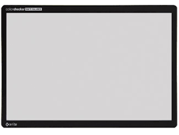
  <br><em>图 1-3 Rite Gray Card</em>
</div>

| 光源 | 色温 | 典型场景 |
|------|------|---------|
| D65 | 6500K | 室外日光（标准参考光源）|
| D50 | 5000K | 室内自然光 |
| A | 2856K | 白炽灯 |
| TL84 | 4000K | 荧光灯（欧标）|
| CWF | 4150K | 冷白荧光灯（美标）|

#### 色彩矩阵标定 (CCM)
使用 **X-Rite Macbeth ColorChecker Classic**（24 色块标准色卡）在参考光源下采集 RAW **[6]**，通过最小二乘法求解 3×3 CCM 矩阵 $M$，使传感器 RGB 映射到 CIE XYZ 或 sRGB 线性空间。CCM 标定的参考光源取决于目标色彩空间：以 sRGB（D65 白点）为目标时，通常在 D65 和 A 光源下分别标定（详见第二卷第06章）；D50 是印刷/ICC 配置文件场景的 PCS 白点，手机 ISP 标定中较少单独使用。

<div align="center">
  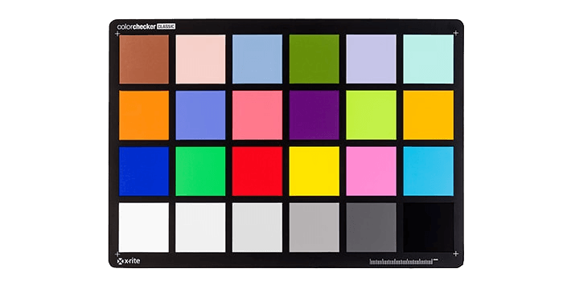
  <br><em> 图 1-4 X-Rite ColorChecker</em>
</div>

$$\begin{pmatrix} R_{out} \\ G_{out} \\ B_{out} \end{pmatrix} = M \cdot \begin{pmatrix} R_{in} \\ G_{in} \\ B_{in} \end{pmatrix}$$

优化目标：$\min_M \sum_{i=1}^{24} \Delta E_{2000}(\text{measured}_i, \text{reference}_i)$

需要为每种光源标定一个 CCM，实际使用时根据 AWB 估计的色温进行插值。

#### 镜头阴影标定 (LSC)
用均匀亮度光源（积分球或均匀白色灯箱）照射，采集平场 RAW。对每个颜色通道分别拟合空间增益曲面（通常用多项式或双线性网格表示）。需要在多个光圈档位分别标定。


#### 分辨率与 MTF 标定
使用 **ISO 12233 分辨率测试卡**或 **Siemens Star（西门子星）**，拍摄斜边 (slanted edge) 计算 MTF (Modulation Transfer Function) **[15]**。MTF50（50% 对比度处的空间频率）是镜头+传感器系统分辨率的标准指标，单位 lp/mm 或 cycles/pixel。
<div align="center">
  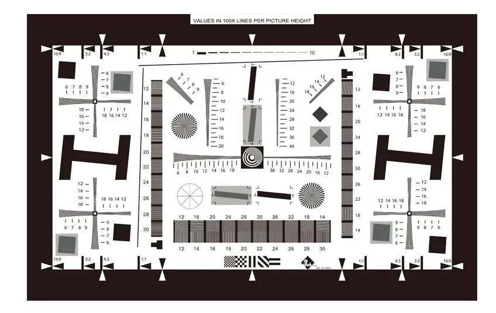
  <br><em> 图 1-5 ISO 12233 分辨率测试卡</em> 
</div>


<div align="center">
  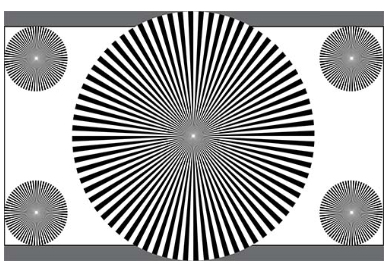
  <br><em>图 1-6  西门子之星测试图卡</em>
</div>


#### 噪声标定
在不同光照（ISO）下拍摄均匀灰色目标，测量噪声功率谱，建立**噪声模型**。标准泊松-高斯噪声模型 **[17]**：

$$\sigma^2(I) = \alpha I + \beta^2$$

其中 $\alpha$ 为散弹噪声系数，$\beta$ 为等效读出噪声标准差（DN），$\beta^2$ 为读出噪声方差，$I$ 为信号强度（与第一卷第03章记号一致）。这一参数用于驱动自适应去噪算法。

### 2.3 自动化标定流程

现代量产标定使用自动化光源控制箱 + 机械臂，每台设备标定时间 < 3 分钟。标定数据存储在传感器 EEPROM 或手机存储中，ISP 在开机时读取。

---

## §3 调参 (Tuning)

### 3.1 调参的三条黄金准则

调参工程师最常见的错误，是跳过上游模块直接动下游参数——CCM 调好了，一回头发现 LSC 漂了，前功尽弃。三条准则缺一不可：

1. **顺序性原则**：严格按照 ISP 流水线顺序调参，上游模块（BLC/LSC）必须先于下游模块（CCM/Gamma）调整完成。上游未收敛就动下游，最终是双倍工作量。

2. **量化原则**：每次调参前后必须用客观 IQA 指标（ΔE、MTF50、PSNR、BRISQUE 等）量化效果，不能只凭主观感受判断。建立 IQA 基线，记录每个参数版本的指标历史——没有数字就没有比较基准，下次出了问题也不知道是哪步改出来的。

3. **版本化原则**：所有 ISP 参数以版本号管理（如 Git）。每次修改必须记录：场景、问题描述、修改内容、对比指标。直接改生产参数文件不备份，是工程团队最危险的习惯之一。

#### 版本化管理的工程实践

标准做法是将 ISP 参数文件（Chromatix XML、Tuning Binary、JSON 配置等）纳入与代码相同的 Git 仓库，每次 commit 附带：

```
场景：室内 TL84 荧光灯下肤色偏绿
问题描述：TL84 光源下 AWB W_B 偏高约 5%，导致肤色 ΔE₀₀ = 3.2（超标）
修改内容：ch22_awb_config.xml → TL84 W_B 从 1.58 → 1.51
对比指标：ΔE₀₀ 3.2 → 1.7 ✓；D65 ΔE₀₀ 无退步（1.1 → 1.1）
测试机型：XX9 Pro / 广角主摄 / IMX989
```

#### 行业现状：历史数据的严重浪费与大模型落地困境

各家手机厂商经过多年产品迭代，积累了**海量的历史调参数据**——数以千计的参数版本记录、对应的 IQA 评测结果、工程师的修改备注、用户反馈日志。然而：

**历史数据利用率极低**，主要原因：
- 数据格式不统一，各项目各自为政，无法横向检索
- 只记录了"改了什么"，未记录"为什么改"以及"改了之后其他场景发生了什么"
- 工程师离职后，隐性知识（"这个参数不能超过 X，否则夜景会 banding"）随人流失
- 新产品调参时，工程师只能从零开始，或依赖老员工口口相传

**大模型落地尝试**：近年来各大厂商（华为、小米、OPPO 等）均在探索用 LLM 挖掘历史调参数据，典型方向包括：
- 将历史 Git commit + IQA 指标构建调参知识库，供 LLM 检索推荐
- 用 LLM 解析工程师的自然语言问题描述，自动匹配历史相似案例
- 基于历史数据训练调参建议模型，减少新项目从零调参的时间

**但当前落地效果普遍不理想**。核心瓶颈是人才断层：懂大模型的算法工程师不熟悉 ISP 调参的业务约束，ISP 工程师又缺乏 LLM 工程经验，两端之间缺乏能同时理解物理约束和模型能力边界的人。

> **展望：** 破局点在于构建**领域特化的 ISP-Tuning LLM**——以结构化的参数变更日志、IQA 指标序列、场景标签为训练语料，用 LoRA 等高效微调方法，将 ISP 领域知识注入通用大模型。本手册**第五卷**将系统介绍这一方向的技术路径，包括数据构建方法、微调策略，以及如何在不泄露厂商私有数据的前提下利用开源语料进行预训练。

### 3.2 调参起始点决策树

```
发现画质问题
    ├── 颜色偏移/偏色 → 检查 AWB 增益 → 检查 CCM → 检查 Gamma
    ├── 噪声过多 → 提高 NR 强度 → 检查 RAW NR 参数
    ├── 噪声过多 + 细节丢失 → 降低 NR 强度 + 提升锐化
    ├── 亮度不对 → 检查 BLC → 检查 AE target EV
    ├── 暗角明显 → 检查 LSC 增益系数
    ├── 细节模糊 → 检查锐化参数 → 检查 NR 过度抑制
    └── 条纹/banding → 检查 BLC 各通道一致性 → 检查 ADC 非线性
```

### 3.3 模块间参数依赖关系

| 上游参数 | 影响的下游模块 | 依赖方向 |
|---------|--------------|---------|
| BLC 黑电平 | 所有后续模块 | BLC → 全部 |
| LSC 增益 | AWB 统计、CCM | LSC → AWB → CCM |
| AWB 增益 (R/B gain) | CCM、色彩增强 | AWB → CCM → Color Enhance |
| CCM 矩阵 | 色彩增强、Gamma | CCM → Color Enhance → Gamma |
| NR 强度（RAW域）| Demosaic、后续 NR | RAW NR → Demosaic → RGB NR |
| Gamma 曲线 | 显示输出、人眼感知 | Gamma → Display |
| 锐化强度 | 最终输出细节、banding | Sharpening → Output |

### 3.4 场景自适应调参

现代 ISP 不使用单一固定参数，而是根据场景自动选择参数组：

- **场景识别 (Scene Detection)**：基于 AE/AWB 统计与 AI 分类，识别场景类型（夜景/日出日落/室内/人像/风景等）
- **多参数组 (Multi-ISP Mode)**：为每类场景预置独立的 ISP 参数组，实时切换
- **亮度自适应**：NR 强度、锐化强度随 ISO 增大而自动调整（低光下 NR 加强、锐化降低）

---

## §4 Artifacts（伪影）

ISP 伪影排查是一项容易让人沮丧的工作——表现在下游，根子往往在上游。一条 banding，可能是 BLC 漂了，也可能是 ADC 列噪声，也可能是锐化过头，逐模块 bypass 是唯一可靠的定位手段。

### 4.1 主要伪影分类表

| 伪影名称 | 视觉表现 | 主要成因 | 涉及模块 |
|---------|---------|---------|---------|
| 彩色噪声 (Color Noise) | 随机彩色斑点 | 低光下各通道 SNR 不均，NR 不足 | Sensor、RAW NR、CCM |
| 摩尔纹 (Moiré) | 周期性彩色波纹 | 传感器采样频率接近图案空间频率 | Sensor CFA、Demosaic |
| 拉链效应 (Zipper) | 边缘锯齿彩色条纹 | 去马赛克在高对比度边缘处插值失误 | Demosaic |
| 过锐化光晕 (Oversharp Halo) | 边缘两侧亮/暗条带 | 锐化强度过高（Unsharp Mask 过量）| Sharpening |
| 色偏 (Color Cast) | 全图或局部颜色偏移 | AWB 估计错误或 CCM 不准确 | AWB、CCM |
| 暗角 (Vignetting) | 四角明显暗于中心 | LSC 不足或光圈效应补偿不足 | Lens、LSC |
| 条纹噪声 (Banding) | 水平/垂直周期性亮暗条纹 | BLC 不准确、ADC 列固定模式噪声 | BLC、Sensor ADC |
| 色差 (CA/Fringing) | 高对比度边缘彩色边缘 | 镜头色差、CA Correction 不足 | Lens、CA Correction |
| 鬼影 (Ghosting) | 高亮光源周围出现重影 | 镜头内反射、Flare | Lens optical |
| 噪声与细节平衡失调 | 噪声少但纹理消失（水彩效果）| NR 过强导致高频细节丢失 | NR（RAW/RGB）|
| HDR 鬼影 | 运动物体重影 | 多帧 HDR 合成中运动估计失败 | HDR Merge |
| Highlight Clipping | 过曝区域变白或出现彩色 | AE 调整不及时，曝光过度 | AE、TMO |

### 4.2 伪影定位方法论

1. **逐模块开关法**：逐一关闭 ISP 模块（旁路 bypass），观察伪影是否消失，确定引入伪影的模块范围。
2. **中间数据 Dump**：在关键节点（BLC 后、Demosaic 后、CCM 后）dump RAW/RGB 数据，对比分析。
3. **频域分析**：对伪影区域做 FFT，判断是空间频率相关（摩尔纹）还是低频缺陷（色偏、暗角）。

---

## §5 评测 (Evaluation)

### 5.1 IQA 指标体系

图像质量评测（IQA, Image Quality Assessment）分为两大类：**全参考 (FR, Full Reference)** 和 **无参考 (NR, No Reference)**。

### 5.2 FR 指标（有真值参考）

| 指标 | 公式 / 方法 | 适用场景 | 典型优质范围 |
|------|-----------|---------|------------|
| PSNR | $10\log_{10}\frac{MAX^2}{MSE}$ dB | 算法对比，要求色彩/细节无损 | > 30 dB (好), > 40 dB (极好) |
| SSIM | 亮度/对比度/结构三项乘积 | 感知质量，结构失真 | > 0.90 (好), > 0.97 (极好) |
| LPIPS | AlexNet/VGG 感知特征距离 | 感知相似性，比 SSIM 更符合主观 | < 0.1 (好) |
| ΔE76 | $\sqrt{(\Delta L^*)^2+(\Delta a^*)^2+(\Delta b^*)^2}$ | 颜色精度（CIE LAB 色差）| < 3 (可接受), < 1 (极好) |
| ΔE2000 | CIE DE2000 公式（加权 LCH）| 更接近人眼感知的色差 | < 2 (好), < 1 (极好) |
| MTF50 | 50% 对比度处的空间频率 **[15]** | 系统分辨率，锐度 | > 0.3 cy/px |

### 5.3 NR 指标（无参考）

| 指标 | 方法简述 | 适用场景 |
|------|---------|---------|
| BRISQUE | 场景统计特征（MSCN 系数）的 SVR 回归 | 真实场景图像质量通用评分 |
| NIQE | 自然场景统计模型（NSS）与自然图像偏差 | 不需要主观评分训练 |
| PIQE | 局部块质量估计（无监督）| 局部质量分析 |
| CLIP-IQA | CLIP 模型语义引导质量评估 | 高层次感知质量 |

### 5.4 专项指标

- **人眼主观评分 (MOS, Mean Opinion Score)**：招募人类评测者对图像质量打分（1–5 分），取平均。成本高，但是 Ground Truth。
- **DMOS (Difference MOS)**：评测者对"原图 vs 处理后"的主观差异打分，用于算法对比。
- **噪声可见性 (NVF)**：在均匀区域测量噪声标准差（单位 DN 或 IRE）。
- **动态范围 (DR)**：$20\log_{10}$ (最大无噪信号 / 噪底)，单位 dB。

### 5.5 ISP 专用测试场景

| 测试类型 | 标准/工具 | 测量目标 |
|---------|---------|---------|
| 颜色精度 | X-Rite ColorChecker + Imatest | ΔE2000 for 24 patches |
| 空间分辨率 | ISO 12233, SFRplus | MTF50, MTF20 |
| 噪声 | ISO 15739, eSFR | SNR vs. 照度曲线 |
| 动态范围 | EMVA 1288, Imatest DR | DR in dB |
| 低光性能 | DXOMARK Low Light score | 主观+客观综合 |
| 视频质量 | ITU-T P.910 | MOS for video sequences |

---

## §6 代码 (Code)

本章配套代码见 [`ch01_pipeline_notebook.ipynb`](ch01_pipeline_notebook.ipynb)，涵盖以下内容：

1. **合成 Bayer 阵列生成**：512×512 合成 Bayer RAW，含真实黑电平偏置与泊松噪声
2. **Mini-ISP Pipeline**：BLC → 双线性去马赛克 → 灰世界 AWB → Gamma 校正
3. **可视化对比**：三阶段输出对比图（Bayer normalized | 去马赛克后 | Gamma 后）
4. **阶段分析**：每个阶段的统计信息（均值、方差、亮度增益）
5. **练习题**：3 道编程练习

---

## 进入第二卷之前

第一卷做了一件事：把物理约束讲清楚。光子统计给了 SNR 的下限，传感器 FWC 给了动态范围的上限，衍射极限给了分辨率的天花板——这些不是调参能突破的东西，是系统设计必须接受的边界条件。

带着这个认识进第二卷，你会发现传统 ISP 的每一个模块都在做一件相似的事：在已知的物理边界内，用有限算力做一个可运行的近似。去马赛克不是在"复原"失去的信息，是在用插值假装那些信息存在。降噪不是在"消除"噪声，是在用先验知识做一个取舍。Gamma 不是在"美化"图像，是在把线性物理量映射到人眼感知能接受的范围。

这些模块没有"最优解"，只有在特定场景下"足够好的解"。明白这一点，调参时就不会一直问"为什么还有伪影"，而是会问"这个模块在这个场景下的假设是什么、假设在哪里失效了"。这是传统 ISP 工程师最核心的思维方式。

> **工程师手记：这条链路为什么这么多年没有变**
>
> 有人问：ISP 这套链路是二十年前设计的，为什么还没有被替代？
>
> 原因不是没有更好的方案，而是工程的延续性不允许轻易重写。一条流水线一旦稳定上量、跑过几代产品，所有下游系统——HAL 驱动、调参工具、标定流程、工厂烤机方案——都绑死在这套接口上。即使某个新算法能把 PSNR 提高 0.5dB，替换它意味着同时重建整套配套系统，绝大多数团队算不出来这笔账值得做，也没有多余的人力去支撑一代全新框架的研发。
>
> 另一个原因是这个行业本身很小。全球做手机 ISP 算法的工程师，加起来可能不超过几千人，各家的代码和技术源头大多同宗同源——从 Bayer 插值到 AWB Gray World，你在 A 公司看到的，换个变量名在 B 公司也能找到。行业共识固化了，分叉的动力就更弱了。
>
> 所以进第二卷时不要带着"这套东西早该被淘汰了"的心态——那是旁观者的判断。调参工程师的现实是：这套东西还在跑，还在出货，还在被几十亿台设备使用。把它搞清楚，是进这个行业的第一步。

---

## 插图

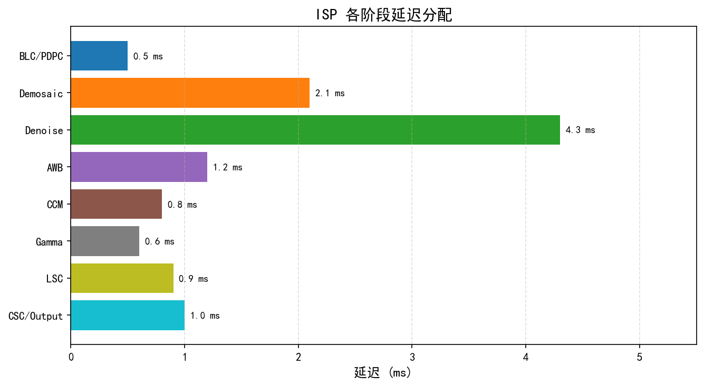
*图1. ISP流水线各阶段延迟分解示意图（图片来源：作者自绘，参考Qualcomm Spectra ISP技术文档）*

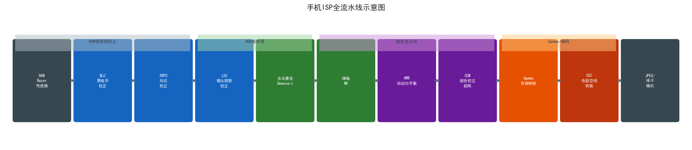
*图2. ISP完整处理流水线总览图（图片来源：作者自绘）*

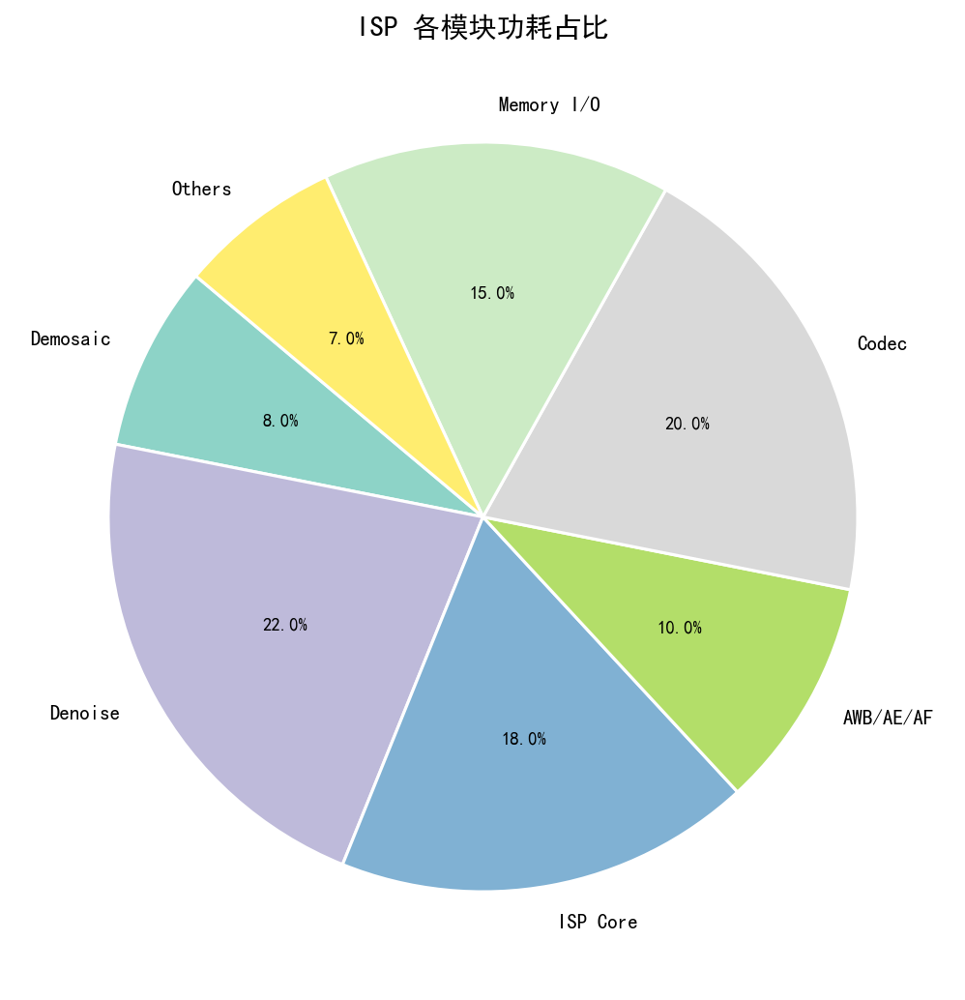
*图3. ISP各功能模块功耗占比分解（图片来源：作者自绘，参考移动SoC功耗报告）*

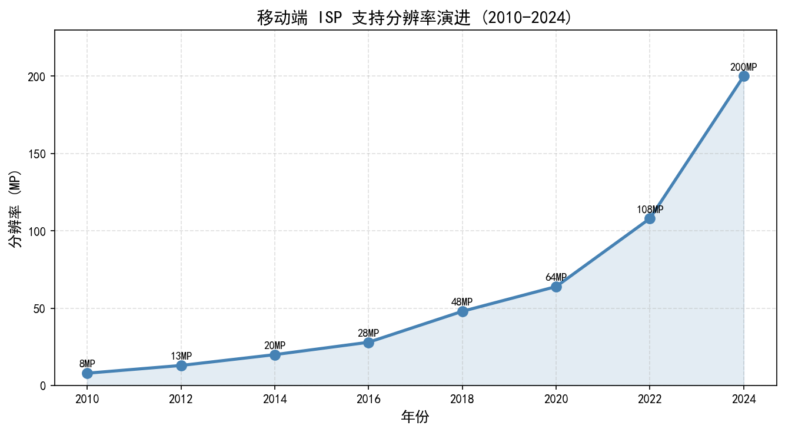
*图4. 主流ISP平台支持分辨率与帧率对比（图片来源：作者自绘）*


*图5. ISO 12233分辨率测试卡（图片来源：ISO, "ISO 12233:2017 — Photography — Electronic still picture imaging — Resolution and spatial frequency responses", 官方文档, 2017）*

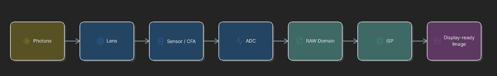
*图6. ISP流水线模块示意图（图片来源：作者自绘）*

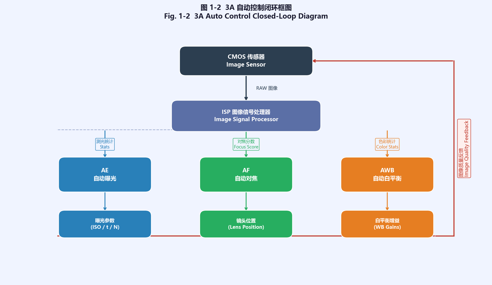
*图7. 3A（AE/AF/AWB）闭环控制示意图——ISP与3A系统协同工作，传感器输出统计数据，3A算法反馈控制参数（图片来源：作者自绘）*

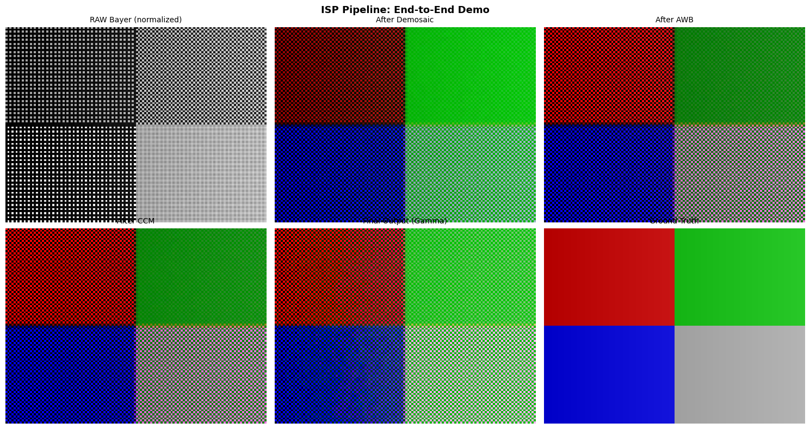
*图8. ISP各处理阶段信号流示意图——从RAW域校正（BLC/DPC/LSC）到RGB域增强（Demosaic/AWB/CCM/Gamma）再到YUV域压缩前处理（NR/EE/CSC）的完整信号路径（图片来源：作者自绘）*


*图9. 手机ISP硬件流水线架构示意图——典型SoC内ISP硬件模块布局，包含前处理、图像处理和后处理三级流水（图片来源：作者自绘，参考Qualcomm Spectra ISP架构文档）*


*图10. RGGB Bayer彩色滤波阵列（CFA）示意图——每个像素仅感知一种颜色，G像素密度是R/B的两倍以匹配人眼亮度灵敏度（图片来源：作者自绘）*


*图11. X-Rite ColorChecker标准色卡——包含24块标准色块（6×4排列），用于ISP颜色校正矩阵（CCM）和白平衡标定（图片来源：X-Rite, "ColorChecker Classic", 产品文档）*


*图12. X-Rite标准18%灰卡——反射率18%的标准中灰度参考，用于相机曝光标定和AWB调试（图片来源：X-Rite, "Gray Card", 产品文档）*


*图13. 西门子星（Siemens Star）分辨率测试靶——通过找到对比度下降至50%的径向角度计算MTF50，是ISP空间分辨率评测的标准靶标之一（图片来源：作者自绘，参考ISO 12233测试方法）*

---

## 习题

**练习 1（理解）**
ISP 流水线通常将处理分为 RAW 域、RGB 域和 YUV 域三个阶段。请指出以下模块各属于哪个域，并说明在该域处理的物理原因：黑电平校正（BLC）、去马赛克（Demosaic）、色彩校正矩阵（CCM）、色调映射（Tone Mapping）、色度降噪（Chroma NR）。

**练习 2（计算）**
某 12-bit RAW 传感器的黑电平（Black Level）= 64 DN，白电平（White Level）= 4095 DN，某像素读出值为 520 DN。请计算：(a) 该像素归一化后的线性信号值（范围 [0, 1]）；(b) 若对该线性值施加 sRGB 伽马编码（$C_\text{linear} \leq 0.0031308$ 用线性段，否则用 $1.055 \times C^{1/2.4} - 0.055$），最终输出的 sRGB 值（范围 [0, 1]）是多少？(c) 量化为 8-bit JPEG 时对应的整数值是多少？

**练习 3（编程）**
使用 Python + NumPy 实现一个简化的 RAW → RGB 流水线：输入为一张 512×512 的 12-bit RGGB Bayer RAW 图（uint16），执行以下步骤：(a) BLC：减去黑电平 64，并裁剪至 [0, 4031]；(b) 简单双线性去马赛克（可调用 OpenCV 的 `cv2.cvtColor` 配合 `cv2.COLOR_BAYER_RG2BGR`）；(c) 对每个通道乘以白平衡增益（R×1.8, G×1.0, B×1.6），clip 到 [0, 1]；(d) 施加 sRGB 伽马并保存为 PNG。验证：对纯灰色（所有通道值均为 520 DN）的 Bayer 图输入，输出 PNG 的三通道像素值应满足 R > B（因 R 增益更大）。

**练习 4（工程分析）**
在 ISP 流水线中，模拟增益（Analog Gain, AG）和数字增益（Digital Gain, DG）对最终图像信噪比的影响不同。请分析：(a) 将 ISO 从 100 提升到 800，若全部通过模拟增益实现与全部通过数字增益实现，两种方案在信噪比、动态范围上有何本质差异？(b) 真实 SoC（如骁龙 8 系列）通常采用 AG 和 DG 混合映射的策略，优先使用 AG 直到其上限（通常 16–32×），再启用 DG，这样做的工程权衡是什么？

## 参考文献

[1] Ramanath et al., "Demosaicking Methods for Bayer Color Arrays", *Journal of Electronic Imaging*, 2005.

[2] Ikeuchi (Ed.), "Computer Vision: A Reference Guide (2nd ed.)", *Springer*, 2021.

[3] Forsyth et al., "Computer Vision: A Modern Approach (2nd ed.)", *Pearson*, 2012.

[4] Nakamura, "Image Sensors and Signal Processing for Digital Still Cameras", *CRC Press*, 2006.

[5] Brooks et al., "Shape and source from shading", *IJCAI*, 1985.

[6] Karaimer et al., "A Software Platform for Manipulating the Camera Imaging Pipeline", *ECCV*, 2016.

[7] Chen et al., "Learning to See in the Dark", *CVPR*, 2018.

[8] Zamir et al., "CycleISP: Real Image Restoration via Improved Data Synthesis", *CVPR*, 2020.

[9] Ignatov et al., "PyNET: Replacing Mobile Camera ISP with a Single Deep Learning Model", *CVPR Workshops*, 2020.

[10] Rajagopalan et al., "AWRaCLe: All-Weather Image Restoration using Visual In-Context Learning", *AAAI*, 2025. arXiv:2409.00263.
<!-- REF-AUDIT: [10] 原文作者"Liu et al."错误（应为 Rajagopalan et al.）；原文 arXiv:2312.01942 错误（该 ID 属于 ATLAS 希格斯玻色子物理论文）→ 正确 arXiv:2409.00263；原文会议/年份"2023"→ AAAI 2025 -->

[11] CMU, "15-463 Computational Photography Course Notes", *官方文档*, 2023. URL: https://www.cs.cmu.edu/~15463/

[12] MIT OCW, "6.815 Digital and Computational Photography", *官方文档*, 2012. URL: https://ocw.mit.edu/courses/6-815-digital-and-computational-photography-fall-2012/

[13] Hasinoff et al., "Burst photography for high dynamic range and low-light imaging on mobile cameras", *ACM SIGGRAPH Asia*, 2016.

[14] IEC, "IEC 61966-2-1 — sRGB color space standard", *官方文档*, 1999.

[15] ISO, "ISO 12233:2017 — Photography — Electronic still picture imaging — Resolution and spatial frequency responses", *官方文档*, 2017.

[16] ISO, "ISO 15739 — Photography — Electronic still-picture imaging — Noise measurements", *官方文档*, 2023.

[17] EMVA, "EMVA Standard 1288 — Standard for Characterization of Image Sensors and Cameras", *官方文档*, 2021.

[18] ITU-R, "BT.2020 — Parameter values for UHDTV systems", *官方文档*, 2015.

## §7 主流商用 ISP 平台 (Major Commercial ISP Platforms)

调参工程师换一个平台，往往要重新摸索三到六个月——工具链不同，参数命名方式不同，连 XML 文件的嵌套结构都不一样。本节覆盖当前出货量最大的四个平台：高通 Spectra、海思麒麟、联发科 Imagiq 和苹果 ISP。

### 7.1 高通 Spectra ISP (Qualcomm Spectra ISP)

**架构特点:**
- Triple ISP 并行架构（骁龙888起）：可同时处理三路摄像头数据流
- BPS (Bayer Processing Subsystem)：专用 RAW 域处理子系统，负责 BLC/LSC/HDR Merge/RAW NR 等前端步骤
- 18-bit 内部处理精度（骁龙 8 Gen1 起），提供充足的 HDR 动态范围头部空间
- Hexagon DSP + Adreno GPU + Spectra ISP 协同，复杂计算卸载到 DSP/NPU

**调参工具链:** Chromatix™ (XML 参数文件) + CTT (Camera Tuning Tool，实时在线调参)

**代际演进:**

| SoC | ISP | 主要特性 |
|-----|-----|---------|
| 骁龙865 | Spectra 480 | 2亿像素, Quad-Bayer Remosaic, 8K视频 |
| 骁龙888 | Spectra 580 | AI-ISP, 4K@120fps, 30帧MFNR |
| 骁龙8 Gen1 | Spectra Gen1 | Triple ISP, 18-bit, 8K HDR |
| 骁龙8 Gen2 | Spectra Gen2 | Staggered HDR, Cognitive ISP |
| 骁龙8 Gen3 | Spectra Gen3 | 端侧生成式AI摄影 |

参考资料: https://www.qualcomm.com/products/mobile/snapdragon/smartphones/snapdragon-8-series-mobile-platforms/snapdragon-8-gen-3-mobile-platform

### 7.2 海思麒麟 ISP (HiSilicon Kirin ISP)

**架构特点:**
- NPU-ISP 协同设计：麒麟 ISP 从设计之初即与达芬奇架构 NPU 视为一体
- 三路并行 ISP（麒麟 990 5G 起，2019年业界首发）
- RYYB CFA 支持（P30/P40系列）：将 RGGB 中两个 G 替换为 Y（黄色），Y 滤光片透过绿+红波段，在相同曝光时间下进光量相对 RGGB 约提升 40%（华为官方实验室测量值，以同尺寸 RGGB 为基准）；代价是色度通道混叠，需 AI 辅助去马赛克方可恢复准确颜色
- XD-Fusion Pro 引擎：统一调度 ISP+NPU+CPU+GPU，执行多帧降噪、语义分割、超分辨率

**调参工具链:** 内部私有工具（HiTuning），未对外公开；标定流程与高通类似

**代际演进:**

| SoC | ISP | 主要特性 |
|-----|-----|---------|
| 麒麟980 | ISP 5.0 | 双路ISP，首个AI-ISP（NPU辅助降噪） |
| 麒麟990 5G | ISP 5.0+ | **三路ISP**（2019年9月发布，与联发科天玑1000同年），RYYB支持, 64MP |
| 麒麟9000 | ISP 6.0 | XD-Fusion Pro, 4K@120fps, Dolby Vision |

参考资料: https://consumer.huawei.com/en/campaign/kirin9000/ ; AnandTech Kirin 980分析: https://www.anandtech.com/show/13371/huawei-mate-20-mate-20-pro-review/4

### 7.3 联发科 Imagiq ISP (MediaTek Imagiq ISP)

**架构特点:**
- 高吞吐量设计：支持 320MP 静态拍摄、4K@120fps 视频（天玑9300）
- 三路并行 ISP（天玑1000起，2019年）
- APE (AI Processing Engine)：与 APU 协同，提供 AI-NR（视频实时降噪）、AI-SR（超分辨率）、语义分割
- 天玑开放架构（2023年）：允许 OEM 在 HAL 层注入自定义算法
- HDR-Vivid：中国国家 HDR 标准（T/UHD 005），天玑9000首发支持

**调参工具链:** MTK Camera Tuning Tool (APMCT，NDA合作伙伴工具)；NVRAM XML 参数格式；部分 HAL 代码开源于 AOSP

**代际演进:**

| SoC | Imagiq | 主要特性 |
|-----|--------|---------|
| 天玑9000 | 790 | 320MP, **HDR-Vivid首发**, 4K@30 HDR |
| 天玑9200 | 890 | Dolby Vision, 4K@60 HDR |
| 天玑9300 | 990 | 三路ISP + AI-ISP, 4K@120 |
| 天玑9400 | 1090 | 端侧生成式AI摄影 |

> **Imagiq 命名规则说明：** 联发科 Imagiq 采用三位数版本号体系（790/890/990/1090），每代旗舰 SoC 递增约 100；与高通 Spectra 的命名体系不同——高通从 Spectra 480/580 的数字命名在 8 Gen1 起改为与 SoC 代次对齐的 "Gen N" 命名法（Spectra Gen1/Gen2/Gen3），体现平台整体迭代语义；而 Imagiq 沿用数字体系，仅通过版本号大小体现代次先后。读者在对比两平台的 ISP 代际演进时，应注意这一命名差异，避免将 "Spectra Gen2" 与 "Imagiq 990" 做字面数字比较。

参考资料: https://www.mediatek.com/technology/imagiq ; https://corp.mediatek.com/news-events/press-releases/mediatek-imagiq-790-brings-flagship-camera-innovations-to-premium-5g-smartphones

### 7.4 苹果 ISP（Apple ISP / Image Signal Processor）

苹果是唯一一家从传感器（与索尼联合定制）、ISP 芯片（自研）到调参工具链（内部闭环）全垂直整合的主要玩家。调参工程师无法直接接触苹果 ISP 的参数，但了解其架构范式对理解计算摄影的演进方向有价值。

**架构特点：**
- **ISP + Neural Engine 协同**：苹果从 A12 Bionic 起，在 SoC 内同时包含专用 ISP 硬件（负责传统 RAW 域处理）和 Neural Engine（NPU，负责基于机器学习的去噪、HDR 合成、Deep Fusion 等），两者通过片上互连共享内存带宽，避免了异构芯片间的数据拷贝延迟
- **Deep Fusion（A13起）**：在快门按下前预拍 9 帧（4 短曝 + 4 长曝 + 1 标准曝），ISP 自动选取最优帧组合，Neural Engine 在像素级完成多帧融合，而非简单多帧平均；该模式在中等光线条件下效果最优（极低光切换到 Night Mode）
- **ProRAW（iPhone 12 Pro起）**：苹果对外开放的 RAW 格式，实质是在 DNG 封装内嵌入已完成部分 ISP 处理（BLC/LSC/AWB/HDR合并）的线性 RAW，同时附带完整元数据，供第三方 App 做进一步后处理；区别于传统未经处理的 RAW
- **Photonic Engine（A16起）**：进一步将 Deep Fusion 流程前移到去马赛克之前（RAW 域），直接在未去马赛克的 Bayer 数据上运行 ML 融合，避免去马赛克将噪声"烘入"RGB 数据

**调参工具链：** 苹果 ISP 完全封闭，OEM 无法接触 Tuning 参数；第三方 App 可通过 AVCaptureSession + ProRAW 接口访问 RAW 数据，但 ISP 内部参数不对外暴露

**代际演进：**

| SoC | ISP/关键特性 | 主要摄影特性 |
|-----|------------|------------|
| A12 Bionic | ISP + Neural Engine 首次协同 | Smart HDR, 深度信息辅助对焦 |
| A13 Bionic | Deep Fusion | 多帧像素级融合，中光条件高质感 |
| A14 Bionic | Night Mode Portrait | 人像夜景 |
| A15 Bionic | Photonic Engine（iPhone 14，正式发布）| Cinematic Mode 视频 |
| A16 Bionic | Photonic Engine 升级版（iPhone 14 Pro）| ProRes 视频，4K@30fps 硬件编码 |
| A17 Pro | 第二代 Photonic Engine | 4K@60fps ProRes 硬件编码（iPhone 15 Pro）|

参考资料: Apple, "Behind the Scenes: iPhone Camera — Deep Fusion", Apple Machine Learning Research Blog, 2019. https://machinelearning.apple.com/research/deep-fusion

<div align="center">
  
  <br><em>图 1-7：3A 自动控制闭环框图——CMOS 传感器 → ISP → AE/AF/AWB 三路并行控制 → 图像质量反馈。</em>
</div>

### 7.5 四平台综合对比

| 维度 | Qualcomm Spectra | HiSilicon Kirin | MediaTek Imagiq | Apple ISP |
|------|-----------------|-----------------|-----------------|-----------|
| 设计哲学 | 平台化、面向OEM开放 | 效果驱动、软硬垂直整合 | 市场驱动、高能效 | 完全垂直整合、用户体验优先 |
| Triple ISP | 骁龙888 (2020年12月) | 麒麟990 5G (2019年9月) | 天玑1000 (2019年11月) | 双路（主+超广角，内部并行） |
| 内部位深 | 18-bit (8 Gen1起) | 未公开 | 未公开 | 未公开 |
| 调参工具 | Chromatix+CTT（公开给OEM）| HiTuning（内部私有）| APMCT（NDA授权）| 完全封闭，OEM不可接触 |
| AI-ISP 范式 | 语义信息驱动3A | AI决定一切（NPU中心）| 功能点驱动（AI-NR/SR）| ISP+Neural Engine 深度融合 |
| 工具链开放度 | OEM Chromatix定制 | 封闭 | 天玑开放架构（2023）| 封闭（ProRAW API 有限开放）|

---


---

## §8 术语表（Glossary）


---

**ADC（Analog-to-Digital Converter，模数转换器）**
将传感器像素输出的模拟电压转换为数字编码的电路单元。现代手机传感器通常采用柱级或像素级 ADC，位深为 10–14 bit。ADC 的非线性和随机噪声直接影响量化精度，其噪声标准差近似为 $\sigma_q = \text{LSB}/\sqrt{12}$（均匀量化假设下）。

---

**AWB（Auto White Balance，自动白平衡）**
估计当前场景光源色温，并计算 R/G/B 通道增益 $(g_R, g_G, g_B)$，使中性灰色物体在图像中呈现无偏的中性灰。AWB 算法分为统计估计（灰世界假设、白斑 Retinex）和深度学习两大类。AWB 增益通常在 Demosaic 之前施加于 RAW 域，以避免色彩混叠。

---

**Bayer 阵列（Bayer CFA）**
由 Bryce Bayer 于 1976 年在柯达公司发明的彩色滤光片阵列布局：RGGB 2×2 周期排列，绿色像素占 50%。绿色比例高的原因是人眼亮度通道对绿色最敏感（$Y = 0.2126R + 0.7152G + 0.0722B$）。现代变体包括 Quad-Bayer（4×4 子像素聚合）、Nona-Bayer（3×3）等，用于在高分辨率与高感光度之间切换。

---

**BLC（Black Level Correction，黑电平校正）**
在无光照时，CMOS 传感器仍会输出非零的数字值，称为黑电平（Dark Level）。BLC 减去每个颜色通道的黑电平偏置，将真实零信号对应到数字零点。黑电平随温度漂移，需建立温度-黑电平查找表（LUT）。黑电平校正是 ISP 流水线的第一步，其准确性影响所有后续模块。

---

**BPS（Bayer Processing Subsystem）**
高通 Spectra ISP 中专用于 RAW 域处理的硬件子系统，负责 BLC、LSC、HDR 合并（Multi-Frame NR）、Bayer NR 等前端步骤，与后端 IPE（Image Processing Engine）分开，允许独立调度和功耗管理。

---

**CCM（Color Correction Matrix，色彩校正矩阵）**
将传感器原生 RGB 色彩空间映射到标准色彩空间（CIE XYZ 或 sRGB）的 3×3 线性矩阵。通过拍摄已知色块（如 Macbeth ColorChecker）并最小化 $\Delta E_{2000}$ 来标定。不同光源下需标定独立 CCM，实际使用时根据 AWB 估计的色温进行插值。

---

**CFA（Color Filter Array，彩色滤光片阵列）**
覆盖在 CMOS 传感器像素表面的微型滤色镜矩阵，使每个像素只感应特定波段（R/G/B）的光。CFA 是单芯片彩色成像的基础技术，代价是每个像素失去 2/3 的光谱信息，需通过去马赛克（Demosaic）算法恢复全色彩。

---

**CIS（CMOS Image Sensor，互补金属氧化物半导体图像传感器）**
基于 CMOS 工艺制造的图像传感器。与 CCD 相比，CIS 集成度高、功耗低、读出速度快，且可在同一芯片上集成 ADC 和信号处理电路，是当代手机和数码相机的主流感光元件。

---

**Demosaic（去马赛克）**
从每像素只有一种颜色值的 Bayer RAW 图像插值出每像素完整 RGB 三通道的过程。典型算法包括双线性插值（速度快但边缘有伪彩）、AHD（自适应均匀导向插值）、RCDN 等深度学习方法。去马赛克是 RAW 与 RGB 域的分界点。

---

**DPC/BPC（Defective/Bad Pixel Correction，坏点校正）**
CMOS 传感器中因工艺缺陷产生的"热点"（永久过亮）或"冷点"（永久过暗）像素称为坏点。DPC 通过检测像素值与邻域的偏差来定位坏点，并用邻域插值替换，防止其在后续流水线中传播并产生明显的点状伪影。

---

**DR（Dynamic Range，动态范围）**
传感器可正确记录的最大信号与最小可分辨信号之比，通常以 dB 表示：$\text{DR} = 20\log_{10}(\text{FWC}/\sigma_{\text{noise\_floor}})$，其中 $\sigma_{\text{noise\_floor}} = \sqrt{\sigma_{\text{read}}^2 + \sigma_{\text{dark}}^2}$（不可仅用读出噪声代替，常温短曝光时两者近似相等，但严格定义须包含暗电流噪声项）；或以曝光档位（EV/stops）表示：$\text{DR} = \log_2(\text{FWC}/\sigma_{\text{noise\_floor}})$。现代旗舰手机传感器动态范围约 12–14 stops，高 DR 场景需 HDR 合成技术突破单帧极限。

---

**EV（Exposure Value，曝光值）**
摄影中量化曝光量的无量纲参数，定义为 $\text{EV} = \log_2(N^2/t)$，其中 $N$ 为 f-number，$t$ 为快门时间（秒）。EV = 0 对应 N = 1，t = 1s。EV 是 3A 控制系统（AE）的核心参数，属于测光度量，**不是** ISP 数据路径中的处理模块。

---

**FWC（Full Well Capacity，满阱容量）**
单个像素光电二极管能存储的最大电荷量，通常以电子数 $e^-$ 表示。FWC 决定了传感器在高光下不过饱和的上限信号电平，与像素面积正相关。典型值：大像素（>2 μm）约 10,000–50,000 $e^-$，小像素（<1 μm）约 2,000–5,000 $e^-$。

---

**Gamma 编码（Gamma Encoding）**
对线性光强进行非线性幂函数编码：$V_{encoded} = V_{linear}^{1/\gamma}$，其中 $\gamma \approx 2.2$（sRGB 标准为分段近似）。Gamma 编码符合人眼对亮度的感知特性（韦伯-费希纳定律），在低位深（8 bit）下显著减少暗部量化误差。显示设备执行反向的 EOTF 解码。

---

**ISP（Image Signal Processor，图像信号处理器）**
将 CMOS 传感器输出的原始 RAW 数据处理为适合显示和存储的彩色图像的专用硬件/软件单元。现代手机 SoC（如高通骁龙、联发科天玑、海思麒麟）的 ISP 已演进为集成 AI 加速、多路并行处理、HDR 合成、实时视频处理的复杂系统，是手机画质的核心决定因素。

---

**LSC（Lens Shading Correction，镜头阴影校正）**
补偿镜头暗角（四角亮度低于中心）的增益表。暗角由余弦四次方定律（$E(\theta) = E_0 \cos^4\theta$）、机械遮挡和像素 CRA 失配共同造成。LSC 增益表以多项式或双线性网格表示，需在多个光圈档位和色温下分别标定。LSC 通常在 BLC 之后立即应用，以确保后续白平衡和颜色处理在空间均匀的数据上进行。

---

**MTF（Modulation Transfer Function，调制传递函数）**
描述光学+传感器系统对不同空间频率正弦条纹的对比度传递能力，范围 0–1。MTF = 1 表示完美还原，MTF = 0 表示该空间频率完全丢失。**MTF50** 是对比度降至 50% 时的空间频率，是评价镜头系统锐度的工业标准指标，通过 ISO 12233 斜边法测量。

---

**QE（Quantum Efficiency，量子效率）**
光子被像素光电二极管转换为电子的概率，是 0–1 之间的波长相关函数。BSI（背照式）CMOS 传感器的峰值 QE 约 70–80%（绿光波段）。QE 是连接"光子数"和"光电子数"的桥梁：$\mu_{e^-} = \text{QE} \times \mu_{\text{photon}}$。

---

**RAW 图像（RAW Image）**
ADC 量化后、未经任何 ISP 处理的原始传感器数据，以 Bayer 格式存储，每像素仅有一种颜色分量值。RAW 保留了最大动态范围和最完整的原始信息，是专业摄影和计算摄影算法研究的黄金输入格式。手机 DNG 文件即为标准化的 RAW 封装格式。

---

**Read Noise（读出噪声）**
传感器在读出像素电荷过程中引入的电子电路噪声，以电子数 $e^-$ RMS 表示，独立于曝光量。现代 BSI 传感器典型值 **1–3 $e^-$ RMS**；旧式 FSI 传感器约 4–10 $e^-$ RMS。读出噪声决定了传感器在极低光照下的噪底（Noise Floor），是影响弱光成像的关键参数，直接决定动态范围的下限。

---

**SNR（Signal-to-Noise Ratio，信噪比）**
信号功率与噪声功率之比，通常以 dB 表示：$\text{SNR} = 20\log_{10}(\mu_{e^-}/\sigma_{\text{total}})$。总噪声方差 $\sigma_{\text{total}}^2 = \sigma_{\text{shot}}^2 + \sigma_{\text{read}}^2 + \sigma_q^2$。在高照度（大 $\mu_{e^-}$）时散弹噪声主导；在低照度时读出噪声主导。提升 SNR 的工程手段包括：增大像素面积、降低读出噪声、多帧时间域叠加。

---

**3A 系统（Auto Exposure / Auto Focus / Auto White Balance）**
ISP 的控制层，负责采集图像统计信息（亮度直方图、色度均值、相位差信号），并动态调整传感器与 ISP 参数。3A 属于**控制流**（Control Path），与像素数据流（Data Path）并行工作；其调整结果（曝光时间、ISO 增益、白平衡增益、镜头位置）通常在下一帧或下下帧生效，存在固有的反馈延迟。
