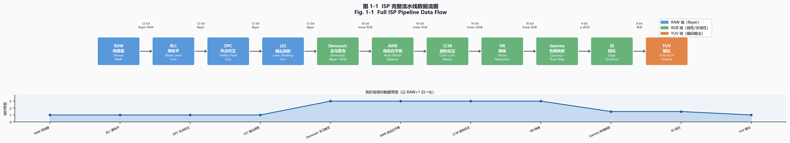

# Part 1, Chapter 01: ISP Pipeline Overview

> **Pipeline position:** This IS the pipeline — full chain from photons to display pixels
> **Prerequisites:** None — this is the entry point
> **Reader path:** All readers

---

## §1 Theory

### 1.1 The Complete Imaging Chain: From Photons to Pixels

The birth of a smartphone photo is a journey spanning three domains — physics, electronics, and signal processing. This journey can be broken down into six major stages:

```
Photons → Lens → Sensor (CFA) → ADC → RAW Domain → ISP → Display-ready Image
```

Each stage has a well-defined physical meaning, data format, and set of key parameters.

<div align="center">
  
  <br><em>Fig. 1-1: Full ISP pipeline data flow — blue = RAW domain, green = RGB domain, orange = YUV domain. The bottom chart shows relative data bandwidth at each stage.</em>
</div>

#### Stage 1: Optical System (Lens / Optics)

Incident light passes through the lens assembly — typically comprising multiple aspherical glass or plastic elements — and converges onto the image sensor plane. Along the way, several degradations occur:

- **Distortion:** Barrel or pincushion distortion caused by the lens design, corrected in the ISP via LDC (Lens Distortion Correction).
- **Chromatic Aberration:** Different wavelengths refract at different angles, causing the color channels to land at slightly different positions on the image plane; corrected by CA Correction.
- **Lens Shading / Vignetting:** Edge pixels receive less light than the center, compensated by LSC (Lens Shading Correction) gain tables.
- **Diffraction Limit:** Smaller apertures produce larger Airy disks, reducing effective resolution. The optical cutoff frequency is $f_c = \frac{1}{\lambda F}$, where $\lambda$ is the wavelength and $F$ is the f-number.

#### Stage 2: CMOS Sensor and CFA

Modern image sensors (CMOS Image Sensors, CIS) place a photodiode at each pixel to convert photons into charge. The governing physical law is Poisson statistics:

$$
\text{Photon count} \sim \text{Poisson}(\lambda), \quad \text{Shot noise } \sigma_{\text{shot}} = \sqrt{\lambda}
$$

where $\lambda$ is the mean number of photons collected during the exposure. Consequently, **SNR is fundamentally bounded by the square root of the photon count** — the physical bottleneck for low-light image quality.

Because of cost and process constraints, a single pixel cannot sense three colors simultaneously. The dominant industry solution is to deposit a **Color Filter Array (CFA)** on the sensor surface. The Bayer array (invented by Bryce Bayer at Kodak in 1976) is the most widely used CFA:

```
R  G  R  G
G  B  G  B
R  G  R  G
G  B  G  B
```

Green pixels occupy 50% of the array because the human eye is most sensitive to luminance through the green channel (luminance equation: $Y = 0.2126R + 0.7152G + 0.0722B$). Variants include RGGB, BGGR, and GRBG patterns, as well as large-pixel schemes such as Quad-Bayer (2×2 pixel binning) and Nona-Bayer (3×3 pixel binning).

Key sensor parameters:
- **Full Well Capacity (FWC):** Maximum charge a pixel can hold (typically 5,000–100,000 e⁻)
- **Read Noise:** Electronic noise introduced during pixel readout (typically 1–5 e⁻ RMS for BSI sensors)
- **Dark Current:** Electrons generated by thermal excitation in the absence of light (grows exponentially with temperature)
- **Quantum Efficiency (QE):** Fraction of photons converted to electrons (peak typically 70–90% for BSI sensors)
- **Dynamic Range (DR):** $\text{DR} = 20\log_{10}\frac{\text{FWC}}{\text{Read Noise}}$ dB

#### Stage 3: Analog-to-Digital Conversion (ADC)

The analog charge is amplified to a voltage, then quantized to a digital value by the ADC. Modern smartphone sensors typically employ 10–14 bit ADCs. Quantization introduces uniformly distributed quantization noise with standard deviation $\sigma_q = \frac{\text{LSB}}{\sqrt{12}}$.

**Analog Gain (AG)** amplifies the signal before the ADC, improving SNR but also amplifying noise; **Digital Gain (DG)** is applied after the ADC and does not improve SNR. The ISO value is typically a compound mapping of both.

#### Stage 4: RAW Domain and ISP Processing

The digital Bayer image produced by the ADC (RAW data) is the input to the ISP. The ISP (Image Signal Processor) is a dedicated hardware/software processing unit that converts RAW data into an image suitable for display and storage.

The complete ISP processing pipeline modules are:

| # | Module | Abbreviation | Core Function |
|---|--------|--------------|---------------|
| 1 | Black Level Correction | BLC | Subtract sensor dark current offset to restore true zero |
| 2 | Lens Shading Correction | LSC | Multiply spatial gain coefficients to compensate vignetting |
| 3 | Defect Pixel Correction | DPC/BPC | Detect and interpolate hot/cold pixels |
| 4 | RAW Domain Denoising | RAW NR | Reduce noise in the Bayer domain while preserving edges |
| 5 | Auto White Balance | AWB | Estimate illuminant color temperature; compute R/G/B channel gains |
| 6 | Demosaic | Demosaic | Interpolate full-resolution RGB from Bayer data |
| 7 | Color Correction Matrix | CCM | 3×3 matrix mapping sensor RGB to a standard color space |
| 8 | RGB Domain Denoising | RGB NR | Joint bilateral, non-local means, and similar denoising |
| 9 | Tone Mapping / Exposure | TMO/EV | Compress high dynamic range or adjust exposure |
| 10 | Color Enhancement | Color Enhance | Saturation/hue adjustment, skin tone protection |
| 11 | Sharpening | Sharpening | High-frequency boost (Unsharp Mask / adaptive sharpening) |
| 12 | Gamma Encoding | Gamma | sRGB gamma 2.2 or BT.709 OETF |
| 13 | Lens Distortion Correction | LDC | Polynomial inverse mapping to correct barrel/pincushion distortion |
| 14 | Chromatic Aberration Correction | CA Correction | Sub-pixel channel alignment |
| 15 | Edge Enhancement (optional) | EE | Adaptive edge sharpening |
| 16 | Scaler / Output | Scaler | Resize to display resolution; YUV format conversion |

### 1.2 Data Formats at Each Stage

| Processing Stage | Data Format | Bit Depth | Color Space | Typical Data Rate (4K@30fps) |
|-----------------|-------------|-----------|-------------|------------------------------|
| Sensor output (RAW) | Bayer RGGB | 10–14 bit | Native sensor RGB | ~4–8 Gbps |
| After BLC / LSC | Bayer, float or high-precision integer | 14–16 bit | Sensor RGB | ~4–8 Gbps |
| After Demosaic | Planar/Packed RGB | 16 bit | Linear sensor RGB | ~12–24 Gbps |
| After CCM | RGB | 16 bit | Linear sRGB (D65) | ~12–24 Gbps |
| After Gamma | RGB | 8–10 bit | sRGB / BT.709 | ~6–12 Gbps |
| YUV output | YUV 4:2:0 | 8–10 bit | BT.709 / BT.2020 | ~2–4 Gbps |
| Display | RGB | 8–10 bit | sRGB / DCI-P3 | ~2–4 Gbps |

Data volume drops sharply after Gamma for two reasons: (1) bit depth is compressed from 16 bit to 8–10 bit; and (2) chroma is sub-sampled (4:4:4 → 4:2:0).

### 1.3 The 3A System: The "Brain" of the ISP

The 3A system (AE/AF/AWB) is the control layer of the ISP. It reads scene statistics from each frame and dynamically adjusts ISP parameters:

- **Auto Exposure (AE):** Based on the image brightness histogram, AE controls exposure time $t$, ISO (analog gain + digital gain), and aperture $f$ to bring the scene exposure $H = E \cdot t$ (lux-seconds) to a target value. Classic algorithms include center-weighted metering, spot metering, and matrix/evaluative metering.

  $$\text{EV} = \log_2\frac{f^2}{t} = \log_2\frac{N^2}{t}$$

- **Auto Focus (AF):** By moving the lens or sensor (or computing time-of-flight), AF brings the target region to maximum contrast or zero phase difference. The mainstream approaches are PDAF (Phase Detection AF), CDAF (Contrast Detection AF), and ToF-assisted AF.

- **Auto White Balance (AWB):** AWB estimates the scene illuminant color temperature (typical range 2300K–7500K) and computes R/G/B channel gains $(g_R, g_G, g_B)$ so that gray objects appear neutral in the image. Common algorithms include the Gray World assumption, White Patch Retinex, statistical mapping, and deep learning AWB.

The 3A system forms a closed feedback loop: the 3A algorithms read statistics (AE statistics, AWB statistics, AF statistics) from the current frame, update control parameters, and these parameters take effect on the **next frame or the frame after** (due to pipeline latency between sensor exposure and ISP processing).

### 1.4 Hardware Variants of the Pipeline

ISP implementations differ significantly across application domains:

| Characteristic | Mobile ISP | DSLR/Mirrorless ISP | Automotive ISP | Surveillance ISP |
|---------------|------------|---------------------|----------------|-----------------|
| Typical pixel count | 50–200 MP | 24–100 MP | 2–8 MP | 2–12 MP |
| Dynamic range requirement | High (HDR fusion) | High (multi-frame) | Extreme (>130 dB) | Moderate |
| Real-time requirement | 4K@30/60fps video | Burst shooting | Real-time 25/30fps | Real-time |
| Special requirements | Computational photo, AI | RAW output, color accuracy | Functional safety ISO 26262 | Low-light night vision |
| Representative SoC | Qualcomm ISP, MediaTek Imagiq | DIGIC, EXPEED | TI TDA4VM, NXP S32V | HiSilicon Hi3559 |

---

## §2 Calibration

### 2.1 Why Calibration Is Necessary

Every sensor and lens combination has unique physical characteristics. Factory calibration establishes a precise mapping from "the raw response of this hardware" to a "standard color space." Without accurate calibration, every subsequent ISP algorithm is built on a flawed data foundation.

### 2.2 Core Calibration Items

#### Black Level and Dark Frame Calibration

With the lens capped (light blocked), capture multiple RAW frames and compute the mean black level and dark noise distribution for each channel. Black level typically drifts with temperature, so a temperature-versus-black-level lookup table must be built.

#### White Balance Calibration (Multiple Illuminants)

Illuminate a standard neutral gray card (e.g., X-Rite Neutral Gray Card, 18% reflectance) with standard light sources (D65/D50/A/TL84). Capture RAW under each source and compute R/G/B gains that render the gray card as neutral gray. Standard illuminants:

| Illuminant | CCT | Typical Scene |
|-----------|-----|---------------|
| D65 | 6500K | Outdoor daylight (standard reference) |
| D50 | 5000K | Indoor natural light |
| A | 2856K | Incandescent lamp |
| TL84 | 4000K | Fluorescent (European standard) |
| CWF | 4150K | Cool white fluorescent (US standard) |

#### Color Correction Matrix Calibration (CCM)

Capture RAW of the **X-Rite Macbeth ColorChecker Classic** (24-patch chart) under the reference illuminant (D65). Solve for the 3×3 CCM matrix $M$ via least squares, mapping sensor RGB to CIE XYZ or linear sRGB:

$$\begin{pmatrix} R_{out} \\ G_{out} \\ B_{out} \end{pmatrix} = M \cdot \begin{pmatrix} R_{in} \\ G_{in} \\ B_{in} \end{pmatrix}$$

Optimization objective: $\min_M \sum_{i=1}^{24} \Delta E_{2000}(\text{measured}_i, \text{reference}_i)$

A separate CCM must be calibrated for each illuminant; during operation, the ISP interpolates between CCMs based on the AWB-estimated color temperature.

#### Lens Shading Calibration (LSC)

Illuminate the sensor with a uniform-brightness source (integrating sphere or even light box) and capture a flat-field RAW. Fit a spatial gain surface (typically represented as a polynomial or bilinear mesh) for each color channel separately. Calibration must be repeated at multiple aperture settings.

#### Resolution and MTF Calibration

Use an **ISO 12233 resolution test chart** or a **Siemens Star**, photographing a slanted edge to compute the MTF (Modulation Transfer Function). MTF50 (the spatial frequency at which contrast falls to 50%) is the standard resolution metric for the lens+sensor system, expressed in lp/mm or cycles/pixel.

#### Noise Calibration

Photograph a uniform gray target at various illumination levels (ISO settings) to measure the noise power spectrum and build a **noise model**. The standard Poisson-Gaussian noise model is:

$$\sigma^2(I) = \alpha I + \beta$$

where $\alpha$ is the shot noise coefficient, $\beta$ is the read noise variance, and $I$ is the signal level. These parameters drive the adaptive denoising algorithms.

### 2.3 Automated Calibration Workflow

Modern mass-production calibration uses automated light-source control boxes with robotic arms, achieving per-device calibration in under 3 minutes. Calibration data is stored in the sensor EEPROM or device storage, and the ISP reads it at boot time.

---

## §3 Tuning

### 3.1 Three Golden Rules of ISP Tuning

1. **Sequential order:** Follow the ISP pipeline order strictly — upstream modules (BLC/LSC) must be finalized before downstream modules (CCM/Gamma). Adjusting downstream parameters before upstream modules have converged leads to repeated rework.

2. **Quantification:** Every tuning change must be measured with objective IQA metrics (ΔE, MTF50, PSNR, BRISQUE, etc.) before and after. Pure subjective judgment is not sufficient. Establish an IQA baseline and record metric history for every parameter version.

3. **Version control:** All ISP parameters must be managed with version numbers (e.g., via Git). Every change must document: the scene, the problem description, the modification made, and the comparative metrics. Never modify production parameter files without a backup.

### 3.2 Tuning Starting Point Decision Tree

```
Image quality issue detected
    ├── Color shift / cast → Check AWB gains → Check CCM → Check Gamma
    ├── Too much noise → Increase NR strength → Check RAW NR parameters
    ├── Too much noise + detail loss → Reduce NR + increase sharpening
    ├── Wrong brightness → Check BLC → Check AE target EV
    ├── Visible vignetting → Check LSC gain coefficients
    ├── Blurry details → Check sharpening parameters → Check excessive NR
    └── Banding / streaks → Check BLC channel consistency → Check ADC nonlinearity
```

### 3.3 Inter-Module Parameter Dependencies

| Upstream Parameter | Affected Downstream Modules | Dependency Direction |
|-------------------|-----------------------------|----------------------|
| BLC black level | All subsequent modules | BLC → All |
| LSC gain | AWB statistics, CCM | LSC → AWB → CCM |
| AWB gains (R/B gain) | CCM, color enhancement | AWB → CCM → Color Enhance |
| CCM matrix | Color enhancement, Gamma | CCM → Color Enhance → Gamma |
| NR strength (RAW domain) | Demosaic, subsequent NR | RAW NR → Demosaic → RGB NR |
| Gamma curve | Display output, visual perception | Gamma → Display |
| Sharpening strength | Final output detail, banding | Sharpening → Output |

### 3.4 Scene-Adaptive Tuning

Modern ISPs do not use a single fixed parameter set — they automatically select parameter groups based on scene type:

- **Scene Detection:** AI classification combined with AE/AWB statistics identifies scene type (night, sunrise/sunset, indoor, portrait, landscape, etc.)
- **Multi-ISP Mode:** Each scene class has its own dedicated ISP parameter set, switched in real time
- **Brightness-adaptive:** NR strength and sharpening strength automatically adjust as ISO rises (stronger NR and reduced sharpening in low light)

---

## §4 Artifacts

The ISP is a multi-module serial pipeline where each module's output feeds the next. Artifacts are therefore often the product of **cross-module interactions** and can be difficult to localize.

### 4.1 Artifact Classification Table

| Artifact | Visual Appearance | Root Cause | Involved Modules |
|---------|-------------------|------------|-----------------|
| Color Noise | Random colored speckles | Uneven per-channel SNR in low light; insufficient NR | Sensor, RAW NR, CCM |
| Moiré | Periodic colored fringes | Sensor sampling frequency near the spatial frequency of the scene pattern | Sensor CFA, Demosaic |
| Zipper Effect | Serrated color fringing along edges | Demosaic interpolation error at high-contrast edges | Demosaic |
| Oversharp Halo | Bright/dark bands flanking edges | Sharpening strength too high (excessive Unsharp Mask) | Sharpening |
| Color Cast | Global or local color shift | AWB estimation error or inaccurate CCM | AWB, CCM |
| Vignetting | Corners noticeably darker than center | Insufficient LSC or aperture effect under-compensated | Lens, LSC |
| Banding | Horizontal/vertical periodic bright/dark stripes | Inaccurate BLC; ADC column fixed-pattern noise | BLC, Sensor ADC |
| CA / Fringing | Colored fringe at high-contrast edges | Lens chromatic aberration; insufficient CA correction | Lens, CA Correction |
| Ghosting | Double-image around bright light sources | Internal lens reflections / flare | Lens optical |
| Noise-detail imbalance | Low noise but lost texture ("watercolor" effect) | Excessive NR removes high-frequency detail | NR (RAW/RGB) |
| HDR Ghost | Motion-blur ghosting of moving objects | Motion estimation failure in multi-frame HDR merge | HDR Merge |
| Highlight Clipping | Overexposed areas turn white or shift color | AE response too slow; overexposure | AE, TMO |

### 4.2 Artifact Localization Methodology

1. **Module bypass method:** Disable ISP modules one at a time (bypass each in sequence) and observe whether the artifact disappears, narrowing down which module introduced it.
2. **Intermediate data dump:** Dump RAW/RGB data at key pipeline nodes (after BLC, after Demosaic, after CCM) and analyze comparatively.
3. **Frequency-domain analysis:** Apply FFT to the artifact region to determine whether it is a spatial-frequency artifact (Moiré) or a low-frequency defect (color cast, vignetting).

---

## §5 Evaluation

### 5.1 IQA Metric Framework

Image Quality Assessment (IQA) divides into two major categories: **Full Reference (FR)** and **No Reference (NR)**.

### 5.2 FR Metrics (Ground Truth Available)

| Metric | Formula / Method | Applicable Scenario | Typical Good Range |
|--------|-----------------|---------------------|--------------------|
| PSNR | $10\log_{10}\frac{MAX^2}{MSE}$ dB | Algorithm comparison requiring lossless color/detail | > 30 dB (good), > 40 dB (excellent) |
| SSIM | Product of luminance/contrast/structure | Perceptual quality, structural distortion | > 0.90 (good), > 0.97 (excellent) |
| LPIPS | AlexNet/VGG perceptual feature distance | Perceptual similarity; more aligned with subjective quality than SSIM | < 0.1 (good) |
| ΔE76 | $\sqrt{(\Delta L^*)^2+(\Delta a^*)^2+(\Delta b^*)^2}$ | Color accuracy (CIE LAB color difference) | < 3 (acceptable), < 1 (excellent) |
| ΔE2000 | CIE DE2000 formula (weighted LCH) | Color difference closer to human perception | < 2 (good), < 1 (excellent) |
| MTF50 | Spatial frequency at 50% contrast | System resolution, sharpness | > 0.3 cy/px |

### 5.3 NR Metrics (No Reference)

| Metric | Method Summary | Applicable Scenario |
|--------|---------------|---------------------|
| BRISQUE | SVR regression on scene statistics (MSCN coefficients) | General-purpose quality score for real-world images |
| NIQE | Deviation from natural scene statistics (NSS) model | No subjective score training required |
| PIQE | Local block quality estimation (unsupervised) | Local quality analysis |
| CLIP-IQA | CLIP model semantically guided quality assessment | High-level perceptual quality |

### 5.4 Specialized Metrics

- **Mean Opinion Score (MOS):** Human observers rate image quality on a 1–5 scale; the mean is taken. Costly, but constitutes ground truth.
- **DMOS (Difference MOS):** Observers rate the perceived difference between the original and the processed version; used for algorithm comparison.
- **Noise Visibility (NVF):** Noise standard deviation measured in uniform regions (in DN or IRE).
- **Dynamic Range (DR):** $20\log_{10}$ (maximum noise-free signal / noise floor), in dB.

### 5.5 ISP-Specific Test Scenes

| Test Type | Standard / Tool | Measurement Target |
|-----------|----------------|--------------------|
| Color accuracy | X-Rite ColorChecker + Imatest | ΔE2000 for 24 patches |
| Spatial resolution | ISO 12233, SFRplus | MTF50, MTF20 |
| Noise | ISO 15739, eSFR | SNR vs. illuminance curve |
| Dynamic range | EMVA 1288, Imatest DR | DR in dB |
| Low-light performance | DXOMARK Low Light score | Combined subjective + objective |
| Video quality | ITU-T P.910 | MOS for video sequences |

---

## §6 Code

The companion code for this chapter is in *See §6 Code section for runnable examples.*, covering:

1. **Synthetic Bayer array generation:** 512×512 synthetic Bayer RAW with realistic black level offset and Poisson noise
2. **Mini-ISP Pipeline:** BLC → bilinear demosaic → Gray World AWB → Gamma correction
3. **Visualization comparison:** Three-stage output comparison (normalized Bayer | after demosaic | after Gamma)
4. **Stage analysis:** Statistics at each stage (mean, variance, luminance gain)
5. **Exercises:** 3 programming exercises

---

## References

### Academic Papers and Books

1. **Ramanath, R., Snyder, W.E., Yoo, Y., et al.** (2005). "Demosaicking Methods for Bayer Color Arrays." *Journal of Electronic Imaging*, 11(3):306–315.

2. **Ikeuchi, K. (Ed.)** (2021). *Computer Vision: A Reference Guide* (2nd ed.). Springer. — Chapter on Image Formation and Camera Models.

3. **Forsyth, D.A., & Ponce, J.** (2012). *Computer Vision: A Modern Approach* (2nd ed.). Pearson. — Chapters 1–2 on Image Formation.

4. **Nakamura, J.** (2006). *Image Sensors and Signal Processing for Digital Still Cameras*. CRC Press. — Foundational reference on CMOS sensor physics and ISP.

5. **Brooks, M., & Horn, B.K.P.** (1985). "Shape and source from shading." Proc. IJCAI. — Foundational work on illumination and reflectance.

6. **Karaimer, H.C., & Brown, M.S.** (2016). "A Software Platform for Manipulating the Camera Imaging Pipeline." *ECCV 2016*. — Open-source ISP framework.

7. **Chen, C., et al.** (2018). "Learning to See in the Dark." *CVPR 2018*. arXiv:1805.01934. — Deep learning RAW ISP for low light.

8. **Zamir, S.W., et al.** (2020). "CycleISP: Real Image Restoration via Improved Data Synthesis." *CVPR 2020*. arXiv:2003.07761. — End-to-end learned ISP.

9. **Ignatov, A., et al.** (2020). "PyNET: Replacing Mobile Camera ISP with a Single Deep Learning Model." *CVPR Workshop 2020*. arXiv:2002.05509.

10. **Rajagopalan, A., et al.** (2025). "AWRaCLe: All-Weather Image Restoration using Visual In-Context Learning." *AAAI 2025*. arXiv:2409.00263. — Multi-task ISP with in-context learning.

### University Open Courses

11. **CMU 15-463: Computational Photography** (Ioannis Gkioulekas).
    URL: https://www.cs.cmu.edu/~15463/
    — Covers ISP pipeline, RAW processing, HDR, denoising, and more

12. **MIT 6.815/6.865: Digital and Computational Photography** (Frédo Durand, Sylvain Paris).
    URL: https://ocw.mit.edu/courses/6-815-digital-and-computational-photography-fall-2012/
    — Lecture 2: Image Processing Pipeline; Lecture 3: Noise

13. **Stanford CS231A: Computer Vision, From 3D Reconstruction to Recognition** (Silvio Savarese).
    URL: https://web.stanford.edu/class/cs231a/
    — Includes Camera Models and image formation principles

14. **UC Berkeley CS194-26/294-26: Computational Photography** (Alexei Efros).
    URL: https://inst.eecs.berkeley.edu/~cs194-26/
    — Project assignments covering RAW pipeline and demosaicing

15. **UW ECE 576: Computational Photography** (Brian Curless).
    URL: https://courses.cs.washington.edu/courses/cse576/
    — Sensor models, pipeline, HDR imaging

### Industry Public Materials

16. **Qualcomm Spectra ISP Overview** (public white paper / technical blog).
    URL: https://www.qualcomm.com/products/mobile/snapdragon/smartphones/camera
    — Qualcomm Spectra ISP architecture overview

17. **ARM Mali-C55 ISP Technical Overview** (ARM Developer Documentation).
    URL: https://developer.arm.com/documentation/
    — ARM open ISP architecture documentation

18. **Raspberry Pi Camera ISP Documentation**.
    URL: https://www.raspberrypi.com/documentation/computers/camera_software.html
    — Complete libcamera ISP documentation, open source and reproducible

19. **libcamera Project** (open-source ISP framework, Linux Foundation).
    URL: https://libcamera.org/
    — Open-source implementation of complete 3A+ISP chain covering AWB, AE, AF, denoising, and more

20. **rawpy Python Library** (LibRaw wrapper).
    URL: https://letmaik.github.io/rawpy/
    — Python library to read RAW files and process them with LibRaw ISP

### Open-Source ISP Implementations (GitHub)

21. **hdrplus-python**: Python implementation of Google HDR+ pipeline.
    URL: https://github.com/martin-marek/hdrplus-python

22. **openISP**: Open source image signal processor.
    URL: https://github.com/cruxopen/openISP
    — Complete ISP module Python implementation (BLC/LSC/AWB/Demosaic/CCM/Gamma, etc.)

23. **ISP-Pipeline-FPGA**: FPGA-based ISP implementation.
    URL: https://github.com/ZipCPU/ISP-Pipeline-FPGA
    — Complete ISP pipeline runnable on FPGA

24. **PyDNG**: Python DNG (RAW) reader/writer.
    URL: https://github.com/schoolpost/PyDNG

25. **colour-science/colour**: Comprehensive color science library.
    URL: https://github.com/colour-science/colour
    — CIE color space conversion, CCM solving, white balance, and more

### Standards and Specifications

30. **IEC 61966-2-1**: sRGB color space standard.
31. **ISO 12232**: Photography — Digital still cameras — Determination of exposure index.
32. **ISO 15739**: Photography — Electronic still-picture imaging — Noise measurements.
33. **EMVA Standard 1288**: Standard for Characterization of Image Sensors and Cameras.
34. **ITU-R BT.709**: Parameter values for HDTV systems.
35. **ITU-R BT.2020**: Parameter values for UHDTV systems.

### Qualcomm Official Public Resources

#### Open-Source Code

- **CAMX Camera eXtension Framework**
  https://github.com/quic/camx
  Official Qualcomm GitHub, BSD-3 open-source license, complete camera pipeline node implementation

- **CHI-CDK (Camera Hardware Interface Component Development Kit)**
  https://github.com/quic/chi-cdk
  Chromatix XML schema definitions and parameter structures, official Qualcomm open source

- **Camera Kernel Driver (CodeLinaro)**
  https://git.codelinaro.org/clo/la/platform/vendor/opensource/camera-kernel
  Qualcomm camera kernel driver, hosted by Linux Foundation

- **QCamera HAL (AOSP Mirror)**
  https://android.googlesource.com/platform/hardware/qcom/camera/
  Qualcomm camera HAL code mirrored on AOSP, authoritative reference

#### Official Technical Documents

- **Qualcomm Spectra ISP Technical Overview**
  https://www.qualcomm.com/content/dam/qcomm-martech/dm-assets/documents/qualcomm-spectra-isp.pdf

- **Chromatix SDK Developer Page**
  https://developer.qualcomm.com/software/chromatix
  *(requires free QDN account registration)*

- **Camera Developer Tools Overview**
  https://developer.qualcomm.com/software/camera-developer-tools

- **Snapdragon 8 Gen 3 Imaging Technology Page**
  https://www.qualcomm.com/products/mobile/snapdragon/smartphones/snapdragon-8-series/snapdragon-8-gen-3-mobile-platform

---

## §7 Major Commercial ISP Platforms

The earlier sections describe the abstract architecture of a generic ISP pipeline. Real commercial mobile SoCs build distinctive hardware subsystems and software ecosystems on top of that common skeleton. This section profiles the three dominant mobile ISP platforms — covering architectural highlights, tuning toolchains, and generational evolution.

### 7.1 Qualcomm Spectra ISP

**Architectural highlights:**
- Triple ISP parallel architecture (since Snapdragon 888): processes three simultaneous camera data streams
- BPS (Bayer Processing Subsystem): dedicated RAW-domain processing subsystem handling BLC, LSC, HDR Merge, RAW NR, and other front-end steps
- 18-bit internal processing precision (since Snapdragon 8 Gen1), providing ample headroom for HDR dynamic range
- Hexagon DSP + Adreno GPU + Spectra ISP co-processing: complex computations offloaded to DSP/NPU

**Tuning toolchain:** Chromatix™ (XML parameter files) + CTT (Camera Tuning Tool, real-time online tuning)

**Generational evolution:**

| SoC | ISP | Key Features |
|-----|-----|-------------|
| Snapdragon 865 | Spectra 480 | 200 MP, Quad-Bayer Remosaic, 8K video |
| Snapdragon 888 | Spectra 580 | AI-ISP, 4K@120fps, 30-frame MFNR |
| Snapdragon 8 Gen1 | Spectra Gen1 | Triple ISP, 18-bit, 8K HDR |
| Snapdragon 8 Gen2 | Spectra Gen2 | Staggered HDR, Cognitive ISP |
| Snapdragon 8 Gen3 | Spectra Gen3 | On-device generative AI photography |

Reference: https://www.qualcomm.com/products/mobile/snapdragon/smartphones/snapdragon-8-series-mobile-platforms/snapdragon-8-gen-3-mobile-platform

### 7.2 HiSilicon Kirin ISP

**Architectural highlights:**
- Deep NPU-ISP fusion: Kirin ISP was designed from the outset as an integrated unit with the Da Vinci NPU architecture
- Triple parallel ISP (since Kirin 990 5G; industry first in 2019)
- RYYB CFA support (P30/P40 series): replaces the two G pixels in RGGB with Y (yellow), increasing light intake by ~40%; requires AI-assisted demosaicing
- XD-Fusion Pro engine: unified scheduling of ISP + NPU + CPU + GPU for multi-frame denoising, semantic segmentation, and super-resolution

**Tuning toolchain:** Internal proprietary tool (HiTuning), not publicly released; calibration workflow similar to Qualcomm

**Generational evolution:**

| SoC | ISP | Key Features |
|-----|-----|-------------|
| Kirin 980 | ISP 5.0 | Dual-ISP; first AI-ISP (NPU-assisted denoising) |
| Kirin 990 5G | ISP 5.0+ | **Industry-first triple ISP**, RYYB support, 64 MP |
| Kirin 9000 | ISP 6.0 | XD-Fusion Pro, 4K@120fps, Dolby Vision |

References: https://consumer.huawei.com/en/campaign/kirin9000/ ; AnandTech Kirin 980 analysis: https://www.anandtech.com/show/13371/huawei-mate-20-mate-20-pro-review/4

### 7.3 MediaTek Imagiq ISP

**Architectural highlights:**
- High-throughput design: supports 320 MP stills and 4K@120fps video (Dimensity 9300)
- Triple parallel ISP (since Dimensity 1000, 2019)
- APE (AI Processing Engine): co-operates with the APU to deliver AI-NR (real-time video denoising), AI-SR (super-resolution), and semantic segmentation
- Dimensity Open Architecture (2023): allows OEMs to inject custom algorithms at the HAL layer
- HDR-Vivid: China national HDR standard (T/UHD 005), first supported on Dimensity 9000

**Tuning toolchain:** MTK Camera Tuning Tool (APMCT, NDA partner tool); NVRAM XML parameter format; portions of HAL code open-sourced via AOSP

**Generational evolution:**

| SoC | Imagiq | Key Features |
|-----|--------|-------------|
| Dimensity 9000 | 790 | 320 MP, **HDR-Vivid debut**, 4K@30 HDR |
| Dimensity 9200 | 890 | Dolby Vision, 4K@60 HDR |
| Dimensity 9300 | 990 | Triple ISP + AI-ISP, 4K@120 |
| Dimensity 9400 | 1090 | On-device generative AI photography |

References: https://www.mediatek.com/technology/imagiq ; https://corp.mediatek.com/news-events/press-releases/mediatek-imagiq-790-brings-flagship-camera-innovations-to-premium-5g-smartphones

### 7.4 Three-Platform Comparison

| Dimension | Qualcomm Spectra | HiSilicon Kirin | MediaTek Imagiq |
|-----------|-----------------|-----------------|-----------------|
| Design philosophy | Platform approach, empowering OEMs | Effect-driven, vertical hardware-software integration | Market-driven, high energy efficiency |
| Triple ISP | Snapdragon 888 (2020) | Kirin 990 5G (2019) | Dimensity 1000 (2019) |
| Internal bit depth | 18-bit (since 8 Gen1) | Not disclosed | Not disclosed |
| Tuning tool | Chromatix + CTT (released to OEMs) | HiTuning (internal/proprietary) | APMCT (NDA-licensed) |
| AI-ISP paradigm | Semantic-information-driven 3A | AI-centric (NPU-first) | Feature-driven (AI-NR / AI-SR) |
| Ecosystem openness | OEM Chromatix customization | Closed | Dimensity Open Architecture (2023) |

---

*This chapter is the entry point for the ISP Handbook, providing an overall architectural view for all subsequent chapters. Each subsequent chapter will explore the individual ISP modules discussed here in depth.*
