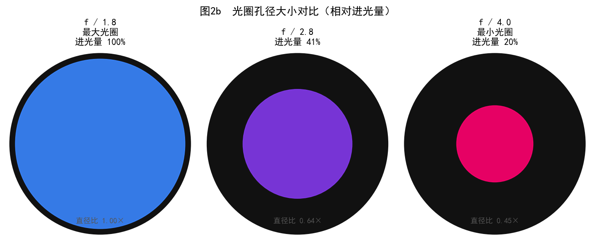
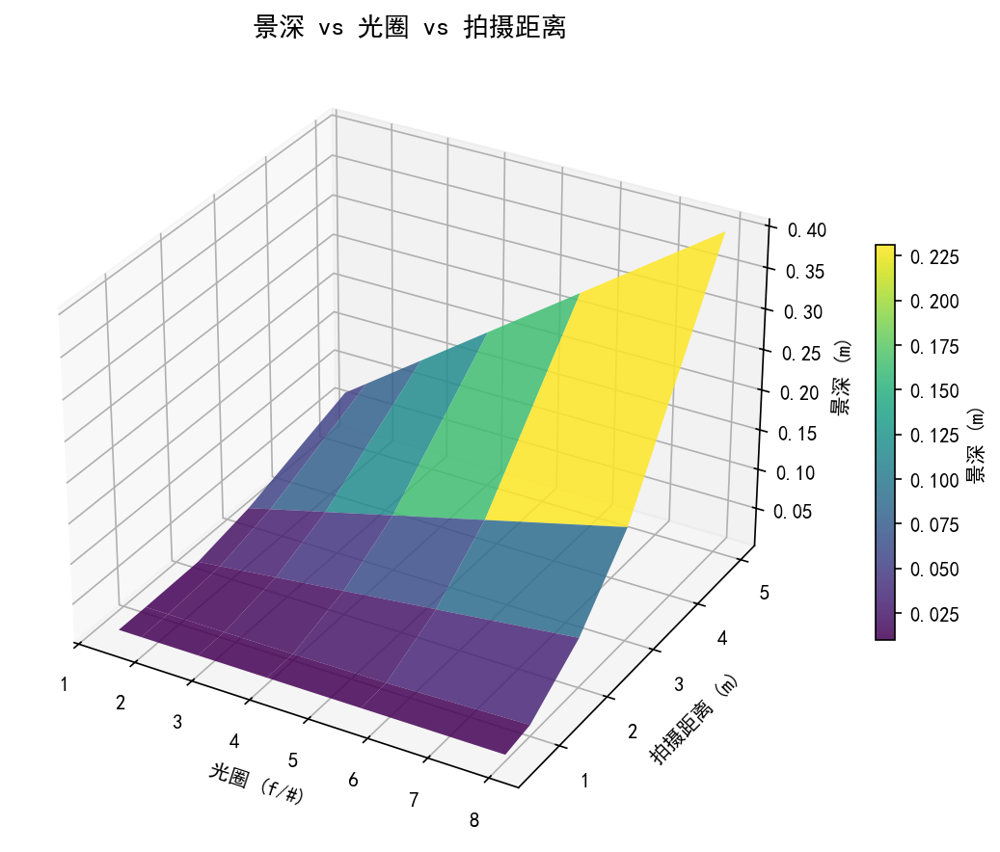
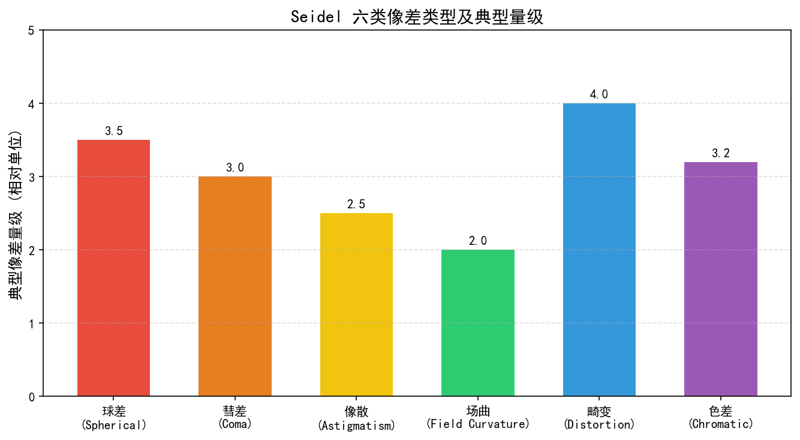
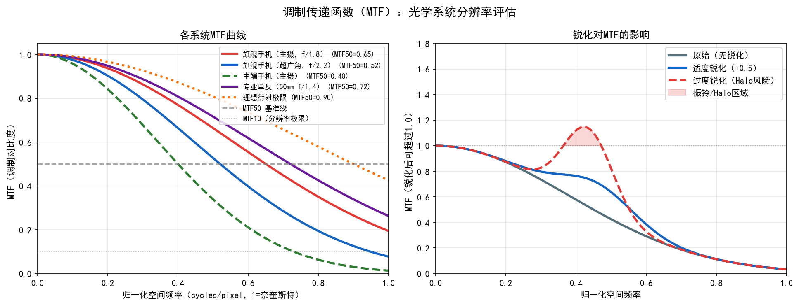
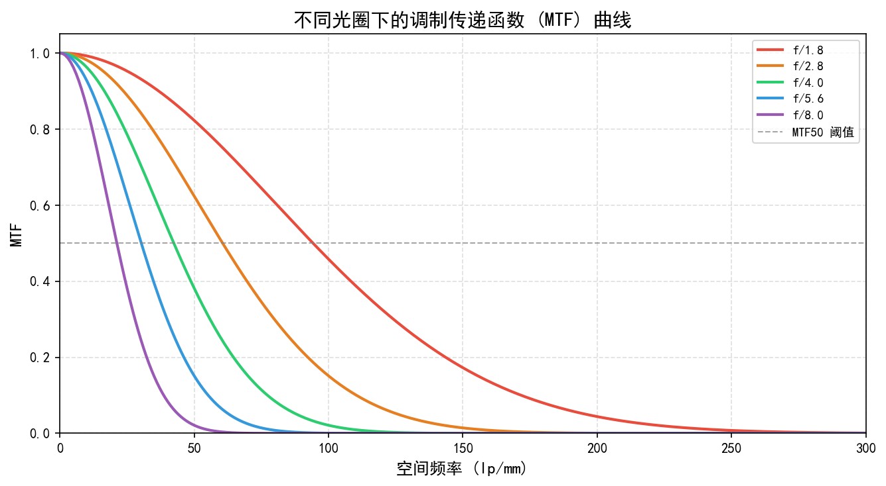

# 第一卷第02章：ISP 工程师光学基础（Optics Basics）

> **流水线位置（Pipeline position）：** 理论基础——支撑 LSC（第二卷第08章）与光学像差校正

> **前置章节（Prerequisites）：** 第一卷第01章（ISP 流水线总览）

> **读者路径（Reader path）：** 所有读者

---

## §1 原理 (Theory)

### 1.1 薄透镜模型 (Thin Lens Model)

手机镜头在物理上不是薄透镜——5–7片非球面塑料镜片组成的系统复杂得多。但薄透镜模型仍然是工程师建立第一性原理直觉的最短路径，大部分 DoF、超焦距、衍射极限的估算用它就够了。物距 $d_o$、像距 $d_i$、焦距 $f$ 满足**高斯薄透镜公式**：

$$\boxed{\frac{1}{f} = \frac{1}{d_o} + \frac{1}{d_i}}$$

**横向放大率**定义为像高与物高之比：

$$m = -\frac{d_i}{d_o}$$

负号表示像相对于物是倒立的。对手机相机而言，$d_o \gg f$（典型值：$d_o \sim 1\,\text{m}$，$f \sim 5\,\text{mm}$），因此 $d_i \approx f$，整个系统工作在近似无穷远对焦条件下。

**数值示例：** 焦距 $f = 4.4\,\text{mm}$ 的手机主摄，对焦距离 $d_o = 0.5\,\text{m}$：
$$d_i = \frac{f \cdot d_o}{d_o - f} = \frac{4.4 \times 500}{500 - 4.4} \approx 4.44\,\text{mm}$$

### 1.2 光圈与 f 数 (f-number)

**f 数**（又称光圈值、f/# 或 N）定义为焦距与入射光瞳直径 $D$ 之比：

$$N = \frac{f}{D}$$

f 数越小，光圈越大，进光量越多。相邻档位之间倍率为 $\sqrt{2}$，曝光量差一档（1 EV）。典型手机主摄 $N = 1.8$，旗舰机最大光圈可达 $N = 1.4$ 。

**数值孔径（Numerical Aperture, NA）** 是描述光学系统集光能力的等效参数，在物空间定义为：

$$\text{NA} = n \cdot \sin\theta_{\max}$$

其中 $n$ 为物方介质折射率（空气中 $n = 1$），$\theta_{\max}$ 为物方最大半开角。对于像空间（成像侧），像方 NA 与 f 数的关系为 $\text{NA}_\text{image} \approx 1/(2N)$（近轴近似，空气中）。NA 在显微镜和工业镜头中更常用；摄影领域通常使用 f 数。

**进光量**与 f 数的关系：镜头传递给传感器的照度（单位面积光通量）正比于：

$$E \propto \frac{1}{N^2}$$

像面照度的完整表达式为 $E = \frac{\pi \tau L}{4 N^2}\cos^4\theta$，其中 $\tau$ 为镜头透过率，$L$ 为场景亮度，$\cos^4\theta$ 项描述随视场角增大的自然暗角；轴上（$\theta=0$）时 $E \propto 1/N^2$。

因此从 f/1.8 收缩到 f/4，进光量降低约 $\left(\frac{4}{1.8}\right)^2 \approx 4.9$ 倍，换算为曝光档位差约 $\log_2(4.9) \approx 2.3\,\text{EV}$。

### 1.3 景深 (Depth of Field, DoF)

焦平面前后存在一个"可接受清晰"区域，称为**景深**。以弥散圆直径 $c$（circle of confusion）作为"可接受"判据，景深的前景深 $D_n$ 和后景深 $D_f$ 为：

$$D_n = \frac{d_o \cdot f^2 / (N \cdot c)}{f^2 / (N \cdot c) + (d_o - f)}$$

$$D_f = \frac{d_o \cdot f^2 / (N \cdot c)}{f^2 / (N \cdot c) - (d_o - f)}$$

工程上常用的近似（适合 $d_o \ll H$，即非超焦距情况）：

$$\text{DoF} \approx \frac{2 N c \cdot f^2 \cdot d_o^2}{f^4 - N^2 c^2 d_o^2}$$

更实用的形式（$d_o \ll H$）：

$$\text{DoF} \approx \frac{2 N c \cdot d_o^2}{f^2}$$

**超焦距** $H$（hyperfocal distance）：对焦到此距离时，从 $H/2$ 到无穷远全部在景深内：

$$H = \frac{f^2}{N \cdot c} + f \approx \frac{f^2}{N \cdot c}$$

**弥散圆直径 $c$ 的工程取值：** $c$ 通常取 1–2 倍像素尺寸（pixel pitch）。例如对于 1.0\,$\mu$m 像素传感器，$c$ 取 1.0–2.0\,$\mu$m。$c$ 的选取直接影响景深和超焦距的计算结果，应根据实际系统的分辨率要求确定。

**ISP 含义：** 手机大光圈模式（Bokeh/人像模式）通过软件模拟浅景深，需要深度图辅助。理解 DoF 物理极限有助于判断软件模拟的合理范围。

**注：薄透镜模型的局限性**：上述公式基于理想薄透镜近似。实际手机镜头为多片式厚透镜组，对焦时通过音圈马达（VCM）移动镜片组改变有效焦距（EFL），而非整体平移镜头改变 $d_i$（单反相机的做法）。本节公式用于建立第一性原理的直觉，定量分析实际镜头需使用 Zemax 等光学设计软件中的厚透镜模型。

### 1.4 衍射极限 (Diffraction Limit)

光的波动性决定了成像系统的分辨率上限。即使镜头无任何像差，点光源经圆形光圈后也会在焦平面形成**艾里斑**（Airy disk）。

**阿贝衍射极限（Abbe Diffraction Limit）：** 阿贝（Ernst Abbe）于 1873 年提出，用 NA 描述分辨两个自发光点的最小间距：

$$d_\text{Abbe} = \frac{0.61\,\lambda}{\text{NA}}$$

其中 NA 为数值孔径（$\text{NA} = n\sin\theta_{\max}$），$\lambda$ 为波长。该公式适用于自发光点（非相干照明）。在空气（$n=1$）、像方 NA $= 1/(2N)$ 的近似下，$d_\text{Abbe} \approx 1.22\,\lambda N$，数值上与瑞利判据结果接近，但两者物理定义不同：Abbe 极限描述的是最小可分辨**半径**（适用于自发光非相干点源），瑞利判据描述的是两点**中心间距**（第一点中心落于第二点第一暗环处），代入 $f/N$ 和孔径直径 $D$ 后数值相同属于近似巧合。

**瑞利判据**给出最小可分辨角分辨率：

$$\theta_{\min} = 1.22 \frac{\lambda}{D}$$

对应焦平面上艾里斑半径：

$$r_{\text{Airy}} = 1.22 \frac{\lambda}{D} \cdot f = 1.22 \lambda N$$

**数值示例：** $\lambda = 550\,\text{nm}$，$N = 1.8$ **[5]**：
$$r_{\text{Airy}} = 1.22 \times 550 \times 10^{-9} \times 1.8 \approx 1.21\,\mu\text{m}$$

> **⚠️ Bayer 三通道艾里斑差异：** 上述 $r_\text{Airy} \approx 1.21\,\mu\text{m}$ 基于绿光 $\lambda = 550\,\text{nm}$ 计算。在 Bayer 阵列中，R/G/B 三通道的艾里斑大小存在波长相关差异：
>
> | 通道 | 典型波长 | 艾里斑半径（f/1.8） |
> |------|---------|-----------------|
> | B（蓝） | ~450 nm | ~0.98 μm |
> | G（绿） | ~550 nm | ~1.21 μm |
> | R（红） | ~620 nm | ~1.35 μm |
>
> 由于人眼亮度方程由绿通道主导，**系统总体 MTF（调制传递函数）由绿通道决定**。红通道艾里斑更大意味着其光学截止频率约比绿通道低 10–12%，这直接影响 Demosaic 算法中 R 通道边缘判决的可靠性——在接近奈奎斯特频率的细节区域，R 通道的梯度判决误差更大，需要适当放宽 AHD/MHC 等算法对 R 通道的 edge threshold。

当代手机传感器像素间距约 $0.7$–$1.0\,\mu\text{m}$ ，艾里斑直径约 $2.4\,\mu\text{m}$，跨越约 2–3 个像素。收缩光圈可降低像差，但衍射效应也随之增强。

**衍射受限阈值**：当艾里斑半径超过像素奈奎斯特极限时，光学分辨率优先受限于衍射。定量判据为：

$$N_{\text{crit}} = \frac{p}{1.22\,\lambda}$$

其中 $p$ 为像素尺寸，$\lambda$ 为代表波长（取绿光 550 nm），1.22 来自艾里斑第一暗环的贝塞尔函数零点（$j_{1,1}/\pi \approx 1.22$）。令艾里斑半径 $r_\text{Airy} = 1.22\lambda N = p$ 得此阈值。对于 $p = 1.0\,\mu\text{m}$：$N_{\text{crit}} \approx 1.5$；对于 $p = 0.7\,\mu\text{m}$：$N_{\text{crit}} \approx 1.0$。这意味着现代高像素密度手机传感器（0.7–1.0 μm 像素）在 f/1.5–1.8 附近就已进入衍射主导区，比 "f/4 阈值"（适用于 APS-C 传感器约 4 μm 像素）严苛得多。进一步收缩光圈超过 $N_{\text{crit}}$ 后，清晰度反而下降——这是**衍射受限**（diffraction-limited）现象。

### 1.5 MTF 与 OTF

**调制传递函数**（Modulation Transfer Function, MTF）描述光学系统对不同空间频率正弦条纹的对比度传递能力，是评价镜头分辨率的核心指标。

**点扩散函数**（PSF）描述点光源经光学系统后的像分布。**光学传递函数**（OTF）是 PSF 的傅里叶变换：

$$\text{OTF}(f_x, f_y) = \mathcal{F}\{\text{PSF}\}(f_x, f_y)$$

MTF 是 OTF 的模：

$$\text{MTF}(f) = |\text{OTF}(f)| = \frac{|\mathcal{F}\{\text{PSF}\}(f)|}{|\mathcal{F}\{\text{PSF}\}(0)|}$$

MTF = 1 表示完美传递，MTF = 0 表示该空间频率完全丢失。工业上常用 **MTF50**（对比度下降到 50% 时的空间频率）作为"等效分辨率"指标，单位为 lp/mm 或 cy/px。

**理想无像差圆形光圈的衍射极限 MTF：**

$$\text{MTF}_{\text{diffraction}}(f) = \frac{2}{\pi}\left[\arccos\left(\frac{f}{f_c}\right) - \frac{f}{f_c}\sqrt{1-\left(\frac{f}{f_c}\right)^2}\right]$$

其中截止频率 $f_c = D/(\lambda f) = 1/(\lambda N)$。实际镜头 MTF 总低于此衍射极限。

### 1.6 镜头像差 (Lens Aberrations)

实际镜头偏离理想薄透镜的程度称为**像差**。ISP 工程师需重点了解以下几类：

#### 1.6.1 径向畸变 (Radial Distortion)

最常见的几何像差。以光轴为中心，图像点偏离理想位置的量与半径 $r$ 相关：

$$x_d = x_u \left(1 + k_1 r^2 + k_2 r^4 + k_3 r^6\right)$$
$$y_d = y_u \left(1 + k_1 r^2 + k_2 r^4 + k_3 r^6\right)$$

其中 $(x_u, y_u)$ 是理想（无畸变）归一化图像坐标，$(x_d, y_d)$ 是实际（畸变）坐标，$r^2 = x_u^2 + y_u^2$。

- **桶形畸变**（barrel distortion）：$k_1 < 0$，图像向中心收缩，直线在边缘弯曲成弓形（向外凸）。常见于广角端。
- **枕形畸变**（pincushion distortion）：$k_1 > 0$，图像向外扩张，直线向中心内凹。常见于长焦端。

#### 1.6.2 切向畸变 (Tangential Distortion)

由于透镜与传感器平面不完全平行（倾斜）产生：

$$\Delta x = 2p_1 x_u y_u + p_2(r^2 + 2x_u^2)$$
$$\Delta y = p_1(r^2 + 2y_u^2) + 2p_2 x_u y_u$$

切向畸变系数 $p_1, p_2$ 通常远小于径向畸变系数 **[2]**。OpenCV 完整畸变模型为 $[k_1, k_2, p_1, p_2, k_3]$，五个系数。

#### 1.6.3 色差 (Chromatic Aberration)

玻璃折射率随波长变化（色散），导致不同波长光线的焦距不同。

- **纵向色差**（longitudinal/axial CA，又称轴向色差）：不同颜色焦点沿光轴方向错位，表现为整体失焦时颜色偏移、各通道 MTF 峰值落在不同焦距位置。**纵向色差无法通过几何变换（亚像素偏移）消除**，须对各色通道施加差异化的逆卷积（deconvolution）来恢复对焦清晰度，完全消除仍具挑战；深度学习方法可通过通道自适应去模糊网络部分缓解。
- **横向色差**（lateral/transverse CA，又称侧向色差）：不同颜色通道在焦平面的放大率（image magnification）不同，R、B 通道相对 G 通道发生径向尺度偏移，表现为高对比度边缘处的彩色"紫边"（purple fringing）。**横向色差可在 RAW Bayer 域校正**：以 G 通道为基准，对 R、B 通道施加径向多项式缩放（radial remapping）或亚像素平移，在 Demosaic 之前完成校正，可有效消除大部分横向色差；该操作在 ISP 的 CA Correction（LCA Correction）模块中完成，须在 Demosaic 前执行，否则色差会被"烘入"插值结果。

**横向色差校正的参数化模型：**

工程实现中，横向色差（Lateral Chromatic Aberration, LCA）校正对 R、B 通道施加径向多项式缩放变换：

$$x'_c(r) = x_c \cdot \left(1 + k_{c,1} r^2 + k_{c,2} r^4 + k_{c,3} r^6\right), \quad c \in \{R, B\}$$

其中 $r = \sqrt{(x - x_0)^2 + (y - y_0)^2} / r_\text{max}$ 为归一化径向距离，$(x_0, y_0)$ 为光学主点，$r_\text{max}$ 为图像对角线半径，$(k_{c,1}, k_{c,2}, k_{c,3})$ 为待标定系数（通常只用 $k_1, k_2$ 两阶即可覆盖典型手机镜头）。

**平台实现差异：**

| 平台 | LCA 校正方式 | 支持阶数 |
|------|-------------|---------|
| 高通 Spectra | Mesh warp（双线性网格，通常 17×13 或更高）| 任意空间分布，可超过 6 阶等效 |
| 联发科 Imagiq | Geometry Correction（多项式 + Mesh 混合）| 3 次多项式 + 局部 mesh 修正 |
| 海思 ISP | 基于色差向量 LUT（lookup table），与 LSC 合并处理 | 取决于芯片版本 |

**工程注意：** 色差校正（LCA）必须在 Demosaic 之前完成（在 RAW Bayer 域对 R/B 通道做亚像素偏移），否则 Demosaic 插值会将色差"烘入"图像，后期无法完全恢复。高通 Spectra ISP 的 ABF（Adaptive Bayer Filter）模块在 Demosaic 前即包含 LCA 预校正步骤。

#### 1.6.4 其他高阶像差

几何光学的单色像差由 **Seidel 五种初级像差（Seidel Aberrations）** 构成（色差是色散效应，独立分类，不在 Seidel 单色像差体系内）：

| 像差类型 | 物理原因 | 视觉表现 |
|----------|----------|----------|
| 球差 (Spherical aberration) | 轴上点，不同孔径光线焦点不同 | 整体模糊，影响 MTF 中高频 |
| 彗差 (Coma) | 轴外点，光束不对称汇聚 | 点光源呈彗星形拖尾 |
| 像散 (Astigmatism) | 子午面与矢状面焦距不同 | 点光源呈十字形展宽 |
| 场曲 (Field curvature) | 最佳焦面为曲面而非平面 | 中心锐利但边缘模糊（或反之） |
| 畸变 (Distortion) | 放大率随视场角变化 | 直线弯曲（桶形/枕形），见 §1.6.1 |

现代手机镜头采用多片非球面镜组和 ED 低色散镜片来抑制上述像差。

### 1.7 暗角与余弦四次方定律 (Vignetting)

图像四角亮度低于中心是**暗角**现象，由三类因素叠加造成：

1. **自然暗角**（natural vignetting）：纯粹的几何光学效应。轴外光线以角度 $\theta$ 入射时，四个独立的几何因素各贡献一次 $\cos\theta$：① 入射孔径的投影面积减小（$\cos\theta$）；② 像点到光圈的距离增大为 $f/\cos\theta$，使立体角减小（$\cos^2\theta$，贡献两次）；③ 传感器面元相对光束倾斜（$\cos\theta$）。四者相乘，总计：

$$E(\theta) = E_0 \cos^4\theta$$

2. **机械暗角**（mechanical vignetting）：镜筒、光阑等机械结构遮挡斜射光束。

3. **像素暗角**（pixel vignetting）：传感器微透镜对非垂直入射光的接收效率下降，与 CRA（chief ray angle）有关。

LSC（Lens Shading Correction，第二卷第08章）通过预计算增益表对暗角进行补偿，增益表需在多个光圈、多个色温下分别标定。

---

## §2 标定 (Calibration)

### 2.1 棋盘格标定法 (Zhang 2000)

Zhengyou Zhang 于 1998–1999 年提出、2000 年发表于 IEEE TPAMI 的平面棋盘格标定方法 **[1]** 是目前工业界最通用的相机内参标定方案，已被集成进 OpenCV `calibrateCamera()`。

**方法原理：**

相机内参矩阵 $\mathbf{K}$ 描述从归一化相机坐标到像素坐标的映射：

$$\mathbf{K} = \begin{pmatrix} f_x & s & c_x \\ 0 & f_y & c_y \\ 0 & 0 & 1 \end{pmatrix}$$

其中 $f_x, f_y$ 为以像素为单位的焦距，$(c_x, c_y)$ 为主点，$s$ 为斜切系数（通常为 0）。

对于每张棋盘格图像，每个角点对应一个约束方程。单张图像提供的约束数 = 角点数 × 2（x, y 各一个）。多张不同位姿的图像联立求解 $\mathbf{K}$ 和畸变系数 $[k_1, k_2, p_1, p_2, k_3]$，并用 Levenberg-Marquardt 非线性优化精化所有参数。

**标定流程：**

1. **硬件准备：** 打印高对比度棋盘格（推荐 9×6 内角点，格子尺寸 25–30 mm ），贴在刚性平板上，确保平整度。
2. **采集图像：** 在不同位置、角度、距离拍摄 15–30 张，确保棋盘格覆盖图像四角和中心。避免运动模糊，使用固定曝光。
3. **角点检测：** `cv2.findChessboardCorners()` + `cv2.cornerSubPix()` 提升角点精度至亚像素级。
4. **标定求解：** `cv2.calibrateCamera(obj_points, img_points, img_size)` 返回 `K`, `dist`, `rvecs`, `tvecs`。
5. **质量评估：** 重投影误差（reprojection error）< 0.3 pixel 为优良，< 0.5 pixel 为良好（满足工程需求），< 1.0 pixel 为可接受；> 1.0 pixel 需重新标定。

```python
# 核心调用示例
ret, K, dist, rvecs, tvecs = cv2.calibrateCamera(
    obj_points,   # 3D 世界坐标（平面棋盘格，z=0）
    img_points,   # 对应的 2D 像素坐标
    img_size,     # 图像尺寸 (width, height)
    None, None    # 初始猜测
)
# dist = [k1, k2, p1, p2, k3]
```

### 2.2 MTF 测量 (ISO 12233 斜边法)

**ISO 12233 斜边法**（slanted edge method）是最常用的无参量 MTF 测量方式：

1. 在均匀照明下拍摄带有 3°–10° 倾斜角的高对比度黑白刀口（slanted edge）**[4]**。
2. 沿垂直于边缘方向提取亚像素级边缘扩散函数（ESF）。
3. 对 ESF 求导得线扩散函数（LSF），再做傅里叶变换得 MTF。

常用工具：`imatest`（商业软件）、`SFRplus`、`dead leaves` 图案，以及开源的 Python `slanted_edge_mtf` 库。

### 2.3 色差测量

使用色边（chromatic edge）测试卡（如 ISO 12233 增强版）或自制红/绿/蓝分色测试卡：

- **横向色差：** 对 R/G/B 通道分别测量边缘位置偏移，报告为像素数。
- **纵向色差：** 对不同通道分别测量 MTF50，焦距偏差体现为不同通道的 MTF 曲线错位。

### 2.4 暗角测量

使用均匀漫反射光场（积分球或柔光箱）：

1. 在目标光圈下拍摄均匀白场图像，确保无任何场景结构。
2. 对每个像素位置除以中心参考值，得到相对增益图（gain map）。
3. 在多个光圈（f/1.8, f/2.8, f/4）和多个色温（2856 K, 5000 K, 6500 K）下重复，生成 LSC 表（覆盖光圈与色温两个维度）。

---

## §3 调参 (Tuning)

### 3.1 畸变校正的时机选择

"在 RAW 阶段校正还是在 RGB 阶段校正"——这个问题在不同团队有不同答案，本质是 RAW 插值精度与流水线延迟之间的权衡：

| 位置 | 优点 | 缺点 |
|------|------|------|
| **Pre-ISP（RAW 阶段）** | 后续所有模块工作在正确坐标系下，避免畸变影响 demosaic/denoise | 计算在 RAW 上进行，双线性插值损失色彩精度；增加 RAW 预处理延迟 |
| **Post-ISP（RGB/YUV 阶段）** | 在 RGB 空间插值质量更好；只需处理一次 | Demosaic 等模块处理了畸变图像，对边缘处理有轻微影响 |

移动端 ISP 芯片（如高通 Spectra, 联发科 Imagiq）通常提供 mesh warp 硬件单元，可在 post-ISP 阶段以极低延迟完成畸变和色差的联合校正。

### 3.2 LSC 表生成与插值

LSC 增益表通常为 $M \times N$ 网格（如 $17 \times 13$ 或 $33 \times 25$），每个格子存储 R/Gr/Gb/B 四通道增益。生成步骤：

1. 对白场图像做中值滤波，去除噪声。
2. 将每个像素的值归一化到图像中心值，取倒数作为增益。
3. 对增益图做双三次（bicubic）下采样到目标分辨率。
4. 确保增益值 ≥ 1.0（不允许降低中心亮度）。

**多光源插值：** 实际 ISP 根据当前 AWB 估计的色温，在冷/暖白场 LSC 表之间做线性插值，避免不同光源下的色调偏差。

### 3.3 畸变模型阶数选择

| 模型 | 参数 | 适用场景 |
|------|------|----------|
| $k_1$ only（一阶） | 1 | 焦距 > 35mm 等效的低畸变镜头 |
| $k_1, k_2$（二阶） | 2 | 大多数标准镜头（推荐默认） |
| $k_1, k_2, k_3$（三阶） | 3 | 广角/超广角镜头（畸变 > 5%） |
| 鱼眼模型（等距/等立体角） | 4 | FOV > 120° 鱼眼镜头 |

阶数过高在标定数据噪声下容易过拟合，应以验证集上的重投影误差作为停止准则。

---

## §4 Artifacts

### 4.1 桶形/枕形畸变

**桶形畸变**（barrel distortion）在超广角镜头（等效焦距 < 24 mm）和鱼眼镜头上最为明显。拍摄建筑、地平线等含直线场景时，笔直的线条被压弯，视觉上令人不适。

**枕形畸变**（pincushion distortion）常见于长焦端（变焦镜头的望远端）。人像拍摄时脸部边缘向内收缩，略显失真。

校正后可能出现的问题：图像四角出现**黑边**，需要裁切（crop），导致有效视角（FoV）缩小和像素损失。

### 4.2 紫边 (Purple Fringing)

高对比度边缘（如逆光下的树枝、窗框边缘）处出现紫色/洋红色色晕，是**横向色差**的典型表现。物理根源：不同波长光线在传感器平面上的汇聚位置不同，导致色通道在边缘处出现亚像素级错位。

紫边在大光圈（f/1.8）、高反差场景下最为明显。数字校正方法：对 R、B 通道施加与 G 通道相比的亚像素平移（径向方向缩放），可消除大部分横向色差。

### 4.3 暗角 (Vignetting)

图像四角亮度低于中心，尤其在大光圈时明显。手机相机 CRA（主光线角度）较大，像素暗角格外突出。LSC 调参时有一个常见的过矫问题：增益 > 1 的区域噪声会被等比例放大，过度校正的结果是四角亮了但更"粗"——均匀性好看了，噪声均匀性变差了。

> **工程推荐（手机主摄 f/1.8 场景）：** LSC 边缘增益超过 2.2 时，需要在四角 NR 强度上做对应补偿；如果 NR 已经到上限，考虑接受轻微残余暗角而非继续推高 LSC 增益。

### 4.4 散景球形 (Bokeh Ball Shape)

背景点光源（如夜景灯光）在浅景深下形成散景光斑（bokeh ball）。理想圆形光圈产生圆形光斑；多边形光圈叶片（如六边形、八边形）产生对应形状的光斑，光圈叶片数和形状是镜头设计的审美考量之一。软件 Bokeh 需用算法模拟这一效果。

---

## §5 评测 (Evaluation)

### 5.1 重投影误差 (Reprojection Error)

标定质量的标准量化指标。对标定集中的每张图像，用求解得到的 $\mathbf{K}$、$\text{dist}$、$[\mathbf{R}|\mathbf{t}]$ 将 3D 世界角点重投影回 2D，计算与检测到的 2D 角点之间的欧氏距离，取所有角点的 RMS：

$$\text{ReprojError} = \sqrt{\frac{1}{N}\sum_{i=1}^{N}\left\|\mathbf{p}_i - \hat{\mathbf{p}}_i\right\|^2}$$

| 水平 | 重投影误差 |
|------|------------|
| 优良 | < 0.3 px |
| 良好 | 0.3–0.5 px |
| 可接受 | 0.5–1.0 px |
| 需重标 | > 1.0 px |

### 5.2 MTF50 测量方法 (ISO 12233)

MTF50（spatial frequency at which MTF = 0.5）是镜头/系统锐度的最常用单值指标。测量步骤：

1. 在受控照明下（均匀，D50（5000 K）或 D65（6500 K），依 ISO 12233:2017 附录 C）拍摄 ISO 12233 测试卡或 SFRplus 测试卡 **[4]**。
2. 选取图像中心及四角的斜边区域（ROI）。
3. 用斜边 MTF 算法（Fourier-based ESF → LSF → MTF）计算各 ROI 的 MTF 曲线。
4. 读取 MTF = 0.5 时的空间频率，报告单位为 lp/mm 或 cy/px（cycles per pixel）。
5. 分析**角落/中心 MTF 比率**（Corner-to-Center ratio）评估镜头的场均匀性；比率 < 0.5 说明四角解析力严重不足。

### 5.3 DXOMark 镜头分数体系

DXOMark 对手机和可换镜头相机的镜头分数由以下子项构成：

| 子指标 | 含义 |
|--------|------|
| Sharpness | 空间加权 MTF，单位 Mpix |
| Transmission | 实测光圈 vs 名义 f/# |
| Chromatic Aberration | 横向色差量（像素单位） |
| Vignetting | 四角相对于中心的亮度损失（EV） |
| Distortion | 最大畸变量（%） |

DXOMark 分数是在多个光圈、多个焦距（变焦镜头）下加权平均的，可参考其方法论作为工程验收标准的参照 **[8]**。

---

## §6 代码 (Code)

见 [`ch02_code.ipynb`](ch02_code.ipynb)

Notebook 包含：
- 薄透镜 Gaussian PSF 仿真（不同 f 数下的模糊效果）
- 桶形/枕形畸变网格可视化
- OpenCV `undistort` 演示
- MTF 曲线绘制（不同模糊程度的对比度 vs 空间频率）
- 衍射极限计算与重投影误差仿真

---


---

> **工程师手记：手机镜头的衍射极限与热漂移标定挑战**
>
> **f/2.2光圈下的衍射极限与像素尺寸的冲突：** 手机主摄的常见光圈为f/1.8至f/2.2，以f/2.2、λ=550nm（绿光）为例，艾里斑（Airy disk）直径约为：d = 2.44 × λ × f/# = 2.44 × 0.55μm × 2.2 ≈ 2.95μm，对应半径约1.47μm。而现代手机主摄像素尺寸普遍已缩至0.8-1.0μm，这意味着衍射极限直径已超过单个像素尺寸的2-3倍——即便镜头制造完美无像差，衍射扩散也会使单像素无法接收到独立的点扩散函数（PSF）峰值，能量被强制扩散至邻近2-3个像素。这是手机ISP必须依赖计算超分（Multi-Frame SR）而非单帧画质的物理根因之一：软件必须从多帧亚像素偏移图像中还原真实的高频分量，而非仅做单帧锐化。f/1.8的艾里斑直径约2.42μm，优于f/2.2，但更大光圈带来更强的像差，大光圈的像差与衍射之间存在最优平衡点，通常在f/2.0附近。
>
> **镜头模组装配公差对LSC标定的影响：** 镜头模组（Lens Module）的装配公差直接决定镜头渐晕（Vignetting）的空间分布形状，进而影响镜头阴影补偿（LSC）标定的精度和鲁棒性。理论上，LSC标定假设镜头渐晕关于光学中心径向对称，但实际装配公差（镜头组倾斜角：±0.05°、光学中心偏移：±10μm、镜筒同轴度：±15μm）会导致渐晕呈现非对称分布，四角亮度差最大可达2-3%。出厂LSC标定如果使用标准径向对称模型，则在装配公差较大的样机上会有残余非均匀性，表现为白色平坦背景上出现肉眼可见的"大灰角"。解决方案是采用非参数化的二维LSC增益表（通常64×64网格），逐像素校正实测渐晕，代价是标定数据量增大约100倍，但能将残余非均匀性从2-3%压缩至0.3%以内。
>
> **塑料镜片热膨胀对对焦标定的影响：** 手机镜头90%以上采用非球面塑料（PMMA/OKP）镜片以降低成本，但塑料的热膨胀系数（CTE）约为65-70 ppm/°C，远高于玻璃的8-10 ppm/°C。环境温度从25°C变化至0°C时（ΔT=25°C），塑料镜片的厚度变化约1.6μm，折射率也随温度变化（dn/dT ≈ -1.2×10⁻⁴/°C）。两者叠加导致焦距偏移约0.3-0.5%，在手机无穷远对焦的最优相位差检测（PDAF）焦点位置上表现为约15-25步电机偏移（标准VCM行程约300步）。若ISP只有常温标定数据而无温度补偿LUT，则在低温环境下拍摄风景时会发现系统性的微对焦偏差（场景边缘焦外）。量产解决方案是在-10°C、25°C、45°C三个温度节点各标定一张PDAF温度补偿LUT，ISP在线读取NTC热敏电阻测温值后插值选用对应补偿量。
>
> *参考：Born & Wolf, "Principles of Optics", 7th ed., Cambridge University Press, 1999；Zhang, "A Flexible New Technique for Camera Calibration", IEEE TPAMI, 2000；Smith, "Modern Optical Engineering", 4th ed., McGraw-Hill, 2008*

---

## 插图


*图1. 不同光圈大小对景深与衍射的影响对比（图片来源：作者自绘）*


*图2. 景深计算公式与参数示意图（图片来源：作者自绘）*


*图3. 镜头像差类型示意图（图片来源：Born et al., "Principles of Optics", Cambridge University Press, 2013）*


*图4. 调制传递函数（MTF）曲线示意（图片来源：ISO, "ISO 12233", 官方文档, 2017）*


*图5. 光学传递函数（OTF）幅相特性示意（图片来源：Smith, "Modern Optical Engineering", McGraw-Hill, 2008）*

---

## 习题

**练习 1（理解）**
手机主摄从 f/1.8 收缩光圈到 f/8 时，画质反而可能下降——请从衍射极限的角度解释这一现象：(a) 分别计算绿光（$\lambda = 550\,\text{nm}$）在 f/1.8 和 f/8 下的艾里斑第一暗环半径（公式：$r_\text{Airy} = 1.22\lambda N$）；(b) 若传感器像素尺寸为 $1.0\,\mu\text{m}$，f/8 下艾里斑直径与像素尺寸的比值是多少？(c) 为什么手机镜头通常不设计可变光圈？

**练习 2（计算）**
某手机长焦镜头焦距 $f = 9.5\,\text{mm}$，f-number $N = 2.8$，像素尺寸 $p = 1.4\,\mu\text{m}$，弥散圆取 $c = 2p$。请计算：(a) 对焦距离 $d_o = 3\,\text{m}$ 时的景深（用近似公式 $\text{DoF} \approx 2Nc d_o^2/f^2$）；(b) 超焦距 $H = f^2/(Nc)$ 是多少米？(c) 若对焦在超焦距处，近景深边界（$H/2$）是多少米？

**练习 3（编程）**
用 Python + NumPy 模拟圆形光圈的点扩散函数（PSF）并计算其对应的 MTF：(a) 在 512×512 的网格上生成半径为 $r$ 像素（取 $r = 5$）的圆形光瞳函数（圆内为 1，圆外为 0）；(b) 对光瞳函数做 FFT 并取模的平方，得到非相干 PSF；(c) 对 PSF 做 FFT 并归一化零频到 1，取实部绝对值，得到 MTF 曲线；(d) 绘制径向 MTF 曲线，标注 MTF50（MTF 下降到 0.5 时对应的空间频率，单位：cycles/pixel）。

## 参考文献

[1] Zhang, "A Flexible New Technique for Camera Calibration", *IEEE Transactions on Pattern Analysis and Machine Intelligence*, 2000.

[2] Brown, "Decentering Distortion of Lenses", *Photogrammetric Engineering*, 1966.

[3] Forsyth et al., "Computer Vision: A Modern Approach", *Pearson*, 2002.

[4] ISO, "ISO 12233:2017 — Photography — Electronic still picture imaging — Resolution and spatial frequency responses", *官方文档*, 2017.

[5] Born et al., "Principles of Optics, 7th ed.", *Cambridge University Press*, 2013.

[6] Malacara (Ed.), "Optical Shop Testing, 3rd ed.", *Wiley*, 2007.

[7] Smith, "Modern Optical Engineering, 4th ed.", *McGraw-Hill*, 2008.

[8] DXOMark, "DXOMark Lens Measurement Methodology", *官方文档*, 2024. URL: https://www.dxomark.com/ranking/

## §7 术语表（Glossary）

**薄透镜模型（Thin Lens Model）**
将透镜简化为厚度可忽略的理想折射平面，物距 $d_o$、像距 $d_i$、焦距 $f$ 满足高斯公式 $1/f = 1/d_o + 1/d_i$。该模型仅适用于建立第一性原理直觉；实际手机镜头为多片式厚透镜组，定量设计须用 Zemax 等软件的厚透镜模型。

**焦距（Focal Length, $f$）**
平行光（无穷远物体）经透镜后汇聚于像方焦点，**后节点（后主平面，Rear Nodal Point / Rear Principal Plane）到像方焦点的距离**即焦距，单位 mm。对薄透镜而言，后节点与镜片中心重合，焦距即镜片中心到焦点之距。实际厚透镜（如手机多片镜组），后节点位置由光学系统设计决定，与物理镜面位置不同。对手机主摄而言，物理焦距约 4–6 mm，等效焦距（EFL）折算到 35 mm 胶片后通常为 24–28 mm。焦距越短，视场角（FoV）越大。

**f 数 / 光圈值（f-number, $N$）**
定义为焦距与入射光瞳直径 $D$ 之比：$N = f/D$。$N$ 越小光圈越大，像面照度正比于 $1/N^2$。相邻档位之间曝光量差 1 EV（$\sqrt{2}$ 倍）。注意本书统一用 $N$ 表示 f 数，以避免与焦距符号 $f$ 混淆。

**入射光瞳（Entrance Pupil）与出射光瞳（Exit Pupil）**
入射光瞳是孔径光阑在物空间的共轭像，决定系统集光能力；出射光瞳是其在像空间的共轭像。主光线角度（CRA, Chief Ray Angle）指出射光瞳处主光线与光轴的夹角，过大的 CRA 会导致像素级暗角，是手机传感器—镜头匹配设计的重要约束。

**景深（Depth of Field, DoF）**
焦平面前后"可接受清晰"的纵向范围。以弥散圆直径 $c$ 为判据，近似公式 DoF $\approx 2Nc \cdot d_o^2 / f^2$。DoF 随 f 数 $N$ 增大、焦距 $f$ 减小、对焦距离 $d_o$ 减小而缩小（景深更浅）。手机大光圈虚化模式通过软件模拟浅景深效果。

**弥散圆（Circle of Confusion, CoC）**
非焦平面处的点光源在像平面上投影为有限大小的光斑，其直径称为弥散圆直径 $c$。工程上 $c$ 通常取 1–2 倍像素尺寸（pixel pitch），例如 1.0 µm 像素取 $c = 1.0$–$2.0\,\mu\text{m}$。$c$ 的选取直接影响景深和超焦距的计算。

**超焦距（Hyperfocal Distance, $H$）**
对焦到超焦距 $H = f^2/(N \cdot c) + f \approx f^2/(N \cdot c)$ 时，从 $H/2$ 到无穷远全部在景深内，是风景摄影泛焦拍摄的最优对焦点。超焦距随 f 数减小（大光圈）和焦距增大而增大，手机广角镜头（短焦距 + 小光圈）的超焦距仅约 1–2 m。

**衍射极限（Diffraction Limit）**
由光的波动性决定的成像分辨率上限。理想圆形光圈下，点光源在焦平面上形成艾里斑，半径 $r_\text{Airy} = 1.22 \lambda N$。对于 $\lambda = 550\,\text{nm}$、$N = 1.8$，艾里斑半径约 1.2 µm，与现代手机像素尺寸相当。收缩光圈超过衍射临界值 $N_\text{crit} = p/(1.22\lambda)$ 后，分辨率反而下降（衍射受限现象）。

**艾里斑（Airy Disk）**
光通过圆形孔径后发生衍射，在焦平面形成的中央亮斑（由贝塞尔函数描述），其周围环绕同心暗环和亮环。艾里斑半径 $r_\text{Airy} = 1.22 \lambda f / D = 1.22 \lambda N$，是衍射极限分辨率的直观体现。

**调制传递函数（Modulation Transfer Function, MTF）**
描述光学系统对不同空间频率正弦条纹对比度的传递能力，定义为 $\text{MTF}(f) = |{\mathcal{F}\{\text{PSF}\}(f)}| / |{\mathcal{F}\{\text{PSF}\}(0)}|$，取值 0–1。MTF = 1 表示完美传递，截止频率处 MTF = 0。MTF50（对比度降至 50% 处的空间频率）是镜头锐度的常用单值指标，单位 lp/mm 或 cy/px。

**光学传递函数（Optical Transfer Function, OTF）**
OTF 是点扩散函数（PSF）的傅里叶变换：$\text{OTF}(f_x, f_y) = \mathcal{F}\{\text{PSF}\}$，是复数函数。MTF 为 OTF 的模，PTF（Phase Transfer Function）为 OTF 的相位。理想轴对称系统 PTF = 0，像差会引入非零 PTF，导致图像特征位移。

**点扩散函数（Point Spread Function, PSF）**
点光源经光学系统后在像面上的强度分布，是系统冲激响应的直观表征。PSF 越小（越接近 delta 函数）意味着分辨率越高。衍射极限 PSF 为艾里图样；像差展宽 PSF，降低 MTF。ISP 中去卷积（deconvolution）算法以 PSF 为核，可部分恢复高频细节。

**径向畸变（Radial Distortion）**
像点偏离理想位置的量与径向距离 $r$ 的关系服从多项式模型 $x_d = x_u(1 + k_1 r^2 + k_2 r^4 + k_3 r^6)$。$k_1 < 0$ 为桶形畸变（广角镜头常见），$k_1 > 0$ 为枕形畸变（长焦端常见）。Brown-Conrady 模型将径向参数 $[k_1, k_2, k_3]$ 与切向参数 $[p_1, p_2]$ 合并，是 OpenCV `calibrateCamera()` 采用的五参数畸变模型。

**切向畸变（Tangential Distortion）**
由透镜与传感器平面不完全平行（倾斜安装）引起，模型为 $\Delta x = 2p_1 x_u y_u + p_2(r^2 + 2x_u^2)$，参数 $p_1, p_2$ 通常远小于径向畸变系数。在正常镜头装配精度下切向畸变对成像质量影响可忽略，但精密立体标定时须纳入考量。

**横向色差（Lateral/Transverse Chromatic Aberration, LCA）**
不同波长光线在像平面的放大率不同，导致 R/G/B 通道在径向方向上出现亚像素级错位，高对比度边缘处表现为"紫边"（purple fringing）。校正方法：以 G 通道为基准，对 R/B 通道施加空间变化的径向缩放（radial remapping），可消除大部分横向色差，在 ISP 的 CA Correction 模块中完成。

**纵向色差（Longitudinal/Axial Chromatic Aberration, ACA）**
不同波长光线沿光轴方向的焦点位置不同，导致整体失焦或色通道 MTF 下降。传统单帧 ISP 难以通过几何变换消除，现代深度学习方法可对不同色通道施加差异化逆卷积（deconvolution）部分缓解，完全消除仍具挑战性。

**暗角（Vignetting）**
图像四角亮度低于中心的现象，由三类因素叠加：(1) 自然暗角——几何光学效应，强度按 $\cos^4\theta$ 衰减；(2) 机械暗角——镜筒/光阑遮挡斜射光束；(3) 像素暗角——传感器微透镜对非垂直入射光（CRA 相关）的接收效率降低。ISP 通过镜头阴影校正（LSC）补偿暗角，过度补偿会等比放大四角噪声。

**余弦四次方定律（Cos⁴ Law）**
描述自然暗角的物理定律：轴外视场角 $\theta$ 处的像面照度相对轴上照度按 $\cos^4\theta$ 衰减，来源为四个独立几何因素：入射孔径投影面积减小（$\cos\theta$）、像点到光圈距离增大导致立体角减小（$\cos^2\theta$，两次）、传感器面元倾斜（$\cos\theta$）。手机超广角镜头（视场角 120°+）四角照度可降低 75% 以上。

**主光线角度（Chief Ray Angle, CRA）**
出射光瞳处主光线（通过孔径中心的光线）与光轴的夹角。不同视场位置的主光线角度不同，边缘视场 CRA 较大。传感器像素的微透镜设计须与镜头 CRA 曲线匹配，否则斜入射光无法被充分聚焦到光电二极管，导致像素暗角和颜色串扰。

**棋盘格标定法（Zhang's Calibration Method）**
Zhengyou Zhang（2000）提出的平面棋盘格相机内参标定方法。通过拍摄 15–30 张不同位姿的棋盘格图像，以每个角点为约束，用 Levenberg-Marquardt 非线性优化联合估计内参矩阵 $\mathbf{K}$（$f_x, f_y, c_x, c_y, s$）和畸变系数 $[k_1, k_2, p_1, p_2, k_3]$。已集成到 OpenCV `calibrateCamera()` 函数中。

**重投影误差（Reprojection Error）**
标定质量的标准量化指标，定义为：用标定得到的相机参数将三维角点重投影回二维像平面，与实际检测到的二维角点之间的 RMS 欧氏距离，单位 pixel。优良标定 < 0.3 px；良好（满足工程需求）< 0.5 px；勉强可接受 < 1.0 px；超过 1.0 px 需重新标定。

**音圈马达（Voice Coil Motor, VCM）**
手机镜头自动对焦（AF）的执行机构，通过电磁力驱动镜片组沿光轴方向移动，改变等效焦距（EFL）以实现对焦，而非如单反相机那样整体平移镜头改变像距。VCM 响应速度约 10–50 ms，运动范围约 200–400 µm，位置精度约 1–3 µm。

**等效焦距（Equivalent Focal Length, EFL）**
将不同传感器尺寸的相机系统统一折算到 35 mm 全幅胶片（36 mm × 24 mm）下的等效视场角对应焦距，便于不同系统间比较。换算关系为 EFL = 物理焦距 × 裁切系数（Crop Factor），其中裁切系数 = 43.27 mm / 传感器对角线长度。

**ISO 12233 斜边法（Slanted Edge Method）**
测量系统 MTF 的标准方法（ISO 12233）。拍摄倾斜约 3°–10° 的高对比度黑白刀口，沿垂直方向提取亚像素级边缘扩散函数（ESF），对 ESF 求导得线扩散函数（LSF），再做傅里叶变换得 MTF 曲线。常用工具包括 imatest、SFRplus 及开源 Python 库。
