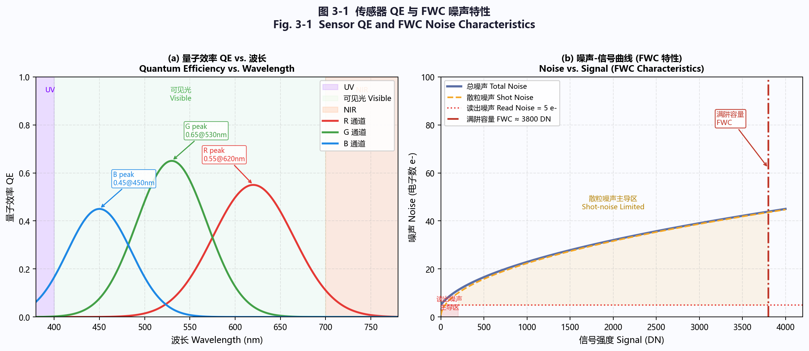
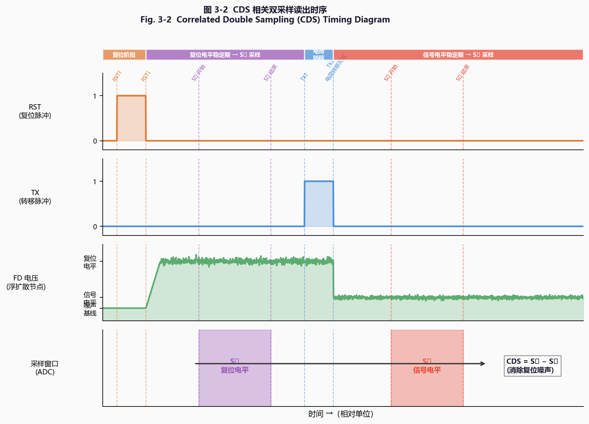
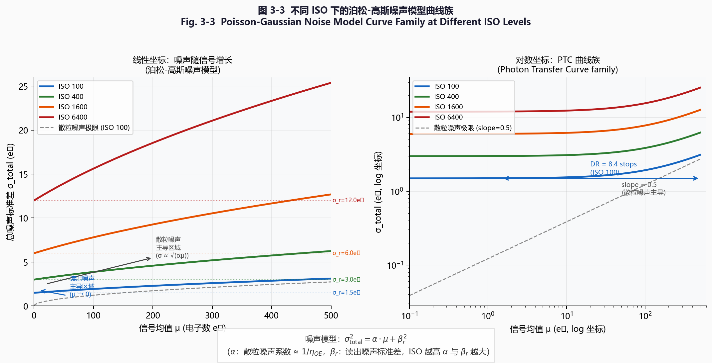
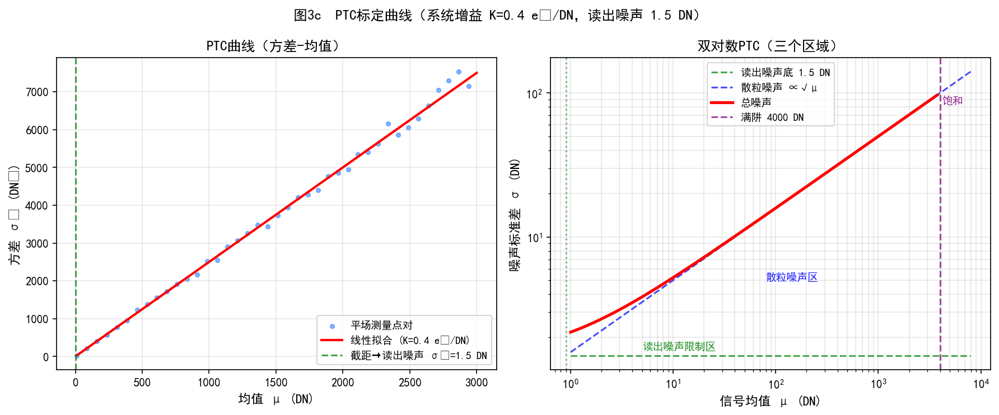
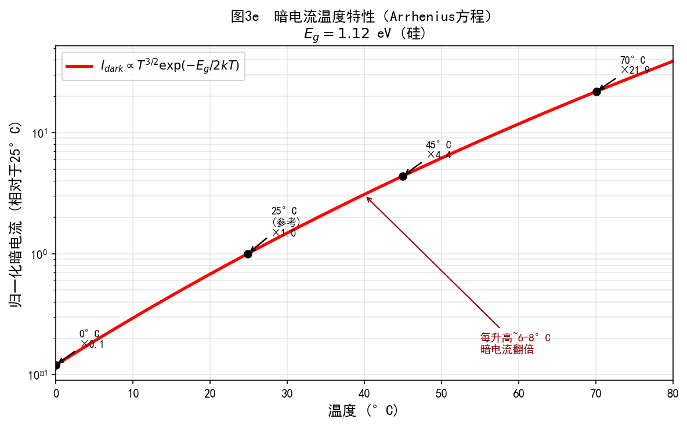
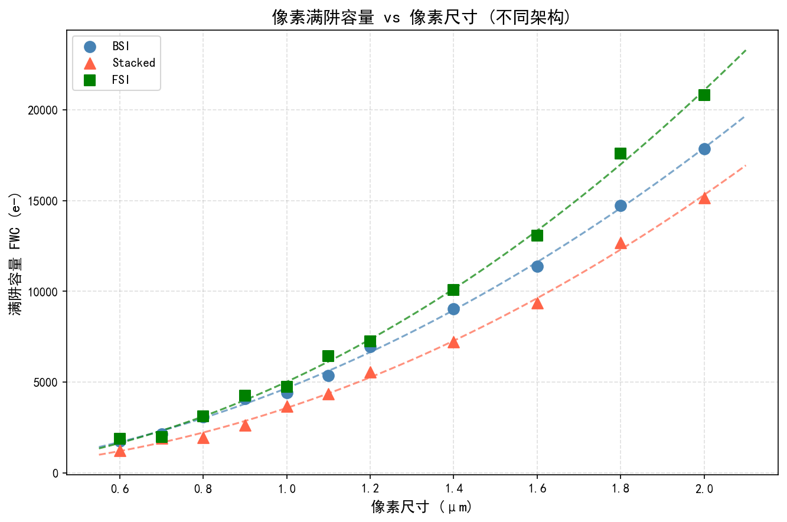
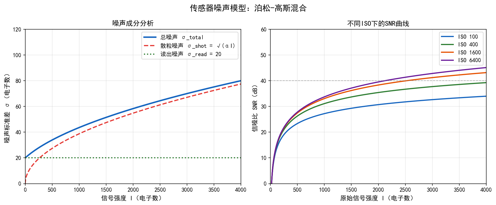
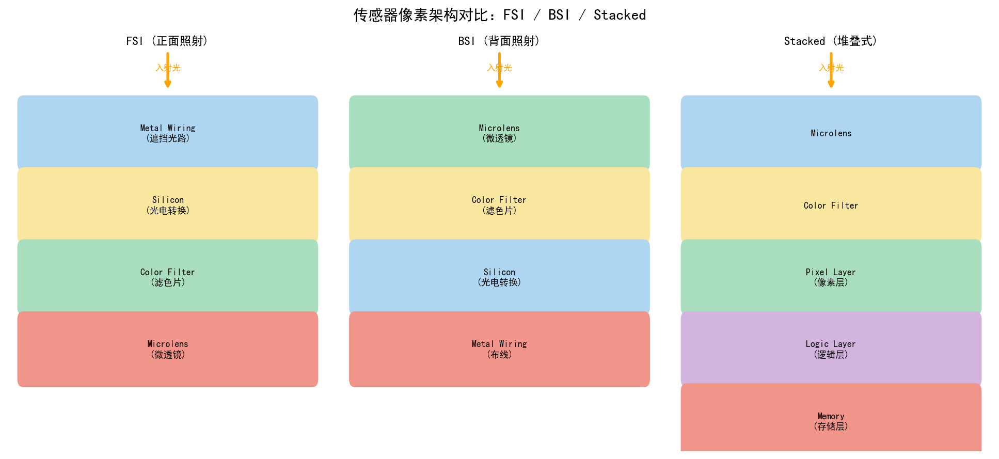
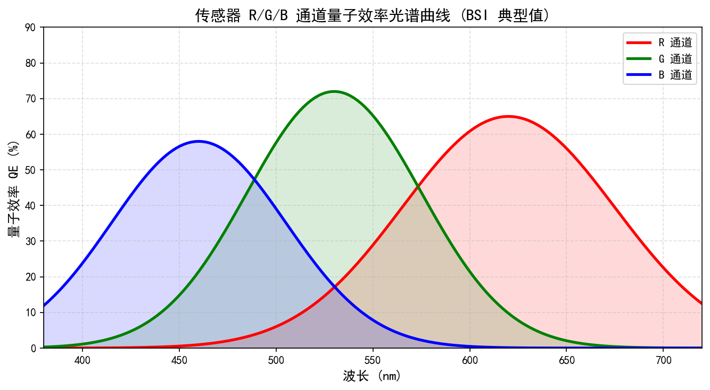

# 第一卷第03章：传感器物理与噪声建模

> 很多调参工程师知道 ISO 越高噪声越大，但说不清噪声从哪里来、为什么换了一颗传感器参数就不对了。本章从 4T 像素结构出发，把读出噪声、散粒噪声、暗电流的物理来源讲清楚，直到泊松-高斯模型 $\sigma^2 = ax + b^2$——这个方程是 BM3D、DnCNN、NAFNet 等所有 RAW 降噪算法的共同输入，标定准了算法才能跑对。
> **读者路径：** 算法工程师请重点阅读 §1.3–§1.5（噪声模型）与 §6（Python 实现）；调参工程师重点阅读 §2–§3；硬件/模组工程师重点阅读 §1.1–§1.2 与 §4。

---

## §1 原理 (Theory)

### 1.1 CMOS 像素单元结构

#### 1.1.1 4T 像素架构

现代 CMOS 图像传感器（CMOS Image Sensor, CIS）几乎全部采用**四晶体管像素（4T Pixel）**架构，从光子入射到数字码输出的信号链如下：

```
光子
  ↓
┌──────────────────────────┐
│  钉扎光电二极管 (PPD)      │  ← 光子→电荷转换，积累自由电子
│  Pinned Photodiode        │
└─────────────┬────────────┘
              │  传输门 TX (Transfer Gate)
              ↓
┌──────────────────────────┐
│  浮动扩散节点 (FD)         │  ← 电荷→电压转换：V = Q / C_FD
│  Floating Diffusion        │
└─────────────┬────────────┘
         ┌────┴────┐
         │  RST    │  ← 复位晶体管：清空 FD，写入参考电平
         └─────────┘
         │  SF     │  ← 源跟随器 (Source Follower)：阻抗缓冲
         └─────────┘
         │  SEL    │  ← 行选择晶体管 (Row Select)：列线寻址
         └────┬────┘
              ↓
          列读出线 → 列 ADC → 数字码 DN
```

**相关双采样（Correlated Double Sampling, CDS）：**

<div align="center"></div>
<p align="center"><em>图 3-1　传感器量子效率（QE）曲线与满阱容量（FWC）噪声模型 / Fig. 3-1 Sensor QE Spectral Response and FWC Noise Model</em></p>

CDS 是抑制复位噪声（kTC 噪声）的关键技术。像素读出时序为：

1. 复位 FD → 采样复位电平 $V_\text{rst}$
2. 打开 TX 将光生电荷转入 FD → 采样信号电平 $V_\text{sig}$
3. 输出差值：$V_\text{out} = V_\text{rst} - V_\text{sig}$

两次采样共同含有的 kTC 噪声项在相减时被消除，使读出噪声可低至 1–3 e⁻ RMS（*来源：论文实验，Fossum & Hondongwa, IEEE JEDS 2014*）。CDS 消除的是 FD 复位晶体管引入的 **kTC 噪声**以及像素级**时变 FPN**，源跟随器（SF）本身的热噪声无法通过 CDS 消除，成为读出噪声的剩余贡献。

> ⚠️ **CDS 局限性**：CDS 仅消除像素内部的 kTC 随机噪声和时变偏置成分，但对以下噪声分量**无效**：(1) **列 ADC 固定偏置差异**——各列 ADC 的斜坡参考电压偏差在相减后仍残留，表现为竖条纹（Column FPN），须通过列 FPN 校正（均值减法或频域高通）单独处理；(2) **PRNU**——像素增益的空间偏差是固定乘性噪声，CDS 差分运算无法消除，需平场标定（FFC）校正；(3) **DSNU**——各像素暗电流空间差异为加性固定偏置，须通过暗帧相减或坏点图处理。因此，完整的噪声校正流程需在 CDS 之后依次执行 BLC → PRNU/FFC → PDPC 三个独立步骤。

<div align="center"></div>
<p align="center"><em>图 3-2　CDS 相关双采样读出时序 / Fig. 3-2 Correlated Double Sampling (CDS) Timing Diagram</em></p>

#### 1.1.2 转换增益（Conversion Gain, CG）

转换增益定义为每个光生电子在 FD 节点产生的电压变化量：

$$\text{CG} = \frac{q}{C_\text{FD}} \quad [\text{V}/\text{e}^-]$$

其中 $q = 1.602 \times 10^{-19}$ C，$C_\text{FD}$ 为浮动扩散电容（典型值 1–5 fF，*来源：公开资料，CMOS Image Sensor工艺手册*），CG 单位为 V/e⁻，工程中常以 μV/e⁻ 表达（乘以 $10^6$ 换算）。典型值：$C_\text{FD} = 2\,\text{fF}$ 时，$\text{CG} = 1.602 \times 10^{-19} / 2 \times 10^{-15} = 80\,\mu\text{V/e}^-$。

- **高转换增益（High CG）**：$C_\text{FD}$ 小，读出噪声低，适合低光拍摄
- **低转换增益（Low CG）**：$C_\text{FD}$ 大，满井容量（FWC）大，高光层次更丰富

#### 1.1.3 量子效率与填充因子

**量子效率（Quantum Efficiency, QE）** 是每个入射光子在光电二极管中产生电子的概率：

$$\text{QE}(\lambda) = \frac{\text{产生的电子数}}{\text{入射光子数}} \in [0, 1]$$

**填充因子（Fill Factor, FF）** 是光电二极管有效感光面积与像素总面积之比。FSI 传感器金属互联层覆盖在感光层上方，FF 随像素缩小而下降（1.0 μm 以下的小像素 FSI 传感器 FF 通常为 20–40%，0.7 μm 像素可降至 20–30%）；BSI 传感器（背照式，Back-Side Illumination）将互联层移至背面，FF 可提升至 **80–95%**（现代旗舰 BSI 工艺典型值，含微透镜聚光后等效值；无微透镜时裸像素 FF 约 70–85%）。

**微透镜阵列（Micro-Lens Array, MLA）** 可将边缘入射光汇聚至光电二极管，等效提升 FF。微透镜需与镜头**主光线角度（Chief Ray Angle, CRA）**匹配，边缘像素需偏心设计。

---

### 1.2 光子散粒噪声

光子到达光电二极管的过程本质上是独立随机事件，服从**泊松分布（Poisson Distribution）**。若期望到达光子数为 $\mu_p$，则实际光子数 $N_p \sim \text{Poisson}(\mu_p)$，其方差等于均值：

$$\sigma_p^2 = \mu_p$$

经过量子效率 QE 转换后，光生电子数 $N_e \sim \text{Poisson}(\text{QE} \cdot \mu_p)$，光子散粒噪声（Photon Shot Noise）的方差为：

$$\boxed{\sigma_\text{shot}^2 = \mu_\text{signal}} \quad [\text{e}^-]^2$$

其中 $\mu_\text{signal}$ 为平均信号电子数。散粒噪声是理论最优信噪比（散粒噪声极限，Shot Noise Limit）的来源，**无法通过任何算法消除**，只能通过增加信号（更大光圈、更长曝光、更大像素）来提升 SNR。

信噪比在散粒噪声主导时：

$$\text{SNR}_\text{shot} = \frac{\mu_\text{signal}}{\sigma_\text{shot}} = \sqrt{\mu_\text{signal}}$$

---

### 1.3 读出噪声

读出噪声是低光画质的硬性天花板——它决定了传感器在接近零信号时的噪声底，无论降噪算法多强，都只能在这个底之上做文章。它产生于模拟信号链（源跟随器、列放大器）和 ADC 量化过程，是与信号无关的加性噪声，通常近似为高斯分布：

$$n_\text{read} \sim \mathcal{N}(0, \sigma_\text{read}^2)$$

各成分的物理机制与量级如下：

| 噪声成分 | 物理机制 | 量级（典型值）|
|---------|---------|-------------|
| **热噪声（Johnson-Nyquist）** | MOSFET 沟道热载流子随机运动，$S_v = 4kTR$ | 主导 |
| **1/f 噪声（闪烁噪声）** | MOSFET 氧化层界面载流子陷阱，功率谱 $\propto 1/f$ | 低频主导 |
| **kTC 噪声（复位噪声）** | 复位操作后 FD 上的热噪声，$\sigma_{kTC}^2 = kTC_\text{FD}$ | CDS 后消除 |
| **随机电报噪声（RTS）** | MOS 界面单个载流子陷阱捕获/释放引起 SF 阈值电压的双态跳变，导致单像素周期性亮暗闪烁 | 0.5–20 e⁻ 等效幅度（视转换增益和工艺而定），低光下最明显 |
| **ADC 量化噪声** | 离散化误差，$\sigma_q^2 = \text{LSB}^2/12$ | 高 bit 数时可忽略 |

源跟随器热噪声的等效输入参考噪声（Input-Referred Noise）：

$$\sigma_\text{SF}^2 = \frac{4kT\gamma}{g_m} \cdot \Delta f \cdot \frac{1}{C_\text{FD}^2}$$

其中 $\gamma \approx 2/3$（长沟道 MOSFET），$g_m$ 为跨导，$\Delta f$ 为带宽，$C_\text{FD}$ 为 FD 电容。

---

### 1.4 暗电流与暗噪声

即使在完全遮光条件下，热激发也会在硅晶格中自发产生电子-空穴对，积累到光电二极管中形成**暗电流（Dark Current）**，其温度依赖关系服从 Arrhenius 模型：

$$I_\text{dark} \propto T^{3/2} \exp\!\left(-\frac{E_g}{2kT}\right)$$

其中 $E_g \approx 1.12$ eV（硅带隙能量），$k = 8.617 \times 10^{-5}$ eV/K（玻尔兹曼常数），$T$ 为绝对温度（K）。经验规律：**温度每升高约 6–8°C，暗电流翻倍**（*来源：论文实验，Theuwissen, Solid-State Imaging with CCDs, 1995；具体温度系数随工艺节点有差异*）。

暗电流本身也服从泊松统计，暗电流散粒噪声（Dark Shot Noise）：

$$\sigma_\text{dark}^2 = I_\text{dark} \cdot t_\text{exp} / q \quad [\text{e}^-]^2$$

其中 $t_\text{exp}$ 为曝光时间。长曝光（数十秒）或高温环境下，暗电流噪声可能超过读出噪声。

**暗信号不均匀性（Dark Signal Non-Uniformity, DSNU）** 定义为像素暗电流值的空间分布非均匀性，表现为暗场图像中的固定亮点图案（热像素 Hot Pixel），是一种加性固定图案噪声。

---

### 1.5 固定图案噪声

**固定图案噪声（Fixed Pattern Noise, FPN）** 是由像素和读出电路的工艺偏差引起的空间固定噪声，不随时间随机变化（帧间重复），可分为两类：

**1. 光子响应不均匀性（Photo Response Non-Uniformity, PRNU）**

PRNU 是各像素对相同入射光子数产生不同信号的特性，本质是像素增益的空间变化：

$$\text{DN}_{i,j} = G_{i,j} \cdot \bar{\mu}_\text{signal} + \text{offset}_{i,j}$$

其中 $G_{i,j}$ 为第 $(i,j)$ 像素的归一化增益（理想值为 1.0）。PRNU 量化定义：

$$\text{PRNU} = \frac{\sigma_{G}}{\bar{G}} \times 100\%$$

PRNU 是**乘性噪声**——信号越强，PRNU 引起的绝对偏差越大，在亮场均匀光照下呈现固定纹理（云状或网格状）。

**2. 暗信号不均匀性（DSNU）**

DSNU 是各像素暗电流的空间差异，是**加性噪声**，与信号强度无关：

$$\text{DSNU} = \sigma_{I_\text{dark}} \quad [\text{e}^-/\text{s}]$$

---

### 1.6 完整噪声模型

CMOS 图像传感器的总噪声方差由四个独立噪声源叠加：

$$\boxed{\sigma_\text{total}^2 = \sigma_\text{shot}^2 + \sigma_\text{read}^2 + \sigma_\text{dark}^2 + \sigma_\text{FPN}^2}$$

展开为信号的函数：

$$\sigma_\text{total}^2 = \underbrace{\mu_\text{signal} + \sigma_\text{read}^2 + I_\text{dark} \cdot t_\text{exp}/q}_{\text{时域噪声（单像素多次读出）}} + \underbrace{(\text{PRNU} \cdot \mu_\text{signal})^2}_{\text{空域噪声（像素间差异）}}$$

**注：时域噪声与空域噪声的区分。** 前三项（散粒噪声、读出噪声、暗电流散粒噪声）属于**时域噪声**（Temporal Noise），描述单个像素在重复读出下的随机波动，可通过多帧平均降低（随帧数 $N$ 以 $1/\sqrt{N}$ 减小）。PRNU 项属于**空域噪声**（Spatial Noise），描述像素间响应不均匀性，多帧平均无法消除。在单帧 ISP 降噪算法中，两者均表现为像素值偏差，故联合建模为总方差；在多帧 HDR 合成、超分辨率等应用中须严格区分。

<div align="center"></div>
<p align="center"><em>图 3-3　不同 ISO 下的泊松-高斯噪声模型曲线族 / Fig. 3-3 Poisson-Gaussian Noise Model Curve Family at Different ISO Levels</em></p>

**泊松-高斯噪声模型（Poisson-Gaussian Model）** **[7]**

实际 ISP 算法中广泛采用的简化形式（忽略 PRNU 非线性项，将暗电流合并入偏置项）：

$$\boxed{\sigma^2(x) = ax + b^2}$$

其中：
- $x$ 为像素强度（DN 值）
- $a = 1/K$（$K$ 为系统增益，e⁻/DN），对应散粒噪声项
- $b^2 = \sigma_\text{read}^2 / K^2 + \sigma_\text{dark}^2$，对应噪声底（noise floor）；$b$ 为等效读出噪声标准差（DN）

此形式即 **EMVA 1288 标准**（European Machine Vision Association Standard 1288）**[1]** 所规定的光子传递曲线（Photon Transfer Curve, PTC）模型，是传感器标定和 RAW 降噪参数生成的基础。

---

### 1.7 动态范围

动态范围（Dynamic Range, DR）定义为传感器可分辨的最大信号与最小信号之比：

$$\text{DR} = 20 \cdot \log_{10}\!\left(\frac{\text{FWC}}{\sigma_\text{noise\_floor}}\right) \quad [\text{dB}]$$

其中 $\sigma_\text{noise\_floor} = \sqrt{\sigma_\text{read}^2 + \sigma_\text{dark}^2}$ 为暗噪声底，FWC（Full Well Capacity，满井容量）为像素最大可积累电子数。

| 传感器类型 | 典型 DR |
|-----------|--------|
| 低端手机（1/4"，FSI）| 55–60 dB（约 9–10 EV）（*来源：第三方测评，DXOmark传感器数据库*）|
| 旗舰手机（1/1.3"，BSI 堆叠）| 70–75 dB（约 12–13 EV）（*来源：第三方测评，DXOmark/Photons to Photos*）|
| 全画幅相机（Sony A7 系列）| 80–85 dB（约 14–15 EV）（*来源：第三方测评，DXOmark传感器评分*）|
| 专业电影机（ARRI ALEXA 35）| ≈102 dB（约 17 EV，ARRI LogC4 官方数据）（*来源：公开资料，ARRI官方白皮书*）|
| Raspberry Pi IMX477（1/2.3"）| 约 66 dB（约 11 EV）（*来源：公开资料，Raspberry Pi官方技术文档*）|

---

## §2 标定 (Calibration)

### 2.1 光子传递曲线（PTC）标定流程

PTC 标定是测量传感器系统增益 $K$、读出噪声 $\sigma_\text{read}$、FWC 和 PRNU 的标准方法，基于 EMVA 1288 规范 **[1]**。

**所需设备：**
- 积分球（Integrating Sphere）或平场光源（Flat-Field Illuminator）：提供空间均匀、亮度可控的漫射光
- 温控箱（可选）：控制传感器温度，用于暗电流的 Arrhenius 标定

**标定步骤：**

1. **环境准备：** 固定传感器与光源距离，关闭所有 ISP 处理（关闭 BLC/LSC/降噪），使用 RAW 12-bit 输出。

2. **采集平场帧对（Flat-Field Pairs）：** 在每个曝光档位拍摄至少 2 帧（帧对），曝光档位从 5% 到 95% 饱和度均匀覆盖（建议 10–15 个档位）。

3. **计算每个曝光档位的均值和方差：**
   $$\bar{\mu}_k = \frac{1}{2}(\bar{I}_{k,1} + \bar{I}_{k,2})$$
   $$\sigma_k^2 = \frac{1}{2} \cdot \text{Var}(I_{k,1} - I_{k,2})$$

   使用帧差法消除空间固定图案噪声：
   $$\sigma_k^2 = \frac{\text{Var}(I_{k,1} - I_{k,2})}{2}$$

4. **拟合 PTC 曲线：** 在 $\sigma^2$ vs $\mu$ 散点图上拟合直线 $\sigma^2 = a\mu + b$：
   - 斜率 $a = 1/K$ → 系统增益 $K$ [e⁻/DN]
   - 截距 $b = \sigma_\text{read}^2 / K^2$ → 读出噪声 $\sigma_\text{read}$ [e⁻]

5. **提取 FWC：** 均值 $\bar{\mu}$ 不再随曝光增加的饱和点即为 FWC（DN），乘以 $K$ 换算为电子数。

**系统增益测量公式：**

$$K = \frac{\bar{\mu}_\text{signal}}{\sigma_\text{shot}^2} = \frac{\Delta\mu}{\Delta\sigma^2} \quad [\text{e}^-/\text{DN}]$$

从斜率直接获得：$K = 1/a$。

---

### 2.1b 双转换增益（DCG/HCG+LCG）模式下的 PTC 标定

现代传感器（如索尼 IMX989、三星 ISOCELL HP3）支持双转换增益（Dual Conversion Gain, DCG），在单帧内切换高增益（HCG）和低增益（LCG）两种模式，扩展等效动态范围。HDR 多帧合成（如长短曝融合）同样涉及两路噪声参数。**两路 CG 模式需要独立标定各自的 PTC**，原因如下：

- HCG 模式（小 $C_\text{FD}$，高 CG）：噪声参数 $(a_\text{HCG}, b_\text{HCG})$，散粒噪声系数小、读出噪声低，适合低光（ISO 高段）
- LCG 模式（大 $C_\text{FD}$，低 CG）：噪声参数 $(a_\text{LCG}, b_\text{LCG})$，FWC 大、动态范围宽，适合高光（ISO 低段）

**多 CG 标定流程扩展：**

1. 在每个 CG 模式下独立重复 §2.1 的 PTC 采集流程，得到 $(a_\text{HCG}, b_\text{HCG})$ 和 $(a_\text{LCG}, b_\text{LCG})$
2. 若使用多帧 HDR 合成（长短曝），对每个曝光通道单独标定：$\sigma^2_\text{long}(x) = a_L x + b_L$，$\sigma^2_\text{short}(x) = a_S x + b_S$
3. 在 HDR 融合时，加权系数应使用各通道实测噪声参数（而非均一权重），方可实现最优噪声抑制：
   $$w_\text{long} = \frac{1/\sigma^2_\text{long}}{1/\sigma^2_\text{long} + 1/\sigma^2_\text{short}}, \quad w_\text{short} = 1 - w_\text{long}$$
4. 切换节点（CG 切换 ISO 值）同样需要在两组 PTC 的参数上标定，确保切换前后噪声模型连续过渡

> 工程提示：若 DCG 切换节点附近出现"噪声台阶"（图像局部出现突变噪声纹理），通常是因为 HCG/LCG 的噪声模型在切换 ISO 未平滑过渡，需用 alpha blending 在切换区间插值两组参数。

---

### 2.2 PRNU 标定

**目的：** 提取每个像素的增益偏差图 $G_{i,j}$，用于平场校正（Flat Field Correction, FFC）。

**步骤：**

1. 用积分球照射传感器，曝光至 **70–90% 饱和度**（推荐 75–80%）。PRNU 信号与信号强度正相关，饱和度过低时 PRNU 贡献被读出噪声掩盖，会将真实的 PRNU 系数低估至 0.1% 以下；70–90% 饱和度可保证 PRNU 贡献对读出噪声的信噪比 > 10 dB。
2. 采集 $N \geq 32$ 帧，逐像素取均值消除时域噪声：
   $$\bar{F}_{i,j} = \frac{1}{N}\sum_{n=1}^{N} I_{i,j,n}$$
3. 计算归一化增益图：
   $$G_{i,j} = \frac{\bar{F}_{i,j}}{\frac{1}{MN}\sum_{i,j}\bar{F}_{i,j}}$$
4. PRNU 量化：
   $$\text{PRNU} = \frac{\text{std}(G)}{\text{mean}(G)} \times 100\%$$

---

### 2.3 DSNU 标定

**目的：** 提取暗电流空间分布图，用于热像素（Hot Pixel）检测和坏像素标记。

**步骤：**

1. 遮住镜头（全黑），传感器在工作温度下（如 35°C）。
2. 以最长曝光时间（如 1/4 s 或 1 s）采集 $N \geq 64$ 帧，逐像素均值：
   $$\bar{D}_{i,j} = \frac{1}{N}\sum_{n=1}^{N} D_{i,j,n}$$
3. 计算每像素暗电流偏差：$\Delta D_{i,j} = \bar{D}_{i,j} - \bar{\bar{D}}$（全图均值为基准）
4. 热像素检测：$|\Delta D_{i,j}| > 5\sigma_\text{read}$ 的像素标记为热像素，写入坏点图（Defective Pixel Map, DPM）。

---

### 2.4 暗电流温度标定

对不同温度 $T_k$ 重复 DSNU 标定，拟合 Arrhenius 曲线：

$$\ln(I_\text{dark}) = \ln(A) + \frac{3}{2}\ln(T) - \frac{E_g}{2k} \cdot \frac{1}{T}$$

从拟合参数可得到任意温度下的暗电流预测值，用于在线黑电平补偿。

---

## §3 调参 (Tuning)

### 3.1 黑电平校正（BLC）参数调整

黑电平（Black Level）是传感器在零光子输入时的输出 DN 值，各通道（R/Gr/Gb/B）独立。

调参流程如下：
1. 在工厂标定中测量各温度、各增益档位的四通道黑电平均值 $\text{BL}_{c}(T, \text{Gain})$。
2. 写入 BLC 查找表（LUT），ISP 在每帧读出时按当前温度和增益查表，逐像素减去对应 BL。
3. **在线自适应 BLC：** 利用传感器 OB（Optical Black）遮光行（通常每帧前 4–8 行处于遮光区），实时估计当前帧的黑电平：
   $$\text{BL}_c^\text{online} = \frac{1}{N_\text{OB}}\sum_{i \in \text{OB}} I_{i,c}$$

**与 DSNU 的交互：** DSNU 图中的空间分布偏差需在 BLC 之后单独用 DSNU 补偿图校正，不应混入 BLC 全局偏移量。

---

### 3.2 LSC 与 PRNU 的交互

镜头阴影校正（Lens Shading Correction, LSC）增益图与 PRNU 增益图在物理上叠加，无法通过单次标定区分，调参时应注意：

- **LSC 标定光源**需使用与 PRNU 标定相同的积分球，保证空间均匀性，否则光源不均匀会混入 LSC 图。
- **PRNU 贡献**在传感器整体均匀性中一般 < 1%（高质量传感器），LSC 幅度通常 10–40%（镜头边缘衰减），二者量级不同，LSC 远大于 PRNU。
- 当传感器更换批次时，需重新标定 LSC（因 PRNU 可能发生改变）。

---

### 3.3 噪声模型参数查找表

很多 RAW 降噪工程师会犯一个错误：把 $(a, b)$ 当常数处理。实际上这两个参数随 ISO 增益系统性变化——$a$（散粒噪声系数，等于系统增益 $K$ 的倒数）随增益线性增大；$b$（噪声底标准差，DN 单位）随增益**线性**增大（即 $b^2$ 随增益的平方增大）；高温下 $b$ 因暗电流额外爬升。RAW 降噪算法（BM3D、DnCNN、NAFNet 等）需要输入当前帧对应的噪声参数，必须在出厂前通过 PTC 标定建立完整 ISO-温度二维查找表：

| ISO | 温度 | $a$（散粒噪声系数）| $b$（噪声底标准差 DN）| 读出噪声 $\sigma_r$ [e⁻] |
|-----|------|-------------------|----------------|--------------------------|
| 100  | 25°C | 0.0062 | 1.8  | 1.9  |
| 400  | 25°C | 0.0248 | 7.1  | 2.1  |
| 1600 | 25°C | 0.0992 | 28.4 | 2.3  |
| 6400 | 25°C | 0.397  | 114  | 2.6  |
| 1600 | 50°C | 0.0992 | 52.1 | 2.3  |

注：$a$ 值随 ISO 增益线性增大（增益 × 4 → $a$ × 4，e.g. ISO 400 的 $a$ 是 ISO 100 的 4 倍）；$b$ 值随增益线性增大（增益 × 4 → $b$ × 4），因此 $b^2$ 随增益平方增大；高温下暗电流分量使 $b$ 额外增大（如 50°C 下 ISO 1600 的 $b = 52.1$ vs 25°C 的 $b = 28.4$）。实践中 $a$、$b$ 须通过 PTC 实测，不可仅凭理论缩放推算。

**典型传感器规格对比表：**

| 传感器 | 格式 | 读出噪声 [e⁻] | FWC [e⁻] | DR [dB] | PRNU [%] |
|--------|------|--------------|----------|---------|---------|
| IMX477（RPi HQ Cam）| 1/2.3" BSI | 1.8 | 7,900 | 73 | < 0.8 |
| IMX989（1 英寸旗舰，50.3 MP）†| 1"    BSI | 1.5 | 12,000 | 79 | < 0.5 |
| IMX766（手机主摄）†| 1/1.56" BSI | 2.1 | 8,500 | 72 | < 1.0 |
| OV5647（RPi Camera v1）| 1/4" FSI | 4.5 | 4,200 | 59 | < 2.0 |
| 工业相机（典型）| 1/1.8" | 5.0–8.0 | 15,000–40,000 | 65–74 | < 1.5 |

† IMX989 与 IMX766 规格数值来自 Sony Semiconductor 厂商 Product Brief（非公开 datasheet），读出噪声为典型值，量产个体差异约 ±0.3 e⁻。IMX477 规格来自 Raspberry Pi 官方技术文档（公开）；OV5647 来自 OmniVision 公开 datasheet。

---

## §4 伪影 (Artifacts)

### 4.1 热像素与坏像素

**热像素（Hot Pixel）** 是暗电流远高于平均值的像素，在长曝光或高温下呈现为暗场中的亮点。

热像素主要由以下因素形成：晶格缺陷（位错、掺杂不均匀）导致局部禁带态密度增大、热激发速率提升；辐射损伤（空间相机、X 射线探测器）；制造工艺偏差。

**坏像素校正（Pixel Defect Pixel Correction, PDPC）：**

```
检测：  |I_{i,j} - median(N8(i,j))| > threshold  → 标记为坏像素
校正：  I_{i,j} ← median(N8(i,j))              （N8：8邻域）
       或：  I_{i,j} ← 双线性插值(上下左右4邻域)
```

坏像素图（DPM）在出厂时写入 OTP（One-Time Programmable）存储，ISP 每帧读入执行静态 PDPC。动态 PDPC 可在每帧检测临时热像素（如高增益下新出现的热点）。

### 4.2 条带噪声（Banding Noise）

**行固定图案噪声（Row FPN）** 表现为水平条带，**列固定图案噪声（Column FPN）** 表现为竖条纹。

行 FPN 由行读出电路偏置不均或传感器温度梯度（上下行温差）引起；列 FPN 由各列 ADC 的斜坡参考电压偏差、列放大器失配导致。

三种常用校正算法：

1. **OB 行校正法（行 FPN）：** 每行的 OB 区域均值作为该行偏移修正量：
   $$I'_{i,j} = I_{i,j} - \left(\frac{1}{N_\text{OB}} \sum_{j \in \text{OB}} I_{i,j} - \text{BL}_\text{global}\right)$$

2. **列均值减法（列 FPN）：** 将全暗场帧的列均值作为列修正 LUT，每帧减去对应列修正量。

3. **频域滤波：** 对行/列方向的功率谱进行频域分析，定位条带频率，应用陷波滤波器（Notch Filter）。

### 4.3 长曝光热失控伪影

在长曝光（> 2 s）或高温环境（传感器结温 > 60°C）下，暗电流在图像中形成渐变的温度梯度图案（热晕，Thermal Bloom）。

传感器中心（功耗热源附近）亮度略高于边缘，形成低频辐射状亮斑叠加在图像背景上。可采取以下缓解措施：
- 降低传感器时钟频率（减少自发热）
- 限制最大曝光时间
- 长曝采帧间隔散热
- 使用暗帧相减（Dark Frame Subtraction）：与信号帧等时长曝光一张遮光暗帧，两帧相减消除热噪声

### 4.4 PRNU 校正残差伪影

LSC 增益图和拍摄场景光源不匹配，是 PRNU 残余纹理最常见的来源。这类问题在测试实验室里通常发现不了——实验室用积分球，色温、均匀性都是受控的；问题出在用户真实场景里，尤其是从日光切换到荧光灯时。

残差出现的典型情况：标定光源色温与拍摄场景色温差异大（LSC 图是色温相关的）；固件更新后 LSC 表未重新标定；传感器批次更换（PRNU 分布改变）；长期使用后传感器老化（PRNU 缓慢漂移）。

**诊断方法：** 对均匀场景拍摄平均帧，计算空间频率分布，若 PRNU 超过 1.5% 且出现可见纹理，需重新标定 LSC。

### 4.5 卷帘快门伪影（Rolling Shutter Artifacts）

CMOS 传感器绝大多数采用**卷帘快门（Rolling Shutter，RS）**读出方式：各行曝光时刻不同，从第 0 行到最后一行依次开始积分，行间时差为行读出时间 $\Delta t_\text{row}$。对于 1/1.56" 手机主摄（如 IMX766，分辨率 4000 × 3000，典型行读出时间 $\Delta t_\text{row} \approx 10\,\mu\text{s}$），全帧读出时间约 $T_\text{RS} = 3000 \times 10\,\mu\text{s} = 30\,\text{ms}$。在此时窗内发生的相机或场景运动会产生几类特征性伪影：

**（1）果冻效应（Jello Effect）/ 图像歪斜（Skew）**

横向匀速运动的物体在垂直方向上产生系统性位移，导致垂直线条倾斜。设水平速度 $v_x$，行间延迟 $\Delta t_\text{row}$，则第 $r$ 行的水平位移量为：

$$\Delta x(r) = v_x \cdot r \cdot \Delta t_\text{row}$$

例如：以 2 m/s 横移、$\Delta t_\text{row} = 10\,\mu\text{s}$，3000 行范围内最大水平偏移 $\Delta x_\text{max} = 2 \times 3000 \times 10^{-5} = 60\,\text{px}$（在 4000 px 宽图像上约 1.5% 斜切）。

**诊断：** 拍摄固定垂直线条（如门框、杆子），快速横向移动相机，若垂直线变为斜线则为 RS Skew。

**缓解：** ISP/后处理可通过陀螺仪（IMU）数据逐行补偿：将陀螺仪在 $[r \cdot \Delta t_\text{row},\,(r+1) \cdot \Delta t_\text{row}]$ 内的角速度积分，反向补偿该行的几何变换（仿射/单应）。Qualcomm Spectra ISP 内置 Electronic Image Stabilization（EIS）模块，以 IMU 辅助的逐行仿射校正为主要方案。

**（2）运动模糊不均（Non-Uniform Motion Blur）**

对于加速运动或旋转运动，图像中不同行的运动方向/幅度不同，导致模糊方向在画面中垂直变化——顶部物体向左模糊，底部物体向右模糊，中间渐变过渡。这类伪影在纯 RS Skew 校正后仍可能残留，需按行估计本地运动模糊核进行盲反卷积或深度学习去模糊。

**（3）闪光灯带（Flash Band / Partial Exposure）**

频闪光源（LED 路灯、荧光屏、相机闪光灯）的发光时间若短于全帧读出时间 $T_\text{RS}$，只有部分行受到该脉冲光照射，产生明显的水平亮带（或暗带）。典型案例：室内 LED 补光灯频率 100 Hz（半周期 5 ms）在 30 ms 读出时间中只照亮约 $5/30 \approx 17\%$ 的行，形成约 1/6 高度的水平亮带。

**诊断：** 对同一场景连续拍摄 5 帧，若亮带位置在帧间随机移动，则为 Flash Band；若固定不动，则为 PRNU 或 LSC 问题。

**缓解：** 使用传感器同步信号（VSYNC）与闪光灯控制器握手，在整帧曝光期间保持闪光灯持续点亮；或切换到高帧率模式缩短 $T_\text{RS}$；对已拍摄图像可用频率分析定位亮带区间后做亮度均衡补偿。

**（4）全局快门（Global Shutter）的工程权衡**

部分工业相机和近年来的手机传感器（如 Sony IMX735 全局快门传感器，首发于 2023 年专业摄影手机）采用**全局快门（Global Shutter，GS）**：所有像素同时开始/结束积分，彻底消除 RS 伪影。代价是每个像素需要额外的存储节点（Memory Node）来在读出期间保存信号，像素面积增大约 20–30%，导致同等制程下全井容量（FWC）降低，动态范围下降约 2–4 dB。手机旗舰仍以 RS 为主，GS 主要用于运动相机、无人机俯拍和工业视觉场景。

| 快门类型 | RS 伪影 | 像素面积 | DR 典型值 | 主要应用 |
|---------|---------|---------|-----------|---------|
| 卷帘快门（RS） | 有（Skew/Jello/Flash Band）| 较小 | 70–80 dB | 手机、相机主摄 |
| 全局快门（GS） | 无 | 较大（+20–30%）| 66–76 dB | 工业视觉、运动相机 |

> **工程注意**：IMU 辅助的 RS 校正在手持慢速横移场景下效果显著（Skew 从 1.5% 降到 < 0.2%），但在高速旋转或 OIS 马达快速补偿期间，IMU 与图像帧的时间同步精度（< 1 ms）至关重要——时间戳对齐误差 1 ms 在 30 ms 全帧读出中相当于约 3.3% 行高的校正残差，直接表现为校正后垂直线条的弯曲残留。

---

## §5 评测 (Evaluation)

### 5.1 EMVA 1288 测量协议

EMVA 1288（European Machine Vision Association Standard 1288）**[1]** 是工业相机和科学相机传感器性能测量的国际标准，规定了从 PTC 曲线中提取各噪声参数的标准方法。核心测量流程：

1. **暗场测量：** 多曝光档位暗帧，提取 $\mu_d$（暗均值）和 $\sigma_d^2$（暗方差）
2. **亮场测量：** 配对平场帧，提取 $\mu_y$、$\sigma_y^2$（使用差帧法）
3. **PTC 拟合：** $\sigma_y^2 - \sigma_d^2 = (1/K)(\mu_y - \mu_d) + \sigma_q^2$
4. **提取关键参数：** $K$、$\sigma_\text{read}$、FWC、PRNU、QE（需配合已知光通量的单色仪）

### 5.2 SNR10 指标

SNR10 定义为信噪比恰好等于 10 dB 时的信号电平（采用 §1.6 噪声模型 $\sigma^2(x) = ax + b^2$，$b$ 为噪声底标准差）：

$$\text{SNR}(x) = \frac{x}{\sqrt{ax + b^2}} = \sqrt{10} \approx 3.16 \quad [\text{对应 SNR} = 10\,\text{dB}；\sqrt{10} = 10^{10/20} \approx 3.162]$$

即由 $\text{SNR}^2 = 10$ 求解：$x^2 = (ax + b^2) \cdot 10$，得：

$$x_\text{SNR10} = \frac{10a + \sqrt{(10a)^2 + 4 \cdot 10 b^2}}{2}$$

SNR10 反映传感器在极低光照下的可用性，值越小越好（越小的信号就能达到可用 SNR）。

### 5.3 动态范围测量

$$\text{DR} = 20 \cdot \log_{10}\!\left(\frac{\mu_\text{sat} - \mu_d}{\sigma_\text{noise\_floor}}\right) \quad [\text{dB}]$$

其中 $\mu_\text{sat}$ 为饱和 DN 值，$\mu_d$ 为黑电平，$\sigma_\text{noise\_floor} = b$（即噪声底标准差，从 PTC 截距 $b^2$ 开方提取）。

### 5.4 PRNU 测量

$$\text{PRNU} = \frac{\text{std}(\hat{G})}{\text{mean}(\hat{G})} \times 100\%$$

其中 $\hat{G}_{i,j} = \bar{F}_{i,j} / \bar{\bar{F}}$，$\bar{F}$ 为多帧平均的平场图。

### 5.5 典型验收阈值

| 指标 | 工业相机（优质）| 手机旗舰传感器 | RPi IMX477 |
|------|----------------|--------------|------------|
| 读出噪声 | ≤ 5 e⁻ | ≤ 2.5 e⁻ | ≤ 2.0 e⁻ |
| PRNU | ≤ 1% | ≤ 1% | ≤ 0.8% |
| 暗电流 @ 25°C | ≤ 5 e⁻/s | ≤ 2 e⁻/s | ≤ 1.5 e⁻/s |
| 动态范围 | ≥ 60 dB | ≥ 70 dB | ≥ 66 dB |
| 热像素比例 | ≤ 0.01% | ≤ 0.005% | ≤ 0.01% |

---

## §6 代码 (Code)

见 [`ch03_sensor_physics_code.ipynb`](ch03_sensor_physics_code.ipynb)

Notebook 包含：
- **Cell 4** 平场帧对采集（`picamera2` 实机 / 模拟数据两用）
- **Cell 5** PTC 曲线标定 → 系统增益 K、读出噪声 σ_read
- **Cell 6** PRNU 增益图提取与热力图可视化
- **Cell 7** DSNU 暗场图与热像素检测
- **Cell 8** 泊松-高斯噪声模型参数提取与 SNR 曲线
- **Cell 9** 坏像素校正（中值邻域替换）
- **Cell 10** 标定报告摘要

运行环境：`pip install numpy matplotlib scipy`；RPi 实机需 `sudo apt install python3-picamera2`。

---

> 以下为参考实现（与 Notebook 内容一致），仅供阅读正文时对照：

```python
"""
传感器物理标定工具集 — Raspberry Pi 4B + IMX477 (HQ Camera)
基于 EMVA 1288 规范，实现：
  1. 平场帧采集 (picamera2)
  2. PTC 曲线拟合 → 系统增益 K、读出噪声
  3. PRNU 增益图提取
  4. DSNU 暗场图提取
  5. 泊松-高斯噪声模型 sigma^2 = alpha*x + sigma_r^2（α=散粒噪声系数，σ_r²=读出噪声方差）
  6. 坏像素校正 (中值邻域替换)
依赖：picamera2, numpy, matplotlib, scipy
安装：pip install picamera2 numpy matplotlib scipy
"""

import numpy as np
import matplotlib.pyplot as plt
import matplotlib.colors as mcolors
from scipy.stats import linregress
from scipy.optimize import curve_fit
import time
import os

# ─────────────────────────────────────────────────────────────────────────────
# 1. 平场帧对采集
# ─────────────────────────────────────────────────────────────────────────────

def capture_flat_field_pairs(exposures: list[int],
                              gain: float = 1.0,
                              n_pairs: int = 2,
                              output_dir: str = "/tmp/ptc_frames") -> dict:
    """
    采集多个曝光档位的平场帧对，用于 PTC 标定。

    参数
    ----
    exposures   : 曝光时间列表，单位微秒 (μs)，如 [500, 1000, 2000, 4000, ...]
    gain        : 模拟增益倍数 (1.0 ~ 16.0)，对应 ISO100 ~ ISO1600
    n_pairs     : 每个曝光档位采集的帧数（≥ 2，用于差帧法）
    output_dir  : 保存帧数据的目录

    返回
    ----
    frames_dict : {exposure_us: np.ndarray shape (n_pairs, H, W)}
                  每个曝光档位对应的 RAW 帧堆叠
    """
    try:
        from picamera2 import Picamera2
        pass  # picamera2.controls not used in this demo
        USE_CAMERA = True
    except ImportError:
        print("[警告] picamera2 未安装，使用模拟数据（合成噪声帧）")
        USE_CAMERA = False

    os.makedirs(output_dir, exist_ok=True)
    frames_dict = {}

    if USE_CAMERA:
        cam = Picamera2()
        # IMX477 原始 RAW12 配置（4056×3040，Bayer RGGB）
        config = cam.create_still_configuration(
            raw={"size": (4056, 3040), "format": "SRGGB12"}
        )
        cam.configure(config)
        cam.start()
        time.sleep(2.0)  # 等待自动曝光稳定后再切手动

        for exp_us in exposures:
            print(f"[采集] 曝光 {exp_us} μs, 增益 {gain:.1f}×")
            cam.set_controls({
                "ExposureTime": exp_us,
                "AnalogueGain": gain,
                "AeEnable": False,
                "AwbEnable": False,
            })
            time.sleep(0.3)  # 让控制参数生效

            pair_frames = []
            for _ in range(n_pairs):
                raw_array = cam.capture_array("raw")
                # IMX477 RAW12: 高4位在高字节，低4位在低字节（packed）
                # picamera2 返回 uint16 数组，直接使用
                frame = raw_array.astype(np.uint16)
                pair_frames.append(frame)
                time.sleep(0.05)

            frames_dict[exp_us] = np.stack(pair_frames, axis=0)

        cam.stop()
        cam.close()

    else:
        # ── 模拟数据：合成散粒噪声 + 读出噪声 ──
        H, W = 480, 640  # 缩小尺寸，方便演示
        K_true  = 0.46   # e⁻/DN (IMX477 @ ISO100 典型值)
        rn_true = 1.8    # 读出噪声 e⁻
        FWC_dn  = int(7900 / K_true)  # 满井 DN 值

        rng = np.random.default_rng(42)

        for exp_us in exposures:
            # 模拟平均信号（假设曝光线性）
            mu_e = exp_us / 5000.0 * 3000.0  # e⁻，最大曝光对应 3000 e⁻
            mu_e = min(mu_e, 7900.0)

            pair_frames = []
            for _ in range(n_pairs):
                # 光子散粒噪声（泊松）
                signal_e = rng.poisson(lam=mu_e, size=(H, W)).astype(np.float32)
                # 读出噪声（高斯）
                read_noise = rng.normal(0, rn_true, size=(H, W)).astype(np.float32)
                # 转换为 DN
                signal_dn = (signal_e + read_noise) / K_true
                signal_dn = np.clip(signal_dn, 0, FWC_dn).astype(np.uint16)
                pair_frames.append(signal_dn)

            frames_dict[exp_us] = np.stack(pair_frames, axis=0)

    return frames_dict


# ─────────────────────────────────────────────────────────────────────────────
# 2. PTC 曲线计算与系统增益提取
# ─────────────────────────────────────────────────────────────────────────────

def compute_ptc(frames_dict: dict,
                roi: tuple | None = None,
                plot: bool = True) -> dict:
    """
    从平场帧对中计算光子传递曲线（PTC），拟合 σ² = (1/K)·μ + σ_read²/K²。

    参数
    ----
    frames_dict : capture_flat_field_pairs() 的返回值
    roi         : 感兴趣区域 (row_start, row_end, col_start, col_end)，None 表示全图
    plot        : 是否绘制 PTC 图

    返回
    ----
    result : {
        'K_gain'     : float,   # 系统增益 e⁻/DN
        'read_noise' : float,   # 读出噪声 e⁻ (RMS)
        'mu_list'    : list,    # 每档位均值 DN
        'var_list'   : list,    # 每档位方差 DN²
        'slope'      : float,   # PTC 斜率 = 1/K
        'intercept'  : float,   # PTC 截距 = σ_read²/K²
    }
    """
    mu_list  = []
    var_list = []

    for exp_us in sorted(frames_dict.keys()):
        frames = frames_dict[exp_us].astype(np.float32)  # (n_pairs, H, W)

        if roi is not None:
            r0, r1, c0, c1 = roi
            frames = frames[:, r0:r1, c0:c1]

        # 差帧法消除固定图案噪声
        n = frames.shape[0]
        var_sum = 0.0
        count   = 0
        for i in range(n - 1):
            diff = frames[i] - frames[i + 1]
            var_sum += np.var(diff) / 2.0  # Var(A-B)/2 = Var(A) when A≈B
            count += 1

        mu   = np.mean(frames)
        var  = var_sum / count

        mu_list.append(float(mu))
        var_list.append(float(var))

    mu_arr  = np.array(mu_list)
    var_arr = np.array(var_list)

    # 去掉接近饱和（方差下降）的点（取前 80% 数据拟合）
    cutoff = int(len(mu_arr) * 0.8)
    idx    = np.argsort(mu_arr)
    mu_fit  = mu_arr[idx[:cutoff]]
    var_fit = var_arr[idx[:cutoff]]

    # 线性拟合 σ² = slope·μ + intercept
    slope, intercept, r_value, _, _ = linregress(mu_fit, var_fit)
    K_gain     = 1.0 / slope                    # e⁻/DN
    read_noise = np.sqrt(max(intercept, 0)) * K_gain  # e⁻

    print(f"[PTC] 系统增益 K = {K_gain:.4f} e⁻/DN")
    print(f"[PTC] 读出噪声 σ_read = {read_noise:.2f} e⁻ (RMS)")
    print(f"[PTC] 拟合 R² = {r_value**2:.4f}")

    if plot:
        fig, axes = plt.subplots(1, 2, figsize=(12, 5))

        # 左图：PTC 散点 + 拟合直线
        ax = axes[0]
        ax.scatter(mu_arr, var_arr, s=40, c="steelblue", label="实测数据点", zorder=5)
        x_line = np.linspace(0, max(mu_arr), 200)
        ax.plot(x_line, slope * x_line + intercept, "r--", lw=2,
                label=f"拟合: σ²={slope:.5f}μ+{intercept:.2f}\nK={K_gain:.3f} e⁻/DN, "
                      f"σ_read={read_noise:.2f} e⁻")
        ax.set_xlabel("均值 μ [DN]", fontsize=12)
        ax.set_ylabel("方差 σ² [DN²]", fontsize=12)
        ax.set_title("光子传递曲线（PTC）", fontsize=13)
        ax.legend(fontsize=10)
        ax.grid(True, alpha=0.3)

        # 右图：log-log PTC，观察各噪声区段
        ax2 = axes[1]
        valid = (mu_arr > 0) & (var_arr > 0)
        ax2.scatter(np.log10(mu_arr[valid]), np.log10(var_arr[valid]),
                    s=40, c="darkorange", label="实测数据点（对数轴）")
        ax2.set_xlabel("log₁₀(μ) [DN]", fontsize=12)
        ax2.set_ylabel("log₁₀(σ²) [DN²]", fontsize=12)
        ax2.set_title("PTC（log-log）：各噪声区段", fontsize=13)
        # 标注斜率参考线
        x_ref = np.linspace(np.log10(mu_arr[valid].min()),
                             np.log10(mu_arr[valid].max()), 100)
        ax2.plot(x_ref, x_ref, "k:", lw=1.5, label="斜率=1（散粒噪声主导）")
        ax2.legend(fontsize=10)
        ax2.grid(True, alpha=0.3)

        plt.tight_layout()
        plt.savefig("/tmp/ptc_result.png", dpi=150)
        plt.show()
        print("[PTC] 图像已保存至 /tmp/ptc_result.png")

    return {
        "K_gain"     : K_gain,
        "read_noise" : read_noise,
        "mu_list"    : mu_list,
        "var_list"   : var_list,
        "slope"      : slope,
        "intercept"  : intercept,
    }


# ─────────────────────────────────────────────────────────────────────────────
# 3. PRNU 增益图提取
# ─────────────────────────────────────────────────────────────────────────────

def compute_prnu_map(flat_frames: np.ndarray,
                     plot: bool = True) -> tuple[np.ndarray, float]:
    """
    从均匀光照平场帧栈中提取 PRNU 增益图。

    参数
    ----
    flat_frames : shape (N, H, W)，N ≥ 16 帧，约 75–80% 饱和度的平场帧（详见 §2.2，过低饱和度会使 PRNU 被读出噪声掩盖）
    plot        : 是否绘制 PRNU 热力图

    返回
    ----
    prnu_map    : shape (H, W)，归一化增益图（均值=1.0）
    prnu_value  : float，PRNU 百分比
    """
    flat_frames = flat_frames.astype(np.float32)
    mean_frame  = np.mean(flat_frames, axis=0)        # (H, W)，时间均值

    global_mean = np.mean(mean_frame)
    prnu_map    = mean_frame / global_mean             # 归一化增益图

    prnu_value  = (np.std(prnu_map) / np.mean(prnu_map)) * 100.0

    print(f"[PRNU] 均匀性 PRNU = {prnu_value:.3f}%")
    print(f"[PRNU] 增益图范围: {prnu_map.min():.4f} ~ {prnu_map.max():.4f}")

    if plot:
        fig, axes = plt.subplots(1, 2, figsize=(12, 5))

        # 左图：PRNU 热力图
        ax = axes[0]
        im = ax.imshow(prnu_map, cmap="RdYlGn_r", vmin=0.98, vmax=1.02)
        plt.colorbar(im, ax=ax, label="归一化增益 G_{i,j}")
        ax.set_title(f"PRNU 增益图 (PRNU={prnu_value:.2f}%)", fontsize=13)
        ax.set_xlabel("列")
        ax.set_ylabel("行")

        # 右图：PRNU 分布直方图
        ax2 = axes[1]
        ax2.hist(prnu_map.ravel(), bins=100, color="steelblue",
                 edgecolor="none", alpha=0.75, density=True)
        ax2.axvline(1.0, color="red", lw=2, label="理想值 G=1.0")
        ax2.set_xlabel("像素增益 G_{i,j}", fontsize=12)
        ax2.set_ylabel("概率密度", fontsize=12)
        ax2.set_title("PRNU 增益分布直方图", fontsize=13)
        ax2.legend(fontsize=10)
        ax2.grid(True, alpha=0.3)

        plt.tight_layout()
        plt.savefig("/tmp/prnu_map.png", dpi=150)
        plt.show()
        print("[PRNU] 图像已保存至 /tmp/prnu_map.png")

    return prnu_map, prnu_value


# ─────────────────────────────────────────────────────────────────────────────
# 4. DSNU 暗场图提取
# ─────────────────────────────────────────────────────────────────────────────

def compute_dsnu_map(dark_frames: np.ndarray,
                     hot_pixel_threshold_sigma: float = 5.0,
                     plot: bool = True) -> tuple[np.ndarray, np.ndarray]:
    """
    从暗场帧栈中提取 DSNU 图并检测热像素。

    参数
    ----
    dark_frames              : shape (N, H, W)，遮光条件下的暗场帧（N ≥ 32）
    hot_pixel_threshold_sigma: 超过 μ+k·σ 的像素标记为热像素，k 默认 5

    返回
    ----
    dsnu_map       : shape (H, W)，暗场均值图（减去全局均值后的偏差图）
    hot_pixel_mask : shape (H, W)，bool，True 表示热像素
    """
    dark_frames = dark_frames.astype(np.float32)
    mean_dark   = np.mean(dark_frames, axis=0)     # (H, W)

    global_dark = np.mean(mean_dark)
    dsnu_map    = mean_dark - global_dark           # 去除全局黑电平偏置的偏差图

    # 热像素检测
    sigma_dark      = np.std(mean_dark)
    hot_pixel_mask  = np.abs(dsnu_map) > hot_pixel_threshold_sigma * sigma_dark
    n_hot           = np.sum(hot_pixel_mask)
    hot_ratio       = n_hot / mean_dark.size * 100.0

    print(f"[DSNU] 全局暗均值: {global_dark:.2f} DN")
    print(f"[DSNU] 暗场标准差: {sigma_dark:.3f} DN")
    print(f"[DSNU] 热像素数量: {n_hot} ({hot_ratio:.4f}% 像素总数)")

    if plot:
        fig, axes = plt.subplots(1, 2, figsize=(12, 5))

        ax = axes[0]
        vmax = np.percentile(np.abs(dsnu_map), 99)
        im = ax.imshow(dsnu_map, cmap="bwr", vmin=-vmax, vmax=vmax)
        plt.colorbar(im, ax=ax, label="暗场偏差 [DN]")
        ax.set_title("DSNU 图（偏差热力图）", fontsize=13)

        ax2 = axes[1]
        ax2.imshow(hot_pixel_mask, cmap="hot_r", interpolation="nearest")
        ax2.set_title(f"热像素分布（{n_hot} 个，{hot_ratio:.3f}%）", fontsize=13)
        ax2.set_xlabel("列")
        ax2.set_ylabel("行")

        plt.tight_layout()
        plt.savefig("/tmp/dsnu_map.png", dpi=150)
        plt.show()
        print("[DSNU] 图像已保存至 /tmp/dsnu_map.png")

    return dsnu_map, hot_pixel_mask


# ─────────────────────────────────────────────────────────────────────────────
# 5. 泊松-高斯噪声模型
# ─────────────────────────────────────────────────────────────────────────────

def noise_model(x: np.ndarray | float,
                a: float,
                b: float) -> np.ndarray | float:
    """
    泊松-高斯噪声模型：σ²(x) = a·x + b²

    参数
    ----
    x : 像素强度（DN 值或电子数），标量或数组
    a : 散粒噪声系数，a = 1/K（K 为系统增益 e⁻/DN）
    b : 等效读出噪声标准差（DN），b² = σ_read²/K² + σ_dark²/K²

    返回
    ----
    sigma_sq : 噪声方差（与 x 同类型）
    """
    x = np.asarray(x, dtype=np.float64)
    return a * x + b ** 2


def estimate_noise_model_from_ptc(ptc_result: dict) -> tuple[float, float]:
    """
    从 PTC 标定结果提取噪声模型参数 (a, b)。

    参数
    ----
    ptc_result : compute_ptc() 的返回值

    返回
    ----
    (a, b) : 噪声模型系数，σ²(x) = a·x + b²；b 为噪声底标准差（DN）
    """
    a = ptc_result["slope"]              # = 1/K，散粒噪声系数
    b_var = ptc_result["intercept"]      # PTC 拟合截距 = 噪声底方差（DN²）
    b = np.sqrt(max(b_var, 0.0))         # 噪声底标准差（DN），与 noise_model() 接口一致；max 防止拟合截距轻微负值导致 nan
    print(f"[噪声模型] σ²(x) = {a:.6f}·x + {b:.4f}²  (b = {b:.4f} DN)")
    print(f"[噪声模型] 对应 K = {1/a:.3f} e⁻/DN，噪声底 σ_floor = {b:.3f} DN")
    return a, b


# ─────────────────────────────────────────────────────────────────────────────
# 6. 坏像素校正（BPC）
# ─────────────────────────────────────────────────────────────────────────────

def apply_bpc(raw_frame: np.ndarray,
              hot_pixel_map: np.ndarray,
              method: str = "median") -> np.ndarray:
    """
    坏像素校正（Bad Pixel Correction, BPC）。

    策略：用 8 邻域中值或双线性插值替换标记的坏像素。

    参数
    ----
    raw_frame     : shape (H, W)，输入 RAW 帧（uint16 或 float32）
    hot_pixel_map : shape (H, W)，bool，True 表示坏像素
    method        : "median"（中值替换，速度快）或 "bilinear"（双线性插值）

    返回
    ----
    corrected     : shape (H, W)，坏像素校正后的帧
    """
    corrected = raw_frame.astype(np.float32).copy()
    H, W      = raw_frame.shape

    # 获取所有坏像素坐标
    bad_rows, bad_cols = np.where(hot_pixel_map)
    n_bad = len(bad_rows)

    if n_bad == 0:
        return corrected

    print(f"[BPC] 校正 {n_bad} 个坏像素（方法：{method}）")

    for r, c in zip(bad_rows, bad_cols):
        # 收集 8 邻域中的有效像素（非坏像素，不越界）
        neighbors = []
        for dr in [-1, 0, 1]:
            for dc in [-1, 0, 1]:
                if dr == 0 and dc == 0:
                    continue
                nr, nc = r + dr, c + dc
                if 0 <= nr < H and 0 <= nc < W and not hot_pixel_map[nr, nc]:
                    neighbors.append(corrected[nr, nc])

        if not neighbors:
            continue  # 极端情况：8 邻域全是坏像素，跳过

        if method == "median":
            corrected[r, c] = float(np.median(neighbors))
        elif method == "bilinear":
            # 简化双线性：仅使用上下左右4邻域
            four_neighbors = []
            for dr, dc in [(-1, 0), (1, 0), (0, -1), (0, 1)]:
                nr, nc = r + dr, c + dc
                if 0 <= nr < H and 0 <= nc < W and not hot_pixel_map[nr, nc]:
                    four_neighbors.append(corrected[nr, nc])
            if four_neighbors:
                corrected[r, c] = float(np.mean(four_neighbors))
            else:
                corrected[r, c] = float(np.median(neighbors))

    return corrected


# ─────────────────────────────────────────────────────────────────────────────
# 完整标定流程示例
# ─────────────────────────────────────────────────────────────────────────────

def run_full_calibration_demo():
    """
    端到端演示：模拟 RPi4B + IMX477 的完整传感器标定流程。
    """
    print("=" * 60)
    print("  传感器标定演示 — IMX477 (RPi HQ Camera)")
    print("=" * 60)

    # ── Step 1：采集平场帧对（10 个曝光档位）──
    exposures = [300, 600, 1200, 2400, 4800, 9600, 19200, 38400, 76800, 150000]
    print("\n[Step 1] 采集平场帧对 ...")
    frames_dict = capture_flat_field_pairs(exposures, gain=1.0, n_pairs=2)

    # ── Step 2：PTC 标定 ──
    print("\n[Step 2] PTC 曲线标定 ...")
    ptc_result = compute_ptc(frames_dict, plot=True)
    K     = ptc_result["K_gain"]
    rn    = ptc_result["read_noise"]

    # ── Step 3：PRNU 图提取（使用中等曝光的多帧）──
    print("\n[Step 3] PRNU 图提取 ...")
    # 取中间曝光档位的帧，合成 32 帧（模拟多次采集）
    mid_exp   = exposures[len(exposures) // 2]
    base_flat = frames_dict[mid_exp]           # (2, H, W)
    # 为演示目的，重复堆叠至 32 帧并叠加随机噪声
    rng       = np.random.default_rng(7)
    flat_stack = np.concatenate([base_flat] * 16, axis=0).astype(np.float32)
    flat_stack += rng.normal(0, 0.5, flat_stack.shape)   # 添加微小随机扰动
    prnu_map, prnu_val = compute_prnu_map(flat_stack, plot=True)

    # ── Step 4：DSNU 图提取（模拟暗场帧）──
    print("\n[Step 4] DSNU 图提取 ...")
    H, W      = flat_stack.shape[1], flat_stack.shape[2]
    dark_base = rng.poisson(2.0, size=(64, H, W)).astype(np.float32)
    # 注入若干人工热像素
    for _ in range(10):
        hr = rng.integers(5, H - 5)
        hc = rng.integers(5, W - 5)
        dark_base[:, hr, hc] += 80.0
    dsnu_map, hot_mask = compute_dsnu_map(dark_base, plot=True)

    # ── Step 5：噪声模型参数 ──
    print("\n[Step 5] 噪声模型参数提取 ...")
    a, b = estimate_noise_model_from_ptc(ptc_result)

    # 可视化噪声模型曲线
    x_range  = np.linspace(0, 4095, 500)
    sigma_sq = noise_model(x_range, a, b)
    snr      = x_range / np.sqrt(np.maximum(sigma_sq, 1e-6))

    fig, axes = plt.subplots(1, 2, figsize=(12, 5))
    axes[0].plot(x_range, np.sqrt(sigma_sq), "b-", lw=2, label="σ(x)（噪声标准差）")
    axes[0].set_xlabel("像素强度 x [DN]", fontsize=12)
    axes[0].set_ylabel("噪声标准差 σ [DN]", fontsize=12)
    axes[0].set_title("泊松-高斯噪声模型", fontsize=13)
    axes[0].legend(fontsize=10)
    axes[0].grid(True, alpha=0.3)

    axes[1].plot(x_range, 20 * np.log10(np.maximum(snr, 1e-6)), "g-", lw=2)
    axes[1].axhline(20, color="red", lw=1.5, ls="--", label="SNR=20 dB")
    axes[1].axhline(10, color="orange", lw=1.5, ls="--", label="SNR=10 dB（SNR10）")
    axes[1].set_xlabel("像素强度 x [DN]", fontsize=12)
    axes[1].set_ylabel("SNR [dB]", fontsize=12)
    axes[1].set_title("信噪比曲线 SNR(x)", fontsize=13)
    axes[1].legend(fontsize=10)
    axes[1].grid(True, alpha=0.3)

    plt.tight_layout()
    plt.savefig("/tmp/noise_model.png", dpi=150)
    plt.show()

    # ── Step 6：坏像素校正演示 ──
    print("\n[Step 6] 坏像素校正演示 ...")
    test_frame = dark_base[0].copy()  # 取一帧暗场
    corrected  = apply_bpc(test_frame, hot_mask, method="median")

    print("\n[完成] 标定报告摘要：")
    print(f"  系统增益 K         = {K:.4f} e⁻/DN")
    print(f"  读出噪声 σ_read    = {rn:.2f} e⁻ (RMS)")
    print(f"  PRNU              = {prnu_val:.3f}%")
    print(f"  热像素数量         = {np.sum(hot_mask)} 个")
    print(f"  噪声模型           : σ²(x) = {a:.6f}·x + {b:.4f}²")
    dr_db = 20 * np.log10(7900 / rn) if rn > 0 else 0
    print(f"  估算动态范围 DR    ≈ {dr_db:.1f} dB")


if __name__ == "__main__":
    run_full_calibration_demo()
```

**代码运行环境说明：**

- 在 Raspberry Pi 4B 上安装 `picamera2`：`sudo apt install python3-picamera2`
- 在 PC 上无相机时，代码自动切换为模拟数据模式（`USE_CAMERA = False`）
- IMX477 传感器 RAW12 输出格式为 `SRGGB12`（Bayer RGGB，12 bit packed）
- 如需处理 Bayer 通道分离（R/Gr/Gb/B），在 PTC 标定中应对各通道分别计算，参见 EMVA 1288 §4.2

---


---

> **工程师手记：传感器饱和容量、读噪与热像素的工程实践**
>
> **满阱容量（FWC）决定了动态范围上限：** 传感器的满阱容量（Full-Well Capacity, FWC）是决定单帧动态范围的物理上限。移动端BSI CMOS（1/1.5英寸以下）的FWC通常在4000-8000电子（e⁻）/像素，而全画幅传感器（如Sony IMX661）可达15000-30000 e⁻。以FWC=6000 e⁻、读噪=2 e⁻为例，理论动态范围 = 20×log₁₀(6000/2) = 69.5dB。手机凭借多帧HDR曝光合成突破单帧限制，但合成算法必须精确知道每颗传感器的FWC才能正确设置过曝保护阈值——通常以0.95×FWC作为饱和保护上限，留5%余量用于防止ADC削波。量产中每批传感器的FWC会有±10-15%的片内/片间差异，这要求ISP的饱和保护阈值需要针对每颗传感器个体标定，而非使用固定的Datasheet标称值。
>
> **BSI CMOS读噪的实测与量产一致性：** 背照式（BSI）CMOS的读噪理论上可低至1-2 e⁻，这是其相对FSI（正照式）的核心优势之一。但"读噪"是统计量，指的是黑暗条件下ADC输出值的标准差折算成电子数。实测方法：在完全遮光（镜头盖遮挡+暗室）条件下，连续拍摄256帧黑帧，对每个像素点的ADC值计算时域标准差，再除以增益（e⁻/ADU）换算为电子数。量产中会发现约0.01-0.05%的像素读噪显著高于均值（超过5 e⁻），这类"高读噪像素"在低光场景下会表现为固定位置的亮点，需要在ISP的坏像素校正（BPC）LUT中预先标记。Sony IMX989（1英寸手机主摄）的量产读噪典型值约1.5 e⁻，是目前消费级手机传感器中读噪最低的量产产品之一。
>
> **热像素的物理机制与温度依赖性：** 热像素（Hot Pixel）的物理根源是硅晶格中的缺陷能级（trap state），在反向偏置的光电二极管中产生暗电流（Dark Current），速率约为1-10 e⁻/秒，远高于正常像素的0.01-0.1 e⁻/秒。暗电流的温度依赖性服从Arrhenius方程：I_dark ∝ exp(-Ea/kT)，激活能Ea约0.55-0.65 eV，意味着温度每升高8°C，暗电流翻倍（规则粗估：每升高10°C约增加1.6-2倍）。这解释了为何在夏日高温（传感器温度可达55-60°C）长曝光夜景时，热像素数量和亮度会比常温显著增多。工程应对方案：出厂时在25°C和45°C各标定一张热像素坐标LUT，并在ISP的DPC（Defective Pixel Correction）模块中实现温度自适应的热像素检测阈值，避免固定阈值在高温时漏检或在低温时误报。
>
> *参考：Janesick, "Photon Transfer: DN → λ", SPIE Press, 2007；Fossum & Hondongwa, "A Review of the Pinned Photodiode for CCD and CMOS Image Sensors", IEEE JEDS, 2014；Sony Semiconductor, "IMX989 Product Brief", Sony Corp., 2022*

---

## 插图


*图1. 光子传递曲线（PTC）标定示意图（图片来源：Janesick, "Photon Transfer: DN → λ", SPIE Press, 2007）*


*图2. 暗电流随温度变化的阿伦尼乌斯关系曲线（图片来源：Janesick, "Scientific Charge-Coupled Devices", SPIE Press, 2001）*


*图3. 像素尺寸与满井容量的关系（图片来源：作者自绘，参考EMVA 1288标准）*


*图4. 传感器噪声模型（泊松-高斯）示意图（图片来源：Foi et al., "Practical Poissonian-Gaussian noise modeling", IEEE TIP, 2008）*


*图5. FSI与BSI像素结构对比示意图（图片来源：Fossum, "CMOS Image Sensors", IEEE Trans. Electron Devices, 1997）*


*图6. 典型CMOS传感器量子效率光谱响应曲线（图片来源：EMVA, "EMVA Standard 1288 Release 4.0", 官方文档, 2021）*


*图7. 传感器量子效率与满阱容量（图片来源：作者，ISP手册，2024）*


*图8. 相关双采样（CDS）时序（图片来源：作者，ISP手册，2024）*


*图9. 传感器噪声模型（图片来源：作者，ISP手册，2024）*

---

## 习题

**练习 1（理解）**
相关双采样（CDS）是抑制读出噪声的关键技术，但并非对所有噪声类型都有效。请分别说明 CDS 能消除哪种噪声（说明消除的物理机制），以及 CDS 对 PRNU（光响应非均匀性）和列 FPN（固定图案噪声竖条纹）为何无效，它们需要什么独立校正步骤来处理。

**练习 2（计算）**
某 BSI 传感器规格：像素尺寸 $1.2\,\mu\text{m}$，满阱容量 FWC = $5000\,e^-$，读出噪声 $\sigma_\text{read} = 2.0\,e^-$（RMS），暗电流在室温（25°C）下可忽略。请计算：(a) 传感器动态范围（dB）：$\text{DR} = 20\log_{10}(\text{FWC}/\sigma_\text{read})$；(b) 换算为 EV（档位数）；(c) 若浮动扩散电容 $C_\text{FD} = 2\,\text{fF}$，转换增益 $\text{CG} = q/C_\text{FD}$ 是多少 $\mu\text{V}/e^-$？（取 $q = 1.602\times10^{-19}\,\text{C}$）

**练习 3（编程）**
用 Python + NumPy 模拟泊松散粒噪声并验证其统计特性：(a) 设定一组均值光电子数 $\mu$ 从 1 到 10000（对数均匀间隔，100 个点），对每个 $\mu$ 生成 10000 次泊松采样（`np.random.poisson`）；(b) 计算每组样本的实测方差；(c) 在双对数坐标下绘制"实测方差 vs $\mu$"，验证其斜率为 1（即方差 = 均值），同时绘制 SNR = $\sqrt{\mu}$ 曲线；(d) 在同一图中标注：$\mu = 100\,e^-$ 时 SNR ≈ 10（20 dB），$\mu = 10000\,e^-$ 时 SNR ≈ 100（40 dB）。

**练习 4（工程分析）**
BSI（背照式）与 FSI（前照式）传感器的填充因子（Fill Factor）存在显著差异。请分析：(a) 为什么 FSI 传感器在像素尺寸缩小到 1.0 μm 以下时填充因子会急剧下降？(b) BSI 工艺将互联层移至背面，填充因子可提升至 80–95%，这对低光 SNR 有多大的改善（以 dB 计，假设 FSI 同尺寸 FF = 30%，BSI FF = 85%）？(c) 微透镜阵列（MLA）的 CRA（主光线角）匹配问题为何在边缘像素更严重？

## 参考文献

[1] EMVA, "EMVA Standard 1288 Release 4.0 — Standard for Characterization of Image Sensors and Cameras", *官方文档*, 2021. URL: https://www.emva.org/standards-technology/emva-1288/

[2] Janesick, "Photon Transfer: DN → λ", *SPIE Press*, 2007.

[3] Janesick, "Scientific Charge-Coupled Devices", *SPIE Press*, 2001.

[4] Hasinoff, "Photon, Poisson Noise", *Computer Vision: A Reference Guide, Springer*, 2014.

[5] Fossum, "CMOS Image Sensors: Electronic Camera-on-a-Chip", *IEEE Transactions on Electron Devices*, 1997.

[6] El Gamal et al., "CMOS Image Sensors", *IEEE Circuits and Devices Magazine*, 2005.

[7] Foi et al., "Practical Poissonian-Gaussian Noise Modeling and Fitting for Single-Image Raw-Data", *IEEE Transactions on Image Processing*, 2008.

[8] Nakamura (Ed.), "Image Sensors and Signal Processing for Digital Still Cameras", *CRC Press*, 2006.

## §7 术语表（Glossary）

**CMOS 图像传感器（CMOS Image Sensor, CIS）**
基于互补金属氧化物半导体（CMOS）工艺制造的图像传感器，每个像素单元集成光电二极管与读出晶体管，支持在芯片上直接实现模拟信号处理与 ADC，具有低功耗、高集成度、可随机访问等特点，已全面取代 CCD 成为手机相机的主流方案。

**4T 像素架构（4-Transistor Pixel）**
现代 CMOS 传感器的主流像素设计，包含四个晶体管：钉扎光电二极管（PPD）传输门（TX）、复位晶体管（RST）、源跟随器（SF）、行选择晶体管（SEL）。该架构通过钉扎结构（Pinned Photodiode）消除暗电流，配合 CDS 抑制 kTC 噪声，读出噪声可低至 1–3 e⁻。

**钉扎光电二极管（Pinned Photodiode, PPD）**
一种将光电二极管与传输门（TX）组合的像素结构，其耗尽区被完全钉扎（pinned），可实现信号电荷的完全转移到浮动扩散节点（FD），无剩余电荷残留（lag）。PPD 是 4T 像素架构实现低暗电流和低读出噪声的关键。

**浮动扩散节点（Floating Diffusion, FD）**
位于 TX 晶体管漏极的高阻抗节点，用于暂存从 PPD 转移来的信号电荷，并通过转换增益 CG = q/C_FD 将电荷转换为电压。FD 电容 C_FD 越小，转换增益越高，读出噪声越低（高 CG 模式），但满井容量 FWC 也相应减小。

**相关双采样（Correlated Double Sampling, CDS）**
像素读出技术，通过采样 FD 复位后的参考电平（$V_\text{rst}$）和信号电平（$V_\text{sig}$），取其差值 $V_\text{out} = V_\text{rst} - V_\text{sig}$ 消除 FD 复位 kTC 噪声和固定模式噪声（FPN）。CDS 使读出噪声可降低至 1–3 e⁻ RMS；但注意源跟随器自身的热噪声无法被 CDS 消除。

**转换增益（Conversion Gain, CG）**
单个光生电子在 FD 节点引起的电压变化量：$\text{CG} = q / C_\text{FD}$，单位 V/e⁻（工程常用 μV/e⁻ 表示）。高转换增益（High CG）对应小 C_FD，读出噪声低，适合低光；低转换增益（Low CG）对应大 C_FD，满井容量大，适合高光。双转换增益（Dual CG, DCG 或 HCG/LCG）传感器在单帧内切换两种 CG，是扩展动态范围的重要技术。

**量子效率（Quantum Efficiency, QE）**
每个入射光子在光电二极管中产生一个电子的概率：$\text{QE}(\lambda) = N_{e^-}/N_\text{photon} \in [0,1]$，随波长 $\lambda$ 变化。峰值 QE 在绿光（550 nm）附近，现代背照式（BSI）传感器峰值 QE 可达 70–80%。QE 直接决定信号强度和散粒噪声极限 SNR。

**背照式传感器（Back-Side Illumination, BSI）**
将金属互联层（BEOL）移至硅基板背面，光从正面（无遮挡）入射至光电二极管，使填充因子（FF）从小像素 FSI 的 20–40% 提升至 BSI 的 **80–95%**（现代旗舰 BSI 工艺典型值，含微透镜聚光后等效值），显著改善低光灵敏度。现代旗舰手机传感器几乎全部采用 BSI 工艺，进一步发展为堆叠式 BSI（Stacked BSI），将像素层与电路层分层堆叠。

**满井容量（Full Well Capacity, FWC）**
像素在饱和前可积累的最大电荷量，单位 e⁻（电子数）。FWC 决定了传感器的最大信号上限，连同读出噪声共同决定动态范围：$\text{DR} = 20\log_{10}(\text{FWC}/\sigma_\text{noise\_floor})$。典型旗舰手机传感器（1 英寸）FWC 约 8,000–15,000 e⁻，远小于全画幅相机（50,000–100,000 e⁻，像素面积 ~25–50 μm²）。

**光子散粒噪声（Photon Shot Noise）**
由光子到达光电二极管的量子随机性产生的基础噪声。光电子数服从泊松分布，噪声方差等于信号均值：$\sigma_\text{shot}^2 = \mu_{e^-}$，SNR 为 $\sqrt{\mu_{e^-}}$。散粒噪声是物理不可消除的噪声下限（散粒噪声极限），只能通过增加信号（大光圈、长曝光、大像素）提升 SNR。

**读出噪声（Read Noise）**
模拟信号链（SF、列放大器）和 ADC 引入的加性高斯噪声，以等效输入参考电子数 e⁻ RMS 表示，与信号强度无关。主要来源包括 SF 热噪声、1/f 闪烁噪声和 ADC 量化噪声。现代 BSI 传感器 ISO100 读出噪声可低至 1–3 e⁻ RMS，高增益模式下可进一步降至亚电子级。

**随机电报噪声（Random Telegraph Signal Noise, RTS）**
由 MOS 界面单个载流子陷阱捕获和释放引起的 SF 阈值电压双态跳变，导致单个像素在相邻帧之间出现随机亮度闪变（闪烁），幅度通常 0.5–20 e⁻（视转换增益和工艺而定）。在极低光（高 ISO）场景下 RTS 噪声最为突出，是低光画质的重要限制因素。深度学习去噪模型（如 CBDNet、Restormer）需专门建模 RTS 噪声。

**暗电流（Dark Current）**
在无光照条件下，热激发在硅晶格中产生电子-空穴对并积累到光电二极管的漏电流，遵循 Arrhenius 方程：$I_\text{dark} \propto T^{3/2} \exp(-E_g/2kT)$，温度每升高约 6–8°C 翻倍。暗电流增大了图像的直流偏置（需 BLC 校正）并引入额外散粒噪声（暗电流散粒噪声）；长曝光场景下须额外采集暗帧并相减（Dark Frame Subtraction）。

**固定图案噪声（Fixed Pattern Noise, FPN）**
由像素和读出电路制造偏差引起的空间固定噪声，帧间重复出现，与随机噪声不同。分为：(1) 光子响应不均匀性（PRNU）——各像素增益偏差，乘性，随信号增强；(2) 暗信号不均匀性（DSNU）——各像素暗电流差异，加性，与信号无关。行 FPN（水平条带）和列 FPN（竖条纹）属于读出电路偏差引起的特殊 FPN。

**光子响应不均匀性（Photo Response Non-Uniformity, PRNU）**
各像素对相同光照产生不同响应的特性，量化为 PRNU = σ_G / mean(G) × 100%，典型值 < 1%。PRNU 是乘性噪声，在均匀场景中表现为固定空间纹理，需通过平场校正（FFC）补偿。LSC（镜头阴影校正）与 PRNU 在物理上叠加，标定时须用空间均匀光源分离两者。

**暗信号不均匀性（Dark Signal Non-Uniformity, DSNU）**
各像素暗电流的空间差异，加性噪声，在暗场图像中表现为固定的亮点图案（热像素）。DSNU 定义为多帧平均暗场图的标准差，单位 e⁻/s。热像素（Hot Pixel）是暗电流异常高的像素，需在出厂时写入坏点图（DPM）并由 PDPC 模块实时校正。

**光子传递曲线（Photon Transfer Curve, PTC）**
描述传感器信号方差 $\sigma^2$ 与均值 $\mu$ 关系的标定曲线：$\sigma^2 = (1/K)\mu + \sigma_\text{read}^2/K^2$。从 PTC 斜率 $1/K$ 可提取系统增益 $K$（e⁻/DN），从截距可提取读出噪声，从饱和点可读取 FWC。基于帧差法消除 FPN 干扰，是 EMVA 1288 标准规定的核心测量方法。

**系统增益（System Gain, $K$）**
传感器系统的整体电子-数字码转换因子，单位 e⁻/DN（或 DN/e⁻ 的倒数），综合了转换增益 CG、列放大器增益和 ADC 增益的总效果。$K = 1 / (\text{PTC 斜率})$，典型手机传感器在 ISO100 时 $K$ 约 0.3–1.0 e⁻/DN，高 ISO 时减小（增益增大）。

**泊松-高斯噪声模型（Poisson-Gaussian Noise Model）**
ISP 降噪算法中广泛使用的噪声统计近似模型：$\sigma^2(x) = ax + b^2$，其中 $x$ 为像素强度（DN），$a = 1/K$ 对应散粒噪声项，$b^2 = \sigma_\text{read}^2/K^2$ 对应噪声底（$b$ 为等效读出噪声标准差，DN）。该模型由 EMVA 1288 的 PTC 标定确定，为 BM3D、DnCNN、NAFNet 等降噪算法提供噪声参数输入，也是 RAW 降噪 noise estimation 模块的输出目标。

**EMVA 1288 标准**
欧洲机器视觉协会（EMVA）发布的图像传感器性能测量标准（当前版本 4.0），规定了从 PTC 曲线提取系统增益、读出噪声、FWC、PRNU、DSNU、暗电流和量子效率的标准化测量方法，是传感器选型、标定和验收的权威参考。核心测量量：K、σ_read、FWC、PRNU、SNR_max、DR、QE。

**信噪比（Signal-to-Noise Ratio, SNR）**
信号与噪声的比值，通常以 dB 表示：$\text{SNR} = 20\log_{10}(\mu/\sigma)$。在散粒噪声主导区 $\text{SNR} = \sqrt{\mu_{e^-}}$，决定了图像的颗粒感和可用细节。SNR10 定义为 SNR 恰好等于 10 dB（即 3.16:1）时的信号电平，反映传感器在极低光照下的可用性下限。

**动态范围（Dynamic Range, DR）**
传感器可分辨的最大与最小信号之比：$\text{DR} = 20\log_{10}(\text{FWC}/\sigma_\text{noise\_floor})$，单位 dB 或 EV（1 EV ≈ 6 dB）。DR 受 FWC（上限）和噪声底（下限）双重约束，是评价相机暗光性能和宽容度的核心指标。双转换增益（DCG）和多帧 HDR 合成可有效扩展单次曝光的等效 DR。

**光学黑区（Optical Black, OB）**
传感器上被遮光材料覆盖的像素区域（通常位于每行/帧的前若干列/行），用于实时估计当前帧的黑电平偏移：$\text{BL}_c^\text{online} = \text{mean}(\text{OB 区域})$。OB 区在 BLC 校正中不可或缺，可追踪温度、湿度等环境变化引起的黑电平漂移，比仅依赖出厂 LUT 更准确。
