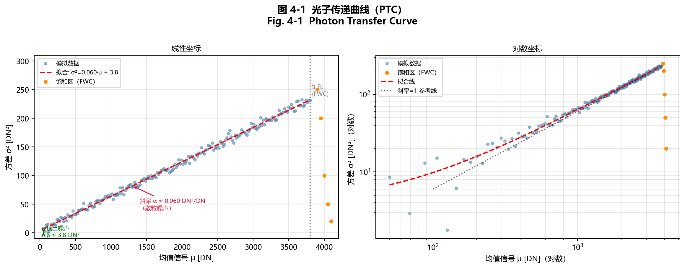
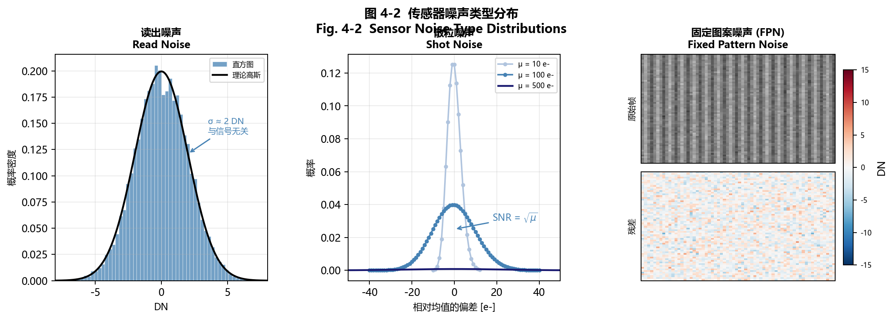
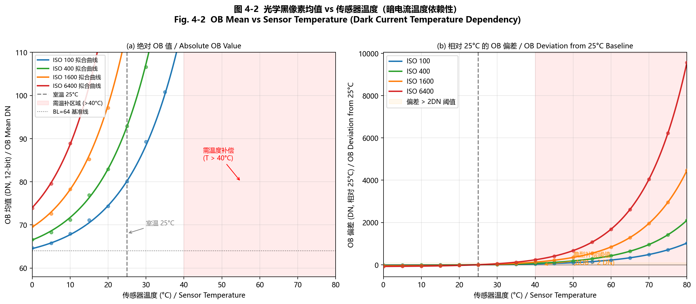
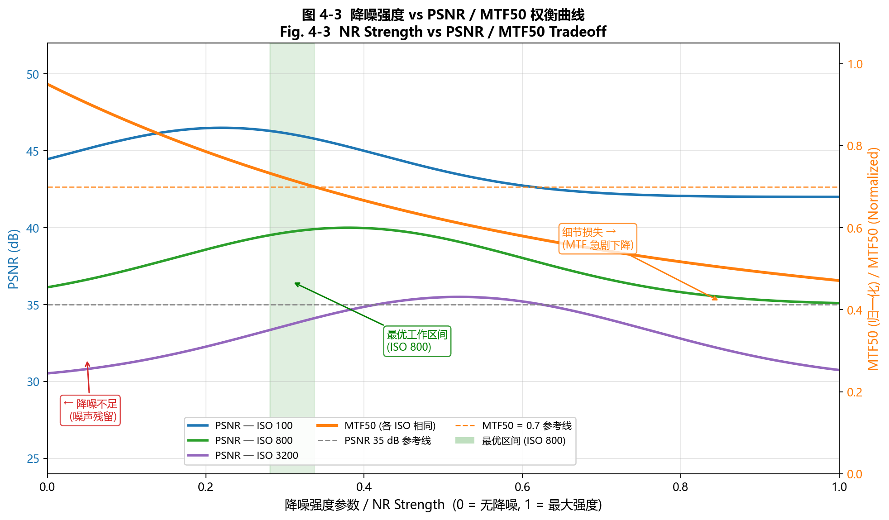
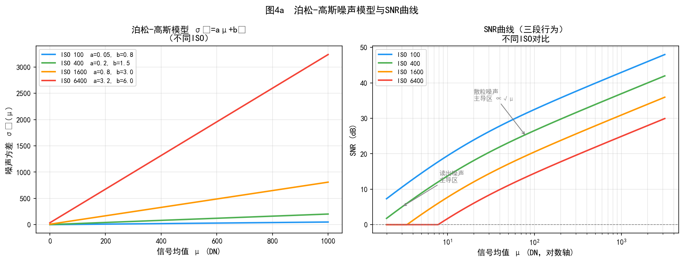
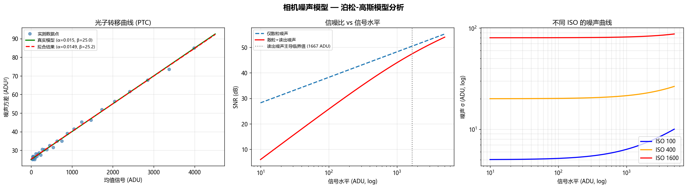
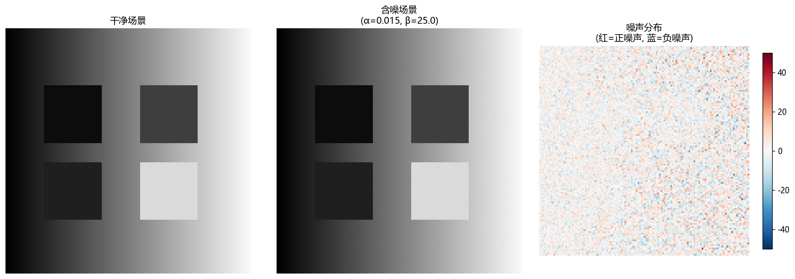

# 第一卷第04章：图像传感器噪声模型

> **流水线位置：** 所有去噪模块的基础（第二卷第03章原始数据去噪、第三卷第08章视频去噪/第三卷第01章深度学习去噪综述）

> **前置知识：** 第一卷第03章（传感器物理——光电二极管、像素势阱容量、ADC）

> **适用读者：** 全部读者

---

## §1 原理 (Theory)

### 1.1 噪声从何而来？

去噪器打开噪声模型之前，先想清楚一件事：你的去噪器"以为"面对的是什么噪声？大多数文献默认 AWGN（加性高斯白噪声），因为数学好处理。真实 RAW 图像并不是 AWGN——实际上是两种物理机制叠加的结果，用错了噪声假设，调参调再久也是在走弯路。

第一种是**光子散粒噪声**。光被量子化为光子，即使光照完全稳定，固定曝光时间内到达像素的光子数也服从泊松分布——这是量子力学级别的随机性，无法通过改进电路消除。

第二种是**读出电路噪声**。光电二极管电荷积分 → 源跟随器放大器 → 列级 ADC 这条转换链会引入与场景亮度无关的热噪声、1/f 闪烁噪声和量化噪声，可以用高斯分布近似，且方差恒定。

两类噪声性质截然不同，这才是泊松-高斯模型存在的理由——不是数学游戏，是物理现实。

---

### 1.2 光子散粒噪声（Shot Noise，泊松噪声）

设 $\mu_{e^-}$ 为一次曝光中某像素收集到的期望光电子数（$\mu_{e^-} = \text{QE} \cdot \mu_p$，$\mu_p$ 为期望光子数），则实际光电子计数 $N_{e^-}$ 是一个随机变量：

$$N_{e^-} \sim \text{Poisson}(\mu_{e^-})$$

泊松分布的关键特性是方差等于均值：

$$\mathbb{E}[N_{e^-}] = \mu_{e^-}, \qquad \text{Var}(N_{e^-}) = \mu_{e^-}$$

这意味着**散粒噪声是信号依赖的**：亮像素在绝对值上噪声更大，但由于 $\text{SNR} = \mu_{e^-} / \sqrt{\mu_{e^-}} = \sqrt{\mu_{e^-}}$，亮像素的信噪比更高。散粒噪声无法通过改善电路来降低——它是测量的基本量子极限。

经系统增益 $K$（单位 e⁻/DN，即每个数字量对应多少光电子）的电荷-数字转换后，像素值 $I$（DN）满足：

$$\text{Var}_{\text{shot}}(I) = \alpha \cdot \mu$$

其中 $\mu$ 是以 DN 表示的像素均值，$\alpha = K^{-1}$（单位 DN/e⁻，即系统增益 $K$ 的倒数）。量纲验证：推导过程为 $\text{Var}(I) = \mu_{e^-}/K^2 = (K\mu)/K^2 = \mu/K$，因 e⁻ 为无量纲计数量，$[\alpha] \cdot [\mu] = (\text{DN/e}^-) \cdot \text{DN} = \text{DN}^2$，与方差单位一致。$\alpha$ 的物理含义是：每个光电子经 ADC 转换后对输出 DN 方差的贡献系数（散粒噪声系数）。注意 $\alpha \neq g$——$g$（ADU/e⁻）是系统增益，$\alpha$（DN²/DN）是散粒噪声传播系数，两者数值上 $\alpha = 1/K = g$（当 ADU≡DN 时），但物理意义和使用场景不同；本手册统一用 $\alpha$ 表示噪声模型中的散粒噪声系数，$g$ 仅在传感器物理章节（第一卷第03章）中用于描述电荷-数字转换比率。

---

### 1.3 读出噪声与热噪声（高斯噪声）

与光子信号无关，读出电路会引入噪声本底。其来源包括：

- **源跟随器晶体管中的热（约翰逊-奈奎斯特）噪声（Thermal (Johnson-Nyquist) noise）：** $\sigma^2 \propto k_B T / C$
- **MOS 晶体管中的 1/f（闪烁）噪声（1/f (flicker) noise）：** 在低频处占主导
- **复位噪声（kTC 噪声）（Reset noise）：** 复位浮动扩散区时的电荷不确定性；在许多传感器中，这一噪声通过相关双采样（CDS）得到大幅抵消
- **ADC 的量化噪声（Quantization noise）：** $\sigma^2_{\text{quant}} = \Delta^2 / 12$，其中 $\Delta$ 为最低有效位（LSB）步长

CDS 之后，所有电子噪声分量的总和可以用零均值加性高斯分布很好地近似：

$$n_{\text{read}} \sim \mathcal{N}(0, \sigma_{\text{read}}^2)$$

与散粒噪声不同，$\sigma_{\text{read}}^2$ 不依赖于信号强度。它代表传感器的最低噪声本底，在暗部（曝光不足）区域清晰可见。

---

### 1.4 统一的泊松-高斯（异方差）噪声模型

将散粒噪声与读出噪声合并，均值为 $\mu$（以 DN 为单位，线性原始域）的像素的总噪声方差为：

$$\boxed{\sigma^2(\mu) = \alpha\mu + \sigma_r^2}$$

其中：
- $\alpha$ = 散粒噪声系数（Poisson 分量斜率），单位 DN²/DN（等于 $K^{-1}$，$K$ 为系统增益 e⁻/DN）
- $\sigma_r^2$ = 读出噪声方差（Gaussian 分量截距，即 $\sigma_{\text{read}}^2$），单位 DN²；对应读出噪声标准差 $\sigma_r = \sqrt{\sigma_r^2}$，单位 DN

> **符号说明**：本书统一用 $\alpha$ 表示散粒噪声系数，$\sigma_r^2$ 表示读出噪声方差，$\sigma_r$ 表示读出噪声标准差，遵循附录G §G.2 的全书统一定义。若文献中见到 $\sigma^2 = a\mu + b^2$ 或 $\sigma^2(I) = \alpha I + \beta$（Foi 2008 原文记法），对应关系为 $a \equiv \alpha$，$b^2 \equiv \beta \equiv \sigma_r^2$。系统增益 $g$（ADU/e⁻）是独立的传感器物理参数，不与 $\alpha$ 混用（见附录G §G.9）。

这一**异方差（heteroscedastic）**（方差依赖信号）模型由 Foi 等人（2008）正式分析并验证 **[1]**，已成为原始域去噪的标准基础。"异方差"一词与更简单的"同方差（homoscedastic）"（方差恒定）模型相对，也正因如此，针对加性高斯白噪声（AWGN）设计的去噪滤波器在真实原始图像上表现欠佳。

> ⚠️ **AWGN 简化模型的局限性**
>
> 学术文献中大量算法（BM3D、DnCNN 等初代深度去噪器、许多 ISO 调参推导）仍以 AWGN 模型 $n \sim \mathcal{N}(0, \sigma^2)$ 为出发点，原因是数学上更易处理。**这是一个近似，在以下场景会引入误差：**
>
> - **暗部（低信号区域）**：散粒噪声 $\alpha\mu$ 随信号减小而减小，读出噪声 $\sigma_r^2$ 成为主导（固定值）。若 AWGN 用亮区散粒噪声估算的 $\sigma$ 均一化应用到暗区，会高估暗部噪声→过度平滑细节（去噪过强）；若反之以暗区估算的 $\sigma$ 应用到亮区，则亮区去噪不足——AWGN 单一 $\sigma$ 无法同时适配两端。
> - **高 ISO 极端情形**：模拟增益放大使散粒噪声系数 $\alpha$ 同步增大，RAW 域噪声方差的绝对量级上升；更关键的是，各色彩通道（R/Gr/Gb/B）由于 CFA 透过率差异，泊松散粒项系数 $\alpha$ 并非等比例放大，导致 AWGN 对**色度噪声**的估计偏差在高 ISO 下最为明显——用亮度通道 $\sigma$ 近似色度通道会引入 15–30% 的系统误差。
> - **RAW 域多帧合并前**：堆叠帧改变噪声统计分布，AWGN 模型更不适用。
>
> - **色彩通道不等差性**：Bayer 阵列各通道的 CFA 透过率不同，导致同一场景下 R/Gr/Gb/B 四通道的噪声参数 $(\alpha_c, \sigma_{r,c}^2)$ 各不相同（差异可达 20%）。AWGN 模型若使用单一 $\sigma$ 同时描述四通道，在 CCM 后会引入通道间噪声不均，体现为色彩噪声（彩噪）难以完全消除。
>
> **真实传感器噪声的完整表达（全书统一符号）：**
> $$\sigma^2(\mu) = \alpha \cdot \mu + \sigma_r^2$$
> 其中 $\alpha$（散粒噪声系数）和 $\sigma_r^2$（读出噪声方差）均依赖 ISO，须通过光子传递曲线（PTC）标定（见 §2）。方差稳定变换（VST，见 §8 术语表）可将泊松-高斯噪声转化为近似 AWGN，从而使基于 AWGN 的算法在 RAW 域合法应用。

<div align="center">
  
  <br><em>图 4-1：光子传递曲线（PTC）——左图线性坐标展示 σ²=α·μ+σ_r² 拟合；右图 log-log 坐标验证散粒噪声斜率=1。</em>
</div>

两项的物理含义：$\alpha\mu$ 随信号线性增长，散粒噪声在中高曝光时占主导；$\sigma_r^2$ 为恒定本底，读出噪声在暗部占主导。

该模型在每个 ISO 级别分别拟合，每个 ISO 设置得到一对参数 $(\alpha_{\text{ISO}}, \sigma_{r,\text{ISO}}^2)$。实践中，$\alpha$ 随 ISO 升高而增大（放大器同时提升信号和散粒噪声），而 $\sigma_r$ 也可能因放大器噪声略有增大。

---

### 1.5 ISO 增益放大

ISO 增益分为**模拟增益（Analog Gain, AG）**和**数字增益（Digital Gain, DG）**，二者对噪声的影响机制不同，但在输出 DN 域的参数缩放规律一致。

**模拟增益 $g_a$（ADC 前放大）：** 信号和噪声电子数同时被放大，系统增益 $K$ 等效降低为 $K/g_a$，输出域散粒噪声系数和读出噪声方差均随之缩放：
$$\alpha(g_a) = \alpha_0 \cdot g_a / g_\text{base}, \qquad \sigma_r^2(g_a) = \sigma_{r,0}^2 \cdot (g_a/g_\text{base})^2 + \sigma_{r,\text{amp}}^2(g_a)$$

其中 $\sigma_{r,\text{amp}}^2(g_a)$ 为模拟放大器（如列放大器、可变增益放大器 VGA）引入的额外噪声方差，在高增益档位不可忽略——放大器自身的热噪声随 $g_a$ 增大而贡献更多等效输入参考噪声（Input-Referred Noise）。当 $g_a$ 未超出传感器低噪声工作区时，$\sigma_{r,\text{amp}}^2 \approx 0$，此时 $\sigma_r^2$ 纯粹由基础读出噪声 $\sigma_{r,0}^2$ 按增益平方缩放决定。

**数字增益 $g_d$（ADC 后乘法）：** 对 DN 值直接乘以 $g_d$，由方差传播定律 $\text{Var}(g_d X) = g_d^2 \text{Var}(X)$，输出域参数同样按相同规律缩放：
$$\alpha(g_d) = \alpha_0 \cdot g_d, \qquad \sigma_r^2(g_d) = \sigma_{r,0}^2 \cdot g_d^2$$

**实践意义：** 模拟增益的优势在于放大信号的同时不增加量化位数损失，而数字增益不能改善 ADC 底部的量化精度。现代 ISP SoC（高通 Spectra、联发科 Imagiq）通常优先使用模拟增益至传感器最大支持的 AG（如 ×16），再叠加数字增益继续提升 ISO。实践中 $\alpha(g_a, g_d)$ 和 $\sigma_r^2(g_a, g_d)$ 无论何种增益组合，均通过平场标定（见 §2）实测得到，而非纯粹从理论推导——因为真实 SoC 中模拟/数字增益的切换节点因产品而异。

---

### 1.6 暗电流（Dark Current）

暗电流来自光电二极管耗尽区中热激发产生的电子-空穴对，即使在无光环境下也会出现。暗电流速率 $D$（单位：电子/秒）与温度 $T$ 遵循阿伦尼乌斯（Arrhenius）关系：

$$D \propto \exp\!\left(-\frac{E_g}{2k_B T}\right)$$

其中 $E_g \approx 1.12\,\text{eV}$ 为硅的带隙宽度，$k_B$ 为玻尔兹曼常数。温度每升高 6–8°C，暗电流约翻倍。

对于曝光时间 $t_{\text{exp}}$，每像素期望暗电子数为 $D \cdot t_{\text{exp}}$，同样服从泊松统计。暗电流在夜景摄影（长曝光）和热成像相机中影响最大。在曝光时间短、温度适中的手机场景下，暗电流通常被读出噪声所掩盖。

黑电平减法（BLS）可去除暗电流均值，但其散粒噪声依然存在。

---

### 1.7 固定图案噪声（Fixed Pattern Noise，FPN）

前面描述的噪声源都是**时域的**——它们在帧与帧之间独立变化。FPN 是**空域的**——它在帧间固定不变，表现为：

- **光响应非均匀性（PRNU，Photo Response Non-Uniformity）：** 由光电二极管面积、氧化层厚度和量子效率的制造差异导致的像素间灵敏度变化。PRNU 是乘性的：$\text{输出} = (1 + \delta_{\text{PRNU}}) \cdot I_{\text{真值}}$。
- **列/行 FPN：** 由列并行 ADC 失配引入的整列或整行的系统偏置或增益变化，表现为垂直或水平条纹。
- **暗信号非均匀性（DSNU，Dark Signal Non-Uniformity）：** 空间上不均匀的暗电流。部分"热像素（hot pixels）"具有显著偏高的暗电流，在长曝光中表现为亮点异常值。

FPN 通过标定流水线（平场和暗帧校正）加以修正，而非依靠去噪滤波器。校正后，残余 FPN 通常足够小，可被视为额外的加性分量。

<div align="center">
  
  <br><em>图 4-2：三类噪声在亮度域的分布对比——左：读出噪声（高斯，与信号无关）；中：散粒噪声（泊松，随信号增大）；右：固定图案噪声 FPN（列条纹残差）。</em>
</div>

---

### 1.8 信噪比（Signal-to-Noise Ratio）

综合散粒噪声和读出噪声，线性单位下的信噪比（SNR）（非 dB）为：

$$\text{SNR}(\mu) = \frac{\mu}{\sqrt{\alpha\mu + \sigma_r^2}}$$

这一基本方程描述了传感器的整个动态范围：

- **低信号时**（$\mu \ll \sigma_r^2/\alpha$）：$\text{SNR} \approx \mu / \sigma_r$——受读出噪声限制，SNR 随 $\mu$ 线性增长
- **中高信号时**（$\mu \gg \sigma_r^2/\alpha$）：$\text{SNR} \approx \sqrt{\mu/\alpha}$——受散粒噪声限制，SNR 随 $\sqrt{\mu}$ 增长
- **饱和时**（$\mu \to \mu_{\text{max}}$）：动态范围上限

以 dB 表示：$\text{SNR}_{\text{dB}} = 20 \log_{10}(\text{SNR})$。一个 $\alpha = 0.01$ DN/e⁻、$\sigma_r = 5$ DN、$\mu_{\text{max}} = 4095$ DN 的传感器在满量程时 SNR $= 4095/\sqrt{0.01 \times 4095 + 25} \approx 504$，即约 **54 dB**——这是消费级传感器在基础 ISO 下的典型水平。

---

### 1.9 流水线各阶段的噪声

泊松-高斯模型适用于**线性原始域**（黑电平减法之后、任何非线性变换之前）。随着图像流经流水线，噪声分布发生变化：

| 阶段 | 噪声特性 |
|---|---|
| 线性原始数据（BLS 之后） | 泊松-高斯：$\sigma^2 = \alpha\mu + \sigma_r^2$ |
| 伽马/色调曲线之后 | 方差已稳定；不再是泊松-高斯分布 |
| 去马赛克之后 | 噪声在空间上相关（插值使噪声扩散） |
| JPEG / YCbCr 变换之后 | 颜色通道噪声部分去相关 |
| sRGB 输出 | 噪声具有信号依赖性 + 相关性 + 非高斯性 |

这正是原始域去噪（第二卷第03章）比 sRGB 域去噪更具理论依据的原因：噪声模型可以解析得出。深度学习方法（Brooks 等，CVPR 2019 **[2]**；Abdelhamed 等，ICCV 2019 **[5]**；Lehtinen 等，ICML 2018 **[6]**）通常在原始域工作，或模拟原始噪声分布。

---

## §2 标定 (Calibration)

### 2.1 平场标定流程

每个 ISO 的参数 $(\alpha, \sigma_r^2)$ 无法从单张图像中测量——需要统计估计流程。标准方法是**平场标定（flat field calibration）**：

**所需设备：** 均匀光源（积分球、均匀漫射板，或稳定光照下的灰卡）。核心要求是空间均匀性——任何渐晕或光照梯度都会使方差测量产生偏差。

**流程：**

**第一步——在多个曝光量下拍摄平场图像。**
对每个 ISO 设置（如 ISO 100、400、1600、6400）：
- 在涵盖可用动态范围（从略高于暗本底到略低于饱和）的一系列曝光量 $E_1 < E_2 < \ldots < E_K$ 下拍摄 $N \geq 20$ 帧。
- 使用 RAW 格式，关闭所有机内处理。

**第二步——计算每个图像块的均值和方差。**
对每个曝光量 $E_k$，从图像中心（避开边缘渐晕）选取 $M$ 个尺寸为 $P \times P$（通常 $P = 32$）的不重叠图像块。对每个图像块：
$$\mu_k = \frac{1}{P^2} \sum_{i,j} I_{k,i,j}, \qquad \sigma^2_k = \frac{1}{P^2 - 1} \sum_{i,j} (I_{k,i,j} - \mu_k)^2$$

也可使用同一曝光量的两帧图像，计算 $\sigma^2 = \frac{1}{2}\text{Var}(I_1 - I_2)$ 以消除 FPN 的贡献。

**第三步——绘制方差-均值曲线并拟合线性模型。**
$K \times M$ 对数据点 $(\mu, \sigma^2)$ 应落在直线 $\sigma^2 = \alpha\mu + \sigma_r^2$ 上。使用线性回归：
```python
coeffs = np.polyfit(means, variances, 1)  # [slope, intercept]
alpha_fit  = coeffs[0]    # shot noise coefficient (α)
sigma_r2_fit = coeffs[1]  # read noise variance (σ_r²)
```
检查拟合残差。接近饱和的异常值（$\mu > 0.95 \mu_{\text{max}}$）应排除。负截距表明测量误差——应增加图像块数量。

**第四步——在每个 ISO 下重复上述步骤，建立噪声曲线 $\alpha(\text{ISO})$ 和 $\sigma_r(\text{ISO})$。**

<div align="center"></div>
<p align="center"><em>图 4-2　光学黑像素均值 vs 传感器温度 / Fig. 4-2 OB Mean vs Sensor Temperature (Dark Current Temperature Dependency)</em></p>

### 2.2 EMVA 1288 标准

欧洲机器视觉协会标准 **EMVA 1288**（当前版本：4.0）**[8]** 为工业和科学相机的特性测试定义了一套严格、供应商中立的流程。其测量的关键参数包括：

- 量子效率（QE）与波长的关系
- 转换增益 $K$（DN/e⁻）
- 暗噪声 $\sigma_d$（电子数）
- 饱和容量 $\mu_{p,\text{sat}}$（电子数）
- 动态范围（饱和容量与暗噪声之比）
- 信噪比与曝光量的关系

上述平场方差-均值流程正是 EMVA 1288 光子转移曲线（PTC，Photon Transfer Curve）方法的核心。尽管 EMVA 1288 面向机器视觉相机，其方法论同样直接适用于移动端和消费级传感器。

### 2.3 构建各 ISO 噪声曲线

在每个 ISO $g_i$ 下完成 $(\alpha_i, \sigma_{r,i}^2)$ 拟合后，以查找表形式存储：

| ISO | $\alpha$（DN²/DN，散粒噪声系数） | $\sigma_r$（DN，读出噪声标准差） |
|-----|----------------------------------|----------------------------------|
| 100 | 0.001 | 1.2 |
| 400 | 0.004 | 2.0 |
| 1600 | 0.016 | 4.5 |
| 6400 | 0.064 | 10.1 |

这些曲线以噪声模型查找表（NR-LUT）的形式嵌入 ISP，供去噪模块用于设置空间自适应滤波强度。

---

## §3 调参 (Tuning)

### 3.1 在去噪流水线中使用噪声模型

拿到标定的 $(\alpha, \sigma_r^2)$ 之后，核心用途是给每个像素计算它"应该有多少噪声"：

$$\hat{\sigma}(\mu) = \sqrt{\alpha\mu + \sigma_r^2}$$

暗部像素 $\mu$ 小，$\sigma_r^2$ 占主导，这里需要较强的平滑；亮部像素 $\mu$ 大，$\alpha\mu$ 主导，SNR 已经够高，过滤会把纹理一并抹掉。这个信号依赖的滤波强度，是泊松-高斯模型比 AWGN 模型在工程上最直接的优势——用 AWGN 固定阈值的方案处理不了这个信号依赖性，在暗部降噪不足、亮部过度平滑是必然结果。

> **工程推荐（手机ISP场景）：** 噪声模型 LUT 每个 ISO 档标定一对 $(\alpha, \sigma_r^2)$，实际部署时建议在 ISO 100、400、1600、6400、25600 各做一次完整 PTC 标定，中间档位线性插值。Bayer 四通道（R/Gr/Gb/B）分别标定——不要用单通道代表四通道，各通道 CFA 透过率差异导致散粒噪声系数 $\alpha_c$ 可差 15–20%，共用会在 CCM 后引入残余彩色噪声。

### 3.2 ISO 相关阈值查找表

在传统 ISP 流水线（双边滤波、非局部均值 NLM、BM3D 风格块匹配）中，去噪阈值通常参数化为 $\hat{\sigma}$ 的倍数：

$$T = k_{\text{NR}} \cdot \hat{\sigma}(\mu)$$

调参参数 $k_{\text{NR}}$ 按 ISO 分别设置：

| ISO | $k_{\text{NR}}$（亮度） | $k_{\text{NR}}$（色度） | 备注 |
|-----|------------------------|--------------------------|-------|
| 100 | 1.0 | 1.5 | 画质干净；降噪极轻微 |
| 400 | 1.5 | 2.5 | 轻度降噪 |
| 1600 | 2.5 | 4.0 | 中度降噪 |
| 6400 | 4.0 | 6.0 | 强力降噪；注意纹理损失 |
| 25600 | 5.0 | 8.0 | 最大降噪；有塑料感风险 |

色度阈值通常设置得高于亮度，原因是色度噪声在感知上更令人反感，且色度通道包含的高频纹理信息更少。

### 3.3 伪影权衡：过度降噪与降噪不足

调参的核心矛盾从来不是"降噪好不好"，而是"降噪在哪里停"。$k_{\text{NR}}$ 调过头，皮肤毛孔、发丝纹路就平掉了——这在手机上叫"蜡像感"，用户一眼能认出来；$k_{\text{NR}}$ 不够，均匀区域（天空、皮肤）的颗粒感在 100% 放大下一目了然，色度噪声（随机红绿蓝斑点）在肤色区尤其难看。

两个症状各有诊断方法。蜡像感用枯叶图（Dead Leaves chart）看纹理传递函数（TTF）——中频 MTF 掉下去了就是降噪过度。颗粒感用平场块主观评分，1（不可见）到 5（严重），调参目标通常是 ≤ 1.5。

**实际调参流程：**
1. 从 $k_{\text{NR}} = 1.0$ 作为所有 ISO 的起点
2. 针对天空平场块逐步增大，直到颗粒感消失或评分 ≤ 1.5
3. 立即在 Dead Leaves 上验证 TTF，如果中频 MTF 跌超过 15% 则回退
4. 在 100% 裁图下做主观过关，重点看皮肤和织物纹理区

> **工程推荐（手机ISP场景）：** 色度阈值建议设置为亮度阈值的 1.5–2.0 倍——人眼对色度噪声的感知灵敏度约比亮度噪声高 2–3 倍，而色度通道的高频纹理信息量少，激进过滤代价小。ISO 6400 以上的色度 $k_{\text{NR}}$ 调到 6–8 不罕见，但亮度 $k_{\text{NR}}$ 超过 5.0 通常就能看到皮肤蜡像了，要谨慎。

---

## §4 伪影（Artifacts）

### 4.1 热像素（Hot Pixels）

热像素是暗电流异常偏高的单个光电二极管——通常是中位值的 10–100 倍 。在长曝光或高 ISO 拍摄时，即使在暗部区域，它们也会表现为亮白色或彩色亮点。出现概率随以下因素增加：

- 传感器老化（辐射损伤产生晶格缺陷）
- 温度升高（暗电流速率每升高 ~6–8°C 翻倍）
- 曝光时间延长（更长的积分时间积累更多暗电流）

**校正方法：** 热像素校正（PDPC——像素缺陷及亮点校正）在出厂标定时记录缺陷像素地址，并用相邻像素的插值替换。PDPC 之后仍可见的残余热像素通常在传感器表征时更新的运行时映射表中加以屏蔽。

### 4.2 条纹噪声与固定图案噪声

**垂直条纹（Vertical banding）** 来自列并行读出架构中的列级 ADC 失配。每列具有略微不同的偏置或增益，形成周期性竖纹。

**水平条纹（Horizontal banding）** 来自行寻址时序噪声——每行的读出时间略有不同，会拾取周期性电源噪声（如 50/60 Hz）。

校正策略：出厂标定测量并减去每列偏置图；运行时使用光学黑（OB）像素进行暗帧减法；若条纹频率已知，则使用频域滤波。

标定后，残余 FPN 表现为结构性空域噪声，这对假设空间独立性的去噪滤波器来说难以处理。需要专用的频域去条纹滤波器。

### 4.3 色度噪声与亮度噪声

亮度噪声（Luma noise）表现为颗粒感——在中等程度时类似胶片颗粒，尚可接受。色度噪声（Chroma noise）表现为彩色杂斑（随机红/绿/蓝色块），对人眼的观感干扰远更强烈，尤其在肤色和天空区域。

色度噪声更高的感知权重促使：
- 分离设置亮度/色度去噪阈值（如 §3.2 所述）
- 在亮度-色度颜色空间（YCbCr、Lab、YUV）中处理
- 在 sRGB 后处理阶段对色度施加更强的降噪

### 4.4 去马赛克交互引起的噪声放大

去马赛克对缺失颜色通道进行插值，同时也将原本各像素独立的噪声在空间上关联起来。去马赛克之后，相邻像素的噪声样本不再独立——相关结构取决于去马赛克核。若去噪器假设独立同分布（i.i.d.）噪声（大多数 BM3D / NLM 实现如此），则会低估高频处的有效噪声，遗漏相关噪声模式。

深度学习去噪器（如在 SIDD 或 DND 上训练的模型）能从数据中隐式学习去马赛克后的噪声相关结构。传统流水线应在考虑去马赛克相关核的情况下进行噪声估计。

---

## §5 评测 (Evaluation)

### 5.1 公开基准上的 PSNR

两个标准基准主导了原始域去噪评测：

**SIDD（智能手机图像去噪数据集，Smartphone Image Denoising Dataset）**——Abdelhamed 等，CVPR 2018 **[3]**。包含来自 5 款智能手机相机在多种 ISO 和光照条件下的对齐噪声/干净图像对。该基准提供验证集（含公开真值）和测试服务器。SIDD 上的 PSNR 和 SSIM 是原始域及 sRGB 域去噪的实际标准指标。

**DND（达姆施塔特噪声数据集，Darmstadt Noise Dataset）**——Plotz 和 Roth，CVPR 2017 **[7]**。使用消费级相机在高 ISO 下拍摄的 50 个真实场景，并配有低噪声参考图像。测试集真值不公开——结果提交至在线服务器，以防过拟合。DND 上的 PSNR 被广泛报告。

顶级深度去噪器的典型性能（截至 2024 年）：SIDD sRGB 上 PSNR > 39 dB（Restormer：40.02 dB，MambaIR：40.36 dB）；DND **RAW 域** PSNR > 48 dB（DualDn：49.26 dB），DND sRGB 域约 40 dB（与 SIDD sRGB 量级相当）。注意 RAW 域 PSNR 因信号动态范围更大，数值显著高于 sRGB 域，两者不可直接比较。

**盲噪声估计深度方法（Blind Noise Modeling）：** 上述基准假设噪声参数 $(\alpha, \sigma_r^2)$ 已知（来自 PTC 标定）。当标定参数不可用时，**CBDNet**（Guo et al., *CVPR*, 2019）**[12]** 提出双子网架构：噪声估计子网（Noise Estimation Subnet）从单张含噪图像端到端回归出逐像素噪声强度图 $\hat{\sigma}$，去噪子网（Denoising Subnet）以含噪图像和 $\hat{\sigma}$ 为输入完成去噪，两路联合训练。CBDNet 引入非对称损失函数（低估噪声惩罚远大于高估）以防止去噪不足，在 DND 上 PSNR 39.06 dB，在真实噪声图像盲去噪场景下显著优于需要已知参数的方法。工程上 CBDNet 的估计结果也可作为传感器标定缺失时的离线噪声参数反推工具，替代 PTC 流程。

### 5.2 视觉噪声颗粒感测试方法

定量指标无法完全反映感知质量。标准视觉测试流程：

1. **均匀色块测试：** 在每个 ISO 下拍摄 18% 灰卡或天空区域。在 100% 放大裁图下，评估可见颗粒感。评分标准：1（不可见）→ 5（严重）。
2. **枯叶图（Dead Leaves chart）：** 同时测量纹理传递函数（TTF）和噪声。可绘制纹理中信噪比与噪声功率的关系曲线。
3. **ISO 12232 SFR + NPS 测量：** 空间频率响应（锐度）和噪声功率谱（NPS）联合测量，以表征锐度-噪声的权衡关系。

### 5.3 噪声与锐度的权衡

降噪与锐化是相互对立的：任何降低噪声的滤波器也会降低高频信号。这一权衡通常在每个 ISO 下以（NPS，MTF）空间中的曲线来可视化。理想的去噪器沿帕累托前沿移动——在不损失 MTF 的前提下降低噪声。大多数实用去噪器会以一定的 MTF 损失换取噪声降低。

<div align="center"></div>
<p align="center"><em>图 4-3　降噪强度 vs PSNR / MTF50 权衡曲线 / Fig. 4-3 NR Strength vs PSNR / MTF50 Tradeoff</em></p>

### 5.4 平均主观评分（MOS，Mean Opinion Score）

在感知评测中，人眼观察者研究采用 1–5 分制 MOS：受试者对图像块或完整场景的感知噪声进行评分。MOS 与用户满意度的相关性优于 PSNR，尤其在颗粒纹理影响显著的高 ISO 场景下。行业调参流水线通过内部测评小组开展 MOS 研究，以确定每款产品各 ISO 下最终的 $k_{\text{NR}}$ 值。

---

## §6 代码 (Code)

参见同目录下的 `ch04_noise_models_notebook.ipynb`，内容包括：

- ISO 100 → 6400 的模拟平场图像
- 通过方差-均值回归拟合噪声模型
- SNR 与均值信号的关系曲线图
- 各 ISO 噪声水平对比可视化
- 三道噪声模型扩展练习题

---

## §7 进阶噪声模型

### 7.1 列固定图案噪声 (Column FPN)

CMOS 传感器每列共享一条读出放大器，放大器增益/偏置差异导致列条纹噪声，在水平频率处形成尖锐谱峰（垂直条纹在频域映射到水平轴上的冲激函数）。常用校正方法：

  1. 暗帧列均值减法：$\hat{I}[r,c] = I[r,c] - \frac{1}{R}\sum_{r=0}^{R-1} I_{dark}[r,c]$
  2. 频域陷波滤波：在 FFT 频谱中定向消除列频率分量
  3. 稀疏正则化：将 FPN 建模为稀疏列向量，通过 $\ell_1$ 优化分离

### 7.2 BSI vs FSI 传感器噪声特性对比

| 特性 | FSI (前照式) | BSI (背照式) |
|------|------------|------------|
| 量子效率（QE，峰值） | ~30-50% | ~70-80%（绿光550nm附近；填充因子FF可达80-95%，但QE≠FF）|
| 暗电流 | 低 | 较高（金属离子污染） |
| 串扰 | 低（金属遮挡） | 较高（光学串扰） |
| 适用场景 | 低噪声工业相机 | 移动端弱光摄影 |

- **BSI 的光学串扰噪声：** 相邻像素光子渗漏，等效为额外的空间相关噪声项：$\sigma^2_{xtalk}(i,j) = \sum_{k,l \in \mathcal{N}} \alpha_{k,l} \cdot I[i+k, j+l]$

### 7.3 温度依赖噪声模型

暗电流遵循阿伦尼乌斯方程 $J_{dark}(T) = J_0 \cdot \exp\left(-\frac{E_a}{k_B T}\right)$，每升高 6–8°C 翻倍；读出噪声温度系数约为 $0.5\%/°C$。长曝光（>1秒）场景须通过片上温度传感器动态补偿 BLC。

---


---

> **工程师手记：噪声模型标定方法与去噪质量的深层关联**
>
> **异方差噪声模型的平场标定流程：** 泊松-高斯混合噪声模型（Heteroscedastic Noise Model）中，噪声方差σ²(x) = α·x + β，其中α为泊松噪声系数（与量子效率、增益相关），β为高斯读噪方差（独立于信号强度）。标定该模型需要拍摄"平场序列"：在均匀照度光箱下，对同一亮度水平拍摄64-256帧，计算每个像素的时域均值（信号x）和时域方差（σ²），再对全图像素的(x, σ²)对做线性回归得到α和β。该流程需在多个ISO值（如ISO 100/200/400/800/1600/3200）下各自独立执行，因为α和β均随ISO变化。量产中通常预计算6-8个ISO节点的(α, β)对并存入ISP固件，运行时按当前ISO插值使用。完整的多ISO平场标定是ISP质量工程中最耗时但最关键的基础标定之一，标定精度直接影响下游所有依赖噪声模型的算法性能。
>
> **三类噪声的主导区域分析：** 在不同信号强度区间，三类主要噪声的相对主导地位发生明显切换。散粒噪声（Shot Noise）：σ_shot = √(α·x)，在中高光（x > 1000 ADU）时主导，SNR ∝ √x；热噪声（Thermal/Dark Current Noise）：σ_thermal = √(I_dark·t)，在长曝光低光场景（曝光时间t > 0.5s）时主导，与信号无关；读噪（Read Noise）：σ_read = √β，在极低光（x < 100 ADU）时主导，是限制高ISO画质的核心瓶颈。实际ISP去噪算法的强度调度通常依据这三个区间分段设计：高光区域用轻度NR防过度磨皮，中光区域用自适应强度NR，极低光区域（ISO > 3200）时切换至专门的高强度去噪模式（代价是损失更多细节）。
>
> **标定误差如何导致去噪质量劣化：** 噪声模型标定误差（α、β偏差超过5%）会在去噪算法中产生两类典型劣化：第一类是"过磨"（Over-smoothing）——当标定得到的α偏大时，算法高估信号区域的噪声强度，导致平滑过强，细节丢失，边缘变得油腻；第二类是"欠磨"（Under-smoothing）——当β偏小时，算法低估暗区噪声，暗部残留明显颗粒感。实际工程中常见标定误差来源：光箱照度不均匀（影响α估计的回归线性度）、传感器温度漂移（β随温度变化而未做温度校正）、平场帧数不足（σ²估计方差过大，导致回归斜率不稳定）。一个简便的标定质量自检方法是计算回归残差R²：良好的标定R²应在0.995以上，若R²低于0.98则需重新检查光箱均匀度和拍摄帧数。
>
> *参考：Foi et al., "Practical Poissonian-Gaussian Noise Modeling and Fitting for Single-Image Raw-Data", IEEE TIP, 2008；Liu et al., "Noise Estimation from a Single Image", CVPR 2006；Healey & Kondepudy, "Radiometric CCD Camera Calibration and Noise Estimation", IEEE TPAMI, 1994*

---

## 插图


*图1. 泊松-高斯噪声模型下SNR随信号强度变化曲线（图片来源：Foi et al., "Practical Poissonian-Gaussian noise modeling and fitting for single-image raw-data", IEEE TIP, 2008）*


*图2. 光子传输曲线（PTC）——信号均值与方差的线性关系，用于分离散粒噪声斜率与读出噪声截距的传感器标定方法（图片来源：作者，ISP手册，2024）*


*图3. 不同ISO等级下RAW域噪声分布直方图——低ISO时接近泊松分布，高ISO时读出噪声主导呈高斯分布（图片来源：作者，ISP手册，2024）*


*图4. 黑电平（OB）温度漂移特性——传感器温度升高导致暗电流增大、OB offset偏移，展示BLC温度补偿LUT的必要性（图片来源：作者，ISP手册，2024）*


*图5. 降噪强度与细节保留的工程权衡曲线——PSNR增益与MTF50下降量随NR_Luma_Strength变化关系，指导调参操作点选择（图片来源：作者，ISP手册，2024）*


*图6. 多传感器PTC对比——不同像元尺寸与满阱容量（FWC）下的泊松-高斯模型参数差异，展示小像元高ISO噪声恶化规律（图片来源：作者，ISP手册，2024）*


*图7. RAW域噪声仿真与真实噪声对比——基于泊松-高斯模型合成的仿真噪声与实拍暗场图在空间相关性和频谱分布上的一致性验证（图片来源：作者，ISP手册，2024）*

---

## 习题

**练习 1（理解）**
泊松-高斯噪声模型 $\sigma^2(\mu) = \alpha\mu + \sigma_r^2$ 中，参数 $\alpha$ 和 $\sigma_r^2$ 分别对应两种不同物理来源的噪声。请说明：(a) $\alpha$ 和 $\sigma_r^2$ 各代表什么物理量？它们的单位是什么？(b) 在 ISO 100（低增益）和 ISO 3200（高增益）下，$\alpha$ 和 $\sigma_r^2$ 如何变化，哪个参数受模拟增益影响更大？(c) 对于 RAW 域的深度学习去噪器（如 NAFNet），为什么必须在 RAW 线性域（而非 JPEG sRGB 域）训练才能正确利用该噪声模型？

**练习 2（计算）**
某传感器在 ISO 800 下标定结果：散粒噪声系数 $a = 0.18\,\text{DN/e}^-$，读出噪声 $b = 4.5\,\text{DN}$（RMS）。对于以下三个像素均值，计算噪声方差和 SNR（dB）：(a) $\mu = 50\,\text{DN}$（暗部）；(b) $\mu = 512\,\text{DN}$（中灰）；(c) $\mu = 3000\,\text{DN}$（高光，12-bit RAW）。验证：暗部 SNR 受 $b^2$ 主导，高光 SNR 受 $a\mu$ 主导。

**练习 3（编程）**
用 Python + NumPy 绘制光子传输曲线（Photon Transfer Curve, PTC），验证泊松-高斯模型参数：(a) 在均值 $\mu$ 从 10 到 3000 DN 的范围内（等差 50 个点），对每个 $\mu$ 生成 5000 次仿真像素值（`a=0.18, b=4.5`，噪声方差 = $a\mu + b^2$，使用正态分布近似泊松项）；(b) 计算每个 $\mu$ 下样本方差 $\sigma^2$；(c) 绘制 $\sigma^2$ vs $\mu$ 散点图，用线性回归（`np.polyfit`）拟合斜率（应接近 $a$）和截距（应接近 $b^2$）；(d) 打印拟合值与真实值的相对误差（应 < 5%，否则检查样本数是否充足）。

## 参考文献

[1] Foi et al., "Practical Poissonian-Gaussian noise modeling and fitting for single-image raw-data", *IEEE Transactions on Image Processing*, 2008.

[2] Brooks et al., "Unprocessing images for learned raw denoising", *CVPR*, 2019.

[3] Abdelhamed et al., "A high-quality denoising dataset for smartphone cameras", *CVPR*, 2018.

[4] Abdelhamed et al., "NTIRE 2019 challenge on real image denoising: Methods and results", *CVPR Workshops*, 2019.

[5] Abdelhamed et al., "Noise flow: Noise modeling with conditional normalizing flows", *ICCV*, 2019.

[6] Lehtinen et al., "Noise2Noise: Learning image restoration without clean data", *ICML*, 2018.

[7] Plotz et al., "Benchmarking denoising algorithms with real photographs", *CVPR*, 2017.

[8] EMVA, "EMVA Standard 1288 Release 4.0 — Standard for Characterization of Image Sensors and Cameras", *官方文档*, 2021. URL: https://www.emva.org/standards-technology/emva-1288/

[9] Janesick, "Photon Transfer DN → λ", *SPIE Press*, 2007.

[10] Forsyth et al., "Computer Vision: A Modern Approach (2nd ed.)", *Prentice Hall*, 2011.

[11] Nakamura (Ed.), "Image Sensors and Signal Processing for Digital Still Cameras", *CRC Press*, 2006.

[12] Guo et al., "Toward Convolutional Blind Denoising of Real Photographs", *CVPR*, 2019. (CBDNet)

## §8 术语表（Glossary）

**泊松分布（Poisson Distribution）**
描述单位时间（或单次曝光）内独立随机事件发生次数的概率分布。对于期望值为 $\lambda$ 的泊松变量 $N$，有 $\mathbb{E}[N] = \text{Var}(N) = \lambda$，即方差等于均值。光子到达光电二极管的计数服从泊松分布，这是光子散粒噪声的根本物理原因。

**光子散粒噪声（Photon Shot Noise）**
由于光子统计的量子随机性产生的基础噪声，不可消除。期望光子数为 $\lambda$ 时，散粒噪声标准差为 $\sqrt{\lambda}$，转换为 DN 域后噪声方差 $\text{Var}_\text{shot}(I) = \alpha\mu$（$\alpha$ 为散粒噪声系数，$\mu$ 为像素均值 DN）。在中高曝光区域散粒噪声占主导，SNR 正比于 $\sqrt{\mu}$。

**读出噪声（Read Noise）**
与信号无关的加性高斯噪声底，来自模拟读出电路（SF 热噪声、1/f 闪烁噪声、kTC 噪声）和 ADC 量化噪声。用等效输入参考电子数 e⁻ RMS 表示，是传感器在无信号时的最低噪声下限。在低光/高 ISO 暗部区域读出噪声主导图像质量。

**异方差噪声（Heteroscedastic Noise）**
方差随信号强度变化的噪声，与方差恒定的"同方差（Homoscedastic）"噪声相对。泊松-高斯模型 $\sigma^2(\mu) = \alpha\mu + \sigma_r^2$ 即为异方差：暗部（$\mu \to 0$）方差约为 $\sigma_r^2$，亮部方差随 $\mu$ 线性增大。这是真实 RAW 图像噪声的本质特性，解释了为何 AWGN 去噪器在 RAW 域表现欠佳。

**泊松-高斯噪声模型（Poisson-Gaussian Noise Model）**
ISP 降噪领域的标准噪声统计模型（Foi et al., 2008）：$\sigma^2(\mu) = \alpha\mu + \sigma_r^2$，其中 $\alpha$ 为散粒噪声系数（单位 DN²/DN，等于系统增益 $K$ 的倒数 $\alpha = K^{-1}$），$\sigma_r^2$ 为读出噪声方差（DN²）。该模型适用于经过 BLC 之后、任何非线性变换之前的线性 RAW 域。实际中 $\alpha$ 和 $\sigma_r$ 随 ISO 变化，需在每个 ISO 档分别标定。注意：文献中常见等价记法 $\sigma^2 = a\mu + b^2$（Foi 2008 原文）或 $\sigma^2(I) = \alpha I + \beta$，对应关系为 $a \equiv \alpha$，$b^2 \equiv \beta \equiv \sigma_r^2$。

**散粒噪声系数（$\alpha$，Poisson Shot Noise Coefficient）**
泊松-高斯模型中的散粒噪声比例系数，等于每个信号电子在 ADC 输出中对应的 DN 数（即系统增益 $K$ 的倒数，$\alpha = 1/K$，若 $K$ 单位为 e⁻/DN）。$\alpha$ 随 ISO 增益线性增大：$\alpha(g_a) = \alpha_0 \cdot g_a / g_\text{base}$，是去噪算法估计局部噪声水平的核心参数。**注意**：$\alpha$ 与系统增益 $g$（ADU/e⁻）在物理上关联但用途不同，本手册噪声模型中统一使用 $\alpha$，不用 $g$ 表示散粒噪声系数。

**读出噪声方差（Noise Floor）/ $\sigma_r^2$**
泊松-高斯模型中的常数项，等于读出噪声方差 $\sigma_\text{read}^2$（DN²），不随信号强度变化。$\sigma_r^2$ 随 ISO 以近似增益的平方增大：$\sigma_r^2(g_a) \approx \sigma_{r,0}^2 \cdot (g_a/g_\text{base})^2$；读出噪声标准差 $\sigma_r = \sqrt{\sigma_r^2}$，单位 DN。噪声底决定了传感器的暗部噪声颗粒感，也决定了动态范围下限。

**光子传递曲线（Photon Transfer Curve, PTC）**
通过拍摄多曝光平场图像，计算每个曝光档位的像素均值 $\mu$ 和方差 $\sigma^2$，在 $(\mu, \sigma^2)$ 散点图中拟合直线 $\sigma^2 = \alpha\mu + \sigma_r^2$，从斜率提取 $\alpha$（散粒噪声系数）、从截距提取 $\sigma_r^2$（读出噪声方差）的标准标定方法。使用帧差法消除 FPN：$\sigma^2 = \text{Var}(I_1 - I_2)/2$。

**方差稳定变换（Variance Stabilizing Transform, VST）**
将异方差泊松-高斯噪声转换为近似方差恒定（单位方差）高斯噪声的数学变换，最常用的是 Anscombe 变换：$z = 2\sqrt{x + 3/8}$（纯泊松情形）或其广义形式（Foi et al., 2008）。VST 使得为 AWGN 设计的去噪器可以直接应用于 RAW 图像，是传统 BM3D-based RAW 去噪流水线的关键前处理步骤。

**信噪比（SNR）**
SNR $= \mu / \sigma(\mu) = \mu / \sqrt{\alpha\mu + \sigma_r^2}$，是像素信号与噪声之比，通常以 dB 表示（$\text{SNR}_\text{dB} = 20\log_{10}(\text{SNR})$）。低信号段 SNR $\approx \mu/\sigma_r$（读出噪声限制），高信号段 SNR $\approx \sqrt{\mu/\alpha}$（散粒噪声限制）。系统最大 SNR 在满井处达到，典型旗舰传感器约 45–55 dB。

**ISO 增益（ISO Gain）**
感光度参数，决定模拟增益与数字增益的组合放大倍数。ISO 100 为基准，ISO 800 意味着增益 × 8（约 +3 EV）。增益提升使弱信号可用，代价是噪声同步放大，等效 SNR 不变。模拟增益（在 ADC 前放大）比数字增益（在 ADC 后放大）噪声特性更好，因为模拟增益放大信号同时也放大了量子化精度。

**噪声功率谱（Noise Power Spectrum, NPS）**
在频域中描述噪声空间分布特性的曲线，单位 DN²·mm² 或 cy/px。白噪声的 NPS 为平坦曲线；FPN（条带噪声）在特定频率处产生尖峰；去马赛克后的噪声因插值相关性而出现有色（colored）噪声频谱。NPS 与 MTF 联合分析是评估 ISP 降噪-锐度权衡的标准工具。

**噪声-锐度权衡（Noise-Sharpness Trade-off）**
降噪滤波必然对高频信号（纹理、边缘）产生平滑效果，在 NPS（越低越好）和 MTF（越高越好）之间存在根本对立。理想去噪器应在给定 NPS 下最大化 MTF，沿帕累托前沿移动。实践中通过枯叶图（Dead Leaves chart）同时测量 TTF（纹理传递函数）和 NPS，评估去噪器的帕累托效率。

**SIDD 数据集（Smartphone Image Denoising Dataset）**
Abdelhamed 等（CVPR 2018）发布的智能手机 RAW 去噪基准数据集，包含 5 款手机（Apple iPhone 7、Google Pixel、Samsung Galaxy S6 Edge、Motorola Nexus 6、Sony Xperia Z5 Premium）在多种 ISO 和光照条件下采集的对齐噪声-干净图像对，分辨率真实、噪声真实，是目前最广泛使用的移动端去噪评测基准。顶级方法（如 Restormer）在 SIDD sRGB 上 PSNR > 40 dB。

**异方差白噪声（Heteroscedastic White Noise）**
每像素噪声方差不同但空间无关（像素间噪声独立）的噪声模型，是泊松-高斯模型的简化等价表述。实际 RAW 图像在 BLC 后、去马赛克前近似满足此模型；去马赛克后噪声变为空间相关，不再是白噪声。

**去马赛克后噪声相关（Post-Demosaic Noise Correlation）**
去马赛克插值（双线性、AHDE、MLRI 等）将相邻像素的值与当前像素的插值结果耦合，导致噪声样本在空间上产生相关性（自相关函数不再是 delta 函数）。相关噪声对假设 i.i.d. 的去噪器形成挑战，需要在噪声估计中考虑去马赛克核的影响。

**颗粒感（Graininess）/ 视觉噪声**
图像中可见噪声对主观画质的感知影响，由 MOS（Mean Opinion Score）量化。颗粒感与信号的空间频率、局部对比度、颜色（色度噪声比亮度噪声更令人不适）和内容（均匀区如皮肤、天空中更明显）有关。行业调参通常以颗粒感评分 ≤ 1.5/5（基本不可见）为目标阈值。
