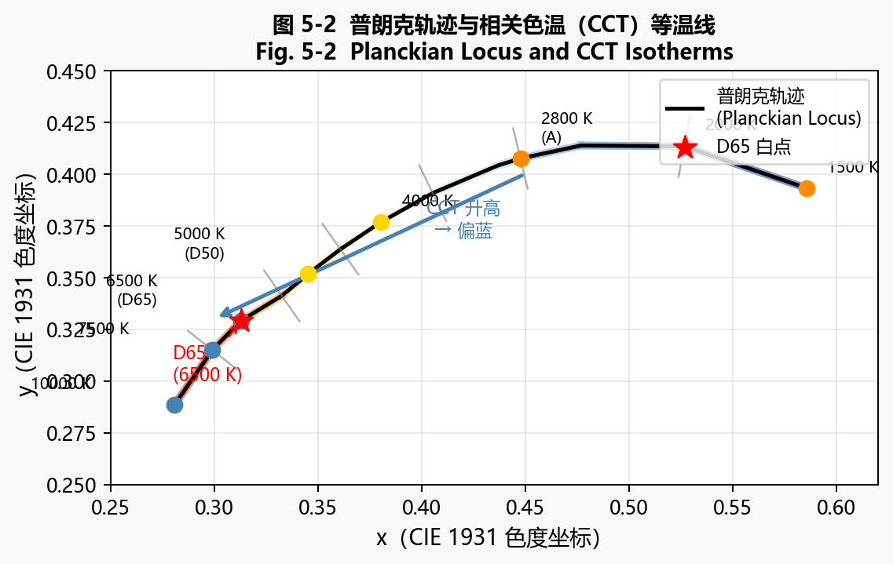
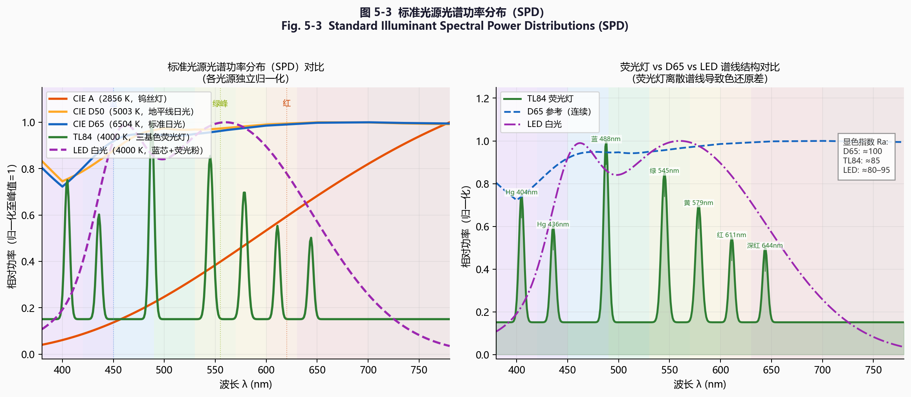
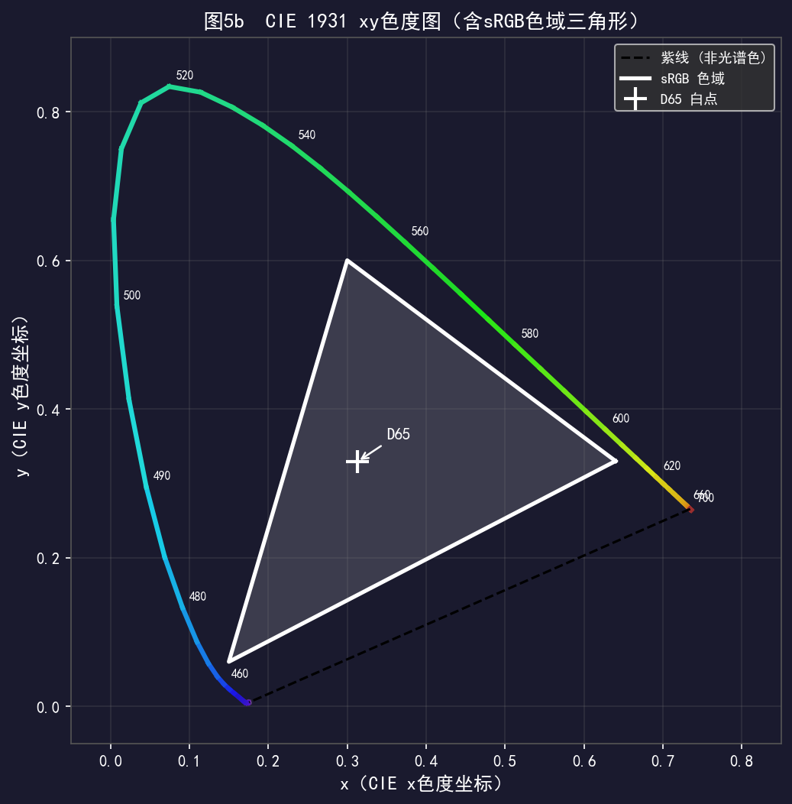
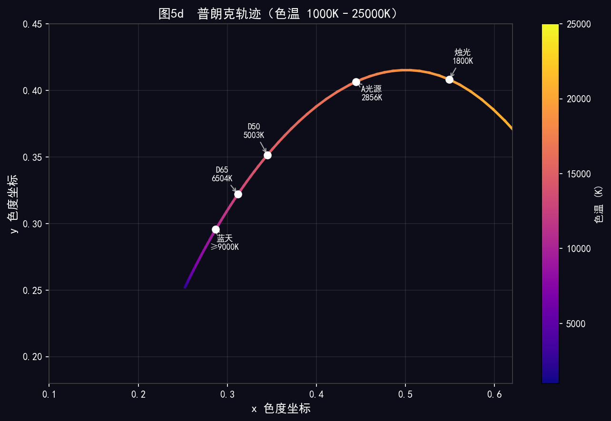
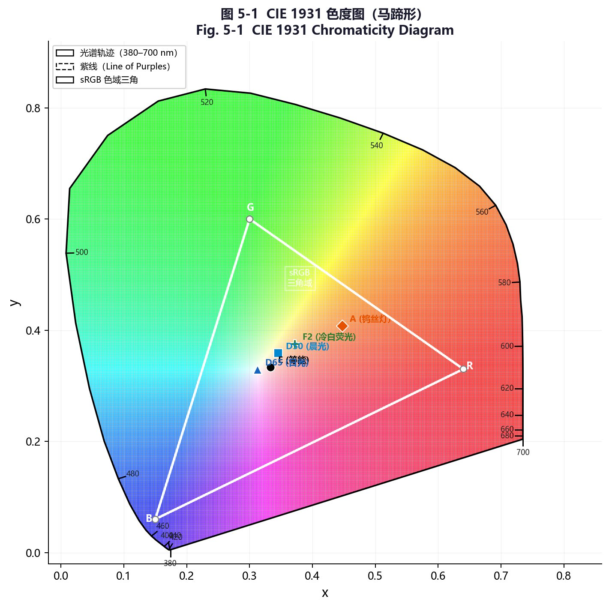
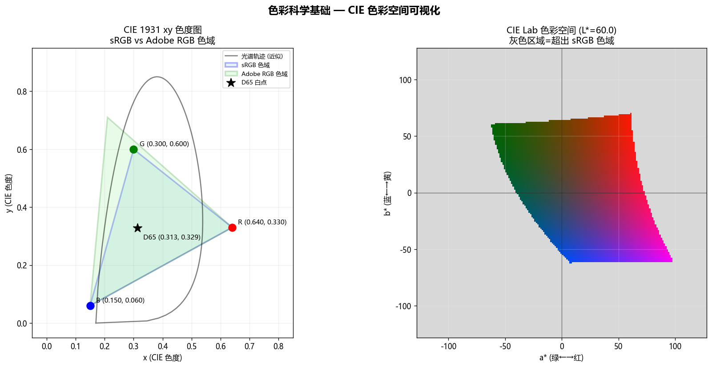
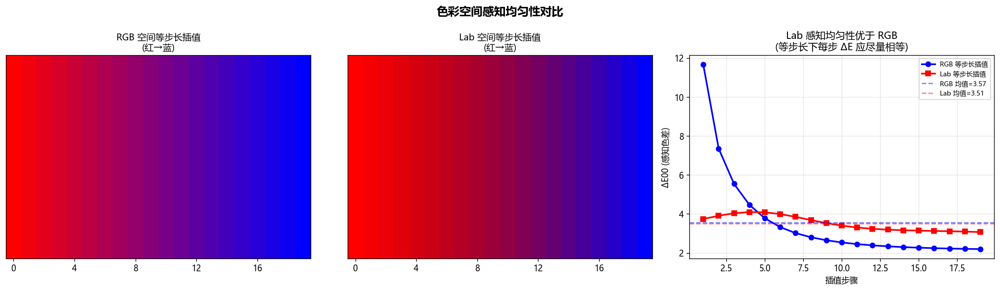

# 第一卷第05章：色彩科学基础

> **流水线位置：** 自动白平衡（AWB，第二卷第05章）、色彩校正矩阵（CCM，第二卷第06章）、伽马/色调映射（第二卷第07章）及所有下游色彩处理的理论基础

> **前置知识：** 第一卷第03章（传感器物理）——辐射度响应、光谱灵敏度

---

## §1 原理 (Theory)

### 1.1 人类色觉与三色性

人类视网膜含有三种视锥细胞感光器，通常标记为 **L**（长波，峰值约 564 nm）、**M**（中波，峰值约 534 nm）和 **S**（短波，峰值约 420 nm）**[1]**。它们互相重叠的光谱灵敏度意味着任何物理光谱都会被压缩为恰好三个数字——即 (L, M, S) 视锥响应值。这种降维是色彩科学中同色异谱现象的物理根源，同时也使得颜色可以在三维坐标系中精确描述。

**同色异谱（Metamerism）** 是这一现象的直接推论：两种物理上不同的光谱功率分布（Spectral Power Distribution，SPD），只要产生相同的 (L, M, S) 响应，在视觉上颜色完全相同。相机传感器的三个光谱通道利用了同样的三色性原理，但其光谱灵敏度通常与视锥灵敏度不同，这正是原始传感器数据必须经过变换才能匹配人类感知的原因。

### 1.2 CIE 1931 标准观察者与 XYZ 三刺激值

1931 年，国际照明委员会（Commission Internationale de l'Éclairage，CIE）通过定义 **CIE 2° 标准观察者**对色彩测量进行了标准化：基于 Guild 和 Wright 心理物理学实验数据，定义了三条色匹配函数（Color Matching Function）$\bar{x}(\lambda)$、$\bar{y}(\lambda)$、$\bar{z}(\lambda)$。对于照明体 $E(\lambda)$ 下任意 SPD $P(\lambda)$，三刺激值（Tristimulus Values）为：

$$
X = \int_{380}^{780} P(\lambda)\, E(\lambda)\, \bar{x}(\lambda)\, d\lambda
$$

$$
Y = \int_{380}^{780} P(\lambda)\, E(\lambda)\, \bar{y}(\lambda)\, d\lambda
$$

$$
Z = \int_{380}^{780} P(\lambda)\, E(\lambda)\, \bar{z}(\lambda)\, d\lambda
$$

$\bar{y}(\lambda)$ 函数被刻意设计为与**明视觉光谱光效率函数（photopic luminosity function）** $V(\lambda)$ 吻合，因此 $Y$ 代表感知亮度。**色度坐标（chromaticity coordinates）** 消除亮度信息，仅编码颜色：

$$
x = \frac{X}{X+Y+Z}, \quad y = \frac{Y}{X+Y+Z}, \quad z = 1 - x - y
$$

**CIE xy 色度图**是所有可见色在该二维平面上的投影。马蹄形边界是**光谱轨迹（spectral locus）**（单色光）；底部直线边界是**紫线（purple line）**。所有物理上可实现的颜色均位于该边界之内。白点、色域三角形和普朗克轨迹都显示在此图中，是色彩工程中引用最广泛的参考图。

**ISP 含义：** 原始传感器值 (R, G, B) 必须先变换到与设备无关的空间（如 XYZ）才能进行任何感知判断。这一变换即为色彩校正矩阵（Color Correction Matrix，CCM），详见第二卷第06章。

<div align="center"></div>
<p align="center"><em>图 5-1　CIE 1931 色度图（标注主要光源色点与 sRGB 色域三角形）/ Fig. 5-1 CIE 1931 Chromaticity Diagram with Standard Illuminants and sRGB Gamut</em></p>

### 1.3 标准色彩空间

#### sRGB

sRGB 在 IEC 61966-2-1（1999）**[2]** 中定义，已被消费级显示设备普遍采用，规格如下：

- **红色基色：** xy 坐标 (0.6400, 0.3300)
- **绿色基色：** xy 坐标 (0.3000, 0.6000)
- **蓝色基色：** xy 坐标 (0.1500, 0.0600)
- **白点：** D65（x = 0.3127，y = 0.3290）
- **传递函数（OETF，编码方向，相机→sRGB）：** IEC 61966-2-1 定义的分段式编码函数：

$$
C_\text{sRGB} = \begin{cases} 12.92\, C_\text{linear} & C_\text{linear} \le 0.0031308 \\ 1.055\, C_\text{linear}^{1/2.4} - 0.055 & C_\text{linear} > 0.0031308 \end{cases}
$$

- **传递函数（EOTF，解码方向，显示→线性）：** 分段式——小值段线性，其余近似伽马 2.2：

$$
C_\text{linear} = \begin{cases} C_\text{sRGB} / 12.92 & C_\text{sRGB} \le 0.04045 \\ \left(\dfrac{C_\text{sRGB} + 0.055}{1.055}\right)^{2.4} & C_\text{sRGB} > 0.04045 \end{cases}
$$

有效感知伽马约为 2.2。ISP 输出 JPEG 时采用 OETF 编码；显示器渲染时采用 EOTF 解码。大多数相机流水线以 sRGB 8-bit 格式输出 JPEG。

#### DCI-P3 / Display P3

DCI-P3 由数字电影倡议组织（Digital Cinema Initiatives）为电影院放映制定。Display P3（苹果的变体）使用相同的基色，但将 DCI 白点替换为 D65：

- **绿色基色**延伸至 (0.2650, 0.6900)，显著扩展了绿色色域
- 覆盖 CIE 1931 约 45.5%，而 sRGB 仅覆盖 35.9% 
- 用于 iPhone、iPad Pro 及现代安卓旗舰机型显示屏

#### Rec.2020（BT.2020）

ITU-R BT.2020 定义了超高清电视色彩空间：

- **红色：** (0.708, 0.292)，**绿色：** (0.170, 0.797)，**蓝色：** (0.131, 0.046)
- 白点：D65
- 覆盖 CIE 1931 约 75.8% **[11]**——涵盖绝大多数视觉可分辨颜色
- 在真正的 Rec.2020 色域内进行实际拍摄仍具挑战性，大多数相机通过计算映射近似实现

#### CIELAB（L\*a\*b\*）

XYZ 并非感知均匀空间——欧氏距离相等并不意味着感知色差相等。CIE 1976 引入 **CIELAB** 加以修正：

$$
L^* = 116\, f\!\left(\frac{Y}{Y_n}\right) - 16
$$

$$
a^* = 500\left[f\!\left(\frac{X}{X_n}\right) - f\!\left(\frac{Y}{Y_n}\right)\right]
$$

$$
b^* = 200\left[f\!\left(\frac{Y}{Y_n}\right) - f\!\left(\frac{Z}{Z_n}\right)\right]
$$

其中 $t > (6/29)^3$ 时 $f(t) = t^{1/3}$，否则 $f(t) = \tfrac{1}{3}(29/6)^2 t + \tfrac{4}{29}$，$(X_n, Y_n, Z_n)$ 为参考白点的 XYZ 值（D65：$X_n=0.9505$，$Y_n=1.0$，$Z_n=1.0888$）。

$L^*$ 轴编码明度（0 = 黑，100 = 白）。$a^*$ 轴：负值偏绿，正值偏红。$b^*$ 轴：负值偏蓝，正值偏黄。CIELAB 是 ISP 标定中色差计算的工作色彩空间。

**表1：色彩空间对比**

| 色彩空间 | 红色 (xy) | 绿色 (xy) | 蓝色 (xy) | 白点 | 典型位深 | 主要应用场景 |
|-------------|----------|------------|-----------|-------------|----------------------|-----------------|
| sRGB | (0.640, 0.330) | (0.300, 0.600) | (0.150, 0.060) | D65 | 8-bit | 网络、JPEG、消费级显示 |
| DCI-P3 | (0.680, 0.320) | (0.265, 0.690) | (0.150, 0.060) | DCI (0.314, 0.351) | 12-bit | 电影院放映 |
| Display P3 | (0.680, 0.320) | (0.265, 0.690) | (0.150, 0.060) | D65 | 10-bit | 移动旗舰、macOS |
| Rec.2020 | (0.708, 0.292) | (0.170, 0.797) | (0.131, 0.046) | D65 | 10/12-bit | 4K/8K HDR 视频 |
| CIELAB | — | — | — | 自适应（任意） | — | 色彩测量、ΔE 计算 |

### 1.4 色温与普朗克轨迹

绝对温度 $T$（单位：开尔文）下的**黑体辐射体**按普朗克定律发射辐射。随着 $T$ 变化，其色度在 CIE 图中描绘出**普朗克轨迹（Planckian locus）**。真实光源的**相关色温（Correlated Color Temperature，CCT）** 定义为与该光源感知颜色最接近的普朗克辐射体温度，在 CIE uv 图中以垂直距离衡量（Robertson 方法）。

<div align="center">
  
  <br><em>图 5-2：普朗克轨迹与相关色温（CCT）等温线——橙色→蓝色渐变表示色温升高；Robertson 等温线（灰色短线）垂直于轨迹；标注 A/D50/D65 标准光源。</em>
</div>

由 xy 色度近似计算 CCT（McCamy 公式）：

$$
\text{CCT} \approx -449\, n^3 + 3525\, n^2 - 6823.3\, n + 5520.33
$$

其中 $n = (x - 0.3320)/(y - 0.1858)$（注意 $n$ 的分母 $y - 0.1858$ 不可省略）。McCamy 公式 **[9]** 是 2000–10000 K 范围内的经验近似，精度约 ±50 K；色温范围极端或光源偏离普朗克轨迹较远时应使用 Robertson 迭代法。

> ⚠️ **荧光灯等非连续谱光源的 CCT 估算限制：** McCamy 公式的 ±50 K 精度仅对连续谱黑体辐射光源（日光、钨丝灯等位于普朗克轨迹附近）有效。荧光灯（Fluorescent，如 TL84 4100 K、CWF 3500 K）属于**非连续离散谱**，其色度点偏离普朗克轨迹，McCamy 公式的估算误差可高达 ±200–500 K。对于 ISP 中的荧光灯场景：
>
> 1. **建议改用 Robertson 迭代法（1968）**：在普朗克轨迹上查找与测量色度 $(u', v')$ 最近的等温线，精度可控制在 ±5 K 以内（对连续谱），但对荧光灯的偏轨迹误差仍然存在。
> 2. **更可靠的工程方案**：为 ISP 建立荧光灯专用 CCT 估算模型——在 AWB 标定中独立采集 TL84/CWF 光源的传感器色度点，将其单独聚类为"fluorescent"光源类别，使用多模高斯混合（GMM）或 K-NN 而非单一普朗克轨迹拟合。
> 3. **同色异谱（Metamerism）陷阱**：荧光灯下白平衡校正看似正确，但肤色（含血红蛋白的宽谱吸收曲线）和纺织物可能因同色异谱而在校正后出现偏色——这是 ISP 中荧光灯场景 AWB 的深层挑战，参见第二卷第05章（AWB）。

**表2：常见照明体**

| 照明体 | 色温（K） | 典型场景 | ISP 含义 |
|------------|---------|---------------|-----------------|
| 烛光 / A 光源 | 2856 K | 室内白炽灯 | 强橙色偏色；白平衡增益：R↓↓，B↑↑ |
| 暖白 LED | 2700–3000 K | 家用 LED 灯泡 | 中等橙色偏色；需 CCM 修正肤色准确性 |
| TL84 / CWF | ~4000 K | 办公室荧光灯 | 绿色峰值；同色异谱问题突出 |
| D50 | 5003 K | 地平线日光 | ICC 印刷标准白点 |
| D65 | 6504 K | 正午阴天 | sRGB / Rec.2020 标准白点 |
| D75 | 7504 K | 阴天天空 | 偏蓝色调 |
| 阴影 / D93 | ~9000–10000 K | 开放阴影处 | 极蓝；需强力白平衡校正 |

<div align="center"></div>
<p align="center"><em>图 5-3　标准光源光谱功率分布（SPD）对比——左：A/D50/D65/TL84/LED 全谱比较；右：荧光灯离散谱线结构特写 / Fig. 5-3  Standard Illuminant Spectral Power Distributions (SPD)</em></p>

### 1.5 色适应

当照明体改变时，人类视觉系统会进行适应，使物体外观保持近似不变——这就是**色适应（Chromatic Adaptation）**。在 ISP 中，AWB 模块估算场景照明体并施加增益校正，模拟这种适应过程。

色适应变换的基本原理是 **von Kries 假设**：人眼三种视锥细胞（L、M、S）在适应后对各通道独立缩放，因此适应过程可用对角矩阵在视锥响应空间中表示。**Bradford 变换**（ICC Profile 规范采用）和 **CAT02**（CIECAM02 / CIE 推荐）都是 von Kries 原理在不同视锥近似空间上的具体实现——它们先通过各自的 3×3 矩阵将 XYZ 映射到更接近生理视锥响应的空间，再做对角缩放，最后逆变换回 XYZ：

1. $\mathbf{r}_\text{adapt} = \mathbf{M} \cdot \mathbf{XYZ}_\text{src}$（源 XYZ 转换到视锥响应空间，$\mathbf{M}$ 为 Bradford 或 CAT02 矩阵）
2. 对角缩放：$r'_i = (r_{w,\text{dst},i} / r_{w,\text{src},i}) \cdot r_i$（$i \in \{R, G, B\}$，$w$ 表示白点）
3. $\mathbf{XYZ}_\text{dst} = \mathbf{M}^{-1} \cdot \mathbf{r}'$

Bradford 和 CAT02 均以 von Kries 假设为理论基础，在不同的视锥近似空间下实现对角缩放，精度差异来自各自选取的视锥近似空间的质量。工程选择上：CAT02 是 CIE 当前推荐标准，适合高精度颜色管理；Bradford 在 ICC 工作流（如 Photoshop、Apple Colors）中最为普及；DNG 格式也采用 Bradford 矩阵规范化相机白点。对于 ISP 中的 AWB → CCM 衔接，通常将 AWB 增益（3 通道缩放）视为 von Kries 对角适应的近似，已足够满足实际色彩一致性需求，但严格的跨设备颜色管理应使用 CAT02。

#### 1.5.1 Bradford CAT 完整推导

**Bradford 矩阵**（由 Lam 1985 年在布拉德福德大学博士论文中推导，ICC Profile 规范采用）将 XYZ 映射到"Sharp"视锥近似空间，其数值矩阵（D50 白点归一化版本）为：

$$
\mathbf{M}_\text{Bradford} = \begin{bmatrix}
 0.8951 &  0.2664 & -0.1614 \\
-0.7502 &  1.7135 &  0.0367 \\
 0.0389 & -0.0685 &  1.0296
\end{bmatrix}
$$

设源白点的 XYZ 三激值为 $\mathbf{W}_\text{src} = [X_s, Y_s, Z_s]^\top$，目标白点为 $\mathbf{W}_\text{dst} = [X_d, Y_d, Z_d]^\top$，完整的 Bradford 色适应变换矩阵 $\mathbf{M}_\text{adapt}$ 的推导过程如下：

**Step 1** — 将两个白点投影到 Bradford 视锥空间：

$$
\mathbf{r}_\text{src} = \mathbf{M}_\text{Bradford} \cdot \mathbf{W}_\text{src}, \quad
\mathbf{r}_\text{dst} = \mathbf{M}_\text{Bradford} \cdot \mathbf{W}_\text{dst}
$$

设分量分别为 $\mathbf{r}_\text{src} = [\rho_s, \gamma_s, \beta_s]^\top$ 和 $\mathbf{r}_\text{dst} = [\rho_d, \gamma_d, \beta_d]^\top$。

**Step 2** — 构造对角适应矩阵（von Kries 对角缩放）：

$$
\mathbf{D} = \begin{bmatrix} \rho_d/\rho_s & 0 & 0 \\ 0 & \gamma_d/\gamma_s & 0 \\ 0 & 0 & \beta_d/\beta_s \end{bmatrix}
$$

**Step 3** — 组合完整的 XYZ → XYZ 色适应矩阵：

$$
\mathbf{M}_\text{adapt} = \mathbf{M}_\text{Bradford}^{-1} \cdot \mathbf{D} \cdot \mathbf{M}_\text{Bradford}
$$

**Step 4** — 将场景颜色从源白点参考转换到目标白点参考：

$$
\mathbf{XYZ}_\text{dst} = \mathbf{M}_\text{adapt} \cdot \mathbf{XYZ}_\text{src}
$$

**数值示例：从 D50（相机标准）转换到 D65（显示标准）**

D50 白点（相机 ICC Profile 标准）：$\mathbf{W}_{D50} = [0.9642, 1.0000, 0.8251]^\top$
D65 白点（sRGB/BT.709 标准）：$\mathbf{W}_{D65} = [0.9505, 1.0000, 1.0888]^\top$

将两个白点代入 Step 1–3，最终得到 D50→D65 Bradford 色适应矩阵（数值结果）：

$$
\mathbf{M}_{D50\to D65} \approx \begin{bmatrix}
 0.9555 & -0.0230 &  0.0632 \\
-0.0283 &  1.0099 &  0.0211 \\
 0.0123 & -0.0205 &  1.3304
\end{bmatrix}
$$

**物理解读**：对角主元接近 1，但 $Z$ 轴缩放约 1.33，反映了 D65 比 D50 的蓝色分量更强（D65 色温更高）。非对角元较小（< 0.06），说明 Bradford 矩阵在色相旋转上的修正幅度有限。

**在 ISP 中的应用**：DNG 格式的 ColorMatrix1/2 字段存储的是相机 XYZ → linear sRGB 的矩阵，其白点参考为 D50。在 AWB 增益调整后，DNG 处理器需要通过 Bradford 矩阵将 D50 参考白点转换为实际场景光源白点，再乘以 CCM，完成"色温感知准确的颜色校正"。

**任意白点间的 Bradford 变换复合：**

实际 ISP 中常需要在任意两个白点之间变换（如 D65→A 光源、D50→D75 等）。正确做法是通过 D65（或 D50）作为中间参考白点进行复合：

$$M_{W_\text{src} \to W_\text{dst}} = M_{\text{D65} \to W_\text{dst}} \cdot M_{W_\text{src} \to \text{D65}}$$

其中 $M_{W_\text{src} \to \text{D65}} = \left(M_{\text{D65} \to W_\text{src}}\right)^{-1}$（即原始变换的逆矩阵）。

**示例：D65 → A 光源（2856 K 白炽灯）的 Bradford 变换矩阵：**

$$M_{\text{D65} \to A} \approx \begin{bmatrix} 0.8446 & 0.1136 & 0.0111 \\ 0.0885 & 0.8545 & 0.0721 \\ 0.0822 & -0.1322 & 0.7256 \end{bmatrix}$$

> **工程注意**：ICC 颜色管理规范以 **D50** 为连接白点（Profile Connection Space PCS），而消费类相机通常以 **D65** 为标准白点。在将相机 CCM 嵌入 ICC Profile 时，需将 D65 归一化的增益矩阵通过 Bradford 变换转换到 D50 参考空间，否则软件色彩管理中会出现白点偏移误差（通常表现为图像整体偏暖）。

#### 1.5.2 CAT02（CIECAM02 推荐）

CAT02 矩阵（Li et al., CIE TC8-01，CIECAM02，2002；Fairchild 2013 教材详述）：

$$
\mathbf{M}_\text{CAT02} = \begin{bmatrix}
 0.7328 &  0.4296 & -0.1624 \\
-0.7036 &  1.6975 &  0.0061 \\
 0.0030 &  0.0136 &  0.9834
\end{bmatrix}
$$

推导流程与 Bradford 完全相同（替换 $\mathbf{M}_\text{Bradford}$ 为 $\mathbf{M}_\text{CAT02}$）。CAT02 的优势：在蓝-紫色区域及极端光源（6500K 以上的冷光）下色相保真度更好。

**Bradford vs CAT02 在色相保持上的差异：**

| 测试光源 | Bradford 色相误差 | CAT02 色相误差 | 说明 |
|---------|-----------------|---------------|------|
| D65 → A（白炽灯） | ~0.8° | ~0.5° | 暖色光源，差异小 |
| D65 → F11（荧光灯） | ~1.2° | ~0.6° | 荧光灯的非连续光谱 |
| D65 → 9300K（冷蓝光） | ~2.1° | ~0.9° | 极端冷光，Bradford 明显偏蓝-紫 |

> 数据来源：Fairchild (2005), "Color Appearance Models", 3rd ed., Table 7.1。

### 1.6 色差度量

**ΔE76（CIE 1976）：** CIELAB 空间中的欧氏距离：

$$
\Delta E_{76} = \sqrt{(\Delta L^*)^2 + (\Delta a^*)^2 + (\Delta b^*)^2}
$$

计算简单，但感知均匀性较差：蓝色区域 1 个单位的 ΔE76 在视觉上远大于黄绿色区域的 1 个单位。

**ΔE2000（CIEDE2000）：** 由 Sharma 等人于 2005 年发布 **[3]**，是目前精度最高的色差公式，相比 ΔE76 加入四项修正：

- **明度权重** $S_L$：降低在极暗和极亮端的灵敏度
- **彩度权重** $S_C$：考虑高饱和度颜色中色差更难察觉的特性
- **色相权重** $S_H$：色相容差大于彩度容差
- **色相旋转** $R_T$：对蓝紫色区域（感知色相与彩度耦合）的经验修正

$$
\Delta E_{00} = \sqrt{\left(\frac{\Delta L'}{k_L S_L}\right)^2 + \left(\frac{\Delta C'}{k_C S_C}\right)^2 + \left(\frac{\Delta H'}{k_H S_H}\right)^2 + R_T \frac{\Delta C'}{k_C S_C} \frac{\Delta H'}{k_H S_H}}
$$

其中 $\Delta L'$、$\Delta C'$、$\Delta H'$ 分别是修正后 Lab 空间中的明度差、彩度差和色相差。旋转项 $R_T$ 的完整定义为：

$$
R_T = -\sin(2\Delta\theta) \cdot R_C
$$

$$
\Delta\theta = 30^\circ \exp\!\left[-\left(\frac{\bar{h}' - 275^\circ}{25^\circ}\right)^2\right], \qquad R_C = 2\sqrt{\frac{\bar{C}'^{\,7}}{\bar{C}'^{\,7} + 25^7}}
$$

$R_T$ 在色相角 $\bar{h}' \approx 275^\circ$（蓝色区域）时取值最大，通过耦合彩度差与色相差修正该区域人眼感知的非均匀性。计算时需注意 $2\Delta\theta$ 以弧度代入 $\sin$，且 $25^7 \approx 6.1 \times 10^9$ 是一个较大常数，使得低彩度区域 $R_C \to 0$（旋转项自然关闭）。实际工程实现建议直接采用 `colour-science` 库中的 `delta_E_CIE2000()` 函数，避免手写公式出错。

**实用参考阈值** **[3][4]**：
- ΔE2000 < 1.0：大多数观察者察觉不到
- 1.0–2.0：并排比较时可感知
- 2.0–3.5：典型观看条件下明显可见
- > 3.5：令人不满意的色彩误差

ISP 标定目标为所有 24 个 Macbeth 色卡色块的 ΔE2000 < 3.0；消费级调优通常达到平均 ΔE2000 < 5.0，最大值 < 6.0 。

---

## §2 标定 (Calibration)

### 2.1 Macbeth ColorChecker 24

**X-Rite Macbeth ColorChecker Classic**（24 色块色卡）是相机色彩标定的事实标准。它包含以 4×6 网格排列的 24 个表面色样本：
- 第 1–2 行：自然物体色（肤色、植被、天空蓝等）
- 第 3–4 行：饱和原色/间色 + 中性灰阶

24 个色块在 D50 照明下的 **CIE L\*a\*b\*** 参考值由 X-Rite 发布并广泛可查。光谱反射率曲线已经测量，可通过 `colour-science` 库中 `colour.SDS_COLOURCHECKERS` 获取。

### 2.2 标定流程

**第一步——多照明体拍摄：** 在每个目标照明体下（D65、D50、A/白炽灯、TL84/荧光灯）拍摄 ColorChecker 色卡。使用经过校准的光照箱或已知参数的影棚频闪灯。固定曝光以避免白色色块过曝。

**第二步——线性化原始数据：** 进行黑电平消减和镜头阴影校正。从每个色块中央区域提取均值像素，避免边缘影响。每个照明体下得到 24 组原始 (R, G, B) 三元组。

**第三步——最小二乘法估算 CCM：** 色彩校正矩阵 $\mathbf{M}$（3×3 或带偏置列的 3×4）将原始 RGB 映射到参考 XYZ（或 sRGB）：

$$
\mathbf{M} = \arg\min_{\mathbf{M}} \sum_{i=1}^{24} \left\| \mathbf{M}\, \mathbf{r}_i - \mathbf{t}_i \right\|^2
$$

其中 $\mathbf{r}_i$ 为原始色块向量，$\mathbf{t}_i$ 为目标 Lab/XYZ 值。通过伪逆以闭合形式求解：$\mathbf{M} = \mathbf{T}\mathbf{R}^+$。

**第四步——验证：** 将估算的 CCM 应用于原始色块，转换到 Lab 空间，计算所有 24 个色块的 ΔE76 和 ΔE2000。输出均值、最大值及逐色块数值。

### 2.3 IT8 色卡

为获得更广泛的覆盖范围，**ANSI/ISO IT8.7** 色卡包含数百个色块，含中性楔形和饱和色阶。它用于高精度扫描仪和打印机的色彩配置，在 CCM 需要覆盖超出 Macbeth 24 色域的场景中尤为有益。

### 2.4 代码：计算 ColorChecker 色块的 ΔE

```python
import numpy as np

def srgb_to_xyz(srgb):
    """Convert sRGB [0,1] to XYZ using ITU-R BT.709 matrix (D65)."""
    # Linearize
    linear = np.where(srgb <= 0.04045,
                      srgb / 12.92,
                      ((srgb + 0.055) / 1.055) ** 2.4)
    # sRGB -> XYZ (D65) matrix
    M = np.array([[0.4124564, 0.3575761, 0.1804375],
                  [0.2126729, 0.7151522, 0.0721750],
                  [0.0193339, 0.1191920, 0.9503041]])
    return linear @ M.T

def xyz_to_lab(xyz, Xn=0.9505, Yn=1.0000, Zn=1.0888):
    """Convert XYZ to CIELAB with D65 white point."""
    epsilon, kappa = (6/29)**3, (29/6)**2 / 3
    def f(t):
        return np.where(t > epsilon, t**(1/3), kappa * t + 4/29)
    fx = f(xyz[..., 0] / Xn)
    fy = f(xyz[..., 1] / Yn)
    fz = f(xyz[..., 2] / Zn)
    L = 116 * fy - 16
    a = 500 * (fx - fy)
    b = 200 * (fy - fz)
    return np.stack([L, a, b], axis=-1)

def delta_e76(lab1, lab2):
    """ΔE76: Euclidean distance in CIELAB."""
    diff = lab1 - lab2
    return np.sqrt(np.sum(diff**2, axis=-1))

# Example usage
# measured_srgb: (24, 3) array of measured patch values in [0,1]
# reference_srgb: (24, 3) array of reference ColorChecker sRGB values
measured_lab = xyz_to_lab(srgb_to_xyz(measured_srgb))
reference_lab = xyz_to_lab(srgb_to_xyz(reference_srgb))
de76 = delta_e76(measured_lab, reference_lab)
print(f"Mean ΔE76: {de76.mean():.2f}, Max ΔE76: {de76.max():.2f}")
```

---

## §3 调参 (Tuning)

### 3.1 CCM 优化

最小二乘法 CCM 纯粹从数学角度最小化 ColorChecker 24 色块的平均 ΔE，实际拍出来的照片往往让用户觉得"色彩寡淡"——绿色不够绿，天空蓝的不够蓝。根本原因是最优测色精度和用户偏好渲染之间存在真实对立：精准还原颜色 ≠ 用户喜欢的颜色。

工程实践中的解决方案是**约束优化**：

- **硬约束（不可妥协）：** Macbeth 第 3–4 行中性灰色块 ΔE2000 < 3.0——灰色和肤色打歪了用户立刻就能感知
- **软偏好（有意放松）：** 饱和色块允许 ΔE2000 ≤ 6.0，通过在 CCM 之后叠加按色相选择性的饱和度矩阵（通常在 HSL 或 Lab 空间操作）主动提升饱和度

> **工程推荐（手机ISP场景）：** CCM 本身做到测色准确后，用 3D LUT（17×17×17 或 33×33×33 网格）在 CCM 之后叠加色彩风格化——这是现在量产 ISP 的标准分层调色方案（高通 Chromatix、瑞芯微 RKTuner、海思 PQ Tool 都是这个逻辑）。CCM 负责整体色彩空间对齐，3D LUT 负责局部色相/饱和度精调，两者功能不要混。注意 3D LUT 节点修改幅度不能过大，否则相邻格之间三线性插值会产生色彩断层伪影，有过这个教训的工程师都知道那个绿色渐变条纹有多难看。

### 3.2 权衡：准确性与饱和度

| 调参模式 | 平均 ΔE2000 | 肤色 ΔE2000 | 用户感知 |
|-------------|-------------|------------------|-----------------|
| 测色准确模式 | ~1.5–2.5 | < 2.0 | "平淡"、"色彩暗淡" |
| 偏好渲染模式（增强） | ~3.5–5.0 | < 3.0 | "鲜艳"、"悦目" |
| 过度饱和模式 | > 6.0 | > 4.0 | "不自然"、"荧光感" |

DXOMark 及移动相机评测数据持续表明 **[12]**，在并排偏好测试中，即使 ΔE2000 更大，用户仍更偏爱轻微过饱和的图像。行业惯例是以**偏好渲染**为调参目标，而非严格测色精度。

### 3.3 多照明体 CCM

单一 CCM 仅在其标定所用照明体下有效。真实场景的光源千变万化——户外日光、室内钨丝灯、办公室荧光灯，每种光源下传感器的光谱响应都不同，同一个 CCM 应付不了。

量产 ISP 的标准做法：分别在多个照明体下标定独立的 CCM，AWB 估算当前色温（CCT）后，在最近两个 CCM 之间插值得到运行时 CCM。海思（HiSilicon）ISP 支持最多 7 组、最少 3 组 CCM：典型 3 组配置是 D50 / TL84 / A 光源，5 组配置是 10K / D65 / D50 / TL84 / A——覆盖从极冷到极暖的主要使用场景。

**插值精度注意**：CCT 空间线性插值在低色温段（2500–4000 K）步长感知较粗。工程上更优的方案是在 **Mired 空间**插值，其中 Mired = 10⁶ / CCT（单位：megakelvin⁻¹）。Mired 尺度与人眼对色温差异的感知接近线性关系（Sproson 1983），且等 Mired 间隔对应等感知色差。例如，A 光源（2856 K ≈ 350 Mired）到 D65（6504 K ≈ 154 Mired）的插值在 Mired 轴上均匀分布，而在 CCT 轴上则低色温段密集、高色温段稀疏。实现时，以 Mired 值为插值自变量选取权重，可提升过渡带色彩一致性。高通 Spectra ISP 文档中通常以 Mired 表格存储 AWB 增益查找表。

### 3.4 色域映射

在宽色域原始空间中拍摄的颜色可能**超出目标输出色域**（如超出 sRGB）。色域映射（Gamut Mapping）策略包括：

- **截断（Clipping）：** 将超出色域的值直接设为色域边界值。速度快，但会导致色相偏移，在鲜艳被摄物（如花卉、霓虹灯牌）上渲染平淡
- **彩度压缩（Chroma compression）：** 降低彩度直至颜色位于色域边界内，保持色相不变。更适合摄影内容
- **感知渲染意图（Perceptual rendering intent）：** 基于 ICC 色彩配置文件的全局压缩，用于打印输出

### 3.5 AWB 与 CCM 的依存关系

AWB 和 CCM 是串联耦合的，顺序搞反或者中间插入了其他处理，颜色就会出问题。一个常见的现场报障场景：CCM 已经调好，但照片还是偏色——排查半天发现是 AWB 的色温估算有偏差，用了错误索引的 CCM，结果 CCM 反而把偏色放大了。

正确流水线顺序：

```
Raw → BLC → Linearization → AWB gains → Demosaic → CCM (indexed to AWB CCT estimate) → Gamma
```

这个顺序有物理原因：CCM 是在特定光源白点下标定的线性变换，必须在 AWB 已经通过增益把白点拉到已知位置**之后**才能正确应用。AWB 增益相当于 von Kries 对角适应，CCM 在此基础上做剩余的色相修正。

> **工程推荐（手机ISP场景）：** 调 CCM 时先锁住 AWB（手动模式），确认 AWB 增益正确后再验证 CCM——这是经验之谈，一次只改一个模块，否则颜色问题归属无法判断。调试工具（Chromatix、RKTuner）的标准流程都是：BLC → LSC → AWB 标定 → CCM 标定 → 3D LUT 微调，这个顺序不能颠倒。

---

## §4 图像缺陷 (Artifacts)

### 4.1 色偏（Color Casts）

色偏是整幅图像全局偏向某一色调，用户描述通常是"照片发黄/发蓝/发绿"。工程排查时优先看 ColorChecker 灰色色块在 Lab 空间的 $a^*$/$b^*$ 值——理想情况应接近 0，非零偏移直接指示色偏方向和量级。

成因排查顺序：先查 AWB（最常见），再查 CCM（其次），最后查 LSC 色彩补偿不均：

- **AWB 误判：** AWB 选择了错误照明体（如荧光灯被识别成钨丝灯），增益向量整体偏移
- **CCM 不匹配：** D65 下标定的 CCM 被用在了 A 光源场景，没有正确切换到对应色温的 CCM 索引——§3.5 提到的管线顺序问题
- **LSC 色彩补偿残差：** 镜头阴影校正引入了色彩不均，导致图像边缘和中心区域的色偏方向不一致（这时诊断会更复杂，不是全局均匀的色偏）

### 4.2 色域截断（Gamut Clipping）

当现实场景中高饱和度颜色（鲜红色花卉、霓虹灯牌、饱和织物）超出输出色域时，截断即会发生。表现症状：

- 饱和区域出现平坦、色调分离的外观
- 色相过渡处细节和纹理丢失
- 一旦截断，后期处理无法恢复

**检测方法：** 计算 8-bit 输出中任意 RGB 通道接近或等于 255 的像素比例。调优良好的 ISP 在自然场景中应使截断像素比例低于 0.1% 。

### 4.3 色相偏移（Hue Shifts）

色相偏移最常见于：

- **黄绿色：** 过度激进的绿色通道增益（拜耳去马赛克中常见）使植被和肤色偏向黄色
- **肤色品红偏移：** CCM 中 L/M/S 基色不正确，导致亚洲肤色偏向品红
- **暗部蓝色偏移：** 暗区蓝色通道校正不足

**诊断工具：** 绘制所有 ColorChecker 色块的色相角误差与色相角关系图，寻找特定色相区域的系统性偏移。

### 4.4 同色异谱失效（Metamerism Failure）

针对 D65 优化的 CCM 在 D65 下可能准确，但在 TL84（荧光灯）下会出现误差，原因是荧光灯 SPD 具有不连续的光谱，含有尖锐发射谱线。相机光谱灵敏度处理这些谱线的方式与人眼视锥不同，从而破坏了测色关系。

**表现症状：** 在 D65 下外观正确的肤色或灰色色块，在办公室荧光灯下会出现绿色或品红偏色。

**缓解措施：** 多照明体 CCM 标定（§3.3）以及对 TL84 的精细特性化表征。

---

## §5 评测 (Evaluation)

### 5.1 ColorChecker ΔE 指标

标准色彩准确性测试流程：

1. 在经校准的 D65 光照箱下拍摄 X-Rite ColorChecker Classic
2. 从 24 个色块各自的中央区域（50% 面积，避免边缘效应）提取均值 Lab 值
3. 与 X-Rite 发布的参考 Lab 值（D50 适配）进行比较
4. 计算 **平均 ΔE2000**（主要指标）、**最大 ΔE2000**（最差色块）及其分布

**行业目标：**

| 指标 | 优秀 | 良好 | 可接受 | 差 |
|--------|-----------|------|------------|------|
| 平均 ΔE2000 | < 2.0 | < 3.5 | < 5.0 | ≥ 5.0 |
| 最大 ΔE2000 | < 4.0 | < 6.0 | < 8.0 | ≥ 8.0 |
| 肤色 ΔE2000 | < 2.0 | < 3.0 | < 4.5 | ≥ 4.5 |

### 5.2 色域覆盖率

**色域覆盖率（Gamut coverage ratio）** 衡量相机流水线能够忠实再现参考色域（通常为 P3 或 Rec.2020）的比例：

$$
\text{Coverage}_{P3} = \frac{\text{Area of camera gamut} \cap \text{Area of P3}}{\text{Area of P3}} \times 100\%
$$

在 CIE xy 色度图中，以相机有效色域（通过 ColorChecker 或 IT8 色块估算）的多边形面积进行衡量。

### 5.3 DXOMark 色彩评分

DXOMark 的色彩准确性评分由以下项目综合得出：

- **白平衡**准确性（通过多个照明体下的分光光度计测量）
- **色彩阴影（Color shading）**——色彩准确性随图像视场位置的变化情况
- **色彩深度（Color depth）**——可分辨的色彩层次数量（与噪声本底和量化误差相关）

DXOMark 使用包含肤色色块的自定义色卡。其评分并非直接的 ΔE2000 数值，而是综合指数（白平衡准确性 + 色彩阴影 + 色彩深度加权合成）。DXOMark 色彩子分参考（基于 Camera v5 协议，2025 年 7 月前数据）：

| 类别 | DXOMark 色彩子分（近似） | 代表性 ΔE2000 | 典型机型 |
|------|------------------------|--------------|---------|
| 顶级旗舰机（2025） | 125–130 | 均值约 1.5–2.5 | Huawei Pura 70 Ultra（130）、iPhone 16 Pro Max（130）|
| 次旗舰 / 高端机 | 115–124 | 均值约 2.5–3.5 | Samsung Galaxy S25 Ultra（125）、iPhone 16（124）|
| 中端智能手机 | 90–115 | 均值约 3.5–5.0 | 主流 Android 旗舰二代机、骁龙 7 Gen 系列 |
| 消费级紧凑相机 | 65–85 | 均值约 5.0–8.0 | 卡片机、入门级微单 |

> **注：** DXOMark 于 2025 年 7 月发布 Camera v6 协议，整体评分重新标定；v6 整机总分已达 175（Huawei Pura 80 Ultra），色彩子分边界随之上移，数值不可与 v5 直接比较。ΔE2000 均值参考 ISO 12233 / Macbeth 24-block 测试，实验室条件（D65，图像中心区域）。

### 5.4 附加指标

- **色相线性度：** 24 个色块色相角误差的标准差
- **彩度准确性：** 均值彩度比（实测 $C^*$ / 参考 $C^*$）；> 1.0 表示存在饱和度提升
- **白平衡准确性：** 专门针对 6 个灰阶色块（Macbeth 第 19–24 块）计算的 ΔE2000

---

## §6 代码 (Code)

参见 [`ch05_color_notebook.ipynb`](ch05_color_notebook.ipynb)，提供完整可运行的笔记本，内容包括：

1. ColorChecker 数据加载（通过 `colour-science` 库或硬编码参考值）
2. sRGB → XYZ → CIELAB 转换流水线
3. 逐色块 ΔE76 计算
4. 带 sRGB / P3 / Rec.2020 色域三角形的 CIE xy 色度图
5. 逐色块 ΔE 条形图
6. 汇总统计与练习题

---

## §7 工程色彩挑战

### 7.1 IR 截止滤光片与光谱匹配

- 传感器对近红外（700-1100nm）敏感，需 IR-cut 滤光片将响应限制在可见光范围
- **热平衡折衷：** IR-cut 截止波长设计影响色温准确性。截止波长越短（如 620nm），白平衡越准但进光量减少
- **标定影响：** CCM 标定必须在装有 IR-cut 的完整光学路径下进行；裸传感器标定结果不可用于实际 ISP

### 7.2 同色异谱 (Metamerism) 与补偿

- **定义：** 两种在参考光源下颜色相同（相同 XYZ），在另一光源下颜色不同的现象
- **荧光灯的三线谱问题：** 荧光灯（如 TL84）光谱包含 436nm/546nm/611nm 三条窄谱线，会导致传感器响应与人眼响应差异最大化
- **CCM 补偿策略：**
  1. 多光源 CCM 矩阵 + AWB 驱动插值
  2. 3D-LUT 替代线性 CCM（每个色彩点独立校正，处理非线性同色异谱）

### 7.3 Rec.2100 HDR 色彩空间集成

- **Rec.2100 vs Rec.709 主要差异：**
  - 色域：Rec.2020 原色（覆盖人眼色域约 75%）
  - 传输函数：PQ (ST.2084) 或 HLG，峰值亮度 1000-10000 nits
- **ISP 集成要点：**
  1. 内部处理在线性光 (scene-referred) 域完成
  2. 输出前应用 PQ/HLG OETF 编码
  3. HDR metadata（MaxCLL, MaxFALL）需从内容中实时统计

---


---

> **工程师手记：手机色彩科学的同色异谱、感知均匀性与量产ΔE标准**
>
> **标准观察者同色异谱在手机显示中的工程陷阱：** CIE 1931标准色度系统基于2°视角标准观察者（1931 2° Standard Observer），假设观察者在D65光源下对颜色刺激的响应一致。然而手机显示面板实际发射的"D65"并非物理黑体辐射的D65，而是RGB三基色LED混合出的伪白光，其光谱功率分布（SPD）与真实D65有显著差异，尤其是蓝色LED峰值（约450nm）会导致约5-8% 的短波过量。这一同色异谱（Metamerism）问题在实际显示中表现为：色彩空间显示目标为sRGB D65白点，但人眼主观感受偏蓝-偏冷（因为短波能量过强），不同屏幕厂商的蓝光光谱峰值位置差异导致同一ISP调色数据在不同手机屏幕上显示色调迥异，这是为何同一款相机App在不同设备上"看起来颜色不一样"的物理根源之一。
>
> **CIELAB感知均匀性在ISP色调调整中的实用价值：** CIELAB色彩空间在ISP调色（Color Tuning）工作中的核心价值在于其近似感知均匀性：在CIELAB空间中，人眼对等距颜色变化的主观感知差异更为一致，而XYZ或sRGB空间则存在严重的感知非均匀性（人眼对绿色区域变化最不敏感，对蓝色区域变化最敏感）。实际ISP色彩调整的工作流中，调色工程师会将色准测试卡（X-Rite ColorChecker Classic 24色）的实测Lab值与参考Lab值逐一对比，利用ΔE00（CIEDE2000公式）量化每色块的色差。重要工程细节：ΔE00≤1.0的色差对应人眼在正常观看距离下几乎无法察觉；ΔE00在1.0-2.0之间对应"可察觉但可接受"；ΔE00>3.0则肉眼明显可辨。这一分级也决定了ISP色彩算法的优先级排序。
>
> **量产色彩验收的ΔE00行业标准：** 移动端ISP量产色彩一致性的行业验收门槛通常设定为ColorChecker 24色的平均ΔE00 < 2.0、最大ΔE00 < 4.0（参考光源D65、观察者2°、1000 lux均匀漫射光照）。这一数字源于两个约束的平衡：感知可接受性（ΔE00 < 2.0人眼无明显感知）和量产可达性（过紧的标准导致成品率下降，成本上升）。实测数据来看，旗舰机型调色精调后平均ΔE00约1.2-1.6，而中低端机型（使用相同ISP算法但调色资源投入减少）通常在2.5-3.5之间。此外，ΔE00标准仅适用于白光照明，在2700K暖光（室内钨丝灯）和6500K冷光（晴天室外）下各自标定的色彩矩阵会产生"光源外推误差"，导致在3000K、4000K等中间色温下出现偏色——这是手机ISP多路AWB调色矩阵插值精度的核心挑战。
>
> *参考：CIE, "CIE Publication 015:2004 — Colorimetry", 3rd ed., CIE Central Bureau, 2004；Sharma et al., "The CIEDE2000 Color-Difference Formula", Color Research & Application, 2005；Fairchild, "Color Appearance Models", 3rd ed., Wiley, 2013*

---

## 插图


*图1. CIE 1931 xy色度图（图片来源：CIE, "CIE Publication 15:2004 — Colorimetry", 官方文档, 2004）*


*图2. 普朗克黑体轨迹（Planckian locus）与色温示意（图片来源：作者自绘，参考CIE Publication 15:2004）*


*图3. CIE色度图马蹄形色域（图片来源：作者，ISP手册，2024）*


*图4. 黑体辐射轨迹（Planckian locus）（图片来源：作者，ISP手册，2024）*


*图5. 光源光谱功率分布曲线（图片来源：作者，ISP手册，2024）*


*图6. CIE色彩空间与色度图——CIE 1931 xy色度图全局示意，展示人眼可见色域边界与各标准色彩空间三角形的关系（图片来源：作者自绘）*


*图7. 色彩均匀性示意——CIELAB/CIELUV感知均匀色彩空间中色差分布的均匀性对比，体现感知均匀色彩空间相对CIE xy的改进（图片来源：作者自绘）*

---

## 习题

**练习 1（理解）**
sRGB 和 DCI-P3 是手机显示中常见的两种色彩空间。请说明：(a) DCI-P3 相比 sRGB 在色域上的主要扩展方向（哪个颜色方向最明显）？(b) iPhone 拍摄的照片默认使用 Display P3 色彩空间，当在一台仅支持 sRGB 的显示器上打开时，为什么颜色会出现偏差？(c) ISP 输出 JPEG 时选择 sRGB 还是 P3 色彩空间，对文件大小有无影响？

**练习 2（计算）**
已知 sRGB 到 CIE XYZ（D65）的标准线性转换矩阵为：
$$M = \begin{bmatrix}0.4124 & 0.3576 & 0.1805 \\ 0.2126 & 0.7152 & 0.0722 \\ 0.0193 & 0.1192 & 0.9505\end{bmatrix}$$
(a) 计算纯红色 sRGB 线性值 $(R,G,B) = (1.0, 0.0, 0.0)$ 对应的 XYZ 三刺激值；(b) 计算 D65 白点 sRGB $(1.0, 1.0, 1.0)$ 对应的 XYZ，验证 $Y=1.0$；(c) 已知亮度方程 $Y = 0.2126R + 0.7152G + 0.0722B$，若一个像素 sRGB 线性值为 $(0.5, 0.5, 0.5)$，其感知亮度 $Y$ 是多少？

**练习 3（编程）**
用 Python 的 `colour-science` 库（`pip install colour-science`）计算 CIEDE2000 色差并验证同色异谱：(a) 定义两个颜色：$\text{Lab}_1 = (50, 20, -30)$ 和 $\text{Lab}_2 = (50, 21, -29)$；(b) 用 `colour.delta_E(Lab1, Lab2, method='CIE 2000')` 计算 $\Delta E_{00}$；(c) 将 sRGB 颜色 $(0.8, 0.2, 0.4)$ 转换到 Lab 色彩空间（经由 XYZ，D65 白点），再与纯绿 $(0.0, 1.0, 0.0)$ 计算色差；(d) 判断色差小于多少时人眼"刚能察觉"（JND 阈值约为 $\Delta E_{00} \approx 1$），你计算的两个颜色对中哪对超过了 JND？

## 参考文献

[1] CIE, "CIE Publication 15:2004 — Colorimetry, 3rd edition", *官方文档*, 2004.

[2] IEC, "IEC 61966-2-1:1999 — Default RGB colour space — sRGB", *官方文档*, 1999.

[3] Sharma et al., "The CIEDE2000 color-difference formula: Implementation notes, supplementary test data, and mathematical observations", *Color Research & Application*, 2005.

[4] Hunt et al., "Measuring Colour, 4th edition", *Wiley-IS&T*, 2011.

[5] Fairchild, "Color Appearance Models, 3rd edition", *Wiley-IS&T*, 2013.

[6] Reinhard et al., "High Dynamic Range Imaging: Acquisition, Display, and Image-Based Lighting, 2nd edition", *Morgan Kaufmann*, 2010.

[7] colour-science contributors, "colour — a Python package implementing colour science", 博客/开源项目, 2024. URL: https://www.colour-science.org/

[8] X-Rite, "ColorChecker Classic spectral data", *官方文档*, 2009.

[9] McCamy, "Correlated color temperature as an explicit function of chromaticity coordinates", *Color Research & Application*, 1992.

[10] ITU-R, "BT.709-6 — Parameter values for the HDTV standards for production and international programme exchange", *官方文档*, 2015.

[11] ITU-R, "BT.2020-2 — Parameter values for ultra-high definition television systems for production and international programme exchange", *官方文档*, 2015.

[12] DXOMark, "DXOMark Mobile Benchmark Methodology", *官方文档*, 2024. URL: https://www.dxomark.com/ranking/

[13] Karaimer et al., "A Software Platform for Manipulating the Camera Imaging Pipeline", *ECCV*, 2016.

[14] Li et al., "Learning-Based Color/Tone Mapping for Practical Camera ISP Pipelines", *CVPR Workshops*, 2018.

## §8 术语表（Glossary）

**三色性（Trichromacy）**
人类视网膜含有 L、M、S 三种视锥细胞，任何物理光谱都被压缩为三个数值（L、M、S 响应）。这一特性使得颜色可以用三维坐标系描述，是所有色彩科学的物理基础，也是相机用三通道（RGB）传感器能够复现颜色感知的根本依据。

**同色异谱（Metamerism）**
两种物理上不同的光谱功率分布（SPD），若产生相同的视锥响应（L、M、S），则在视觉上颜色完全相同。相机传感器与人眼光谱灵敏度不同，因此在一种光源下颜色匹配的两个物体，在换用另一种光源（尤其是荧光灯）时可能出现色差——这就是同色异谱失效。荧光灯（TL84）的三条窄谱线（436/546/611 nm）是手机 ISP 最难处理的同色异谱场景。

**CIE 1931 标准观察者（CIE 1931 Standard Observer）**
CIE 1931 年以心理物理学实验数据定义的色觉标准，包含三条色匹配函数 $\bar{x}(\lambda)$、$\bar{y}(\lambda)$、$\bar{z}(\lambda)$。其中 $\bar{y}(\lambda)$ 特意与明视觉光效率函数 $V(\lambda)$ 对齐，使 Y 三刺激值代表感知亮度。该标准是所有颜色测量的国际基准，camera characterization 中的 ColorChecker 参考值均基于此。

**三刺激值（Tristimulus Values, XYZ）**
光谱功率分布与 CIE 色匹配函数的积分：$X = \int P(\lambda) E(\lambda) \bar{x}(\lambda) d\lambda$，Y、Z 类似。X、Y、Z 构成与设备无关的色彩空间，是从传感器 RGB 到可感知颜色的中间桥梁。ISP 中的 CCM（色彩校正矩阵）本质上是从传感器原始 RGB 到 XYZ（或 sRGB）的线性变换。

**色度坐标（Chromaticity Coordinates）**
$x = X/(X+Y+Z)$，$y = Y/(X+Y+Z)$，将颜色的色相与饱和度从亮度中分离出来。CIE xy 色度图中的马蹄形边界（光谱轨迹）包围了所有物理可实现的颜色，色域三角形（sRGB、P3、Rec.2020）和普朗克轨迹均显示于此图中，是色彩工程中最常用的参考图形。

**sRGB（IEC 61966-2-1）**
1999 年定义的消费级标准色彩空间，白点 D65，传递函数为分段式（低值线性 + $\gamma \approx 2.2$ 幂函数）。OETF（编码，线性→sRGB）：$V_{sRGB} = 12.92 \cdot V_{linear}$（$V_{linear} \leq 0.0031308$）或 $1.055 \cdot V_{linear}^{1/2.4} - 0.055$；EOTF（解码，sRGB→线性）对应阈值为 0.04045（因 $12.92 \times 0.0031308 \approx 0.04045$）。手机 JPEG 输出默认以 sRGB 编码，覆盖 CIE 色域约 35.9%。

**Display P3（Apple P3）**
使用 DCI-P3 原色（绿色延伸至 (0.265, 0.690)）但配合 D65 白点的色彩空间，覆盖 CIE 色域约 45.5%，是 iPhone、iPad Pro 及现代安卓旗舰的显示色域标准。相比 sRGB，绿色和红色色域显著扩展，可表现更鲜艳的植被和天空色调。

**Rec.2020（ITU-R BT.2020）**
超高清电视（UHD/8K）色彩空间，白点 D65，覆盖 CIE 色域约 75.8%，原色坐标接近 CIE 光谱轨迹边界。目前大多数相机通过计算映射近似实现 Rec.2020，真正在此色域内拍摄仍具挑战性。10/12-bit 位深支持 HDR 内容（配合 PQ 或 HLG 传递函数）。

**CIELAB（L\*a\*b\*，CIE 1976）**
以感知均匀性为目标设计的色彩空间：$L^*$（明度，0–100），$a^*$（绿→红轴），$b^*$（蓝→黄轴）。转换公式通过分段函数 $f(t)$（$t > \delta^3$ 时 $t^{1/3}$，否则 $t/(3\delta^2) + 4/29$，其中 $\delta=6/29$）处理接近黑点的非线性。CIELAB 是所有 ISP 色差计算的工作空间，ColorChecker 参考值均以 Lab 给出。

**色温（Color Temperature）与相关色温（CCT）**
黑体辐射体在绝对温度 $T$（K）下发射特定颜色的光，$T$ 即色温。真实光源（非黑体）使用相关色温（CCT）——定义为感知最接近该光源颜色的黑体温度，Robertson 法在 CIE uv 图中以最短距离确定。McCamy 公式 $n = (x-0.3320)/(y-0.1858)$，$\text{CCT} \approx -449n^3+3525n^2-6823.3n+5520.33$，是 2000–10000 K 范围内的经验近似。

**Mired（MicroReciprocal Degree）**
Mired = $10^6$ / CCT（单位 MK⁻¹）。Mired 尺度与人眼对色温差异的感知接近线性关系，在低色温端（2500–4000 K）有更高的分辨率。ISP 中多照明体 CCM 插值推荐使用 Mired 坐标而非 CCT，避免低色温段插值步长过粗。

**普朗克轨迹（Planckian Locus）**
黑体辐射体色度随温度变化在 CIE xy 色度图中描绘的曲线。日光系列（D50、D65 等）位于普朗克轨迹附近但并不严格重合（因日光含大气散射分量）。AWB 估算的色温本质上是在寻找最接近普朗克轨迹的光源近似。

**色适应（Chromatic Adaptation）与 von Kries 假设**
照明体改变时，人眼通过调整三种视锥细胞的增益使场景颜色感知保持相对稳定。von Kries 假设：适应可用在视锥响应空间中的对角矩阵（独立通道缩放）描述，是所有色适应变换的理论基础。Bradford 矩阵（ICC Profile 规范）和 CAT02（CIE CIECAM02 推荐）均是 von Kries 原理在不同视锥近似空间（"Sharp"或"CAT02"空间）上的具体实现，精度优于原始 von Kries 对角缩放。

**Bradford 变换**
ICC 色彩配置文件规范采用的色适应矩阵 $\mathbf{M}_{Bradford}$，将 XYZ 映射到一个经过优化的视锥近似空间后做 von Kries 对角缩放。在 Photoshop、Apple Core Image、DNG 规范等主流颜色管理系统中广泛使用。

**CAT02**
CIECAM02 色貌模型采用的色适应变换，是 CIE 目前推荐的标准方法。相比 Bradford，CAT02 矩阵在色相保持和极端光源处的预测精度更高。用于高端图像编辑和颜色科学研究中，适合需要精确跨设备颜色管理的场景。

**色差（ΔE）**
定量描述两种颜色感知差异的指标。**ΔE76**：CIELAB 欧氏距离，计算简单但感知均匀性不足（蓝色区域 1 ΔE76 视觉感知远大于黄绿区域）。**ΔE2000（CIEDE2000）**：Sharma et al. (2005) 提出的黄金标准，加入明度权重 $S_L$、彩度权重 $S_C$、色相权重 $S_H$ 和蓝色区域旋转修正项 $R_T$，与人眼感知相关性最高。ISP 标定目标：ColorChecker 24 色块平均 ΔE2000 < 3.0，肤色 < 2.0。

**Macbeth ColorChecker Classic（X-Rite CC24）**
相机色彩标定的工业标准色卡，包含 24 个代表性色块（自然物体色 + 中性灰阶），X-Rite 提供各色块在 D50 下的 CIE Lab 参考值。用于估算色彩校正矩阵（CCM），24 色块提供 72 个线性约束，高度过定地求解 12 参数（3×3+偏置）的最小二乘 CCM。工程中多配合 IT8 色卡（数百色块）补充高饱和区域覆盖。

**色彩校正矩阵（Color Correction Matrix，CCM）**
将传感器原始 RGB 映射到参考色彩空间（XYZ 或 sRGB）的 3×3（或 3×4）线性变换矩阵，通过 ColorChecker 最小二乘回归估算：$\mathbf{M} = \arg\min_\mathbf{M}\sum_{i=1}^{24}\|\mathbf{M}\mathbf{r}_i - \mathbf{t}_i\|^2$。实际量产 ISP 通常为每个 ISO / 每个照明体分别标定 CCM，运行时根据 AWB 估算的色温在相邻 CCM 之间插值（推荐 Mired 坐标插值）。CCM 须在 AWB 增益应用之后、Gamma/色调映射之前执行。

**偏好渲染（Preferred Rendering）**
相机 ISP 的色彩输出不追求严格测色精度，而是有意提升饱和度使图像视觉上更"悦目"。并排偏好测试数据显示，用户在 ΔE2000 较大但饱和度更高的图像上得分更高。行业惯例：肤色和灰阶 ΔE2000 < 3.0（不可妥协），饱和色块允许 ΔE2000 ≤ 6.0，通过 CCM 之后叠加按色相选择性的饱和度矩阵实现。

**色域映射（Gamut Mapping）**
将超出目标色域（如 sRGB）的颜色映射到色域边界内的策略。截断（Clipping）最简单但导致色相偏移；彩度压缩（Chroma Compression）保持色相不变地降低饱和度；感知渲染意图（ICC Perceptual Intent）对整个色域做全局压缩，用于打印输出。消费级摄影中彩度压缩最常用，可避免鲜花、霓虹等高饱和场景的层次感损失。

**IR 截止滤光片（IR-Cut Filter）**
传感器对近红外（700–1100 nm）光敏感，需通过 IR-Cut 滤光片将响应限制在可见光范围内，否则图像呈现红色污染（植被变红、肤色失真）。截止波长的选取是工程折衷：截止过蓝（620 nm）提升色温准确性但减少红光进光量；截止过红（680 nm）引入不可见红外，加剧白平衡难度。CCM 标定必须在安装了 IR-Cut 滤光片的完整光学路径下进行。

**色域覆盖率（Gamut Coverage Ratio）**
相机有效色域与参考色域（如 P3 或 Rec.2020）的面积交集比，在 CIE xy 色度图中计算。量化相机能够忠实再现参考色域的能力，是评估宽色域拍摄性能的标准指标。典型手机旗舰 P3 色域覆盖率 > 90%，Rec.2020 覆盖率约 70–80%。

**3D LUT（三维查找表）**
以三维网格替代线性 CCM 的色彩变换方法，可对每个色彩点独立校正，处理线性矩阵无法覆盖的非线性同色异谱失效。对于荧光灯（TL84）等窄带光源，3D LUT 能在特定色相区域施加与其他区域不同的修正，是高端相机 ISP 实现精确色彩一致性的关键模块。代价是存储开销（33³ 网格约 100K 条目）和双/三线性插值计算量。
