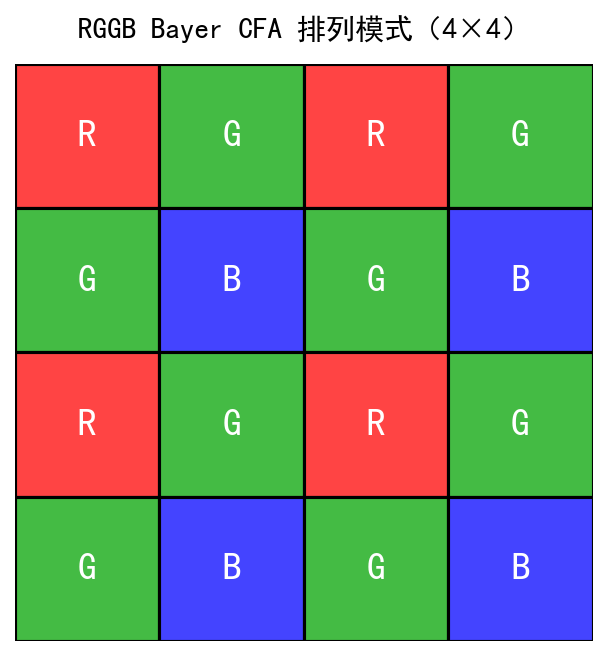
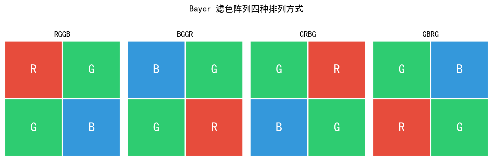
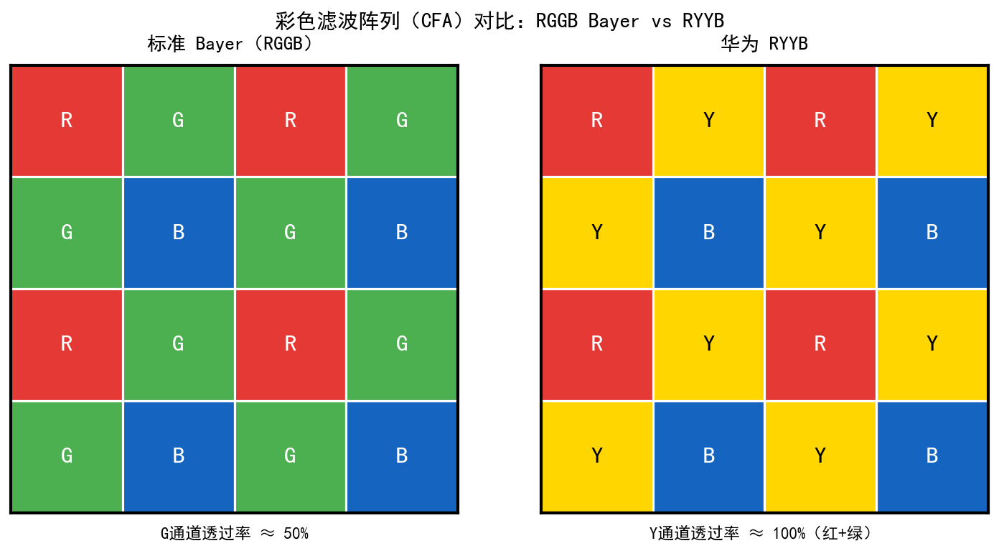
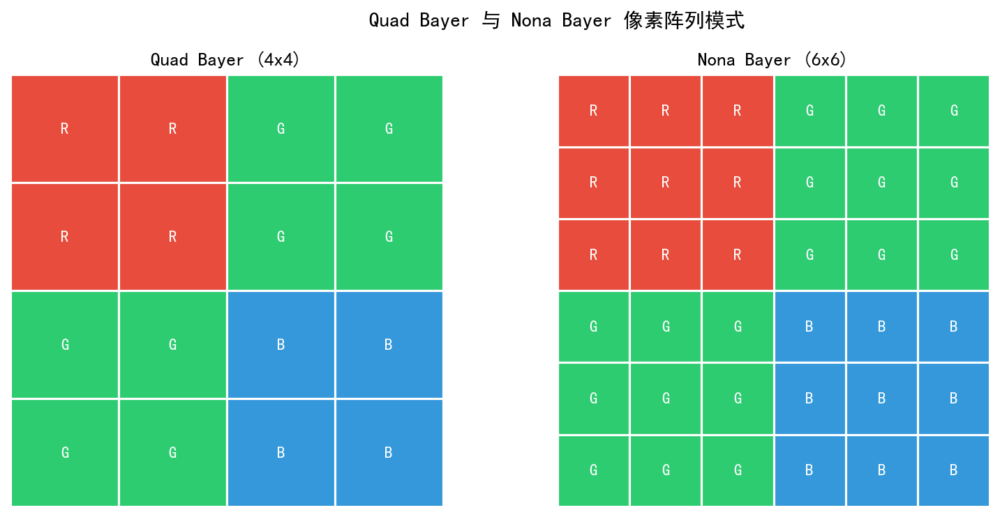
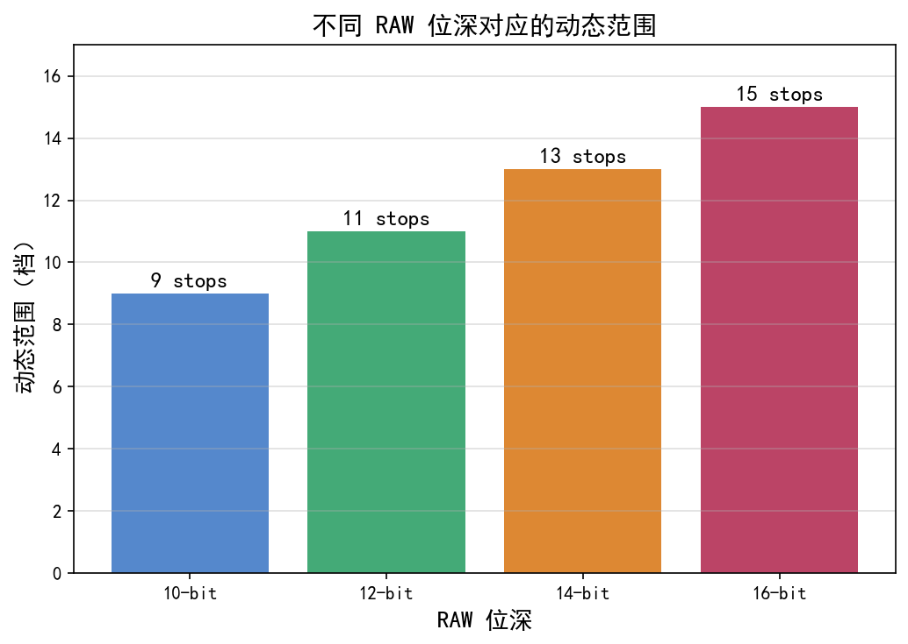

# 第一卷第06章：RAW 格式与图像格式体系（RAW Format & Image Formats）

> **流水线位置：** 传感器输出 → RAW 数据 → ISP 流水线入口；是 ISP 所有后续处理的数据源
> **前置章节：** 第一卷第03章（传感器物理）、第一卷第05章（色彩科学基础）
---

## §1 原理 (Theory)

### 1.1 什么是 RAW 图像？

**RAW 图像**是传感器经过 ADC（模数转换）后、在 ISP 任何处理之前的原始数字数据。每个像素仅记录一个通道的光强（由 CFA 滤光片决定），值域为 `[0, 2^N - 1]`（N 为 ADC 位深）。

ISP 工程师需要直接操作 RAW 数据的场景远多于想象：标定 BLC 必须看 RAW；验证去马赛克算法效果要在 RAW 上跑；深度学习降噪的训练数据必须用 RAW，用 JPEG 训出来的模型在 ISP 里是无法复现的。RAW 与 JPEG 的核心差异：

```
RAW（线性域）：
  ┌─────────────────────────────────────────────────┐
  │ 传感器 → ADC → [黑电平偏移] → 线性光子计数值   │
  │ 每像素 1 通道（R 或 G 或 B）                    │
  │ 未经 Gamma、去马赛克、锐化、降噪              │
  └─────────────────────────────────────────────────┘

JPEG（sRGB 显示域）：
  ┌─────────────────────────────────────────────────┐
  │ RAW → 完整 ISP 流水线 → Gamma → JPEG 有损压缩  │
  │ 每像素 3 通道（R、G、B），sRGB 色彩空间         │
  │ 不可逆信息损失（量化 + 有损压缩）               │
  └─────────────────────────────────────────────────┘
```

14-bit RAW 拥有 16384 级灰阶（JPEG 仅 256 级），保留最大动态范围；所有 ISP 参数（白平衡、色调曲线、锐化）均可在 RAW 基础上重新调整，具备非破坏性后期能力；医学成像、天文摄影、机器视觉等应用需要线性光强数据。

### 1.2 RAW 数据位深与打包格式

现代传感器 ADC 通常输出 10–14 bit 数据，而存储/传输时采用不同的打包方式：

#### 常见位深

| 位深 | 动态范围上限 | 典型应用 |
|------|------------|---------|
| 10-bit | 60 dB | 手机主摄（MIPI RAW10）|
| 12-bit | 72 dB | 旗舰手机（MIPI RAW12）、消费级单反/无反 |
| 14-bit | 84 dB | 专业相机（Canon CR3、Sony ARW、Nikon NEF）|
| 16-bit | 96 dB | 科学相机、医学影像 |

> **注：** 8-bit 不是 RAW ADC 的标准位深——8-bit 对应 JPEG（DCT 有损压缩后的输出）或 YUV 视频帧，而非传感器 ADC 原始数据。现代 ISP 流水线中，RAW 数据最低位深为 10-bit。

#### MIPI CSI-2 RAW 打包格式（手机传感器标准）

手机传感器通过 MIPI CSI-2 接口将 RAW 数据传输给 ISP，常用打包格式：

**RAW10（10-bit packed）：** 每 4 个像素占 5 字节
```
字节布局（4 像素 P0–P3，每像素 10-bit）：
Byte0: P0[9:2]   （P0 的高 8 位）
Byte1: P1[9:2]   （P1 的高 8 位）
Byte2: P2[9:2]   （P2 的高 8 位）
Byte3: P3[9:2]   （P3 的高 8 位）
Byte4: {P3[1:0], P2[1:0], P1[1:0], P0[1:0]}
     = (P3[1:0] << 6) | (P2[1:0] << 4) | (P1[1:0] << 2) | P0[1:0]
       ↑ bit[7:6]        ↑ bit[5:4]        ↑ bit[3:2]       ↑ bit[1:0]
```
注：Byte4 中 P0 的低 2 位占 bit[1:0]（LSB），P3 的低 2 位占 bit[7:6]（MSB）。解码时需按此顺序提取，否则 4 个像素的低位会反序。

**RAW12（12-bit packed）：** 每 2 个像素占 3 字节
```
字节布局（2 像素 P0–P1）：
Byte0: P0[11:4]
Byte1: P1[11:4]
Byte2: P1[3:0] | P0[3:0]
```

**RAW14（14-bit packed）：** 每 4 个像素占 7 字节（4×14 bit = 56 bit = 7 字节）
```
字节布局（4 像素 P0–P3，每像素 14-bit）：
Byte0: P0[13:6]   （P0 的高 8 位）
Byte1: P1[13:6]   （P1 的高 8 位）
Byte2: P2[13:6]   （P2 的高 8 位）
Byte3: P3[13:6]   （P3 的高 8 位）
Byte4: {P1[5:2], P0[5:2]}  （各取低4位中的高4位；bit[7:4]=P1[5:2], bit[3:0]=P0[5:2]）
Byte5: {P3[5:2], P2[5:2]}
Byte6: {P3[1:0], P2[1:0], P1[1:0], P0[1:0]}  （各取最低2位）
```
三星 ISOCELL HP 系列（如 HP2、GN 系列）在高动态范围模式下支持 RAW14 输出；高通 Spectra ISP 内部可接收 RAW14 数据流。

**RAW16（16-bit unpacked）：** 每像素 2 字节，高位对齐，低位补零（通常 14-bit 数据存入 16-bit 容器）

#### 行业实际格式

```
索尼 IMX 系列       → MIPI RAW10 / RAW12（取决于分辨率和帧率）
三星 ISOCELL 系列   → MIPI RAW10 / RAW12 / RAW14
高通 ISP（Spectra） → 内部接收 MIPI RAW，输出 QCOM 私有格式
DNG 文件            → 12-bit 或 14-bit，可选无损/有损压缩
```

### 1.3 CFA（彩色滤光片阵列）图案

RAW 图像中每个像素只记录一种颜色，由 CFA 决定。详细原理见第一卷第03章 §1.1，此处给出工程格式视角：

#### Bayer RGGB（最常见）

```
R  Gr R  Gr R  Gr
Gb B  Gb B  Gb B
R  Gr R  Gr R  Gr
Gb B  Gb B  Gb B
```

原始数据中像素的通道归属完全由其空间坐标决定：
```python
def get_bayer_channel(row, col, pattern='RGGB'):
    # RGGB: 偶行偶列=R, 偶行奇列=Gr, 奇行偶列=Gb, 奇行奇列=B
    r, c = row % 2, col % 2
    mapping = {'RGGB': {(0,0):'R', (0,1):'Gr', (1,0):'Gb', (1,1):'B'},
               'BGGR': {(0,0):'B', (0,1):'Gb', (1,0):'Gr', (1,1):'R'},
               'GRBG': {(0,0):'Gr', (0,1):'R', (1,0):'B', (1,1):'Gb'},
               'GBRG': {(0,0):'Gb', (0,1):'B', (1,0):'R', (1,1):'Gr'}}
    return mapping[pattern][(r, c)]
```

四种 Bayer 变体（RGGB/BGGR/GRBG/GBRG）在数学上等价，只是像素 0 的通道不同。ISP 必须在读取传感器数据时确认 CFA 起始相位。

#### Quad-Bayer（手机超高像素传感器）

Quad-Bayer 将每个"逻辑像素"扩展为 2×2 的同色物理像素块：

```
R  R  Gr Gr
R  R  Gr Gr
Gb Gb B  B
Gb Gb B  B
```

**Remosaic 问题：** Quad-Bayer 原始数据不是标准 Bayer 格式，无法直接用常规去马赛克算法处理。ISP 需要先做 **Remosaic**——同色 2×2 块内的 4 个子像素因光学像差和微透镜偏移，其值并不完全相同，Remosaic 须通过插值与重建自适应地融合这些差异，边缘区域尤其依赖边缘引导插值算法。重建后的标准 Bayer 才能进入正常 ISP 流水线。各 SoC 厂商（高通 Spectra、联发科 Imagiq、海思 ISP）均有各自的 Remosaic IP 实现，调参对全分辨率模式的分辨率和噪声均匀性均有显著影响。

#### Nona-Bayer（九合一 Bayer，三星 ISOCELL 系列）

三星 ISOCELL 在 Quad-Bayer（4合1）基础上进一步扩展至 **Nona-Bayer（9合1）**，将每个逻辑像素扩展为 3×3 的同色物理子像素块：

```
R  R  R  Gr Gr Gr
R  R  R  Gr Gr Gr
R  R  R  Gr Gr Gr
Gb Gb Gb B  B  B
Gb Gb Gb B  B  B
Gb Gb Gb B  B  B
```

**代表产品：** Samsung ISOCELL HP2（200 MP，0.6 μm 像素间距，1/1.3"），HP3（200 MP，1/1.4"）。

**优势与权衡：**
- 弱光模式（9合1 Binning）：将 9 个子像素合并等效为单个大像素，感光面积提升 9×，SNR 改善约 9.5 dB（理想情况）；实际因 CRA 失配等效果约 7–8 dB
- 全分辨率模式：需执行 **Remosaic**，将 Nona-Bayer 原始数据重排为标准 Bayer 格式，再进入去马赛克流水线
- Remosaic 复杂度更高：9个子像素中相邻子像素受光学像差、微透镜偏移影响更大，边缘区域的插值算法比 Quad-Bayer 更复杂；高通 Spectra 和联发科 Imagiq 均针对三星超高像素传感器做了专项 Remosaic 优化
- 分辨率-噪声联合调参：ISP 需要根据场景亮度自适应选择 1合1（全分辨率）/ 4合1 / 9合1 三种输出模式，曝光策略和 Remosaic 参数随模式切换

**与 Quad-Bayer 对比：**

| 特性 | Quad-Bayer（4合1） | Nona-Bayer（9合1） |
|------|-------------------|-------------------|
| 子像素块大小 | 2×2 | 3×3 |
| 最大合并增益 | 4× 像素面积 | 9× 像素面积 |
| SNR 提升（理想） | ~6 dB | ~9.5 dB |
| Remosaic 复杂度 | 中等 | 较高 |
| 代表传感器 | Sony IMX766、Samsung GN2 | Samsung HP2、HP3 |

---

### 1.4 主流 RAW 文件格式

不同厂商的相机使用各自私有 RAW 格式，DNG 是唯一开放标准：

| 格式 | 厂商/标准 | 位深 | 压缩 | 说明 |
|------|---------|------|------|------|
| **DNG** | Adobe（开放标准） | 8–32 bit | 无损/有损 | 基于 TIFF；含完整元数据；手机 Camera2 API 支持 |
| **ARW** | Sony | 12–14 bit | 无损压缩 | 主流全画幅相机格式 |
| **CR3** | Canon | 14 bit | CRAW 有损/无损 | Canon EOS 系统；HEIF 容器 |
| **NEF** | Nikon | 12–14 bit | 无损压缩 | 含白平衡/机内 VR 数据 |
| **RAF** | Fujifilm | 12–14 bit | 无损 | X-Trans CFA 需特殊去马赛克 |
| **RW2** | Panasonic | 12 bit | 无损 | L-mount 系统 |
| **ORF** | Olympus/OM | 12 bit | 无损 | 四三系统 |
| **ARQ** | Sony | 42 bit（4 帧合成）| — | Pixel Shift 像素偏移超分 RAW |
| **BRAW** | Blackmagic | 12 bit | 有损 | 电影机专用；GPU 解码 |

#### DNG 格式详解

DNG（Digital Negative）是 Adobe 于 2004 年发布的开放 RAW 标准，被 Google 采用为 Android Camera2 API 的 RAW 输出格式：

**DNG 文件结构（基于 TIFF-EP）：**
```
DNG 文件
├── IFD0（主图像目录）
│   ├── SubIFD → 完整分辨率 RAW 数据（Bayer/线性）
│   │   ├── BlackLevel（逐通道黑电平）
│   │   ├── WhiteLevel（白电平/满井）
│   │   ├── CFAPattern（CFA 图案：RGGB 等）
│   │   ├── ColorMatrix1/2（色彩校正矩阵，D65/A 光源；方向：RAW→XYZ）
│   │   ├── AsShotNeutral（拍摄时白平衡增益）
│   │   └── NoiseProfile（噪声模型参数，每通道一组 (a, b) 对）
│   ├── Thumbnail（嵌入预览 JPEG）
│   └── EXIF IFD（曝光参数）
└── Makernote（厂商私有元数据）
```

**DNG 中的关键元数据字段（ISP 标定必用）：**

```python
import rawpy

raw = rawpy.imread('image.dng')
print(raw.black_level_per_channel)    # [黑电平R, 黑电平Gr, 黑电平Gb, 黑电平B]
print(raw.white_level)                 # 白电平（满井值）
print(raw.camera_white_level_per_channel)  # 各通道白平衡后的白电平
print(raw.color_matrix)               # 3×3 颜色矩阵（RAW→XYZ）
print(raw.daylight_whitebalance)      # D65 标准白平衡系数
```

### 1.5 图像输出格式体系

ISP 流水线最终输出的图像格式需要兼顾画质、压缩效率和设备兼容性：

#### 静态图像格式对比

| 格式 | 压缩类型 | 位深 | 色彩空间 | 典型应用 |
|------|---------|------|---------|---------|
| **JPEG** | DCT 有损（YCbCr） | 8-bit | sRGB | 最广泛兼容；手机默认照片格式 |
| **HEIF/HEIC** | HEVC/H.265 有损 | 8/10-bit | sRGB/Display P3 | iOS 默认格式；压缩效率是 JPEG 2×  |
| **AVIF** | AV1 有损/无损 | 8/10/12-bit | 宽色域 | 下一代网络图像格式；Chrome/Safari 支持 |
| **PNG** | DEFLATE 无损 | 8/16-bit | sRGB | 截图/UI；无损但文件大 |
| **TIFF** | 无损/无压缩 | 8/16/32-bit | 任意 | 专业印刷/科学；DNG 基于 TIFF |
| **WebP** | VP8 有损/VP8L 无损 | 8-bit | sRGB | Google 网络格式；Android 支持 |
| **JXL（JPEG XL）**| 无损/有损 | 8/16/32-bit | 宽色域 HDR | 新兴标准；向后兼容 JPEG |

#### 视频帧/相机 HAL 中间格式

在 Android Camera HAL 和 SoC ISP 内部流水线中，使用 YUV 格式传递图像数据：

| 格式 | 采样 | 说明 | 典型用途 |
|------|------|------|---------|
| **YUV 4:2:0 (NV21)** | 4:2:0 | Y 平面 + 交织 VU 平面；Android 默认 | Camera preview/video |
| **YUV 4:2:0 (NV12)** | 4:2:0 | Y 平面 + 交织 UV 平面；V4L2/Linux | SoC ISP 输出 |
| **YUV 4:2:2 (YUYV)** | 4:2:2 | 交织 Y/U/Y/V；USB 相机常用 | UVC 相机设备 |
| **YUV 4:4:4** | 4:4:4 | 全分辨率色度；无色彩损失 | 专业视频 |
| **P010** | 4:2:0，10-bit | NV12 的 10-bit 版本；HDR 视频 | HDR10/HLG 视频 |
| **RGBA/BGRA** | — | 全通道带透明度；GPU 处理 | OpenGL/Vulkan 纹理 |

**NV21/NV12 内存布局（以 4×2 图像为例）：**
```
NV21 (Android 默认):
  Y 平面: Y00 Y01 Y02 Y03 Y10 Y11 Y12 Y13   ← 8 字节
  VU 平面: V00 U00 V02 U02                    ← 4 字节（2× 下采样）

NV12 (Linux/SoC):
  Y 平面: Y00 Y01 Y02 Y03 Y10 Y11 Y12 Y13   ← 8 字节
  UV 平面: U00 V00 U02 V02                    ← 4 字节
```

注意 NV21 和 NV12 的 UV 顺序相反！常见的色彩错误（绿脸问题）往往源于误用了 NV21/NV12。

#### HDR 图像格式

随着 HDR 显示的普及，图像格式也在向高动态范围演进：

| 格式 | 传输函数 | 色域 | 峰值亮度 | 说明 |
|------|---------|------|---------|------|
| **HDR10** | PQ（ST.2084） | Rec.2020 | 10000 nit（MaxCLL，元数据指定）**[3]** | 静态元数据；无版权费 |
| **HDR10+** | PQ | Rec.2020 | 4000 nit（动态元数据） | 三星推进 |
| **Dolby Vision** | PQ | Rec.2020 | 10000 nit（动态） | 授权费；Apple iPhone 支持 |
| **HLG（Hybrid Log-Gamma）**| HLG（ITU-R BT.2100）**[3]** | Rec.2020 | — | 向后兼容 SDR；广播标准 |
| **JPEG XL（HDR）** | PQ/HLG | 宽色域 | — | 静态 HDR 图像存储 |

### 1.6 Android Camera2 API 中的格式流

在 Android Camera2/CameraX 架构中，图像格式在不同阶段流转：

```
传感器输出（MIPI RAW10/12）
        ↓
Qualcomm Spectra / MediaTek ISP
        ↓
┌──────────────────────────────────────┐
│ ImageReader / ImageWriter            │
│  ├─ ImageFormat.RAW_SENSOR           │ → DNG 保存
│  ├─ ImageFormat.YUV_420_888 (NV12)  │ → 预览/视频编码
│  ├─ ImageFormat.JPEG                 │ → 拍照保存
│  └─ ImageFormat.HEIF                 │ → iOS 兼容格式
└──────────────────────────────────────┘
        ↓
MediaCodec（H.265/AV1 编码器）
        ↓
MP4 / MOV 视频文件
```

`ImageFormat.RAW_SENSOR` 对应设备原始 Bayer 数据（位深取决于传感器，通常 10–16 bit，存入 16-bit 容器）。

---

## §2 标定 (Calibration)

### 2.1 DNG 元数据标定

DNG 格式内嵌了标定数据，ISP 算法工程师读取 DNG 时必须提取以下字段：

| DNG Tag | 含义 | 标定用途 |
|---------|------|---------|
| `BlackLevel` | 各通道黑电平 | BLC 起点（见第二卷第01章）|
| `WhiteLevel` | 白电平（ADC 满量程）| BLC 归一化分母 |
| `ColorMatrix1/2` | RAW→XYZ 矩阵（D65/A 光源；注意方向是从传感器原始空间到 XYZ，与 ISP CCM 方向一致）| CCM 参考（见第二卷第06章）|
| `CameraCalibration1/2` | 相机个体校准矩阵 | 补偿传感器批次差异 |
| `AsShotNeutral` | 拍摄时 AWB 估计的中性值 | AWB 初始化 |
| `NoiseProfile` | 逐通道噪声模型参数，每个 CFA 通道一组 (a, b) 对，对应泊松-高斯模型 σ²=aμ+b；a 为散粒噪声系数（NoiseScale），b 为读出噪声方差（NoiseOffset，单位为归一化强度的平方）| 泊松-高斯噪声模型校准（见第一卷第04章）|
| `LensShading` | 镜头阴影增益图 | LSC 参考（见第二卷第08章）|

**rawpy 读取 DNG 元数据示例：**
```python
import rawpy
import numpy as np

with rawpy.imread('sample.dng') as raw:
    # 黑电平和白电平
    blc = raw.black_level_per_channel          # [R, Gr, Gb, B]
    wl = raw.white_level                         # 白电平

    # 原始 Bayer 数据
    bayer = raw.raw_image_visible.copy()         # uint16 Bayer 图像

    # 归一化到 [0, 1]
    bayer_norm = (bayer.astype(np.float32) - np.min(blc)) / (wl - np.min(blc))
    bayer_norm = np.clip(bayer_norm, 0, 1)

    # CFA 图案
    print(raw.raw_pattern)  # e.g., [[0,1],[3,2]] = RGGB
```

### 2.2 格式兼容性验证

ISP 工程师在集成新传感器时需要验证格式字段正确性：

1. **CFA 相位验证**：拍摄白色墙面，检查 RAW 中 (0,0) 像素的通道是否符合 CFA 配置（RGGB 时应为 R 通道，且红色像素值最高）
2. **黑电平验证**：遮住镜头拍暗帧，检查各通道均值是否与 `BlackLevel` tag 一致（±2 LSB ）
3. **白电平验证**：拍摄接近饱和的均匀白场，检查最亮像素是否接近 `WhiteLevel` 值

---

## §3 调参 (Tuning)

### 3.1 RAW 位深对 ISP 调参的影响

| 位深 | 黑电平估计精度 | 色彩精度 | 建议策略 |
|------|--------------|---------|---------|
| 10-bit | ±1 LSB = 0.1%满量程 | 对于强 AWB 增益可能出现量化条带 | OB 区域均值滤波降低估计噪声 |
| 12-bit | ±1 LSB = 0.024%满量程 | 足够精确 | 标准 BLC 流程即可 |
| 14-bit | ±1 LSB = 0.006%满量程 | 极精确 | 可做更精细的暗部色彩调整 |

**10-bit RAW 的量化条带问题：** 当 AWB 对蓝通道施加 2× 增益时，10-bit 量化步长被放大为 2 个显示级，在低饱和蓝色区域（如晴天阴影）可能出现可见的梯度条带。解决方法：
1. 在 RAW 域增益后添加低强度 dither（抖动噪声）
2. 使用 ISP 内部 14-bit 处理位宽（即使传感器只有 10-bit 输出）

### 3.2 HEIF vs JPEG 输出选择

| 场景 | 推荐格式 | 原因 |
|------|---------|------|
| 日常照片存储 | HEIF/HEIC | 同等画质下文件体积减半；支持 10-bit 宽色域 |
| 广泛分享/网络上传 | JPEG | 最高兼容性；所有设备/平台支持 |
| 专业后期 | DNG + JPEG 双保存 | DNG 保留全部 RAW 数据；JPEG 用于快速预览 |
| HDR 视频录制 | HEVC（P010） | 支持 10-bit HDR；H.265 编码效率高 |

---

## §4 伪影 (Artifacts)

### 4.1 CFA 相位错误（Phase Error）

**现象：** 整幅图像出现大面积错误色彩（绿色占主导，或整体偏品红），色彩完全不正常。

**原因：** ISP 读取 RAW 数据时，将 CFA 起始坐标弄错（如 RGGB 被当作 BGGR 处理），导致去马赛克时 R/B 通道互换。

**诊断：** 在调试界面强制显示 RAW 通道分布，确认左上角像素（0,0）的值是否符合 CFA 配置。

### 4.2 JPEG 量化块效应（Blocking Artifacts）

**现象：** 图像均匀区域出现 8×8 像素的矩形方块，在低比特率（高压缩）和暗部区域尤为明显。

**原因：** JPEG DCT 量化步长过大，导致块间不连续性。

**ISP 缓解：** 在 JPEG 编码前对低频平坦区域施加轻微平滑；选择适当的 JPEG Quality 参数（通常 85–95 ）。

### 4.3 NV21/NV12 混淆（色彩错误）

**现象：** 图像色彩异常，人脸呈绿色，或整体蓝/红通道互换。

**原因：** YUV 数据按 NV21 生产，按 NV12 消费（或反之），导致 U/V 通道互换。

**诊断：** 检查 Android `ImageFormat` 枚举值：NV21 = 17（`YUV_420_888` 的一种），NV12 非 Android 标准枚举，需通过 stride/pixelStride 区分。

### 4.4 Quad-Bayer Remosaic 失败

**现象：** 全分辨率模式（不合并像素）下，图像出现颜色网格状噪声或分辨率看起来远低于标称值。

**原因：** Remosaic 算法质量差，4 个同色子像素的差异未被正确处理（边缘区域尤其明显）。

**调参建议：** 在标准分辨率测试卡上比较合并模式（Binning）和全分辨率（Remosaic）模式的 MTF50，验证 Remosaic 不引入额外分辨率损失。

---

## §5 评测 (Evaluation)

### 5.1 RAW 质量评估

| 评测维度 | 方法 | 目标 |
|---------|------|------|
| 黑电平准确性 | 暗帧各通道均值 vs. DNG BlackLevel tag | 偏差 < 1 LSB |
| 白电平验证 | 近饱和平场最亮像素 | ≥ 95% × WhiteLevel |
| CFA 相位 | 白场下各通道均值排序 | 符合 CFA 图案 |
| 位深有效性 | 亮场图像直方图无梯级（comb pattern）| 无可见量化条带 |
| 噪声模型符合度 | PTC 曲线（见第一卷第04章 §2）| $\sigma^2$ vs. $\mu$ 符合泊松-高斯模型 |

### 5.2 输出格式质量评估

| 格式 | 质量评测方法 | 关键指标 |
|------|-----------|---------|
| JPEG | SSIM/PSNR vs. 无损参考；DXOMark | PSNR > 40 dB（Quality 90） |
| HEIF | 与同质量 JPEG 的文件大小比较；VMAF | 压缩比 ≥ 1.5× JPEG（同 SSIM） |
| DNG | 元数据完整性检查；Adobe DNG Validator | 验证通过；Lightroom 可正常导入 |
| NV21/YUV | 色彩偏差（ΔE）vs. sRGB 参考 | ΔE₀₀ < 3.0 |

---

## §6 代码 (Code)

完整配套 Notebook 见本目录 `.ipynb` 文件。以下给出三段核心代码片段，可独立运行。

### 6.1 MIPI RAW10 解包（packed → uint16 数组）

MIPI RAW10 packed 格式每 4 个像素占 5 字节。以下实现将字节流高效还原为 10-bit 像素值数组（NumPy 矢量化，无 Python 循环）：

```python
import numpy as np

def unpack_raw10(raw_bytes: bytes, width: int, height: int) -> np.ndarray:
    """
    解包 MIPI RAW10 packed 字节流为 uint16 像素数组。
    每 5 字节包含 4 个 10-bit 像素：
      Byte0[9:2]=P0, Byte1[9:2]=P1, Byte2[9:2]=P2, Byte3[9:2]=P3
      Byte4[1:0]=P0低位, Byte4[3:2]=P1低位, Byte4[5:4]=P2低位, Byte4[7:6]=P3低位
    参数：
      raw_bytes: MIPI RAW10 packed 字节流（长度 = width*height*5//4）
      width, height: 像素宽高（width 必须是 4 的倍数）
    返回：
      shape=(height, width) 的 uint16 数组，值域 [0, 1023]
    """
    assert width % 4 == 0, "width 必须是 4 的倍数"
    buf = np.frombuffer(raw_bytes, dtype=np.uint8)
    # 重排为 (N_groups, 5)
    n_groups = (width * height) // 4
    buf = buf[:n_groups * 5].reshape(n_groups, 5)
    # 提取高 8 位
    p0 = buf[:, 0].astype(np.uint16) << 2
    p1 = buf[:, 1].astype(np.uint16) << 2
    p2 = buf[:, 2].astype(np.uint16) << 2
    p3 = buf[:, 3].astype(np.uint16) << 2
    # 拼入低 2 位（来自 Byte4）
    lsb = buf[:, 4].astype(np.uint16)
    p0 |= (lsb >> 0) & 0x3
    p1 |= (lsb >> 2) & 0x3
    p2 |= (lsb >> 4) & 0x3
    p3 |= (lsb >> 6) & 0x3
    # 交织还原像素顺序
    out = np.empty(n_groups * 4, dtype=np.uint16)
    out[0::4] = p0
    out[1::4] = p1
    out[2::4] = p2
    out[3::4] = p3
    return out.reshape(height, width)


# --- 快速验证 ---
# 5 字节 = [0xAB, 0xCD, 0xEF, 0x12, 0x5E]
test_bytes = bytes([0xAB, 0xCD, 0xEF, 0x12, 0x5E])
result = unpack_raw10(test_bytes, width=4, height=1)
# Byte4=0x5E=0b01011110: P0低位=10, P1低位=11, P2低位=01, P3低位=01
# P0 = (0xAB<<2)|0b10 = 684|2 = 686
# P1 = (0xCD<<2)|0b11 = 820|3 = 823
# P2 = (0xEF<<2)|0b01 = 956|1 = 957
# P3 = (0x12<<2)|0b01 = 72|1  = 73
print(result)  # 期望: [[686, 823, 957, 73]]
```

### 6.2 Bayer 通道分离与归一化

从 RAW uint16 数组中提取 RGGB 四通道，并归一化至 [0, 1] 线性域：

```python
def split_bayer_rggb(raw: np.ndarray, black_level: float = 64,
                     white_level: float = 1023) -> dict:
    """
    将 RGGB Bayer RAW 分离为 R/Gr/Gb/B 四通道并线性归一化。
    raw: shape=(H, W) uint16，H/W 均为偶数
    返回: dict，每通道 shape=(H//2, W//2)，值域 [0, 1]
    """
    raw_f = raw.astype(np.float32)
    bl, wl = black_level, white_level
    norm = lambda ch: np.clip((ch - bl) / (wl - bl), 0, 1)
    return {
        'R':  norm(raw_f[0::2, 0::2]),  # 偶行偶列
        'Gr': norm(raw_f[0::2, 1::2]),  # 偶行奇列
        'Gb': norm(raw_f[1::2, 0::2]),  # 奇行偶列
        'B':  norm(raw_f[1::2, 1::2]),  # 奇行奇列
    }

# 快速验证：合成模拟 4×4 RAW（RGGB，黑电平 64，白电平 1023）
mock_raw = np.random.randint(64, 1023, (4, 4), dtype=np.uint16)
channels = split_bayer_rggb(mock_raw, black_level=64, white_level=1023)
print({k: v.shape for k, v in channels.items()})  # 每通道 (2,2)
# 验证 Gr 与 Gb 均值接近（同一照度下两个绿通道理论相等）
print(f"Gr mean={channels['Gr'].mean():.3f}, Gb mean={channels['Gb'].mean():.3f}")
```

### 6.3 DNG 元数据解析（NoiseProfile + ColorMatrix）

使用 `rawpy` 读取 DNG 文件并提取 ISP 标定所需的关键元数据字段：

```python
import rawpy, json

def parse_dng_metadata(dng_path: str) -> dict:
    """
    读取 DNG 文件，提取 BlackLevel、WhiteLevel、
    ColorMatrix（RAW→XYZ）、NoiseProfile（a/b 系数）。
    返回结构化元数据字典，便于 ISP 流水线直接使用。
    """
    with rawpy.imread(dng_path) as raw:
        meta = {
            'black_level':   raw.black_level_per_channel.tolist(),  # [R,Gr,Gb,B]
            'white_level':   int(raw.white_level),
            'color_matrix':  raw.color_matrix.tolist(),   # 3×4, RAW→XYZ@D65
            'as_shot_neutral': raw.camera_whitebalance[:3],  # AWB gains [R,G,B]
        }
        # NoiseProfile: rawpy 0.21+ 提供 noise_profile 属性
        if hasattr(raw, 'noise_profile'):
            meta['noise_profile'] = raw.noise_profile.tolist()  # [[a0,b0],[a1,b1],...]
        else:
            meta['noise_profile'] = None  # 厂商未填写（不合规 DNG）
    return meta

# 示例输出（实际运行需提供真实 DNG 文件）
# meta = parse_dng_metadata("sample.dng")
# print(json.dumps(meta, indent=2))
#
# 典型输出结构：
# {
#   "black_level": [64, 64, 64, 64],
#   "white_level": 4095,
#   "color_matrix": [[1.234, -0.345, 0.111, 0.0], ...],
#   "as_shot_neutral": [1.821, 1.0, 1.432],
#   "noise_profile": [[2.3e-5, 1.1e-8], [2.1e-5, 9.8e-9], ...]
# }
print("DNG metadata parser ready. Provide a .dng file path to parse_dng_metadata().")
```

> **工程要点：** `NoiseProfile` 中每对 $(a, b)$ 对应泊松-高斯噪声模型 $\sigma^2 = a\mu + b$（见第一卷第04章），其中 $\mu$ 为归一化后的像素均值（值域 [0, 1]）。`a` 是散粒噪声斜率（=系统总增益），`b` 是读出噪声方差。如 `noise_profile` 返回 `None`，说明 DNG 文件违反 Adobe DNG 1.6 规范，需向传感器 BSP 团队提 bug 要求补齐。

---

> **工程师手记：RAW格式的存储权衡、拜耳阵列复杂度与元数据规范**
>
> **有损DNG与无损DNG的工程取舍：** Adobe DNG格式支持三种压缩模式：无压缩（Uncompressed RAW，约30MB/张 at 48MP）、无损压缩（Lossless JPEG 2000，约15-18MB，压缩率约2:1）、有损压缩（Lossy DNG，约4-6MB，压缩率约5-8:1）。对于手机相机工程团队，存储成本压力驱使更多采用有损DNG，但代价是在暗部（低信号区域）引入量化误差，SNR损失约0.5-1.5 dB，表现为有损DNG二次去噪后暗部出现块状伪影（Block Artifact）。Apple ProRAW（基于Adobe DNG有损压缩 + 语义增益图）的解决方案是将语义分割图（Semantic Gain Map）作为额外层打包进DNG，在第三方软件渲染时可参考增益图做自适应的压缩参数补偿，从而在有损压缩的存储效率与无损的渲染质量之间取得更优平衡。
>
> **RGGB/RYYB/四拜耳模式的ISP复杂度扩展：** 标准RGGB拜耳模式的ISP去马赛克（Demosaic）算法已相当成熟（AHD/LMMSE等），但当传感器采用RYYB（华为P30 Pro引入，以黄色Y通道替换绿色G通道提升透光率约40%）或四拜耳（Quad-Bayer，2×2同色子块）时，ISP的标定和算法复杂度会非线性增加。RYYB的核心挑战是Y通道（黄色）在色度解析时需要精确的光谱拆分（分解为R+G混合，比例依赖光源色温），AWB算法需针对Y通道重新设计色温估计模型，否则会在人工光源下出现显著偏色。四拜耳模式的ISP需处理"全分辨率模式"和"合并像素（Binning）低光模式"的无缝切换，两种模式的Demosaic算法、LSC增益表、噪声模型均需独立标定，出厂标定数据量约为RGGB的3-4倍。
>
> **第三方RAW处理的必要元数据字段：** RAW文件若要支持准确的第三方处理（Lightroom/Darktable/RawTherapee），必须包含以下关键元数据字段：色彩矩阵（ColorMatrix1/ColorMatrix2，定义标准光源A和D65下传感器RGB到XYZ的变换矩阵）、噪声配置文件（NoiseProfile，包含噪声模型的α和β系数）、相机标定矩阵（CameraCalibration1/CameraCalibration2）、模拟增益（AnalogBalance）、拜耳模式（CFAPattern）。其中NoiseProfile是最常被手机厂商省略的字段，导致Lightroom只能使用默认噪声模型而非实测模型进行降噪，暗部降噪效果会明显劣于原生相机App。DNG规范1.6版本强制要求NoiseProfile字段对于RAW DNG必须存在，但目前仍有部分国内厂商的手机DNG文件缺少该字段，属于不合规实现。
>
> *参考：Adobe Systems, "Digital Negative (DNG) Specification 1.6.0.0", Adobe Inc., 2021；Hirakawa & Parks, "Adaptive Homogeneity-Directed Demosaicing Algorithm", IEEE TIP, 2005；ISO/TC42, "Photography — Digital Still Cameras — Extended Dynamic Range", ISO 21390, 2021*

---

## 插图


*图1. 标准Bayer RGGB彩色滤光片阵列图案（图片来源：作者自绘）*


*图2. Bayer CFA四种变体（RGGB/BGGR/GRBG/GBRG）对比（图片来源：作者自绘）*


*图3. 传统Bayer阵列与RYYB阵列感光性能对比（图片来源：作者自绘）*


*图4. Quad-Bayer（四合一）CFA图案示意图（图片来源：Samsung Semiconductor, "ISOCELL HP2 Nona-Bayer Pixel Technology Whitepaper", 官方文档, 2023）*


*图5. RAW数据不同位深的动态范围与量化级别对比（图片来源：Adobe, "DNG Specification 1.7.1", 官方文档, 2023）*

---

## 习题

**练习 1（理解）**
手机传感器输出 MIPI RAW10 格式，但后期软件（如 Lightroom、Snapseed）通常要求 DNG 或 TIFF 格式。请说明：(a) RAW10 与 DNG 的本质区别是什么（打包方式、元数据、可移植性）？(b) 14-bit RAW 相比 10-bit RAW 在动态范围上能多出几个 EV？(c) ISP 工程师在标定 BLC（黑电平校正）时为什么必须操作 RAW 数据而不能在 JPEG 上标定？

**练习 2（计算）**
某传感器输出 MIPI RAW10 packed 格式，按照本章 §1.2 的字节布局：4 个像素 P0–P3 占 5 个字节。已知 5 个字节的十六进制值为 `0xAB 0xCD 0xEF 0x12 0x5E`（Byte0–Byte4），请完整还原 4 个像素的 10-bit 值 P0–P3（Byte4 = `0x5E` = `0101 1110`，其中 P0 低 2 位在 bit[1:0]，P1 低 2 位在 bit[3:2]，P2 低 2 位在 bit[5:4]，P3 低 2 位在 bit[7:6]）。

**练习 3（编程）**
用 Python + NumPy 实现 Bayer 模式分离与通道可视化：(a) 用 `rawpy` 或直接读取一张 RGGB Bayer RAW（或用 `np.random.randint(64, 4096, (512, 512), dtype=np.uint16)` 生成模拟数据）；(b) 将 Bayer 图分离为 R、Gr、Gb、B 四个通道（各 256×256）；(c) 计算四个通道各自的均值和标准差，验证 Gr 和 Gb 通道均值应接近（若来自同一传感器）；(d) 将四个通道拼接为一张 2×2 网格图（使用 `np.block`），保存为 PNG 并验证 R 通道（左上角）在暖色场景下均值最大。

**练习 4（工程分析）**
Quad-Bayer 传感器（如三星 ISOCELL GN2 200MP）在全分辨率模式和 Remosaic 输出模式下的 CFA 结构不同。请分析：(a) Quad-Bayer 的 4×4 原始 CFA 模式与标准 Bayer 的 2×2 模式在去马赛克算法上有何本质区别？(b) Remosaic（重马赛克）步骤的输入输出分别是什么，为什么标准 Demosaic 算法不能直接处理 Quad-Bayer 原始数据？(c) 若 ISP 接收到 Quad-Bayer 原始数据但未执行 Remosaic，会在最终图像上产生什么可见伪像？

## 参考文献

[1] Adobe, "DNG Specification 1.7.1 — 完整 DNG 格式规范，包含所有 Tag 定义", *官方文档*, 2023.

[2] IEC, "IEC 61966-2-1 — sRGB 色彩空间与 EOTF 定义", *官方文档*, 1999.

[3] ITU-R, "BT.2100-2 — HDR 传输函数 PQ 和 HLG 定义", *官方文档*, 2018. URL: https://www.itu.int/rec/R-REC-BT.2100/en

[4] Nakamura et al., "Image Sensors and Signal Processing for Digital Still Cameras（第2章：传感器接口与数据格式）", *CRC Press*, 2006.

[5] Alakuijala et al. (incl. Sneyers), "JPEG XL next-generation image compression architecture and coding tools", *SPIE Applications of Digital Image Processing XLII*, vol. 11137, 2019.
<!-- REF-AUDIT: [5] 原文 "SPIE Applications of Digital Image Processing XLIV, 2021" 错误 → 正确为 SPIE Applications of Digital Image Processing XLII (vol. 11137), 2019；第一作者应为 Alakuijala et al. -->

[6] Samsung Semiconductor, "ISOCELL HP2 Image Sensor: Nona-Bayer Pixel Technology Whitepaper", *官方文档*, 2023.

## §7 术语表（Glossary）

**RAW 图像（RAW Image）**
传感器经 ADC 量化后、在 ISP 任何处理之前的原始数字数据。每个像素只记录一个通道的光强（由 CFA 决定），值域 [0, 2^N−1]，N 为 ADC 位深（通常 10–14 bit）。RAW 保留最大动态范围和全部场景信息，是 ISP 工程师调参和算法开发的第一手数据源，也是 DNG 格式存储的核心内容。

**ADC 位深（ADC Bit Depth）**
模数转换器的量化精度，决定传感器可表示的灰阶数（2^N 级）和动态范围上限（6.02×N dB）。手机主摄通常 10–12 bit，旗舰机 12–14 bit，专业相机 14 bit。位深越高，暗部细节越丰富，后期处理空间越大；但数据量和传输带宽也随之增加。

**MIPI CSI-2（Mobile Industry Processor Interface Camera Serial Interface 2）**
手机传感器与 ISP 芯片之间的标准串行接口协议。定义了 RAW8/10/12/14/16 等打包格式：RAW10 每 4 像素打包进 5 字节（4 个高 8 位各占 1 字节 + 第 5 字节存 4 个像素的低 2 位）；RAW12 每 2 像素打包进 3 字节。MIPI CSI-2 是目前所有手机主摄的标准传输接口，支持多路 lane（2/4/8 lane）以满足高分辨率/高帧率需求。

**CFA（Color Filter Array，彩色滤光片阵列）**
覆盖在传感器像素阵列上的彩色滤光片，使每个像素只接收特定波段（R、G 或 B）的光。最常见的是 **Bayer 图案**：2×2 周期，包含 1R+2G+1B（G 数量翻倍是因为人眼对绿色空间分辨率最敏感）。其他变体包括 Quad-Bayer、X-Trans（Fujifilm）、RGBW（加白通道提升低光灵敏度）等。CFA 图案（相位）决定了 ISP 读取 RAW 数据时的通道映射关系，相位错误会导致全局色彩异常。

**Bayer 图案（Bayer Pattern）**
Bryce Bayer（柯达）1976 年发明的 CFA 排列方式，标准 Bayer 以 2×2 为周期，含 RGGB、BGGR、GRBG、GBRG 四种变体。四种变体数学等价，仅起始像素（0,0）的通道不同，ISP 必须从传感器规格书或 DNG CFAPattern 字段读取确切配置。Bayer RAW 的信息密度是全彩图像的 1/3（R 和 B 各 1/4，G 共 1/2），去马赛克通过插值恢复缺失颜色通道。

**Quad-Bayer（四合一 Bayer）**
索尼 / 三星超高像素手机传感器（如 200 MP）使用的 CFA 格式，将标准 Bayer 中每个逻辑像素扩展为 2×2 的同色物理子像素块。低光下四个子像素合并（binning）等效为大像素（高灵敏度）；强光下分别读出并通过 **Remosaic** 算法重排为标准 Bayer 格式，实现全分辨率输出。Remosaic 质量是超高像素手机全分辨率模式画质的关键瓶颈。

**Nona-Bayer（九合一 Bayer）**
三星 ISOCELL 系列超高像素传感器（HP2/HP3，200 MP）使用的 CFA 格式，将每个逻辑像素扩展为 3×3 的同色物理子像素块（9个子像素），是 Quad-Bayer 的进一步扩展。弱光下可 9合1 Binning，等效感光面积提升 9×，SNR 改善约 7–8 dB（实际值，含光学损耗）；强光下通过 Remosaic 重排为标准 Bayer 实现全分辨率输出。Remosaic 复杂度高于 Quad-Bayer，是 200 MP 传感器全分辨率画质的核心瓶颈。

**Remosaic**
将非标准 CFA（如 Quad-Bayer、Tetracell）原始数据重排为标准 Bayer 格式的算法，以使常规去马赛克流水线可以处理。由于同一色块内 4 个子像素的值并不完全相同（受光学像差和微透镜偏移影响），Remosaic 需要自适应地融合子像素差异，边缘区域尤其复杂。各 SoC 厂商（高通 Spectra、联发科 Imagiq、海思 ISP）均有各自的 Remosaic IP 实现，调参对分辨率和噪声均匀性影响显著。

**DNG（Digital Negative）**
Adobe 2004 年发布、Google 采纳为 Android Camera2 RAW 输出的开放 RAW 标准，基于 TIFF-EP 容器。包含完整标定元数据：BlackLevel（黑电平）、WhiteLevel（白电平）、ColorMatrix1/2（D65/A 光源下的 RAW→XYZ 矩阵，注意方向是 RAW→XYZ，而 ISP 内 CCM 通常也是同方向）、AsShotNeutral（AWB 增益）、NoiseProfile（每色温档的泊松-高斯噪声参数 $(a, b)$ 对）。DNG Validator 是验证 DNG 合规性的官方工具，Lightroom/ACR 兼容性是量产验收标准之一。

**DNG NoiseProfile**
DNG 标准中存储噪声模型参数的字段，格式为一组 $(a, b)$ 数对，通常按颜色通道分别存储（一行代表一个通道，一个色温档）。对应第一卷第04章的泊松-高斯模型 $\sigma^2 = a\mu + b$：$a$ 是散粒噪声系数（等于系统增益，NoiseScale），$b$ 是读出噪声方差（NoiseOffset，直接存储方差而非标准差）。rawpy 可通过 `raw.noise_profile` 直接读取该字段。

**JPEG（Joint Photographic Experts Group）**
基于 DCT（离散余弦变换）的有损图像压缩标准，工作在 YCbCr 色彩空间（4:2:0 色度下采样），8-bit 位深，Quality 参数（1–100）控制量化粗细。Quality 85–95 时 PSNR > 40 dB，是手机默认照片格式。主要缺点：8-bit 限制（无法存储 HDR/宽色域）、块效应（Blocking Artifacts，低质量时 8×8 方块可见），以及一旦重压缩则质量逐代下降。

**HEIF/HEIC（High Efficiency Image File Format）**
基于 HEVC（H.265）编解码的图像格式，压缩效率约为 JPEG 的 2×（同 SSIM 下文件体积减半）。支持 10-bit 位深和 Display P3 宽色域，是 iOS 11（2017）以来的默认照片格式。Android 9+ 通过 `libheif` 支持读写。HEIF 容器还可存储多帧（Burst）、深度图和 HDR 图，是现代手机摄影的关键格式迭代。

**YUV 格式**
将图像从 RGB 分离为亮度（Y）和色度（Cb/U、Cr/V）分量的格式系列。色度下采样（4:2:0、4:2:2、4:4:4）利用人眼对色度的低空间分辨率，减少数据量。手机 ISP 流水线内部主要使用 YUV：NV21（Android 标准，Y + 交织 VU，枚举值 17）和 NV12（Linux/SoC 标准，Y + 交织 UV）是 4:2:0 格式的两种变体，**UV 顺序相反**，混淆会导致色彩错误（绿脸问题）。

**NV21（Android YUV_420_888 默认变体）**
Android Camera 预览和视频录制的默认 YUV 格式。内存布局：连续 Y 平面（width×height 字节）+ 交织 VU 平面（V 在前、U 在后，共 width×height/2 字节）。Android `ImageFormat.NV21 = 17`。注意 Android Camera2 API 返回的 `ImageFormat.YUV_420_888` 实际可以是 NV21 或 NV12，需通过 `Image.Plane` 的 `pixelStride` 判断（pixelStride=1 为平面格式，=2 为交织格式）。

**P010（10-bit YUV 4:2:0）**
NV12 的 10-bit 扩展版本，每个 Y/UV 分量以 16-bit 容器存储（高 10 位有效，低 6 位填零）。用于 HDR 视频（HDR10、HLG）在 Android 上的传输和编码，支持 Rec.2020 色域的 HDR 元数据。高通 Spectra 和联发科 Imagiq 的视频 ISP 输出均支持 P010。

**HDR10**
基于 PQ（Perceptual Quantizer，ST.2084）传递函数和 Rec.2020 色域的 HDR 标准，使用静态元数据（MaxCLL、MaxFALL），MaxCLL 可标注至 10000 nit。无版权费，广泛用于 Android 手机视频录制和流媒体。与 SDR 的主要区别：PQ 是绝对亮度编码（线性映射到 cd/m²），而 sRGB/Rec.709 是相对亮度编码。

**Dolby Vision**
基于 PQ 的 HDR 格式，支持动态元数据（per-frame tone mapping metadata）和最高 10000 nit 峰值亮度，需授权费。Apple iPhone 12 起支持拍摄 Dolby Vision 视频，使用 12-bit HEVC 编码。动态元数据允许逐帧优化 tone mapping，在高对比度场景（烟火、舞台灯光）下细节保留优于 HDR10。

**HLG（Hybrid Log-Gamma，ITU-R BT.2100）**
广播标准定义的 HDR 传输函数，下半段（低亮度）使用 $\gamma$ 曲线（兼容 SDR 显示），上半段使用对数曲线。无绝对亮度参考，向后兼容性好——SDR 电视可播放 HLG 内容（略显过曝但色彩正常），无需额外元数据。是 YouTube、BBC 等流媒体 HDR 广播的优选格式。

**CFA 相位（CFA Phase）**
RAW 图像中 (0,0) 像素对应的 CFA 通道归属（如 RGGB 起始位置的 R）。ISP 读取 RAW 时必须正确设置 CFA 相位，否则去马赛克时 R/B 通道互换，导致全图色彩异常（最常见表现：整体偏绿或品红偏移）。DNG 文件通过 CFAPattern 字段明确记录；MIPI 流的 CFA 相位由传感器寄存器配置决定，ISP 驱动需从设备树（Device Tree）读取。

**黑电平（Black Level）与白电平（White Level）**
RAW 数据的数值范围下界（黑电平 BL）和上界（白电平/满井值 WL）。典型 12-bit 传感器：BL ≈ 64–256 LSB（各通道可不同），WL = 4095。黑电平减法（BLC）：$I_{norm} = (I_{raw} - BL) / (WL - BL)$，将 RAW 归一化到 [0,1] 线性域，是 ISP 流水线的第一步。DNG 元数据中 BlackLevel 和 WhiteLevel Tag 提供标定值。

**JPEG XL（JXL）**
ISO 标准（18181）的下一代图像格式，支持无损/有损压缩、8/16/32-bit 位深、宽色域和 HDR，并向后兼容 JPEG（可无损转码现有 JPEG 文件体积减约 20%）。压缩效率优于 HEIF 和 WebP，Chrome/Firefox/Safari 已全面支持（2024）。手机相机存储格式的长期演进方向之一。
