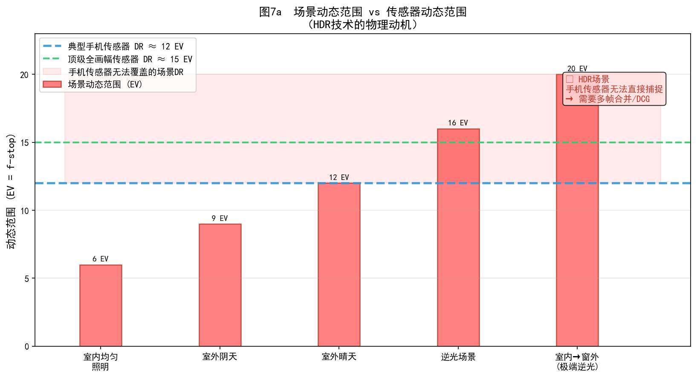
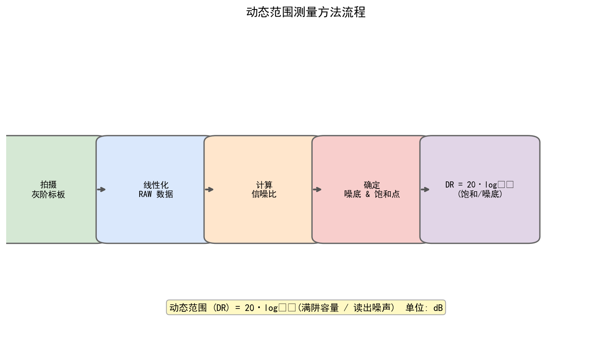
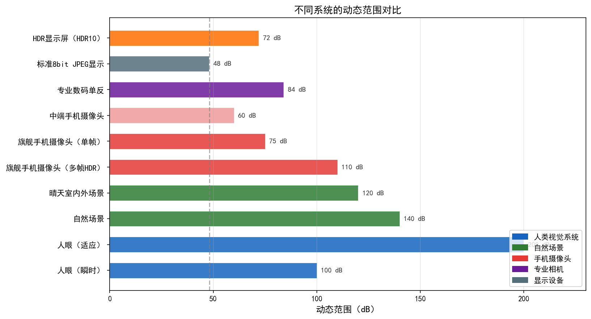
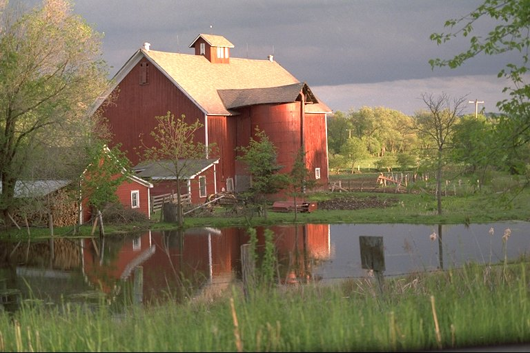

# 第一卷第07章：动态范围与HDR算法

> 手机拍逆光大场景，主体一片黑或天空一片白——这是"动态范围鸿沟"的直接体现。旗舰手机传感器只有约 12 EV，而逆光场景轻松 14–18 EV，差距不是调参能弥补的，只能靠多帧合并扩展感知范围。本章覆盖从传感器 DR 定义、多帧 HDR 合并（Debevec 辐照度重建法）与曝光融合（Mertens 直接 LDR 融合法，无需 CRF 标定）、鬼影检测、经典色调映射算子（Reinhard/Drago/Mantiuk），到 HDRNet 双边网格架构与深度学习 HDR 重建（AHDRNet/HDR-Transformer）的完整技术链条。

---

## §1 原理 (Theory)

### 1.1 动态范围基础

**动态范围（Dynamic Range, DR）** 是传感器能同时捕捉的最亮与最暗信号之比——注意是"同时"，这和相机的曝光宽容度是不同的概念。通常以分贝（dB）或曝光值差（EV）表示。

**传感器动态范围定义：**

$$
\text{DR} = 20 \cdot \log_{10}\!\left(\frac{FWC}{\sqrt{\sigma_{\text{read}}^2 + \sigma_{\text{dark}}^2}}\right) \quad [\text{dB}]
$$

其中：
- $FWC$（Full Well Capacity）为像素满阱容量，单位**电子数**（e⁻），典型值约 $10^4 \sim 10^5$ e⁻ ；
- $\sigma_{\text{read}}$ 为读出噪声标准差，单位同为**电子数**（e⁻），典型值约 $1 \sim 5$ e⁻ ；
- $\sigma_{\text{dark}}$ 为暗电流噪声标准差（单位 e⁻），在长曝光或高温场景下不可忽略；噪底为 $\sqrt{\sigma_{\text{read}}^2 + \sigma_{\text{dark}}^2}$。

三者必须采用相同的电子数单位，否则公式无意义。系数 20 而非 10，是因为 DR 是**幅度**（电荷/电压）之比，不是功率之比（若用功率则为 10·log₁₀）。

换算为 EV（曝光值差/档位）：

$$
\text{DR}_{\text{EV}} = \log_2\!\left(\frac{FWC}{\sqrt{\sigma_{\text{read}}^2 + \sigma_{\text{dark}}^2}}\right)
$$

dB 与 EV 之间的换算：$1\,\text{EV} = 20\log_{10}2 \approx 6.02\,\text{dB}$；工程快速估算可用 $\text{DR}_{\text{EV}} \approx \text{DR}_{\text{dB}} / 6$。

### 1.1.A 动态范围三层次框架（P0 补充）

工程讨论中"动态范围"一词被混用于三个不同层面，必须严格区分：

| 层次 | 定义 | 决定因素 | 典型数值 |
|------|------|---------|---------|
| **传感器 DR** | 传感器同时可捕捉的最大信号与最小可检测信号之比 | FWC / $\sqrt{\sigma_{\text{read}}^2 + \sigma_{\text{dark}}^2}$ | 手机旗舰约 12 EV（约 72 dB） |
| **场景 DR** | 被摄场景最亮与最暗区域的真实亮度之比 | 自然光照物理条件 | 逆光场景 14–18 EV；极端场景 20+ EV |
| **显示 DR** | 显示设备能呈现的最亮与最暗亮度之比 | 屏幕背光峰值亮度 / 黑场深度 | SDR手机屏约 8–9 EV（600–1000 nit 峰值）；HDR屏约 12 EV（2000 nit 峰值，支持 HDR10/Dolby Vision） |

三层次之间的矛盾是 ISP HDR 流水线的根本驱动：
- **场景 DR > 传感器 DR**：需要多帧 HDR 合并扩展感知范围（本章 §1.2）
- **场景 DR > 显示 DR**：需要色调映射将 HDR 内容映射到显示设备可表示的范围（本章 §1.3–§1.4）
- **传感器 DR < 显示 HDR 需求**：即便传感器 DR 充足，HDR10 的 PQ EOTF（SMPTE ST 2084）定义峰值亮度上限为 **10000 nit**，要求完整 10-bit PQ 编码，需要 ISP 正确对接 P010 格式输出路径（见第一卷第06章 §1.5）

**主流 HDR 视频显示标准对比（P1 补充）：**

| 标准 | 位深 | 峰值亮度 | 元数据类型 | 传输标准 | 典型使用场景 |
|------|------|---------|-----------|---------|------------|
| **HDR10** | 10-bit | 1000 nit（标准掌控级），PQ EOTF 支持至 10000 nit | 静态元数据（SMPTE ST 2086） | BT.2020 色域 + SMPTE ST 2084 | 流媒体（Netflix/Disney+）、UHD 蓝光 |
| **Dolby Vision** | 12-bit | 最高 10000 nit（动态元数据驱动） | **动态元数据**（逐场景/逐帧调节，Dolby Vision Profile 8.1） | BT.2020 色域 + PQ EOTF | Apple/Netflix 旗舰内容、iPhone 视频录制 |
| **HLG（Hybrid Log-Gamma）** | 10-bit | 1000 nit（参考显示）；可在 SDR 显示器无色差降级播放 | 无（向后兼容 SDR，无元数据依赖） | BT.2100，ITU-R BT.2408 | 广播电视直播，BBC/NHK 8K 广播 |

> **工程要点：**
> - HDR10 使用**静态元数据**（MaxCLL/MaxFALL，整部内容统一），峰值亮度标准掌控级 1000 nit，PQ EOTF 编码范围延伸至 10000 nit。
> - Dolby Vision 使用**动态元数据**（每场景/帧独立调节色调映射目标），12-bit 量化提供更细腻的高光渐变，是目前感知质量最高的 HDR 格式，但需 Dolby 授权。
> - HLG 是广播行业事实标准（ITU-R BT.2100），最大优势是向后兼容：同一 HLG 信号在 HDR 显示器上呈现 HDR，在 SDR 显示器上自动降级为正常 SDR 画面，无需额外转码。手机录制的 HLG 视频（如 iPhone Log 格式可转 HLG 输出）上传到 YouTube 时会自动识别。
> - ISP 对接 HDR 显示时需注意：HDR10 输出路径要求 P010 格式（10-bit packed，Y 和 UV 分量各 10-bit）；Dolby Vision 需要额外的 RPU（Reference Processing Unit）元数据流；HLG 输出与 SDR NV12 格式兼容但需要 HLG OETF（$r(x) = \sqrt{3x}$ for $x \leq 1/12$，$\alpha \ln(12x-\beta)+\gamma$ for $x>1/12$，其中 $\alpha \approx 0.178$，$\beta \approx 0.028$，$\gamma \approx 0.560$，参数见 ITU-R BT.2100）正确写入 SEI 头。

> 常见概念混淆举例：说"这颗传感器支持 HDR"，可能是指传感器 DR 宽（多曝模式），也可能是指 ISP 输出 HDR10 格式视频流——两个含义完全不同，工程讨论中须明确所指层次。完整 HDR 显示信号链标准详见第二卷第19章。

---

**核心矛盾：场景DR vs 传感器DR**

自然场景的动态范围极宽。典型场景对比：

| 场景类型 | 动态范围（EV） |
|----------|---------------|
| 室内暗场 | 6–8 EV |
| 户外阴天 | 10–12 EV |
| 逆光/日出日落 | 14–18 EV |
| 高对比度极端场景 | 20+ EV |

然而，当前主流手机传感器的动态范围仅约 **12 EV** ，与逆光场景14+ EV的需求存在根本性矛盾。这一"动态范围鸿沟"正是多帧HDR合并与色调映射算法的工程动因。

**信噪比与曝光量关系：**

$$
\text{SNR} = \frac{N_e}{\sqrt{N_e + \sigma_{\text{read}}^2 + \sigma_{\text{dark}}^2}}
$$

其中 $N_e$ 为信号电子数，暗电流 $\sigma_{\text{dark}}$ 在长曝光时不可忽略。在弱光下 $N_e \ll \sigma_{\text{read}}^2$ 时，SNR 受读出噪声主导；在高光下 $N_e \to FWC$ 时，像素饱和导致高光细节丢失。

---

### 1.2 传统多帧HDR合并

#### 1.2.1 Debevec & Malik 响应曲线标定

Debevec 与 Malik（SIGGRAPH 1997）**[1]** 提出了从多张不同曝光的 LDR 图像中重建场景辐照度（Radiance）的完整框架。

**相机响应函数（CRF）模型：**

设像素值 $Z_{ij}$ 为场景辐照度 $E_i$ 经过响应函数 $g$ 映射后的数字量：

$$
Z_{ij} = f\!\left(E_i \cdot \Delta t_j\right)
$$

等价地，令 $g = \ln f^{-1}$，则：

$$
g(Z_{ij}) = \ln E_i + \ln \Delta t_j
$$

为求解 $g$，最小化以下目标函数：

$$
\mathcal{O} = \sum_{i=1}^{N}\sum_{j=1}^{P} \left[g(Z_{ij}) - \ln E_i - \ln \Delta t_j\right]^2 + \lambda \sum_{z=Z_{\min}+1}^{Z_{\max}-1} \left[g''(z)\right]^2
$$

其中第一项为数据保真项，第二项 $\lambda g''(z)$ 为平滑正则项，约束 $g$ 具有单调光滑性。该方程可通过最小二乘（SVD分解）高效求解。

**HDR辐照度图重建：**

标定 $g$ 后，利用加权平均融合多帧：

$$
\ln E_i = \frac{\sum_{j=1}^{P} w(Z_{ij}) \left[g(Z_{ij}) - \ln \Delta t_j\right]}{\sum_{j=1}^{P} w(Z_{ij})}
$$

#### 1.2.2 曝光加权函数

加权函数 $w(z)$ 的核心作用是抑制过曝（$z \to Z_{\max}$）和欠曝（$z \to Z_{\min}$）区域的贡献，仅保留响应线性区的信号。

**三类常用加权函数：**

**（1）帽形权重（Hat/Triangle）：**

$$
w(z) = \begin{cases} z - Z_{\min} & z \leq \frac{Z_{\min}+Z_{\max}}{2} \\ Z_{\max} - z & z > \frac{Z_{\min}+Z_{\max}}{2} \end{cases}
$$

**（2）高斯权重：**

$$
w(z) = \exp\!\left(-\frac{(z - \mu)^2}{2\sigma_w^2}\right), \quad \mu = \frac{Z_{\min}+Z_{\max}}{2}
$$

**（3）平台型权重（Plateau）：**

$$
w(z) = \begin{cases} 0 & z < Z_{\min} + \delta \\ 1 & Z_{\min}+\delta \leq z \leq Z_{\max}-\delta \\ 0 & z > Z_{\max} - \delta \end{cases}
$$

平台型权重适合高噪声传感器，避免渐变区域引入噪声。

#### 1.2.3 鬼影检测（Ghost Detection）

多帧HDR合并中，运动场景会产生"鬼影"（Ghost）伪影——同一物体在不同帧中位置不同，融合后出现半透明重影。

**方法一：基于 MTB 差异图的鬼影掩码**

MTB（Median Threshold Bitmap）由 Greg Ward 在 SIGGRAPH 2003 提出，其原始用途是**多曝光图像对齐**：将图像二值化为中位亮度阈值位图，通过计算帧间位图的汉明距离来估算帧间位移偏移量，实现快速的多曝光对齐。在鬼影检测场景中，工程上借用 MTB 的二值差异图来定位运动区域——将各帧转换为亮度图后二值化（阈值为中值亮度），计算当前帧与参考帧的二值图差异：

$$
M_{\text{ghost}} = \bigoplus_{j} \left[\left|B_j(x,y) - B_{\text{ref}}(x,y)\right| > \tau_{\text{ghost}}\right]
$$

对运动区域标记为鬼影掩码，仅使用参考帧填充这些区域。

**方法二：光流一致性检验**

计算相邻帧之间的光流场 $\mathbf{u}(x,y)$，当光流反向一致性误差超过阈值时判定为非刚性运动（树叶抖动、人物移动等）：

$$
\varepsilon_{\text{fw-bw}}(x,y) = \left\|\mathbf{u}_{\text{fwd}}(x,y) + \mathbf{u}_{\text{bwd}}\!\left(x+u_x, y+u_y\right)\right\|_2 > \tau_{\text{flow}}
$$

光流方法精度更高，但计算开销显著大于 MTB 法。

> **工程推荐（手机 HDR 鬼影检测策略）：** MTB 对亮度突变场景（如树叶边缘）误判率高，光流在弱纹理区域（天空、白墙）光流估计失效。实际手机 ISP 通常是 MTB + 光流的级联策略：MTB 做粗掩码，光流在 MTB 判定"运动"的区域内做精细验证——这比单独用任何一种都稳。如果 SoC 的 NPU 算力允许，用轻量光流网络替代手设光流，在夜景场景下效果提升明显。

#### 1.2.4 Mertens 曝光融合

Mertens等（Pacific Graphics 2007）**[2]** 提出无需CRF标定的"曝光融合"方法，直接在LDR域按像素质量加权融合。

**三个质量度量：**

**（1）对比度（Contrast）：** 使用拉普拉斯算子衡量局部对比度：

$$
C_k(x,y) = \left|\mathcal{L}\{I_k\}(x,y)\right|
$$

**（2）饱和度（Saturation）：** 衡量像素与中间灰的偏离度：

$$
S_k(x,y) = \sigma\!\left(R_k, G_k, B_k\right) = \sqrt{\frac{(R_k-\bar{\mu})^2 + (G_k-\bar{\mu})^2 + (B_k-\bar{\mu})^2}{3}}
$$

**（3）曝光度（Exposedness）：** 像素值偏离中性灰 0.5 的高斯度量：

$$
E_k(x,y) = \exp\!\left(-\frac{\left(\hat{I}_k(x,y) - 0.5\right)^2}{2\sigma_E^2}\right)
$$

**综合权重图：**

$$
W_k(x,y) = C_k^{w_C}(x,y) \cdot S_k^{w_S}(x,y) \cdot E_k^{w_E}(x,y)
$$

归一化后通过拉普拉斯金字塔多尺度融合，得到最终**LDR融合图像**（8-bit 或 16-bit，可直接显示），有效避免融合边界可见性。

> **注意：** Mertens 曝光融合的输出是 LDR 图像，而非 HDR 辐照度图。该方法跳过了 CRF 标定和辐照度重建步骤，直接在 LDR 域按质量加权融合，输出结果无需后续色调映射即可显示——这与 Debevec 方法（输出 HDR 浮点图，需色调映射才能显示）有本质区别。

---

### 1.3 经典色调映射算子（TMO）

色调映射（Tone Mapping）将HDR辐照度图压缩到显示设备能够呈现的LDR范围（通常[0,255]），同时尽量保留场景的视觉层次感。

#### 1.3.1 Reinhard 全局/局部色调映射

**全局算子（Reinhard, SIGGRAPH 2002）** **[7]**：

$$
L_d(x,y) = \frac{L(x,y)}{1 + L(x,y)}
$$

改进版引入关键亮度 $L_{\text{white}}$（场景最大亮度）：

$$
L_d(x,y) = \frac{L(x,y) \cdot \left(1 + \frac{L(x,y)}{L_{\text{white}}^2}\right)}{1 + L(x,y)}
$$

**局部算子：** 利用高斯差分（DoG）估计局部适应亮度 $\bar{L}_s(x,y,s^*)$，在最优尺度 $s^*$ 处：

$$
L_d(x,y) = \frac{L(x,y)}{\bar{L}_s\!\left(x,y,s^*\right)}
$$

局部算子能显著提升暗区细节，但容易引入光晕（Halo）伪影。

#### 1.3.2 Drago 对数映射

$$
L_d = \frac{\dfrac{L_{\max}}{100} \cdot \log_2(1 + L_w)}{\log_2\!\left(1 + L_{w,\max}\right) \cdot \log_2\!\left(2 + 8 \cdot \left(\frac{L_w}{L_{w,\max}}\right)^{\!\log_b 0.5}\right)}
$$

注意：分子为 $\log_2(1 + L_w)$（以 2 为底），而非 $\log_{10}$；分母中 $L_{\max}/100$ 是显示设备峰值亮度归一化项，写成 $0.01\cdot L_{\max}$，而非 $L_{\max}^{0.01}$（幂运算），这是文献转录中极易犯的错误。参数 $b \in (0,1)$ 控制自适应压缩偏置，$b=0.85$ 为 Drago 等人（2003）论文推荐值 **[8]**（通过主观实验确定）；自适应对数底 $p = 2 + 8\cdot(L_w/L_{w,\max})^{\log_b 0.5}$ 随像素亮度连续变化，在亮区使用更小的底（更强压缩），在暗区使用更大的底（更少压缩），这是 Drago 算法相较简单对数映射的核心创新。

#### 1.3.3 Mantiuk 感知映射

Mantiuk等基于人类视觉系统（HVS）的对比灵敏度函数（CSF）建立感知失真模型，最小化感知误差：

$$
\min_{L_d} \sum_{x,y} \left\|\Phi_{\text{CSF}}\!\left(\nabla \log L_d\right) - \Phi_{\text{CSF}}\!\left(\nabla \log L_w\right)\right\|^2
$$

感知映射在主观评价实验中表现优异，但计算复杂度较高（不适合实时ISP流水线）。

---

### 1.4 HDRNet：深度双边学习实时图像增强

#### 1.4.1 背景与动机

传统色调映射算子需要人工设计参数，难以自适应不同场景。深度学习方法（如全分辨率CNN）计算量大，在移动端难以实时运行。

Gharbi等（SIGGRAPH 2017）**[3]** 提出 **HDRNet**，核心思想是：

> **用低分辨率网络学习图像自适应的双边网格（Bilateral Grid）系数，再用全分辨率引导图进行精确切片，实现全分辨率实时色彩/亮度变换。**

该方法将"全局语义理解"（低分辨率）与"局部空间细节"（全分辨率引导）解耦，兼顾质量与速度——在当时已实现 **< 50ms** 的全分辨率（4K级别）处理 **[3]**。

#### 1.4.2 双边网格（Bilateral Grid）

双边网格是 HDRNet 的核心数据结构，将传统空间域图像操作推广到"空间+引导值"的三维空间。

**网格结构：**

原始论文（Gharbi et al., SIGGRAPH 2017）中，对于 256×256 输入，双边网格的逻辑维度为：

$$
\mathcal{G}: \quad \underbrace{8}_{\text{depth}} \times \underbrace{16 \times 16}_{\text{spatial}} \times \underbrace{12}_{\text{coeffs}}
$$

即深度方向 8 个切片 × 空间 16×16 × 每单元 12 个仿射系数。对于 4:3 宽高比的手机图像（如 4000×3000），空间网格相应变为 16×12，整体 reshape 后实现时常以 $[B, 96, 16, 12]$ 存储，其中 96 = 8（深度）× 12（系数）被压缩进通道维：

$$
\mathcal{G} \in \mathbb{R}^{B \times 96 \times 16 \times 12}, \quad 96 = 8_{\text{depth}} \times 12_{\text{coeffs}}
$$

> ⚠️ **注意**：此处 96 将深度与系数两个语义不同的维度合并打包，仅为实现便利；逻辑上应理解为 $[B, 8, 16, 12, 12]$（批次 × 深度切片 × 空间高 × 空间宽 × 仿射系数）。混淆这两个维度会导致切片操作中插值坐标理解错误。

每个网格单元（cell）存储一个 $3 \times 4$ 仿射变换矩阵 $A \in \mathbb{R}^{3 \times 4}$，共12个系数，用于将输入RGB颜色映射至输出RGB颜色：

$$
\begin{bmatrix} R' \\ G' \\ B' \end{bmatrix} = A \cdot \begin{bmatrix} R \\ G \\ B \\ 1 \end{bmatrix}
$$

齐次形式中常数项"1"用于支持颜色偏移（bias）。

**为何选择 16×16×8（正方形输入）？**

- 空间分辨率 16×16 足以捕捉大尺度曝光/颜色变化，同时避免过拟合细节；
- 深度（引导值）方向8切片在量化精度与存储开销间取得平衡；
- 总参数量 $16 \times 16 \times 8 \times 12 = 24576$（方形）或 $16 \times 12 \times 8 \times 12 = 18432$（4:3），极其轻量。

#### 1.4.3 S-Net：低分辨率系数预测网络

S-Net（Smoothness Network）接收 **256×256** 降采样图像作为输入，预测双边网格系数。

**网络结构：**

```
输入: [B, 3, 256, 256]  (RGB降采样)
  │
  ├─ 低层特征提取（4层步长卷积块）
  │     Conv(3→8, 3×3, stride=1) → BN → ReLU
  │     Conv(8→16, 3×3, stride=2) → BN → ReLU    # 128×128
  │     Conv(16→32, 3×3, stride=2) → BN → ReLU   # 64×64
  │     Conv(32→64, 3×3, stride=2) → BN → ReLU   # 32×32
  │     Conv(64→64, 3×3, stride=2) → BN → ReLU   # 16×16
  │
  ├─ 局部路径（Local Path）
  │     Conv(64→64, 3×3) → BN → ReLU             # 16×16
  │     Conv(64→96, 1×1)                          # 16×16×96，直接形成网格空间部分
  │
  └─ 全局路径（Global Path）
        全局平均池化 → [B, 64]
        FC(64→64) → ReLU
        FC(64→96) → ReLU                          # 全局场景理解向量
        reshape + broadcast → 与局部路径相加

输出: 双边网格 [B, 96, 16, 12]（4:3 图像；方形图像为 [B, 96, 16, 16]）
     reshape → [B, 8, 12, H_g, W_g]（深度 × 系数 × 空间高 × 空间宽）
```

**全局路径的关键作用：** 全局平均池化聚合整张图的统计信息（整体亮度、色温等），解决局部卷积无法感知全局曝光变化的问题。这是HDRNet在自适应场景色调映射中表现优异的关键设计。

#### 1.4.4 引导网络（Guidance Network）：全分辨率流

引导网络从**全分辨率**输入图像提取单通道引导图 $\mathbf{g}$：

$$
\mathbf{g} = \sigma\!\left(\text{Conv}_{1\times1}\!\left(\text{Conv}_{1\times1}(\mathbf{I}_{\text{full}})\right)\right) \in [0,1]^{B \times 1 \times H \times W}
$$

具体结构：

```
输入: [B, 3, H, W]（全分辨率RGB）
  → Conv(3→16, 1×1) → BN → ReLU
  → Conv(16→1,  1×1) → Sigmoid
输出: [B, 1, H, W]，值域 [0,1]
```

引导图 $\mathbf{g}(x,y)$ 本质上是一个**自适应亮度图**，其值用作双边网格深度方向的插值坐标。

**为何用 1×1 卷积？** 保持全分辨率，零感受野扩大，不引入空间平滑，保留像素级边缘信息用于精准切片。

#### 1.4.5 切片操作（Slicing）

切片是将低分辨率双边网格与全分辨率引导图融合的关键步骤。

对图像中每个像素 $(x, y)$，其对应的网格三维坐标为：

$$
(x_g, y_g, z_g) = \left(\frac{x}{W} \cdot 16,\; \frac{y}{H} \cdot 12,\; g(x,y) \cdot 8\right)
$$

在双边网格中进行**三线性插值**：

$$
\mathbf{A}(x,y) = \text{TrilinearInterp}\!\left(\mathcal{G},\; x_g,\; y_g,\; z_g\right) \in \mathbb{R}^{12}
$$

将12维系数向量 reshape 为 $3 \times 4$ 仿射矩阵 $A(x,y)$。

**三线性插值的物理意义：**
- **空间方向（x,y）插值**：相邻网格单元之间平滑过渡，避免块状伪影；
- **深度方向（z）插值**：根据像素亮度选择对应的色彩变换强度，实现**色调依赖的自适应映射**（如高光与阴影使用不同变换）。

切片结果形状：$[B, H, W, 12]$。

#### 1.4.6 逐像素仿射变换

对每个像素 $(x,y)$，用切片得到的 $3 \times 4$ 矩阵 $A(x,y)$ 作用于齐次输入：

$$
\begin{bmatrix} R'(x,y) \\ G'(x,y) \\ B'(x,y) \end{bmatrix} = A(x,y) \cdot \begin{bmatrix} R(x,y) \\ G(x,y) \\ B(x,y) \\ 1 \end{bmatrix}
$$

**整体前向流程总结：**

```
全分辨率输入 I_full [B,3,H,W]
        │                     │
        ▼ 降采样256×256        ▼ 保持全分辨率
   S-Net（低分辨率流）    引导网络
        │                     │
        ▼                     ▼
   双边网格 G               引导图 g
   [B,8,12,16,12]         [B,1,H,W]
        │                     │
        └──────── 切片 ────────┘
                  │
                  ▼
         仿射系数 A(x,y) [B,H,W,3×4]
                  │
                  ▼
         逐像素仿射变换
                  │
                  ▼
         输出图像 I_out [B,3,H,W]
```

#### 1.4.7 训练细节

**数据集：MIT-FiveK**

- 5000 张 RAW DNG 格式图像（Canon/Nikon等专业相机拍摄）**[3]**；
- 5位专业修图师（Expert A–E）各自进行人工精修；
- HDRNet 使用 **Expert C** 的修图结果作为目标（公认质量最佳）；
- 训练/测试划分：4500/500。

**损失函数：**

$$
\mathcal{L} = \frac{1}{N} \sum_{i=1}^{N} \left\|\hat{I}_i - I_i^{\text{target}}\right\|_2^2
$$

使用像素级L2损失（MSE），在HDRNet原文中未使用感知损失。工业改进版本通常加入感知损失（VGG特征）。

**优化器：** Adam，学习率 $1 \times 10^{-4}$，batch size 1，训练约 500k 步。

**数据增强：** 随机裁剪、水平翻转、颜色抖动。

#### 1.4.8 推理速度

HDRNet 的速度优势来源于三点：
1. S-Net 仅在 256×256 运行，计算量与分辨率无关；
2. 引导网络为 1×1 卷积，线性复杂度；
3. 切片操作为逐像素三线性插值，高度可并行化。

| 平台 | 精度 | 分辨率 | 时延 |
|------|------|--------|------|
| NVIDIA V100 | FP32 | 4K（3840×2160）| ~8ms |
| 高通 DSP（SNPE） | INT8 | 12MP（4000×3000）| 5–10ms ¹ |
| ARM CPU（A78）| FP16 | 1080P | ~40ms ² |

> ¹ **5–10ms 为估算范围**，实际延时强依赖 SoC 代际（骁龙 8 Gen1/Gen2/Gen3 差异显著）、模型通道数及 SNPE/ONNX Runtime 优化程度；部分实现可达 3ms，较旧平台可能超过 20ms。
> ² ARM CPU 延时受频率调度影响较大；FP16 NEON 加速与 FP32 相比通常约 2× 加速，但与 GPU/DSP 仍有数量级差距。

INT8 量化对 HDRNet 友好，因为双边网格的系数分布较为均匀，量化误差小。

#### 1.4.9 工业应用与魔改版本

HDRNet 发布后迅速被手机厂商采纳，各家均有定制化改进。以下描述来自公开专利、学术论文及技术报告，部分细节为基于公开信息的推断，仅供参考。

**华为（据公开专利分析推测）：**
- 引导网络使用更深的 3×3 卷积提取细节边缘；
- 双边网格深度扩展至16切片（更精细的亮度依赖变换）；
- 加入场景分类分支，根据场景类型（夜景/逆光/正常）切换预设网格偏置。

**小米/OPPO（据公开专利及学术合作论文推测）：**
- 多尺度引导图（同时使用粗细两张引导图）；
- 将L1损失与SSIM联合训练，提升边缘处颜色稳定性；
- 针对RAW域输入的HDRNet变体（输入4通道Bayer裁剪图）。

**硬件TM LUT的对应关系：**

双边网格结构天然对应ISP硬件中的**色调映射查找表（TM LUT）**：
- TM LUT 是亮度→亮度的1D LUT，对应双边网格的深度方向1D插值；
- HDRNet 的3D双边网格可视为 TM LUT 的**空间自适应**扩展；
- 高通 Spectra ISP 未公开具体实现细节；实际加速通常通过 Hexagon DSP（HVX 向量处理单元）或 AI Engine 完成，属可编程加速而非专用双边网格硬件单元。

#### 1.4.10 HDRNet 核心洞见总结

| 设计选择 | 工程意图 |
|----------|----------|
| 低分辨率S-Net | 降低CNN计算量，与分辨率解耦 |
| 全局路径（GAP+FC） | 捕捉场景整体曝光/色温 |
| 全分辨率引导图 | 保留像素级边缘，精准切片无光晕 |
| 三线性插值切片 | 空间+亮度双向平滑，避免伪影 |
| 仿射变换输出 | 简单可逆，不引入非线性失真 |
| 1×1引导卷积 | 零感受野，不平滑边缘信息 |

---

### 1.5 深度学习HDR重建

#### 1.5.1 单帧HDR扩展

Eilertsen等（SIGGRAPH Asia 2017）**[4]** 提出 **HDRCNN**，从单张LDR图像重建HDR内容：

$$
I_{\text{HDR}} = f_\theta\!\left(I_{\text{LDR}}\right)
$$

网络在过曝区域使用生成性填充（inpainting），预测"合理"的高光纹理。局限性：高光重建是幻觉（hallucination），不反映真实场景信息。

**RAW域单帧HDR优势：**
- RAW图像保留12/14bit线性信息，高光溢出范围有限；
- 在非线性Gamma压缩前处理，避免高光压缩带来的精度损失；
- 可联合去噪（降低暗区读出噪声影响）。

#### 1.5.2 多帧对齐深度HDR

**AHDRNet（Yan等，CVPR 2019）** **[5]**：

引入**注意力机制**替代传统光流对齐：

$$
F_{\text{aligned}} = F_k \odot \mathcal{A}_k, \quad \mathcal{A}_k = \sigma\!\left(f_\text{attn}(F_k, F_{\text{ref}})\right)
$$

对运动区域自动赋予低权重，避免光流估计误差导致的对齐残差，在大运动场景下鬼影抑制效果显著优于基于光流的方法。

**HDR-Transformer（Liu等，ECCV 2022）** **[6]**：

使用Transformer的全局注意力机制建模多帧间长距离依赖：

$$
\text{Attn}(Q, K, V) = \text{softmax}\!\left(\frac{QK^\top}{\sqrt{d_k}}\right)V
$$

Transformer在处理大运动（如快速移动的行人）时优于CNN，但FLOPs较高，需要硬件支持才能实时运行。

---

### 1.6 自适应局部色调映射

#### 1.6.1 LAB空间 L 通道 CLAHE

对亮度通道 $L^*$ 进行**限制对比度自适应直方图均衡（CLAHE）**：

1. 将图像分为 $M \times N$ 个 tile（通常 8×8）；
2. 对每个 tile 计算直方图，裁剪超过阈值 $c_{\text{clip}}$ 的计数，重新分配；
3. 双线性插值tile的均衡化函数，避免tile边界处的块状伪影。

**对比度限制的必要性：**

$$
h_{\text{clipped}}(l) = \min\!\left(h(l),\; c_{\text{clip}} \cdot \frac{P}{N_{\text{bins}}}\right)
$$

$c_{\text{clip}} = 2.0 \sim 4.0$ 为典型值 ；过高导致噪声放大，过低无明显增强效果。

#### 1.6.2 非锐化掩模（Unsharp Mask）微对比度增强

$$
I_{\text{out}} = I_{\text{in}} + \alpha \cdot \left(I_{\text{in}} - G_\sigma * I_{\text{in}}\right)
$$

$G_\sigma$ 为高斯模糊，$\alpha \in [0.3, 1.0]$ 控制增强强度，$\sigma = 1 \sim 2$ 像素为细节增强。

---

## §2 标定 (Calibration)

### 2.1 CRF标定：Mitsunaga-Nayar 多项式模型

Mitsunaga与Nayar（CVPR 1999）**[10]** 提出多项式CRF模型，相比 Debevec 模型无需已知曝光时间：

$$
f(E) = \sum_{k=0}^{n} c_k \cdot E^k
$$

其中多项式阶数 $n = 4 \sim 8$，系数 $\{c_k\}$ 通过最小化辐照度一致性约束求解：

$$
\min_{\{c_k\}, r} \sum_{i,j} \left[f^{-1}(Z_{i,j+1}) - r \cdot f^{-1}(Z_{ij})\right]^2
$$

$r$ 为相邻帧的曝光比（未知，与 $\{c_k\}$ 联合求解）。

**标定步骤：**
1. 拍摄均匀灰卡场景，曝光时间步长固定为1EV（即 $r=2$）；
2. 覆盖 ISO 最低/最高、不同色温（D65/A光源）共4组标定；
3. 标定结果存储为 256点 LUT，推理时查表。

### 2.2 曝光比标定（实际 vs 标称）

多帧HDR合并依赖精确的帧间曝光比。标称曝光比（EXIF中的曝光时间/ISO/光圈）与实际曝光比存在偏差：

**验证方法：**

1. 对均匀灰卡拍摄短/长曝光帧（标称曝光比2×或4×）；
2. 在线性域计算实际信号比：$r_{\text{actual}} = \text{median}(I_{\text{long}}) / \text{median}(I_{\text{short}})$；
3. 若 $\left|r_{\text{actual}} / r_{\text{nominal}} - 1\right| > 2\%$，更新标定表。

**常见误差来源：**
- 机械快门延迟（帘幕式快门在高速时偏差可达5% ）；
- Rolling Shutter 导致不同行曝光时间不同；
- ISO增益非线性（低ISO区段增益步长不均匀）。

### 2.3 多帧HDR暗场减法

长曝光基础帧（Base Frame）暗场电流较大，需要标定暗帧并减除：

$$
I_{\text{corrected}} = I_{\text{raw}} - D_{\text{dark}}(T_{\text{exp}}, T_{\text{sensor}})
$$

**暗帧标定：**
- 在完全遮光条件下，按温度（$20^\circ\text{C}$/$40^\circ\text{C}$）和曝光时间（0.1s/0.5s/1s/2s）格点标定；
- 暗帧包含**固定图案噪声（FPN）**（行/列相关）和**随机热噪声**；
- 标定暗帧时取10帧中值，消除随机噪声影响。

---

## §3 调参 (Tuning)

### 3.1 鬼影检测阈值调参

鬼影检测阈值 $\tau_{\text{ghost}}$ 直接决定运动区域的判定范围——阈值偏低漏标静止区域导致残影，偏高则误标运动区域导致高光细节丢失：

| 阈值偏低（$\tau < \tau^*$） | 阈值偏高（$\tau > \tau^*$） |
|---------------------------|-----------------------------|
| 运动伪影残留（ghost残留） | 过度判定运动区域（丢失高光细节）|
| 视觉：静止物体出现双影 | 视觉：高光区颜色/亮度不自然 |

**调参策略（MTB法）：**

1. 以实验室光源+移动物体标准场景为基准；
2. 从 $\tau = 0.05$ 开始，步长0.01递增；
3. 同时评估 Ghost Score（运动区残影面积比）和 HDR Score（高光保留率）；
4. 取二者trade-off最优点。

**推荐初始值：** $\tau_{\text{ghost}} = 0.10 \sim 0.15$（归一化亮度差）。

### 3.2 加权函数选择指南

| 传感器特性 | 推荐权重函数 | 原因 |
|------------|-------------|------|
| 低噪声（$\sigma_{\text{read}} < 2e^-$）| 帽形/高斯 | 渐变区信号质量好，保留过渡区 |
| 高噪声（$\sigma_{\text{read}} > 5e^-$）| 平台型 | 过渡区SNR低，避免噪声引入 |
| RAW域HDR（12/14bit）| 高斯，$\sigma_w$ 宽 | 线性域动态范围充足 |
| 超高帧率传感器（帧间噪声大）| 平台型+中值滤波预处理 | 消除帧间随机噪声的权重抖动 |

### 3.3 HDRNet 针对目标相机微调策略

直接使用 MIT-FiveK 预训练权重应用于手机相机时，由于以下差异，效果不佳：
- 手机传感器噪声特性与单反不同；
- 手机ISP已有部分前处理（如NR、LSC）；
- 目标风格（厂商审美偏好）与Expert C不同。

**微调流程：**

1. **数据收集：** 拍摄100–500组RAW图像，覆盖典型场景（人像/风景/夜景/逆光）；
2. **参考制作：** 专业修图师在 Lightroom 中对每张图调整至目标风格（亮度/对比度/色温/饱和度）；
3. **冻结底层权重：** 微调时固定S-Net的stride-2卷积底层（前2层），仅训练高层特征与引导网络；
4. **小学习率：** 使用 $\text{lr} = 1\times10^{-5}$（较原始训练降低10倍），避免灾难性遗忘；
5. **验证集：** 保留20%数据用于验证，监控PSNR/SSIM与Δ色差（$\Delta E_{00}$）。

### 3.4 双边网格分辨率权衡

| 参数 | 增大效果 | 减小效果 | 推荐值 |
|------|---------|---------|-------|
| 空间分辨率（16×12）| 支持更精细空间变化 | 减少空间伪影 | 16×12（默认）|
| 深度切片数（8）| 更精细亮度依赖变换 | 更平滑过渡 | 8（默认）|
| 引导图通道数 | 多通道引导更精确 | 减少计算量 | 1（灰度）|

对夜景场景（大面积暗区），可考虑将深度切片从8扩展至12，改善暗区渐变处理。

---

## §4 伪影 (Artifacts)

### 4.1 运动鬼影（Moving Ghost）

**成因：** 多帧HDR合并时，运动物体（行人、车辆、树枝）在不同帧中位置不同，融合后出现半透明重影。

**表现：** 运动物体边缘出现"幻影"，尤其在短曝帧亮度较高的区域更明显。

**解决方案：**
- 增强鬼影检测（降低阈值或使用光流法）；
- 对检测到的运动区域强制使用参考帧（牺牲噪声性能）；
- 使用 AHDRNet 注意力机制自动抑制（推荐深度学习方案）。

### 4.2 局部色调映射光晕伪影（Halo）

**成因：** 局部色调映射在高对比度边缘处（如天空与建筑交界）计算局部适应亮度时，滤波核跨越边缘，导致边缘两侧亮度估计异常。

**表现：** 暗物体边缘出现亮白边（正光晕）或亮物体边缘出现暗边（负光晕）。

**解决方案：**
- Reinhard局部TMO用引导滤波替代高斯滤波，利用边缘感知滤波避免跨边缘；
- HDRNet的双边网格+三线性插值由于引导图精确追踪边缘，天然避免Halo；
- 减小色调映射的局部窗口尺寸（以牺牲全局一致性为代价）。

### 4.3 长曝光基础帧运动模糊

**成因：** HDR合并中的参考帧（基础帧）通常选长曝光帧以获得最佳SNR，但长曝光时运动物体本身已经模糊。

**表现：** 最终HDR图中运动主体模糊，而背景清晰（与人眼期待相悖）。

**解决方案：**
- 改为选取**中曝光帧**作为参考帧（SNR略有损失但减少运动模糊）；
- 引入帧选择机制，对快速运动场景自动降低曝光比（减少最长曝帧的曝光倍数）；
- 多帧去模糊联合HDR（计算复杂度高）。

### 4.4 CRF 未标定导致色偏

**成因：** 使用错误的CRF或跳过CRF标定步骤，不同曝光帧的颜色响应不一致，融合后出现色相/饱和度偏差。

**表现：** 阴影区域偏绿/偏蓝，高光区域偏黄/偏红（取决于传感器颜色矩阵的非线性）。

**解决方案：**
- 严格执行2.1节所述CRF标定流程；
- 在融合前对各帧进行白平衡归一化；
- 使用RAW域HDR（线性域无CRF非线性问题）。

### 4.5 HDRNet 双边网格空间分辨率伪影

**成因：** 双边网格空间分辨率仅16×12，当场景存在跨越多个网格单元的局部光源（如窗户）时，网格空间插值在光源边界附近可能出现平滑不足导致的"分块感"。

**表现：** 明暗交界区域出现轻微的矩形网格边界痕迹（通常不明显，需在大屏幕下仔细观察）。

**解决方案：**
- 提高S-Net空间输出分辨率至32×24（计算量翻倍，但伪影消失）；
- 引导网络使用更深的结构（2–3层3×3卷积），提升边缘追踪精度；
- 对引导图施加弱高斯平滑，减少量化阶跃。

---

## §5 评测 (Evaluation)

### 5.1 HDR-VDP-2（HDR视觉差异预测器）

**HDR-VDP-2** **[12]** 是目前最权威的HDR图像质量评价指标，基于人类视觉系统（HVS）的对比灵敏度函数（CSF）模型。

**核心思路：**

$$
Q_{\text{VDP}} = f_{\text{HVS}}\!\left(\left|F\!\left(I_{\text{test}}\right) - F\!\left(I_{\text{ref}}\right)\right|\right)
$$

其中 $F(\cdot)$ 为HVS的多尺度分解（模拟视网膜中央凹/周边视觉），输出可见差异概率图 $P_{\text{det}}(x,y)$ 及综合质量分 $Q \in [0, 100]$。

**使用方式：**

```matlab
% HDR-VDP-2 MATLAB接口
res = hdrvdp(test_hdr, ref_hdr, 'luminance', [1 4000], ppd);
fprintf('Q = %.2f\n', res.Q);
```

$Q > 70$ 通常表示感知质量良好，$Q > 85$ 为优秀 **[12]**。

### 5.2 TMQI（色调映射图像质量指数）

TMQI（Yeganeh & Wang, 2013）**[11]** 专门评估色调映射图像相对于原HDR内容的质量，分为两个分量：

**结构保真度 $S$：** 衡量HDR与LDR之间的局部结构相似性：

$$
S = \frac{1}{N} \sum_{k} \text{SSIM}\!\left(P_k^{\text{HDR}}, P_k^{\text{LDR}}\right)
$$

**自然统计性 $N$：** 评估LDR图像是否符合自然图像统计特性（基于NSS模型）。

**综合分：**

$$
\text{TMQI} = a \cdot S^\alpha + (1-a) \cdot N^\beta
$$

其中 $a=0.8242$，$\alpha=0.3046$，$\beta=0.7088$（论文中拟合值）。

### 5.3 鬼影抑制评测方法

**定量评测流程：**

1. 拍摄标准鬼影测试场景（固定背景+特定运动模式：单向匀速运动、随机运动、周期运动）；
2. 对融合结果计算运动区域的**残影面积率（Ghost Area Ratio, GAR）：**

$$
\text{GAR} = \frac{\text{Area}\!\left(\left|I_{\text{fused}} - I_{\text{ref}}\right| > \tau_{\text{vis}}\right)}{\text{Area}(\text{motion\_mask})} \times 100\%
$$

3. 评分标准：$\text{GAR} < 5\%$ 为优秀，$5\% \sim 15\%$ 为合格，$> 15\%$ 为不合格。

### 5.4 速度基准测试

| 算法 | 平台 | 输入分辨率 | 端到端延时 |
|------|------|-----------|-----------|
| Mertens曝光融合（3帧）| ARM CPU（A78, 3GHz）| 1080P | ~80ms |
| Debevec HDR合并（3帧）| ARM CPU | 1080P | ~120ms |
| Reinhard全局TMO | ARM CPU | 12MP | ~15ms |
| CLAHE（LAB L通道）| ARM NEON | 12MP | ~20ms |
| HDRNet（原版）| FP32, ARM CPU | 12MP | ~500ms |
| HDRNet（INT8量化）| 高通DSP | 12MP | 5–10ms |
| AHDRNet | GPU（A16 Adreno）| 1080P 3帧 | ~150ms |

**测速方法：**
- 使用 `clock_gettime(CLOCK_MONOTONIC)` 进行纳秒级计时；
- 预热（Warm-up）100帧后取200帧平均；
- 报告 P50/P95/P99 延时（避免单次极值干扰）。

---

## §6 代码 (Code)

本章配套代码见笔记本：

**本章配套代码（见本目录 .ipynb 文件）**

笔记本包含以下实现模块：

### 6.1 Mertens 曝光融合实现（输出 LDR，无需 HDR 重建）

```python
# 示意性代码框架（详见ipynb）
import cv2
import numpy as np

def mertens_fusion(images: list[np.ndarray]) -> np.ndarray:
    """
    Mertens曝光融合（无需CRF标定）
    输出为 LDR 图像（直接可显示），而非 HDR 辐照度图。
    参数:
        images: list of float32 [H,W,3]，值域[0,1]，不同曝光帧
    返回:
        fused: float32 [H,W,3]，LDR融合结果（值域[0,1]，无需色调映射可直接显示）
    """
    merge = cv2.createMergeMertens(
        contrast_weight=1.0,
        saturation_weight=1.0,
        exposure_weight=0.0
    )
    fused = merge.process([(img * 255).astype(np.uint8) for img in images])
    return fused  # float32, [0,1]
```

### 6.2 HDRNet 双边网格 NumPy 参考实现

```python
# 双边网格切片操作参考实现（详见ipynb）
def bilateral_slice(grid: np.ndarray, guide: np.ndarray) -> np.ndarray:
    """
    三线性插值切片
    参数:
        grid:  [8, 12, 12, 16] → (depth, coeff, gH, gW) 双边网格
        guide: [H, W]，值域[0,1]，引导图
    返回:
        coeffs: [H, W, 12]，每像素仿射系数
    """
    H, W = guide.shape
    gH, gW = 12, 16  # 网格空间分辨率
    depth = 8

    # 计算三维坐标
    xs = np.linspace(0, gW-1, W)
    ys = np.linspace(0, gH-1, H)
    zs = guide * (depth - 1)  # [H, W]

    # 三线性插值（使用scipy RegularGridInterpolator）
    from scipy.interpolate import RegularGridInterpolator
    coeffs = np.zeros((H, W, 12))
    for c in range(12):
        interp = RegularGridInterpolator(
            (np.arange(depth), np.arange(gH), np.arange(gW)),
            grid[:, c, :, :],
            method='linear', bounds_error=False, fill_value=None
        )
        pts = np.stack([zs.ravel(),
                        np.tile(np.linspace(0,gH-1,H)[:,None],(1,W)).ravel(),
                        np.tile(np.linspace(0,gW-1,W)[None,:],(H,1)).ravel()], axis=-1)
        coeffs[:, :, c] = interp(pts).reshape(H, W)
    return coeffs

def apply_affine(image: np.ndarray, coeffs: np.ndarray) -> np.ndarray:
    """
    逐像素3×4仿射变换
    参数:
        image:  [H,W,3]，值域[0,1]
        coeffs: [H,W,12]
    返回:
        output: [H,W,3]
    """
    H, W, _ = image.shape
    # 齐次坐标
    ones = np.ones((H, W, 1), dtype=np.float32)
    homo = np.concatenate([image, ones], axis=-1)  # [H,W,4]
    A = coeffs.reshape(H, W, 3, 4)  # [H,W,3,4]
    # 矩阵乘法：[H,W,3,4] x [H,W,4,1] → [H,W,3]
    output = np.einsum('hwij,hwj->hwi', A, homo)
    return np.clip(output, 0, 1)
```

### 6.3 鬼影检测演示（MTB法）

```python
def ghost_detection_mtb(frames: list[np.ndarray],
                         ref_idx: int = 0,
                         tau: float = 0.12) -> np.ndarray:
    """
    中值阈值二值图鬼影检测
    参数:
        frames:  list of float32 [H,W,3]，多帧输入
        ref_idx: 参考帧索引
        tau:     鬼影判定阈值（归一化亮度差）
    返回:
        ghost_mask: bool [H,W]，True表示鬼影区域
    """
    def to_luma(img):
        return 0.299*img[...,0] + 0.587*img[...,1] + 0.114*img[...,2]

    ref_luma = to_luma(frames[ref_idx])
    ghost_mask = np.zeros(ref_luma.shape, dtype=bool)

    for i, frame in enumerate(frames):
        if i == ref_idx:
            continue
        luma = to_luma(frame)
        diff = np.abs(luma - ref_luma)
        ghost_mask |= (diff > tau)

    # 形态学操作去除孤立噪声点
    import cv2
    kernel = cv2.getStructuringElement(cv2.MORPH_ELLIPSE, (5,5))
    ghost_mask = cv2.morphologyEx(
        ghost_mask.astype(np.uint8), cv2.MORPH_CLOSE, kernel
    ).astype(bool)
    return ghost_mask

# ─── 示例调用与输出 ───────────────────────────────────────
# 模拟三帧不同曝光（EV -2 / 0 / +2）的输入图像
images = [
    np.random.rand(480, 640, 3).astype(np.float32) * 0.25,   # EV -2（欠曝）
    np.random.rand(480, 640, 3).astype(np.float32),            # EV  0（正常）
    np.clip(np.random.rand(480, 640, 3).astype(np.float32) * 4, 0, 1),  # EV +2（过曝）
]
fused = mertens_fusion(images)
# 输出: fused.shape -> (480, 640, 3), dtype=float32, range [0,1]

```

详细实验、可视化与性能对比请参见配套笔记本。

---


---

> **工程师手记：动态范围测量与实战的鸿沟**
>
> **ISO 15739 实验室测量与实拍的方法论差距：** ISO 15739 定义的动态范围测量在受控光源、标准灰阶靶、低噪底条件下进行，所得数字常被厂商直接引用为"相机DR"。然而真实拍摄场景中，镜头杂散光（flare）、RAW管道中的非线性tone mapping、HDR合帧时的鬼影抑制clip，都会将可用DR压缩2–4EV。工程实践中应以"系统可用DR"为准：即在实际曝光设定、实际降噪强度下，高光无截断、暗部SNR ≥ 10 dB时所对应的光比范围。部分ISP团队会在量产前用真实场景（窗外户外 + 室内暗角）做DR烟囱测试，作为最终出货判据。
>
> **双ISO传感器的工程优势：** 以Sony IMX766为代表的双转换增益（DCG）传感器，低增益模式满阱电荷约8000e⁻，高增益模式约1500e⁻，两者在同一帧内融合后等效DR可达约14EV，较传统单增益传感器约12EV提升约2EV。ISP端需要相应实现DCG帧融合逻辑：低增益帧负责高光区域，高增益帧负责中低亮度区域，融合边界处需精细blend以避免亮度跳变。高增益帧的read noise通常可降至1–2e⁻，暗部SNR因此显著改善。双ISO模式下ISP带宽需求约增加40%，需与SoC内存控制器做容量评估。
>
> **静态HDR照片与HDR视频的DR需求差异：** HDR静照合帧允许多次曝光（2–5帧），曝光步长通常2–3EV，可覆盖14–16EV场景DR，后处理时延可达数百毫秒。HDR视频（HLG/HDR10）要求每帧独立完成，帧率30–120fps，不可多帧长时间堆叠，实际可用DR约11–13EV。因此视频ISP对暗部噪声的容忍度更低，AGC策略更激进，高亮恢复窗口更窄。手机ISP设计中，静照HDR与视频HDR往往是两条完全独立的处理分支，不能混用tone mapping曲线，否则会在切换场景时出现明显色调跳变。
>
> *参考：ISO 15739:2023 Photography — Electronic still-picture imaging — Noise measurements；Sony IMX766 Product Brief（2021）；VESA DisplayHDR Specification v1.1*

## 插图


*图1. 不同成像系统动态范围对比（图片来源：作者自绘）*


*图2. 动态范围测量方法示意图（图片来源：作者自绘，参考ISO 15739标准）*


*图3. 人眼、传统相机与HDR相机动态范围范围对比（图片来源：Reinhard et al., "Photographic tone reproduction for digital images", SIGGRAPH, 2002）*


*图4. 逆光场景高动态范围示例——典型逆光拍摄中高光窗外与阴影室内同时保留的挑战，场景动态范围约14–16 EV（图片来源：Kodak Lossless True Color Image Suite, kodim15）*


*图5. 高动态范围自然场景示例——室内外光比超过12 EV，单次曝光无法同时保留窗外细节与室内暗部（图片来源：Kodak Lossless True Color Image Suite, kodim22）*

---

## 习题

**练习 1（理解）**
本章定义了三个动态范围层次：传感器 DR、场景 DR 和显示 DR。请说明：(a) 手机旗舰传感器 DR 约 12 EV，逆光场景 DR 约 16 EV，这 4 EV 的差距在 ISP 中通过什么机制弥补？(b) Reinhard 算子与 Drago 算子在色调映射的"全局 vs 局部"策略上有何本质差异？哪种更适合保留局部细节？(c) 为什么多帧 HDR 合并在手持拍摄时必须进行鬼影（Ghost）检测，而三脚架拍摄时可以省略？

**练习 2（计算）**
某传感器：FWC = $12000\,e^-$，读出噪声 $\sigma_\text{read} = 3\,e^-$，暗电流噪声 $\sigma_\text{dark} = 1\,e^-$（室温短曝光）。请计算：(a) 传感器动态范围（dB）和 EV 档位数（$\text{DR}_\text{EV} = \log_2(\text{FWC}/\sigma_\text{noise\_floor})$，噪底 $= \sqrt{\sigma_\text{read}^2 + \sigma_\text{dark}^2}$）；(b) 逆光场景动态范围为 15 EV，需要多少帧不同曝光量的图像合并（假设每帧 EV 间隔为 2 EV）才能覆盖完整场景 DR？(c) 曝光时间翻倍对应多少 EV 的变化？

**练习 3（编程）**
用 Python + OpenCV 实现 Mertens 曝光融合（无需相机响应函数标定）：(a) 生成或加载同一场景的 3 张不同曝光图像（欠曝 -2EV、标准、过曝 +2EV，可用 `img * 0.25`、`img`、`img * 4` 模拟）；(b) 调用 `cv2.createMergeMertens()` 融合为 HDR 图像；(c) 对融合结果使用简单的全局 Reinhard 色调映射（$L_d = L/(1+L)$ 归一化后 Gamma 0.45）输出可显示图像；(d) 与单张标准曝光图对比：检查高光和暗部区域是否有明显改善（可用直方图面积验证高光不过曝、暗部不欠曝）。

**练习 4（工程分析）**
手机 ISP 的 HDR 多帧合并通常有两种触发模式：预览连续多帧（ZSL-HDR）和拍摄时专门补充曝光（非 ZSL-HDR）。请分析：(a) ZSL-HDR 与非 ZSL-HDR 在快门时延和鬼影风险上的权衡；(b) 手机 ISP 中的 MFNR（多帧降噪）与 HDR 多帧合并在算法目标上的根本区别（一个针对噪声，一个针对什么）；(c) 为什么 HDR 视频（HDR10 / Dolby Vision）比 HDR 照片的实现难度更高，主要瓶颈在哪里？

## 参考文献

[1] Debevec et al., "Recovering high dynamic range radiance maps from photographs", *SIGGRAPH*, 1997.

[2] Mertens et al., "Exposure fusion", *Pacific Graphics*, 2007.

[3] Gharbi et al., "Deep bilateral learning for real-time image enhancement", *ACM Transactions on Graphics (SIGGRAPH)*, 2017.

[4] Eilertsen et al., "HDR image reconstruction from a single exposure using deep CNNs", *ACM Transactions on Graphics (SIGGRAPH Asia)*, 2017.

[5] Yan et al., "Attention-guided network for ghost-free high dynamic range imaging", *CVPR*, 2019.

[6] Liu et al., "Ghost-free high dynamic range imaging with context-aware transformer", *ECCV*, 2022.

[7] Reinhard et al., "Photographic tone reproduction for digital images", *ACM Transactions on Graphics (SIGGRAPH)*, 2002.

[8] Drago et al., "Adaptive logarithmic mapping for displaying high contrast scenes", *Computer Graphics Forum (Eurographics)*, 2003.

[9] Mantiuk et al., "Predicting visible differences in high dynamic range images", *Proceedings of SPIE*, 2006.

[10] Mitsunaga et al., "Radiometric self calibration", *CVPR*, 1999.

[11] Yeganeh et al., "Objective quality assessment of tone-mapped images", *IEEE Transactions on Image Processing*, 2013.

[12] Mantiuk et al., "HDR-VDP-2: A calibrated visual metric for visibility and quality predictions in all luminance conditions", *ACM Transactions on Graphics (SIGGRAPH)*, 2011.

## §7 术语表（Glossary）

**动态范围（Dynamic Range, DR）**
传感器能够同时捕捉的最亮与最暗信号之比，表征传感器的光感能力上下限跨度。以 dB 表示时 DR = 20·log₁₀(FWC/√(σ_read²+σ_dark²))，以 EV 表示时 DR = log₂(FWC/√(σ_read²+σ_dark²))。当代旗舰手机传感器约 12 EV；自然逆光场景可达 14–18 EV，二者之间的"动态范围鸿沟"是多帧 HDR 合并算法的根本动因。

**满阱容量（Full Well Capacity, FWC）**
单个光电二极管在饱和前能储存的最大光电子数，决定了传感器动态范围的上限。典型手机传感器 FWC ≈ 3000–10000 e⁻，全画幅相机传感器约 50,000–100,000 e⁻（像素面积 ~25–50 μm²）。FWC 越大，曝光时读出噪声之外的允许信号越强，动态范围越宽。

**多帧 HDR 合并（Multi-frame HDR Merging）**
通过在同一场景拍摄多张不同曝光的帧（通常短/长曝光，曝光比 2×–8×），将各帧的有效信号范围拼接，重建超出单帧动态范围的 HDR 辐照度图。关键步骤包括：相机响应函数（CRF）标定、帧对齐（配准）、鬼影检测与抑制、加权融合。Debevec & Malik（SIGGRAPH 1997）是该方向的奠基性工作。

**相机响应函数（Camera Response Function, CRF）**
描述场景辐照度（线性物理量）到相机输出像素值（非线性数字量）的映射关系 f(E)，由 Gamma 校正、色调曲线等 ISP 非线性处理共同决定。多帧 HDR 合并前必须标定 CRF（Debevec-Malik 法或 Mitsunaga-Nayar 法），以将各帧转换回线性辐照度域后再融合，否则融合结果会出现亮度/颜色偏差。RAW 格式图像天然为线性响应，无需 CRF 标定。

**曝光融合（Exposure Fusion）**
Mertens 等（Pacific Graphics 2007）提出的无需 CRF 标定的 HDR 合并方法。在 LDR 域直接按"对比度、饱和度、曝光度"三个质量度量加权融合多帧，通过拉普拉斯金字塔多尺度合成避免融合边界伪影。由于无需辐照度重建步骤，计算效率远高于 Debevec 方法，在嵌入式 ISP 中广泛使用。

**鬼影（Ghost Artifact）**
多帧 HDR 合并时，运动物体（行人、树叶、车辆）在不同帧中位置不同，融合后在其运动轨迹上出现半透明的"幻影"叠加。鬼影是多帧融合最主要的画质缺陷，分为两类：运动物体鬼影（最常见）和闪烁光源鬼影（如霓虹灯）。检测方法有 MTB（中值阈值二值图）和光流一致性检验；深度学习方案（AHDRNet）通过注意力机制自动抑制。

**色调映射算子（Tone Mapping Operator, TMO）**
将高动态范围（HDR）辐照度图压缩到显示设备可呈现的低动态范围（LDR，通常 8-bit [0,255]），同时尽量保留场景视觉层次感的算法。分为全局算子（对全图用统一的单调函数压缩，如 Reinhard S 曲线）和局部算子（根据局部亮度自适应压缩，细节更丰富但易引入光晕）。ISP 中的"色调曲线"本质上就是轻量级 TMO。

**Reinhard 色调映射**
Reinhard 等（SIGGRAPH 2002）提出的经典 TMO，全局版公式 Ld = L/(1+L)，改进版引入场景最大亮度 L_white 使高光自然压缩而非截断。局部版在最优高斯尺度下估计局部适应亮度，暗区细节显著改善但容易引入光晕。其简洁的数学形式使其成为实时渲染（游戏/VR）中最常用的 TMO。

**光晕伪影（Halo Artifact）**
局部色调映射或局部锐化算法在高对比度边缘（如天空与建筑交界线）处产生的明暗异常光环。成因：滤波核跨越边缘时，两侧像素被纳入同一局部统计，导致边缘一侧被过度压缩或过度增强。HDRNet 的双边网格设计通过引导图精确追踪边缘进行切片，从结构上消除了传统局部 TMO 的光晕问题。

**双边网格（Bilateral Grid）**
Paris & Durand（SIGGRAPH 2006）提出的数据结构，将图像从 2D 空间域扩展到"(x, y, 引导值)" 三维空间，使空间域与引导值域的自适应滤波可以高效分离。HDRNet 将其参数化为可学习的系数网格（G ∈ R^{B×96×16×12}），每个网格单元存储一个 3×4 仿射变换矩阵，通过切片操作实现空间分辨率与引导值（亮度）双向自适应的颜色/亮度变换。

**HDRNet**
Gharbi 等（SIGGRAPH 2017）提出的深度双边学习实时图像增强框架。核心设计：S-Net 在低分辨率（256×256）下预测双边网格系数，引导网络在全分辨率下提取 1×1 卷积引导图，通过三线性插值切片将两者融合，最终对全分辨率图像执行逐像素 3×4 仿射变换。整个流程的计算量与图像分辨率几乎无关，在 4K 图像上延时仅约 8ms（V100），是当前手机 ISP 实时图像增强的主流框架之一。

**切片操作（Slicing）**
HDRNet 的核心操作：对图像中每个像素 (x,y)，以其在双边网格中的三维坐标 (x/W·16, y/H·12, g(x,y)·8) 为插值位置，在双边网格中做三线性插值，取出该像素对应的 12 维仿射系数。空间方向插值保证亮度场景变化平滑过渡，深度方向（引导值方向）插值实现亮度依赖的差异化变换（如高光与阴影用不同色调曲线）。

**引导图（Guidance Map）**
双边滤波和 HDRNet 中用于控制滤波/变换自适应性的参考图，通常为灰度图（亮度图）。HDRNet 中由引导网络从全分辨率图像用 1×1 卷积学习得到，值域 [0,1]，用作双边网格深度方向的插值坐标。1×1 卷积的设计确保引导图保留像素级边缘信息（无感受野扩大），是 HDRNet 无光晕的关键。

**曝光值（Exposure Value, EV）**
以 2 为底的曝光量对数单位，1 EV 对应曝光量翻倍。EV = log₂(N²/t) + log₂(ISO/100)，其中 N 为 f 数、t 为曝光时间。动态范围常用 EV 表示（如 12 EV = 4096:1 的信号动态比），方便直觉理解场景与传感器能力的差距。

**CLAHE（对比度受限自适应直方图均衡）**
Contrast Limited Adaptive Histogram Equalization。将图像分为若干 tile（通常 8×8），在每个 tile 内独立做直方图均衡，再双线性插值 tile 的映射函数以消除块状边界。"对比度受限"指裁剪超过阈值 c_clip 的直方图计数并将溢出部分均匀重分配，防止均匀区域过度放大噪声。用于 LAB 空间的 L 通道自适应微对比度增强，是 ISP 色调后处理的常用组件。

**HDR-VDP-2**
High Dynamic Range Visual Difference Predictor，Mantiuk 等（SIGGRAPH 2011）提出的基于人类视觉系统（HVS）对比灵敏度函数（CSF）建模的 HDR 图像质量评价指标。输出可见差异概率图 P_det(x,y) 和综合质量分 Q ∈ [0,100]。Q > 70 为感知质量良好，Q > 85 为优秀。是目前学术界最权威的 HDR 感知质量评价工具，适合评估 HDR 合并与色调映射算法的综合效果。

**TMQI（色调映射图像质量指数）**
Tone-Mapped Image Quality Index，Yeganeh & Wang（IEEE TIP 2013）提出的专门评估色调映射图像质量的客观指标，分结构保真度 S（HDR 与 LDR 的局部 SSIM 相似性）和自然统计性 N（LDR 图是否符合自然图像统计分布）两个分量，综合为 TMQI = a·S^α + (1-a)·N^β。相比 PSNR/SSIM 更适合评估 TMO 对动态范围压缩后的主观感知质量。

**鬼影检测 MTB 法（Median Threshold Bitmap）**
将各帧亮度图以中值亮度为阈值二值化，通过比较当前帧与参考帧的二值图差异判断运动区域。计算复杂度极低（仅需亮度提取和位运算），适合嵌入式 ISP 实时运行。缺点：对缓慢运动（如慢速移动的人）检测率低，且对亮度接近中值的物体不敏感。精度要求高时需结合光流一致性检验。

**深度双边学习（Deep Bilateral Learning）**
Gharbi 等（SIGGRAPH 2017）在 HDRNet 中提出的方法范式：将传统双边网格的人工设计特征替换为神经网络学习得到的仿射系数，并在端到端框架中通过可微分切片操作联合优化低分辨率系数预测与全分辨率引导图提取。这一范式将传统空间自适应图像处理与深度学习的表征能力结合，已影响了大量后续的 ISP 学习算法设计。

**AHDRNet（注意力引导 HDR 合并网络）**
Yan 等（CVPR 2019）提出的多帧 HDR 深度学习合并方法，用注意力机制替代传统光流对齐。网络对运动区域自动预测低权重，避免了光流估计误差（尤其在大运动、遮挡区域）带来的对齐残差，鬼影抑制效果显著优于基于光流的方法。输入为 3 帧不同曝光 LDR 图，输出直接为融合后的 HDR 图；因省去显式对齐步骤，对设备算力要求中等。

**暗帧减法（Dark Frame Subtraction）**
在完全遮光条件下拍摄的"暗帧"包含暗电流均值（固定图案噪声 FPN）和热噪声，对应不同温度和曝光时间标定后存入查找表。长曝光 HDR 基础帧采集后先减去对应温度/曝光时间的标定暗帧，可有效消除 FPN 条纹和暗电流偏移，降低融合图的暗部噪底。在温度急剧变化（如设备发热）或曝光超过 0.5s 的夜景长曝 HDR 场景中不可忽略。

---

> **本章内容范围说明：**
> 本章覆盖：动态范围三层次概念（传感器 DR / 场景 HDR / 显示 HDR）、传感器 DR 测量方法、多帧 HDR 重建（Debevec CRF 标定法，输出 HDR 辐照度图）与曝光融合（Mertens 直接 LDR 融合法，无 CRF 要求，输出 LDR 图）、鬼影检测、经典色调映射算子（Reinhard/Drago/Mantiuk）、HDRNet 双边学习框架及深度学习 HDR 重建方法（AHDRNet/HDR-Transformer）。
> 本章**不覆盖**以下内容，请参见对应章节：
> - 工厂多帧 HDR 流水线调参细节（含运动检测阈值自动化）→ **第二卷第10章 HDR合帧**
> - 局部自适应色调映射（CLAHE / Retinex / Guided Filter TM 完整实现）→ **第二卷第18章 局部色调映射**
> - HDR 显示信号链标准（PQ / HLG / Dolby Vision 编码规范）→ **第二卷第19章 HDR显示信号链**
