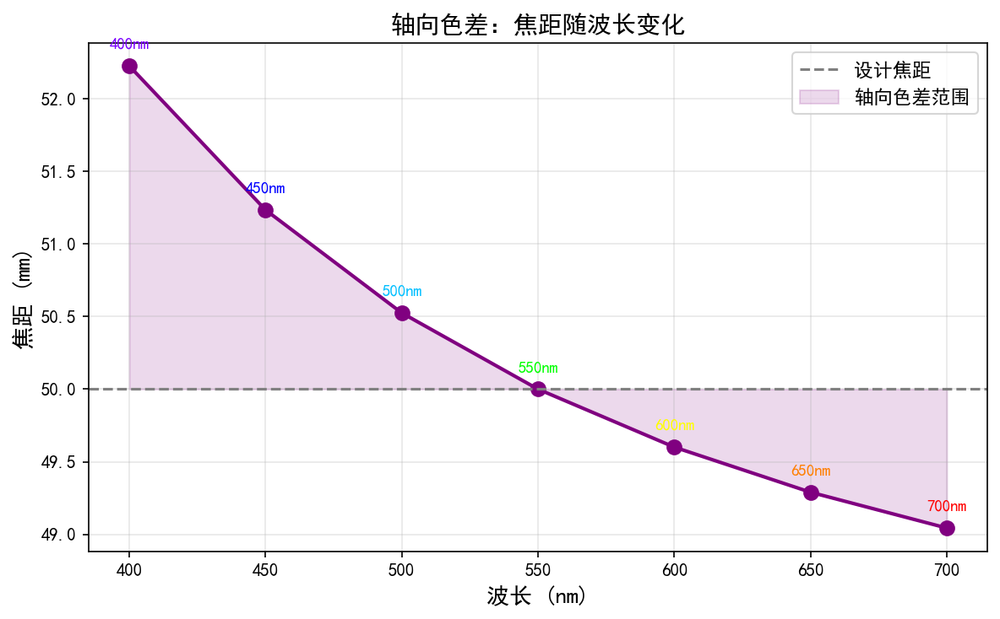
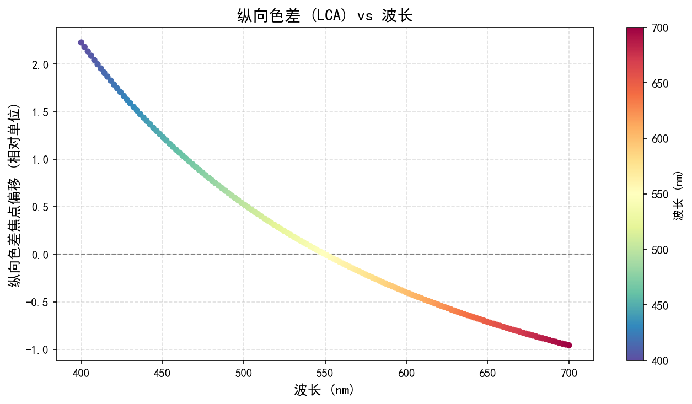
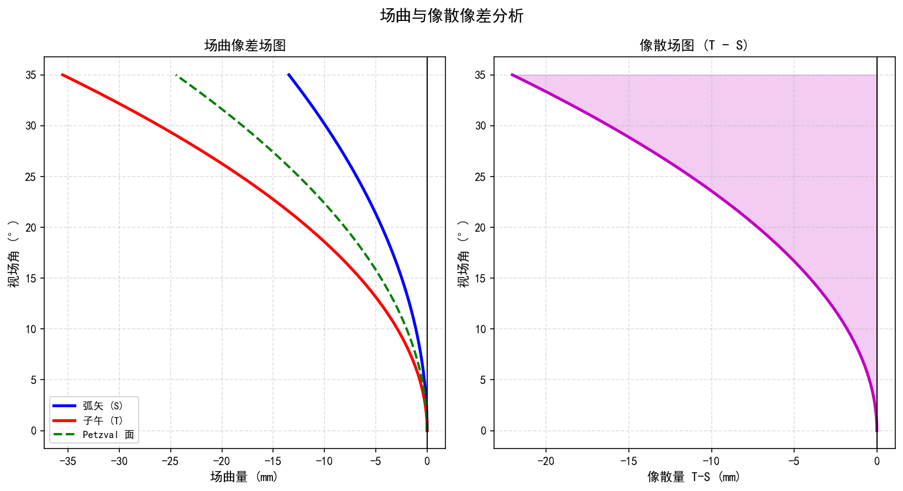
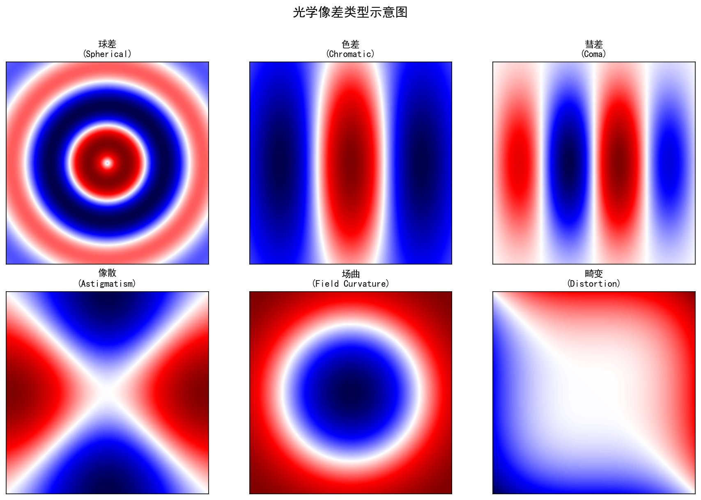
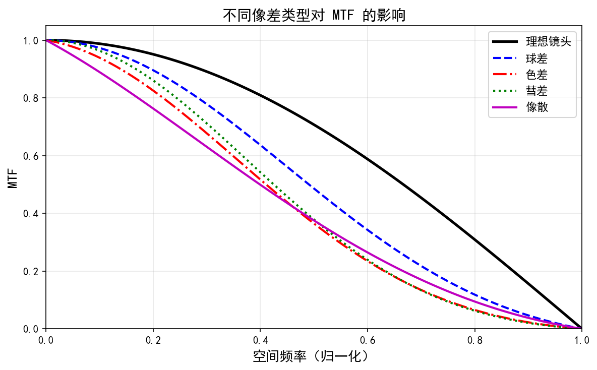

# 第一卷第08章：光学像差、镜头特性与标定光源

## Optics Aberrations, Lens Characterization & Calibration Light Sources

> **Pipeline 位置：** 光学系统是传感器的前端，了解像差特性是 LSC / PPC / CAC 等 ISP 模块的设计基础
>
> **前置章节：** 第一卷第02章（光学基础）、第一卷第03章（传感器物理）
>
---

## 章节概览

手机镜头为什么不是玻璃而是塑料？因为要轻、要便宜、要量产。但塑料非球面镜片带来了一系列玻璃没有的工程问题：温漂、像差分布不对称、切向畸变比单反镜头大一个量级。本章把 Seidel 五种像差、色差的 ISP 处理方法、MTF 测量方法、积分球和可编程光源的标定实践讲清楚——这些是 LSC/PPC/CAC 等模块设计的物理依据。

---

## §1 原理（Theory）

### 1.1 几何像差（Geometric Aberrations）

实际镜头的光路偏离理想高斯光学的程度称为像差。Seidel 三阶像差理论把主要几何像差归纳为五类——ISP 工程师需要知道哪些能在软件层面补偿，哪些只能靠镜头设计解决：

#### Seidel 波前像差系数汇总表（完整参考）

Seidel 三阶像差可用**波前像差函数** $W(\rho, \phi; h)$ 的幂次展开统一描述（其中 $\rho$ 为归一化瞳面径向坐标，$\phi$ 为方位角，$h$ 为归一化像高）：

$$W = W_{040}\rho^4 + W_{131}h\rho^3\cos\phi + W_{222}h^2\rho^2\cos^2\phi + W_{220}h^2\rho^2 + W_{311}h^3\rho\cos\phi$$

| 系数 | 像差名称 | 依赖关系 | ISP 主要影响 |
|------|---------|---------|------------|
| $W_{040}$ | 球差（Spherical Aberration） | $\rho^4$（仅瞳面，与 $h$ 无关） | 轴上 PSF 弥散、中频 MTF 下降 |
| $W_{131}$ | 彗差（Coma） | $h \rho^3 \cos\phi$（随像高线性增大） | 视场角 > 50% 时星点彗星状拖尾 |
| $W_{222}$ | 像散（Astigmatism） | $h^2 \rho^2 \cos^2\phi$（随像高平方增大） | 边缘 H/V MTF 各向异性 |
| $W_{220}$ | 场曲（Field Curvature） | $h^2 \rho^2$（与方位角无关） | 对焦中心时边缘虚焦 |
| $W_{311}$ | 畸变（Distortion） | $h^3 \rho \cos\phi$（不影响 PSF 形状）| 几何形变，GDC 可完全校正 |

> **手机镜头特有像差补充：** 手机镜头全部采用**塑料非球面镜片**（Plastic Aspheric Lens）而非光学玻璃，带来以下特有问题：
> - **热致折射率漂移**：塑料折射率随温度变化较玻璃大（约 $dn/dT \approx -1.2 \times 10^{-4} /°C$），在持续录像导致机身温升 15–20°C 时，等效焦距可漂移约 0.1–0.3%，导致边缘 MTF 下降 5–10%，ISP 的 LSC 和 MTF 标定应在工作温度下进行；
> - **高阶非球面像差**：塑料非球面镜片的加工精度在边缘区域较球面更难控制，旋转对称性稍差，导致角落处（70% 像高）四方向 MTF 出现不对称性（通常 < 3%，但需逐象限测量）；
> - **多层薄塑料镜片的镜筒倾斜公差**：7P/8P 镜头组中各镜片间的中心对齐精度约 ±5–10 μm，切向畸变 $p_1, p_2$ 因此比单反镜头更显著（量级约为 $10^{-3}$ vs $10^{-4}$）。

#### 1.1.1 球差（Spherical Aberration）

球差是轴上点光源的像差：来自透镜不同径向区域（近轴区与边缘区）的光线，在光轴方向的汇聚点不同，导致焦点沿光轴方向展宽，形成一个弥散斑而非理想点像。

- **PSF 表现：** 点扩散函数（PSF）呈现中心亮点 + 外围晕圈（halo）的结构
- **MTF 影响：** 中低空间频率 MTF 显著下降，整体图像发"肉"
- **ISP 处理：** 球差主要依赖镜头设计解决（非球面镜片、多片复合元件、衍射光学元件 DOE）；ISP 层面可通过锐化（unsharp mask、频域增强）做一定补偿，但代价是噪声放大
- **典型值：** 手机主摄旗舰镜头残余球差导致的 PSF 半径约 0.3–0.8 μm 

#### 1.1.2 彗差（Coma）

彗差是轴外点光源的像差：不同孔径环带的光线在像平面上形成不同大小的圆弧，叠加后得到彗星形弥散斑，尾巴朝向图像边缘。

- **影响区域：** 主要发生在中等视场角以外（约 > 50% 像高）
- **星点测试：** 夜景星点拍摄时，角落星点呈彗星形是彗差的直接表现
- 球差是轴上像差，彗差是轴外像差；彗差随视场角增大而加剧

#### 1.1.3 像散（Astigmatism）

像散是轴外点光源在子午面（tangential plane，包含光轴和主光线的平面）和弧矢面（sagittal plane，垂直于子午面）焦距不同的像差。

- **表现：** 在子午焦面处，像点变为水平线段；在弧矢焦面处，变为垂直线段；两者之间的"弥散圆"最小
- **ISP 影响：** 边缘区域水平线和垂直线的清晰度出现各向异性，各方向 MTF 不一致
- **与场曲的关系：** 像散和场曲通常同时存在，Petzval 场曲是场曲的基本形式

#### 1.1.4 场曲（Field Curvature / Petzval Curvature）

理想镜头的最佳焦点轨迹是一个弯曲的 Petzval 面，而非平面。由于 CMOS 传感器是平面的，对焦于中心时边缘离焦，对焦于边缘时中心离焦。

- **数学描述：** 系统的 Petzval 和（Petzval Sum）定义为 $P = \sum_{i} \dfrac{1}{n_i f_i}$（对各薄透镜元件求和，$n_i$ 为折射率，$f_i$ 为焦距），Petzval 场曲半径 $R_P = -1/P$（像空间为空气时）；$P > 0$ 导致像面朝向镜头弯曲，设计目标之一是令 $P \to 0$
- **ISP 无法完全补偿：** 场曲是离焦模糊，不同视场角需要不同的复原核（PSF），代价高昂
- **工程缓解：** 镜头设计时使用 field flattener 元件；机器学习后处理可做有限的离焦感知锐化

#### 1.1.5 畸变（Distortion）

畸变是图像的几何形变，不影响图像的清晰度，但改变物体的形状和位置。

- **桶形畸变（Barrel Distortion）：** 图像中心区域放大倍率大于边缘，图像向外凸出，常见于广角/超广角镜头
- **枕形畸变（Pincushion Distortion）：** 图像中心区域放大倍率小于边缘，图像向内凹陷，常见于长焦镜头
- **畸变量化：** $D\% = (h_{actual} - h_{ideal}) / h_{ideal} \times 100\%$，旗舰主摄通常 < 1%，超广角 < 3% 
- **ISP 校正：** 几何畸变校正（Geometric Distortion Correction, GDC）模块，通过像素坐标重映射实现；需要配合双线性或双三次插值，代价是边缘像素损失和轻微锐度下降

---

### 1.2 色差（Chromatic Aberration）

色差是由于镜头材料的色散（折射率随波长变化）导致不同波长的光在成像时出现位置和大小差异的像差，分为两类：

#### 1.2.1 轴向色差（Longitudinal Chromatic Aberration, LoCA）

不同波长的光沿光轴方向汇聚于不同位置（焦点不同）。蓝光焦点较近（短焦距），红光焦点较远（长焦距）。

- **表现：** 高对比度边缘附近出现前景和背景的色带（蓝/紫色边缘 + 绿/黄色背景）
- **传统 ISP 处理：** 边缘检测 + 局部去饱和（紫边消除），简单但会无差别降低边缘区域饱和度，可能损失真实色彩
- **深度学习处理：** 当前旗舰 SoC 已普遍部署基于轻量 U-Net 或自定义小模型的 LoCA 校正，实现像素级预测——网络区分"镜头导致的色带"与"被摄物本身颜色"（语义感知），直接修复 RGB 值而非简单去饱和；部分实现在去马赛克阶段联合优化，从 RAW 源头消除 LoCA，效果优于传统方法
- **镜头设计解法：** 消色差（achromatic doublet）和超消色差（apochromatic）镜片设计，使用 ED 低色散玻璃

#### 1.2.2 横向色差（Transverse Chromatic Aberration, TCA / Lateral CA）

不同波长的光在同一焦平面上形成不同大小的像（放大倍率色差），表现为图像边缘各色通道之间的空间偏移。

- **表现：** 图像边缘出现彩色条纹（红绿蓝分离），中心无此现象
- **偏移量：** 典型旗舰镜头角落 TCA 约 0.3–1.5 像素（R/B 通道相对 G 通道）
- **ISP 处理：** CACF（Chromatic Aberration Correction Filter）/ CAC，在 Demosaic 后对 R 和 B 通道做亚像素偏移（通常为视场角的多项式函数），校正效果可达 < 0.2 像素残差

**色差校正多项式模型（TCA）：**

$$\Delta r_c(r) = a_{1,c} \cdot r + a_{3,c} \cdot r^3 + a_{5,c} \cdot r^5$$

其中 $r$ 为像素到图像中心的归一化径向距离，$c \in \{R, B\}$，$a_{n,c}$ 为各通道标定系数。

> **为何使用奇次项？** TCA 建模的是 R/B 通道相对于 G 通道的**径向位移幅值** $\Delta r$。若坐标缩放函数写为偶次项 $s(r) = k_1 + k_3 r^2 + k_5 r^4$，则径向位移 $\Delta r = s(r) \cdot r$ 自然含奇次项 $r, r^3, r^5$，物理含义清晰（中心 $r=0$ 处位移为零）。工业标定工具（imatest、Adobe ACR）通常采用此奇次形式。实际量产中一阶到三阶（$a_1 r + a_3 r^3$）已足够，超广角镜头可加五阶项。

---

### 1.3 衍射极限与 MTF

#### 1.3.1 调制传递函数（MTF，Modulation Transfer Function）

MTF 是衡量光学系统对不同空间频率目标对比度响应能力的函数：

$$\text{MTF}(f) = \frac{\text{Output Contrast}(f)}{\text{Input Contrast}(f)}$$

- 取值范围 $[0, 1]$，$\text{MTF}(0) = 1$（直流分量无衰减）
- 奈奎斯特频率 $f_{Ny} = \frac{1}{2 \times \text{pixel pitch}}$，是评估采样质量的关键频率点
- MTF50：MTF 下降到 50% 时对应的空间频率（单位 cy/pix 或 lp/mm），是常用的综合性能指标
- 系统 MTF = 镜头 MTF × 传感器 MTF × ISP 处理 MTF（乘法关系，仅在线性域成立）

#### 1.3.2 衍射极限 MTF

理想无像差圆形孔径的衍射极限 MTF：

$$\text{MTF}_{\text{diffraction}}(f) = \frac{2}{\pi} \left[ \arccos\!\left(\frac{f}{f_c}\right) - \frac{f}{f_c} \sqrt{1 - \left(\frac{f}{f_c}\right)^2} \right]$$

其中截止频率 $f_c = \frac{1}{\lambda \cdot f/\#}$（单位 cy/mm），$\lambda$ 为波长，$f/\#$ 为光圈数。

**实用含义：** 手机主摄（f/1.8, pixel pitch 0.8 μm）在绿光（550 nm）下的艾里斑直径 $d = 2.44 \times 0.55 \times 1.8 \approx 2.4$ μm，与像素尺寸相当，表明已接近衍射极限，镜头像差残余量极少。

#### 1.3.3 ISO 12233 倾斜边缘 MTF 测试

国际标准 ISO 12233 定义的倾斜边缘法（Slanted Edge Method）是量化光学系统 MTF 的行业标准：

1. **目标：** 高对比度倾斜边缘（相对传感器行/列方向倾斜约 5°）
2. **提取流程：**
   - 拟合边缘位置，得到边缘扩散函数（ESF, Edge Spread Function）
   - 对 ESF 求导，得到线扩散函数（LSF, Line Spread Function）
   - 对 LSF 做 FFT，取幅度谱，归一化得到 MTF 曲线
3. **典型工具：** Imatest SFR 模块（商业，行业标准）、MTFMapper（开源，精度可与 Imatest 媲美）、sfr_plus
4. **测试场景：** 中心、边缘（50% 像高）、角落（70% 像高）各测 H/V 两方向

---

### 1.4 暗角（Vignetting）类型

暗角是图像从中心到边缘亮度逐渐降低的现象，有以下四种成因：

#### 1.4.1 自然暗角（Natural / Optical Vignetting）

由于离轴光束的斜入射效应，光通量按 $\cos^4\theta$ 规律随视场角衰减：

$$E(\theta) = E_0 \cdot \cos^4\theta$$

其中 $\theta$ 为视场角（半角）。对于超广角镜头（θ = 60°），自然暗角可达 $\cos^4(60°) = 6.25\%$，即边缘亮度仅为中心的 6.25%，约 −4 EV **[1]**。实际镜头通过渐晕设计部分补偿。

#### 1.4.2 机械暗角（Mechanical Vignetting）

光线被镜筒、光阑或滤镜框遮挡，导致大视场角的有效通光面积减小。与自然暗角叠加，是实际暗角的主要来源之一。

#### 1.4.3 像素暗角（Pixel / Sensor Vignetting）

传感器像素的微透镜（microlens）具有特定的主光线角（CRA，Chief Ray Angle）响应特性，当镜头出射光线的 CRA 与像素 CRA 设计值不匹配时（尤其在边缘），像素的量子效率下降，产生暗角。详见第一卷第03章。CRA 失配还会引起通道间的差异，导致非均匀色差。

#### 1.4.4 数码暗角（Artificial Vignetting）

为增加摄影艺术效果（突出主体、仿电影风格）而后期人为添加的暗角，不是物理缺陷。部分相机 APP 和后处理软件（Lightroom、Snapseed）提供此功能。

**LSC 标定目标：** 将上述 1–3 类物理暗角校正至 < 5% 的均匀性误差（在工厂 LSC 标定后）。

---

### 1.5 标定光源体系（Calibration Light Sources）

本节介绍用于 ISP 标定的光源设备体系，内容基于公开资料、业界常用设备和 CIE / ISO 标准。

#### 1.5.1 CIE 标准光源

CIE（国际照明委员会）定义的标准光源用于保证不同实验室间测量结果的可比性：

| 光源标识 | 相关色温（CCT） | 描述 | 典型应用 |
|---------|--------------|------|---------|
| D65 | 6504 K | 平均日光（北半球正午户外漫射光） | sRGB / ICC 标准参考，CCM 主标定光源 |
| D50 | 5003 K | 水平视角日光 | 印刷 / 图形行业 ICC 配置文件标准 |
| A | 2856 K | 钨丝灯（黑体辐射） | AWB 钨灯测试，室内暖光场景 |
| F2 / CWF | 4150 K | 冷白荧光灯 | 美式零售环境（超市、仓储卖场） |
| F11 / TL84 | 3992 K | 飞利浦 TL84 三基色荧光灯 | 欧式零售标准，DXOMARK 测试光源 |
| F12 / TL83 | 3000 K | 三基色暖白荧光灯 | 东亚零售标准（日韩便利店）|
| D75 | 7504 K | 阴天户外光 | 极蓝天空 AWB 边界测试 |

CIE 标准光源的光谱功率分布（SPD）已由 CIE 15:2004 精确定义 **[3]**，可从 CIE 官网获取数值数据。

#### 1.5.2 积分球光源（Integrating Sphere Light Sources）

**工作原理：** 积分球内壁涂覆高反射率漫反射涂层（硫酸钡 BaSO₄ 或聚四氟乙烯 PTFE，反射率 > 99% ），内部光源（卤素灯或 LED）经过多次漫反射后，从出光口（开孔）输出在空间上高度均匀的辐射照度。

**关键规格：**
- 出光口直径：20 mm（小型台式）至 200 mm（大型产线型）
- 空间均匀度：> 98%（±1% 照度变化范围）
- 色温范围：2700–6500 K（单光源型），2000–8000 K（多通道可调型）
- 时间稳定性：< ±0.5% / 小时（预热后）

**ISP 标定用途：**
- LSC 增益图采集：均匀光照射传感器，提取各像素位置相对亮度，求 LSC 增益图
- PRNU（像素响应非均匀性）测量：评估传感器制造缺陷
- QE（量子效率）曲线测量：配合单色仪扫描波长

**主要供应商：**
- **研鼎仪器（Yanding Instruments，深圳）：** 国内主要摄像头测试设备供应商之一，提供从积分球到多光源切换箱的完整产品线，广泛服务于小米、OPPO、vivo 等手机厂商供应链，官网：www.yanding.com
- **正印（Zhengyin，深圳）：** 另一家国内主要相机测试设备供应商，产品涵盖标定光源箱、前摄工厂校准流水线，服务于 ODM 产线
- **杭州远方光电（Everfine）：** 光谱辐射计和光源标定设备，中国领先的光度学仪器商，官网：www.everfine.net
- **Labsphere（美国）：** 业界顶级积分球供应商，NIST 可溯源标准，研究级应用
- **Gamma Scientific（美国）：** 积分球和标准光源，常见于半导体显示测试
- **Instrument Systems（德国）：** 高精度光谱辐射测量系统

#### 1.5.3 标准光源箱（Multi-Illuminant Switching Cabinet）

多光源切换箱内置若干标准光源管（D65 / D50 / A / TL84 / CWF / UV 等），通过电动转盘或快门组件切换，保证切换时序的重复性和可控性。

**主要用途：**

1. **AWB 地面真值采集：** 在已知光源下拍摄 ColorChecker 24 色卡或纯白参考板，记录 $(R/G,\ B/G)$ 值作为 AWB 标定参考点（ground truth illuminant locus）
2. **CCM 标定：** 在 D65 和 D50（或其他目标光源）下分别拍摄色卡，求解各光源对应的颜色校正矩阵（CCM）
3. **AWB 算法回归测试：** 在多种已知光源下批量拍摄场景图，验证 AWB 算法对各光源的正确收敛率

**DXOMARK 测试的标准光源要求（参考）：**
- 主测光源：D65（6504 K，1000 lux）、A（2856 K）、TL84（~4000 K）、F11
- 低照度梯度：D65 从 1000 lux 降至 1 lux（1000 / 100 / 20 / 5 / 1 lux）
- 色彩评分标准：灰块白平衡误差 ΔE₀₀ < 3，24 色块平均 ΔE₀₀ < 3 为合格线

#### 1.5.4 可编程光源（Programmable Light Sources, PLS）

**工作原理：** 多通道 LED 阵列，每个通道驱动特定峰值波长的 LED，通过独立控制各通道的驱动电流（即权重），合成任意目标光谱功率分布（SPD）：

$$S(\lambda) = \sum_{i=1}^{N} w_i \cdot \phi_i(\lambda)$$

其中 $\phi_i(\lambda)$ 为第 $i$ 通道 LED 的归一化 SPD，$w_i \geq 0$ 为驱动权重。给定目标 SPD $T(\lambda)$，通过非负最小二乘（NNLS）求解最优权重：

$$\min_{w \geq 0} \left\| \sum_i w_i \phi_i(\lambda) - T(\lambda) \right\|_2^2$$

**通道配置级别：**

| 通道数 | 代表波长覆盖 | 近似能力 | 典型应用场景 |
|--------|-----------|---------|------------|
| 8 通道 | ~420–730 nm（~40 nm 间隔）| 平滑 SPD（黑体、日光）| 手机标定线，中低端测试 |
| 12–16 通道 | ~400–730 nm（~25 nm 间隔）| 荧光灯线谱近似 | 旗舰标定，DXOMARK 对标 |
| 19–24 通道 | 每 15–20 nm 一个通道 | 研究级精细 SPD 控制 | 光谱感知 CCM 研究，学术 |

**典型 ISP 应用：**
- AWB 轨迹扫描：以 100 K 步长从 2000 K 连续编程至 8000 K，自动采集各色温下的 $(R/G,\ B/G)$，生成完整 AWB 标定轨迹
- CCM 鲁棒性测试：模拟非标准混合光源（如室内日光 + 荧光灯混合）场景
- AWB 压力测试：模拟霓虹灯（窄带红 / 绿）、水下（蓝色偏移）、烛光（极低 CCT）等极端光源

**国产化趋势（2023–2025）：**
近年国内可编程光源研发投入增加显著。合泰颜色（Hopoocolor）、研鼎等企业已推出国产化 8–16 通道可编程光源，价格较进口设备（Gamma Scientific、Konica Minolta）低 60–70%，精度达到同等水平，中小型标定实验室的采购门槛因此降低。

---

### 1.6 同色异谱（Metamerism）风险

#### 1.6.1 同色异谱的定义

两个具有不同 SPD 的物体，在某一光源下看起来颜色相同，但在另一光源下颜色不同，称为**同色异谱对**（Metameric Pair）。

**数学描述：** 在观察者颜色匹配函数 $\bar{x}(\lambda), \bar{y}(\lambda), \bar{z}(\lambda)$ 下，两个反射率 $\rho_1(\lambda)$ 和 $\rho_2(\lambda)$ 在光源 $E_1(\lambda)$ 下产生相同的三刺激值：

$$\int \rho_1(\lambda) \cdot E_1(\lambda) \cdot \bar{x}(\lambda) \, d\lambda = \int \rho_2(\lambda) \cdot E_1(\lambda) \cdot \bar{x}(\lambda) \, d\lambda$$

但在光源 $E_2(\lambda)$ 下三刺激值不等，即颜色不同。

#### 1.6.2 PLS 引入的同色异谱风险

当使用可编程光源模拟 D65 时，实际输出的 SPD $S_{PLS}(\lambda)$ 与真实 D65 存在残差 $\Delta S(\lambda) = S_{PLS}(\lambda) - D65(\lambda)$。由于 ColorChecker 各色块具有不同的光谱选择性反射率，此 SPD 残差会在传感器响应层面引入系统性偏差：

$$\Delta R_{patch} = \int \rho_{patch}(\lambda) \cdot \Delta S(\lambda) \cdot S_{sensor}(\lambda) \, d\lambda \neq 0$$

**实际后果：** 用 PLS 模拟 D65 标定的 CCM，在真实物理 D65 荧光灯下验证时，特定高饱和度色块（红色、青色）可能出现 ΔE₀₀ = 0.5–2.0 的系统性偏差，高通道数 PLS（≥ 16 通道）残差通常 < 0.3。

#### 1.6.3 同色异谱指数（Metamerism Index, MI）

CIE 定义的异谱指数（CIE 51-1981）量化光源对同色异谱对的区分能力：

- MI < 1.0：可接受（颜色差异不可察觉）
- MI = 1.0–3.0：可察觉
- MI > 3.0：明显（颜色有明显差异）

**检测方法：** 用光谱辐射计（如 Konica Minolta CS-2000、杭州远方 PR-850）实测 PLS 输出的实际 SPD，与参考 D65 SPD 计算 MI 值。

#### 1.6.4 同色异谱风险缓解措施

1. **增加 PLS 通道数：** 通道数越多，SPD 残差越小，同色异谱风险越低；增加通道数可显著提升光谱匹配精度，但具体改善幅度取决于 LED 光谱特性与目标 SPD 的复杂度，无通用固定比例
2. **光谱校准：** 用 NIST 可溯源的光谱辐射计实测 PLS 输出，以实测 SPD 替换理想 D65 作为 CCM 拟合的参考光源
3. **物理光源最终验证：** 关键参数（CCM、AWB 基准点）必须在物理标准光源（飞利浦 TL-D 965 D65 荧光管）下做最终确认，PLS 仅用于批量自动化采集
4. **光谱感知 CCM 拟合：** 利用已知传感器光谱灵敏度曲线和多种自然反射率光谱（Munsell、Nature 数据库）进行 CCM 拟合，而非仅拟合 24 块 ColorChecker，提升 CCM 的泛化鲁棒性

---

## §2 标定（Calibration）

### 2.1 MTF 标定流程

**目标：** 量化镜头在不同视场位置和方向的空间分辨率（MTF50）

**步骤：**

1. **准备测试卡：** 使用 ISO 12233 标准测试卡 **[2]**（Imatest 官方纸质版或自行印刷的高精度激光打印版），或高对比度纯粹倾斜边缘靶（钢材雕刻版精度更高）

2. **拍摄条件设定：**
   - 光源：D65 光源箱，1000 lux±10% **[3]**
   - 距离：满足最小视场角要求（测试卡占画面 ≥ 50%，或针对特定视场角位置单独拍摄）
   - 格式：RAW 格式（不经过 ISP 降噪、锐化处理），EV 设置在 OECF 线性区中段

3. **工具处理：**
   - Imatest：SFR 模块，自动检测边缘、提取 ESF→LSF→MTF，输出 MTF50（cy/pix 和 lp/mm）
   - MTFMapper：命令行工具，多区域批量处理，开源免费，可嵌入自动化测试流程

4. **输出指标：**
   - 中心 MTF50（H / V）
   - 边缘 MTF50（50% 像高，H / V）
   - 角落 MTF50（70% 像高，H / V）
   - 边缘 / 中心 MTF50 比值（Field Uniformity）
   - MTF 曲线图（0–0.5 cy/pix 范围）

5. **重复性要求：** 多次拍摄（≥ 5 张）取平均，排除对焦抖动（手机固定支架 + 自动触发）

---

### 2.2 暗角（Vignetting）标定

**目标：** 提取各像素位置的相对亮度响应，用于 LSC 增益图的生成

**步骤：**

1. **设备：** 积分球光源（出光口直径 ≥ 传感器对角线 × 2，空间均匀度 > 98%）

2. **采集：**
   - 相机正对出光口中心，距离满足均匀照度要求
   - 拍摄 RAW 平场图（Flat Field），曝光量约 70–90% 饱和度（PRNU/平场标定的推荐曝光量，信号足够强以提高测量精度，同时避免高光截断）
   - 拍摄暗帧（Dark Frame），相同曝光时间，镜头盖遮挡

3. **处理：**
   - 减去暗帧：$I_{corrected}(x,y) = I_{raw}(x,y) - I_{dark}$
   - 分通道（R / Gr / Gb / B）分别处理
   - 计算相对亮度：$V(x,y) = I_{corrected}(x,y) / I_{corrected}(x_c, y_c)$，其中 $(x_c, y_c)$ 为图像中心
   - LSC 增益图：$G_{LSC}(x,y) = 1 / V(x,y)$

4. **质量验证：** 施加 LSC 增益图后，重新采集平场并验证均匀度，目标 < ±5% 残差

5. **多温度 / 多光圈：** 如镜头有可变光圈，应在不同光圈下分别标定；温漂较大的模块需在不同温度下标定多套 LSC 表

---

### 2.3 色差（CA）标定

**目标：** 量化 R / B 通道相对 G 通道的横向偏移量，拟合多项式校正系数

**步骤：**

1. **测试图案：** 高对比度棋盘格或辐射状 star chart，在整个视场均匀分布角点

2. **棋盘格角点检测：** 亚像素精度角点检测（OpenCV cornerSubPix 或 Imatest CA 模块）

3. **通道偏移计算：** 在每个角点位置，分别在 R、G、B 通道拟合边缘位置，计算 $(\Delta x_R, \Delta y_R)$ 和 $(\Delta x_B, \Delta y_B)$（相对 G 通道的偏移）

4. **多项式拟合：**
   ```
   Δx_c(r) = a1_c * r + a3_c * r³ + a5_c * r⁵  (c = R, B)
   r = sqrt((x - cx)² + (y - cy)²) / r_max
   ```
   最小二乘拟合求解 $a_{1,c}, a_{3,c}, a_{5,c}$

5. **验证：** 将校正多项式应用于测试图像，残余色差 < 0.2 像素

---

### 2.4 几何畸变标定

**工具：** 棋盘格标定（Zhang 方法，OpenCV `calibrateCamera`）

**输出：** 径向畸变系数 $k_1, k_2, k_3$ 和切向畸变系数 $p_1, p_2$

**ISP 参数：** 将 GDC（Geometric Distortion Correction）模块的 LUT（查找表）或多项式系数从标定结果导入，实现几何矫正。

---

## §3 调参（Tuning）

### 3.1 依据标定结果调参

| 测试结果 | 问题根因 | 调参建议 |
|---------|---------|---------|
| 中心 MTF50 < 0.40 cy/pix | 对焦偏差 / 球差 | 重新确认 AA 对焦精度；适当增加 ISP 锐化增益（注意噪声权衡）|
| 边缘 MTF50 / 中心 < 0.65 | 场曲 / 像散 / 暗角未校正 | 检查 LSC 正确性；评估 RAB（Radial Aberration Blur）处理 |
| 横向色差 @ 角落 > 1.0 px | TCA 严重 | 启用 CACF 并重新标定偏移多项式；必要时需镜头重新设计 |
| 角落暗角 > 50%（单通道）| CRA 失配 + 机械暗角 | 重标 LSC 表；检查镜头-传感器 CRA 匹配是否符合设计规格 |
| PLS 同色异谱指数 MI > 1.0 **[4]** | PLS 通道数不足 / 未校准 | 更换更高通道数 PLS；或对 PLS 实测 SPD 后用实测值拟合 CCM |
| AWB ΔE₀₀ > 3.0（TL84）| AWB 标定缺少 TL84 参考点 | 补充 TL84 下的 AWB 标定；检查荧光灯的色度 $(u',v')$ 是否在 AWB 轨迹范围内 |
| CCM 在 D65 / A 间 ΔE₀₀ > 4.0 | CCM 切换逻辑问题 | 检查双 CCM 插值区间；确认 A 光源 CCM 的标定精度 |
| 角落有彩色水波纹 | TCA + Demosaic 伪色交互 | 在 Demosaic 前先做 CAC 预处理；调整 Demosaic 算法的方向性 |

---

### 3.2 ISP 模块与光学像差的对应关系

```
镜头像差类型          ISP 处理模块              处理策略
─────────────────────────────────────────────────────────
横向色差（TCA）     → CACF / CAC           亚像素 R/B 通道偏移校正
暗角（全部类型）    → LSC                  增益图乘法校正
几何畸变            → GDC                  坐标重映射
球差（PSF 模糊）    → Sharpening / DNN     频率增强（有噪声代价）
场曲（离焦模糊）    → 局部锐化 / PDAF 辅助  有限补偿，本质需光学设计解决
彗差                → 无专用模块            镜头设计或 DNN 去伪影
纵向色差（LoCA）    → 紫边消除              边缘检测 + 局部去饱和
```

---

## §4 伪影（Artifacts）

### 4.1 紫边（Purple Fringing）

**描述：** 高对比度边缘（树枝 vs 天空、睫毛 vs 背景等）出现紫色/洋红色条纹。

**成因（复合）：**
1. **轴向色差（LoCA）：** 蓝/紫光焦点位于焦平面前方，在焦平面形成弥散光晕，颜色为蓝/紫
2. **传感器 UV 泄漏：** CMOS 传感器对近紫外光（~ 350–400 nm）有一定响应，部分 IR cut 滤镜在 UV 段效率较低
3. **过曝 Blooming：** 高亮区域电荷溢出到相邻像素，与 LoCA 晕圈叠加后呈紫色

**ISP 处理：**
- CACF 对横向 TCA 有效，但 LoCA 需要镜头光学设计（ED 低色散镜片）或深度学习方案解决
- **传统软件紫边消除：** 检测高亮边缘附近高饱和度紫/洋红色像素，局部做色相旋转 + 降饱和；注意误伤紫色花朵、彩色标志物，需精细阈值
- **深度学习方案（当前旗舰主流）：** 像素级颜色修复，语义感知防误伤；已集成进多个旗舰 SoC 的 AI Engine（如高通 Spectra、联发科 Imagiq 的去马赛克后处理链）

---

### 4.2 鬼像与光晕（Flare & Ghosting）

**描述：**
- **光晕（Flare）：** 强光源使图像局部或整体对比度下降，出现雾化感
- **鬼像（Ghosting）：** 强光在镜片组内多次反射后，在图像中产生一个或多个对称光斑（与光源关于图像中心对称或呈特定规律分布）

**成因：** 镜片组各界面的内部反射；增透膜（AR Coating）仅能将单面反射率从 4% 降至 0.1–0.5%，多片镜头组合后仍有可觉察的鬼像残留。

**缓解：**
- 光学设计：优化各镜片 AR coating 性能；特殊形状消鬼光阑
- ISP：光源检测（明亮点 + 逆光判断）+ 局部对比度增强恢复 Flare 区域细节
- 深度学习方案：NTIRE 2023 / MIPI 2023 Nighttime Flare Removal Challenge 展示了基于 U-Net 的端到端 Flare 去除，在受控条件下 PSNR 提升约 2–3 dB

---

### 4.3 衍射柔化（Diffraction Softening at Small Aperture）

**描述：** 收小光圈时（大 f 数），衍射效应使图像反而变软，而非更清晰。

**原因：** 艾里斑直径 $d = 2.44 \times \lambda \times f/\#$，当艾里斑大于像素尺寸时，衍射成为图像模糊的主要来源：

| f/# | 艾里斑（λ=550 nm） | 0.8 μm 像素是否衍射受限 |
|-----|-----------------|----------------------|
| f/1.8 | 2.4 μm | 是（刚好达到极限）|
| f/2.8 | 3.8 μm | 是（明显衍射模糊）|
| f/8 | 10.7 μm | 严重（超过像素 13 倍）|

**手机的特殊性：** 手机主摄通常固定光圈（f/1.8–f/2.8），无法物理收缩光圈，此问题主要出现在计算摄影中（如多帧合成、超分辨率算法引入等效"虚拟光圈"时）。

---

### 4.4 色彩摩尔纹（Color Moiré）

**描述：** 拍摄细密纹理（布料、屏幕像素、砖墙远端）时出现彩色干涉纹。

**成因：** 被摄目标的空间频率接近奈奎斯特频率时，欠采样导致混叠，不同颜色通道的混叠方向不同，形成色彩混叠。

**缓解：** 光学低通滤波器（OLPF）在传感器前模糊高频，以一定清晰度为代价消除摩尔纹；现代手机已普遍去除 OLPF，改由 ISP 中的自适应低通滤波处理。

---

## §5 评测（Evaluation）

### 5.1 核心指标汇总

| 指标 | 测量工具 | 旗舰参考值 | 合格线 |
|------|---------|----------|--------|
| 中心 MTF50（H / V）| Imatest SFR / MTFMapper | 0.45–0.60 cy/pix ¹ | > 0.35 cy/pix |
| 边缘 MTF50 / 中心 MTF50 | 同上 | > 0.75 ² | > 0.60 |
| 最大横向色差 @ 角落 | Imatest CA / 自编脚本 | < 0.5 px | < 1.0 px |
| 角落暗角（最严重通道，标定前）| Flat-field 分析 | < 30% 损失 | < 50% 损失 |
| 最大几何畸变 | 棋盘格 OpenCV | < 1% | < 2%（广角 < 5%）|
| AWB 白平衡误差 ΔE₀₀（D65）| ColorChecker + CIECAM | < 1.5 | < 3.0 |
| 24 色块平均 ΔE₀₀（D65 CCM）| ColorChecker + CIECAM | < 2.5 | < 4.0 |
| PLS 同色异谱指数 MI | 光谱辐射计 | < 0.5 | < 1.0 |

> ¹ **旗舰参考值范围为 0.45–0.60 cy/pix**，适用于 RAW 格式（无软件锐化）测试结果；经 ISP 锐化后 MTF50 可被人为提升，但不代表光学解析力提升。2024 年主摄旗舰（非球面 7P/8P 镜头 + 大底）可达 0.55–0.60 cy/pix，中低端机型约 0.40–0.50 cy/pix。
>
> ² **0.75 为优秀目标值**，受场曲/像散约束的光学系统实测边缘/中心比约 0.65–0.70；超广角镜头（FOV > 110°）该比值通常更低（0.55–0.65）。

---

### 5.2 典型测试设备清单（ISP 标定实验室）

| 设备 | 用途 | 典型型号 |
|------|------|---------|
| 积分球光源 | LSC / PRNU 平场采集 | 研鼎 / Labsphere 定制 |
| 多光源切换箱 | AWB / CCM 标定 | 研鼎 6 光源箱、正印产线版 |
| 可编程光源（PLS）| AWB 轨迹扫描 | Gamma Scientific、研鼎国产版 |
| 光谱辐射计 | SPD 实测、MI 计算 | 杭州远方 PR-850、Konica Minolta CS-2000 |
| ColorChecker 24 | CCM / AWB 地面真值 | X-Rite ColorChecker Classic |
| ISO 12233 测试卡 | MTF 测量 | Imatest 官方版 / 钢板刻蚀版 |
| 棋盘格标定板 | 几何畸变 / CA 标定 | 定制高精度印刷或玻璃蚀刻版 |
| 测光表 / 照度计 | 确保 1000 lux 标准照度 | Konica Minolta T-10A |

---

## §6 代码（Code）

参见配套 Notebook `ch08_code.ipynb`，内容包括：

### 6.1 代码模块一览

```python
# 模块 1：倾斜边缘 MTF 计算（调用 MTFMapper 或纯 Python 实现）
def compute_mtf_from_slanted_edge(img_gray, roi, angle_deg=5.0):
    """
    输入: 灰度图像、ROI 区域坐标、边缘倾角（°）
    输出: spatial_freqs (cy/pix), mtf_values
    """
    # ESF 提取 → LSF（微分）→ MTF（FFT 取幅度）
    ...

# 模块 2：平场 RAW 提取暗角增益图
def compute_lsc_gainmap(raw_flat_path, raw_dark_path, bayer_pattern='RGGB'):
    """
    输入: 平场 RAW 路径、暗帧 RAW 路径、Bayer 排列
    输出: lsc_gains (H, W, 4) — R/Gr/Gb/B 四通道增益图
    """
    ...

# 模块 3：横向色差偏移量多项式拟合
def fit_ca_polynomial(ca_data_points, degree=5):
    """
    输入: ca_data_points — list of (r_normalized, delta_x, delta_y)
    输出: coefficients dict {'R': [a1, a3, a5], 'B': [a1, a3, a5]}
    """
    ...

# 模块 4：PLS D65 近似的同色异谱指数计算
def compute_metamerism_index(pls_spd, reference_spd, wavelengths):
    """
    输入: pls_spd — PLS 实测 SPD（或 NNLS 合成 SPD）
          reference_spd — 目标参考 SPD（D65）
          wavelengths — 波长数组（nm）
    输出: MI (float) — CIE 同色异谱指数
    """
    # 计算在 PLS 和 D65 下 CIE 1931 XYZ 三刺激值
    # 对 12 块 Munsell 色样（CIE 51-1981 规定）分别计算 ΔE*ab
    # MI = 加权平均 ΔE*ab（权重由色样反射率与观察者视觉灵敏度决定，见 CIE 51-1981）
    ...
```

### 6.2 关键公式实现备注

**MTF 从 ESF 计算（Python 伪代码）：**
```python
import numpy as np
from scipy.ndimage import gaussian_filter1d
from scipy.signal import savgol_filter

# 1. 将边缘附近像素投影到垂直于边缘的方向，超采样 4x
esf = project_to_edge_normal(roi_pixels, angle_deg, oversample=4)
# 2. Savitzky-Golay 滤波平滑 ESF
esf_smooth = savgol_filter(esf, window=7, polyorder=3)
# 3. 微分得 LSF
lsf = np.gradient(esf_smooth)
# 4. 汉宁窗加权，减少频谱泄漏
lsf_windowed = lsf * np.hanning(len(lsf))
# 5. FFT → 幅度谱 → 归一化
mtf = np.abs(np.fft.rfft(lsf_windowed))
mtf /= mtf[0]
freqs = np.fft.rfftfreq(len(lsf_windowed)) * oversample  # cy/pix

# ─── 示例调用与输出 ───────────────────────────────────────
# 各函数已定义，可按签名独立调用；示例：
img_gray = np.random.rand(400, 400).astype(np.float32)
freqs, mtf = compute_mtf_from_slanted_edge(img_gray, roi=(100, 100, 200, 200))
# 输出: freqs (ndarray, cy/pix), mtf (ndarray, 归一化至 [0,1])

```

---


---

> **工程师手记：像差校正的工程代价与边界**
>
> **片上校正与软件CA校正的过矫正风险：** 色差（CA）校正可在镜头组内通过非球面+低色散玻璃实现，也可在ISP软件中通过通道偏移映射完成。软件CA校正的典型实现是对R/B通道做亚像素级warp，将其对齐到G通道。问题在于：warp矩阵通常由中心角度少数标定帧拟合，边缘视场角的残差可达0.3–0.8像素。当warp过矫时，边缘物体的R/B通道会相对G通道反向偏移，表现为"绿边→洋红边"的色条纹（color fringing artifact），在高对比边缘（白墙/蓝天交界）时肉眼可见。因此软件CA校正应遵循"宁欠矫、不过矫"原则，末级clip strength需在外场真实场景图上逐档验证。
>
> **阵列相机的场曲标定需求：** 多摄手机（广角+主摄+长焦）三颗镜头各自存在场曲差异，主摄Curvature通常由镜头厂在MTF测试时给出，但用于景深对齐的视差图（disparity map）要求三摄场曲标定误差 < 0.2像素，否则拼接或虚化合帧时边缘会出现几何错位。实际产线每颗镜头都需在多点距离（30cm、50cm、∞）的平面靶上做单独场曲标定，标定结果写入OTP。部分方案用数字校正弥补光学场曲，但补偿系数多项式阶数超过6阶时计算量会显著影响实时预览帧率。
>
> **像差校正LUT尺寸与畸变补偿精度权衡：** 镜头畸变校正通常用二维mesh warp LUT实现，LUT网格从8×8到64×64不等。8×8网格内存仅512字节，但插值误差在边角可达0.5像素以上；64×64网格精度提升至0.05像素以内，内存占用却增长64倍，且warp引擎DMA带宽和延迟也相应增加。工程上常见折中：主摄用16×16（精度约0.15px，内存2KB），广角用32×32（因畸变更大、精度要求更高）。标定时需在靶图覆盖率>85%视场的条件下收集足够多角点，否则边角插值节点缺乏约束，产线一致性会变差。
>
> *参考：Imatest Lens Distortion and CA Measurement（2023）；EMVA Standard 1288 Release 4.0；Smith, W.J. "Modern Optical Engineering" 4th ed., Ch.7*

## 插图


*图1. 色差（轴向色差与横向色差）光谱分布示意图（图片来源：Smith, "Modern Optical Engineering (4th ed.)", McGraw-Hill, 2008）*


*图2. 镜头色差随波长变化特性曲线（图片来源：作者自绘，参考Smith, "Modern Optical Engineering", 2008）*


*图3. 场曲（像场弯曲）像差示意图（图片来源：Malacara, "Optical Shop Testing (3rd ed.)", Wiley, 2007）*


*图4. 镜头主要像差类型总览——球差、彗差、像散、场曲、畸变与色差的典型光路示意，各像差在MTF曲线上均有特征性的频率选择性衰减（图片来源：Smith, "Modern Optical Engineering (4th ed.)", McGraw-Hill, 2008）*


*图5. 像差对MTF曲线的影响示意图（图片来源：ISO, "ISO 12233:2017", 官方文档, 2017）*

---

## 习题

**练习 1（理解）**
Seidel 五种几何像差中，哪些可以通过 ISP 软件做有效补偿，哪些主要只能靠镜头设计解决？请按本章表格逐一分析：(a) 畸变（Distortion）——ISP 的 GDC/LDC 模块如何用逆映射 LUT 校正，校正精度的限制在哪里；(b) 场曲（Field Curvature）——为什么 ISP 的统一锐化核无法完全校正场曲引起的边缘离焦；(c) 彗差（Coma）——夜景星点拍摄时角落星点出现彗星形拖尾，这是哪类像差，能否在后处理中消除？

**练习 2（计算）**
某手机主摄 ISO 12233 分辨率测试：在图像中心区域（轴上）的 MTF50 = 0.42 cycles/pixel，在 70% 像高处测量四个方向，水平方向 MTF50 = 0.28 cycles/pixel，垂直方向 MTF50 = 0.19 cycles/pixel。请计算：(a) 中心与边缘 MTF50 的相对下降比例；(b) 水平与垂直方向 MTF50 差异（比值），判断这种各向异性最可能由哪种 Seidel 像差引起（参考本章表格中像差的方向依赖性）；(c) 若传感器像素尺寸为 $1.0\,\mu\text{m}$，MTF50 = 0.42 cycles/pixel 对应的实际空间分辨率（line pairs/mm）是多少？

**练习 3（编程）**
用 Python + NumPy/OpenCV 实现基于斜边法（Slanted-Edge Method）的 MTF 测量：(a) 生成一张 512×512 的合成图像，左半部分像素值为 0，右半部分为 255，边界线与垂直方向成 5° 角（斜边）；(b) 对图像施加高斯模糊（`cv2.GaussianBlur`，sigma=2.0）模拟镜头模糊；(c) 沿多行对边缘进行超采样（4× 插值），拼合为超分辨率边缘剖面（ESF, Edge Spread Function）；(d) 对 ESF 求差分得到 LSF（Line Spread Function），再做 FFT 并取模归一化，绘制 MTF 曲线并标注 MTF50。

## 参考文献

[1] Smith, "Modern Optical Engineering (4th ed.)", *McGraw-Hill*, 2008.

[2] ISO, "ISO 12233:2017 — Photography — Electronic still-picture imaging — Resolution and spatial frequency responses", *官方文档*, 2017.

[3] CIE, "CIE 15:2004 — Colorimetry", *官方文档*, 2004.

[4] CIE, "CIE 51-1981 — Method for assessing the quality of daylight simulators for colorimetry", *官方文档*, 1981.

[5] EMVA, "EMVA Standard 1288 Release 4.0 — Standard for Characterization of Image Sensors and Cameras", *官方文档*, 2021. URL: https://www.emva.org/standards-technology/emva-1288/

[6] Malacara (Ed.), "Optical Shop Testing (3rd ed.)", *Wiley*, 2007.

[7] Farrell et al., "Sensor calibration and simulation", *SPIE Electronic Imaging (Proc. SPIE vol. 6817)*, 2008.
<!-- REF-AUDIT: [7] 原文年份 2012 错误 → 正确年份为 2008（SPIE Electronic Imaging 2008, vol. 6817）；2012 年同组另有 "Digital camera simulation" 发表于 Applied Optics -->

[8] Zhao et al., "Modeling chromatic adaptation in image reproduction", *Color Research & Application*, 1995.

## §7 术语表（Glossary）

**几何像差（Geometric Aberrations）**
实际光学系统的成像结果与理想高斯光学（Gaussian Optics）预测结果之间的偏差，由透镜形状、折射率不完美及多片组合引起。Seidel 三阶理论将主要几何像差归纳为五类：球差、彗差、像散、场曲、畸变，合称"Seidel 五差"。不同像差类型对 ISP 的影响机制不同：畸变可由几何重映射完全校正，场曲则无法用简单 ISP 处理弥补。

**球差（Spherical Aberration）**
轴上点光源的像差：透镜近轴区与边缘区对不同径向入射光线的折射能力不同，导致光线在光轴方向汇聚点不同，形成弥散斑（halo）而非理想点像。PSF 表现为中心亮点 + 外围晕圈结构，导致中低空间频率 MTF 下降，图像发"肉"。现代手机镜头通过非球面镜片（Aspheric Lens）设计将球差残余量控制在 PSF 半径 < 1 μm 量级。ISP 层面可用锐化做一定补偿，但代价是噪声放大。

**彗差（Coma）**
轴外点光源的像差：不同孔径环带的斜入射光线在像平面上形成不同大小的弧，叠加后形成彗星形弥散斑，"尾巴"朝向图像边缘。彗差从中等视场角（> 50% 像高）开始显著，夜景星点测试时角落星点的彗星形拖尾是其直接表现。现代旗舰镜头的彗差校正依赖专门的 coma-corrector 元件设计；ISP 无专用校正模块，严重时需 DNN 去伪影。

**像散（Astigmatism）**
轴外点光源在子午面（包含光轴和主光线的平面）与弧矢面（垂直子午面）的焦距不同，导致同一点光源在两个焦面上分别呈水平线段和垂直线段，两者之间的最小弥散圆（least circle of confusion）为最优折中。像散使图像边缘区域水平线与垂直线清晰度出现各向异性，各方向 MTF 不一致，是 MTF 测量中需分 H/V 两方向测试的原因之一。

**场曲（Field Curvature / Petzval Curvature）**
理想镜头的最佳焦点轨迹是弯曲的 Petzval 面，而非平面。对于 $N$ 片薄透镜组成的系统，Petzval 和定义为 $P = \sum_i 1/(n_i f_i)$，对应 Petzval 场曲半径 $R_P = -1/P$（像空间为空气时）。设计目标是令 $P \to 0$（Petzval 平场条件）。由于 CMOS 传感器是平面，场曲导致对焦中心时边缘离焦，ISP 层面只能做有限的局部离焦感知锐化，根本解决需光学设计使用 field flattener 元件。

**畸变（Distortion）**
图像的几何形变像差，不影响成像清晰度，但改变物体形状和位置。桶形畸变（barrel distortion，$k_1 < 0$）中心放大率 > 边缘，广角镜头常见；枕形畸变（pincushion distortion，$k_1 > 0$）中心放大率 < 边缘，长焦镜头常见。ISP 的 GDC（Geometric Distortion Correction）模块通过像素坐标重映射（查找表或多项式）校正，代价是边缘像素损失和轻微锐度下降。旗舰主摄畸变量通常 < 1%，超广角 < 3%。

**色差（Chromatic Aberration, CA）**
由玻璃材料色散（折射率随波长变化）导致不同波长光线汇聚位置不同的像差，分为两类：①轴向色差（LoCA/ACA）——不同波长沿光轴方向焦点不同，表现为高对比度边缘附近出现色带；②横向色差（TCA/LCA）——不同波长在同一焦平面上放大率不同，表现为图像边缘出现彩色条纹，中心无此现象。TCA 可由 ISP 的 CACF/CAC 模块通过亚像素通道偏移校正；LoCA 较难通过几何操作消除，现代旗舰 SoC 已部署基于轻量 DNN 的像素级 LoCA 校正。

**轴向色差（Longitudinal Chromatic Aberration, LoCA / ACA）**
不同波长光线沿光轴方向汇聚于不同焦点，导致蓝/紫光焦点较近（短焦距）、红光焦点较远（长焦距），在高对比度边缘附近形成前景色带（蓝/紫）与背景色带（绿/黄）。传统 ISP 处理方式为边缘检测 + 局部去饱和（紫边消除），但有无差别损失真实边缘色彩的风险。当前旗舰 SoC 普遍采用基于轻量 U-Net 或自定义小模型的像素级 LoCA 校正，语义感知能力使其区分"镜头色带"与"被摄物体颜色"，直接修复 RGB 值。

**横向色差（Transverse Chromatic Aberration, TCA / LCA）**
不同波长光线在同一焦平面上形成不同大小的像（放大率色差），表现为图像边缘 R/G/B 通道之间出现空间偏移，产生彩色条纹。典型旗舰镜头角落 TCA 约 0.3–1.5 像素（R/B 相对 G）。ISP 的 CACF/CAC 模块以多项式函数 $\Delta r_c(r) = a_{1,c} r + a_{3,c} r^3 + a_{5,c} r^5$ 描述偏移量，对 R/B 通道做亚像素径向重映射，校正后残差可达 < 0.2 像素。多项式采用奇次形式是因为位移量为零时（$r=0$）中心无偏移，奇函数在物理上更自然。

**调制传递函数（Modulation Transfer Function, MTF）**
衡量光学系统对不同空间频率目标对比度传递能力的函数，定义为输出与输入对比度之比，取值 $[0, 1]$。截止频率处 MTF = 0，奈奎斯特频率 $f_{Ny} = 1/(2 \times \text{pixel pitch})$ 是评估采样质量的关键点。MTF50（MTF 下降至 50% 时的空间频率）是最常用的综合性能指标。系统 MTF = 镜头 MTF × 传感器 MTF × ISP 处理 MTF（乘法关系，仅线性域成立）。ISO 12233 倾斜边缘法是行业标准测量方法，流程为 ESF → LSF（微分）→ MTF（FFT 取幅度谱）。

**MTF50（MTF 50% 截止频率）**
光学系统调制传递函数（MTF）下降到 50% 时对应的空间频率，单位 cy/pix（每像素周期数）或 lp/mm。是最常用的单值锐度指标。典型旗舰主摄 RAW 测试：中心 MTF50 ≈ 0.45–0.60 cy/pix，边缘/中心比 > 0.65 为合格、> 0.75 为优秀。注意软件锐化可人为提升 JPEG 图像的 MTF50，不代表光学解析力改善；标定和评测应统一在 RAW 域进行。

**衍射极限 MTF（Diffraction-Limited MTF）**
理想无像差圆形孔径下，由光的衍射（波动性）决定的 MTF 上限：$\text{MTF}_{\text{diff}}(f) = \frac{2}{\pi}[\arccos(f/f_c) - (f/f_c)\sqrt{1-(f/f_c)^2}]$，截止频率 $f_c = 1/(\lambda \cdot f/\#)$。手机主摄（f/1.8，绿光 550 nm）衍射极限截止频率约 1010 cy/mm，艾里斑直径约 2.4 μm，与像素尺寸相当，表明现代手机镜头残余几何像差已极小，主要性能瓶颈由衍射决定。

**暗角（Vignetting）**
图像从中心到边缘亮度逐渐降低的现象，由四种成因叠加：①自然暗角（Optical Vignetting）——余弦四次方定律 $E(\theta) = E_0 \cos^4\theta$；②机械暗角（Mechanical Vignetting）——镜筒/光阑遮挡斜射光束；③像素暗角（Pixel Vignetting）——传感器微透镜 CRA 失配导致边缘像素量子效率下降；④数码暗角（Artificial Vignetting）——后期人为添加的艺术效果（不属于缺陷）。ISP 的 LSC（Lens Shading Correction）模块通过增益图乘法校正前三类物理暗角，目标均匀度误差 < 5%。

**余弦四次方定律（$\cos^4$ Law）**
描述自然暗角（光学暗角）的物理定律：轴外视场角 $\theta$ 处的像面照度相对轴上照度按 $E(\theta) = E_0 \cos^4\theta$ 衰减。衰减来源：斜射光束在入瞳截面的投影贡献一次 $\cos\theta$，在像面上的投影再贡献一次 $\cos\theta$，入射立体角缩减贡献两次 $\cos\theta$，合计四次方。超广角镜头（$\theta = 60°$）自然暗角可使边缘照度仅为中心的 6.25%（约 −4 EV），是 LSC 校正量最大的情况之一。

**镜头阴影校正（Lens Shading Correction, LSC）**
ISP 中用于补偿光学暗角的模块，通过对 RAW 图像各像素位置乘以预标定的增益图（gain map）实现均匀化。增益图在工厂用积分球均匀光场标定，分通道（R/Gr/Gb/B）分别处理，多光源色温和多光圈下各标定一套。增益图 $G_{LSC}(x,y) = 1/V(x,y)$，其中 $V(x,y)$ 为归一化相对亮度。过度 LSC 增益会等比例放大四角噪声，需权衡亮度均匀性与噪声均匀性。

**积分球（Integrating Sphere）**
内壁涂覆高反射率漫反射涂层（BaSO₄ 或 PTFE，反射率 > 99%）的球形光源设备，内部光源经过多次漫反射后从出光口输出空间高度均匀（> 98%）的辐射照度。是 LSC 增益图采集、PRNU 测量和 QE 曲线测量的标准设备。关键规格：空间均匀度 > 98%，时间稳定性 < ±0.5%/小时（预热后），色温范围通常 2700–8000 K（多通道型）。

**CIE 标准光源（CIE Standard Illuminants）**
CIE（国际照明委员会）定义的、用于保证不同实验室测量结果可比性的参考光源，以标准 SPD（光谱功率分布）形式给出。主要标准光源：D65（6504 K，sRGB/ICC 标准参考）、D50（5003 K，印刷行业）、A（2856 K，钨灯）、F2/CWF（冷白荧光）、F11/TL84（飞利浦三基色，DXOMARK 测试主光源）。ISP 的 AWB 标定、CCM 标定和颜色性能评测均以 CIE 标准光源为参考。

**可编程光源（Programmable Light Source, PLS）**
多通道 LED 阵列光源，通过独立控制各通道 LED 驱动电流合成任意目标 SPD：$S(\lambda) = \sum_i w_i \phi_i(\lambda)$，权重 $w_i$ 由非负最小二乘（NNLS）求解。通道数越多，SPD 近似精度越高；典型配置 8 通道（手机产线）、12–16 通道（旗舰标定/DXOMARK 对标）、19–24 通道（研究级）。PLS 可自动扫描色温范围（如 2000–8000 K）生成 AWB 标定轨迹，但存在同色异谱（Metamerism）风险，关键参数必须在物理标准光源下做最终确认。

**同色异谱（Metamerism）**
两个具有不同 SPD 的物体在某一光源下颜色相同（三刺激值相等），在另一光源下颜色不同的现象。在 ISP 标定中，当使用可编程光源（PLS）模拟 D65 时，PLS 输出 SPD 与真实 D65 存在残差 $\Delta S(\lambda)$，会对不同反射率色块产生系统性偏差，导致用 PLS 标定的 CCM 在真实 D65 下验证时出现颜色误差（高通道数 PLS 通常 < ΔE₀₀ 0.3）。

**同色异谱指数（Metamerism Index, MI）**
CIE 51-1981 定义的量化光源对同色异谱对区分能力的指数，计算方式为：对 12 块 Munsell 标准色样分别计算目标光源与参考光源（D65）下的 ΔE*ab，按规定权重取加权平均。MI < 1.0 为可接受（颜色差异不可察觉），MI = 1.0–3.0 为可察觉，MI > 3.0 为明显色差。是评价 PLS 等模拟光源质量的关键指标，检测工具为 Konica Minolta CS-2000 或远方 PR-850 等光谱辐射计。

**光谱辐射计（Spectroradiometer）**
测量光源辐射光谱功率分布（SPD）的高精度光学仪器，波长分辨率通常 1–5 nm，测量范围覆盖 380–780 nm（可见光）或扩展至 UV/NIR。在 ISP 标定实验室中用于：①实测 PLS 输出 SPD 并计算 MI；②验证标准光源箱中各光源管的色温一致性；③QE 曲线测量（配合单色仪）。典型型号：Konica Minolta CS-2000（日本）、杭州远方 PR-850（国产）。

**MTF 倾斜边缘法（ISO 12233 Slanted Edge Method）**
ISO 12233 定义的标准 MTF 测量方法：拍摄相对传感器行/列方向倾斜约 5° 的高对比度边缘目标，提取边缘扩散函数（ESF），微分得线扩散函数（LSF），对 LSF 做 FFT 取幅度谱并归一化得 MTF 曲线。倾斜角度使子像素位置不同的多行数据覆盖同一边缘的不同相位，相当于对边缘做亚像素超采样，是测量奈奎斯特频率附近 MTF 的关键。常用工具：Imatest SFR（商业标准）、MTFMapper（开源）。

**紫边（Purple Fringing）**
高对比度边缘（如逆光下树枝、睫毛）出现的紫色/洋红色条纹，由三种成因复合：①轴向色差（LoCA）使蓝/紫光在焦平面前方形成弥散光晕；②传感器 UV 泄漏（部分 IR cut 滤镜在 UV 段效率低）；③高亮区域电荷 blooming 与 LoCA 晕圈叠加。传统 ISP 通过检测高亮边缘附近高饱和度紫/洋红色像素做色相旋转 + 降饱和处理，存在误伤真实紫色物体的风险。旗舰 SoC 的 DNN 方案实现语义感知的像素级颜色修复，效果更优。

**色彩摩尔纹（Color Moiré）**
拍摄细密纹理（布料、屏幕像素）时出现的彩色干涉纹，成因为被摄目标空间频率接近奈奎斯特频率时的欠采样混叠（不同色通道混叠方向不同）。光学低通滤波器（OLPF）通过在传感器前产生模糊滤除高频，但代价是整体清晰度下降；现代手机已普遍去除 OLPF，改由 ISP 自适应低通滤波处理。

**几何畸变校正（Geometric Distortion Correction, GDC）**
ISP 中校正光学畸变（桶形/枕形）的模块，基于预标定的畸变多项式或查找表（LUT）对像素坐标做重映射，通过双线性或双三次插值生成无畸变图像。校正后图像边缘需裁切，导致有效视场角（FoV）缩小和像素损失（通常 2–8%，取决于畸变量）。手机 ISP SoC（如高通 Spectra、联发科 Imagiq）提供 mesh warp 硬件单元，可在极低延迟内完成 GDC 和 CAC 的联合处理。

**CACF / CAC（色差校正滤波器）**
ISP 中专门校正横向色差（TCA）的模块（Chromatic Aberration Correction Filter）。以 G 通道为基准，对 R/B 通道施加空间变化的亚像素径向偏移，偏移量由标定得到的多项式系数描述（通常 1–5 阶奇次多项式）。校正后残余 TCA < 0.2 像素为合格。CACF 通常在 RAW 域（Demosaic 之前）对 Bayer 图的各颜色通道做亚像素偏移校正，以避免 Demosaic 引入额外的插值误差与伪彩色干扰；对 TCA 严重的超广角镜头效果尤为关键。

**ColorChecker（色卡）**
X-Rite 公司生产的标准色彩参考卡，最常用的是 ColorChecker Classic 24 色版（含 24 个色块，涵盖自然色、记忆色和中性灰）。在 ISP 标定中用于：①CCM（颜色校正矩阵）拟合的地面真值色块；②AWB 标定参考（在已知光源下测量灰块的 R/G、B/G 比值）；③颜色性能评测（计算 ΔE₀₀ 误差）。DXOMARK 颜色评分以 ColorChecker 24 色块的 ΔE₀₀ 为主要指标。

**衍射柔化（Diffraction Softening）**
收小光圈时（大 $f/\#$），艾里斑直径 $d = 2.44\lambda \cdot f/\#$ 随 $f/\#$ 增大而增大，当艾里斑超过像素尺寸时衍射成为主要模糊源，图像反而变软。对于 0.8 μm 像素，衍射柔化临界值约 $f/2–f/3$；手机固定光圈通常已处于衍射受限状态（f/1.8 时艾里斑直径约 2.4 μm，超过像素 3 倍）。这是手机靠硬件收光圈改善画质空间有限的根本原因之一。

---
