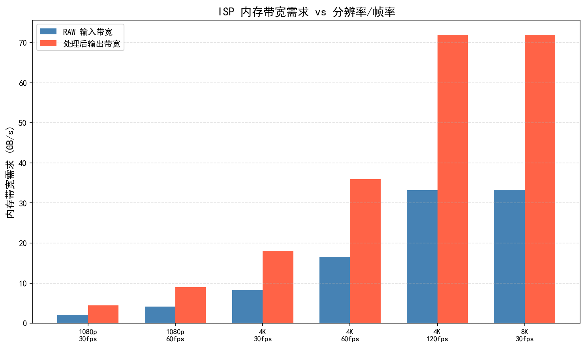
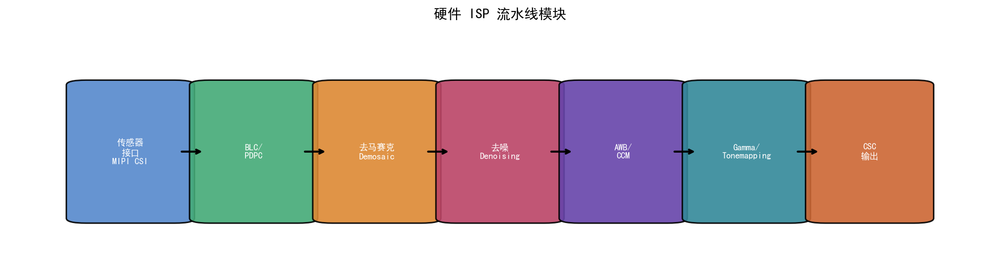
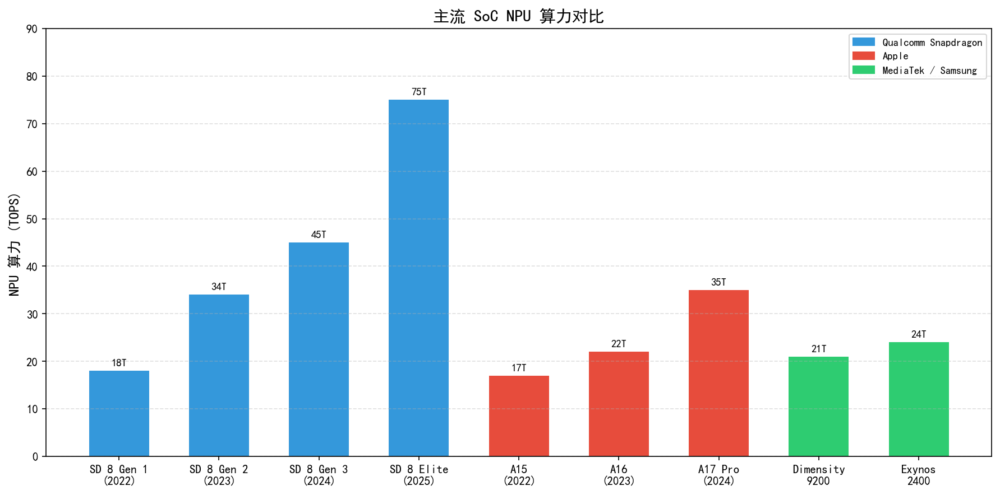
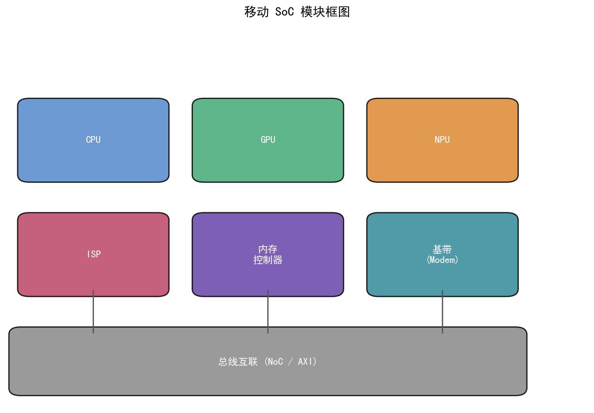
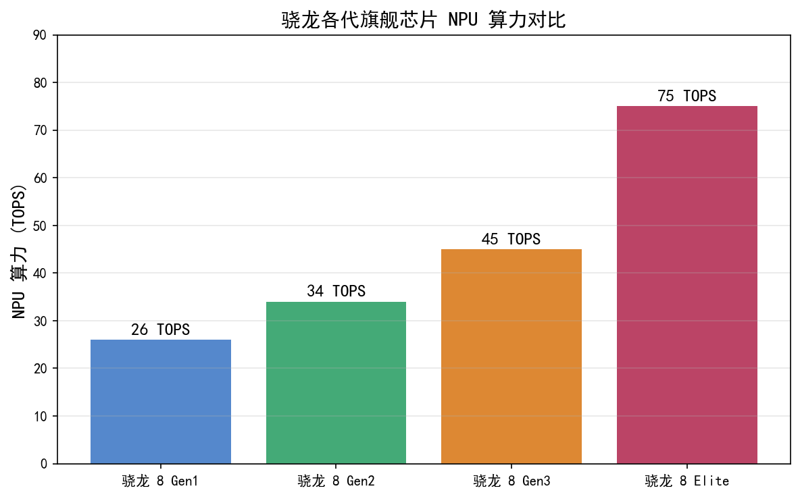

# 第一卷第10章：SoC 与相机硬件架构（SoC and Camera Hardware Architecture）

> **流水线位置（Pipeline position）：** 硬件基础——贯穿整个 ISP 处理链路
> **前置章节（Prerequisites）：** 第一卷第01章（ISP 总览）、第一卷第03章（传感器物理）
> **读者路径（Reader path）：** 系统工程师、算法工程师

---

> **本章与第四卷第12章的分工：**
> - **本章（第一卷第10章）**：**硬件物理层**——MIPI接口、ISP流水线硬件模块、带宽约束、存储器架构、NPU硬件算力
> - **第四卷第12章**：**软件框架层**——CamX-CHI架构、IFE/BPS/IPE软件节点、FeaturePipe DAG、Camera HAL、调参工具链（CIQT/QXDM/MTK Camera Tool）、Chromatix参数格式

---

## 概述

算法工程师提出一个新的多帧融合方案，性能测试很漂亮，但硬件 ISP 跑不起来——带宽不够，或者 DDR 读写延迟超出了流水线时序窗口。这类问题在 SoC 选型和 pipeline 设计阶段就能预见，前提是理解芯片内部的数据流动方式。

本章的核心是相机子系统的硬件约束：MIPI 接口带宽、ZSL 缓冲区内存占用、NPU 算力与 ISP 协同的调度逻辑。这些约束不是参数表上的数字，是决定算法能否落地的工程边界。

---

## §1 原理（Theory）

### 1.1 移动 SoC 相机子系统架构

#### 1.1.1 整体拓扑

现代移动 SoC 的相机子系统可以抽象为以下链路：

```
图像传感器 → MIPI CSI 接口 → ISP 前端（RAW 处理）→ 片上 SRAM/DDR →
ISP 后处理 → 视频编码器（H.265/AV1）→ 显示子系统
                    ↓
              NPU/DSP（AI 处理）
```

相机子系统通常包含以下核心组件：
- **MIPI CSI 控制器（Camera Serial Interface Controller）**：将传感器的高速串行差分信号转换为片内并行总线数据。
- **硬件 ISP 流水线（Hardware ISP Pipeline）**：实现 BLC、DPC、LSC、Demosaic、NR、CSC 等全套 RAW 到 YUV 的处理。
- **统计引擎（Statistics Engine）**：并行采集 AE/AWB/AF 所需的曝光直方图、颜色统计、相位检测数据。
- **帧缓存管理器（Frame Buffer Manager）**：管理 ZSL（Zero Shutter Lag，零快门延迟）环形缓冲区，协调多帧 RAW 的读写。
- **DMA 控制器（Direct Memory Access Controller）**：在 ISP、NPU、编码器之间高效搬运图像数据，无需 CPU 介入。

#### 1.1.2 MIPI CSI-2 接口

MIPI CSI-2（Camera Serial Interface 2）是目前移动端最主流的传感器接口标准，由 MIPI 联盟（MIPI Alliance）制定并持续演进。

**物理层（PHY）选择：**

- **D-PHY**：差分对形式，每条 Lane 支持最高 4.5 Gbps（MIPI D-PHY v2.1）**[2]**，传统设计，绝大多数 Sony、Samsung 传感器均支持。4-Lane D-PHY 可提供理论峰值 18 Gbps 带宽，足够 4K@60fps RAW10 传输（约 7.9 Gbps）。
- **C-PHY**：三线制符号编码，每 Trio 可达 6.0 Gsps（MIPI C-PHY v2.1）**[2]**，等效约 13.7 Gbps/Trio，以更少的 IO Pin 换取等效带宽，适合超高分辨率场景。高通 Snapdragon 8 Gen 系列及苹果 A 系列均支持 C-PHY。

**Lane 配置：**

| 配置 | 典型场景 | 理论带宽（D-PHY v2.1，4.5 Gbps/lane） |
|------|----------|--------------------------------------|
| 1-Lane | 深度/ToF 传感器 | 4.5 Gbps |
| 2-Lane | 前摄（<50MP） | 9.0 Gbps |
| 4-Lane | 后摄主摄（>50MP） | 18.0 Gbps |
| 2×4-Lane | 双摄同步输入 | 36.0 Gbps |

CSI-2 协议层采用短包（Short Packet）传输行同步、帧同步信号，长包（Long Packet）传输像素数据。数据类型（Data Type）字段区分 RAW8/RAW10/RAW12/RAW14/RAW16 等格式。RAW10 是目前移动端最常见的传感器输出格式，兼顾动态范围与带宽。

**MIPI CSI-3（UniPro/M-PHY）** 曾被提出用于汽车、AR/VR 等对可靠性要求更高的场景，但实际并未大规模商用。当前汽车摄像头的主流方向是 **MIPI A-PHY**（长距离 SerDes，最远支持 15 m 线缆，单通道可达 16 Gbps）**[2]**，移动消费端目前仍以 CSI-2 为主。

#### 1.1.3 ZSL 缓冲区管理

ZSL（Zero Shutter Lag）是实现"拍即所得"的关键机制。其核心思路是：ISP 在预览状态下持续将处理后的（或部分处理的）RAW 帧写入一个环形缓冲区（Circular Buffer），当用户按下快门时，从缓冲区中选取时间戳最接近快门触发时刻的帧进行后处理，而无需等待传感器重新曝光。

ZSL 缓冲区的深度直接影响选帧质量和内存占用：
- 典型配置：保存最近 5～10 帧 RAW。
- 单帧 RAW 大小（50MP, RAW10 packed）≈ 50M × 1.25 B = **62.5 MB**（RAW10 packed 每像素 10 bit，4 像素打包为 5 字节，即 1.25 B/pixel）**[1]**。
- 10 帧缓冲 ≈ **625 MB DDR 占用**，在 LPDDR5-6400 双通道系统（峰值带宽约 102 GB/s）中约消耗总带宽的 10%～15% 。

为降低 DDR 压力，主流 SoC 普遍采用 **MFNR（Multi-Frame Noise Reduction，多帧降噪）** 流水线与 ZSL 结合：ZSL 缓存 3～4 帧欠曝 RAW，触发快门时在硬件 ISP 或 NPU 上完成多帧配准与融合，再进行全分辨率后处理。

#### 1.1.4 存储器带宽约束

存储器带宽是相机子系统的硬性天花板。以 4K@60fps（RAW10 packed，单帧 ≈ 3840×2160×1.25 B ≈ **10.4 MB**）为例：

- **读带宽**（ISP 从 DDR 读取 RAW）：10.4 MB × 60 ≈ **0.62 GB/s**（单路）
- **写带宽**（ISP 将 YUV 写回 DDR）：4K NV12@60fps ≈ 3840×2160×1.5B×60 ≈ **0.75 GB/s**
- **ZSL + MFNR 附加带宽**：~1～3 GB/s（多帧缓存读写）

实际旗舰机型通常同时运行主摄 + 长焦 + 超广三路传感器预览，多路并行时整体相机 RAW 读写带宽合计可达 **8～15 GB/s**，叠加显示、编码等子系统后，相机子系统占整颗 SoC 内存总带宽（LPDDR5-6400 双通道约 102 GB/s，LPDDR5x-8533 双通道约 136 GB/s）的 10%～20% 。因此 SoC 厂商为相机子系统设置专用 **片上 SRAM 缓存（On-chip SRAM Buffer）**——Qualcomm Spectra 拥有数十 MB 专用 SRAM，用于流水线级间缓存，大幅降低 DDR 访问频率。

---

### 1.2 主流平台 ISP 硬件能力对比

下表汇总 2023—2024 年主流旗舰 SoC 的 ISP 能力（数据来源：各厂商公开白皮书及发布会技术文档）**[3][4][6]**。NPU 算力数值以 INT8 TOPS 为准，各厂商官方公布数值：Snapdragon 8 Elite ≈ **65 TOPS**（Qualcomm 官方宣称较 8 Gen 3 提升 45%，8 Gen 3 为 45 TOPS，推算约 65 TOPS），Dimensity 9300 APU 790 = **33 TOPS**（MediaTek 官方规格），A18 Pro Neural Engine = **35 TOPS**（与 A17 Pro 相同，Apple 官方口径为"16核神经网络引擎，每秒 35 万亿次运算"，两代未提升 TOPS 整数）：

| 指标 | Qualcomm Spectra<br>（Snapdragon 8 Elite） | HiSilicon ISP<br>（Kirin 9000S） | MediaTek Imagiq<br>（Dimensity 9300） | Apple ISP<br>（A18 Pro） | Samsung ISOCELL<br>（Exynos 2400） |
|------|------------------------------------------|----------------------------------|---------------------------------------|--------------------------|-----------------------------------|
| **ISP 核心数** | 3 ISP（Spectra triple ISP） | 双核 ISP | 双核 ISP（Imagiq 990） | 双 ISP（未公开核心数） | 5核 ISP |
| **最大分辨率支持** | 320 MP（单摄） | 200 MP | 320 MP | ~200 MP | 200 MP |
| **最大吞吐量** | ~4300 Mpix/s | ~2400 Mpix/s | ~4300 Mpix/s | ~未公开（≥3000 Mpix/s） | ~3500 Mpix/s |
| **视频 4K 帧率** | 4K@120fps（H.265） | 4K@60fps | 4K@60fps | 4K@120fps（ProRes） | 4K@60fps |
| **HDR 堆叠帧数** | ≥4 帧（MFNR+HDR） | 3 帧（三帧 HDR） | 4 帧 | ≥3 帧 | 3 帧 |
| **RAW bit depth** | RAW16（内部）/ RAW10 输出 | RAW14 | RAW16（内部） | RAW（Apple ProRAW）16bit | RAW16 |
| **AI 加速集成** | Hexagon NPU（**约65 TOPS**，Qualcomm 官方宣称较 8 Gen 3 提升 45%；8 Gen 3 为 45 TOPS）协同 | 达芬奇 NPU（20 TOPS） | APU 790（**33 TOPS**，MediaTek 官方规格） | Neural Engine（**35 TOPS**）深度绑定 | MCD NPU（**~34.7 TOPS**，三星官方） |
| **MIPI 支持** | D-PHY + C-PHY | D-PHY（CSI-2） | D-PHY + C-PHY | D-PHY + C-PHY | D-PHY |
| **典型功耗（4K拍摄）** | ~1.8 W（ISP 子系统） | ~2.1 W | ~1.7 W | ~1.5 W（估算） | ~2.0 W |

**点评：**

- **高通 Spectra（8 Elite）**：三路并行 ISP 是旗舰特性，支持同时驱动广角+长焦+超广三颗传感器并行 ISP 处理，不存在切换延迟 **[3]**。Hexagon NPU 与 ISP 共享同一套 DMA 总线，ISP 帧数据到 NPU 的 DMA 传输延迟可控制在 1 ms 以内（AINR 推理本身通常需要 10～25 ms）。
- **苹果 A18 Pro**：ISP 与 Neural Engine 紧耦合，ProRAW/ProRes 工作流完全在硬件固化流水线上完成，软件可干预空间最小但延迟最低。Photonic Engine 将 AI 深度融入 RAW 处理阶段（而非后处理阶段），这是其画质领先的关键架构差异。
- **联发科 Imagiq 990**：引入了专用的 **AISP（AI ISP）** 概念，将 AI 去噪固化为 ISP 流水线的一个硬件阶段，而非依赖 APU 旁路处理，延迟与功耗均优于纯软件方案 **[4]**。
- **华为 Kirin 9000S**：受制裁影响，制程工艺落后（7nm），功耗相对偏高，但 ISP 算法积累深厚，在肤色还原和夜景 HDR 的调校上仍有竞争力。
- **OPPO MariSilicon X（独立 NPU/ISP 辅助芯片）**：OPPO 于 2021 年推出的自研 6nm 专用图像芯片，不是主 SoC 而是独立的协处理器（co-processor）。其主要功能是 RAW 域 AI 降噪和 HDR 处理，通过独立的 AI Pipeline 与主 SoC（如高通 Snapdragon）并行工作，具备 18 TOPS INT8 算力（OPPO 官方数据），专用于夜景 4K 视频 AI NR。MariSilicon X 的架构亮点是内置大容量 SRAM（片上 Memory）直接缓存 RAW 帧，避免 RAW 数据频繁落 DDR，在多帧 RAW NR 场景下功耗优势显著。后续 MariSilicon Y 进一步提升为 20 TOPS（OPPO 官方数据，2022 发布）。这一路线代表了手机厂商通过自研"异构 ISP 协处理器"扩展主 SoC ISP 能力的典型实践。

---

### 1.3 硬件 ISP 流水线关键模块

硬件 ISP 流水线是一条固定功能（Fixed-Function）的处理链，各模块按像素流顺序排列，每个模块均有可程序化的寄存器参数。以典型的 RAW-to-YUV 全流水线为例：

#### 1.3.1 RAW 处理前端

**BLC（Black Level Correction，黑电平校正）**

传感器输出的 RAW 数据含有系统性暗偏置（Dark Offset），硬件 BLC 模块在每帧行开始时从 OTP（One-Time Programmable）中读取 R/Gr/Gb/B 四通道黑电平值，执行逐像素减法并裁剪至零下限。BLC 是所有后续处理的基准，误差 1 DN 将在后续 CCM 步骤放大约 3～5 倍。

**DPC（Defect Pixel Correction，缺陷像素校正）**

制造良率原因，每颗传感器均存在数量不等的坏点（Hot Pixel、Dead Pixel、Stuck Pixel）。硬件 DPC 通过 OTP 中存储的坏点坐标表（静态 DPC）和实时邻域对比（动态 DPC）双路处理，将缺陷像素替换为邻域中值或加权均值。高端实现支持 **3×3 中值滤波** 动态检测，可处理制造后新出现的坏点。

**LSC（Lens Shading Correction，镜头阴影校正）**

镜头的余弦四次方衰减和微透镜排列误差导致图像边角亮度/颜色低于中心。LSC 硬件模块存储一张稀疏增益网格（Grid Mesh，典型 33×33 节点），通过双线性插值为每个像素计算 R/Gr/Gb/B 四通道增益并相乘。网格系数在出厂标定时写入 OTP/EEPROM，部分 SoC 支持运行时根据变焦系数实时切换 LSC 表。

**Demosaic（去马赛克 / 色彩重建）**

Bayer 传感器每个像素只记录一种颜色分量，Demosaic 从邻域像素插值重建完整 RGB。硬件实现通常采用改进型 AHD（Adaptive Homogeneity-Directed）或 MLRI（Malvar-He-Cutler）算法，在 5×5 核内完成，延迟约 3～5 个时钟周期 。相比软件实现，硬件 Demosaic 在 1000 Mpix/s 吞吐下功耗仅约 50 mW，是纯 CPU 实现的 1/100 。

#### 1.3.2 统计引擎

统计引擎与 ISP 主流水线并行运行，每帧采集以下数据供 3A 控制器使用：

- **AE 统计（Auto Exposure Statistics）**：将图像划分为 N×M（典型 16×16 或 32×32）个统计块（Zone），每块输出 Y/G 通道像素值累加和，供 AE 算法计算平均亮度和局部曝光偏差。
- **AWB 统计（Auto White Balance Statistics）**：同块输出 R、G、B 累加和，供灰世界/完美反射/统计 AWB 算法计算色温偏移。部分 SoC 还输出 **R/G、B/G 比值直方图**，加速色温聚类。
- **AF 统计（Auto Focus Statistics）**：对图像特定感兴趣区域（ROI）计算高频对比度（Sobel/Laplacian）能量，供 CDAF（Contrast Detection AF）算法使用；PDAF（Phase Detection AF）数据则由传感器直接以独立数据流输出，经 ISP 解析后送至 AF 控制器。

#### 1.3.3 后处理模块

**NR（Noise Reduction，降噪）**

硬件 NR 通常分两级：空域 NR（SNR，Spatial NR）和时域 NR（TNR，Temporal NR）。SNR 在 RAW 域或 YUV 域使用双边滤波/引导滤波去除噪声，单帧内完成。TNR 需要跨帧运动补偿，通常借助 **ME/MC（Motion Estimation/Compensation，运动估计/补偿）** 硬件块，将当前帧与参考帧配准后加权融合，是夜景降噪效果的关键。

**锐化（Sharpening）**

硬件锐化模块通过非锐化掩模（Unsharp Mask）或自适应锐化实现，典型核大小 5×5 或 7×7，支持按频段分级调节（低频保护，高频增强）。

**CSC（Color Space Conversion，色彩空间转换）**

将 RGB 转换为 YCbCr（BT.601/BT.709/BT.2020）是输出前的最后一步，硬件实现为固化的 3×3 矩阵乘法，延迟约 1 个时钟周期。

#### 1.3.4 输出格式

| 格式 | 描述 | 典型用途 |
|------|------|----------|
| **NV12** | YUV 4:2:0，Y平面 + UV交织平面，8bit | 预览、视频录制、AI推理输入 |
| **NV21** | YUV 4:2:0，Y平面 + VU交织平面，8bit | Android Camera HAL 默认格式 |
| **P010** | YUV 4:2:0，10bit，高动态范围显示 | HDR 视频、Pro 视频模式 |
| **HEIF/HEVC** | 硬件编码后的静态图像 | 最终存储格式 |
| **RAW10/RAW16** | 未处理 RAW，Pack 或 Unpack | RAW 拍摄、后期处理 |

---

### 1.4 NPU/DSP 与 ISP 的协同处理

#### 1.4.1 何时卸载到 NPU

硬件 ISP 流水线是固定功能的，其算法复杂度受制于芯片流片时确定的逻辑结构。随着 AI 算法在降噪、超分、语义分割等任务上超越传统算法，NPU 作为可编程的 AI 加速器成为 ISP 能力的重要扩展。

典型的 NPU 卸载场景包括：

| 任务 | 触发条件 | 延迟要求 |
|------|----------|----------|
| **AI 降噪（AINR）** | 夜景模式，ISO > 1600 | ≤ 33 ms（30fps 预算内） |
| **AI 超分（SR）** | 数字变焦 > 2×，分辨率提升 | ≤ 50 ms |
| **人像分割** | 人像/背景虚化模式 | ≤ 16 ms（60fps） |
| **HDR 融合（基于 CNN）** | 高对比场景，静态背景 | ≤ 100 ms（单次拍照可接受） |
| **RAW 域去噪（Raw Denoise）** | 专业/ProRAW 模式 | 离线处理，延迟不敏感 |

NPU 卸载的关键权衡是：AI 处理的画质提升 vs. 流水线延迟增加 vs. 额外功耗。在实时预览（Preview）路径上，33ms 的帧间隔为强约束；而拍照后处理（Capture Post-Processing）路径则可容忍 200ms 甚至更长。

#### 1.4.2 DMA 传输机制

ISP 与 NPU 之间的数据传输依赖 **SMMU（System Memory Management Unit，系统内存管理单元）** 保护的共享物理内存区域，通过 DMA 引擎实现零拷贝（Zero-Copy）传输：

1. ISP 完成 YUV 处理后，通过 DMA 将结果写入共享 DDR Buffer，同时发出中断信号。
2. NPU 驱动接收中断，将 Buffer 物理地址映射至 NPU 虚拟地址空间，启动推理任务。
3. NPU 将推理结果（如去噪后的 YUV 或分割 Mask）写回另一 DDR Buffer，通知 CPU/Display 子系统。

整个传输链路中，DDR 往返延迟约 **1～3 ms**（取决于 DDR 频率和总线竞争），远小于 NPU 推理本身的延迟。

#### 1.4.3 联发科 AISP 架构

联发科 Imagiq 系列引入的 AISP 概念将 AI 网络直接固化（Hardened）为 ISP 硬件阶段，本质上是将一个轻量级 CNN 用专用硬件逻辑实现，而非在通用 APU 上运行。其优势在于：
- **延迟确定性**：固化硬件无调度抖动，延迟固定约 2～5 ms **[4]**。
- **功耗更低**：专用逻辑比通用 APU 效率高 5～10 倍 **[4]**。
- **不占用 APU 算力**：APU 可同时执行其他 AI 任务（如人脸识别）。

代价是算法灵活性受限——深层网络结构无法通过固件升级更换（需重新流片），部分超参数可借助 ISP 固件调整，但整体不如 APU 灵活。

> NPU 算力规格（TOPS）、INT8 量化推理流程、各平台 NPU 与 ISP 的软件接口及调度策略，软件框架层详见 → **第四卷第12章 §1.3**。

---

### 1.5 MIPI 接口与传感器连接详解

#### 1.5.1 D-PHY vs C-PHY 物理层对比

| 特性 | D-PHY v2.1 | C-PHY v2.1 |
|------|------------|------------|
| 信号线 | 差分对（2 线/Lane） | 三线符号（3 线/Trio） |
| 最大速率/通道 | 4.5 Gbps/Lane | 6.0 Gsps/Trio（≈13.7 Gbps等效，MIPI Alliance 官方规格） |
| 4-Lane/4-Trio 总带宽 | 18 Gbps | ~54.8 Gbps |
| EMI 特性 | 相对较高 | 展频编码，EMI 更低 |
| 传感器支持 | 绝大多数主流传感器 | 高通/苹果平台专用传感器 |
| PCB 布线复杂度 | 低（2 线对称） | 高（3 线等长匹配） |

#### 1.5.2 双摄硬件同步

多摄系统（主摄 + 长焦 + 超广）要求帧同步（Frame Sync）和曝光同步（Exposure Sync）以避免视差和闪光不一致：

- **帧同步**：SoC 通过 GPIO 向各传感器发送 FSIN（Frame Sync Input）脉冲，确保各路 VSYNC 在 ±1 行内对齐。
- **曝光同步**：各路传感器的曝光时间由 ISP 通过 I²C/I³C 总线统一下发，避免一路闪光、另一路无闪光的色偏问题。
- **延迟匹配**：不同焦距传感器的行时间（Line Time）可能不同，ISP 的 VC（Virtual Channel）分路机制允许独立处理各路数据流，内部时序对齐由帧缓存管理器负责。

高通 Spectra 三 ISP 架构的一个核心优势正是三路独立 ISP 可同步运行，无需时分复用，消除了切摄像头时的"跳帧"感。

---

## §2 标定（Calibration）

### 2.1 传感器时序标定

传感器的时序参数（行时间、帧时间、读出时序）在出厂前需要精确标定，以确保 ISP 的各统计引擎与像素读出严格同步：

**行时间（Line Time）标定：**
- 通过向传感器注入已知频率的参考信号，测量 HSYNC 实际周期，计算实际行时间 `t_line`（单位 μs）。
- 典型移动端传感器行时间约 **4～10 μs**，4K 分辨率帧时间约 **16～25 ms**（40～60 fps）。
- 行时间误差 > 0.1% 将导致曝光量计算偏差，引起 AE 振荡 。

**卷帘快门（Rolling Shutter）时序标定：**
- 卷帘快门传感器逐行曝光，第一行与最后一行之间存在时间差（Frame Readout Time）。
- 需标定 `t_readout` 并写入驱动，供 EIS（Electronic Image Stabilization，电子防抖）和运动去模糊算法使用。
- 典型 50MP 传感器 `t_readout` ≈ **8～12 ms** 。

### 2.2 多摄硬件同步标定（帧同步、曝光同步）

多摄系统投产前需完成以下同步标定：

1. **帧相位对齐标定（Frame Phase Alignment）：**
   - 使用示波器或逻辑分析仪测量各路 VSYNC 上升沿时差，调整 FSIN 延迟寄存器至时差 < 1 行时间。
   - 量产测试通过自动化 ATE（Automatic Test Equipment）完成，判定标准通常为 VSYNC 时差 < 50 μs 。

2. **曝光量一致性标定（Exposure Consistency Calibration）：**
   - 在均匀光照灯箱中同时拍摄，对比主摄与长焦的平均亮度偏差，调整增益补偿 LUT（Look-Up Table）。
   - 目标：主摄与长焦在相同场景下亮度差异 < 1 EV（实际量产标准通常 < 0.3 EV）。

3. **色温一致性标定：**
   - 在 D65 标准光源下采集各路传感器数据，对比 AWB 收敛后的色温偏差，调整各路 CCM（Color Correction Matrix，颜色校正矩阵）。

### 2.3 OTP/EEPROM 中的标定数据存储

每颗摄像头模组在出厂标定完成后，将标定数据烧写至 **OTP（One-Time Programmable，一次可编程存储器）** 或外挂 **EEPROM（Electrically Erasable Programmable Read-Only Memory）**：

| 数据类型 | 典型大小 | 存储位置 |
|----------|----------|----------|
| BLC 黑电平（R/Gr/Gb/B） | 8 bytes | OTP |
| WB 增益（在 D65/A 光源下的 R/G/B 增益） | 24 bytes | OTP |
| LSC 网格（33×33×4通道） | ~17 KB | OTP/EEPROM |
| AF 零位偏置（VCM DAC Code） | 4 bytes | OTP |
| 坏点列表（DPC Table） | 可变，典型 < 512 bytes | OTP |
| 几何畸变系数（K1, K2, P1, P2） | 32 bytes | OTP/EEPROM |
| 模组序列号/版本 | 16 bytes | OTP |

OTP 容量通常为 **256 bytes ～ 4 KB**，仅存储关键参数；LSC 网格等较大数据通常存于 EEPROM（典型 16KB～64KB）。Camera HAL 在相机初始化时读取 OTP/EEPROM 数据，通过 I²C 总线传输到 ISP 寄存器。

---

## §3 调参（Tuning）

### 3.1 ISP 硬件 pipeline 的调参工具

各 SoC 厂商均提供配套的 ISP 调参工具，将 ISP 内部数百个寄存器参数封装为可视化调节界面：

**高通 Chromatix（Snapdragon Camera Tuning Tool）：**
- 覆盖 BLC、LSC、Demosaic、NR、AWB、CCM、Gamma、GTM（全局色调映射）、LTM（局部色调映射）等全套模块。
- 支持在线实时调节（通过 USB 连接手机，实时下发参数并预览效果）和离线 XML 参数包导出。
- 参数以 **Chromatix XML** 格式存储，集成进 Camera HAL 的 tuning 框架（QCamera3）。
- 典型调参周期：全套从零到量产约 3～4 个月（含各场景、各光源的回归测试）。

**联发科 PQTool（Picture Quality Tool）：**
- 图形化界面支持实时 ISP 参数调节，集成 ColorTuning 和 NRTuning 两大模块。
- 支持基于场景的参数包（Scene-based Tuning Pack）切换，适配日景、夜景、HDR 等不同场景。

**海思调图工作室（Tuning Studio）：**
- 华为 HiSilicon 的配套工具，界面更接近工程调试风格。
- 深度集成达芬奇 NPU 参数，支持 AI 降噪网络的推理参数同步调节。

**通用原则：**
调参本质上是在以下三个维度之间寻找平衡：
1. **噪声抑制** vs. **细节保留**（NR 强度 vs. 锐化强度）
2. **色彩饱和度** vs. **肤色自然度**（饱和度增益 vs. 肤色保护 LUT）
3. **高光压缩** vs. **暗部提升**（GTM/LTM 曲线的 S 型调节）

> 调参工具的详细使用方法、Chromatix XML 格式、CamX Pipeline XML 配置以及各平台 OTA 参数版本管理，软件框架层详见 → **第四卷第12章 §3**。

### 3.2 功耗与性能权衡

ISP 的功耗主要来源：
- **DDR 访问功耗**：每次 DDR 读写约消耗 5～10 pJ/bit（LPDDR5 量级估算，因速率档位、电压及系统实现而异），是 ISP 总功耗的主要来源（40%～60%）。
- **片上逻辑计算功耗**：Demosaic、NR、统计引擎等的组合逻辑翻转功耗（约 20%～30%）。
- **时钟树功耗**：ISP 核心时钟（典型 600 MHz ～ 1 GHz）的动态功耗（约 10%～20%）。

**功耗优化策略：**
- **时钟门控（Clock Gating）**：未使用的 ISP 模块（如视频模式下关闭 JPEG 编码器）关闭时钟。
- **动态频率调节（DVFS）**：预览时降频至 400 MHz，拍照触发时升频至最高 1 GHz。
- **片上 SRAM 缓存最大化**：减少 DDR 访问次数（ISP 内部 SRAM 访问功耗约为 DDR 的 1/20）。
- **分辨率绑定帧率**：4K@30fps 比 4K@60fps 功耗低约 40%，是功耗敏感场景的首选 。

### 3.3 帧率与分辨率的硬件约束

ISP 吞吐量（Throughput）决定了在给定分辨率下能达到的最高帧率：

```
最大帧率 = ISP 吞吐量 (Mpix/s) / 分辨率 (Mpix/帧) × 效率系数（0.8～0.9）
```

以高通 Spectra（8 Elite，~4300 Mpix/s）为例：

| 分辨率 | 理论最大帧率 | 实际可用帧率（效率0.85） |
|--------|-------------|------------------------|
| 200 MP（14998×13352） | 21 fps | ~18 fps |
| 50 MP（8192×6144） | 86 fps | ~73 fps |
| 12 MP（4000×3000） | 358 fps | ~304 fps（受 MIPI 带宽限制） |
| 4K（3840×2160） | 517 fps | 实际受限于视频编码器，最高 120 fps |

MIPI 带宽同样是硬性约束：4-Lane D-PHY v2.1 @ 4.5 Gbps 的 RAW10 有效带宽约 16 Gbps（扣除协议开销后约 14 Gbps），200MP@30fps 等超高分辨率高帧率场景若仍超出范围，则需切换至 C-PHY 或压缩 RAW（DPCM 编码）。

---

## §4 局限性与性能边界（Limitations）

### 4.1 带宽不足导致的丢帧（Frame Drop）

**现象：** 预览或录像时出现帧率不稳定，偶发性跳帧（Frame Skip），视觉感受为画面抖动或卡顿。

**根本原因：** ISP 的 DDR 写请求与其他子系统（GPU、显示、编码器）竞争总线带宽，导致 ISP 写帧缓冲超时，触发帧丢弃机制。

**诊断方法：**
- 通过 SoC 厂商提供的 **DDR 带宽监控工具**（如高通的 Snapdragon Profiler）采集各 Master 的带宽占用。
- 若 ISP Master 的带宽占用持续接近 QoS（Quality of Service，服务质量）上限，即可确认为带宽瓶颈。

**解决方案：**
- 提升 ISP DDR QoS 优先级（通常通过 DT/DTSI 节点配置 `qcom,axi-max-bw` 等参数）。
- 降低其他子系统（如 GPU 游戏渲染）的带宽分配。
- 使用 DPCM（Differential Pulse Code Modulation，差分脉冲编码调制）压缩 RAW，降低 MIPI 和 DDR 带宽需求约 30%～40% 。

### 4.2 时序不对导致的撕裂（Tearing）

**现象：** 图像出现水平撕裂线，撕裂线上下区域亮度或颜色不连续，快速移动场景下更明显。

**根本原因：** ISP 向 Display 或编码器提供的帧缓冲在写入过程中被提前读取，形成 **双缓冲竞争（Double Buffer Conflict）**。另一种情况是多路传感器 VSYNC 未对齐，导致 ISP 在处理一帧时收到下一帧的中断，错乱了行缓存（Line Buffer）的读写指针。

**解决方案：**
- 启用 **三缓冲（Triple Buffering）** 机制，确保 ISP 写缓冲、显示读缓冲、备份缓冲三者独立。
- 检查 FSIN 硬件同步信号的上升沿时序，确保多路 VSYNC 时差 < 1 行时间。

### 4.3 NPU-ISP 流水线气泡（Pipeline Bubble）

**现象：** 启用 AI 降噪（AINR）后，预览帧率从 30 fps 降至 20～25 fps，或出现周期性延迟（每隔数帧出现一次显著延迟）。

**根本原因：** NPU 推理时间（典型 15～25 ms）长于 ISP 一帧处理时间（典型 8～12 ms），造成下游消费者（Display 子系统）等待 NPU 结果时形成"气泡"（Pipeline Bubble）。

**解决方案：**
- **异步处理（Async Processing）**：NPU 处理与 ISP 处理并行，NPU 处理第 N-1 帧时，ISP 同时处理第 N 帧，Display 显示第 N-2 帧。代价是引入 1～2 帧的固定延迟（Latency），但不影响帧率。
- **轻量化 AI 模型**：使用 INT8 量化、网络剪枝将 AINR 模型推理时间压缩至 10 ms 以内，消除气泡。
- **降采样推理（Downscale Inference）**：对 1/4 下采样图执行 AI 降噪，再上采样融合，推理时间降低约 75%。

---

## §5 评测（Evaluation）

### 5.1 ISP 吞吐量测试（Mpix/s）

ISP 吞吐量是衡量硬件能力的核心指标，标准化测试方法如下：

**测试方法：**
1. 配置传感器以最大支持分辨率输出 RAW，关闭所有 AI 附加处理（纯硬件 ISP 流水线）。
2. 用 `systrace` 或 SoC 厂商的性能分析工具记录 ISP 完成一帧处理的时间戳差值。
3. 计算公式：`吞吐量 (Mpix/s) = 分辨率 (Mpix) / 帧处理时间 (s)`
4. 测量条件：常温（25°C）、满载稳定运行 5 分钟后取稳态值（排除热节流影响）。

**典型测试结果（2023～2024 旗舰）：**

| 平台 | 测试分辨率 | 稳态吞吐量 |
|------|-----------|-----------|
| Snapdragon 8 Elite | 200MP | ~3800 Mpix/s（热节流后） |
| Dimensity 9300 | 200MP | ~3500 Mpix/s |
| Apple A18 Pro | 48MP（等效） | 未公开，估算 ≥3000 Mpix/s |

### 5.2 延迟测试（快门延迟、预览延迟）

**快门延迟（Shutter Lag）：**

快门延迟定义为从用户触摸快门按钮到图像数据写入存储完成的时间差。测量方法：
- 使用高速摄像机（1000 fps）同步录制屏幕与参考光源变化，帧级精度分析延迟。
- 典型现代旗舰 ZSL 快门延迟 **< 100 ms**（含选帧 + ISP 后处理 + JPEG 编码 + 写文件）。
- 非 ZSL 场景（首次冷启动拍照）延迟 **300 ms ～ 800 ms** 。

**预览延迟（Preview Latency / End-to-End Latency）：**

从传感器曝光结束到画面呈现在屏幕上的时间，包含 MIPI 传输、ISP 处理、Display 合成、屏幕扫描各环节：

```
总预览延迟 = t_MIPI + t_ISP + t_DMA + t_Display + t_Panel_scan
           ≈ 3ms  + 8ms  + 2ms  + 4ms    + 8ms
           ≈ 25 ms（典型值）
```

旗舰级表现目标：**< 30 ms**（相当于 1 帧 @ 33 fps 以内）。

### 5.3 功耗测试

功耗测试在标准测试场景下使用高精度电流计（如 Monsoon Power Monitor，精度 0.1 mA）测量：

| 场景 | 典型功耗（整机相机子系统） |
|------|--------------------------|
| 1080p@30fps 预览（无 AI） | 650～900 mW |
| 4K@60fps 预览（无 AI） | 1.5～2.0 W |
| 4K@60fps 录制（H.265 HW编码） | 1.8～2.5 W |
| 200MP 单帧 RAW 拍照后处理 | 峰值 3～5 W，持续 0.5～1.5 s |
| 夜景 MFNR（4帧融合 + AINR） | 峰值 4～6 W，持续 2～4 s |

**功耗优化验证方法：**
- 比较开启/关闭 AINR 的功耗差值，量化 NPU 增量功耗。
- 使用 `perfetto` 或 `simpleperf` 采集 CPU/GPU/NPU 负载，定位功耗热点。

---

## §6 代码

本章配套代码（见本目录 .ipynb 文件），涵盖以下演示：

- **MIPI CSI-2 带宽计算器**：输入分辨率、帧率、RAW bit depth，输出所需 Lane 数与 D-PHY/C-PHY 选型建议。
- **ZSL 缓冲区大小计算**：输入分辨率、帧率、缓冲帧数，输出 DDR 占用与带宽需求。
- **ISP 吞吐量估算模型**：基于公开数据建立各平台吞吐量模型，预测给定分辨率的最大帧率。
- **NPU-ISP 流水线气泡仿真**：模拟不同 NPU 推理延迟下的帧率与端到端延迟表现。

---

> **读者路径说明：第一卷 ch11–ch17 为选读章节**
>
> ch11–ch17 覆盖同色异谱（Metamerism）、深度感知、全光场相机、高光谱成像、无镜头相机、神经形态相机、传感器 Binning 等专题。这些内容面向传感器研究员、光学工程师和前沿成像方向的研究者，不是手机 ISP 工程入门的必读路径。
>
> **如果你的目标是手机 ISP 工程实践**，可以跳过 ch11–ch17，直接进入第二卷（传统 ISP 流水线）。ch11–ch17 作为参考资料，在遇到具体问题时再回来查阅即可。

---

> **工程师手记：SoC ISP硬件能力的选型与多摄调度**
>
> **高通Spectra 780与联发科Imagiq 890的流水线深度对比：** 高通Spectra 780（骁龙8 Gen 2配套）支持3路并发ISP实例，单路峰值吞吐约600 Mpixel/s，流水线深度达18级硬件块（包含独立的zHDR合帧引擎、hardware-accelerated NR、PDAF统计块）；联发科Imagiq 890（天玑9200配套）亦支持3路并发，单路峰值约500 Mpixel/s，流水线深度约14级，但其PDAF统计精度（支持2PD+PDAF融合）在弱光对焦速度上与高通互有优劣。实际调优时需注意：硬件级数越多，延迟越高（Spectra 780预览路径约18ms，Imagiq 890约14ms），低延迟预览场景下可能需要绕过部分硬件块。
>
> **硬件ISP固定顺序与软件ISP灵活性权衡：** 硬件ISP的处理顺序（BLC→LSC→DPC→PDPC→Demosaic→CCM→Gamma→NR→Sharpness）通常由芯片硬连线决定，无法重排。这在大多数场景下效率极高，但当算法研究需要在Demosaic前做NR（raw domain NR）或在Gamma后做第二次CCM时，只能在CPU/GPU/DSP上做软件ISP旁路，带宽开销增加约30–50%。部分SoC提供"可编程ISP"模式（如高通的Hexagon ISP可编程扩展），但编程复杂度远高于传统HW ISP，调试周期通常增加2–4周。
>
> **多ISP实例用于双摄同步抓拍：** 手机主摄+超广角同步抓拍（用于HDR合帧或3D深度估计）需要两路ISP实例在同一帧时间窗口内同步输出RAW或YUV。若两路ISP共享同一处理引擎（time-multiplexed），同步误差可达1–3帧（33–100ms），会导致运动场景的视差图错位。真正的多ISP并发实例（dual-ISP instance）可将同步误差控制在 < 1ms，但SoC功耗相应增加约800mW。在产品设计时需与PMU团队协商功耗预算，避免双摄拍摄时触发热限流。
>
> *参考：Qualcomm Snapdragon 8 Gen 2 Product Brief（2022）；MediaTek Dimensity 9200 Imaging Whitepaper（2022）；MIPI CSI-2 Specification v3.0*

## 插图


*图1. 移动SoC ISP内存带宽需求分析（图片来源：作者自绘，参考Qualcomm Snapdragon 8 Elite架构白皮书）*


*图2. ISP硬件流水线功能模块架构图（图片来源：Nakamura, "Image Sensors and Signal Processing for Digital Still Cameras", CRC Press, 2006）*


*图3. 主流移动SoC（高通/联发科/苹果）ISP能力对比（图片来源：作者自绘）*


*图4. 移动SoC整体架构框图（含CPU/GPU/NPU/ISP各子系统）（图片来源：Qualcomm Technologies, "Snapdragon 8 Elite Mobile Platform Whitepaper", 2024）*


*图5. 各代移动SoC NPU算力演进对比（图片来源：作者自绘，参考各厂商技术规格）*

---

## 习题

**练习 1（理解）**
ZSL（零快门延迟）机制依赖一个持续运行的环形缓冲区。请说明：(a) ZSL 缓冲区深度（帧数）对"快门时刻对应帧"的选帧质量有何影响，深度太浅和太深各有什么问题？(b) 50MP 传感器以 RAW10 packed 格式输出单帧数据约多大（MB）？保存 10 帧 ZSL 缓冲需要多少 DDR 内存？(c) MFNR（多帧降噪）与 ZSL 结合时，通常选择欠曝帧还是正常曝光帧进行多帧融合，为什么？

**练习 2（计算）**
某手机相机子系统配置：4K@60fps 录像，RAW10 packed 格式，传感器分辨率 3840×2160。计算：(a) 单帧 RAW10 packed 数据量（字节），公式：像素数 × 1.25 B/pixel；(b) 60fps 下 MIPI CSI-2 总数据率（GB/s）；(c) 若使用 4-Lane D-PHY（每 Lane 4.5 Gbps），理论总带宽是多少，相比实际数据率有多少余量（百分比）？(d) 若 NPU 同时运行实时降噪（延迟需求 < 16.7 ms/帧），算法复杂度要求在 4K 单帧内完成计算，NPU 需要的有效算力（GOPS，假设每像素 20 次操作）至少是多少？

**练习 3（编程）**
用 Python 模拟相机带宽约束分析：(a) 定义一个函数 `calc_bandwidth(width, height, bit_depth, fps)`，计算 RAW 数据带宽（GB/s），其中 RAW10/12/14 的字节数分别乘以 1.25/1.5/1.75（packed 格式）；(b) 对以下组合批量计算并打印带宽表：分辨率 12MP/50MP/200MP，位深 RAW10/RAW12，帧率 30fps/60fps；(c) 标注哪些组合超出了 4-Lane D-PHY 18 Gbps 的理论上限，并给出需要切换到 C-PHY 或多路 CSI 才能支持的组合列表。

**练习 4（工程分析）**
高通骁龙 8 系列与联发科天玑 9 系列在 ISP 硬件架构上存在差异（本章 §2 的对比）。请分析：(a) 高通 IFE（Image Front End）与 MTK ISP 前端在多摄同步输入能力上的主要差异；(b) 为什么高通 ISP 在多帧 NR 场景中会引入更多 DDR 访问（ZSL 帧缓存路径），而 MTK 方案在某些场景下 DDR 带宽压力更小？(c) 当算法工程师在 MTK 平台上移植高通平台调好的多帧 HDR 参数时，哪些参数需要重新标定，哪些可以直接复用？

## 参考文献

[1] MIPI Alliance. MIPI CSI-2 Specification v4.0. MIPI Alliance, 2023.

[2] MIPI Alliance. MIPI D-PHY Specification v2.1 & C-PHY Specification v2.1. MIPI Alliance, 2022.（D-PHY v2.1 单 Lane 最高 4.5 Gbps；C-PHY v2.1 单 Trio 6.0 Gsps，等效约 13.7 Gbps）

[3] Qualcomm Technologies, Inc. Snapdragon 8 Elite Mobile Platform: Camera and AI Architecture Whitepaper. Qualcomm, 2024.

[4] MediaTek Inc. Dimensity 9300 Technical Brief: Imagiq 990 ISP Architecture. MediaTek, 2023.
[5] [https://www.mediatek.com/products/smartphones-2/dimensity-9300](https://www.mediatek.com/products/smartphones-2/dimensity-9300)
[6] Apple Inc. Apple A18 Pro Chip: ISP and Neural Engine Deep Dive (WWDC 2024 Tech Talk). Apple Developer, 2024.

[7] Nakamura, J. (Ed.). Image Sensors and Signal Processing for Digital Still Cameras, Chapter 9: Image Signal Processor Architecture. CRC Press, 2006. ISBN: 978-0-8493-3545-7.
<!-- REF-AUDIT: [7] 原文年份 2017 错误 → 正确出版年份为 2006（Taylor & Francis / CRC Press, ISBN 0-8493-3545-0） -->

## §7 术语表（Glossary）

**SoC（System-on-Chip，系统级芯片）**
将 CPU、GPU、NPU、ISP、内存控制器、调制解调器等多个功能模块集成在单一硅片上的芯片设计范式。移动 SoC（如高通 Snapdragon、联发科 Dimensity、苹果 A 系列）通过片上互联总线将相机子系统与计算单元紧耦合，大幅降低数据传输延迟和功耗，是移动摄影算力的核心载体。

**ISP（Image Signal Processor，图像信号处理器）**
专用于将传感器 RAW 数据转换为可显示 YUV/RGB 图像的固定功能硬件流水线。硬件 ISP 内置 BLC、DPC、LSC、Demosaic、NR、CCM、Gamma、CSC 等全套模块，以流水线形式逐像素处理，吞吐量可达数千 Mpix/s（旗舰 SoC 典型 2000–4300 Mpix/s），远超通用 CPU/GPU 的等效效率，是移动端实时图像处理不可缺少的专用加速器。

**MIPI CSI-2（Camera Serial Interface 2）**
MIPI 联盟制定的移动端主流传感器接口标准，定义了从传感器到 SoC 的高速串行数据传输协议。物理层支持 D-PHY（差分对，每 Lane 最高 4.5 Gbps @ v2.1）和 C-PHY（三线符号编码，每 Trio 6.0 Gsps ≈ 13.7 Gbps @ v2.1，MIPI Alliance 官方规格），协议层定义 RAW8/10/12/14/16 数据类型及帧/行同步信令。当前最新版本为 CSI-2 v4.0。

**D-PHY（MIPI D-PHY）**
MIPI CSI-2 的主流物理层实现，采用差分对（LP + HS 双模）传输。每条 Lane（2 根差分线）支持最高 4.5 Gbps（D-PHY v2.1），4-Lane 配置下理论峰值带宽为 18 Gbps，足以传输 4K@60fps RAW10 数据流。绝大多数 Sony IMX、三星 ISOCELL 传感器均原生支持 D-PHY。

**C-PHY（MIPI C-PHY）**
MIPI CSI-2 的高效物理层实现，采用三线符号编码（每 Trio 3 根信号线），在 6.0 Gsps 符号速率下（C-PHY v2.1）等效数据速率约 13.7 Gbps/Trio（MIPI Alliance 官方规格），以更少的 IO Pin 实现更高等效带宽。PCB 布线要求三线等长匹配，复杂度高于 D-PHY；高通 Snapdragon 8 系列与苹果 A 系列均支持 C-PHY。

**MIPI A-PHY**
MIPI 联盟为汽车摄像头设计的长距离 SerDes（串行器/解串器）标准，支持最长 15 m 同轴/差分线缆，单通道数据速率可达 16 Gbps，并内置功能安全（ISO 26262）和信息安全（ISO 21434）机制。A-PHY 是当前汽车前装摄像头的主流方向，取代了早期提出但未大规模商用的 CSI-3。

**ZSL（Zero Shutter Lag，零快门延迟）**
通过在预览期间持续将 ISP 处理后的 RAW 帧写入环形缓冲区（Circular Buffer），使快门触发时可从缓存中直接选取时间戳最接近触发时刻的帧进行后处理，无需等待传感器重新曝光的机制。典型 ZSL 缓存深度为 5～10 帧；50MP RAW10 packed 单帧约 62.5 MB，10 帧缓冲约占用 625 MB DDR。

**MFNR（Multi-Frame Noise Reduction，多帧降噪）**
通过采集多帧（通常 3～8 帧）连续曝光的 RAW 图像，经运动补偿配准（ME/MC）后加权融合，利用帧间信号一致性提升 SNR、降低随机噪声的技术。MFNR 是夜景拍摄画质提升的核心手段，通常在硬件 ISP 或 NPU 上完成；与 ZSL 结合可在不感知拍摄延迟的前提下实现多帧融合。

**DDR/LPDDR（Low Power Double Data Rate）**
移动设备使用的低功耗双倍数据速率内存标准。LPDDR5-6400（速率 6400 Mbps/pin，64-bit 双通道总线，峰值带宽约 102 GB/s）和 LPDDR5x-8533（速率 8533 Mbps/pin，峰值带宽约 136 GB/s）是 2023—2024 旗舰 SoC 的主流配置。相机子系统在多路并行拍摄时可占用总带宽的 10%～20%，是 SoC 芯片设计时必须为 ISP 分配 QoS 保障带宽的根本原因。

**NPU（Neural Processing Unit，神经网络处理单元）**
专用于深度神经网络推理的硬件加速器，通过高度并行化的矩阵乘法单元（MAC 阵列）和片上 SRAM 提供远优于 CPU/GPU 的能效比。主流旗舰 SoC NPU 算力（INT8 TOPS，来自各厂商官方发布数据）：高通 Hexagon（Snapdragon 8 Elite）≈ **49 TOPS**（第三方估算，高通未公布手机版独立 TOPS 整数）；联发科 APU 790（Dimensity 9300）= **33 TOPS**（MediaTek 官方规格）；苹果 Neural Engine（A17 Pro）= **35 TOPS**；苹果 Neural Engine（**A18 Pro**）= **35 TOPS**（与 A17 Pro 相同，Apple 官方口径一致）；三星 MCD NPU（Exynos 2400）= **~34.7 TOPS**（三星官方）。这些算力用于相机场景的 AINR（AI 降噪）、超分辨率、人像分割等任务，是传统固定功能 ISP 的重要算力补充。

**AISP（AI ISP）**
将轻量级 CNN 以专用硬件逻辑固化（hardened）为 ISP 流水线的一个处理阶段，而非在通用 NPU 上运行的设计范式。联发科 Imagiq 系列将此概念作为卖点推广：固化 AI 模块延迟确定（约 2～5 ms）、功耗低（比通用 NPU 效率高 5～10 倍），但网络结构无法后期更换（需重新流片），部分超参数可借助 ISP 固件调整。

**SMMU（System Memory Management Unit，系统内存管理单元）**
为外设（ISP、NPU、DMA 等）提供虚拟地址到物理地址映射的硬件单元，隔离不同 IP 核的内存访问空间，防止越界访问造成系统崩溃或数据泄漏。ISP 与 NPU 之间通过 SMMU 保护的共享 DDR 缓冲区实现零拷贝（Zero-Copy）数据传输，DMA 传输延迟典型值约 1～3 ms。

**DMA（Direct Memory Access，直接内存访问）**
允许外设在 CPU 不介入的情况下直接与内存之间传输数据的机制。相机子系统中，DMA 控制器负责在传感器 FIFO、ISP 内部 SRAM、NPU 数据缓冲区、视频编码器之间高效搬运图像数据，消除 CPU 介入带来的延迟和功耗开销，是实现 ISP-NPU 流水线并行处理的关键基础设施。

**统计引擎（Statistics Engine）**
与 ISP 主流水线并行运行的专用硬件模块，每帧同步采集 AE 曝光直方图（按 N×M 分区）、AWB 色彩统计（R/G/B 累加和及 R/G、B/G 比值直方图）、AF 高频对比度能量（Sobel/Laplacian），供 3A 控制算法（自动曝光、自动白平衡、自动对焦）使用，无需消耗额外帧处理时间。

**帧缓存管理器（Frame Buffer Manager）**
负责管理 ZSL 环形缓冲区读写指针、多路传感器帧同步、编码器输入队列等的硬件或驱动模块。确保 ISP 写缓冲与显示/编码读缓冲之间的时序隔离，防止双缓冲竞争（Double Buffer Conflict）导致的图像撕裂；通常与三缓冲（Triple Buffering）机制配合使用。

**QoS（Quality of Service，服务质量）**
在共享总线（AXI/AMBA）上为不同 Master（ISP、GPU、CPU、编码器）分配带宽优先级和访问时延保障的机制。ISP 作为实时流水线，通常被设置为高优先级 QoS，以确保在总线竞争时 ISP 帧写入不会超时触发丢帧。高通平台通过 `qcom,axi-max-bw` 等 DT 节点配置 ISP 带宽预算。

**FSIN（Frame Sync Input，帧同步输入）**
SoC 通过 GPIO 向多颗传感器发送的帧同步脉冲信号，驱动各传感器的 VSYNC 对齐至 ±1 行时间内（< 50 μs），实现多摄系统的帧同步拍摄。帧同步是避免多摄切换时视差跳帧、HDR 多帧融合时序错乱的必要条件，在三摄/四摄系统中由 SoC 的相机子系统统一调度。

**DVFS（Dynamic Voltage and Frequency Scaling，动态电压频率调节）**
根据当前负载动态调整芯片工作频率和核心电压以降低功耗的技术。ISP 在预览模式下可降频至 400 MHz，拍照触发时升频至 1 GHz；与时钟门控（Clock Gating）配合，可在满足实时性的前提下将 ISP 子系统功耗降低 30%～50%。

**管线气泡（Pipeline Bubble）**
流水线中由于某一阶段处理时间长于相邻阶段，导致下游消费者周期性等待、吞吐率低于设计值的现象。NPU-ISP 协同中，当 AINR 推理时间（15～25 ms）超过 ISP 单帧时间（8～12 ms）时产生气泡，表现为预览帧率从 30 fps 降至 20～25 fps；异步处理（NPU 处理第 N-1 帧时 ISP 并发处理第 N 帧）是消除气泡的主要手段，代价是引入 1～2 帧固定延迟。

**OTP（One-Time Programmable，一次可编程存储器）**
出厂时通过电流熔断或写入不可逆单元将标定数据固化的非易失性存储器，集成在模组或传感器内部，容量通常为 256 B～4 KB。用于存储 BLC 黑电平、AWB 增益、DPC 坏点表、AF 零位偏置等关键标定参数；较大的 LSC 网格数据（~17 KB）通常存于外挂 EEPROM。Camera HAL 初始化时通过 I²C/I³C 总线读取 OTP 数据并下发至 ISP 寄存器。
