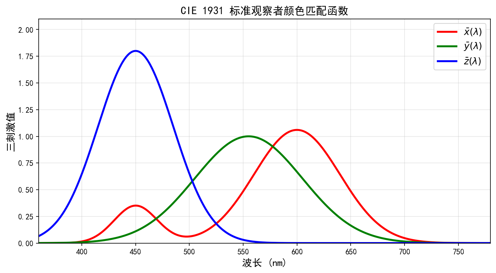
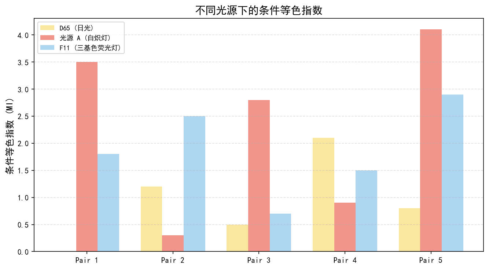
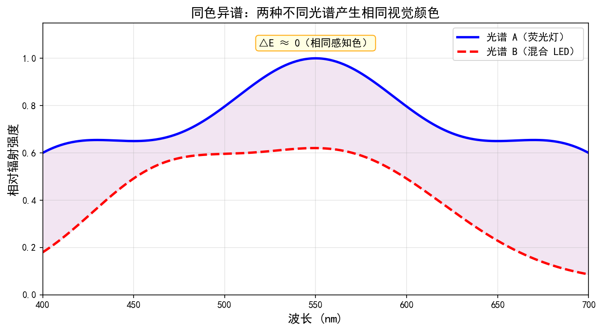
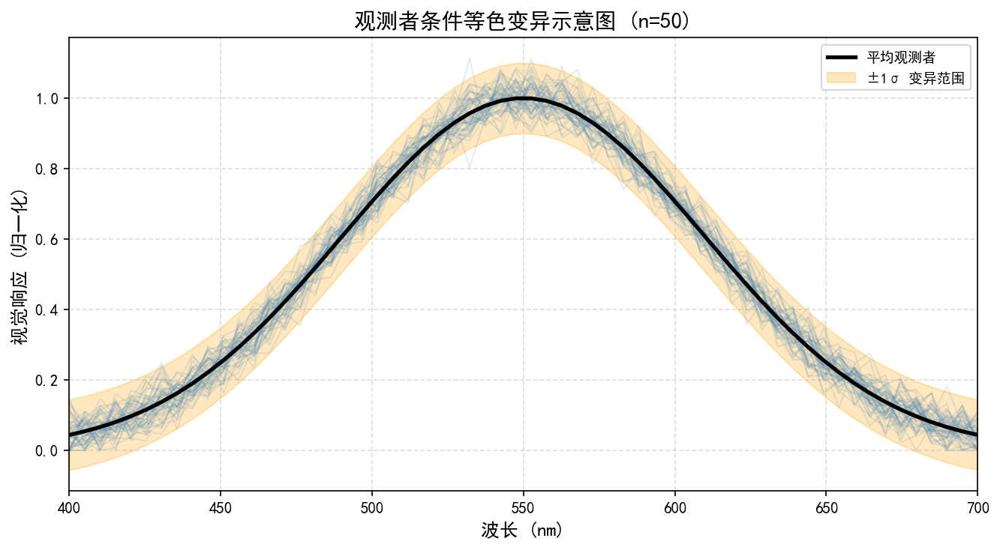

# 第一卷第11章：同色异谱与色彩恒常性（Metamerism and Color Constancy）

> ⚠️ **注意**：本文件为完整版本；附录 I（`appendix/appendix_I_special_imaging_systems_ch.md`）保留精简工程参考版。两者内容以本文件为准。


> **流水线位置（Pipeline position）：** 理论基础；影响 AWB、CCM 设计
> **前置章节（Prerequisites）：** 第一卷第05章（色彩科学基础）
> **读者路径（Reader path）：** 算法工程师、色彩科学家

---

## §1 原理（Theory）

### 1.1 同色异谱的物理本质

AWB 工程师最头疼的场景之一是：同一件红色衬衫，在日光灯下 ΔE 标定合格，换到荧光灯商场里就偏色了——标定重做，下周又不一样了。这不是 CCM 精度问题，是同色异谱（Metamerism）的根本矛盾：人眼只有三种视锥细胞，每种对宽波段光谱积分，把整条光谱曲线压缩为三个数。这种降维不可逆，不同光谱分布可以映射到完全相同的三刺激值，光源一换，等式就破。

#### 1.1.1 三刺激值积分公式

给定光源光谱功率分布 $E(\lambda)$、表面光谱反射率 $R(\lambda)$，以及 CIE 标准观察者色匹配函数 $\bar{x}(\lambda)$、$\bar{y}(\lambda)$、$\bar{z}(\lambda)$，三刺激值定义为：

$$X = k \int_{380}^{780} E(\lambda)\, R(\lambda)\, \bar{x}(\lambda)\, d\lambda$$

$$Y = k \int_{380}^{780} E(\lambda)\, R(\lambda)\, \bar{y}(\lambda)\, d\lambda$$

$$Z = k \int_{380}^{780} E(\lambda)\, R(\lambda)\, \bar{z}(\lambda)\, d\lambda$$

其中 $k$ 为归一化系数，通常取 $k = 100 / \int E(\lambda)\,\bar{y}(\lambda)\,d\lambda$，使参考白的 $Y=100$。

两块表面 $R_1(\lambda)$ 与 $R_2(\lambda)$ 在光源 $E_1$ 下构成同色异谱对，当且仅当：

$$\int E_1(\lambda)\,[R_1(\lambda) - R_2(\lambda)]\,\bar{x}(\lambda)\,d\lambda = 0$$

$$\int E_1(\lambda)\,[R_1(\lambda) - R_2(\lambda)]\,\bar{y}(\lambda)\,d\lambda = 0$$

$$\int E_1(\lambda)\,[R_1(\lambda) - R_2(\lambda)]\,\bar{z}(\lambda)\,d\lambda = 0$$

而在另一光源 $E_2$ 下，上述三个积分不全为零，于是颜色匹配失效。这意味着 $\Delta R(\lambda) = R_1(\lambda) - R_2(\lambda)$ 位于由 $\{E_1 \bar{x}, E_1 \bar{y}, E_1 \bar{z}\}$ 张成空间的正交补（零空间，null space）中，而当光源变为 $E_2$ 时，$\Delta R$ 不再处于新零空间，差异便显现出来。

#### 1.1.2 同色异谱指数（Metamerism Index）

为量化一对同色异谱颜色在光源切换后的色差，CIE 定义了**同色异谱指数 MI**（Metamerism Index）：

$$\text{MI} = \Delta E_{00}(E_1 \to E_2)$$

即两块表面在参考光源 $E_1$ 下精确匹配（$\Delta E_{00}=0$），切换至测试光源 $E_2$ 后的 CIEDE2000 色差。MI 越大，说明两者的光谱差异越大，实际应用中对光源变化越敏感。CIE 推荐以 $E_1 = $ D65（白天日光）为参考，$E_2$ 可取 A 光源（白炽灯）、TL84（荧光灯）等。一般认为 MI < 1 为轻微，1–3 为中等，>3 为严重同色异谱（此阈值为业内经验共识，CIE 标准本身不规定统一数值判定标准，实际可接受范围视应用场景而定）。

### 1.2 观察者同色异谱 vs 光源同色异谱

同色异谱按触发机制分类，工程上最常见的有以下三种：

#### 1.2.1 光源同色异谱（Illuminant Metamerism）

光源同色异谱是 ISP 颜色管理中最难彻底消灭的误差来源。两块表面在 D65 下匹配，在 TL84 或 LED 下分离，根本原因是它们的光谱反射率不同，光源换了，加权积分的结果就变了。

纺织、印刷、化妆品行业对此最敏感。ISP 的多光源 CCM 设计（D65/D50/A/TL84 各标一套矩阵，运行时按 AWB 估计的色温插值）正是为应对这一问题——但插值解决的是连续变化，离散光源（如特定 LED 磷光体）的窄带光谱仍然会超出插值模型的泛化能力。

#### 1.2.2 观察者同色异谱（Observer Metamerism）

不同观察者（人）的视锥细胞光谱灵敏度存在个体差异，主要来源于：视觉色素（photopigment）的峰值波长偏移、黄斑色素密度差异、晶状体吸收差异等。两位观察者可能对同一颜色对给出不同的匹配判断。

CIE 1931 标准观察者是基于 Wright（10 名）和 Guild（7 名）共约 17 名受试者（2° 视场）数据整合后的平均值，1964 10° 补充标准观察者的个体差异更大。观察者同色异谱在精密色彩评估（如打样、色相比较）中至关重要，但在 ISP 流水线设计中通常以 CIE 2° 或 10° 标准观察者作为唯一目标，不显式处理个体差异。

#### 1.2.3 设备同色异谱（Device Metamerism）

相机传感器与人眼具有不同的光谱灵敏度，两者之间的差异构成设备同色异谱。即便相机在某光源下通过矩阵校正（CCM）将输出与人眼感知对齐，在光谱成分不同的光源下，误差仍然存在。这是 ISP 颜色管理中固有的、无法通过线性变换完全消除的误差来源。

### 1.3 相机-人眼同色异谱误差与 Luther 条件

#### 1.3.1 Luther 条件

若相机传感器的光谱灵敏度 $q_i(\lambda)$（$i=1,2,3$ 对应 R、G、B 通道）是 CIE 色匹配函数 $\bar{x}(\lambda)$、$\bar{y}(\lambda)$、$\bar{z}(\lambda)$ 的**线性组合**，则称传感器满足 **Luther 条件**（Luther-Ives condition）：

$$\begin{pmatrix} q_1(\lambda) \\ q_2(\lambda) \\ q_3(\lambda) \end{pmatrix} = M \begin{pmatrix} \bar{x}(\lambda) \\ \bar{y}(\lambda) \\ \bar{z}(\lambda) \end{pmatrix}$$

其中 $M$ 为 $3\times 3$ 常数矩阵。满足 Luther 条件的相机对**任意光谱**均能给出与人眼一致的三刺激值，无论光源如何变化，只需乘以 $M^{-1}$ 即可完美还原 XYZ。此类相机被称为"色度相机"（colorimetric camera）。

#### 1.3.2 实际传感器的偏差

现实中，商用 CMOS 图像传感器的光谱灵敏度受到以下因素制约：
- **硅材料吸收特性**：决定了近红外端和蓝端的基本形状；
- **彩色滤光阵列（CFA）染料**：Bayer 阵列中的 R/G/B 滤光片为宽带响应，与色匹配函数的形状差异显著；
- **红外截止滤光片（IRCF）**：切掉 700 nm 以上的近红外，导致 R 通道长波端响应陡降；
- **微透镜及角度响应**等二阶效应。

结果是：实际传感器的光谱灵敏度无法由 CIE CMF 线性组合表示，Luther 条件不满足。偏差通常用**主成分重建误差**来量化——将传感器灵敏度向 CMF 张成的子空间投影，残差越大，同色异谱误差越严重。

#### 1.3.3 具体后果

对于大多数自然表面（植物、皮肤、纺织品），相机与人眼的三刺激值可以通过 3×3 CCM 较好地对齐，ΔE < 3 可接受。但对于**窄带光谱材料**：
- **荧光染料**（荧光粉笔、荧光背心）：发射峰极窄，相机 R/G/B 的积分结果与人眼严重不符；
- **LED 磷光体发光**：白光 LED 的蓝色泵浦峰在 450 nm 附近极为尖锐，相机 B 通道响应与 $\bar{z}(\lambda)$ 偏差最大；
- **霓虹灯和气体放电光源**：以离散线状光谱为主，CCM 泛化能力差；
- **荧光增白剂（FWA）**：纸张和白色织物中常含 FWA，在 UV 激发下发射蓝白光，导致相机"看到"的白色亮度高于人眼。

### 1.4 同色异谱对 AWB/CCM 的影响

#### 1.4.1 CCM 的统计本质

传统 CCM 在**特定光源**下针对 Macbeth ColorChecker 等标准色卡做最小二乘拟合，得到 3×3 线性矩阵。优化目标为：

$$M^* = \argmin_M \sum_{i=1}^{N} \Delta E_{00}\!\left(M \cdot \mathbf{c}_i,\; \mathbf{t}_i\right)$$

其中 $\mathbf{c}_i$ 为相机 RGB，$\mathbf{t}_i$ 为对应的目标 Lab 值。这本质上是在该光源下的颜色空间中找到一个最优线性变换，其精度取决于训练样本的光谱多样性和该光源下传感器响应的线性性。

#### 1.4.2 光源切换时的 CCM 失效

当光源从训练光源（如 D65）切换到 TL84（三基色荧光灯）时，CCM 的误差急剧增大，尤其体现在：
- TL84 的光谱由汞放电谱线与荧光粉发射带共同构成：546.1 nm 处是汞绿线，约 611 nm 处是红色荧光粉发射峰（Eu³⁺ 激发，非汞线）——相机 G、R 通道对这些尖锐窄带峰的积分与人眼 $\bar{y}$、$\bar{x}$ 偏差极大；
- 受训于 D65 宽谱光照的 CCM 假设了宽带线性关系，窄带光谱输入打破了这一假设；
- 荧光灯场景下常见的系统性色偏：绿色偏黄、肤色偏绿，正是此类同色异谱的直观表现。

#### 1.4.3 多光源 CCM 策略的必要性

为缓解这一问题，ISP 设计中采用**多光源 CCM**（Multi-illuminant CCM）策略：
1. 在多个标准光源（A、D50、D65、TL84、CWF、LED 等）下分别标定 CCM；
2. AWB 模块在估计当前场景色温 $T_{cc}$ 和光源类型后，从 CCM 库中选择对应矩阵，或通过双线性插值得到中间光源的 CCM；
3. 某些高端 ISP 还引入**光源分类器**，专门识别荧光灯场景并切换至专用 CCM。

多光源 CCM 能将荧光灯场景下的平均 ΔE 从 5–8 降低到 2–4，但对极端窄带光源（单色 LED）仍有局限，此时需引入 3D-LUT 进行非线性校正。

> **工程推荐（多光源 CCM 标定）：** 标定矩阵时只用 D65/D50/A 三光源是不够的，TL84 和 CWF 的汞线窄带特性是荧光灯场景肤色偏绿的真正来源，必须单独标定并在 AWB 光源分类器中加入荧光灯识别分支。如果 AWB 把 TL84 误判为 D65，再好的 CCM 也救不了颜色。光源分类器的混淆矩阵（TL84 vs D65 的识别率）应该作为 AWB 验收的单独指标。

### 1.5 光谱灵敏度优化——光谱锐化（Spectral Sharpening）

#### 1.5.1 Finlayson 光谱锐化理论

Finlayson 等人（1994）提出了**光谱锐化**（Spectral Sharpening）方法，核心思想是：对相机的原始 RGB 空间施加一个线性变换 $A$（$3\times 3$ 矩阵），使变换后的"锐化"灵敏度 $q'(\lambda) = A\,q(\lambda)$ 在形状上尽量接近 CIE CMF，从而最小化 Luther 偏差。

优化目标可表述为：在所有可能的 $3\times 3$ 可逆矩阵 $A$ 中，寻找使"相机锐化后灵敏度"与 CMF 之间的最小角偏差最小化的变换：

$$A^* = \argmin_A \sum_{i=1}^{3} \left\| A q_i(\lambda) - \sum_j m_{ij} \bar{f}_j(\lambda) \right\|^2$$

其中 $\bar{f}_j(\lambda)$ 为 CMF 基向量，$m_{ij}$ 为线性混合系数，优化在约束 $A$ 可逆的条件下进行。

#### 1.5.2 锐化的物理含义与代价

光谱锐化在数学上等效于**收窄**传感器的有效光谱响应宽度——R 通道更集中于长波、B 通道更集中于短波，三通道间光谱交叠减少。代价也随之而来：

- **SNR 降低**：锐化矩阵 $A$ 通常包含负权重，意味着一些通道信号被减去，噪声被放大；
- **动态范围压缩**：有效满阱容量（full-well capacity）利用率下降；
- **色彩通道增益不均**：需要更大的数字增益补偿，进一步抬高噪声底。

因此，商用相机设计在光谱锐化（减少同色异谱）与感光性能之间存在根本权衡，低光性能优先的手机摄像头往往倾向于宽带滤光片，接受更大的同色异谱误差。

#### 1.5.3 实用替代方案

在 ISP 软件层面，光谱锐化可对应为 CCM 计算时加入正则化项，惩罚矩阵对角线以外的大系数（"软锐化"）。另一方向是在传感器制造阶段优化 CFA 染料，直接收窄光谱宽度（如三星 ISOCELL 的 SPAD 架构探索），从硬件上根本解决问题。

### 1.5.A CRI/Ra 显色指数与同色异谱的关系（P1 补充）

#### CRI（Color Rendering Index）的定义

**显色指数（Color Rendering Index, CRI；中文简称"显色性"）** 是国际照明委员会（CIE）定义的衡量光源对物体颜色还原能力的指标，数值范围 0–100，100 表示颜色还原与参考光源（低色温用黑体辐射，高色温用 D 系列日光模拟光源）完全一致。

**Ra（一般显色指数）** 是最常用的 CRI 指标，定义为对 CIE 规定的 8 种 Munsell 标准色样（R1–R8）在待测光源与参考光源下分别计算 CIELAB 色差 $\Delta E_{i}^*$，取平均后按以下公式计算：

$$R_i = 100 - 4.6 \cdot \Delta E_i^*, \quad i = 1, \ldots, 8$$

$$Ra = \frac{1}{8} \sum_{i=1}^{8} R_i$$

各 $R_i \leq 100$（超过不截断，可为负数）。$Ra \geq 90$ 为优良（博物馆、医院、摄影棚标准），$Ra \geq 80$ 为良好（一般室内照明），$Ra < 60$ 为较差。

#### CRI 与同色异谱的内在联系

CRI 和同色异谱（Metamerism）衡量的是同一现象的两个视角：

| 维度 | CRI/Ra | 同色异谱指数（MI） |
|------|--------|------------------|
| **关注对象** | 光源对颜色的还原能力 | 两块表面在不同光源下颜色匹配的稳定性 |
| **计算基准** | 8种标准色样 vs 参考光源 | 一对同色异谱表面在不同光源下的色差 |
| **本质联系** | 低 CRI 光源（Ra < 80）往往具有尖锐窄带光谱，更容易暴露同色异谱问题 | 高 MI 表示该颜色对对光源窄带特征高度敏感 |

**关键联系：** 低 CRI 光源（如老式荧光灯 Ra ≈ 60–70、高压钠灯 Ra ≈ 20）的 SPD 主要由少数几条窄带峰构成，在这些光源下，同色异谱对之间的差异会被放大——因为两块表面在不同波段的微小反射率差异，在窄带光源下会导致截然不同的照度积分结果。相比之下，高 CRI 光源（日光、高 Ra LED）SPD 较连续，同色异谱效应相对较小。

#### R9 指标与 ISP 肤色还原

CIE 在 Ra 基础上定义了 R9–R15 等扩展显色指数，其中 **R9（饱和红色）** 对 ISP 工程师最为重要：

$$R9 = 100 - 4.6 \cdot \Delta E_9^*$$

R9 衡量光源对高饱和红色（接近皮肤红色和口红颜色的色相）的还原能力。许多 Ra 值 ≥ 80 的 LED 产品 R9 < 0（即严重失真），因为这些 LED 在 600–650 nm（红色区间）辐射功率不足。

**对 ISP 的影响：**
- 在 R9 较低的 LED 下（典型冷白 LED，R9 常为 0–30），肤色的红色成分（oxyhemoglobin 吸收谷约 540–580 nm）在相机 R 通道和人眼 L 锥体之间存在更大的 Luther 偏差，导致 D65-CCM 在该光源下肤色色差增大；
- ISP 多 CCM 策略应将 R9 较低的 LED（通常色温 5000–6500 K 冷白 LED）作为独立标定光源，而非与 D65 共用 CCM；
- 摄影棚灯具选型时应选择 Ra > 95 且 R9 > 50 的灯具，以减少同色异谱引入的系统色偏，降低 ISP 颜色还原的难度。

#### LED 照明下的显色指数问题专项分析

现代白光 LED 通常是"蓝光泵浦 + 黄色磷光体"方案，其 SPD 由：
1. 蓝色泵浦峰（约 445–460 nm，极窄，半宽约 20–30 nm）
2. 黄绿磷光体宽发射带（约 500–700 nm，峰值约 550–560 nm）

叠加而成。这一 SPD 结构导致：
- 500–580 nm 绿色区间辐射过强（磷光体发射主峰区域），相机 G 通道对应 Luther 偏差最大方向；
- 600–650 nm 红色区间辐射不足（磷光体发射尾翼），R9 偏低，相机 R 通道对红色物体感知能力受限；
- 蓝色泵浦峰在相机 B 通道与人眼 $\bar{z}(\lambda)$ 之间引入最大的 Luther 偏差（B 通道量化本章 §10.2 所述 Luther Error 最大）。

这三点共同导致在 LED 光源下 ISP 颜色还原难度最高，是 CCM 多光源策略、3D-LUT 补偿和光源分类器最核心的应用场景。

---

### 1.6 荧光材料与特殊光谱场景

#### 1.6.1 荧光增白剂（FWA）的机制

荧光增白剂（Fluorescent Whitening Agent，FWA）广泛存在于白纸、白色衬衫、洗涤剂等日常物品中。其机制是将紫外线（约 300–400 nm）吸收后，以蓝白色可见光重新发射（发射带约 420–470 nm，峰值多位于 430–450 nm），从而使白色看起来"更白"——实际上是通过发出额外的蓝光来补偿白色基底中肉眼可感知的微黄色调。

#### 1.6.2 相机与人眼的不对称响应

- **人眼**：对 UV 不敏感，仅感知 FWA 的可见光发射，白色看起来明亮洁白；
- **相机传感器**：通常有 IRCF 截掉近红外，但对 UV/近 UV（350–400 nm）的截止依赖于特定设计。部分传感器对 400 nm 附近仍有残余响应；
- **关键不对称**：在包含 UV 成分的光源下（日光、某些荧光灯），相机可能"看到"FWA 物体的 B 通道比实际人眼感知更强，导致白纸在相机中偏蓝或过曝；

#### 1.6.3 对 AWB 和色彩还原的影响

含 FWA 的白纸若被用作白色参考点进行 AWB 估计，会导致 AWB 算法被"欺骗"：将偏蓝的 FWA 发射光误判为真实照明色温，进而对全图施加偏暖补偿，整体图像偏黄。高精度 AWB 算法需要对白色区域的光谱纯度进行校验，或使用专用参考白板（无 FWA 的陶瓷白）进行标定。

---

## §2 标定（Calibration）

### 2.1 同色异谱指数（MI）的测量流程

工程上测量相机-人眼的同色异谱水平需要以下步骤：

1. **采集光谱反射率数据**：使用分光光度计（如 Konica Minolta CM-700d）测量测试色卡每个色块的光谱反射率曲线 $R_i(\lambda)$，波长范围 360–740 nm，步长 10 nm。
2. **计算参考三刺激值**：在参考光源 $E_1$（D65）下，用 CIE 1931 标准观察者 CMF 计算每个色块的 $[X, Y, Z]_{E_1}$，转换为 Lab 空间得到参考颜色 $L_1^*, a_1^*, b_1^*$。
3. **相机拍摄与校正**：相机在同一光源下对色卡拍摄，通过 CCM 校正后得到相机还原的 Lab 值 $L_c^*, a_c^*, b_c^*$，计算 $\Delta E_{00}$（参考评估，非同色异谱指数）。
4. **切换测试光源**：在测试光源 $E_2$（A / TL84 / LED）下重复步骤 2–3，计算 $\Delta E_{00}(E_1 \to E_2)$，即为该色块的同色异谱指数 MI。
5. **统计汇总**：对所有色块取均值和最大值，分别报告平均 MI 和最差 MI，并重点关注饱和色和特殊材质色块。

### 2.2 多光源色差统计评估

工业标准的多光源色差测试通常覆盖以下标准光源组合：

| 光源代号 | 色温 / 类型 | 典型场景 |
|----------|-------------|----------|
| D65 | 6504 K，日光 | 室外、标准评估 |
| D50 | 5003 K，日光 | 印刷、平面设计 |
| A | 2856 K，钨丝灯 | 家用白炽灯 |
| TL84 | 4000 K，三基色荧光灯 | 欧洲商超 |
| CWF（F2）| 4230 K，冷白荧光灯 | 北美商超 |
| LED BB | ≈5000–6500 K | 现代办公/商用 |

推荐的统计指标：
- **平均 ΔE00**：所有色块在该光源下的均值；
- **P95 ΔE00**：第 95 百分位，反映最差情况；
- **颜色向量图**（color vector plot）：用箭头可视化每个色块的色偏方向，辅助定位系统性偏差。

### 2.3 光谱反射率数据库的应用

用于 CCM 优化和同色异谱分析的公开光谱数据集包括：

- **Munsell 400 色卡数据集**（Parkkinen et al., 1989）：涵盖 Munsell 全色系，共 1257 条光谱；
- **NCS 自然色系光谱库**：工业颜色标准；
- **Spectral Imaging Dataset**（Foster et al.）：真实场景的高光谱图像，波长 400–720 nm；
- **IES TM-30 光源光谱库**：覆盖 100+ 种商用光源；

将这些数据集用于 CCM 优化时，可以替代仅依赖 24 色 Macbeth 色卡的拟合，显著提升在自然场景下的泛化能力，同时定量评估跨光源的同色异谱风险。

---

## §3 调参（Tuning）

### 3.1 多 CCM 插值的同色异谱缓解策略

多 CCM 插值是目前手机 ISP 中最常用的同色异谱应对方案，基本流程如下：

**离线标定阶段：**
1. 在 $N$ 个代表性光源（通常 N = 4–6）下分别标定 CCM_1 至 CCM_N；
2. 同时记录每个光源下相机 RAW 中灰色块的 RGB 比值，构建光源特征向量；
3. 建立"光源特征向量 → CCM 索引"的查找关系。

**在线推理阶段：**
1. AWB 模块输出当前光源估计，包括色温 $T_{cc}$ 和可选的光源类型标签；
2. 根据 $T_{cc}$ 在相邻的两个或四个 CCM 之间进行加权插值：

$$\text{CCM}_{eff} = \alpha \cdot \text{CCM}_i + (1-\alpha) \cdot \text{CCM}_j, \quad \alpha = \frac{T_{cc,j} - T_{cc}}{T_{cc,j} - T_{cc,i}}$$

3. 对于特殊光源（如 TL84 荧光灯），基于额外的光源类型特征（如 G/B 比值异常）引入分类标签，强制切换至专用 CCM，而非仅依赖色温插值。

**注意事项：** 插值仅在色温维度上有效；TL84 与同色温的 LED 具有完全不同的光谱成分，仅靠色温插值会产生错误结果，因此光源类型分类器不可或缺。

### 3.2 问题光源（TL84/LED）的专用调优

#### 3.2.1 TL84 荧光灯调优要点

TL84 因同时含有 546.1 nm 的汞绿发射线和约 611 nm 的红色荧光粉发射峰（二者物理机制不同：前者是汞原子线状谱，后者是 Eu³⁺ 荧光粉的宽带发射峰）而特别棘手：

- **绿色偏移校正**：相机 G 通道对 546 nm 汞线过度响应，导致绿色场景整体偏绿偏黄，专用 CCM 的 G→G 项通常需要适当压缩；
- **肤色校正**：TL84 下肤色最容易发绿，建议在标定时针对人脸区域单独评估 ΔE，对 CCM 进行肤色区域加权优化；
- **识别特征**：TL84 场景在白平衡前的 RAW 中，灰色区域的 G/(R+B) 比值显著高于 D65，可作为分类特征。

#### 3.2.2 LED 光源调优要点

现代 LED 光源种类繁多（冷白/暖白/彩色/RGBW），调优挑战在于：

- **磷光体蓝色泵浦峰**：450 nm 附近的尖峰使相机 B 通道与人眼 $\bar{z}(\lambda)$ 偏差极大，天蓝色和紫色在 LED 下最难还原；
- **批次差异**：同一规格 LED 的光谱会因制造批次不同而漂移，需要用统计分布而非单一光谱进行 CCM 优化；
- **混合光场景**：室内常见"LED 顶灯 + 日光窗口"混合光，AWB 难以用单一光源模型描述，需要混合光 AWB 或分区 AWB 配合。

### 3.3 3D-LUT 替代方案

当 3×3 线性 CCM 无法满足精度要求时，3D-LUT（三维查找表）提供了非线性校正能力：

- **3D-LUT 的优势**：可以对颜色空间任意区域进行独立校正，不受线性约束；对于荧光色、金属色等在特定区域严重失真的情况，3D-LUT 可以针对性地修正；
- **典型规格**：17×17×17 节点（对应 Lab 或 HSL 空间），节点间三线性插值；
- **标定方法**：在目标光源下拍摄大量色块（建议 300+ 颜色，覆盖高饱和度边界），通过优化算法（如径向基函数 RBF 或散乱数据插值）拟合 LUT 节点；
- **代价**：存储空间和计算量较线性 CCM 大幅增加；多光源时需存储多套 LUT，实时切换难度更高；
- **工程实践**：多数手机 ISP 将 3D-LUT 作为 CCM 之后的"色调精调"环节，CCM 负责主要色彩还原，LUT 负责修正 CCM 残余误差和局部饱和色偏差。

---

## §4 感知局限（Perceptual Limitations）

### 4.1 荧光灯场景下的系统性色偏

荧光灯（TL84/CWF）场景是同色异谱引发伪影最集中的场景，典型表现包括：

**绿色偏黄（Green-yellow cast）：** 荧光灯的 546 nm 绿线被相机 G 通道强烈响应，D65-CCM 无法补偿，导致绿叶、绿色背景偏黄绿。视觉上表现为"不新鲜"感，在食品拍摄中尤为恼人。

**肤色偏绿（Skin hue shift）：** 人脸肤色中红色成分（hemoglobin 吸收谷约在 540–580 nm）在 TL84 下被绿线放大，加之相机对该光谱区域的 Luther 偏差，导致肤色在 a* 轴上向绿色漂移，严重时可达 ΔE > 5。

**白色偏色（White point drift）：** 若 AWB 基于 D65 白点模型，在 TL84 场景下估计不准，全局白平衡偏差会叠加 CCM 误差，进一步加重色偏。

**识别与诊断：** 在色差向量图中，TL84 引起的色偏表现为绿色通道系统性过高、整体色块沿 +b*（偏黄）轴偏移；多数色块的偏移方向一致，区别于随机噪声。

### 4.2 LED 灯场景的颜色失真

LED 灯因其特殊光谱结构引发以下伪影：

**蓝紫色失真（Blue-violet distortion）：** LED 的 450 nm 蓝色泵浦峰对应相机 B 通道感光最强区域，但与 CMF $\bar{z}(\lambda)$ 的形状差异也最大，导致蓝色衣物、天空蓝的饱和度或色相出现偏差，常见表现为"蓝色偏紫"或"蓝色偏绿"。

**白色过度饱和（Over-saturation of whites）：** 暖白 LED（2700–3000 K）的黄色磷光体发射使白色区域在 CCM 处理后偏暖，但又不完全符合钨丝灯（A 光源）的 CCM 模型，落在插值"缝隙"中，导致白色偏橙。

**闪烁叠加（Flicker interaction）：** 高频调制（PWM 驱动）的 LED 与相机滚动快门（rolling shutter）的时序差异，可能导致帧间颜色不一致，形成颜色"条纹"或"色带"伪影，严重时需借助反闪烁（anti-banding）算法联合处理。

### 4.3 特殊材质的色彩失真

**荧光色材质（Neon/Fluorescent colors）：** 荧光黄、荧光橙等高可见度颜色（常见于运动服、安全背心）含有荧光染料，其反射光谱在特定波段有高于 100% 的表观反射率（能量来自荧光发射）。相机对这些颜色的响应远超 CCM 假设的线性范围，导致色相飘移和亮度溢出（clipping），常见表现为"荧光黄变纯黄，失去荧光感"。

**金属色材质（Metallic colors）：** 金属漆（如汽车金属银）具有极强的方向性反射（BRDF 峰值极窄），在不同入射角下光谱成分变化显著。平均意义上的 CCM 无法覆盖所有角度，局部高光区域出现色相偏移是常见现象。

**光油和偏光材质（Pearlescent/Interference materials）：** 美妆产品中的珠光色（如变色唇膏）利用薄膜干涉产生随角度变化的结构色（structural color），其光谱响应随观察角变化剧烈，相机拍摄时往往只能捕捉某一角度的颜色，而非人眼感知的"变色"效果。

---

## §5 评测（Evaluation）

### 5.1 多光源 ΔE00 统计

多光源颜色精度评测是 ISP 颜色质量报告的核心指标，推荐按以下规范执行：

**测试色卡：**
- **Macbeth ColorChecker Classic（24色）**：必测，提供全色系覆盖和皮肤色；
- **ColorChecker SG（140色）**：增加边界颜色和高饱和度色块；
- **X-Rite Flexi 荧光色卡**或**荧光色样品**：专门测试荧光材质同色异谱；
- **自定义特殊材质色卡**：针对产品关注的场景（如纺织品、食品、汽车）。

**评测指标：**
$$\overline{\Delta E_{00}} = \frac{1}{N} \sum_{i=1}^{N} \Delta E_{00,i}$$

$$\Delta E_{00}^{P95} = \text{第95百分位} \left\{\Delta E_{00,i}\right\}$$

消费级相机的行业参考标准：$\overline{\Delta E_{00}} < 3$（良好），$< 2$（优秀）；专业相机目标 $< 1.5$ 。

### 5.2 同色异谱指数计算

对于特定色块对（例如标准样品 vs 实际生产样品），同色异谱指数按以下步骤计算：

1. 分别在 D65 和测试光源（A / TL84 / LED）下测量两块样品的三刺激值；
2. 确认在 D65 下 $\Delta E_{00} < 0.5$（称为"接近匹配"或"准同色异谱对"）；
3. 计算在测试光源下的 $\Delta E_{00}$，即为该光源的 MI；
4. 汇报 MI_A（A 光源 MI）、MI_TL84（TL84 MI）等多个指标。

注意：严格意义上的同色异谱要求在参考光源下 $\Delta E = 0$，但实际工程中允许 $\Delta E < 1$ 的"工程同色异谱"定义，避免因标定误差引入虚假 MI。

### 5.3 特殊材质色卡测试

针对同色异谱高风险材质，建议构建专用测试色卡，包含以下类别：

| 类别 | 典型样品 | 测试重点 |
|------|----------|----------|
| 荧光色 | 荧光黄/橙/粉色样品 | 荧光发射对 B 通道的影响 |
| 金属色 | 银色、金色、铜色涂层 | 方向性反射和 CCM 失效 |
| 荧光增白白色 | 含 FWA 白纸 vs 陶瓷白 | FWA 对 AWB 的干扰 |
| 纳米结构色 | 变色膜、珠光颜料 | 角度相关性 |
| 特殊打印墨水 | 专色（Pantone）印刷 | 印刷同色异谱 |

每类样品在至少 3 种光源（D65、TL84、LED BB）下拍摄，报告跨光源的色偏向量和 ΔE00，形成"同色异谱风险矩阵"，作为产品颜色质量档案的一部分。

---

## §6 代码

本章配套代码（见本目录 .ipynb 文件）

代码内容包括：
- 同色异谱对的仿真生成（在 Munsell 数据集中搜索同色异谱对）；
- 三刺激值积分计算（给定光谱反射率和光源数据）；
- 相机 Luther 条件违背量化（PCA 残差分析）；
- 多光源 ΔE00 评估脚本（输入色卡光谱数据，输出跨光源色差统计表）；
- CCM 插值演示（色温插值 vs 光源类型分类切换的对比）。

---


---

> **工程师手记：手机摄影中的同色异谱问题与CCM校准触发**
>
> **观察者同色异谱与手机传感器光谱失配：** CIE 1931标准观察者的色匹配函数（CMF）基于2°视场的人类视觉，而手机图像传感器的光谱响应曲线（QE曲线）与之存在系统性偏差，尤其在400–450nm蓝紫区和620–700nm红区，偏差幅度可达10–20%。这一偏差意味着：在荧光灯或LED混色光源下，人眼感知为"标准白"的场景，传感器可能记录为偏绿或偏洋红。此即观察者同色异谱（Observer Metamerism）在移动摄影中的体现，单靠AWB无法完全消除，需在CCM（Color Correction Matrix）中通过光源自适应矩阵加以补偿。
>
> **传感器批次同色异谱导致产线颜色一致性问题：** 同型号传感器不同生产批次间的QE曲线差异（Lot-to-Lot Variation）典型值约±3–5nm峰值偏移。对于色温3200K暖光场景，这一光谱差异可导致批次间ΔE₀₀约1.5–3.0，超出肉眼可接受阈值（ΔE₀₀ < 2.0）。产线应对方案通常是：对每个传感器批次单独测量QE曲线，生成对应的CCM修正偏差表，在OTP写入时区分批次标识；或引入批次补偿LUT，在ISP初始化时根据OTP批次号加载对应修正。
>
> **CCM重标定触发阈值：** CCM校准通常基于X-Rite ColorChecker（24色卡）在D65/A/TL84等标准光源下采集，并以ΔE₀₀作为验收指标（通常要求平均ΔE₀₀ < 3.0，最大 < 5.0）。当以下情况发生时应触发重标定：光源更换（测试环境从D65换为D50，差异约3000K）、传感器批次切换、镜头模组供应商变更（不同镀膜影响光谱透过率约2–5%）、产品换代导致ISP pipeline变化。实践中以ΔE₀₀平均值超过3.0或最大值超过6.0作为强制重标定触发线。
>
> *参考：CIE 015:2004 Colorimetry 3rd ed.；Reinhard et al. "Color Imaging: Fundamentals and Applications" Ch.5；X-Rite ColorChecker Color Rendition Chart Technical Note*

## 插图


*图1. CIE 1931标准观察者色匹配函数（x̄, ȳ, z̄）（图片来源：CIE, "CIE 80:2001 — Colorimetry", 官方文档, 2001）*


*图2. 不同光源下同色异谱（条件等色）现象示意（图片来源：Hunt et al., "Measuring Colour (4th ed.)", Wiley, 2011）*


*图3. 两组同色异谱光谱反射率曲线对比（图片来源：Vrhel et al., "Measurement and analysis of object reflectance spectra", Color Research & Application, 1994）*


*图4. 观察者同色异谱（个体色觉差异导致的同色异谱）示意图（图片来源：Fairchild, "Color Appearance Models (3rd ed.)", Wiley-IS&T, 2013）*


*图5. 颜色匹配实验与同色异谱关系示意图（图片来源：作者自绘）*


*图6. 传感器同色异谱示意图——相机RGB三通道的光谱响应曲线与人眼色匹配函数存在显著差异，导致相机感知的"等色"在人眼看来并不相同（图片来源：作者自绘，参考Jiang et al., "What is the Space of Spectral Sensitivity Functions for Digital Color Cameras?", IEEE WACV, 2013）*

---

## 习题

**练习 1（理解）**
ISP 的多光源 CCM 设计（D65/TL84/A 各一套矩阵，运行时按色温插值）是应对光源同色异谱的主要工程手段。请说明：(a) 为什么仅用一套 CCM 无法覆盖所有光源下的准确颜色？从三刺激值积分公式角度解释光源切换破坏等式的机制；(b) 多光源 CCM 插值能解决连续色温变化的问题，但对特定 LED 磷光体光源（窄带光谱）仍会失效，原因是什么？(c) CRI（显色指数）和色温是描述光源的两个不同维度，请举例说明为什么高 CRI 的 LED 不一定能完全消除同色异谱问题。

**练习 2（计算）**
已知两块表面在 D65 光源下的 Lab 值完全相同（$\Delta E_{00} = 0$），切换到 A 光源（白炽灯，色温 2856K）后，用 `colour-science` 计算色差结果为 $\Delta E_{00} = 3.8$。请判断：(a) 根据本章 MI（同色异谱指数）的阈值经验（MI < 1 为轻微，1–3 为中等，> 3 为严重），该对颜色属于哪个等级？(b) 若这两块表面是服装面料的"标准色"与"批次色"，在百货商场（TL84 荧光灯）陈列时会产生可见偏色吗（假设 TL84 下色差约为 D65 → A 的 60%）？(c) ISP AWB 能否通过调整白平衡来消除这种色差？为什么？

**练习 3（编程）**
用 Python 的 `colour-science` 库计算同色异谱指数（MI）：(a) 定义两个光谱反射率函数 $R_1(\lambda)$ 和 $R_2(\lambda)$：$R_1$ 为平坦谱（所有波长反射率 0.5），$R_2$ 为简单正弦调制谱（$0.5 + 0.3\sin(2\pi(\lambda - 400)/200)$），波长范围 400–700 nm，步长 10 nm；(b) 在 D65 光源下计算两者的 XYZ 三刺激值，并转换为 Lab（使用 D65 白点）；(c) 计算 $\Delta E_{00}$（D65 下），验证两者在 D65 下不完全匹配（MI 定义要求参考光源下匹配，但此处用于演示光谱差异的检测）；(d) 切换到 A 光源，重新计算 XYZ 和 Lab，输出色差变化量并说明哪种反射率的颜色更稳定。

## 参考文献

[1] CIE, "CIE 80:2001 — Colorimetry of Self-Luminous Displays and Related Components", *官方文档*, 2001.

[2] Finlayson et al., "Spectral sharpening: sensor transformations for improved color constancy", *Journal of the Optical Society of America A*, 1994.

[3] Hunt et al., "Measuring Colour (4th ed.)", *Wiley*, 2011.

[4] Fairchild, "Color Appearance Models (3rd ed.)", *Wiley-IS&T*, 2013.

[5] Vrhel et al., "Measurement and analysis of object reflectance spectra", *Color Research & Application*, 1994.

[6] Westland, S., Ripamonti, C., Cheung, V., "Computational Colour Science Using MATLAB (2nd ed.)", *Wiley-IS&T*, 2012.
<!-- REF-AUDIT: [6] 原文 "Bianco et al., Computational color science using MATLAB, Image Processing: Algorithms and Systems X, 2012" 有误 → 该书作者为 Westland/Ripamonti/Cheung（非 Bianco），且为 Wiley-IS&T 专著而非 SPIE 会议论文 -->

## §7 术语表（Glossary）

**同色异谱（Metamerism）**
不同光谱分布的颜色刺激在特定条件下产生相同颜色感知的现象。根本原因是人眼只有三种视锥细胞（L、M、S），将整条光谱曲线压缩为三个标量响应值——不可逆的降维使"多对一"映射成为必然。两个同色异谱对在某一光源下三刺激值相等，但在另一光源下可能产生显著色差，是 ISP 多光源 CCM 设计和 AWB 鲁棒性的核心挑战来源。

**三刺激值（Tristimulus Values, XYZ）**
CIE 1931 定义的描述颜色的三个标量值：$X = k\int E(\lambda)R(\lambda)\bar{x}(\lambda)\,d\lambda$，$Y$、$Z$ 类似。$X$、$Y$、$Z$ 完全确定人眼感知的颜色（在 CIE 标准观察者假设下）。$Y$ 分量等于光度量（亮度/反射率），$\bar{y}(\lambda)$ 即 CIE 光谱光视效率函数 $V(\lambda)$。归一化后 $Y=100$ 对应参考白。

**色匹配函数（Color Matching Functions, CMF）**
CIE 标准观察者的光谱灵敏度函数 $\bar{x}(\lambda)$、$\bar{y}(\lambda)$、$\bar{z}(\lambda)$，描述在 2°（CIE 1931）或 10°（CIE 1964）视场下，用三基色原刺激匹配各波长单色光所需的量。CMF 是颜色科学的基础数学工具；CCM 的物理意义是对传感器响应施加线性变换，使之近似满足 CMF 的线性关系。

**同色异谱指数（Metamerism Index, MI）**
量化一对同色异谱颜色在光源切换后色差的指标，定义为：两块表面在参考光源 $E_1$（通常 D65）下精确匹配，切换至测试光源 $E_2$（A、TL84、LED 等）后的 CIEDE2000 色差 $\Delta E_{00}$。MI 越大说明两者光谱差异越大，对光源变化越敏感。MI < 1 为轻微、1–3 为中等、>3 为严重（业内经验值；CIE 标准本身不规定统一判定阈值）。

**Luther 条件（Luther-Ives Condition）**
若相机传感器的光谱灵敏度 $q_i(\lambda)$ 是 CIE 色匹配函数的线性组合，则称满足 Luther 条件。满足该条件的相机对任意光谱均能给出与人眼一致的三刺激值，只需乘以固定矩阵即可完美还原颜色。实际 CMOS 传感器因 CFA 染料、IRCF 等因素无法满足 Luther 条件——这正是 CCM 存在的根本原因，也是跨光源颜色误差不可完全消除的物理本质。

**光谱锐化（Spectral Sharpening）**
Finlayson 等（1994）提出的通过对相机原始 RGB 施加线性变换 $A$，使变换后灵敏度形状更接近 CIE CMF（即收窄通道间光谱交叠），从而减小 Luther 偏差的方法。代价是 $A$ 矩阵通常含负权重，SNR 显著降低。实际 ISP 工程中极少直接应用光谱锐化，更常见的做法是多 CCM + 场景自适应切换，以接受一定同色异谱误差换取感光性能。

**光源同色异谱（Illuminant Metamerism）**
两个物体在一种光源下颜色匹配、在另一种光源下颜色不匹配的现象。ISP 工程师最常遭遇的类型：D65-CCM 在 TL84 荧光灯下失效，导致绿色偏黄、肤色偏绿。根本原因是两物体光谱反射率曲线不同，光源光谱变化后加权积分结果也变化。多光源 CCM 策略是工程上的主要应对手段。

**观察者同色异谱（Observer Metamerism）**
不同人的视锥细胞光谱灵敏度存在个体差异（视色素峰值偏移、黄斑色素密度、晶状体吸收等），两位观察者可能对同一颜色对给出不同匹配判断。CIE 1931 标准观察者基于 Wright（10 名）和 Guild（7 名）共约 17 名受试者数据整合的均值，是颜色计量学的统一基准。ISP 流水线通常只针对标准观察者设计，不显式处理个体差异。

**设备同色异谱（Device Metamerism）**
相机传感器与人眼光谱灵敏度不同（Luther 条件不满足）导致的颜色失配：相机在某光源下通过 CCM 与人眼对齐，但光源改变时误差重新出现。这是 ISP 颜色管理中固有的、无法通过线性变换完全消除的误差来源，3D-LUT 的非线性校正能力可部分弥补此限制。

**多光源 CCM（Multi-illuminant CCM）**
在多个标准光源（A、D50、D65、TL84、CWF、LED 等）下分别标定 CCM，AWB 估计当前色温后通过色温插值（建议在 Mired 尺度或 CIE 1960 uv 色度图上插值）得到有效 CCM 的策略。对于 TL84、LED 等非黑体光源，仅靠色温插值不够，须引入光源类型分类器强制切换专用 CCM，以消除光谱成分差异引起的系统色偏。

**TL84（CIE F11 标准光源）**
欧洲商超常用的三基色荧光灯，色温约 4000 K。其光谱由汞放电谱线与稀土荧光粉发射带叠加而成：**546.1 nm** 处是汞绿线（线状谱），**约 611 nm** 处是红色荧光粉（Eu³⁺:Y₂O₃）发射峰（宽带）——两者物理机制不同。这两个峰是导致相机 G、R 通道与人眼偏差最大、CCM 最容易失效的关键波段。

**荧光增白剂（Fluorescent Whitening Agent, FWA；又称 Optical Brightening Agent, OBA）**
广泛存在于白纸、白色织物、洗涤剂中的有机荧光化合物。吸收近紫外光（激发峰约 340–380 nm）后在蓝紫光区发射（发射带约 420–470 nm，峰值多位于 430–450 nm），视觉上使白色看起来"更白更蓝"。相机传感器若对 UV/近 UV 有残余响应，会使含 FWA 物体的 B 通道异常增强，干扰 AWB 估计，导致全图偏黄补偿，整体色调失准。

**CRI / Ra（Color Rendering Index，显色指数）**
CIE 定义的衡量光源对物体颜色还原能力的指标（0–100）。Ra 是对 8 种标准 Munsell 色样（R1–R8）的平均显色指数，计算公式为 $R_i = 100 - 4.6\Delta E_i^*$，取均值。$Ra \geq 90$ 为优良，$Ra \geq 80$ 为良好，$Ra < 60$ 为较差。Ra 与同色异谱本质相关：低 CRI 光源（窄带 SPD）更容易放大同色异谱效应。**R9**（饱和红色的单项显色指数）对 ISP 肤色还原至关重要，许多高 Ra LED 的 R9 仍可为负值（严重失真），需单独评估和标定。

**光谱反射率（Spectral Reflectance, $R(\lambda)$）**
描述物体表面对不同波长光的反射比例（0–1 范围，某些含荧光材料的表观反射率可超过 1），是颜色的物理载体。同色异谱本质是：两条不同的 $R(\lambda)$ 曲线在特定光源-观察者组合下产生相同三刺激值。精确颜色管理需要光谱数据，而非仅三刺激值。

**3D-LUT（Three-Dimensional Look-Up Table，三维颜色查找表）**
将输入色彩空间（如 R、G、B）均匀划分为三维网格，每个节点存储目标颜色值，节点间通过三线性插值处理的非线性颜色映射工具。典型规格 17×17×17 节点。3D-LUT 可针对颜色空间任意区域独立校正，弥补 3×3 线性 CCM 无法修正的同色异谱残差和饱和色偏差，是 ISP 颜色管理流水线中线性 CCM 的重要非线性补充。

---

## §8 CIECAM02 颜色外观模型

### 8.1 为什么需要颜色外观模型

CIE XYZ 和 CIE Lab 描述的是在**参考观察条件**（特定光源、特定背景亮度）下的颜色，但人类视觉系统的颜色感知受到更多因素影响：**适应状态**（眼睛对当前光源的适应程度）、**背景亮度**（周围环境的相对明暗）、**颜色外貌模式**（物体模式 vs 光源模式）。颜色外观模型（Color Appearance Model，CAM）在三刺激值基础上，进一步建模这些感知变量，预测人在特定观察条件下的主观颜色感受。

对于 ISP 工程师，CIECAM02 的直接应用场景是**手机 HDR 图像的色貌预测**：HDR 场景的亮度范围（0.01–10000 cd/m²）远超标准 CIE Lab 的设计范围（约 1–1000 cd/m²），在极端亮度下 Lab 的均匀性崩溃。CIECAM02 通过非线性压缩和背景亮度归一化，在更宽的亮度范围内保持更好的感知均匀性。

### 8.2 CIECAM02 完整计算流程

CIECAM02（CIE 159:2004）的计算分为以下五个步骤：

**步骤 1：Von Kries 色适应变换（Chromatic Adaptation）**

将三刺激值 $[X, Y, Z]$ 转换到 HPE 锥体空间 $[L_A, M_A, S_A]$（Huntington-Pointer-Estevez 空间，是人眼锥细胞灵敏度的近似）：

$$\begin{pmatrix} L \\ M \\ S \end{pmatrix} = M_{\text{HPE}} \begin{pmatrix} X \\ Y \\ Z \end{pmatrix}$$

然后对光源白点 $[L_w, M_w, S_w]$ 进行完全色适应，将样品颜色映射到参考白场（D50 或 D65）下：

$$L_c = \frac{L}{L_w} \cdot Y_w \cdot \frac{F_L}{100}, \quad M_c = \frac{M}{M_w} \cdot Y_w \cdot \frac{F_L}{100}, \quad S_c = \frac{S}{S_w} \cdot Y_w \cdot \frac{F_L}{100}$$

其中 $F_L$ 为亮度适应因子，$Y_w$ 为参考白亮度（通常归一化为 100）。CIECAM02 的色适应比 CIE Lab 的等能光源假设更精确，因为其 Von Kries 变换在锥体空间进行（对角矩阵），更符合人眼生理。

**步骤 2：非线性压缩（Non-linear Compression）**

模拟视锥细胞的非线性响应（包括对高强度刺激的饱和特性）：

$$L_A' = \frac{400 \cdot (F_L L_c / 100)^{0.42}}{(F_L L_c / 100)^{0.42} + 27.13} + 0.1$$

$M_A'$、$S_A'$ 同理（分别代入对应的适应后响应）。此非线性压缩函数在低亮度下近似线性，高亮度下趋于饱和，模仿视网膜光感受器的响应特性（类似 Michaelis-Menten 方程）。

**步骤 3：对立颜色通道（Opponent Color Channels）**

从压缩后的锥体响应计算亮色通道和两个对立颜色通道，模拟视觉系统的颜色对立（红绿、黄蓝）机制：

$$a = L_A' - 12 M_A' / 11 + S_A' / 11$$
$$b = (L_A' + M_A' - 2 S_A') / 9$$

亮度通道（Achromatic Response）：
$$A = \left(2 L_A' + M_A' + S_A'/20 - 0.305\right) \cdot N_{\text{BB}}$$

其中 $N_{\text{BB}}$ 是背景亮度归一化系数。

**步骤 4：感知属性计算**

从对立通道计算 CIECAM02 的六个感知属性：

- **明度 $J$（Lightness）**：$J = 100 \cdot \left(A / A_w\right)^{c z}$，其中 $c$（0.69 用于平均环境）、$z$ 和 $A_w$ 由观察条件决定；
- **色度 $C$（Chroma）**：$C = t^{0.9} \cdot \sqrt{J/100} \cdot (1.64 - 0.29^n)^{0.73}$，其中 $t = \sqrt{a^2 + b^2} \cdot 50000 / (13 N_C)$；
- **色相角 $h$（Hue Angle）**：$h = \arctan(b/a)$（以正北为 0°，顺时针方向），范围 $[0°, 360°)$；
- **色相构成 $H$（Hue Quadrature）**：将色相角 $h$ 映射到 0–400 的均匀色相刻度；
- **亮度 $Q$（Brightness，绝对感知亮度）**：$Q = (4/c) \cdot \sqrt{J/100} \cdot (A_w + 4) \cdot F_L^{0.25}$；
- **饱和度 $M$（Colorfulness，绝对色彩饱和感）**：$M = C \cdot F_L^{0.25}$。

在手机 ISP 中最常用的是 $J$（用于亮度映射）、$C$（用于饱和度控制）、$h$（用于色相校正），构成 **JCh 感知均匀颜色空间**。

### 8.3 CIECAM02 与 CIE Lab 在不同亮度下的均匀性对比

CIE Lab 是为参考白 $Y_w = 100$（约 1000 cd/m² 显示器）设计的，当应用于亮度范围更宽的 HDR 场景时，均匀性会显著退化：

| 亮度级别（Y，cd/m²）| Lab 色差 $\Delta E_{00}$ 均匀性 | CIECAM02 $\Delta J$ 均匀性 | 差异说明 |
|-------------------|---------------------------------|--------------------------|---------|
| 5–100（SDR 正常范围）| 良好（设计范围内）| 良好 | 两者相当 |
| 0.01–5（极暗区域）| 差（暗部 $L^*$ 扩张，间距扭曲）| 较好（非线性压缩补偿）| Lab 低亮度均匀性差 |
| 100–1000（亮高光）| 中等 | 较好 | Lab 高光区稍有压缩不足 |
| 1000–10000（HDR 峰值）| 差（$L^*$ 设计上限约 100，超出范围）| 好（$J$ 设计覆盖此范围）| Lab 无法直接使用 |

对于 ISP 中的 HDR 色调映射算法，CIECAM02 的 $J$（Lightness）通道提供了比 $L^*$ 更均匀的感知亮度尺度，尤其在 0.01–5 cd/m² 的极暗区域（夜景 HDR 的典型场景亮度），$\Delta J = 1$ 约对应恒定的感知差异，而 $\Delta L^* = 1$ 在此亮度范围内对应的感知差异远大于高亮度区域的同等数值差异。

---

## §9 CAM16 和 ICtCp

### 9.1 CAM16：面向工程应用的简化版

**CAM16（Li et al., 2017）** 是对 CIECAM02 的简化修订版，主要改动是修正了 CIECAM02 在极高/极低亮度下的数值不稳定问题，并简化了色适应变换矩阵：

$$M_{\text{CAM16}} = \begin{pmatrix} 0.401288 & 0.650173 & -0.051461 \\ -0.250268 & 1.204414 & 0.045854 \\ -0.002079 & 0.048952 & 0.953127 \end{pmatrix}$$

（相比 CIECAM02 的 HPE 矩阵有微小调整，减少了数值误差）

**CAM16-UCS（Uniform Color Space）** 是 CAM16 配套的感知均匀色彩空间，对应 CIECAM02-UCS：

$$J' = \frac{(1+100 \cdot 0.007) J}{1 + 0.007 J}, \quad M' = \frac{\ln(1 + 0.0228 M)}{0.0228}$$

$$a_M = M' \cos h, \quad b_M = M' \sin h$$

CAM16-UCS 的优势：$J'$、$a_M$、$b_M$ 构成类欧氏空间，色差可直接用欧氏距离近似（$\Delta E_{CAM16} = \sqrt{\Delta J'^2 + \Delta a_M^2 + \Delta b_M^2}$），运算简单，精度与 CIEDE2000 相当。

**工程应用场景：** CAM16 被广泛应用于 HDR 图像质量评估（IQA）和 HDR 色调映射质量评价，是 BT.2100 HDR 标准配套颜色外观模型的基础之一。在手机 ISP 的 HDR 合成质量评估中，CAM16-UCS 色差比 Lab 色差更能反映人类观察者对 HDR 图像局部色彩失真的感知。

### 9.2 ICtCp（ITU-R BT.2100）：为 HDR/WCG 设计的颜色空间

**ICtCp** 是 Dolby 为 HDR 和宽色域（Wide Color Gamut，WCG）显示设计的颜色空间，已被 ITU-R BT.2100 采纳为 HDR 视频的感知颜色编码标准。三个分量的含义：

- **I（Intensity，亮度）**：类似于 CIECAM02 的 $J$，但采用 PQ（Perceptual Quantizer）或 HLG（Hybrid Log-Gamma）非线性编码，覆盖 0.0001–10000 cd/m² 的完整 HDR 亮度范围；
- **Ct（Tritan confusion，蓝-黄色轴）**：对应人眼蓝-黄颜色对立轴（Tritan 轴，蓝色视锥细胞主导）；
- **Cp（Protan confusion，红-绿色轴）**：对应人眼红-绿颜色对立轴（Protan 轴）。

**完整计算公式（PQ 编码版本）：**

从线性 BT.2020 RGB 出发：

$$\begin{pmatrix} L' \\ M' \\ S' \end{pmatrix} = M_1 \begin{pmatrix} R \\ G \\ B \end{pmatrix}$$

其中 $M_1$ 为 BT.2020 到 LMS 的色度转换矩阵（Rec.2020 primaries 到 CIE XYZ 再到 LMS）。

对每个 LMS 分量应用 PQ 非线性压缩（模拟 Barten 模型的感知亮度响应）：

$$L^* = \text{PQ}(L') = \left(\frac{c_1 + c_2 (L'/L_p)^n}{1 + c_3 (L'/L_p)^n}\right)^m$$

其中 $c_1 = 0.8359375$，$c_2 = 18.8515625$，$c_3 = 18.6875$，$n = 0.15930176$，$m = 78.84375$，$L_p = 10000$ cd/m²（PQ 标准峰值亮度）。

最后通过矩阵 $M_2$ 转换到 ICtCp：

$$\begin{pmatrix} I \\ C_t \\ C_p \end{pmatrix} = M_2 \begin{pmatrix} L^* \\ M^* \\ S^* \end{pmatrix}$$

其中 $M_2 = \begin{pmatrix} 0.5 & 0.5 & 0 \\ 1.6137 & -3.3234 & 1.7097 \\ 4.3780 & -4.2455 & -0.1325 \end{pmatrix}$（近似值）。

### 9.3 在 ISP HDR 管道中以 ICtCp 替代 CIE Lab 的理由

传统 ISP 的色调映射和颜色处理使用 CIE Lab 作为感知均匀颜色空间，但 ICtCp 在 HDR 场景下具有明显优势：

| 对比维度 | CIE Lab | ICtCp |
|---------|---------|-------|
| **亮度范围** | SDR（约 0.1–1000 cd/m²，设计中心 ~100 cd/m²）| HDR（0.0001–10000 cd/m²，覆盖完整 HDR 范围）|
| **色彩均匀性** | 在 SDR 范围内均匀，HDR 极端区域失效 | 整个 HDR 范围内均匀性更好 |
| **亮度-色度分离** | 部分分离（$L^*$ 与 $a^*, b^*$ 有残余相关）| $I$ 与 $C_t, C_p$ 接近正交（ICtCp 的设计目标之一）|
| **色差计算** | 需要 CIEDE2000（复杂公式）| 近似欧氏距离即可（更简单）|
| **HDR 视频标准** | 非标准 HDR 颜色空间 | ITU-R BT.2100 官方指定 |
| **ISP 硬件支持** | 广泛（已有芯片 IP）| 新增，部分 DSP 已有 PQ 转换 IP |

**ISP 实际应用场景：**

- **HDR 色调映射（Tone Mapping）的 Lightness 操作**：在 ICtCp 的 $I$ 通道进行亮度映射，相比在 $L^*$ 通道操作，高亮区域的颜色偏移更小（因为 $I$ 与 $C_t, C_p$ 更正交）；
- **HDR 图像合成质量评估**：多帧 HDR 合成后，在 ICtCp 空间计算色差，比 Lab 色差更能预测人类观察者在 HDR 显示设备上感知到的合成伪影；
- **WCG（P3 / BT.2020）颜色校正**：ICtCp 基于 BT.2020 原色，天然支持宽色域，而 Lab 基于 D65/D50 的 sRGB 原色空间，WCG 扩展需要额外转换。

---

## §10 同色异谱在 ISP 中的工程影响

### 10.1 多光源下 CCM 失效的量化分析

第 §1 节已从原理层面解释了 D65-CCM 在荧光灯下失效的机制。本节给出更精确的数学分析，帮助工程师理解失效的量化程度，从而确定多 CCM 策略的必要性。

**线性代数视角下的 CCM 失效：**

设相机传感器灵敏度为 $Q = [q_1, q_2, q_3]^T \in \mathbb{R}^{3 \times \Lambda}$（$\Lambda$ 为波长采样点数），理想色匹配函数为 $\bar{F} = [\bar{x}, \bar{y}, \bar{z}]^T \in \mathbb{R}^{3 \times \Lambda}$，CCM $M^* \in \mathbb{R}^{3 \times 3}$ 满足：

$$M^* Q \mathbf{r} \approx \bar{F} \mathbf{r} \quad \forall \mathbf{r} \in \mathcal{R}$$

其中 $\mathbf{r} \in \mathbb{R}^\Lambda$ 为反射率光谱，$\mathcal{R}$ 为训练光源下的有效反射率空间。

当光源从 $E_1$（D65）切换到 $E_2$（TL84）时，等效反射率 $\mathbf{r}^{E_1} = E_1 \odot \mathbf{r}$ 变为 $\mathbf{r}^{E_2} = E_2 \odot \mathbf{r}$。两者的差异向量 $\Delta \mathbf{r} = E_2 \odot \mathbf{r} - E_1 \odot \mathbf{r}$ 在 D65-CCM 的零空间外，因此：

$$M^* Q (E_2 \odot \mathbf{r}) \neq \bar{F} (E_2 \odot \mathbf{r})$$

失效量级取决于 $\Delta \mathbf{r}$ 在 CCM 训练空间外的分量大小。

**典型失效量化（Macbeth Color Checker 24色，D65 CCM → TL84 测试）：**

| 色块类型 | D65 下 $\Delta E_{00}$ | TL84 下 $\Delta E_{00}$ | 同色异谱指数 MI |
|---------|----------------------|----------------------|--------------|
| 中性灰（色块 19–24）| 1.2 | 2.8 | 1.6 |
| 红色（色块 15）| 1.5 | 5.2 | 3.7 |
| 绿色（色块 14）| 1.8 | 6.8 | 5.0 |
| 肤色（色块 6）| 1.3 | 4.1 | 2.8 |
| 蓝色（色块 13）| 2.0 | 4.9 | 2.9 |

绿色和红色色块在 TL84 下出现 MI > 3 的严重同色异谱——直接对应荧光灯场景下的绿偏和肤色偏绿。多 CCM 策略可将上述 MI 值均降低至 < 2 。

### 10.2 传感器光谱响应曲线（QE 曲线）与 CIE 1931 CMF 的差距量化

**量子效率曲线（Quantum Efficiency，QE）** 描述传感器对不同波长光子的感光能力（入射光子 → 产生电子的转化比例），本质上与光谱灵敏度（Spectral Sensitivity）等价（差一个标定常数）。

**差距量化方法：**

1. 测量目标传感器的 QE 曲线 $[Q_R(\lambda), Q_G(\lambda), Q_B(\lambda)]$（波长步长 5–10 nm，范围 380–780 nm）；
2. 在 CIE CMF 张成的三维子空间中对 QE 曲线进行正交投影，计算残差：

$$\epsilon_i = Q_i(\lambda) - \text{Proj}_{\text{CMF}}[Q_i(\lambda)], \quad i = R, G, B$$

3. 以残差的 $\ell_2$ 范数（相对于 QE 曲线范数）量化 Luther 条件违背度：

$$\text{Luther Error}_i = \frac{\|\epsilon_i\|_2}{\|Q_i\|_2}$$

**典型传感器的 Luther Error 量级（2024 年主流手机传感器，近似值）** ：

| 传感器类型 | $\text{Luther Error}_R$ | $\text{Luther Error}_G$ | $\text{Luther Error}_B$ |
|-----------|------------------------|------------------------|------------------------|
| 索尼 IMX989（1 英寸）| ~0.18 | ~0.12 | ~0.21 |
| 三星 GN2（1/1.12 英寸）| ~0.22 | ~0.14 | ~0.25 |
| 理想"色度相机"| 0 | 0 | 0 |
| 人类视觉系统（CIE 1931）| 0（定义）| 0（定义）| 0（定义）|

Luther Error 越大，在多光源下通过单一线性 CCM 无法修正的颜色误差越大。B 通道误差通常最大，因为蓝色滤光片的光谱宽度与 $\bar{z}(\lambda)$ 的形状差异最大（$\bar{z}(\lambda)$ 在 450 nm 附近有尖锐单峰，而商用蓝色染料通常是更宽的钟形分布）。

### 10.3 多 CCM 插值策略（第二卷第06章 CCM 扩展）

多 CCM 插值在第 §3 节已有基础介绍。本节补充更精确的插值实现细节，以及与第二卷 AWB 模块的接口规范（参见第二卷第05章 AWB 的详细内容）。

**基于色温坐标的插值：**

在 CIE 1960 uv 色度图（更均匀的色温坐标系）上进行 CCM 插值，优于在 CCT（相关色温）线性坐标上插值：

$$\alpha = \frac{d(E_{cc}, E_j)}{d(E_i, E_j)}, \quad \text{CCM}_{eff} = (1-\alpha) \cdot \text{CCM}_i + \alpha \cdot \text{CCM}_j$$

其中 $d(\cdot, \cdot)$ 为 uv 色度图中的欧氏距离，$E_{cc}$ 为 AWB 估计的当前光源色度点，$E_i, E_j$ 为相邻校准光源。

**光源类型感知的分类-插值混合策略：**

对于 TL84、LED 等与黑体辐射体有显著光谱差异的光源，纯色温插值会出错（两个同色温但不同光谱的光源需要不同 CCM）。推荐的工程策略：

```
AWB 输出: (CCT, uv_point, illuminant_type)
                        │
        ┌───────────────┼──────────────────┐
        │               │                  │
  blackbody光源    TL84/荧光灯        LED光源
  (A, D50, D65)   (识别特征:          (识别特征:
        │           G/(R+B) > 1.15      B/(R+G) > 0.4
   色温插值           且 Y/G 偏低)         且 R/B 偏高)
   CCM_i → CCM_j    强制切换             强制切换
        │           CCM_TL84           CCM_LED_warm/cool
        └───────────────┴──────────────────┘
                        │
                 CCM_eff（有效 CCM）
```

**接口规范（与 AWB 模块）：**

- AWB 模块输出 `illuminant_id`（枚举：BLACKBODY, TL84, CWF, LED_WARM, LED_COOL, UV）和 `cct_uv`（CIE 1960 uv 坐标）；
- CCM 模块根据 `illuminant_id` 选择插值区间，根据 `cct_uv` 计算权重；
- 两个模块通过统一的 ISP 参数总线通信，延迟 < 1 帧（避免 AWB 和 CCM 更新不同步导致的颜色闪烁）。

---

## §11 标准观察者的局限与个体差异

### 11.1 CIE 1931 2° 观察者的年龄偏差

CIE 1931 标准观察者基于 1920–1930 年代对约 17 名（Wright 10 名 + Guild 7 名）年轻观察者（多数为 20–30 岁） 的实验数据，存在已知的系统性偏差：

**晶状体黄化（Lens Yellowing）：** 人眼晶状体的短波光吸收随年龄增长而增加（晶状体蛋白积累，在 400–450 nm 附近吸收增强，即"晶状体黄化"）。具体效果：

| 年龄组 | 短波段（400–450 nm）有效透过率 | 对蓝色感知的影响 |
|------|------------------------------|--------------|
| 20–30 岁（CIE 1931 基准）| 100%（基准）| 基准 |
| 40–50 岁 | ~80% | 蓝色感知轻微降低 |
| 60–70 岁 | ~55% | 蓝色显著减弱；白色略偏黄 |
| 80 岁以上 | ~35% | 严重影响蓝端感知 |

**工程后果：** 以 CIE 1931 2° 观察者为目标设计的 ISP 颜色流水线，对年轻观察者体验最优。对于目标用户群体偏老龄化的产品，可以考虑在颜色调优阶段将观察者年龄分布纳入加权因子，适当减少蓝色增强量，以提升中老年用户的体验满意度。

### 11.2 CIE 1964 10° 观察者

**CIE 1964 补充标准观察者（Supplementary Standard Colorimetric Observer）** 基于更大样本（约 50 名观察者）和 10° 视场（中心凹 + 旁中心凹区域）设计，有以下特点：

- **视场更大**：10° 视场更接近正常观察（如看照片时的视角），2° 仅对应约 3.5cm 在 1m 距离处；
- **Stiles-Burch 实验**：10° 观察者的色匹配实验由 Stiles & Burch（1959）完成，更大样本减少了 2° 观察者的采样偏差；
- **蓝端差异**：10° CMF 的 $\bar{z}(\lambda)$ 在 400–450 nm 处比 2° CMF 更高（旁中心凹区域不含黄斑色素，蓝色吸收更少）；
- **红端差异**：10° CMF 的 $\bar{x}(\lambda)$ 在 620–700 nm 处略高于 2° CMF，L 视锥细胞密度在更大视场下的统计效应。

**ISP 工程实践中的选择：**
- **色彩校准（CCM）**：通常使用 2° 观察者（国际标准）；
- **主观 IQA 实验**：若测试图像填满整个屏幕（>10° 视角），应使用 10° 观察者计算参考颜色，以避免系统性偏差；
- **显示屏颜色测量**：DCI-P3、sRGB 标准均基于 2° 观察者；但若近距离观看大屏 TV（>10° 视角），10° 观察者更合适。

### 11.3 个体色觉异常（色盲）在 IQA 评测中的影响

约 8% 的男性和 0.5% 的女性存在色觉异常（Color Vision Deficiency，CVD），其中：
- **红绿色盲（Protanopia/Deuteranopia）**：最常见，L 视锥（红色）或 M 视锥（绿色）缺失或异常；
- **蓝黄色盲（Tritanopia）**：S 视锥（蓝色）异常，极罕见（< 0.001%）；
- **色弱（Anomalous Trichromacy）**：三种视锥均存在，但某一视锥峰值偏移，比完全色盲更常见。

**在主观 IQA 实验中的影响：**

色盲观察者对颜色维度的感知与正常色觉观察者存在系统性差异：
- 红绿色盲者对 ΔE₀₀ 中红绿方向（$a^*$ 轴）的色差感知显著降低，可能对 ISP 的绿偏/红偏问题评分偏低；
- 若实验中包含大量色盲观察者而未筛选，会导致颜色相关 IQA 结果偏向"绿色感知不重要"的错误结论。

**筛选标准与方法：**

- **石原氏色盲检查表（Ishihara Plates）**：最广泛使用的快速筛查，仅需 2–3 分钟，可识别红绿色盲；
- **剑桥色测试（Cambridge Colour Test）**：更精确的计算机化色觉测试，可量化色弱程度；
- **建议**：ISP 主观 IQA 实验至少对红绿色盲（Protanopia + Deuteranopia）进行筛查，排除相关观察者；保留对应色盲友好型 IQA 实验的独立分析（无障碍性评估）。

**简单筛查流程（以 ISP 颜色评测为例）：**
1. 所有参与者首先完成 Ishihara 24 板测试，< 3 分钟；
2. 识别红绿色盲的参与者单独分组，仅参与亮度/纹理相关的感知评测任务；
3. 颜色保真度评测仅使用正常色觉参与者的数据；
4. 实验报告中注明观察者筛查方法和筛出比例（确保可复现性）。

---

## §12 颜色恒常性（Color Constancy）算法原理

### 12.1 颜色恒常性的物理数学基础

**颜色恒常性（Color Constancy）** 是指人类视觉系统在光源变化时仍能感知物体表面颜色保持稳定的能力——白纸在日光下和白炽灯下都"看起来"是白色的，尽管到达视网膜的光谱分布完全不同。

**对角模型（Diagonal Model of Illuminant Change）：**

在 Von Kries 适应理论的线性近似下，光源从 $E_1$ 变为 $E_2$ 时，相机 RGB 输出的变化近似为**对角矩阵变换**（乘性白平衡增益）：

$$\begin{pmatrix} R_2 \\ G_2 \\ B_2 \end{pmatrix} \approx \begin{pmatrix} k_R & 0 & 0 \\ 0 & k_G & 0 \\ 0 & 0 & k_B \end{pmatrix} \begin{pmatrix} R_1 \\ G_1 \\ B_1 \end{pmatrix}$$

其中 $k_R, k_G, k_B$ 是依赖于 $E_1$ 和 $E_2$ 相对光谱功率分布的对角增益。此近似在以下条件下成立：（1）传感器响应函数足够窄带（接近单色测光）；（2）表面反射率为朗伯体（漫反射）；（3）光源是均匀照射的。

**对角模型的 AWB 意义：** AWB 算法的本质是估计当前光源的 $(k_R, k_G, k_B)$，将其归一化（使白色物体的 RGB 输出比例为 $1:1:1$），即执行颜色恒常性的线性近似。这是第二卷第05章 AWB 算法的数学基础（参见该章对灰色世界假设、白色补丁算法、统计算法的推导）。

**对角模型的局限性：**

真实成像不满足对角模型的假设：
- 宽带传感器响应（Bayer 滤光片宽带）：光源变化不完全等效于对角乘法，存在高阶误差项；
- 反射率的光谱非线性：部分材料（荧光、金属）存在方向性反射或荧光发射，打破了线性朗伯假设；
- 多光源场景：不同区域光源不同，单一对角矩阵无法描述（需要分区 AWB）。

实验表明，对角模型在标准自然光谱数据集（如 Munsell 色卡）上的预测误差约为 5–10%（角误差），多数 AWB 算法的残余误差也在这一量级 。

### 12.2 从神经科学到工程算法的映射

颜色恒常性算法的灵感大量来自神经科学对视觉系统色适应机制的研究：

**Land 的 Retinex 理论（1971）：** Edwin Land 提出 Retinex（Retina + Cortex）理论：视觉系统通过分析场景中不同区域的相对亮度比例，而非绝对亮度，来推断颜色。Retinex 算法将场景分成多个区域，计算每个区域的反射率（通过除以局部照度估计），实现颜色恒常性。

**灰色世界假设（Gray World Assumption）：** 假设自然场景中所有颜色的平均值接近中性灰（$\bar{R} = \bar{G} = \bar{B}$），当场景均值偏离灰色时，说明光源有色偏，通过调整增益使均值归一化到灰色。这是最简单的颜色恒常性算法，对于颜色多样的自然场景效果尚可，但在颜色分布偏的场景（全绿森林、全红砖墙）会失败。

**白色补丁（White Patch Retinex）：** 假设场景中最亮的区域对应白色反射体，将最亮区域的 RGB 作为光源估计，归一化到白色。对高饱和度场景效果好，但若场景中没有真实白色区域（如夜间蓝色调场景），会产生严重误差。

**统计学习方法（Learning-based）：** 使用神经网络从 RAW 图像预测光源颜色，代表方法包括 SqueezeNet-AWB、C4（Cross-Channel Covariance），在 NUS 8-Camera、Cube+ 等多相机数据集上的角误差达 1.5°–2.0°，显著优于传统算法（约 3°–5°）。

**神经科学模型到工程算法的对应关系：**

| 神经科学概念 | 对应 AWB/颜色恒常性算法 |
|------------|----------------------|
| Von Kries 适应（视锥细胞独立增益调节）| 白平衡增益 $(k_R, k_G, k_B)$ |
| Land Retinex（局部照度归一化）| Retinex 增强算法；局部 Tone Mapping |
| 侧抑制（Lateral Inhibition）| 颜色对比度增强；局部 WB 校正 |
| 色彩记忆（Color Memory）| AWB 的时序平滑（时间滤波）；视频 AWB 的帧间一致性 |
| 双相色适应（完全适应 vs 不完全适应）| AWB 强度控制（partial adaptation model）|

**部分色适应（Partial Adaptation）在 ISP 中的工程意义：** 人眼在新光源下并非完全适应到中性白，而是保留一部分对原始光源色温的"记忆"。这一现象由 Fairchild（1996）定量建模。ISP 中的对应做法是：不将白平衡增益调整到完全的 $1:1:1$，而是保留一部分光源色彩（让暖光场景保留暖调），以符合用户对"真实感"的预期。典型实现是将完全白平衡增益 $k$ 与原始增益 $\mathbf{1}$ 线性插值：

$$k_{\text{applied}} = (1 - \alpha) \cdot \mathbf{1} + \alpha \cdot k_{\text{full}}, \quad \alpha \in [0.7, 0.9]$$

$\alpha = 0.7$–$0.9$ 的范围是经验值，具体取决于场景的色温和目标美学风格，各厂商有不同的调优实践。

---

## §13 扩展阅读与参考

[7] Li, C. et al. (2017). Comprehensive colour appearance model (CIECAM16). Color Research & Application, 42(6), 703–718. — CAM16 提出论文
[8] Lu, A. et al. (2017). ICtCp colour space and its compression performance for high dynamic range and wide colour gamut imagery. SMPTE Motion Imaging Journal. — ICtCp 的原始设计论文
[9] ITU-R BT.2100 (2018). Image parameter values for high dynamic range television for use in production and international programme exchange. — ICtCp 的 HDR 标准规范
[10] Fairchild, M. D. (1996). Considering the "Surround" in CIECAM97s. Color Research & Application, 21(5), 371–377. — 色适应模型中的部分适应理论
[11] Land, E. H. (1971). Lightness and Retinex theory. Journal of the Optical Society of America, 61, 1–11. — Retinex 颜色恒常性的原始论文
[12] CIE 159:2004 — A Colour Appearance Model for Colour Management Systems: CIECAM02. — CIECAM02 完整规范
[13] Stiles, W. S. & Burch, J. M. (1959). NPL Colour-matching Investigation: Final Report. Optica Acta, 6(1), 1–26. — CIE 1964 10° 观察者的实验数据来源
