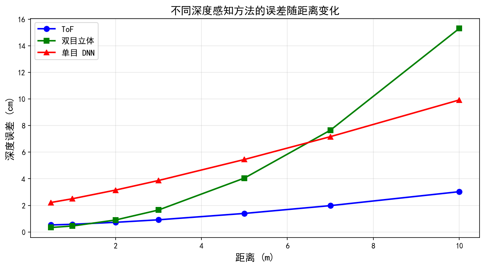
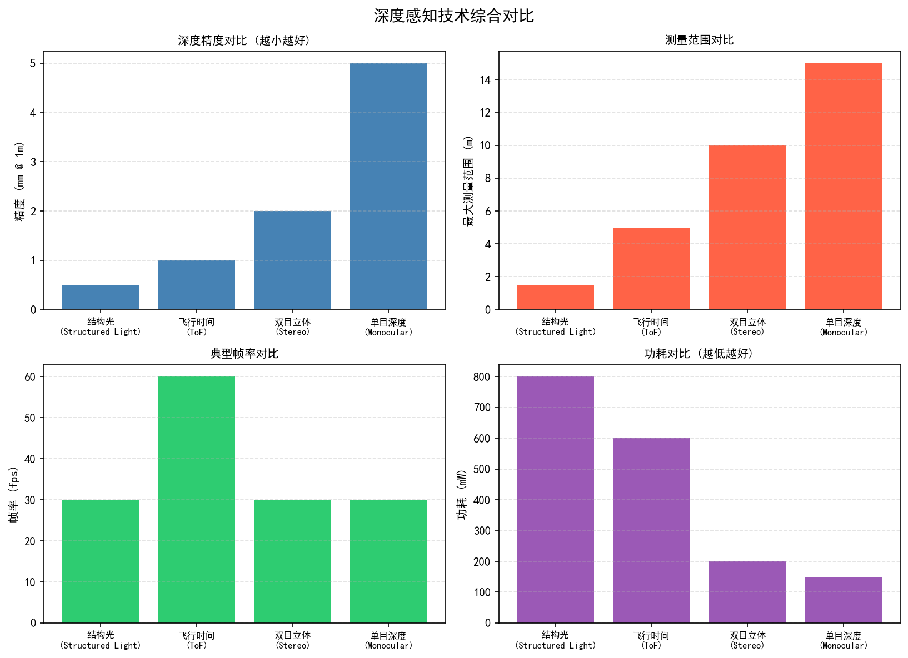
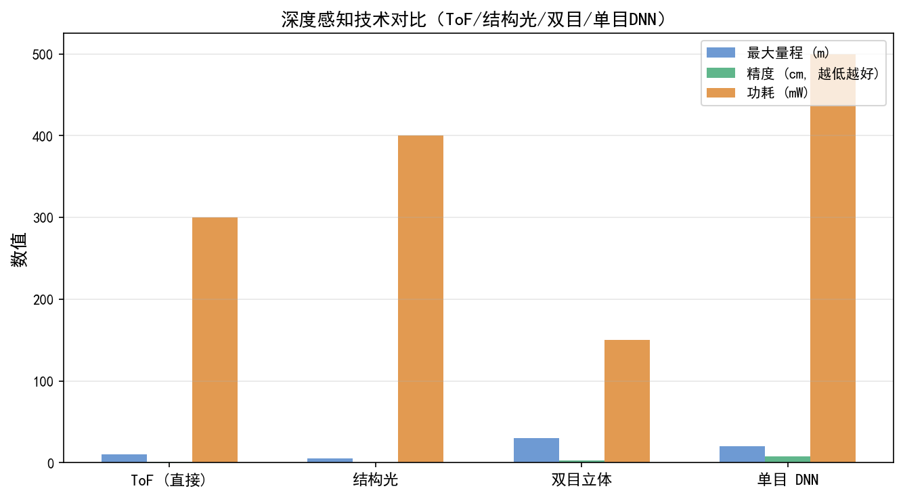
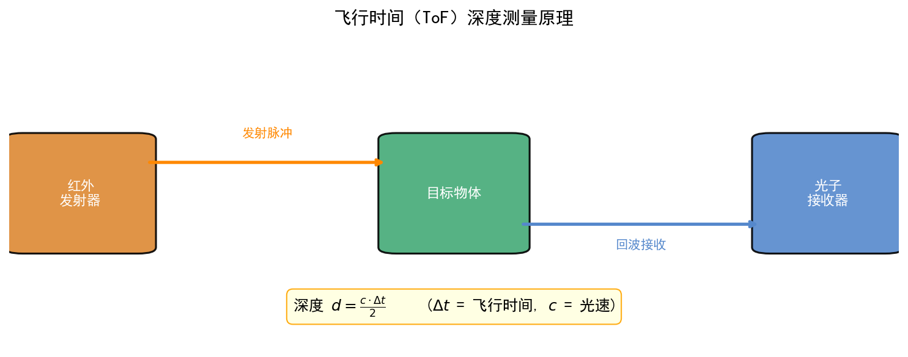
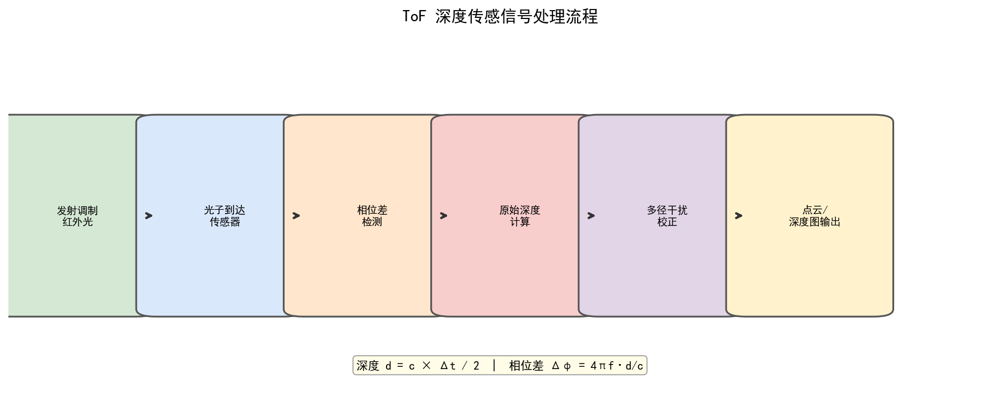

# 第一卷第12章：深度感知（Depth Sensing）

> ⚠️ **本章已迁入附录 I**：详见 [`appendix/appendix_I_special_imaging_systems_ch.md`](../../appendix/appendix_I_special_imaging_systems_ch.md)。本文件保留为完整版本，附录为精简工程参考版。

> **流水线位置：** 深度图生成模块；输出给虚化/AR/3D重建等下游模块
> **前置章节：** 第一卷第02章（光学基础）、第一卷第03章（传感器物理）、第一卷第09章（相机标定）
> **读者路径：** 算法工程师、系统工程师

---

RGB 传感器天然是个"一只眼睛"——只知道光从哪个方向来，不知道从多远的地方来。恢复深度信息有四条路：向场景打光并测量返回时间（ToF）、投射已知图案测变形（结构光）、双目视差三角测量（双目立体）、或者从单张图像靠学习推断（单目估计）。四条路各有硬件成本、精度范围、室外鲁棒性的不同取舍，手机工程师通常不会只选一种。

---

## §1 原理（Theory）

### 1.1 深度感知技术分类

深度感知技术按照是否主动向场景发射光源，可分为**主动（Active）**与**被动（Passive）**两大类。

**主动深度感知**依赖自身发射的光源与场景的交互来测量深度，典型技术包括：
- 飞行时间（Time-of-Flight, ToF）：测量光脉冲或调制光往返时间
- 结构光（Structured Light）：投射已知图案，从变形程度推算深度
- 激光雷达（LiDAR）：高精度点云扫描，多用于自动驾驶

**被动深度感知**仅利用场景自然光或环境光，典型技术包括：
- 双目立体视觉（Stereo Vision）：两路相机视差三角测量
- 单目深度估计（Monocular Depth Estimation）：单摄像头 + 深度学习推断

各技术的核心参数对比见表 1-1：

| 技术       | 精度        | 测量范围    | 功耗   | 环境光鲁棒性 | 典型应用            |
|------------|-------------|-------------|--------|--------------|---------------------|
| dToF       | 1–5 cm      | 0.5–200 m   | 高     | 中           | 自动驾驶、iPad LiDAR | 
| iToF       | 0.5–1 cm    | 0.1–10 m    | 中     | 弱（强光下失效）| 手机人像、AR        |
| 结构光     | 0.1–1 mm    | 0.1–3 m     | 中     | 弱（室外失效）| Face ID、工业检测   | 
| 双目立体   | 0.1–2%      | 0.3–100 m   | 低     | 强           | 手机虚化、无人机     | 
| 单目估计   | 相对深度    | 不限        | 低     | 强           | 移动端轻量场景      |

---

### 1.2 飞行时间（ToF）技术

ToF 技术利用光速恒定的原理，通过测量光信号往返时间来计算深度。根据调制方式不同，ToF 分为**直接 ToF（dToF）**和**间接 ToF（iToF）**两种。

#### 1.2.1 直接 ToF（dToF）

dToF 通过发射极短的激光脉冲，并精确测量脉冲从发射到被目标反射、再返回探测器的时间间隔 $t$，深度计算公式为：

$$Z = \frac{c \cdot t}{2}$$

其中 $c \approx 3 \times 10^8 \text{ m/s}$ 为光速，系数 2 来自光的往返路径。

为了精确测量纳秒级的时间差，dToF 通常使用单光子雪崩二极管（SPAD, Single-Photon Avalanche Diode）阵列作为探测器，配合时间数字转换器（TDC, Time-to-Digital Converter）实现皮秒级时间分辨率。Apple iPad Pro 和 iPhone 12 Pro 起搭载的 LiDAR Scanner 即采用 dToF 方案，具体参数：测量范围 0–5 m（室内），1 m 处深度精度约 ±1 cm，SPAD 阵列原始分辨率约 320×240，输出深度图通过 RGB 引导超分辨率上采样至主摄分辨率（1200万像素级别）；iPhone 15 Pro 起 LiDAR 模组集成了更高密度 SPAD，近距（< 0.5 m）精度有所提升，主要用于 AR 锚点定位与人像景深分割（Apple 未公开具体精度数值）。

**dToF 的核心限制**在于探测器单价高、空间分辨率低（典型 SPAD 阵列分辨率为 256×256–320×240 级别），以及在强环境光（室外 >100 klux）下信噪比急剧下降的问题。

#### 1.2.2 间接 ToF（iToF）

iToF 不直接测量时间，而是通过连续波调制（Continuous Wave Modulation, CWM）方式，测量发射光与接收光之间的**相位差**来间接计算深度。

设调制频率为 $f_{\text{mod}}$，发射的正弦调制光可表示为 $S(t) = A \cos(2\pi f_{\text{mod}} t)$，经过距离 $Z$ 的往返后，返回信号相对发射信号产生相位延迟 $\phi$：

$$\phi = \frac{4\pi f_{\text{mod}} Z}{c}$$

因此深度计算公式为：

$$Z = \frac{c}{4\pi f_{\text{mod}}} \cdot \phi$$

在实际 iToF 传感器中，通常采用四相位采样（0°、90°、180°、270°）获取正交分量 $I$（同相）和 $Q$（正交），相位差通过反正切函数计算：

$$\phi = \arctan\left(\frac{Q}{I}\right)$$

代入深度公式：

$$Z = \frac{c}{4\pi f_{\text{mod}}} \cdot \arctan\left(\frac{Q}{I}\right)$$

幅度（反射率指示）为：

$$A = \sqrt{I^2 + Q^2}$$

以 Sony IMX556 为例，调制频率 $f_{\text{mod}} = 20$ MHz 时，单频连续波 iToF 的最大不模糊距离（Maximum Unambiguous Range, MUR）为：

$$Z_{\max} = \frac{c}{2 f_{\text{mod}}} = \frac{3 \times 10^8}{2 \times 20 \times 10^6} = 7.5 \text{ m}$$

当目标距离超过 $Z_{\max}$ 时，相位发生 $2\pi$ 折返，导致深度模糊。实际系统常采用多调制频率（Multi-frequency）或相位解缠（Phase Unwrapping）方法来扩展不模糊距离范围。

华为 P30 Pro、小米 10 Ultra 等机型均集成了 iToF 传感器，主要用于人像深度辅助（有效范围约 0.3–3 米）和 AR 功能（最远约 5 米，3 米以上精度显著下降）。

**iToF 的主要挑战包括：**

1. **多路径干扰（Multipath Interference, MPI）**：光线在物体间多次反射后叠加，导致相位测量偏差，在玻璃、镜面、角落等区域尤为严重。
2. **运动模糊**：四相位采样需在不同时刻曝光，若场景中存在运动目标，采集的四帧之间不一致，导致深度误差。
3. **强光饱和**：室外强烈的环境红外光（太阳光中包含大量 850–940 nm 红外成分）会淹没 iToF 的调制信号，使测量失效。

---

### 1.3 结构光（Structured Light）

结构光通过向场景投射**已知编码图案**，利用图案在物体表面的**变形**，结合三角测量原理计算深度。

#### 1.3.1 三角测量原理

设投影仪与相机之间的基线距离为 $B$，投影仪焦距为 $f_p$，相机焦距为 $f_c$，投影仪像素坐标 $u_p$ 与相机像素坐标 $u_c$ 之间的视差为 $d = u_p - u_c$，则深度为：

$$Z = \frac{B \cdot f_c}{d}$$

这与双目立体视觉的公式形式相同，差别在于"第二相机"被替换成了投影仪。由于投影图案编码已知，相比双目视觉的特征匹配，结构光的对应点查找更加稳健，适合无纹理表面。

#### 1.3.2 编码方案

常见的结构光编码方案包括：

- **随机散斑（Random Speckle）**：PrimeSense（后被 Apple 收购）技术，Apple Face ID（TrueDepth 相机，iPhone X 起）即采用此方案，投射**超过 30,000 个**不可见近红外（940 nm）散斑点（Apple 官方表述 "more than 30,000 invisible dots"），通过匹配散斑图案获取深度图，输出深度分辨率约 640×480，有效工作距离约 20–50 cm（Face ID 人脸解锁场景最大有效距离约 0.5 m），深度精度约 0.5–1 mm @ 30 cm。华为 Mate 20 Pro 及部分荣耀旗舰机型同样采用前置 3D 结构光模块（由汇顶科技/奥比中光提供），投射点数约 15,000–20,000 个，用于人脸解锁与 3D 动态表情捕捉（Animoji 类功能）。优点是单帧采集，适合动态场景（人脸识别）；缺点是深度分辨率相对有限，室外强光下散斑对比度急剧下降。
- **相移条纹（Phase Shift Fringe）**：投射多组正弦条纹（通常 3–4 幅不同相位），通过相位解包裹获取高精度深度图，深度精度可达 0.1 mm 量级，但需多帧采集，不适合动态场景，主要用于工业检测。
- **二值编码（Binary Coded）**：格雷码等序列化编码，每个位置有唯一二进制码，鲁棒性好但需多帧采集。

#### 1.3.3 精度与范围的权衡

结构光在近距离（0.1–1.5 m）具有极高精度，但随距离增大，视差 $d$ 减小，深度精度迅速下降（精度正比于 $Z^2$）。此外，由于依赖主动光源图案，室外强光环境下信噪比极低，实用范围通常限于室内或近距离场景。

---

### 1.4 双目立体视觉（Stereo Vision）

双目立体视觉利用两个相机从不同角度拍摄同一场景，通过寻找对应像素点（**匹配**）计算**视差**（Disparity），再由视差恢复深度。

#### 1.4.1 深度-视差基本公式

设两相机的基线距离（光心间距）为 $B$，相机焦距为 $f$，左右图像中对应点的水平坐标差为视差 $d$，则深度为：

$$Z = \frac{f \cdot B}{d}$$

深度分辨率（深度误差随距离的变化）为：

$$\frac{\partial Z}{\partial d} = -\frac{f \cdot B}{d^2} = -\frac{Z^2}{f \cdot B}$$

这意味着双目视觉的**深度精度随距离平方衰减**，近距离测量精度高，远距离误差大。增大基线 $B$ 或焦距 $f$ 可改善远距精度，但受手机形态约束，基线通常只有 15–35 mm 。

#### 1.4.2 立体匹配算法

核心挑战是在左右图像中找到正确的对应像素对。主流算法包括：

**半全局匹配（Semi-Global Matching, SGM）** 由 Hirschmuller（2008）**[2]** 提出，是目前精度与效率最佳平衡的经典算法。其核心思想是在一维代价路径上进行动态规划，从多个方向（通常 8 个方向）汇聚代价：

$$L_r(p, d) = C(p, d) + \min \begin{cases} L_r(p-r, d) \\ L_r(p-r, d-1) + P_1 \\ L_r(p-r, d+1) + P_1 \\ \min_{i} L_r(p-r, i) + P_2 \end{cases} - \min_k L_r(p-r, k)$$

其中 $C(p,d)$ 为像素 $p$ 在视差 $d$ 处的匹配代价（通常用 Census 变换或 SAD），$P_1$、$P_2$ 为平滑性惩罚项，$r$ 为方向向量。

最终视差图通过 Winner-Take-All（WTA）策略从多方向代价聚合结果中选取。

**置信度过滤**是提升双目质量的关键后处理步骤：
- 左右一致性检验（Left-Right Consistency Check）：分别计算左视图深度和右视图深度，若两者不一致则标记为无效
- 唯一性检验（Uniqueness Check）：最优视差与次优视差代价差距过小，说明匹配不可靠
- 无纹理区域检测：局部方差过低的区域匹配不可信

#### 1.4.3 手机中的双目实现

受手机形态因素限制，手机双目方案通常采用：
- **主摄 + 超广角**：视差大但需校正畸变，常用于辅助人像虚化
- **主摄 + 长焦**：视场角差异大，需做图像归一化，适合中远距离深度

由于手机双目基线短（通常 10–30 mm ），0.5 m 以内精度尚可，1 m 以外误差显著增大，因此高端手机通常将双目与 ToF 或结构光组合使用。

---

### 1.5 单目深度估计（Monocular Depth Estimation）

从单张 RGB 图像估计深度是一个本征病态问题（ill-posed problem）——相同的二维图像理论上可对应无数种三维场景配置。深度学习通过学习场景的先验知识（物体大小、透视规律、纹理梯度等）来缓解这一问题。

#### 1.5.1 自监督学习方法

**Monodepth2**（Godard et al., 2019）**[3]** 是自监督单目深度估计的代表工作。其核心思想是：利用视频序列中相邻帧之间的自我运动（ego-motion）作为监督信号，通过图像重建损失（Photometric Loss）训练深度网络，无需真实深度标注：

$$\mathcal{L}_p = \alpha \frac{1 - \text{SSIM}(I_t, \hat{I}_t)}{2} + (1-\alpha) \|I_t - \hat{I}_t\|_1$$

其中 $\hat{I}_t$ 是利用预测深度和相邻帧通过双线性插值重建的目标帧，$\text{SSIM}$ 为结构相似性度量。

**PackNet**（Guizilini et al., CVPR 2020）提出了 Pack/Unpack 重排模块：Pack 操作将特征图的局部空间邻域打包到通道维度（本质是空间→通道重排，类似 pixel unshuffle），以无损替代传统步进卷积的下采样，避免空间细节丢失；Unpack 为其逆操作用于解码器上采样。整体网络仍基于 2D 卷积 U-Net 架构，而非 3D 卷积，在 KITTI 数据集上取得了接近监督学习的精度。

#### 1.5.2 监督学习方法

**MiDaS**（Ranftl et al., 2020）**[4]** 通过多数据集混合训练，解决了不同数据集深度标注尺度不一致的问题，实现了对多样化场景的鲁棒泛化。**DPT**（Dense Prediction Transformer, Ranftl et al., 2021）将 Vision Transformer（ViT）引入密集预测任务，利用全局注意力机制捕获长程依赖关系，在深度估计精度上显著超越纯 CNN 方法。

**Depth Anything v1/v2**（Yang et al., CVPR 2024 / NeurIPS 2024）**[7]** 代表了单目深度估计领域的基础模型范式转变。v1 在 62M 张无标注图像上做半监督预训练，结合 1.5M 张有标注数据，构建深度感知基础模型；在 NYU-Depth v2 测试集上 δ₁ 达到 0.984，是目前最广泛使用的开源深度估计通用模型（GitHub 星标 >14k）。v2 用高质量合成数据（~595K 张精标图）替换原始粗标签数据，在细粒度深度边界（尤其是透明/镜面材质）上质量显著改善，在 DA-2K 细粒度深度评测上相对 v1 改善 15%。

**UniDepth**（Piccinelli et al., CVPR 2024）**[8]** 将相机内参作为联合预测量（而非已知输入），通过球形嵌入（spherical embedding）的相机参数化实现对任意未知相机的零样本泛化，直接输出以米为单位的绝对深度（无需尺度-偏移对齐后处理）。在 NYU-Depth v2 上 AbsRel = 0.052，KITTI 上 AbsRel = 0.048，是目前最强的零样本度量深度估计基准。

#### 1.5.3 尺度模糊问题

单目深度估计的根本局限在于**尺度模糊（Scale Ambiguity）**：网络输出的是相对深度（Relative Depth），无法确定绝对尺度。工程解决方案包括：
- 引入已知尺寸的参考物（如地面平面、车道线）
- 融合 IMU 数据估计绝对尺度
- 与稀疏 LiDAR 点云做尺度对齐（Depth Completion）
- 使用度量深度模型（UniDepth、Metric3D v2）直接输出绝对深度（无需后对齐，适合手机 AR 应用）

---

### 1.6 多技术融合

在实际产品中，单一深度技术往往难以满足全场景需求。多技术融合可以发挥各技术的优势，弥补各自的短板。

#### 1.6.1 ToF + RGB 双目融合

典型架构是将 iToF 的稠密但噪声较大的深度图与 RGB 双目的高分辨率但远距不稳定的深度图进行融合：

$$Z_{\text{fused}}(p) = \frac{w_{\text{ToF}}(p) \cdot Z_{\text{ToF}}(p) + w_{\text{stereo}}(p) \cdot Z_{\text{stereo}}(p)}{w_{\text{ToF}}(p) + w_{\text{stereo}}(p)}$$

其中置信度权重 $w(p)$ 由各自的置信图给出，ToF 置信度通常与幅度图 $A = \sqrt{I^2 + Q^2}$ 正相关，双目置信度与左右一致性误差负相关。

#### 1.6.2 深度补全（Depth Completion）

利用稀疏 LiDAR 点云（或稀疏 ToF 测量）结合 RGB 图像，通过神经网络补全稠密深度图，是自动驾驶领域的常见方案。代表工作包括 CSPN（Cheng et al., 2018）和 PENet（Hu et al., 2021）。

#### 1.6.3 事件相机 + 深度融合

事件相机（详见第一卷第16章）与深度传感器的融合是新兴研究方向：事件相机以微秒级时间分辨率感知亮度变化，但不直接输出深度；ToF/LiDAR 提供稠密深度但帧率受限（通常 30 fps）。融合策略主要有两类：

- **深度时间超分辨率**：利用事件流的高时间密度，在相邻深度帧之间插值出中间时刻的深度估计，代表工作有 TORE（Muglikar et al., CVPR 2021）；
- **深度去模糊**：快速运动时 ToF 深度帧因运动模糊产生边缘误差，事件流可提供运动轨迹约束，辅助深度帧锐化（Zhu et al., 2022）；
- **联合光流与深度**：事件帧-深度联合估计光流，用于动态场景的三维运动重建（DSEC 数据集提供配套真值）。

当前主要障碍是事件相机与 ToF 的空间分辨率均较低，融合后的稠密深度图仍需依赖 RGB 引导超分辨率方可达到手机应用所需精度。

---

## §2 标定（Calibration）

### 2.1 ToF 传感器标定

iToF 传感器存在系统性的相位偏差，主要来源包括：

**相位非线性误差（Phase Nonlinearity / Wiggling Error）**：由于实际 iToF 传感器中存在非正弦的谐波分量，相位-深度映射不完全线性，表现为深度值随真实距离呈现周期性波动（通常幅度为 1–3 cm）**[1]**。标定方法是使用精密平面靶标在不同距离处采集数据，拟合相位-真实距离的多项式修正曲线，或预存查找表（LUT）进行逐像素补偿。

**固定图案噪声（Fixed Pattern Noise, FPN）**：传感器各像素的相位偏移存在固定差异，通过对均匀反射面（如积分球）进行暗帧采集并在运行时减去，可显著降低 FPN 的影响。

**幅度相关误差（Amplitude-dependent Error）**：反射率高低导致接收信号幅度变化，而幅度变化会引入额外的相位偏移。需在不同幅度条件下建立修正模型。

**温度漂移标定**：ToF 传感器的相位偏移随温度变化（约 0.1–0.5 cm/°C）**[1]**，需在多个温度点（如 0°C、25°C、50°C）采集数据，建立温度-深度修正模型。

### 2.2 RGB-Depth 外参标定

深度图与 RGB 图像往往来自不同传感器，需要标定它们之间的**外参（Extrinsic Parameters）**，即旋转矩阵 $R$ 和平移向量 $t$，才能将深度图对齐（对齐/投影）到 RGB 坐标系，实现像素级的 RGB-D 对齐（Depth Registration）。

标准流程：
1. 使用棋盘格或圆点阵列靶标，在 RGB 和深度相机中分别提取角点/圆心的图像坐标
2. 利用 PnP（Perspective-n-Point）或直接线性变换方法，求解各相机的内参（如果尚未标定）和外参
3. 通过最小化重投影误差，联合优化 RGB 与深度相机的相对位姿：

$$[R, t] = \arg\min \sum_i \left\| x_i^{\text{RGB}} - \pi_{\text{RGB}}\left(R \cdot \pi_{\text{depth}}^{-1}(x_i^{\text{depth}}, Z_i) + t\right) \right\|^2$$

4. 对于 iToF 传感器，还需注意其与 RGB 相机之间的时间同步（通常要求在同一帧内或 1 ms 以内同步采集），否则手持场景下的微小抖动会导致对齐误差。

### 2.3 深度精度验证

标定完成后，需对深度精度进行系统性验证。常用方法是将已知距离的精密平面靶标放置在不同距离（如 0.3 m、0.5 m、1.0 m、1.5 m、2.0 m、3.0 m）处，对靶标区域内的深度值与真实距离进行比较，绘制**精度-距离曲线**（Accuracy vs. Range Curve）。

指标通常包括：
- **平均绝对误差（MAE, Mean Absolute Error）**：$\text{MAE} = \frac{1}{N}\sum |Z_{\text{pred}} - Z_{\text{gt}}|$
- **均方根误差（RMSE, Root Mean Square Error）**：$\text{RMSE} = \sqrt{\frac{1}{N}\sum (Z_{\text{pred}} - Z_{\text{gt}})^2}$
- **系统性偏差（Bias）**：均值误差，反映标定残余系统误差
- **精度随距离的变化率**（通常 iToF 在 1 m 处精度约 5–10 mm，3 m 处退化到 20–30 mm）**[1]**

---

## §3 调参（Tuning）

### 3.1 ToF 积分时间与精度/噪声权衡

iToF 传感器每次采集的信噪比（SNR）由到达光子数决定，而光子数正比于积分时间（Integration Time）。增大积分时间可提高 SNR、降低深度噪声，但带来以下副作用：

- **运动模糊**：积分时间过长时，运动目标在四相位采集期间发生位移，导致深度误差（典型症状：运动边缘出现深度"鬼影"）
- **强光饱和**：环境光强烈时，长积分导致像素饱和，深度完全失效
- **功耗增大**：积分时间越长，发射功率/时间乘积越大，电池消耗越高

实际调参策略：
- 采用**双积分时间策略**：短积分（约 100 μs）用于近距或强反射区域，长积分（约 400 μs）用于远距或低反射区域，依据幅度图自适应切换 
- **HDR 模式**：多曝光合并（类似 RGB 的 HDR），高幅度区域取短曝光结果，低幅度区域取长曝光结果
- **积分时间上限**：通常根据最大允许运动（如人脸运动速度 0.5 m/s，允许深度误差 5 mm）反推积分时间上限

### 3.2 深度图滤波（时域 + 空域）

原始 ToF 深度图噪声较大（高频随机噪声），且存在边缘飞点，需要进行多层次滤波：

**空域滤波（Spatial Filtering）：**
- **双边滤波（Bilateral Filter）**：兼顾空间距离与深度值相似性，在平滑噪声的同时保留深度边缘：

$$Z_{\text{filtered}}(p) = \frac{\sum_{q \in \Omega} G_s(\|p-q\|) \cdot G_r(|Z(p)-Z(q)|) \cdot Z(q)}{\sum_{q \in \Omega} G_s(\|p-q\|) \cdot G_r(|Z(p)-Z(q)|)}$$

- **联合双边滤波（Joint Bilateral Filter / Cross Bilateral Filter）**：用高分辨率 RGB 图像的边缘信息指导深度图滤波，避免深度图因自身噪声而在空域滤波中跨越真实边界

**时域滤波（Temporal Filtering）：**
- **指数移动平均（EMA）**：$Z_t = \alpha Z_{\text{raw},t} + (1-\alpha) Z_{t-1}$，$\alpha \in [0.3, 0.7]$，适合静态场景，可显著降低帧间噪声
- **运动自适应时域滤波**：检测到运动时提高 $\alpha$（更信任当前帧），静止时降低 $\alpha$（充分利用历史帧），避免运动目标的深度拖尾

### 3.3 深度图去噪（Depth Denoising）

原始 ToF 或双目深度图通常含有三类噪声：随机散粒噪声（与幅度 $A$ 负相关）、结构性飞点（边缘区域）和 MPI 偏差（系统性深度偏浅）。有效的深度去噪需分层处理：

**（1）RGB 引导联合滤波**

利用 RGB 图像的边缘信息作为权重引导，对深度图进行联合双边滤波（Joint Bilateral Filter）：

$$Z_{filtered}(p) = \frac{\sum_{q \in \Omega} w_s(p,q) \cdot w_r(Z_p - Z_q) \cdot w_{rgb}(I_p^{RGB} - I_q^{RGB}) \cdot Z(q)}{\sum_{q \in \Omega} w_s \cdot w_r \cdot w_{rgb}}$$

其中 $w_{rgb}$ 利用 RGB 图像的颜色相似性来抑制跨边界深度平滑（防止 RGB 纹理边缘处的深度混叠）。

**（2）深度补全网络（Depth Completion）**

对于稀疏 ToF 测量（如 LiDAR 点云），结合 RGB 图像通过稠密预测网络补全深度：

- **CSPN**（Cheng et al., ECCV 2018）：卷积空间传播网络，将仿射变换传播应用于深度图细化
- **PENet**（Hu et al., ICRA 2021）：双分支网络分别处理 RGB 和稀疏深度，通过迭代精化获得稠密深度
- **CompletionFormer**（Zhang et al., CVPR 2023）：引入 Transformer 捕获全局深度一致性，在 KITTI 和 NYUv2 上刷新 SOTA

**（3）基于 NLSPN/RAFT 的端到端深度估计**

RAFT-Stereo（Lipson et al., 3DV 2021）将 RAFT 光流框架扩展到立体视差估计，通过迭代更新视差场，在 ETH3D 和 Middlebury 基准上大幅优于传统 SGM，已被 Google Pixel 等旗舰机型用于双目深度生成。

**深度去噪的典型 pipeline（手机 iToF）：**
1. 原始 IQ 数据（4 相位帧） → 相位计算 → 粗深度图
2. 幅度图阈值过滤（$A < A_{min}$ 标记无效）
3. 空域联合双边滤波（RGB 引导）
4. 时域指数平均（$\alpha = 0.4$–0.6，静止场景）
5. 置信度加权输出

### 3.4 置信度图的阈值设置

置信度图（Confidence Map）是深度图质量评估的关键辅助输出，用于标记不可靠的深度像素。常用的置信度来源：

- **iToF 幅度图**：幅度 $A = \sqrt{I^2 + Q^2}$ 过低（< 50–100 计数，传感器相关）说明信号过弱，深度不可信
- **双目置信度**：左右一致性误差 $|d_L - d_R| > \epsilon$（通常 $\epsilon = 1$ 像素）的区域标记为无效
- **深度梯度**：深度图中过大的空间梯度往往指示飞点或遮挡边界，可辅助过滤

阈值设置需在**有效像素率**与**深度精度**之间取得平衡：阈值过低（过于严格）会导致大量有效像素被丢弃，产生空洞；阈值过高（过于宽松）则保留了大量噪声像素，影响下游应用（如虚化效果出现深度错误导致的背景泄漏）。

推荐调参流程：
1. 在标准场景（平面靶标 + 有纹理靶标）下统计幅度/置信度的分布
2. 以 RMSE 为优化目标，扫描阈值参数，绘制 RMSE vs. 有效像素率曲线
3. 根据应用场景选择合适工作点（如人像虚化优先保证有效像素覆盖人体区域，宁可保留少量噪声）

---

## §4 失效场景（Failure Cases）

### 4.1 飞点（Flying Pixels）

飞点（Flying Pixels，又称边缘伪影/混合像素）是深度感知中最常见的伪影之一，出现在深度不连续的边界处（如前景物体边缘）。其物理成因是：ToF 传感器的像素或双目匹配的搜索窗口在边界处同时覆盖了前景（近处）和背景（远处），导致深度值介于两者之间，形成"悬浮"的虚假深度点。

**表现**：深度图中物体边缘出现一圈过渡像素，其深度值不属于前景也不属于背景，在深度可视化中呈现为飘散的点云，在虚化应用中导致前景轮廓处出现背景泄漏的光晕（Halo Artifact）。

**缓解方法**：
- 后处理中对深度边缘进行腐蚀（Erosion），丢弃边界附近若干像素
- 利用 RGB 图像的精确边缘（基于语义分割或边缘检测）替换深度图中的混合像素区域
- 使用联合双边滤波，以 RGB 边缘为引导，避免跨越深度不连续区域的深度平滑

### 4.2 多路径干扰（Multipath Interference, MPI）

多路径干扰是 iToF 和结构光系统特有的系统性误差，发生在光线经过多次反射后到达传感器的场景中（如墙角、玻璃后方物体、光滑金属表面）。由于传感器接收到的是直射光与多次反射光的叠加，测量的相位是加权混合相位，导致深度偏差（通常偏浅，即测量距离比真实距离小）。

**MPI 修正方法**：
- **稀疏去混叠（Sparse Deconvolution）**：假设场景深度具有稀疏性，通过 L1 正则化反卷积恢复真实多深度分量
- **多频率 ToF**：使用多个调制频率采集，利用频率间的相位关系区分直射分量与多路径分量
- **深度学习方法**：训练端到端网络，从多帧 ToF 原始数据（IQ 图）直接预测 MPI 校正后的深度图（如 Agresti et al., 2019）

### 4.3 环境光饱和（iToF 在强光下失效）

iToF 传感器的核心工作原理依赖于对调制光的相位采样，而非直接测量总光子数。然而，当太阳光等宽谱环境光的红外成分（850–940 nm 波段）过强时，会占据传感器的动态范围，导致以下问题：

- **像素饱和**：环境光占满像素满井容量，调制光信号被完全淹没
- **SNR 急剧下降**：即使未饱和，过强的背景信号也使调制光的相对信号强度极低

**应对方案**：
- **窄带滤光片**：在传感器前加装 10–20 nm 带宽的窄带滤光片，只允许与光源波长匹配的光通过，可抑制大部分太阳光。代价是增加镜头组件成本和厚度。
- **高调制频率**：增大 $f_{\text{mod}}$ 可以减小积分时间（维持同样 MUR 条件下），从而降低环境光积累
- **差分测量**：部分传感器支持在同一曝光周期内交替采样调制光开/关，通过差分消除稳定的背景光分量

### 4.4 运动模糊导致的深度估计误差

iToF 的四相位采样需要依次在不同相位时刻曝光（时间差可达数百微秒到数毫秒），若场景中存在运动目标，各相位帧中目标位于不同位置，叠加计算的相位不再对应任何真实距离，产生系统性深度误差。

双目立体视觉中，若左右相机之间存在时间差（非同步触发），运动目标在左右帧中的位置不一致，会导致视差计算错误，进而得到错误深度。

**缓解方案**：
- **全局快门传感器（Global Shutter）**：所有像素同时曝光，消除卷帘快门引入的运动伪影
- **缩短采样间隔**：在帧率允许的范围内尽量压缩四相位采样的总时间窗口
- **运动目标检测与掩码**：利用光流或帧差检测运动区域，对该区域的深度值标记为低置信度，下游使用时降权或忽略

---

## §5 评测（Evaluation）

### 5.1 深度精度指标

深度精度评测最常用的数值指标包括：

**均方根误差（RMSE）：**

$$\text{RMSE} = \sqrt{\frac{1}{N}\sum_{i=1}^{N}\left(Z_{\text{pred},i} - Z_{\text{gt},i}\right)^2}$$

RMSE 对大误差更敏感，能反映偶发性的大偏差问题，适合评测系统最坏情况性能。

**平均绝对误差（MAE）：**

$$\text{MAE} = \frac{1}{N}\sum_{i=1}^{N}\left|Z_{\text{pred},i} - Z_{\text{gt},i}\right|$$

MAE 对离群点（飞点）鲁棒性更好，反映典型误差水平。

**阈值精度（Threshold Accuracy, δ）：**

$$\delta_n = \frac{1}{N}\left|\left\{i \,\middle|\, \max\left(\frac{Z_{\text{pred},i}}{Z_{\text{gt},i}}, \frac{Z_{\text{gt},i}}{Z_{\text{pred},i}}\right) < 1.25^n \right\}\right|$$

$\delta_{<1.25}$（即 $n=1$）表示预测深度与真实深度之比在 $[1/1.25, 1.25]$ 范围内的像素占比，是单目深度估计领域最常用的精度指标。$\delta_{<1.25^2}$ 和 $\delta_{<1.25^3}$ 分别对应更宽松的误差容限。

**相对误差（Relative Error, REL）：**

$$\text{REL} = \frac{1}{N}\sum_{i=1}^{N}\frac{\left|Z_{\text{pred},i} - Z_{\text{gt},i}\right|}{Z_{\text{gt},i}}$$

相对误差消除了距离的影响，适合跨距离范围的统一评估。

### 5.2 深度完整性（Coverage）

深度完整性（Depth Coverage / Fill Rate）衡量有效深度像素的比例：

$$\text{Coverage} = \frac{\text{有效深度像素数}}{\text{图像总像素数}} \times 100\%$$

在实际评测中，"有效深度像素"的定义需结合置信度阈值：只有置信度高于设定阈值的像素才计入有效像素，并参与精度计算。Coverage 与精度之间存在天然的 tradeoff：降低置信度阈值可提高 Coverage，但会引入更多误差像素，RMSE 升高。

完整的评测报告应同时给出在不同置信度阈值下的 RMSE-Coverage 曲线，而非单一数值。

### 5.3 抗干扰能力评测

工程化的深度感知系统还需要在各种干扰条件下进行系统性评测：

- **强环境光测试**：在 100,000 lux 自然光（晴天室外正午）和 10,000 lux 室内强光照明下，评测深度有效率和精度 
- **多设备干扰测试**：多台同类 ToF 设备同时工作，评测互相干扰导致的深度误差（适用于会议室等多人 AR 场景）
- **多路径场景测试**：在角落、玻璃橱窗等多路径强烈场景下，评测 MPI 误差量级
- **运动测试**：被测目标以 0.5 m/s、1.0 m/s、2.0 m/s 速度移动，评测运动模糊导致的深度误差
- **温度稳定性测试**：0°C、25°C、50°C 环境温度下，标定后的深度精度是否满足规格

---

## §6 代码

本章配套代码（见本目录 .ipynb 文件）

代码示例覆盖以下内容：
1. **iToF 深度计算模拟**：从四相位原始数据（I₀°, I₉₀°, I₁₈₀°, I₂₇₀°）计算相位和深度，可视化相位噪声
2. **SGM 双目立体匹配**：基于 OpenCV 的 `StereoSGBM` 实现，演示视差图计算与后处理
3. **深度精度评测**：计算 RMSE、MAE、$\delta_{<1.25}$ 等指标，绘制精度-距离曲线
4. **双边滤波深度平滑**：对比原始深度图与滤波后深度图的噪声水平
5. **MiDaS 单目深度推断**：调用预训练 MiDaS 模型对任意 RGB 图像估计相对深度图

---

---

> **工程师手记：深度传感器的工程精度边界与环境干扰**
>
> **ToF与结构光在不同距离的精度对比：** 直接ToF（dToF）传感器在5m距离的深度精度典型值约±2cm，主要受限于TDC（Time-to-Digital Converter）分辨率（通常10–20ps，对应约1.5–3mm）及多径反射（Multipath Interference）。间接ToF（iToF）在2m内精度约±1cm，但超过3m时相位展开（Phase Unwrapping）误差急剧增大。结构光（Structured Light）在0.5m距离精度可达±0.5mm（散斑投影间距约0.1mm），但精度随距离平方衰减，1.5m时已降至±5mm。手机人像模式的主力深度方案选择：近距（<1.5m）优先结构光，中远距（1.5–5m）用双目视差或iToF，5m以上主要靠DNN深度估计。
>
> **深度图与RGB分辨率不匹配的工程问题：** ToF传感器分辨率通常为320×240或640×480，而主摄RGB分辨率达4000×3000甚至更高，分辨率比约1:60至1:120。直接上采样深度图到RGB分辨率会在边缘产生深度渗色（Depth Bleeding）：前景物体深度值扩散至背景区域（或反之），导致虚化边缘出现半透明伪影。工程解决方案通常是：在深度上采样时引入RGB语义边缘约束（Joint Bilateral Upsampling），以RGB边缘梯度作为深度上采样的引导信号，可将边缘渗色宽度从8–12像素压缩至1–2像素。
>
> **户外强光对ToF的干扰：** 直射阳光照度可达100,000 lux（100 klux），其中940nm近红外辐照约3–5 W/m²，远超典型ToF发射功率（手机级约20–50mW，对应1m处约1–2 mW/m²）。80 klux以上场景中，环境光噪声可使ToF信噪比下降至5dB以下，深度测量误差扩大至±10cm甚至完全失效。抗干扰措施包括：窄带滤光片（±10nm @940nm）、调制频率差异化（避免与阳光调制频率混叠）、提高发射峰值功率（脉冲模式可提升10×）。户外人像模式深度依赖ToF时，需在算法层加入置信度掩码，将低SNR区域回退到双目视差或DNN估计。
>
> *参考：Hansard et al. "Time-of-Flight Cameras: Principles, Methods and Applications"（2013）；Scharstein & Szeliski, IJCV 2002 Stereo Evaluation；Apple Face ID White Paper（2017）*

## 插图

*图1. 各深度感知技术精度随距离变化对比曲线（图片来源：Hansard et al., "Time-of-Flight Cameras", Springer, 2012）*

*图2. 主动与被动深度感知方案性能对比（图片来源：作者自绘）*

*图3. 深度感知技术分类总览（ToF、结构光、双目、单目深度估计）（图片来源：作者自绘）*

*图4. 飞行时间（ToF）深度测量原理示意图（图片来源：Hansard et al., "Time-of-Flight Cameras", Springer, 2012）*

*图5. iToF相位差信号处理流程示意图（图片来源：作者自绘，参考Hansard et al., 2012）*

---

## 习题

**练习 1（理解）**
本章介绍了 dToF、iToF、结构光、双目立体视觉和单目深度估计五种深度感知方案。请对比分析：(a) iToF 在强环境光（室外晴天 > 100 klux）下信噪比急剧下降的物理原因是什么？dToF（SPAD + TDC）如何缓解这一问题？(b) 双目立体视觉在低纹理区域（平整墙壁、蓝天）深度估计失效，根本原因是什么？如何通过投射纹理辅助解决？(c) Apple Face ID 使用结构光而非 iToF 做人脸识别，主要是因为精度（0.1 mm vs 5 mm）的差异，请说明这 50 倍精度差异对 3D 人脸防伪的具体意义。

**练习 2（计算）**
某 iToF 传感器调制频率 $f_\text{mod} = 100\,\text{MHz}$，相位分辨率 $\Delta\phi = 0.5°$。请计算：(a) 无模糊最大测量距离（$d_\text{max} = c/(2f_\text{mod})$，$c = 3\times10^8\,\text{m/s}$）；(b) 对应的深度精度（$\Delta d = c \cdot \Delta\phi / (4\pi f_\text{mod} \times 360°/360)$，注意将角度转换为弧度）；(c) 某目标的测量相位差为 $\Delta\phi = 72°$，对应的深度值是多少米？(d) 若 $f_\text{mod}$ 提高到 400 MHz，最大测量距离变为多少？精度如何变化？

**练习 3（编程）**
用 Python + NumPy/OpenCV 实现双目立体视差计算（SGBM 算法）：(a) 加载 Middlebury 双目数据集中的一对校正图像（rectified stereo pair），或用 OpenCV 内置的 `cv2.imread` 加载示例图；(b) 创建 `cv2.StereoSGBM_create` 对象，设置 `numDisparities=128, blockSize=11`；(c) 计算视差图并归一化显示；(d) 已知基线 $B = 60\,\text{mm}$，焦距 $f_x = 700\,\text{px}$，对图中视差值为 40 px 的区域计算实际深度 $Z = B \cdot f_x / d$（米），验证深度合理性。

## 参考文献

[1] Hansard et al., "Time-of-Flight Cameras: Principles, Methods and Applications", *Springer Briefs in Computer Science*, 2012.

[2] Hirschmuller, "Stereo processing by semiglobal matching and mutual information", *IEEE Transactions on Pattern Analysis and Machine Intelligence*, 2008.

[3] Godard et al., "Digging into self-supervised monocular depth estimation", *ICCV*, 2019.

[4] Ranftl et al., "Towards robust monocular depth estimation: Mixing datasets for zero-shot cross-dataset transfer", CVPR 2020（扩展版：IEEE TPAMI, 2022）.

[5] Scharstein et al., "A taxonomy and evaluation of dense two-frame stereo correspondence algorithms", *International Journal of Computer Vision*, 2002.

[6] Agresti et al., "Unsupervised domain adaptation for ToF data denoising with adversarial learning", *CVPR*, 2019.

[7] Yang et al., "Depth Anything: Unleashing the Power of Large-Scale Unlabeled Data", *CVPR*, 2024; "Depth Anything V2", *NeurIPS*, 2024. URL: https://depth-anything.github.io （v1: 62M 无标注 + 1.5M 有标注半监督预训练，NYU-Depth v2 δ₁=0.984；v2: 用精标合成数据替换粗标签，DA-2K 精度提升 15%。）

[8] Piccinelli et al., "UniDepth: Universal Monocular Metric Depth Estimation", *CVPR*, 2024. URL: https://github.com/lpiccinelli-eth/UniDepth （球形相机参数化，将内参作为联合预测量，直接输出米级绝对深度，NYU AbsRel=0.052，KITTI AbsRel=0.048。）

## §7 术语表（Glossary）

**深度感知（Depth Sensing）**
从传感器数据中获取场景三维深度信息的技术总称，分为主动（Active）和被动（Passive）两大类。主动方式自身发射光源（ToF、结构光、LiDAR），被动方式仅利用自然光（双目立体视觉、单目深度估计）。深度图是 ISP 计算摄影流水线的关键中间结果，供人像虚化、AR 空间定位、3D 重建等下游模块使用。

**飞行时间（Time-of-Flight, ToF）**
利用光速恒定原理，通过测量光信号往返时间或相位差来计算目标距离的技术总称。分为直接 ToF（dToF，直接测量脉冲往返时间）和间接 ToF（iToF，测量调制光相位差）。ToF 是目前手机和平板（Apple iPad LiDAR、华为/小米 iToF）深度感知的主流方案。

**直接 ToF（dToF）**
发射纳秒级极短激光脉冲，用 SPAD 阵列和 TDC 精确测量往返时间 $t$，深度 $Z = c \cdot t / 2$。优点是测量范围广（可达 5–200 m）、不受距离模糊限制；缺点是 SPAD 阵列成本高、分辨率偏低（典型 256×256）。Apple iPad Pro/iPhone 的 LiDAR Scanner 即 dToF 方案。

**间接 ToF（iToF）**
通过连续波调制（CWM）测量发射光与反射光之间的相位差来间接计算深度，$Z = c \phi / (4\pi f_{\text{mod}})$。单频连续波 iToF 的最大不模糊距离为 $Z_{\max} = c / (2 f_{\text{mod}})$（如 20 MHz 调制对应 7.5 m）。需四相位采样（0°/90°/180°/270°），存在多路径干扰、运动模糊和强光饱和等问题。华为/小米等手机后置 ToF 均采用 iToF 方案。

**最大不模糊距离（Maximum Unambiguous Range, MUR）**
iToF 系统在不发生相位折返（Phase Wrapping）前提下可正确测量的最大距离，公式为 $Z_{\max} = c / (2 f_{\text{mod}})$。调制频率越高，距离分辨率越好，但 MUR 越小。实际系统常通过多调制频率或相位解缠扩展不模糊距离范围。

**SPAD（Single-Photon Avalanche Diode，单光子雪崩二极管）**
dToF 的核心探测器件，利用雪崩击穿效应检测单个光子的到达时刻，配合 TDC（时间数字转换器）实现皮秒级时间分辨率。SPAD 阵列分辨率是限制 dToF 成像质量的关键瓶颈，正在从十万量级快速向百万像素级发展。

**结构光（Structured Light）**
向场景投射已知编码图案（随机散斑、条纹、格雷码等），利用图案在物体表面的变形，通过三角测量计算深度。Apple Face ID 的 TrueDepth 相机使用随机散斑方案，投射超过 30,000 个不可见红外点（Apple 官方表述为 "more than 30,000 invisible dots"）。结构光近距精度极高（可达 0.1 mm），但受限于室内/近距使用，室外强光下信噪比急剧下降。

**三角测量（Triangulation）**
双目立体视觉和结构光共同使用的深度恢复原理：利用两个已知位姿的"观测点"（两个相机，或相机+投影仪）对同一场景点的视角差（视差 $d$），根据几何关系恢复深度 $Z = f \cdot B / d$。深度精度随距离平方衰减（$\partial Z / \partial d = -Z^2 / fB$），近距离精度高、远距离误差大。

**视差（Disparity）**
双目立体视觉中，同一场景点在左右图像中的水平像素坐标之差 $d = u_L - u_R$。视差与深度成反比（$Z = fB/d$），视差越大深度越近。计算视差的核心挑战是立体匹配——在左右图像中找到对应像素点，无纹理区域和遮挡区域是立体匹配失败的主要场景。

**半全局匹配（Semi-Global Matching, SGM）**
Hirschmuller（2008）提出的立体匹配经典算法，在精度与计算效率之间取得最佳平衡。核心思想是沿 8 个方向进行一维动态规划代价聚合，通过惩罚项 $P_1$、$P_2$ 约束视差平滑性，最终用 Winner-Take-All 策略得到视差图。OpenCV 的 `StereoSGBM` 是其广泛使用的实现，是手机虚化深度图的常用算法基础。

**多路径干扰（Multipath Interference, MPI）**
iToF 系统特有的系统性误差：光线经过多次反射后叠加到达传感器，导致测量相位为多路径的加权混合值，使深度估计偏浅。在玻璃后方、角落、镜面等强多反射场景中最为严重。修正方法包括多频率 ToF、稀疏反卷积和深度学习端到端校正。

**单目深度估计（Monocular Depth Estimation）**
从单张 RGB 图像估计深度的深度学习方法。由于同一 2D 图像理论上对应无数种 3D 配置，该问题本质上病态（ill-posed），网络通过学习场景先验（物体大小规律、透视关系、纹理梯度）进行有监督（MiDaS、DPT）或自监督（Monodepth2、PackNet）估计。核心局限是尺度模糊（Scale Ambiguity）——输出为相对深度，无法直接确定绝对尺度。

**Pack/Unpack 操作（PackNet 中的核心模块）**
Guizilini 等（CVPR 2020）提出的无损下/上采样操作：Pack 将特征图的局部空间邻域（$r \times r$ 区域）重排到通道维度（类似 pixel_unshuffle），在降低分辨率的同时保留全部空间信息；Unpack 为逆操作。本质是空间→通道的维度重排，而非 3D 卷积，整体架构仍基于 2D 卷积 U-Net。相比传统步进卷积或池化，Pack 操作避免了下采样导致的细粒度空间信息丢失。

**尺度模糊（Scale Ambiguity）**
单目深度估计的根本局限：在没有外部尺度参考的情况下，深度网络无法从单张图像确定绝对距离，只能给出相对深度比例。解决方案包括：引入已知尺寸参考物（地面平面、车道线）、融合 IMU 数据、与稀疏 LiDAR 点云对齐（深度补全，Depth Completion）。

**深度补全（Depth Completion）**
融合稀疏深度测量（稀疏 LiDAR 点云、稀疏 ToF 采样）与 RGB 图像，通过神经网络生成稠密深度图的任务。利用 RGB 图像的纹理和边缘信息引导深度在无测量区域的传播，代表工作包括 CSPN（Cheng et al., 2018）和 PENet（Hu et al., 2021）。

**飞点（Flying Pixels）**
深度图中深度不连续边界处出现的伪影像素，其深度值介于前景和背景之间，在深度可视化中呈现为"悬浮"点云，在虚化应用中导致前景轮廓处的背景泄漏光晕（Halo Artifact）。成因是 ToF 像素或双目匹配窗口在边界处同时覆盖前景与背景。缓解方法包括边缘腐蚀和 RGB 引导的深度边缘替换。

**联合双边滤波（Joint Bilateral Filter / Cross Bilateral Filter）**
以高分辨率 RGB 图像的边缘/纹理信息作为引导（Guide），对低分辨率深度图进行滤波的方法。RGB 图像的精确边缘指导深度滤波不跨越真实深度不连续区域，在保留深度边缘的同时平滑深度噪声，是 RGB-D 融合深度图后处理的核心算子之一。

**深度图-RGB 对齐（Depth Registration）**
将深度传感器（ToF、结构光）生成的深度图通过外参（旋转矩阵 $R$、平移向量 $t$）投影到 RGB 相机坐标系，实现像素级的深度-颜色对应，是 RGB-D 融合和三维重建的前提。标定流程通过棋盘格靶标最小化重投影误差联合优化双传感器的内外参数。
