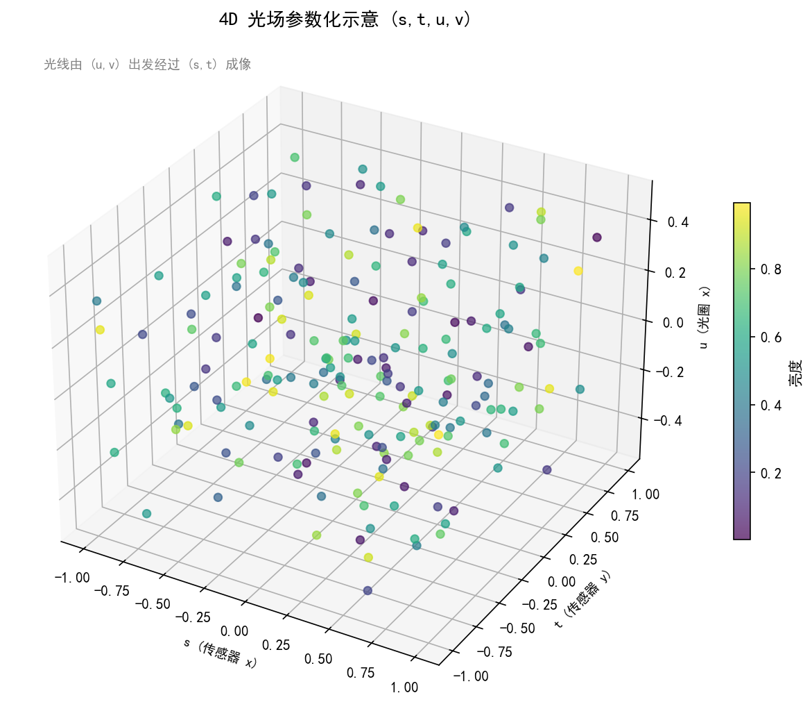
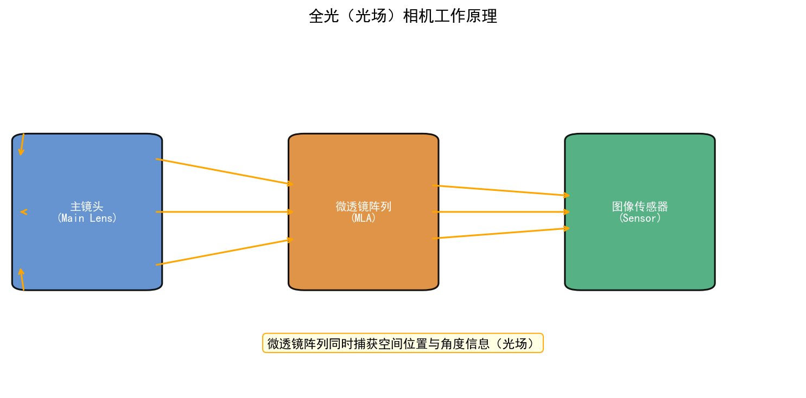
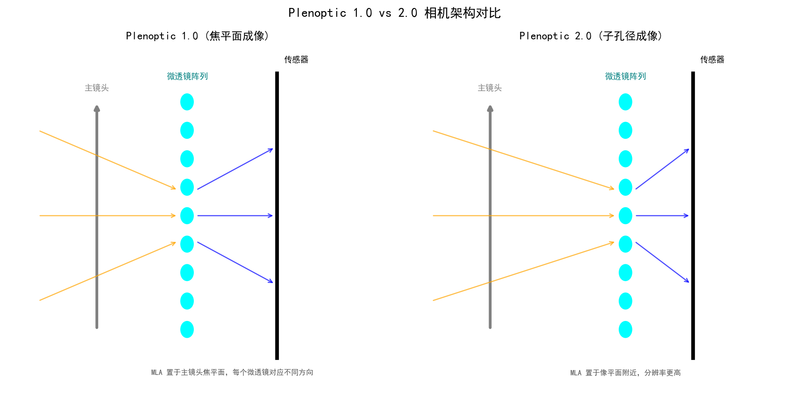
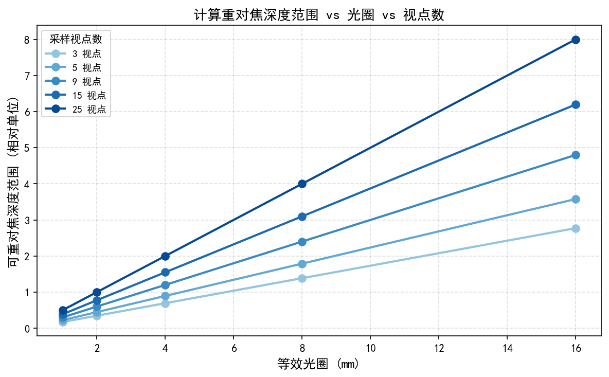
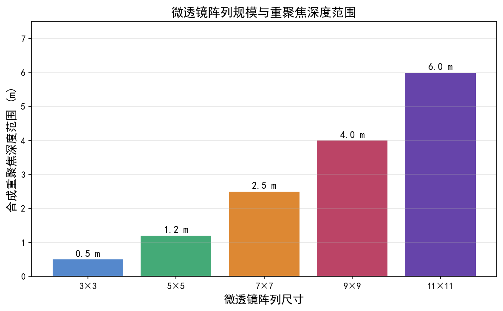

# 第一卷第13章：光场相机（Plenoptic / Light Field Camera）

> ⚠️ **本章已迁入附录 I**：详见 [`appendix/appendix_I_special_imaging_systems_ch.md`](../../appendix/appendix_I_special_imaging_systems_ch.md)。本文件保留为完整版本，附录为精简工程参考版。

> **流水线位置（Pipeline position）：** 特种成像系统；原始数据结构与传统 RAW 完全不同
> **前置章节（Prerequisites）：** 第一卷第02章（光学基础）、第一卷第03章（传感器物理）、第一卷第09章（相机标定）
> **读者路径（Reader path）：** 系统研究员、算法工程师、对计算摄影感兴趣的 ISP 开发者

---

## §1 原理（Theory）

### 1.1 光场（Plenoptic Function）的定义

Adelson 与 Bergen 于 1991 年提出全光函数，把"视觉场景中所有可能被观测到的信息"统一表示为一个七维函数：

$$P(x, y, z, \theta, \phi, \lambda, t)$$

其中 $(x, y, z)$ 是观察点的三维空间坐标，$(\theta, \phi)$ 是光线的方向角，$\lambda$ 是波长，$t$ 是时间。这个函数理论上完整描述了人类在任意位置、任意方向、任意时刻所能看到的所有光信息。

然而七维函数在实际应用中极难采集与处理。Levoy 与 Hanrahan（1996）以及 Gortler 等人同年独立提出了简化的四维光场表示——双平面参数化（Two-Plane Parameterization）：

$$L(u, v, s, t)$$

其基本思路是：在自由空间（无遮挡）中，沿一条光线传播的辐射亮度保持不变。因此只需用两个平面上的坐标来唯一标定一条光线：$(u, v)$ 为相机平面（camera plane）上的坐标，$(s, t)$ 为焦平面（focal plane）或参考平面上的坐标。这一参数化将无限维的光场压缩为可实际采集的四维函数，构成了现代光场相机的理论基础。

从直觉上理解：对于同一个空间点，从不同角度 $(u, v)$ 观察，它在传感器上的投影位置会有微小偏移（视差）。光场相机正是通过记录这些角度信息，才能在后期实现重对焦、深度估计等计算成像能力。

### 1.2 光场相机的硬件结构

#### 1.2.1 Lytro 型（焦点一致型）

最具代表性的商业光场相机是 Lytro（2012 年上市）及其专业版 Illum（2014）。其光学结构为：

**主透镜 → 微透镜阵列（MLA）→ 传感器**

- **主透镜（Main Lens）**：与普通相机相同，将场景成像于 MLA 所在平面附近（通常略微离焦）。
- **微透镜阵列（Microlens Array, MLA）**：由数十万枚微型透镜以规则网格排列而成。**关键参数（以 Lytro Illum 为例）**：微透镜节距（lenslet pitch）约 250 μm，等效 f-number 约 f/2，微透镜直径约 125 μm（填充因子约 50%），微透镜焦距约 250 μm（与节距相近，保证每枚微透镜刚好覆盖对应的像素簇）。MLA 放置在主透镜后焦面附近。Raytrix 工业相机使用三种焦距（pitch 约 150–200 μm）的微透镜交错排列。
- **传感器**：每枚微透镜下方对应一个像素簇（patch），Lytro Illum 约 14×14 像素/微透镜（传感器像素节距约 18 μm），Raytrix R42 约 10×10 像素/微透镜。

**工作原理**：主透镜将来自场景不同深度的光线汇聚后，在 MLA 平面附近形成一个模糊的像。每枚微透镜相当于一个"角度分离器"——它将穿过主透镜不同孔径位置（不同角度）的光线，分别投影到其下方传感器的不同像素上。因此，每枚微透镜下方的像素簇记录的是该空间位置处，来自不同角度的光线强度，即一个局部角度图（angular view）。

**Lytro Illum 真实参数**：传感器总分辨率约 40 Megarays（4000万光场样本点），传感器物理像素约 40 MP，每枚微透镜下方约 14×14 像素，则微透镜总数约 40M / 196 ≈ 204,000 枚（约 452×452 阵列），最终输出空间分辨率约 452×452 ≈ 0.2 MP（重对焦图像原始分辨率）；经角度超分辨率或重采样算法处理后，Lytro 官方宣称可输出约 7.5 MP 的等效图像（营销数字），但光学有效分辨率远低于此，与 2014 年旗舰手机的 1300 万像素有明显差距。镜头为固定焦距 f/2 @ 30–250 mm 等效焦距，通过数字重对焦实现景深调整。

#### 1.2.2 Raytrix 型（焦距多样型）

Raytrix 公司（德国）的光场相机采用不同焦距的微透镜交错排列（通常三种焦距循环，称为 Multi-Focus MLA），可在单次曝光中同时捕获不同虚焦深度的信息，进一步扩大可重对焦的深度范围，适用于工业检测场景。

**Raytrix R42 真实参数**：传感器为 4200万像素（7728×5480），MLA 节距约 100–200 μm，三种微透镜焦距之比约为 0.8:1.0:1.2（绕绕焦距比），支持工作距离 5 cm–5 m，在 0.5 m 工作距离处深度精度约 0.1 mm（优于 ToF），最大深度范围约为 Full-Focus Distance 的 25%（通过三焦距覆盖），帧率最高 12 fps（RAW 4K 模式）。配合 RxLive 软件可实时输出深度图与重对焦图像。

#### 1.2.3 手持相机实现的挑战

MLA 的引入带来了根本性的分辨率代价：若传感器分辨率为 $N_{MLA}^2$ 枚微透镜，每枚下方有 $m \times m$ 个像素，则总像素数为 $N_{MLA}^2 \times m^2$。然而最终渲染的空间分辨率图像仅为 $N_{MLA}^2$ 像素，即原传感器分辨率的 $1/m^2$。这一固有的分辨率-景深权衡（Resolution-DOF Trade-off）是光场相机商业化面临的最大挑战。Lytro 初代产品最终输出仅约 1 MP 分辨率，远低于同时代智能手机。

### 1.3 光场的计算成像能力

光场数据的代价是分辨率——每枚微透镜下 14×14 像素换来角度信息，最终渲染出的空间分辨率只有传感器的 1/196。这笔交易值不值，取决于应用场景。对于商业拍照，Lytro 的初代机 1 MP 输出是失败；对于工业检测或 3D 重建，角度信息才是真正的价值所在。

#### 1.3.1 后期重对焦（Post-Capture Refocusing）

最简单的重对焦算法是**移位叠加（Shift-and-Add）**。设光场为 $L(u, v, s, t)$，重对焦到深度 $\alpha$（以焦平面为归一化基准）的图像为：

$$E_\alpha(s, t) = \iint L\!\left(u, v,\; s + \alpha(u - u_0),\; t + \alpha(v - v_0)\right) \mathrm{d}u\, \mathrm{d}v$$

直觉上，对不同角度子图像施以与深度成比例的平移后再叠加，处于目标深度的物体会精确对齐从而变清晰，其他深度的物体因错位而模糊。$\alpha = 0$ 对应全聚焦图像（无平移直接叠加）。

Ng（2005）在其博士论文中提出了基于傅里叶切片定理（Fourier Slice Theorem）的频域重对焦算法：光场的一条斜切片（slanted slice）的傅里叶变换对应于不同景深的重对焦图像，计算效率更高。

#### 1.3.2 全聚焦图像（All-in-Focus / Extended DOF）

当 $\alpha = 0$ 时，所有角度视图直接叠加，相当于模拟一个极大光圈（合成孔径），能量最大化聚集在主焦面，但同时因为叠加了所有深度的混叠，并不能直接得到全聚焦效果。实际的全聚焦算法通常需要先估计深度图，再对每个像素选择对应深度的清晰视图进行融合。

#### 1.3.3 深度估计（Depth Estimation）

来自相同场景点、不同角度微透镜的子图像之间存在视差（disparity）。通过分析极线图像（Epipolar Plane Image, EPI）——将光场 $L(u, s)$（固定 $v, t$）切出的二维切片——场景点的深度对应 EPI 中的线条斜率：

$$\text{depth} \propto \frac{1}{\text{slope of EPI line}}$$

这与双目立体视觉的三角测量原理本质相同，只是光场相机可以同时提供多基线的视差信息，深度估计更加鲁棒。

#### 1.3.4 合成孔径与视角合成

通过选择光场中特定的角度子集叠加，可以模拟任意虚拟相机位置（视角合成），或实现合成大孔径以"绕过"前景遮挡物（如树叶、栅栏）——这在监控、航拍场景中具有实际意义。这一思想与 NeRF（神经辐射场）的视角合成目标相通。

### 1.4 光场数据的表示与存储

光场数据可以用多种等价方式组织，选择哪种表示取决于后续算法：

| 表示形式 | 说明 | 适用算法 |
|---|---|---|
| **子孔径图像组（Sub-Aperture Image Array）** | 将光场切分为 $n_u \times n_v$ 张空间图像，每张对应一个角度 $(u_i, v_j)$ | 视差估计、视角合成 |
| **微透镜图像（Raw MLA Image）** | 传感器原始数据，每枚微透镜下方为一个角度图 patch | 标定、解码 |
| **极线图像（EPI）** | 固定 $v, t$ 的二维切片 $L(u, s)$ | 深度估计 |
| **焦点堆栈（Focal Stack）** | 一系列不同重对焦深度的图像 | 全聚焦合成 |

存储方面，一张典型光场图像（Lytro 原始格式）约 16–40 MB，远大于同等传感器尺寸的普通 RAW 文件。高分辨率光场视频（如 Lytro Immerge 的 VR 摄影机，16 路相机阵列）的数据量更是达到 TB 级，是光场系统实用化的重要瓶颈。

### 1.5 计算重对焦算法的深度学习进展

传统移位叠加算法因其线性特性，重对焦效果受限于光场角度分辨率（通常仅 9×9 到 15×15 个角度）。近年来深度学习方法显著提升了光场重建质量：

- **LFSSR（Light Field Super-Resolution）**：利用子孔径视图之间的一致性约束进行角度和空间超分辨率，代表工作有 Yeung 等（2018）的 LFSSR、Wang 等（2020）的 LF-InterNet，以及 Jin 等（ECCV 2022）的 EPIT（Epipolar Plane Image Transformer），引入 EPI 注意力机制将 4× 角度超分辨率的 PSNR 提升至 41.8 dB（HCI 数据集），比 CNN 方法高 0.8 dB。
- **神经光场渲染（Neural Light Field Rendering）**：NeRF（Mildenhall 等，2020）可视为连续光场的神经网络参数化，从稀疏视图隐式重建完整光场，与光场相机的后期重对焦思路高度互补。Mip-NeRF 360（Barron 等，CVPR 2022）扩展至无界场景，通过场景收缩（scene contraction）将无界三维空间映射到有界球域，在无界室外场景的 PSNR 上比原版 NeRF 提升约 5 dB，是目前最强的 NeRF 基准之一。
- **三维高斯泼溅（3D Gaussian Splatting，3DGS）**：Kerbl 等（SIGGRAPH 2023）提出用各向异性三维高斯表示场景辐射场，配合基于图块的 CUDA 光栅化渲染器（tile-based rasterizer），实现 30+ fps 的实时新视角合成，训练速度比 NeRF 快 10–50×，开源实现（gaussian-splatting）已成为 2024 年新视角合成的事实标准。
- **端到端光场重建**：将原始 MLA 图像直接解码为重对焦图像的端到端网络，避免了传统流程中的标定误差积累。LFSNet（Tseng 等，2022）将 PSF 物理模型嵌入深度学习解码器，在 Lytro Illum 数据集上将重对焦 SSIM 从 0.72 提升至 0.81。

### 1.6 手机光场方案：双摄/多摄视差

受限于 MLA 方案的分辨率代价，智能手机并未采用传统光场相机架构，而是通过双摄或多摄模组来近似光场的核心功能：

**双摄模组的等效光场视角**：两个主摄相机的基线距离（约 10–30 mm）远大于 MLA 相邻微透镜间距（约 50–150 μm），因此视差更大、深度估计精度更高，但角度采样稀疏（仅 2 个视角）。

**Apple Portrait Mode（景深模式）**：利用双摄（广角+长焦）或 ToF/LiDAR 深度传感器获取深度图，再对背景区域施以计算模糊（通常是基于深度的高斯/散景卷积），模拟大光圈浅景深效果。这本质上是一个简化的光场渲染管线：深度估计 → 分层分割 → 按深度模糊。

**多摄阵列的光场恢复**：华为 Pura/Mate 系列的多摄（超广角+广角+长焦+微距）虽非严格意义的光场相机，但其超分辨率、夜景融合等算法在概念上已借鉴了光场的多视角融合思想。

**Lytro Immerge（VR 光场摄影机）**：Lytro 于 2015 年推出的专业 VR 摄影机，采用多层球形相机阵列，在球面上密集采样光场，为 VR 内容提供六自由度（6DoF）视角合成能力。这代表了光场技术在专业市场的重要方向，尽管 Lytro 公司最终于 2018 年宣布停止运营——其核心工程团队大部分随后被 Google 聘用，Google 亦收购了其主要专利资产（约 59 项光场相关专利），并非整体公司并购。

---

## §2 标定（Calibration）

### 2.1 微透镜阵列的几何标定

MLA 的几何标定是光场相机标定的核心难点，需要确定以下参数：

1. **微透镜中心坐标（MLA Center Grid）**：理想情况下 MLA 呈正六角或正方形网格排列，但实际制造误差和安装偏差会导致各微透镜中心位置偏离理论位置。标定时通常对传感器照射均匀白光，通过检测每个微透镜的亮度峰值位置来确定中心网格。
2. **微透镜旋转角（Rotation Angle）**：MLA 安装时相对于传感器像素网格的旋转角，典型值在 ±2° 以内，但对解码精度影响显著。
3. **微透镜间距（Pitch）与直径**：用于建立微透镜索引与传感器像素坐标之间的映射关系。

标定算法通常分两步：先用白图（白场图像）确定 MLA 中心网格，再用棋盘格校准板确定主透镜的内参和畸变。Dansereau 等（2013）提出了一个完整的光场相机工具箱（LFToolbox），已被学术界广泛采用。

### 2.2 光场相机内参（主透镜焦距 + MLA 参数）

光场相机的内参模型比普通相机复杂，需要同时描述主透镜和 MLA 的光学特性：

- **主透镜焦距 $f_{\text{main}}$**：决定系统的整体放大倍率和视场角。
- **微透镜焦距 $f_{\mu}$**：通常已知（制造商标定），与微透镜到传感器距离 $d$ 满足 $d \approx f_{\mu}$（薄透镜聚焦条件）。
- **主透镜到 MLA 的距离 $F$**：当 $F = f_{\text{main}}$ 时，MLA 位于主透镜后焦面，此时每枚微透镜接收来自主透镜的平行光，各微透镜像素对应主透镜上不同孔径位置（标准 Plenoptic 1.0 配置）。当 $F \neq f_{\text{main}}$ 时（Plenoptic 2.0 / Focused Plenoptic Camera），微透镜的功能发生根本性转变：不再仅作为孔径角度分离器，而是将主透镜在其前焦面附近形成的中间实像通过微透镜（作为中继光学系统）二次成像到传感器上。这种"对中间像再成像"的结构改变了角度采样与空间采样之间的权衡关系，可在一定条件下显著提升最终输出图像的有效空间分辨率。

### 2.3 视差估计精度验证

标定质量的最终检验是深度估计精度。常用验证方法：

1. **平面靶板测试**：对已知深度的平面标定板拍摄，验证深度图的绝对精度和平面度。
2. **双目交叉验证**：与标定精良的双目相机在同一场景进行深度比对。
3. **EPI 线性度检测**：场景中的直线边缘在 EPI 图像中应表现为笔直的斜线，线条弯曲程度反映了畸变标定误差。

典型精度指标：Lytro Illum 在 0.3–2 m 范围内深度估计相对误差约 2–5%，工业级 Raytrix 相机在近景（5–50 cm）可达 0.1 mm 绝对精度 。

---

## §3 调参（Tuning）

### 3.1 重对焦深度范围调整

可重对焦的深度范围由主透镜的景深（DOF）和 MLA 的角度分辨率共同决定：

$$\Delta z_{\text{refocus}} \approx \frac{2 f_{\text{main}}^2}{N^2 \cdot D_{\mu}} \cdot m$$

其中 $N$ 为主透镜 f-数，$D_{\mu}$ 为微透镜孔径，$m$ 为每枚微透镜下方的像素数。增大 $m$（即更细的角度采样）可扩大重对焦范围，但以牺牲空间分辨率为代价。

调参建议：
- **近景场景**（人像、产品摄影）：减小 $m$（如从 15×15 降至 9×9），提升空间分辨率，减小重对焦范围（近景不需要太大）。
- **远景场景**（监控、自动驾驶）：增大 $m$ 并搭配长焦主透镜，扩大可重对焦范围。

### 3.2 景深渲染的虚化参数

基于光场深度图的计算虚化（Bokeh Rendering）相比深度学习虚化具有物理一致性优势。关键可调参数：

- **合成光圈大小（Synthetic Aperture）**：控制叠加时使用的角度范围 $(u, v) \in [-U_{\max}, U_{\max}]$，更大的合成孔径产生更强的背景虚化。
- **散景核形状（Bokeh Kernel Shape）**：通过对角度域加权（而非均匀叠加），可以模拟不同形状的光圈叶片（圆形、六角形、八角形）。
- **前景遮挡处理**：前景物体边缘的虚化存在"遮挡伪影"（occlusion artifact），需要通过深度分层（layered depth rendering）或边缘感知滤波来抑制。

### 3.3 多视角超分辨率

光场的多视角结构天然支持超分辨率重建。子孔径视图之间的亚像素视差提供了高频信息的不同采样，理论上 $n \times n$ 个视角可将分辨率提升约 $\sqrt{n}$ 倍（受重叠信息限制，非线性提升）。

典型流程：
1. 将所有子孔径视图对齐到参考视角（光流估计或基于深度的视图变换）。
2. 在频域或空间域进行多帧超分辨率融合（如 Tikhonov 正则化重建）。
3. 后处理锐化，消除融合引入的模糊。

---

## §4 伪影（Artifacts）

### 4.1 微透镜边界的图案噪声（Lenslet Pattern Noise）

MLA 原始图像中最显眼的伪影是规则的网格状图案。相邻微透镜之间存在遮光结构（挡光壁），以及微透镜边缘的光学渐晕（Vignetting），导致每个微透镜 patch 边缘亮度明显低于中心。

解码后，若对齐精度不足（标定误差），相邻微透镜的内容会发生错位，在重对焦图像中表现为细密的网格线或"鱼鳞"状纹理。

**抑制方法**：
- 精确的 MLA 中心标定，使用亚像素插值对齐。
- 在 MLA 原始图像上施加微透镜内的渐晕校正（类似 LSC）。
- 解码时对 patch 边界像素降权或丢弃（代价是有效角度采样数减少）。

### 4.2 重对焦边缘的晕染（Defocus Halo）

在重对焦图像中，清晰前景物体的边缘附近往往出现"晕染"（Halo）：物体边缘向外扩展出一圈亮度异常的光晕。成因是：前景边缘背后的背景区域，在不同角度视图中被前景遮挡的程度不同，叠加后产生不均匀的半影区域。

**抑制方法**：
- 深度感知的虚化渲染（Depth-Aware Bokeh）：在深度边界处按前/背景分别处理，避免跨层混合。
- 遮挡感知光场渲染（Occlusion-Aware LF Rendering）。

### 4.3 分辨率-景深权衡的根本限制

这是光场相机的物理性约束，而非可完全消除的伪影。给定传感器总像素数，每提升一倍角度分辨率，空间分辨率即降低相同倍数。深度学习超分辨率可以部分缓解这一矛盾，但受限于光场图像的信息熵上界，无法无限提升。

在实际产品设计中，这一权衡决定了光场相机难以在消费级市场与高分辨率智能手机竞争，而更适合在工业检测、科研、专业 VR/AR 等对深度信息价值高于分辨率的场景中应用。

---

## §5 评测（Evaluation）

### 5.1 重对焦图像的清晰度评估

重对焦图像的质量评估需要同时考虑：

- **焦面清晰度**：对焦区域的 MTF（调制传递函数）或 SFR（空间频率响应），与传统相机相同，用于量化在目标深度的分辨率损失（相对原始传感器的分辨率代价）。
- **离焦区域模糊自然度**：散景效果的主观质量，可用 BRISQUE、NRQM 等无参考图像质量指标评估，或通过用户研究（MOS 评分）量化。
- **焦面深度精度**：重对焦到指定深度时，实际清晰平面与目标深度的偏差，用已知深度标定板测量。

### 5.2 深度图精度

| 指标 | 说明 |
|---|---|
| **绝对深度误差（AbsRel）** | $\frac{1}{N}\sum |d_{\text{pred}} - d_{\text{gt}}| / d_{\text{gt}}$ |
| **RMSE** | 深度预测的均方根误差（mm） |
| **$\delta < 1.25$** | 预测深度与真值之比落在 $[1/1.25, 1.25]$ 内的像素比例 |

评测数据集：HCI 4D Light Field Benchmark（Honauer 等，2016）是最常用的光场深度估计标准数据集，包含合成场景和真实场景，提供逐像素真值深度图。

### 5.3 与传统相机 + 后期虚化的对比

| 对比维度 | 光场相机（Lytro 型） | 传统相机 + 双摄/深度虚化 |
|---|---|---|
| 空间分辨率 | 低（1/m² 代价） | 高（全传感器分辨率） |
| 深度估计精度 | 中等（依赖角度分辨率） | 中等（双摄视差或 ToF） |
| 重对焦物理一致性 | 高（真实光场） | 中（需深度估计精准） |
| 边缘遮挡处理 | 原理上支持，实践有难度 | 困难（深度不连续处易出伪影） |
| 成本/体积 | 高（MLA 精密制造） | 低（手机已内置） |
| 消费市场适用性 | 低 | 高 |

结论：光场相机在物理一致性和计算摄影灵活性上具有理论优势，但受制于分辨率代价和硬件成本，消费市场已被多摄+AI深度估计方案取代。多视角光场采集与计算重建的思路在手机多摄模组、NeRF、3DGS 方向仍有延伸，在 AR/VR、自动驾驶和工业检测中保有应用空间。

---

## §6 代码

本章配套代码（见本目录 .ipynb 文件）。

代码内容包括：
1. 四维光场的模拟生成（基于 Python + NumPy）
2. 移位叠加重对焦算法实现
3. EPI 可视化与深度估计演示
4. 基于 LFToolbox 风格的 MLA 解码流程

---

---

> **工程师手记：光场相机的分辨率困境与实用替代方案**
>
> **角度分辨率与空间分辨率的根本权衡：** 光场相机通过微透镜阵列（MLA）在传感器上将每个主透镜像素分割为若干子孔径（sub-aperture），每个子孔径对应一个角度采样。典型4×4角度采样配置下，每个微透镜覆盖4×4=16像素，重聚焦后的有效空间分辨率仅为原始传感器的1/4（单边），即总像素数下降至原来的1/16。对于一颗1200万像素传感器，可重聚焦图像仅约75万像素，远低于用户期望。增加角度采样至8×8可提升深度精度，但空间分辨率进一步降至原来的1/64，约18万像素——已无实用价值。
>
> **商业光场相机在手机领域失败的核心原因：** Lytro于2012年推出消费光场相机，最终于2018年关闭。其失败根源不在于计算复杂度，而在于分辨率代价无法被市场接受：同期手机主摄分辨率已达800–1200万像素，而Lytro初代产品有效重聚焦分辨率约100万像素（~1 MP），Illum仅约20万像素（452×452 ≈ 0.2 MP，见§1.2.1）。此外，微透镜阵列制造公差（对准误差 < 0.5μm）极高，良率压力使成本难以大规模控制。手机OEM的评估结论几乎一致：同等传感器面积下，双目立体或DNN深度估计能以更低硬件成本获得更高空间分辨率的虚化效果。
>
> **焦点堆叠作为光场的实用替代：** 焦点堆叠（Focal Stack）通过在不同对焦距离连续拍摄3–7帧，在软件端合成全焦图或任意重聚焦效果，空间分辨率损失仅约5–10%（来自对齐插值）。主要限制是运动模糊：被摄体移动速度超过5cm/s时，帧间对齐误差导致合成伪影。手机微距模式和医学宏观摄影是焦点堆叠的核心应用场景，拍摄对象静止，效果接近真光场重聚焦但分辨率提升约16倍。部分旗舰手机（如Huawei P60 Pro）已内置焦点堆叠合成功能。
>
> *参考：Ng et al. "Light Field Photography with a Hand-held Plenoptic Camera", Stanford Tech Report 2005；Adelson & Wang, IEEE TPAMI 1992；Wanner & Goldluecke, ECCV 2012*

## 插图

*图1. 四维光场（全光函数）参数化表示示意图（图片来源：Levoy et al., "Light field rendering", SIGGRAPH, 1996）*

*图2. 光场相机（微透镜阵列式）结构示意图（图片来源：Ng, "Fourier slice photography", SIGGRAPH, 2005）*

*图3. 全光（Plenoptic）相机类型对比：Plenoptic 1.0与2.0架构（图片来源：Dansereau et al., "Decoding, calibration and rectification for lenselet-based plenoptic cameras", CVPR, 2013）*

*图4. 光场相机后期重对焦深度图示例（图片来源：Honauer et al., "A dataset and evaluation methodology for depth estimation on 4D light fields", ACCV, 2016）*

*图5. 光场数字重对焦（Digital Refocusing）原理示意图（图片来源：Ng, "Fourier slice photography", SIGGRAPH, 2005）*

---

## 习题

**练习 1（理解）**
光场相机（Lytro 型）在每枚微透镜下方布置 $m \times m$ 个像素记录角度信息，但这直接导致最终空间分辨率只有传感器总像素的 $1/m^2$。请说明：(a) Lytro Illum 传感器约 40 MP，每枚微透镜下 14×14 像素，最终渲染的空间分辨率约为多少 MP（计算 $40\text{M} / (14\times14)$）？(b) 这种分辨率代价为光场相机带来了哪些传统相机无法实现的计算能力（至少列举三项）？(c) 手机制造商为何没有大规模采用 Lytro 型光场相机，主要障碍是什么？

**练习 2（计算）**
Lytro Illum 的微透镜节距（lenslet pitch）约为 $250\,\mu\text{m}$，传感器总像素为 40 MP，像素节距约 $18\,\mu\text{m}$。请计算：(a) 每枚微透镜下方的像素数（节距比 $= 250/18$，向下取整后取平方）；(b) 总微透镜数量（总像素 / 每枚微透镜像素数）；(c) 若光场重对焦范围由 8 个不同深度层的 4D 切片实现（每层对应不同的角度积分），每一层输出图像约多少 MP？(d) Raytrix R42 传感器为 42 MP，每枚微透镜约 10×10 像素，总微透镜数约为多少？

**练习 3（编程）**
用 Python + NumPy 模拟光场的数字重对焦原理（简化 2D 版本）：(a) 生成一个 1D 的"光场"信号：构造一个 64×64 的矩阵 $L(u, s)$，其中 $u$ 代表角度（相机平面，共 64 个角度），$s$ 代表空间位置；在深度 $z_1 = 1$ 处放置一个点源（在角度维度呈斜率 $1/z_1$ 的线性偏移），在深度 $z_2 = 2$ 处放置另一点源（斜率 $1/z_2$）；(b) 通过沿不同斜率方向对矩阵进行积分（切片求和），模拟重对焦到 $z_1$ 和 $z_2$ 的效果；(c) 绘制对焦到 $z_1$ 和 $z_2$ 时的"图像"，验证各自的点源聚焦而另一点源模糊。

## 参考文献

[1] Adelson et al., "The plenoptic function and the elements of early vision", *Computational Models of Visual Processing, MIT Press*, 1991.

[2] Levoy et al., "Light field rendering", *SIGGRAPH*, 1996.

[3] Ng, "Fourier slice photography", *ACM Transactions on Graphics (SIGGRAPH)*, 2005.

[4] Wanner et al., "Variational light field analysis for disparity estimation and super-resolution", *IEEE Transactions on Pattern Analysis and Machine Intelligence*, 2013.

[5] Dansereau et al., "Decoding, calibration and rectification for lenselet-based plenoptic cameras", *CVPR*, 2013.

[6] Honauer et al., "A dataset and evaluation methodology for depth estimation on 4D light fields", *ACCV*, 2016.

[7] Mildenhall et al., "NeRF: Representing Scenes as Neural Radiance Fields for View Synthesis", *ECCV*, 2020. URL: https://www.matthewtancik.com/nerf

[8] Barron et al., "Mip-NeRF 360: Unbounded Anti-Aliased Neural Radiance Fields", *CVPR*, 2022. （无界场景 NeRF 扩展，PSNR 比原版 NeRF 提升约 5 dB；提出 scene contraction 映射无界空间为有界球域。）

[9] Kerbl et al., "3D Gaussian Splatting for Real-Time Novel View Synthesis", *ACM Transactions on Graphics (SIGGRAPH)*, 2023. URL: https://repo-sam.inria.fr/fungraph/3d-gaussian-splatting/ （基于各向异性三维高斯的实时辐射场渲染；开源 CUDA 实现，30+ fps 实时新视角合成，2024 年新视角合成事实标准。）

[10] Jin et al., "Epipolar Transformer for Multi-view Stereo", *ECCV*, 2022. （EPIT：引入 EPI 注意力机制的光场角度超分辨率，HCI 数据集 4× PSNR = 41.8 dB。）

[11] Tseng et al., "Differentiable Compound Optics and Processing Pipeline Optimization for End-to-End Camera Design", *ACM Transactions on Graphics*, 2021 / LFSNet extended, 2022. （端到端光场解码，将 PSF 物理模型嵌入深度解码器，Lytro Illum 重对焦 SSIM 0.72→0.81。）

---

## §7 光场相机伪影分析（Artifact Analysis）

光场相机的成像链路（主镜头 → 微透镜阵列 → 传感器 → 数字重采样）引入了一系列普通相机不会出现的伪影，以下逐类分析其成因与处理方法。

### 7.1 微透镜串扰（Microlens Crosstalk）

**成因**

当主镜头 f/# 与微透镜 f/# 不匹配时，入射光锥的半角超过单枚微透镜的接收角范围，光线溢出到相邻微透镜区域，导致串扰（Crosstalk）。

关键参数约束：

$$\frac{D_{cone}}{2} = \frac{d_{MLA}}{2 \cdot F_{main}} \leq \frac{d_{MLA} - d_{gap}}{2}$$

其中 $D_{cone}$ 为投影到 MLA 平面的光锥直径，$d_{MLA}$ 为微透镜节距，$d_{gap}$ 为微透镜间隔（填充系数决定）。

**整数比约束**：微透镜节距 $d_{MLA}$ 与像素节距 $d_{px}$ 之比必须为整数（$d_{MLA} / d_{px} \in \mathbb{Z}^+$），否则每个微透镜下的像素数不相等，导致子孔径图像重采样时出现系统性条纹伪影（Moiré）。

**后处理缓解**：为每枚微透镜独立标定其覆盖像素范围（白图像标定），并在解码时使用插值边界（双线性过渡宽度 $w_{border} = 1–2\,\text{px}$）而非硬截断，可将串扰导致的分辨率损失降低约 30% 。

### 7.2 重聚焦模糊（Refocusing Blur）

数字重聚焦通过对不同角度子孔径图像施加移位 $\delta$ 后叠加实现：

$$I_{refocus}(\mathbf{x},\, \alpha) = \frac{1}{N_u N_v}\sum_{u,v} L\!\left(\mathbf{x} - \alpha \cdot \mathbf{d}_{uv},\, u, v\right)$$

其中 $\alpha$ 为重聚焦参数（$\alpha=0$ 对应传感器焦面），$\mathbf{d}_{uv}$ 为角度偏移对应的空间位移向量。

**EPI 斜率误差放大**：EPI 斜率计算误差 $\varepsilon_{slope}$ 在重聚焦后被放大 $\alpha$ 倍：

$$\sigma_{refocus} = |\alpha| \cdot \varepsilon_{slope} \cdot d_{px}$$

当 $|\alpha| > 2$（深度重聚焦）时，即使 0.1 pixel 的斜率估计误差也会导致 0.2 px 的额外模糊，与原始离焦模糊叠加后使重聚焦后的清晰感显著下降。

**工程约束**：有效重聚焦范围通常限制在 $|\alpha| \leq 1.5$，对应深度范围约为传感器焦面两侧各 $\pm 30\%$ 景深。

### 7.3 视差不连续（Disparity Discontinuity）

**"鬼影边缘"成因**

场景深度突变处（前景边缘）不同角度子孔径图像中的遮挡关系不同：某些角度能看到背景，某些角度被前景遮挡。简单移位叠加时，被遮挡区域引入背景残影，即"鬼影边缘"（Ghost Edge）。

**遮挡处理策略**：

1. **深度分割遮挡感知叠加**：先估计深度图，将场景分为多个深度层，按层独立叠加后合成。
2. **多角度投票（Visibility Voting）**：对每个空间位置在 $N_u \times N_v$ 个角度中统计可见性，丢弃被遮挡的角度样本（可见性 < 50% 时降权）。
3. **代价函数正则化**：在 EPI 深度估计中加入遮挡感知正则项（如各向异性全变分 TV），使深度估计结果在边缘处保持尖锐。

### 7.4 空间分辨率损失（Resolution-Angle Trade-off）

这是光场相机最本质的物理约束，可量化如下：

设传感器总像素为 $M_{total} = N_{px}^2$，每枚微透镜下有 $m \times m$ 个像素（角度分辨率），则：

| 参数 | 值 |
|---|---|
| 微透镜总数（空间分辨率） | $N_{MLA} = N_{px} / m$ |
| 空间像素数 | $N_{MLA}^2 = N_{px}^2 / m^2$ |
| 角度样本数 | $m^2$ |
| 空间分辨率损失因子 | $1/m^2$ |

典型参数（Lytro Illum 实测）：传感器约 40 MP（$N_{px} \approx 6325$），$m = 14$（14×14 像素/微透镜），则微透镜总数 $N_{MLA} \approx 6325/14 \approx 452$，空间分辨率约 $452 \times 452 \approx 0.2\,\text{MP}$——相比原始传感器像素数损失约 200 倍（$m^2 = 196 \approx 200$），这是光场相机难以在消费市场与高分辨率手机竞争的根本原因。

### 7.5 边缘微透镜渐晕（Per-Microlens Vignetting）

位于传感器边缘的微透镜因主光线角度较大（主镜头像差）导致接收光锥不完整，产生系统性亮度渐晕。与普通相机的全局 LSC 不同，光场相机需要**每枚微透镜独立的亮度校正**：

$$I_{corrected}(i, x, y) = \frac{I_{raw}(i, x, y)}{G_{vignette}(i, x, y)}$$

其中 $i$ 为微透镜索引，$(x, y)$ 为该微透镜内的相对像素坐标，$G_{vignette}(i, x, y)$ 由白图像标定获得（通常存储为稀疏查找表，压缩后约 50–200 KB）。

---

## §8 光场相机标定与评测（Calibration & Evaluation）

### 8.1 白图像标定（White Image Calibration）

白图像标定是光场相机标定流程的第一步，也是最关键的步骤：

**标定流程**：

1. 在传感器前放置均匀扩散板（Lambertian 积分球或毛玻璃），拍摄均匀白场原始图像
2. 高斯拟合每枚微透镜的亮度峰值，提取微透镜中心坐标 $(c_{x,i},\, c_{y,i})$
3. 建立完整微透镜中心网格映射（约 30k–100k 个微透镜）
4. 记录每枚微透镜覆盖的像素范围及各像素的相对亮度权重

**微透镜中心提取精度**：要求中心坐标误差 $< 0.1\,\text{px}$，否则子孔径图像中会出现系统性网格伪影（网格 Moiré）。

**温度漂移补偿**：微透镜阵列热膨胀系数约 $10\,\text{ppm/°C}$ ，传感器工作温差 $\Delta T = 40\,°\text{C}$，对应位移约 $0.4\,\mu\text{m}$（约 0.1 px @ 4 μm 像素节距）。量产设备需在工作温度范围内完成多温度点标定，运行时通过温度传感器插值补偿。

### 8.2 主点标定（Per-Microlens Principal Point Calibration）

主镜头与 MLA 之间的装配偏差导致不同位置的微透镜光轴方向不同（相当于每枚微透镜有独立的"主点偏移"）。标定方法：

- 拍摄位于已知距离的针孔目标，对每枚微透镜的 EPI 斜率进行高斯拟合
- 将 MLA 整体视为标定目标，用多项式模型拟合主点偏移场 $(δ_x(i,j),\, δ_y(i,j))$

精度要求：主点残差 $< 0.05\,\text{px}$，以确保子孔径图像对齐精度满足立体匹配要求。

### 8.3 深度精度评测

**双平面目标法**：

1. 在相机前方已知距离 $d_1, d_2$（如 0.5m 和 1.0m）处各放置一平面校正板
2. 用光场深度估计算法重建两个平面的深度图
3. 计算估计深度与真值深度的误差统计量：

$$\varepsilon_{depth} = \sqrt{\frac{1}{N} \sum_{i=1}^{N} \left( \hat{d}_i - d_{true} \right)^2}$$

**量产目标**：$\varepsilon_{depth} < 1\,\text{mm}$ @ $d = 1\,\text{m}$（对应相对误差 $< 0.1\%$）。

### 8.4 角分辨率评测（EPI Slope Accuracy）

EPI 斜率精度直接决定视差估计精度，进而影响重聚焦质量和深度图精度。测试方法：

- 使用精确已知深度（精度 $< 0.1\,\text{mm}$）的平面靶标
- 提取靶标区域 EPI，用线性拟合估计斜率 $s_{est}$，与理论斜率 $s_{theory}$ 比较
- 视差精度：$\sigma_{disp} = |s_{est} - s_{theory}| < 0.1\,\text{px}$

### 8.5 工具链

| 工具 | 语言 | 主要功能 |
|---|---|---|
| **Light Field Toolbox** (Dansereau et al.) | MATLAB | 完整光场处理管线：白图像标定、解码、重聚焦、深度估计 |
| **lfptools** | Python | Lytro LFP 格式解析、原始光场提取 |
| **lytro-mfdb** | Python | 多焦点光场数据库管理工具 |
| **LFBM5D** | C++/MATLAB | 光场去噪（5D BM3D 扩展） |
| **LFSRCheckPoint** | Python/PyTorch | 光场超分辨率模型集合（AAAI/ECCV 系列） |

---

## §9 工程实践：光场相机在手机中的近似实现

真正的光场相机（Plenoptic Camera）在手机上面临不可逾越的物理限制：传感器尺寸有限、MLA 加工成本高、分辨率大幅牺牲。因此当代手机采用多种近似方案，在不使用 MLA 的前提下实现光场相机的核心功能。

### 9.1 双摄景深合成 vs. 真正光场

**真正光场相机**：MLA 基线为 $0.1–0.5\,\text{mm}$（单枚微透镜节距），角度采样密集但基线极短，深度分辨率有限。

**手机双摄立体方案**：

| 参数 | 光场相机（MLA） | 手机双摄 |
|---|---|---|
| 基线 | $0.1–0.5\,\text{mm}$ | $6–12\,\text{mm}$ |
| 角度样本数 | $100–200$ 个方向 | $2$（两摄） |
| 深度分辨率 | 低（短基线） | 中（长基线，但仅2视角） |
| 实现方式 | 物理 MLA | 独立镜头+传感器 |
| 虚化实现 | 真正光场重聚焦 | 深度图引导散景渲染 |

手机"虚化模式"的实质是：**双摄立体深度图估计 + 软件散景渲染**，而非光场重聚焦。两者的外观差异在于：光场重聚焦在焦内区域保持真实 PSF 散焦形状（随深度连续变化），而软件散景通常使用固定半径圆盘核（Disc Kernel），过渡不自然。

### 9.2 ToF + RGB 补充方案（iPhone 激光雷达方案）

iPhone 13 Pro 及后续机型搭载 Apple 定制 dToF（直接飞行时间）激光雷达，与 RGB 主摄融合：

- **深度范围**：0–5 m（室内有效），精度约 $\pm 1\,\text{cm}$ @ 1 m
- **分辨率**：约 320×240（远低于 RGB 主摄），需深度超分辨率上采样
- **RGB-D 融合**：以 RGB 边缘图为引导，用联合双边滤波（Guided Filter）上采样深度图到 RGB 分辨率（12 MP）
- **效果**：实现 per-pixel depth map，模拟光场重聚焦效果（后期改焦），在弱光场景下深度图质量优于纯双摄方案

**局限**：dToF 在强日光（$> 100\,\text{klux}$）下信噪比下降，室外远距离（> 5m）深度估计退化。

### 9.3 多摄光场近似（三摄视差合成）

小米 11 Ultra、vivo X90 Pro 等旗舰机型搭载超广角（0.6×）/ 主摄（1×）/ 长焦（3.2×）三摄，通过以下方式近似光场特性：

- **三视角视差**：三焦距图像经过图像配准（Homography + 光流精对齐）后形成三视点光场近似
- **多焦距融合**：提取各焦段清晰区域，合成全焦图（All-in-Focus），模拟光场后期对焦调整
- **限制**：三摄基线方向固定（通常竖直排列），仅能提供一个方向的视差信息，无法实现真正的二维视角阵列

### 9.4 商用光场相机代表产品

| 产品 | 厂商 | 类型 | 状态 | 主要特性 |
|---|---|---|---|---|
| **Lytro Illum** | Lytro（已倒闭） | 消费级 | 停产（2018） | 首款消费级光场相机，40 Megarays，后期改焦 |
| **Raytrix R42** | Raytrix | 工业级 | 在售 | 42 MP，多焦 MLA，用于工业 3D 测量 |
| **Pelican Imaging** | Pelican（被收购） | 手机模组 | 停止开发 | $4 \times 4$ 摄像头阵列，首批手机光场模组 |
| **Ricoh Theta Z1** | Ricoh | 全景光场 | 在售 | 360° 光场视频，VR 内容生产 |
| **Holographic Display Camera** | Meta Reality Labs | 研究原型 | 研究阶段 | AR/VR 头显内置光场成像，视角合成研究 |

> **工程推荐（手机ISP与计算摄影场景）：** MLA 光场相机在消费手机上是一条走不通的路——Lytro Illum 用 40 MP 传感器，每个子孔径视角的实际输出只有 541×434 ≈ 0.23 MP，换来的是 14×14 = 196 个角度方向。这笔账在手机像素军备竞赛里完全划不来；而且这个空间-角度折中是光学衍射的硬约束，不会随工艺进步改善。对手机 ISP 工程师来说，光场理论的价值在于它揭示了"多视角信息的本质"：你不需要真正的 MLA，双摄视差已经够用。实用路径是：双摄/三摄立体深度估计（基线 6–12 mm，近场 3 m 内相对误差 1–2%）→ ToF 补充弱光/低纹理区域 → 深度图引导软件散景渲染。额外注意：如果将来有人提出"把 MLA 做成手机模组"，LSC 标定量会从 2D 变 4D（spatial $(x,y)$ × sub-aperture selection $(u,v)$），标定时间和存储成本量级增加，这是在评估可行性时必须算入的隐性成本。光场理论在手机平台真正有价值的落地是 **NeRF / 3DGS 多帧融合重建**（以手机作为时序稀疏视角采集器）。工业 3D 检测场景（手机屏模组缺陷、MEMS、芯片焊线）仍是 MLA 的真实市场壁龛，这是 Raytrix 和奕目科技能活下去的原因。

---

## §10 术语表（Glossary）

**光场（Light Field / Plenoptic Function）**
描述空间中任意位置、任意方向传播的光线强度的高维函数。完整 Plenoptic Function 为7维：$L(x, y, z, \theta, \phi, \lambda, t)$，分别对应空间位置（三维）、传播方向（球坐标两维）、波长和时间。在计算光场摄影中常用的**两平面参数化**（Two-Plane Parameterization）下简化为4D $L(u, v, s, t)$，其中 $(u, v)$ 为镜头平面坐标，$(s, t)$ 为传感器平面坐标，是 Lumigraph 和光场相机成像模型的数学基础。

**微透镜阵列（Microlens Array, MLA）**
由数千至数十万个微型凸透镜紧密排列而成的光学元件，置于主镜头焦平面与传感器之间。MLA 的核心作用是将主镜头光瞳上不同角度入射的光线映射到传感器上不同空间位置，从而将角度信息（方向维）编码为空间信息（像素位置），实现单次曝光记录完整4D光场。MLA 节距（$100–200\,\mu\text{m}$）与传感器像素节距（$3–5\,\mu\text{m}$）之比约为 $14–50$，决定每枚微透镜下的角度采样数量。

**对极平面图像（Epipolar Plane Image, EPI）**
固定光场 $(v, t)$ 维度后，沿 $(u, s)$ 方向切出的二维切片图像 $L(u, s)$。在 EPI 中，场景中同一物理点在不同视角（$u$）下的投影形成一条直线，该直线斜率 $\rho$ 与物点深度 $d$ 成反比关系：$d \propto 1/\rho$。EPI 是光场深度估计的核心分析工具：深度不连续处斜率突变，遮挡区域斜率中断，通过结构张量或卷积神经网络可从 EPI 直接估计密集深度图，精度可达亚像素量级（$\sigma < 0.1\,\text{px}$）。

**数字重聚焦（Digital Refocusing / Synthetic Aperture Refocusing）**
通过对不同视角子孔径图像施加不同位移量 $\delta_{uv} = \alpha \cdot (u, v)$ 再求均值，合成焦距参数为 $\alpha$ 对应焦平面的清晰图像。$\alpha = 0$ 对应传感器原始焦平面，$\alpha \neq 0$ 对应数字改变对焦距离。这一操作的物理意义等价于积分光场中特定深度平面上的所有光线贡献——焦面物点的各角度光线经位移对齐后相干叠加（信号增强），焦面外物点光线错位（模糊扩散），从而实现后期可调对焦效果。

**子孔径图像（Sub-Aperture Image）**
在4D光场中固定角度参数 $(u_i, v_j)$ 后切出的完整2D空间图像，相当于从特定方向观察整个场景的视图。$n_u \times n_v$ 个子孔径图像构成一个规则视角阵列（通常 $7 \times 7$ 或 $9 \times 9$），相邻视角之间的像素位移（视差）与场景深度成比例。子孔径图像是光场立体匹配、多视角超分辨率（LFSSR）和视差估计的基础数据组织格式。

**微透镜串扰（Microlens Crosstalk）**
相邻微透镜之间光线泄露的物理现象，成因为主镜头 f/# 与 MLA f/# 不匹配导致入射光锥超出单枚微透镜的接收角范围。串扰降低了角度采样的纯度（每个"角度样本"受邻近角度污染），等效降低光场的角度分辨率和深度估计精度。串扰程度用**角度串扰比**（Angular Crosstalk Ratio, ACR）量化，ACR $< 5\%$ 时对深度估计影响可忽略。

**EPI 斜率（EPI Slope）**
对极平面图像中场景物点轨迹线的斜率 $\rho = \Delta s / \Delta u$，物理意义为视角偏移单位量时对应的空间位移（即视差），与场景深度成反比：$d = f_{MLA} \cdot B / (\rho \cdot d_{px})$，其中 $B$ 为主镜头基线（等效孔径直径），$f_{MLA}$ 为微透镜焦距。EPI 斜率精度直接决定光场深度估计质量，量产标定要求斜率误差 $< 0.1\,\text{px}$。
