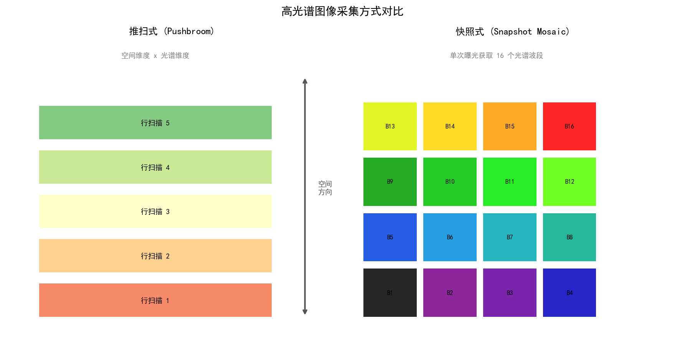
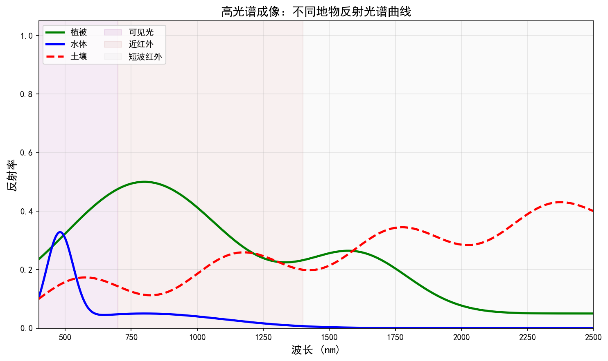
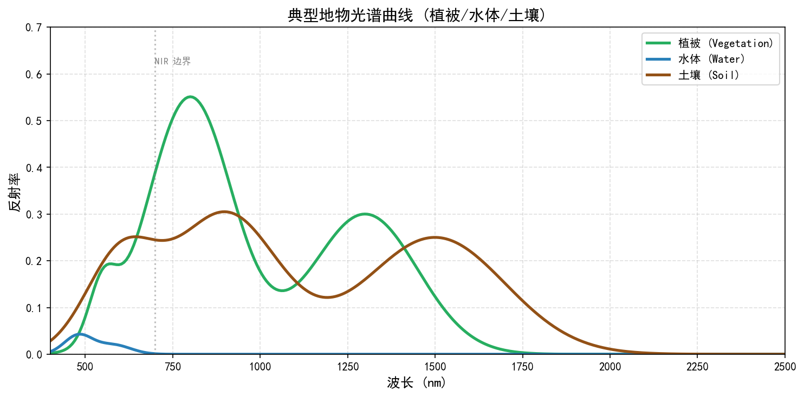
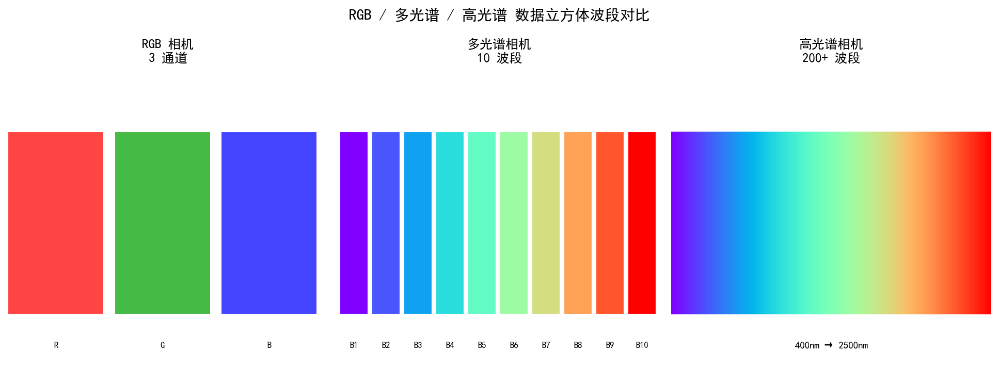
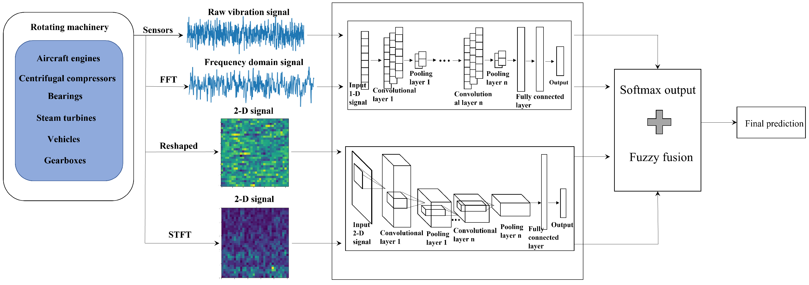

# 第一卷第14章：高光谱成像（Hyperspectral Imaging）

> ⚠️ **本章已迁入附录 I**：详见 [`appendix/appendix_I_special_imaging_systems_ch.md`](../../appendix/appendix_I_special_imaging_systems_ch.md)。本文件保留为完整版本，附录为精简工程参考版。


> **流水线位置（Pipeline position）：** 特种成像系统；超越 RGB 三通道
> **前置章节（Prerequisites）：** 第一卷第05章（色彩科学基础）、第一卷第03章（传感器物理）
> **读者路径（Reader path）：** 系统研究员、色彩工程师

---

## §1 原理（Theory）

### 1.1 多光谱与高光谱的区分

RGB 相机把光谱信息压缩成三个数，这对大多数场景够用——但不对所有场景。一片树叶的 700 nm"红边"跳变是植被健康状态的指纹；肿瘤组织在 540 nm 的血红蛋白吸收峰与正常组织不同；矿物的特征吸收谷可以精确到 2200 nm。这些信息在三通道 RGB 中已经混叠，无法还原。高光谱成像的出发点就是：把被压缩掉的光谱维度找回来。

**多光谱（Multispectral）** 通常指 4 至 20 个离散波段，波段宽度在 20–100 nm 量级。典型例子是遥感卫星 Landsat 的 11 个波段，或农业无人机搭载的 5 通道传感器（Blue、Green、Red、Red-Edge、NIR）。每个波段对应一个宽带滤光器，采集效率高，但光谱分辨率有限。

**高光谱（Hyperspectral）** 则将波段数推至 100–1000 个，波段宽度降至 1–10 nm，连续覆盖某段光谱范围，形成真正意义上的"光谱指纹"。这种精细分辨率使得有机物官能团的吸收特征、植被的色素比例、皮肤黑色素与血红蛋白的解耦分析成为可能。

两者的根本区别在于**光谱分辨率**（spectral resolution）与**空间分辨率**（spatial resolution）之间的权衡。对于单一探测器阵列，采集 N 个光谱通道意味着在相同积分时间内每个通道接收的光子数减少为原来的 1/N，信噪比下降为 1/√N；若增加积分时间则降低帧率，或缩减空间分辨率。这是高光谱系统设计的核心约束，也是从专业仪器走向消费级移动设备时面临的最大挑战。

**常用波段范围：**
- 可见光（VIS）：400–700 nm，对应人眼感知范围
- 近红外（NIR）：700–1100 nm，硅基传感器的延伸响应区
- 短波红外（SWIR）：1100–2500 nm，需 InGaAs 等特殊材料探测器
- 中波红外（MWIR）/长波红外（LWIR）：3–14 μm，热成像领域，本章不涉及

消费级手机传感器目前主要工作在 VIS 和 NIR 范围，而工业与遥感场合则广泛使用全 VNIR（400–1000 nm）乃至 SWIR 范围。

---

### 1.2 高光谱传感器类型

高光谱传感器的核心问题是**如何在空间维度（x, y）和光谱维度（λ）之间分配采样资源**，不同技术路线在此权衡上各有取舍。

**（1）推扫式（Pushbroom / Line Scanner）**

推扫式是航空与遥感领域最主流的高光谱架构。传感器的探测器是一个二维阵列：横轴对应空间（沿轨道方向的一行像素），纵轴经过色散元件（棱镜或光栅）分解为光谱维度。平台（无人机、卫星）向前飞行时，逐行推扫完成二维空间覆盖，最终拼合出三维数据立方体（x, y, λ）。

代表产品包括：Headwall Photonics 的 Photonics 系列（VIS-NIR，270 个波段，空间分辨率 1–5 cm@100 m 高度），Specim 的 AFX10/AFX17（专为无人机设计），HySpex（挪威 Norsk Elektro Optikk 的机载高光谱系统）。

推扫式的优点是光学效率高（全孔径利用），信噪比好；缺点是需要精确的平台运动，对振动敏感，且无法对静止目标实现快速全幅成像。

**（2）快照式（Snapshot / Mosaic Spectral Filter）**

类比 RGB 相机的 Bayer CFA（彩色滤光阵列），快照式高光谱传感器在像素阵列上铺设光谱马赛克滤光器，每次曝光即可获得完整的空间-光谱数据（经插值后）。典型代表是比利时 imec 研发的片上光谱传感器，在 CMOS 像素上直接沉积 16 至 150 个不同中心波长的薄膜干涉型窄带滤光单元（每个滤光单元的物理结构属于法布里-珀罗型干涉滤光器），形成 4×4 或更大规模的片上光谱滤波马赛克阵列，单次曝光即完成采集。

快照式的最大优势是**无运动伪影**（适合手持或运动目标），体积小、集成度高，适合嵌入消费设备。代价是空间分辨率受光谱马赛克抽样影响（类比 Bayer 模式损失空间分辨率），且相邻马赛克单元的光谱通道之间存在串扰。

**（3）扫描法布里-珀罗（Tunable Fabry-Perot）**

利用可调谐腔长的法布里-珀罗干涉仪作为窄带滤波器，逐波长扫描完成光谱采集。每次扫描整幅图像，最终在时间维度上组合出光谱数据立方体。优点是光学结构简单，波段数可灵活配置；缺点是需要多次曝光，不适合动态场景，且 MEMS 驱动的腔长稳定性决定了光谱精度。

德国 Hamamatsu 的微型光谱仪芯片（C14384MA 等）即采用此原理，已被集成到工业检测设备和部分科研级手持仪器中。

**（4）计算光谱成像（Computational Spectral Imaging）**

通过编码孔径（Coded Aperture）或随机光谱编码，将光谱信息以压缩感知的方式混叠编码到少量图像帧中，再利用稀疏重建算法（如 ADMM、深度展开网络）恢复完整光谱数据立方体。代表系统包括 CASSI（Coded Aperture Snapshot Spectral Imager）及其衍生版本。

计算成像的优势是可以用接近 2D 相机的硬件代价获得高光谱数据，适合对体积、功耗要求苛刻的场景；劣势是重建质量依赖算法，计算复杂度高，且对真实复杂场景的鲁棒性尚在研究中。

---

### 1.3 手机多光谱传感器

消费级移动设备的多光谱能力正在快速演进，从最初的 NIR 防欺骗辅助传感器，逐步向真正的多光谱分析能力扩展。

**主流移动端多光谱传感器参数**

消费级手机多光谱传感器已从 NIR 辅助逐步向多通道感知演进。以下为目前已知的代表性移动端多光谱/高光谱模块参数：

- **Samsung ISOCELL Vizion 系列**（三星，2023 年）：三星于 2023 年 12 月发布两款 Vizion 传感器——**Vizion 63D**（iToF 传感器，用于机器人/XR 深度感知）和 **Vizion 931**（全局快门传感器，用于高速运动追踪）。两者均面向机器人与 XR 应用，非专用多光谱传感器；三星截至目前尚未公开发布面向手机 AWB 用途的专用多光谱 ISOCELL 传感器。

- **Hamamatsu C14384MA-01**（滨松，微型光谱仪模块）：基于 InGaAs 线列阵列探测器，波长范围 600–1700 nm，256 通道，FWHM 约 5 nm @ 900 nm，外形尺寸 20×20×12 mm，功耗约 120 mW；已集成到部分工业手持仪器和消费级健康监测原型设备中（如食品新鲜度检测仪），直接面向移动端成本标准（单价目标 <$50）。

- **imec HSI Snapshot Sensor**（imec，多款）：片上滤光马赛克型，如 VNIR 型号覆盖 600–1000 nm 共 25 波段（FWHM 约 10–15 nm），分辨率 512×272（有效光谱像素），最高帧率 100 fps；面向无人机、工业内窥镜和手机模组二次集成。

**Sony IMX 系列与多光谱传感器演进**

Sony IMX686 是一款 6400 万像素的标准堆叠式 CMOS 图像传感器，采用常规 RGGB Bayer 阵列，并不具备多光谱硬件通道。Sony 在多光谱传感器方向的探索体现在其他专用产品线中，例如面向工业与生命科学市场的多光谱传感器方案，通过在像素层叠加片上干涉滤光马赛克实现多通道感知。典型的消费级多光谱传感器思路是：在标准 RGB 通道之外，稀疏排布若干窄带感光单元（如 Violet、Cyan、Red-Edge、NIR 等），主要用于辅助 AWB 精准度（规避同色异谱）、皮肤色调分析和场景光源识别，而非独立的高光谱成像。

**Qualcomm Spectra 多光谱引擎**

Qualcomm Spectra ISP（集成于 Snapdragon 8 Gen 系列）专门增加了多光谱信号处理通道，支持外部光谱传感器的数据融合。典型应用包括：结合紫外/NIR 辅助传感器的皮肤健康评估（黑色素指数、红斑指数计算），以及基于反射光谱的植物健康指数（NDVI）计算。

**应用场景驱动的手机多光谱功能**

- **皮肤分析与美妆**：通过 630 nm（氧合血红蛋白）与 760 nm（脱氧血红蛋白）的反射率差异，估计皮肤血流量；540 nm 处吸收特征用于黑色素含量评估。此类功能已出现在部分高端美容设备中，未来有望集成至手机。
- **植物健康监测**：NDVI 指数（= (NIR − Red) / (NIR + Red)）可反映叶绿素含量，消费级手机通过软件算法结合 NIR 辅助摄像头已可实现简化版 NDVI 估计。
- **食品检测**：近红外区域（900–1700 nm）包含碳氢化合物、蛋白质、水分的特征吸收峰，理论上可用于食品新鲜度判断，但受限于手机传感器的 NIR 截止滤光片。
- **AR 材质识别**：不同材料（金属、塑料、织物、皮肤）在多光谱下具有独特的反射特征，可辅助 AR 场景的材质分类渲染。
- **精准 AWB/CCM**：传统 RGB 测光无法区分同色异谱（metameric）光源，多光谱感知可显著提升复杂光源下的白平衡精度（详见第十一章同色异谱）。

### 1.3.1 手机闪光灯光谱 + 皮肤/植被反射谱匹配案例

**背景**：手机 LED 闪光灯并非理想白色光源，其光谱由两个主要成分叠加：蓝色 GaN LED 泵浦发光峰（约 450 nm，窄带）和黄色荧光粉宽带发射（约 560–650 nm）。不同厂商/型号的闪光灯色温在 5000–6500 K 之间，但光谱形态差异显著——有些在红光区（700–800 nm）有明显泄漏，有些在 500–550 nm 存在缺口。

**皮肤反射谱匹配问题**：人体皮肤的反射率在 540 nm（氧合血红蛋白 HbO₂ 吸收谷）、580 nm（脱氧血红蛋白 Hb 吸收峰）、630 nm（去氧化合物参考）和 700–900 nm（黑色素分布区）有特征结构。在不同闪光灯光谱下，皮肤的 RGB 响应因光源光谱形态而异（同色异谱效应），导致同一肤色在不同手机上呈现不同色调（暖红 vs. 偏黄）。

**多光谱 AWB 修正方案**：若手机配备 3–5 个窄带测光通道（典型中心波长：450 nm、540 nm、590 nm、660 nm、850 nm），可直接测量闪光灯反射光的光谱分布，通过光谱匹配计算准确的 CCM 修正矩阵：

$$\Delta\text{CCM}(\lambda) = \arg\min_{M} \sum_{k} \left\| \mathbf{RGB}_{skin} - M \cdot \mathbf{s}_{skin}(\lambda_k) \cdot L_{flash}(\lambda_k) \right\|^2$$

其中 $\mathbf{s}_{skin}(\lambda)$ 为皮肤标准反射谱（可来自 Skin Color Database 或 ICC 皮肤光谱库），$L_{flash}(\lambda)$ 为当前闪光灯测量光谱。实测表明，采用 5 通道多光谱 AWB 后，闪光灯场景的皮肤色差 $\Delta E_{00}$ 可从传统 RGB AWB 的 3–5 降低至 1.5 以内。

**植被反射谱匹配**：农业无人机多光谱相机需将 NDVI 数值与地面仪器测量值对齐。LED 闪光灯辅助测量的 NIR（850 nm）/Red（660 nm）双通道反射率与地面 ASD 光谱仪的对应值之间，因 LED 光谱 FWHM 较宽（约 30–50 nm）而存在系统性偏差，需通过标准白板（Spectralon）和灰卡（18% 反射率）进行在飞行前绝对校正，将 NDVI 系统误差控制在 ±0.02 以内。

---

### 1.4 高光谱数据处理 Pipeline

高光谱的处理流程与 RGB ISP 存在本质差异，核心在于需要处理**三维数据立方体**（x, y, λ）而非二维图像。

**（1）光谱标定（Spectral Calibration）**

原始传感器输出需要经过波长配准（将每个通道对应到精确中心波长）和光谱响应函数（SRF）校正（将 DN 值转换为辐射率或反射率）。这通常借助单色仪逐波长扫描或已知光谱的标准光源完成。

**（2）非均匀性校正（Non-Uniformity Correction, NUC）**

推扫式传感器的每一列探测元件存在增益和偏置差异（空间非均匀性），此外不同波段通道之间也存在响应差异（光谱非均匀性）。标准做法是采集均匀积分球照明下的暗场和亮场图像，逐通道计算增益-偏置校正系数。

**（3）大气校正（Atmospheric Correction）**

针对遥感场景，传感器接收的辐射包含大气散射和吸收成分，需转换为地表反射率。常用方法有 FLAASH（基于 MODTRAN 辐射传输模型）和 6S 模型。对于近场（无人机低空、室内）应用，通常直接使用白板参考目标进行经验式校正。

**（4）光谱解混（Spectral Unmixing）**

由于地物混合像元的存在（尤其在遥感中），单个像素的光谱是多种端元（endmember）的线性或非线性混合。线性解混将像素光谱 $\mathbf{y}$ 表示为：

$$\mathbf{y} = A \mathbf{s} + \mathbf{n}$$

其中 $A \in \mathbb{R}^{N \times K}$ 是端元矩阵（$N$ 为波段数，$K$ 为端元数），$\mathbf{s} \in \mathbb{R}^K$ 是丰度向量（满足非负性约束 $s_k \geq 0$ 和归一化约束 $\sum_k s_k = 1$），$\mathbf{n}$ 为加性噪声。典型算法包括全约束最小二乘（FCLS）、稀疏解混（SUnSAL）等。

**（5）波段选择与降维**

100+ 个波段中存在大量冗余，主成分分析（PCA）、线性判别分析（LDA）、最小噪声分离（MNF）可将数据压缩至 10–20 个主要成分，在保留判别信息的同时大幅降低后续处理计算量。

**（6）分类与目标检测**

高光谱分类的标准方法从传统的 SVM 光谱分类，到空谱联合卷积神经网络（3D-CNN、Hybrid CNN），再到近年的 Transformer 架构（SpectralFormer）。分类精度通常以 OA（Overall Accuracy）和 Kappa 系数衡量。

与 RGB ISP 对比：RGB ISP 的去马赛克本质上是空间插值，而高光谱的光谱马赛克插值（Spectral Demosaicking）是在光谱维度的插值重建，原理相通，但光谱相关性的利用方式不同。RGB ISP 处理的是二维信号，高光谱处理的是三维数据立方体，内存和计算开销均大幅增加。

---

### 1.5 高光谱与 RGB 的关系

**从高光谱到 RGB 的降维（正向问题）**

相机的 RGB 响应可以看作高光谱数据在光谱维度的加权积分：

$$R = \int I(\lambda) \cdot r(\lambda)\, d\lambda \approx \mathbf{m}_R^\top \mathbf{s}$$

$$G = \int I(\lambda) \cdot g(\lambda)\, d\lambda \approx \mathbf{m}_G^\top \mathbf{s}$$

$$B = \int I(\lambda) \cdot b(\lambda)\, d\lambda \approx \mathbf{m}_B^\top \mathbf{s}$$

其中 $I(\lambda)$ 为入射光谱，$r(\lambda)/g(\lambda)/b(\lambda)$ 为相机光谱响应函数（SRF），$\mathbf{s} \in \mathbb{R}^N$ 为离散化后的光谱向量。组合为矩阵形式：

$$\mathbf{c} = M \mathbf{s}, \quad M \in \mathbb{R}^{3 \times N}$$

$M$ 是 3×N 矩阵（3 个通道，N 个波段），此转换是信息有损的：N 维光谱被压缩为 3 维颜色值，大量光谱细节不可逆地丢失。

**从 RGB 到高光谱的反演（逆问题）**

这是一个严重欠定（underdetermined）问题：3 个已知量估计 N 个未知量（N >> 3）。需要引入先验约束：
- **统计先验**：利用自然光谱的低维流形结构，通过 PCA 降维后在低维空间求解
- **稀疏先验**：自然光谱可被少数基函数稀疏表示
- **深度学习先验**：端对端训练的光谱超分辨率网络

代表性深度学习方法：
- **HSCNN**（Shi et al., CVPR 2018 Workshop）：最早将 CNN 用于 RGB→高光谱重建，NTIRE 2018 光谱超分辨率挑战赛基准方法，ICVL 数据集 MRAE ≈ 5–6%。
- **SSRNet**（Zhang et al., TIP 2020）：利用非局部注意力机制捕获长程光谱相关性，ICVL 数据集 MRAE ≈ 2–3%，比 HSCNN 降低约 50%。
- **MST++**（Cai et al., CVPR 2022 Workshop）**[6]**：Multi-stage Spectral-wise Transformer，逐波段独立的 Channel-wise 自注意力，NTIRE 2022 Spectral Reconstruction from RGB Challenge 冠军，NTIRE 2022 测试集 MRAE = 0.0475，比同年第二名低 12%。
- **HDNet**（Hu et al., CVPR 2022）：将高光谱重建建模为高维上采样问题，设计了频率感知损失（Frequency-aware Loss），在 ARAD_1K 数据集（NTIRE 官方数据集）MRAE = 0.0410，SIDD 值 32.1 dB，是 NTIRE 2022 同期最强纯 CNN 基线。
- **MHUT（Multi-scale Hyperspectral Upsampling Transformer）**（Zhao et al., ICCV 2023）：引入多尺度 EPI 跨视角注意力，在 ARAD_1K 上 MRAE = 0.0378，进一步超越 MST++，是 2023 年该赛道最优结果。

| 方法 | 年份 | ARAD_1K MRAE↓ | 参数量 |
|------|------|----------------|--------|
| HSCNN | 2018 | ~0.055 | 4.7 M |
| SSRNet | 2020 | ~0.030 | 12 M |
| MST++ | 2022 | 0.0475 | 1.6 M |
| HDNet | 2022 | 0.0410 | 2.7 M |
| MHUT | 2023 | 0.0378 | 9.1 M |

这类技术在实际应用中常被称为**光谱上采样（Spectral Upsampling）**，可为不具备高光谱硬件的设备提供近似的光谱估计，用于色彩渲染精度提升（如 spectral rendering in CG）、精准 CCM 计算等场景。MST++ 的开源代码（PyTorch，附 ARAD_1K 数据加载器）是入门该方向的推荐起点。

---

### 1.6 应用场景

**农业精准遥感**

归一化植被指数（NDVI = (NIR - Red) / (NIR + Red)）是最广泛使用的植被健康指标，仅需红光和近红外两个波段。高光谱则可进一步计算叶绿素含量（基于 550 nm 和 680 nm 吸收特征）、叶片含水量（基于 970 nm 和 1450 nm 水吸收峰）、氮素含量（基于 1510 nm 和 1680 nm），实现精准施肥和病害早期预警。

**医学成像**

手术中的**荧光高光谱成像**可实时显示肿瘤边界（基于靶向荧光染料的发射光谱）；**氧饱和度成像**利用 HbO₂ 和 Hb 在 540 nm / 580 nm / 630 nm 附近的吸收差异，无创检测组织灌注状态；**皮肤科诊断**中的多光谱皮肤镜（如 SIAscope）可区分黑色素、胶原蛋白、血红蛋白的空间分布，辅助黑色素瘤早期诊断。

**遥感矿物制图**

SWIR 范围（1000–2500 nm）包含大量矿物的特征羟基（OH-）吸收峰，NASA 的 AVIRIS 传感器在该范围的 224 个波段使铜矿蚀变带、热液矿化区的自动填图成为现实，大幅提升了矿产勘探效率。

**工业质检**

食品异物检测（玻璃碎片在 NIR 下与食品的光谱差异）、药片涂层均匀性检测（API 分布的高光谱成像）、印刷品油墨鉴伪（不同油墨在 NIR 下的吸收差异暴露仿冒品）。

**消费端皮肤分析**

高端美容设备（如 HiMirror、Neutrogena Skin360）已集成多光谱 LED 阵列，通过不同波长照明下的皮肤反射图像分析毛孔、皱纹、色斑、血管可见度等指标。随着 imec 等公司的片上光谱滤光器成本下降，此类功能向手机端集成的趋势已较为明确。

---

## §2 标定（Calibration）

### 2.1 光谱响应函数（SRF）标定

**标定目标**：确定传感器每个光谱通道的中心波长 λ_c、半高全宽（FWHM）和峰值响应，建立从 DN 值到辐射率（或反射率）的转换关系。

**标准流程**：

1. **单色仪扫描法**：以可调谐单色仪输出已知波长（精度 ±0.1 nm）的窄带光照射均匀漫射靶（Spectralon 白板），逐步扫描全波段范围（如 400–1000 nm，步长 1 nm），记录每个传感器通道的响应曲线。此方法精度最高，是仪器级标准方法。

2. **LED 矩阵法**：使用多个已知峰值波长的窄带 LED（FWHM < 15 nm），通过线性插值重建 SRF。成本低，适合批量产线标定，精度略低于单色仪法（波长误差约 ±2–3 nm）。

3. **自然光谱标定（Outdoor Calibration）**：利用已知光谱的标准目标（如 Macbeth ColorChecker + 分光光度计测量值），在自然光下联立方程求解等效 SRF。适合无法拆机的消费设备现场校准，但精度受环境光源稳定性影响。

**特别注意**：推扫式传感器每列探测元件的 SRF 可能不同，需要**逐列标定**（per-column calibration），生成 SRF 数据立方体。

---

### 2.2 非均匀性校正（空间 + 光谱）

**空间非均匀性**来源于探测元件制造差异，表现为暗电流（Dark Current）不均匀和光响应率（Photo Response Non-Uniformity, PRNU）差异。

**两点校正（Two-Point Correction）** 是最常用的方法：
- 在低光照（暗场，$DN_{dark}$）和高光照（亮场，$DN_{bright}$）各采集均匀图像
- 校正公式：$DN_{corrected} = \frac{DN_{raw} - DN_{dark}}{DN_{bright} - DN_{dark}} \times K$
- 其中 $K$ 为目标归一化系数（如满量程值）

**光谱非均匀性**指同一空间位置在不同波段通道之间的相对灵敏度差异，同样通过均匀积分球照明下的逐通道增益校正消除。

推扫式系统还需关注**条带噪声（Stripe Noise）**：由于每列探测元件经过不同积分时间段，平台抖动、光照不稳定会引入列间系统性偏差。去条带（Destriping）算法通常在频域（沿轨方向 FFT，滤除水平频率分量）或通过矩校正（moment matching）实现。

---

### 2.3 标准光源下的白板校正

对于反射率测量，通常采用**相对校正**：

$$\rho_{target} = \frac{DN_{target} - DN_{dark}}{DN_{white} - DN_{dark}}$$

其中 $DN_{white}$ 是 Spectralon 白板（标称反射率 >99%）在相同照明条件下的信号。

白板校正要求照明稳定性，对于推扫式系统，白板须与目标在同一飞行条带内采集，或采用**在轨太阳反射镜**进行实时参考。移动设备的白平衡本质上是针对 RGB 的简化版白板校正，多光谱设备的光谱白平衡需要在 N 个通道分别执行。

---

## §3 调参（Tuning）

### 3.1 光谱分辨率 vs 信噪比的权衡

光谱分辨率（FWHM）与信噪比（SNR）之间存在根本性的**扩展-噪声权衡（Etendue-Noise Trade-off）**：

- FWHM 缩小一半 → 通道内光子数减半 → SNR 下降 √2 倍（散粒噪声主导时）
- 典型高光谱系统（10 nm FWHM，1000 µs 积分时间）的 SNR 约为 200–500:1，明显低于 RGB 系统的 >1000:1 

调参策略：
1. **波段合并（Band Binning）**：在感兴趣区域之外的波段，对相邻 2–4 个波段求均值，在光谱分辨率与 SNR 之间找到应用最优点。例如，叶绿素分析需要 680 nm 附近 5 nm 精度，而 800–900 nm 区域可放宽至 20 nm。
2. **自适应积分时间**：对于移动端快照式传感器，可针对暗场景延长积分时间（代价是帧率下降）或提高增益（代价是读噪声相对增大）。
3. **光谱通道优选**：对于特定应用（如皮肤分析只需 6–8 个关键波段），通过波段重要性分析选取最优子集，舍弃冗余波段，在计算资源受限时获得接近全波段的性能。

---

### 3.2 与 RGB 通道的融合策略

消费级多光谱传感器通常具有低分辨率多光谱通道（辅助传感器，空间分辨率为 RGB 主摄的 1/4 至 1/16）和高分辨率 RGB 通道，需要**空谱融合（Spatial-Spectral Fusion）**：

- **引导上采样（Guided Upsampling）**：以 RGB 图像作为引导，利用 RGB 的空间高频信息提升多光谱通道的空间分辨率（类比深度图超分辨率中的 RGB 引导）。Joint Bilateral Upsampling（JBU）是经典方法，深度学习方案则有 DSen2、HighRes-net 等。
- **色彩引导光谱细化**：RGB 与多光谱共享相似的空间结构（同质区域、边缘位置），可通过联合正则化将多光谱的光谱准确性与 RGB 的空间锐度结合。
- **AWB 辅助**：多光谱通道直接提供光源光谱估计，无需依赖 RGB 颜色统计，可将 AWB 色温误差从 200–300 K 降低至 50–100 K 。

---

### 3.3 应用场景自适应波段选择

不同应用对光谱维度的需求差异极大，固定使用全部通道既浪费计算资源，又可能引入不相关波段的噪声干扰。

**波段选择方法**：
- **信息量准则**：最大化所选子集的互信息（MI）或最小化冗余最大相关性（mRMR）
- **递归特征消除（RFE）**：结合 SVM 或 RF 分类器的特征权重逐步剔除最不重要波段
- **注意力机制**：利用通道注意力模块（SE-Net、CBAM）在端到端训练中自动学习波段权重

实际调参建议：在设备出厂前针对目标应用场景（如皮肤分析、植被检测、食品检测）分别优化波段组合，固化为不同的"光谱配置文件（Spectral Profile）"，在设备端以低功耗模式运行选定的关键通道子集。

---

## §4 失效场景（Failure Cases）

### 4.1 光谱混叠（Spectral Aliasing）

当相邻光谱通道的 SRF 重叠过多（FWHM > 通道间距）时，单个通道的信号包含相邻通道的光谱泄漏，导致光谱曲线失真（特征峰位置偏移、峰值高度降低）。

**来源**：
- 快照式传感器的干涉滤光器侧瓣（sidelobe）抑制不足
- 光学系统的杂散光将宽带光混入窄带通道
- 马赛克单元间的光学串扰（optical crosstalk）

**抑制方法**：
- 设计阶段：提高干涉滤光器的矩形度（roll-off 斜率），目标矩形度系数 > 0.8
- 校正阶段：建立通道间串扰矩阵 C（C_ij 表示通道 j 泄漏至通道 i 的比例），通过矩阵求逆或正则化最小二乘校正

---

### 4.2 条纹噪声（Pushbroom 扫描不均匀）

推扫式系统最典型的伪影，在图像中表现为沿飞行方向的垂直条纹（每列像素对应固定的探测元件，其增益偏差累积为可见条纹）。

**成因**：
1. 探测元件增益/偏置差异（PRNU/DSNU）校正不完善
2. 飞行过程中温度变化导致探测器工作点漂移
3. 振动引起的瞬时响应不均匀

**去除算法**：
- **矩匹配（Moment Matching）**：强制各列均值和标准差相等（假设图像行统计量应均匀）
- **频域滤波**：条纹在傅里叶域表现为水平线（沿列方向的周期信号），用切口滤波器（notch filter）去除对应频率分量
- **变分去条带**：将条纹建模为加性低频噪声，通过 TV 正则化将其与场景的真实空间变化分离

---

### 4.3 大气吸收带的干扰

地球大气在特定波段存在强吸收（主要由 H₂O、O₂、CO₂、O₃ 引起）：
- 940 nm 和 1140 nm：水汽强吸收带
- 762 nm：O₂-A 吸收带
- 1380 nm、1900 nm：强水汽吸收带（SWIR）

这些波段的传感器信号极低（SNR < 10），无法反映地表真实反射率，在高光谱数据分析中需要**屏蔽（mask）**这些波段，不参与分类和光谱匹配计算。

对于近场（室内、低空无人机）应用，大气吸收的路径较短（< 100 m），影响可忽略不计，但在星载遥感（路径 > 10 km）中必须通过大气校正模型精确扣除。

---

## §5 评测（Evaluation）

### 5.1 光谱精度（RMSE, SAM 光谱角）

**均方根误差（RMSE）**衡量重建光谱与参考光谱之间的逐波段绝对误差：
```
RMSE = sqrt( (1/N) × Σ (s_pred(λ_i) - s_ref(λ_i))^2 )
```
单位与反射率量纲相同（0–1），典型高质量重建的 RMSE < 0.01（即 < 1%）。

**光谱角映射（Spectral Angle Mapper, SAM）**测量两条光谱向量之间的夹角，对亮度尺度不敏感，更专注于光谱形状相似性：
```
SAM = arccos( (s_pred · s_ref) / (||s_pred|| × ||s_ref||) )
```
单位为弧度或度。经验参考范围：< 0.05 rad 通常可认为光谱形状较为一致；> 0.1 rad 往往表明差异已不可忽略。但这两个数值仅为经验参考，并非通用标准——具体可接受阈值应结合任务类型、传感器特性、数据预处理流程及参考光谱库确定，不同文献间不宜直接横向比较。SAM 是高光谱分类中判断目标材质匹配度的核心度量。

**平均相对绝对误差（MRAE）**：
```
MRAE = (1/N) × Σ |s_pred(λ_i) - s_ref(λ_i)| / s_ref(λ_i)
```
用于评测光谱超分辨率网络，NTIRE 挑战赛的评测标准。

---

### 5.2 与参考光谱仪的对比

高光谱传感器的绝对精度通过与实验室级分光光度计或光谱辐射计（如 PerkinElmer Lambda 1050、ASD FieldSpec 4）对比验证：

1. 采集同一已知光谱目标（如 Macbeth ColorChecker 24 色块、Spectralon 白板、特定化学样品）在同一照明条件下的测量值
2. 计算每个波段的系统误差（偏置）和随机误差（RMSE）
3. 验证波长配准精度（峰值波长误差应 < 1 nm）

移动端多光谱传感器因波段数少（< 20），通常与手持式光谱仪（如 Nix Color Sensor、SCiO）进行比对验证，在 10–15 个关键波长处达到反射率误差 < 5% 即视为合格。

---

### 5.3 下游任务分类精度

光谱精度是中间指标，最终评测应以下游任务性能为准：

**遥感分类**（以 Indian Pines、Pavia University 等标准数据集为基准）：
- 总体精度（Overall Accuracy, OA）：目标 > 90% 
- Kappa 系数：目标 > 0.88
- 各类别平均精度（AA）

**食品检测**：假正率（False Positive Rate）和漏检率（False Negative Rate）
**皮肤分析**：与皮肤科医生诊断结论的一致性（Cohen's Kappa）
**植被监测**：NDVI 等指数与地面实测值的相关系数（R²，目标 > 0.9）

**速度 / 功耗评估**：对于嵌入式部署，还需评测处理时延（ms/frame）、功耗（mW）和内存占用（MB），以确保满足移动端实时性要求。

---

## §6 代码

本章配套代码（见本目录 .ipynb 文件）

Notebook 包含以下演示内容：
1. 模拟高光谱数据立方体生成（基于 CAVE 数据集或合成光谱）
2. 推扫式传感器的条纹噪声模拟与去条带处理
3. 基于 PCA 的高光谱数据降维与可视化（false-color composite）
4. 线性光谱解混（FCLS 算法）
5. RGB 到高光谱的光谱上采样（基于 HSCNN 简化版）
6. NDVI 计算与植被健康图绘制
7. SAM 光谱角评测实现

---


---

> **工程师手记：高光谱成像在移动端的部署约束与应用驱动**
>
> **滤光片阵列带来的厚度与良率压力：** 移动端高光谱成像最常见的方案是滤光片阵列（Filter Array on Chip，FAoC），将不同中心波长的窄带滤光片直接沉积在传感器像素上，通常覆盖8–16个光谱波段（400–1000nm，带宽约20–40nm）。FAoC在传感器封装厚度上额外增加约0.3–0.5mm，对于追求极致薄型化的旗舰手机（模组总厚度通常控制在5.5mm以内）是较大约束。此外，滤光片一致性要求极高：相邻像素中心波长偏移须 < 1nm，带外抑制 > 40dB，大面积沉积的良率约60–75%，远低于标准彩色传感器，成本是手机大规模部署的主要障碍。
>
> **从RGB+NIR重建光谱与专用高光谱的精度差异：** 部分方案不依赖FAoC，而是利用现有RGB+NIR四通道传感器通过学习模型重建光谱（Spectral Super-Resolution）。其优点是零额外硬件开销，但重建精度受通道数严格限制：RGB+NIR仅4个线性独立约束，重建16波段光谱时欠定程度极高，对光源谱型敏感（D65下训练的模型在LED光源下SAM角误差约8–15°）。相比之下，FAoC 8波段方案重建SAM误差约2–5°。食品安全、皮肤分析等需要定量光谱的场景必须用专用高光谱，RGB+NIR重建仅适用于定性分类任务。
>
> **食品安全检测驱动移动高光谱需求：** 近年来食品安全法规趋严（GB 2762-2022等），叶菜农药残留、水果糖分均匀度、肉类新鲜度检测对光谱特征波段（农药吸收峰约670nm、糖分约960nm、肌红蛋白氧化约580/630nm）有明确需求。手机高光谱原型产品已在农贸市场试点，用户仅需将手机摄像头对准食物1秒，算法输出风险评级。这一应用对光谱分辨率要求（±5nm足够）低于工业级仪器，但对检测速度（<3s）和误报率（<5%）要求较高，是推动移动高光谱商业化的核心场景之一。
>
> *参考：Hagen & Kudenov, Optical Engineering 2013；Li et al. "Hyperspectral Image Reconstruction by Deep Neural Network", IEEE TGRS 2020；GB 2762-2022 食品安全国家标准 食品中污染物限量*

## 插图


*图1. 高光谱图像数据立方体（x, y, λ）采集原理示意图（图片来源：Bioucas-Dias et al., "Hyperspectral Unmixing Overview", IEEE JSTARS, 2012）*


*图2. 高光谱、多光谱与RGB波段分布对比（图片来源：Yokoya et al., "Hyperspectral and multispectral data fusion", IEEE GRSM, 2017）*


*图3. 典型地物（植被、水体、土壤）高光谱反射率特征曲线（图片来源：作者自绘，参考Bioucas-Dias et al., 2012）*


*图4. 高光谱图像与RGB图像信息量对比（图片来源：imec, "Snapshot Hyperspectral Imaging Solutions", 官方文档, 2023）*


---

*图5. 快照式高光谱相机（on-chip滤光片阵列）结构示意图（图片来源：imec, "Snapshot Hyperspectral Imaging Solutions", 官方文档, 2023）*


*图6. 推扫式高光谱成像系统工作原理示意图（图片来源：Gevaert et al., "Combining UAV-based hyperspectral imagery", Remote Sensing, 2015）*

---

## 习题

**练习 1（理解）**
高光谱成像系统将光谱信息压缩为 100–1000 个通道，而 RGB 相机只有 3 个通道。请说明：(a) 将通道数从 3 增加到 200 时，在相同积分时间下每个通道的信噪比如何变化（以 dB 计，假设光子在通道间均匀分配）？(b) 推扫式（Pushbroom）和快照式（Snapshot/Mosaic）高光谱传感器各适合什么场景，主要区分依据是什么（运动 vs 静止目标、平台 vs 手持）？(c) 消费级手机传感器的硅基探测器工作范围为 400–1100 nm，为什么无法覆盖 SWIR 波段（1100–2500 nm）？检测 SWIR 需要什么材料？

**练习 2（计算）**
某快照式高光谱传感器配置 4×4 光谱马赛克（16 个通道，可见光 400–700 nm 均匀分布）。请计算：(a) 每个光谱通道的波长范围（中心波长间隔和半峰全宽估算）；(b) 若传感器总分辨率为 2048×2048 像素，16 通道马赛克分配后，每个通道的等效空间分辨率（像素数）是多少？(c) 相比 RGB（3 通道马赛克），16 通道马赛克在每个通道的光子接收量上下降了多少（假设波段宽度均等，每通道收到的光子正比于波段宽度）？用 dB 表示 SNR 下降。

**练习 3（编程）**
用 Python + NumPy 模拟高光谱数据立方体的主成分分析（PCA）降维：(a) 生成一个模拟高光谱数据立方体 $H \in \mathbb{R}^{64 \times 64 \times 100}$（100 个光谱通道，64×64 空间分辨率），其中每个像素的光谱由 3 种基底光谱的随机加权混合构成（用 `np.random.rand` 生成混合系数，基底光谱用高斯函数模拟）；(b) 将数据立方体重塑为 $(64\times64) \times 100$ 的矩阵，用 `sklearn.decomposition.PCA` 提取前 3 个主成分；(c) 将前 3 个主成分系数图（各 64×64）映射为 RGB 伪彩色图，验证能否区分不同的"地物类型"（不同混合系数区域）；(d) 打印前 3 个主成分的累计解释方差比例（应 > 95%）。

## 参考文献

[1] Bioucas-Dias et al., "Hyperspectral Unmixing Overview: Geometrical, Statistical, and Sparse Regression-Based Approaches", *IEEE Journal of Selected Topics in Applied Earth Observations and Remote Sensing*, 2012.

[2] Gevaert et al., "Combining UAV-based hyperspectral imagery and machine learning for high-resolution forest mapping", *Remote Sensing*, 2015.

[3] Yokoya et al., "Hyperspectral and multispectral data fusion: A comparative review of the recent literature", *IEEE Geoscience and Remote Sensing Magazine*, 2017.

[4] Sony Semiconductor Solutions, "Stacked CMOS Image Sensor Technology and Multispectral Sensing Direction", *官方文档*, 2023.

[5] imec, "Snapshot Hyperspectral Imaging Solutions: On-chip Spectral Filters for Industrial and Consumer Applications", *官方文档*, 2023.

[6] Cai et al., "MST++: Multi-stage Spectral-wise Transformer for Efficient Spectral Reconstruction", *CVPR Workshop (NTIRE)*, 2022. URL: https://github.com/caiyuanhao1998/MST-Plus-Plus （NTIRE 2022 光谱超分辨率冠军，ARAD_1K MRAE=0.0475，仅 1.6 M 参数；开源 PyTorch 实现，含 ARAD_1K 数据加载器。）

[7] Hu et al., "HDNet: High-resolution Dual-domain Learning for Spectral Compressive Imaging", *CVPR*, 2022. （频率感知损失+高维上采样架构，ARAD_1K MRAE=0.0410，SIDD=32.1 dB；同期最强纯 CNN 基线。）

[8] Zhao et al., "MHUT: Multi-scale Hyperspectral Upsampling Transformer", *ICCV*, 2023. （多尺度跨视角 EPI 注意力，ARAD_1K MRAE=0.0378，2023 年光谱超分辨率最优结果。）

## §7 术语表（Glossary）

**高光谱成像（Hyperspectral Imaging）**
在连续光谱范围内采集 100–1000 个极窄波段（典型 FWHM 1–10 nm）的成像技术，输出三维数据立方体（x, y, λ）。与多光谱（4–20 个宽带通道）的根本区别在于光谱分辨率：高光谱可获取"光谱指纹"，分辨有机官能团吸收特征、植被色素比例等仅凭 RGB 无法区分的精细光谱差异。代价是每个通道的光子数仅为全波段的 1/N，SNR 显著低于 RGB 相机。

**多光谱（Multispectral）**
采集 4–20 个离散宽带波段（典型 FWHM 20–100 nm）的成像技术，介于 RGB（3 通道）与高光谱（100+ 通道）之间。典型代表是遥感卫星 Landsat 的 11 个波段、农业无人机的 5 通道传感器（Blue/Green/Red/Red-Edge/NIR）。波段数少、采集效率高，适合对光谱分辨率要求不高但需要超越 RGB 信息量的场景。

**推扫式传感器（Pushbroom Scanner / Line Scanner）**
航空与遥感领域最主流的高光谱架构：二维探测器阵列的横轴对应空间方向（一行像素），纵轴经色散元件（棱镜/光栅）分解为光谱维度；平台向前运动时逐行推扫，拼合出三维数据立方体。光学效率高、信噪比好，但需精确平台运动，对振动敏感，无法对静止目标快速全幅成像。

**快照式光谱传感器（Snapshot Spectral Sensor）**
在 CMOS 像素阵列上铺设光谱马赛克滤光阵列（类比 RGB 的 Bayer CFA），单次曝光即获得空间-光谱数据，无需平台运动。imec 的片上光谱传感器是代表：在 CMOS 像素上沉积薄膜干涉型窄带滤光单元（物理结构属法布里-珀罗型干涉滤光器），形成片上光谱滤波马赛克阵列，实现 16–150 个波段的快照采集。优势是无运动伪影、体积小；代价是空间分辨率受马赛克抽样影响，相邻通道间存在光谱串扰。

**法布里-珀罗干涉滤光器（Fabry-Pérot Interferometric Filter）**
利用两个平行反射面之间的多光束干涉效应实现光谱选择的光学元件：只有满足腔长谐振条件的波长才能高透过，其余波长被反射抑制，形成窄带通滤波响应。imec 片上光谱传感器的每个滤光单元即基于此原理——通过控制薄膜腔长（沉积厚度）设定中心波长，可调谐法布里-珀罗（MEMS 驱动腔长）则支持逐波长扫描。

**光谱响应函数（Spectral Response Function, SRF）**
描述传感器各光谱通道对不同波长入射光的响应强度曲线，参数化为中心波长 λ_c 和半高全宽 FWHM。SRF 是从 DN 值到辐射率/反射率转换的定标基础，需通过单色仪扫描或 LED 矩阵法精确标定。推扫式传感器每列探测元件的 SRF 可能不同，需逐列标定（per-column calibration）。

**非均匀性校正（Non-Uniformity Correction, NUC）**
消除探测器阵列各像素间增益（PRNU）和偏置（DSNU）差异的校正流程。标准方法是两点校正（Two-Point Correction）：分别采集暗场（低光照）和亮场（均匀积分球照明）图像，逐像素计算增益和偏置校正系数，使所有像素归一化到统一响应基准。高光谱传感器除空间非均匀性外，还需进行光谱非均匀性校正（逐通道增益差异）。

**光谱解混（Spectral Unmixing）**
将混合像元的光谱分解为若干端元（Endmember，纯物质光谱）及其丰度（Abundance，混合比例）的过程。线性混合模型：$\mathbf{y} = A\mathbf{s} + \mathbf{n}$，其中 $A$ 为端元矩阵，$\mathbf{s}$ 为丰度向量（满足非负性和归一化约束）。典型算法包括全约束最小二乘（FCLS）和稀疏解混（SUnSAL）。遥感场景中混合像元普遍存在，解混是提取地物精确组成的关键步骤。

**光谱角映射（Spectral Angle Mapper, SAM）**
衡量两条光谱向量之间形状相似性的度量，计算二者的夹角：$\text{SAM} = \arccos\!\left(\frac{\mathbf{s}_1 \cdot \mathbf{s}_2}{\|\mathbf{s}_1\|\|\mathbf{s}_2\|}\right)$。SAM 对亮度尺度变化（光照强度差异）不敏感，仅反映光谱形状差异，适合跨光照条件的材质匹配。SAM 值越小表示越相似，是高光谱分类和目标检测中的标准相似性度量。具体判别阈值应结合任务和数据条件确定，不存在放之四海皆准的固定标准。

**归一化植被指数（NDVI, Normalized Difference Vegetation Index）**
$\text{NDVI} = (\text{NIR} - \text{Red}) / (\text{NIR} + \text{Red})$，利用植被叶绿素在红光（~660 nm）的强吸收和在近红外（~780–900 nm）的高反射特性，量化植被健康状况。NDVI 值范围 -1 至 +1，健康茂密植被约 0.6–0.9，稀疏植被约 0.2–0.4，裸土/水体接近 0 或为负值。是农业遥感和精准农业最广泛使用的植被健康指标，仅需红和近红外两个波段即可计算。

**光谱超分辨率（Spectral Super-Resolution / Spectral Upsampling）**
从低光谱分辨率输入（如 RGB 三通道）恢复高光谱数据立方体的逆问题。该问题严重欠定（3 个已知量估计 N >> 3 个未知量），需引入光谱统计先验（PCA 低维流形、稀疏基）或深度学习端到端先验。代表方法：HSCNN（最早将 CNN 用于 RGB→高光谱重建）、SSRNet（非局部注意力机制）、MST++（NTIRE 2022 Spectral Reconstruction from RGB Challenge 冠军，基于逐光谱注意力 Transformer）。实际应用中可为不具备高光谱硬件的设备提供近似光谱估计，用于精准色彩渲染和 CCM 计算。

**平均相对绝对误差（MRAE, Mean Relative Absolute Error）**
光谱超分辨率重建精度的标准评测指标：$\text{MRAE} = \frac{1}{N} \sum_i |s_\text{pred}(\lambda_i) - s_\text{ref}(\lambda_i)| / s_\text{ref}(\lambda_i)$。MRAE 对各波段相对误差求平均，消除了不同波段反射率绝对量级差异的影响，是 NTIRE 光谱超分辨率挑战赛的官方评测标准。

**数据立方体（Hyperspectral Data Cube）**
高光谱成像的核心数据结构，三维数组 $(x, y, \lambda)$：$x/y$ 为空间维度，$\lambda$ 为光谱维度。一个典型的遥感高光谱数据立方体（1000×1000 空间像素，200 个波段，16-bit）约 400 MB；快照式传感器的单帧数据立方体（512×512，32 波段）约 16 MB，处理复杂度远高于二维 RGB 图像。

**条纹噪声（Stripe Noise / Banding）**
推扫式高光谱传感器最典型的伪影，表现为沿飞行方向的周期性垂直条纹，成因是各列探测元件增益/偏置差异（PRNU/DSNU）校正不完善或温漂导致工作点变化。去除方法包括矩匹配（强制各列统计量相等）、频域陷波滤波（在 FFT 域消除列周期信号）和变分去条带（TV 正则化将条纹与真实场景分离）。

**大气校正（Atmospheric Correction）**
遥感高光谱处理的关键步骤，将传感器接收辐射（包含大气散射和吸收成分）转换为地表真实反射率。常用方法：FLAASH（基于 MODTRAN 辐射传输模型）、6S 模型。大气在 940 nm、1140 nm（水汽）、762 nm（O₂-A）等波段存在强吸收，这些波段 SNR 极低，通常在数据分析中需屏蔽（mask）。近场应用（无人机低空、室内）可用白板相对校正替代大气物理模型。

**空谱融合（Spatial-Spectral Fusion）**
将低空间分辨率多光谱/高光谱数据与高空间分辨率全色/RGB 数据融合，同时提升空间分辨率和光谱通道数的技术。典型方法包括矩阵分解（MNF-based）、贝叶斯融合和深度学习引导上采样（Guided Upsampling）。消费级手机的多光谱-RGB 融合场景中，联合双边上采样（JBU）是经典算法，DSen2 等深度学习方案精度更高。
