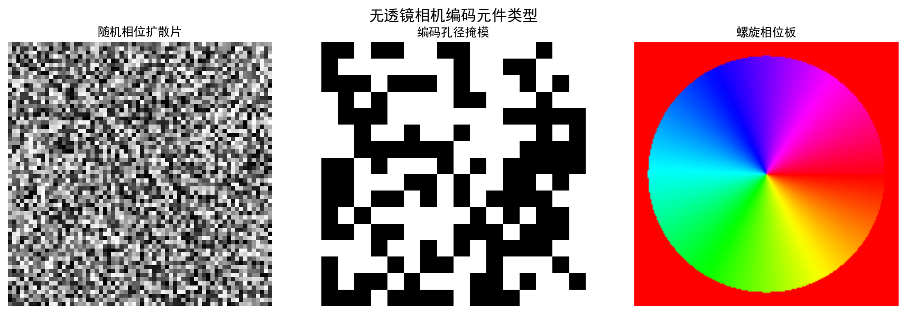
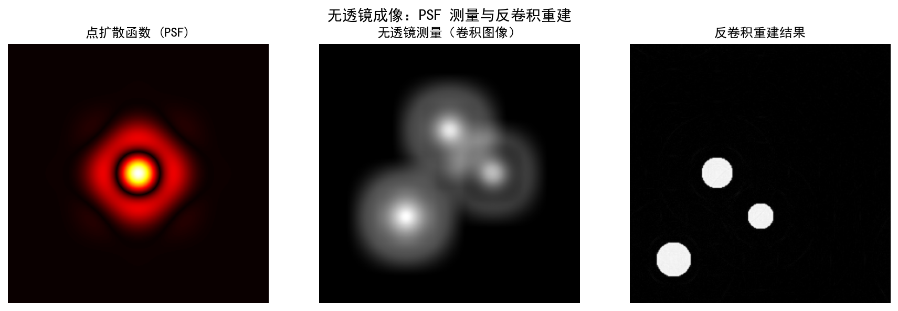
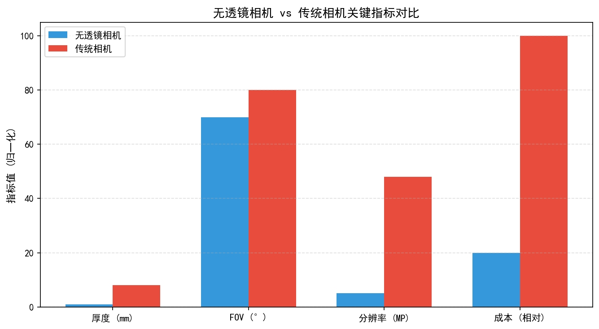
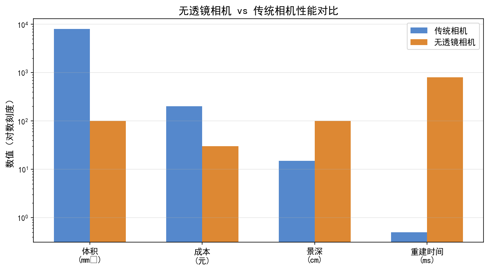
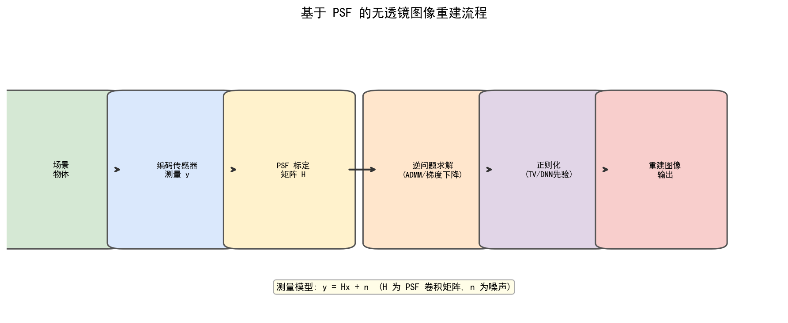

# 第一卷第15章：无透镜成像（Lensless Imaging）

> ⚠️ **本章已迁入附录 I**：详见 [`appendix/appendix_I_special_imaging_systems_ch.md`](../../appendix/appendix_I_special_imaging_systems_ch.md)。本文件保留为完整版本，附录为精简工程参考版。

> **流水线位置（Pipeline position）：** 成像系统层；替代传统镜头+传感器组合
> **前置章节（Prerequisites）：** 第一卷第02章（光学基础）、第一卷第03章（传感器物理）
> **读者路径（Reader path）：** 系统研究员、算法工程师

---

## 本章概览

传统手机镜头模组厚 5–7 mm，这个数字是光学设计、机械装配、传感器对焦精度多方博弈的结果，很难再压缩。无透镜成像的思路是釜底抽薪：直接去掉镜头，用一张几乎贴着传感器的编码元件（散射片、相位掩模、菲涅耳波带片）替代。传感器捕获的不是图像，是光场的编码测量值——后续靠计算重建出图像。

代价很明确：原始数据是混叠测量值，必须运行迭代重建算法才能得到可视图像，计算延迟远高于传统 ISP。无透镜相机是一个光学-计算协同设计系统，对算法工程师来说，工作前移到了与衍射物理深度耦合的重建算法层面。

---

## §1 原理（Theory）

### 1.1 无透镜成像的动机与应用

要理解无透镜成像为何值得研究，首先需要清楚传统镜头的代价。一支标准手机镜头模组厚度约 5–7 mm，这一尺寸主要由镜片组的焦距和所需的后焦距（Back Focal Distance）决定——光线需要足够的传播距离才能被聚焦到焦平面。对于消费级手机来说，这 5–7 mm 已经是工程师与产品设计师反复博弈的结果；而对于某些场景，这个尺寸仍然过大：

- **医疗内窥镜与胶囊内镜**：胶囊需要在食道、小肠中自由通过，直径受到严格约束。无透镜相机可以将整个成像头做到直径 1–2 mm 以内。
- **可穿戴与贴片设备**：皮肤贴片式血氧、心率监测设备需要平整柔性，厚度以微米计，传统镜头根本无从安装。
- **智能微型机器人与无人机**：载荷受限场景下，相机重量与体积是关键约束。
- **计算成像研究**：无透镜架构天然支持单次拍摄三维重建、超分辨率、光谱成像等扩展功能，是计算成像领域的重要研究平台。
- **工业与安防**：超薄形态允许将相机隐藏在设备内部或结构表面，如墙壁、书架等。

当前代表性系统包括：DiffuserCam（加州大学伯克利分校，2018）、FlatCam（莱斯大学，2017，相位掩模型早期系统）、PhlatCam（莱斯大学，2020，设计优化相位掩模）、FlatScope（莱斯大学，片上荧光显微镜）以及各类基于超表面（Metasurface）的平板相机原型。

**FlatCam 简介**：Adams et al.（2017）最早提出的分离能相机（separable mask lensless imager），使用可分离的行/列编码掩模（而非随机散射片），其前向模型可分解为两个 1D 卷积的 Kronecker 积，大幅降低重建计算量（从 $O(N^2)$ 降至 $O(N^{1.5})$），在 CMOS 传感器上贴近放置 0.5 mm 厚掩模即可工作，是最接近真正"超薄"相机的系统之一。

### 1.2 相位编码孔径（Phase Mask / Diffuser）

无透镜成像最具代表性的实现方式是**相位掩模编码（Phase Mask / Diffuser Coding）**。其核心思想如下：

**前向成像模型：**

设场景中的一个点光源位于三维坐标 $(x_0, y_0, z_0)$，它通过自由空间传播到传感器平面，在途中经过一块固定的相位掩模。由于相位掩模对不同位置的光波施加不同的相位延迟，点光源在传感器上形成的响应不再是一个小圆点（艾里斑），而是一个**扩展的、具有独特空间结构的斑图**，称为该位置的**点扩散函数（Point Spread Function，PSF）**。

整幅场景的传感器测量值 $\mathbf{y}$ 可以写成：

$$\mathbf{y} = \mathbf{H}\mathbf{x} + \mathbf{n}$$

其中：
- $\mathbf{x} \in \mathbb{R}^N$ 是待恢复的场景（展平为向量）
- $\mathbf{H} \in \mathbb{R}^{M \times N}$ 是系统矩阵，由 PSF 构成
- $\mathbf{n}$ 是传感器噪声
- $\mathbf{y} \in \mathbb{R}^M$ 是传感器读出值

对于空间不变系统（即 PSF 与场景位置无关，实际上是近似），$\mathbf{H}$ 具有卷积结构，即 $\mathbf{y} = h * \mathbf{x} + \mathbf{n}$，可以用快速傅里叶变换（FFT）高效计算。

**DiffuserCam 架构（Antipa et al., 2018）：**

DiffuserCam 是无透镜成像领域的标志性工作。其物理结构极为简单：一块商业级光学散射片（Diffuser，成本约数美元）直接贴在 CMOS 传感器上方约 1 mm 处，无需任何其他光学元件。散射片使点光源在传感器上产生一个覆盖整个芯片面积的散斑图案（Speckle Pattern）。

DiffuserCam 的关键洞察在于：虽然单个散斑图案是随机的，但**在有限视场内，不同横向位置点光源对应的散斑图案之间存在近似的平移关系**（基于光学记忆效应的横向近似平移不变性）。这使得 $\mathbf{H}$ 矩阵可以用单个 PSF 的循环移位来近似，从而支持基于 FFT 的高效前向/反向运算。需要注意的是，此近似仅在有限横向视场内成立；对于轴向（深度）位移，PSF 形态会发生明显的结构性变化，系统前向模型因此常采用"横向近似平移不变 + 深度相关 PSF"的分层卷积结构。

更进一步，DiffuserCam 利用散射片 PSF 的深度依赖性（不同深度层的点光源产生不同尺度的散斑图案），实现了**单次拍摄三维场景重建（体积重建）**，这是传统二维相机无法做到的。其输出为三维体分布（volumetric intensity），而非显式的四维光场（4D light field）。

### 1.3 焦平面编码（Focal Plane Coding / Coded Aperture）

另一类经典方法是**编码孔径（Coded Aperture）**，最初起源于 X 射线天文学和 gamma 射线成像。其原理是在光路中放置一块具有特定透过率图案（0/1 二值图案）的孔径掩模，使传感器上形成场景的编码叠加图像，再通过解码算法恢复。

**菲涅耳波带片（Fresnel Zone Plate，FZP）：** 这是编码孔径中最经典的一种，其透过率图案由同心圆环构成，能够将入射平行光衍射聚焦。FZP 本质上是一种衍射光学元件，可以用微纳加工工艺刻蚀在玻璃或硅晶圆上，厚度仅数微米。其局限性在于：衍射效率较低（振幅型约 10%，相位型可达 40%；通常远低于折射透镜），且存在多级衍射导致的重影伪影。

**随机编码孔径：** 采用随机或伪随机二值图案（如均匀冗余阵列，URA）作为掩模。这类图案具有良好的自相关特性，使得解卷积过程数值稳定。

**重建算法：** 对于编码孔径系统，常用的重建方法包括：
- **Wiener 滤波**：频域中对 PSF 进行逆滤波，加入 Wiener 正则项抑制噪声放大。快速但对 PSF 误差敏感。
- **Richardson-Lucy 迭代（RL）**：基于最大似然（泊松噪声模型）的迭代反卷积，每步乘性更新，保持非负性。常用于荧光显微镜。
- **ADMM（交替方向乘子法）**：可灵活引入各类正则化项（TV、L1 稀疏、非负约束等），在无透镜成像中应用最为广泛，每次迭代包含一次 FFT 前向运算和一次近端算子。

### 1.4 图像重建算法

重建算法是无透镜成像系统的核心，其质量直接决定最终图像的可用性。以下从经典算法到深度学习方法系统梳理：

**1.4.1 Wiener 反卷积**

频域表达式为：

$$\hat{X}(f) = \frac{H^*(f)}{|H(f)|^2 + \lambda} Y(f)$$

其中 $\lambda$ 是正则化参数（信噪比的倒数），$H^*$ 是 PSF 频谱的共轭。Wiener 滤波可以理解为在最小化均方误差意义下的最优线性滤波器。其优点是计算极快（仅需两次 FFT），缺点是假设噪声为加性高斯白噪声，且无法利用图像的非线性先验（如稀疏性）。

**1.4.2 基于 TV 正则化的 ADMM 重建**

无透镜成像中最常用的重建框架。优化目标为：

$$\hat{\mathbf{x}} = \arg\min_{\mathbf{x} \geq 0} \frac{1}{2}\|\mathbf{H}\mathbf{x} - \mathbf{y}\|_2^2 + \lambda \|\nabla \mathbf{x}\|_1$$

其中 $\|\nabla \mathbf{x}\|_1$ 是全变分（Total Variation，TV）正则项，用于抑制振铃并保持边缘。ADMM 将原问题分解为若干个子问题交替求解：
- **数据保真子问题**：利用 FFT 在频域高效求解（对于卷积型 $\mathbf{H}$）
- **TV 近端子问题**：等价于各向同性 TV 去噪，可用 Chambolle 算法求解

每次迭代复杂度约为 $O(N \log N)$，通常 50–500 次迭代可收敛到满意质量。

**1.4.3 深度学习重建**

近年来，基于深度神经网络的重建方法已显著优于传统迭代算法，代表性方案包括：

- **端到端 U-Net 重建**：直接将传感器测量值 $\mathbf{y}$ 输入 U-Net，输出重建图像。网络通过大量（测量值, 真值）配对训练，隐式学习 PSF 逆映射和图像先验。优点是推理速度极快（单次前向传播，毫秒级），缺点是泛化到不同光照条件或未见过的场景类型时可能退化。

- **展开网络（Algorithm Unrolling）**：将 ADMM 或梯度下降的固定迭代次数展开为神经网络层，每层对应一次迭代，正则化参数由网络学习。代表工作：
  - **LISTA（Learned ISTA）**：Gregor & LeCun（ICML 2010）将迭代收缩阈值算法（ISTA）展开为固定层数的前馈网络，每层执行 $\mathbf{x}^{(t+1)} = h_\theta(\mathbf{W}_1 \mathbf{y} + \mathbf{W}_2 \mathbf{x}^{(t)})$（其中 $h_\theta$ 为软阈值函数），通过端到端训练学习 $\mathbf{W}_1, \mathbf{W}_2, \theta$，相比传统 ISTA 迭代次数可减少 10–20 倍。
  - **ADMM-Net for Lensless**（Monakhova et al., 2019）：将 TV-ADMM 的 $K$ 步迭代展开为 $K$ 层网络，PSF 矩阵 $\mathbf{H}$ 固定（由物理标定决定），仅正则化参数 $\lambda$、步长 $\rho$ 和 TV 惩罚权重由训练数据学习。与纯端到端 U-Net 相比，收敛更快（所需配对数据减少约 90%），且对 PSF 变化更鲁棒。

- **物理信息网络（Physics-Informed Networks）**：LearnedSensors（Sitzmann et al., 2018）等工作提出联合优化光学编码元件（PSF 形状）和重建网络，使光学设计和算法设计协同优化。这是将可微渲染（Differentiable Rendering）思想引入成像系统设计的典型范例。

- **扩散模型重建**：近期工作开始探索用扩散模型（Diffusion Model）作为强大的图像先验，以即插即用（Plug-and-Play）方式嵌入无透镜成像重建，在低光和强噪声条件下表现出色。

**1.4.4 前向模型的精确性**

无论使用哪种重建算法，其性能上界由前向模型 $\mathbf{H}$ 的准确性决定。实际系统中，以下因素会使 $\mathbf{H}$ 偏离理想卷积模型：
- PSF 的空间变异性（靠近传感器边缘时更显著）
- 散射片的温度漂移和机械形变
- 传感器像素响应不均匀（PRNU）
- 多次散射（对于较厚的散射介质）

### 1.5 手机端无透镜成像的工程探索

无透镜相机在手机平台的集成面临几个独特挑战：

**（1）传感器厚度约束**：现代手机传感器模组总厚度约 5–7 mm（含镜头），无透镜方案可将厚度压缩至 <1 mm。但手机的 CMOS 传感器封装通常包含覆盖玻璃（约 0.5 mm）、IR 截止滤光片（约 0.3 mm）等固定层，限制了掩模与传感器的最小距离（$d_{mask} \geq 0.5$ mm）。较大的掩模-传感器距离要求更大的掩模孔径以覆盖合理视场角，与手机小尺寸需求存在矛盾。

**（2）计算重建的实时性**：手机 SoC（如高通骁龙 8 Gen 系列的 Hexagon DSP 或 Apple A 系列 Neural Engine）已具备加速稀疏矩阵乘法和卷积的能力。ADMM+TV 重建若采用 50 次迭代、$512 \times 512$ 分辨率，在 CPU 上约需 2–5 秒，在 GPU/NPU 上可压缩至 100–300 ms，具备接近实时的可行性。深度学习展开网络（固定 10 层）的推理时间在手机 NPU 上约 30–80 ms/帧，满足实时预览需求。

**（3）当前手机端应用案例**：
- **医疗附件**：Rambus 等公司开发了可附着在智能手机后置摄像头的无透镜荧光显微镜附件（FOV约 24 mm²，分辨率约 20 μm），通过蓝色 LED 激发荧光，无透镜前向成像后在手机端运行 ADMM 重建，用于血液细胞计数和寄生虫检测。
- **皮肤贴片传感器**：Meta/Fitbit 研究团队探索了直接贴附皮肤的超薄光学传感器（厚度 <0.3 mm），通过无透镜成像检测皮肤微循环（毛细血管成像），在手机端蓝牙接收数据后执行重建，但目前仍处于研究阶段（重建图像分辨率约 50 μm）。

**（4）主要技术瓶颈（截至 2025 年）**：
- 重建图像 MTF50 比传统手机镜头低 50–60%（当前最好实验室系统约达到手机镜头的 40–50%）
- 低光重建质量差（无透镜系统无法通过光圈控制进光量）
- PSF 温漂导致量产标定复杂度高（需要出厂时完成逐温度点标定）

### 1.6 光场（Plenoptic）与无透镜成像的关系

无透镜成像与光场相机（第十三章）在概念上存在深刻联系，两者都是**计算成像**的典型代表，都通过放弃直接聚焦来换取更丰富的光场信息，再通过计算重建所需的图像表示。

主要区别在于：
- 光场相机（微透镜阵列方案）仍然保留了主透镜，微透镜阵列在焦平面处对光场进行角度方向采样；
- 无透镜相机完全去除了主透镜，编码掩模的主要作用是使每个传感器像素接收来自场景不同方向和深度的光线混合，从而在重建时能够解算深度信息。

DiffuserCam 的 3D 重建能力与光场相机的景深扩展能力在数学上可以用统一的光场积分方程描述，但由于散射片 PSF 的深度依赖特性更强，在同等紧凑的光学结构下，DiffuserCam 通常具有更有利的深度判别能力；但这一优势高度依赖于具体系统设计、重建先验、信噪比和比较基准，不能笼统地概括为深度分辨率"普遍优于"微透镜光场相机。

### 1.7 超薄相机（Metalens / Metasurface）

**超表面平板透镜（Metalens）**采用不同思路：用亚波长纳米结构重新实现聚焦，将光学模组做到极薄，而非放弃聚焦转由算法恢复。

**基本原理：** Metalens 由数以亿计的亚波长纳米柱（通常为 TiO₂ 或 GaN，高度约 600 nm，间距约 300 nm）按照设计好的相位分布排列在平坦基底上。通过控制纳米柱的几何尺寸（直径、高度），可以精确调控该位置的透射光相位（0 到 2π 连续可调），从而在宏观上实现任意波前整形功能——包括聚焦（等价于凸透镜）、散射（等价于散射片）或任意 PSF 设计。

**关键优势：**
- 整体厚度小于 1 mm，与 CMOS 传感器直接集成后模组高度可低于 2 mm
- 可通过相位-群时延联合设计（色散工程）在若干离散波长或有限连续带宽内显著抑制色差（Achromatic Metalens）；当前可见光宽带消色差 Metalens 仍受限于口径、效率、带宽与制造公差，距离全波段"消除"焦距差尚有距离
- 可实现传统折射光学无法实现的特殊 PSF（如螺旋相位、双螺旋 PSF 用于 3D 定位）

**当前局限性：**
- **带宽窄**：消色差 Metalens 目前在可见光全波段（400–700 nm）的效率仍然偏低，宽带全彩应用是当前研究热点
- **制造成本高**：需要电子束光刻（EBL）或深紫外光刻（DUV），大面积量产成本尚未降至消费级
- **入射角限制**：大数值孔径（NA > 0.5）的 Metalens 对斜入射光的像差控制困难，视场角（FOV）受限
- **热稳定性**：纳米结构的相位特性对温度有一定敏感性，高温环境（如汽车应用）需要额外标定

**与无透镜 ISP 的关系：** Metalens 系统虽然通过纳米结构实现了"聚焦"，但其非理想的 PSF（残余像差、色差）通常仍需要后端数字校正，这与传统 ISP 的镜头畸变校正、色差校正模块存在交叠。随着 Metalens 走向实用化，ISP 工程师将需要为其设计专门的光学-数字联合校正流程。

**2024 年进展——DRMI：专为 Metalens 设计的神经校正框架：** Seo 等人（Advanced Photonics, 6(6): 066002, 2024）针对一款 10 mm 口径量产 Metalens 的严重色差和角度相关像差，设计了 **DRMI（Deep-learning Restoration for Metalens Imaging）** 框架——以 NAFNet 为骨干，引入**位置嵌入**编码视场内各位置的 PSF 变化，实现空间自适应像差校正。与原始 Metalens 输出图像相比，DRMI 提升约 **+7.37 dB PSNR**，表明可微渲染 + 深度校正正在成为 Metalens 走向商用的工程路径 **[13]**。

### 1.8 2022–2024 前沿进展

无透镜成像在 2022–2024 年出现了几个值得关注的突破方向：

#### FlatNet（IEEE TPAMI 2022）：深度学习重建的工程基线确立

Khan et al.（IEEE TPAMI, 44(4), 2022）将端到端深度学习重建系统化为可工程化的基线。FlatNet 采用两阶段架构：一个可学习的**相机逆层（Camera Inversion Layer）**在傅里叶域执行可分离或不可分离的 PSF 逆滤波，随后接感知增强 U-Net 进一步提升图像质量。损失函数结合 VGG16 感知损失、MSE 和对抗损失（FlatNet-gen 变体）。关键工程意义：FlatNet 将无透镜重建推理延迟从 ADMM 的数秒级降至毫秒级（单次前向传播），同时内存需求比 Le-ADMM-U 降低一个数量级，是目前多数后续工作的对比基线。

#### PhoCoLens（NeurIPS 2024）：光度真实性与一致性的新 SOTA

Shen et al.（NeurIPS 2024；arXiv:2409.17996）指出现有方法在**光度真实性（Photorealism）**与**场景一致性（Consistency）**之间存在矛盾：扩散模型先验能注入感知细节，但会引入原始场景中不存在的伪结构。PhoCoLens 的解法是两阶段框架：

1. **空间变化反卷积（SVDeconv）**：仅用单张标定 PSF，通过可学习变形核自动建模视场内的 PSF 空间变化（解决传统方法需要多位置标定的问题），恢复场景在 Range Space 内的内容；
2. **条件扩散模型增强**：以 SVDeconv 的输出为条件（Range Space 内容约束），扩散过程仅在 Null Space 中增补感知细节，不破坏已恢复的场景结构。

在 PhlatCam 和 DiffuserCam 两个标准数据集上，PhoCoLens 全面超越 FlatNet-gen：

| 方法 | PhlatCam PSNR↑ | PhlatCam SSIM↑ | PhlatCam LPIPS↓ | DiffuserCam PSNR↑ |
|---|---|---|---|---|
| FlatNet-gen | 20.53 dB | 0.549 | 0.375 | 21.43 dB |
| **PhoCoLens** | **22.07 dB** | **0.601** | **0.215** | **24.12 dB** |

#### 低光生成式重建（Optics Express 2024）

低光成像是无透镜相机的传统短板。Zhang & Waller 团队（Optics Express, 2024）提出物理-生成混合框架：先用 Wiener 滤波得到初始 Range Space 估计，再用条件扩散模型（在小波潜空间操作）对暗部进行生成式去噪，有效处理光子不足条件下的非高斯噪声拖尾。双向扩散训练稳定了生成过程，适用于胶囊内窥镜、可穿戴皮肤贴片等强光照约束场景。

#### 快照超光谱无透镜成像（APL Photonics 2023）

Monakhova et al.（APL Photonics, 8(6):066109, 2023）在 DiffuserCam 散射体基础上引入线性可变滤光片（Linear Variable Filter），利用传感器不同空间位置编码不同光谱（410–800 nm），单次曝光重建完整高光谱图像栈。这是将无透镜紧凑优势扩展到光谱域的系统性工作，对手机多光谱模块设计有参考意义。

#### 生物医学应用里程碑（2022–2024）

无透镜成像在生物医学的突破进一步验证了该技术路线的实用性，对可穿戴 ISP 的设计者有启发价值：
- **活体皮层成像（Nature Biomedical Engineering 2022）**：Hua et al. 设计"轮廓相位掩模"（产生高对比度轮廓衍射图案），解决了低对比度生物组织的重建瓶颈，实现活体小鼠皮层钙成像（FoV ~16 mm²）；
- **非人灵长类自由运动神经成像（Nature Communications 2024）**：Kuo et al. 将无透镜显微镜缩小至可佩戴在猕猴头部，实现头部自由运动下的中尺度钙成像（FoV ~20 mm²），测量方位列图——这是传统台式显微镜完全无法实现的场景。

#### 任务驱动型无透镜成像（Task-Driven Lensless Imaging，2024）

2024 年出现了一类新的研究范式：**完全跳过图像重建，直接从传感器测量值执行高层视觉任务**。这打破了传统的"重建→分析"两阶段流程，对需要隐私保护的应用场景尤其有意义。

**LPSNet（CVPR 2024，arXiv:2404.01941）**：首个直接从无透镜相机原始测量值估计三维人体姿态和体型的端到端框架。多尺度无透镜特征解码器从光学编码测量值中提取任务相关特征，双头辅助监督机制改善远端肢体估计精度。系统无需在任何时刻重建可识别的人体外观图像，在户外环境中可实现隐私保护的人体动作捕捉。

**隐私保护人脸验证（IEEE TIP 2024，arXiv:2406.04129）**：端到端联合优化掩模设计与人脸验证神经网络——掩模被设计为高效编码面部身份信息的同时抑制场景细节，验证系统从编码的无透镜采样值直接输出验证结果，无需重建任何可视面部图像，提供硬件级隐私保证。

这两项工作代表了无透镜成像从"计算摄影"向"以隐私为中心的感知系统"演进的最新方向，对可穿戴设备、医疗监护、智能门禁等需要感知但不应暴露视觉内容的场景有重要工程意义 **[14]**。

---

## §2 标定（Calibration）

### 2.1 PSF 标定——点光源法与随机散斑法

无透镜成像系统的重建质量对 PSF 标定精度极为敏感，准确的 PSF 是重建算法有效运行的前提。

**点光源法（Point Source Calibration）：**

最直接的 PSF 测量方法：在暗室中将一个针孔（pinhole，直径约 5–50 μm）放置在光源前方，使其近似等效为点光源，置于距离传感器约等于拍摄距离处。移动点光源遍历传感器视场中的多个位置，记录每个位置对应的传感器响应图案。

优点：物理含义直接，每个位置的响应即为该位置的 PSF。
缺点：测量耗时（需要机械扫描），对针孔的亮度和准直性有较高要求，在低成本系统中实施难度大。

**随机散斑标定法：**

利用激光散斑或 LED 加散射片产生的随机强度图案作为标定目标，通过统计方法从多帧测量中提取 PSF。这类方法无需精确定位，但对 PSF 的空间不变性假设更为敏感。

**实际系统中的注意事项：**
- PSF 标定应在与实际使用相同的传感器增益、曝光时间下进行，以保证线性工作点一致
- 对于具有明显空间变异 PSF 的系统，需要在传感器视场中网格化采样多个位置，构建分块 PSF 或连续 PSF 模型
- 标定过程中应避免饱和（传感器进入非线性区域会污染 PSF 估计）

### 2.2 系统矩阵 H 的测量

对于超大规模系统（如高分辨率传感器），直接测量完整的 $\mathbf{H}$ 矩阵（大小为像素数 × 像素数，可达 $10^6 \times 10^6$）是不可行的。实际中有几种近似策略：

**卷积近似：** 对于空间不变系统，$\mathbf{H}$ 等价于与单个 PSF 的卷积操作，只需存储一个与图像等大的 PSF 核，前向运算和转置运算均可用 FFT 实现，复杂度从 $O(N^2)$ 降至 $O(N \log N)$。

**分块空间变异模型：** 将视场划分为若干区域，每个区域内近似使用独立的局部 PSF，重建时分块处理后拼合。代价是需要在各区域交界处进行平滑过渡，否则会产生块效应。

**低秩近似：** 利用 PSF 的低秩结构（不同位置 PSF 之间的相似性），将 $\mathbf{H}$ 分解为少数几个基 PSF 的线性组合，大幅压缩存储和计算量。

### 2.3 标定精度对重建质量的影响

PSF 标定误差（即实际使用的 $\hat{H}$ 与真实系统矩阵 $H$ 之间的偏差）会直接降低重建质量，表现为：

- **模糊残留（Blur Residual）**：PSF 估计偏大或偏小时，重建图像呈现残余模糊，类似于去噪过度或不足。
- **振铃伪影（Ringing Artifact）**：频域中 PSF 估计在零点附近的误差会导致逆滤波不稳定，在重建图像的边缘附近产生振铃条纹。
- **鬼影（Ghost Image）**：对于存在多个衍射级次的系统（如波带片），若前向模型未将高级次衍射项纳入，重建图像中会出现半透明的重影叠加。

根据经验观察，当 PSF 标定的归一化均方误差（NMSE）达到约 1%–5% 时，重建图像的 PSNR 可能下降 2–5 dB；但此量化关系并非普适规律，实际影响取决于误差结构（随机噪声型 vs. 系统偏移型）、重建算法对模型失配的鲁棒性以及场景内容，不宜作为跨系统通用的固定映射关系引用。

---

## §3 调参（Tuning）

### 3.1 正则化参数的选择（TV、L1、L2）

正则化参数 $\lambda$ 是无透镜重建中最关键的调节旋钮，其本质是在**数据保真度**（重建图像通过前向模型后应与测量值吻合）和**先验约束**（重建图像应满足某种光滑性或稀疏性）之间取平衡。

- **$\lambda$ 过小**：数据保真项主导，重建图像对测量噪声过度拟合，表现为强烈的噪声放大和振铃。
- **$\lambda$ 过大**：正则项主导，重建图像过度平滑，精细纹理和边缘丢失，PSNR 因此降低。

选择方法：
- **L 曲线法（L-Curve）**：绘制不同 $\lambda$ 下的数据残差 vs. 正则化项范数曲线，取"拐角点"处的 $\lambda$。
- **广义交叉验证（GCV）**：无需真值参考，纯数据驱动的 $\lambda$ 估计。
- **经验法则**：对于典型 DiffuserCam 系统，TV 正则化参数 $\lambda$ 通常在 $10^{-3}$–$10^{-1}$（归一化测量值下）范围内，需要根据光照条件和散射片特性微调。

不同正则化类型的适用场景：
- **L2（Tikhonov）正则化**：计算简单，重建图像平滑，适合 PSF 估计精度高的场景，但会模糊边缘。
- **L1 稀疏正则化**：适合荧光成像等本身稀疏的场景（荧光标记点稀疏分布），不适合自然图像。
- **TV（全变分）正则化**：在保持边缘锐度的同时抑制振铃，是自然图像重建的首选，但计算量高于 L2。
- **非局部均值（NLM）/ 块匹配（BM3D）作为即插即用先验**：利用图像块之间的非局部自相似性，重建质量进一步提升，但计算开销大。

### 3.2 迭代次数与重建质量权衡

ADMM 等迭代算法的另一个关键参数是最大迭代次数 $K$。

- **早期迭代（K < 20）**：图像轮廓基本可辨，高频细节尚未收敛，整体偏模糊。
- **中期迭代（K ~ 50–200）**：大多数信息恢复，PSNR 接近最优，适合实时应用的精度-速度折中点。
- **充分收敛（K > 500）**：算法收敛到最优解，但在实时系统中通常不可接受（单帧重建可能耗时数秒至数分钟）。

加速策略：
- **ADMM 步长（$\rho$）自适应调整**：根据原始残差和对偶残差之比动态调整 $\rho$，可减少 30%–50% 的迭代次数 。
- **GPU 并行化**：FFT 运算和阈值运算均可高效映射到 GPU，实现数量级加速。
- **热启动（Warm Start）**：对于视频序列，以上一帧重建结果为当前帧初始值，显著减少收敛迭代数。

### 3.3 深度学习重建网络训练策略

训练无透镜重建网络面临几个独特挑战：

**数据采集：** 最可靠的训练数据是在实际物理系统上采集的（测量值，真值图像）配对。通常做法是将目标场景（标定图案、自然图像打印件）置于相机前方，同时用无透镜相机和参考相机（有透镜，标准相机）拍摄，以参考相机图像作为真值。

**仿真训练与真实测试的 Sim-to-Real 差距：** 也可以用仿真数据（将清晰图像与标定 PSF 卷积加噪）训练，但由于 PSF 标定误差和传感器非线性，仿真训练的模型在真实系统上往往存在性能下降。通常需要少量真实配对数据进行微调（Fine-tuning）。

**损失函数选择：**
- **MSE/L2 损失**：优化 PSNR，但倾向于预测均值，导致图像偏模糊（过平滑）。
- **感知损失（Perceptual Loss, VGG Feature Loss）**：在特征空间计算距离，有助于保留纹理细节，视觉质量更好，但 PSNR 可能略低。
- **对抗损失（GAN Loss）**：生成细节最丰富，但训练不稳定，且可能产生"幻觉细节"（Hallucination），在医疗应用中需谨慎。

**归一化与预处理：** 建议对传感器测量值做全局归一化（除以最大值或百分位数），同时减去平均背景（暗场）。网络输入的归一化方式对收敛速度有显著影响。

---

## §4 失效场景（Failure Cases）

### 4.1 振铃（Ringing）与空间振荡伪影

振铃是无透镜重建中最常见的伪影，根源在于频域反卷积对 PSF 频谱零点或低值区域的放大。

**表现：** 在重建图像的强边缘（如明暗边界、文字轮廓）附近出现规律的明暗条纹，随距边缘的增加呈指数衰减。

**抑制方法：**
- 引入足够的正则化（TV 或 L1）可以有效抑制振铃；代价是边缘略微平滑。
- 窗函数（Windowing）：在频域对 PSF 频谱进行加权，在 PSF 频谱接近零的区域降低权重，类似于 Wiener 滤波中的 $\lambda$ 项。
- 约束重建图像为非负（$\mathbf{x} \geq 0$）可以间接压制部分负值振荡。

### 4.2 PSF 不准确导致的模糊残留

当实际 PSF 与标定 PSF 存在偏差时（例如因温度漂移、机械振动、传感器与散射片间距变化），重建图像会出现残余模糊，表现为图像整体不够清晰，或局部区域存在方向性模糊。

**诊断方法：** 对重建图像中的点状目标（如场景中的强亮点）进行 PSF 分析——若其轮廓不是理想的点状而是有尾迹或拖影，则说明 PSF 存在误差。

**缓解方法：**
- 定期重新标定 PSF（尤其是在温度变化剧烈的使用场景）
- 在重建算法中引入盲解卷积（Blind Deconvolution）步骤，在重建图像的同时估计 PSF 偏差
- 深度学习重建网络对 PSF 小幅变化具有一定鲁棒性（因为训练数据覆盖了一定的 PSF 变化范围）

### 4.3 低光条件下的噪声放大

低光成像是无透镜相机的显著短板。其根本原因在于：无透镜相机的每个传感器像素接收来自整个场景的光线叠加（而非聚焦后来自场景某一点的光线），每个像素的光子数并不比有透镜相机少——但重建过程相当于对测量值做了类似"伸缩"的操作，噪声也被等比例放大。

更严重的问题是：当场景中存在强亮点（如光源）时，其散射图案会覆盖整个传感器，淹没来自其他区域的暗弱信号，导致强亮点附近的场景信息丢失（高动态范围挑战）。

**应对策略：**
- **较高的传感器 ISO + 较低的正则化 $\lambda$**：允许更多噪声进入，避免正则化过度抑制信号
- **多帧平均**：在静态场景下通过多帧平均降低测量噪声，再进行重建
- **噪声感知正则化**：根据泊松噪声模型（低光下主导噪声类型）调整数据保真项，替换为 KL 散度代替 L2 范数
- **HDR 合并**：类似传统 ISP 的 HDR 多曝光合并，先在测量值层面做 HDR 融合，再重建

---

## §5 评测（Evaluation）

### 5.1 重建 PSNR / SSIM

无透镜成像系统的重建质量通常用 PSNR（峰值信噪比）和 SSIM（结构相似性）衡量，以参考相机（标准有透镜相机）在相同场景下采集的图像作为真值。

典型数值参考（以 DiffuserCam 类系统的仿真或受控实验室条件为基准，中等光照，$512 \times 512$ 分辨率；实际数值高度依赖测试数据集、标定质量、信噪比及评测方式，不应作为跨论文通用基准）：
- Wiener 反卷积：PSNR ≈ 22–25 dB，SSIM ≈ 0.55–0.70 **[5]**
- ADMM + TV：PSNR ≈ 25–28 dB，SSIM ≈ 0.70–0.80 **[5]**
- 深度学习重建（U-Net / Unrolled）：PSNR ≈ 28–33 dB，SSIM ≈ 0.80–0.90 **[5]**

需要注意：无透镜相机与参考相机之间的视角、曝光不可能完全一致，真值对齐（包括几何配准和亮度归一化）本身需要仔细处理。

### 5.2 与传统相机的 MTF 对比

MTF（调制传递函数）是衡量成像系统空间分辨率的标准工具。对无透镜相机评测时，通常在重建图像上计算 MTF（通过倾斜刀刃法，ISO 12233 标准），并与等效传感器尺寸的传统相机进行对比。

当前最好的无透镜重建系统在奈奎斯特频率 $f_{Ny}/2$ 处的 MTF 约为 0.2–0.4，而高质量有透镜相机在相同频率处可达 0.6–0.8。差距仍然明显，这也是无透镜成像面向消费级应用的最大障碍之一。

提升无透镜系统 MTF 的方向：
- 更优化的相位掩模设计（最大化 PSF 条件数）
- 更准确的 PSF 标定（减少模型误差）
- 超分辨率重建（利用散射片的光学混叠特性进行超分辨率）

### 5.3 三维重建精度

对于具有 3D 重建能力的无透镜系统（如 DiffuserCam），评测指标还包括：

- **轴向（深度）分辨率**：系统能分辨的两个深度层面的最小间距。典型值：DiffuserCam 在 50 mm 工作距离处轴向分辨率约 2–5 mm（Antipa et al., Optica 2018 实验验证了可分辨相距 2 mm 的深度平面）**[1]**。
- **横向分辨率 vs. 深度层数的权衡**：3D 重建是欠定问题，横向分辨率和可重建深度层数之间存在基本权衡，由传感器像素数和 PSF 的深度依赖特性共同决定。
- **3D 定位精度（荧光显微应用）**：以 3D 荧光点定位的均方根误差（RMSE）衡量，优秀系统可达横向 50–100 nm，轴向 100–200 nm（需要使用高质量校准 PSF）**[3]**。

---

## §6 代码

本章配套代码（见本目录 .ipynb 文件），内容包括：
- 基于 NumPy/SciPy 的 DiffuserCam 前向仿真（卷积测量值生成）
- Wiener 反卷积重建实现与参数扫描
- ADMM + TV 迭代重建实现（可在 CPU/GPU 上运行）
- PSF 标定误差鲁棒性实验
- 重建 PSNR/SSIM 随正则化参数变化的曲线绘制

---

---

> **工程师手记：无镜头相机的重建延迟与稳定性挑战**
>
> **相位恢复重建的延迟瓶颈：** 无镜头相机（Lensless Camera）用编码孔径或散射体替代镜头，在传感器上形成模糊编码图案，需通过逆问题求解（Phase Retrieval / Iterative Algorithm）恢复原始图像。典型迭代算法（ADMM、Tikhonov正则、U-Net端到端）在手机SoC（ARM Cortex-A）上的单帧推理延迟为100–500ms，远超传统ISP的实时目标（<33ms @30fps）。即便用GPU加速，复杂场景下延迟仍约50–120ms，仅适用于静态拍摄场景。部分研究用NPU加速轻量化网络（如FlatNet），可将延迟压缩至40ms以内，但重建质量（PSNR）相比ADMM下降约3–5dB。
>
> **衍射PSF标定在温热与机械应力下的稳定性：** 无镜头相机的重建质量高度依赖衍射PSF（Point Spread Function）标定的准确性。PSF通常在出厂环境（25°C、零外力）下测量，但实际使用中温度变化（手机工作温度35–50°C）会导致散射体/编码孔径的折射率和几何形状轻微改变，PSF峰值位置漂移约0.5–2像素。此外，跌落或弯折产生的机械应力也会改变编码孔径的图案。一旦在线PSF与标定PSF不匹配，重建图像会出现振铃和分辨率损失。工程上需设计自标定机制（利用已知点光源或LED阵列在用户无感知时周期性更新PSF），或提升散射体/孔径的机械稳定性至满足1000次1.5m跌落测试。
>
> **屏下无镜头相机作为实用落地方向：** 屏下摄像头（Under-Display Camera，UDC）的核心问题是屏幕像素结构对光线的衍射污染，传统有镜头方案在OLED像素孔隙率<20%时MTF严重下降。无镜头方案天然适合UDC场景：编码孔径可设计为兼容屏幕像素网格的图案，将屏幕本身的衍射效应纳入PSF建模，通过联合标定统一处理。三星、OPPO等OEM已有UDC原型机，但量产难点在于屏幕均匀性（像素孔隙率偏差 < 1%）对PSF影响大，标定一致性无法保证，目前仍处于研究阶段。
>
> *参考：Boominathan et al. "PhlatCam: Designed Phase-Mask Based Thin Lensless Camera", IEEE TPAMI 2020；Khan et al. "FlatNet: Towards Photorealistic Scene Reconstruction from Lensless Measurements", IEEE TPAMI 2022；Elmalem et al., Optica 2018*

## 插图

*图1. DiffuserCam无透镜相机结构示意（散射片+传感器+计算重建）（图片来源：Antipa et al., "DiffuserCam: Lensless single-exposure 3D imaging", Optica, 2018）*

*图2. 无透镜相机点扩散函数（PSF）标定示意图（图片来源：Monakhova et al., "Learned reconstructions for practical mask-based lensless imaging", Optics Express, 2019）*

*图3. 无透镜相机与传统有透镜相机成像对比（图片来源：Khan et al., "Flatnet", IEEE TPAMI, 2022）*

*图4. 无透镜成像系统与传统光学系统结构对比（图片来源：Boominathan et al., "PhlatCam", IEEE TPAMI, 2022）*

*图5. 无透镜图像计算重建（PSF逆卷积）流程示意图（图片来源：作者自绘，参考Antipa et al., 2018）*

---

## 习题

**练习 1（理解）**
无透镜成像系统的前向模型可以写成 $\mathbf{y} = \mathbf{H}\mathbf{x} + \mathbf{n}$。请说明：(a) 对于空间不变系统（PSF 与场景位置无关的近似），系统矩阵 $\mathbf{H}$ 具有什么结构（卷积矩阵/循环矩阵），为什么可以用 FFT 高效计算？(b) DiffuserCam 的"横向近似平移不变性"来自光学记忆效应，这一近似在轴向（深度）方向是否也成立？PSF 随深度如何变化？(c) FlatCam 使用可分离掩模将系统矩阵分解为两个 1D 卷积的 Kronecker 积，这在计算复杂度上从 $O(N^2)$ 降至 $O(N^{1.5})$，请从矩阵运算角度解释这种分解如何实现计算加速。

**练习 2（计算）**
某 DiffuserCam 系统：传感器分辨率 $1024 \times 1024$ 像素，散射片与传感器距离 $z = 2.5\,\text{mm}$，使用波长 $\lambda = 550\,\text{nm}$ 的光，传感器像素尺寸 $p = 5\,\mu\text{m}$。请估算：(a) 菲涅耳数 $N_F = D^2/(\lambda z)$（其中 $D = 1024 \times 5\,\mu\text{m}$ 为传感器尺寸），判断系统工作在菲涅耳衍射区还是夫琅禾费衍射区（$N_F \gg 1$ 为菲涅耳，$N_F \ll 1$ 为夫琅禾费）；(b) 基于 ADMM 重建算法，若每次迭代执行 4 次 FFT 操作（$1024\times1024$），每次 FFT 约 $10\,\text{ms}$，迭代 100 次的总重建时间约为多少秒？(c) 与传统 5 MP 相机 ISP 处理时间（约 50 ms）相比，差异几倍？

**练习 3（编程）**
用 Python + NumPy 实现简化的无透镜图像重建（Tikhonov 正则化逆滤波）：(a) 生成一个 256×256 的模拟场景图像（如一个字母"A"的二值图），用高斯核（sigma=5）模拟散射 PSF，通过卷积 `scipy.ndimage.convolve` 得到"传感器测量值" $\mathbf{y}$，并加入高斯噪声（sigma=0.01）；(b) 在频域实现 Tikhonov 正则化重建：$\hat{\mathbf{x}} = \mathcal{F}^{-1}\left(\frac{\overline{H} \cdot Y}{|H|^2 + \alpha}\right)$，其中 $\alpha = 0.01$ 为正则化系数；(c) 对比原始图像、测量值（模糊图）、重建结果，计算重建 PSNR；(d) 尝试 $\alpha = 0.001$ 和 $\alpha = 0.1$，观察欠正则化（振铃）与过正则化（过度平滑）的区别。

## 参考文献

[1] Antipa et al., "DiffuserCam: Lensless single-exposure 3D imaging", *Optica*, 2018. — 无透镜成像领域最具影响力的工作，提出用随机散射片实现单次曝光三维光场重建。

[2] Boominathan et al., "PhlatCam: Designed phase-mask based thin lensless camera", *IEEE Transactions on Pattern Analysis and Machine Intelligence*, 2022. — 提出通过优化设计相位掩模（而非使用随机散射片）来提升重建质量，代表了光学-算法协同设计的方向。

[3] Kuo et al., "On-chip fluorescence microscopy with a random microlens diffuser", *Optics Express*, 2020. — 展示了无透镜相机在片上荧光显微镜（生物医学应用）中的具体实现，详细分析了 PSF 标定和重建算法的实际问题。

[4] Sitzmann et al., "End-to-end optimization of optics and image processing for achromatic extended depth of field and super-resolution imaging", *ACM Transactions on Graphics (SIGGRAPH)*, 2018. — 提出端到端联合优化光学编码（Metalens/相位板 PSF 设计）和深度学习重建网络，开创了可微光学设计的研究范式。

[5] Monakhova et al., "Learned reconstructions for practical mask-based lensless imaging", *Optics Express*, 2019. — 系统比较了传统迭代算法与深度学习重建方法在实际无透镜相机上的性能，提供了实用的工程选型指南。

[6] Tseng et al., "Neural nano-optics for high-quality thin lens imaging", *Nature Communications*, 2021. — 将神经网络与纳米光学超表面设计结合，实现了全彩宽视角超薄相机原型，代表了 Metalens + AI 融合的最新进展。

[7] Khan et al., "Flatnet: Towards photorealistic scene reconstruction from lensless measurements", *IEEE Transactions on Pattern Analysis and Machine Intelligence*, 2022. — 将无透镜重建系统化为可工程化基线的代表工作，提出相机逆层 + 感知增强 U-Net 两阶段架构，将重建推理延迟从秒级降至毫秒级。

[8] Shen et al., "PhoCoLens: Photometrically consistent novel view synthesis with differentiable rendering", *NeurIPS*, 2024. URL: arXiv:2409.17996 — 提出空间变化反卷积 + 条件扩散两阶段框架，在 PhlatCam 和 DiffuserCam 数据集上全面超越 FlatNet-gen，PSNR 分别达 22.07 dB 和 24.12 dB，代表无透镜重建当前 SOTA。

[9] Zhang et al., "Generative lensless imaging under low-light conditions", *Optics Express*, 2024. — 提出物理-生成混合框架，先用 Wiener 滤波初始化，再用条件扩散模型在小波潜空间对暗部进行生成式去噪，适用于胶囊内窥镜、可穿戴皮肤贴片等强光照约束场景。

[10] Monakhova et al., "Snapshot multispectral lensless imaging with a diffuser", *APL Photonics*, 2023. — 在 DiffuserCam 基础上引入线性可变滤光片，单次曝光重建 410–800 nm 完整高光谱图像栈，是将无透镜紧凑优势扩展到光谱域的系统性工作。

[11] Hua et al., "Contour-based lensless imaging for live neuroscience", *Nature Biomedical Engineering*, 2022. — 设计轮廓相位掩模，解决低对比度生物组织的重建瓶颈，实现活体小鼠皮层钙成像（FoV ~16 mm²），将无透镜成像推向活体神经科学应用。

[12] Kuo et al., "Lensless miniscope for large-scale calcium imaging in freely behaving nonhuman primates", *Nature Communications*, 2024. — 将无透镜显微镜缩小至可佩戴在猕猴头部，实现头部自由运动下的中尺度钙成像（FoV ~20 mm²），是传统台式显微镜无法实现的里程碑应用。

[13] Seo J., Jo J., Kim J., et al. "Deep-Learning-Driven End-to-End Metalens Imaging." Advanced Photonics, 6(6): 066002, 2024. arXiv:2312.02669. — 针对10 mm口径量产Metalens的色差与空间变化像差，设计DRMI框架（NAFNet骨干+位置嵌入），实现+7.37 dB PSNR提升，代表Metalens商用校正的工程化路径。

[14] (a) Gopinath S., et al. "LPSNet: Lensless Photography and Scene Analysis." CVPR 2024. arXiv:2404.01941. — 直接从无透镜测量值估计3D人体姿态，无需重建可视图像，将任务延迟从"重建→识别"两步压缩为单步推理。(b) Bezzam E., et al. "Privacy-Preserving Face Verification via Lensless Camera." IEEE Transactions on Image Processing, 2024. arXiv:2406.04129. — 联合优化掩模设计与人脸验证网络，提供硬件级隐私保证，代表任务驱动型无透镜成像的新范式。

[15] Boominathan V., Robinson J. T., Waller L., Veeraraghavan A. "Recent Advances in Lensless Imaging." Optica, 9(1): 1–16, 2022. — 2022年最权威的无透镜成像综述，建立了掩模类型（振幅/相位/可分离）与重建范式的完整分类体系，是后续所有工作的共同参考基准。

## §7 术语表（Glossary）

**无透镜成像（Lensless Imaging）**
彻底去除传统折射镜头、仅在传感器前放置薄型编码元件（散射片、相位掩模、菲涅耳波带片等）的成像范式。传感器采集到的是经过光学编码的混叠测量值，必须经过计算重建才能恢复可视图像。相比传统相机，无透镜相机的光学模组 Z 向厚度可从毫米级压缩到微米级，是可穿戴设备、医疗内窥镜、智能胶囊等超薄形态场景的核心成像方案。

**相位掩模（Phase Mask）/ 扩散片（Diffuser）**
无透镜成像中替代传统镜头的光学编码元件。相位掩模通过对不同位置的光波施加特定相位延迟，使点光源在传感器上形成覆盖全芯片的扩展斑图（PSF）而非小圆点，将场景信息以卷积方式编码到测量值中。DiffuserCam 使用商业级随机散射片（成本约数美元），PhlatCam 则采用优化设计的相位掩模以提升重建质量。

**点扩散函数（Point Spread Function, PSF）**
场景中一个点光源在传感器上形成的响应图案，是无透镜成像系统前向模型的核心。对于随机散射片，PSF 是覆盖整个传感器的散斑图案。PSF 的关键特性：（1）在有限横向视场内，不同横向位置的 PSF 之间存在近似平移关系（横向近似空间不变性，基于光学记忆效应）；（2）不同深度层的 PSF 形态发生明显变化（深度相关 PSF），这正是无透镜系统实现三维重建的物理基础。

**体积重建（Volumetric Reconstruction）**
无透镜相机（如 DiffuserCam）利用散射片 PSF 的深度依赖性，从单次曝光的二维传感器测量值中重建三维场景强度分布（即各深度层的二维图像堆叠）的能力。其输出是三维体分布（volumetric intensity），而非传统相机的单张二维图像，也有别于光场相机所采集的包含角度维度的四维光场 $L(x,y,u,v)$。

**光学记忆效应（Optical Memory Effect）**
散射介质的一种统计特性：当点光源在横向（垂直于光轴方向）发生微小平移时，散射后形成的散斑图案近似发生相同方向和幅度的平移，而非变为完全不相关的新图案。DiffuserCam 利用这一效应保证有限视场内 PSF 的横向近似平移不变性，将前向模型 $\mathbf{H}$ 近似为卷积结构，支持基于 FFT 的高效重建。记忆效应的有效范围随散射介质厚度增加而收窄。

**ADMM（交替方向乘子法，Alternating Direction Method of Multipliers）**
无透镜成像重建中最常用的迭代优化框架，用于求解带有多种正则化约束的逆问题（如 TV 正则化、L1 稀疏约束、非负性约束）。ADMM 将原始优化问题分解为若干子问题交替求解：数据保真子问题利用 FFT 在频域高效求解（对于卷积型前向模型），正则化近端子问题（如 TV 去噪）单独求解。每次迭代复杂度约为 $O(N\log N)$，通常 50–500 次迭代收敛。

**全变分正则化（Total Variation Regularization, TV）**
ADMM 重建中最常用的图像先验项，优化目标为 $\|\nabla\mathbf{x}\|_1$（图像梯度的 L1 范数之和），用于在抑制噪声和振铃的同时保留图像边缘。相比 L2（Tikhonov）正则化，TV 能产生分片平滑的重建结果，对自然图像更适合；相比 L1 稀疏正则化，TV 不要求场景本身稀疏，通用性更强。

**算法展开网络（Algorithm Unrolling / Unrolled Network）**
将迭代优化算法（如 ADMM、ISTA）的固定迭代次数展开为神经网络层，每层对应算法的一次迭代，正则化参数和步长由网络端到端学习的深度学习重建架构。展开网络继承了传统算法的可解释性和物理约束，同时通过数据驱动优化超参数，是无透镜重建中兼顾可解释性与性能的主流深度学习方案之一。代表工作：LISTA（Learned ISTA）、Deep Unrolling for Lensless Imaging。

**超表面（Metasurface）**
由数以亿计的亚波长纳米结构（纳米柱、纳米孔等）按设计好的空间分布排列在平坦基底上的二维光学元件。通过控制纳米结构的几何参数（直径、高度、间距），可以在亚波长尺度上精确调控透射光的相位（0 到 $2\pi$ 连续可调）、振幅和偏振，在宏观上实现任意波前整形功能，厚度仅数百纳米至微米级。超表面是实现超薄平板透镜（Metalens）的核心技术平台。

**超薄平板透镜（Metalens）**
基于超表面原理实现的平板透镜：通过排列 TiO₂ 或 GaN 等材料的亚波长纳米柱（典型高度约 600 nm，间距约 300 nm），为入射光引入精确计算的相位分布，在宏观上实现聚焦、散射或任意 PSF 等传统折射光学功能，整体厚度小于 1 mm。与无透镜散射片相机放弃聚焦、依赖算法恢复的做法不同，Metalens 通过纳米结构重新实现聚焦，将整体做薄。当前挑战：宽带消色差效率偏低、大面积制造成本高、大 NA 时视场角受限。

**消色差超透镜（Achromatic Metalens）**
通过相位-群时延联合设计（色散工程），使超表面透镜在若干离散波长或有限连续带宽内对不同波长光具有相同焦距的设计。实现原理是：为超表面引入负色散（group delay dispersion），补偿衍射光学元件固有的正色散（焦距随波长变短的趋势）。当前可见光全波段（400–700 nm）宽带消色差 Metalens 仍受限于口径、效率、带宽与制造公差，尚未达到完全消除焦距差的程度，是当前纳米光学领域的研究热点。

**PSF 标定（PSF Calibration）**
无透镜成像中通过实验测量系统点扩散函数的过程，是重建算法有效运行的前提。常用方法包括：点光源法（将针孔置于暗室中扫描视场各位置，记录各位置的传感器响应）和随机散斑标定法（利用统计方法从多帧随机图案中提取 PSF）。PSF 标定精度直接决定重建质量上界：标定误差会导致残余模糊、振铃伪影或鬼影。实际系统需注意温度漂移和机械形变对 PSF 的影响，应在使用条件下进行标定。

**Wiener 反卷积（Wiener Deconvolution）**
频域中对 PSF 进行逆滤波的线性重建方法：$\hat{X}(f) = H^*(f)/[|H(f)|^2 + \lambda] \cdot Y(f)$，其中 $\lambda$ 为正则化参数（信噪比倒数）。Wiener 滤波是最小均方误差意义下的最优线性估计器，计算极快（仅需两次 FFT）。缺点是假设加性高斯白噪声且无法利用图像非线性先验（如稀疏性、非负性），重建质量通常低于 ADMM+TV 迭代方法。

**即插即用先验（Plug-and-Play Prior, PnP）**
将任意成熟的图像去噪器（如 BM3D、DnCNN、扩散模型）作为隐式正则化先验，"插入"到 ADMM 或梯度下降等迭代重建框架中的方法论。在无透镜成像中，PnP 允许利用强大的自然图像统计先验（如非局部自相似性），同时保持迭代算法的物理前向模型不变，在低光和强噪声条件下通常优于传统 TV 正则化。近期工作还探索将扩散模型作为 PnP 先验用于无透镜重建。
