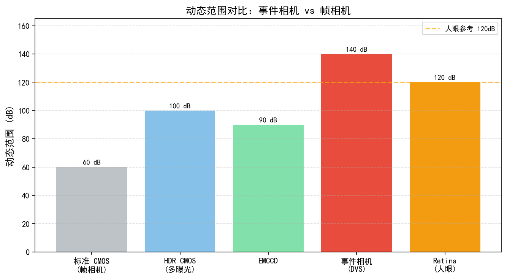
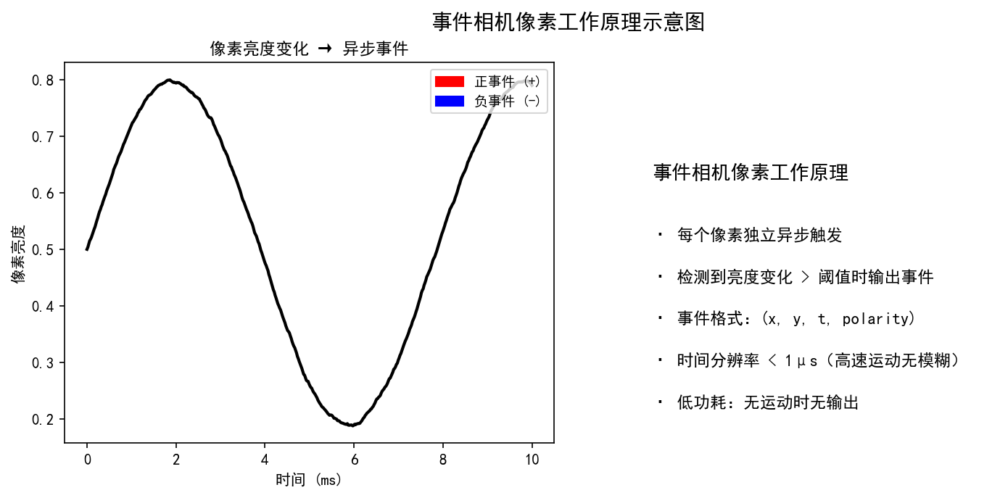
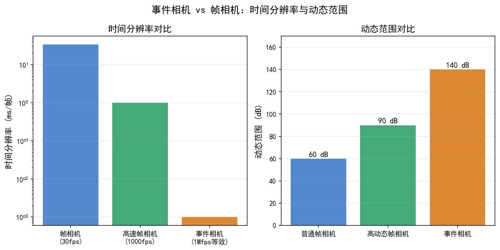
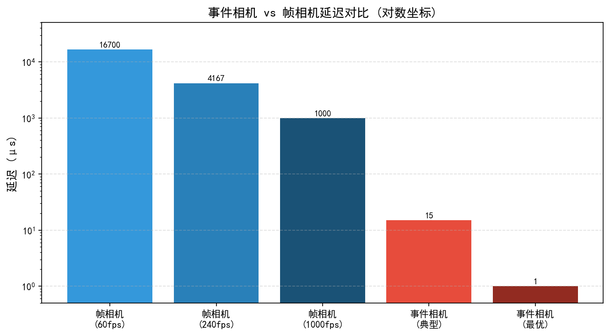
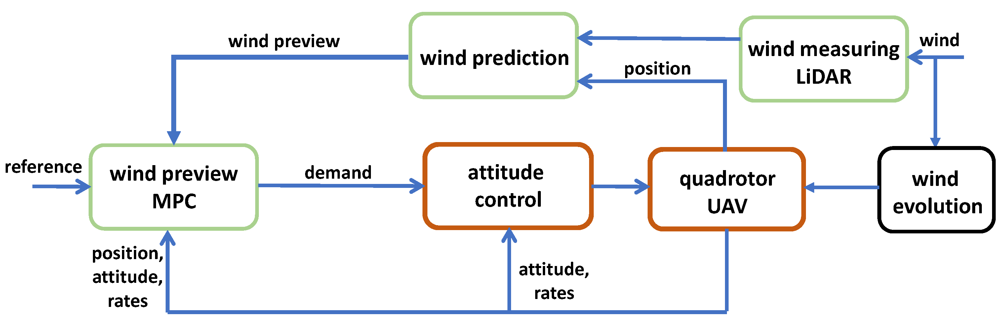

# 第一卷第16章：神经形态相机（Neuromorphic / Event Camera）

> ⚠️ **本章已迁入附录 I**：详见 [`appendix/appendix_I_special_imaging_systems_ch.md`](../../appendix/appendix_I_special_imaging_systems_ch.md)。本文件保留为完整版本，附录为精简工程参考版。

> **流水线位置：** 新型传感器范式；替代或补充传统帧相机
> **前置章节：** 第一卷第03章（传感器物理）、第一卷第01章（ISP 总览）
> **读者路径：** 研究员、系统工程师

---

## §1 原理（Theory）

### 1.1 事件相机的工作原理

传统相机不管场景动没动，每 33 ms 刷出一帧——静止的背景像素在浪费带宽，高速运动的前景像素又采样不够。事件相机换了一套逻辑：每个像素独立工作，只在自己的亮度变化量超过阈值 $C$ 时，异步输出一个事件四元组，否则沉默。结果是：静止背景产生零数据，快速运动区域产生密集事件，时间分辨率由像素的物理响应速度（微秒量级）决定，而不是帧率。

一个事件的完整表达形式为一个四元组：

$$e_k = (x_k,\ y_k,\ t_k,\ p_k)$$

- $(x_k, y_k)$：触发事件的像素坐标
- $t_k$：事件发生的精确时间戳（微秒级分辨率）
- $p_k \in \{+1, -1\}$：极性（Polarity），$+1$ 表示亮度上升，$-1$ 表示亮度下降

整个传感器的输出是一条连续的、异步的事件流（Event Stream），没有帧、没有曝光时间、没有行扫描——每个像素在自己的时间轴上独立行动。

**触发条件的数学描述：** 设像素 $(x,y)$ 在时刻 $t$ 的对数光强为 $L(x,y,t) = \ln I(x,y,t)$，则触发条件为：

$$\Delta L(x,y,t) = L(x,y,t) - L(x,y,t_{\text{last}}) \geq p \cdot C$$

其中 $t_{\text{last}}$ 是该像素上一次触发的时刻，$C$ 是对比度阈值（Contrast Threshold），典型值为 $0.1 \sim 0.5$。由于触发基于**对数**光强变化，对应的线性亮度相对变化约为 $e^C - 1$：$C=0.1$ 对应约 10.5% 的亮度变化，$C=0.5$ 对应约 65%。实际器件中 ON 阈值（亮度上升）与 OFF 阈值（亮度下降）可能不对称，且像素间存在约 10%–30% 的阈值分布差异 **[1]**。

这种"按需触发"的机制带来了两个根本性的优势：静止场景区域不会产生任何事件，数据天然稀疏；运动越快的区域产生事件越多，时间分辨率由像素的物理响应速度决定，而非帧率。

### 1.2 与传统帧相机的对比

理解事件相机的价值，最直接的方式是将其与传统帧相机在关键维度上逐一比较：

| 性能维度 | 传统帧相机 | 事件相机 |
|----------|------------|----------|
| **时间分辨率** | 帧周期（典型 33ms @ 30fps） | 单事件延迟 < 1 μs **[1]** |
| **动态范围** | 70 ~ 80 dB（普通 CMOS）  | 约 140 dB **[1]** |
| **运动模糊** | 高速运动必然模糊 | 理论上无运动模糊 |
| **数据率** | 固定（分辨率 × 帧率 × 位深） | 自适应（场景静止时趋近于零） |
| **功耗** | ~100 ~ 500 mW（含 ISP）  | ~10 mW（传感器本身） **[4]** |
| **延迟** | 帧周期 + 读出 + ISP 流水线 | 事件触发即输出 |
| **数据格式** | 规整的二维像素阵列 | 非结构化事件点云 |
| **光照条件** | 强光或暗光下噪声大、饱和 | 宽动态下均可正常工作 |

动态范围的差距是根本性的。传统 CMOS 约 70–80 dB，HDR 合并能到 100 dB 出头，但要掉帧率、要多帧对齐、要复杂 ISP。事件相机 140 dB，因为对数响应曲线天然压缩了大范围光强，阳光直射和深夜室内同框对它不构成挑战。

时间分辨率同样不可比。1000fps 高速相机每帧 1 ms，拍子弹还是有拖影；事件相机单像素响应延迟在微秒量级，现实中大多数"高速运动"对它来说不算快。

但事件流的处理是另一套工程体系：输出格式与传统 CV 算法完全不兼容，需要专门的时间面（Time Surface）、体素网格（Voxel Grid）或脉冲神经网络表示方法。事件相机的硬件性能和算法框架之间有很大的鸿沟，目前还没有成熟的"事件 ISP 流水线"。

### 1.3 主流事件相机产品

当前商业化的事件相机产品主要来自以下几家厂商：

**iniVation（瑞士）**

iniVation 是事件相机领域的先驱，其前身来自苏黎世大学 Tobi Delbruck 教授的研究组。代表产品：

- **DAVIS346**：分辨率 346×260，像素尺寸 18.5 μm，同时输出事件流和普通灰度帧（DAVIS = Dynamic and Active-pixel Vision Sensor），是学术界使用最广泛的混合传感器，支持 USB3 高速传输；时间分辨率约 1 μs，动态范围 > 120 dB，帧通路最高帧率 25 fps（灰度），噪声率约 0.1–5 events/pixel/s（黑暗静止场景）；总功耗约 170 mW（含事件+帧通路+USB 传输）**[3]**。
- **DVXplorer**：纯事件传感器，分辨率 640×480，专注于高速运动捕捉场景。

**Prophesee（法国）**

Prophesee 专注于 Metavision 系列工业级事件传感器，产品线从低功耗嵌入式到高分辨率工业检测均有覆盖：

- **IMX636**（与索尼联合开发）：1280×720 分辨率，动态范围 > 120 dB，事件延迟 < 1 μs，功耗极低。IMX636 是索尼与 Prophesee 合作推出的代表性产品，标志着全球顶级消费级图像传感器制造商以先进堆栈式 CMOS 工艺进入事件相机领域，推动了事件相机从研究型器件向规模化供应迈出关键一步。需注意 iniVation 和 Prophesee 在此之前已商业化量产了多代工业与科研级事件传感器（DVS128、DAVIS240、Gen3/Gen4 等），IMX636 的意义主要在于主流消费级制造链路的加入。
- **EVK4**：分辨率 1280×720，Prophesee 自有评估套件，配合 Metavision SDK 可快速原型验证。
- **GenX320**（2023 年 10 月发布，荣获 CES 2024 创新奖）：320×320 分辨率，像素尺寸 6.3 μm，BSI 堆栈式工艺（1/5 英寸光学格式），动态范围 **> 140 dB**，深度睡眠功耗仅 **36 μW**，满负荷约 3 mW，像素延迟 < 1 μs，光照范围 50 mLux 至 >10,000 Lux。GenX320 专为超低功耗嵌入式场景设计：AR/VR 眼动追踪（与 Meta 合作系统整体功耗 < 20 mW）、IoT 存在检测、驾驶员监控（DMS）。其 MIPI 接口原生兼容 Metavision SDK，已被选为首个量产神经形态 DMS 解决方案（Xperi DTS 合作）**[4]**。

**Samsung**

三星研究了基于标准 CMOS 工艺的 DVS（Dynamic Vision Sensor）架构，发表了若干工艺集成论文，尚无大规模商业化产品，但显示了消费电子巨头对该赛道的关注。

**Sony**

IMX636 作为索尼与 Prophesee 合作的成果，标志着事件相机从实验室走向量产的重要节点。索尼的制造工艺优势和供应链能力，将大幅降低事件传感器的成本门槛。

**典型参数对比：**

| 型号 | 分辨率 | 动态范围 | 事件延迟 | 功耗 | 特色 |
|------|--------|----------|----------|------|------|
| DAVIS346 | 346×260 | >120 dB | ~1 μs | ~170 mW | 混合帧+事件，学术主流 **[3]** |
| DVXplorer | 640×480 | >120 dB | ~1 μs | ~100–150 mW | 纯事件，低延迟  |
| IMX636 | 1280×720 | >120 dB | <1 μs | ~10 mW | Sony+Prophesee 量产消费级 **[4]** |
| **GenX320** | **320×320** | **>140 dB** | **<1 μs** | **36 μW 待机 / 3 mW 满负荷** | **超低功耗嵌入式，CES 2024 创新奖 [4]** |
| EVK4 | 1280×720 | >120 dB | <1 μs | ~200 mW | 工业评估套件  |

**智能手机集成前景**：GenX320 的待机功耗（36 μW）和满负荷功耗（3 mW）已远低于手机辅助传感器的典型值（iToF 约 50–100 mW，前置结构光约 200 mW），从功耗角度已具备手机集成可行性。关键突破点：**2023 年 3 月（MWC 2023）**，Prophesee 与高通正式宣布多年期合作协议，将 Metavision 传感器集成至 Snapdragon 8 Gen 3 移动平台，首要应用场景为**运动去模糊**（利用事件相机微秒精度记录曝光期间的运动轨迹，在 ISP 中修复拍摄模糊）。当前剩余障碍：（1）事件流数据格式与传统 ISP 流水线不兼容，需专用 SoC 硬件模块解析；（2）分辨率（320×320 至 1280×720）远低于手机主摄，只能作为辅助感知；（3）软件生态（驱动、SDK、算法框架）尚在建立中。OmniVision 在 ISSCC 2023 展示了 3 晶圆堆叠混合传感器（15 Mpix CIS + 1 Mpix EVS 堆叠集成）**[11]**，实现 10,000 fps 慢动作视频，代表了传感器级 CIS+EVS 深度集成的技术路径，但量产时间仍待确认。

### 1.4 事件流的表示方法

原始事件流是时空中稀疏的点集，无法直接输入传统的 CNN 或帧处理算法。为了桥接事件相机与现有计算机视觉生态，研究者提出了多种表示方法，各有优劣取舍。

**（1）事件帧累积（Event Frame Accumulation）**

在固定时间窗口 $[t_0, t_0 + \Delta t]$ 内，将所有事件按坐标累加到一个二维图像上：

$$F(x,y) = \sum_{k: (x_k,y_k)=(x,y),\ t_k \in [t_0, t_0+\Delta t]} p_k$$

正极性事件计 $+1$，负极性事件计 $-1$，最终得到一张可以用传统图像算法处理的"伪帧"。该方法实现简单，但时间窗口的选择是个权衡：窗口太长会产生运动模糊（与帧相机的问题相同），窗口太短事件数太少、图像稀疏。

**（2）事件体素网格（Event Voxel Grid）**

将时间维度也离散化为 $B$ 个时间槽，构建三维张量 $V \in \mathbb{R}^{B \times H \times W}$：

$$V_b(x,y) = \sum_k p_k \cdot \max\left(0, 1 - \left| \frac{t_k - t_b}{\Delta t_b} \right|\right) \cdot \mathbf{1}_{(x_k,y_k)=(x,y)}$$

其中 $t_b$ 是第 $b$ 个时间槽的中心时刻，双线性插值保证了时间轴上的连续性。体素网格保留了比事件帧更多的时间信息，是当前深度学习方法最常用的输入表示，代价是内存占用增加 $B$ 倍（通常 $B = 5 \sim 10$）。

**（3）活跃事件表面（Surface of Active Events, SAE）**

又称时间表面（Time Surface），每个像素存储该位置最近一次事件的时间戳：

$$\mathcal{T}(x,y,p) = t_k \quad \text{其中 } k = \arg\max_{k': (x_{k'},y_{k'})=(x,y),\ p_{k'}=p} t_{k'}$$

可以分别为正负极性建立两张时间表面。由于近期事件的时间戳更新，SAE 形成了一种"事件年龄图"，边缘和运动轨迹在其上清晰可见，常用于光流估计和特征跟踪。

**（4）事件极性帧（Event Polarity Frame）**

将正极性和负极性事件分别累积为两个通道，构成双通道图像。这种表示显式分离了亮度上升和下降信息，对于某些应用（如运动方向估计）更为友好。

**各表示方法比较：**

| 表示方法 | 维度 | 时间信息保留 | 内存占用 | 常用场景 |
|----------|------|-------------|----------|----------|
| 事件帧累积 | 2D | 低（丢失时序） | 低 | 快速原型 |
| 体素网格 | 3D | 中（离散化） | 中 | 深度学习输入 |
| 时间表面（SAE） | 2D×2 | 高（相对时序） | 低 | 光流、跟踪 |
| 极性帧 | 2D×2 | 低 | 低 | 运动方向估计 |

### 1.5 基于事件的图像重建

虽然事件相机不直接输出灰度图像，但在许多应用中仍需要重建可视化的强度图像——例如在无帧相机辅助的纯事件系统中，或需要将事件结果传输给依赖图像的下游算法时。

**E2VID（Events-to-Video）**

Rebecq 等人（2019）提出了 E2VID，用循环卷积神经网络（Recurrent CNN）从事件流中重建高质量强度图像。核心思路是：事件流记录了对数强度的时间导数，对其进行时间积分即可恢复强度变化；RCNN 通过 ConvLSTM 单元维护跨时间的隐状态，隐式完成这一积分过程。

网络输入为体素网格表示的事件，输出为对应时间段内的灰度帧。E2VID 在高动态范围和高速场景下的重建质量显著优于传统相机帧，尤其是在传统相机完全饱和或运动模糊严重的情况下。

**FireNet**

FireNet（Scheerlinck et al., WACV 2020）是一个面向实时事件图像重建的高效神经网络，与 E2VID 同属事件到图像重建方法，但并非 E2VID 的直接轻量化版本。FireNet 通过大量使用深度可分离卷积等技术从头设计了轻量级编码器-解码器模块，相比 E2VID 的多尺度循环 U-Net 架构具有独立的设计思路，在将参数量和计算量降低一个数量级的同时保持较高重建质量，使其能在嵌入式平台（如 Jetson）上实时运行。

**HyperE2VID（IEEE TIP 2024）—— 当前重建 SOTA**

Ercan 等人（IEEE Transactions on Image Processing, 33:1826–1837, 2024）提出 **HyperE2VID**，将超网络（Hypernetworks）引入事件图像重建：主网络的每层卷积核由一个轻量级超网络根据当前事件体素网格动态生成，实现逐像素自适应滤波。上下文融合模块同时整合事件体素网格与上一时刻重建帧，使网络能够感知场景局部运动强度并相应调整滤波参数。

HyperE2VID 在主流事件重建基准（EventAID、HQF 数据集）上全面超越 E2VID 和 FireNet，同时降低了内存占用并加速了推理速度。从架构设计角度，HyperE2VID 是将条件生成网络（hypernetwork 动态权重生成）与循环状态保持结合的代表性工作，其思路对事件引导 ISP（如条件去噪、条件色调映射）有直接借鉴价值 **[7]**。

**基于物理积分的方法**

另一类方法直接利用事件的物理含义：由于每个事件代表 $\pm C$ 的对数强度变化，将事件沿时间轴积分即可得到相对强度变化图。结合初始帧（来自 DAVIS 的同步帧或估计的初值），可以追踪强度绝对值。这类方法无需训练数据，但对噪声累积较敏感。

**应用：高速慢动作合成**

利用事件相机的微秒级时间分辨率，可以在两帧普通图像之间插入数百个"虚拟帧"，实现超级慢动作视频效果，而无需传统高速相机的昂贵设备和大量存储。

### 1.6 事件相机 + 帧相机融合

单纯依赖事件相机的系统面临一个实际挑战：当场景静止时，没有任何事件产生，无法获知当前强度绝对值；而传统帧相机在静止场景下性能反而最好。两类传感器天然互补，因此混合融合架构备受关注。

**DAVIS 架构：同芯片融合**

DAVIS（Dynamic and Active-pixel Vision Sensor）传感器的核心特点是每个像素单元内部集成了双通路读取电路：同一个光电二极管产生的光电流被同时馈送到两条并行电路——异步的事件检测通路（DVS path，基于对数亮度变化触发）和同步的主动像素帧读出通路（APS path，采样绝对光强生成图像帧）。两条通路共享同一光电二极管，在单个像素内实现了双功能融合，并非两套独立像素阵列的叠加。这种设计保证了帧与事件的完美空间对齐（无视差）和精确时间同步。

**运动去模糊**

传统相机在高速运动时产生运动模糊，本质是曝光时间内光强的时间积分。事件相机以微秒级精度记录了曝光时间内的强度变化轨迹，可以反解出清晰的"瞬时"图像。Pan 等人（2019）提出的 EDI（Event-based Double Integral）方法正是利用这一思路，将模糊图像和对应时间段的事件联合优化，重建出清晰帧。

**HDR 视频合成**

事件相机的动态范围（典型 140 dB）远超传统 CMOS，将二者融合可以生成同时具备高帧率、高动态范围的视频流，而无需传统 HDR 合并算法所需的多曝光序列。

**高速超分辨率**

结合帧相机提供的绝对强度参考和事件相机提供的时间细节，可以在时间维度上对低帧率视频进行超分辨插帧，合成 1000fps 以上的视频序列，同时保持普通相机的空间分辨率。

### 1.7 ISP 视角：如何处理事件数据

从传统 ISP 工程师的视角来看，事件相机几乎不需要经典意义上的 ISP 流水线——没有 Bayer 解马赛克，没有白平衡，没有色彩矩阵，也没有 Gamma 压缩。然而，事件数据并非完全干净，仍然需要一套专门的前处理流程。

**事件相机的等效 ISP 流水线（对比传统 ISP）：**

| 传统 ISP 模块 | 事件相机等效处理 |
|---|---|
| BLC（黑电平校正） | 对比度阈值标定（逐像素偏置补偿） |
| PRNU 校正 | 片内阈值非均匀性补偿（逐像素阈值图） |
| 坏点校正 | 热像素检测与屏蔽（频率统计法） |
| 时域降噪 | 时间相关性滤波（$\Delta t_{noise}$ 窗口过滤孤立事件） |
| 格式转换（RAW→RGB） | 事件流→表示转换（Event Stream→Frame/Voxel/SAE） |
| AWB/CCM/Gamma | 无直接对应（事件不含绝对色彩信息） |
| 图像增强（锐化/NR） | 事件率控制（自适应阈值调整） |

对于 DAVIS 型混合传感器，帧通路（APS path）仍然需要完整的 ISP 处理（AWB、去马赛克、色彩矩阵等），而事件通路的前处理与帧通路共享时间戳同步基准，两路输出在应用层（运动去模糊、HDR 合成等）融合。

**热噪声像素过滤**

部分像素由于制造缺陷或泄漏电流，会在没有光强变化时持续触发事件，形成"热像素"（Hot Pixel）。热像素的事件频率远高于正常像素，可通过统计像素事件频率并屏蔽异常高频像素来消除。

**时间相关性去噪**

真实的光强变化事件通常在时空上具有连续性（相邻像素在相近时刻触发），而随机噪声事件在时空上孤立。基于时间相关性的滤波器（如"最近邻时间滤波"）可以有效区分信号与噪声：若一个事件在 $\Delta t$ 时间窗口内在空间邻域没有其他事件支持，则认为是噪声并丢弃。

**时间表面计算**

将事件流转换为时间表面（SAE）是许多下游算法的入口，这一步等价于传统 ISP 中的格式转换（Raw → RGB 类比为 Events → Time Surface）。

**事件率控制**

在强光、快速运动或低阈值设置下，事件率可能超过系统处理带宽（典型上限约 10^7 ~ 10^8 events/s **[1]**）。此时需要通过自适应阈值调整或事件抽样来控制数据量，类似于传统 ISP 中的帧率控制。

### 1.8 2022–2024 前沿进展

事件相机在 2022–2024 年迎来了算法和硬件的双重突破，核心研究方向从"证明可行性"转向"建立实用基线"。

#### E-RAFT（ECCV 2022）：基于事件的光流 SOTA 确立

Gehrig 等人（ECCV 2022；IEEE RA-L 7(4):10016–10023）将帧对光流领域的 RAFT 架构——迭代 ConvGRU + 相关体积查询——移植到事件体素网格输入，提出 **E-RAFT（Event-based RAFT）**。关键设计选择：

- 输入为体素网格（$B=15$ 时间槽），双流编码器分别处理正/负极性事件；
- 多尺度相关体积在特征空间计算，迭代更新光流预测；
- 在 DSEC-Flow 基准上，E-RAFT 将 AEE（平均端点误差）从 0.79（前 SOTA）降至 **0.59 px**，比基于帧的 RAFT 低约 20%。

工程意义：E-RAFT 统一了事件光流与帧光流的训练框架，使后续工作可以直接复用帧光流领域的架构改进（如注意力机制），显著降低了研究门槛。在 DSEC 数据集上的实时性（640×480，~40 ms/帧，Jetson AGX Xavier）满足车载辅助感知的初步需求 **[7]**。

#### RVT（ICCV 2023）：事件目标检测首个 Transformer 基线

Gehrig & Scaramuzza（ICCV 2023）提出 **RVT（Recurrent Vision Transformer）**，将 MaxViT Transformer 与门控循环机制结合，专为事件流中的高速目标检测设计：

- 使用固定事件数窗口（每 25,000 事件）切割输入，保证网络输入密度均匀；
- 空间注意力层替代传统 CNN 卷积，更好地捕捉事件的稀疏空间分布；
- 在 PROPHESEE Gen4 数据集（1280×720，汽车/行人）上，RVT 的 mAP 达 **47.5%**，比此前最优 CNN 方案（RED-L）高约 6 个百分点；
- 在 NCars 数据集（纯汽车二分类）上达到 95.5% 准确率。

对 ISP 工程师的意义：RVT 建立了事件相机与 SoC 片上 Transformer 加速器协同的工程路径。高通 Hexagon NPU 已针对稀疏注意力做了专项优化，RVT 的稀疏 Transformer 与之具有较好的映射性 **[8]**。

#### 事件辅助视频插帧与去运动模糊（2022–2024）

**TimeLens++（ECCV 2022）**：Tulyakov 等人将事件数据与光流引导的帧插值结合，在任意时刻内插视频帧。相比纯帧插值，在快速运动场景（如乒乓球拍击）的 PSNR 提升约 3–5 dB。核心改进是引入了事件引导的运动估计，解决了高速运动帧对间运动估计失效的问题 **[9]**。

**EvUnroll（CVPR 2022）**：Shang 等人针对卷帘快门失真（Rolling Shutter Artifact），利用事件相机的微秒时间戳精确记录每行曝光时间内的运动，将 RS 校正问题转化为有监督反演。EvUnroll 在合成数据集上 PSNR 约 36 dB，显著优于仅用帧信息的 RS 校正方法。这对手机 CMOS 的 RS 伪影（行为快速横向运动时的"果冻效应"）有直接工程参考价值 **[9]**。

**EFNet（ECCV 2022）**：Sun 等人将事件流作为运动引导先验用于图像去模糊，提出双分支融合网络（事件引导空间注意力 + 帧特征提取）。在 GoPro 数据集（传统合成模糊）上 PSNR 达 35.46 dB，在真实运动模糊场景（配备 DAVIS240C 采集）上主观质量明显优于纯帧方法 **[9]**。

#### 脉冲神经网络（SNN）在事件处理中的工程化（2022–2024）

脉冲神经网络（Spiking Neural Network，SNN）是与事件相机天然匹配的计算范式——事件和脉冲都是异步稀疏"点火"信号，SNN 可以在神经形态芯片（Intel Loihi 2、IBM TrueNorth）上以极低功耗处理事件数据，而无需 GPU 的密集矩阵乘法。

**SpikingJelly + SNN 目标识别（Science Advances 2023）**：Fang 等人发布 SpikingJelly 框架（开源），系统整合了多种脉冲编码方案（率编码、时间编码、相位编码），在 N-MNIST、N-Caltech101 上的 SNN 分类准确率首次接近传统 ANN 水平（N-MNIST 99.7%，N-Caltech101 78.8%）。关键工程突破是引入了 **膜电位批量归一化（tdBN）** 和 **SEW-ResNet**，解决了深层 SNN 训练中的梯度消失问题。

**Intel Loihi 2（2022 年部署扩展）**：Intel 于 2021 年底发布 Loihi 2，2022 年起向合作伙伴开放。Loihi 2 集成 128 个神经形态核心，支持可编程学习规则，功耗约 1 W（处理每秒 10^9 突触操作）。事件相机 + Loihi 2 的联合演示（Orchard et al.）在实时手势识别任务上实现了约 **5 mW** 的感知+推理总功耗，是等效 GPU 方案的 1/1000，为超低功耗可穿戴视觉传感奠定了基础 **[10]**。

#### 脉冲相机（Spike Camera）——第三类神经形态传感器

事件相机之外，天津大学黄铁军课题组与北京大学于宗飞等提出了**脉冲相机（Spike Camera）**，作为第三类神经形态传感器。与事件相机的根本区别在于输出编码：

| 传感器 | 输出信号 | 编码内容 | 能否恢复纹理 |
|--------|---------|---------|------------|
| 传统帧相机 | 规则采样帧 | 绝对光强 | 是 |
| 事件相机 | $(x,y,t,p)$ 四元组 | **亮度变化** | 需重建算法 |
| **脉冲相机** | 异步脉冲流 | **脉冲频率∝辐射度** | 是（频率直接编码纹理）|

脉冲相机每个像素独立积累光子，超过阈值时输出脉冲（spike），**脉冲发放频率正比于场景辐射度**，因此可直接从脉冲频率反解亮度纹理，这是事件相机无法做到的。采样频率约 40,000 Hz，支持极高速场景捕获。代表性 2022–2024 工作包括自监督重建框架（IJCAI 2022）、超高速目标识别 SpiReco（IEEE TCSVT 2024）等 **[12]**。

#### 事件引导 ISP 流水线——首个系统性研究（2025）

Lu 等人发布 **RGB-Event ISP 数据集与基准**（arXiv:2501.19129），这是首个将事件相机与传统 ISP 流水线深度集成的系统性研究。HVS-ISP 数据集包含 3,373 张 RAW 图像及对应事件流，覆盖 24 个场景、3 种曝光模式。

关键工程洞察：事件传感器（>120 dB DR，约 10 mW 功耗）与 APS（60–70 dB DR，>100 mW）天然互补。技术路线为：事件流辅助 RAW 域去噪（亮度变化先验降低噪声估计误差）→ 色彩校正 → 去马赛克联合处理。事件提供的时间维度运动信息可用于 ISP 的**运动自适应去噪**（静止区域多帧合并，运动区域单帧保边）和 **HDR 合并去鬼影**。这标志着事件相机正式进入 ISP 工程师的工具箱 **[13]**。

#### 事件相机仿真精度提升：V2E 2.0 与 ESIM++

大规模事件相机算法训练依赖合成数据（因真实采集成本高），仿真器的精度直接影响 Sim-to-Real 差距。

**V2E 2.0**（Hu et al., CVPR 2021 Workshop，但 2022–2023 年被广泛应用）：从高帧率视频合成事件，引入了以下真实噪声模型：
- 像素级阈值非均匀性（对比度阈值服从高斯分布 $C \sim \mathcal{N}(\bar{C}, \sigma_C^2)$，$\sigma_C/\bar{C} \approx 0.2$）；
- 泄漏电流（Refractory Period 之后的随机触发）；
- 光子散粒噪声。

合成的事件数据在 DSEC 光流估计任务上，V2E 2.0 训练所得模型的迁移性能（Sim-to-Real gap）从约 1.2 AEE 降至约 0.7 AEE，是当前最实用的事件仿真工具。

#### 事件辅助 HDR 视频重建——ISP 关键方向（CVPR 2023 / arXiv 2024）

传统 HDR 视频合并依赖多曝光序列对齐，运动场景鬼影无法完全消除。事件相机的 140 dB 动态范围和微秒时间分辨率恰好弥补了两个关键缺口，催生了一条 ISP 工程价值极高的研究路线。

**HDRev-Net（CVPR 2023）**：Yang 等人（CVPR 2023，pp. 13924–13934）提出多模态 HDR 视频重建框架，联合处理 LDR 视频帧与高时间分辨率事件流：

- 跨模态对齐：设计共享潜空间编码器，将图像特征与事件体素网格特征对齐到同一表示空间；
- 区域自适应融合：空间不同位置所需的动态范围补偿不同，融合模块依据事件密度自适应调整帧与事件的权重；
- 时间一致性：循环时序相关模块抑制帧间闪烁，在快速运动目标（乒乓球、风扇）场景下主观质量显著优于纯多曝光 HDR。

**Self-EHDRI（arXiv:2404.03210，2024）**：进一步将 HDR 重建与运动去模糊统一在自监督框架内——真实场景下既无地面真值 HDR 帧、又无配套清晰曝光，传统有监督训练无法适用。核心设计是交叉域一致性循环（HDR→LDR→HDR），用高速相机采集的清晰 LDR 帧作为代理目标，无需任何 HDR 标注。事件同时提供运动信息（去模糊用）和宽动态信息（HDR 用），单网络同步恢复清晰 HDR 帧。

**ISP 工程意义**：这两项工作确立了"事件流替代多曝光序列"的 HDR 融合新范式。在手机 ISP 中，若未来 MIPI 接口整合了 GenX320 级事件传感器，HDRev-Net 路线可实现**单帧曝光+事件流 → 运动无鬼影 HDR 视频**，彻底消除传统 Burst HDR 的帧对齐对齐误差 **[14]**。

#### 自监督事件重建：EvINR 关闭 Sim-to-Real 鸿沟（ECCV 2024）

所有基于监督学习的事件重建方法（E2VID、FireNet、HyperE2VID）都依赖仿真器（V2E/ESIM）生成合成训练数据，部署到真实传感器时不可避免地面临域偏移。Wang 等人（ECCV 2024，arXiv:2407.18500）从物理第一性原理出发，提出 **EvINR（Event-based Implicit Neural Representation）**：

$$\frac{\partial L(x,y,t)}{\partial t} = p_k \cdot C \cdot \delta(t - t_k)$$

将事件的物理含义（对数亮度时间导数）直接作为监督信号，用一个以时空坐标 $(x,y,t)$ 为输入的 MLP 隐式表示场景亮度，优化目标是 MLP 时间导数与事件流吻合。**无需任何标注数据，无需仿真器，直接在真实事件流上自监督训练。**

EvINR 在 ALPIX-Eiger 真实事件相机采集的数据上，MSE 比此前最优自监督方法降低约 **38%**，并在无人机场景中首次达到接近有监督方法的重建质量。对于 ISP 工程，EvINR 的自监督性质意味着算法可以直接在量产传感器上用真实采集数据持续微调，消除仿真器带来的 Sim-to-Real 误差 **[14]**。

#### 状态空间模型（Mamba）用于事件相机处理（CVPR 2024）

Transformer 在事件处理领域的应用（如 RVT）存在推理时序列长度固定的瓶颈——事件率随场景动态变化，固定 token 长度会导致高速场景截断或低速场景填充冗余。CVPR 2024 的工作（State Space Models for Event Cameras，poster session）将 Mamba 风格的状态空间模型（SSM）引入事件流处理：

- SSM 天然适配变长序列，无需固定窗口切割事件；
- 训练速度比等效 Transformer 快约 **33%**（得益于线性时间复杂度递推）；
- 关键泛化优势：在不同事件率和时间频率下测试时，性能退化显著低于 Transformer 基线，显示出更强的事件率不变性；
- 对在线推理（streaming inference）友好，每次新事件到达仅更新 SSM 状态，无需重新处理历史窗口。

Mamba 的线性复杂度与 GenX320 等低功耗传感器的稀疏事件率特性高度匹配，有望成为下一代片上事件处理加速器的主流计算范式 **[14]**。

---

## §2 标定（Calibration）

### 2.1 事件相机内参标定

事件相机的内参（焦距、主点、畸变系数）标定原理与传统相机相同，但数据采集方式不同——由于无法直接拍摄棋盘格静止图像，需要通过运动激发事件来"看见"标定板。

**标定流程：**

1. 在摄像机前晃动棋盘格或闪烁的 LED 点阵，触发事件。
2. 将一段时间内的事件累积为事件帧，从中提取角点或圆心。
3. 对多个姿态下的角点进行 Zhang 法（或类似方法）内参求解。

iniVation 提供的 `dv-calib` 工具和 Kalibr 工具包均支持事件相机内参标定。Prophesee 的 Metavision SDK 中也集成了基于闪烁图案的标定模块。

**注意事项：**

- 低对比度区域产生的事件稀少，角点检测可能不稳定，建议在均匀照明下进行标定。
- 事件相机的像素数通常低于传统相机，像素尺寸较大，畸变通常不严重，但仍需标定以保证精度。

### 2.2 RGB-Event 外参联合标定

DAVIS 等混合传感器的帧相机和事件相机共享同一像素阵列，理想情况下外参为单位矩阵（完美对齐）。但对于独立的 RGB 相机 + 事件相机组合系统（如 RGB-E 双目设置），需要标定二者之间的旋转矩阵 $R$ 和平移向量 $t$。

标定方法是将系统固定后同步采集：帧相机拍摄静态棋盘格；事件相机端通过晃动棋盘格或使用闪烁图案获取对应的角点事件。随后利用对应点对求解 PnP 问题得到外参。

Kalibr 工具包支持 camera-event 联合标定，是目前学术界最常用的工具。

### 2.3 对比度阈值标定

对比度阈值 $C$ 是事件相机最关键的内部参数，直接影响事件率、动态范围利用率和噪声水平。由于像素间存在工艺差异，实际阈值可能在标称值附近有 10% ~ 30% 的片内不均匀性 **[1]**。

**阈值标定方法：**

1. 用均匀亮度的 LED 平板（可调亮度）以已知速率增减亮度，测量每个像素的实际触发阈值。
2. 建立逐像素阈值图，在后续事件处理中用于补偿非均匀性。

实际工程中，精确的逐像素阈值标定较为繁琐，通常只标定全局平均阈值，将片内不均匀性视为噪声处理。

---

## §3 调参（Tuning）

### 3.1 对比度阈值设置

对比度阈值 $C$ 的设置是事件相机系统调优的核心。其本质是一个信噪比与事件率之间的折中：

- **阈值过低**（$C < 0.1$）：背景噪声和微小振动也会触发事件，事件率暴增，有效信息淹没在噪声中，同时系统带宽可能过载。
- **阈值过高**（$C > 0.5$）：只有剧烈亮度变化才触发事件，慢速运动或低对比度目标可能完全检测不到，动态范围优势无法充分发挥。

**实践建议：**

| 应用场景 | 推荐阈值 $C$ | 说明 |
|----------|-------------|------|
| 高速碰撞检测 | 0.3 ~ 0.5 | 只关注剧烈变化，抑制背景 |
| 慢速手势识别 | 0.1 ~ 0.2 | 捕捉细微运动 |
| 室外车载驾驶 | 0.2 ~ 0.3 | 平衡噪声与灵敏度 |
| 星空/极暗场景 | 0.05 ~ 0.1 | 低阈值，但需加强噪声滤波 |

许多现代事件相机支持偏置（Bias）寄存器配置，通过调节片上电路的偏置电流来等效调整阈值，无需重新标定。

### 3.2 噪声滤波参数

时间相关性滤波器的关键参数是**相关时间窗口** $\Delta t_{noise}$，即判定事件为噪声所需的时间邻域大小。

- $\Delta t_{noise}$ 过小：正常的稀疏事件也被误判为噪声丢弃。
- $\Delta t_{noise}$ 过大：随机噪声事件恰好在时间窗口内与信号事件相邻，噪声过滤不充分。

典型设置为 $\Delta t_{noise} = 1 \sim 10$ ms，具体取值取决于预期运动速度：快速运动场景（事件密集）可设小一些，慢速场景（事件稀疏）需设大一些。

### 3.3 时间窗口大小

将事件流转换为帧表示时，时间窗口 $\Delta t_{frame}$ 等价于传统相机的"曝光时间"：

- **固定时间窗口**：按照固定时间间隔（如 $\Delta t = 10$ ms）切割事件，简单直接，但在不同运动速度下事件密度差异大。
- **固定事件数窗口**：每积累固定数量（如 $N = 1000$ 个）事件后切割，保证每帧事件密度均匀，但时间不等长。
- **自适应窗口**：根据场景动态调整，静止时拉长窗口等待事件，运动剧烈时缩短窗口避免堆积。

深度学习应用中，固定事件数窗口往往比固定时间窗口效果更好，因为网络输入的信息密度更均匀，训练更稳定。

---

## §4 失效场景（Failure Cases）

### 4.1 热噪声像素（Hot Pixels）

事件相机中的热像素表现为：特定像素以极高频率（可达 kHz 量级）持续产生事件，与周围像素的场景事件完全不相关。其成因是像素内部泄漏电流导致电荷持续累积，不断触发阈值比较电路。

**识别方法：** 在暗室（无光变化）或纯黑场景下采集事件 1 ~ 5 秒，统计每个像素的事件频率，频率异常高（如超过均值 5 倍以上）的像素即为热像素。

**处理方法：**
1. 建立热像素坐标黑名单，实时过滤；
2. 降低工作温度（高温会加剧泄漏）；
3. 更换传感器（严重时）。

iniVation 的 DV 软件和 Prophesee 的 Metavision SDK 均内置了热像素过滤模块，可自动检测并屏蔽。

### 4.2 纹理触发器（Texture-related False Events）

当相机自身振动或发生微小抖动时，具有高空间频率纹理（如细密网格、布纹）的区域会因纹理随像素格子对齐关系的变化而大量触发事件，产生与运动无关的"纹理噪声"事件。

这类伪影的特征是：事件分布与场景纹理高度相关，呈现周期性或网格状图案，且在相机抖动时突然爆发。

**抑制方法：**
- 适当提高对比度阈值，过滤微小的纹理变化；
- 在相机上安装防抖（OIS/EIS），减小激励来源；
- 在后处理中识别并去除具有纹理相关空间分布模式的事件簇。

### 4.3 动态范围边界的泄漏事件

当场景中出现极强光源（如太阳直射、爆炸闪光）时，光电二极管中的电荷可能溢出（blooming），污染相邻像素；或者在极暗条件下热噪声等效为随机光子，导致阈值附近的随机触发。

这类泄漏事件通常呈现扩散状（强光 blooming）或均匀随机分布（暗场热噪声），可以通过空间形态分析加以识别：
- 强光中心区域的事件频率异常高，且极性以正极性为主（持续饱和状态）；
- 暗场噪声事件在空间上随机分布，无方向性聚类特征。

---

## §5 评测（Evaluation）

### 5.1 标准数据集

事件相机领域已建立若干公认的基准数据集，覆盖不同场景和任务：

**MVSEC（Multi Vehicle Stereo Event Camera Dataset）**

Zhu 等人（2018）发布，包含驾驶、无人机飞行等室外场景，同时提供 LiDAR 深度真值和 IMU 数据，是早期最常用的事件相机自主驾驶基准。分辨率较低（DAVIS 240C，240×180）。

**DSEC（Dynamic Stereo Event Camera Dataset）**

Gehrig 等人（2021）发布，针对驾驶场景设计，使用高分辨率 Prophesee 传感器（640×480），配有立体 RGB 相机和 LiDAR，提供光流、深度等多种真值，是当前自动驾驶事件相机研究的主流基准。

**EventAID**

专注于图像重建和增强任务的综合数据集，包含合成数据（来自 ESIM 事件模拟器）和真实采集数据，配有高帧率参考视频作为重建质量真值。

**N-Caltech 101 / N-MNIST**

将传统 Caltech 101 和 MNIST 数据集通过相机运动转换为事件数据，是事件相机目标识别任务的入门基准。N-MNIST（Orchard et al., 2015）采用 DVS 相机录制手写数字运动序列，分辨率 34×34，共 70,000 条事件序列，是事件相机手势/识别算法的标准对比基准。

**DVS128 Gesture**

Amir 等人（2017）发布，使用 DVS128 相机（128×128 分辨率）采集 11 类手势（拍手、手腕滚动、手指摩擦等）在不同光照条件下的事件序列，共约 1,342 段样本。DVS128 Gesture 是事件相机手势识别领域引用最广的基准数据集，IBM 在 TrueNorth 神经形态芯片上的硬件加速演示即以此数据集为测试平台。

### 5.2 重建图像质量评估

事件相机图像重建质量评估使用与传统图像质量评估相同的指标：

- **PSNR（峰值信噪比）**：以同步采集的高帧率参考图像为真值，计算重建图像的 PSNR；典型优秀水平约 30 ~ 35 dB **[2]**。
- **SSIM（结构相似性）**：衡量重建图像与参考图像在结构、亮度、对比度上的综合相似性。
- **LPIPS（感知相似性）**：基于深度特征的感知质量指标，更贴近人类视觉感受。

评测时需注意：事件相机重建的图像通常缺少绝对亮度参考，需要在亮度对齐后再计算指标，否则结果偏低。

### 5.3 高速场景跟踪精度

事件相机在高速目标跟踪任务上的评测通常包括：

- **特征跟踪精度（Feature Tracking Accuracy）**：以高速相机（500fps+）拍摄的真值轨迹为参考，计算事件跟踪结果的端点误差（EPE）。
- **光流估计误差（Optical Flow EPE）**：在 DSEC 等数据集上与 LiDAR 投影真值对比。
- **延迟（Latency）**：从目标运动发生到系统输出检测结果的时间差，体现事件相机的核心优势；优秀系统可实现 < 1 ms 的感知延迟 。

---

## §6 代码

本章配套代码（见本目录 .ipynb 文件），包含以下实验：

1. **事件流可视化**：读取 `.aedat4` 或 `.raw` 格式事件文件，生成事件帧、时间表面可视化。
2. **热像素检测与过滤**：统计像素事件频率，自动识别热像素并过滤。
3. **事件帧 vs 体素网格**：对比两种表示方法在不同时间窗口下的效果。
4. **E2VID 推理演示**：加载预训练 E2VID 模型，从公开数据集样本重建强度图像并与参考帧对比。

依赖库：`dv-processing`（iniVation），`metavision_sdk`（Prophesee），`torch`，`h5py`，`numpy`，`matplotlib`。

---

---

> **工程师手记：事件相机的ISP处理范式颠覆与混合系统挑战**
>
> **事件相机ISP处理的根本性差异：** 传统ISP以帧为单位处理，每帧包含全部像素的同步曝光值；事件相机（Event Camera，Dynamic Vision Sensor）以异步事件流为输出，每个像素独立在亮度变化超过阈值时触发一个事件（含坐标、时间戳、极性），无全局帧概念。这意味着传统ISP的BLC、LSC、Demosaic、CCM等处理模块完全不适用。事件数据需要用全新范式处理：事件流积分为"事件帧"（Event Frame）或"时间表面"（Time Surface），再送入针对稀疏异步数据设计的神经网络（如SpikeNet、FireNet）。ISP工程师需建立全新的数据格式认知：单帧事件率从安静场景的10K events/s到高速运动场景的100M events/s，带宽动态范围达4个数量级。
>
> **延迟优势与实测数字：** 事件相机的延迟优势源于像素级异步响应：单个亮度变化从发生到事件输出的延迟约1μs，而标准CMOS传感器的帧曝光+读出延迟通常为1–33ms（取决于帧率）。在高速运动捕捉（如无人机躲避、机器人避障）场景下，1μs延迟意味着在物体移动1cm时相机可感知到>10次亮度变化，而标准相机在33ms帧间隔内物体已位移数厘米甚至更多。然而，延迟优势仅体现在运动检测上；如需重建完整图像，事件积分本身需要累积约1–5ms的事件量，实际系统延迟约10–20ms，仍优于标准相机但并非1μs。
>
> **混合事件+帧系统的ISP集成难题：** 实用化方案通常将事件相机与标准帧相机融合（Hybrid Event+Frame System），用事件流补偿帧间运动信息，用帧提供绝对亮度和色彩信息。ISP集成的核心挑战在于时间对齐：事件时间戳精度约1μs，而标准帧时间戳精度约1ms，两者融合需亚毫秒级同步。此外，事件相机无色彩信息，色彩重建完全依赖帧相机，造成色彩和运动信息的时间错位在高速场景下约5–15ms，产生运动色彩伪影。三星和Sony均有事件+帧融合传感器原型（如Samsung DAVIS），但量产时间和ISP支持仍不确定。
>
> *参考：Gallego et al. "Event-Based Vision: A Survey", IEEE TPAMI 2022；Rebecq et al. "High Speed and High Dynamic Range Video with an Event Camera", IEEE TPAMI 2021；Brandli et al. "A 240×180 130dB 3μs Latency Global Shutter Spatiotemporal Vision Sensor", IEEE JSSC 2014*

## 插图

*图1. 动态视觉传感器（DVS）动态范围（>120 dB）与传统相机对比（图片来源：Gallego et al., "Event-based Vision: A Survey", IEEE TPAMI, 2022）*

*图2. 事件相机像素级亮度变化触发事件流原理示意图（图片来源：Gallego et al., "Event-based Vision: A Survey", IEEE TPAMI, 2022）*

*图3. 事件相机（异步事件流）与传统帧相机（同步帧图像）成像方式对比（图片来源：Rebecq et al., "High Speed and High Dynamic Range Video with an Event Camera", IEEE TPAMI, 2019）*

*图4. 事件相机（微秒级延迟）与传统帧相机延迟对比（图片来源：作者自绘，参考iniVation DAVIS346数据手册, 2023）*

---

*图5. 神经形态传感器（事件相机芯片）结构与像素电路示意图（图片来源：Prophesee/Sony, "IMX636 Event-based Vision Sensor Product Brief", 2022）*

---

## 习题

**练习 1（理解）**
事件相机的触发条件基于对数光强变化 $\Delta L = \ln I(t) - \ln I(t_\text{last}) \geq p \cdot C$，对比度阈值 $C$ 典型值为 0.1–0.5。请说明：(a) $C = 0.2$ 时，对应的线性亮度相对变化百分比是多少（$e^C - 1$）？(b) 静止不动的场景（无任何运动）在事件相机中输出什么？为什么数据率趋向于零？(c) 传统 CMOS 相机的动态范围约 70–80 dB，而事件相机约 140 dB，这 60 dB 的优势来自于哪里（从对数响应曲线角度解释）？

**练习 2（计算）**
某事件相机（DVS346）分辨率 346×260，在高速旋转风扇（叶片每秒经过像素 10,000 次）场景下工作。请估算：(a) 若每次叶片通过触发 $C = 0.2$（ON 事件），平均每秒每像素触发多少次事件？(b) 整个传感器每秒总事件数约为多少（假设 10% 的像素处于叶片运动路径上）？(c) 相比之下，传统相机 1000 fps 模式输出的数据率（346×260×1000 frames/s，每像素 8-bit）约为多少 MB/s？事件相机在此场景下的数据量约为传统相机的百分之几（假设每个事件 8 字节 = 坐标4B + 时间戳3B + 极性1B）？

**练习 3（编程）**
用 Python + NumPy 模拟事件流生成并可视化：(a) 生成一个模拟"运动边缘"：在 64×64 网格上，构造一个竖直边缘（左半部分亮度 100，右半部分亮度 10），边缘在 50 个时间步长内从 x=10 移动到 x=54（每步移动 1 像素）；(b) 在每个时间步，计算每个像素的对数亮度变化 $\Delta L = \ln I_t - \ln I_{t-1}$，当 $|\Delta L| \geq 0.3$ 时触发事件（极性由符号决定）；(c) 收集所有事件 $(x, y, t, p)$，统计总事件数，并将事件流可视化为一张叠加图（正极性为红色，负极性为蓝色，背景为灰色）；(d) 验证：事件应主要集中在边缘运动轨迹处，静止背景区域事件数接近零。

## 参考文献

[1] Gallego G, Delbrück T, Orchard G, et al. "Event-based Vision: A Survey." IEEE Transactions on Pattern Analysis and Machine Intelligence, 44(1): 154–180, 2022. — 事件相机领域最全面的综述，覆盖原理、表示方法、算法和应用，是入门必读文献。

[2] Rebecq H, Ranftl R, Koltun V, Scaramuzza D. "High Speed and High Dynamic Range Video with an Event Camera." IEEE Transactions on Pattern Analysis and Machine Intelligence, 43(6): 1964–1980, 2019. — E2VID 原始论文，提出用循环神经网络从事件流重建高质量视频帧。

[3] iniVation. "DAVIS346 Datasheet and Technical Reference." iniVation AG, 2023. https://inivation.com/support/

[4] Prophesee / Sony. "IMX636 Event-based Vision Sensor Product Brief." Sony Semiconductor Solutions Corporation, 2022. — 全球首款具备量产能力的消费级事件传感器规格说明。Prophesee GenX320 Product Brief, Prophesee SAS, 2023（>140 dB 动态范围，36 μW 深度睡眠功耗，CES 2024 创新奖）。

[5] Gehrig M, Aarents W, Gehrig D, Scaramuzza D. "DSEC: A Stereo Event Camera Dataset for Driving Scenarios." IEEE Robotics and Automation Letters, 6(3): 4947–4954, 2021. — 高分辨率驾驶场景事件相机数据集论文。

[6] Zhu A Z, Thakur D, Özaslan T, et al. "The Multivehicle Stereo Event Camera Dataset: An Event Camera Dataset for 3D Perception." IEEE Robotics and Automation Letters, 3(3): 2032–2039, 2018. — MVSEC 数据集论文，事件相机自动驾驶研究的早期基准。

[7] Gehrig M, Millhäusler M, Gehrig D, Scaramuzza D. "E-RAFT: Dense Optical Flow from Event Cameras." Proceedings of the International Conference on 3D Vision (3DV), 2021; extended in IEEE Robotics and Automation Letters, 7(4): 10016–10023, 2022. — 将 RAFT 框架迁移到事件输入，在 DSEC-Flow 基准上确立事件光流 SOTA，AEE 降至 0.59 px，统一了事件光流与帧光流的训练框架。

[8] Gehrig M, Scaramuzza D. "Recurrent Vision Transformers for Object Detection with Event Cameras." ICCV 2023. — 提出 RVT，将 MaxViT 与循环机制结合用于事件目标检测，在 PROPHESEE Gen4 数据集上 mAP 47.5%，比此前 CNN 方案高约 6 个百分点，建立了事件检测的 Transformer 基线。

[9] Tulyakov S, et al. "Time Lens++: Event-based Frame Interpolation with Parametric ℓ1 Manifold and Dual Flow Estimation." ECCV 2022. / Shang W, et al. "EvUnroll: Neuromorphic Events based Rolling Shutter Image Correction." CVPR 2022. / Sun L, et al. "Event-Based Fusion for Motion Deblurring with Cross-modal Attention." ECCV 2022. — 三篇代表性工作，分别从视频插帧、卷帘快门校正、运动去模糊三个维度展示了事件辅助视频质量增强的工程化路径。

[10] Fang W, et al. "SpikingJelly: An Open-source Machine Learning Infrastructure Platform for Spike-based Intelligence." Science Advances, 9(40): eadi1480, 2023. — SpikingJelly 开源框架，系统整合脉冲编码与 SNN 训练方法，在 N-MNIST/N-Caltech101 上接近 ANN 精度；结合 Intel Loihi 2 的联合部署演示了 5 mW 量级的感知+推理功耗，代表 SNN+事件相机在超低功耗可穿戴视觉中的工程化进展。

[11] Guo J, et al. "A 3-Wafer-Stacked Hybrid 15MPixel CIS + 1MPixel EVS with 4.6GEvent/s Readout, In-Pixel TDC and On-Chip ISP and ESP Function." IEEE International Solid-State Circuits Conference (ISSCC) 2023. — 首款 3 晶圆堆叠 CIS+EVS 混合传感器，实现 10,000 fps 慢动作视频，代表传感器级帧相机与事件相机深度融合的技术方向。

[12] Chen S, et al. "Self-Supervised Mutual Learning for Dynamic Scene Reconstruction of Spiking Camera." IJCAI 2022. / Zhao B, Zhang J, Yu Z, Huang T. "SpiReco: Fast and Efficient Recognition of High-Speed Moving Objects With Spike Camera." IEEE TCSVT, 34(7): 5856–5867, 2024. — 脉冲相机系列工作：IJCAI 2022 论文建立了无需合成数据的自监督重建框架；IEEE TCSVT 2024 论文展示了超高速目标识别能力，是第三类神经形态传感器的工程化代表。

[13] Lu X, et al. "RGB-Event ISP: The Dataset and Benchmark for Event-Guided Image Signal Processing." arXiv:2501.19129, 2025. — 首个事件引导 ISP 流水线系统性研究，HVS-ISP 数据集（3,373 RAW + 事件流，24 场景），展示了事件相机在 RAW 去噪、HDR 合并、运动自适应处理中的 ISP 集成路径。

[14] (a) Yang Y, Han J, Liang J, Sato I, Shi B. "Learning Event Guided High Dynamic Range Video Reconstruction." CVPR 2023, pp. 13924–13934. — HDRev-Net，跨模态对齐（LDR 视频帧 + 事件流）联合 HDR 视频重建，区域自适应融合抑制快速运动场景中的闪烁，确立了事件辅助 HDR 视频融合的工程基线。 (b) Li X, et al. "Self-Supervised Event-HDR Imaging (Self-EHDRI)." arXiv:2404.03210, 2024. — 首个将 HDR 重建与运动去模糊统一于自监督框架的工作，无需地面真值 HDR 帧，用交叉域一致性循环实现自监督，代表事件 HDR 的实用化方向。 (c) Wang Z, Lu Y, Wang L. "Revisit Event Generation Model: Self-Supervised Learning of Event-to-Video Reconstruction with Implicit Neural Representations (EvINR)." ECCV 2024. arXiv:2407.18500. — 从事件物理方程直接自监督训练 INR，无需仿真数据，真实事件相机上 MSE 比此前最优自监督方法低约 38%。 (d) State Space Models for Event Cameras. CVPR 2024. — Mamba 风格 SSM 用于事件流处理，训练速度比 Transformer 快 33%，对变化事件率的泛化能力更强。

## §7 术语表（Glossary）

**事件相机（Event Camera）/ 神经形态相机（Neuromorphic Camera）**
仿照生物视网膜工作原理设计的异步视觉传感器，每个像素独立监测其对数光强变化，一旦变化量超过预设对比度阈值 $C$ 即立即输出一个事件四元组 $(x, y, t, p)$。与传统帧相机的周期性全局读出不同，事件相机按需异步触发，在场景无变化时不产生任何数据，在高速运动时以微秒级时间分辨率响应。核心优势：动态范围约 140 dB、时间分辨率 <1 μs、低功耗、无运动模糊。

**事件（Event）**
事件相机输出的基本信息单元，表示为四元组 $e_k = (x_k, y_k, t_k, p_k)$：$(x_k, y_k)$ 为触发像素坐标，$t_k$ 为微秒精度时间戳，$p_k \in \{+1, -1\}$ 为极性（正表示亮度上升，负表示亮度下降）。整个传感器输出连续异步的事件流，而非帧。

**对比度阈值（Contrast Threshold, $C$）**
事件相机触发事件所需的最小对数光强变化量：$\Delta L = \ln(I_\text{new}/I_\text{old}) \geq p \cdot C$。由于触发基于对数光强，对应线性亮度变化约为 $e^C - 1$（$C=0.1$ 约 10.5%，$C=0.5$ 约 65%）。典型值 0.1–0.3。实际器件中 ON/OFF 阈值可能不对称，像素间存在约 10%–30% 的分布差异。阈值越低灵敏度越高但噪声越多；越高则只响应剧烈变化。

**事件流（Event Stream）**
事件相机的原始输出：连续的、异步的、不规则时序的事件序列。与传统帧（二维像素阵列）完全不同，事件流是时空中稀疏的点集，没有固定帧率，场景静止时接近空流，高速运动时事件密集。处理事件流需要专门的表示方法和算法。

**事件帧累积（Event Frame Accumulation）**
在固定时间窗口内将所有事件按坐标累加为二维图像的简单表示方法：$F(x,y) = \sum_{k:(x_k,y_k)=(x,y)} p_k$。实现简单、便于使用传统计算机视觉算法处理，但丢失了时序信息。时间窗口的选择是精度与密度的权衡：窗口过长产生运动模糊，过短图像稀疏。

**事件体素网格（Event Voxel Grid）**
将时间维度离散化为 $B$ 个时间槽，构建三维张量 $V \in \mathbb{R}^{B \times H \times W}$ 的事件表示方法，通过双线性插值保证时间轴连续性。比事件帧保留更多时间信息，是当前深度学习方法最常用的输入表示，代价是内存占用增加 $B$ 倍（通常 $B=5\sim10$）。

**活跃事件表面（Surface of Active Events, SAE）/ 时间表面（Time Surface）**
存储每个像素最近一次触发事件时间戳的二维图，分别为正负极性各建一张：$\mathcal{T}(x,y,p) = \max_{k'} t_{k'}$（满足坐标和极性条件）。SAE 形成一种"事件年龄图"，边缘和运动轨迹清晰可见，是光流估计和特征跟踪的常用表示。

**DAVIS（Dynamic and Active-pixel Vision Sensor）**
iniVation 推出的混合传感器架构，每个像素内部集成了两条并行读出电路：一条是基于对数亮度变化触发的异步事件检测通路（DVS path），另一条是同步主动像素帧读出通路（APS path）。两条通路共享同一光电二极管，保证帧与事件的完美空间对齐和精确时间同步。代表产品 DAVIS346（346×260，>120 dB 动态范围规格，学术参考值约 140 dB）是学术界最广泛使用的混合传感器。

**E2VID（Events-to-Video）**
Rebecq 等人（2019）提出的基于循环卷积神经网络（ConvLSTM）从事件流重建高质量灰度视频的方法。核心思路是：事件流记录对数光强的时间导数，RCNN 通过隐状态隐式积分恢复光强变化，输出对应时间段内的灰度帧。网络输入为体素网格，使用多尺度循环 U-Net 架构。在高动态范围和高速场景下重建质量远优于传统相机。

**FireNet**
Scheerlinck 等人（WACV 2020）提出的高效事件图像重建网络。与 E2VID 同属事件到图像重建方法，但通过大量使用深度可分离卷积等技术构建了独立的轻量级编码器-解码器架构，而非 E2VID 的直接精简版。相比 E2VID 将参数量和计算量降低约一个数量级，可在嵌入式平台（如 Jetson）上实时运行。

**热像素（Hot Pixel）**
由于制造缺陷或像素内部泄漏电流，在无光强变化时持续以极高频率（kHz 量级）产生事件的异常像素。识别方法：在暗场条件下统计各像素事件频率，异常高频像素即为热像素。处理方法：建立热像素坐标黑名单实时过滤。iniVation 的 DV 软件和 Prophesee Metavision SDK 均内置热像素过滤模块。

**时间相关性滤波（Temporal Correlation Filter）**
利用真实光强变化事件在时空上具有连续性（相邻像素在相近时刻触发）而随机噪声事件时空孤立的特点进行去噪的滤波方法。若一个事件在 $\Delta t_{noise}$ 时间窗口内的空间邻域没有其他事件支持，则认为是噪声并丢弃。典型 $\Delta t_{noise} = 1 \sim 10$ ms，需根据预期运动速度调节。

**DSEC 数据集（Dynamic Stereo Event Camera Dataset）**
Gehrig 等人（2021）发布的高分辨率驾驶场景事件相机标准基准数据集，使用 Prophesee 640×480 传感器配合立体 RGB 相机和 LiDAR，提供光流、深度等多种真值。是当前自动驾驶事件相机研究的主流基准，支持光流估计、目标检测等多任务评测。

**EDI（Event-based Double Integral）**
Pan 等人（2019）提出的利用事件数据恢复运动模糊图像的方法。传统相机的模糊图像本质是曝光时间内光强的时间积分，事件相机以微秒精度记录了曝光期间的强度变化轨迹，通过将模糊图像与对应事件联合优化，可以反解出清晰的瞬时图像，实现事件辅助的去运动模糊。
