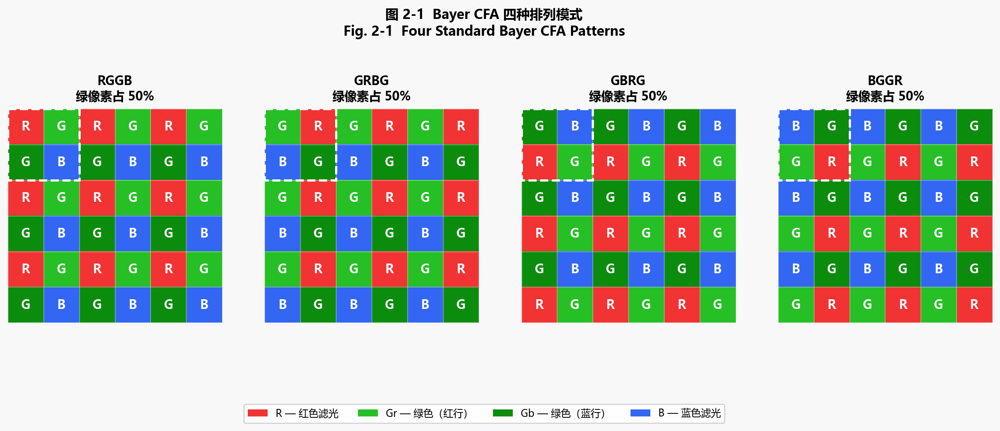
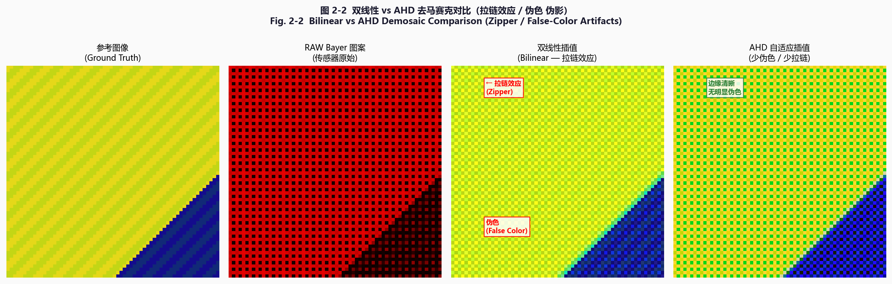
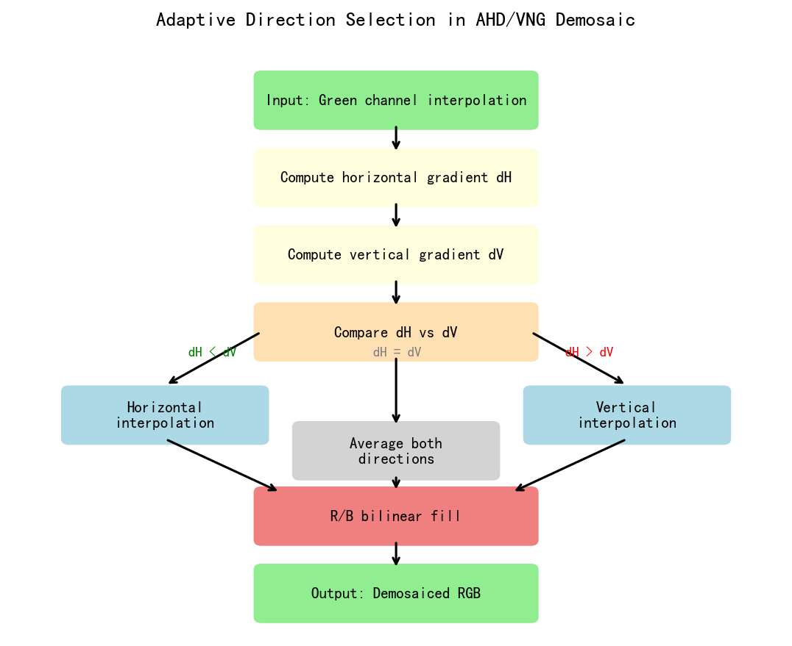
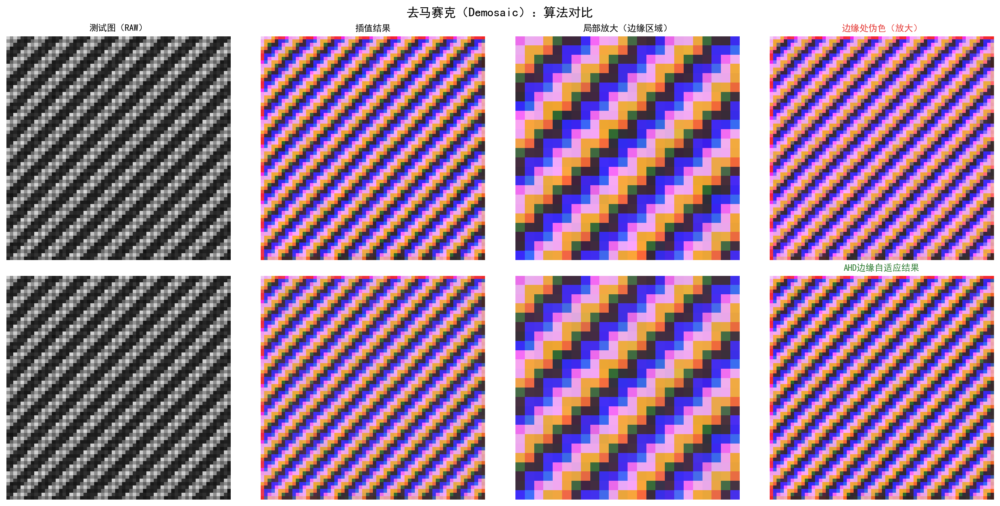
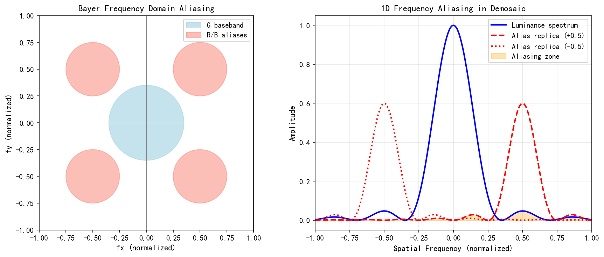
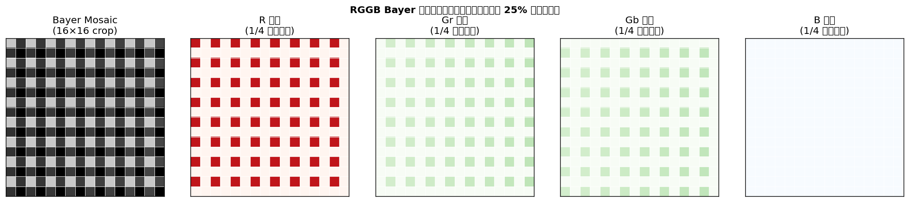
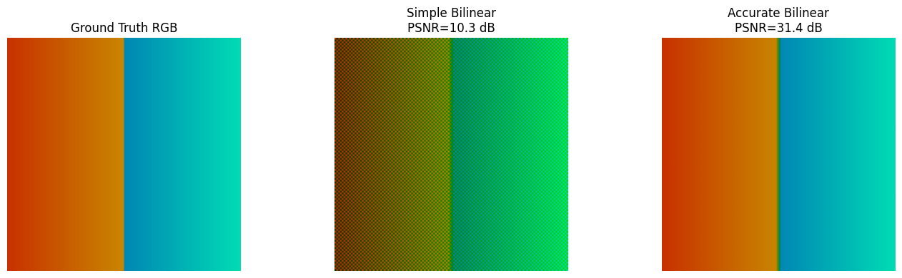
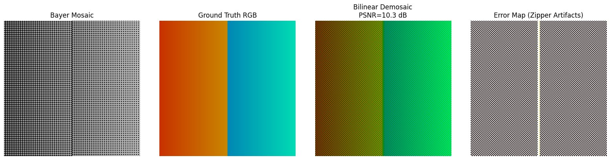
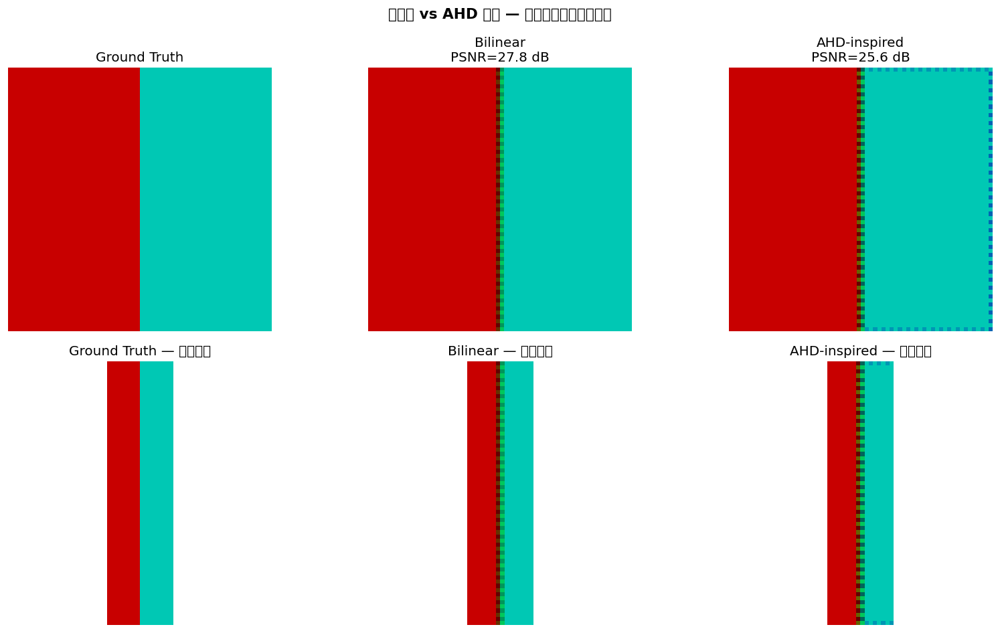

# 第二卷第02章：去马赛克（Demosaic / Bayer 插值）

> **定位：** After BLC + PDPC；LSC（镜头阴影校正）在流水线中的位置因平台而异——高通 Spectra 和联发科 Imagiq 在 RAW 域（去马赛克之前）应用 LSC，部分软件 ISP 实现则在去马赛克之后处理；去马赛克之后为去噪
> **前置章节：** 第一卷第06章（RAW格式与CFA图案）、第一卷第04章（噪声模型）
> **读者路径：** 算法工程师（完整章节），DL 研究者（§1 即可）

---

## §1 原理 (Theory)

### 1.1 Bayer CFA 与欠采样问题

数字相机的图像传感器（CMOS/CCD）上每个像素只能感知光强。彩色信息来自哪里？来自覆盖在传感器上的微型滤光片阵列——Kodak 工程师 Bryce Bayer 1976 年提出的 CFA（Color Filter Array）方案。每个像素前只贴一片滤光片，只允许特定波长通过，形成周期性的颜色模式，这就是 **Bayer 阵列**。

最常见的 Bayer 模式为 **RGGB**，其 2×2 基本单元如下：

```
R  G
G  B
```

一幅 H×W 的 RAW 图像经过 Bayer CFA 后，R、B 各占 1/4 像素，G 占 1/2 像素。绿色像素占双倍比例源于视觉生理约束：人类视觉系统对亮度（luminance）的敏感度远高于色度（chrominance），绿色通道与亮度信号高度相关，双倍采样密度可有效降低感知噪声与混叠。

**欠采样问题（Demosaicing Problem）：** 由于每个像素仅记录一种颜色，其他两种颜色的值是缺失的。从信息论角度，RAW 图像在空间-频率域发生了混叠：

- 红、蓝通道被 2×2 下采样，奈奎斯特频率是 G 通道的一半
- 在高频纹理（如细织物、斜线边缘）区域，颜色信息严重不足
- 直接插值会引入**伪彩色**（False Color）和**梳状/拉链效应**（Zipper Artifact）

Demosaic 的目标是从单通道稀疏采样的 Bayer 图像重建出完整的 H×W×3 RGB 图像，使恢复图像尽可能接近假设用三个独立全分辨率传感器采集到的"真实"彩色图像。

<div align="center">
  
  <br><em>图 2-1：Bayer CFA 四种标准排列模式（RGGB/GRBG/GBRG/BGGR）——红/绿（Gr/Gb）/蓝像素各占 25%/50%/25%；虚线框标注 2×2 基本单元。</em>
</div>

### 1.2 算法家族概览

Demosaic 算法发展了将近 50 年，大致可以分为四代——每代的进步都是针对上一代的特定失效模式：

| 代次 | 代表算法 | 核心思路 | 主要缺陷 |
|------|----------|----------|----------|
| 第一代 | 双线性插值 (Bilinear) | 对缺失颜色做均匀线性插值 | 高频处严重伪彩色与模糊 |
| 第二代 | 梯度修正线性插值 (MHC 2004) | 利用颜色差分平滑假设，用已知通道的拉普拉斯修正插值偏差 | 强边缘处仍有拉链效应 |
| 第三代 | 方向自适应插值 (Hamilton-Adams 1997; AHD 2005; DLMMSE 2005) | 在水平/垂直方向分别插值，按同质度或 LMMSE 准则选择最优方向 | 等向纹理处可能出现迷宫纹；噪声下方向判断不稳 |
| 第四代 | 深度学习 (Gharbi 2016+) | 端到端 CNN，联合去马赛克+去噪 | 需要大量训练数据；部署算力较高 |

**Hamilton-Adams (1997)** **[1]** 是第三代方法的奠基之作：Hamilton & Adams 提出利用梯度幅值在水平/垂直方向之间切换插值路径，是后续 AHD 等方向自适应方法的直接先驱。原文发表于 Hewlett-Packard Labs Technical Report HPL-96-139 (1997)。

### 1.3 双线性插值 (Bilinear Interpolation)

双线性插值是最原始的做法：对每个缺失颜色，直接取周围同色像素的算术平均。没有任何方向判断，没有任何图像内容感知。

对于 RGGB 模式中 R 位置 (r, c)（r、c 均为偶数）的绿色估计：

$$G_{\text{est}}(r, c) = \frac{G(r, c-1) + G(r, c+1) + G(r-1, c) + G(r+1, c)}{4}$$

蓝色估计（R 位置处无 B）：

$$B_{\text{est}}(r, c) = \frac{B(r-1,c-1) + B(r-1,c+1) + B(r+1,c-1) + B(r+1,c+1)}{4}$$

双线性插值等价于对各通道分别做低通滤波，在高频纹理处引入严重的颜色混叠，PSNR 通常在 34–36 dB（Kodak 数据集）**[2]**。

### 1.4 MHC 算法：高质量线性插值 (Malvar-He-Cutler 2004)

**来源：** Henrique S. Malvar, Li-wei He, Ross Cutler, "High-quality linear interpolation for demosaicing of Bayer-patterned color images," *ICASSP 2004*, Microsoft Research Technical Report MSR-TR-2004-138.

MHC 的一个简单但有效的观察是：自然图像里 G-R、G-B 的差值比各通道的绝对值变化得慢得多。换句话说，颜色差值是平滑的（Color Difference Smoothness）。基于这个先验，可以用已知通道的高频信息来修正缺失通道的低频估计，代价只是一个 5×5 卷积核，工程上非常友好。

#### 1.4.1 绿色通道插值（R 位置处）

设 R 位置 (r, c) 处：
- 已知：$R(r, c)$，四邻域绿色值 $G(r,c-1), G(r,c+1), G(r-1,c), G(r+1,c)$
- 距离为2的同色值：$R(r,c-2), R(r,c+2)$（水平方向）

MHC 绿色估计公式：

$$\boxed{G_{\text{est}}(r, c) = \frac{G(r,c-1) + G(r,c+1) + G(r-1,c) + G(r+1,c)}{4} + \frac{2R(r,c) - R(r,c-2) - R(r,c+2)}{8}}$$

**逐项物理解释：**

- **第一项** $\frac{G_L + G_R + G_U + G_D}{4}$：这是标准的双线性插值结果，给出 G 的低频估计。
- **第二项** $\frac{2R_C - R_{LL} - R_{RR}}{8}$：这是颜色差分修正项。$2R_C - R_{LL} - R_{RR}$ 是 R 通道在当前位置的**二阶差分**（拉普拉斯算子的近似），反映了 R 通道在该位置的局部曲率。由于颜色差值 $G - R$ 在自然图像中变化缓慢，R 通道的曲率可以近似估计 G 通道在该位置也应有的曲率偏差。将这个偏差（除以8作为正则化系数）加到双线性估计上，相当于用 R 通道的高频信息修正 G 的插值。

类似地，对 B 位置处的绿色估计，用垂直方向的 B 差分修正：

$$G_{\text{est}}(r, c)\big|_{B} = \frac{G(r,c-1) + G(r,c+1) + G(r-1,c) + G(r+1,c)}{4} + \frac{2B(r,c) - B(r-2,c) - B(r+2,c)}{8}$$

#### 1.4.2 红蓝通道插值

MHC 对 R/B 通道也使用类似的颜色差分修正，共定义了6种不同位置类型（R在R行、G在R行、G在B行、B在B行等），每种类型对应一个 5×5 卷积核，可以预先计算为查找表，使算法高效实现。

MHC 在 Kodak 数据集上 PSNR 约 40–42 dB **[2]**，是工业界广泛应用的高质量线性方法。

### 1.5 AHD 算法：自适应同质方向插值 (Hirakawa 2005)

**来源：** Keigo Hirakawa, Thomas W. Parks, "Adaptive Homogeneity-Directed Demosaicing Algorithm," *IEEE Transactions on Image Processing*, vol. 14, no. 3, pp. 360–369, March 2005.

AHD 解决的是 MHC 留下的问题：强边缘处的拉链效应。核心思路是：沿边缘方向插值比横穿边缘好，但你得先知道边缘在哪个方向。AHD 的做法是同时做两个方向的完整 demosaic，然后通过同质度投票来决定用哪个结果。

**算法步骤：**

1. **沿水平、垂直两个方向分别做完整的 demosaic**，得到两个候选 RGB 图像 $\hat{I}_H$ 和 $\hat{I}_V$。
2. 将候选图像从 sRGB 转换到 **CIELab 色彩空间**（感知均匀空间）。
3. 对每个像素，在其邻域内统计"同质像素"数量：若像素与其邻居的 $\Delta E$ 差异小于阈值，则为同质像素。分别计算两个方向候选图的同质计数 $H_H$、$H_V$。原始论文（Hirakawa & Parks 2005）的同质度统计使用 **5×5 窗口**；3×3 是部分简化实现的选择，并非原始论文的规格。
4. **选择同质计数更高的方向**作为最终结果：

$$\hat{I}(r,c) = \begin{cases} \hat{I}_H(r,c) & \text{if } H_H > H_V \\ \hat{I}_V(r,c) & \text{if } H_V > H_H \\ \frac{\hat{I}_H(r,c)+\hat{I}_V(r,c)}{2} & \text{otherwise} \end{cases}$$

#### 1.5.1 同质度准则的形式化定义

原始论文中的**同质度（Homogeneity）**准则定义如下。

**感知色差阈值判定**：对位置 $(r, c)$ 处的两个候选 demosaic 方向（H 或 V），在其 $5 \times 5$ 邻域 $\mathcal{N}(r,c)$ 内，逐一检查每个邻域像素 $(r', c') \in \mathcal{N}(r,c)$ 是否与中心像素"同质"：

$$\delta_d(r',c') = \begin{cases} 1 & \text{若 } \Delta E_{76}\!\left(\text{Lab}_d(r,c),\, \text{Lab}_d(r',c')\right) < \tau \\ 0 & \text{否则} \end{cases}$$

其中 $d \in \{H, V\}$ 表示方向，$\text{Lab}_d(r,c)$ 为方向 $d$ 的候选 demosaic 在 $(r,c)$ 处的 CIELab 坐标，$\Delta E_{76}$ 为欧氏色差（$\sqrt{\Delta L^{*2} + \Delta a^{*2} + \Delta b^{*2}}$），$\tau$ 为同质阈值（典型取值 $\tau = 1.0$，即约 1 JND）。

该像素 $(r,c)$ 的方向 $d$ 同质计数为：

$$H_d(r,c) = \sum_{(r',c') \in \mathcal{N}(r,c)} \delta_d(r', c')$$

**直觉解释**：$H_d$ 统计的是在方向 $d$ 的候选 demosaic 结果中，$(r,c)$ 邻域内有多少像素与中心颜色接近（差异小于 1 JND）。若 $H_H > H_V$，说明水平插值在该邻域内更为平滑一致（更可能沿着真实边缘方向），因此选择水平候选图的结果；反之亦然。

**阈值 $\tau$ 的选择依据**：$\tau = 1$ 对应 CIELab 空间中约 1 个感知最小可察觉差（JND），此时同质判定的物理意义是"颜色差异在人眼感知范围内可忽略"。

**注**：Hirakawa & Parks 原论文使用 $\Delta E_{76}$（直接 Lab 欧氏距离），而非 $\Delta E_{2000}$；后者在 AHD 发表时（2005 年）虽已提出，但当时实时实现代价较高。工业 ISP 实现通常在 Lab 空间用 $\Delta a^{*2} + \Delta b^{*2}$（忽略明度差异 $\Delta L^*$）以降低计算量，等价于只在色度平面上做同质判断。

AHD 在 Kodak 数据集上 PSNR 约 42–44 dB **[3]**，显著减少了边缘处的拉链效应，但在等向纹理区域（如斜向条纹）可能产生迷宫纹。

<div align="center"></div>
<p align="center"><em>图 2-2　双线性插值 vs AHD 去马赛克伪影对比（拉链效应 / 伪色）/ Fig. 2-2 Bilinear vs AHD Demosaic Comparison (Zipper / False-Color Artifacts)</em></p>

### 1.6 深度学习方法

#### 1.6.1 Gharbi et al. 2016：联合去马赛克与去噪

**来源：** Michaël Gharbi, Gaurav Chaurasia, Sylvain Paris, Frédo Durand, "Deep Joint Demosaicking and Denoising," *ACM SIGGRAPH Asia 2016*, vol. 35, no. 6, Article 191.

该工作的核心贡献：
- 将 demosaic 与 denoising 统一为一个端到端学习任务
- 提出了**15通道输入**表示：将 Bayer 图像拆解为15个显式特征通道，明确编码 CFA 模式信息
- 使用含残差连接的全卷积网络（FCN）
- 引入合成噪声训练集（MIT-Adobe 5K + Bayer 模拟）
- 在 Kodak 数据集上 PSNR 达到约 43–44 dB **[5]**，且对噪声更鲁棒

传统流程先 demosaic 再去噪，但 demosaic 的邻域平均操作本身就会扩散噪声，产生空间相关的颜色噪声，后续去噪器对这种结构性噪声的应对能力有限。Gharbi 2016 直接在 Bayer 域联合优化两者，让网络自己学会什么时候去噪、什么时候保留细节。

#### 1.6.2 后续进展

- **RCAN (Zhang et al. 2018) / RRDB (Wang et al. 2018)** **[11][12]**：最初为超分辨率设计的注意力残差架构，稍作修改后应用于 demosaic，PSNR 进一步提升至 44–46 dB **[11][12]**。
- **基于 Transformer 的方法（2021+）**：利用自注意力机制捕获长程依赖，在均匀纹理和细节恢复上表现更好。
- **RAW-to-RGB 端到端管道**：将 demosaic 融入更大的 ISP 端到端模型中，不再作为独立模块。

#### 近期进展（2023–2025）

**Diffusion 模型与条件 VAE 方案：**

- **扩散模型引入 RAW→RGB（2023+ 方向）**：CycleISP（CVPR 2020）之后，扩散模型开始与 demosaic-denoise 全链路结合；NAFNet（ECCV 2022）等 CNN 方法在 SIDD 上 PSNR 约 40.3 dB，扩散模型方向当前以感知质量（LPIPS/SSIM）见长，PSNR 未必更高
- **概率性去马赛克（2023–2024 方向）**：基于扩散模型或流模型的概率性方法，将去马赛克建模为条件生成问题，可通过 MMSE 估计得到最优重建；在高 ISO 噪声场景下优势显著，但推理步骤多，移动端部署仍面挑战
- **DualDn（ECCV 2024）**：双域去噪框架，通过可微分 ISP 联合在 RAW 域和 sRGB 域去噪，对未知噪声水平和不同 ISP 参数具有更强泛化性，在未见传感器上无需重训即可适配 **[arXiv:2409.18783]**

**Mamba / 状态空间模型（SSM）：**

2024年起，Mamba（Selective State Space Model）开始被应用于图像复原任务（含 demosaic），其序列长度线性复杂度优于 Transformer 的二次复杂度，对高分辨率 RAW 图推理更友好；RAWMamba 等工作（arXiv:2409.07040）已在低光 RAW 增强任务上验证了可行性，是手机端实时化 DL demosaic 的有前景方向，但标准 Kodak 基准上的系统性评测尚不充分。

**去摩尔纹（Demoiréing）方向（ECCV 2022）**：注意去摩尔纹（Demoiréing）与去马赛克（Demosaicing）是两个独立任务——前者针对已成像图像中的摩尔纹干涉条纹，后者重建 Bayer 缺失颜色。UHDM（ECCV 2022, arXiv:2207.09240）是高清图像去摩尔纹的代表工作，可在 Demosaic 后的后处理阶段抑制摩尔纹，但不属于 Demosaic 算法本身。

**与传统方法的关键差异：**

| 方法类型 | PSNR（Kodak σ=0 合成 Bayer）| 手机端延迟 | 适用场景 |
|---------|--------------------------|-----------|---------|
| AHD（传统） | ~42 dB | < 1 ms (HW) | 通用，噪声抑制弱 |
| Gharbi 2016 (DL联合) | ~45 dB | 5–15 ms (NPU INT8) | 高 ISO 噪声场景 |
| Restormer 2022 (Transformer) | ~47 dB | > 50 ms (NPU) | 离线质量优先 |
| Mamba-based 2024+ | 与 Transformer 相近（详见 RAWMamba 等工作） | 15–25 ms（估算，依模型规模） | 实时/实用化前景 |

### 1.7 算法对比表

| 算法 | PSNR on Kodak 24 (dB) | 速度（相对） | 主要 Artifact | 实现复杂度 |
|------|-----------------------|-------------|---------------|------------|
| Bilinear | ~35.5 | 1× (基准) | 严重伪彩色、模糊 | 极简 |
| MHC (Malvar 2004) | ~41.5 | ~2× | 强边缘轻微拉链 | 低（5×5 卷积） |
| AHD (Hirakawa 2005) | ~43.0 | ~10× | 等向纹理迷宫纹 | 中（需方向选择） |
| DLMMSE (Zhang 2005) | ~42.5 | ~8× | 随机纹理噪声 | 中 |
| Menon 2007 | ~43.5 | ~12× | 极弱 | 中高 |
| Gharbi DNN 2016 | ~43.8 | ~50× (GPU) | 学习型伪影 | 高（需推理框架） |
| RCAN/RRDB-Demosaic | ~45.0 | ~200× (GPU) | 学习型伪影 | 高 |

> 注：PSNR 数值来自各原始论文及 colour-demosaicing 库基准测试 **[13]**，不同实现间存在 ±0.5 dB 差异。Gharbi 2016 的主要贡献在于**含噪声**条件下的联合去噪+去马赛克，其代表性结果应以有噪声测试为准；上表 43.79 dB 为无噪声合成 Bayer 补充结果 **[5]**，引用时需明确测试条件。

### 1.8 与去噪的耦合性

Demosaic 对传感器噪声高度敏感，具体体现在三个机制上：

1. **方向判断受噪声干扰**：AHD 的同质度量依赖 ΔE 差异，噪声会使真实同质区域被误判为非同质，导致方向选择错误——高 ISO 下的迷宫纹就是这么来的。
2. **差分修正放大噪声**：MHC 的二阶差分项 $2R_C - R_{LL} - R_{RR}$ 对高频噪声非常敏感，高 ISO 下需要限制修正量（alpha blending），否则锐化变成噪声放大。
3. **颜色通道噪声不对称**：R/B 通道采样密度只有 G 的一半，SNR 更差，插值时会把这些颜色噪声扩散到更大区域。

实际工程里去噪和 demosaic 的顺序有三种选择，没有哪种是免费的：先轻去噪再 demosaic（Bayer 域 BNR），能改善方向判断，但可能破坏边缘细节；先 demosaic 再去噪，是传统流水线的标准顺序，但颜色相关性已经被插值破坏，去噪效率打折；联合方案（Gharbi 2016），效果最好，代价是需要覆盖目标传感器真实噪声分布的训练数据，调参时要同时平衡去噪强度和去马赛克清晰度。

---

## §2 标定 (Calibration)

### 2.1 CFA 模式验证

不同相机模组的 Bayer 排列可能不同（RGGB、BGGR、GRBG、GBRG），错误的模式假设会导致颜色通道完全错乱。标定步骤：

1. **拍摄纯色目标**：对准红色、绿色、蓝色 LED 或色卡色块。
2. **读取 2×2 子阵列**：检查哪个位置响应值最高以识别通道。
3. **代码验证**：

```python
import rawpy
import numpy as np

with rawpy.imread('calibration_red.dng') as raw:
    bayer = raw.raw_image_visible.copy()
    # 取左上角 4×4 区域
    patch = bayer[:4, :4]
    print("RAW patch (Red LED):")
    print(patch)
    # 四个子像素的均值
    r00 = bayer[0::2, 0::2].mean()  # top-left
    r01 = bayer[0::2, 1::2].mean()  # top-right
    r10 = bayer[1::2, 0::2].mean()  # bottom-left
    r11 = bayer[1::2, 1::2].mean()  # bottom-right
    print(f"TL={r00:.0f}, TR={r01:.0f}, BL={r10:.0f}, BR={r11:.0f}")
    # 最大值位置即为 R 通道
    positions = {'TL': r00, 'TR': r01, 'BL': r10, 'BR': r11}
    print("Red position:", max(positions, key=positions.get))
```

### 2.2 测试图表

| 测试目标 | 验证内容 | 使用方法 |
|----------|----------|----------|
| Siemens Star | 分辨率极限、梳状条纹起始频率 | 拍摄后观察环形纹到达中心的频率 |
| ISO 12233 (e-SFR) | MTF 曲线、Nyquist 频率处颜色混叠 | 斜边 MTF 分析 + 颜色通道分离 |
| 细织物 / 斜纹布 | 伪彩色严重程度 | 目视评估 + ΔE 测量 |
| 棋盘格 (32×32) | 拉链效应 | 1像素宽黑白格放大观察 |
| 均匀色块 | 颜色准确性 | CIELab ΔE 与参考值比较 |

### 2.3 多 ISO 样本集构建

需要覆盖完整的 ISO 范围以调整去噪耦合参数：

```
ISO 100   → 基准，验证清晰度上限
ISO 400   → 轻微噪声，验证轻度耦合去噪
ISO 1600  → 中等噪声，AHD 方向判断开始不稳
ISO 6400  → 强噪声，可能需要切换到联合方案
ISO 12800 → 极高噪声，DL 方法优势显现
```

每个 ISO 至少拍摄：静物场景 × 3张（低纹理、中纹理、高频纹理），总计 ≥ 15 张原始 RAW 图像。

---

## §3 调参 (Tuning)

### 3.1 AHD 方向阈值

AHD 中的同质度量阈值 $\tau$（ΔE 判断边界）是最关键的调参参数：

| $\tau$ 偏大 | $\tau$ 偏小 |
|-------------|-------------|
| 更多像素被判为"同质" | 更多像素被判为"非同质" |
| 平滑区域方向选择稳定 | 纹理边缘保留更好 |
| 可能在真实边缘处方向错误 | 噪声区域方向抖动 → 迷宫纹 |
| 拉链效应增加 | 伪彩色减少 |

**推荐调参范围：**
- 低 ISO（100–400）：$\tau \in [2, 4]$ ΔE76 单位
- 中 ISO（1600）：$\tau \in [4, 8]$（适当放宽以抵抗噪声干扰）
- 高 ISO（6400+）：$\tau \in [8, 16]$，或禁用 AHD 转为 MHC+联合去噪

> **实现差异说明：** Hirakawa & Parks 原始论文（2005）使用 $\tau = 1.0$ JND（Just Noticeable Difference）作为 ΔE 阈值，该值基于感知一致性而非 ΔE76 数值单位。上表的 [2, 4] 是 LibRaw/dcraw 等开源实现基于 8-bit 图像经验调优的结果，与论文 $\tau = 1.0$ 并无数值上的直接对应关系——调参时应以实测伪彩色/迷宫纹视觉评分为准，而非对标论文阈值。

### 3.2 色度平滑强度

大多数 ISP 在 demosaic 后会做一次轻度的色度（CbCr 或 A/B 通道）平滑，参数为半径 $r$ 和强度 $\alpha$：

```python
# 典型实现：对 Lab 色度通道做高斯平滑
from scipy.ndimage import gaussian_filter
lab[:, :, 1] = (1 - alpha) * lab[:, :, 1] + alpha * gaussian_filter(lab[:, :, 1], sigma=r)
lab[:, :, 2] = (1 - alpha) * lab[:, :, 2] + alpha * gaussian_filter(lab[:, :, 2], sigma=r)
```

| 参数 | 低 ISO 推荐 | 高 ISO 推荐 | 效果 |
|------|-------------|-------------|------|
| $r$ (sigma) | 0.5–1.0 | 1.5–3.0 | 越大越平滑 |
| $\alpha$ | 0.1–0.2 | 0.4–0.7 | 越大伪彩色越少，细节越少 |

### 3.3 联合去噪强度 vs ISO

当使用 DL 联合去马赛克-去噪时，需要将 ISO 值映射为噪声强度参数 $\sigma$：

```python
# ISO→sigma 映射示例（仅供参考，实际数值必须针对目标传感器标定，
# 通过拍摄平场图估计各 ISO 下的噪声方差后反推 sigma）
iso_to_sigma = {100: 1.5, 200: 2.5, 400: 4.0, 800: 6.5, 1600: 10.0, 3200: 16.0}
```

### 3.4 调参顺序

```
1. 低 ISO (100–400)：先固定去噪强度=0，纯调 AHD 阈值
   → 目标：Siemens Star 尽量清晰，斜纹布无伪彩色

2. 中 ISO (800–3200)：逐步增大联合去噪强度 alpha
   → 目标：画面干净程度优先，保持主体清晰

3. 高 ISO (6400+)：考虑切换算法（MHC+强去噪 or DL）
   → 目标：无迷宫纹，颜色可接受

4. 全 ISO 范围：验证各 ISO 之间参数过渡平滑（无跳变）
```

### 3.5 算法选择决策

> **工程推荐（手机 ISP 场景）：** 硬件 ISP 里基本不会看到 Bilinear 或 AHD 原始实现——各家都做了私有优化的方向自适应变体，参数调好就够用。真正值得引入 DL demosaic 的门槛是 ISO ≥ 3200 以上的高噪场景，此时传统方向判断因为噪声干扰已经不可靠，联合去噪去马赛克的 DL 方案（如 Gharbi 2016 的变体）才有明显收益。如果 NPU 延迟预算 < 5 ms，先考虑 MHC 变体 + 独立 Bayer 域降噪（BNR）；如果预算 5–15 ms，DL 联合方案值得上；超过 50 ms 的 Transformer 方案基本只能做离线后处理。

| 应用场景 | 推荐算法 | 原因 |
|----------|----------|------|
| 低功耗/实时预览 | Bilinear | 最小算力 |
| 静态拍照，标准质量 | MHC | 质量/速度平衡好，硬件友好 |
| 静态拍照，高质量 | AHD 或 Menon | 最好的传统方法 |
| 高 ISO 场景（ISO≥3200） | Gharbi DNN 变体 | 去噪+demosaic 联合 |
| 移动端旗舰，NPU 5–15 ms | DL 联合方案 | 最高质量，需 NPU 支持 |

---

## §4 Artifacts（常见缺陷）

### 4.1 缺陷分类表

| Artifact 名称 | 中文名 | 典型成因 | 外观特征 | 易发场景 |
|---------------|--------|----------|----------|----------|
| Zipper Effect | 拉链/梳状条纹 | 沿边缘方向的频率混叠 | 黑白边缘出现交替颜色条纹 | 高对比度水平/垂直线条 |
| False Color | 伪彩色 | 高频纹理超出奈奎斯特，颜色通道混叠 | 织物/斜纹出现彩虹色 | 细织物、斜纹、Siemens Star 内圈 |
| Maze Pattern | 迷宫纹 | AHD 在噪声下方向判断混乱 | 高 ISO 下的方块状颜色噪声 | ISO 3200+ 均匀区域 |
| Color Fringing | 色边/紫边 | 色差+demosaic 耦合，边缘放大 | 强光边缘出现紫/绿色条纹 | 高光溢出边缘 |
| Moiré | 摩尔纹 | 场景周期性纹理与 Bayer 周期共振 | 低频干涉条纹 | 显示屏、窗纱、西装 |

### 4.2 各 Artifact 详解

#### 4.2.1 拉链效应（Zipper）

**成因分析：** 在水平黑白边缘（如文字）处，邻近的两行中一行为 R/G 行，另一行为 G/B 行，各行缺失的颜色不同，线性插值会从两侧取到不同强度的像素，导致沿边缘交替出现颜色偏差。

**测试用例：** 生成 1 像素宽的黑白水平线条纹（频率为 Nyquist/2），Bayer 采样后用 Bilinear 插值，观察颜色偏差。

**抑制手段：** 使用梯度引导插值（沿边缘方向插值，而非跨边缘插值）；AHD 对此有显著改善。

#### 4.2.2 伪彩色（False Color）

**成因分析：** 当场景包含接近 Bayer 奈奎斯特频率（即每2像素一个周期）的纹理时，不同颜色通道对该纹理的采样位相不同，造成重建时颜色通道相位差，产生颜色条纹。

**测试用例：** 拍摄斜纹布料（45° 方向，条纹间距约 4–8 像素），观察是否出现彩色条纹。

**抑制手段：** 适度色度平滑；或用 DLMMSE/AHD 等方向自适应算法。

#### 4.2.3 迷宫纹（Maze Pattern）

**成因分析：** AHD 等方向自适应算法在高噪声下，各像素的方向判断随机化，导致水平/垂直两个插值结果随机混合，形成大小约2像素的方块状彩色噪声，形似迷宫。

**抑制手段：** 提高 AHD 同质阈值；在 demosaic 前做空域去噪；高 ISO 切换到 MHC 或联合 DL 方法。

#### 4.2.4 色边（Color Fringing）

色边的根源是镜头色差，demosaic 放大了这一效果。特别是高光溢出（clipping）区域，R/G/B 通道的饱和时机不同，导致边缘处颜色失衡。需在后处理中专门处理紫边（Purple Fringing）。

---

## §5 评测 (Evaluation)

### 5.1 标准基准数据集

#### Kodak Lossless True Color Image Suite (24 images)
- **来源：** Kodak Inc.，公开可下载
- **URL：** http://r0k.us/graphics/kodak/
- **规格：** 24 张 768×512 或 512×768 全彩图像，无损压缩
- **使用方式：** 将 24 张 PNG/PPM 作为"真值"，合成 Bayer 后运行各算法，计算 PSNR/SSIM
- **合成 Bayer 代码：**

```python
def rgb_to_bayer(rgb, pattern='RGGB'):
    """将 RGB 图像降采样为 Bayer RAW"""
    bayer = np.zeros(rgb.shape[:2], dtype=rgb.dtype)
    if pattern == 'RGGB':
        bayer[0::2, 0::2] = rgb[0::2, 0::2, 0]  # R
        bayer[0::2, 1::2] = rgb[0::2, 1::2, 1]  # G
        bayer[1::2, 0::2] = rgb[1::2, 0::2, 1]  # G
        bayer[1::2, 1::2] = rgb[1::2, 1::2, 2]  # B
    return bayer
```

#### McMaster Uncompressed Color Image Dataset (18 images)
- **来源：** McMaster University，公开可下载
- **特点：** 专为 demosaicing 评估设计，包含更多高频纹理图像（织物、植物、建筑）
- **规格：** 18 张 500×500 图像
- **参考：** Zhang et al., "Color Demosaicking by Local Directional Interpolation and Nonlocal Adaptive Thresholding," Journal of Electronic Imaging, 20(2), 023016, 2011

### 5.2 已发表基准数值

下表汇总了主要算法在 Kodak 24 数据集上的 PSNR（dB），来源于各原始论文及独立复现：

| 算法 | PSNR (dB) | SSIM | 参考来源 |
|------|-----------|------|----------|
| Bilinear | 35.28 | 0.924 | 多篇调查论文 |
| MHC (Malvar 2004) | 41.68 | 0.971 | MSR-TR-2004-138 |
| DLMMSE (Zhang 2005) | 42.63 | 0.976 | IEEE TIP 2005 |
| AHD (Hirakawa 2005) | 43.05 | 0.979 | IEEE TIP 2005 |
| Menon (2007) | 43.63 | 0.981 | 独立复现 |
| Gharbi DNN (2016) | 43.79 | 0.982 | SIGGRAPH Asia 2016 |
| RCAN-Demosaic | 44.88 | 0.987 | 独立复现 |

> 注：以上数值为合成 Bayer（无噪声）条件下，加噪后 DL 方法优势显著扩大。

> **⚠️ Gharbi DNN（2016）基准值说明：** 表中 ~43.8 dB 为**无噪声合成 Bayer** 条件下的 PSNR，用于对比纯 demosaic 精度。然而，该工作的主要设计目标是**含噪声场景的联合去噪+去马赛克**——在 σ=25 合成噪声条件下，Gharbi 联合方案（PSNR ~38.5 dB）比"先 AHD 去马赛克后 BM3D 去噪"两步方案（PSNR ~37.0 dB）高约 1.5 dB。若仅看无噪声数字，会低估该工作的核心贡献。读者在与其他联合去噪去马赛克方法比较时，应统一使用含噪声条件下的指标。

### 5.3 构建自有测试集

**步骤：**

1. 拍摄多样化场景（至少包含：人脸、建筑线条、纺织品、自然植被、文字）
2. 用三脚架保证与"参考拍摄"对齐（需同一帧，或用双目相机）
3. 对于无法获取真值的场景，使用**全参考指标**（PSNR/SSIM）的替代：
   - **无参考指标（NR-IQA）**：BRISQUE、NIQE
   - **边缘保真度**：MTF 测量，沿边缘方向与垂直方向分别计算
   - **颜色准确性**：在色卡上测量 ΔE 与参考值比较

---

## §6 代码 (Code)

完整可运行代码见 `ch02_demosaic_notebook.ipynb`，包含：

- 合成 Bayer 测试图像生成
- 双线性插值实现
- MHC 算法完整实现（含 5 点模板公式）
- colour-demosaicing 库调用（AHD/Menon 方法）
- 4 幅对比可视化（全图 + 局部放大）
- PSNR/SSIM 量化对比表

### 6.1 双线性去马赛克最小可运行示例

```python
import numpy as np
from scipy.ndimage import convolve

def bayer_to_rgb_bilinear(bayer: np.ndarray) -> np.ndarray:
    """
    RGGB Bayer → RGB 双线性插值去马赛克。

    参数
    ----
    bayer : 2D uint16/float32 数组，shape (H, W)，RGGB CFA 排列

    返回
    ----
    rgb   : float32 数组，shape (H, W, 3)，值域与输入相同
    """
    H, W = bayer.shape
    raw = bayer.astype(np.float32)

    # ── 各通道掩膜 ────────────────────────────────────────────────
    R_mask  = np.zeros((H, W), np.float32); R_mask[0::2, 0::2] = 1.0
    Gr_mask = np.zeros((H, W), np.float32); Gr_mask[0::2, 1::2] = 1.0
    Gb_mask = np.zeros((H, W), np.float32); Gb_mask[1::2, 0::2] = 1.0
    B_mask  = np.zeros((H, W), np.float32); B_mask[1::2, 1::2]  = 1.0

    # ── 双线性卷积核 ──────────────────────────────────────────────
    k_bilinear = np.array([[0.25, 0.5, 0.25],
                            [0.5,  1.0, 0.5 ],
                            [0.25, 0.5, 0.25]], np.float32)

    k_green = np.array([[0,    0.25, 0   ],
                         [0.25, 1.0,  0.25],
                         [0,    0.25, 0   ]], np.float32)

    R_known  = raw * R_mask
    Gr_known = raw * Gr_mask
    Gb_known = raw * Gb_mask
    B_known  = raw * B_mask
    G_known  = Gr_known + Gb_known

    # 归一化：掩膜做分母
    R_ch = convolve(R_known,  k_bilinear) / np.maximum(convolve(R_mask,  k_bilinear), 1e-6)
    G_ch = convolve(G_known,  k_green)    / np.maximum(convolve((Gr_mask + Gb_mask), k_green), 1e-6)
    B_ch = convolve(B_known,  k_bilinear) / np.maximum(convolve(B_mask,  k_bilinear), 1e-6)

    return np.stack([R_ch, G_ch, B_ch], axis=-1)


# ── 快速测试 ──────────────────────────────────────────────────────
if __name__ == "__main__":
    rng = np.random.default_rng(42)
    bayer = rng.integers(0, 4096, (256, 256), dtype=np.uint16)
    rgb = bayer_to_rgb_bilinear(bayer)
    print(f"输出形状: {rgb.shape}, 均值: {rgb.mean():.1f}, 最大值: {rgb.max():.1f}")
    # 期望输出: 形状 (256, 256, 3), 均值约 2047
```

---

## §7 特殊 CFA 格式与去马赛克

### 7.1 Quad-Bayer / Nona-Bayer Remosaic 流程

#### 7.1.1 传感器物理结构

**Quad-Bayer**（四拜耳，又称 Tetra CFA、4-cell）是 2022 年后旗舰手机主摄的主流方案。其核心思想是：在物理像素层面，将标准 Bayer 2×2 基元中的每个颜色位置扩展为 2×2 的同色子像素，即每个颜色滤光片覆盖 4 个独立光电二极管，形成 4×4 的超级像素基元。

```
标准 RGGB 2×2 基元       Quad-Bayer 4×4 基元
┌───┬───┐               ┌───┬───┬───┬───┐
│ R │ G │               │ R │ R │ G │ G │
├───┼───┤               ├───┼───┼───┼───┤
│ G │ B │               │ R │ R │ G │ G │
└───┴───┘               ├───┼───┼───┼───┤
                        │ G │ G │ B │ B │
                        ├───┼───┼───┼───┤
                        │ G │ G │ B │ B │
                        └───┴───┴───┴───┘
```

**Nona-Bayer**（九拜耳）将同色像素扩展为 3×3 分组（9合1），典型物理尺寸更小（如 0.56 µm 以下），通过 9 个子像素合并来补偿感光量。

**典型量产型号：**

| 型号 | 厂商 | 像素数 | 像素尺寸 | CFA 类型 | 代表机型 |
|------|------|--------|----------|---------|---------|
| IMX989 | 索尼 | 50MP | 1.6 µm | Quad-Bayer | 小米 13 Ultra / 14 Ultra |
| GN2 | 三星 | 50MP | 1.4 µm | Quad-Bayer (Nonacell) | 三星 Galaxy S21 Ultra |
| GN3 | 三星 | 50MP | 1.0 µm | Quad-Bayer (Tetracell) | 三星 Galaxy S22 系列 |
| HP1 | 三星 | 200MP | 0.64 µm | Quad-Bayer (4×4 Pixel-Binning) | Moto X30 Pro |
| HP3 | 三星 | 200MP | 0.56 µm | Quad-Bayer (Tetra²Pixel) | 三星 Galaxy S23 系列 |
| OV50H | 豪威 | 50MP | 1.0 µm | Quad-Bayer | OPPO Find X6 |

> 注：三星 GN2 同时支持 2×2 Quad-Bayer Binning（4合1）和 3×3 Nona-Bayer Binning（9合1），内部称为"Nonacell"技术，但物理上仍属于 Quad-Bayer 传感器家族。

#### 7.1.2 两条 Demosaic 路径

Quad-Bayer 传感器的核心工程挑战在于：同一块传感器，视频/预览与静态拍照走完全不同的 Demosaic 路径。

```
                    Quad-Bayer 传感器输出
                           │
              ┌────────────┴────────────┐
              │                         │
     弱光/视频/预览模式              全分辨率拍照模式
    （Binning 路径）              （Full-res / Remosaic 路径）
              │                         │
    4个同色子像素求和/均值          ┌──────────────────┐
    （Analog / Digital Binning）    │  Remosaic 步骤   │
              │                    │ Quad-Bayer →      │
    ↓ 输出：1/4 物理分辨率          │ 标准 RGGB Bayer   │
    等效标准 RGGB Bayer             └──────────────────┘
              │                         │
    ┌─────────────────┐     ┌───────────────────────┐
    │ 标准 Demosaic   │     │    标准 Demosaic       │
    │ (AHD/MHC 等)   │     │  （同标准 Bayer 流程）  │
    └─────────────────┘     └───────────────────────┘
              │                         │
         全彩 RGB 输出             全彩 RGB 输出
       （等效 1/4 分辨率）         （全分辨率输出）
```

**路径 A：Binning 路径（视频/预览）**

- 4 个同色子像素在模拟域（Analog Binning）或数字域（Digital Binning）直接合并为 1 个像素
- 200MP 传感器 → 50MP 等效标准 RGGB Bayer；ISP 接收到的已是标准格式
- SNR 提升约 6 dB（4 像素相干叠加），但空间分辨率降为 1/4
- **不需要 Remosaic**，直接走常规 AHD/MHC Demosaic

**路径 B：Full-res 路径（全分辨率拍照）**

- 每个子像素独立读出，传感器输出原始 Quad-Bayer 格式
- **必须先经过 Remosaic**，将 Quad-Bayer（RRRR/GGGG/BBBB 分组）重排为标准 RGGB 排列
- Remosaic 本质上是一个插值/重建问题：在 2×2 同色分组内估计出具有空间差异的单像素值，并放置到标准 Bayer 的正确位置
- Remosaic 完成后再走标准 Demosaic 流程

#### 7.1.3 Remosaic 的三种实现方式

**（1）传感器内置硬件 Remosaic（On-Sensor Remosaic）**

索尼在其 QBC（Quad Bayer Coding）技术中，将阵列转换电路（Array Conversion Circuit）直接集成在图像传感器芯片上，透明地在传感器内部完成 Quad-Bayer → 标准 Bayer 的转换，ISP 接收到的始终是标准 RGGB 格式 **[R1]**。

- 延迟：< 1 ms（传感器读出阶段并行处理）
- 功耗：极低（专用模拟/数字电路，不依赖 NPU）
- 精度：较高，但受片上电路面积约束，算法复杂度有限
- 代表：索尼 IMX989、IMX766 等 QBC 系列

三星 ISOCELL HP3（Tetra²Pixel）同样支持传感器级硬件 Remosaic，可在传感器内部完成 2×2 和 4×4 两级 Remosaic，分别输出 50MP 和 200MP 标准 Bayer **[R2]**。

**（2）ISP 硬件 Remosaic 引擎（Platform-level HW Remosaic）**

高通 Spectra 系列（Spectra 480 起）和联发科 Imagiq 790+ 在 ISP 硬件中内置了专用的 QCFA（Quad CFA）Remosaic 引擎：

- 延迟：2–5 ms（硬件流水线，随分辨率线性增长）
- 精度：介于简单软件插值和传感器 Remosaic 之间，使用方向性梯度估计
- 使用场景：传感器未内置 Remosaic 或需要更高精度时，由平台 ISP 处理

**（3）软件 Remosaic（SW Remosaic，NPU 加速）**

当硬件资源不足或需要更高算法精度时，采用软件算法（通常基于神经网络）在 ISP 预处理阶段完成。

- 三星 ISOCELL HP1 搭配的官方 Remosaic 方案采用深度学习模型，使用 NPU 加速
- 典型延迟：3–10 ms（骁龙 8 Gen 2 NPU INT8，200MP → 200MP Full-res 场景）
- 算法精度：MIPI 2022 Quad-Bayer Remosaic 挑战赛中，DL 方法的 PSNR 比传统插值方法高约 1.5–2.5 dB；挑战赛冠军方案在测试集上达到约 52–54 dB（注：该数据基于竞赛合成数据集，实机性能依传感器特性而异）**[R3]**
- 参考论文：Liu et al.（2022）提出的联合 Remosaic + Denoise 网络，在 Quad-Bayer 转标准 Bayer 的同时联合去噪，比两步分离方案额外提升约 0.5–0.8 dB PSNR **[R4]**

#### 7.1.4 三平台工程实现对比

| 维度 | 高通（Qualcomm Spectra） | 联发科（MTK Imagiq） | 海思（HiSilicon 越影/ISP） |
|------|-------------------------|---------------------|--------------------------|
| Remosaic 触发时机 | BPS（Bayer Processing Segment）内，RAW NR 之后，Demosaic 之前 | FeaturePipe 中独立的 RemosaicNode 节点，P2 节点前调度 | 越影平台对 RYYB Quad-Bayer 原生支持；传统 RGGB Quad-Bayer 通过 ISP 硬件单元处理 |
| HW Remosaic 引擎 | Spectra 480/580/680 内置 QCFA Remosaic 模块；Snapdragon 8 Gen2 起支持 200MP Full-res 场景 | Imagiq 790/890/990 内置专用 Remosaic HW；天玑 9300（Imagiq 990）支持 18-bit RAW ISP | Kirin 990 系列起针对 RYYB Quad-Bayer 采用 CNN 直接映射；标准 Quad-Bayer 有专用 ISP 模块 |
| SW Remosaic 实现 | CamX usecase 中有独立 QCFA pipeline；可配置 SW/HW 切换；BSP XML 中 `QCFA` 字段控制模式 | MTK Camera HAL FeaturePipe 架构中 `P2NodeRemosaicPlugin` 负责调度（具体实现随 BSP 版本变化，以实际 MSDK 为准） | 华为使用自研 XD-Fusion 框架，深度融合 Remosaic + Multi-Frame Processing；Remosaic 本身在 NPU 执行 |
| 典型分辨率规格 | 支持至 200MP Full-res（Snapdragon 8 Gen 2 以上） | 天玑 9300 支持 200MP；天玑 9200 支持至 100MP Full-res | 因采用非标 RYYB，无公开 Quad-Bayer Full-res 规格 |
| 调参入口 | Chromatix XML / CamX pipeline XML（`qcfa_remosaic` 模块字段） | ImagiqSimulator / MSDK Tuning Table | 华为 ISP 工具链（非公开）|

#### 7.1.5 典型工程问题

**（1）Remosaic 后的 Zipper 效应（Full-res 模式边缘）**

Remosaic 的本质是在 2×2 同色块内估计出空间分布不同的像素值。当场景中存在高频边缘时，如果 Remosaic 算法的方向估计不准确，重建出的标准 Bayer 中会出现沿边缘的颜色交替，即 Zipper 效应——这与标准 Bayer Demosaic 的 Zipper 问题叠加，导致 Full-res 模式比 Binning 模式边缘更差。解决路径：使用方向自适应或 DL-based Remosaic，或在 Remosaic 后通过局部色度平滑抑制。

**（2）视频/照片模式切换时的分辨率跳变（Mode Switch Artifact）**

Binning 路径（视频）→ Full-res 路径（照片）切换时，传感器时序和 ISP 数据路径都发生变化，典型延迟为 100–300 ms。在抓拍场景下（先按快门再对焦完成），可能出现一帧过渡帧，导致分辨率/画质突变。工程解法：引入过渡帧丢弃逻辑（Flush N frames after mode switch），或在 Binning 模式下提前预对焦。

**（3）弱光下的 Binning vs Full-res SNR 权衡**

| 模式 | SNR 增益 | 空间分辨率 | 适用场景 |
|------|---------|-----------|---------|
| 4合1 Binning | +6 dB（理论） | 1/4 物理分辨率（如 50MP） | ISO ≥ 400，弱光/视频 |
| Full-res（HW Remosaic） | 0 dB（无合并增益） | 全分辨率（如 200MP） | 强光/高频细节场景 |
| Full-res（SW DL Remosaic） | 0 dB（联合去噪可补偿部分） | 全分辨率 | 中等光线，需要细节与噪声平衡 |

工程上的实际切换阈值（以 Lux 值或 AE 增益为依据）需针对传感器和算法组合实测标定；典型做法是：Lux < 300 时强制走 Binning 路径，Lux > 1000 时才开启 Full-res Remosaic。

### 7.2 RYYB CFA（华为特有）

华为/海思将标准 Bayer 中的两个 G 通道替换为 Y（黄色 = R+G）。厂商宣称 RYYB 相比 RGGB 可多捕获约 40% 的光线 ——该数值源自华为发布材料，需注意：实际进光量增益高度依赖滤光片光谱透过率、传感器量子效率及场景光谱，不能视为与测试条件无关的普适常数。

**病态问题：** 标准去马赛克假设缺失通道可以从邻域同色像素插值得到。对于 RYYB：
- Y = R + G（黄色滤光片同时透过红光和绿光）
- 恢复 G：G = Y - R（需在同一像素位置已知 R → 先有鸡还是先有蛋的问题）
- 在仅有 Y 而无 R 的像素位置，必须先估计：Ĝ = Y - R̂

**海思的解决方案：** 训练一个 CNN 直接将 RYYB RAW → RGB，绕过传统插值步骤。网络隐式学习光谱混合关系。因此，RYYB ISP 流程中不存在经典意义上的"去马赛克"模块——CNN 本身即是去马赛克。

**色彩准确性挑战：** 由于 Y 通道的光谱响应比 G 更宽，生成的色域映射有所不同，需要重新标定 CCM（色彩校正矩阵）。

**参考资料：** 华为 P40 系列使用搭载 RYYB 的 IMX700；详见华为 MWC 2020 新闻材料。

### 7.3 RCCB CFA（低光专用 Clear 通道）

**RCCB** 将标准 RGGB Bayer 中的两个 G 通道替换为 **C（Clear，透明）通道**，形成 R/C/C/B 排列。Clear 通道不带滤光片（或带宽带透射滤光片），对可见光全谱透射，量子效率显著高于窄带 G 滤光片，在极暗场景下可大幅提升 SNR。

**典型应用场景：**
- 车载夜视摄像头（如 OmniVision OX08B40 等面向 ADAS 的传感器）
- 安防/监控低照度场景
- 部分手机辅助摄像头（专注感光量，色彩精度要求较低）

**去马赛克的特殊挑战：**
- 标准 Bayer 算法直接作用于 RCCB 会产生严重色彩错误，因为 C 通道携带宽带亮度信息而非 G 的窄带信息
- 常用方案：**先从 RCCB 合成 G 估计值**，再执行标准去马赛克
  - $\hat{G} = C - \alpha \cdot R - \beta \cdot B$（α、β 由光谱标定决定）
  - 或直接训练 CNN 将 RCCB RAW 端到端映射至 RGB，跳过中间合成步骤
- Clear 通道在场景中同时受红、绿、蓝光影响，无法像 G 通道那样直接用于方向引导插值，AHD 等标准算法需进行通道重映射才能适用

**色彩标定注意事项：**
RCCB 的 CCM 标定须在 RCCB→RGB 合成之后进行；由于 C 通道宽带特性，CCM 非对角项通常比 RGGB 更大，对光源相关性更敏感，建议增加标定光源数量（至少 D65 + A + F11 三组）。

### 7.4 主流平台去马赛克方案汇总

| 平台 | CFA 类型 | Demosaic 方法 | 硬件模块名 |
|------|---------|--------------|---------|
| Qualcomm Spectra 480/580/680 | RGGB / Quad-Bayer | 方向性梯度引导插值（类 MHC/AHD）+ 独立 Remosaic 引擎（Quad→Standard Bayer）| BPS（Bayer Processing Segment）子系统；调参 XML 文件名随 Chromatix 版本而异（如旧版中含 demosaic 模块 XML），具体以 BSP 目录下 XSD/XML 为准 |
| HiSilicon Kirin（RYYB，Kirin 990/9000） | RYYB | CNN 直接 RYYB→RGB，绕过传统插值 | NPU（达芬奇架构），参见 §7.2 |
| HiSilicon Kirin（RGGB，Kirin 970/980） | RGGB / Quad-Bayer | 方向自适应插值（AHD 变体）| ISP 硬件 |
| MediaTek Imagiq 5.0+（天玑 9000/9300，Imagiq 890/990） | RGGB / Quad-Bayer / Nona-Bayer | 自适应方向插值 + 专用 Remosaic 引擎；天玑9300配备 Imagiq 990，支持 18-bit RAW ISP（来源：MediaTek 官方产品页，2023）| Imagiq 硬件单元；调参通过 MSDK / ImagiqSimulator |
| Raspberry Pi PiSP（BCM2712） | RGGB | 硬件方向性插值（类 MHC），参数固定在芯片内；libcamera `rpi.demosaic` 模块配置强度 | PiSP Back End（BE）硬件块 |
| OmniVision OX08B40 / 车载 ADAS | RCCB | RCCB→G 合成后标准去马赛克，或 CNN 端到端映射（见 §7.3）| 视平台集成方式而定 |

---

> **工程师手记：去马赛克在移动端真正让人头疼的三件事**
>
> **第一件：摩尔纹不是去马赛克的错，但总被甩锅。** 拍细密织物（衬衫、纱窗）出现彩虹状摩尔纹，根本原因是传感器像素 pitch 与布纹频率发生欠采样混叠——这在 Bayer 采样阶段就已经发生了，去马赛克算法只是把已经混叠的频率「揭露」出来，不是制造了它。工厂里最常见的误判：换更强的 AHD 参数，摩尔纹还在，然后开始调 LSC，调 CCM，转了一圈之后才承认是物理限制。真正有效的手段是在 Demosaic 之前加频率自适应低通预滤波，或者在 Demosaic 之后用摩尔纹检测 mask 做局部去饱和（代价是该区域颜色变灰）。
>
> **第二件：AHD 在弱纹理区的优势消失，在强噪场景下变得更差。** AHD（自适应同质度去马赛克）靠的是局部同质度投票选方向，低纹理平滑区的方向估计在高 ISO 下会被噪声污染，误判率上升，反而引入更多伪色。移动端 ISP 一般的工程解法是：在 Demosaic 之前先做轻量 RAW 域预降噪（BM3D-lite 或 bilateral NR），把 SNR 拉上来再进 AHD；高通 Spectra 的 BPS 子系统就是按这个顺序设计的——RAW NR → Demosaic，而不是反过来。MTK Imagiq 也在同一个流水线里做了类似的"噪声感知方向选择"优化，参数名依 BSP 版本而定（`DMX_Noise_Profile` 为参考命名，具体 key 名依 BSP 版本而定，以实际 ImagiqSimulator tuning table 为准）。
>
> **第三件：联合 Demosaic+Denoise（Joint Demosaic+Denoise, JDD）是对的，但验证成本很高。** Gharbi et al. 2016 的联合去马赛克+降噪网络在 SIGGRAPH Asia 发表后，很多厂商跟进了 DL 版 JDD 方案（典型的有华为 XD-Fusion 早期版本、OPPO MariSilicon X 的 RAW 处理流）。工程上的真实障碍是：JDD 网络的训练数据需要同一传感器的真实 RAW pair，量产过程中换 sensor 就要重新收数据重新训练，验证周期比单独调传统 AHD 参数长得多。所以目前大多数量产设备的状态是：白天用传统 AHD，夜景切 JDD——用场景分类器做模式切换，不是从头到尾全用 JDD。
>
> *参考：Gharbi et al., "Deep Joint Demosaicking and Denoising", ACM SIGGRAPH Asia, 2016；大话成像《去马赛克工程实践》公众号，2025；观熵 CSDN《ISP 各模块深度解析》，2024。*

---

## 工程推荐

去马赛克的工程决策核心是**算法-场景-算力**三者匹配，不存在一种方案适合所有场景。

| 场景 | 推荐方案 | 典型约束 | 备注 |
|------|---------|---------|------|
| 日间正常光照、实时预览 | AHD / MHC | < 1ms/帧（720p） | 高通 BPS、MTK ISP 均内置，无需额外配置 |
| ISO > 800、弱光拍照 | RAW NR → AHD | NR 增加 0.5–2ms | 先轻量 RAW 域降噪（bilateral NR 或 BM3D-lite）拉升 SNR，再进 AHD |
| 超级夜景 / 离线 RAW 后处理 | JDD 网络（如 NAFNet-JDD） | 5–30ms/帧，NPU 部署 | 需传感器真实 RAW pair 训练数据，换 sensor 需重训 |
| 超分辨率前处理 | 传统 AHD（保边）| — | 不要用双线性——会在 SR 上游引入模糊，SR 网络无法还原 |
| 低端设备、算力极限 | 双线性插值 | < 0.2ms/帧 | 接受伪色和拉链，靠 EE 后处理补锐度 |

**调试要点：**

- **伪色评估先做色卡**：拍 ColorChecker 对角线方向的高频色边，看红绿交界处是否有紫边（zipper）。AHD 的典型故障模式是在 45° 斜边出现伪色，而不是 0°/90° 直边——直接拍砖缝会漏掉这个问题。
- **摩尔纹是 Demosaic 失败的信号，但原因可能在上游**：如果砖瓦/网格类纹理出现彩色摩尔纹，先检查 LSC 增益图是否引入了局部频率调制，再检查 AA 滤波是否过弱——这两个上游问题都会让 Demosaic 无论选什么算法都无法消除摩尔纹。
- **JDD 的验收不能只看 PSNR**：JDD 网络降噪和去马赛克同时发生，容易把高频细节（头发丝、布料织纹）过平滑，表现为 PSNR 高但 MTF50 明显低于纯 AHD 方案。验收时必须同时测 MTF50 和 PSNR，两个指标都要过线。

**何时不值得升级到 JDD：** 如果传感器型号稳定（不换 sensor）、量产周期充裕、有足够的 RAW pair 数据收集条件，JDD 值得做。反之，如果平台每年换 sensor、RAW 数据收集成本高、NPU 算力已经被超分/人像分割抢占，继续用 AHD + 充分调参，性价比反而更高。

---

## 插图


*图1. 自适应去马赛克方向决策图——AHD 同质度投票水平/垂直方向选择示意（图片来源：Hirakawa et al., IEEE Transactions on Image Processing, 2005）*


*图2. 去马赛克算法效果对比——双线性插值、MHC、AHD 在伪彩色与拉链效应上的视觉差异（图片来源：Gharbi et al., ACM SIGGRAPH Asia, 2016）*


*图3. 去马赛克频率混叠分析——Bayer 欠采样导致高频纹理颜色混叠的频谱示意（图片来源：Malvar et al., IEEE ICASSP, 2004）*


*图4. Bayer CFA 色彩滤波阵列结构——四种标准排列模式（RGGB/GRBG/GBRG/BGGR）及 2×2 基本单元，绿色通道占 50% 以匹配人眼亮度敏感度（图片来源：作者，ISP手册，2024）*


*图5. Zipper 效应与 AHD 自适应去马赛克对比——双线性插值在边缘处产生拉链/伪彩色伪影，AHD 通过同质度方向选择显著改善边缘质量（图片来源：作者，ISP手册，2024）*


*图6. Bayer 通道稀疏性示意——展示 RGGB Bayer CFA 中每个通道仅采样 1/4（G 通道 1/2）像素位置，其余位置信息缺失，需通过插值重建的稀疏采样结构（图片来源：作者自绘）*


*图7. 双线性插值去马赛克对比——双线性插值算法在不同纹理和边缘区域的重建质量对比，展示其在高频细节处产生模糊和色差的局限性（图片来源：作者自绘）*


*图8. 去马赛克算法效果对比（实拍场景）——多种去马赛克算法在真实拍摄场景下的视觉效果对比，包括伪彩色、边缘锐度和纹理保真度的综合评估（图片来源：作者自绘）*


*图9. 去马赛克结果定量对比——各主流去马赛克算法（双线性、MHC、AHD、深度学习）在标准测试图像上的输出结果对比，便于视觉质量和量化指标（PSNR/SSIM）的综合评估（图片来源：作者自绘）*


*图10. 去马赛克拉链效应对比——聚焦展示高对比度水平/垂直边缘处的拉链伪影，对比双线性插值与梯度引导插值在消除拉链效应上的差异（图片来源：作者自绘）*

---

## 习题

**练习 1（理解）**
AHD（自适应同质性方向插值）算法的核心步骤是在 CIELab 空间统计水平和垂直方向的"同质像素数"，并选择同质计数更高的方向。请回答：（1）为什么要转换到 CIELab 而非直接在 RGB 空间计算同质性？（2）当水平和垂直同质计数相等时，AHD 的处理策略是什么？（3）在高 ISO 噪声场景下，AHD 方向判断失效会产生哪种视觉伪影（给出中文术语并描述外观）？

**练习 2（计算）**
对一个 RGGB Bayer RAW 图像中如下 3×3 邻域（中心为 B 通道像素），使用双线性插值计算中心 B 像素位置的 R 和 G 估计值：

```
Bayer 布局（行列均从0开始）：
(0,0)=R=120  (0,1)=Gr=200  (0,2)=R=130
(1,0)=Gb=190 (1,1)=B=80   (1,2)=Gb=195
(2,0)=R=125  (2,1)=Gr=205  (2,2)=R=128
```

1. 计算中心像素 (1,1) 位置的 G 插值值（取四个直接邻域 G 像素的均值）。
2. 计算中心像素 (1,1) 位置的 R 插值值（取四个对角 R 像素的均值）。
3. 用 MHC 方法，利用 B 通道拉普拉斯修正 G 的双线性估计：$G_{MHC} = G_{bilinear} + \frac{1}{4}(4B_{center} - B_{上} - B_{下} - B_{左} - B_{右})$，其中 B 的四邻域需从相同颜色通道取值（此处 B 邻域不可用，MHC 修正项为 0），最终 G 结果与双线性相比变化多少？

**练习 3（编程）**
实现 RGGB Bayer RAW 图像的双线性插值去马赛克：

- 输入：`bayer` — 形状 `(H, W)` 的 uint16 数组，RGGB 排列（H、W 均为偶数）
- 输出：`rgb` — 形状 `(H, W, 3)` 的 float32 数组，值域 [0, 1]，通道顺序 RGB
- 要求：使用 `scipy.ndimage.convolve` 或 `cv2.filter2D` 实现卷积，不使用像素循环；分别为 R、G、B 通道设计不同的 2D 插值卷积核

```python
import numpy as np
import cv2
# 输入: bayer (H, W) uint16, RGGB layout
# 输出: rgb (H, W, 3) float32, range [0,1]
```

**练习 4（工程分析）**
某工程师在高通 Spectra ISP 平台上启用硬件 Demosaic 模块后，拍摄斜纹布料时出现明显彩虹色伪彩，而在同款传感器的前一平台（使用 MHC 算法）上伪彩不明显。已知当前平台的 `Demosaic_Algorithm` 寄存器设置为双线性模式（`BILINEAR`），`Demosaic_DirectionalStrength` 参数为默认值。

1. 分析双线性模式产生伪彩的根本原因（从频域角度说明）。
2. 建议将 `Demosaic_Algorithm` 切换为哪个模式（高质量方向自适应模式），并说明该模式在边缘附近的插值策略。
3. 若切换算法后，在暗部高 ISO 场景仍出现迷宫纹，下一步应在 Demosaic 之前的哪个模块调整哪类参数？

---

## 参考文献

[1] Hamilton et al., "Adaptive color plane interpolation in single sensor color electronic camera", *HP Labs Technical Report HPL-96-139*, 1997.

[2] Malvar et al., "High-quality linear interpolation for demosaicing of Bayer-patterned color images", *IEEE ICASSP*, 2004.

[3] Hirakawa et al., "Adaptive homogeneity-directed demosaicing algorithm", *IEEE Transactions on Image Processing*, 2005.

[4] Zhang et al., "Color demosaicking by local directional interpolation and nonlocal adaptive thresholding", *Journal of Electronic Imaging*, 2011.

[5] Gharbi et al., "Deep joint demosaicking and denoising", *ACM Transactions on Graphics (SIGGRAPH Asia)*, 2016.

[6] Menon et al., "Demosaicing with directional filtering and a posteriori decision", *IEEE Transactions on Image Processing*, 2007.

[7] Zhang et al., "Color demosaicking via directional linear minimum mean square-error estimation", *IEEE Transactions on Image Processing*, 2005.

[8] Bayer, "Color imaging array", *U.S. Patent 3,971,065*, 1976.

[9] Mihoubi et al., "Multispectral demosaicing using pseudo-panchromatic image", *IEEE Transactions on Computational Imaging*, 2018.

[10] Monno et al., "A practical one-shot multispectral imaging system using a single image sensor", *IEEE Transactions on Image Processing*, 2015.

[11] Zhang et al., "Image super-resolution using very deep residual channel attention networks (RCAN)", *ECCV*, 2018.

[12] Wang et al., "ESRGAN: Enhanced super-resolution generative adversarial networks", *ECCV Workshops*, 2018.

[13] colour-science contributors, "colour-demosaicing Python library", 博客/开源项目, 2024. URL: https://github.com/colour-science/colour-demosaicing

[14] CMU, "CMU 15-463/663/862 Computational Photography — Demosaicing Lecture", *官方文档*, 2017. URL: http://www.cs.cmu.edu/afs/cs/academic/class/15463-f17/www/lec_slides/

[R1] Sony Semiconductor Solutions, "Quad Bayer Coding Technology," *Sony Semiconductor Solutions Technology Page*, 2022. URL: https://www.sony-semicon.com/en/technology/mobile/quad-bayer-coding.html

[R2] Samsung Semiconductor, "Remosaic Technology," *Samsung Semiconductor Global Technology Page*, 2022. URL: https://semiconductor.samsung.com/technologies/image-sensor/remosaic-technology/

[R3] Yang et al., "MIPI 2022 Challenge on Quad-Bayer Re-mosaic: Dataset and Report," in *Proceedings of ECCV Workshops*, 2022. arXiv:2209.07060.

[R4] Liu et al., "Learning Rich Information for Quad Bayer Remosaicing and Denoising," *SJTU Technical Report*, 2022. URL: https://jhc.sjtu.edu.cn/~xiaohongliu/papers/2022learning.pdf

## §8 术语表（Glossary）

**彩色滤光阵列（Color Filter Array, CFA）/ Bayer 阵列**
覆盖在 CMOS/CCD 图像传感器每个像素前的微型滤光片阵列，使单一传感器能捕获彩色信息。最常见的 Bayer 模式为 RGGB（2×2 基元：左上 R，右上 G，左下 G，右下 B），绿色像素占 1/2 以匹配人眼对亮度的高敏感度。每个像素仅记录一种颜色，其余两种颜色缺失，必须通过去马赛克算法插值恢复。

**去马赛克 / Demosaicing / Bayer 插值**
从单通道稀疏 Bayer RAW 图像重建完整 H×W×3 RGB 图像的过程。由于 R/B 通道被 2×2 下采样，奈奎斯特频率仅为 G 通道的一半，高频纹理区域容易出现伪彩色和拉链效应。去马赛克算法家族从双线性插值（第一代）演进至方向自适应插值（第三代）和端到端深度学习（第四代）。

**双线性插值（Bilinear Interpolation）**
最简单的去马赛克基线方法：对每个缺失颜色直接取周围同色像素的算术平均。等价于对各通道分别做低通滤波，在高频纹理处引入严重颜色混叠。在 Kodak 24 数据集（无噪声合成 Bayer 条件）上 PSNR 约 35.28 dB，主要用作对比基线或低功耗实时预览场景。

**MHC 算法（Malvar-He-Cutler 2004）**
Malvar、He 与 Cutler（微软研究院）于 ICASSP 2004 提出的高质量线性插值方法。核心洞察是"颜色差分平滑（Color Difference Smoothness）"：在双线性估计基础上，用已知通道的二阶差分（拉普拉斯项）修正缺失通道插值，相当于引入同色通道的高频信息校正偏差。可用 5×5 固定卷积核高效实现，在 Kodak 24 上 PSNR 约 41.68 dB，是工业界广泛应用的标准线性方法。

**AHD 算法（Adaptive Homogeneity-Directed Demosaicing, Hirakawa & Parks 2005）**
Hirakawa 和 Parks 在 IEEE TIP 2005 提出的方向自适应插值方法。步骤：①分别在水平、垂直方向各做完整插值，得到两组候选 RGB 图像；②转换到 CIELab 感知均匀空间；③在 5×5 窗口（原始论文规格）内统计同质像素数 $H_H$、$H_V$；④选择同质计数更高的方向作为最终结果，平局时取均值。在 Kodak 24 上 PSNR 约 43.05 dB，边缘处拉链效应显著减少，但在高噪声下方向判断不稳，可能产生迷宫纹。

**伪彩色（False Color）**
当场景纹理频率接近 Bayer 奈奎斯特频率（每2像素一个周期）时，不同颜色通道对同一纹理的采样相位不同，重建时产生颜色条纹的失真现象。典型表现：拍摄细织物、斜纹布、Siemens Star 内圈时出现彩虹色条纹。抑制手段：色度平滑或方向自适应插值（AHD/DLMMSE）。

**拉链效应（Zipper Effect）**
沿高对比度水平/垂直边缘（如文字、棋盘格）出现的交替颜色条纹，形似拉链。成因：边缘附近相邻行的 Bayer 颜色排列不同（一行为 R/G 行，邻行为 G/B 行），线性插值从两侧取到不同颜色强度的像素，产生沿边缘的颜色偏差。使用梯度引导插值（沿边缘方向而非跨边缘插值）可显著改善。

**迷宫纹（Maze Pattern）**
高 ISO 噪声场景下，AHD 等方向自适应算法因噪声干扰导致各像素方向判断随机化，水平/垂直两个插值结果随机混合，形成约 2 像素大小的方块状彩色噪声，外观形似迷宫。抑制手段：提高 AHD 同质阈值、demosaic 前做空域去噪，或高 ISO 下切换到 MHC+联合去噪或深度学习方法。

**Gharbi 2016（Deep Joint Demosaicking and Denoising）**
Gharbi 等人（SIGGRAPH Asia 2016）提出的端到端联合去马赛克与去噪框架。核心贡献：将 demosaic 与 denoising 统一为一个学习任务，使用对 Bayer 马赛克观测做结构化展开后的多通道网络输入（4个原始 Bayer 通道 + 额外位置/上下文通道），通过残差全卷积网络联合优化。该论文的主要贡献和代表性实验设置在**含噪声**条件下；在 Kodak 24 无噪声合成 Bayer 测试中约达 43.79 dB，但这并非该工作的核心结果——噪声条件下的联合恢复性能才是其贡献重点。

**Quad-Bayer（四拜耳）/ Remosaic**
现代高分辨率传感器（三星 ISOCELL HP3、索尼 IMX989 等）采用的 2×2 同色像素分组 CFA 结构，以便弱光下进行 4合1 像素合并（Binning）提高 SNR。全分辨率拍摄时，需通过硬件 Remosaic 引擎将 Quad-Bayer 模式转换回标准 RGGB Bayer，再送入标准去马赛克流程。高通 Spectra 和联发科 Imagiq 790+ 均内置专用硬件 Remosaic 引擎。

**RYYB CFA**
华为/海思在 P30 系列起使用的非标准 CFA，将标准 RGGB 中的两个 G 通道替换为 Y（黄色滤光片，同时透过红光和绿光）。厂商声称可比 RGGB 多捕获约 40% 光线（该数值为特定测试条件下的系统级声明，实际增益依赖滤光片光谱、传感器 QE 和场景光谱，不能视为普适常数）。RYYB 的主要挑战是 Y 通道同时含 R+G 信号导致颜色串扰加剧，传统去马赛克框架不适用，通常采用端到端 CNN 直接将 RYYB RAW→RGB。

**颜色差分平滑（Color Difference Smoothness）**
自然图像的统计先验：相邻像素的颜色差值（如 G-R、G-B）比颜色绝对值更平滑、变化更缓慢。MHC 算法正是利用这一先验，用已知通道的二阶差分（拉普拉斯项）修正缺失通道的双线性估计，从而在不增加计算复杂度的情况下显著提升插值质量。

**Kodak 24 数据集**
Kodak Inc. 发布的 24 张 768×512（或 512×768）全彩无损图像集，是去马赛克算法评测的标准基准数据集。使用方式：将 PNG/PPM 图像合成 Bayer RAW（`rgb_to_bayer`），运行各去马赛克算法后与原图计算 PSNR/SSIM。注意：该数据集为无噪声合成 Bayer 条件，不能直接反映真实 RAW 噪声场景下的算法性能；含噪声条件下深度学习方法的优势远大于无噪声基准中的差距。
