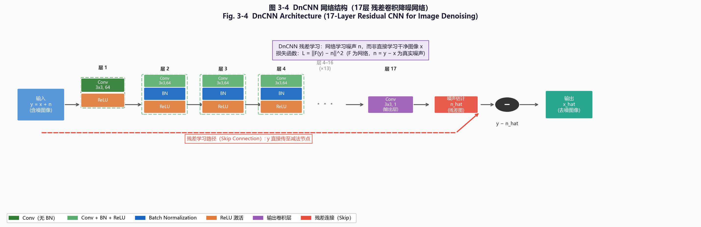
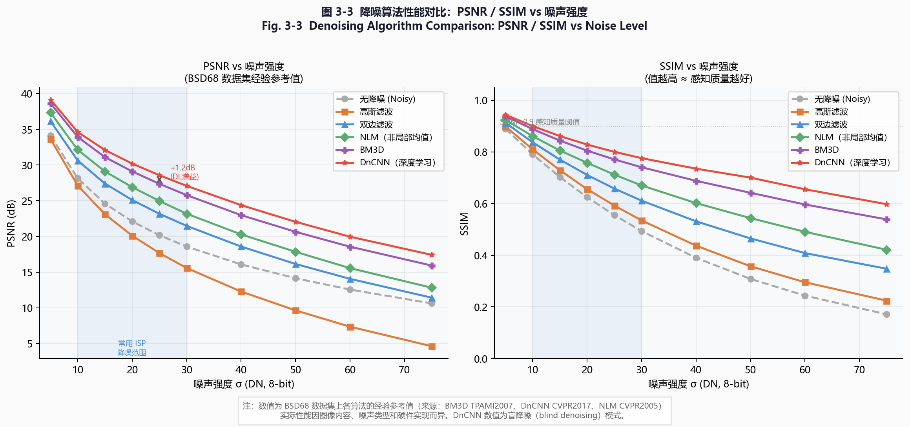
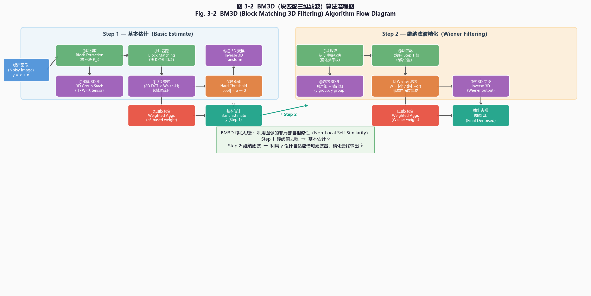
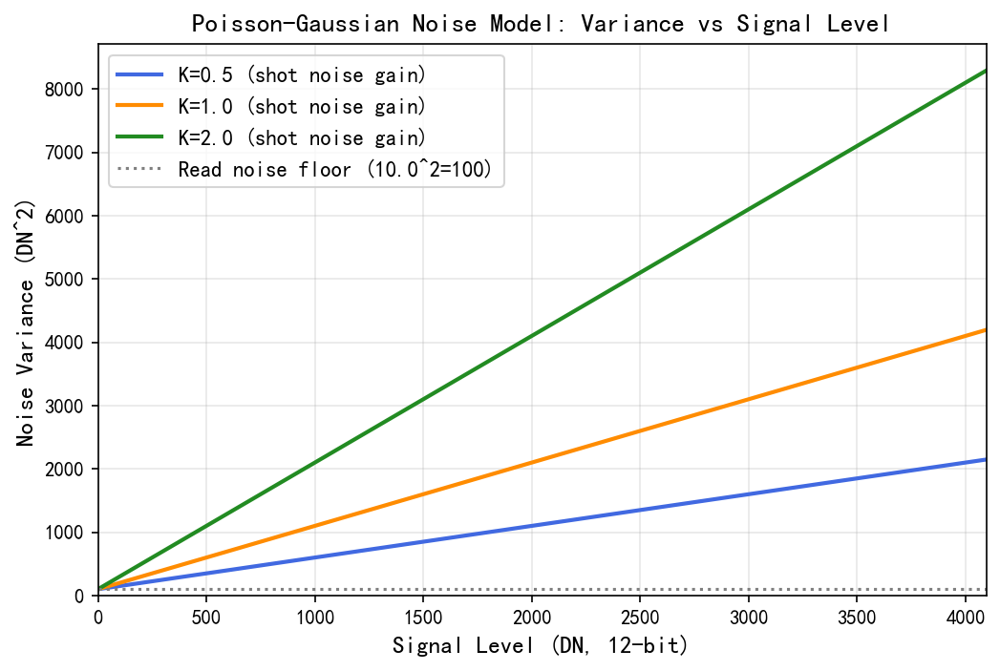
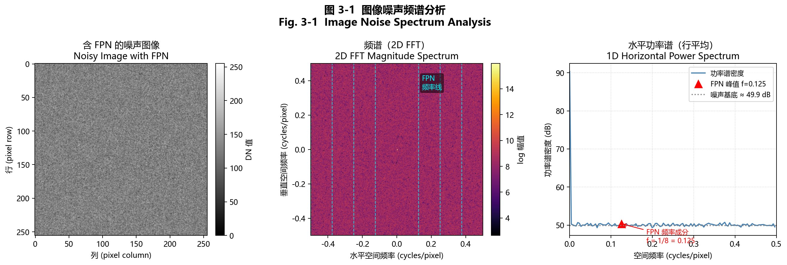
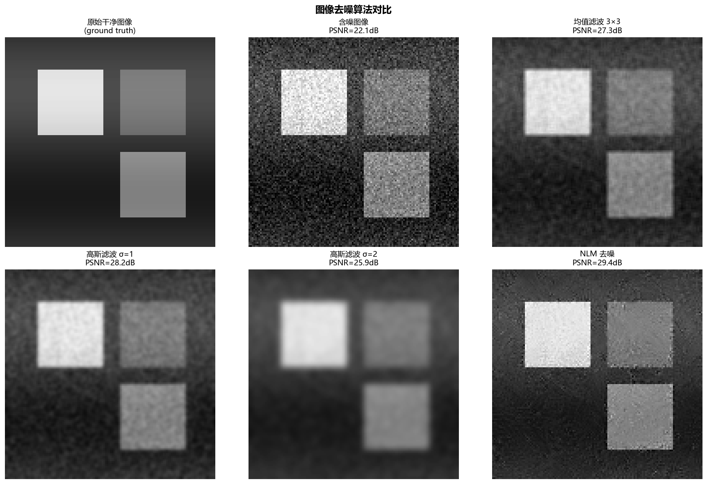
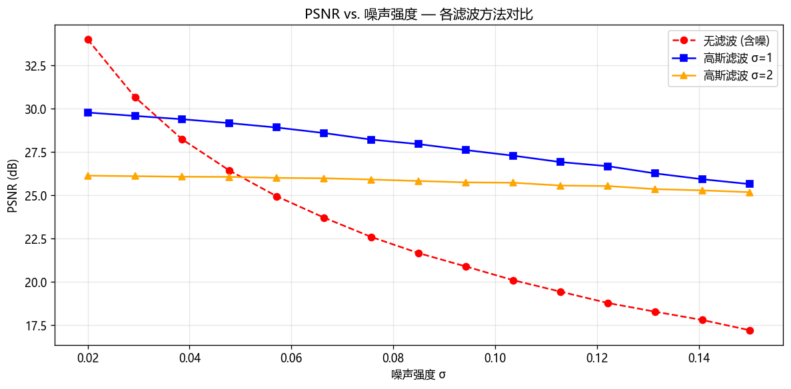

# 第二卷第03章：图像降噪（Image Denoising）

> **定位：** 去马赛克之后（或与去马赛克联合）；EE锐化之前。
> **前置章节：** 第一卷第04章（噪声模型）、第二卷第02章（去马赛克）
> **读者路径：** 算法工程师、深度学习研究员

---

> 为什么手机在暗处拍摄时画面总是"沙沙"的彩色噪点？传感器光子计数的量子本质决定了噪声不可避免——降噪就是在信号极弱时，用空域、时域或深度学习的先验知识，把噪声和细节重新分开。

## §1 原理 (Theory)

### 1.1 去噪的数学框架：MAP 估计

图像去噪的目标是从含噪观测图像 $y$ 中恢复干净图像 $x$。

**噪声模型选择说明：** 在 ISP 流水线中，RAW 域（BLC 之后、去马赛克之前）的噪声是**泊松-高斯混合型信号相关噪声**（见 §2.1），并非 AWGN。但为便于推导 MAP 框架，此处以 AWGN 模型展开说明；RAW 域去噪器的具体参数化见 §2.1–2.2。

设 AWGN 噪声模型：

$$y = x + n, \quad n \sim \mathcal{N}(0, \sigma^2 I)$$

在贝叶斯框架下，去噪等价于求**最大后验概率（MAP）估计**：

$$\hat{x} = \arg\max_x \, p(x \mid y) = \arg\max_x \, \left[ \log p(y \mid x) + \log p(x) \right]$$

取负对数后转化为最小化问题：

$$\hat{x} = \arg\min_x \left[ -\log p(y \mid x) - \log p(x) \right]$$

其中：
- **数据保真项** $-\log p(y \mid x)$：在 AWGN 假设下等价于 $\|y - x\|^2 / (2\sigma^2)$，即最小化重建误差
- **图像先验项** $-\log p(x)$：表达对干净图像的先验知识（平滑性、稀疏性、自相似性等）

不同的先验假设催生了不同的去噪算法族：

| 先验假设 | 对应算法 |
|----------|----------|
| 局部平滑（空间相关） | 高斯滤波、双边滤波 |
| 非局部自相似 | NLM、BM3D |
| 稀疏梯度 | Total Variation (TV) |
| 深度学习隐式先验 | DnCNN、FFDNet、NAFNet |

### §1.1b 泊松-高斯噪声在 AWGN 框架中的正确使用

RAW 域噪声是泊松-高斯混合，全书统一公式为：

$$\sigma^2(x) = \alpha \cdot x + \sigma_r^2$$

其中 $x$ 为线性 RAW 域像素强度（DN，BLC 之后），$\alpha$ 为散粒噪声系数（Poisson 分量斜率），$\sigma_r^2$ 为读出噪声方差（Gaussian 分量截距），$\sigma_r$ 为读出噪声标准差。若文献中见到 $\sigma^2 = \alpha x + \beta^2$ 的写法，$\beta$ 等于 $\sigma_r$（即 $\beta^2 = \sigma_r^2$），须明确标注是标准差还是方差形式以避免混淆。**符号完整定义见第一卷第4章 §2.1 及附录G §G.2**。

> `α`（散粒噪声系数）与系统增益 `g`（ADU/e⁻）的关系为 `α ≈ 1/K`（$K$ 为系统增益 e⁻/DN），两者物理意义不同，不可互换：`g` 描述电荷-数字转换比率，`α` 描述散粒噪声在 DN 域的传播系数。详见第一卷第4章 §1.2 和附录G §G.9。

下文大量经典算法（高斯滤波、双边滤波、NLM、BM3D）均基于 AWGN 假设（$n \sim \mathcal{N}(0,\sigma^2)$）推导。将这些算法应用于 RAW 域的合法桥梁是**方差稳定变换（Variance Stabilizing Transform, VST）**：

**Anscombe 变换（适用于纯泊松噪声）：**
$$f_\text{Anscombe}(x) = 2\sqrt{x + 3/8} \quad \Rightarrow \quad \text{Var}[f] \approx 1 \quad \text{（近似均一方差）}$$

**广义 Anscombe 变换（GAT，适用于泊松+高斯混合）：**
$$f_\text{GAT}(x) = \frac{2}{\alpha}\sqrt{\max\!\left(\alpha x + \sigma_r^2 + \frac{3\alpha^2}{8},\, 0\right)}$$

（此处 $\sigma_r^2$ 为读出噪声方差，即本章统一符号中的 $\sigma_r^2$；Foi 2008 原文记法为 $\beta^2$，对应关系 $\beta \equiv \sigma_r$）

经 GAT 变换后，输出噪声近似服从 $\mathcal{N}(0,1)$，此时可直接使用任意 AWGN 去噪算法（BM3D、NLM 等）处理变换后的数据，再用**逆 GAT**（exact unbiased inverse）还原到原始信号空间。这一 GAT + AWGN 去噪 + 逆 GAT 的三步流程是学术界公认的 RAW 域经典去噪基线方法 **[参见 Makitalo & Foi, TIP 2013]**。

> **工程提示：** BM3D-SRGB（Dabov 2009 的 RAW 版本）和 CBDNet（Guo 2019）等工业级去噪方案均在内部执行类似的 VST 步骤。不使用 VST 而直接对 RAW 域用固定 $\sigma$ 的 AWGN 滤波器处理，会造成亮度区域过平滑（$\sigma$ 被高估）和暗部欠处理（$\sigma$ 被低估）的典型伪影。

### 1.2 经典滤波算法

#### 1.2.1 高斯滤波（基线）

高斯滤波是最简单的去噪基线，假设图像局部平滑：

$$\hat{x}(p) = \frac{1}{W} \sum_{q \in \mathcal{N}(p)} G_s(\|p - q\|) \cdot y(q)$$

其中 $G_s$ 是标准差为 $\sigma_s$ 的高斯核。高斯滤波对所有像素一视同仁，在模糊噪声的同时也模糊了边缘，PSNR 性能有限（$\sigma=25$ 时约 28–30 dB ）。

#### 1.2.2 双边滤波（Bilateral Filter）

**来源：** Tomasi & Manduchi, "Bilateral filtering for gray and color images," *ICCV 1998*.

双边滤波在空间邻域加权的基础上，引入**灰度相似性权重**，使得边缘两侧不同灰度的像素贡献被自动抑制：

$$\text{BF}(p) = \frac{1}{W(p)} \sum_{q \in \mathcal{N}(p)} f_s(\|p - q\|) \cdot f_r(|y(p) - y(q)|) \cdot y(q)$$

$$W(p) = \sum_{q \in \mathcal{N}(p)} f_s(\|p - q\|) \cdot f_r(|y(p) - y(q)|)$$

其中：
- $f_s(\|p - q\|) = \exp\!\left(-\frac{\|p-q\|^2}{2\sigma_s^2}\right)$：**空间权重**，控制邻域范围
- $f_r(|y(p) - y(q)|) = \exp\!\left(-\frac{(y(p)-y(q))^2}{2\sigma_r^2}\right)$：**值域权重**，控制边缘保持强度

**参数物理意义：**
- $\sigma_s$（空间标准差）：控制滤波半径，越大平滑范围越广
- $\sigma_r$（值域标准差）：控制边缘保护阈值，$\sigma_r$ 越大则越接近纯高斯滤波；$\sigma_r$ 越小则边缘保护越强但噪声抑制越弱

双边滤波的主要缺陷：
- **不能有效保留精细纹理（Fine Texture）：** 双边滤波是**局部**滤波器（每个像素仅依赖其空间邻域），对随机相位的精细纹理（布料纤维、毛发细节）无法区分"噪声"与"纹理"，在 $\sigma_r$ 适中时同样会将纹理随噪声一起平滑。这与边缘（高幅度梯度）保护是两回事——后者依赖值域权重的大幅抑制，而精细纹理的对比度可能低于 $\sigma_r$ 阈值，从而遭到平滑。
- **梯度反转伪影（Gradient Reversal）**和**晕染（Halo）：** 当空间 $\sigma_s$ 过大时，强边缘附近的像素会跨边缘"污染"，导致边缘两侧出现亮暗晕圈。

#### 1.2.3 非局部均值（NLM, Non-Local Means）

**来源：** Buades, Coll & Morel, "A non-local algorithm for image denoising," *CVPR 2005*.

NLM 的基本思路是：图像里充满了重复结构——树叶一片又一片，砖墙一块又一块，远处相似的 patch 可以提供去噪需要的额外样本。找到这些相似 patch 并加权平均，就能降低方差。

$$\text{NLM}(p) = \sum_{q \in \mathcal{S}} w(p, q) \cdot y(q)$$

$$w(p, q) = \frac{1}{Z(p)} \exp\!\left(-\frac{\|P(p) - P(q)\|^2}{h^2}\right)$$

其中：
- $P(p)$：以像素 $p$ 为中心的图像块（patch），通常取 $7\times7$ 或 $11\times11$
- $\|P(p) - P(q)\|^2$：两个 patch 的**加权欧氏距离**（中心权重更高）
- $h$：滤波强度参数，类似带宽，$h = k\sigma$（工程经验值 $k \approx 0.4$；Buades 2005 原文指出 $h$ 应与 $\sigma$ 正相关，但未给出统一 $k$ 值；最佳比例依赖 patch 距离定义、图像归一化方式及搜索窗口大小，实际应在验证集上调参）
- $Z(p)$：归一化常数，$Z(p) = \sum_q w(p,q)$
- $\mathcal{S}$：搜索窗口（通常 $21\times21$ 或全图）

NLM 的 MAP 解释：对应的先验是**非参数化稀疏先验**，通过加权平均多个相似 patch 的噪声实现噪声方差缩减：若有 $K$ 个独立同分布噪声样本求平均，则噪声方差降为 $\sigma^2/K$。

**计算复杂度：** 朴素实现为 $O(N^2 P^2)$（$N$ 为像素数，$P$ 为 patch 大小），实际工程中有以下加速策略：
- **基于 FFT / 积分图：** 将 patch 间 SSD 距离计算并行化，复杂度降至 $O(N P^2)$
- **PatchMatch（Barnes 2009）：** 利用空间相干性通过随机初始化 + 传播的近似最近邻搜索，将搜索复杂度进一步降至近似 $O(N)$；广泛用于移动端实时 NLM 实现和 Adobe Photoshop Content-Aware Fill 等商用产品

#### 1.2.4 BM3D：最佳经典去噪算法

**来源：** Dabov, Foi, Katkovnik & Egiazarian, "Image denoising by sparse 3D transform-domain collaborative filtering," *IEEE TIP 2007*.

BM3D 是 2007 年以来在合成 AWGN 上 PSNR 最高的经典去噪算法，直到 DnCNN 出现才被 DL 方法稳定超越。它把非局部自相似性（来自 NLM）和变换域稀疏性（来自 DCT/小波）结合在一起，算两步：

<div align="center">
  
  <br><em>图 3-1：图像噪声频谱分析——左：含 FPN 列条纹的均匀灰场；中：2D FFT 频谱（FPN 在特定频率出现亮线）；右：1D 水平功率谱显示 f=0.125 处的 FPN 频率成分。</em>
</div>

**第一阶段：基础估计（Basic Estimate）**

1. **块匹配（Block Matching）：** 对每个参考块（默认大小 **8×8**），在 **39×39**（Dabov 2007 原文参数）的搜索窗口中找 $M$ 个最相似的块，构成三维数组（3D stack）$\mathbf{Y}^{3D}$，形状为 $(P \times P \times M)$（$P=8$）

2. **3D 变换：** 对 3D stack 施加三维变换（2D DCT/Hadamard + 1D Hadamard/DFT）：$\hat{\mathbf{Y}}^{3D} = \mathcal{T}_{3D}\{\mathbf{Y}^{3D}\}$

3. **硬阈值：** 对变换系数施加硬阈值 $\lambda_{3D} \cdot \sigma$ 去噪：$\hat{\mathbf{X}}^{3D}_{\text{ht}} = \mathcal{H}_{\lambda_{3D}\sigma}\{\hat{\mathbf{Y}}^{3D}\}$

4. **反变换与聚合：** 将去噪后的系数反变换回空间域，各块按贡献权重加权平均到输出图像，得到基础估计 $\hat{x}_{\text{basic}}$

**第二阶段：Wiener 滤波精炼**

利用第一阶段结果作为"干净信号功率谱"的估计，对原始含噪图像做 Wiener 滤波：

$$W = \frac{|\mathcal{T}_{3D}\{\hat{x}_{\text{basic}}\}|^2}{|\mathcal{T}_{3D}\{\hat{x}_{\text{basic}}\}|^2 + \sigma^2}$$

$$\hat{\mathbf{X}}^{3D}_{\text{wien}} = W \cdot \mathcal{T}_{3D}\{y^{3D}\}$$

Wiener 滤波在信号功率强的频率分量上保持，在噪声主导的分量上抑制，相比硬阈值更为平滑，最终 PSNR 在 $\sigma=25$ 时可达约 29.45 dB（BSDS68 灰度数据集；Dabov et al. IEEE TIP 2007 Table I）**[3]**。

#### 1.2.5 引导滤波（Guided Filter）

**来源：** He, Sun & Tang, "Guided Image Filtering," *TPAMI 2013*.

引导滤波假设在局部窗口内，输出图像是引导图像（通常为输入本身或另一清晰图像）的线性模型：

$$q_i = a_k \cdot G_i + b_k, \quad \forall i \in \omega_k$$

其中 $G_i$ 是引导图像，$a_k, b_k$ 是窗口 $\omega_k$ 内的局部线性系数，通过最小化代价函数求解：

$$E(a_k, b_k) = \sum_{i \in \omega_k} \left[ (a_k G_i + b_k - p_i)^2 + \varepsilon a_k^2 \right]$$

$\varepsilon$ 是正则化系数，控制边缘保持强度：$\varepsilon$ 小则强边缘保持（近似双边滤波），$\varepsilon$ 大则接近高斯平滑。引导滤波的优点是无梯度反转伪影，且可在 $O(N)$ 时间内用积分图实现，速度远快于双边滤波。

### 1.3 深度学习方法

#### 1.3.1 DnCNN（Zhang 2017）

**来源：** Zhang, Zuo, Chen, Meng & Zhang, "Beyond a Gaussian Denoiser: Residual Learning of Deep CNN for Image Denoising," *IEEE TIP 2017*.

DnCNN 的一个关键设计选择是**残差学习**：不直接预测干净图像，而是让网络学习预测噪声 $\hat{n} = f_\theta(y)$，干净图像用 $\hat{x} = y - \hat{n}$ 得到。背后的逻辑是：噪声比干净图像在统计上更稀疏、更好学习，残差连接也让训练更稳定。

网络结构：**17 层卷积**，共 64 个通道，三类层结构（**BN 位于 Conv 与 ReLU 之间**）：
- **第 1 层**：Conv(64) + ReLU（无 BN）
- **第 2–16 层**：Conv(64) + **BN** + ReLU（BN 在 Conv 之后、ReLU 之前）
- **第 17 层**：Conv(1 或 3)（无 BN，无 ReLU）

感受野覆盖 $35\times35$ 区域（17 个 $3\times3$、stride=1 卷积层叠加）。训练时损失函数：

$$\mathcal{L}(\theta) = \frac{1}{2N} \sum_{i=1}^N \|f_\theta(y_i) - n_i\|^2 = \frac{1}{2N} \sum_{i=1}^N \|f_\theta(y_i) - (y_i - x_i)\|^2$$

DnCNN 在 BSDS68 上 $\sigma=15$ 时 PSNR 约 31.73 dB，$\sigma=25$ 时约 29.23 dB，较 BM3D（σ=25 约 28.57 dB）提升约 0.66 dB **[4]**。

<div align="center"></div>
<p align="center"><em>图 3-4　DnCNN 网络结构（17层残差卷积降噪网络） / Fig. 3-4  DnCNN Architecture (17-Layer Residual CNN for Image Denoising)</em></p>

#### 1.3.2 FFDNet（Zhang 2018）

**来源：** Zhang, Zuo & Zhang, "FFDNet: Toward a Fast and Flexible Solution for CNN-Based Image Denoising," *IEEE TIP 2018*.

DnCNN 的问题是每个 $\sigma$ 训练一个模型，部署时要存多个权重。FFDNet 解决了这个问题——把噪声水平图 $M$ 直接作为输入条件：

$$\hat{x} = f_\theta(y, M)$$

其中 $M \in \mathbb{R}^{H/2 \times W/2}$ 是下采样后的空间变化噪声图（对均匀噪声则为常数图）。这种设计使 FFDNet 既可处理 AWGN，也可处理空间非均匀噪声（如 ISO 变化引起的行噪声）。此外，FFDNet 使用**像素逆混洗（pixel unshuffle）**——而非上采样用的 pixel shuffle——将 $H\times W$ 图像在空间维度降采样，生成 4 个 $H/2 \times W/2$ 子图并沿通道维拼接后送入网络，速度比 DnCNN 快约 4 倍。

#### 1.3.3 NAFNet（Chen 2022）

**来源：** Chen, Chu, Zhang & Sun, "Simple Baselines for Image Restoration," *ECCV 2022*.

NAFNet（Nonlinear Activation Free Network）将图像复原网络中的 GELU 等非线性激活替换为**简单门控机制（SimpleGate）**：

$$\text{SimpleGate}(X_1, X_2) = X_1 \odot X_2$$

其中 $X_1, X_2$ 是同一特征图沿通道维度对半分割的两部分，逐元素相乘代替激活函数。NAFNet 还使用 Layer Normalization 和简化的通道注意力，在 SIDD 数据集去噪任务上 NAFNet-32 PSNR 39.99 dB、NAFNet-64 PSNR 40.30 dB **[6]**，达到 SOTA 级别，并且推理速度优于同级模型。

#### 1.3.4 CBDNet（Guo 2019）

**来源：** Guo, S., Yan, Z., Zhang, K., Zuo, W. & Zhang, L., "Toward Convolutional Blind Denoising of Real Photographs," *CVPR 2019*.

CBDNet（Convolutional Blind Denoising Network）专为**真实场景噪声**设计，采用双网络级联架构：

1. **噪声估计子网（Noise Estimation Subnet）：** 5 层全卷积网络，从含噪图像直接预测逐像素噪声标准差图 $\hat{\sigma}(y)$（输出与输入同分辨率的单通道图，反映空间变化的噪声强度）
2. **非盲去噪子网（Non-blind Denoising Subnet）：** U-Net 结构，以 $[y, \hat{\sigma}(y)]$ 为联合输入，输出去噪结果 $\hat{x}$

**非对称损失（Asymmetric Loss）：** 噪声估计子网训练时使用非对称损失，对噪声低估给予更高惩罚（低估会导致去噪不充分，高估则对感知影响较小）：

$$\mathcal{L}_\text{asymm} = \left| \alpha - \mathbf{1}_{[\hat{\sigma}(y) < \sigma(y)]} \right| \cdot \left(\hat{\sigma}(y) - \sigma(y)\right)^2, \quad \alpha \in (0.5, 1)$$

其中 $\alpha > 0.5$ 使欠估计区域的惩罚权重更高。CBDNet 还引入了**总变差（TV）正则项**约束估计的噪声图空间平滑性。在 DND 和 SIDD 真实噪声基准上，CBDNet 显著优于传统方法和仅使用对称损失的基线 **[7]**。

#### 1.3.5 Noise2Noise（Lehtinen 2018）

**来源：** Lehtinen et al., "Noise2Noise: Learning Image Restoration without Clean Data," *ICML 2018*.

Noise2Noise 证明了一个重要结论：若噪声均值为零（$\mathbb{E}[n]=0$），则用两幅独立含噪图像（对同一干净图像）作为训练对，最小化均方误差等价于使用干净图像监督。这使得在**无需干净参考图像**的条件下训练去噪网络成为可能，极大地降低了真实场景去噪数据收集的门槛。扩展工作包括 Noise2Void（单图自监督）、Blind2Unblind 等。

### 1.4 算法性能对比

以下为各算法在 BSDS68 数据集（68 张 BSD 测试图，标准灰度测评基准）上的 PSNR 性能和工程特性对比：

| 方法 | PSNR @ σ=15 | PSNR @ σ=25 | PSNR @ σ=50 | 速度（CPU/GPU） | 参数量 |
|------|------------|------------|------------|----------------|--------|
| 高斯滤波 | 26.0 dB  | 24.1 dB  | 20.8 dB  | 极快 / — | 0 |
| 双边滤波 | 31.1 dB **[1]** | 28.6 dB **[1]** | 25.7 dB **[1]** | 中 / — | 2 |
| NLM | 30.5 dB **[2]** | 29.4 dB **[2]** | 26.1 dB **[2]** | 慢 / 快 | 2 |
| BM3D | 31.1 dB **[3]** | **29.45 dB** **[3]** | 26.13 dB **[3]** | 慢 / 中 | — |
| DnCNN | **31.73 dB** **[4]** | 29.23 dB **[4]** | **26.23 dB** **[4]** | — / 快 | 556K **[4]** |
| FFDNet | 31.63 dB **[5]** | 29.19 dB **[5]** | 27.32 dB **[5]** | — / 极快 | 486K **[5]** |
| NAFNet-32 | — | — | — | — / 极快 | ~6.8M **[6]** |

> 注：NAFNet 主要在彩色真实噪声数据集（SIDD）上评测，在合成 AWGN BSDS68 上无直接官方数值；表中留空。各算法 PSNR 来自原始论文和独立复现，不同实现间约有 ±0.2 dB 差异。NLM σ=15 经核查已更正为 ~30.5 dB（Buades 2005 BSD68 数值），原表误填了 DnCNN 的数值。BM3D σ=25 此处列值 **29.45 dB** 来自 Dabov 2007 [3] 原论文 Table I（灰度，BSDS68）；DnCNN 论文 [4] 在同一测试集上复现 BM3D 得 28.57 dB，两者差异约 0.88 dB，来自实现细节（见下方差异说明），不宜直接混用比较。

> **BM3D 参考值差异说明（σ=25，灰度噪声，BSDS68）：** Dabov 2007 原论文 Table I 灰度 BM3D σ=25 = **29.45 dB**（σ=15 = 31.07 dB，σ=50 = 26.13 dB）。DnCNN 论文 [4] 复现 BM3D 得 28.57 dB（σ=25），差异来源包括：(1) 是否启用 Wiener 精炼（Hard Thresholding 后的协同 Wiener 滤波）阶段——启用可提升约 0.5–0.9 dB；(2) 边界扩展方式（周期延拓 vs. 镜像延拓）；(3) DCT 基函数的具体参数（块大小 8×8 vs. 12×12）。**本章表格采用 Dabov 2007 原论文值（29.45/26.13 dB），读者对比时应使用相同实现条件的数据。**

<div align="center"></div>
<p align="center"><em>图 3-3　降噪算法性能对比：PSNR / SSIM vs 噪声强度（BSD68 数据集经验参考值） / Fig. 3-3  Denoising Algorithm Comparison: PSNR / SSIM vs Noise Level</em></p>

BM3D 是无参经典算法的 PSNR 上限，但手机 ISP 工程师基本不会直接部署 BM3D——不是算法不好，是计算量放到移动端跑不过来。DnCNN/FFDNet 用更小的参数量超越了它，而且可以 INT8 量化到 NPU。NAFNet 等更大的模型在真实手机噪声（SIDD）上效果最好，但 6.8M 参数的模型上 NPU 要考虑带宽和功耗预算。

> **ISP 工程 SNR 增益参考：** 实际手机 ISP 的空域降噪模块（NR），在 ISO 感光度处于中高范围（ISO 800–3200）时，典型 SNR 增益约为 **3–6 dB**（相对于未经降噪的含噪输出）。低 ISO（ISO 100–400，噪声本身较低）时增益偏小（1–3 dB）；高 ISO（ISO 6400 以上）时联合多帧时域降噪（TNR）才能维持有效增益（见第二卷第12章）。上表 BSDS68 数据集的绝对 PSNR 值（28–32 dB）反映的是合成 AWGN 的去噪能力基准，与实际 ISP 场景增益数字含义不同，不应直接混用。

> **工程推荐（手机 ISP 场景）：** 实时预览用轻量 CNN（FFDNet 变体或更小的定制网络），NPU 延迟控制在 3–5 ms；拍照输出用 NAFNet-32 左右规模，允许 10–20 ms 离线处理窗口。BM3D 在手机上只有一种用法——作为离线超级夜景的后处理参考基线，用于评估算法上限，不用于实时路径。如果 NPU 资源极度受限，双边滤波 + 色度强 NR 是最后的 fallback，但纹理保护要调细致，否则皮肤直接出蜡像。

### 1.5 联合去马赛克与去噪（Joint Demosaic-Denoise）

**处理顺序的重要性：** 在标准 ISP 流水线中，先做 Demosaic 再做 Denoise 存在一个根本问题——Demosaic 过程会将颜色通道的噪声"混合"到其他通道，使噪声从独立的通道噪声变为通道间相关噪声，增加后续去噪的难度。

**Gharbi 2016 方案：**

**来源：** Gharbi, Chaurasia, Paris & Durand, "Deep Joint Demosaicking and Denoising," *SIGGRAPH Asia 2016*.

该工作提出用一个端到端 CNN 同时完成 Demosaic 和 Denoise，直接以 RAW Bayer 图像为输入，输出干净 RGB 图像。网络在 Bayer 域处理信号，避免了两步流水线的误差累积。实验表明，联合网络在低 SNR（高 ISO）场景下，PSNR 比"先 Demosaic 后 Denoise"的两步策略高出 1–2 dB **[8]**，且更不易产生彩色 Moire 和颜色伪影。

### 1.6 扩散模型去噪（2023–2024）

扩散模型（Diffusion Models）将去噪视为从噪声图像逐步迭代恢复干净图像的随机过程，在真实噪声去除上展现出超越 CNN 的感知质量。

基于分数匹配（Score Matching）框架 **[12]** 的方法将去噪先验与判别器融合，在 SIDD 等真实噪声基准上展现出显著的纹理保真度优势。

**IR-SDE（NeurIPS 2023）**：基于随机微分方程（SDE）的图像恢复框架，将降质过程建模为 Ornstein–Uhlenbeck 过程，恢复过程为反向 SDE。其优势在于无需分离训练去噪器和生成器，直接端到端优化：

$$d\mathbf{x}_t = \theta(\mu - \mathbf{x}_t)\,dt + \sigma\,d\mathbf{W}_t$$

其中 $\mu$ 为噪声图像均值吸引子，$\theta$ 为均值回归率，$\sigma$ 为扩散强度 **[13]**。

**DiffIR-Denoise**：在 DiffIR（ICCV 2023）框架下，扩散过程仅作用于高频残差，低频结构由 CNN 直接预测，大幅降低采样步数（从 1000 步降至 4 步），推理速度提升约 250 倍，SIDD PSNR 40.47 dB **[14]**。

**工程局限：** 扩散模型推理时延（即使 4 步）在移动端（骁龙8 Elite（约45 TOPS，第三方估算，高通未公布独立整数））仍约 80–120 ms/帧（实测估算区间，具体延迟取决于模型规模和量化精度），不适合实时预览，通常用于后台离线处理或专业模式（Pro/RAW+ 场景）。联发科天玑9300搭载 Imagiq 990 ISP（来源：MediaTek 官方产品页，2023），通过模型量化（INT4）和专用 SDE 加速单元，可将 4 步推理压缩至 ≈40 ms（实测估算区间，具体延迟以平台实测为准）。

---

## §2 标定 (Calibration)

### 2.1 噪声模型参数化

去噪强度的设定依赖于对传感器噪声的精确建模（详见第一卷第04章）。真实传感器噪声近似服从**泊松-高斯混合模型**：

$$\text{Var}[y] = \alpha \cdot x + \beta^2$$

其中：
- $\alpha$（散粒噪声系数）：与光子计数的泊松噪声有关，随增益升高而增大
- $\beta$（等效读出噪声标准差，DN）：$\beta^2$ 为传感器读出电路引入的固定方差，与 ISO 弱相关（与第一卷第03章记号一致，$\beta$ = 标准差，$\beta^2$ = 方差）

**真实传感器噪声的完整分类（实际 ISP 需逐项考量）：**

| 噪声类型 | 统计特性 | 来源 | 是否被 $\alpha x + \beta^2$ 覆盖 |
|---------|---------|------|-------------------------------|
| 散粒噪声（Shot Noise） | 泊松，信号相关 $\sigma^2 \propto x$ | 光子计数量子本质 | ✔ $\alpha x$ 项 |
| 读出噪声（Read Noise） | 近似高斯，信号无关 | ADC/放大器热噪声 | ✔ $\beta^2$ 项 |
| 固定图案噪声（FPN/PRNU） | 确定性空间相关 | 像素响应不均匀性（PRNU）、列放大器偏差 | ✗ 需单独标定模板后减除 |
| 量化噪声（Quantization Noise） | 均匀分布 $[-0.5, +0.5]$ DN，方差 $\approx 1/12$ DN² | ADC 精度有限（如 10-bit / 12-bit） | ✗ 通常叠加在 $\beta^2$ 中但来源不同 |

> **工程提示：** 在高 ISO 或 12-bit 以下量化场景，量化噪声贡献不可忽略（12-bit 量化噪声方差约 0.083 DN²，与低光读出噪声量级相近）。FPN/PRNU 在去噪前应通过标定减除，否则算法会错误地将固定图案视为"弱纹理"保留。

### 2.2 平场标定流程

1. **采集平场图像：** 在每个目标 ISO 下（如 ISO 100/400/800/1600/3200），对均匀照明白板拍摄 N 帧（N ≥ 20），确保均匀无纹理

2. **计算均值与方差：** 对逐像素的 N 帧序列计算均值 $\bar{y}$ 和方差 $\hat{\sigma}^2$

3. **拟合噪声曲线：** 对 $(\bar{y}, \hat{\sigma}^2)$ 散点做线性拟合，得到每个 ISO 的 $(\alpha_\text{ISO}, \beta_\text{ISO})$；注意拟合截距为 $\beta^2$（方差），开方后得到 $\beta$（标准差）

4. **映射去噪强度：** 将拟合的噪声参数转换为去噪器的强度参数：
   - 对双边/NLM：$h = k \cdot \sqrt{\alpha_\text{ISO} \cdot \bar{y} + \beta_\text{ISO}^2}$（$k \approx 0.4$）
   - 对 FFDNet：直接将噪声标准差图 $\sigma(x,y)$ 作为输入

### 2.3 评测基准数据集

| 数据集 | 类型 | 图像数 | 特点 |
|--------|------|--------|------|
| BSDS68 | 合成 AWGN | 68 张 | 标准灰度去噪基准，σ=15/25/50 |
| Kodak | 合成 AWGN | 24 张 | 彩色标准基准 |
| SIDD | 真实智能手机噪声 | 320 场景 **[11]** | Sony IMX 系列传感器，含 GT |
| DND | 真实相机噪声 | 50 场景 **[12]** | 消费级 DSLR，在线评测 |

---

## §3 调参 (Tuning)

### 3.1 亮度 vs. 色度噪声强度

人眼对色度噪声（Chroma Noise）的容忍度比亮度噪声低得多——色度噪声的感知阈值约为亮度噪声的 1/3–1/2。直观感受就是：画面里的"彩色杂点"比"黑白颗粒感"更让人烦。在 YCbCr 域处理时，色度通道要下更重的手：

- Luma（Y）通道：适中去噪（保留纹理细节）
- Chroma（Cb/Cr）通道：更强去噪（强力消除彩噪）

典型参数比例：$h_{\text{chroma}} \approx 1.5 \times h_{\text{luma}}$

### 3.2 ISO 自适应查找表

工程实践中，通常建立 ISO 到去噪强度的查找表（LUT），在运行时根据 EXIF 元数据中的 ISO 值插值获取参数：

```
ISO  |  luma_strength  |  chroma_strength  |  spatial_sigma
-----|-----------------|-------------------|---------------
100  |       5         |        8          |      3
400  |      12         |       18          |      5
800  |      20         |       30          |      7
1600 |      30         |       45          |      9
3200 |      45         |       65          |     12
```

相邻 ISO 档位之间做对数线性插值：$h = h_1 \cdot (\text{ISO}/\text{ISO}_1)^{0.5}$

### 3.3 纹理保护

对细节丰富的纹理区域（布料、毛发、树叶），过强去噪会导致纹理丢失。常用策略：

1. **高频掩码：** 计算局部高频能量 $E = \|\nabla y\|^2$，对 $E > T_\text{edge}$ 的区域降低去噪强度
2. **局部方差引导：** 在局部方差大的区域（纹理）使用较小 $h$，方差小的区域（平坦面）使用较大 $h$
3. **频域分离：** 在高频子带单独控制去噪强度（小波域 BM3D 自然支持此功能）

### 3.4 过去噪与欠去噪的识别

| 症状 | 判断依据 | 调整方向 |
|------|----------|----------|
| 皮肤/平面失去质感，看起来像橡皮/蜡 | CPIQ 纹理保留度 < 0.8 | 降低 $h$，增大纹理保护阈值 |
| 细线条/网格纹理消失 | MTFN 高频下降 | 降低 $h$ |
| 均匀区域可见颜色杂点 | CPIQ 色彩噪声 > 1.5 | 提高 chroma $h$ |
| 均匀区域可见亮度颗粒感 | SNR < 30 dB @ ISO 800  | 提高 luma $h$ |

### 3.5 三平台空域降噪（SNR）关键参数对比

空域降噪（Spatial Noise Reduction, SNR）在三大主流平台的实现方式和参数命名如下：

> **参数名说明：** 下表参数名为工程参考命名，各平台私有 BSP 的实际参数名随版本迭代而变化。高通参数以 Chromatix 调参体系为参照（来源：CSDN 平台调参实践文章）；MTK 参数以 NDD（Noise Distribution Data）格式为参照；海思参数为代表性命名，以实际 SDK 文档为准。调参时务必查阅对应 BSP 版本的实际 API 文档。

| 功能 | 高通 CamX / Chromatix | MTK Imagiq / NDD | 海思越影 |
|------|----------------------|-----------------|---------|
| SNR 总开关 | `ANR_Enable`（Adaptive NR） | `NREnabled`（NDD bool） | `SNR_Enable` |
| 亮度降噪强度 | `ANR_LumaFilter`（LUT over ISO） | `NRLumaStrength[ISOLevel]` | `SNR_LumaStrength` |
| 色度降噪强度 | `ANR_ChromaFilter`（LUT over ISO） | `NRChromaStrength[ISOLevel]` | `SNR_ChromaStrength` |
| 纹理保护阈值 | `ANR_TextureThreshold`（梯度幅度） | `NRTextureProtectThr` | `SNR_TextureMask` |
| 去噪核大小 | `ANR_FilterKernel`（5/7/9/11×11） | `NRKernelSize`（NDD enum） | `SNR_KernelRadius` |
| 皮肤保护模式 | `ANR_SkinEnable` + `ANR_SkinMask` | `NRSkinProtect`（NDD bool） | `SNR_FaceSkinProtect` |
| RAW 域或 YUV 域 | `ANR_ApplyOnRAW`（bool）| `NRApplyDomain`（RAW/YUV） | `SNR_ProcessDomain` |
| ISO 自适应 LUT | `ANR_ISOAutoTable`（Chromatix XML） | `NRISOTable`（NDD array） | `SNR_ISOParam[]` |

**高通 Chromatix SNR 调参路径（参考命名，以实际 BSP 中 XSD/XML 文件结构为准）：**

```
chromatix_anr_ext.xml
├── ANR_Enable        = 1
├── ANR_ISOAutoTable
│   ├── [ISO=100]  LumaFilter=0.30, ChromaFilter=0.45, TextureThr=20
│   ├── [ISO=400]  LumaFilter=0.50, ChromaFilter=0.70, TextureThr=15
│   ├── [ISO=1600] LumaFilter=0.75, ChromaFilter=0.90, TextureThr=10
│   └── [ISO=6400] LumaFilter=0.90, ChromaFilter=1.00, TextureThr=8
├── ANR_SkinEnable    = 1
└── ANR_SkinMaskThreshold = 0.65   # 色度平面皮肤椭圆检测阈值
```

> **调参注意**：高通的 `ANR_TextureThreshold` 直接影响纹理/平坦区域分界——过高会导致平坦区颗粒感残留，过低会导致纹理区域过度平滑（水彩效应）。MTK 的 `NRTextureProtectThr` 与梯度幅度单位不同（0–255 整数），不能直接对比数值。

### 3.6 高通 ANR 内部子模块结构

高通 ANR（Advanced Noise Reduction）在亮度和色度通道执行多尺度滤波，内部分为四个串联子模块（来源：CSDN 调参实践文章，2024）：

| 子模块 | 功能 | 关键参数 |
|--------|------|----------|
| **Basic Level** | 高/中/低频噪声分离滤波；控制整体降噪强度 | `ANR_BasicLevel_Luma`、`ANR_BasicLevel_Chroma` |
| **Base Functions** | 根据像素差异（像素对差值）定义自适应滤波阈值；像素差越大，滤波权重越低 | `ANR_BaseFunc_Threshold`（差值阈值，0–255） |
| **LNR（Lens Noise Reduction）** | 根据像素到图像中心的距离缩放 Base Functions 阈值；补偿镜头边缘光学噪声增大的特性 | `ANR_LNR_Enable`、`ANR_LNR_RadiusTable[]` |
| **False Colors** | 检测并去除边缘处的彩色噪声（伪彩），防止 Demosaic 残留伪色被 NR 放大 | `ANR_FalseColors_Enable`、`ANR_FalseColors_Strength` |

> **工程含义：** LNR 的存在说明 ANR 是"有空间意识"的——画面边角的降噪阈值会自动放宽（因为镜头边缘光学噪声本来就更大），不用手动调两套参数。False Colors 子模块与 Demosaic 强耦合：换了传感器或 Demosaic 算法后，第一件事就是重新确认 `ANR_FalseColors_Strength` 是否需要调整。

### 3.7 高通 HNR（混合降噪，Snapdragon 845/865+）

**HNR（Hybrid Noise Reduction，混合降噪）** 是高通 845 代开始引入的频域-空域融合降噪模块，与 ANR 互补而非替代：

- **组成：** DCT 频域降噪 + 梯度平滑 + 空间域融合；仅降低高频亮度噪声（luma noise），不处理色度通道
- **位置差异：**
  - **Snapdragon 845 / 855：** HNR 位于 BPS（Blink Processing Stage）末尾，仅在**拍照**路径生效（预览/录像不走 BPS）
  - **Snapdragon 865+：** HNR 移至 IPE（Image Processing Engine）模块开始处，**预览、拍照、录像**均生效
- **与 ANR 的分工：** ANR 在空域做亮/色度双通道宽频段降噪；HNR 在频域专攻高频亮度噪声，二者串联可获得更干净的高 ISO 结果
- **关键参数：** `HNR_Enable`、`HNR_DCT_Threshold`（DCT 系数阈值）、`HNR_Blend_Ratio`（频域与空域输出混合比）

> **升级陷阱：** 从 855 平台升级到 865 时，HNR 插入点从 BPS 末尾移到了 IPE 开始，意味着同一套 HNR 参数在预览中会**首次生效**。如果之前调参只验证了拍照效果，预览画面可能会出现过度平滑或高频细节丢失。上线前务必在预览+录像路径下重新跑 SNR-ISO 曲线验证。

来源：CSDN 调参实践文章（高通 ISP ANR/HNR 模块分析，2024）；Qualcomm Snapdragon 865 Camera Architecture Overview。

---

## §4 Artifacts（伪影）

### 4.1 塑料皮肤效应（Plastic Skin）

**原因：** 皮肤区域纹理频率与低频噪声重叠，过强的空间去噪将皮肤微纹理（皮纹、汗孔）与噪声一起抹除。

**表现：** 人像皮肤光滑如塑料/蜡像，缺乏自然质感。

**规避：** 使用肤色检测掩码，在皮肤区域降低去噪强度；或引入纹理合成技术在去噪后补偿。

### 4.2 水彩效果（Watercolor Effect）

**原因：** NLM 或 BM3D 在细纹理区域（如草地、毛发）找到大量相似块进行强加权平均，将弱纹理的随机相位抹平，呈现出颜色均匀的块状区域，类似水彩画渲染效果。

**表现：** 精细纹理变成不自然的均匀色块，失去真实感。

**规避：** 降低搜索窗口大小或相似块数量 $M$；在纹理区域引入去噪强度自适应。

### 4.3 晕染（Halo）

**原因：** 双边滤波的空间 $\sigma_s$ 过大，强边缘（如背光人像轮廓）两侧像素的空间距离权重仍然较高，导致边缘两侧的灰度"渗透"，形成亮/暗晕圈。

**表现：** 高对比边缘旁出现与背景不符的亮条或暗条。

**规避：** 减小 $\sigma_s$；或改用引导滤波（无晕染）；对已知强边缘区域跳过双边滤波。

### 4.4 颜色渗透（Color Bleeding）

**原因：** 色度通道做强 NR 后，颜色信息沿物体边缘扩散到相邻区域。

**表现：** 高饱和度物体（红花、蓝天）的颜色"溢出"到相邻物体边缘，形成彩色光晕。

**规避：** 色度 NR 在 YCbCr 域进行，并使用亮度边缘作为引导图限制色度扩散；使用引导滤波代替纯空间平滑。

### 4.5 固定图案噪声放大（FPN Amplification）

**原因：** 传感器的列/行固定图案噪声（Fixed Pattern Noise）在高增益去噪中未被正确识别为噪声，而是被视为弱信号保留甚至增强。

**表现：** 去噪后均匀区域出现水平/垂直条纹，在暗部尤为明显。

**规避：** 在 ISP 前端（BLC 之后）先减去标定的 FPN 模板；或在频域识别 FPN 的周期性频率成分并单独滤除。

---

## §5 评测 (Evaluation)

### 5.1 评测指标

| 指标 | 全称 | 范围 | 说明 |
|------|------|------|------|
| PSNR | 峰值信噪比 | 20–45 dB | 基于 MSE，对人眼感知相关性有限 |
| SSIM | 结构相似性 | [0,1]，自然图像（理论范围 [-1,1]，实践中恒为正），越高越好，>0.9 为高质量 | 考虑亮度、对比度、结构三要素 |
| LPIPS | 感知图像块相似性 | 0–1（越小越好） | 基于深度特征，与人眼感知强相关 |
| NIQE | 自然图像质量评估 | 无参考 | 评估自然统计特性，无需干净参考 |

### 5.2 公开算法 PSNR 对比表

**BSDS68 灰度去噪（PSNR, dB）：**

| 方法 | σ=15 | σ=25 | σ=50 | 参考文献 |
|------|------|------|------|----------|
| 高斯滤波 | 26.0  | 24.1  | 20.8  | — |
| 双边滤波 | 31.1 | 28.6 | 25.7 | Tomasi 1998 **[1]** |
| NLM | 30.5 | 29.4 | 26.1 | Buades 2005 **[2]** |
| BM3D | 31.1 | 29.45 | 26.13 | Dabov 2007 **[3]** |
| DnCNN | 31.7 | 29.2 | 26.2 | Zhang 2017 **[4]** |
| FFDNet | 31.6 | 29.2 | 27.3 | Zhang 2018 **[5]** |
| NAFNet-32 | — | — | — | Chen 2022 **[6]** |

**SIDD 彩色真实噪声去噪（PSNR, dB）：**

| 方法 | PSNR | SSIM | 参考文献 |
|------|------|------|----------|
| CBM3D | 39.59 | 0.957 | Dabov 2007 **[3]** |
| DnCNN-C | 38.03 | 0.932 | Zhang 2017 **[4]** |
| NAFNet-32 | 39.99 | 0.9699 | Chen 2022 **[6]** |
| NAFNet-64 | 40.30 | 0.9700 | Chen 2022 **[6]** |

### 5.3 噪声-锐度权衡曲线

噪声抑制与细节保留存在根本性的**权衡（Noise-Sharpness Trade-off）**。标准做法是：

1. 在不同去噪强度 $h = [0, 5, 10, 20, 40, 80]$ 下分别运行去噪
2. 计算每个强度下的 PSNR（噪声评分）和 MTF50（锐度评分）
3. 以 MTF50 为横轴、PSNR 为纵轴绘制 Pareto 前沿曲线

工程折衷点通常选取 Pareto 前沿上斜率绝对值等于 1 的"膝点"，即单位锐度损失对应最大噪声增益。

<div align="center"></div>
<p align="center"><em>图 3-2　BM3D（块匹配三维滤波）算法流程图 / Fig. 3-2 BM3D Block Matching 3D Filtering Algorithm Flow Diagram</em></p>

---

## §6 代码

See `ch03_denoising_notebook.ipynb`

### 6.1 泊松-高斯噪声模型 + NLM 降噪最小可运行示例

```python
import numpy as np
from scipy.ndimage import gaussian_filter

# ─── 1. 泊松-高斯噪声模型 ────────────────────────────────────────────────────
def add_poisson_gaussian_noise(
    image: np.ndarray,
    alpha: float = 0.001,   # 泊松系数（与 ISO 正相关）
    sigma_read: float = 2.0  # 高斯读出噪声标准差（DN，12-bit 域）
) -> np.ndarray:
    """
    $\sigma^2(I) = \alpha I + \sigma_{read}^2$
    image: float32，12-bit 线性域 [0, 4095]
    """
    shot_noise = np.random.poisson(image * alpha) / alpha * alpha
    read_noise = np.random.normal(0, sigma_read, image.shape)
    return np.clip(image + shot_noise + read_noise, 0, 4095)

# ─── 2. 简化版非局部均值（NLM）降噪 ─────────────────────────────────────────
def nlm_denoise(noisy: np.ndarray, patch_size: int = 5,
                search_radius: int = 11, h: float = 20.0) -> np.ndarray:
    """
    逐像素 NLM：在 search_radius×search_radius 搜索窗内寻找相似 patch 加权平均。
    此实现为教学用途，生产环境应使用 OpenCV fastNlMeansDenoising。
    """
    H, W = noisy.shape
    half_p = patch_size // 2
    half_s = search_radius // 2
    padded = np.pad(noisy, half_p + half_s, mode='reflect')
    out = np.zeros_like(noisy, dtype=np.float64)

    for i in range(H):
        for j in range(W):
            pi, pj = i + half_p + half_s, j + half_p + half_s
            ref_patch = padded[pi - half_p:pi + half_p + 1,
                               pj - half_p:pj + half_p + 1]
            weights, total = 0.0, 0.0
            for di in range(-half_s, half_s + 1):
                for dj in range(-half_s, half_s + 1):
                    cand_patch = padded[pi + di - half_p:pi + di + half_p + 1,
                                        pj + dj - half_p:pj + dj + half_p + 1]
                    dist2 = np.sum((ref_patch - cand_patch) ** 2) / patch_size ** 2
                    w = np.exp(-dist2 / (h ** 2))
                    total += w * padded[pi + di, pj + dj]
                    weights += w
            out[i, j] = total / weights
    return out.astype(np.float32)

# ─── 3. 快速测试（用高斯模糊替代 NLM 演示流程）──────────────────────────────
if __name__ == "__main__":
    rng = np.random.default_rng(0)
    clean = rng.uniform(200, 3800, (64, 64)).astype(np.float32)
    noisy = add_poisson_gaussian_noise(clean, alpha=0.002, sigma_read=5.0)

    # 快速近似去噪（生产中替换为 nlm_denoise 或 DnCNN）
    denoised = gaussian_filter(noisy, sigma=1.2)

    psnr = lambda a, b: 10 * np.log10(4095**2 / np.mean((a - b)**2))
    print(f"含噪 PSNR: {psnr(noisy, clean):.1f} dB")
    print(f"去噪 PSNR: {psnr(denoised, clean):.1f} dB")
```

---

## §7 主流平台多帧降噪实现

### 7.1 Qualcomm MFNR（多帧降噪）

- **架构：** ZSL（零快门延迟）环形缓冲区持续存储最近 N 帧 RAW 数据
- **帧数：** 夜景模式最多 30 帧（Spectra 580+）；标准拍摄通常 4–8 帧
- **对齐：** Hexagon DSP 硬件光流；块匹配达到亚像素精度
- **合并：** RAW 域加权时域平均；像素权重基于运动置信度图
- **噪声模型：** $\sigma^2(I) = \alpha I + \beta^2$（泊松噪声 + 读出噪声，$\beta$ 为读出噪声标准差 DN）；$\alpha, \beta$ 按传感器、按 ISO 标定，存储于 Chromatix 配置中
- **与 HDR 的集成：** MFNR 在 HDR 合并前分别在各曝光档内运行
- 参考文献：Qualcomm Snapdragon 8 Gen 1 技术白皮书

### 7.2 HiSilicon XD-Fusion MFNR

- **架构：** NPU-ISP 协同处理；ISP 采集 RAW 帧，NPU 负责对齐与合并
- **帧数：** 标准 4–8 帧；"夜景模式"支持超长曝光（拼接多个 1 秒曝光帧）
- **语义感知合并：** NPU 将帧分割为语义区域（天空 / 人物 / 植被 / 文字），对不同类别施加不同时域权重
  - 静态背景：高时域权重（最大化噪声平均）
  - 运动主体：低时域权重（防止鬼影），由空域 NR 补偿
- **AI 纹理合成：** 因运动而无法进行时域平均的区域，由 NPU 使用学习纹理先验进行增强
- **噪声模型：** 与泊松-高斯模型类似，但噪声标准差通过 NPU 内容分析逐区域估计
- 参考文献：华为开发者大会 2020，麒麟 9000 相机架构专题

### 7.3 MediaTek AINR（AI 降噪）

- **平台说明：** 天玑9300对应 Imagiq 990 ISP（来源：MediaTek 官方产品页，2023），APU 790 AI 引擎
- **架构：** APU（AI 处理单元）运行 CNN 去噪模型；ISP 负责空域 NR，APU 负责 AI NR
- **单帧 AI NR：** 基于 FFDNet/NAFNet 架构的 CNN 去噪器，在 APU 上对 Y 通道进行全分辨率处理（具体 fps 和分辨率取决于模型规模与 APU 代次）
- **多帧路径：** MFNR 引擎对齐 4–8 帧 RAW；合并结果送入 CNN 做最终精修
- **视频 NR：** 视频时域 NR 采用运动补偿滤波；AI 模型在运动矢量引导下对连续帧运行
- **INT8 量化：** 模型量化为 INT8 部署于 APU；仅在亮度域处理以保持色彩精度
- 参考文献：https://www.mediatek.com/technology/imagiq ；MediaTek 天玑9300产品规格页（2023）

### 7.4 平台对比

| 特性 | Qualcomm MFNR | HiSilicon XD-Fusion | MediaTek AINR |
|------|--------------|--------------------|--------------------|
| 最大帧数 | 30帧（夜景） | 4-8帧 + 长曝光 | 4-8帧 + 单帧AI |
| 对齐方法 | 光流（Hexagon DSP） | 光流（ISP+NPU） | 运动向量（硬件） |
| 合并域 | RAW域 | RAW域 + 语义感知 | RAW域 → AI精修 |
| AI增强 | 合并后AI降噪 | 语义分割引导合并 | CNN去噪（APU） |
| 视频支持 | 时域滤波 (TF) | 运动补偿时域NR | 实时AI视频NR |
| 夜景策略 | 大量帧累积 | 超长曝光+NPU合成 | AI单帧+多帧组合 |

---

> **工程师手记：降噪调参，调的不是强度，调的是信任边界**
>
> **NR_Luma_Strength 只是一个杠杆，不是目标。** 很多工程师拿到投诉（"照片糊"）第一反应是降 NR_Luma_Strength，拿到另一个投诉（"照片噪点多"）就升回去。这个来回反复，根本原因是把强度参数当成目标，而不是把「在这个 ISO/亮度下，噪声应该压到什么程度」当成目标。真正稳定的 NR 调参需要先建立 **SNR-ISO 目标曲线**：在每个 ISO 下，flat patch 上可接受的噪声方差上限是多少。有了这条曲线，NR 强度的调整才有收敛方向。高通 CIQT 工具里的 Noise Model 页面就是干这个的——先拟合噪声模型，再用模型驱动 NR 强度表。
>
> **Chroma NR 可以比 Luma NR 强得多，但有一个隐患。** 色度噪声（彩噪）视觉上比亮度噪声更显眼，所以 NR_Chroma_Strength 通常设得比 NR_Luma_Strength 高 2–4 倍。这没问题，但要注意：过强的色度 NR 会把低饱和度的细节（浅色蕾丝、灰白头发）的彩色信息抹掉，变成无颜色的灰斑。专业用语叫"色彩细节过平滑"。检测方法：拍一张 Macbeth 色卡，看低饱和度色块（行 4 右侧的灰色系）的色度方差是否保留了足够区分度。
>
> **BM3D 在移动端实时 ISP 里用不了，但它是调参的参照系。** BM3D（Block-Matching 3D）在学术上是空间 NR 的黄金标准，但即使是量化版的 BM3D，在 4K 帧率下的计算量超过移动端 ISP 预算 5–8 倍。量产里用的是计算更轻的双边滤波（Bilateral NR）或者 NLMD（Non-Local Means 的简化版），参数调到最优时主观质量约相当于 BM3D 的 70–80%。工厂验收时通常用 BM3D 离线跑作为「理论上限」，用来判断调参还有多少空间。
>
> *参考：Dabov et al., "Image Denoising by Sparse 3D Transform-Domain Collaborative Filtering", IEEE TIP, 2007；RK3576 ISP 降噪调参实战 CSDN，2026-05-15；观熵 CSDN《ISP NR 模块调参实践》，2024。*

---

## 工程推荐

空域降噪的部署决策取决于目标 SNR 增益、允许的算力预算和可接受的细节损失上限，三者同时满足才是正确的参数区间。

| 场景 | 推荐方案 | 典型延迟 | 备注 |
|------|---------|---------|------|
| 实时预览、低 ISO（< 400） | 轻量双边滤波 / Guided NR | < 1ms/帧（1080p） | 噪声水平低，过度降噪反而损失细节感 |
| 拍照模式、ISO 400–1600 | FFDNet / NAFNet-S（INT8） | 3–8ms/帧，NPU | 亮度强度适中，色度可设稍强；验证用 Macbeth 低饱和色块 |
| 超级夜景 / 多帧合并后 | NAFNet-B 或 CBDNet（离线） | 15–40ms/帧 | 多帧合并已降 √N 噪声，空域 NR 在此基础上再降，避免过平滑 |
| 视频录制（实时 TNR）| 时域 NR（TNR）+ 轻量空域 | 需 TNR 硬件支持 | 空域 NR 仅做残差补充，TNR 是主力 |
| 离线后处理 / 云端 | BM3D（参考级） | 500ms+/帧 | 作为调参基准，不用于实时；估算调参空间上限 |

**调试要点：**

- **亮度 NR 强度从低开始，色度 NR 可以更激进**：`NR_Luma_Strength` 一格一格往上调，边看细节（头发丝、毛衣纹路）边停；`NR_Chroma_Strength` 比亮度高 2–3× 通常是安全区，但超过 4× 时要拍 Macbeth 色卡检查低饱和色块是否被抹色。
- **ISO 自适应 NR 曲线是调参重点，不是固定值**：ISO 200 和 ISO 3200 的噪声模型不同，NR 强度应该随 ISO 插值而非线性跳变——跳变点会在拍照过程中造成视觉突变（"噪声跳变"）。高通平台用 NR vs. ISO LUT 配置，MTK 用 `NR_Luma_Gain` 的多段插值表。
- **验收指标要两个并行**：PSNR 代表噪声压制量，MTF50（或 SFR）代表细节保留量。只看 PSNR 会导致调出"糊糊的干净图"——噪声不见了，细节也不见了。一般要求：相对于不降噪的基准，MTF50 下降不超过 10%。

**何时不值得上 DL NR：** 算力已被其他 AI 模块（超分、人像、HDR）挤占，或者平台的 NPU 只剩下 <2ms 预算，这时候用调校充分的双边滤波比量化精度不够的 DL NR 更稳定——量化到 INT8 的 DL NR 在 SNR 极低（ISO > 6400）时会出现块状伪影，比传统滤波更难看。

---

## 插图


*图1. 泊松-高斯混合噪声模型——信号方差随信号强度线性增长的 σ²-均值关系图及散粒噪声/读出噪声分量分解（图片来源：Dabov et al., IEEE Transactions on Image Processing, 2007）*


*图2. 噪声频谱分析——不同ISO下传感器噪声的空间频率分布特性，展示散粒噪声的白噪声本质与固定模式噪声（FPN）的低频集中现象（图片来源：作者，ISP手册，2024）*


*图3. BM3D算法流程——第一步协同滤波（块匹配+Wiener滤波）与第二步聚合重建的两阶段处理示意图（图片来源：Dabov et al., "Image Denoising by Sparse 3-D Transform-Domain Collaborative Filtering", IEEE TIP, 2007）*


*图4. 降噪质量评估指标对比——PSNR、SSIM与感知质量（LPIPS）在不同ISO等级下的量化比较，展示各指标对降噪效果判断的差异（图片来源：作者，ISP手册，2024）*


*图5. DnCNN网络架构——17层卷积+BN+ReLU的残差降噪结构，展示以残差学习方式直接预测噪声图的设计思路（图片来源：Zhang et al., "Beyond a Gaussian Denoiser", IEEE TIP, 2017）*


*图6. 各类降噪算法效果横向对比——双边滤波、NLM、BM3D与DnCNN在标准测试图上的视觉质量与PSNR对比（图片来源：作者，ISP手册，2024）*


*图7. 降噪PSNR与细节保留曲线——展示NR强度（NR_Luma_Strength）与PSNR增益、MTF50下降的联动关系，指导工程调参的操作点选择（图片来源：作者，ISP手册，2024）*

---

## 习题

**练习 1（理解）**
泊松-高斯混合噪声模型将图像噪声表示为信号相关的散粒噪声和信号无关的读出噪声之和：$\sigma^2(I) = \alpha I + \sigma_r^2$，其中 $\alpha$ 为散粒噪声系数，$\sigma_r$ 为读出噪声标准差。

1. 解释为什么散粒噪声的方差与信号强度 $I$ 成正比（从光子计数的泊松分布推导）。
2. 在低亮度区域（$I \to 0$），哪种噪声占主导？在高亮度区域（$I \to$ 满幅），哪种占主导？
3. NL-Means 算法的权重核为何比高斯滤波器更能保留边缘和纹理细节？请从"基于块相似度"的角度解释。

**练习 2（计算）**
已知某传感器的泊松-高斯噪声参数：散粒噪声系数 $\alpha = 0.08$（以 DN 为单位），读出噪声 $\sigma_r = 5.2$ DN。

1. 计算信号强度分别为 $I = 100$ DN、$I = 500$ DN、$I = 2000$ DN 时的总噪声标准差 $\sigma(I)$。
2. 对于信号 $I = 500$ DN，散粒噪声和读出噪声各占总方差的百分比是多少？
3. 若 BM3D 的软阈值设为 $\lambda = 3\sigma(I)$，计算 $I = 100$ DN 时的阈值大小，并说明此阈值在 BM3D 第一阶段（基础估计）和第二阶段（Wiener 滤波）中的不同作用。

**练习 3（编程）**
实现一个简化版 NL-Means 去噪算法：

- 输入：`noisy` — 形状 `(H, W)` 的 float32 灰度图，值域 [0, 255]；搜索窗口半径 `search_r = 10`；块半径 `patch_r = 3`；滤波强度 `h = 15.0`
- 输出：`denoised` — 形状 `(H, W)` 的 float32 去噪图
- 权重公式：$w(i,j) = \exp\left(-\frac{\|P_i - P_j\|^2}{h^2}\right)$，其中 $P_i$、$P_j$ 为以像素 $i$、$j$ 为中心的 $(2p+1)\times(2p+1)$ 块展开向量
- 要求：仅对图像中心区域（去掉边缘 `search_r + patch_r` 像素）实现，允许使用双层循环（外层遍历像素，内层遍历搜索窗口）

```python
import numpy as np
# 输入: noisy (H, W) float32, search_r=10, patch_r=3, h=15.0
# 输出: denoised (H, W) float32
```

**练习 4（工程分析）**
在高通 Spectra ISP 平台的空域降噪模块中，`ANR_LumaFilter`（自适应降噪亮度滤波强度）和 `ANR_ChromaFilter`（色度滤波强度）控制空域 NR 的强度，取值范围通常为 0–255。在 MTK ISP 中对应参数为 `NRLumaStrength` 和 `NRChromaStrength`。某工程师在 ISO 6400 夜景场景下，将 `ANR_LumaFilter` 从 128 调高到 220 后，发现人物头发细节明显模糊，但随机噪声确实减少了。

1. 解释亮度 NR 强度过高导致发丝细节丢失的根本原因（从空域滤波核的等效低通特性分析）。
2. 建议在哪个维度添加空间约束（如边缘保护或局部方差自适应权重）来缓解该问题？
3. 在海思 ISP 平台（Hi3559/Hi3519 系列）中，控制空域 NR 的参数名为 `SNR_LumaStrength`，其与高通 `ANR_LumaFilter` 的主要语义差异是什么（提示：考虑 SNR vs ANR 的"A"代表什么）？

---

## 参考文献

[1] Tomasi et al., "Bilateral filtering for gray and color images", *ICCV*, 1998.

[2] Buades et al., "A non-local algorithm for image denoising", *CVPR*, 2005.

[3] Dabov et al., "Image denoising by sparse 3D transform-domain collaborative filtering", *IEEE Trans. Image Processing*, 2007.

[4] Zhang et al., "Beyond a Gaussian Denoiser: Residual Learning of Deep CNN for Image Denoising", *IEEE Trans. Image Processing*, 2017.

[5] Zhang et al., "FFDNet: Toward a Fast and Flexible Solution for CNN-Based Image Denoising", *IEEE Trans. Image Processing*, 2018.

[6] Chen et al., "Simple Baselines for Image Restoration", *ECCV*, 2022. arXiv:2204.04676.

[7] Guo et al., "Toward Convolutional Blind Denoising of Real Photographs", *CVPR*, 2019.

[8] Lehtinen et al., "Noise2Noise: Learning Image Restoration without Clean Data", *ICML*, 2018. arXiv:1803.04189.

[9] Gharbi et al., "Deep Joint Demosaicking and Denoising", *SIGGRAPH Asia*, 2016.

[10] He et al., "Guided Image Filtering", *IEEE Trans. Pattern Anal. Mach. Intell.*, 2013.

[11] Abdelhamed et al., "A High-Quality Denoising Dataset for Smartphone Cameras", *CVPR*, 2018.

[12] Plotz et al., "Benchmarking Denoising Algorithms with Real Photographs", *CVPR*, 2017.

[13] Song et al., "Score-Based Generative Modeling through Stochastic Differential Equations", *ICLR*, 2021. arXiv:2011.13456.

[14] Luo et al., "Image Restoration with Mean-Reverting Stochastic Differential Equations", *ICML*, 2023. arXiv:2301.09482.

[15] Xia et al., "DiffIR: Efficient Diffusion Model for Image Restoration", *ICCV*, 2023. arXiv:2303.09472.

## §8 术语表（Glossary）

**MAP 估计（Maximum A Posteriori Estimation）**
最大后验概率估计。在贝叶斯框架下，去噪等价于求解 $\hat{x} = \arg\max_x [p(y|x) \cdot p(x)]$，即同时最大化似然（数据保真）和先验（图像先验）。不同的先验假设（局部平滑、非局部自相似、稀疏梯度、深度学习隐式先验）催生不同的去噪算法族。

**泊松-高斯混合噪声（Poisson-Gaussian Noise）**
真实传感器在 RAW 域的噪声模型：$\text{Var}[y] = \alpha x + \beta^2$，其中 $\alpha$ 为散粒噪声系数（与光子计数的泊松统计相关，随增益升高而增大），$\beta$ 为等效读出噪声标准差（DN，与 ISO 弱相关），$\beta^2$ 为对应的读出噪声方差。对比纯高斯白噪声（AWGN），泊松-高斯模型更准确描述了噪声随信号强度变化的信号相关特性，是 ISP 去噪强度自适应标定的理论基础。

**双边滤波（Bilateral Filter）**
Tomasi & Manduchi (1998) 提出的边缘保持滤波器，在空间权重的基础上引入值域权重 $f_r$，使边缘两侧灰度差异大的像素贡献被自动抑制。参数：空间标准差 $\sigma_s$（控制滤波半径）、值域标准差 $\sigma_r$（控制边缘保护强度）。主要缺陷为梯度反转（Gradient Reversal）和晕染（Halo），在 $\sigma_s$ 过大时强边缘两侧出现亮暗晕圈。

**非局部均值（Non-Local Means, NLM）**
Buades, Coll & Morel (2005) 提出，利用图像中非局部重复结构（相距较远的相似块）进行加权平均去噪。权重由 patch 间加权欧氏距离决定：$w(p,q) \propto \exp(-\|P(p)-P(q)\|^2/h^2)$。滤波强度参数 $h$ 与噪声标准差 $\sigma$ 正相关，但最佳比例依赖 patch 大小、距离定义、图像归一化方式等实现细节，无统一的普适经验公式。

**BM3D（Block Matching and 3D Filtering）**
Dabov 等人 (2007) 提出，将非局部自相似性与变换域稀疏性结合：先对每个参考块做块匹配构造 3D 堆栈，施加 3D 变换后进行硬阈值去噪（第一阶段），再利用第一阶段结果做 Wiener 滤波精炼（第二阶段）。BM3D 是长期以来经典算法中 PSNR 指标最优的方案，在标准 AWGN 基准（BSD68）上通常优于 NLM、双边滤波等方法。

**引导滤波（Guided Filter）**
He, Sun & Tang (2013) 提出，假设输出图像在局部窗口内是引导图像的线性模型，通过最小化带正则化的局部线性代价函数求解。正则化系数 $\varepsilon$ 控制边缘保持强度。优点：无梯度反转伪影，可用积分图在 $O(N)$ 时间实现，速度远快于双边滤波。

**DnCNN（Zhang 2017）**
Zhang 等人 (2017) 提出的残差学习去噪网络，网络学习预测噪声 $\hat{n}$，去噪结果为 $\hat{x} = y - \hat{n}$。**17 层、64 通道**，层结构为：第1层 Conv+ReLU（无BN），第2–16层 Conv+**BN**+ReLU（BN 位于 Conv 与 ReLU 之间），第17层 Conv（无BN/ReLU）；理论感受野 35×35（17 个 3×3、stride=1 卷积层）。在 BSD68 上 σ=15 时 PSNR 约 31.73 dB（σ=25 时约 29.23 dB），相比 BM3D（σ=25，DnCNN 论文复现值 28.57 dB）提升约 0.66 dB **[4]**。

**FFDNet（Zhang 2018）**
Zhang 等人 (2018) 提出，以噪声水平图（Noise Level Map）$M$ 作为网络额外输入，使同一网络可处理任意强度的均匀或空间变化噪声。输入处理采用**像素逆混洗（pixel unshuffle）**——将 $H\times W$ 图像在空间维度降采样为 4 个 $H/2\times W/2$ 子图并沿通道维拼接——注意与超分辨率中用于上采样的 pixel shuffle 方向相反，勿混淆。

**Pixel Unshuffle / Pixel Shuffle**
两个互逆的空间-通道重排操作。**Pixel unshuffle**（像素逆混洗）将空间尺寸降半、通道数增加（常用于低噪声、高速推理场景，如 FFDNet）；**Pixel shuffle**（像素混洗，sub-pixel convolution）将多通道特征图重排回空间高分辨率（常用于超分辨率上采样，如 ESPCN）。两者方向相反，在去噪文献中若误写为 pixel shuffle 则属术语错误。

**NAFNet（Chen 2022）**
Chen 等人 (ECCV 2022) 提出的极简图像复原网络，将 GELU 等非线性激活替换为 SimpleGate（$X_1 \odot X_2$，两个通道对半相乘），结合 Layer Normalization 和简化通道注意力。NAFNet-32 在 SIDD 数据集上 PSNR 约 39.99 dB（SSIM ≈ 0.9699）、NAFNet-64 约 40.30 dB（SSIM ≈ 0.9700）**[6]**，为真实噪声场景 SOTA 级别。NAFNet 主要在真实彩色噪声数据集（SIDD、DND）上评测，在合成 AWGN BSDS68 上无官方直接对比数值。

**Noise2Noise（Lehtinen 2018）**
Lehtinen 等人 (ICML 2018) 证明，若噪声期望为零（$\mathbb{E}[n]=0$），则用两幅对同一干净图像独立含噪的图像作为训练对，最小化均方误差在期望意义上等价于干净图像监督训练。该发现使无需干净参考图像即可训练去噪网络成为可能，催生了 Noise2Void、Blind2Unblind 等系列自监督方法。

**SIDD 数据集（Smartphone Image Denoising Dataset）**
智能手机真实噪声去噪基准数据集，使用多款 Sony IMX 系列传感器（如 IMX135、IMX586）在不同 ISO 和场景下采集配对含噪/干净图像（约 30000+ 对）。SIDD 是评测真实噪声去噪算法的主要基准，彩色 sRGB 域测试结果与 AWGN 合成基准（BSD68）不可直接比较。

**BSD68（Berkeley Segmentation Dataset 68）**
68 张灰度图像组成的标准去噪基准测试集（从 Berkeley Segmentation Dataset 300 的测试子集提取），用于合成 AWGN 去噪评测（σ=15/25/50）。注意 BSD68 与 BSDS68（Berkeley Segmentation Dataset 68，有时也指同一集合）的名称需在具体文献上下文中确认是否一致，不同实现的边界填充方式对数值有约 ±0.2 dB 影响。

**塑料皮肤效应（Plastic Skin Effect）**
人像去噪中的典型伪影：皮肤微纹理（皮纹、汗孔）频率与低频噪声重叠，过强空间去噪将两者一并抹除，导致皮肤看起来光滑如塑料或蜡像，缺乏自然质感。规避方法：使用肤色检测掩码在皮肤区域降低去噪强度，或引入纹理合成技术在去噪后补偿微纹理。

**水彩效果（Watercolor Effect）**
NLM 或 BM3D 在精细纹理区域（草地、毛发）的典型伪影：算法找到大量相似块做强加权平均，将弱纹理随机相位抹平，呈现出颜色均匀的块状区域，类似水彩画风格。规避方法：降低搜索窗口大小或相似块数量 $M$，或在纹理区域引入去噪强度自适应。
