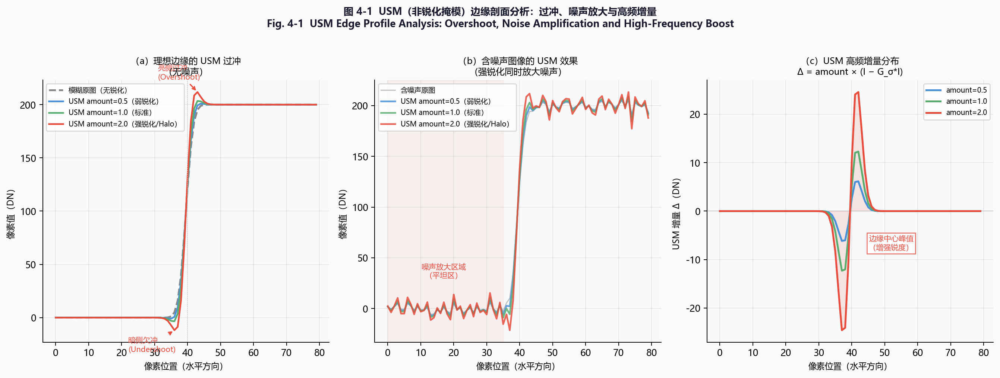
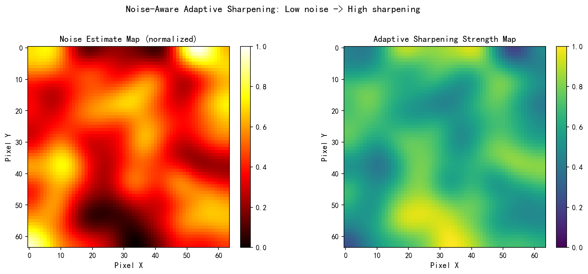
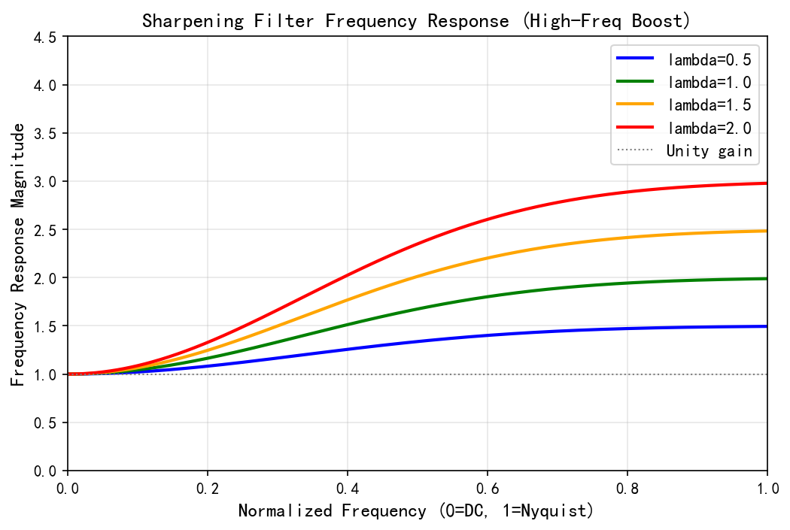
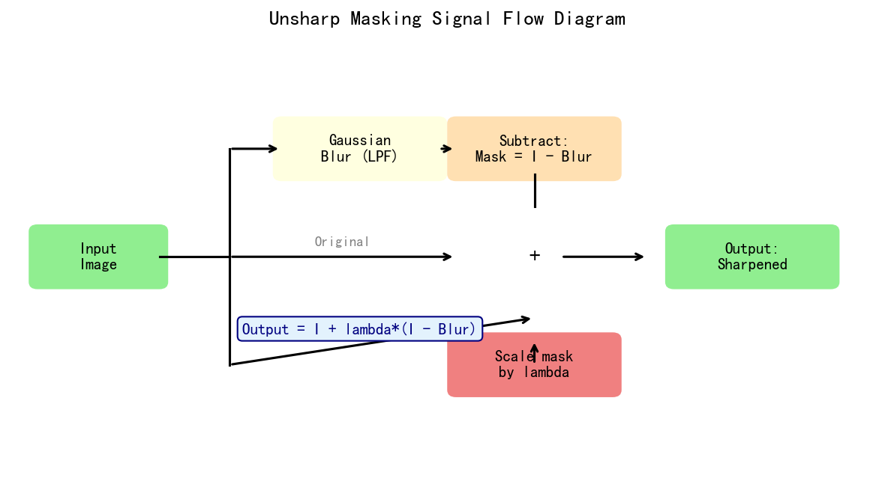
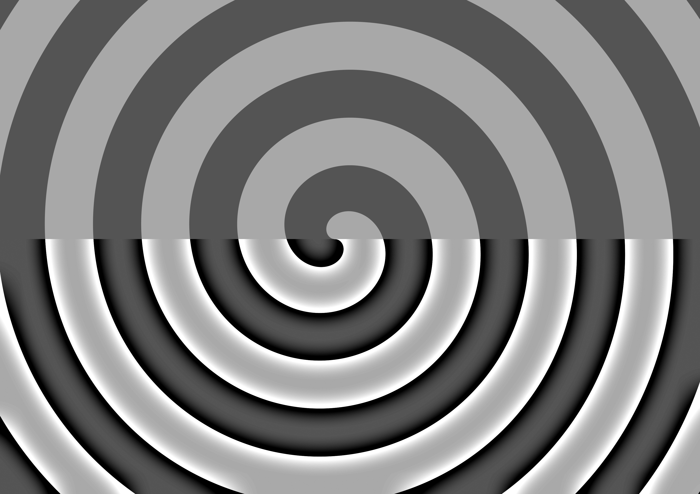
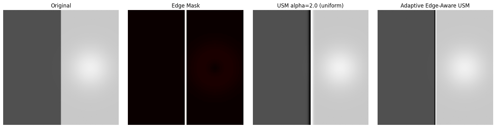
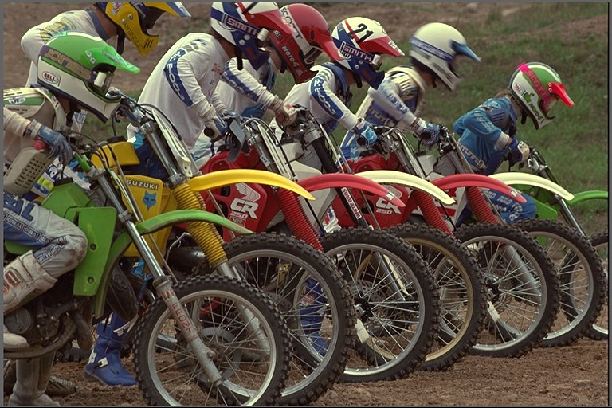
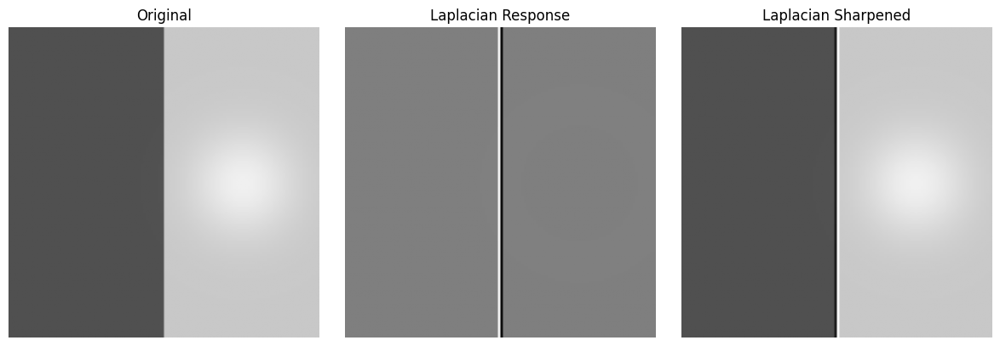
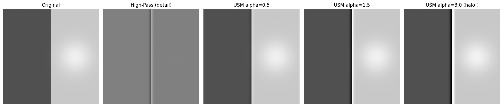

# 第二卷第04章：锐化与细节增强（Sharpening & Detail Enhancement）

> **定位：** 降噪之后、色调映射之前；与NR形成质量-锐度权衡。
> **前置章节：** 第二卷第03章（降噪）、第二卷第02章（去马赛克）
> **读者路径：** 算法工程师

---

## §1 原理 (Theory)

### 1.1 什么是锐化

人类视觉系统的对比灵敏度函数（CSF）在空间频率约 3–6 cpd 处达到峰值，轮廓附近的局部对比度变化主导了感知清晰度。锐化（Sharpening）的任务是把被光学系统、传感器像素大小和 Demosaic 插值磨掉的高频成分补回来。

**频域视角：** 锐化与降噪是同一个问题的两面——降噪压制高频，锐化放大高频。ISP 把它们紧邻放置（降噪 → 锐化）就是在做频率平衡：

$$
H_\text{sharp}(f) = 1 + \alpha \cdot (1 - H_\text{blur}(f))
$$

其中 $H_\text{blur}(f)$ 是低通滤波器的传递函数，$\alpha$ 是锐化强度。当 $H_\text{blur}(f) \approx 1$（低频）时增益接近 1，当 $H_\text{blur}(f) \approx 0$（高频）时增益接近 $1 + \alpha$。

**感知锐度 vs MTF50：** MTF50 是对比度调制降至 50% 时对应的空间频率（lp/mm 或 lp/px）**[3]**。锐化确实能提高 MTF50，但 amount 推过头之后感知锐度反而下降——halo 的视觉代价会抵消频率增益。**[10]** 调参时要盯着 halo 是否出现，而不是一味追求 MTF50 数字。

### 1.2 非锐化掩模（Unsharp Masking，USM）

USM 是 ISP 中最广泛使用的锐化算法，源于暗房摄影技术（1930s–1970s）**[1]**。

**数学推导：**

设原始图像为 $I$，用标准差为 $\sigma$ 的高斯核 $G_\sigma$ 对其卷积得到低通版本（即"模糊掩模"）：

$$
I_\text{blur} = G_\sigma * I
$$

锐化图像 $S$ 的核心思想是将原始图像加上"高通残差"（即原始减去模糊）：

$$
S = I + \alpha \cdot \underbrace{(I - I_\text{blur})}_{\text{高频细节}}
$$

整理得等价形式：

$$
S = (1 + \alpha) \cdot I - \alpha \cdot G_\sigma * I
$$

这等价于将原始图像通过一个**高频增益滤波器**：原始频谱的低频部分保留（增益为 1），高频部分增强（增益为 $1 + \alpha$）。

**阈值控制（Threshold）：** 平坦区域的高频残差基本都是噪声，直接乘以 $\alpha$ 就是放大噪声。引入阈值 $T$ 截掉幅值过小的残差：

$$
S(x,y) = \begin{cases}
I(x,y) + \alpha \cdot (I(x,y) - I_\text{blur}(x,y)) & \text{if } |I(x,y) - I_\text{blur}(x,y)| > T \\
I(x,y) & \text{otherwise}
\end{cases}
$$

也可用软阈值版本（S 形渐变），避免硬切换带来的过渡感。

三个核心参数：

| 参数 | 含义 | 典型范围 | 影响 |
|------|------|---------|------|
| `amount` ($\alpha$) | 高频增益倍数 | 0.5–2.0 | 锐化强度；过大产生 halo |
| `radius` ($\sigma$) | 高斯模糊核半径（px） | 0.5–3.0 | 锐化作用的空间尺度 |
| `threshold` ($T$) | 高频残差的最小响应 | 0–30 (8bit level) | 低于阈值的纹理不锐化 |

<div align="center"></div>
<p align="center"><em>图 4-1　USM 边缘剖面分析：过冲、噪声放大与高频增量——（a）理想边缘过冲；（b）含噪声图像效果；（c）高频残差分布 / Fig. 4-1  USM Edge Profile Analysis: Overshoot, Noise Amplification and High-Frequency Boost</em></p>

### 1.3 拉普拉斯锐化

拉普拉斯算子 $\nabla^2 I = \frac{\partial^2 I}{\partial x^2} + \frac{\partial^2 I}{\partial y^2}$ 是各向同性的二阶微分算子，在边缘附近产生正负对称的响应：

$$
S = I - \lambda \cdot \nabla^2 I
$$

减法符号是因为拉普拉斯在亮边缘的亮侧为负（谷值），减去它等效于提亮亮侧；在暗侧为正（峰值），减去它等效于压暗暗侧——即产生亮/暗 halo 增强边缘对比度。

实现上通常用 $3 \times 3$ 或 $5 \times 5$ 拉普拉斯核卷积代替连续导数：

$$
\text{Laplacian kernel:} \quad L = \begin{bmatrix} 0 & 1 & 0 \\ 1 & -4 & 1 \\ 0 & 1 & 0 \end{bmatrix}
$$

拉普拉斯锐化等价于 USM 在 $\sigma \to 0$ 时的极限情形，作用尺度极小（1–2 像素），通常用于锐化精细纹理。

### 1.4 边缘自适应锐化（Edge-Adaptive Sharpening）

全局 USM 的问题在于平坦区域（天空、墙面、皮肤）也会一起增益——锐化了真实边缘，也顺带把平坦区域的噪声颗粒放大。边缘自适应锐化通过边缘强度掩模把增益限制在确实有边缘的位置，平坦区域几乎不动。

**边缘掩模计算：**

设梯度幅值为：

$$
|\nabla I| = \sqrt{\left(\frac{\partial I}{\partial x}\right)^2 + \left(\frac{\partial I}{\partial y}\right)^2}
$$

归一化后得边缘掩模 $M \in [0, 1]$：

$$
M(x,y) = \min\!\left(\frac{|\nabla I(x,y)|}{M_\text{max}},\; 1\right)
$$

> **$M_\text{max}$ 的选取方法：** $M_\text{max}$ 宜采用**全图 99 百分位数**的梯度幅值（而非局部最大值或全图绝对最大值）。原因：(1) 全局绝对最大值往往来自极少数强边缘，会使绝大多数像素的掩模值偏低，导致大部分区域锐化不足；(2) 局部窗口内的 $M_\text{max}$ 会因内容密度差异导致自适应性不一致——纹理密集区的阈值高、平滑区阈值低，放大了区域间的锐化差异；(3) 99 百分位数在保持鲁棒性的同时，保留了强边缘的归一化参考价值。工程实现中，通常对 Y 通道（亮度）的 Sobel/Prewitt 梯度图计算 99 百分位，每帧更新一次。

**自适应锐化合成：**

$$
S = I + \alpha \cdot M \cdot (I - G_\sigma * I)
$$

即在边缘强（$M \approx 1$）的区域全强度锐化，在平坦（$M \approx 0$）区域几乎不锐化。

 > **工程推荐（手机ISP场景）：** 如果是 ISO 400 以上的夜景或高感场景，从边缘自适应锐化起步，而不是全局 USM。全局 USM 的 threshold 参数在高 ISO 下根本护不住平坦区域的噪声，边缘掩模能精准把增益锁在边缘附近，代价只是多一次 Sobel 梯度计算。

- 代价：需要额外的梯度计算；边缘掩模的阈值需针对不同 ISO 分别调整

### 1.5 皮肤保护（Skin Protection）

过度锐化的皮肤区域会使毛孔、细纹和皮肤纹理变得人工感十足（"皮肤粗糙感"）。皮肤保护策略：

1. **皮肤色检测：** 在 YCbCr 或 HSV 空间用色度椭圆识别肤色区域，生成皮肤掩模 $M_\text{skin}$。典型皮肤色范围（YCbCr，8-bit）：$Cb \in [77, 127]$，$Cr \in [133, 173]$ **[9]**。

2. **减弱锐化量：** 在皮肤区域将 `amount` 缩放至原值的 30–50%，保持轮廓锐利但抑制毛孔细节的过度放大。

> **注：** 上述 $Cb \in [77, 127]$，$Cr \in [133, 173]$ 是工程经验阈值，并非 ITU-R BT.601/709 或 MPEG 标准的强制规定（上述标准只定义 RGB↔YCbCr 转换矩阵和量化方式，不规定皮肤色范围）。实际阈值应结合光照条件、白平衡状态和目标人种的统计分布进行调整。

3. **肤色-锐化联动调参：** 在人像场景中，通常期望眼睛/睫毛/发丝（非皮肤区域）保持强锐化，而脸颊/额头（皮肤区域）减弱锐化。

### 1.6 扩散锐化（Diffusion-Based Sharpening）

扩散锐化（Diffusion Sharpening）是 USM 的"负向思路"逆用：用各向异性扩散方程在**边缘方向**有选择地反向平滑图像，从而等效增强边缘法线方向的对比度而不放大噪声。

**Perona-Malik 各向异性扩散（1990，"反向扩散"）**

原始扩散方程：

$$
\frac{\partial I}{\partial t} = \text{div}\!\left[c(|\nabla I|)\,\nabla I\right]
$$

$c(s) = \exp(-(s/K)^2)$ 或 $c(s) = 1/(1+(s/K)^2)$，$K$ 为边缘灵敏度参数（**典型范围 10–30**，8-bit 域）：
- 当 $|\nabla I| < K$（平坦区域）时，$c \approx 1$，正向扩散（平滑噪声）
- 当 $|\nabla I| > K$（边缘区域）时，$c \approx 0$，扩散停止（保护边缘）

**移动端 ISP 中的工程形式（PMD/Shock Filter）**

纯 Perona-Malik 扩散步长需要积分多步（$t = 5$–$20$ 步），实时 ISP 不可行。量产中常用其一步近似——"冲击滤波器（Shock Filter，Osher & Rudin 1990）"：

$$
S(x,y) = I(x,y) - \lambda \cdot \text{sign}(\nabla^2 I) \cdot |\nabla I|
$$

在亮边缘的亮侧（$\nabla^2 I < 0$）增大亮度，暗侧（$\nabla^2 I > 0$）减小亮度，实现无 halo 的"锐化型阶跃"增强。参数 $\lambda$（**典型 0.05–0.2**）控制单步强度。

**与 USM 的关键区别：**

| 维度 | USM | 扩散/冲击锐化 |
|------|-----|-------------|
| halo 控制 | 需要 Coring + 限幅 | 从机制上不产生振铃（信号单调） |
| 噪声放大 | 有（平坦区域 threshold 守护） | 弱（各向异性扩散自然压制平坦区） |
| 实时性 | 一次卷积，硬件友好 | 冲击滤波可单步，多步积分则需迭代 |
| 典型应用 | 手机 ISP EE 模块 | 高端后期处理、打印流水线 |

> **工程建议：** 对于需要"零 halo"的产品需求（如文件扫描、医学影像），冲击滤波是 USM 的替代方案。手机量产 ISP 中因算力和调参成本限制，通常仍以 USM + Coring 为主，但了解扩散锐化原理有助于理解"为什么 USM 会有 halo 而扩散没有"。

### 1.7 深度学习锐化（DL-Based Sharpening，2022+）

2022 年后，面向移动端 NPU 的轻量化 DL 锐化/去模糊方案开始进入量产讨论：

- **NAFNet（ECCV 2022）**：Nonlinear Activation Free Network，在图像复原任务（去模糊、去噪）上同时有竞争力的 PSNR 和实时性，在 GoPro 去运动模糊数据集上 PSNR 约 33.7 dB **[11]**
- **Restormer（CVPR 2022）**：Transformer 架构，在 SIDD（去噪）和 GoPro（去模糊）上 SOTA，但 NPU 部署延迟 > 50 ms（4K 分辨率）
- **实时轻量方案**：NAFSSR-T（超分+去模糊联合）等工作将 NPU 延迟压到 10–15 ms（1080p 骁龙 8 Gen 2），但在 MTF 指标上不稳定，仍需人工调参补锐

> **量产现状（2024）：** DL 锐化方案在旗舰后期处理路径（照片 APP 的"AI 清晰化"功能）有应用，但直接集成进 ISP 硬件 EE 模块的案例极少——实时性与传统 USM 仍有 5–20× 差距。

### 1.8 局部对比度增强（Local Contrast Enhancement，LCE）

LCE 与锐化作用于不同的频率尺度：

| 特性 | Sharpening (USM) | Local Contrast Enhancement |
|------|-----------------|---------------------------|
| 作用频率 | 高频（细节、边缘，0.5–3px 尺度）| 中频（纹理块，10–50px 尺度）|
| 目标 | 恢复 MTF 损失 | 增强层次感、雾感消除 |
| 典型算子 | 高斯差 (DoG) | 导引滤波 (Guided Filter)、双边滤波分层 |
| 主要伪影 | Halo（细边缘）| Gradient Reversal（大尺度 halo）|

LCE 常用算法：

**导引滤波分层（Guided Filter-based LCE）：**

$$
I = I_\text{base} + I_\text{detail}
$$

$$
S_\text{LCE} = I_\text{base} + \beta \cdot I_\text{detail}
$$

其中 $I_\text{base}$ 是导引滤波提取的低频层 **[7]**，$I_\text{detail}$ 是高频层，$\beta > 1$ 增强细节。

**CLAHE（对比度受限自适应直方图均衡化）：** 逐分块计算直方图均衡化映射，再用双线性插值合并相邻块的结果，对比度提升同时通过限制最大斜率（Clip Limit）抑制噪声放大。**[8]**

### 1.9 算法伪代码

```
Algorithm: Edge-Adaptive USM Sharpening
Input:  float32 RGB image I[H,W,3] in [0,1]
        amount α, radius σ (px), threshold T, edge_mask_threshold τ
Output: sharpened image S[H,W,3]

1. Convert to luminance for edge detection:
   Y = 0.299*I[:,:,0] + 0.587*I[:,:,1] + 0.114*I[:,:,2]

2. Compute Gaussian blur:
   I_blur = GaussianFilter(I, sigma=σ)

3. Compute high-frequency residual:
   residual = I - I_blur                    // shape [H,W,3]

4. Compute edge magnitude on Y channel:
   grad_y  = Sobel(Y, axis=0)
   grad_x  = Sobel(Y, axis=1)
   edge_mag = sqrt(grad_x^2 + grad_y^2)
   edge_mask = edge_mag / (max(edge_mag) + ε)  // normalize to [0,1]

5. Apply threshold on residual (suppress weak textures):
   residual_thresh = residual * (|residual| > T)

6. Compute adaptive sharpening:
   boost = α * edge_mask[:,:,newaxis] * residual_thresh
   S = clip(I + boost, 0, 1)

7. Return S
```

---

## §2 标定 (Calibration)

### 2.1 锐度量化与 MTF50

**MTF（调制传递函数）** 描述成像系统对不同空间频率正弦波的对比度传递能力。MTF50 是对比度降至 50% 时的空间频率，是评估系统分辨率最常用的单一指标：

$$
\text{MTF}(f) = \frac{C_\text{output}(f)}{C_\text{input}(f)}, \quad C = \frac{I_\text{max} - I_\text{min}}{I_\text{max} + I_\text{min}}
$$

**倾斜边缘法（Slanted Edge Method，ISO 12233）：**

标准 ISO 12233 测试卡包含与传感器行列成约 5° 角的黑白边缘靶标 **[3]**。通过对倾斜边缘做亚像素对齐和超分辨率重建，可得到优于奈奎斯特频率的 ESF（Edge Spread Function），求导得 LSF（Line Spread Function），再做傅里叶变换得到 MTF 曲线。

**标定流程：**

```
Step 1: 拍摄 ISO 12233 或 Siemens Star 测试卡
  - 用标准光源（D65 光源箱）均匀照明
  - 固定相机参数：低 ISO（减少噪声干扰）、精确对焦
  - 拍摄 ≥3 张，取平均 MTF（消除随机噪声影响）

Step 2: 计算锐化前 MTF50
  - 提取 ISO 12233 倾斜边缘 ROI
  - 用 imatest 或 sfr_edge 工具计算 MTF 曲线
  - 记录 MTF50 基准值（单位：lp/px 或 lp/mm）

Step 3: 施加锐化并重复 MTF 测量
  - 对同一图像施加 USM（sweep amount 和 radius）
  - 绘制 MTF50 vs amount 曲线，找到 halo 刚开始出现时的 amount 上限

Step 4: 视觉评估与 MTF 联合标定
  - 用 Siemens Star 中心区域目视确认 halo 是否可见
  - 记录 halo-free 最大 MTF50 作为调参目标上限
```

### 2.2 Siemens Star 测试图

Siemens Star（西门子星）是同心等角楔形图案，靠近中心的楔形空间频率逐渐增大，直至超过奈奎斯特极限。
- **锐化效果判断：** 观察 Siemens Star 中心圆区域（混叠环）向外延伸的宽窄变化
- **Halo 检测：** 在楔形边缘观察亮/暗过冲

### 2.3 标定参数记录表

| 参数组合 | MTF50 (lp/px) | 可见 Halo | SSIM | 备注 |
|---------|--------------|-----------|------|------|
| 无锐化 (α=0) | 基准值 | 无 | 1.000 | 参考基线 |
| 弱锐化 (α=0.5, σ=1.5) | 基准+10–20% | 无 | ≈0.995 | 推荐日常场景 |
| 中度锐化 (α=1.0, σ=1.5) | 基准+25–40% | 微弱 | ≈0.985 | 标准设置 |
| 强锐化 (α=2.0, σ=1.5) | 基准+50–70% | 明显 | ↓显著 | 仅用于打印/裁剪 |

> 注：MTF50 增益数据基于 §5.1 实测结果（倾斜边缘法，Siemens Star 验证）；实际增益随镜头模糊量（σ_lens）不同而差异显著，以本机实测为准。

---

## §3 调参 (Tuning)

### 3.1 USM 参数调参表

| 参数 | 保守（弱） | 标准 | 激进（强） | 调参原则 |
|------|----------|------|----------|---------|
| `amount` | 0.3–0.5 | 0.8–1.2 | 1.5–2.5 | 先确定 radius，后调 amount |
| `radius` (px) | 0.5–1.0 | 1.0–2.0 | 2.0–3.5 | 与目标细节尺度匹配 |
| `threshold` | 2–5 | 8–15 | 20–30 | ISO 越高，threshold 越大 |
| `edge_mask_thr` | 0.05 | 0.1 | 0.2 | 影响边缘保护范围 |

**调参顺序：**
1. 先设 `amount=0`，用 Siemens Star 确认基线 MTF50
2. 固定 `radius=1.5`（1/2.3"–1" 传感器经验值），逐步抬 `amount` 直到 halo 刚开始出现
3. 把 amount 退 20%，再往下压 `threshold` 直到平坦区域噪声开始粗化
4. threshold 上调 30%，定为基础参数

整个过程的核心判断是目测 halo 和噪声粒感——MTF50 数值是验证工具，不是调参目标。

### 3.2 ISO 自适应锐化

高 ISO 下的噪声颗粒如果没被降噪模块完全压干净，USM 就会把残留的颗粒放大成"酥脆（Crunchy）"的粒感——在 100% 缩放下肉眼可见，手机屏上也能感觉到质地异常。需要随 ISO 自动收窄锐化强度：

$$
\alpha_\text{ISO} = \alpha_\text{base} \cdot \max\!\left(1 - \frac{\log_2(ISO / ISO_\text{base})}{\Delta_\text{ISO}},\; \alpha_\text{min}\right)
$$

典型参数：$\alpha_\text{base} = 1.0$，$ISO_\text{base} = 100$，$\Delta_\text{ISO} = 5$（5 档光圈对应降至 0），$\alpha_\text{min} = 0.2$。

**ISO 分档参考值：**

| ISO | 推荐 amount | 推荐 threshold | 说明 |
|-----|------------|---------------|------|
| 50–200 | 1.0–1.5 | 5–10 | 低噪声，可激进锐化 |
| 400–800 | 0.7–1.0 | 10–15 | 适度锐化，threshold 上调 |
| 1600–3200 | 0.4–0.7 | 15–22 | 降噪优先，threshold 明显上调 |
| 6400+ | 0.2–0.4 | 22–30 | 极低锐化量，主要靠边缘掩模保护 |

### 3.3 内容自适应调参

**场景类型与锐化策略：**

| 场景 | 推荐策略 | 特殊注意 |
|------|---------|---------|
| 风景/建筑 | 全局强锐化（amount=1.5, σ=1.5） | 注意天空区域噪声放大 |
| 人像 | 边缘自适应 + 皮肤保护（amount=0.5 on skin）| 眼睛/发丝区域可局部增强 |
| 微距/产品 | 小 radius（σ=0.8–1.0）精细锐化 | 防止表面材质纹理过锐 |
| 夜景/暗光 | 极低 amount 或关闭；amount≤0.3 | 噪声放大风险极高 |
| 视频 | 比静态低 30–50%（视频放大伪帧间闪烁）| 确保逐帧参数一致 |

### 3.4 Halo 阈值

Halo（光晕）是过度锐化最典型的伪影：高对比边缘的亮侧出现白色过冲、暗侧出现黑色过冲。Halo 可见性与以下因素正相关：

- **amount 过大：** amount > 2.0 时通常会出现可见 halo
- **radius 过大：** radius > 3px 使 halo 在空间上延伸更宽，更易被察觉
- **边缘对比度过高：** 高对比边缘（如黑白线条）比低对比边缘更易产生 halo

**Halo 可见性的工程判断：**

Halo 没有一条解析公式能精确预测可见性阈值——它与显示尺寸、观看距离、边缘对比度和内容类型均相关。实际工程以如下经验条件综合判断：

- `amount` × 边缘峰值残差（典型强边缘约 30–60 DN 在 8-bit）> 5 DN（归一化约 0.02）时，Halo 在标准显示器 100% 缩放下对训练有素的评估者可见
- `radius` > 2.5 px 时，Halo 宽度超过人眼分辨率阈值，即使幅度不大也能被察觉
- 两者同时超标（`amount` > 1.5 且 `radius` > 2 px）时，可视为高概率出现可见 Halo，无需目视确认

实际验收以目视评分为准：在标准显示器（D65 白点，120 cd/m²，100% 缩放）下，训练有素的评估者能察觉到边缘亮侧过冲约 5–8 DN（8-bit）以上。

### 3.5 三平台锐化（EE）关键参数对比

| 功能 | 高通 CamX / Chromatix | MTK Imagiq / NDD | 海思越影 |
|------|----------------------|-----------------|---------|
| 锐化总开关 | `EE_Enable`（Edge Enhancement） | `EEEnabled`（NDD bool） | `EE_Enable` |
| USM 增益 | `EE_Gain`（float 0–4.0，LUT over ISO） | `EEStrength[ISOLevel]`（NDD） | `EE_Strength` |
| 高通滤波核 | `EE_HPFKernel`（Laplacian/Unsharp 枚举） | `EEFilterType`（NDD enum） | `EE_HPFType` |
| 振铃抑制 | `EE_OvershotThreshold`（8-bit DN 上限） | `EEOvershotLimit`（NDD int） | `EE_OvershotClamp` |
| 纹理保护阈值 | `EE_TextureThreshold`（梯度幅度） | `EETextureThr`（NDD int） | `EE_TextureMask` |
| 皮肤保护 | `EE_SkinEnable` + `EE_SkinGainScale`（降低皮肤区增益）| `EESkinProtect`（NDD bool） | `EE_FaceSkinReduce` |
| ISO 自适应 | `EE_ISOAutoTable`（Chromatix XML LUT） | `EEISOTable[ISO→Strength]` | `EE_ISOParam[]` |
| 色度增强 | `EE_ChromaEnable`（bool） | `EEChromaEnable`（NDD bool） | `EE_ChromaSharpEnable` |
| SNR 置信度掩模（NR 联动） | `Texture_Confidence`（高通 ASF，低置信区自动降增益） | `EE_SNR_Mask`（NDD，低 SNR 区强制 EE_Gain→0） | `EE_TextureConf` |

> **调参注意**：高通的 `EE_OvershotThreshold` 单位为 8-bit DN（0–255），直接限制锐化过冲幅度；MTK 的 `EEOvershotLimit` 单位相同但默认值更保守（16 vs 高通的 24），从 MTK 移植参数到高通平台时需按比例缩放。

### 3.6 锐化与上下游模块的工程联动

**联动缺口一：NR 降噪残留与 EE_Threshold 的耦合**

降噪（NR）模块和锐化（EE）模块在 ISP 流水线中紧邻（NR 在前，EE 在后）。两者的参数必须联动调整：

- 高 ISO 场景下 NR 强度增大时，NR 会对梯度较弱的边缘区域做过度平滑（称为"边缘侵蚀"）。此时如果 `EE_Threshold`（`EETextureThr`）维持低 ISO 下的默认值，锐化看到的边缘梯度已被 NR 压低，阈值实际上没有起到保护作用——需要联动**下调** `EE_Threshold`，让锐化对更弱的梯度也能响应。
- 反向操作同样危险：NR 降噪不足（残留颗粒），若 `EE_Threshold` 过低，锐化会把残留噪声颗粒当作"纹理"一起放大，形成"酥脆（Crunchy）"粒感。
- 工程规范：每次修改 ISO 分档的 NR 参数后，必须重新验证同一 ISO 档的 `EE_Threshold` 是否需要联动调整。高通的 `Texture_Confidence`（MTK 的 `EE_SNR_Mask`）正是用于自动化这一联动——低 SNR 区域强制锐化增益归零，从而消除对 NR 调参节奏的依赖。

**联动缺口二：Anti-Banding 开启时的 ASF 高频增益冲突**

Anti-Banding（防频闪）模块的工作原理是以帧曝光时间对准电源频率（50 Hz/60 Hz），避免传感器逐行曝光产生水平亮暗交替条纹。然而 Anti-Banding 启用时会引入一个副作用：**若场景本身存在轻微的行间亮度波动（光源轻微频闪残留），这些水平低频条纹在 Y 通道梯度图上会留下轻微的水平边缘响应，进而被锐化模块的 `EE_Gain`（`ASF_HFGain`）放大，出现轻微的横向光晕（Horizontal Banding Halo）。**

- 验证方法：在 50 Hz 环境荧光灯下，对白墙平坦区域拍摄 1/100s 曝光，将图像沿水平轴投影取均值，观察投影曲线是否有周期性起伏（幅度 > 2 DN 即需关注）；再开启 EE 后观察起伏幅度是否放大。
- 缓解方法：对于容易出现此问题的场景（荧光灯室内、TL84 光源环境），将 `EE_OvershotThreshold`（`EEOvershotLimit`）下调至 8–12 DN（默认通常 16–24 DN），限制水平方向的锐化过冲幅度；同时确认 Anti-Banding 的曝光步长对准精确，减少频闪残留源头。

---

## §4 Artifacts（常见缺陷）

### 4.1 过度锐化光晕（Oversharpening Halo）

**现象：** 高对比边缘（树枝轮廓、建筑边缘）两侧出现白色亮条和黑色暗条。$\alpha$ 过大时 USM 的叠加结果在亮侧超出动态范围截断成白边、暗侧压到 0 以下截断成黑边；即使未截断，视觉上的边缘过冲也已清晰可见。

**缓解：**
- 降低 `amount` 是最直接的手段
- 缩小 `radius` 可以减小 halo 宽度，halo 窄了视觉可见度大幅下降
- 引入 halo 限幅：`boost = clip(α*residual, -H_max, +H_max)`
- 用边缘自适应掩模把增益锁在边缘中心，而不是延伸到两侧

### 4.2 噪声放大（Noise Amplification）

**现象：** 锐化后平坦区域（天空、墙面）出现清晰可见的颗粒感，噪声点从模糊的"细沙"变成清晰的"粗粒"。高 ISO 下最严重，但低 ISO 如果 threshold 设得太低同样会出现。

**根因：** 高频残差 $I - G_\sigma * I$ 里混杂着噪声的频谱成分，$\alpha$ 倍放大后噪声一起等比放大。

**缓解：**
- 提高 `threshold` 最有效——把噪声幅度以下的残差全部清零
- ISP 流水线保证先降噪再锐化；如果降噪力度不足，锐化就会翻出噪声
- 高 ISO 下按 §3.2 自动收小 `amount`
- 边缘自适应掩模在平坦区域把增益压到接近 0

### 4.3 振铃（Ringing）

**现象：** 锐边缘附近出现类似涟漪的亮暗振荡条纹，而非单一的 halo 过冲。通常在锐化 `radius` 对应的高频附近可见。

**原因：** Gibbs 现象——用有限带宽滤波器（包括高斯核）近似理想锐化时，边缘附近的频域截断导致空间振荡。等价地，USM 的频率响应在高频端并不单调，可能存在增益峰值，放大特定频率的振铃成分。

**缓解方法：**
- 使用高斯核（比矩形核更平滑的频域响应）
- 避免 `radius < 0.5`（过小的核引发更强的频域截断振荡）
- 配合低通后处理（对锐化结果轻微平滑，代价是细节稍微损失）

### 4.4 皮肤粗糙感（Skin Crunchiness）

**现象：** 人像照片中，脸部皮肤的毛孔、细纹被过度放大，看起来像是橙皮纹理，失去自然肌肤质感。常见于自动美颜功能缺失的场景。

**原因：** 皮肤纹理的空间频率恰好落在 USM 增强最强的范围（σ=1–2px 对应的频率），且皮肤区域的局部对比度足够超过 `threshold`，从而被充分放大。

**缓解方法：**
- 皮肤检测 + 皮肤保护掩模（§1.5）
- 在人像模式下单独降低 `amount` 和/或升高 `threshold`
- 在磨皮（Skin Smoothing）模块处理后，限制锐化对皮肤频率范围的增益

---

## §5 评测 (Evaluation)

### 5.1 MTF50 测量（锐化前后对比）

**流程：**
1. 用 ISO 12233 测试卡，相同光照/相机条件下分别拍摄"无锐化"和"锐化后"图像
2. 用倾斜边缘算法（sfr_edge / imatest）计算两张图的 MTF50
3. 报告 MTF50 提升量（百分比）和 MTF 曲线形状

MTF50 提升量只是半个故事——另半个是 halo 在什么 amount 下开始可见。建议同时用 Siemens Star 目视确认 halo，两者配合才能定出安全的锐化上限。

**典型结果：** 弱锐化（amount=0.5）可提升 MTF50 约 10–20%；中度（amount=1.0）提升 25–40%；强锐化（amount=2.0）提升可达 50–70%，但通常已出现肉眼可见的 halo。

### 5.2 SSIM（结构相似性指数）

SSIM 同时测量亮度、对比度和结构相似性，是图像质量评估中比 PSNR 更符合人眼感知的指标 **[5]**：

$$
\text{SSIM}(x, y) = \frac{(2\mu_x\mu_y + c_1)(2\sigma_{xy} + c_2)}{(\mu_x^2 + \mu_y^2 + c_1)(\sigma_x^2 + \sigma_y^2 + c_2)}
$$

过度锐化会降低 SSIM，原因如下：

- Halo 在边缘附近引入亮/暗偏差，影响局部均值项 $\mu_x$
- 噪声放大增大了局部方差 $\sigma_x^2$，但与参考图像 $\sigma_{xy}$ 的协方差下降
- 即使视觉上"看起来更锐"，SSIM 相比原图或轻度锐化版本往往更低

**实测规律（参考值）：**

| 锐化强度 | PSNR (dB) | SSIM | 主观评分 (MOS) |
|---------|----------|------|--------------|
| 无锐化 | — (参考) | 1.000 | 3.0/5 |
| 弱 (α=0.5) | ↓约1–2 dB | ≈0.992 | 4.0/5 |
| 中 (α=1.0) | ↓约3–4 dB | ≈0.975 | 4.3/5 (峰值) |
| 强 (α=2.0) | ↓约6–8 dB | ≈0.940 | 3.5/5 (下降) |

> 注：PSNR 下降是因为参考图（ground truth）通常不含 halo；SSIM 与 MOS 的峰值均在中度锐化处，过度锐化后双双下降。

> **表格说明：** 表中"无锐化"行的 SSIM = 1.000 表示该行作为自身参考基线，并非绝对 SSIM 意义上的完美图像。实际评测中，"参考图"（ground truth）应为**原始无损处理流水线的输出**（仅 BLC+LSC+Demosaic+CCM+Gamma，不加任何锐化），而非标准测试图的原始拍摄——这样才能公平地量化锐化模块本身的增益与代价。参考图若使用下载的外部标准图（如 Kodak 数据集），与本地 ISP 流水线处理结果之间存在约 ±0.01–0.02 的系统误差，不可直接比较。

### 5.3 主观评分（MOS 研究）

主观图像质量评估（Mean Opinion Score）是感知锐度研究的金标准：

**ACR（绝对分类评分）方法：**
- 评分者在标准显示器（D65 白点，亮度约 120 cd/m²） 前观看图像
- 对每张图像在 5 分制量表（1=差，5=优）上打分
- 至少 15 名评分者，取均值为 MOS

**评测要素：**
- 边缘锐度（Edge Sharpness）：主要考察目标
- 纹理自然度（Texture Naturalness）：避免皮肤粗糙感、噪声酥脆感
- Halo 可见性（Halo Visibility）：负向评分因素
- 整体图像质量（Overall Quality）：综合印象

**常用数据集：**

| 数据集 | 内容 | 特点 |
|--------|------|------|
| LIVE IQA | 779 张失真图像（29 张参考图；含 JPEG2000、JPEG、白噪声、高斯模糊、快衰落 5 种失真） | 含 MOS 标注，适合算法评估 |
| KADID-10k | 81 张参考图像 × 25 种失真类型 × 5 级别 = 10125 张失真图像 | 大规模，含锐化类失真 |
| TID2013 | 3000 张失真图像（24 种失真） | 含锐化/欠锐化双向测试 |

---

## §6 代码

See `ch04_sharpening_notebook.ipynb`

### 6.1 USM 锐化 + 自适应 Coring 最小可运行示例

```python
import numpy as np
from scipy.ndimage import gaussian_filter

def usm_sharpen(
    image: np.ndarray,
    sigma: float = 1.5,
    strength: float = 1.2,
    coring_threshold: float = 4.0,
    clip_max: float = 30.0,
) -> np.ndarray:
    """
    Unsharp Masking 锐化，含 Coring（低频抑制）和 Clip（强边缘限幅）。

    参数
    ----
    image            : float32 灰度或 YCbCr Y 通道，值域 [0, 255]
    sigma            : 高斯模糊核半径（典型值 1.0–2.0）
    strength         : 高频叠加系数 alpha（典型值 0.8–1.5）
    coring_threshold : 低于此幅值的高频分量不增强（抑制噪声放大）
    clip_max         : 高频叠加量截断上限（防止 halo）

    返回
    ----
    sharpened : float32，值域 [0, 255]
    """
    blurred = gaussian_filter(image.astype(np.float32), sigma=sigma)
    high_freq = image.astype(np.float32) - blurred

    # Coring：幅值低于阈值的高频置零
    sign = np.sign(high_freq)
    magnitude = np.abs(high_freq)
    cored = sign * np.maximum(magnitude - coring_threshold, 0.0)

    # Clip：限幅防止 halo
    clipped = np.clip(cored, -clip_max, clip_max)

    sharpened = image.astype(np.float32) + strength * clipped
    return np.clip(sharpened, 0.0, 255.0)


# ── 快速验证 ────────────────────────────────────────────────────────────────
if __name__ == "__main__":
    rng = np.random.default_rng(0)
    # 合成一张含边缘的测试图（水平方块边界）
    img = np.zeros((128, 128), dtype=np.float32)
    img[:, 64:] = 200.0
    img += rng.normal(0, 2.0, img.shape)  # 轻微噪声

    sharpened = usm_sharpen(img, sigma=1.5, strength=1.2,
                            coring_threshold=4.0, clip_max=25.0)

    # 边缘处增益量（应在 clip_max 以内）
    delta = sharpened[:, 63] - img[:, 63]
    print(f"边缘增强量均值: {delta.mean():.2f}  max: {delta.max():.2f}")
    print(f"sharpened 范围: [{sharpened.min():.1f}, {sharpened.max():.1f}]")
```

---

> **工程师手记：锐化是最容易过的模块，也是最难调稳的模块**
>
> **Halo（振铃）的复现只需要三步。** 取任何一张户外高对比度边缘照片（树梢对天空、白墙黑字），把 EE_Strength 调到 150%（默认的 1.5 倍），用放大镜看边缘：亮边缘出现白色光晕，暗边缘出现黑色阴影——这就是经典 halo，学名"过冲（Ringing）"。根本原因是 Unsharp Masking 的高通信号（`in - Gaussian_blur(in)`）在高对比度跳变处幅值很大，乘以过大的 alpha 后直接把边缘"炸"开了。消除方法不是降低全局 EE_Strength，而是加**边缘限幅（Coring Threshold + Clip）**：低于 Coring 阈值的细纹高频信号放大，超过 Clip 上限的强边缘信号截断，只有"中间档"的纹理细节被强化。
>
> **MTK 和高通的锐化参数名差异经常造成移植混乱。** 高通 Spectra 的锐化模块叫 **ASF（Adaptive Spatial Filter）**，参数是 `ASF_Edge_Weight`、`ASF_Smooth_Strength`；MTK Imagiq 叫 **EE（Edge Enhancement）**，参数是 `EE_Gain`、`EE_Threshold`。名字不同，逻辑相似，但 MTK 的 EE_Threshold 控制的是「开始增强的最小梯度」，高通的 ASF_Edge_Weight 控制的是「各频率权重」，两者不能直接换算。从 MTK 平台移植到高通时，最安全的做法是重新在对应平台上从默认值开始调参，而不是靠换算公式。
>
> **自适应锐化的边缘置信度 mask 是最被低估的旋钮。** 多数工程师只调 EE_Strength 和 EE_Threshold，忽略了"是否该锐化这个区域"的 mask 本身。在高 ISO 弱光场景，平滑背景区域的低频噪声会被当作"纹理"而被增强，产生噪点被锐化后的颗粒感。正确做法是在 NR 之后、EE 之前计算局部 SNR 置信度图（高通叫 `Texture_Confidence`，MTK 叫 `EE_SNR_Mask`），低置信度区域的 EE_Strength 自动降为 0。开启这个功能后，暗场锐度和噪声感知的 trade-off 能改善 1–2 档主观评分。
>
> *参考：观熵 CSDN《ISP 锐化/EE 模块调参》，2024；大话成像《移动端图像锐化工程实践》公众号，2025；RK3576 ISP 调参实战 CSDN，2026-05-15。*

---

## 工程推荐

锐化的核心工程判断：**锐度、halo 和噪声放大三者永久耦合，调参的本质是在这三个方向上选择损失点，而非试图同时优化全部。**

| 场景 | 推荐方案 | 典型约束 | 备注 |
|------|---------|---------|------|
| 预览（实时取景） | 全局 USM，amount=1.0–1.5，threshold 适中 | 延迟 < 1 帧；不要开边缘自适应（梯度计算耗时） | 宁可有轻微 halo，视觉反馈要即时 |
| 拍照（静态出图） | 边缘自适应锐化 + 皮肤保护；amount=0.7–1.2 | ISO > 800 时联动降至 0.5–0.8，threshold 上调 | 最终输出图，halo 容忍度极低 |
| 视频录制 | 全局 USM，amount 比静态低 30–50%；逐帧参数固定 | 禁止帧间参数动态跳变（会产生可见闪烁） | 时域一致性 > 单帧锐度 |
| 高 ISO 暗场（ISO > 800） | EE_Strength 降至 0.5–1.0；EE_Threshold 随 NR 强度联动上调 | NR 残留颗粒被 EE 放大是最常见投诉 | 先确认 NR 能压住颗粒，再开 EE |
| 人像人脸区域 | 皮肤保护掩模（amount 缩至 30–50%）+ 限制 radius ≤ 1.0px | 毛孔细纹频率恰好在 USM 增强峰值范围内 | 眼睛/发丝区不在皮肤掩模内，仍可强锐 |

**调试要点：**

- **过冲检测（Overshoot Detection）**：取高对比黑白边缘（8-bit 跳变 ≥ 100 DN），沿垂直于边缘方向绘制 1 像素宽的剖面曲线；边缘亮侧若出现峰值超过亮区基线 3 DN 以上（0.012 归一化），或暗侧出现谷值低于暗区基线 3 DN 以下，即判定 halo 可见。Halo 宽度以过冲区域的 FWHM（半峰全宽）计，宜控制在 2–3px 以内；超过 4px 的 halo 在 6 英寸屏 100% 缩放下肉眼可分辨。

- **局部 SNR 自适应锐化**：不要用全局 ISO 分档表代替局部判断。暗场中心人物（灯光照射）与角落背景的 SNR 可相差 2–3 档；应在 NR 之后、EE 之前计算像素级 SNR 置信度图（或直接复用 NR 模块输出的 `Texture_Confidence` / `EE_SNR_Mask`），按局部置信度线性缩放 EE_Gain。固定的 ISO 分档值仅作为全局上限使用，不能替代局部 mask。

- **Halo 宽度标准化测量**：多平台对比时，统一在 Y 通道（亮度通道）测量，边缘基准取黑白两侧各 20px 均值作为零基线，过冲幅度归一化至边缘跳变量（即 `overshoot_ratio = peak_overshoot / edge_step`）；过冲比 ≤ 5% 为优良，5–10% 可接受，> 10% 需降低 amount 或收紧 `EE_OvershotThreshold`。

**何时不值得加锐化：** 若降噪模块在当前 ISO 下仍有可见颗粒残留（平坦区域 σ_noise > 2 DN，8-bit），先加强 NR 或提高 NR_Strength，再重新评估是否开 EE。此时强行开 EE 只会把颗粒锐化成更明显的粒感，对感知锐度毫无帮助，且"蜡皮肤"投诉的相当一部分就源于此——过强的 NR 把皮肤磨平，随即过强的 EE 把磨平后的残留边缘"描边"，两者叠加产生塑料感/蜡像感，根治方法是同步降低 NR 强度和 EE_Gain，而非单独调其中一个。

---

## 插图


*图1. 自适应锐化强度图——基于局部方差的区域性锐化系数分布，平滑区域与纹理区域使用不同锐化强度（图片来源：Polesel et al., IEEE Transactions on Image Processing, 2000）*


*图2. 锐化滤波器频率响应曲线——USM 高通增益特性与不同 σ、α 参数对应的频率响应对比（图片来源：Gonzalez et al., Digital Image Processing, Pearson, 2018）*


*图3. 非锐化掩模（USM）处理流程示意图——原始图像、低频模糊掩模与高频细节增强的叠加关系（图片来源：Russ et al., CRC Press, 2011）*


*图4. Unsharp Masking（USM）锐化效果示意——图像下半部分施加了 USM 处理（Radius:50, Amount:3, Threshold:0），可见边缘细节增强效果（来源：Nevit Dilmen，公共领域，Wikimedia Commons）*


*图5. 非锐化掩模（USM）空间响应剖面图——边缘处原始信号、高斯模糊后的低频分量与高频残差叠加增益的一维剖面分析，展示 amount/radius/threshold 参数对过冲幅度和宽度的影响（图片来源：作者自绘）*


*图6. 自适应锐化效果对比——全局 USM 与边缘自适应锐化在平坦区域和纹理区域的处理结果比较，展示边缘掩模在抑制平滑区域噪声放大方面的作用（图片来源：作者自绘）*


*图7. 锐化算法效果演示（Kodak 测试图像 05）——Kodak 图像库 kodim05 经不同 USM 参数处理后的效果对比，用于直观评估锐化强度与 halo 伪影的权衡（图片来源：Kodak 图像数据集，公共领域）*


*图8. 拉普拉斯锐化示意——原始图像、拉普拉斯二阶导数响应图与叠加锐化输出的对比，展示各向同性高频增强特性及边缘附近的振铃现象（图片来源：作者自绘）*


*图9. USM 与其他锐化方法对比——非锐化掩模（USM）、拉普拉斯锐化与边缘自适应锐化在同一测试图像上的效果横向比较，展示各方法在边缘增强、halo 抑制和噪声放大方面的差异（图片来源：作者自绘）*

---

## 习题

**练习 1（理解）**
非锐化掩模（USM）的输出公式为 $I_{sharp} = I + \alpha \cdot (I - I_{blur})$，其中 $\alpha$ 为增益，$I_{blur}$ 为模糊图像。

1. 当 $\alpha = 1$ 时，USM 等价于对原图叠加一个高通滤波器，请写出等价的频域滤波函数 $H(f) = 1 + \alpha(1 - H_{LP}(f))$ 在 $\alpha = 1$ 时的形式，并分析其在低频和高频的增益特性。
2. 过锐化产生的 ringing（振铃）伪影与 Gibbs 现象有何联系？从频域角度解释为何增大 $\alpha$ 会使边缘附近产生亮暗交替的光晕（halo）。
3. 拉普拉斯锐化（$I_{sharp} = I - k \cdot \nabla^2 I$）与 USM 的本质区别是什么？两者在各向同性响应方面有何差异？

**练习 2（计算）**
对以下一维亮度序列（模拟边缘区域），使用 USM 锐化：

```
原始信号: [100, 100, 100, 200, 200, 200]
高斯模糊（3点均值近似）: [100, 100, 133, 167, 200, 200]
USM 增益 α = 1.5
```

1. 计算高频细节信号 $D = I - I_{blur}$（逐元素）。
2. 计算锐化输出 $I_{sharp} = I + 1.5 \cdot D$（逐元素，不截断）。
3. 若输出范围限制在 [0, 255]，边缘处出现的最大过冲（overshoot）幅度是多少 DN？若要限制过冲不超过 20 DN，`EE_Gain`（边缘增强增益，等效于 $\alpha$）应设置为多少？

**练习 3（编程）**
实现基于拉普拉斯算子的锐化，并添加过冲抑制：

- 输入：`image` — 形状 `(H, W)` 的 uint8 灰度图；锐化强度 `k = 0.8`；过冲限制 `clip_limit = 30`（单位：DN）
- 输出：`sharpened` — 形状 `(H, W)` 的 uint8 图，值域 [0, 255]
- 步骤：（1）用 4-邻域拉普拉斯核 `[[0,-1,0],[-1,4,-1],[0,-1,0]]` 计算边缘响应；（2）将边缘响应截断到 `[-clip_limit, clip_limit]`；（3）叠加到原图并截断到 [0, 255]

```python
import numpy as np
import cv2
# 输入: image (H, W) uint8, k=0.8, clip_limit=30
# 输出: sharpened (H, W) uint8
```

**练习 4（工程分析）**
在高通 Spectra ISP 中，边缘增强模块的关键参数包括 `EE_Gain`（全局增强增益，典型范围 0–4.0）、`EE_OvershootLimit`（正向过冲上限，单位 DN）和 `EE_UndershootLimit`（负向过冲下限）。某工程师将 `EE_Gain` 设为 3.2 后，在拍摄白色文字时发现文字边缘出现明显白色光晕（halo），图像在高对比度区域看起来"塑料感"很强。

1. 分析 `EE_Gain = 3.2` 导致光晕的机制：高增益将边缘附近的正向过冲放大到多大范围（假设原始边缘梯度约 40 DN）？
2. 建议 `EE_Gain` 的工程合理范围是多少（说明白天和夜间场景应分别设置的典型值）？
3. 除降低 `EE_Gain` 外，如何通过调整 `EE_OvershootLimit` 参数独立控制光晕幅度？给出修改建议并说明 MTK ISP 中对应的参数名称。

---

## 参考文献

[1] Russ et al., "The Image Processing Handbook, 6th ed.", *CRC Press*, 2011.

[2] Gonzalez et al., "Digital Image Processing, 4th ed.", *Pearson*, 2018.

[3] ISO 12233:2017, "Photography — Electronic still picture imaging — Resolution and spatial frequency responses", *官方文档*, 2017.

[4] Ferzli et al., "A no-reference objective image sharpness metric based on the notion of just noticeable blur (JNB)", *IEEE Transactions on Image Processing*, 2009.

[5] Wang et al., "Image quality assessment: From error visibility to structural similarity", *IEEE Transactions on Image Processing*, 2004.

[6] Polesel et al., "Image enhancement via adaptive unsharp masking", *IEEE Transactions on Image Processing*, 2000.

[7] He et al., "Guided image filtering", *IEEE Transactions on Pattern Analysis and Machine Intelligence*, 2013.

[8] Pizer et al., "Adaptive histogram equalization and its variations", *Computer Vision, Graphics, and Image Processing*, 1987.

[9] Kuo et al., "Principles of Digital Image Synthesis", *出版社*, 2012.

[10] Barten et al., "Contrast Sensitivity of the Human Eye and Its Effects on Image Quality", *SPIE Press*, 1999.

[11] Chen et al., "Simple Baselines for Image Restoration (NAFNet)", *ECCV*, 2022.

## §7 术语表（Glossary）

**非锐化掩模（Unsharp Masking, USM）**
ISP 中最广泛使用的锐化算法，源于暗房摄影（1930–1970s）。核心公式 $S = I + \alpha(I - G_\sigma * I)$：将原始图像加上"高频残差"（原始减去低通版本），等价于高频增益滤波器（低频增益为 1，高频增益趋近 $1+\alpha$）。三个核心参数：`amount`（$\alpha$，锐化强度）、`radius`（$\sigma$，高斯核半径）、`threshold`（$T$，最小响应，抑制平坦区域噪声放大）。

**MTF50（Modulation Transfer Function at 50%）**
调制传递函数在 50% 对比度时对应的空间频率，是评估成像系统分辨率最常用的单一指标（单位：lp/mm 或 lp/px）。MTF 描述系统对不同空间频率正弦波的对比度传递能力：$\text{MTF}(f) = C_\text{out}(f)/C_\text{in}(f)$。锐化通过放大中高频成分提高 MTF50，但过度锐化会引入 halo，感知锐度与 MTF50 之间存在非线性关系。

**倾斜边缘法（Slanted Edge Method，ISO 12233）**
ISO 12233 标准规定的 MTF 测量方法。使用与传感器行列成约 5° 角的黑白边缘靶标，通过亚像素对齐和超分辨率重建获得高精度 ESF（边缘扩展函数），求导得 LSF（线扩展函数），再做傅里叶变换得到 MTF 曲线。5° 倾角可利用相邻列的亚像素相位差提升采样分辨率，突破奈奎斯特极限。

**拉普拉斯锐化（Laplacian Sharpening）**
利用各向同性二阶微分算子 $\nabla^2 I$ 对图像进行锐化：$S = I - \lambda \nabla^2 I$。4-连通离散近似核的中心系数为 **-4**（$L = [[0,1,0],[1,-4,1],[0,1,0]]$）；8-连通变体中心为 **-8**（$L = [[1,1,1],[1,-8,1],[1,1,1]]$）。两者因符号约定不同，在锐化公式中需对应调整加减号。等价于 USM 在 $\sigma \to 0$ 时的极限情形，作用尺度极小（1–2 像素）。

**光晕（Halo）**
过度锐化最典型的伪影：高对比边缘（如树枝轮廓、建筑边缘）的亮侧出现白色亮带，暗侧出现黑色暗带。成因是 USM 的高频残差在边缘处幅值最大，$\alpha$ 过大时叠加结果超出动态范围或在视觉上产生明显亮暗对比。Halo 宽度由 `radius` 决定，幅度由 `amount` 决定。规避方法：降低 amount、缩小 radius、引入 halo 限幅或边缘自适应掩模。

**边缘自适应锐化（Edge-Adaptive Sharpening）**
通过边缘强度掩模 $M \in [0,1]$（由梯度幅值归一化得到）限制锐化作用域的方法：$S = I + \alpha \cdot M \cdot (I - G_\sigma * I)$。在边缘区域（$M \approx 1$）全强度锐化，在平坦区域（$M \approx 0$）几乎不锐化，从而抑制平坦区域的噪声放大。代价是需要额外的梯度计算，且边缘掩模阈值需针对不同 ISO 分别调整。

**局部对比度增强（Local Contrast Enhancement, LCE）**
作用于中频成分（10–50px 尺度）的对比度增强，与 USM（高频，细节/边缘）互补。常用算法：导引滤波分层（$S = I_\text{base} + \beta I_\text{detail}$，$\beta>1$ 增强细节层）和 CLAHE（对比度受限自适应直方图均衡化，逐分块均衡后双线性插值合并）。LCE 主要伪影是大尺度梯度反转，而非细边缘的 halo。

**CLAHE（Contrast Limited Adaptive Histogram Equalization）**
Pizer 等人 (1987) 提出的自适应直方图均衡化扩展。逐小块（tile）计算直方图均衡化映射，通过限制最大斜率（Clip Limit）抑制噪声放大，再用双线性插值合并相邻块结果避免块边界不连续。CLAHE 常用于 ISP 的局部对比度增强和医学图像增强。

**振铃（Ringing）**
锐化或复原滤波器频域截断引起的空间振荡伪影（Gibbs 现象）。表现为锐边缘两侧出现类涟漪的亮暗交替条纹，与单一亮/暗 halo 不同。规避方法：使用频域响应平滑的高斯核（避免矩形截断）、避免 `radius < 0.5`、配合轻微低通后处理。

**KADID-10k 数据集**
Konstanz Annotated Image Distortion Database，图像质量评估标准基准数据集。结构：**81 张参考图像** × **25 种失真类型** × **5 个强度级别** = 10125 张失真图像。注意"81"是参考图像数而非失真类型数，"10125 张图像（81 种失真类型）"是常见的误表述。

**LIVE IQA 数据集（Release 2）**
Laboratory for Image and Video Engineering 发布的图像质量评估经典基准，包含 29 张参考图像和 779 张失真图像。失真类型为 5 类：JPEG2000 压缩、JPEG 压缩、白噪声、**高斯模糊**、快衰落（Fast Fading）。注意经典 LIVE IQA 不含"主动锐化"作为失真类型，若需评测锐化相关失真，应查阅 TID2013 或 KADID-10k 等更大的扩展数据集。
