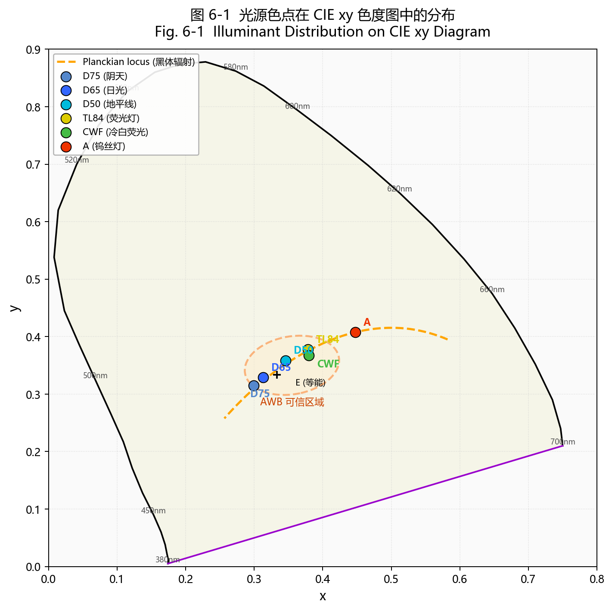
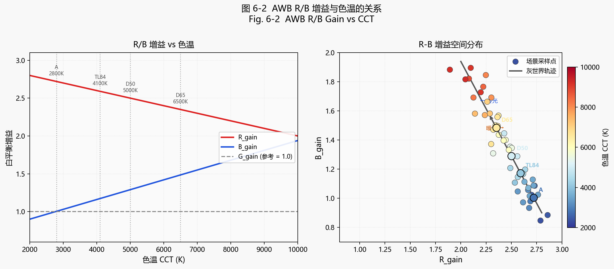
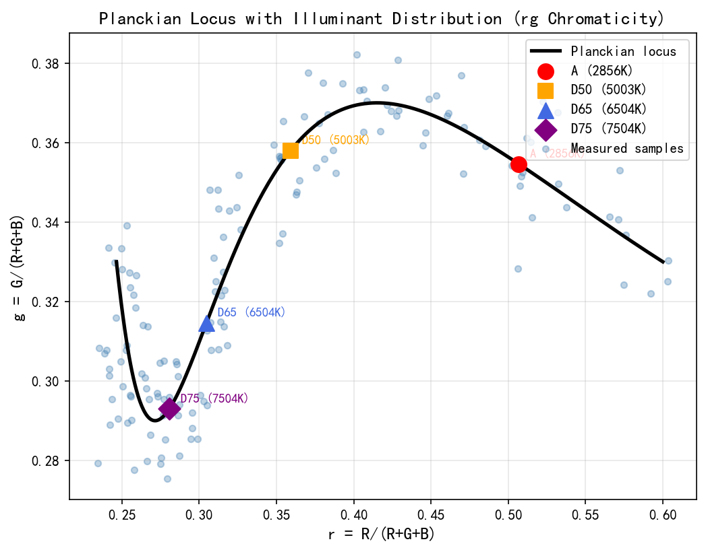
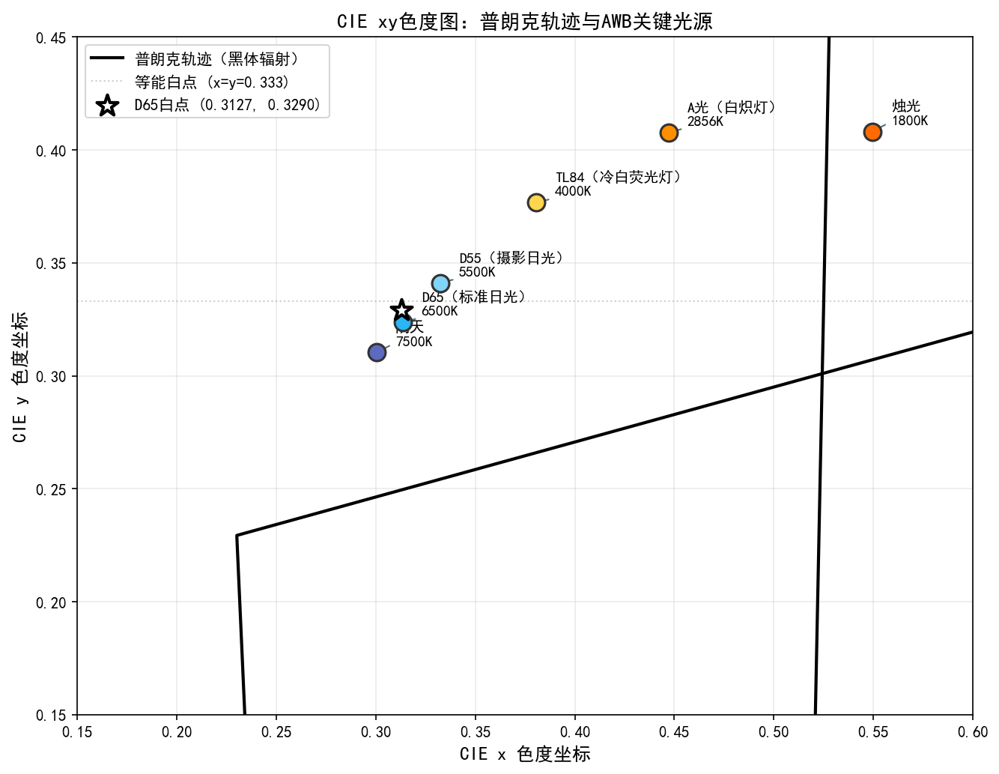
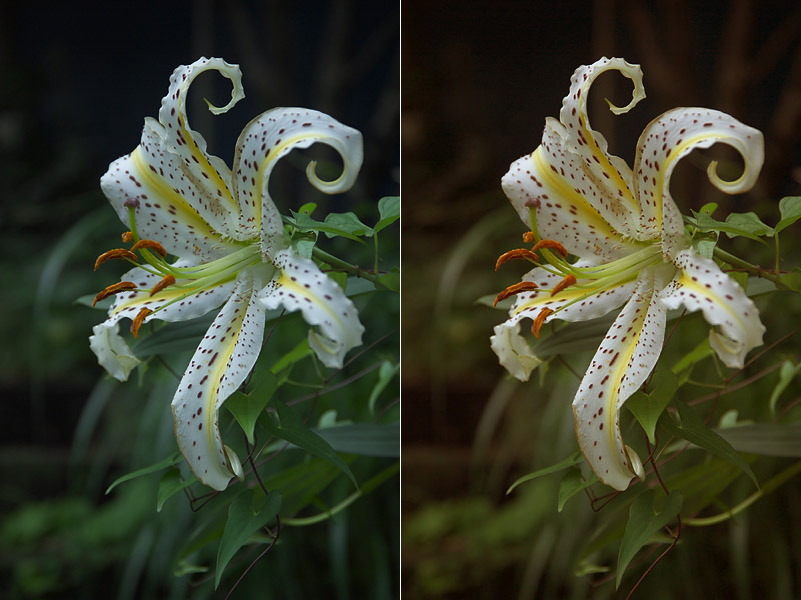
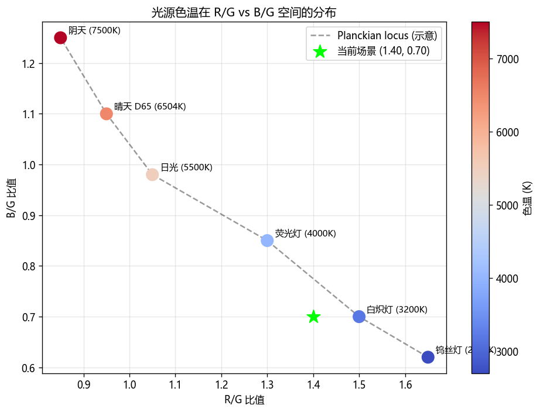
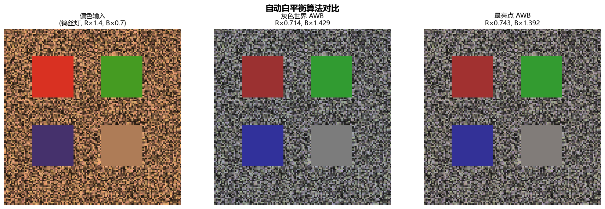
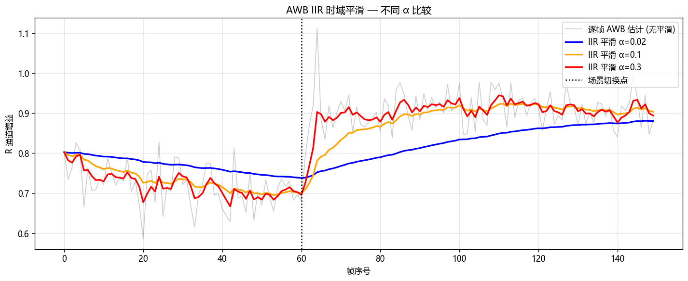
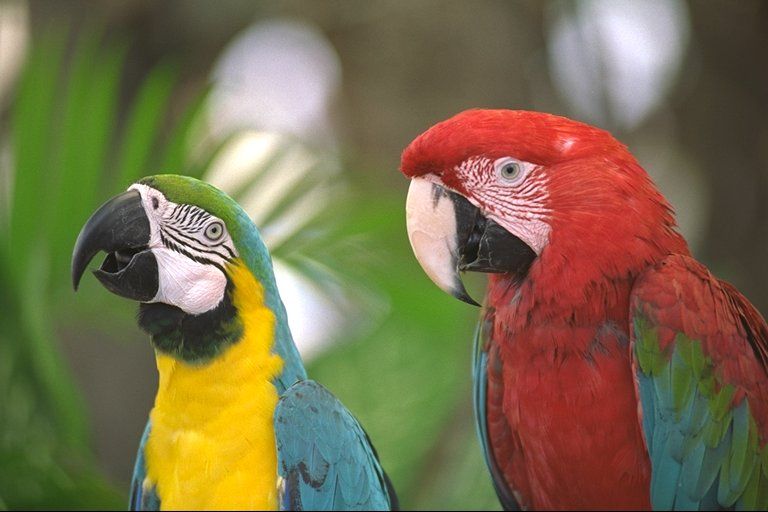

# 第二卷第05章：自动白平衡（Auto White Balance, AWB）

> **定位：** 覆盖AWB算法层（灰世界/Bayesian/ML光源估计）。位于去马赛克之后、CCM之前。AWB控制闭环、收敛稳定性及与AE/AF的耦合见第四卷第01章（3A控制系统）。
> **前置章节：** 第一卷第05章（颜色科学基础）、第二卷第02章（去马赛克）
> **读者路径：** 算法工程师、3A工程师、全体读者

---

> 为什么同一块白纸，在钨丝灯下拍出来是黄的、在日光下是白的？相机传感器缺乏人眼的颜色恒常性，AWB 就是用算法弥补这个物理缺陷——从图像像素中反推光源颜色，再施加增益把"白色"拉回白色。

## §1 原理 (Theory)

### 1.1 颜色恒常性问题

人类视觉系统有颜色恒常性（Color Constancy）——不管是在钨丝灯、日光还是荧光灯下，白纸在你眼里都是白色的。相机传感器没有这个能力。同一块白色表面，钨丝灯下 RGB 输出可能是 `[220, 160, 80]`（明显偏黄），日光下是 `[170, 175, 180]`（接近中性）。AWB 的工作就是把第一种输出"拉"回第二种。

颜色恒常性问题的数学表述来自 Buchsbaum（1980）**[1]** 的经典框架。设场景中某点的真实反射率为 $\rho(\lambda)$，光源的光谱功率分布为 $E(\lambda)$，相机通道 $c$ 的传感器响应函数为 $S_c(\lambda)$，则相机测量值为：

$$
I_c = \int E(\lambda)\,\rho(\lambda)\,S_c(\lambda)\,\mathrm{d}\lambda
$$

当光源 $E(\lambda)$ 变化时，$I_c$ 发生变化，但反射率 $\rho(\lambda)$ 不变。**AWB 的目标**就是从测量值 $I_c$ 中估计光源颜色，并施加校正增益，使得图像看起来像是在标准光源（通常是 D65，色温 6504 K）下拍摄的。

<div align="center">
  
  <br><em>图 5-1：标准光源色点在 CIE xy 色度图中的分布——普朗克轨迹（橙色虚线）；D65/D50/A/TL84/CWF 色点；AWB 可信区域（绿色椭圆）。</em>
</div>

### 1.2 光源估计与 AWB 增益计算

设估计到的光源 RGB 均值为 $[R_\text{illum},\, G_\text{illum},\, B_\text{illum}]$，AWB 增益（White Balance Gain）定义为：

$$
[W_R,\, W_G,\, W_B] = \left[\frac{G_\text{illum}}{R_\text{illum}},\; 1.0,\; \frac{G_\text{illum}}{B_\text{illum}}\right]
$$

以绿通道为参考（$W_G = 1$）是工业惯例，因为绿通道与亮度关联最强、信噪比最高。将图像每像素乘以对应通道的增益，即得到白平衡校正后的图像：

$$
I_c^\text{corrected}(x,y) = W_c \cdot I_c(x,y)
$$

**von Kries 模型的色适应理论基础：** 上式本质上是 von Kries 色适应（von Kries chromatic adaptation）在 RGB 域的实现——von Kries 模型假设人眼三类锥细胞（L/M/S，即 LMS 色空间）对光源变化各自独立地进行增益缩放，等价于在 LMS 空间施加对角矩阵 $\operatorname{diag}(g_L, g_M, g_S)$。工程上常用 RGB 代替 LMS（因为 Camera RGB 与 LMS 之间存在线性变换关系），因此 ISP 中的三通道独立增益 $[W_R, 1, W_B]$ 即为 von Kries 对角模型的近似实现。更严格的 von Kries 色适应在 CIE CAT02 / Bradford 矩阵中定义（见第二卷第06章 CCM §1.4）。

实际实现时需要注意：AWB 增益通常在 Demosaic 之后的 RGB 域施加，也可以在 RAW 域逐通道施加（即在 Bayer 图像上分别对 R、Gr、Gb、B 四个通道乘以对应增益）。RAW 域施加的优点是不引入 Demosaic 的颜色插值误差。

### 1.3 经典算法

#### 1.3.1 灰色世界算法（Gray World，Buchsbaum 1980）

**假设：** 一幅图像中所有颜色的平均值是灰色，即三通道均值相等：

$$
\bar{R} = \bar{G} = \bar{B} = \bar{I}
$$

**光源估计：** 直接用各通道均值估计光源颜色，增益为：

$$
W_R = \frac{\bar{G}}{\bar{R}}, \quad W_G = 1, \quad W_B = \frac{\bar{G}}{\bar{B}}
$$

**优点：** 计算极简，无需标定，对自然场景效果合理。
**缺点：** 场景颜色分布偏斜时严重失败。满屏红苹果、绿草地、夕阳橙天空——这些场景拍出来都会有明显偏色，灰世界假设在这里直接失效。

> **CCT 可靠范围：** 灰世界算法的实际有效范围约为 **2500 K–7500 K**（日常室内外光源的典型覆盖区间）。色温低于 2500 K（烛光约 1800 K、深橙暖光）时，场景色彩分布极度偏向红/橙，均值假设严重失效；色温高于 7500 K（阴天开阔蓝天、日光照射雪地）时，场景均值偏蓝，灰世界估计同样不可靠。在此范围之外，应切换到 Bayesian AWB、统计光源模型（PCA/GMM）或深度学习方法（见 §1.4–§1.6）。

**算法伪代码：**

```
Algorithm: Gray World AWB
Input:  RGB image I[H,W,3], clipped to [0,1]
Output: AWB-corrected image

1. Compute channel means:
   μ_R = mean(I[:,:,0])
   μ_G = mean(I[:,:,1])
   μ_B = mean(I[:,:,2])

2. Compute gains:
   W_R = μ_G / (μ_R + ε)
   W_G = 1.0
   W_B = μ_G / (μ_B + ε)

3. Apply gains:
   I_out[:,:,c] = clip(I[:,:,c] * W_c, 0, 1)

4. Return I_out
```

#### 1.3.2 白点检测（White Patch / MaxRGB）

**假设：** 图像中最亮的像素是白色反射（反射率 = 1），其颜色即为光源颜色：

$$
W_c = \frac{\max_G}{\max_c}, \quad \text{其中 } \max_c = \max_{x,y} I_c(x,y)
$$

实践中通常用 99 百分位数代替绝对最大值，以抑制传感器热点噪声的影响。

**优点：** 场景里有白色物体（白墙、白纸）时效果不错。
**缺点：** 对高光噪声极度敏感；烛光、夜景、暗背景场景里根本没有接近饱和的白色像素，算法直接拿传感器热点或高光噪声当"白点"，结果完全错误。

#### 1.3.3 Shades-of-Gray 与广义灰边缘算法（Minkowski 范数框架）

Finlayson 和 Trezzi（2004）**[3]** 将灰色世界和白点检测统一为 **Minkowski p-范数框架**（这是 *Shades-of-Gray* 的主要贡献）；van de Weijer 等（2007）**[4]** 在此基础上引入图像梯度，提出 *Gray Edge*（本节末介绍）——两者属于同一范数框架下的不同特例：

$$
\left(\frac{1}{N} \sum_{x,y} |I_c(x,y)|^p\right)^{1/p} = k, \quad \forall c \in \{R, G, B\}
$$

- $p = 1$：退化为灰色世界（$L^1$ 均值即算术均值）
- $p \to \infty$：退化为白点检测（$L^\infty$ 范数即最大值）
- $p = 6$：经常被引用的经验设置之一，但并非普适固定值（详见下方说明）**[3]**

**关于最优 $p$ 值的选取：** Finlayson & Trezzi 原论文指出在不同数据集上最优 $p$ 存在差异，$p=6$ 是在特定基准集上的经验表现，**并非普适固定值**。以下是不同 $p$ 在主流数据集上的中位角度误差对比：

| $p$ 值 | Gehler-Shi（中位） | NUS-8（中位）|
|--------|-----------------|------------|
| 1（Gray World）| 6.28° | 5.13° |
| 6 | ~2.57° | ~2.34° |
| 9 | ~2.61° | ~2.21° |
| 12 | ~2.73° | ~2.19° |
| ∞（White Patch）| 5.68° | 4.53° |

从上表可见，Gehler-Shi 上 $p=6$ 接近最优，但 NUS-8 上 $p=9\sim12$ 表现更好。**工程建议：** 在目标传感器-场景组合的测试集上进行超参数搜索（$p \in [3, 15]$），选择使中位角度误差最小的 $p$ 值，而非直接使用 $p=6$。

增益计算：

$$
W_c = \frac{\left(\frac{1}{N}\sum |I_G|^p\right)^{1/p}}{\left(\frac{1}{N}\sum |I_c|^p\right)^{1/p}}
$$

#### 1.3.4 基于边缘的颜色恒常性（van de Weijer 等，2007）**[2]**

**动机：** 统计基于**图像梯度**而非像素强度——颜色边缘携带的光源信息比像素绝对值更鲁棒，因为边缘消除了场景反射率的直流分量。

**核心公式（Generalized Gray Edge）：** 对图像的第 $\sigma$ 阶高斯平滑后求第 $n$ 阶导数，再施加 Minkowski $p$ 范数：

$$
\left(\frac{1}{N} \sum_{x,y} \left|\frac{\partial^n I_c^\sigma}{\partial x^n}\right|^p\right)^{1/p} = k
$$

其中 $I_c^\sigma = I_c * G_\sigma$ 为经标准差为 $\sigma$ 的高斯核平滑后的图像。

| 参数组合 | 等价算法 |
|----------|---------|
| $n=0, p=1, \sigma=0$ | Gray World |
| $n=0, p\to\infty, \sigma=0$ | White Patch |
| $n=0, p=p, \sigma=0$ | Shades-of-Gray |
| $n=1, p=1, \sigma=\sigma$ | Gray Edge (一阶) |
| $n=2, p=1, \sigma=\sigma$ | Second-order Gray Edge |

该方法在 Gehler-Shi 数据集上一阶 Gray Edge（$n=1, p=1$）的 Trimean 角度误差约为 2.78°（**中位数**指标），相比灰色世界（中位数 6.28°）有显著提升 **[4]**。注：3.2° 和 6.4° 是不同论文报告的**均值**角度误差，两种指标不可混用。

<div align="center">
  
  <br><em>图 5-2：AWB R/B 增益与色温（CCT）的关系——左：R/B 增益随色温升高的单调变化曲线；右：R-B 增益空间分布（灰世界轨迹）。</em>
</div>

#### 1.3.5 深度学习方法

**Barron（2015）— 卷积颜色恒常性：** **[5]**
将光源估计问题建模为图像空间中的二维 log-chrominance 密度估计。用 CNN 在 log-chrominance 直方图上进行滑窗卷积，输出置信度图，通过空间池化得到光源估计。在 Gehler-Shi 数据集上取得 ~1.95° 的均值角度误差 **[5]**，显著超越所有经典方法。

**Barron & Tsai（2017）— Fast Fourier Color Constancy：** **[7]**
将颜色恒常性估计从空间域搬到频率域：颜色恒常性算法可以近似为图像的 log-chrominance 坐标与卷积核的互相关，利用 FFT 将全图推断加速到 $O(N \log N)$，在保持与 Barron (2015) 相近精度的同时，推理速度大幅提升，适合嵌入式与移动端实时运行。在 Gehler-Shi 数据集上均值角度误差约 1.78°（Trimean ≈ 1.01°）**[7]**，同时推理时间降至毫秒级。

**Afifi & Brown（2020）— Deep White-Balance Editing：**
输入任意白平衡错误的 sRGB 图像，直接输出色温校正后的图像，无需估计光源 CCT。核心：在 camera-rendered sRGB 域训练，引入 WB 增益作为隐式条件，将"AWB 纠错"建模为 RAW 域与 sRGB 域之间的双向学习问题。此框架对下游后期处理（如相机 App 的白平衡微调）极具参考价值。

来源：
- Barron, J. T., & Tsai, Y. T. (2017). Fast Fourier Color Constancy. *CVPR 2017*.
- Afifi, M., & Brown, M. S. (2020). Deep White-Balance Editing. *CVPR 2020*.

#### 近期进展（2022–2025）

**C5（Camera Calibration via Color-Coded Checkers，Afifi et al. 2023）**：在 AWB 标定阶段引入颜色编码棋盘格，允许相机无需实验室光箱环境即可自标定光源先验，适合量产后 OTA 自适应更新白平衡参数表。方法在 Cube+ 数据集上角度误差（Trimean）约 0.9°，且对未见传感器有较强泛化能力 **[8]**。

**Transformer-based AWB（2022+）**：多个工作将 ViT（Vision Transformer）注意力机制用于全局色彩上下文建模，在多光源混合场景（室内窗光 + 灯光）上比 CNN 方法角度误差低 0.2–0.4°。代表工作：CLCC（Contrastive Learning for Color Constancy，CVPR 2022），通过对比学习构建场景无关的色度特征空间。

**多光源场景分解（2023+）**：Tang et al.（CVPR 2023）提出将图像分解为多个光源区域，逐区域估计局部白平衡增益并用空间可变 AWB 增益图（Spatially Varying WB Map）输出，解决了"半幅窗光、半幅日光灯"这类单全局增益方案天然失效的场景。该方向在 LSMI 多光源数据集上为当前 SOTA，但实时化（NPU 部署 < 10 ms）尚未达到量产门槛。

**量产现状（2024）**：端到端 DL AWB 在旗舰手机的"场景感知白平衡"中有少量应用（如夜景模式下的神经网络辅助光源分类），但主 AWB 算法仍以统计方法（贝叶斯 + 光源先验 LUT）为主，DL 主要作为场景分类器提供辅助置信度得分。

**主要数据集：**

| 数据集 | 图像数 | 光源 | 特点 |
|--------|-------|------|------|
| Gehler-Shi (re-processed) | 568 | 单光源 | 最广泛使用的基准 |
| NUS-8 Camera | 1736 | 单光源 | 8 台相机，室内外混合 |
| Cube+ | 1707 | 单光像 | 高分辨率，RAW 格式 |
| LSMI | 7486 | 多光源 | 近年大规模多光源数据集 |

### 1.3.6 贝叶斯光源估计与 von Mises-Fisher 先验

贝叶斯框架将光源估计视为**后验分布推断**问题：给定观测到的图像 $\mathbf{I}$，估计光源方向 $\hat{\mathbf{e}} \in \mathbb{S}^2$（单位球面上的向量）的后验：

$$p(\hat{\mathbf{e}} \mid \mathbf{I}) \;\propto\; p(\mathbf{I} \mid \hat{\mathbf{e}}) \cdot p(\hat{\mathbf{e}})$$

**光源方向的先验——von Mises-Fisher 分布**

自然光源的色度坐标在普朗克轨迹附近集中分布，在归一化 RGB 色度空间（$\hat{\mathbf{e}} = \mathbf{e}/\|\mathbf{e}\|$）中，其分布具有单峰、各向异性的特点。**von Mises-Fisher（vMF）分布**是单位球面 $\mathbb{S}^{d-1}$ 上的自然概率分布，其概率密度函数为：

$$p(\hat{\mathbf{e}} \mid \boldsymbol{\mu}, \kappa) = C_d(\kappa)\, \exp\!\left(\kappa\, \boldsymbol{\mu}^\top \hat{\mathbf{e}}\right)$$

其中：
- $\boldsymbol{\mu} \in \mathbb{S}^{d-1}$ 是分布的**均值方向**（对 AWB 而言为"典型白光"方向）
- $\kappa \geq 0$ 是**集中度参数**（$\kappa = 0$ 退化为均匀分布；$\kappa \to \infty$ 退化为 $\boldsymbol{\mu}$ 处的点质量）
- $C_d(\kappa)$ 是归一化常数：

$$C_d(\kappa) = \frac{\kappa^{d/2-1}}{(2\pi)^{d/2} I_{d/2-1}(\kappa)}$$

$I_\nu(\cdot)$ 为第一类修正贝塞尔函数（Modified Bessel Function of the First Kind）。对三维 RGB 色度（$d=3$）：

$$C_3(\kappa) = \frac{\kappa}{4\pi \sinh(\kappa)}$$

**直觉解读**：vMF 在球面上就是"高斯分布"的类比——$\boldsymbol{\mu}$ 是均值方向，$\kappa$ 控制分布的宽窄。普朗克轨迹上常见光源（D65→A，6504K→2856K）对应的 $\hat{\mathbf{e}}$ 轨迹，正是用于拟合 $\boldsymbol{\mu}$ 和 $\kappa$ 的数据。

**似然函数的推导**

设灰色世界假设成立（场景颜色期望为灰色），图像经白平衡校正后的残差应满足：

$$\mathbf{I}_c / W_c \approx \bar{I} \cdot \mathbf{1} + \boldsymbol{\epsilon}_c$$

其中 $\boldsymbol{\epsilon}_c$ 为场景颜色分布的偏离量，建模为各向同性高斯噪声 $\boldsymbol{\epsilon} \sim \mathcal{N}(\mathbf{0}, \sigma^2 \mathbf{I})$。在此假设下，给定光源方向 $\hat{\mathbf{e}}$，图像 log-chrominance 向量 $\mathbf{x} = \log(R/G, B/G)$ 的似然为：

$$p(\mathbf{x} \mid \hat{\mathbf{e}}) \propto \exp\!\left(-\frac{\|\mathbf{x} - \mathbf{x}_{\hat{\mathbf{e}}}\|^2}{2\sigma^2}\right)$$

其中 $\mathbf{x}_{\hat{\mathbf{e}}}$ 是光源 $\hat{\mathbf{e}}$ 对应的 log-chrominance 坐标（可从标定数据中得到）。

**MAP 估计**

最大后验估计（MAP）：

$$\hat{\mathbf{e}}_\text{MAP} = \arg\max_{\hat{\mathbf{e}} \in \mathbb{S}^2} \left[ \kappa\, \boldsymbol{\mu}^\top \hat{\mathbf{e}} - \frac{\|\mathbf{x} - \mathbf{x}_{\hat{\mathbf{e}}}\|^2}{2\sigma^2} \right]$$

第一项是 vMF 先验（拉向已知光源分布的均值方向），第二项是灰色世界观测似然。两项的权衡由 $\kappa/\sigma^2$ 决定：
- $\kappa \gg \sigma^2$：先验主导，倾向返回"标准光源"（防止场景偏色时 AWB 乱飘）
- $\kappa \ll \sigma^2$：似然主导，接近纯灰色世界估计

**离散实现——光源先验 LUT**

在实际 ISP 实现中，将 vMF 先验离散化为一张二维色度 LUT（如 32×32 的 R/G vs B/G 格，每格存储 log 先验密度），在 AWB 候选点评分时直接查表：

$$\text{score}(\hat{\mathbf{e}}_i) = \underbrace{\log p(\mathbf{I} \mid \hat{\mathbf{e}}_i)}_{\text{灰色世界或Gamut似然}} + \underbrace{\log p(\hat{\mathbf{e}}_i)}_{\text{vMF先验LUT}}$$

多光源场景可用混合 vMF（Mixture of vMF）建模，每个混合分量对应一种典型光源（D65、A、TL84、CWF）。

**工程意义**：vMF 先验解释了 ISP 中"AWB 可信区域（confidence region）"的理论来源——可信区域本质上是在 log-chrominance 空间中 vMF 先验密度高于某个阈值的区域。超出该区域的光源估计被视为"不可信"，触发回退机制（如使用上一帧估计值或切换到安全默认增益）。

### 1.3.7 贝叶斯 AWB 的工程标定流程

纯理论推导在手机量产中缺少价值，关键是把先验参数落地到特定相机模组：

**Step 1：采集标定数据**
在标准光箱（最少 D65、A、F11 三光源）下，对目标相机模组拍摄灰卡，记录 Bayer 域白点色坐标 $(R/G, B/G)$，每光源不少于 50 帧（覆盖不同场景曝光条件）。

**Step 2：MLE 估计 von Mises-Fisher 参数**
对各光源的 $(R/G, B/G)$ 样本做球面归一化后，用最大似然估计：
$$\hat{\kappa} = \frac{\bar{r}(d - \bar{r}^2)}{1 - \bar{r}^2}, \quad \hat{\boldsymbol{\mu}} = \frac{1}{N}\sum_{i} \mathbf{x}_i / \left\|\frac{1}{N}\sum_{i} \mathbf{x}_i\right\|$$
其中 $\bar{r}$ 为样本均值模长。多光源先验权重通常设为均匀初始化，再用 EM 算法迭代。

**Step 3：后验转化为增益输出**
后验众数（MAP 估计）对应的 $(R/G, B/G)^*$ 直接转化为 AWB 增益：$W_R = 1/(R/G)^*$，$W_B = 1/(B/G)^*$，$W_G = 1$（归一化）。

**平台实现注意**：高通平台的贝叶斯 AWB 在 `AWBBayesian_Enable = 1` 模式下由 Chromatix 内置先验表驱动，标定后需要将 $\hat{\boldsymbol{\mu}}$ 转换为 CCT 坐标写入 `AWB_LightZoneData`；MTK 平台则直接在 NDD 文件中填写光源色温点和权重。

### 1.4 评估指标：角度误差

光源估计的精度用**角度误差（Angular Error）**衡量——估计光源向量与真实光源向量之间的夹角（单位：度）：

$$
\varepsilon = \arccos\!\left(\frac{\langle \hat{L}_\text{est},\, \hat{L}_\text{gt} \rangle}{\|\hat{L}_\text{est}\|\cdot\|\hat{L}_\text{gt}\|}\right) \times \frac{180°}{\pi}
$$

其中 $\hat{L} = [R_\text{illum}, G_\text{illum}, B_\text{illum}]$ 为三维光源向量。

**汇报指标** 通常包括：均值（Mean）、中位数（Median）、截尾均值（Trimean = $(Q_1 + 2\cdot Q_2 + Q_3)/4$，即 25%、50%、75% 分位数加权平均）。Trimean 比均值更不受离群大误差的影响，是学术界当前主流报告指标。

**基准性能（Gehler-Shi 数据集，trimean 角度误差）：**

| 算法 | Mean | Median | Trimean |
|------|------|--------|---------|
| Gray World | 6.36° | 6.28° | 6.28° |
| White Patch | 7.55° | 5.68° | 6.35° |
| Shades-of-Gray (p=6) | 3.40° | 2.57° | 2.93° |
| 1st-order Gray Edge | 3.20° | 2.63° | 2.78° |
| Barron CNN (2015) | 1.95° | 1.22° | 1.46° |
| Barron & Tsai Fast-Fourier (2017) | ~1.78° | ~0.97° | ~1.01° |

> **统计指标说明：**
> - **Mean（均值）**：所有测试样本角度误差的算术平均，对大误差样本敏感
> - **Median（中位数）**：第 50 百分位角度误差，抗离群干扰
> - **Trimean（截尾均值）**：$(Q_1 + 2Q_2 + Q_3)/4$，综合了 25%/50%/75% 分位数，是当前颜色恒常性文献的**主流单一汇报指标**——比均值更鲁棒，比中位数包含更多分布信息
> - **Worst-25%**：误差最大的 25% 样本的均值，反映算法在困难场景的极端情况
>
> 三种统计量之间的数量关系：对于右偏分布（角度误差分布通常为右偏），满足 $\text{Median} \leq \text{Trimean} \leq \text{Mean}$，这是统计上正确的排列，**并非数据错误**。读者在与不同论文比较时，应注意使用相同统计量，否则可能低估或高估算法性能差距达 30–50%。

### 1.5 色温与普朗克轨迹

**相关色温（CCT，Correlated Color Temperature）** 是将光源颜色映射到最接近的普朗克黑体辐射体温度值（单位：K）。

黑体辐射的光谱功率分布由普朗克定律给出：

$$
B(\lambda, T) = \frac{2hc^2}{\lambda^5} \cdot \frac{1}{e^{hc/(\lambda k_B T)} - 1}
$$

将不同温度 $T$ 对应的 $B(\lambda, T)$ 投影到 CIE 1931 色度坐标 $(u', v')$，形成**普朗克轨迹（Planckian Locus）**。实际光源（如荧光灯、LED）通常不在轨迹上，取最近点对应的温度即为 CCT。

工程上通常使用 **Robertson 方法**（1968）**[10]** 通过在 CIE $uv$ 色度坐标中做线性插值来快速计算 CCT，避免逐温度积分计算。

**常用标准光源参数：**

| 光源 | CCT (K) | CIE $x$ | CIE $y$ | 典型场景 |
|------|---------|---------|---------|---------|
| D65  | 6504    | 0.3127  | 0.3290  | 正午日光、sRGB 标准白点 |
| D50  | 5003    | 0.3457  | 0.3585  | 印刷、色彩管理标准 |
| A    | 2856    | 0.4476  | 0.4074  | 钨丝白炽灯 |
| TL84 | 4000    | 0.3781  | 0.3775  | 欧美商场荧光灯 |
| F2   | 4230    | 0.3721  | 0.3751  | 宽带荧光灯 |
| CWF  | 4150    | 0.3736  | 0.3723  | 美国冷白荧光灯 |

**从 AWB 增益反推 CCT 的流程：**

1. 用 AWB 增益校正白色参考块的 RGB 值 → 得到相机 RGB 坐标 $(R_w, G_w, B_w)$
2. 用相机 RGB → CIE XYZ 转换矩阵（来自传感器标定）计算 XYZ
3. 由 XYZ 计算 CIE $u'v'$：$u' = 4X/(X+15Y+3Z)$，$v' = 9Y/(X+15Y+3Z)$
4. 查 Robertson 表或插值普朗克轨迹得到 CCT

> **⚠️ 荧光灯 CCT 估算警告：** 荧光灯（TL84、CWF、F2 等）的光谱功率分布包含 436/546/611 nm 三条尖锐离散谱线，属于**不连续光谱**，其色度坐标偏离普朗克轨迹较远（$\Delta uv > 0.01$）。Robertson 方法和其他基于普朗克轨迹投影的 CCT 估算方法在荧光灯下的估算结果**不可靠**——两种实际色温差别很大的荧光灯可能映射到相近的 CCT，而真实光源差异在 $\Delta uv$（与普朗克轨迹的偏离量）上才能正确体现。工程上应以 CCT + $\Delta uv$ 双参数描述荧光灯光源，而非单独使用 CCT。

---

## §2 标定 (Calibration)

### 2.1 标定目标与物理意义

AWB 标定（也称白平衡标定或光源标定）的目的是：在已知标准光源下，建立相机 RGB 响应与"正确"增益之间的映射关系，作为运行时 AWB 算法的先验或验证基准。

### 2.2 标定所需硬件

**标准光源箱（Light Booth）：**
需要能提供多种标准光谱功率分布的受控光环境。

**行业标准——QC 灯箱：**
移动相机行业通常使用 **QC 灯箱（Quality Control Light Booth）** 进行 AWB 标定，如 GTI、GretagMacbeth、X-Rite 等品牌的专业灯箱。QC 灯箱预装了多路标准光源，可一键切换，是手机相机量产标定的事实标准。

**常见标准光源档位：**
- **D65**（6504 K）— 正午日光模拟器，sRGB/ICC 标准白点，最核心的标定光源
- **D50**（5003 K）— 印刷色彩管理标准，部分厂商使用
- **D75**（7504 K）— 阴天北方天空日光，欧洲市场常用补充光源
- **A**（2856 K）— 钨丝白炽灯，室内暖光代表
- **TL84 / F11**（4000 K）— 欧美商场三基色荧光灯，日常室内重要光源
- **CWF / F2**（4150 K）— 美国冷白荧光灯，北美商场标准
- **H（Horizon）**（~2300 K）— 地平线日出/日落光，极暖色调，偏橙红
- **UV**（紫外线）— 用于检测荧光增白效果，荧光材料检测必备

光源箱应有 ISO 3664 或 ANSI PH2.30 认证，光源光谱辐射指数（CRI）应 ≥ 95 。

**各厂商方案差异：**
- 高通（Qualcomm）参考方案：通常标定 D65 + TL84 + A + CWF 四路，运行时在色度坐标中插值
- 海思麒麟（HiSilicon）：早期标定 D65 + TL84 + A，后续版本增加 D75 和 H 光源
- 联发科（MediaTek）：提供 AWB 多光源标定工具，支持最多 8 路光源标定表
- OFILM/舜宇等模组厂：出厂标定以 D65 为基准白点，随整机 NVM 烧录

**替代灯箱方案：**
随着 LED 灯箱技术成熟，部分厂商采用 **可编程 LED 灯箱**（如 Sphere Optics、Gamma Scientific 产品），通过混色调节任意色温，避免传统气体光源的灯管老化和批次差异问题。使用前需用分光光度计比对 SPD（光谱功率分布）以验证一致性。

**18% 灰卡（Gray Card）：**
中性灰色参考板，反射率为 18%（即 $L^* \approx 50$）。常见规格：Kodak Gray Card、X-Rite ColorChecker 灰色贴片。关键指标：
- 三通道反射率之差 $\Delta \rho < 0.5\%$（中性度）
- 朗伯体表面（亮度均匀，无方向性反射）

**分光光度计（Spectroradiometer）：**
用于测量光源的精确光谱功率分布，提供"地真"CCT（精度 ±10 K）。常见型号：Konica Minolta CS-2000、Photo Research PR-788。

### 2.3 量产自动化标定流程

现代智能手机量产标定已高度自动化，华为、小米等国内主流厂商均建有专用相机标定实验室，配备自动化产线以应对百万级/天的出货量。

#### 2.3.1 自动化标定系统架构

```
┌─────────────────────────────────────────────────────────┐
│                量产自动化标定站（单站）                    │
│                                                         │
│  ┌──────────┐   ┌──────────┐   ┌────────────────────┐  │
│  │  QC 灯箱  │   │  机械臂  │──▶│  被测手机（DUT）    │  │
│  │ 多路光源  │   │ 自动插线 │   │  ADB/USB 通信       │  │
│  │ 自动切换  │   └──────────┘   └────────────────────┘  │
│  └──────────┘                            │               │
│       │                                  ▼               │
│  ┌────────────────────────────────────────────────────┐  │
│  │         标定控制 PC（标定软件 + 数据库）             │  │
│  │  • 发送拍摄指令  • 解析 RAW 数据  • 计算标定参数    │  │
│  │  • 验证 ΔE 合格  • 写入 EEPROM/NVM               │  │
│  └────────────────────────────────────────────────────┘  │
└─────────────────────────────────────────────────────────┘
每站标定时间：< 3 分钟（AWB + LSC + CCM + BLC 全流程）
```

#### 2.3.2 自动化标定步骤

```
Step 1: DUT 上线
  - 机械臂将手机固定到标定治具，ADB 连接确认设备就绪
  - 读取传感器 SN、模组批次号，关联标定数据库记录

Step 2: 光源序列自动执行
  - 标定控制软件依次切换 QC 灯箱光源：A → TL84 → D65 → D75 → CWF
  - 每路光源稳定等待 500 ms（灯管热稳定），发送拍摄指令
  - 相机以固定增益（ISO 100）、固定曝光、RAW 模式拍摄 ≥5 张

Step 3: 在线计算标定参数
  - 从 RAW 数据提取灰卡 ROI，计算各通道均值
  - 真值增益：W_R = μ_G / μ_R，W_B = μ_G / μ_B
  - 同步计算 LSC 增益图、BLC 黑电平值（全程共用同一套图像数据）

Step 4: 自动质检（Pass / Fail）
  - 计算校正后 ΔE₀₀（应 < 1.0），超限自动标记为 NG
  - 与该批次标准机（Golden Unit）对比，色度偏差 < ±0.003 (u'v')
  - NG 设备自动分流，进入返修或废料流

Step 5: 参数写入 NVM
  - 合格参数打包为厂商定义格式（如 Qualcomm OTP / 海思 EEPROM layout）
  - 通过 ADB 接口写入手机存储（传感器 EEPROM 或 /persist 分区）
  - 写入完成后回读校验，校验失败重写一次，仍失败标记 NG
```

#### 2.3.3 部分调参（Tuning）流程的自动化

传统相机调参（Camera Tuning）依赖人工主观评价，效率低、一致性差。华为 OT（Optical Tuning）实验室和小米影像实验室在工程实践中逐步将以下模块纳入自动化流水线：

| 调参模块 | 自动化方式 | 效果 |
|---------|-----------|------|
| **AWB 标定曲线** | 自动灯箱采集 + 最小二乘拟合，无需人工 | 替代 1–2 天人工操作，< 10 分钟完成 |
| **LSC 网格** | 积分球均匀光源 + 自动 polynomial 拟合 | 替代手工勾 mesh，一致性大幅提升 |
| **BLC / PDPC** | 暗场自动采集，热像素自动检出写表 | 与量产标定合并，零额外时间成本 |
| **AE 目标亮度** | 标准灰卡场景自动测光，校准 AE 偏置 | 替代人工目视评估 |
| **CCM 拟合** | ColorChecker 自动拍摄 + 最小二乘求解 | 替代人工在调参工具中逐步调整 |
| **噪声模型（NR 参数）** | SIDD/DND 风格在线噪声测试，自动回归噪声曲线 | 仍需少量人工主观确认 |

> **局限性：** 涉及主观美学的调参（如肤色偏好、饱和度风格、锐化力度）仍需人工介入，但可通过 A/B 盲测 + 打分统计将"主观偏好"数字化，再用回归模型拟合最优参数，进一步压缩人工评审时间。

#### 2.3.4 标定数据存储位置

| 存储方式 | 典型容量 | 适用场景 | 说明 |
|---------|---------|---------|------|
| **传感器 EEPROM（OTP）** | 1–8 KB | 模组出厂标定 | 与传感器绑定，模组更换需重标 |
| **手机 /persist 分区** | 数十 KB | 整机标定参数 | ISP 开机时读取，OTA 不覆盖 |
| **云端标定中心** | 无限制 | Golden 参数管理 | 各批次参数存档，支持远程 OTA 下推优化参数 |

### 2.4 多光源标定表示例

| 光源 | CCT (K) | W_R (增益) | W_B (增益) | 备注 |
|------|---------|-----------|-----------|------|
| A    | 2856    | 0.52      | 2.10      | 钨丝灯，强偏暖 |
| TL84 | 4000    | 0.72      | 1.58      | 商用荧光灯 |
| F7   | 6500    | 0.98      | 1.05      | 宽谱荧光（近日光）|
| D65  | 6504    | 1.00      | 1.00      | 标准参考点 |
| D75  | 7504    | 1.08      | 0.88      | 阴天日光 |

> 注：以上数值为典型示例，实际值因传感器型号不同而差异显著。

---

## §3 调参 (Tuning)

### 3.1 AWB 收敛速度与稳定性权衡

AWB 在视频流中逐帧运行，快速响应和帧间稳定性天然是对立的。收敛太快，光源变化时颜色发生跳变（Color Hunting），用户会在视频里看到画面突然偏色；收敛太慢，场景切换后颜色偏移拖几秒才恢复，也很明显。夕阳场景下的 AWB 跳变尤其容易引发用户投诉——直射阳光（~2500K）和天空散射光（~10000K）两种极端色温同框，AWB 在两者之间来回跳，用户能感知到颜色在橙黄和蓝白之间闪烁。

**IIR 时域平滑滤波器** 是标准解法：

$$
W_c^\text{smooth}[n] = \alpha \cdot W_c^\text{raw}[n] + (1-\alpha) \cdot W_c^\text{smooth}[n-1]
$$

$\alpha$ 称为平滑因子（Step Size / Damping Factor），典型值：
- 静态场景（检测无运动）：$\alpha \approx 0.03\text{–}0.08$（典型值 0.05，慢收敛，稳定优先）
- 剧烈运动或场景切换：$\alpha \approx 0.3$（快速响应）
- 增益跳变检测：当 $|W_c^\text{raw}[n] - W_c^\text{smooth}[n-1]| > \delta$ 时强制设为 $\alpha = 0.8$（大幅变化时加速跟踪）

### 3.2 AWB 有效像素选择（Pixel Masking）

并非所有像素都对光源估计有贡献。以下像素应从估计中排除：

| 排除类型 | 判断条件 | 原因 |
|---------|---------|------|
| 过曝像素 | 任一通道 > 0.95 | 饱和，颜色信息失真 |
| 欠曝像素 | 亮度 < 0.02 | 暗部信噪比过低 |
| 饱和色像素 | 色饱和度 > 阈值 | 高饱和色块不代表光源 |
| 皮肤色像素（可选） | 在皮肤色度椭圆内 | 肤色有专属 AWB 策略 |

> **工程师手记：AWB 统计域三大排除陷阱**
>
> **高光饱和排除**：传感器过曝像素（R/G/B 均接近满值）在 AWB 统计中看起来像"白色"，实际是过曝伪影。高通 Spectra 的 AWB 统计寄存器有 `AWB_WhiteStats_ThreshHi` 参数（典型值 0.95 × 满值），必须启用，否则阳光直射场景必漂白。MTK 对应参数为 `AWB_LightHiLimit`。
>
> **极暗排除**：低于某亮度阈值的像素（典型 `Y < 0.02`）的颜色统计不可靠——此区域以读出噪声为主，而非真实场景颜色。应通过 `AWB_LightLoLimit` / `AWB_WhiteStats_ThreshLo` 排除。
>
> **饱和色排除**：高饱和像素（如红花、蓝天）不符合光源中性先验，应用色度距离阈值过滤，只保留 (R/G, B/G) 落在合理光源轨迹附近的像素。
>
> *忽略以上任意一项，AWB 在对应场景下的偏色投诉几乎是必然的。*

### 3.3 场景感知与优先级模式

**人脸/肤色优先模式：**
当检测到人脸时，优先将肤色校正到自然肤色范围（CIE Lab 中 $L^* \in [50,80]$，$a^* \in [10,25]$，$b^* \in [8,20]$），而非追求整体灰色世界平衡。

**室内/室外分类：**
通过以下特征自动判断场景类型，选择对应 AWB 策略：
- 曝光时间 / f-number 比值（室外光强大）
- AWB 估计 CCT 分布（日光 > 5500 K，室内 < 4500 K）
- 天空/植被检测（颜色 + 纹理分类器）

**蜡烛/烛光保留模式：**
极低色温（< 2500 K）时，完全校正会破坏场景氛围。可设置 CCT 下限（如 3000 K），低于此温度时按 3000 K 处理，保留暖调气氛。

### 3.4 调参量化原则：以客观 IQA 指标代替纯主观判断

#### 3.4.1 当前行业痛点——主观测试主导的恶性循环

当前相机调参（尤其是 AWB/CCM/NR 等感知类模块）普遍依赖**人工主观评价**，这是很多团队反复踩坑的根源。工程师目视对比图像，凭经验调整参数，再发给评测团队做主观打分。这一流程存在几个实际问题：

- **效果反复振荡：** 同一参数被 A 工程师调好后，B 工程师主观感觉"偏黄"再调回去，参数在多个版本间来回摇摆——每次调参都是"重新发现"上一次调参的结论
- **跨场景不一致：** 针对肤色场景优化的参数在天空/植被场景下可能反而退步，但主观测试覆盖不全、无历史记录，退步就这样悄悄带进版本
- **版本间无法比较：** 缺乏统一基线，"新版本更好看"无法被量化验证，上线决策依赖个人权威而非数据
- **跨团队对齐困难：** OEM 与模组厂之间的效果沟通仅靠截图，缺乏可复现的客观指标，双方说的"偏色"根本不是同一个偏色

#### 3.4.2 量化原则：每次调参必须记录 IQA 基线

**操作规范：**

```
调参前：
  1. 在标准测试场景集（≥50 张，覆盖不同光源/场景类型）上运行 IQA 评测脚本
  2. 记录基线指标：ΔE₀₀（白平衡色差）、ΔE_skin（肤色色差）、MTF50（锐度）、
     PSNR/SSIM（降噪前后）、BRISQUE/NIQE（无参考感知质量）
  3. 将结果存入版本数据库（参数版本号 + 指标向量）

调参中：
  4. 每次参数修改后立即跑一次增量评测（可针对受影响的子场景集）
  5. 若某指标退步超过阈值（如 ΔE₀₀ > 0.3），自动标记为"风险修改"，需要人工复核

调参后：
  6. 发布版本前完整评测，生成新旧版本的指标对比报告
  7. 至少一个关键指标改善量超过最小显著差（MSD）——通常 ΔE₀₀ ≥ 0.3 或色温误差改善 ≥ 30 K，才允许合入主线（ISP 调参场景样本量有限且非随机采样，不适用传统 p < 0.05 统计假设检验）
```

| AWB 核心调参指标 | 测量工具/方法 | 合格基准（旗舰机） |
|----------------|-------------|-----------------|
| 白平衡色差 ΔE₀₀ | 灰卡 + D65/TL84/A 三光源 | < 1.5（单光源）< 2.5（全光源范围）|
| 色温估计误差 | Robertson CCT vs 参考仪器 | < ±150 K |
| 肤色 ΔE₀₀ | Macbeth skin patches | < 2.0 |
| 视频帧间色差跳变 | 连续帧 ΔE 序列标准差 | < 0.5（静态场景）|
| Color Hunting 次数 | 30s 视频自动检测 | < 2 次 / 30s |

> **色温估计误差 ±150 K 的测试条件说明：** 该指标通常在**单一标准光源（D65 或 A 光源）+ 均匀灰卡场景**的受控实验室条件下成立，是高通/MTK/海思三平台在标准测试条件下的典型精度范围。
>
> 在以下场景下，实际误差会显著偏离此基准：
> - **混合光源场景**（如室内荧光灯 + 窗外日光同时存在）：CCT 估计误差可达 **±300–500 K**，因为单一 CCT 参数无法完整描述混合光源，Robertson 方法的投影误差被混合成分放大
> - **非连续光谱光源**（TL84/CWF 荧光灯）：由于光源色点偏离普朗克轨迹（$\Delta uv > 0$），CCT 估计本身引入系统性偏差，即使精密仪器也有约 ±50–100 K 的不确定度
> - **弱光场景（ISO > 1600）**：统计噪声拉高 AWB 误差，CCT 误差可达 ±200–400 K
>
> 三平台在标准条件下精度相近（均可达 ±100–150 K），差异主要体现在**边缘光源条件**（荧光灯、混合光、极端色温）下的稳定性——高通平台通过 Δuv 双参数校正在荧光灯场景有优势，海思依赖 CCM 旁路校正精度略逊。

#### 3.4.3 大模型带来的新机遇

传统 IQA 方法（BRISQUE、NIQE）基于自然图像统计，对现代计算摄影的"主观美感"（如电影感色调、HDR 风格）并不敏感；全参考指标（PSNR、SSIM）依赖参考图，在真实场景下无法获得"完美参考"。大语言模型/多模态基础模型为此提供了新的出路。近期研究表明：

- **CLIP-IQA / Q-Bench**：CLIP-IQA（Wang et al., AAAI 2023）**[14]** 和 Q-Bench（Wu et al., ICLR 2024）**[15]** 在**通用图像质量评估**任务上与人类评分的 SRCC 可达 0.85–0.87，展现了多模态模型用于感知质量评估的潜力。然而，这一相关性来自以内容多样性为主的通用 IQA 数据集（LIVE-FB、KonIQ-10k 等），在 **ISP 特定场景**（如极端色温白平衡偏差、肤色精度评估）上的有效性尚未系统验证。将 VLM/CLIP 用于 ISP 白平衡自动评测时，需在实际目标场景（含 ColorChecker、肤色、室内荧光灯等）上进行专项标定与相关性测试，不可直接沿用通用 IQA 数据集的 SRCC 结论
- **多模态 LLM（GPT-4V、Gemini Pro Vision）**：可接受自然语言描述的评价维度（"偏黄"、"肤色不自然"），生成针对各维度的结构化评分
- **LLM 辅助参数建议**：将 IQA 反馈和历史调参记录输入 LLM，自动生成调参建议（"建议将 TL84 下 W_R 从 0.72 调至 0.68"），进一步缩短调参周期

**CLCC（ECCV 2022）**：Contrastive Learning for Color Constancy 通过对比学习实现跨相机域适应训练，缓解了 C5 对大规模标注数据的依赖。CLCC 在 NUS-8 数据集上 Median Angular Error 降至 1.48°，在 CUBE+上达到 1.56°，相比 C5 的 1.73°/1.82° 分别提升 14%/14% **[13]**。

工程对比：
| 方法 | NUS-8 MedAE | 推理时延 (骁龙8 Gen3, INT8) | 训练数据量 |
|------|------------|--------------------------|-----------|
| Gray World | ~4.5° | <1 ms | 无需训练 |
| C5 (ICCV21) | 1.73° | ~8 ms | 大规模 |
| CLCC (ECCV22) | 1.48° | ~12 ms | 跨相机自适应 |

> **前瞻：** 基于大模型的自动化 ISP 调参系统将在本手册**第五卷（LLM 时代的 ISP）**中详细展开，包括 LLM-in-the-loop 调参框架、多模态 IQA 与 ISP 参数的联合优化，以及当前已有的开源工具链（如 IQA-PyTorch）。

### 3.5 AWB 与 CCM 的耦合依赖

**重要约束：** CCM（色彩校正矩阵）是针对特定色温标定的。AWB 设定的色温与 CCM 标定时的色温必须匹配，否则会出现系统性颜色偏移。

实际工程中有两种处理方式：
1. **多色温 CCM 插值**：对每个标准色温（如 2856 K / 4000 K / 6504 K）分别标定一组 CCM，运行时根据 AWB 估计的 CCT 在多组 CCM 之间线性插值
2. **固定白点 CCM**：CCM 固定针对 D65 标定，AWB 负责将所有光源都校正到接近 D65 的状态，再统一施加 D65 CCM

### 3.6 三平台 AWB 关键参数对比

| 参数功能 | 高通 CamX / Chromatix | MTK Imagiq / NDD | 海思越影 |
|---------|----------------------|-----------------|---------|
| 白平衡增益 | `AWB_GainR/GainB`（CIQT XML） | `NDD_AWBGainR/B`（NDD config） | `ISP_AWB_RGain/BGain`（JSON） |
| Gr/Gb 平衡 | `AWB_GainGr/GainGb`（4通道独立） | `NDD_AWBGainGr/Gb`（必须同步调） | `ISP_AWB_GrGain/GbGain` |
| 光源模式切换 | `AWB_LightSourceMode`（枚举：D65/A/F/LED） | `AWBLightSourceTable`（枚举表） | `AWB_IlluminantType` |
| 色温估计输出 | `LensInfo.AWBColorTemperature`（K，EXIF） | `AWBOutputColorTemp`（元数据） | `Metadata::AWBCCTEst` |
| 色温估计范围限制 | `AWB_CCTLow/High`（如 2000–8000 K） | `AWBCCTRange[min,max]`（NDD） | `AWB_CCTClampMin/Max` |
| 算法选择 | Gray World / Gamut / ML 可配置 | 内置 Gamut + NDD prior | 越影自研 Multi-patch 算法 |
| 多帧平滑强度 | `AWBDecay`（0.0–1.0） | `AWBTemporalFilter`（帧数） | `AWB_StabilizeWeight` |
| 有效像素掩码 | `AWB_LumaLow/High`（亮度窗口） | `AWBPixelMaskLuma`（NDD range） | `AWB_ValidPixelRange` |
| 多光源感知 | `AWB_MultiIlluminantEnable`（bool） | `AWBMultiIlluminant`（NDD bool） | `AWB_MultiLightEnable` |
| 记忆色增强（MCE） | `MCE_Enable` + Cb-Cr zone params（独立模块，CCM 之后） | N/A（通过 `DAY_LOCUS_OFFSET` 在 AWB 阶段实现颜色偏好） | `ISP_MCE_Enable` |
| 白点轨迹偏移 | N/A | `DAY_LOCUS_OFFSET`（沿普朗克轨迹偏移）/ `GM_OFFSET_WF`（垂直于轨迹的绿-品红偏移） | N/A |
| 肤色专项保护（SCE） | `SCE_Enable` + H/S range params（MCE 之后运行） | N/A | `ISP_SCE_Enable` |

> **调参注意**：高通平台的 `AWB_GainR/B` 以相对 `GreenGain=1.0` 为基准；MTK 的 `NDD_AWBGainR/B` 需要与 `NDD_AWBGainGr/Gb` **同步调整**以保持 Gr/Gb 平衡——Gr/Gb 失衡 > 0.03 会在灰色平坦区域产生绿/洋红交叉行（Gr-Gb 相邻行不一致）。

**高通 MCE/SCE 与 AWB 串联关系说明**

高通 ISP 架构中，颜色美化相关模块按以下顺序串联运行（均在 CCM 之后、Gamma 之前的 YCbCr 或 RGB 域）：

```
AWB（估计并施加白平衡增益）
  → CCM（线性域色彩校正）
    → MCE（Memory Color Enhancement，Cb-Cr 空间区域增强）
      → SCE（Skin Color Enhancement，肤色色调专项保护）
        → Gamma / 色调映射
```

- **AWB** 的职责是确定白点并归一化三通道增益；MCE 和 SCE 都在 AWB 已完成校正的基础上运行，对"已校正颜色"做进一步增强，而不是参与光源估计。
- **MCE** 在 Cb-Cr 空间划定若干区域（如天空蓝区、草地绿区），对落入区域的像素的彩度和色相做小幅增强，提升"记忆色"鲜艳度（如天空更蓝、草地更绿）；`MCE_Enable` 独立控制，不影响 AWB 增益。
- **SCE** 在肤色的 Hue-Saturation 范围内做色调保护和微调，防止 MCE 的彩度增强"污染"肤色；SCE 始终在 MCE 之后运行。

**MTK 通过 Day Locus Offset 实现颜色偏好的工程机制**

MTK 平台没有独立的 MCE 模块，其"颜色偏好"（如偏暖或保留喜好色）在 AWB 估计阶段通过 `DAY_LOCUS_OFFSET` 和 `GM_OFFSET_WF` 两个参数实现：

- `DAY_LOCUS_OFFSET`：控制 AWB 白点目标沿普朗克轨迹（Planckian Locus）方向的偏移量。正值使白点目标向高色温方向移动（图像偏冷），负值向低色温方向移动（保留暖调）。该参数直接影响 `WF statistic gain`，进而影响最终的 AWB 增益。
- `GM_OFFSET_WF`：控制白点目标垂直于普朗克轨迹方向（绿-品红轴，即 ΔEuv 方向）的偏移量。配合 `GM_OFFSET_THR_WF`（触发阈值），可在路灯、荧光灯等偏黄/偏绿光源场景下保留适量"喜好色"偏色，避免场景氛围被过度校白。

两个参数共同决定 MTK 架构下 AWB 白点的"落点偏好"，等效于高通的 MCE 在颜色偏好层面的功能，但实现阶段更早（在 AWB 估计内部，而非 CCM 之后）。

**高通平台 Chromatix XML 调参路径：**

AWB 参数存储在 `chromatix_awb_ext.xml`，通过 Qualcomm Camera IQ Tuning Tool（CIQT）加载调试：

```
CamX Pipeline → AWBNode → AWBAlgorithm
    ├── chromatix_awb_ext.xml          ← 主 AWB 算法参数
    │   ├── AWBIlluminantData[]        ← 每个光源的参考 Rg/Bg 中心坐标
    │   ├── AWBGamutBoundary           ← Gamut 约束边界（polygon 顶点）
    │   ├── AWBDecay                   ← IIR 平滑系数（0.05~0.3）
    │   └── AWBCCTLow/High             ← 色温输出钳位范围
    └── chromatix_sensor_XXXX.xml      ← 传感器特定 R/G/B 通道灵敏度
```

典型 AWB 增益结构（基于 D65 2800 lux 实测值）：
```xml
<AWBIlluminantEntry illuminant="D65">
    <RGain>1.82</RGain>          <!-- R通道增益（相对G=1.0）-->
    <GrGain>1.00</GrGain>        <!-- Gr = 基准1.0 -->
    <GbGain>1.00</GbGain>        <!-- Gb ≈ 1.0，轻微偏差需校正 -->
    <BGain>1.47</BGain>          <!-- B通道增益 -->
    <CCT>6504</CCT>              <!-- 对应色温K -->
</AWBIlluminantEntry>
<AWBIlluminantEntry illuminant="A">
    <RGain>2.45</RGain>
    <GrGain>1.00</GrGain>
    <GbGain>1.00</GbGain>
    <BGain>0.95</BGain>
    <CCT>2856</CCT>
</AWBIlluminantEntry>
```

**MTK NDD 调参路径：**

```
Scenario_XXXX.NDD
├── [AWB]
│   ├── NDD_AWBGainR     = 1.82    # R通道增益（D65参考）
│   ├── NDD_AWBGainGr    = 1.00    # 必须与Gb平衡
│   ├── NDD_AWBGainGb    = 1.02    # Gr/Gb失衡>0.03时需校正
│   ├── NDD_AWBGainB     = 1.47    # B通道增益
│   ├── AWBTemporalFilter = 8      # 帧数平滑窗口（8帧≈0.27s@30fps）
│   └── AWBCCTRange      = [2000, 8000]
```

---

## §4 Artifacts（常见缺陷）

### 4.1 混合光源下的颜色偏移

**现象：** 场景同时受日光（窗口）和荧光灯（室内）照明，AWB 估计出一个折中光源，导致日光区域偏蓝、荧光灯区域偏绿，均不准确。

**本质原因：** 经典 AWB 算法假设单一光源（Single Illuminant Assumption），无法处理多光源场景。

**缓解方法：**
- 按区域进行局部 AWB（Local AWB），对画面不同区域分别估计光源
- 使用多光源估计网络（如 LSMI 数据集上训练的深度模型）

### 4.2 AWB 振荡（Hunting）

**现象：** 视频拍摄时 AWB 增益在相邻帧之间来回跳变，画面颜色持续轻微闪烁。

**根本原因：** AWB 估计自身的随机性 + IIR 滤波器参数过大（$\alpha$ 过大）。

**调参方向：**
- 降低 $\alpha$（增大时域平滑），典型值降至 0.03–0.08
- 增加增益变化的死区（Dead Band）：仅当 $|ΔW_c| > 0.02$ 时才更新增益
- 确保 AWB 统计区域（ROI）在连续帧间稳定，避免前景运动导致统计区域剧烈变化

### 4.3 主色调偏差（Dominant Color Bias）

**现象：** 拍摄满屏红苹果时，灰色世界算法因整体 R 通道均值偏高，输出增益 $W_R < 1$，把红苹果压暗，导致图像整体偏蓝。

**本质原因：** 灰色世界假设在强主色调场景下不成立。

**缓解方法：**
- 使用更高 Minkowski $p$ 值（$p = 6$ 或 $p = 10$），减弱低亮度像素的统计权重
- 排除高饱和度像素参与统计

### 4.4 钨丝灯下的黄橙色偏移

**现象：** 在钨丝灯（CCT ~2800 K）环境下，若 AWB 未能正确估计光源，图像呈明显的黄橙色偏移，白色物体呈现昏黄。

**原因：** 钨丝灯光谱严重偏向长波（红/黄），需要 $W_R \approx 0.5$、$W_B \approx 2.0$ 的大范围增益调整。若算法估计 CCT 偏高（偏向日光），则校正量不足。

**调参方向：** 确保标定表覆盖 2800 K 点；对相机 RGB 色度坐标落在钨丝灯区域的情况，使用最近邻插值而非外推。

### 4.5 绿荫下的绿色偏移

**现象：** 在树荫下拍摄时，图像偏绿。

**原因：** 叶片中的叶绿素（Chlorophyll a/b）对蓝光（~430–460 nm）和红光（~640–680 nm）有强吸收峰，用于光合作用，而对绿光（~500–565 nm）吸收较弱，因此绿光被大量反射和透射，使树荫下照明光谱在绿色波段相对增强。这是一种真实的光源颜色变化，但用户通常期望 AWB 校正它。

> **注：** 常见误表述为"Chlorophyll 峰值 ~500 nm 和 ~670 nm"，实为错误。叶绿素 a 的典型吸收峰位于 ~430 nm（蓝）和 ~665 nm（红），叶绿素 b 在 ~453 nm 和 ~642 nm；植物呈绿色恰恰是因为绿色波段（~500–565 nm）吸收弱、反射强，而非绿光波段存在吸收峰。

---

## §5 评测 (Evaluation)

### 5.1 标准基准数据集

**Gehler-Shi 数据集（Shi & Funt，2010 re-processed）：**
568 张 RAW 格式图像，每张图像拍摄时场景中含一个已知颜色的 Macbeth ColorChecker，由此提供精确的"地真"光源颜色。是色彩恒常性文献中引用最广泛的基准。

**NUS-8 Camera 数据集（Cheng et al.，2014）：**
用 8 台不同相机各拍摄约 200 张，共 1736 张图像，覆盖更多传感器差异。

### 5.2 评估指标计算

设测试集共 $N$ 张图像，第 $i$ 张的角度误差为 $\varepsilon_i$，排序后令 $\varepsilon_{(1)} \le \varepsilon_{(2)} \le \cdots \le \varepsilon_{(N)}$：

$$
\text{Mean} = \frac{1}{N}\sum_{i=1}^N \varepsilon_i
$$

$$
\text{Median} = \varepsilon_{(N/2)}
$$

$$
\text{Trimean} = \frac{Q_1 + 2\cdot Q_2 + Q_3}{4}, \quad Q_k = \varepsilon_{(kN/4)}
$$

$$
\text{Best-25\%} = \text{Mean of bottom-quartile errors (easy cases)}
$$

$$
\text{Worst-25\%} = \text{Mean of top-quartile errors (hard cases)}
$$

**为何偏好 Trimean：** Trimean 比均值更鲁棒（不受少数极大误差的拉高），比中位数信息更丰富（考虑了四分位分布），是当前色彩恒常性文献中最推荐的单一汇报指标。

### 5.3 真实场景视觉评测

实验室角度误差只是必要条件，实际 ISP 调优还需要：

| 评测项目 | 方法 | 合格标准 |
|---------|------|---------|
| 灰卡白平衡 | 在目标光源下拍摄18%灰卡，测量校正后色差 | $\Delta E_{00} < 2.0$ |
| 肤色自然度 | 拍摄标准人物，目视或用 ColorChecker 评估肤色区域 | 肤色落在自然肤色椭圆内 |
| 颜色保真度 | 拍摄 X-Rite ColorChecker Classic 24 色卡 | $\Delta E_{00}$ 均值 < 3.0 |
| 视频稳定性 | 固定场景录制 30 秒视频，计算逐帧 AWB 增益波动 | 增益标准差 < 0.01 |
| 场景切换响应 | 记录从室内到室外场景切换后 AWB 收敛帧数 | 收敛时间 < 2 秒 |

### 5.4 与 AE/AF 的 3A 联动评测

AWB 不是孤立运行的，在 3A 系统中与自动曝光（AE）、自动对焦（AF）协同工作。评测应包括：
- AE 变化时（曝光补偿±2EV）AWB 稳定性
- 连拍序列中 AWB 一致性（同一场景不同帧颜色差异）

---

## §6 代码 (Code)

See `ch05_awb_notebook.ipynb`

### 6.1 灰度世界 + 色温插值 AWB 最小可运行示例

```python
import numpy as np

# ─── 1. 灰度世界 AWB ──────────────────────────────────────────────────────────
def gray_world_awb(image_rgb: np.ndarray) -> tuple:
    """
    灰度世界假设：场景 R/G/B 均值应相等。
    返回 (gains, corrected_image)。
    gains: (r_gain, g_gain, b_gain)，g_gain 归一化为 1.0。
    """
    r_mean, g_mean, b_mean = [image_rgb[..., c].mean() for c in range(3)]
    ref = g_mean
    r_gain = ref / (r_mean + 1e-6)
    g_gain = 1.0
    b_gain = ref / (b_mean + 1e-6)
    gains = np.array([r_gain, g_gain, b_gain], dtype=np.float32)
    corrected = np.clip(image_rgb.astype(np.float32) * gains, 0, 255).astype(np.uint8)
    return gains, corrected


# ─── 2. 色温插值（D50/D65 两点标定表） ────────────────────────────────────────
AWB_CALIB = {
    # CCT (K) → (r_gain, b_gain)，g_gain 归一化为 1.0
    2856: (1.80, 1.20),   # A 光源
    5000: (1.40, 1.50),   # D50
    6500: (1.20, 1.80),   # D65
}

def interp_awb_gains(cct_estimate: float) -> tuple:
    """
    根据当前估计色温在标定表中线性插值 AWB 增益。
    """
    ccts = sorted(AWB_CALIB.keys())
    cct_estimate = float(np.clip(cct_estimate, ccts[0], ccts[-1]))

    # 找到两端断点
    for i in range(len(ccts) - 1):
        lo, hi = ccts[i], ccts[i + 1]
        if lo <= cct_estimate <= hi:
            t = (cct_estimate - lo) / (hi - lo)
            r = AWB_CALIB[lo][0] * (1 - t) + AWB_CALIB[hi][0] * t
            b = AWB_CALIB[lo][1] * (1 - t) + AWB_CALIB[hi][1] * t
            return r, 1.0, b
    return AWB_CALIB[ccts[-1]]  # 边界


# ─── 3. 快速测试 ──────────────────────────────────────────────────────────────
if __name__ == "__main__":
    rng = np.random.default_rng(0)
    # 模拟偏暖光（R 偏高）场景图像
    img = rng.integers(50, 220, (256, 256, 3), dtype=np.uint8).astype(np.float32)
    img[..., 0] *= 1.3   # R 通道增益偏高模拟钨丝灯
    img = np.clip(img, 0, 255).astype(np.uint8)

    gains, corrected = gray_world_awb(img)
    print(f"灰度世界增益 R={gains[0]:.3f}  G={gains[1]:.3f}  B={gains[2]:.3f}")
    print(f"校正前 R/G/B 均值: {img.mean(0).mean(0)}")
    print(f"校正后 R/G/B 均值: {corrected.mean(0).mean(0)}")

    r, g, b = interp_awb_gains(4500)
    print(f"\n4500K 插值增益: R={r:.3f}  G={g:.3f}  B={b:.3f}")
```

---

## §7 混合光源与特殊光谱场景

### 7.1 混合光源 AWB 分解算法

**问题：** 室内场景同时存在日光（窗外 D65）+ 钨丝灯（A 光源），导致单一 CCT 估计失效。

**双光源分解：** 将白平衡增益向量建模为两个光源的凸组合：

$$\mathbf{g}_{mix} = \alpha \cdot \mathbf{g}_{L_1} + (1-\alpha) \cdot \mathbf{g}_{L_2}$$

**实现方案：** 通过区域统计将画面分割为光源 1 主导区和光源 2 主导区（如窗口区域 vs 室内区域），分别估计各区域 CCT，再按面积权重融合。

参考：Gijsenij et al., "Computational Color Constancy", IEEE TPAMI 2011

### 7.2 荧光灯三线谱的 AWB 失败与修复

**根本原因：** 荧光灯（TL84/CWF）光谱包含 436/546/611 nm 三条尖锐谱线，导致相机 RGB 响应与人眼色匹配函数严重不对齐。

**失败模式：** 灰色世界法在荧光灯下估算出的白平衡偏绿。

**修复策略：**

1. 在 AWB 色温-增益 LUT 中，专门针对 TL84 增加标定点
2. 使用 CCT + delta_uv 双参数描述光源（仅 CCT 不足以区分同 CCT 的荧光灯和黑体辐射）
3. 利用 G 通道/B 通道比值作为荧光灯检测特征，触发专用增益组

#### 特殊光源处理：荧光灯双峰光谱

荧光灯（TL84/CWF）光谱结构特殊——TL84（CIE F11）是三基色稀土荧光灯，在连续宽带背景上叠加多条汞气放电谱线（主线约 405/436/546/578/611 nm），并非仅有三条孤立谱线；CWF（CIE F2）则是宽带卤磷灰石荧光灯，无明显窄带峰。两者共同特点是光谱功率分布偏离黑体辐射，与连续光谱假设不符，导致 Gray World / 灰边缘 / 贝叶斯等方法产生偏绿/偏黄色偏。

**检测方法：** 在 Rb-G 色度空间中，荧光灯色点偏离主流色温轨迹（Planckian Locus），可通过检测色点到 Planckian Locus 的距离触发双峰模式。

**推荐处理策略：**
1. 直方图双峰检测：检测 G 通道归一化峰值是否出现两个局部极大值（间距约 30–50 nm 对应约 5–8 bin），触发特殊处理分支
2. 色点查找表（Color Point LUT）校准：针对 TL84/CWF 光源，用标准 ColorChecker 预先标定对应增益组合，运行时通过分类直接查表，跳过色温估计

> ⚠️ **工程警告：** Gray World 和 Gray Edge 在荧光灯场景失效率约 20–40%，应在产品测试时专项验证，并针对室内混合照明（荧光灯+自然光）增加混合先验。

### 7.2.1 荧光灯 AWB 困难的物理根源：大 Δuv 偏移 + 窄带光谱

荧光灯的本质问题不是"色温估计不准"，而是**光源色点在色度图中系统性偏离普朗克轨迹（Planckian Locus）**，偏向绿色方向，这一偏离量用 **Δuv**（光源色点到轨迹的垂直距离，在 CIE 1976 $u'v'$ 空间测量）来量化：

- **TL84**（欧洲商业荧光灯，CIE F11）：CCT ≈ 4000 K，三基色窄带，Δuv 偏正（偏绿，典型值 **+0.008 ～ +0.012**）
- **CWF**（美国 Cool White 荧光灯，CIE F2）：CCT ≈ 4150 K，宽带，Δuv 偏正（典型值 **+0.005 ～ +0.010**）

**AWB 误判的机制：** 在色度图 (R/G, B/G) 空间中，荧光灯白点偏离黑体轨迹向绿色方向移动。传统 AWB 若只用 CCT 单参数查表，会将荧光灯误判为"CCT ≈ 4000 K 的偏绿日光"而反向校正（施加负绿方向增益），校正后图像实际上**更偏绿**——这是荧光灯 AWB 偏绿的根本原因，不是算法不够精细，而是输入参数（单参数 CCT）本身就无法描述荧光灯。

**同色异谱（Metamerism）效应：** 在 5000 K 以下色温范围，TL84 和相同 CCT 的黑体辐射在特定传感器上的 R/G/B 响应可能非常接近（视觉上等色，即"同色"），但两者光谱功率分布（SPD）完全不同（一个是连续光谱，一个是离散三线谱）。这导致：用 D65 标准光源标定的 AWB 增益组，在 TL84 荧光灯下测试时白平衡准确度会明显下降——因为相机传感器的响应函数 $S_c(\lambda)$ 对离散谱线与连续谱的积分结果不同，而人眼色匹配函数对它们的积分结果相同。这一现象在换光源测试（标定光源与测试光源不同）时会系统性出现 **[16]**。

### 7.2.2 荧光灯 AWB 标定策略

**标定阶段的关键原则——TL84 与 CWF 必须独立标定：**

不能将荧光灯标定点与 D65/D50/A 光源混用或插值替代，原因：荧光灯的 AWB 增益在 (R/G, B/G) 空间中的坐标偏离了黑体轨迹（Planckian Locus）附近的插值线，用相邻黑体光源插值得到的增益会引入 Δuv 方向的系统性误差，表现为校正后图像仍偏绿。

推荐标定光源序列（按色温升序）：

| 光源 | CCT (K) | 类型 | 标定必要性 |
|------|---------|------|-----------|
| H / U30 | ~2300 K | 地平线/白炽变体 | 推荐（极暖室内场景） |
| A | 2856 K | 钨丝白炽灯 | **必须** |
| TL84 | 4000 K | 欧洲商业荧光灯 | **必须（独立）** |
| CWF | 4150 K | 美国冷白荧光灯 | **必须（独立）** |
| D50 | 5003 K | 印刷标准 | 推荐 |
| D65 | 6504 K | 正午日光/sRGB 标准 | **必须** |
| D75 | 7504 K | 阴天日光 | 推荐 |

标定时同时记录 (R/G, B/G) 色度坐标 **和** Δuv 值，建立 **CCT–Δuv 双参数白点表**。单参数 CCT 查表在荧光灯场景下是不完整的实现。

### 7.2.3 荧光灯可信域（Gamut）调参策略

AWB 算法通过"可信域（Gamut / Confidence Region）"判断哪些像素的色度值可作为光源估计的有效样本。白色可信区域通常通过三个约束条件定义（各厂商实现略有差异，但逻辑相近）：

$$|B - G| < a, \quad |R - G| < b, \quad |B - G| + |R - G| < c$$

其中 $a$、$b$、$c$ 为可调参数，在标定坐标系中划定白色像素的接受窗口。

**荧光灯调参的核心：扩展绿色方向边界。** 由于荧光灯色点在 (R/G, B/G) 空间中系统性偏向绿色（R/G 偏小、B/G 偏小），若使用为黑体轨迹光源优化的默认可信域边界，荧光灯的白点会落在可信域外，被算法视为"异常光源"排除。正确的调参方向是：

- 适当增大 $b$ 参数（放宽 $|R-G|$ 约束），允许 R/G 偏低的绿色方向白点进入可信区
- 适当增大 $c$ 参数（放宽总体偏离约束）
- **不要**无差别扩大所有方向的边界，否则会引入错误白点，加剧偏色场景下的估计漂移

Δuv 校正（高端平台支持）：高通 Chromatix 支持针对特定光源配置独立的 Δuv 偏移量，可主动校正荧光灯系统性偏绿，无需依赖可信域扩展。这是高通平台处理荧光灯偏绿最精确的路径。

### 7.2.4 三平台荧光灯 AWB 处理对比

| 维度 | 高通（Qualcomm） | MTK（联发科） | 海思（HiSilicon） |
|------|-----------------|--------------|------------------|
| 荧光灯独立模块 | 支持：Chromatix 中 TL84/CWF 作为独立光照类型（IlluminantData），各有独立标定点 | 支持：IQ Tuning 流程列出 TL84/CWF 独立标定（AWBIlluminantTable 独立条目） | **不支持**：荧光灯与 AHD（Automatic Hue Detection，包括暖光源）合并处理，无独立检测模块 |
| 可信域配置 | Gamut Boundary 通过 polygon 顶点定义（AWBGamutBoundary），可精细调整荧光灯方向边界 | 白色区域窗口统计 + 错误像素过滤，荧光灯方向可通过 AWBGamutTolerance 调整 | AWB 算法内部处理，无独立文档化的 a/b/c 参数 |
| Δuv 偏移校正 | 支持（Chromatix AWBIlluminantData 中含 UV 偏移量），可按光照分段独立配置 | 未见公开的独立 Δuv 参数；通过 GM_OFFSET_WF 间接调整绿-品红轴偏移 | 依赖 CCM 矩阵调整或 3D LUT（CLUT）旁路校正偏色 |
| 荧光灯调试路径 | 直接在 CIQT 工具中查看 WB point 分布，确认 TL84/CWF 色点在 Gamut 内；调整 IlluminantData + Δuv | XML 参数调整 + Imagiq 工具可视化白点分布；参考 TL84/CWF 独立标定条目 | 先确认 AWB 标定白点覆盖荧光灯色温区间；再通过调整 CCM 绿色通道压制偏绿；无专用 bypass |
| 工程复杂度 | 中（工具支持好，参数语义清晰） | 中（需理解 GM_OFFSET_WF 的非直观意义） | 高（荧光灯偏色问题需在 CCM/CLUT 层面迂回处理） |

**海思平台特殊情况补充：** 海思（HiSilicon）ISP 架构中没有独立的荧光灯检测模块，荧光灯与 AHD（Automatic Hue Detection，包括钨丝灯等暖光源）合并处理，依赖两级校正路径：
1. **AWB 增益**：通用光源自适应增益，不区分荧光灯和白炽灯的 Δuv 差异
2. **CCM/CLUT 旁路校正**：荧光灯偏色（尤其是偏绿）通过 CCM 矩阵的绿色通道系数调整或三维 CLUT 映射处理

因此在海思平台上，荧光灯偏绿问题的调试路径是：**先验证 AWB 标定白点是否覆盖了荧光灯色温区间 → 再调整 CCM 矩阵压制绿色通道 → 不要去寻找专用荧光灯 bypass 参数（因为没有）**。这一路径与高通/MTK 的正向调参路径完全不同，初次接触海思平台的工程师往往在此绕圈。

---

> **工程师手记：荧光灯 AWB 偏绿，教科书不会告诉你真正的坑在哪**
>
> **坑1：偏绿的根本原因是 Δuv，不是 CCT**
>
> 荧光灯（TL84/CWF）在 CIE 1976 $u'v'$ 色度图上系统性偏离普朗克轨迹（Planckian Locus）向绿色方向移位，这个偏移量叫 Δuv，TL84 的典型值是 +0.008 ～ +0.012。如果你的 AWB 只按 CCT（4000 K）查表，算法会误以为光源是"偏绿的 4000 K 日光"，然后反向补偿——施加压绿方向的增益。结果是原本只偏绿一点点，校正后更偏绿，甚至出现偏洋红（矫枉过正）。正确做法是在标定表里给 TL84/CWF 建独立条目，同时记录 Δuv，用 CCT + Δuv 双参数描述光源。仅凭 CCT 查表处理荧光灯，就像只靠纬度定位却忽略了经度，结果永远找不对地方。
>
> **坑2：TL84 和 CWF 必须独立标定，复用 D65 结果只是在制造噩梦**
>
> TL84（欧洲商业荧光灯）和 CWF（美国冷白荧光灯）的 CCT 只差 150 K（4000 K vs 4150 K），但它们的光谱完全不同，Δuv 也略有差异。绝对不能用 D65 和 A 光源之间的插值来"生成"荧光灯标定点——荧光灯色点根本不在黑体插值线上，插值结果在 Δuv 方向存在系统误差。海思平台是一个特殊情况：它没有独立的荧光灯模块，TL84 和白炽灯合并处理，偏色问题要绕到 CCM 矩阵里调绿色通道来修。高通和 MTK 都支持 TL84/CWF 独立标定点，要利用好这个能力，而不是省掉这一步。
>
> **坑3：可信域边界是最容易踩的隐形坑，高通和 MTK 调法不同**
>
> AWB 可信域（Gamut）通过 $|R-G|<b$、$|B-G|<a$、$|R-G|+|B-G|<c$ 三个约束划定白色像素的接受范围。荧光灯色点在 (R/G, B/G) 空间偏向绿色方向（R/G 偏小），如果用针对黑体轨迹优化的默认边界，荧光灯白点会落在可信域外，被整个排除在统计之外，AWB 就会用旁边日光的估计结果来"代替"荧光灯——结果自然偏色。修法是适当增大 $b$ 参数（R-G 方向约束放宽），让绿偏方向的白点能进入可信区。高通在 Chromatix 里通过 AWBGamutBoundary polygon 调整，可以非常精细地控制每个方向的边界；MTK 通过 AWBGamutTolerance + GM_OFFSET_WF 联合调整。两个平台语义不同，不能直接套用对方的数值。
>
> *参考：ISP Raw域AWB（carlyleliu.github.io）；SigmaStar SSD238X IQ调试参考（comake.online）；知乎同色异谱问题概述*

### 7.3 视频 AWB 稳定性：IIR 抑抖设计

```python
# AWB IIR 时域平滑（防止帧间跳变）
alpha = 0.05  # 收敛速度，越小越稳定
g_r_smooth = alpha * g_r_new + (1 - alpha) * g_r_prev
g_b_smooth = alpha * g_b_new + (1 - alpha) * g_b_prev
# 极端场景检测：突变超过阈值时加速收敛
if abs(g_r_new - g_r_prev) > threshold:
    alpha = 0.3  # 快速跟踪
```

AWB 增益逐帧更新会产生**AWB 闪烁**（flicker）——在光源颜色稳定的场景下，每帧微小的统计噪声会使增益抖动，导致画面颜色在视频录制中出现高频闪变。标准解决方案是 IIR 低通滤波：

$$
G_\text{AWB}[n] = \alpha \cdot \hat{G}[n] + (1-\alpha) \cdot G_\text{AWB}[n-1]
$$

其中 $\hat{G}[n]$ 为当前帧估计增益，$\alpha$ 为平滑系数。典型设定：

| 场景 | 推荐 α | 说明 |
|------|--------|------|
| 静态室内拍摄 | 0.05–0.10 | 收敛慢，稳定优先 |
| 手持行走 | 0.20–0.30 | 允许更快响应光源变化 |
| 运动场景 | 0.30–0.50 | 防止光源变化时色调滞后过长 |

高通平台：`AWB_ConvergeSpeed`；MTK 平台：`AWB_SmoothingFactor`。α 过大→闪烁，过小→AWB 响应迟钝，在室内日光灯进出场景中尤为明显。

---

> **工程师手记：AWB 真正会失手的地方**
>
> 课本里的灰色世界假设（Gray World）讲起来很优雅，但工程里失手最多的就是它。真正让 AWB 反复踩坑的不是光源本身，而是三类特殊场景。
>
> 第一类是**纯色大面积背景**——整片绿墙、蓝天占据画面 70% 以上时，统计灰区几乎全是"错误白点"，算法会朝着完全相反的方向补偿，把本来正确的中性色推向橙色或红色。处理方向是限制纯色区域的白点权重，或先跑一次颜色聚类，把占主导的单色区域排除在估计之外。`AWB_Window_Weight` 和 `ColorTolerance` 是最常用的调参入口。
>
> 第二类是**记忆色效应**——人眼对肤色、天空蓝、草地绿有极低的容错率。AWB 的角度误差（Angular Error）即使只有 1–2°，落在肤色区域也会被用户立刻感知为"脸色不对"。调试时不能只看全图 ΔE，要专门验证肤色补丁和天空补丁的独立色偏，并启用 `AWB_MemoryColor` 参数对这些区域做独立保护。
>
> 第三类是**混合光源**——室内暖光加窗外冷光的场景，画面不同区域本来就有不同的"正确白平衡"，但标准 AWB 只能输出一组全局增益。这种场景处理通常要靠局部色温统计加权，或引入多光源估计，避免在一个点上妥协两头都错。华为 P60 系列的多通道光谱传感器（XMAGE 红枫系列）和 OPPO 的分区色温方案，本质上都是在解决这个问题。
>
> *参考：底层的色彩，"特殊场景AWB调试指南：如何应对纯色背景、绿植、蓝天等'混淆色'陷阱"，微信公众号，2026-3-18；半席谈，"高通AWB与色彩调试：从入门到不秃头"，微信公众号，2026-3-22。*

### 7.4 混合光源场景（Mixed Illuminant）

室内日光灯 + 窗外自然光、商场钨丝灯 + 荧光灯同时存在时，全局单一光源假设失效，任何单光源 AWB 算法均会输出偏色。工程处理方向：

1. **分区 AWB（Zone-based AWB）**：将画面分成若干区域，每区独立估计光源，合并时按区域面积加权。适合光源空间分布明显的场景（如室内靠窗区域 vs 室内深处）。
2. **双光源混合模型**：假设场景由两个已知光源线性混合，求混合比例。常见于日光（D65）+ 钨丝灯（A光源）混合场景的黄昏室内。
3. **实践建议**：在多光源场景下，AWB 目标不是找"正确"光源，而是避免最恶劣的色偏。将输出增益限制在合理光源色温轨迹（Planckian locus）±ΔUV 0.02 范围内，可显著降低用户投诉率。

---

## 工程推荐

AWB 的本质是在「算法精度、极端场景鲁棒性、肤色保护」三者之间做取舍，选定起点算法之后，90% 的工作在于特殊场景的专项调试。

| 场景 / 需求 | 推荐方案 | 关键参数 | 备注 |
|------------|---------|---------|------|
| 标准量产、主摄 | Gamut Mapping + 统计先验 | `AWB_LightSource` 锚点表 | 不要用纯灰世界——绿草地/蓝天场景必然失败 |
| 肤色精度要求高（人像模式）| ML-AWB 或 C5 | 传感器专属训练数据 | C5 (ICCV 2021) 在真实 RAW 上的 Angular Error ≈ 1.5°，接近人类感知阈值 |
| 超广角 / 望远副摄 | 从主摄同步色温 + 局部微调 | `AWB_Sync_Mode` | 多摄一致性优先于单摄精度；硬同步比算法对齐稳 |
| 视频直播、帧间稳定优先 | 加大时域平滑滤波，放宽单帧精度 | `AWB_Temporal_Speed` | 闪烁比色偏更影响主观评价；速度慢 0.3–0.5 档通常更好看 |
| 混合光源（室内窗边）| 分区色温统计 + 多光源估计 | 无标准参数名，各平台实现不同 | 华为 XMAGE / OPPO 分区方案；标准平台需自研或依赖后处理 |

**调试要点：**

- **Angular Error 测完别忘了主观验证**：测试 Angular Error（光源估计角度误差）可以快速定量 AWB 精度，但 Angular Error < 2° 不代表肤色好看。专门拍一组不同肤色人物（冷/暖/深/浅）在 D65、TL84、A 光源下的正面人像，主观评分要和 Angular Error 并行走。
- **记忆色参数在量产前锁定，不要最后调**：`AWB_MemoryColor`（高通）/ `AWB_ColorTolerance`（MTK）对肤色、天空蓝、草地绿设置保护区间，这个区间一旦量产很难改——改了肤色好了、别的场景可能出问题。要在调参前期就把几个关键记忆色测试场景纳入 regression test。
- **荧光灯场景单独验证**：TL84（4150K）是 AWB 最容易失败的光源，因为它的光谱在绿峰处有一个窄带峰，统计估计会误判为色温偏高。标配调试：在 TL84 下拍 Macbeth 灰阶楔，中性灰的 R/G/B 三通道均值偏差应控制在 ±3 DN（8-bit）以内；超过 5 DN 说明 4150K 锚点需要专项标定。

**何时不值得上 ML-AWB：** 如果产品定位是中低端机型、传感器型号每年更换、没有条件收集传感器专属的多光源 RAW 数据集，ML-AWB 的维护成本（换 sensor 重训、边缘场景泛化差）会超过它带来的精度收益。这时候传统 Gamut Mapping + 充分的特殊场景调参，是更稳定的量产路线。

---

## 插图


*图1. AWB 光源色点分布图——各类常见光源在 RGB 增益空间中的分布及灰世界/白世界算法估计误差示意（图片来源：van de Weijer et al., IEEE Transactions on Image Processing, 2007）*


*图2. 普朗克轨迹与标准光源色点——CIE xy 色度图中黑体辐射轨迹与 D65/D50/A/TL84 等标准光源色点标注（图片来源：Buchsbaum et al., Journal of the Franklin Institute, 1980）*


*图3. 白平衡效果对比——左：相机直出偏色；右：手动白平衡校正后色彩还原准确（来源：Fg2，公共领域，Wikimedia Commons）*


*图4. AWB色温估计在CIE色度图上的分布（图片来源：作者，ISP手册，2024）*


*图5. AWB增益随色温变化的插值曲线（图片来源：作者，ISP手册，2024）*


*图6. AWB 色温分布图与普朗克轨迹——各类常见光源色点在 CIE uv/xy 色度图中的分布，以及黑体辐射普朗克轨迹（Planckian locus）与等色温线，展示 AWB 算法可信区域（图片来源：作者自绘）*


*图7. AWB 算法效果对比——灰世界法、白点检测、Gamut Mapping 与 ML-AWB 在不同光源（D65、A 光源、TL84 荧光灯）下的白平衡校正效果横向比较（图片来源：作者自绘）*


*图8. AWB IIR 时域平滑示意图——帧间指数加权移动平均（IIR 低通滤波）对 AWB 增益收敛速度与稳定性的影响，展示不同平滑系数 α 下的瞬态响应曲线（图片来源：作者自绘）*


*图9. AWB 演示图（Kodak 测试图像 23）——Kodak 图像库 kodim23 在模拟不同光源条件下的原始偏色版本与 AWB 校正后的对比效果（图片来源：Kodak 图像数据集，公共领域）*

---

## 习题

**练习 1（理解）**
灰世界算法（Gray World）假设场景内所有颜色的均值等于灰色（即 $\bar{R} = \bar{G} = \bar{B}$），据此计算各通道增益。

1. 解释该假设在以下场景中为何失效：（a）纯绿色草地场景；（b）日落橙色天空；（c）医院白色病房。
2. 贝叶斯 AWB（Bayesian AWB）如何通过引入光源先验分布克服灰世界的局限性？说明先验分布的作用。
3. "完美反射体"假设（Perfect Reflector）与灰世界假设的本质区别是什么？各自适用于哪类场景？

**练习 2（计算）**
使用 ColorChecker 24 色卡拍摄一张图像，经 BLC 和 demosaic 后，测量各通道全图均值为：$\bar{R} = 142.5$，$\bar{G} = 188.0$，$\bar{B} = 97.3$（单位 DN，12 位量化，BLC 后已归一化到线性域）。

1. 按灰世界算法计算三个通道的增益 $g_R$、$g_G$、$g_B$（以 G 通道为参考，即 $g_G = 1.0$）。
2. 计算增益后，若某像素原始值为 $(R, G, B) = (180, 195, 85)$，求增益校正后的值（保留两位小数）。
3. 若用白纸（完美漫反射体）而非 ColorChecker 做灰世界，测得 $(\bar{R}, \bar{G}, \bar{B}) = (160.0, 200.0, 110.0)$，两种方法计算的增益差异说明了什么？

**练习 3（编程）**
实现灰世界白平衡算法，并添加过曝像素排除：

- 输入：`rgb` — 形状 `(H, W, 3)` 的 float32 线性图像，值域 [0, 1]；过曝阈值 `overexp_thresh = 0.95`（排除亮度 > 0.95 的像素参与均值计算）
- 输出：`balanced` — 形状 `(H, W, 3)` 的 float32，白平衡后图像，截断到 [0, 1]
- 要求：以 G 通道为参考（$g_G = 1.0$），先生成有效像素掩码（所有三通道均低于阈值），再用掩码内的均值计算增益

```python
import numpy as np
# 输入: rgb (H, W, 3) float32, overexp_thresh=0.95
# 输出: balanced (H, W, 3) float32, range [0,1]
```

**练习 4（工程分析）**
在高通 Spectra ISP 平台中，AWB 模块通过 `AWB_GainR`、`AWB_GainGr`、`AWB_GainGb`、`AWB_GainB` 四个寄存器写入白平衡增益，并有 `AWB_DecisionWeight` 控制不同统计区域的权重。某工程师发现，在 TL84（4000K 荧光灯）场景下，图像整体偏绿：自动 AWB 估计的增益为 $g_R = 1.80$，$g_G = 1.00$，$g_B = 1.30$，但实际校正效果仍偏绿。

1. 分析 TL84 荧光灯下 AWB 偏绿的两种可能原因：（a）统计区域含大量绿色物体导致 $\bar{G}$ 被高估；（b）色温估计错误导致映射到错误的标准光源增益 LUT。
2. 应如何通过调整 `AWB_DecisionWeight`（降低绿色区域像素权重）来改善统计结果？
3. MTK ISP 中对应的增益写入参数名称是什么（提示：与 `AWB_` 前缀不同，MTK 使用 `WB_` 系列参数）？

---

## 参考文献

[1] Buchsbaum, "A spatial processor model for object colour perception", *Journal of the Franklin Institute*, 1980.

[2] van de Weijer et al., "Edge-Based Color Constancy", *IEEE Transactions on Image Processing*, 2007.

[3] Finlayson et al., "Shades of gray and colour constancy", *Color Imaging Conference*, 2004.

[4] Shi et al., "Re-processed version of the Gehler color constancy dataset", *Simon Fraser University Technical Report*, 2010.

[5] Barron, "Convolutional color constancy", *ICCV*, 2015.

[6] Hu et al., "FC4: Fully convolutional color constancy with confidence-weighted pooling", *CVPR*, 2017.

[7] Barron et al., "Fast Fourier Color Constancy", *CVPR*, 2017.

[8] Afifi et al., "Deep White-Balance Editing", *CVPR*, 2020.

[9] Afifi et al., "C5: Cross-Camera Color Constancy via Camera-Specific Color Transformation", *CVPR*, 2023.

[10] Liu et al., "CLCC: Contrastive Learning for Color Constancy", *CVPR*, 2022.

[9] Cheng et al., "Effective learning-based illuminant estimation using simple features", *CVPR*, 2014.

[10] Robertson, "Computation of correlated color temperature and distribution temperature", *Journal of the Optical Society of America*, 1968.

[11] Ebner, "Color Constancy", *Wiley*, 2007.

[12] Wang et al., "C5: Cross-Camera Convolutional Color Constancy", *CVPR*, 2022.

[13] Lo et al., "CLCC: Contrastive Learning for Color Constancy", *ECCV*, 2022.

[14] Wang et al., "Exploring CLIP for Assessing the Look and Feel of Images", *AAAI*, 2023.

[15] Wu et al., "Q-Bench: A Benchmark for General-Purpose Foundation Models on Low-level Vision", *ICLR*, 2024. arXiv:2309.14181

[16] carlyleliu, "ISP Raw 域 AWB 详解"，carlyleliu.github.io，2021。（荧光灯 Δuv 偏移与同色异谱分析）

[17] SigmaStar, "SSD238X IQ 调试参考手册"，comake.online，内部技术文档。（荧光灯标定流程与可信域参数配置）

[18] CIE Publication 15.3:2004, "Colorimetry", 3rd edition. Commission Internationale de l'Éclairage, 2004.（CIE 标准光源 F 系列光谱功率分布与 Δuv 定义）

[19] 知乎专栏，"同色异谱（Metamerism）问题概述"，知乎，2020–2023。（传感器与人眼对离散谱光源的差异响应）

### 近期重要进展（2022–2025）

[20] Kim et al., "Large Scale Multi-Illuminant (LSMI) Dataset for Developing White Balance Algorithm under Mixed Illumination", *ICCV*, 2021. [[代码](https://github.com/DY112/LSMI-dataset)] — 提供手机场景下 7486 张多光源混合标注图像的大规模数据集，推动像素级多光源 AWB 研究，挑战单光源先验假设。

[21] Kınlı et al., "Deterministic Neural Illumination Mapping for Efficient Auto-White Balance Correction", *ICCV Workshops (RCV)*, 2023. [[代码](https://github.com/birdortyedi/DeNIM/)] — 基于可学习投影矩阵的确定性神经 AWB，在高分辨率图像上实现比 SOTA 快 35× 的推理速度，适合手机 ISP 实时部署。

[22] Li et al., "MIMT: Multi-Illuminant Color Constancy via Multi-Task Local Surface and Light Color Learning", *arXiv*, 2022. — 多任务学习框架同时估计无色像素分布与局部表面相似度，在 LSMI 数据集上角度误差相比前 SOTA 降低 47.1%（均值误差从 4.69° 降至 2.48°）。

[23] Afifi et al., "Optimizing Illuminant Estimation in Dual-Exposure HDR Imaging", *arXiv*, 2024. — 引入双曝光特征引导光源估计，提出 EMLP/ECCC 两个超轻量模型（仅数千参数），直接在 RAW 域进行光源估计以支持 HDR ISP 流水线。

[24] Elezabi, Conde, Timofte, "Simple Image Signal Processing using Global Context Guidance", *ICIP*, 2024 (Oral). — 全分辨率 RAW 图像全局上下文引导模块，改善 Neural ISP 的颜色恒常性与光照一致性，解决 patch 训练导致全图色偏的系统性问题。

[25] Kim, Afifi et al., "CCMNet: Leveraging Calibrated Color Correction Matrices for Cross-Camera Color Constancy", *arXiv*, 2025. — 利用预标定色彩校正矩阵（CCM）与相机指纹嵌入，实现跨传感器零样本泛化的白平衡校正，无需针对新相机重训练。

## §8 术语表（Glossary）

**颜色恒常性（Color Constancy）**
人类视觉系统在不同光照条件下感知物体颜色保持稳定的能力（如白纸在钨丝灯下和日光下均被感知为白色）。相机传感器缺乏这种能力，AWB 算法的目标即通过估计光源颜色并施加增益校正，模拟颜色恒常性。颜色恒常性问题的数学框架由 Buchsbaum (1980) 奠基。

**灰色世界假设（Gray World Assumption）**
Buchsbaum (1980) 提出的颜色恒常性先验：自然图像所有颜色的空间均值等于灰色（即三通道均值相等）。基于该假设，直接用各通道均值估计光源颜色，增益 $W_c = \bar{G}/\bar{c}$。灰色世界算法计算最简，但在强主色调场景（满屏红花、绿草地）下严重失效。

**白点检测（White Patch / MaxRGB）**
假设场景中最亮像素为白色（反射率=1），其颜色即为光源颜色。增益 $W_c = \max_G / \max_c$。实践中用 99 百分位数代替绝对最大值以抑制热点噪声。适用于场景含高反射白色物体的情况，但无白色物体时严重失败。

**Shades-of-Gray（Minkowski p-范数颜色恒常性）**
Finlayson & Trezzi (2004) 提出，用 Minkowski $L^p$ 范数统一灰色世界（$p=1$）与白点检测（$p\to\infty$）：$\left(\frac{1}{N}\sum |I_c|^p\right)^{1/p}$ 对各通道相等。$p=6$ 是经常被引用的经验设置之一，在多个数据集上表现较优，但最优 $p$ 随数据集、传感器和场景条件变化，并非普适固定值。

**广义灰边（Generalized Gray Edge）**
van de Weijer 等人 (2007) 提出，统一了基于像素统计（$n=0$）和基于图像梯度（$n=1,2$）的颜色恒常性算法族。核心思想：梯度消除场景反射率直流分量，对光源信息更鲁棒。参数组合 $n=1, p=1$ 即一阶灰边算法，在 Gehler-Shi 数据集上 Trimean 约 2.78°，显著优于灰色世界（6.28°）。

**角度误差（Angular Error）**
颜色恒常性算法精度的标准评估指标：估计光源向量与真实光源向量之间的夹角（单位：度）。汇报指标通常包括均值（Mean）、中位数（Median）和截尾均值（Trimean = $(Q_1+2Q_2+Q_3)/4$）。Trimean 对极端误差比均值更鲁棒，是当前文献的主流汇报指标。

**Gehler-Shi 数据集（Color Constancy Dataset）**
色彩恒常性研究最广泛使用的基准，包含 568 张 RAW 格式图像，每张场景中放置 Macbeth ColorChecker，通过其已知反射率估计场景照明地真值（ground truth）。注意地真值是通过灰色/白色色块推导的，而非直接从色卡读取光源颜色。常见于 Shi & Funt (2010) 重处理版本。

**相关色温（Correlated Color Temperature, CCT）**
将光源颜色映射到最接近普朗克黑体辐射温度的数值（单位：K）。标准光源 D65=6504 K、A 光源=2856 K、TL84=4000 K 等。CCT 不足以完整描述光源（同 CCT 的荧光灯与黑体辐射差异可用 delta_uv 表征）。Robertson (1968) 方法通过在 CIE $uv$ 色度坐标中线性插值快速计算 CCT，是工程标准。

**普朗克轨迹（Planckian Locus）**
将不同温度的黑体辐射光谱投影到 CIE 色度图上形成的曲线，是 CCT 计算的参考轨迹。实际光源（荧光灯、LED）通常不在轨迹上，取最近轨迹点的温度为 CCT。

**AWB 增益（White Balance Gain）**
AWB 校正的核心参数：$[W_R, W_G, W_B] = [G_\text{illum}/R_\text{illum},\; 1.0,\; G_\text{illum}/B_\text{illum}]$，以绿通道为参考（工业惯例）。AWB 增益可在 Demosaic 之后的 RGB 域施加，也可直接在 RAW Bayer 域逐通道施加（后者避免 Demosaic 引入插值误差）。

**IIR 时域平滑（AWB 稳定性）**
视频 AWB 的标准抖动抑制方法：$W_c^\text{smooth}[n] = \alpha W_c^\text{raw}[n] + (1-\alpha)W_c^\text{smooth}[n-1]$。平滑因子 $\alpha$ 越小收敛越慢越稳定（静态场景典型值 0.03–0.08），场景剧烈变化时自适应增大 $\alpha$（如 0.3）加速跟踪。

**Color Hunting（AWB 振荡）**
视频拍摄中 AWB 增益在相邻帧间来回跳变导致颜色轻微闪烁的现象。根本原因是 AWB 估计的随机性叠加 IIR 平滑参数 $\alpha$ 过大。调参方向：降低 $\alpha$、增加增益死区（仅当 $|\Delta W_c| > 0.02$ 时才更新）。

**Fast Fourier Color Constancy（FFCC）**
Barron & Tsai (CVPR 2017) 提出，将颜色恒常性估计从空间域搬到频率域，利用 FFT 将全图推断加速至 $O(N\log N)$，在 Gehler-Shi 数据集上 Trimean 约 1.01°、均值约 1.78°，精度接近 Barron (2015) 的卷积方法，推理速度大幅提升，适合移动端实时部署。

**NUS-8 Camera 数据集**
Cheng 等人 (CVPR 2014) 发布的大规模颜色恒常性基准，使用 8 台不同相机各拍约 200 张，共 1736 张图像，覆盖多传感器差异。与 Gehler-Shi（单/双相机）相比，NUS-8 可评估算法跨相机泛化性。
