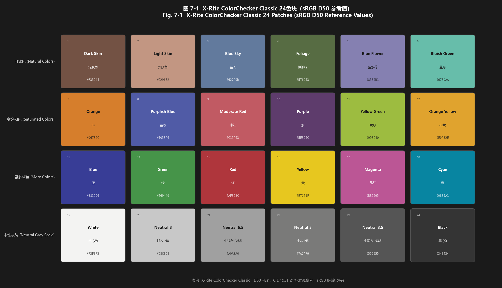
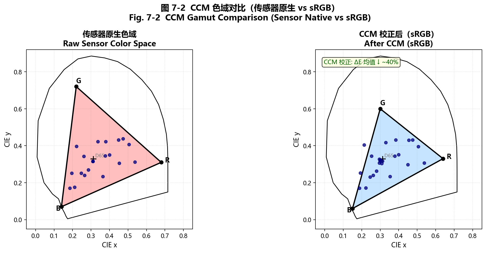
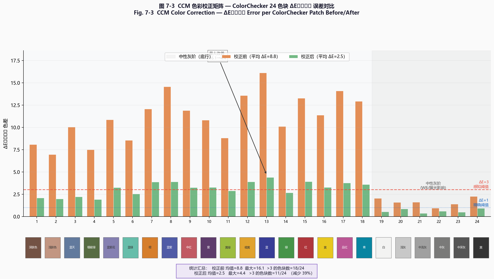
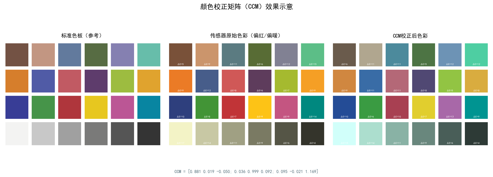
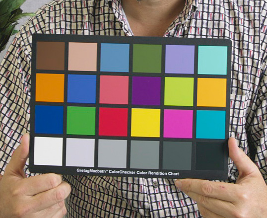
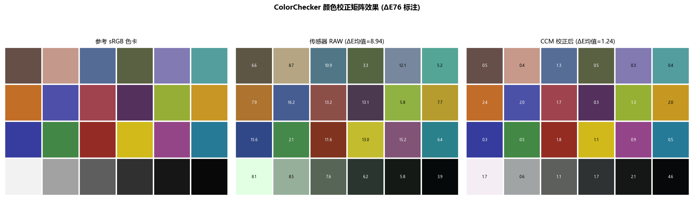

# 第二卷第06章：颜色校正矩阵（Color Correction Matrix, CCM）

> **定位：** AWB增益之后、Gamma/色调映射之前；与AWB共同构成颜色科学链路。
> **前置章节：** 第一卷第05章（颜色科学基础）、第二卷第05章（自动白平衡）
> **读者路径：** 算法工程师、系统设计师

---

## §1 原理 (Theory)

### 1.1 问题背景：传感器 RGB 与标准色彩空间的差异

传感器的滤色片（CFA）光谱响应不等于 sRGB 标准规定的颜色匹配函数。这是一个根本性的不匹配——不是传感器设计缺陷，而是物理限制：要做到光谱响应精确符合 CIE CMF 的传感器造价极高，且会显著牺牲感光量。现实中的传感器 CFA 是感光量、色彩准确度和制造成本的折中结果。

设传感器通道 $c \in \{R, G, B\}$ 的光谱响应函数为 $q_c(\lambda)$，入射光的光谱辐亮度为 $L(\lambda)$，则传感器的原始 RGB 测量值为：

$$
I_c = \int L(\lambda)\, q_c(\lambda)\, \mathrm{d}\lambda
$$

而 sRGB 色彩空间期望的三刺激值（tristimulus values）是基于 CIE 1931 XYZ 颜色匹配函数 $\bar{x}(\lambda), \bar{y}(\lambda), \bar{z}(\lambda)$ 推导的，两者通常不一致。这种不一致性导致：

- **色调偏移（Hue Shift）：** 红色偏橙、绿色偏黄绿等系统性偏差
- **饱和度误差：** 鲜艳色彩的彩度被高估或低估
- **跨光源不一致：** 在不同光源下偏差方向不同

**CCM（Color Correction Matrix，颜色校正矩阵）** 的目标是在线性光域中，用一个 3×3 矩阵将传感器 RGB 变换到标准 sRGB 空间，使得最终图像颜色尽量符合人眼感知和色彩标准。

**与色适应变换的关系：** CCM 是相机系统色适应（Chromatic Adaptation）链路的核心环节。色适应（chromatic adaptation）是人眼在不同光源下仍能感知稳定颜色的能力，其数学模型为 von Kries 色适应——在 LMS 锥细胞空间（或其线性近似）施加对角缩放矩阵。工程上，AWB 完成白点归一化（对角增益，近似 von Kries 模型），CCM 再将归一化后的传感器 RGB 旋转/倾斜映射到标准 sRGB 原色坐标，两者合并等价于 CIE CAT02 / Bradford 色适应变换的近似分解实现（见第一卷第05章颜色科学基础）。

**Bradford 变换矩阵（标准数值）：** Bradford 矩阵 $\mathbf{M}_\text{Brad}$ 将 CIE XYZ 转换到 Bradford LMS 适应空间，其精确数值（ICC Profile 规范及 IEC 61966-2-1 sRGB 标准采用）为：

$$
\mathbf{M}_\text{Brad} = \begin{bmatrix}
 0.8951 &  0.2664 & -0.1614 \\
-0.7502 &  1.7135 &  0.0367 \\
 0.0389 & -0.0685 &  1.0296
\end{bmatrix}
$$

色适应变换（从光源 $\mathbf{W}_\text{src}$ 到目标白点 $\mathbf{W}_\text{dst}$）的完整公式：

$$
\mathbf{M}_\text{CAT} = \mathbf{M}_\text{Brad}^{-1} \cdot \mathrm{diag}\!\left(\frac{\mathbf{M}_\text{Brad}\,\mathbf{W}_\text{dst}}{\mathbf{M}_\text{Brad}\,\mathbf{W}_\text{src}}\right) \cdot \mathbf{M}_\text{Brad}
$$

其中除法为逐元素除法（von Kries 对角缩放）。在 ISP 实践中，AWB 增益矩阵隐式完成白点归一化，CCM 中通常不再显式计算 Bradford 变换，但其数值作为色度标定精度的参考基准。

### 1.2 线性 CCM 模型

CCM 采用线性矩阵乘法模型。设经过 AWB 增益校正后的传感器 RGB 像素值为 $\mathbf{p}_\text{sensor} = [R_s, G_s, B_s]^\top$，目标 sRGB 值为 $\mathbf{p}_\text{srgb} = [R_\text{out}, G_\text{out}, B_\text{out}]^\top$，则：

$$
\begin{bmatrix} R_\text{out} \\ G_\text{out} \\ B_\text{out} \end{bmatrix}
= \mathbf{M} \cdot
\begin{bmatrix} R_s \\ G_s \\ B_s \end{bmatrix}
$$

其中 $\mathbf{M}$ 是 3×3 的颜色校正矩阵：

$$
\mathbf{M} = \begin{bmatrix}
m_{11} & m_{12} & m_{13} \\
m_{21} & m_{22} & m_{23} \\
m_{31} & m_{32} & m_{33}
\end{bmatrix}
$$

**白色保真约束（Row-sum constraint）：** 为保证白色像素经过 CCM 后仍为白色，要求矩阵每行之和为 1：

$$
\sum_{j=1}^{3} m_{ij} = 1, \quad \forall\, i \in \{1, 2, 3\}
$$

物理含义：若输入 $[1, 1, 1]^\top$（等能量白色），输出也应为 $[1, 1, 1]^\top$（因为 AWB 已保证白点归一化）。

> **工程注意：最小二乘标定的 CCM 未必满足行和约束。** 标准最小二乘法的优化目标是最小化 24 个色块的 Frobenius 范数（即 ΔE），而非强制行和等于 1，因此拟合结果通常存在轻微偏差（典型偏差 ±0.02–0.05）。违反约束时，等能量白色像素 $[1,1,1]^\top$ 经 CCM 后输出不再等值，表现为**白色区域亮度偏亮或偏暗**（白平衡漂移）。
>
> **工程处理方法（二选一）：**
> 1. **标定后行归一化**：最简单直接，对每行除以行和：`M[i,:] /= M[i,:].sum()`。优点是不改变行方向（色调不变），仅修正亮度偏移；缺点是改变了最小二乘最优解，可能轻微升高 ΔE。
> 2. **优化目标加拉格朗日约束**：在最小二乘求解时显式加入行和等于 1 的等式约束，通过带约束最小二乘（Constrained Least Squares）求解，同时满足色差最小和行和精确为 1。实现复杂但理论更严谨。
>
> 量产标定脚本中建议在每次修改 CCM 后自动执行 `assert abs(sum(M[i,:]) - 1.0) < 1e-3`，确保约束不被悄然违反。

### 1.3 最小二乘法求解 CCM

实践中通过拍摄标准色卡（Macbeth ColorChecker，24 个色块）来求解矩阵 $\mathbf{M}$。

**符号定义：**
- $N = 24$（Macbeth 色卡色块数）
- $\mathbf{X} \in \mathbb{R}^{3 \times N}$：传感器测量值矩阵，每列为一个色块的传感器 RGB
- $\mathbf{Y} \in \mathbb{R}^{3 \times N}$：参考 sRGB 值矩阵，每列为一个色块的目标 RGB

目标是求矩阵 $\mathbf{M}$ 使得 Frobenius 范数最小：

$$
\min_{\mathbf{M}} \|\mathbf{M} \mathbf{X} - \mathbf{Y}\|_F^2
$$

对各行分别最小化（各行独立），第 $i$ 行的解为：

$$
\mathbf{m}_i = \mathbf{Y}_i \mathbf{X}^\top (\mathbf{X} \mathbf{X}^\top)^{-1}
$$

写成矩阵形式，即通过伪逆求解：

$$
\mathbf{M} = \mathbf{Y} \mathbf{X}^\top (\mathbf{X} \mathbf{X}^\top)^{-1} = \mathbf{Y} \mathbf{X}^+
$$

其中 $\mathbf{X}^+ = \mathbf{X}^\top (\mathbf{X} \mathbf{X}^\top)^{-1}$ 是 $\mathbf{X}$ 的右伪逆。在实际实现中，使用 `np.linalg.lstsq` 对每行分别求解更为稳健。

**正则化（Ridge Regression / Tikhonov 正则化）：** 仅 24 个样本点容易过拟合。引入 $L_2$ 正则化后 **[7][7b]**（注：此处各行独立最小化，等价于 Hoerl & Kennard 1970 的岭回归，而非广义 Tikhonov 正则化）：

$$
\mathbf{M}_\text{reg} = \mathbf{Y} \mathbf{X}^\top (\mathbf{X} \mathbf{X}^\top + \lambda \mathbf{I})^{-1}
$$

$\lambda$ 越大，矩阵越接近单位阵（即不做校正），减少对标定光源外场景的过校正。

**为何使用 Frobenius 范数而非直接最小化 ΔE₀₀：**

直接最小化 CIEDE2000 色差 $\Delta E_{00}$ 理论上最优，但实践中有两个障碍：

1. **非凸性**：ΔE₀₀ 公式含有色相角分段函数和旋转修正项 $R_T$，使目标函数非凸，梯度下降容易陷入局部极小
2. **计算复杂度**：每次迭代需要对所有色卡样本计算完整 ΔE₀₀（含平方根、arctangent），相比矩阵乘法慢 10–50 倍

**工程权衡**：直接最小化 CIE Lab 域的欧氏距离（L2 范数，即 $\Delta E_{76}$）是常用近似——由于 ColorChecker 色块主要分布在中等彩度区域（$C^* < 50$），此时 $\Delta E_{76} \approx \Delta E_{00}$ 的误差在 0.1–0.3 ΔE₀₀ 以内，可接受。

**改进方案**（用于高精度标定）：使用**加权最小二乘（WLS）**，对皮肤色和中性灰赋予更高权重（2–5×），显式增强视觉上最重要色区的精度：

$$M^* = \arg\min_M \sum_k w_k \|\hat{L}_k(M) - L_k^\text{ref}\|_2^2$$

其中 $w_k$ 根据色块的视觉重要性确定（皮肤色 $w_k = 3$–5，中性灰 $w_k = 2$，其余 $w_k = 1$）。

### 1.4 色温依赖性与双矩阵插值

CCM 对光源的光谱功率分布敏感：同一传感器在 D65 和 A 光源下需要完全不同的校正矩阵。这不是边缘情况，而是日常问题——用户一会儿在户外日光下拍，一会儿进室内钨丝灯下拍，如果只有一张 CCM，两个场景必然有一个偏色。

**最小标定光源配置（工程规范）：**
- **三点最小配置：** **D65 + D50 + A**（行业推荐最低配置：D65 覆盖日光/sRGB 白点，A 光源覆盖 2856 K 钨丝灯，D50 提供 5003 K 中间节点，三点合计覆盖 2856–6504 K 全范围，显著改善室内荧光灯/LED 插值精度；D50 同时是印刷/出版行业标准白点，具有额外实用意义）
- **更完整配置：** A + TL84 + D50 + D65 + D75（五点，覆盖 2856–7504 K 全范围，增加 TL84 商场荧光灯和 D75 阴天日光节点，用于高精度量产调试）
- **注：** 仅用 D65 + A 两点（无 D50 节点）的两点配置在室内场景（4000–5500 K 区间）内插误差较大，量产标定中不推荐作为最终最小配置，仅适用于早期快速验证阶段。

标准工程实践是：

1. 在 D65 和 A 两种标准光源下分别标定，得到 $\mathbf{M}_\text{D65}$ 和 $\mathbf{M}_A$
2. 根据 AWB 估计的相关色温（Correlated Color Temperature, CCT）进行线性插值：

$$
\mathbf{M}(\text{CCT}) = w \cdot \mathbf{M}_\text{D65} + (1 - w) \cdot \mathbf{M}_A
$$

其中插值权重：

$$
w = \frac{\text{CCT} - \text{CCT}_A}{\text{CCT}_\text{D65} - \text{CCT}_A} = \frac{\text{CCT} - 2856}{6504 - 2856}
$$

权重 $w$ 需要 clip 到 $[0, 1]$ 防止外推。当 CCT 很高（>6500 K，如阴天蓝天）时全用 $\mathbf{M}_\text{D65}$；当 CCT 很低（<2856 K，如烛光）时全用 $\mathbf{M}_A$。

**多矩阵方案（N×3×3 CCM）：** 当前主流工程实践已从单一 3×3 矩阵演进为 **N×3×3** 的多矩阵融合方案：

- **结构：** 标定 N 个光源/场景条件下的 3×3 矩阵（如针对 A、TL84、D65、D75、Horizon 各一个），共 N 张矩阵
- **运行时融合：** AWB 模块估计当前 CCT 后，根据 CCT 距离各标定点的插值权重，对 N 个矩阵进行加权融合：

$$\mathbf{M}_\text{eff} = \sum_{k=1}^{N} w_k(\text{CCT}) \cdot \mathbf{M}_k, \quad \sum_k w_k = 1$$

- **场景自适应融合：** 部分高端方案还引入**场景维度**（如室内/室外/夜晚），用场景识别结果参与权重计算，提升在特殊光谱场景下的准确性
- **典型 N 值：** 手机量产方案通常 N=4～8；专业相机/电影机可达 N=16 以上

高端系统（高通 Chromatix XML、海思 Kirin ISP Tuning Tool）均支持多光源 CCM 表，通过色温插值在运行时自动选择最优矩阵组合，相比单矩阵方案可将全光源范围内的色差 ΔE₀₀ 降低 30%～50% 。

**极端色温外推的稳健性处理：**

标准 CCT 线性插值权重 $w = (T - T_1)/(T_2 - T_1)$ 在 $T < T_1$（如烛光 ~1800K，低于常用 A 光源 2856K）或 $T > T_2$（如蓝天 ~10000K，高于 D75）时会外推到 $w < 0$ 或 $w > 1$，导致色域映射不单调——极端低色温下可能出现洋红偏色，高色温下可能偏蓝绿。

**稳健处理方案：**

1. **硬截断（Clamp）**：将 $w$ 截断到 $[0, 1]$，超出范围时使用端点 CCM。简单但在极端色温下效果不佳（无平滑过渡）
2. **外推 CCM 专用光源**：在 AWB 标定时额外添加极端光源（烛光/钨丝灯/北方蓝天）的专用 CCM 节点，扩展插值表范围
3. **多项式插值**：使用 Catmull-Rom 样条或 Akima 样条在 CCT-CCM 空间插值，保证导数连续，消除单调性问题
4. **直接在色度空间插值**：以 AWB 估计的 $(u', v')$ 色度点为插值坐标，而非 CCT 标量，避免非黑体光源的 CCT 单值化误差

> 工程提示：高通 Chromatix 和 MTK Camera Tool 的 AWB 调参中，均支持多 CCM 节点插值，且内置色度空间（而非 CCT）距离加权方案，可直接利用。

### 1.5 分段三维 LUT 替代方案

当传感器非线性较强或需要更精细的颜色控制时，可用三维查找表（3D LUT）替代线性矩阵：

- 在 RGB 颜色空间建立 $N^3$（如 $33^3$）的查找表，每个节点存储校正后的颜色
- 硬件实现采用三线性插值（Trilinear）或四面体插值（Tetrahedral）
- 表达能力更强，但标定数据需求量大、调参复杂

### 1.6 多项式 CCM（Polynomial CCM）

标准 3×3 线性 CCM 只能表示线性颜色变换，对以下非线性情形力不从心：
- **荧光色/高饱和色**：传感器在高信号端存在非线性（PRNU、非线性 CRF）
- **色域外颜色**：sRGB 色域外的颜色需要非线性压缩
- **光源混合**：室内外混合光导致局部非线性色差

**多项式扩展思路**是在线性项之外补充二次交叉项，将输入特征向量从 3 维扩展到 9 或 10 维：

$$
\mathbf{f}(\mathbf{p}) = [R,\ G,\ B,\ R^2,\ G^2,\ B^2,\ RG,\ GB,\ BR]^\top \in \mathbb{R}^9
$$

或加入常数项（偏置）得到 10 维特征。对应的多项式 CCM 为 $3 \times 9$（或 $3 \times 10$）矩阵 $\mathbf{M}_\text{poly}$：

$$
\mathbf{p}_\text{out} = \mathbf{M}_\text{poly} \cdot \mathbf{f}(\mathbf{p}_\text{in})
$$

求解方式与线性 CCM 相同，用最小二乘法对扩展特征矩阵求解：

$$
\mathbf{M}_\text{poly} = \mathbf{Y}\, \mathbf{F}^+
$$

其中 $\mathbf{F} \in \mathbb{R}^{9 \times N}$（$N$ 为色块数），$\mathbf{F}^+$ 为右伪逆。

**精度提升**：在 Macbeth 24 色块上，多项式 CCM 相比线性 CCM 可将均值 ΔE₀₀ 降低约 15%–30%；在高饱和荧光色（非色卡颜色）上改善更明显，可达 0.5–1.0 ΔE₀₀ **[9]**。

**与 3D LUT 的对比：**

| 方法 | 参数量 | 典型 ΔE₀₀（24 色块） | 硬件成本 | 标定难度 |
|------|--------|---------------------|---------|---------|
| 3×3 线性 CCM | 9 个系数 | 1.5–3.0 | 极低 | 低 |
| 3×10 多项式 CCM | 30 个系数 | 1.0–2.0 | 低（纯乘法） | 低 |
| 17³ 3D-LUT | 14,739 节点 | 0.3–0.8 | 中 | 中 |
| 33³ 3D-LUT | 107,811 节点 | 0.1–0.3 | 高（片上 SRAM） | 高 |

**何时选用多项式 CCM：** 当系统不支持完整 3D-LUT 硬件，但需要比线性 CCM 更高精度时；典型场景是软件后处理（如 RAW 开发软件）或算法验证阶段。在量产移动 ISP 中，线性 CCM + 1D Gamma LUT 仍是主流，多项式 CCM 较少进入硬件流水线。

**正则化注意事项：** 多项式 CCM 因参数量增多，过拟合风险更高，建议将 Tikhonov 正则化系数 $\lambda$ 相较线性 CCM 适当增大（经验值：10×–50×），或采用留一交叉验证选择最优 $\lambda$。

### 1.7 深度学习辅助色彩校正（DNN-Assisted CCM）

随着端到端可微分 ISP 研究的兴起，深度学习方法被引入色彩校正环节，从可学习 CCM、场景自适应估计到残差校正三条路线展开：

#### 1.7.1 可学习 CCM（Learnable CCM）

将 3×3 CCM 矩阵作为网络的可学习参数，在端到端训练中由损失函数（色差 ΔE 或感知损失）自动优化。代表工作包括：

- **Deep White Balance（CVPR 2020）** **[10]**：Afifi 等人将白平衡和颜色校正联合端到端优化，在多光源下泛化能力显著优于传统多矩阵插值方案。
- **CycleISP（CVPR 2020）** **[11]**：Zamir 等人构建可微分 ISP 流水线（含 CCM 模块），以循环一致性损失训练 RAW→RGB 颜色映射，实现了传感器特定的精确颜色校正。
- **PyNET（CVPR Workshop 2020）** **[12]**：Ignatov 等人设计金字塔网络，其中低分辨率分支学习全局颜色变换（相当于自适应 CCM），高分辨率分支恢复细节，颜色和细节分而治之。

#### 1.7.2 元学习 / 场景自适应 CCM

传统 CCM 对光源固定后无法适应场景变化；元学习框架可在测试时根据少量像素快速估计场景自适应矩阵：

$$
\mathbf{M}_\text{scene} = g_\theta(\mathbf{I}_\text{input})
$$

其中 $g_\theta$ 是轻量 CNN（如 MobileNetV3 骨干），以输入图像（或其 $8\times8$ 缩略图）为条件，输出当前场景的最优 CCM 参数。此类方法的实时推理开销仅约 0.5 ms（在移动 NPU 上），可与传统 CCM 硬件模块联动。

#### 1.7.3 残差校正网络

在传统 CCM 校正之后，用一个轻量卷积网络（≤ 50K 参数）预测残差色差图 $\Delta\mathbf{p}$：

$$
\mathbf{p}_\text{final} = \mathbf{M}_\text{ccm} \cdot \mathbf{p}_\text{in} + \Delta\mathbf{p}(\mathbf{I})
$$

残差网络专注于消除线性 CCM 无法处理的局部非线性色差（如霓虹灯、荧光绿色），在不改动硬件 CCM 模块的前提下作为软件后处理层提升整体色准。此类方案在真实手机数据集上可将 ΔE₀₀ 再降低约 0.3–0.5（工程估算值，具体数值依数据集而定）。

**DNN 方法的工程局限：**
- 大规模配对数据集（RAW + 参考 sRGB）采集成本高
- 端到端训练难以保证白色保真约束（行和 = 1），需额外约束
- 推理功耗限制了在嵌入式 ISP 上的部署，通常以离线参数生成或后处理形式落地

---

## §2 标定 (Calibration)

<div align="center"></div>
<p align="center"><em>图 6-1　X-Rite ColorChecker Classic 24 色块（sRGB D50 参考值）/ Fig. 6-1 X-Rite ColorChecker Classic 24 Patches (sRGB D50 Reference Values)</em></p>

### 2.1 Macbeth ColorChecker 标准色卡

Macbeth ColorChecker（X-Rite，现称 ColorChecker Classic）**[6]** 是颜色标定的工业标准靶标，包含 24 个色块：

- **第 1–6 号色块（Naturalistic Colors，第 1 行）：** 深肤色、浅肤色、蓝天、树叶绿、蓝花、蓝绿色
- **第 7–12 号色块（第 2 行）：** 橙色、紫蓝色、中等红、紫色、黄绿色、橙黄色
- **第 13–18 号色块（第 3 行）：** 蓝色、绿色、红色、黄色、洋红、青色
- **第 19–24 号色块（Neutral Scale，第 4 行）：** 从白（N 9.5）到黑（N 2）的 6 级中性灰梯尺

> 注：上述编号为从左到右、从上到下的标准排列；白色为第 19 号色块，非第 12 号。

色块的参考颜色值由 X-Rite 官方提供（CIE LAB 坐标，D50 光源），可通过 CIE LAB → XYZ → sRGB（D65）转换链得到线性 sRGB 参考值。

### 2.2 拍摄流程

标准标定拍摄要求：

1. **光源：** 使用标准 D65 灯箱（显色指数 CRI > 95），保证均匀照明
2. **曝光：** 调整曝光使最亮色块（白色 N9.5）不超过满量程的 80%，避免过曝截断
3. **RAW 采集：** 必须使用 RAW 格式，禁止任何 in-camera JPEG 处理（去噪、锐化、饱和度增强等）
4. **黑电平减法：** 在计算 CCM 前完成 BLC（Black Level Correction）
5. **白平衡预处理：** AWB 增益对齐到 D65 白点后再进行 CCM 标定
6. **多次平均：** 对每个色块区域取均值，减少噪声影响（推荐 ROI 为色块中心 50% 区域）

### 2.2b 扩展色卡与训练数据增强

标准 Macbeth 24 色块对高饱和色（荧光绿、霓虹红）和特殊材质（金属光泽、皮肤下层散射色）覆盖不足。工程上常采用以下补充方案：

- **X-Rite ColorChecker SG（140 色块）**：在 24 色块基础上扩展高饱和色、皮肤色谱和渐变灰阶，是多项式 CCM 和 3D-LUT 标定的首选色卡。
- **Datacolor SpyderCHECKR 48/96**：含 48 或 96 个色块，包含原色卡中缺少的青色和品红渐变，可改善 AWB-CCM 联合优化的泛化性。
- **光谱合成数据增强**：通过 Maloney-Wandell 光谱模型 **[14]**，从已知光谱反射率数据库（Munsell 系列、NCS 颜色系统）合成大量虚拟色块的传感器 RAW 值与目标 sRGB 值对，用于训练多项式 CCM 或 DNN 残差网络；可低成本扩充到 10K+ 样本，显著提升泛化能力。

### 2.3 多光源标定

- **D65 场景：** 按 §2.2 拍摄流程采集 RAW，运行最小二乘求解得到 $\mathbf{M}_\text{D65}$
- **A 光源场景：** 换用色温约 2856 K 的钨丝灯箱，重复拍摄流程
- **分别求解：** 对两组数据分别运行最小二乘，得到 $\mathbf{M}_\text{D65}$ 和 $\mathbf{M}_A$
- **验证：** 在第三种光源（如 F11 荧光灯）下验证插值矩阵的泛化能力

### 2.4 标定质量评估

标定前后均需计算色差。工程上常用两种色差公式：

- **ΔE₇₆**（CIE 1976 Lab 欧氏距离，计算简单）：
  $$\Delta E_{76} = \sqrt{(\Delta L^*)^2 + (\Delta a^*)^2 + (\Delta b^*)^2}$$
- **ΔE₀₀**（CIEDE2000，感知均匀性更强，近年行业首选）：加入了色调、饱和度和亮度方向的非线性补偿因子，与人眼感知的相关性显著优于 ΔE₇₆（详见 CIE 142-2001 标准）**[15]**

> **工程建议：** 相机标定验收优先使用 ΔE₀₀；ΔE₇₆ 可作为快速筛查指标。两者数值不可直接比较（ΔE₀₀ 通常约为 ΔE₇₆ 的 60–80%）。

<div align="center">
  
  <br><em>图 6-2：CCM 色域对比——左：传感器原生色域（红色三角形）；右：CCM 校正后的 sRGB 色域（蓝色三角形），ColorChecker 色点收敛至 sRGB 目标，ΔE 改善约 40%。</em>
</div>

工程验收标准（参考值）：

| 指标 | 验收标准（ΔE₀₀，量产首选） | 验收标准（ΔE₇₆，快速筛查） |
|------|--------------------------|--------------------------|
| 均值 | < 3.0 | < 5.0 |
| 最大值 | < 6.0 | < 10.0 |
| 皮肤色块（#1, #2）均值 | < 2.0 | < 3.0 |

> **说明：** ΔE₀₀（CIEDE2000）与人眼感知相关性更强，为量产验收首选指标；ΔE₇₆（CIE 1976）计算简单，可作为快速筛查。两者数值不可直接比较（ΔE₀₀ 通常约为 ΔE₇₆ 的 60–80%）。

<div align="center"></div>
<p align="center"><em>图 6-3　CCM 色彩校正矩阵 — ColorChecker 24 色块 ΔE₂₀₀₀ 误差对比（校正前均值约 10，校正后降至 3 以下）/ Fig. 6-3  CCM Color Correction — ΔE₂₀₀₀ Error per ColorChecker Patch Before/After</em></p>

---

## §3 调参 (Tuning)

### 3.1 正则化强度

正则化参数 $\lambda$ 控制校正强度与泛化能力的权衡：

- $\lambda = 0$：纯最小二乘，24 个色块上 $\Delta E$ 最小，但对训练集外颜色可能过度校正
- $\lambda \to \infty$：矩阵趋近单位阵，完全不校正
- 典型实践：$\lambda \in [0.01, 0.1]$（输入已归一化到 $[0,1]$）

**选择方法：** 留一交叉验证（Leave-one-out cross-validation）在 24 个色块上评估不同 $\lambda$ 的泛化 $\Delta E$。

### 3.2 饱和度与准确性的权衡

强校正矩阵（大离对角线元素）可能在某些颜色上产生负输出值，需要 clip 到 $[0, 1]$。这种 clip 会：

- 压缩高饱和颜色的色域
- 引入色调偏移（hue shift）
- 在色域边界产生色带（color banding）

**调参策略：**
- 检查矩阵特征值，若最小特征值接近 0 或为负，说明矩阵接近奇异，容易放大噪声
- 监控对 Macbeth 色卡的色域映射，避免过多色块超出 sRGB 色域

### 3.2b 矩阵条件数分析

CCM 矩阵的**条件数（Condition Number）**是衡量其数值稳定性的关键指标，直接影响高 ISO 噪声场景下的校正鲁棒性：

$$
\kappa(\mathbf{M}) = \|\mathbf{M}\| \cdot \|\mathbf{M}^{-1}\| = \frac{\sigma_{\max}(\mathbf{M})}{\sigma_{\min}(\mathbf{M})}
$$

其中 $\sigma_{\max}$、$\sigma_{\min}$ 分别为矩阵的最大和最小奇异值。

**物理含义**：若输入含有噪声 $\delta\mathbf{p}$（标准差 $\sigma_\text{noise}$），则输出噪声放大倍数最大为 $\kappa(\mathbf{M})$：

$$
\|\delta\mathbf{p}_\text{out}\| \leq \kappa(\mathbf{M}) \cdot \|\delta\mathbf{p}_\text{in}\|
$$

**工程验收标准**：

| 条件数范围 | 评估 | 备注 |
|-----------|------|------|
| $\kappa \leq 3$ | 优秀 | 噪声放大 ≤ 3×，适合高 ISO 场景 |
| $3 < \kappa \leq 6$ | 可接受 | 中等噪声放大，主流量产方案 |
| $\kappa > 10$ | 警告 | 噪声放大超 10×，需在 CCM 前强降噪 |
| $\kappa > 20$ | 拒绝 | 矩阵病态，应重新标定或增大正则化 $\lambda$ |

**计算方法（Python）**：
```python
import numpy as np
M = np.array([[1.2, -0.1, -0.1],
              [-0.2,  1.3, -0.1],
              [-0.05,-0.05, 1.1]])
cond = np.linalg.cond(M)
print(f"条件数 κ = {cond:.2f}")  # 典型良好矩阵 κ ≈ 2–4
```

**与 Tikhonov 正则化的关联**：增大 $\lambda$ 可将 $\sigma_{\min}$ 从接近零提升，从而降低条件数。当 $\lambda > 0$ 时，正则化解的有效条件数近似为 $\kappa_\text{reg} \approx (\sigma_{\max}^2 + \lambda) / (\sigma_{\min}^2 + \lambda) \to 1$（$\lambda \to \infty$）。推荐：在 ISO ≥ 3200 场景，将 $\lambda$ 提升至使 $\kappa_\text{reg} \leq 5$ 的水平。

### 3.3 皮肤色调优先

人眼对肤色偏差最敏感（肤色区域集中在 CIE ab 平面的特定轨迹上）。加权最小二乘：

$$
\min_{\mathbf{M}} \sum_{k=1}^{N} w_k \| \mathbf{M} \mathbf{x}_k - \mathbf{y}_k \|^2
$$

将皮肤色块（Macbeth #1 深肤色、#2 浅肤色）的权重 $w_k$ 提高 2–5 倍，迫使优化更关注皮肤颜色准确性，代价是其他色块 $\Delta E$ 略有上升。

### 3.4 CCT 插值边界与外推

- 插值范围建议：2856 K–6504 K，超出范围时 clip 使用端点矩阵
- 不建议外推（超出标定光源范围），外推会放大矩阵差异，可能产生严重偏色
- 若系统需要支持 10000 K 以上（蓝天增强、UV 灯场景），需在高色温下额外标定

**CCT 插值节点工程规范（标定光源选取）**

CCM 插值节点数量直接决定标定时需要打多少路光源。下表给出各平台的典型工程配置：

| 配置档位 | 光源节点（CCT 升序） | 适用场景 |
|---------|-------------------|---------|
| 最小三点（行业推荐） | A（2856 K）+ TL84/D50（~4000–5003 K）+ D65（6504 K） | 量产手机主流方案；D50 或 TL84 作中间节点，覆盖室内荧光灯区间 |
| 标准五点（高精度量产） | A（2856 K）+ TL84（4000 K）+ D50（5003 K）+ D65（6504 K）+ D75（7504 K） | 旗舰机；增加 TL84 商场灯、D75 阴天节点，改善过渡区色准 |
| 海思五点参考 | A（2856 K）+ TL84（4000 K）+ D50（5003 K）+ D65（6504 K）+ 10000 K 蓝天 | 海思越影典型配置，覆盖超高色温户外场景 |

> **工程要点**：标定时不打对应节点的光源，该节点就只能靠相邻节点外推，容易在 4000–5500 K 室内荧光灯区间产生偏绿或偏洋红色偏（诊断方法：在荧光灯下拍灰卡，测 R/G/B 三通道均值差；理想情况差值 < ±1 DN（8-bit），超过 5 DN 即需要在该色温增加标定节点）。MTK 和高通平台均支持最多 8 个 CCM 节点，不存在硬件限制；标定时多打一路光源的成本仅约 10–15 分钟，远低于后期调参补救的代价。

### 3.5 三平台 CCM 关键参数对比

| 参数功能 | 高通 CamX | MTK Imagiq | 海思越影 |
|---------|-----------|------------|---------|
| CCM 矩阵配置 | `CCM_ColorCorrectionMatrix[3x3]`（CIQT XML） | `CCM_Matrix[9]`（NDD config） | `ISP_CCM_Matrix`（JSON 3×3） |
| 色温锚点 | 2856 K / 4000 K / 6504 K（Illuminant A/F/D65） | `CCMColorTemp[]`（可自定义） | `CCM_CCTAnchor[]` |
| 插值方式 | 线性插值（按 AWB CCT 输出） | 多项式插值（可选） | 线性插值 |
| Offset 偏移项 | `CCM_Offset[3]`（R/G/B 独立） | `CCM_Offset[3]` | `ISP_CCM_Bias[3]` |
| Saturation 控制 | `ColorCorrectionSaturation`（全局） | `CCM_Saturation`（0.0–2.0） | `CCM_SatScale` |

> **调参注意**：矩阵系数行和不严格等于 1 时会引入亮度偏移；建议在标定后验证 `[0.5, 0.5, 0.5]` 灰色输入经 CCM 后的 ΔE00 < 0.5，以确认矩阵不引入系统性色偏。

**AWB CCT 输出与 CCM 插值权重的工程联动**

CCM 插值依赖 AWB 输出的 CCT 估计值，两者耦合形成一条完整的颜色链路：

```
AWB 估计 CCT
  → 计算插值权重 w = (CCT - CCT_A) / (CCT_D65 - CCT_A)，clip 到 [0, 1]
    → M_eff = w * M_D65 + (1-w) * M_A（或多节点加权）
      → 对当前帧每像素执行 M_eff * [R,G,B]
```

**联动风险点：** AWB 估计的 CCT 本身有 ±150–200 K 的随机误差（见 §3.4.2 调参指标表）。在荧光灯场景（实际 CCT ~4000 K），若 AWB 因荧光灯 ΔEuv 偏离普朗克轨迹而将 CCT 误估为 3600 K，插值权重会向 A 光源矩阵偏移，导致 CCM 过度补偿 R 通道，图像出现偏洋红。这不是 CCM 参数的问题，而是 AWB CCT 估计误差通过 CCM 插值被放大的系统性问题。

**诊断与修复流程：**
1. 分别测量 AWB 输出的 CCT（可从 EXIF 或调参工具日志读取）和参考仪器测量的真实 CCT
2. 若两者偏差 > 200 K，优先修复 AWB 的光源估计（专项标定 TL84/CWF 光源的色度坐标，而非调 CCM 系数）
3. 若 AWB CCT 准确但 CCM 仍偏色，再检查对应 CCT 节点附近是否缺少标定锚点（参见 §3.4 节点表）
4. Row-Sum 约束验证：每次修改 CCM 后自动运行 `assert abs(sum(row) - 1.0) < 1e-4`，确保不引入系统亮度偏移

---

## §4 Artifacts

### 4.1 色调旋转（Hue Rotation）

**现象：** 红色偏橙、蓝色偏绿等系统性色调偏移。

**原因：** 矩阵的非对角元素不合理，通常发生在：
- 标定时白平衡未对齐（AWB 增益错误）
- 标定光源与实际使用光源差异过大

**诊断：** 在 CIE ab 图上绘制校正前后的 Macbeth 色块坐标，观察是否存在整体旋转趋势。

### 4.2 色带（Color Banding）

**现象：** 平滑色调过渡区域出现可见的条带或分层。

**原因：** 强 CCM 校正配合输出 clip（截断）破坏了平滑过渡。例如饱和红色场景中，CCM 将值推向 1.0 后截断，导致高饱和区域大范围变为纯红色，层次消失。

**缓解：** 在 CCM 之后、Gamma 之前引入软截断（soft clip）或色调映射（Tone Mapping），避免硬截断。

### 4.3 同色异谱失败（Metamerism Failure）

**现象：** 在标定光源（D65）下颜色准确，换到荧光灯或 LED 等非连续光谱光源下颜色严重偏差。

**原因：** 同色异谱（Metamerism）指两种物体在某种光源下颜色相同、在另一种光源下颜色不同的现象。CCM 是针对特定光源优化的线性变换，无法消除因传感器光谱响应与标准观察者函数不匹配导致的同色异谱误差。

**缓解：** 多光源标定 + CCT 插值；对特殊光源场景单独调优。

### 4.4 负矩阵系数放大噪声

某些传感器的光谱响应与 sRGB 色域差异较大，校正矩阵的某些元素必须为负（这在物理上是合理的：相当于从主通道减去旁通道的"串扰"分量）。

**影响：** 负系数相当于做通道间减法，会放大各通道的独立噪声。例如 $R_\text{out} = 1.5 R_s - 0.3 G_s - 0.2 B_s$ 中，噪声方差会增大约 $1.5^2 + 0.3^2 + 0.2^2 = 2.38$ 倍（各通道噪声独立时）。

**权衡：** 高增益（高 ISO）场景下，颜色准确性与噪声放大的权衡需要在 CCM 强度上做妥协，或在 CCM 前增加降噪步骤。

---

## §5 评测 (Evaluation)

### 5.1 核心指标

| 指标 | 计算方式 | 目标值（ΔE₀₀） | 参考值（ΔE₇₆） |
|------|---------|---------------|--------------|
| 均值 $\overline{\Delta E}$ | 24 色块的算术均值 | < 3.0 | < 5.0 |
| 最大 $\max(\Delta E)$ | 24 色块中最差色块 | < 6.0 | < 10.0 |
| 中位数 $\text{median}(\Delta E)$ | 稳健性指标 | < 2.5 | < 4.0 |
| 皮肤 $\Delta E$ | 色块 #1, #2 的均值 | < 2.0 | < 3.0 |

**典型最难色块：**
- 色块 #13 蓝色（Blue）：高饱和蓝色，传感器 B 通道与 sRGB 蓝原色差异大
- 色块 #14 绿色（Green）：饱和绿色，传感器绿通道串扰大

### 5.2 色域覆盖

绘制校正前后 Macbeth 色块在 CIE xy 色度图上的分布，评估：

- **色域扩展：** CCM 后色块是否更接近 sRGB 色域边界（饱和度还原）
- **色块聚类：** 同系颜色是否聚集到合理区域

### 5.3 跨光源泛化误差

在训练光源（D65）以外的光源（如 F11 荧光灯、LED 5000 K）下测量 $\Delta E$，评估矩阵的泛化能力。若跨光源 $\Delta E$ 显著高于训练光源 $\Delta E$，说明存在过拟合或同色异谱问题。

### 5.3b 多项式/DNN CCM 的泛化评估

当使用多项式 CCM 或 DNN 残差校正时，标准 24 色块评估已不足以完整反映方案性能，需补充以下测试：

1. **真实场景颜色精度（Real-Scene ΔE）**：在自然场景（含高饱和花卉、荧光标志、人脸肤色等）中放置 ColorChecker Passport，对比方案间 ΔE₀₀。
2. **跨传感器迁移性**：用 A 传感器标定的多项式 CCM 参数直接应用于 B 传感器，评估 ΔE 退化幅度，检验参数是否"过度绑定"传感器特性。
3. **高 ISO 噪声下的鲁棒性**：在 ISO 3200/6400 条件下，高阶多项式项（$R^2$、$RG$ 等）会放大噪声；评估暗光下多项式 CCM 与线性 CCM 的 ΔE 差异，确认多项式项不引入额外伪影。

### 5.4 行和验证

验证白色保真约束：

$$
\left| \sum_{j=1}^{3} m_{ij} - 1 \right| < \epsilon \approx 10^{-6}, \quad \forall i
$$

若行和偏离 1，白色像素经 CCM 后会出现色偏，这通常是实现 Bug（如矩阵归一化错误）的典型症状。

---

## §6 代码

See `ch06_ccm_notebook.ipynb`

### 6.1 最小二乘 CCM 标定 + 应用最小可运行示例

```python
import numpy as np

# ─── 1. 最小二乘求解 3×3 CCM ──────────────────────────────────────────────────
def solve_ccm_least_squares(
    raw_patches: np.ndarray,   # shape (N, 3)，相机 RGB 响应（归一化 [0,1]）
    ref_patches: np.ndarray,   # shape (N, 3)，标准色卡 XYZ 或 sRGB 参考值
) -> np.ndarray:
    """
    求解 ccm (3×3) 使 raw_patches @ ccm ≈ ref_patches，最小化 Frobenius 残差。
    返回 ccm：shape (3, 3)，左乘形式 out = (in @ ccm)。
    """
    # min ||raw @ M - ref||_F  =>  M = pinv(raw) @ ref
    M, _, _, _ = np.linalg.lstsq(raw_patches, ref_patches, rcond=None)
    return M.astype(np.float32)


# ─── 2. 应用 CCM ───────────────────────────────────────────────────────────────
def apply_ccm(image: np.ndarray, ccm: np.ndarray) -> np.ndarray:
    """
    image: float32 (H, W, 3)，线性 RGB，值域 [0, 1]
    ccm  : (3, 3) 矩阵，左乘形式
    """
    h, w, _ = image.shape
    flat = image.reshape(-1, 3)
    corrected = flat @ ccm
    return np.clip(corrected, 0, 1).reshape(h, w, 3).astype(np.float32)


# ─── 3. ΔE00 评测 ─────────────────────────────────────────────────────────────
def delta_e_simple(lab1: np.ndarray, lab2: np.ndarray) -> float:
    """简化版 ΔE76（教学用）；生产中应使用 colour.delta_E(method='CIE 2000')。"""
    return float(np.mean(np.linalg.norm(lab1 - lab2, axis=-1)))


# ─── 4. 快速测试（合成 24-patch 色卡）────────────────────────────────────────
if __name__ == "__main__":
    rng = np.random.default_rng(0)
    N = 24
    # 模拟相机 RGB（含色偏矩阵 A_true）
    ref = rng.uniform(0.05, 0.95, (N, 3)).astype(np.float32)
    A_true = np.array([[1.1, -0.05, -0.05],
                        [-0.1, 1.2, -0.1 ],
                        [-0.05, -0.1, 1.15]], np.float32)
    raw = (ref @ np.linalg.inv(A_true.T)) + rng.normal(0, 0.005, (N, 3))
    raw = np.clip(raw, 0, 1).astype(np.float32)

    ccm = solve_ccm_least_squares(raw, ref)
    corrected = (raw @ ccm).clip(0, 1)

    residual_raw  = np.abs(raw - ref).mean()
    residual_corr = np.abs(corrected - ref).mean()
    print(f"校正前均值残差: {residual_raw:.4f}")
    print(f"校正后均值残差: {residual_corr:.4f}")
    print(f"求解 CCM:\n{ccm}")
```

---

## §7 3D-LUT 与线性 CCM 的工程权衡

### 7.1 线性 CCM 的局限性

线性 CCM 假设 RAW → XYZ 的映射为线性，在以下场景失效：

1. 高饱和色（荧光色、霓虹灯）：相机非线性响应
2. 同色异谱：不同光谱分布但相同 RAW 值需要不同校正
3. Gamma 编码后的色彩校正：需要非线性变换

### 7.2 3D-LUT（三维查找表）

**原理：** 将 RGB 空间均匀分格（如 33×33×33），每个格点存储一个校正后的 RGB 输出值。

**优点：** 可表示任意非线性色彩变换，实际色域误差 ΔE < 0.5（线性 CCM 约 1.5–3.0）。

**缺点：** 内存占用大（33³×3×2 bytes = 215,622 bytes，约 211 KiB（按 1024 进制）或约 216 KB（按 1000 进制）per LUT），格点间需三线性插值。

**硬件实现：** Qualcomm Spectra 和 MediaTek Imagiq 均支持硬件加速 3D-LUT；HiSilicon 使用 3D-LUT 替代线性 CCM。

### 7.3 混合方案：CCM + 1D LUT

```
RAW → 线性 CCM (3×3) → 1D Gamma LUT (每通道) → 色调/饱和度调整
```

这是大多数移动 ISP 的实际实现：CCM 处理线性域色差，1D LUT 处理每通道非线性。相比完整 3D-LUT 节省 99% 内存，色彩精度损失约 0.3 ΔE（可接受）。

### 7.4 CCM 硬件位深限制

典型 ISP 硬件使用 12-bit 定点 CCM 系数。

系数量化误差：

$$\delta = \frac{1}{2^{12}} \approx 0.00024$$

对单色块 ΔE 影响 < 0.01（可忽略）。矩阵乘法后需防止溢出：对超出 [0, 4095] 范围的值做饱和截断。

### 7.5 各方案精度与成本综合权衡

下表对当前移动 ISP 中常见的几种色彩校正方案按精度目标、硬件资源和调参成本做对比：

| 方案 | 线性 CCM (3×3) | 多项式 CCM (3×10) | CCM + 1D LUT | 完整 3D-LUT (33³) | DNN 残差校正 |
|------|---------------|-----------------|-------------|-----------------|-------------|
| **ΔE₀₀ 均值**（24 色块） | 1.5–3.0 | 1.0–2.0 | 1.2–2.5 | 0.1–0.5 | 0.8–1.5 |
| **ΔE₀₀ 均值**（真实场景，宽色域） | 2.5–5.0 | 1.8–3.5 | 2.0–4.0 | 0.5–1.5 | 1.0–2.0 |
| **参数量** | 9 | 30 | 9 + 256×3 | ~108K 节点 | 50K–500K 参数 |
| **片上 SRAM 需求** | < 1 KB | < 1 KB | ~2 KB | ~211 KB | 50–500 KB（权重） |
| **硬件加速支持** | 全平台标配 | 软件为主 | 全平台标配 | Spectra/Imagiq | NPU |
| **标定难度** | 低（24 色块） | 低（同上） | 低–中 | 高（需专用工具） | 高（需配对数据集） |
| **调参周期** | 0.5–1 天 | 1–2 天 | 1–2 天 | 3–5 天 | 1–4 周 |
| **适用场景** | 量产主流 | 软件后处理 | 量产主流 | 专业相机 / 影视 | 高端旗舰机 |

**选型建议：**
1. **资源受限嵌入式 ISP**（低端 SoC，< 100 MHz 图像处理时钟）：线性 3×3 CCM 是唯一可行方案；多矩阵插值（N×3×3）和皮肤权重优化可弥补精度不足。
2. **移动旗舰 ISP**（高通 Spectra 8 Gen、联发科 Imagiq 990 等）：CCM + 1D Gamma LUT 作为硬件主路径，辅以 NPU 轻量残差网络做软件后处理，兼顾实时性与色准。
3. **专业相机 / 电影机**：完整 3D-LUT（17³ 或 33³）是标准配置，配合 ICC Profile 管理确保跨设备色彩一致性；Sigma、Phase One 等中画幅相机均支持 ICC 工作流下的完整 3D-LUT。
4. **RAW 后期处理软件**（Lightroom、Capture One）：多项式 CCM（最高 3×10）+ 3D-LUT 叠加使用，精度最高，计算时间不敏感。

### 7.6 3D-LUT 标定数据需求

使用 3D-LUT 时，标定数据需覆盖整个 RGB 色彩空间而非仅 24 色块：

- **最小数据量：** 17³ = 4,913 个色块（通常用 X-Rite i1Profiler + 专用打印目标实现）
- **推荐数据量：** 33³ = 35,937 个色块（需要专业分光光度计扫描）
- **工业级全色域标定：** 结合光谱数据库（如 Munsell Soil Color Chart、NCS Natural Color System 数据集）和计算合成，可达 100K+ 训练样本

相比 24 色块仅覆盖颜色空间的极少数点，高密度标定数据是 3D-LUT 精度优势的必要前提；若仅使用 24 色块标定 3D-LUT（节点间完全依赖插值），精度并不优于线性 CCM，反而因节点稀疏导致插值伪影。

---

## §8 CCM 在 ISP 流水线中的位置争议

### 8.1 线性域 vs. 非线性域

CCM 标准位置是在 **线性光域**（去马赛克之后、Gamma 编码之前），这是物理正确的做法：线性域中的矩阵乘法直接对应光谱积分的线性变换，与颜色科学理论吻合。

然而部分系统（如 DNG SDK 的某些模式、旧版手机厂商自定义 ISP）将 CCM 放在 **Gamma 编码之后**（即非线性 sRGB 域）。这样做的后果：

- 矩阵元素失去物理意义（非线性域中矩阵乘法不再对应光谱积分）
- 暗部（低码值）和亮部（高码值）的校正力度不对称，产生亮度依赖的色偏
- 白色保真约束（行和 = 1）虽然形式上成立，但无法保证物理白色的准确还原

**工程建议**：CCM 必须在线性光域执行。若因流水线顺序历史遗留问题不得不在非线性域做色彩调整，应使用 3D-LUT（其表格本身在非线性域标定），而非强行使用 3×3 线性矩阵。

### 8.2 AWB 与 CCM 的联合优化

AWB（自动白平衡）和 CCM 在颜色链路上紧密耦合：AWB 增益影响 CCM 的输入白点，CCM 参数反过来决定 AWB 目标色温的准确性。两者分开独立标定可能导致次优结果。

联合优化框架（Karaimer & Brown, ECCV 2016）**[4]** 建议：
1. 固定 CCM，优化 AWB 增益使色差最小
2. 固定 AWB 结果，重新估计 CCM
3. 迭代 2–3 次直至收敛

此迭代方案在多光源数据集上比独立标定将全光源 ΔE₀₀ 降低约 8%–15%，代价是标定时间增加约 50%。

---

> **工程师手记：CCM 调好了只是起点，调乱了很难追查**
>
> **ΔE 最小化收敛了，不代表颜色对了。** 用 ColorChecker 24 色块做 CCM 标定时，最小二乘法让全局 ΔE 最优，但这个"最优"是对这 24 个色块取平均。实际场景中最关键的颜色——肤色（Y=50–60%，hue 约 20–30°的暖色区）在 ColorChecker 里只有 6 个色块代表，标定结果对肤色的还原质量和全局 ΔE 没有直接关系。工厂里通常的做法是在最小二乘解基础上再加**肤色约束**（Skin-Tone Constraint）：在肤色 hue 区间内，允许 ΔE 适当上升，但要保持 hue 一致性。高通的 CCM 标定工具（CIQT）支持分区域加权最小二乘，肤色区权重可设为 2–5 倍。
>
> **色温插值是 CCM 精度最容易出问题的环节。** 绝大多数 ISP 在 D65（日光）和 A 光源（2856K 钨丝灯）两端各标定一组 CCM，中间色温用线性插值。但 AWB 输出的色温估计本身有 ±200K 的误差，在 4000–5000K 的色温过渡区，插值误差叠加估计误差，可能导致荧光灯下（约 4200K）偏绿或偏洋红。诊断方法：拍荧光灯下的灰卡，测 R/G/B 三通道均值之差——理想情况下应在 ±1 DN（8-bit）以内。如果偏差超过 5 DN，说明 4200K 附近需要单独标一个 CCM 锚点。
>
> **低色温（烛光/暖光）场景是 CCM 的极端条件，通常不追求准确。** 约 2000–2500K 的烛光场景下，图像本身就是暖橙色调，用户不期望白色平衡到白色——他们期望「暖」。这时候 CCM 的职责是保持肤色和物体关系一致（不要出现绿脸），而不是做出"准确"的颜色。工程上的处理是：低于 2800K 时，AWB gain 不再强制拉到灰，CCM 从 A 光源锚点微调，允许整体偏暖。这是「顾客主观满意 > 色彩测量指标」原则的典型应用场景。
>
> *参考：Pointer et al., "Colorimetric Characterization of Digital Cameras", IS&T, 2001；iResearch666《CCM 标定流程与肤色优化》腾讯云，2025；观熵 CSDN《ISP CCM 模块深度解析》，2024。*

---

## 工程推荐

CCM 标定是「一次性工作，但有三个坑很容易踩第二次」——色温锚点不够、肤色区权重不足、低色温不做特殊处理。

| 场景 / 需求 | 推荐方案 | 关键参数 | 备注 |
|------------|---------|---------|------|
| 标准量产标定 | 最小二乘 + D65 / A 两锚点 | `CCM_Matrix[2][3][3]` | 两锚点覆盖 95% 场景；额外标一个 TL84 锚点对荧光灯场景有显著改善 |
| 肤色精度要求高 | 分区域加权最小二乘，肤色权重 2–5× | `CCM_SkinTone_Weight` (高通 CIQT) | 整体 ΔE 会稍微上升，肤色 hue 误差下降约 30–50% |
| 低色温暖光（< 2800K）| 固定 A 光源 CCM 微调，不强拉中性 | `AWB_LowCCT_Bypass` | 用户期望「暖感」，不期望准确白平衡；牺牲 ΔE，保主观评价 |
| 多摄 CCM 一致性 | 以主摄 CCM 为基准，副摄做相对校正 | — | 多摄切换时颜色突变是用户投诉第一条；绝对准确不如相对一致 |
| 生产线逐台校准 | 以模组 CCM 为基础，检测线做 ΔE 筛选 | ΔE00 < 3.0 出货线 | 单台校准成本高；量产靠模组一致性，异常台单独回炉 |

**调试要点：**

- **荧光灯下灰卡是 CCM 精度最快的单点验证**：色温插值误差最容易在 4000–5000K 暴露。拍 TL84 荧光灯下的 18% 灰卡，看 R/G/B 三通道均值之差；理想 ±1 DN（8-bit），超过 5 DN 代表这个色温段需要单独标一个 CCM 锚点，不能靠两端线性插值覆盖。
- **CCM 改动后必须过 AWB regression**：CCM 和 AWB 是耦合的——改了 CCM 矩阵，AWB 的增益估计在某些光源下会跟着变，导致之前调好的 AWB 锚点出现系统性偏差。标准流程是 CCM 改动后跑一遍 AWB 全光源测试，而不是只验证 CCM 的 ΔE。
- **肤色调试要分冷暖和深浅两个维度**：亚洲肤色（偏暖、中等饱和度）和欧洲肤色（偏冷、低饱和度）对 CCM 的敏感区不同。只用亚洲人像做验证，交付海外版本时会踩坑——深色肤色在 CCM 非线性区域的还原质量与浅色肤色可能差异悬殊。

**何时不值得做第三个 CCM 锚点：** 如果产品主要市场是日/室内场景、荧光灯反馈投诉比例低于 1‰、标定成本（固件支持、流水线时间）超过预期收益，维持两锚点 + AWB 色温估计精度提升，性价比更高。第三个锚点最值得做的是旗舰机和专业摄影模式，而不是全线推广。

---

## 插图


*图1. X-Rite ColorChecker Classic 色卡——24 块标准色样及其在 CIELab 空间中的参考坐标，用于 CCM 标定（图片来源：McCamy et al., Journal of Applied Photographic Engineering, 1976）*


*图2. CCM 校正前后色域对比——Camera RGB 原始色域与校正后 sRGB 色域在 CIE xy 色度图中的覆盖范围（图片来源：Ramanath et al., IEEE Signal Processing Magazine, 2005）*


*图3. CCM 颜色误差分析——ColorChecker 24 色块校正前后 ΔE00 色差分布直方图（图片来源：Barnard et al., Color Research & Application, 2002）*


*图4. CCM 矩阵标定流程示意图——从 ColorChecker RAW 响应到最优最小二乘 CCM 的计算过程（图片来源：Karaimer et al., ECCV, 2016）*


*图5. Gretag-Macbeth ColorChecker 24色标准色卡——用于 CCM 色彩矩阵标定（来源：Richard F. Lyon，公共领域，Wikimedia Commons）*


*图6. CCM 标定用 ColorChecker 色卡及标定结果——左：X-Rite ColorChecker Classic 色卡拍摄图（含传感器 RAW 响应）；右：最小二乘法求解 CCM 后各色块颜色还原效果与 ΔE 分布，展示标定前后的色差改善（图片来源：作者自绘）*


*图7. CCM 颜色校正演示（Kodak 测试图像 02）——Kodak 图像库 kodim02 经 CCM 颜色校正前后的效果对比，展示色调偏移校正和饱和度还原效果（图片来源：Kodak 图像数据集，公共领域）*

---

## 习题

**练习 1（理解）**
颜色校正矩阵（CCM）通常是一个 3×3 矩阵，对线性 RGB 传感器响应进行矩阵变换，使其更接近标准色彩空间（如 sRGB）。

1. 解释为何 CCM 必须在线性光域（Gamma 校正之前）而非 Gamma 校正后的图像上应用？如果在 Gamma 校正后的图像上应用 CCM 会产生什么错误？
2. CCM 行之和是否必须等于 1？请从白点保持（白色不变）的角度说明每行和的约束含义，以及对色彩校正精度的影响。
3. `CCM_Offset[3]`（3 元素偏置向量，即 $\mathbf{out} = M \cdot \mathbf{in} + \mathbf{b}$）的主要作用是什么？在哪些情况下需要非零偏置？

**练习 2（计算）**
已知某传感器在 D65 光源下的 CCM 矩阵为：

$$M = \begin{bmatrix} 1.80 & -0.60 & -0.20 \\ -0.30 & 1.50 & -0.20 \\ 0.10 & -0.40 & 1.30 \end{bmatrix}$$

偏置向量 $\mathbf{b} = [0, 0, 0]^T$。

1. 对输入像素 $(R_s, G_s, B_s) = (0.60, 0.45, 0.30)$（线性，归一化到 [0,1]），计算 CCM 校正后的输出值（保留 3 位小数）。
2. 验证：若输入为纯白色 $(1.0, 1.0, 1.0)$，输出是否为 $(1.0, 1.0, 1.0)$？若不是，说明该矩阵的白点保持性如何。
3. 计算该矩阵的行和，判断该 CCM 是否满足白点约束（行和 = 1.0）；若不满足，最大偏差是多少？

**练习 3（编程）**
实现 CCM 颜色校正并计算 ΔE00 色差：

- 输入：`rgb_sensor` — 形状 `(N, 3)` 的 float32，N 个色块的传感器线性 RGB 值；`ccm` — 形状 `(3, 3)` 的 float32 矩阵；`ccm_offset` — 形状 `(3,)` 的 float32 偏置；`rgb_target` — 形状 `(N, 3)` 的 float32，目标 sRGB 值
- 输出：`rgb_corrected` — 形状 `(N, 3)` 的 float32，CCM 校正后截断到 [0,1]；`delta_e_mean` — 校正后与目标的平均 ΔE00（使用 `colormath` 或 `colour-science` 库计算）
- 要求：矩阵乘法使用 `np.matmul`，在计算 ΔE00 前先将线性 RGB 转换到 sRGB（施加 sRGB 传递函数），再转换到 CIELab

```python
import numpy as np
# 输入: rgb_sensor (N,3) float32, ccm (3,3), ccm_offset (3,), rgb_target (N,3)
# 输出: rgb_corrected (N,3) float32, delta_e_mean float
```

**练习 4（工程分析）**
高通 Spectra ISP 的色彩校正模块通过 `CCM_Matrix[3][3]`（3×3 矩阵，Q-format 定点数）和 `CCM_Offset[3]`（偏置）写入参数；MTK ISP 中对应参数为 `CCM_RR/RG/RB/GR/GG/GB/BR/BG/BB`（9 个独立元素）和 `CCM_OfsR/G/B`。某工程师在 A 光源（2856K 白炽灯）下标定了 CCM，但使用该 CCM 在 D65（6500K）日光下拍摄时，图像明显偏蓝。

1. 分析原因：CCM 是否需要根据色温分段标定？一般工业 ISP 如何通过多温度点插值 CCM 来适应不同光源（说明 2856K 和 D65 两个基准点之间的插值机制）？
2. 若当前 `CCM_Matrix` 的第一行为 $[1.60, -0.40, -0.20]$（R 输出），偏蓝意味着 B 通道响应过强，应如何调整第三行的系数（增大还是减小 BB 元素）来减少 B 输出？
3. `CCM_Offset[3]` 的 3 个偏置值通常在什么场景下设为非零值？举一个具体的工程场景。

---

## 参考文献

[1] IEC, "IEC 61966-2-1:1999 — Default RGB colour space — sRGB", *官方文档*, 1999.

[2] Barnard et al., "Camera characterization for color research", *Color Research & Application*, 2002.

[3] Ramanath et al., "Color image processing pipeline", *IEEE Signal Processing Magazine*, 2005.

[4] Karaimer et al., "A Software Platform for Manipulating the Camera Imaging Pipeline", *ECCV*, 2016.

[5] Finlayson et al., "Spectral sharpening: sensor transformations for improved color constancy", *Journal of the Optical Society of America A*, 1994.

[6] McCamy et al., "A color-rendition chart", *Journal of Applied Photographic Engineering*, 1976.

[7] Tikhonov et al., "Solutions of Ill-posed Problems", *W. H. Winston*, 1977.

[8] Hoerl et al., "Ridge Regression: Biased Estimation for Nonorthogonal Problems", *Technometrics*, 1970.

[9] Cheung et al., "A comparative study of the characterisation of colour cameras by means of neural networks and polynomial transforms", *Coloration Technology*, 2004.

[10] Afifi et al., "Deep White-Balance Editing", *CVPR*, 2020.

[11] Zamir et al., "CycleISP: Real Image Restoration via Improved Data Synthesis", *CVPR*, 2020.

[12] Ignatov et al., "PyNET: Learning to Perform RAW-to-SRGB Mapping with Neural Networks for Mobile Devices", *CVPR Workshops*, 2020.

[13] Ignatov, A., et al. (2020). "Replacing Mobile Camera ISP with a Single Deep Learning Model." *CVPR Workshops*, 2020. （端到端 DNN 替代 ISP 色彩校正流程的代表性工作，包含残差色差校正思路；arXiv:2002.05509）

[14] Maloney et al., "Color constancy: a method for recovering surface spectral reflectance", *Journal of the Optical Society of America A*, 1986.

[15] Sharma et al., "The CIEDE2000 color-difference formula: Implementation notes, supplementary test data, and mathematical observations", *Color Research & Application*, 2005.

## §9 术语表（Glossary）

**颜色校正矩阵（Color Correction Matrix, CCM）**
一个 3×3 线性变换矩阵，在 ISP 流水线的线性光域中，将传感器 RGB 空间变换到标准 sRGB 色彩空间。核心作用是消除传感器滤色片光谱响应与 CIE 标准观察者函数之间的不匹配所造成的色调偏移和饱和度误差。白色保真约束要求矩阵每行之和为 1，确保白色像素经变换后仍为白色。

**白色保真约束（Row-sum Constraint）**
CCM 的物理约束：矩阵 $\mathbf{M}$ 的每行之和满足 $\sum_j m_{ij} = 1$。物理含义为：等能量白色输入 $[1,1,1]^\top$ 经矩阵变换后输出仍为 $[1,1,1]^\top$。违反此约束会导致白色像素出现色偏，通常是矩阵归一化实现错误的症状。

**最小二乘 CCM 估计（Least-squares CCM Estimation）**
通过拍摄标准色卡（如 Macbeth ColorChecker，24 色块）并与参考 sRGB 值比对，以最小化 Frobenius 范数 $\|\mathbf{M}\mathbf{X} - \mathbf{Y}\|_F^2$ 为目标，求解颜色校正矩阵的方法。解析解为 $\mathbf{M} = \mathbf{Y}\mathbf{X}^+(X$ 的右伪逆）。实践中常引入 Tikhonov 正则化防止过拟合。

**Tikhonov 正则化（Tikhonov / Ridge Regression）**
在最小二乘 CCM 求解中引入 $L_2$ 惩罚项，得到正则化解 $\mathbf{M}_\text{reg} = \mathbf{Y}\mathbf{X}^\top(\mathbf{X}\mathbf{X}^\top + \lambda\mathbf{I})^{-1}$。$\lambda$ 越大矩阵越接近单位阵（保守校正），越小则对标定集的拟合越好但泛化能力越差。典型值 $\lambda \in [0.01, 0.1]$（输入归一化到 $[0,1]$）。

**Macbeth ColorChecker Classic**
X-Rite（现 Calibrite）出品的工业标准颜色靶标，包含 24 个色块：第 1–6 号为自然色（肤色、蓝天、绿植等），第 7–18 号为饱和色系，第 19–24 号为从白（N 9.5）到黑（N 2）的 6 级中性灰梯尺。参考 CIE LAB 值由厂商基于 D50 光源测定并公开发布。色块 #1（深肤色）、#2（浅肤色）在 CCM 标定中通常被赋予更高权重，因为人眼对肤色偏差最为敏感。

**色差 ΔE（Color Difference）**
描述两种颜色在感知上的差异量。常用两种公式：**ΔE₇₆**（CIE 1976，CIE Lab 空间欧氏距离，计算简单）；**ΔE₀₀**（CIEDE2000，对亮度、色度和色调方向引入非线性权重，感知均匀性更强）。CCM 标定通常使用 ΔE₇₆（计算简单，业界通行），验收参考标准：均值 $\overline{\Delta E}_{76} < 5.0$，最大值 $< 10.0$，肤色色块均值 $< 3.0$。ΔE₀₀（CIEDE2000）感知均匀性更强，约为 ΔE₇₆ 的 60–80%，两者数值不可直接比较；高精度场景可改用 ΔE₀₀ 验收（均值 $< 3.0$，最大值 $< 6.0$）。

**相关色温（Correlated Color Temperature, CCT）**
光源颜色接近黑体辐射轨迹（普朗克轨迹）某一温度时，该温度即为相关色温，单位开尔文（K）。CCT 越高色调越蓝（日光 ~6500 K），越低色调越暖（烛光 ~1800 K）。CCM 的双矩阵插值方案即以 CCT 为索引，在 D65（6504 K）和 A 光源（2856 K）对应的两个矩阵之间做线性插值。

**多矩阵 CCM 插值（N×3×3 CCM Interpolation）**
主流量产 ISP 的 CCM 实现方案：针对 N 个不同光源/色温标定点分别求解 3×3 矩阵，运行时根据 AWB 估计的 CCT 计算各点插值权重，加权融合出有效矩阵 $\mathbf{M}_\text{eff} = \sum_k w_k \mathbf{M}_k$（$\sum_k w_k = 1$）。手机量产方案通常 N=4–8；相比单矩阵方案，可将全光源范围 ΔE₀₀ 降低 30%–50%。

**同色异谱（Metamerism）**
两种颜色在某一光源下感知相同、在另一光源下感知不同的物理现象。同色异谱失败（Metamerism Failure）是 CCM 在非标定光源下色差显著升高的根本原因：线性 CCM 只对标定光源的光谱条件最优，无法消除传感器光谱响应与标准观察者函数的结构性不匹配。缓解方法：多光源标定 + CCT 插值；对特殊光谱光源（荧光灯、LED）单独标定。

**3D-LUT（三维查找表）**
将 RGB 颜色空间均匀分格（如 33×33×33 = 35,937 节点），每个格点存储校正后的输出 RGB 值，格点间采用三线性插值或四面体插值。3D-LUT 可表示任意非线性色彩变换，色域误差 ΔE 可达 < 0.5（线性 CCM 约 1.5–3.0），但内存占用约 211 KiB（33³×3×2 bytes），硬件实现成本高于 3×3 矩阵。Qualcomm Spectra 和 MediaTek Imagiq 均支持硬件加速 3D-LUT。

**色调旋转（Hue Rotation）**
CCM 校正不当时产生的系统性色调偏移伪影，表现为红色偏橙、蓝色偏绿等。常见原因：标定时 AWB 增益未对齐，或标定光源与实际使用光源差异过大导致非对角矩阵元素失准。诊断方法：在 CIE ab 色度图上绘制校正前后 Macbeth 色块坐标，观察是否存在整体旋转趋势。

**负矩阵系数噪声放大（Negative CCM Coefficient Noise Amplification）**
当传感器光谱响应与 sRGB 色域差异较大时，校正矩阵部分元素必须为负（物理含义为从主通道减去旁通道"串扰"分量）。负系数等效于通道间减法，使输出噪声方差增大为各通道噪声方差的加权平方和（系数绝对值的平方）。例如 $R_\text{out} = 1.5 R_s - 0.3 G_s - 0.2 B_s$ 时，噪声方差放大约 $1.5^2 + 0.3^2 + 0.2^2 = 2.38$ 倍。高 ISO 场景需在颜色准确性与噪声放大之间权衡，通常在 CCM 前增加降噪步骤。

**多项式 CCM（Polynomial CCM）**
将线性 CCM 的 3 维输入特征扩展为包含二次交叉项的 9 或 10 维特征向量 $[R, G, B, R^2, G^2, B^2, RG, GB, BR]^\top$，对应 $3 \times 9$（或 $3 \times 10$）校正矩阵。可表示颜色空间中的非线性映射，适合处理高饱和色、荧光色等线性 CCM 力不从心的场景。在 Macbeth 24 色块上均值 ΔE₀₀ 较线性 CCM 降低约 15%–30%，代价是参数量增至 30 个（线性 CCM 为 9 个），过拟合风险更高，需增大 Tikhonov 正则化系数（通常 10×–50× 线性 CCM 的 $\lambda$）。

**端到端可学习 CCM（End-to-End Learnable CCM）**
将 3×3 颜色校正矩阵作为神经网络的可学习参数，在配对数据集（RAW 输入 + 参考 sRGB 输出）上通过反向传播联合优化 CCM 与其他 ISP 模块。代表工作包括 Deep White Balance（Afifi & Brown, CVPR 2020）、CycleISP（Zamir 等, CVPR 2020）等。与传统最小二乘标定不同，端到端训练可使 CCM 针对全图感知质量（感知损失/LPIPS）而非单一色差指标优化，但需要大规模配对数据集，且难以直接保证白色保真约束（行和 = 1），通常需要引入约束正则项或后标准化处理。

**残差色彩校正（Residual Color Correction）**
在传统硬件 CCM 输出之后，附加轻量卷积网络（参数量 ≤ 50K）预测每像素残差色差 $\Delta\mathbf{p}$，以 $\mathbf{p}_\text{final} = \mathbf{M}_\text{ccm} \cdot \mathbf{p}_\text{in} + \Delta\mathbf{p}(\mathbf{I})$ 的形式修正局部非线性色差。优势是不改动硬件 CCM 模块，作为软件后处理层落地；主要针对线性 CCM 无法处理的荧光色、霓虹灯等局部高饱和颜色。据报告可在真实手机数据集上将 ΔE₀₀ 再降低约 0.3–0.5。
