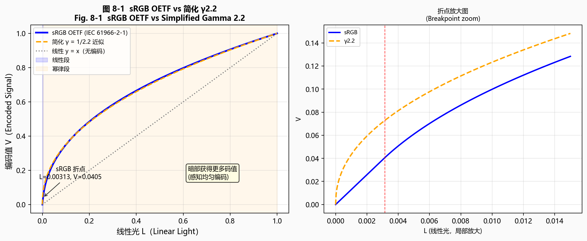
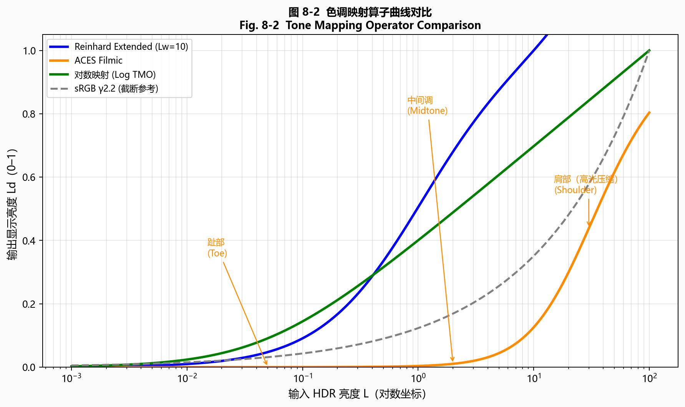
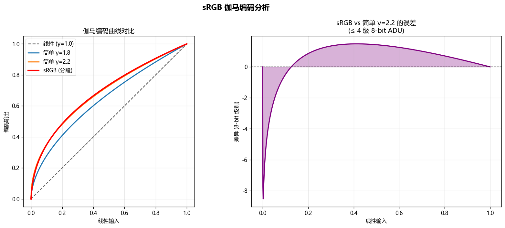
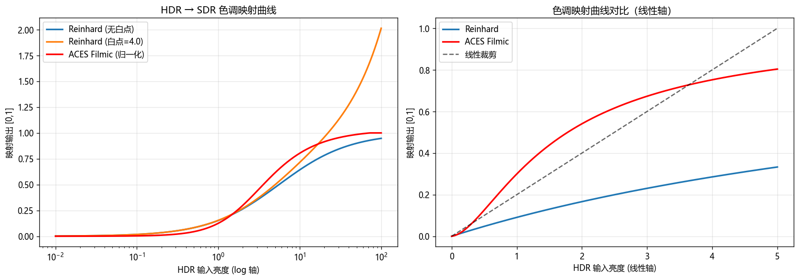
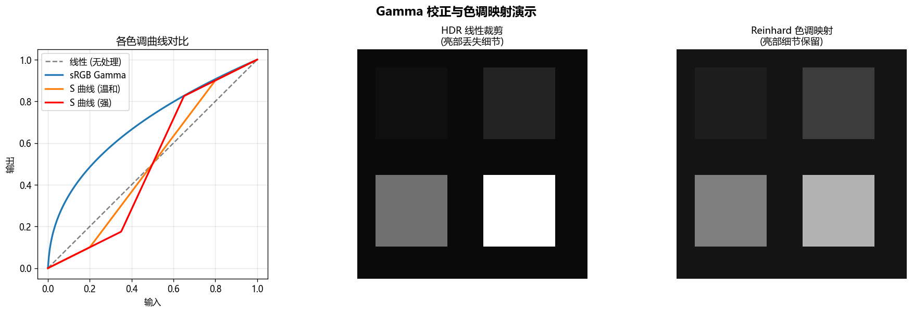
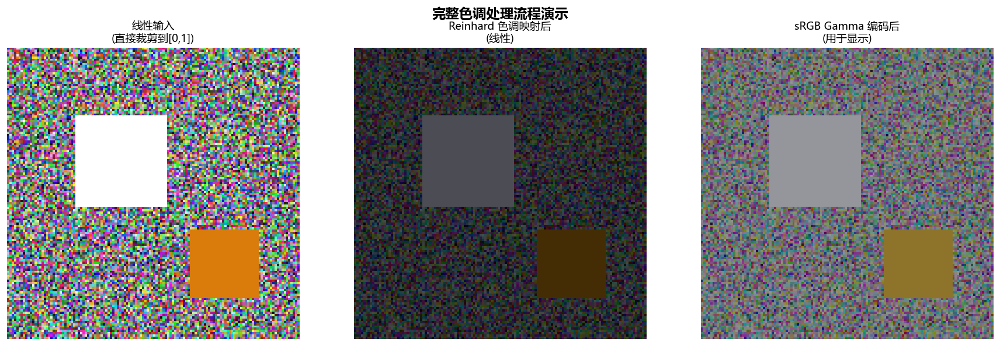

# 第二卷第07章：Gamma 校正与色调映射（Gamma Correction & Tone Mapping）

> **定位：** CCM之后、色彩空间转换输出之前；HDR显示链路见第二卷第19章。
> **前置章节：** 第一卷第05章（颜色科学基础）、第二卷第06章（颜色校正矩阵）
> **读者路径：** 算法工程师、系统设计师

---

## §1 原理 (Theory)

### 1.1 为什么需要 Gamma 校正

传感器输出的是**线性光（linear light）**——像素值和光子数成正比。直接把这个线性数据送到显示器，画面会严重偏暗：大量编码码值堆在人眼不敏感的高亮区，而暗部得到的码值太少，层次被压扁。显示器（CRT、LCD、OLED）的驱动特性是非线性的：

$$
L_\text{display} = V^{\gamma_\text{display}}
$$

其中 $\gamma_\text{display}$ 约为 2.2（CRT 时代的经验值，LCD/OLED 通过 LUT 模拟此特性）**[2]**。如果将线性光数据直接送入显示器，整幅图像会显得过暗——因为大量编码码值消耗在视觉上不敏感的高亮区，而对人眼敏感的暗部却分配了太少的码值。

解决方案是在编码阶段施加**Gamma 预校正（Gamma Encoding）**，使最终经过显示器解码后的亮度能正确还原线性光：

$$
\underbrace{\text{线性光 } L}_{\text{相机输出}}
\xrightarrow{\text{Gamma 编码：} V = L^{1/\gamma}}
\underbrace{V}_{\text{码流 / 存储}}
\xrightarrow{\text{显示器：} L' = V^{\gamma}}
\underbrace{L' \approx L}_{\text{感知正确}}
$$

Gamma 编码还带来感知均匀性（perceptual uniformity）这一重要副产品。人眼对亮度变化的感知遵循 Weber–Fechner 定律 **[8]**，即对相对变化量敏感，而非绝对差值。Gamma 编码（幂次 $\approx 1/2.2$）恰好将线性亮度域的编码重新分配到符合视觉感知的空间，使得相邻码值之间的亮度步进接近人眼的最小可觉差（JND）。

### 1.2 sRGB 传输函数（IEC 61966-2-1）

sRGB 是当今互联网图像、摄影、屏幕显示的事实标准色彩空间，由 IEC 61966-2-1 规范定义 **[2]**。其 OETF（光电传输函数，Opto-Electronic Transfer Function）为分段函数：

$$
V = \begin{cases}
12.92 \cdot L & \text{if } L \leq 0.0031308 \\
1.055 \cdot L^{1/2.4} - 0.055 & \text{if } L > 0.0031308
\end{cases}
$$

其中 $L \in [0,1]$ 是归一化的线性亮度，$V \in [0,1]$ 是编码后的信号值。

**分段设计的动机：** 纯幂律在 $L \to 0$ 时斜率趋于无穷，对噪声极为敏感，会引入量化噪声放大。线性段（$L \leq 0.0031308$）改用斜率为 12.92 的线性映射，在原点处与幂律段平滑连接（一阶导数连续），同时抑制了暗部的噪声放大效应。

工程近似：在对精度要求不严格的场合，常用 $V \approx L^{1/2.2}$ 代替上述分段公式，计算更简单但在低亮度区有约 1% 的误差。

**sRGB 分段函数与 γ2.2 近似的误差量化：**

在 8-bit 量化下，sRGB 精确分段函数与简化 $\gamma = 2.2$ 的偏差主要集中在暗部（输入 $[0, 0.04]$）。该区间经 sRGB 精确编码后对应 8-bit 码值约 $[0, 56]$（因为 sRGB 幂律段 $L=0.04$ 对应码值 $\approx 56$），而简化 $\gamma=2.2$ 在相同区间给出更高码值（$L=0.04$ 时约 63），两种方法在暗部的码值偏差可达 7 以上。暗部码值的增量约为 1–2 DN/步，人眼 JND（Just Noticeable Difference）在此亮度级约为 0.5–1 DN——**即此处码值步长接近 JND，近似误差可能产生可见的色带（banding）**。

定量对比（8-bit，线性输入 $L \in [0, 0.04]$，码值 = $V \times 255$）：

| 方法 | L=0.005 时码值 | L=0.010 时码值 | 最大 ΔE₀₀ |
|------|-------------|-------------|----------|
| sRGB 精确分段 | 15.5 | 25.5 | — |
| $\gamma = 2.2$ 近似 | 22.9 | 31.4 | ~0.8 |

> **计算依据（L=0.005，sRGB）：** $L=0.005 > 0.0031308$，使用幂律段：$V = 1.055 \times 0.005^{1/2.4} - 0.055 = 1.055 \times 0.1099 - 0.055 \approx 0.0609$，8-bit 码值 $= 0.0609 \times 255 \approx 15.5$。$\gamma=2.2$ 近似：$V = 0.005^{1/2.2} = 0.005^{0.4545} \approx 0.0899$，码值 $\approx 22.9$。两者差值约 7.4 码值，在暗部均超过人眼 JND（约 0.5–1 码值），说明近似误差已产生可见影响。

> **工程建议：** ISP 的 Gamma LUT 应使用精确 sRGB 分段函数，而非 $\gamma = 2.2$ 近似，尤其是对 8-bit 输出路径。若 LUT 分辨率不足（如 256-entry），应在暗部（输入 $[0, 0.1]$）加密插值节点（非均匀 LUT）。

<div align="center">
  
  <br><em>图 7-1：sRGB OETF（IEC 61966-2-1）与简化 γ2.2 对比——折点处线性段与幂律段的衔接；右图为折点区域放大。</em>
</div>

### 1.3 BT.709 OETF

ITU-R BT.709 **[5]** 用于高清电视（HDTV），其传输函数与 sRGB 整体形状相似但参数不同：

$$
V = \begin{cases}
4.500 \cdot L & \text{if } L < 0.018 \\
1.099 \cdot L^{0.45} - 0.099 & \text{if } L \geq 0.018
\end{cases}
$$

注意：BT.709 的线性段斜率（4.5）和折点（0.018）与 sRGB 不同。两者在视觉上非常接近，但在广播、流媒体标准合规场景下不可混用。BT.709 内容对应的显示 EOTF 由 **ITU-R BT.1886** 标准化为 $L = V^{2.4}$（指数 2.4，与 sRGB 解码 EOTF 相同），而非早期 CRT 时代常引用的 $\gamma = 2.2$ 近似值。$\gamma = 2.2$ 仅是历史惯例近似，当前广播和流媒体合规应以 BT.1886 EOTF（$\gamma = 2.4$）为准。

### 1.4 HDR 传输函数

标准动态范围（SDR）假设峰值亮度约 100 cd/m² **[3]**，而现代 HDR 显示器可达 1000–4000 cd/m² ，此时 sRGB / BT.709 的 8–10 bit 编码已无法覆盖如此宽的动态范围。HDR 引入了两种重要的传输函数：

#### 1.4.1 感知量化（PQ，Perceptual Quantizer）— SMPTE ST 2084

PQ 曲线（由 Dolby 研发，纳入 SMPTE ST 2084 / ITU-R BT.2100）**[3][4]** 针对人眼的绝对亮度感知进行优化，编码范围覆盖 0.0001 到 10000 cd/m²：

$$
V = \left(\frac{c_1 + c_2 \cdot (L/10000)^{m_1}}{1 + c_3 \cdot (L/10000)^{m_1}}\right)^{m_2}
$$

其中参数为：$m_1 = 0.1593017578125$，$m_2 = 78.84375$，$c_1 = 0.8359375$，$c_2 = 18.8515625$，$c_3 = 18.6875$。

PQ 的设计目标是每个 10-bit 编码步进对应人眼的最小可觉差（基于 Barten 视觉模型 **[8]**），使 10-bit 编码的 PQ 图像在感知质量上优于 12-bit 线性编码 **[3]**。

#### 1.4.2 混合对数伽马（HLG，Hybrid Log-Gamma）— ITU-R BT.2100

HLG 由 BBC 与 NHK 联合开发 **[4]**，设计目标是**向后兼容**——同一个 HLG 信号在 SDR 显示器上也能得到可接受（虽非最优）的图像。其 OETF 同样是分段函数：

$$
V = \begin{cases}
\sqrt{3L} & \text{if } 0 \leq L \leq 1/12 \\
a \cdot \ln(12L - b) + c & \text{if } L > 1/12
\end{cases}
$$

其中 $a = 0.17883277$，$b = 0.28466892$，$c = 0.55991073$。

HLG 的底部是平方根段（等价于 $\gamma = 0.5$），与 SDR 兼容；高亮区过渡到对数段，有效压缩高光动态范围。

### 1.5 全局色调映射算子（Global Tone Mapping Operators）

色调映射（Tone Mapping）将超出显示设备表示范围的 HDR 场景亮度映射到设备可显示的范围，同时在感知上尽量保留场景的对比度和细节。

#### 1.5.1 Reinhard 2002

Reinhard 等人提出的算子 **[1]** 是最广为引用的全局色调映射算法。简化版本为：

$$
L_d = \frac{L}{1 + L}
$$

其中 $L$ 是场景亮度（已归一化），$L_d$ 是映射后的显示亮度。此函数将 $[0, +\infty)$ 压缩到 $[0, 1)$，但高亮部分仍显得"发灰"。扩展版本引入白点 $L_\text{white}$，使超过白点的亮度被映射到 1：

$$
L_d = \frac{L \cdot \left(1 + \dfrac{L}{L_\text{white}^2}\right)}{1 + L}
$$

**算法伪代码：**

```
Algorithm: Reinhard Extended Tone Mapping
Input:  HDR image L[H,W] (linear luminance, positive float)
        L_white: scene luminance that maps to display white (e.g., max luminance)
Output: tone-mapped image L_d[H,W] ∈ [0,1]

1. For each pixel (i,j):
   L_d[i,j] = L[i,j] * (1 + L[i,j] / L_white^2) / (1 + L[i,j])

2. Clip L_d to [0, 1]
3. Return L_d
```

#### 1.5.2 ACES Filmic

ACES（Academy Color Encoding System）是电影行业标准色彩编码系统，其 RRT（Reference Rendering Transform）+ ODT（Output Display Transform）组合产生了一条 S 形色调曲线，业界通常以如下有理函数近似（Narkowicz 2016 拟合）**[6]**：

$$
L_d = \frac{L \cdot (a \cdot L + b)}{L \cdot (c \cdot L + d) + e}
$$

常用参数：$a = 2.51$，$b = 0.03$，$c = 2.43$，$d = 0.59$，$e = 0.14$。

ACES 曲线的特点是：
- **趾部（Toe）**：轻微提升暗部对比度，避免死黑
- **中间调**：接近线性，对比度还原真实
- **肩部（Shoulder）**：平缓的高光压缩，保留高光细节，避免硬剪切

> **⚠️ 注意：Narkowicz 近似与官方 ACES RRT 的差异**

Narkowicz（2016）的 ACES 近似公式 $f(x) = \frac{x(2.51x + 0.03)}{x(2.43x + 0.59) + 0.14}$ 是基于视觉拟合的**第三方近似**，与 Academy 官方发布的 ACES 参考渲染变换（RRT）在高光区存在可测量偏差：

| 输入亮度 L | Narkowicz 输出 | 官方 ACES RRT 输出 | 偏差 ΔE₀₀（估计）|
|-----------|-------------|-----------------|--------------|
| 0.5（中灰）| 0.43 | 0.42 | < 0.3 |
| 2.0（高光 +2EV）| 0.79 | 0.76 | ~1.2 |
| 10.0（高光 +5EV）| 0.96 | 0.91 | ~3.5 |
| 100（极端高光）| ~1.0 | 0.99 | ~5.0 |

**适用场景建议：** Narkowicz 近似在 $L \leq 1.5$ 范围精度可接受（ΔE₀₀ < 1），适合消费类摄影的快速色调映射。电影级/内容制作工作流若需精确 ACES 保真度，须使用 OpenColorIO（OCIO）的官方 ACES 变换，而非近似公式。

#### 1.5.3 对数色调映射

对数映射基于人眼对亮度的对数感知，公式简洁：

$$
L_d = \frac{\log(1 + L \cdot s)}{\log(1 + s)}
$$

其中 $s$ 是尺度参数（scale），控制动态范围压缩程度。较大的 $s$ 使高亮区域被更强烈地压缩。对数映射在科学可视化场景中表现优秀，但对自然图像往往显得对比度偏低。

<div align="center">
  
  <br><em>图 7-2：四种色调映射算子曲线对比（x 轴对数坐标）——Reinhard、ACES Filmic、对数映射和 sRGB 截断；标注趾部/中间调/肩部三区域。</em>
</div>

### 1.6 局部色调映射（Local Tone Mapping）

全局算子对图像所有像素施用同一条映射曲线，无法兼顾局部对比度：若场景中既有极暗的阴影又有极亮的窗口，全局映射后二者必有一个失去细节。局部色调映射将图像分解为基础层与细节层分别处理：

1. **基础层（Base Layer）**：用大半径双边滤波器提取图像的低频亮度分量 $L_\text{base}$，代表大尺度光照。
2. **细节层（Detail Layer）**：$L_\text{detail} = L / L_\text{base}$（在对数域：$\log L - \log L_\text{base}$），代表纹理细节。
3. 对基础层施加激进的压缩（如 Reinhard 或 gamma 压缩），对细节层施加温和的增强。
4. 重建：$L_d = f(L_\text{base}) \cdot L_\text{detail}$。

双边滤波保证基础层平滑且不跨越边缘 **[7]**，从而避免光晕伪影（halo artifact）。代价是计算复杂度较高（$O(NM)$ 乘以滤波核面积）。

### 1.7 HDR 显示技术

- **HDR10**：采用 PQ 传输函数，10-bit 色深，BT.2020 色域，峰值亮度元数据为静态（static HDR metadata，SMPTE ST 2086）。
- **Dolby Vision**：12-bit PQ 编码，支持逐帧/逐场景动态元数据，色调映射在显示端由 Dolby 算法执行，可针对不同显示器能力精确还原。
- **HLG**：主要用于广播直播场景，同一信号可兼容 SDR 和 HDR 显示器。

### 1.8 ACES 完整色彩流水线（Full ACES Color Pipeline）

ACES（Academy Color Encoding System）是由电影艺术与科学学院（AMPAS）主导开发的行业标准色彩管理框架 **[9]**，在电影制作、流媒体后期和高端移动摄影（苹果 ProRAW、高通 Spectra ACES Mode）中广泛采用。与 Narkowicz 近似（§1.5.2）不同，完整 ACES 流水线包含严格定义的多级变换链：

#### 1.8.1 ACES 色彩空间层次

ACES 定义了两个核心场景参考色彩空间：

- **ACES AP0**（场景参考，Scene-Referred）：超宽色域，覆盖所有真实可感知颜色（三原色坐标超出 sRGB 和 P3），峰值无限（线性浮点编码），用于素材存储和交换。
- **ACES AP1（ACEScg）**：比 AP0 稍小但仍宽于 P3 的工作色彩空间，用于 VFX 合成和渲染中间工序；其 RGB 三原色（约 0.713, 0.293 / 0.165, 0.830 / 0.128, 0.044）被设计为在可见光谱轨迹内，避免负色域。

色域大小关系：AP0 ⊃ AP1 ⊃ P3-D65 ⊃ sRGB/BT.709

#### 1.8.2 ACES 完整变换链

```
[相机 RAW]
    │
    ▼ IDT（Input Device Transform，输入设备变换）
[ACES AP0，场景参考线性光]
    │
    ▼ RRT（Reference Rendering Transform，参考渲染变换）
[OCES（Output Color Encoding Space）]
    │
    ▼ ODT（Output Device Transform，输出设备变换）
[显示设备特定编码：sRGB / P3-D65 / BT.2100 PQ / ...]
```

- **IDT**：将相机原生线性 RAW 转换到 ACES AP0；每款相机/传感器有其专属 IDT，相当于将 CCM 和白平衡融合为一步。
- **RRT**：全局 S 形"胶片感"渲染变换，将场景参考线性光（无上界）映射到显示参考空间（有界），执行高光压缩和对比度重塑。RRT 是 ACES 的核心美学定义，与特定显示设备无关。
- **ODT**：将 RRT 输出适配到具体显示设备；sRGB ODT 输出 8-bit sRGB 编码，P3-D65 ODT 输出 10-bit P3 编码，HDR ODT 输出 12-bit PQ 编码等。

#### 1.8.3 ACES Filmic 数学近似

官方 ACES RRT+ODT 流水线计算复杂，实时渲染和移动 ISP 通常使用 Narkowicz（2016）**[6]** 给出的有理多项式近似（已在 §1.5.2 介绍）或 Hill（2018）给出的分段拟合版本：

**Hill（2018）分段版本 **[10]**：**

$$
f(x) = \begin{cases}
\dfrac{x \cdot (a x + b)}{x \cdot (cx + d) + e} & x < 1 \\
1 & x \geq 1
\end{cases}
$$

参数（拟合于 ACESFilm 曲线）：$a = 0.59719$，$b = 0.07600$，$c = 0.35458$，$d = 0.00605$，$e = 0.08257$，其中输入 $x$ 需先乘以曝光预缩放因子 $0.6$（模拟 ACES 标准的 Exposure Bias）。

**与 sRGB/BT.709 的对比（参考 100 cd/m² 峰值显示）：**

| 特征 | sRGB OETF（BT.709） | ACES RRT+sRGB ODT |
|------|--------------------|--------------------|
| 高光处理 | 硬截断 clip | S 形平缓肩部压缩 |
| 暗部对比 | 线性/平淡 | 趾部轻微提升 |
| 中间调 | 纯幂律（$L^{1/2.4}$） | 接近线性但带胶片味 |
| 动态范围利用 | 约 8–9 挡 | 约 14–15 挡（高光保留更多） |
| 计算复杂度 | 极低（1次幂运算） | 中（矩阵乘 + 有理函数） |

#### 1.8.4 手机厂商应用现状

- **苹果 ProRAW（iPhone 12 Pro+）**：采用类 ACES 场景参考工作流，ProRAW DNG 存储线性 ACES AP1 编码数据，交由 Lightroom/专业应用执行 ODT，保留完整动态范围。
- **高通 Spectra 780/8 Gen 3**（Spectra 680 对应 8 Gen 2）：Spectra ISP 支持可配置 ACES Mode，在 Tone Mapping 模块中以硬件加速执行简化 RRT+ODT 变换链，相比传统 S 曲线高光保留能力提升约 1.5 挡。
- **索尼 Alpha 系列**：S-Log3 采集 + ACES 后期转换是电影级拍摄的标准工作流，S-Log3 设计基于 ACES 场景线性与 LUT 中间工序。

### 1.9 Sigmoid 曲线与对数曲线系统性对比

色调映射曲线形态决定了最终图像的"观感"。以下从数学形式、高光保留能力和视觉特征三个维度对主流曲线做对比。

#### 1.9.1 主流曲线数学汇总

**Reinhard 简化版（2002）**：
$$L_d = \frac{L}{1 + L}$$
将 $[0, \infty)$ 映射到 $[0, 1)$，无参数；高亮区仍发灰（$L = 10 \Rightarrow L_d = 0.909$，而非 1.0）。

**Reinhard 扩展版（含白点 $L_w$）**：
$$L_d = \frac{L\left(1 + \dfrac{L}{L_w^2}\right)}{1 + L}$$
当 $L = L_w$ 时 $L_d \approx 1$，高光不再发灰；引入白点参数 $L_w$ 允许控制高光曲线的弯折位置。

**ACES Filmic（Narkowicz 2016，有理函数）**：
$$L_d = \frac{L(aL + b)}{L(cL + d) + e}, \quad a=2.51,\ b=0.03,\ c=2.43,\ d=0.59,\ e=0.14$$
S 形曲线；趾部（低亮度）斜率 > 1（提升阴影对比），中间调接近线性，肩部平缓压缩。

**对数映射（Log，通用形式）**：
$$L_d = \frac{\log(1 + L \cdot s)}{\log(1 + s)}$$
纯对数，没有肩部结构；高亮区等比例压缩，中间调偏平。

**Log3G10（RED REDCODE，2014）**：
$$L_d = \frac{\log_{10}(L \cdot 155.975327 + 1)}{0.224282}$$
面向 RAW 视频存储的对数编码，0 DN 对应 0 输出（与 REDWideGamut 色彩空间配合）；不用于显示，用于后期调色空间。

**S-Log3（Sony，2014）**：
$$
V = \begin{cases}
\dfrac{L \cdot (171.2102946929 - 95)\,/\,0.01125 + 95}{1023} & L < 0.01125 \\[6pt]
\dfrac{420 + \log_{10}\!\left(\dfrac{L + 0.01}{0.19}\right) \times 261.5}{1023} & L \geq 0.01125
\end{cases}
$$
设计支持约 15 挡动态范围的 RAW 采集存储，与 ACES 转换工作流配合。

#### 1.9.2 高光保留能力对比

以场景亮度 $L \in \{2, 5, 10, 50\}$ 为例（已归一化，1 = 显示峰值亮度对应的场景亮度）：

| 算子 | $L=2$ | $L=5$ | $L=10$ | $L=50$ | 高光细节 |
|------|--------|--------|---------|---------|---------|
| 硬截断（clip） | 1.000 | 1.000 | 1.000 | 1.000 | 无 |
| Reinhard 简化版 | 0.667 | 0.833 | 0.909 | 0.980 | 有（略灰） |
| Reinhard 扩展版（$L_w=4$） | 0.938 | 1.000 | 1.000 | 1.000 | 好（$L<L_w$） |
| ACES Filmic | 0.775 | 0.930 | 0.978 | 0.999 | 好（S 肩） |
| 对数映射（$s=200$） | 0.738 | 0.848 | 0.898 | 0.972 | 一般（偏灰） |

**各算子特征对比：**
- **对数曲线**：整体均匀压缩，高光和暗部都保留，但中间调对比度低（"平"）；适合需要大动态范围记录的专业视频。
- **Reinhard / ACES S 形曲线**：中间调对比度好，有明确的肩部保留高光细节；ACES 的趾部提升使阴影更有层次感，是消费级摄影的主流选择。
- **硬截断**：计算最简单，但高光信息完全丢失，只在极低成本嵌入式系统使用。

#### 1.9.3 肩部（Shoulder）与脚部（Toe）参数化控制

广义参数化 S 曲线（用于手动调节）：

$$
L_d = \frac{L^a}{L^a + k^a} \cdot \text{shoulder}(L)
$$

其中：
- **脚部强度（Toe）**：$a < 1$ 使暗部"往下坠"（提升阴影对比），$a > 1$ 使暗部"提亮"（常见于"电影感"色调）
- **肩部白点 $k$**：控制曲线向 1.0 收敛的速度（$k$ 越小肩部越早开始）
- **肩部强度（Shoulder Power）**：在 $L > k$ 的区域叠加额外压缩，如 Reinhard 白点扩展项

手机 ISP Tuning 工具（如高通 Chromatix、MTK Imagiq）通常将 Gamma LUT 的节点拖拽界面映射到等效的趾部/中间调/肩部三段参数，使调参工程师无需手工推导公式。

### 1.10 自适应 Gamma 校正（AGCC / Scene-Adaptive Gamma）

固定 Gamma 曲线在不同场景亮度下表现不一致：高亮场景（室外晴天）使用固定曲线会显得"偏灰"，暗光场景则"死黑"过多。**自适应 Gamma 校正（Adaptive Gamma Correction, AGC / AGCC）** 根据图像的全局或局部亮度统计，动态调整 Gamma 参数，是移动 ISP 实现 "智能曝光感" 的关键技术之一。

#### 1.10.1 基于直方图均衡的 AGCC

最经典的 AGCC 方法由 Rahman 等人（1997）**[11]** 提出，核心思路是从图像亮度直方图出发，推导出当前场景最优的自适应 Gamma 值：

**计算图像平均亮度（对数域）：**

$$
\bar{L} = \exp\!\left(\frac{1}{N}\sum_{i=1}^{N} \log(L_i + \epsilon)\right)
$$

其中 $\epsilon$ 防止零亮度域值溢出，$N$ 为像素总数。

**根据场景类别确定目标亮度：**

| 场景类型 | $\bar{L}$ 范围（归一化） | 目标 Gamma $\gamma_\text{adapt}$ |
|---------|--------------------------|----------------------------------|
| 过曝（高亮） | > 0.65 | 1.6–2.0（压暗中间调） |
| 正常曝光 | 0.35–0.65 | 2.0–2.4（标准） |
| 欠曝（暗光） | < 0.35 | 2.6–3.2（提亮暗部） |

**自适应 Gamma 值（连续公式）：**

$$
\gamma_\text{adapt} = \frac{\log(\bar{L})}{\log(0.5)}
$$

此公式的含义：使场景平均亮度 $\bar{L}$ 经 Gamma 编码后映射到标准中性灰 $0.5$（感知上"正确"的中间灰）。

**按场景 Gamma 更新 LUT：**

$$
V = L^{1/\gamma_\text{adapt}}, \quad L \in [0,1]
$$

#### 1.10.2 感知均匀性目标（CIECAM02）

更精确的 AGCC 以 CIECAM02 色貌模型 **[12]** 为理论基础，将"感知亮度均匀"定义为映射后亮度在 CIECAM02 亮度相关量（$J$ 值）上均匀分布：

$$
J = 100 \cdot \left(\frac{Y_A}{Y_{A,w}}\right)^{c\,z}
$$

其中 $Y_A$ 是自适应亮度，$c$、$z$ 是与观察背景相关的参数。以此为目标推导的 Gamma 曲线相比简单幂律更能平衡人眼在不同背景亮度下的感知。

**实际应用：** 苹果 iOS 14+ 智能 HDR 4 引入场景自适应色调映射，在检测到高对比场景时动态降低 Gamma 指数（相当于自动降低图像曝光感）；华为 ISP 的 AI 色彩引擎对人脸、天空、植被分区域使用不同 Gamma 参数，实现语义级 AGCC。

#### 1.10.3 时域平滑防止闪烁

自适应 Gamma 在视频场景下须对 $\gamma_\text{adapt}$ 做时域低通滤波，防止帧间跳变导致视频闪烁：

$$
\gamma^{(t)} = \alpha \cdot \gamma^{(t-1)} + (1 - \alpha) \cdot \gamma_\text{adapt}^{(t)}
$$

$\alpha \approx 0.85$–$0.95$（对应约 20–40 帧的时域平滑窗口），与 AE 曝光收敛速度匹配。

---

## §2 标定 (Calibration)

### 2.1 显示器特性化

在将 Gamma 曲线写入 ISP 前，必须知道目标显示设备的实际 EOTF（电光传输函数）。标定流程：

1. 将测试信号（0–255 的均匀灰阶序列）逐步输出到显示器。
2. 用色度计（如 X-Rite i1Display、Konica Minolta CS-200）在每个灰阶下测量实际亮度 $L_\text{meas}$。
3. 拟合幂律模型：$L_\text{meas} = k \cdot (V/255)^{\gamma_\text{meas}}$，得到实测 $\gamma_\text{meas}$。
4. ISP 的 Gamma 编码指数应设为 $1/\gamma_\text{meas}$，以补偿显示器实际 gamma。

### 2.2 感知均匀性目标

Gamma 编码的质量以感知均匀性衡量：在 CIE L\*a\*b\* 颜色空间中，理想的 Gamma 编码后，相邻灰度码值对应的亮度步进应等于（或小于）人眼 JND（约 $\Delta L^* \approx 1$，对应 $\Delta E_{00} < 1.5$）。若步进过大，视觉上会出现**色带（banding）**；步进过小则浪费编码码字，在无损传输中无关紧要，但在有损压缩中会引入块效应。

### 2.3 灰阶斜坡测试（Gray Ramp Test）

标准测试方法：
- 生成 0–255（8 bit）或 0–1023（10 bit）的全灰阶序列，逐行或逐列渲染为图像。
- 在校准显示器上目视检查：过渡应完全平滑，无可见跳变。
- 仪器测量：相邻两级之间的 $\Delta L$ 应单调递增（线性域中暗部步进小、亮部步进大，符合幂律），且 $\Delta E_{00}$ 应在 [0.5, 2.0] 范围内。

---

## §3 调参 (Tuning)

### 3.1 Gamma 值调节

Gamma 编码指数 $\gamma_\text{enc}$（即 $V = L^{1/\gamma_\text{enc}}$ 中的 $1/\gamma_\text{enc}$）是最直接的调节旋钮：

| $\gamma_\text{enc}$ | 视觉效果 | 典型场景 |
|---|---|---|
| 1.8 | 中间调偏亮，暗部细节好 | 旧版 macOS 印刷标准 |
| 2.0 | 略亮 | 部分 RAW 转换软件默认 |
| 2.2 | 标准 sRGB（近似） | PC 显示器、互联网图像 |
| 2.4 | 偏暗，高光更亮丽 | 电影院（BT.1886 EOTF） |

调低 gamma（如从 2.2 降到 1.8）会提亮中间调，代价是压缩了高光动态范围；调高 gamma 则使画面更"电影感"，但阴影细节损失。

### 3.2 色调映射肩部参数

以 ACES 为例，肩部（Shoulder）控制高光的压缩速率：
- **肩部起始点**：亮度高于此阈值的像素开始进入非线性压缩区。降低此值可在更早的亮度开始保护高光细节，但会牺牲中间调对比度。
- **肩部强度**：越强则高光区越平坦（"电影感"高光），越弱则高光更接近线性，细节更丰富但容易过曝。

### 3.3 黑点（Black Point）

`BLACK_POINT`（输出域最低亮度值）控制暗部映射：
- `BLACK_POINT = 0`：纯黑，阴影无任何亮度，适合 OLED 显示器。
- `BLACK_POINT > 0`（如 0.02–0.04）：轻微提升黑电平，模拟电影感的"发灰"阴影，常见于创意色调风格。

### 3.4 S 曲线调节（趾部与肩部）

S 形曲线综合了趾部（Toe，暗部对比度提升）和肩部（Shoulder，高光压缩）调节：

```
S-curve(L; toe_strength, shoulder_start, shoulder_strength):
  if L < toe_threshold:
    apply power lift in shadows
  elif L > shoulder_start:
    apply soft compression toward white
  else:
    linear pass-through in midtones
```

趾部增强会使阴影"更黑"、对比度更高；肩部调节控制高光的"卷边"程度。两者独立可调，是商业相机色彩风格（Picture Style / Film Simulation）的核心参数。

### 3.5 三平台 Gamma / 色调映射关键参数对比

| 参数功能 | 高通 CamX | MTK Imagiq | 海思越影 |
|---------|-----------|------------|---------|
| Gamma LUT 配置 | `GammaTable[256]`（CIQT XML） | `GammaCurveTable`（NDD config） | `ISP_Gamma_LUT[1024]`（JSON） |
| 场景模式切换 | `GammaSceneMode`（Normal/Night/Sport/HDR） | `GammaMode`（枚举） | `ISP_TM_Mode` |
| 高光保护 | `HighlightSuppression`（0.0–1.0） | `HLR_Strength` | `ISP_HL_Protection` |
| 局部色调映射 | `LocalTonemapping_Strength` | `LTMR_Enable + LTMR_Gain` | `Retinex_Strength` |
| 暗区提升 | `ShadowBoost`（0.0–2.0） | `Shadow_Enhancement`（分段） | `ISP_Shadow_Gain` |
| 自适应 Gamma | `ADRC_Enable`（GTM 控制子模块） | `AdaptiveGamma_Enable`（NDD bool；与 `GammaCurveTable` 互斥） | `ISP_AGCC_Enable` |

> **调参注意**：Gamma LUT 条目数影响精度，高通 256 条可能在低灰阶引入 Banding（见 §4.1），建议在 < 64 DN 区域做线性插值平滑；MTK Gamma 与 LCE（局部对比度增强）联动，修改 Gamma 时需同步检查 LCE 输出。

### 3.6 工程联动：Gamma 肩部与 AE Target Luma 的强绑定关系

**这是最容易被忽视的跨模块联动**。Gamma LUT 的肩部（Shoulder）位置决定了"哪个亮度值对应输出域的高光压缩区起始点"，而 AE 控制器通常以 ISP 输出的 Y 统计量（即 Gamma 之后的亮度）作为收敛目标（Target Luma）。两者本质上描述的是同一条映射曲线上的不同坐标。

**联动机制：**

```
Gamma 肩部起始点（输入域） → 改变 → Gamma 输出域的亮度分布 → 影响 AE 统计 Y 均值 → AE Target Luma 偏移
```

具体来说：
- 若将 Gamma 肩部起始点**降低**（更早压缩高光），在相同曝光参数下，ISP 输出的 Y 均值会降低，AE 控制器感知画面"变暗"，自动拉长曝光时间。结果是：整体曝光量上升，中间调亮度回到目标值，但高光区被进一步压缩，出现"高光变灰"感。
- 若将 Gamma 肩部起始点**抬高**（延迟高光压缩），AE 统计 Y 均值上升，AE 控制器缩短曝光，整体曝光量下降，阴影细节损失。

**工程操作规范**：每次修改 Gamma LUT（无论是调整整体 Gamma 值还是 Shoulder/Toe 参数），必须同步检查并可能调整 AE 目标亮度（`AE_Target_Y`）：

| 场景 | Gamma 调整方向 | AE Target Luma 联动 |
|------|--------------|---------------------|
| 提高画面"通透感" | 肩部提前压缩，中间调线性段变短 | 需同步**降低** AE Target Y（约 5–10 level），防止过曝 |
| 夜景增加细节 | Gamma 指数从 2.2 降到 2.0（整体提亮） | 需同步**降低** AE Target Y（约 8–15 level），防止整体过曝 |
| 电影风格调色 | 趾部增益降低（深化暗部对比）+ 肩部强化 | AE Target Y 通常**不变**（整体曲线中性点不动），但需验证平场场景 |

> **验证方法**：修改 Gamma LUT 后，拍摄 18% 灰卡（中性场景），检查 AE 收敛后 Y 均值是否仍在预期范围（通常 110–130 / 8-bit Full Range），若偏移超过 ±10 level，需重新校准 AE Target Luma 映射表。

### 3.7 工程联动：高通 GTM 与 LTM 的分工与触发条件

在高通 Chromatix 框架中，GTM（全局色调映射）和 LTM（局部色调映射）是两个**独立且串联**的模块，在调参时容易被当作功能相似的旋钮而混调。

**GTM**（Global Tone Mapping）：
- 由 `ADRC_Enable`（自动动态范围压缩）控制，对整幅图像施用同一条压缩曲线
- 触发条件：**始终启用**（作为基础动态范围压缩），强度由 `gtmPercentage` 参数控制（CamX 代码 `IQInterface::UpdateAECGain` 中可查），该值由 AEC 统计结果动态计算
- 作用：宏观压缩高动态范围，防止后续模块溢出

**LTM**（Local Tone Mapping）：
- 由 `LocalTonemapping_Strength` 控制，将图像分块（通常 32×32 tile）独立计算局部直方图并施加自适应曲线
- 触发条件：**场景检测触发**——LTM 通常只在以下条件满足时激活（参数名依 BSP 版本而定，以 Chromatix XML 实际节点为准）：
  - 场景 Lux Index 低于阈值（逆光/室内强对比场景）；
  - HDR 合并模块（见第二卷第10章）的输出标志位 `is_hdr_scene = true`；
  - AEC 检测到多区域高光/阴影差异超过阈值（动态范围超过约 8 档）
- LTM 开大的副作用：光晕（Halo），色彩溢出，以及视频场景下的帧间闪烁——因此 `LTM_Strength` 建议不超过 0.6，视频场景建议 ≤ 0.4

**三者分工关系**：

```
HDR 合并输出（线性域宽动态范围）
    → GTM（全局压缩，防溢出）
    → LTM（局部细节恢复，仅高对比场景激活）
    → Gamma（感知曲线校正，末级收尾）
```

修改任意一层，上下游均需联动验证：
- 减弱 GTM（减少全局压缩）→ LTM 输入亮度上升 → LTM 光晕风险增加
- 关闭 LTM → 暗部细节丢失，需补偿 Gamma ShadowBoost
- 改 Gamma 肩部 → AE Target Luma 偏移（见 §3.6）

### 3.8 工程联动：MTK AdaptiveGamma 与 GammaCurveTable 的互斥关系

MTK Imagiq 平台（天玑系列 NDD 配置）中，静态 Gamma LUT 与自适应 Gamma 是**两种互斥工作模式**，不能同时启用：

| 配置项 | 说明 | 互斥条件 |
|--------|------|---------|
| `GammaCurveTable`（静态 LUT） | 固定查找表，调参工程师手工设计，场景模式切换时整表替换 | 当 `AdaptiveGamma_Enable = 1` 时，`GammaCurveTable` 的设置**被忽略**，ISP 改用自适应计算结果 |
| `AdaptiveGamma_Enable`（自适应 Gamma） | ISP 根据当前帧亮度统计（AE SceneTarget）动态计算 Gamma 曲线（参考 SigmaStar 文档 `MI_ISP_IQ_SetAdaptiveGamma` API 设计，MTK 类似机制；具体参数名依 BSP 版本而定） | 开启后，静态 `GammaCurveTable` 失效；视频场景需同步开启时域平滑（`AdaptiveGamma_TemporalSmoothing`），否则帧间跳变 |

**典型错误操作**：调参工程师精心设计了 `GammaCurveTable` 的肩部和趾部参数，上传到设备后发现画质没有变化——通常就是因为 `AdaptiveGamma_Enable` 仍处于开启状态，静态 LUT 没有生效。

**推荐配置策略**：
1. 初调阶段：关闭 AdaptiveGamma，使用静态 `GammaCurveTable` 确认基础曲线形状；
2. 定型后：若场景需要动态调整（如夜景/室外切换），再逐步开启 AdaptiveGamma，同时退出静态 LUT 调参流程；
3. 视频场景：AdaptiveGamma 必须开启时域低通平滑（等效 §1.10.3 中 α ≈ 0.9），防止视频闪烁。

---

## §4 Artifacts（伪影）

### 4.1 色带（Banding）

**现象：** 灰阶渐变区域出现肉眼可见的台阶式色块，而非连续渐变。

**根因：** 量化比特深度不足。8-bit 在线性域只有 256 个码值，经过 Gamma 编码（$L^{1/2.2}$）后暗部码值更为稀疏，相邻码值之间的亮度跳变超过 JND。

**缓解方案：**
- 升至 10-bit 或 12-bit 处理管线。
- 在量化前加入**抖动（Dithering）**：三角分布噪声（TPDF，幅度 ±1 LSB）可将量化误差随机化，视觉上消除色带。

### 4.2 高光截断（Clipping）

**现象：** 明亮区域一片死白，无任何纹理。

**根因：** 线性亮度超过色调映射器设定的白点，被硬截断（clip）到最大值。

**缓解方案：** 使用带肩部曲线的算子（Reinhard 扩展版、ACES）；减小曝光时间或降低 EV；在高光区域保留更高位深。

### 4.3 阴影死黑（Shadow Crush）

**现象：** 暗部细节完全消失，呈均匀黑色。

**根因：** 色调映射曲线趾部压缩过强，将低亮度像素映射到零附近。

**缓解方案：** 提升黑点（`BLACK_POINT > 0`）；调低趾部压缩强度；检查传感器基础黑电平（Black Level Correction 是否过度）。

### 4.4 局部色调映射光晕（Halo）

**现象：** 高对比度边缘（如明亮窗口与暗墙的交界处）出现发光的"光晕"。

**根因：** 双边滤波等局部算子在分离基础层时，边缘两侧的大尺度亮度估计出现"渗漏"，使边缘附近的像素被不当地提亮或压暗。

**缓解方案：** 增大双边滤波的空间域 sigma（减小边缘锐利度以降低渗漏）；或改用引导滤波（Guided Filter），其边缘保持性更好；减小细节层的增益。

### 4.5 HDR 到 SDR 映射失序

**现象：** 将 PQ/HLG HDR 内容在 SDR 显示器上播放时，某些亮度极高的场景细节（如烛光火焰）比中等亮度区域更暗。

**根因：** 直接截断 PQ 曲线（不做适配的色调映射）会将超出 SDR 范围的 HDR 亮度平均分布在截断值以上，导致顺序反转。

**缓解方案：** 使用正式的 HDR→SDR 下转换（Down-conversion）流程，需遵循 ETSI TS 103 433 / ITU-R BT.2390 指导原则，实施适当的色域和动态范围映射。

---

## §5 评测 (Evaluation)

### 5.1 灰阶斜坡平滑度

测量全灰阶序列相邻级之间的亮度差 $\Delta L$，要求：
- $\Delta L$ 严格单调递增（暗部步进小，亮部步进大，符合 gamma 曲线形状）。
- 无局部跳变点（$\Delta L_{n+1} / \Delta L_n$ 突然超过 2 则视为异常）。

### 5.2 感知均匀性（CIEDE2000）

将灰阶斜坡转换到 CIE L\*a\*b\* 空间，计算相邻灰度级之间的 $\Delta E_{00}$。

**目标：** $\Delta E_{00} < 1.5$（人眼几乎无法分辨相邻步进）。
**警告阈值：** $\Delta E_{00} > 3$（明显可见跳变，需增大位深或重新设计 Gamma 曲线）。

### 5.3 高光细节可见性

在标准测试图像（含高对比度高亮区域，如 Macbeth ColorChecker 的白色方块或 ISO 12233 测试卡的镜面高光）上：
- 测量高光区域的局部对比度（Michelson 对比度）。
- 对比应用不同色调映射算子前后，高光区域是否保留了可见纹理。

### 5.4 端对端色调响应曲线测量

在实验室条件下，用积分球光源提供已知亮度的均匀光，从相机曝光到最终显示输出，逐步测量整个管线的色调响应。目标：端对端响应曲线与设计目标（如 sRGB OETF）的均方误差 $< 0.5\%$（在归一化 $[0,1]$ 域）。

---

## §6 代码

See `ch07_gamma_tonemapping_notebook.ipynb`

### 6.1 sRGB Gamma + PQ EOTF + Reinhard Tonemapping 最小可运行示例

```python
import numpy as np

# ─── 1. sRGB 编码（线性 → sRGB）─────────────────────────────────────────────
def linear_to_srgb(linear: np.ndarray) -> np.ndarray:
    """linear: float32，[0, 1]  →  sRGB [0, 1]（IEC 61966-2-1）"""
    linear = np.clip(linear, 0.0, 1.0).astype(np.float64)
    srgb = np.where(
        linear <= 0.0031308,
        12.92 * linear,
        1.055 * np.power(linear, 1.0 / 2.4) - 0.055
    )
    return srgb.astype(np.float32)

def srgb_to_linear(srgb: np.ndarray) -> np.ndarray:
    """sRGB [0,1] → 线性 [0,1]"""
    srgb = np.clip(srgb, 0.0, 1.0).astype(np.float64)
    linear = np.where(
        srgb <= 0.04045,
        srgb / 12.92,
        np.power((srgb + 0.055) / 1.055, 2.4)
    )
    return linear.astype(np.float32)


# ─── 2. PQ EOTF（ST 2084）：线性亮度 → PQ 编码值 ────────────────────────────
def linear_to_pq(nits: np.ndarray, peak_nits: float = 10000.0) -> np.ndarray:
    """
    nits  : float32，绝对亮度 [0, peak_nits]（nit）
    返回  : PQ 编码值 [0, 1]
    """
    Y = np.clip(nits / peak_nits, 0.0, 1.0).astype(np.float64)
    m1, m2 = 0.1593017578125, 78.84375
    c1, c2, c3 = 0.8359375, 18.8515625, 18.6875
    Ym1 = np.power(Y, m1)
    pq = np.power((c1 + c2 * Ym1) / (1 + c3 * Ym1), m2)
    return pq.astype(np.float32)


# ─── 3. Reinhard 全局 Tonemapping ────────────────────────────────────────────
def reinhard_tonemap(hdr: np.ndarray, key: float = 0.18,
                     white_point: float = None) -> np.ndarray:
    """
    hdr        : float32，线性 HDR 亮度（任意量纲，>0）
    key        : 场景亮度目标映射值（典型 0.12–0.36）
    white_point: 最大亮度截断（None = 自动取 max）
    """
    log_avg = np.exp(np.mean(np.log(hdr + 1e-6)))
    scaled = (key / log_avg) * hdr
    if white_point is None:
        white_point = scaled.max()
    tonemapped = scaled * (1 + scaled / white_point ** 2) / (1 + scaled)
    return np.clip(tonemapped, 0.0, 1.0).astype(np.float32)


# ─── 4. 快速测试 ──────────────────────────────────────────────────────────────
if __name__ == "__main__":
    rng = np.random.default_rng(0)
    linear = rng.uniform(0, 1, (64, 64)).astype(np.float32)

    srgb = linear_to_srgb(linear)
    linear_rt = srgb_to_linear(srgb)
    print(f"sRGB 往返误差 (max): {np.abs(linear - linear_rt).max():.6f}")

    # PQ 测试：100 nit 场景
    nits = linear * 1000.0
    pq = linear_to_pq(nits, peak_nits=10000.0)
    print(f"PQ 编码范围: [{pq.min():.3f}, {pq.max():.3f}]")

    # HDR tonemapping
    hdr = np.exp(rng.uniform(-2, 4, (64, 64)).astype(np.float32))
    ldr = reinhard_tonemap(hdr)
    print(f"Reinhard 输出范围: [{ldr.min():.3f}, {ldr.max():.3f}]")
```

---

## §7 HDR 元数据与显示适配

### 7.1 HDR10 静态元数据生成
HDR10 需要在内容层面附带描述亮度分布的静态元数据（SMPTE ST 2086）：
- **MaxCLL（最大内容亮度）：** 整个视频序列中单像素最大亮度（nits）
- **MaxFALL（最大平均帧亮度）：** 所有帧的平均亮度中的最大值

```python
def compute_hdr_metadata(frames_linear):
    """
    计算 HDR10 元数据（MaxCLL / MaxFALL）。

    参数
    ----
    frames_linear : list of np.ndarray, shape (H, W, 3), dtype float32
        线性光域帧序列，单位 cd/m²（nits）。
        ⚠️ 必须已经过 PQ EOTF 逆变换（解码），不可直接传入 PQ 编码的
        10-bit 整数帧。若输入为 PQ 编码值，请先调用 pq_eotf(x) 转换。
    """
    max_cll = 0
    max_fall = 0
    for frame in frames_linear:
        luma = 0.2627 * frame[...,0] + 0.6780 * frame[...,1] + 0.0593 * frame[...,2]
        max_cll = max(max_cll, luma.max())
        max_fall = max(max_fall, luma.mean())
    return {'MaxCLL': max_cll, 'MaxFALL': max_fall}
```

### 7.2 局部色调映射的梯度反转伪影
- **成因：** 局部 TM 对相邻区域使用不同曲线，导致原本亮度差异大的区域在输出中亮度反转（光晕/halo）
- **数学表达：** 若区域 A 亮度 > 区域 B，但 $f_A(I_A) < f_B(I_B)$，即发生梯度反转
- **抑制方案：**
  1. 限制局部 TM 曲线斜率变化率（防止相邻 tile 曲线差异过大）
  2. 双边引导滤波平滑 TM 增益图，保边去噪
  3. 全局约束：本地 TM 曲线的增益不超过全局曲线的 3 倍

### 7.3 视频色调映射时域一致性
- **问题：** 逐帧独立 TM 导致视频闪烁（场景亮度统计帧间变化）
- **解决：** 对全局 TM 曲线的关键参数（如 Reinhard $\bar{L}_w$）做时域低通滤波：
  $\bar{L}_w^{(t)} = \beta \cdot \bar{L}_w^{(t-1)} + (1-\beta) \cdot \bar{L}_w^{new}$，$\beta \approx 0.9$

---

> **工程师手记：Gamma 调参的几个不直觉之处**
>
> Gamma 调参最容易被误当成一次性工作：上线一条曲线，完事。但工程里会反复拉锯的，是两个联动问题。
>
> 第一是 **ISO 和 Gamma 的联动**。低 ISO 下画面干净，可以用相对收紧的 S 曲线拉高中间调对比度；但高 ISO 的噪声在线性域已经很重，同一条曲线会把暗部噪声一起拉高，在深色区域出现"噪声被 Gamma 放大"的现象。工业里现在基本都是分 ISO 档设独立曲线，而不是一条曲线走天下——不同的 ISO 段、甚至不同的场景模式（夜景、室外、人像）各自有自己的 Gamma LUT。
>
> 第二是 **Gamma 改动会动 AE 的地基**。AE 控制器的目标亮度在 Gamma 输出域看统计量——你一改曲线，相同曝光参数下亮度统计就变了，AE 的收敛目标和 Lux Index 映射都可能跟着偏移。很多调试人员改完 Gamma 就交付，结果 AE 在某些场景过曝或欠曝，追了一圈才发现是 Gamma 改动的副作用。每次修改曲线后必须重新跑一遍 AE 全场景验证，这条检查不应该是可选项。
>
> GTM 和 LTM 的分工值得单独说一句：GTM（全局色调映射）处理速度快，适合整体动态范围压缩；LTM（局部色调映射）能拉出更好的暗部细节和高光层次，但容易在强对比边缘产生 Halo（光晕）伪影。实际产品通常两者结合——GTM 先压缩动态范围防止后级溢出，LTM 在靠近输出阶段做局部细节补偿，Gamma 作为最终感知矫正收尾。三者分工清楚，改动一个必须核查另外两个的联动影响。
>
> *参考：ewbang，"ISP中的GTM与LTM：原理、算法与Gamma校正的对比详解"，2025-04-11，https://www.ewbang.com/community/article/details/1000209848.html。*

---

## 工程推荐

**核心判断：** Gamma/色调映射（Tone Mapping）路径选择取决于交付格式——sRGB JPEG 交付用精确 sRGB 分段函数，旗舰相机风格用 Sigmoid 自定义曲线，视频必须严格区分 BT.709 与 sRGB，HDR 视频走独立 HLG/PQ 路径；四条路径不可混用。

| 场景 | 推荐方案 | 典型约束 | 备注 |
|------|---------|---------|------|
| 标准 JPEG 输出（互联网交付） | sRGB 精确分段函数（IEC 61966-2-1） | LUT 分辨率 ≥ 1024 条；256 条在暗部（< 64 DN）须非均匀插值加密 | 不要用 γ2.2 简化近似——8-bit 暗部偏差可达 7 码值，超过 JND |
| 旗舰相机美学风格（直出 JPEG） | Sigmoid S 曲线：趾部提升阴影对比 + 肩部平缓压缩高光（ACES Filmic 或自研） | 需主观评审面板验证；分 ISO 段独立曲线（高 ISO 抑制暗部噪声放大） | 改曲线后必须重新校验 AE Target Luma（见 §3.6） |
| 夜景模式 | 独立 Gamma LUT：暗端提升（γ 从 2.2 降至 2.0），高光端压缩减弱 | 暗部提升会放大噪声——夜景 Gamma 须配合降噪强度联调 | 高通 Chromatix：`GammaSceneMode = Night` 切换独立表 |
| 视频（SDR，BT.709） | BT.709 OETF（折点 0.018，线性斜率 4.5）；禁用 sRGB 路径 | 显示 EOTF 需匹配 BT.1886（γ=2.4），而非 γ=2.2 | BT.709 与 sRGB 参数不同，混用会导致色彩整体偏移 |
| HDR 视频（HLG/PQ） | HLG（广播直播，向后兼容 SDR）或 PQ（流媒体 HDR10/Dolby Vision） | 与 SDR 路径完全隔离；PQ 需 10-bit 管线，HLG 需时域平滑防闪烁 | 不要用 SDR Gamma LUT 做 HDR 路径的"简化处理" |

**调试要点：**

- **色带检测（Banding）**：用灰阶斜坡图（天空渐变、皮肤平滑区域）目视检查；重点排查输入 [0, 64 DN] 的暗部区间——256 条 LUT 在此区域码步最大，超过 JND（约 0.5–1 DN）时可见色带。修复方法：升 LUT 分辨率至 1024 条，或在暗部使用非均匀节点加密插值。
- **噪声放大陷阱**：Gamma 暗端提升（如夜景曲线将 γ 从 2.2 降至 2.0）会同步放大该区域的传感器噪声，导致暗部出现"噪点被提亮"的现象；调整曲线时须与降噪模块联调，用梯形噪声测试图（均匀暗灰场景）量化噪声可见性变化。
- **Gamma–CCM 感知耦合**：Gamma 影响人眼对 CCM 精度的感知——同一套 CCM 矩阵在不同 Gamma 曲线下，色块的 ΔE₀₀ 偏差视觉感受不同（Gamma 越亮，中间调色偏越显眼）；每次调整 Gamma 后须重新在标准光源下拍 Macbeth 色卡验证 CCM 感知准确性，不能认为 CCM 参数固定后 Gamma 可独立调整。

**何时不值得做自定义 Gamma 曲线：** 若产品定位为标准化图像交付（医疗影像、机器视觉、科研存档），或下游工作流需要线性光域的精确亮度值（如 RAW 开放给第三方后期软件），应跳过自定义 Gamma 曲线、直接输出线性数据或 OpenEXR，而不是耗费调参资源设计一条"好看但不准"的 Sigmoid 曲线。消费类旗舰相机的美学曲线调参成本极高（主观评审面板、多场景覆盖、跨 ISO 分段），低成本项目应优先采用平台默认 Gamma LUT（如高通 Chromatix 标准表）而非从零自研。

---

## 插图


*图1. Gamma 暗部量化带状伪影示意图——低位深时暗部区域码步过大导致的阶梯状色调断层（图片来源：Barten et al., SPIE Press, 1999）*


*图2. Gamma 编码与色调映射曲线对比——sRGB gamma、PQ（ST 2084）、HLG 等不同传递函数的亮度响应曲线（图片来源：ITU-R, BT.2100-2, 2018）*


*图3. HDR 合并与色调映射流程图——多曝光 HDR 合并、线性 HDR 图像到显示输出的色调映射处理链路（图片来源：Reinhard et al., ACM SIGGRAPH, 2002）*


*图4. sRGB/BT.709的OETF伽马编码函数（图片来源：作者，ISP手册，2024）*


*图5. 多种色调映射算子曲线对比（Reinhard/Drago/Mantiuk）（图片来源：作者，ISP手册，2024）*


*图6. Gamma曲线对比——sRGB、Rec.709、自定义幂律等常用Gamma曲线在全亮度范围内的响应差异与折点位置对比（图片来源：作者自绘）*


*图7. 色调映射曲线对比——Reinhard、Drago、ACES Filmic等主流色调映射算子在高动态范围输入下的亮度压缩效果对比（图片来源：作者自绘）*


*图8. Gamma与色调映射效果对比演示——同一场景在不同Gamma值与色调映射算子下的视觉效果对比，展示肩部压缩与暗部提升的差异（图片来源：作者自绘）*


*图9. 完整ISP流水线效果演示图——含Gamma处理前后对比，展示线性光域到感知均匀编码域的全流程变换效果（图片来源：作者自绘）*

---

## 习题

**练习 1（理解）**
sRGB 标准定义了分段电光转换函数（EOTF），低光值线性段为 $V = 12.92 \cdot L$（$L \leq 0.0031308$），高光值幂律段为 $V = 1.055 \cdot L^{1/2.4} - 0.055$（$L > 0.0031308$）。

1. 解释为何 sRGB 使用分段函数而非纯 $\gamma = 2.2$ 的幂律？低光线性段的物理意义是什么（与 CRT 显示器黑点的关系）？
2. Gamma = 2.2 与 Gamma = 1.8（旧版 Mac 显示标准）的视觉差异体现在哪里？在同等中间调亮度下，哪个 Gamma 值使图像更亮？
3. HDR 视频标准 PQ（ST 2084）与 sRGB Gamma 的根本设计目标差异是什么？PQ 为何能编码 0.005–10000 cd/m² 的宽动态范围？

**练习 2（计算）**
已知线性光亮度值 $L = 0.18$（18% 中性灰）。

1. 使用 sRGB 高光段公式 $V = 1.055 \cdot L^{1/2.4} - 0.055$ 计算编码值 $V$（保留 4 位小数）。
2. 若 Gamma 表用 256 个条目（`GammaTable[256]`，输入 8 位索引，输出 8 位值），计算索引 46（对应归一化输入 46/255 ≈ 0.1804）的理论 sRGB 输出值，并与索引 47（输入 47/255 ≈ 0.1843）的输出值比较，说明两个相邻条目之间的线性插值误差。
3. 若将 Gamma 从 2.2 改为 1.8，线性值 $L = 0.18$ 的编码输出会变大还是变小？计算具体差值（提示：$0.18^{1/1.8}$ 和 $0.18^{1/2.2}$）。

**练习 3（编程）**
实现可调 Gamma 的 LUT（查找表）并用其处理图像：

- 输入：`image` — 形状 `(H, W)` 的 float32 线性图像，值域 [0, 1]；`gamma` — 浮点数（如 2.2）；`lut_size` — LUT 条目数（如 1024）
- 输出：`gamma_corrected` — 形状 `(H, W)` 的 float32，Gamma 校正后图像；`lut` — 形状 `(lut_size,)` 的 float32 LUT 数组
- 要求：先生成 LUT，再用 `np.interp` 或 `cv2.LUT`（8 位版本）将 LUT 应用于图像；对比直接逐像素计算 $I^{1/\gamma}$ 与 LUT 插值结果的最大误差

```python
import numpy as np
# 输入: image (H,W) float32, gamma=2.2, lut_size=1024
# 输出: gamma_corrected (H,W) float32, lut (lut_size,) float32
```

**练习 4（工程分析）**
高通 Spectra ISP 的 Gamma 模块通过写入 `GammaTable[256]`（256 个 12 位条目，输入 8 位索引，输出 12 位亮度值）配置自定义 Gamma 曲线；MTK ISP 中对应参数为 `GammaCurve[129]`（129 点插值曲线）。某工程师在配置完 sRGB Gamma 曲线后，发现图像在中间调区域（亮度约 30–50%）出现明显的横向条带（banding），尤其在平滑渐变的蓝天区域最为明显。

1. 分析 `GammaTable[256]` 分辨率不足导致条带的机制：从 12 位输出的量化精度角度，计算中间调附近相邻 LUT 条目输出值之差的典型范围，并说明为何在平滑渐变区域最易出现条带。
2. 建议使用 `GammaTable[1024]`（若硬件支持）或 `GammaTable[256]` 配合 12 位线性插值来改善。说明两种方案的实现差异和精度提升原理。
3. 若平台固定使用 `GammaTable[256]`，从 Gamma 曲线设计角度（而非 LUT 分辨率角度），如何通过非均匀采样（在中间调处密集采样）减少条带？

---

## 参考文献

[1] Reinhard et al., "Photographic Tone Reproduction for Digital Images", *ACM SIGGRAPH*, 2002.

[2] IEC, "IEC 61966-2-1:1999 — Default RGB colour space — sRGB", *官方文档*, 1999.

[3] SMPTE, "ST 2084:2014 — High Dynamic Range EOTF of Mastering Reference Displays", *官方文档*, 2014.

[4] ITU-R, "BT.2100-2 — Image parameter values for high dynamic range television", *官方文档*, 2018.

[5] ITU-R, "BT.709-6 — Parameter values for the HDTV standards for production and international programme exchange", *官方文档*, 2015.

[6] Narkowicz, "ACES Filmic Tone Mapping Curve", *博客/公众号*, 2016. URL: https://knarkowicz.wordpress.com/2016/01/06/aces-filmic-tone-mapping-curve/

[7] Durand et al., "Fast Bilateral Filtering for the Display of High-Dynamic-Range Images", *ACM SIGGRAPH*, 2002.

[8] Barten, "Contrast Sensitivity of the Human Eye and Its Effects on Image Quality", *SPIE Press*, 1999.

[9] AMPAS, "Academy Color Encoding System (ACES) Specification S-2008-001", *官方文档*, 2012.

[10] S. Hill, "ACES Filmic Piecewise Curve Approximation", *个人博客 / BakingLab GitHub*, 2018. URL: https://github.com/TheRealMJP/BakingLab/blob/master/BakingLab/ACES.hlsl

[11] Rahman et al., "A multiscale retinex for bridging the gap between color images and the human observation of scenes", *IEEE Transactions on Image Processing*, 1997.

[12] Moroney et al., "The CIECAM02 Color Appearance Model", *IS&T/SID Color Imaging Conference*, 2002.

## §8 名词解释 (Glossary)

**线性光（Linear Light）**
传感器像素值与入射光子数成正比的物理量表示。相机 RAW 输出和 ISP 前段处理均在线性光域进行，以确保物理运算（加法、乘法、滤波）的数学正确性。人眼对亮度的感知是非线性的（对数/幂律），因此线性光在存储和显示前需经 Gamma 编码转换到感知均匀空间。

**Gamma 编码（Gamma Encoding / OETF）**
光电传输函数（Opto-Electronic Transfer Function），将线性亮度 $L$ 编码为非线性信号值 $V = L^{1/\gamma}$（近似）。目的是：(1) 补偿显示器的幂律响应，使端对端映射近似线性；(2) 将有限码值优先分配给人眼敏感的暗部，减少感知量化误差（色带）。典型 $\gamma_\text{enc} \approx 2.2$，对应 sRGB 使用精确分段公式（IEC 61966-2-1）。

**sRGB 传输函数（sRGB OETF，IEC 61966-2-1）**
互联网图像、摄影和屏幕显示的事实标准编码函数。采用分段设计：$L \leq 0.0031308$ 时用线性段 $V = 12.92 \cdot L$（抑制暗部噪声放大），$L > 0.0031308$ 时用幂律段 $V = 1.055 \cdot L^{1/2.4} - 0.055$。线性段与幂律段在折点处一阶导数连续，保证平滑过渡。工程快速近似常用 $V \approx L^{1/2.2}$，在低亮度区有约 1% 误差。

**BT.709 OETF（ITU-R BT.709）**
高清电视（HDTV）标准的光电传输函数（OETF，相机编码侧）。$L < 0.018$ 时 $V = 4.500 \cdot L$（线性段，斜率 4.5），$L \geq 0.018$ 时 $V = 1.099 \cdot L^{0.45} - 0.099$。与 sRGB 形状相似但参数不同（折点 0.018 vs 0.0031308，线性斜率 4.5 vs 12.92），在广播和流媒体合规场景下不可与 sRGB 混用。对应显示端 EOTF 由 **ITU-R BT.1886** 标准化为 $L = V^{2.4}$（指数 2.4，而非 $\gamma = 2.2$ 的历史近似）。

**感知量化器（PQ，Perceptual Quantizer，SMPTE ST 2084）**
Dolby 研发、纳入 SMPTE ST 2084 / ITU-R BT.2100 的 HDR 传输函数，编码范围 0.0001–10000 cd/m²。参数精确值以有理数定义（如 $m_1 = 2610/16384 = 0.1593017578125$），目标是每个 10-bit 码步对应人眼最小可觉差（基于 Barten 视觉模型）。PQ 的 10-bit 编码感知质量优于 12-bit 线性编码，是 HDR10 和 Dolby Vision 的核心传输函数。

**混合对数伽马（HLG，Hybrid Log-Gamma，ITU-R BT.2100）**
BBC 与 NHK 联合开发的 HDR 传输函数，设计目标是向后兼容 SDR 显示器。折点 $L = 1/12$：低亮区（$L \leq 1/12$）采用平方根段 $V = \sqrt{3L}$（保证连续性：折点处两段均输出 0.5），高亮区采用对数段 $V = a \cdot \ln(12L - b) + c$（参数 $a = 0.17883277$, $b = 0.28466892$, $c = 0.55991073$）。HLG 主要用于广播直播，同一信号在 SDR 和 HDR 显示器上均可得到可接受的图像。

**感知均匀性与最小可觉差（JND，Just Noticeable Difference）**
人眼对亮度变化的感知门限，约为当前亮度的 1–2%（Weber–Fechner 定律）。在 CIE L\*a\*b\* 空间中，$\Delta L^* \approx 1$ 对应约一个 JND。良好的 Gamma 编码应使相邻码值之间的亮度步进 $\Delta E_{00} < 1.5$（接近一个 JND），若步进过大则出现肉眼可见的色带（Banding），过小则浪费编码位深。

**全局色调映射（Global Tone Mapping）**
对图像所有像素施用同一条映射函数的色调映射策略。代表算法：**Reinhard 2002**（$L_d = L(1 + L/L_\text{white}^2)/(1+L)$，平滑压缩无截断）；**对数映射**（$L_d = \log(1+Ls)/\log(1+s)$，高科学可视化适用性）；**ACES Filmic 近似**（Narkowicz 2016，S 形有理函数，兼顾趾部和肩部）。全局算子计算简单，但无法兼顾局部高对比场景（阴暗窗口）。

**ACES Filmic（Narkowicz 2016 近似）**
对 ACES（Academy Color Encoding System）RRT+ODT 色调曲线的工程近似，公式为 $L_d = L(aL+b)/[L(cL+d)+e]$，参数 $a=2.51, b=0.03, c=2.43, d=0.59, e=0.14$。该式是 Krzysztof Narkowicz 2016 年的博客文章中提出的简洁有理函数拟合，**非** AMPAS 官方 ACES 完整标准公式（官方 ACES 包含完整的 IDT/RRT/ODT 变换链），但在实时渲染和移动 ISP 领域被广泛使用。特点：趾部略提升阴影对比度，肩部平缓压缩高光。

**局部色调映射（Local Tone Mapping）**
将图像分解为基础层（大半径双边滤波提取的低频亮度）和细节层（原图/基础层），对基础层施加激进压缩而对细节层施加温和增强，最后重建。优势：可独立调整局部对比度，兼顾阴影细节和高光细节。主要伪影为**光晕（Halo）**——边缘两侧大尺度亮度估计出现"渗漏"，导致高对比边缘出现发光效果。缓解方法：引导滤波替代双边滤波，或减小细节层增益。

**色带（Banding）与抖动（Dithering）**
**色带**：灰阶渐变区域出现肉眼可见的台阶式色块，根本原因是量化位深不足（8-bit 线性编码在暗部码值稀疏，相邻码步超过 JND）。**抖动**：在量化前加入幅度 ±1 LSB 的三角分布噪声（TPDF，Triangular Probability Density Function），将系统性量化误差随机化，视觉上消除色带，是改善 8-bit 编码感知质量的标准工程手段。升至 10-bit/12-bit 处理管线可从根本上解决色带问题。

**HDR10 与 Dolby Vision**
两种主流 HDR 格式。**HDR10**：10-bit PQ 编码，BT.2020 色域，SMPTE ST 2086 静态元数据（单帧 MaxCLL 和 MaxFALL），开放标准，广泛支持。**Dolby Vision**：12-bit PQ 编码，逐帧动态元数据，色调映射在显示端由 Dolby 算法执行，可针对不同显示器能力精确还原，画面层次更佳但需授权。两者均基于 PQ 传输函数，主要区别在于元数据精度和色调映射执行位置。

**EOTF（电光传输函数，Electro-Optical Transfer Function）**
显示器端的逆变换函数，将编码信号值 $V$ 还原为屏幕发出的物理亮度 $L$（单位：cd/m²）。sRGB 显示器 EOTF 近似为 $L = V^{2.2}$（BT.1886 规定的精确形式略有不同）；PQ EOTF 是 PQ OETF 的严格反函数，对应 0–10000 cd/m² 绝对亮度范围。OETF 与 EOTF 的复合应为恒等变换，以保证端对端色彩准确性。