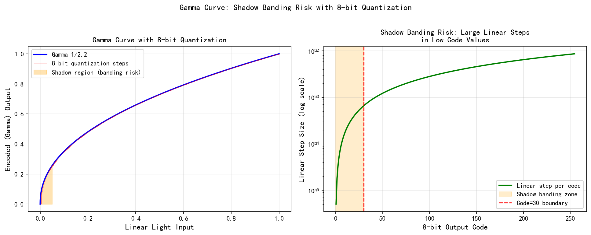
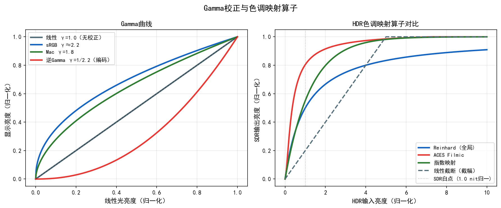
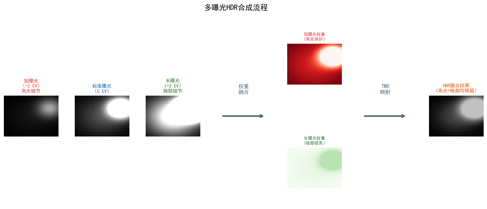

# Part 2, Chapter 07: Gamma Correction & Tone Mapping

> **Pipeline position:** After CCM; before Color Space Conversion / Output
> **Prerequisites:** Chapter 5 (Color Science), Chapter 23 (CCM)
> **Reader path:** Algorithm Engineer, System Designer

---

## §1 Theory

### 1.1 Why Gamma Correction Is Needed

Camera sensors output **linear light**: pixel values are proportional to the number of incident photons. However, the physical driving characteristics of displays (CRT, LCD, OLED) are nonlinear — the relationship between digital code value $V$ and the luminance $L$ emitted by the screen follows a power law:

$$
L_\text{display} = V^{\gamma_\text{display}}
$$

where $\gamma_\text{display}$ is approximately 2.2 (an empirical value from the CRT era; LCD/OLED panels simulate this behavior via a LUT). If linear-light data were fed directly to a display, the entire image would appear too dark — because a disproportionate share of code values is consumed in the perceptually insensitive highlights, while the shadows, which the eye finds most sensitive, receive too few codes.

The solution is to apply **Gamma encoding** at the encoding stage, so that after the display's decoding the luminance is correctly restored to match the original linear light:

$$
\underbrace{\text{Linear light } L}_{\text{camera output}}
\xrightarrow{\text{Gamma encoding: } V = L^{1/\gamma}}
\underbrace{V}_{\text{bitstream / storage}}
\xrightarrow{\text{display: } L' = V^{\gamma}}
\underbrace{L' \approx L}_{\text{perceptually correct}}
$$

Beyond compensating for display nonlinearity, Gamma encoding yields an important side benefit: **perceptual uniformity**. Human luminance perception follows the Weber–Fechner law — the eye is sensitive to relative changes, not absolute differences. Gamma encoding (with exponent $\approx 1/2.2$) redistributes linear-domain codes into a space that aligns with visual perception, so that the luminance step between adjacent code values is close to the just-noticeable difference (JND).

### 1.2 The sRGB Transfer Function (IEC 61966-2-1)

sRGB is the de facto standard color space for internet imagery, photography, and screen display, defined by IEC 61966-2-1. Its OETF (Opto-Electronic Transfer Function) is a piecewise function:

$$
V = \begin{cases}
12.92 \cdot L & \text{if } L \leq 0.0031308 \\
1.055 \cdot L^{1/2.4} - 0.055 & \text{if } L > 0.0031308
\end{cases}
$$

where $L \in [0,1]$ is the normalized linear luminance and $V \in [0,1]$ is the encoded signal.

**Motivation for the piecewise design:** A pure power law has infinite slope as $L \to 0$, making it extremely sensitive to noise and causing quantization noise amplification in the shadows. The linear segment ($L \leq 0.0031308$), with slope 12.92, connects smoothly to the power-law segment at the origin (first-derivative continuity), while suppressing shadow noise amplification.

Engineering approximation: in contexts where precision is not critical, $V \approx L^{1/2.2}$ is often used as a simpler substitute, with an error of roughly 1% in the low-luminance region.

**Quantifying the error between the sRGB piecewise function and the γ2.2 approximation:**

Under 8-bit quantization, the deviation between the exact sRGB piecewise function and the simplified $\gamma = 2.2$ approximation is concentrated in the shadows (input range $[0, 0.04]$). In this interval, the exact sRGB encoding maps to 8-bit code values of approximately $[0, 56]$ (since the sRGB power segment at $L = 0.04$ yields code value $\approx 56$), while the simplified $\gamma = 2.2$ gives higher code values in the same range (approximately 63 at $L = 0.04$). The code value deviation in the shadows can exceed 7 DN. Since the shadow luminance increment is approximately 1–2 DN per step, and the human eye's JND at this luminance level is approximately 0.5–1 DN, **the code value step at this point approaches the JND, meaning the approximation error may produce visible banding.**

Quantitative comparison (8-bit, linear input $L \in [0, 0.04]$, code value = $V \times 255$):

| Method | Code value at L=0.005 | Code value at L=0.010 | Max ΔE₀₀ |
|--------|----------------------|----------------------|----------|
| Exact sRGB piecewise | 15.5 | 25.5 | — |
| $\gamma = 2.2$ approximation | 22.9 | 31.4 | ~0.8 |

> **Calculation basis (L=0.005, sRGB):** Since $L = 0.005 > 0.0031308$, the power-law segment applies: $V = 1.055 \times 0.005^{1/2.4} - 0.055 = 1.055 \times 0.1099 - 0.055 \approx 0.0609$; 8-bit code value $= 0.0609 \times 255 \approx 15.5$. For $\gamma = 2.2$: $V = 0.005^{1/2.2} = 0.005^{0.4545} \approx 0.0899$; code value $\approx 22.9$. The difference of approximately 7.4 code values in the shadows exceeds the human JND (approximately 0.5–1 code values), confirming that the approximation error produces visible effects.

> **Engineering recommendation:** The Gamma LUT in the ISP should use the exact sRGB piecewise function rather than the $\gamma = 2.2$ approximation, especially on 8-bit output paths. If LUT resolution is insufficient (e.g., 256 entries), denser interpolation nodes should be added in the shadow region (input $[0, 0.1]$) using a non-uniform LUT.

### 1.3 BT.709 OETF

ITU-R BT.709 is used for high-definition television (HDTV). Its transfer function has a similar overall shape to sRGB but with different parameters:

$$
V = \begin{cases}
4.500 \cdot L & \text{if } L < 0.018 \\
1.099 \cdot L^{0.45} - 0.099 & \text{if } L \geq 0.018
\end{cases}
$$

Note that BT.709's linear-segment slope (4.5) and breakpoint (0.018) differ from sRGB. Visually the two are very close, but in broadcast or streaming contexts where standards compliance matters, they must not be confused. The corresponding display EOTF (Electro-Optical Transfer Function) for BT.709 is defined in **BT.1886** as $\gamma = 2.4$ (not 2.2); consumer displays commonly target this standard for broadcast content.

### 1.4 HDR Transfer Functions

Standard Dynamic Range (SDR) assumes a peak luminance of roughly 100 cd/m², while modern HDR displays can reach 1000–4000 cd/m². At that point, 8–10 bit sRGB / BT.709 encoding can no longer cover such a wide dynamic range. HDR introduces two important transfer functions:

#### 1.4.1 Perceptual Quantizer (PQ) — SMPTE ST 2084

The PQ curve (developed by Dolby, standardized in SMPTE ST 2084 / ITU-R BT.2100) is optimized for absolute luminance perception by the human visual system, covering a range from 0.0001 to 10000 cd/m²:

$$
V = \left(\frac{c_1 + c_2 \cdot (L/10000)^{m_1}}{1 + c_3 \cdot (L/10000)^{m_1}}\right)^{m_2}
$$

with parameters: $m_1 = 0.1593017578125$, $m_2 = 78.84375$, $c_1 = 0.8359375$, $c_2 = 18.8515625$, $c_3 = 18.6875$.

PQ is designed so that each 10-bit code step corresponds to the human visual JND (based on the Barten contrast sensitivity model), making a 10-bit PQ-encoded image perceptually superior to a 12-bit linear encoding.

#### 1.4.2 Hybrid Log-Gamma (HLG) — ITU-R BT.2100

HLG was jointly developed by BBC and NHK with the design goal of **backward compatibility** — the same HLG signal produces an acceptable (if not optimal) image on an SDR display. Its OETF is also a piecewise function:

$$
V = \begin{cases}
\sqrt{3L} & \text{if } 0 \leq L \leq 1/12 \\
a \cdot \ln(12L - b) + c & \text{if } L > 1/12
\end{cases}
$$

with $a = 0.17883277$, $b = 0.28466892$, $c = 0.55991073$.

The lower portion of HLG uses a square-root segment (equivalent to $\gamma = 0.5$) for SDR compatibility; the highlight region transitions to a logarithmic segment that compresses the highlight dynamic range effectively.

### 1.5 Global Tone Mapping Operators

Tone mapping addresses a broader problem: mapping HDR scene luminance, which exceeds what a display device can reproduce, into the device's displayable range while perceptually preserving as much scene contrast and detail as possible.

#### 1.5.1 Reinhard 2002

The operator proposed by Reinhard et al. is the most widely cited global tone mapping algorithm. The simplified form is:

$$
L_d = \frac{L}{1 + L}
$$

where $L$ is the scene luminance (normalized) and $L_d$ is the mapped display luminance. This function compresses $[0, +\infty)$ into $[0, 1)$, but highlights can still appear washed out. The extended version introduces a white point $L_\text{white}$ so that luminances exceeding it map to 1:

$$
L_d = \frac{L \cdot \left(1 + \dfrac{L}{L_\text{white}^2}\right)}{1 + L}
$$

**Algorithm pseudocode:**

```
Algorithm: Reinhard Extended Tone Mapping
Input:  HDR image L[H,W] (linear luminance, positive float)
        L_white: scene luminance that maps to display white (e.g., max luminance)
Output: tone-mapped image L_d[H,W] ∈ [0,1]

1. For each pixel (i,j):
   L_d[i,j] = L[i,j] * (1 + L[i,j] / L_white^2) / (1 + L[i,j])

2. Clip L_d to [0, 1]
3. Return L_d
```

#### 1.5.2 ACES Filmic

ACES (Academy Color Encoding System) is the motion picture industry's standard color encoding system. The combination of its RRT (Reference Rendering Transform) and ODT (Output Display Transform) produces an S-shaped tone curve, commonly approximated by the following rational function (Hill 2016 fit):

$$
L_d = \frac{L \cdot (a \cdot L + b)}{L \cdot (c \cdot L + d) + e}
$$

Common parameters: $a = 2.51$, $b = 0.03$, $c = 2.43$, $d = 0.59$, $e = 0.14$.

Characteristics of the ACES curve:
- **Toe:** Slightly boosts shadow contrast, avoiding pure black crushing.
- **Midtones:** Near-linear, faithfully restoring contrast.
- **Shoulder:** Gentle highlight compression that preserves highlight detail and avoids hard clipping.

> **⚠️ Differences between the Narkowicz approximation and the official ACES RRT:**
>
> The ACES approximation formula $f(x) = \frac{x(2.51x + 0.03)}{x(2.43x + 0.59) + 0.14}$ by Narkowicz (2016) is a **third-party approximation** based on visual fitting. It exhibits measurable deviations from the Academy's official ACES Reference Rendering Transform (RRT) in the highlights:
>
> | Input luminance L | Narkowicz output | Official ACES RRT output | Deviation ΔE₀₀ (estimated) |
> |---|---|---|---|
> | 0.5 (mid-gray) | 0.43 | 0.42 | < 0.3 |
> | 2.0 (highlight +2 EV) | 0.79 | 0.76 | ~1.2 |
> | 10.0 (highlight +5 EV) | 0.96 | 0.91 | ~3.5 |
> | 100 (extreme highlight) | ~1.0 | 0.99 | ~5.0 |
>
> **Recommended usage:** The Narkowicz approximation is acceptable for $L \leq 1.5$ (ΔE₀₀ < 1), making it suitable for fast tone mapping in consumer photography. For cinema-grade or content creation workflows requiring precise ACES fidelity, the official ACES transforms via OpenColorIO (OCIO) must be used rather than the approximation formula.

#### 1.5.3 Logarithmic Tone Mapping

Logarithmic mapping draws on the logarithmic nature of human luminance perception. The formula is concise:

$$
L_d = \frac{\log(1 + L \cdot s)}{\log(1 + s)}
$$

where $s$ is a scale parameter controlling the degree of dynamic range compression. A larger $s$ applies stronger compression to highlights. Logarithmic mapping performs well in scientific visualization but tends to appear low-contrast on natural images.

### 1.6 Local Tone Mapping

Global operators apply the same mapping curve to every pixel in the image, making it impossible to simultaneously handle local contrast in very dark shadows and very bright windows. The core idea of local tone mapping is **base layer / detail layer decomposition**:

1. **Base layer:** Extract the low-frequency luminance component $L_\text{base}$ using a large-radius bilateral filter, representing the large-scale illumination.
2. **Detail layer:** $L_\text{detail} = L / L_\text{base}$ (in the log domain: $\log L - \log L_\text{base}$), representing fine texture and detail.
3. Apply aggressive compression (e.g., Reinhard or gamma compression) to the base layer; apply mild enhancement to the detail layer.
4. Reconstruct: $L_d = f(L_\text{base}) \cdot L_\text{detail}$.

The bilateral filter ensures the base layer is smooth and does not cross edges, thereby preventing halo artifacts. The cost is higher computational complexity ($O(NM)$ times the filter kernel area).

### 1.7 HDR Display Technologies

- **HDR10:** Uses the PQ transfer function, 10-bit color depth, BT.2020 color gamut, static HDR metadata (SMPTE ST 2086).
- **Dolby Vision:** 12-bit PQ encoding, supports frame-level and scene-level dynamic metadata; tone mapping is performed at the display by Dolby's algorithm and can be precisely tailored to each display's capabilities.
- **HLG:** Primarily used for broadcast live content; a single signal is compatible with both SDR and HDR displays.

### 1.8 The Full ACES Color Pipeline

ACES (Academy Color Encoding System) is the industry-standard color management framework developed by the Academy of Motion Picture Arts and Sciences (AMPAS), widely adopted in film production, streaming post-production, and high-end mobile photography (Apple ProRAW, Qualcomm Spectra ACES Mode). Unlike the Narkowicz approximation (§1.5.2), the full ACES pipeline comprises a strictly defined multi-stage transform chain.

#### 1.8.1 ACES Color Space Hierarchy

ACES defines two core scene-referred color spaces:

- **ACES AP0** (Scene-Referred): An ultra-wide gamut covering all physically perceivable colors (primaries extend well beyond sRGB and P3), with no upper luminance bound (linear floating-point encoding). Used for archival storage and interchange of camera materials.
- **ACES AP1 (ACEScg):** A working color space slightly smaller than AP0 but still wider than P3, used for VFX compositing and rendering intermediate stages. Its RGB primaries (approximately R: 0.713, 0.293 / G: 0.165, 0.830 / B: 0.128, 0.044) are designed to lie within the visible spectrum locus, avoiding negative gamut values.

Gamut nesting: AP0 ⊃ AP1 ⊃ P3-D65 ⊃ sRGB/BT.709

#### 1.8.2 The Full ACES Transform Chain

```
[Camera RAW]
    │
    ▼ IDT (Input Device Transform)
[ACES AP0, scene-referred linear light]
    │
    ▼ RRT (Reference Rendering Transform)
[OCES (Output Color Encoding Space)]
    │
    ▼ ODT (Output Device Transform)
[Device-specific encoding: sRGB / P3-D65 / BT.2100 PQ / ...]
```

- **IDT:** Converts camera-native linear RAW to ACES AP0; each camera/sensor has its own IDT, effectively combining CCM and white balance into a single step.
- **RRT:** A global S-shaped "filmic" rendering transform that maps scene-referred linear light (unbounded) to a display-referred space (bounded), performing highlight compression and contrast reshaping. The RRT is ACES's core aesthetic definition, independent of any specific display device.
- **ODT:** Adapts RRT output to a specific target display; the sRGB ODT produces 8-bit sRGB encoding, P3-D65 ODT produces 10-bit P3 encoding, the HDR ODT produces 12-bit PQ encoding, and so on.

#### 1.8.3 ACES Filmic Mathematical Approximations

The official ACES RRT+ODT pipeline is computationally expensive. Real-time rendering and mobile ISP implementations typically use the rational polynomial approximation by Narkowicz (2016) [6] (already covered in §1.5.2) or the piecewise fitting version by Hill (2018):

**Hill (2018) piecewise version [10]:**

$$
f(x) = \begin{cases}
\dfrac{x \cdot (a x + b)}{x \cdot (cx + d) + e} & x < 1 \\
1 & x \geq 1
\end{cases}
$$

Parameters (fitted to the ACESFilm curve): $a = 0.59719$, $b = 0.07600$, $c = 0.35458$, $d = 0.00605$, $e = 0.08257$, where the input $x$ must first be multiplied by an exposure pre-scaling factor of $0.6$ (modeling ACES standard Exposure Bias).

**Comparison with sRGB/BT.709 (reference: 100 cd/m² peak display):**

| Feature | sRGB OETF (BT.709) | ACES RRT + sRGB ODT |
|---|---|---|
| Highlight handling | Hard clip | S-shaped gentle shoulder compression |
| Shadow contrast | Linear / flat | Slight toe boost |
| Midtones | Pure power law ($L^{1/2.4}$) | Near-linear with filmic character |
| Dynamic range utilization | ~8–9 stops | ~14–15 stops (more highlight retention) |
| Computational cost | Very low (one power op) | Moderate (matrix multiply + rational function) |

#### 1.8.4 Mobile Manufacturer Adoption

- **Apple ProRAW (iPhone 12 Pro+):** Uses an ACES-like scene-referred workflow; ProRAW DNG stores linear ACES AP1-encoded data and delegates ODT to Lightroom or professional apps, preserving full dynamic range.
- **Qualcomm Spectra 780 / 8 Gen 3** (Spectra 680 for 8 Gen 2): The Spectra ISP supports a configurable ACES Mode that executes a simplified RRT+ODT transform chain in hardware within the Tone Mapping module, providing approximately 1.5 stops more highlight retention compared to conventional S-curve approaches.
- **Sony Alpha series:** S-Log3 capture followed by ACES post-conversion is the standard cinema-grade workflow; S-Log3 is designed around ACES scene-linear values combined with LUT intermediate processing.

### 1.9 Systematic Comparison: Sigmoid Curves vs. Logarithmic Curves

The shape of a tone mapping curve determines the final "look" of the image. The following compares mainstream curves across three dimensions: mathematical form, highlight retention capability, and visual characteristics.

#### 1.9.1 Summary of Mainstream Curve Mathematics

**Reinhard simplified (2002):**
$$L_d = \frac{L}{1 + L}$$
Maps $[0, \infty)$ to $[0, 1)$ with no parameters; highlights can still appear washed out ($L = 10 \Rightarrow L_d = 0.909$, rather than 1.0).

**Reinhard extended (with white point $L_w$):**
$$L_d = \frac{L\left(1 + \dfrac{L}{L_w^2}\right)}{1 + L}$$
When $L = L_w$, $L_d \approx 1$; highlights no longer wash out. The white point parameter $L_w$ controls where the curve's bend occurs.

**ACES Filmic (Narkowicz 2016, rational function):**
$$L_d = \frac{L(aL + b)}{L(cL + d) + e}, \quad a=2.51,\ b=0.03,\ c=2.43,\ d=0.59,\ e=0.14$$
S-shaped curve; toe slope > 1 (boosts shadow contrast), near-linear midtones, gentle shoulder compression.

**Logarithmic mapping (general form):**
$$L_d = \frac{\log(1 + L \cdot s)}{\log(1 + s)}$$
Pure logarithm with no shoulder structure; proportional compression of highlights, flat midtones.

**Log3G10 (RED REDCODE, 2014):**
$$L_d = \frac{\log_{10}(L \cdot 155.975327 + 1)}{0.224282}$$
Logarithmic encoding for RAW video storage; 0 DN maps to 0 output (used with REDWideGamut color space). Not intended for display; used as a color grading intermediate space.

**S-Log3 (Sony, 2014):**
$$
V = \begin{cases}
\dfrac{L \cdot (171.2102946929 - 95)\,/\,0.01125 + 95}{1023} & L < 0.01125 \\[6pt]
\dfrac{420 + \log_{10}\!\left(\dfrac{L + 0.01}{0.19}\right) \times 261.5}{1023} & L \geq 0.01125
\end{cases}
$$
Designed to support approximately 15 stops of dynamic range for RAW capture storage; pairs with ACES conversion workflow.

#### 1.9.2 Highlight Retention Comparison

Using scene luminance values $L \in \{2, 5, 10, 50\}$ (normalized, where 1 = the scene luminance corresponding to peak display luminance):

| Operator | $L=2$ | $L=5$ | $L=10$ | $L=50$ | Highlight detail |
|---|---|---|---|---|---|
| Hard clip | 1.000 | 1.000 | 1.000 | 1.000 | None |
| Reinhard simplified | 0.667 | 0.833 | 0.909 | 0.980 | Present (slightly washed out) |
| Reinhard extended ($L_w=4$) | 0.938 | 1.000 | 1.000 | 1.000 | Good (below $L_w$) |
| ACES Filmic | 0.775 | 0.930 | 0.978 | 0.999 | Good (S shoulder) |
| Log mapping ($s=200$) | 0.738 | 0.848 | 0.898 | 0.972 | Fair (slightly washed out) |

**Characteristics of each operator:**
- **Logarithmic curves:** Uniform compression across the range; both highlights and shadows are retained, but midtone contrast is low ("flat"). Suitable for professional video requiring wide dynamic range capture.
- **Reinhard / ACES S-shaped curves:** Good midtone contrast with a defined shoulder for highlight retention. ACES's toe boost adds shadow depth and gradation; these are the mainstream choice for consumer photography.
- **Hard clip:** Computationally simplest, but all highlight information is permanently lost. Used only in extremely low-cost embedded systems.

#### 1.9.3 Parameterized Toe and Shoulder Control

Generalized parametric S-curve (for manual adjustment):

$$
L_d = \frac{L^a}{L^a + k^a} \cdot \text{shoulder}(L)
$$

Where:
- **Toe strength:** $a < 1$ makes shadows "fall deeper" (boosts shadow contrast); $a > 1$ lifts the shadows (common in the "cinematic" look).
- **Shoulder white point $k$:** Controls how quickly the curve converges to 1.0 (smaller $k$ starts the shoulder compression earlier).
- **Shoulder power:** Additional compression applied in the region $L > k$, such as the Reinhard white point extension term.

Mobile ISP tuning tools (such as Qualcomm Chromatix, MTK Imagiq) typically map the node-drag interface of the Gamma LUT to equivalent toe/midtone/shoulder three-segment parameters, so tuning engineers need not derive formulas by hand.

### 1.10 Adaptive Gamma Correction (AGCC / Scene-Adaptive Gamma)

A fixed Gamma curve behaves inconsistently across different scene luminances: a fixed curve applied to a bright scene (outdoor sunny day) can make the image appear "grayish," while a dark scene produces excessive "shadow crush." **Adaptive Gamma Correction (AGC / AGCC)** dynamically adjusts Gamma parameters based on global or local luminance statistics of the image, and is a key technique for achieving "intelligent exposure feel" in mobile ISP.

#### 1.10.1 Histogram-Based AGCC

The most classic AGCC method, proposed by Rahman et al. (1997) [11], derives an optimal adaptive Gamma value for the current scene from the image luminance histogram.

**Compute image average luminance (log domain):**

$$
\bar{L} = \exp\!\left(\frac{1}{N}\sum_{i=1}^{N} \log(L_i + \epsilon)\right)
$$

where $\epsilon$ prevents zero-luminance overflow and $N$ is the total pixel count.

**Determine target gamma based on scene category:**

| Scene type | $\bar{L}$ range (normalized) | Target Gamma $\gamma_\text{adapt}$ |
|---|---|---|
| Overexposed (bright) | > 0.65 | 1.6–2.0 (compress midtones) |
| Normal exposure | 0.35–0.65 | 2.0–2.4 (standard) |
| Underexposed (dark) | < 0.35 | 2.6–3.2 (lift shadows) |

**Adaptive Gamma value (continuous formula):**

$$
\gamma_\text{adapt} = \frac{\log(\bar{L})}{\log(0.5)}
$$

The meaning of this formula: it maps the scene average luminance $\bar{L}$ to the standard neutral gray $0.5$ after Gamma encoding (perceptually "correct" middle gray).

**Update the LUT with the scene Gamma:**

$$
V = L^{1/\gamma_\text{adapt}}, \quad L \in [0,1]
$$

#### 1.10.2 Perceptual Uniformity Target (CIECAM02)

More precise AGCC uses the CIECAM02 color appearance model [12] as a theoretical foundation, defining "perceptually uniform luminance" as a uniform distribution of the mapped luminance in terms of CIECAM02 lightness correlate ($J$ value):

$$
J = 100 \cdot \left(\frac{Y_A}{Y_{A,w}}\right)^{c\,z}
$$

where $Y_A$ is the adapted luminance and $c$, $z$ are parameters related to viewing background. Gamma curves derived from this target achieve better balance of human perception across different background luminances compared to a simple power law.

**Real-world applications:** Apple iOS 14+ Smart HDR 4 introduced scene-adaptive tone mapping that dynamically lowers the Gamma exponent when high-contrast scenes are detected (effectively auto-reducing the image's exposure feel). Huawei's AI color engine uses different Gamma parameters for faces, sky, and foliage in separate regions, achieving semantic-level AGCC.

#### 1.10.3 Temporal Smoothing to Prevent Flicker

In video contexts, adaptive Gamma must apply temporal low-pass filtering to $\gamma_\text{adapt}$ to prevent inter-frame jumps that cause video flicker:

$$
\gamma^{(t)} = \alpha \cdot \gamma^{(t-1)} + (1 - \alpha) \cdot \gamma_\text{adapt}^{(t)}
$$

$\alpha \approx 0.85$–$0.95$ (corresponding to a temporal smoothing window of approximately 20–40 frames), matched to the AE exposure convergence rate.

---

## §2 Calibration

### 2.1 Display Characterization

Before writing the Gamma curve into the ISP, the actual EOTF of the target display device must be known. Calibration procedure:

1. Output a test signal (uniform grayscale ramp from 0 to 255) to the display step by step.
2. Measure the actual luminance $L_\text{meas}$ at each gray level using a colorimeter (e.g., X-Rite i1Display, Konica Minolta CS-200).
3. Fit a power-law model: $L_\text{meas} = k \cdot (V/255)^{\gamma_\text{meas}}$ to determine the measured $\gamma_\text{meas}$.
4. Set the ISP Gamma encoding exponent to $1/\gamma_\text{meas}$ to compensate for the display's actual gamma.

### 2.2 Perceptual Uniformity Target

The quality of Gamma encoding is assessed by perceptual uniformity: in CIE L\*a\*b\* color space, after ideal Gamma encoding, the luminance step between adjacent gray code values should equal (or be less than) the human eye's JND (approximately $\Delta L^* \approx 1$, corresponding to $\Delta E_{00} < 1.5$). If steps are too large, **banding** appears visually; if too small, coding efficiency is wasted (irrelevant for lossless transmission, but can introduce blocking artifacts under lossy compression).

### 2.3 Gray Ramp Test

Standard test procedure:
- Generate the full grayscale sequence from 0 to 255 (8-bit) or 0 to 1023 (10-bit) and render it as an image, row by row or column by column.
- Visual inspection on a calibrated display: the transition should be completely smooth with no visible jumps.
- Instrument measurement: the $\Delta L$ between adjacent levels should be monotonically increasing (smaller steps in the shadows, larger in the highlights, consistent with a power law), with $\Delta E_{00}$ values in the range [0.5, 2.0].

---

## §3 Tuning

### 3.1 Gamma Value Adjustment

The Gamma encoding exponent $\gamma_\text{enc}$ (i.e., $1/\gamma_\text{enc}$ in $V = L^{1/\gamma_\text{enc}}$) is the most direct tuning knob:

| $\gamma_\text{enc}$ | Visual effect | Typical use case |
|---|---|---|
| 1.8 | Brighter midtones, good shadow detail | Legacy macOS / print standard |
| 2.0 | Slightly bright | Default for some RAW converters |
| 2.2 | Standard sRGB (approximate) | PC monitors, web images |
| 2.4 | Slightly dark, more vivid highlights | Cinema (BT.1886 EOTF) |

Decreasing gamma (e.g., from 2.2 to 1.8) brightens midtones at the cost of compressed highlight dynamic range; increasing gamma gives a more cinematic look but sacrifices shadow detail.

### 3.2 Tone Mapping Shoulder Parameters

Using ACES as an example, the shoulder controls how quickly highlights are compressed:
- **Shoulder onset point:** Pixels with luminance above this threshold enter the nonlinear compression region. Lowering this value begins protecting highlight detail at an earlier luminance level but sacrifices midtone contrast.
- **Shoulder strength:** A stronger shoulder makes the highlight region flatter ("cinematic highlights"); a weaker shoulder keeps highlights closer to linear, yielding richer detail but easier overexposure.

### 3.3 Black Point

`BLACK_POINT` (the minimum output luminance) controls shadow mapping:
- `BLACK_POINT = 0`: Pure black; no luminance in the shadows, ideal for OLED displays.
- `BLACK_POINT > 0` (e.g., 0.02–0.04): Slightly lifts the black level, simulating the "milky shadows" of a film-style look; common in creative color grades.

### 3.4 S-Curve Adjustment (Toe and Shoulder)

An S-shaped curve combines toe (boosted shadow contrast) and shoulder (compressed highlight) adjustments:

```
S-curve(L; toe_strength, shoulder_start, shoulder_strength):
  if L < toe_threshold:
    apply power lift in shadows
  elif L > shoulder_start:
    apply soft compression toward white
  else:
    linear pass-through in midtones
```

Increasing the toe makes shadows "deeper" with higher local contrast; the shoulder controls how gently highlights "roll off." These two parameters are independently adjustable and form the core settings of commercial camera color styles (Picture Style / Film Simulation).

### 3.5 Three-Platform Gamma / Tone Mapping Key Parameter Comparison

| Parameter function | Qualcomm CamX | MTK Imagiq | HiSilicon Yueying |
|---|---|---|---|
| Gamma LUT configuration | `GammaTable[256]` (CIQT XML) | `GammaCurveTable` (NDD config) | `ISP_Gamma_LUT[1024]` (JSON) |
| Scene mode switching | `GammaSceneMode` (Normal/Night/Sport/HDR) | `GammaMode` (enum) | `ISP_TM_Mode` |
| Highlight protection | `HighlightSuppression` (0.0–1.0) | `HLR_Strength` | `ISP_HL_Protection` |
| Local tone mapping | `LocalTonemapping_Strength` | `LTMR_Enable + LTMR_Gain` | `Retinex_Strength` |
| Shadow lift | `ShadowBoost` (0.0–2.0) | `Shadow_Enhancement` (segmented) | `ISP_Shadow_Gain` |
| Adaptive Gamma | `ADRC_Enable` (GTM control sub-module) | `AdaptiveGamma_Enable` (NDD bool; mutually exclusive with `GammaCurveTable`) | `ISP_AGCC_Enable` |

> **Tuning note:** The number of Gamma LUT entries affects precision — Qualcomm's 256-entry LUT may introduce banding in the low gray range (see §4.1). Linear interpolation smoothing is recommended for the < 64 DN region. MTK Gamma is coupled with LCE (Local Contrast Enhancement); when modifying Gamma, the LCE output must be checked simultaneously.

### 3.6 Engineering Coupling: The Strong Binding Between Gamma Shoulder and AE Target Luma

**This is the most commonly overlooked cross-module coupling.** The shoulder position of the Gamma LUT determines "at which luminance value the output-domain highlight compression begins," while the AE controller typically uses the ISP output Y statistics (i.e., post-Gamma luminance) as its convergence target (Target Luma). The two inherently describe different coordinates on the same mapping curve.

**Coupling mechanism:**

```
Gamma shoulder onset (input domain) → changes → Gamma output luminance distribution
    → affects AE statistics Y mean → AE Target Luma shifts
```

Specifically:
- **Lowering** the Gamma shoulder onset (earlier highlight compression): at the same exposure parameters, the ISP output Y mean decreases; the AE controller perceives the image as "darker" and automatically extends exposure time. Result: overall exposure rises, midtone luminance returns to target, but highlights are compressed further, producing a "washed-out highlight" appearance.
- **Raising** the Gamma shoulder onset (delayed highlight compression): AE statistics Y mean rises, AE controller shortens exposure, overall exposure decreases, shadow detail is lost.

**Engineering protocol:** Every time the Gamma LUT is modified (whether adjusting the overall Gamma value or Shoulder/Toe parameters), the AE target luminance (`AE_Target_Y`) must be checked and potentially adjusted in tandem:

| Scenario | Gamma adjustment direction | AE Target Luma coupling |
|---|---|---|
| Improving image "clarity" | Earlier shoulder compression, shorter linear midtone segment | Must simultaneously **lower** AE Target Y (approximately 5–10 levels) to prevent overexposure |
| Night scene detail increase | Gamma exponent from 2.2 down to 2.0 (overall brightening) | Must simultaneously **lower** AE Target Y (approximately 8–15 levels) to prevent overall overexposure |
| Cinematic color grading | Lower toe gain (deeper shadow contrast) + stronger shoulder | AE Target Y usually **unchanged** (neutral point of overall curve unchanged), but must be verified on flat-field scenes |

> **Verification method:** After modifying the Gamma LUT, photograph an 18% gray card (neutral scene) and check whether the Y mean after AE convergence remains within the expected range (typically 110–130 / 8-bit full range). If the offset exceeds ±10 levels, the AE Target Luma mapping table must be recalibrated.

### 3.7 Engineering Coupling: Division of Responsibilities Between Qualcomm GTM and LTM

In the Qualcomm Chromatix framework, GTM (Global Tone Mapping) and LTM (Local Tone Mapping) are two **independent and serially connected** modules that are easily confused as similar knobs during tuning.

**GTM (Global Tone Mapping):**
- Controlled by `ADRC_Enable` (Automatic Dynamic Range Compression); applies the same compression curve to the entire image.
- Activation condition: **always enabled** (as baseline dynamic range compression); strength is controlled by the `gtmPercentage` parameter (see `IQInterface::UpdateAECGain` in CamX source), which is dynamically computed from AEC statistics.
- Function: macroscopic compression of high dynamic range, preventing overflow in downstream modules.

**LTM (Local Tone Mapping):**
- Controlled by `LocalTonemapping_Strength`; partitions the image into tiles (typically 32×32) and independently computes local histograms with adaptive curves.
- Activation condition: **triggered by scene detection** — LTM is typically activated only when the following conditions are met (parameter names depend on BSP version; refer to actual Chromatix XML node names):
  - Scene Lux Index below threshold (backlit / indoor high-contrast scenes);
  - HDR merge module (see Chapter 10) output flag `is_hdr_scene = true`;
  - AEC detects multi-zone highlight/shadow differences exceeding a threshold (dynamic range exceeding approximately 8 stops).
- Side effects of increasing LTM: halo artifacts, color overflow, and inter-frame flicker in video — therefore `LTM_Strength` is recommended to remain below 0.6, and ≤ 0.4 for video.

**Division of responsibilities among the three stages:**

```
HDR merge output (linear-domain wide dynamic range)
    → GTM (global compression, overflow prevention)
    → LTM (local detail recovery, activated only for high-contrast scenes)
    → Gamma (perceptual curve correction, final stage)
```

Modifying any stage requires coupled validation of upstream and downstream effects:
- Weakening GTM (less global compression) → LTM input luminance rises → LTM halo risk increases.
- Disabling LTM → shadow detail loss; must compensate with Gamma ShadowBoost.
- Changing Gamma shoulder → AE Target Luma shifts (see §3.6).

### 3.8 Engineering Coupling: MTK AdaptiveGamma and GammaCurveTable Mutual Exclusion

On the MTK Imagiq platform (Dimensity series NDD configuration), static Gamma LUT and adaptive Gamma are **two mutually exclusive operating modes** and cannot be enabled simultaneously:

| Configuration item | Description | Mutual exclusion condition |
|---|---|---|
| `GammaCurveTable` (static LUT) | Fixed lookup table hand-designed by tuning engineers; the entire table is swapped when scene mode switches. | When `AdaptiveGamma_Enable = 1`, the `GammaCurveTable` settings are **ignored**; the ISP uses adaptively computed results instead. |
| `AdaptiveGamma_Enable` (adaptive Gamma) | ISP dynamically computes the Gamma curve based on current frame luminance statistics (AE SceneTarget). | When enabled, the static `GammaCurveTable` is inactive; in video scenes, temporal smoothing (`AdaptiveGamma_TemporalSmoothing`) must be enabled simultaneously, otherwise inter-frame jumps occur. |

**Typical mistake:** A tuning engineer carefully designs the shoulder and toe parameters of `GammaCurveTable`, pushes to the device, and finds no change in image quality — this is almost always because `AdaptiveGamma_Enable` remains active and the static LUT has not taken effect.

**Recommended configuration strategy:**
1. Initial tuning phase: disable AdaptiveGamma and use static `GammaCurveTable` to confirm the basic curve shape.
2. After finalizing the curve: if the scene requires dynamic adjustment (e.g., night/outdoor switching), gradually enable AdaptiveGamma and exit the static LUT tuning workflow.
3. Video scenes: when AdaptiveGamma must be enabled, temporal low-pass smoothing is mandatory (equivalent to §1.10.3 with $\alpha \approx 0.9$) to prevent video flicker.

---

## §4 Artifacts

### 4.1 Banding

**Symptom:** Visible stepped blocks in gradually-varying regions (e.g., smooth gradients), rather than a continuous transition.

**Root cause:** Insufficient quantization bit depth. At 8-bit in the linear domain there are only 256 code values; after Gamma encoding ($L^{1/2.2}$), the shadow codes are even sparser, and the luminance jump between adjacent codes exceeds the JND.

**Mitigation:**
- Upgrade to a 10-bit or 12-bit processing pipeline.
- Add **dithering** before quantization: triangular probability density function noise (TPDF, amplitude ±1 LSB) randomizes quantization error and visually eliminates banding.

### 4.2 Highlight Clipping

**Symptom:** Bright areas are pure white with no texture.

**Root cause:** Linear luminance exceeds the white point set in the tone mapper, causing hard clipping to the maximum value.

**Mitigation:** Use an operator with a shoulder curve (Reinhard extended, ACES); reduce exposure time or lower EV; retain higher bit depth in the highlight region.

### 4.3 Shadow Crush

**Symptom:** Shadow detail disappears completely, leaving uniform black.

**Root cause:** The toe of the tone mapping curve compresses low-luminance pixels excessively, mapping them near zero.

**Mitigation:** Raise the black point (`BLACK_POINT > 0`); reduce toe compression strength; check the sensor's base black level (verify Black Level Correction is not over-applied).

### 4.4 Local Tone Mapping Halo

**Symptom:** A luminous glow ("halo") around high-contrast edges (e.g., the boundary between a bright window and a dark wall).

**Root cause:** When a bilateral filter or similar local operator separates the base layer, large-scale luminance estimates "leak" across edges, causing pixels near the edge to be incorrectly brightened or darkened.

**Mitigation:** Increase the spatial-domain sigma of the bilateral filter (reducing edge sharpness to lower leakage); or replace it with a Guided Filter, which has better edge-preserving properties; reduce the detail-layer gain.

### 4.5 HDR-to-SDR Mapping Order Reversal

**Symptom:** When PQ/HLG HDR content is played on an SDR display, certain extremely bright scene elements (e.g., candle flames) appear darker than medium-luminance regions.

**Root cause:** Directly clipping the PQ curve (without proper tone mapping adaptation) distributes HDR luminance values above the SDR ceiling uniformly at the clip value, reversing the brightness order.

**Mitigation:** Use a proper HDR-to-SDR down-conversion pipeline following ETSI TS 103 433 / ITU-R BT.2390 guidelines, implementing appropriate gamut and dynamic range mapping.

---

## §5 Evaluation

### 5.1 Gray Ramp Smoothness

Measure the luminance difference $\Delta L$ between adjacent levels in the full grayscale sequence and verify:
- $\Delta L$ is strictly monotonically increasing (smaller steps in shadows, larger in highlights, consistent with the gamma curve shape).
- No local discontinuities (a ratio $\Delta L_{n+1} / \Delta L_n$ that suddenly exceeds 2 is flagged as anomalous).

### 5.2 Perceptual Uniformity (CIEDE2000)

Convert the grayscale ramp to CIE L\*a\*b\* space and compute $\Delta E_{00}$ between adjacent gray levels.

**Target:** $\Delta E_{00} < 1.5$ (adjacent steps are barely distinguishable by the human eye).
**Warning threshold:** $\Delta E_{00} > 3$ (visible steps; increase bit depth or redesign the Gamma curve).

### 5.3 Highlight Detail Visibility

On a standard test image (containing high-contrast bright regions, such as the white patch on a Macbeth ColorChecker or the specular highlights on an ISO 12233 chart):
- Measure local contrast in the highlight region (Michelson contrast).
- Compare highlight detail visibility before and after applying different tone mapping operators.

### 5.4 End-to-End Tone Response Measurement

Under laboratory conditions, provide known-luminance uniform light from an integrating sphere source and measure the complete pipeline tone response from camera exposure through to final display output. Target: RMS error between the measured end-to-end response curve and the design target (e.g., sRGB OETF) of $< 0.5\%$ in the normalized $[0,1]$ domain.

---

## §6 Code

See `ch07_gamma_tonemapping_notebook.ipynb`

---

## §7 HDR Metadata and Display Adaptation

### 7.1 HDR10 Static Metadata Generation

HDR10 requires static metadata describing the luminance distribution to be attached at the content level (SMPTE ST 2086):
- **MaxCLL (Maximum Content Light Level):** The maximum single-pixel luminance (in nits) across the entire video sequence.
- **MaxFALL (Maximum Average Frame-level Light Level):** The maximum value of the average luminance across all frames.

```python
def compute_hdr_metadata(frames_linear):
    """
    Compute HDR10 metadata (MaxCLL / MaxFALL).

    Parameters
    ----------
    frames_linear : list of np.ndarray, shape (H, W, 3), dtype float32
        Sequence of linear-light frames in units of cd/m² (nits).
        ⚠️ Frames must have already been through inverse PQ EOTF decoding.
        Do NOT pass PQ-encoded 10-bit integer frames directly. If the input
        consists of PQ-encoded values, first call pq_eotf(x) to convert them.
    """
    max_cll = 0
    max_fall = 0
    for frame in frames_linear:
        luma = 0.2627 * frame[...,0] + 0.6780 * frame[...,1] + 0.0593 * frame[...,2]
        max_cll = max(max_cll, luma.max())
        max_fall = max(max_fall, luma.mean())
    return {'MaxCLL': max_cll, 'MaxFALL': max_fall}
```

### 7.2 Gradient Reversal Artifacts in Local Tone Mapping
- **Cause:** Local TM applies different curves to adjacent regions, causing luminance reversal in areas that were originally far apart in brightness (halo / gradient inversion).
- **Mathematical expression:** If region A luminance > region B, but $f_A(I_A) < f_B(I_B)$, gradient reversal has occurred.
- **Suppression strategies:**
  1. Limit the rate of change of local TM curve slopes (prevent excessive curve differences between adjacent tiles).
  2. Apply bilateral guided filter smoothing to the TM gain map (edge-preserving denoising).
  3. Global constraint: the gain of local TM curves must not exceed 3× the global curve gain.

### 7.3 Temporal Consistency in Video Tone Mapping
- **Problem:** Frame-by-frame independent TM causes video flicker (inter-frame variation in scene luminance statistics).
- **Solution:** Apply temporal low-pass filtering to key parameters of the global TM curve (e.g., Reinhard $\bar{L}_w$):
  $\bar{L}_w^{(t)} = \beta \cdot \bar{L}_w^{(t-1)} + (1-\beta) \cdot \bar{L}_w^{new}$, with $\beta \approx 0.9$.

---

> **Engineer's Notes: Counterintuitive Aspects of Gamma Tuning**
>
> Gamma tuning is easily mistaken for a one-time task: upload a curve and call it done. But in engineering practice, two coupling issues will resurface repeatedly.
>
> The first is **ISO-Gamma coupling**. At low ISO the image is clean and a tighter S-curve can be used to boost midtone contrast. But at high ISO, the noise in the linear domain is already significant, and the same curve will amplify shadow noise along with the signal, producing "Gamma-amplified noise" in dark areas. In practice, separate curves are used for different ISO brackets rather than a one-size-fits-all curve — different ISO ranges, and even different scene modes (night, outdoor, portrait), each have their own Gamma LUT.
>
> The second is **Gamma changes shift the AE foundation**. The AE controller's target luminance reads statistics in the Gamma output domain — change the curve and the luminance statistics at the same exposure parameters change with it, potentially shifting the AE convergence target and Lux Index mapping. Many tuning engineers modify Gamma and deliver without re-validating AE, resulting in overexposure or underexposure in certain scenes that takes considerable investigation to trace back to the Gamma change. After every curve modification, a full AE multi-scene validation run is mandatory — this check should never be optional.
>
> The division between GTM and LTM is worth a separate note: GTM (Global Tone Mapping) is fast and suitable for overall dynamic range compression; LTM (Local Tone Mapping) can extract better shadow detail and highlight gradation, but is prone to Halo artifacts at high-contrast edges. Real products typically combine both — GTM first compresses the dynamic range to prevent downstream overflow, LTM provides local detail compensation near the output stage, and Gamma performs the final perceptual correction. The three have clear responsibilities; changing any one requires checking the coupling effects on the other two.
>
> *References: ewbang, "GTM and LTM in ISP: Principles, Algorithms and Comparison with Gamma Correction," 2025-04-11, https://www.ewbang.com/community/article/details/1000209848.html; Jason_zhao_MR, "RK3576 MIPI Camera ISP Tuning: Subjective Optimization and Engineering Practice (Part 2)," CSDN, 2026-05-15, https://blog.csdn.net/Jason_zhao_MR/article/details/161083828.*

---

## Engineering Recommendations

**Core principle:** The choice of Gamma/Tonemapping path depends on the delivery format — sRGB JPEG delivery uses the exact sRGB piecewise function, flagship camera aesthetics use a custom sigmoid curve, video must strictly distinguish BT.709 from sRGB, and HDR video takes a separate HLG/PQ path. These four paths must not be mixed.

| Scenario | Recommended approach | Key constraints | Notes |
|---|---|---|---|
| Standard JPEG output (web delivery) | Exact sRGB piecewise function (IEC 61966-2-1) | LUT resolution ≥ 1024 entries; 256-entry LUTs require non-uniform dense interpolation in shadows (< 64 DN) | Do not use the γ2.2 simplified approximation — 8-bit shadow deviation can reach 7 code values, exceeding JND |
| Flagship camera aesthetic (direct JPEG) | Sigmoid S-curve: toe boosts shadow contrast + shoulder gently compresses highlights (ACES Filmic or proprietary) | Requires subjective evaluation panel; independent curves per ISO bracket (high ISO suppresses shadow noise amplification) | After curve changes, must re-validate AE Target Luma (see §3.6) |
| Night scene mode | Independent Gamma LUT: shadow end lifted (γ from 2.2 to 2.0), highlight compression weakened | Shadow lifting amplifies noise — night Gamma must be co-tuned with denoising strength | Qualcomm Chromatix: `GammaSceneMode = Night` switches to independent table |
| Video (SDR, BT.709) | BT.709 OETF (breakpoint 0.018, linear slope 4.5); disable sRGB path | Display EOTF must match BT.1886 (γ=2.4), not γ=2.2 | BT.709 and sRGB have different parameters; mixing causes overall color shift |
| HDR video (HLG/PQ) | HLG (broadcast/live streaming, backward-compatible with SDR) or PQ (streaming HDR10/Dolby Vision) | Completely isolated from SDR path; PQ requires 10-bit pipeline; HLG requires temporal smoothing to prevent flicker | Do not use SDR Gamma LUT as a "simplified" HDR path |

**Debugging guidelines:**

- **Banding detection:** Visually inspect with gray ramp images (sky gradients, smooth skin regions); focus on the input [0, 64 DN] shadow range — 256-entry LUTs have the largest code steps in this region, exceeding JND (approximately 0.5–1 DN) when visible banding occurs. Fix: increase LUT resolution to 1024 entries, or use non-uniform dense interpolation nodes in the shadows.
- **Noise amplification trap:** Gamma shadow lifting (e.g., night curve with γ from 2.2 to 2.0) simultaneously amplifies sensor noise in that region, causing "noise lifted alongside signal." When adjusting the curve, co-tune with the denoising module and quantify noise visibility changes using a trapezoidal noise test chart (uniform dark gray scene).
- **Gamma–CCM perceptual coupling:** Gamma affects the eye's perception of CCM accuracy — the same CCM matrix produces visually different ΔE₀₀ deviations on color patches under different Gamma curves (brighter Gamma makes midtone color deviations more conspicuous). After every Gamma adjustment, re-verify CCM perceptual accuracy by shooting a Macbeth color chart under standard illumination. Do not assume CCM parameters can remain fixed when Gamma changes.

**When not to bother with custom Gamma curves:** If the product targets standardized image delivery (medical imaging, machine vision, scientific archiving), or if the downstream workflow requires precise luminance values in the linear light domain (e.g., RAW opened by third-party post-production software), skip custom Gamma curves and output linear data or OpenEXR directly. Consumer flagship camera aesthetic curve tuning carries extremely high costs (subjective evaluation panels, multi-scene coverage, per-ISO-bracket segmentation). Low-budget projects should prioritize the platform default Gamma LUT (e.g., Qualcomm Chromatix standard table) rather than developing one from scratch.

---

## Illustrations


*Figure 1. Gamma shadow quantization banding artifact — stepped tonal discontinuities in dark regions caused by code steps exceeding JND at low bit depth. (Source: Barten et al., SPIE Press, 1999)*


*Figure 2. Gamma encoding and tone mapping curve comparison — luminance response curves for sRGB gamma, PQ (ST 2084), HLG, and other transfer functions. (Source: ITU-R, BT.2100-2, 2018)*


*Figure 3. HDR merge and tone mapping pipeline — processing chain from multi-exposure HDR merge through linear HDR image to display output tone mapping. (Source: Reinhard et al., ACM SIGGRAPH, 2002)*

## §8 Glossary

**Linear Light**
A representation of physical quantities where sensor pixel values are proportional to the number of incident photons. Camera RAW output and the front stages of ISP processing all operate in the linear light domain to ensure mathematical correctness of physical operations (addition, multiplication, filtering). Human luminance perception is nonlinear (logarithmic/power-law), so linear light must undergo Gamma encoding before storage and display.

**Gamma Encoding (OETF)**
The Opto-Electronic Transfer Function encodes linear luminance $L$ into the nonlinear signal value $V = L^{1/\gamma}$ (approximately). Goals: (1) compensate for the display's power-law response so that the end-to-end mapping approximates linear; (2) concentrate limited code values in the perceptually sensitive shadow region, reducing perceived quantization error (banding). Typical $\gamma_\text{enc} \approx 2.2$; sRGB uses the exact piecewise formula (IEC 61966-2-1).

**sRGB Transfer Function (sRGB OETF, IEC 61966-2-1)**
The de facto standard encoding function for internet imagery, photography, and screen display. Piecewise design: for $L \leq 0.0031308$, linear segment $V = 12.92 \cdot L$ (suppresses shadow noise amplification); for $L > 0.0031308$, power-law segment $V = 1.055 \cdot L^{1/2.4} - 0.055$. The two segments connect with first-derivative continuity at the breakpoint for smooth transition. Engineering shortcut: $V \approx L^{1/2.2}$ with approximately 1% error in the low-luminance region.

**BT.709 OETF (ITU-R BT.709)**
The OETF (camera-side encoding) for the high-definition television (HDTV) standard. For $L < 0.018$: $V = 4.500 \cdot L$ (linear segment, slope 4.5); for $L \geq 0.018$: $V = 1.099 \cdot L^{0.45} - 0.099$. Similar in shape to sRGB but with different parameters (breakpoint 0.018 vs. 0.0031308, linear slope 4.5 vs. 12.92). Must not be mixed with sRGB in broadcast and streaming compliance contexts. The corresponding display EOTF is standardized in **ITU-R BT.1886** as $L = V^{2.4}$ (exponent 2.4, not the historical approximation of $\gamma = 2.2$).

**Perceptual Quantizer (PQ, SMPTE ST 2084)**
An HDR transfer function developed by Dolby, incorporated into SMPTE ST 2084 / ITU-R BT.2100, covering a range of 0.0001–10000 cd/m². Parameters are defined as exact rational numbers (e.g., $m_1 = 2610/16384 = 0.1593017578125$). The design goal is for each 10-bit code step to correspond to the human visual JND (based on the Barten contrast sensitivity model). A 10-bit PQ-encoded image is perceptually superior to a 12-bit linear encoding. PQ is the core transfer function for HDR10 and Dolby Vision.

**Hybrid Log-Gamma (HLG, ITU-R BT.2100)**
An HDR transfer function jointly developed by BBC and NHK, designed for backward compatibility with SDR displays. Breakpoint at $L = 1/12$: the low-luminance region ($L \leq 1/12$) uses a square-root segment $V = \sqrt{3L}$ (both segments output 0.5 at the breakpoint, ensuring continuity); the high-luminance region uses the logarithmic segment $V = a \cdot \ln(12L - b) + c$ (parameters $a = 0.17883277$, $b = 0.28466892$, $c = 0.55991073$). HLG is primarily used for broadcast live streaming; the same signal produces acceptable images on both SDR and HDR displays.

**Perceptual Uniformity and JND (Just Noticeable Difference)**
The human visual threshold for detecting luminance change, approximately 1–2% of the current luminance level (Weber–Fechner law). In CIE L\*a\*b\* space, $\Delta L^* \approx 1$ corresponds to approximately one JND. Good Gamma encoding should produce luminance steps between adjacent code values of $\Delta E_{00} < 1.5$ (close to one JND). If steps are too large, visually detectable banding occurs; if too small, coding efficiency is wasted.

**Global Tone Mapping**
A tone mapping strategy applying the same mapping function to all pixels in the image. Representative algorithms: **Reinhard 2002** ($L_d = L(1 + L/L_\text{white}^2)/(1+L)$, smooth compression without clipping); **Logarithmic mapping** ($L_d = \log(1+Ls)/\log(1+s)$, good for scientific visualization); **ACES Filmic approximation** (Narkowicz 2016, S-shaped rational function balancing toe and shoulder). Global operators are computationally simple but cannot simultaneously handle local high-contrast scenes (dark room with bright window).

**ACES Filmic (Narkowicz 2016 approximation)**
An engineering approximation of the ACES (Academy Color Encoding System) RRT+ODT tone curve. Formula: $L_d = L(aL+b)/[L(cL+d)+e]$ with parameters $a=2.51, b=0.03, c=2.43, d=0.59, e=0.14$. This is Krzysztof Narkowicz's 2016 blog-post compact rational function fit — **not** AMPAS's official complete ACES formula (which includes a full IDT/RRT/ODT transform chain) — but is widely used in real-time rendering and mobile ISP. Characteristics: slightly boosted shadow contrast at the toe, gentle highlight compression at the shoulder.

**Local Tone Mapping**
Decomposes the image into a base layer (low-frequency luminance extracted by large-radius bilateral filter) and a detail layer (original image divided by base layer), applying aggressive compression to the base layer and mild enhancement to the detail layer before reconstructing. Advantage: independent control of local contrast, simultaneously preserving shadow and highlight detail. Primary artifact: **halo** — large-scale luminance estimation "leaks" across edges, causing a luminous glow at high-contrast edges. Mitigation: replace bilateral filter with guided filter, or reduce detail-layer gain.

**Banding and Dithering**
**Banding:** Visually detectable stepped blocks in gradually-varying regions, caused fundamentally by insufficient quantization bit depth (8-bit linear encoding is sparse in the shadows, adjacent code steps exceed JND). **Dithering:** Adding triangular probability density function noise (TPDF, amplitude ±1 LSB) before quantization randomizes systematic quantization error, visually eliminating banding. This is the standard engineering technique for improving perceived quality of 8-bit encoding. Upgrading to 10-bit/12-bit processing fundamentally solves banding.

**HDR10 and Dolby Vision**
Two mainstream HDR formats. **HDR10:** 10-bit PQ encoding, BT.2020 color gamut, SMPTE ST 2086 static metadata (per-content MaxCLL and MaxFALL), open standard with broad support. **Dolby Vision:** 12-bit PQ encoding, per-frame dynamic metadata, tone mapping performed at the display by Dolby's algorithm, precisely adapted to each display's capabilities for superior gradation — but requires licensing. Both are based on the PQ transfer function; the primary differences are metadata precision and where tone mapping is executed.

**EOTF (Electro-Optical Transfer Function)**
The inverse transform function at the display side, converting encoded signal value $V$ back to the physical luminance $L$ emitted by the screen (in cd/m²). The sRGB display EOTF approximates $L = V^{2.2}$ (BT.1886 specifies a slightly different precise form); the PQ EOTF is the strict inverse of the PQ OETF, corresponding to an absolute luminance range of 0–10000 cd/m². The composition of OETF and EOTF should be the identity transform to ensure end-to-end color accuracy.

## References

[1] Reinhard, E. et al. (2002). *Photographic Tone Reproduction for Digital Images*. ACM SIGGRAPH.

[2] IEC 61966-2-1:1999. *Multimedia systems and equipment — Colour measurement and management — Part 2-1: Colour management — Default RGB colour space — sRGB*.

[3] SMPTE ST 2084:2014. *High Dynamic Range EOTF of Mastering Reference Displays*.

[4] ITU-R BT.2100-2 (2018). *Image parameter values for high dynamic range television for use in production and international programme exchange*.

[5] ITU-R BT.709-6 (2015). *Parameter values for the HDTV standards for production and international programme exchange*.

[6] Narkowicz, K. (2016). *ACES Filmic Tone Mapping Curve*. Blog post. URL: https://knarkowicz.wordpress.com/2016/01/06/aces-filmic-tone-mapping-curve/

[7] Durand, F. & Dorsey, J. (2002). *Fast Bilateral Filtering for the Display of High-Dynamic-Range Images*. ACM SIGGRAPH.

[8] Barten, P. G. J. (1999). *Contrast Sensitivity of the Human Eye and Its Effects on Image Quality*. SPIE Press.

[9] AMPAS. (2012). *Academy Color Encoding System (ACES) Specification S-2008-001*.

[10] Hill, S. (2018). *A Hitchhiker's Guide to Multiple Scattering*. SIGGRAPH Course Notes.

[11] Rahman, Z. et al. (1997). *A multiscale retinex for bridging the gap between color images and the human observation of scenes*. IEEE Transactions on Image Processing.

[12] Moroney, N. et al. (2002). *The CIECAM02 Color Appearance Model*. IS&T/SID Color Imaging Conference.
