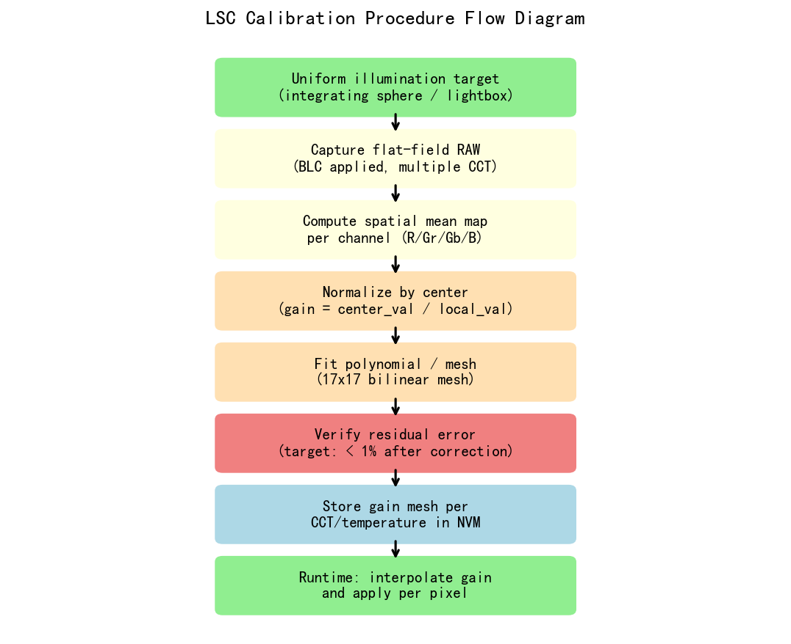
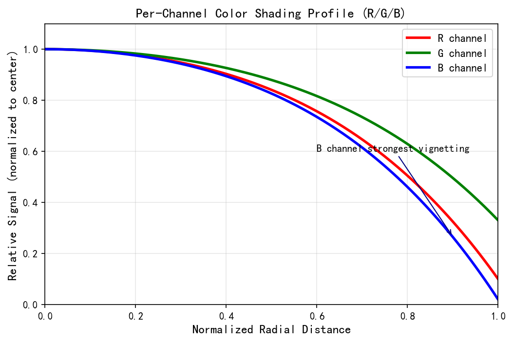
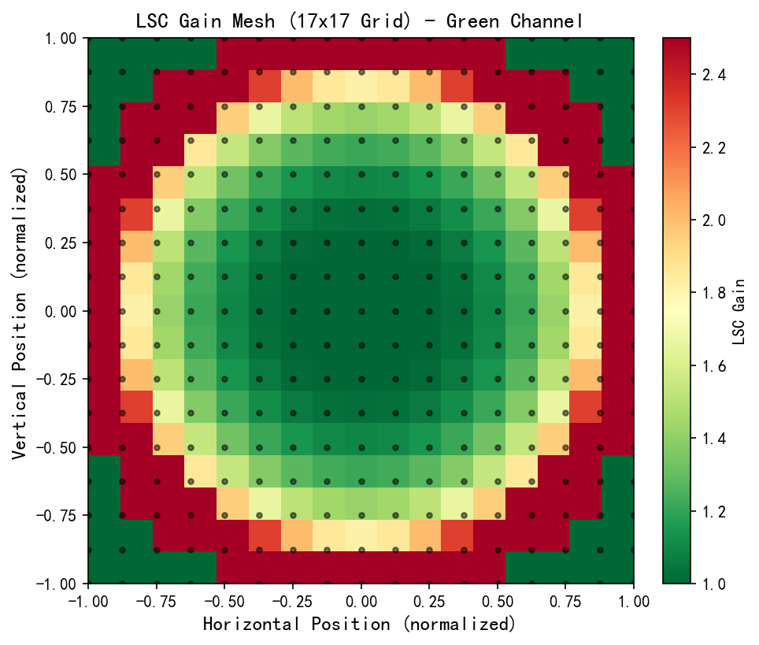
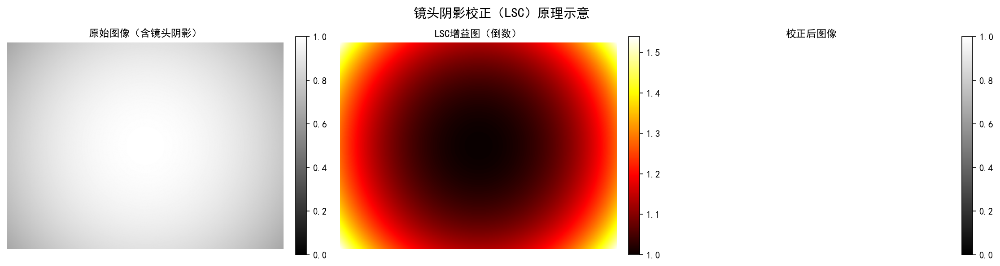
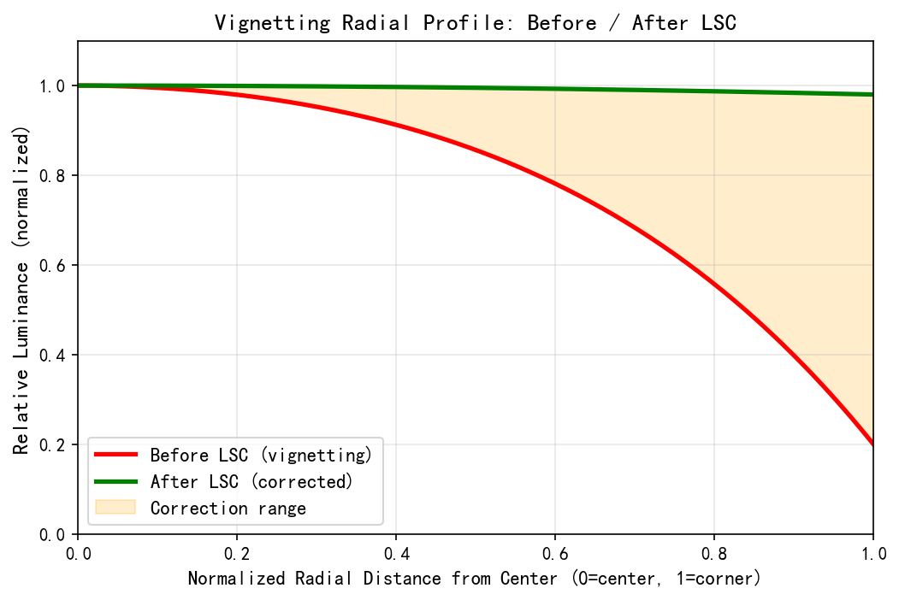
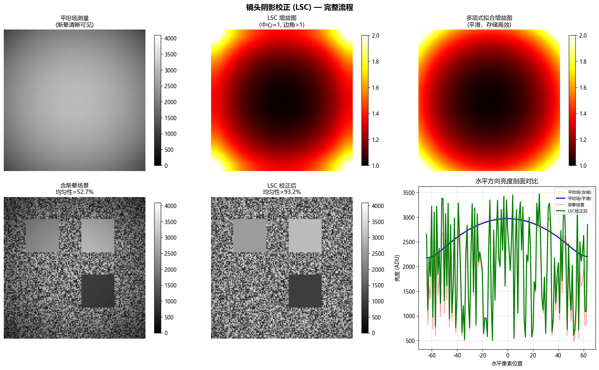

# 第二卷第08章：镜头阴影校正（Lens Shading Correction, LSC）

> **定位：** BLC/PDPC之后、去马赛克之前；标定方法见第二卷第30章（ISP全流水线标定）。
> **前置章节：** 第一卷第02章（光学基础）、第一卷第03章（传感器物理）
> **读者路径：** 算法工程师、系统设计师

---

## §1 原理 (Theory)

### 1.0 LSC 的完整任务：亮度阴影 + 色彩阴影

LSC 不是一个模块，而是两个相互独立的问题拼在一起：**亮度暗角**（Luma Shading）和**色彩阴影**（Color Shading）。前者让图像四角变暗，后者让边缘偏色。两者可以同时存在，成因不同，校正方式也不同，但都在同一个增益网格里处理。

**两类需要校正的空间非均匀性：**

| 类型 | 成因 | 表现 | 校正方式 |
|------|------|------|---------|
| **亮度阴影（Luma Shading）** | cos⁴θ 自然暗角、机械遮光、微透镜偏折 | 图像四角暗于中心，单通道亮度下降 | 每通道乘以空间增益系数，恢复均匀亮度 |
| **色彩阴影（Color Shading）** | 镜头色差（Lateral Chromatic Aberration）、传感器 CRA 不匹配、滤光片透过率空间变化 | 四角出现色偏（如偏青、偏品红），中心到边缘颜色不统一 | 独立校正 R/Gr/Gb/B 四通道，消除通道间增益比例差异 |

**为何四通道独立 LSC 是必须的：**
用一张增益图处理所有通道是常见的偷懒做法，后果是亮度暗角消了，但边缘的色晕还在。原因很简单：蓝光波长短，在边缘衍射更强，B 通道的衰减量和 R 通道本来就不一样。用同一张图乘上去，等比例地补偿了四个通道的亮度，但通道间的比例差异并没有消除——这就是色晕的来源。

因此，实际 ISP 中 LSC 模块维护 **4 张独立增益网格**：`G_R(x,y)`、`G_Gr(x,y)`、`G_Gb(x,y)`、`G_B(x,y)`，分别对 Bayer 的四个通道进行空间校正：

```
I_corrected(x, y, c) = I_raw(x, y, c) · G_c(x, y)    # c ∈ {R, Gr, Gb, B}
```

---

### 1.1 暗角：定义与成因

暗角（Vignetting）是指图像从中心向四角和边缘逐渐变暗的现象。在相机 ISP 流水线中，即使被拍摄场景完全均匀，传感器上也会呈现出空间不均匀的响应。造成可观测暗角的物理机制共有三类：

#### (1) 自然暗角——cos⁴θ 定律

自然暗角源于基础辐射测量学原理 **[1]**。对于理想的无像差镜头，传感器上位于光轴外角度 θ 处的照度满足：

```
I(r) = I_center · cos⁴(θ)
```

其中：
- `I_center` 为轴上照度，
- `θ = arctan(r / f)` 为出瞳处所张的半角，
- `r` 为像面中心的径向距离（以像素或物理单位表示），
- `f` 为有效焦距（与 r 单位一致）。

cos⁴ 衰减是四个独立几何因子的乘积（参见 Born & Wolf §4.8）：
1. **cos θ** ——从离轴点看去，出瞳的有效投影面积缩小（出瞳面相对入射方向倾斜）；
2. **cos θ** ——光线以角度 θ 斜入射到传感器平面（Lambert 余弦定律，单位面积照度降低）；
3. **cos θ** ——离轴点到出瞳的等效光学距离增大为 f/cos θ，立体角按 cos²θ/f² 减小，其中贡献一个 cos θ；
4. **cos θ** ——上述距离增大引起的立体角减小的第二个 cos θ 因子（两者合计 cos²θ 的照度下降）。

在典型大光圈（如 f/1.8）下，全画幅镜头仅因自然暗角就可能在角落产生 2–3 档的光量损失。**[1]**

#### (2) 机械暗角

机械暗角（Mechanical Vignetting）是由镜筒、光圈或镜头安装结构中的其他物理元件遮挡离轴光束而产生的。与自然暗角不同，机械暗角具有较硬的空间边界，且对光圈变化高度敏感：

- 在大光圈（小 f 值）时，机械暗角与自然暗角叠加，影响显著；
- 收小光圈（大 f 值）后，光束锥角减小，光线能够无遮挡地通过；
- 机械暗角通常比 cos⁴θ 产生更陡峭的空间衰减轮廓。

#### (3) 像素级（微透镜）暗角

现代 CMOS 传感器在每个像素上都配有微透镜（Micro-lens），用于将入射光聚焦到光电二极管上。该光学元件是为近法线入射设计的。当光线以斜角（即离轴像素）入射时，微透镜会将部分光能聚焦到光电二极管有效感光区域之外，造成额外的信号损失。

此效应具有以下特点：
- 在像素间距较小的传感器上更为明显（因为受光锥角更窄）；
- 因传感器代次和制造商不同而存在差异；
- 通常与镜头模组相关，因为镜头的主光线角（Chief Ray Angle，CRA）曲线必须与传感器微透镜倾斜设计相匹配。

### 1.2 综合暗角模型

实际上，上述三种机制共同叠加，形成空间不均匀的逐通道增益场。我们将其建模为每个 Bayer 通道 `c ∈ {R, Gr, Gb, B}` 的二维增益图（Gain Map）`G(x, y, c)`：

```
I_corrected(x, y, c) = I_raw(x, y, c) · G(x, y, c)
```

增益图的定义满足：`G(center, c) = 1.0`，且在图像中任意位置 `G(x, y, c) ≥ 1.0`（即对衰减的像素进行放大，恢复其真实值）。

### 1.3 径向多项式模型

对于暗角接近旋转对称的镜头，可用归一化径向距离 `r_norm`（其中图像角落处 `r_norm = 1.0`）的多项式进行紧凑参数化表示：

```
G(r_norm) = 1 + a·r_norm² + b·r_norm⁴ + c·r_norm⁶
```

- 系数 `(a, b, c)` 由标定数据按通道拟合得到；
- 仅保留偶次项，反映了暗角的对称性；
- 通常 3–4 项已足够，更高阶项拟合的是噪声而非真实阴影；
- 存储开销极小：每通道每光圈设置仅需 3–4 个浮点数。

**局限性：** 真实镜头的暗角很少是完全旋转对称的，尤其是存在偏心镜片或非对称机械遮挡时。此类情况需要使用网格模型。

### 1.4 网格（Mesh）/ 查找表（LUT）模型

生产级 ISP 中最主流的表示方式是二维增益网格。各平台标准格式不同：**高通 Spectra 默认采用 17×13 mesh（宽×高）**，而非正方形网格；**联发科 Imagiq 及海思越影**通常采用 16×12 或 17×13，天玑高端型号（9200+）支持 32×32（见 §3.4 三平台对比表）；部分平台可扩展至 33×25 以支持更复杂的渐晕形状。"17×17"是 ISP 文献中常见的简化说法，实际工程中行列数通常不等（宽画面传感器的网格宽大于高）。运行时通过双线性插值（Bilinear Interpolation）重建全分辨率增益图：

```
G_full(x, y, c) = BilinearInterp( G_table[c], x_norm, y_norm )
```

其中 `x_norm = x / (W-1)`，`y_norm = y / (H-1)`，将像素坐标映射到单位正方形内。

相较于多项式模型的优势：
- 可表示任意非旋转对称的阴影分布；
- 硬件友好：查表 + 两点插值；
- 可针对不同焦距或温度条件便捷更新。

### 1.5 光源依赖性

暗角本质上是纯物理光学现象，但实际中 LSC 表还须考虑光源相关效应：

- **混合光源场景：** 若环境光源的色温空间分布不均匀（例如一侧有窗户），传感器所见的"均匀光场"（Flat Field）在各通道中并非真正均匀；
- **光谱响应交互：** R/G/B 通道在全场的相对增益差异，取决于光源光谱功率分布与滤光片光谱透过率的相互作用；
- **增透膜（AR Coating）效应：** 镜头镀膜的透过率可能随入射角变化而呈现光谱不均匀性。

由此产生的工程实践：生产级 ISP 通常存储多套 LSC 表——分别对应各主要色温（CCT，Correlated Color Temperature）节点（例如 2800 K、4000 K、6500 K）——并根据自动白平衡（AWB）的色温估计结果进行选择或插值。

**混合光源场景与光谱维度的 LSC 局限：**

传统 LSC 以 CCT（色温）为单一维度索引多套增益表，存在一个根本限制：**相同 CCT 的不同光源，其光谱功率分布（SPD）不同，导致 R/B 通道的镜头透过率衰减特性有差异**。典型案例：

- LED 6500K（冷白 LED）与日光 D65 的 CCT 相同，但 LED 的蓝峰（~450nm）明显强于日光，使 B 通道在镜头边缘的衰减比日光条件多约 3–5%
- 荧光灯 TL84（4100K）与暖色 LED（4100K）的 CCT 相同，但荧光灯含强绿峰，G 通道边缘衰减特性显著不同

**工程处理建议：**
1. 在 AWB 标定时，对同 CCT 但不同光源类型（LED/荧光灯/日光）各标定一套 LSC，并在 AWB 的光源分类结果中区分调用
2. 若 ISP 平台不支持光源类型触发切换（仅支持 CCT 插值），可通过增加中间 CCT 节点（如在 4000K 处同时存储 LED 和荧光灯的 LSC）来近似处理
3. 对于 RYYB 传感器（如华为 Mate 系列），Y 通道的宽谱透过率使 CCT 对 LSC 的影响更小，但绿通道（G/Gb 分离）的 LSC 一致性需单独验证

> 参考：Sony IMX989 规格文档建议对不同光谱特征的 LED 环境分别进行 LSC 标定。

---

## §2 标定 (Calibration)

### 2.1 均匀光场采集

LSC 标定的黄金标准是采集具有已知空间均匀性的场景图像：

**积分球出光口（Integrating Sphere）：**
- 内壁涂覆高反射率漫反射涂料的积分球，由标定光源照明，产生朗伯型（Lambertian）出光口，均匀性优于 ±0.5%。**[2]**
- 用于高精度量产标定。

**乳白玻璃漫射灯箱（Opal Glass Diffuser Lightbox）：**
- 由均匀 LED 阵列背光照明的白色乳白玻璃面板；
- 均匀性约 ±1–2%，适用于工程验证标定。

**采集条件：**
- 将镜头轻微离焦，或将漫射板置于极近距离；这样可模糊漫射板上的纹理或灰尘；
- 在多个光圈下采集：f/1.8、f/2.8、f/5.6。暗角在大光圈下最为显著；
- 采集足够帧数以平均降噪（通常 16–64 帧）。**[2]**
- 确保传感器处于工作温度（开机后热稳定 ≥ 5 分钟）。

### 2.2 逐通道、逐光圈增益表生成

**帧平均：**

```python
flat = mean(frames, axis=0)   # shape: (H, W, channels) or raw Bayer
```

**定义参考区域：**

选取图像中心的小区域（例如中心 64×64 像素），计算每通道均值：

```python
center_mean[c] = mean( flat[H//2-32:H//2+32, W//2-32:W//2+32, c] )
```

**计算原始增益图：**

```python
G_raw(x, y, c) = center_mean[c] / flat(x, y, c)
```

此步骤对衰减量取倒数：若某像素仅接收到中心照度的 60%，则其增益为 1/0.6 ≈ 1.67。

**平滑增益图：**

原始增益图中包含传感器噪声和固定图案噪声（Fixed Pattern Noise，FPN）。若将这些噪声直接嵌入 LSC 表，将在每次后续采集中被放大，损害图像质量。需施加低通滤波：

- **二维多项式拟合：** 对每通道的 `G_raw` 用多项式模型 `1 + a·r² + b·r⁴ + c·r⁶` 做最小二乘拟合。保证平滑性，但会丢失非对称阴影信息；
- **高斯模糊：** 对 `G_raw` 施加高斯滤波（`σ ≈ H/20`）。在抑制噪声的同时保留空间变化；
- **网格下采样：** 将 `G_raw` 通过分块平均下采样至 16×16；降低的分辨率本身即起到低通滤波作用。

**截断与验证：**

```python
G_table = clip(G_smooth, 1.0, MAX_GAIN)   # MAX_GAIN typically 2.5–3.2（手机量产场景）；鱼眼/极端大光圈等特殊场景可达 4.0–8.0
```

增益低于 1.0 在物理上不合理（会压暗本已较亮的像素）；增益超过最大值会导致溢出或噪声过度放大。

### 2.3 验证——均匀性测量

将增益表应用于均匀光场，测量残余非均匀性：

```
Uniformity = 1 - (max_region_mean - min_region_mean) / center_mean
```

目标值：校正后均匀性 > 98%（角落到中心偏差 < 2%）。

若未达标，需排查以下原因：
- 帧平均数不足（增加帧数）；
- 漫射板均匀性不够（重新表征或更换漫射板）；
- 平滑过于激进（减小 σ 或降低多项式阶次）。

---

## §3 调参 (Tuning)

### 3.1 网格分辨率

| 网格尺寸 | 节点数 | 内存（4通道 × float32） | 说明 |
|---------|--------|------------------------|------|
| 8×8     | 64     | 1 KB                   | 过于粗糙；高质量传感器上会出现可见条带 |
| 16×16   | 256    | 4 KB                   | 标准规格；适用于大多数镜头 |
| 32×32   | 1024   | 16 KB                  | 高精度；适用于复杂阴影分布的镜头 |
| 64×64   | 4096   | 64 KB                  | 对大多数应用过于冗余 |

网格最小尺寸由阴影分布的空间频率决定。对于平滑的 cos⁴θ 暗角，16×16 已绰绰有余。对于存在机械暗角特征或传感器级非均匀性（列级 FPN）的镜头，32×32 可能更为必要。

**网格分辨率与残余暗角量化对比：**

在 1/1.3" 传感器（约 4000×3000px）上，不同网格分辨率对均匀光场的残余阴影误差：

| 网格规格 | 内存占用（4通道×float32）| 残余暗角（均匀光场标准差）| 备注 |
|---------|----------------------|----------------------|------|
| 16×12 | 3.1 KB | ~1.5–2.5% | 基本够用，有时见轻微角落纹理 |
| 17×13 | 3.5 KB | ~1.0–1.5% | 高通 Spectra 默认规格 |
| 33×25 | 13.2 KB | ~0.3–0.5% | 高精度需求（如文档扫描/测量） |
| 65×49 | 51.7 KB | ~0.1–0.2% | 极高精度，内存代价大 |

> **实践建议：** 手机摄影通常 17×13 即可满足需求（残余非均匀性 < 1.5%；若关注色偏，要求跨色块 ΔE₀₀ < 1.0）。如需更高精度，可在 RAW 域对 LSC 增益图做双三次插值生成任意精度的虚拟网格，而无需真正增大 LUT 存储。

### 3.2 平滑强度

标定过程中施加的平滑需在以下两者之间权衡：
- **平滑不足：** 标定采集中的噪声和 PRNU（光响应非均匀性，Photo-Response Non-Uniformity）被嵌入 LSC 表，并在每次后续采集中被放大；
- **平滑过度：** 增益表对空间阴影变化的校正力度不足，残余阴影仍然可见。

实用建议：
- 高斯平滑 σ 取值范围：`H / 30` 至 `H / 15`（例如对 512 行传感器取 σ = 10–20）；
- 验证平滑后均匀性仍 ≥ 95%，再考虑进一步减小平滑量。

### 3.3 光圈与焦距依赖性

- **多光圈表：** 在主要关注的光圈下标定（通常为最大光圈和中等光圈）。大多数 ISP 存储 1–3 套增益表，根据 EXIF 光圈信息或固定策略选择最合适的一套；
- **变焦镜头：** 暗角在变焦范围内变化显著。需在若干焦距节点处存储增益表，并在节点之间对增益表进行线性插值；
- **温度漂移：** 镜头热膨胀会导致有效焦距和主光线角（CRA）微小变化，进而改变传感器各位置的相对照度。车载/高温工业相机在 80–120°C 工况下 LSC 增益表的角落值可能偏移 2–5%（工程经验估算值，实际偏移因模组和镜头设计而异）；**高端手机摄像模组**在长时间 4K 录像后机身温升约 10–15°C，通常不需要切换 LSC 表（模组设计已预留热适应裕量），但若发现高温下角落亮度轻微下降，可考虑存储两套 LSC 表（常温/高温）并通过温度传感器或估算机身温度触发切换。

### 3.4 三平台 LSC 关键参数对比

| 功能 | 高通 CamX / Chromatix | MTK Imagiq / NDD | 海思越影 |
|------|----------------------|-----------------|---------|
| LSC 总开关 | `LSC_Enable`（PDPC 与 LSC 共用 BPS 模块）| `LSCEnabled`（NDD bool）| `LSC_Enable` |
| 网格尺寸 | `LSC_MeshGridWidth` / `LSC_MeshGridHeight`（常用 17×13 或 13×10）| `LSCMeshWidth` / `LSCMeshHeight`（天玑支持到 32×32）| `LSC_GridSize` |
| 增益 LUT | `LSC_R_gain[m×n]`、`LSC_Gr_gain[m×n]`、`LSC_Gb_gain[m×n]`、`LSC_B_gain[m×n]`（浮点，Q8.8 定点）| `LSCGainR[row][col]`、`LSCGainGr[row][col]`、`LSCGainGb[row][col]`、`LSCGainB[row][col]`（NDD，定点 Q4.12）| `LSC_GainTable_R/Gr/Gb/B` |
| 色温插值 | `LSC_CCT_tables[]`（多光源 LUT 按 AWB CCT 插值；Chromatix 支持 5–8 个 CCT 节点）| `LSCIlluminantTable[N_CCT]`（NDD，最多 8 个）| `LSC_IlluminantGains[N]` |
| 最大增益限幅 | `LSC_MaxGain`（float，典型上限 3.5–4.0）| `LSCMaxGain`（NDD float，默认 4.0）| `LSC_MaxGainClamp` |
| 增益插值方式 | 双线性（网格节点间 bilinear）| 双线性（同）| 双线性 + 可选双三次 |
| 色彩阴影独立通道 | ✓（R/Gr/Gb/B 四通道独立 LUT）| ✓（同）| ✓ |
| 遮蔽中心自动检测 | `LSC_CenterX/CenterY`（固定坐标，工厂标定写入）| `LSCCenterEstimate`（bool，可自动从平场估计）| `LSC_AutoCenter` |

**Chromatix XML 结构示例（高通，多光源 CCT 节点）：**

```xml
<!-- chromatix_lsc34.xml -->
<lsc34_rgn_data>
  <!-- D65 (6500K) 光照条件下的 LSC 增益表（仅展示 R 通道首行） -->
  <r_gain_tab>
    <r_gain type="float" description="mesh gain, size: 17x13">
      1.82 1.78 1.72 1.66 1.61 1.57 1.54 1.53 1.54 1.57 1.61 1.66 1.72 1.78 1.82 1.85 1.87
      ...
    </r_gain>
  </r_gain_tab>
  <!-- 类似结构：Gr_gain_tab / Gb_gain_tab / B_gain_tab -->
  <cct_start>5500</cct_start>  <!-- 本 LUT 对应的 CCT 起始值 -->
  <cct_end>7500</cct_end>       <!-- CCT 结束值 -->
</lsc34_rgn_data>
```

**MTK NDD 示例（天玑 9300，16×12 网格）：**

```
[LSC]
LSCEnabled = 1
LSCMeshWidth = 16
LSCMeshHeight = 12
LSCMaxGain = 4.0
# D65 R-channel gain table (行优先，16列×12行=192个值)
LSCGainR_D65 = 1.76 1.72 1.68 ... (192 values total)
LSCGainGr_D65 = 1.00 1.00 1.00 ... (192 values total)
LSCGainGb_D65 = 1.00 1.00 1.00 ... (192 values total)
LSCGainB_D65 = 1.55 1.51 1.47 ... (192 values total)
# 钨丝灯 (2800K)
LSCGainR_A   = 1.92 1.88 1.83 ...
LSCGainB_A   = 1.30 1.27 1.24 ...
```

> **调参注意：**
> - 高通 `LSC_MaxGain` 默认 3.5，超角区域增益若超过 3.5 会被截断；MTK 默认 4.0——从 MTK 向高通移植标定数据时需检查角落增益是否需要重标。
> - 色彩阴影主要体现在 Gr 与 Gb 的差异（Green imbalance），Gr/Gb 增益比超过 1.03 会在图像中产生绿色/品红横纹，需单独标定 Gr、Gb（而非合并为 G）。
> - CCT 插值节点之间的 LSC 增益由 AWB 输出的色温线性插值，需确保相邻节点的增益变化平滑（不超过 0.05/节点），否则在光源切换时出现可见的暗角跳变。

### 3.5 工程联动：LSC 与 AWB 的执行顺序与耦合影响

**LSC 在 AWB 之前执行**——这是 ISP pipeline 中几乎所有主流平台的共同约定（高通 Spectra、MTK Imagiq、海思越影均遵循 BLC → LSC → AWB → Demosaic → CCM 的顺序），具有深远的工程含义。

**为什么顺序至关重要：**

AWB 算法依赖全场像素统计来估计光源色温和 R/B 增益。如果 LSC **在 AWB 之后**执行（错误顺序），AWB 统计的原始像素中包含了镜头暗角的亮度衰减——图像四角的像素比中心暗，且各通道衰减量不同。后果如下：

| 情形 | AWB 行为 | 表现 |
|------|---------|------|
| LSC 在 AWB **之前**（正确顺序）| AWB 统计的是已补偿暗角的均匀场，白点估计准确 | 全场色温一致，中心/边缘颜色无明显偏差 |
| LSC 在 AWB **之后**（错误顺序）| AWB 统计含暗角信息，边缘区域（偏暗偏冷/偏暖）的像素拉偏白点估计 | 中心与边缘白平衡结果不一致；典型表现为图像边缘偏色（偏青或偏品红），随光圈或焦距变化而变化 |

**LSC 增益表的标定前提：**

正因为 LSC 在 AWB 之前执行，LSC 增益表是在**传感器原始颜色空间（Pre-AWB 域）**标定的，此时 AWB 增益尚未施加。这意味着：
- LSC 增益表同时包含了亮度暗角补偿和色彩阴影补偿（通道间增益差异）；
- AWB 之后不需要再"考虑"LSC 已处理的空间非均匀性——LSC 已将全场像素统一到均匀状态，AWB 只需处理光源色温引起的全局 R/B 偏移；
- **两者关系是独立分工，而非叠加**：LSC 修正空间非均匀，AWB 修正光源色温偏移。

**多光源 LSC 的 AWB 联动：**

LSC 模块存储多套 CCT 节点增益表，AWB 完成色温估计后，LSC 根据该色温估计值**插值选取**对应增益表（见 §3.4 中 `LSC_CCT_tables[]` / `LSCIlluminantTable[]`）。这意味着 AWB 的色温输出不只用于白平衡增益，还要反馈给 LSC 模块用于增益表选择：

```
Sensor RAW
    → BLC
    → LSC（使用 AWB 上一帧色温插值的增益表）
    → AWB 统计（计算本帧色温）→ 反馈给下一帧 LSC 表选择
    → Demosaic / CCM / ...
```

**实际调试中的联动验证**：修改 LSC 增益表后（如更换镜头重标），必须重新验证 AWB 在不同色温场景下的收敛精度，尤其是边缘区域的色偏（拍摄均匀灰卡，检查中心与四角的 ΔE₀₀ 应 < 1.5）。反之，修改 AWB 策略（如更换色温插值节点数量），也需要确认 LSC 表选取逻辑未受影响。

---

## §4 伪像分析 (Artifacts)

### 4.1 过校正

**现象：** LSC 校正后图像角落比中心更亮，呈现出反向暗角效果。

**成因：** LSC 增益表的增益值过大——通常是因为均匀光场采集条件与实际镜头传感器组合不符（例如光圈不同、对焦距离不同，或使用了来自其他镜头单元的增益表）。

**缓解措施：**
- 始终针对每个镜头传感器模组（或至少每种镜头规格）单独标定，而非使用通用增益表；
- 将最大增益截断到物理合理的上限（例如大光圈镜头设为 4.0）。

### 4.2 噪声放大

**现象：** LSC 校正后图像角落比中心噪声更大，且噪声增加量与增益不成比例地显著。

**成因：** 角落处 LSC 增益可能达到 2–4 倍。由于光子噪声（散粒噪声，Shot Noise）正比于 `√signal`，将暗像素的信号放大 3 倍，同时也将其噪声放大了 3 倍。角落处的信噪比（SNR）在物理上就是低于中心的。

**量化分析：**

LSC 乘法增益同时放大信号和噪声，所以对同一像素位置而言 SNR 不变——但角落像素本身接受的光子就比中心少（少了约 G 倍），导致角落的 **绝对噪声电平** 经 LSC 放大后高于中心。以读出噪声主导场景（低照度）为例：

| 位置 | 信号 (e⁻) | 噪声 (e⁻) | SNR |
|------|----------|---------|-----|
| 中心（无 LSC） | $I_{ctr}$ | $\sigma_r$ | $I_{ctr}/\sigma_r$ |
| 角落，LSC 前 | $I_{ctr}/G$ | $\sigma_r$ | $I_{ctr}/(G\cdot\sigma_r)$ |
| 角落，LSC 后 | $G \cdot (I_{ctr}/G) = I_{ctr}$ | $G\cdot\sigma_r$ | $I_{ctr}/(G\cdot\sigma_r)$ |

LSC 后角落的 SNR 与 LSC 前相同（SNR 不因纯乘法而改变），但与**中心**相比：

$$\text{SNR\_corner\_after} = \frac{\text{SNR\_center}}{G} \quad \text{（读出噪声主导）}$$

$$\text{SNR\_corner\_after} = \frac{\text{SNR\_center}}{\sqrt{G}} \quad \text{（散粒噪声主导）}$$

对典型角落增益 $G = 2.5$，读出噪声主导时中心与角落 SNR 相差 $20\log_{10}(2.5) \approx 8\,\mathrm{dB}$；若中心 SNR = 26 dB，角落 LSC 后仅有 ~18 dB。

**缓解措施：**
- 对角落区域施加更强的降噪处理（空间自适应降噪，感知 LSC 增益图）；
- 在低光场景中，考虑适当降低角落处的 LSC 增益，以限制噪声放大。

### 4.3 LSC 增益表不匹配（残余阴影环）

**现象：** 出现环形图案或随光圈变化的渐变阴影；某一光圈下校正效果良好，而在其他光圈下效果较差。

**成因：** 使用在某一光圈下标定的 LSC 表，却应用于在不同光圈下采集的图像。机械暗角分量的形状随光圈变化，残余不匹配表现为环形伪像。

**缓解措施：** 针对每个光圈分别标定并存储增益表；在采集时利用元数据（EXIF）选择正确的增益表。

### 4.4 低分辨率增益表导致的条带

**现象：** 可见阶梯状伪像，在天空或均匀背景等平滑色调区域尤为明显。

**成因：** 增益表分辨率过低（例如 8×8），结合双线性插值后形成可见的分段线性增益曲线。双线性插值保证 C⁰ 连续性，但不保证 C¹ 连续性（导数在网格边界处不连续）。

**缓解措施：**
- 将网格分辨率提升至 16×16 或 32×32；
- 使用双三次（Bicubic）或样条（Spline）插值代替双线性插值（代价是增加硬件复杂度）；
- 确保增益表数值平滑（高质量标定均匀光场，充分平滑处理）。

---

## §5 评测 (Evaluation)

### 5.1 角落-中心均匀性比值

LSC 质量的主要评测指标：

```
Uniformity = (mean_corner_region) / (mean_center_region)
```

对每个通道分别计算，在 LSC 前后各测一次。校正后的目标值：
- 消费级相机：> 95%
- 专业/工业相机：> 98%

### 5.2 与均匀分布的平均绝对偏差

将图像划分为 N×N 的分块网格（例如 8×8），计算：

```
MAD = mean( |mean_patch(i,j) - mean_center| / mean_center )
```

该单一数值可同时反映角落和中场的残余阴影。

### 5.3 角落处的 SNR 代价

分别比较 LSC 前后，中心区域与角落区域的噪声标准差：

```python
noise_center = std( corrected[center_patch] )
noise_corner = std( corrected[corner_patch] )
snr_cost_dB  = 20 * log10( noise_corner / noise_center )
```

经过良好标定的 LSC，角落与中心的 SNR 差距不应超过 `20·log10(G_corner)` dB（读出噪声主导）或 `10·log10(G_corner)` dB（散粒噪声主导）——这是对衰减信号进行放大所不可避免的物理代价。若 SNR 代价超过上述上限，则说明 LSC 增益表本身嵌入了噪声或 FPN。

### 5.4 残余阴影轮廓

绘制校正后均匀光场的水平和垂直截面曲线，验证曲线在均匀性规格范围内是否平坦。平滑的残余曲线说明增益表精度不足；振荡型图案则说明增益表中含有噪声。

---

## §6 代码

完整的工作示例参见 `ch08_lsc_notebook.ipynb`，内容包括：
- 含 cos⁴θ 暗角和逐通道色彩变化的模拟均匀光场；
- 使用高斯平滑和网格下采样的 LSC 增益表估计；
- 校正与均匀性评测，含校正前后可视化对比；
- 角落处噪声代价分析。

### 6.1 cos⁴θ 模型 LSC 增益标定最小可运行示例

```python
import numpy as np
from scipy.ndimage import gaussian_filter, zoom

def simulate_vignetting(H: int = 480, W: int = 640,
                        corner_ratio: float = 0.45) -> np.ndarray:
    """
    合成 cos⁴θ 渐晕均匀光场。
    corner_ratio: 角点相对中心的亮度比（0.45 ≈ 典型广角镜头四角）
    """
    cx, cy = W / 2.0, H / 2.0
    max_r = np.sqrt(cx**2 + cy**2)
    ys, xs = np.mgrid[0:H, 0:W]
    r = np.sqrt((xs - cx)**2 + (ys - cy)**2)
    # 反推 cos⁴θ 使角点恰好等于 corner_ratio
    theta = np.arctan(r / (max_r / np.tan(np.arccos(corner_ratio**0.25))))
    vignette = np.cos(theta) ** 4
    return vignette.astype(np.float32)


def estimate_lsc_gain_table(flat_field: np.ndarray,
                             grid_rows: int = 17,
                             grid_cols: int = 17) -> np.ndarray:
    """
    从均匀光场图像估计 LSC 增益表（倒数映射）。
    flat_field: float32 (H, W)，归一化 [0,1]
    返回: gain_table (grid_rows, grid_cols)，应用时需双线性上采样到全分辨率
    """
    # 高斯平滑消除传感器噪声
    smoothed = gaussian_filter(flat_field, sigma=10)
    # 下采样到增益表分辨率
    scale_r = grid_rows / flat_field.shape[0]
    scale_c = grid_cols / flat_field.shape[1]
    downsampled = zoom(smoothed, (scale_r, scale_c))
    # 增益 = 中心值 / 当前值（使全图亮度均匀）
    center_val = downsampled[grid_rows // 2, grid_cols // 2]
    gain_table = center_val / np.maximum(downsampled, 1e-4)
    return gain_table.astype(np.float32)


def apply_lsc(image: np.ndarray, gain_table: np.ndarray) -> np.ndarray:
    """将增益表上采样到图像分辨率后逐像素相乘。"""
    H, W = image.shape[:2]
    scale_r = H / gain_table.shape[0]
    scale_c = W / gain_table.shape[1]
    gain_full = zoom(gain_table, (scale_r, scale_c))
    if image.ndim == 3:
        gain_full = gain_full[..., np.newaxis]
    return np.clip(image * gain_full, 0, 1).astype(np.float32)


# ── 快速测试 ────────────────────────────────────────────────────────────────
if __name__ == "__main__":
    flat = simulate_vignetting(480, 640, corner_ratio=0.45)
    print(f"渐晕图 角点/中心 亮度比: {flat[0,0]/flat[240,320]:.3f}  (目标 ≈ 0.45)")

    gain_table = estimate_lsc_gain_table(flat, 17, 17)
    corrected = apply_lsc(flat, gain_table)

    # 均匀性评测：变异系数 CV < 2%
    cv_before = flat.std() / flat.mean()
    cv_after  = corrected.std() / corrected.mean()
    print(f"校正前 CV: {cv_before*100:.2f}%  校正后 CV: {cv_after*100:.2f}%")
    print(f"增益表范围: [{gain_table.min():.3f}, {gain_table.max():.3f}]")
```

---

## 习题

**练习 1（理解）**
镜头阴影（Vignetting）的 $\cos^4\theta$ 自然渐晕模型描述了边缘像素亮度随视场角的衰减规律：$E(\theta) = E_0 \cdot \cos^4\theta$，其中 $\theta$ 为图像角点相对于光轴的视场半角。

1. 对于一个对角线视场角 FOV = 80° 的广角镜头，图像四个角点（$\theta = 40°$）相对于中心的亮度比是多少（计算 $\cos^4(40°)$，保留 3 位小数）？对应的 LSC 增益应设置为多少？
2. 逐通道渐晕（R/G/B 通道渐晕不一致）对下游 AWB 的影响是什么？如果 R 通道角落增益比 G 通道多 0.2，AWB 会产生何种色偏趋势？
3. 解释为何在大光圈（低 f 数）时渐晕更严重，缩小光圈（高 f 数）后渐晕减轻（从几何光学角度）？

**练习 2（计算）**
一块 4032×3024 像素的传感器，使用均匀白色均匀光场标定 LSC 增益图。标定时在图像中心测得亮度 $I_{center} = 3800$ DN，在右下角（距中心最远处）测得亮度 $I_{corner} = 2280$ DN（12 位量化，BLC 后）。

1. 计算该角点位置的 LSC 增益 $g = I_{center} / I_{corner}$（保留 4 位小数）。
2. 若 ISP 配置的 `LSC_MaxGain` 截断上限为 4.0，当某极端角点的理论增益为 4.8 时，截断后的亮度一致性损失（相对误差）是多少？
3. 标定 LSC 时使用 17×17 稀疏增益网格，对于 4032×3024 分辨率，每个网格点覆盖的像素区域尺寸大约是多少（水平 × 垂直）？在网格点之间需要哪种插值方式重建完整增益图？

**练习 3（编程）**
实现 LSC 增益图的稀疏标定与双线性插值恢复：

- 输入：`flat_field` — 形状 `(H, W)` 的 float32 均匀光场图像，值域 [0, 1]；`grid_rows = 17`，`grid_cols = 17`（增益网格大小）
- 输出：`gain_map` — 形状 `(H, W)` 的 float32 完整增益图；`corrected` — LSC 校正后的均匀图像
- 步骤：（1）在稀疏网格点处采样 `flat_field` 值，计算增益 = 中心值 / 采样值；（2）用 `scipy.ndimage.zoom` 或 `cv2.resize`（INTER_LINEAR）将 17×17 增益网格上采样到 `(H, W)`；（3）将增益图截断到 `[1.0, 4.0]`；（4）对 `flat_field` 逐像素乘以增益图

```python
import numpy as np
import cv2
# 输入: flat_field (H,W) float32, grid_rows=17, grid_cols=17
# 输出: gain_map (H,W) float32, corrected (H,W) float32
```

**练习 4（工程分析）**
高通 Spectra ISP 的 LSC 模块使用 `LSC_MeshTable[17][17][4]`（17×17 网格，4 通道 R/Gr/Gb/B）存储增益系数，格式为 Q-format 定点数（典型范围 1.0–4.0）；`LSC_MaxGain` 参数控制增益的最大允许截断值。MTK ISP 中对应参数为 `ShadingTable[...][4]`（通道顺序相同）。某工程师在换用新镜头后，发现图像四角有明显的亮暗不均（角落比中心暗约 35%），调查发现原有 `LSC_MeshTable` 仍是旧镜头的标定数据。

1. 重新标定 LSC 增益表的完整流程是什么（光源要求、采样方式、噪声处理）？均匀光场光源的色温选择对逐通道增益的影响如何？
2. 若新镜头角落增益需要 2.8，而当前 `LSC_MaxGain` 设置为 2.5，角落区域的校正误差是多少百分比？应如何修改 `LSC_MaxGain` 的设置（注意增大 MaxGain 会带来的 SNR 代价）？
3. 在温度变化（如 -20°C 到 80°C）和不同对焦距离下，镜头渐晕特性会发生变化吗？工程上如何通过多条件标定和运行时查表来应对？

---

## §8 名词解释 (Glossary)

**镜头阴影校正（Lens Shading Correction, LSC）**
对图像传感器采集的空间非均匀性进行补偿的 ISP 模块，分为**亮度阴影**（Luma Shading，图像四角比中心暗）和**色彩阴影**（Color Shading，通道间增益比例随空间变化导致色偏）两类。LSC 通常维护 R/Gr/Gb/B 四通道独立增益网格，在 BLC 之后、去马赛克之前对 RAW Bayer 数据逐像素乘以校正增益。

**自然暗角（Natural Vignetting，cos⁴θ 定律）**
理想光学系统中，传感器上离轴角 θ 处的照度相对于中心按 $I(\theta) = I_\text{center} \cdot \cos^4\theta$ 衰减。该四次方衰减由四个独立 cos θ 因子相乘产生：①出瞳有效投影面积缩小（cos θ）、②斜入射 Lambert 余弦（cos θ）、③④离轴等效光学距离增大为 f/cos θ 导致立体角减小（cos²θ，分解为两个 cos θ 因子）。f/1.8 大光圈广角全幅镜头的角落自然暗角可达 1–3 档以上。

**机械暗角（Mechanical Vignetting）**
镜筒、光圈或安装结构对离轴光束的物理遮挡引起的额外光量损失。与自然暗角不同，机械暗角有较硬的空间边界，且随光圈缩小而减弱（收光圈后光束锥角变小，遮挡减少）。在宽开光圈下机械暗角与自然暗角叠加，是实际镜头角落衰减通常超过纯 cos⁴θ 预测值的主要原因。

**主光线角（Chief Ray Angle, CRA）**
通过像面上某点的主光线（通过光瞳中心的光线）与传感器法线之间的夹角。传感器微透镜（Micro-lens）按照设计 CRA 优化倾斜角度；当镜头实际 CRA 与传感器设计 CRA 不匹配时，边缘像素的微透镜将部分光能聚焦到光电二极管以外，产生**像素级暗角**（Pixel-level Vignetting）和色彩阴影。高端模组会在出厂时测量 CRA 曲线并写入 EEPROM 用于 LSC 标定。

**平场法标定（Flat Field Calibration）**
LSC 增益表的标准获取方法：对均匀照明（积分球或乳白玻璃灯箱）拍摄多帧取平均，以中心区域均值为参考计算各位置的归一化增益 $G(x, y, c) = \mu_\text{center}[c] / \text{flat}(x, y, c)$（严格实现时须先减去黑电平）。取平均通常需 16–64 帧以压低随机噪声，平滑后下采样到 16×16 或 32×32 网格写入 ISP 寄存器。

**径向多项式 LSC 模型（Radial Polynomial LSC Model）**
对近旋转对称暗角的紧凑参数化表示：$G(r_\text{norm}) = 1 + a \cdot r_\text{norm}^2 + b \cdot r_\text{norm}^4 + c \cdot r_\text{norm}^6$，其中 $r_\text{norm}=1$ 对应图像角落。仅使用偶次项（因为暗角只取决于离轴距离而非方向）。优点是存储极紧凑（每通道 3–4 个系数），缺点是无法拟合非对称遮光或列级 FPN 引起的非轴对称阴影。

**网格 LUT 模型（Mesh / 2D Grid LUT）**
生产 ISP 中最常用的 LSC 实现：在 16×16 或 32×32 节点网格上存储各位置增益，运行时双线性插值生成全分辨率增益图。16×16 网格、4 通道、float32 存储占用约 4 KiB（16×16×4×4 bytes = 4096 bytes）；32×32 网格约 16 KiB。网格模型可表示任意非对称阴影，硬件实现友好（查表 + 双线性插值），比多项式模型表达能力强得多。

**LSC 噪声放大代价**
LSC 的乘法增益对信号和噪声等比放大，因此 LSC 前后同一像素的 SNR 不变——但角落像素原本接收到的光子比中心少 G 倍，其本征 SNR 就低于中心。校正到相同亮度后：读出噪声主导时 $\text{SNR}_\text{corner} = \text{SNR}_\text{center}/G$；散粒噪声主导时 $\text{SNR}_\text{corner} = \text{SNR}_\text{center}/\sqrt{G}$（$G$ 为角落增益）。这是光学暗角带来的不可消除的 SNR 损失，缓解方法是在知晓 LSC 增益图的条件下对角落区域施加空间自适应降噪。

**均匀性验收指标（Uniformity）**
LSC 校正效果的主要量化指标：$\text{Uniformity} = 1 - (\text{max\_region\_mean} - \text{min\_region\_mean}) / \text{center\_mean}$，目标值消费级 > 95%，专业/工业相机 > 98%。常用 MAD（各分块均值与中心均值之差的均值）作为补充的全场质量指标。

**色彩阴影（Color Shading）**
由于镜头的横向色差（Lateral Chromatic Aberration）、传感器 CRA 与各颜色微透镜的差异性不匹配、以及镜头镀膜透过率的光谱-角度依赖性，导致图像边缘出现通道间增益比例不均的色偏现象（如边角偏青或偏品红）。若对所有通道施用同一增益图只能消除亮度阴影，而无法消除色彩阴影，因此必须维护 R/Gr/Gb/B 四通道独立增益表。

---

> **工程师手记：LSC 的坑，大多是标定时挖的，不是算法本身的问题**
>
> **均匀光场不均匀，是 LSC 标定最常见的问题根源。** 标定要求对准均匀照明平面（积分球出口或均匀 LED 灯箱），但实际上没有真正"完美均匀"的光源——边角照度比中心低 3–5% 是正常的。如果不先测量光源的"非均匀性图"然后从 LSC 测量结果里减掉，得到的增益图就把光源的不均匀性和镜头的渐晕混在一起了。换镜头后 LSC 重标，发现角落仍然偏暗，很可能就是这个原因。规范流程是：先用标准相机拍摄同一个光场，确认光源均匀性，再切到被标定相机拍摄。
>
> **增益图的分辨率（17×13 vs 33×25）不是越高越好。** 17×13 的增益网格（高通 Spectra 默认，宽×高）通过双线性插值覆盖全图，对于平滑的镜头渐晕已经足够。换成 33×25 的代价是：存储增加约 4 倍，ISP 处理带宽上升，而且在噪声环境下（暗场标定）更高分辨率的增益图会把噪声"学进去"，产生细纹伪影。实践中，只有在镜头存在明显局部阴影（比如某个方向有遮挡）时，才需要提高增益图分辨率。
>
> **换 sensor 后 LSC 必须重标，但最小工作量流程可以节省大量时间。** 从旧 sensor 迁移到新 sensor 的过程中，镜头通常没变，只是传感器换了。这时候不需要重新做完整 LSC 流程——可以用旧 sensor 的增益图作为初始值，只在新 sensor 上拍一张标定图，计算「残差校正」叠加到旧增益图上。残差通常在 ±3% 以内（如果镜头没换的话），用这个方法可以把标定时间从半天缩短到 1 小时以内。如果残差超过 5%，说明镜头位置有偏差或者新 sensor 的 CFA 透过率不同，需要完整重标。
>
> *参考：Stork et al., "Geometric Distortion, Vignetting and LSC in Digital Camera Calibration", IEEE ICIP, 2012；观熵 CSDN《ISP LSC 镜头阴影校正》，2024；大话成像《LSC 标定工程实践》公众号，2025。*

---

## 工程推荐

标定质量决定 LSC 效果上限；增益图本身只是一张查找表，算法逻辑并不复杂，真正的工程难点在于均匀光场的采集与验证。

| 场景 | 推荐方案 | 典型约束 | 备注 |
|------|---------|---------|------|
| 手机单摄（固定焦距） | 积分球出口 + 17×13 mesh，4 通道独立，按 3 个 CCT 节点存表 | 均匀性要求 ±0.5%；MAX_GAIN ≤ 3.5 | 量产必须逐模组标定，不可共用同规格标定数据 |
| 手机多摄（超广/主摄/长焦） | 三颗镜头分别独立标定，各自存储增益表 | 模组 CRA 不同，增益表不通用 | 切换摄像头时须同步切换 LSC 表，否则出现角落色偏跳变 |
| 变焦/光学变焦镜头 | 在若干焦距节点（如 24/50/105mm 等效）标定，运行时按焦距线性插值增益表 | 节点间增益变化需单调平滑 | 插值步长过大会留下残余暗角环 |
| 车载/高温工业相机 | 常温 + 高温（80–120°C）各标定一套 LSC 表，通过温度传感器触发切换 | 热膨胀使角落增益偏移约 2–5% | 消费类手机通常不需要，长时录像温升 <15°C 裕量足够 |
| 低成本/快速原型验证 | 均匀 LED 灯箱（乳白玻璃）+ 16×16 mesh + 32 帧平均 | 均匀性 ±1–2%，精度略低于积分球 | 用于工程验证；量产仍须切回积分球 |

**调试要点：**

- **先验证光源，再标定镜头**：拍摄标定图之前，先用已知良好的参考相机拍同一光场，确认光源空间均匀性；若光源角落比中心暗 >2%，需从 LSC 结果中减去光源不均匀性，否则增益表会将光源误差固化进去。
- **增益图全图应 ≥ 1.0**：标定完成后检查四通道增益表，若任意位置出现 <1.0 的增益值，说明该位置比中心亮——这是光源不均匀或对焦位置错误的信号，需重新采集，而不是将其截断到 1.0 后直接使用。
- **中心/角落增益比合理性验证**：典型手机镜头 f/1.8 大光圈下，角落 R 通道增益约 1.6–2.2，极端广角可达 3.0；若角落增益超过 MAX_GAIN 被截断，校正后角落仍偏暗，需降低 MAX_GAIN 限幅或调整镜头光圈工作点。

**何时不值得精细标定 LSC：** 快速原型阶段（算法验证为主，非最终画质调优）、镜头暗角量极小（角落亮度衰减 <5%）、或系统已通过软件后处理（如 RAW 域 AI 去暗角）进行补偿时，可使用简化的径向多项式模型（3–4 系数/通道）代替完整 mesh 标定，节省标定产线时间。

---

## 插图


*图1. LSC 标定流程图——积分球均匀光照下的逐像素增益计算与增益表生成步骤（图片来源：Goldman et al., IEEE ICCV, 2005）*


*图2. LSC 色彩阴影示意图——不同通道（R/G/B）暗角分布差异及其在平场图像中的表现（图片来源：Litvinov et al., IEEE CVPR, 2005）*


*图3. LSC 增益网格图——16×16 或 32×32 增益补偿 Mesh 的三维可视化，呈现边缘增益高、中心增益低的典型分布（图片来源：Qualcomm Technologies, Chromatix ISP Tuning Guide, 2023）*


*图4. LSC 工作原理示意图——光学暗角成因（主光线角偏折、微透镜效率下降）与 ISP 增益补偿原理（图片来源：Healey et al., IEEE TPAMI, 1994）*


*图5. 镜头暗角轮廓曲线——沿图像径向方向的相对亮度分布，对比未校正与 LSC 校正后的均匀性（图片来源：Grossberg et al., IEEE TPAMI, 2004）*


*图6. 镜头阴影校正（LSC）效果对比——校正前后增益图与图像对比，展示四角亮度恢复与色彩阴影消除效果（图片来源：作者自绘）*

## 参考文献

[1] Goldman, D. B., & Chen, J.-H. (2005). Vignette and exposure calibration and compensation. *IEEE ICCV 2005*, 899–906. （系统化暗角标定与补偿方法，区分光学暗角与像素级暗角）

[2] Kang, S. B. (2007). Automatic removal of chromatic aberration from a single image. *IEEE CVPR 2007*, 283–289. （色差自动估计与校正，LSC 色彩阴影处理的早期参考）

[3] Litvinov, A., & Schechner, Y. Y. (2005). Addressing radiometric nonidealities: A unified framework. *IEEE CVPR 2005*, 2, 52–59. （传感器辐射度标定统一框架，含暗角、色彩响应非均匀性）

[4] Ng, R., et al. (2005). Light field photography with a hand-held plenoptic camera. *Stanford Tech Report CSTR 2005-02*. （讨论了 MLA 系统中每枚微透镜的渐晕标定，与手机 LSC 主光线角问题类比）

[5] EMVA Standard 1288 (2021). *Standard for Characterization of Image Sensors and Cameras, Release 4.0*. European Machine Vision Association. （工业相机光学非均匀性（PRNU）量化的工业标准，LSC 验收指标参考）

[6] Healey, G. E., & Kondepudy, R. (1994). Radiometric CCD camera calibration and noise estimation. *IEEE Transactions on Pattern Analysis and Machine Intelligence*, 16(3), 267–276. （CCD/CMOS 相机辐射标定和噪声建模基础文献）

[7] Grossberg, M. D., & Nayar, S. K. (2004). Modeling the space of camera response functions. *IEEE Transactions on Pattern Analysis and Machine Intelligence*, 26(10), 1272–1282. （相机响应函数（CRF）建模，与 LSC 增益标定结合使用的完整辐射度校正）

[8] Goldman, D.B., & Chen, J. (2005). Vignette and Exposure Calibration and Compensation. *IEEE ICCV 2005*, 899–906. (期刊版: *IEEE TPAMI*, 32(12):2276–2288, 2010. doi:10.1109/TPAMI.2010.55) （基于图像序列的暗角与曝光变化联合标定，包含多项式模型的 LSC 理论基础）

[9] Qualcomm Technologies. (2023). *Chromatix ISP Tuning Guide: Lens Shading Correction Module*. Qualcomm Developer Network. （高通 Spectra ISP 中 LSC 模块的工程调参规范，16×16 / 32×32 增益表结构与色温插值方法）

[10] Nakamura, J. (Ed.). (2006). *Image Sensors and Signal Processing for Digital Still Cameras* (Chapter 4: Optical Performance). CRC Press. （镜头暗角与 CRA 对传感器影响的系统性工程分析，含主光线角失配量化）

[11] Nakamura, J. (Ed.). (2006). *Image Sensors and Signal Processing for Digital Still Cameras*, Chapter 4: Optical Performance. CRC Press. ISBN 0-8493-3545-0. （主光线角（CRA）对微透镜阵列的影响及色彩阴影产生机理，含 CRA 失配量化分析——CRA-aware LSC 的工程背景参考）
