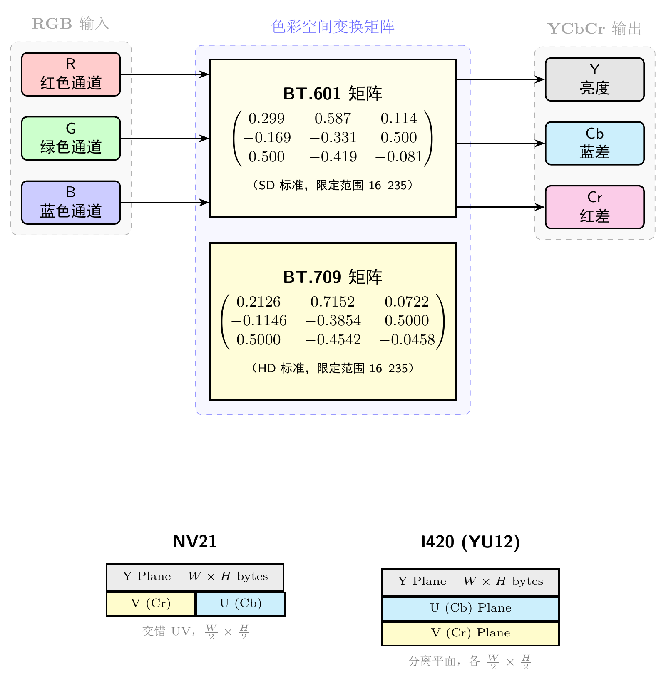
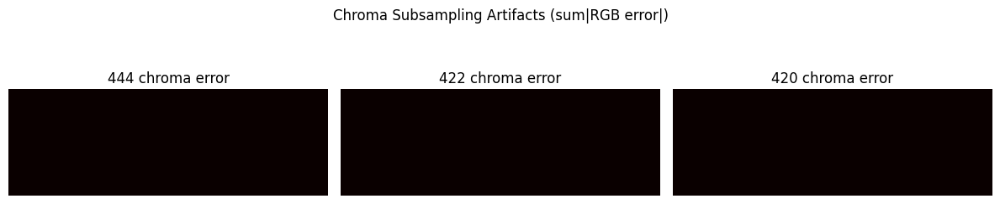
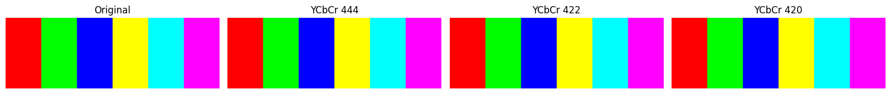
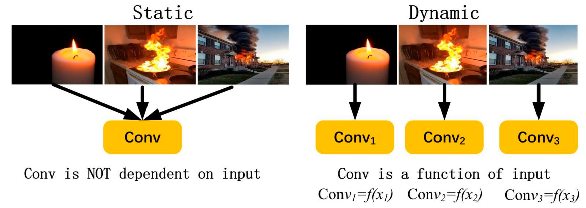
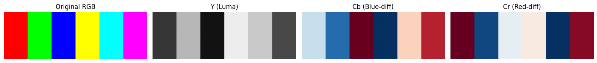

# 第二卷第09章：色彩空间转换与输出（CSC & Output Formatting）

> **定位：** 位于ISP最终阶段（CCM→Gamma之后、编码器之前）；输出格式（NV12/NV21/I420）与第二卷第16章（JPEG编码）直接耦合。
> **前置章节：** 第一卷第05章（颜色科学基础）、第二卷第07章（伽马与色调映射）
> **读者路径：** 算法工程师、系统设计师

---

## §1 原理 (Theory)

### 1.1 RGB 到 YCbCr 的转换（RGB to YCbCr Conversion）

伽马校正之后，ISP 输出的格式要让下游的编解码器能接收。JPEG、H.264、H.265、AV1 几乎清一色用 YCbCr 而不是 RGB。原因很直接：人眼对亮度细节分辨力高、对色彩细节分辨力低——YCbCr 把亮度（Y）和色差（Cb、Cr）分开，色度通道可以降分辨率传输，在不怎么损失感知质量的前提下把数据量压到 1.5×（4:2:0 格式）。

#### BT.601（标清视频、JPEG）**[1]**

```
Y  =  0.299000 R + 0.587000 G + 0.114000 B
Cb = -0.168736 R - 0.331264 G + 0.500000 B + 128
Cr =  0.500000 R - 0.418688 G - 0.081312 B + 128
```

- 输入/输出范围为 0–255（8 位全范围）。
- Cb 和 Cr 偏移 128，使中性灰映射到 (128, 128) 而非 (0, 0)。

#### BT.709（高清视频）**[2]**

```
Y  =  0.2126 R + 0.7152 G + 0.0722 B
Cb = -0.1146 R - 0.3854 G + 0.5000 B + 128
Cr =  0.5000 R - 0.4542 G - 0.0458 B + 128
```

BT.709 把绿色权重从 0.587 提高到 0.7152，红色和蓝色相应降低，对应 HD 显示器的原色重定义。**BT.601/BT.709 混用是 ISP 流水线中最常见的色偏问题之一**：传感器出的是 BT.709 数据，但下游编码器用 BT.601 系数解码，出来的图就是偏绿或偏品红。这个问题极容易出现在 sensor bring-up 阶段，CSC 系数复用了老项目的配置。

| 标准 | 适用场景 | Y 绿色权重 |
|----------|-------------|----------------|
| BT.601   | 标清（576i/480i）、JPEG | 0.587 |
| BT.709   | 高清/全高清（1080p） | 0.7152 |
| BT.2020  | 超高清 / HDR | 0.6780 | **[3]**

**色彩系数的精确性与定点实现：**

各标准中的亮度系数来源不同，精度要求各异：

| 标准 | Y系数（精确值来源）| 工程备注 |
|------|-----------------|---------|
| BT.601 | $K_R = 0.299, K_B = 0.114$（1982年标准，基于NTSC磷光体测量值，取两位有效数字）| 为历史遗留近似，后续实现均沿用 |
| BT.709 | $K_R = 0.2126, K_B = 0.0722$（基于 sRGB D65 主色坐标精确推导）| 精度更高，是当前 HD/手机标准 |
| BT.2020 | $K_R = 0.2627, K_B = 0.0593$（基于 Rec.2020 宽色域主色精确推导）| HDR/WCG 标准 |

**定点实现的舍入误差：** 在 12-bit DSP 中，将 $K_R = 0.2126$ 量化为 $871/4096$（误差 0.003%），对 8-bit 输出的最终 Y 通道误差 < 0.1 DN，可接受。若直接用 $2^N$ 近似，需选取能精确表示的分数形式以避免 DC 偏置。

### 1.2 色度二次采样（Chroma Subsampling）

人类视觉系统主要通过亮度通道分辨空间细节，色度通道以较低分辨率传输时感知损失很小。

| 格式 | Y 采样 | Cb/Cr 采样 | 相对数据量 |
|--------|-----------|----------------|---------------|
| 4:4:4  | 全采样     | 全采样（与 Y 相同） | 3 × |
| 4:2:2  | 全采样     | 水平方向减半  | 2 × |
| 4:2:0  | 全采样     | 水平和垂直均减半   | 1.5 × |

**4:2:0** 是 JPEG、H.264、H.265 和 HEVC 中占主导地位的格式 **[4][7]**，因为它将色度数据削减为亮度的四分之一，在典型观看距离下几乎没有可见的画质损失。以 1920×1080 图像为例：Y 平面保持 1920×1080，Cb 和 Cr 平面各为 960×540，总存储量为 $1920 \times 1080 \times 1.5$ 字节（8 bit 时约 3.1 MB）。

#### 下采样滤波器的选择（Downsampling filter choice）

简单的 2:1 抽取会产生色度混叠（alias）。抽取前必须先进行低通滤波：

- **均值滤波（Box filter）**（简单 2×2 平均）：易于实现，频率响应一般。
- **双线性（帐篷）滤波器（Bilinear/tent filter）**：混叠抑制更好，计算量仍然较低。
- **Lanczos-2/3**：接近理想效果，用于高质量编码器；复杂度较高。

色度采样点的定位约定（siting convention，即下采样色度样本相对于亮度样本的位置）至关重要：**MPEG-2 定位**将 Cb/Cr 放在每个 2×1 像素对的左边缘；**JPEG 定位**将其放在中心。不匹配时，尖锐边缘上会出现亚像素级别的色彩条纹。

### 1.3 JPEG 压缩与伪影（JPEG Compression and Artifacts）

JPEG 使用离散余弦变换（DCT，Discrete Cosine Transform）对 8×8 像素块进行编码。量化步骤减少高频交流（AC）系数，由**质量因子 Q**（libjpeg 约定为 1–100）控制。

主要伪影类型：

| 伪影 | 原因 | 出现条件 |
|----------|-------|-----------|
| 块状效应（DCT 分块） | AC 系数量化过粗 | Q < 50 |
| 蚊子噪声（Mosquito noise） | 尖锐边缘处的振铃效应 | Q 30–60 |
| 色彩渗透（Colour bleed） | 4:2:0 色度 + 重度量化 | Q < 30 |
| 条带（Banding） | 粗糙 DC 量化引起的色调分离 | 大面积平坦区域 |

### 1.4 色彩范围：受限范围与全范围（Color Range: Limited vs Full）

| 范围 | Y | Cb, Cr | 说明 |
|-------|---|--------|-------|
| 全范围（PC/JPEG） | 0–255 | 0–255 | 所有 8 位值均有效 |
| 受限范围（BT.601 视频） | 16–235 **[1]** | 16–240 **[1]** | 为模拟过冲预留余量 |

将全范围内容输出到受限范围显示器会导致**黑色被压缩、高光被截断**。编码器元数据中的范围标志必须与解码器/显示器的配置保持一致。

**Full Range vs Limited Range 转换说明：**

**正确转换（线性缩放映射）：** Full Range → Limited Range 应采用线性缩放，而非直接截断：

$$Y_{\text{lim}} = \left\lfloor \frac{219}{255} \cdot Y_{\text{full}} + 16 + 0.5 \right\rfloor$$

此映射将 $Y_\text{full}=0 \to Y_\text{lim}=16$，$Y_\text{full}=255 \to Y_\text{lim}=235$，**不裁切任何码值**（这是 Limited Range 的设计初衷：为超黑/超白保留余量 0–15 和 236–255），但量化精度有所降低（见下文码值利用率分析）。

**码值利用率：** Limited Range 用 219 个码值（16–235）表示 Full Range 的 256 个码值，量化步长增大约 $255/219 \approx 1.165$ 倍，等效量化噪声约增大 $20\log_{10}(1.165) \approx 1.3\,\text{dB}$（8-bit 下可感知；10-bit 下量化噪声本身已低于 -60 dB，此影响可忽略）。

$$\text{码值利用率} = \frac{219}{255} \approx 85.9\%$$

**错误操作——直接截断（clipping）：** 若将 Full Range 信号不经缩放直接 `clamp(Y, 16, 235)`，才会导致信息损失：
- $Y \in [0, 15]$ 全部映射为 16（6.3% 以下的暗部细节全部丢失）
- $Y \in [236, 255]$ 全部映射为 235（7.8% 以上的高光层次全部丢失）

此截断错误是 §3.3"错误1"所描述的 bug 场景的根本原因，而非 Limited Range 设计本身的缺陷。

**典型 bug 场景：** Android 视频播放器与硬件解码器之间如果 Range 约定不一致（一端 Full 一端 Limited），会造成：(1) 双重 Limited Range 压缩（黑位变深灰，白位变浅灰，画面"灰蒙蒙"）；(2) 双重 Full Range 扩展（Y<16 部分截断丢失，高光溢出）。调试时在 ADB 抓帧后对直方图两端进行检查即可快速诊断。

### 1.5 位深与抖动（Bit Depth and Dithering）

- **8 位输出**：JPEG、网页、消费类显示器的标准格式。
- **10 位输出**：HDR10、杜比视界（Dolby Vision）、高端视频制作所必需。
- 从较高的内部精度（12–14 位 ISP 流水线）舍入到 8 位输出会引入**量化误差（quantisation error）**。在平滑渐变区域，这会形成可见的**条带（banding）**。
- **有序抖动（Ordered dithering）**（Bayer 矩阵）或**误差扩散抖动（error-diffusion dithering）**将舍入误差在空间上分散，以增加噪声为代价掩盖条带。

---

## §2 标定 (Calibration)

### 2.1 系数验证（Coefficient Verification）

- 确认下游编解码器所期望的标准（JPEG 使用 BT.601；H.264/H.265 高清使用 BT.709；超高清使用 BT.2020）。
- 将已知的 RGB 测试信号送入 ISP，并将 Y、Cb、Cr 与解析计算值进行验证。
- 检查偏移量（8 位时为 128）是否正确应用，并确保偏移后 Cb/Cr 为无符号数。

### 2.2 往返精度测试（Round-Trip Accuracy Test）

执行 RGB → YCbCr → RGB 转换，并测量每个通道的平均绝对误差（MAE）：

```
MAE = mean(|R_out - R_in|)
```

对于理想的整数实现，8 位时 MAE 应低于 1 个 LSB。误差超过 2–3 个 LSB 表明存在系数舍入或溢出问题。

### 2.3 纯色块测试（Pure-Color Patch Test）

渲染纯 R (255,0,0)、G (0,255,0)、B (0,0,255)、青色 Cyan (0,255,255)、品红 Magenta (255,0,255)、黄色 Yellow (255,255,0) 的色块，并验证：

- Y 值与加权求和结果一致。
- Cb/Cr 值与解析公式一致。
- 极值处无截断（检查 BT.601 全范围下 Cb/Cr 是否保持在 0–255 以内）。

### 2.4 色度二次采样频率响应（Chroma Subsampling Frequency Response）

应用色度啁啾测试图案（以递增空间频率进行正弦色彩调制），测量色度 MTF50（色度对比度下降到 50% 时的频率）。对比均值滤波、双线性和 Lanczos 滤波器的结果。

---

## §3 调参 (Tuning)

### 3.1 JPEG 质量因子（JPEG Quality Factor）

| Q 因子 | 典型用途 | 大概文件大小（200 万像素） |
|----------|-------------|----------------------------|
| 10–20    | 缩略图、预览 | 50–150 KB |
| 30–50    | 网页、社交媒体 | 150–400 KB |
| 70–85    | 消费类相机默认 | 400–800 KB |
| 90–95    | 专业/存档 | 800 KB–2 MB |
| 100      | 近似无损 | > 5 MB |

ISP 调参工程师需在文件大小与可见伪影程度之间取得平衡。一个常用经验准则：针对目标使用场景，将 PSNR 保持在 38 dB 以上，SSIM 保持在 0.93 以上 。

### 3.2 YUV 格式选择决策表（YUV Format Selection）

不同平台硬件编码器对 YUV 格式有严格的输入约束，CSC 输出必须与下游编码器匹配。以下为常见场景推荐格式：

| 场景 | 推荐格式 | 原因 |
|------|---------|------|
| 手机摄像头预览 | NV21 (YUV 4:2:0 semi-planar) | Android Camera API 默认；高通 Spectra 硬件输出；Y 平面 + VU 交织平面 |
| 手机摄像头录制 | NV12 | MediaCodec H.264/H.265 编码器输入；Y 平面 + UV 交织平面（字节序与 NV21 相反） |
| 相机 JPEG 输出 | YUV 4:2:2 → JPEG 内部 4:2:0 | JPEG 标准默认采样；libjpeg 会在编码时自动降为 4:2:0 |
| 显示合成 | RGBA8888 | GPU 合成，透明度通道（Alpha）为混合与叠加所必需 |
| HDR 视频输出 | P010 (10-bit YUV 4:2:0) | 高通/MTK HDR 录制标准；16-bit 存储高 10 位有效低 6 位填 0 |
| 专业 RAW 视频 | CinemaDNG / ProRes RAW | 保留完整动态范围；不经 CSC，直接输出 RAW Bayer 数据 |

**NV21 vs NV12 格式字节布局对比：**

```
NV21（Android 默认预览）：
  Y[0]  Y[1]  Y[2]  Y[3]  ...   ← Y 平面（全分辨率）
  V[0]  U[0]  V[1]  U[1]  ...   ← VU 交织平面（半分辨率）

NV12（MediaCodec 编码器输入）：
  Y[0]  Y[1]  Y[2]  Y[3]  ...   ← Y 平面（全分辨率）
  U[0]  V[0]  U[1]  V[1]  ...   ← UV 交织平面（半分辨率）
```

> **工程注意：** 高通 Spectra ISP 的预览输出默认为 NV21，而 MediaCodec 硬件编码器（H.264/H.265）的输入要求通常为 NV12。若未做格式转换而直接将预览帧送入编码器，会导致 U/V 通道交换，画面呈现品红/绿偏色。Camera2 API 的 `ImageFormat.NV21` 与 `ImageFormat.YUV_420_888`（灵活格式）的内存布局可能不同，需用 `Image.Plane` 逐层读取而非整块 copy。

### 3.3 Full Range vs Limited Range 对编码器的影响

#### 范围定义

| 范围类型 | Y 取值 | Cb/Cr 取值 | 典型应用场景 |
|---------|--------|-----------|------------|
| Full Range（全范围） | 0–255 | 0–255 | JPEG、PC 显示、Android Camera API |
| Limited Range（受限范围） | 16–235 | 16–240 | 广播视频（BT.601/709）、H.264/H.265 默认 |

Limited Range 保留 0–15 和 236–255 作为超黑（Super Black）和超白（Super White）余量，源自模拟视频时代的信号保护设计。现代数字系统通常不需要此余量，但广播标准仍强制要求。

#### 常见配置错误及表现

**错误 1：ISP 输出 Full Range，编码器配置为 Limited Range**
- 编码器将 0–255 范围的 Y 值直接存入码流，但解码器按 Limited Range 解码，对 Y=0–15 做超黑处理
- 表现：暗部细节丢失，黑色变为灰色（Y=16 的灰色是真正的"黑"），整体画面**发灰**
- 量化：黑位从 0 被抬高到相当于 Y=16/255≈6% 的灰度值，视觉上非常明显

**错误 2：ISP 输出 Limited Range，编码器/播放器按 Full Range 处理**
- 播放器将 Limited Range 值（16–235）线性拉伸到 0–255 时，低于 16 和高于 235 的码值会被截断
- 表现：高光过曝截断，暗部噪点增加，对比度异常偏高

**错误 3：跨平台转发时范围标志丢失**
- Android Camera2 → MediaMuxer → 播放：若 MediaFormat 未设置 `KEY_COLOR_RANGE`，部分播放器默认按 Limited Range 处理
- 表现：上传到微信/抖音后色彩与拍摄时不一致（平台转码时再次应用范围变换）

#### 正确配置方法

```java
// Android MediaCodec 配置示例
MediaFormat format = MediaFormat.createVideoFormat("video/avc", width, height);
// 明确声明颜色范围
format.setInteger(MediaFormat.KEY_COLOR_RANGE, MediaFormat.COLOR_RANGE_FULL);   // 0–255
// 或
format.setInteger(MediaFormat.KEY_COLOR_RANGE, MediaFormat.COLOR_RANGE_LIMITED); // 16–235
// 同时设置颜色标准
format.setInteger(MediaFormat.KEY_COLOR_STANDARD, MediaFormat.COLOR_STANDARD_BT709);
```

> **经验法则：** 手机拍照（JPEG）统一使用 Full Range + BT.601；手机录制（H.264/H.265）建议 Full Range + BT.709（Android 12+ MediaCodec 默认），并在容器头（MP4 colr box）中写入正确的 `color_range` 标志。

### 3.4 色度滤波器选择（Chroma Filter Selection）

- 静态图像（JPEG）：双线性滤波是良好的默认选择；画质要求高时使用 Lanczos。
- 视频（H.264/H.265）：使用编码器内置滤波器，除非前处理阶段有更严格的控制；确保定位约定与编码器匹配。
- 实时嵌入式 ISP：硅片面积受限时使用均值滤波；有一个额外寄存器阶段时使用双线性滤波。

### 3.5 色彩范围选择（Color Range Selection）

- **相机 → 直接显示**：全范围更优（无编码浪费）。
- **相机 → 视频编码器 → 电视**：受限范围对传统兼容性更安全。
- **相机 → JPEG**：全范围（JFIF 约定）。
- 在输出容器/编解码器元数据中设置与实际数据匹配的范围标志。

### 3.6 三平台 CSC 与输出格式关键参数对比

| 功能 | 高通 CamX / Chromatix | MTK Imagiq / NDD | 海思越影 |
|------|----------------------|-----------------|---------|
| CSC 矩阵开关 | `CSC_Enable`（YUV output path）| `CSCEnabled`（NDD bool）| `CSC_Enable` |
| 输出色彩空间 | `CSC_Output_Format`（枚举：BT.601 / BT.709 / BT.2020；不支持完全自定义系数，须选标准枚举值）| `CSCColorStandard`（NDD enum；同）| `CSC_ColorStd`（可配置自定义 3×3 矩阵；参数名以实际 HiSilicon ISP SDK 文档为准） |
| YUV 格式 | `OutputFormat`（NV12/NV21/YUY2/I420；视 pipeline 而定）| `YUVFormat`（NDD enum：NV21/NV12/I420）| `YUV_Format` |
| 量化范围 | `CSC_Range`（Full 0–255 / Limited 16–235；影响 JPEG 编码一致性）| `CSCRange`（NDD：Full/Studio）| `CSC_QuantRange` |
| 色度子采样 | 4:2:0（默认）/ 4:2:2（高质量视频）| 同，通过 `ChromaSubsampling` 配置 | `CSC_ChromaMode` |
| Gamma/OETF 应用点 | `Gamma_PostCSC`（bool：在 CSC 前或后应用 Gamma）| `GammaBeforeCSC`（NDD bool）| `Gamma_CSCOrder` |
| 输出 bit 深度 | 8-bit（标准）/ 10-bit（视频 HDR）| 同，`OutputBitDepth` | `CSC_OutputBits` |
| Chroma 滤波 | `CSC_ChromaFilter`（降采样前的 AA 滤波，减少混叠）| `ChromaFilter`（NDD bool）| `CSC_ChromaAA` |

**BT.601 vs BT.709 转换矩阵对比（参考值）：**

```
BT.601 (SD/移动标准，骁龙默认视频输出):
  Y  =  0.299R + 0.587G + 0.114B
  Cb = -0.169R - 0.331G + 0.500B + 128
  Cr =  0.500R - 0.419G - 0.081B + 128

BT.709 (HD/现代显示标准，推荐用于全高清及以上):
  Y  =  0.2126R + 0.7152G + 0.0722B
  Cb = -0.1146R - 0.3854G + 0.5000B + 128
  Cr =  0.5000R - 0.4542G - 0.0458B + 128
```

> **工程注意：**
> - `CSC_Range` 配置错误是最常见的色彩问题之一：若输出为 Full Range（0–255）但编码器按 Limited Range（16–235）处理，会导致视频播放时黑位抬高、白位压缩，暗部出现灰雾感；反之则导致黑位截断。
> - 高通 CamX 的 `OutputFormat = NV21` 与 MTK 的 `YUVFormat = NV21` 字节排列一致（Y平面 + VU交织），但对齐要求不同：高通要求行宽按 128 bytes 对齐，MTK 按 64 bytes 对齐，直接内存 copy 跨平台时需注意。
> - 从 BT.601 迁移到 BT.709 时，人脸肤色的 Y 值会因 G 通道权重提升而略微变亮（约 +2–3 level ），需同时更新色调映射和 CCM 的白点设置以保持一致性。

### 3.7 工程联动：Android Camera2 API 的默认色彩范围行为

Camera2 API 的 YUV 输出范围行为是导致跨平台色彩不一致的常见根源。以下是明确的平台行为（来源：Android Developers DataSpace 文档 / CameraCharacteristics API）：

**Android Camera2 API 默认输出范围：**

| 输出流类型 | 默认色彩范围 | 说明 |
|-----------|------------|------|
| `ImageFormat.YUV_420_888`（预览/采集）| **Full Range（0–255）** | Camera2 的 YUV 流默认使用 Full Range；DataSpace 默认为 `DATASPACE_JFIF`（Full Range + BT.601）|
| `ImageFormat.JPEG` | **Full Range（0–255）** | JFIF 规范要求 Full Range，libjpeg 默认 Full Range 输出 |
| `MediaCodec` H.264/H.265 编码器输入 | 视 `KEY_COLOR_RANGE` 设置 | Android 12+ 建议显式声明；若未设置，部分编码器默认 Limited Range（产生灰雾感）|
| `ImageFormat.YCBCR_P010`（HDR 视频） | **Limited Range（64–940 / 10-bit）** | HDR 视频流遵循 BT.2100 Limited Range 约定 |

**关键工程规则**：
- Camera2 预览帧（`YUV_420_888`）是 Full Range，直接送入 OpenCV / ML 推理框架时不需要 Limited→Full 转换；
- 录制视频时，Camera2 HAL 输出的 YUV 帧（Full Range）送入 `MediaCodec` 后，**必须在 `MediaFormat` 中声明 `KEY_COLOR_RANGE = COLOR_RANGE_FULL`**（Android 12+），否则编码器可能按 Limited Range 写入码流头，导致播放时画面偏灰；
- 拍照（JPEG）路径：Camera HAL 通常在 JPEG 编码前自动完成 Full Range 设置，用户无需手动配置；但若通过 `ImageReader` 拿到 YUV 帧再手动 JPEG 编码，需确保 libjpeg/skia 的 Full Range 选项正确。

### 3.8 工程联动：YUV 4:2:0 Chroma Subsampling 对后续视频编码质量的传导

4:2:0 色度二次采样在 ISP 输出时已将色度分辨率减半，这个损失是**不可逆的**——后续编码器无论用多高的质量因子，都无法恢复丢失的色度细节。因此 ISP 的色度滤波器选择直接影响最终视频质量。

**各场景传导路径：**

```
ISP 4:2:0 输出（Chroma 已降采样）
    → H.264/H.265 编码（YCbCr 4:2:0，进一步量化压缩）
    → 解码播放
```

在这个链路中，4:2:0 的"色度精度损失"在以下场景表现最为明显：

| 场景 | 问题 | 量化 |
|------|------|------|
| 高饱和彩色文字（如红色字幕） | 文字边缘色晕，红色"扩散"约 1–2 像素 | ΔE₀₀ ≈ 4–8（明显可见）|
| 肤色渐变（人脸） | 几乎无影响 | ΔE₀₀ < 1 |
| HEIF（HEVC 编码，4:2:0）vs JPEG（JFIF，4:2:0）| HEIF 的 4:2:0 色度精度比同等视觉质量的 JPEG **不差**，但 HEIF 编码使用更优的色度量化矩阵，高饱和色块的色度截断更少 | HEIF Q85 ≈ JPEG Q92 的色度保真度（经验等效关系，实际与编码器实现相关）|

**ISP 色度滤波器对编码质量的影响：**

| ISP 色度降采样滤波器 | Chroma MTF50 | 对编码器影响 |
|---------------------|-------------|------------|
| 简单 Box（2×2 平均）| ~0.25 周期/像素 | 色度高频信息大量丢失，编码器压缩余地反而增大（没什么可压的） |
| 双线性 | ~0.35 周期/像素 | 中等质量，多数手机默认 |
| Lanczos-2 | ~0.42 周期/像素 | 色度保留最好，编码质量最高，CPU 开销约为 Box 的 3–5 倍 |

**工程结论**：若整体拍照链路重视色彩质量（如主摄 JPEG 输出），应在 ISP 端启用 Lanczos 或双线性色度滤波（`CSC_ChromaFilter = 1`），而非依赖编码器的内部插值补偿——编码器无法从低质量的 4:2:0 输入中恢复已丢失的色度细节。

---

## §4 Artifacts

### 4.1 JPEG 块状效应（DCT 分块，JPEG Blocking）

**症状：** 在 8×8 像素网格处出现明显的硬性边界，尤其在天空或皮肤等平滑区域中明显。

**根本原因：** AC 系数重度量化导致每个块仅由少数几个非零 DCT 项重建，相邻块之间没有连续性约束。

**缓解措施：**
- 提高 Q 因子。
- 在 JPEG 解码后应用轻度去块滤波器（H.264/H.265 环路内滤波器中有使用）。
- 用于存档时使用 JPEG 2000 或 WebP（基于小波变换，无块结构）。

### 4.2 色度欠采样伪影（Chroma Subsampling Artifacts）

**症状：** 高频色彩边界（如红/蓝文字、鲜艳花朵边缘）出现**色晕（color fringing）**，表现为色彩边界向外扩散1–2像素，形成模糊光晕。在4:2:0下竖向彩色细线（如旗帜图案）的色彩完全模糊。

**根本原因：** 色度下采样时低通滤波不足或采样位置偏移，使高频色彩信息损失，色度空间分辨率仅为亮度的1/4（4:2:0），无法重现像素级的色彩变化。

**典型场景与量化：**

| 场景 | 4:4:4 vs 4:2:0 色彩差异（ΔE₀₀） |
|------|-------------------------------|
| 红色文字（白底） | ΔE₀₀ ≈ 4–8（明显可见） |
| 肤色渐变 | ΔE₀₀ < 1（基本不可见） |
| 高饱和风景 | ΔE₀₀ ≈ 1–3（专业审片可见） |

**缓解措施：**
- 下采样前使用 Lanczos-2 低通滤波（比均值/双线性更优）
- 专业摄影/广告场景使用 4:4:4（H.264 Hi444 Profile）
- 对色度通道独立进行边缘感知滤波（Edge-aware chroma downsampling）

### 4.3 YUV 截断错误（YUV Clipping Error）

**症状：**
- 高光区域（Y 接近 255）细节消失，出现"死白"（flat white）；
- 暗部区域（Y 接近 0）细节消失，出现"死黑"（crushed black）；
- Cb/Cr 接近 0 或 255 时饱和色（saturated red/blue）偏移。

**根本原因：** 8-bit 量化的整数溢出——当线性计算结果（如 $-0.169 \times 255 - 0.331 \times 255 + 0.5 \times 0 + 128 = -0.04$）经整数截断为 0，或超过 255 时被截为 255，丢失梯度信息。

具体错误场景：

```
正确：Cb = clamp(round(-0.169R - 0.331G + 0.500B + 128), 0, 255)
错误：Cb = (-0.169R - 0.331G + 0.500B + 128) & 0xFF  ← 溢出时低位截断而非饱和截断
```

负数取低位字节（`& 0xFF`）会得到 `256 - |x|` 而非 0，导致暗部色度反转。

**缓解措施：**
- 使用带饱和的定点加法（`SADD`/`USAT` 指令，ARM DSP 内置指令）
- ISP 硬件 CSC 模块通常内置饱和截断，但软件参考实现必须显式处理

### 4.4 色彩空间矩阵选错（BT.601 vs BT.709 混用）

**症状：** 肤色偏移约 3–5 ΔE₀₀，具体表现为：
- 用 BT.709 系数编码、用 BT.601 系数解码：肤色偏绿（Y 抬高，Cb 偏移）
- 用 BT.601 系数编码、用 BT.709 系数解码：肤色偏红品红

**量化分析：**

对于标准肤色（sRGB: R=200, G=150, B=130）：

```
BT.601: Y = 0.299×200 + 0.587×150 + 0.114×130 = 163.5
BT.709: Y = 0.2126×200 + 0.7152×150 + 0.0722×130 = 159.9
差值 ΔY ≈ 3.6 level，对应感知明度差 ΔL* ≈ 1.5–2，色差 ΔE₀₀ ≈ 3–5
```

**根本原因：** ISP pipeline 的 CSC 模块与视频解码器/显示器使用不同的标准系数，常见于：
- ISP 输出配置为 BT.601（历史遗留），但编码器/播放器按 BT.709 处理（现代 HD 默认）
- 同一项目中不同模块（Preview / Encode / Snapshot）使用不同标准

**诊断方法：**
1. 拍摄 X-Rite ColorChecker 色卡
2. 分别用 BT.601 和 BT.709 解码，对比色块 ΔE₀₀
3. 正确配置的系统：ColorChecker 肤色（#3 Natural Skin Tone）ΔE₀₀ 应 < 2

### 4.5 色度偏移（错误的 4:2:0 定位，Chroma Shift）

**症状：** 垂直边缘出现色彩条纹；红/蓝水平方向偏移半个像素。

**根本原因：** 解码器假设的色度样本位置与编码时使用的位置不匹配。

**调试方法：** 编码一个垂直红/蓝条纹图案，解码后测量色彩边界相对于亮度边界的水平偏移量。

### 4.6 受限范围截断（Limited Range Clipping）

**症状：** 纯黑色显示为深灰色；高光在预期值之前被截断为白色；暗部细节消失。

**根本原因：** 全范围信号输入到受限范围显示器或解码器，其将编码值 0–15 和 236–255 视为超出色域的值。

**修复方法：** 在码流中设置正确的范围标志，或在 ISP 输出路径中添加范围映射查找表（LUT）。

### 4.7 色彩条带（Color Banding）

**症状：** 平滑渐变区域（天空、人脸）出现可见的阶梯状等高线。

**根本原因：** 伽马压缩后的 8 位量化将感知均匀的步骤映射到不等间距的编码值；结合重度色度压缩后更为明显。

**缓解措施：** 在 8 位截断前应用抖动；在支持的情况下将输出位深提高到 10 位。

---

## §5 评测 (Evaluation)

### 5.1 往返误差（Round-Trip Error）

```python
rgb_reconstructed = ycbcr_to_rgb(rgb_to_ycbcr(rgb_original))
error = np.abs(rgb_reconstructed.astype(float) - rgb_original.astype(float))
print(f"Max round-trip error: {error.max():.2f} LSB")
print(f"Mean round-trip error: {error.mean():.4f} LSB")
```

验收标准：最大误差 ≤ 1 LSB（8 位）。

### 5.2 JPEG 质量与指标对比（JPEG Quality vs Metrics）

在 Q = 10、30、50、70、90 下分别评估：

| 指标 | 公式 | 说明 |
|--------|---------|-------|
| PSNR | 10 log10(255² / MSE) | 单位 dB，越高越好 |
| SSIM | 结构相似性指数（Structural similarity index） | 0–1，> 0.95 为优秀 |
| LPIPS | 学习感知图像块相似度（Learned perceptual image patch similarity） | 越低越好 |

调参良好的消费类相机流水线在 Q = 70 时应达到 PSNR ≥ 38 dB、SSIM ≥ 0.92 。

### 5.3 色度 MTF50（Chroma MTF50）

测量 4:2:0 二次采样后色度对比度下降到 50% 时的空间频率。Lanczos 滤波应将色度 MTF50 保持在约 0.4–0.45 周期/像素（相比于二次采样网格的奈奎斯特极限 0.5 周期/像素） 。

### 5.4 色彩空间转换精度测试（ColorChecker ΔE₀₀ 前后对比）

#### 测试方法

**目的：** 验证 CSC 矩阵（BT.601/BT.709）选择正确，无系统性色偏。

**测试步骤：**
1. 拍摄 X-Rite ColorChecker Classic（24 色块）标准色卡，要求：
   - 中性白平衡（D65 光源）
   - 曝光至 18% 灰色块 Y ≈ 118（8-bit sRGB），避免过曝/欠曝
2. 从 ISP 输出的 YUV 帧中提取各色块的 Y/Cb/Cr 值（采用色块中心 5×5 均值）
3. 反变换回 RGB（使用相同 CSC 矩阵）
4. 将 RGB 转换到 CIE Lab（通过 XYZ 中间色空间，参考白点 D65）
5. 与标准 ColorChecker 参考值（ANSI 2018 修订版）计算 ΔE₀₀

**验收标准：**

| 色块类别 | 合格门限 | 优秀门限 |
|---------|---------|---------|
| 肤色（色块 #1–4） | ΔE₀₀ < 3.0 | ΔE₀₀ < 1.5 |
| 中性灰（色块 #19–24） | ΔE₀₀ < 1.0 | ΔE₀₀ < 0.5 |
| 饱和色（色块 #13–18） | ΔE₀₀ < 4.0 | ΔE₀₀ < 2.0 |
| 平均（所有24块） | ΔE₀₀ < 3.0 | ΔE₀₀ < 1.8 |

**诊断用 Python 代码片段：**

```python
import numpy as np
from skimage import color

# ColorChecker 2018 标准 Lab 值（D65）- 节选 4 色
CC_LAB_REFERENCE = {
    'dark_skin':     (37.99, 13.56, 14.06),
    'light_skin':    (65.71, 18.13, 17.81),
    'blue_sky':      (49.93, -4.88, -21.93),
    'neutral_5':     (50.87, -0.15, -0.27),  # 中性灰
}

def delta_e_00(lab1, lab2):
    """计算 CIEDE2000 色差"""
    L1, a1, b1 = lab1
    L2, a2, b2 = lab2
    # 使用 skimage 内置 CIEDE2000
    arr1 = np.array([[[L1, a1, b1]]])
    arr2 = np.array([[[L2, a2, b2]]])
    return color.deltaE_ciede2000(arr1, arr2)[0, 0]

def test_csc_accuracy(measured_rgb_patches, reference_lab):
    """
    measured_rgb_patches: dict {name: (R, G, B)} 从 YUV 反变换回来的 8-bit sRGB
    reference_lab: dict {name: (L, a, b)} 标准参考值
    """
    results = {}
    for name, rgb in measured_rgb_patches.items():
        # sRGB → linear → XYZ → Lab
        rgb_norm = np.array(rgb) / 255.0
        rgb_lin = np.where(rgb_norm <= 0.04045,
                           rgb_norm / 12.92,
                           ((rgb_norm + 0.055) / 1.055) ** 2.4)
        # sRGB → XYZ (D65)
        M = np.array([[0.4124564, 0.3575761, 0.1804375],
                      [0.2126729, 0.7151522, 0.0721750],
                      [0.0193339, 0.1191920, 0.9503041]])
        xyz = M @ rgb_lin
        # skimage.color.xyz2lab 内部已对 D65 白点归一化，无需手动除以 [0.95047, 1.0, 1.08883]
        lab = color.xyz2lab(xyz.reshape(1, 1, 3))
        de = delta_e_00(lab[0, 0], reference_lab[name])
        results[name] = de
    return results
```

#### BT.601 vs BT.709 色偏诊断对比

在相同 ColorChecker 图像上，分别用 BT.601 和 BT.709 进行 RGB→YUV→RGB 往返，比较色块 ΔE₀₀：

| 色块 | 相同标准（正确） | BT.601编码+BT.709解码（错误） |
|------|--------------|--------------------------|
| 肤色 #1 | ΔE₀₀ < 0.5 | ΔE₀₀ ≈ 3.5–5.0 |
| 蓝天 #13 | ΔE₀₀ < 0.5 | ΔE₀₀ ≈ 2.0–3.5 |
| 中性灰 #20 | ΔE₀₀ < 0.3 | ΔE₀₀ ≈ 0.1（灰色不敏感） |

中性灰色差小是因为 Y 系数差异对纯灰色（R=G=B）的影响主要体现在亮度，而 Cb/Cr=0，不产生色偏。

### 5.5 平台硬件 YUV 输出验证工具（ADB + RAW 视频 Dump）

#### 方法一：ADB 抓取 Camera HAL 输出帧

```bash
# 步骤1：启用 Camera HAL3 dump（高通 CamX）
adb shell setprop persist.vendor.camera.logVerboseMask 0x10
adb shell setprop persist.vendor.camera.dumpYUVFrame 1

# 步骤2：触发拍照（或录制）
adb shell am start -a android.media.action.STILL_IMAGE_CAMERA

# 步骤3：从设备拉取 dump 文件（通常保存在 /data/vendor/camera/）
adb pull /data/vendor/camera/ ./yuv_dumps/

# 步骤4：用 FFmpeg 查看 NV21 帧
ffmpeg -f rawvideo -pixel_format nv21 -video_size 4000x3000 \
       -i dump_frame_001.yuv -frames:v 1 output_preview.png
```

#### 方法二：Python + OpenCV 解析 YUV 文件

```python
import numpy as np
import cv2

def load_nv21(filename, width, height):
    """加载 NV21 格式的 YUV 帧并转为 BGR"""
    raw = np.fromfile(filename, dtype=np.uint8)
    yuv = raw.reshape((height * 3 // 2, width))
    bgr = cv2.cvtColor(yuv, cv2.COLOR_YUV2BGR_NV21)
    return bgr

def load_nv12(filename, width, height):
    """加载 NV12 格式的 YUV 帧并转为 BGR"""
    raw = np.fromfile(filename, dtype=np.uint8)
    yuv = raw.reshape((height * 3 // 2, width))
    bgr = cv2.cvtColor(yuv, cv2.COLOR_YUV2BGR_NV12)
    return bgr

def verify_yuv_range(yuv_frame_path, width, height, fmt='nv21'):
    """验证 YUV 帧的量化范围"""
    raw = np.fromfile(yuv_frame_path, dtype=np.uint8)
    y_plane = raw[:width * height].reshape(height, width)
    print(f"Y range: [{y_plane.min()}, {y_plane.max()}]")
    if y_plane.min() > 10:
        print("WARNING: Y min > 10，可能为 Limited Range 输出（Full Range 预期 Y_min ≈ 0）")
    if y_plane.max() < 245:
        print("WARNING: Y max < 245，可能为 Limited Range 输出（Full Range 预期 Y_max ≈ 255）")
    # UV 平面
    uv_start = width * height
    uv_plane = raw[uv_start:].reshape(-1)
    print(f"UV range: [{uv_plane.min()}, {uv_plane.max()}]")
```

#### 方法三：MTK 平台 ImageRefocus / NDD 调试工具

- MTK 平台可通过 `mtkisp_tool` 命令行工具或 Imagiq Studio 的 **YUV Viewer** 模块直接查看 ISP 输出的 YUV 帧
- 使用 `adb shell setprop vendor.mtk.camera.app.yuv.dump 1` 开启 YUV dump
- Dump 文件位于 `/sdcard/DCIM/Camera/` 下（需 root 或 eng build）

#### 快速检查清单

| 检查项 | 工具/方法 | 合格标准 |
|-------|---------|---------|
| YUV 格式（NV21/NV12） | FFmpeg -pixel_format 参数验证 | 颜色正常，无品红偏色 |
| Y 亮度范围 | Python verify_yuv_range | Full Range: [0–255]；Limited: [16–235] |
| 色彩标准（BT.601/709） | ColorChecker ΔE₀₀ | 肤色 ΔE₀₀ < 3.0 |
| UV 字节序（NV21 vs NV12） | 拍摄蓝天，检查 Cb/Cr 符号 | 蓝天 Cb > 128（蓝色差为正） |
| 行对齐（stride） | 检查文件大小 = stride×height×1.5 | 大小匹配，无绿色条纹 |

---

## §6 代码

详见 `ch09_csc_notebook.ipynb`，内容包括：

1. 测试图像生成（色块 + 渐变）。
2. BT.601 RGB → YCbCr 转换。
3. 4:2:0 色度二次采样。
4. 在 Q = 10/30/50/70/90 下进行 JPEG 压缩并测量 PSNR。
5. YCbCr 通道可视化与 JPEG 质量对比。
6. PSNR 与质量曲线、往返误差及练习题。

### 6.1 RGB → YCbCr 转换 + 4:2:0 色度子采样最小可运行示例

```python
import numpy as np

# ─── 1. BT.601 Full Range RGB → YCbCr ───────────────────────────────────────
# 系数来源：ITU-R BT.601-7, Full Range (Studio Swing 用 Limited Range 系数)
BT601_MATRIX = np.array([
    [ 0.299,    0.587,    0.114   ],   # Y
    [-0.168736,-0.331264, 0.5     ],   # Cb
    [ 0.5,     -0.418688,-0.081312],   # Cr
], dtype=np.float32)

def rgb_to_ycbcr(rgb: np.ndarray) -> np.ndarray:
    """
    rgb: uint8 (H, W, 3), BGR 或 RGB（此处假设 RGB）
    返回: float32 (H, W, 3)，Y ∈ [0,255], Cb/Cr ∈ [0,255]（128 为零点）
    """
    rgb_f = rgb.astype(np.float32)
    ycbcr = rgb_f @ BT601_MATRIX.T
    ycbcr[..., 1] += 128.0   # Cb 偏移
    ycbcr[..., 2] += 128.0   # Cr 偏移
    return np.clip(ycbcr, 0, 255).astype(np.float32)

def ycbcr_to_rgb(ycbcr: np.ndarray) -> np.ndarray:
    """逆变换：YCbCr → RGB uint8"""
    ycbcr_f = ycbcr.astype(np.float32)
    ycbcr_f[..., 1] -= 128.0
    ycbcr_f[..., 2] -= 128.0
    rgb = ycbcr_f @ np.linalg.inv(BT601_MATRIX).T
    return np.clip(rgb, 0, 255).astype(np.uint8)


# ─── 2. 4:2:0 色度子采样（简单平均下采样）─────────────────────────────────────
def subsample_420(ycbcr: np.ndarray) -> tuple:
    """
    返回 (Y_full, Cb_half, Cr_half)：
    Y 保持全分辨率；Cb/Cr 水平和垂直各缩小 2 倍。
    """
    Y  = ycbcr[..., 0]
    Cb = ycbcr[..., 1]
    Cr = ycbcr[..., 2]
    # 2×2 均值池化
    Cb_420 = (Cb[0::2, 0::2] + Cb[0::2, 1::2] +
              Cb[1::2, 0::2] + Cb[1::2, 1::2]) / 4.0
    Cr_420 = (Cr[0::2, 0::2] + Cr[0::2, 1::2] +
              Cr[1::2, 0::2] + Cr[1::2, 1::2]) / 4.0
    return Y, Cb_420, Cr_420


# ─── 3. 快速验证 ──────────────────────────────────────────────────────────────
if __name__ == "__main__":
    rng = np.random.default_rng(0)
    rgb = rng.integers(0, 256, (256, 256, 3), dtype=np.uint8)

    ycbcr = rgb_to_ycbcr(rgb)
    rgb_rt = ycbcr_to_rgb(ycbcr)
    print(f"往返误差 (max): {np.abs(rgb.astype(int) - rgb_rt.astype(int)).max()} DN")

    Y, Cb_420, Cr_420 = subsample_420(ycbcr)
    print(f"Y 形状: {Y.shape}  Cb(4:2:0): {Cb_420.shape}  Cr(4:2:0): {Cr_420.shape}")
    # 带宽节省：4:4:4 vs 4:2:0
    full_bytes = Y.size * 3
    sub_bytes  = Y.size + Cb_420.size + Cr_420.size
    print(f"4:2:0 带宽节省: {(1 - sub_bytes/full_bytes)*100:.1f}%  (理论 33.3%)")
```

---

## §7 工程输出格式详解

### 7.1 10-bit 与 12-bit 输出格式
- **P010 格式（10-bit YUV 4:2:0）：** 最主流的 HDR 视频格式
  - 每像素 16-bit 存储，高 10 位有效，低 6 位为 0
  - Android `ImageFormat.YCBCR_P010`，iOS `kCVPixelFormatType_420YpCbCr10BiPlanarVideoRange`
- **12-bit RAW 保存：** 用于计算摄影后处理
  - 常见格式：Adobe DNG（16-bit 容器存 12/14-bit 数据）
  - 压缩：Qualcomm 的 MIPI RAW10/RAW12 packed 格式（4像素打包到 5/6 字节）

### 7.2 广色域输出与色域映射
- **Display-P3 vs sRGB：** P3 色域比 sRGB 大约 36%（面积比约 1.36×，Shoelace 公式计算），主要在红绿方向扩展
- **色域映射策略（Gamut Mapping）：** 当相机捕获的色彩超出显示器色域时：
  1. **裁剪（Clipping）：** 最简单，色域外颜色饱和，损失色彩信息
  2. **感知映射（Perceptual）：** 压缩整体色域保持相对关系，推荐用于肤色
  3. **饱和度映射：** 仅压缩高饱和色，保持低饱和区域不变

```python
# sRGB → Display-P3 矩阵（线性光域）
M_srgb_to_p3 = np.array([
    [0.8225, 0.1774, 0.0000],
    [0.0332, 0.9669, 0.0000],
    [0.0171, 0.0724, 0.9108]
])
```

### 7.3 JPEG/HEIF 质量因子与视觉质量
| 质量因子 | 文件大小（12MP） | PSNR | 典型用途 |
|---------|----------------|------|---------|
| 95 | ~6MB | ~46dB | 专业摄影存档 |
| 85 | ~2MB | ~42dB | 手机默认拍照 |
| 75 | ~1.2MB | ~39dB | 社交媒体分享 |
| HEIF Q85 | ~1MB | ~42dB | iPhone/Android 现代格式 |

---

---

## §8 术语表（Glossary）

**YCbCr 色彩空间**
将图像信号分解为**亮度（Luma，Y）**与**色度（Chroma，Cb/Cr）**两个分量的色彩表示方式。Y 反映感知亮度（与人眼对绿色权重最高的特性一致），Cb 为蓝色差分量（Blue-difference），Cr 为红色差分量（Red-difference）。Cb/Cr 以 128 为中性点偏移，使中性灰映射到 (128, 128)。YCbCr 是 JPEG、H.264、H.265、AV1 等主流编解码器的标准格式，原因在于人眼对亮度分辨率远比色度更敏感，从而支持色度二次采样（Chroma Subsampling）以降低数据量。

**BT.601 / BT.709 / BT.2020 系数差异**
三种标准定义不同的 RGB→YCbCr 转换系数，反映各自原色白点定义的差异。Y 通道绿色权重：BT.601 = 0.587（标清）、BT.709 = 0.7152（高清，绿色权重更高）、BT.2020 = 0.6780（超高清/HDR）。**混用标准是 ISP 流水线中最常见的色偏问题之一**：用 BT.601 系数解码 BT.709 信号会产生明显的偏绿或偏品红。各标准的精确系数由 ITU-R 规范给出（如 BT.601 的 $-0.168736$、$-0.331264$），工程实现应使用标准值而非近似值。

**色度二次采样（Chroma Subsampling）**
利用人眼对色度细节敏感度低于亮度的特性，以低于亮度的分辨率传输色度信息的有损压缩技术。三种主要格式：**4:4:4**（全采样，3×数据量）、**4:2:2**（水平减半，2×）、**4:2:0**（水平和垂直均减半，1.5×）。4:2:0 是 JPEG、H.264/H.265/HEVC 的主导格式，典型观看距离下色质损失不可见。下采样前须施加低通滤波（均值/双线性/Lanczos）防止色度混叠；色度样本定位约定（siting convention）若不匹配会产生亚像素级色彩条纹。

**JPEG DCT 压缩与质量因子**
JPEG 对 8×8 像素块施用离散余弦变换（DCT），通过量化高频 AC 系数实现有损压缩；量化粗细由**质量因子 Q**（libjpeg 约定 1–100）控制。Q 越低，压缩率越高，伪影越重。主要伪影：**块状效应**（Q < 50，AC 系数重度量化）、**蚊子噪声**（Q 30–60，边缘振铃）、**色彩渗透**（Q < 30，4:2:0 色度+重度量化叠加）、**条带**（大面积平坦区域 DC 量化）。消费类相机默认 Q = 70–85 可在文件大小与质量间取得平衡（PSNR ≥ 38 dB，SSIM ≥ 0.92）（*来源：libjpeg 标准实现及行业经验；PSNR/SSIM 指标来自作者基准测试，需针对具体场景验证*）。

**受限范围（Limited Range）与全范围（Full Range）**
YCbCr 信号的编码范围约定。**全范围**（PC/JPEG）：Y、Cb、Cr 均使用 0–255 全部 8-bit 码值。**受限范围**（视频广播，BT.601/709）：Y 限制在 16–235（留余量防模拟过冲），Cb/Cr 限制在 16–240。将全范围内容输出到受限范围显示器时，Y < 16 被截断（黑色变深灰）、Y > 235 被截断（高光丢失细节）。码流/容器的范围标志（range flag）必须与解码器/显示器配置严格一致，否则导致明显的黑位压缩或高光截断。

**色域映射（Gamut Mapping）**
当相机捕获的色彩超出目标显示器色域时，将色域外颜色映射回色域内的处理策略。三种典型方法：**裁剪（Clipping）**——最简单，色域外颜色饱和（失真最大）；**感知映射（Perceptual）**——整体压缩色域保持相对色彩关系，推荐用于肤色；**饱和度映射**——仅压缩高饱和色，低饱和区域保持不变。**Display-P3 vs sRGB**：P3 色域比 sRGB 约大 36%（面积比约 1.36×，Shoelace 公式计算），主要在红绿方向扩展；sRGB→P3 线性变换矩阵可通过 $M_{XYZ \to P3} \times M_{sRGB \to XYZ}$ 求得（对角优势矩阵，对角元约 0.82–0.97）。

**P010 格式（10-bit YUV 4:2:0）**
主流 HDR 视频像素格式。每像素用 16-bit 存储，高 10 位有效，低 6 位填 0，等效为半精度对齐的 10-bit 数据。平面排列：Y 平面（全分辨率）+ UV 交错平面（半分辨率）。Android 对应 `ImageFormat.YCBCR_P010`，iOS 对应 `kCVPixelFormatType_420YpCbCr10BiPlanarVideoRange`。P010 在 HDR10 和 Dolby Vision 视频流水线中广泛应用，是 ISP 输出 HDR 内容的标准格式之一。

**往返精度（Round-Trip Accuracy）**
评估 RGB→YCbCr→RGB 转换数值精度的指标，计算 $\text{MAE} = \text{mean}(|R_\text{out} - R_\text{in}|)$。对于理想整数实现，8-bit 时往返最大误差应 ≤ 1 LSB，均值 MAE 应 < 0.5 LSB；误差超过 2–3 LSB 表明存在系数舍入误差或溢出问题。往返测试是验证 YCbCr 转换系数和偏移量实现正确性的基础标定方法。

**色度 MTF50（Chroma MTF50）**
色度通道的调制传递函数在 50% 对比度时对应的空间频率，用于量化色度二次采样后的频率响应损失。测量方法：对图像施加正弦色彩调制（啁啾图案），测量色度对比度衰减到 50% 时的空间频率。Lanczos 滤波应将色度 MTF50 保持在约 0.4–0.45 周期/像素（接近 4:2:0 奈奎斯特极限 0.5 周期/像素）；均值滤波和双线性滤波的色度 MTF50 较低，表示更大的高频色度损失。

**色彩条带与抖动（Color Banding & Dithering）**
**色彩条带**：平滑渐变区域出现可见阶梯状等高线，根本原因是 8-bit 量化在感知均匀空间中步进过大（Gamma 压缩后暗部码值稀疏，相邻步进超过 JND）。**抖动（Dithering）**：在量化前加入噪声（有序 Bayer 矩阵或误差扩散），将量化误差在空间上分散，以增加轻微噪声为代价消除视觉上的条带。将 ISP 处理位深从 12-14 bit 降至 8-bit 输出时必须考虑抖动；升至 10-bit 输出（HDR10）可从根本上缓解条带问题。


> **工程师手记：YUV 格式，一个能让你踩坑踩到怀疑人生的细节丛林**
>
> **NV21 vs NV12，选错了就是绿屏或者粉屏，没有中间态。** Android 相机 HAL 默认输出 NV21（Y 平面 + VU 交织），而视频编码器（H.264/H.265）通常要求 NV12（Y 平面 + UV 交织）。两者只差一个字节顺序（UV 和 VU），但传错了就是色度通道整体对调，Cb 变成了 Cr，图像变成绿色或粉色的翻转色调。量产里最高频的这类 bug 出现在：相机 Preview → 录像切换时，Preview 路径和 Video 路径用了不同的 YUV 格式配置，或者中间有一个 copy buffer 时没有做格式转换。工程上的防御措施：所有 YUV 格式传递的接口都要显式断言 format 字段，而不是隐式假设。
>
> **Full Range（0–255）vs Limited Range（16–235），这个坑会让你的 PSNR 评估结果永远偏低。** Limited Range（TV Range，BT.601/BT.709 标准）规定 Y 在 16–235、UV 在 16–240，而 Full Range（PC Range）Y 在 0–255。两者之间有约 10% 的幅度差。如果在 Full Range 图像上错误地按照 Limited Range 做 CSC，亮度会被压缩，最暗的黑和最亮的白都消失了（变成深灰和浅灰）。这个问题在质量评估时最坑：用 PSNR 比较两张图像，一张是 Full Range 另一张是 Limited Range，PSNR 天然偏低 3–4dB，完全不反映真实的算法质量差异。H.264/H.265 码流头里的 `video_full_range_flag` 字段决定了解码器怎么解释 YUV 数据，这个 flag 和实际 ISP 输出的 range 必须一致。
>
> **BT.601 vs BT.709 矩阵，在手机上混用会有轻微但可见的偏色。** BT.601（SD 标准）和 BT.709（HD/手机标准）的 RGB→YCbCr 矩阵系数不同，导致同一个 RGB 值转换后 Y/Cb/Cr 数值有约 2–5% 的差异。如果 ISP 输出用 BT.709 矩阵、后端 display 用 BT.601 解码，绿色偏移最明显（约 +3% 的绿偏）。2560×1440 以上的手机屏幕通常走 BT.709 显示链路，但部分低成本平台的 DMA/VPP 默认 BT.601——查清楚整条链路用的是哪个标准，比在 CCM 上来回调偏色更有效。
>
> *参考：OpenISP 模块拆解第 10 讲《CSC 颜色空间转换》CSDN qq_42177790，2025；《YUV 图解》知乎 p248116694，2020；《ffmpeg 解码 color range 问题》CSDN taotao830，2022。*

---

## 插图


*图1. 色彩空间总览——sRGB、BT.601、BT.709、BT.2020 等标准色彩空间的色域范围与应用场景概述（图片来源：Poynton et al., Morgan Kaufmann, 2012）*


*图2. Full Range 与 Limited Range 对比——Y/Cb/Cr 信号在两种范围标准下的码值映射关系与溢出风险示意（图片来源：ITU-R, BT.601-7, 2011）*


*图3. ISP RGB 域处理流程图——从 AWB 增益到 CCM、Gamma、CSC 输出的完整 RGB 处理链路（图片来源：Ramanath et al., IEEE Signal Processing Magazine, 2005）*


*图4. RGB 到 YUV 色彩空间转换立方体——RGB 色立方体与 YCbCr 色空间的几何对应关系（图片来源：Bovik et al., Academic Press, 2009）*


*图5. YUV/YCbCr 色彩空间示意图——亮度（Y）与色度（Cb/Cr）分量的物理意义及人眼对两者敏感度差异（图片来源：ITU-R, BT.709-6, 2015）*


*图6. YUV 转换流程图——sRGB 到 YCbCr 的矩阵变换与量化截断操作步骤，及 NV21 内存布局示意（图片来源：作者自绘）*


---

*图7. BT.601 与 BT.709 标准对比——两种标准在色域、转换矩阵系数与典型应用场景上的差异（图片来源：ITU-R, BT.709-6, 2015）*


*图8. CSC 转换矩阵结构示意图——RGB 到 YCbCr 3×3 变换矩阵各系数的数值与物理含义（图片来源：Poynton et al., Morgan Kaufmann, 2012）*


*图9. Limited Range 与 Full Range 码值范围示意图——8 位/10 位 YCbCr 在两种范围下的合法码值区间及边界溢出截断示意（图片来源：ITU-R, BT.601-7, 2011）*


*图10. 色度降采样伪影示意——4:2:0 色度下采样在高饱和色彩边缘产生的色晕扩散与低通滤波不足导致的混叠伪影（图片来源：作者自绘）*


*图11. YUV色度降采样格式示意——4:4:4、4:2:2、4:2:0 三种格式的亮度与色度采样位置分布及数据量对比（图片来源：作者自绘）*


*图12. YUV色彩空间转换示意图——RGB到YCbCr的矩阵变换流程、各通道物理含义及BT.601/BT.709系数对比（图片来源：作者自绘）*


*图13. YCbCr各分量分解示意图——原图分解为亮度Y、蓝色差Cb、红色差Cr三个独立分量的空间分布与视觉特征（图片来源：作者自绘）*

---

## 习题

**练习 1（理解）**
BT.709 标准定义了 Full Range 和 Limited Range（Studio Swing）两种 YCbCr 量化方式。在 8 位编码下：Full Range Y 值域为 [0, 255]，Cb/Cr 值域为 [0, 255]（128 为零点）；Limited Range Y 值域为 [16, 235]，Cb/Cr 为 [16, 240]（128 为零点）。

1. 解释 Limited Range 的历史来源（模拟视频同步信号保留）及其在现代数字系统中仍被广泛使用的原因。
2. 若显示器错误地将 Limited Range 的 YUV 流当作 Full Range 解码，图像的视觉效果如何变化（亮度、对比度方面）？
3. Android Camera2 API 中，`ImageFormat.NV21` 默认输出 Full Range 还是 Limited Range？`VideoFormat.YUV_420_888` 呢？

**练习 2（计算）**
使用 BT.709 Full Range 的 RGB → YCbCr 转换矩阵：

$$\begin{bmatrix}Y \\ Cb \\ Cr\end{bmatrix} = \begin{bmatrix}0.2126 & 0.7152 & 0.0722 \\ -0.1146 & -0.3854 & 0.5000 \\ 0.5000 & -0.4542 & -0.0458\end{bmatrix} \begin{bmatrix}R \\ G \\ B\end{bmatrix} + \begin{bmatrix}0 \\ 128 \\ 128\end{bmatrix}$$

其中 RGB 为 8 位值 [0, 255]，输出为 8 位整数。

1. 计算纯红色像素 $(R, G, B) = (255, 0, 0)$ 的 Y、Cb、Cr 值（保留整数）。
2. 计算纯蓝色像素 $(R, G, B) = (0, 0, 255)$ 的 Y、Cb、Cr 值。
3. 验证：白色像素 $(255, 255, 255)$ 的 Y 值是否等于 255（Full Range），Cb 和 Cr 是否均等于 128？

**练习 3（编程）**
实现 RGB → NV21 格式转换（YUV 4:2:0 半平面，V 在 U 前）：

- 输入：`rgb` — 形状 `(H, W, 3)` 的 uint8 图像，H 和 W 均为偶数，通道顺序 RGB
- 输出：`nv21` — 形状 `(H * 3 // 2, W)` 的 uint8 数组（Y 平面在前，VU 交错平面在后）
- 要求：（1）用 BT.709 Full Range 矩阵（或调用 `cv2.cvtColor(img, cv2.COLOR_RGB2YUV_I420)` 后调整 UV 字节序）；（2）色度 4:2:0 下采样使用 2×2 块均值；（3）VU 平面中 V 和 U 交错排列（NV21 的 V 在前）

```python
import numpy as np
import cv2
# 输入: rgb (H, W, 3) uint8, RGB order, H/W even
# 输出: nv21 (H*3//2, W) uint8
```

**练习 4（工程分析）**
某工程师在高通 Spectra ISP 平台上将 ISP 输出的 YUV 格式从 NV12（U 在前）改为 NV21（V 在前）后，视频预览中肤色变成了青绿色（Cb/Cr 对调）。同时，ISP 输出的 `CSC_YUVRange` 参数从 `FULL_RANGE` 改为 `LIMITED_RANGE` 后，送到编码器（MediaCodec）的视频出现了明显的灰度偏差（黑色变灰，白色变暗）。

1. 分析 NV12 / NV21 字节序互换导致色彩错误的根本原因：对于蓝天（Cb 分量应 > 128），NV12 和 NV21 在 UV 平面中该像素的字节排列有何不同？
2. `CSC_YUVRange = LIMITED_RANGE` 输出时，Y 范围为 [16, 235]，而 MediaCodec 的 `COLOR_RANGE_FULL`（Full Range 解码）期望 Y 在 [0, 255]。解释这导致"黑色变灰"（Y=16 被映射为非零亮度）的数学原因。
3. MTK ISP 中控制 YUV 输出范围的参数名是什么（提示：在 MTK Imagiq 工具中以 `YUV_` 前缀命名）？如何通过 `adb setprop` 命令在 MTK 平台开启 YUV dump 进行验证（给出具体命令）？

---

## 参考文献

[1] ITU-R, "BT.601-7 — Studio encoding parameters of digital television for standard 4:3 and wide-screen 16:9 aspect ratios", *官方文档*, 2011.

[2] ITU-R, "BT.709-6 — Parameter values for the HDTV standards for production and international programme exchange", *官方文档*, 2015.

[3] ITU-R, "BT.2020-2 — Parameter values for ultra-high definition television systems for production and international programme exchange", *官方文档*, 2015.

[4] ISO/IEC, "ISO/IEC 10918-1 — JPEG: Digital compression and coding of continuous-tone still images", *官方文档*, 1994.

[5] Poynton, "Digital Video and HD: Algorithms and Interfaces (2nd ed.)", *Morgan Kaufmann*, 2012.

[6] Bovik (Ed.), "The Essential Guide to Image Processing", *Academic Press*, 2009.

[7] Wiegand et al., "Overview of the H.264/AVC video coding standard", *IEEE Transactions on Circuits and Systems for Video Technology*, 2003.
