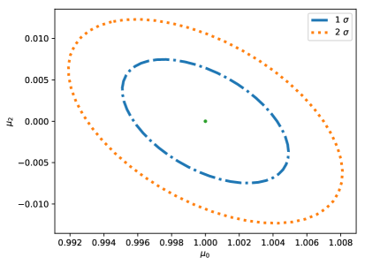
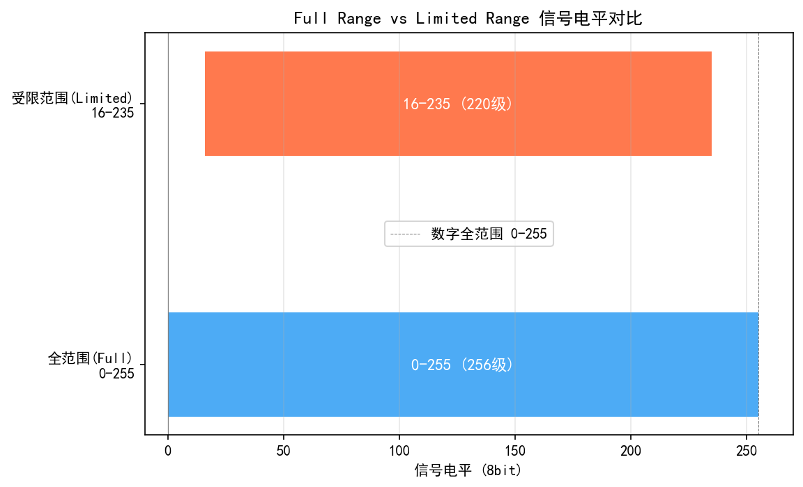
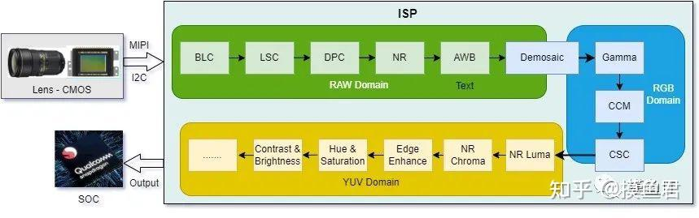
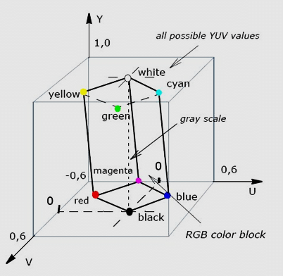
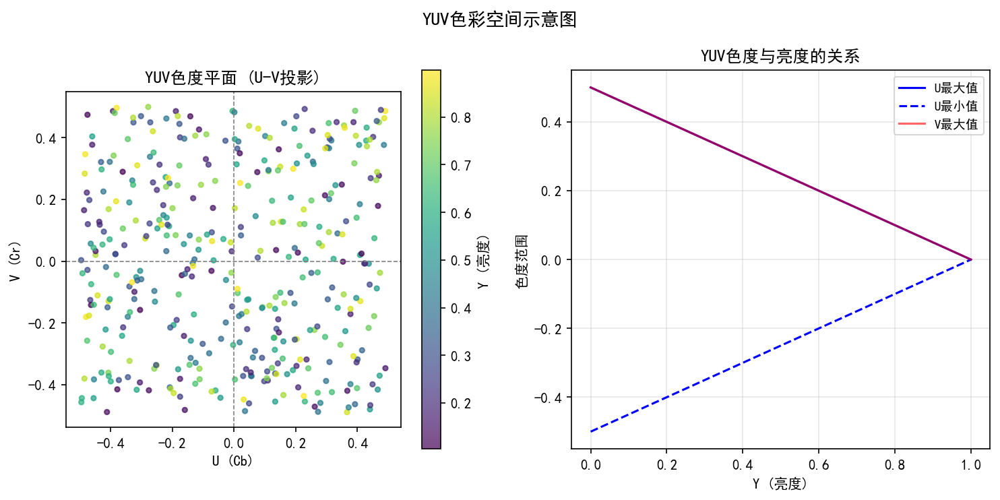
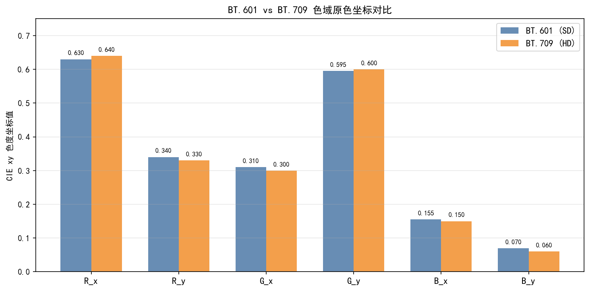
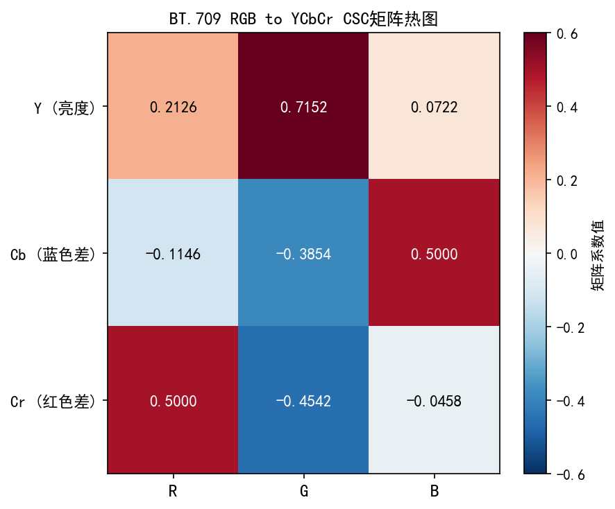
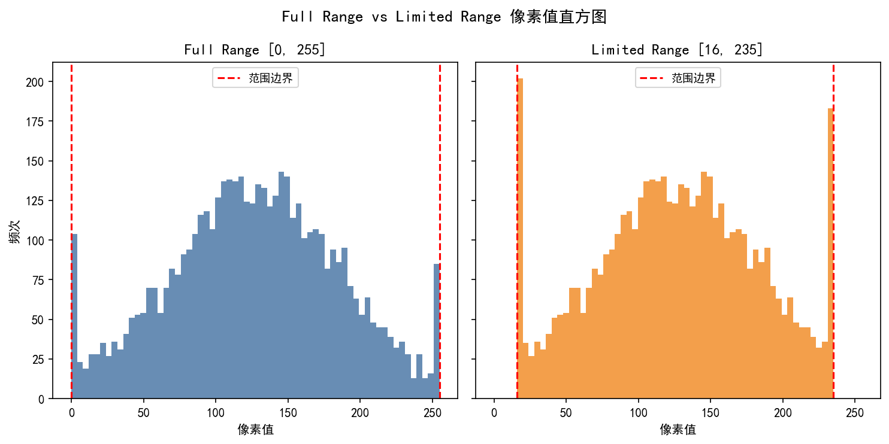

# Vol. 2 Ch. 09: Color Space Conversion and Output (CSC & Output Formatting)
> **Version:** v1.0 Draft

> **Position:** Located at the final stage of the ISP pipeline (after CCM → Gamma, before the encoder); output formats (NV12/NV21/I420) are directly coupled with Vol. 2 Ch. 16 (JPEG Encoding).
> **Prerequisite chapters:** Vol. 1 Ch. 05 (Color Science Fundamentals), Vol. 2 Ch. 07 (Gamma and Tone Mapping)
> **Target readers:** Algorithm engineers, system designers

---

## §1 Theory

### 1.1 RGB to YCbCr Conversion

After gamma correction, the ISP output must be formatted so that downstream codecs can accept it. JPEG, H.264, H.265, and AV1 almost universally use YCbCr rather than RGB. The reason is straightforward: the human eye has high spatial resolution for luminance detail but low resolution for color detail — YCbCr separates luminance (Y) from chrominance (Cb, Cr), allowing the chroma channels to be transmitted at reduced resolution. This reduces data volume to 1.5× (4:2:0 format) with minimal perceptual quality loss.

#### BT.601 (Standard-definition video, JPEG) **[1]**

```
Y  =  0.299000 R + 0.587000 G + 0.114000 B
Cb = -0.168736 R - 0.331264 G + 0.500000 B + 128
Cr =  0.500000 R - 0.418688 G - 0.081312 B + 128
```

- Input/output range is 0–255 (8-bit full range).
- Cb and Cr are offset by 128, mapping neutral gray to (128, 128) rather than (0, 0).

#### BT.709 (High-definition video) **[2]**

```
Y  =  0.2126 R + 0.7152 G + 0.0722 B
Cb = -0.1146 R - 0.3854 G + 0.5000 B + 128
Cr =  0.5000 R - 0.4542 G - 0.0458 B + 128
```

BT.709 raises the green weight from 0.587 to 0.7152, with corresponding reductions in red and blue, reflecting the redefined primaries of HD displays. **Mixing BT.601 and BT.709 is one of the most common color cast problems in ISP pipelines**: if sensor output is encoded with BT.709 coefficients but the downstream decoder uses BT.601 coefficients, the resulting image will exhibit a green or magenta cast. This problem occurs very easily during sensor bring-up when CSC coefficients are reused from an older project's configuration.

| Standard | Applicable scenario | Y green weight |
|----------|---------------------|----------------|
| BT.601   | SD (576i/480i), JPEG | 0.587 |
| BT.709   | HD/Full HD (1080p) | 0.7152 |
| BT.2020  | UHD / HDR | 0.6780 | **[3]**

**Precision of color coefficients and fixed-point implementation:**

The luminance coefficients in each standard originate from different sources and have different precision requirements:

| Standard | Y coefficient (source of exact value) | Engineering notes |
|----------|---------------------------------------|-------------------|
| BT.601 | $K_R = 0.299, K_B = 0.114$ (1982 standard, based on NTSC phosphor measurements, rounded to two significant figures) | A legacy approximation; all subsequent implementations have followed these values |
| BT.709 | $K_R = 0.2126, K_B = 0.0722$ (derived precisely from sRGB D65 primary chromaticity coordinates) | Higher precision; the current HD/mobile standard |
| BT.2020 | $K_R = 0.2627, K_B = 0.0593$ (derived precisely from Rec.2020 wide-gamut primary chromaticity coordinates) | HDR/WCG standard |

**Rounding error in fixed-point implementations:** In a 12-bit DSP, quantizing $K_R = 0.2126$ as $871/4096$ (error 0.003%) results in a final Y-channel error < 0.1 DN for 8-bit output, which is acceptable. When using $2^N$ approximations directly, it is necessary to choose fractional representations that can be expressed exactly in order to avoid DC bias.

### 1.2 Chroma Subsampling

The human visual system resolves spatial detail primarily through the luminance channel; perceptual loss is minimal when the chroma channels are transmitted at reduced resolution.

| Format | Y sampling | Cb/Cr sampling | Relative data volume |
|--------|------------|----------------|----------------------|
| 4:4:4  | Full        | Full (same as Y) | 3× |
| 4:2:2  | Full        | Half horizontally | 2× |
| 4:2:0  | Full        | Half horizontally and vertically | 1.5× |

**4:2:0** is the dominant format in JPEG, H.264, H.265, and HEVC **[4][7]**, because it reduces chroma data to one quarter of luma while producing almost no visible quality loss at typical viewing distances. For a 1920×1080 image: the Y plane remains at 1920×1080, while each of the Cb and Cr planes is 960×540, giving a total storage of $1920 \times 1080 \times 1.5$ bytes (approximately 3.1 MB at 8 bits).

#### Downsampling filter choice

Simple 2:1 decimation introduces chroma aliasing. A low-pass filter must be applied before decimation:

- **Box filter** (simple 2×2 average): easy to implement, mediocre frequency response.
- **Bilinear (tent) filter**: better alias rejection, still low computational cost.
- **Lanczos-2/3**: near-ideal performance, used in high-quality encoders; higher complexity.

The chroma siting convention — the position of downsampled chroma samples relative to luma samples — is critical. **MPEG-2 siting** places Cb/Cr at the left edge of each 2×1 pixel pair; **JPEG siting** places them at the center. A mismatch produces sub-pixel color fringing at sharp edges.

### 1.3 JPEG Compression and Artifacts

JPEG uses the Discrete Cosine Transform (DCT) to encode 8×8 pixel blocks. The quantization step reduces high-frequency AC coefficients, controlled by a **quality factor Q** (libjpeg convention: 1–100).

Main artifact types:

| Artifact | Cause | Condition |
|----------|-------|-----------|
| Blocking (DCT tiling) | Heavy quantization of AC coefficients | Q < 50 |
| Mosquito noise | Ringing at sharp edges | Q 30–60 |
| Color bleed | 4:2:0 chroma + heavy quantization | Q < 30 |
| Banding | Tonal posterization from coarse DC quantization | Large flat areas |

### 1.4 Color Range: Limited vs Full

| Range | Y | Cb, Cr | Notes |
|-------|---|--------|-------|
| Full range (PC/JPEG) | 0–255 | 0–255 | All 8-bit values are valid |
| Limited range (BT.601 video) | 16–235 **[1]** | 16–240 **[1]** | Headroom reserved for analog overshoot |

Outputting full-range content to a limited-range display causes **black to be crushed and highlights to be clipped**. The range flag in the encoder metadata must be consistent with the decoder/display configuration.

**Full Range vs Limited Range conversion explained:**

**Correct conversion (linear scale mapping):** Full Range → Limited Range should use linear scaling, not direct clipping:

$$Y_{\text{lim}} = \left\lfloor \frac{219}{255} \cdot Y_{\text{full}} + 16 + 0.5 \right\rfloor$$

This mapping sends $Y_\text{full}=0 \to Y_\text{lim}=16$ and $Y_\text{full}=255 \to Y_\text{lim}=235$, **without clipping any code value** (this is the design intent of Limited Range: code values 0–15 and 236–255 are reserved as headroom for super-black and super-white), though quantization precision is reduced (see the code-value utilization analysis below).

**Code-value utilization:** Limited Range uses 219 code values (16–235) to represent the 256 code values of Full Range, increasing the quantization step by approximately $255/219 \approx 1.165\times$, which increases equivalent quantization noise by $20\log_{10}(1.165) \approx 1.3\,\text{dB}$ (perceptible at 8-bit; at 10-bit the quantization noise is already below −60 dB, making this effect negligible).

$$\text{Code-value utilization} = \frac{219}{255} \approx 85.9\%$$

**Incorrect operation — direct clipping:** If a Full Range signal is applied directly as `clamp(Y, 16, 235)` without scaling, information loss results:
- $Y \in [0, 15]$ all map to 16 (shadow detail below 6.3% is entirely lost)
- $Y \in [236, 255]$ all map to 235 (highlight gradation above 7.8% is entirely lost)

This clipping error is the root cause of the bug scenario described in §3.3 "Error 1", not a flaw in the Limited Range design itself.

**Typical bug scenario:** When an Android video player and hardware decoder disagree on the range convention (one end Full, the other Limited), this causes: (1) double Limited Range compression (black becomes dark gray, white becomes light gray, image appears "washed out"); (2) double Full Range expansion (values below Y=16 are clipped and lost, highlights overflow). During debugging, pulling a frame via ADB and inspecting both ends of the histogram provides a quick diagnosis.

### 1.5 Bit Depth and Dithering

- **8-bit output**: the standard format for JPEG, web, and consumer displays.
- **10-bit output**: required for HDR10, Dolby Vision, and professional video production.
- Rounding from a higher internal precision (12–14-bit ISP pipeline) down to 8-bit output introduces **quantization error**. In smooth gradient regions, this produces visible **banding**.
- **Ordered dithering** (Bayer matrix) or **error-diffusion dithering** disperses the rounding error spatially, masking banding at the cost of added noise.

---

## §2 Calibration

### 2.1 Coefficient Verification

- Confirm the standard expected by the downstream codec (JPEG uses BT.601; H.264/H.265 HD uses BT.709; UHD uses BT.2020).
- Feed a known RGB test signal into the ISP and verify Y, Cb, Cr against analytically computed values.
- Check that the offset (128 at 8-bit) is applied correctly and that Cb/Cr are unsigned after the offset.

### 2.2 Round-Trip Accuracy Test

Perform an RGB → YCbCr → RGB conversion and measure the Mean Absolute Error (MAE) for each channel:

```
MAE = mean(|R_out - R_in|)
```

For an ideal integer implementation, MAE should be below 1 LSB at 8-bit. Errors exceeding 2–3 LSB indicate coefficient rounding or overflow problems.

### 2.3 Pure-Color Patch Test

Render patches of pure R (255,0,0), G (0,255,0), B (0,0,255), Cyan (0,255,255), Magenta (255,0,255), and Yellow (255,255,0), and verify:

- Y values are consistent with the weighted sum.
- Cb/Cr values are consistent with the analytical formula.
- No clipping occurs at extreme values (verify that Cb/Cr remain within 0–255 under BT.601 full range).

### 2.4 Chroma Subsampling Frequency Response

Apply a chroma chirp test pattern (sinusoidal color modulation at increasing spatial frequencies) and measure the chroma MTF50 (the frequency at which chroma contrast drops to 50%). Compare results from box, bilinear, and Lanczos filters.

---

## §3 Tuning

### 3.1 JPEG Quality Factor

| Q factor | Typical use | Approximate file size (2 MP) |
|----------|-------------|------------------------------|
| 10–20    | Thumbnails, previews | 50–150 KB |
| 30–50    | Web, social media | 150–400 KB |
| 70–85    | Consumer camera default | 400–800 KB |
| 90–95    | Professional / archival | 800 KB–2 MB |
| 100      | Near-lossless | > 5 MB |

ISP tuning engineers must balance file size against visible artifacts. A common rule of thumb: for the target use case, keep PSNR above 38 dB and SSIM above 0.93.

### 3.2 YUV Format Selection Decision Table

Hardware encoders on different platforms impose strict input format constraints; CSC output must match the downstream encoder. The table below gives recommended formats for common scenarios:

| Scenario | Recommended format | Reason |
|----------|--------------------|--------|
| Mobile camera preview | NV21 (YUV 4:2:0 semi-planar) | Android Camera API default; Qualcomm Spectra hardware output; Y plane + VU interleaved plane |
| Mobile camera recording | NV12 | MediaCodec H.264/H.265 encoder input; Y plane + UV interleaved plane (byte order reversed relative to NV21) |
| Camera JPEG output | YUV 4:2:2 → JPEG internal 4:2:0 | JPEG standard default sampling; libjpeg automatically downsamples to 4:2:0 during encoding |
| Display compositing | RGBA8888 | GPU compositing; alpha channel required for blending and overlay |
| HDR video output | P010 (10-bit YUV 4:2:0) | Qualcomm/MTK HDR recording standard; 16-bit storage with the upper 10 bits valid and the lower 6 bits zero-filled |
| Professional RAW video | CinemaDNG / ProRes RAW | Preserves full dynamic range; bypasses CSC and outputs raw Bayer data directly |

**NV21 vs NV12 byte layout comparison:**

```
NV21 (Android default preview):
  Y[0]  Y[1]  Y[2]  Y[3]  ...   <- Y plane (full resolution)
  V[0]  U[0]  V[1]  U[1]  ...   <- VU interleaved plane (half resolution)

NV12 (MediaCodec encoder input):
  Y[0]  Y[1]  Y[2]  Y[3]  ...   <- Y plane (full resolution)
  U[0]  V[0]  U[1]  V[1]  ...   <- UV interleaved plane (half resolution)
```

> **Engineering note:** The Qualcomm Spectra ISP preview output defaults to NV21, while MediaCodec hardware encoders (H.264/H.265) typically require NV12 as input. Feeding preview frames directly to the encoder without format conversion swaps the U/V channels, causing a magenta/green color cast in the output. The memory layout of `ImageFormat.NV21` and `ImageFormat.YUV_420_888` (flexible format) in the Camera2 API may differ; use `Image.Plane` to read each plane individually rather than copying the entire buffer at once.

### 3.3 Effect of Full Range vs Limited Range on the Encoder

#### Range definitions

| Range type | Y value | Cb/Cr value | Typical application |
|------------|---------|-------------|---------------------|
| Full Range | 0–255 | 0–255 | JPEG, PC display, Android Camera API |
| Limited Range | 16–235 | 16–240 | Broadcast video (BT.601/709), H.264/H.265 default |

Limited Range reserves 0–15 and 236–255 as super-black and super-white headroom, a design carried over from the analog video era for signal protection. Modern digital systems generally do not need this headroom, but broadcast standards still mandate it.

#### Common configuration errors and their symptoms

**Error 1: ISP outputs Full Range, encoder configured for Limited Range**
- The encoder stores Y values in the 0–255 range directly in the bitstream, but the decoder interprets them as Limited Range, treating Y=0–15 as super-black
- Symptom: shadow detail is lost, black becomes gray (Y=16 gray is the "true black"), the overall image appears **washed out**
- Quantified: black level is raised from 0 to the equivalent of Y=16/255 ≈ 6% gray, which is visually very noticeable

**Error 2: ISP outputs Limited Range, encoder/player processes as Full Range**
- When the player linearly stretches Limited Range values (16–235) to 0–255, code values below 16 and above 235 are clipped
- Symptom: highlight clipping and overexposure, increased noise in shadows, abnormally high contrast

**Error 3: Range flag lost during cross-platform forwarding**
- Android Camera2 → MediaMuxer → playback: if `KEY_COLOR_RANGE` is not set in MediaFormat, some players default to Limited Range processing
- Symptom: colors differ after uploading to WeChat/TikTok compared to the original capture (the platform's transcoding applies another range transform)

#### Correct configuration

```java
// Android MediaCodec configuration example
MediaFormat format = MediaFormat.createVideoFormat("video/avc", width, height);
// Explicitly declare the color range
format.setInteger(MediaFormat.KEY_COLOR_RANGE, MediaFormat.COLOR_RANGE_FULL);   // 0-255
// or
format.setInteger(MediaFormat.KEY_COLOR_RANGE, MediaFormat.COLOR_RANGE_LIMITED); // 16-235
// Also set the color standard
format.setInteger(MediaFormat.KEY_COLOR_STANDARD, MediaFormat.COLOR_STANDARD_BT709);
```

> **Rule of thumb:** For mobile still photography (JPEG), use Full Range + BT.601 throughout. For mobile video recording (H.264/H.265), use Full Range + BT.709 (the default for Android 12+ MediaCodec) and write the correct `color_range` flag into the container header (MP4 colr box).

### 3.4 Chroma Filter Selection

- Still images (JPEG): bilinear filtering is a good default; use Lanczos for higher quality requirements.
- Video (H.264/H.265): use the encoder's built-in filter unless the pre-processing stage requires tighter control; ensure the siting convention matches the encoder.
- Real-time embedded ISP: use a box filter when silicon area is constrained; use bilinear when one additional pipeline register stage is available.

### 3.5 Color Range Selection

- **Camera → direct display**: full range is preferred (no encoding waste).
- **Camera → video encoder → TV**: limited range is safer for legacy compatibility.
- **Camera → JPEG**: full range (JFIF convention).
- Set the range flag in the output container/codec metadata to match the actual data.

### 3.6 Comparison of Key CSC and Output Format Parameters Across Three Platforms

| Feature | Qualcomm CamX / Chromatix | MTK Imagiq / NDD | HiSilicon Yueyingyi |
|---------|---------------------------|------------------|---------------------|
| CSC matrix switch | `CSC_Enable` (YUV output path) | `CSCEnabled` (NDD bool) | `CSC_Enable` |
| Output color space | `CSC_Output_Format` (enum: BT.601 / BT.709 / BT.2020) | `CSCColorStandard` (NDD enum) | `CSC_ColorStd` |
| YUV format | `OutputFormat` (NV12/NV21/YUY2/I420; pipeline-dependent) | `YUVFormat` (NDD enum: NV21/NV12/I420) | `YUV_Format` |
| Quantization range | `CSC_Range` (Full 0–255 / Limited 16–235; affects JPEG encoding consistency) | `CSCRange` (NDD: Full/Studio) | `CSC_QuantRange` |
| Chroma subsampling | 4:2:0 (default) / 4:2:2 (high-quality video) | Same, configured via `ChromaSubsampling` | `CSC_ChromaMode` |
| Gamma/OETF application point | `Gamma_PostCSC` (bool: apply Gamma before or after CSC) | `GammaBeforeCSC` (NDD bool) | `Gamma_CSCOrder` |
| Output bit depth | 8-bit (standard) / 10-bit (video HDR) | Same, `OutputBitDepth` | `CSC_OutputBits` |
| Chroma filtering | `CSC_ChromaFilter` (AA filter before downsampling to reduce aliasing) | `ChromaFilter` (NDD bool) | `CSC_ChromaAA` |

**BT.601 vs BT.709 conversion matrix comparison (reference values):**

```
BT.601 (SD/mobile standard, Snapdragon default video output):
  Y  =  0.299R + 0.587G + 0.114B
  Cb = -0.169R - 0.331G + 0.500B + 128
  Cr =  0.500R - 0.419G - 0.081B + 128

BT.709 (HD/modern display standard, recommended for Full HD and above):
  Y  =  0.2126R + 0.7152G + 0.0722B
  Cb = -0.1146R - 0.3854G + 0.5000B + 128
  Cr =  0.5000R - 0.4542G - 0.0458B + 128
```

> **Engineering notes:**
> - Misconfiguring `CSC_Range` is one of the most common color problems: if the output is Full Range (0–255) but the encoder processes it as Limited Range (16–235), video playback will show elevated black levels, compressed whites, and a hazy appearance in the shadows; the reverse causes black clipping.
> - Qualcomm CamX `OutputFormat = NV21` and MTK `YUVFormat = NV21` have the same byte arrangement (Y plane + VU interleaved), but differ in alignment requirements: Qualcomm requires row width aligned to 128 bytes, MTK to 64 bytes — be careful when copying memory buffers across platforms.
> - When migrating from BT.601 to BT.709, skin-tone Y values will increase slightly (approximately +2–3 levels) due to the higher green channel weight; the tone-mapping and CCM white-point settings should be updated simultaneously to maintain consistency.

---

## §4 Artifacts

### 4.1 JPEG Blocking (DCT Tiling)

**Symptom:** Hard boundaries visible at 8×8-pixel grid boundaries, especially pronounced in smooth regions such as sky or skin.

**Root cause:** Heavy quantization of AC coefficients leaves each block reconstructed from only a few nonzero DCT terms, with no continuity constraint between adjacent blocks.

**Mitigation:**
- Increase the Q factor.
- Apply a mild deblocking filter after JPEG decoding (used in the in-loop filter of H.264/H.265).
- Use JPEG 2000 or WebP (both wavelet-based, with no block structure) for archival purposes.

### 4.2 Chroma Subsampling Artifacts

**Symptom:** **Color fringing** at high-frequency color boundaries (e.g., red/blue text, vivid flower edges), appearing as color spreading 1–2 pixels outward to form a blurry halo. Under 4:2:0, the color of vertical colored lines (e.g., flag patterns) is completely blurred.

**Root cause:** Insufficient low-pass filtering or sample position offset during chroma downsampling causes loss of high-frequency color information. The chroma spatial resolution is only 1/4 that of luma (4:2:0) and cannot reproduce pixel-level color variation.

**Typical scenarios and quantification:**

| Scenario | Color difference between 4:4:4 and 4:2:0 (ΔE₀₀) |
|----------|--------------------------------------------------|
| Red text (white background) | ΔE₀₀ ≈ 4–8 (clearly visible) |
| Skin tone gradient | ΔE₀₀ < 1 (essentially invisible) |
| Highly saturated scenery | ΔE₀₀ ≈ 1–3 (visible in professional review) |

**Mitigation:**
- Use Lanczos-2 low-pass filtering before downsampling (superior to box/bilinear)
- Use 4:4:4 (H.264 Hi444 Profile) for professional photography and advertising
- Apply edge-aware chroma downsampling on the chroma channel independently

### 4.3 YUV Clipping Error

**Symptoms:**
- Detail disappears in highlight areas (Y near 255), resulting in "flat white" (dead white);
- Detail disappears in shadow areas (Y near 0), resulting in "crushed black";
- Saturated colors (saturated red/blue) shift when Cb/Cr approach 0 or 255.

**Root cause:** Integer overflow under 8-bit quantization — when a linear computation result (e.g., $-0.169 \times 255 - 0.331 \times 255 + 0.5 \times 0 + 128 = -0.04$) is truncated to 0 by integer arithmetic, or exceeds 255 and is clipped to 255, gradient information is lost.

Specific error scenario:

```
Correct: Cb = clamp(round(-0.169R - 0.331G + 0.500B + 128), 0, 255)
Wrong:   Cb = (-0.169R - 0.331G + 0.500B + 128) & 0xFF  <- low-byte truncation instead of saturation clamp on overflow
```

Taking the low byte of a negative number (`& 0xFF`) yields `256 - |x|` rather than 0, causing chroma inversion in the shadows.

**Mitigation:**
- Use saturating fixed-point addition (`SADD`/`USAT` instructions, built into ARM DSP)
- ISP hardware CSC modules typically include saturating clamp internally, but software reference implementations must handle this explicitly

### 4.4 Wrong Color Space Matrix (BT.601 vs BT.709 Mismatch)

**Symptom:** Skin tone shift of approximately 3–5 ΔE₀₀, specifically:
- Encoded with BT.709 coefficients, decoded with BT.601 coefficients: skin appears greenish (Y raised, Cb shifted)
- Encoded with BT.601 coefficients, decoded with BT.709 coefficients: skin appears reddish/magenta

**Quantitative analysis:**

For a standard skin tone (sRGB: R=200, G=150, B=130):

```
BT.601: Y = 0.299×200 + 0.587×150 + 0.114×130 = 163.5
BT.709: Y = 0.2126×200 + 0.7152×150 + 0.0722×130 = 159.9
Difference DeltaY ≈ 3.6 levels, corresponding to perceived lightness difference DeltaL* ≈ 1.5-2, color difference DeltaE00 ≈ 3-5
```

**Root cause:** The CSC module in the ISP pipeline uses different standard coefficients from the video decoder/display, commonly occurring when:
- The ISP output is configured as BT.601 (legacy) but the encoder/player processes in BT.709 (modern HD default)
- Different modules within the same project (Preview / Encode / Snapshot) use different standards

**Diagnostic method:**
1. Capture an X-Rite ColorChecker color chart
2. Decode with BT.601 and BT.709 separately, compare patch ΔE₀₀
3. A correctly configured system: ColorChecker skin tone (#3 Natural Skin Tone) ΔE₀₀ should be < 2

### 4.5 Chroma Shift (Incorrect 4:2:0 Siting)

**Symptom:** Color fringing at vertical edges; red/blue shifted by half a pixel horizontally.

**Root cause:** The chroma sample positions assumed by the decoder do not match the positions used during encoding.

**Debugging method:** Encode a vertical red/blue stripe pattern, decode it, and measure the horizontal offset of the color boundary relative to the luma boundary.

### 4.6 Limited Range Clipping

**Symptom:** Pure black is displayed as dark gray; highlights are clipped to white before the expected value; shadow detail is lost.

**Root cause:** Full-range signal fed to a limited-range display or decoder, which treats encoded values 0–15 and 236–255 as out-of-gamut values.

**Fix:** Set the correct range flag in the bitstream, or add a range-mapping LUT in the ISP output path.

### 4.7 Color Banding

**Symptom:** Visible staircase-like contours in smooth gradient regions (sky, faces).

**Root cause:** 8-bit quantization after gamma compression maps perceptually uniform steps to unevenly spaced code values; the effect is amplified after heavy chroma compression.

**Mitigation:** Apply dithering before 8-bit truncation; increase output bit depth to 10-bit where supported.

---

## §5 Evaluation

### 5.1 Round-Trip Error

```python
rgb_reconstructed = ycbcr_to_rgb(rgb_to_ycbcr(rgb_original))
error = np.abs(rgb_reconstructed.astype(float) - rgb_original.astype(float))
print(f"Max round-trip error: {error.max():.2f} LSB")
print(f"Mean round-trip error: {error.mean():.4f} LSB")
```

Acceptance criterion: maximum error ≤ 1 LSB (8-bit).

### 5.2 JPEG Quality vs Metrics

Evaluate at Q = 10, 30, 50, 70, 90:

| Metric | Formula | Notes |
|--------|---------|-------|
| PSNR | 10 log10(255² / MSE) | Unit: dB, higher is better |
| SSIM | Structural similarity index | 0–1, > 0.95 is excellent |
| LPIPS | Learned perceptual image patch similarity | Lower is better |

A well-tuned consumer camera pipeline should achieve PSNR ≥ 38 dB and SSIM ≥ 0.92 at Q = 70.

### 5.3 Chroma MTF50

Measure the spatial frequency at which chroma contrast drops to 50% after 4:2:0 subsampling. Lanczos filtering should maintain chroma MTF50 at approximately 0.4–0.45 cycles/pixel (close to the Nyquist limit of 0.5 cycles/pixel for the subsampled grid).

### 5.4 CSC Accuracy Test (ColorChecker ΔE₀₀ Before and After)

#### Test procedure

**Objective:** Verify that the CSC matrix (BT.601/BT.709) is selected correctly and that no systematic color cast is present.

**Test steps:**
1. Capture an X-Rite ColorChecker Classic (24-patch) color chart under the following conditions:
   - Neutral white balance (D65 illuminant)
   - Expose so that the 18% gray patch has Y ≈ 118 (8-bit sRGB), avoiding overexposure or underexposure
2. Extract Y/Cb/Cr values for each patch from the ISP output YUV frame (using 5×5 mean centered on each patch)
3. Inverse-transform back to RGB (using the same CSC matrix)
4. Convert RGB to CIE Lab (via XYZ intermediate color space, reference white D65)
5. Compute ΔE₀₀ against standard ColorChecker reference values (ANSI 2018 revision)

**Acceptance criteria:**

| Patch category | Pass threshold | Excellent threshold |
|----------------|----------------|---------------------|
| Skin tones (patches #1–4) | ΔE₀₀ < 3.0 | ΔE₀₀ < 1.5 |
| Neutral grays (patches #19–24) | ΔE₀₀ < 1.0 | ΔE₀₀ < 0.5 |
| Saturated colors (patches #13–18) | ΔE₀₀ < 4.0 | ΔE₀₀ < 2.0 |
| Average (all 24 patches) | ΔE₀₀ < 3.0 | ΔE₀₀ < 1.8 |

**Diagnostic Python code snippet:**

```python
import numpy as np
from skimage import color

# ColorChecker 2018 standard Lab values (D65) - 4-patch excerpt
CC_LAB_REFERENCE = {
    'dark_skin':     (37.99, 13.56, 14.06),
    'light_skin':    (65.71, 18.13, 17.81),
    'blue_sky':      (49.93, -4.88, -21.93),
    'neutral_5':     (50.87, -0.15, -0.27),  # neutral gray
}

def delta_e_00(lab1, lab2):
    """Compute CIEDE2000 color difference"""
    L1, a1, b1 = lab1
    L2, a2, b2 = lab2
    # Use skimage built-in CIEDE2000
    arr1 = np.array([[[L1, a1, b1]]])
    arr2 = np.array([[[L2, a2, b2]]])
    return color.deltaE_ciede2000(arr1, arr2)[0, 0]

def test_csc_accuracy(measured_rgb_patches, reference_lab):
    """
    measured_rgb_patches: dict {name: (R, G, B)} 8-bit sRGB back-transformed from YUV
    reference_lab: dict {name: (L, a, b)} standard reference values
    """
    results = {}
    for name, rgb in measured_rgb_patches.items():
        # sRGB -> linear -> XYZ -> Lab
        rgb_norm = np.array(rgb) / 255.0
        rgb_lin = np.where(rgb_norm <= 0.04045,
                           rgb_norm / 12.92,
                           ((rgb_norm + 0.055) / 1.055) ** 2.4)
        # sRGB -> XYZ (D65)
        M = np.array([[0.4124564, 0.3575761, 0.1804375],
                      [0.2126729, 0.7151522, 0.0721750],
                      [0.0193339, 0.1191920, 0.9503041]])
        xyz = M @ rgb_lin
        # skimage.color.xyz2lab normalizes internally against the D65 white point;
        # no need to divide by [0.95047, 1.0, 1.08883] manually
        lab = color.xyz2lab(xyz.reshape(1, 1, 3))
        de = delta_e_00(lab[0, 0], reference_lab[name])
        results[name] = de
    return results
```

#### BT.601 vs BT.709 color cast diagnostic comparison

Perform an RGB→YUV→RGB round trip on the same ColorChecker image using BT.601 and BT.709 respectively, and compare patch ΔE₀₀:

| Patch | Same standard (correct) | BT.601 encode + BT.709 decode (wrong) |
|-------|------------------------|---------------------------------------|
| Skin #1 | ΔE₀₀ < 0.5 | ΔE₀₀ ≈ 3.5–5.0 |
| Blue sky #13 | ΔE₀₀ < 0.5 | ΔE₀₀ ≈ 2.0–3.5 |
| Neutral gray #20 | ΔE₀₀ < 0.3 | ΔE₀₀ ≈ 0.1 (gray is insensitive) |

The small color difference for neutral gray occurs because the effect of the Y-coefficient difference on pure gray (R=G=B) is primarily in luminance, while Cb/Cr=0, producing no color cast.

### 5.5 Platform Hardware YUV Output Verification Tools (ADB + RAW Video Dump)

#### Method 1: Capture Camera HAL output frames via ADB

```bash
# Step 1: Enable Camera HAL3 dump (Qualcomm CamX)
adb shell setprop persist.vendor.camera.logVerboseMask 0x10
adb shell setprop persist.vendor.camera.dumpYUVFrame 1

# Step 2: Trigger capture (or recording)
adb shell am start -a android.media.action.STILL_IMAGE_CAMERA

# Step 3: Pull dump files from device (typically stored in /data/vendor/camera/)
adb pull /data/vendor/camera/ ./yuv_dumps/

# Step 4: View NV21 frame using FFmpeg
ffmpeg -f rawvideo -pixel_format nv21 -video_size 4000x3000 \
       -i dump_frame_001.yuv -frames:v 1 output_preview.png
```

#### Method 2: Parse YUV files with Python + OpenCV

```python
import numpy as np
import cv2

def load_nv21(filename, width, height):
    """Load an NV21 YUV frame and convert to BGR"""
    raw = np.fromfile(filename, dtype=np.uint8)
    yuv = raw.reshape((height * 3 // 2, width))
    bgr = cv2.cvtColor(yuv, cv2.COLOR_YUV2BGR_NV21)
    return bgr

def load_nv12(filename, width, height):
    """Load an NV12 YUV frame and convert to BGR"""
    raw = np.fromfile(filename, dtype=np.uint8)
    yuv = raw.reshape((height * 3 // 2, width))
    bgr = cv2.cvtColor(yuv, cv2.COLOR_YUV2BGR_NV12)
    return bgr

def verify_yuv_range(yuv_frame_path, width, height, fmt='nv21'):
    """Verify the quantization range of a YUV frame"""
    raw = np.fromfile(yuv_frame_path, dtype=np.uint8)
    y_plane = raw[:width * height].reshape(height, width)
    print(f"Y range: [{y_plane.min()}, {y_plane.max()}]")
    if y_plane.min() > 10:
        print("WARNING: Y min > 10, possibly Limited Range output (Full Range expects Y_min ≈ 0)")
    if y_plane.max() < 245:
        print("WARNING: Y max < 245, possibly Limited Range output (Full Range expects Y_max ≈ 255)")
    # UV plane
    uv_start = width * height
    uv_plane = raw[uv_start:].reshape(-1)
    print(f"UV range: [{uv_plane.min()}, {uv_plane.max()}]")
```

#### Method 3: MTK platform ImageRefocus / NDD debugging tools

- On MTK platforms, use the `mtkisp_tool` command-line tool or the **YUV Viewer** module in Imagiq Studio to view ISP output YUV frames directly
- Enable YUV dump with `adb shell setprop vendor.mtk.camera.app.yuv.dump 1`
- Dump files are located under `/sdcard/DCIM/Camera/` (requires root or eng build)

#### Quick verification checklist

| Check item | Tool/method | Pass criterion |
|------------|-------------|----------------|
| YUV format (NV21/NV12) | FFmpeg -pixel_format parameter verification | Colors normal, no magenta cast |
| Y luminance range | Python verify_yuv_range | Full Range: [0–255]; Limited: [16–235] |
| Color standard (BT.601/709) | ColorChecker ΔE₀₀ | Skin tone ΔE₀₀ < 3.0 |
| UV byte order (NV21 vs NV12) | Shoot blue sky, check Cb/Cr sign | Blue sky Cb > 128 (blue difference is positive) |
| Row alignment (stride) | Check file size = stride × height × 1.5 | Size matches, no green stripes |

---

## §6 Code

See `ch09_csc_notebook.ipynb` for:

1. Test image generation (color patches + gradients).
2. BT.601 RGB → YCbCr conversion.
3. 4:2:0 chroma subsampling.
4. JPEG compression at Q = 10/30/50/70/90 with PSNR measurement.
5. YCbCr channel visualization and JPEG quality comparison.
6. PSNR vs quality curve, round-trip error, and exercises.

---

## §7 Engineering Output Format Details

### 7.1 10-bit and 12-bit Output Formats
- **P010 format (10-bit YUV 4:2:0):** The most mainstream HDR video format
  - 16-bit storage per pixel, upper 10 bits valid, lower 6 bits zero
  - Android `ImageFormat.YCBCR_P010`, iOS `kCVPixelFormatType_420YpCbCr10BiPlanarVideoRange`
- **12-bit RAW saving:** For computational photography post-processing
  - Common formats: Adobe DNG (16-bit container storing 12/14-bit data)
  - Compression: Qualcomm MIPI RAW10/RAW12 packed format (4 pixels packed into 5/6 bytes)

### 7.2 Wide Color Gamut Output and Gamut Mapping
- **Display-P3 vs sRGB:** P3 gamut is approximately 36% larger than sRGB (area ratio approximately 1.36×, computed by the Shoelace formula), primarily expanding in the red-green direction
- **Gamut Mapping strategies:** When the colors captured by the camera exceed the display gamut:
  1. **Clipping:** Simplest approach; out-of-gamut colors saturate, losing color information
  2. **Perceptual mapping:** Compresses the entire gamut while preserving relative relationships; recommended for skin tones
  3. **Saturation mapping:** Compresses only highly saturated colors, leaving low-saturation regions unchanged

```python
# sRGB -> Display-P3 matrix (linear light domain)
M_srgb_to_p3 = np.array([
    [0.8225, 0.1774, 0.0000],
    [0.0332, 0.9669, 0.0000],
    [0.0171, 0.0724, 0.9108]
])
```

### 7.3 JPEG/HEIF Quality Factor and Visual Quality
| Quality factor | File size (12 MP) | PSNR | Typical use |
|----------------|-------------------|------|-------------|
| 95 | ~6 MB | ~46 dB | Professional photography archival |
| 85 | ~2 MB | ~42 dB | Mobile default photo capture |
| 75 | ~1.2 MB | ~39 dB | Social media sharing |
| HEIF Q85 | ~1 MB | ~42 dB | iPhone/Android modern format |

---

---

## §8 Glossary

**YCbCr color space**
A color representation that decomposes the image signal into **luminance (Luma, Y)** and **chrominance (Chroma, Cb/Cr)** components. Y reflects perceived brightness (consistent with the human eye's highest sensitivity to green), Cb is the blue-difference component, and Cr is the red-difference component. Cb/Cr are offset with a neutral point at 128, mapping neutral gray to (128, 128). YCbCr is the standard format for mainstream codecs including JPEG, H.264, H.265, and AV1, because the human eye is far more sensitive to luminance resolution than to chroma resolution, enabling chroma subsampling to reduce data volume.

**BT.601 / BT.709 / BT.2020 coefficient differences**
Three standards defining different RGB→YCbCr conversion coefficients, reflecting differences in their respective primary white-point definitions. Y-channel green weight: BT.601 = 0.587 (SD), BT.709 = 0.7152 (HD, higher green weight), BT.2020 = 0.6780 (UHD/HDR). **Mixing standards is one of the most common color cast problems in ISP pipelines**: decoding a BT.709 signal with BT.601 coefficients produces a visible green or magenta cast. The precise coefficients for each standard are given in the ITU-R specifications (e.g., BT.601's $-0.168736$, $-0.331264$); engineering implementations should use standard values rather than approximations.

**Chroma subsampling**
A lossy compression technique that exploits the human eye's lower sensitivity to chroma detail than luma detail, transmitting chroma information at lower resolution than luma. Three primary formats: **4:4:4** (full sampling, 3× data), **4:2:2** (halved horizontally, 2×), **4:2:0** (halved horizontally and vertically, 1.5×). 4:2:0 is the dominant format in JPEG, H.264/H.265/HEVC; quality loss is imperceptible at typical viewing distances. A low-pass filter (box/bilinear/Lanczos) must be applied before downsampling to prevent chroma aliasing; a mismatch in the chroma siting convention produces sub-pixel color fringing.

**JPEG DCT compression and quality factor**
JPEG applies the Discrete Cosine Transform (DCT) to 8×8 pixel blocks and achieves lossy compression by quantizing high-frequency AC coefficients; the coarseness of quantization is controlled by the **quality factor Q** (libjpeg convention: 1–100). Lower Q yields higher compression and heavier artifacts. Main artifacts: **blocking** (Q < 50, heavy AC quantization), **mosquito noise** (Q 30–60, edge ringing), **color bleed** (Q < 30, 4:2:0 chroma + heavy quantization combined), **banding** (large flat areas, DC quantization). Consumer cameras default to Q = 70–85, which balances file size and quality (PSNR ≥ 38 dB, SSIM ≥ 0.92).

**Limited Range vs Full Range**
Encoding range conventions for YCbCr signals. **Full range** (PC/JPEG): Y, Cb, Cr all use the complete 0–255 8-bit range. **Limited range** (broadcast video, BT.601/709): Y is restricted to 16–235 (headroom to protect against analog overshoot), Cb/Cr to 16–240. When full-range content is output to a limited-range display, Y < 16 is clipped (black becomes dark gray) and Y > 235 is clipped (highlight detail is lost). The range flag in the bitstream/container must match the decoder/display configuration exactly; a mismatch causes obvious black-level compression or highlight clipping.

**Gamut mapping**
The processing strategy for mapping out-of-gamut colors back into gamut when the colors captured by the camera exceed the target display gamut. Three typical approaches: **clipping** — simplest, out-of-gamut colors saturate (highest distortion); **perceptual mapping** — compresses the entire gamut while maintaining relative color relationships, recommended for skin tones; **saturation mapping** — compresses only highly saturated colors, leaving low-saturation regions unchanged. **Display-P3 vs sRGB**: P3 gamut is approximately 36% larger than sRGB (area ratio approximately 1.36×, Shoelace formula), primarily expanding in the red-green direction; the sRGB→P3 linear transform matrix can be derived as $M_{XYZ \to P3} \times M_{sRGB \to XYZ}$ (a diagonally dominant matrix with diagonal elements approximately 0.82–0.97).

**P010 format (10-bit YUV 4:2:0)**
The mainstream HDR video pixel format. Each pixel is stored in 16 bits with the upper 10 bits valid and the lower 6 bits zero, equivalent to half-precision-aligned 10-bit data. Plane layout: Y plane (full resolution) + UV interleaved plane (half resolution). Android: `ImageFormat.YCBCR_P010`; iOS: `kCVPixelFormatType_420YpCbCr10BiPlanarVideoRange`. P010 is widely used in HDR10 and Dolby Vision video pipelines and is one of the standard formats for ISP HDR content output.

**Round-trip accuracy**
A metric for evaluating the numerical precision of RGB→YCbCr→RGB conversion, computed as $\text{MAE} = \text{mean}(|R_\text{out} - R_\text{in}|)$. For an ideal integer implementation, the maximum round-trip error should be ≤ 1 LSB and the mean MAE < 0.5 LSB at 8-bit; errors exceeding 2–3 LSB indicate coefficient rounding errors or overflow. Round-trip testing is the fundamental calibration method for verifying the correctness of YCbCr conversion coefficients and offsets.

**Chroma MTF50**
The spatial frequency at which the Modulation Transfer Function of the chroma channel drops to 50% contrast, quantifying the frequency response loss after chroma subsampling. Measurement method: apply sinusoidal color modulation (chirp pattern) to the image and measure the spatial frequency at which chroma contrast falls to 50%. Lanczos filtering should maintain chroma MTF50 at approximately 0.4–0.45 cycles/pixel (close to the 4:2:0 Nyquist limit of 0.5 cycles/pixel); box and bilinear filters yield lower chroma MTF50, indicating greater high-frequency chroma loss.

**Color banding and dithering**
**Color banding**: visible staircase-like contours in smooth gradient regions, caused by 8-bit quantization taking steps that are too large in a perceptually uniform space (after gamma compression, shadow code values are sparse and adjacent steps exceed the JND). **Dithering**: noise is added before quantization (ordered Bayer matrix or error diffusion) to spatially distribute the quantization error, eliminating visually objectionable banding at the cost of slight added noise. Dithering must be considered when reducing ISP processing bit depth from 12–14 bits to 8-bit output; increasing output to 10-bit (HDR10) fundamentally mitigates banding.


---

## Figures


*Figure 1. Color space overview — gamut coverage and application scenarios for standard color spaces including sRGB, BT.601, BT.709, and BT.2020 (Source: Poynton et al., Morgan Kaufmann, 2012)*


*Figure 2. Full Range vs Limited Range comparison — code-value mapping relationships and overflow risk for Y/Cb/Cr signals under both range standards (Source: ITU-R, BT.601-7, 2011)*


*Figure 3. ISP RGB-domain processing pipeline — the complete RGB processing chain from AWB gain through CCM, Gamma, and CSC output (Source: Ramanath et al., IEEE Signal Processing Magazine, 2005)*


*Figure 4. RGB to YUV color space conversion cube — geometric correspondence between the RGB color cube and YCbCr color space (Source: Bovik et al., Academic Press, 2009)*


*Figure 5. YUV/YCbCr color space diagram — physical meaning of luminance (Y) and chrominance (Cb/Cr) components and the difference in human eye sensitivity to each (Source: ITU-R, BT.709-6, 2015)*

*Figure 6. YUV conversion flow diagram — matrix transform and quantization clipping steps for converting sRGB to YCbCr (Source: ITU-R, BT.601-7, 2011)*


---

*Figure 7. BT.601 vs BT.709 standard comparison — differences between the two standards in color gamut, conversion matrix coefficients, and typical application scenarios (Source: ITU-R, BT.709-6, 2015)*


*Figure 8. CSC conversion matrix structure — numerical values and physical meaning of each coefficient in the 3×3 RGB-to-YCbCr transform matrix (Source: Poynton et al., Morgan Kaufmann, 2012)*


*Figure 9. Limited Range vs Full Range code-value diagram — valid code-value ranges for 8-bit/10-bit YCbCr under both range conventions, with boundary overflow/clipping illustrated (Source: ITU-R, BT.601-7, 2011)*

## References

[1] ITU-R, "BT.601-7 — Studio encoding parameters of digital television for standard 4:3 and wide-screen 16:9 aspect ratios", *Official Document*, 2011.

[2] ITU-R, "BT.709-6 — Parameter values for the HDTV standards for production and international programme exchange", *Official Document*, 2015.

[3] ITU-R, "BT.2020-2 — Parameter values for ultra-high definition television systems for production and international programme exchange", *Official Document*, 2015.

[4] ISO/IEC, "ISO/IEC 10918-1 — JPEG: Digital compression and coding of continuous-tone still images", *Official Document*, 1994.

[5] Poynton, "Digital Video and HD: Algorithms and Interfaces (2nd ed.)", *Morgan Kaufmann*, 2012.

[6] Bovik (Ed.), "The Essential Guide to Image Processing", *Academic Press*, 2009.

[7] Wiegand et al., "Overview of the H.264/AVC video coding standard", *IEEE Transactions on Circuits and Systems for Video Technology*, 2003.
