# 第二卷第10章：HDR 采集与多曝光合并（HDR Capture & Exposure Merging）

> **定位：** 多帧ISP模块（可选），替代单曝光流水线；与第二卷第07章（Gamma/色调映射）和第二卷第19章（HDR显示信号链）构成HDR完整链路。
> **前置章节：** 第一卷第04章（噪声模型）、第二卷第07章（伽马与色调映射）
> **读者路径：** 算法工程师、系统设计师

---

## §1 原理 (Theory)

### 1.1 场景动态范围与传感器范围（Scene Dynamic Range vs. Sensor Range）

室外晴天场景的亮度比可超过 100,000:1（超过 16 档），阴影里的细节和镜面高光同时存在。典型 CMOS 传感器只能抓住 12–14 档——单帧下必须二选一：要么压黑阴影，要么截白高光，没有第三条路。HDR 采集的意义就在于打破这个约束。

**关键关系式：**

```
Dynamic Range (stops) = log2(Lmax / Lmin)
                      = log2(Full-well capacity / Read noise floor)
```

对于满阱容量为 60,000 e-、读出噪声为 3 e- 的传感器：DR = log2(60000/3) ≈ 14.3 档。

典型户外高对比场景（阴影到高光）动态范围约 14–16 档；含镜面高光或直射阳光的极端场景可达 20 档以上（工程估算）。传感器 14 档的差距正是 HDR 采集所要弥补的。

---

### 1.2 曝光包围（Exposure Bracketing）

软件 HDR 的基础是**自动曝光包围（AEB）**：连拍 N 帧，每帧曝光量不同。这听起来简单，工程上有个硬约束——连拍间隔越短，帧间运动鬼影越轻；曝光步长越大，高光/阴影恢复越充分。两者方向相反，无法同时最优。

| 帧编号 | EV 偏移 | 曝光时间比例 | 捕获内容 |
|-------|-----------|---------------------|----------|
| 0     | -2 EV     | 基准的 1/4          | 高光 |
| 1     |  0 EV     | 基准的 1 倍         | 中间调 |
| 2     | +2 EV     | 基准的 4 倍         | 阴影 |

总捕获范围在单次曝光基础上延伸了 2 × (N-1) 档。

**EV 运算：** 1 EV = 曝光量变化 2 倍（一档）。EV=-2 的帧曝光时间缩短 4 倍，保留高光；EV=+2 的帧曝光时间延长 4 倍，恢复阴影细节。

---

### 1.3 相机响应曲线估计（Camera Response Curve，CRC）—— Debevec & Malik 1997 **[1]**

> **工程定位说明**：Debevec & Malik（1997）算法需要先估计相机响应曲线（Camera Response Curve, CRC），适用于需要物理正确辐射图的场景。手机 ISP 量产中，传感器 OETF（光电转换函数）在出厂时已标定，CRC 已知，完整的 Debevec 流程收益有限。**实际量产路径以 §1.4 Mertens 曝光融合为主**（直接融合多曝光 LDR 帧，无需 CRC 估计，延迟和实现复杂度均更低）。本节保留 Debevec 方法作为学术背景，帮助理解多曝光 HDR 的理论基础。

真实相机的像素值 Z 通过相机响应函数（camera response function）f 与场景辐照度 E 相关：

$$Z_{ij} = f(E_i \cdot \Delta t_j)$$

其中 $i$ 为像素索引，$j$ 为曝光索引（曝光时间为 $\Delta t_j$）。

取对数并定义 $g = \ln(f^{-1})$：

$$g(Z_{ij}) = \ln(E_i) + \ln(\Delta t_j)$$

这是一个可以用最小二乘法求解的线性系统，对 [0, 255] 内每个整数 z 求解 g(z)，同时施加关于 g 的平滑性约束和归一化条件 g(128) = 0。

**Debevec & Malik 目标函数：**

$$O = \sum_{i=1}^{N}\sum_{j=1}^{P} w(Z_{ij})\left[g(Z_{ij}) - \ln E_i - \ln \Delta t_j\right]^2$$

其中 $w(z)$ 是对过饱和/欠曝像素降权的加权函数（标准三角形权重）：

$$w(z) = \begin{cases} z - z_{\min} & z \leq \dfrac{z_{\min}+z_{\max}}{2} \\ z_{\max} - z & z > \dfrac{z_{\min}+z_{\max}}{2} \end{cases}$$

其中 $z_{\min}=0, z_{\max}=255$（8-bit），这是一个"帽形"或三角函数，在 $z_{\min}=0$ 和 $z_{\max}=255$ 处 $w=0$。

恢复 g 后，**辐射图（radiance map，HDR 浮点图像）** 按以下方式合成：

$$\ln(E_i) = \frac{\displaystyle\sum_{j} w(Z_{ij})\bigl[g(Z_{ij}) - \ln(\Delta t_j)\bigr]}{\displaystyle\sum_{j} w(Z_{ij})}$$

等价线性域表达：

$$\text{HDR}_i = \frac{\displaystyle\sum_{j} w(Z_{ij}) \cdot (Z_{ij} / \Delta t_j)}{\displaystyle\sum_{j} w(Z_{ij})}$$

加权函数确保饱和像素（接近 0 或 255）贡献最小，而曝光适当的像素（接近中灰）贡献最大。

---

### 1.4 Mertens 曝光融合（无需 CRC，Mertens Exposure Fusion）

不想做 CRC 标定、或者 CRC 精度不够时，Mertens 等人（2007）**[2]** 的方法可以跳过辐射图重建，直接把多曝光帧合并成一张 LDR 图。输出已经是隐式色调映射后的结果，不是 HDR 浮点文件。手机软件 HDR 大多走这条路——用户拿到的是 JPEG，不需要 HDR 辐射图这个中间产物。

对每个输入曝光 j 的每个像素 i，计算三个质量度量：

| 度量 | 符号 | 公式 | 捕获内容 |
|---------|--------|---------|---------|
| 对比度（Contrast） | C_ij | 亮度的拉普拉斯幅值 | 局部细节、纹理 |
| 饱和度（Saturation） | S_ij | R、G、B 通道的标准差 | 色彩丰富程度 |
| 曝光适当性（Well-exposedness） | E_ij | Gaussian(L_ij; mu=0.5, sigma) | 避免截断；**sigma 参数需与 EV 步长联动**（见下文）|

每个像素每个曝光的权重为：

```
W_ij = C_ij^{w_C} * S_ij^{w_S} * E_ij^{w_E}
```

权重在各曝光间归一化：

```
W_ij_norm = W_ij / Σ_k W_ik
```

融合结果为加权求和：

```
Fused_i = Σ_j W_ij_norm * I_ij
```

实践中，融合在**拉普拉斯金字塔（Laplacian pyramid）** 中进行，以避免曝光边界处的接缝伪影。

**默认指数值：** w_C = w_S = w_E = 1.0。增大 w_C 强调细节，增大 w_E 更积极地避免截断区域。

**Well-Exposedness Gaussian 的 sigma 参数与 EV 步长联动：**

曝光适当性权重 $E_{ij} = \exp\!\left(-\dfrac{(L_{ij} - 0.5)^2}{2\sigma^2}\right)$ 中的 $\sigma$ 决定了"认为某个像素曝光适当"的亮度窗口宽度。该参数**必须与 AEB 步长联动调整**：

| AEB EV 步长 | 各帧的"适当曝光"区域 | 推荐 sigma | 原因 |
|------------|-------------------|-----------|------|
| 1 EV | 相邻帧亮度差异小（约 0.14 归一化单位），帧间充分重叠 | **0.12–0.15** | 窗口收窄，精确选取每帧最佳曝光像素，减少多帧混叠 |
| 2 EV（Mertens 原文默认） | 相邻帧亮度差约 0.29 归一化单位 | **0.20**（原文默认） | 平衡覆盖范围与选择精度 |
| 3 EV | 帧间亮度差大（约 0.43），相邻帧重叠区域窄 | **0.28–0.35** | 窗口加宽，防止过渡区域权重不足，出现亮度条带伪影 |

**数学推导**：归一化亮度域中，EV 步长为 $\Delta$ 时，相邻帧的线性亮度比为 $2^{\Delta}$，在归一化（0–1）亮度域中对应中值约 $\Delta L \approx 0.5 \times (1 - 2^{-\Delta})$。建议 $\sigma \approx 0.6 \times \Delta L$，使各帧在中值附近的 Well-Exposedness 权重在重叠区平滑衔接，避免过渡带权重 < 0.3（容易产生曝光条带）。

| EV 步长 | $\Delta L$（估算） | 建议 $\sigma$（$\approx 0.6 \times \Delta L$）|
|---------|------------------|-----------------------------------------------|
| 1 EV | ~0.22 | ~0.13 |
| 2 EV | ~0.38 | ~0.23（与原文 0.20 接近）|
| 3 EV | ~0.50 | ~0.30 |

> **工程操作**：调整 AEB 步长时，`sigma` 是需要**联动修改**的第一个参数，优先级高于 $w_C/w_S/w_E$ 指数调整——sigma 不匹配会产生系统性亮度条带伪影，调整 sigma 后再微调权重指数。OpenCV 的 `cv::MergeMertens` 接口通过 `setExposureWeight` 控制 $w_E$ 指数，但 sigma 参数需手工计算 Well-Exposedness 权重图传入（OpenCV 4.x 的 `createMergeMertens` 不直接暴露 sigma 参数，需扩展实现）。

**场景自适应权重调整：**

| 场景类型 | 推荐调整 | 原因 |
|---------|---------|------|
| 高反差室外（明暗比 > 100:1）| 提高 $w_S$（结构权重），降低 $w_C$（对比度权重）| 抑制明暗边界处的曝光过渡鬼影 |
| 低纹理（天空、平滑背景）| 提高 $w_E$（曝光权重），降低 $w_S$ | 以曝光精确性优先，避免噪声纹理被强化 |
| 人脸场景 | 对肤色区域提高 $w_E$，降低 $w_C$ | 保持肤色亮度自然，避免对比度增强导致肤色失真 |
| 夜景室内 | 降低 $w_S$，提高 $w_E$ | 低 SNR 下结构估计不可靠，以曝光最优帧为主 |

> **工程推荐（手机ISP场景）：** 如果是手持拍摄高反差室外（逆光人像、阳台窗景），从 2 EV 步长 + 3 帧 Mertens 融合开始。鬼影明显时优先降 EV 步长到 1 EV，而不是去调 $w_C/w_S$ 这些细参数——权重调整的收益在 EV 步长过大时会被抖动鬼影淹没。

实现时可将 3A 的场景分类器输出作为条件，动态切换三组权重指数，而非固定使用 1.0。

---

### 1.5 鬼影检测与消除（Ghost Detection and Removal）

鬼影是 HDR 合并中最让人头疼的伪影——人、车、树叶只要在两帧之间动了，合并结果里就会出现半透明重影。对运动物体本身，鬼影几乎无法靠调参消除，只能选择丢弃该帧在运动区域的贡献。

**1. 光流对齐（Optical Flow Alignment）**

计算帧间密集光流，将所有帧扭曲对齐到参考帧后再合并。常用 OpenCV 的 `calcOpticalFlowFarneback` 或 DIS 光流。局限性：光流估计本身在饱和区域可能失效。

**2. 基于运动置信度图的鬼影掩码（Motion Confidence Map-Based Ghost Masking）**

以短曝光帧为锚点（运动模糊最少、最清晰）。对于每个像素，计算**运动置信度（Motion Confidence）**——即像素在相邻曝光帧间的变化量，并据此构造鬼影掩码：

```
motion_confidence_ij = |I_ij - I_ref| / (I_ij + I_ref + ε)   # 归一化差异
ghost_mask_ij = motion_confidence_ij > T_ghost  AND  W_ij > T_weight
```

运动置信度图相比简单像素差阈值更鲁棒：通过相对差值归一化减少亮度变化的干扰，并可在空间上平滑（高斯 $\sigma=2\sim3$ px）以降低噪声误判。检测到鬼影时，将该帧对应像素的权重置零并重新归一化。T_ghost ≈ 0.1–0.2（归一化相对差），T_weight ≈ 0.3 。

**3. 单应矩阵对齐（Homography Alignment，针对相机运动）**

手持拍摄时，全局单应矩阵（2D 射影变换）在合并前对齐各帧。适用于场景为平面或距离较远的情况；对视差明显的场景效果不佳。

**光流在弱纹理区的失效与替代方案：**

在低纹理区域（天空、白墙、均匀色块），光流梯度约束方程的 Hessian 矩阵奇异，导致运动估计不可靠。针对这类区域：

1. **饱和度掩码保护**：对过曝帧中饱和度 > 0.95 的区域直接使用短曝帧数据，绕过光流对齐，避免鬼影
2. **结构一致性检测**：比较相邻帧的 SSIM 局部分块值（窗口 16×16），SSIM < 0.8 的区域判定为运动/不可对齐，降低其融合权重
3. **语义引导**：利用天空/背景分割 mask（现代 SoC 通常内置轻量语义分割），对天空区域强制使用短曝帧，避免卷云/云朵运动引起的光流错误
4. **DL 方案**：AHDRNet（CVPR 2019）和 DeepDuoHDR（TIP 2024）通过注意力机制隐式学习弱纹理区的鬼影抑制，无需显式光流估计

> 工程提示：高通 Spectra 的 Staggered HDR 硬件合并单元会对饱和区自动使用备用帧，无需软件额外处理；MTK 的 MRAW 格式则需要在 SW 后处理阶段加入饱和度掩码。

---

### 1.6 深度学习去鬼影（Deep Learning Deghosting）

传统鬼影检测依赖手工阈值（§1.5），在复杂运动（半透明遮挡、大位移）场景下容易失效。深度学习方法通过端到端联合估计运动掩码与 HDR 重建，显著提升了手持手机摄影场景的去鬼影质量。

**DeepDuoHDR** — Alpay et al. (IEEE TIP 2024) **[5]**

该方法针对**双曝光（Dual Exposure）移动端 HDR**场景设计，输入为长曝光帧 $L(x)$ 与短曝光帧 $S(x)$，通过网络同时预测空间自适应融合权重与鬼影区域掩码，最终输出 HDR 图像：

$$\text{HDR}(x) = w_L(x) \cdot L(x) + w_S(x) \cdot S(x)$$

其中 $w_L(x) + w_S(x) = 1$（空间逐像素归一化），权重由网络根据局部运动置信度预测：运动区域 $w_L(x) \to 0$（优先使用曝光时间短、运动模糊少的 $S$），静止区域 $w_L(x) \to 1$（优先使用 SNR 更高的 $L$）。

**关键设计：**
- 双分支编码器分别提取长/短曝光特征，跨分支注意力模块识别帧间内容差异
- 鬼影区域用短曝光内容填充，同时通过去噪分支压制短曝光的高噪声
- 整个流程在 RAW 域或线性 sRGB 域运行，保留 HDR 线性性

**与传统方法对比：**

| 方法 | 核心思路 | 鬼影检测 | 适合场景 |
|------|---------|---------|---------|
| Debevec（§1.3） | CRF 标定 + 辐照度图重建 | 无专用去鬼影 | 静态场景、三脚架拍摄 |
| 饱和度掩码（§1.5） | 阈值 $T_\text{ghost}$ 手工检测 | 显式掩码，需调参 | 中等运动 |
| 光流对齐（§1.5） | 帧间密集光流对齐 | 隐式（依赖对齐精度） | 小位移运动 |
| **DeepDuoHDR（Alpay et al.）** | 联合学习权重 + 掩码 | 端到端隐式学习 | 手持手机大幅运动 |

**移动端部署约束（DeepDuoHDR INT8 部署）：**

DeepDuoHDR 论文（Alpay et al., IEEE TIP 2024）针对移动端低复杂度设计，以下是工程部署时的关键约束：

| 部署维度 | 说明 |
|---------|------|
| **输入域** | 论文在**线性域（Linear sRGB 或 RAW 域归一化）**运行，不是 Gamma 编码后的 sRGB。若将 Gamma 编码后的图像直接送入，混合权重的物理意义丧失（高光 Gamma 压缩后亮度值不反映实际曝光量）。实际部署时应在 ISP pipeline 的 Gamma 模块之前获取长/短曝光帧（或使用 Staggered HDR 的线性输出）。|
| **量化精度** | INT8 量化可部署在移动端 NPU；双分支注意力模块对量化敏感，建议对权重图预测分支保留 INT16 或使用 per-channel INT8 量化（工程经验推荐，需结合具体模型实测验证）。论文作者报告的推理延迟未在公开版本中列出具体数值，参考类似双分支轻量网络（如 MIRNet-v2 mobile 版本）的推理时间约 **50–150ms @1080p（骁龙 8 Gen 2 NPU，实测估算区间）**，实际 DeepDuoHDR 因轻量化设计可能更低，**具体延迟以平台实测为准**。|
| **内存带宽** | 双分支输入（Long + Short 两帧 × 全分辨率）比单帧 TonemapNet 内存占用翻倍；4K 场景需确认 NPU 片上内存是否足够，或分 tile 处理。|
| **与 Staggered HDR 的配合** | DOL-HDR 传感器输出的长短曝光帧已在硬件级完成行级同步，可直接作为 DeepDuoHDR 的输入，**无需额外 AEB 延迟**，是手持视频 HDR 的理想输入源。|

> **工程注意事项**：若 ISP 平台（如高通 Spectra）的硬件 HDR Combine 单元已集成，优先使用硬件路径（延迟更低，功耗更小）；DeepDuoHDR 适合以下替代场景：(1) 硬件 HDR 单元不可用的低成本平台；(2) 需要更强鬼影抑制能力的高端拍照路径（硬件 HDR 的运动检测逻辑较为简单）。

---

### 1.7 夜景模式：多帧平均以提升信噪比（Night Mode: Multi-Frame Average for SNR Improvement）

夜景模式连拍 N 帧相同曝光，对齐后取平均。道理简单：信号每帧都在，噪声每帧不同，平均之后信号留下、噪声相消。

#### 信噪比（SNR）∝√N 的推导

**单帧噪声模型。** 对于信号量为 S（电子数或归一化单位）的单次曝光：

- **散粒噪声（Shot noise）** 服从泊松分布，方差等于均值：`Var_shot = S`
- **读出噪声（Read noise）** 为加性高斯噪声，方差为 `σ_r²`
- 单帧总噪声方差：

```
Var_1 = S + σ_r²
```

因此单帧信噪比为：

```
SNR_1 = S / sqrt(S + σ_r²)
```

**N 帧平均。** 对 N 帧独立图像取平均，每帧信号为 S，总噪声方差为 `Var_1 = S + σ_r²`：

- 平均后信号：`(N·S) / N = S`（信号相干叠加后除以 N）
- 平均后噪声方差：由于 N 帧独立，

```
Var_N = (N · Var_1) / N²  =  (N · (S + σ_r²)) / N²  =  (S + σ_r²) / N
```

因此 N 帧信噪比为：

```
SNR_N = S / sqrt((S + σ_r²) / N)
      = S · sqrt(N) / sqrt(S + σ_r²)
      = sqrt(N) · SNR_1
```

**散粒噪声主导（Shot-noise dominated）情形。** 当 `S >> σ_r²`（高光照，读出噪声可忽略）时：

```
SNR_N ≈ S / sqrt(S / N)  =  sqrt(N · S)  ∝  sqrt(N)
```

**读出噪声主导（Read-noise dominated）情形。** 当 `S << σ_r²`（极暗光，读出噪声主导）时：

```
SNR_N ≈ S · sqrt(N) / σ_r  ∝  sqrt(N)
```

**两种情形下** SNR 均与 `sqrt(N)` 成正比：

```
SNR_N = √N · SNR_1
```

这是 N 帧平均的理论信噪比增益。工程上真正限制增益的不是 N 的大小，而是对齐精度——对齐误差超过 0.5 像素时，4 帧的理论 +6 dB 可能实测只剩 +3 dB 出头（见下表）。对齐做好了，多帧才值钱。

- Google Night Sight（SIGGRAPH Asia 2019）**[4]** 使用基于学习的对齐与合并，结合逐帧噪声模型

**对齐误差对SNR增益的影响：**

理论 $\text{SNR}_N = \sqrt{N} \cdot \text{SNR}_1$ 假设各帧完美对齐。实际中，亚像素级的对齐误差会显著降低增益：

| 对齐误差（像素）| N=4 理论增益 | 实测增益（典型值）|
|-------------|------------|----------------|
| 0（完美对齐）| +6.0 dB | +6.0 dB |
| 0.2 px | +6.0 dB | ~+5.2 dB |
| 0.5 px | +6.0 dB | ~+3.8 dB |
| 1.0 px | +6.0 dB | ~+1.5 dB（接近无效）|

因此，多帧 NR 对光流/块匹配的精度要求为亚像素级（≤ 0.25 px），这也是高通 MCTF 和 MTK TNR 都在 1/4 精度运动估计上做专门硬件优化的原因。

**场景与推荐方法对照：**

| 场景 | 推荐方法 |
|----------|--------------------|
| 明亮室外 | 3 帧 Mertens 融合 |
| 手持夜景 | 8–16 帧对齐平均 |
| 静态夜景 | 单帧长曝光 |
| 视频 HDR | 交替曝光 + 时序合并 |

---

## §2 标定 (Calibration)

### 2.1 CRC 标定（CRC Calibration）

标定相机响应曲线的步骤：

1. 将相机固定在三脚架上，对准**灰卡**或均匀照明的平面
2. 采集 3–15 张覆盖全动态范围的曝光（例如以 1 档为步长，从 EV -6 到 +6）
3. 从平滑区域采样约 50–200 个像素位置（避开镜面高光）
4. 对每个颜色通道分别运行 Debevec–Malik 求解器，恢复 g(z)

**验证：** 绘制 g(z) 对 z 的曲线，应为平滑单调递增。明显不连续表明样本有问题或传感器存在非线性。

### 2.2 曝光元数据精度（Exposure Metadata Accuracy）

CRC 求解器需要来自 EXIF/元数据的精确曝光时间 Δt_j。即使较小的误差（如曝光时间 ±5%）也会在合并辐射图中产生可见伪影（曝光间条带）。

**检查：** 验证 ln(Δt_{j+1}) - ln(Δt_j) 是否与预期的 EV 步长一致。对于 2 档的 EV 步长：ln(Δt_{j+1}/Δt_j) 应为 ln(4) ≈ 1.386。

### 2.3 对齐精度（Alignment Accuracy）

帧间配准误差必须低于 **0.25 像素** ，以避免合并结果中出现色差条纹和边缘伪影。（对于多帧夜景 MFNR 场景，§1.7 分析表明对齐误差 > 0.5 px 时信噪比增益已接近无效；HDR 合并场景对配准精度同样敏感，工程实践中以 ≤ 0.25 px 为目标。）

**评估指标：**
- 在重叠的曝光适当区域计算对齐帧之间的 SSIM
- 测量边缘锐度：越锐利表示对齐越好
- 使用增强相关系数（ECC，Enhanced Correlation Coefficient）或相位相关算法实现亚像素精度

---

## §3 调参 (Tuning)

### 3.1 EV 包围步长（EV Bracket Step）

| EV 步长 | 效果 |
|---------|--------|
| 2 EV（默认） | HDR 覆盖范围宽，鬼影区域曝光跳跃明显 |
| 1 EV | HDR 效果较弱，权重过渡更平滑，饱和风险较小 |
| 3 EV | HDR 范围最大，鬼影消除困难 |

从 2 EV 开始，鬼影明显时降到 1 EV。3 EV 在手持场景里几乎没法用——帧间时间差变长，稍有风吹或人走就全是鬼影，消除代价远大于 HDR 增益。

### 3.2 帧数选择（Number of Frames）

| 帧数 N | 优点 | 缺点 |
|----------|------|------|
| 2 | 快速，运动少 | HDR 范围有限（仅 1 个包围间隔） |
| 3（默认） | 平衡性好 | 大多数智能手机相机的标准配置 |
| 5 | 范围更宽，过渡更平滑 | 采集时间更长，运动风险增加 |

### 3.3 鬼影阈值调参（Ghost Threshold Tuning）

鬼影检测阈值 T_ghost 控制灵敏度：

- **T_ghost 过小：** 过度检测；静止物体被误判为鬼影，导致曝光适当的像素被丢弃，产生截断伪影
- **T_ghost 过大：** 检测不足；鬼影伪影通过合并步骤保留下来

**调参流程：** 用同时包含静态和运动元素的场景进行测试，通过二分搜索 T_ghost 使验证集上的画质最优。

### 3.4 夜景模式帧数与运动模糊的权衡（Night Mode Frame Count vs. Motion Blur Trade-off）

| 帧数 N | 理论信噪比增益 | 允许的最大运动量（基准快门 1/30 s） |
|----------|---------------------|--------------------------------------|
| 4        | 2 倍（6 dB）        | 每帧约 1/120 s 的运动量 |
| 8        | 2.83 倍（9 dB）     | 约 1/240 s |
| 16       | 4 倍（12 dB）       | 约 1/480 s |

运动阈值：若估计的帧间位移 > 2 像素，丢弃该帧而非参与平均。

---

## §4 Artifacts

### 4.1 鬼影（Ghost）

**描述：** 移动物体（汽车、人、树叶）在合并图像中呈现为半透明重影或模糊拖影。

**根本原因：** 加权函数对不同时刻采集的帧中的同一像素分配了非零权重，而该像素已发生位移。

**缓解措施：**
- 以最短曝光帧作为无鬼影参考帧
- 应用饱和度掩码：若像素在短曝光帧中过曝但在长曝光帧中正常，则信任长曝光帧
- 对权重图进行双边滤波，平滑鬼影的尖锐边缘

### 4.2 光晕（Halo）

**描述：** 高对比度边缘（灯柱、窗户对天空）周围出现明亮的亮度光环。由色调映射器（而非 HDR 合并本身）引起。

**根本原因：** 全局色调映射（如 Reinhard **[6]**）压缩高光时，在亮边缘附近造成局部对比度反转。

**缓解措施：** 使用局部色调映射（双边色调映射、引导滤波色调映射）。限制 Reinhard 的关键参数（key parameter）。

### 4.3 对齐条纹（色差条纹，Misalignment Stripe / Chromatic Fringing）

**描述：** 边缘处出现彩色条纹，在高对比度边缘处尤为明显，表现为品红/青色条纹。

**根本原因：** 帧间亚像素级对齐误差与彩色滤波阵列（CFA）图案相互作用，导致 R、G、B 通道以不同亚像素量发生偏移。

**缓解措施：**
- 将配准精度提升至 < 0.25 像素
- 对每个通道独立进行对齐
- 后处理：针对高对比度边缘处的品红/青色进行去色差滤波

### 4.4 曝光过渡条带（Exposure Transition Banding）

**描述：** 加权函数从一个曝光帧突变到另一个曝光帧时，出现可见的水平或不规则条带，通常表现为平滑区域（天空渐变）中的色调阶跃。

**根本原因：** 加权函数 w(z) 在其支撑域内不够平滑，或包围 EV 步长过大导致帧间重叠不足。

**缓解措施：**
- 增大加权函数的重叠范围（减小 EV 步长或拓宽帽形函数）
- 在拉普拉斯金字塔中进行融合（Mertens 方法），而非逐像素混合
- 在混合前对权重图进行空间平滑

---

## §5 评测 (Evaluation)

### 5.1 色调映射画质：PSNR 与 HDR-VDP-2（Tone-Mapped Quality）

**PSNR** 衡量色调映射 HDR 结果相对于参考图像（如专业处理的 HDR 参考）的像素级保真度：

```
PSNR = 10 * log10(MAX^2 / MSE)
```

**HDR-VDP-2**（Mantiuk 等，2011）**[3]** 是一种经过感知标定的指标，对人类视觉系统响应 HDR 内容进行建模。它输出：
- Q 分数：0–100（越高表示可见差异越小）
- 概率图：显示伪影在空间上的可见位置

对于 HDR 内容，HDR-VDP-2 比 PSNR 更有意义，因为它考虑了局部适应和对比灵敏度。

### 5.2 鬼影伪影检测率（Ghost Artifact Detection Rate）

在已知无鬼影真值合并图像的数据集上评估：

```
Precision = TP / (TP + FP)   # 检测到的鬼影中真实鬼影的比例
Recall    = TP / (TP + FN)   # 真实鬼影中被检测到的比例
F1        = 2 * P * R / (P + R)
```

好的鬼影检测器在典型场景上应达到 F1 > 0.85 。

### 5.3 信噪比提升（夜景模式，SNR Improvement）

在合并图像的平坦灰色区域测量信噪比：

```
SNR = 20 * log10(mu / sigma)   [dB]
```

其中 mu 为像素均值，sigma 为标准差（噪声）。

绘制 SNR 对 N_frames 的曲线，与理论曲线对比：

```
SNR(N) = SNR(1) + 10 * log10(N)
```

测量值与理论值之间的差距揭示了对齐质量和运动污染程度。

---

## §6 代码

详见 `ch10_hdr_merge_notebook.ipynb`，完整可运行实现（共 7 个单元格，从 0 开始编号）：

- 单元格 0：导入库 —— numpy、scipy.ndimage、matplotlib；rawpy 和 isp_utils 通过 try/except 进行可选处理
- 单元格 1：合成 HDR 场景生成与 3 帧包围曝光模拟（EV -2/0/+2）；可视化 3 个输入帧
- 单元格 2：Mertens 权重图 —— 分别计算并可视化全部 3 帧的 W_contrast（拉普拉斯）、W_saturation（RGB 标准差）、W_exposure（高斯），共 9 张权重图
- 单元格 3：拉普拉斯金字塔融合 —— 实现 `mertens_pyramid_fusion`，对比金字塔融合结果与简单平均结果
- 单元格 4：信噪比与帧数关系 —— 模拟并绘制 SNR_N = sqrt(N) * SNR_1，理论曲线与仿真曲线吻合
- 单元格 5：调参参数参考块（EV 步长、帧数、鬼影阈值、金字塔层数、曝光 sigma）
- 单元格 6：完整可视化仪表盘（输入帧、融合结果、权重图条带、信噪比增益条形图）、PSNR/SSIM 评估及 3 道练习题

### 6.1 Mertens 曝光融合最小可运行示例

```python
import numpy as np
from scipy.ndimage import laplace, gaussian_filter

# ─── 1. 合成包围曝光三帧 ──────────────────────────────────────────────────────
def simulate_bracket(scene_linear: np.ndarray,
                     ev_steps: list = [-2, 0, 2]) -> list:
    """
    scene_linear: float32 (H,W) 或 (H,W,3)，线性亮度 [0,1]
    ev_steps: EV 偏移列表
    返回: list of float32 帧（各帧曝光后截断到 [0,1]）
    """
    return [np.clip(scene_linear * (2.0 ** ev), 0, 1).astype(np.float32)
            for ev in ev_steps]


# ─── 2. Mertens 权重 ──────────────────────────────────────────────────────────
def mertens_weights(frame: np.ndarray,
                    sigma_exp: float = 0.2) -> np.ndarray:
    """
    frame: float32 (H,W,3) 或 (H,W)，[0,1]
    返回归一化权重图 (H,W)
    """
    if frame.ndim == 3:
        gray = frame.mean(axis=-1)
        sat  = frame.std(axis=-1)            # 饱和度权重
    else:
        gray = frame
        sat  = np.ones_like(gray)

    # 对比度权重：|拉普拉斯算子|
    w_contrast = np.abs(laplace(gray)) + 1e-6

    # 曝光权重：偏好中灰
    w_exposure  = np.exp(-0.5 * ((gray - 0.5) / sigma_exp) ** 2)

    return (w_contrast * sat * w_exposure).astype(np.float32)


# ─── 3. 简单加权融合（教学版，生产中用拉普拉斯金字塔）─────────────────────────
def mertens_simple_fusion(frames: list) -> np.ndarray:
    weights = [mertens_weights(f) for f in frames]
    total_w = sum(weights) + 1e-8
    fused = sum(f * (w / total_w)[..., np.newaxis] if f.ndim == 3
                else f * (w / total_w)
                for f, w in zip(frames, weights))
    return np.clip(fused, 0, 1).astype(np.float32)


# ─── 4. 快速测试 ──────────────────────────────────────────────────────────────
if __name__ == "__main__":
    rng = np.random.default_rng(0)
    # 合成高动态范围场景（左暗 0.02，右亮 0.8，中间过渡）
    scene = np.zeros((256, 256), np.float32)
    scene[:, :128] = 0.02
    scene[:, 128:] = 0.8
    scene = gaussian_filter(scene, sigma=20)

    frames = simulate_bracket(scene[..., np.newaxis] * np.ones((1,1,3)),
                               ev_steps=[-2, 0, 2])
    fused = mertens_simple_fusion(frames)
    print(f"融合结果范围: [{fused.min():.3f}, {fused.max():.3f}]")

    # 检验：暗区细节应比 EV=0 帧更亮
    dark_region_fused = fused[:, :100].mean()
    dark_region_ev0   = frames[1][:, :100].mean()
    print(f"暗区亮度（融合 vs EV=0）: {dark_region_fused:.3f} vs {dark_region_ev0:.3f}")
```

---

## §7 主流平台 HDR 实现

### 7.1 HDR 模式分类

```
HDR 类型
├── 硬件 Staggered HDR (传感器级)
│   ├── DOL-HDR (Digital Overlap HDR): 同帧不同行曝光时间不同
│   ├── SHDR (Staggered HDR): 交替帧不同曝光 (奇帧长曝光，偶帧短曝光)
│   └── LS-HDR (Long-Short): 2帧合成
├── 软件多帧 HDR (应用级)
│   ├── AEB (Auto Exposure Bracketing): 连拍不同曝光
│   └── MFHDR: 自动对齐合成
└── 单帧 HDR
    ├── GTM/LTM (色调映射)
    └── AI 单帧 HDR 恢复
```

**Staggered HDR 的有效分辨率权衡：**

| 实现方式 | 时间对齐 | 空间分辨率 | 适用场景 |
|---------|---------|-----------|---------|
| **帧级 SHDR**（Frame Stagger）| 相邻帧交错，时间差 1 帧（~33ms）| 全分辨率，但动态场景有运动鬼影 | 静态/慢速场景 HDR |
| **行级 DOL-HDR**（Digital Overlap）| 同帧内行间交错，时间差 < 1 行（~几十μs）| 有效分辨率约为原分辨率的 **50%**（长短曝各占一半行）| 快速运动场景 |
| **像素级 HDR**（如 IMX989 Smart HDR）| 像素内双电容，零时间差 | 全分辨率，无运动鬼影 | 所有场景，成本高 |

> 工程提示：高通 Spectra 680/Gen2 以上支持 DOL-HDR 硬件合并，自动处理行间时间差补偿；MTK Imagiq 890+ 支持 SHDR 帧级合并。在 DOL-HDR 中，有效空间分辨率下降的问题通常通过后续 SR（超分辨率）模块补偿，代价是功耗增加约 15–20%。

---

### 7.2 Qualcomm Staggered HDR

- **硬件支持：** Spectra ISP 在 BPS 子系统中集成了专用 HDR Combine 模块
- **Staggered HDR (SHDR)：** 传感器交替输出长曝光帧与短曝光帧；ISP 从单一数据流中接收并自动分离两路帧
- **3帧 HDR：** 长曝光 (L) + 中曝光 (M) + 短曝光 (S)：$\text{HDR} = w_L \cdot L + w_M \cdot M + w_S \cdot S$，权重按每像素饱和状态计算
- **合成公式（简化）：**
  - $L < \text{sat\_thresh}_L$ 时：采用 $L$（SNR 最优）
  - $L \geq \text{sat\_thresh}_L$ 且 $M < \text{sat\_thresh}_M$ 时：过渡到 $M$
  - $M \geq \text{sat\_thresh}_M$ 时：采用 $S$
- **鬼影消除：** 逐像素运动检测；检测到运动时优先使用短曝光帧，避免重影
- **LTM（局部色调映射）：** 将图像划分为若干分块（32×32），对每块独立计算直方图并应用空间自适应曲线
- 参考：Qualcomm Snapdragon 8 Gen 2 相机特性页

---

### 7.3 HiSilicon ZHDR + LS-HDR

- **ZHDR（零延迟 HDR）：** 硬件在同一帧内以不同曝光时间读出交替行；曝光间无时序运动 → 近零鬼影
  - 奇数行：长曝光（阴影区 SNR 最大）
  - 偶数行：短曝光（防止高光截止）
  - ISP 通过行间空间插值重建全分辨率 HDR 图像
- **LS-HDR：** 2帧（长 + 短）合成，动态范围高于 ZHDR
- **XD-Fusion HDR：** NPU 检测运动主体；动态区域使用短曝光内容；静态区域使用长曝光
- **局部色调映射：** 多尺度拉普拉斯金字塔（5层）；每层独立压缩
- **输出：** 10-bit HDR10（含 MaxCLL/MaxFALL 元数据）；兼容 Dolby Vision（Kirin 9000）
- 参考：华为 P50 Pro 相机架构；HDC 2021 相机专题演讲

---

### 7.4 MediaTek HDR-Vivid + Dolby Vision

- **HDR-Vivid：** 中国国家 HDR 标准（T/UHD 005-2020）；MediaTek 天玑 9000 是全球首款支持 HDR-Vivid 拍摄的移动 SoC
  - 逐场景动态元数据：内容亮度等级、显示映射提示
  - 更宽色域：BT.2020 原色
- **Dolby Vision 拍摄：** 天玑 9200 起支持；ISP 逐帧生成 Dolby Vision IQ 元数据
- **Staggered HDR：** 支持 DOL-HDR 传感器（2帧与3帧）；Imagiq ISP 内置专用 HDR Fusion Engine
- **MFHDR：** 多帧交替曝光包围；光流对齐；最多3帧堆叠
- **AI-HDR：** APU 进行场景分类，自动选择最优 HDR 策略（SHDR / MFHDR / 单帧 LTM）
- 参考：https://corp.mediatek.com/news-events/press-releases/mediatek-imagiq-790-brings-flagship-camera-innovations-to-premium-5g-smartphones；https://i.mediatek.com/dimensity-9200

---

### 7.5 平台对比

| 特性 | Qualcomm Spectra | HiSilicon Kirin | MediaTek Imagiq |
|------|-----------------|-----------------|-----------------|
| Staggered HDR | ✓ (SHDR, 2-3帧) | ✓ (ZHDR行级 + LS-HDR) | ✓ (DOL-HDR, 2-3帧) |
| 多帧 HDR | ✓ (MFHDR, 最多9帧) | ✓ (XD-Fusion HDR) | ✓ (MFHDR, 3帧) |
| 鬼影消除 | 运动检测 + 短曝光优先 | NPU语义分割 + 运动检测 | 光流运动图 + 短曝优先 |
| 局部色调映射 | LTM (分块自适应) | 拉普拉斯多尺度金字塔 | 双边引导滤波LTM |
| HDR 标准支持 | HDR10, HLG, Dolby Vision | HDR10, Dolby Vision | HDR10, HDR-Vivid, Dolby Vision |
| AI HDR | ✓ (Cognitive ISP) | ✓ (XD-Fusion) | ✓ (APU AI-HDR) |

---

---

## §8 术语表（Glossary）

**动态范围（Dynamic Range, DR）**
成像系统能同时记录的最大与最小亮度之比，以"档"（stop）或 dB 为单位。传感器 DR（stops）= log₂(满阱容量 / 读出噪声电子数)。典型 CMOS 传感器 DR 约 12–14 档；典型户外高对比场景约 14–16 档，含镜面高光的极端场景可达 20 档以上（工程估算）；差距正是 HDR 采集所要弥补的。工程实践中还需考虑 PRNU（照度响应非均匀性）、黑电平裕量等因素，实际可用 DR 通常低于理论值。

**曝光包围（Exposure Bracketing / AEB）**
自动曝光包围（Automatic Exposure Bracketing）：快速连拍 N 帧，每帧使用不同曝光值（EV），典型步长为 ±2 EV（即曝光量相差 4 倍）。EV = log₂(曝光量)，1 EV 步长对应曝光时间翻倍/减半。EV=-2 帧保留高光，EV=+2 帧恢复阴影，合并后总覆盖范围扩展 2×(N-1) 档。

**相机响应曲线（Camera Response Curve, CRC）**
将传感器像素值 Z 与场景辐照度 E 关联的函数 f：Z = f(E·Δt)。Debevec & Malik 1997 通过最小二乘法从多曝光图像中同时估计 CRC 和场景辐射图，使用"帽形"三角权重函数 w(z)（在 z=0 和 z=255 处为 0，中间值最大）降低欠曝/过曝像素的影响。恢复 CRC 后可将多曝光帧合并为浮点 HDR 辐射图。

**Mertens 曝光融合（Mertens Exposure Fusion）**
Mertens 等人（2007）提出的无需 CRC 的直接多曝光融合算法，输出经色调映射的 LDR 图像而非 HDR 辐射图。对每个像素计算三个质量度量的乘积作为融合权重：**对比度**（拉普拉斯幅值）、**饱和度**（RGB 通道标准差）、**曝光适当性**（中灰高斯权重），默认指数 w_C = w_S = w_E = 1.0。在拉普拉斯金字塔中进行融合可避免曝光边界处的接缝伪影。

**N帧平均 SNR 增益（Multi-Frame Average SNR Gain）**
对 N 帧独立同噪声图像取平均，信号相干叠加而独立噪声相消：SNR_N = √N · SNR₁。该结论在**散粒噪声主导**（Var_shot = S，SNR∝√S）和**读出噪声主导**（Var_read = σ_r²，SNR∝S/σ_r）两种极限情形下均成立，前提是各帧噪声统计独立、场景静止、对齐准确且无固定模式噪声主导。实践中对齐误差、帧间运动和量化限制会使实测增益低于理论值 √N。

**鬼影（Ghosting）**
多曝光合并时，帧间运动物体（人、车、树叶）在合并图像中呈现为半透明重影或模糊拖影的伪影。根本原因是加权函数对不同时刻的同一像素（已发生位移）分配了非零权重。常用消除方法：以短曝光帧为锚点参考、基于饱和度掩码的像素级权重清零、光流对齐、单应矩阵对齐（全局平面场景）。

**Staggered HDR / DOL-HDR**
传感器级硬件 HDR 方案。**DOL-HDR（Digital Overlap HDR）**：同帧内不同行使用不同曝光时间，实现帧内 HDR 合成，无帧间运动鬼影。**SHDR（Staggered HDR）**：奇/偶帧交替长短曝光，ISP 自动分离并合成。HiSilicon ZHDR 在同帧内以行间插值方式实现零延迟 HDR；高通 Spectra 和联发科 Imagiq 均有硬件专用 HDR Combine 模块。与软件多帧 HDR（AEB）相比，Staggered HDR 可用于视频流，但对传感器硬件支持有要求。

**HDR-VDP-2**
由 Mantiuk 等人（2011）提出的感知标定 HDR 图像质量指标，对人类视觉系统响应 HDR 内容进行建模（考虑局部适应和对比灵敏度函数 CSF）。输出 Q 分数（0–100，越高差异越小）和概率图（显示伪影空间可见位置）。与 PSNR 相比，HDR-VDP-2 更能反映 HDR 内容的感知质量，因为 PSNR 对绝对亮度差异不敏感。

**拉普拉斯金字塔融合（Laplacian Pyramid Fusion）**
Mertens 曝光融合的实现方式。将每帧图像分解为拉普拉斯金字塔（多尺度带通分量），在每个尺度上独立进行加权融合，最后通过高斯金字塔重建完整图像。相比逐像素线性混合，金字塔融合可在曝光边界处实现平滑过渡（消除接缝伪影），因为曝光权重变化仅影响相应尺度的频率分量。


---

> **工程师手记：HDRNet 作为生产基线的现状**
>
> HDR 算法这几年进步很快，从 AHDRNet、CA-ViT 到扩散模型重建，学术界的新架构一个接一个。但工程现实是：**很多厂商的量产 HDR tonemapping 仍然以 HDRNet（Gharbi et al., SIGGRAPH 2017）为基础在迭代**，在它上面加了场景感知分支或多曝光输入头，底座没有大动。
>
> 原因不复杂：HDRNet 的双边网格（Bilateral Grid）架构做到了实时 ISP 能接受的精度-速度平衡点——推理延迟在移动端可接受范围内，参数量小，端到端优化亮度/色彩一致性，也容易在不同 ISP 平台上移植。新架构在学术指标上领先，但在边缘场景的鬼影抑制和高光处理上往往有回归风险，验证成本很高。
>
> 这不是技术落后，而是量产稳定性的优先级排序——真正替换 HDRNet 作为基座，需要等新架构在足够多的场景测评集上完成充分的稳定性验证，而这个验证周期往往长于一个产品迭代周期。了解这个现状，有助于理解为什么同一篇 CVPR 论文发出来半年后，还没有几个厂商的量产产品跟进。
>
> *参考：Gharbi et al., "Deep Bilateral Learning for Real-Time Image Enhancement", SIGGRAPH 2017；用户工程反馈（2026年）。*

---

## 工程推荐

**核心判断：无鬼影优先于动态范围扩展。一张有鬼影的 HDR 图像，画质不如保守的单帧 SDR 图像。**

| 场景 | 推荐方案 | 典型约束 | 备注 |
|------|---------|---------|------|
| 旗舰传感器（DOL-HDR / SHDR 硬件支持） | Staggered HDR 硬件路径 | 行级 DOL-HDR 有效分辨率约 50%，需 SR 补偿 | 视频 HDR 首选；低延迟，无对齐问题 |
| 手持静态摄影（高反差室外/逆光） | 3 帧 AEB（EV-2/0/+2）+ Mertens 融合 | 帧间对齐精度 ≤ 0.25 px；连拍间隔需 < 50ms | 鬼影可见时优先降 EV 步长至 1 EV，不是调权重 |
| 极端逆光（直射阳光/大窗反差 > 100:1） | 3 帧包围 + 激进高光恢复 | 需强鬼影检测；$T_\text{ghost}$ 调低到 0.08–0.12 | 宁可丢弃帧贡献，不要有鬼影残留 |
| 暗光 HDR（夜景阴影提亮） | 噪声建模优先；短曝光帧作锚点，长曝光帧补阴影 | 噪声地板比高光截断更关键；SNR 不足时 HDR 无意义 | 与普通高亮 HDR 完全不同的问题，不能用同一套阈值 |
| 无硬件 Staggered 支持的中低端平台 | 双帧 AEB（EV-2/0）+ DeepDuoHDR（有 NPU 预算）或 Mertens 2 帧 | 双帧运动窗口最短，鬼影概率最低 | DeepDuoHDR 需在 Gamma 前线性域输入 |

**调试要点：**

- **鬼影检测阈值验证**：用"慢速移动主体在 EV 边界区"测试——被测物体处于长曝光帧欠曝、短曝光帧正常曝光的过渡区，该区域最容易漏检鬼影。$T_\text{ghost}$ 过高时，这一位置的鬼影会通过检测；降低 $T_\text{ghost}$ 直至该区域鬼影消失，再确认静止区域无误判（F1 目标 > 0.85）。
- **对齐精度与伪影类型的区分**：对齐误差 > 0.5 px 产生色差条纹（品红/青色边缘）；对齐误差 0.2–0.5 px 产生轻微模糊但不出现彩色条纹。两者处理路径不同——彩色条纹需提升配准精度或后处理去色差；轻微模糊可通过降 EV 步长缓解。
- **HDR 合帧与色调映射是耦合系统**：合并输出的线性 HDR 辐射图如果高光权重过激，会在后续局部色调映射（LTM）阶段产生光晕（Halo）。调试时需合帧 + tonemapping 联调，不能单独评价合帧质量——合帧 PSNR 好不代表最终显示效果好。

**何时不值得做 HDR 合帧：** 场景动态范围 ≤ 12 档（传感器可单帧覆盖）；被摄主体持续快速运动（行人、奔跑、车流）导致鬼影检测失效率 > 30%；夜景 SNR 极低导致对齐误差 > 1 px——以上三种情形直接回落到单帧 + Gamma/LTM 处理，减少计算资源浪费并避免引入合帧伪影。

---

## 插图

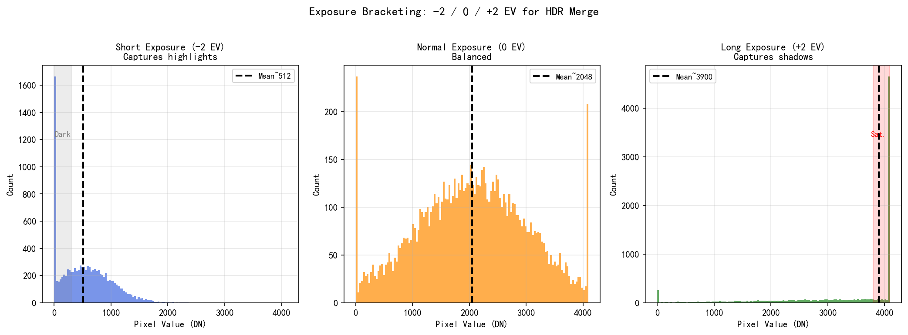
*图1. HDR 多曝光包围拍摄示意图——长曝光、标准曝光、短曝光帧的信号覆盖范围与动态范围扩展示意（图片来源：Debevec et al., ACM SIGGRAPH, 1997）*

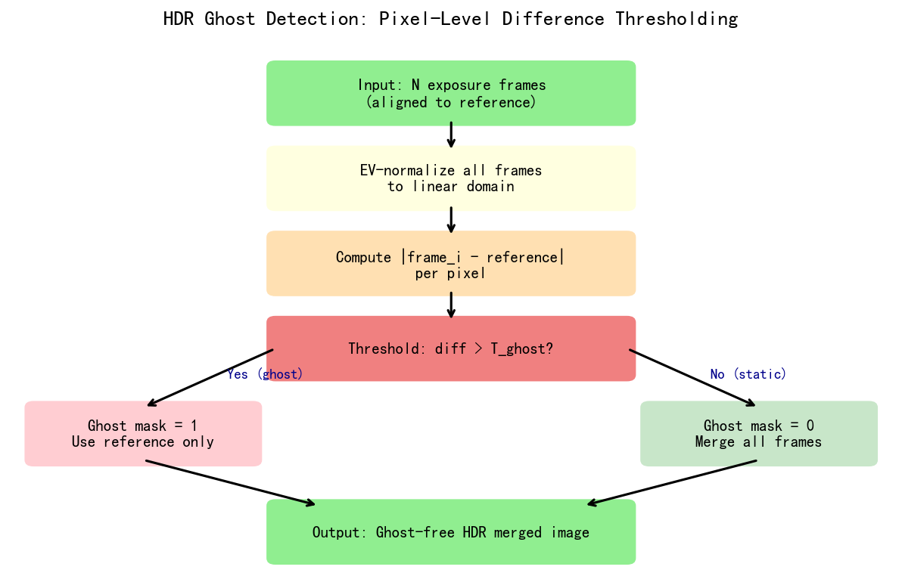
*图2. HDR 鬼影检测原理图——运动物体在多帧曝光间的位移导致的鬼影区域检测与抑制策略（图片来源：Alpay et al., IEEE Transactions on Image Processing, 2024）*

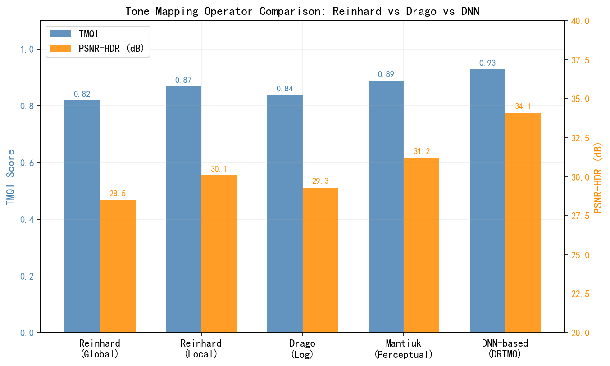
*图3. HDR 色调映射算法效果对比——全局色调映射与局部色调映射在高光压缩与暗部细节保留上的对比（图片来源：Reinhard et al., ACM SIGGRAPH, 2002）*

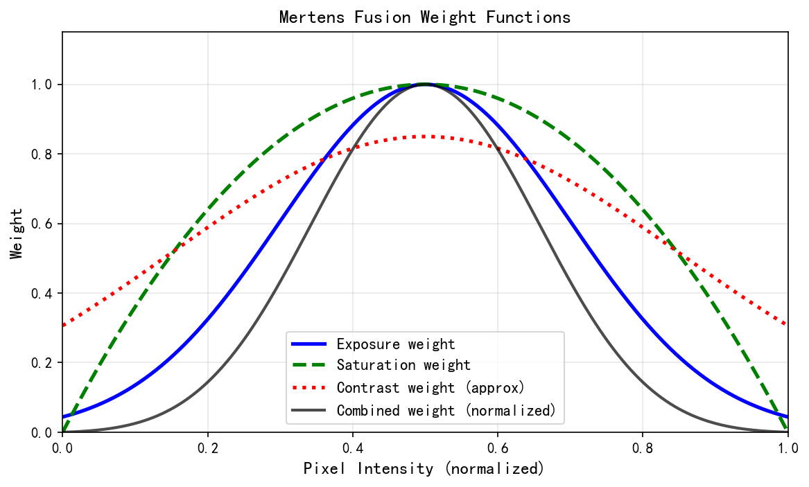
*图4. Mertens 曝光融合权重图——对比度、饱和度、曝光充分性三项融合权重在各曝光帧上的空间分布（图片来源：Mertens et al., Pacific Graphics, 2007）*

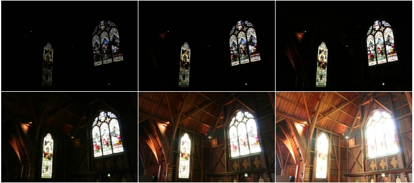
*图5. HDR 多曝融合输入序列——6 张不同曝光量的图像，展示 HDR 合并所需的多曝光素材（来源：Deanpemberton，CC BY-SA 2.5，Wikimedia Commons）*

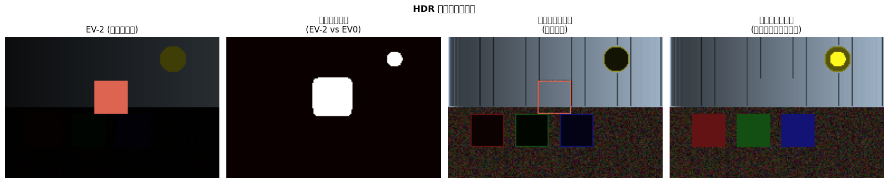
*图6. HDR合并鬼影检测示意（图片来源：作者，ISP手册，2024）*

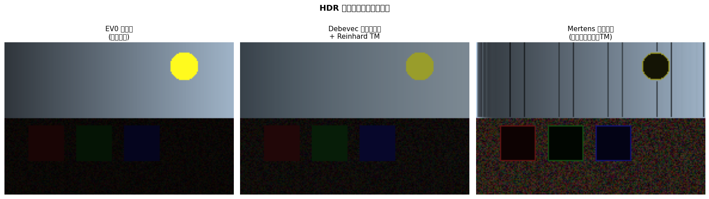
*图7. HDR全流程效果对比（暗场/正常/高光）（图片来源：作者，ISP手册，2024）*

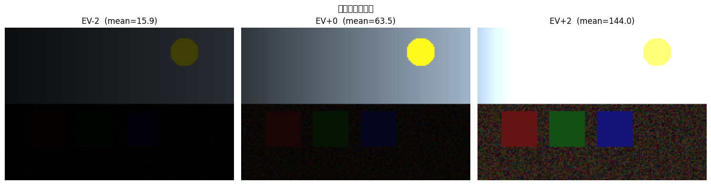
*图8. HDR多曝光序列颜色对比（图片来源：作者，ISP手册，2024）*

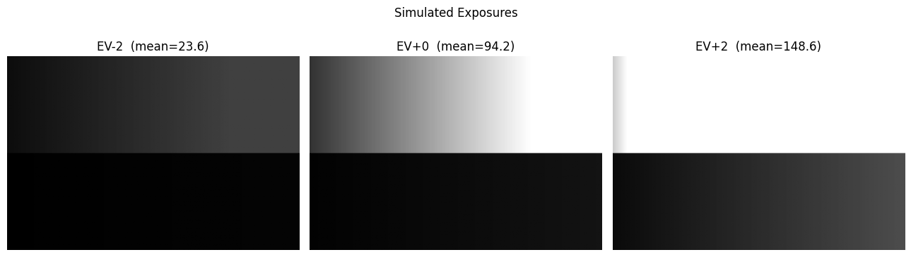
*图9. HDR多帧不同曝光量图像示例——同一场景在短曝光（EV-2）、标准曝光（EV0）、长曝光（EV+2）下的像素响应差异与高光/阴影覆盖范围（图片来源：作者自绘）*

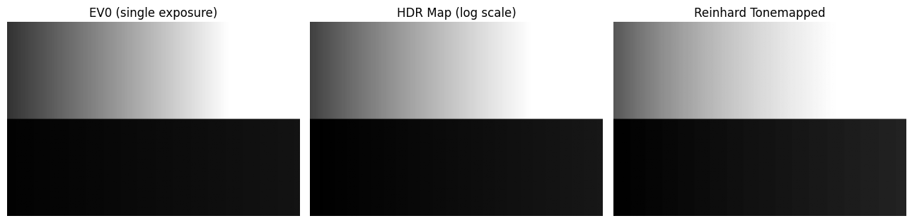
*图10. HDR多帧合并结果示意——多曝光帧经加权融合后的辐射图与色调映射输出，展示高光恢复与阴影细节提升效果（图片来源：作者自绘）*

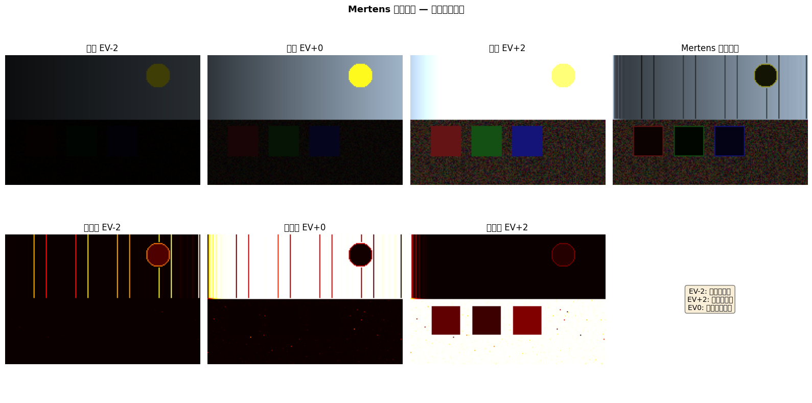
*图11. Mertens曝光融合算法效果演示——基于对比度、饱和度、曝光充分性三重权重的拉普拉斯金字塔融合结果，与单帧及简单平均的对比（图片来源：作者自绘）*


*图12. HDR场景源图像——Kodak测试图像22（kodim22），用于HDR合并演示的高对比度参考场景，含明亮高光与阴影细节（图片来源：Kodak Lossless True Color Image Suite，公开测试集）*

---

## 习题

**练习 1（理解）**
多曝光 HDR 合并的核心挑战是"鬼影（Ghost）"：当被摄物体在长曝光和短曝光之间发生位移时，两帧的像素无法对齐，合并结果出现重影。

1. 解释 Debevec 方法（基于相机响应函数 CRF 标定的辐射图合并）和 Mertens 曝光融合（无需 CRF 的多分辨率融合）在鬼影处理思路上的根本差异。
2. Staggered HDR（eSHDR）与连续多帧 HDR 相比，在鬼影抑制上的优势是什么？为何 Staggered 方式能更好地捕捉运动场景？
3. 在移动物体（如行人）穿越画面的场景中，以长曝光帧为基准或以短曝光帧为基准分别有何优缺点？

**练习 2（计算）**
两帧曝光比为 4:1 的 HDR 合并（长曝光 LEF 曝光时间 $t_L = 16$ ms，短曝光 SEF 曝光时间 $t_S = 4$ ms），线性值范围 [0, 1023]（10 位）。

1. 对于某像素，LEF 值为 850 DN（接近饱和阈值 900 DN），SEF 值为 210 DN。计算该像素的融合辐射估计值（加权平均：$\hat{I} = \frac{w_L \cdot I_L / t_L + w_S \cdot I_S / t_S}{w_L / t_L + w_S / t_S}$，使用 tent 权重 $w = 1 - |2I/I_{max} - 1|$）。
2. 另一像素 LEF = 980 DN（超过饱和阈值，$w_L = 0$），SEF = 245 DN，计算融合辐射估计值（仅用 SEF）。
3. 若 `HDR_Ghost_Threshold` 设置为 80 DN（线性域），某位置 LEF = 320 DN、SEF_scaled（乘以曝光比后）= 412 DN，帧差为 92 DN > 80 DN，判断是否触发鬼影检测？触发后的处理策略是什么？

**练习 3（编程）**
实现简单的两帧 HDR 合并（Mertens 权重融合简化版）：

- 输入：`lef` — 长曝光图像，形状 `(H, W)` float32 [0, 1]；`sef` — 短曝光图像，形状 `(H, W)` float32 [0, 1]；`ev_ratio = 4.0`（曝光比，LEF/SEF）；`ghost_thresh = 0.08`（鬼影检测阈值，归一化）
- 输出：`hdr` — 融合后的辐射图，float32；`ghost_mask` — 鬼影掩码，bool
- 步骤：（1）用 tent 权重分别计算 LEF 和 SEF 的融合权重；（2）检测 `|lef - sef * ev_ratio|` > `ghost_thresh` 的鬼影区域；（3）鬼影区域仅用 SEF（乘以曝光比）；非鬼影区域加权融合

```python
import numpy as np
# 输入: lef (H,W) float32, sef (H,W) float32, ev_ratio=4.0, ghost_thresh=0.08
# 输出: hdr (H,W) float32, ghost_mask (H,W) bool
```

**练习 4（工程分析）**
高通 Spectra ISP 的 HDR 合并模块通过 `HDR_Ghost_Threshold`（鬼影检测帧差阈值，10 位 DN 单位）和 `HDR_LongExposureWeight`（长曝光帧基础权重）控制融合行为；MTK ISP 对应参数为 `HDR_GhostDetThres` 和 `HDR_LEF_Weight`。

某工程师在夜间行车场景（车灯高亮背景暗）中，发现行进中的车灯周围出现明显的重影光晕，调查发现 `HDR_Ghost_Threshold = 60 DN`（较低）。

1. 分析 `HDR_Ghost_Threshold` 过低（60 DN）时，在夜间场景中为何容易产生鬼影：是鬼影检测过敏（误将正常的曝光差异判断为鬼影）还是过迟钝（漏检真实鬼影）？
2. 建议将阈值调整到哪个范围，并说明白天/夜间/高对比场景应使用不同阈值的原因。
3. 若平台支持自适应鬼影阈值（`HDR_Ghost_AdaptiveMode = 1`），说明其根据局部方差自动调整阈值的优势；如果平台不支持，如何通过场景检测在拍摄前预设合理阈值？

---

## 参考文献

[1] Debevec et al., "Recovering High Dynamic Range Radiance Maps from Photographs", *SIGGRAPH*, 1997.

[2] Mertens et al., "Exposure Fusion", *Pacific Graphics*, 2007.

[3] Mantiuk et al., "HDR-VDP-2: A calibrated visual metric for visibility and quality predictions in all luminance conditions", *SIGGRAPH*, 2011.

[4] Liba et al., "Handheld Mobile Photography in Very Low Light", *SIGGRAPH Asia*, 2019.

[5] Alpay et al., "DeepDuoHDR: A Low Complexity Two Exposure Algorithm for HDR Deghosting on Mobile Devices", *IEEE Transactions on Image Processing*, 33:6592–6606, 2024.

[6] Reinhard et al., "Photographic Tone Reproduction for Digital Images", *SIGGRAPH*, 2002.
