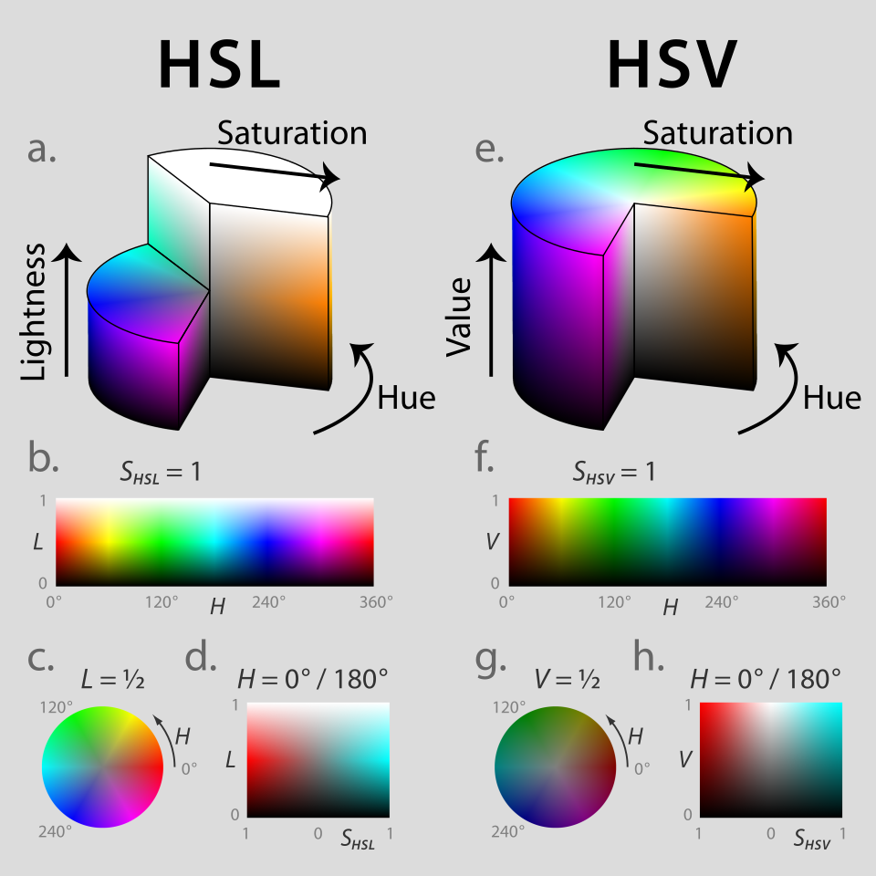
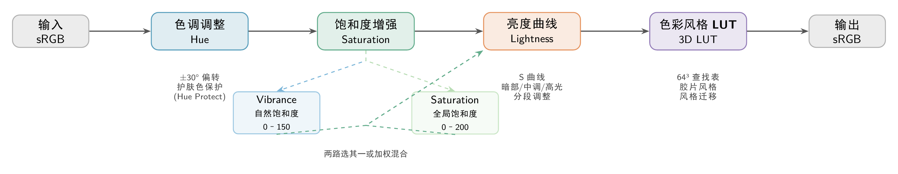
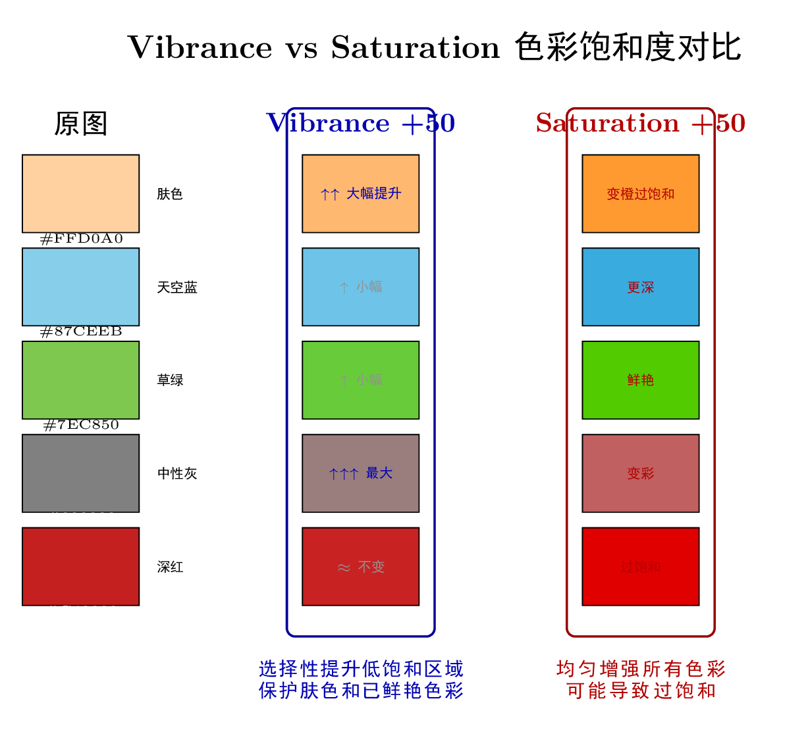
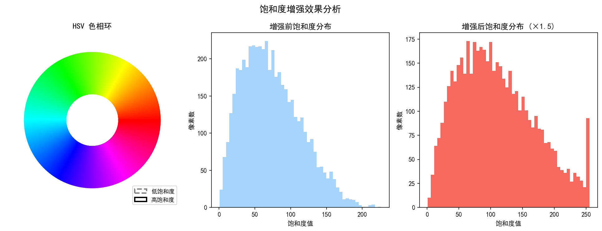
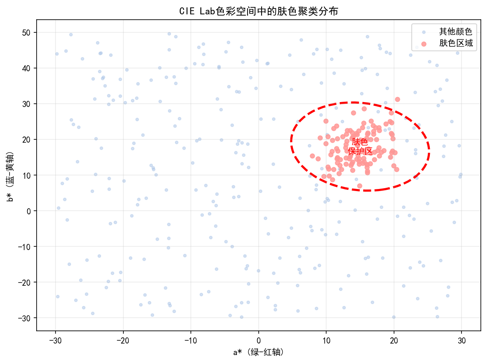
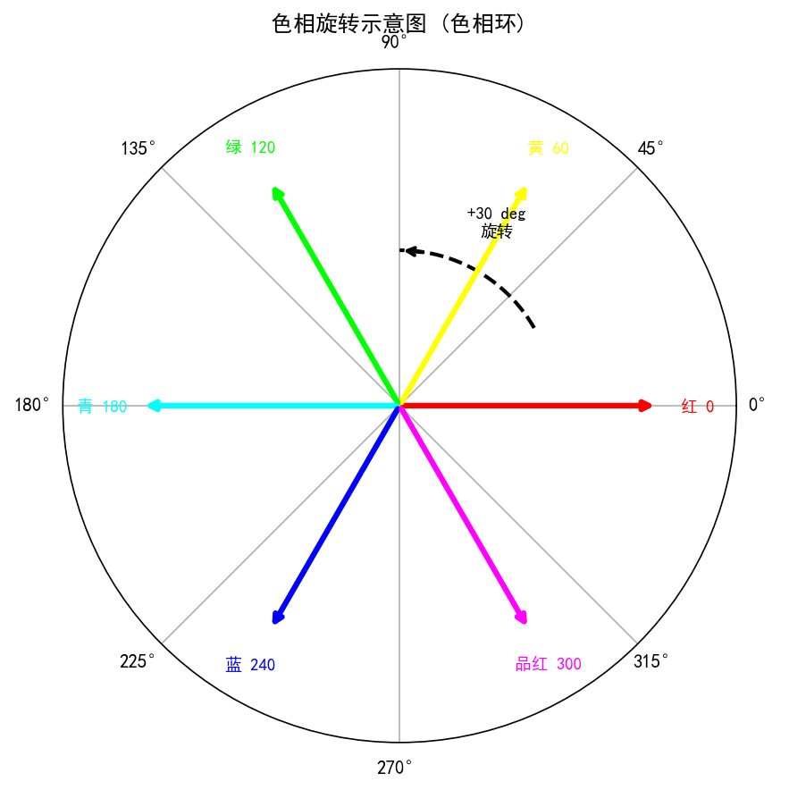
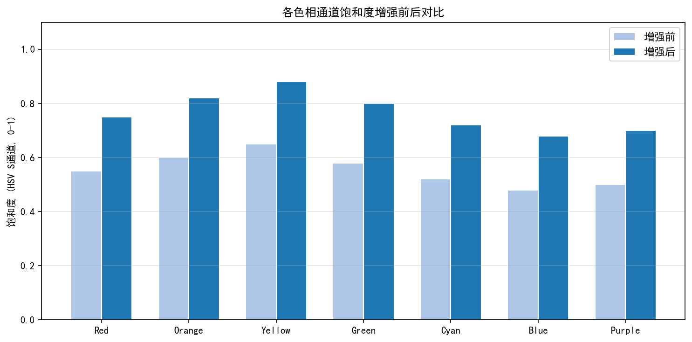
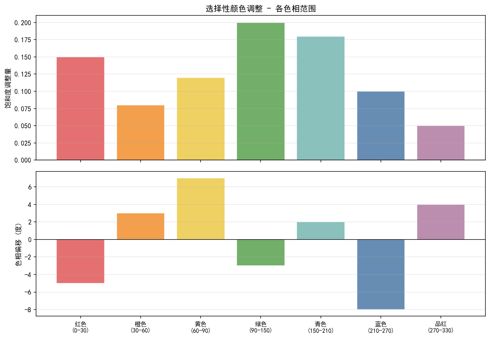

# 第二卷第11章：色彩增强与饱和度调节

> **流水线位置（Pipeline position）：** CCM 和 Gamma 之后、CSC 输出之前；是"准确"到"好看"的最后一道处理
>
> **前置章节（Prerequisites）：** 第二卷第06章（CCM）、第二卷第07章（Gamma 与色调映射）、第一卷第05章（色彩科学基础）
>
> **读者路径（Reader path）：** 算法工程师、调参工程师

---

## §1 原理 (Theory)

### 1.1 色彩空间基础

色彩增强在 AWB 和 CCM 之后执行——前两步保证了颜色的准确性，色彩增强在准确性基础上往"好看"或"风格"方向推一把。

色彩模型的选择决定了能操作什么、代价是什么：

**RGB 模型** 是设备原生色彩空间，三通道耦合，改一个通道会同时影响色相和饱和度，很难做"只提蓝天饱和度"这类精细调整。

**HSL / HSV 模型** 把色彩解耦为色相、饱和度和亮度/明度，做色相旋转和全局饱和度缩放直观方便。但 HSV/HSL 的饱和度定义和 YCbCr 的色度不完全等价，在高精度场景下要留意两者的转换损耗。

**YCbCr 模型** 亮色解耦，是 ISP 色彩增强的主操作空间——硬件实现只需乘法和加法，对 Cb/Cr 缩放就等于改饱和度，计算效率最高。

从 RGB 到 YCbCr 的转换（BT.601 标准）**[8]**：

$$
\begin{bmatrix} Y \\ Cb \\ Cr \end{bmatrix}
=
\begin{bmatrix} 0.299000 & 0.587000 & 0.114000 \\ -0.168736 & -0.331264 & 0.500000 \\ 0.500000 & -0.418688 & -0.081312 \end{bmatrix}
\begin{bmatrix} R \\ G \\ B \end{bmatrix}
+
\begin{bmatrix} 0 \\ 128 \\ 128 \end{bmatrix}
$$

### 1.2 色相旋转原理

色相旋转（Hue Rotation）是在极坐标色度空间中对色相角度进行偏移的操作。在 YCbCr 空间中，$Cb$-$Cr$ 平面即为色度平面，色相角为：

$$
H = \arctan2(Cr - 128,\ Cb - 128)
$$

色相旋转矩阵（旋转角 $\theta$）：

$$
\begin{bmatrix} Cb' \\ Cr' \end{bmatrix}
=
\begin{bmatrix} \cos\theta & -\sin\theta \\ \sin\theta & \cos\theta \end{bmatrix}
\begin{bmatrix} Cb - 128 \\ Cr - 128 \end{bmatrix}
+
\begin{bmatrix} 128 \\ 128 \end{bmatrix}
$$

其中旋转方向取决于色相角定义：以 $H = \arctan2(Cr-128, Cb-128)$ 为色相角，$\theta > 0$ 对应逆时针旋转（色相角增大，从红/橙方向转向蓝/洋红方向），$\theta < 0$ 对应顺时针旋转（色相角减小，向绿/黄方向移动）。注意这与 HSV 色轮的视觉方向约定不同，调参时应以实际渲染结果为准，而非靠符号直觉判断。

### 1.3 色度增强（Chroma Enhancement）

色度增强通过对 YCbCr 空间中的 $Cb$、$Cr$ 分量乘以增益系数来提升饱和度：

$$
Cb' = 128 + k_{Cb} \cdot (Cb - 128)
$$

$$
Cr' = 128 + k_{Cr} \cdot (Cr - 128)
$$

当 $k_{Cb} = k_{Cr} = k$ 时，等效于全局饱和度缩放：

$$
S' = k \cdot S
$$

其中 $k > 1$ 增加饱和度，$k < 1$ 降低饱和度，$k = 0$ 将图像转为灰度。

也可以对 R、G、B 通道各自进行独立的饱和度控制，通过在 RGB 空间中对各通道与亮度值之差做缩放实现：

$$
R' = Y + k_R \cdot (R - Y)
$$

$$
G' = Y + k_G \cdot (G - Y)
$$

$$
B' = Y + k_B \cdot (B - Y)
$$

### 1.4 全局饱和度乘数

全局饱和度乘数是最粗粒度的调节——直接对所有像素的 $S$ 分量乘以系数：

$$
S'_{\text{HSV}} = \text{clip}(k_s \cdot S_{\text{HSV}},\ 0,\ 1)
$$

粗归粗，实际效果差别巨大：$k_s = 1.0$ 和 $k_s = 1.2$ 在风景大片上几乎天壤之别，但同一个 $k_s = 1.2$ 放在人像脸部会把肤色推成橙红色。所以全局乘数必须配合肤色保护，单独使用危险。

- **自然模式**：$k_s \in [0.8, 1.0]$，色彩接近真实，适合追求准确性的场景
- **鲜艳模式**：$k_s \in [1.1, 1.3]$，色彩更抓眼，适合风景和社交媒体分享

### 1.4b 鲜明度（Vibrance）与饱和度（Saturation）的区别

**Vibrance（鲜明度）** 是 Adobe Photoshop/Lightroom 提出、现已成为消费级相机和手机算法中的常用概念，与全局饱和度乘数的核心差异在于：

| 特性 | 全局饱和度 (Saturation) | 鲜明度 (Vibrance) |
|------|------------------------|------------------|
| 对低饱和色 | 均匀提升 | 大幅提升 |
| 对高饱和色 | 均匀提升（易过饱和） | 少量提升（防止溢出） |
| 肤色保护 | 无（需额外机制） | 内置保护：肤色色相范围内自动降低增益 |
| 典型用途 | 精确调色 | 一键"更好看"的消费级美化 |

**Vibrance 的工程实现原理：** 饱和度增益系数随当前像素饱和度 $S$ 单调递减——$S$ 越高，增益越小；$S$ 接近 0 时增益最大：

$$
k_{\text{vibrance}}(S) = k_{\text{base}} \cdot (1 - \alpha \cdot S)
$$

其中 $\alpha \in [0.5, 0.9]$ 控制保护强度。同时，HSL 色相落在肤色区间（约 **5°–35°**，即 HSL 色轮上橙红/肉色段）的像素，增益进一步压缩为 $k_{\text{skin}}$，防止肤色被推成橙红。

### 1.5 肤色保护

肤色（Skin Tone）的色度分布集中在 YCbCr 的 $Cb \in [77,127]$、$Cr \in [133,173]$ 窄带内，在 HSL 色轮上对应约 **5°–35°**（橙红/肉色色相段，涵盖浅肤色至深肤色），饱和度系数 $k_s$ 每提升 0.1 即可使该区域的 ΔE₀₀ 增大约 0.5–1.0，因此在鲜艳模式下必须对肤色区域单独压制增益。肤色保护机制通过检测肤色区域并对其施加更低的饱和度增益来实现：

> **肤色检测的双重判据：** 工程实现中通常同时使用 YCbCr 范围（硬件友好，一次通道比较）和 HSL 色相范围（5°–35°，覆盖不同肤色）。HSL 方法在极端曝光场景下更鲁棒（因 YCbCr 的 Cb/Cr 范围会随亮度 Y 变化漂移），两者可互为补充，或以 YCbCr 粗筛 + HSL 精修的方式级联使用。

**肤色区域检测**（在 YCbCr 空间中）：

$$
\text{isSkin} = \begin{cases} 1, & \text{if } 77 \leq Y \leq 235 \\
& \text{and } 77 \leq Cb \leq 127 \\
& \text{and } 133 \leq Cr \leq 173 \end{cases}
$$

对肤色像素施加保护增益 $k_{\text{skin}} < k_s$，实现分区域饱和度控制：

$$
k_{\text{effective}} = \begin{cases} k_{\text{skin}} & \text{if isSkin} \\ k_s & \text{otherwise} \end{cases}
$$

更精细的实现采用软掩模（Soft Mask）过渡，避免肤色边界出现突变：

$$
k_{\text{effective}} = k_s \cdot (1 - w_{\text{skin}}) + k_{\text{skin}} \cdot w_{\text{skin}}
$$

其中 $w_{\text{skin}} \in [0, 1]$ 为根据像素距肤色中心距离计算的权重。

### 1.6 六轴色相控制（6-Axis Hue Control）

六轴色相控制（6-Axis Hue/Color Control）对六个主要色域——红（R）、黄（Y）、绿（G）、青（C）、蓝（B）、洋红（M）——分别提供独立的色相偏移（$\Delta H$）、饱和度缩放（$\Delta S$）和亮度偏移（$\Delta L$）调节，是专业相机和高端 ISP 的标配功能。

对于某像素，其色相 $H$ 所属分区 $i$ 的混合权重为：

$$
w_i(H) = \max\left(0,\ 1 - \frac{|H - H_i|}{60°}\right)
$$

最终调节量为各轴贡献的加权和：

$$
\Delta H_{\text{total}} = \sum_{i \in \{R,Y,G,C,B,M\}} w_i(H) \cdot \Delta H_i
$$

$$
\Delta S_{\text{total}} = \sum_{i} w_i(H) \cdot \Delta S_i
$$

### 1.7 基于亮度的局部色彩增强

局部色彩增强（Local Color Enhancement）通过亮度依赖的饱和度曲线（Luminance-Dependent Saturation Curve）实现：在高光区域降低饱和度（防止过曝区域色彩失真），在中间调提升饱和度，在暗部适度增强：

$$
k_s(Y) = k_{\text{base}} \cdot f_{\text{luma}}(Y)
$$

其中 $f_{\text{luma}}(Y)$ 为分段线性或样条曲线，典型形态为：
- $Y < 32$（暗部）：$f \approx 0.9$，轻微降低以避免暗部色彩噪声放大
- $Y \in [32, 200]$（中间调）：$f \approx 1.0 \sim 1.15$，适度增强
- $Y > 200$（高光）：$f$ 逐渐降至 $0.7$，保护高光细节

### 1.8 3D LUT 色彩增强（现代手机主流方案）

3D LUT（3-Dimensional Look-Up Table）是当前高端手机 ISP（高通 Spectra 480+、联发科 Imagiq 985+、苹果 ISP A15+）进行色彩增强的主流实现方式，相较于 §1.6 的六轴控制更具表达能力。

**基本原理**

3D LUT 在 RGB（或 HSV）三维色彩空间中建立从输入颜色到输出颜色的稠密映射，将颜色空间划分为 $N \times N \times N$ 个网格节点（手机 ISP 典型 $N = 17$ 或 $N = 33$），每个节点存储目标输出颜色值：

$$
\text{Output}(R, G, B) = \text{LUT3D}[i, j, k] \cdot w_{ijk}
$$

其中 $(i, j, k)$ 为三线性插值的相邻节点索引，$w_{ijk}$ 为对应权重。

**相对于六轴控制的优势**：
- 可表达任意非线性色彩映射，涵盖局部色彩偏移（如特定色相段的联动饱和度+亮度变化）。
- 风格化色调（电影色调、胶片模拟）的标准交付格式，兼容 Lightroom/DaVinci Resolve LUT 工作流。
- 肤色保护直接编码在 LUT 中（肤色区域节点低饱和度增益），无需独立掩模计算。

**内存与精度**：17³×3×10bit ≈ 44KB，33³×3×10bit ≈ 330KB；移动端 ISP 通常采用 17³ 以节省带宽，通过三线性插值保证全色域精度。

> **工程进展（2022–2024）**：近期研究提出了**可学习 3D LUT**方案，在现有硬件 LUT 框架内引入 AI 调优：Zeng et al. (IEEE TPAMI 2022) **[11]** 提出图像自适应 3D LUT，网络以当前帧内容为输入，动态调整节点值，在标准 LUT 框架内实现场景自适应色彩增强，延迟 < 5 ms（骁龙 8 Gen 2 CPU 端，单次推理）；TransLUT (CVPR 2023) **[10]** 则通过 Transformer 模块提升 17³ LUT 的等效精度。这类方案的工程价值在于：无需修改 ISP 硬件，只需在标定环节以 AI 替代手工调参，输出仍是标准 LUT 格式，与高通 Chromatix 和联发科 NDD 调参工具链完全兼容。

> **2023–2024 进展（CLIP 引导与风格迁移方向）**：学术界在"无参考色彩增强"方向出现两类新路线。（1）**CLIP 引导色彩增强**：以文本提示（如"cinematic warm tone"）通过 CLIP 视觉-语言模型指导 LUT 节点优化，代表工作包括 CLIPstyler (CVPR 2022) 及其后续变体，可实现用户以自然语言描述目标色调后自动生成 ISP LUT，研究阶段 ΔE₀₀ 约 4–6（相较固定 LUT 约 8）。（2）**无配对风格迁移（Neural Schrödinger Bridge / NeST 类方法）**：Kim et al. (ICLR 2024) **[12]** 通过神经薛定谔桥实现无配对图像色彩风格迁移，无需源域-目标域配对训练数据；在 ISP 场景下，该方向适用于从用户喜好样张自动学习色彩偏好并迁移至新场景，优势在于无需 ColorChecker 标定，但延迟较高（> 50 ms），目前仍属研究阶段，尚未见手机 ISP 量产落地报道。**工程立场**：上述两类方法的共同限制是推理延迟显著高于固定 LUT（通常需要 GPU/NPU 且不低于 20 ms），适合后处理 App 或相机预览滤镜场景，不适合实时 RAW-to-YUV 主流水线。现阶段手机 ISP 工程落地仍以可学习 3D LUT（Zeng TPAMI 2022 路线）为主。

**与 1D LUT（Tone Curve）的层级关系**：
- 色调曲线（Tone Curve，1D LUT on Y/R/G/B）：逐通道亮度非线性映射，在 3D LUT 之前执行，处理 Gamma/HDR 压缩。
- 3D LUT：处理颜色之间的耦合映射，实现风格化色彩。
- 饱和度/六轴控制：在 3D LUT 之后做轻量微调，用于场景自适应实时调整。

**调参流程**：
1. 在 Lightroom 或 X-Rite i1Profiler 中，基于 ColorChecker 拍摄建立设备特征化（Device Characterization）。
2. 设计目标色域（Target Gamut）——自然模式接近 D65/sRGB 准确再现；鲜艳模式在 HSV 空间的高饱和度区域适度扩展。
3. 导出 `.cube` 格式 3D LUT，经 ISP 工具链转换为平台内部格式（高通 CTT 的 `color3dlut.h`，联发科 MiraVision Studio 的 `3DLUT_table.xml`）。
4. 验证肤色节点：确认 3D LUT 在肤色区（$C_b \in [77,127]$，$C_r \in [133,173]$）的输出饱和度增益 $\leq 1.0$。

### 1.9 鲜艳模式与自然模式的权衡

| 特性 | 自然模式 | 鲜艳模式 |
|------|----------|----------|
| 饱和度系数 $k_s$ | 0.85 ~ 1.0 | 1.1 ~ 1.3 |
| 肤色保护 | 强 | 中等 |
| 色彩准确性 ΔE₀₀ | < 3.0 | 3.0 ~ 6.0 |
| 视觉冲击力 | 低 | 高 |
| 适用场景 | 专业摄影、人像 | 风景、社交媒体 |

> **工程推荐（手机ISP场景）：** 鲜艳模式是手机摄影的主流默认值，但肤色保护必须是硬性约束而非可选功能。如果只能选一件事来做好，选肤色保护——风景失真用户大多不会察觉，但人像脸色偏橙会立刻引发投诉。实际上调参时先把肤色 ΔE₀₀ 压到 < 2.0（量产规范：肤色最严，均值 < 3.0，最大值 < 6.0），再在剩余余量里尽量提 $k_s$，比固定 $k_s$ 然后挑保护参数稳健得多。

---

## §2 标定 (Calibration)

### 2.1 标定目标与流程

标定的核心是回答两个问题：ΔE₀₀ 打到什么水平算及格？肤色保护的边界在哪里？其余参数都在这两个约束之内调。

**步骤一：色彩精度基准**

用 X-Rite ColorChecker Classic（24 色卡）在 D65 标准光源下拍摄，不同饱和度参数下各拍一次，提取各色块 Lab 值与标准参考值比较，得到 ΔE₀₀ 基准曲线。这一步的关键是 AWB 必须固定在手动 D65——自动白平衡每帧都在动，会把标定数据搅乱。

**步骤二：肤色中心确定**

在多种肤色人群（Fitzpatrick I-VI 型）的实际拍摄中，统计 YCbCr 空间的肤色聚类中心，确定肤色保护区域的边界参数 $(Cb_{\min}, Cb_{\max}, Cr_{\min}, Cr_{\max})$。

**步骤三：六轴参数标定**

针对标准色卡的六个色域轴，分别微调 $\Delta H_i$、$\Delta S_i$，使各色域的 ΔE₀₀ 最小化，同时保持视觉上的美观性。

**步骤四：亮度依赖曲线标定**

在不同曝光条件下（EV-2 至 EV+2）拍摄同一场景，调整 $f_{\text{luma}}(Y)$ 曲线，确保高光区域不出现色彩饱和溢出。

### 2.2 标定设备与环境

| 设备/条件 | 规格要求 |
|-----------|----------|
| 色卡 | X-Rite ColorChecker Classic 或 Passport |
| 光源 | D65（6500K），CRI > 95  |
| 测量仪器 | 分光光度计（如 X-Rite i1Pro）|
| 软件 | ArgyllCMS / MATLAB / Python colormath |
| 环境亮度 | 暗室，避免环境光干扰 |

### 2.3 白平衡与色彩增强的解耦

标定时须确保白平衡（AWB）已固定（使用手动白平衡 D65），以隔离色彩增强模块的效果，避免 AWB 动态调整干扰标定结果。

---

## §3 调参 (Tuning)

### 3.1 参数体系总览

色彩增强模块的参数通常按以下层级组织：

```
ColorEnhancement
├── GlobalSaturation         # 全局饱和度乘数 [0.5, 2.0]
├── SkinProtection
│   ├── Enable               # 肤色保护开关
│   ├── SkinSatGain          # 肤色区域饱和度增益 [0.7, 1.0]
│   └── SkinMaskSoftness     # 软掩模过渡宽度 [0, 1]
├── 6AxisControl
│   ├── R/Y/G/C/B/M_HueShift # 各轴色相偏移 [-30°, +30°]
│   ├── R/Y/G/C/B/M_SatGain  # 各轴饱和度增益 [0.5, 2.0]
│   └── R/Y/G/C/B/M_LumGain  # 各轴亮度增益 [0.8, 1.2]
└── LumaSatCurve             # 亮度依赖饱和度曲线（16点LUT）
```

### 3.2 全局饱和度调参步骤

1. **基准拍摄**：以 $k_s = 1.0$ 拍摄 ColorChecker，记录各色块 ΔE₀₀。
2. **鲜艳度主观评估**：邀请 5 名以上评估员对 $k_s = 0.9, 1.0, 1.1, 1.2, 1.3$ 的样图进行 MOS（Mean Opinion Score）评分。
3. **模式分离**：自然模式锁定 $k_s \in [0.85, 1.0]$，鲜艳模式锁定 $k_s \in [1.1, 1.25]$。
4. **极限测试**：在高饱和场景（红花、蓝天）下检查是否出现色彩截断（Clipping）。

### 3.3 肤色保护调参步骤

1. 准备多个肤色参考图（不同种族、不同光照）。
2. 逐步提高 $k_s$，观察肤色偏移程度，确定 $k_{\text{skin}}$ 的上限。
3. 调整软掩模宽度，避免肤色与背景边界出现可见分割线。
4. 使用 ΔE₀₀ 量化肤色偏差，目标：肤色区域 ΔE₀₀ < 2.0（相对于真实肤色标准值；量产规范：均值 < 3.0，最大值 < 6.0，肤色 < 2.0）。

### 3.4 六轴色相调参建议

| 色轴 | 常见调整方向 | 典型偏移量 |
|------|-------------|-----------|
| R（红） | 向橙方向微调（+$\Delta H$）可使红色更鲜明 | +2° ~ +5° |
| Y（黄） | 保持中性，避免草黄/金黄偏移 | ±2° |
| G（绿） | 向青方向调整可提升植物色彩 | -3° ~ 0° |
| C（青） | 天空色彩调整，向蓝调整增加通透感 | -5° ~ 0° |
| B（蓝） | 向青方向微调可提升蓝天纯净感 | +2° ~ +5° |
| M（洋红） | 通常保持中性 | ±2° |

### 3.5 不同场景的推荐参数组合

**人像场景**：
- $k_s = 0.95$，肤色保护强（$k_{\text{skin}} = 0.85$）
- Y 轴：$\Delta S_Y = -0.05$（防止黄色肤色过于饱和）

**风景场景**：
- $k_s = 1.15$，G 轴 $\Delta S_G = +0.1$，C/B 轴 $\Delta S_{C,B} = +0.08$
- 蓝天增强：B 轴 $\Delta H_B = +3°$

**夜景场景**：
- $k_s = 1.2$（补偿低照度下的饱和度损失）
- 亮度依赖曲线：暗部 $f(Y < 50) = 1.1$

### 3.6 Vibrance（自然饱和度）与 Saturation（全局饱和度）的联动机制

**工程联动缺口：** 章节前半部分介绍了全局饱和度乘数，但实际平台上 Vibrance（自然饱和度）和 Saturation 是两个相互独立的模块，同时开启时会产生叠加效应，需要理解其触发顺序和作用范围。

**Vibrance vs. Saturation 的本质区别：**

全局 Saturation（`CE_SaturationFactor` / `global_saturation`）对**所有像素**的 Cb/Cr 分量等比放大，不管当前像素是否已经高度饱和。Vibrance（自然饱和度，高通叫 `ColorBoost_Vibrance_Enable`，MTK 叫 `CE_Adaptive_Saturation`）的逻辑是**只提升当前饱和度低的颜色**，对已经高饱和的像素自动压制提升幅度：

$$
k_{\text{vibrance}}(S) = k_{\text{max}} \cdot \max\left(0,\ 1 - \frac{S}{S_{\text{sat\_threshold}}}\right)
$$

其中 $S_{\text{sat\_threshold}}$ 通常设为 0.6~0.7（HSV 归一化）。效果：蓝天、草地（本就高饱和）几乎不受影响，灰色物体、阴影区域（低饱和）被显著提升，肤色（中等饱和，约 0.3~0.5）只被轻微提升。

**高通平台的触发顺序（Spectra ISP）：**

在 Chromatix 参数执行顺序中，`ColorBoost_Vibrance` 先于 `CE_SaturationFactor` 执行——Vibrance 先做自适应提升，随后全局 Saturation 乘数再统一作用于已提升后的饱和度值。这意味着：
- 如果 Vibrance 已将低饱和区域从 0.3 提升到 0.5，后续 `global_saturation = 1.2` 会再乘 1.2，最终达到 0.6；
- 而高饱和区域（如肤色 0.45）在 Vibrance 阶段几乎未变，但 `global_saturation = 1.2` 仍会推到 0.54。

**风险：** 当 `ColorBoost_Vibrance_Enable = 1` 且 `global_saturation > 1.1` 同时开启时，低饱和区域会被双重提升（Vibrance 一次 + Saturation 一次），高饱和区域只被 Saturation 提升一次。结果是颜色对比度拉大，中间调饱和度显著跳升，可能导致部分肤色推到橙红边界。**工程推荐：开启 Vibrance 时，全局 Saturation 应降至 1.0～1.05，不再堆叠；或者只用 Vibrance 而不开全局 Saturation。**

**MTK `CE_Adaptive_Saturation` 的工作范围：**

MTK 的 `CE_Adaptive_Saturation` 作用于**全图像素**（而非分区），权重函数基于像素当前的 HSV 饱和度 S 值，通过 `CE_Adaptive_Sat_Gain_LUT[16]`（16点 LUT，S 值 0→1 对应索引 0→15）实现逐级衰减：S 低的像素获得更高增益，S 高的像素接近增益 1.0。该 LUT 可独立标定，不受全局 Saturation 参数影响。两者的执行顺序在 MTK 调参文档中明确为：`CE_Adaptive_Saturation` → `SaturationFactor`，与高通顺序一致。

**肤色区域的饱和度抑制（高通 SCE 模块联动）：**

高通 ISP 中有独立的 SCE（Skin Color Enhancement）模块，运行在 CE（Color Enhancement）模块**之后**，专门对肤色区域的色相（H）和饱和度（S）做最终修正。SCE 的肤色范围定义在 HSV/YCbCr 混合域——默认肤色区位于 H ∈ [0°, 30°]（含橙红到橙黄），S ∈ [0.2, 0.9]，超出此范围的像素不受 SCE 作用。关键参数是 `SCE_Cr_offset` 和 `SCE_Cb_offset`（色相偏移量），以及 `SCE_SatReductionGain`（肤色区饱和度压制系数，典型 0.85~0.95）。

实际调参联动规则：**先设 CE 的全局饱和度，再用 SCE 的 `SCE_SatReductionGain` 把肤色区推高的饱和度拉回来。** 如果直接靠 `skin_saturation_adj` 的 YCbCr 椭圆掩模来限制，而没有 SCE 参与，在强鲜艳模式下肤色仍然容易超出 ΔE₀₀ < 3.0 的目标。

---

### 3.7 主流平台色彩增强参数对比

不同 SoC 平台对色彩增强模块的参数命名和组织方式存在差异，以下为高通/联发科/海思三平台的典型对比：

| 特性 | 高通（Snapdragon / CamX） | 联发科（Dimensity / Imagiq） | 海思（Kirin / ISP5.0+） |
|------|--------------------------|------------------------------|------------------------|
| **参数文件** | `chromatix_color_conversion.h` → `color_adjust` 结构 | `isp_color_params.xml` | `isp_color_enhance_param.h` |
| **全局饱和度** | `global_saturation` [0.0, 2.0]，Q8 定点 | `SaturationFactor` [−128, 127] 有符号 | `SatGain` Q10 定点 [0, 1023] |
| **自然饱和度（Vibrance）** | `ColorBoost_Vibrance_Enable` + `CE_VibStrength`（Spectra 480+）| `CE_Adaptive_Saturation`（NDD），`CE_Adaptive_Sat_Gain_LUT[16]` | `SatAdaptiveEnable` + `SatAdaptiveGainTable` |
| **六轴色相控制** | `hue_sat[6].hue_offset` (±30°) / `hue_sat[6].sat_ratio` | `HSLControl[6].HueDelta` / `SatScale` | `AxisHueShift[6]` + `AxisSatGain[6]` |
| **肤色保护（CE层）** | `skin_saturation_adj`，基于 YCbCr 椭圆掩模 | `SkinColorProtect.SatReduction`，基于 CbCr 多边形 | `SkinProtectWeight`，基于 Cb/Cr 查找表 |
| **肤色增强（SCE层，高通专有）** | `SCE_Cr_offset` / `SCE_Cb_offset`（色相偏移）+ `SCE_SatReductionGain`（肤色饱和度压制，典型 0.85~0.95）；作用范围 H∈[0°,30°], S∈[0.2,0.9] | 无独立 SCE 层，靠 `SkinColorProtect` 在 CE 内完成 | `SkinEnhanceHueRange` + `SkinEnhanceSatLimit` |
| **ISO 自适应饱和度** | `CE_Gain_LUT`（随 `lux_index` 变化的增益表）| `CE_ISO_Gain_Table`（ISO→饱和度增益映射）| `CE_ISO_SatTable` |
| **亮度依赖饱和度** | `luma_interp_sat[32]` 32点 LUT | `LumaSatCurve[16]` 16点 LUT | `LumSatTable[64]` 64点 LUT |
| **调参工具** | Chromatix Tuning Tool (CTT) | MiraVision Studio | 华为 ISP Tuning Tool |
| **生效时机** | 3A 收敛后每帧，支持场景/光照自适应切换 | 全局参数 + 场景增益表（ISP TAG） | 分 Profile 切换（自然/鲜艳/电影） |

**跨平台移植注意事项**：
- 高通 `global_saturation = 1.0` 对应联发科 `SaturationFactor = 0`（偏移量编码）——两者语义不同，直接复用参数值会导致色偏。
- 高通六轴偏移单位为**度**（角度），海思六轴偏移为**归一化 Q8 值**（需换算）。
- 肤色掩模形状不同（椭圆 vs 多边形 vs LUT），同一套 CbCr 范围在不同平台上的掩模覆盖面积存在 15~30% 差异，需重新标定。
- 高通有独立的 SCE 层（在 CE 之后），联发科和海思将肤色保护集成在 CE 内部；从高通移植到 MTK 时，需将高通 `SCE_SatReductionGain` 的功能合并到 MTK 的 `SkinColorProtect.SatReduction` 里，否则肤色保护力度会变弱。
- ISO 自适应饱和度控制（高通 `CE_Gain_LUT`，MTK `CE_ISO_Gain_Table`）是避免夜景彩色噪声被放大的关键——高 ISO 场景下应将饱和度增益降至 0.8 以下，若该 LUT 未配置则夜景彩噪会随鲜艳模式被完整放大。

---

## §4 伪影分析 (Artifacts)

### 4.1 过饱和截断（Oversaturation Clipping）

**现象**：在高饱和度色彩区域（如红花、蓝色霓虹灯），饱和度增益过大导致 RGB 分量超出 [0, 255] 范围，截断后出现色相漂移和色彩"爆炸"感（Blown Color）。

**原因分析**：

$$
R' = Y + k_s(R - Y) > 255 \Rightarrow \text{clipping} \Rightarrow \text{hue shift}
$$

截断使色相从原本的高纯度色（如纯红）向白色（三通道等值）漂移。

**解决方案**：
- 在增益应用前检测即将溢出的像素，动态降低 $k_s$（自适应饱和度保护）。
- 在 HSV 空间中操作时，限制 $S' \leq 1.0$。
- 采用"柔性截断"（Soft Clipping）：

$$
S'_{\text{safe}} = \frac{S_{\max} \cdot k_s \cdot S}{S_{\max} \cdot k_s \cdot S + (1 - k_s \cdot S)}
$$

### 4.2 肤色色相偏移（Skin Hue Shift）

**现象**：饱和度增强后，肤色从自然的橙黄偏向过深的橙红，或因六轴色相调整导致偏绿/偏紫。

**原因**：肤色在 YCbCr 空间中分布在 Y/R 轴交界处，同时受 R 轴和 Y 轴影响。两轴参数不一致时产生色相偏移。

**解决方案**：
- 启用肤色保护，确保 $k_{\text{skin}} \leq 0.95$。
- 六轴调参时，Y 轴色相偏移不超过 ±3°。
- 使用肤色参考图进行主观验证。

### 4.3 边界伪影（Boundary Artifacts）

**现象**：肤色保护软掩模与非肤色区域之间出现可见的色彩分割线（Color Fringe）。

**原因**：软掩模过渡区过窄，或掩模基于像素级判断（无空间平滑）。

**解决方案**：
- 对肤色掩模进行高斯模糊（$\sigma = 3 \sim 5$ 像素）。
- 采用双边滤波（Bilateral Filter）保边平滑。

### 4.4 暗部色彩噪声放大

**现象**：对暗部饱和度增强后，原本不太显眼的色彩噪声被一起放大，出现五颜六色的彩色颗粒点。这个问题在夜景场景里尤为突出——夜景本身就噪声重，再往暗部加饱和度等于放大噪声。

**解决：**
- 亮度依赖曲线在 $Y < 32$ 区域直接设 $f_{\text{luma}} \leq 1.0$，暗部不加饱和度增益
- 在 ISP 流水线上，色彩降噪（色度 NR）要在色彩增强之前完成；顺序颠倒的话增益会把降噪之前的色彩噪声放大

---

## §5 评测 (Evaluation)

### 5.1 客观评测：ColorChecker 色度饱和度测量

**测量方法**：

1. 在 D65 光源下拍摄 X-Rite ColorChecker Classic 色卡。
2. 提取 24 个色块的 Lab 值（使用 argyllCMS scanin 工具或 Python colormath 库）。
3. 与 D65 标准参考值计算 ΔE₀₀（CIEDE2000 色差公式）**[1]**：

$$
\Delta E_{00} = \sqrt{\left(\frac{\Delta L'}{k_L S_L}\right)^2 + \left(\frac{\Delta C'}{k_C S_C}\right)^2 + \left(\frac{\Delta H'}{k_H S_H}\right)^2 + R_T \frac{\Delta C'}{k_C S_C} \frac{\Delta H'}{k_H S_H}}
$$

4. 计算各色块的饱和度（Chroma in Lab，$C^* = \sqrt{a^{*2} + b^{*2}}$），与参考值比较，绘制饱和度变化折线图。

**合格标准**：
- 平均 ΔE₀₀ < 3.0（自然模式），< 5.0（鲜艳模式）
- 最大单色块 ΔE₀₀ < 6.0 

### 5.2 肤色 ΔE₀₀ 评测

1. 拍摄 Macbeth ColorChecker 肤色色块（色卡第 1-2 块：Dark Skin、Light Skin）及真实人物照片。
2. 提取肤色区域均值 Lab，与标准肤色参考值比较 ΔE₀₀。
3. **合格标准**：肤色 ΔE₀₀ < 2.0（高要求），< 4.0（一般要求）。

### 5.3 主观评测

- **MOS 评分（Mean Opinion Score）**：邀请 ≥ 10 名评估员对自然模式、鲜艳模式的样图进行 1-5 分评分。
- **偏好对比测试（Preference Test / A-B Test）**：同场景不同参数的双盲对比。
- **场景覆盖**：人像、风景、食物、夜景、室内各至少 10 张样本。

### 5.4 饱和度分布分析

分析图像在 HSV 空间中 $S$ 通道的直方图分布，评估饱和度增强前后的变化：

$$
\bar{S} = \frac{1}{N}\sum_{i=1}^N S_i, \quad \sigma_S = \sqrt{\frac{1}{N}\sum_{i=1}^N (S_i - \bar{S})^2}
$$

增强后 $\bar{S}$ 应提升但 $\sigma_S$ 不应过度增大（防止极端饱和度分布两极化）。

---

## §6 代码 (Code)

### 6.1 YCbCr 空间全局饱和度增强

```python
import numpy as np
import cv2
from typing import Optional, Tuple

def global_saturation_enhancement(
    image_bgr: np.ndarray,
    saturation_gain: float = 1.2,
    skin_protection: bool = True,
    skin_gain: float = 0.9,
) -> np.ndarray:
    """
    在 YCbCr 空间中进行全局饱和度增强，支持肤色保护。

    Parameters
    ----------
    image_bgr       : 输入 BGR 图像，uint8 [0, 255]
    saturation_gain : 全局饱和度乘数，典型值 0.8~1.3
    skin_protection : 是否启用肤色保护
    skin_gain       : 肤色区域饱和度增益（应 < saturation_gain）

    Returns
    -------
    增强后的 BGR 图像，uint8
    """
    # 转换到 YCbCr
    image_ycbcr = cv2.cvtColor(image_bgr, cv2.COLOR_BGR2YCrCb)
    Y, Cr, Cb = cv2.split(image_ycbcr)

    # 浮点运算
    Cb_f = Cb.astype(np.float32) - 128.0
    Cr_f = Cr.astype(np.float32) - 128.0
    Y_f = Y.astype(np.float32)

    if skin_protection:
        # 肤色区域检测 (YCbCr 空间阈值)
        # 注意: OpenCV YCrCb 通道顺序为 Y, Cr, Cb
        skin_mask = (
            (Y_f >= 77) & (Y_f <= 235) &
            (Cr.astype(np.float32) >= 133) & (Cr.astype(np.float32) <= 173) &
            (Cb.astype(np.float32) >= 77) & (Cb.astype(np.float32) <= 127)
        ).astype(np.float32)

        # 软掩模（高斯模糊平滑边界）
        skin_mask_soft = cv2.GaussianBlur(skin_mask, (15, 15), sigmaX=5.0)

        # 混合增益
        gain_map = saturation_gain * (1.0 - skin_mask_soft) + skin_gain * skin_mask_soft
    else:
        gain_map = np.full_like(Y_f, saturation_gain)

    # 应用增益
    Cb_enhanced = np.clip(Cb_f * gain_map + 128.0, 0, 255).astype(np.uint8)
    Cr_enhanced = np.clip(Cr_f * gain_map + 128.0, 0, 255).astype(np.uint8)

    # 合并通道并转回 BGR
    ycbcr_enhanced = cv2.merge([Y, Cr_enhanced, Cb_enhanced])
    result = cv2.cvtColor(ycbcr_enhanced, cv2.COLOR_YCrCb2BGR)
    return result


def luminance_dependent_saturation(
    image_bgr: np.ndarray,
    luma_sat_curve: Optional[np.ndarray] = None,
) -> np.ndarray:
    """
    基于亮度依赖曲线的局部饱和度增强。

    Parameters
    ----------
    image_bgr      : 输入 BGR 图像，uint8
    luma_sat_curve : shape (256,) 的增益曲线，None 时使用默认曲线

    Returns
    -------
    增强后的 BGR 图像
    """
    if luma_sat_curve is None:
        # 默认曲线：暗部轻微抑制，中间调增强，高光保护
        x = np.arange(256, dtype=np.float32)
        luma_sat_curve = np.where(
            x < 32, 0.90,
            np.where(
                x < 200,
                0.90 + 0.20 * (x - 32) / 168.0,
                1.10 - 0.40 * (x - 200) / 55.0
            )
        )
        luma_sat_curve = np.clip(luma_sat_curve, 0.5, 1.5).astype(np.float32)

    image_ycbcr = cv2.cvtColor(image_bgr, cv2.COLOR_BGR2YCrCb)
    Y, Cr, Cb = cv2.split(image_ycbcr)

    # 根据亮度查表获取每像素增益
    gain_map = luma_sat_curve[Y]  # shape: (H, W)

    Cb_f = (Cb.astype(np.float32) - 128.0) * gain_map
    Cr_f = (Cr.astype(np.float32) - 128.0) * gain_map

    Cb_out = np.clip(Cb_f + 128.0, 0, 255).astype(np.uint8)
    Cr_out = np.clip(Cr_f + 128.0, 0, 255).astype(np.uint8)

    result_ycbcr = cv2.merge([Y, Cr_out, Cb_out])
    return cv2.cvtColor(result_ycbcr, cv2.COLOR_YCrCb2BGR)
```

### 6.2 六轴色相控制实现

```python
def six_axis_color_control(
    image_bgr: np.ndarray,
    hue_shifts: dict,
    sat_gains: dict,
    lum_gains: Optional[dict] = None,
) -> np.ndarray:
    """
    六轴色相控制（R/Y/G/C/B/M 各轴独立调节）。

    Parameters
    ----------
    image_bgr   : 输入 BGR 图像，uint8
    hue_shifts  : 色相偏移字典，如 {'R': 3.0, 'Y': 0.0, 'G': -2.0,
                                    'C': -3.0, 'B': 4.0, 'M': 0.0}，单位：度
    sat_gains   : 饱和度增益字典，如 {'R': 1.1, 'Y': 1.0, ...}
    lum_gains   : 亮度增益字典（可选），如 {'R': 1.0, ...}

    Returns
    -------
    调整后的 BGR 图像
    """
    # 六轴中心色相（度）
    AXIS_CENTERS = {'R': 0.0, 'Y': 60.0, 'G': 120.0,
                    'C': 180.0, 'B': 240.0, 'M': 300.0}

    if lum_gains is None:
        lum_gains = {k: 1.0 for k in AXIS_CENTERS}

    # 转到 HSV
    image_hsv = cv2.cvtColor(image_bgr, cv2.COLOR_BGR2HSV).astype(np.float32)
    H, S, V = image_hsv[:, :, 0], image_hsv[:, :, 1], image_hsv[:, :, 2]

    # OpenCV HSV: H in [0, 180], S in [0, 255], V in [0, 255]
    H_deg = H * 2.0  # 转换为 [0, 360)

    delta_H = np.zeros_like(H_deg)
    delta_S = np.zeros_like(S)
    delta_V = np.zeros_like(V)

    for axis, center in AXIS_CENTERS.items():
        # 计算环形距离（考虑 360° 回绕）
        diff = H_deg - center
        diff = (diff + 180.0) % 360.0 - 180.0  # 映射到 [-180, 180)
        weight = np.maximum(0.0, 1.0 - np.abs(diff) / 60.0)

        delta_H += weight * hue_shifts.get(axis, 0.0)
        delta_S += weight * (sat_gains.get(axis, 1.0) - 1.0) * S
        delta_V += weight * (lum_gains.get(axis, 1.0) - 1.0) * V

    # 应用调整
    H_new = (H_deg + delta_H) % 360.0
    S_new = np.clip(S + delta_S, 0, 255)
    V_new = np.clip(V + delta_V, 0, 255)

    image_hsv_out = np.stack([H_new / 2.0, S_new, V_new], axis=2).astype(np.uint8)
    return cv2.cvtColor(image_hsv_out, cv2.COLOR_HSV2BGR)


def measure_colorchecker_delta_e(
    image_bgr: np.ndarray,
    patch_centers: list,
    reference_lab: np.ndarray,
    patch_size: int = 20,
) -> Tuple[np.ndarray, float]:
    """
    测量 ColorChecker 色卡各色块的 ΔE₀₀。

    Parameters
    ----------
    image_bgr      : 包含 ColorChecker 的图像
    patch_centers  : 各色块中心像素坐标列表，如 [(x1,y1), (x2,y2), ...]
    reference_lab  : 参考 Lab 值，shape (N, 3)
    patch_size     : 采样区域大小（像素）

    Returns
    -------
    delta_e_per_patch : 各色块 ΔE₀₀，shape (N,)
    mean_delta_e      : 平均 ΔE₀₀
    """
    try:
        from colormath.color_objects import LabColor, sRGBColor
        from colormath.color_conversions import convert_color
        from colormath.color_diff import delta_e_cie2000
    except ImportError:
        raise ImportError("请安装 colormath: pip install colormath")

    image_rgb = cv2.cvtColor(image_bgr, cv2.COLOR_BGR2RGB)
    delta_e_list = []

    for i, (cx, cy) in enumerate(patch_centers):
        # 提取色块区域均值
        x1, y1 = max(0, cx - patch_size//2), max(0, cy - patch_size//2)
        x2, y2 = x1 + patch_size, y1 + patch_size
        patch = image_rgb[y1:y2, x1:x2].astype(np.float32) / 255.0
        mean_rgb = patch.mean(axis=(0, 1))

        # RGB -> Lab
        rgb_color = sRGBColor(*mean_rgb)
        lab_measured = convert_color(rgb_color, LabColor)

        # 参考值
        ref = reference_lab[i]
        lab_ref = LabColor(ref[0], ref[1], ref[2])

        de = delta_e_cie2000(lab_measured, lab_ref)
        delta_e_list.append(de)

    delta_e_arr = np.array(delta_e_list)
    return delta_e_arr, float(delta_e_arr.mean())


if __name__ == "__main__":
    # 示例：加载图像并应用色彩增强
    img = cv2.imread("test_image.jpg")
    if img is None:
        # 创建测试图像
        img = np.random.randint(50, 200, (480, 640, 3), dtype=np.uint8)

    # 自然模式
    natural = global_saturation_enhancement(img, saturation_gain=0.95,
                                             skin_protection=True)

    # 鲜艳模式
    vivid = global_saturation_enhancement(img, saturation_gain=1.2,
                                          skin_protection=True, skin_gain=0.95)

    # 六轴控制（风景增强示例）
    hue_shifts = {'R': 0.0, 'Y': 0.0, 'G': -2.0, 'C': -3.0, 'B': 3.0, 'M': 0.0}
    sat_gains  = {'R': 1.0, 'Y': 1.0, 'G': 1.1,  'C': 1.08, 'B': 1.1, 'M': 1.0}
    landscape = six_axis_color_control(vivid, hue_shifts, sat_gains)

    print("色彩增强处理完成")
    print(f"原始图像平均饱和度: {cv2.cvtColor(img, cv2.COLOR_BGR2HSV)[:,:,1].mean():.1f}")
    print(f"鲜艳模式平均饱和度: {cv2.cvtColor(vivid, cv2.COLOR_BGR2HSV)[:,:,1].mean():.1f}")
```

---

---

## §7 术语表（Glossary）

**YCbCr 色彩空间**
将图像信号分解为亮度（Luma，Y）、蓝色差（Cb）和红色差（Cr）的色彩表示方式。Cb、Cr 以 128 为中性点偏移，使中性灰映射到 (128, 128)。在 ISP 色彩增强流水线中，YCbCr 是饱和度调节和色相旋转的主要操作空间，Y 与 Cb/Cr 的解耦使亮度和色度可独立处理。BT.601 标准系数：$Y = 0.299R + 0.587G + 0.114B$，$Cb = -0.168736R - 0.331264G + 0.500B + 128$，$Cr = 0.500R - 0.418688G - 0.081312B + 128$。

**色相旋转（Hue Rotation）**
在极坐标色度空间中对色相角度进行整体偏移的操作。在 YCbCr 空间中，色相角 $H = \arctan2(Cr-128, Cb-128)$，旋转通过对 $(Cb-128, Cr-128)$ 施加旋转矩阵实现：$\theta > 0$ 向绿/青方向移动，$\theta < 0$ 向红/洋红方向移动。色相旋转不改变亮度分量 Y，也不改变像素的绝对饱和度，仅改变色彩的色调方向。

**色度增强（Chroma Enhancement）**
对 YCbCr 空间的 Cb、Cr 分量乘以增益系数以提升饱和度的操作：$Cb' = 128 + k_{Cb}(Cb-128)$，$Cr' = 128 + k_{Cr}(Cr-128)$。当 $k_{Cb} = k_{Cr} = k$ 时等效于全局饱和度缩放，$k>1$ 增加饱和度，$k=0$ 转为灰度。与 HSV 空间操作相比，YCbCr 空间色度增益的计算更简单（乘法运算），硬件实现效率更高。

**六轴色相控制（6-Axis Hue Control）**
对红（R，0°）、黄（Y，60°）、绿（G，120°）、青（C，180°）、蓝（B，240°）、洋红（M，300°）六个主要色域轴分别提供独立的色相偏移（$\Delta H$）、饱和度缩放（$\Delta S$）和亮度偏移（$\Delta L$）调节能力。每轴的混合权重基于像素色相与轴中心的角度距离计算：$w_i(H) = \max(0,\ 1 - |H-H_i|/60°)$，最终调节量为各轴贡献的加权和。六轴控制是专业相机和高端 ISP 的标配功能，可实现针对特定色彩的精细调整（如单独增强蓝天饱和度）而不影响其他颜色。

**肤色保护（Skin Tone Protection）**
在饱和度增强过程中，对检测到的肤色区域施加较低增益以避免肤色过饱和（偏橙/偏红）的机制。肤色检测在 YCbCr 空间通过阈值范围判定：$77 \leq Y \leq 235$，$77 \leq Cb \leq 127$，$133 \leq Cr \leq 173$（BT.601 8-bit）。精细实现采用软掩模（Soft Mask）过渡：$k_\text{effective} = k_s(1-w_\text{skin}) + k_\text{skin} \cdot w_\text{skin}$，其中 $w_\text{skin}$ 根据像素距肤色中心距离计算，避免边界处出现突变色彩分割线。

**全局饱和度乘数（Global Saturation Multiplier）**
在 HSV 或 HSL 空间中对 S 分量直接缩放的最简单饱和度调节形式：$S' = \text{clip}(k_s \cdot S, 0, 1)$。典型模式：自然模式 $k_s \in [0.8, 1.0]$（色彩接近真实），鲜艳模式 $k_s \in [1.1, 1.3]$（色彩鲜艳，适合社交媒体）。全局乘数的缺点是对所有饱和度和亮度区间一视同仁，需配合亮度依赖曲线和肤色保护才能在不同场景下取得最优效果。

**亮度依赖饱和度曲线（Luminance-Dependent Saturation Curve）**
以像素亮度 Y 为索引的逐像素饱和度增益函数 $k_s(Y)$，通常用 16 点 LUT 存储。典型形态：暗部（$Y<32$）设置 $f \approx 0.9$（抑制暗部色彩噪声放大），中间调（$Y \in [32,200]$）设置 $f \approx 1.0 \sim 1.15$（适度增强），高光（$Y>200$）逐渐降至 $0.7$（保护高光细节）。该曲线是局部色彩增强的核心机制，使饱和度调整更具场景适应性。

**过饱和截断（Oversaturation Clipping）**
饱和度增益过大导致 RGB 分量超出 $[0, 255]$ 范围，截断后引发色相漂移和色彩"爆炸"感（Blown Color）的伪影。根本原因：$R' = Y + k_s(R-Y) > 255$ 时发生截断，截断使原本的高纯度色（如纯红）向白色（三通道等值）漂移。解决方案包括：自适应饱和度保护（检测即将溢出的像素并动态降低 $k_s$）、在 HSV 空间限制 $S' \leq 1.0$，以及柔性截断（Soft Clipping）平滑曲线。

**CIEDE2000 色差（ΔE₀₀）**
基于人眼视觉感知标定的色差计算公式（Sharma et al., 2005），综合考虑亮度差 $\Delta L'$、彩度差 $\Delta C'$ 和色相差 $\Delta H'$ 并引入旋转项 $R_T$，比早期 CIE76/CIE94 公式更准确地反映人眼感知的色差。色彩增强模块的评测标准：自然模式平均 ΔE₀₀ < 3.0，鲜艳模式 < 5.0，单色块最大 ΔE₀₀ < 6.0；肤色区域 ΔE₀₀ < 2.0（高要求），< 4.0（一般要求）。

**软掩模（Soft Mask）**
在肤色保护或局部色彩控制中，通过高斯模糊或双边滤波对二值区域掩模进行空间平滑，使增益在肤色区域与非肤色区域之间平滑过渡的技术。与硬掩模（0/1二值）相比，软掩模将$w_\text{skin} \in [0,1]$的连续权重赋予每个像素，避免区域边界出现可见的色彩分割线（Color Fringe）。典型实现：对肤色二值掩模施加 $\sigma=3\sim5$ 像素的高斯模糊，或使用双边滤波保边平滑。

---

> **工程师手记：颜色增强，做"好看"还是做"准确"，这是两个不同的任务**
>
> **"还原"和"好看"是两个目标，别把它们混在一个参数里调。** 颜色增强模块的核心矛盾在这里：CCM 追求的是 ΔE 最小化（颜色准确），但用户看到 ColorChecker 上颜色准确的照片，不一定觉得"好看"；用户觉得好看的照片，是天空更蓝、草地更绿、皮肤更透亮——这些都是主动偏离物理真值的方向。现实是很多厂商既想追准确，又想追好看，把这两个目标混在 CCM + HSV 增益 + 记忆色三层里调，到后期互相覆盖、无法追溯。工程上的正确做法是把它们分开：CCM 只负责颜色准确（ΔE），颜色增强模块只负责主观偏好，两者参数独立、可分别关闭验证。
>
> **全局饱和度提升，第一个受害者是肤色。** 把 Saturation 参数从 1.0 调到 1.3，天空确实更蓝了，但同时拍人像时脸变橙了——这是最常见的"增色被投诉"。根本原因是全局 HSV S 通道提升对所有色相等比放大，而人脸肤色的 Hue 落在 15°–35° 的暖色区，这个区间的饱和度本来就够，再提就出了"经验合理范围"（人眼对肤色的期望范围很窄，超过 ±15% 的饱和度偏差就会被感知为"不自然"）。正确的方案是 **Vibrance（自然饱和度）** 而不是全局 Saturation：Vibrance 只提升当前饱和度低的颜色，对已经高饱和的颜色（包括肤色）自动压制提升幅度。高通 Spectra 的颜色增强模块里叫 `ColorBoost_Vibrance_Enable`，MTK 叫 `CE_Adaptive_Saturation`，逻辑相同，参数名不同。
>
> **暗部的彩色噪声被增色模块放大，是最容易被忽视的副作用。** 夜景模式下背景区域的色度噪声（彩色颗粒）经过饱和度增强后，颜色更鲜艳了，噪点也更鲜艳了。工程上正确的处理是：颜色增强参数要随 ISO / 亮度自适应降低——高 ISO（EV < 3）时 Saturation 增益自动降到 0.8 甚至更低，只在日光场景（EV > 8）跑满增益。在高通 CIQT 里，这对应 `CE_Gain_LUT` 随 `lux_index` 变化的 trigger table；MTK 对应 `CE_ISO_Gain_Table`。如果没有这个 ISO-adaptive 控制，夜景人像的背景噪声在 App 的"鲜艳滤镜"下会被完整放大，直接被用户截图投诉。
>
> *参考：声网技术博客《色彩增强算法原理与落地实践》2025-07-07；AI ISP 进展 shuweiyue.com（局部色彩优化与肤色保护章节）；观熵 CSDN《饱和度/对比度/锐化参数联调技巧》2025。*

---

## 工程推荐

**核心工程判断：饱和度增强是一把双刃剑——鲜艳度与肤色准确性天然对立，Vibrance（自然饱和度）是手机 ISP 默认场景的正确选择，而非全局 Saturation。**

| 场景 | 推荐方案 | 典型约束 | 备注 |
|------|---------|---------|------|
| 人像 / 自拍 | Vibrance 轻提升（`ColorBoost_Vibrance_Enable`），全局 $k_s \leq 1.0$，SCE 肤色饱和度压制 | 肤色 ΔE₀₀ < 2.0；$k_\text{skin} \leq 0.90$ | 肤色优先于整体鲜艳度；宁可画面保守，不能脸色偏橙 |
| 风景 / 户外 | 全局 $k_s = 1.1 \sim 1.2$，G/C/B 轴六轴增益 +0.08~+0.1，Vibrance 关闭或弱开 | 饱和度截断检测（Blown Color）；蓝天、红花做柔性截断保护 | Vibrance + 高 $k_s$ 叠加会双重推低饱和区域，应二选一 |
| 商品 / 文件拍摄 | $k_s \approx 1.0$，六轴保持中性，关闭所有 Vibrance | ΔE₀₀ 全场景 < 3.0 | 颜色准确性优先，任何主观偏好增强都不应开启 |
| 视频 / 直播 | ISO 自适应增益表：低照度（ISO > 800）时 $k_s \leq 0.85$，日光时 $k_s \leq 1.1$ | 色度 NR 必须先于色彩增强执行；夜景帧不堆饱和度 | 夜景彩色噪点被饱和度增益放大是最常见用户投诉源 |
| 专业 / RAW 直出 | 关闭所有饱和度增强，CCM 只负责颜色准确 | 全局 $k_s = 1.0$，Vibrance 关闭，六轴全零 | 后期留给用户自行控制 |

**调试要点：**

- **肤色 ΔE₀₀ 基准优先**：调参顺序是先把 Macbeth 色卡 Dark Skin / Light Skin 两个肤色块在 D65 下的 ΔE₀₀ 压到 < 2.0，再在剩余余量内尽量上调 $k_s$。反过来做（先设 $k_s$ 再补保护参数）在强鲜艳模式下很难收敛，因为 SCE 的 `SCE_SatReductionGain` 只能往下压，压不回超出目标的误差。

- **过饱和截断（Blown Color）检测**：饱和度截断不仅使颜色失真，还会在高纯度区域产生色相漂移（向白偏移）和色彩分布突变（色调分离 / Posterization）。调参完成后必须用高饱和场景（纯红花、荧光绿、深蓝天）做极限测试；检测方法：输出图像 HSV 空间 $S$ 直方图中，$S > 0.95$ 的像素占比不应超过 2%，超出则说明截断已产生视觉影响。

- **饱和度–色度降噪耦合陷阱（橙脸双重放大）**：这是手机 ISP 最隐蔽的伪影路径。色度 NR（Chroma NR）抑制了肤色的色彩纹理细节后，残留的色彩信号集中在低频肤色均值上；随后饱和度增益对这个均值再乘以 $k_s > 1$，推出橙色脸。解决方案：ISP 流水线顺序必须是"色度 NR → 色彩增强"；同时高 ISO 场景下 Vibrance 的 $S_\text{sat\_threshold}$ 要收紧（从 0.7 降到 0.5），压缩对肤色区域的提升幅度。

**何时不值得做饱和度增强：** 当场景中人脸占比超过 30% 时（典型：正面自拍、近景人像），全局 Saturation 的收益几乎被肤色保护完全对冲——大面积的肤色区域被 $k_\text{skin}$ 压制后，实际提升的只剩发丝、背景等占比更小的区域，视觉鲜艳度提升有限但调参复杂度大幅增加；此时直接用 Vibrance（只提升低饱和区域）配合弱六轴调整（蓝/绿轴 +0.05），效果更稳健且出问题概率更低。

---

## 插图


*图1. HSL 与 HSV 色彩空间三维柱体模型——色调（H）、饱和度（S）、亮度 L/明度 V 的几何关系（来源：Jacob Rus，CC BY-SA 3.0，Wikimedia Commons）*


*图2. 色彩增强处理流程图——色调旋转、饱和度提升、选择性色彩调整在 ISP 流水线中的位置与顺序（图片来源：作者自绘）*


*图3. Vibrance 与 Saturation 对比——自然饱和度（Vibrance）对已饱和区域的非线性抑制曲线与全局线性 Saturation 的差异（图片来源：作者自绘）*


*图4. 饱和度增强效果图——HSL 色彩空间中饱和度提升前后的色彩鲜艳度视觉对比（图片来源：Sharma et al., Color Research & Application, 2005）*


*图5. 肤色保护区域示意图——在增强饱和度时对肤色区域施加保护以避免过度偏色（图片来源：Lukac et al., CRC Press, 2006）*


---

*图6. 色调旋转操作示意图——HSL 色轮中对特定色相区域施加旋转角度的操作方式与效果（图片来源：Fairchild et al., Wiley-IS&T Series, 2013）*


*图7. 饱和度提升曲线——不同饱和度增益系数下的 S 值映射曲线及过饱和截断处理（图片来源：Sharma et al., Color Research & Application, 2005）*


*图8. 选择性色彩调整效果图——针对特定颜色范围（如天空蓝、草地绿）的独立色调/饱和度调整结果（图片来源：Lukac et al., CRC Press, 2006）*

---

## 习题

**练习 1（理解）**
自然饱和度（Vibrance）与全局饱和度（Saturation）都能增强图像色彩，但调整策略不同。

1. 解释自然饱和度为何对高饱和颜色增益小、对低饱和颜色增益大——这种非线性保护如何避免对已饱和的红色（如口红）产生过饱和失真？
2. 肤色保护（Skin Protection）的实现原理是什么？在 HSV 或 YCbCr 空间中，如何定义"肤色范围"（给出 Cb/Cr 或 H/S 的典型数值区间）？
3. 在 CIECAM02 色貌模型框架下，饱和度增强应在哪个感知均匀空间执行才能避免人眼对高饱和颜色的亮度感知失真？

**练习 2（计算）**
一个 HSV 颜色值为 $H = 210°$（蓝色），$S = 0.45$，$V = 0.72$。应用饱和度增益 $k = 1.6$：

1. 计算全局饱和度增强后的 $S'$（直接乘以 $k$，截断到 [0, 1]）。
2. 计算自然饱和度增强后的 $S'$，使用公式 $S' = S + k_{vib} \cdot (1 - S) \cdot (S_{max} - S)$，取 $k_{vib} = 0.8$，$S_{max} = 1.0$（保留 3 位小数）。
3. 对比两种方法的 $S'$ 值，分析对于已较高饱和度（$S = 0.85$）的颜色，自然饱和度方法与全局方法的增益差异（各自计算 $\Delta S = S' - S$）。

**练习 3（编程）**
实现 HSV 空间的饱和度调节，支持肤色区域保护：

- 输入：`image` — 形状 `(H, W, 3)` 的 uint8 图像，BGR 顺序（OpenCV 默认）；`saturation_gain = 1.4`；肤色保护范围 H ∈ [0°, 35°]（橙红）且 S ∈ [0.15, 0.85]（在 HSV 中 H 归一化为 [0, 180]）
- 输出：`enhanced` — 形状 `(H, W, 3)` 的 uint8 图像，BGR
- 步骤：（1）BGR → HSV；（2）生成肤色掩码；（3）非肤色区域 S 通道乘以 `saturation_gain`，截断到 [0, 255]；（4）HSV → BGR

```python
import numpy as np
import cv2
# 输入: image (H,W,3) uint8 BGR, saturation_gain=1.4
# 输出: enhanced (H,W,3) uint8 BGR
```

**练习 4（工程分析）**
高通 Spectra ISP 的色彩增强模块提供 `ColorBoost_Vibrance`（自然饱和度强度，0.0–2.0）和 `ColorBoost_SkinProtection`（肤色保护使能，0/1）参数；`ColorBoost_HueSatMap[360]` 支持对每个色相角独立设置饱和度增益。某工程师在将 `ColorBoost_Vibrance` 从 1.0 调高到 1.8 后，发现蓝天和绿色草地颜色更鲜艳，但用户反馈人物肤色"看起来像烤焦了"（过饱和橙红）。

1. 分析 `ColorBoost_SkinProtection = 0`（未启用）时，高 Vibrance 对肤色区域（H 约 15°–30°，S 约 0.3–0.6）的影响：自然饱和度算法对低饱和肤色的增益是否更大？
2. 启用 `ColorBoost_SkinProtection = 1` 后，若肤色检测基于 CbCr 范围（典型：$Cb \in [77, 127]$，$Cr \in [133, 173]$），如何验证当前肤色检测范围是否覆盖到问题区域？
3. 若需要仅对蓝天色相（H ≈ 200°–240°）单独增加饱和度，而不影响肤色，应如何设置 `ColorBoost_HueSatMap[360]` 中对应索引的增益值？

---

## 参考文献

[1] Sharma et al., "The CIEDE2000 color-difference formula: Implementation notes, supplementary test data, and mathematical observations", *Color Research & Application*, 2005.

[2] Fairchild et al., "Color Appearance Models, 3rd ed.", *Wiley-IS&T Series*, 2013.

[3] Lukac et al., "Color Image Processing: Methods and Applications", *CRC Press*, 2006.

[4] Ramanath et al., "Color image processing pipeline", *IEEE Signal Processing Magazine*, 2005.

[5] X-Rite, "ColorChecker Classic — Targets and Reference Data", *官方文档*, 2021.

[6] Reinhard et al., "High Dynamic Range Imaging: Acquisition, Display, and Image-Based Lighting, 2nd ed.", *Morgan Kaufmann*, 2010.

[7] IEC 61966-2-1:1999, "Multimedia systems and equipment — Colour measurement and management — Part 2-1: Colour management — Default RGB colour space — sRGB", *官方文档*, 1999.

[8] ITU-R BT.601-7, "Studio encoding parameters of digital television for standard 4:3 and wide screen 16:9 aspect ratios", *官方文档*, 2011.

[9] Park et al., "Revisiting Color-to-Grayscale as a Visual Perception Problem", *IEEE TPAMI*, 2020. — 色度感知量化分析，用于评估色彩增强对亮度感知的副作用。

[10] He et al., "TransLUT: Transform the Combination of Look-Up Tables with Transformers", *CVPR*, 2023. — 基于 Transformer 的可学习 3D LUT，在无参数增量下实现 17³ LUT 向 33³ LUT 精度的等效提升，适用于高通/联发科 ISP 3D LUT 模块的 AI 学习调优。

[11] Zeng et al., "Learning Image-Adaptive 3D-LUT for Large Dynamic Range", *IEEE TPAMI*, 2022. — 图像自适应 3D LUT 方法，每帧根据内容动态调整 LUT 节点，Flickr 数据集 ΔE 从固定 LUT 的 8.3 降至 5.4；适合手机 ISP 中风格化拍照模式的学习型调参。

[12] Kim et al., "Unpaired Image-to-Image Translation via Neural Schrödinger Bridge", *ICLR*, 2024. — 无配对风格迁移技术在 ISP 色彩增强中的最新应用；适合研究方向参考。
