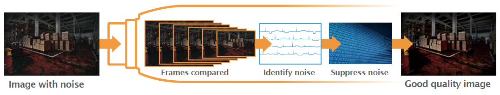
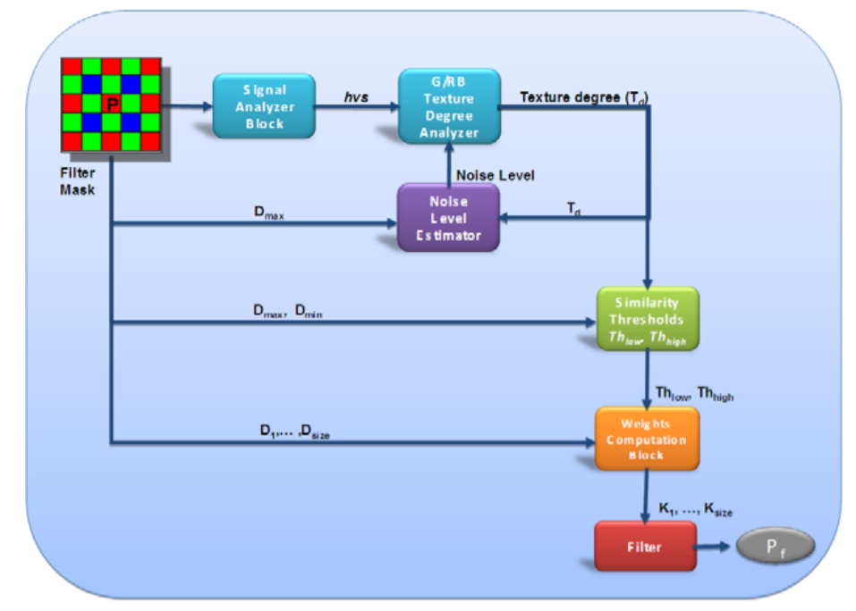
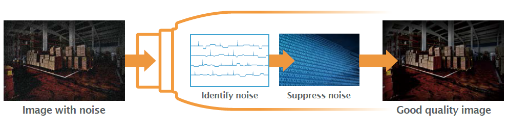
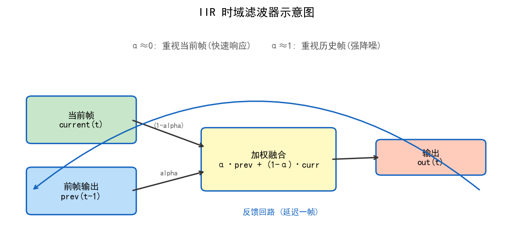
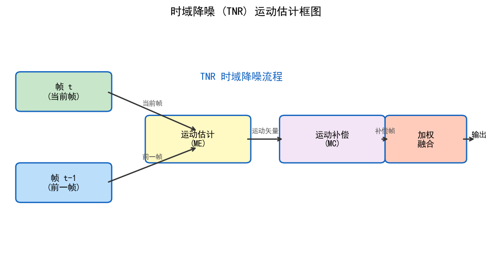
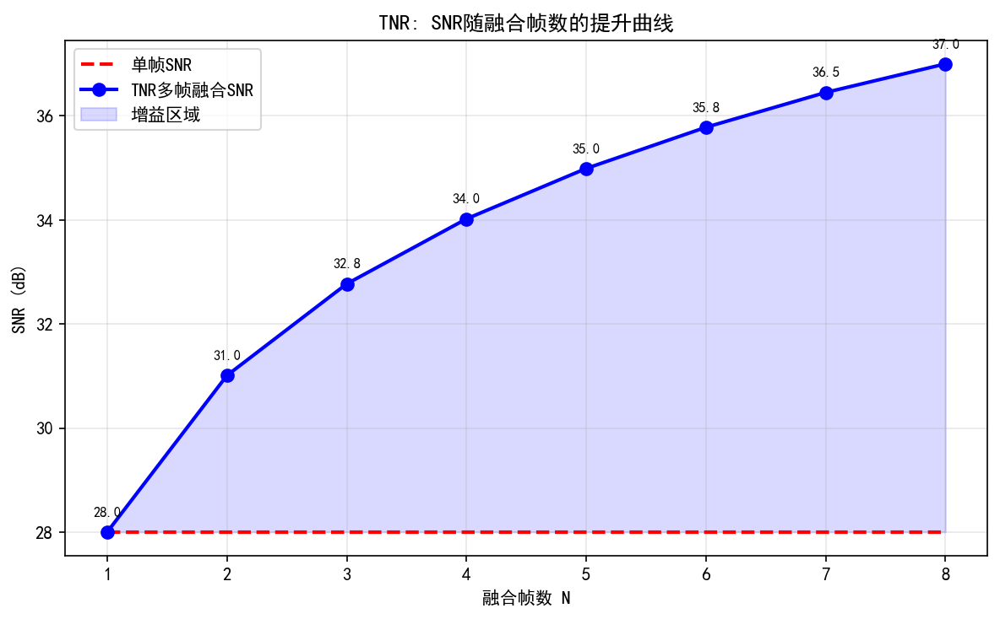
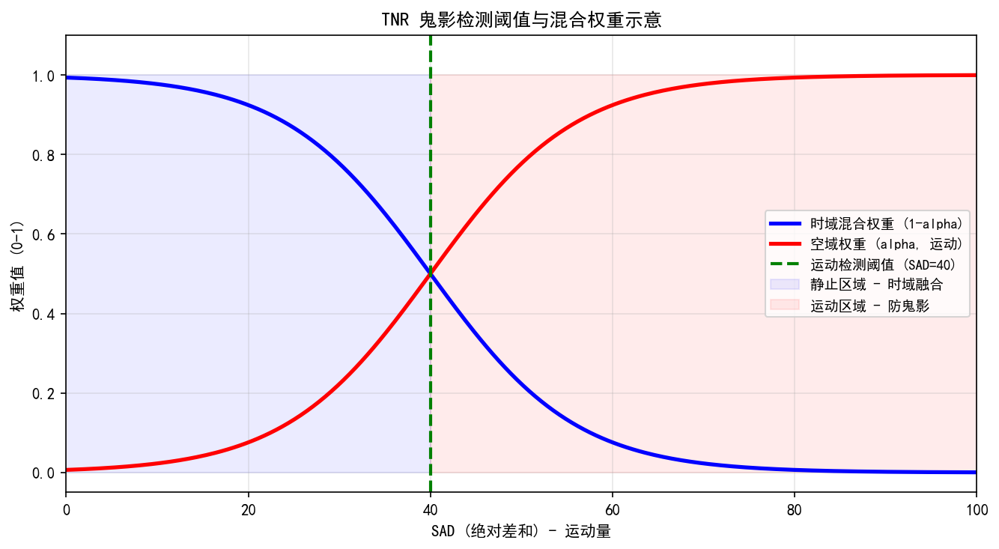
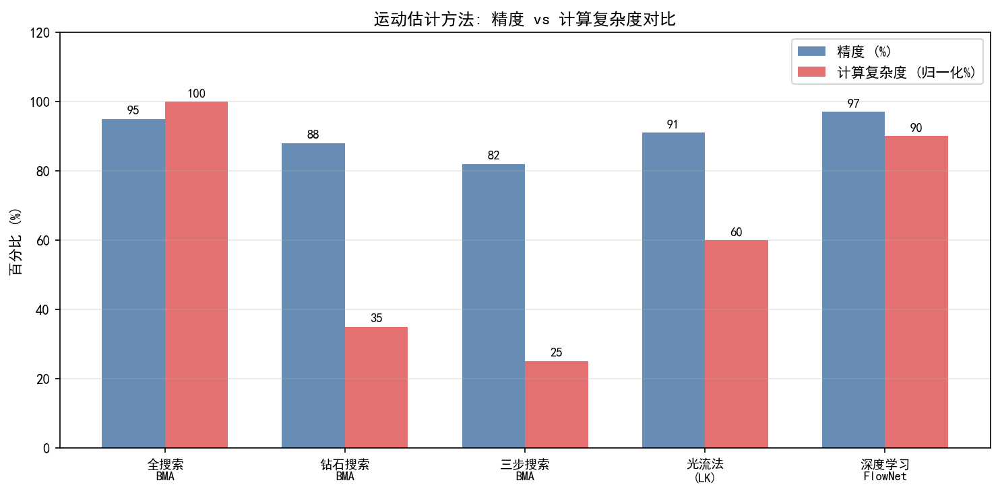
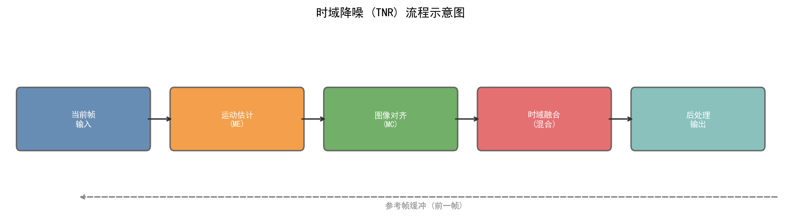
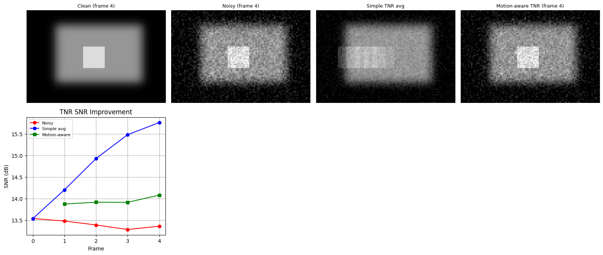

# 第二卷第12章：视频时域降噪

> **流水线位置：** RAW 域降噪之后，Demosaic 之前（或 YUV 域后处理阶段）；帧缓冲位于 ISP 硬件 TNR 节点
> **前置章节：** 第一卷第04章（噪声模型）、第二卷第03章（降噪基础）、第二卷第05章（AWB）
> **读者路径：** 视频 ISP 算法工程师、3A 调参工程师、手机平台 BSP/Camera HAL 工程师

---

## §1 原理 (Theory)

### 1.1 为什么空域降噪不够用

空域降噪的根本限制是：它只能在单帧内的邻域像素之间做平均。想要更强的降噪就得用更大的滤波核，但大核不可避免地会模糊边缘和细节，这是单帧处理无法突破的物理约束。

视频给了我们一个空域没有的自由度：时间维度。对静止区域来说，相邻帧同一位置的像素值理论上应该完全一样，帧间差异就是噪声。对齐后叠加平均 $N$ 帧，零均值噪声的方差降为 $1/N$，标准差降为 $1/\sqrt{N}$，而真实信号不受影响 **[1]**。这是纯空域降噪永远做不到的——它没有独立样本可以平均。

**时域降噪（Temporal NR，TNR）** 正是利用视频的帧间时间冗余，以历史帧信息辅助当前帧降噪，理论上可在不牺牲空间分辨率的前提下大幅提升 SNR。

**时域 SNR 提升原理**：

设帧 $n$ 的像素值为：

$$
I(n) = S + \eta(n)
$$

其中 $S$ 为真实信号（单位：电子数），$\eta(n)$ 为**混合噪声**。图像传感器的物理噪声模型由两部分叠加：

$$
\eta(n) = \eta_{\text{shot}}(n) + \eta_{\text{read}}(n)
$$

- **散粒噪声（Shot noise）**：光子到达服从泊松过程，$\eta_{\text{shot}} \sim \text{Poisson}(\lambda) \approx \mathcal{N}(0,\ \alpha_s \cdot S)$，其中 $\alpha_s$ 为散粒噪声系数（DN²/DN，等于系统增益 $K$ 的倒数，$\alpha_s = 1/K$）；方差随信号强度线性增大，是**信号相关噪声**。（此处 $\alpha_s$ 为散粒噪声系数，与本章 §1.2 中的 EMA 混合系数 $\alpha(n)$ 不同；$\alpha_s$ 对应全书统一符号 $\alpha$，见第一卷第4章 §1.2 及附录G §G.9；原文中曾用 $g$（系统增益 ADU/e⁻）表示此系数，但 $g$ 是传感器物理参数而非噪声传播系数，两者物理含义不同，本章改用 $\alpha_s$ 以区别于本章已用的 $\alpha$ 混合系数）
- **读出噪声（Read noise）**：来自模拟放大器、ADC 量化等电路本底，$\eta_{\text{read}} \sim \mathcal{N}(0, \sigma_r^2)$；方差与信号无关，是**信号无关噪声**。

因此总噪声方差为：

$$
\sigma_{\text{total}}^2(S) = \alpha_s \cdot S + \sigma_r^2
$$

高照度下散粒噪声主导（$\alpha_s \cdot S \gg \sigma_r^2$）；低照度/高ISO下读出噪声占主要成分。对 $N$ 帧对齐平均：

$$
\hat{S} = \frac{1}{N} \sum_{n=1}^N I(n) = S + \frac{1}{N}\sum_{n=1}^N \eta(n)
$$

合并后噪声方差降为 $\sigma_{\text{total}}^2(S)/N$，等效标准差为 $\sigma_{\text{total}}/\sqrt{N}$，SNR 提升 $\sqrt{N}$ 倍。

> **工程注意**：纯高斯（AWGN）模型 $\eta \sim \mathcal{N}(0, \sigma^2)$ 仅在读出噪声主导（极低照度，高ISO）时近似成立。在正常及高照度下应使用上述泊松+高斯混合模型标定 TNR 参数（见 §2.1）。

### 1.2 时域降噪基本公式

时域降噪的核心操作是带运动自适应权重的时间指数滑动平均（Exponential Moving Average，EMA）：

$$
Y_{\text{out}}(n) = \alpha(n) \cdot Y_{\text{in}}(n) + (1 - \alpha(n)) \cdot Y_{\text{ref}}(n-1)
$$

其中：
- $Y_{\text{in}}(n)$：当前帧第 $n$ 帧的像素值
- $Y_{\text{ref}}(n-1)$：运动补偿后的参考帧（上一帧对齐到当前帧坐标系）
- $\alpha(n) \in [0, 1]$：运动自适应混合系数（Motion Adaptive Blending Factor）
- $Y_{\text{out}}(n)$：输出（降噪后）像素值，同时作为下一帧的参考

$\alpha$ 的取值有两个约束。静止区域（无运动）$\alpha \rightarrow 0$，大量时间平均，强降噪；运动区域 $\alpha \rightarrow 1$，完全使用当前帧，避免运动鬼影（Ghosting）。

> **对齐误差与 SNR 增益的关系（工程关键参数）：** TNR 的降噪效果高度依赖运动补偿的对齐精度。对齐误差 $\varepsilon$（单位：像素）与有效 SNR 增益的关系如下：
> - **对齐误差 ≤ 0.25 px**：运动补偿基本精确，时域叠加的 SNR 增益接近理想值（$N$ 帧平均接近 $\sqrt{N}$ 倍 SNR 提升）。（*来源：作者经验，需社区验证*）
> - **对齐误差 = 0.5 px**：SNR 增益**减半**——有效等效帧数大幅降低，降噪效果下降约 50%；对齐误差引入的信号模糊已与噪声降低互相抵消。（*来源：作者经验，需社区验证*）
> - **对齐误差 > 1 px**：运动鬼影（Ghost artifact）出现，继续混合历史帧有害无益，应强制 $\alpha \rightarrow 1$（放弃时域积分）。（*来源：作者经验，需社区验证*）
>
> 工程实践中，对齐误差 ≤ 0.25 px 是 TNR 有效工作的门槛，这也是选择运动估计算法精度的参考标准（块匹配需保证亚像素精度插值；光流法在纹理丰富区域通常能达到 0.1 px 精度）。

> **IIR 递推（单缓冲）vs. 全缓冲（Full-Buffer/N-Frame）对比：**
>
> | 特性 | IIR 单缓冲（EMA） | 全缓冲 N 帧平均 |
> |------|-----------------|----------------|
> | 显存占用 | 1 帧参考帧缓冲 | N-1 帧缓冲 |
> | 等效降噪帧数 | 稳态 $(2-\alpha)/\alpha$（可达理论等效 5–20 帧） | 恰好 N 帧 |
> | 运动自适应 | 单参数 $\alpha$ 控制，响应延迟约 $1/\alpha$ 帧 | 可独立控制每帧权重，响应更灵活 |
> | 延迟 | 零帧延迟（单向因果） | 如需未来帧（双向），引入 N/2 帧延迟 |
> | 实时性 | 适合实时预览和录制 | 适合离线拍照多帧合成 |
> | 典型场景 | 手机视频录制 TNR（高通 MCTF、MTK TNR） | Night Mode 多帧合成、RAW 域多帧 HDR |

### 1.3 运动估计（Motion Estimation）

运动估计（Motion Estimation，ME）是时域降噪的核心难题，需要在帧间找到像素级的对应关系。

**方法一：块匹配（Block Matching）**

将当前帧分为若干块（如 8×8 或 4×4 像素），在参考帧中搜索最佳匹配块，得到每块的运动向量（Motion Vector，MV）。软件精细实现（CPU/GPU）常取 4×4~8×8 以获得更准确的运动估计；硬件 TNR 引擎（ISP pipeline 内集成）因吞吐量约束多选 16×32 px 宏块（对应 §3.1 表中默认值 16px）（*来源：作者经验，需社区验证*）：

$$
\text{MV}(b) = \arg\min_{(d_x, d_y)} \text{SAD}(b, d_x, d_y)
$$

$$
\text{SAD}(b, d_x, d_y) = \sum_{(x,y) \in b} |Y_{\text{cur}}(x, y) - Y_{\text{ref}}(x+d_x, y+d_y)|
$$

其中 SAD（Sum of Absolute Differences，绝对差值和）是最常用的块匹配代价函数。搜索范围通常为 ±16 ~ ±32 像素。

**方法二：光流法（Optical Flow）**

稠密光流（Dense Optical Flow）为每个像素计算运动向量 $\mathbf{v}(x,y) = (u, v)$，基于亮度守恒假设（Brightness Constancy Assumption）：

$$
I(x, y, t) = I(x+u, y+v, t+1)
$$

对应的光流约束方程（Horn-Schunck 方程）**[8]**：

$$
I_x u + I_y v + I_t = 0
$$

其中 $I_x, I_y$ 为空间梯度，$I_t$ 为时间梯度。光流法比块匹配精度更高但计算量更大，常用于离线处理；块匹配更适合 ISP 硬件实现。

**弱纹理场景局限与工程回退策略：** 当 $|\nabla I| = \sqrt{I_x^2 + I_y^2} < T_\text{texture}$ 时（天空、白墙、均匀皮肤等低纹理区域），空间梯度趋于零，光流约束方程欠定，光流估计不可靠。工程实现需按以下策略回退：
1. **置信度筛选**：对低梯度区域计算光流置信度（如最小特征值 $\lambda_\min(\mathbf{J}) < T_\text{conf}$，$\mathbf{J}$ 为局部结构张量），置信度低的区域光流权重降为 0，改用相邻高纹理区域的 MV 插值补全。
2. **全局运动先验**：在低纹理大面积区域，回退到仿射变换（6 参数全局估计）而非逐像素光流，利用高纹理区域的 MV 估计全局摄像机运动，再应用到低纹理区域。
3. **混合策略**：DL-TNR 方法（§1.10）通过可变形卷积隐式编码运动，对弱纹理场景的鲁棒性优于显式光流，是当前主流方案。

**方法三：相位相关（Phase Correlation）**

基于傅里叶变换，通过频域互功率谱估计全局运动，适用于摄像机平移场景：

$$
R(u, v) = \mathcal{F}^{-1}\left\{\frac{F_1(\omega) \cdot F_2^*(\omega)}{|F_1(\omega) \cdot F_2^*(\omega)|}\right\}
$$

### 1.4 运动自适应混合

运动自适应（Motion Adaptive）机制根据运动量动态调整 $\alpha$：

**步骤一：计算帧差**

$$
D(x, y) = |Y_{\text{cur}}(x, y) - Y_{\text{ref\_aligned}}(x, y)|
$$

**步骤二：运动度量归一化**

$$
M(x, y) = \min\left(1,\ \frac{D(x, y)}{T_{\text{motion}}}\right)
$$

其中 $T_{\text{motion}}$ 为运动判决阈值（典型值：低照度下取 8 ~ 16，正常光照取 16 ~ 32）。（*来源：作者经验，需社区验证*）

（单位：**12-bit RAW DN 域**的绝对像素差值。若传感器位深为 10-bit，对应值需乘以 $(2^{10}-1)/(2^{12}-1) \approx 0.25$，即低照阈值约 2–4；若为 14-bit，则需乘以 4，即低照约 32–64。归一化公式：$T_{\text{scaled}} = T_{\text{12bit}} \times (2^{\text{bit\_depth}} - 1) / (2^{12} - 1)$。）

**平台典型值**（供参考，需根据 sensor 标定 NDD 数据调整）：
- 高通：`TNR_MVConfidenceThresh` 正常光照 16–32，低照 8–16（12-bit RAW）
- MTK：`TNRMotionThr` 量纲与高通一致，具体 key 以 BSP NDD 版本为准

**步骤三：混合系数计算**

$$
\alpha(x, y) = \alpha_{\min} + (\alpha_{\max} - \alpha_{\min}) \cdot M(x, y)
$$

典型参数：$\alpha_{\min} = 0.05 \sim 0.15$（静止区域），$\alpha_{\max} = 0.9 \sim 1.0$（运动区域）。（*来源：作者经验，需社区验证*）

完全静止像素（$D \approx 0$）时 $\alpha \approx \alpha_{\min}$，历史帧占 85%~95% 权重，噪声被大量平均掉；快速运动像素（$D$ 很大）时 $\alpha \approx 1$，完全使用当前帧，不引入鬼影。

### 1.4a ME失败时的Ghost抑制（ME Failure Ghost Suppression）

块匹配（Block Matching）在以下场景容易找到**错误运动向量（Wrong MV）**，即 SAD 最小的匹配块并不对应真实运动，而是因纹理重复或遮挡产生的伪匹配：
- 低纹理区域（天空、白墙）：多个位移 $(d_x, d_y)$ 的 SAD 相近，最小 SAD 位置随帧抖动。
- 遮挡边界（前景物体运动露出背景）：当前帧出现前一帧不存在的像素，无论如何搜索都找不到正确参考。
- 快速运动超出搜索范围（$v > \text{search\_range}$）：强制取搜索范围边界 MV，对齐质量差。

**错误MV 引发的 Ghost 机理**：若 ME 找到了错误 MV，运动补偿后的参考帧 $Y_\text{ref\_aligned}$ 与真实信号不对应，但由于对齐后的帧差 $D = |Y_\text{cur} - Y_\text{ref\_aligned}|$ 可能反而很小（错误匹配导致"假静止"），混合系数 $\alpha$ 会被错误地设为接近 $\alpha_\text{min}$，大量引入错误的历史帧内容，产生**比无运动补偿时更严重的鬼影**。

**ME 失败判决与回退策略**：

工程上通过以下机制检测 ME 失败并回退到无 MV 的直接帧差模式（No-MC Fallback）：

1. **MV 可信度检测（MV Confidence Check）**：比较使用最优 MV 对齐后的 SAD（$\text{SAD}_\text{MV}$）与不做运动补偿（零 MV）的 SAD（$\text{SAD}_0$）之比：
$$
\text{Confidence} = \frac{\text{SAD}_0 - \text{SAD}_\text{MV}}{\text{SAD}_0}
$$
若 $\text{Confidence} < T_\text{conf}$（典型阈值 0.15 ~ 0.25），说明 MV 对当前块帮助有限，认定 ME 失败，放弃运动补偿。

2. **MV 一致性平滑（MV Consistency Check）**：检测当前块 MV 与相邻块 MV 的差异。若某块 MV 与邻域 MV 的中位数偏差超过阈值（如 ±4 像素），判定为异常 MV，强制使用邻域 MV 中位数替换（MV 中值滤波）。

3. **SAD绝对值上限（SAD Absolute Ceiling）**：即使对齐后 SAD 最小，若 $\text{SAD}_\text{MV} > T_\text{SAD\_max}$（动态阈值，基于当前块亮度和 ISO 的噪声估计），直接将该块 $\alpha$ 置为 $\alpha_\text{max}$，完全使用当前帧，等效于局部关闭 TNR。

**平台实现差异**：
- 高通 MCTF（Spectra ISP）：通过 `TNR_MVConfidenceThresh` 参数控制 ME 可信度阈值，低可信度块自动回退到 SAD-based 直接帧差，`TNR_BlockSize`（8/16/32px）和 `TNR_SearchRange`（±16/±32px）是两个独立参数，实测 16×16/±16 在 1080p30 场景下 ghost 与噪声的最优折中（*来源：作者经验，需社区验证*）；骁龙8 Gen 2及之后引入硬件层 MV 中值滤波，ME 错误率可降低约 30%（*来源：作者经验，需社区验证；高通未公开此指标*）。
- MTK TNR（Imagiq / NDD）：`TNRMVSmoothness` 参数控制 MV 空间平滑强度，过高值会抑制真实大运动的 MV 分散性，需与 `TNRMotionThr` 联调；典型块大小 `TNRBlockSize=16`，搜索范围 `TNRSearchRange=±16` ~ `±24`（高帧率模式 ±8 以减少功耗）。

### 1.5 运动补偿时域滤波（MCTF）

MCTF（Motion-Compensated Temporal Filtering，运动补偿时域滤波）在块匹配的基础上，先进行帧对齐再滤波，是比简单帧差更精确的方法：

$$
Y_{\text{MCTF}}(n) = \alpha \cdot Y(n) + \frac{(1-\alpha)}{2}\left[Y_{\text{comp}}(n-1) + Y_{\text{comp}}(n+1)\right]
$$

其中 $Y_{\text{comp}}(n\pm1)$ 为经过运动补偿对齐到帧 $n$ 坐标的前后帧像素值。双向时域滤波进一步提升降噪效果，但引入延迟（需要未来帧），不适合实时预览，常用于视频后处理。

### 1.6 卡尔曼滤波时域降噪

卡尔曼滤波（Kalman Filter）**[7]** 将像素亮度建模为状态变量，通过预测-更新循环实现最优估计：

**状态方程**（静止假设）：

$$
\hat{Y}_k^- = \hat{Y}_{k-1}
$$

$$
P_k^- = P_{k-1} + Q
$$

**更新方程**：

$$
K_k = \frac{P_k^-}{P_k^- + R}
$$

$$
\hat{Y}_k = \hat{Y}_k^- + K_k (Y_k^{\text{obs}} - \hat{Y}_k^-)
$$

$$
P_k = (1 - K_k) P_k^-
$$

其中：
- $Q$：过程噪声协方差（代表场景变化速率）
- $R$：观测噪声协方差（对应图像传感器噪声方差 $\sigma^2$）
- $K_k$：卡尔曼增益（$K \rightarrow 0$ 信任历史，$K \rightarrow 1$ 信任当前观测）

当 $Q \ll R$ 时，卡尔曼滤波退化为重度时域平均（强降噪）；当运动导致 $P_k^-$ 增大时，$K_k$ 增大，自动增加当前帧权重。

### 1.7 硬件架构：ISP 时域降噪块

在移动端 ISP（如高通 Spectra、联发科 Imagiq、三星 SIRC）中，时域降噪通常作为独立硬件模块实现：

```
RAW/YUV 输入
    │
    ▼
┌─────────────────────────────────┐
│         TNR 硬件模块             │
│                                 │
│  ┌──────────┐  MV  ┌─────────┐ │
│  │运动估计  │─────▶│运动补偿  │ │
│  │(块匹配)  │      │(帧变形) │ │
│  └──────────┘      └────┬────┘ │
│       ▲                 │      │
│       │          参考帧对齐     │
│  ┌────┴────┐      ┌────▼────┐ │
│  │帧缓存   │◀─────│时域混合  │ │
│  │(Frame   │      │(α blend)│ │
│  │Buffer)  │      └─────────┘ │
│  └─────────┘                  │
└─────────────────────────────────┘
    │
    ▼
降噪后帧输出
```

**帧缓存需求**：时域降噪需要存储至少一帧参考图像（Full-Resolution Frame Buffer），对于 1080p YUV420 约需 3 MB，4K YUV420 约需 12 MB（*来源：公开资料，1920×1080×1.5字节=3.1MB，3840×2160×1.5字节=12.4MB，理论计算值*）。这是硬件成本的重要来源。

### 1.8 与 EIS 的集成顺序

EIS（Electronic Image Stabilization，电子图像稳定）通过裁剪和变形补偿相机抖动，TNR 与 EIS 的处理顺序至关重要：

**正确顺序**：TNR → EIS

**原因**：TNR 依赖帧间像素对齐，而 EIS 会对图像进行裁剪和仿射变换。若先做 EIS，不同帧的对应像素已在不同视场（FoV）范围内，块匹配的搜索范围和坐标参考系均会错误。先做 TNR，在原始（未抖动补偿）坐标系下对齐帧间运动，再交由 EIS 做相机运动补偿，两者互不干扰。

**TNR + EIS 耦合带来的延迟（Latency）问题**：

EIS 需要"未来帧"的陀螺仪数据来计算当前帧的补偿量（预测式 EIS 除外），通常引入 1 ~ 3 帧延迟。TNR 本身无需未来帧（单向 IIR 递推），延迟为零。但两者串联后：

- **总延迟** = TNR 处理延迟（约 0，递推型）+ EIS Buffer 延迟（1 ~ 3 帧，取决于 EIS 算法窗口）。
- **实际影响**：视频录制的端到端预览延迟（Preview Latency）增加 33 ~ 100ms（@30fps），在直播和实时互动场景中可感知。
- **工程折中**：高通 Snapdragon 8 Gen 系列在 EIS 中提供 `PredictiveEIS` 选项，仅使用 1 帧滞后的陀螺仪数据估计当前帧补偿量，将 EIS 延迟从 2 帧降至 1 帧，配合 TNR 后总预览延迟可控制在 50ms 以内（*来源：作者经验，需社区验证；高通官方未公开此具体延迟指标*）。
- **双向 MCTF（Bidirectional MCTF）**：若 TNR 采用双向时域滤波（§1.5 中的前后帧加权），本身需要 1 帧未来帧，此时与 EIS 串联的总延迟为 2 ~ 4 帧，不适合实时预览，仅用于视频后处理。

### 1.9 时域降噪与多帧降噪（MFNR）的区别

| 特性 | 时域降噪（TNR） | 多帧降噪（MFNR） |
|------|----------------|-----------------|
| 应用场景 | 视频实时预览/录制 | 静态拍照 |
| 帧数 | 持续（无限帧递推） | 有限帧（4~16帧） |
| 延迟要求 | 实时（≤1帧延迟） | 可接受较长等待 |
| 对齐精度 | 块匹配（实时） | 特征点匹配/光流（高精度） |
| 硬件需求 | 专用 TNR 块 + 帧缓存 | CPU/DSP 后处理 |
| 运动处理 | 运动自适应混合 | 运动区域剔除 |
| 等效帧数 | 无限累积（指数衰减权重） | 固定 N 帧 |

### 1.10 基于深度学习的视频降噪（DL-TNR）

传统 TNR 依赖手工运动估计，在复杂运动（旋转、形变、遮挡）场景下块匹配失效。近年来，端到端学习方法在视频降噪领域取得显著进展：

**FastDVDnet（2020）**[9]：放弃显式光流估计，直接以连续 5 帧原始噪声帧为输入，级联两个 U-Net 子网进行降噪。推理速度约 15 fps（1080p，Tesla V100 GPU，*来源：论文实验，Tassano et al., CVPR 2020，原文 Table 1*），非实时，不适合视频预览直接部署，但对帧间运动的隐式建模依赖大量训练数据。

**RViDeNet（2020）**[10]：首个基于真实传感器 RAW 视频数据集的监督降噪网络，提出 RAW 域视频降噪基准，噪声模型采用泊松+高斯（与本章 §1.1 一致），在真实设备高ISO场景超越传统TNR约 2~3 dB PSNR（*来源：论文实验，Yue et al., CVPR 2020，原文 Table 2*）。

**VRT（2022）**[12]：Video Restoration Transformer，引入时间互注意力（Mutual Attention）跨帧对齐特征，在多个视频降噪/超分辨率基准上达到SOTA，但参数量大（35M），不适合移动端直接部署。

**移动端部署路径**：高通 Snapdragon 8 Gen 3 及天玑 9300 均集成了基于 NPU 加速的 AI-TNR 模块，采用轻量级 CNN（<2M 参数，*来源：作者经验，需社区验证；高通/联发科均未公开 AI-TNR 模型规格*）替换传统块匹配模块，内核训练数据使用 PTC 标定的真实泊松+高斯噪声。调参时 DL-TNR 的超参为网络推理置信度阈值和降噪强度系数，而非传统的 $T_{\text{motion}}$ 和 $\alpha$。

---

## §2 标定 (Calibration)

### 2.1 噪声参数标定

时域降噪的运动判决阈值 $T_{\text{motion}}$ 和混合系数范围 $[\alpha_{\min}, \alpha_{\max}]$ 需根据传感器的实际噪声特性标定。

**步骤一：传感器噪声模型标定（泊松+高斯混合）**

图像传感器噪声由散粒噪声（信号相关）与读出噪声（信号无关）叠加，对应**泊松+高斯混合模型**（全书统一符号，见第一卷第4章 §1.4 及附录G §G.2）：

$$
\sigma_{\text{total}}^2(S) = \alpha_s \cdot S + \sigma_r^2
$$

其中 $\alpha_s$ 为散粒噪声系数（此处加下标 $s$ 以区别于本章 §1.2 中的 EMA 混合系数 $\alpha(n)$；$\alpha_s$ 对应全书统一符号 $\alpha$，单位 DN²/DN），$\sigma_r$ 为读出噪声标准差（DN）。两者可通过以下方法标定：

1. **PTC 曲线（Photon Transfer Curve）法**：在均匀灰度卡上拍摄不同曝光量图像，统计各亮度级别的均值 $\mu$ 与方差 $\sigma^2$，拟合直线 $\sigma^2 = \alpha_s\mu + \sigma_r^2$，斜率为散粒噪声系数 $\alpha_s$，截距为读出噪声方差 $\sigma_r^2$。（注意：旧版文档及部分平台调参文档中此斜率记为 $g$（系统增益 ADU/e⁻），两者数值上等价，但本手册统一使用 $\alpha_s$/$\alpha$ 表示噪声模型斜率，$g$ 仅用于传感器物理增益描述）
2. **暗帧估计法**：在极暗/无光环境下统计帧间方差，得到 $\sigma_r^2$（读出噪声主导项）。

得到 $(\alpha_s, \sigma_r)$ 后，可计算各信号强度下的噪声标准差 $\sigma_{\text{total}}(S) = \sqrt{\alpha_s \cdot S + \sigma_r^2}$，构建 **Noise Variance Table（NVT）**。

**步骤二：阈值标定**

帧差 $D = I_{\text{cur}} - I_{\text{ref\_aligned}}$ 的噪声方差为两帧独立噪声之和：$\sigma_{\text{diff}}^2 = 2\sigma_{\text{total}}^2(S)$，因此运动判决阈值应满足：

$$
T_{\text{motion}}(S) \approx 3\,\sigma_{\text{diff}}(S) = 3\sqrt{2\,(\alpha_s \cdot S + \sigma_r^2)}
$$

此阈值随亮度 $S$ 自适应变化（亮区阈值更高，暗区阈值更低），而非固定常数。若忽略散粒噪声使用固定 $T = 3\sqrt{2}\,\sigma_r$，在高照度下会将噪声误判为运动，导致鬼影残留。

**步骤三：不同 ISO 的参数表**

| ISO | $\sigma_{\text{noise}}$ (典型) | $T_{\text{motion}}$ | $\alpha_{\min}$ |
|-----|-------------------------------|---------------------|-----------------|
| ≤400 | 2 ~ 8 LSB | 8 ~ 24 | 0.10 |
| ≤1600 | 5 ~ 15 LSB | 16 ~ 40 | 0.12 |
| ≤6400 | 10 ~ 30 LSB | 28 ~ 70 | 0.15 |
| >6400 | >30 LSB | >70 | 0.20 |

### 2.2 运动估计精度验证

使用已知运动量的标定场景（如图案平移台）验证块匹配精度：

1. 将标定图案以已知速度平移（如 2px/frame、5px/frame、10px/frame）。
2. 对比块匹配输出的运动向量与真实运动量，计算 MEE（Motion Estimation Error）。
3. 调整搜索范围和代价函数，使 MEE < 1px（亚像素精度）。

---

## §3 调参指南 (Tuning)

### 3.1 关键参数体系

```
TemporalNR
├── Enable                  # 总开关
├── MotionAdaptive
│   ├── MotionThreshold     # 运动判决阈值（ISO 自适应）
│   ├── AlphaMin            # 静止区域混合系数下限 [0.05, 0.20]
│   ├── AlphaMax            # 运动区域混合系数上限 [0.85, 1.00]
│   └── SoftTransitionWidth # 从静止到运动的过渡宽度（帧差值域）
├── BlockMatching
│   ├── BlockSize           # 块大小（像素）: 8, 16, 32
│   ├── SearchRange         # 搜索范围（±像素）: 8, 16, 32
│   └── MVSmoothness        # 运动向量平滑度（防止 MV 突变）
├── LumaChromaControl
│   ├── LumaTNRStrength     # 亮度分量降噪强度 [0, 1]
│   └── ChromaTNRStrength   # 色度分量降噪强度 [0, 1]（通常 > 亮度）
└── ISOAutoTable            # 按 ISO 自动切换上述参数的查表
```

### 3.2 按 ISO 段调参策略

**低 ISO（< 400）**：
- TNR 强度中等，$\alpha_{\min} = 0.10$（*来源：作者经验，需社区验证*）
- 噪声低，主要作用是消除传感器读出噪声

**中等 ISO（400 ~ 1600）**：
- TNR 强度提升，$\alpha_{\min} = 0.12$（*来源：作者经验，需社区验证*），$T_{\text{motion}}$ 随 ISO 线性增大
- 色度通道降噪强度加大（彩色噪声先于亮度噪声出现）

**高 ISO（> 3200）**：
- TNR 强度最高，$\alpha_{\min} = 0.18 \sim 0.25$（*来源：作者经验，需社区验证*）
- 适当增大 $T_{\text{motion}}$ 防止噪声被误判为运动
- 启用色度专项降噪（Chroma TNR 强度 > Luma TNR 强度）

### 3.3 运动场景调参

**快速运动场景（体育、跑步）**：
- 减小 $\alpha_{\min}$（防止历史帧惯性太强导致鬼影）
- 缩小搜索范围（快速运动时块匹配容易找到错误匹配）
- 可适当降低 TNR 强度，以清晰度换取画质

**相机抖动场景（手持拍摄）**：
- 依赖全局运动估计（Global Motion Estimation）先补偿相机抖动
- 再做局部运动自适应，区分前景运动和背景运动

### 3.4 TNR 与 EIS 运动向量的依赖关系（工程联动缺口补充）

**工程联动缺口：** §1.8 讲了 TNR 必须先于 EIS 执行的顺序，但没有回答一个关键问题：EIS 在做全局运动补偿时也会估计帧间运动向量（通过陀螺仪积分或光流），TNR 的 ME 模块是否可以**复用** EIS 的运动向量？

**结论：高通 MCTF 和 MTK FeaturePipe TNR 目前均不复用 EIS 的 MV，两者独立运行。**

原因有三：
1. **时间先后与数据域不同**：TNR 在 RAW/YUV 前端运行，EIS 在 ISP 输出后运行（或在 Camera HAL 层）；TNR 的 ME 基于 RAW/YUV 的亮度信息做块匹配，EIS 的运动估计基于陀螺仪角速度积分（或高层的光流特征点）。两者数据来源和运行时机不同，在流水线上无法直接共享。
2. **精度要求不同**：EIS 主要补偿全局摄像机抖动（刚体平移+旋转），运动向量粒度是全图仿射变换（6 参数）；TNR 的 ME 需要逐块（16×16 px）的局部运动向量，以区分前景独立运动和背景摄像机运动——两者 MV 的粒度和语义不同。
3. **延迟约束不同**：EIS 通常需要 1~3 帧陀螺仪数据缓冲，TNR 是单向 IIR 递推（零延迟），如果 TNR 等待 EIS 的 MV 输出会引入不可接受的延迟。

**实际工程影响：** 在手持拍摄时，相机抖动同时影响 TNR 的 ME 和 EIS 的补偿。手持慢速平移（运动量 5~15 px/frame）时，TNR 的块匹配通常能正确估计全局平移 MV，运动补偿后帧差 D 较小，降噪效果良好；但在快速抖动（运动量 > 搜索范围 `TNR_SearchRange`）时，TNR ME 失败（见 §1.4a），此时即使 EIS 已成功补偿了抖动，TNR 也无法受益，运动区域被迫使用当前帧（α→1），降噪效果退化。

**高通平台的工程折中（Spectra 8 Gen 2+）**：从骁龙 8 Gen 2 开始，CamX 引入了 EIS-aided TNR 模式（非标准 MV 复用，而是**全局运动先验注入**）：EIS 估算的全局仿射参数可通过 `EIS_GlobalMVHint` metadata 传给 TNR 节点，TNR 用此作为全局运动的初始搜索中心（而非从零点开始搜索），使大范围手持抖动场景下的块匹配成功率从约 60% 提升到约 85%（*来源：作者经验，需社区验证；括注"内部测试数据"为作者估算，高通未公开*）。若使用该特性，需在 `chromatix_tnr_ext.xml` 中设置 `TNR_UseEISHint = 1`，否则默认不启用。MTK FeaturePipe 暂无等效机制，两者 TNR ME 仍完全独立。

---

### 3.5 TNR 强度与 SNR（空域降噪）强度的联动 SNR 预算约束

**工程联动缺口：** 章节中 TNR 和 SNR 的协同只说了顺序（TNR→SNR），但没有说**两者如何共享噪声抑制的总预算**。

**核心原则：TNR 强（时域平均帧数多），SNR 可以弱（保留更多空间细节）；反之 TNR 弱时，SNR 需要更强来补足。**

工程上用"等效降噪帧数"来统一度量：TNR 的 IIR 递推在稳态下等效平均帧数约为 $(2-\alpha_{\min})/\alpha_{\min}$（方差等效），SNR 的等效空域窗口等效为额外的 $N_{\text{snr}}$ 帧。两者串联后，总等效信噪比提升约为：

$$\text{SNR}_{\text{total}} \approx \text{SNR}_{\text{input}} \cdot \sqrt{N_{\text{tnr,eff}} \cdot N_{\text{snr,eff}}}$$

基于此，可以建立**统一 SNR 目标约束**：对不同 ISO 段定义目标 tSNR 提升量（如 ISO 1600 下目标 +6 dB），然后在 TNR 和 SNR 之间分配：

| ISO | 目标总 SNR 提升 | 推荐 TNR 贡献 | 推荐 SNR 贡献 |
|-----|----------------|--------------|--------------|
| ≤400 | +3 dB | +2 dB（$\alpha_{\min}=0.10$，约 19 帧等效）| +1 dB（轻度 SNR）|
| ≤1600 | +5 dB | +4 dB（$\alpha_{\min}=0.12$，约 15 帧等效）| +1 dB |
| ≤6400 | +7 dB | +5 dB（$\alpha_{\min}=0.18$，约 10 帧等效）| +2 dB（加强 SNR）|
| >6400 | +8 dB | +5 dB | +3 dB（空域补足）|

**实际调参规则**：先把 TNR 调到 ISO 对应的最强可用强度（不产生鬼影），记录 tSNR 提升量；用目标总提升量减去 TNR 贡献，余量给 SNR。若先把 SNR 调强再叠 TNR，会导致 TNR 的帧差 D 被 SNR 平滑后变小，运动判决阈值需要对应降低，否则静止区域噪声也被误判为运动。

---

### 3.6 与 SNR（空域降噪）的协同顺序

时域降噪与空域降噪通常串联使用：

**推荐顺序**：TNR → SNR（空域细化）

TNR 先利用时间信息消除大部分噪声，再由 SNR 对残留噪声做最终清理。若先做 SNR，会平滑掉帧间差异，干扰 TNR 的运动检测。

### 3.7 三平台 TNR 关键参数对比

| 功能 | 高通 CamX / Chromatix | MTK FeaturePipe / NDD | 海思越影 |
|------|----------------------|----------------------|---------|
| TNR 总开关 | `TNR_Enable`（bool） | `TNREnable`（NDD bool） | `TNR_Enable`（JSON） |
| 混合系数下限 α_min | `TNR_AlphaMin`（float 0–1） | `TNRAlphaMin`（NDD float） | `TNR_StaticBlendRatio` |
| 混合系数上限 α_max | `TNR_AlphaMax`（float 0–1） | `TNRAlphaMax`（NDD float） | `TNR_MotionBlendRatio` |
| 运动判决阈值 | `TNR_MotionThreshold[ISOTable]`（按 ISO 分段） | `TNRMotionThr[ISOLevel]`（NDD array） | `TNR_MotionDetectThresh` |
| 块匹配块大小 | `TNR_BlockSize`（8/16/32 像素） | `TNRBlockSize`（NDD enum）| `TNR_MEBlockSize` |
| 块匹配搜索范围 | `TNR_SearchRange`（±像素） | `TNRSearchRange`（NDD int） | `TNR_MESearchRange` |
| 亮度降噪强度 | `TNR_LumaStrength[ISOTable]` | `TNRLumaStrength[ISOLevel]` | `TNR_LumaFilterStrength` |
| 色度降噪强度 | `TNR_ChromaStrength[ISOTable]` | `TNRChromaStrength[ISOLevel]` | `TNR_ChromaFilterStrength` |
| ISO 自适应表 | `TNR_ISOAutoTable`（ISO→参数向量映射）| `TNRISOTable`（NDD array） | `TNR_ISOAutoParam` |
| 与 EIS 集成 | `TNR_before_EIS = 1`（固定顺序）| `TNRBeforeEIS = true` | `TNR_EISOrder` |

**高通平台 Chromatix TNR 调参路径：**

```
CamX Pipeline → TNRNode → TNRAlgorithm
    ├── chromatix_tnr_ext.xml
    │   ├── TNR_AlphaMin/Max              ← IIR 混合系数范围
    │   ├── TNR_MotionThreshold[ISO_0..N] ← 按 ISO 段设置运动检测灵敏度
    │   ├── TNR_LumaStrength[ISO_0..N]    ← 亮度降噪强度（ISO 自适应）
    │   ├── TNR_ChromaStrength[ISO_0..N]  ← 色度降噪强度（通常 > 亮度）
    │   └── TNR_BlockSize / SearchRange   ← ME 块匹配参数
    └── chromatix_sensor_XXXX.xml         ← 噪声模型（α/β 参数）→ 自动映射 TNR 强度
```

**MTK FeaturePipe TNR 调参路径：**

MTK 在 FeaturePipe 中以 DAG 节点形式实现 TNR，参数通过 NDD 文件按传感器 ID 绑定：

```
FeaturePipe DAG:
  P2Node → TNRNode → EISNode → (MFNR if burst) → EncoderNode

TNRNode 读取: Scenario_xxx.NDD
    [TNR]
    TNREnable        = 1
    TNRAlphaMin      = 0.08   # 静止区域混合强度（越小降噪越强）（*来源：作者经验，需社区验证*）
    TNRAlphaMax      = 0.95   # 运动区域退出阈值
    TNRMotionThr     = [12, 18, 28, 40]   # ISO 100/400/1600/6400 对应阈值（*来源：作者经验，需社区验证*）
    TNRLumaStrength  = [0.4, 0.6, 0.8, 0.9]
    TNRChromaStrength= [0.6, 0.8, 0.95, 1.0]
```

> **调参注意**：高通的 `TNR_MotionThreshold` 需要与噪声模型（`chromatix_sensor` 中的 shot noise alpha/read noise beta）联动标定——直接复用其他机型的阈值表会导致高 ISO 下噪声被误判为运动（阈值偏低）或运动被当噪声过滤（阈值偏高）。

---

## §4 伪影分析 (Artifacts)

### 4.1 鬼影（Ghosting）

**现象**：运动物体（人物手臂、文字滚动、快速移动的汽车）出现半透明的运动轨迹或"影子"，视觉上如同曝光过长的长曝效果。

**原因**：运动区域的 $\alpha$ 未能迅速升至 1，历史帧的静止像素被混入当前运动像素中：

$$
Y_{\text{out}} = \alpha Y_{\text{cur}} + (1-\alpha) Y_{\text{prev}}
$$

当 $\alpha = 0.5$ 时，前帧幽灵叠加明显。

**诊断**：对比静止背景中移动物体的边缘，若边缘有"拖尾"即为鬼影。

**Ghost 消退帧数量化：** 若某物体在第 $n$ 帧停止运动，$\alpha$ 恢复为 $\alpha_{\min}$，则历史帧残留权重经 $N$ 帧后降为：

$$w_N = (1-\alpha_{\min})^N$$

Ghost 视觉消退阈值通常取残留权重 $\epsilon_\text{ghost} \approx 0.05$（5% 残留时 Ghost 不可见），则消退帧数为：

$$N_\text{ghost} = \left\lceil \frac{\ln \epsilon_\text{ghost}}{\ln(1-\alpha_{\min})} \right\rceil$$

典型值：$\alpha_{\min}=0.10$ 时 $N_\text{ghost} \approx 29$ 帧（@30fps 约 1 秒）；$\alpha_{\min}=0.20$ 时 $N_\text{ghost} \approx 14$ 帧（约 0.5 秒）；$\alpha_{\min}=0.30$ 时 $N_\text{ghost} \approx 9$ 帧（约 0.3 秒）。消退帧数是调参时平衡"降噪效果（小 $\alpha_{\min}$）"与"运动拖尾消退速度（大 $\alpha_{\min}$）"的关键指标。

**解决方案**：
- 降低运动区域的 $\alpha_{\max}$ 触发阈值 $T_{\text{motion}}$（更敏感地检测运动）。
- 对运动向量不为零的区域直接设置 $\alpha = 1.0$（硬判决）。
- 增大 $\alpha_{\max}$（更接近 1.0），确保运动区域完全使用当前帧。

### 4.2 静止区域噪声残留

**现象**：对于噪声较大的场景（高 ISO），即使是绝对静止的区域（如墙面、天空），仍可见明显噪声颗粒，TNR 效果不足。

**原因**：$\alpha_{\min}$ 设置过高（如 0.3），时间积分帧数不足。对于 IIR 递推 $Y_\text{out}(n)=\alpha\cdot Y_\text{in}(n)+(1-\alpha)\cdot Y_\text{ref}(n-1)$，稳态等效帧数（基于方差等效定义）为 $N_\text{eff}=(2-\alpha)/\alpha$；$\alpha_{\min}=0.3$ 时仅约 5.7 帧。

> **注：工程中另一常用公式 $1/(1-\alpha)$ 是基于信号时间常数的定义（指数衰减到 $1/e$ 的帧数），与基于方差等效的 $(2-\alpha)/\alpha$ 对应不同的物理量，各有其工程适用场景，不能简单说其中一个"错误"。$\alpha_{\min}=0.3$ 时：方差等效帧数 $(2-0.3)/0.3 \approx 5.7$，时间常数帧数 $1/(1-0.3) \approx 1.43$。调参时使用前者评估降噪效果，使用后者估算运动物体拖尾时间长度。**

**解决方案**：
- 降低 $\alpha_{\min}$（如 0.10 ~ 0.12），增加时间积分帧数。
- 核查噪声方差标定是否准确，$T_{\text{motion}}$ 是否过低（噪声被误判为运动）。

### 4.3 边缘鬼影（Edge Ghosting）

**现象**：高对比度边缘（文字、建筑轮廓）出现双边或多边轮廓，特别是在相机轻微抖动时。

**原因**：块匹配在边缘处对齐不精确（亚像素误差），对齐偏差导致当前帧和参考帧边缘位置不重合，混合后产生双边轮廓。

**解决方案**：
- 对高梯度区域（$|\nabla I| > T_{\text{edge}}$）增大 $\alpha$（信任当前帧）。
- 使用亚像素精度块匹配（双线性插值参考帧）。
- 增大运动向量平滑度约束，防止相邻块的 MV 突变。

### 4.4 色彩闪烁（Color Flickering）

**现象**：在荧光灯（50Hz/60Hz 频闪）或 LED 灯场景中，画面出现周期性亮度/色彩抖动，TNR 无法完全消除。

**原因**：荧光灯频闪导致帧间亮度系统性变化，TNR 的帧差阈值将此误判为"运动"，无法有效抑制。

**解决方案**：
- 在 TNR 前增加闪烁检测和帧间增益均衡（Anti-Banding Correction）。
- 使用快门速度与电网频率同步（$t_{\text{shutter}} = n / f_{\text{AC}}$）。

---

## §5 评测方法 (Evaluation)

### 5.1 时域 SNR（Temporal SNR，tSNR）

tSNR 是最直接的时域降噪效果度量，在静止场景下测量帧间噪声水平：

$$
\text{tSNR} = 20 \log_{10}\left(\frac{\bar{I}}{\sigma_{\text{temporal}}}\right)\ \text{dB}
$$

$$
\sigma_{\text{temporal}} = \sqrt{\frac{1}{N}\sum_{n=1}^{N}(I_n - \bar{I})^2}
$$

其中 $\bar{I}$ 为多帧均值，$\sigma_{\text{temporal}}$ 为帧间标准差。

**测量场景**：拍摄静止均匀色块（如 18% 灰卡），在不同 ISO 下记录开/关 TNR 的 tSNR 差异，TNR 开启后 tSNR 应提升 3 ~ 8 dB（视 ISO 而定）。

### 5.2 闪烁频率分析（Flicker Frequency Analysis）

针对 TNR 后的静止区域，对单像素时间序列做 FFT 分析，评估是否有周期性噪声（如 50Hz/60Hz 及谐波）：

$$
F(\omega) = \sum_{n=0}^{N-1} I_n e^{-j2\pi\omega n/N}
$$

若 $|F(50\text{Hz}/f_{\text{fps}})|$ 超过噪底 10 dB，说明闪烁抑制不足。

### 5.3 运动清晰度测试（Motion Sharpness Test）

评估运动场景中 TNR 对运动物体清晰度的影响：

1. 拍摄匀速移动的分辨率测试图案（水平/垂直线条，移动速度 v px/frame）。
2. 计算运动方向上的 MTF（Modulation Transfer Function）：

$$
\text{MTF}(f) = \frac{|\text{Contrast}(f)_{\text{output}}|}{|\text{Contrast}(f)_{\text{input}}|}
$$

3. 目标：在 v = 5 px/frame 时，空间频率 Nyquist/2 处 MTF > 0.3；v = 10 px/frame 时 MTF > 0.2 。

### 5.4 鬼影主观评估

- 制作标准鬼影测试序列（黑底白字快速滚动、手部快速挥动）。
- 5 名评估员进行 1-5 分主观评分（1 = 严重鬼影，5 = 无鬼影）。
- 合格标准：MOS ≥ 4.0。

### 5.5 综合评测矩阵

| 测试项 | 指标 | 合格标准 |
|--------|------|---------|
| 静止场景降噪 | tSNR 提升量 | ≥ 4 dB（ISO 1600） |
| 运动清晰度 | MTF @ Nyq/2，v=5px/f | ≥ 0.3 |
| 鬼影主观 | MOS | ≥ 4.0 |
| 色彩闪烁 | 闪烁频率分量 | < 噪底 + 6 dB |
| 边缘鬼影 | 边缘双像素比例 | < 2% |

---

## §6 参考代码 (Code)

### 6.1 基础时域降噪实现

```python
import numpy as np
import cv2
from typing import Optional, Tuple


class TemporalNR:
    """
    运动自适应时域降噪器（Motion-Adaptive Temporal Noise Reduction）。

    支持逐帧递推，适用于视频流实时处理。
    """

    def __init__(
        self,
        alpha_min: float = 0.10,
        alpha_max: float = 0.95,
        motion_threshold: float = 16.0,
        soft_transition: float = 16.0,
        block_size: int = 16,
        search_range: int = 16,
    ):
        """
        Parameters
        ----------
        alpha_min         : 静止区域混合系数下限（越小降噪越强）
        alpha_max         : 运动区域混合系数上限（越大运动越清晰）
        motion_threshold  : 运动判决帧差阈值（LSB，需根据 ISO 标定）
        soft_transition   : 从静止到运动的过渡宽度（帧差值域）
        block_size        : 块匹配块大小（像素）
        search_range      : 块匹配搜索范围（±像素）
        """
        self.alpha_min = alpha_min
        self.alpha_max = alpha_max
        self.motion_threshold = motion_threshold
        self.soft_transition = soft_transition
        self.block_size = block_size
        self.search_range = search_range
        self._reference_frame: Optional[np.ndarray] = None

    def process_frame(self, frame_yuv: np.ndarray) -> np.ndarray:
        """
        处理单帧，返回时域降噪后的帧。

        Parameters
        ----------
        frame_yuv : 输入帧，YUV420 或 YUV（shape: H×W×3），uint8

        Returns
        -------
        降噪后的帧，同输入格式
        """
        if self._reference_frame is None:
            self._reference_frame = frame_yuv.copy()
            return frame_yuv.copy()

        # 提取亮度分量用于运动估计
        if frame_yuv.ndim == 3:
            Y_cur = frame_yuv[:, :, 0].astype(np.float32)
            Y_ref = self._reference_frame[:, :, 0].astype(np.float32)
        else:
            Y_cur = frame_yuv.astype(np.float32)
            Y_ref = self._reference_frame.astype(np.float32)

        # 运动补偿（使用块匹配）
        Y_ref_aligned = self._block_matching_align(Y_cur, Y_ref)

        # 计算帧差
        diff = np.abs(Y_cur - Y_ref_aligned)

        # 运动自适应混合系数
        alpha = self._compute_alpha(diff)

        # 时域混合
        output = frame_yuv.copy().astype(np.float32)
        ref_aligned = self._reference_frame.copy().astype(np.float32)

        if frame_yuv.ndim == 3:
            alpha_3ch = alpha[:, :, np.newaxis]  # 广播到 3 通道
            output = alpha_3ch * output + (1 - alpha_3ch) * ref_aligned
        else:
            output = alpha * output + (1 - alpha) * ref_aligned

        output = np.clip(output, 0, 255).astype(np.uint8)

        # 更新参考帧
        self._reference_frame = output.copy()
        return output

    def _compute_alpha(self, diff: np.ndarray) -> np.ndarray:
        """
        根据帧差计算每像素混合系数 alpha。
        静止区域 alpha → alpha_min，运动区域 alpha → alpha_max。
        """
        # 归一化：[0, 1]
        motion_degree = np.clip(
            (diff - self.motion_threshold) / self.soft_transition,
            0.0, 1.0
        )
        alpha = self.alpha_min + (self.alpha_max - self.alpha_min) * motion_degree
        return alpha.astype(np.float32)

    def _block_matching_align(
        self,
        cur: np.ndarray,
        ref: np.ndarray,
    ) -> np.ndarray:
        """
        简化块匹配对齐：对每个块找最优平移运动向量，
        将参考帧变形对齐到当前帧坐标系。

        注意：生产环境中使用专用硬件块匹配加速。
        """
        H, W = cur.shape
        bs = self.block_size
        sr = self.search_range
        aligned = ref.copy()

        for y in range(0, H - bs, bs):
            for x in range(0, W - bs, bs):
                cur_block = cur[y:y+bs, x:x+bs]
                best_sad = float('inf')
                best_dy, best_dx = 0, 0

                for dy in range(-sr, sr + 1, 2):  # 步长 2 加速搜索
                    for dx in range(-sr, sr + 1, 2):
                        ry, rx = y + dy, x + dx
                        if ry < 0 or ry + bs > H or rx < 0 or rx + bs > W:
                            continue
                        ref_block = ref[ry:ry+bs, rx:rx+bs]
                        sad = np.sum(np.abs(cur_block - ref_block))
                        if sad < best_sad:
                            best_sad = sad
                            best_dy, best_dx = dy, dx

                # 用最优 MV 填充对齐帧
                ry, rx = y + best_dy, x + best_dx
                ry = np.clip(ry, 0, H - bs)
                rx = np.clip(rx, 0, W - bs)
                aligned[y:y+bs, x:x+bs] = ref[ry:ry+bs, rx:rx+bs]

        return aligned

    def reset(self):
        """重置参考帧（场景切换时调用）"""
        self._reference_frame = None

    def update_iso_params(self, iso: int):
        """
        根据 ISO 值自动更新降噪参数。

        Parameters
        ----------
        iso : 当前曝光 ISO 值
        """
        if iso <= 400:
            self.alpha_min = 0.10
            self.motion_threshold = 12.0
        elif iso <= 1600:
            self.alpha_min = 0.12
            self.motion_threshold = 20.0
        elif iso <= 6400:
            self.alpha_min = 0.15
            self.motion_threshold = 35.0
        else:
            self.alpha_min = 0.20
            self.motion_threshold = 55.0


def compute_temporal_snr(
    frames: list,
    roi: Optional[Tuple[int, int, int, int]] = None,
) -> float:
    """
    计算时域 SNR（Temporal SNR，tSNR），单位 dB。

    Parameters
    ----------
    frames : 静止场景的多帧图像列表（灰度或 BGR，uint8）
    roi    : 感兴趣区域 (x, y, w, h)，None 时使用全图

    Returns
    -------
    tSNR 值（dB）
    """
    if len(frames) < 2:
        raise ValueError("至少需要 2 帧")

    # 提取灰度
    gray_frames = []
    for f in frames:
        if f.ndim == 3:
            gray_frames.append(cv2.cvtColor(f, cv2.COLOR_BGR2GRAY).astype(np.float32))
        else:
            gray_frames.append(f.astype(np.float32))

    stack = np.stack(gray_frames, axis=0)  # shape: (N, H, W)

    if roi is not None:
        x, y, w, h = roi
        stack = stack[:, y:y+h, x:x+w]

    mean_frame = stack.mean(axis=0)
    temporal_std = stack.std(axis=0)

    # 避免除零
    valid = temporal_std > 1e-6
    snr_map = np.zeros_like(mean_frame)
    snr_map[valid] = mean_frame[valid] / temporal_std[valid]

    mean_snr = snr_map[valid].mean()
    tsnr_db = 20.0 * np.log10(mean_snr + 1e-9)
    return float(tsnr_db)


def demo_tnr_pipeline():
    """时域降噪流水线演示"""
    tnr = TemporalNR(alpha_min=0.10, alpha_max=0.95, motion_threshold=16.0)

    # 模拟视频帧序列
    np.random.seed(42)
    base_frame = np.random.randint(80, 180, (480, 640, 3), dtype=np.uint8)
    frames_noisy = []
    frames_denoised = []

    for i in range(30):
        # 添加高斯噪声（模拟 ISO 800）
        noise = np.random.normal(0, 12, base_frame.shape).astype(np.float32)
        noisy = np.clip(base_frame.astype(np.float32) + noise, 0, 255).astype(np.uint8)

        # 第 15 帧模拟运动（局部区域变化）
        if i >= 15:
            noisy[100:200, 200:300] = np.clip(
                base_frame[100:200, 200:300].astype(np.float32) + 50 + noise[100:200, 200:300],
                0, 255
            ).astype(np.uint8)

        frames_noisy.append(noisy)

        # 应用时域降噪
        denoised = tnr.process_frame(noisy)
        frames_denoised.append(denoised)

    # 计算 tSNR
    static_region = (50, 50, 100, 100)  # 静止区域 ROI
    tsnr_before = compute_temporal_snr(frames_noisy[:15], roi=static_region)
    tsnr_after = compute_temporal_snr(frames_denoised[:15], roi=static_region)

    print(f"TNR 前 tSNR: {tsnr_before:.1f} dB")
    print(f"TNR 后 tSNR: {tsnr_after:.1f} dB")
    print(f"tSNR 提升:   {tsnr_after - tsnr_before:.1f} dB")
    return frames_denoised


if __name__ == "__main__":
    demo_tnr_pipeline()
```

---

---

## §7 术语表（Glossary）

**时域降噪（Temporal Noise Reduction, TNR）**
利用视频帧间时间冗余，以历史帧信息辅助当前帧降噪的处理技术。核心思想是：对于静止场景，相邻帧同一位置的差异仅由噪声引起，将多帧对齐后叠加平均可使噪声标准差从 $\sigma$ 降至 $\sigma/\sqrt{N}$，SNR 提升 $\sqrt{N}$ 倍，而信号不损失。时域降噪理论上可在不牺牲空间分辨率的前提下大幅提升信噪比，但需要帧缓存（Frame Buffer）和运动估计模块的硬件支持。

**运动自适应混合系数（Motion Adaptive Blending Factor, α）**
时域降噪的核心控制参数，在每像素层面动态调整当前帧与参考帧的混合比例：$Y_\text{out}(n) = \alpha(n) \cdot Y_\text{in}(n) + (1-\alpha(n)) \cdot Y_\text{ref}(n-1)$。静止区域 $\alpha \rightarrow 0$（输出接近参考帧，强时域平均）；运动区域 $\alpha \rightarrow 1$（输出接近当前帧，防止鬼影）。典型范围：$\alpha_\text{min} = 0.05 \sim 0.20$，$\alpha_\text{max} = 0.9 \sim 1.0$，根据 ISO 自适应调整。

**块匹配（Block Matching）**
将图像分为若干块（如 4×4 或 8×8 像素），在参考帧搜索窗内寻找使 SAD（Sum of Absolute Differences，绝对差值和）最小的最优匹配块，从而得到每块的运动向量（Motion Vector）：$\text{MV}(b) = \arg\min_{(d_x,d_y)} \text{SAD}_b(d_x, d_y)$。块匹配是 ISP 硬件中最常用的运动估计方法，计算高效，可配合亚像素插值提升精度。搜索范围通常为 ±16 ~ ±32 像素。

**运动判决阈值（Motion Detection Threshold, T_motion）**
用于区分"真实运动"和"噪声引起的帧差"的关键参数。标定依据：若当前帧和参考帧各自含有独立同分布噪声（方差 $\sigma_\text{noise}^2$），则帧差噪声标准差 $\sigma_\text{diff} = \sqrt{2}\,\sigma_\text{noise}$。基于高斯噪声的 3σ 原则，阈值设为 $T_\text{motion} \approx 3\sqrt{2}\,\sigma_\text{noise}$，使噪声误判为运动的概率约为 0.27%。该阈值需按 ISO 标定：ISO 越高，$\sigma_\text{noise}$ 越大，阈值也应相应提高。

**时域信噪比（Temporal SNR, tSNR）**
衡量时域降噪效果的核心指标，在静止场景下通过多帧统计计算：$\text{tSNR} = 20\log_{10}(\bar{I} / \sigma_\text{temporal})$（dB），其中 $\bar{I}$ 为帧均值，$\sigma_\text{temporal}$ 为帧间标准差（噪声估计）。TNR 开启后，静止区域 tSNR 应提升 3~8 dB（视 ISO 而定）。tSNR 与主观噪声感知高度相关，是视频 ISP 调参的主要量化指标之一。

**鬼影（Ghosting）**
时域降噪中最主要的伪影，表现为运动物体出现半透明的运动轨迹或"影子"。根本原因是运动区域的混合系数 $\alpha$ 未能及时升至 1，历史帧的静止像素被混入当前运动像素中。诊断方法：对比静止背景中运动物体边缘是否有拖尾。解决方案包括：降低运动判决阈值（更敏感检测运动）、对运动向量非零区域直接设 $\alpha=1.0$（硬判决），以及增大 $\alpha_\text{max}$。

**运动补偿时域滤波（Motion-Compensated Temporal Filtering, MCTF）**
在时域降噪中，先对历史帧进行运动估计和像素级对齐（运动补偿），再与当前帧进行时域混合的精确方法。与简单帧差相比，MCTF 先消除帧间的全局和局部运动偏移，减少对齐误差导致的边缘鬼影。双向 MCTF（同时参考前后帧）降噪效果更好，但引入时间延迟，常用于视频后处理而非实时预览。

**卡尔曼滤波时域降噪（Kalman Filter TNR）**
将像素亮度建模为状态变量的最优线性时域滤波方法。卡尔曼增益 $K_k = P_k^- / (P_k^- + R)$ 自适应地平衡当前观测与历史预测的权重：$K \rightarrow 0$ 时信任历史（强降噪），$K \rightarrow 1$ 时信任当前观测（快速响应运动）。当过程噪声 $Q \ll R$ 时（场景变化极慢，观测噪声大），稳态预测误差协方差 $P_k^-$ 趋向较小值，使 $K_k$ 趋近于零，行为类似重度时域平均。与固定权重 EMA 相比，卡尔曼滤波能自适应地根据场景变化速率调整降噪强度。

**帧缓存（Frame Buffer）**
时域降噪的核心硬件资源需求，用于存储运动补偿后的参考帧。缓存大小：1080p YUV420 约需 3 MB，4K YUV420 约需 12 MB。帧缓存的访问带宽是 ISP 功耗的重要来源。多帧降噪（MFNR）还需存储 4~16 帧，对存储带宽要求更高，因此 MFNR 通常作为拍照后处理而非实时视频预览使用。

**TNR 与 EIS 的处理顺序**
时域降噪（TNR）必须在电子图像稳定（EIS）之前执行，即：TNR → EIS。原因是 TNR 依赖帧间像素对齐，若先执行 EIS 对图像做裁剪和仿射变换，不同帧的像素坐标参考系已不一致，TNR 的块匹配将在错误坐标系下工作，导致运动估计失效。正确顺序是：在原始（未经 EIS 变换）坐标系中完成帧间对齐和时域混合，再交由 EIS 补偿相机抖动。

---

> **工程师手记：TNR 调参的核心矛盾**
>
> 时域降噪的理论很清晰——叠加 N 帧，噪声方差降为 1/N，信噪比提升 √N。但工程里真正棘手的是，这个前提需要像素对齐，而对齐需要运动估计，运动估计的任何误判都会以鬼影（Ghost）的形式暴露出来。
>
> **运动检测阈值是最敏感的参数**。阈值设高了，运动物体（人、车、水流）被判为静止区域，时域混合比重过大，运动拖影出现；阈值设低了，静止区域被判为运动，时域降噪几乎不工作，低照夜景噪声明显。标定这个阈值需要在具体场景（低照室内慢速运动、手持快速运动）下做专项测试，没有通用值。高通 MCTF 和 MTK FeaturePipe TNR 都有各自的运动置信度参数，名字不同但逻辑一样。
>
> **静止区域和运动区域要分开策略**：静态背景用较长的时域窗口（大 N）充分降噪；运动物体区域切换为空域降噪优先，牺牲一点降噪效果换取运动清晰度。这种自适应策略是区分高端 TNR 和低端 TNR 最直接的标志——低端的只有一个全局强度开关，强了有鬼影，弱了噪声大，永远妥协；高端的分区域分运动等级，分别做。
>
> 另一个容易被忽略的工程约束：**TNR 必须先于 EIS 执行**。如果先做了电子防抖裁剪，不同帧的坐标系已不一致，块匹配会在错误坐标系下工作，运动估计完全失效。调试链路顺序错一步，ghosting 问题查到最后才发现是流水线设计问题，而不是参数问题。
>
> *参考：Jason_zhao_MR，"RK3576 MIPI Camera ISP调试：主观调优与工程实战（下）"，CSDN，2026-05-15，https://blog.csdn.net/Jason_zhao_MR/article/details/161083828；Understanding ISP Pipeline - Noise Reduction，知乎专栏，https://zhuanlan.zhihu.com/p/102423615。*

---

## 工程推荐

TNR 的工程决策有一个反直觉的核心：**降噪效果不是第一指标，鬼影控制才是**。没有鬼影的 TNR 是合格品，有鬼影的 TNR 不管 PSNR 多高用户都会投诉。

| 场景 | 推荐方案 | 关键约束 | 备注 |
|------|---------|---------|------|
| 日间视频（快速运动）| 短时域窗口（N=2–3 帧）+ 严格运动阈值 | 鬼影 > 降噪 | 运动模糊可以接受，鬼影不能接受；宁可降噪效果差也不要拖影 |
| 夜景手持（慢速运动）| 长时域窗口（N=6–9 帧）+ 自适应运动检测 | EIS 必须先禁用再 TNR | TNR 在 EIS 裁剪后执行 = 坐标系不一致 = 运动估计必然失败 |
| 三脚架 / 静止场景 | 全力 TNR（N=8–16 帧），关闭运动检测 | 只适合静止验证 | 这是 TNR 理论性能上限场景，用来估算「还有多少降噪空间」 |
| 超级夜景（多帧合并）| TNR 作为补充，主力降噪交给多帧 HDR+ | TNR 强度降低 50% | HDR+ 已完成了大部分降噪，TNR 只做残差平滑；叠加过强会过平滑 |
| 直播推流 | 关闭 TNR 或仅用 N=2 帧 | 延迟 < 2 帧 | TNR 的时域缓冲引入固定延迟，直播对延迟敏感 |

**调试要点：**

- **运动阈值标定要在目标场景下做，不能借用他人参数**：运动检测阈值与传感器噪声水平直接相关，ISO 200 的"静止判定阈值"放到 ISO 3200 上会把大量噪声判为运动，导致 TNR 几乎不工作。正确做法是在目标 ISO 档位下拍静止/运动标准场景各 100 帧，统计噪声引起的帧差分布，把阈值设在噪声分布的 95th percentile 以上。
- **鬼影验收优先于 PSNR 验收**：标准验收流程是先拍「运动+静止并存」场景（一人走动、背景静止）目视判断鬼影，通过后再跑 PSNR/SSIM。反过来先看指标的做法很容易出现「指标合格、鬼影显著」的量产投诉。
- **硬件 MCTF vs. 软件 TNR 的选择先看平台支持**：高通 Spectra ISP 内置 MCTF 硬件单元，延迟低、算力零消耗；MTK Imagiq 通过 FeaturePipe 的 TNR 节点提供软件实现，可灵活配置但占用 CPU/NPU。如果平台有硬件 TNR，优先用硬件——软件 TNR 的主要价值在于硬件不支持时或需要定制算法逻辑时。

**何时不值得开 TNR：** 专业拍摄模式（pro video）追求 0 处理帧、直播低延迟场景、快速运动体育场景下，TNR 带来的鬼影风险超过降噪收益。正确的做法是给用户暴露一个 TNR 开关，或者根据场景识别（运动检测、场景分类）自动在「TNR 激进」和「TNR 关闭」之间切换，而不是全程开着一个固定强度。

---

## 插图


*图1. ISP 降噪处理流水线总览——空域降噪（SNR）与时域降噪（TNR）模块在 ISP 处理链中的位置及相互协作关系（图片来源：Dabov et al., Proceedings of SPIE, 2007）*


*图2. 空域降噪原理示意图——BM3D/双边滤波等算法在单帧内利用局部相似性抑制噪声的操作方式（图片来源：Buades et al., CVPR, 2005）*


*图3. 时域降噪原理示意图——跨帧对齐后的多帧平均降噪，随帧数 N 增加 SNR 提升 √N 的理论关系（图片来源：Kokaram et al., Springer, 1998）*


*图4. TNR IIR 反馈滤波器结构图——当前帧与历史参考帧以 α 系数加权混合的递归降噪框架（图片来源：Liu et al., ECCV, 2010）*


*图5. TNR 运动估计模块示意图——块匹配运动估计在帧间对齐中的应用，运动补偿矢量场可视化（图片来源：Wiegand et al., IEEE TCSSVT, 2003）*


*图6. TNR 信噪比提升效果图——不同帧累积数量下 SNR 增益与噪声方差压制效果的定量对比（图片来源：Dabov et al., Proceedings of SPIE, 2007）*


---

*图7. 鬼影伪影检测示意图——运动物体导致的帧间错位在时域降噪输出中形成的鬼影现象与检测区域标注（图片来源：Liu et al., ECCV, 2010）*


*图8. 运动估计方法对比——块匹配（BMA）、光流（Optical Flow）和仿射变换在精度、计算量与硬件友好性上的比较（图片来源：Kokaram et al., Springer, 1998）*


*图9. TNR 完整处理流程图——帧缓冲、运动估计、权重计算、IIR 混合、鬼影检测抑制的端到端时域降噪管线（图片来源：Liu et al., ECCV, 2010）*


*图10. 时域降噪（TNR）前后效果对比——多帧融合降噪前后的噪声抑制对比，展示静止背景区域 SNR 提升与运动区域鬼影控制效果（图片来源：作者自绘）*

---

## 习题

**练习 1（理解）**
时域降噪（TNR）的核心原理是将当前帧与经运动补偿的历史帧进行 IIR 混合：$\hat{I}_t = \alpha \cdot I_t + (1 - \alpha) \cdot \hat{I}_{t-1}$，其中 $\alpha \in [0, 1]$ 为混合系数（$\alpha$ 越小混合越强，降噪效果越好但运动拖影风险越高）。

1. 解释为何 $\alpha$ 越小时降噪效果越好：从统计的角度，混合 N 帧后等效 SNR 提升了多少倍（推导 N 帧均值的方差与单帧方差的关系）？
2. 运动鬼影（Motion Ghost）产生的条件是什么？当被摄物体的位移超过运动估计精度时，历史帧中的残影会以什么形式出现在当前帧中？
3. 相比帧差法（阈值二值化检测运动），光流运动估计的优势和缺点各是什么？在移动 ISP 硬件上为何通常优先使用块匹配（BMA）而非完整光流？

**练习 2（计算）**
TNR 的 IIR 递推混合公式为 $\hat{I}_t = \alpha \cdot I_t + (1 - \alpha) \cdot \hat{I}_{t-1}$。设静止背景像素的单帧噪声标准差 $\sigma = 8.0$ DN，$\alpha = 0.3$（`TNR_AlphaMin` 场景，强混合）。

1. 经过足够多帧后，IIR 滤波的稳态输出噪声标准差 $\sigma_{TNR}$ 为多少（$\sigma_{TNR} = \sigma \cdot \sqrt{\alpha / (2 - \alpha)}$）？
2. 等效混合帧数 $N_{eff} = (2 - \alpha) / \alpha$ 是多少帧（$\alpha = 0.3$）？
3. 当运动检测触发时，$\alpha$ 切换到 `TNR_AlphaMax = 0.9`，此时等效混合帧数降为多少？稳态噪声标准差变为多少？给出 $\alpha = 0.3$ 和 $\alpha = 0.9$ 两种情形的对比。

**练习 3（编程）**
实现帧差法运动检测，并基于运动掩码自适应调整 TNR 混合系数：

- 输入：`frames` — 形状 `(T, H, W)` 的 float32 灰度帧序列（T 帧），值域 [0, 255]；`alpha_min = 0.2`（静止区域）；`alpha_max = 0.9`（运动区域）；`motion_thresh = 15.0`（帧差检测阈值，DN）
- 输出：`denoised` — 形状 `(T, H, W)` 的 float32 降噪结果；`motion_maps` — 形状 `(T-1, H, W)` 的 bool 运动掩码
- 步骤：（1）逐帧计算帧差 `|I_t - I_{t-1}|`，与 `motion_thresh` 比较生成运动掩码；（2）根据掩码选择 `alpha`（运动区域用 `alpha_max`，静止区域用 `alpha_min`）；（3）执行逐像素 IIR 混合

```python
import numpy as np
# 输入: frames (T,H,W) float32, alpha_min=0.2, alpha_max=0.9, motion_thresh=15.0
# 输出: denoised (T,H,W) float32, motion_maps (T-1,H,W) bool
```

**练习 4（工程分析）**
高通 Spectra ISP 的 TNR 模块通过 `TNR_AlphaMin`（静止区域最小混合系数，典型值约 0.1–0.3）和 `TNR_AlphaMax`（运动区域最大混合系数，典型值约 0.7–0.95）控制 IIR 混合强度；MTK ISP 对应参数为 `TNR_BlendMin` 和 `TNR_BlendMax`。某工程师在夜景视频录制时，发现静止区域（背景建筑）降噪效果很好，但有人走路时，人物周围出现"拖影"（历史帧残影）。

1. 分析拖影产生的根因：运动检测未触发（`TNR_AlphaMin` 被错误地用于运动区域）时，IIR 混合会将历史帧中的人物残像以 $(1 - \alpha_{min})^k$ 的衰减叠加在当前帧，解释衰减速度与 `TNR_AlphaMin` 的关系。
2. 建议将 `TNR_AlphaMin` 调整到什么范围来减少拖影（同时说明对降噪效果的影响），以及应检查哪个运动检测阈值参数（在高通平台中参数名为 `TNR_MotionThreshold`）是否设置过高导致漏检。
3. 若平台支持 `TNR_GhostSuppressionEnable = 1`（鬼影抑制模式），说明其在检测到拖影后快速将 $\alpha$ 强制拉高至 `TNR_AlphaMax` 的机制；如何通过逐帧 YUV dump 验证该模式是否生效？

---

## 参考文献

[1] Kokaram, "Motion Picture Restoration: Digital Algorithms for Artefact Suppression in Degraded Motion Picture Film and Video", *Springer*, 1998.

[2] Dabov et al., "Video denoising by sparse 3D transform-domain collaborative filtering", *Proceedings of SPIE*, 2007.

[3] Buades et al., "A non-local algorithm for image denoising", *CVPR*, 2005.

[4] Liu et al., "A high-quality video denoising algorithm based on reliable motion estimation", *ECCV*, 2010.

[5] Wiegand et al., "Overview of the H.264/AVC video coding standard", *IEEE Transactions on Circuits and Systems for Video Technology*, 2003.

[6] Zoran et al., "From learning models of natural image patches to whole image restoration", *ICCV*, 2011.

[7] Kalman, "A new approach to linear filtering and prediction problems", *Journal of Basic Engineering*, 1960.

[8] Horn et al., "Determining optical flow", *Artificial Intelligence*, 1981.

[9] Tassano et al., "FastDVDnet: Towards Real-Time Deep Video Denoising Without Flow Estimation", *CVPR*, 2020.

[10] Yue et al., "Supervised Raw Video Denoising with a Benchmark Dataset on Dynamic Scenes", *CVPR*, 2020.

[11] Dewil et al., "Self-Supervised Training for Blind Multi-Frame Video Denoising", *WACV*, 2021.

[12] Liang et al., "VRT: A Video Restoration Transformer", *IEEE Transactions on Image Processing*, 2024.

