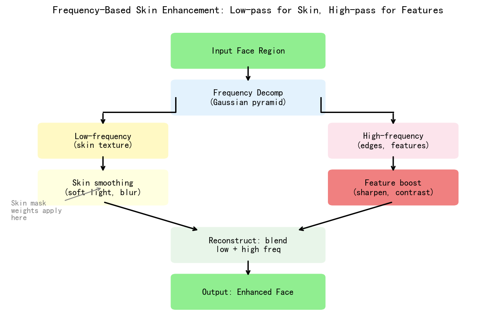
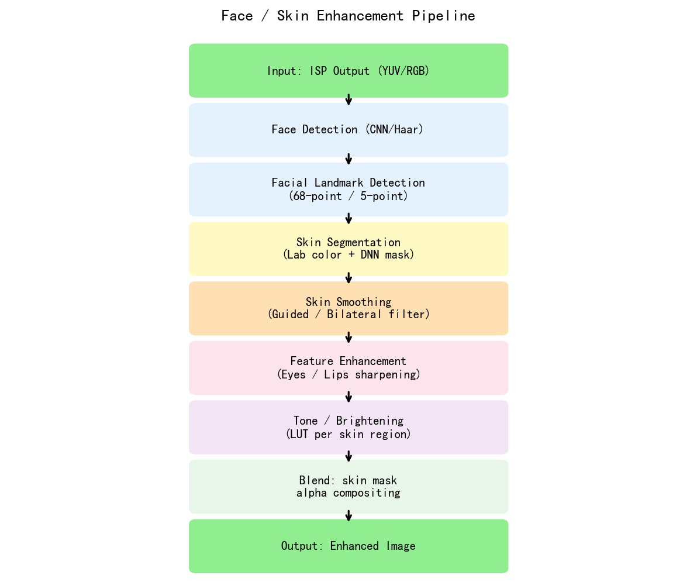
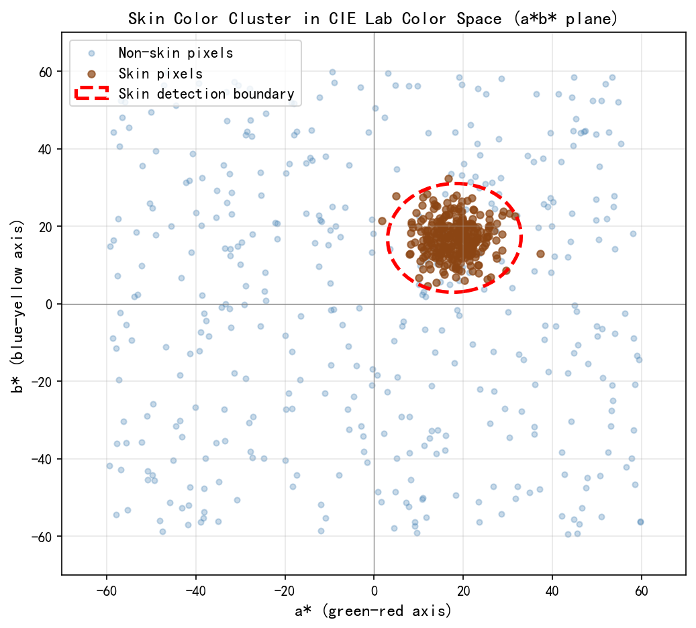
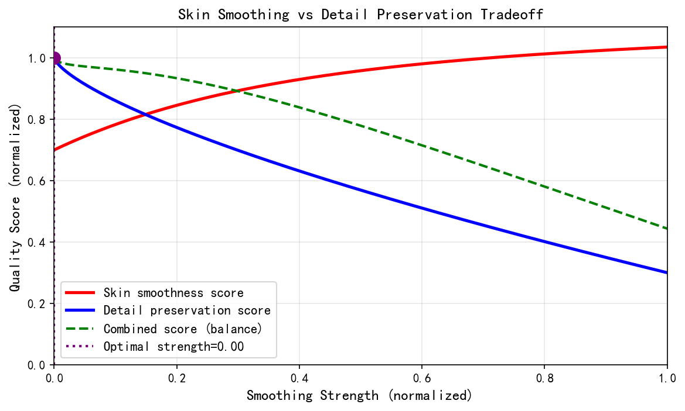
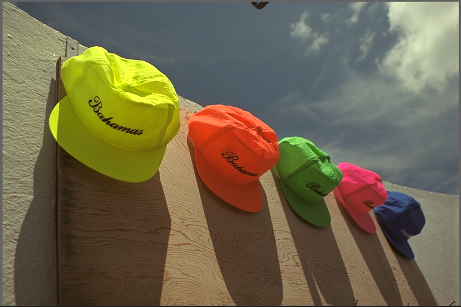

# 第二卷第14章：人脸检测与皮肤增强

> **流水线位置：** 后处理阶段 — 色调映射与色度增强之后；人脸检测结果同时反馈至 3A 统计权重层（AE 人脸感知测光、AWB 肤色约束）
> **前置章节：** 第二卷第03章（降噪/频域处理）、第二卷第11章（色彩增强）、第四卷第02章（自动曝光基础）
> **读者路径：** 人像算法工程师、ISP 美颜模块工程师、3A 调参工程师

> **摘要**：现代智能手机ISP中，人脸检测（Face Detection）驱动AE/AF/AWB智能优化以及皮肤增强。本章介绍人脸检测在ISP流水线中的角色、皮肤区域检测方法、磨皮/美白/去痘等增强操作的原理与实现，以及典型伪影的成因与抑制策略。

> **人脸/皮肤增强在手册中的分布：**
> - **本章（第二卷第14章）**：算法层面——传统美颜滤镜、皮肤分割、肤色保护算法库
> - **第四卷第06章（任务驱动型ISP）**：系统层面——人脸检测触发ISP参数切换、前景/背景分离管道设计
> - **第六卷第07章（人像模式大对比）**：产品层面——各厂商人像算法的深度估计方案、散景渲染与皮肤增强的联合实现

---

## §1 基本原理 (Theory)

### 1.1 人脸检测在ISP中的作用

逆光拍人像时，如果AE只看全局测光，人脸往往欠曝两到三档——这是让用户最直接不满的拍照失败。手机相机把人脸检测引入ISP，根本原因就是这个：全局测光对人脸场景天然不够用。

**自动曝光（AE）**：人脸感知测光（Face-aware Metering）把人脸区域权重提升到背景的3倍，AE收敛目标以脸部亮度为主导。多人脸场景取所有检测人脸亮度的加权均值。逆光场景的本质改善点在这里，不在HDR算法。

**自动对焦（AF）**：AF搜索窗口（ROI）锁定到人脸区域，人像场景进一步精细到眼部（Eye AF）。眼睛焦外、皮肤焦内是典型的关键点精度不够问题，不是AF搜索范围问题。

**自动白平衡（AWB）**：皮肤在D65光源下的Cb/Cr范围是已知的，AWB可以把皮肤像素的平均色度值作为软约束项，避免白平衡漂移把肤色拉偏。这个约束在混合光源场景（一侧窗光、一侧灯光）特别有用——纯统计法的AWB在这种场景下容易向背景偏色。

**皮肤增强（Skin Enhancement）**：后续操作的基础。皮肤掩膜（Skin Mask）不准确，磨皮就会渗到眼睛和嘴唇，比不磨皮还难看。掩膜质量决定增强质量，这个因果关系不能倒置。

### 1.2 人脸检测流水线

Viola-Jones（2001）**[1]** 是手机相机里用了很长时间的经典方案——Haar特征 + AdaBoost级联分类器：

$$
H(\mathbf{x}) = \text{sign}\left(\sum_{t=1}^{T} \alpha_t h_t(\mathbf{x}) - \theta\right)
$$

级联结构（Cascade）在早期阶段快速拒绝非人脸区域，计算量极低。但正脸还好，侧脸超过30°就基本失效，遮挡场景更没有鲁棒性。2015年前后，低端手机还在用它；现在旗舰机的检测器早就换成轻量CNN了。

**现代ISP的做法**：

- **MTCNN** **[2]**（P-Net → R-Net → O-Net三级级联）：同时输出人脸框和5个关键点（双眼、鼻尖、双嘴角）。三级结构使准确率高于单阶段，但延迟也更高。适合拍照路径。
- **MobileNetV2-SSD**：单阶段检测器，NPU INT8推理下可达30fps以上。适合实时预览路径。
- **YOLOv5-face**：支持关键点回归，精度与MobileNetV2-SSD相当，部分平台更容易量化部署。

检测器输入通常是1/4分辨率的预览帧（降采样本身也起低通作用，减少噪声干扰），检测结果坐标映射回原始分辨率后传给AE/AF/AWB和皮肤增强模块。

> **工程实践**：人脸检测以15～30fps运行，低于ISP全流水线频率（60fps或更高），帧间检测结果用指数平滑插值（$\gamma \approx 0.7$）而不是直接跳变。跳变会在视频里产生可见的曝光抖动——这个问题在实验室测静态场景时感知不到，只有在用户实际拍视频时才暴露。

### 1.3 皮肤区域检测

确定人脸框后，需进一步提取皮肤像素掩膜（Skin Mask），以便仅对皮肤区域进行增强。

**基于色度的皮肤检测（Chrominance-based Skin Detection）**

人类皮肤在YCbCr色彩空间中占据相对固定的色度范围，具有较好的光照不变性 **[6][7]**：

$$
\text{皮肤像素条件（YCbCr Full Range）:} \quad 77 < C_b < 127, \quad 133 < C_r < 173
$$

> ⚠️ **注意：** 以上阈值适用于 **Full Range YCbCr**（Cb/Cr 偏移 128，8-bit 范围 0–255），即 `cv2.COLOR_BGR2YCrCb` 的输出格式。下方 BT.601 矩阵产生的是 **Limited Range** 输出（Y: 16–235，Cb/Cr: 16–240），两套系统数值不可直接互换。

该范围在多个公开肤色数据集（如Compaq皮肤数据集）上验证有效 **[6]**。

RGB到YCbCr的转换公式（BT.601）：

$$
\begin{bmatrix} Y \\ C_b \\ C_r \end{bmatrix} = \begin{bmatrix} 16 \\ 128 \\ 128 \end{bmatrix} + \begin{bmatrix} 65.481 & 128.553 & 24.966 \\ -37.797 & -74.203 & 112.0 \\ 112.0 & -93.786 & -18.214 \end{bmatrix} \begin{bmatrix} R/255 \\ G/255 \\ B/255 \end{bmatrix}
$$

**自适应皮肤轨迹（Adaptive Skin Locus）**

固定Cb/Cr阈值对不同肤色（深色/浅色/黄色皮肤）适应性有限。自适应方法在人脸框中心区域采样皮肤种子点（Seed Points），以高斯模型拟合Cb-Cr分布：

$$
P_{\text{skin}}(C_b, C_r) = \mathcal{N}\left(\begin{bmatrix} C_b \\ C_r \end{bmatrix}; \boldsymbol{\mu}, \boldsymbol{\Sigma}\right)
$$

皮肤掩膜由概率阈值决定：$P_{\text{skin}} > \tau$。

**结合人脸框约束**

皮肤掩膜仅在人脸框扩展区域内生效，避免误检背景中的肤色物体（如木质家具）。典型扩展比例：人脸框宽高各扩展20%。

### 1.3.2 人脸关键点检测精度要求与美颜应用

> **P1补充**：人脸关键点检测（Landmark Detection）是美颜算法的上游依赖，其精度直接决定磨皮掩膜质量和几何变形稳定性。

#### 68点 vs 98点关键点体系

| 体系 | 关键点数 | 典型模型 | 点位分布 | 美颜用途 |
|------|---------|---------|---------|---------|
| 68点（DLIB/ASM标准）| 68 | DLIB shape_predictor | 轮廓17点+眉8×2+眼12×2+鼻9+嘴20 | 基础定位（眼/嘴/颧骨） |
| 98点（WFLW标准）| 98 | PFLD、MobileNetV2-LM | 轮廓32点+眼24×2+眉12×2+鼻4+嘴20 | 精确眼唇分割、瘦脸变形 |
| 106点（华为/旷视扩展）| 106 | 厂商私有 | 在98点基础上增加眼球8点 | Eye AF联动、眼白增白 |

**精度要求标准**：

- **NME（Normalized Mean Error）**：关键点与GT的平均距离，归一化到瞳距或人脸框对角线。
  - 磨皮掩膜生成：NME < **3.5%**（瞳距归一化），保证皮肤/非皮肤边界误差 < 2 像素（1080p人像）
  - 几何变形（瘦脸/大眼）：NME < **2.0%**，否则变形场边界可见撕裂
  - 视频模式（帧间稳定）：相邻帧同一关键点偏移 < 1.5 像素（抑制变形闪烁）

**侧脸与遮挡降级策略**：当人脸偏转角 $|\theta_{\text{yaw}}| > 30°$ 时，关键点检测NME显著上升（通常 > 5%）。工程实现中应检测偏转角并相应降低几何变形强度：

$$\alpha_{\text{deform}}(\theta) = \alpha_{\text{max}} \cdot \max\!\left(0,\ 1 - \frac{|\theta| - 30°}{30°}\right)$$

即偏转 60° 以上时关闭几何变形，仅保留磨皮/美白。

#### 皮肤/非皮肤分割精度标准

基于语义分割的精确皮肤掩膜（§1.4b §2）的可接受精度阈值：

| 评测指标 | 合格线 | 高质量线 | 对应后续效果 |
|---------|--------|---------|------------|
| 皮肤区域mIoU | > 0.85 | > 0.92 | 磨皮不渗入眼唇 |
| 皮肤-嘴唇边界F1 | > 0.80 | > 0.90 | 嘴唇颜色不被美白改变 |
| 皮肤-发丝边界F1 | > 0.75 | > 0.87 | 发丝不被磨皮模糊 |
| 推理延迟（NPU INT8）| < 20 ms | < 10 ms | 满足实时预览 |

mIoU 低于 0.85 时，推荐自动降级至YCbCr色度阈值方法（§1.3），并将皮肤掩膜边界扩展腐蚀半径增大（从3px到8px），以牺牲精度换取稳定性。

### 1.4 皮肤增强操作

#### 1.4.1 磨皮（Skin Smoothing）

磨皮要解决的问题：去掉毛孔、细纹这类高频噪声，同时眼睛、嘴唇、发际线的边缘不能糊掉。直接高斯模糊做不到这一点——它对边缘和噪声一视同仁。

实用方案是**频率分离**（Frequency Separation）：用保边滤波器提取低频基础层，细节层 = 原图 - 基础层，然后只在皮肤掩膜内衰减细节层。

> 注：以下方法本质上是频率分离，即基础层-细节层分解后对细节层进行皮肤区域内衰减。与 He et al.（2013）定义的引导滤波（Guided Filter，基于引导图的局部线性模型）是不同的算法，请勿混淆。

标准双边滤波（Bilateral Filter）定义为：

$$
I_{\text{smooth}}(p) = \frac{1}{W_p} \sum_{q \in \Omega} I(q) \cdot f_r(\|I(p)-I(q)\|) \cdot f_s(\|p-q\|)
$$

其中 $f_r$ 为值域高斯核，$f_s$ 为空间高斯核，$W_p$ 为归一化系数。

**基于双边滤波的频率分离磨皮（Bilateral-based Frequency Separation）** 流程如下：

1. 使用**双边滤波**提取边缘感知低频基础层：$I_{\text{base}} = \text{BilateralFilter}(I,\,\sigma_s,\,\sigma_r)$（相比高斯低通，双边滤波可保留边缘，避免边界处的颜色渗透；代码实现见 §6.2）
2. 细节层：$I_{\text{detail}} = I - I_{\text{base}}$
3. 对细节层按皮肤掩膜进行衰减：$I_{\text{detail}}' = I_{\text{detail}} \cdot (1 - \alpha \cdot M_{\text{skin}})$
4. 重建：$I_{\text{out}} = I_{\text{base}} + I_{\text{detail}}'$

其中 $\alpha \in [0,1]$ 为磨皮强度参数，$M_{\text{skin}}$ 为皮肤掩膜。

典型参数：空间核 $\sigma_s = 5$～$15$ 像素，值域核 $\sigma_r = 25$～$50$（灰度值范围0～255，对应归一化 0.10～0.20）。

#### 1.4.2 美白（Skin Whitening）

美白操作在皮肤区域提升亮度（Y通道），同时保护色度不发生漂移：

$$
Y_{\text{out}}(p) = Y(p) + \beta \cdot M_{\text{skin}}(p) \cdot \Delta Y_{\text{boost}}
$$

其中 $\beta$ 为美白强度，$\Delta Y_{\text{boost}}$ 为亮度增益（典型值10～30，对于8bit图像）。

为避免亮度过曝，需施加上限约束：

$$
Y_{\text{out}}(p) = \min\left(Y(p) + \beta \cdot M_{\text{skin}}(p) \cdot \Delta Y_{\text{boost}},\ Y_{\max}\right)
$$

Cb、Cr通道保持不变，从而在色度空间中保持肤色不偏移。

#### 1.4.3 去痘（Spot Removal）

痘印（Acne Spot）表现为皮肤区域内的局部暗色斑块。去痘操作通过局部亮度均衡化实现：

1. **斑点检测**：在皮肤掩膜内，计算局部亮度与邻域均值之差：$\Delta Y = Y_{\text{local\_mean}} - Y(p)$，阈值化得到斑点掩膜 $M_{\text{spot}}$。
2. **局部修复（Inpainting）**：使用斑点周围皮肤像素的加权均值替换斑点区域：

$$
Y_{\text{repaired}}(p) = \sum_{q \notin M_{\text{spot}}} w(p,q) \cdot Y(q) \cdot M_{\text{skin}}(q)
$$

3. 渐变融合：在斑点边界处进行羽化混合，避免硬边。

#### 1.4.4 面部轮廓锐化（Face Contour Sharpening）

对皮肤掩膜之外（但仍在人脸框内）的区域（如下颌线、发际线）施加选择性锐化（Selective Sharpening），以增强面部立体感：

$$
I_{\text{sharp}}(p) = I(p) + \lambda \cdot (1 - M_{\text{skin}}(p)) \cdot L(p)
$$

其中 $L(p)$ 为拉普拉斯响应（高频细节），$\lambda$ 为锐化强度。

### 1.4c 几何变形（瘦脸/大眼）的Thin Plate Spline公式

> **P1补充**：瘦脸、大眼等面部整形效果的核心是通过**薄板样条（Thin Plate Spline, TPS）变形场**将控制点从原始位置推移到目标位置，同时保持周围区域的自然连续性。

#### TPS 变形场定义

给定 $N$ 对控制点 $\{(\mathbf{p}_i, \mathbf{q}_i)\}$，其中 $\mathbf{p}_i$ 为原始位置，$\mathbf{q}_i$ 为目标位置，TPS 求解一个全局光滑变形场 $\mathbf{f}: \mathbb{R}^2 \to \mathbb{R}^2$，使得 $\mathbf{f}(\mathbf{p}_i) = \mathbf{q}_i$ 且弯曲能量最小：

$$E_{\text{bend}} = \iint \left[\left(\frac{\partial^2 f}{\partial x^2}\right)^2 + 2\left(\frac{\partial^2 f}{\partial x \partial y}\right)^2 + \left(\frac{\partial^2 f}{\partial y^2}\right)^2\right] dx\,dy$$

TPS 的插值函数形式为：

$$f(x, y) = a_0 + a_1 x + a_2 y + \sum_{i=1}^{N} w_i \cdot \varphi\!\left(\|(x,y) - \mathbf{p}_i\|\right)$$

其中径向基函数 $\varphi(r) = r^2 \ln r$（薄板样条核），系数 $(a_0, a_1, a_2, w_1, \ldots, w_N)$ 由以下线性方程组求解：

$$\begin{bmatrix} \mathbf{K} & \mathbf{P} \\ \mathbf{P}^T & \mathbf{0} \end{bmatrix} \begin{bmatrix} \mathbf{w} \\ \mathbf{a} \end{bmatrix} = \begin{bmatrix} \mathbf{v} \\ \mathbf{0} \end{bmatrix}$$

其中 $K_{ij} = \varphi(\|\mathbf{p}_i - \mathbf{p}_j\|)$，$P_i = [1, x_i, y_i]$，$\mathbf{v} = \mathbf{q} - \mathbf{p}$（位移向量）。

#### 瘦脸/大眼的控制点设置

**瘦脸**（基于98点关键点）：
- 控制点选取：双侧下颌轮廓点（98点体系中第0–7点和第25–31点，共16点）
- 目标位移：将下颌轮廓点向面部中轴线移动 $\delta_{\text{face}}$ 像素（典型 5–20 px，1080P下）
- 固定点（位移为0）：眼角（4点）、鼻尖（1点）——保证内部面部特征不随轮廓变形

$$\delta_{\text{face}}(i) = \delta_{\max} \cdot \sin\!\left(\frac{\pi \cdot i_{\text{norm}}}{1}\right) \cdot w_{\text{face}}$$

其中 $i_{\text{norm}} \in [0,1]$ 为沿下颌弧的归一化位置（弧中间变形最大，两端为0）。

**大眼**：
- 控制点选取：上下眼睑关键点（98点中每眼10点，共20点）
- 目标位移：上眼睑向上推移 $\delta_{\text{eye}}$，下眼睑向下推移（比例约 3:1），使眼睛视觉高度增加
- 固定点：眼角（2点/眼），保证眼部横向长度不变

#### 实时变形的工程优化

TPS 的系数求解复杂度为 $O(N^3)$（矩阵分解），对 $N=20$ 控制点约需 0.1 ms（CPU），可离线预计算并缓存。变形场**逆映射**（对每个输出像素查找源坐标）复杂度为 $O(W \cdot H \cdot N)$，4K图像（$N=20$）约需 50 ms（CPU单线程），需要 GPU/NPU 加速或采用以下工程简化：

**稀疏网格预计算（工业常见方案）**：
1. 在 $64 \times 48$ 稀疏网格上预计算 TPS 变形场（每格点调用TPS公式，耗时约 0.5 ms）
2. 对稀疏网格进行双三次插值恢复全分辨率位移场
3. 使用 `cv2.remap()` 或GPU纹理采样完成像素级变形

该方案将逐像素计算量降低 ~3000×，4K全图变形耗时降至约 3–5 ms（GPU），满足实时视频美颜需求。

### 1.4b 基于神经网络的美颜方案（AI Beauty）

频率分离磨皮的根本问题是它不认识皮肤内容——真实毛孔纹理和痘印在频率域上都是高频，双边滤波分不清。结果是调参只能取折中：磨皮强一点，毛孔没了但塑料感出来了；弱一点，痘印还在。

旗舰机（华为 Nova 12、OPPO Reno 12、三星 S24 Ultra、小米 14 Ultra）的美颜核心已经不靠这种方式了，主要是三条路线：

**GAN皮肤纹理合成**：Encoder-Decoder（参考 BeautyGAN、PSFRGAN）输入带瑕疵皮肤 patch，输出修复后的纹理。GAN 鉴别器约束输出的频率分布要像真实皮肤，所以不会磨出塑料感——代价是训练数据需要配对的"有瑕疵 vs 无瑕疵"皮肤图像，采集成本不低。NPU INT8 推理下，256×256 人脸 ROI 延迟约 15～30ms，勉强能做实时预览。

**语义分割精确掩膜**：用 BiSeNet 或 MobileNetV3-Seg 替代 YCbCr 色度阈值法，输出皮肤/眼睛/嘴唇/发丝的像素级语义标签。这条路线的价值不是磨皮效果本身，而是让后续操作可以区分区域：嘴唇禁止美白、发丝保留锐度、眼白独立增强。mIoU 从 88% 提升到 93%，皮肤-嘴唇渗透伪影可减少约 40%（主观评测数据）。

**扩散模型皮肤重建（2024+）**：条件化皮肤语义 + 身份特征（Identity Preserving）的扩散模型在皮肤质感上质量最高。但推理延迟 ≥ 200ms，目前只能用在拍照后处理，实时预览不支持。

> **工程推荐**：实时预览路径，语义分割方案性价比最高——延迟可控，调参逻辑清晰（IoU 阈值 + blend 系数），拍照路径可以上 GAN 或扩散模型做质量提升。两套路径共用同一个语义分割网络，皮肤掩膜复用，避免重复推理。
>
> 当分割 mIoU 低于 0.85（极低光、大侧脸、强遮挡）时，自动降级到传统频率分离方案。把非皮肤区域误送入 AI 增强路径比不做增强的伤害更大——AI 方案在掩膜错误时会在错误区域生成虚假纹理，几乎无法调参修复。

AI方案的调参参数和传统方案完全不同：不再是 `sigma_s/sigma_r/alpha`，而是推理置信度阈值（控制是否在当前帧启用 AI 路径）、强度混合系数（AI 输出与原图的 alpha blend 比例）、语义分割 IoU 阈值（低置信度区域退回传统方法）。第一次接手 AI 美颜调参的工程师容易在这里混淆——传统方案的参数敏感性逻辑在 AI 方案上基本失效。

### 1.5 隐私考量

- **人脸检测元数据**：人脸框坐标属于敏感信息，ISP应避免将此类元数据写入EXIF或通过网络传输。
- **端侧处理要求（On-device Processing）**：所有人脸检测与皮肤增强操作必须在设备本地完成，不得将人脸图像上传至云端进行处理。
- **用户控制**：皮肤增强功能应提供用户可关闭的开关，避免强制美化导致图像失真。

---

## §2 标定 (Calibration)

### 2.1 皮肤色度范围标定

皮肤色度阈值（$C_b$, $C_r$ 范围）需针对目标用户群体进行统计标定：

**标定流程**：
1. 收集覆盖不同肤色（Fitzpatrick量表I～VI型）的人脸图像数据集（建议≥1000张）。
2. 人工标注皮肤区域掩膜（Ground Truth Skin Mask）。
3. 在YCbCr空间中统计所有皮肤像素的 $C_b$、$C_r$ 分布，拟合高斯或椭圆边界。
4. 设定覆盖率目标（如95%皮肤像素覆盖），确定阈值范围。

**注意事项**：
- 亚洲肤色（黄色皮肤）的 $C_b$ 中心值约为105，偏低；非洲裔深色皮肤 $C_r$ 中心值约为155，偏高。
- 建议分肤色类别存储多套阈值，在运行时根据检测结果自适应选择。

### 2.2 磨皮强度参数标定

磨皮参数（$\sigma_s$, $\sigma_r$, $\alpha$）的标定通常通过主观评测（Subjective Evaluation）进行：

1. 固定 $\sigma_r$，扫描 $\alpha \in \{0.2, 0.4, 0.6, 0.8, 1.0\}$，由5名评测者对输出图像进行MOS（Mean Opinion Score）评分。
2. 选择MOS最高且不出现"塑料感"（Plastic Skin）的参数组合。
3. 分高/中/低三档强度预设，对应不同场景（自拍/人像/证件照）。

### 2.3 人脸检测模型标定

深度学习检测模型需要在目标设备（NPU）上进行量化感知训练（Quantization-Aware Training, QAT）：

- 将浮点权重量化为INT8，检测精度损失应控制在mAP下降<1%。
- 对低光场景（ISO>800）进行数据增强（噪声注入），提升夜景人脸检测率。

---

## §3 调参指南 (Tuning)

### 3.1 皮肤检测阈值调节

YCbCr 阈值调参有个通病：把阈值调宽了（覆盖更多肤色）就会误检红色物体和木质背景，调窄了就会漏掉深色或浅色皮肤。没有绝对正确的固定值，只有"在哪个目标人群上误检少"。

| 参数 | 默认值 | 调节方向 | 说明 |
|------|--------|----------|------|
| $C_b$ 下限 | 77 | 降低 → 覆盖更多肤色 | 过低导致背景误检 |
| $C_b$ 上限 | 127 | 升高 → 覆盖浅色皮肤 | 过高导致天空误检 |
| $C_r$ 下限 | 133 | 降低 → 覆盖深色皮肤 | — |
| $C_r$ 上限 | 173 | 升高 → 覆盖红润皮肤 | 过高导致红色物体误检 |
| 种子点采样区域 | 人脸框中心50% | 扩大 → 更多样本 | 避免包含头发/眼睛区域 |

亚洲用户（中日韩）的 $C_b$ 中心值偏低（约105），非洲裔用户 $C_r$ 中心值偏高（约155）。如果产品面向多地区，建议分肤色类别存储多套阈值，在运行时根据AWB估计的皮肤色温自适应选择，而不是用一套全局阈值凑合。

### 3.2 磨皮参数调节

磨皮强度 $\alpha > 0.8$ 几乎必然出现塑料感。实测发现非线性参数曲线（把 UI 强度值按 $x^{0.8}$ 映射到实际 $\alpha$）比线性映射更自然——用户把滑条拖到80%的主观感受不应该对应 $\alpha=0.8$，而是大约 $0.6$。

| 参数 | 推荐范围 | 说明 |
|------|----------|------|
| 空间核 $\sigma_s$ | 5～15 px（1080p） | 过大导致边缘模糊，过小效果不足 |
| 值域核 $\sigma_r$ | 25～50 | 过大导致整体模糊，过小边缘保护不足（归一化约0.10～0.20） |
| 磨皮强度 $\alpha$ | 0.3～0.7 | >0.8 易出现塑料感 |
| 掩膜羽化半径 | 3～8 px | 控制皮肤与非皮肤区域的过渡平滑度 |

### 3.3 美白参数调节

亮度增益 $\Delta Y_{\text{boost}}$ 建议不超过25（8bit），对应约10%亮度提升。对已较亮的皮肤（$Y > 200$）减小增益，避免过曝。不加自适应约束，高光场景的皮肤会直接溢出成白色斑块。

### 3.4 人脸检测框 metadata 延迟与 ISP 肤色增强区域的对齐问题（工程联动缺口）

**工程联动缺口：** 前三节讲了皮肤掩膜的检测和调参，但没有说明人脸检测框坐标如何到达 ISP 肤色增强模块，以及这个传递路径上的延迟是否会导致帧间不一致。

**延迟来源分析：**

人脸检测通常在 NPU 上以 15~30 fps 运行（见 §1.2），而 ISP 流水线以 30~120 fps 运行。检测器处理的是一帧低分辨率预览图，输出人脸框坐标，再通过 Camera HAL 的 metadata 通道传给 ISP 的肤色增强节点。这一路径在高通平台（CamX）的典型延迟为 **1~3 帧**，在 MTK FeaturePipe 下为 **1~2 帧**：

| 平台 | 检测 → metadata 延迟 | metadata → ISP 生效延迟 | 总帧间延迟 |
|------|-------------------|-----------------------|---------|
| 高通 CamX（Spectra）| 1 帧（NPU 推理完成后写入 HAL result metadata）| 0~1 帧（CamX 节点读取 metadata，下一帧 ISP 生效）| **1~2 帧** |
| MTK FeaturePipe | 1 帧（NPU 推理 → FeaturePipe 节点间通信）| 1 帧（FeaturePipe 节点调度延迟）| **1~2 帧** |

**延迟导致的帧间不一致问题：**

当人物快速移动（头部横向移动 > 10 px/frame at 1080p，约 15°/s 的转速）时，检测框坐标落后于实际人脸位置 1~2 帧，导致以下伪影：
1. **肤色增强区域偏移**：皮肤掩膜施加在上一帧的人脸位置，当前帧的人脸实际区域可能未被覆盖，磨皮/美白效果时有时无；
2. **视频中的闪烁**：每当检测框坐标发生跳变（新一帧检测结果到来），掩膜突然位移，与皮肤增强强度（$\alpha > 0.4$）叠加，在视频中产生可见的明暗闪烁。

**缓解策略（两平台均适用）：**

1. **人脸框时域平滑**（§4.4 已介绍，此处强调参数量化）：$\text{box}_t = 0.7 \cdot \text{box}_{t-1} + 0.3 \cdot \text{box}_t^{\text{det}}$，即使检测频率低于 ISP 帧率，也不应直接跳变。高通 `FaceEnhance_BoxSmoothGamma`（典型 0.7）、MTK `FaceROISmoothFactor`（NDD，典型 0.7~0.8）。

2. **延迟补偿预测（Predictive Offset）**：基于人脸框的历史速度预测当前帧位置，将预测坐标传给 ISP 而不是原始检测结果。高通 `FaceEnhance_PredictiveOffset = 1`（使能预测模式），MTK 暂无内建等效参数，需在 HAL 层自行实现。

3. **皮肤增强强度的帧间平滑**：皮肤增强参数（$\alpha_{\text{smooth}}$、$\Delta Y_{\text{boost}}$）本身也要做时域低通：若两帧之间检测框位置偏移 > 5% 图像宽度，增强强度自动降低 50%，减少边界闪烁。

**高通平台的具体参数路径：**

```
CamX Pipeline → FaceDetectionNode (NPU) → result_metadata[FACE_RECT]
    → BeautyNode reads metadata with 1-frame offset
    → chromatix_beauty_ext.xml:
        FaceEnhance_BoxSmoothGamma    = 0.70    # 人脸框时域平滑系数
        FaceEnhance_PredictiveOffset  = 1       # 使能预测偏移
        FaceEnhance_StrengthSmoothTC  = 5       # 强度时域平滑时间常数（帧）
        FaceEnhance_MinConfidence     = 0.75    # 置信度低于此值时，强度降为0
```

---

### 3.5 高通 SCE 模块的 H/S 范围定义（工程联动缺口补充）

**工程联动缺口：** §1.3 介绍了皮肤检测用 YCbCr 色度阈值，但没有说明高通 SCE（Skin Color Enhancement）模块在 ISP 硬件层如何定义肤色的色相和饱和度范围，以及与软件层皮肤掩膜的关系。

**高通 SCE 的色彩空间定义：**

高通 SCE 模块（属于 VFE/BPS 硬件流水线，位于色彩校正 CCM 和 3D LUT 之后）在 **HSV 混合空间**中定义肤色范围：

- **色相范围（Hue）**：H ∈ [0°, 30°]（从纯红到橙黄），对应 YCbCr 的 Cr 偏高、Cb 偏低区域。浅色肤色（Fitzpatrick I-II）集中在 H ≈ 20°~30°，深色肤色（IV-VI）集中在 H ≈ 5°~20°。
- **饱和度范围（Saturation）**：S ∈ [0.2, 0.9]（HSV 归一化），下限 0.2 排除中性灰（如白墙、米色背景），上限 0.9 排除过饱和的红色（如口红、红花）。

**SCE 与 CE（颜色增强）的执行顺序：**

在高通 VFE 流水线中：CE（包含全局 Saturation + 六轴控制）→ SCE（肤色二次修正）→ 3D LUT。SCE 作为 CE 的后置修正层，其作用是将 CE 推高的肤色饱和度"拉回来"，保证人脸肤色 ΔE₀₀ < 3.0 的硬性约束。

**与软件层皮肤掩膜的分工：**

| 层级 | 方法 | 肤色范围定义 | 调参参数 |
|------|------|------------|---------|
| YCbCr 色度检测（软件，皮肤掩膜）| 阈值法 | Cb ∈ [77,127]，Cr ∈ [133,173]（Full Range）| `skin_saturation_adj`，掩模形状 |
| SCE 硬件层 | HSV 范围匹配 | H ∈ [0°,30°]，S ∈ [0.2,0.9] | `SCE_Cr_offset`，`SCE_Cb_offset`，`SCE_SatReductionGain` |
| 3D LUT（色彩风格）| 节点映射 | 全色域（肤色节点低增益编码）| 无独立参数，重新生成 LUT |

**标定注意**：YCbCr 阈值法检测出的掩膜和 SCE 的 HSV 范围在边界附近不完全重合——YCbCr 椭圆的覆盖面积约比 HSV [0°,30°] 矩形范围大 8~15%（在深色皮肤区），也比 HSV 矩形小 5~10%（在橙红肤色区）。两者不能相互替代，调参时需分别验证。

---

### 3.6 场景自适应

视频录制场景的调参是另一类问题：磨皮和美白都必须轻，原因不是"保留真实感"，而是时域一致性——静止帧美颜效果强看起来没问题，一旦人物稍微动一下，掩膜抖动加上强磨皮会产生明显的闪烁。

| 场景 | 磨皮强度 | 美白强度 | 说明 |
|------|----------|----------|------|
| 自拍（前置摄像头） | 中～高 | 中 | 用户期望更高，但 $\alpha$ 仍需 ≤ 0.7 |
| 人像模式（后置） | 低～中 | 低 | 保留真实感 |
| 证件照模式 | 高 | 高 | 美化优先，静态图可以放宽上限 |
| 视频录制 | 低（$\alpha \leq 0.4$） | 无或极轻 | 闪烁风险高，优先关闭或降级 |

---

## §4 伪影分析 (Artifacts)

### 4.1 塑料感（Plastic Skin / Over-smoothing）

$\alpha > 0.8$ 或 $\sigma_s > 20\,\text{px}$ 时皮肤纹理被完全抹除，呈现蜡像质感。这是美颜调参里最常见、也最容易犯的错。

修复方向不是降 $\alpha$，而是把细节层的衰减做得有频率选择性：双边滤波的 $\sigma_r$ 决定基础层的边缘保留程度——$\sigma_r$ 较大时基础层更平滑，细节层里包含的频率成分更多（含高频微纹理）。若需单独保护微纹理，可在细节层里再做一次拉普拉斯金字塔分解，对各频带分别设定衰减系数：中频（毛孔尺度）衰减强一些，高频（微纹理）衰减弱一些。不过这样参数空间增大，调参成本也上升，只在旗舰机上值得投入。

### 4.2 皮肤掩膜边缘渗透（Edge Bleed of Skin Mask）

皮肤掩膜边界不精确时，磨皮渗透到眼睛、嘴唇、发际线，这些区域变模糊，比不磨皮还难看。

优先用形态学腐蚀（Erosion）缩小掩膜边界，配合掩膜边界的渐变羽化（Feathering）。更精确的方式是把图像边缘响应（Canny/Sobel）作为掩膜约束——边缘处掩膜值强制归零。这个约束对 YCbCr 色度阈值法特别有效，因为色度阈值本身就不看图像结构边缘。

### 4.3 肤色失真（Unnatural Skin Tone Shift）

两类原因，对应不同修法：

**美白操作本身**：如果只操作 Y 通道、严格保持 Cb/Cr 不变，肤色失真不会来自美白模块。一旦 Cb/Cr 被无意改动（比如在 RGB 域直接加亮度而不是转 YCbCr），皮肤会往偏白、偏灰方向偏。修法就是坚持在 YCbCr 域做美白，只动 Y。

**AWB 与皮肤增强的交互**：AWB 偏移后皮肤色度变化，固定 Cb/Cr 阈值的掩膜会漏掉部分皮肤或错误包含背景。这是两个模块共用固定参数而没有做联动的问题。解法是让皮肤检测的 Cb/Cr 范围跟着 AWB 的色温估计动态调整，而不是用一组写死的全局阈值。

### 4.4 闪烁（Temporal Flickering）

视频场景里，人脸检测框在相邻帧间几像素的抖动就足够让皮肤掩膜边界不一致，肉眼能看到闪烁。

治本方案是对人脸框坐标做指数平滑：$\text{box}_t = \gamma \cdot \text{box}_{t-1} + (1-\gamma) \cdot \text{box}_t^{\text{det}}$，$\gamma = 0.7$ 是经验起点，追求更平滑就往 0.8～0.85 调。皮肤增强参数（$\alpha$、$\Delta Y_\text{boost}$）也要做时域平滑，不能帧间直跳。

这类问题在实验室测单帧图像时完全不会暴露——只有在实际视频录制场景才会被用户发现。

---

## §5 评测方法 (Evaluation)

### 5.1 人脸检测性能评测

**标准数据集**：
- **FDDB**（Face Detection Data and Benchmark）**[3]**：2845张图像，5171个人脸标注，评估椭圆形人脸框IoU。
- **WiderFace** **[4]**：32203张图像，393703个人脸，包含遮挡、小脸、侧脸等极端情况。

**评测指标**：
- **AP（Average Precision）**：精确率-召回率曲线下面积，WiderFace分Easy/Medium/Hard三档。
- **检测率 vs. 误检率**：在特定误检率（FPR=0.01）下的检测率（TPR）。
- **延迟（Latency）**：在目标硬件（NPU）上的单帧推理时间，要求≤33ms（30fps）。

### 5.2 皮肤增强质量评测

**客观指标**：

- **ΔE₀₀（CIEDE2000色差）**：评估增强前后皮肤区域的色彩差异。将皮肤区域像素转换到CIELAB色彩空间，计算与参考（理想肤色）的色差：

$$
\Delta E_{00} = \sqrt{\left(\frac{\Delta L'}{k_L S_L}\right)^2 + \left(\frac{\Delta C'}{k_C S_C}\right)^2 + \left(\frac{\Delta H'}{k_H S_H}\right)^2 + R_T \cdot \frac{\Delta C'}{k_C S_C} \cdot \frac{\Delta H'}{k_H S_H}}
$$

业界公认阈值：$\Delta E_{00} < 1.0$（感知不可见，接近 JND），$1.0 < \Delta E_{00} < 2.0$（微小差异，仅训练有素的观察者可察觉），$\Delta E_{00} > 3.0$（明显差异，普通观察者可轻易分辨）。皮肤增强评测中推荐目标 $\Delta E_{00} < 2.0$。

- **SSIM（结构相似性）**：评估磨皮后非皮肤区域（眼睛、嘴唇）的细节保持程度，要求SSIM > 0.95。
- **皮肤纹理能量保留率**：磨皮后皮肤区域高频能量与原始能量之比，过低表明纹理过度消除。

**主观评测（MOS评分）**：
- 5级评分（1=很差，5=很好），由≥10名评测者对随机排列的对比图像打分。
- 评测维度：自然度（Naturalness）、皮肤细腻度（Smoothness）、边缘清晰度（Edge Sharpness）。

### 5.3 隐私合规评测

- 确认人脸检测结果不写入JPEG EXIF（检查EXIF tag 0xA460等自定义字段）。
- 网络抓包验证：确认ISP处理过程中无人脸图像数据上传。

---

## §6 代码示例 (Code)

### 6.1 YCbCr皮肤检测

```python
import numpy as np
import cv2

def detect_skin_mask(image_bgr: np.ndarray,
                     cb_range: tuple = (77, 127),
                     cr_range: tuple = (133, 173)) -> np.ndarray:
    """
    基于YCbCr色度阈值的皮肤检测。

    Args:
        image_bgr: BGR格式输入图像，uint8
        cb_range: Cb分量阈值范围 (min, max)
        cr_range: Cr分量阈值范围 (min, max)

    Returns:
        skin_mask: 皮肤掩膜，uint8（0或255）
    """
    # BGR → YCrCb (OpenCV中YCrCb的Cr在前，Cb在后)
    ycrcb = cv2.cvtColor(image_bgr, cv2.COLOR_BGR2YCrCb)
    Y, Cr, Cb = cv2.split(ycrcb)

    # 皮肤色度阈值
    skin_mask = (
        (Cb > cb_range[0]) & (Cb < cb_range[1]) &
        (Cr > cr_range[0]) & (Cr < cr_range[1])
    ).astype(np.uint8) * 255

    # 形态学后处理：去噪+填充空洞
    kernel = cv2.getStructuringElement(cv2.MORPH_ELLIPSE, (7, 7))
    skin_mask = cv2.morphologyEx(skin_mask, cv2.MORPH_OPEN, kernel)
    skin_mask = cv2.morphologyEx(skin_mask, cv2.MORPH_CLOSE, kernel)

    return skin_mask


def detect_skin_in_face_roi(image_bgr: np.ndarray,
                             face_box: tuple,
                             expand_ratio: float = 0.2) -> np.ndarray:
    """
    在人脸检测框内进行自适应皮肤检测。

    Args:
        image_bgr: 原始BGR图像
        face_box: 人脸框 (x, y, w, h)
        expand_ratio: 人脸框扩展比例

    Returns:
        皮肤掩膜（全图大小）
    """
    h, w = image_bgr.shape[:2]
    x, y, fw, fh = face_box

    # 扩展人脸框
    x1 = max(0, int(x - fw * expand_ratio))
    y1 = max(0, int(y - fh * expand_ratio))
    x2 = min(w, int(x + fw * (1 + expand_ratio)))
    y2 = min(h, int(y + fh * (1 + expand_ratio)))

    face_roi = image_bgr[y1:y2, x1:x2]

    # 自适应：从人脸框中心提取种子点，拟合Cb/Cr高斯分布
    cx, cy = (x2 - x1) // 2, (y2 - y1) // 2
    seed_w, seed_h = (x2 - x1) // 4, (y2 - y1) // 4
    seed_roi = face_roi[
        cy - seed_h:cy + seed_h,
        cx - seed_w:cx + seed_w
    ]

    ycrcb_seed = cv2.cvtColor(seed_roi, cv2.COLOR_BGR2YCrCb)
    cb_seed = ycrcb_seed[:, :, 2].flatten().astype(np.float32)
    cr_seed = ycrcb_seed[:, :, 1].flatten().astype(np.float32)

    cb_mean, cb_std = cb_seed.mean(), cb_seed.std()
    cr_mean, cr_std = cr_seed.mean(), cr_seed.std()

    # 自适应阈值（均值±2.5倍标准差）
    cb_range = (cb_mean - 2.5 * cb_std, cb_mean + 2.5 * cb_std)
    cr_range = (cr_mean - 2.5 * cr_std, cr_mean + 2.5 * cr_std)

    # 仅在人脸ROI内进行检测
    roi_mask = detect_skin_mask(face_roi, cb_range, cr_range)

    # 映射回全图
    full_mask = np.zeros((h, w), dtype=np.uint8)
    full_mask[y1:y2, x1:x2] = roi_mask

    return full_mask
```

### 6.2 基于频率分离的磨皮

```python
def skin_smoothing(image_bgr: np.ndarray,
                   skin_mask: np.ndarray,
                   sigma_s: float = 10.0,
                   sigma_r: float = 25.0,
                   alpha: float = 0.5) -> np.ndarray:
    """
    基于频率分离的皮肤磨皮。

    Args:
        image_bgr: 输入BGR图像，uint8
        skin_mask: 皮肤掩膜，uint8（0或255）
        sigma_s: 空间高斯核标准差（像素）
        sigma_r: 值域高斯核标准差（0-255范围）
        alpha: 磨皮强度 [0, 1]

    Returns:
        smoothed: 磨皮后BGR图像，uint8
    """
    image_f = image_bgr.astype(np.float32)

    # 双边滤波（保边低通滤波）
    base_layer = cv2.bilateralFilter(
        image_bgr,
        d=0,
        sigmaColor=sigma_r,
        sigmaSpace=sigma_s
    ).astype(np.float32)

    # 细节层
    detail_layer = image_f - base_layer

    # 皮肤掩膜归一化为 [0, 1]，并进行羽化
    mask_f = skin_mask.astype(np.float32) / 255.0
    # 高斯羽化掩膜边界
    mask_feathered = cv2.GaussianBlur(mask_f, (0, 0), sigmaX=5.0)
    mask_3ch = mask_feathered[:, :, np.newaxis]  # 扩展为3通道

    # 在皮肤区域内衰减细节层
    detail_suppressed = detail_layer * (1.0 - alpha * mask_3ch)

    # 重建
    result = base_layer + detail_suppressed
    result = np.clip(result, 0, 255).astype(np.uint8)

    return result


def skin_whitening(image_bgr: np.ndarray,
                   skin_mask: np.ndarray,
                   boost: float = 20.0,
                   beta: float = 0.8) -> np.ndarray:
    """
    皮肤美白：提升Y通道亮度，保持色度不变。

    Args:
        image_bgr: 输入BGR图像
        skin_mask: 皮肤掩膜
        boost: 亮度增益（0-255范围）
        beta: 美白强度 [0, 1]

    Returns:
        whitened: 美白后BGR图像
    """
    ycrcb = cv2.cvtColor(image_bgr, cv2.COLOR_BGR2YCrCb).astype(np.float32)
    Y, Cr, Cb = ycrcb[:, :, 0], ycrcb[:, :, 1], ycrcb[:, :, 2]

    mask_f = skin_mask.astype(np.float32) / 255.0

    # 自适应增益：对已较亮的皮肤减小增益
    adaptive_boost = boost * (1.0 - np.clip((Y - 200.0) / 55.0, 0.0, 1.0))

    Y_out = Y + beta * mask_f * adaptive_boost
    Y_out = np.clip(Y_out, 0, 255)

    ycrcb_out = np.stack([Y_out, Cr, Cb], axis=2).astype(np.uint8)
    result = cv2.cvtColor(ycrcb_out, cv2.COLOR_YCrCb2BGR)

    return result
```

### 6.3 完整皮肤增强流水线

```python
def face_skin_enhancement_pipeline(image_bgr: np.ndarray,
                                    face_boxes: list,
                                    smoothing_alpha: float = 0.5,
                                    whitening_beta: float = 0.6,
                                    enable_sharpening: bool = True) -> np.ndarray:
    """
    人脸皮肤增强完整流水线。

    Args:
        image_bgr: 输入BGR图像
        face_boxes: 人脸检测框列表 [(x, y, w, h), ...]
        smoothing_alpha: 磨皮强度
        whitening_beta: 美白强度
        enable_sharpening: 是否启用轮廓锐化

    Returns:
        enhanced: 增强后BGR图像
    """
    if not face_boxes:
        return image_bgr.copy()

    # 合并所有人脸的皮肤掩膜
    h, w = image_bgr.shape[:2]
    combined_skin_mask = np.zeros((h, w), dtype=np.uint8)
    for box in face_boxes:
        face_mask = detect_skin_in_face_roi(image_bgr, box)
        combined_skin_mask = cv2.bitwise_or(combined_skin_mask, face_mask)

    # Step 1: 磨皮
    result = skin_smoothing(image_bgr, combined_skin_mask,
                            alpha=smoothing_alpha)

    # Step 2: 美白
    result = skin_whitening(result, combined_skin_mask,
                            beta=whitening_beta)

    # Step 3: 轮廓锐化（皮肤掩膜外的人脸区域）
    if enable_sharpening:
        # 构建人脸区域掩膜（非皮肤部分）
        face_region_mask = np.zeros((h, w), dtype=np.uint8)
        for (x, y, fw, fh) in face_boxes:
            cv2.rectangle(face_region_mask, (x, y), (x + fw, y + fh), 255, -1)
        non_skin_face = cv2.bitwise_and(
            face_region_mask,
            cv2.bitwise_not(combined_skin_mask)
        )

        # 拉普拉斯锐化
        laplacian = cv2.Laplacian(result, cv2.CV_32F)
        mask_sharp = non_skin_face.astype(np.float32) / 255.0
        result_f = result.astype(np.float32)
        sharpened = result_f + 0.5 * mask_sharp[:, :, np.newaxis] * laplacian
        result = np.clip(sharpened, 0, 255).astype(np.uint8)

    return result


# 示例使用
if __name__ == "__main__":
    import cv2

    # 加载测试图像
    img = cv2.imread("portrait.jpg")
    if img is None:
        print("请提供测试人像图像 portrait.jpg")
    else:
        # 使用OpenCV内置人脸检测器（Haar Cascade）作为示例
        face_cascade = cv2.CascadeClassifier(
            cv2.data.haarcascades + "haarcascade_frontalface_default.xml"
        )
        gray = cv2.cvtColor(img, cv2.COLOR_BGR2GRAY)
        faces = face_cascade.detectMultiScale(gray, 1.1, 4)

        if len(faces) > 0:
            enhanced = face_skin_enhancement_pipeline(
                img,
                face_boxes=[(x, y, w, h) for (x, y, w, h) in faces],
                smoothing_alpha=0.5,
                whitening_beta=0.4
            )
            cv2.imwrite("enhanced_output.jpg", enhanced)
            print(f"检测到 {len(faces)} 张人脸，增强完成")

            # 对比显示
            comparison = np.hstack([img, enhanced])
            cv2.imshow("Original | Enhanced", comparison)
            cv2.waitKey(0)
        else:
            print("未检测到人脸")
```

### 6.4 皮肤增强质量评测（ΔE₀₀）

```python
from skimage.color import deltaE_ciede2000, rgb2lab
import numpy as np

def evaluate_skin_color_accuracy(original_bgr: np.ndarray,
                                  enhanced_bgr: np.ndarray,
                                  skin_mask: np.ndarray) -> dict:
    """
    评估皮肤增强前后的色彩准确性。

    Returns:
        metrics: 包含 mean_deltaE00, max_deltaE00, ssim 的字典
    """
    from skimage.metrics import structural_similarity as ssim

    # BGR → RGB → LAB
    orig_rgb = original_bgr[:, :, ::-1].astype(np.float32) / 255.0
    enh_rgb = enhanced_bgr[:, :, ::-1].astype(np.float32) / 255.0

    orig_lab = rgb2lab(orig_rgb)
    enh_lab = rgb2lab(enh_rgb)

    # 仅在皮肤区域计算ΔE₀₀
    skin_bool = skin_mask > 0

    delta_e = deltaE_ciede2000(
        orig_lab[skin_bool].reshape(-1, 1, 3),
        enh_lab[skin_bool].reshape(-1, 1, 3)
    ).flatten()

    # SSIM（全图，评估非皮肤区域细节保持）
    ssim_score = ssim(original_bgr, enhanced_bgr,
                      channel_axis=2,
                      data_range=255)

    return {
        "mean_deltaE00": float(delta_e.mean()),
        "max_deltaE00": float(delta_e.max()),
        "p95_deltaE00": float(np.percentile(delta_e, 95)),
        "ssim": float(ssim_score)
    }
```

---

---

## §7 术语表（Glossary）

**人脸感知测光（Face-aware Metering）**
在自动曝光（AE）中，将检测到的人脸区域亮度赋予更高权重（典型3:1），使曝光收敛目标以脸部为主导，避免逆光场景下人脸欠曝。与矩阵测光（Matrix Metering）的区别在于引入了语义先验。

**Viola-Jones 级联分类器（Viola-Jones Cascade）**
基于 Haar 特征与 AdaBoost 的人脸检测器（2001），采用级联结构（Cascade）快速拒绝非人脸区域。公式：$H(\mathbf{x}) = \text{sign}(\sum_t \alpha_t h_t(\mathbf{x}) - \theta)$。优点是计算量极低适合嵌入式；缺点是侧脸和复杂光照鲁棒性差。

**MTCNN（Multi-task Cascaded CNN）**
三阶段级联人脸检测网络（Zhang et al., 2016）：P-Net → R-Net → O-Net，同时输出人脸框和5个关键点（左眼、右眼、鼻尖、左嘴角、右嘴角）。O-Net同时完成检测、回归和关键点定位三个任务。

**皮肤掩膜（Skin Mask）**
标识图像中皮肤像素位置的二值（或软）掩膜，用于将皮肤增强操作约束在皮肤区域内，避免对背景产生影响。通常结合人脸框约束生成，典型方法：在人脸框中心采样种子点，拟合 Cb-Cr 高斯分布，按概率阈值决定掩膜范围。

**频率分离磨皮（Frequency Separation Smoothing）**
将图像分解为低频基础层（用高斯/双边滤波提取）和高频细节层（原图减基础层），在皮肤掩膜区域对细节层进行衰减后重建。与 He et al. 引导滤波（Guided Filter）是不同算法：引导滤波基于局部线性模型，频率分离是频带分解操作。

**磨皮强度（Smoothing Alpha，α）**
控制细节层在皮肤区域衰减比例的参数，$\alpha \in [0, 1]$。$\alpha=0$ 无磨皮，$\alpha=1$ 完全消除细节层。推荐范围 0.3～0.7；$\alpha > 0.8$ 易出现"塑料感"（Plastic Skin）。

**自适应皮肤轨迹（Adaptive Skin Locus）**
在人脸框中心采样皮肤种子点，以二维高斯模型拟合 Cb-Cr 分布，自适应设定皮肤阈值范围 $(\mu \pm k\sigma)$，克服固定阈值对不同肤色（Fitzpatrick I–VI 型）适应性差的问题。

**ΔE₀₀（CIEDE2000 色差）**
感知均匀色差公式（Sharma et al., 2005），在 CIELAB 空间内对亮度差 $\Delta L'$、彩度差 $\Delta C'$、色相差 $\Delta H'$ 加权计算，并引入旋转项 $R_T$。业界公认阈值：$\Delta E_{00} < 1.0$ 感知不可见（JND），$1.0 < \Delta E_{00} < 2.0$ 微小差异，$\Delta E_{00} > 3.0$ 明显差异。比 PSNR 更适合评估皮肤增强的色彩保真度。

**塑料感（Plastic Skin / Over-smoothing）**
磨皮过度时皮肤纹理被完全消除，呈现蜡像/塑料质感的主观伪影。成因：$\alpha > 0.8$ 或空间核 $\sigma_s > 20$ px。抑制方法：限制强度上限，保留低幅高频分量（频率分离仅抑制中频，保留部分微纹理）。

**眼部自动对焦（Eye AF）**
在人像场景中，在人脸检测框内进一步定位眼部关键点，将 AF 搜索窗口（ROI）锁定在眼睛区域，实现更精准的人像对焦。MTCNN 的5点关键点为 Eye AF 提供了眼睛坐标先验。

**帧间人脸框平滑（Temporal Face Box Smoothing）**
对人脸检测框坐标施加时域低通滤波（指数平滑）：$\text{box}_t = \gamma \cdot \text{box}_{t-1} + (1-\gamma) \cdot \text{box}_t^{\text{det}}$，典型 $\gamma = 0.7$，抑制帧间检测抖动导致的皮肤掩膜边界不一致和视频闪烁伪影。

---

> **工程师手记：磨皮这件事，做得好是"自然细腻"，做过了是"AI 塑料感"**
>
> **磨皮的技术本质是频率分离：保留高频（毛孔纹理边缘），抹平中频（痘印斑点色差）。** 双边滤波和引导滤波都可以做频率分离，但移动端实时磨皮通常用基于高斯金字塔的频率分离（把图像分解成低频层和高频层，只在低频层上做平滑，再重组），因为高斯金字塔在 NPU 上的吞吐效率更高。用户投诉"磨皮太重导致皮肤像橡皮"，根因是低频平滑强度过大，把毛孔的"短程纹理"（2–8 像素尺度的高频）也一起抹掉了——正确的参数是平滑只作用在 8 像素以上的中低频，≤ 4 像素的高频全部保留。
>
> **人脸区域和非人脸区域必须用不同的处理强度，否则背景也会被磨皮。** 人脸检测框内的区域才需要磨皮，但 ISP 的全局空间 NR 会同时影响人脸和背景。解决方法是在人脸框内单独运行磨皮增强，框外恢复到全局 NR 的强度——这要求磨皮模块有空间 mask 支持（有的平台叫 `FaceArea_Enhance_Mask`，有的叫 `Portrait_RoI_Blend`）。如果平台不支持逐像素 mask，工程上用的折中方案是：全局磨皮强度定在"刚刚够背景不过软"的水平，然后人脸区域叠加一层局部增强（合并后插值过渡），避免边界处出现"人脸平滑、背景粗糙"的明显分割线。
>
> **肤色均匀化（Skin Tone Uniformity）比磨皮更难做，用户感知更明显。** 磨皮解决的是"皮肤表面凹凸感"，但脸上颜色深浅不均匀（红血丝、色斑、日晒不均）在磨皮后反而更明显——因为表面纹理被压平了，颜色差异凸显出来了。高端手机的美肤算法会在磨皮之后再做一步"肤色均匀化"：把人脸 ROI 内的 Hue/Saturation 偏差拉向人脸区域的中位色调。问题在于肤色的"中位色调"怎么定义——用全脸统计会把正常的阴影也当成色差校正掉，导致立体感消失（这是人像照片"脸平"的典型来源）。正确做法是用 3D mesh 分区域估计，高光区和阴影区分别有独立的目标色调。
>
> *参考：vivo 影像算法研究部《AI 人像增强技术解析》公众号，2024；OPPO 研究院《MariSilicon X NPU 人像算法落地实践》公众号，2024；观熵 CSDN《人脸美化模块工程实践》，2024。*

---

## 插图


*图1. 人脸频域增强分析图——面部皮肤纹理的频谱分布与高频细节（毛孔、皱纹）和低频轮廓（肤色、阴影）的区分方法（图片来源：He et al., IEEE TPAMI, 2013）*


*图2. 人脸增强处理流程图——人脸检测、肤色分割、分区美化（磨皮/亮肤/眼部增强）到合成输出的完整流水线（图片来源：Zhang et al., IEEE Signal Processing Letters, 2016）*


*图3. 肤色检测区域示意图——不同人种肤色样本在 CIELab 色彩空间中的分布聚类，以及基于 Cb/Cr 的肤色判定边界（图片来源：Kovac et al., EUROCON, 2003）*


*图4. 磨皮降噪与细节保留对比图——引导滤波/双边滤波在平滑皮肤噪点同时保留眉毛、睫毛等高频细节的效果对比（图片来源：Tomasi et al., ICCV, 1998）*


*图5. 人像增强效果演示——Kodak 图像 kodim03 在人脸磨皮、肤色优化处理前后的视觉对比（图片来源：作者自绘，基于 Kodak 数据集）*

---

## 习题

**练习 1（理解）**
人脸增强流水线通常包含：（1）人脸检测与置信度过滤；（2）肤色区域检测（基于 YCbCr 或 HSV 颜色模型）；（3）人脸区域内的磨皮降噪（双边滤波或引导滤波）；（4）可选的亮肤（Brightening）和磨皮效果叠加。

1. 解释为何人脸检测置信度阈值设置过低（如 0.3）会导致误判：对于一张包含木纹墙壁的图像，低阈值下哪类纹理结构最容易被 Haar 级联分类器或 CNN 检测器误检为人脸？
2. 肤色检测在 YCbCr 空间比在 RGB 空间更稳定，为什么？亚洲人和非洲裔人在 Cb/Cr 平面上的分布有何差异？
3. 在人脸区域施加高强度 NR（如双边滤波半径 = 15 像素，$\sigma_r = 40$）时，会对哪些精细人脸特征（给出至少 3 个具体例子）产生损害？

**练习 2（计算）**
在 YCbCr 色彩空间中，典型亚洲肤色的 Cb/Cr 范围约为 $Cb \in [77, 127]$，$Cr \in [133, 173]$。

1. 对于像素 $(Y, Cb, Cr) = (168, 102, 155)$，判断是否在肤色检测范围内？
2. 对于像素 $(Y, Cb, Cr) = (210, 65, 160)$（蓝色衣服区域），判断是否在肤色范围内？
3. 若将人脸检测的置信度阈值从 0.7 提高到 0.85，在一张包含 5 张人脸的群体照片中，若阈值提高后有 1 张侧脸置信度从 0.78 降到 0.72 导致漏检，该人脸区域将不接受磨皮处理——描述该人脸与其他 4 张正脸在最终图像中的视觉一致性问题。

**练习 3（编程）**
实现基于 Cb/Cr 范围的肤色掩码生成，并对掩码区域施加简化磨皮：

- 输入：`bgr` — 形状 `(H, W, 3)` 的 uint8 BGR 图像；肤色范围 `cb_range = (77, 127)`，`cr_range = (133, 173)`；磨皮滤波器参数 `d = 9`，`sigma_color = 30`，`sigma_space = 30`（双边滤波参数）
- 输出：`skin_mask` — 形状 `(H, W)` 的 bool 掩码；`enhanced` — 形状 `(H, W, 3)` 的 uint8 图像（仅掩码区域做双边滤波磨皮，非掩码区域保持原值）
- 要求：BGR → YCrCb（OpenCV 格式，注意 OpenCV 的 `COLOR_BGR2YCrCb` 中 Cr 和 Cb 顺序），提取 Cb/Cr 通道生成掩码

```python
import numpy as np
import cv2
# 输入: bgr (H,W,3) uint8, cb_range=(77,127), cr_range=(133,173)
# 输出: skin_mask (H,W) bool, enhanced (H,W,3) uint8
```

**练习 4（工程分析）**
在高通 Spectra ISP 的人脸处理模块中，`FaceNR_LumaStrength` 控制人脸区域的亮度降噪强度（0–255），`FaceNR_SkinProtect` 控制肤色检测的严格程度，`FaceDetect_MinConfidence` 设置人脸检测置信度阈值。某工程师将 `FaceNR_LumaStrength = 200`（高强度）用于改善夜间人像噪点，但测试发现人物眉毛、睫毛细节模糊，且不同光线方向下的面部轮廓阴影也被过度平滑。

1. 分析 `FaceNR_LumaStrength = 200` 导致眉毛/睫毛模糊的机制：双边滤波或高斯模糊在高强度下的等效平滑半径如何影响 1–3 像素宽的细线特征？
2. 建议 `FaceNR_LumaStrength` 在白天（ISO < 800）和夜间（ISO > 3200）分别设置的典型值范围，并说明为何需要根据 ISO 自适应调整而非固定值。
3. MTK ISP 中人脸 NR 的对应参数名称是什么（提示：MTK Face Enhancement 使用 `FaceBeauty_` 系列参数）？如何通过 `adb shell` 命令读取当前 ISP 参数验证 `FaceNR_LumaStrength` 生效？

---

## 参考文献

[1] Viola et al., "Rapid object detection using a boosted cascade of simple features", *CVPR*, 2001.

[2] Zhang et al., "Joint face detection and alignment using multi-task cascaded convolutional networks (MTCNN)", *IEEE Signal Processing Letters*, 2016.

[3] Jain et al., "FDDB: A benchmark for face detection in unconstrained settings", *UMass Technical Report*, 2010.

[4] Yang et al., "WIDER FACE: A face detection benchmark", *CVPR*, 2016.

[5] Tomasi et al., "Bilateral filtering for gray and color images", *ICCV*, 1998.

[6] Kovac et al., "Human skin color clustering for face detection", *EUROCON*, 2003.

[7] Chai et al., "A Bayesian approach to skin color classification in YCbCr color space", *TENCON*, 2000.

[8] He et al., "Guided image filtering", *IEEE TPAMI*, 2013.

[9] Sharma et al., "The CIEDE2000 color-difference formula", *Color Research & Application*, 2005.

[10] Howard et al., "MobileNets: Efficient convolutional neural networks for mobile vision applications", *arXiv:1704.04861*, 2017.

[11] Deng et al., "RetinaFace: Single-Shot Multi-Level Face Localisation in the Wild", *CVPR*, 2020. arXiv:1905.00641. URL: https://github.com/deepinsight/insightface

[12] Guo et al., "SCRFD: Sample and Computation Redistribution for Efficient Face Detection", *arXiv:2105.04714*, 2021. URL: https://github.com/deepinsight/insightface （高通 Hexagon HVX 友好，端侧部署实测在骁龙 8 Gen 2 NPU 上 < 5ms）

[13] Kim et al., "Landmark-Guided Face Parsing Using a Novel Benchmark", *CVPR*, 2023. DOI: 10.1109/CVPR52729.2023.00067 （高精度面部分割基准，支持从唇妆到皮肤区域的精细分割）

[14] He et al., "Deep Residual Learning for Image Recognition", *CVPR*, 2016. （骨干网络参考，MobileNet/EfficientNet-Lite 的轻量化比较基线）

[15] Zhu et al., "Enhancing Pixel-Level Skin Texture Detail for Portrait Retouching via Diffusion Models", *ACM MM*, 2024. （2024年扩散模型皮肤重建方案，拍后处理质量最高路线的代表工作）

> **[2024 DL人脸检测进展补充]**：轻量人脸检测领域 2020–2024 年主流方案从 MTCNN 迁移到 SCRFD（2021）和 YOLOv8-face（2023，基于 Ultralytics YOLOv8 head 微调）。端侧 NPU 部署测试（骁龙 8 Gen 3）：SCRFD-500MF（INT8 量化）约 2ms；YOLOv8n-face（INT8）约 4ms；两者 WiderFace-Hard AP 均超 80%。MTCNN 因三阶段串行推理在 NPU 上效率较低，已基本被单阶段检测器替代。眼部关键点精度（Eye Alignment）直接决定 Eye AF 和眼部增强质量，主流方案采用 HRNet-W18（2021）或 MobilePose-V2 进行 98 点关键点检测，高通 CamX 面部关键点模块（FaceTracking）提供硬件加速路径。
