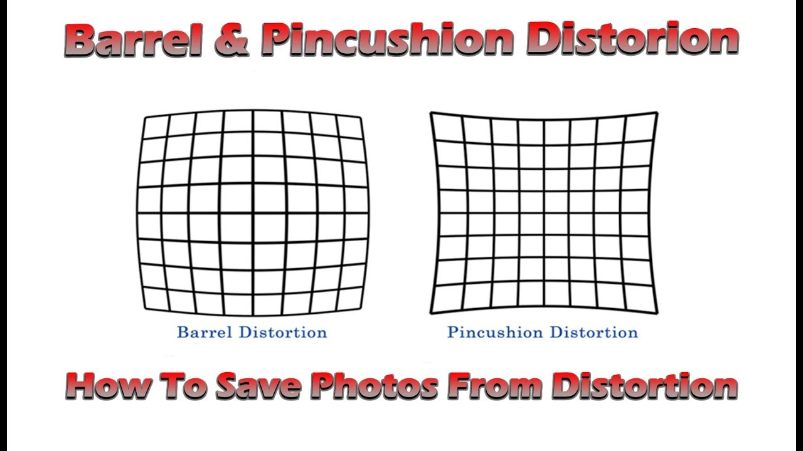
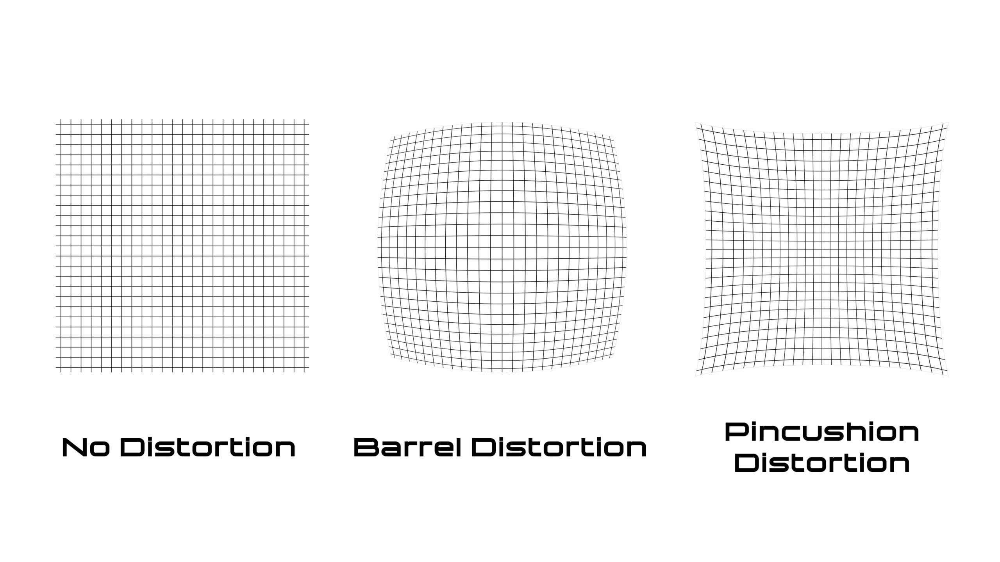
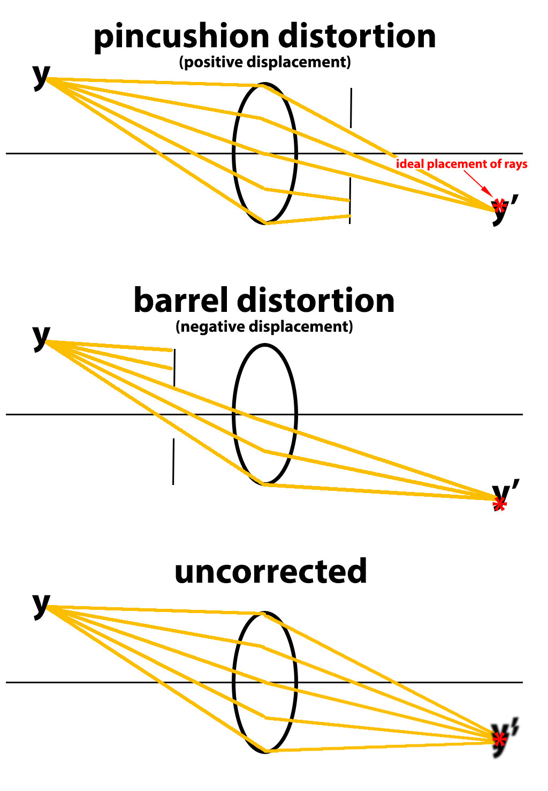
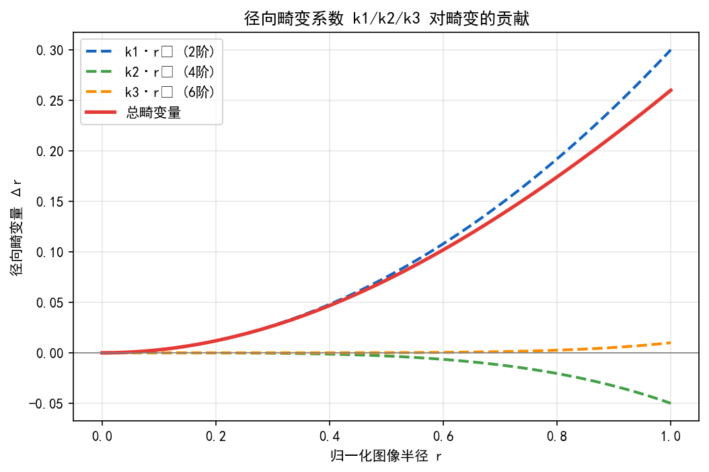
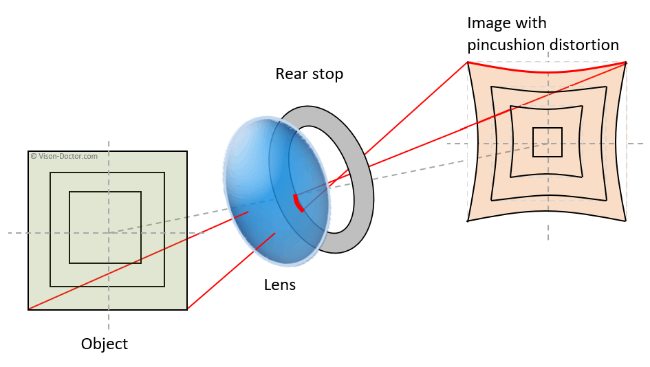
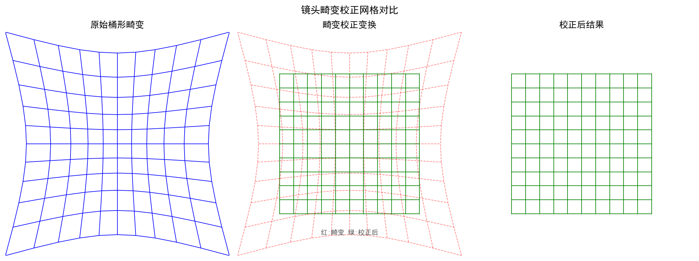
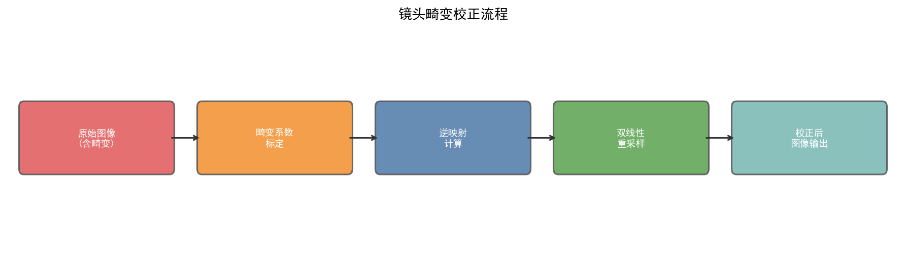
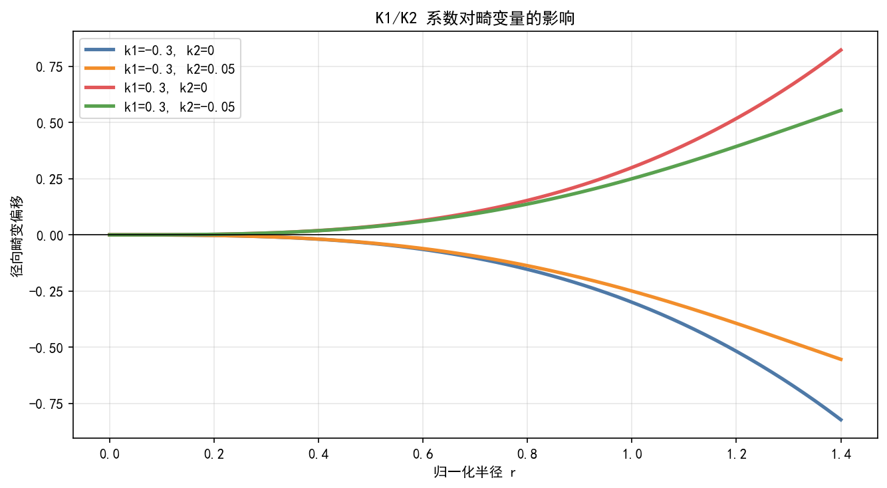
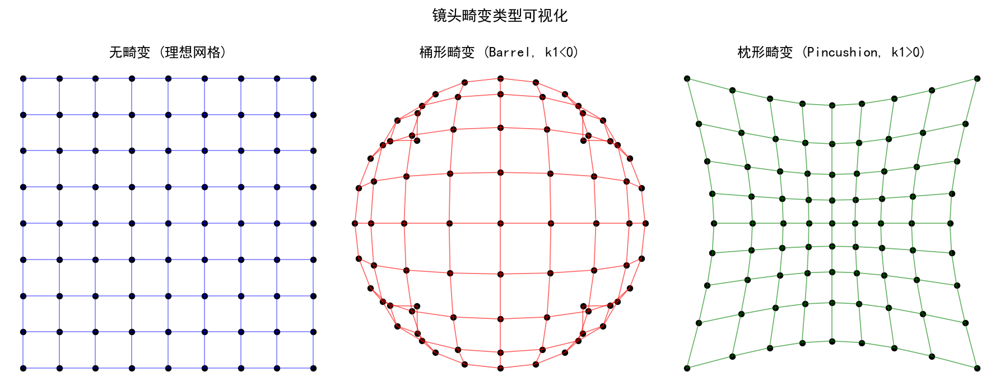
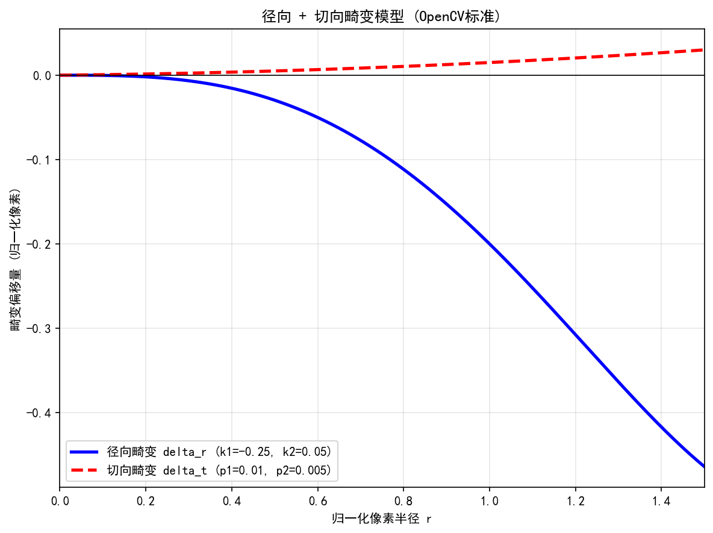

# 第二卷第15章：几何畸变校正

> **流水线位置：** ISP 硬件流水线末段 — 通常在 Demosaic 和 Lens Shading Correction 之后，通过 LUT 或 Grid Warp 硬件单元执行；与 EIS 几何矫正可共享硬件路径
> **前置章节：** 第二卷第08章（镜头阴影校正 LSC）、第二卷第23章（EIS/OIS）
> **读者路径：** ISP 光学矫正工程师、相机标定工程师、广角/超广角模组工程师

> **摘要**：镜头几何畸变（Geometric Distortion）是光学系统固有缺陷，在广角和超广角摄像头中尤为显著。本章系统介绍畸变的数学模型（Brown-Conrady模型）、标定方法（OpenCV棋盘格标定）、ISP中的查找表（LUT）实现、鱼眼镜头模型、以及卷帘快门畸变校正原理，并讨论校正对视场角的影响与典型伪影。

---

## §1 基本原理 (Theory)

### 1.1 几何畸变的类型

拍建筑物时直线弯曲、超广角镜头角落物体变形拉长——这是几何畸变最直观的表现。背后原因是镜头的光学放大率随入射角度变化，不同位置的像点被"推"到了偏离理想位置的地方。

**桶形畸变（Barrel Distortion）**：直线向外弯曲，图像中心放大率高于边缘。广角/超广角/鱼眼镜头（FOV > 90°）是重灾区。Brown-Conrady 前向模型下 $k_1 < 0$；OpenCV 去畸变模型里符号反过来，$k_1 > 0$ 对应桶形。

> **符号约定说明**：$k_1$ 符号依模型方向而异。OpenCV/MATLAB 等主流库采用去畸变模型（畸变→理想），$k_1>0$ 表示桶形，$k_1<0$ 表示枕形。调用标定工具时须确认符号约定，搞反了等于校正方向错误，后果是直线弯向相反方向。

**枕形畸变（Pincushion Distortion）**：直线向内弯曲，边缘放大率高于中心。长焦镜头（等效焦距 > 50mm）常见，$k_1 > 0$（前向模型下）。

**胡须形畸变（Mustache Distortion）**：中心呈枕形、边缘呈桶形（或反之），$k_2$、$k_3$ 与 $k_1$ 符号相反时的叠加效应。变焦镜头在特定焦段会出现这种情况，一个单一的 $k_1$ 拟合不了它，必须上高阶系数。

### 1.2 Brown-Conrady畸变模型

Brown-Conrady模型（1966）**[1]** 是ISP和计算机视觉领域最广泛使用的畸变模型，将畸变分为径向分量（Radial Distortion）和切向分量（Tangential Distortion）。

坐标符号如下：归一化图像坐标 $(x, y)$（相机坐标系下除以焦距后的坐标），径向距离 $r = \sqrt{x^2 + y^2}$，畸变后坐标 $(x_{\text{dist}}, y_{\text{dist}})$。

**径向畸变模型**

$$
x_{\text{dist}} = x \left(1 + k_1 r^2 + k_2 r^4 + k_3 r^6\right)
$$

$$
y_{\text{dist}} = y \left(1 + k_1 r^2 + k_2 r^4 + k_3 r^6\right)
$$

其中 $k_1$, $k_2$, $k_3$ 为径向畸变系数。对于大多数镜头，$k_1$ 贡献最大，$k_3$ 可在畸变较小时忽略。

**切向畸变模型**（由镜头元件倾斜引起）

$$
x_{\text{dist}} = x + \left[2 p_1 x y + p_2 (r^2 + 2x^2)\right]
$$

$$
y_{\text{dist}} = y + \left[p_1 (r^2 + 2y^2) + 2 p_2 x y\right]
$$

**完整畸变模型**（径向 + 切向叠加）

$$
\begin{cases}
x_{\text{dist}} = x(1 + k_1 r^2 + k_2 r^4 + k_3 r^6) + 2p_1 xy + p_2(r^2 + 2x^2) \\
y_{\text{dist}} = y(1 + k_1 r^2 + k_2 r^4 + k_3 r^6) + p_1(r^2 + 2y^2) + 2p_2 xy
\end{cases}
$$

通过相机内参矩阵 $\mathbf{K}$ 将归一化坐标转换为像素坐标：

$$
\mathbf{K} = \begin{bmatrix} f_x & 0 & c_x \\ 0 & f_y & c_y \\ 0 & 0 & 1 \end{bmatrix}
$$

$$
u_{\text{dist}} = f_x \cdot x_{\text{dist}} + c_x, \quad v_{\text{dist}} = f_y \cdot y_{\text{dist}} + c_y
$$

完整内参集合：$(k_1, k_2, k_3, p_1, p_2, f_x, f_y, c_x, c_y)$，共9个参数（5个畸变系数 + 4个内参）。

> **OpenCV CALIB_RATIONAL_MODEL 扩展（8畸变系数）：** OpenCV 支持有理多项式模型（`cv2.CALIB_RATIONAL_MODEL`），将径向畸变分子分母分别用三阶多项式表示：$r_\text{dist}(\rho) = \rho \cdot \frac{1+k_1\rho^2+k_2\rho^4+k_3\rho^6}{1+k_4\rho^2+k_5\rho^4+k_6\rho^6}$，输出畸变系数向量为 $(k_1, k_2, p_1, p_2, k_3, k_4, k_5, k_6)$，共 **8 个畸变系数**（注意排列顺序：$k_3$ 在 $p_2$ 之后）。§6.1 代码中使用此 flag，因此 `dist` 输出为 8 维向量，与本节5参数描述不同。适用场景：FOV > 90° 的广角/超广角镜头，或畸变残差无法收敛时，使用有理模型往往比单纯增加 $k$ 阶次更稳健。

### 1.3 畸变校正的逆映射

畸变校正需要计算**逆变换**：对于校正后图像中的每个像素 $(u, v)$，找到其在原始（畸变）图像中对应的坐标 $(u_{\text{dist}}, v_{\text{dist}})$，然后进行插值采样。

由于Brown-Conrady模型无解析逆函数，逆映射通常通过迭代法或预计算查找表（LUT, Look-Up Table）实现。

**迭代法求逆（Newton迭代）**

给定校正后归一化坐标 $(x_0, y_0)$，迭代求解 $(x, y)$ 使得 $f(x, y) = (x_0, y_0)$：

$$
\begin{bmatrix} x_{n+1} \\ y_{n+1} \end{bmatrix} = \begin{bmatrix} x_n \\ y_n \end{bmatrix} - \mathbf{J}^{-1} \begin{bmatrix} f_x(x_n, y_n) - x_0 \\ f_y(x_n, y_n) - y_0 \end{bmatrix}
$$

通常3～5次迭代即可收敛。

### 1.4 ISP中的LUT实现

在ISP硬件中，逐像素迭代计算代价过高。实际实现采用预计算逆映射查找表：

1. **标定阶段（离线）** 对输出图像的每个像素 $(u, v)$，计算对应的源像素坐标 $(\hat{u}, \hat{v})$，存储为2D浮点LUT（大小为 $W \times H \times 2$）。
2. **校正阶段（在线）** ISP硬件读取LUT，对源图像进行双线性插值（Bilinear Interpolation）采样。

**双线性插值**

$$
I_{\text{out}}(u, v) = (1-\Delta u)(1-\Delta v) I(\lfloor\hat{u}\rfloor, \lfloor\hat{v}\rfloor) + \Delta u(1-\Delta v) I(\lceil\hat{u}\rceil, \lfloor\hat{v}\rfloor) + \cdots
$$

其中 $\Delta u = \hat{u} - \lfloor\hat{u}\rfloor$，$\Delta v = \hat{v} - \lfloor\hat{v}\rfloor$。

**LUT压缩** 全分辨率LUT（如4000×3000）内存占用约 92 MiB（float32；4000×3000×2通道×4字节 ≈ 96 MB ≈ 92 MiB），实际ISP中通常采用稀疏网格LUT（如64×48），运行时进行双三次插值恢复全分辨率。

### 1.5 畸变校正对视场角的影响

桶形畸变校正后，图像四角区域被"拉伸"，有效像素区域减小（黑色边框）。通常有两种处理策略：

**裁剪策略（Crop）** 裁去黑色边框，输出图像小于原始传感器分辨率，**损失FOV**。

$$
\text{有效FOV}_{\text{校正后}} = \text{FOV}_{\text{原始}} - \Delta\text{FOV}_{\text{裁剪}}
$$

对于120° FOV的超广角镜头，校正后裁剪损失可达10°～15° 。

**数字变焦补偿** 校正后适当数字放大，使输出分辨率与原始一致，但实际FOV减小。在多摄系统中，可选择在畸变校正后以数字变焦补偿角部裁剪，同时利用光学变焦摄像头覆盖长焦端。

### 1.6 鱼眼镜头模型

对于FOV > 120° 的超广角/鱼眼镜头，Brown-Conrady模型精度通常不足（尤其 FOV > 150° 时残差急剧增大），需采用专用鱼眼投影模型。

**等距投影（Equidistant Projection）**

$$
r = f \cdot \theta
$$

其中 $r$ 为像面上的径向距离，$\theta$ 为入射光线与光轴的夹角（适用范围通常 $0 \leq \theta \leq 90°$，超出此范围需验证重投影误差），$f$ 为焦距。

> **工程注意：** $r = f\theta$ 是理想等距投影公式，用于投影类型的定性描述。真实鱼眼镜头需采用 Kannala-Brandt 多项式（§2.2，OpenCV `fisheye.calibrate`）修正：$r(\theta) = f\theta(1+k_1\theta^2+k_2\theta^4+k_3\theta^6+k_4\theta^8)$。理想公式**不可直接用于逆映射计算**，必须使用标定后的完整多项式。

**等立体角投影（Equisolid / Equal-Area Projection）**

$$
r = 2f \sin(\theta / 2)
$$

**正射影投影（Orthographic Projection）**

$$
r = f \sin(\theta)
$$

**立体等角投影（Stereographic Projection）**

$$
r = 2f \tan(\theta / 2)
$$

- 保角映射（Conformal Mapping）：圆形物体在像面保持圆形，适合需要保形状的观测场景。
- 代表应用：GoPro Hero 系列（部分宽视野模式）、部分 VR 头显摄像头；与等距投影相比，边缘区域的角分辨率损失较小（$\theta$ 接近90° 时 $r$ 增长更平缓）。
- FOV 理论上限：$\theta < 180°$（$r$ 趋于无穷），实际使用 FOV 通常不超过 200°。

**四种鱼眼投影对比**：

| 投影模型 | 公式 | 特性 | 典型应用 |
|---------|------|------|---------|
| 等距（Equidistant） | $r = f\theta$ | 角度线性，计算简单 | 大多数鱼眼镜头默认，OpenCV fisheye |
| 等立体角（Equisolid） | $r = 2f\sin(\theta/2)$ | 保面积，量测用途 | 天文鱼眼、全天空成像仪 |
| 正射影（Orthographic） | $r = f\sin\theta$ | FOV ≤ 180°，边缘分辨率低 | 半球观察、植被天顶角测量 |
| 立体等角（Stereographic） | $r = 2f\tan(\theta/2)$ | 保形状，边缘畸变最小 | GoPro、VR 摄像头、保形地图 |

**Scaramuzza通用模型（2006）** **[4]** 使用多项式拟合投影函数，适合任意鱼眼镜头：

$$
m = a_0 + a_2 \rho^2 + a_3 \rho^3 + a_4 \rho^4
$$

其中 $m$ 为像面坐标到主点的距离，$\rho$ 为归一化径向坐标。

### 1.6b 鱼眼投影模型在ISP中的切换接口方式

> **P1补充**：不同鱼眼投影模型（等距/等立体角/立体等角）需要不同的校正LUT，ISP中如何管理这些模型切换是工程关键问题。

#### 问题背景

超广角摄像头（FOV > 120°）出厂时通常标定为某一固定投影模型（多数厂商默认等距 Equidistant）。但用户/应用层可能需要切换显示风格：
- **等距投影**（默认）：建筑摄影、全景测量，边缘形变可接受
- **立体等角投影**：GoPro风格，圆形物体保形，适合运动/Vlog
- **透视投影（去鱼眼）**：校正为正常透视图，适合文档/人物拍摄

#### ISP LUT切换接口

ISP硬件的畸变校正模块本质是一个**逆映射LUT**（§1.4），切换投影模型等同于替换LUT内容。工程实现上有两种架构：

**方案A：多套预计算LUT（主流方案）**

在出厂标定阶段，对每种目标投影模型分别计算一套稀疏LUT并存入NVM：

```
NVM存储：
  lut_equidistant[64×48×2]   → 等距→等距（轻度校正，去径向畸变）
  lut_stereographic[64×48×2] → 等距→立体等角（保形变换）
  lut_perspective[64×48×2]   → 等距→透视（强去鱼眼）
```

应用层通过HAL接口（Android：`CaptureRequest.DISTORTION_CORRECTION_MODE`；高通CamX：`LensDistortionCorrectionMode` 枚举）指定目标模型，ISP驱动加载对应LUT：

```java
// Android Camera2 API
captureRequestBuilder.set(
    CaptureRequest.DISTORTION_CORRECTION_MODE,
    CaptureRequest.DISTORTION_CORRECTION_MODE_HIGH_QUALITY  // 加载全校正LUT
);
// 或自定义VendorTag指定具体投影模型（厂商扩展）
captureRequestBuilder.set(VENDOR_TAG_FISHEYE_PROJECTION, PROJECTION_STEREOGRAPHIC);
```

**方案B：实时参数化LUT（高端ISP）**

部分高端ISP（如高通Spectra 680+）支持在线根据投影模型参数（$k_1, k_2$等）动态计算LUT（使用ISP内置的多项式求值单元），无需预存多套LUT。代价是每次切换需约2–5帧（LUT重算+流水线刷新）的延迟。

#### 透视投影（去鱼眼）的FOV损失

将鱼眼转换为透视投影时，由于透视投影无法表示 FOV > 180° 的场景，可用输出FOV（`output_fov`）控制裁剪程度：

$$r_{\max} = f \cdot \tan\!\left(\frac{\text{output\_fov}}{2}\right)$$

超出此范围的像素将被裁剪（填黑或填充颜色），输出FOV通常限制在 90°–120°（更大值会使边缘产生严重透视拉伸）。

### 1.7 卷帘快门畸变校正（Rolling Shutter Correction）

CMOS传感器的卷帘快门（Rolling Shutter）逐行曝光，在相机/被摄体快速运动时产生**果冻效应（Jello Effect）**，表现为直线弯曲或倾斜。

第 $i$ 行的曝光时刻为：

$$
t_i = t_0 + i \cdot \Delta t_{\text{row}}
$$

其中 $\Delta t_{\text{row}}$ 为行间隔时间（$\approx T_\text{frame}/N_\text{rows}$；典型值3～30μs：4K@60fps 约7μs，1080p@30fps 约15μs，早期低帧率传感器可达50μs），不同行对应不同的相机姿态。

**陀螺仪辅助校正**

1. 从IMU（陀螺仪）读取帧内的角速度序列 $\boldsymbol{\omega}(t)$。
2. 对每一行，根据其曝光时刻计算相机姿态偏移 $\Delta \mathbf{R}(t_i)$。
3. 利用 $\Delta \mathbf{R}(t_i)$ 对第 $i$ 行像素进行反变换，消除运动引入的几何偏移。

$$
\mathbf{p}_{\text{corrected}}^{(i)} = \mathbf{K} \cdot \Delta \mathbf{R}^{-1}(t_i) \cdot \mathbf{K}^{-1} \cdot \mathbf{p}_{\text{distorted}}^{(i)}
$$

卷帘快门校正通常与防抖（EIS, Electronic Image Stabilization）在ISP中联合实现 **[8][9]**。

---

## §2 标定 (Calibration)

### 2.1 棋盘格标定（Zhang标定法）

OpenCV的 `calibrateCamera()` 基于Zhang（2000）**[2]** 提出的平面标定法，使用多角度拍摄的棋盘格图像提取内参和畸变系数。

**标定板要求**
- 棋盘格尺寸：建议9×6或11×8（内角点数），格子物理尺寸已知（如25mm）。
- 图像数量：理论最少3张（Zhang法可解），实际建议10～20张，覆盖不同角度（倾斜、旋转、偏移）；高精度ISP出厂标定可增至20～30张。
- 避免运动模糊，使用固定焦距拍摄。

**标定流程**

1. **角点检测** `cv2.findChessboardCorners()` 检测棋盘格内角点，亚像素精化用 `cv2.cornerSubPix()`。
2. **构建对应关系** 棋盘格世界坐标（3D）与图像坐标（2D）的对应点集。
3. **求解内参与畸变** `cv2.calibrateCamera()` 最小化重投影误差（Reprojection Error）：

$$
\min_{K, \mathbf{d}, \mathbf{R}_i, \mathbf{t}_i} \sum_{i=1}^{N} \sum_{j=1}^{M} \left\| \mathbf{m}_{ij} - \hat{\mathbf{m}}(K, \mathbf{d}, \mathbf{R}_i, \mathbf{t}_i, \mathbf{M}_j) \right\|^2
$$

其中 $\mathbf{m}_{ij}$ 为检测到的角点坐标，$\hat{\mathbf{m}}$ 为投影预测坐标，$\mathbf{d} = (k_1, k_2, p_1, p_2, k_3)$。

**标定质量指标**
- 重投影误差（RMS）：应 < 0.5 像素（高精度要求 < 0.3 像素）。
- 每张图的最大重投影误差应 < 1.5 像素，否则剔除该图像重新标定。

### 2.2 鱼眼镜头标定

OpenCV提供专用鱼眼标定接口 `cv2.fisheye.calibrate()`，使用等距投影模型（Kannala-Brandt **[5]**）：

$$
r(\theta) = f \cdot \theta \cdot (1 + k_1 \theta^2 + k_2 \theta^4 + k_3 \theta^6 + k_4 \theta^8)
$$

输出鱼眼畸变系数 $(k_1, k_2, k_3, k_4)$（注意：与普通畸变系数含义不同）。

### 2.3 出厂标定与在线自校正

**出厂标定（Factory Calibration）**
- 在生产线上，每台设备在恒温环境（25°C）下拍摄标准棋盘格。
- 标定结果写入设备NVM（Non-Volatile Memory）。
- 通过制造误差分析确定标定参数的容差范围。

**在线自校正（Online Self-Calibration）**
- 针对温度、跌落等导致的参数漂移，在用户使用过程中利用自然图像中的直线特征（霍夫变换）进行自动校正。
- 典型方案：SLAM系统中的在线IMU-相机联合标定（如Kalibr框架）。

---

## §3 调参指南 (Tuning)

### 3.1 校正强度参数

畸变系数由标定确定，不是靠人工调的。调参空间集中在校正后输出范围的取舍上。

`cv2.getOptimalNewCameraMatrix()` 的 `alpha` 参数控制的是裁剪策略：
- `alpha=0`：最大裁剪，无黑边，FOV损失最大
- `alpha=1`：不裁剪，四角有黑边

> **工程推荐**：消费相机用 `alpha=0`，黑边对用户直接可见，是体验问题。超广角接数字变焦的场景可以用 `alpha=0.5`——裁剪损失的FOV由数字变焦补回来，最终用户看到的FOV不变。不要为了"保留更多像素"用 `alpha=1`，然后在后处理里再裁黑边，这是绕路。

### 3.2 与数字变焦的交互

| 场景 | 推荐策略 |
|------|----------|
| 超广角（0.6×/0.5×） | alpha=0，少量FOV损失换取无黑边 |
| 标准广角（1×） | alpha=0，畸变本身较小，裁剪量小 |
| 数字变焦（2×+） | 数字变焦补偿畸变校正裁剪，alpha=0.5 |

### 3.3 高阶畸变系数的必要性

FOV越大，需要的系数越多。标准广角（FOV < 90°）用 $k_1, k_2, p_1, p_2$ 通常够用；超广角（90°～120°）$k_3$ 不能省，省了残差在边角会明显；鱼眼（> 120°）Brown-Conrady 模型精度根本不够，要换鱼眼模型 $(k_1, k_2, k_3, k_4)$；变焦镜头每个焦段独立标定，运行时插值。

加高阶系数有一个风险：系数过多在标定样本不足时容易过拟合。$k_3$ 标定完之后值异常大（如绝对值 > 100）基本意味着过拟合，需要增加标定图像数量或降阶。

### 3.4 稀疏LUT网格分辨率

| 图像分辨率 | 推荐LUT网格 | 内存占用（float32） |
|------------|------------|-------------------|
| 1920×1080 | 32×18 | ~4.6 KB |
| 4000×3000 | 64×48 | ~24 KB |
| 12MP | 128×96 | ~96 KB |

畸变变化平滑，64×48 对 4K 图像通常已足够。如果发现校正后图像有轻微网格状条纹，不一定是LUT分辨率问题，先检查插值方式（双线性 vs 双三次）。

---

## §4 伪影分析 (Artifacts)

### 4.1 过校正（Over-correction）

直线校正后弯向相反方向——这是最直观的过校正表现，说明校正方向基本正确但幅度过了，或者系数符号搞反了。

根因通常是标定质量差（RMS重投影误差 > 1px）或高阶系数过拟合。修法：先看 RMS 是否合格，再查 $k_3$ 的值是否合理（异常大值意味着过拟合，加正则化约束或减少系数阶次）。温度漂移在手机场景影响有限，车载/工业相机才需要多温度点标定。

### 4.2 角部混叠（Corner Aliasing）

桶形畸变校正把边缘区域拉伸，单个源像素对应多个输出像素，双线性插值平滑的不够就出现混叠和模糊。120° FOV 的超广角角落拉伸倍率可以到 1.5～2 倍，分辨率损失明显。

双三次插值比双线性混叠少，代价是计算量增加约 2～3 倍。在 ISP 硬件里能支持双三次的就用，否则校正后加选择性锐化（仅在畸变拉伸比超过阈值的区域）。

### 4.3 放大率非均匀性（Magnification Non-uniformity）

桶形校正后中心和边缘的有效分辨率不一样，这不是伪影，而是广角镜头的物理属性。边缘区域光学系统本身就收集了更少的角分辨率，校正只是把弯的拉直，不能凭空补回分辨率。对边缘单独锐化可以部分改善感知，但不改变本质。在产品规格里明确这一点比调参更重要。

### 4.4 卷帘快门校正残差（Rolling Shutter Residual）

陀螺仪辅助卷帘快门校正的精度瓶颈通常不在算法，在时间戳同步。陀螺仪与传感器的时间戳偏差哪怕只有 0.5ms，快速摇移场景下（角速度 > 200°/s）就能产生几像素的行间校正误差。

硬件触发同步是最可靠的解法，软件插值次之。另一个限制：IMU 只测旋转，平移运动引起的卷帘快门扭曲在近距离场景（< 1m）不可忽略，但加速度计补偿平移的工程复杂度显著上升，大多数手机 ISP 不做。

---

## §5 评测方法 (Evaluation)

### 5.1 畸变校正精度评测

**直线性（Linearity Test）**
- 拍摄含有直线结构的标准测试卡（如ITU-R BT.1978直线测试图）。
- 校正后，用最小二乘法拟合直线，计算最大残差（线偏移量）。
- 指标：最大线偏移 < 1% 图像宽度（高端相机要求 < 0.3%）。

**TV畸变（TV Distortion）**：镜头行业常用工程指标，定义为：

$$
D_{\text{TV}} = \frac{L_{\text{measured}} - L_{\text{ideal}}}{L_{\text{ideal}}} \times 100\%
$$

其中 $L_{\text{measured}}$ 为实测直线长度，$L_{\text{ideal}}$ 为理想直线长度。要求 $|D_{\text{TV}}| < 1\%$ 。几何畸变的国际标准可参考 **ISO 9039** **[10]**（Optics and photonics — Determination of distortion）；光学畸变测量亦可参考 **CIPA DC-009**（Optical Distortion Standard）及 **ISO 12233** **[11]** 相关部分。

**重投影误差（Reprojection Error）**
- 在校正后图像上重新检测棋盘格角点，与理想位置的距离误差。
- 要求RMS < 0.5 像素。

### 5.2 角部有效分辨率评测

使用ISO 12233 **[11]** 分辨率测试卡（在图像四角放置斜边）：
- 计算校正前后角部区域的MTF50（空间频率在50%对比度处的调制传递函数）。
- 记录MTF50损失比例，校正引入的额外MTF50损失应 < 10% 。

### 5.3 卷帘快门校正评测

**标准场景** 相机快速水平摇移（Pan）时拍摄竖直线条（如门框）。
- 量化指标：校正后竖线的倾斜角度（理想为0°）。
- 要求：校正后倾斜残差 < 0.5°（对应典型快速摇移速度）。

---

## §6 代码示例 (Code)

### 6.1 棋盘格标定

```python
import cv2
import numpy as np
import glob
from pathlib import Path

def calibrate_camera_chessboard(image_dir: str,
                                 pattern_size: tuple = (9, 6),
                                 square_size_mm: float = 25.0) -> dict:
    """
    使用棋盘格图像进行相机标定。

    Args:
        image_dir: 包含标定图像的目录
        pattern_size: 棋盘格内角点数 (cols, rows)
        square_size_mm: 棋盘格单格物理尺寸（mm）

    Returns:
        calibration: 包含内参矩阵K、畸变系数dist_coeffs、重投影误差的字典
    """
    # 准备世界坐标（z=0平面）
    objp = np.zeros((pattern_size[0] * pattern_size[1], 3), np.float32)
    objp[:, :2] = np.mgrid[
        0:pattern_size[0], 0:pattern_size[1]
    ].T.reshape(-1, 2) * square_size_mm

    objpoints = []  # 3D世界坐标
    imgpoints = []  # 2D图像坐标

    images = glob.glob(str(Path(image_dir) / "*.jpg")) + \
             glob.glob(str(Path(image_dir) / "*.png"))

    print(f"找到 {len(images)} 张标定图像")
    image_size = None

    for fname in images:
        img = cv2.imread(fname)
        gray = cv2.cvtColor(img, cv2.COLOR_BGR2GRAY)
        image_size = gray.shape[::-1]  # (width, height)

        # 检测棋盘格角点
        ret, corners = cv2.findChessboardCorners(gray, pattern_size, None)

        if ret:
            # 亚像素精化
            criteria = (cv2.TERM_CRITERIA_EPS + cv2.TERM_CRITERIA_MAX_ITER,
                        30, 0.001)
            corners_refined = cv2.cornerSubPix(
                gray, corners, (11, 11), (-1, -1), criteria
            )
            objpoints.append(objp)
            imgpoints.append(corners_refined)
        else:
            print(f"  警告：未找到角点 {Path(fname).name}")

    if len(objpoints) < 3:
        raise ValueError(f"有效标定图像数量不足（{len(objpoints)}张），理论最少3张，建议10张以上")

    # 相机标定
    flags = cv2.CALIB_RATIONAL_MODEL  # 使用有理多项式模型（更多系数）
    rms, K, dist, rvecs, tvecs = cv2.calibrateCamera(
        objpoints, imgpoints, image_size, None, None, flags=flags
    )

    print(f"标定完成，RMS重投影误差: {rms:.4f} 像素")
    print(f"内参矩阵 K:\n{K}")
    print(f"畸变系数: k1={dist[0,0]:.6f}, k2={dist[0,1]:.6f}, "
          f"p1={dist[0,2]:.6f}, p2={dist[0,3]:.6f}, k3={dist[0,4]:.6f}")

    return {
        "K": K,
        "dist_coeffs": dist,
        "rms": rms,
        "image_size": image_size,
        "num_images": len(objpoints)
    }
```

### 6.2 畸变校正与LUT生成

```python
def generate_undistort_lut(K: np.ndarray,
                            dist_coeffs: np.ndarray,
                            image_size: tuple,
                            alpha: float = 0.0) -> tuple:
    """
    生成畸变校正逆映射查找表。

    Args:
        K: 相机内参矩阵 (3×3)
        dist_coeffs: 畸变系数 (1×5)
        image_size: 图像尺寸 (width, height)
        alpha: 裁剪因子 [0=最大裁剪, 1=无裁剪]

    Returns:
        map1, map2: cv2.remap所需的映射表
        new_K: 新相机矩阵
    """
    # 计算新相机矩阵（控制裁剪）
    new_K, roi = cv2.getOptimalNewCameraMatrix(
        K, dist_coeffs, image_size, alpha=alpha
    )
    print(f"新相机矩阵 (alpha={alpha}):\n{new_K}")
    print(f"有效ROI (x,y,w,h): {roi}")

    # 生成逆映射表
    map1, map2 = cv2.initUndistortRectifyMap(
        K, dist_coeffs,
        R=None,
        newCameraMatrix=new_K,
        size=image_size,
        m1type=cv2.CV_32FC1
    )

    return map1, map2, new_K, roi


def undistort_image(image: np.ndarray,
                    map1: np.ndarray,
                    map2: np.ndarray) -> np.ndarray:
    """
    使用预计算LUT进行畸变校正（双线性插值）。

    Args:
        image: 输入畸变图像
        map1, map2: initUndistortRectifyMap生成的映射表

    Returns:
        undistorted: 校正后图像
    """
    undistorted = cv2.remap(
        image, map1, map2,
        interpolation=cv2.INTER_LINEAR,
        borderMode=cv2.BORDER_CONSTANT,
        borderValue=0
    )
    return undistorted


def save_lut_sparse(map1: np.ndarray,
                    map2: np.ndarray,
                    output_path: str,
                    grid_cols: int = 64,
                    grid_rows: int = 48) -> None:
    """
    将全分辨率LUT下采样为稀疏网格LUT并保存（用于ISP硬件加载）。

    Args:
        map1, map2: 全分辨率映射表
        output_path: 输出文件路径（.npy格式）
        grid_cols, grid_rows: 稀疏网格尺寸
    """
    h, w = map1.shape
    xs = np.linspace(0, w - 1, grid_cols).astype(int)
    ys = np.linspace(0, h - 1, grid_rows).astype(int)
    yy, xx = np.meshgrid(ys, xs, indexing='ij')

    lut_sparse = np.stack([
        map1[yy, xx],
        map2[yy, xx]
    ], axis=-1)  # shape: (grid_rows, grid_cols, 2)

    np.save(output_path, lut_sparse)
    print(f"稀疏LUT ({grid_rows}×{grid_cols}) 已保存至 {output_path}")
    print(f"内存占用: {lut_sparse.nbytes / 1024:.1f} KB")
```

### 6.3 鱼眼镜头标定与校正

```python
def calibrate_fisheye(image_dir: str,
                       pattern_size: tuple = (9, 6),
                       square_size_mm: float = 25.0) -> dict:
    """
    鱼眼镜头标定（使用OpenCV fisheye模型）。
    """
    objp = np.zeros((1, pattern_size[0] * pattern_size[1], 3), np.float32)
    objp[0, :, :2] = np.mgrid[
        0:pattern_size[0], 0:pattern_size[1]
    ].T.reshape(-1, 2) * square_size_mm

    objpoints = []
    imgpoints = []
    image_size = None

    for fname in glob.glob(str(Path(image_dir) / "*.jpg")):
        img = cv2.imread(fname)
        gray = cv2.cvtColor(img, cv2.COLOR_BGR2GRAY)
        image_size = gray.shape[::-1]

        ret, corners = cv2.findChessboardCorners(
            gray, pattern_size,
            cv2.CALIB_CB_ADAPTIVE_THRESH + cv2.CALIB_CB_FAST_CHECK +
            cv2.CALIB_CB_NORMALIZE_IMAGE
        )

        if ret:
            criteria = (cv2.TERM_CRITERIA_EPS + cv2.TERM_CRITERIA_MAX_ITER,
                        30, 1e-6)
            corners_refined = cv2.cornerSubPix(
                gray, corners, (3, 3), (-1, -1), criteria
            )
            objpoints.append(objp)
            imgpoints.append(corners_refined)

    K_fish = np.zeros((3, 3))
    D_fish = np.zeros((4, 1))  # 鱼眼畸变系数 (k1, k2, k3, k4)

    flags = (cv2.fisheye.CALIB_RECOMPUTE_EXTRINSIC +
             cv2.fisheye.CALIB_CHECK_COND +
             cv2.fisheye.CALIB_FIX_SKEW)

    rms, K_fish, D_fish, rvecs, tvecs = cv2.fisheye.calibrate(
        objpoints, imgpoints, image_size,
        K_fish, D_fish, flags=flags
    )

    print(f"鱼眼标定RMS: {rms:.4f} 像素")
    print(f"鱼眼畸变系数: {D_fish.T}")

    return {"K": K_fish, "D": D_fish, "rms": rms, "image_size": image_size}


def undistort_fisheye(image: np.ndarray,
                       K: np.ndarray,
                       D: np.ndarray,
                       balance: float = 0.0) -> np.ndarray:
    """
    鱼眼图像校正。

    Args:
        balance: 裁剪控制参数 [0=最大裁剪, 1=无裁剪]
    """
    h, w = image.shape[:2]
    new_K = cv2.fisheye.estimateNewCameraMatrixForUndistortRectify(
        K, D, (w, h), np.eye(3), balance=balance
    )
    map1, map2 = cv2.fisheye.initUndistortRectifyMap(
        K, D, np.eye(3), new_K, (w, h), cv2.CV_32FC1
    )
    return cv2.remap(image, map1, map2, cv2.INTER_LINEAR)
```

### 6.4 直线性评测

```python
def evaluate_distortion_linearity(undistorted_image: np.ndarray,
                                   roi_fraction: float = 0.8) -> dict:
    """
    评估畸变校正后的直线性（基于霍夫变换）。

    Args:
        undistorted_image: 包含直线结构的校正后图像
        roi_fraction: 评测区域（图像中心比例）

    Returns:
        metrics: 包含最大线偏移、TV畸变估计的字典
    """
    h, w = undistorted_image.shape[:2]
    gray = cv2.cvtColor(undistorted_image, cv2.COLOR_BGR2GRAY) \
        if len(undistorted_image.shape) == 3 else undistorted_image

    # 仅在中心ROI内评测
    x1, y1 = int(w * (1 - roi_fraction) / 2), int(h * (1 - roi_fraction) / 2)
    x2, y2 = w - x1, h - y1
    roi = gray[y1:y2, x1:x2]

    # 边缘检测
    edges = cv2.Canny(roi, 50, 150, apertureSize=3)

    # 霍夫直线检测
    lines = cv2.HoughLines(edges, 1, np.pi / 180, threshold=100)

    if lines is None or len(lines) < 5:
        return {"max_deviation_px": None, "tv_distortion_pct": None,
                "note": "直线数量不足，无法评测"}

    # 统计竖直线的偏移（评估水平畸变）
    vertical_lines = []
    for line in lines:
        rho, theta = line[0]
        # 接近竖直（theta接近0或π）
        if abs(theta) < np.pi / 12 or abs(theta - np.pi) < np.pi / 12:
            vertical_lines.append((rho, theta))

    if not vertical_lines:
        return {"max_deviation_px": None, "tv_distortion_pct": None,
                "note": "未检测到竖直线"}

    # 计算竖直线相对于理想竖直位置的偏移（简化TV畸变估计）
    deviations = [abs(rho) * abs(np.sin(theta)) for rho, theta in vertical_lines]
    max_dev = max(deviations)
    tv_distortion = max_dev / w * 100  # 百分比

    return {
        "max_deviation_px": float(max_dev),
        "tv_distortion_pct": float(tv_distortion),
        "num_vertical_lines": len(vertical_lines)
    }


# 完整使用示例
if __name__ == "__main__":
    # Step 1: 标定
    calib = calibrate_camera_chessboard(
        image_dir="./calibration_images",
        pattern_size=(9, 6),
        square_size_mm=25.0
    )

    # Step 2: 生成LUT
    image_size = calib["image_size"]
    map1, map2, new_K, roi = generate_undistort_lut(
        calib["K"], calib["dist_coeffs"], image_size, alpha=0.0
    )

    # Step 3: 校正图像
    test_img = cv2.imread("test_image.jpg")
    if test_img is not None:
        corrected = undistort_image(test_img, map1, map2)
        cv2.imwrite("corrected_output.jpg", corrected)

        # Step 4: 评测
        metrics = evaluate_distortion_linearity(corrected)
        print(f"TV畸变: {metrics['tv_distortion_pct']:.3f}%")
        print(f"最大直线偏移: {metrics['max_deviation_px']:.2f} 像素")

    # Step 5: 保存稀疏LUT（用于ISP硬件）
    save_lut_sparse(map1, map2, "distortion_lut.npy",
                    grid_cols=64, grid_rows=48)
```

---

---

## §7 术语表（Glossary）

**Brown-Conrady 畸变模型**
ISP 和计算机视觉领域最广泛使用的镜头畸变模型（1966），将畸变分为径向分量（Radial Distortion，由镜头球差引起）和切向分量（Tangential Distortion，由镜头元件倾斜引起）。完整内参集合共9参数：$(k_1, k_2, k_3, p_1, p_2, f_x, f_y, c_x, c_y)$。

**桶形/枕形畸变符号约定**
Brown-Conrady 模型的 $k_1$ 符号约定与使用的模型方向有关：前向畸变模型（理想→畸变）中 $k_1<0$ 表示桶形；OpenCV/MATLAB 等主流库采用去畸变模型（畸变→理想），$k_1>0$ 表示桶形，$k_1<0$ 表示枕形。使用标定工具时须确认符号约定。

**逆映射 LUT（Inverse Mapping Lookup Table）**
畸变校正的硬件实现方式：离线预计算每个输出像素在畸变输入图像中的坐标并存储为2D浮点LUT，在线阶段ISP硬件读取LUT进行双线性插值采样。全分辨率LUT内存开销大，实际采用稀疏网格LUT（如64×48）加双三次插值压缩。

**等距投影（Equidistant Projection）**
鱼眼镜头的理想投影模型之一：$r = f\theta$，入射角 $\theta$ 与像高 $r$ 成线性比例。OpenCV 鱼眼标定（`fisheye.calibrate`）以此为基础，采用 Kannala-Brandt 多项式扩展：$r(\theta) = f\theta(1 + k_1\theta^2 + k_2\theta^4 + k_3\theta^6 + k_4\theta^8)$。

**等立体角投影（Equisolid / Equal-Area Projection）**
$r = 2f\sin(\theta/2)$，保证物方立体角与像面面积成正比，适合需要精确度量的测量应用（如鱼眼天文相机）。与等距投影的区别：等距保角度线性，等立体角保面积。

**正射影投影（Orthographic Projection）**
$r = f\sin\theta$，等效于将物方球面正交投影到像面。FOV 理论上限为 180°，在 $\theta$ 接近90°时 $r$ 趋于 $f$（有限值），适合观察半球视场。

**立体等角投影（Stereographic Projection）**
$r = 2f\tan(\theta/2)$，保角映射（Conformal Mapping），圆形物体在像面保持圆形，边缘区域角分辨率退化最慢（相比其他三种投影模型）。FOV 理论上限接近 360°，但 $\theta$ 趋近 180° 时 $r$ 趋于无穷，实用 FOV 通常 ≤ 220°。代表应用：GoPro Hero 系列宽视野模式、VR 头显摄像头。四种鱼眼投影模型的完整对比见 §1.6 对比表。

**Scaramuzza 全向相机模型（OCamCalib）**
使用多项式 $m = a_0 + a_2\rho^2 + a_3\rho^3 + a_4\rho^4$ 拟合从像面半径 $\rho$ 到三维方向的映射，跳过 $a_1$（线性项）是标准做法——对称镜头中 $a_1$ 项与仿射参数冗余，省略可提升数值稳定性。

**果冻效应（Rolling Shutter Jello Effect）**
CMOS 传感器卷帘快门（Rolling Shutter）逐行曝光，在相机/被摄体快速运动时不同行的曝光时刻不同，导致直线弯曲/倾斜。通过 IMU 陀螺仪辅助逐行姿态补偿校正：$\mathbf{p}_{\text{corrected}}^{(i)} = \mathbf{K} \cdot \Delta\mathbf{R}^{-1}(t_i) \cdot \mathbf{K}^{-1} \cdot \mathbf{p}^{(i)}$。

**TV 畸变（TV Distortion）**
镜头行业工程指标：$D_{\text{TV}} = (L_{\text{measured}} - L_{\text{ideal}}) / L_{\text{ideal}} \times 100\%$。几何畸变测量的正式标准参考 ISO 9039 和 CIPA DC-009，而非 ISO 17850（ISO 17850 是关于数码相机曝光指数的标准）。

**重投影误差（Reprojection Error）**
将世界坐标点通过估计的内外参矩阵投影回图像，计算投影点与实测角点之间的距离误差。是评估相机标定质量的核心指标：RMS 重投影误差 < 0.5 px 为高质量标定。

**裁剪因子 alpha（Crop Factor Alpha）**
`cv2.getOptimalNewCameraMatrix()` 参数：`alpha=0` 输出图像无黑边但损失最大 FOV；`alpha=1` 保留全部有效像素但四角有黑色填充区。消费类相机默认 `alpha=0`，保证无黑边的用户体验。

---

> **工程师手记：畸变校正，标定的准确性比算法的优劣重要十倍**
>
> **张正友标定法用 12 张棋盘格，结果不靠谱；用 30 张，才开始收敛。** 这不是理论问题，是工程经验。棋盘格标定的鲁棒性严重依赖于采图数量和角度多样性：如果只用 12 张，有几张角度接近、有几张光照不均匀，最小二乘求解的畸变系数 k1、k2 会对这几张异常图过拟合，导致在实际使用场景下校正反而把直线弯得更厉害。推荐做法：采 30–50 张，覆盖不同倾斜角（10°–45°）和不同位置（四角各至少 5 张），然后随机采样 20 张做标定、用剩余 10 张做验证（重投影误差应 < 0.5 像素）。
>
> **超广角镜头（等效 < 20mm）必须用鱼眼模型，用普通多项式模型会崩。** 张正友模型用的是多项式畸变：`r_d = r(1 + k1*r² + k2*r⁴ + ...)`，在畸变角度 < 30° 时精度够。超广角的畸变角可以到 60°–80°，多项式模型的误差在边缘会达到几十像素，用了这个结果做校正，图像边缘越校越弯。鱼眼模型（等距投影/等立体角投影）专门处理大角度畸变，OpenCV 4.x 的 `cv::fisheye` 模块和海思 GDC 的鱼眼校正单元都支持这个模型。实际上，14mm 以下的手机超广角几乎没有用多项式模型的，但部分工具链的默认标定程序仍然给的是多项式——不检查这一点，就会陷入"校正后边缘仍然弯曲"的死循环。
>
> **LDC（Lens Distortion Correction）的映射表计算量不大，但带宽代价要算清楚。** ISP 里 LDC 通常用"预计算映射表（Warp Table）"实现：离线算好每个输出像素对应哪个输入像素，运行时直接查表 + 双线性插值。4K 分辨率的映射表大小约 4096×2160×2×2 = 35MB（x、y 各一个 short），在 ISP pipeline 里需要从 DDR 中读取这张表，DDR 带宽约增加 500MB/s——在视频录制场景下是否在内存带宽预算内，需要和 SoC 架构师提前对清楚。开启 LDC 同时关掉 EIS（因为 LDC 已经做了几何变换，EIS 再加一次 warp 会有两次双线性插值的质量损失，代价更高）。
>
> *参考：Allen Hong Notes《实际进行畸变校正的注意点》，masterallen.github.io，2024；海思 MPP V5.0 开发参考《GDC 几何畸变矫正子系统》；Bouguet, Camera Calibration Toolbox for Matlab, 2004。*

---

## 插图


*图1. 桶形与枕形畸变对比示意图——广角镜头桶形畸变和长焦镜头枕形畸变在棋盘格测试图上的表现（图片来源：Brown et al., Photogrammetric Engineering, 1966）*


*图2. 桶形畸变与枕形畸变类型示意图——径向畸变系数 k1、k2 正负对应的两种畸变类型及其对网格直线的弯曲效果（图片来源：Zhang et al., IEEE TPAMI, 2000）*


*图3. OpenCV 畸变校正效果图——使用 undistort() 函数对标定后相机进行桶形畸变校正前后的效果对比（图片来源：Bradski et al., O'Reilly Media, 2008）*


*图4. 畸变模型参数说明图——Brown-Conrady 模型中径向畸变系数（k1、k2、k3）和切向畸变系数（p1、p2）的参数含义（图片来源：Brown et al., Photogrammetric Engineering, 1966）*


*图5. 畸变校正前后图像对比——校正后直线笔直、棋盘格均匀的结果对比未校正时边缘弯曲的原始图像（图片来源：Bouguet et al., Caltech Technical Report, 2004）*


*图6. 镜头畸变校正流程示意图——从相机标定（张正友棋盘格法）到 ISP 畸变校正 LUT 生成和像素重映射的完整流程（图片来源：Zhang et al., IEEE TPAMI, 2000）*


---

*图7. 畸变校正处理管线图——ISP 中几何畸变校正模块在流水线中的位置与双线性插值重采样实现（图片来源：Kannala et al., IEEE TPAMI, 2006）*


*图8. 畸变系数标定结果——不同焦距镜头的径向/切向畸变系数数值分布与不同畸变量级的参考范围（图片来源：Bouguet et al., Caltech Technical Report, 2004）*


*图9. 镜头畸变类型分类图——径向畸变（桶形/枕形）、切向畸变、薄棱镜畸变的几何特征与成因（图片来源：Baker et al., International Journal of Computer Vision, 1999）*


*图10. 径向与切向畸变分量分解图——Brown-Conrady 模型中径向畸变（圆对称）和切向畸变（非对称）各分量的矢量场可视化（图片来源：Scaramuzza et al., IROS, 2006）*

---

## 习题

**练习 1（理解）**
Brown-Conrady 畸变模型将镜头畸变分为径向分量和切向分量：

$$x_d = x_u(1 + k_1 r^2 + k_2 r^4 + k_3 r^6) + 2p_1 x_u y_u + p_2(r^2 + 2x_u^2)$$

其中 $r^2 = x_u^2 + y_u^2$，$(x_u, y_u)$ 为理想无畸变坐标，$(x_d, y_d)$ 为实际畸变坐标，$k_1, k_2, k_3$ 为径向系数，$p_1, p_2$ 为切向系数。

1. 解释 $k_1 < 0$（负径向系数）对应桶形畸变还是枕形畸变？直觉上，广角镜头（FOV > 70°）的 $k_1$ 符号通常是什么？
2. 切向畸变系数 $p_1$、$p_2$ 非零的物理原因是什么（提示：与镜头组装误差有关）？
3. 畸变校正（undistortion）后，图像的有效 FOV 会变小还是变大？校正后图像四角区域出现黑边的原因是什么？如何通过裁剪参数 `alpha`（OpenCV `getOptimalNewCameraMatrix` 的 `alpha` 参数）控制黑边与 FOV 的权衡？

**练习 2（计算）**
已知一个广角镜头的 Brown-Conrady 径向畸变参数：$k_1 = -0.28$，$k_2 = 0.09$，$k_3 = 0.0$（切向参数均为 0），归一化焦距坐标系（主点为原点）。

1. 对于归一化坐标 $r = 0.8$（图像角落附近），计算径向畸变系数 $(1 + k_1 r^2 + k_2 r^4)$ 的值（保留 4 位小数）。
2. 若理想坐标为 $x_u = 0.566$，$y_u = 0.566$（对角线方向 $r \approx 0.8$），计算畸变后的坐标 $(x_d, y_d)$（仅计算径向分量，保留 3 位小数）。
3. 畸变后坐标相对于理想坐标的位移量是多少像素（假设图像分辨率 4000×3000，焦距归一化后 1.0 = 2000 像素）？

**练习 3（编程）**
使用 OpenCV 实现畸变校正，并计算校正后的 FOV 损失：

- 输入：`image` — 形状 `(H, W, 3)` 的 uint8 图像；`dist_coeffs` — 畸变系数数组 `[k1, k2, p1, p2, k3]`；`fx, fy, cx, cy` — 内参（焦距和主点）
- 输出：`undistorted` — 校正后图像；`fov_loss_pct` — FOV 损失百分比（基于 `alpha=0` 时的有效区域面积比）
- 要求：（1）构建相机矩阵 `K`；（2）调用 `cv2.undistort` 或 `cv2.initUndistortRectifyMap + cv2.remap`；（3）计算有效像素区域（非黑色区域）占原始图像面积的百分比作为 FOV 保留率

```python
import numpy as np
import cv2
# 输入: image (H,W,3), dist_coeffs [k1,k2,p1,p2,k3], fx,fy,cx,cy
# 输出: undistorted (H,W,3), fov_loss_pct float
```

**练习 4（工程分析）**
高通 Spectra ISP 和 MTK Imagiq 的镜头畸变校正（LDC）模块使用预先标定的畸变参数表，通过 `LDC_RadialCoeffK1/K2/K3`（径向系数）和 `LDC_TangentialCoeffP1/P2`（切向系数）配置 Brown-Conrady 模型。某工程师在换用新的超广角镜头（FOV = 120°，$k_1 \approx -0.42$）后，发现直接套用旧镜头（FOV = 84°，$k_1 \approx -0.18$）的标定参数，校正后图像四角仍有明显桶形弯曲，且边缘有黑色未覆盖区域。

1. 分析旧参数不适用于新镜头的根本原因：$k_1 = -0.18$ 与 $k_1 = -0.42$ 在 $r = 0.9$ 处的畸变系数差异是多少（计算两者的 $(1 + k_1 \cdot 0.81)$ 之差）？
2. 重新标定 LDC 参数需要使用什么标定图案？张正友标定法（Zhang 1999）需要多少张不同姿态的棋盘格图像来可靠估计 5 个畸变参数（说明最低要求和推荐数量）？
3. 若 ISP 硬件 LDC 模块只支持 $k_1$、$k_2$ 两个径向系数（不支持 $k_3$），对于 FOV = 120° 的超广角镜头，省略 $k_3$ 会在哪个区域（$r$ 范围）引入最大残余畸变误差？

---

## 参考文献

[1] Brown, "Decentering distortion of lenses", *Photogrammetric Engineering*, 1966.

[2] Zhang, "A flexible new technique for camera calibration", *IEEE TPAMI*, 2000.

[3] Bouguet, "Camera calibration toolbox for MATLAB", *Caltech Technical Report*, 2004.

[4] Scaramuzza et al., "A toolbox for easily calibrating omnidirectional cameras", *IROS*, 2006.

[5] Kannala et al., "A generic camera model and calibration method for conventional, wide-angle, and fish-eye lenses", *IEEE TPAMI*, 2006.

[6] Bradski et al., "Learning OpenCV: Computer Vision with the OpenCV Library", *O'Reilly Media*, 2008.

[7] Baker et al., "A theory of single-viewpoint catadioptric image formation", *International Journal of Computer Vision*, 1999.

[8] Forssén et al., "Rectifying rolling shutter video from hand-held devices", *CVPR*, 2010.

[9] Liang et al., "Analysis and compensation of rolling shutter effect", *IEEE Transactions on Image Processing*, 2008.

[10] ISO, "ISO 9039:2020 — Optics and photonics — Quality evaluation of optical systems — Determination of distortion", *官方文档*, 2020.

[11] ISO, "ISO 12233:2017 — Photography — Electronic still-picture imaging — Resolution and spatial frequency responses", *官方文档*, 2017.
