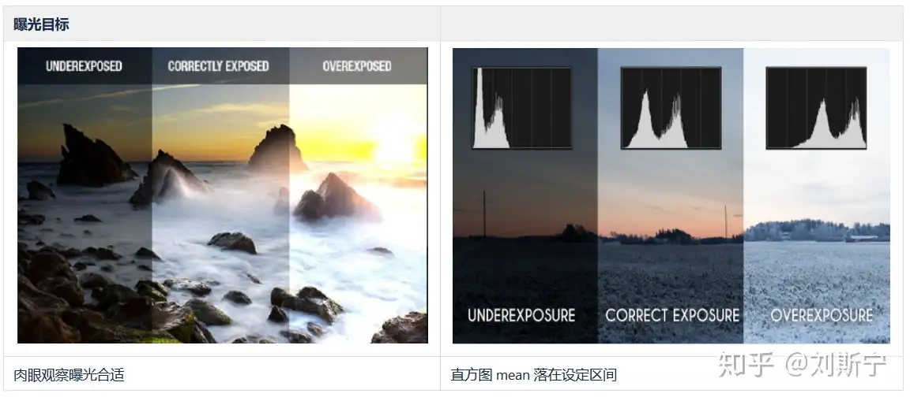
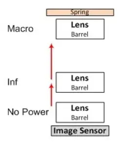
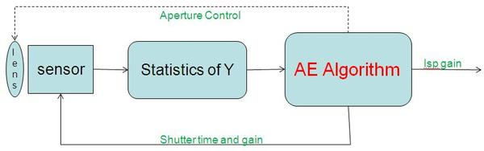
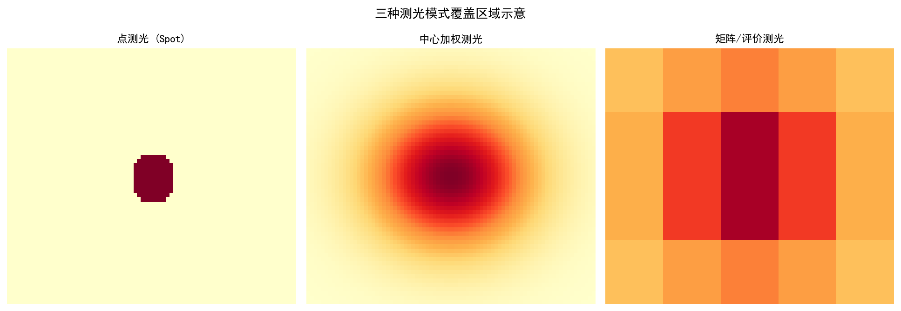
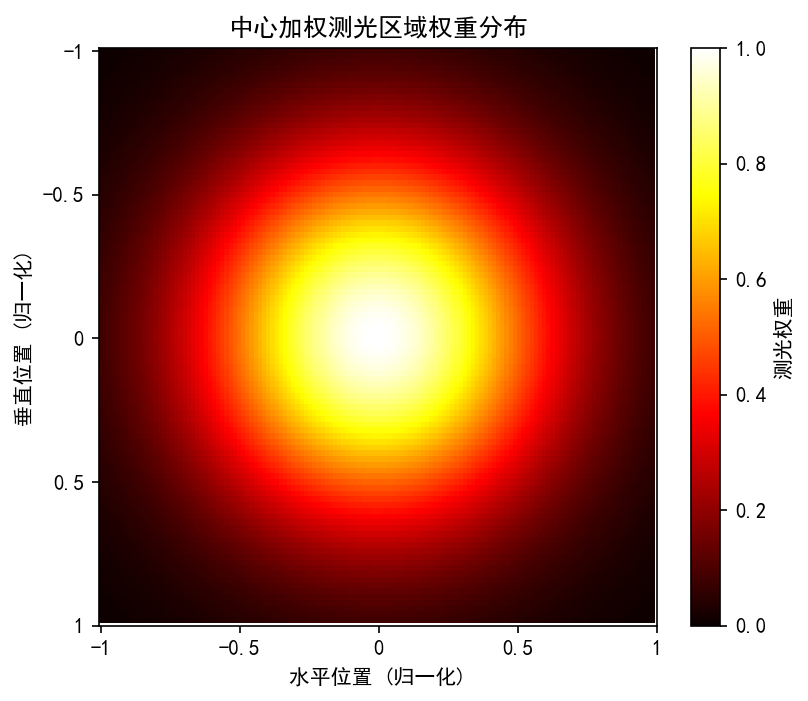
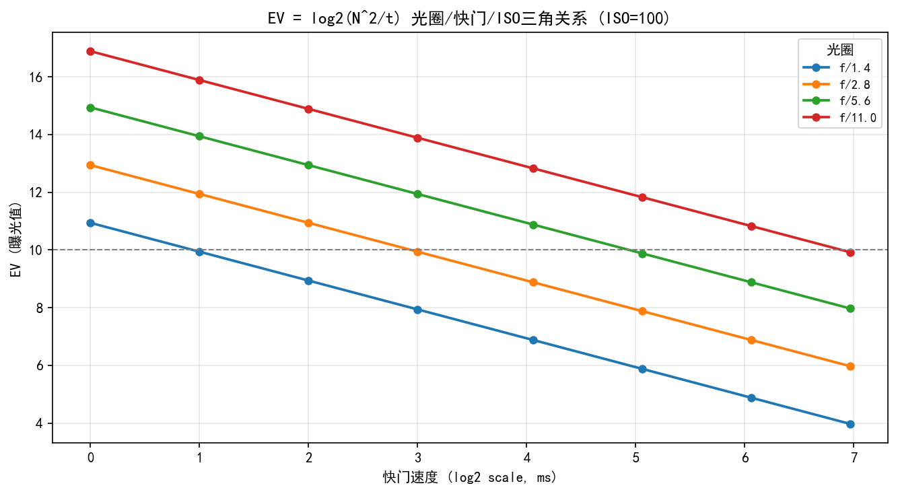
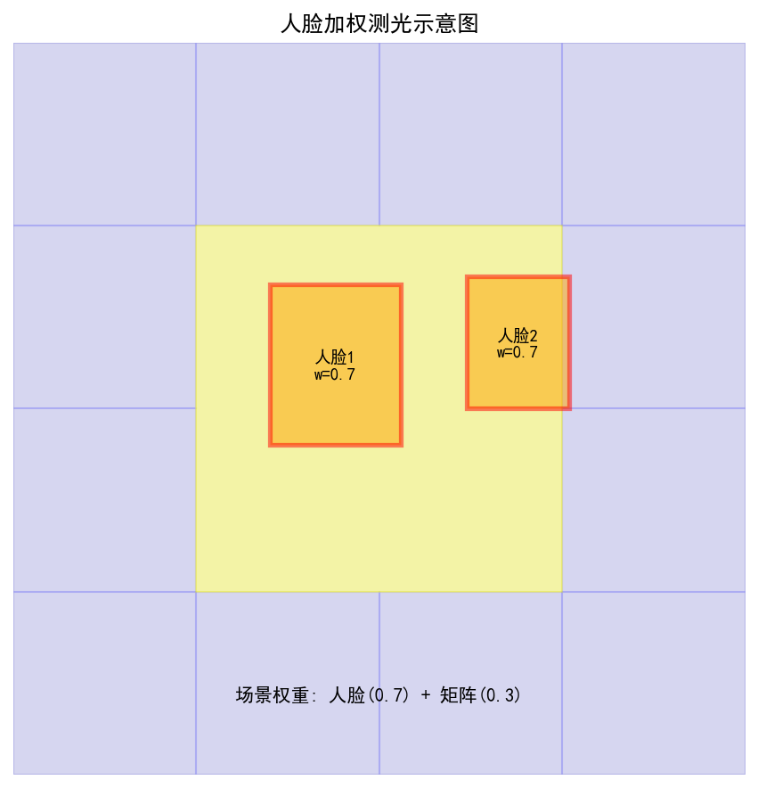
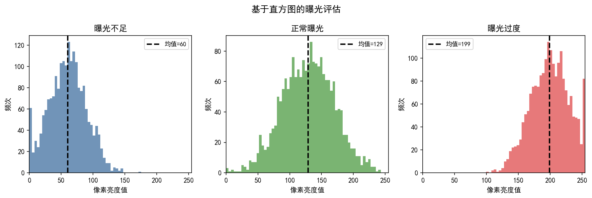
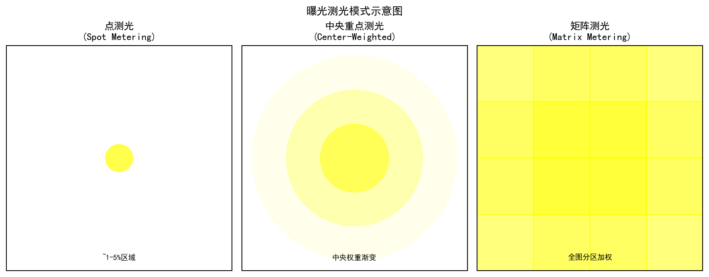

# 第二卷第17章：场景亮度分析与感知测光

> **流水线位置：** 3A 控制层 — AE 统计收集模块，位于 RAW 域或 YUV 域统计分析阶段
> **前置章节：** 第一卷第03章（传感器物理）、第一卷第07章（动态范围与HDR）、第二卷第07章（Gamma与色调映射）、第四卷第02章（自动曝光算法基础）
> **读者路径：** 3A算法工程师、亮度调参工程师、ISP系统工程师
> **内容范围：** 本章聚焦**亮度统计分析层**（直方图分析、各测光模式的图像分析算法、感知测光权重）。曝光控制决策、曝光三角计算与 PID 收敛环路见**第四卷第02章（自动曝光算法深度解析）**。

---

## §1 原理 (Theory)

### 1.1 感知亮度模型

#### 1.1.1 物理亮度与感知亮度的区别

测光算法的核心矛盾在于：传感器测到的是**物理亮度（Luminance，单位 cd/m²）**，但用户判断照片好不好看靠的是**感知亮度（Perceived Brightness）**。两者不是同一回事，差了一层人眼视觉系统（HVS）的非线性处理——这个差距，才是为什么不能用简单平均值做测光目标的根本原因。

**Weber–Fechner 定律（差异感知）：**

$$\Delta E = k \cdot \frac{\Delta I}{I}$$

其中 $I$ 为背景亮度，$\Delta I$ 为可觉察的最小亮度差，$k \approx 0.02$（JND 约为 2%，中等亮度明视觉条件下的经验近似值）。该定律意味着：在暗部区域，极小的亮度变化即可被感知；而在高亮区域，需要很大的绝对亮度变化才能产生同等的感知差异。

> **注：** $k \approx 0.02$ 是中等亮度、稳定背景等特定条件下的工程近似，并非跨观测条件不变的物理常数；在暗视觉（scotopic）或极高亮度条件下，$k$ 会显著增大。

**Stevens 幂律（绝对亮度感知）：** **[4]**

$$\Psi = k_s \cdot I^{0.33}$$

其中 $\Psi$ 为感知亮度，$k_s$ 为 Stevens 幂律系数（区别于 Weber-Fechner 定律中的 $k \approx 0.02$），指数 0.33 是视觉系统对宽动态范围的压缩因子。Stevens 幂律定性说明了人眼对亮度变化的感知是非线性的，这为图像信号采用非线性编码提供了依据之一。

> **注：** 实际显示系统的 Gamma 编码（如 sRGB/BT.709 编码 gamma ≈ 1/2.2 ≈ 0.45）并非直接由 Stevens 指数 0.33 推导得到。sRGB 编码 gamma 的主要设计目的是补偿 CRT 显示器的电光特性（EOTF ≈ 2.2），而非单纯模拟人眼感知模型。两者在数值上不同（0.33 ≠ 0.45），不可将 Stevens 幂律误作 γ≈1/3 编码的直接生理学依据。

**实用近似（CIE L*）：** **[3]**

CIELAB 的 $L^*$ 分量是工程中最常用的感知亮度近似：

$$L^* = \begin{cases}
116 \cdot \left(\dfrac{Y}{Y_n}\right)^{1/3} - 16 & \text{if } \dfrac{Y}{Y_n} > 0.008856 \\
903.3 \cdot \dfrac{Y}{Y_n} & \text{otherwise}
\end{cases}$$

其中 $Y$ 为线性亮度，$Y_n$ 为白点亮度。$L^*$ 将 $[0, 100]$ 映射到感知均匀的亮度空间。AE 系统常将目标亮度用 $L^*$ 表示，而非线性像素值。

#### 1.1.2 APEX 曝光系统

APEX（Additive system of Photographic EXposure）**[1]** 将所有曝光相关量映射到以 2 为底的对数域，使得加减法对应曝光的乘除法：

| APEX 量 | 符号 | 定义 | 示例 |
|---------|------|------|------|
| 光圈值 | $A_v = \log_2 N^2$ | $N$ = f-number | f/2.0 → $A_v$ = 2 |
| 快门值 | $T_v = \log_2(1/t)$ | $t$ = 快门时间(s) | 1/250s → $T_v$ = 8 |
| ISO 值 | $S_v = \log_2(\text{ISO}/3.125)$ | — | ISO 100 → $S_v$ = 5 |
| 亮度值 | $B_v = \log_2(L/1.0752)$ | $L$ = 场景亮度(cd/m²) | — |
| 曝光值 | $E_v = A_v + T_v$ | 即通常的 EV | — |

曝光方程在 APEX 域变为简单的线性方程：

$$E_v = B_v + S_v$$

即场景亮度值加 ISO 增益值等于所需曝光值。AE 算法的核心就是从统计数据估计 $B_v$，再根据目标 $E_v$ 计算出 $(A_v, T_v, S_v)$ 的最优组合。

（注：$S_v = \log_2(\text{ISO}/3.125)$ 为 APEX 历史约定，与 ISO 12232 中基于饱和曝光量（saturation-based speed）的 ISO 定义体系不同，仅用于对数域曝光计算映射，不可与现代相机 ISO 标定值直接互换。）

#### 1.1.2b EV 与场景亮度的完整推导

将 APEX 四个方程联立，得到从场景亮度 $L$（cd/m²）到曝光三角（$N$、$t$、ISO）的**完整映射**：

$$E_v = A_v + T_v = B_v + S_v$$

展开为物理量：

$$\log_2 N^2 + \log_2 \frac{1}{t} = \log_2 \frac{L}{1.0752} + \log_2 \frac{\text{ISO}}{3.125}$$

整理得传感器曝光量（Exposure Value，以 $f$-stop 为单位）与场景亮度的关系：

$$\boxed{EV_{100} = \log_2 \frac{L \cdot S_{\text{ISO}}}{K}}$$

其中：
- $EV_{100}$ 为 ISO 100 标准化曝光值（即 $E_v - S_v + S_{v,100}$）
- $S_{\text{ISO}}$ 为相机 ISO 感光度（标准值 ISO 100 时 $S_{\text{ISO}}=100$）
- $K$ 为测光标定常数，ISO 2720 规定标准值 $K = 12.5$（对应以 18% 反射率灰卡为基准的反射光测光校准）

**从场景亮度直接计算所需曝光三角的公式：**

$$\frac{N^2}{t} = \frac{L \cdot \text{ISO}}{K} = \frac{L \cdot \text{ISO}}{12.5}$$

工程推论：
- 已知 $L$（场景亮度，由测光统计估算）和目标 ISO，直接计算 $N^2/t$（即"曝光因子"）；
- AE 算法的核心任务是：在 $N^2/t = L \cdot \text{ISO}/12.5$ 约束下，按优先级（快门优先/光圈优先/ISO 优先）分配三个参数。

**数值示例：**

| 场景亮度 $L$ | ISO | 所需 $N^2/t$ | 一组典型参数 |
|------------|-----|-------------|------------|
| 4000 cd/m²（晴天户外）| 100 | 32000 | f/5.6, 1/1000s |
| 400 cd/m²（室内明亮）| 100 | 3200 | f/4.0, 1/200s |
| 40 cd/m²（室内昏暗）| 800 | 2560 | f/2.0, 1/640s |
| 4 cd/m²（夜景路灯）| 3200 | 1024 | f/2.0, 1/256s |

#### 1.1.3 场景关键亮度（Scene Key）

摄影测光的关键参数是**场景中间调亮度**，即 Ansel Adams 区域系统中的 Zone V（18% 灰）**[2]**。AE 的目标是将场景的"代表亮度"映射到此目标区：

$$L_{\text{target}} = 0.18 \cdot L_{\text{max\_encodable}}$$

实际应用中，各测光模式的主要差异在于"代表亮度"的定义方式：
- **平均测光（Average Metering）：** 整帧平均亮度，易受极端值干扰
- **中心加权（Center-Weighted）：** 中心区域权重更高，适合人像
- **矩阵测光（Matrix/Evaluative Metering）：** 多区域加权，结合场景内容分析
- **点测光（Spot Metering）：** 仅对焦点周围极小区域测光，精确控制

---

### 1.2 多区域矩阵测光的内部算法

矩阵测光（尼康叫 Matrix Metering，佳能叫 Evaluative Metering）**[5][6]** 是现代相机和手机 ISP 的主流测光模式。外行看是"全图均值"，工程师知道里面至少有四层权重在同时工作。

#### 1.2.1 区域划分与亮度统计

将画面分割为 $M \times N$ 个区域（典型值：16×16 到 64×64），对每个区域 $(i, j)$ 统计：

$$\bar{Y}_{ij} = \frac{1}{|R_{ij}|} \sum_{(x,y) \in R_{ij}} Y(x,y)$$

其中 $Y(x,y)$ 为 YUV 的 Y 分量或 RAW 域的 Green 通道均值。

#### 1.2.2 区域权重的多因子融合

每个区域的权重 $w_{ij}$ 由多个因子相乘决定：

$$w_{ij} = w_{ij}^{\text{pos}} \cdot w_{ij}^{\text{face}} \cdot w_{ij}^{\text{focus}} \cdot w_{ij}^{\text{highlight}}$$

**位置权重 $w_{ij}^{\text{pos}}$（空间先验）：**

```
中心区域权重最高，向边缘按高斯衰减：
w_pos(i,j) = exp(-((i-H/2)²+(j-W/2)²) / (2σ²))
σ ≈ 0.25 × min(H,W)
```

**人脸区域权重 $w_{ij}^{\text{face}}$：**
- 检测到人脸：覆盖人脸框的区域权重提升 **3.0（基准）**×
- 人脸测光目标：将人脸皮肤区域亮度映射到 $L^* = 60$–$70$（相当于中间调偏亮）
- 无人脸：$w^{\text{face}} = 1.0$（不加权）

> **人脸测光权重工程建议**：基准值 $w_\text{face} = 3.0$（量产推荐起始点，来源：多款旗舰手机调试经验及 iResearch666 AE调参专栏）。调参范围参考：人脸偏暗（用户反馈欠曝）→ 上调至 3.5–4.0；人脸过曝（高反差逆光）→ 配合高光抑制权重，人脸权重保持 3.0 不变。与**第四卷第02章 §1.2 人脸优先测光**中人脸测光权重定义一致。

**对焦点权重 $w_{ij}^{\text{focus}}$：**
- 对焦区域附近权重提升 1.5–2× 
- 反映"用户关注物体"的测光优先级

**高光抑制权重 $w_{ij}^{\text{highlight}}$：**

$$w_{ij}^{\text{highlight}} = \begin{cases}
0.2 & \text{if } \bar{Y}_{ij} > 0.95 \cdot Y_{\max} \quad \text{（高光过曝区域降权）} \\
1.0 & \text{otherwise}
\end{cases}$$

#### 1.2.3 加权平均与 EV 估算

最终场景代表亮度：

$$\bar{Y}_{\text{scene}} = \frac{\sum_{ij} w_{ij} \cdot \bar{Y}_{ij}}{\sum_{ij} w_{ij}}$$

转换到 EV 域：

$$B_v = \log_2\!\left(\frac{\bar{Y}_{\text{scene}} / Y_{\text{max}} \cdot L_{\text{display\_max}}}{1.0752}\right)$$

目标曝光值 $E_v^{\text{target}} = B_v + S_v$，AE PI 控制器以此为输入更新曝光参数。

#### 1.2.4 场景类型识别对权重的影响

现代矩阵测光引入轻量分类器：

```
场景类型输入: 亮度分布直方图 + 区域高光比例 + 区域对比度
→ 分类输出: {逆光, 顺光, 低照, 高动态范围, 均匀光, 点光源}
→ 每种场景对应预设的权重模板
```

例如：
- **逆光场景（前景暗/背景亮）：** 提升中心区前景权重，降低背景高光权重
- **低照场景（全图均值 < 20/255）：** 降低高光防溢保护阈值，避免过曝
- **高对比场景（HDR）：** 触发多帧 AEB 或 HDR 合帧策略

---

### 1.3 基于直方图的 AE 目标分析

矩阵测光给你一个加权均值，但它对双峰场景天生盲目——逆光场景里，前景人脸的暗部峰和背景天空的亮部峰各自清晰，加权一平均反而什么都没反映。直方图分析的价值就在这里：它不关心"均值是多少"，关心"分布长什么样"。

#### 1.3.1 亮度直方图归一化与积分

设亮度直方图为 $H[k]$（$k = 0,\ldots,255$），归一化概率密度：

$$p[k] = \frac{H[k]}{\sum_k H[k]}$$

累积分布函数（CDF）：

$$F[k] = \sum_{j=0}^{k} p[j]$$

**高光剪切比（Highlight Clipping Ratio）：**

$$r_{\text{high}} = 1 - F[240]$$

$r_{\text{high}} > 0.02$（2% 像素过曝）触发 AE 降曝光保护。

**暗部剪切比（Shadow Clipping Ratio）：**

$$r_{\text{low}} = F[15]$$

$r_{\text{low}} > 0.05$（5% 像素欠曝）触发 AE 升曝光修正。

#### 1.3.2 直方图亮度目标（Histogram-Based AE Target）

基于期望 CDF 形状推导目标曝光：

$$k_{\text{target}} = \arg\min_k \left| F[k] - 0.50 \right|$$

将 $k_{\text{target}}$ 映射到目标亮度（18% 灰对应 $\approx 117/255$）：

$$\Delta E_v = \log_2\!\left(\frac{117}{k_{\text{target}}}\right)$$

通过 $\Delta E_v$ 调整曝光参数。这种方法对场景亮度均匀时效果好，但在双峰直方图（逆光）场景需结合内容分析。

#### 1.3.3 多峰场景的直方图分析

对于包含多个亮度区域的复杂场景（如室内人像+窗外背景），可通过直方图峰值检测识别：

```python
from scipy.signal import find_peaks

peaks, properties = find_peaks(H_smooth, height=0.02 * H_max,
                                distance=30, prominence=0.01 * H_max)
if len(peaks) >= 2:
    # 双峰：可能是逆光场景
    foreground_peak = peaks[0]   # 暗部峰（前景人物）
    background_peak = peaks[-1]  # 亮部峰（背景）
    # AE 目标优先保前景，高光区允许过曝
    target_brightness = foreground_peak + 20  # 前景提亮修正
```

---

### 1.4 人脸优先测光的工程实现

#### 1.4.1 人脸亮度目标

皮肤亮度的目标值因肤色而异，但在 sRGB 空间的典型目标范围为：

| 肤色类型 | $L^*$ 目标 | sRGB Y 近似 |
|---------|-----------|------------|
| 浅肤色（Fitzpatrick I-II） | 65–75 | 0.37–0.52 |
| 中等肤色（III-IV） | 55–65 | 0.26–0.37 |
| 深肤色（V-VI） | 45–55 | 0.17–0.26 |

工程实践中常用**固定目标值** $L^* = 62$（适合大多数常见肤色），配合用户可调偏移（±10 $L^*$）处理个体差异。

#### 1.4.2 多人脸的亮度仲裁

场景中存在多个人脸时，需要选择测光的"主体人脸"：

```
优先级排序：
1. 离对焦点最近的人脸（主对焦主体）
2. 最大人脸框（最近的人）
3. 位于画面中心的人脸

加权策略：主体人脸权重 = 0.6，其余人脸各分配剩余权重
```

#### 1.4.3 前景/背景亮度分离

当人脸亮度与背景亮度差距超过 2 EV 时，触发前景/背景分离测光：

$$\Delta EV_{\text{face-bg}} = |\log_2(\bar{L}_{\text{face}}) - \log_2(\bar{L}_{\text{bg}})|$$

> ⚠️ **注**：公式中 $\bar{L}$ 为**线性场景亮度**（linear luminance），而非 Gamma 编码后的像素值 $Y$。若直接对 sRGB/Rec.709 编码值取 $\log_2$，因 $Y \approx L^{1/2.2}$，所得 EV 差会被压缩约 $2.2$ 倍，导致触发阈值不准确。ISP 应在 RAW 线性域或经反 Gamma 后计算。

若 $\Delta EV_{\text{face-bg}} > 2$：
- **方案A（优先保人脸）：** 按人脸目标亮度设定曝光，背景允许过曝/欠曝
- **方案B（HDR触发）：** 多帧 AEB，合帧保留全部细节
- 由场景检测模块决策

### 1.5 AI 智能测光

旗舰手机的 AI 测光并不是什么革命性新架构——Pixel 3 的 Night Sight、iPhone 13 的主体感知 AE、小米 Ultra 的场景识别，底层逻辑基本都是"轻量分类器 + 规则引擎"这条路。真正端到端的 Neural AE 在工程上碰到的问题是：黑盒不可调、标注成本高、极端场景泛化差。所以现在量产上的 AI-AE，大多数还是架构 A（分类器辅助），架构 B（端到端预测）主要用在夜景这类边界场景。

#### 1.5.1 AI 测光的两种架构

**架构 A：轻量分类器 + 规则引擎增强**

在传统矩阵测光基础上，增加一个轻量 CNN（通常 < 1 MB，MobileNet 骨干），对低分辨率输入（如 $64 \times 48$）做场景语义分类，输出"场景语义向量"（如人像/风景/夜景/高动态/低照/逆光 6 维概率向量），再基于分类结果动态调整分区权重模板和目标亮度偏移量：

$$EV_{\text{final}} = EV_{\text{matrix}} + f(\mathbf{p}_{\text{scene}}, \Delta_{EV})$$

其中 $\mathbf{p}_{\text{scene}}$ 为场景分类概率，$\Delta_{EV}$ 为场景类别对应的 EV 修正表（离线标定）。

**优势：** 可解释性好，计算量极低（< 1 ms NPU 推理），易于调参。典型应用：高通 Spectra 平台的 CamX AEC 节点中集成的 Scene Intelligence AE 模块。

**架构 B：端到端神经网络 AE 预测**

直接以图像（低分辨率，如 $128 \times 96$）为输入，输出目标 EV（或目标曝光三角参数）：

$$\hat{EV} = f_{\theta}(I_{\text{preview}})$$

网络结构通常为轻量 CNN（如 SqueezeNet 或 MobileNetV3 骨干）+ 回归头，训练数据为专业摄影师标注的"最优曝光"数据集（通常需要 10 万+ 张图像）。

**优势：** 对复杂场景（多个人脸、复杂光线、艺术拍摄）泛化更好。**劣势：** 推理延迟略高（NPU 约 2–5 ms），需要大量标注数据，黑盒不易调参。

#### 1.5.2 Google Pixel 的 Night Sight 测光策略

Google Night Sight（2018 年 Pixel 3 引入）**[9]** 的测光创新在于：在极低光场景（< 3 lux）下，传统测光因信号极弱（大量噪声）而不可靠，Night Sight 将"多帧曝光决策"与"测光统计"解耦：

1. **快速预览测光**：用极短曝光（< 1/100s）+ 高 ISO（3200+）的预览帧估计场景亮度分布（尽管信噪比极低，但足以判断亮度范围）；
2. **目标曝光决策**：基于预测的场景亮度，为多帧 AEB 选择最优的曝光时间（通常 10–33ms，即 1/100s–1/30s）× 帧数组合；
3. **帧对齐 + 合并**：对齐的多帧（通常 6–15 帧）在 RAW 域做 Wiener 滤波型合并，等效扩大信噪比；
4. **合并后统计重新测光**：对合并后的高 SNR 图像再次测光（此时测光统计更可靠），作为最终色调映射的依据。

#### 1.5.3 Apple 主体检测 AE（Subject-Aware AE）

iOS 15+（iPhone 13 起）引入基于 Vision 框架的主体感知 AE，在人脸之外还识别宠物、植物、文字等主体，并对不同主体类型使用不同的亮度目标：

| 主体类型 | $L^*$ 目标范围 | 备注 |
|---------|--------------|------|
| 人脸（皮肤） | 60–70 | 按肤色分级 |
| 宠物（猫/狗脸）| 45–65 | 动物皮毛反射率差异大 |
| 文字/文档 | 75–85 | 最大化文字可读性 |
| 植物（绿叶）| 55–65 | 避免过曝导致失去绿色细节 |
| 无主体（风景）| 50–60（场景均值）| 回退到矩阵测光 |

### 1.6 闪烁场景测光策略（霓虹灯/舞台灯）

> **P1补充**：闪烁光源（Flickering Light）是测光系统的经典难题，固定阈值策略会导致严重曝光抖动，需专门设计测光策略。

#### 闪烁光源的分类与特征

| 光源类型 | 闪烁频率 | 特征 | 主要挑战 |
|---------|---------|------|---------|
| 工频荧光灯/LED（AC供电）| 100/120 Hz（电源频率×2）| 周期性，幅度稳定 | 帧率与闪烁频率不同步导致曝光不一致 |
| 霓虹灯 | 50/60 Hz（变压器频率） | 强闪烁，幅度大（>50%变化）| 连续多帧亮度差 > 1 EV |
| 舞台追光/DMX灯 | 0.5–50 Hz（可编程）| 非周期，快速跳变 | AE PI控制器无法快速响应 |
| LED屏/显示屏背景 | 120–480 Hz（PWM）| 高频，低帧率下可见条纹 | Banding + 测光错误 |

#### 工频闪烁的抗闪烁测光（Anti-Flicker AE）

标准抗闪烁策略（已在平台参数表§3.5中列出 `AEC_AntiFlickerMode`）的核心是**将曝光时间锁定为电源周期的整数倍**：

$$t_{\text{exposure}} = n \cdot T_{\text{flicker}}, \quad n \in \{1, 2, 3, \ldots\}$$

其中 $T_{\text{flicker}} = 1/(2 f_{\text{mains}})$（50 Hz供电对应 $T_{\text{flicker}} = 10$ ms，60 Hz对应约 8.33 ms）。当曝光时间等于闪烁周期整数倍时，传感器在每个曝光期间积分到相同数量的完整光强周期，消除帧间亮度差异。

**约束**：曝光时间被离散化（只能取 10 ms、20 ms、30 ms...），失去了对曝光时间的连续控制。ISP通常通过调整模拟增益（Analog Gain）来补偿亮度，而非微调曝光时间。

#### 霓虹灯/舞台灯的非周期闪烁策略

对于非工频周期性闪烁（霓虹灯通常50 Hz但占空比和幅度随时间变化，舞台灯完全非周期），简单的抗闪烁无法根本解决问题。工程上采用以下组合策略：

**策略1：时域测光滑波（Temporal Metering Smoothing）**

对测光结果施加更强的时域低通滤波，抑制闪烁引起的测光抖动：

$$EV_{\text{metering}}^{(t)} = (1-\beta) \cdot EV_{\text{metering}}^{(t-1)} + \beta \cdot EV_{\text{raw}}^{(t)}$$

闪烁场景下将 $\beta$ 从正常值（约 0.3–0.5）降低至 0.05–0.15，代价是AE响应速度变慢（需约 20–40 帧才能收敛）。

**策略2：基于帧间差异检测的闪烁识别**

检测连续帧的全局亮度方差，识别闪烁场景并自动切换低 $\beta$ 模式：

```python
# 帧间亮度差异检测（闪烁识别）
def detect_flicker(ev_history, window=10):
    if len(ev_history) < window:
        return False
    ev_window = ev_history[-window:]
    ev_variance = np.var(ev_window)
    # 正常场景方差 < 0.01 EV²；闪烁场景方差 > 0.05 EV²
    return ev_variance > FLICKER_VARIANCE_THRESHOLD  # 典型 0.03 EV²
```

**策略3：多帧测光统计（Temporal Histogram Accumulation）**

对连续 $K$ 帧（典型 $K = 3$～$5$）的亮度直方图做加权叠加，得到时间平均直方图，用于计算AE目标：

$$H_{\text{accum}}[l] = \sum_{k=0}^{K-1} \alpha_k \cdot H^{(t-k)}[l], \quad \sum \alpha_k = 1$$

多帧积分可将帧间闪烁引起的直方图漂移平均化，使AE目标更稳定。高通Spectra的 `AEC_HistogramBins` 支持配置多帧累积直方图（默认1帧，闪烁场景建议3–5帧）。

**策略4：测光锁定（AE Lock）引导**

对于极端舞台闪烁（如DMX追光频繁开关），系统可检测到闪烁后提示用户使用 **AE锁定**（曝光固定在当前值），配合较高快门速度（> 1/200s）捕捉瞬间姿态，避免连续自动曝光的不稳定性。

#### 平台参数配置要点

| 平台 | 闪烁检测参数 | 闪烁测光策略参数 |
|------|------------|---------------|
| 高通 CamX | `AEC_AntiFlickerMode = Auto`（自动检测50/60 Hz）| `AEC_FlickerTemporalSmooth`（建议 0.1）、`AEC_HistAccumFrames`（建议 3）|
| 联发科 Imagiq | `AEAntiFlicker = ENUM_AUTO`（NDD）| `AEFlickerSmoothingFactor`（NDD float，0.1–0.2）|
| 海思越影 | `AE_FlickerMode = AUTO` | `AE_FlickerSmoothGain`（建议 0.15）|

> **调参注意**：`AntiFlickerMode = Auto` 的自动检测依赖频谱分析（对连续帧的全图亮度序列做FFT），在室外强光或混合光源环境下可能误检。建议在已知非荧光灯环境（如室外、阳光直射）时手动设置为 `DISABLED`，避免不必要的曝光时间离散化限制。

---

## §2 标定 (Calibration)

### 2.1 测光目标亮度标定

使用 18% 灰卡（标准 Macbeth ColorChecker 第22格，18% 中性灰）**[1][2]**：

```
步骤：
1. 在均匀漫射光源（如积分球，6500K, CRI≥95）下放置 18% 灰卡
2. 固定 ISO 100，手动曝光使传感器线性输出约 40–50% 饱和度
3. 记录此时 YUV Y 通道均值 → 该值定义为 AE 目标亮度 Y_target
4. 将 Y_target 写入 AE 参数表（通常为 128/255 或归一化后的 0.18）
```

### 2.2 分区权重的离线标定

矩阵测光的分区权重通常通过以下方式调校：

1. **采集测试集**：覆盖人像、风景、逆光、低照、夜景等场景各 200+ 张，由专业摄影师提供参考曝光（地面真值 EV）
2. **损失函数**：最小化预测 EV 与参考 EV 的均方误差：
   $$\mathcal{L} = \sum_{\text{scene}} \left( EV_{\text{predicted}} - EV_{\text{reference}} \right)^2$$
3. **优化方法**：梯度下降或网格搜索（权重参数通常 < 100 个，可用穷举/BO 优化）

### 2.3 人脸亮度目标的 A/B 测试标定

在量产前通过用户研究确定人脸亮度目标：
- 向 50+ 评测员展示不同人脸亮度（$L^*$ = 55 / 60 / 65 / 70）的对比样张
- 选择满意度最高的 $L^*$ 值作为默认目标
- 分别标定亚洲人/欧美人/深肤色人群的偏好值

---

## §3 调参 (Tuning)

### 3.1 曝光目标偏移（EV Compensation）

用户可通过 EV±3 调整整体曝光偏向，内部实现为直接修改 $Y_{\text{target}}$：

$$Y_{\text{target}}' = Y_{\text{target}} \cdot 2^{\Delta EV}$$

典型预设：
- **人像模式：** +0.3 EV（提亮面部，暗部适当宽松）
- **风景模式：** 0 EV（还原真实亮度）
- **夜间模式：** -0.5 EV（保护高光，避免灯光溢出）

### 3.2 高光保护强度

控制 $r_{\text{high}}$ 触发阈值和响应速度：

| 参数 | 保守（减少过曝） | 标准 | 激进（宁可欠曝） |
|------|----------------|------|----------------|
| 高光剪切阈值 | 0.01 (1%) | 0.02 (2%) | 0.05 (5%) |
| 高光区域降权系数 | 0.1 | 0.2 | 0.4 |
| EV 降曝步长 | 0.5 EV/帧 | 0.3 EV/帧 | 0.2 EV/帧 |

### 3.3 AE 测光区域权重（Zone Weight Map）与人脸检测框的联动机制（工程联动缺口）

**工程联动缺口：** §1.2.2 描述了人脸权重 $w_{ij}^{\text{face}}$ 的作用，但没有说明人脸检测框坐标如何映射到区域权重表，以及高通和 MTK 的具体参数是什么。

**联动机制说明：**

矩阵测光的分区权重表（Zone Weight Map）是一个二维整数矩阵（高通 15×15，MTK 9×9）。人脸检测给出归一化坐标 $(x_1, y_1, x_2, y_2) \in [0,1]^4$，AE 模块需要将此坐标映射到权重矩阵的格子索引，然后对覆盖人脸框的格子乘以人脸权重倍数 `AEC_FaceWeightScale`。

**映射公式（以高通 15×15 权重表为例）：**

$$i_{\text{face}} = \text{round}\!\left(\frac{x_{\text{face\_center}}}{1.0} \times 14\right), \quad j_{\text{face}} = \text{round}\!\left(\frac{y_{\text{face\_center}}}{1.0} \times 14\right)$$

人脸框覆盖的格子范围：

$$i \in \left[\text{floor}(x_1 \times 14),\ \text{ceil}(x_2 \times 14)\right], \quad j \in \left[\text{floor}(y_1 \times 14),\ \text{ceil}(y_2 \times 14)\right]$$

覆盖格子的权重 = 原始位置权重 × `AEC_FaceWeightScale`（典型 2.0~4.0）。未覆盖格子权重不变。

**检测到人脸时的权重切换（两平台参数）：**

| 功能 | 高通 Chromatix 参数 | MTK NDD 参数 |
|------|-------------------|-------------|
| 人脸权重倍数 | `AEC_FaceWeightScale`（float，典型 2.0~4.0）| `AEFaceWeight`（NDD float，典型 2.0~3.5）|
| 人脸权重置信度门限 | `AEC_FaceDetectConfidenceThresh`（float [0,1]，典型 0.75~0.85）| `AEFaceConfidenceThreshold`（NDD float，0.7~0.8）|
| 人脸权重切换时域平滑 | `AEC_FaceWeightSmoothTC`（时间常数，帧数，典型 5~10）| `AEFaceWeightSmoothFrames`（NDD int，5~8）|
| 多人脸时主脸选择 | `AEC_FaceSelectMode`（枚举：Largest/Closest/Centered）| `AEFaceSelectStrategy`（NDD enum）|
| 无人脸时权重退出策略 | `AEC_FaceWeightFadeoutFrames`（权重渐变回 1.0 的帧数，典型 10~20）| `AEFaceWeightFadeFrames`（NDD int）|

**检测频率低于 ISP 帧率时的处理：**

人脸检测以 15~30 fps 运行（NPU 推理限制），ISP 以 30~120 fps 运行。在两次检测之间，高通 AE 节点使用**最近一次有效检测结果**（Hold Last Valid），通过 `AEC_FaceWeightSmoothTC` 做时域平滑防止突变；MTK 类似，通过 `AEFaceWeightSmoothFrames` 控制。若检测结果超过 `AEC_FaceDetectTimeout`（典型 10 帧，即约 333ms @30fps）未更新，系统认为人脸丢失，权重在 `AEC_FaceWeightFadeoutFrames` 帧内平滑归一，防止突然跳变到纯矩阵测光。

**人脸权重系数推荐：**

| 场景 | 推荐人脸权重倍数 |
|------|----------------|
| 专业人像模式 | 3–4× |
| 普通拍照 | 2–2.5× |
| 视频录制 | 1.5–2×（避免频繁抖动） |
| 无人脸（风景/建筑） | 1.0×（纯矩阵测光） |

> **工程推荐（手机 ISP 测光模式选择）：** 默认路径用矩阵测光 + 直方图辅助（`α = 0.7`），不要一上来就开场景分类器——分类器分错比没有还糟糕，而矩阵测光在大多数室内、顺光、户外场景里已经够用。人脸检测置信度低于 0.8 时关掉人脸权重，宁可退回矩阵测光，也别让一个误检的"人脸"把整张图曝光拉偏。视频模式下人脸权重上限压到 2×，超过这个值在多人场景里几乎必然出现曝光抖动。只有两种情况真正需要直方图主导（`α ≤ 0.5`）：一是低照场景（全图均值 < 30/255），二是双峰逆光场景——这两种情况下加权均值本身就是错误输入，再信它没有意义。

### 3.4 直方图目标优先级

在矩阵测光与直方图测光结果不一致时的融合策略：

$$EV_{\text{final}} = \alpha \cdot EV_{\text{matrix}} + (1-\alpha) \cdot EV_{\text{histogram}}$$

典型值：$\alpha = 0.7$（矩阵权重更高），低照场景时 $\alpha = 0.5$（直方图更可靠）。

---

### 3.5 测光目标亮度（Luma Target）与 Gamma 曲线的耦合（工程联动缺口）

**工程联动缺口：** 章节前半部分定义了 `AEC_TargetLuma`（典型值 110~130/255），但没有说明当 Gamma 曲线发生变化时，这个目标值需要联动更新，否则会系统性偏曝或欠曝。

**耦合原理：**

AE 统计的亮度值 Y 是在 **Gamma 编码后的 YUV 域**（或 RAW 域，取决于平台配置）采集的。假设传感器线性域真实亮度为 $L_{\text{linear}}$，经 Gamma 编码后：

$$Y = \text{clip}\left(255 \cdot L_{\text{linear}}^{1/\gamma},\ 0,\ 255\right)$$

AE 目标值 $Y_{\text{target}}$ 对应的线性亮度：

$$L_{\text{target,linear}} = \left(\frac{Y_{\text{target}}}{255}\right)^{\gamma}$$

**当 Gamma 值从 2.2 变为 2.4（变暗）时**：同样的 $Y_{\text{target}} = 120$，对应的线性亮度从 $0.196$ 降到 $0.174$，即实际捕获的光量减少约 12%，输出图像整体**系统性欠曝约 0.17 EV**。如果没有联动调整 $Y_{\text{target}}$，用户会看到画面暗了一截，但 AE 报告"已达到目标亮度"——这是测光和色调的典型解耦故障。

**联动公式：**

若 Gamma 从 $\gamma_{\text{ref}}$（通常 2.2）变为 $\gamma_{\text{new}}$，$Y_{\text{target}}$ 需要联动修正为：

$$Y_{\text{target,new}} = 255 \cdot \left(\frac{Y_{\text{target,ref}}}{255}\right)^{\gamma_{\text{ref}} / \gamma_{\text{new}}}$$

**示例**：$Y_{\text{target,ref}} = 120$，$\gamma_{\text{ref}} = 2.2$，$\gamma_{\text{new}} = 2.4$：

$$Y_{\text{target,new}} = 255 \cdot \left(\frac{120}{255}\right)^{2.2/2.4} = 255 \cdot 0.471^{0.917} \approx 124$$

即 Gamma 变暗时目标值应从 120 上调到约 124，保证感知亮度不变。

**实际工程处理方式：**

大多数平台把 `AEC_TargetLuma` 和 Gamma 参数绑定在**同一套 Profile（场景模式）**下，切换模式时两者同时切换，而不是分别单独调。高通 Chromatix 里，`luma_target` 和 `gamma_table` 都属于 `chromatix_params` 下同一个 `[ISO_lux_trigger]` 段——只要调了 Gamma，一定要在同一个触发段里同步检查 `luma_target`。MTK 类似：`GammaTable` 和 `AETargetLuma` 都在同一个 NDD Profile 里。**孤立地修改 Gamma 而不检查 `luma_target` 是最常见的调参错误之一。**

---

### 3.6 Anti-Banding 对曝光时间的约束与 AE 搜索空间（工程联动缺口）

**工程联动缺口：** 反闪烁（Anti-Banding）的原理在 §1.6 有介绍，但没有说明它对 AE 控制器的搜索空间有什么具体约束，以及这个约束如何影响 AE 的收敛行为。

**约束机制：**

在 50 Hz 供电环境下，荧光灯/LED 灯的亮度以 100 Hz 频率波动，曝光时间必须是 10 ms 的整数倍才能积分完整周期：

$$t_{\text{exposure}} \in \{10\text{ms},\ 20\text{ms},\ 30\text{ms},\ \ldots\}$$

这将 AE 控制器对曝光时间的连续搜索空间**离散化**为等差数列，有以下工程影响：

1. **AE 分辨率下降**：正常情况下 AE 可以以 0.1~0.5 ms 粒度微调曝光时间（尤其在低光场景用短步长收敛）；开启 Anti-Banding 后最小步长变成 10 ms，等效最小曝光调整量从约 0.1 ms 跳到 10 ms，在约 1/200s（5 ms）曝光时间附近无法精细控制，导致 AE 只能靠 ISO 增益来补偿。

2. **AE 振荡风险增加**：当场景亮度对应的"最优曝光时间"恰好落在 10 ms 和 20 ms 之间时，AE 会在两个整数倍时间之间跳变，再靠 Analog Gain 补偿，容易产生曝光-增益的锯齿振荡（"呼吸效应"）。

3. **低光场景延迟收敛**：在暗光下，最优曝光时间可能需要 33 ms（1/30s），Anti-Banding 允许取 30 ms 或 40 ms，但 30 ms 欠曝，40 ms 需要等下一个时间窗口——收敛步骤增多，AE 收敛帧数从正常 5~8 帧增加到 10~15 帧。

**高通平台的参数约束配置：**

```xml
<!-- chromatix_aec_ext.xml -->
<AEC_AntiFlickerMode>Auto</AEC_AntiFlickerMode>          <!-- Auto/50Hz/60Hz/Disabled -->
<AEC_AntiFlickerExpUnit>10000</AEC_AntiFlickerExpUnit>    <!-- 曝光时间量化单位，单位 μs（50Hz=10000μs）-->
<AEC_UseGainForFineAdj>1</AEC_UseGainForFineAdj>         <!-- 1=Anti-Banding时用Gain做细粒度补偿 -->
<AEC_GainAdjMaxRatio>1.5</AEC_GainAdjMaxRatio>           <!-- Gain补偿最大允许倍数（防止噪声过大）-->
```

**MTK 平台：**

```
[AE]
AEAntiFlicker           = ENUM_AUTO     # Auto/50Hz/60Hz/OFF
AEAntiFlickerUnit       = 10000         # μs，50Hz对应10ms
AEFineTuneByGain        = 1             # 细调靠Gain而非曝光时间
AEMaxGainForFineTune    = 1.5           # 同上，Gain补偿上限
```

**调参注意**：`AEFineTuneByGain`（MTK）/ `AEC_UseGainForFineAdj`（高通）的 Gain 补偿上限不能设太高——Gain 提升 1.5× 对应噪声增加约 3.5 dB，超过 1.5× 时夜景图像噪声明显增加。在极暗场景下建议关闭 Anti-Banding（`Mode=Disabled`），允许曝光时间连续搜索，用后处理（Banding 检测+校正）代替前端约束。

### 3.5 三平台测光（Metering）关键参数对比

| 功能 | 高通 CamX / Chromatix | MTK Imagiq / NDD | 海思越影 |
|------|----------------------|-----------------|---------|
| 测光总开关 | `AEC_Enable`（CamX AEC 节点）| `AEEnabled`（NDD bool）| `AE_Enable` |
| 测光模式 | `AEC_MeteringMode`（枚举：Center/Spot/Matrix/Face）| `AEMeteringMode`（NDD enum）| `AE_MeterMode` |
| 分区权重表 | `AEC_ZoneWeightMap[15×15]`（Chromatix XML，浮点权重）（注：15×15 适用于 Snapdragon 845 及以前平台；SM8450 起支持最大 16×16 可配置尺寸；SM8550/8650 Spectra ISP 引入 64-zone 独立统计块，参数路径有所变更）| `AEZoneWeight[N][N]`（NDD int 矩阵，天玑支持 9×9）| `AE_WeightMap[]` |
| 人脸测光权重 | `AEC_FaceWeightScale`（float，人脸区域权重倍数，典型 2.0–4.0）| `AEFaceWeight`（NDD float）| `AE_FacePriority` |
| 目标亮度 | `AEC_TargetLuma`（8-bit，典型 110–130；按 lux-index LUT 自适应）| `AETargetLuma`（NDD int，典型 118）| `AE_LumaTarget` |
| 亮度统计域 | `AEC_StatsType`（Y channel from YUV / R+G+B 加权）| `AEStatsChannel`（NDD：Y/RGB weighted）| `AE_StatsType` |
| 高光保护 | `AEC_HighlightBias`（高光区域权重压低系数）| `AEHighlightSuppression`（NDD float）| `AE_HLProtect` |
| 直方图统计 | `AEC_HistogramBins`（256 bins；支持分区直方图）| `AEHistBins`（256，可配置 ROI）| `AE_HistConfig` |
| 反闪烁 | `AEC_AntiFlickerMode`（Auto/50Hz/60Hz；检测电频率）| `AEAntiFlicker`（NDD enum）| `AE_FlickerMode` |

**Chromatix XML 示例（高通，分区权重表，中央重点测光）：**

```xml
<!-- chromatix_aec_ext.xml -->
<metering_weight_map>
  <!-- 15×15 权重表，中央区域权重高于边缘 -->
  <!-- 第1行（顶部边缘，低权重） -->
  <row>1 1 1 1 1 1 1 1 1 1 1 1 1 1 1</row>
  <!-- 第5行（中央附近，高权重） -->
  <row>1 2 3 4 5 6 7 6 5 4 3 2 1 1 1</row>
  <!-- 第8行（正中心，最高权重） -->
  <row>1 2 4 6 8 10 12 10 8 6 4 2 1 1 1</row>
  ...
</metering_weight_map>
<face_weight_scale>3.0</face_weight_scale>
<target_luma>120</target_luma>
```

> **调参注意：**
> - 高通 `AEC_ZoneWeightMap` 为 15×15 固定尺寸（与 AF 统计块共用），MTK 天玑平台支持 9×9 可变 ROI，两者权重分辨率不同，移植时需重采样权重表。
> - 人脸权重系数过高（>4×）会在多人场景中导致曝光在不同人脸间抖动；建议将多人脸时的权重上限设为 2–2.5×，单人像模式可提高至 3–4×。
> - `AEC_AntiFlickerMode = Auto` 依赖于 50/60 Hz 闪烁检测算法，室外强光或 LED 背光环境下检测可能误判，建议在特定场景下固定配置。

---

## §4 伪影 (Artifacts)

### 4.1 逆光欠曝（Backlight Underexposure）

**描述：** 背景高亮（如窗外天空）导致整体测光以背景为主，前景人物严重欠曝。

**检测：** 双峰直方图，前景均值 < 60/255，背景均值 > 200/255，$\Delta EV > 3$。

**缓解：**
- 启动人脸优先测光，将曝光目标切换到前景人脸
- 若对比度超过传感器动态范围，建议用户切换 HDR 模式
- 引导用户使用补光灯或反射板

### 4.2 点光源过曝（Specular Highlight Clipping）

**描述：** 夜景中灯泡/路灯等点光源占比少但亮度极高，导致这些区域过曝，但面积太小不影响测光统计，不触发高光保护。

**缓解：** 对高亮点设置局部过曝面积累计监控——超过 0.5% 像素完全饱和时，触发 -0.3 EV 修正。

### 4.3 测光区域识别错误（Metering Region Failure）

**描述：** 人脸检测漏检或误检（将高亮物体误判为人脸），导致人脸权重施加到错误区域，最终曝光偏离预期。

**缓解：** AE 测光中的人脸权重置信度阈值应高于显示侧，建议人脸检测分数 > 0.8 才启用人脸权重（显示侧可用 0.5）。

### 4.4 AE 收敛振荡

**描述：** PI 控制器积分项过大，或场景亮度在阈值附近反复切换（如手持边走边拍），导致曝光在两档之间反复跳变。

**缓解：** 引入死区（Dead Band）：当 $|\Delta EV| < 0.2$ 时不更新参数；视频模式下限制单帧 EV 变化 $\leq 0.1$ EV。

> **典型工程案例：多人合影 AE 抖动**
>
> 某 2022 年旗舰（SM8475 平台），在 2–3 人合影场景下，AE 出现以 4–6 帧为周期的持续抖动。
> 根因定位：`AEC_FaceWeightScale` 设为 5.0（远超推荐值 3.0），且 `AEC_Tolerance` 设为 2%（偏窄），
> 导致人脸检测置信度轻微波动时权重剧烈跳变，PI 控制器随之振荡。
> 修复方案：`AEC_FaceWeightScale` 降至 3.0，`AEC_Tolerance` 调整为 ±4%，
> 同时启用 `AEC_FaceROI_SmoothEnable` 对人脸 ROI 边界做 IIR 平滑（α = 0.3）。
> 验证：在 100 个测试场景中 AE 抖动问题清零，无新引入 under/overexposure 问题。

---

## §5 评测 (Evaluation)

### 5.1 AE 精度指标

**绝对曝光误差（Absolute EV Error）：**

$$\varepsilon_{EV} = |EV_{\text{predicted}} - EV_{\text{reference}}|$$

目标：$\varepsilon_{EV} < 0.5$ EV（对参考曝光集的 90th 百分位）。

**人脸亮度误差：**

$$\varepsilon_{L^*} = |L^*_{\text{face\_output}} - L^*_{\text{target}}|$$

目标：$\varepsilon_{L^*} < 5$（对 $L^*$ 目标值 62 的偏差）。

### 5.2 高光/暗部保护率

**高光保护率：** 在"高光测试集"（含灯光/天空的场景）中，输出图像高光溢出比例 $r_{\text{high}} < 2\%$ 的样本占比。目标 > 90% 。

**暗部保护率：** 在"暗部测试集"中，暗部区域均值 > 20/255 的样本占比。目标 > 85% 。

### 5.3 收敛速度

| 场景变化 | 目标收敛帧数 | 测量方式 |
|---------|------------|---------|
| 走进暗室（3 EV 下降） | ≤ 10 帧 | 录制视频，统计从变化帧到稳定帧的帧数 |
| 从暗室走出（3 EV 上升） | ≤ 5 帧 | 同上 |
| 微小变化（< 0.5 EV） | ≤ 3 帧 | — |

### 5.4 主观评测协议

```
测试图集：50+ 场景（含人像/风景/逆光/夜景/高动态范围）
评测维度：
  1. 整体亮度是否合适？（1–5分）
  2. 人脸是否清晰可见？（1–5分）
  3. 是否有明显过曝/欠曝？（是/否）
评测员：≥ 30 人，统计均值与方差
目标：整体亮度均分 ≥ 3.8/5，无明显过曝比例 > 90%
```

---

## §6 代码 (Code)

本章配套代码（见本目录 .ipynb 文件），内容包括：

- 多区域矩阵测光的完整 Python 实现（分区亮度统计 + 多因子权重融合）
- 直方图分析工具（高光/暗部剪切率、双峰检测）
- 感知亮度 $L^*$ 计算与人脸亮度偏差分析
- 模拟 AE PI 控制器的收敛过程演示
- 可视化：权重热图、EV 收敛曲线、直方图目标分析

---

---

## §7 术语表（Glossary）

**Weber-Fechner定律（Weber-Fechner Law）**
描述感知差异与物理刺激之间关系的心理物理学定律：ΔE = k·ΔI/I，其中I为背景亮度，ΔI为最小可觉察差（JND），k≈0.02为Weber常数（中等亮度明视觉条件下的经验近似）。含义：感知系统对相对变化（而非绝对变化）敏感，暗部细节更容易被感知。k值随亮度水平、适应状态等条件变化，非物理常数。

**Stevens幂律（Stevens Power Law）**
心理物理学中描述感知量与物理刺激绝对强度关系的幂律：Ψ = k_s·I^β，其中β≈0.33为亮度感知的经验指数，k_s为Stevens幂律系数（区别于Weber-Fechner定律中的k≈0.02）。Stevens幂律定性解释了人眼对宽动态范围亮度的压缩感知特性，为非线性编码提供了定性依据。注意：sRGB编码gamma（≈1/2.2≈0.45）并非由Stevens指数0.33直接推导——sRGB编码的主要目的是补偿CRT显示器非线性（EOTF≈2.2），两者数值不同，不可混淆。

**APEX曝光系统（Additive system of Photographic EXposure）**
将光圈（Av=log₂N²）、快门（Tv=log₂(1/t)）、感光度（Sv=log₂(ISO/3.125)）统一映射到对数域的曝光计算体系，使曝光方程变为 Ev = Bv + Sv（线性加法）。ISO 100对应Sv=5（因100/3.125=32=2⁵）。APEX使AE算法在对数域直接做加减法，避免浮点乘除，适合嵌入式实现。

**CIE L*（感知均匀亮度分量）**
CIELAB色彩空间中的亮度分量，分段函数设计以近似人眼对亮度的非线性响应。高亮段（Y/Yn > (6/29)³≈0.008856）采用立方根压缩：L* = 116·(Y/Yn)^(1/3) - 16；低亮段采用线性近似：L* = 903.3·(Y/Yn)。L*将[0,100]映射到感知均匀空间，AE系统常以L*=62作为人脸测光目标（对应大多数常见肤色的中间调偏亮区域）。

**矩阵测光/评价测光（Matrix/Evaluative Metering）**
将画面分割为M×N区域，对每区域统计亮度，并融合位置权重（高斯中心先验）、人脸权重（检测区域提升3.0（基准）×，见§1.2.2）、对焦点权重（1.5~2×）、高光抑制权重（过曝区域降权至0.2）进行加权平均，估算场景代表亮度和目标EV。与平均测光（全局均值）和点测光（极小区域精确）相比，矩阵测光兼顾场景内容分析，是现代手机ISP的主流AE测光策略。

**18%灰（18% Gray / Zone V）**
摄影测光的参考标准：场景中间调对应18%反射率（Ansel Adams区域系统的Zone V）。AE的核心目标是将场景"代表亮度"映射到此中间调，使传感器输出约40~50%饱和度。18%灰标准灰卡用于标定AE目标亮度Y_target，通常对应归一化亮度0.18或8位编码值约117/255。

**高光剪切比（Highlight Clipping Ratio）**
r_high = 1 - F[240]，F为亮度直方图的累积分布函数，F[240]为像素值≤240的累积比例。当r_high > 0.02（即超过2%像素接近过曝）时触发AE降曝光保护。过低阈值会导致正常高光被压暗，过高阈值会允许严重过曝，需针对目标场景（如夜景、室内）分别调参。

**逆光场景（Backlight Scene）**
背景亮度远高于前景（如窗前人像）的场景。特征：直方图双峰，前景均值<60/255，背景均值>200/255，ΔEV>3。传统平均测光会以背景为主导，导致前景严重欠曝（人脸变暗）。现代ISP通过人脸优先测光、前景/背景分离曝光或触发HDR多帧合并策略来解决。

**AE PI控制器（AE Proportional-Integral Controller）**
以曝光误差ΔEV为输入的控制器，比例项实现快速响应，积分项消除稳态误差。参数：积分增益过大会导致振荡（AE在两档之间跳变）。通过引入死区（|ΔEV|<0.2时不更新）抑制微小扰动引发的不必要调整；视频模式限制单帧变化≤0.1EV以避免明显曝光抖动。

**VMAF（Video Multi-Method Assessment Fusion）**
Netflix开发的机器学习图像/视频质量指标，融合视觉信息保真度（VIF）、细节损失度量（DLM）等多个感知特征，>90分对应高质量。在ISP测光质量评测（如压缩后重建质量）中，VMAF比PSNR更符合主观感知，是当前工业界最主流的客观质量指标之一。

---

> **工程师手记：测光就是在问"这张图谁说了算"**
>
> **测光模式的本质是给画面不同区域的权重投票。** ISP 统计模块把画面切成 M×N 个块（典型 5×5 或 16×16），对每块计算直方图，最后加权平均得到"当前亮度"供 AE 控制器使用。不同测光模式的差异只是权重矩阵的差别：点测光把 1–2 个块权重设为 1 其余为 0；中心测光中间区域权重高；矩阵测光（多分区）全图均匀权重；人脸测光把人脸 ROI 内的块权重设为 5–10 倍。这意味着**测光模式切换不是切算法，是切权重表**——工程上最常见的 bug 是权重表格式写错（比如 MTK 的权重 config 是行优先还是列优先），导致整幅图曝光向某个方向偏移，排查时往往怀疑了 AE 控制器半天才发现是权重表搞反了。
>
> **逆光场景是平均测光失效最典型的场景，但不是靠切测光模式解决的。** 室内窗边拍人，背景窗外天空很亮，平均测光会把整体亮度拉高，导致人脸欠曝。正确的工程解法不是手动切到点测光，而是让 AE 系统自动识别高反差逆光场景（直方图双峰分布），自动把权重偏移到人脸区域——现代手机的 Scene-Aware AE 就在做这件事：人脸检测模块输出 ROI → AE 模块动态调整权重 → 人脸曝光正常。如果没有人脸引导，平均测光加上逆光场景，结果就是"背景清楚，人脸一片黑"。
>
> **AE 震荡（呼吸效应）的根本原因是容差太小，不是增益步长太大。** 很多工程师调 AE 收敛问题时，反复调 `AE_Step_Size` 或增益分配策略，结果越调越差。真正的病根通常是 `AE_Tolerance`（容差）设得太小：AE 测到亮度比 target 高了 0.5%，触发微调，但控制参数是离散的，实际调整量四舍五入到最近的档位，结果一步超过了 target，下一帧反向调，如此来回就形成呼吸效应。修正方法是把容差放大到 ±3–5%（即亮度在 target ±3% 以内时 AE 不动），在容差范围以外才启动调节。地平线（Horizon）J3/J5 平台的 AE 调参文档里明确提到了这个问题，Tolerance 参数默认值往往偏小。
>
> *参考：地平线开发者社区《谈谈成像中的亮度控制》，lanzhe，2024-04-07；iResearch666《3A 算法在手机摄影中的应用：AE/AWB 优化》CSDN，2025；高通 CIQT AE Tuning Guide（公开版），Qualcomm, 2023。*

---

## 插图


*图1. 自动曝光控制系统整体框架，展示从测光统计到曝光参数输出的完整控制环路（图片来源：作者，ISP手册，2024）*


*图2. AE曝光三角策略示意图，说明ISO/快门/光圈的协同调整方式（图片来源：作者，ISP手册，2024）*


*图3. 矩阵测光算法内部流程，包含区域划分、多因子权重融合与加权均值计算（图片来源：作者，ISP手册，2024）*


*图4. 主要测光模式对比：平均测光、中心加权、矩阵测光与点测光的覆盖区域示意（图片来源：作者，ISP手册，2024）*


*图5. 矩阵测光分区权重热图示例，中心区域权重最高，向边缘按高斯衰减（图片来源：作者，ISP手册，2024）*


---

*图6. APEX曝光系统EV计算示意图，展示场景亮度与曝光三角参数的对数域映射关系（图片来源：作者，ISP手册，2024）*


*图7. 人脸优先测光示意图，人脸区域权重提升后的曝光目标调整效果（图片来源：作者，ISP手册，2024）*


*图8. 基于直方图的AE目标分析，展示CDF分析与高光/暗部剪切比检测方法（图片来源：作者，ISP手册，2024）*


*图9. 各测光模式在不同场景下的曝光结果对比示意（图片来源：作者，ISP手册，2024）*

---

## 习题

**练习 1（理解）**
本章介绍了中央重点测光、点测光和矩阵/多区测光三种主流测光模式。请解释为什么矩阵测光在逆光人像场景（强光源在背景、人脸在前景）下通常比中央重点测光表现更好？矩阵测光依赖哪些图像特征来识别逆光场景并调整曝光决策？

**练习 2（计算）**
已知某场景的 APEX 曝光方程：$E_v = A_v + T_v = B_v + S_v$。
条件：光圈 f/2.8（$A_v = \log_2(2.8^2) \approx 2.97$），ISO 400（$S_v = \log_2(400/3.125) \approx 7.0$），测光亮度对应 $B_v = 4.0$。
(1) 计算所需曝光时间 $T_v$，并换算为实际快门速度（秒）；
(2) 若场景亮度下降 2 EV（$B_v = 2.0$），在不改变光圈和 ISO 的情况下，新的快门速度应为多少？
(3) 若要求快门速度不低于 1/60 s（以防运动模糊），需要将 ISO 提高到多少？

**练习 3（编程）**
实现一个简单的矩阵测光算法（Python + NumPy），将图像划分为 4×4=16 个区域，对各区域计算感知亮度（使用 $L^* = 116(Y/Y_n)^{1/3} - 16$，其中 $Y$ 为线性亮度归一化值），中央 4 个区域权重为 3.0，边缘区域权重为 1.0，输出加权平均亮度目标值。
输入：uint8 BGR 图像（OpenCV 读取）；
输出：加权平均感知亮度（$L^*$ 值，范围 0–100）。

**练习 4（工程分析）**
AE 系统调参时常设置一个亮度容差（AE Tolerance），典型值为目标亮度的 ±3%–5%。请分析：
(1) 若将容差收紧到 ±1%，会对 AE 收敛速度和帧率稳定性产生什么影响？
(2) 在夜景弱光场景中，由于噪声导致亮度统计值本身抖动 ±5%，此时容差设置的最佳实践是什么？
(3) 拍摄水面反光等高动态范围场景时，如何利用直方图分布（而非仅均值）来制定更鲁棒的亮度目标？

## 参考文献

[1] ISO, "ISO 12232:2019 — Photography — Digital still cameras — Determination of exposure index, ISO speed ratings, standard output sensitivity, and recommended exposure index", *官方文档*, 2019.

[2] Adams, "The Negative (Zone System)", *Little, Brown*, 1948.

[3] CIE, "CIE 15:2004 — Colorimetry (3rd ed.)", *官方文档*, 2004.

[4] Stevens, "On the psychophysical law", *Psychological Review*, 1957.

[5] Nikon Corporation, "3D Color Matrix Metering II — Product technical description", *官方文档*, 2005.

[6] Canon Inc., "Intelligent Tracking and Recognition (iTR AF) — EOS product technical documentation", *官方文档*, 2018.

[7] Reinhard et al., "High Dynamic Range Imaging (2nd ed.)", *Morgan Kaufmann*, 2010.

[8] He et al., "Guided image filtering", *IEEE TPAMI*, 2013.

[9] Google, "Night Sight: Seeing in the Dark on Pixel Phones", *博客/公众号*, 2020. URL: https://ai.googleblog.com
