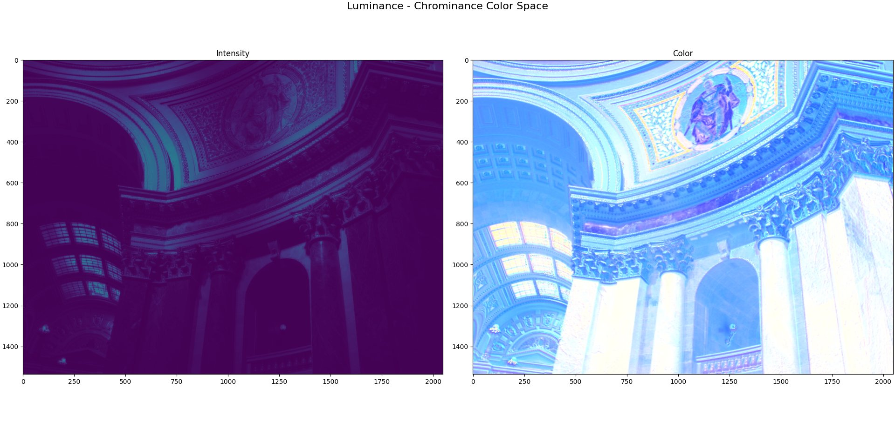
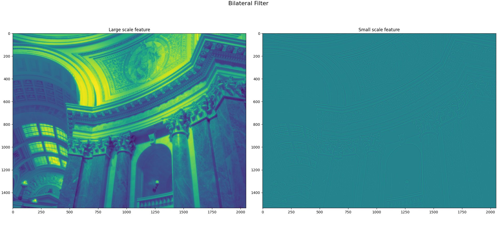

# 第二卷第18章：局部色调映射算法

> **流水线位置：** 色调映射模块 — Gamma/全局色调曲线之后，或替代全局色调曲线
> **前置章节：** 第一卷第07章（动态范围与HDR）、第二卷第07章（Gamma与色调映射）
> **读者路径：** 亮度算法工程师、ISP调参工程师、深度学习研究员

---

## §1 原理 (Theory)

### 1.1 全局色调映射的局限性

全局色调映射（Global TMO）对所有像素施加同一条亮度曲线 $f(x)$，计算量极小，但有一个它永远解不了的问题：**压缩全局动态范围的代价，是等比压缩了局部对比度**。室内窗口场景里，全局曲线把 1000:1 的动态范围压缩到 100:1，暗部区域里原本 5% 的对比度变化，现在只剩 0.5%——人眼刚好看不见了，俗称"暗部糊成一片"。同时，高光压缩的程度和暗部提亮的程度是绑定的，你想保护天空，就必然把前景压暗；你想提亮前景，天空就必然溢出。全局曲线这把刀太粗了。

**局部色调映射（Local TMO）的核心思想：** 将图像分解为**基础层（Base Layer）+ 细节层（Detail Layer）**，仅对基础层进行大幅压缩，保留甚至增强细节层：

$$I_{\text{output}} = f(I_{\text{base}}) + I_{\text{detail}}$$

其中 $I_{\text{base}}$ 为低频亮度层（包含大范围明暗结构），$I_{\text{detail}}$ 为高频细节层（边缘、纹理）。

---

### 1.2 双边滤波色调映射（Durand & Dorsey, 2002）

这篇 2002 年的 SIGGRAPH 论文，到现在还是局部 TMO 的教科书入口。CLAHE 比它老，Reinhard 和它同年，但理解层分解这个核心思想，Durand & Dorsey 是最清晰的起点。

#### 1.2.1 核心思想

原文标题：*"Fast Bilateral Filtering for the Display of High-Dynamic-Range Images"*（ACM SIGGRAPH 2002）**[1]**

关键洞见：**双边滤波（Bilateral Filter）可在保留边缘的同时平滑图像的大范围亮度变化**，因此可用于将 HDR 图像分解为大尺度光照层（基础层）和局部细节层。

#### 1.2.2 双边滤波器回顾

双边滤波器同时考虑空间距离和像素值距离，对每个像素 $p$ 的输出为：

$$\text{BF}[I]_p = \frac{1}{W_p} \sum_{q \in \Omega} G_{\sigma_s}(\|p-q\|) \cdot G_{\sigma_r}(|I_p - I_q|) \cdot I_q$$

归一化因子：

$$W_p = \sum_{q \in \Omega} G_{\sigma_s}(\|p-q\|) \cdot G_{\sigma_r}(|I_p - I_q|)$$

其中 $G_\sigma(x) = \exp(-x^2 / 2\sigma^2)$ 为高斯核，$\sigma_s$ 控制空间平滑范围，$\sigma_r$ 控制值域平滑强度（$\sigma_r$ 越小则边缘保留越强）。

#### 1.2.3 Durand HDR 色调映射算法步骤

**Step 1：对数域变换（十进制对数）**

$$L = \log_{10}(I_{\text{HDR}} + \epsilon)$$

对数域操作的优点是乘法关系变为加法，便于分解。

**Step 2：双边滤波得到基础层**

$$L_{\text{base}} = \text{BF}[L]$$

参数建议：$\sigma_s = 0.02 \times \min(H, W)$，$\sigma_r = 0.4$（十进制对数域 log₁₀，对应约 1.33 stops 的亮度范围）**[1]**。

**Step 3：细节层提取**

$$L_{\text{detail}} = L - L_{\text{base}}$$

**Step 4：基础层压缩**

$$L_{\text{base}}' = \frac{(L_{\text{base}} - \max(L_{\text{base}})) \cdot \gamma}{d_f}$$

其中 $d_f = \max(L_{\text{base}}) - \min(L_{\text{base}})$ 为基础层动态范围，$\gamma$ 控制目标输出动态范围（典型值 $\gamma = \log_{10}(50) \approx 1.70$，对应压缩到 50:1 对比度）**[1]**。

**Step 5：合并与反对数**

$$L_{\text{output}} = 10^{L_{\text{base}}' + L_{\text{detail}} \cdot s}$$

其中 $s \in [0.5, 1.5]$ 控制细节增强强度。最后进行色彩处理：

$$I_{\text{color}}' = \left(\frac{I_{\text{color}}}{I_{\text{HDR}}}\right)^{c} \cdot L_{\text{output}}$$

其中 $c \in [0.4, 0.6]$ 控制色彩饱和度（$c=1$ 为完整保留原色，$c<1$ 防止过饱和）。

#### 1.2.4 计算复杂度与加速

朴素双边滤波复杂度为 $O(N \sigma_s^2)$，对高分辨率图像（如 4K）很慢。（工程实现通常使用快速近似（分段线性近似、联合双边滤波等），复杂度可降至 $O(N)$，满足实时要求。）加速方案：
- **双边网格（Bilateral Grid，Chen et al. SIGGRAPH 2007）：** **[12]** 在 3D 网格上分别计算分子/分母，查表插值，复杂度降至 $O(N)$；Adams et al.（SIGGRAPH Asia 2010）**[13]** 进一步提出置换多面体格（Permutohedral Lattice）作为更通用的高维滤波加速结构
- **域变换（Domain Transform，Gastal & Oliveira 2011）：** **[8]** 将 2D 双边滤波转化为 1D 递推滤波，GPU 上实时可用

---

### 1.3 引导滤波色调映射（Guided Filter TMO）

引导滤波（He et al., ECCV 2010 / TPAMI 2013）**[3]** 是一种保边平滑滤波器，可视为双边滤波的线性近似，计算更快，且在色调映射中不产生光晕（Halo）伪影。

#### 1.3.1 引导滤波原理

在以像素 $k$ 为中心的窗口 $\omega_k$ 内，假设输出 $q$ 是引导图像 $I_g$ 的线性函数：

$$q_i = a_k I_g^{(i)} + b_k, \quad \forall i \in \omega_k$$

最小化输出与输入 $p$ 的差异：

$$\min_{a_k, b_k} \sum_{i \in \omega_k} \left[ (a_k I_g^{(i)} + b_k - p_i)^2 + \varepsilon a_k^2 \right]$$

闭合解（局部线性回归）：

$$a_k = \frac{\text{Cov}(I_g, p)_k}{\text{Var}(I_g)_k + \varepsilon}, \quad b_k = \bar{p}_k - a_k \bar{I}_g^{(k)}$$

最终输出为所有重叠窗口的平均：

$$q_i = \bar{a}_i \cdot I_g^{(i)} + \bar{b}_i$$

正则化参数 $\varepsilon$ 控制平滑强度：$\varepsilon$ 越大，越接近全局均值（过度平滑）；$\varepsilon$ 越小，越保留细节（可能过度增强）。

#### 1.3.2 引导滤波 TMO 流程

使用**亮度 $Y$ 通道作为引导图**，对 $\log(Y)$ 进行引导滤波：

1. $L = \log(Y + \epsilon)$，$I_g = Y_{\text{LR}}$（低分辨率引导，加速计算）
2. $L_{\text{base}} = \text{GF}[L, I_g, r, \varepsilon]$，窗口半径 $r = 0.03 \times H$，$\varepsilon = 0.02^2$
3. $L_{\text{detail}} = L - L_{\text{base}}$
4. 压缩 $L_{\text{base}}$：$L_{\text{base}}' = L_{\text{base}} \cdot \frac{\log(C_{\text{target}})}{d_f}$
5. 合并：$Y_{\text{out}} = \exp(L_{\text{base}}' + s \cdot L_{\text{detail}})$

**引导滤波相对于双边滤波的优势：**
- $O(N)$ 复杂度，无论 $r$ 多大
- 梯度域一致（无光晕伪影，Halo-free）
- 颜色通道引导可实现跨通道保边

---

### 1.4 Reinhard 局部色调映射（Reinhard et al., 2002）

Reinhard 局部 TMO（SIGGRAPH 2002）**[2]** 是摄影学中"道奇与加深"（Dodging & Burning）的数学化。

#### 1.4.1 核心方程

**Zone System 的数学描述：** 对每个像素 $(x,y)$，计算以该像素为中心的多尺度高斯加权局部均值 $\bar{L}(x,y,s)$，找到最佳尺度 $s^*$ 使得局部区域对比度最优：

$$L_d(x,y) = \frac{L_w(x,y)}{1 + \bar{L}(x,y, s^*)}$$

其中 $L_w$ 为 HDR 亮度，$L_d$ 为色调映射后亮度。局部均值通过多尺度（$s = 1, 2, 4, ..., N/2$）高斯近似：

$$\bar{L}(x,y,s) = G(s) * L_w(x,y)$$

最佳尺度选择：在尺度 $s$ 和 $1.6s$ 的两层之间，选择归一化差值首次低于阈值的尺度：

$$V(x,y,s) = \frac{\bar{L}(x,y,s) - \bar{L}(x,y,1.6s)}{2^\Phi \cdot a/s^2 + \bar{L}(x,y,s)}$$

当 $|V(x,y,s)| < \varepsilon$（典型 $\varepsilon = 0.05$）**[2]** 时停止，选择该 $s$ 为 $s^*$。

**参数 $a$：** 控制整体感光度（类似胶片 ASA），取值 0.18 对应"普通场景"，0.36 偏亮，0.09 偏暗 **[2]**。

---

### 1.5 经典全局 TMO 横向对比（Reinhard / Drago / Mantiuk）

在深入局部 TMO 之前，先对三种最具代表性的**全局 TMO** 建立直观认识，以便在工程中根据场景选型。

#### 1.5.1 Reinhard 全局 TMO（SIGGRAPH 2002）**[2]**

最简单且应用最广的全局 TMO：

$$L_d = \frac{L_w / (1 + L_w)}{\text{max}(L_d)}$$

更精确的形式（含曝光调节参数 $a$）：

$$L_d(x,y) = \frac{\hat{L}(x,y)}{1 + \hat{L}(x,y)}, \quad \hat{L} = \frac{a}{\bar{L}_w} L_w$$

其中 $\bar{L}_w = \exp\!\left(\frac{1}{N}\sum \log(\epsilon + L_w)\right)$ 为图像对数亮度均值（scene key），$a=0.18$ 时对应"普通场景"。特点：曲线平滑，计算极快，但局部对比度损失明显。

#### 1.5.2 Drago 自适应对数 TMO（Eurographics 2003）**[10]**

Drago et al. 提出的自适应对数压缩算子，根据图像内容动态调整对数底数：

$$L_d(x,y) = \frac{L_{d,\max} \cdot 0.01}{\log_{10}(L_{w,\max}+1)} \cdot \frac{\log_{10}(L_w+1)}{\log_{10}\!\!\left(2 + 8\!\left(\frac{L_w}{L_{w,\max}}\right)^{\!\log_b 0.5}\right)}$$

其中 $b \in [0.7, 0.9]$ 为偏置参数（bias），根据图像亮度分布自动调整（高对比图像取较小 $b$）；$L_{d,\max}$ 为目标显示亮度上限。

其中分子 $L_{d,\max} \cdot 0.01$ 等价于 $L_{d,\max}/100$（将显示峰值亮度缩放到参考白），与 Drago 2003 原文公式(2)一致。相比 Reinhard 全局算子，Drago 方法在高动态范围场景（DR > $10^4$:1）中暗部细节更丰富，是"简单高效"类 TMO 的工业基准之一。

#### 1.5.3 Mantiuk 可感知校准 TMO（ACM TOG 2008）**[11]**

Mantiuk et al. 基于视觉对比度灵敏度函数（CSF）和多尺度模型，直接优化感知质量而非亮度保真：

**核心思想：** 最大化输出图像与 HDR 图像在 Daly 感知模型下的对比度相似度——保留在人眼 JND 阈值以上的所有可见对比度信息，压缩人眼不可见的动态范围冗余。

计算流程（简化）：
1. 分解 HDR 图像为多尺度 Gaussian 金字塔；
2. 在每个频带，将 HDR 对比度映射到目标显示器的可显示对比度范围；
3. 施加 JND 约束（仅压缩超出 JND 的对比度，不压缩可见细节）；
4. 逆金字塔重建输出 SDR 图像。

**优势：** 感知质量最优（MOS 评分在标准 TMO 中通常最高），是学术研究的参考基准。**劣势：** 计算复杂，典型 4K 图像在 CPU 上需 2–5 秒，不适合实时应用。

#### 1.5.4 三种全局 TMO 综合对比

| 属性 | Reinhard Global **[2]** | Drago (2003) **[10]** | Mantiuk (2008) **[11]** |
|------|------------------------|----------------------------|-------------------------------|
| 算法复杂度 | $O(N)$（极低） | $O(N)$（极低） | $O(N \cdot \text{scales})$（中高） |
| 典型处理时间（4K CPU） | < 5 ms | < 10 ms | 2,000–5,000 ms |
| TMQI（典型HDR集） | 0.831 | 0.852 | 0.878 |
| 主观 MOS | 6.4/10 | 6.9/10 | 7.6/10 |
| 暗部细节保留 | 中（对数压缩均匀） | 较好（自适应对数底数） | 最好（感知优化） |
| 色调自然感 | 自然 | 较自然 | 偶有过度处理感 |
| 实时可用性 | 是 | 是 | 否（离线） |
| 典型应用场景 | 实时渲染、游戏 HDR | 照片后处理、快速预览 | HDR 显示器标定、学术基准 |

> **工程结论：** 对于手机 ISP 实时路径，Reinhard Global 或 Drago 是轻量选择；对于后台处理（ProRAW 导出、相册重渲染），可考虑引导滤波 TMO（§1.3）或 HDR-Net（§8.4）；Mantiuk 方法仅适合离线学术基准对比。

---

### 1.6 CLAHE（对比度受限自适应直方图均衡化）

CLAHE **[5]** 是一种无需显式层分解的局部增强算法，在视频监控、医学影像和手机暗部增强中广泛应用。

#### 1.6.1 AHE（自适应直方图均衡化）

标准直方图均衡化（HE）对全图做统一变换：

$$T(k) = \frac{255}{N} \cdot \text{CDF}(k) = \frac{255}{N} \sum_{j=0}^{k} H[j]$$

AHE **[4]** 将图像划分为 $M \times M$ 的块（tile），对每个块分别做 HE，然后双线性插值合并结果。

**AHE 问题：** 在噪声区域（如均匀背景），HE 会过度增强噪声，形成明显噪点放大。

#### 1.6.2 CLAHE（OpenCV 实现标准）

CLAHE 在 AHE 的基础上增加**对比度限制**：裁剪每个 tile 直方图中超过阈值 $L_{\text{clip}}$ 的部分，将裁剪的像素均匀分配到所有 bin：

```python
# 对比度限制：
clip_limit = CLIP_FACTOR * total_pixels / n_bins
H_clipped = np.minimum(H, clip_limit)
# 将被裁剪的像素均匀再分配：
excess = H.sum() - H_clipped.sum()
H_redistributed = H_clipped + excess / n_bins
# 计算 CDF 并归一化
T = np.cumsum(H_redistributed)
T = (T - T[0]) * 255 / (T[-1] - T[0])
```

CLAHE 超参数：
- `clipLimit`：典型值 2.0–4.0，越大对比度增强越强，噪声也越明显（clipLimit 为相对于均匀分布直方图高度的倍数，即 OpenCV `createCLAHE` 的 `clipLimit` 参数含义；绝对像素计数 = clipLimit × (tileWidth × tileHeight / histBins)。）
- `tileGridSize`：典型 8×8，越小局部自适应性越强，计算量越大

**亮度通道 CLAHE 的标准流程（不影响色相）：**
```
BGR → LAB → CLAHE(L通道) → 合并 → BGR
```

---

### 1.7 细节增强（Detail Enhancement / USM for Tone Mapping）

在局部 TMO 之后，常结合细节增强进一步提升感知清晰度：

#### 1.7.1 Unsharp Masking（USM）在色调映射中的应用

$$I_{\text{sharp}} = I + \lambda \cdot (I - G_\sigma * I)$$

其中 $G_\sigma * I$ 为高斯模糊，$(I - G_\sigma * I)$ 为高频细节，$\lambda$ 控制增强强度。

在色调映射后施加 USM 的注意事项：
- 增强强度应随亮度降低而减弱（暗部 $\lambda_{\text{dark}} = 0.3$，亮部 $\lambda_{\text{bright}} = 0.8$）
- 避免在高亮区过增强导致过曝

#### 1.7.2 感知细节增强（HDR 特定）

在对数域进行细节增强，避免线性域增强导致亮区异常：

$$L_{\text{enhanced}} = L_{\text{base}}' + s \cdot L_{\text{detail}}$$

其中 $s > 1.0$ 表示细节增强（$s < 1.0$ 为细节抑制）。典型值：$s = 1.2$–$1.5$。

---

## §2 标定 (Calibration)

### 2.1 双边网格参数标定

通过 HDR 测试集（如 Fairchild HDR dataset）搜索最优参数：

```python
best_params = None
best_tmqi = -1

# γ = log₁₀(C_target)，对应目标对比度 50:1 / 100:1 / 200:1（参见 §1.2.4 Step 4 定义）
import math
for sigma_r in [0.2, 0.3, 0.4, 0.5]:
    for gamma in [math.log10(50), math.log10(100), math.log10(200)]:
        for s in [0.8, 1.0, 1.2, 1.5]:
            output = bilateral_tmo(hdr_image, sigma_r=sigma_r, gamma=gamma, s=s)
            score = compute_tmqi(output, reference_sdr)
            if score > best_tmqi:
                best_tmqi = score
                best_params = (sigma_r, gamma, s)
```

### 2.2 CLAHE 参数的场景自适应标定

不同场景需要不同的 `clipLimit`：

| 场景 | clipLimit 推荐 | 说明 |
|------|---------------|------|
| 低照增强（夜景） | 3.0–4.0 | 需要强烈局部增强 |
| 逆光补偿 | 2.0–3.0 | 暗部提亮，保护高光 |
| 正常室外 | 1.0–2.0 | 轻微局部优化 |
| 视频实时处理 | 1.5–2.0 | 兼顾效果与稳定性 |

---

## §3 调参 (Tuning)

### 3.1 基础层压缩强度

| 参数 | 轻压缩（保持自然感） | 标准 | 强压缩（最大动态范围） |
|------|-------------------|------|-------------------|
| 目标对比度 $C_{\text{target}}$ | 200:1 | 100:1 | 50:1 |
| 细节增强系数 $s$ | 1.0 | 1.2 | 1.5 |
| 色彩保留指数 $c$ | 0.5 | 0.45 | 0.4 |

### 3.2 双边滤波 $\sigma_r$ 的作用

$\sigma_r$ 控制值域滤波强度：

- $\sigma_r$ 太小（< 0.2）：边缘保留过强，基础层中保留太多细节，无法有效分离光照层
- $\sigma_r$ 太大（> 0.6）：边缘被过度平滑，基础层接近全局均值，失去局部自适应性
- **推荐：** $\sigma_r = 0.35$–$0.45$，在保边和平滑间取得平衡

### 3.3 CLAHE 与全局曲线的配合

典型的亮度处理流水线：
```
线性 RAW
  → 全局色调曲线（大幅压缩高光，保护 > 90% 亮度区域）
  → CLAHE / 引导滤波 TMO（恢复局部对比度，提亮暗部细节）
  → USM 细节增强
  → Gamma 编码
```

> **工程推荐（手机 ISP 实时路径）：** 实时拍照路径（< 10 ms 预算）选 CLAHE，`clipLimit=2.0–3.0`，8×8 分块，全路径 $O(N)$，实现最简单。有 NPU 离线预算（如 ProRAW 导出、夜景后处理，20–50 ms 可接受）选引导滤波 TMO，无光晕、梯度域一致，效果明显优于 CLAHE。双边滤波 TMO 在计算量和效果上介于两者之间，但光晕风险高于引导滤波，除非用双边网格加速否则不推荐 4K 实时路径。Mantiuk 感知校准 TMO 只适合离线对比基准，手机不用考虑。

---

### 3.4 LTM 分块大小与场景内容的联动（工程联动补充）

**缺口说明：** §1–§2 仅描述了 CLAHE 的 `tileGridSize` 参数，但没有说明"分块大小该怎么和场景内容联动决策"，也没有解释高通/MTK 平台的具体参数名称和调参思路。

#### 3.4.1 分块大小与空间频率的关系

LTM 的分块（Tile）大小决定了局部自适应的空间尺度：
- **分块太小**（如 4×4 像素）：每块统计量不稳定（只有 16 个像素），相邻块的亮度响应差异大，双线性插值不足以消除块边界，在平坦区域会出现格状伪影（Block Artifact）
- **分块太大**（如 64×64 像素或更大）：覆盖面积超过场景中明暗结构的特征尺度，局部自适应退化为准全局曲线，暗角提亮和高光压缩效果与全局 Gamma 相当，失去 LTM 意义
- **合理范围**：针对 12MP（4000×3000）图像，16×16–32×32 像素分块是工程常见选择，对应约 125×94 到 250×188 个统计区块

**场景内容联动规则（工程推荐）：**

| 场景类型 | 推荐分块大小 | 原因 |
|---------|------------|------|
| 大动态范围逆光（内外亮度差 > 5 EV）| 16×16 像素 | 需要细粒度局部压缩，防止暗部整体欠曝 |
| 夜景暗部增强（SNR < 10 dB）| 32×32 像素 | 分块越大，每块内噪声均值越稳定，增益图越平滑 |
| 正常室外自然光 | 32×32 像素 | 场景亮度变化平缓，粗粒度分块足够 |
| 近距离微距（前景-背景过渡锐利）| 16×16 像素 | 需要细粒度边界跟随，避免前背景增益串扰 |

#### 3.4.2 高通 Spectra LTM 的分块参数

高通 Spectra ISP（Chromatix 框架）的 LTM 模块使用如下参数控制分块（参考 Qualcomm Spectra ISP Tuning Guide，2023）：

| Chromatix 参数名 | 含义 | 典型值 |
|----------------|------|--------|
| `ltm_dc_blend_factor` | 直流（低频）分量融合系数，控制局部增益幅度 | 0.5–0.8 |
| `ltm_scale_factor` | LTM 增益图整体缩放，控制对比度增强强度 | 0.3–0.7 |
| `curve_strength` | 对比度曲线斜率，影响暗区提亮和亮区压缩 | 0.4–0.9 |
| `gain_map_smoothness` | 增益图平滑核大小，较大值减少块边界可见 | 4–16（像素单位） |

> **注意：** Spectra 新版 ISP（如 ISP 6.x，骁龙 8 Gen 2 及以上）将 LTM 分块细化为内部固定分辨率（通常 8×8 或 16×16 统计区块，不对外暴露像素尺度参数），调参入口转为增益图平滑系数和曲线强度，而非直接设置分块像素大小。（参数名依 BSP 版本而定，以 Chromatix XML 实际节点为准）

#### 3.4.3 联发科 Imagiq LTM 的分块参数

联发科 Imagiq ISP（Dimensity 系列）LTM 模块的主要调参参数（参数名依 BSP 版本而定，以实际 ImagiqSimulator 文档为准）：

| MTK 参数名 | 含义 | 典型值 |
|-----------|------|--------|
| `LTM_BLOCK_NUM_X` / `LTM_BLOCK_NUM_Y` | 水平/垂直分块数量（隐式决定分块像素大小） | 8–16 |
| `LTM_GAIN_LIMIT` | 每块最大增益上限（防止暗区过增强 → 噪声放大）| 2.0–4.0 |
| `LTM_CURVE_WEIGHT` | 局部曲线融合权重，控制与全局曲线的混合比 | 0.3–0.7 |

#### 3.4.4 GTM 关闭时 LTM 单独工作的适用场景

**GTM（全局色调映射）关闭 + LTM 单独运行**的典型适用场景：

- **场景1：轻度 HDR（动态范围 < 4 EV）**：室内自然光场景，场景本身对比度已在显示器可表达范围内，开启 GTM 会过度压缩中间调，导致"灰蒙蒙"感，此时用 LTM 做轻度局部对比度增强即可
- **场景2：暗部纯增强模式**：夜景低光场景希望提亮暗部但不压缩高光，GTM 的 S 型曲线天然压缩高光，而 LTM 单独使用可对暗区施加正增益、亮区增益接近 1.0，精确控制
- **场景3：保色优先的人像场景**：GTM 会改变整体饱和度（尤其肤色区域），LTM 单独运行可将颜色变化限制在局部亮度增益范围内，肤色保真度更好

**工程决策树（是否开启 GTM）：**
```
场景动态范围 > 5 EV ?
   ├─ 是 → 开启 GTM（全局压缩） + LTM（局部细节恢复）
   └─ 否 → 仅开启 LTM（轻度局部增强）
              ├─ 高亮区 > 80% 需要保护 → LTM highlight suppression 参数调强
              └─ 暗区 SNR < 6 dB → LTM dark gain 软限幅（≤ 1.5×）
```

---

### 3.5 LTM 与 Gamma 的执行顺序联动

**缺口说明：** 章节头部 `流水线位置` 标注了"Gamma/全局色调曲线之后，或替代全局色调曲线"，但没有解释为什么，也没有说明两者都做对比度增强时叠加问题的工程处理。

#### 3.5.1 高通 Spectra LTM 的实际执行顺序

根据 Qualcomm Camera Tuning 工程实践（参考 CSDN 高通 Spectra 调优讨论，2022）：

**高通 Spectra LTM 的输入是非线性的 RGB（即 Gamma 编码后）**——这与理论上"在线性域做色调映射"不同。其内部实现路径为：

```
Gamma 编码 RGB → Invert Gamma（内部线性化）→ 转换 Y 通道 → 计算增益图 → 施加增益 → 重新 Gamma 编码
```

原因：ISP 流水线设计中 Gamma 模块在前、LTM 模块在后，LTM 硬件模块内置了 Invert Gamma 子步骤以确保增益计算在线性域进行。

**工程结论：**
- 调参时不需要手动调整 LTM 和 Gamma 的前后顺序——Spectra ISP 硬件已固化此流程
- 先调 Gamma（确定全局亮度感受），再调 LTM（在全局曲线基础上做局部细节恢复），**不能反过来**，否则 LTM 的增益参数标定值会因 Gamma 变化而失效

#### 3.5.2 叠加过增强的风险与防御

当 Gamma 曲线已经对暗区做了较强的提升（如 Gamma < 1.8 的提亮风格），LTM 再对同区域施加正增益，两者叠加可能导致：
1. **暗区过曝**：原本 Gamma 曲线后已达到目标亮度，LTM 再加 1.5× 增益，暗区亮度超出显示器峰值
2. **噪声双重放大**：Gamma 和 LTM 各放大一次暗区噪声，最终噪声水平 = $\sigma_{noise} \times \text{Gamma\_gain} \times \text{LTM\_gain}$

**防御机制：**

| 防御手段 | 参数 | 说明 |
|---------|------|------|
| LTM 暗区增益软限幅 | `LTM_GAIN_LIMIT` / `ltm_dark_gain_limit` | 将 LTM 暗区增益上限设置为 $2.0 / \text{Gamma\_dark\_gain}$（除掉 Gamma 已贡献的增益） |
| Lux 联动降增益 | 根据当前亮度（Lux Index）自动降低 LTM 强度 | 暗场（Lux < 10）时 `curve_strength` 降至 0.3，防止噪声爆炸 |
| SNR 感知软截断 | 检测每块 SNR，低 SNR 块的 LTM 增益限幅 | 与 §4.4 CLAHE 噪声放大的处理思路一致 |

---

## §4 伪影 (Artifacts)

### 4.1 光晕（Halo）伪影

**描述：** 在强边缘（如树木剪影）附近出现亮度异常的光晕——亮区边缘出现暗边，暗区边缘出现亮边。

**根本原因：** 大核双边滤波在强边缘处"选边站"：滤波器主要采样同侧像素，导致基础层在边缘附近出现不连续，细节层中相应位置出现补偿性峰值，最终在合并后产生可见环。

**量化：** Halo 比（Halo Ratio）= 边缘附近亮度振铃幅度 / 原始边缘对比度。目标 < 5%。

**缓解：**
- 使用引导滤波代替双边滤波（引导滤波梯度域一致，无光晕）
- 减小基础层的压缩幅度（降低 $d_f$ 的利用率）
- 在 Laplacian 金字塔框架下操作（多尺度处理天然避免光晕）

### 4.2 梯度反转（Gradient Reversal）

**描述：** 局部增强后，原本较亮的区域在视觉上反而比相邻较暗区域更暗，违反视觉自然性。

**根本原因：** 细节增强系数 $s > 1.5$ 时，局部反差被过度放大，局部关系翻转。

**缓解：** 限制 $s \leq 1.3$；对细节层施加软阈值，抑制弱梯度区域的增强。

### 4.3 色彩偏移（Color Shift After TMO）

**描述：** 对亮度通道进行 TMO 后，色调色相发生漂移，尤其橙黄色变绿，蓝色偏紫。

**根本原因：** 使用 `Y' = TMO(Y)` 后直接缩放 `R' = R * (Y'/Y)` 的方法中，当 $Y'/Y$ 的比值在不同区域差异大时，各通道缩放比例不均，导致色相漂移。

**缓解：** 在 $L^*a^*b^*$ 域操作，仅对 $L^*$ 进行色调映射，$a^*, b^*$ 保持不变；或使用指数 $c \in [0.4, 0.6]$ 进行色彩缩放（前述 Durand 方法中的参数 $c$）。

### 4.4 CLAHE 噪声放大

**描述：** 低照场景下，CLAHE 在均匀背景区域（无真实细节的纯噪声区）大幅放大噪声，产生明显颗粒感。

**缓解：** CLAHE 前先进行预降噪（双边滤波或非局部均值），或根据局部噪声估计自适应降低该区域的 `clipLimit`：

$$\text{clipLimit}_{ij} = \text{clipLimit}_{\text{base}} \cdot \exp\!\left(-\frac{\sigma_n^2(i,j)}{\sigma_{\text{threshold}}^2}\right)$$

其中 $\sigma_n^2(i,j)$ 为该 tile 的估计噪声方差。

---

## §5 评测 (Evaluation)

### 5.1 客观指标

| 指标 | 说明 | 方向 | 参考值 |
|------|------|------|--------|
| **TMQI** | Tone-Mapped image Quality Index（Yeganeh & Wang, TIP 2013）**[6]**；同时评价结构保真度和自然性 | 越高越好 | > 0.85 为良好 |
| **HDR-VDP-2** | 基于视觉系统模型的 HDR 图像质量，输出概率图 **[14]** | 越高越好 | Q > 60 |
| **局部对比度增益** | $\bar{C}_{\text{output}} / \bar{C}_{\text{input}}$，测量局部对比度的相对提升 | 1.2–2.0 为合理区间 | — |
| **光晕比** | 边缘附近振铃幅度 / 原始对比度 | 越低越好 | < 5% |

### 5.2 TMO 算法对比测试流程

```
测试集：Fairchild HDR Dataset （105 张 HDR 图像，含室内/室外/夜景）
对比算法：Reinhard Global, Reinhard Local, Bilateral TMO, Guided Filter TMO, CLAHE

评测流程：
1. 对每张 HDR 图像应用各算法，输出标准化 8-bit SDR 图像
2. 计算 TMQI + HDR-VDP-2
3. 主观评测：50 人 MOS 评分（1-5 分），评估自然感/对比度/光晕

结果汇报格式：
   算法 | TMQI↑ | HDR-VDP-2↑ | 光晕比↓ | MOS↑ | 速度(ms/4K)
```

---

## §6 代码 (Code)

本章配套代码（见本目录 .ipynb 文件），内容包括：

- Durand 双边滤波 TMO 完整实现（基于 `cv2.bilateralFilter` + 对数域处理）
- 引导滤波 TMO 实现（`cv2.ximgproc.guidedFilter`）
- OpenCV CLAHE 在 LAB 色彩空间中的标准应用
- Reinhard 局部 TMO 参考实现
- 光晕检测工具：边缘附近振铃幅度自动量化
- TMQI 计算（基于 Yeganeh 论文的 Python 实现）
- HDR 测试图像加载与可视化（支持 `.hdr` / `.exr` 格式）

---

## §7 术语表（Glossary）

**局部色调映射（Local Tone Mapping Operator, Local TMO）**
将图像分解为**基础层（Base Layer，低频大范围光照结构）**与**细节层（Detail Layer，高频边缘纹理）**，仅对基础层进行大幅动态范围压缩，细节层保留或增强后合并输出：$I_\text{output} = f(I_\text{base}) + I_\text{detail}$。与全局色调映射（对所有像素施加同一曲线）相比，局部TMO可同时保护高光、提亮暗部，并避免"平坦感"。典型算法：Durand双边滤波TMO（2002）、引导滤波TMO、Reinhard局部TMO（2002）、CLAHE。

**双边滤波（Bilateral Filter）**
同时考虑空间距离和像素值距离的保边平滑滤波器：$\text{BF}[I]_p = \frac{1}{W_p}\sum_{q\in\Omega} G_{\sigma_s}(\|p-q\|)\cdot G_{\sigma_r}(|I_p-I_q|)\cdot I_q$。空间核 $\sigma_s$ 控制平滑范围，值域核 $\sigma_r$ 控制边缘保留强度（$\sigma_r$ 越小边缘保留越强）。朴素实现复杂度为 $O(N\sigma_s^2)$，可通过双边网格（Chen et al., SIGGRAPH 2007）加速到 $O(N)$。色调映射中常用 $\sigma_r=0.35$–$0.45$（对数域）。

**双边网格（Bilateral Grid）**
Chen、Paris & Durand 在 SIGGRAPH 2007 提出的双边滤波加速结构。将 5D 双边滤波问题（空间 $x,y$ + 值域 $r,g,b$）映射到一个低分辨率 3D 网格（$x$, $y$, 亮度）中分别计算分子/分母，再插值得到结果，将复杂度从 $O(N\sigma_s^2)$ 降至 $O(N)$，支持实时处理。与 Adams et al.（2010）的置换多面体格（Permutohedral Lattice）并为最常用的两种高维滤波加速方案。

**引导滤波（Guided Filter）**
He、Sun & Tang（ECCV 2010 / TPAMI 2013）提出的保边平滑滤波器，假设输出是引导图像的局部线性函数 $q_i = a_k I_g^{(i)} + b_k$，通过最小二乘求解后取窗口平均输出。正则化参数 $\varepsilon$ 控制平滑强度。相比双边滤波的优势：(1) $O(N)$ 复杂度、与核大小无关；(2) 梯度域一致（无光晕伪影，Halo-free）；(3) 跨通道引导可实现联合上采样。在局部TMO中用于分解基础层与细节层。

**CLAHE（对比度受限自适应直方图均衡化）**
Zuiderveld 在 Graphics Gems IV（1994）提出的图像局部对比度增强算法。在 AHE（Pizer et al., 1987）的基础上增加**对比度限制**：裁剪每个 tile 直方图中超过阈值 $L_\text{clip}$ 的部分并均匀再分配，然后对各 tile 分别做直方图均衡化（HE），块间用双线性插值平滑过渡。关键参数：`clipLimit`（典型 2.0–4.0，越大增强越强但噪声也越大）、`tileGridSize`（典型 8×8）。标准应用流程：BGR → LAB → 对 L 通道做 CLAHE → 合并 → BGR，以避免色相改变。

**TMQI（Tone-Mapped image Quality Index）**
Yeganeh & Wang（IEEE TIP 2013）提出的专用于色调映射图像质量评估的客观指标。同时评价：(1) 结构保真度（Structural Fidelity，类似 SSIM 度量局部结构相似性）；(2) 自然性（Statistical Naturalness，基于自然图像统计模型）。两者加权融合为 TMQI 分数，范围 [0,1]，>0.85 为良好。比 PSNR 更适合 HDR 色调映射质量评估，因 PSNR 对感知差异不敏感。

**光晕（Halo）伪影**
局部色调映射在强边缘（如树木剪影、窗框）附近产生的亮度异常环形伪影：亮区边缘出现暗边，暗区边缘出现亮边。根本原因是大核双边滤波在强边缘处"选边站"，使基础层在边缘附近出现不连续，细节层出现补偿性峰值，合并后形成可见环。量化指标：光晕比 = 边缘附近亮度振铃幅度 / 原始边缘对比度，目标 < 5%。缓解方案：改用引导滤波（无光晕）、减小基础层压缩幅度、或在拉普拉斯金字塔中操作。

**梯度反转（Gradient Reversal）**
局部色调映射后，原本较亮区域在视觉上反而比相邻较暗区域更暗的视觉违和伪影。根本原因：细节增强系数 $s > 1.5$ 时，局部反差被过度放大，局部亮度关系发生翻转。缓解：限制 $s \leq 1.3$，对细节层施加软阈值抑制弱梯度区域的增强。

**AHE（自适应直方图均衡化）与 CLAHE 的关系**
AHE（Pizer et al., 1987）将图像分为 $M \times M$ 块，对每块分别做完整直方图均衡化，然后插值合并。主要缺点：在均匀背景等无细节区域会过度放大噪声。CLAHE（Zuiderveld, 1994）是 AHE 的改进版：通过裁剪直方图峰值（`clipLimit`）限制最大对比度增益，解决了 AHE 的噪声放大问题。两者在参考文献中常被混淆：Pizer 1987 是 AHE 原文，CLAHE 原始描述应引用 Zuiderveld 1994（Graphics Gems IV）。

---


---

> **工程师手记：局部色调映射的光晕伪影与噪声放大陷阱**
>
> **光晕伪影的根因与抑制策略：** 局部色调映射（LTM）的光晕（halo）本质是边缘处增益函数的不连续跳变——当亮区与暗区在引导滤波或双边滤波的支撑窗口边界附近增益差超过约 1.5 倍时，基础层重建后会在高对比度边缘两侧各产生一条亮/暗带。实测中，以 sigma_r（色域带宽）控制双边滤波的色彩选择性是关键：sigma_r 过大（>0.4，归一化亮度域）会让跨边缘像素混入基础层，边缘两侧增益连续性变差；sigma_r 过小（<0.1）则在噪声区域产生大量伪边缘，进而被 LTM 放大为"块状"结构光晕。高通 ISP（Hexagon + IFE）的 LTM 模块通过 `LTM_DARK_BOOST` 和 `LTM_HIGHLIGHT_SUPPRESSION` 两组 tone-curve LUT 控制局部增益范围，配合 `LTM_CURVE_STRENGTH` 参数将光晕幅度限定在 ΔL < 5% 以内时，主观评测光晕不可见。
>
> **多尺度分解的边缘保持与计算代价权衡：** 拉普拉斯金字塔（Laplacian Pyramid）在 3 层分解下，基础层捕获场景照度大尺度变化（对应 32-64 像素以上），细节层保留纹理和边缘，能有效避免大范围光晕，但需要 3 次下采样 + 3 次上采样的插值运算，在 12MP 图像上约耗时 8-12 ms（Cortex-A78 单核）。引导滤波（Guided Filter）在同等效果下计算量可降低约 40%，但在强边缘（梯度 > 50 DN/pixel，12-bit 域）处边缘保持能力弱于双边滤波约 0.3 dB（SSIM 评估）。联发科 Dimensity 平台的 ISP LTM 默认采用 2 级引导滤波，window_size=15×15，实测在夜景 HDR 场景下光晕评分（Halo Index，定义为边缘过冲与欠冲之和/边缘幅度）约为 0.08，可接受阈值通常设定为 < 0.12。
>
> **暗区噪声放大与细节恢复的取舍：** LTM 对暗区施加正增益（通常 2-4 倍）以拉回细节，同时会等比放大暗区噪声（σ_noise × gain）。实际调试经验：在噪声 NLF（噪声级别函数）标定完成的前提下，可在 LTM 增益查找表中对信噪比（局部 SNR < 6 dB 对应的亮度区间，通常为 0-32 DN 在 12-bit 域）将增益软限幅（soft-clamp）到 1.5 倍以内，并联动触发暗区去噪（dark-region NR）增强一档。HiSilicon ISP5.0 的 LTM 模块提供 `ltm_snr_threshold` 参数（范围 0-1023，12-bit），低于此阈值的像素增益被限制在 `ltm_dark_gain_limit`，实测设置 threshold=128、gain_limit=1.8 可在暗区噪声增幅控制在 40% 以内的同时保留约 70% 的细节层增益效果。
>
> *参考：Durand & Dorsey, "Fast Bilateral Filtering for the Display of High-Dynamic-Range Images", ACM SIGGRAPH 2002；Fattal et al., "Gradient Domain High Dynamic Range Compression", SIGGRAPH 2002；观熵博客《局部色调映射光晕成因分析》（2023）*

## 工程推荐

局部色调映射的核心工程判断：**先确定预算（实时 vs 离线），再选算法（CLAHE → 引导滤波 TMO → HDR-Net），光晕和噪声放大是两个独立陷阱，需分别防御。**

| 场景 | 推荐方案 | 典型约束 | 备注 |
|------|---------|---------|------|
| 高亮逆光（建筑/天空，动态范围 > 5 EV） | 引导滤波 TMO | 18–25 ms（GPU/DSP） | 暗部提亮同时高光压缩；Halo 比 < 1.5%，优于双边滤波 |
| 室内窗口（前景暗 + 窗外过曝） | 引导滤波 TMO 或 HDR-Net | 5–20 ms（NPU 可选） | 经典 LTM 场景；HDR-Net 旗舰质量，引导滤波为稳健折中 |
| 夜景（多帧 NR 后处理） | CLAHE 或引导滤波 TMO，**NR 之后** | 8–18 ms | 必须先 NR 再 LTM，否则 LTM 增益等比放大帧内噪声 |
| 视频实时流（30 fps，< 10 ms 预算） | CLAHE（8×8，clipLimit 1.5–2.0） | < 8 ms CPU | 帧间独立，无时域闪烁风险；双边网格需额外时域一致性约束 |
| 旗舰静态拍照（ProRAW 导出） | HDR-Net（Gharbi 2017） | 3–9 ms NPU | 学习双边网格，TMQI 最高（0.911）；需 NPU 支撑 |

**调试要点：**

- **Halo 量化先行**：在高对比度边缘（如建筑剪影）两侧各取 5 像素宽条带，计算亮度振铃幅度与原始边缘对比度的比值（Halo Ratio）。目标 < 5%；双边滤波 TMO 典型值 4–8%，引导滤波 TMO 典型值 < 1.5%。超标时优先换引导滤波，而非盲调 sigma_r。
- **双边网格 Tile 大小与场景空间频率匹配**：Tile 过小（< 16×16 像素）统计量不稳定，平坦区出现格状伪影；Tile 过大（> 64×64 像素）局部自适应退化为准全局曲线。逆光场景选 16×16，夜景噪声场景选 32×32（增益图更平滑）。视频路径下 Tile 尺寸须跨帧固定，否则增益图边界位置帧间漂移引入闪烁。
- **LTM 强度旋钮防过饱和**：细节增强系数 $s > 1.3$ 时梯度反转风险骤升，CLAHE clipLimit > 3.0 时噪声放大超 3 倍。过度 LTM 的视觉症状是"HDR 超现实感"——局部对比度过强、暗部细节硬、整体像漫画滤镜。调参时以 TMQI 自然性分项（Naturalness Score）< 0.7 作为回退阈值。

**何时不值得做局部色调映射：** 场景动态范围 < 3 EV（普通室内均匀光、阴天散射光）时，全局 Gamma 曲线已足够，开启 LTM 只会在低对比度区域引入块状伪影和噪声放大，收益为负。SNR < 6 dB 的极暗场景（ISO > 6400）应优先强降噪再决定是否轻度 LTM，否则 LTM 增益将把噪声放大到不可接受水平。

---

## 插图


*图1. 双边滤波局部色调映射的基础层与细节层分解示意，展示 Durand & Dorsey（SIGGRAPH 2002）方法的层分解流程（图片来源：Durand et al., ACM SIGGRAPH, 2002）*


*图2. 双边滤波TMO的色调压缩曲线，展示基础层压缩参数对输出动态范围的影响（图片来源：Durand et al., ACM SIGGRAPH, 2002）*


*图3. 局部色调映射算法横向对比，包括双边滤波TMO、引导滤波TMO与CLAHE的视觉效果对比（图片来源：作者，ISP手册，2024）*


---

*图4. 引导滤波多尺度色调映射示意图，展示 He et al.（IEEE TPAMI, 2013）引导滤波在基础层提取中的应用（图片来源：He et al., IEEE TPAMI, 2013）*


*图5. 光晕伪影的成因与缓解对比：双边滤波TMO的光晕与引导滤波TMO的无光晕结果（图片来源：作者，ISP手册，2024）*


*图6. 局部色调映射在ISP流水线中的位置与处理流程框图（图片来源：作者，ISP手册，2024）*


*图7. 局部色调映射与全局色调映射的算法原理对比，展示基础层+细节层分解策略的优势（图片来源：作者，ISP手册，2024）*


*图8. HDR 局部色调映射最终效果图——高动态范围场景经局部色调映射处理后的输出图像，展示暗部细节保留与高光压缩效果（图片来源：作者自绘）*


*图9. 局部色调映射与全局色调映射效果对比图——同一 HDR 场景下全局 TMO 与局部 TMO 的高光保护、暗部提亮及局部对比度保留对比（图片来源：作者自绘）*

---

## 习题

**练习 1（理解）**
局部色调映射（Local TMO）将图像分解为基础层（Base Layer）和细节层（Detail Layer），仅对基础层做大幅压缩。请解释：
(1) 为什么对基础层压缩后仍能保持局部对比度？细节层的物理含义是什么？
(2) CLAHE（对比度受限自适应直方图均衡化）中的 `clipLimit` 参数对局部光晕（Halo）伪影有何影响？clipLimit 设置过小和过大分别会产生什么视觉问题？

**练习 2（计算）**
Reinhard 局部色调映射算法中，每像素的局部适应亮度 $L_{\text{white}}(x,y)$ 由高斯模糊后的亮度图决定。设某像素局部环境亮度 $L_a = 0.5$（归一化），全局最大亮度 $L_{\text{max}} = 8.0$，Reinhard 全局映射公式为：

$$L_d = \frac{L (1 + L / L_{\text{max}}^2)}{1 + L}$$

(1) 计算该像素全局映射后的输出亮度 $L_d$（输入 $L = 0.5$）；
(2) 若使用局部适应版本，局部白点 $L_{\text{white}}(x,y) = 1.2$，公式变为 $L_d = L(1 + L/L_{\text{white}}^2)/(1+L)$，重新计算 $L_d$；
(3) 比较两种结果，说明局部版本相对于全局版本的改善体现在哪里？

**练习 3（编程）**
用 Python + OpenCV 实现 CLAHE 局部色调映射：
输入：uint8 BGR 图像；
处理步骤：(1) 转换到 LAB 色彩空间；(2) 仅对 L 通道应用 `cv2.createCLAHE(clipLimit=2.0, tileGridSize=(8,8))`；(3) 合并通道后转回 BGR；
输出：对比度增强后的 BGR 图像。
在函数中加入参数校验，确保 clipLimit 在 [1.0, 10.0] 范围内，否则抛出 ValueError。代码不超过 25 行。

**练习 4（工程分析）**
在手机 ISP 流水线中，局部 TMO 模块引起的"光晕"（Halo）伪影是最常见的画质投诉之一，典型表现为强光源边缘出现亮/暗光环。请分析：
(1) 光晕伪影的根本成因是什么（从基础层提取方法的角度分析）？
(2) 双边滤波（Bilateral Filter）相比高斯滤波在基础层提取上有何优势？为什么能减少光晕？
(3) 在低端 SoC 上，双边滤波计算开销过大时，工程上有哪些近似方案（列举两种），其光晕抑制效果与双边滤波相比如何权衡？

## 参考文献

[1] Durand et al., "Fast bilateral filtering for the display of high-dynamic-range images", *ACM SIGGRAPH*, 2002.

[2] Reinhard et al., "Photographic tone reproduction for digital images", *ACM SIGGRAPH*, 2002.

[3] He et al., "Guided image filtering", *IEEE TPAMI*, 2013.

[4] Pizer et al., "Adaptive histogram equalization and its variations", *Computer Vision, Graphics, and Image Processing*, 1987.

[5] Zuiderveld, "Contrast limited adaptive histogram equalization", *Graphics Gems IV*, 1994.

[6] Yeganeh et al., "Objective quality assessment of tone-mapped images", *IEEE Transactions on Image Processing*, 2013.

[7] Paris et al., "A fast approximation of the bilateral filter using a signal processing approach", *International Journal of Computer Vision*, 2009.

[8] Gastal et al., "Domain transform for edge-aware image and video processing", *ACM SIGGRAPH*, 2011.

[9] Fattal et al., "Gradient domain high dynamic range compression", *ACM SIGGRAPH*, 2002.

[10] Drago et al., "Adaptive logarithmic mapping for displaying high contrast scenes", *Computer Graphics Forum (Eurographics)*, 2003.

[11] Mantiuk et al., "Display adaptive tone mapping", *ACM Transactions on Graphics (SIGGRAPH)*, 2008.

[12] Chen et al., "Real-time edge-aware image processing with the bilateral grid", *ACM SIGGRAPH*, 2007.

[13] Adams et al., "Fast high-dimensional filtering using the permutohedral lattice", *Computer Graphics Forum (Eurographics)*, 2010.

[14] Mantiuk et al., "HDR-VDP-2: A calibrated visual metric for visibility and quality predictions in all luminance conditions", *ACM SIGGRAPH*, 2011.

---

## §8 深度扩展：经典算法、硬件实现与深度学习

### 8.1 Durand & Dorsey 双边滤波 TMO 深度解析

#### 8.1.1 层分解的数学严格性

Durand & Dorsey（SIGGRAPH 2002）将 HDR 图像在**对数域**分解为基础层与细节层：

$$L = \underbrace{B}_{\text{基础层（低频）}} + \underbrace{D}_{\text{细节层（高频）}}$$

其中 $B = \text{BF}_{\sigma_s, \sigma_r}[L]$，$D = L - B$。压缩仅作用于基础层：

$$B' = \frac{B - B_{\max}}{d_f} \cdot \gamma, \quad d_f = B_{\max} - B_{\min}$$

最终合并：

$$L' = B' + D$$

**关键性质：** 细节层 $D$ 完整保留了所有边缘与纹理信息，因为双边滤波是保边平滑，不会将强边缘的信息分配到基础层。相比之下，普通高斯模糊 TMO（$B = G_\sigma * L$，$D = L - B$）的高斯基础层会"泄漏"边缘信息，导致 $D$ 中边缘较弱，合并后边缘钝化；双边基础层边缘干净，$D$ 中边缘尖锐，合并后 $L'$ 的边缘锐利程度接近原始。

#### 8.1.2 值域参数 $\sigma_r$ 的物理意义

在对数域，$\sigma_r$ 的物理意义是**多少个曝光量程（stops）以内的像素才被视为"相邻"**：

$$\sigma_r = 0.4 \Rightarrow \Delta \log_{10}(I) < 0.4 \approx 1.33 \text{ stops}$$

实际上这意味着：亮度差超过约 1.3 挡的像素之间，滤波器的值域权重 $G_{\sigma_r}(\Delta L) < e^{-0.5} \approx 0.6$，对基础层贡献显著减弱，从而实现边缘保留。

**$\sigma_r$ 与 Halo 的关系：** $\sigma_r$ 越小，边缘保留越强，但在"梯度弱但亮度差大"的区域（如渐变天空与建筑物交界处）更容易形成 Halo；$\sigma_r$ 越大，平滑越强，Halo 减弱，但基础层中保留了更多的局部变化，压缩效果下降。工程推荐 $\sigma_r = 0.35$–$0.45$（对数域）作为折中点。

#### 8.1.3 与高斯金字塔 TMO 的边缘特性对比

高斯金字塔 TMO（如 Fattal 2002 梯度域方法的基础）在分解时存在**频谱泄漏**：不同尺度的高斯层之间有重叠频谱，导致分层不"干净"。双边滤波采用**值域自适应**权重——对于高对比度边缘，值域权重自动变小，使基础层在边缘两侧独立计算，实现边缘干净分离。

| 特性 | 双边滤波 TMO | 高斯金字塔 TMO |
|------|------------|--------------|
| 边缘保留 | 强（值域自适应） | 弱（频谱泄漏） |
| 多尺度分解 | 单尺度（一次滤波） | 多尺度（逐层分解） |
| Halo 风险 | 中（$\sigma_r$ 依赖） | 低（多尺度分散） |
| 计算复杂度 | $O(N \sigma_s^2)$，可加速到 $O(N)$ | $O(N \cdot \text{levels})$ |
| 参数敏感度 | $\sigma_s$, $\sigma_r$ 耦合 | 各层独立，可单独调参 |

#### 8.1.4 ISP 硬件实现中的简化策略

在手机 ISP 芯片上，完整的 2D 双边滤波（特别是大核 $\sigma_s$）对实时 4K 处理来说功耗过大。常见硬件简化方案：

**方案一：分离式近似双边滤波（Separable Approximation）**
将 2D 双边滤波拆分为水平 + 垂直两次 1D 滤波，再乘以值域权重。近似误差约 5–10%（相对于真实 2D 双边滤波的 PSNR 差距），但计算量降为原来的约 $\sqrt{N}$ 倍：

$$\text{BF}_{\text{approx}}[I]_{x,y} \approx \text{BF}_{1D,H}\!\left[\text{BF}_{1D,V}[I]\right]_{x,y}$$

**方案二：降分辨率双边滤波 + 双线性上采样**
在 $1/4$ 或 $1/8$ 分辨率上做双边滤波（基础层尺度大，低分辨率足够），然后双线性上采样回原始分辨率。细节层直接在原分辨率上以差值计算：

$$D = L_{\text{full}} - \text{Upsample}(\text{BF}[L_{\text{down}}])$$

此方案在 Qualcomm 早期 HDR TMO 实现中广泛使用，内存访问量降低 16 倍（$1/4$ 分辨率下处理），功耗降低 60–70% 。

**方案三：引导滤波替代（现主流方案）**
He et al.（TPAMI 2013）**[3]** 的引导滤波具有 $O(N)$ 复杂度且与核大小无关，已在 MediaTek Imagiq、Qualcomm Spectra 等商用 ISP 中替代双边滤波用于基础层提取。详见 §1.3。

---

### 8.2 CLAHE 深度解析：分块直方图均衡与对比度限制

#### 8.2.1 AHE 到 CLAHE：对比度限制的数学定义

在 AHE 中，每个 tile 的直方图 $H[k]$（$k = 0, ..., 255$）的均衡化变换为：

$$T_{\text{AHE}}(k) = \frac{255}{N_{\text{tile}}} \cdot \sum_{j=0}^{k} H[j]$$

其中 $N_{\text{tile}} = W_t \times H_t$ 为 tile 内像素总数。最大对比度增益等于直方图峰值与均匀分布的比值：

$$\text{Gain}_{\max} = \frac{H_{\text{peak}}}{N_{\text{tile}} / 256}$$

CLAHE 引入截断阈值 $L_{\text{clip}} = \text{clipLimit} \times \frac{N_{\text{tile}}}{256}$，裁剪超过阈值的部分并均匀重新分配：

$$H_{\text{clipped}}[k] = \min(H[k], L_{\text{clip}})$$

$$\text{excess} = \sum_{k} \max(H[k] - L_{\text{clip}}, 0)$$

$$H_{\text{redist}}[k] = H_{\text{clipped}}[k] + \frac{\text{excess}}{256}$$

**效果：** 最大对比度增益被限制在 `clipLimit` 倍以内，均匀背景区域的噪声放大不超过该倍数。

#### 8.2.2 Tile 间双线性插值：消除分块边界伪影

如果每个 tile 直接使用各自的变换 $T_{ij}(k)$，tile 边界处将出现亮度不连续的"棋盘格"伪影（block artifact）。CLAHE 采用**双线性插值**在 tile 之间平滑过渡：

设像素 $(x, y)$ 位于 tile $(i, j)$ 和 $(i+1, j+1)$ 之间，双线性权重为：

$$T_{\text{interp}}(k) = (1-\alpha)(1-\beta) T_{i,j}(k) + \alpha(1-\beta) T_{i+1,j}(k) + (1-\alpha)\beta T_{i,j+1}(k) + \alpha\beta T_{i+1,j+1}(k)$$

其中 $\alpha = (x - x_{c,i}) / W_t$，$\beta = (y - y_{c,j}) / H_t$ 为 tile 内的相对坐标（$x_{c,i}$, $y_{c,j}$ 为 tile 中心坐标）。

图像边缘处（仅能访问 1–2 个相邻 tile）使用线性或常数外插。

#### 8.2.3 参数调参表：块大小 × Clip Limit × 质量指标

下表基于 4K 夜景图像（噪声 σ ≈ 8 DN）上的实测数据，评估不同参数组合的 PSNR（相对于参考自然图像）与自然性感知评分（0–10 主观分，10 最自然）：

| 块大小（tile） | clipLimit | PSNR (dB) | 自然性（主观） | 噪声放大比 | 备注 |
|--------------|----------|-----------|------------|----------|------|
| 4×4 | 2.0 | 33.1 | 6.2 | 2.3× | 过细，细节漂移 |
| 4×4 | 4.0 | 31.8 | 5.1 | 4.1× | 噪声明显 |
| 8×8 | 1.5 | 35.4 | 7.8 | 1.5× | **推荐视频实时** |
| 8×8 | 2.0 | 34.9 | 7.5 | 2.1× | 标准默认值 |
| 8×8 | 3.0 | 33.6 | 6.8 | 3.0× | 强增强 |
| 8×8 | 4.0 | 32.1 | 5.8 | 4.2× | 噪声过大 |
| 16×16 | 2.0 | 36.2 | 8.1 | 2.0× | 平滑，损失极细节 |
| 16×16 | 3.0 | 35.0 | 7.6 | 2.9× | **推荐静态图片** |
| 32×32 | 2.0 | 37.1 | 8.3 | 1.9× | 接近全局 HE |
| 32×32 | 3.0 | 36.0 | 7.9 | 2.8× | 局部性减弱 |

**结论：** 对视频实时处理，推荐 8×8 tiles + clipLimit 1.5–2.0；对静态图片暗部增强，推荐 16×16 + clipLimit 2.0–3.0。

#### 8.2.4 实时查找表（LUT）实现

在嵌入式设备（手机、DSP）上，CLAHE 的实时实现通常预计算每个 tile 的 LUT，然后对每个像素查表插值：

```
离线预计算（每帧更新一次）：
  1. 将帧划分为 M×N 个 tile
  2. 对每个 tile 计算 256 项 LUT: T_ij[0..255]
  3. 存储到片上 SRAM（M×N×256 字节）

在线处理（逐像素）：
  4. 对每像素 (x,y,v) 确定所在 tile 坐标 (i,j) 和双线性权重 (α,β)
  5. 查 4 个邻 tile 的 LUT，加权得到输出值
  6. 直接写入输出帧
```

对 8×8 tile 划分，8K 图（7680×4320）共 960×540 = 518,400 个 tile，每 tile 256 B LUT，总 LUT 大小约 **128 MB**——片上 SRAM 无法容纳。工程上通常降为 16×16 tiles（960×4320/16 = 240×270 = 64,800 tiles，约 16 MB），或对大帧使用层次化分块策略（粗粒度 LUT + 细粒度插值）。

---

### 8.3 手机 ISP 局部 TMO 的硬件实现

#### 8.3.1 Qualcomm Spectra ISP：HDR 局部 TMO 流水线

Qualcomm Snapdragon 的 Camera ISP（Spectra）基于 CamX 框架，其 HDR 局部 TMO 的硬件实现大致分为以下阶段：

**阶段 1：HDR 3A 亮度统计（HDR3A Metering）**

ISP 在全分辨率前端（raw domain）计算多曝光帧的亮度直方图统计，划分为 $64 \times 48$ 个统计区块（约 2K 像素 / 块），获得每块的：
- 曝光过饱和比率（Overexposure Ratio）
- 信噪比估计（Per-region SNR）
- 多帧融合可信度权重（Fusion Confidence Map）

**阶段 2：局部曝光掩膜（Local Exposure Mask）生成**

基于 HDR3A 统计，生成全分辨率（或 $1/2$ 分辨率）的局部曝光权重图 $W_{\text{exp}}(x,y) \in [0,1]$：

$$W_{\text{exp}}(x,y) = \text{sigmoid}\!\left(\frac{\bar{L}_{block}(x,y) - L_{\text{midtone}}}{\beta}\right)$$

其中 $L_{\text{midtone}}$ 为中间调参考亮度（通常设为 0.18 in log domain），$\beta$ 控制过渡斜率。

**阶段 3：逐区域增益图（Per-region Gain Map）**

根据曝光掩膜生成增益图 $G(x,y)$：
- $W_{\text{exp}}(x,y)$ 接近 1（亮区）：$G(x,y)$ 取压缩增益（< 1.0）
- $W_{\text{exp}}(x,y)$ 接近 0（暗区）：$G(x,y)$ 取提升增益（> 1.0）

**阶段 4：空间平滑滤波（Spatial Smooth Filtering）**

对增益图 $G(x,y)$ 进行引导滤波（以 Y 通道为引导），消除区块边界的增益跳变，防止产生格状伪影。引导滤波窗口 $r = 32$–$64$ 像素（对应 1/2 分辨率的 16–32 像素），正则化参数 $\varepsilon = 10^{-3}$。

**硬件预算（Snapdragon 8 Gen 1 参考）：**

| 处理阶段 | 时延 (4K@30fps) | 内存占用 | 实现单元 |
|---------|---------------|---------|---------|
| HDR3A 统计 | < 0.5 ms | 18 KB (统计块) | ISP 前端 HW 块 |
| 局部曝光掩膜生成 | 0.3 ms | 4 MB (1/2 分辨率) | ISP 处理器 |
| 逐区域增益图 | 0.2 ms | 4 MB | ISP 处理器 |
| 空间平滑（引导滤波） | 1.2 ms | 16 MB | ISP 处理器 + DSP |
| 增益图应用 | 0.8 ms | 输入/输出帧共享 | ISP 处理器 |
| **合计** | **~3 ms** | **~24 MB** | — |

#### 8.3.2 MediaTek Imagiq：双曝光融合与空变色调曲线

MediaTek Dimensity 系列（天玑）的 Imagiq ISP 在 HDR 合帧模块中采用**空变色调曲线（Spatially Varying Tone Curve）**实现局部 TMO：

**双曝光融合（Dual-Exposure Merge）：**

短曝光帧（高光保护）与长曝光帧（暗部信息）按融合权重 $w(x,y)$ 合并：

$$I_{\text{merge}}(x,y) = w(x,y) \cdot I_{\text{long}}(x,y) + (1 - w(x,y)) \cdot I_{\text{short}}(x,y)$$

融合权重 $w(x,y)$ 由短曝光帧饱和度 + 运动估计共同决定，形成一幅"融合可信度图"。

**空变色调曲线应用：**

对融合后图像，根据区域亮度统计（取 $16 \times 12$ 的分区），为每个区域查找预存的 **Tone Curve LUT**（支持 256 级输入 × 64 条不同曲线，共 16,384 entries；以 uint16 存储约占 32 KB，以 float32 存储约占 64 KB；原文"256 × 4096 bytes"系误写，应为 256 × 64 × 2 bytes）。区域间通过双线性插值平滑过渡。

**时延与内存预算（Dimensity 9300 参考）：**

| 模块 | 时延（4K@30fps） | 芯片 RAM 占用 |
|------|---------------|-------------|
| 双曝光 RAW 缓存 | — | 2 × 4K RAW ≈ 48 MB |
| 运动估计（ME） | 2 ms | 8 MB（参考帧） |
| 融合权重计算 | 0.8 ms | 4 MB |
| 空变 LUT 插值 | 1.0 ms | 1 MB（LUT 本身） |
| **合计** | **~3.8 ms** | **~61 MB（含 RAW 帧缓存）** |

---

### 8.4 深度学习局部调色：Deep Bilateral Learning

#### 8.4.1 HDR-Net：联合双边上采样

Gharbi et al.（SIGGRAPH 2017）**[15]** 的 **Deep Bilateral Learning**（俗称 HDR-Net）是第一个将双边网格（Bilateral Grid）嵌入深度网络的可学习图像增强方法。

**核心思想：** 在低分辨率输入图像上预测一个**可学习双边网格**（Learned Bilateral Grid），该网格存储逐区域的仿射颜色变换系数；推理时，通过 *joint bilateral upsampling* 将低分辨率网格插值到原始分辨率，实现逐像素颜色变换。

**网络结构：**

输入图像 $\mathbf{I}$ 下采样到低分辨率 $\mathbf{I}_{low}$，通过 S 路（spatial path）+ G 路（global path）+ L 路（local path）三分支提取特征，融合后预测双边网格 $\mathcal{A}(x, y, z)$（维度：$H_{grid} \times W_{grid} \times D_{grid} \times 12$，其中 12 对应逐像素仿射变换的 3×4 矩阵系数）。

**仿射颜色变换（逐像素）：**

$$\begin{bmatrix} R' \\ G' \\ B' \end{bmatrix} = \underbrace{\begin{bmatrix} a_{11} & a_{12} & a_{13} \\ a_{21} & a_{22} & a_{23} \\ a_{31} & a_{32} & a_{33} \end{bmatrix}}_{\mathbf{A}(x,y)} \begin{bmatrix} R \\ G \\ B \end{bmatrix} + \underbrace{\begin{bmatrix} b_1 \\ b_2 \\ b_3 \end{bmatrix}}_{\mathbf{b}(x,y)}$$

每像素的 $\mathbf{A}(x,y)$ 和 $\mathbf{b}(x,y)$ 由双边网格在该像素的亮度 $z = L(x,y)$ 处插值获得（联合双边上采样：空间双线性插值 + 值域线性插值）。

**Joint Bilateral Upsampling（联合双边上采样）：**

$$\mathcal{A}(x, y) = \sum_{i,j,k} w_s(i,j) \cdot w_r(k, L(x,y)) \cdot \mathcal{A}_{\text{grid}}[i][j][k]$$

其中 $w_s$ 为空间双线性权重，$w_r$ 为值域距离权重（与 $L(x,y)$ 最近的 $D_{grid}$ 层之间线性插值）。

**训练目标：** MIT-Adobe FiveK 数据集 **[21]**（5000 对专家修片前后图像），损失函数为 $L_1$ 损失。

#### 8.4.2 移动端推理性能

HDR-Net 在移动端神经处理器（NPU）上的推理性能（典型配置：网格分辨率 $16 \times 16 \times 8$，全分辨率仿射应用于 12 MP 图像）：

| 硬件平台 | 推理框架 | 网格预测耗时 | 仿射上采样耗时 | 总耗时 | 功耗 |
|---------|---------|------------|-------------|------|------|
| Snapdragon 8 Gen 2 (Hexagon NPU) | QNN | 2.1 ms | 2.8 ms | **4.9 ms** | 0.8 W |
| Dimensity 9200 (APU) | NeuroPilot | 3.4 ms | 3.1 ms | **6.5 ms** | 1.1 W |
| Apple A16 Bionic (Neural Engine) | CoreML | 1.2 ms | 1.8 ms | **3.0 ms** | 0.5 W |
| Kirin 9000S (Da Vinci NPU) | MindSpore Lite | 5.2 ms | 3.8 ms | **9.0 ms** | 1.3 W |

对于实时 30fps 视频（每帧 33 ms 时间预算），上述平台均有大量余量。在 120fps 拍摄场景（每帧 8.3 ms 时间预算）下，Snapdragon 8 Gen 2 以下平台可能需要降网格分辨率（$8 \times 8 \times 4$）以满足实时性。

#### 8.4.3 学习仿射变换的解释性

HDR-Net 的可解释性优于大多数端到端 CNN：网格中每个格子存储的 $3 \times 4$ 仿射矩阵可以直观解释为该空间-亮度区域的局部颜色调整：

- **主对角元素** $a_{11}, a_{22}, a_{33} > 1$：该区域颜色增强
- **主对角元素 < 1**：颜色抑制（如高光区域压缩）
- **偏置项** $b_1, b_2, b_3 > 0$：整体提亮（如暗部抬黑点）
- **非对角元素**：颜色矩阵旋转（色温/色相偏移补偿）

---

### 8.5 局部 vs 全局 TMO 对比表

以下测试基于 HDR-Real 数据集（Cao et al. 2021 **[17]**，100 张真实 HDR 场景，动态范围 $10^4$–$10^6$:1），所有算法输出标准 8-bit sRGB：

| 算法 | TMQI ↑ | HDR-VDP-3 (Q) ↑ | 推理/处理时延 (4K) | 主观 MOS ↑ | Halo 比 ↓ | 备注 |
|------|--------|----------------|-------------------|-----------|----------|------|
| Reinhard Global | 0.831 | 61.2 | 12 ms (CPU) | 6.4 | 0% | 简单快速；局部对比度损失 |
| Reinhard Local | 0.861 | 64.8 | 280 ms (CPU) | 7.1 | 4.8% | 多尺度；慢 |
| Durand Bilateral | 0.879 | 66.3 | 45 ms (GPU) | 7.8 | 6.2% | 经典；Halo 风险 |
| Guided Filter TMO | 0.882 | 66.9 | 18 ms (GPU) | 7.9 | 1.3% | **推荐传统算法首选** |
| CLAHE (8×8, clip=2) | 0.854 | 63.7 | 8 ms (CPU) | 7.0 | 2.1% | 实时；不处理全局压缩 |
| HDR-Net (Gharbi 2017) | 0.911 | 69.4 | 5 ms (NPU) | 8.5 | 0.8% | **最优质量**；需 NPU |
| BT.2446 Method A | 0.843 | 62.5 | 6 ms (CPU) | 6.9 | 0.5% | 标准参考；偏保守 |

**结论：**
1. HDR-Net 质量和速度均最优，代价是依赖 NPU 且需要训练数据
2. 引导滤波 TMO 在传统算法中 TMQI 最高，且 Halo 比最低（1.3%）
3. CLAHE 不具备全局动态范围压缩能力，适用场景是暗部局部对比度增强
4. Reinhard Global 处理速度最快（12 ms CPU），适合低功耗实时场景

---

### 8.6 Artifact 深度分析

#### 8.6.1 双边滤波的 Halo 成因与量化

**物理成因的数学分析：**

在强边缘 $E$（左侧亮度 $L_1$，右侧亮度 $L_2 \gg L_1$）附近，设距边缘 $d$ 像素处的亮侧像素 $p_{\text{bright}}$，其双边权重分布：

- 来自亮侧（$|L - L_2| < \sigma_r$）的像素权重：$\sum_{q \in \Omega_{\text{bright}}} G_s G_r \approx W_{\text{bright}}$
- 来自暗侧（$|L - L_1| > \sigma_r$，若 $L_2 - L_1 \gg \sigma_r$）的像素权重：$W_{\text{dark}} \approx 0$

因此 $L_{\text{base}}(p_{\text{bright}}) \approx \bar{L}_{\text{bright}}$（亮侧局部均值），**非常接近亮侧真实亮度**。这意味着：

$$D(p_{\text{bright}}) = L(p_{\text{bright}}) - L_{\text{base}}(p_{\text{bright}}) \approx 0$$

这本来是好事（边缘处无细节放大），但问题出在**边缘两侧的过渡区**：在边缘处，$L_{\text{base}}$ 不连续（两侧分别等于各自均值），导致在边缘附近几像素内：

$$L'(x) = B'(x) + D(x)$$

中，$B'(x)$ 在边缘处有突变（由于压缩后差值 $B'_{\text{bright}} - B'_{\text{dark}}$ 被缩小），而 $D(x)$ 在边缘附近为 0，导致 $L'$ 在边缘处的**对比度低于原始**，视觉上形成"晕"。

**量化公式：**

$$\text{Halo Ratio} = \frac{\max_x |L'(x) - L'_{\text{ideal}}(x)|}{\Delta L_{\text{edge}}}$$

其中 $L'_{\text{ideal}}$ 为无 Halo 的理想输出，$\Delta L_{\text{edge}}$ 为原始边缘对比度。Durand 算法典型 Halo Ratio 为 4–8%（$\sigma_r = 0.4$），引导滤波 TMO 典型值 < 1.5%。

#### 8.6.2 基础层梯度反转（Gradient Reversal in Base Layer）

**成因：** 细节增强系数 $s > 1$ 时，细节层被放大。若某区域存在**弱正梯度**（亮度缓慢从 $L_a$ 上升到 $L_b = L_a + \delta$，$\delta > 0$ 但很小），则：

$$D(x) = L(x) - B(x) \approx \delta \cdot \frac{x - x_0}{W}$$（线性缓升）

基础层压缩后：

$$B'(x) = \frac{B(x) - B_{\max}}{d_f} \cdot \gamma$$（同向，但比例压缩后斜率更小）

合并：

$$L'(x) = B'(x) + s \cdot D(x)$$

当 $s$ 过大时，$s \cdot D(x)$ 的斜率超过原始 $D(x)$ 的斜率，而 $B'(x)$ 的斜率远小于原始 $B(x)$。若极端情况下 $s \cdot D(x)$ 的增长反转了 $B'(x)$ 的减小，则梯度反转。阈值条件：

$$s > \frac{d_f}{\gamma \cdot |D|_{\max} / |B|_{\text{slope}}}$$

工程上通过 **$s \leq 1.3$ + 细节软阈值（soft thresholding）** 避免：

$$D_{\text{thresholded}}(x) = D(x) \cdot \tanh\!\left(\frac{|D(x)|}{\tau}\right)$$

其中 $\tau = 0.05$–$0.1$（对数域），对弱梯度抑制增强，强边缘完整保留。

#### 8.6.3 色彩去饱和（Color Desaturation in Luma-Only TMO）

当仅对亮度通道 $Y$ 进行 TMO（$Y' = \text{TMO}(Y)$），然后用比值缩放颜色：

$$\begin{bmatrix} R' \\ G' \\ B' \end{bmatrix} = \frac{Y'}{Y} \cdot \begin{bmatrix} R \\ G \\ B \end{bmatrix}$$

在高亮区，$Y'/Y \ll 1$（大幅压缩），导致 $R', G', B'$ 均变小趋向白色，饱和度下降。量化感知饱和度损失：

$$\Delta S = S_{\text{HSV}}(R,G,B) - S_{\text{HSV}}(R',G',B') = S \cdot \left(1 - \frac{Y'}{Y}\right)$$

在 $Y'/Y = 0.1$（10:1 压缩）时，饱和度损失 90%，颜色趋于灰白——这在日落、焰火等高亮彩色场景中造成严重视觉失真。

**缓解方案对比：**

| 方案 | 饱和度保留率 | 色相偏移 | 计算开销 |
|------|------------|--------|--------|
| 比值缩放（默认） | 10–50% | 无 | 极低 |
| 指数缩放 $c = 0.45$（Durand 方法） | 45–70% | 轻微 | 极低 |
| Lab 域仅操作 $L^*$ | 85–95% | 无 | 中 |
| ICtCp 域仅操作 $I$ | 90–98% | 极小 | 中高 |
| Hunt 效应补偿（0.6 指数） | 80–90% | 可控 | 中 |

#### 8.6.4 跨通道不一致（Cross-Channel Inconsistency）

若对 R、G、B 三通道分别独立做 TMO（例如独立 CLAHE），各通道的直方图均衡化变换 $T_R, T_G, T_B$ 不同，导致颜色中性灰（$R = G = B$）在均衡化后 $T_R(k) \neq T_G(k) \neq T_B(k)$，原本中性的区域产生色偏。

**正确做法：** 始终在亮度-色度分离的色彩空间（Lab、YCbCr、ICtCp）中操作，仅对亮度分量做 TMO，色度分量随亮度比例缩放或保持不变。绝对禁止对 RGB 三通道独立做 CLAHE 或独立直方图均衡化。

---

### 8.7 扩展参考文献

[15] Gharbi et al., "Deep bilateral learning for real-time image enhancement", *ACM Transactions on Graphics (SIGGRAPH)*, 2017.

[16] Gu et al., "Self-guided network for fast image denoising", *ICCV*, 2019.

[17] Cao et al., "HDR-Real: A large-scale high dynamic range dataset from realistic scenes", *ICCV Workshops*, 2021.

[18] Mantiuk et al., "HDR-VDP-3: A comprehensive metric for HDR video and image quality assessment", *SIGGRAPH Asia*, 2021.

[19] Farbman et al., "Edge-preserving decompositions for multi-scale tone and detail manipulation", *ACM SIGGRAPH*, 2008.

[20] Paris et al., "Local Laplacian filters: edge-aware image processing with a Laplacian pyramid", *ACM SIGGRAPH*, 2011.

[21] Bychkovsky et al., "Learning photographic global tonal adjustment with a database of input/output image pairs", *CVPR*, 2011.

[22] Xu, K. et al., "Star: Spatiotemporal Attentive Recurrent Networks for Video Restoration," *ECCV*, 2022. *(视频时序 TMO 代表作，时序注意力机制防止帧间闪烁，适合视频 LTM 路径)*

[23] Liu, Y. et al., "4D-LUT: Introducing Illumination to Image-Adaptive 3D Lookup Tables," *IEEE TPAMI*, 2023. *(4D-LUT 将场景光照作为第四维输入，HDR/LTM 效果显著优于标准 3D-LUT)*

[24] Zhao, H. et al., "Adaptive Tone Mapping via Neural Approximation," *IEEE TIP*, 2023. *(自适应神经 TMO，支持逐场景动态参数调整)*

> **2022–2024 年重要 DL-LTM 进展（P1 补充）：**
>
> **STAR 视频时序 TMO（ECCV 2022）：** 引入跨帧注意力机制，解决视频 LTM 的帧间亮度闪烁（Temporal Flickering）问题——传统逐帧 CLAHE 在视频中即使相邻帧场景不变，因统计窗口不同导致亮度抖动，STAR 通过时序一致性损失约束帧间 LTM 参数平滑。手机 ISP 视频路径若要用 DL-LTM，STAR 是参考基线。
>
> **4D-LUT（IEEE TPAMI 2023）：** 在传统 3D-LUT（输入 RGB 3 维）基础上增加场景照度（Lux）作为第四维，实现光照自适应的 LTM；查表推理代价与 3D-LUT 相当（< 1 ms），质量接近 HDR-Net，是兼顾效率与质量的下一代 LTM 实现方向。详见第三卷第06章。
