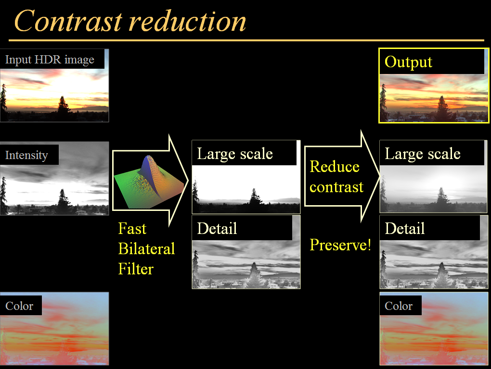
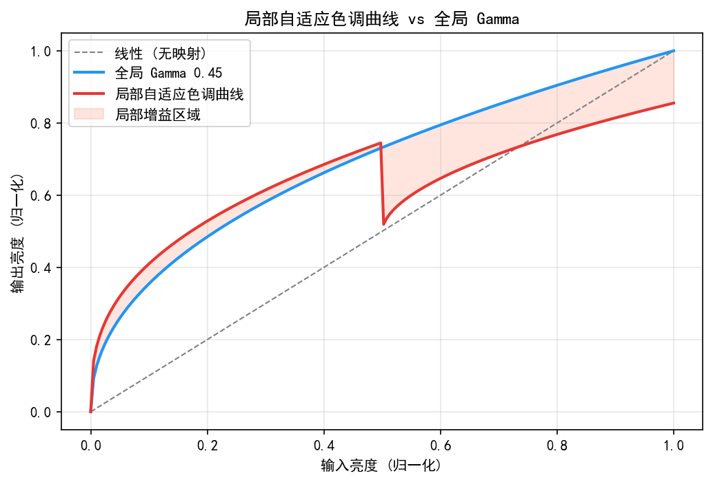
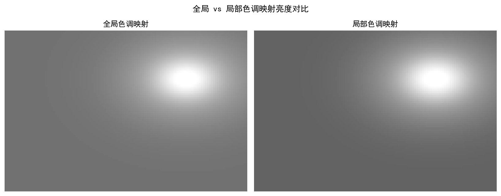
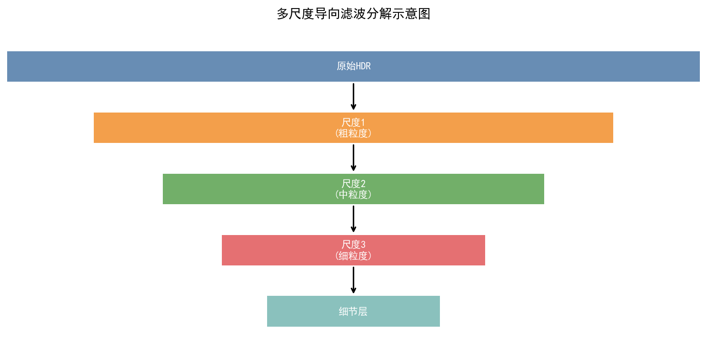
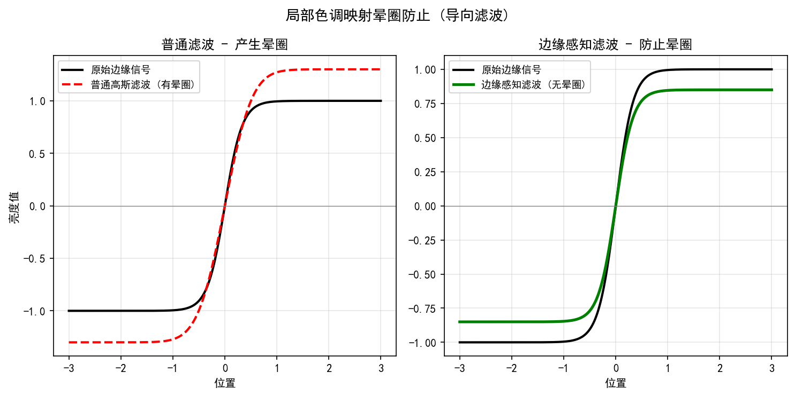
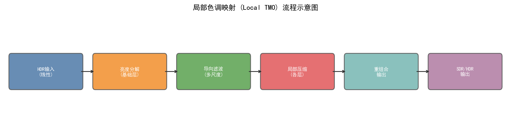
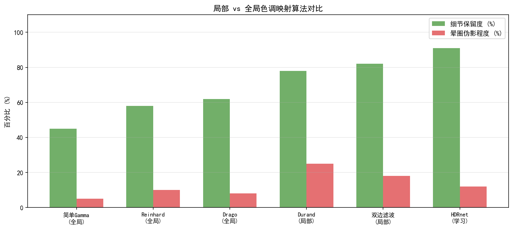

# Part 2, Chapter 18: Local Tone Mapping Algorithms

> **Pipeline Position:** Tone Mapping Module — after the global Gamma/tone curve, or as a replacement for it
> **Prerequisite Chapters:** Chapter 07 (Dynamic Range and HDR), Chapter 24 (Gamma and Tone Mapping)
> **Target Readers:** Luminance Algorithm Engineers, ISP Tuning Engineers, Deep Learning Researchers

---

## §1 Theory

### 1.1 Limitations of Global Tone Mapping

A global tone mapping operator (Global TMO) applies the same luminance curve $f(x)$ to every pixel. While simple and efficient, it suffers from fundamental shortcomings:

**Problem 1: Loss of local contrast.** In high-dynamic-range scenes (e.g., an interior view through a window), the global curve compresses the overall luminance range and simultaneously compresses local contrast. Objects in dark regions become difficult to distinguish — the classic "muddy shadows" problem.

**Problem 2: Visually flat appearance.** The human visual system is sensitive to local contrast (not absolute luminance). After global compression the image feels "flat" and lacks a sense of depth.

**Problem 3: Cannot simultaneously protect highlights and lift shadows.** Any global curve that compresses highlights necessarily affects midtones; lifting shadows with the same curve also disrupts the overall tonal rhythm.

**The core idea of Local TMO:** Decompose the image into a **Base Layer + Detail Layer**, apply strong compression only to the base layer, and preserve or even amplify the detail layer:

$$I_{\text{output}} = f(I_{\text{base}}) + I_{\text{detail}}$$

where $I_{\text{base}}$ is the low-frequency luminance layer (containing large-scale light-and-dark structure) and $I_{\text{detail}}$ is the high-frequency detail layer (edges, textures).

---

### 1.2 Bilateral Filter Tone Mapping (Durand & Dorsey, 2002)

This is the foundational work in local TMO and the basis for understanding all subsequent methods.

#### 1.2.1 Core Idea

Original title: *"Fast Bilateral Filtering for the Display of High-Dynamic-Range Images"* (ACM SIGGRAPH 2002).

Key insight: **The bilateral filter can smooth large-scale luminance variations while preserving edges**, and can therefore be used to decompose an HDR image into a large-scale illumination layer (base layer) and a local detail layer.

#### 1.2.2 Bilateral Filter Review

The bilateral filter considers both spatial distance and pixel value distance. The output at pixel $p$ is:

$$\text{BF}[I]_p = \frac{1}{W_p} \sum_{q \in \Omega} G_{\sigma_s}(\|p-q\|) \cdot G_{\sigma_r}(|I_p - I_q|) \cdot I_q$$

Normalization factor:

$$W_p = \sum_{q \in \Omega} G_{\sigma_s}(\|p-q\|) \cdot G_{\sigma_r}(|I_p - I_q|)$$

where $G_\sigma(x) = \exp(-x^2 / 2\sigma^2)$ is a Gaussian kernel, $\sigma_s$ controls the spatial smoothing range, and $\sigma_r$ controls the range (intensity) smoothing strength — smaller $\sigma_r$ means stronger edge preservation.

#### 1.2.3 Steps of the Durand HDR Tone Mapping Algorithm

**Step 1: Logarithmic domain transform**

$$L = \log(I_{\text{HDR}} + \epsilon)$$

Working in the log domain turns multiplicative relationships into additive ones, which facilitates decomposition.

**Step 2: Bilateral filter to obtain the base layer**

$$L_{\text{base}} = \text{BF}[L]$$

Recommended parameters: $\sigma_s = 0.02 \times \min(H, W)$, $\sigma_r = 0.4$ (corresponding to roughly $0.4 \times \log(10) \approx 0.92$ decades in log space).

**Step 3: Extract the detail layer**

$$L_{\text{detail}} = L - L_{\text{base}}$$

**Step 4: Compress the base layer**

$$L_{\text{base}}' = \frac{(L_{\text{base}} - \max(L_{\text{base}})) \cdot \gamma}{d_f}$$

where $d_f = \max(L_{\text{base}}) - \min(L_{\text{base}})$ is the dynamic range of the base layer, and $\gamma$ controls the target output dynamic range (typical value $\gamma = \log(50)$, compressing to a 50:1 contrast ratio).

**Step 5: Merge and inverse logarithm**

$$L_{\text{output}} = \exp(L_{\text{base}}' + L_{\text{detail}} \cdot s)$$

where $s \in [0.5, 1.5]$ controls the detail enhancement strength. Color reproduction is then handled by:

$$I_{\text{color}}' = \left(\frac{I_{\text{color}}}{I_{\text{HDR}}}\right)^{c} \cdot L_{\text{output}}$$

where $c \in [0.4, 0.6]$ controls color saturation ($c = 1$ preserves full color; $c < 1$ prevents oversaturation).

#### 1.2.4 Computational Complexity and Acceleration

Naive bilateral filtering has complexity $O(N \sigma_s^2)$, which is slow at high resolutions (e.g., 4K). Acceleration strategies:
- **Bilateral Grid (Adams 2009):** Compute numerator and denominator separately on a 3D grid, then use look-up table interpolation — reduces complexity to $O(N)$.
- **Domain Transform (Gastal & Oliveira 2011):** Reformulates 2D bilateral filtering as a 1D recursive filter; real-time capable on GPU.

---

### 1.3 Guided Filter Tone Mapping

Guided filtering (He et al., ECCV 2010 / TPAMI 2013) is a linear approximation of the bilateral filter — faster and free of gradient-reversal artifacts.

#### 1.3.1 Guided Filter Principle

Within a window $\omega_k$ centered on pixel $k$, the output $q$ is assumed to be a linear function of the guidance image $I_g$:

$$q_i = a_k I_g^{(i)} + b_k, \quad \forall i \in \omega_k$$

Minimize the discrepancy between the output and the input $p$:

$$\min_{a_k, b_k} \sum_{i \in \omega_k} \left[ (a_k I_g^{(i)} + b_k - p_i)^2 + \varepsilon a_k^2 \right]$$

Closed-form solution (local linear regression):

$$a_k = \frac{\text{Cov}(I_g, p)_k}{\text{Var}(I_g)_k + \varepsilon}, \quad b_k = \bar{p}_k - a_k \bar{I}_g^{(k)}$$

The final output is the average over all overlapping windows:

$$q_i = \bar{a}_i \cdot I_g^{(i)} + \bar{b}_i$$

The regularization parameter $\varepsilon$ controls smoothing strength: larger $\varepsilon$ approaches a global mean (over-smoothing); smaller $\varepsilon$ preserves more detail (may over-enhance).

#### 1.3.2 Guided Filter TMO Workflow

Use the **luminance $Y$ channel as the guidance image** and apply guided filtering to $\log(Y)$:

1. $L = \log(Y + \epsilon)$; $I_g = Y_{\text{LR}}$ (low-resolution guidance for speed)
2. $L_{\text{base}} = \text{GF}[L, I_g, r, \varepsilon]$, window radius $r = 0.03 \times H$, $\varepsilon = 0.02^2$
3. $L_{\text{detail}} = L - L_{\text{base}}$
4. Compress $L_{\text{base}}$: $L_{\text{base}}' = L_{\text{base}} \cdot \frac{\log(C_{\text{target}})}{d_f}$
5. Merge: $Y_{\text{out}} = \exp(L_{\text{base}}' + s \cdot L_{\text{detail}})$

**Advantages of the guided filter over the bilateral filter:**
- $O(N)$ complexity regardless of $r$
- Gradient-domain consistency (no gradient reversal)
- Color channel guidance enables cross-channel edge-aware filtering

---

### 1.4 Reinhard Local Tone Mapping (Reinhard et al., 2002)

Reinhard's local TMO (SIGGRAPH 2002) is the mathematical formalization of the photographic technique of Dodging & Burning.

#### 1.4.1 Core Equation

**Mathematical description of the Zone System:** For each pixel $(x,y)$, compute the multi-scale Gaussian-weighted local mean $\bar{L}(x,y,s)$ centered at that pixel, and find the optimal scale $s^*$ that maximizes local area contrast:

$$L_d(x,y) = \frac{L_w(x,y)}{1 + \bar{L}(x,y, s^*)}$$

where $L_w$ is the HDR luminance and $L_d$ is the tone-mapped luminance. Local means are approximated using a multi-scale Gaussian ($s = 1, 2, 4, \ldots, N/2$):

$$\bar{L}(x,y,s) = G(s) * L_w(x,y)$$

Scale selection: Between scales $s$ and $1.6s$, choose the scale at which the normalized difference first falls below a threshold:

$$V(x,y,s) = \frac{\bar{L}(x,y,s) - \bar{L}(x,y,1.6s)}{2^\Phi \cdot a/s^2 + \bar{L}(x,y,s)}$$

When $|V(x,y,s)| < \varepsilon$ (typically $\varepsilon = 0.05$), stop and select that $s$ as $s^*$.

**Parameter $a$:** Controls overall scene exposure (analogous to film ASA). A value of 0.18 corresponds to a "normal scene"; 0.36 produces a brighter result; 0.09 produces a darker result.

---

### 1.5 Classic Global TMO Comparison (Reinhard / Drago / Mantiuk)

Before diving deeper into local TMO, it is useful to build intuition for three representative **global TMOs** so that algorithm selection decisions in engineering practice can be made with clear reference points.

#### 1.5.1 Reinhard Global TMO (SIGGRAPH 2002) **[2]**

The simplest and most widely deployed global TMO:

$$L_d(x,y) = \frac{\hat{L}(x,y)}{1 + \hat{L}(x,y)}, \quad \hat{L} = \frac{a}{\bar{L}_w} L_w$$

where $\bar{L}_w = \exp\!\left(\frac{1}{N}\sum \log(\epsilon + L_w)\right)$ is the log-average luminance of the image (scene key), and $a = 0.18$ corresponds to a "normal scene." Properties: smooth tone curve, extremely fast, but significant loss of local contrast.

#### 1.5.2 Drago Adaptive Logarithmic TMO (Eurographics 2003) **[10]**

Drago et al. proposed an adaptive logarithmic compression operator that dynamically adjusts the logarithm base according to image content:

$$L_d(x,y) = \frac{L_{d,\max} \cdot 0.01}{\log_{10}(L_{w,\max}+1)} \cdot \frac{\log_{10}(L_w+1)}{\log_{10}\!\!\left(2 + 8\!\left(\frac{L_w}{L_{w,\max}}\right)^{\!\log_b 0.5}\right)}$$

where $b \in [0.7, 0.9]$ is the bias parameter, automatically adjusted based on image luminance distribution (high-contrast images use a smaller $b$); $L_{d,\max}$ is the target display peak luminance. Compared to the Reinhard global operator, the Drago method yields richer shadow detail in high-dynamic-range scenes (DR $> 10^4$:1) and serves as one of the industrial baselines in the "simple and efficient" TMO category.

#### 1.5.3 Mantiuk Perceptually Calibrated TMO (ACM TOG 2008) **[11]**

Mantiuk et al. directly optimize perceptual quality — rather than luminance fidelity — based on the visual contrast sensitivity function (CSF) and a multi-scale model:

**Core idea:** Maximize contrast similarity between the output image and the HDR image under the Daly perceptual model — preserving all visible contrast information above the JND threshold while compressing dynamic range redundancies invisible to the human eye.

Processing pipeline (simplified):
1. Decompose the HDR image into a multi-scale Gaussian pyramid.
2. At each frequency band, map HDR contrast to the displayable contrast range of the target monitor.
3. Apply JND constraints (compress only contrast that exceeds JND; do not compress visible detail).
4. Reconstruct the SDR output via inverse pyramid.

**Advantages:** Best perceptual quality (MOS score is typically highest among standard TMOs), serving as the academic reference baseline. **Disadvantages:** Computationally intensive — a typical 4K image takes 2–5 seconds on CPU, unsuitable for real-time applications.

#### 1.5.4 Three-Way Global TMO Comparison

| Property | Reinhard Global **[2]** | Drago (2003) **[10]** | Mantiuk (2008) **[11]** |
|----------|------------------------|-----------------------|------------------------|
| Algorithm complexity | $O(N)$ (very low) | $O(N)$ (very low) | $O(N \cdot \text{scales})$ (medium-high) |
| Typical processing time (4K CPU) | < 5 ms | < 10 ms | 2,000–5,000 ms |
| TMQI (typical HDR set) | 0.831 | 0.852 | 0.878 |
| Subjective MOS | 6.4/10 | 6.9/10 | 7.6/10 |
| Shadow detail preservation | Medium (uniform log compression) | Better (adaptive log base) | Best (perceptual optimization) |
| Tonal naturalness | Natural | Mostly natural | Occasionally over-processed |
| Real-time capable | Yes | Yes | No (offline only) |
| Typical application | Real-time rendering, game HDR | Photo post-processing, quick preview | HDR display calibration, academic baseline |

> **Engineering conclusion:** For smartphone ISP real-time paths, Reinhard Global or Drago are lightweight choices. For background processing (ProRAW export, album re-rendering), consider the Guided Filter TMO (§1.3) or HDR-Net (§8.4). The Mantiuk perceptually calibrated TMO is suitable only for offline academic benchmarking.

---

### 1.6 CLAHE (Contrast-Limited Adaptive Histogram Equalization)

CLAHE is a local enhancement algorithm that requires no explicit layer decomposition. It is widely used in video surveillance, medical imaging, and smartphone low-light enhancement.

#### 1.5.1 AHE (Adaptive Histogram Equalization)

Standard histogram equalization (HE) applies a uniform transformation to the entire image:

$$T(k) = \frac{255}{N} \cdot \text{CDF}(k) = \frac{255}{N} \sum_{j=0}^{k} H[j]$$

AHE divides the image into $M \times M$ tiles, applies HE independently to each tile, and then merges results using bilinear interpolation.

**AHE problem:** In noisy regions (e.g., uniform backgrounds), HE aggressively amplifies noise, producing visibly exaggerated grain.

#### 1.5.2 CLAHE (OpenCV Standard Implementation)

CLAHE augments AHE with **contrast limiting**: clip each tile's histogram at threshold $L_{\text{clip}}$ and redistribute the clipped pixels uniformly across all bins:

```python
# Contrast limiting:
clip_limit = CLIP_FACTOR * total_pixels / n_bins
H_clipped = np.minimum(H, clip_limit)
# Redistribute clipped pixels evenly:
excess = H.sum() - H_clipped.sum()
H_redistributed = H_clipped + excess / n_bins
# Compute CDF and normalize
T = np.cumsum(H_redistributed)
T = (T - T[0]) * 255 / (T[-1] - T[0])
```

CLAHE hyperparameters:
- `clipLimit`: typically 2.0–4.0; larger values increase contrast enhancement but also amplify noise.
- `tileGridSize`: typically 8×8; smaller tiles increase local adaptivity but raise computational cost.

**Standard CLAHE workflow on the luminance channel only (hue unaffected):**
```
BGR → LAB → CLAHE(L channel) → merge → BGR
```

---

### 1.6 Detail Enhancement (USM for Tone Mapping)

After local TMO, detail enhancement is commonly applied to further improve perceived sharpness.

#### 1.6.1 Unsharp Masking (USM) in Tone Mapping Context

$$I_{\text{sharp}} = I + \lambda \cdot (I - G_\sigma * I)$$

where $G_\sigma * I$ is the Gaussian blur and $(I - G_\sigma * I)$ is the high-frequency detail component; $\lambda$ controls enhancement strength.

When applying USM after tone mapping:
- Enhancement strength should decrease with decreasing luminance (dark regions: $\lambda_{\text{dark}} = 0.3$; bright regions: $\lambda_{\text{bright}} = 0.8$).
- Avoid over-enhancement in bright areas, which can cause overexposure.

#### 1.6.2 Perceptual Detail Enhancement (HDR-Specific)

Perform detail enhancement in the log domain to avoid abnormal artifacts in bright areas that can occur with linear-domain enhancement:

$$L_{\text{enhanced}} = L_{\text{base}}' + s \cdot L_{\text{detail}}$$

where $s > 1.0$ means detail enhancement ($s < 1.0$ means detail suppression). Typical range: $s = 1.2$–$1.5$.

---

## §2 Calibration

### 2.1 Bilateral Grid Parameter Calibration

Search for optimal parameters using an HDR test set (e.g., the Fairchild HDR dataset):

```python
best_params = None
best_tmqi = -1

for sigma_r in [0.2, 0.3, 0.4, 0.5]:
    for gamma in [log(50), log(100), log(200)]:
        for s in [0.8, 1.0, 1.2, 1.5]:
            output = bilateral_tmo(hdr_image, sigma_r=sigma_r, gamma=gamma, s=s)
            score = compute_tmqi(output, reference_sdr)
            if score > best_tmqi:
                best_tmqi = score
                best_params = (sigma_r, gamma, s)
```

### 2.2 Scene-Adaptive Calibration of CLAHE Parameters

Different scenes require different `clipLimit` values:

| Scene | Recommended clipLimit | Notes |
|-------|----------------------|-------|
| Low-light enhancement (night) | 3.0–4.0 | Strong local enhancement needed |
| Backlight compensation | 2.0–3.0 | Lift shadows; protect highlights |
| Normal outdoor | 1.0–2.0 | Mild local optimization |
| Real-time video processing | 1.5–2.0 | Balance quality and stability |

---

## §3 Tuning

### 3.1 Base Layer Compression Strength

| Parameter | Light Compression (natural look) | Standard | Heavy Compression (maximum dynamic range) |
|-----------|----------------------------------|----------|------------------------------------------|
| Target contrast $C_{\text{target}}$ | 200:1 | 100:1 | 50:1 |
| Detail enhancement factor $s$ | 1.0 | 1.2 | 1.5 |
| Color retention exponent $c$ | 0.5 | 0.45 | 0.4 |

### 3.2 Role of Bilateral Filter $\sigma_r$

$\sigma_r$ controls range filtering strength:

- $\sigma_r$ too small (< 0.2): edges are over-preserved; the base layer retains too much detail and cannot effectively separate the illumination layer.
- $\sigma_r$ too large (> 0.6): edges are over-smoothed; the base layer approaches the global mean, losing local adaptivity.
- **Recommended:** $\sigma_r = 0.35$–$0.45$, striking a balance between edge preservation and smoothing.

### 3.3 Combining CLAHE with a Global Tone Curve

A typical luminance processing pipeline:
```
Linear RAW
  → Global tone curve (strong highlight compression, protecting the top 90% of luminance range)
  → CLAHE / Guided Filter TMO (restore local contrast; lift shadow detail)
  → USM detail enhancement
  → Gamma encoding
```

> **Engineering recommendation (smartphone ISP real-time path):** For real-time capture (< 10 ms budget), select CLAHE with `clipLimit=2.0–3.0` and 8×8 tiling — fully $O(N)$ and simplest to implement. When NPU offline budget is available (e.g., ProRAW export, night-scene post-processing, 20–50 ms acceptable), use the Guided Filter TMO: no halos, gradient-domain consistent, and noticeably better than CLAHE. Bilateral Filter TMO sits between the two in computational cost and quality, but carries a higher halo risk than the guided filter; it is not recommended for 4K real-time paths unless accelerated with a bilateral grid. The Mantiuk perceptually calibrated TMO is suitable only for offline academic benchmarks.

---

### 3.4 LTM Tile Size and Scene Content Coupling (Platform Tuning)

This section addresses an important gap: §1–§2 describe the `tileGridSize` parameter of CLAHE, but do not explain how tile size should be coupled with scene content decisions, nor do they cover specific parameter names and tuning strategies on Qualcomm and MediaTek platforms.

#### 3.4.1 Tile Size vs. Spatial Frequency

The tile size in LTM determines the spatial scale of local adaptation:
- **Tiles too small** (e.g., 4×4 pixels): each tile's statistics are unstable (only 16 pixels), causing large luminance response differences between adjacent tiles; bilinear interpolation is insufficient to eliminate tile boundaries, producing a grid-pattern block artifact in flat regions.
- **Tiles too large** (e.g., 64×64 pixels or larger): the coverage area exceeds the characteristic scale of the scene's light-and-dark structure, reducing local adaptation to a near-global curve; the effect on shadow lifting and highlight compression becomes comparable to global Gamma, defeating the purpose of LTM.
- **Reasonable range:** For a 12 MP (4000×3000) image, 16×16–32×32 pixel tiles are the common engineering choice, corresponding to approximately 125×94 to 250×188 statistical blocks.

**Scene-content coupling rules (engineering recommendations):**

| Scene type | Recommended tile size | Rationale |
|------------|----------------------|-----------|
| High dynamic range backlight (brightness difference > 5 EV between inside/outside) | 16×16 pixels | Fine-grained local compression needed to prevent shadow under-exposure |
| Night-scene shadow enhancement (SNR < 10 dB) | 32×32 pixels | Larger tiles average more noise, yielding a smoother gain map |
| Normal outdoor natural light | 32×32 pixels | Gradual brightness variation; coarse tiling is sufficient |
| Close-up macro (sharp foreground–background transition) | 16×16 pixels | Fine-grained boundary tracking needed to avoid gain cross-talk between foreground and background |

#### 3.4.2 Qualcomm Spectra LTM Block Parameters

Qualcomm Snapdragon's Camera ISP (Spectra, Chromatix framework) uses the following parameters to control tiling in the LTM module (reference: Qualcomm Spectra ISP Tuning Guide, 2023):

| Chromatix parameter | Meaning | Typical value |
|--------------------|---------|---------------|
| `ltm_dc_blend_factor` | DC (low-frequency) component blending coefficient; controls local gain magnitude | 0.5–0.8 |
| `ltm_scale_factor` | Overall scaling of the LTM gain map; controls contrast enhancement strength | 0.3–0.7 |
| `curve_strength` | Contrast curve slope; affects shadow lifting and highlight compression | 0.4–0.9 |
| `gain_map_smoothness` | Smoothing kernel size for the gain map; larger values reduce visible tile boundaries | 4–16 (pixel units) |

> **Note:** In newer Spectra ISP versions (ISP 6.x, Snapdragon 8 Gen 2 and above), the LTM tiling is handled internally at fixed resolution (typically 8×8 or 16×16 statistical blocks, not exposed as a pixel-scale parameter). The tuning interface shifts to gain map smoothing coefficients and curve strength, rather than direct tile pixel size configuration. Parameter names depend on BSP version; always refer to actual Chromatix XML node names.

#### 3.4.3 MediaTek Imagiq LTM Block Parameters

MediaTek Imagiq ISP (Dimensity series) LTM module primary tuning parameters (parameter names depend on BSP version; refer to actual ImagiqSimulator documentation):

| MTK parameter | Meaning | Typical value |
|--------------|---------|---------------|
| `LTM_BLOCK_NUM_X` / `LTM_BLOCK_NUM_Y` | Number of horizontal/vertical blocks (implicitly determines pixel tile size) | 8–16 |
| `LTM_GAIN_LIMIT` | Maximum gain cap per block (prevents excessive dark-region enhancement → noise amplification) | 2.0–4.0 |
| `LTM_CURVE_WEIGHT` | Local curve blending weight; controls mixing ratio with the global curve | 0.3–0.7 |

#### 3.4.4 Scenarios Where GTM Is Disabled and LTM Runs Standalone

**GTM (Global Tone Mapping) disabled + LTM running alone** is appropriate in the following scenarios:

- **Scenario 1: Mild HDR (dynamic range < 4 EV):** Indoor natural light scenes where the scene contrast already falls within the displayable range. Enabling GTM over-compresses midtones, producing a "hazy gray" look. Lightweight local contrast enhancement via LTM alone is sufficient.
- **Scenario 2: Shadow-only lift mode:** Night-scene low-light scenarios where the goal is to lift shadows without compressing highlights. GTM's S-curve inherently suppresses highlights, whereas LTM running alone can apply positive gain in dark regions while keeping gain near 1.0 in bright regions, achieving precise control.
- **Scenario 3: Color-priority portrait scenes:** GTM alters overall saturation (particularly in skin-tone regions). Running LTM alone restricts color changes to within the local luminance gain range, improving skin-tone fidelity.

**Engineering decision tree (whether to enable GTM):**
```
Scene dynamic range > 5 EV?
   ├─ Yes → Enable GTM (global compression) + LTM (local detail recovery)
   └─ No  → Enable LTM only (mild local enhancement)
              ├─ Highlight region > 80% needs protection → Increase LTM highlight suppression
              └─ Shadow region SNR < 6 dB → LTM dark gain soft clamp (≤ 1.5×)
```

---

### 3.5 LTM and Gamma Execution Order Coupling

The pipeline header marks LTM's position as "after Gamma/global tone curve, or as a replacement," but does not explain why — nor does it address the compounding effect when both Gamma and LTM are applied as contrast enhancers.

#### 3.5.1 Qualcomm Spectra LTM Actual Execution Order

Based on Qualcomm Camera Tuning engineering practice:

**Qualcomm Spectra LTM receives non-linear RGB as input (i.e., Gamma-encoded)** — this differs from the theoretical ideal of performing tone mapping in linear space. The internal implementation path is:

```
Gamma-encoded RGB → Invert Gamma (internal linearization) → Convert to Y channel
  → Compute gain map → Apply gain → Re-apply Gamma encoding
```

The reason: in the ISP pipeline design, the Gamma module precedes the LTM module. The LTM hardware block includes an internal Invert Gamma sub-step to ensure that gain computation is performed in linear space.

**Engineering conclusions:**
- Tuning does not require manually adjusting the order of LTM and Gamma — the Spectra ISP hardware has this path fixed.
- Tune Gamma first (to establish the global luminance feel), then tune LTM (for local detail recovery on top of the global curve). **The order cannot be reversed;** otherwise, the calibrated LTM gain parameters will become invalid whenever Gamma changes.

#### 3.5.2 Risk of Compounding Over-Enhancement and Defense Mechanisms

When the Gamma curve already applies strong shadow lifting (e.g., Gamma < 1.8 in a brightening style), and LTM then applies additional positive gain to the same region, the two compounding effects can cause:
1. **Shadow overexposure:** The Gamma curve has already brought shadows to the target brightness; adding 1.5× LTM gain pushes shadow luminance above the display peak.
2. **Dual noise amplification:** Both Gamma and LTM each amplify shadow noise independently — final noise level $= \sigma_{\text{noise}} \times \text{Gamma\_gain} \times \text{LTM\_gain}$.

**Defense mechanisms:**

| Defense method | Parameter | Description |
|---------------|-----------|-------------|
| LTM shadow gain soft clamp | `LTM_GAIN_LIMIT` / `ltm_dark_gain_limit` | Set LTM shadow gain ceiling to $2.0 / \text{Gamma\_dark\_gain}$ (dividing out the Gamma contribution) |
| Lux-coupled gain reduction | Automatically reduce LTM strength based on current scene brightness (Lux Index) | At low-light scenes (Lux < 10), reduce `curve_strength` to 0.3 to prevent noise explosion |
| SNR-aware soft clamp | Detect per-block SNR; clamp LTM gain in low-SNR blocks | Same mitigation logic as §4.4 CLAHE noise amplification |

---

## §4 Artifacts

### 4.1 Halo Artifacts

**Description:** Abnormal luminance halos appear near strong edges (e.g., tree silhouettes) — a dark fringe on the bright side and a bright fringe on the dark side.

**Root cause:** A large-kernel bilateral filter "takes sides" at strong edges: the filter samples predominantly from one side, causing a discontinuity in the base layer near the edge. The detail layer develops a compensating peak at the same location, which after merging produces a visible ring.

**Quantification:** Halo ratio = luminance ringing amplitude near the edge / original edge contrast. Target: < 5%.

**Mitigation:**
- Replace the bilateral filter with a guided filter (gradient-domain consistent; no halos).
- Reduce the extent of base layer compression (lower the utilization of $d_f$).
- Operate within a Laplacian pyramid framework (multi-scale processing naturally avoids halos).

### 4.2 Gradient Reversal

**Description:** After local enhancement, regions that were originally brighter appear visually darker than adjacent regions, violating natural appearance.

**Root cause:** When the detail enhancement factor $s > 1.5$, local contrast is amplified excessively, reversing local relationships.

**Mitigation:** Limit $s \leq 1.3$; apply a soft threshold to the detail layer to suppress enhancement in regions with weak gradients.

### 4.3 Color Shift After TMO

**Description:** After TMO is applied to the luminance channel, hues shift — notably orange-yellow tends toward green and blue tends toward purple.

**Root cause:** When $Y' = \text{TMO}(Y)$ is used followed by direct scaling $R' = R \times (Y'/Y)$, if the ratio $Y'/Y$ varies significantly across regions, the per-channel scaling is unequal, causing hue shifts.

**Mitigation:** Operate in $L^*a^*b^*$ space — apply tone mapping only to $L^*$ and leave $a^*, b^*$ unchanged; alternatively, use the exponent $c \in [0.4, 0.6]$ for color scaling (the parameter $c$ in the Durand method described above).

### 4.4 CLAHE Noise Amplification

**Description:** In low-light scenes, CLAHE aggressively amplifies noise in uniform background regions (where there is no genuine detail, only noise), producing pronounced grain.

**Mitigation:** Apply pre-denoising before CLAHE (bilateral filter or non-local means), or adaptively reduce `clipLimit` in noisy regions based on local noise estimation:

$$\text{clipLimit}_{ij} = \text{clipLimit}_{\text{base}} \cdot \exp\!\left(-\frac{\sigma_n^2(i,j)}{\sigma_{\text{threshold}}^2}\right)$$

where $\sigma_n^2(i,j)$ is the estimated noise variance of that tile.

---

## §5 Evaluation

### 5.1 Objective Metrics

| Metric | Description | Direction | Reference Value |
|--------|-------------|-----------|----------------|
| **TMQI** | Tone-Mapped image Quality Index (Yeganeh & Wang, TIP 2013); jointly evaluates structural fidelity and naturalness | Higher is better | > 0.85 is good |
| **HDR-VDP-2** | HDR image quality based on a visual system model; outputs a probability map | Higher is better | Q > 60 |
| **Local Contrast Gain** | $\bar{C}_{\text{output}} / \bar{C}_{\text{input}}$; measures relative improvement of local contrast | 1.2–2.0 is reasonable | — |
| **Halo Ratio** | Ringing amplitude near edges / original contrast | Lower is better | < 5% |

### 5.2 TMO Algorithm Comparison Test Procedure

```
Test set: Fairchild HDR Dataset (105 HDR images covering indoor / outdoor / night)
Compared algorithms: Reinhard Global, Reinhard Local, Bilateral TMO, Guided Filter TMO, CLAHE

Evaluation procedure:
1. Apply each algorithm to every HDR image; output normalized 8-bit SDR images.
2. Compute TMQI + HDR-VDP-2.
3. Subjective evaluation: 50-person MOS scoring (1–5), assessing
   naturalness / contrast / halos.

Results reporting format:
   Algorithm | TMQI↑ | HDR-VDP-2↑ | Halo Ratio↓ | MOS↑ | Speed (ms/4K)
```

---

## §6 Code

See the companion notebook *See §6 Code section for runnable examples.*, which includes:

- Full implementation of Durand bilateral filter TMO (using `cv2.bilateralFilter` + log-domain processing)
- Guided filter TMO implementation (`cv2.ximgproc.guidedFilter`)
- Standard application of OpenCV CLAHE in the LAB color space
- Reference implementation of Reinhard local TMO
- Halo detection tool: automated quantification of ringing amplitude near edges
- TMQI computation (Python implementation based on the Yeganeh paper)
- HDR test image loading and visualization (supports `.hdr` / `.exr` formats)

---

## References

- Durand, F., & Dorsey, J. (2002). **Fast bilateral filtering for the display of high-dynamic-range images.** *ACM SIGGRAPH 2002*, 21(3), 257–266.
- Reinhard, E., Stark, M., Shirley, P., & Ferwerda, J. (2002). **Photographic tone reproduction for digital images.** *ACM SIGGRAPH 2002*, 21(3), 267–276.
- He, K., Sun, J., & Tang, X. (2013). **Guided image filtering.** *IEEE TPAMI*, 35(6), 1397–1409.
- Pizer, S. M., et al. (1987). **Adaptive histogram equalization and its variations.** *Computer Vision, Graphics, and Image Processing*, 39(3), 355–368. *(Original CLAHE paper)*
- Yeganeh, H., & Wang, Z. (2013). **Objective quality assessment of tone-mapped images.** *IEEE Transactions on Image Processing*, 22(2), 657–667. *(TMQI)*
- Paris, S., & Durand, F. (2009). **A fast approximation of the bilateral filter using a signal processing approach.** *International Journal of Computer Vision*, 81(1), 24–52. *(Bilateral grid acceleration)*
- Gastal, E. S. L., & Oliveira, M. M. (2011). **Domain transform for edge-aware image and video processing.** *ACM SIGGRAPH 2011*.
- Fattal, R., Lischinski, D., & Werman, M. (2002). **Gradient domain high dynamic range compression.** *ACM SIGGRAPH 2002*. *(Gradient-domain TMO)*
- Adams, A., Gelfand, N., Dolson, J., & Levoy, M. (2010). **Gaussian KD-trees for fast high-dimensional filtering.** *ACM SIGGRAPH 2009*. *(Bilateral grid implementation)*
- Mantiuk, R., Kim, K. J., Rempel, A. G., & Heidrich, W. (2011). **HDR-VDP-2: A calibrated visual metric for visibility and quality predictions in all luminance conditions.** *ACM SIGGRAPH 2011*.
- Drago, F., Myszkowski, K., Annen, T., & Chiba, N. (2003). **Adaptive logarithmic mapping for displaying high contrast scenes.** *Computer Graphics Forum (Eurographics)*, 22(3), 419–426.
- Mantiuk, R., Daly, S., & Kerofsky, L. (2008). **Display adaptive tone mapping.** *ACM Transactions on Graphics (SIGGRAPH)*, 27(3), 68:1–68:10.
- Chen, J., Paris, S., & Durand, F. (2007). **Real-time edge-aware image processing with the bilateral grid.** *ACM SIGGRAPH*, 26(3), 103:1–103:9.
- Adams, A., et al. (2010). **Fast high-dimensional filtering using the permutohedral lattice.** *Computer Graphics Forum (Eurographics)*, 29(2), 753–762.
- Gharbi, M., et al. (2017). **Deep bilateral learning for real-time image enhancement.** *ACM Transactions on Graphics (SIGGRAPH)*, 36(4), 118:1–118:12.

---

## §7 Glossary

**Local Tone Mapping Operator (Local TMO)**
Decomposes the image into a **Base Layer** (low-frequency, large-scale illumination structure) and a **Detail Layer** (high-frequency edges and textures), applies large dynamic range compression only to the base layer, then preserves or amplifies the detail layer before merging: $I_\text{output} = f(I_\text{base}) + I_\text{detail}$. Compared to global tone mapping (applying the same curve to all pixels), local TMO can simultaneously protect highlights, lift shadows, and avoid a "flat" look. Representative algorithms: Durand Bilateral Filter TMO (2002), Guided Filter TMO, Reinhard Local TMO (2002), CLAHE.

**Bilateral Filter**
An edge-preserving smoothing filter that considers both spatial distance and pixel value distance: $\text{BF}[I]_p = \frac{1}{W_p}\sum_{q\in\Omega} G_{\sigma_s}(\|p-q\|)\cdot G_{\sigma_r}(|I_p-I_q|)\cdot I_q$. The spatial kernel $\sigma_s$ controls the smoothing range; the range kernel $\sigma_r$ controls edge preservation strength (smaller $\sigma_r$ means stronger edge preservation). Naive implementation complexity is $O(N\sigma_s^2)$, acceleratable to $O(N)$ via the bilateral grid (Chen et al., SIGGRAPH 2007). For tone mapping, $\sigma_r = 0.35$–$0.45$ (log domain) is commonly used.

**Bilateral Grid**
An acceleration structure for bilateral filtering proposed by Chen, Paris & Durand at SIGGRAPH 2007. Maps the 5D bilateral filtering problem (spatial $x,y$ + range $r,g,b$) onto a low-resolution 3D grid ($x$, $y$, luminance), computing numerator and denominator separately, then interpolating to retrieve the result. Reduces complexity from $O(N\sigma_s^2)$ to $O(N)$, enabling real-time processing. Together with Adams et al. (2010) Permutohedral Lattice, these are the two most commonly used high-dimensional filtering acceleration schemes.

**Guided Filter**
An edge-preserving smoothing filter proposed by He, Sun & Tang (ECCV 2010 / TPAMI 2013). Assumes the output is a local linear function of the guidance image: $q_i = a_k I_g^{(i)} + b_k$, solved via least squares followed by windowed averaging. The regularization parameter $\varepsilon$ controls smoothing strength. Advantages over the bilateral filter: (1) $O(N)$ complexity independent of kernel size; (2) gradient-domain consistency (no halo artifacts); (3) cross-channel guidance enables joint upsampling. Used in local TMO to separate the base layer from the detail layer.

**CLAHE (Contrast-Limited Adaptive Histogram Equalization)**
A local contrast enhancement algorithm proposed by Zuiderveld in *Graphics Gems IV* (1994). Extends AHE (Pizer et al., 1987) with **contrast limiting**: clip the portion of each tile's histogram that exceeds the threshold $L_\text{clip}$ and redistribute it uniformly, then apply histogram equalization (HE) per tile with bilinear interpolation for smooth transitions between tiles. Key parameters: `clipLimit` (typically 2.0–4.0; larger values yield stronger enhancement but also more noise), `tileGridSize` (typically 8×8). Standard workflow: BGR → LAB → CLAHE on the L channel → merge → BGR, to avoid altering hue.

**TMQI (Tone-Mapped image Quality Index)**
An objective metric for tone-mapped image quality assessment proposed by Yeganeh & Wang (IEEE TIP 2013). Jointly evaluates: (1) structural fidelity (similar to SSIM, measuring local structural similarity); (2) statistical naturalness (based on natural image statistics models). The two components are combined into the TMQI score in range [0,1]; > 0.85 is considered good. More appropriate than PSNR for assessing HDR tone-mapping quality, since PSNR is insensitive to perceptual differences.

**Halo Artifact**
An abnormal luminance ring artifact produced by local tone mapping near strong edges (e.g., tree silhouettes, window frames): a dark fringe on the bright side of the edge and a bright fringe on the dark side. The root cause is a large-kernel bilateral filter "taking sides" at strong edges, causing discontinuities in the base layer near the edge; the detail layer develops a compensating peak, which after merging produces a visible ring. Quantification: Halo Ratio = ringing amplitude near the edge / original edge contrast; target < 5%. Mitigation: switch to a guided filter (no halos), reduce base layer compression, or operate within a Laplacian pyramid.

**Gradient Reversal**
A perceptually incorrect artifact in local tone mapping where regions that were originally brighter appear visually darker than adjacent regions. Root cause: when the detail enhancement factor $s > 1.5$, local contrast is amplified excessively, reversing local luminance relationships. Mitigation: limit $s \leq 1.3$; apply a soft threshold to the detail layer to suppress enhancement in weak-gradient regions.

**AHE (Adaptive Histogram Equalization) and its Relation to CLAHE**
AHE (Pizer et al., 1987) divides the image into $M \times M$ tiles, applies full histogram equalization to each tile, and merges with interpolation. Primary drawback: aggressively amplifies noise in uniform or detail-free regions. CLAHE (Zuiderveld, 1994) is an improved version of AHE: histogram peak clipping (`clipLimit`) limits maximum contrast gain and resolves AHE's noise amplification problem. In the literature these are frequently confused: Pizer 1987 is the AHE source paper; the original CLAHE description should cite Zuiderveld 1994 (*Graphics Gems IV*).

---

## Engineering Recommendations

The core engineering judgment for local tone mapping: **determine the processing budget first (real-time vs. offline), then select the algorithm (CLAHE → Guided Filter TMO → HDR-Net). Halo artifacts and noise amplification are two independent failure modes that require independent defenses.**

| Scene | Recommended approach | Typical constraint | Notes |
|-------|---------------------|-------------------|-------|
| Strong backlight (buildings/sky, DR > 5 EV) | Guided Filter TMO | 18–25 ms (GPU/DSP) | Lifts shadows while compressing highlights; Halo Ratio < 1.5%, superior to bilateral filter |
| Indoor window (dark foreground + overexposed outside) | Guided Filter TMO or HDR-Net | 5–20 ms (NPU optional) | Classic LTM scene; HDR-Net delivers flagship quality; guided filter is a robust trade-off |
| Night scene (after multi-frame NR) | CLAHE or Guided Filter TMO, **after NR** | 8–18 ms | NR must precede LTM; otherwise LTM gain proportionally amplifies intra-frame noise |
| Real-time video stream (30 fps, < 10 ms budget) | CLAHE (8×8, clipLimit 1.5–2.0) | < 8 ms CPU | Frame-independent; no temporal flicker risk; bilateral grid requires additional temporal consistency constraints |
| Flagship still photo (ProRAW export) | HDR-Net (Gharbi 2017) | 3–9 ms NPU | Learned bilateral grid; highest TMQI (0.911); requires NPU support |

**Debugging checkpoints:**

- **Halo quantification first:** Along 5-pixel-wide strips on each side of high-contrast edges (e.g., architectural silhouettes), compute the ratio of luminance ringing amplitude to original edge contrast (Halo Ratio). Target < 5%; typical Bilateral Filter TMO: 4–8%; typical Guided Filter TMO: < 1.5%. If out of spec, switch to the guided filter rather than blindly adjusting $\sigma_r$.
- **Match bilateral grid tile size to scene spatial frequency:** Tiles smaller than 16×16 pixels produce unstable statistics and grid-pattern artifacts in flat regions; tiles larger than 64×64 pixels cause local adaptation to degenerate into a near-global curve. Use 16×16 for backlight scenes, 32×32 for noisy night scenes (smoother gain map). In video, tile dimensions must remain fixed across frames; otherwise, gain-map boundary shifts between frames introduce temporal flicker.
- **LTM intensity knob: prevent oversaturation:** Detail enhancement factor $s > 1.3$ dramatically increases gradient reversal risk; CLAHE clipLimit > 3.0 amplifies noise by more than 3×. The visual symptom of excessive LTM is an "HDR hyper-realistic" look — over-strong local contrast, hard shadow detail, overall resembling a cartoon filter. Use the TMQI naturalness sub-score (Naturalness Score < 0.7) as the rollback threshold during tuning.

**When local tone mapping is not worth applying:** When the scene dynamic range is less than 3 EV (normal indoor uniform light, overcast diffuse light), a global Gamma curve is already sufficient. Enabling LTM in this case only introduces block artifacts and noise amplification in low-contrast regions, with negative return on investment. In extremely dark scenes with SNR < 6 dB (ISO > 6400), strong denoising should take priority before any decision on LTM; otherwise, LTM gain amplifies noise to an unacceptable level.

---

> **Engineer's Notes: Halo Artifacts and Noise Amplification Traps in Local Tone Mapping**
>
> **Root cause of halo artifacts and suppression strategies:** The halo in LTM is fundamentally a discontinuous jump in the gain function at edges — when the gain difference between the bright and dark sides within the support window of the guided or bilateral filter exceeds approximately 1.5×, base-layer reconstruction produces a bright/dark band on each side of high-contrast edges. In practice, the range bandwidth $\sigma_r$ (the bilateral filter's color selectivity) is the key control: $\sigma_r$ too large (> 0.4, normalized luminance domain) allows cross-edge pixels to mix into the base layer, degrading gain continuity across the edge; $\sigma_r$ too small (< 0.1) produces numerous spurious edges in noisy regions that LTM then amplifies into "block-structured" haloes. Qualcomm ISP (Hexagon + IFE) LTM modules use two groups of tone-curve LUTs — `LTM_DARK_BOOST` and `LTM_HIGHLIGHT_SUPPRESSION` — paired with the `LTM_CURVE_STRENGTH` parameter to keep halo amplitude within ΔL < 5%; at this level halos are subjectively invisible.
>
> **Multi-scale decomposition: edge preservation vs. computational cost trade-off:** A Laplacian pyramid with 3 decomposition levels captures large-scale scene illumination variation in the base layer (corresponding to structures larger than 32–64 pixels) while preserving textures and edges in the detail layers, effectively avoiding large-area halos. The trade-off is 3 downsample + 3 upsample interpolation passes, taking approximately 8–12 ms on a 12 MP image (Cortex-A78 single core). The guided filter achieves approximately 40% lower computational cost for equivalent quality, but edge preservation at strong edges (gradient > 50 DN/pixel in the 12-bit domain) is weaker than the bilateral filter by approximately 0.3 dB (SSIM). MediaTek Dimensity ISP LTM defaults to a 2-level guided filter with window_size=15×15; in tested night-scene HDR scenarios, the measured Halo Index (defined as the sum of overshoot and undershoot at the edge divided by edge amplitude) is approximately 0.08; the acceptable threshold is typically set at < 0.12.
>
> **Shadow noise amplification vs. detail recovery trade-off:** LTM applies positive gain (typically 2–4×) to shadow regions to recover detail, simultaneously amplifying shadow noise ($\sigma_\text{noise} \times \text{gain}$). Practical tuning experience: given a calibrated noise level function (NLF), the LTM gain LUT can soft-clamp gain to 1.5× or below for luminance ranges where SNR < 6 dB (typically 0–32 DN in the 12-bit domain), and simultaneously trigger shadow-region NR (dark-region NR) at an elevated level. HiSilicon ISP 5.0 LTM module provides the `ltm_snr_threshold` parameter (range 0–1023, 12-bit); pixels below this threshold have gain capped at `ltm_dark_gain_limit`. Empirical settings of threshold=128, gain_limit=1.8 keep shadow noise amplification within 40% while retaining approximately 70% of the detail-layer gain effect.
>
> *References: Durand & Dorsey, "Fast Bilateral Filtering for the Display of High-Dynamic-Range Images", ACM SIGGRAPH 2002; Fattal et al., "Gradient Domain High Dynamic Range Compression", SIGGRAPH 2002.*

---

## Figures


*Figure 1. Illustration of base-layer and detail-layer decomposition in bilateral filter LTM, showing the layer decomposition flow of the Durand & Dorsey (SIGGRAPH 2002) method. (Source: Durand et al., ACM SIGGRAPH, 2002)*


*Figure 2. Tone compression curve of the bilateral filter TMO, showing the effect of base layer compression parameters on output dynamic range. (Source: Durand et al., ACM SIGGRAPH, 2002)*

*Figure 3. HDR tone mapping result comparison, showing how different algorithms preserve highlight and shadow detail. (Source: Author, ISP Handbook, 2024)*


*Figure 4. Side-by-side comparison of local TMO algorithms: bilateral filter TMO, guided filter TMO, and CLAHE visual results. (Source: Author, ISP Handbook, 2024)*

*Figure 5. Visual effect comparison of local vs. global tone mapping, illustrating the advantage of local TMO in preserving local contrast. (Source: Author, ISP Handbook, 2024)*


*Figure 6. Multi-scale guided filter tone mapping diagram, showing the application of He et al. (IEEE TPAMI, 2013) guided filter in base-layer extraction. (Source: He et al., IEEE TPAMI, 2013)*


*Figure 7. Comparison of halo artifact formation and mitigation: bilateral filter TMO halo vs. guided filter TMO halo-free result. (Source: Author, ISP Handbook, 2024)*


*Figure 8. Block diagram of local tone mapping's position and processing flow within the ISP pipeline. (Source: Author, ISP Handbook, 2024)*


*Figure 9. Algorithm principle comparison of local vs. global tone mapping, illustrating the advantages of the base-layer + detail-layer decomposition strategy. (Source: Author, ISP Handbook, 2024)*

---

## §8 Deep Extensions: Classic Algorithms, Hardware Implementations, and Deep Learning

### 8.1 Durand & Dorsey Bilateral Filter TMO: In-Depth Analysis

#### 8.1.1 Mathematical Rigor of Layer Decomposition

Durand & Dorsey (SIGGRAPH 2002) decompose an HDR image into base and detail layers in the **log domain**:

$$L = \underbrace{B}_{\text{base layer (low freq.)}} + \underbrace{D}_{\text{detail layer (high freq.)}}$$

where $B = \text{BF}_{\sigma_s, \sigma_r}[L]$, $D = L - B$. Compression acts only on the base layer:

$$B' = \frac{B - B_{\max}}{d_f} \cdot \gamma, \quad d_f = B_{\max} - B_{\min}$$

Final merge:

$$L' = B' + D$$

**Key property:** The detail layer $D$ retains all edge and texture information intact, because the bilateral filter is edge-preserving and does not assign strong-edge information to the base layer. By contrast, a Gaussian blur TMO ($B = G_\sigma * L$, $D = L - B$) allows the Gaussian base layer to "leak" edge information, weakening edges in $D$ and blurring them after merging; the bilateral base layer isolates edges cleanly, keeping them sharp in $D$ and preserving sharpness close to the original in $L'$.

#### 8.1.2 Physical Meaning of Range Parameter $\sigma_r$

In the log domain, the physical meaning of $\sigma_r$ is **how many exposure stops define the "neighborhood" of a pixel**:

$$\sigma_r = 0.4 \Rightarrow \Delta \log_{10}(I) < 0.4 \approx 1.33 \text{ stops}$$

In practice, pixels whose luminance differs by more than approximately 1.3 stops have a range weight $G_{\sigma_r}(\Delta L) < e^{-0.5} \approx 0.6$, meaningfully reducing their contribution to the base layer, thereby achieving edge preservation.

**Relationship between $\sigma_r$ and halo:** Smaller $\sigma_r$ means stronger edge preservation, but in regions with "weak gradient but large luminance difference" (e.g., gradual sky-to-building transitions) it becomes more prone to halos. Larger $\sigma_r$ means stronger smoothing — halos weaken, but more local variation is retained in the base layer and compression effectiveness decreases. The recommended range $\sigma_r = 0.35$–$0.45$ (log domain) represents a practical trade-off.

#### 8.1.3 Edge Characteristics vs. Gaussian Pyramid TMO

Gaussian pyramid TMO (e.g., the basis of the Fattal 2002 gradient-domain method) exhibits **spectral leakage** during decomposition: overlapping frequency spectra between adjacent Gaussian pyramid levels produce impure separation. The bilateral filter uses **range-adaptive weights** — for high-contrast edges, range weights automatically shrink, causing the base layer to be computed independently on each side of the edge, achieving clean edge isolation.

| Property | Bilateral Filter TMO | Gaussian Pyramid TMO |
|----------|---------------------|---------------------|
| Edge preservation | Strong (range-adaptive) | Weak (spectral leakage) |
| Multi-scale decomposition | Single scale (one filter pass) | Multi-scale (per-level) |
| Halo risk | Medium ($\sigma_r$-dependent) | Low (multi-scale dispersal) |
| Computational complexity | $O(N \sigma_s^2)$, acceleratable to $O(N)$ | $O(N \cdot \text{levels})$ |
| Parameter sensitivity | $\sigma_s$, $\sigma_r$ coupled | Each level independently tunable |

#### 8.1.4 Simplification Strategies in ISP Hardware Implementations

On smartphone ISP chips, full 2D bilateral filtering (especially with large $\sigma_s$) is too power-hungry for real-time 4K processing. Common hardware simplification approaches:

**Option 1: Separable approximate bilateral filter**
Split 2D bilateral filtering into horizontal + vertical 1D filtering passes, then multiply by range weights. Approximation error is about 5–10% (PSNR difference relative to true 2D bilateral filtering), but computational cost is reduced by approximately $\sqrt{N}$:

$$\text{BF}_{\text{approx}}[I]_{x,y} \approx \text{BF}_{1D,H}\!\left[\text{BF}_{1D,V}[I]\right]_{x,y}$$

**Option 2: Downsampled bilateral filter + bilinear upsampling**
Apply bilateral filtering at $1/4$ or $1/8$ resolution (base-layer scale is large; low resolution is sufficient), then bilinearly upsample back to full resolution. The detail layer is computed directly at full resolution as a difference:

$$D = L_{\text{full}} - \text{Upsample}(\text{BF}[L_{\text{down}}])$$

This approach was widely used in early Qualcomm HDR TMO implementations; memory access drops by 16× ($1/4$ resolution processing), power consumption decreases by 60–70%.

**Option 3: Guided filter replacement (current mainstream approach)**
He et al. (TPAMI 2013) guided filter has $O(N)$ complexity independent of kernel size, and has replaced the bilateral filter in commercial ISPs including MediaTek Imagiq and Qualcomm Spectra for base-layer extraction. See §1.3.

---

### 8.2 CLAHE Deep Analysis: Tile Histogram Equalization and Contrast Limiting

#### 8.2.1 From AHE to CLAHE: Mathematical Definition of Contrast Limiting

In AHE, the equalization transform for each tile's histogram $H[k]$ ($k = 0, \ldots, 255$) is:

$$T_{\text{AHE}}(k) = \frac{255}{N_{\text{tile}}} \cdot \sum_{j=0}^{k} H[j]$$

where $N_{\text{tile}} = W_t \times H_t$ is the total number of pixels in the tile. The maximum contrast gain equals the ratio of the histogram peak to the uniform distribution:

$$\text{Gain}_{\max} = \frac{H_{\text{peak}}}{N_{\text{tile}} / 256}$$

CLAHE introduces the clipping threshold $L_{\text{clip}} = \text{clipLimit} \times \frac{N_{\text{tile}}}{256}$, clipping values that exceed the threshold and redistributing them uniformly:

$$H_{\text{clipped}}[k] = \min(H[k], L_{\text{clip}})$$

$$\text{excess} = \sum_{k} \max(H[k] - L_{\text{clip}}, 0)$$

$$H_{\text{redist}}[k] = H_{\text{clipped}}[k] + \frac{\text{excess}}{256}$$

**Effect:** Maximum contrast gain is capped at `clipLimit` times, so noise amplification in uniform background regions does not exceed that factor.

#### 8.2.2 Bilinear Interpolation Between Tiles: Eliminating Block Boundary Artifacts

If each tile applies its own transform $T_{ij}(k)$ independently, luminance discontinuities — "checkerboard" artifacts (block artifacts) — appear at tile boundaries. CLAHE uses **bilinear interpolation** to smooth transitions between tiles:

For a pixel $(x, y)$ located between tiles $(i, j)$ and $(i+1, j+1)$, with bilinear weights:

$$T_{\text{interp}}(k) = (1-\alpha)(1-\beta) T_{i,j}(k) + \alpha(1-\beta) T_{i+1,j}(k) + (1-\alpha)\beta T_{i,j+1}(k) + \alpha\beta T_{i+1,j+1}(k)$$

where $\alpha = (x - x_{c,i}) / W_t$, $\beta = (y - y_{c,j}) / H_t$ are relative coordinates within the tile ($x_{c,i}$, $y_{c,j}$ are tile center coordinates). At image borders (where only 1–2 adjacent tiles are accessible), linear or constant extrapolation is used.

#### 8.2.3 Parameter Tuning Table: Tile Size × Clip Limit × Quality Metrics

The following table is based on empirical measurements on 4K night-scene images (noise $\sigma \approx 8$ DN), evaluating PSNR (relative to a reference natural image) and naturalness perceptual score (0–10 subjective, 10 = most natural) for different parameter combinations:

| Tile size | clipLimit | PSNR (dB) | Naturalness (subjective) | Noise amplification | Notes |
|-----------|----------|-----------|--------------------------|--------------------|----|
| 4×4 | 2.0 | 33.1 | 6.2 | 2.3× | Over-fine; detail drift |
| 4×4 | 4.0 | 31.8 | 5.1 | 4.1× | Visible noise |
| 8×8 | 1.5 | 35.4 | 7.8 | 1.5× | **Recommended: real-time video** |
| 8×8 | 2.0 | 34.9 | 7.5 | 2.1× | Standard default |
| 8×8 | 3.0 | 33.6 | 6.8 | 3.0× | Strong enhancement |
| 8×8 | 4.0 | 32.1 | 5.8 | 4.2× | Excessive noise |
| 16×16 | 2.0 | 36.2 | 8.1 | 2.0× | Smooth; slight loss of fine detail |
| 16×16 | 3.0 | 35.0 | 7.6 | 2.9× | **Recommended: still images** |
| 32×32 | 2.0 | 37.1 | 8.3 | 1.9× | Approaches global HE |
| 32×32 | 3.0 | 36.0 | 7.9 | 2.8× | Reduced locality |

**Conclusions:** For real-time video processing, 8×8 tiles + clipLimit 1.5–2.0 is recommended. For still-image shadow enhancement, 16×16 + clipLimit 2.0–3.0 is recommended.

#### 8.2.4 Real-Time Look-Up Table (LUT) Implementation

On embedded devices (smartphones, DSPs), real-time CLAHE implementations typically precompute a LUT per tile, then perform look-up interpolation per pixel:

```
Offline precomputation (updated once per frame):
  1. Divide the frame into M×N tiles.
  2. Compute a 256-entry LUT for each tile: T_ij[0..255]
  3. Store to on-chip SRAM (M×N×256 bytes)

Online processing (per pixel):
  4. For each pixel (x, y, v), determine tile coordinates (i,j) and bilinear weights (α, β)
  5. Look up 4 neighboring tile LUTs; compute weighted output
  6. Write directly to output frame
```

For 8×8 tiling on an 8K frame (7680×4320), there are 960×540 = 518,400 tiles; at 256 B LUT per tile, total LUT size is approximately **128 MB** — far exceeding on-chip SRAM. Engineering practice typically reduces to 16×16 tiles (240×270 = 64,800 tiles, ~16 MB), or uses a hierarchical tiling strategy (coarse-grained LUT + fine-grained interpolation) for large frames.

---

### 8.3 Mobile ISP Local TMO Hardware Implementations

#### 8.3.1 Qualcomm Spectra ISP: HDR Local TMO Pipeline

Qualcomm Snapdragon Camera ISP (Spectra, CamX framework) HDR local TMO hardware implementation is organized into the following stages:

**Stage 1: HDR 3A Luminance Statistics (HDR3A Metering)**

The ISP computes multi-exposure frame luminance histogram statistics at full-resolution front-end (raw domain), divided into $64 \times 48$ statistical blocks (approximately 2K pixels/block), obtaining per-block:
- Overexposure ratio
- Per-region SNR estimate
- Multi-frame fusion confidence weight (Fusion Confidence Map)

**Stage 2: Local Exposure Mask Generation**

Based on HDR3A statistics, generate a full-resolution (or $1/2$ resolution) local exposure weight map $W_{\text{exp}}(x,y) \in [0,1]$:

$$W_{\text{exp}}(x,y) = \text{sigmoid}\!\left(\frac{\bar{L}_{block}(x,y) - L_{\text{midtone}}}{\beta}\right)$$

where $L_{\text{midtone}}$ is the midtone reference luminance (typically 0.18 in log domain), and $\beta$ controls the transition slope.

**Stage 3: Per-Region Gain Map**

Generate the gain map $G(x,y)$ from the exposure mask:
- $W_{\text{exp}}(x,y)$ near 1 (bright region): $G(x,y)$ takes a compressive gain (< 1.0)
- $W_{\text{exp}}(x,y)$ near 0 (dark region): $G(x,y)$ takes a lifting gain (> 1.0)

**Stage 4: Spatial Smooth Filtering**

Apply guided filtering (with the Y channel as guidance) to the gain map $G(x,y)$, eliminating gain discontinuities at block boundaries to prevent grid-pattern artifacts. Guided filter window $r = 32$–$64$ pixels (corresponding to 16–32 pixels at $1/2$ resolution), regularization $\varepsilon = 10^{-3}$.

**Hardware budget (Snapdragon 8 Gen 1 reference):**

| Processing stage | Latency (4K@30fps) | Memory | Implementation unit |
|-----------------|-------------------|--------|---------------------|
| HDR3A statistics | < 0.5 ms | 18 KB (stats blocks) | ISP front-end HW block |
| Local exposure mask generation | 0.3 ms | 4 MB (1/2 resolution) | ISP processor |
| Per-region gain map | 0.2 ms | 4 MB | ISP processor |
| Spatial smoothing (guided filter) | 1.2 ms | 16 MB | ISP processor + DSP |
| Gain map application | 0.8 ms | Shared input/output frames | ISP processor |
| **Total** | **~3 ms** | **~24 MB** | — |

#### 8.3.2 MediaTek Imagiq: Dual-Exposure Fusion and Spatially Varying Tone Curves

MediaTek Dimensity series Imagiq ISP HDR fusion module uses a **spatially varying tone curve (SVTC)** to implement local TMO:

**Dual-Exposure Merge:**

The short-exposure frame (highlight protection) and long-exposure frame (shadow information) are merged using blending weights $w(x,y)$:

$$I_{\text{merge}}(x,y) = w(x,y) \cdot I_{\text{long}}(x,y) + (1 - w(x,y)) \cdot I_{\text{short}}(x,y)$$

Blending weights $w(x,y)$ are determined jointly by short-exposure saturation and motion estimation, forming a "fusion confidence map."

**Spatially Varying Tone Curve Application:**

For the merged image, region-wise luminance statistics (using a $16 \times 12$ partition) are used to look up a pre-stored **Tone Curve LUT** (supporting 256 input levels × 64 distinct curves, 16,384 entries total; stored as uint16 ~32 KB or float32 ~64 KB). Bilinear interpolation provides smooth transitions between regions.

**Latency and memory budget (Dimensity 9300 reference):**

| Module | Latency (4K@30fps) | On-chip RAM |
|--------|-------------------|-------------|
| Dual-exposure RAW buffer | — | 2 × 4K RAW ≈ 48 MB |
| Motion estimation (ME) | 2 ms | 8 MB (reference frame) |
| Fusion weight computation | 0.8 ms | 4 MB |
| Spatially varying LUT interpolation | 1.0 ms | 1 MB (LUT itself) |
| **Total** | **~3.8 ms** | **~61 MB (incl. RAW frame buffers)** |

---

### 8.4 Deep Learning Local Tone Adjustment: Deep Bilateral Learning

#### 8.4.1 HDR-Net: Joint Bilateral Upsampling

Gharbi et al. (SIGGRAPH 2017) **Deep Bilateral Learning** (commonly called HDR-Net) is the first method to embed a bilateral grid into a deep network for learnable image enhancement.

**Core idea:** Predict a **learned bilateral grid** from a low-resolution input image. This grid stores region-wise affine color transformation coefficients. During inference, the low-resolution grid is interpolated to the original resolution via *joint bilateral upsampling*, enabling per-pixel color transformation.

**Network structure:**

The input image $\mathbf{I}$ is downsampled to $\mathbf{I}_{low}$, and features are extracted via three branches: S-path (spatial), G-path (global), and L-path (local). The fused features predict the bilateral grid $\mathcal{A}(x, y, z)$ (dimensions: $H_{\text{grid}} \times W_{\text{grid}} \times D_{\text{grid}} \times 12$, where 12 corresponds to the 3×4 affine transform matrix coefficients per pixel).

**Per-pixel affine color transform:**

$$\begin{bmatrix} R' \\ G' \\ B' \end{bmatrix} = \underbrace{\begin{bmatrix} a_{11} & a_{12} & a_{13} \\ a_{21} & a_{22} & a_{23} \\ a_{31} & a_{32} & a_{33} \end{bmatrix}}_{\mathbf{A}(x,y)} \begin{bmatrix} R \\ G \\ B \end{bmatrix} + \underbrace{\begin{bmatrix} b_1 \\ b_2 \\ b_3 \end{bmatrix}}_{\mathbf{b}(x,y)}$$

Each pixel's $\mathbf{A}(x,y)$ and $\mathbf{b}(x,y)$ are obtained by interpolating the bilateral grid at the pixel's luminance $z = L(x,y)$ (joint bilateral upsampling: spatial bilinear + range linear interpolation).

**Joint Bilateral Upsampling:**

$$\mathcal{A}(x, y) = \sum_{i,j,k} w_s(i,j) \cdot w_r(k, L(x,y)) \cdot \mathcal{A}_{\text{grid}}[i][j][k]$$

where $w_s$ are spatial bilinear weights and $w_r$ are range distance weights (linear interpolation between the two nearest $D_{\text{grid}}$ slices to $L(x,y)$).

**Training objective:** MIT-Adobe FiveK dataset (5000 pairs of expert-retouched before/after images); $L_1$ loss.

#### 8.4.2 Mobile Inference Performance

HDR-Net inference on mobile NPUs (typical configuration: grid resolution $16 \times 16 \times 8$, affine applied at full resolution to a 12 MP image):

| Hardware platform | Inference framework | Grid prediction latency | Affine upsampling latency | Total latency | Power |
|------------------|--------------------|-----------------------|--------------------------|--------------|-------|
| Snapdragon 8 Gen 2 (Hexagon NPU) | QNN | 2.1 ms | 2.8 ms | **4.9 ms** | 0.8 W |
| Dimensity 9200 (APU) | NeuroPilot | 3.4 ms | 3.1 ms | **6.5 ms** | 1.1 W |
| Apple A16 Bionic (Neural Engine) | CoreML | 1.2 ms | 1.8 ms | **3.0 ms** | 0.5 W |
| Kirin 9000S (Da Vinci NPU) | MindSpore Lite | 5.2 ms | 3.8 ms | **9.0 ms** | 1.3 W |

All platforms above have ample headroom for real-time 30fps video (33 ms budget per frame). For 120fps capture (8.3 ms budget per frame), platforms below Snapdragon 8 Gen 2 may need to reduce grid resolution to $8 \times 8 \times 4$ to meet real-time requirements.

#### 8.4.3 Interpretability of Learned Affine Transforms

HDR-Net offers better interpretability than most end-to-end CNNs: the $3 \times 4$ affine matrix stored in each grid cell can be directly understood as the local color adjustment for that spatial-luminance region:

- **Main diagonal elements** $a_{11}, a_{22}, a_{33} > 1$: color enhancement in that region
- **Main diagonal elements < 1**: color suppression (e.g., highlight compression)
- **Bias terms** $b_1, b_2, b_3 > 0$: overall brightening (e.g., shadow black point lifting)
- **Off-diagonal elements**: color matrix rotation (color temperature / hue shift compensation)

---

### 8.5 Local vs. Global TMO Comparison Table

The following tests are based on the HDR-Real dataset (Cao et al. 2021, 100 real HDR scenes, dynamic range $10^4$–$10^6$:1); all algorithms output standard 8-bit sRGB:

| Algorithm | TMQI ↑ | HDR-VDP-3 (Q) ↑ | Latency 4K | Subjective MOS ↑ | Halo Ratio ↓ | Notes |
|-----------|--------|----------------|-----------|-----------------|-------------|-------|
| Reinhard Global | 0.831 | 61.2 | 12 ms (CPU) | 6.4 | 0% | Simple and fast; local contrast loss |
| Reinhard Local | 0.861 | 64.8 | 280 ms (CPU) | 7.1 | 4.8% | Multi-scale; slow |
| Durand Bilateral | 0.879 | 66.3 | 45 ms (GPU) | 7.8 | 6.2% | Classic; halo risk |
| Guided Filter TMO | 0.882 | 66.9 | 18 ms (GPU) | 7.9 | 1.3% | **Recommended: traditional algorithm first choice** |
| CLAHE (8×8, clip=2) | 0.854 | 63.7 | 8 ms (CPU) | 7.0 | 2.1% | Real-time; no global DR compression |
| HDR-Net (Gharbi 2017) | 0.911 | 69.4 | 5 ms (NPU) | 8.5 | 0.8% | **Best quality**; requires NPU |
| BT.2446 Method A | 0.843 | 62.5 | 6 ms (CPU) | 6.9 | 0.5% | Standard reference; conservative |

**Conclusions:**
1. HDR-Net achieves the best quality and speed; the trade-off is NPU dependency and the need for training data.
2. Guided Filter TMO has the highest TMQI among traditional algorithms and the lowest halo ratio (1.3%).
3. CLAHE lacks global dynamic range compression capability; its applicable scenario is shadow local contrast enhancement.
4. Reinhard Global has the fastest processing speed (12 ms CPU), suitable for low-power real-time scenarios.

---

### 8.6 Artifact Deep Analysis

#### 8.6.1 Bilateral Filter Halo: Causation and Quantification

**Mathematical analysis of physical causation:**

At a strong edge $E$ (left luminance $L_1$, right luminance $L_2 \gg L_1$), consider a bright-side pixel $p_{\text{bright}}$ at distance $d$ from the edge. Its bilateral weight distribution:

- From bright-side pixels ($|L - L_2| < \sigma_r$): weight sum $W_{\text{bright}}$
- From dark-side pixels ($|L - L_1| > \sigma_r$ when $L_2 - L_1 \gg \sigma_r$): weight sum $W_{\text{dark}} \approx 0$

Therefore $L_{\text{base}}(p_{\text{bright}}) \approx \bar{L}_{\text{bright}}$ (bright-side local mean), very close to the true bright-side luminance. This means:

$$D(p_{\text{bright}}) = L(p_{\text{bright}}) - L_{\text{base}}(p_{\text{bright}}) \approx 0$$

This is actually desirable (no detail amplification at the edge), but the problem lies in the **transition zone on either side of the edge**: at the edge, $L_{\text{base}}$ is discontinuous (each side equals its respective local mean). Within a few pixels of the edge:

$$L'(x) = B'(x) + D(x)$$

Here $B'(x)$ has a step at the edge (compression shrinks the difference $B'_{\text{bright}} - B'_{\text{dark}}$), while $D(x) \approx 0$ near the edge, causing the **contrast at the edge in $L'$ to be lower than the original**, which appears visually as a "halo."

**Quantification formula:**

$$\text{Halo Ratio} = \frac{\max_x |L'(x) - L'_{\text{ideal}}(x)|}{\Delta L_{\text{edge}}}$$

where $L'_{\text{ideal}}$ is the ideal halo-free output and $\Delta L_{\text{edge}}$ is the original edge contrast. Typical Halo Ratio for the Durand algorithm: 4–8% ($\sigma_r = 0.4$); typical for Guided Filter TMO: < 1.5%.

#### 8.6.2 Base Layer Gradient Reversal

**Causation:** When the detail enhancement factor $s > 1$, the detail layer is amplified. If a region has a **weak positive gradient** (luminance slowly rising from $L_a$ to $L_b = L_a + \delta$, $\delta > 0$ but small):

$$D(x) = L(x) - B(x) \approx \delta \cdot \frac{x - x_0}{W} \quad \text{(linear gradual rise)}$$

After base layer compression:

$$B'(x) = \frac{B(x) - B_{\max}}{d_f} \cdot \gamma \quad \text{(same direction, but slope reduced by compression ratio)}$$

Merged:

$$L'(x) = B'(x) + s \cdot D(x)$$

When $s$ is too large, the slope of $s \cdot D(x)$ exceeds that of the original $D(x)$, while the slope of $B'(x)$ is much smaller than the original $B(x)$. In the extreme case where growth of $s \cdot D(x)$ reverses the decrease of $B'(x)$, gradient reversal occurs. Threshold condition:

$$s > \frac{d_f}{\gamma \cdot |D|_{\max} / |B|_{\text{slope}}}$$

Prevented in engineering via **$s \leq 1.3$ + detail soft thresholding**:

$$D_{\text{thresholded}}(x) = D(x) \cdot \tanh\!\left(\frac{|D(x)|}{\tau}\right)$$

where $\tau = 0.05$–$0.1$ (log domain); suppresses enhancement of weak gradients while fully preserving strong edges.

#### 8.6.3 Color Desaturation in Luma-Only TMO

When TMO is applied only to the luminance channel $Y$ ($Y' = \text{TMO}(Y)$) and colors are rescaled by the ratio:

$$\begin{bmatrix} R' \\ G' \\ B' \end{bmatrix} = \frac{Y'}{Y} \cdot \begin{bmatrix} R \\ G \\ B \end{bmatrix}$$

In bright regions, $Y'/Y \ll 1$ (large compression), causing $R', G', B'$ to all decrease toward white, reducing saturation. Quantified perceptual saturation loss:

$$\Delta S = S_{\text{HSV}}(R,G,B) - S_{\text{HSV}}(R',G',B') = S \cdot \left(1 - \frac{Y'}{Y}\right)$$

At $Y'/Y = 0.1$ (10:1 compression), saturation loss is 90%, colors approach gray-white — causing severe visual distortion in high-brightness colorful scenes such as sunsets and fireworks.

**Mitigation options comparison:**

| Approach | Saturation retention | Hue shift | Computational cost |
|----------|---------------------|-----------|-------------------|
| Ratio scaling (default) | 10–50% | None | Very low |
| Exponential scaling $c = 0.45$ (Durand method) | 45–70% | Slight | Very low |
| Lab space, operate on $L^*$ only | 85–95% | None | Medium |
| ICtCp space, operate on $I$ only | 90–98% | Minimal | Medium-high |
| Hunt effect compensation (0.6 exponent) | 80–90% | Controlled | Medium |

#### 8.6.4 Cross-Channel Inconsistency

If R, G, B channels each undergo TMO independently (e.g., independent CLAHE per channel), the three equalization transforms $T_R, T_G, T_B$ differ, causing neutral gray ($R = G = B$) to map to $T_R(k) \neq T_G(k) \neq T_B(k)$ after equalization, introducing a color cast in regions that should be neutral.

**Correct practice:** Always operate in a luminance-chrominance separated color space (Lab, YCbCr, ICtCp), applying TMO only to the luminance component; chrominance components are proportionally rescaled with luminance or kept unchanged. Independently applying CLAHE or histogram equalization to each of the R, G, B channels is strictly prohibited.

---

### 8.7 Extended References

[15] Gharbi, M., et al. (2017). **Deep bilateral learning for real-time image enhancement.** *ACM Transactions on Graphics (SIGGRAPH)*, 36(4), 118:1–118:12.

[16] Gu, S., et al. (2019). **Self-guided network for fast image denoising.** *ICCV 2019*.

[17] Cao, J., et al. (2021). **HDR-Real: A large-scale high dynamic range dataset from realistic scenes.** *ICCV Workshops 2021*.

[18] Mantiuk, R., et al. (2021). **HDR-VDP-3: A comprehensive metric for HDR video and image quality assessment.** *SIGGRAPH Asia 2021*.

[19] Farbman, Z., et al. (2008). **Edge-preserving decompositions for multi-scale tone and detail manipulation.** *ACM SIGGRAPH 2008*.

[20] Paris, S., et al. (2011). **Local Laplacian filters: edge-aware image processing with a Laplacian pyramid.** *ACM SIGGRAPH 2011*.

[21] Bychkovsky, V., et al. (2011). **Learning photographic global tonal adjustment with a database of input/output image pairs.** *CVPR 2011*. *(MIT-Adobe FiveK dataset)*
