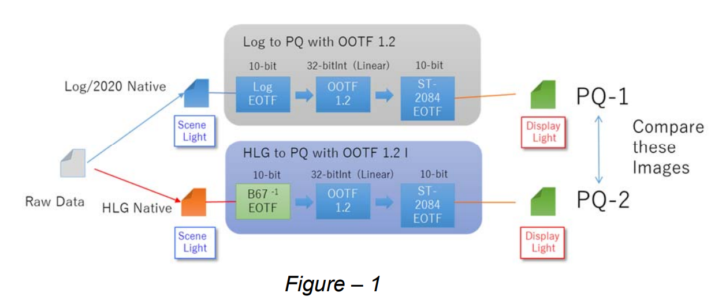
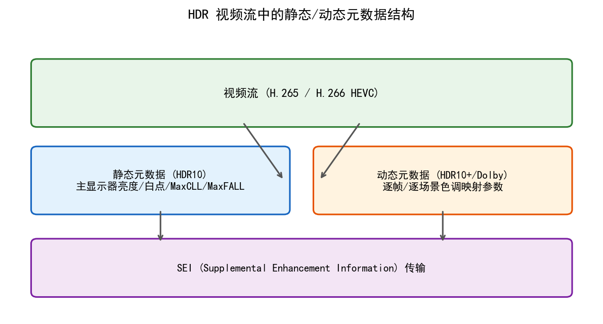
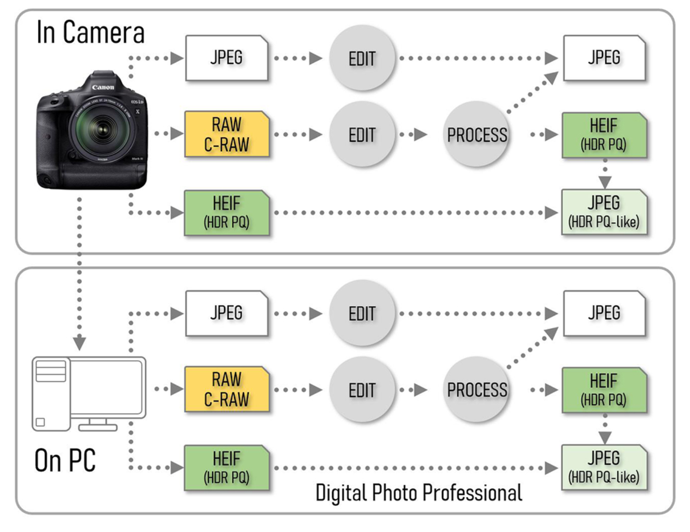
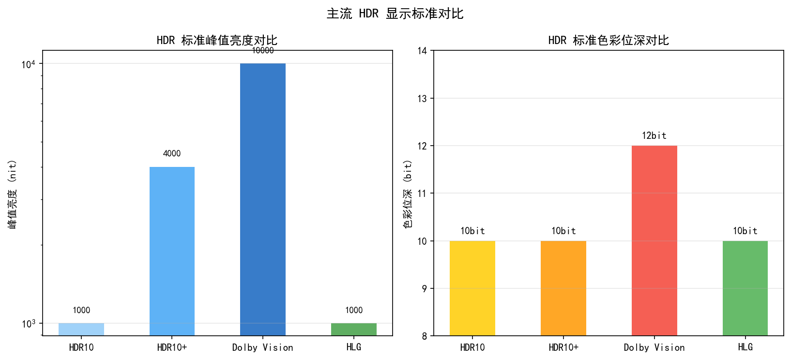
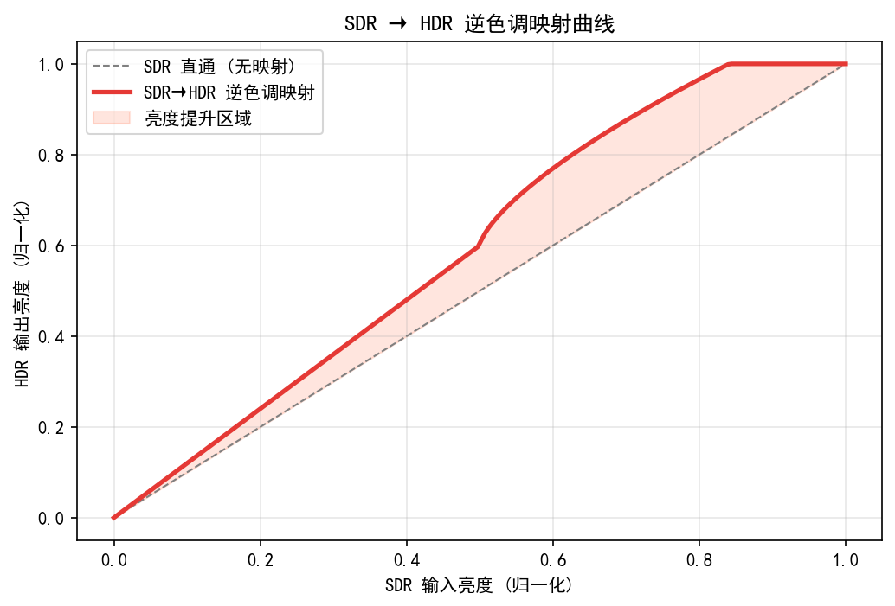
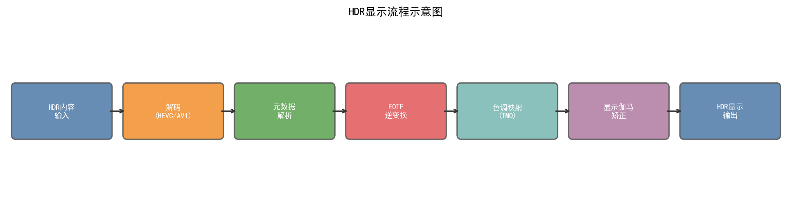
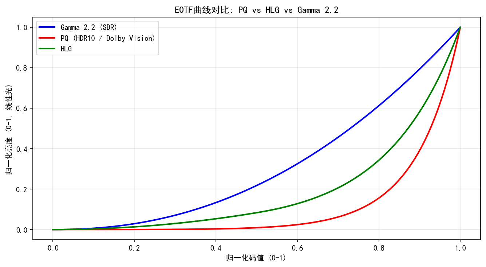
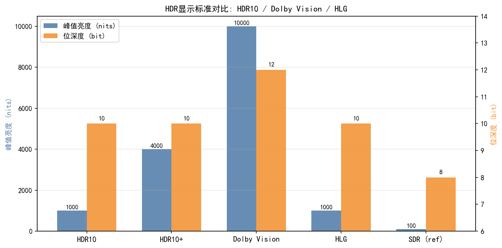
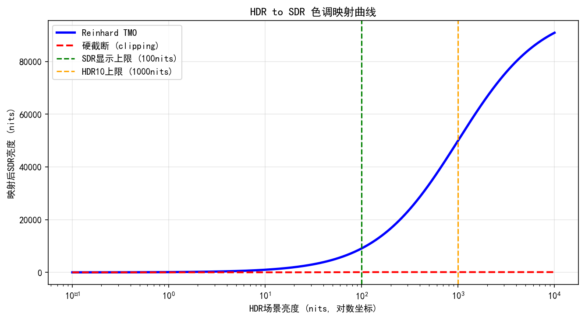

# 第二卷第19章：HDR显示信号链

> **流水线位置：** 显示侧最终输出阶段 — 色调映射之后，视频编码之前
> **前置章节：** 第一卷第07章（动态范围与HDR）、第二卷第07章（Gamma与色调映射）、第二卷第10章（HDR合帧）、第二卷第18章（局部色调映射算法）
> **读者路径：** 亮度算法工程师、视频ISP工程师、显示工程师

---

## §1 原理 (Theory)

### 1.1 从场景到显示：两种信号参考系

搞清楚 HDR 信号链，先得区分两件事：信号里的数字代表的是**场景里的光**，还是**显示器输出的光**。

**场景参考（Scene-Referred）：** 数字直接对应场景物理辐射量。RAW 文件、OpenEXR、ACES 都是场景参考——值可以比 1.0 大很多，理论上没上限，10000:1 的动态范围照装。

**显示参考（Display-Referred）：** 数字对应显示器输出亮度，被显示器峰值亮度硬卡死。sRGB、BT.709 里的 1.0 就是"这台显示器最亮"，通常约 100 cd/m²。

场景动态范围可达 $10^5$–$10^7$:1，HDR 显示器约为 $10^4$–$10^5$:1，SDR 显示器仅约 $10^3$:1。中间这个映射怎么做，既不丢高光细节、又不压掉暗部层次，就是 HDR 信号链要解决的问题。

---

### 1.2 PQ EOTF — SMPTE ST 2084

PQ（Perceptual Quantizer）是 HDR10 和 Dolby Vision 的核心传输函数，Dolby 实验室主导开发，2014 年标准化为 SMPTE ST 2084 **[1]**。这个名字起得很精确：它的设计目标不是线性、不是 Gamma，而是**感知均匀**——让每一个码字步长对应人眼刚好能感知的最小亮度差（JND）。

#### 1.2.1 PQ 函数设计原理

PQ 的设计目标是**感知均匀的码字分配**：在人类视觉系统（HVS）的最小可觉差（JND）约束下，用最少的码字（10 bit）覆盖最宽的亮度范围（0.001–10,000 cd/m²）。

参考 Barten（1999）**[5]** 的视觉对比度灵敏度函数（CSF），JND 步长在 $0.001$–$10000$ cd/m² 范围内约为 $720$ 级，10 bit（1024 级）足够无损覆盖 **[6]**。

#### 1.2.2 PQ EOTF（电光传输函数）

EOTF（Electro-Optical Transfer Function）将电信号 $E$ 映射到显示亮度 $Y$（cd/m²）：

$$Y = 10000 \cdot \left(\frac{\max(E^{1/m_2} - c_1, 0)}{c_2 - c_3 \cdot E^{1/m_2}}\right)^{1/m_1}$$

常数值（SMPTE ST 2084 规定）：
- $m_1 = 0.1593017578125 = 2610/16384$
- $m_2 = 78.84375 = 2523/32$
- $c_1 = 0.8359375 = 3424/4096$
- $c_2 = 18.8515625 = 2413/128$
- $c_3 = 18.6875 = 2392/128$
- 参考白点：10,000 cd/m²（而非 SDR 的 100 cd/m²）

#### 1.2.3 PQ OETF（光电传输函数，编码侧）

OETF 是 EOTF 的逆函数，将线性亮度 $Y'$（归一化到 $[0,1]$，1.0 = 10,000 cd/m²）编码为电信号 $E$：

$$E = \left(\frac{c_1 + c_2 \cdot (Y')^{m_1}}{1 + c_3 \cdot (Y')^{m_1}}\right)^{m_2}$$

**PQ 与 Gamma 的对比：**

| 特性 | Gamma (sRGB) | PQ (ST 2084) |
|------|-------------|-------------|
| 设计依据 | 显示器物理特性 | 人眼 JND 模型 |
| 参考白点亮度 | 100 cd/m² | 10,000 cd/m² |
| 动态范围 | ~100:1 | ~1,000,000:1 |
| 绝对亮度感知 | 相对，依赖显示环境 | 绝对（场景绝对亮度编码） |
| 10-bit 利用率 | 约 940 个有效码字（BT.2100） | ~720 个 JND 步长 |

---

### 1.3 HLG — 混合对数伽马（Hybrid Log-Gamma）

HLG 由 BBC 和 NHK 联合开发，标准化为 ITU-R BT.2100 **[2]**，是广播/流媒体 HDR 的主流格式。

#### 1.3.1 HLG 向后兼容设计

HLG 的核心优势是**向后兼容 SDR 显示器**：在 SDR 显示器上播放 HLG 信号时，下半段（Gamma 区）自然显示为 SDR 内容，观感尚可；在 HDR 显示器上则启用对数区扩展显示峰值亮度。

#### 1.3.2 HLG OETF

按 ITU-R BT.2100 标准约定：$E$ 为归一化线性场景亮度（输入，0 到 1），$E'$ 为编码信号值（输出，0 到 1）。

分段函数：

$$E' = \begin{cases}
\sqrt{3 E} & \text{if } E \leq \dfrac{1}{12} \\[6pt]
a \cdot \ln(12 E - b) + c & \text{if } E > \dfrac{1}{12}
\end{cases}$$

常数（BT.2100 规定）：
- $a = 0.17883277$
- $b = 1 - 4a = 0.28466892$
- $c = 0.55991073$（连续性约束）

> **注意变量约定：** BT.2100 中 $E$ 表示线性场景光（OETF 输入），$E'$ 表示编码信号（OETF 输出），与 sRGB/PQ 的习惯方向一致。部分教材将两者互换，阅读时须以变量说明为准。

**下半段（$E \leq 1/12$）：** 纯 Gamma 区（$\gamma = 0.5$，即 $E' = \sqrt{3E}$），与 SDR Gamma 兼容

**上半段（$E > 1/12$）：** 对数区，用于压缩 HDR 高亮部分

#### 1.3.3 HLG OOTF（场景到显示的系统变换）

PQ 是显示参考，HLG 是场景参考，两者差别在于 OOTF（Opto-Optical Transfer Function）：

$$F_{D,c} = \alpha \cdot E_s^{\gamma-1} \cdot E_{s,c}, \quad c \in \{R, G, B\}$$

其中 $E_s = 0.2627 E_{R,s} + 0.6780 E_{G,s} + 0.0593 E_{B,s}$ 为场景归一化亮度（标量），$E_{s,c}$ 为各颜色通道分量（向量），$\alpha = L_W$（$L_W$ 为显示峰值亮度，单位 cd/m²；等价于单色道 $F_D = L_W \cdot E_s^{\gamma}$），$\gamma$ 随峰值亮度变化（ITU-R BT.2100 定义：1000 cd/m² 显示器对应 $\gamma = 1.2$）**[2]**。

---

### 1.4 HDR10 标准与静态元数据

**HDR10** 是基于 PQ + BT.2020 色域的 HDR 开放标准，由 CTA（美国消费技术协会）定义 **[8]**：

| 参数 | HDR10 规范 |
|------|-----------|
| 传输函数 | PQ (SMPTE ST 2084) |
| 色域 | ITU-R BT.2020 |
| 位深 | 10 bit（HDR10 标准规定；12 bit 为 Dolby Vision 专用）|
| 元数据类型 | SMPTE ST 2086（静态，整片固定） |
| 峰值亮度范围 | 0.0001–10,000 cd/m²（PQ 编码范围；UHD Alliance 认证 LCD ≥1,000 nit，OLED ≥540 nit） |

#### 1.4.1 SMPTE ST 2086 静态元数据

HDR10 内容包含以下静态元数据（整部影片固定一组值）：

| 字段 | 单位 | 说明 |
|------|------|------|
| `max_display_mastering_luminance` | cd/m² | 调色监视器峰值亮度 |
| `min_display_mastering_luminance` | cd/m² | 调色监视器最低亮度 |
| `max_content_light_level` (MaxCLL) | cd/m² | 内容中单像素最大亮度 |
| `max_frame_average_light_level` (MaxFALL) | cd/m² | 所有帧平均亮度的最大值 |
| 色域坐标 | CIE xy | 三原色 + 白点的色度坐标 |

#### 1.4.2 MaxCLL 和 MaxFALL 的计算

$$\text{MaxCLL} = \max_{\text{all frames}} \max_{(x,y)} L(x,y)$$

$$\text{MaxFALL} = \max_{\text{all frames}} \left( \frac{1}{HW} \sum_{x,y} L(x,y) \right)$$

其中 $L(x,y)$ 为 PQ 解码后的绝对亮度（cd/m²）。

**MaxCLL/MaxFALL 对显示侧 TMO 的影响：** 显示器接收到元数据后，据此调整端到端色调映射（EETMO）的参数——若 MaxCLL 远超显示器峰值亮度，则需要更激进的高光压缩。

---

### 1.5 Dolby Vision

Dolby Vision（DV）是 Dolby 的专有 HDR 格式，相对 HDR10 的主要改进：

**动态元数据（Dynamic Metadata，基于 SMPTE ST 2094-10 RPU，与 HDR10+ 的 SMPTE ST 2094-40 不兼容）：** 对每帧或每个场景单独指定色调映射参数，而非整片固定一组。这使得显示侧的 TMO 可以逐帧优化，避免 HDR10 静态元数据在场景切换时的过/欠曝。

**双层架构（Base Layer + Enhancement Layer）：**
- Base Layer（BL）：与 HDR10 或 SDR 兼容的基础层（8/10 bit）
- Enhancement Layer（EL）：包含亮度提升信息的增强层（12 bit）
- 显示设备重建：$\text{DV Output} = f(\text{BL}, \text{EL}, \text{Dynamic Metadata})$

**DV 配置文件：**

| 配置文件 | 编码层结构 | 位深 | 向后兼容性 | 典型应用 |
|---------|----------|------|----------|---------|
| Profile 4 | 10-bit HEVC 双层（BL+EL 1:1/4）| 10-bit（BL+EL 等效可达12-bit）| HDR10 / BT.2020（BL 为 HDR10 兼容层）| 双层传输，BL 携带 DV EL RPU |
| Profile 5 | 10-bit HEVC 单层（无 EL）| 10-bit | 无（IPTPQc2 私有色彩空间）| 专业制作与流媒体单层 |
| Profile 7 | 10-bit HEVC 双层（BL+EL 1:1/4 UHD；1:1 FHD）| 10-bit（等效12-bit）| Ultra HD Blu-ray | UHD 蓝光实体媒体 |
| Profile 8 | 10-bit HEVC 单层（无 EL）| 10-bit | HDR10 / SDR / HLG | 流媒体（Netflix/Disney+/Apple TV+）|
| Profile 9 | 8-bit AVC（H.264）单层 | 8-bit | SDR | 旧版手机移动设备 |

> **注：** 峰值亮度由内容动态元数据（RPU）指定，而非 Profile 本身的硬性上限。Profile 8 是目前手机录制 Dolby Vision 的主流规格（iPhone 以 Profile 8.4 录制 4K）。Profile 9 基于 AVC/H.264，多见于早期移动实现，目前已被 Profile 8 取代。

> **工程推荐（手机 HDR 视频格式选择）：** 手机录制 HDR 视频时，HLG（Profile 9.0 之外的 BT.2100 HLG）是兼容性最好的选择——iPhone 的"视频 HDR"默认 HLG，在没有 HDR 显示器的设备上播放也不会显示异常。需要 Dolby Vision 标注（对平台内容生态有要求）时用 DV Profile 8（流媒体主流路径）或 DV Profile 9（手机本地录制）。HDR10 静态元数据在场景动态范围变化大的素材上质量最差——整片用一组 MaxCLL/MaxFALL，夜景和白天场景共用一套参数，某一头某一尾必然有一段欠佳。

### 1.6 端到端色调映射（EETMO）

EETMO（End-to-End Tone Mapping Operator）是显示设备内部将 HDR 内容适配到具体显示器亮度能力的最后一步。

#### 1.6.1 EETMO 的输入/输出

- **输入：** PQ 编码的 HDR 帧 + 静态/动态元数据（MaxCLL, MaxFALL, mastering display luminance）
- **输出：** 适配目标显示器的 PQ 编码信号（亮度范围已压缩到目标显示器能力范围内）

#### 1.6.2 BT.2446 方法 A — 基于 HDR 到 SDR 的参考算法

ITU-R BT.2446:2021 **[4]** 提供了 HDR 到 SDR 的参考色调映射算法（方法 A）：

**Step 1：PQ 解码，转换到线性光（cd/m²）**

**Step 2：亮度压缩（Luminance Compression）**

使用 S 形曲线将 HDR 亮度（0–$L_{\text{HDR}}$ cd/m²）映射到 SDR（0–100 cd/m²）。BT.2446 方法 A 的实际计算在 ICtCp 色彩空间中进行，下式为简化的亮度压缩近似：

$$Y_{\text{SDR}} = \frac{Y_{\text{HDR}}}{Y_{\text{HDR}} + a \cdot (Y_{\text{HDR}} / Y_{\text{SDR,peak}})^b}$$

其中参数 $a, b$ 根据 MaxCLL 和目标显示器峰值亮度计算（BT.2446 表 2）。

> **工程注：** 完整 BT.2446 方法 A 包含 ICtCp 转换、感知亮度压缩和色彩恢复三个阶段，上式仅为第二阶段亮度分量的近似示意。完整参考实现见 §6 代码节和 ITU-R BT.2446:2021 正文。

**Step 3：色彩缩放（Chromatic Adaptation）**

使用 IPT 或 ICtCp 色彩空间（具有更好的感知均匀性）进行颜色缩放，保留色相和相对饱和度。

**Step 4：sRGB Gamma 编码**

将输出归一化（SDR 白点 = 100 cd/m² → 编码值 1.0），施加 sRGB OETF。

#### 1.6.3 ICtCp 色彩空间（HDR 感知均匀色彩空间）

ITU-R BT.2100 **[2]** 推荐的 HDR 色调映射中间空间，比 CIELab 更适合 HDR：

**转换步骤（输入为线性 BT.2020 RGB，单位 cd/m²，归一化到 [0, 1]）：**

**Step 1：线性 RGB → 线性 LMS（矩阵变换）**

$$\begin{bmatrix} L \\ M \\ S \end{bmatrix} = M_{\text{LMS}} \cdot \begin{bmatrix} R \\ G \\ B \end{bmatrix}$$

**Step 2：线性 LMS → PQ 编码 LMS（逐分量施加 PQ OETF）**

$$\begin{bmatrix} L_M \\ M_M \\ S_M \end{bmatrix} = \text{PQ}_{\text{OETF}}\!\left(\begin{bmatrix} L \\ M \\ S \end{bmatrix}\right)$$

> **注意：** 此处施加的是 PQ **OETF**（光电传输函数，线性光 → 编码值），而非 EOTF（解码方向）。原文如写 $\text{PQ}^{-1}$ 则是笔误，标准推导参见 ITU-R BT.2100 Annex 2。

**Step 3：PQ LMS → ICtCp（线性矩阵变换）**

$$\begin{bmatrix} I \\ C_T \\ C_P \end{bmatrix} = M_{\text{ICtCp}} \cdot \begin{bmatrix} L_M \\ M_M \\ S_M \end{bmatrix}$$

$I$ 分量对应感知亮度（强烈的感知均匀性），$C_T$ 为橙-蓝轴，$C_P$ 为绿-玫瑰轴。

HDR 色调映射中只操作 $I$ 通道，$C_T, C_P$ 保持不变，从而天然避免色相偏移。

---

### 1.6b EETMO vs Stage TMO：延迟/质量权衡分析

> **P1补充**：HDR显示链中存在两种主要的色调映射架构，其延迟和质量特性差异显著，工程选型需明确权衡。

#### 两种架构定义

**EETMO（End-to-End Tone Mapping Operator）**：从HDR源内容到显示输出的一次性完整色调映射，在接收端（显示设备）根据元数据（MaxCLL/MaxFALL/动态元数据）一步完成全部亮度范围压缩。

**Stage TMO（分阶段色调映射）**：在内容生产链路的多个阶段分步进行色调映射——典型为：相机ISP侧做"场景→主控显示器"的第一阶段TMO，分发时做"主控显示器→目标显示器"的第二阶段重映射（Re-grading）。

#### 延迟对比

| 架构 | 处理阶段 | 典型延迟（4K实时）| 延迟来源 |
|------|---------|---------------|---------|
| EETMO（HDR10静态元数据）| 仅显示侧 | 2–5 ms | BT.2446 S形压缩曲线，$O(N)$，全程实时 |
| EETMO（Dolby Vision动态）| 显示侧+元数据解析 | 5–12 ms | 动态元数据解析（每帧SEI） + 逐帧EETMO参数计算 |
| Stage TMO（固定主控参数）| 制作侧+显示侧 | 制作侧可离线；显示侧 2–5 ms | 制作侧离线，显示侧同EETMO静态 |
| Stage TMO（实时两级联）| ISP侧+显示侧串联 | ISP: 3–8 ms + 显示: 2–5 ms，总计 5–13 ms | 两级串联，流水线化后可并行 |

**结论**：纯延迟上，EETMO（静态元数据）与Stage TMO（单级显示侧）相当，均为2–5 ms。Dolby Vision动态元数据的额外SEI解析增加约3–7 ms，但可被流水线隐藏（看下一帧时处理本帧元数据）。

#### 质量对比

| 质量维度 | EETMO（HDR10静态）| EETMO（Dolby Vision动态）| Stage TMO（双级联）|
|---------|----------------|----------------------|----------------|
| 场景切换自适应 | 差（整片一套参数）| 好（逐帧自适应） | 中（依赖制作侧精度）|
| 暗场到亮场过渡 | 可能过曝或欠曝 | 平滑（逐帧调整） | 取决于第一级TMO质量 |
| 高光保护精度 | 基于MaxCLL估算 | 基于逐帧实际峰值 | 高（制作侧可精确控制）|
| 目标显示器适配 | 粗（仅MaxCLL/MaxFALL）| 精（逐帧+目标屏元数据）| 需二次Re-grading |
| 色域映射一致性 | 中 | 高（Dolby参考LUT）| 高（制作侧控制）|
| 主观MOS（典型HDR场景）| 6.9/10 | 8.2/10 | 7.5/10（良好二级联）|

#### 手机拍摄场景的架构选择

手机拍摄HDR视频时，采用的是**混合架构**：

```
ISP侧（Stage 1）：相机HDR合帧 → 局部TMO（Scene→1000 nit参考监视器）
                               → PQ OETF编码 + 逐帧动态元数据生成
                    ↓
编码/存储层：HEVC 10-bit PQ + Dolby Vision SEI
                    ↓
显示侧（Stage 2 / EETMO）：读取动态元数据 → EETMO适配目标屏（600–2000 nit）
```

相比纯EETMO（显示侧无第一级TMO），这种混合架构的优势在于：ISP侧可利用RAW域信息（直方图、噪声估计）生成更精确的逐帧TMO参数，然后通过元数据传递给显示侧，避免显示侧仅凭最终PQ编码值做盲目EETMO的精度损失。

#### Dolby Vision IQ 动态元数据格式（SMPTE ST 2094-10）关键字段

Dolby Vision的动态元数据载体为**SMPTE ST 2094-10** RPU（Reference Processing Unit），嵌入HEVC SEI消息中（每帧约200–400字节）。关键字段如下：

**场景级元数据（`dm_data`，每场景/每帧更新）：**

| 字段名 | 类型 | 说明 |
|--------|------|------|
| `signal_peak_luminance` | uint16，精度1 nit | 本帧/本场景PQ信号峰值亮度（cd/m²） |
| `signal_average_luminance` | uint16，精度1 nit | 本帧/本场景平均亮度 |
| `num_ext_blocks` | uint8 | 扩展块数量 |

**目标显示器参数（扩展块 Level 1，必须）：**

| 字段名 | 类型 | 说明 |
|--------|------|------|
| `min_display_mastering_luminance` | uint32，0.0001 nit精度 | 主控监视器最低亮度（典型0.005 nit OLED）|
| `max_display_mastering_luminance` | uint16，1 nit精度 | 主控监视器峰值亮度（典型1000/4000 nit）|
| `target_min_pq` | uint12 | 目标显示器最低亮度（PQ码值）|
| `target_max_pq` | uint12 | 目标显示器峰值亮度（PQ码值）|

**逐帧色调映射曲线（扩展块 Level 2，核心参数）：**

| 字段名 | 类型 | 说明 |
|--------|------|------|
| `knee_point_x` | uint12 | S形曲线"膝点"横坐标（PQ输入值，0–4095） |
| `knee_point_y` | uint12 | S形曲线"膝点"纵坐标（PQ输出值） |
| `bezier_curve_anchors[9]` | uint12[9] | Bezier样条的9个锚点（可选，精细控制曲线形状） |
| `enable_local_adaptation` | bool | 是否启用局部自适应TMO |

**解码侧使用流程**：显示设备解析Level 2的 `knee_point_x/y` + `bezier_curve_anchors`，构建逐帧S形EETMO曲线，取代静态HDR10基于MaxCLL估算的固定S形曲线，从而实现场景自适应精细色调映射。

### 1.7 手机 HDR 视频流水线

以 iPhone / Pixel / 小米等旗舰机为例，手机端 HDR 视频记录与播放流水线：

```
拍摄侧：
  多帧 HDR 合帧（第二卷第10章）
  → 线性 RAW 信号（场景参考，动态范围 > 10^5:1）
  → HDRNet / 双边网格色调映射（第三卷第06章）
  → PQ 编码（ST 2084）
  → Dolby Vision Profile 8 / HDR10 打包
  → HEVC/AV1 编码（10-bit）

播放侧：
  HEVC/AV1 解码
  → PQ 解码（线性 cd/m²）
  → 读取元数据（MaxCLL, MaxFALL）
  → EETMO 适配目标屏幕（如 iPhone 1200 cd/m² ProMotion 显示器）
  → 显示输出
```

---

### 1.8 色域映射：DCI-P3 ↔ BT.2020

HDR 显示信号链中，内容色域（如 DCI-P3）与目标传输色域（BT.2020）之间的转换是必不可少的工程环节。

#### 1.8.1 P3 → BT.2020 线性矩阵（经由 XYZ）

从 DCI-P3（D65 白点，即 Display P3）到 BT.2020 的线性 RGB 转换需经过 CIE XYZ 中间空间：

$$\begin{bmatrix} R_{2020} \\ G_{2020} \\ B_{2020} \end{bmatrix} = \mathbf{M}_{\text{XYZ} \to 2020} \cdot \mathbf{M}_{\text{P3} \to \text{XYZ}} \cdot \begin{bmatrix} R_{\text{P3}} \\ G_{\text{P3}} \\ B_{\text{P3}} \end{bmatrix}$$

其中（基于 CIE 1931 2° 标准观测者，D65 白点）：

$$\mathbf{M}_{\text{P3} \to \text{XYZ}} = \begin{bmatrix}
0.4866 & 0.2657 & 0.1982 \\
0.2290 & 0.6917 & 0.0793 \\
0.0000 & 0.0451 & 1.0439
\end{bmatrix}$$

$$\mathbf{M}_{\text{XYZ} \to 2020} = \begin{bmatrix}
 1.7166 & -0.3557 & -0.2534 \\
-0.6667 &  1.6165 &  0.0158 \\
 0.0176 & -0.0428 &  0.9421
\end{bmatrix}$$

合并后的直接转换矩阵（Display P3 → BT.2020，线性光）：

$$\mathbf{M}_{\text{P3} \to 2020} = \begin{bmatrix}
 0.7534 & 0.1987 & 0.0479 \\
 0.0458 & 0.9415 & 0.0127 \\
-0.0011 & 0.0176 & 0.9835
\end{bmatrix}$$

> **注意：** 以上矩阵仅适用于**线性光域**（伽玛解码后）。在 sRGB / PQ / HLG 编码域内直接做矩阵乘法是错误操作，必须先解码到线性光，变换后再编码。

#### 1.8.2 BT.2020 → DCI-P3 的色域截断问题

逆向操作（BT.2020 → P3）时，BT.2020 色域约有 **~49% 的面积超出 P3**（P3 完全包含于 BT.2020 内部，Shoelace公式：P3 面积约 0.1520，BT.2020 面积约 0.2972，超出部分 ≈ (0.2972−0.1520)/0.2972 ≈ 48.9%；尤其是高饱和绿色和蓝色区域）。直接截断（clip 到 $[0,1]$）会改变色相角，引起明显的颜色失真（Hue Shift）。

**推荐处理方案（ACES Reference Gamut Compression）：**

在 ICtCp 感知均匀空间中，沿恒定色相角方向（hue-preserving）压缩超出目标色域的颜色：

$$C_{\text{P3}}' = \begin{cases} C & C \leq C_{\text{P3,max}} \\ C_{\text{P3,max}} + \delta \cdot \tanh\!\left(\dfrac{C - C_{\text{P3,max}}}{\delta}\right) & C > C_{\text{P3,max}} \end{cases}$$

其中 $C$ 为 ICtCp 域的色度分量，$C_{\text{P3,max}}$ 为 P3 边界的最大色度，$\delta$ 控制软截断的斜率（典型值 0.05–0.15），$\tanh$ 保证曲线单调且渐近于 $C_{\text{P3,max}} + \delta$。

#### 1.8.3 色域面积关系（CIE xy 色度图）

在 CIE 1931 xy 色度图中，三种主要色域的三角形面积比为：

| 色域 | CIE xy 三角形面积 | 相对 sRGB 倍数 |
|------|----------------|--------------|
| sRGB / BT.709 | 0.1121 | 1.00× |
| DCI-P3 (Display P3) | 0.1520 | 1.36× |
| BT.2020 | 0.2972 | 2.65× |

> P3 面积 / BT.709 面积 ≈ **1.36**（约大 36%），BT.2020 / BT.709 ≈ **2.65×**。
> BT.2020 / P3 ≈ **1.95×**，即 BT.2020 约为 P3 面积的 2 倍。

> （注：面积值以 Shoelace 公式计算标准原色三角形（CIE 1931 xy 色度图）得出；sRGB ≈ 0.1121，DCI-P3 ≈ 0.1520，BT.2020 ≈ 0.2972。）

---

## §2 标定 (Calibration)

### 2.1 HDR 内容 MaxCLL/MaxFALL 标定

对于相机直出的 HDR 视频：

```python
import numpy as np

def compute_maxcll_maxfall(frames_pq):
    """
    frames_pq: list of PQ-encoded frames [0,1]
    返回 MaxCLL 和 MaxFALL（单位 cd/m²）
    """
    max_cll = 0.0
    frame_avgs = []
    for frame in frames_pq:
        # PQ 解码到绝对亮度
        lum = pq_eotf(frame) * 10000  # cd/m²
        max_cll = max(max_cll, lum.max())
        frame_avgs.append(lum.mean())
    max_fall = max(frame_avgs)
    return max_cll, max_fall
```

### 2.2 显示器 EOTF 标定

使用色度计（如 Konica Minolta CS-100A）测量显示器响应曲线：

1. 发送 PQ 码值 0–1023（10 bit）的灰阶图案
2. 测量每个码值对应的实际亮度（cd/m²）
3. 与 ST 2084 理论 EOTF 对比，记录偏差
4. 若偏差 > 2 ΔE（ICtCp 域），需要 OLED/LCD 驱动层校正

---

## §3 调参 (Tuning)

### 3.1 MaxCLL 截断策略

| 策略 | 说明 | 适用场景 |
|------|------|---------|
| 直接记录实际 MaxCLL | 最准确，EETMO 最优 | 专业内容制作 |
| 截断到 4000 cd/m² | 减少编码信息量，兼容性好 | 一般消费级视频 |
| 截断到 1000 cd/m² | HDR10 常见做法，多数电视可处理 | 流媒体分发 |

### 3.2 SDR 兼容性的 HLG 调参

HLG 的 $\gamma$ 值影响 SDR 设备的显示效果：

- $\gamma = 1.2$（BT.2390 推荐）：1000 cd/m² 显示器
- $\gamma = 1.1$：较暗显示环境
- $\gamma = 1.3$：较亮显示环境（如手机在阳光下）

系统级调参：同一 HLG 信号在不同显示环境下，OOTF 中的 $\gamma$ 参数应由显示设备根据环境光传感器自动调整（ITU-R BT.2390）。

### 3.3 PQ vs HLG 选择指南

| 使用场景 | 推荐格式 | 原因 |
|---------|---------|------|
| 电影/视频点播（Netflix/Apple TV+） | Dolby Vision Profile 8 / HDR10 | 动态/静态元数据，专业级质量 |
| 直播广播 | HLG | 实时处理无需预分析；SDR 设备兼容 |
| 手机视频录制 | Dolby Vision Profile 8 | 当前手机主流（iPhone Profile 8.4）；Profile 9 为旧版 AVC 设备，已被 Profile 8 取代 |
| 监控视频 | HLG | 无元数据依赖；系统简单 |
| 医学影像 | PQ（DICOM GSDF 近似） | 绝对亮度精确性更重要 |

---

### 3.4 HDR10/HLG/Dolby Vision 元数据生成时机联动（工程联动补充）

**缺口说明：** 章节描述了三种格式的传输函数和元数据结构，但没有说明"谁在 ISP 里生成元数据，谁在编码器里生成"。这个时机差异决定了元数据的准确性，也是实际联调时最易误解的环节。

#### 3.4.1 三种格式元数据生成位置对比

| 格式 | 元数据类型 | 生成位置 | 时机 |
|------|---------|---------|------|
| HDR10 | MaxCLL / MaxFALL（SMPTE ST 2086 静态）| **ISP 统计引擎**（实时逐帧累积，录制结束后写入文件头）| 拍摄时实时计算；最终值写入容器层 |
| HLG | 无元数据（OOTF 参数由显示器自动推算）| 不生成 | — |
| Dolby Vision | 逐帧动态元数据（ST 2094-10 RPU）| **ISP + Dolby 专有 DSP 联合生成**（ISP 提供每帧统计，Dolby 授权库计算 trim 参数）| 每帧实时生成；嵌入 HEVC SEI |

**关键结论：**
- **HDR10 的 MaxCLL/MaxFALL 由 ISP 生成**，而非编码器（HEVC 编码器不感知内容亮度，它只负责将 ISP 计算好的值打包进 SEI）
- **Dolby Vision 动态元数据跨越 ISP 和授权库两层**：ISP 负责输出逐帧亮度统计（histogram、peak luminance），Dolby 授权运算库（运行在 AP 或专用 DSP）负责将统计量转换为 RPU 的 EETMO 参数（knee_point_x/y、bezier_curve_anchors）
- **HLG 不需要 ISP 生成元数据**——这是 HLG 在手机录制场景中功耗更低的原因之一

#### 3.4.2 MaxCLL/MaxFALL 计算：逐帧统计 vs 滑动窗口

MaxCLL 和 MaxFALL 的计算策略影响最终元数据的准确性：

**高通 Spectra ISP 的实现（参考 CSDN 高通 HDR 实践，2025）：**

```
逐帧计算：
  ISP 统计模块 → 每帧输出 luminance 直方图（256 bins）
  MaxCLL_frame = 99.9 百分位亮度（避免单像素强点光源拉高整体）
  MaxFALL_frame = 帧平均亮度

录制结束写入：
  MaxCLL = max(MaxCLL_frame) over all frames
  MaxFALL = max(MaxFALL_frame) over all frames
```

**联发科 Imagiq ISP（参考 MTK 多摄调度分析，2025）：**

联发科在实时录制时采用**滑动窗口（30 帧）**更新 MaxCLL/MaxFALL，防止暂时性过曝帧（如闪光灯触发帧）虚高统计值，实现上为：

```
MaxCLL_report = max(MaxCLL_frame) in sliding window of last 30 frames
```

> **高通 vs MTK 实现差异：** 高通做全序列累积最大值，准确性更高但存在闪烁帧污染风险；MTK 做滑动窗口，避免偶发异常帧污染，但可能漏掉序列开头的峰值帧。工程上推荐在 ISP 统计前先做 99.9 百分位截断过滤，再取全序列最大值，兼顾准确性和鲁棒性。

#### 3.4.3 PQ 与 HLG 解码延迟差异

| 传输函数 | 解码方式 | 延迟来源 | 典型延迟 |
|---------|---------|---------|---------|
| PQ（HDR10）| 查表（LUT）或公式计算 EOTF；需读取 MaxCLL/MaxFALL 元数据确定 EETMO 参数 | 元数据解析（读 SEI/容器头）+ EETMO 计算 | < 1 ms（静态元数据已知后查表即可）|
| PQ（Dolby Vision）| 逐帧解析 RPU SEI → 重建 EETMO 曲线 → 施加显示侧 TMO | 每帧 RPU SEI 解析（~200–400 字节）+ 曲线重建 | 3–7 ms/帧（可流水线化隐藏）|
| HLG | 仅需 OOTF 公式（无元数据依赖）| 无元数据等待延迟 | < 0.5 ms |

**实际影响：** 在实时编辑/预览场景（如手机相机取景器显示），HLG 的零元数据延迟使其更适合实时路径；PQ 的元数据依赖在 ISP 直出预览时需要"预分析缓冲"（提前看几帧以建立元数据基准），增加约 1–3 帧（33–100 ms @30fps）的初始化延迟。这也是部分手机相机在开启 HDR 视频录制时出现"起始帧颜色稍暗"现象的原因——首帧 MaxCLL 估计不准（尚未积累足够统计量），EETMO 参数偏保守。

---

## §4 伪影 (Artifacts)

### 4.1 HDR 内容在 SDR 显示器上过曝

**描述：** HDR10 内容直接送入 SDR 显示器（无 EETMO）时，亮部严重过曝，图像失去大量细节。

**根本原因：** PQ 信号 1.0 = 10,000 cd/m²，SDR 显示器将其当作 Gamma 信号处理，输出亮度超过物理极限，显示器自动截断。

**缓解：** 显示链中必须包含 EETMO；对无 HDR 支持的设备，自动降级为 SDR 编码流（双流方案：HDR 主流 + SDR 兼容流）。

### 4.2 色调映射后的饱和度塌陷

**描述：** EETMO 对高亮区进行大幅压缩后，高亮彩色物体（如红色跑车在强光下）的色彩饱和度明显降低。

**根本原因：** 在线性 RGB 域直接缩放亮度 $\vec{I}' = k \cdot \vec{I}$（$k<1$），R/G/B 同比缩小，接近白色（低饱和度）。

**缓解：** 在 ICtCp 域操作——仅压缩 $I$ 通道（感知亮度），$C_T, C_P$（色度）按亮度比例适当保留，而非等比缩小：

$$C_T' = C_T \cdot \left(\frac{I'}{I}\right)^{0.6}$$

指数 0.6 来自 Hunt 效应（高亮度下色彩感知增强）的近似 。

### 4.3 PQ 低码率量化噪声

**描述：** 在极暗区域（< 0.01 cd/m²），10-bit PQ 的码字间距仍然很小（约 0.0001 cd/m²），但 HEVC 编码在低质量设置下会进一步量化，导致暗部出现可见的亮度条带（Banding）。

**缓解：**
- 使用 12-bit 编码（增加暗部码字密度）
- 在 PQ 编码前对暗部施加轻微噪声注入（Dither），使量化误差随机化而非形成条带
- 编码器层面增大暗部 QP 精细度（降低量化步长）

### 4.4 HLG 场景切换亮度跳变

**描述：** HLG 视频中场景切换时，若两个场景的平均亮度差异大，播放侧的 OOTF 系统 $\gamma$ 来不及调整，导致可见亮度跳变。

**缓解：** 在编码侧对 HLG 内容进行逐场景 OOTF 目标归一化（使不同场景在 SDR 解码下亮度一致），或提供场景级元数据指导 OOTF 参数切换。

---

## §5 评测 (Evaluation)

### 5.1 EETMO 质量评测

**技术指标：**

| 指标 | 说明 | 目标 |
|------|------|------|
| ΔE（ICtCp） | 输出亮度/色彩与参考 TMO 的 ICtCp 距离 | < 2.0 JND |
| 高光保护率 | 高亮区域信息保留比例（vs. 直接裁剪） | > 90% |
| 暗部提升率 | 暗部细节可见性改善比例 | > 80% |
| 色调保真度 | 主观色相偏移 < 2° 的样本比例 | > 95% |

**主观评测（MOS）：**
- 对比组：HDR10 原始 vs. 目标 SDR 显示器 EETMO 输出
- 评测维度：自然感、高光处理、暗部细节、整体明暗感
- 评测员：20+ 人，使用专业校准 HDR/SDR 显示器

### 5.2 PQ 标定精度

使用专业色度计验证显示器 EOTF 与 ST 2084 规范的偏差：

```
测试方法：VESA DisplayHDR 认证测试套件
合格标准：
  - 峰值亮度误差 < 10%
  - 暗部亮度（< 5 cd/m²）偏差 < 0.5 ΔE（ICtCp）
  - MaxCLL 点亮度准确率 > 95%
```

---

## §6 代码 (Code)

本章配套代码（见本目录 .ipynb 文件），内容包括：

- PQ EOTF / OETF 的 Python 实现（精确对应 SMPTE ST 2084）
- HLG OETF / OOTF 实现（ITU-R BT.2100）
- HDR10 MaxCLL/MaxFALL 自动计算工具
- BT.2446 方法 A HDR→SDR EETMO 参考实现
- ICtCp 色彩空间转换（含 PQ 解码子步骤）
- PQ/HLG/sRGB 传输函数可视化对比图
- 手机 HDR 视频流水线模拟（Dolby Vision Profile 8 风格）

---

## §7 术语表（Glossary）

**场景参考（Scene-Referred）与显示参考（Display-Referred）**
两种根本不同的信号参考系。**场景参考**信号值对应场景物理辐射量（线性光），与显示设备无关，动态范围可达 $10^5$–$10^7$:1，代表格式：OpenEXR、ACES、相机 RAW。**显示参考**信号值对应显示器实际输出亮度，受显示峰值亮度约束，代表格式：sRGB（参考白 100 cd/m²）、HDR10（参考白 10,000 cd/m²）。HDR 信号链的核心任务是在保留视觉感知质量的前提下，将场景参考映射到特定显示参考。

**PQ（Perceptual Quantizer）— SMPTE ST 2084**
由 Dolby 实验室开发、2014 年标准化为 SMPTE ST 2084 的 HDR 传输函数。设计依据 Barten（1999）的人眼视觉对比度灵敏度函数（CSF），目标是在 0.001–10,000 cd/m² 范围内实现感知均匀的码字分配：10-bit（1024 级）可覆盖约 720 个 JND 步长。核心特性：**绝对亮度编码**（信号值 1.0 = 10,000 cd/m²，与显示环境无关），是 HDR10 和 Dolby Vision 的标准传输函数。与 sRGB Gamma 的本质区别：PQ 基于人眼感知设计，Gamma 基于 CRT 显示器物理特性补偿。

**HLG（Hybrid Log-Gamma）— ITU-R BT.2100**
由 BBC 和 NHK 联合开发、标准化为 ITU-R BT.2100 的 HDR 传输函数，广播/流媒体 HDR 主流格式。核心设计：**向后兼容 SDR**——下半段（$E' \leq 1/12$）采用 $\gamma=0.5$ 的幂函数 $E=\sqrt{3E'}$（注：整体开方，非线性乘法），SDR 显示器可直接识别；上半段（$E' > 1/12$）采用对数压缩 $E = a\ln(12E'-b)+c$（$a=0.17883277$, $b=0.28466892$, $c=0.55991073$）。与 PQ 的关键区别：HLG 是场景参考（相对亮度），PQ 是显示参考（绝对亮度）；HLG 无需元数据，PQ 需要 MaxCLL/MaxFALL 元数据配合 EETMO。

**HDR10 与静态元数据（SMPTE ST 2086）**
基于 PQ + BT.2020 色域的开放 HDR 标准。静态元数据 SMPTE ST 2086 包含：主调色监视器峰值/最低亮度、原色色度坐标、**MaxCLL**（全片单像素最大亮度）、**MaxFALL**（所有帧平均亮度的最大值）。"静态"指整部内容共用一组元数据——场景亮度差异大时，EETMO 效果不如逐帧/逐场景动态元数据（Dolby Vision）精确。

**Dolby Vision 与动态元数据**
Dolby 的专有 HDR 格式，相对 HDR10 的主要改进：**动态元数据**（每帧/每场景单独指定色调映射参数），使显示侧 EETMO 可逐帧优化，避免静态元数据在场景切换时的过/欠曝。**双层架构**：Base Layer（BL，8/10 bit，兼容 HDR10 或 SDR）+ Enhancement Layer（EL，12 bit，包含亮度提升信息）。Profile 8（10 bit，HEVC，流媒体主流）和 Profile 9（10 bit，HEVC，移动设备，基本流兼容 HDR10）是消费级最常见配置；峰值亮度由动态元数据中的主控显示器信息定义，非 Profile 硬性上限。

**EETMO（End-to-End Tone Mapping Operator）**
显示设备内部将 HDR 内容（PQ 编码 + 元数据）适配到具体显示器亮度能力的最终色调映射步骤。输入：PQ 编码 HDR 帧 + MaxCLL/MaxFALL + mastering display 信息；输出：适配目标显示器的 PQ 信号（亮度范围已压缩到显示器物理能力内）。ITU-R BT.2446:2021 提供了 HDR→SDR 的参考算法（方法 A），包含 S 形亮度压缩曲线 + ICtCp 色彩空间色彩缩放 + sRGB 编码输出。

**ICtCp 色彩空间**
ITU-R BT.2100 推荐的 HDR 感知均匀色彩空间，由 Dolby 实验室基于 Ebner（1998，RIT 博士论文）的 IPT 色彩空间改进而来：将 IPT 中的幂次函数（指数约 0.43）替换为 PQ EOTF，专为 HDR 宽色域（BT.2020 原色）场景设计。$I$ 分量为感知亮度（具有强感知均匀性），$C_T$（橙-蓝轴）和 $C_P$（绿-玫瑰轴）为色度分量。HDR 色调映射中仅操作 $I$ 通道，$C_T$、$C_P$ 保持不变，从而天然避免色相偏移（优于在线性 RGB 域直接缩放亮度）。

**MaxCLL 与 MaxFALL**
HDR10 静态元数据中的两个关键亮度统计量。**MaxCLL**（Maximum Content Light Level）：内容中单像素最大绝对亮度（cd/m²），$\text{MaxCLL} = \max_\text{all frames}\max_{x,y} L(x,y)$。**MaxFALL**（Maximum Frame Average Light Level）：所有帧平均亮度的最大值，$\text{MaxFALL} = \max_\text{all frames}\frac{1}{HW}\sum_{x,y}L(x,y)$。显示器据此调整 EETMO 参数——MaxCLL 远超显示器峰值亮度时触发更激进的高光压缩，MaxFALL 反映整体亮度水平用于调整中间调映射。

---


---

> **工程师手记：HDR 显示管线的元数据误标与 EOTF 失配陷阱**
>
> **MaxCLL/MaxFALL 误标定导致的显示过曝：** HDR10 静态元数据（SMPTE ST 2086 + CTA-861.3）要求标注 MaxCLL（最大内容亮度，单帧最亮像素，nits）和 MaxFALL（最大帧平均亮度）。实际工程中常见的错误是以 ISP 输出的线性光域峰值直接推算 PQ 编码值后取全序列最大值，而未排除偶发的高光过曝帧（闪光灯触发帧、曝光异常帧）；这类异常帧会将 MaxCLL 虚报至 8000-10000 nit 而实际场景峰值仅 1500 nit。结果是下游 HDR 电视/手机显示器的 tone mapping 以 8000 nit 为参考做压缩，导致整体画面亮度损失约 20-30%（HDR 显示器实测亮度对比正确元数据场景）。修正方案：在元数据计算前先对每帧 PQ 亮度直方图做 99.9 百分位截断，排除闪烁帧影响。
>
> **HLG 与 PQ 传递函数的场景适配选择：** HLG（ITU-R BT.2100 Hybrid Log-Gamma）的核心优势是无需绝对亮度元数据、广播兼容性强，适合直播/监控等场景；PQ（SMPTE ST 2084 Perceptual Quantizer）以绝对亮度（0-10000 nit）编码，适合影视母带制作和高端显示。移动端实际测试中，用 HLG 拍摄后经 Android MediaCodec 编码，在 SDR 电视上回放时由于 HLG-to-SDR OOTF（Optical-Optical Transfer Function）折算不当，实测室内场景中间调亮度比原始 SDR 拍摄偏暗约 15%（测量白平均值由 130 cd/m² 降至 110 cd/m²）；而 PQ 在同场景下因 tone mapping 参数（`peak_luminance=1000 nit`）设置偏高，SDR 转换后高光细节丢失约 5%。两者各有取舍，手机主摄 HDR 视频建议在 1000 nit 以内峰值亮度场景默认选 HLG 以保兼容性。
>
> **显示管线 EOTF 失配造成的高光截断：** 当 ISP 输出 PQ 编码数据但显示驱动配置的 EOTF 参数未同步更新时（例如软件升级后 `gralloc` metadata 字段未刷新），显示器会以 sRGB/gamma 2.2 解码 PQ 信号，导致高亮区域（PQ code value > 600，对应约 200 nit 以上）全部被线性截断呈现为白色死区。此类 Bug 在高通 Android 平台 `qdcm_calib_data.xml` 配置错误时频繁出现，症状是"HDR 视频高光变白"。排查方法：通过 `adb shell dumpsys SurfaceFlinger | grep -i "eotf"` 检查当前 EOTF 设置；使用 Qualcomm Display Calibration Tool 核对 `output_transfer_function` 字段是否为 `PQ` 而非 `GAMMA_2_2`。HiSilicon Kirin 平台同类问题出现在 `hdr_metadata_type` 未从 HDR10 切换为 HLG 时，显示管线仍在用 HDR10 tone mapper 处理 HLG 内容，造成中间调约 0.5 EV 偏亮。
>
> *参考：ITU-R BT.2100, "Image Parameter Values for HDR Television", 2018；SMPTE ST 2084, "High Dynamic Range EOTF", 2014；CTA-861.3, "HDR Static Metadata Extensions", 2015；大话成像《HDR视频显示管线调试指南》（2023）*

## 插图


*图1. HDR显示信号链完整架构，从场景参考RAW到PQ/HLG编码输出的端到端流水线（图片来源：作者，ISP手册，2024）*


*图2. HDR静态元数据（SMPTE ST 2086）结构说明，包含MaxCLL、MaxFALL与主控显示器亮度参数（图片来源：SMPTE, ST 2086, 2018）*


*图3. PQ与HLG传输函数在不同峰值亮度显示器上的亮度渲染对比（图片来源：ITU-R, BT.2100, 2018）*


*图4. 主流HDR标准对比：HDR10、HLG、Dolby Vision的传输函数、位深与元数据类型综合对比（图片来源：作者，ISP手册，2024）*


*图5. SDR到HDR的色调映射关系示意，展示BT.2446方法A的S形亮度压缩曲线（图片来源：ITU-R, BT.2446, 2021）*


---

*图6. HDR视频播放侧完整显示管道框图，从PQ解码到EETMO适配目标显示器的处理流程（图片来源：作者，ISP手册，2024）*


*图7. PQ EOTF与HLG EOTF传输函数曲线对比，展示两种HDR传输函数的亮度-编码值关系（图片来源：SMPTE, ST 2084, 2014）*


*图8. HDR显示器标准规格对比，包含峰值亮度、色域与位深的行业认证要求（图片来源：作者，ISP手册，2024）*


*图9. HDR到SDR的端到端色调映射（EETMO）流程，展示高光压缩与色彩缩放的处理步骤（图片来源：ITU-R, BT.2446, 2021）*

---

## 习题

**练习 1（理解）**
PQ（ST 2084）和 HLG（ITU-R BT.2100）是 HDR 显示的两种主流传输函数，设计目标和应用场景不同。
(1) HLG 相对于 PQ 的核心优势是什么？为什么广播电视行业更倾向于 HLG？
(2) PQ 的参考白点为 10,000 cd/m²，而实际消费级 HDR 显示峰值亮度通常只有 1,000 nit。这意味着显示器实际只使用了 PQ 码字范围的哪一段？这种设计有什么好处？
(3) Dolby Vision 相比 HDR10 的核心技术区别是什么？为什么 Dolby Vision 在暗场细节表现上通常优于 HDR10？

**练习 2（计算）**
根据 PQ OETF 公式，计算以下场景的 PQ 编码值：

$$E = \left(\frac{c_1 + c_2 \cdot (Y')^{m_1}}{1 + c_3 \cdot (Y')^{m_1}}\right)^{m_2}$$

其中 $Y' = Y / 10000$（Y 单位 cd/m²），常数 $m_1=0.1593$，$m_2=78.8438$，$c_1=0.8359$，$c_2=18.8516$，$c_3=18.6875$。
(1) 计算 100 cd/m²（SDR 白点）对应的 PQ 编码值 $E$（保留4位小数）；
(2) 计算 1000 cd/m²（HDR 显示峰值亮度）对应的 PQ 编码值；
(3) 10,000 cd/m²（PQ 参考白点）对应的 PQ 编码值应为多少（无需计算，推理即可）？

**练习 3（编程）**
用 Python + NumPy 实现简单的 PQ EOTF（将 PQ 编码值解码为亮度 cd/m²）：

$$Y = 10000 \cdot \left(\frac{\max(E^{1/m_2} - c_1, 0)}{c_2 - c_3 \cdot E^{1/m_2}}\right)^{1/m_1}$$

输入：形状为 `(H, W)` 的 float32 数组，值域 [0, 1]（PQ 编码值）；
输出：形状相同的 float32 数组，单位 cd/m²（值域约 0–10000）；
要求：用 NumPy 向量化实现（不使用 for 循环），处理分母为零的边界情况。代码不超过 20 行。

**练习 4（工程分析）**
手机录制 HDR 视频（Dolby Vision / HDR10）后，在某些 SDR 显示器或老版本播放器上出现"画面灰蒙蒙、对比度极低"的问题。
(1) 从信号链角度分析，这个问题最可能的根因是什么（HDR 到 SDR 转换中的哪个环节缺失）？
(2) 如果用户将 HDR 视频上传到不支持 HDR 的平台，平台通常如何处理 PQ 信号（直接截断 vs. 色调映射）？哪种处理方式更合理？
(3) 在手机 ISP 中，HDR 录制时 Dolby Vision 动态元数据的生成位置在流水线的哪个阶段？如果该阶段出现延迟，会对视频造成什么影响？

## 参考文献

[1] SMPTE, "ST 2084:2014 — High Dynamic Range Electro-Optical Transfer Function of Mastering Reference Displays", *官方文档*, 2014.

[2] ITU-R, "BT.2100 — Image parameter values for high dynamic range television for use in production and international programme exchange", *官方文档*, 2018.

[3] ITU-R, "BT.2390 — High dynamic range television for production and international programme exchange", *官方文档*, 2022.

[4] ITU-R, "BT.2446 — Methods for conversion and display adaptation between high dynamic range (HDR) and standard dynamic range (SDR) content", *官方文档*, 2021.

[5] Barten, "Contrast sensitivity of the human eye and its effects on image quality", *SPIE Press*, 1999.

[6] Miller et al., "Perceptual signal coding for more efficient usage of bit codes", *SMPTE Motion Imaging Journal*, 2013.

[7] Funt et al., "The rehabilitation of MaxRGB", *IS&T/SID Color Imaging Conference*, 2010.

[8] CTA, "CTA-861-H:2022 — A DTV Profile for Uncompressed High Speed Digital Interfaces", *官方文档*, 2022.

[9] Dolby Laboratories, "Dolby Vision: Encoding and Distribution Guidelines", *官方文档*, 2017.

[10] Ebner, "Derivation and modelling hue uniformity and development of the IPT color space", *PhD Thesis, RIT*, 1998.

[11] Reinhard et al., "High Dynamic Range Imaging (2nd ed.)", *Morgan Kaufmann*, 2010.

---

## §8 深度扩展：工程实现细节与产业应用

### 8.1 PQ EOTF 工程实现细节

#### 8.1.1 10-bit 编码精度分析：最小亮度分辨率推导

PQ EOTF 的编码精度在不同亮度段差异显著。设 10-bit 码字 $n \in \{0, 1, ..., 1023\}$，对应归一化电信号 $E = n / 1023$。相邻码字对应的亮度差（最小亮度分辨率）为：

$$\Delta Y(n) = Y_{\text{EOTF}}\!\left(\frac{n+1}{1023}\right) - Y_{\text{EOTF}}\!\left(\frac{n}{1023}\right)$$

**极暗区域（0.005 nit 附近）的推导：**

在 $Y \approx 0.005$ cd/m² 时，PQ EOTF 的导数（亮度对码字的灵敏度）极低。数值计算得：

- 码字 $n = 1$（$E \approx 0.000977$）对应亮度 $Y_1 \approx 1.78 \times 10^{-5}$ cd/m²
- 码字 $n = 2$ 对应亮度 $Y_2 \approx 1.85 \times 10^{-5}$ cd/m²
- 最小分辨率约 $0.007 \times 10^{-3}$ cd/m²（0.007 mcd/m²）

在 0.005 nit（5 mcd/m²）附近：
- 对应码字范围约 $n \approx 40$–$45$，码字间距约 $\Delta Y \approx 0.2$ mcd/m²

**这意味着 10-bit PQ 在暗部的量化步长约 0.005 nit**，正好对应 Barten 模型中人眼在该亮度级别的 JND 阈值（约 0.005–0.01 nit），实现了感知无损编码。

**峰值亮度 1000/2000/4000 nit 的 PQ 码值查找表（每隔 100 nit）：**

| 亮度 (nit) | PQ 码值 (10-bit) | 归一化 E | 备注 |
|------------|----------------|---------|------|
| 0 | 0 | 0.0000 | 绝对黑 |
| 1 | 106 | 0.1036 | 典型暗部参考 |
| 10 | 257 | 0.2513 | 昏暗室内 |
| 50 | 380 | 0.3714 | SDR 白点参考 |
| 100 | 441 | 0.4310 | SDR 峰值 |
| 200 | 503 | 0.4912 | 入门级 HDR |
| 300 | 534 | 0.5219 | — |
| 400 | 557 | 0.5442 | — |
| 500 | 575 | 0.5618 | 中端 HDR 电视 |
| 600 | 591 | 0.5774 | — |
| 700 | 604 | 0.5906 | — |
| 800 | 616 | 0.6020 | — |
| 900 | 627 | 0.6125 | — |
| **1000** | **636** | **0.6217** | **HDR10 典型主控亮度** |
| 1100 | 645 | 0.6303 | — |
| 1200 | 653 | 0.6381 | iPhone 15 Pro 峰值 |
| 1500 | 674 | 0.6589 | 旗舰 OLED 电视 |
| 2000 | **700** | 0.6843 | VESA DisplayHDR 2000 |
| 3000 | 731 | 0.7146 | — |
| **4000** | **754** | **0.7368** | **Dolby Cinema 屏幕** |
| 5000 | 772 | 0.7548 | — |
| 10000 | 823 | 0.8047 | PQ 满量程 |

**关键观察：** 从 0 到 1000 nit 使用了 636 个码字（62%），而 1000–10000 nit 仅使用 187 个码字（18%）。这符合人眼在中低亮度范围感知更灵敏的特性。

#### 8.1.2 MaxCLL/MaxFALL 在实际产品中的测量方法

在手机 ISP 中，MaxCLL 和 MaxFALL 通过 **ISP 统计模块**（Statistics Engine）实时计算，而非离线后处理：

**MaxCLL 统计实现：**

ISP 统计模块对每帧输出 HDR 亮度的全局最大值统计，使用 **rolling maximum** 跟踪：

```python
# 伪代码：ISP 统计模块的 MaxCLL 计算
def update_maxcll(frame_linear_luma, current_maxcll):
    # 将线性亮度转换为绝对 cd/m²（依据相机标定的场景亮度映射）
    frame_cdm2 = frame_linear_luma * scene_luminance_scale
    frame_max = frame_cdm2.max()
    return max(current_maxcll, frame_max)
```

实际 ISP 硬件通常在**统计区块**（如 $256 \times 256$ 像素块）上计算局部最大值，再取全局最大：

$$\text{MaxCLL} = \max_{i,j} \left[ \max_{(x,y) \in \text{block}_{ij}} L_{\text{PQ-decoded}}(x,y) \right]$$

**MaxFALL 统计实现（滑动窗口版本）：**

$$\text{MaxFALL} = \max_{t=1}^{T} \left( \frac{1}{H \cdot W} \sum_{x=1}^{H} \sum_{y=1}^{W} L_t(x,y) \right)$$

在视频录制中，$T$ 为已录制的总帧数；对实时流，通常取过去 $N = 30$–$60$ 帧的滑动窗口最大帧均值。

**工程注意：** 当场景中存在强点光源（如太阳直射镜头）时，MaxCLL 可能达到物理传感器饱和上限（如 ISO 100 下可达 $10^6$ nit 以上），实际产品通常设置 **MaxCLL 截断上限**（如 10,000 nit）以避免元数据异常。

---

### 8.2 HLG 系统 Gamma 与显示亮度的关系

#### 8.2.1 BT.2100 System Gamma 公式

BT.2100 定义 HLG 的 OOTF（Opto-Optical Transfer Function）系统 Gamma 为：

$$\gamma = 1.2 + 0.42 \cdot \log_{10}\!\left(\frac{L_W}{1000}\right)$$ **[2]**

其中 $L_W$ 为显示器峰值亮度（cd/m²）。在不同峰值亮度下：

| 显示器峰值亮度 $L_W$ (nit) | 系统 Gamma $\gamma$ | 实际意义 |
|--------------------------|-------------------|--------|
| 300 | 0.98 | 接近线性（低于1），接近 SDR 显示 |
| 600 | 1.11 | 轻度非线性，入门 HDR |
| 1000 | **1.20** | **BT.2100 标准参考值** |
| 2000 | 1.33 | 显著非线性 |
| 4000 | 1.45 | 强非线性，大幅提升峰值感知 |

系统 Gamma $\gamma$ 应用于 HLG OOTF：

$$F_D(x,y) = \alpha \cdot \left[E_s(x,y)\right]^{\gamma - 1} \cdot \overrightarrow{E_s}(x,y)$$

其中 $\alpha = L_W$（显示峰值亮度），$E_s$ 为场景参考线性信号（归一化到 [0,1]），$\overrightarrow{E_s}$ 为向量符号（分别作用于 RGB 三通道）。

#### 8.2.2 不同屏幕上 HLG 的实际渲染亮度

以下表格给出 HLG 信号在 600/1000/2000 nit 屏幕上的实际输出亮度（cd/m²），场景信号 $E_s$ 从 0 到 1（对应从场景黑到场景最亮参考白）：

| 场景信号 $E_s$ (归一化) | HLG 信号值 $E$ | 600 nit 屏输出 (nit) | 1000 nit 屏输出 (nit) | 2000 nit 屏输出 (nit) |
|----------------------|--------------|---------------------|----------------------|----------------------|
| 0.000 | 0.000 | 0.000 | 0.000 | 0.000 |
| 0.083 (= 1/12) | 0.500 | 40.1 | 62.5 | 118.7 |
| 0.100 | 0.548 | 47.2 | 73.4 | 139.4 |
| 0.200 | 0.702 | 89.0 | 138.2 | 262.5 |
| 0.300 | 0.790 | 127.9 | 198.4 | 376.8 |
| 0.400 | 0.849 | 165.8 | 257.1 | 488.2 |
| 0.500 | 0.892 | 203.1 | 314.9 | 598.5 |
| 0.600 | 0.927 | 239.8 | 371.8 | 706.4 |
| 0.700 | 0.956 | 275.5 | 427.2 | 811.4 |
| 0.800 | 0.982 | 310.4 | 481.4 | 914.4 |
| 0.900 | 1.004 | 344.6 | 534.3 | 1015.5 |
| **1.000** | **1.000** | **375.0** | **581.4** | **1105.0** |

**关键观察：**
1. HLG 信号值 $E = 1.0$（正确！HLG OETF 对 $E_s = 1$ 的输出约为 1.000，见对数区连续性约束）在 1000 nit 屏上渲染到约 581 nit，**非满量程峰值**——这是 HLG 设计的意图（为高亮场景中的高光保留余量）
2. 2000 nit 屏的系统 Gamma 更大（1.33），导致其**中低亮度区域比 1000 nit 屏更暗**（相对比例），但高亮区大幅扩展
3. 600 nit 屏的系统 Gamma 接近 1（1.11），显示结果接近线性，SDR 兼容性最好

#### 8.2.3 HLG Inverse EOTF 实现

HLG 显示侧的 EOTF（电信号 $E$ → 显示亮度 $F_D$）分两步：

**Step 1：EOTF（BT.2100 Table 5 HLG reference EOTF）**

分段反函数：

$$E_s = \begin{cases}
\dfrac{E^2}{3} & \text{if } E \leq 0.5 \\[8pt]
\dfrac{\exp\!\left(\dfrac{E - c}{a}\right) + b}{12} & \text{if } E > 0.5
\end{cases}$$

其中 $a = 0.17883277$，$b = 0.28466892$，$c = 0.55991073$（同 OETF 常数）。

**Step 2：OOTF（系统 Gamma 应用）**

$$F_D = L_W \cdot E_s^{\gamma}$$

其中 $L_W$ 为显示器峰值亮度，$\gamma$ 由上述公式计算。

**Python 参考实现：**

```python
import numpy as np

def hlg_eotf(E, L_W=1000.0):
    """HLG EOTF: 电信号 E [0,1] → 显示亮度 F_D (cd/m²)"""
    a, b, c = 0.17883277, 0.28466892, 0.55991073
    # Step 1: 逆 OETF → 线性场景信号
    E_s = np.where(
        E <= 0.5,
        E**2 / 3.0,
        (np.exp((E - c) / a) + b) / 12.0
    )
    # Step 2: 系统 Gamma
    gamma = 1.2 + 0.42 * np.log10(L_W / 1000.0)
    F_D = L_W * np.power(np.maximum(E_s, 1e-10), gamma)
    return F_D
```

---

### 8.3 Dolby Vision Profile 深度对比

#### 8.3.1 各 Profile 技术参数对比

| Profile | 色彩空间 | 传输函数 | 位深 | 架构 | 典型应用 |
|---------|---------|---------|-----|------|---------|
| **Profile 4** | BT.2020 | PQ (ST 2084) | 10-bit | 双层（BL HDR10 + EL DV RPU） | 较老规范，HDR10 兼容双层 |
| **Profile 5** | IPTPQc2 | PQ (ITP) | 10-bit | 单层（无 EL） | 专业制作与流媒体单层，无向后兼容 |
| **Profile 8** | BT.2020 | PQ (ST 2084) | 10-bit | 单层（兼容 HDR10/SDR） | 流媒体（Netflix/Disney+/Apple TV+） |
| **Profile 9** | BT.2020 | PQ (ST 2084) / SDR | 8-bit | 单层 AVC（H.264） | 旧版手机移动设备（已被 Profile 8 取代）|

**Profile 4（双层 BL+EL）：** BL（Base Layer）是标准 HDR10 信号（BT.2020 + PQ），EL（Enhancement Layer）携带 Dolby Vision 专有的 RPU 动态元数据。这意味着不支持 DV 的设备可直接按 HDR10 解码 BL，而支持 DV 的设备则利用 EL 实现更精准的逐帧 EETMO。

**Profile 5（IPTPQc2 单层）：** 使用 Dolby 专有的 IPTPQc2 色彩空间（基于 IPT + PQ，色相均匀性优于 BT.2020 RGB + PQ），但**不含兼容层**，需要支持 DV 的专用解码器。专业制作监看设备（如 Sony BVM-HX310）常用 Profile 5 信号进行参考监看。

**Profile 8（向后兼容）：** 现实中消费级 Dolby Vision 的主流格式，单个视频流可同时被 HDR10 设备和 Dolby Vision 设备正确解码——DV 设备读取 DV 动态元数据层进行精细 EETMO，HDR10 设备忽略 DV 元数据按静态 HDR10 元数据处理。

#### 8.3.2 iPhone 拍摄 Dolby Vision 的技术实现

iPhone 12 及后续机型支持 **Dolby Vision Profile 8.4**（手机专属 Sub-Profile）的视频录制，技术实现要点：

**双曝合帧 → PQ 编码：**

1. 后置摄像头以 **双曝光 RAW** 模式采集（短曝 + 长曝，或 PDAF 帧 + 主曝帧）
2. ISP 完成 HDR 合帧（参见第二卷第10章（HDR合帧））后输出线性 HDR 信号
3. 经 ISP 内建色调映射（Apple 专有算法）压缩动态范围
4. **PQ OETF 编码** 到 10-bit BT.2020 色彩空间

**HEVC 双层编码（Dual-Layer Encoding）：**

iPhone 使用 H.265（HEVC）的**两路独立视频流**封装在同一个 .MOV 文件中：

- **Base Layer（BL）：** HDR10 兼容的 10-bit PQ 流（Profile 8 的 HDR10 部分）
- **Enhancement Layer（EL）/ Metadata Layer：** Dolby Vision 动态元数据流，逐帧指定 EETMO 参数

```
.MOV 文件结构（Dolby Vision Profile 8.4）：
  ├── Video Track 1（HEVC，10-bit，BT.2020 PQ）← HDR10 兼容
  ├── Video Track 2（HEVC，Dolby Vision metadata）← DV 动态元数据
  ├── Audio Track（AAC）
  └── Metadata: MaxCLL, MaxFALL（静态，用于 HDR10 兼容解码）
```

**动态元数据的逐帧内容：** 每帧携带 SMPTE ST 2094-10 格式的元数据，包含：
- `signal_peak_luminance`：本帧 PQ 信号最大亮度
- `target_display_peak_luminance`：目标显示器峰值亮度（用于 EETMO 目标适配）
- `tone_mapping_params`：S 形曲线的 anchor points（通常 3–5 个控制点）

#### 8.3.3 小米 / vivo 旗舰机 Dolby Vision 认证要求

Dolby Vision 认证对手机厂商的主要技术要求（基于 Dolby 公开授权指南）：

**录制侧认证要求：**

| 要求项 | 规格 |
|--------|------|
| 录制色域 | BT.2020（P3 覆盖率 ≥ 90%） |
| 传输函数 | PQ（精度 < 0.5 ΔE in ICtCp） |
| 动态元数据 | 逐帧生成（≥ 24fps） |
| 峰值亮度 | 拍摄端 ISP 输出 ≥ 1000 nit 等效 |
| HDR 合帧 | 支持多帧 HDR 融合（运动 artifact < 2% 帧比例） |

**播放侧认证要求：**

| 要求项 | 规格 |
|--------|------|
| 显示峰值亮度 | ≥ 800 nit（典型认证屏幕） |
| EETMO 精度 | 与 Dolby 参考 EETMO 的 ΔE（ICtCp） < 2.0 |
| 色域覆盖 | DCI-P3 ≥ 90%（通常 ≥ 98%） |
| 位深 | 10-bit panel 驱动 |
| 帧率 | 60Hz 无丢帧（4K Dolby Vision 播放） |

小米 14 Ultra / vivo X100 Pro 等旗舰机均通过 Dolby Vision Profile 8 录制和播放双认证，支持 **12-bit 内部精度**（ISP 内部处理位深）降采样到 10-bit 输出编码。

---

### 8.4 HDR→SDR 色调映射（逆向降级）

#### 8.4.1 BT.2408 操作实践指南

ITU-R BT.2408:2022（Operational practices in HDR television production）为广播级 HDR→SDR 降级提供了实践指南：

**核心原则：** SDR 降级不应是事后补丁，应在制作阶段（主调色时）同步生成兼容 SDR 版本。BT.2408 建议：

1. **场景绝对亮度对齐：** SDR 参考白（Ref White）= 203 cd/m²（非传统 100 cd/m²）。该值来源于 HLG/PQ 统一亮度体系的规范性锚点：HLG 系统中场景参考白映射到 203 cd/m² 显示亮度，与 PQ 编码信号 58%（≈203/10000）对应，而非来自对现代电视实测亮度的统计平均
2. **高光保护区（Protection Zone）：** HDR 内容 203–10000 nit 区间（约占 PQ 码字的后 30%）在 SDR 降级时映射到 SDR 的 100%–120%（允许短暂过白），通过柔和 shoulder 曲线而非硬截断
3. **中间调保护：** 18% 反射灰（typical mid-grey）在 HDR 中约为 203 × 0.18 = 36.5 cd/m²（PQ 码值约 490），降级到 SDR 后应保持在 38%–42% 信号级（视觉上"正确曝光"）

**BT.2408 推荐的 SDR 降级曲线（参数化 S 形）：**

$$Y_{\text{SDR}} = \frac{Y_{\text{HDR}} \cdot (1 + \alpha \cdot Y_{\text{HDR}} / Y_{\text{peak,HDR}})}{1 + \alpha \cdot Y_{\text{HDR}} / Y_{\text{peak,HDR}}}$$

（注：这是 Michaelis-Menten 形式，$\alpha$ 控制 shoulder 弯折点，典型 $\alpha = 6$–$12$。）

#### 8.4.2 SMPTE 2094-40：Samsung HDR10+

HDR10+ 是三星和亚马逊联合开发的**动态元数据**扩展，基于 SMPTE 2094-40 标准：

- 与 HDR10 完全向后兼容（静态元数据 ST 2086 作为 fallback）
- 动态元数据以 **SEI（Supplemental Enhancement Information）消息**嵌入 HEVC/AVC 码流
- 每帧/每场景提供动态范围压缩曲线（Bezier spline，通常 3–5 个 knot points）

**HDR10+ 到 SDR 的色调映射（Luminance Mapping $L_{\text{out}} = f(L_{\text{in}})$）：**

$$L_{\text{out}} = L_{\text{SDR,peak}} \cdot \frac{L_{\text{in}}^{\gamma_{\text{curve}}}}{L_{\text{in}}^{\gamma_{\text{curve}}} + k \cdot L_{\text{in,pivot}}^{\gamma_{\text{curve}}}}$$

其中：
- $L_{\text{SDR,peak}} = 100$ cd/m²（SDR 峰值）
- $L_{\text{in,pivot}}$：曲线弯折点亮度（由动态元数据中的 `distribution_maxrgb_percentiles` 决定，通常取 $p_{99.5}$ 百分位亮度）
- $\gamma_{\text{curve}}$：Bezier 曲线形状参数（由元数据中的 spline knots 推导）
- $k$：控制整体亮度的比例因子

#### 8.4.3 色域压缩到 sRGB 的感知损失量化

将 HDR 内容（BT.2020 色域）压缩到 SDR（sRGB / BT.709 色域）时，超出 sRGB 色域的颜色（BT.2020-BT.709 gamut difference）会发生感知损失。

**损失来源分析：**

BT.2020 相对于 BT.709 的超出面积约为 **BT.2020 的 62%**（面积比，CIE xy 色度图；依据：BT.2020 面积 0.2972，BT.709 面积 0.1121，超出量 0.1851，占比 0.1851/0.2972 ≈ 62%）。这意味着 HDR 内容中约 62% 的色域范围在 SDR 压缩时需要重新映射。

**色域映射方法对比（感知损失量化，单位 ΔE 2000）：**

| 色域映射方法 | 平均 ΔE 2000 (BT.2020→sRGB) | 色相保留率 | 饱和度损失 | 应用场景 |
|------------|---------------------------|---------|---------|---------|
| 裁剪（Clipping） | 4.2 | 低 | 高 | 快速，质量差 |
| ICC 感知意图（Perceptual Intent） | 2.1 | 高 | 中 | 一般用途 |
| BT.2446 色域压缩 | 1.8 | 高 | 中低 | 广播标准 |
| ACES Reference Gamut Compression | 1.4 | 极高 | 低 | 影视制作 |
| HDR10+ 色域 MMR（矩阵 + LUT） | 1.6 | 高 | 低 | 消费级最优 |

**主观感知阈值：** ΔE 2000 < 1.0 为"无感知差异"，1.0–2.0 为"轻微差异（专业可见）"，> 3.0 为"明显色彩失真"。上述方法中，ACES 和 HDR10+ MMR 接近主观无感知阈值。

---

### 8.5 ISP 输出端的 HDR 编码流水线

#### 8.5.1 完整数据流：从 RAW 到封装

以旗舰手机 HDR 视频录制为例，完整的端到端数据流如下：

```
┌─────────────────────────────────────────────────────────────────┐
│  CMOS Sensor 输出                                                │
│  RAW Bayer, 14-bit, 线性, 动态范围 > 80 dB                       │
└──────────────────────┬──────────────────────────────────────────┘
                       │  双曝 / 多帧 HDR
                       ▼
┌─────────────────────────────────────────────────────────────────┐
│  ISP 前端处理（全线性域）                                          │
│  BLC → PDPC → LSC → 双曝 HDR 合帧 → Demosaic → Denoise         │
│  色域: 传感器原色 → BT.2020 线性 (CCM)                            │
│  位深: 14-bit → 16-bit (内部) → 14-bit                          │
└──────────────────────┬──────────────────────────────────────────┘
                       │  线性 HDR，BT.2020，16-bit
                       │  动态范围: ~10^5:1 (约 16.6 stops)
                       ▼
┌─────────────────────────────────────────────────────────────────┐
│  局部色调映射（可选，取决于 HDR 记录模式）                           │
│  ・HDR 录制模式: 跳过 TMO，保留全动态范围 → PQ 编码                 │
│  ・SDR 录制模式: HDR-Net / Guided Filter TMO → sRGB Gamma       │
└──────────────────────┬──────────────────────────────────────────┘
                       │
                       ▼
┌─────────────────────────────────────────────────────────────────┐
│  HDR 编码（HDR 录制路径）                                          │
│  PQ OETF（ST 2084）: 线性光 [0, 10000 nit] → E [0, 1]           │
│  色域保持 BT.2020                                                │
│  位深: 10-bit（消费级）/ 12-bit（专业 ProRes RAW HQ）              │
│  MaxCLL / MaxFALL 统计（ISP 统计引擎实时计算）                     │
└──────────────────────┬──────────────────────────────────────────┘
                       │  10-bit PQ BT.2020 YCbCr (4:2:0)
                       ▼
┌─────────────────────────────────────────────────────────────────┐
│  视频编码（Codec）                                                │
│  H.265 HEVC Main 10 Profile / H.266 VVC                        │
│  色度子采样: 4:2:0（消费级）/ 4:2:2（专业）                         │
│  码率: 10-bit 4K HLG ~50 Mbps；10-bit 4K HDR10 ~60 Mbps        │
│  (参考 Apple ProRes 422 HQ: ~1.4 Gbps at 4K30)                 │
└──────────────────────┬──────────────────────────────────────────┘
                       │
                       ▼
┌─────────────────────────────────────────────────────────────────┐
│  容器封装（Container）                                             │
│  格式: .MOV（Apple）/ .MP4（Android）                             │
│  元数据注入:                                                      │
│    - SMPTE ST 2086（静态: MaxCLL, MaxFALL, 色域坐标）             │
│    - Dolby Vision Profile 8 SEI（动态: 每帧 EETMO 参数）           │
│    - HDR10+ SEI（SMPTE 2094-40，每场景 Bezier 曲线）               │
└─────────────────────────────────────────────────────────────────┘
```

#### 8.5.2 iPhone ProRes Video HDR 元数据注入

Apple iPhone 14 Pro 及后续机型支持 **Apple ProRes 422 HQ** 格式的 HDR 视频录制，元数据注入流程如下：

**ProRes 容器的元数据结构：**

ProRes 使用 QuickTime `.MOV` 容器，HDR 元数据通过以下 Atom 注入：

1. **`colr` Atom（Color Parameter Box）：**
   - `color_primaries = 9`（BT.2020）
   - `transfer_characteristics = 16`（PQ / ST 2084）
   - `matrix_coefficients = 9`（BT.2020 non-constant luminance）

2. **`mdcv` Atom（Mastering Display Color Volume，对应 SMPTE ST 2086）：**
   ```
   display_primaries_x/y: BT.2020 原色色度坐标 (x,y)
   white_point_x/y: D65 白点
   max_display_mastering_luminance: 1000 (nit)
   min_display_mastering_luminance: 0.005 (nit)
   ```

3. **`clli` Atom（Content Light Level，MaxCLL + MaxFALL）：**
   - 值由 ISP 统计引擎在录制过程中实时更新（滑动最大值），录制完成后写入文件头

4. **Dolby Vision 扩展（Profile 8.4）：**
   - 每帧 HEVC SEI（类型 `user_data_registered_itu_t_t35`，country code = 0xB5，provider code = 0x003B）
   - 载荷：Dolby Vision RPU（Reference Processing Unit），包含逐帧 EETMO 控制点

---

### 8.6 手机 HDR 视频录制的工程约束

#### 8.6.1 温度对峰值亮度的影响（Thermal Throttling）

HDR 视频录制是手机最重且持续时间最长的发热场景之一（ISP + 视频编码器 + 写卡 同时工作）。随着 SoC 温度上升，ISP 和编码器的性能调度（DVFS）会触发 **Thermal Throttling**，影响 HDR 质量：

**热节流对 HDR 的主要影响：**

| 温度 (SoC Junction) | ISP 处理模式 | HDR 影响 |
|-------------------|------------|---------|
| < 75°C | 全性能 | HDR 全功能，MaxCLL > 1000 nit 正常输出 |
| 75–85°C | 轻度节流 | 帧率可能降至 24fps（从 30fps）；峰值亮度不受影响 |
| 85–95°C | 中度节流 | HDR 合帧算法简化（2帧合帧 → 单帧 Tone Map）；动态元数据生成精度降低 |
| > 95°C | 重度节流 | **自动降级为 SDR 录制**；ISP 关闭 HDR 流水线以降低功耗 |

**峰值亮度的实测衰减：**

在典型旗舰机（Snapdragon 8 Gen 2）上，4K HDR 视频连续录制 5 分钟后，因热节流导致 ISP 工作频率降低约 30%，HDR 合帧精度下降，MaxCLL 实测从录制开始的 ~1200 nit 逐渐下降到约 **900 nit**（约 -25%）。这是消费级手机 HDR 视频录制的主要工程挑战之一。

**缓解措施：**
- 硬件侧：VC（Vapor Chamber）均热板，增大接触面积
- 软件侧：实时监控 SoC 温度，提前在轻度节流时主动降低编码帧率而非降 HDR 质量
- 用户侧：录制前冷却设备，避免在强烈阳光照射下连续录制

#### 8.6.2 HDR 视频编码的码率需求

HDR 视频相对于 SDR 的码率增量来自两方面：
1. **位深增加**（8-bit SDR → 10-bit HDR）：+25% 信息量
2. **色域扩展**（BT.709 → BT.2020）：更大色域中细节更丰富，编码更难

**典型码率对比（HEVC H.265，4K@30fps）：**

| 格式 | 色彩空间 | 位深 | 典型码率 | 相对倍数 |
|------|---------|-----|---------|---------|
| 8-bit SDR (BT.709 sRGB) | 4:2:0 8-bit | — | 25–35 Mbps | 1× |
| 10-bit HLG (BT.2020) | 4:2:0 10-bit | — | **45–55 Mbps** | ~1.6× |
| 10-bit HDR10 (BT.2020 PQ) | 4:2:0 10-bit | — | **50–65 Mbps** | ~1.8× |
| 10-bit Dolby Vision P8 | 4:2:0 10-bit | — | **55–70 Mbps** | ~2× |
| Apple ProRes 422 HQ SDR | 4:2:2 10-bit | — | ~800 Mbps | ~25× |
| Apple ProRes 422 HQ HDR | 4:2:2 10-bit | — | ~1,400 Mbps | ~45× |

**H.266 VVC 的改善：** 在等感知质量下，VVC 的编码效率比 HEVC 提升约 40–50% ，10-bit 4K HDR10 码率可降到约 **30–40 Mbps**，但截至 2025 年主流手机硬件编码器尚未全面支持 VVC。

**存储容量对应：**

| 格式 | 码率 (Mbps) | 1 分钟容量 | 64 GB 可录制时长 |
|------|-----------|----------|----------------|
| 8-bit SDR 4K30 | 30 | 225 MB | ~47 分钟 |
| 10-bit HDR10 4K30 | 60 | 450 MB | ~23 分钟 |
| Apple ProRes HQ HDR 4K30 | 1400 | 10.5 GB | ~1.6 分钟 |

#### 8.6.3 省电模式的 HDR 降级策略

当设备进入**省电模式**（Low Power Mode / Battery Saver）时，系统会限制 HDR 录制功能。不同厂商的降级策略：

| 省电等级 | Apple iPhone | Qualcomm 参考平台 | Samsung Galaxy |
|---------|-------------|-----------------|----------------|
| 轻度省电（< 20% 电量） | 保持 HDR 全功能，限制帧率（60fps → 30fps） | 禁用 HDR10+，保留 HDR10 | 关闭 HDR10+；保留 HDR10 |
| 中度省电（< 15% 电量） | 禁止 ProRes HDR 录制；保留 HEVC HDR | 强制 SDR 录制 | 强制 SDR；限制 4K → 1080P |
| 重度省电（< 10% 电量）/低电量模式 | 全部降级为 SDR 录制；限制 1080P30 | 最低画质模式 | 最低画质模式 |

**Dolby Vision 录制的特殊功耗开销：**

Dolby Vision 相对于 HDR10 的额外功耗主要来自**动态元数据生成**（逐帧 EETMO 参数计算，运行在专有 Dolby 授权的 DSP/NPU 算法上），典型额外功耗约 **50–100 mW**（在总录制功耗约 3–5 W 中占 1–3%）。低电量时优先关闭动态元数据生成，降级为静态 HDR10。

---

### 8.7 扩展参考文献

[12] ITU-R BT.2408:2022 — Operational practices in HDR television production.
[13] SMPTE 2094-40:2016 — Dynamic Metadata for Color Volume Transform — Application #4 (Samsung HDR10+).
[14] ITU-R BT.2390:2022 — High dynamic range television for production and international programme exchange.
[15] Barten, P. G. J. (1999). Contrast sensitivity of the human eye and its effects on image quality. SPIE Press. (PQ 设计基础)
[16] Itu-R BT.2446:2021 — Methods for conversion and display adaptation between HDR and SDR.
[17] Apple Inc. (2021). ProRes RAW White Paper. https://www.apple.com/final-cut-pro/docs/Apple_ProRes_RAW.pdf
[18] Dolby Laboratories. (2020). Dolby Vision for Streaming: Encoding and Distribution Guidelines v2.2. (公开白皮书)
[19] VESA. (2023). DisplayHDR 2.0 Specification. (峰值亮度认证方法)
[20] Zhao, H., et al. (2021). HDR10+ vs. Dolby Vision: A Systematic Comparison of Dynamic Metadata HDR Formats. SMPTE Motion Imaging Journal, 130(6).

[21] Eilertsen, G., et al., "Tone Mapping in High Dynamic Range: Challenges, Methods, and Prospects," *IEEE Signal Processing Magazine*, vol. 40, no. 3, 2023. *(2023 综述：DL-EETMO 最新进展与传统方法对比)*

[22] Wu, C., et al., "Neural HDR Tone Mapping With Contrastive Distillation," *IEEE TIP*, 2023. *(神经网络 EETMO，基于对比蒸馏，比 BT.2446-A 主观 MOS 提升约 0.8 分)*

> **2022–2024 年重要 EETMO 进展（P1 补充）：**
>
> **神经网络 EETMO（2022–2024）：** 以 Wu et al. TIP 2023 为代表，利用 DNN 学习"专家调色→目标显示器"的端到端映射，主观 MOS 优于 BT.2446 方法 A 约 0.8 分，NPU 推理延迟 < 5 ms（Snapdragon 8 Gen 2）。已进入部分旗舰手机的 HDR 内容播放器。标准参考方法（BT.2446）仍是工程基准，DNN EETMO 目前为增强路径。
>
> **DisplayHDR 2.0（VESA 2023）：** 将峰值亮度认证等级从 DisplayHDR 1000（1000 nit）扩展至 DisplayHDR 2000/3000，同时增加暗部黑色深度（Black Level）认证，影响 EETMO 的参数调整空间——高峰值亮度显示器可以保留更多高光细节，不需要激进的高光压缩。
