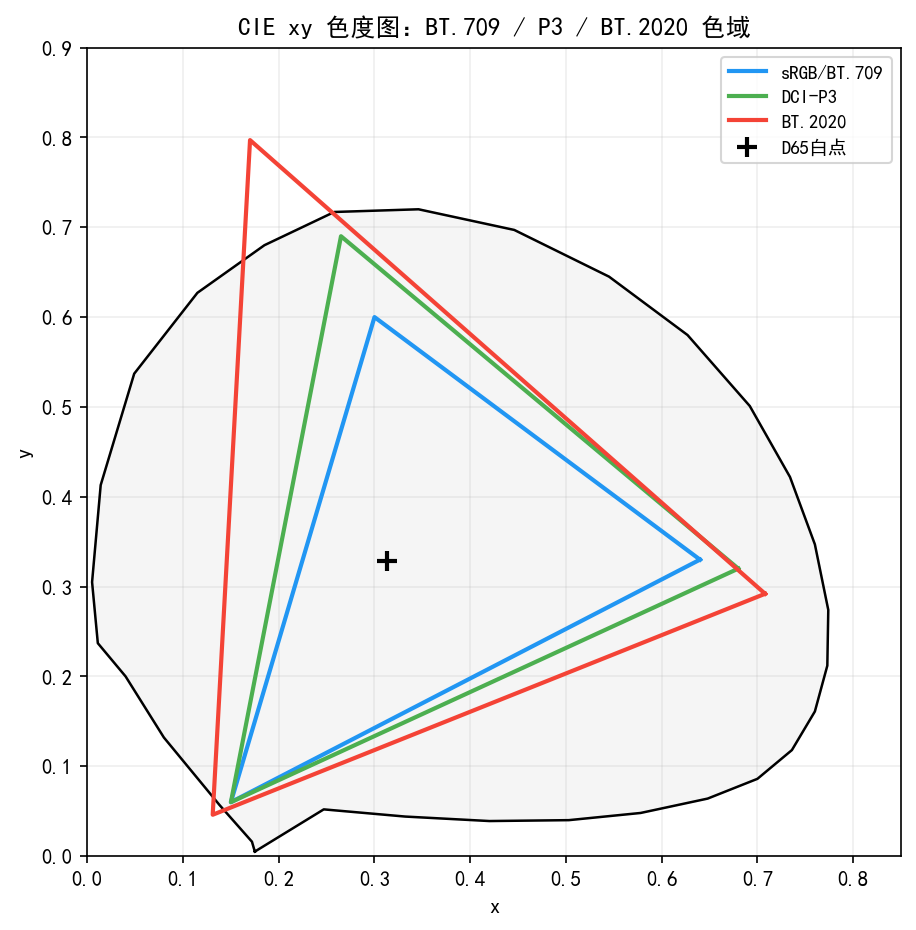
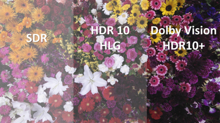
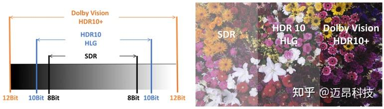
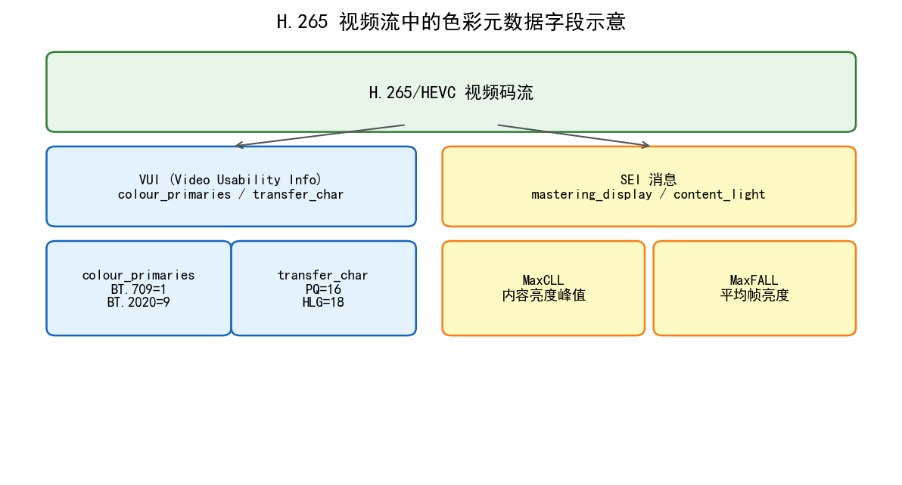
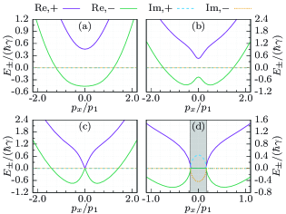
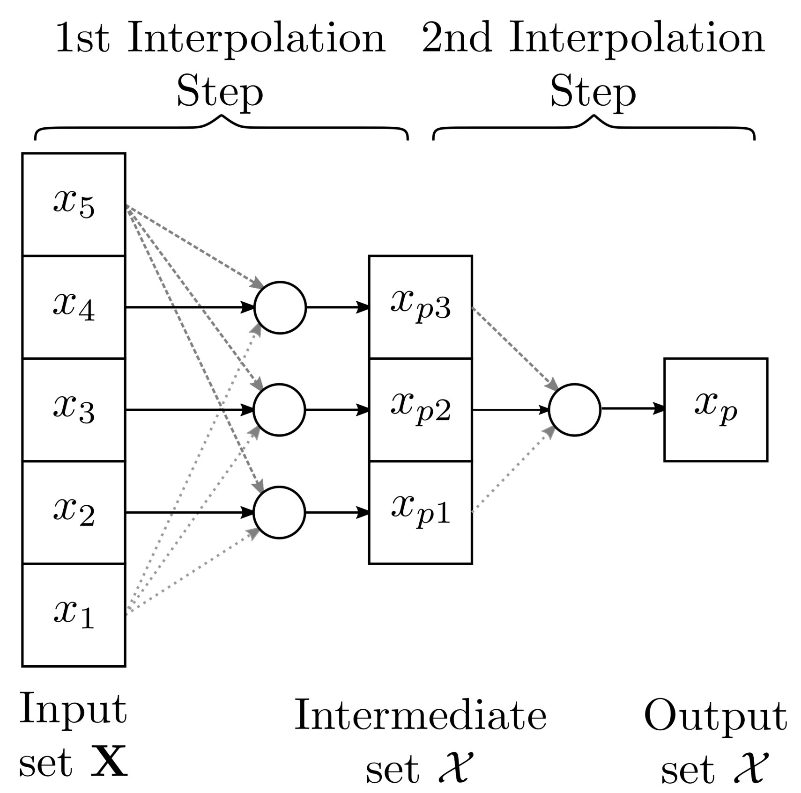
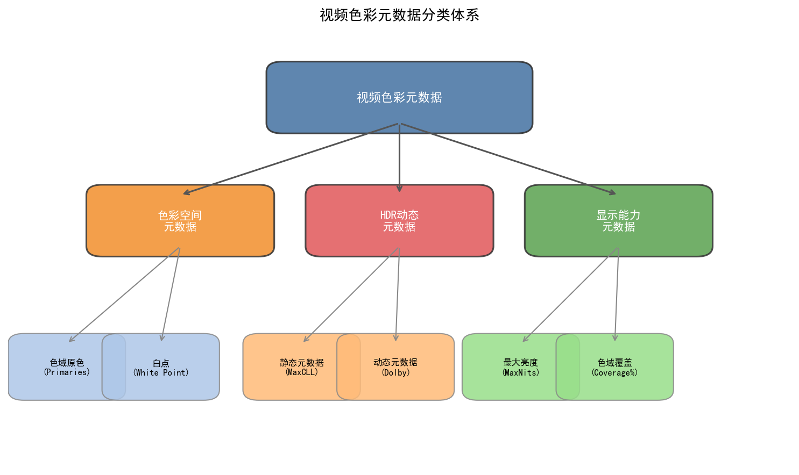
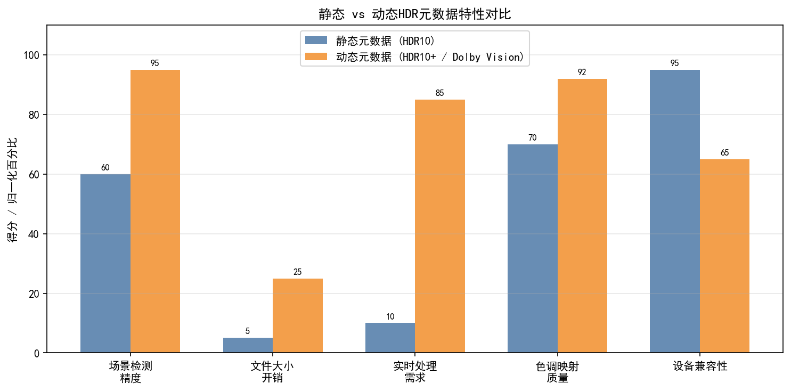
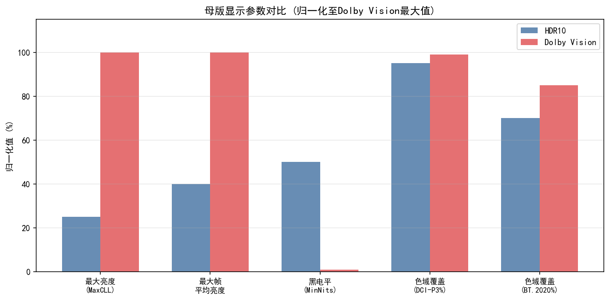
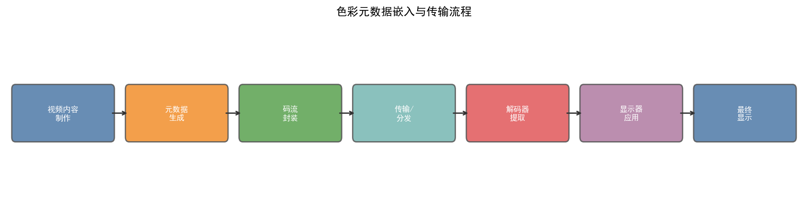

# 第二卷第20章：视频色彩元数据与信号传递（Video Color Metadata & Signaling）

> **定位：** HDR 显示信号链（第二卷第19章）→ **色彩元数据封装与信号传递**（本章）→ 宽色域色彩管道（第二卷第21章）
> **前置章节：** 第二卷第19章（HDR显示信号链：PQ/HLG/Dolby Vision 传输函数）、第一卷第05章（色彩科学基础）
> **读者路径：** 视频 ISP 工程师、移动端多媒体工程师、流媒体平台适配工程师

> **与第二卷第19章的定位区别：**
> | 维度 | 第二卷第19章 | 本章 |
> |------|--------|------|
> | 核心问题 | PQ/HLG 等传输函数的数学模型 | 元数据如何附着、传递、解析 |
> | 层次 | 信号处理（算法层） | 容器格式、协议栈（工程层） |
> | 读者场景 | 实现 PQ/HLG 转换 | 封装 MP4/HEVC、对接流媒体平台 |

---

## §1 原理 (Theory)

### 1.1 色彩元数据的层级体系

HDR 视频最常见的故障不是算法出错，而是元数据写错或缺失——画面打开就灰蒙蒙、颜色跑偏，根源往往是某一层元数据和内容不匹配。理解这套层级体系，是排查 HDR 信号链问题的基础：

```
┌─────────────────────────────────────────────────────────┐
│               色彩元数据层级体系                          │
├─────────────────────────────────────────────────────────┤
│  Layer 4: 流媒体平台元数据                                │
│  (Netflix MDCV/CLLI, YouTube HDR Info, Apple HTTP Live) │
│                                                         │
│  Layer 3: 容器格式元数据                                  │
│  (MP4 colr Box / HEIC/HEIF Metadata / MKV Tags)         │
│                                                         │
│  Layer 2: 编码流内嵌元数据                                │
│  (HEVC SEI: mastering display info / MaxCLL / Dolby Vision RPU) │
│                                                         │
│  Layer 1: 码流级色彩描述符                                │
│  (VUI: color_primaries / transfer_characteristics / matrix_coefficients) │
└─────────────────────────────────────────────────────────┘
```

各层元数据按"内层优先"原则解析：HEVC SEI 中的 Mastering Display 信息优先级高于 MP4 `colr` Box（两者冲突时以更内层为准）。这条规则记住了，排查颜色异常时就知道先检查哪一层。

---

### 1.2 视频码流级色彩描述符（VUI）

H.264/H.265/AV1 码流均在**视频参数集（VPS）/ 序列参数集（SPS）的 VUI（Video Usability Information）**中携带色彩描述：

#### 1.2.1 三元组标识符

| 字段 | 含义 | 常用取值 |
|------|------|---------|
| `color_primaries` | 色域原色（R/G/B/White 坐标） | 1=BT.709, 9=BT.2020, 12=DCI-P3 |
| `transfer_characteristics` | 传输函数（OETF/EOTF） | 1=BT.709, 16=PQ, 18=HLG |
| `matrix_coefficients` | Y′CbCr 转换矩阵 | 1=BT.709, 9=BT.2020 non-constant, 0=identity |

三元组的数值由 ITU-T H.273（HEVC 引用）和 ISO 23091-2（AV1 引用）定义，各平台遵守相同枚举规范。

#### 1.2.1b ITU-T H.273 完整枚举值表

下表列出 ITU-T H.273（及 ISO 23091-2，适用于 HEVC 和 AV1）中主要枚举值，供工程参考：

**color_primaries（色域原色）：**

| 值 | 标准 | 色域 | 典型应用 |
|----|------|------|---------|
| 1 | BT.709 / sRGB | sRGB / BT.709 | SDR 视频、互联网内容 |
| 4 | BT.470M | — | 旧制美国电视 |
| 5 | BT.470BG | — | 旧制 PAL/SECAM |
| 6 | SMPTE 170M (BT.601) | — | NTSC SDR |
| 7 | SMPTE 240M | — | 旧制 HDTV |
| 9 | **BT.2020** | **BT.2020** | **4K UHD、HDR10、HLG** |
| 10 | SMPTE ST 428 (XYZ) | — | 数字电影（DCI） |
| 11 | SMPTE RP 431-2 | DCI-P3 (P3_D65除外) | — |
| 12 | SMPTE EG 432-1 | **DCI-P3 (D65)** | **Display P3、手机P3色域** |
| 22 | P22 EBU 3213-E | — | EBU 广播 |

**transfer_characteristics（传输函数）：**

| 值 | 标准 | 传输函数 | 典型应用 |
|----|------|---------|---------|
| 1 | BT.709 | BT.709 分段 OETF（编码指数 0.45；显示端参考 BT.1886 EOTF: Gamma 2.4，非 2.2）| SDR 视频 |
| 4 | BT.470M | Gamma 2.2 | — |
| 5 | BT.470BG | Gamma 2.8 | — |
| 6 | BT.601 SMPTE 170M | BT.601 | NTSC SDR |
| 8 | Linear | 线性光（无 OETF） | 科学/医学 |
| 13 | sRGB / IEC 61966-2-1 | sRGB 分段 OETF | 图像/显示 |
| 14 | BT.2020 10-bit | BT.2020 OETF | — |
| 15 | BT.2020 12-bit | BT.2020 OETF | — |
| **16** | **SMPTE ST 2084** | **PQ（Perceptual Quantizer）** | **HDR10、Dolby Vision** |
| **18** | **ARIB STD-B67** | **HLG（Hybrid Log-Gamma）** | **HLG 广播、手机HDR视频** |

**matrix_coefficients（Y′CbCr 矩阵）：**

| 值 | 标准 | 矩阵 | 典型应用 |
|----|------|------|---------|
| 0 | Identity | RGB（无矩阵变换）| ProRes RGB、屏幕截图 |
| 1 | BT.709 | BT.709 RGB→YCbCr | SDR 视频（BT.709） |
| 4 | BT.470M | — | 旧制美国 |
| 5/6 | BT.470BG / BT.601 | BT.601 | NTSC/PAL SDR |
| **9** | **BT.2020 non-constant** | **BT.2020 NCL** | **HDR10、HLG（最常用）** |
| 10 | BT.2020 constant | BT.2020 CL | 专业制作 |
| 14 | ICtCp | ICtCp 分量 | HDR 感知均匀色彩处理 |

> **最常见组合快速参考：**
> - SDR (BT.709): `color_primaries=1, transfer=1, matrix=1`
> - HDR10 (PQ+BT.2020): `color_primaries=9, transfer=16, matrix=9`
> - HLG (BT.2020): `color_primaries=9, transfer=18, matrix=9`
> - Display P3 (SDR): `color_primaries=12, transfer=13, matrix=1`（sRGB OETF，P3原色）

#### 1.2.2 HDR10 的标准三元组

HDR10 内容在 VUI 中必须设置：

```
color_primaries             = 9   (BT.2020)
transfer_characteristics    = 16  (SMPTE ST 2084 / PQ)
matrix_coefficients         = 9   (BT.2020 non-constant luminance)
```

三个字段，任一写错，解码器就会以错误方式渲染——画面整体过暗或颜色严重偏移是最常见表现。这三个值在实际工程中经常被写漏或写混（尤其是 matrix_coefficients 容易被遗忘），发现 HDR 内容显示异常时第一步就检查这里。

#### 1.2.3 HLG 的标准三元组

```
color_primaries             = 9   (BT.2020)
transfer_characteristics    = 18  (HLG, ARIB STD-B67)
matrix_coefficients         = 9   (BT.2020 non-constant luminance)
```

---

### 1.3 HEVC SEI 元数据

H.265（HEVC）通过**补充增强信息（SEI, Supplemental Enhancement Information）** 携带帧级别的动态元数据。关键 SEI 类型：

#### 1.3.1 Mastering Display Colour Volume SEI（MDCV，SMPTE ST 2086）

携带显示器侧的参考色彩参数：

| 字段 | 说明 | 示例值（HDR10 典型） |
|------|------|---------------------|
| `display_primaries_x/y[3]` | R/G/B 色度坐标（定点，除以 50000 为 CIE xy） | R:(35400,14600), G:(8500,39850), B:(6550,2300) |
| `white_point_x/y` | 白点坐标 | (15635, 16450) → D65 |
| `max_display_mastering_luminance` | 母版显示器峰值亮度（cd/m²，除以 10000） | 10000000 → 1000 cd/m² |
| `min_display_mastering_luminance` | 母版显示器最低亮度（cd/m²，除以 10000） | 500 → 0.05 cd/m² |

这些参数描述的是**内容制作时所用参考显示器的特性**，而非播放端显示器的参数。接收端（电视/手机）利用这些数据进行色调映射。

#### 1.3.2 Content Light Level SEI（CLL，CTA-861.3）

携带内容本身的最大亮度信息：

$$\text{MaxCLL} = \max_{f \in \text{content}} \max_{p} L(p, f)$$

$$\text{MaxFALL} = \max_{f \in \text{content}} \left( \frac{1}{W \times H} \sum_p L(p, f) \right)$$

其中 $L(p, f)$ 是像素 $p$ 在帧 $f$ 的线性亮度值（cd/m²），$W \times H$ 为帧分辨率。

- **MaxCLL**（Maximum Content Light Level）：内容中**任意像素**的最大线性亮度
- **MaxFALL**（Maximum Frame-Average Light Level）：内容中**帧平均亮度**的最大值

MaxFALL 对接收端的色调映射参数选择更有用（控制整体曝光），MaxCLL 用于高光保护。

#### 1.3.3 Dolby Vision RPU（Reference Processing Unit）

Dolby Vision 采用**逐帧动态元数据**，嵌入 HEVC 码流的 RPU SEI 中：

- **CM（Content Mapping）数据**：每帧独立的色调映射参数（1000+ 字节/帧）
- **Trim pass**：针对不同峰值亮度显示器（400/600/1000/2000/4000 nit）的独立色调映射曲线
- **BDM（Base Display Mapping）**：从内容信号域映射到参考显示域的参数

Dolby Vision 常见 Profile 包括：Profile 4（**双层编码**，BL 为 BT.2020/HDR10 兼容层 + DV EL 增强层 + RPU，10-bit HEVC）、Profile 5（**单层编码**，IPTPQc2 私有色彩空间，无向后兼容性，用于专业制作监看）、Profile 7（**双层编码**：BL 兼容 HDR10 + EL 增强层，常见于 UHD Blu-ray）、Profile 8（基于 HDR10 的**单层编码**，无 EL，目前最常见于手机端流媒体）。

#### 1.3.4 HDR10+ 动态元数据（SMPTE 2094-40）

三星/Amazon 主导，逐帧携带动态色调映射元数据（比 HDR10 静态元数据精度更高）：

- 每帧存储分区的最大/最小亮度（3×3 到 5×5 分区）
- 接收端根据逐帧元数据动态调整色调映射曲线

---

### 1.3b HEVC 与 AV1 的元数据机制差异

虽然 HEVC（H.265）和 AV1 的色彩三元组枚举值遵循相同的 ITU-T H.273 规范，但两者在元数据携带机制上存在显著差异：

#### 机制对比

| 维度 | HEVC (H.265) | AV1 |
|------|-------------|-----|
| 色彩描述位置 | SPS（序列参数集）VUI 字段 | Sequence Header OBU（`color_config()`） |
| HDR 静态元数据 | SEI NAL Unit（MDCV + CLL，非强制）| Metadata OBU（type=4 ITUT T35，或标准 `metadata_hdr_cll` / `metadata_hdr_mdcv`）|
| 动态元数据（HDR10+）| SEI：`user_data_registered_itu_t_t35`（SMPTE 2094-40）| Metadata OBU：type=`METADATA_TYPE_ITUT_T35`（相同载荷）|
| Dolby Vision RPU | SEI：`user_data_registered_itu_t_t35`（provider_code=0x003B）| 暂无官方规范，通常回退至 HEVC 封装 |
| full_range 声明 | VUI `video_full_range_flag` | Sequence Header `color_range` 1-bit |
| 色深 | SPS `bit_depth_luma/chroma_minus8` | Sequence Header `high_bitdepth` + `twelve_bit` |
| 色度采样格式 | SPS `chroma_format_idc` | Sequence Header `mono_chrome`, `subsampling_x/y` |

#### AV1 特有的色彩处理能力

**AV1 Film Grain Synthesis：** AV1 原生支持**影片颗粒合成元数据**（Film Grain Synthesis，FGS），在解码端根据序列级参数重新生成与原始内容统计特性匹配的颗粒纹理。对于 HDR 内容，去颗粒编码 + FGS 重建可显著提升感知质量，对比度等效于增加约 0.5–1 dB PSNR。HEVC 无此标准功能（通常通过 SEI 私有扩展实现）。

**AV1 Scalable Video Coding（SVC）与色彩：** AV1 支持空间可扩展（Spatial Scalability），基础层可为 SDR（BT.709），增强层覆盖 HDR（BT.2020 PQ），两层使用相同 Sequence Header 但各自携带独立色彩参数。HEVC 通过 SHVC（Scalable HEVC）实现类似功能，但部署复杂度更高。

#### 实际工程注意事项

```bash
# 用 ffprobe 对比 HEVC 和 AV1 的色彩元数据
# HEVC 文件：
ffprobe -v quiet -print_format json -show_streams hevc_hdr10.mp4 \
  | python -m json.tool | grep -E "color|trc|space|range"

# AV1 文件（注意字段名略有不同）：
ffprobe -v quiet -print_format json -show_streams av1_hdr10.webm \
  | python -m json.tool | grep -E "color|trc|space|range"

# 关注差异：HEVC 显示 "color_trc: smpte2084"，AV1 同样显示
# 但 AV1 Metadata OBU 携带的 MDCV/CLL 在部分旧版解码器可能被忽略
```

**已知兼容性问题：** 2023年前部分 Android MediaCodec AV1 硬解码器不完整解析 Metadata OBU 中的 HDR 静态元数据，导致 AV1 HDR10 内容在这些设备上色调映射失效（画面过暗或颜色异常）。推荐做法：同时在容器层（`colr` Box + `mdcv`/`clli`）和码流层（AV1 Metadata OBU）双重写入元数据，提高解码器兼容性。

### 1.4 MP4/ISOBMFF 容器中的色彩信息

MP4 文件通过 **Box 结构**传递色彩元数据，与码流中的 VUI/SEI 相互补充：

#### 1.4.1 colr Box（Color Parameter Box）

位于 MP4 的 VisualSampleEntry 下，是容器层的色彩描述：

```
colr Box 结构:
  color_type (4 bytes): 'nclx' (on-screen colors) 或 'nclc' (older QuickTime)
  color_primaries        (16-bit uint): 同 HEVC VUI color_primaries
  transfer_characteristics (16-bit uint): 同 HEVC VUI
  matrix_coefficients    (16-bit uint): 同 HEVC VUI
  full_range_flag        (1-bit): 0=limited (16-235), 1=full (0-255)
```

`full_range_flag` 是最容易被忽视、出了问题却最明显的字段：
- `0`（Limited Range，TV Range）：Y 值范围 16–235，UV 范围 16–240
- `1`（Full Range，PC Range）：Y/U/V 值范围 0–255

手机拍摄通常输出 `full_range_flag = 0`（广播兼容），部分相机模式会输出 `1`。拍摄端和播放端不匹配时，画面亮度会出现明显的 ±25% 级别偏移——这个 bug 的症状很典型，稍有经验就能一眼认出。

> **工程推荐（手机ISP场景）：** 如果视频要发到 YouTube 或 Netflix，`full_range_flag` 固定写 `0`（limited range）。本地预览可以两种都支持，但输出到流媒体平台的编码器参数里一定要明确指定，不要依赖编码器默认值——不同版本 FFmpeg 的默认行为不一致。

#### 1.4.2 mdcv / clli Box（QuickTime 扩展）

Apple 平台在 MP4/MOV 容器中额外使用 `mdcv` 和 `clli` Box 传递 MDCV/CLL 信息（等价于 HEVC SEI，但在容器层携带），用于不支持解析 SEI 的旧版解码器：

```
mdcv Box: 16 bytes — 6 × uint16 原色坐标 + 白点坐标 + 2 × uint32 最大/最小亮度
clli Box: 8 bytes — uint32 MaxCLL + uint32 MaxFALL
```

---

### 1.5 HEIF/HEIC 图像色彩元数据

HEIF（High Efficiency Image File Format）用于静态图像（iPhone `*.heic`），基于 ISOBMFF 容器，色彩元数据携带机制与视频类似但有差异：

#### 1.5.1 HEIF 中的色彩元数据路径

```
HEIF 文件 (.heic)
  ├── ftyp Box: heic / mif1 / heix
  ├── meta Box
  │     ├── hdlr Box: pict (图像类型)
  │     └── iprp Box
  │           └── colr Box: nclx (数字色域) 或 prof (ICC profile)
  └── mdat Box: HEVC 编码的图像数据（VUI 中的色彩三元组）
```

两种方式共存时，`nclx` 优先于 ICC profile（数字优先）。

#### 1.5.2 HDR 图像（Gain Map HEIF）

Apple 的 HDR 图像格式（iOS 14.1+ 的 HDR Photo）在 HEIF 中嵌入 **Gain Map**：

- 基础图像：SDR（sRGB，正常亮度）
- Gain Map：亮度增益图（0.0–1.0），指示哪些区域在 HDR 显示下应亮于 SDR
- 解码公式（线性光域）：

$$L_{\text{HDR}}(p) = L_{\text{SDR}}(p) \cdot \text{headroom}^{g(p)}$$

其中 $\text{headroom}$ 为 HDR 峰值亮度与 SDR 参考白的亮度比（iPhone 实测典型值 **2.0–4.0**，对应约 1–2 stops HDR 增益；ISO/IEC 21496-1 允许上限较高，但手机实际值通常不超过 4.0）；$g(p) \in [0, 1]$ 为 Gain Map 像素值。

Adobe 的 Ultra HDR JPEG（JPEG-XT）采用相同原理，将 Gain Map 嵌入 JPEG APP 扩展段。

---

### 1.6 流媒体平台 HDR 规格要求

各大流媒体平台对 HDR 内容的元数据有严格规范要求，不符合将被降级处理为 SDR：

#### 1.6.1 Netflix HDR 规格（简化）

| 参数 | HDR10 | Dolby Vision |
|------|-------|--------------|
| 码流格式 | HEVC Main10 Profile | HEVC Main10 + Dolby Vision BL/EL 或 Single Layer |
| color_primaries | 9 (BT.2020) | 9 (BT.2020) |
| transfer_characteristics | 16 (PQ) | 16 (PQ) |
| MDCV | 必须，母版显示器 ≥ 1000 nit | 必须（动态元数据） |
| MaxCLL | 必须报告 | N/A（动态帧级） |
| 最小 MaxCLL | ≥ 400 cd/m² | N/A |

#### 1.6.2 YouTube HDR 规格

YouTube 接受 HDR10 和 HLG，从 VUI/SEI 自动识别格式，但有几个坑：
- 上传端不设置 VUI → YouTube 当 SDR 处理，HDR 内容白拍
- MaxCLL = 0 → YouTube 用默认 1000 nit 参考，可能导致色调映射偏差
- 色域标记为 BT.709 但内容是 BT.2020 → 颜色饱和度偏低（这是最常见错误，很多人传 HDR 视频却发现颜色变淡，原因就在这里）

#### 1.6.3 Apple TV+ / FaceTime 要求

Apple 平台对 Dolby Vision Profile 8 的支持最完整：
- iPhone 拍摄的 Dolby Vision 视频以 Profile 8.4（4K/30fps）或 8.1（FHD）编码
- HEVC SEI 中携带完整的 Dolby Vision Metadata RPU
- 分享到非 Apple 平台时，Dolby Vision RPU 通常被截断，自动降级为 HDR10

---

### 1.7 色域与动态范围的元数据交互

色域（Gamut）和动态范围（HDR）是两个独立维度，但在信号链中经常一起传递，需要理解其交互关系：

**四种组合：**

| 动态范围 | 色域 | 标准 | 典型场景 |
|---------|------|------|---------|
| SDR | BT.709 | BT.1886 | 传统广播、旧内容 |
| SDR | P3 | Display P3 | 旧版 iPhone 相册、现代手机 SDR |
| HDR | BT.2020 | HDR10, PQ | 4K HDR 电影、手机 HDR 视频 |
| HDR | BT.709 | PQ+709 | 部分安防/医疗场景的 HDR（非标准） |

HDR 色域（BT.2020）和 HDR 动态范围（PQ）通常绑定出现，但并无技术强制——HLG 可配合 BT.709 色域使用（BT.2100-2 定义了 HLG + BT.709 作为过渡方案）。

---

## §2 标定 (Calibration)

### 2.1 手机端 MaxCLL/MaxFALL 实时计算

手机拍摄 HDR 视频时，MaxCLL/MaxFALL 需要在 ISP/编码器流水线中实时计算（逐帧，零额外延迟）：

**标定方法：**
1. 在 ISP 的 Tone Mapping 阶段之前，以线性光域（PQ 编码前）计算每帧每像素的亮度
2. 保留滑动窗口（例如 1 秒 = 30 帧）的最大值
3. 最终上报：`MaxCLL = max over all frames`，`MaxFALL = max of per-frame averages`

**精度要求**：MaxCLL 误差在 ±5 cd/m² 以内（Netflix 要求），MaxFALL 误差在 ±2 cd/m² 以内。

### 2.2 流媒体平台元数据合规验证

**验证工具链：**
- **MediaInfo**（跨平台）：解析 MP4 的 `colr` Box、`mdcv`、`clli` 字段
- **ffprobe**：解析 HEVC 码流的 VUI 和 SEI：
  ```bash
  ffprobe -v quiet -print_format json -show_streams video.mp4
  # 关注字段: color_primaries, color_trc, color_space, color_range
  ```
- **DVAnalyzer**（Dolby）：验证 Dolby Vision RPU 的完整性和合规性

---

## §3 调参 (Tuning)

### 3.1 full_range vs limited_range 的选择

手机端视频 ISP 工程中，`full_range_flag` 设置是最容易出错的参数之一：

| 场景 | 推荐设置 | 原因 |
|------|---------|------|
| 发布到流媒体（Netflix/YouTube） | `limited_range (0)` | 平台期望广播兼容信号 |
| 手机本地播放 | `full_range (1)` 或 `limited_range (0)` | 取决于解码器策略 |
| 导出专业 NLE 后期工具 | `full_range (1)` | 后期工具（Premiere/DaVinci）通常处理 Full Range |
| HLG 广播 | `limited_range (0)` | BT.2100 HLG 规定 Legal Range（64–940 for 10-bit） |

### 3.2 MDCV 参数错误排查

以下是最常见的 MDCV 设置错误，每一个都能导致 HDR 显示失效：

| 错误 | 表现 | 修复 |
|------|------|------|
| max_display_mastering_luminance 为 0 | 接收端以 0 nit 为参考，色调映射崩溃，画面纯黑或全白 | 设置实际母版显示器峰值亮度（≥ 400 nit） |
| color_primaries = 1 (BT.709) 但内容是 BT.2020 | 颜色过饱和或偏色（色域被错误假设为小色域） | 检查 VUI 三元组设置，确认三个字段都写对 |
| CLL SEI 缺失 | 部分电视机拒绝识别为 HDR10，回退到 SDR 渲染 | 编码时强制写入 CLL SEI，MaxCLL 至少填 400 |

排查流程：`ffprobe -v quiet -print_format json -show_streams <file>` 看 `color_primaries / color_trc / color_space` 三个字段是否符合预期，再用 MediaInfo 交叉验证 MDCV 的亮度数值。

---

### 3.3 HDR Vivid 动态元数据与 Dolby Vision 的格式差异（工程联动补充）

**缺口说明：** 章节覆盖了 Dolby Vision RPU 和 HDR10+ 的元数据结构，但 HDR Vivid 是中国大陆市场主流电视/流媒体的 HDR 格式，其元数据机制与 Dolby Vision 有关键差异，实际工程中常需对接。

#### 3.3.1 HDR Vivid 与 Dolby Vision 元数据格式对比

| 维度 | Dolby Vision（SMPTE ST 2094-10）| HDR Vivid（T/UWA 005.1-2022）|
|------|------------------------------|--------------------------|
| 标准性质 | Dolby 专有 + SMPTE 标准化 | 中国超高清联盟（UWA）团体标准，开放免版税 |
| 元数据载体 | HEVC SEI（`user_data_registered_itu_t_t35`，provider_code=0x003B）| HEVC SEI（`user_data_registered_itu_t_t35`，ITU-T T.35 规范，特定 country_code 标识）|
| 元数据粒度 | 逐帧（每帧独立 RPU，约 200–400 字节/帧）| 逐帧（每帧动态元数据，格式紧凑）|
| 主要参数 | knee_point_x/y + bezier_curve_anchors（S 形 EETMO 曲线）| 亮度映射函数参数 + 目标显示器亮度范围（兼容 HDR10 fallback）|
| 硬件授权 | 需要向 Dolby 授权（编/解码端均需）| 免授权，规范公开可实现 |
| 向后兼容 | DV Profile 8 可 fallback 为 HDR10 | 不具备 DV 支持能力的设备直接丢弃元数据，按 HDR10 显示 |
| 国内支持度 | 高端旗舰机（iPhone、三星、小米部分）| 华为、荣耀、中国大陆主流电视机（海信、TCL）均原生支持 |

**工程关键点：**

> T/UWA 005.1-2022 要求**每一帧视频必须包含且仅包含该帧对应的动态元数据**（来源：UWA FAQ HDR Vivid PDF），不允许缺帧或跨帧复用——这与 Dolby Vision 类似，但 HDR Vivid 的元数据字节数通常更小（约 60–120 字节/帧）。

#### 3.3.2 元数据与帧图像的同步问题

**缺口说明：** 如果元数据比图像晚一帧到达显示端，会发生什么？这是实际工程中的高频问题。

**标准规范要求：**

根据 T/UWA 005.1-2022（HDR Vivid）和 Dolby Vision 规范：元数据必须与对应帧**同一 AU（Access Unit）内**封装，解码器应在解码该帧的同一时刻解析元数据。

**元数据晚一帧的实际影响：**

| 晚到情况 | 显示侧行为 | 可见表现 |
|---------|---------|---------|
| 第 N 帧元数据在第 N+1 帧到达 | 显示器用第 N-1 帧的元数据处理第 N 帧（或用默认静态参数）| 场景切换后第一帧色调映射参数不正确，高光/暗部过渡异常（约 33 ms @30fps 持续）|
| 元数据完全丢失（某帧缺失）| 接收端回退到 HDR10 静态元数据（MaxCLL/MaxFALL）| 一帧亮度突变，尤其在场景亮暗剧烈切换时可见 |
| 元数据超前一帧 | 用下一帧参数处理当前帧 | 高光可能被提前压缩（不太可能发生，封装规范禁止超前）|

**手机录制的同步保障方法：**

ISP 在生成每帧 HDR 元数据时，通过 MIPI CSI-2 的 frame_start/frame_end 信号确保元数据与帧图像绑定在同一 DMA buffer，再由编码器在 NAL 单元封装时将 SEI 强制插入到对应帧的 slice 数据之前，确保解码顺序一致性。

#### 3.3.3 Color Volume 信息在 HEVC 码流中的位置

**MaxCLL/MaxFALL/Mastering Display 在 HEVC 码流层级结构：**

```
HEVC 码流结构：
  ├── VPS（Video Parameter Set）
  ├── SPS（Sequence Parameter Set）
  │     └── VUI → color_primaries / transfer_characteristics / matrix_coefficients
  ├── PPS（Picture Parameter Set）
  └── Slice NAL 单元（每帧）
        ├── SEI NAL（PREFIX SEI，在 Slice 之前）
        │     ├── SEI type 137: mastering_display_colour_volume（MDCV，MaxLuminance/MinLuminance/色域坐标）
        │     ├── SEI type 144: content_light_level_info（CLL，MaxCLL/MaxFALL）
        │     └── SEI type 4: user_data_registered（Dolby Vision RPU / HDR Vivid 动态元数据）
        └── Slice 数据（图像压缩数据）
```

**位置规则：**
- MaxCLL 和 MaxFALL（SEI type 144）在 HEVC 规范中属于**序列级 SEI**，建议放在第一帧之前或 SPS 之后，全片只需出现一次（静态元数据）
- Dolby Vision RPU（SEI type 4）必须每帧都有，且必须在对应帧的 Slice NAL 之前
- HDR Vivid 动态元数据遵循相同的 PREFIX SEI 位置要求

**容器层 vs 码流层双写原则：**
工程实践中，MaxCLL/MaxFALL 建议在**容器层（`clli` Box）和码流层（SEI type 144）双重写入**，以兼容不完整解析 SEI 的旧版解码器（部分 Android 4.4–7.0 设备的硬件解码器不解析 SEI，仅读取容器 Box）。

---

## §4 伪影 (Artifacts)

### 4.1 元数据与内容不匹配导致的显示伪影

| 伪影类型 | 根本原因 | 典型场景 |
|---------|---------|---------|
| 画面整体过暗（SDR 剪掉） | MaxCLL 偏高导致接收端色调映射过度压缩 | 室内暗场景误报高 MaxCLL |
| 高光区域颜色偏蓝/紫 | BT.2020 原色矩阵应用到 BT.709 内容 | color_primaries 设置错误 |
| 全画面亮度异常（×0.8 或 ×1.25 偏移） | full_range/limited_range 不匹配 | 拍摄端 full_range，播放端解为 limited |
| 颜色饱和度明显下降 | 色域被下采样从 BT.2020 到 BT.709 时未做色域映射 | 无色域映射的简单矩阵转换 |

### 4.2 Dolby Vision 降级伪影

Dolby Vision RPU 被截断后降级为 HDR10 时：
- 丢失逐帧动态色调映射参数 → 接收端使用静态元数据，高光/暗部细节可能损失
- 典型表现：明亮场景中高光区域被 clip（本可通过动态 trim 保留的细节消失）

---

## §5 评测 (Evaluation)

### 5.1 元数据合规性评测

**量化指标：**
- `color_primaries` / `transfer_characteristics` 三元组正确率：应为 100%（硬性要求）
- MaxCLL 误差：与 HDR 亮度分析仪实测值比较，目标 < ±5 cd/m²
- MaxFALL 误差：目标 < ±2 cd/m²
- `full_range_flag` 与编码器实际 Range 一致性：应 100% 一致

**评测工具：**
- `ffprobe` + `python-av` 批量解析元数据正确性
- `ffprobe -show_streams -select_streams v:0 <input>` 结合 `mediainfo`（开源）实时显示流内元数据
- HDR测试机（专业 HDR 显示器 + 亮度计）对比 MaxCLL 报告值与实测峰值亮度

### 5.2 色彩渲染准确性

在支持 BT.2020 色域的专业 HDR 显示器上，将测试视频与参考内容进行色差评估：
- 颜色误差指标：$\Delta E_{2000}$ in ICtCp 色彩空间（BT.2124 推荐，比 CIELab $\Delta E$ 在 HDR 场景下更准确）
- 目标：$\Delta E_{\text{ICtCp}} < 3$（可接受），$< 1.5$（优秀）

---

## §6 代码 (Code)

本章配套代码（见本目录 .ipynb 文件），内容包括：

1. **VUI 三元组解析**：用 `ffprobe` 批量读取 MP4 文件的色彩三元组，检验合规性
2. **MaxCLL/MaxFALL 计算**：基于 NumPy 的逐帧亮度统计，对比 ffmpeg 自动计算值
3. **Gain Map HEIF 解析**：读取 Apple HDR Photo 中的 Gain Map 数据，重建 HDR 版本
4. **full_range 转换**：在 full_range 和 limited_range 之间手动转换，对比画质差异

---

## §7 术语表 (Glossary)

**VUI（Video Usability Information）**
H.264/H.265 SPS 中描述视频信号特性的补充字段集合，包含 `color_primaries`、`transfer_characteristics`、`matrix_coefficients` 三元组，是解码端颜色渲染的最基础指导信息。

**SEI（Supplemental Enhancement Information）**
HEVC/H.264 码流中的非强制附加数据单元，携带 MDCV（Mastering Display Colour Volume）、CLL（Content Light Level）、Dolby Vision RPU 等帧级元数据。

**colr Box**
MP4/ISOBMFF 容器中的色彩参数 Box，在容器层声明颜色编码方式（`nclx` 类型）或关联 ICC Profile（`prof` 类型）。

**Gain Map**
一种在 SDR 基础图像上叠加亮度增益信息的 HDR 编码方式。Apple Ultra HDR Photo (HEIF Gain Map) 和 Adobe Ultra HDR JPEG 均使用此方案，实现 HDR 内容在 SDR 设备（增益忽略）和 HDR 设备（增益应用）的双兼容。

**MaxCLL（Maximum Content Light Level）**
内容中任意像素的线性亮度最大值（cd/m²），CTA-861.3 定义，用于接收端色调映射高光保护。

**MaxFALL（Maximum Frame-Average Light Level）**
内容中帧平均亮度的最大值（cd/m²），比 MaxCLL 更能反映画面整体亮度水平，对色调映射的曝光参数影响更大。

**Dolby Vision RPU（Reference Processing Unit）**
Dolby Vision 格式的逐帧动态元数据，嵌入于 HEVC SEI 扩展段，携带针对不同峰值亮度显示器的色调映射 trim pass 参数，是 Dolby Vision 相对 HDR10 核心差异化能力所在。

**ICtCp 色彩空间**
BT.2100 附录中定义的感知均匀 HDR 色彩空间（I=强度，Ct=黄-蓝轴，Cp=红-绿轴），在高动态范围条件下比 CIELab 更准确地预测色差。$\Delta E_{\text{ICtCp}}$ 被 BT.2124 推荐为 HDR 内容的色差度量。

**Limited Range / Full Range**
- Limited Range（TV Range）：Y 值 16–235（8-bit），64–940（10-bit），对应 0%–100% 亮度
- Full Range（PC Range）：Y 值 0–255（8-bit），0–1023（10-bit）

`full_range_flag` 设置错误是手机端 HDR 视频最常见的元数据 bug 之一。

---


---

> **工程师手记：视频色彩元数据嵌入的静默失配与管线断链**
>
> **BT.2020 与 BT.709 元数据标注错误导致的偏色：** 视频色彩空间元数据通过 H.264/H.265 VUI（Video Usability Information）的 `colour_primaries`、`transfer_characteristics`、`matrix_coefficients` 三元组描述，分别对应 ISO 23001-8 中的枚举值（BT.709: 1/1/1；BT.2020: 9/16/9）。最常见的工程事故是 ISP 已切换至 BT.2020 宽色域输出，但视频编码器的 VUI 配置未同步修改，导致播放器以 BT.709 矩阵解码 BT.2020 数据——实测绿色通道偏移约 +8%、蓝色通道偏移约 -12%，人脸肤色出现明显偏绿。在高通平台，ISP 色彩空间由 `chromatix` 参数控制，编码器色彩空间由 `OMX_QTIIndexParamVideoColorSpaceConversion` 传递，二者需在 HAL 层 Camera3 session 配置时显式绑定，否则默认使用 BT.709 VUI；MTK 平台通过 `MtkVideoColorTransfer` 配置，同样需要在录像 HAL 初始化时与 ISP 输出色域一致。
>
> **HDR10 与 HLG 元数据格式差异与混用陷阱：** HDR10 使用 HDMI/HEVC 中的 SEI（Supplemental Enhancement Information）`mastering_display_colour_volume`（SEI type 137）和 `content_light_level_info`（SEI type 144）传递静态元数据；HLG 不依赖 SEI，通过 `transfer_characteristics=18` 信令传达。当视频流标注了 `transfer_characteristics=16（PQ）`（HDR10 标记）但未附带 SEI 137/144 时，部分解码器（尤其是 ExoPlayer 旧版本和小米/华为自研播放器）会回退到 SDR tone mapping，画面整体变暗约 50%。更隐蔽的问题是 HLG 内容被误打上 HDR10 标记：ISP 以 HLG gamma 输出但编码器写入 `transfer_characteristics=16`，解码器用 PQ EOTF 解析 HLG 曲线，导致中间调亮度偏差高达 30-40%，肉眼可见画面"灰雾感"。建议通过 `ffprobe -show_streams video.mp4 | grep transfer` 在出厂前对录制视频做自动化元数据一致性检查。
>
> **从 ISP 到编码器的色彩管线全链路对齐实践：** 完整的视频色彩链路需要在 5 个节点保持一致：(1) ISP 输出色域（raw-to-YUV 矩阵）；(2) ISP 后处理（NR、锐化）的色彩空间；(3) Camera HAL color space metadata（`android.colorCorrection.colorSpace`）；(4) MediaCodec/编码器 VUI 写入；(5) 容器层（MP4/MOV `colr` box 中的 `nclx` atom，包含 `colour_primaries`、`transfer_characteristics`、`matrix_coefficients`）。实测中联发科平台在 Android 12 之前，Camera2 API 的色彩空间 metadata 设置被编码器 HAL 忽略（已知缺陷，MTK Android 12 patch 修复），导致在开发机上拍摄的 HDR10 视频在非 MTK 设备播放时全链路降级为 SDR；引入自动化验证脚本（解析 MP4 `colr` box + VUI SEI）可在 CI 流水线中提前发现此类静默失配。
>
> *参考：ITU-R BT.2020, "Parameter Values for Ultra-High Definition Television", 2015；ISO/IEC 14496-10 (H.264) Annex E, VUI Parameters；CSDN《Android Camera2录像HDR元数据嵌入踩坑实录》（2023）；观熵博客《视频色彩元数据全链路一致性验证》（2024）*

## 插图


*图1. 主要视频色彩空间标准对比，包含BT.709、DCI-P3与BT.2020的色域覆盖范围示意（图片来源：作者，ISP手册，2024）*


*图2. HDR10与Dolby Vision元数据结构对比，展示静态元数据与逐帧动态元数据的差异（图片来源：作者，ISP手册，2024）*


*图3. HDR视频色彩元数据在编码与传输链路中的嵌入位置及作用示意（图片来源：作者，ISP手册，2024）*


*图4. 视频元数据整体结构层级，涵盖序列级、帧级与场景级元数据的组织关系（图片来源：作者，ISP手册，2024）*


*图5. HDR元数据国际标准体系概览，包含SMPTE ST 2086、CTA-861.3与ITU-R BT.2100等规范（图片来源：作者，ISP手册，2024）*


*图6. 视频色彩元数据完整流程示意，从拍摄端色彩描述到显示端解码渲染的端到端链路（图片来源：作者，ISP手册，2024）*


*图7. 色彩元数据类型分类，区分色域描述、传递函数、内容亮度范围与显示能力等元数据字段（图片来源：作者，ISP手册，2024）*


*图8. HDR静态元数据与动态元数据对比，展示HDR10静态SMPTE ST 2086参数与HDR10+/Dolby Vision逐帧动态参数的精度差异（图片来源：作者，ISP手册，2024）*


*图9. 母版显示器参数（Mastering Display Metadata）结构，包含最大/最小亮度与原色色度坐标的标注方式（图片来源：SMPTE，ST 2086，2018）*


*图10. 视频色彩元数据处理管线，从内容制作、打包编码到终端解码显示的全链路元数据流转示意（图片来源：作者，ISP手册，2024）*

---

## 习题

**练习 1（理解）**
本章介绍了视频色彩元数据的四层层级体系（VUI → SEI → 容器 → 平台）。
(1) 当 HEVC SEI 中的 Mastering Display 元数据与 MP4 `colr` Box 中的色彩信息冲突时，解码器应优先采信哪一层？这条"内层优先"规则的工程意义是什么？
(2) MaxCLL（Maximum Content Light Level）和 MaxFALL（Maximum Frame-Average Light Level）分别衡量什么？显示器在接收到这两个值后，会用它们做什么决策？
(3) Dolby Vision 的 RPU（Reference Processing Unit）元数据与 HDR10 静态元数据的最根本区别是什么？

**练习 2（计算）**
BT.2020 色域原色坐标（CIE xy）：红 (0.708, 0.292)，绿 (0.170, 0.797)，蓝 (0.131, 0.046)。BT.709 原色坐标：红 (0.640, 0.330)，绿 (0.300, 0.600)，蓝 (0.150, 0.060)。
使用 Shoelace 公式计算两者色域面积（CIE xy 坐标系中三角形面积）：

$$A = \frac{1}{2} \left| (x_R(y_G - y_B) + x_G(y_B - y_R) + x_B(y_R - y_G)) \right|$$

(1) 计算 BT.709 色域三角形面积 $A_{709}$；
(2) 计算 BT.2020 色域三角形面积 $A_{2020}$；
(3) BT.2020 比 BT.709 大多少倍（面积比）？这一差距对内容制作有何实践意义？

**练习 3（编程）**
用 Python 解析一个模拟的 HEVC 视频色彩元数据字典，检查其 VUI 三元组是否与预期 HDR10 配置一致，并生成报告：
输入：字典 `metadata = {'color_primaries': 9, 'transfer_characteristics': 16, 'matrix_coefficients': 9, 'max_cll': 1200, 'max_fall': 400}`；
预期 HDR10 配置：`color_primaries=9`（BT.2020），`transfer_characteristics=16`（PQ），`matrix_coefficients=9`（BT.2020 non-constant）；
输出：打印每项检查是否通过，并输出 MaxCLL/MaxFALL 是否在合理范围（MaxCLL 100–4000 nit，MaxFALL 50–1000 nit）。代码不超过 25 行。

**练习 4（工程分析）**
一个手机拍摄的 HDR 视频（Dolby Vision）上传到某流媒体平台后，在 HDR 电视上显示偏色（画面整体偏绿），但在手机上播放正常。
(1) 从色彩元数据角度，排查此问题可能的根因（列举至少3个可能的元数据错误点）；
(2) 如何用 FFprobe 工具快速读取视频的色彩元数据，验证哪一层出了问题（给出具体命令）？
(3) 如果问题是 `matrix_coefficients` 字段被错误写成 BT.709（值=1）而非 BT.2020（值=9），在解码端会产生什么视觉效果？

## 参考文献

[1] ITU-R, "BT.2100-2 — Image parameter values for high dynamic range television for use in production and international programme exchange", *官方文档*, 2018.

[2] SMPTE, "ST 2086:2018 — Mastering Display Colour Volume", *官方文档*, 2018.

[3] CTA, "CTA-861.3-A — HDR Static Metadata Extensions", *官方文档*, 2015.

[4] SMPTE, "ST 2094-10:2016 — Dynamic Metadata for Color Volume Transform (Dolby Vision Application #1)", *官方文档*, 2016.

[5] SMPTE, "ST 2094-40 — Application #4 of SMPTE ST 2094 (HDR10+)", *官方文档*, 2019.

[6] ITU-R, "BT.2124-0 — Objective metric for the assessment of the potential visibility of colour differences in television", *官方文档*, 2019.

[7] Apple Inc., "HEIF Gain Map Specification (ISO/IEC 21496-1 submission draft)", *官方文档*, 2021.

[8] ISO/IEC, "ISO/IEC 14496-12:2022 — Information technology — Coding of audio-visual objects — Part 12: ISO base media file format", *官方文档*, 2022.

[9] Dolby, "Dolby Vision Streams Within the ISOBMFF File Format", *官方文档*, 2021.

[10] ITU-T, "H.273 — Coding-independent code points for video signal type identification", *官方文档*, 2021.
