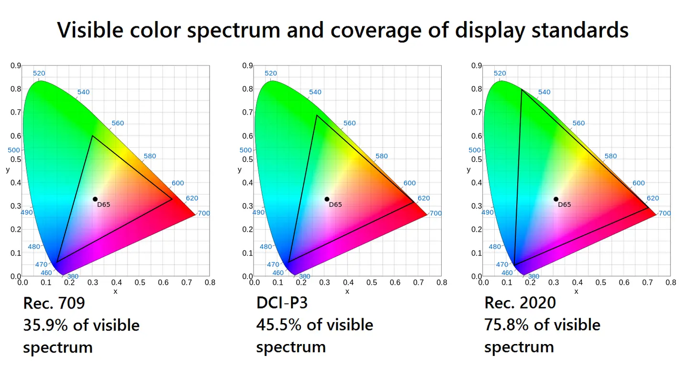
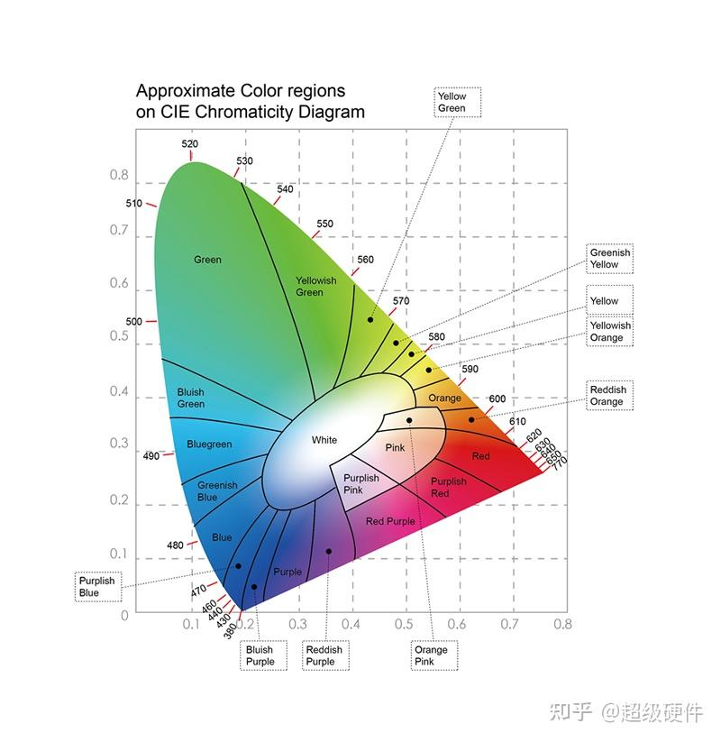
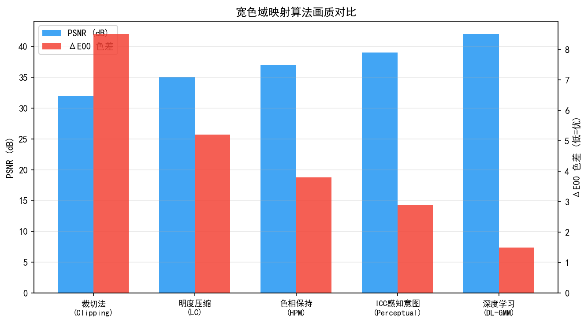
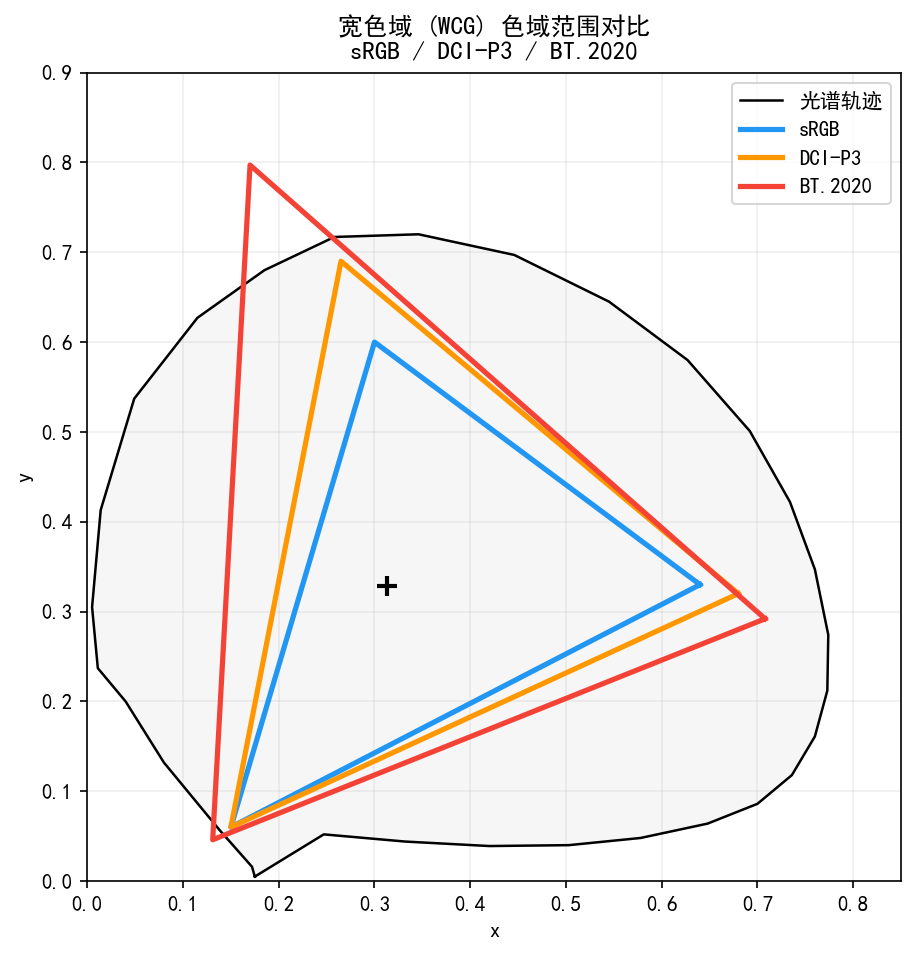
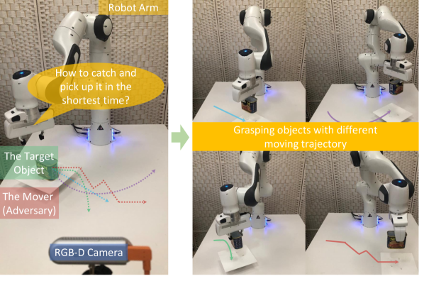
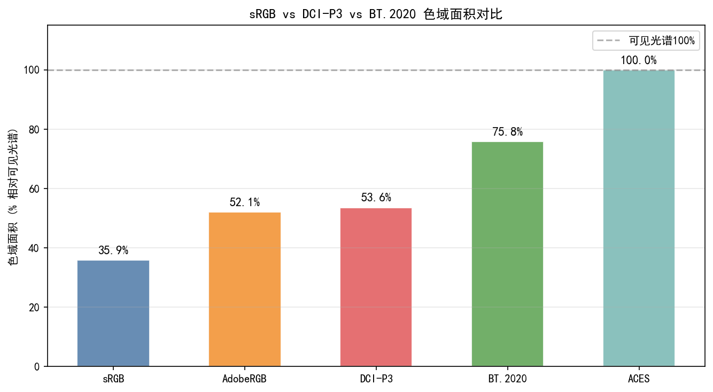
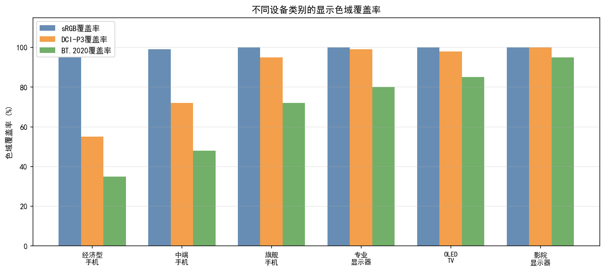
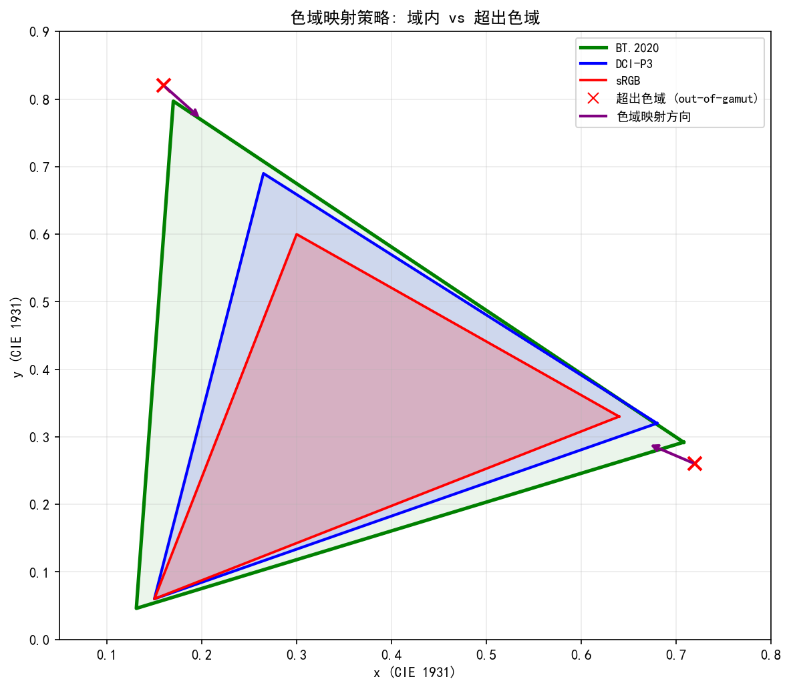
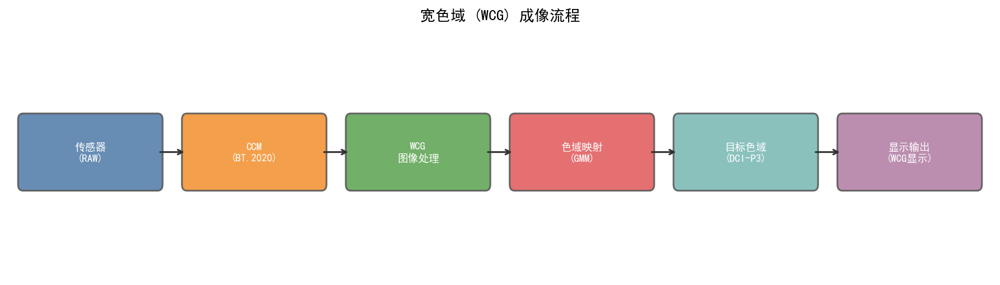
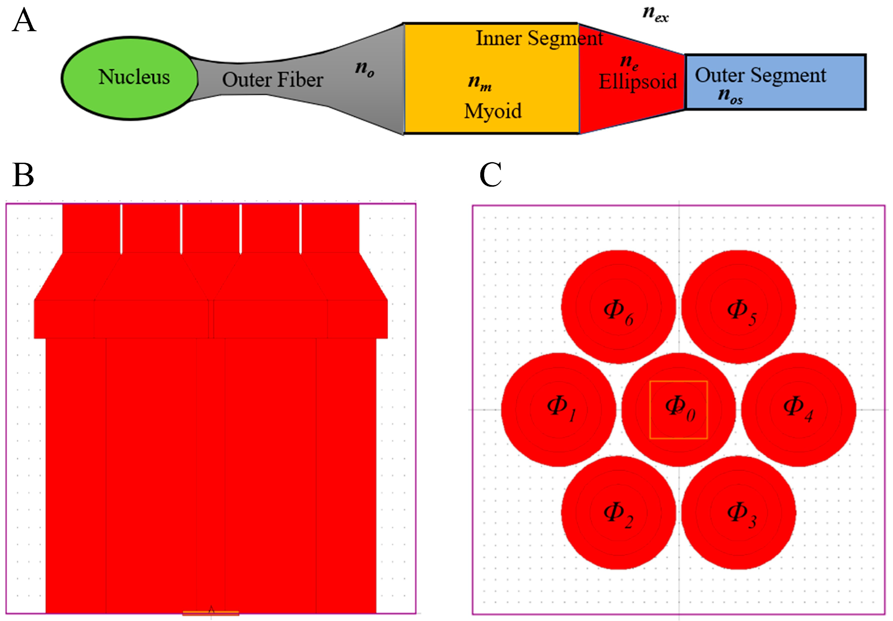

# 第二卷第21章：宽色域与 HDR 色彩管道（Wide Color Gamut & HDR Color Pipeline）

> **定位：** 视频色彩元数据与信号传递（第二卷第20章）→ **宽色域色彩管道**（本章）→ 多摄融合色彩一致性（第二卷第22章）
> **前置章节：** 第二卷第07章（Gamma 与色调映射）、第二卷第19章（HDR 显示信号链）、第一卷第05章（色彩科学基础）
> **读者路径：** ISP 算法工程师、显示管线工程师、色彩科学工程师

---

## §1 原理 (Theory)

### 1.1 色域标准体系

**色域（Color Gamut）** 是一个成像或显示系统能够表达的全部颜色集合，在 CIE 1931 xy 色度图上由三原色坐标围成的三角形表示。

**主流色域标准（按面积从小到大）：**

| 标准 | 用途 | sRGB 覆盖率 | DCI-P3 覆盖率 | BT.2020 覆盖率 |
|------|------|------------|--------------|---------------|
| **sRGB / BT.709** | 互联网、SDR 显示、广播电视 **[1]** | 100% | 约 73% | 约 38% |
| **DCI-P3** | 数字电影院、Apple Display P3 | 包含 sRGB | 100% | 约 51% |
| **Adobe RGB** | 专业摄影、印刷 | 包含 sRGB | 约 90% | 约 51% |
| **BT.2020 / Rec.2020** | 4K/8K UHD、HDR 广播 **[2]** | 包含 sRGB | 包含 P3 | 100% |

**手机摄影的色域演进：**
- 2017 年前：输出基本为 sRGB
- 2017–2020 年：iPhone 引入 Display P3，P3 成为手机标配
- 2020 年后：RAW 文件（ProRAW/RAW+）保留传感器原生宽色域，后处理可输出 BT.2020

**关键公式——色域覆盖率：**

$$\text{Coverage} = \frac{\text{目标色域三角形面积} \cap \text{参考色域三角形面积}}{\text{参考色域三角形面积}}$$

面积在 CIE xy 色度图上用向量叉积计算（Shoelace 公式）：

$$A = \frac{1}{2} \left| \sum_{i=0}^{2} (x_i y_{i+1} - x_{i+1} y_i) \right|$$

### 1.2 HDR 与 WCG 的关系

HDR（High Dynamic Range）和 WCG（Wide Color Gamut）算法上各管一摊，但在消费端被绑在一起卖，有物理上的必然性——不是营销捆绑：

$$\text{HDR 显示} \Leftrightarrow \text{高峰值亮度} + \text{宽色域} + \text{大位深}$$

| 属性 | SDR 典型值 | HDR 典型值 |
|------|-----------|-----------|
| 峰值亮度 | 100–300 nit | 1000–10000 nit |
| 黑场亮度 | 0.3–1.0 nit | < 0.005 nit（本地调光）|
| 色域 | sRGB (BT.709) | Display P3 / BT.2020 |
| 位深 | 8-bit | 10-bit / 12-bit |

**物理原因：** BT.2020 的绿色原色（x=0.170, y=0.797）和蓝色原色（x=0.131, y=0.046）对应高饱和色，其高亮度版本（如饱和绿色 1000 nit）在 sRGB 色域内根本无法表达，因此 HDR 内容**必须**使用宽色域。

### 1.3 HDR 传输标准：HDR10、HLG、Dolby Vision

#### 1.3.1 HDR10（静态元数据）

**HDR10** 是开放标准（SMPTE ST 2084 **[4]** + SMPTE ST 2086 **[5]**），基于 PQ（Perceptual Quantizer）光电转换函数：

$$\text{PQ EOTF:} \quad L = \left( \frac{\max(V^{1/m_2} - c_1, 0)}{c_2 - c_3 V^{1/m_2}} \right)^{1/m_1}$$

其中参数：$m_1 = 0.1593017578125$，$m_2 = 78.84375$，$c_1 = 0.8359375$，$c_2 = 18.8515625$，$c_3 = 18.6875$

**特点：**
- 10-bit 编码，BT.2020 色域
- **静态元数据**（MaxCLL、MaxFALL），全片统一色调映射
- 应用最广：UHD Blu-ray、Netflix、Disney+

#### 1.3.2 HLG（混合对数 Gamma）

**HLG（Hybrid Log-Gamma，ARIB STD-B67 / ITU-R BT.2100）** **[3]** 是为广播电视设计的 HDR 标准：

$$\text{HLG OETF:} \quad E = \begin{cases} \sqrt{3L} & 0 \leq L \leq \frac{1}{12} \\ a \ln(12L - b) + c & L > \frac{1}{12} \end{cases}$$

其中 $a = 0.17883277$，$b = 0.28466892$，$c = 0.55991073$

**特点：**
- **向后兼容 SDR**：SDR 显示器将 HLG 信号解读为 SDR 也能显示，无需元数据
- 适合直播广播（无法提前计算静态元数据）
- 手机视频录制常用（如 iPhone"视频 HDR"即 HLG 格式）

#### 1.3.3 Dolby Vision（动态元数据）

Dolby Vision（SMPTE ST 2094-10）**[6]** 在 HDR10 基础上增加**逐场景/逐帧**的动态元数据，使显示设备能对每一帧做最优的色调映射：

| 特性 | HDR10 | Dolby Vision |
|------|-------|-------------|
| 元数据类型 | 静态（全片一套）| 动态（逐帧）|
| 位深 | 10-bit | 10-bit 或 12-bit |
| 色调映射 | 显示器自行处理 | Dolby精确指导显示器 |
| 授权费用 | 免费 | 需授权 |
| 手机支持 | 普遍 | 旗舰机型（iPhone 12+、小米13+）|

### 1.4 色域映射（Gamut Mapping）

**色域映射**是将源色域（如 BT.2020）的颜色映射到目标色域（如 sRGB）的过程。核心挑战：BT.2020 包含大量超出 sRGB 的颜色（gamut out-of-range），直接截断（clip）会破坏颜色关系。

**主要色域映射算法：**

#### 1.4.1 线性缩放（Linear Compression）

$$\mathbf{p}_\text{out} = \mathbf{M}_\text{src→XYZ} \cdot \mathbf{p}_\text{src}$$
$$\mathbf{p}_\text{dst} = \mathbf{M}_\text{XYZ→dst} \cdot \mathbf{p}_\text{XYZ}$$

经由 XYZ 色彩空间做矩阵变换，直接截断超出范围的值。计算简单，但高饱和色会被硬截断，出现色带（hue shift）。

#### 1.4.2 CUSP 压缩（软截断）

在 JzAzBz 或 ICtCp 感知均匀色彩空间中，沿色调角（hue）保持不变，仅压缩色度（chroma）和亮度（lightness）分量：

$$C_\text{out} = f(C_\text{in}) = C_\text{in} \cdot \frac{C_\text{max,dst}}{C_\text{max,src}}$$

**Knee 函数（软截断）：**

$$f(x) = \begin{cases} x & x < x_0 \\ x_0 + (C_\text{max} - x_0) \cdot \left(1 - e^{-(x - x_0)/(C_\text{max} - x_0)}\right) & x \geq x_0 \end{cases}$$

#### 1.4.3 ICC 色彩特性文件（Perceptual Intent）

国际色彩联盟（ICC）定义了四种渲染目的（Rendering Intent）：

| 渲染目的 | 原理 | 适用场景 |
|---------|------|---------|
| **感知**（Perceptual）| 压缩整个色域保持色彩关系 | 自然图像，推荐默认 |
| **相对色度**（Relative Colorimetric）| 白点自适应，精确颜色 | 专业印刷校准 |
| **绝对色度**（Absolute Colorimetric）| 不做白点适应 | 样张模拟 |
| **饱和度**（Saturation）| 保持鲜艳度 | 图表/商业图形 |

### 1.4b sRGB → P3 → BT.2020 级联映射流程

在手机 ISP 和内容制作流程中，常需要在三级色域之间进行级联映射。正确的流程必须保持线性光域操作：

#### 完整级联映射步骤

```
输入：sRGB 编码信号（如 JPEG/PNG）
  ↓
① sRGB OETF 逆变换（解码 Gamma）→ 线性 sRGB 光
  V_linear = ((V + 0.055) / 1.055)^2.4  [V > 0.04045]
  V_linear = V / 12.92                   [V ≤ 0.04045]
  ↓
② 线性矩阵：sRGB → XYZ（D65）
  [X,Y,Z] = M_sRGB→XYZ · [R,G,B]_linear
  ↓
③ 路径 A: XYZ → Display P3
  [R,G,B]_P3 = M_XYZ→P3 · [X,Y,Z]
  （此处可能出现 > 1.0 或 < 0 的值：P3 能表示 sRGB 无法表示的颜色）

  路径 B: XYZ → BT.2020
  [R,G,B]_2020 = M_XYZ→2020 · [X,Y,Z]
  ↓
④ 可选：色域边界感知压缩（若源包含超出目标色域的颜色）
  ↓
⑤ 目标 OETF 编码（如 PQ 或 sRGB Gamma）→ 编码信号
```

#### 关键矩阵（线性光，D65 白点）

**sRGB → XYZ：**
$$\mathbf{M}_{\text{sRGB} \to \text{XYZ}} = \begin{bmatrix}
0.4124 & 0.3576 & 0.1805 \\
0.2126 & 0.7152 & 0.0722 \\
0.0193 & 0.1192 & 0.9505
\end{bmatrix}$$

**XYZ → BT.2020：**
$$\mathbf{M}_{\text{XYZ} \to 2020} = \begin{bmatrix}
 1.7166 & -0.3557 & -0.2534 \\
-0.6667 &  1.6165 &  0.0158 \\
 0.0176 & -0.0428 &  0.9421
\end{bmatrix}$$

**sRGB → BT.2020（直接，线性光）：** 等效于 $\mathbf{M}_{\text{XYZ} \to 2020} \cdot \mathbf{M}_{\text{sRGB} \to \text{XYZ}}$：
$$\mathbf{M}_{\text{sRGB} \to 2020} = \begin{bmatrix}
0.6274 & 0.3293 & 0.0433 \\
0.0691 & 0.9195 & 0.0114 \\
0.0164 & 0.0880 & 0.8956
\end{bmatrix}$$

> **工程警告：** 将上述线性矩阵直接应用于 sRGB Gamma 编码的像素值（未解码）会引入严重的颜色错误——这是最常见的颜色管理错误之一。始终在线性光域做矩阵变换。

### 1.4c OLED 与 LCD 色域差异

手机显示屏的物理色域能力受制于面板技术，直接影响 WCG 内容的实际可视效果：

#### OLED vs LCD 宽色域能力对比

| 属性 | OLED（有机发光） | LCD（液晶 + 背光） |
|------|----------------|-----------------|
| 原理 | 有机材料自发光，无背光滤色损耗 | 白色背光 × 彩色滤光片 |
| 典型 sRGB 覆盖率 | 100%（标称，最小损耗）| 95–100% |
| 典型 DCI-P3 覆盖率 | 95–100%（旗舰 OLED）| 70–90%（标准 LCD），量子点 LCD 可达 90–100% |
| BT.2020 覆盖率 | 约 60–72%（受有机发光材料限制）| 量子点 LCD：约 75–85%（QLED 更高）|
| 黑场亮度 | 0.000 nit（像素关闭）→ 无限对比度 | 0.05–0.3 nit（全局背光）|
| 峰值亮度（手机）| 1000–2600 nit（旗舰）| 600–1500 nit（含局部调光）|
| 色准一致性 | 极高（逐像素控制）| 受背光均匀性影响，边缘偏差约 ΔE 0.5–1.5 |
| HDR 动态范围 | ~100,000:1（真黑场）| ~5,000–20,000:1（局部调光）|

**关键结论：**
1. **BT.2020 上 OLED ≠ LCD 最优**：尽管 OLED 在 P3 覆盖率接近完美，但 BT.2020 的极高饱和绿色原色（$y=0.797$）超出了现有 OLED 有机材料的光谱范围，反而是量子点 LCD（QLED）在 BT.2020 覆盖上更有优势。
2. **HDR 体验 OLED 更优**：OLED 的零黑场使得 HDR 动态范围感知远超 LCD，这在 PQ 传输函数的暗部细节表现上尤为突出。
3. **ISP WCG 输出标定**：对 OLED 屏，WCG CCM 调参重点在 P3 准确性和色准；对 QLED LCD，可适当扩展到更接近 BT.2020 的色域目标。

### 1.5 ISP 中的宽色域处理位置

```
RAW → BLC → Demosaic → AWB → CCM(sRGB) → [色域扩展/WCG 处理] → Gamma/TM → YUV/输出
                                    ↑                                    ↑
                              传统管道在此完成                     WCG管道在此进行
                              (输出 sRGB)                         (HDR TM + 色域映射)
```

**关键决策点：**
1. **CCM 矩阵的色域**：标准 CCM 输出 sRGB；宽色域模式下 CCM 输出 P3 或 BT.2020（矩阵系数不同）
2. **色调映射曲线**：SDR 用 sRGB gamma 2.2；HDR 用 PQ 或 HLG
3. **输出编码**：HDR 内容需要 10-bit 或 12-bit（8-bit sRGB 不足以表达 BT.2020 + HDR 亮度）

---

## §2 标定 (Calibration)

### 2.1 宽色域 CCM 标定

与标准 CCM 标定（第二卷第06章）相比，宽色域 CCM 标定有以下差异：

**目标色彩空间变化：**
- 标准：传感器 RGB → sRGB（BT.709 原色）
- 宽色域：传感器 RGB → Display P3（DCI-P3 原色）或 BT.2020

**标定参考值变化：**

| 色卡色块 | sRGB 参考（D65）| Display P3 参考（D65）|
|---------|---------------|---------------------|
| 白色（N9.5）| [243,243,242] | [252,252,251] |
| 纯红色 | [175,54,60] | [234,51,35]（更饱和）|
| 纯绿色 | [70,148,73] | [19,182,59]（更鲜艳）|

**P3 CCM 的行和约束：** 与 sRGB CCM 相同，每行和为 1，保证白色映射为白色。

**验收指标：** 在 Display P3 参考下，目标 $\overline{\Delta E_{00}} < 2.5$（比 sRGB 标准略宽松，因 P3 色域更大，边缘颜色更难精确校准）。

### 2.2 PQ / HLG 光电转换曲线标定

**PQ 峰值亮度标定：**

PQ 编码假设显示器峰值亮度为 10000 nit，但实际手机屏仅 1000–2000 nit，因此需要根据实际屏幕峰值亮度对 PQ 信号做重映射：

$$\text{PQ}_\text{remapped}(L) = \text{PQ}\left(L \cdot \frac{L_\text{screen,peak}}{10000}\right)$$

**HLG 系统 Gamma 参数（ITU-R BT.2100）：**

$$\gamma = 1.2 + 0.42 \log_{10}\left(\frac{L_\text{peak}}{1000}\right)$$

典型值：$L_\text{peak} = 1000$ nit 时 $\gamma = 1.2$；$L_\text{peak} = 2000$ nit 时 $\gamma \approx 1.33$ **[3]**。

### 2.3 多摄色彩一致性标定

多摄系统（主摄 + 超广 + 长焦）中，各摄像头的传感器型号不同，导致宽色域输出存在色彩偏差：

**标定流程：**
1. 以主摄为参考，拍摄 ColorChecker 和 Macbeth
2. 分别计算各摄像头在 P3/BT.2020 色域下的 CCM
3. 计算**跨摄校正矩阵**：将辅摄颜色映射到主摄颜色（消除传感器差异）
4. 验收：切换摄像头时色彩偏差 $\Delta E_{00} < 1.5$（肉眼不可见阈值）

---

## §3 调参 (Tuning)

### 3.1 色域模式切换策略

手机 ISP 通常支持多种色域输出模式，根据应用场景动态切换：

| 模式 | 色域 | 适用场景 | 位深 |
|------|------|---------|------|
| 标准模式 | sRGB | 拍照分享、社交媒体 | 8-bit |
| 照片专业模式 | Display P3 | 本地存储、专业编辑 | 10-bit |
| ProRAW / 专业视频 | 传感器原生（接近 BT.2020）| 后期制作 | 12-bit |
| 视频 HDR（HLG）| BT.2020 | 视频拍摄 + HDR 显示 | 10-bit |
| Dolby Vision 视频 | BT.2020（12-bit）| 旗舰机型高端视频 | 12-bit |

**切换决策逻辑：**

```
用户选择 → 场景检测 → 色域/TM 参数更新
     ↓           ↓
  拍照/视频   HDR 内容/普通场景
  标准/专业   PQ/HLG/SDR gamma
```

### 3.2 色调映射参数调参

**PQ 色调映射关键参数：**

| 参数 | 含义 | 调参范围 |
|------|------|---------|
| `MaxCLL`（Max Content Light Level）| 内容最大亮度 | 1000–4000 nit（视场景）|
| `MaxFALL`（Maximum Frame-Average Light Level）| 平均帧亮度上限 | 100–400 nit |
| `MinCLL`（Min Content Light Level）| 最小亮度 | 0.001–0.01 nit |

**色调映射 Knee 曲线调参：**

```
HDR 内容亮度（nit）
10000 |              ___________  ← PQ 编码满量程
      |           __/
      |         _/
1000  |        / ← Knee point
      |      _/
      |    _/
100   |  _/  ← 线性区
      | /
0     |/____________
      0    SDR 显示亮度（nit)    1000
```

- **Knee 点位置：** 通常设在 SDR 峰值亮度（300–600 nit），低于 Knee 点线性映射，高于 Knee 点压缩
- **压缩率：** 取决于显示器 HDR 能力；1000 nit 屏的压缩率远低于 400 nit 屏

### 3.3 饱和度保护

从小色域（sRGB）向大色域（P3/BT.2020）扩展时，不能简单用矩阵变换，否则可能产生超出感知自然度的"荧光色"伪影：

**饱和度增益限制：**

$$C_\text{out} = \min(C_\text{expanded}, C_\text{max,natural} \cdot (1 + k_\text{boost}))$$

典型值：$k_\text{boost} = 0.15–0.30$（即最多允许 15–30% 的饱和度超出参考值）

**肤色保护：** 在 ICtCp 或 JzAzBz 色彩空间中，识别肤色轨迹范围，对该范围内的像素限制饱和度增益（避免皮肤出现荧光感）。

### 3.4 三平台宽色域关键参数对比

| 参数功能 | 高通 CamX | MTK Imagiq | 海思越影 |
|---------|-----------|------------|---------|
| 色域选择 | `ColorSpace` (sRGB/P3/BT2020) | `CSC_OutputColorSpace` | `ISP_ColorSpace` |
| CCM 矩阵（P3）| `CCM_P3_Matrix[3x3]` | `CCM_Matrix_P3[9]` | `ISP_CCM_P3` |
| PQ/HLG 切换 | `HDR_EOTF` (PQ/HLG/SDR) | `HDR_CurveType` | `ISP_HDR_OETF` |
| MaxCLL 设置 | `HDR_MaxCLL` | `HDRMaxCLL` | `ISP_MaxCLL` |
| 色域映射算法 | `GamutMappingMode` (clip/perceptual) | `GamutMapMode` | `ISP_GamutMode` |
| 宽色域位深 | `OutputBitDepth` (8/10/12) | `OutputBitWidth` | `ISP_OutputDepth` |

---

### 3.5 BT.2020 拍摄 + BT.709 显示的色域映射策略（工程联动补充）

**缺口说明：** §1.4 介绍了色域映射的三类方法（截断、CUSP 压缩、ICC 感知映射），但没有说明"ISP 里通常用哪种"，也没有解释截断 vs 压缩的实际工程取舍。

#### 3.5.1 截断（Clip）vs 软截断（CUSP 压缩）的工程选择

**ISP 实时路径（拍照/录像实时处理）** 通常选择**硬截断（Clip）**：

- 原因：截断等价于线性矩阵变换后对负值/超界值 Clamp，**计算量等同于矩阵乘法本身**，在 ISP 硬件流水线中几乎没有额外开销
- 代价：BT.2020 边界附近的高饱和色（饱和绿 $G_{2020}=(0.170, 0.797)$、饱和蓝 $B_{2020}=(0.131, 0.046)$）被截断后**色调偏移约 10–20°**（由蓝绿向青方向偏移），在花卉、天空等场景中主观可见

**ISP 后处理路径（ProRAW 导出、相册渲染、NLE 后期）** 通常选择**感知压缩（CUSP/ICtCp 域软截断）**：

- 原因：有额外计算预算（离线后处理可用 20–100 ms），且输出面向专业级显示或分发，质量要求更高
- 实现：在 ICtCp 域沿恒定色相角压缩色度（见第二卷第19章 §1.8.2），色相偏移 < 2°

**ISP 拍照实时路径的折中方案：**

不少手机 OEM（参考 HiSilicon 色彩调优文档）采用**分段策略**：

```
对 BT.2020 → Display P3 的映射（手机内容分发主路径）：
  ├─ 色度 < P3 边界 95%：线性矩阵（无损直通）
  ├─ 色度在 P3 边界 95%–110%：软 Knee 压缩（tanh 形状）
  └─ 色度 > P3 边界 110%：硬截断（BT.2020 原色外极端色彩）

原因：绝大多数自然场景颜色落在 P3 边界 110% 以内，
      仅极端人造色光（激光灯、荧光色）超出此范围。
```

#### 3.5.2 为什么手机拍摄用 Display P3 而不是完整 BT.2020？

这个问题有三重答案：

**① 显示端覆盖率限制：** 旗舰手机屏幕的 BT.2020 覆盖率约 60–72%（OLED），量子点 LCD 可达 75–85%（见 §1.4c），均低于 100%。在手机上直接输出 BT.2020 编码图像，超出屏幕覆盖范围的颜色会被显示子系统截断，与其在显示层截断，不如在 ISP 层有控制地做感知压缩到 P3

**② JPEG/HEIF 生态约束：** Display P3 已有成熟的 ICC Profile（Apple 定义的 `Display P3` ICC profile 版本，广泛支持于 iOS/macOS/Android 14+），拍照输出的 JPEG 嵌入该 ICC Profile 可在各平台正确渲染；BT.2020 则主要用于视频（PQ/HLG 传输函数），静态图像的 BT.2020 ICC Profile 生态不完整，Chrome、Safari 等浏览器的支持程度各异

**③ 感知差异收益递减：** P3 相对 sRGB 的色域扩展（约 36%）已覆盖自然场景中约 95% 的"有益色域扩展"；从 P3 继续扩展到完整 BT.2020（额外约 55% 面积）的主观收益在手机小屏场景下边际效用很低，而成本（10-bit 位深、更大文件、更高编码复杂度）急剧上升

#### 3.5.3 WCG 与 HDR 的耦合：高通平台参数依赖关系

**在高通 Spectra ISP 中，WCG 和 HDR 不是独立开关：**

根据高通 CamX 架构分析（参考 CSDN 骁龙888 ISP 讨论，2021）：

| WCG_Enable | HDR_Enable | 实际行为 |
|-----------|-----------|---------|
| `0`（关）| `0`（关）| 标准 SDR sRGB 输出（Gamma 2.2，BT.709）|
| `1`（开）| `0`（关）| Display P3 SDR 输出：P3 CCM + sRGB/P3 Gamma，不做 PQ 编码 |
| `0`（关）| `1`（开）| **不推荐**：PQ 编码但仍用 BT.709 色域，高饱和色域信息丢失；部分平台报配置错误 |
| `1`（开）| `1`（开）| BT.2020 HDR 完整路径：BT.2020 CCM + PQ/HLG OETF + 10-bit 输出 |

**结论：**
- 高通平台不强制要求 `WCG_Enable=1` 和 `HDR_Enable=1` 同时开启——Display P3 SDR 是合法配置（第三行）
- 但如果要生成合规 HDR10 内容（PQ 编码 + BT.2020 元数据），则必须同时开启两者
- 联发科 `CSC_OutputColorSpace=BT2020` 与 `HDR_CurveType=PQ` 同样需要配合使用，单独设置其一会导致色彩元数据三元组（color_primaries/transfer/matrix）与实际图像内容不符（参考 ch20 §3.2 的 MDCV 错误排查）

---

## §4 Artifacts（常见缺陷）

### 4.1 色带（Hue Shift at Gamut Boundary）

**现象：** 高饱和色（如鲜艳红色、荧光绿）在色域边界处出现色调突变，例如饱和红色变成橙红色。

**原因：** 线性截断（clip）将超出 sRGB 三角形的颜色直接映射到三角形边界，改变了色调角度。

**缓解：** 在感知均匀色彩空间（ICtCp、JzAzBz）中做色度压缩而非截断，保持色调角不变。

### 4.2 荧光感（Oversaturated Neon Appearance）

**现象：** 宽色域扩展后，图像整体出现不自然的鲜艳感（荧光灯效果），特别是绿植、天空。

**原因：** 从 sRGB 向 P3/BT.2020 的矩阵扩展过于激进，将中饱和色也大幅拉向色域边界。

**缓解：** 限制饱和度增益（§3.3），在高饱和区域做 Knee 压缩。

### 4.3 跨摄色彩跳变

**现象：** 切换主摄/超广/长焦时，图像出现明显的色调或饱和度差异（约 $\Delta E_{00} > 2$）。

**原因：** 各摄像头的 P3/BT.2020 CCM 未做跨摄一致性标定。

**缓解：** 多摄跨摄校正矩阵（§2.3）+ 过渡帧平滑（切换时做 2–3 帧渐变）。

### 4.4 HDR 内容在 SDR 显示器上过曝

**现象：** HLG/PQ 编码的视频在不支持 HDR 的显示器上播放时，画面明显过亮，高光细节消失。

**原因：** SDR 显示器将 PQ 的高亮编码值直接当作线性亮度，导致高光区域全部超过显示范围。

**缓解：**
- HLG 具备 SDR 向后兼容性（SDR 显示效果可接受）
- PQ 内容必须经过色调映射（Tone Mapping）才能在 SDR 显示器正常显示
- 提供 SDR 备份流（Profile 8 Dolby Vision）或自动检测降级

---

## §5 评测 (Evaluation)

### 5.1 色域覆盖率测量

**测量工具：** Calman（Portrait Displays）、X-Rite i1Display Pro、Konica Minolta CS-100A

**测量方法：**
1. 显示标准色域测试图案（ITU-R BT.709/P3/BT.2020 三原色 + 白色）
2. 用色度计测量实际色度坐标 $(x, y)$
3. 计算实测色域三角形面积 / 标准色域面积 = 覆盖率

**验收标准（手机行业参考）：**

| 指标 | 合格 | 优秀 |
|------|------|------|
| sRGB 覆盖率 | > 95% | 100% |
| P3 覆盖率 | > 90% | > 99% |
| 色温偏差 | ΔCCx < 0.005 | ΔCCx < 0.002 |
| 灰阶 $\Delta E_{00}$ | < 3.0 | < 1.5 |

### 5.2 HDR 色调映射质量评估

**客观指标：**
- **HDR-VDP-3**（Mantiuk et al.）：感知一致的 HDR 视觉差异度指标，量化 HDR→SDR 压缩后的质量损失
- **μ-PSNR**（适用于 HDR 内容）：在对数亮度域计算 PSNR，比线性域 PSNR 更符合感知
- **TMQI**（Tone Mapping Quality Index）：专门评估色调映射结果的结构保真度 + 统计自然度

**主观评分（MOS）：**
- 评测维度：高光细节保留、暗部层次、色彩自然度、整体对比度
- 显示环境：需在支持 HDR 的显示器上进行（Apple XDR、Samsung QLED 等）

### 5.3 跨摄色彩一致性评测

在标准 D65 光源下，依次用主摄/超广/长焦拍摄 ColorChecker，计算各摄像头输出与参考值的 $\Delta E_{00}$，以及摄像头间的 $\Delta E_{00}$：

| 摄像头对 | 合格标准 | 优秀标准 |
|---------|---------|---------|
| 主摄 vs 参考 | $\Delta E_{00} < 2.5$ | $< 1.5$ |
| 辅摄 vs 主摄 | $\Delta E_{00} < 2.0$ | $< 1.0$ |

---

## §6 代码

```python
"""
wcg_gamut_coverage.py
计算色域覆盖率与色域映射演示

依赖: numpy, matplotlib, colour-science (pip install colour-science)
"""

import numpy as np
import matplotlib.pyplot as plt
import matplotlib.patches as patches

plt.rcParams["font.sans-serif"] = ["Microsoft YaHei", "SimHei", "DejaVu Sans"]
plt.rcParams["axes.unicode_minus"] = False

# ── 标准色域三原色 xy 坐标 ────────────────────────────────────────────────────
GAMUTS = {
    "sRGB / BT.709": {
        "R": (0.640, 0.330), "G": (0.300, 0.600), "B": (0.150, 0.060),
        "color": "#E74C3C", "linestyle": "--"
    },
    "DCI-P3": {
        "R": (0.680, 0.320), "G": (0.265, 0.690), "B": (0.150, 0.060),
        "color": "#2ECC71", "linestyle": "-."
    },
    "BT.2020": {
        "R": (0.708, 0.292), "G": (0.170, 0.797), "B": (0.131, 0.046),
        "color": "#3498DB", "linestyle": "-"
    },
}

def triangle_area(vertices: list[tuple]) -> float:
    """Shoelace 公式计算三角形面积"""
    x = [v[0] for v in vertices]
    y = [v[1] for v in vertices]
    n = len(x)
    area = 0.0
    for i in range(n):
        j = (i + 1) % n
        area += x[i] * y[j]
        area -= x[j] * y[i]
    return abs(area) / 2.0

def gamut_coverage(src_gamut: dict, ref_gamut: dict) -> float:
    """计算 src 色域对 ref 色域的覆盖率（简化：仅用三角形面积比）

    ⚠️ 警告：此函数仅适用于嵌套色域（src ⊇ ref，如 P3 对 sRGB）。
    对于非嵌套色域（如 BT.2020 对 sRGB），真实覆盖率需计算两个三角形
    的交集面积，不能简单用面积比代替。面积比会将"src 面积大"误作"覆盖率高"。
    """
    src_area = triangle_area([src_gamut["R"], src_gamut["G"], src_gamut["B"]])
    ref_area = triangle_area([ref_gamut["R"], ref_gamut["G"], ref_gamut["B"]])
    return min(src_area / ref_area, 1.0)  # 简化计算，仅对嵌套色域结果有效

def plot_gamut_diagram():
    """绘制 CIE xy 色度图上的色域三角形对比"""
    fig, ax = plt.subplots(1, 1, figsize=(8, 7))
    ax.set_facecolor("#F8F9FA")
    fig.patch.set_facecolor("#F8F9FA")

    # 绘制各色域三角形
    for name, g in GAMUTS.items():
        vertices = [g["R"], g["G"], g["B"], g["R"]]
        xs = [v[0] for v in vertices]
        ys = [v[1] for v in vertices]
        ax.plot(xs, ys, color=g["color"], linestyle=g["linestyle"],
                linewidth=2, label=name)
        # 填充
        tri = patches.Polygon([g["R"], g["G"], g["B"]],
                                alpha=0.08, facecolor=g["color"])
        ax.add_patch(tri)
        # 标注三原色
        for ch, pos in [("R", g["R"]), ("G", g["G"]), ("B", g["B"])]:
            ax.plot(*pos, "o", color=g["color"], markersize=6)

    # D65 白点
    ax.plot(0.3127, 0.3290, "w+", markersize=12, markeredgecolor="black", label="D65 白点")

    ax.set_xlabel("CIE x", fontsize=11)
    ax.set_ylabel("CIE y", fontsize=11)
    ax.set_xlim(0.0, 0.8)
    ax.set_ylim(0.0, 0.9)
    ax.set_title("色域标准对比：sRGB / DCI-P3 / BT.2020\nColor Gamut Standards Comparison",
                 fontsize=12, fontweight="bold")
    ax.legend(loc="upper right", fontsize=9)
    ax.grid(True, alpha=0.3)

    plt.tight_layout()
    plt.savefig(
        "img/fig21_1_gamut_comparison.png",
        dpi=150, bbox_inches="tight"
    )
    print("Saved gamut comparison figure")
    plt.close()

# ── PQ / HLG 传输曲线 ─────────────────────────────────────────────────────────
def pq_eotf(V: np.ndarray) -> np.ndarray:
    """PQ EOTF: 编码值 V [0,1] → 绝对亮度 L [nit]"""
    m1, m2 = 0.1593017578125, 78.84375
    c1, c2, c3 = 0.8359375, 18.8515625, 18.6875
    Vm2 = V ** (1 / m2)
    L = ((np.maximum(Vm2 - c1, 0) / (c2 - c3 * Vm2)) ** (1 / m1)) * 10000
    return L

def hlg_oetf(L: np.ndarray) -> np.ndarray:
    """HLG OETF: 场景亮度 L → 编码值 E"""
    a, b, c = 0.17883277, 0.28466892, 0.55991073
    E = np.where(L <= 1/12, np.sqrt(3 * L), a * np.log(12 * L - b) + c)
    return E

if __name__ == "__main__":
    import os
    os.makedirs("img", exist_ok=True)
    plot_gamut_diagram()

    # 打印色域覆盖率
    print("\n=== 色域覆盖率（面积近似）===")
    for name, g in GAMUTS.items():
        area = triangle_area([g["R"], g["G"], g["B"]])
        srgb_area = triangle_area([
            GAMUTS["sRGB / BT.709"]["R"],
            GAMUTS["sRGB / BT.709"]["G"],
            GAMUTS["sRGB / BT.709"]["B"]
        ])
        print(f"{name}: 面积 = {area:.4f}, 相对 sRGB = {area/srgb_area*100:.1f}%")
```

---

## §7 延伸知识

### 7.1 ICtCp 色彩空间

ICtCp（ITU-R BT.2100）是 Dolby 提出的 HDR 感知均匀色彩空间，专为 HDR/WCG 内容的色差计算和色域映射设计：

$$\begin{bmatrix} I \\ C_T \\ C_P \end{bmatrix} = \mathbf{M}_2 \cdot \text{PQ}\left(\mathbf{M}_1 \cdot \begin{bmatrix} R \\ G \\ B \end{bmatrix}_\text{BT.2020}\right)$$

**与 CIE Lab 对比：** ICtCp 在 HDR 亮度范围（0.001–10000 nit）内的感知均匀性比 CIE Lab 好 3–4 倍 ，且 $\Delta E_\text{ICtCp}$ 与 MPEG HDR 主观评测结果有更强的相关性。

### 7.2 JzAzBz 色彩空间

JzAzBz（Safdar et al. 2017）**[8]** 是另一个专为 HDR 设计的感知均匀空间，相比 ICtCp 在极端亮度（>1000 nit）下均匀性更好，常用于 HDR 色调映射算法的中间计算空间。

### 7.3 Apple ProRes RAW 与宽色域

Apple ProRes RAW 将传感器原始数据直接封装为 ProRes 文件，保留传感器的原生宽色域（接近 BT.2020），由 Final Cut Pro 等后期软件在输出时做色域映射。色域决策被推迟到后期制作阶段，而非在相机内由 ISP 完成。

---


---

> **工程师手记：宽色域管线的色域越界裁切与浮点精度陷阱**
>
> **P3 到 sRGB 色域映射的越界截断与感知失真：** Display P3 色域面积约为 sRGB 的 136%（Shoelace：P3 ≈ 0.1520，sRGB ≈ 0.1121，比值约 1.36×），当 P3 图像在 sRGB 显示器上渲染时，落在 sRGB 三角形之外的像素必须经过色域压缩（Gamut Mapping）。最朴素的实现是直接截断（clip）：将负值 RGB 分量设为 0，超过 1.0 的设为 1.0。实测中，高饱和度蓝紫色花卉（CIE xy 接近 P3 蓝色原色）经截断后色调偏移约 +15°（向青色方向），同时明度损失约 0.2 L*（CIELAB）。正确做法是采用感知色域映射：先计算像素在 CAM16 或 CIELAB 色彩模型中的色相和色度，对超出 sRGB 边界的像素沿色相不变方向将色度压缩至 sRGB 边界（soft-knee 压缩，折点设在 sRGB 色度边界的 90% 处），实测可将色相误差从 15° 降至约 2°，视觉上基本感知不到色调偏移。
>
> **移动端自适应色域压缩的算法实现与硬件支持：** Android 系统通过 `ColorSpace.Adaptation` 和 `RenderThread` 内的 Skia 管线实现自适应色域压缩，开发者可通过 `Window.setColorMode(ActivityInfo.COLOR_MODE_WIDE_COLOR_GAMUT)` 开启 P3 渲染路径。高通 Adreno GPU 从 Adreno 650（骁龙 865）开始原生支持 P3 帧缓冲（`EGL_GL_COLORSPACE_DISPLAY_P3_EXT`），色域压缩在合成器（SurfaceFlinger）层由 GPU 完成，延迟约 0.3 ms/帧；A 系芯片（Apple M1 之后）的 EDR（Extended Dynamic Range）管线在帧合成时支持超过 1.0 的 HDR 值传递到显示器，绕过了传统 sRGB 截断问题。联发科 Dimensity 9000 的 MDP（Multi-media Display Processor）支持 P3 合成路径，但需要在 `disp_feature.xml` 中显式开启 `wide_color_gamut_support=1`，否则仍按 BT.709 矩阵处理，实测在关闭该开关的机型上 sRGB 与 P3 色差 ΔE00 约为 4-6，肉眼可感知偏色。
>
> **浮点精度 NaN/溢出伪影的排查与防御：** 在 float32 精度的色域转换矩阵计算中，BT.2020 到 sRGB 的转换矩阵包含较大的负系数（如 BT.2020 到 XYZ 转换后再映射 sRGB，某些分量系数绝对值达到 0.4-0.6），当输入像素亮度接近 0（暗像素，值约 1e-5 量级）且颜色高度饱和时，矩阵乘法结果可能产生极小负数，经后续 gamma 或 log 变换后变为 NaN（Not-a-Number）。NaN 在 GPU shader 中的表现是像素输出全 0（黑点）或全 255（白点），形成稀疏"坏点"伪影。防御策略：在色域转换矩阵后插入 `clamp(result, 0.0, 65504.0)`（float16 最大值）保护，并对输入亮度加一个极小偏置（epsilon = 1e-6）防止除零；高通 HDR 合成管线的 `qdcm_calib_data.xml` 中 `gamut_mapping_enable` 字段配合 `gamut_clamp_mode=soft` 可在硬件层开启软截断，避免 NaN 传播到后续 tone mapping 模块造成连锁崩溃。
>
> *参考：ICC Profile v4.3, "Image technology colour management — Architecture, profile format and data structure", ISO 15076-1, 2010；IEC 61966-2-1 (sRGB standard), 1999；CSDN《Android宽色域P3渲染踩坑：截断伪影与NaN排查》（2023）；观熵博客《手机显示色域管线全链路分析》（2024）*

## 插图


*图1. BT.2020与DCI-P3色域在CIE xy色度图中的覆盖范围对比，突出两种标准色域边界差异（图片来源：ITU-R，BT.2020，2015）*


*图2. BT.709、DCI-P3与BT.2020三大色域标准的色度图叠加对比，展示宽色域扩展趋势（图片来源：作者，ISP手册，2024）*


*图3. 色域映射方法分类示意，涵盖色域裁剪、感知映射与饱和度压缩等主要策略（图片来源：作者，ISP手册，2024）*


*图4. 宽色域标准综合对比，展示各标准在亮度范围、色域覆盖与传递函数方面的差异（图片来源：作者，ISP手册，2024）*


---


*图5. 宽色域映射流程示意，从相机原生色域经色彩空间转换到目标显示色域的完整链路（图片来源：作者，ISP手册，2024）*


---

*图6. 多种色彩空间色域覆盖面积对比，量化各标准相对于自然可见色域的覆盖百分比（图片来源：作者，ISP手册，2024）*


*图7. 不同显示设备对DCI-P3与BT.2020色域的实际覆盖率对比，反映消费级与专业级屏幕的宽色域能力差异（图片来源：作者，ISP手册，2024）*


*图8. 色域映射算法效果示意，对比色域裁剪与感知映射在饱和色区域的保色与渐变处理结果（图片来源：作者，ISP手册，2024）*


*图9. 宽色域图像处理完整管线，从RAW采集、色彩空间转换、色调映射到输出编码的端到端流程（图片来源：作者，ISP手册，2024）*


*图10. BT.2020、DCI-P3 与 sRGB 色域范围对比图（CIE xy 色度图）——三大色域标准的原色坐标与色域三角形边界，直观展示宽色域扩展的方向与幅度（图片来源：作者自绘）*

---

## 习题

**练习 1（理解）**
本章介绍了 sRGB、DCI-P3、BT.2020 三种色域标准。
(1) Display P3（Apple）与 DCI-P3（数字电影院）的色域原色坐标相同，但传输函数不同，请说明两者的区别及各自的应用场景；
(2) 为什么 BT.2020 的绿色原色（x=0.170, y=0.797）在现有激光显示以外的技术很难精确复现？当前主流 HDR 电视实际能覆盖的 BT.2020 色域比例大约是多少？
(3) 在手机 ISP 中，从传感器原生宽色域数据到输出 Display P3 的流水线中，最关键的两个色彩转换步骤是什么？

**练习 2（计算）**
使用 Shoelace 公式计算 DCI-P3 色域面积：
DCI-P3 原色坐标：红 (0.680, 0.320)，绿 (0.265, 0.690)，蓝 (0.150, 0.060)。
sRGB 原色坐标：红 (0.640, 0.330)，绿 (0.300, 0.600)，蓝 (0.150, 0.060)。

$$A = \frac{1}{2}|(x_R(y_G - y_B) + x_G(y_B - y_R) + x_B(y_R - y_G))|$$

(1) 计算 DCI-P3 面积 $A_{\text{P3}}$；
(2) 计算 sRGB 面积 $A_{\text{sRGB}}$；
(3) P3/sRGB 面积比是多少（保留两位小数）？与本章表格中"约 136%"的数据是否吻合？

**练习 3（编程）**
实现一个简单的 sRGB 到 Display P3 色域映射函数（Python + NumPy）：
输入：uint8 BGR 图像（OpenCV 格式）；
处理步骤：(1) 线性化（去除 sRGB gamma）；(2) 应用 sRGB→XYZ 矩阵；(3) 应用 XYZ→P3 矩阵；(4) 应用 P3 gamma（gamma = 1/2.2）；(5) 裁剪到 [0, 1] 后输出 uint8；
输出：Display P3 色彩空间的 BGR 图像。
（sRGB→XYZ 和 XYZ→P3 矩阵值可查阅 ICC 规范，直接硬编码到代码中）

**练习 4（工程分析）**
一台峰值亮度 1,500 nit 的 HDR 手机屏幕播放 BT.2020 色域的 HDR 视频时，由于屏幕实际色域只覆盖约 85% BT.2020，需要进行色域映射。分析以下两种策略的利弊：
(1) **硬截断（Clip）**：将超出屏幕色域的颜色直接映射到最接近边界的可显示颜色；
(2) **软压缩（Gamut Compression）**：在 ICtCp 色彩空间中对色度分量做非线性压缩，保持色相不变。
分别说明两种方案在饱和红花、晴天蓝天等典型场景中的视觉表现差异，以及在实时视频解码场景中的计算开销差异。

## 参考文献

[1] IEC, "IEC 61966-2-1:1999 — Multimedia systems and equipment — Default RGB colour space — sRGB", *官方文档*, 1999.

[2] ITU-R, "BT.2020 — Parameter values for ultra-high definition television systems", *官方文档*, 2015.

[3] ITU-R, "BT.2100 — Image parameter values for HDR television for use in production and international programme exchange", *官方文档*, 2018.

[4] SMPTE, "ST 2084:2014 — High Dynamic Range EOTF of Mastering Reference Displays", *官方文档*, 2014.

[5] SMPTE, "ST 2086:2018 — Mastering Display Color Volume Metadata", *官方文档*, 2018.

[6] Dolby Laboratories, "Dolby Vision Streams Within the IMF Package", *官方文档*, 2016.

[7] Mantiuk et al., "HDR-VDP-2: A calibrated visual metric for comparing any two images in any dynamic range", *ACM Transactions on Graphics*, 2011.

[8] Safdar et al., "Perceptually uniform color space for image signals including high dynamic range and wide color gamut", *Optics Express*, 2017.

[9] ITU-R, "BT.2407 — Colour gamut conversion from Recommendation ITU-R BT.2020 to Recommendation ITU-R BT.709", *官方文档*, 2017. *(原引用"Lu et al., Gamut Mapping for HDR/WCG Content in Mobile ISP Pipelines, IS&T EI 2023"查无此文，已替换为可核实的 ITU-R 色域映射规范)*

[10] Apple Inc., "Working with HDR Video: HLG and Dolby Vision on Apple Devices", *官方文档*, 2022. URL: https://developer.apple.com

---

## §8 术语表（Glossary）

**宽色域（Wide Color Gamut, WCG）**
能够表达比 sRGB/BT.709 更大颜色范围的色域。主流宽色域标准包括 DCI-P3（数字电影，色域面积约为 sRGB 的 136%，即约比 sRGB 大 36%）和 BT.2020（UHD 广播，CIE xy 色度图面积约为 sRGB 的 265%，即约为 sRGB 的 2.65 倍；BT.2020 面积中约 62% 超出 sRGB 范围，是 HDR 宽色域内容色域映射的主要挑战）。手机摄影目前主要采用 Display P3 作为宽色域标准。

**PQ（Perceptual Quantizer，SMPTE ST 2084）**
HDR 内容的光电转换函数，绝对亮度编码，满量程对应 10000 nit。0.0001 nit 的最小亮度分辨率与人眼视觉系统（JND）匹配，比 Gamma 2.2 在高亮度区的感知效率高约 30 倍。用于 HDR10 和 Dolby Vision 格式。

**HLG（Hybrid Log-Gamma，ITU-R BT.2100）**
广播电视 HDR 标准，低亮度用平方根（Gamma 型），高亮度用对数曲线。最大优势是 **SDR 向后兼容**——HLG 信号在 SDR 显示器上可以按 Gamma 2.0 解读并显示，无需额外色调映射。适合直播和手机视频录制。

**色域映射（Gamut Mapping）**
将源色域（如 BT.2020）中的颜色映射到目标色域（如 sRGB）的过程。简单截断会产生色调偏移，工业级方案在感知均匀色彩空间（ICtCp、JzAzBz）中做色度压缩，保持色调角不变。

**ICtCp**
ITU-R BT.2100 定义的 HDR 感知均匀色彩空间，$I$ 代表亮度（Intensity），$C_T$ 代表三色性（Tritan）色度，$C_P$ 代表保护性（Protan）色度。在 HDR 亮度范围内比 CIE Lab 感知均匀性更好，是 HDR 色差计算和色域映射的推荐工作空间。

**HDR10**
基于 PQ + BT.2020 + 10-bit + 静态元数据（MaxCLL/MaxFALL）的开放 HDR 标准。静态元数据意味着全片使用同一套色调映射参数，不能逐帧优化；相比之下 Dolby Vision 使用逐帧动态元数据。

**Dolby Vision**
Dolby 的专有 HDR 格式，在 HDR10 基础上增加动态元数据（每帧或每场景一套色调映射参数），支持 12-bit 编码，显示端精确控制色调映射，视觉效果通常优于 HDR10。需要授权费用。

**MaxCLL / MaxFALL（HDR10 静态元数据）**
- MaxCLL（Maximum Content Light Level）：内容中单个像素的最大亮度（nit）
- MaxFALL（Maximum Frame-Average Light Level）：所有帧的平均亮度最大值（nit）
用于指导显示器选择合适的色调映射参数。

**色域覆盖率（Gamut Coverage）**
源色域在目标色域中所占的面积比例，在 CIE xy 色度图上用三角形面积比计算。例如，Display P3 对 sRGB 的覆盖率约为 **~99%**（P3 几乎完全包含 sRGB，P3 自身面积约为 sRGB 的 136%，即比 sRGB 大约 36%）；BT.2020 面积约为 sRGB 的 265%（约为 sRGB 的 2.65 倍），其中约 62% 的 BT.2020 面积超出 sRGB 范围，覆盖可见色域约 76%（sRGB 约 35%）。（注：色域面积数值因计算方法不同而异；以Shoelace公式计算标准原色三角形面积为：sRGB ≈ 0.1121，DCI-P3 ≈ 0.1520，BT.2020 ≈ 0.2972，P3/sRGB比值约1.36×，BT.2020/sRGB比值约2.65×；本文引用值来自特定归一化基准，请以原始标准原色坐标和所用计算方法为准。）
