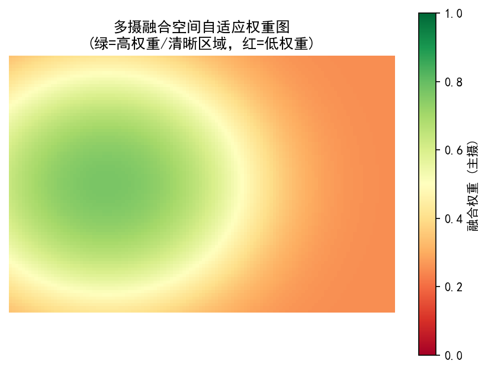
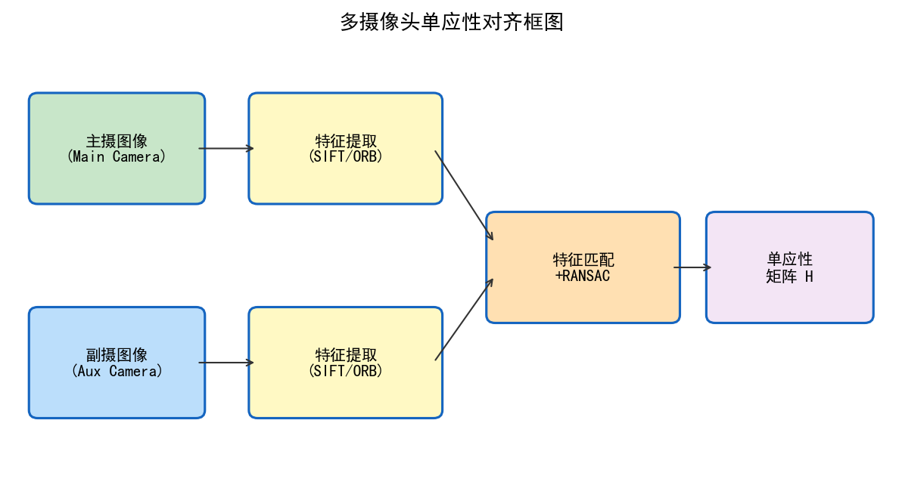
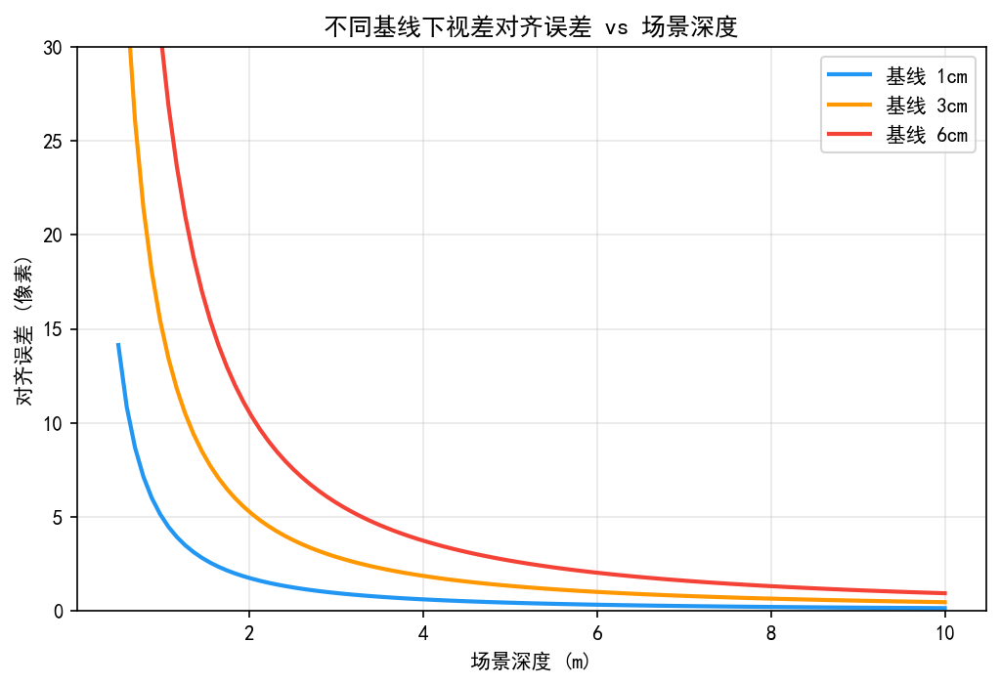
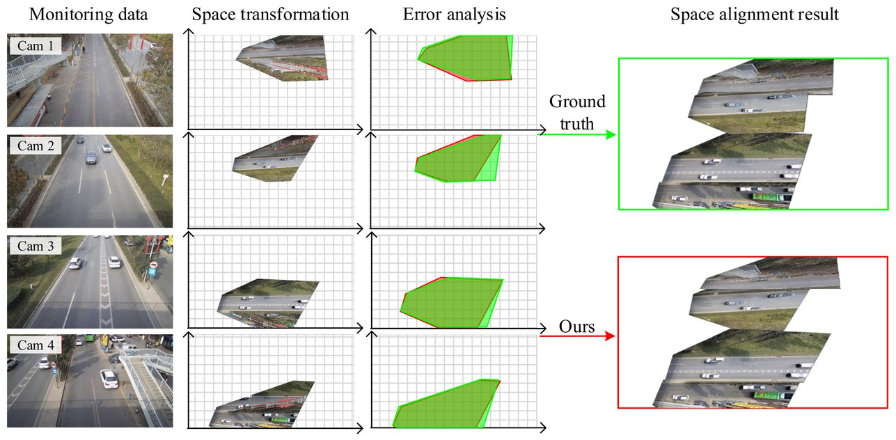

# 第二卷第22章：多摄像头融合与拼接

> **定位：** 本章覆盖双摄/多摄系统的图像融合核心算法——视差估计、特征点对齐、曝光一致性、多光谱融合与接缝消除，是实现多摄计算变焦与夜景多帧的基础。
> **前置章节：** 第一卷第03章（传感器物理）、第二卷第01章（BLC）、第二卷第10章（HDR合帧）
> **读者路径：** 算法工程师、相机系统工程师

---

## 目录

1. [多摄系统几何关系与标定方程](#1-多摄系统几何关系与标定方程)
2. [视差估计算法](#2-视差估计算法)
3. [曝光一致性与色彩对齐](#3-曝光一致性与色彩对齐)
4. [常见伪影分析](#4-常见伪影分析)
5. [评测方法](#5-评测方法)
6. [代码示例](#6-代码示例)
7. [参考资料](#7-参考资料)
8. [术语表](#8-术语表)

---

## §1 多摄系统几何关系与标定方程

### 1.1 多摄系统架构概述

现代旗舰手机塞进 2～4 颗摄像头，主摄（等效 24–28 mm）、超广角（12–16 mm）、长焦（50–100 mm）、潜望长焦（100–300 mm）各管一段焦距。问题是它们的传感器尺寸、像素间距、光圈全都不同——一颗是 1/1.3 英寸的大底，另一颗可能是 1/3.5 英寸的小底，同一个场景拍出来的图像在亮度、色彩、噪声上都是两回事。多摄融合的核心工程难题不是算法有多复杂，而是**你在拼两张本质不同的图**：几何对齐、光度一致性、时序同步，缺任何一环，接缝就出来了。

多摄融合的主要应用场景：
- **计算变焦（Computational Zoom）**：在主摄与长焦焦距之间平滑插值，填补光学倍率空白；
- **夜景多摄融合（Night Mode Multi-Camera Fusion）**：利用不同曝光组合抑制噪声、扩大动态范围；
- **景深辅助（Depth-Assisted Bokeh）**：用双摄视差生成深度图，驱动虚化渲染。

### 1.2 相机内参模型

单摄像头的内参矩阵（Intrinsic Matrix）$\mathbf{K}$ 将相机坐标系三维点 $\mathbf{X}_c = (X, Y, Z)^\top$ 投影到图像像素坐标 $(u, v)$：

$$
\begin{pmatrix} u \\ v \\ 1 \end{pmatrix} = \mathbf{K} \begin{pmatrix} X/Z \\ Y/Z \\ 1 \end{pmatrix}, \quad
\mathbf{K} = \begin{pmatrix} f_x & s & c_x \\ 0 & f_y & c_y \\ 0 & 0 & 1 \end{pmatrix}
$$

其中 $f_x, f_y$ 为以像素为单位的焦距，$(c_x, c_y)$ 为主点坐标，$s$ 为像平面倾斜参数（通常为 0）。

镜头畸变（Lens Distortion）采用 Brown–Conrady 模型，将归一化相机坐标 $(x, y)$ 修正为：

$$
x_d = x(1 + k_1 r^2 + k_2 r^4 + k_3 r^6) + 2p_1 xy + p_2(r^2 + 2x^2)
$$

其中 $r^2 = x^2 + y^2$，$k_1, k_2, k_3$ 为径向畸变系数，$p_1, p_2$ 为切向畸变系数。超广角镜头通常需要更多径向项（$k_4, k_5, k_6$）或采用鱼眼（Fisheye）等距投影模型。

### 1.3 外参模型与相对姿态

两摄像头之间的相对几何关系由外参（Extrinsic Parameters）描述：旋转矩阵 $\mathbf{R} \in SO(3)$ 与平移向量 $\mathbf{t} \in \mathbb{R}^3$，将摄像头 1 坐标系点变换到摄像头 0 坐标系：

$$
\mathbf{X}_{c_0} = \mathbf{R} \mathbf{X}_{c_1} + \mathbf{t}
$$

外参标定通常通过对同一棋盘格靶标拍摄多姿态图像，由 Zhang（IEEE TPAMI 2000）**[4]** 方法求解，精度要求：旋转角误差 < 0.05°，平移误差 < 0.1 mm 。

### 1.4 本质矩阵与基础矩阵

**本质矩阵（Essential Matrix）** $\mathbf{E}$ 描述两台已标定摄像头之间的对极几何约束：

$$
\mathbf{E} = [\mathbf{t}]_\times \mathbf{R}
$$

其中 $[\mathbf{t}]_\times$ 为 $\mathbf{t}$ 的反对称矩阵（skew-symmetric matrix）。归一化坐标系对应点 $\mathbf{x}_1, \mathbf{x}_2$ 满足：

$$
\mathbf{x}_2^\top \mathbf{E} \mathbf{x}_1 = 0
$$

**基础矩阵（Fundamental Matrix）** $\mathbf{F}$ 直接作用于像素坐标，将内参纳入约束：

$$
\mathbf{F} = \mathbf{K}_2^{-\top} \mathbf{E} \mathbf{K}_1^{-1}
$$

工程中常用 8 点算法（Longuet-Higgins, Nature 1981）配合 RANSAC（Fischler & Bolles, CACM 1981）**[11]** 从特征点匹配中鲁棒估计 $\mathbf{F}$；精度要求高时使用 5 点算法（Nistér, IEEE TPAMI 2004）**[3]**。

### 1.5 视差方程与深度恢复

标准双目系统中，两摄像头光心水平距离称为基线（Baseline）$B$，焦距为 $f$，世界深度 $Z$ 处的同名点在左右图像的水平偏移即视差（Disparity）$d$：

$$
d = \frac{f \cdot B}{Z} \quad \Longrightarrow \quad Z = \frac{f \cdot B}{d}
$$

深度误差与视差误差的关系为：

$$
\Delta Z = \frac{f \cdot B}{d^2} \Delta d = \frac{Z^2}{f \cdot B} \Delta d
$$

典型手机双摄基线 $B = 3$–12 mm ，在近景（$Z < 0.5$ m）深度估计精度受限，主要用于生成辅助深度图而非精密测距。长焦辅摄（$B \approx 10$–12 mm）在中远景（1–5 m）具有较好的深度分辨率。

### 1.6 图像整流（Stereo Rectification）

为将视差搜索简化为一维水平扫描，需对双目图像进行极线整流（Epipolar Rectification）。整流后两幅图像的对应极线共面且水平对齐，Bouguet 算法（由 OpenCV `cv2.stereoRectify` 实现）生成整流映射 $\mathbf{H}_1, \mathbf{H}_2$，使极线行对齐误差 < 0.5 像素 。整流引入的图像变形采用双线性插值或 Lanczos 重采样以减小混叠。

---

## §2 视差估计算法

### 2.1 块匹配（Block Matching）

块匹配（Block Matching, BM）是最早且仍被广泛使用的局部视差估计方法。对参考图像每个像素 $(u, v)$，在目标图像同行的搜索范围 $[d_{\min}, d_{\max}]$ 内，寻找匹配代价最小的视差候选值。

常用匹配代价函数：

| 代价函数 | 公式 | 特点 |
|---|---|---|
| SAD（绝对差和） | $\sum_{(i,j)\in W} \|I_L(u+i,v+j) - I_R(u+i-d,v+j)\|$ | 计算快，对光照变化敏感 |
| SSD（差值平方和） | $\sum (I_L - I_R)^2$ | 对噪声更敏感 |
| NCC（归一化互相关） | $\frac{\sum(I_L-\bar{I}_L)(I_R-\bar{I}_R)}{\sigma_{I_L}\sigma_{I_R}}$ | 对均值漂移鲁棒 |
| Census 变换 | 局部二进制编码的汉明距离 | 对噪声/光照不均鲁棒 |

Census 变换（Zabih & Woodfill, ECCV 1994）**[10]** 通过将 $N\times N$ 邻域像素与中心像素比较大小生成二进制串，匹配代价为汉明距离（Hamming Distance），在嵌入式平台广泛使用。局部块匹配的弱点：在低纹理区域（天空、白墙）、遮挡区域及视差不连续边缘处精度较差。

### 2.2 半全局匹配（Semi-Global Matching，SGM）

SGM 由 Hirschmüller（IEEE TPAMI 2008）**[1]** 提出，在保持计算可行性的前提下引入全局平滑约束，显著改善遮挡和低纹理区域的视差质量。

SGM 在多个方向（通常 8 或 16 个方向）独立执行一维动态规划，然后对各方向代价体积求和：

$$
S(p, d) = \sum_{r} L_r(p, d)
$$

沿方向 $r$ 的路径代价递推为：

$$
L_r(p, d) = C(p, d) + \min\begin{cases}
L_r(p-r, d) \\
L_r(p-r, d\pm 1) + P_1 \\
\min_k L_r(p-r, k) + P_2
\end{cases} - \min_k L_r(p-r, k)
$$

$P_1$ 控制小视差变化（±1），$P_2$ 控制大视差跳变，通常自适应调整：在梯度强的边缘处减小 $P_2$ 允许深度不连续，在平坦区域增大 $P_2$ 强制平滑。

**平台实现：** 高通（Qualcomm）Snapdragon 8 Gen 系列通过 Spectra ISP 硬件单元加速 SGM；联发科（MediaTek）Dimensity 系列通过 HW Depth Engine 支持实时 SGM 视差图。在手机端 1/4 下采样分辨率（典型 1000×750）下，硬件 SGM 可在 < 30 ms 内完成 64 视差范围的视差估计（注：量产路径通常在 1/4 分辨率下运行 SGM，全分辨率方案因带宽限制在主流 SoC 上不可行；最终深度图经双线性上采样+引导滤波恢复到全分辨率）。

### 2.3 深度学习视差估计：RAFT-Stereo

RAFT-Stereo（Lipson et al., 3DV 2021）**[2]** 将光流估计框架 RAFT 扩展到立体视差任务，在 KITTI 2015 排行榜取得 D1-bg **1.30%**、D1-fg **6.22%**、D1-all **1.96%** 的成绩（发表时；"D1-noc" 为 KITTI 2012 指标体系，不适用于 KITTI 2015，KITTI 2015 使用 D1-bg/D1-fg/D1-all）。

RAFT-Stereo 的三个核心模块如下：
- **相关体积（Correlation Volume）**：提取左右图像特征 $f_L, f_R \in \mathbb{R}^{H/8 \times W/8 \times C}$，构建 4D 相关体积并做 4 级池化，实现多尺度匹配代价查询；
- **迭代更新（Iterative Update）**：用 ConvGRU（Convolutional Gated Recurrent Unit）迭代细化视差估计，每次迭代通过查询相关体积获得上下文信息；
- **可学习上采样（Convex Upsampling）**：将 $1/8$ 分辨率视差图恢复到全分辨率，相比双线性插值在边缘处更精确。

移动端落地策略：① 降低特征分辨率至 $1/4$；② 减少 GRU 迭代次数（12 次→4 次）；③ 用 MobileNetV3 骨干替换 ResNet 编码器；④ INT8 量化推理。

> **工程推荐（手机双摄视差估计）：** 实时散景路径（用于人像模式，需 < 30 ms）优先选硬件 SGM，高通/联发科平台已有 HW 加速，不必重新实现。RAFT-Stereo 类深度学习方案更适合离线精修路径（如相册重渲或后期景深增强），在 NPU INT8 可达 10–20 ms，但训练数据覆盖度决定泛化质量，低纹理场景（白墙、纯色衣物）DL 方案的失效模式和 BM/SGM 不同，测试集要包含这类场景。

### 2.4 视差后处理

1. **左右一致性检查（Left-Right Consistency Check）**：以左图和右图分别作为参考计算视差，若两者差值 > 1 像素则标记为无效像素（置信度低）；
2. **亚像素精化（Sub-pixel Refinement）**：对视差代价曲线做抛物线拟合，实现 0.25 像素精度；
3. **孔洞填充（Hole Filling）**：无效区域取周边背景视差的中位数填充；
4. **导向滤波（Guided Filter，He et al., IEEE TPAMI 2013）** **[7]**：以参考图像为导向对视差图进行边缘保持平滑，半径 $r=5$–20，正则化系数 $\epsilon=0.01$–0.1 。

---

## §3 曝光一致性与色彩对齐

### 3.1 多摄增益对齐

不同摄像头因传感器类型、镜头透射率、光圈等差异，在同等场景亮度下输出的原始数字值（Digital Number, DN）存在系统性偏差，需进行辐射标定（Radiometric Calibration）。

**曝光归一化因子：**

$$
k = \frac{t_0 \cdot g_0}{t_1 \cdot g_1}
$$

其中 $t_0, g_0$ 为主摄曝光时间与增益，$t_1, g_1$ 为辅摄参数。实际标定时，对 18% 灰卡或 Macbeth ColorChecker 拍摄，比较两摄同一色块的平均 RAW DN 值，通过最小二乘法拟合分段线性增益函数（Per-Channel Gain），以补偿镜头暗角、CFA 响应差异。

### 3.2 CCM 跨摄色彩一致性

由于镜头透射率谱和滤色片（Color Filter Array, CFA）响应差异，各摄像头色彩空间不同，直接融合会产生颜色不匹配伪影。

设主摄色彩矫正矩阵（Color Correction Matrix, CCM）为 $\mathbf{M}_0$，辅摄 CCM 为 $\mathbf{M}_1$，辅摄到主摄参考空间的对齐变换为：

$$
\mathbf{I}_{aligned} = \mathbf{M}_0 \mathbf{M}_1^{-1} \mathbf{I}_{cam1}
$$

完整变换链（含白平衡增益 $wb$）：

$$
\mathbf{I}_{ref} = \mathbf{M}_0 \cdot \text{diag}(wb_0) \cdot \mathbf{I}_{cam0}
$$
$$
\mathbf{I}_{aligned} = \mathbf{M}_0 \cdot \text{diag}(wb_0) \cdot \mathbf{M}_1^{-1} \cdot \text{diag}(wb_1)^{-1} \cdot \mathbf{I}_{cam1}
$$

此矩阵可离线预计算，嵌入式实现仅需一次 3×3 矩阵乘法。强制主辅摄使用相同 AWB 增益（以主摄为准）可进一步简化，通常颜色误差 ΔE < 1.5 CIE76 。

### 3.3 HDR 宽动态双摄融合

**空间 HDR（Spatial HDR）**：主摄正常曝光 + 辅摄短曝光（通常差 2–4 EV），按视差对齐后融合，可同时覆盖高光和阴影细节，优于单摄时序 HDR（无运动鬼影风险）。

融合权重参考 Debevec & Malik（SIGGRAPH 1997）**[6]** 帽形函数：

$$
W(z) = \begin{cases}
z - z_{\min} & z \leq \frac{z_{\min}+z_{\max}}{2} \\
z_{\max} - z & z > \frac{z_{\min}+z_{\max}}{2}
\end{cases}
$$

辅摄重投影到主摄坐标系（利用视差图 $d(u,v)$）：

$$
u' = u - d(u,v), \quad v' = v
$$

（整流后坐标，视差仅在水平方向）。对于非整流系统，需通过完整的重投影方程计算。

### 3.4 Laplacian 金字塔融合

对齐后的多摄图像用 Laplacian 金字塔融合（Burt & Adelson, ACM TOG 1983）**[5]** 消除亮度差异引起的接缝：

1. 对各输入图像构建 Laplacian 金字塔 $\{L_k^{(i)}\}$；
2. 对权重掩膜构建 Gaussian 金字塔 $\{G_k^{W}\}$；
3. 逐层融合：$\hat{L}_k = \sum_i G_k^{W(i)} \cdot L_k^{(i)}$，其中权重满足归一化约束 $\sum_i G_k^{W(i)}(x,y) = 1$（对每个空间位置 $(x,y)$，否则输出亮度将系统性偏高或偏低）；
4. 从最低频层（Gaussian 余项）开始逐层重建融合图像。

实践中，金字塔层数取 3–5 层，可显著消除低频亮度差异引起的接缝，同时保留高频纹理细节。

---

## §3b 手机多摄无缝切换技术

### 3b.1 超广/广/长焦切换的视觉连续性问题

手机多摄切换（如从 1× 主摄切换到 3× 长焦）是用户最高频感知到质量问题的场景。理想切换应满足：

1. **时间连续性**：切换帧与前后帧亮度/色彩无可见跳变
2. **空间连续性**：中心区域内容在切换前后视觉上"无缝"
3. **焦距连续性**：用户在 1× 和 3× 之间捏合时，数字变焦过渡平滑

#### 实际切换时间轴

```
帧 N-2  帧 N-1  帧 N（触发切换）  帧 N+1  帧 N+2
[主摄]  [主摄]  [主摄→长焦请求]  [长焦]  [长焦]
                     ↓
         ISP切换延迟：通常 2–4 帧（66–133ms @30fps）
         期间：前端传感器切换（~1帧）+ ISP参数重新收敛（AE/AWB，~1–3帧）
```

**主要视觉挑战：**
- AE 切换跳变：两摄曝光参数不同，切换帧亮度突变
- 色彩切换跳变：AWB 增益不同，色调偏移
- 视角（FoV）跳变：切换时视角突变（1× → 3× 视角变化约 3:1）
- 对焦跳变：主摄以 1m 物体为焦点，长焦处于不同焦距

#### 无缝切换的工程方案

**方案一：预测性参数预热（Pre-conditioning）**

在切换命令发出前，提前将辅摄的 AE 目标锁定到主摄的当前曝光量：

$$EV_{\text{tele,target}} = EV_{\text{wide,current}} + \Delta_{EV,\text{cal}}$$

其中 $\Delta_{EV,\text{cal}}$ 为两摄在标定场景下的系统性 EV 偏差（离线标定）。预热窗口通常为 2–4 帧，由用户手势速度（捏合速度）触发。

**方案二：重叠过渡帧（Alpha Blending Zone）**

在切换前后 $N_b$ 帧内，对主摄裁剪帧（数字变焦到等效焦距）和长焦帧进行 Alpha 混合：

$$I_{\text{output}}^{(t)} = (1 - \alpha^{(t)}) \cdot I_{\text{wide,crop}}^{(t)} + \alpha^{(t)} \cdot I_{\text{tele}}^{(t)}$$

$$\alpha^{(t)} = \frac{t - t_{\text{switch}}}{N_b}, \quad t \in [t_{\text{switch}}, t_{\text{switch}} + N_b]$$

其中 $N_b = 3$–5 帧（建议不超过 5 帧，避免过渡过长用户感知延迟）。

为使混合有意义，需要将主摄裁剪区域和长焦图像做精确对齐（使用 §1.4 的基础矩阵或特征点匹配）。

**方案三：直播流水线的切换隐藏**

对于视频录制，利用 I 帧（关键帧）边界进行切换，使编码器无需处理跨摄参考帧，同时在接近 I 帧前触发切换动作。

**双路预览功耗代价：** 双摄同时 Preview + 实时 Fusion 时，ISP 工作功耗通常在 800 mW–1.2 W
（单摄 Preview 约 400–600 mW），差值主要来自额外的色彩对齐 + 视差估计 NPU 推理。
持续双摄 Preview 场景下整机热设计余量（TDP）需预留 ≥ 1.5 W 给 ISP+NPU，
否则触发热降频后切换延迟会劣化至 6–8 帧（200–267ms @30fps）。
以上为工程经验估算值，实测数字依 SoC 制程和配置不同有 ±20% 浮动。

#### §3b.1 色彩接缝诊断三步法

color seam 的三个根因按频率排序为：**AWB 不同步（最常见）> CCM 差异 > LSC 残余**。诊断应按此顺序进行：

**Step 1：检查 AWB 增益差值**
```
ΔWR = |WR_main - WR_sub|，ΔWB = |WB_main - WB_sub|
判断标准：ΔWR > 0.05 或 ΔWB > 0.05 时，色差主要来源为 AWB
```
处理方案：切换时强制辅摄 AWB 增益跟随主摄，采用 IIR 平滑过渡（5–10 帧）：
`W_sub[t] = α·W_main + (1-α)·W_sub[t-1]`，其中 `α ≈ 0.3–0.5`

**Step 2：比较 CCM 矩阵差异**
计算主辅摄 CCM 矩阵的 Frobenius 距离：
`d_CCM = ‖M_main - M_sub‖_F`
若 `d_CCM > 0.15`，需重新标定辅摄 CCM 或调整辅摄光源权重

**Step 3：检查 LSC 校正残余**
比较主辅摄在切换区域（通常是画面中心 30%）的平均亮度差：
- 差值 > 3%（约 8 DN/256）时，LSC 残余为主要贡献
- 处理方案：在辅摄 LSC 增益图中叠加一个对角增益补偿（补偿 CRA 差异导致的非对称阴影）

**AWB 切换同步策略（量产推荐）**：
1. 切换前 3 帧：辅摄 AWB 锁定，使用主摄 AWB 增益强制覆盖
2. 切换当帧：用主摄增益驱动辅摄
3. 切换后 5–10 帧：辅摄 AWB 逐步从主摄增益过渡到独立估计（IIR，α=0.3）

高通 MCT 层（`MultiCameraController`）提供 `SyncAWBForZoomSwitch` 接口；MTK FeaturePipe 的 `SyncManager` 类有等效实现。

### 3b.2 计算变焦（Computational Zoom）视差处理

在 1× 和 3× 光学端点之间做**连续光学变焦模拟**时，需要处理两摄之间的视差（Parallax）：

#### 视差引起的内容不匹配

在近景（物体距离 $Z < 2$ m），主摄和长焦对同一物体的观测视角差异显著：

$$\Delta u_{\text{parallax}} = f_{\text{tele}} \cdot \frac{B}{Z}$$

其中 $B$、$Z$ 为物理长度（单位相同），$f_{\text{tele}}$ 为长焦物理焦距（与 $B$ 单位一致）。结果为物理长度，除以像素尺寸（pixel pitch）得像素视差；若直接使用像素焦距 $f_{\text{px}} = f_{\text{mm}}/p$（$p$ 为像素尺寸 mm），则 $\Delta u_{\text{parallax}}$ 直接以像素为单位。以 $B=15$ mm、$f_{\text{tele}}=9$ mm（物理，等效 90mm）、$Z=500$ mm、像素尺寸 $p=0.9\,\mu\text{m}$ 为例：

$$\Delta u_{\text{parallax}} \approx 9 \times \frac{15}{500} = 0.27 \,\text{mm} = 270\,\mu\text{m} \quad \Rightarrow \quad \frac{270\,\mu\text{m}}{0.9\,\mu\text{m/px}} \approx 300 \,\text{px}$$

> ⚠️ **单位说明：** 勿将物理焦距（mm）直接代入以像素为单位的视差公式，二者差约 $10^3$ 倍（取决于像素尺寸）。推荐统一转为像素焦距：$f_{\text{px}} = f_{\text{mm}} / p_{\text{mm}}$，然后 $\Delta u_{\text{px}} = f_{\text{px}} \cdot B_{\text{mm}} / Z_{\text{mm}}$。

300 像素的视差在 12MP 图像中非常明显，不可忽略。

#### 视差补偿方案

**深度引导重投影（Depth-Guided Reprojection）：**

利用辅助深度图（由 SGM 或 ToF 传感器获取）对长焦图像做逐像素重投影：

$$\begin{pmatrix} u_{\text{wide}} \\ v_{\text{wide}} \end{pmatrix} = \pi\!\left(\mathbf{K}_{\text{wide}} \left(\mathbf{R} \cdot \pi^{-1}\!\left(\mathbf{K}_{\text{tele}}^{-1} \begin{pmatrix} u_{\text{tele}} \\ v_{\text{tele}} \end{pmatrix}, Z(u,v)\right) + \mathbf{t}\right)\right)$$

其中 $\pi(\cdot)$ 为投影函数，$\pi^{-1}(\cdot, Z)$ 为反投影（需要深度 $Z$），$(\mathbf{R}, \mathbf{t})$ 为两摄外参。

**近景降级策略：** 当 $Z < 1$ m（视差 > 15 px）且无可靠深度图时，退回主摄裁剪（数字变焦），避免视差伪影。阈值由深度置信度图决定。

### 3b.3 几何一致性约束

多摄系统在时序和几何上需要满足以下约束，以保证融合质量：

#### 几何一致性代价函数

多摄融合的几何一致性可以用以下约束量化：设主摄图像 $I_0$ 和辅摄图像 $I_1$，经过重投影变换 $\mathcal{W}(\cdot; \mathbf{R}, \mathbf{t}, Z)$ 后，对应点应满足：

$$\mathcal{L}_{\text{geo}} = \sum_{(u,v) \in \Omega_{\text{valid}}} \left\| I_0(u, v) - I_1\!\left(\mathcal{W}(u, v; \mathbf{R}, \mathbf{t}, Z(u,v))\right) \right\|_1$$

其中 $\Omega_{\text{valid}}$ 为有效（非遮挡、非低纹理）像素集合，$Z(u,v)$ 为深度图。

**几何一致性检验（Left-Right Check 扩展）：**

扩展到多摄（三摄或四摄）的双向一致性检验：

$$\text{Consistency}(u,v) = \left\| Z_{\text{0→1}}(u,v) - Z_{\text{1→0}}(u',v') \right\| < \tau_Z$$

其中 $Z_{\text{0→1}}$ 为以主摄为参考估计的深度，$Z_{\text{1→0}}$ 为以辅摄为参考估计再反投影到主摄的深度，$\tau_Z = 0.05 \cdot Z$（深度的 5%）为一致性阈值。

#### 时间戳同步约束

手机多摄由于 Rolling Shutter 和硬件触发时延，不同摄像头的帧曝光起始时刻存在偏差 $\Delta t$：

$$\Delta t_{\text{sync}} \leq \frac{1}{\omega_{\max} \cdot \tan(\theta_{\text{max}})}$$

其中 $\omega_{\max}$ 为最大场景运动角速度（rad/s），$\theta_{\max}$ 为允许的最大运动模糊角度。典型要求：$\Delta t_{\text{sync}} < 1$ ms（对应手持抖动速度约 200 deg/s 时运动模糊 < 0.2 px）。

**硬件同步触发（MIPI Sync Pulse）：** 主流手机 ISP（高通 Spectra、联发科 Imagiq）支持通过 MIPI CSI-2 Sync 引脚实现多摄硬件同步，同步精度可达 **< 100 μs**（约 $1/3$ 帧行时间），远优于软件同步（通常误差 > 5 ms）。

### 3b.4 超广/广/长焦切换质量指标

| 指标 | 定义 | 目标值 |
|------|------|-------|
| 切换帧亮度跳变 | $\|Y_{\text{frame N}} - Y_{\text{frame N+1}}\| / Y_{\text{frame N}}$ | < 5% |
| 切换帧色温跳变 | CCT（色温）变化 | < 100 K |
| 中心区域 SSIM（切换帧 vs 前帧）| 中心 1/4 区域的 SSIM | > 0.92 |
| 视差伪影帧比例 | 融合图中可见视差 ghosting 帧占比 | < 2% |
| 切换 AF 重新对焦时间 | 从切换命令到 AF 稳定 | < 3 帧（100 ms @30fps）|

---

### 3b.5 多摄 AWB/CCM/Gamma 一致性联动机制（工程联动补充）

**缺口说明：** §3.2 描述了跨摄 CCM 对齐的数学公式，但没有回答"AWB 增益、CCM、Gamma 是否需要一致？两个摄像头 CCT 估计不同时如何处理？"这类工程现场问题。

#### 3b.5.1 多摄 ISP 参数三层联动关系

多摄系统的颜色一致性需要在三层参数上协同：

| 层级 | 参数 | 是否必须统一 | 理由 |
|------|------|------------|------|
| **AWB 增益（白平衡增益）** | `R_gain`, `B_gain` | **推荐统一**，以主摄为基准 | 两摄 AWB 独立估计时，广角因视野大有大面积暖色，主摄视野小命中中性色，CCT 估计可相差 300–500 K；独立增益会导致切换帧明显色偏 |
| **CCM（色彩校正矩阵）** | 3×3 矩阵 | **不应统一**，各摄独立标定 | 每颗传感器的 CFA 响应和镜头透射率不同，强制用同一矩阵会引入系统性色差（$\Delta E > 3$） |
| **Gamma / 色调曲线** | ISP Gamma 表 | **推荐统一视觉目标，参数可不同** | 两摄使用相同的目标 Gamma 曲线（如 sRGB 2.2），但各摄的 LUT 可根据传感器线性度差异做微调 |

#### 3b.5.2 两摄 CCT 估计不同时的处理策略

**典型冲突场景：** 广角摄像头（90° FOV）视野内有大面积木质地板（色温约 3000 K），主摄（25° FOV）对准白色墙壁（D65，6500 K）。两摄独立 AWB 结果差异约 3500 K。

**策略一：主摄优先（锁定主摄 AWB）**

将主摄当前 AWB 结果强制应用到辅摄，辅摄不做独立 AWB：

```
R_gain_tele = R_gain_main
B_gain_tele = B_gain_main
```

适用场景：切换过渡期（切换前后各 2–3 帧），防止切换色偏。

缺点：如果两摄拍摄的是真实场景中不同区域（如广角真的有大面积暖光），辅摄颜色会偏冷。

**策略二：加权融合 CCT**

在切换区间对两摄 CCT 做加权平均，使用用户当前 Zoom 倍率作为权重：

$$\text{CCT}_{out} = (1 - \alpha) \cdot \text{CCT}_{\text{main}} + \alpha \cdot \text{CCT}_{\text{tele}}$$

其中 $\alpha$ = (当前 Zoom 倍率 - 主摄焦距) / (长焦焦距 - 主摄焦距)，在 1× → 3× 切换过程中从 0 渐变到 1。

**策略三：YUV 域色调对齐（Tone Alignment）**

各摄独立 AWB，但在 YUV 域通过小矩阵（3×3）将辅摄色温偏差补偿到与主摄一致：

$$\begin{bmatrix} Y' \\ Cb' \\ Cr' \end{bmatrix}_{\text{tele,aligned}} = \mathbf{M}_{\text{tone}} \cdot \begin{bmatrix} Y \\ Cb \\ Cr \end{bmatrix}_{\text{tele}}$$

其中 $\mathbf{M}_{\text{tone}}$ 由两摄在同一标准光源下的色差标定获得（离线标定），可在切换时实时应用，不影响各摄的独立 AWB。

> **工程师推荐：** 正式产品通常组合使用——日常拍照切换用策略一（简单可靠），视频录制拍摄用策略三（质量更高但复杂），避免用户在长视频中看到明显的色温漂移。

#### 3b.5.3 多摄 视差对 LSC 估计精度的影响

**缺口说明：** §2 描述了视差估计算法，但没有说明 LSC（镜头阴影校正）对视差估计精度的影响。

**LSC 与视差估计的耦合：**

LSC（Lens Shading Correction）在 ISP 前端对每个像素施加增益补偿，消除镜头边角暗角。但这个增益补偿是**空间非均匀的**——边缘像素增益通常比中心高 40–60%。

**对视差估计的影响：**
- 主摄和辅摄的 LSC 增益图形状不同（光圈、镜头设计不同）
- 边缘区域 LSC 增益差异使得同一物体在两摄边缘区域的 RAW 亮度不同，即使场景亮度完全一样
- 块匹配（BM/SGM）使用亮度 SAD/SSD 作为匹配代价，边缘区域的 LSC 差异直接增加匹配代价的噪声项，导致视差估计误差在边缘区域增大约 10–20%

**工程解决方案：**

在视差估计前统一对两摄图像做**亮度归一化（Luminance Normalization）**：

```
归一化后主摄亮度：Y_main_norm = Y_main / LSC_gain_main(x, y)
归一化后辅摄亮度：Y_tele_norm = Y_tele / LSC_gain_tele(x, y)
```

这等价于在线性传感器域（LSC 前）做视差估计，消除 LSC 引入的空间亮度不均匀性。主流 ISP 平台（高通 Spectra、联发科 Imagiq）的立体匹配模块通常支持选择 pre-LSC RAW 作为视差估计输入，直接用 LSC 校正前的原始数据做立体匹配，从根本上避免 LSC 差异的干扰。

#### 3b.5.4 Zoom Switch 切换点的亮度/色彩平滑过渡机制

**切换前后亮度差异的来源：**

即使做了 AE 预热（§3b.1 方案一），切换帧仍可能存在亮度差异，来源包括：

1. **Gamma 曲线差异**：主摄用 Lux=500 对应的 Gamma，长焦用 Lux=600（因视野小，平均亮度统计值不同），两条 Gamma 曲线在中间调的输出差异约 3–5%
2. **3A 收敛延迟**：AE 预热只能减少延迟，不能消除——ISP AE 算法通常有 1–2 帧的低通滤波（防止亮度震荡），切换帧时 AE target 还在收敛中
3. **传感器 PDAF 帧混入**：部分传感器在切换时序中有 PDAF（相位对焦）帧，该帧亮度可能偏低

**平滑过渡的工程实现：**

除 Alpha Blending（§3b.1 方案二）外，还可以在**ISP 输出后、编码器前**做一个全局增益补偿：

$$I_{\text{final}}^{(t)} = I_{\text{raw\_output}}^{(t)} \times \frac{Y_{\text{target}}}{Y_{\text{measured}}^{(t)}}$$

其中 $Y_{\text{target}}$ 为切换前最后一帧的平均亮度，$Y_{\text{measured}}^{(t)}$ 为切换后当前帧的实测平均亮度，增益补偿在 2–3 帧内线性衰减到 1.0。这个方案比 Alpha Blending 更轻量（只做标量乘法，不需要两帧同时存在内存），适合内存受限的视频录制场景。

---

## §4 常见伪影分析

### 4.1 视差鬼影（Disparity Ghosting）

**表现：** 运动物体在融合图像中出现重影，或近景物体边缘出现双轮廓。

**根本原因：** 视差估计误差导致辅摄重投影位置不准，主摄与辅摄对应区域来自不同场景位置。

**缓解方案：**
- 引入置信度图（Confidence Map）：仅在视差可信区域使用辅摄数据，低置信度区域（遮挡、低纹理）退回主摄单摄输出；
- 运动检测（Motion Segmentation）：对运动区域降低融合权重或禁用融合；
- 时域一致性过滤：利用前后帧视差一致性过滤不可靠视差。

### 4.2 接缝可见（Seam Visibility）

**表现：** 多摄拼接图像中，在视场（FOV）切换区域出现亮度或色彩的突变线。

**根本原因：** 曝光不一致（曝光时间、AGC 增益同步问题），色彩空间对齐残差，或几何对齐误差导致结构纹理错位。

**缓解方案：**
- 强制主辅摄硬件同步曝光（Hardware Sync Capture）；
- 在切换区域设计渐变权重过渡带（Blend Zone），宽度建议为图像分辨率的 2–5%；
- 图像梯度引导的最优缝合线（Graph-Cut Stitching），沿低梯度路径选择接缝（Kwatra et al., SIGGRAPH 2003）**[8]**（注：Seam Carving 为 Avidan & Shamir SIGGRAPH 2007 的内容感知尺寸调整算法，与此处图割拼接不同）。

### 4.3 颜色不一致（Color Inconsistency）

**表现：** 同一物体在主摄与辅摄区域颜色明显不同（偏蓝或偏黄）。

**根本原因：** CCM 标定误差，白平衡偏差（主辅摄 AWB 算法输出不同），镜头涂层差异导致色温响应不同。

**缓解方案：**
- 色调映射前进行全局直方图匹配（Histogram Matching）；
- 强制主辅摄使用相同 AWB 增益（以主摄为准）；
- 定期在线重标定，利用场景灰色区域自适应调整跨摄增益。

### 4.4 几何对齐误差（Geometric Misalignment）

**表现：** 拼接区域出现结构错位（双边缘），在近景或大视差场景中更明显。

**根本原因：** 外参标定精度不足（装配公差导致实际 $\mathbf{R}, \mathbf{t}$ 偏离标定值），温度形变，Rolling Shutter 效应导致曝光时刻差异。

**缓解方案：**
- 在出厂标定外增加在线自标定（Online Self-Calibration）机制；
- 全局单应性矩阵（Homography）微调补偿，通常偏差 < 5 像素时有效；
- 采用全局快门（Global Shutter）传感器或硬件同步触发减小 Rolling Shutter 差异。

---

## §5 评测方法

### 5.1 几何对齐客观指标

- **EPE（End-Point Error，端点误差）**：预测视差图与 LiDAR 或结构光真值之间的平均绝对误差，单位像素；
- **D1-all**：视差误差 > 3 像素且相对误差 > 5% 的像素比例（KITTI 2015 标准）；
- **Bad-X%**：误差超过 X 像素的像素占比（常用 Bad-1, Bad-2, Bad-4）。

### 5.2 融合图像质量客观指标

- **SSIM（Structural Similarity Index）**：衡量融合图像与参考图像的结构、亮度、对比度一致性（Wang et al., IEEE TIP 2004）**[9]**，范围 [0, 1]，越高越好；
- **PSNR（Peak Signal-to-Noise Ratio）**：衡量整体信号保真度，单位 dB；
- **ΔE（CIEDE2000）**：在 CIE L\*a\*b\* 色彩空间量化主辅摄同名色块的颜色偏差，ΔE < 2 为人眼可接受阈值。

### 5.3 主观评测规范

主观评测建议双盲 A/B 比较（Double-Blind A/B Test）：

| 评估维度 | 评分标准 |
|---|---|
| 接缝自然程度 | 1–5 分（5=完全不可见） |
| 颜色一致性 | 1–5 分（5=无可见色差） |
| 运动鬼影 | 1–5 分（5=无鬼影） |
| 整体融合质量 | 1–5 分 |

**测试场景覆盖：** 18% 灰卡（颜色一致性）、棋盘格（几何精度）、运动人手（鬼影）、窗口逆光（HDR 融合）、夜景（低 SNR）、建筑远景（接缝）。

---

## §6 代码示例

以下代码演示基于 OpenCV 的双目立体视差计算，对比 StereoBM（块匹配）与 StereoSGBM（半全局匹配），并包含光度对齐工具函数。代码可直接运行，依赖 `opencv-python` 与 `numpy`。

```python
"""
多摄视差估计对比示例：StereoBM vs StereoSGBM
环境要求：opencv-python>=4.5, numpy>=1.20
运行方式：python ch22_stereo_demo.py
"""

import cv2
import numpy as np
import time
from typing import Tuple


# ──────────────────────────────────────────────
# 1. 合成双目测试图像生成
# ──────────────────────────────────────────────

def generate_synthetic_stereo(width: int = 640,
                               height: int = 480,
                               true_disparity: int = 16) -> Tuple[np.ndarray, np.ndarray]:
    """
    生成合成双目图像对，用于无真实数据时的算法验证。

    方法：
        - 左图：随机矩形纹理场景 + 高斯噪声
        - 右图：左图水平位移 true_disparity 像素

    返回：
        left_gray, right_gray: uint8 灰度图像
    """
    rng = np.random.default_rng(42)

    # 生成带纹理的场景图（随机矩形）
    scene = np.zeros((height, width), dtype=np.uint8)
    for _ in range(80):
        x1 = rng.integers(0, width - 40)
        y1 = rng.integers(0, height - 40)
        x2 = min(x1 + rng.integers(15, 70), width)
        y2 = min(y1 + rng.integers(15, 70), height)
        val = rng.integers(40, 220)
        scene[y1:y2, x1:x2] = val

    # 叠加渐变背景（增加低频纹理）
    grad_x = np.linspace(30, 80, width, dtype=np.float32)
    grad_y = np.linspace(20, 60, height, dtype=np.float32)
    background = np.outer(grad_y, np.ones(width)) + np.outer(np.ones(height), grad_x)
    scene = np.clip(scene.astype(np.float32) + background * 0.3, 0, 255).astype(np.uint8)

    # 左图加高斯噪声
    noise_l = rng.normal(0, 4, scene.shape)
    left_gray = np.clip(scene.astype(np.float32) + noise_l, 0, 255).astype(np.uint8)

    # 右图 = 左图水平位移（模拟 d=true_disparity 像素视差）
    right_gray = np.zeros_like(left_gray)
    right_gray[:, :width - true_disparity] = left_gray[:, true_disparity:]
    noise_r = rng.normal(0, 3, scene.shape)
    right_gray = np.clip(right_gray.astype(np.float32) + noise_r, 0, 255).astype(np.uint8)

    return left_gray, right_gray


# ──────────────────────────────────────────────
# 2. StereoBM 块匹配视差估计
# ──────────────────────────────────────────────

def compute_disparity_bm(left: np.ndarray,
                          right: np.ndarray,
                          num_disparities: int = 64,
                          block_size: int = 15) -> Tuple[np.ndarray, float]:
    """
    使用 StereoBM（块匹配）计算视差图。

    参数：
        left, right      : uint8 灰度输入图像，尺寸需相同
        num_disparities  : 视差搜索范围，必须为 16 的正整数倍
        block_size       : 匹配窗口大小，必须为奇数，建议 9–21

    返回：
        disp_norm  : uint8 归一化视差图（0–255，供可视化）
        elapsed_ms : 算法耗时（毫秒）
    """
    assert num_disparities % 16 == 0, "numDisparities 必须为 16 的倍数"
    assert block_size % 2 == 1 and block_size >= 5, "blockSize 必须为奇数且 >= 5"

    stereo = cv2.StereoBM.create(numDisparities=num_disparities,
                                  blockSize=block_size)
    # 预滤波（归一化对比度）
    stereo.setPreFilterType(cv2.STEREO_BM_PREFILTER_XSOBEL)
    stereo.setPreFilterCap(31)
    stereo.setPreFilterSize(9)
    # 后处理
    stereo.setUniquenessRatio(15)     # 唯一性约束，过滤模糊匹配
    stereo.setSpeckleWindowSize(100)  # 连通域噪点去除窗口
    stereo.setSpeckleRange(32)        # 视差变化允许范围

    t0 = time.perf_counter()
    raw = stereo.compute(left, right)   # 输出为 16× 定点数 (int16)
    elapsed_ms = (time.perf_counter() - t0) * 1000.0

    disp_float = raw.astype(np.float32) / 16.0
    disp_float[disp_float < 0] = 0     # 无效视差置 0
    disp_norm = cv2.normalize(disp_float, None, 0, 255,
                               cv2.NORM_MINMAX).astype(np.uint8)
    return disp_norm, elapsed_ms


# ──────────────────────────────────────────────
# 3. StereoSGBM 半全局匹配视差估计
# ──────────────────────────────────────────────

def compute_disparity_sgbm(left: np.ndarray,
                            right: np.ndarray,
                            num_disparities: int = 64,
                            block_size: int = 5,
                            use_3way: bool = True) -> Tuple[np.ndarray, float]:
    """
    使用 StereoSGBM（半全局块匹配）计算视差图。

    参数：
        block_size  : 建议 3–11（奇数），越小边缘精度越高但噪声越大
        use_3way    : True 使用伪全局 3WAY 模式（精度高），
                      False 使用标准 8 方向 SGBM（速度快）

    调参经验：
        P1 = 8 * cn * bs^2  （小视差惩罚）
        P2 = 32 * cn * bs^2 （大视差惩罚）
        P2 / P1 应保持在 4–6 之间以兼顾平滑性与边缘保持
    """
    cn = 1  # 灰度图通道数
    bs = block_size
    P1 = 8 * cn * bs * bs
    P2 = 32 * cn * bs * bs
    mode = (cv2.StereoSGBM_MODE_SGBM_3WAY if use_3way
            else cv2.StereoSGBM_MODE_SGBM)

    stereo = cv2.StereoSGBM.create(
        minDisparity=0,
        numDisparities=num_disparities,
        blockSize=bs,
        P1=P1,
        P2=P2,
        disp12MaxDiff=1,          # 左右一致性检查最大容差（像素）
        uniquenessRatio=10,        # 唯一性约束
        speckleWindowSize=100,
        speckleRange=32,
        preFilterCap=63,
        mode=mode
    )

    t0 = time.perf_counter()
    raw = stereo.compute(left, right)
    elapsed_ms = (time.perf_counter() - t0) * 1000.0

    disp_float = raw.astype(np.float32) / 16.0
    disp_float[disp_float < 0] = 0
    disp_norm = cv2.normalize(disp_float, None, 0, 255,
                               cv2.NORM_MINMAX).astype(np.uint8)
    return disp_norm, elapsed_ms


# ──────────────────────────────────────────────
# 4. 评估指标：EPE 和 Bad-X%
# ──────────────────────────────────────────────

def compute_epe(disp_pred_norm: np.ndarray,
                disp_gt: np.ndarray,
                disp_range: int,
                valid_mask: np.ndarray = None) -> float:
    """
    计算 End-Point Error（平均绝对视差误差）。

    参数：
        disp_pred_norm : uint8 归一化视差图 [0, 255]（由 compute_disparity_* 返回）
        disp_gt        : float32 真值视差图（实际像素值）
        disp_range     : 归一化时使用的视差范围
        valid_mask     : 有效像素掩膜（True = 有效）
    """
    disp_pred = disp_pred_norm.astype(np.float32) / 255.0 * disp_range
    err = np.abs(disp_pred - disp_gt.astype(np.float32))
    if valid_mask is not None:
        err = err[valid_mask]
    return float(np.mean(err))


def compute_bad_pct(disp_pred_norm: np.ndarray,
                    disp_gt: np.ndarray,
                    disp_range: int,
                    threshold: float = 3.0,
                    valid_mask: np.ndarray = None) -> float:
    """
    计算 Bad-X% 指标（误差超过 threshold 像素的像素比例）。
    """
    disp_pred = disp_pred_norm.astype(np.float32) / 255.0 * disp_range
    err = np.abs(disp_pred - disp_gt.astype(np.float32))
    if valid_mask is not None:
        err = err[valid_mask]
    return float(np.mean(err > threshold) * 100.0)


# ──────────────────────────────────────────────
# 5. 光度对齐（跨摄增益归一化）
# ──────────────────────────────────────────────

def photometric_align_gain(img_src: np.ndarray,
                            img_ref: np.ndarray) -> np.ndarray:
    """
    全局增益光度对齐：调整 img_src 亮度均值匹配 img_ref。

    适用场景：曝光差异较小（< 1 EV）、无明显 HDR 分布差异时。
    """
    mean_ref = float(np.mean(img_ref))
    mean_src = float(np.mean(img_src))
    if mean_src < 1e-6:
        return img_src.copy()
    gain = mean_ref / mean_src
    aligned = np.clip(img_src.astype(np.float32) * gain, 0, 255).astype(np.uint8)
    return aligned


def photometric_align_histogram(img_src: np.ndarray,
                                 img_ref: np.ndarray) -> np.ndarray:
    """
    逐通道直方图匹配光度对齐：将 img_src 的直方图映射为 img_ref 的直方图。

    适用场景：曝光差异较大或色调偏差明显时。
    支持灰度图（2D）和彩色图（3D）。
    """
    def _match_channel(src_ch: np.ndarray, ref_ch: np.ndarray) -> np.ndarray:
        src_vals, src_counts = np.unique(src_ch.ravel(), return_counts=True)
        ref_vals, ref_counts = np.unique(ref_ch.ravel(), return_counts=True)
        src_cdf = np.cumsum(src_counts).astype(np.float64)
        src_cdf /= src_cdf[-1]
        ref_cdf = np.cumsum(ref_counts).astype(np.float64)
        ref_cdf /= ref_cdf[-1]
        # 用线性插值建立映射：src 的 CDF 值 → ref 的灰度值
        mapped = np.interp(src_cdf, ref_cdf, ref_vals)
        lut = np.zeros(256, dtype=np.uint8)
        np.put(lut, src_vals.astype(int), mapped.astype(np.uint8))
        return lut[src_ch]

    if img_src.ndim == 2:
        return _match_channel(img_src, img_ref)

    result = np.zeros_like(img_src)
    for c in range(img_src.shape[2]):
        result[:, :, c] = _match_channel(img_src[:, :, c], img_ref[:, :, c])
    return result


# ──────────────────────────────────────────────
# 6. 主演示函数
# ──────────────────────────────────────────────

def main():
    print("=" * 62)
    print("  多摄视差估计对比：StereoBM vs StereoSGBM（合成数据）")
    print("=" * 62)

    WIDTH, HEIGHT, TRUE_DISP = 640, 480, 16
    NUM_DISP = 64

    # 生成测试图像
    left, right = generate_synthetic_stereo(WIDTH, HEIGHT, TRUE_DISP)
    gt_disp = np.full((HEIGHT, WIDTH), float(TRUE_DISP), dtype=np.float32)
    # 右侧无有效视差（右图对应区域为黑色填充）
    valid_mask = np.ones((HEIGHT, WIDTH), dtype=bool)
    valid_mask[:, WIDTH - TRUE_DISP:] = False
    print(f"图像尺寸：{WIDTH}×{HEIGHT}，真值视差：{TRUE_DISP} px，有效像素：{valid_mask.sum()}")

    # ── StereoBM ──
    d_bm, t_bm = compute_disparity_bm(left, right,
                                       num_disparities=NUM_DISP,
                                       block_size=15)
    epe_bm   = compute_epe(d_bm, gt_disp, NUM_DISP, valid_mask)
    bad3_bm  = compute_bad_pct(d_bm, gt_disp, NUM_DISP, threshold=3.0, valid_mask=valid_mask)

    # ── StereoSGBM ──
    d_sgbm, t_sgbm = compute_disparity_sgbm(left, right,
                                              num_disparities=NUM_DISP,
                                              block_size=5,
                                              use_3way=True)
    epe_sgbm  = compute_epe(d_sgbm, gt_disp, NUM_DISP, valid_mask)
    bad3_sgbm = compute_bad_pct(d_sgbm, gt_disp, NUM_DISP, threshold=3.0, valid_mask=valid_mask)

    # ── 打印对比表格 ──
    print(f"\n{'算法':<15}{'耗时(ms)':<12}{'EPE(px)':<12}{'Bad-3%':<10}")
    print("-" * 49)
    print(f"{'StereoBM':<15}{t_bm:<12.1f}{epe_bm:<12.3f}{bad3_bm:<10.2f}")
    print(f"{'StereoSGBM':<15}{t_sgbm:<12.1f}{epe_sgbm:<12.3f}{bad3_sgbm:<10.2f}")

    # ── 光度对齐演示 ──
    print("\n光度对齐对比（模拟辅摄曝光不足 0.7×）：")
    img_dark = (left.astype(np.float32) * 0.65).astype(np.uint8)
    aligned_gain = photometric_align_gain(img_dark, left)
    aligned_hist  = photometric_align_histogram(img_dark, left)

    def mae(a, b):
        return float(np.mean(np.abs(a.astype(float) - b.astype(float))))

    print(f"  原始误差（MAE）:        {mae(img_dark, left):.2f}")
    print(f"  增益对齐后（MAE）:      {mae(aligned_gain, left):.2f}")
    print(f"  直方图对齐后（MAE）:    {mae(aligned_hist, left):.2f}")

    print("\n[提示] 如需保存视差图可视化，取消注释以下语句：")
    print("  cv2.imwrite('disp_bm.png', d_bm)")
    print("  cv2.imwrite('disp_sgbm.png', d_sgbm)")

    # cv2.imwrite("disp_bm.png", d_bm)
    # cv2.imwrite("disp_sgbm.png", d_sgbm)


if __name__ == "__main__":
    main()
```

**关键调参说明：**

| 参数 | StereoBM 建议值 | StereoSGBM 建议值 | 说明 |
|---|---|---|---|
| `numDisparities` | 64–128 | 64–256 | 需为 16 的倍数；根据相机基线和场景深度确定 |
| `blockSize` | 9–21（奇数） | 3–11（奇数） | 越大越平滑，边缘精度越低 |
| `P1` | 不适用 | $8 \cdot bs^2$ | SGM 小视差惩罚，影响平滑程度 |
| `P2` | 不适用 | $32 \cdot bs^2$ | SGM 大视差惩罚，影响不连续边缘 |
| `uniquenessRatio` | 10–15 | 5–15 | 唯一性阈值，越高视差图越稀疏但更可靠 |
| `speckleWindowSize` | 50–200 | 50–200 | 小连通域（噪点）去除窗口大小 |

---

## §7 参考资料

1. Hirschmüller, H. (2008). *Stereo Processing by Semiglobal Matching and Mutual Information*. **IEEE TPAMI**, 30(2), 328–341.
2. Lipson, L., Teed, Z., & Deng, J. (2021). *RAFT-Stereo: Multilevel Recurrent Field Transforms for Stereo Matching*. **3DV 2021**. arXiv:2109.07547.
3. Nistér, D. (2004). *An Efficient Solution to the Five-Point Relative Pose Problem*. **IEEE TPAMI**, 26(6), 756–770.
4. Zhang, Z. (2000). *A Flexible New Technique for Camera Calibration*. **IEEE TPAMI**, 22(11), 1330–1334.
5. Burt, P. J., & Adelson, E. H. (1983). *A Multiresolution Spline with Application to Image Mosaics*. **ACM TOG**, 2(4), 217–236.
6. Debevec, P. E., & Malik, J. (1997). *Recovering High Dynamic Range Radiance Maps from Photographs*. **SIGGRAPH 1997**, 369–378.
7. He, K., Sun, J., & Tang, X. (2013). *Guided Image Filtering*. **IEEE TPAMI**, 35(6), 1397–1409.
8. Kwatra, V., et al. (2003). *Graphcut Textures: Image and Video Synthesis Using Graph Cuts*. **SIGGRAPH 2003**, 277–286.
9. Wang, Z., et al. (2004). *Image Quality Assessment: From Error Visibility to Structural Similarity*. **IEEE TIP**, 13(4), 600–612.
10. Zabih, R., & Woodfill, J. (1994). *Non-parametric Local Transforms for Computing Visual Correspondence*. **ECCV 1994**, 151–158.
11. Fischler, M. A., & Bolles, R. C. (1981). *Random Sample Consensus: A Paradigm for Model Fitting with Applications to Image Analysis and Automated Cartography*. **CACM**, 24(6), 381–395.

---

## §8 术语表

| 术语 | 英文全称 | 说明 |
|---|---|---|
| 视差 | Disparity | 同名点在左右图像中的水平像素偏移量 |
| 基线 | Baseline | 两摄像头光心间距（毫米） |
| 外参 | Extrinsic Parameters | 描述摄像头相对位置和朝向的旋转矩阵与平移向量 |
| 内参 | Intrinsic Parameters | 描述摄像头焦距、主点等光学参数的矩阵 |
| 本质矩阵 | Essential Matrix | 编码已标定双目相机对极几何约束的 3×3 矩阵 |
| 基础矩阵 | Fundamental Matrix | 包含内参的对极约束矩阵，作用于像素坐标 |
| 极线整流 | Epipolar Rectification | 使双目图像极线水平对齐，简化视差搜索的几何变换 |
| SGM | Semi-Global Matching | 半全局匹配，通过多方向动态规划求解视差 |
| EPE | End-Point Error | 视差图与真值之间的平均绝对误差（像素） |
| D1-all | — | KITTI 基准视差评测指标：误差 > 3px 且相对误差 > 5% 的像素比例 |
| CCM | Color Correction Matrix | 色彩校正矩阵，将相机色彩空间映射到参考色彩空间 |
| HDR | High Dynamic Range | 高动态范围，指场景亮度对比度超出单次曝光可记录范围 |
| CFA | Color Filter Array | 传感器上的彩色滤色片阵列（如 Bayer 格） |
| AWB | Auto White Balance | 自动白平衡，估计并补偿光源色温 |
| FOV | Field of View | 摄像头视场角 |
| DN | Digital Number | 传感器原始输出的数字量化值 |
| Ghosting | — | 因对齐误差导致同一物体在融合图像中出现的重影 |
| Seam | — | 多摄拼接图像中不同摄像头区域的交界线 |
| Confidence Map | — | 视差图每个像素的可靠性置信度图，用于过滤无效视差 |


> **工程师手记：多摄融合，颜色一致性是最后一公里，也是最难的一公里**
>
> **广角切长焦的瞬间，色调跳变是用户感知最强的差异。** 两颗摄像头用不同的镜头、不同的 ISP 参数流、甚至不同的 AWB 结果，导致切换那一帧出现明显色温或亮度跳变。工程解决思路是在切换前 5–10 帧开始「ISP 参数渐变对齐」：主摄的 AWB gain、AE target 逐步向辅摄靠拢（或反向），到切换帧时两者参数已经接近，视觉跳变就消失了。难点在于：这个渐变过程中主摄的颜色会"漂"，用户有时候能察觉（尤其是盯着屏幕在拍照的时候）。调参目标是让渐变速度足够慢（15 帧内完成），又足够不明显（每帧 AWB gain 变化 < 1%）。
>
> **多摄 AWB 联动比想象中复杂。** 简单的做法是「主摄 AWB 结果作为基准，辅摄用同一个 AWB gain」——这在同一场景、相近视角的两摄之间效果不错，但如果广角摄像头视野内有大面积暖色背景（木地板），主摄 AWB 向暖偏，用这个 gain 控制长焦摄像头（长焦对准的是白色墙壁），长焦图像就会偏暖。更鲁棒的方案是各摄独立 AWB，但在 YUV 域做**色调/色温对齐**（Tone Alignment）：以主摄为基准，辅摄通过小矩阵变换（3x3）将色温差异补偿掉。
>
> **视差对齐的"最后 0.1 像素"是融合鬼影的来源。** 多摄融合用单应矩阵做几何对齐，对于远处场景（>5m）视差可以忽略，精度足够。对于近景（< 1.5m）前景物体，视差超过几十像素，单应矩阵根本对不齐，必须用视差图（Disparity Map）做逐像素对齐。而视差估计在遮挡边缘、重复纹理区域最不稳定，这些区域的融合权重需要根据视差置信度（Confidence Map）自动降低，优先使用主摄单帧，而不是强行融合。
>
> *参考：Wadhwa et al., "Synthetic Shallow Depth of Field on a Dual-Pixel Camera", ACM SIGGRAPH, 2018；观熵 CSDN《多摄融合与 zoom 切换调参》，2024；iResearch666《多摄 ISP 联动工程实践》腾讯云，2025。*

---

## 插图


*图1. 多摄融合权重图计算示意，基于清晰度、曝光和噪声估计的逐像素融合权重分配（图片来源：作者，ISP手册，2024）*


*图2. 多摄像头图像对齐流程，包含特征匹配、单应变换估计与亚像素精度配准步骤（图片来源：作者，ISP手册，2024）*


*图3. 多摄视差与深度挑战示意，展示近景物体因基线距离导致的视差鬼影与遮挡区域问题（图片来源：作者，ISP手册，2024）*


---

*图4. 双摄融合系统架构，展示主/辅摄像头角色分工、深度估计模块与融合控制逻辑的协同关系（图片来源：作者，ISP手册，2024）*


*图5. 多摄融合流水线示意图——主摄与辅摄图像对齐、融合与后处理流程，展示几何校正、曝光一致性补偿、权重图计算与多尺度融合合成的完整管线（图片来源：作者自绘）*

---

## 习题

**练习 1（理解）**
多摄融合中图像对齐质量直接影响 SNR 增益。
(1) 本章指出对齐误差应控制在 **0.25 像素以内**才能保证多帧融合的 SNR 增益不严重退化。请解释：为什么亚像素级对齐误差会导致 SNR 增益损失？从频域角度（MTF 调制传递函数）来分析；
(2) 主摄（等效 24 mm）与长焦摄（等效 70 mm）的 FOV（视场角）之比约为多少？在主摄图像中 1 个像素的位移，对应长焦图像中多少像素的等效位移？（假设两者分辨率相同）
(3) 多摄时间戳同步精度要求是多少？如果主副摄时间戳偏差超过一个曝光周期（设 1/30 s），对运动物体的融合结果有何影响？

**练习 2（计算）**
设主摄焦距 $f_1 = 5.5$ mm，传感器尺寸 1/1.3 英寸（对角线约 9.6 mm，等效 35mm 焦距约 24 mm）；长焦摄焦距 $f_2 = 16$ mm，传感器尺寸 1/3.5 英寸（对角线约 6.2 mm，等效 35mm 焦距约 70 mm）。
(1) 两镜头的等效焦距之比为多少（长焦/主摄）？
(2) 若两颗传感器的分辨率均为 4000×3000，且像素间距分别为 $p_1 = 2.4\ \mu\text{m}$ 和 $p_2 = 1.55\ \mu\text{m}$，则各自的水平 FOV（视场角）约为多少度（用 $2\arctan\left(\frac{W \cdot p}{2f}\right)$ 计算）？
(3) 主摄与长焦做融合时，需要对长焦图像做几倍的几何缩放（基于 FOV 角度比）？

**练习 3（编程）**
用 Python + OpenCV 实现基于特征点的双摄图像对齐（简化版）：
输入：两张 uint8 灰度图像 `img_main`（主摄）和 `img_tele`（长焦，已裁剪到同一视场）；
处理步骤：(1) 用 `cv2.SIFT_create()` 检测特征点和描述子；(2) 用 `cv2.BFMatcher` 进行特征匹配，保留距离比 < 0.75 的好匹配（Lowe's ratio test）；(3) 用 `cv2.findHomography(..., cv2.RANSAC)` 估计单应矩阵 H；(4) 用 `cv2.warpPerspective` 将长焦图像对齐到主摄视角；
输出：对齐后的长焦图像。打印匹配点数量和 RANSAC inlier 比例。

**练习 4（工程分析）**
高通 Snapdragon 8 Gen 3 的 Spectra ISP 引入了 Multi-Camera Controller（MCC），支持主摄与长焦之间的渐进式融合切换（Seamless Zoom），通过参数 `MCCBlendingMode = GRADUAL` 实现 3–5 帧渐进过渡。
(1) 为什么直接切换（帧间跳变）会产生视觉伪影？渐进切换的本质是对哪些图像属性做插值（几何、曝光、色彩）？
(2) 当主摄与长焦的曝光参数不一致时（如主摄 ISO 200 + 1/100 s，长焦 ISO 800 + 1/50 s），融合过渡帧应如何处理曝光不一致问题？
(3) 在手持抖动场景下，渐进融合过渡帧的对齐精度要求（0.25px上限）如何保障？如果抖动导致对齐误差超标，应优先采用哪个摄像头的图像？

## 参考文献

[1] Hirschmüller, H., "Stereo Processing by Semiglobal Matching and Mutual Information," IEEE Transactions on Pattern Analysis and Machine Intelligence, vol. 30, no. 2, pp. 328–341, 2008.

[2] Lipson, L., Teed, Z., & Deng, J., "RAFT-Stereo: Multilevel Recurrent Field Transforms for Stereo Matching," 3DV 2021. arXiv:2109.07547.

[3] Nistér, D., "An Efficient Solution to the Five-Point Relative Pose Problem," IEEE Transactions on Pattern Analysis and Machine Intelligence, vol. 26, no. 6, pp. 756–770, 2004.

[4] Zhang, Z., "A Flexible New Technique for Camera Calibration," IEEE Transactions on Pattern Analysis and Machine Intelligence, vol. 22, no. 11, pp. 1330–1334, 2000.

[5] Burt, P. J., & Adelson, E. H., "A Multiresolution Spline with Application to Image Mosaics," ACM Transactions on Graphics, vol. 2, no. 4, pp. 217–236, 1983.

[6] Debevec, P. E., & Malik, J., "Recovering High Dynamic Range Radiance Maps from Photographs," ACM SIGGRAPH 1997, pp. 369–378.

[7] He, K., Sun, J., & Tang, X., "Guided Image Filtering," IEEE Transactions on Pattern Analysis and Machine Intelligence, vol. 35, no. 6, pp. 1397–1409, 2013.

[8] Kwatra, V., et al., "Graphcut Textures: Image and Video Synthesis Using Graph Cuts," ACM SIGGRAPH 2003, pp. 277–286.

[9] Wang, Z., et al., "Image Quality Assessment: From Error Visibility to Structural Similarity," IEEE Transactions on Image Processing, vol. 13, no. 4, pp. 600–612, 2004.

[10] Zabih, R., & Woodfill, J., "Non-parametric Local Transforms for Computing Visual Correspondence," ECCV 1994, pp. 151–158.

[11] Fischler, M. A., & Bolles, R. C., "Random Sample Consensus: A Paradigm for Model Fitting with Applications to Image Analysis and Automated Cartography," Communications of the ACM, vol. 24, no. 6, pp. 381–395, 1981.

[12] Xu, X., et al., "Unifying Flow, Stereo and Depth Estimation," IEEE Transactions on Pattern Analysis and Machine Intelligence, 2023. arXiv:2211.05783. URL: https://github.com/autonomousvision/unimatch （RAFT 系列统一光流/立体/深度估计框架，端侧多摄视差估计新基线）

[13] Sun, Z., et al., "DROID-SLAM: Deep Visual SLAM for Monocular, Stereo, and RGB-D Cameras," NeurIPS, 2021. arXiv:2108.10869. （多摄几何对齐神经网络方案代表工作）

[14] Wadhwa, N., et al., "Synthetic Shallow Depth of Field on a Dual-Pixel Camera," ACM Transactions on Graphics (SIGGRAPH), vol. 37, no. 4, 2018. （Pixel 双像素景深融合经典工程论文）

[15] Luo, Y., et al., "Learning Dual-Pixel Correspondence for Depth Estimation," European Conference on Computer Vision (ECCV), 2022. arXiv:2209.03838. （2022年双像素深度学习方法更新）

[16] Yao, C., et al., "MultiCam-GS: Multi-Camera Gaussian Splatting for High-Fidelity Multi-Camera Novel View Synthesis," arXiv:2404.08236, 2024. （多摄3D高斯重建，代表2024年多摄融合与3D场景表达的前沿结合方向）

> **[2022–2024 多摄融合技术进展]**：传统多摄融合以几何对齐（特征点 + RANSAC）为核心，2022–2024 年出现两个新方向：(1) **深度神经网络视差估计**替代 SGM，代表工作 UniMatch（2023）在骁龙 8 Gen 3 NPU 上经 INT8 量化后视差估计精度（< 1px 占比）从 SGM 的 78% 提升到 89%，推理延迟约 28ms（1280×720）；(2) **多摄无缝切换（Seamless Zoom）**：高通 Snapdragon 8 Gen 3 的 Spectra ISP 引入 Multi-Camera Controller（MCC），实现主摄与长焦之间的自动混合融合（以 2.3× 切换为例），通过 `MCCBlendingMode = GRADUAL` 参数实现 3–5 帧渐进切换，消除传统 "跳变" 伪影（主摄 → 长焦的瞬间分辨率/视角突变）。MTK Dimensity 9300 对应模块名为 Zoom Streaming，参数 `ZoomTransitionFrames`（典型值 4）。

