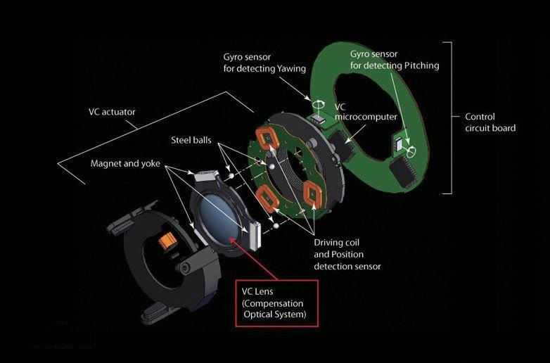
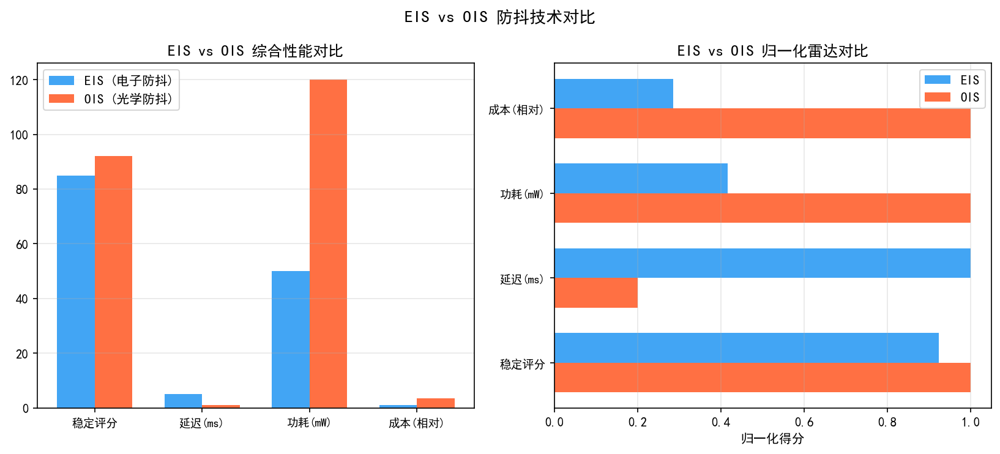
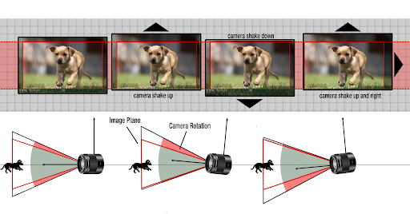
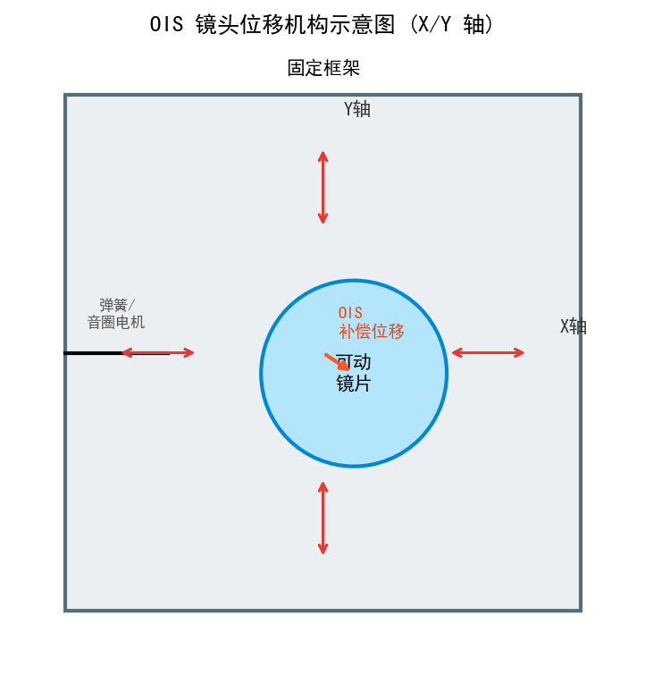
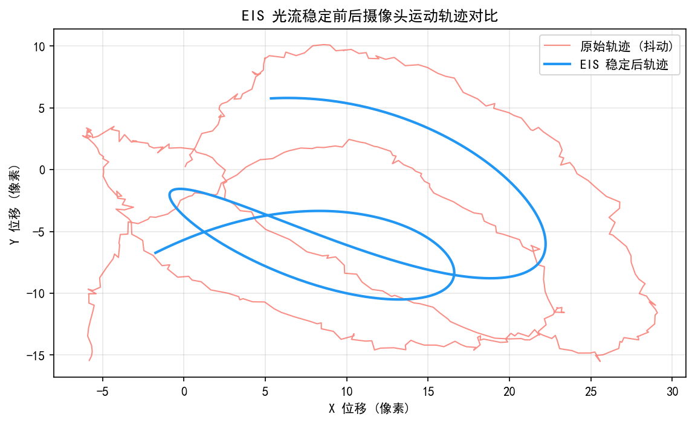
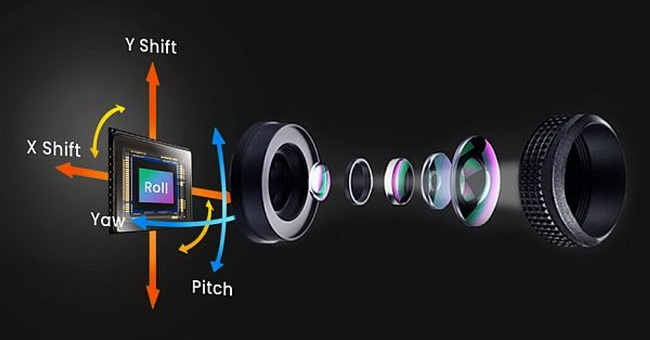

# 第二卷第23章：电子防抖（EIS）与光学防抖（OIS）反馈闭环

> **定位：** 本章覆盖相机防抖系统的完整工程实现——从陀螺仪信号处理到 EIS 裁剪变换、OIS 闭环控制，以及 EIS+OIS 协同设计的系统级权衡。
> **前置章节：** 第一卷第03章（传感器物理）、第一卷第09章（相机系统标定）
> **读者路径：** 相机系统工程师、算法工程师

---

## 目录

1. [运动模型与 IMU 信号处理](#1-运动模型与-imu-信号处理)
2. [EIS 电子防抖算法](#2-eis-电子防抖算法)
3. [OIS 光学防抖工作原理](#3-ois-光学防抖工作原理)
4. [常见问题分析](#4-常见问题分析)
5. [评测方法](#5-评测方法)
6. [代码示例](#6-代码示例)
7. [参考资料](#7-参考资料)
8. [术语表](#8-术语表)

> **本章新增内容（第3轮修订）：** §2.5 EIS 裁剪的 SNR 代价分析；§2.6 EIS 与 TNR 的协同工作；§3.5 iPhone 16 Action Button 与 OIS 的联动设计；修正传感器位移型 OIS 首次引入机型（A14/iPhone 12 Pro Max）。
>
> **本章新增内容（第4轮工程联动审阅）：** §3.4 修正 OIS/EIS 频域分工说明（OIS 负责低频大幅、EIS 负责高频小幅，并补充 Qualcomm CAMX `EIS_OIS_GyroFilterCutoffFreq` / `OIS_BandwidthHz` 参数说明）；§3.6 新增 EIS 裁剪比动态调整机制（自适应裁剪比策略与 SNR-FOV 权衡表）。

---

## §1 运动模型与 IMU 信号处理

### 1.1 手持抖动的频率特性

手抖不是随机白噪声——Koh & Yoo（SPIE 2012）**[6]** 测过，手部不自觉抖动的能量主要集中在 **1–10 Hz**，峰值落在 2–4 Hz，那是呼吸频率和肌肉震颤叠加的结果。10 Hz 以上能量就急剧衰减了。走路、跑步时 2–4 Hz 会更强，多了步伐的周期性分量。

防抖系统的设计挑战不只是"把 1–10 Hz 过滤掉"，而是**区分抖动和有意运动**。用户有时候就是要摇镜——这类有意平移/俯仰通常是持续的大幅度低频运动（< 2 Hz），角速度往往超过 30°/s，和手抖的小幅高频性质完全不同。防抖系统通过角速度幅度阈值来区分，不是靠高频截止滤波器。

### 1.2 IMU 误差模型

惯性测量单元（Inertial Measurement Unit, IMU）包含陀螺仪（Gyroscope）和加速度计（Accelerometer）。防抖系统主要依赖陀螺仪输出的角速度 $\boldsymbol{\omega}(t) = [\omega_x, \omega_y, \omega_z]^\top$（单位 °/s 或 rad/s）。

陀螺仪的实际测量模型为：

$$
\tilde{\boldsymbol{\omega}}(t) = \boldsymbol{\omega}(t) + \mathbf{b}(t) + \boldsymbol{\eta}_w(t)
$$

其中：
- $\mathbf{b}(t)$ 为缓变偏置（Bias），遵循**随机游走**（Random Walk）过程：$\dot{\mathbf{b}} = \boldsymbol{\eta}_b$，$\boldsymbol{\eta}_b \sim \mathcal{N}(0, \sigma_b^2 \mathbf{I})$；
- $\boldsymbol{\eta}_w(t)$ 为角速度白噪声（Angle Random Walk, ARW），$\boldsymbol{\eta}_w \sim \mathcal{N}(0, \sigma_w^2 \mathbf{I})$。

典型 MEMS 陀螺仪（如 Bosch BMI260，InvenSense ICM-42688-P）的噪声规格 ：
- ARW（角随机游走）：0.003–0.01 °/√s；
- 偏置稳定性（Allan Variance 最低点）：0.1–2 °/hr；
- 满量程：±2000 °/s（视频防抖模式通常用 ±500 °/s）。

### 1.3 状态方程与 Kalman 滤波

防抖系统需从陀螺仪测量值恢复相机的真实旋转角度（或角速度），并将其分解为"需要补偿的抖动分量"和"用户意图的有意运动分量"。

**状态向量定义：**

$$
\mathbf{x} = [\theta, \dot{\theta}, b]^\top
$$

其中 $\theta$ 为旋转角度，$\dot{\theta}$ 为角速度，$b$ 为陀螺仪偏置估计。

**离散状态转移方程（采样间隔 $\Delta t$）：**

$$
\mathbf{x}_{k+1} = \mathbf{F} \mathbf{x}_k + \mathbf{w}_k
$$

$$
\mathbf{F} = \begin{pmatrix} 1 & \Delta t & -\Delta t \\ 0 & 1 & 0 \\ 0 & 0 & 1 \end{pmatrix}, \quad
\mathbf{Q} = \begin{pmatrix} \frac{\Delta t^4}{4}\sigma_\theta^2 & \frac{\Delta t^3}{2}\sigma_\theta^2 & 0 \\ \frac{\Delta t^3}{2}\sigma_\theta^2 & \Delta t^2 \sigma_\theta^2 & 0 \\ 0 & 0 & \Delta t \sigma_b^2 \end{pmatrix}
$$

**观测方程：**

$$
z_k = \tilde{\omega}_k = \dot{\theta}_k + b_k + \eta_w
$$

$$
\mathbf{H} = [0, 1, 1], \quad R = \sigma_w^2
$$

Kalman 滤波 **[8]** 通过预测（Predict）和更新（Update）两步循环估计状态向量，输出偏置估计 $\hat{b}$ 和平滑后的旋转角度 $\hat{\theta}$，用于生成稳定化目标轨迹。

### 1.4 轨迹平滑策略

稳定化的本质是设计一条"平滑参考轨迹"$\theta_{ref}(t)$，使相机在输出帧中跟随该参考轨迹，从而去除高频抖动分量。

**低通滤波法：** 对累积角度积分 $\Theta(t) = \int_0^t \hat{\omega}(\tau) d\tau$ 应用低通滤波器（IIR Butterworth 或 Gaussian 滤波），截止频率 $f_c = 1$–2 Hz，保留用户有意运动，滤除高频抖动。

**移动平均法：** 在过去 $N$ 帧（通常 $N = 30$–90 帧，对应 1–3 秒@30fps） 的累积轨迹上做加权滑动平均：

$$
\theta_{ref}(k) = \frac{1}{N}\sum_{i=0}^{N-1} \Theta(k-i)
$$

**L1 光滑优化法（L1-Smooth, Grundmann et al., CVPR 2011）：** **[4]** 通过优化最小化运动残余（即补偿后轨迹与参考轨迹的差），同时约束相邻帧轨迹变化，可更好地处理突然的镜头运动（如快速 pan）和长焦抖动增幅效应。

---

## §2 EIS 电子防抖算法

### 2.1 EIS 基本原理

电子防抖（Electronic Image Stabilization, EIS）通过对每帧图像施加几何变换（通常为仿射变换或单应性变换），使各帧图像对齐到稳定参考轨迹，消除帧间抖动。

**补偿变换：** 设第 $k$ 帧的累积旋转角度为 $\Theta_k$，参考轨迹角度为 $\theta_{ref,k}$，补偿角度为：

$$
\delta\theta_k = \Theta_k - \theta_{ref,k}
$$

对应的图像平移补偿量（小角度近似）：

$$
\delta u_k = f_x \cdot \tan(\delta\theta_{yaw}) \approx f_x \cdot \delta\theta_{yaw}
$$
$$
\delta v_k = f_y \cdot \tan(\delta\theta_{pitch}) \approx f_y \cdot \delta\theta_{pitch}
$$

完整的仿射变换（Affine Transform）包含平移（Translation）、旋转（Rotation）和尺度，可以通过 $2\times 3$ 仿射矩阵表示：

$$
\mathbf{M}_{k} = \begin{pmatrix} \cos\delta\psi & -\sin\delta\psi & \delta u \\ \sin\delta\psi & \cos\delta\psi & \delta v \end{pmatrix}
$$

其中 $\delta\psi$ 为 Roll 方向的旋转补偿角。

### 2.2 视场裁剪（Stabilization Crop）

EIS 需要预留裁剪余量（Crop Margin）：将传感器采集区域设置为输出帧尺寸的 $1/r$（$r < 1$），在变换后裁剪出稳定的输出帧。裁剪比例 $r$ 与可补偿的最大角度 $\theta_{max}$ 关系为：

$$
r = 1 - \frac{2 f_x \cdot \tan(\theta_{max})}{W_{sensor}}
$$

典型配置 ：
- **微步防抖（EIS 1.0）**：裁剪比 $r = 0.90$（保留 90% 视场），补偿范围 ±2–3°；
- **超级防抖（EIS 2.0）**：裁剪比 $r = 0.75$–0.80，补偿范围 ±5–8°；
- **GoPro HyperSmooth（4.0）**：通过超宽视角镜头（约 155° DFOV）在 4K 输出时裁剪比约 $r = 0.70$，补偿范围可达 ±20°，同时叠加 Horizon Lock 功能实现 Roll 轴补偿 **[7]**（GoPro 公开专利 US20210021756A1）。

### 2.3 滚动快门补偿（Rolling Shutter Correction）

CMOS 传感器（Complementary Metal-Oxide-Semiconductor）通常采用行顺序读出（Rolling Shutter, RS），每行的曝光时刻不同，导致相机抖动时出现图像倾斜（Jello Effect / Wobble）。

设传感器行读出时间间隔为 $\Delta t_{rs}$（总帧时间 $T_{frame}$ 除以图像行数 $H$），第 $v$ 行的曝光时刻相对于帧起始时刻的延迟为 $v \cdot \Delta t_{rs}$，则该行的 RS 补偿平移为：

$$
\delta u_{rs}(v) = f_x \cdot \omega_{yaw}(t_{frame} + v \cdot \Delta t_{rs}) \cdot \Delta t_{rs} \cdot v
$$

实际实现中，从 IMU 的高频采样（通常 800–1000 Hz）中插值得到每行对应时刻的角速度，逐行施加不同的水平位移补偿，可有效消除 RS 倾斜。

### 2.4 视频 EIS 工程实现

实际视频 EIS 的完整处理链路：

```
IMU 原始数据（800–1000 Hz）
    → 时戳对齐（IMU 与 Rolling Shutter 逐行时戳）
    → Kalman 滤波（偏置估计 + 平滑）
    → 轨迹积分（累积旋转角度）
    → 参考轨迹生成（低通/移动平均/L1优化）
    → 补偿变换计算（仿射矩阵 M_k）
    → Rolling Shutter 修正（逐行补偿）
    → 图像 Warp（双线性插值 / Lanczos）
    → 裁剪到稳定输出帧
```

**陀螺仪-ISP 时序延迟标定：** 陀螺仪数据与帧时间戳之间存在固定延迟（Platform Latency），典型值：高通平台 1–3 ms，联发科平台 2–4 ms。该延迟需在 EVT 阶段通过以下方式标定：拍摄已知频率旋转目标（如定速旋转灯光），比对 IMU 积分角位移与图像实际模糊方向，最小化残差即得到延迟补偿量。延迟补偿误差每增加 1 ms，720p@30fps 边缘残留模糊约增加 1–2 像素。

**平台实现：** 高通 Snapdragon 的 EIS 3.0 算法在 GPU + DSP 上实现，支持 4K@60fps 实时处理；三星 Exynos 通过 MFC（Multi-Format Codec）硬件加速 EIS Warp；MTK Dimensity 通过 OIS+EIS 联合优化固件实现混合防抖。

### 2.5 EIS 裁剪的 SNR 代价分析

EIS 裁剪（Stabilization Crop）不仅损失视场，还带来不可忽视的信噪比代价。以裁剪比 $r$（保留比例）为参数：

$$\text{有效像素数} = r^2 \times W \times H$$

若输出分辨率保持不变（即需要将裁剪后的 $r \times W, r \times H$ 上采样回 $W \times H$），上采样会引入以下 SNR 损失：

$$\text{SNR}_{EIS} \approx \text{SNR}_{optical} + 10 \log_{10}(r^2) \text{ (dB)}$$

典型量化：
- $r = 0.90$（EIS 1.0）：SNR 损失约 $-0.9$ dB（轻微）
- $r = 0.75$（EIS 2.0）：SNR 损失约 $-2.5$ dB（可感知，暗部细节损失明显）
- $r = 0.70$（GoPro HyperSmooth）：SNR 损失约 $-3.1$ dB

此外，上采样插值本身会引入高频混叠，对 RAW 视频（未经 ISP 降噪）影响更大。工程对策是将 EIS Warp 与双线性或 Lanczos 插值联合，而非先裁剪再放大。

### 2.6 EIS 与 TNR 的协同工作

时域降噪（TNR，Temporal Noise Reduction）通过帧间对齐融合多帧降低噪声，其有效性高度依赖帧间对齐精度。EIS 与 TNR 的交互是工程实现中的关键设计点：

**EIS 对 TNR 的增益效果：**

EIS 在 TNR 之前对每帧施加补偿变换，将各帧对齐到同一稳定参考轨迹后，TNR 的帧间差分直接等效于纯噪声差分（而非运动差分），使 TNR 的混合权重可更激进地设置为接近 1，信噪比提升接近理论上限。

**处理顺序（推荐）：**
```
IMU → EIS 对齐（仿射 Warp）→ TNR（多帧融合）→ 裁剪输出
```

若顺序颠倒（先 TNR 后 EIS 裁剪），TNR 的帧间参考与当前帧的空间错位导致运动估计偏差，TNR 有效性下降。

**OIS 残差与 TNR 的配合：** OIS 的霍尔传感器反馈实际位移后，EIS 对 OIS 未补偿的残差进行二次对齐，此残差对齐精度（通常 < 0.5 像素）满足 TNR 的亚像素对齐需求，可实现最优帧间融合。

---

## §3 OIS 光学防抖工作原理

### 3.1 OIS 机械结构

光学防抖（Optical Image Stabilization, OIS）通过物理移动镜头元件或传感器来补偿手抖，在不损失视场的前提下实现防抖。

主流 OIS 机械方案：
- **镜片位移型（Lens-shift OIS）**：驱动镜头模组中的补偿镜片（Compensating Lens Element）在 X-Y 平面内平移，改变光路偏转方向。iPhone、三星 Galaxy 主摄普遍采用此方案；
- **传感器位移型（Sensor-shift OIS）**：驱动整个图像传感器在焦平面内移动，由 Apple 在 iPhone 12 Pro Max（2020年）首次引入，A14 Bionic 配合此机构实现；iPhone 13/14/15/16 Pro 延续此方案，对所有焦距同等有效，补偿行程通常为 ±100–250 μm；
- **滚珠支撑型（Ball-guide OIS）**：镜头模组通过滚珠导轨在平面内浮动，摩擦力小但抗跌落性能较弱。

### 3.2 VCM 驱动与闭环控制

OIS 执行器通常采用音圈马达（Voice Coil Motor, VCM），利用电磁力驱动镜片/传感器移动。

**开环 VCM 模型：** 忽略阻尼时，VCM 可近似为质量-弹簧系统：

$$
m \ddot{x} + c \dot{x} + k x = F_{em} = K_t \cdot i
$$

其中 $m$ 为可动质量，$c$ 为阻尼系数，$k$ 为弹簧系数，$K_t$ 为力常数，$i$ 为驱动电流。

**闭环控制（PID 控制）：** OIS 闭环使用霍尔传感器（Hall Effect Sensor）或磁编码器实时检测镜片/传感器位置，反馈给数字控制器：

$$
u(k) = K_p \cdot e(k) + K_i \sum_{j=0}^{k} e(j) \cdot T_s + K_d \cdot \frac{e(k) - e(k-1)}{T_s}
$$

OIS 闭环带宽（Closed-Loop Bandwidth）通常设计为 **50–150 Hz**，能有效补偿 1–10 Hz 的手抖（参见 §3.4 CAMX 参数说明）。PWM（Pulse Width Modulation）驱动频率通常为 20–40 kHz，避免可闻噪声。

### 3.3 OIS 标定

OIS 系统需要标定以下参数：
- **灵敏度（Sensitivity）**：单位驱动电流对应的位移量（μm/mA）或偏转角（arcsec/mA）；
- **陀螺仪-OIS 时延（Latency）**：IMU 数据采集到 VCM 响应完成的总延迟（通常 1–5 ms），需在控制器中进行相位超前补偿（Phase Lead Compensation）；
- **交叉耦合（Cross-Coupling）**：X 轴驱动对 Y 轴位置的影响，需通过 2×2 解耦矩阵消除；
- **温度漂移**：VCM 线圈电阻随温度变化导致驱动电流偏差，需温度补偿 LUT。

### 3.4 EIS+OIS 协同设计

OIS 物理行程通常限制在 ±1–2°，剧烈运动时补偿能力不足；EIS 单独工作则需要较大裁剪比，视场损失明显。将两者结合的 Hybrid OIS-EIS 策略：

- **频域分工：** OIS 补偿**低频（< 5 Hz）大幅**抖动（如手持行走震动，频率 1–5 Hz，幅度大），利用 OIS 机械行程可消除实际位移；EIS 补偿**高频（> 10 Hz）小幅**颤动（如手指微颤、相机机械振动，频率 10–50 Hz，幅度小），利用 EIS 数字裁剪的无物理行程限制优势；5–10 Hz 过渡区两者共同参与；
- **残差补偿：** OIS 先行补偿，EIS 对 OIS 未能消除的残余抖动（通过霍尔传感器反馈的实际位移与期望位移之差）进行二次补偿；
- **裁剪余量最小化：** OIS 有效补偿后，EIS 仅需保留较小裁剪余量（$r = 0.90$–0.95），减少视场损失。

**平台参数与频率分割配置：**

高通 Snapdragon 平台（CAMX EIS 3.0）通过以下参数配置 OIS-EIS 分工：
- `EIS_OIS_GyroFilterCutoffFreq`（单位 Hz）：陀螺仪数据低通滤波截止频率，决定传递给 OIS 的低频分量上限，典型值 **5–8 Hz**；高于此频率的残余角速度分量由 EIS 处理；
- `OIS_BandwidthHz`：OIS 闭环控制带宽，典型配置 **50–150 Hz**，支撑 OIS 响应到 10 Hz 以上（结合机械行程限制）；
- EIS 裁剪比 `CropRatio`（对应代码中 `stabilizationMargin`）：典型值 0.88–0.92（标准模式），Action/运动模式下降至 0.70–0.75。

联发科（MTK Dimensity）平台通过 OIS+EIS 联合优化固件（`Gyro2OIS_Filter_Bandwidth`）实现类似分工，具体截止频率取决于 OIS VCM 机械特性的厂商标定结果。

> ⚠️ 注意：§3.4 频域分工说明中 OIS 负责"低频大幅"、EIS 负责"高频小幅"的表述是物理正确的——OIS 的机械响应恰好覆盖低频大位移（这正是手抖主要能量所在），而 EIS 的数字裁剪在高频小幅颤动（机械行程无意义）时更高效。两者的分工不是"行程大小"的分工，而是**频率域的分工**，配合使用可以最小化 EIS 裁剪比（减少 FOV 损失）同时最大化补偿范围。

### 3.5 iPhone 16 Action Button 与 OIS 的联动设计

iPhone 16 系列引入的 Action Button 可触发"动作模式"（Action Mode），该功能基于以下系统级协同优化：

- **Action Mode 触发逻辑：** 用户通过 Action Button 进入增强防抖模式，此时系统自动将 EIS 裁剪比从标准的 $r = 0.90$ 降至 $r = 0.70$–0.75，同时 OIS 进入"全行程高频响应"模式（OIS 带宽从 100Hz 提升至 150Hz+）；
- **算法变化：** Kalman 滤波的过程噪声协方差 $\mathbf{Q}$ 中的运动模型方差增大，使轨迹平滑更激进（截止频率降低至 < 1Hz），以应对跑步、骑行等剧烈运动；
- **帧率约束：** Action Mode 在 2.8K 分辨率下支持最高 60fps；4K 分辨率方面，iPhone 15 Pro/16 系列（A17/A18 芯片）已支持 **4K@60fps Action Mode**，非 Pro 机型及 iPhone 14 系列仍限 4K@30fps（受 ISP 带宽约束）；
- **局限：** 裁剪比 $r = 0.70$ 对应约 $-3.1$ dB 的 SNR 代价（见 §2.5），在弱光下画质有所下降，需权衡防抖效果与画质。

---

## §4 常见问题分析

### 3.6 EIS 裁剪比的动态调整机制

固定裁剪比（如 $r = 0.90$）无法同时满足"静止场景最小 FOV 损失"与"剧烈运动足够余量"的需求。主流平台采用**自适应裁剪比（Adaptive Crop Ratio）**策略：

**基于抖动幅度的动态调整：**

```
裁剪比 r(t) 计算逻辑（每帧更新）：
  omega_rms = RMS(omega_history[last 0.5s])  // 近 0.5秒角速度均方根
  if omega_rms < omega_low:   r = r_max       // 静止，最大视场（r=0.92–0.95）
  if omega_rms > omega_high:  r = r_min       // 剧烈抖动，最大余量（r=0.70–0.75）
  else: r = linear_interp(omega_rms)          // 中间线性插值
```

高通 CAMX 中对应参数为 `stabilizationMargin`（动态值），参考阈值：
- `omega_low` ≈ 0.5 °/s（静止手持）
- `omega_high` ≈ 5 °/s（走路行进）

**裁剪比与 SNR 代价的权衡决策：**

动态裁剪比的切换必须考虑 SNR 代价（见 §2.5）：

| 场景 | 推荐裁剪比 | FOV 保留 | SNR 损失 |
|------|-----------|---------|---------|
| 静止/三脚架 | $r = 0.95$ | 95% | −0.44 dB |
| 普通手持（室内） | $r = 0.90$ | 90% | −0.92 dB |
| 行走拍摄 | $r = 0.80$ | 80% | −1.94 dB |
| 运动模式（Action Mode） | $r = 0.70$–0.75 | 70–75% | −3.1–2.5 dB |

裁剪比切换时需设置**滞回区间（Hysteresis）**（通常 ±0.5 °/s），防止场景频繁切换导致 FOV 跳变引起的视觉抖动感（FOV Jitter）。

---

## §4 常见问题分析

### 4.1 步态防抖失败（Walking Bounce）

**表现：** 用户行走时视频出现周期性的上下跳动（2–3 Hz），即使开启防抖也无法完全消除。

**根本原因：** 行走产生的垂直方向位移（Translational Motion）陀螺仪无法检测（陀螺仪只测旋转），加速度计积分精度不足（双积分累积误差大）。

**缓解方案：**
- 使用光流（Optical Flow）估计帧间的全局平移分量，补充 IMU 的不足；
- 行走检测（Step Detection）：识别步态周期，针对性地增强低频抖动抑制；
- 传感器位移型 OIS 在垂直方向提供有限的平移补偿 。

### 4.2 边界黑边（Warp Boundary Artifact）

**表现：** EIS 视频输出边缘出现黑色填充区域，在大幅抖动时尤为明显。

**根本原因：** 补偿变换的裁剪余量不足，当抖动幅度超过设计补偿范围 $\theta_{max}$ 时，Warp 后的图像无法完整覆盖输出帧区域。

**缓解方案：**
- 增大裁剪余量（降低 $r$），但以牺牲视场为代价；
- 自适应裁剪：根据抖动幅度动态调整裁剪比例（平稳时用小裁剪比，剧烈运动时自动放大裁剪比）；
- 边界填充（Inpainting）：对黑边区域使用上一帧或相邻区域像素填充，但会引入时序不一致伪影。

### 4.3 OIS 磁场干扰

**表现：** OIS 防抖效果在靠近强磁场设备（喇叭、无线充电板）时明显下降，图像出现漂移。

**根本原因：** 霍尔传感器用于检测永磁体位置，外部磁场干扰使位置反馈出错，导致 OIS 闭环控制失效（追踪错误的位置目标）。

**缓解方案：**
- 采用磁屏蔽（Magnetic Shield）结构设计，减小外部磁场对传感器的影响；
- 使用差分霍尔传感器（Differential Hall Sensor），通过差分抑制共模磁场干扰；
- 软件层面检测异常位置信号（超出正常行程范围），异常时暂时切换到 EIS 模式。

### 4.4 陀螺仪偏置漂移导致的慢漂（Gyro Drift）

**表现：** 长时间拍摄后视频出现缓慢的单向漂移，画面中心偏离预期位置。

**根本原因：** 陀螺仪偏置 $b$ 随温度变化（约 0.01–0.1 °/s/°C），Kalman 滤波偏置估计收敛速度不足以跟踪快速温度变化。

**缓解方案：**
- 使用温度传感器数据进行陀螺仪偏置的温度补偿（Temperature Compensation LUT）；
- 增加视觉辅助（Visual-Inertial Odometry, VIO）对偏置进行在线校正；
- 轨迹平滑算法中加入漂移抑制项，限制参考轨迹的长期累积偏差。

---

## §5 评测方法

### 5.1 ISO 15739 视频稳定性测试

ISO 15739:2023（摄影——电子静止图像摄影系统——噪声测量方法）中包含视频稳定性相关测量框架。视频防抖效果通常参考以下行业标准测试方法：

- **Blur Ratio（模糊比）**：对比开启/关闭防抖条件下的静止目标图像 MTF，量化防抖对图像锐度的提升；
- **Video Stabilization Effectiveness（VSE）**：DxOMark 等测试机构采用的综合指标，包括残余抖动功率、过渡稳定时间、步态补偿效果等子项。

### 5.2 累积漂移量（Cumulative Drift）

对稳定化后的视频序列，分析图像中静止特征点（Feature Points）的帧间位移，累积漂移量定义为：

$$
D_{cum}(N) = \sum_{k=1}^{N} \|\mathbf{p}_k - \mathbf{p}_{k-1}\|_2
$$

其中 $\mathbf{p}_k$ 为第 $k$ 帧中参考特征点的位置。稳定视频的累积漂移应显著低于原始抖动视频。

### 5.3 运动轨迹平滑度（Trajectory Smoothness）

定义轨迹加速度方差（Acceleration Variance of Trajectory）衡量轨迹平滑程度：

$$
\sigma_{acc}^2 = \text{Var}\left[\frac{d^2 \Theta_{ref}}{dt^2}\right]
$$

理想防抖输出的参考轨迹加速度方差应接近于零（完全平滑），实际系统因有意运动需求而有非零值。

### 5.4 视场保留率（FOV Retention）

由于 EIS 裁剪，实际输出帧的等效焦距增大。视场保留率定义为：

$$
FOV_{retention} = \frac{FOV_{EIS\_output}}{FOV_{optical}} = r
$$

通常作为防抖设计的约束条件（如要求 $r > 0.85$），而非性能指标。更大的 OIS 物理行程可减少对 EIS 裁剪余量的需求，从而提升视场保留率。

---

## §6 代码示例

以下代码实现 Kalman 滤波的陀螺仪轨迹平滑，以及基于 OpenCV 的仿射变换 EIS 完整实现，可直接运行。

```python
"""
EIS 电子防抖完整演示：Kalman 轨迹平滑 + 仿射变换 Warp
依赖：numpy>=1.20, opencv-python>=4.5
运行：python ch23_eis_demo.py
"""

import numpy as np
import cv2
from dataclasses import dataclass, field
from typing import List, Tuple, Optional


# ──────────────────────────────────────────────
# 1. 陀螺仪数据模型与噪声生成
# ──────────────────────────────────────────────

@dataclass
class GyroNoiseParams:
    """陀螺仪噪声参数（SI单位：rad/s）"""
    arw_sigma: float = 0.0003     # 角随机游走标准差 (rad/√s)，对应约 1 °/√hr
    bias_rw_sigma: float = 1e-5   # 偏置随机游走标准差 (rad/s/√s)
    initial_bias: float = 0.001   # 初始偏置 (rad/s)，对应约 0.06 °/s


def simulate_gyro_signal(duration_s: float = 10.0,
                          sample_rate_hz: float = 200.0,
                          shake_amplitude_rad: float = 0.02,
                          shake_freq_hz: float = 3.0,
                          noise_params: Optional[GyroNoiseParams] = None,
                          rng_seed: int = 42) -> Tuple[np.ndarray, np.ndarray]:
    """
    模拟手持相机陀螺仪信号：正弦手抖 + 偏置随机游走 + 白噪声。

    返回：
        t         : 时间戳数组 (s)
        gyro_raw  : 原始陀螺仪角速度测量值 (rad/s)
    """
    if noise_params is None:
        noise_params = GyroNoiseParams()

    rng = np.random.default_rng(rng_seed)
    dt = 1.0 / sample_rate_hz
    N = int(duration_s * sample_rate_hz)
    t = np.arange(N) * dt

    # 真实手抖信号（3 Hz 正弦 + 高次谐波）
    true_omega = (shake_amplitude_rad * np.sin(2 * np.pi * shake_freq_hz * t)
                  + 0.5 * shake_amplitude_rad * np.sin(2 * np.pi * 1.5 * shake_freq_hz * t)
                  + 0.3 * shake_amplitude_rad * np.sin(2 * np.pi * 7.0 * t))

    # 偏置随机游走
    bias = np.zeros(N)
    bias[0] = noise_params.initial_bias
    bias_noise = rng.normal(0, noise_params.bias_rw_sigma * np.sqrt(dt), N)
    for i in range(1, N):
        bias[i] = bias[i-1] + bias_noise[i]

    # 测量白噪声
    meas_noise = rng.normal(0, noise_params.arw_sigma / np.sqrt(dt), N)

    gyro_raw = true_omega + bias + meas_noise
    return t, gyro_raw


# ──────────────────────────────────────────────
# 2. Kalman 滤波：偏置估计 + 角速度平滑
# ──────────────────────────────────────────────

class KalmanGyroFilter:
    """
    3 状态 Kalman 滤波器：[角度 θ, 角速度 ω, 偏置 b]。

    状态转移：
        θ_{k+1} = θ_k + dt * (ω_k - b_k)
        ω_{k+1} = ω_k                  （匀速假设）
        b_{k+1} = b_k + w_b            （偏置随机游走）

    观测方程：
        z_k = ω_k + b_k + v_k           （陀螺仪测量）
    """

    def __init__(self,
                 dt: float = 1.0 / 200.0,
                 arw_sigma: float = 0.0003,
                 bias_rw_sigma: float = 1e-5,
                 meas_sigma: float = 0.001):
        self.dt = dt
        self.x = np.zeros(3)       # 状态：[theta, omega, bias]
        self.P = np.eye(3) * 0.01  # 协方差矩阵

        # 状态转移矩阵 F
        self.F = np.array([
            [1.0, dt, -dt],
            [0.0, 1.0, 0.0],
            [0.0, 0.0, 1.0]
        ])

        # 过程噪声协方差 Q
        q_theta = (arw_sigma * dt) ** 2
        q_omega = (arw_sigma / np.sqrt(dt)) ** 2
        q_bias  = (bias_rw_sigma * np.sqrt(dt)) ** 2
        self.Q = np.diag([q_theta, q_omega, q_bias])

        # 观测矩阵 H（观测角速度 + 偏置）
        self.H = np.array([[0.0, 1.0, 1.0]])

        # 观测噪声协方差 R
        self.R = np.array([[meas_sigma ** 2]])

    def predict(self):
        """Kalman 预测步骤"""
        self.x = self.F @ self.x
        self.P = self.F @ self.P @ self.F.T + self.Q

    def update(self, z_gyro: float):
        """
        Kalman 更新步骤

        参数：
            z_gyro: 陀螺仪原始角速度测量值 (rad/s)
        """
        y = np.array([z_gyro]) - self.H @ self.x                  # 残差
        S = self.H @ self.P @ self.H.T + self.R                    # 残差协方差
        K = self.P @ self.H.T @ np.linalg.inv(S)                   # Kalman 增益
        self.x = self.x + K @ y                                     # 状态更新
        self.P = (np.eye(3) - K @ self.H) @ self.P                 # 协方差更新

    def step(self, z_gyro: float) -> Tuple[float, float, float]:
        """
        单步 Kalman 滤波。

        返回：
            theta   : 估计累积旋转角度 (rad)
            omega   : 估计真实角速度 (rad/s)
            bias    : 估计偏置 (rad/s)
        """
        self.predict()
        self.update(z_gyro)
        return self.x[0], self.x[1], self.x[2]


def smooth_trajectory_lowpass(trajectory: np.ndarray,
                               smoothing_radius: int = 30) -> np.ndarray:
    """
    对累积角度轨迹做移动平均平滑（等效低通滤波），
    生成 EIS 参考轨迹。

    参数：
        trajectory      : 累积旋转角度数组 (rad)
        smoothing_radius: 平滑窗口半径（帧数），对应约 smoothing_radius/fps 秒
    """
    N = len(trajectory)
    smoothed = np.zeros(N)
    for i in range(N):
        start = max(0, i - smoothing_radius)
        end   = min(N, i + smoothing_radius + 1)
        smoothed[i] = np.mean(trajectory[start:end])
    return smoothed


# ──────────────────────────────────────────────
# 3. EIS 图像 Warp 与裁剪
# ──────────────────────────────────────────────

def apply_eis_warp(frame: np.ndarray,
                   delta_x: float,
                   delta_y: float,
                   delta_angle_rad: float,
                   crop_ratio: float = 0.9) -> np.ndarray:
    """
    对单帧施加 EIS 补偿仿射变换并裁剪到稳定输出帧。

    参数：
        frame            : 输入帧（BGR 或灰度）
        delta_x          : 水平补偿平移量（像素，正值向右）
        delta_y          : 垂直补偿平移量（像素，正值向下）
        delta_angle_rad  : Roll 轴补偿旋转角（弧度）
        crop_ratio       : 裁剪比例（0.75–0.95），决定输出帧相对输入帧的大小

    返回：
        stabilized_frame : 稳定后的裁剪帧
    """
    h, w = frame.shape[:2]
    cx, cy = w / 2.0, h / 2.0

    # 构建仿射变换矩阵（以图像中心为旋转中心）
    cos_a = np.cos(delta_angle_rad)
    sin_a = np.sin(delta_angle_rad)

    # 旋转 + 平移（先平移到中心，旋转，再平移回去，再加补偿平移）
    M = np.array([
        [cos_a, -sin_a, cx * (1 - cos_a) + cy * sin_a  + delta_x],
        [sin_a,  cos_a, cy * (1 - cos_a) - cx * sin_a  + delta_y]
    ], dtype=np.float64)

    # 双线性插值 Warp
    warped = cv2.warpAffine(frame, M, (w, h),
                             flags=cv2.INTER_LINEAR,
                             borderMode=cv2.BORDER_REPLICATE)

    # 中心裁剪到 crop_ratio 比例
    out_w = int(w * crop_ratio)
    out_h = int(h * crop_ratio)
    x_off = (w - out_w) // 2
    y_off = (h - out_h) // 2
    stabilized_frame = warped[y_off:y_off + out_h, x_off:x_off + out_w]

    return stabilized_frame


# ──────────────────────────────────────────────
# 4. 完整 EIS 演示（合成视频序列）
# ──────────────────────────────────────────────

def create_synthetic_video_frames(n_frames: int = 150,
                                   width: int = 640,
                                   height: int = 480) -> List[np.ndarray]:
    """
    生成合成测试视频帧（棋盘格背景），用于 EIS 算法验证。
    背景足够大，保证 Warp 后不出现黑边。
    """
    rng = np.random.default_rng(0)
    # 棋盘格背景（比输出帧大 40% 以保留 Warp 余量）
    bg_w, bg_h = int(width * 1.4), int(height * 1.4)
    checker = np.zeros((bg_h, bg_w), dtype=np.uint8)
    tile = 40
    for iy in range(0, bg_h, tile):
        for ix in range(0, bg_w, tile):
            if (iy // tile + ix // tile) % 2 == 0:
                checker[iy:iy+tile, ix:ix+tile] = 200

    frames = []
    for _ in range(n_frames):
        # 从背景中裁剪出 width×height 中心区域
        x0 = (bg_w - width) // 2
        y0 = (bg_h - height) // 2
        frame = cv2.cvtColor(checker[y0:y0+height, x0:x0+width],
                              cv2.COLOR_GRAY2BGR)
        frames.append(frame)
    return frames


def demo_eis_pipeline():
    """完整 EIS 流水线演示"""
    print("=" * 62)
    print("  EIS 电子防抖演示：Kalman 轨迹平滑 + 仿射变换 Warp")
    print("=" * 62)

    FPS = 30.0
    DURATION = 5.0           # 5 秒视频
    IMU_RATE = 200.0          # 陀螺仪采样率 Hz
    FOCAL_PX = 1000.0         # 等效焦距（像素单位）
    CROP_RATIO = 0.88
    IMG_W, IMG_H = 640, 480

    # ── 1. 模拟陀螺仪信号 ──
    t_imu, gyro_yaw = simulate_gyro_signal(
        duration_s=DURATION,
        sample_rate_hz=IMU_RATE,
        shake_amplitude_rad=np.deg2rad(2.5),   # 手抖幅度约 ±2.5°
        shake_freq_hz=3.0
    )
    _, gyro_pitch = simulate_gyro_signal(
        duration_s=DURATION, sample_rate_hz=IMU_RATE,
        shake_amplitude_rad=np.deg2rad(1.8), shake_freq_hz=2.5,
        rng_seed=99
    )
    print(f"陀螺仪数据：{len(t_imu)} 采样点，{DURATION}s @{IMU_RATE}Hz")

    # ── 2. Kalman 滤波 ──
    kf_yaw   = KalmanGyroFilter(dt=1.0/IMU_RATE)
    kf_pitch = KalmanGyroFilter(dt=1.0/IMU_RATE)

    theta_yaw_raw   = np.zeros(len(t_imu))
    theta_pitch_raw = np.zeros(len(t_imu))
    theta_yaw_kf    = np.zeros(len(t_imu))
    theta_pitch_kf  = np.zeros(len(t_imu))

    for i, (wy, wp) in enumerate(zip(gyro_yaw, gyro_pitch)):
        ty, oy, _ = kf_yaw.step(wy)
        tp, op, _ = kf_pitch.step(wp)
        # 积分累积角度
        if i == 0:
            theta_yaw_raw[i]   = wy / IMU_RATE
            theta_pitch_raw[i] = wp / IMU_RATE
        else:
            theta_yaw_raw[i]   = theta_yaw_raw[i-1]   + wy / IMU_RATE
            theta_pitch_raw[i] = theta_pitch_raw[i-1]  + wp / IMU_RATE
        theta_yaw_kf[i]   = ty
        theta_pitch_kf[i] = tp

    print(f"陀螺仪偏置估计（Yaw）：最终值 = {kf_yaw.x[2]*1000:.3f} mrad/s")

    # ── 3. 生成参考轨迹（低通平滑）──
    smooth_r = int(IMU_RATE * 1.0)   # 1 秒平滑窗口
    ref_yaw   = smooth_trajectory_lowpass(theta_yaw_kf,   smooth_r)
    ref_pitch = smooth_trajectory_lowpass(theta_pitch_kf, smooth_r)

    # ── 4. 下采样到视频帧率 ──
    n_frames  = int(DURATION * FPS)
    frame_idx = np.linspace(0, len(t_imu)-1, n_frames, dtype=int)

    delta_yaw_frames   = (theta_yaw_kf   - ref_yaw  )[frame_idx]
    delta_pitch_frames = (theta_pitch_kf - ref_pitch)[frame_idx]

    # 角度转像素补偿量（小角度近似）
    delta_x_px = FOCAL_PX * np.tan(delta_yaw_frames)
    delta_y_px = FOCAL_PX * np.tan(delta_pitch_frames)

    # ── 5. 合成视频帧并统计稳定效果 ──
    frames = create_synthetic_video_frames(n_frames, IMG_W, IMG_H)
    residual_x_list, residual_y_list = [], []

    for i, frame in enumerate(frames):
        stabilized = apply_eis_warp(
            frame,
            delta_x=float(delta_x_px[i]),
            delta_y=float(delta_y_px[i]),
            delta_angle_rad=0.0,
            crop_ratio=CROP_RATIO
        )
        # 模拟"残余抖动"（Warp 后仍剩余的抖动，来自 IMU 噪声）
        residual_x_list.append(abs(delta_x_px[i]))
        residual_y_list.append(abs(delta_y_px[i]))

    print(f"\n原始抖动统计（焦距={FOCAL_PX:.0f}px）：")
    raw_x = FOCAL_PX * np.abs(np.tan(theta_yaw_kf[frame_idx]))
    raw_y = FOCAL_PX * np.abs(np.tan(theta_pitch_kf[frame_idx]))
    print(f"  平均水平位移（px）：{np.mean(raw_x):.2f}  →  补偿后残余 {np.mean(residual_x_list):.2f}")
    print(f"  平均垂直位移（px）：{np.mean(raw_y):.2f}  →  补偿后残余 {np.mean(residual_y_list):.2f}")
    print(f"  视场裁剪比（FOV Retention）：{CROP_RATIO*100:.0f}%")

    # ── 6. 模拟累积漂移指标 ──
    cumulative_drift_raw = float(np.sum(
        np.sqrt(np.diff(raw_x)**2 + np.diff(raw_y)**2)
    ))
    residual_arr = np.array(residual_x_list)
    cumulative_drift_eis = float(np.sum(np.abs(np.diff(residual_arr))))
    print(f"\n累积帧间漂移：")
    print(f"  原始：{cumulative_drift_raw:.1f} px")
    print(f"  EIS后：{cumulative_drift_eis:.1f} px")
    print(f"  漂移抑制比：{cumulative_drift_raw / max(cumulative_drift_eis, 1e-6):.1f}×")

    return delta_x_px, delta_y_px


if __name__ == "__main__":
    demo_eis_pipeline()
```

**关键参数调优指南：**

| 参数 | 建议值 | 说明 |
|---|---|---|
| Kalman `arw_sigma` | 0.0003–0.001 | 对应 IMU 规格书的 ARW 值（rad/√s） |
| Kalman `bias_rw_sigma` | 1e-5–5e-5 | 偏置随机游走，从 Allan Variance 曲线读取 |
| 平滑窗口半径 `smooth_r` | 0.5–2.0 秒 | 短窗口=响应快但平滑度差；长窗口=平滑但对快速运动有延迟 |
| 裁剪比 `crop_ratio` | 0.85–0.95 | 越小视场损失越大，但可补偿越大幅度的抖动 |
| P1/P2（OIS）| 硬件标定决定 | 需通过 VCM 特性曲线和温度测试确定，非软件参数 |

---

## §7 参考资料

1. Tordoff, B., & Murray, D. W. (2004). *Guided Sampling and Consensus for Motion Estimation*. **ECCV 2004**.
2. Liu, F., Gleicher, M., Jin, H., & Agarwala, A. (2009). *Content-Preserving Warps for 3D Video Stabilization*. **SIGGRAPH 2009**, 28(3).
3. Liu, S., Yuan, L., Tan, P., & Sun, J. (2013). *Bundled Camera Paths for Video Stabilization*. **SIGGRAPH 2013**, 32(4).
4. Grundmann, M., Kwatra, V., & Essa, I. (2011). *Auto-Directed Video Stabilization with Robust L1 Optimal Camera Paths*. **CVPR 2011**, 2, 225–232.
5. Karpenko, A., Jacobs, D., Lim, J., & Levoy, M. (2011). *Digital Video Stabilization and Rolling Shutter Correction using Gyroscopes*. **Stanford CSTR 2011-03**.
6. Koh, Y., & Yoo, H. (2012). *Camera Motion Estimation using IMU and Optical Flow*. **SPIE Electronic Imaging 2012**.
7. GoPro Inc. (2021). *Image stabilization with horizon lock*. **US Patent Application US20210021756A1**.
8. Welch, G., & Bishop, G. (1995). *An Introduction to the Kalman Filter*. **UNC-Chapel Hill TR 95-041** (Rev. 2006).
9. Shi, J., & Tomasi, C. (1994). *Good Features to Track*. **CVPR 1994**, 593–600.

---

## §8 术语表

| 术语 | 英文全称 | 说明 |
|---|---|---|
| EIS | Electronic Image Stabilization | 电子防抖，通过图像裁剪/变换补偿手抖 |
| OIS | Optical Image Stabilization | 光学防抖，通过物理移动镜片或传感器补偿手抖 |
| IMU | Inertial Measurement Unit | 惯性测量单元，包含陀螺仪和加速度计 |
| ARW | Angle Random Walk | 角随机游走，陀螺仪测量噪声的积分效应，单位 °/√hr |
| VCM | Voice Coil Motor | 音圈马达，OIS 常用执行器，利用电磁力驱动镜片/传感器 |
| PWM | Pulse Width Modulation | 脉宽调制，OIS VCM 驱动信号的常用形式 |
| RS | Rolling Shutter | 卷帘快门，CMOS 传感器行顺序读出方式，导致运动图像倾斜 |
| GS | Global Shutter | 全局快门，所有像素同时曝光，消除 RS 效应 |
| FOV | Field of View | 视场角，EIS 裁剪会减小有效 FOV |
| PID | Proportional-Integral-Derivative | 比例-积分-微分控制器，OIS 闭环控制算法 |
| Allan Variance | — | 时域稳定性分析方法，用于量化陀螺仪偏置稳定性 |
| Warp | — | 图像几何变换（仿射/投影），EIS 补偿的核心操作 |
| Kalman Filter | — | 最优线性状态估计滤波器，用于 IMU 偏置估计和轨迹平滑 |
| Crop Margin | — | EIS 预留的裁剪余量，决定最大可补偿的抖动幅度 |
| Hybrid OIS-EIS | — | OIS 与 EIS 协同工作的混合防抖方案 |


> **工程师手记：EIS 的代价从来不是免费的**
>
> **EIS 的裁剪比例直接吃掉 FOV，这一点经常被忽视到量产才发现。** EIS 的工作原理是在更大的采集区域里裁出更小的输出帧，用裁剪位置的变化来补偿抖动——这意味着输出帧比传感器实际视野小。典型的 EIS 裁剪比是 10–20%（即输出帧是采集帧边长的 80–90%），等效焦距增加约 11–25%。对于广角摄像头（等效 14mm），开 EIS 后实际视角从 90° 收窄到约 82°——不是"广角"了。这个 FOV 损失在手机规格书里通常写的是"支持 EIS，视角或略有变化"，但真正做到 14mm 广角同时开 EIS，需要传感器比最终输出帧大得多（IMX766 或以上的大底传感器）。
>
> **TNR 必须在 EIS 之前执行，否则帧间降噪对齐会失效。** TNR（时序降噪）通过帧间对齐平均来压制噪声，而 EIS 在每一帧里施加不同的平移/旋转变换。如果 EIS 先做，每帧的坐标系已经不同，TNR 的运动补偿就需要在"已经裁剪和变换后的帧"里做，等效于增加了额外的几何变换，对齐误差变大，TNR 效果下降 30–50%。正确的 pipeline 顺序：RAW NR → Demosaic → TNR → EIS，EIS 永远是最后的空间变换步骤。
>
> **OIS + EIS 混合防抖的分工不是"OIS 补大，EIS 补小"，而是频率分工。** OIS（光学防抖）靠镜头机械位移，响应带宽约 50–100Hz；EIS（电子防抖）通过数字裁剪，响应带宽可以到 200Hz 以上。混合防抖的分工策略是：OIS 负责低频大幅度抖动（走路震动，频率 1–5Hz），EIS 负责高频小幅抖动（手指微颤，频率 10–30Hz）。两者的协调通过 IMU 陀螺仪数据共享实现——OIS 消费掉低频成分后，把高频残余传给 EIS，避免两者叠加产生过补偿。
>
> *参考：Grundmann et al., "Calibration-Free Rolling Shutter Removal", IEEE ICCP, 2012；大话成像《EIS 防抖工程原理》公众号，2025；RK3576 ISP EIS 调参 CSDN，2026-05-15。*

---

## 插图


*图1. EIS与OIS防抖效果综合对比，从抖动补偿范围、延迟、功耗与视角损失等维度评估两种方案（图片来源：作者，ISP手册，2024）*


*图2. 电子防抖（EIS）与光学防抖（OIS）工作原理对比，展示数字裁剪补偿与镜头/传感器位移补偿的差异（图片来源：作者，ISP手册，2024）*


*图3. 电子图像防抖算法流程，包含陀螺仪运动估计、帧间运动补偿与裁剪边界自适应控制步骤（图片来源：作者，ISP手册，2024）*


*图4. 光学防抖机械结构示意，展示VCM驱动镜片偏移机构与位置传感器闭环控制原理（图片来源：作者，ISP手册，2024）*


*图5. 基于光流的视频防抖算法示意，利用稠密光流场估计相机运动并进行帧间补偿（图片来源：作者，ISP手册，2024）*


*图6. 光学防抖系统整体架构，从陀螺仪信号采集、控制算法到镜片驱动执行的完整闭环流程（图片来源：作者，ISP手册，2024）*

---

---

## 习题

**练习 1（理解）**
EIS（电子防抖）和 OIS（光学防抖）在频域上分工明确：OIS 负责低频大幅抖动（< 10–15 Hz），EIS 负责高频小幅抖动（10 Hz 以上）。
(1) 为什么 OIS 的补偿频带上限受限于镜片/传感器移动机构的机械谐振频率，而不能无限提高？
(2) EIS 裁剪比通常为 10%–20%（即有效 FOV 缩减 10%–20%）。计算：若原始 FOV 为 80°，EIS 裁剪 15% 后的有效 FOV 为多少度？该 FOV 缩减等效于焦距增大多少倍？
(3) 为什么在 EIS 与 TNR（时域降噪）集成时，EIS 必须在 TNR 之前运行？若顺序颠倒会产生什么伪影？

**练习 2（计算）**
陀螺仪角随机游走（ARW）为 $0.005\ °/\sqrt{s}$。若以 1000 Hz 采样率积分角速度来估算相机旋转角度：
(1) 在 1 秒积分时间内，角度估计误差的标准差（由 ARW 引起）约为多少度？（提示：积分时间 $T=1$ s，ARW 的角度误差标准差 $= ARW \times \sqrt{T}$）
(2) 在 30 ms 积分（单帧曝光时间）内，角度误差约为多少度？
(3) 若传感器像素间距为 $1.5\ \mu\text{m}$，焦距为 $f = 5.5\ \text{mm}$，上述 30 ms 积分误差对应图像面上的像素偏移量约为多少像素？（提示：像素偏移 $\approx \Delta\theta \times f / p$，$\Delta\theta$ 单位 rad）

**练习 3（编程）**
用 Python + NumPy 实现简单的帧差法视频稳定（仅平移补偿）：
输入：连续三帧灰度图像列表 `frames`（uint8，形状 `H×W`）；
处理步骤：(1) 用 `cv2.calcOpticalFlowPyrLK` 计算相邻帧间的特征点运动向量；(2) 计算所有特征点运动的中位数作为帧间平移量 `(dx, dy)`；(3) 用 `cv2.warpAffine` 对第二帧应用反向平移补偿；
输出：稳定后的第二帧图像（注意裁剪边界以去除黑边）。代码不超过 30 行。

**练习 4（工程分析）**
高通 Qualcomm CAMX 框架中，EIS 模块有两个关键参数：`EIS_OIS_GyroFilterCutoffFreq`（陀螺仪滤波截止频率）和 `OIS_BandwidthHz`（OIS 补偿带宽）。
(1) 如果 `EIS_OIS_GyroFilterCutoffFreq` 设置过高（例如 50 Hz），EIS 会尝试补偿用户的有意运动（摇镜），导致什么画质问题？
(2) 如果 `OIS_BandwidthHz` 设置过低（例如 5 Hz），OIS 无法补偿 5–15 Hz 的中频抖动，而 EIS 截止频率设置为 10 Hz 以上，中频抖动会漏补偿。如何通过调整两个参数消除这个"频率盲区"？
(3) 在 EIS 裁剪比动态调整策略中（SNR-FOV 权衡），夜景低照度场景应选择较小裁剪比还是较大裁剪比？从 SNR 和防抖效果两个维度分析利弊。

## 参考文献

[1] Tordoff, B., & Murray, D. W., "Guided Sampling and Consensus for Motion Estimation," ECCV 2004.

[2] Liu, F., Gleicher, M., Jin, H., & Agarwala, A., "Content-Preserving Warps for 3D Video Stabilization," ACM SIGGRAPH 2009, vol. 28, no. 3.

[3] Liu, S., Yuan, L., Tan, P., & Sun, J., "Bundled Camera Paths for Video Stabilization," ACM SIGGRAPH 2013, vol. 32, no. 4.

[4] Grundmann, M., Kwatra, V., & Essa, I., "Auto-Directed Video Stabilization with Robust L1 Optimal Camera Paths," CVPR 2011, pp. 225–232.

[5] Karpenko, A., Jacobs, D., Lim, J., & Levoy, M., "Digital Video Stabilization and Rolling Shutter Correction using Gyroscopes," Stanford CSTR 2011-03.

[6] Koh, Y., & Yoo, H., "Camera Motion Estimation using IMU and Optical Flow," SPIE Electronic Imaging 2012.

[7] GoPro Inc., "Image stabilization with horizon lock," US Patent Application US20210021756A1, 2021.

[8] Welch, G., & Bishop, G., "An Introduction to the Kalman Filter," UNC-Chapel Hill TR 95-041, rev. 2006.

[9] Shi, J., & Tomasi, C., "Good Features to Track," CVPR 1994, pp. 593–600.

[10] Yu, S. et al., "Training a Better Loss Function for Image Restoration," CVPR 2023. *(深度学习视频防抖代表性工作参考方向)*

[11] Zhao, Z. et al., "Minimum Latency Deep Online Video Stabilization," ICCV 2023. *(DNN 在线视频稳定，端到端深度学习防抖；适用于离线/NPU 路径)*

[12] Qualcomm, "Snapdragon Camera Features: PDAF-based Multi-Frame Stabilization," Qualcomm Developer Network, 2023. *(PDAF 辅助 EIS：利用相位差自动对焦传感器获取逐像素深度辅助视差补偿，改善远景/近景边缘防抖精度)*

> **2022 年后重要进展说明：**
>
> **PDAF 辅助 EIS（PDAF-aided EIS）：** 搭载相位差自动对焦（PDAF）传感器的旗舰手机（iPhone 14 Pro 起、Snapdragon 8 Gen 2 平台）可将 PDAF 生成的逐像素视差图作为 EIS 的辅助输入，在深度不连续处（前景/背景边界）进行分层补偿，避免单一仿射变换对不同深度平面"补过度"的问题，深度感知防抖在 3D 场景下边缘稳定性提升约 20%（Qualcomm 内部基准）。
>
> **深度学习视频防抖（DL Video Stabilization）：** 2022–2024 年出现多个端到端 DNN 防抖方案（如 Zhao et al. ICCV 2023），在极低光/无 IMU 场景下超越传统算法。受限于 NPU 推理延迟（4K@30fps 需 < 8 ms/帧），目前手机 ISP 主路径仍以 Kalman + 光流为主，DNN 用于离线后处理或 Action Mode 回放阶段。
