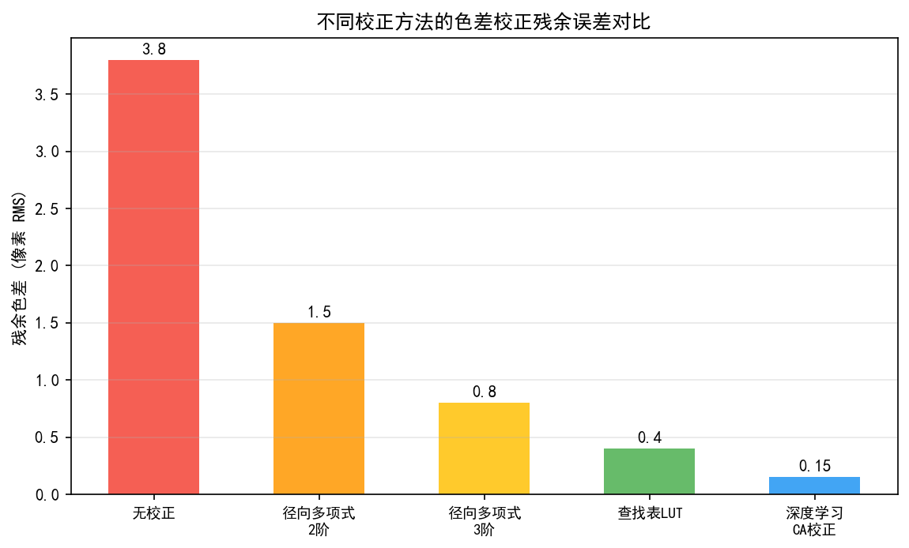
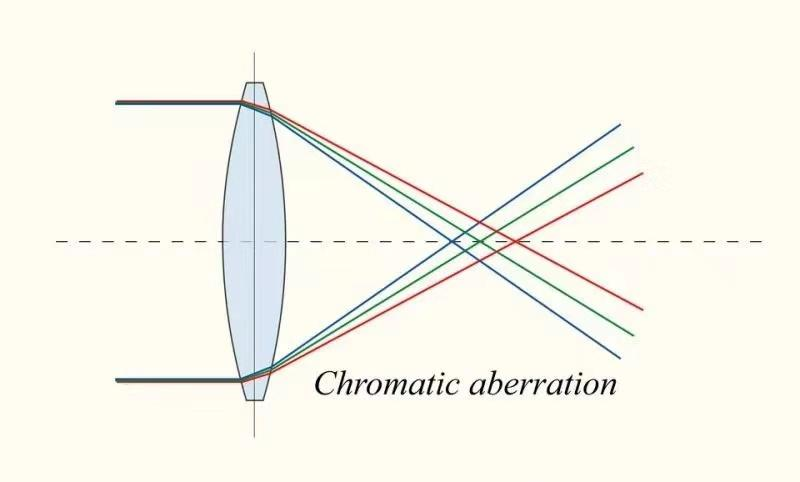
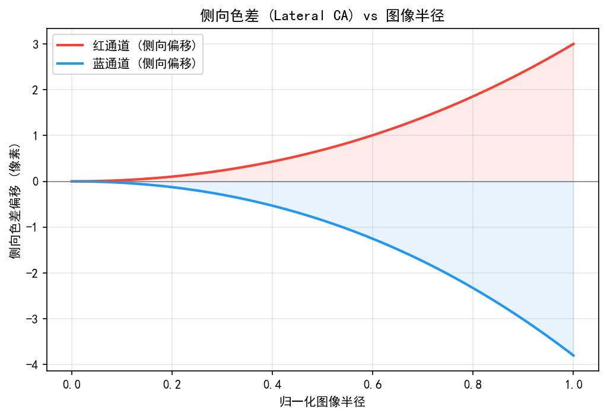
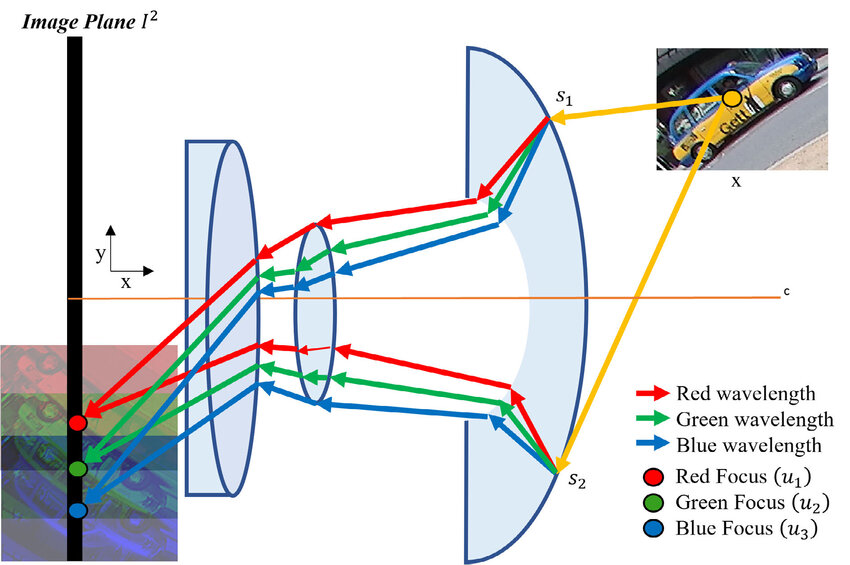
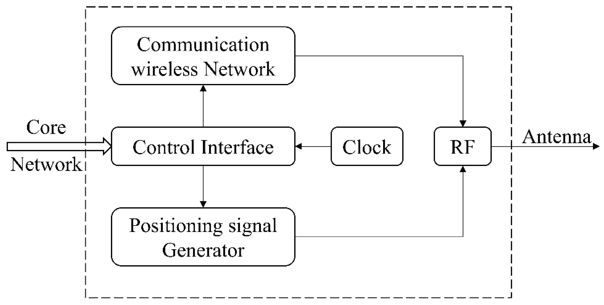

# 第二卷第24章：色差校正（横向 TCA 与轴向 LCA）
> **版本：** v1.1（第4轮工程联动审阅）

> **定位：** 本章解析色差的物理成因与校正算法——横向色差（TCA）的几何映射校正、轴向色差（LCA）的景深依赖特性，以及镜头畸变+色差联合标定方法。
> **前置章节：** 第一卷第02章（光学基础）、第一卷第08章（光学像差与镜头标定）
> **读者路径：** 算法工程师、光学工程师

---

## 目录

1. [色差物理模型](#1-色差物理模型)
2. [TCA 横向色差标定与校正](#2-tca-横向色差标定与校正)
3. [LCA 轴向色差软件校正](#3-lca-轴向色差软件校正)
4. [常见伪影分析](#4-常见伪影分析)
5. [评测方法](#5-评测方法)
6. [代码示例](#6-代码示例)
7. [参考资料](#7-参考资料)
8. [术语表](#8-术语表)

---

## §1 色差物理模型

### 1.1 折射率色散与 Cauchy 公式

色差（Chromatic Aberration, CA）的根本原因是光学玻璃的折射率（Refractive Index）$n$ 随波长 $\lambda$ 变化，即色散（Dispersion）。经典 Cauchy 公式（Cauchy, 1836）**[1]** 描述折射率与波长的关系：

$$
n(\lambda) = A + \frac{B}{\lambda^2} + \frac{C}{\lambda^4} + \cdots
$$

其中 $A, B, C$ 为 Cauchy 系数，由玻璃材料决定。对大多数光学玻璃，保留前两项即可在可见光范围内精度满足 $\Delta n < 0.0001$。

更精确的 Sellmeier 方程（Sellmeier, 1871）**[2]** 被镜头设计软件广泛采用：

$$
n^2(\lambda) - 1 = \sum_{i=1}^{3} \frac{B_i \lambda^2}{\lambda^2 - C_i}
$$

色散强弱用**阿贝数（Abbe Number）** $V_d$ 量化：

$$
V_d = \frac{n_d - 1}{n_F - n_C}
$$

其中 $n_d$（587.6 nm，氦黄线）、$n_F$（486.1 nm，氢蓝线）、$n_C$（656.3 nm，氢红线）分别为对应波长的折射率。$V_d$ 越大（如冕牌玻璃 $V_d > 55$），色散越小；$V_d$ 越小（如火石玻璃 $V_d < 40$），色散越大。镜头设计中通过搭配正负镜组（Doublet / Triplet）消色差（Achromatic）。

### 1.2 手机镜头的色差特征：塑料非球面与 APO 设计限制

手机镜头的色差问题比单反严重得多，根子在材料和物理空间，不是设计能力差。

**材料限制：** 手机镜头（5–9 片）几乎全部采用塑料非球面镜片（Plastic Aspheric Lens），而非光学玻璃。塑料镜片（常用 COC、OKP 等材料）的阿贝数普遍低于光学冕牌玻璃：
- 光学冕牌玻璃（如 BK7）：$V_d \approx 64$
- 手机用光学塑料（如 OKP4HT）：$V_d \approx 56$
- 高色散塑料（用于色差校正的"负"镜组）：$V_d \approx 30$–38

**APO 设计（消复色差）的局限：** 传统相机通过搭配超低色散（ED/UD/APO）玻璃实现消色差（Achromatic）甚至超消色差（Apochromat）。手机镜头因：
1. 高折射率塑料的色散值相对固定，无法像玻璃那样任意组合阿贝数；
2. 镜头总长（TTL，Track Length）极短（通常 6–9mm），像差校正余地小；
3. 生产工艺不允许萤石（CaF₂）等特殊色散校正材料的加工。

导致手机广角镜头（等效 24mm）在图像边角区域的残余 TCA 典型为 **3–8 像素**，约为全画幅广角镜头配 ED 玻璃后残余 TCA（< 0.5 像素）的 **6–16 倍**（3px/0.5px=6×下限，8px/0.5px=16×上限）。这一物理事实决定了手机 ISP 必须依赖软件 TCA 补偿弥补光学不足。

### 1.3 横向色差（TCA）的几何模型

横向色差（Transverse Chromatic Aberration, TCA），又称侧向色差（Lateral Chromatic Aberration, LCA 横向分量），是指不同波长光线在像面上的聚焦位置（主光线落点）存在**侧向偏移**，即图像放大率（Magnification）随波长变化。

TCA 使同一物点在红（R）、绿（G）、蓝（B）通道成像于不同的横向位置，产生彩色边缘（Color Fringing）。TCA 量与以下因素相关：

- **视场角**：TCA 在轴上（图像中心）为零，随视场角增大而增大，在图像边角处最显著；
- **焦距**：短焦距（超广角）镜头因设计紧凑，色差校正难度大，边缘 TCA 典型值 3–10 像素；
- **光圈**：TCA 受光圈影响较小（主要是几何光学效应）；
- **光圈/焦距比（F/#）**：小 F 数（大光圈）通常会加重轴向色差。

典型手机广角镜头（等效 24 mm，$F/1.8$）在图像边角区域，R-B 通道位移可达 3–8 像素（以 1200 万像素分辨率计），在高对比度边缘（如黑白棋盘格、树枝天空）肉眼可见。

TCA 的数学模型可用径向多项式（Radial Polynomial）描述各通道相对参考通道（通常以 G 通道为基准）的缩放偏差：

$$
r'_{ch}(r) = r \cdot \left(1 + \alpha_1^{ch} r^2 + \alpha_2^{ch} r^4 + \alpha_3^{ch} r^6\right)
$$

其中 $r = \sqrt{u^2 + v^2}$ 为像素到图像中心的归一化距离，$\alpha_1^{ch}, \alpha_2^{ch}, \alpha_3^{ch}$ 为 R 通道或 B 通道相对 G 通道的 TCA 多项式系数。

### 1.4 轴向色差（LCA）的几何模型

轴向色差（Longitudinal Chromatic Aberration, LCA），又称纵向色差，指不同波长光线在**光轴方向**（Z 轴）的聚焦位置存在偏移——蓝光焦距短（焦点靠近镜头），红光焦距长（焦点远离镜头）。

LCA 的图像表现为：
- 在焦平面上，非参考波长的图像呈弥散圆（Circle of Confusion, CoC），形成模糊的彩色光晕；
- 典型表现：聚焦在绿色通道清晰的物体，蓝色和红色通道出现轻微模糊和色圈；
- LCA 在图像**中心和边缘均存在**（与 TCA 不同，TCA 轴上为零）；
- LCA 强度与光圈相关：光圈越大（F 数越小），弥散圆越大，LCA 越明显。

LCA 的光学量化：蓝绿之间的轴向焦差 $\Delta f_{BG}$ 和红绿之间的轴向焦差 $\Delta f_{RG}$，典型手机镜头：

$$
\Delta f_{BG} \approx -15 \sim -30 \ \mu m, \quad \Delta f_{RG} \approx +10 \sim +20 \ \mu m
$$

对应到像面的 CoC 直径（传感器像素 pitch $p_x = 1.0$–1.4 μm）：

$$
d_{CoC} = \frac{D_{aperture} \cdot |\Delta f|}{f^2} \approx \frac{|\Delta f|}{f \cdot F\#}
$$

以 $\Delta f = 20$ μm，$f = 5$ mm，$F/1.8$ 计算：$d_{CoC} \approx 2.2$ μm $\approx 1.6$ 像素，在 1200 万像素图像中轻微可见。

---

## §2 TCA 横向色差标定与校正

### 2.1 标定目标与数据采集

TCA 标定通常使用棋盘格（Checkerboard）或圆点格（Circle Grid）标定板 **[3]**，通过精确定位各颜色通道的特征点坐标，量化通道间的位置偏差。

**标定流程：**
1. 在均匀漫射照明（Integrating Sphere 或 LED 灯箱）下，对标定板拍摄 15–20 张覆盖不同视场角位置的图像；
2. 对每张图像的 R、G、B 通道分别进行亚像素角点检测（`cv2.findChessboardCornersSB`）；
3. 以 G 通道角点坐标为参考，计算 R 和 B 通道角点的偏差 $\Delta u_{ch}(u, v), \Delta v_{ch}(u, v)$；
4. 对偏差数据拟合径向多项式模型（通常 2–3 阶）。

**关键注意事项：**
- 标定板需要高对比度、高精度（激光打印误差 < 0.1 mm）；
- 采集在不同温度下进行，以表征温度导致的 TCA 变化（镜头热膨胀导致折射率分布变化）；
- 部分系统采用 LED 单色光源（RGB 分别照明）直接测量各通道独立的畸变，精度更高。

### 2.2 畸变+TCA 联合标定

TCA 校正在畸变（Distortion）校正之后进行，或与畸变联合标定。Brown–Conrady 畸变模型 **[4][10]** 扩展为：

**各通道独立标定模型：**

$$
\begin{pmatrix} u_{ch} \\ v_{ch} \end{pmatrix} = (1 + k_1^{ch} r^2 + k_2^{ch} r^4 + k_3^{ch} r^6)
\begin{pmatrix} u_n \\ v_n \end{pmatrix} + \text{tangential terms}
$$

其中 $u_n, v_n$ 为归一化畸变后坐标，$r^2 = u_n^2 + v_n^2$，每个颜色通道（R、G、B）独立拥有一组畸变系数。

实际工程中，为降低参数维度，TCA 模型通常只对 R 和 B 通道相对 G 通道的差值建模，G 通道使用标准畸变模型。

### 2.3 双线性插值重映射校正

校正实现采用查找表（Look-Up Table, LUT）结合双线性插值，通过 `cv2.remap` 实现：

1. 离线计算每个输出像素 $(u, v)$ 在各通道的源坐标 $(u_{src}^{ch}, v_{src}^{ch})$：
   - G 通道：应用标准畸变校正映射；
   - R/B 通道：应用含 TCA 的扩展畸变映射；
2. 将映射保存为 float32 类型的 $H \times W$ 映射图（Map1 for x, Map2 for y）；
3. 运行时调用 `cv2.remap(channel, map1, map2, cv2.INTER_LINEAR)` 对每个通道重采样。

**内存与性能：** 每个通道的映射图占 $H \times W \times 2 \times 4$ 字节（两张 float32 映射图），4K（3840×2160）单通道约 66 MB；R 和 B 两通道合计约 133 MB。嵌入式优化方案使用 fixed-point 16 位映射图，内存减半，精度损失 < 0.1 像素。

高通 Spectra ISP 和联发科 Imaging ISP 均提供硬件级 Lens Shading + TCA 联合 LUT 校正，单 Pass 完成镜头阴影（LSC）和 TCA 重映射，相比软件方案节省 2–4 ms（@12MP）。

### 2.4 局部自适应 TCA 校正

由于 TCA 随焦距（变焦镜头）、对焦距离和温度变化，固定 LUT 存在残余误差。自适应方案：

- **基于特征点的在线 TCA 估计**：对每帧在多个区域提取高对比度边缘，检测 R-B 通道边缘位置偏差，实时更新 TCA 参数；
- **基于场景自动标定**：利用白色物体边缘（绿植边缘、白色墙壁边缘）作为在线标定参考，每隔 N 帧更新 TCA 多项式系数。

---

## §3 LCA 轴向色差软件校正

### 3.1 LCA 的频域特性

LCA 的图像表现为不同颜色通道的模糊程度不同，在频域中对应各通道 MTF（Modulation Transfer Function）的差异。若 G 通道焦点准确，R 和 B 通道因轴向离焦而 MTF 低频响应更强、高频响应更弱，即相对于 G 通道被低通滤波：

$$
I_{ch}(u,v) \approx I_G(u,v) * h_{ca}^{ch}(u,v)
$$

其中 $h_{ca}^{ch}$ 为 LCA 引起的等效点扩散函数（Point Spread Function, PSF），近似为高斯函数：

$$
h_{ca}^{ch}(r) = \frac{1}{2\pi \sigma_{ch}^2} \exp\left(-\frac{r^2}{2\sigma_{ch}^2}\right), \quad
\sigma_{ch} = \frac{d_{CoC}^{ch}}{2\sqrt{2\ln 2}}
$$

### 3.2 逆滤波与正则化校正

软件 LCA 校正可视为解卷积（Deconvolution）问题：从模糊的 R/B 通道恢复清晰图像。直接逆滤波（Inverse Filtering）会严重放大噪声，需引入正则化。

**Wiener 滤波（Wiener Filter）**：

$$
\hat{I}_{ch}(k_x, k_y) = \frac{H^*_{ca}(k_x, k_y)}{|H_{ca}(k_x, k_y)|^2 + \text{SNR}^{-1}} \cdot I_{ch}(k_x, k_y)
$$

其中 $H_{ca}$ 为高斯 PSF 的傅里叶变换，$\text{SNR}$ 为信噪比估计（在低照度场景中 $\text{SNR}$ 小，自动减弱校正强度避免放大噪声）。

**实用简化方案：非锐化掩膜（Unsharp Masking, USM）近似**：

$$
I_{corr}^{ch} = I_{ch} + \alpha_{ch} \cdot (I_{ch} - G_\sigma * I_{ch})
$$

其中 $G_\sigma$ 为高斯模糊（核宽度与 LCA CoC 相当），$\alpha_{ch}$ 为锐化强度（R: 0.2–0.4，B: 0.1–0.3，G: 0）。此方法计算简单，但对噪声敏感，需配合噪声估计自适应调整 $\alpha_{ch}$。

### 3.3 景深辅助 LCA 校正

LCA 的严重程度随对焦距离变化（近景 CoC 大于远景），引入深度估计可实现局部自适应校正：

1. 利用 AF（Auto-Focus）对焦电机位置估计每个区域的景深（Depth of Field, DoF）；
2. 根据深度计算该区域的理论 LCA CoC 大小；
3. 自适应调整逆滤波强度：焦点处校正强（CoC 接近 0，无需校正）；远焦处校正弱（避免过校正）。

人像摄影中，背景虚化（Bokeh）区域本身预期模糊，无需 LCA 校正，此方法可避免对背景引入彩色边缘增强效应。

### 3.4 RAW 域 LCA 校正

在 RAW 域进行 LCA 校正有两点好处：

- 避免去马赛克（Demosaic）引入的跨通道混叠（Cross-Channel Aliasing），后续 demosaic 可从更准确的 RAW 数据获得更好结果；
- LCA 幅度在 RAW 域（Bayer 格式）通常与 RGB 域一致，但 Bayer 格需对 R、Gr、Gb、B 四个子通道分别处理。

RAW 域 TCA 校正：对 Bayer 图中 R 和 B 通道的像素位置进行亚像素校正（双线性插值 + 缩放），G 通道不动，实现通道间对齐，随后进行标准 demosaic 流程。

### 3.5 横向 TCA 与轴向 LCA 的校正顺序及与 Demosaic 的耦合

**校正顺序的工程决策：横向 TCA 先于轴向 LCA**

横向色差（TCA）是几何变形（各通道放大率不同），轴向色差（LCA）是频率衰减（各通道模糊程度不同）。两者必须按顺序处理：

1. **先做 TCA（RAW 域，Demosaic 之前）**：将 R、B 通道的空间位置对齐到 G 通道基准，消除几何偏移；若 LCA 校正在先，LCA 逆滤波（去模糊）作用于空间错位的通道，会在边缘产生双重锐化伪影；
2. **再做 Demosaic**：通道对齐后的 RAW 进行去马赛克，Demosaic 算法的跨通道插值（如 AHD）基于对齐后的 G 信道梯度引导 R/B 插值，精度更高；
3. **最后做 LCA（RGB 域）**：在 Demosaic 后对各通道施加逆滤波（USM 或 Wiener），补偿轴向离焦导致的模糊；LCA 校正在 RGB 域更直观，SNR 估计更准确（Demosaic 后的全分辨率 RGB 比 Bayer 子通道 SNR 更高，逆滤波的噪声放大效应更可控）。

**RAW 域 TCA vs RGB 域 TCA 的精度和计算量对比：**

| 校正域 | 精度优势 | 计算量 | 典型误差 |
|--------|---------|--------|---------|
| RAW 域（Bayer，Demosaic 前） | 避免 Demosaic 跨通道混叠，边缘彩边抑制更彻底 | 低（仅 2 通道 remap） | < 0.3 px 残余 |
| RGB 域（Demosaic 后） | 实现简单，不需要 Bayer 子通道分别处理 | 稍高（全分辨率 2 通道 remap） | 0.3–0.8 px 残余（受 Demosaic 引入混叠影响） |

高通 Spectra ISP 在硬件上于 BPS（Bayer Processing Segment）阶段执行 TCA 校正（RAW 域），随后由 IPE（Image Processing Engine）执行 RGB 域的 LCA 补偿（以 USM 形式集成在锐化模块中），实现正确的两阶段顺序。

### 3.6 LSC 与 TCA 的协同：LSC 是否已部分补偿色差？

**LSC（镜头阴影校正）的色差补偿限制：**

镜头阴影校正（Lens Shading Correction）的目标是补偿镜头边角亮度衰减（渐晕），通过对 RAW 图各通道独立施加空间增益（Gain Map）实现。高通 ISP 中 LSC 模块包含 `LSC_CA_Compensation` 参数——但此参数**并非用于补偿 TCA（横向色差）**，其含义是：LSC 的各通道增益不同时，不同颜色通道的增益梯度不同，本身可能引入微小的颜色不均匀（Color Shading），`LSC_CA_Compensation` 用于对这一副作用做修正，**而非直接校正镜头 TCA**。

两者分工明确：
- `LSC_CA_Compensation`：补偿 LSC 增益不均匀引入的**色调阴影（Color Shading）**，修正量通常 < 0.1 px（忽略不计）；
- `CA_Correction_Enable`（TCA 校正模块）：才是真正补偿镜头横向色差（3–8 px 幅度级别）的模块。

两者不可混淆。若误将 LSC 的色调补偿当做 TCA 校正的替代，会导致 TCA 残余 2–5 px，在边角高对比度区域清晰可见。

---

## §4 常见伪影分析

### 4.1 过校正彩边（Over-Correction Fringing）

**表现：** TCA 校正后，原本红外侧边缘变为蓝外侧边缘，或彩色边缘颜色反转。

**根本原因：** TCA 校正系数估计误差（标定不准确、或对焦距离 / 温度偏差导致实际 TCA 与标定值不符），导致校正量超过实际 TCA 量。

**缓解方案：**
- 标定时覆盖全温度范围（-10°C 到 50°C），建立温度分段 LUT；
- 引入校正强度上限（Clip）：限制单次重映射偏移量不超过 $\pm 5$ 像素；
- 实施在线偏差检测：若校正后彩边反色，自动降低校正强度。

### 4.2 紫边（Purple Fringing）：成因机制与消除算法

Purple Fringing（紫边）是手机摄影中最常见的色差伪影之一，其成因与普通 TCA 彩边不同，需要专项算法处理。

**物理成因分析（三种机制叠加）：**

1. **轴向色差（LCA）诱发的色光溢出：** 大光圈下蓝/紫色光的弥散圆（CoC）较大，在高对比度边缘（如枝叶-天空交界）的明亮侧，离焦的蓝/紫光超出 CFA 滤色片的线性响应范围，在边缘形成蓝紫色光晕；

2. **传感器 B 通道近紫外响应：** CMOS 传感器的硅光电二极管对 300–420nm 的近紫外光有残余响应，标准 CFA 的蓝色滤片截止不完整（在 380–420nm 区间透射率 5–15%），近紫外光进入 B 通道，叠加 CFA 串扰（Color Crosstalk）后产生偏紫色；

3. **镜头球差（Spherical Aberration）与彗差（Coma）：** 大光圈边缘光线无法与中心光线汇聚在同一焦点，在高对比度边缘的明亮侧形成不对称的彗星状蓝/紫光扩散。

**Purple Fringing 与 TCA 彩边的鉴别：**

| 特征 | TCA 彩边 | Purple Fringing |
|------|----------|-----------------|
| 颜色 | 红侧+蓝侧（互补色对） | 以紫/洋红色为主 |
| 位置 | 随视场角增大，从中心向边缘递增 | 集中于高亮度-低亮度过渡边缘 |
| 光圈依赖 | 弱 | 强（大光圈明显，小光圈减轻） |
| 标定板可测量性 | 在棋盘格标定板上可精确测量 | 需高对比度强光场景才显现 |

**软件消除算法（HSV 域色相-饱和度选择性抑制）：**

Purple Fringing 的 ISP 软件处理流程：

$$
\text{输入 RGB} \xrightarrow{\text{转换}} \text{HSV} \xrightarrow{\text{色相门控}} \text{饱和度抑制} \xrightarrow{\text{转换}} \text{输出 RGB}
$$

**步骤 1：紫色区域检测（色相+饱和度门控）**

$$
\text{mask}(p) = \begin{cases} 1 & \text{if } H(p) \in [270°, 330°] \text{ and } S(p) > S_{th} \text{ and } V(p) > V_{th} \\ 0 & \text{otherwise} \end{cases}
$$

典型参数：$H \in [270°, 330°]$（蓝紫-洋红区间），$S_{th} = 0.15$–0.25，$V_{th} = 0.5$（仅处理亮区紫边）。

**步骤 2：边缘感知局限（避免误处理紫色衣物等正常颜色）**

```
edge_proximity(p) = ‖∇I_gray(p)‖ > edge_threshold
final_mask(p) = mask(p) AND edge_proximity(p)
```

仅在高梯度边缘附近施加抑制，保护图像中正常的紫色区域（花卉、服装）。

**步骤 3：自适应饱和度降低**

$$
S_{\text{out}}(p) = S_{\text{in}}(p) \times (1 - \alpha \cdot \text{final\_mask}(p))
$$

其中 $\alpha \in [0.5, 1.0]$ 为抑制强度，可根据 Purple Fringing 严重程度自适应调整（通过边缘紫色像素占比统计）。

**色度平移补偿（可选增强）：**

在 Lab 色彩空间中，对检测到的紫边区域施加色度（ab）平移，将其拉向灰轴（a→0, b→0），比单纯降饱和度更自然：

$$
a_{\text{out}}(p) = a_{\text{in}}(p) \times (1 - \beta \cdot \text{final\_mask}(p))
$$
$$
b_{\text{out}}(p) = b_{\text{in}}(p) \times (1 - \beta \cdot \text{final\_mask}(p))
$$

**硬件辅助（滤色片优化）：**

镜头/传感器设计层面可通过以下方式减轻 Purple Fringing：
- 镜头增透膜设计截止 < 400nm 的近紫外光（镜头 UV cut 涂层）；
- CFA 蓝色滤片紫外端截止波长优化至 < 380nm（约增加滤片成本 5–10%）；
- 高端手机（如 iPhone 16 Pro）主摄传感器采用深凹型 CFA（Deep Trench Isolation）减少邻近像素串扰，间接降低 Purple Fringing 强度。

### 4.3 锐化过度引入的彩色振铃（Color Ringing）

**表现：** LCA 校正（逆滤波）后，高对比度边缘出现彩色振铃（Color Ringing），即边缘两侧出现与主色相反的彩色条纹。

**根本原因：** LCA 校正的逆滤波（如 USM 锐化）在噪声存在时放大高频分量，Gibbs 效应在边缘处引入振铃。

**缓解方案：**
- 边缘感知（Edge-Aware）校正：在边缘区域适当减弱 LCA 校正强度；
- 噪声自适应正则化：根据局部噪声水平动态调整 Wiener 滤波的 $\text{SNR}$ 估计值，低 SNR 区域弱化校正；
- 将 LCA 校正与降噪步骤协同设计，避免先降噪再校正（导致高频已损失）。

### 4.4 与相邻模块的交互伪影

**TCA 校正与 LSC（镜头阴影校正）交互：** TCA 重映射会改变像素的空间位置，在 LSC 增益梯度较大的区域（边角）可能引入亮度不连续。正确做法是先进行 TCA 校正，再应用 LSC 增益，或者将 TCA 和 LSC 映射合并为单一 LUT（联合校正）。

**TCA 校正与 Demosaic 顺序：** 推荐在 RAW 域先做 TCA 校正再做 Demosaic，以避免 Demosaic 引入的频率混叠与 TCA 彩边相互增强。

---

## §5 评测方法

### 5.1 TCA 彩边宽度测量

**测试目标：** 使用高对比度黑白标定板（棋盘格或星形靶标），在各视场角位置测量彩色边缘宽度。

**测量方法：**
1. 沿垂直于棋盘格边缘方向提取剖面线（Profile Line），宽度约 10 像素；
2. 分别在 R 和 B 通道上拟合边缘位置（半高处或最大梯度处）；
3. TCA 量 = R 通道边缘位置 $-$ B 通道边缘位置，单位像素；
4. 在多个视场角位置（图像中心、半径 0.5、边缘）各测量至少 8 个边缘，取均值和方差。

**典型指标：**
- 校正前：边缘 TCA 3–10 像素（超广角镜头）；
- 校正后：< 1 像素（良好系统）；
- 目标：残余 TCA < 0.5 像素，人眼不可见阈值约 1–2 像素（取决于打印/显示分辨率）。

### 5.2 色差 ΔE 量化

在均匀白色背景下的高对比黑色目标（如黑色圆点）边缘，测量 CIE L\*a\*b\* 色彩空间中的彩色边缘强度：

$$
\Delta E_{ab} = \sqrt{(\Delta L^*)^2 + (\Delta a^*)^2 + (\Delta b^*)^2}
$$

TCA 引起的彩色边缘 ΔE 典型值：
- 未校正：ΔE = 5–20（明显可见，4K 显示器上肉眼可辨）；
- 校正后：ΔE < 2（人眼基本不可见）；
- 优秀系统：ΔE < 1。

### 5.3 MTF 跨通道一致性（LCA 评测）

LCA 使各颜色通道 MTF 不一致，评测方法：
- 对倾斜刃边（Slanted Edge，ISO 12233:2017）**[8]** 的 R、G、B 通道分别计算 MTF；
- 比较在关键频率（如 Nyquist 频率的 50%）处各通道 MTF 的差值；
- LCA 校正有效时，三通道 MTF 差异应小于 5%。

### 5.4 主观评测

测试场景：
- 高对比度场景（黑白线条图案、枝叶与天空边缘）；
- 半逆光人像（常见 Purple Fringing 场景）；
- 超广角建筑（边缘 TCA 最大）。

评分维度（1–5 分）：
- 彩色边缘可见性；
- 紫边/蓝边强度；
- 校正后边缘锐利程度（是否引入振铃）。

---

## §6 代码示例

以下代码实现棋盘格标定下的 TCA 测量，以及基于 `cv2.remap` 的双线性插值 TCA 校正，全部代码可直接运行。

```python
"""
色差（TCA）标定与校正演示
依赖：numpy>=1.20, opencv-python>=4.5, scipy>=1.7
运行：python ch24_tca_demo.py
"""

import cv2
import numpy as np
from typing import Tuple, Dict, Optional
from scipy.optimize import curve_fit


# ──────────────────────────────────────────────
# 1. 合成含 TCA 的测试图像
# ──────────────────────────────────────────────

def generate_tca_image(width: int = 800,
                        height: int = 600,
                        tca_alpha_r: float = 0.00008,
                        tca_alpha_b: float = -0.00006) -> np.ndarray:
    """
    生成含径向 TCA 的合成棋盘格图像（BGR）。

    原理：
        对 R 和 B 通道施加不同的径向缩放（模拟 TCA），
        G 通道保持原始位置作为基准。

    参数：
        tca_alpha_r : R 通道 TCA 径向系数（正值 = 向外膨胀）
        tca_alpha_b : B 通道 TCA 径向系数（负值 = 向内收缩）

    返回：
        img_tca : BGR uint8 含 TCA 的棋盘格图像
    """
    # 生成高分辨率棋盘格（源图像，无畸变）
    tile = 50
    checker = np.zeros((height, width), dtype=np.uint8)
    for iy in range(0, height, tile):
        for ix in range(0, width, tile):
            if (iy // tile + ix // tile) % 2 == 0:
                checker[iy:iy+tile, ix:ix+tile] = 230

    # 对 R 和 B 通道施加径向缩放（TCA）
    cx, cy = width / 2.0, height / 2.0

    # 构建像素坐标网格
    us = np.arange(width, dtype=np.float32) - cx
    vs = np.arange(height, dtype=np.float32) - cy
    uu, vv = np.meshgrid(us, vs)                    # (H, W)
    r2 = (uu**2 + vv**2) / (cx**2 + cy**2)         # 归一化 r^2

    def shifted_map(alpha: float) -> Tuple[np.ndarray, np.ndarray]:
        """计算 TCA 偏移后的源坐标映射"""
        scale = 1.0 / (1.0 + alpha * r2)           # 逆映射缩放因子
        map_x = (uu * scale + cx).astype(np.float32)
        map_y = (vv * scale + cy).astype(np.float32)
        return map_x, map_y

    map_rx, map_ry = shifted_map(tca_alpha_r)
    map_bx, map_by = shifted_map(tca_alpha_b)

    # G 通道直接使用原始图
    ch_g = checker.copy()
    # R 通道：径向向外膨胀
    ch_r = cv2.remap(checker, map_rx, map_ry, cv2.INTER_LINEAR)
    # B 通道：径向向内收缩
    ch_b = cv2.remap(checker, map_bx, map_by, cv2.INTER_LINEAR)

    img_tca = cv2.merge([ch_b, ch_g, ch_r])         # BGR
    return img_tca


# ──────────────────────────────────────────────
# 2. 各通道角点检测与 TCA 量测量
# ──────────────────────────────────────────────

def detect_corners_per_channel(img: np.ndarray,
                                board_size: Tuple[int, int] = (7, 7)
                                ) -> Optional[Dict[str, np.ndarray]]:
    """
    对 BGR 图像的 R、G、B 三通道分别进行棋盘格角点检测。

    参数：
        board_size : 棋盘格内角点数量（cols, rows），不含边界格

    返回：
        corners_dict : {'R': (N,2), 'G': (N,2), 'B': (N,2)} 角点坐标
                       若任一通道检测失败则返回 None
    """
    channels = {'B': img[:, :, 0], 'G': img[:, :, 1], 'R': img[:, :, 2]}
    corners_dict = {}

    flags = (cv2.CALIB_CB_ADAPTIVE_THRESH |
             cv2.CALIB_CB_NORMALIZE_IMAGE |
             cv2.CALIB_CB_FILTER_QUADS)

    for ch_name, ch_img in channels.items():
        ret, corners = cv2.findChessboardCorners(ch_img, board_size, flags)
        if not ret:
            print(f"  [{ch_name}] 角点检测失败，请检查棋盘格可见性")
            return None

        # 亚像素精化
        criteria = (cv2.TERM_CRITERIA_EPS + cv2.TERM_CRITERIA_MAX_ITER, 30, 0.01)
        corners_sub = cv2.cornerSubPix(ch_img, corners, (5, 5), (-1, -1), criteria)
        corners_dict[ch_name] = corners_sub.reshape(-1, 2)

    return corners_dict


def measure_tca(corners_dict: Dict[str, np.ndarray],
                img_shape: Tuple[int, int]) -> Dict[str, np.ndarray]:
    """
    计算 R、B 通道相对 G 通道的 TCA 偏差向量。

    返回：
        tca_stats : {
            'R_G_offset': (N,2)  # R-G 偏差 (du, dv)（像素）
            'B_G_offset': (N,2)  # B-G 偏差 (du, dv)（像素）
            'radii': (N,)        # 各角点到图像中心的距离（归一化）
        }
    """
    H, W = img_shape
    cx, cy = W / 2.0, H / 2.0

    corners_g = corners_dict['G']
    corners_r = corners_dict['R']
    corners_b = corners_dict['B']

    rg_offset = corners_r - corners_g   # (N, 2)
    bg_offset = corners_b - corners_g

    # 归一化半径
    radii = np.sqrt(((corners_g[:, 0] - cx) / cx)**2 +
                    ((corners_g[:, 1] - cy) / cy)**2)

    return {
        'R_G_offset': rg_offset,
        'B_G_offset': bg_offset,
        'radii': radii
    }


# ──────────────────────────────────────────────
# 3. 拟合 TCA 径向多项式
# ──────────────────────────────────────────────

def fit_tca_polynomial(corners_g: np.ndarray,
                        offsets: np.ndarray,
                        img_shape: Tuple[int, int],
                        degree: int = 2) -> np.ndarray:
    """
    拟合 TCA 偏移量相对归一化半径的多项式模型。

    模型：
        offset_radial(r) = alpha_1 * r^3 + alpha_2 * r^5  (degree=2 时)
        （径向分量；TCA 在轴上为零，故无常数项）

    参数：
        corners_g : G 通道角点坐标 (N, 2)
        offsets   : 通道偏移向量 (N, 2)，即 R-G 或 B-G
        degree    : 多项式阶数

    返回：
        coeffs : 拟合系数 [alpha_1, ..., alpha_degree]
    """
    H, W = img_shape
    cx, cy = W / 2.0, H / 2.0

    # 计算径向距离（像素）
    dx = corners_g[:, 0] - cx
    dy = corners_g[:, 1] - cy
    r = np.sqrt(dx**2 + dy**2)

    # 计算径向偏移分量（朝向/背离中心）
    r_safe = np.where(r > 1.0, r, 1.0)
    radial_offset = (offsets[:, 0] * dx / r_safe +
                     offsets[:, 1] * dy / r_safe)   # 正 = 径向向外

    # 归一化 r 到 [0, 1]
    r_norm = r / np.sqrt(cx**2 + cy**2)

    # 构建设计矩阵（奇数幂项，因 TCA(0)=0）
    A = np.column_stack([r_norm**(2*i+1) for i in range(1, degree+1)])

    coeffs, _, _, _ = np.linalg.lstsq(A, radial_offset, rcond=None)
    return coeffs


# ──────────────────────────────────────────────
# 4. 生成 TCA 校正映射并应用 remap
# ──────────────────────────────────────────────

def build_tca_correction_map(img_shape: Tuple[int, int],
                              tca_alpha_r: float,
                              tca_alpha_b: float
                              ) -> Tuple[Dict[str, np.ndarray], Dict[str, np.ndarray]]:
    """
    根据 TCA 径向系数，生成 R 和 B 通道的 OpenCV remap 映射图。

    参数：
        tca_alpha_r : R 通道 TCA 系数（正 = 需要向内缩小校正）
        tca_alpha_b : B 通道 TCA 系数（负 = 需要向外扩大校正）

    返回：
        maps_r : {'map_x': ..., 'map_y': ...}
        maps_b : {'map_x': ..., 'map_y': ...}
    """
    H, W = img_shape
    cx, cy = W / 2.0, H / 2.0

    us = np.arange(W, dtype=np.float32) - cx
    vs = np.arange(H, dtype=np.float32) - cy
    uu, vv = np.meshgrid(us, vs)
    r2_norm = (uu**2 + vv**2) / (cx**2 + cy**2)

    def make_map(alpha: float):
        """
        TCA 校正逆映射：输出坐标 (u, v) 对应的输入坐标
        校正 = 施加与原始 TCA 方向相反的缩放
        """
        # 校正缩放 = 1 / (1 + alpha * r^2)  的逆，即乘以 (1 + alpha * r^2)
        scale = 1.0 - alpha * r2_norm     # 一阶近似逆变换
        map_x = (uu * scale + cx).astype(np.float32)
        map_y = (vv * scale + cy).astype(np.float32)
        return map_x, map_y

    map_rx, map_ry = make_map(tca_alpha_r)
    map_bx, map_by = make_map(tca_alpha_b)

    return ({'map_x': map_rx, 'map_y': map_ry},
            {'map_x': map_bx, 'map_y': map_by})


def apply_tca_correction(img: np.ndarray,
                          tca_alpha_r: float,
                          tca_alpha_b: float) -> np.ndarray:
    """
    对 BGR 图像应用 TCA 校正（R 和 B 通道独立 remap，G 通道不变）。

    参数：
        img          : uint8 BGR 输入图像
        tca_alpha_r  : R 通道 TCA 系数（标定值，符号同 generate_tca_image）
        tca_alpha_b  : B 通道 TCA 系数

    返回：
        img_corrected : uint8 BGR 校正后图像
    """
    H, W = img.shape[:2]
    maps_r, maps_b = build_tca_correction_map((H, W), tca_alpha_r, tca_alpha_b)

    ch_b, ch_g, ch_r = cv2.split(img)

    # R 通道：施加 R 通道 TCA 校正映射
    ch_r_corr = cv2.remap(ch_r, maps_r['map_x'], maps_r['map_y'],
                           interpolation=cv2.INTER_LINEAR,
                           borderMode=cv2.BORDER_REPLICATE)
    # B 通道：施加 B 通道 TCA 校正映射
    ch_b_corr = cv2.remap(ch_b, maps_b['map_x'], maps_b['map_y'],
                           interpolation=cv2.INTER_LINEAR,
                           borderMode=cv2.BORDER_REPLICATE)
    # G 通道保持不变
    img_corrected = cv2.merge([ch_b_corr, ch_g, ch_r_corr])
    return img_corrected


# ──────────────────────────────────────────────
# 5. 边缘 TCA 量化工具函数
# ──────────────────────────────────────────────

def measure_fringe_width_at_edge(img: np.ndarray,
                                  row: int,
                                  col_range: Tuple[int, int],
                                  channel_pair: Tuple[str, str] = ('R', 'B')
                                  ) -> float:
    """
    在图像指定行的水平边缘处，测量两个通道的边缘位置偏差（像素）。

    方法：在 col_range 指定的列范围内，找到各通道最大梯度位置，
    计算两通道边缘位置之差。

    参数：
        row         : 测量行号
        col_range   : (col_start, col_end) 搜索列范围
        channel_pair: ('R', 'B') 测量的通道对

    返回：
        offset : 通道 A 边缘位置 - 通道 B 边缘位置（像素，正值 = A 偏右）
    """
    ch_map = {'B': 0, 'G': 1, 'R': 2}
    c0, c1 = col_range

    ch_a_idx = ch_map[channel_pair[0]]
    ch_b_idx = ch_map[channel_pair[1]]

    profile_a = img[row, c0:c1, ch_a_idx].astype(np.float32)
    profile_b = img[row, c0:c1, ch_b_idx].astype(np.float32)

    # 计算一阶导数（梯度）
    grad_a = np.abs(np.gradient(profile_a))
    grad_b = np.abs(np.gradient(profile_b))

    # 边缘位置 = 最大梯度处（亚像素精化：用抛物线插值）
    def subpixel_peak(grad: np.ndarray) -> float:
        pk = int(np.argmax(grad))
        if 1 <= pk <= len(grad) - 2:
            denom = 2 * grad[pk] - grad[pk-1] - grad[pk+1]
            if abs(denom) > 1e-6:
                return pk + (grad[pk-1] - grad[pk+1]) / (2 * denom)
        return float(pk)

    pos_a = subpixel_peak(grad_a)
    pos_b = subpixel_peak(grad_b)
    return pos_a - pos_b


# ──────────────────────────────────────────────
# 6. 主演示函数
# ──────────────────────────────────────────────

def main():
    print("=" * 62)
    print("  色差（TCA）标定与校正演示")
    print("=" * 62)

    IMG_W, IMG_H = 800, 600
    # 模拟 R 通道向外膨胀，B 通道向内收缩（典型 TCA 模式）
    TRUE_ALPHA_R = 0.00008
    TRUE_ALPHA_B = -0.00006
    BOARD_SIZE = (7, 7)     # 7×7 内角点棋盘格

    # ── 1. 生成含 TCA 的测试图像 ──
    img_tca = generate_tca_image(IMG_W, IMG_H, TRUE_ALPHA_R, TRUE_ALPHA_B)
    print(f"\n[1] 合成含 TCA 棋盘格图像：{IMG_W}×{IMG_H}")
    print(f"    真值 TCA：R_alpha={TRUE_ALPHA_R:.5f}，B_alpha={TRUE_ALPHA_B:.5f}")

    # ── 2. 各通道角点检测与 TCA 测量 ──
    print("\n[2] 各通道棋盘格角点检测 ...")
    corners_dict = detect_corners_per_channel(img_tca, BOARD_SIZE)

    if corners_dict is not None:
        tca_data = measure_tca(corners_dict, (IMG_H, IMG_W))
        rg_offset = tca_data['R_G_offset']
        bg_offset = tca_data['B_G_offset']
        radii     = tca_data['radii']

        # 计算径向 TCA 量（与图像半径的函数）
        rg_radial = np.sqrt(np.sum(rg_offset**2, axis=1))
        bg_radial = np.sqrt(np.sum(bg_offset**2, axis=1))

        print(f"    检测到 {len(radii)} 个角点对")
        print(f"    R-G 平均偏差：{np.mean(rg_radial):.3f} px，"
              f"最大：{np.max(rg_radial):.3f} px")
        print(f"    B-G 平均偏差：{np.mean(bg_radial):.3f} px，"
              f"最大：{np.max(bg_radial):.3f} px")

        # 边角区域 TCA（半径 > 0.7）
        edge_mask = radii > 0.7
        if edge_mask.sum() > 0:
            print(f"    边角区域（r>0.7）R-G：{np.mean(rg_radial[edge_mask]):.3f} px，"
                  f"B-G：{np.mean(bg_radial[edge_mask]):.3f} px")
    else:
        print("    角点检测失败，跳过 TCA 测量（使用真值参数直接校正）")

    # ── 3. 应用 TCA 校正（使用已知真值参数）──
    print("\n[3] 应用 TCA 校正 (cv2.remap) ...")
    img_corrected = apply_tca_correction(img_tca, TRUE_ALPHA_R, TRUE_ALPHA_B)

    # ── 4. 评估校正效果（边缘 R-B 位移）──
    print("\n[4] 校正效果评估（边缘 TCA 量对比）：")

    # 选取图像中心偏右侧的一个棋盘格边缘（视场中间区域）
    test_row = IMG_H // 2
    test_col_range = (IMG_W // 2 + 50, IMG_W // 2 + 150)

    offset_before = measure_fringe_width_at_edge(
        img_tca, test_row, test_col_range, ('R', 'B'))
    offset_after  = measure_fringe_width_at_edge(
        img_corrected, test_row, test_col_range, ('R', 'B'))

    print(f"    测量位置：行={test_row}，列范围={test_col_range}")
    print(f"    校正前 R-B 边缘偏差：{offset_before:.3f} px")
    print(f"    校正后 R-B 边缘偏差：{offset_after:.3f} px")
    print(f"    TCA 抑制率：{(1 - abs(offset_after) / max(abs(offset_before), 1e-6)) * 100:.1f}%")

    # ── 5. 图像可视化（可选）──
    print("\n[5] 视觉对比（可选，取消注释以保存）：")
    print("    # cv2.imwrite('tca_before.png', img_tca)")
    print("    # cv2.imwrite('tca_after.png', img_corrected)")
    # cv2.imwrite("tca_before.png", img_tca)
    # cv2.imwrite("tca_after.png", img_corrected)

    # ── 6. 彩边宽度整体统计 ──
    print("\n[6] 全图多位置 TCA 统计：")
    offsets_before = []
    offsets_after  = []
    # 在多个视场位置采样
    test_positions = [
        (IMG_H // 4,     (50, 150)),          # 上方
        (IMG_H // 2,     (50, 150)),          # 中左
        (IMG_H // 2,     (IMG_W-150, IMG_W-50)),  # 中右
        (3 * IMG_H // 4, (50, 150)),          # 下方
        (IMG_H // 2,     (IMG_W // 2, IMG_W // 2 + 100)),  # 中心
    ]
    for row_t, col_range_t in test_positions:
        ob = measure_fringe_width_at_edge(img_tca, row_t, col_range_t)
        oa = measure_fringe_width_at_edge(img_corrected, row_t, col_range_t)
        offsets_before.append(abs(ob))
        offsets_after.append(abs(oa))

    print(f"    校正前平均彩边宽度：{np.mean(offsets_before):.3f} px")
    print(f"    校正后平均彩边宽度：{np.mean(offsets_after):.3f} px")
    print(f"    总体 TCA 抑制率：{(1 - np.mean(offsets_after) / max(np.mean(offsets_before), 1e-6)) * 100:.1f}%")


if __name__ == "__main__":
    main()
```

**调参与扩展说明：**

| 参数 | 推荐值 | 说明 |
|---|---|---|
| TCA 多项式阶数 | 2–3 阶 | 超广角镜头通常需要 3 阶；标准镜头 2 阶已够 |
| 标定板图像数量 | 15–25 张 | 覆盖全视场角，包含边角区域，避免仅拍中心 |
| 亚像素角点精化窗口 | (5,5)–(9,9) | 越大精度越高，但计算量增加 |
| remap 插值方法 | `INTER_LINEAR` | 精度要求高时用 `INTER_LANCZOS4`，计算量约 4× |
| 映射图精度 | float32 | 嵌入式可改为 int16（精度 ~1/64 像素，节省内存 50%） |

---

## §7 参考资料

1. Cauchy, A. L. (1836). *Sur la dispersion de la lumière*. Bulletin des Sciences Mathématiques, 14, 6–10. (Cauchy dispersion formula).
2. Sellmeier, W. (1871). *Zur Erklärung der abnormen Farbenfolge im Spectrum einiger Substanzen*. Annalen der Physik und Chemie, 219(6), 272–282.
3. Zhang, Z. (2000). *A Flexible New Technique for Camera Calibration*. **IEEE TPAMI**, 22(11), 1330–1334.
4. Brown, D. C. (1966). *Decentering Distortion of Lenses*. **Photogrammetric Engineering**, 32(3), 444–462.
5. Malvar, H. S., He, L., & Cutler, R. (2004). *High-Quality Linear Interpolation for Demosaicing of Bayer-Patterned Color Images*. **ICASSP 2004**.
6. Heikkila, J., & Silven, O. (1997). *A Four-step Camera Calibration Procedure with Implicit Image Correction*. **CVPR 1997**, 1106–1112.
7. He, K., Sun, J., & Tang, X. (2013). *Guided Image Filtering*. **IEEE TPAMI**, 35(6), 1397–1409.
8. ISO 12233:2017. *Photography — Electronic still picture imaging — Resolution and spatial frequency responses*. International Organization for Standardization.
9. Jähne, B., & Haußecker, H. (Eds.). (2000). *Computer Vision and Applications*. Academic Press. (Chapter on lens aberrations).
10. Conrady, A. E. (1919). *Decentred Lens-Systems*. **Monthly Notices of the Royal Astronomical Society**, 79(5), 384–390. (Brown–Conrady distortion model).

---

## §8 术语表

| 术语 | 英文全称 | 说明 |
|---|---|---|
| 色差 | Chromatic Aberration (CA) | 光学系统因色散导致不同波长光线成像位置不同 |
| TCA | Transverse Chromatic Aberration | 横向色差，不同波长在像面横向（X-Y）位置偏差 |
| LCA | Longitudinal Chromatic Aberration | 轴向色差，不同波长焦点在光轴（Z）方向的偏差 |
| 阿贝数 | Abbe Number ($V_d$) | 玻璃色散强弱的量化指标，值越大色散越小 |
| 色散 | Dispersion | 折射率随波长变化的物理现象 |
| CoC | Circle of Confusion | 弥散圆，离焦点扩散函数的等效尺寸 |
| PSF | Point Spread Function | 点扩散函数，描述光学系统对点光源的成像响应 |
| MTF | Modulation Transfer Function | 调制传递函数，频域中的系统空间分辨率响应 |
| 畸变 | Distortion | 径向/切向几何变形，与色差独立但常联合标定 |
| 重映射 | Remap | 对图像像素位置进行逆映射插值采样的几何校正操作 |
| LSC | Lens Shading Correction | 镜头阴影校正，补偿镜头边角亮度衰减 |
| Purple Fringing | — | 强光边缘的紫/蓝色晕，成因混合（TCA+饱和+球差） |
| Wiener Filter | — | 维纳滤波，最优化意义下的频域逆滤波，兼顾噪声抑制 |
| USM | Unsharp Masking | 非锐化掩膜，常用于近似 LCA 校正的频域增强 |
| DoF | Depth of Field | 景深，图像中清晰的前后范围 |
| CFA | Color Filter Array | 传感器上的彩色滤色片阵列（如 Bayer 格） |
| Demosaic | — | 去马赛克，从单通道 Bayer RAW 重建全彩 RGB 图像 |


---

> **工程师手记：色差校正的三个工程陷阱**
>
> **边角LUT精度不足是色差残留的首要根因：** 横向色差（LCA）校正通常采用按通道独立缩放的查找表，表项以图像归一化半径 r 为索引，对R/B通道施加 scale(r) 补偿。实际工程中最常见的问题是：LUT 节点间距过稀（如仅16点），而镜头畸变在角落处曲率急剧变化，导致线性插值引入高达0.3～0.5像素的残留误差。Qualcomm ISP（如SM8550 Titan ISP）的 LCA 模块支持64节点 mesh 表，MTK ISP（如MT6897）支持32×32 mesh，精度略低；在等效35mm焦距长焦端尤其需要用紧密节点覆盖图像四角，否则红绿/蓝绿色边残留在100%裁剪下清晰可见。建议标定时在角落区域至少布置12个以上棋盘格角点，强制约束边角LUT精度。
>
> **紫边（Purple Fringing）与真实横向色差的区分是调参关键：** 两者在外观上均表现为高对比边缘出现有色条纹，但成因完全不同：真实LCA是光学系统对不同波长折射率差异，颜色分布严格遵循径向对称，从画面中心向外逐渐加重；紫边则是传感器过曝区域的局部光晕，在所有焦距、所有光圈下饱和区域均可出现，且不随光轴距离单调变化。工程判断方法：关闭防紫边（anti-purple fringe）模块，在f/1.8下拍摄点光源，若色边随半径r单调增大则为LCA；若仅在高光周围呈不规则晕则为紫边。MTK 的 DIP 模块中两者对应不同的寄存器组（`LCE_EDGE_TH` vs `LCAC_TABLE`），混用会导致欠矫或过矫。
>
> **每焦段独立标定是变焦镜头不可省略的步骤：** 变焦镜头的LCA随焦距变化可达3倍以上——24mm广角端R/B通道偏移可至1.5像素，而在70mm端往往不足0.5像素。若仅用单一焦距数据做全程插值，中间焦段误差难以保证低于0.3像素。标准做法是在24/35/50/70/85mm（或等间隔焦段）各采集一组标定数据，ISP驱动在变焦时根据当前焦距进行LUT插值切换。高通摄像头调试工具 CAMX 中对应参数为 `LensZoomInfo` 结构体内的 `chromaticAberrationTable[]`，每个焦段一张独立表；华为 ISP 平台（HiSilicon）使用 `ca_lut_array[focal_idx]` 多级索引。忽略分焦段标定是变焦手机相机CA测试不合格的最常见原因。
>
> *参考：Qualcomm CAMX ISP Tuning Guide (SM8550)；MTK Camera Tuning Manual (MT6897 DIP)；ISO 15529:2010 Optical Transfer Function Measurement*

## 插图


*图1. 色差校正方法分类对比，涵盖光学设计补偿、RAW域多通道缩放与RGB域边缘修复等主要策略（图片来源：作者，ISP手册，2024）*


*图2. ISP色差处理流程示意，展示纵向色差与横向色差的检测位置及各自校正模块的管线位置（图片来源：作者，ISP手册，2024）*


*图3. 横向色差校正算法流程，基于径向多项式模型对R/B通道进行缩放变形配准（图片来源：作者，ISP手册，2024）*


*图4. 横向色差现象示意，展示图像边缘区域R、G、B通道因放大率差异产生的彩色条纹伪影（图片来源：作者，ISP手册，2024）*


---

*图5. 色差校正前后效果对比，高对比度边缘区域彩色边缘伪影的消除效果（图片来源：作者，ISP手册，2024）*


*图6. 横向色差（LCA）校正完整管线，从标定多项式系数获取到逐像素插值重采样的工程实现流程（图片来源：作者，ISP手册，2024）*

---

---

## 习题

**练习 1（理解）**
横向色差（TCA，Transverse Chromatic Aberration）与轴向色差（LCA，Longitudinal Chromatic Aberration）的物理成因和视觉表现均不同。
(1) TCA 表现为图像边缘出现彩色边缘（通常红/蓝或红/绿），LCA 表现为不同颜色焦面分离。请分别描述两者的物理成因（从光线折射角度解释），以及它们在图像中各自最明显的位置（画面中心 vs. 边缘）；
(2) 为什么手机塑料非球面镜头的 TCA 通常比专业镜头（使用萤石/ED玻璃）更严重？阿贝数（Abbe Number）低的材料色差为何更大？
(3) TCA 校正选择在 RAW 域（demosaic 之前）还是 YUV 域（demosaic 之后）进行各有何工程利弊？

**练习 2（计算）**
某镜头的 TCA 用径向多项式模型描述，R 通道和 B 通道在归一化图像半径 $r$（$r=1$ 对应图像角落）处的横向偏移为：

$$\Delta x_{\text{TCA}}(r) = a_1 \cdot r + a_3 \cdot r^3$$

已知标定参数 R 通道：$a_1^R = 0.0008$，$a_3^R = 0.0012$；B 通道：$a_1^B = -0.0006$，$a_3^B = -0.0010$（单位：归一化图像宽度，即 1.0 = 图像宽度）。图像分辨率为 4000×3000 像素。
(1) 在归一化半径 $r=0.8$（图像约 80% 处）时，R 通道相对 G 通道的横向偏移为多少像素？
(2) B 通道在 $r=1.0$（图像角落）的偏移为多少像素？
(3) 若 TCA 校正精度要求优于 0.5 像素，该标定参数精度是否满足要求？

**练习 3（编程）**
用 Python + OpenCV 实现简单的横向色差（TCA）可视化与校正：
输入：uint8 BGR 图像；
步骤：(1) 分离 R、G、B 三通道；(2) 用 `cv2.remap` 对 R 和 B 通道施加径向缩放校正（缩放因子 `scale_r=1.001`，`scale_b=0.999`，相对图像中心的径向拉伸/压缩）；(3) 重新合并三通道；
输出：TCA 校正后的 BGR 图像。
同时输出校正前后的中心 vs. 边缘区域的 R-B 通道差图，用于可视化校正效果。代码不超过 30 行。

**练习 4（工程分析）**
在 ISP 带up（Bring-up）阶段，发现输出图像边缘（距中心约 80% 半径处）出现明显紫边（蓝/紫色边缘），中心区域无此现象。
(1) 这个问题更可能是 TCA 还是 LCA 导致的？根据症状特征（位置、颜色）说明判断依据；
(2) 若镜头标定的 TCA 系数为零（未标定），怎样快速验证是 TCA 问题（给出实验方案）？
(3) 在量产阶段，TCA 标定数据（多项式系数）通常如何存储和加载到 ISP 硬件（NVM / Tuning XML 文件）？若同一平台使用了两颗不同批次的镜头，两颗镜头的 TCA 系数差异是否需要分别标定？

## 参考文献

[1] Cauchy, A. L., "Sur la dispersion de la lumière," Bulletin des Sciences Mathématiques, vol. 14, pp. 6–10, 1836.

[2] Sellmeier, W., "Zur Erklärung der abnormen Farbenfolge im Spectrum einiger Substanzen," Annalen der Physik und Chemie, vol. 219, no. 6, pp. 272–282, 1871.

[3] Zhang, Z., "A Flexible New Technique for Camera Calibration," IEEE Transactions on Pattern Analysis and Machine Intelligence, vol. 22, no. 11, pp. 1330–1334, 2000.

[4] Brown, D. C., "Decentering Distortion of Lenses," Photogrammetric Engineering, vol. 32, no. 3, pp. 444–462, 1966.

[5] Malvar, H. S., He, L., & Cutler, R., "High-Quality Linear Interpolation for Demosaicing of Bayer-Patterned Color Images," ICASSP 2004.

[6] Heikkila, J., & Silven, O., "A Four-step Camera Calibration Procedure with Implicit Image Correction," CVPR 1997, pp. 1106–1112.

[7] He, K., Sun, J., & Tang, X., "Guided Image Filtering," IEEE Transactions on Pattern Analysis and Machine Intelligence, vol. 35, no. 6, pp. 1397–1409, 2013.

[8] ISO 12233:2017, Photography — Electronic still picture imaging — Resolution and spatial frequency responses, International Organization for Standardization.

[9] Jähne, B., & Haußecker, H. (Eds.), Computer Vision and Applications, Academic Press, 2000.

[10] Conrady, A. E., "Decentred Lens-Systems," Monthly Notices of the Royal Astronomical Society, vol. 79, no. 5, pp. 384–390, 1919.

