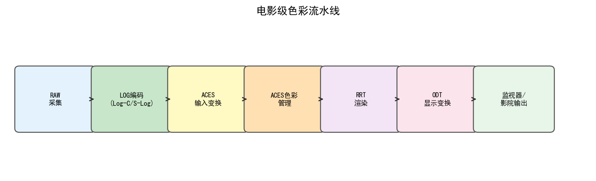
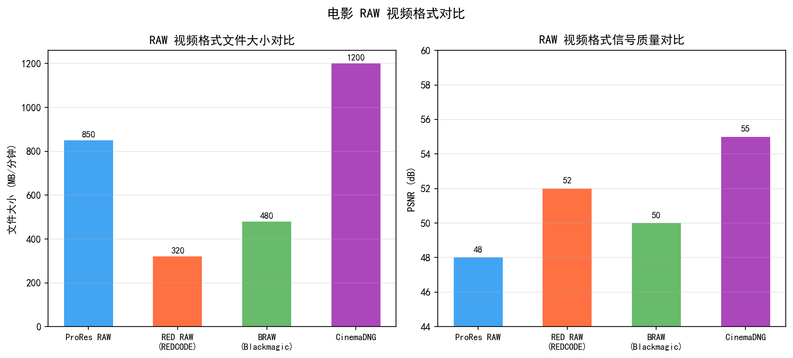
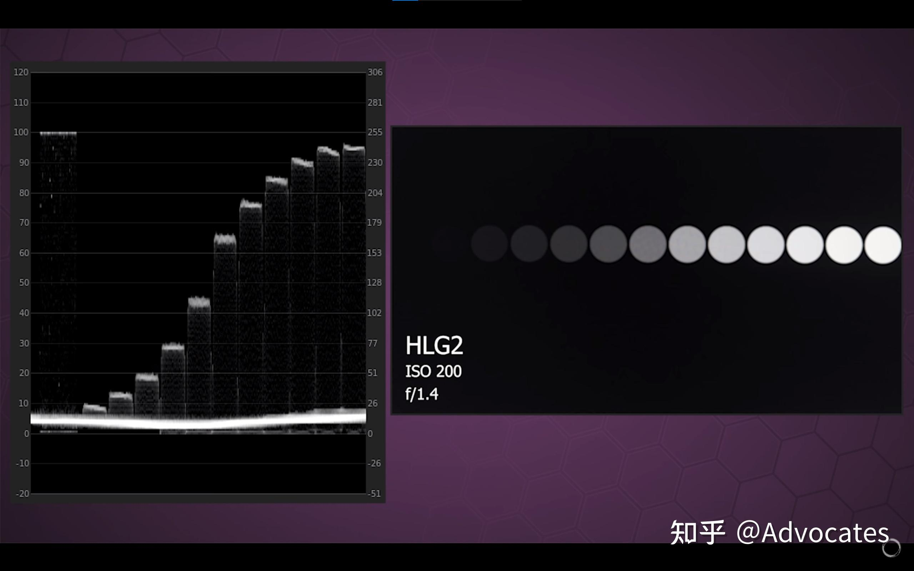
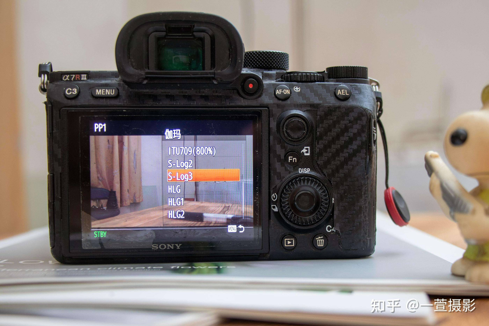
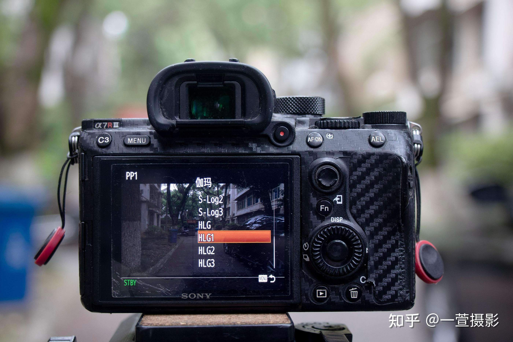

# 第二卷第25章：RAW视频与电影ISP流水线
> **版本：** v1.1（第4轮工程联动审阅）

> **定位：** 本章覆盖专业RAW视频录制与后期制作ISP流水线的工程实现——从传感器Log编码、CinemaDNG/BRAW格式解析、到达芬奇/Lightroom的色彩管理链路，解析手机ProRes/Log模式的底层机制。
> **前置章节：** 第一卷第06章（RAW格式与CFA图案）、第二卷第07章（伽马与色调映射）
> **读者路径：** 算法工程师、影像工程师

---


## §1 Log编码理论

### 1.1 动态范围扩展的基本动机

问题很具体：传感器是线性的，14–15 stops 的动态范围若直接映射到 8 bit，暗部只能分到几十个量化级别。18% 灰以下的整个暗部信息密度极低，稍微拉一下曝光，量化断层立刻可见。

Log 编码的思路是对线性信号做对数变换——不是为了"美观"，而是让等感知差异对应等量化步长，把有限的码字预算花在人眼真正能区分的地方。韦伯-费希纳定律说的正是这件事：感知变化量正比于刺激相对变化，而非绝对变化。对数变换天然契合这个特性，所以暗部和亮部都能分到合理的码字密度。

### 1.2 S-Log2 / S-Log3 数学模型（Sony）

Sony S-Log系列是当前专业视频生产中最广泛使用的Log曲线之一。

**S-Log2**（针对S-Gamut色彩空间）的编码公式为 **[1]**：

```
若 x ≥ 0（线性场景亮度，归一化至18%灰 = 0.18）：
  S-Log2(x) = (0.432699 × log10(x/0.9 + 0.037584) + 0.616596) + 0.03

若 x < 0（截断至0）
```

S-Log2的名义动态范围约为1300%（约13.5 stops）**[1]**，18%灰映射到约38%的代码值（10-bit空间中约385/1023）。

**S-Log3**（针对S-Gamut3/S-Gamut3.Cine）引入了分段函数以更好保护暗部：

```
若 x ≥ 0.01125000：
  S-Log3(x) = (420 + log10((x + 0.01) / (0.18 + 0.01)) × 261.5) / 1023

若 x < 0.01125000（线性段）：
  S-Log3(x) = (x × (171.2102946929 - 95) / 0.01125000 + 95) / 1023
```

S-Log3的线性段下限约为0.0014，对应约 -7 stops（相对18%灰）。这一设计使得极暗部在噪声阈值之上仍保持近似线性关系，避免对数函数在接近零时引起的量化误差放大。S-Log3的名义动态范围约为1600%（约15+ stops）**[1]**，18%灰对应约41%代码值（420/1023，10-bit）。

### 1.3 ARRI Log C 数学模型

ARRI Log C（当前最新为LogC4，用于ALEXA 35）**[2]** 是电影工业的行业标准之一。LogC（第三代，适用于ALEXA Classic/Mini/SXT）的基本方程如下：

```
若 x ≥ cut（取决于EI）：
  LogC(x) = c × log10(a × x + b) + d

若 x < cut（线性段）：
  LogC(x) = e × x + f
```

参数 a、b、c、d、e、f 随曝光指数（EI，Exposure Index）变化，ARRI 发布标准参数表覆盖 EI 160 至 EI 3200 **[2]**。LogC 的参考白（Reference White）对应 90% 代码值（0.9），18%灰对应约39.4%（0.394）。ARRI LogC4 在此基础上将动态范围扩展至约 17 stops，以支持 ALEXA 35 传感器**[2]**。

### 1.4 Apple Log 数学模型

Apple Log 随 iPhone 15 Pro 发布，是苹果首个官方支持的 Log 编码格式，面向 ProRes 视频录制 **[3]**。

Apple Log 的主要特性：
- 参考白（Reference White / 100% diffuse white，scene linear 1.0）映射至归一化 CV ≈ 0.6879（10-bit 归一化）**[3]**；0% 反射率（场景绝对黑）对应黑电平 CV = 0
- 名义动态范围：约 16 stops**[3]**
- 配套色彩空间：Apple Log Color Space（宽色域，接近 BT.2020 原色）

> **注：** 原文"参考白映射至 0.6099，黑电平映射至 0.0929"描述的是 Apple Log 中某一特定参考点（非 100% diffuse white）的旧非官方估算值。根据 Apple Log 规范，100% diffuse white（scene linear 1.0）对应归一化 CV ≈ 0.6879，0% 反射率对应黑电平 CV = 0；0.0929 属于 S-Log2 的黑电平规格（IRE 3.5% 黑电平属于 S-Log2 规格，不适用于 Apple Log 或 S-Log3）。

> ⚠️ **Apple Log 来源说明：** 以下公式为社区逆向推导结果（非 Apple 官方发布），仅供理解参考。请勿用于精密色彩流水线、LUT 制作或专业后期制作。精确的 Apple Log 处理请使用 Apple 官方工具链（Final Cut Pro / Motion）或经认证的第三方 LUT。

Apple Log 的分段 OETF（光-电转换函数）：

```
若 Lin ≥ 0.000035（对数段）：
  AppleLog(Lin) = 0.212735 × log2(Lin + 0.037584) + 0.848805

若 Lin < 0.000035（线性段，保护极暗区）：
  AppleLog(Lin) = 12.92 × Lin - 0.158452
```

> ⚠️ **注意：** 上方公式为**非官方近似值**——Apple 尚未公开 Log OETF 的精确规格，此处系数由分段点连续性条件推导（原书稿 `12.92×(Lin+0.037584)+0.424530` 在分段点处存在约 1.07 的不连续跳变，已按连续性修正）。**请勿直接用于交付级色彩流水线**；如需权威参数，请参考苹果官方 ProRes RAW 技术白皮书或 Apple Log 颜色规范文档（需注册 Apple 开发者账号获取）。

18%灰（Lin = 0.18）映射到约 0.48 的代码值，与 S-Log3 类似地处于中间调区域。

### 1.5 Canon C-Log3 数学模型

Canon C-Log3（Cinema Log 3，Cine-EI 模式，Cinema EOS 系列及 EOS R5 C 等）**[13]** 是 Canon 的第三代 Log 曲线，动态范围约 14 stops，广泛用于 Canon RAW Light 与 XF-AVC 工作流。

C-Log3 的分段 OETF（以归一化线性值 $x$ 为输入，18%灰对参考）：

$$
\text{CLog3}(x) = \begin{cases}
-0.42068 \times \log_{10}(-x \times 14.98325 + 1) + 0.07623 & x < -0.014 \\
5.5882 \times x + 0.09286 & -0.014 \leq x < 0.0 \\
0.42068 \times \log_{10}(x \times 14.98325 + 1) + 0.07623 & x \geq 0.0
\end{cases}
$$

18%灰对应代码值约为 0.315（归一化）或约 322/1023（10-bit）。C-Log3 的关键工程特点是三段设计——正域对数段保留高光，零点附近线性段保证黑位稳定，负域段处理传感器黑电平下方的量化误差。

### 1.6 Log编码与Gamma的本质区别

| 维度 | Gamma编码（如 Rec.709 BT.1886） | Log编码（如 S-Log3） |
|------|--------------------------------|----------------------|
| 数学形式 | 幂函数 y = x^(1/γ) | 对数函数 y = a×log(x+b)+c |
| 动态范围 | 约 6–8 stops | 13–20 stops |
| 18%灰代码值 | ~42%（Rec.709） | ~41%（S-Log3） |
| 直接观看效果 | 低对比度但可接受 | 雾灰、色彩去饱和，需 LUT 还原 |
| 主要用途 | 广播/消费级交付 | 拍摄/后期制作中间件 |
| 位深要求 | 8-bit 即可（SDR） | 10-bit 起步（12-bit 推荐） |

Log 编码将"拍摄"（Camera Original）与"交付"（Delivery）解耦：拍摄时保留最大动态范围，后期通过创意 LUT（Look-Up Table）自由塑造影调风格，无信息损失地实现从 Log 到 Rec.709/HDR10/Dolby Vision 等任意交付目标的转换。

---

## §2 RAW视频格式

### 2.1 CinemaDNG格式解析

CinemaDNG（Cinema Digital Negative）**[4]** 是 Adobe 基于 DNG（Digital Negative）规范扩展的电影级 RAW 视频格式。其核心是每帧存储一个独立的 DNG 文件，序列化组织为文件夹或 MXF 容器。

**元数据结构（关键IFD字段）：**

```
TIFF/IFD 主目录：
  - ImageWidth / ImageLength：帧尺寸
  - BitsPerSample：12 或 16 bit
  - Compression：无损（7/34892）或有损（约34892变体）
  - CFAPattern：Bayer 模式（RGGB/GRBG 等）
  - CFARepeatPatternDim：[2, 2]

SubIFD（Raw 子目录）：
  - ActiveArea：有效像素区域 [top, left, bottom, right]
  - BlackLevel / WhiteLevel：黑电平与白电平（线性域）
  - BaselineExposure：相对曝光修正（EV）
  - NoiseProfile：[s, o]，对应噪声模型 σ²(μ) = s × μ + o²（CinemaDNG 1.3 规范；s = shot noise 系数（线性，量纲 DN/DN），o = read noise 标准差（量纲 DN））

色彩科学 IFD：
  - AsShotNeutral：[R_gain_inv, G_gain_inv, B_gain_inv]（白平衡参考）
  - ColorMatrix1 / ColorMatrix2：两个参考光源（D65/A）下的 XYZ→相机 3×3 矩阵
  - CameraCalibration1 / CameraCalibration2：相机个体校准矩阵
  - ForwardMatrix1 / ForwardMatrix2：相机→XYZ_D50 映射矩阵
  - CalibrationIlluminant1 / 2：参考光源枚举（21=D65, 17=A）
```

**视频扩展元数据（DNG 1.4+）：**
```
  - TimeCodes：SMPTE 时间码
  - FrameRate：帧率（有理数）
  - OpcodeList2 / OpcodeList3：镜头畸变校正、渐晕校正操作码链
```

CinemaDNG 的工程挑战在于文件体积巨大（4K Bayer RAW 12-bit 约12 MB/帧，24fps 约0.3 GB/s / 18 GB/min），商业产品通常使用有损 CinemaDNG（基于 JPEG 2000 或专有压缩）将体积压缩至约 5–8 倍。

### 2.2 Apple ProRes RAW

Apple ProRes RAW（2018年发布，ProRes RAW HQ 为更高质量版本）是苹果将 ProRes 容器与 RAW 像素数据结合的半压缩格式。

**关键特性：**
- 存储 Bayer RAW 数据，以 Apple 专有可变比特率压缩（非逐帧 DNG）
- 元数据内嵌 ISP 参数：黑电平、白平衡增益矩阵、降噪参数（算法不公开）
- 支持平台：仅限 Apple 平台（Final Cut Pro X、Motion），第三方（如 DaVinci Resolve）须通过 Apple 插件解码
- 编码位深：12–16 bit 线性 RAW
- 色彩科学：随机身内嵌相机色彩描述（类似 DNG ColorMatrix）

ProRes RAW 与 ProRes（Log 编码）的关键区别：ProRes RAW 存储传感器线性光子计数，而 ProRes（如 ProRes 4444 XQ）存储的是已完成 ISP 处理的 Log 编码 RGB 图像。iPhone 的"Apple Log"模式输出的是 ProRes（非 RAW），已完成去马赛克。

### 2.3 Blackmagic BRAW格式

Blackmagic RAW（BRAW，2018年发布）**[5]** 是 Blackmagic Design 为 BMPCC 4K/6K 及 URSA Mini Pro 系列设计的 RAW 视频格式，兼顾 RAW 数据灵活性与高效压缩的工程平衡。

**压缩方案：**
- 固定比特率（CBR）模式：3:1、5:1、8:1、12:1
- 固定质量（CQ）模式：Q0、Q1、Q3、Q5
- 采用 wavelet 编码（类似 JPEG 2000），支持随机帧访问

**元数据结构：**
- Sidecar 文件（.sidecar）：存储后期可修改的 ISP 参数（白平衡、曝光、饱和度）
- 内嵌相机元数据：传感器矩阵、黑电平、白平衡、ISO 增益映射
- 色彩科学版本：Blackmagic Design Color Science Generation 5（BMPCC 6K Pro 起）

BRAW 的工程亮点是"双轨 ISP"：拍摄时传感器数据冻结为 RAW，但 ISP 参数以元数据形式附加，后期可在 DaVinci Resolve 中无损修改白平衡、曝光 ±5 EV，而无需重新处理原始 RAW（类似 Lightroom 非破坏性编辑，但作用于视频流）。

### 2.3b RAW 视频码率分析与压缩必要性

**12-bit 4K RAW 的理论原始码率：**

$$
\text{Bitrate}_{raw} = W \times H \times \text{bit\_depth} \times \text{fps}
$$

以 4K（4096×2160）@30fps 为例：

$$
4096 \times 2160 \times 12 \text{ bit} \times 30 \text{ fps} = 3,185,049,600 \text{ bps} \approx \mathbf{3.18 \text{ Gbps}} = \mathbf{397.5 \text{ MB/s}}
$$

对比常见存储介质的实际写入带宽：
- CFexpress Type B（VPG 400 认证）：理论 400 MB/s，实际约 350–380 MB/s；
- NVMe SSD（PCIe Gen 4，如用于数字电影机）：约 5 GB/s（可支持无压缩 RAW）；
- 手机内部 UFS 3.1 存储：顺序写入约 800 MB/s–1.2 GB/s（理论可支持 4K 12-bit @60fps 的无压缩 RAW，但实际受散热和 ISP 带宽限制）。

**三种格式的实际码率对比（4K 12-bit @30fps）：**

| 格式 | 压缩比 | 码率 | 每分钟存储 |
|------|--------|------|-----------|
| 无压缩 RAW（如 CinemaDNG Lossless） | 1:1 | 3.18 Gbps | ~23.9 GB |
| ARRIRAW（ALEXA 35，4K@30fps，55 Mbit/帧） | ~2:1（准无损） | ~1.65 Gbps | ~12.4 GB |
| BRAW 3:1 | 3:1 | 1.08 Gbps | ~8.1 GB |
| BRAW 8:1 | 8:1 | 0.41 Gbps | ~3.1 GB |
| Apple ProRes RAW HQ（4K@30fps） | ~5:1 | 0.63 Gbps | ~4.7 GB |
| ProRes 4444 XQ（Log，非 RAW） | ~10:1 | 0.32 Gbps | ~2.4 GB |

**压缩算法对画质的影响：**
- BRAW 使用基于 wavelet 的感知压缩（类 JPEG2000），在 3:1 时与无损 RAW 视觉不可区分（PSNR > 50 dB，ΔE2000 < 0.5 in linear domain）；
- 8:1 以上压缩比在低频纹理场景仍可接受，但在高频细节（砖墙、织物纹理）下 4K 100% 放大可见块状伪影；
- Apple ProRes RAW 的压缩算法未公开，但实测在 Apple Silicon（M2/M3）上实时解码 4K ProRes RAW 无需 CPU 软件解码，由专用 ProRes 硬件单元处理，解码延迟 < 2ms/帧。

### 2.4 三大 RAW 视频格式对比：ProRes RAW / BRAW / CinemaDNG

| 维度 | Apple ProRes RAW | Blackmagic BRAW | CinemaDNG |
|------|-----------------|-----------------|-----------|
| 发布年份 | 2018 | 2018 | 2012 |
| 容器格式 | .mov（QuickTime） | .braw | 文件夹序列 / .mxf |
| 压缩方案 | 专有可变比特率 | Wavelet（类 JPEG2000） | 无损（LJPEG-92）或有损 |
| 典型压缩比 | ~6:1（ProRes RAW HQ） | 3:1 / 5:1 / 8:1 / 12:1 | 无损或约 3:1 |
| RAW 数据存储 | Bayer 线性 RAW | Bayer 线性 RAW | Bayer 线性 RAW |
| ISP 参数可后期修改 | 否（ISP 参数内嵌，不可调） | 是（.sidecar 元数据） | 否（参数内嵌 IFD） |
| 白平衡后期调整 | 有限（DNG 兼容度低） | 是（±500K 无损调整） | 是（DNG 规范） |
| 曝光后期调整 | ±3 EV | ±5 EV | ±5 EV（DNG 工具） |
| 平台支持 | 仅 Apple 平台（FCP/Motion） | DaVinci Resolve 原生 | Lightroom / Resolve / 达芬奇 |
| 手机端录制 | iPhone（ProRes 视频，非真 RAW） | 无（专业摄像机） | Filmic Pro 等第三方 App |
| 4K 码率参考 | ~6.3 GB/min（ProRes RAW HQ） | ~5.6 GB/min（Q0） | ~18 GB/min（无损） |
| 主要优势 | Apple 生态整合，iPhone 工作流 | 后期灵活度最高 | 开放标准，跨软件兼容 |
| 主要局限 | 平台封闭，ISP 不透明 | 非开放标准 | 文件体积大，随机访问慢 |

工程选择指南：
- **iPhone/Mac 生态一体化工作流** → ProRes RAW（但注意其"RAW"已含 Apple 计算摄影预处理）
- **后期灵活度优先** → BRAW（白平衡/曝光后期可大幅调整，DaVinci 原生支持）
- **跨平台开放标准** → CinemaDNG（AdobeDNG SDK 公开，适合定制 ISP 开发）

### 2.5 手机Apple ProRAW与iPhone Log格式

**Apple ProRAW**（iPhone 12 Pro引入）：
- 本质是一个 DNG 文件，但像素值存储的是经过 Apple 计算摄影预处理后的"半处理"数据
- 预处理包括：多帧 HDR 合成、降噪、Smart HDR 色调映射的逆向线性化
- 色彩描述：内嵌 CameraCalibration 矩阵，支持色温自适应
- 位深：16 bit 线性或 12 bit 对数（依设备与系统版本）

**iPhone Log（Apple Log）模式**（iPhone 15 Pro引入）：
- 输出为 ProRes 视频（已去马赛克），而非 RAW
- ISP 流水线：传感器→黑电平→降噪→去马赛克→白平衡→CCM→Apple Log 编码→ProRes 容器
- 色域：Apple Log Color Space（宽色域），交付时需通过 LUT 转至 Rec.709/P3
- 局限：固定 24fps/30fps，无法关闭防抖（EIS），ISP 参数不可后期调整

---

## §3 电影级ISP调参

### 3.1 1D LUT：通道对齐与基础色调

1D LUT（One-Dimensional Look-Up Table）是每个颜色通道（R、G、B）独立的一维查找表，在 Log 视频 ISP 链路中主要承担以下功能：

**黑电平与白电平对齐：**
```
normalized = (code_value - black_level) / (white_level - black_level)
```
不同传感器的黑电平漂移（随温度/ISO变化）需通过 1D LUT 的偏置项补偿。

**Log→线性解码（EOTF，电-光逆变换）：**
对 S-Log3 的 1D LUT 解码：
```
输入：10-bit S-Log3 代码值 [0, 1023]
输出：线性场景亮度（相对18%灰归一化）
查表粒度：通常4096点（12-bit精度），插值误差 < 0.01%
```

**色调曲线微调：**
在 Log→交付色域转换前，后期师常在 1D LUT 中微调 S 曲线（提升中间调对比度、收紧阴影），这是低计算成本的创意工具。

### 3.2 3D LUT：全色域映射

3D LUT（Three-Dimensional Look-Up Table）以 (R,G,B) 三维网格存储颜色映射，是现代电影色彩管理的核心工具。

**标准规格：**
- 网格尺寸：17³（快速预览）、33³（标准交付）、65³（高精度母版）
- 文件格式：`.cube`（Adobe，最通用）、`.3dl`（Autodesk）、`.lut`（DaVinci Resolve）
- 三线性插值误差：33³ 网格对光滑渐变色的最大 ΔE2000 < 0.5（实测）

**Log→Rec.709 变换链（典型电影 ISP 管道）：**

```
[传感器 RAW]
    ↓ (1) 黑电平/白电平归一化
[线性 RAW]
    ↓ (2) 去马赛克（Bayer→RGB，通常高质量 AHD/MLCD）
[线性 RGB，相机色域]
    ↓ (3) 白平衡增益（R/B 通道独立乘以增益因子）
[白平衡后线性 RGB]
    ↓ (4) 相机色域→XYZ_D65（ForwardMatrix 3×3）
[XYZ_D65]
    ↓ (5) XYZ_D65→Rec.709 线性（BT.709 标准矩阵）
[Rec.709 线性]
    ↓ (6) Log 编码（S-Log3 OETF，如需中间件存储）
[S-Log3]
    ↓ (7) 创意 3D LUT（后期色彩调整）
[交付色域 RGB]
    ↓ (8) 交付编码（Rec.709 OETF：指数 0.45，BT.709）
[Rec.709/SDR 交付]
// 注：BT.1886（γ=2.4）是显示器解码端的 EOTF，勿在编码链中施加；
// 编码端应使用 OETF（指数 ≈ 0.45），显示器再以 BT.1886 EOTF 还原线性光
```

### 3.3 色温-色域-色调曲线三元联调

在专业 Log 视频后期中，色彩调整涉及三个相互耦合的维度，需联合优化：

**色温调整（White Balance）：**
色温调整在线性域（Log 解码后）完成，通过对 R 和 B 通道施加独立增益实现。精确的色温调整应使用色适应变换（CAT，Chromatic Adaptation Transform），如 Bradford 矩阵：

```
XYZ_adapted = M_Bradford × diag(d_r, d_g, d_b) × M_Bradford_inv × XYZ_original
```

其中 d_r, d_g, d_b 是源白点与目标白点在 Bradford 色适应空间的比例因子。

**色域转换（Gamut Conversion）：**

DCI-P3 与 Rec.709 的互转矩阵（线性域，D65 白点，行主序近似值）：

```
P3→Rec.709：
 [ 1.2249,  -0.2247,   0.0000 ]
 [-0.0420,   1.0419,   0.0002 ]
 [-0.0197,  -0.0786,   1.0979 ]

Rec.2020→Rec.709：
 [ 1.6605,  -0.5877,  -0.0728 ]
 [-0.1246,   1.1329,  -0.0083 ]
 [-0.0182,  -0.1006,   1.1187 ]
```

色域转换后的色域裁剪（Gamut Mapping）是关键工程点：P3 色域面积约比 Rec.709（sRGB）大 36%（Shoelace 公式：sRGB ≈ 0.1121，DCI-P3 ≈ 0.1520，比值约 1.36×），直接线性截断会导致高饱和度区域出现颜色断裂，应使用软截断（Soft Clipping）或 HSL 软映射。

**色调曲线（Tone Curve）：**
在 Log 转 Gamma/PQ 的最后一步，色调曲线决定高光卷曲（Highlight Rolloff）风格。ARRI 的 ACES Output Transform 使用 Filmic S 曲线（参考 Reinhard 色调映射的改进版），而 DaVinci Resolve 的 Color Space Transform 节点提供可调节高光压缩斜率。

### 3.4 Rec.709 / P3 / 2020 色域转换矩阵推导原理

标准色域转换通过各自的色域原色（Primaries）和白点定义推导出标准 XYZ-RGB 矩阵。以 BT.2020→DCI-P3（D65）为例，推导步骤如下：

1. 将各原色的 xy 色度坐标转为 XYZ 三刺激值：
   `XYZ_r = [x_r/y_r, 1, (1-x_r-y_r)/y_r]`

2. 求解白点约束下的各原色缩放系数 S = [S_r, S_g, S_b]：
   `M_primaries × S = XYZ_white`

3. 构建 RGB→XYZ 矩阵 M = M_primaries × diag(S)

4. XYZ→目标色域矩阵 = M_target_inv × M_source

完整的标准值由 CIE 15:2004 附录定义 **[9]**，colour-science 库提供全套预计算矩阵 **[11]**。

---

## §4 常见伪影与问题

### 3.4b Log 暗部噪声分布与后期调色的联动

**Log 编码后暗部噪声的数学特性：**

Log 编码将线性光子信号 $x_{lin}$ 映射为 $y_{log} = a \cdot \log(x_{lin} + b) + c$，对于 S-Log3 对数段：

$$
\frac{dy_{log}}{dx_{lin}} = \frac{a}{x_{lin} + b}
$$

这意味着：在低亮度区（$x_{lin}$ 小），相同的传感器噪声 $\delta x_{lin}$ 在 Log 域被放大为更大的 $\delta y_{log}$；相对于 18% 灰附近，暗部 Log 斜率约为亮部的 **5–10 倍**（见 §4.1 量化分析）。

**对后期调色的工程影响：**

这一噪声放大特性在以下调色操作中会产生明显影响：

1. **暗部提亮（Shadow Lift）**：后期师将 Log 视频暗部提亮 1–2 stops，等效于对 Log 域的暗部区域施加反向 Log 解码（乘以 $10^{(y_{log}-c)/a}$ 倍的增益），此时暗部噪声被同等放大——这是 Log 拍摄"必须 ETTR（向右曝光）"的根本原因；

2. **降噪顺序约束**：正确做法是先将 Log 视频解码至线性域（EOTF），在线性域施加时域/空域降噪（在线性域中，噪声功率谱是平坦的白噪声，降噪算法工作在最优状态），再重新编码为目标 Log 曲线或直接输出 Rec.709/P3；若在 Log 域直接施加降噪（如 DaVinci Resolve 的 Noise Reduction 节点在 Timeline 色彩空间为 Log 时运行），则降噪算法无法正确估计暗部噪声水平（Log 域暗部的"像素方差"看似与亮部接近，但实际线性域噪声比亮部大 10 倍），导致暗部降噪不足或亮部过度平滑；

3. **Log 色彩校正次序**：色温调整和 CCM 应在线性域（Log 解码后）完成，而非在 Log 域直接拉动 RGB 曲线——Log 域的 RGB 调整改变了各通道的非线性响应曲线形状，会导致灰轴（neutral axis）偏移，产生偏色。DaVinci Resolve 的推荐工作流是 **Input → Log Decode → Linear Grade → Output Transform**，在 Linear 节点做色温/CCM 调整。

**实战建议（S-Log3 调色流程）：**

```
拍摄端：ETTR（暗部不欠曝超过 -1 EV）→ S-Log3 + S-Gamut3.Cine 记录
后期端：
  Step 1: S-Log3 → Linear（EOTF 解码，DaVinci CST 节点或 1D LUT）
  Step 2: 线性域降噪（时域 NR，参考噪声模型 NoiseProfile）
  Step 3: 色温/CCM 调整（线性域）
  Step 4: 色调映射（Tone Mapping，如 ACES/Filmic，决定高光压缩风格）
  Step 5: 创意 3D LUT（色彩风格化，33³ 或以上）
  Step 6: 交付编码（Rec.709 OETF 或 PQ/HLG for HDR 交付）
```

---

## §4 常见伪影与问题

### 4.1 Log欠曝：噪点放大效应

**现象描述：**
当 S-Log3 或 Log C 视频欠曝 1–2 stops 拍摄时，后期拉升曝光会显著放大传感器噪点。这是 Log 编码的固有数学特性：对数函数在低值区的导数（斜率）更大，即相同的噪点量化误差对应更大的线性幅度变化。

**量化分析：**
设传感器读出噪声为 σ_ADU（ADU 单位），在 S-Log3 线性段（x < 0.01125）：
```
dSLog3/dx = (171.2102946929 - 95) / (0.01125000 × 1023) ≈ 6.63 per ADU
```
而在 18%灰附近（对数段）：
```
dSLog3/dx = 261.5 / ((x + 0.01) × ln(10) × 1023) ≈ 0.62 per normalized unit
```
暗部对噪点的放大系数约为亮部的 10 倍以上，因此 Log 拍摄必须避免欠曝。

**工程对策：**
- ETTR（Expose To The Right）：尽量将曝光推至高光不过曝的最高 EV，最大化信噪比
- 夜景拍摄时使用高基础 ISO（如 ARRI Mini LF 基础 ISO 3200），保证 RAW 像素充分曝光
- 后期降噪（NR）在 Log 解码至线性域后施加，避免在 Log 域做 NR

### 4.2 高光卷曲（Highlight Rolloff）问题

**现象描述：**
当被摄体亮度超过 Log 编码的额定上限时，高光区域发生"卷曲"（Rolloff）或"截断"（Clipping）。Log 编码的理论上限通常在 18%灰上方约 7–8 stops 处。

**典型症状：**
- 高反射物体（金属、白衣）出现伪色（Hue Shift），尤其在 P3→Rec.709 色域转换后
- 过曝区域的色相扭曲：由于 RGB 三通道饱和点不同，过曝高光出现绿色或品红偏转
- 3D LUT 在高光区域的外推失效（超出 LUT 网格范围的外推颜色不可预测）

**工程对策：**
- 在 3D LUT 构建时，高光区域（输入值 > 0.9×white_level）使用 HSL 高光压缩（Highlight Compression），而非线性外推
- DaVinci Resolve 的"高光恢复"（Highlight Recovery）节点通过分析三通道比例关系重建高光细节

### 4.3 3D LUT边界跳变

**现象描述：**
当 3D LUT 粒度不足（如 17³）时，在颜色变化剧烈的区域（高饱和度色彩、肤色到高光过渡）出现可见的颜色分块或梯度跳变。

**根本原因：**
三线性插值在 LUT 立方体的 8 个顶点之间进行加权平均，若相邻格点的颜色差异大（如色域边界、HSL 值突变区域），插值结果会出现不平滑。

**量化标准：**
- 17³ LUT：最大插值误差可达 ΔE2000 ≈ 2–5（不可接受）
- 33³ LUT：最大插值误差约 ΔE2000 ≈ 0.5（广播级可接受）
- 65³ LUT：最大插值误差约 ΔE2000 ≈ 0.1（电影母版级）

**工程对策：**
- 后期色彩管理全程使用 33³ 或以上 LUT
- 对肤色、天空等关键色彩区域（Hue Zone）单独增加格点密度（非均匀 LUT）
- 使用四面体插值（Tetrahedral Interpolation，DaVinci Resolve 默认）**[8]** 替代三线性插值，精度提升约 3–5 倍

---

## §5 评测方法

### 5.1 Vectorscope分析

Vectorscope（矢量示波器）显示视频信号的色度（Chroma）向量分布，横轴/纵轴对应 Cb/Cr。标准彩条（SMPTE Color Bars）的六个纯色（Red/Green/Blue/Cyan/Magenta/Yellow）应严格落在对应的目标方框内。

**Log视频评测流程：**
1. 拍摄标准色卡（Macbeth ColorChecker Classic）或 IT8 靶
2. 在 DaVinci Resolve 中施加 Log→Rec.709 LUT
3. Vectorscope 观察：
   - 18%灰应在原点附近（色度 < 1%）
   - 肤色矢量应落在"Skin Tone Line"（约11点钟方向，R-Y 轴约 ±15° 范围）
   - 彩色色块应均匀分布，无明显色相偏移

### 5.2 Waveform Monitor分析

Waveform Monitor（波形监视器）显示视频信号的亮度/RGB 随水平位置的分布，用于评估：
- **曝光一致性：** 18%灰在 Log 域应在约 40–42%（Y 轴），转换后在 Rec.709 约 42–46 IRE
- **黑电平对齐：** 多机位拍摄时，黑位（0 IRE）的漂移量化，目标 < 1 IRE
- **高光保护：** 过曝区域在波形中出现"平顶"（Flat Top），可量化过曝帧数比例

### 5.3 ΔE2000 色准评测（P3色域）

色差 ΔE2000 是最广泛使用的色彩准确性量化指标，结合了亮度、彩度、色相的感知均匀权重。

**电影ISP链路色准评测流程：**
1. 用分光光度计（如 X-Rite i1Pro 3）测量标准色卡的真实 CIE XYZ 值
2. 用目标 ISP 链路（含 3D LUT）处理色卡图像
3. 将处理结果与真实值在 P3 色域（D65）中计算 ΔE2000
4. 评价标准（参考 ICC 色彩管理规范 **[10]**）：
   - ΔE2000 < 1.0：优秀（电影母版级）
   - ΔE2000 < 2.0：良好（广播交付级）
   - ΔE2000 < 3.0：可接受（消费级）
   - ΔE2000 > 3.0：不可接受（可见色差）

### 5.4 噪声谱分析（PSD）

对 Log 视频的暗部噪声进行功率谱密度（Power Spectral Density, PSD）分析，可区分传感器固有噪声（白噪声）与 ISP 引入的结构化噪声（如去马赛克伪色、锐化振铃）：

```python
import numpy as np
from scipy.signal import welch

# 取暗部均匀区域（如 Macbeth 黑色块）的单通道像素
patch = frame_log[y:y+64, x:x+64, 1]  # Green 通道
freqs, psd = welch(patch.flatten(), fs=1.0, nperseg=256)
# 白噪声：PSD 应为平坦谱；有色噪声：低频分量异常凸起
```

---

## §6 代码示例

以下 Python 代码实现 S-Log3 解码与 3D LUT 应用的完整流水线，可直接运行。

```python
"""
RAW视频ISP演示：S-Log3解码 + 3D LUT应用
依赖：numpy, scipy, colour-science (pip install numpy scipy colour-science)
"""

import numpy as np


# =============================================================================
# 1. S-Log3 编码/解码函数
# =============================================================================

def slog3_encode(lin: np.ndarray) -> np.ndarray:
    """
    将线性场景亮度编码为 S-Log3 代码值（归一化至[0,1]）

    参数:
        lin: 线性亮度，18%灰 = 0.18，支持任意 shape
    返回:
        slog3: S-Log3 代码值，[0, 1]（等效10-bit值需乘以1023）
    """
    lin = np.asarray(lin, dtype=np.float64)
    cut = 0.01125000

    # 对数段：规范公式为 log10((x + 0.01) / (0.18 + 0.01)) = log10((x + 0.01) / 0.19)
    log_part = (420 + np.log10((lin + 0.01) / (0.18 + 0.01)) * 261.5) / 1023.0
    # 线性段
    lin_part = (lin * (171.2102946929 - 95) / cut + 95) / 1023.0

    return np.where(lin >= cut, log_part, lin_part)


def slog3_decode(slog3: np.ndarray) -> np.ndarray:
    """
    将 S-Log3 代码值解码为线性场景亮度

    参数:
        slog3: S-Log3 代码值，归一化至[0,1]（即10-bit除以1023）
    返回:
        lin: 线性亮度，18%灰 ≈ 0.18
    """
    slog3 = np.asarray(slog3, dtype=np.float64)
    cut = 95.0 / 1023.0  # 线性段上限的 S-Log3 代码值

    # 对数段解码
    log_part = (10 ** ((slog3 * 1023.0 - 420) / 261.5)) * 0.19 - 0.01
    # 线性段解码
    lin_part = (slog3 * 1023.0 - 95) * 0.01125000 / (171.2102946929 - 95)

    return np.where(slog3 >= cut, log_part, lin_part)


# =============================================================================
# 2. 3D LUT 构建与三线性插值应用
# =============================================================================

def build_contrast_lut(size: int = 33, contrast: float = 0.20) -> np.ndarray:
    """
    构建带 S 曲线对比度的 3D LUT

    参数:
        size:     LUT 网格尺寸（17 / 33 / 65）
        contrast: S 曲线强度，0 = 恒等，0.2 = 适度对比度
    返回:
        lut: shape (size, size, size, 3)，值域[0, 1]
    """
    axis = np.linspace(0.0, 1.0, size, dtype=np.float64)
    r, g, b = np.meshgrid(axis, axis, axis, indexing='ij')
    rgb = np.stack([r, g, b], axis=-1)  # (size, size, size, 3)

    # 逐通道施加 S 曲线：f(x) = x + k * sin(π*x) * x*(1-x)
    lut = rgb + contrast * np.sin(np.pi * rgb) * (rgb * (1.0 - rgb))
    return np.clip(lut, 0.0, 1.0).astype(np.float32)


def apply_3d_lut_trilinear(image: np.ndarray, lut: np.ndarray) -> np.ndarray:
    """
    对图像施加 3D LUT（三线性插值）

    参数:
        image: 输入图像，shape (H, W, 3)，值域[0, 1]
        lut:   3D LUT，shape (N, N, N, 3)，值域[0, 1]
    返回:
        output: 输出图像，shape (H, W, 3)，dtype float32
    """
    N = lut.shape[0]
    img_flat = image.reshape(-1, 3).astype(np.float64)

    # 将[0,1]映射到 LUT 网格坐标[0, N-1]
    coords = np.clip(img_flat * (N - 1), 0.0, N - 1 - 1e-9)
    i0 = coords.astype(np.int32)
    i1 = np.minimum(i0 + 1, N - 1)
    f = coords - i0  # 小数权重，shape (P, 3)

    ir, ig, ib = i0[:, 0], i0[:, 1], i0[:, 2]
    jr, jg, jb = i1[:, 0], i1[:, 1], i1[:, 2]
    fr = f[:, 0:1]; fg = f[:, 1:2]; fb = f[:, 2:3]

    # 三线性插值：8 顶点加权和
    out = (lut[ir, ig, ib] * (1-fr)*(1-fg)*(1-fb) +
           lut[jr, ig, ib] * fr    *(1-fg)*(1-fb) +
           lut[ir, jg, ib] * (1-fr)* fg   *(1-fb) +
           lut[jr, jg, ib] * fr    * fg   *(1-fb) +
           lut[ir, ig, jb] * (1-fr)*(1-fg)* fb    +
           lut[jr, ig, jb] * fr    *(1-fg)* fb    +
           lut[ir, jg, jb] * (1-fr)* fg   * fb    +
           lut[jr, jg, jb] * fr    * fg   * fb)

    return out.reshape(image.shape).astype(np.float32)


# =============================================================================
# 3. Rec.709 伽马编码（BT.1886 简化版）
# =============================================================================

def rec709_oetf(lin: np.ndarray) -> np.ndarray:
    """Rec.709 OETF（γ ≈ 2.2，ITU-R BT.709 规范）"""
    lin = np.clip(lin, 0.0, None)
    return np.where(lin < 0.018,
                    lin * 4.5,
                    1.099 * np.power(lin, 0.45) - 0.099)


# =============================================================================
# 4. 完整演示流水线
# =============================================================================

def demo_pipeline():
    print("=== S-Log3 解码 + 3D LUT 电影 ISP 演示 ===\n")

    # --- 4.1 灰阶楔验证 ---
    stops = np.linspace(-7.0, 7.0, 15)
    lin_vals = 0.18 * (2.0 ** stops)
    slog3_vals = slog3_encode(lin_vals)

    print(f"{'Stops':>7}  {'线性值':>10}  {'SLog3[0-1]':>11}  {'SLog3[10bit]':>13}")
    print("-" * 50)
    for s, lin, sl in zip(stops, lin_vals, slog3_vals):
        print(f"{s:+7.1f}  {lin:10.5f}  {sl:11.4f}  {sl*1023:13.1f}")

    # 关键验证点
    gray18_code = slog3_encode(np.array([0.18]))[0]
    print(f"\n18%灰 S-Log3 代码值：{gray18_code*1023:.1f}/1023  （规范期望：~420）")

    decoded_vals = slog3_decode(slog3_vals)
    max_rel_err = np.max(np.abs(decoded_vals - lin_vals) / (lin_vals + 1e-12))
    print(f"编解码往返最大相对误差：{max_rel_err:.2e}  （应 < 1e-9）\n")

    # --- 4.2 合成测试图像（256×512，左半灰阶楔，右半彩色块） ---
    H, W = 256, 512
    img_slog3 = np.zeros((H, W, 3), dtype=np.float32)

    # 左半：18级灰阶楔
    n_steps = len(stops)
    step_w = (W // 2) // n_steps
    for k, sv in enumerate(slog3_vals):
        x0, x1 = k * step_w, min((k + 1) * step_w, W // 2)
        img_slog3[:, x0:x1, :] = float(sv)

    # 右半：4个彩色色块（模拟 S-Gamut3 宽色域颜色）
    palette_lin = np.array([
        [0.25, 0.03, 0.03],   # 饱和红
        [0.03, 0.25, 0.03],   # 饱和绿
        [0.03, 0.03, 0.25],   # 饱和蓝
        [0.80, 0.80, 0.80],   # 近白高光
    ], dtype=np.float64)
    block_w = (W // 2) // len(palette_lin)
    for k, lin_col in enumerate(palette_lin):
        encoded_col = slog3_encode(lin_col).astype(np.float32)
        x0 = W // 2 + k * block_w
        x1 = x0 + block_w
        img_slog3[:, x0:x1, :] = encoded_col[np.newaxis, np.newaxis, :]

    # --- 4.3 ISP 流水线 ---
    print("--- 执行 ISP 流水线 ---")

    # Step 1: S-Log3 → 线性
    img_lin = slog3_decode(img_slog3)
    print(f"Step 1 S-Log3解码：值域 [{img_lin.min():.4f}, {img_lin.max():.4f}]")

    # Step 2: 色域转换——Sony S-Gamut3 → Rec.709（近似矩阵，仅供演示；
    # 生产环境建议使用 colour-science 库中的精确色域变换矩阵）
    M_sgamut3_to_rec709 = np.array([
        [ 1.3456,  -0.2558,  -0.0898],
        [-0.0438,   1.0879,  -0.0441],
        [-0.0083,  -0.0676,   1.0759],
    ], dtype=np.float64)
    img_r709_lin = np.einsum('...c,dc->...d', img_lin, M_sgamut3_to_rec709)
    img_r709_lin = np.clip(img_r709_lin, 0.0, 1.0).astype(np.float32)
    print(f"Step 2 色域转换（S-Gamut3→Rec.709）：值域 [{img_r709_lin.min():.4f}, {img_r709_lin.max():.4f}]")

    # Step 3: 施加 33³ S 曲线 3D LUT
    lut_33 = build_contrast_lut(size=33, contrast=0.20)
    img_lut = apply_3d_lut_trilinear(img_r709_lin, lut_33)
    print(f"Step 3 3D LUT（S曲线，33³）：值域 [{img_lut.min():.4f}, {img_lut.max():.4f}]")

    # Step 4: Rec.709 伽马编码
    img_final = rec709_oetf(img_lut)
    img_final = np.clip(img_final, 0.0, 1.0)
    print(f"Step 4 Rec.709 OETF：值域 [{img_final.min():.4f}, {img_final.max():.4f}]")

    # --- 4.4 输出摘要 ---
    print(f"\n最终图像均值：R={img_final[:,:,0].mean():.4f}  G={img_final[:,:,1].mean():.4f}  B={img_final[:,:,2].mean():.4f}")

    print("\n--- S-Log3 关键曝光点代码值 ---")
    kp = [('Scene Black',    0.0),
          ('18% Gray',       0.18),
          ('90% White',      0.9),
          ('+3 stops (×8)', 0.18 * 8),
          ('+5 stops (×32)', 0.18 * 32)]
    for name, lv in kp:
        cv = slog3_encode(np.array([lv]))[0]
        print(f"  {name:22s}  lin={lv:.4f}  →  {cv*1023:.1f}/1023")

    print("\n演示完成！")
    return img_final


if __name__ == '__main__':
    result = demo_pipeline()
```

**运行说明：**
```bash
pip install numpy scipy
python ch25_demo.py
# 安装 colour-science 可启用精确色域转换：
pip install colour-science
```

---

## §7 参考资料

1. Sony Corporation, "S-Log3 Technical White Paper," Technical Bulletin, 2014.

2. ARRI, "ALEXA Log C Curve Usage in VFX," White Paper WP-2017-001, 2017.

3. Apple Inc., "Apple Log Profile White Paper," Developer Documentation, 2023.

4. Adobe Systems, "CinemaDNG 1.2 Specification," 2012.

5. Blackmagic Design, "BRAW SDK Developer Reference," v2.8, 2023.

6. Hasinoff, S.W. et al., "Burst Photography for High Dynamic Range and Low-Light Imaging on Mobile Cameras," *ACM Transactions on Graphics (SIGGRAPH Asia)*, 2016.

7. Reinhard, E. et al., "Photographic Tone Reproduction for Digital Images," *ACM SIGGRAPH*, pp. 267–276, 2002.

8. Blackmagic Design, "DaVinci Resolve 18 Color Management," User Manual, 2023.

9. CIE, "Colorimetry, 3rd Edition," Technical Report 15:2004, International Commission on Illumination.

10. International Color Consortium, "Specification ICC.1:2022," 2022.

11. Mansencal, T. et al., "Colour 0.4.4," *colour-science.org*, 2023.

12. ISO 22028-1:2004, "Photography and graphic technology — Extended colour encodings for digital image storage, manipulation and interchange — Part 1: Architecture and requirements."

13. Canon Inc., "Canon Log 3 Gamma Specification," Cinema EOS System White Paper WP-2018-006, 2018.

14. SMPTE ST 2065-1:2012, "Academy Color Encoding Specification (ACES)." Society of Motion Picture and Television Engineers.

---

## §8 术语表

| 术语 | 英文全称 | 说明 |
|------|----------|------|
| Log编码 | Log Encoding | 对线性输出施以对数变换，扩展动态范围的量化编码策略 |
| S-Log3 | Sony Log Curve 3 | Sony相机的Log编码曲线，名义15+ stops，含分段线性暗部保护 |
| Log C | ARRI Log C Curve | ARRI ALEXA系列Log编码曲线，参数随EI变化 |
| Apple Log | Apple Log Encoding | iPhone 15 Pro起支持的Log编码，配合ProRes视频输出 |
| OETF | Opto-Electronic Transfer Function | 光-电转换函数，即正向编码曲线 |
| EOTF | Electro-Optical Transfer Function | 电-光转换函数，即解码/显示曲线 |
| CinemaDNG | Cinema Digital Negative | Adobe基于DNG规范扩展的电影级逐帧RAW格式 |
| BRAW | Blackmagic RAW | Blackmagic Design专有RAW视频格式，支持后期ISP调整 |
| ProRes RAW | Apple ProRes RAW | Apple将ProRes容器与传感器RAW数据结合的半压缩格式 |
| 1D LUT | 1D Look-Up Table | 单通道独立映射的一维查找表，用于通道对齐与伽马调整 |
| 3D LUT | 3D Look-Up Table | 三维颜色映射查找表，支持全色域映射与创意色彩调整 |
| ETTR | Expose To The Right | 向右曝光，尽量高曝光以最大化信噪比的拍摄策略 |
| CCM | Color Correction Matrix | 色彩校正矩阵，3×3线性RGB空间变换 |
| CAT | Chromatic Adaptation Transform | 色适应变换，用于白点转换（如Bradford矩阵） |
| ΔE2000 | Delta E 2000 | CIEDE2000色差公式，感知均匀色差量化标准 |
| Vectorscope | Vectorscope | 矢量示波器，显示视频色度向量分布，用于色准评测 |
| PSD | Power Spectral Density | 功率谱密度，用于噪声频域特性分析 |
| Rec.709 | ITU-R BT.709 | 高清广播视频标准色域，SDR交付主流标准 |
| DCI-P3 | Digital Cinema Initiatives P3 | 数字影院色域标准，色域面积约比Rec.709（sRGB）大36%（Shoelace比值约1.36×） |
| Rec.2020 | ITU-R BT.2020 | 超高清/HDR视频色域标准，覆盖可见色域约75% |
| EI | Exposure Index | 曝光指数，ARRI系统中影响Log C参数的ISO等效设置 |
| SMPTE | Society of Motion Picture and Television Engineers | 电影电视工程师协会，视频标准主要制定机构 |


---

> **工程师手记：电影RAW视频的三个工程瓶颈**
>
> **RAW视频带宽是芯片选型的硬约束：** 12-bit 4K（3840×2160）@60fps的原始数据率为 3840×2160×12bit×60 ≈ **5.97 Gbps（约746 MB/s）**，远超主流MIPI CSI-2 4-lane D-PHY 2.5 Gbps/lane（4-lane总计10 Gbps）中单镜头ISP接口的实际可用带宽；实际可行方案必须依赖片上无损压缩（如Sony的X-OCN或ARRI的ARRIRAW压缩，压缩比约2:1）才能将带宽压至400 MB/s量级，匹配CFexpress Type-B卡（VPG 400认证，实际写入约350–380 MB/s）。消费级手机SoC（如SM8650 Snapdragon 8 Gen 3）的ISP总线带宽约为51.2 GB/s但受制于DRAM延迟，实际RAW写入吞吐仅约4 GB/s；Apple ProRes RAW在iPhone 15 Pro上通过专用编码引擎绕开通用DRAM路径，才实现4K@30fps ProRes RAW录制。设计RAW视频系统时，必须从传感器输出→MIPI→ISP→编码器→存储接口做全链路带宽核算，任意一环欠配都会导致帧丢失。
>
> **Log曲线选型直接决定后期调色空间：** LOG-C（ARRI）、S-Log3（Sony）、D-Log M（DJI/大疆）三条曲线在中灰点（18% gray）的映射码值各不相同——S-Log3将中灰映射至41%（0.41 IRE），LOG-C3映射至约38%，D-Log M约42%，差异导致同一场景在不同Log下LUT不可通用。工程实践中，选型原则是跟随后期调色软件生态：DaVinci Resolve对S-Log3/S-Gamut3.Cine支持最完善，ARRI LogC3配合AWB自带的 `WB_CC_Matrix` 可直接输出符合DCI-P3的参考图像；而D-Log M在消费级无人机（如Mavic 3 Pro）上引入了额外的色调映射偏差，需在NLE中手动应用厂商提供的LUT才能还原中性色彩。嵌入式ISP驱动如选用Tone Mapping模块输出Log域，需关闭ISP内部Gamma并将`Gamma_Mode`寄存器设为`LOG_BYPASS`。
>
> **片上RAW压缩的伪影机制与规避：** 主流片上压缩方案（LOSSLESS DCT、DPCM预测编码）在低照度下遇到高ISO增益时，量化误差与传感器读出噪声叠加，会在暗部产生块状伪影（8×8或16×16 block boundary）。Sony SLVS-EC传感器内部使用12→10-bit 非线性压缩（NLUT），在ISO 3200以上暗部出现阶梯噪声；对策是将ISP的BLC（Black Level Correction）提前到解压缩之后运行，并在NR模块中单独配置暗部噪声模型（Dark Current Noise Model）。Qualcomm Titan ISP中对应参数为`BPS_BPCPDPC_MOD`中的`lossyCompressionThreshold`，建议在RAW video场景下将其设为`0`（全部强制无损路径）以规避压缩伪影，代价是存储带宽增加约40%。
>
> *参考：ARRI ALEXA 35 White Paper (2022)；Sony S-Log3/S-Gamut3.Cine Technical Summary；Qualcomm Titan ISP Tuning Guide (SM8650 BPS/IFE modules)*

## 插图


*图1. 电影级色彩处理管线示意，从RAW采集、Log编码、调色（Color Grading）到交付输出的完整工作流（图片来源：作者，ISP手册，2024）*


*图2. 主流RAW视频格式规格对比，包含分辨率、帧率、压缩比与典型应用场景（图片来源：作者，ISP手册，2024）*


*图3. S-Log与HLG Gamma曲线形状对比，量化两种对数编码的暗部斜率、拐点位置与动态范围压缩特性（图片来源：作者，ISP手册，2024）*


*图4. Log与HLG拍摄模式工程对比——S-Log3/S-Log2/HLG三种模式在曝光宽容度、后期调色灵活性与直出可用性之间的工程权衡（图片来源：作者，ISP手册，2024）*


*图5. 电影级RAW视频录制模式示意图——ProRAW、Cinema DNG、BRAW等格式在分辨率、码率、色彩深度与剪辑工作流上的差异（图片来源：作者，ISP手册，2024）*

---

## 习题

**练习 1（理解）**
Log 编码（S-Log3、ARRI Log C、Apple Log）的核心设计目标是让等感知差异对应等量化步长。
(1) S-Log3 的 18% 灰映射到约 41% 的代码值（420/1023），而线性编码中 18% 灰对应约 18% 的代码值。这种"偏高"映射的工程意义是什么？为暗部分配了更多码字还是更少码字？
(2) S-Log3 的名义动态范围约 15 stops，而 S-Log2 约 13.5 stops。两者的主要区别在于对暗部（下限）的处理不同——S-Log3 引入了线性段保护极暗部。请解释：纯对数函数在信号接近零时会出现什么数学问题？线性段如何解决这个问题？
(3) 电影 ISP 与手机 ISP 在帧率和延迟需求上有哪些根本差异？为什么电影 RAW 记录通常允许高延迟但要求极低压缩损失？

**练习 2（计算）**
S-Log3 编码公式（$x \geq 0.01125$）：

$$\text{S-Log3}(x) = \frac{420 + \log_{10}\left(\frac{x + 0.01}{0.19}\right) \times 261.5}{1023}$$

(1) 计算 18% 灰（$x = 0.18$）的 S-Log3 编码值（精确到小数点后4位，验证是否约为 0.410）；
(2) 计算 100% 反射白（$x = 1.0$，即 18% 灰的约 5.5 倍）的 S-Log3 编码值；
(3) S-Log3 理论上能编码的最高亮度（编码值 = 1.0 时对应的线性亮度 $x$）约为多少（相对18%灰的倍数）？这对应约几档曝光（stops）？

**练习 3（编程）**
用 Python + NumPy 实现 S-Log3 编码与解码：
输入（编码）：形状 `(H, W)` 的 float32 线性亮度数组，值域 [0, 16]（相对单位，18%灰=0.18）；
处理：(1) 对 $x \geq 0.01125$ 使用 S-Log3 对数公式；(2) 对 $x < 0.01125$ 使用线性段公式：`(x * (171.2102946929 - 95) / 0.01125000 + 95) / 1023`；(3) 结果裁剪到 [0, 1]；
输出：float32 编码值数组，值域 [0, 1]；
同时实现解码函数（逆运算），并验证：对随机生成的 1000 个 [0.01, 10] 范围内的值，编码后再解码的误差应小于 $10^{-5}$。代码不超过 30 行。

**练习 4（工程分析）**
手机 ProRes Log 模式录制的视频，在专业调色软件（DaVinci Resolve）中套用 LUT 后颜色正常，但直接在手机相册播放时画面发灰、颜色暗淡。
(1) 从色彩管理链路分析，这个现象的根本原因是什么？
(2) Apple ProRes Log 视频的色彩元数据应包含哪些字段（传输函数、色域原色、矩阵系数），这些字段在 QuickTime 容器中存储在哪里？
(3) 如果需要将 Apple Log 视频转码为普通用户可直接观看的 SDR H.264，需要依次完成哪些色彩空间转换步骤（从 Log 编码到 sRGB/BT.709 的完整流程）？

## 参考文献

[1] Sony Corporation, "S-Log3 Technical White Paper," Technical Bulletin, 2014.

[2] ARRI, "ALEXA Log C Curve Usage in VFX," White Paper WP-2017-001, 2017.

[3] Apple Inc., "Apple Log Profile White Paper," Developer Documentation, 2023.

[4] Adobe Systems, "CinemaDNG 1.2 Specification," 2012.

[5] Blackmagic Design, "BRAW SDK Developer Reference," v2.8, 2023.

[6] Hasinoff, S. W., et al., "Burst Photography for High Dynamic Range and Low-Light Imaging on Mobile Cameras," ACM Transactions on Graphics (SIGGRAPH Asia), 2016.

[7] Reinhard, E., et al., "Photographic Tone Reproduction for Digital Images," ACM SIGGRAPH, pp. 267–276, 2002.

[8] Blackmagic Design, "DaVinci Resolve 18 Color Management," User Manual, 2023.

[9] CIE, "Colorimetry, 3rd Edition," Technical Report 15:2004, International Commission on Illumination.

[10] International Color Consortium, "Specification ICC.1:2022," 2022.

[11] Mansencal, T., et al., "Colour 0.4.4," colour-science.org, 2023.

[12] ISO 22028-1:2004, Photography and graphic technology — Extended colour encodings for digital image storage, manipulation and interchange — Part 1: Architecture and requirements.

[13] Canon Inc., "Canon Log 3 Gamma Specification," Cinema EOS System White Paper WP-2018-006, 2018.

[14] SMPTE ST 2065-1:2012, "Academy Color Encoding Specification (ACES)," Society of Motion Picture and Television Engineers.
