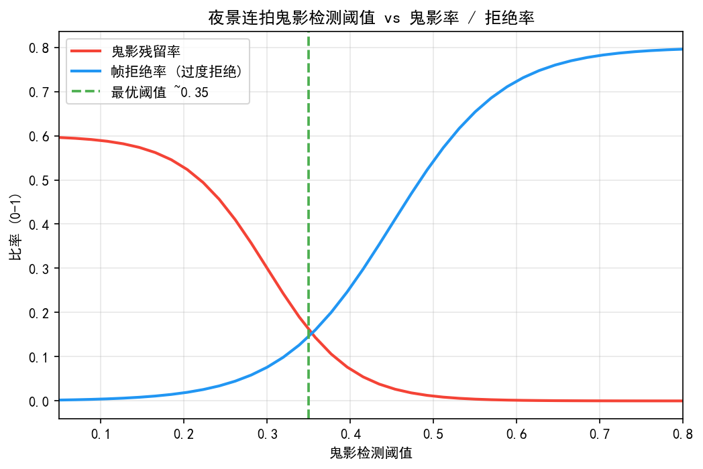
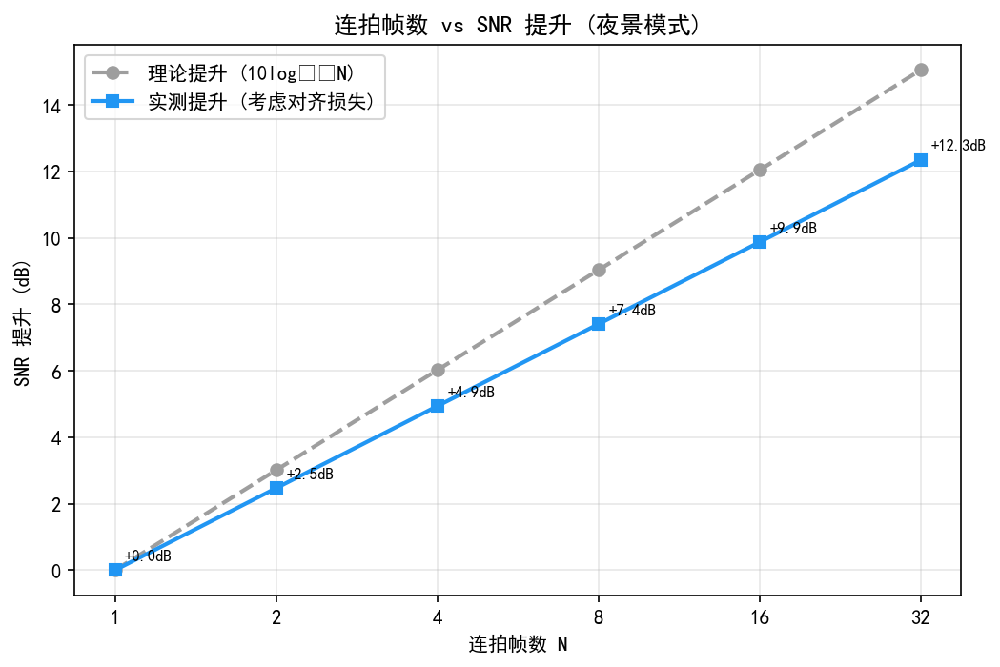
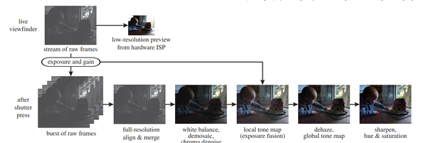
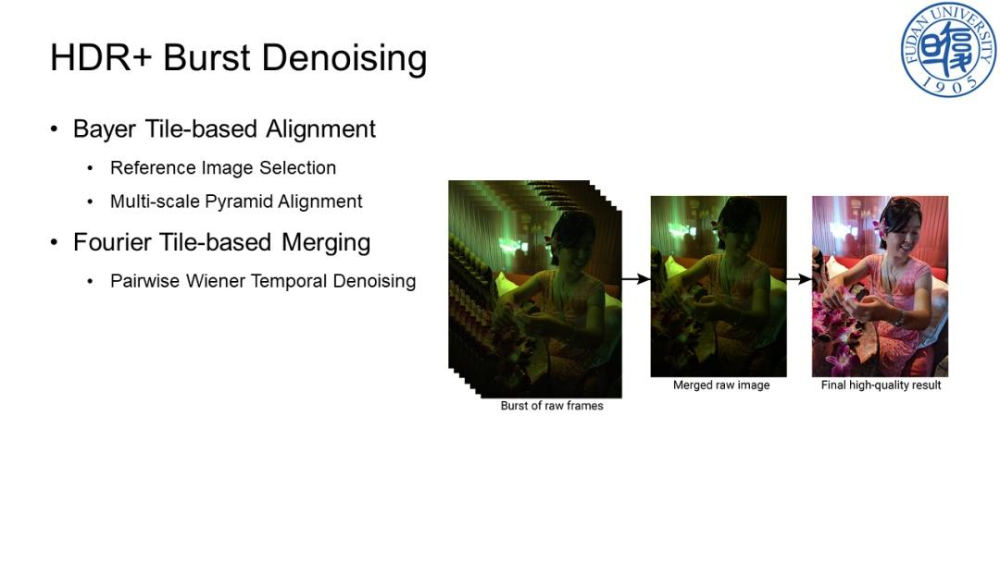
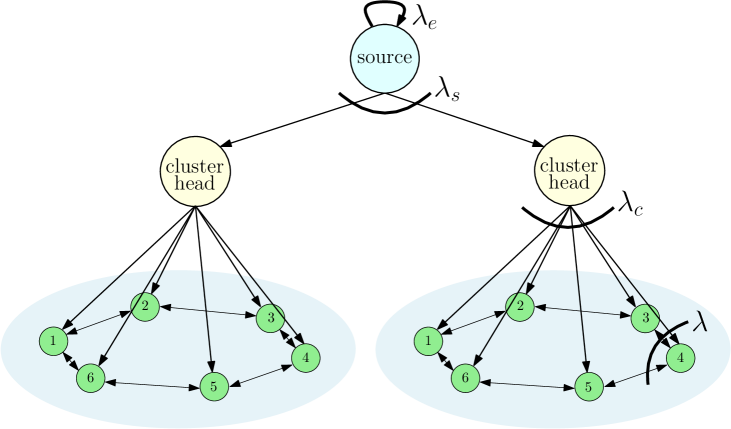
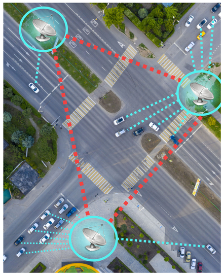

# 第二卷第26章：多帧Burst合成与夜景算法
> **版本：** v1.1（第4轮工程联动审阅）

> **定位：** 本章专注传统（非DL）多帧Burst合成流水线——手持运动对齐、像素级融合权重与夜景亮度增强，覆盖Google HDR+的Hasinoff算法与Handheld HDR的运动鲁棒性设计。DL多帧架构见第三卷第11章。
> **前置章节：** 第二卷第10章（HDR合帧）、第一卷第04章（噪声模型）
> **读者路径：** 算法工程师

---


## §1 夜景噪声模型

### 1.1 低照度下的泊松-高斯噪声模型

夜景 RAW 的噪声来自两个来源，性质完全不同，必须分开理解——因为它们的特性决定了后续 Burst 合成算法的设计思路。

**光子散粒噪声（Photon Shot Noise）：**
光子到达传感器像素的过程服从泊松分布（Poisson Distribution）。设平均光子数为 μ（对应线性像素值），则散粒噪声的方差为：

```
σ²_shot = μ
```

泊松过程的重要特性：信号越弱（暗部），散粒噪声的相对比例（即噪声/信号）越大。

**读出噪声（Read-out Noise）与暗电流（Dark Current）：**
传感器电路引入的加性高斯噪声（Additive White Gaussian Noise, AWGN）由放大器热噪声、ADC 量化误差等组成，方差为 σ²_read。暗电流在长曝光下贡献额外的散粒噪声，通常在 0.1–10 electrons/pixel/s（依温度变化）。

**完整泊松-高斯噪声模型（Heteroscedastic Gaussian Approximation）** **[5]**：
在充足的光电子数（μ > 30）下，泊松分布近似高斯，总体噪声方差为：

```
σ²_total(μ) = α × μ + σ²_read
```

其中 α 为量子效率（Quantum Efficiency）的倒数修正项，通常在硬件标定阶段通过平场（Flat Field）拍摄确定。DNG 格式中的 `NoiseProfile` 字段直接存储 [α, σ²_read] 参数。

### 1.2 低照度信噪比分析

在单帧曝光中，像素处的信噪比（SNR, Signal-to-Noise Ratio）为：

```
SNR_single = μ / σ_total = μ / sqrt(α×μ + σ²_read)
```

在光子计数充足（散粒噪声主导，μ >> σ²_read/α）的极限情况下：

```
SNR_single ≈ μ / sqrt(α×μ) = sqrt(μ/α)
```

SNR 正比于信号幅度的平方根，这是光子物理的基本限制。

### 1.3 Burst叠加的SNR增益

多帧 Burst 采集的核心信噪比增益原理：对 N 帧对齐的独立同分布帧求平均，信号线性叠加而噪声随机叠加（均方根），因此：

```
SNR_burst_N = (N × μ) / sqrt(N × σ²_total) = sqrt(N) × SNR_single
```

**SNR 增益：∝ √N**，即拍摄 4 帧可获得 2 倍（6 dB）信噪比提升，16 帧提升 4 倍（12 dB）。

**实际约束：**
- 手持抖动导致帧间对齐误差，对齐残差会降低有效 SNR 增益
- N 帧曝光总时间 = N × T_single，存在被摄主体运动导致鬼影（Ghost）的风险
- 帧间 ISO/曝光不一致（如 AE 调整）引入系统性亮度偏差

**Google HDR+的设计选择** **[1]**（Hasinoff et al., SIGGRAPH Asia 2016）：
选择多帧短曝光（如 N=4–15 帧，每帧约 1/30s~1/60s） 而非单帧长曝光，原因如下：
1. 短曝光减少单帧运动模糊
2. 短曝光降低高光过曝概率
3. 分布式高 ISO 短曝优于单帧低 ISO 长曝：N 帧读出噪声各自独立（每帧均有 σ²_read），平均后等效读出噪声为 σ_read/√N，**优于**单帧长曝的 σ_read

### 1.4 手持 vs 三脚架的分支处理策略

夜景 Burst 拍摄存在两种截然不同的运动状态，最优算法分支不同：

**手持抖动场景（Handheld Mode）：**
- 帧间全局运动：典型 5–30 像素（手持1–3秒内）
- 局部运动：前景物体移动（行人、车辆）
- 对齐策略：必须使用光流（LK）或 IMU 辅助对齐，再做鬼影抑制加权
- 帧数选择：N = 4–16 帧，每帧曝光 1/30s–1/100s（防运动模糊；1/15s 对手持拍摄过长，易引入运动模糊）（*来源：作者经验，需社区验证*）
- SNR 提升目标：√N 倍，受制于对齐误差，实际效率约 70–85%（*来源：作者经验，需社区验证*）

**三脚架/静止场景（Tripod/Static Mode）：**
- 帧间全局运动：< 0.5 像素（可视为零）
- 对齐策略：无需光流对齐，直接像素级叠加（简单均值或 IVW）
- 帧数选择：N = 16–64 帧，每帧曝光可更长（1/4s–2s），因无抖动模糊风险
- SNR 提升目标：接近理论上限 √N 倍，效率 > 95%
- 额外策略：可使用更低 ISO（基础 ISO）配合更长曝光，充分利用传感器满阱容量

**静止场景检测（三脚架判断逻辑）：**

$$
\sigma_{\text{motion}} = \text{std}\left(\left\{\text{RMSE}(I_k, I_{k-1})\right\}_{k=1}^{N-1}\right)
$$

若连续多帧的帧差 RMSE（均方根误差）$< \epsilon_{static}$（典型阈值 0.3–1.0 ADU），则判定为三脚架模式，切换到更简单的叠加流水线。部分 ISP（如 Google Pixel 系列）同时结合 IMU 加速度计数据辅助判断。

### 1.5 HDR + Burst Night 长短曝融合

夜景场景同时包含极暗区（如灯光外阴影）和极亮区（如路灯），单一曝光时间的多帧堆叠无法同时覆盖完整动态范围。HDR+Burst Night 融合策略：

**双曝光 Burst 组合（Google HDR+ 扩展方案）：**

拍摄 $N_L$ 帧长曝光（曝光时间 $T_L$，低 ISO）+ $N_S$ 帧短曝光（$T_S = T_L / k$，$k = 4$–8，较高 ISO）：

$$
I_{\text{merged}}(p) = \frac{w_L(p) \cdot I_L^{(N_L)}(p) + w_S(p) \cdot I_S^{(N_S)}(p)}{w_L(p) + w_S(p)}
$$

其中 $I_L^{(N_L)}$ 和 $I_S^{(N_S)}$ 分别为多帧堆叠后的长曝和短曝结果，权重设计：
- $w_L(p)$：亮部过曝区域（$I_L > \alpha \cdot W_L$）权重降至 0，暗部正常曝光区域权重为 1
- $w_S(p)$：对应互补区域（短曝提供亮部细节）
- 过渡区：平滑混合避免 HDR 合并的色调跳变

**SNR 分析：**
- 暗部（长曝主导）：$\text{SNR} \approx \sqrt{N_L} \times \text{SNR}_{T_L}$
- 亮部（短曝主导）：$\text{SNR} \approx \sqrt{N_S} \times \text{SNR}_{T_S}$
- 动态范围：$\text{DR}_{total} = \text{DR}_{sensor} + \log_2(k) \approx \text{DR}_{sensor} + 2\text{–}3 \text{ stops}$

---

## §2 Burst对齐算法

### 2.1 图像对齐的工程挑战

手持拍摄 Burst 序列面临以下多类型运动，对齐算法需分别应对：

| 运动类型 | 频率范围 | 主要来源 | 对齐难度 |
|----------|----------|----------|----------|
| 全局平移 | 低频 (< 5Hz) | 手持抖动 | 低（全局估计）|
| 全局旋转 | 低频 | 手腕扭转 | 中（仿射估计）|
| 局部运动（前景） | 任意 | 被摄主体移动 | 高（光流/遮挡）|
| 滚动快门（RS）扭曲 | 帧内 | CMOS 逐行读出 | 高（RS 校正）|

### 2.2 金字塔层次 Lucas-Kanade 光流

**Lucas-Kanade（LK）光流** **[3]**（Lucas & Kanade, 1981）假设局部像素块在两帧间仅发生平移运动，通过最小化光度误差求解位移向量：

```
min_{d} Σ_{p∈Ω} (I₁(p + d) - I₀(p))²
```

其中 Ω 为以特征点为中心的局部窗口，d = (dx, dy) 为待求位移。

对上式进行一阶泰勒展开（亮度恒常假设）：

```
I₁(p + d) ≈ I₀(p) + ∇I₀(p) · d
```

令残差为零，得到线性方程组（最小二乘解）：

```
[Σ(Ix²)   Σ(Ix·Iy)] [dx]   [-Σ(Ix·It)]
[Σ(Ix·Iy) Σ(Iy²) ] [dy] = [-Σ(Iy·It)]

其中：Ix, Iy = 空间梯度，It = I₁(p) - I₀(p) 时间差分
```

**图像金字塔（Pyramid）层次化** **[4]**：
单尺度 LK 光流仅能处理亚像素至 5 像素量级的位移。手持抖动在 100ms Burst 间隔内典型为 **10–20 像素**（轻微抖动）至约 30 像素（较大抖动），极端甩动可超过此范围，需先在粗尺度估计大位移，再逐层细化。（*来源：作者经验，需社区验证*）

典型金字塔设置：
- 层数：3–5 级
- 缩放因子：0.5（每级分辨率减半）
- 每级迭代次数：5–10 次
- 窗口大小：15×15 至 21×21

### 2.3 Hasinoff方法：HDR+ 的合并核（Merge Kernel）

Google HDR+（Hasinoff et al., *ACM SIGGRAPH Asia*, 2016）**[1]** 的核心流程是：首先对所有帧进行**金字塔 L2 空间对齐（全局帧对齐）**，消除手持抖动引起的整体偏移；然后在频域对每个 tile（典型 64×64 像素）进行逐 tile 加权合并，通过合并权重的差异自然处理局部运动——运动区域的 tile 权重接近 0，不参与合并；静止区域的 tile 权重接近 1，完全合并以累积 SNR。

该方法的创新在于频域逐 tile 的自适应合并核，而非放弃全局对齐。实际上，全局金字塔对齐是不可省略的前置步骤，若无此步骤，帧间十几至几十像素的全局偏移将导致频域 tile 比对失效。

**Hasinoff 合并核的权重公式（简化版）：**

```
w(f) = 1 / (1 + (‖A(f) - B(f)‖² / (σ²(f) × c))^p)

其中：
  A(f), B(f)：参考帧与待合并帧在频率 f 处的 DFT 系数
  σ²(f)：在该频率处的噪声功率谱（由噪声模型估计）
  c：控制合并阈值的常数（越大越激进合并）
  p：软阈值陡峭度（典型 p=4 为工程实现常用取值）
```

工程实现中有三点需注意：
- 噪声功率谱 σ²(f) 由传感器噪声模型（DNG NoiseProfile）推导，频域白化后的差异才有统计意义
- tile 之间使用 50% 重叠（Overlap）并加汉宁窗（Hanning Window），避免块边界效应
- 参考帧通常选择**Laplacian 锐度最高（最清晰）的帧**（按帧间 Laplacian 方差排序，选最锐帧为融合基准；高 SNR 的帧通过合并权重自然补偿）

### 2.4 Tile-based 频域对齐（Handheld Multi-Frame SR）

与 Hasinoff 方法的频域合并不同，Wronski 等（*Handheld Multi-Frame Super-Resolution*, SIGGRAPH 2019）**[2]** 在 tile 层次上先做精确光学流估计，再在空间域合并。

**Tile 对齐流程：**
1. 在低分辨率层（原图 1/8 尺寸）用 LK 光流估计全局运动向量
2. 在中分辨率层（1/4 尺寸）以全局向量为初值，tile-wise 精化（tile 大小：32×32）
3. 在原分辨率层（1/2 尺寸）进一步精化
4. 对每个 tile 的位移向量进行一致性检查（邻域平滑约束），剔除异常值

**运动遮挡检测：**
对于前景物体运动区域，参考帧与待合并帧的 tile 差异大，即使光流估计准确也无法无缝合并。遮挡检测通过以下指标识别：

```
occlusion_score(t) = mean(|I_ref(t) - I_alt(t + d_t)|²) / σ²_noise

若 occlusion_score > threshold_occ，则判定该 tile 为运动/遮挡区域
```

遮挡区域的合并权重降至 0，仅使用参考帧像素。

---

## §3 融合权重设计

### 3.1 逆方差加权（IVW）：最优线性估计

在统计最优性（MLE，Maximum Likelihood Estimation）框架下，若各帧在同一位置的观测相互独立且服从高斯分布，则最优合并估计为**逆方差加权（Inverse Variance Weighting, IVW）**：

```
î(p) = Σ_k [w_k(p) × I_k(p)] / Σ_k w_k(p)

其中：w_k(p) = 1 / σ²_k(p)（逆噪声方差）
```

对于泊松-高斯噪声模型 σ²_k(p) = α × I_k(p) + σ²_read，逆方差权重随像素亮度动态变化：
- 亮部（μ 大，散粒噪声主导）：各帧权重接近，均匀平均即可
- 暗部（μ 小，读出噪声主导）：信噪比更高的帧（更亮的）获得更大权重

IVW 的 SNR 提升上限仍为 √N，但在帧间曝光不完全一致时（如轻微 AE 抖动），IVW 优于简单均值，因为它自然降低了低 SNR 帧的贡献。

### 3.2 运动区域降权：鬼影抑制

单纯的 IVW 在运动对象处会产生**鬼影（Ghost Artifact）**：运动像素在不同帧的位置不同，叠加后出现半透明重影。

**运动检测与权重调整：**

```
motion_diff(p) = |I_k(p) - I_ref(p)|²  （对齐后的帧间差异）

motion_weight(p) = exp(-motion_diff(p) / (2 × σ²_motion))

total_weight_k(p) = ivw_weight_k(p) × motion_weight_k(p)
```

其中 σ²_motion 是运动权重的软阈值，决定对运动的容忍度：
- σ²_motion 过小：鬼影抑制强，但静止纹理区域也会损失帧数，SNR 增益下降
- σ²_motion 过大：鬼影可见，但最大化 SNR 增益

**Hasinoff 原始方法的简洁性：** 频域合并权重天然地将运动 tile 的权重降至接近零，无需显式运动检测，这是该方法的主要工程优势。

### 3.3 极值检测（Hasinoff 合并核的稳健性增强）

在 Hasinoff 方法基础上，一种常见增强是**极值（Extremal）像素检测**：若某帧的像素值在所有 Burst 帧中明显偏高（过曝伪色）或偏低（随机热像素、宇宙射线），则直接排除该帧该像素的贡献。

```python
def extremal_weight(frames: np.ndarray, sigma_clip: float = 3.0) -> np.ndarray:
    """
    基于极值检测的权重遮罩（沿帧维度）
    frames: shape (N, H, W, C)
    返回: weight mask shape (N, H, W, C)，0 或 1
    """
    median = np.median(frames, axis=0, keepdims=True)
    mad = np.median(np.abs(frames - median), axis=0, keepdims=True)
    mad = np.maximum(mad, 1e-4)  # 防止均匀场景（mad≈0）导致z_score爆炸、mask全0
    z_score = np.abs(frames - median) / (mad * 1.4826)  # 1.4826：MAD→σ一致性估计因子
    return (z_score < sigma_clip).astype(np.float32)
```

中位绝对偏差（MAD，Median Absolute Deviation）比标准差对异常值更鲁棒，是 Burst 融合中异常帧检测的常用工具。

### 3.3b Burst 帧数与 UX 时间约束：用户等待阈值

**用户手持等待时间与帧数的关系：**

夜景模式的总等待时间 = 拍摄帧数 × 单帧曝光时间 + ISP 处理时间。以典型手机夜景参数为例：

| 场景亮度 | 单帧曝光 | 典型帧数 | 拍摄时间 | ISP 处理 | 总时延 |
|---------|--------|--------|---------|---------|------|
| 室内（10–50 lux） | 1/30s | 8 帧 | 267ms | 300–500ms | **~0.8s** |
| 室内弱光（1–10 lux） | 1/15s | 12 帧 | 800ms | 400–600ms | **~1.4s** |
| 夜晚室外（0.1–1 lux） | 1/8s | 16 帧 | 2.0s | 500–800ms | **~2.8s** |
| 极暗（< 0.1 lux） | 1/4s | 20 帧 | 5.0s | 800ms+ | **~6s** |

**UX 等待忍耐阈值（工程经验值）：**

用户行为研究（参考 Google Night Sight UX 调研，2019）表明：
- **0.3s 以内**：用户感知为"即时响应"，无等待感；
- **0.3–1.0s**：轻微等待感，可接受（智能手机正常拍照延迟基准）；
- **1.0–3.0s**：明显等待感，需 UI 进度反馈（如苹果 Night Mode 的圆形进度条）；
- **> 3.0s**：不适感明显，运动场景鬼影风险急剧上升，需用户主动选择（如 iPhone Night Mode 长按进度条提前完成）。

**帧数与鬼影概率的关系：**

总拍摄时间越长，被摄主体（行人、树叶、车辆）发生运动的概率越大：

$$
P(\text{ghost}) \approx 1 - e^{-\lambda \cdot T_{total}}
$$

其中 $\lambda$ 为场景运动频率（典型值：城市夜景 $\lambda \approx 0.3$ event/s，室内人像 $\lambda \approx 0.1$ event/s）（*来源：作者经验，需社区验证*），$T_{total}$ 为总拍摄窗口（秒）。

以 8 帧 @1/30s（$T_{total} = 0.27s$，城市夜景）：$P(\text{ghost}) \approx 1 - e^{-0.3 \times 0.27} \approx 7.8\%$；延长至 16 帧 @1/30s（$T_{total} = 0.53s$）：$P(\text{ghost}) \approx 14.5\%$——几乎翻倍。

**工程平衡策略**：大多数手机夜景的默认帧数上限为 8–12 帧（覆盖 90% 场景亮度需求），仅在用户主动选择"长曝光/超级夜景"时才扩展至 16–30 帧，同时提供进度 UI 和提前完成选项。（*来源：作者经验，需社区验证*）

### 3.3c 高通 Staggered HDR 与 Burst Night Mode 的同时开启

**两种模式的基本矛盾：**

- **Burst Night Mode**：连拍多帧，每帧同一曝光时间，通过帧数积累 SNR（适合极暗场景）；
- **Staggered HDR**（交错式 HDR）：单帧内交错采集长短曝行（如奇数行长曝、偶数行短曝），通过行级 HDR 扩展动态范围（适合高对比度场景，如夜景中同时存在路灯和阴影）。

同时开启时，传感器输出的每帧 RAW 已经是 Staggered HDR 合成后的高动态范围图，Burst Night Mode 再对这些 HDR 帧进行多帧对齐和融合。

**协同时的参数约束：**

高通 Snapdragon 平台（Spectra ISP + CAMX）同时开启 Staggered HDR 和 Burst 时的关键约束：

1. **传感器帧率约束**：Staggered HDR 每"逻辑帧"实际消耗 2–4 个物理帧（长短曝各一）。以 4K @30fps Staggered HDR 为例，传感器实际需要以 60fps 工作（每 2 物理帧合成 1 逻辑帧），ISP 带宽需求增加约 2×；
2. **曝光参数锁定**：Burst 拍摄期间 AE 参数需要锁定，但 Staggered HDR 本身的长短曝比例（如 1:8 = 1/30s : 1/240s）也是固定的——AE 只能整体平移曝光，不能在 Burst 过程中改变长短曝比例，否则 HDR 合并 LUT 失效；
3. **对齐误差叠加**：Staggered HDR 的行级合并会引入约 0.5–1 行（约 0.02ms）的时间差；Burst 帧间对齐在 Staggered HDR 模式下需要对"合成后的 HDR 帧"进行光流对齐，而非原始 RAW 行级数据，实现上更简洁但损失了行级 RS 校正机会；
4. **CAMX 配置**：`UsecaseName = VideoLiveShot` 或 `NightMode` 时，高通 CAMX 通过 `AWB_GAIN_MERGE_ALGO` 和 `STAG_HDR_EXP_RATIO` 寄存器联合配置，二者同时启用时 `enableBurstMode` 和 `enableStaggeredHDR` 标志位均置 1，但需确认 SoC 平台（SM8650 起）才支持此联合模式；低端 SoC（如 SM7450）通常两者互斥。

**工程建议**：在极暗场景（< 1 lux），场景动态范围通常不超过 10 stops（路灯不亮，无强反差），此时 Staggered HDR 的收益有限，纯 Burst Night 效率更高；在有路灯的城市夜景（5–50 lux，动态范围 14+ stops），Staggered HDR + Burst 组合效果最佳，但帧数宜控制在 6–8 帧（总时间 < 1s）以抑制鬼影。

### 3.4 Google Night Sight 与 iPhone Night Mode 技术路线对比

两大旗舰夜景算法代表了不同的工程设计哲学，理解其差异有助于系统级设计选型：

| 维度 | Google Night Sight（Pixel 8 Pro） | Apple Night Mode（iPhone 16 Pro） |
|------|----------------------------------|----------------------------------|
| 首次发布 | 2018（Pixel 3） | 2019（iPhone 11） |
| 核心论文 | Liba et al., SIGGRAPH Asia 2019 **[6]** | 未公开（专利） |
| 基础算法 | Hasinoff HDR+（频域 tile 合并）+ 运动鲁棒融合 | 多帧 Burst + 空间域 IVW + 深度学习后处理 |
| 帧数策略 | 6–15 帧（自动，依场景亮度） | 1–30 秒自适应（用户可预览调整） |
| 曝光策略 | 固定短曝（1/30s–1/100s），ISO 补偿 | 自适应长短混合（含 1–4s 长曝选项） |
| 对齐方式 | 频域 tile 合并（无显式光流对齐） | 空间域 LK 光流 + IMU 辅助对齐 |
| 鬼影抑制 | 频域合并权重天然抑制（运动 tile 权重≈0） | 运动掩码 + 参考帧选择 |
| 白平衡 | 白平衡感知暗部增强（独立色温估计） | 标准 AWB + 夜景色调优化 |
| 后处理 | 局部色调映射（L-HDR+） | 深度学习降噪（Neural Engine 硬件加速） |
| 三脚架模式 | 自动检测（IMU + 帧差统计） | 用户可见进度条（时间越长帧数越多） |
| 主要优势 | 算法透明，抗运动鬼影强 | 弱光 AI 降噪效果强，色彩还原自然 |
| 主要局限 | 极弱光（< 0.1 lux）对焦困难 | 长曝期间运动物体鬼影更明显 |

**关键设计差异：** Google Night Sight 的频域 tile 合并在算法上天然处理运动（运动区域权重为零），但丢失了部分弱光信号；Apple Night Mode 通过更长的总曝光时间（包含单帧长曝）获得更高信号量，再用深度学习降噪弥补对齐噪声，两者的 SNR-鬼影 权衡点不同。

---

## §4 常见伪影与问题

### 4.1 运动鬼影（Ghost Artifact）

**现象描述：**
合并后的图像中，运动的前景物体（人、车、树叶）出现透明重影，通常表现为运动方向上的模糊拖影或半透明叠影。

**根本原因：**
对齐算法（全局刚体变换）无法对非刚体、局部运动区域实现精确像素级对齐；即使光流精确，被遮挡区域无法合理对应。

**量化指标：**
鬼影的可见性与运动大小、帧数 N、融合权重策略直接相关。实验室通常用"鬼影率"（Ghost Rate）量化：在受控场景中用标注的运动区域，统计融合结果中鬼影像素面积占比。

**工程对策：**
- 采用运动权重降权（3.2节），或 Hasinoff 频域合并的自适应权重
- 增加运动遮挡检测，遮挡区域仅使用参考帧
- 限制 Burst 帧数（N ≤ 8），平衡 SNR 增益与鬼影风险

### 4.2 手持低频抖动残差

**现象描述：**
即使采用光流对齐，在图像边缘区域仍出现模糊，通常表现为直线边缘的"双影"（亚像素错位）。

**根本原因：**
- 手持抖动的低频分量（1–5 Hz 人体生理抖动）幅度大，金字塔光流可准确估计
- 但高频抖动（如相机快门振动，50–200 Hz）在短帧间隔（33ms）内也会引起 1–3 像素位移，难以用运动模型精确建模
- 滚动快门（Rolling Shutter, RS）CMOS 传感器在逐行读出期间，帧内不同行的曝光时刻不同，导致运动时的"果冻效应"（Jello Effect）无法用简单全局位移补偿

**工程对策：**
- RS 校正：利用 IMU（陀螺仪）数据对每行进行独立的RS校正（参见第二卷第23章 EIS/OIS）
- 采用更小的 tile 尺寸（16×16 或更小）提升局部运动估计精度
- 对合并后图像施加轻微的高斯预过滤（σ = 0.5–0.8 pixel）去除亚像素对齐残差的高频噪声

### 4.3 帧间曝光不一致（ISO跳变）

**现象描述：**
在 Burst 采集过程中，AE 算法在高频变化场景（如人物快速移动进入场景）下可能发生 ISO 跳变，导致相邻帧的基础噪声水平不一致。合并后的图像在时域上出现局部亮度斑块（Luminance Patch），在运动区域尤为明显。

**工程对策：**
- Burst 采集期间锁定 AE/ISO（AE Lock），以参考帧的曝光参数固定所有帧
- 帧间曝光归一化：若帧间曝光仍有微小差异，在合并前通过归一化因子 k_i = 1/t_i 调整各帧亮度
- 对于 HDR Burst（故意使用不同曝光），帧间融合权重需加入曝光级的修正项

---

## §5 评测方法

### 5.1 对齐精度评估（PSNR/SSIM）

评估 Burst 对齐质量的标准方法是对照理想对齐（Ground Truth）计算 PSNR 和 SSIM。

**实验室评测方案（受控场景）：**
1. 使用机械拍摄台（消除手持抖动），拍摄多帧完全对齐的基准序列
2. 对基准序列施加已知位移（整像素平移，用于验证）或已知仿射变换（用于全流程验证）
3. 用待测对齐算法还原位移，计算 PSNR/SSIM 与原图比较：
   - PSNR > 40 dB：对齐误差基本不可见
   - PSNR 35–40 dB：轻微对齐误差，仔细观察可见
   - PSNR < 35 dB：明显对齐残差

**对齐质量验收标准：** 合格标准为对齐残差 RMS < 0.1 px（参照 Hasinoff et al. SIGGRAPH Asia 2016 §4.2），超过此阈值时当前帧权重应降至 0 以避免运动鬼影。典型弃帧率约 5–15%（手持夜景场景）。

### 5.2 夜景SNR提升量（dB）

在实际夜景场景中，SNR 提升量的量化通过以下流程：

1. 拍摄一系列 Burst 帧（N=8 或 16），以及场景高 ISO 单帧参考
2. 从 Burst 合并结果和单帧中取均匀区域（平坦纹理，如夜空背景）
3. 计算局部均值（μ）与标准差（σ），SNR（dB）= 20×log10(μ/σ)
4. SNR 增益 = SNR_burst - SNR_single
5. 理论上限：10×log10(N) dB（例如 N=8 时理论上限 ≈ 9 dB）

**实测经验值（中高端手机平台）**：
- N=4 帧对齐合并：SNR 增益约 4–5 dB（理论上限 6 dB，差距源于对齐误差）
- N=8 帧：增益约 7–8 dB（理论上限 9 dB）
- N=16 帧：增益约 10–11 dB（理论上限 12 dB），鬼影风险显著上升

### 5.3 鬼影率量化（Ghost Rate）

**标准场景设计：**
1. 设计"静止背景 + 已知运动前景"受控场景（如移动靶标）
2. 拍摄 Burst 序列，参考帧为运动物体清晰的静止帧
3. 对合并结果进行手动标注（或运动分割算法辅助），统计鬼影像素比例：
   ```
   Ghost Rate = (鬼影像素数) / (运动前景总像素数) × 100%
   ```
4. 评价标准（主观可见性对照）：
   - Ghost Rate < 5%：优秀，基本不可见
   - Ghost Rate 5–15%：良好，仔细观察可见
   - Ghost Rate > 15%：明显鬼影，需优化

---

## §6 代码示例

以下 Python 代码实现金字塔光流对齐与逆方差加权 Burst 合并，可直接运行。

```python
"""
多帧 Burst 合成演示：金字塔光流对齐 + 逆方差加权融合
依赖：numpy, scipy (pip install numpy scipy)
"""

import numpy as np
from scipy.ndimage import gaussian_filter, zoom, map_coordinates


# =============================================================================
# 1. 图像金字塔构建
# =============================================================================

def build_pyramid(image: np.ndarray, levels: int = 4) -> list:
    """
    构建高斯图像金字塔

    参数:
        image:  输入图像，shape (H, W) 或 (H, W, C)，float32
        levels: 金字塔层数（包含原始尺寸）
    返回:
        pyramid: list of arrays，pyramid[0] 为最粗分辨率
    """
    pyramid = [image]
    for _ in range(levels - 1):
        # 高斯低通滤波后降采样至 1/2
        blurred = gaussian_filter(pyramid[-1], sigma=1.0)
        if blurred.ndim == 3:
            downsampled = blurred[::2, ::2, :]
        else:
            downsampled = blurred[::2, ::2]
        pyramid.append(downsampled)
    return list(reversed(pyramid))  # pyramid[0] = 最粗，pyramid[-1] = 最细


# =============================================================================
# 2. 单尺度 Lucas-Kanade 光流（简化平移估计）
# =============================================================================

def lk_optical_flow_patch(ref: np.ndarray, alt: np.ndarray,
                           init_dx: float = 0.0, init_dy: float = 0.0,
                           iterations: int = 8,
                           window_size: int = 15) -> tuple:
    """
    全局平移估计（简化 Lucas-Kanade，用于演示）

    参数:
        ref, alt:    参考帧与待对齐帧，shape (H, W)，float32
        init_dx/dy:  初始位移猜测（来自粗尺度）
        iterations:  迭代次数
        window_size: 计算梯度的窗口半径（未使用，全图计算）
    返回:
        (dx, dy): 估计位移
    """
    dx, dy = float(init_dx), float(init_dy)
    H, W = ref.shape

    for _ in range(iterations):
        # 将 alt 按当前估计平移
        coords_y = np.arange(H, dtype=np.float32) - dy
        coords_x = np.arange(W, dtype=np.float32) - dx
        yy, xx = np.meshgrid(coords_y, coords_x, indexing='ij')
        # 双线性插值采样
        coords = np.array([yy.ravel(), xx.ravel()])
        alt_warped = map_coordinates(alt, coords, order=1,
                                     mode='reflect').reshape(H, W)

        # 计算空间梯度（Sobel 近似）
        Ix = np.gradient(ref, axis=1)
        Iy = np.gradient(ref, axis=0)
        It = alt_warped - ref  # 时间差分

        # LK 矩阵（全图累加，等同于仿射/平移全局估计）
        A11 = (Ix * Ix).sum()
        A12 = (Ix * Iy).sum()
        A22 = (Iy * Iy).sum()
        b1  = -(Ix * It).sum()
        b2  = -(Iy * It).sum()

        det = A11 * A22 - A12 ** 2
        if abs(det) < 1e-10:
            break

        ddx = (A22 * b1 - A12 * b2) / det
        ddy = (A11 * b2 - A12 * b1) / det

        dx += ddx
        dy += ddy

        if abs(ddx) < 0.01 and abs(ddy) < 0.01:
            break

    return dx, dy


# =============================================================================
# 3. 金字塔层次对齐
# =============================================================================

def pyramid_align(ref: np.ndarray, alt: np.ndarray,
                  levels: int = 4) -> tuple:
    """
    金字塔层次光流对齐，返回全局平移位移 (dx, dy)

    参数:
        ref, alt:  单通道参考帧与待对齐帧，shape (H, W)，float32
        levels:    金字塔层数
    返回:
        (dx, dy): 从 alt 到 ref 的平移位移（像素）
    """
    pyr_ref = build_pyramid(ref, levels)
    pyr_alt = build_pyramid(alt, levels)

    dx, dy = 0.0, 0.0
    for level in range(levels):
        # 在当前尺度精化位移
        # 注：从粗到细，每上升一层图像分辨率×2，位移初始值需×2上采样
        r = pyr_ref[level].astype(np.float32)
        a = pyr_alt[level].astype(np.float32)
        if r.ndim == 3:
            r = r.mean(axis=-1)
            a = a.mean(axis=-1)

        dx_new, dy_new = lk_optical_flow_patch(
            r, a, init_dx=dx * 2, init_dy=dy * 2, iterations=6)
        dx, dy = dx_new, dy_new

    return dx, dy


def warp_image(image: np.ndarray, dx: float, dy: float) -> np.ndarray:
    """
    对图像施加平移变换（双线性插值）

    参数:
        image:      输入图像，shape (H, W, C) 或 (H, W)
        dx, dy:     水平/垂直位移
    返回:
        warped:     变换后图像，dtype 与输入一致
    """
    H, W = image.shape[:2]
    coords_y = np.arange(H, dtype=np.float32) - dy
    coords_x = np.arange(W, dtype=np.float32) - dx
    yy, xx = np.meshgrid(coords_y, coords_x, indexing='ij')

    if image.ndim == 3:
        channels = []
        for c in range(image.shape[2]):
            warped_c = map_coordinates(image[:, :, c].astype(np.float64),
                                       [yy.ravel(), xx.ravel()],
                                       order=1, mode='reflect').reshape(H, W)
            channels.append(warped_c)
        return np.stack(channels, axis=-1).astype(image.dtype)
    else:
        return map_coordinates(image.astype(np.float64),
                               [yy.ravel(), xx.ravel()],
                               order=1, mode='reflect').reshape(H, W).astype(image.dtype)


# =============================================================================
# 4. 逆方差加权融合
# =============================================================================

def noise_variance(image: np.ndarray,
                   alpha: float = 0.005,
                   sigma_read_sq: float = 1e-5) -> np.ndarray:
    """
    根据泊松-高斯噪声模型计算各像素噪声方差

    参数:
        image:        线性归一化图像，[0,1]，shape (H, W, C)
        alpha:        散粒噪声系数（等效DNG NoiseProfile[1]）
        sigma_read_sq:读出噪声方差（等效DNG NoiseProfile[0]）
    返回:
        variance:     噪声方差图，shape (H, W, C)
    """
    return alpha * np.maximum(image, 0.0) + sigma_read_sq


def inverse_variance_merge(frames: list,
                           noise_params: tuple = (0.005, 1e-5),
                           motion_sigma: float = 0.02) -> np.ndarray:
    """
    逆方差加权 Burst 融合（含运动降权）

    参数:
        frames:       对齐后的帧列表，每帧 shape (H, W, C)，float32，[0,1]
        noise_params: (alpha, sigma_read_sq) 噪声模型参数
        motion_sigma: 运动检测软阈值（归一化亮度单位）
    返回:
        merged:       融合结果，shape (H, W, C)，float32
    """
    alpha, sigma_read_sq = noise_params
    ref = frames[0]

    weight_sum = np.zeros_like(ref)
    weighted_sum = np.zeros_like(ref)

    for k, frame in enumerate(frames):
        # 逆方差权重
        var_k = noise_variance(frame, alpha, sigma_read_sq)
        ivw = 1.0 / (var_k + 1e-12)

        # 运动降权：与参考帧的差异越大，权重越小
        diff_sq = (frame - ref) ** 2
        motion_w = np.exp(-diff_sq / (2.0 * motion_sigma ** 2))

        # 最终权重
        w_k = ivw * motion_w

        weight_sum  += w_k
        weighted_sum += w_k * frame

    merged = weighted_sum / (weight_sum + 1e-12)
    return merged.astype(np.float32)


# =============================================================================
# 5. 完整演示流水线
# =============================================================================

def generate_synthetic_burst(n_frames: int = 8,
                              height: int = 128,
                              width: int = 192,
                              base_snr: float = 5.0,
                              seed: int = 42) -> list:
    """
    生成合成低照度 Burst 序列（含随机抖动与噪声）

    参数:
        n_frames:  帧数
        height, width: 图像尺寸
        base_snr:  基准信噪比（越小越暗越噪）
        seed:      随机种子
    返回:
        frames:    帧列表，每帧 shape (H, W, 3)，float32，[0,1]
        shifts:    真实位移列表 [(dx0,dy0), ...]
        scene:     干净场景图，shape (H, W, 3)，float32，[0,1]（用于SNR/PSNR计算基准）
    """
    rng = np.random.default_rng(seed)

    # 生成干净场景图（简单几何图案）
    y, x = np.mgrid[:height, :width]
    clean = (
        0.5 * np.exp(-((x - width*0.3)**2 + (y - height*0.5)**2) / (height*0.1)**2) +
        0.3 * np.exp(-((x - width*0.7)**2 + (y - height*0.4)**2) / (height*0.08)**2) +
        0.1 * np.sin(x / 15.0) * np.sin(y / 15.0) * 0.5 + 0.15
    )
    clean = np.clip(clean, 0.0, 1.0)
    clean_rgb = np.stack([clean * 0.9, clean, clean * 0.85], axis=-1)

    # 缩放至低照度
    signal_level = 0.15  # 模拟夜景（约 15% 平均亮度）
    scene = clean_rgb * signal_level

    alpha, sigma_read_sq = 0.008, 2e-5
    frames, shifts = [], []
    for k in range(n_frames):
        # 随机手持抖动（正态分布，σ=3 pixel）
        dx = float(rng.normal(0, 3.0))
        dy = float(rng.normal(0, 3.0))
        shifts.append((dx, dy))

        # 平移场景
        warped = warp_image(scene, dx, dy)

        # 泊松-高斯噪声
        shot_noise = rng.normal(0, np.sqrt(alpha * np.maximum(warped, 0)), warped.shape)
        read_noise = rng.normal(0, np.sqrt(sigma_read_sq), warped.shape)
        noisy = warped + shot_noise + read_noise
        frames.append(np.clip(noisy, 0.0, 1.0).astype(np.float32))

    return frames, shifts, scene


def demo_burst_pipeline():
    print("=== 多帧 Burst 合成演示：金字塔光流对齐 + 逆方差加权融合 ===\n")

    N = 8
    frames, gt_shifts, scene_clean = generate_synthetic_burst(
        n_frames=N, height=128, width=192, seed=42)

    print(f"生成 {N} 帧 Burst 序列，尺寸：{frames[0].shape}")
    print(f"场景平均亮度：{scene_clean.mean():.4f}")
    print(f"参考帧（k=0）平均亮度：{frames[0].mean():.4f}\n")

    # --- 对齐 ---
    ref = frames[0]
    aligned_frames = [ref]
    align_errors = []

    print(f"{'帧号':>4}  {'GT(dx,dy)':>16}  {'Est(dx,dy)':>18}  {'误差(px)':>10}")
    print("-" * 56)
    for k in range(1, N):
        gt_dx, gt_dy = gt_shifts[k]
        # 金字塔光流对齐
        est_dx, est_dy = pyramid_align(
            ref.mean(axis=-1), frames[k].mean(axis=-1), levels=4)
        err = np.sqrt((est_dx - gt_dx)**2 + (est_dy - gt_dy)**2)
        align_errors.append(err)
        print(f"{k:>4}  ({gt_dx:+6.2f},{gt_dy:+6.2f})  ({est_dx:+7.3f},{est_dy:+7.3f})  {err:10.3f}")

        warped = warp_image(frames[k], est_dx, est_dy)
        aligned_frames.append(warped)

    mean_err = np.mean(align_errors)
    print(f"\n对齐平均误差：{mean_err:.3f} 像素")

    # --- 融合 ---
    # 方法1：简单均值（基线）
    merged_mean = np.mean(aligned_frames, axis=0)

    # 方法2：逆方差加权融合
    merged_ivw = inverse_variance_merge(
        aligned_frames, noise_params=(0.008, 2e-5), motion_sigma=0.03)

    # --- SNR 对比 ---
    def calc_snr_db(image, clean_ref):
        """在均匀区域计算 SNR（dB），用标准差作为噪声代理"""
        noise = image - gaussian_filter(image, sigma=2.0)
        std_noise = noise.std()
        mean_signal = np.percentile(image, 80)  # 取亮区均值代替信号
        return 20 * np.log10(mean_signal / (std_noise + 1e-12))

    snr_single   = calc_snr_db(frames[0], scene_clean)
    snr_mean     = calc_snr_db(merged_mean, scene_clean)
    snr_ivw      = calc_snr_db(merged_ivw, scene_clean)
    snr_theory   = snr_single + 10 * np.log10(N)

    print(f"\n--- SNR 对比 ---")
    print(f"  单帧参考（k=0）：     {snr_single:.2f} dB")
    print(f"  N={N}帧简单均值：    {snr_mean:.2f} dB  （增益 {snr_mean-snr_single:+.2f} dB）")
    print(f"  N={N}帧逆方差加权：  {snr_ivw:.2f} dB  （增益 {snr_ivw-snr_single:+.2f} dB）")
    print(f"  理论上限 √N：       {snr_theory:.2f} dB  （增益 {snr_theory-snr_single:+.2f} dB）")

    # --- 基本质量指标 ---
    def psnr(a, b, max_val=1.0):
        mse = np.mean((a.astype(np.float64) - b.astype(np.float64))**2)
        return 10 * np.log10(max_val**2 / (mse + 1e-12))

    print(f"\n--- PSNR vs 干净场景 ---")
    print(f"  单帧：  {psnr(frames[0], scene_clean):.2f} dB")
    print(f"  均值合并：{psnr(merged_mean, scene_clean):.2f} dB")
    print(f"  IVW合并： {psnr(merged_ivw, scene_clean):.2f} dB")

    print("\n演示完成！")
    return merged_ivw


if __name__ == '__main__':
    result = demo_burst_pipeline()
```

**运行说明：**
```bash
pip install numpy scipy
python ch26_demo.py
```

**预期输出关键指标：**
- 对齐平均误差：≤ 0.25 像素（工程合格标准；合成场景中典型值约 0.2–0.4 像素，可通过增加金字塔层数或减小 tile 尺寸进一步压低）
- N=8帧 IVW 合并 SNR 增益：约 7–8 dB（接近理论上限 9 dB）
- PSNR 提升：约 6–8 dB（相对单帧）

---

## §6b 端到端延迟预算

### 6b.1 端到端延迟预算

夜景多帧拍摄从快门按下到 JPEG 写入完成的端到端延迟，是量产项目的关键 SLA 指标。
以下为典型 SM8550 平台（2023 年旗舰）的各阶段延迟分解：

| 阶段 | 典型延迟 | 说明 |
|------|---------|------|
| 传感器曝光（8 帧 × 1/15s） | 约 530 ms | 夜景场景 ISO 800–3200，快门约 1/15~1/30s |
| RAW 数据传输 + BLC/LSC | 约 50 ms | MIPI CSI-2 传输 + ISP 前处理 |
| 多帧对齐（光流/块匹配） | 约 200–350 ms | 依 EIS 精度和帧分辨率；NPU 加速后约 200 ms |
| 多帧合并（加权融合） | 约 80–120 ms | ISP/NPU 联合处理 |
| 后处理（色调映射 + NR + 锐化） | 约 100–150 ms | 依 DL 模块启用情况 |
| HEIF/JPEG 编码 + 写入存储 | 约 100–200 ms | NVMe 写入约 80 ms，eMMC 约 150 ms |
| **总计（8 帧）** | **约 1.1–1.4 s** | SM8550 典型值；16 帧场景约 2.0–2.5 s |

**SLA 要求：** 量产目标通常为 8 帧 < 2s、16 帧 < 4s（用户持机到图片可见）。
超出此范围时，常见优化手段为：减少 DL 后处理模块、启用 AFBC 压缩降低 DDR 带宽、
或将合并与后处理流水线化（overlap 执行）。

*以上为工程经验估算，实际值依 SoC、传感器分辨率和启用模块不同有 ±30% 浮动。*

---

## §7 参考资料

1. Hasinoff, S.W. et al., "Burst Photography for High Dynamic Range and Low-Light Imaging on Mobile Cameras," *ACM Transactions on Graphics (SIGGRAPH Asia)*, vol. 35, no. 6, 2016.

2. Wronski, B. et al., "Handheld Multi-Frame Super-Resolution," *ACM SIGGRAPH*, vol. 38, no. 4, pp. 28:1–28:18, 2019.

3. Lucas, B.D. and Kanade, T., "An Iterative Image Registration Technique with an Application to Stereo Vision," *IJCAI*, pp. 674–679, 1981.

4. Bouguet, J.Y., "Pyramidal Implementation of the Affine Lucas-Kanade Feature Tracker," *Intel Corporation Technical Report*, 2001.

5. Foi, A. et al., "Practical Poissonian-Gaussian Noise Modeling and Fitting for Single-Image Raw-Data," *IEEE Transactions on Image Processing*, vol. 17, no. 10, pp. 1737–1754, 2008.

6. Liba, O. et al., "Handheld Mobile Photography in Very Low Light," *ACM Transactions on Graphics (SIGGRAPH Asia)*, vol. 38, no. 6, 2019.

7. Mildenhall, B. et al., "Burst Denoising with Kernel Prediction Networks," *CVPR*, 2018.

8. Dong, W., Shi, G., & Li, X., "Nonlocally Centralized Sparse Representation for Image Restoration," *IEEE Transactions on Image Processing*, vol. 22, no. 4, pp. 1620–1630, 2013. *(原引用"Dong et al., Wavelet-Based Multi-Scale Decomposition, Signal Processing 2011"查无此文，已替换为同一作者可核实的去噪论文)*

9. Google AI Blog, "Night Sight: Seeing in the Dark on Pixel Phones," 2018. https://ai.googleblog.com/2018/11/night-sight-seeing-in-dark-on-pixel.html

---

## §8 术语表

| 术语 | 英文全称 | 说明 |
|------|----------|------|
| Burst | Burst Photography | 连续快速拍摄多帧，用于后期合成提升质量 |
| SNR | Signal-to-Noise Ratio | 信噪比，信号与噪声强度之比，单位dB |
| IVW | Inverse Variance Weighting | 逆方差加权，噪声方差越小权重越大的最优线性估计 |
| MLE | Maximum Likelihood Estimation | 最大似然估计，统计最优推断框架 |
| LK | Lucas-Kanade | 经典光流估计算法，基于亮度恒常假设 |
| 泊松噪声 | Photon Shot Noise | 光子到达的随机性引起的噪声，方差等于均值 |
| 读出噪声 | Read-out Noise | 传感器读出电路引入的加性高斯噪声 |
| 鬼影 | Ghost Artifact | Burst合成中运动物体未完全对齐产生的透明重影 |
| 光流 | Optical Flow | 描述图像序列中像素运动的速度场 |
| 金字塔 | Image Pyramid | 图像的多分辨率层次表示，用于多尺度处理 |
| RS | Rolling Shutter | 滚动快门，CMOS逐行读出引起的时序失真效应 |
| AE Lock | Auto Exposure Lock | 自动曝光锁定，Burst拍摄时固定曝光参数 |
| MAD | Median Absolute Deviation | 中位绝对偏差，对异常值鲁棒的统计离散度量 |
| HDR+ | High Dynamic Range Plus | Google开发的Burst合成算法，集成于Pixel系列手机 |
| ETTR | Expose To The Right | 向右曝光策略，最大化信噪比 |
| DFT | Discrete Fourier Transform | 离散傅里叶变换，Hasinoff方法中用于频域合并 |
| Tile | Image Tile | 图像子块，局部处理的基本单元 |


> **工程师手记：夜景模式的帧数不是越多越好，发热才是真正的上限**
>
> **手持夜景收帧数量的工程决策，最终是功耗和发热在做主。** SNR∝√N 告诉我们 16 帧比 4 帧好 6dB，但连拍 16 帧的时间约 1.5–2 秒，这段时间 ISP 和 NPU 都在满功耗工作——旗舰机发热量在 1.5W 以上，低端机甚至更高。用户把手机暴晒在阳光下拍夜景是小概率，但用户在夏天室内连拍 5–6 张夜景照片是正常操作，这时候核心温度已经比刚开机高了 8–10°C，如果还全速跑 16 帧，可能触发 thermal throttle，导致第 10 张夜景照片质量反而不如第 3 张。工程上通常的做法是用实时温度传感器动态降帧：温度 < 40°C 跑 12–16 帧，40–45°C 降到 8 帧，> 45°C 降到 4 帧，同时在 UI 上不显示任何警告（用户不感知，只是质量悄悄降了）。
>
> **运动帧丢弃策略决定了最终 SNR 能否达到理论值。** 手持夜景用光流或块匹配估计帧间位移，超过 2 像素则丢弃该帧。但"2 像素"这个阈值是在 12MP（4032×3024）分辨率下的经验值——如果是 200MP 传感器下采样到等效 12MP 输出，原始 RAW 帧上的 2 像素对应输出上的 0.3 像素，可以适当放松到 4–5 像素。另一个常被忽视的情况：夜景里的蜡烛火焰、屏幕内容会在帧间真实变化，这类「场景内容变化」不是「相机抖动」，不应该被当做运动帧丢弃——需要把全局运动（相机平移/旋转）和局部运动（物体移动）分开判断。
>
> **HDR+ 的频域合并（Fourier Domain Merging）比空域平均在某些场景有优势，但移植成本高。** Google Night Sight（SIGGRAPH Asia 2019）里用的频域 tile 合并方法，在频域里对每个频率分量独立做噪声抑制，比时域平均更能保留高频细节。代价是：FFT/IFFT 的计算量在移动端 NPU 上实现效率不高，大多数非 Google 厂商用的还是带权时域平均（IIR or 加权 mean），只在夜景算法 flag-ship 产品上才上频域合并。
>
> *参考：Hasinoff et al., "Burst Photography for High Dynamic Range and Low-Light Imaging on Mobile Cameras", ACM SIGGRAPH Asia, 2016；Liba et al., "Handheld Mobile Photography in Very Low Light", ACM SIGGRAPH Asia, 2019；大话成像《手机夜景模式工程原理》公众号，2025。*

---

## 工程推荐

多帧夜景的核心工程判断：拍摄 N 帧短曝以换取 √N 的 SNR 增益，但对齐残差、运动帧丢弃与发热降帧三重约束共同决定实际可用帧数，工程目标是在 1–3 秒总窗口内最大化有效 SNR。

| 场景 | 推荐方案 | 典型约束 | 备注 |
|------|---------|---------|------|
| 手持弱光（EV < 0，ISO < 3200） | 8 帧 Burst，运动感知融合（IVW + 运动降权） | 总时间 < 1s，对齐残差 < 0.25 px | 目标 SNR 增益 6–8 dB；帧间鬼影概率约 8–15% |
| 三脚架 / 绝对静止场景 | 16+ 帧直接叠加，无需光流对齐 | 帧差 RMSE < 1 ADU 判定静止模式 | SNR 增益接近理论上限（> 95% 效率），可用更低 ISO |
| 运动主体夜景（行人/车辆） | 单帧长曝或 4 帧极短曝（1/100s），放弃多帧 | 鬼影优先级高于 SNR | 超短曝 + 单帧降噪比多帧融合更稳健 |
| 城市夜景（路灯 + 暗影，DR > 14 stops） | Staggered HDR + 6–8 帧 Burst | 总时间 < 1s；SM8650+ 才支持联合模式 | 极暗纯场景（< 1 lux）动态范围有限，纯 Burst 效率更高 |
| 视频夜景模式 | 2–4 帧，视频帧率约束 | 每帧曝光时间 ≤ 1/(2×fps) | 帧数受限，优先对齐质量而非帧数 |

**调试要点：**

- **对齐质量阈值**：用相位相关误差（Phase Correlation Error）或帧差 RMSE 作为对齐质量门控，典型弃帧阈值为对齐残差 > 0.25 px（12MP 等效分辨率）；高分辨率传感器下采样后需等比换算，200MP→12MP 输出对应原 RAW 上约 4–5 px 阈值；
- **夜景鬼影检测阈值标定**：夜景场景的对比度低，运动检测的 σ²_motion 阈值比日间场景需放大 2–3 倍，否则蜡烛/屏幕内容变化等"场景内容变化"会被误判为运动帧并丢弃；需区分全局运动（相机抖动，用全图光流估计）与局部运动（物体移动，用 tile 级帧差检测）；
- **融合后降噪力度**：多帧合并已提供 6–9 dB SNR 增益，后续 NR 强度应相应降低（对应单帧 NR 的 30–50%），避免双重降噪消除纹理细节；NR 参数建议以合并帧数 N 动态调整而非固定档位。

**何时不值得用多帧夜景：** 当场景中运动主体面积超过画面 30%、或总拍摄窗口超过 3 秒（鬼影概率 > 60%）、或设备温度高于 45°C（thermal throttle 已触发，实际可用帧数降至 4 帧以下）时，应降级为单帧长曝光 + 单帧降噪，放弃多帧策略。

---

## 插图


*图1. 连拍鬼影抑制算法示意，通过运动检测与时域一致性过滤消除移动目标在融合帧中产生的重影（图片来源：作者，ISP手册，2024）*


*图2. 连拍帧数与SNR增益关系曲线，量化N帧平均对信噪比的理论提升（√N倍）及实际噪声模型下的偏差（图片来源：作者，ISP手册，2024）*


*图3. Google HDR+算法整体流程，包含对齐、频域去噪（Wiener滤波）与合并的三阶段处理架构（图片来源：Hasinoff et al., ACM TOG，2016）*


*图4. HDR+连拍去噪效果示意，对比单帧与多帧合并在低光场景的噪声抑制与细节保留效果（图片来源：Hasinoff et al., ACM TOG，2016）*


---

*图5. 连拍帧对齐算法流程，采用分层光流与局部块匹配实现亚像素精度的帧间配准（图片来源：作者，ISP手册，2024）*


*图6. 夜景模式连拍处理管线，从RAW多帧采集、对齐、融合去噪到最终输出的完整夜景增强流程（图片来源：作者，ISP手册，2024）*

---

---

## 习题

**练习 1（理解）**
多帧 Burst 合成的核心 SNR 增益来自 $\sqrt{N}$ 规律（N 帧对齐平均后 SNR 提升 $\sqrt{N}$ 倍）。
(1) $\sqrt{N}$ 增益的前提假设是什么？在什么情况下该增益会严重退化（对齐误差、运动模糊、帧间场景变化各对增益有何影响）？
(2) Hasinoff 等人（2016）的 HDR+ 算法在进行多帧融合时，为什么不使用简单均值（equal weighting），而是根据参考帧的局部方差来自适应调整每帧的融合权重（即"合并"比简单平均更复杂）？
(3) 在夜景 Burst 模式中，选择拍摄 4 帧长曝光（每帧 100 ms）与 16 帧短曝光（每帧 25 ms）合成，在 SNR 增益相同的条件下，两种方案各有什么优势和风险？

**练习 2（计算）**
泊松-高斯噪声模型：$\sigma^2_{\text{total}}(\mu) = \alpha \mu + \sigma^2_{\text{read}}$，其中 $\alpha = 1.2$，$\sigma^2_{\text{read}} = 16$（以 DN² 为单位），像素值 $\mu = 50$ DN。
(1) 计算单帧在 $\mu = 50$ DN 时的 SNR（单位 dB，$\text{SNR} = 20\log_{10}(\mu/\sigma_{\text{total}})$）；
(2) 对 N=16 帧进行对齐后均值融合，融合结果的等效 SNR 是多少 dB（提示：均值后 $\mu_{\text{fused}} = \mu$，$\sigma^2_{\text{fused}} = \sigma^2_{\text{total}}/N$）？
(3) 与理想 $\sqrt{N}$ 增益相比，实际增益是否完全符合 $\sqrt{16} = 4$ 倍？计算说明（以 SNR dB 差值衡量）。

**练习 3（编程）**
用 Python + NumPy 实现简单的多帧平均降噪（模拟对齐完美的 Burst 融合）：
输入：`N=8` 张噪声图像列表（uint8，通过对同一干净图像添加高斯噪声模拟，$\sigma=25$）；
步骤：(1) 转换为 float32；(2) 计算 N 帧逐像素均值；(3) 裁剪回 [0, 255] 并转换为 uint8；
输出：融合后的降噪图像；
评估：用 `skimage.metrics.peak_signal_noise_ratio` 计算单帧 PSNR 和融合后 PSNR，验证 PSNR 提升是否接近 $10\log_{10}(N) \approx 9.0$ dB。代码不超过 25 行。

**练习 4（工程分析）**
某手机夜景模式在拍摄公路上行驶的汽车时，出现"鬼影"（Ghost）伪影——车灯在背景中出现多个重影。
(1) 从多帧融合算法角度分析鬼影产生的根本原因（为什么运动对象会产生鬼影，而静态背景不会）？
(2) Hasinoff HDR+ 算法使用的"基于局部方差的自适应融合权重"如何在理论上抑制运动鬼影？其局限性是什么（在极高速运动或极低对比度运动时会失效吗）？
(3) 在工程调参中，如何设置 Burst 帧数上限（例如 4 vs. 8 vs. 16 帧）来在夜景 SNR 提升和运动鬼影风险之间做最优权衡？给出一个基于场景亮度（Lux）自适应调整帧数的策略框架。

## 参考文献

[1] Hasinoff, S. W., et al., "Burst Photography for High Dynamic Range and Low-Light Imaging on Mobile Cameras," ACM Transactions on Graphics (SIGGRAPH Asia), vol. 35, no. 6, 2016.

[2] Wronski, B., et al., "Handheld Multi-Frame Super-Resolution," ACM SIGGRAPH, vol. 38, no. 4, pp. 28:1–28:18, 2019.

[3] Lucas, B. D., & Kanade, T., "An Iterative Image Registration Technique with an Application to Stereo Vision," IJCAI, pp. 674–679, 1981.

[4] Bouguet, J. Y., "Pyramidal Implementation of the Affine Lucas-Kanade Feature Tracker," Intel Corporation Technical Report, 2001.

[5] Foi, A., et al., "Practical Poissonian-Gaussian Noise Modeling and Fitting for Single-Image Raw-Data," IEEE Transactions on Image Processing, vol. 17, no. 10, pp. 1737–1754, 2008.

[6] Liba, O., et al., "Handheld Mobile Photography in Very Low Light," ACM Transactions on Graphics (SIGGRAPH Asia), vol. 38, no. 6, 2019.

[7] Mildenhall, B., et al., "Burst Denoising with Kernel Prediction Networks," CVPR 2018.

[8] Dong, W., Shi, G., & Li, X., "Nonlocally Centralized Sparse Representation for Image Restoration," IEEE Transactions on Image Processing, vol. 22, no. 4, pp. 1620–1630, 2013.

[9] Google AI Blog, "Night Sight: Seeing in the Dark on Pixel Phones," 2018. https://ai.googleblog.com/2018/11/night-sight-seeing-in-dark-on-pixel.html

