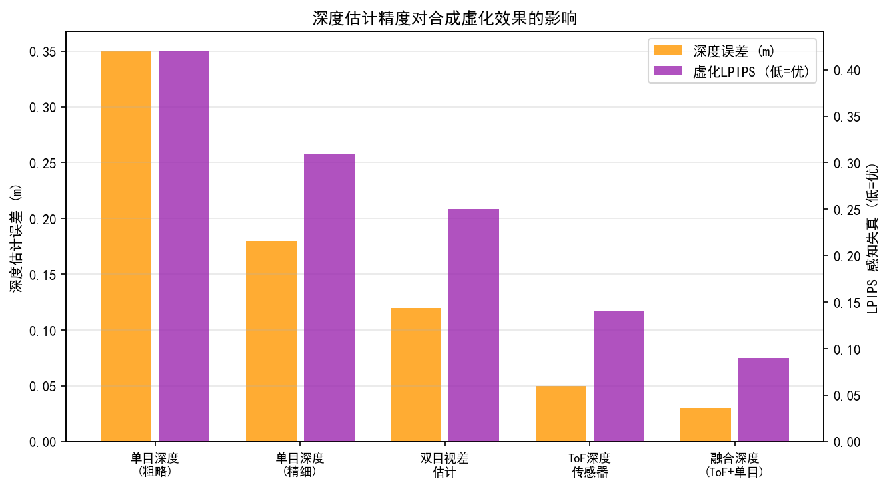
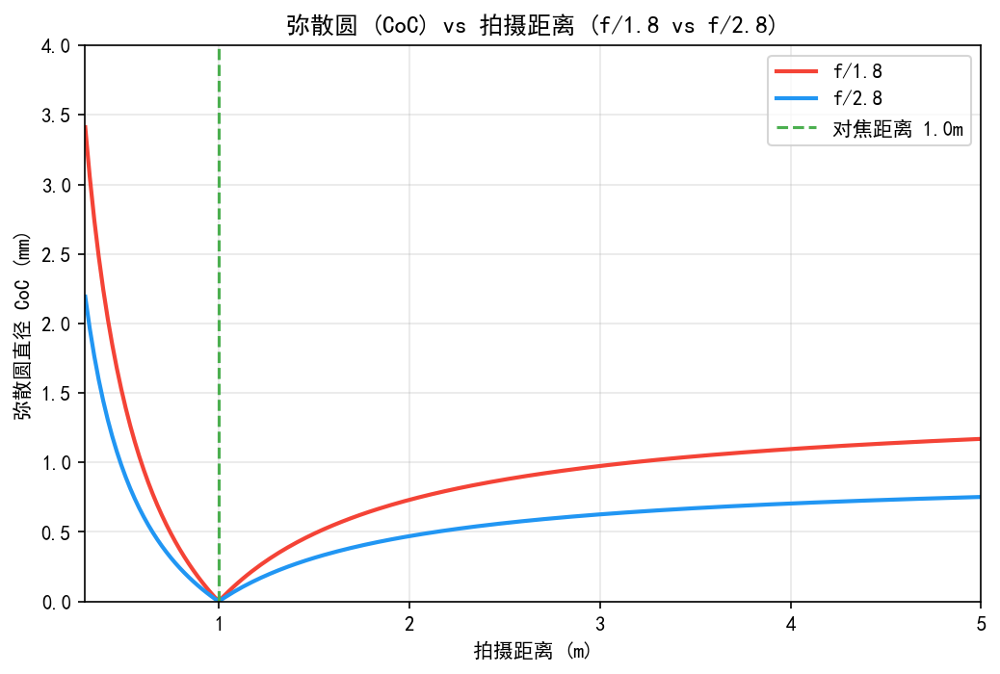
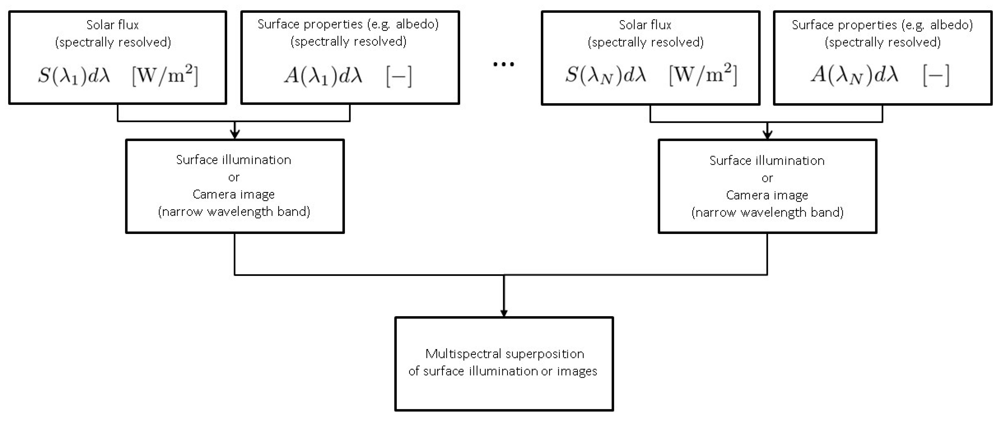
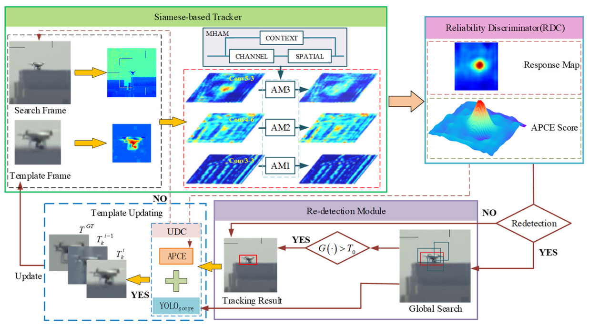

# 第二卷第27章：计算散景与人像模式渲染
> **版本：** v1.1（第4轮工程联动审阅）

> **定位：** 本章覆盖基于单摄/双摄/ToF的计算散景完整流水线——从双摄视差估计深度图、前景分割，到圆形/类光圈模糊核（PSF）的空间变化卷积与散景球（Bokeh Ball）渲染。DL语义散景见第三卷第13章。
> **前置章节：** 第二卷第22章（多摄融合）、第一卷第12章（深度感知）
> **读者路径：** 算法工程师

---


## §1 散景物理模型

### 1.1 薄透镜方程与焦点成像

计算散景要模拟真实镜头的弥散效果，起点是薄透镜方程——描述物距（Object Distance, do）、像距（Image Distance, di）和焦距（Focal Length, f）三者关系的基础方程：

```
1/f = 1/do + 1/di
```

当感光元件平面（传感器面）恰好落在像平面时，该物距处的被摄体清晰成像。对于不在焦点处的物体，其成像会扩散为一个模糊圆圈，即**弥散斑**（Circle of Confusion, COC）。

### 1.2 弥散斑（COC）直径公式

设对焦距离为 ds（传感器平面到焦点的物距），光圈直径为 A，则处于物距 do 处的点光源在传感器上的 COC 直径为：

```
COC_diameter = A × |di - ds| / di

其中：
  di：物距 do 处对应的像距（由薄透镜方程计算：di = f×do / (do - f)）
  ds：焦点对应像距（对焦距离为 do_focus 时：ds = f×do_focus / (do_focus - f)）
  A：镜头光圈有效直径 = f / (f/#)
```

**近似简化版（远场物距，do >> f）：**

```
COC ≈ (f / (f/#)) × |do - do_focus| / do
```

这一公式揭示了散景量的三个控制参数：
1. **焦距 f**：焦距越长，COC 越大（背景虚化越强）
2. **光圈 f/#**：f/# 越小（光圈越大），COC 越大
3. **物距差 |do - do_focus|**：被摄体离焦平面越远，虚化越强

### 1.3 f/# 与散景量的关系

f/#（光圈数，F-Number）定义为焦距与光圈有效直径之比：

```
f/# = f / A
```

散景量正比于 A（光圈直径），即反比于 f/#。常见镜头光圈与背景虚化量的工程对照：

| f/# | 相对散景量（COC比） | 典型应用场景 |
|-----|---------------------|--------------|
| f/1.4 | 5.7× | 电影大光圈定焦，强烈虚化 |
| f/1.8 | 4.4× | 人像摄影主流选择 |
| f/2.8 | 2.8× | 变焦镜头最大光圈 |
| f/4.0 | 2.0× | 标准参考 |
| f/8.0 | 1.0× | 参考基准 |

### 1.4 手机物理孔径约束

手机主摄的物理尺寸决定了其光学散景的根本局限。以典型旗舰手机主摄为例：
- 传感器尺寸：1/1.3 英寸（约 9.6mm × 7.2mm）
- 等效焦距：24mm（等效135画幅）
- 实际焦距：约 5.8mm
- 最大光圈：f/1.8
- 实际光圈直径：5.8 / 1.8 ≈ 3.2 mm

相比之下，135画幅全幅相机配 85mm f/1.8 镜头：
- 实际光圈直径：85 / 1.8 ≈ 47mm

手机的实际光圈直径约为全幅相机的 3.2/47 ≈ 1/15，散景量（COC）约为全幅相机的 1/15。这一物理差距决定了手机散景必须依赖计算摄影（Computational Photography）模拟。

### 1.5 PSF 与光圈叶片形状的关系

真实光学散景的 PSF（点扩散函数）形状由镜头**光圈叶片（Aperture Blades）**决定，而非简单圆形，这对计算散景的真实感至关重要。

**光圈叶片数量与散景球形状：**

| 叶片数 | 散景球形状 | 代表镜头 |
|--------|-----------|----------|
| 5 叶 | 五边形 | 部分定焦镜头（较廉价） |
| 7 叶（直刃） | 七边形 | 标准变焦镜头 |
| 9 叶（圆弧刃） | 近圆形 | 高端定焦（如 Canon RF 85mm f/1.2） |
| 圆形光圈 | 正圆形（无边） | 电影镜头（iris diaphragm） |
| 手机主摄 | 近圆形（固定光圈） | 无叶片，固定孔径 |

**数学描述（光圈透过率函数）：**

光圈函数（Pupil Function）$P(\xi, \eta)$ 定义为光圈平面上的透过率分布。对于 $N$ 叶片正多边形光圈：

$$
P(\xi, \eta) = \begin{cases} 1 & \text{if } (\xi, \eta) \text{ 在 } N \text{ 边形内} \\ 0 & \text{otherwise} \end{cases}
$$

PSF 为光圈函数的傅里叶变换模的平方（Fraunhofer 衍射）：

$$
\text{PSF}(x, y) = \left| \mathcal{F}\{P(\xi, \eta)\} \right|^2
$$

**对计算散景的工程含义：**
- 手机固定圆形光圈：PSF 近似为圆形 Airy 盘，计算散景可直接用圆形高斯核；
- 模拟全画幅镜头风格：使用带边角的多边形核，典型的 7 叶/9 叶 Bokeh Ball 通过预先生成多边形 LUT 实现；
- iPhone 人像模式（iPhone 14 Pro 起）：提供"光圈叶片风格选择"，底层为预计算的不同形状 PSF LUT，卷积时用空间变化 PSF 替换圆形高斯。

**焦外 Bokeh Ball 的猫眼效应（Cat's Eye Bokeh）：**

在镜头边角区域，光圈被镜筒遮挡（Vignetting），导致散景球形状由圆形变为椭圆形或猫眼形（Cat's Eye）。计算散景高质量实现需考虑此效应：

$$
P_{\text{edge}}(\xi, \eta; r_{img}) = P_{\text{circle}}(\xi, \eta) \cap P_{\text{vignet}}(\xi, \eta; r_{img})
$$

其中 $r_{img}$ 为像素到图像中心的距离，$P_{\text{vignet}}$ 为随视场角变化的遮光函数，边角处的 PSF 面积减少，Bokeh Ball 从圆形变为橄榄形。

---

## §2 深度图计算

### 2.1 双摄视差→深度估计（SGM算法）

双摄（Dual Camera）系统通过两个相机的视差（Disparity）计算被摄体深度，是目前主流旗舰手机散景的核心深度来源。

**视差-深度关系（立体几何）：**

```
depth = f_pixel × baseline / disparity

其中：
  f_pixel：焦距（像素单位）
  baseline：双摄基线距离（两镜头光心水平距离，典型 8–15mm）
  disparity：左右图像中同一点的水平像素偏移量
```

**半全局匹配（SGM，Semi-Global Matching）** **[1]**（Hirschmüller, *IEEE TPAMI*, 2008）是双摄视差估计的工业标准算法。SGM 将全局能量最小化的 2D 优化问题近似为沿多个方向（8–16条扫描线）的 1D 动态规划，兼顾精度与计算效率。

**SGM 能量函数：**

```
E(D) = Σ_p [C(p, Dp) + Σ_{q∈Nb(p)} P1×[|Dp-Dq|=1] + Σ_{q∈Nb(p)} P2×[|Dp-Dq|>1]]

其中：
  C(p, d)：像素 p 处视差为 d 的匹配代价（如 Census Transform 或 AD-Census）
  P1：视差变化 ±1 的平滑惩罚项（鼓励平滑变化）
  P2：视差变化 > 1 的全局惩罚项（P2 > P1，抑制跳变）
  Nb(p)：像素 p 的邻域
```

**工程参数：**
- 视差搜索范围：0–192 disparity（对应近距 0.3m 至无穷远）
- 匹配代价：Census Transform（5×5窗口）或 AD+Census 组合，对光照变化鲁棒
- 平滑参数：P1 = 10–15，P2 = 50–100（依场景调整）
- 后处理：左右一致性检查（Left-Right Consistency Check）剔除遮挡视差，中值滤波（5×5）去除孤立噪声

### 2.2 单摄单目深度估计（MiDaS）

在仅有单摄的场景下（或需要语义增强的深度），可使用单目深度估计（Monocular Depth Estimation）网络。

**MiDaS** **[2]**（Ranftl et al., *CVPR*, 2020；扩展版发表于 *TPAMI*, 2022）是目前广泛使用的零样本单目深度估计模型，在 10+ 混合数据集上训练，具备强泛化能力。

MiDaS 的关键设计：
- 骨干网络：ResNeXt-101 或 DPT（Dense Prediction Transformer, 更高精度版本）
- 损失函数：Scale-Shift Invariant Loss（尺度平移不变），因为不同数据集的深度尺度不可比
- 输出：相对深度图（Relative Depth）而非绝对深度（米），需通过参考物（已知尺寸的面部/身体部位）进行尺度估计

**单目深度的主要限制：**
- 输出为相对深度（无绝对物理尺度），对散景渲染需要额外的尺度恢复
- 深度不确定性高（相比立体视差），尤其在无纹理区域
- 深度图分辨率通常低于图像（通常为 1/4 至 1/2 分辨率），边缘不够精确

### 2.3 ToF深度对齐

飞行时间（ToF, Time-of-Flight）传感器直接测量光子往返时间，提供绝对深度值（单位：米），精度约 1–5%（依信噪比）。

**ToF深度用于散景的工程挑战：**
1. **分辨率失配：** ToF 传感器分辨率低（典型 320×240），需上采样至主摄分辨率
2. **视差对齐（Disparity Alignment）：** ToF 与主摄光心不重合，需相机外参标定后进行射影变换对齐
3. **边缘飞点（Depth Edge Artifacts）：** ToF 在物体深度边缘处因多路径反射（Multi-path Interference）产生深度飞点，需用 Joint Bilateral Filter（以 RGB 图像为引导）修复
4. **近距离饱和：** 多数 ToF 传感器在 < 0.3m 距离精度下降

**联合双边引导上采样（Joint Bilateral Upsampling, JBU）：**

```
D_fine(p) = Σ_{q∈N(p)} w_spatial(p,q) × w_range(p,q) × D_coarse(q)

w_spatial(p,q) = exp(-‖p-q‖² / 2σ_s²)   （空间高斯核）
w_range(p,q)   = exp(-‖I(p)-I(q)‖² / 2σ_r²)  （RGB引导核）
```

JBU 利用高分辨率 RGB 图像的边缘信息引导低分辨率深度图的上采样，使深度边缘与图像边缘对齐，是 ToF 深度精化的标准工具（Kopf et al., *SIGGRAPH 2007*）**[3]**。

---

## §3 计算模糊渲染

### 3.1 空间变化PSF卷积

基于深度图，对焦平面（DoF, Depth of Field）外的像素需要施加与其 COC 直径正比的模糊。由于不同像素的 COC 半径不同，模糊核（PSF, Point Spread Function）是空间变化的（Spatially Variant），不能用简单的全图卷积实现。

**工程实现策略：分层（Layered）模糊：**

将深度图量化为 K 个深度区间（Layer），每层使用对应 COC 直径的圆形高斯核卷积，再按深度顺序合成：

```
K=8 层（典型设置）：
  Layer 0：前景极近（COC ≈ 0，清晰，对焦主体）
  Layer 1–3：前景离焦（COC 递增）
  Layer 4：焦平面（COC ≈ 0，清晰）
  Layer 5–7：背景离焦（COC 递增，通常最大）
```

每层独立卷积后，按深度 Z-order（从远到近）合成，近处层覆盖远处层。

**圆形 COC 模糊核（Disk PSF）：**

物理光学散景的 PSF 是圆形均匀光盘（由光圈孔径决定），但直接使用圆盘卷积产生的锐利圆圈边缘在计算散景中不自然（真实镜头存在衍射、像差使边缘软化）。实践中常用：
- **圆形高斯（Circular Gaussian）：** 中心加权，边缘平滑，COC半径对应σ = r/2–r/3
- **二维高斯混合（Gaussian Mixture Disk）：** 中心强 + 边缘环形，模拟真实光圈的边缘光强
- **散景球（Bokeh Balls）：** 点光源（高光区域）的散景呈现特殊形状（圆形、多边形），需特殊处理（见3.4节）

### 3.2 α-matting前景羽化

深度图在前景/背景边界处存在边缘不连续，若直接按深度分层施加全分辨率模糊，会导致前景边缘呈现锐利的"粘贴"感（Hard Edge），不符合真实透镜虚化的渐变效果。

**Alpha Matting（前景分割羽化）** 是解决此问题的标准方法：

1. **前景分割（Foreground Segmentation）：** 从深度图和/或语义信息得到前景二值掩码（Binary Mask）
2. **Alpha 抠图（Alpha Matting）：** 将二值掩码扩展为连续α值（0=背景，1=前景，0–1为过渡区）
   - 方法：Global Sampling Matting（He et al., *CVPR* 2011）**[5]**、KNN Matting（Chen et al., *TPAMI* 2013）、共享 Matting（Gastal & Oliveira, *Eurographics* 2010）**[6]**
3. **渐变合成：**

```
output(p) = α(p) × foreground_layer(p) + (1 - α(p)) × background_blurred(p)
```

边缘过渡区（半透明像素）的模糊量按α插值：

```
blur_sigma(p) = (1 - α(p)) × σ_background + α(p) × σ_foreground
```

### 3.3 双边引导滤波深度优化

在渲染前，对原始深度图进行深度精化（Depth Refinement）是改善散景边缘质量的关键步骤。

**引导滤波（Guided Filter）** **[4]**（He et al., *ECCV* 2010 / *TPAMI* 2013）：

```
output = GF(guide=I_rgb, input=D_raw, r=8, eps=0.1²)
```

引导滤波以 RGB 图像为引导，对深度图进行边缘保持平滑：
- 图像边缘处（RGB 变化大）：深度保持原值（边缘不扩散）
- 平坦纹理区（RGB 变化小）：深度平滑（减少深度噪声）

**联合双边滤波（Joint Bilateral Filter）与引导滤波的选择：**
- 引导滤波：线性时间复杂度 O(N)，无迭代，适合实时实现
- 联合双边：O(Nr²)，计算较重，但边缘保持稍优
- 实际工程（手机实时散景）：通常使用引导滤波或其硬件加速变体

### 3.3a 深度图精度与虚化质量的定量关系

双摄视差深度图在不同距离的精度直接决定散景边缘质量：

**双摄视差深度精度的距离依赖：**

由视差-深度关系 $\text{depth} = f_{px} \times \text{baseline} / \text{disparity}$ 对深度求微分：

$$
\sigma_{depth} = \frac{f_{px} \times \text{baseline}}{\text{disparity}^2} \times \sigma_{disparity} = \frac{\text{depth}^2}{f_{px} \times \text{baseline}} \times \sigma_{disparity}
$$

深度误差正比于**距离平方**。以典型手机参数（$f_{px} = 3000$ 像素，基线 $\text{baseline} = 10$ mm，视差精度 $\sigma_{disparity} = 0.5$ 像素）计算：

| 被摄距离 | 视差（像素） | 深度误差 $\sigma_{depth}$ |
|---------|-----------|------------------------|
| 0.5m | 60 px | ±**0.8 cm** |
| 1.0m | 30 px | ±**3.3 cm** |
| 1.5m（人像标准距） | 20 px | ±**7.5 cm** |
| 2.5m | 12 px | ±**20 cm** |
| 5.0m | 6 px | ±**83 cm** |

**深度误差对 COC 边缘的影响：**

在人像标准拍摄距离 1.5m，深度误差 ±7.5cm 对应 COC 直径偏差：

$$
\Delta \text{COC} = \frac{A}{f^2} \times |\Delta \text{depth}| \approx \frac{3.2 \text{mm}}{5.8^2} \times 75 \text{mm} \approx 7.1 \text{ μm} \approx 5.1 \text{ px}
$$

即深度估计误差 7.5cm 会导致散景边缘的模糊量偏差约 ±5 像素——这直接表现为前景/背景分界线处出现宽约 10 像素的"半模糊过渡带"，是双摄人像模式边缘"粘贴感"的根本原因。

**工程含义**：1.5m 标准人像距离时双摄视差精度约 ±7.5cm，足以产生可见的边缘质量问题；而 ToF 传感器在 0.5–3m 范围内精度约 ±1–3cm（相当于深度误差减小 3–5 倍），对应散景边缘偏差约 ±1–2 像素，边缘质量显著优于纯视差方案——这正是高端手机添加 ToF 辅助深度的核心动机。

### 3.3b 语义分割辅助散景掩码

单纯的深度图估计在人像场景中存在明显局限：发丝边缘、半透明配饰、前景手臂遮挡等情形导致深度图质量不足。引入**语义分割（Semantic Segmentation）**可显著提升散景掩码的精度。

**DeepLab v3+ / Mask2Former 用于人像分割：**

Mask2Former（Cheng et al., CVPR 2022）**[11]** 基于 Transformer 的全景分割网络，在人像场景中的主要能力：
- 像素级人体部位分割（Person / Hair / Face / Arm / Body）
- 对复杂背景（树丛、杂乱室内）的人物轮廓精度：mIoU > 90%（COCO Person 类）
- 运行时延：移动端量化版本（MobileViT-based）约 40–80ms（1080p，手机 NPU）

**语义-深度融合策略：**

$$
\alpha_{\text{fused}}(p) = \lambda \cdot \alpha_{\text{depth}}(p) + (1-\lambda) \cdot \alpha_{\text{semantic}}(p)
$$

其中 $\lambda$ 根据深度图置信度自适应调整：
- 深度图在该区域置信度高（纹理丰富、视差明确）：$\lambda \to 1$，主要信任深度
- 深度图置信度低（发丝区域、无纹理区）：$\lambda \to 0$，主要信任语义分割

**发丝区域专项处理（Hair Matting）：**

语义分割输出发丝掩码后，对发丝区域应用专用的 Fine-Grained Hair Matting（如 MODNet，Ke et al., AAAI 2022），可将发丝区域 Alpha 估计精度从普通 Matting 的 ≈ 85% 提升至 ≈ 94%（SAD 指标）。

### 3.3b2 深度图与语义分割不一致时的优先级仲裁

深度图（来自双摄视差或 ToF）和语义分割（AI 推断）对同一像素的归属往往不一致，尤其在以下典型冲突场景中：

**冲突类型与仲裁策略：**

| 冲突场景 | 深度图判断 | 语义分割判断 | 仲裁策略 | 说明 |
|---------|-----------|-----------|---------|------|
| 人物发丝边缘 | 背景深度（视差无法区分细发丝） | 前景（发丝属于人体） | **语义优先** | 发丝宽度 < 3px，视差精度不足 |
| 前景遮挡物（树枝/手臂） | 前景深度（近距离，视差准确） | 背景/物体（非人体） | **深度优先** | 前景遮挡物应虚化，非人体语义不应覆盖 |
| 人物背后的近距离背景 | 前景深度（背景物体恰好在人物深度附近） | 背景（非人体） | **语义优先** | 防止近距背景误判为"人体"被清晰化 |
| 镜子/玻璃反射 | 反射图像深度错误（多路径干扰） | 前景（反射出的人体） | **语义辅助，置信降低** | 反射人体非真实人体，应弱化语义权重 |
| 半透明白色/浅色服装 | 深度正确（服装与人体同深度） | 前景（衣物属于人体） | **深度 + 语义均有效** | 正常融合，无冲突 |

**自适应仲裁的置信度量化：**

实际工程中，$\lambda$ 的自适应调整基于以下置信度信号：

$$
\lambda(p) = \frac{C_{depth}(p)}{C_{depth}(p) + C_{semantic}(p)}
$$

其中各置信度来源：
- **$C_{depth}(p)$**：视差置信度，由左右一致性检查（Left-Right Consistency Check）误差、局部纹理丰富度（梯度幅值）、视差搜索代价曲线陡峭程度联合估计；无纹理区域（白色墙壁）$C_{depth} \to 0$；
- **$C_{semantic}(p)$**：分割置信度，来自分割网络的 softmax 输出概率；边缘模糊区域（发丝边界）$C_{semantic}$ 通常低于纹理丰富区域；但在语义边界清晰处（如人脸正中）置信度 > 0.95。

**发丝区域的特殊处理优先级：**

发丝像素的深度置信度几乎为零（$C_{depth} \to 0$），而语义分割对发丝的判断也存在 5–15% 的误判率（稀疏发丝与背景混合），此时引入专用 Hair Matting 网络（如 MODNet/DIS）是唯一可靠路径——Hair Matting 的 Alpha 估计精度（SAD < 5%）显著优于深度和通用语义分割，应在发丝 Hair Mask 区域将 Hair Matting Alpha 直接覆盖深度+语义融合的结果。

### 3.3c 分层渲染顺序（Layer Compositing Z-Order）

计算散景的正确渲染顺序对于避免光线物理不一致（前景散景泄漏到背景等）至关重要。

**标准 Z-Order 渲染顺序（从远到近）：**

```
1. 背景层（Background Layer，深度 > D_far）
   → 施加最大 COC 模糊（σ_bg，对应最大虚化量）
   → 提取高光区域作为背景散景球候选

2. 中景过渡层（Mid-ground Layer，D_near < 深度 < D_far）
   → 施加中等 COC 模糊（σ_mid）
   → 覆盖背景层（Alpha 混合）

3. 前景离焦层（Foreground Blur Layer，主体前方离焦区域）
   → 施加前景 COC 模糊（σ_fg_blur，通常小于背景模糊）
   → 此层在主体前方，需半透明混合（前景虚化效果）

4. 主体焦点层（Subject Layer，深度 ≈ D_focus）
   → 保持清晰（COC ≈ 0，σ ≈ 0）
   → 使用 Alpha Matting 精细边缘
   → 覆盖所有下层

5. 极近前景层（Extreme Foreground，深度 < D_near_extreme，可选）
   → 若有极近前景遮挡物（如镜头前的树枝），施加最大前景模糊
   → 最上层覆盖
```

**渲染顺序错误的后果：** 若将前景层（主体）在背景模糊之前渲染，背景散景球会穿透前景（物理不正确的"光线渗透"），产生前景散景泄漏伪影（见 §3.4）。

**半透明前景的特殊处理：** 当前景 Alpha 介于 0.1–0.9（如发丝区域），采用预乘 Alpha（Premultiplied Alpha）合成：

$$
C_{\text{out}} = C_{\text{fg}} \cdot \alpha_{\text{fg}} + C_{\text{bg\_blurred}} \cdot (1 - \alpha_{\text{fg}})
$$

背景层 $C_{\text{bg\_blurred}}$ 必须在主体 Alpha 应用之前先完成模糊，而非在合成后模糊，否则产生边缘颜色渗漏。

### 3.4 散景球（Bokeh Ball）防走光处理

点光源（Point Source）或高反射高亮区域（Specular Highlights）在大光圈下呈现清晰的圆形（或由光圈叶片决定的多边形）散景球。计算散景必须正确渲染这一效果，同时避免两类伪影：

**前景高光泄漏（Foreground Bokeh Leak）：**
当前景（清晰）物体遮挡背景散景球时，若模糊处理顺序不当，背景散景球会"渗透"到前景物体上（光圈效果的物理上不正确）。

**工程解决方案（遮挡感知散景渲染，Occlusion-Aware Bokeh）：**
1. 将场景按深度排序，从最远层开始渲染
2. 每层施加模糊前，先将该层的高光提取为散景球候选
3. 渲染散景球时，检查其位置是否被前景深度层遮挡（通过深度图 Z-test）
4. 被遮挡部分截断散景球的贡献

**颜色出血防护（Color Bleeding Prevention）：**
大 COC 模糊时，前景物体颜色向背景扩散（正向）或背景颜色渗入前景边缘（反向），均称为颜色出血（Color Bleeding 或 Color Fringing）。深度感知模糊（Depth-Aware Blur）通过限制模糊的跨深度范围抑制此效应（参见4.1节）。

### 3.4b COC 参数联动：光圈模拟参数对虚化光斑形状的影响

计算散景中，用户通过"模拟光圈"参数（如 iPhone 的 f/1.4–f/16 滑块）调整虚化量，其底层参数联动如下：

**用户调整 f/# → COC → 模糊核大小的传导链：**

$$
\text{f/\# (虚拟)} \to A_{sim} = \frac{f_{sim}}{f/\#} \to \text{COC}_{px} = \frac{A_{sim}}{f_{sim}^2} \cdot |\Delta \text{depth}| \cdot f_{px} \to \sigma = \frac{\text{COC}_{px}}{4}
$$

其中 $f_{sim}$ 为模拟焦距（如模拟全画幅 85mm 标准），$f_{px}$ 为主摄等效像素焦距。

**虚化光斑的非圆对称性——猫眼效应（Cat's Eye Bokeh）与边角补偿：**

图像边角区域的计算散景若直接用中心圆形高斯核，与真实光学镜头的猫眼形散焦光斑（详见 §1.5）不符。高质量计算散景需对边角区域的 PSF 核做椭圆化处理：

$$
\sigma_x(r_{img}) = \sigma_0, \quad \sigma_y(r_{img}) = \sigma_0 \times (1 - k \cdot r_{img}^2)
$$

其中 $r_{img}$ 为像素到图像中心的归一化距离，$k$ 为猫眼效应强度参数（由镜头设计决定，典型值 0.2–0.5）。图像中心 $r_{img} = 0$ 时为标准圆形，图像对角线末端 $r_{img} = 1$ 时椭圆短轴缩短约 20–50%。

实际工程中，猫眼系数 $k$ 通过实拍点光源（如夜景路灯）标定：在全图不同位置放置点光源，测量散景球的长短轴比，拟合得到 $k(r_{img})$ 曲线，存入 LUT 供运行时查表。

**Bokeh Ball（散景光斑）高光区域的特殊处理：**

普通区域的高斯模糊无法正确渲染点光源的散景光斑（Bokeh Ball）——高光区域（亮度 > 80% 白色）需要用完整的圆形/多边形 PSF 核（非高斯）卷积，否则散景光斑变成柔和的光晕而非清晰圆形。工程实现通常将图像分为：
- **普通区域**：高斯或高斯混合核（计算高效）；
- **高光区域（Bokeh Ball 候选）**：提取亮度 > 阈值（如 90% 归一化亮度）的高亮区域，用多边形/圆形 Disk PSF 核单独卷积，再与普通区域结果合成。

两者的分割阈值（Highlight Threshold）直接影响散景光斑的"清晰度"：阈值过高仅对极亮点有效，散景光斑范围小；阈值过低把所有高亮区域（白色衣物、反光）都做 Disk 卷积，计算量剧增且产生不自然的大面积硬边散景。

### 3.5 主流平台人像模式技术对比：Apple vs 华为

| 维度 | Apple Portrait Mode（iPhone 16 Pro） | 华为人像模式（Pura 70 Ultra） |
|------|--------------------------------------|------------------------------|
| 深度来源 | LiDAR（主摄辅助） + 双摄视差 + 单目深度 | 双摄视差（13mm 超广角 + 23mm 主摄） + ToF |
| 深度分辨率 | LiDAR 约 320×240（近场精度高） | 双摄视差约 1/4 主摄分辨率 |
| 前景分割 | 语义分割（人体+宠物+物体） + Alpha Matting | 人像语义分割 + 毛发专用 Fine-Grain Matting |
| PSF 模型 | 用户可选 6 种光圈风格（含八角形等） | 固定大圆形 Bokeh，模拟 50mm 全画幅效果 |
| 最大可用对焦距离 | ~8m（LiDAR 有效范围） | ~5m（双摄基线限制） |
| 实时预览帧率 | 实时预览 30fps | 实时预览 24fps |
| 后景合成方式 | 空间变化高斯 + 圆盘 PSF 混合 | DNN 语义引导散景（MindSpore Lite） |
| 主体补光 | Photonic Engine HDR 色调映射 | AI 人像自然美颜 + 局部暗部提亮 |
| 视频散景 | Cinematic Mode（支持对焦拉动，自动 rack focus） | 视频人像模式（固定对焦面） |
| 主要优势 | 系统整合深（LiDAR+语义多来源融合），边缘精度高 | 双主摄视差基线长，中远距人像深度更准 |
| 主要局限 | LiDAR 夜景弱光精度下降 | 极近距（< 0.5m）双摄视差计算失效 |

**技术路线本质差异：**
- Apple 优先利用 LiDAR 的绝对深度精度，深度图空间精度高但需近场（< 5m），辅以语义分割弥补细节；
- 华为依赖更长基线双摄（Pura 70 Ultra 的 13mm 超广角与 23mm 主摄组合，基线约 12mm）提供中距深度，更适合 1–5m 标准人像距离。

---

## §4 常见伪影与问题

### 4.1 前景边缘渗色（Color Bleeding）

**现象描述：**
前景物体（人物）的边缘区域呈现背景颜色的污染，或背景颜色（蓝天、绿植）渗入前景轮廓。在高对比度场景（白色背景上的深色前景）中尤为明显。

**物理本质：**
真实大光圈镜头在焦外区域，前景与背景的光线在传感器上发生物理叠加（光子级混合），前景轮廓处自然包含背景光线贡献。计算散景若简单将前景与模糊背景分层合成，则无法模拟这一物理效果；若采用跨深度混合，则产生不自然的渗色。

**工程对策：**
- **深度边缘权重控制：** 在跨深度边界处（|D(p) - D(q)| > threshold）减小混合权重
- **Foreground Alpha 精修：** 在渐变区（前景α介于0.1–0.9）采用 KNN Matting 精确估计α，避免前景外轮廓采样背景色
- **边缘引导后处理：** 对散景结果施加 Bilateral Filter，以原始清晰图像的边缘为引导，修复边缘处的颜色污染

### 4.2 深度不连续处双边晕影

**现象描述：**
在深度图的边缘不连续处（如人物侧轮廓与背景的分界），合成结果出现一圈亮/暗的光晕（Halo），通常呈现为"脏边"效果。

**根本原因：**
- 深度图在物体边缘的深度估计不准（前景/背景深度混叠，"Depth Bleeding"）
- 模糊前的分层边界与实际图像语义边界不重合，导致清晰层与模糊层的合成边界可见
- Alpha Matting 误差导致前景羽化区域出现背景模糊渗入

**量化分析：**
"双边晕影"（Double-Edge Halo）宽度与深度图精度、COC半径正相关：
```
Halo_width ≈ COC_background × depth_error_fraction
```
深度图误差 1%，背景 COC=40px，则晕影宽度可达约 0.4px（视觉上接受）到 4px（明显可见）。

**工程对策：**
- 高精度 Matting（KNN Matting 误差 < 3% alpha error）
- 深度图边缘精化（引导滤波或 SGM 亚像素精化）
- "Deep/shallow" 边界的渐变过渡宽度扩展至 5–10px（而非锐利边界）

### 4.3 人像毛发边缘失真

**现象描述：**
人像模式中，头发（或动物毛发）的细散精细结构在散景合成后出现不自然的分布：
- 发丝前景化（前景化过多）：毛发区域完全清晰，与真实镜头中发丝边缘自然虚化不一致
- 发丝背景化（前景化不足）：毛发区域部分模糊，出现"透明感"（毛发消失）

**根本原因：**
毛发是典型的精细半透明结构，Alpha Matting 的精度在发丝尺度（1–3 像素宽）接近分辨率极限。深度图在发丝区域通常不准（深度传感器分辨率不足）。

**工程对策：**
- 精细发丝 Matting：结合语义分割（面部检测）与基于颜色的 Matting 算法（如 Closed-form Matting、Deep Matting）
- 毛发专用通道处理：对检测到的毛发区域（Hair Segmentation）使用专门的轻度模糊策略，而非全深度驱动模糊
- 参考第三卷第13章的深度学习人像散景（Neural Bokeh）方案（提供像素级语义精度）

---

## §5 评测方法

### 5.1 主观双盲测试（vs. 物理光学）

主观评测是验证计算散景质量的最终标准。标准双盲测试设计：

**测试方案：**
1. 使用物理大光圈镜头（如 85mm f/1.8 全幅）拍摄参考图（Ground Truth 物理散景）
2. 在相同场景用手机计算散景模式拍摄
3. 将两组图像随机排序，邀请 20+ 名非专业观察者进行偏好评分（MOS, Mean Opinion Score）
4. 另设专业组（5–10 名摄影师），评估：
   - 散景球形状真实性（1–5分）
   - 前景边缘自然度（1–5分）
   - 整体虚化量与真实感（1–5分）

**参考基准（工业级标准）**：
- MOS > 4.0：与物理散景难以区分，优秀
- MOS 3.5–4.0：接近物理散景，良好
- MOS < 3.0：可见人工感，需优化

### 5.2 EBD（Edge Blur Detection）评测

EBD（Edge Blur Detection）是量化边缘模糊质量的客观指标，通过检测散景结果中前景边缘的自然程度。

**EBD 计算方法：**
1. 在参考物理散景和计算散景的前景边缘处，提取宽度为 30px 的水平边缘剖面
2. 对边缘剖面计算梯度，分析梯度剖面的宽度（越宽越模糊，越窄越锐）
3. 比较计算散景与物理参考的边缘梯度剖面形状：

```
EBD_score = 1 - ‖profile_calc - profile_ref‖₁ / ‖profile_ref‖₁
```

EBD_score 越高（接近1），前景边缘越接近物理散景。

### 5.3 人物边缘ΔE色差评测

量化前景边缘的颜色准确性（避免渗色），在边缘过渡区计算计算散景结果与参考之间的 ΔE2000 色差。

**流程：**
1. 选取 10–20 个前景/背景交界像素带（宽 5px，长 50px）
2. 在 Lab 色彩空间中，计算每个像素处计算散景与物理参考之间的 ΔE2000
3. 统计边缘带内 ΔE2000 的均值与 P95：
   - 均值 ΔE2000 < 2.0：良好（边缘颜色基本准确）
   - 均值 ΔE2000 < 1.0：优秀（颜色准确）
   - P95 ΔE2000 > 5.0：存在明显局部渗色（不可接受）

---

## §6 代码示例

以下 Python 代码实现 COC 计算与空间变化高斯模糊的散景渲染流水线，可直接运行。

```python
"""
计算散景演示：COC计算 + 空间变化高斯模糊 + Alpha合成
依赖：numpy, scipy (pip install numpy scipy)
"""

import numpy as np
from scipy.ndimage import gaussian_filter, zoom


# =============================================================================
# 1. 光学参数与 COC 计算
# =============================================================================

class ThinLensModel:
    """
    薄透镜光学模型，计算 COC 直径

    参数:
        focal_mm:    焦距（毫米），如 5.8mm（手机主摄实际焦距）
        f_number:    光圈数（F/#），如 1.8
        sensor_w_mm: 传感器宽度（毫米），用于像素尺寸计算
        img_w_px:    图像宽度（像素）
    """

    def __init__(self, focal_mm: float = 5.8,
                 f_number: float = 1.8,
                 sensor_w_mm: float = 9.6,
                 img_w_px: int = 4000):
        self.f_mm = focal_mm
        self.f_num = f_number
        self.aperture_mm = focal_mm / f_number   # 光圈直径（mm）
        self.pixel_size_mm = sensor_w_mm / img_w_px
        self.img_w_px = img_w_px

    def focus_distance_to_image_dist(self, obj_dist_mm: float) -> float:
        """薄透镜方程：物距→像距（mm）"""
        if obj_dist_mm <= self.f_mm + 1e-6:
            return 1e9  # 物体在焦平面内侧，无实像
        return self.f_mm * obj_dist_mm / (obj_dist_mm - self.f_mm)

    def coc_diameter_mm(self, obj_dist_mm: float,
                        focus_dist_mm: float) -> float:
        """
        计算指定物距处的 COC 直径（毫米）

        参数:
            obj_dist_mm:   被摄体物距（mm）
            focus_dist_mm: 当前对焦距离（mm）
        返回:
            coc_mm: COC 直径（毫米，绝对值）
        """
        di_obj   = self.focus_distance_to_image_dist(obj_dist_mm)
        di_focus = self.focus_distance_to_image_dist(focus_dist_mm)
        coc_mm = abs(self.aperture_mm * (di_obj - di_focus) / di_obj)
        return coc_mm

    def coc_diameter_px(self, obj_dist_mm: float,
                        focus_dist_mm: float) -> float:
        """COC 直径（像素单位）"""
        return self.coc_diameter_mm(obj_dist_mm, focus_dist_mm) / self.pixel_size_mm

    def gaussian_sigma_px(self, coc_px: float) -> float:
        """将 COC 直径（px）转换为高斯模糊 σ（px），σ = coc/4"""
        return max(coc_px / 4.0, 0.0)


def demo_coc_table(lens: ThinLensModel, focus_m: float = 1.5):
    """打印 COC 直径随物距变化的表格"""
    focus_mm = focus_m * 1000.0
    print(f"\n--- COC 直径表（焦距={lens.f_mm}mm, f/{lens.f_num:.1f}, 对焦距离={focus_m}m）---")
    print(f"{'物距(m)':>10}  {'COC(mm)':>10}  {'COC(px)':>10}  {'σ_gauss(px)':>14}")
    print("-" * 52)
    distances = [0.3, 0.5, 0.8, 1.0, 1.5, 2.0, 3.0, 5.0, 10.0]
    for d_m in distances:
        d_mm = d_m * 1000.0
        coc_mm = lens.coc_diameter_mm(d_mm, focus_mm)
        coc_px = lens.coc_diameter_px(d_mm, focus_mm)
        sigma  = lens.gaussian_sigma_px(coc_px)
        print(f"{d_m:10.1f}  {coc_mm:10.4f}  {coc_px:10.2f}  {sigma:14.2f}")


# =============================================================================
# 2. 合成测试深度图与图像
# =============================================================================

def generate_test_scene(height: int = 256, width: int = 384,
                        focus_dist_m: float = 1.5) -> tuple:
    """
    生成合成人像场景：前景人物（~1.5m）+ 背景（3–8m）

    返回:
        rgb:       彩色图像，shape (H, W, 3)，float32，[0,1]
        depth_m:   深度图（米），shape (H, W)，float32
        alpha_fg:  前景 alpha 掩码，shape (H, W)，float32，[0,1]
    """
    rng = np.random.default_rng(7)

    # --- 背景：渐变天空 + 绿植 ---
    y_idx, x_idx = np.mgrid[:height, :width]
    sky_r = 0.5 + 0.3 * (1 - y_idx / height)
    sky_g = 0.6 + 0.2 * (1 - y_idx / height)
    sky_b = 0.85 + 0.1 * (1 - y_idx / height)
    sky = np.stack([sky_r, sky_g, sky_b], axis=-1)

    # 绿植纹理（低频噪声）
    noise = gaussian_filter(rng.random((height, width)), sigma=8.0)
    foliage_mask = (noise > 0.55) & (y_idx > height * 0.5)
    foliage_col = np.array([0.2, 0.5, 0.15])
    bg = sky.copy()
    bg[foliage_mask] = foliage_col

    # --- 前景：简化人像轮廓（椭圆+矩形模拟头身） ---
    cx, cy_head = width // 2, height // 3
    cy_body = height * 2 // 3
    head_rx, head_ry = width // 8, height // 6
    body_rx, body_ry = width // 5, height // 3

    # 头部椭圆
    head_mask = ((x_idx - cx) / head_rx) ** 2 + ((y_idx - cy_head) / head_ry) ** 2 <= 1.0
    # 身体椭圆
    body_mask = ((x_idx - cx) / body_rx) ** 2 + ((y_idx - cy_body) / body_ry) ** 2 <= 1.0
    fg_hard = head_mask | body_mask

    # 皮肤/衣服颜色
    skin_color = np.array([0.85, 0.65, 0.52])
    shirt_color = np.array([0.25, 0.35, 0.7])
    fg_rgb = np.where(head_mask[:, :, np.newaxis], skin_color, shirt_color)

    # 合成 RGB
    rgb = np.where(fg_hard[:, :, np.newaxis], fg_rgb, bg).astype(np.float32)

    # --- 深度图 ---
    # 背景深度：3–8m（从近到远渐变），前景：1.3–1.7m（含景深变化）
    depth_bg = 3.0 + 5.0 * (y_idx / height)
    depth_fg = focus_dist_m + 0.2 * (x_idx / width - 0.5)  # 轻微深度变化
    depth_m = np.where(fg_hard, depth_fg, depth_bg).astype(np.float32)

    # --- 前景 Alpha（软边缘）---
    dist_to_fg = np.ones((height, width)) * 1e6
    from scipy.ndimage import distance_transform_edt
    dist_inside = distance_transform_edt(fg_hard)
    dist_outside = distance_transform_edt(~fg_hard)
    feather_px = 8
    alpha_fg = np.clip((dist_inside - dist_outside + feather_px) / (2 * feather_px),
                       0.0, 1.0).astype(np.float32)

    return rgb, depth_m, alpha_fg


# =============================================================================
# 3. 分层空间变化散景渲染
# =============================================================================

def render_bokeh(rgb: np.ndarray,
                 depth_m: np.ndarray,
                 alpha_fg: np.ndarray,
                 lens: ThinLensModel,
                 focus_dist_m: float = 1.5,
                 n_layers: int = 8,
                 max_sigma_px: float = 25.0) -> np.ndarray:
    """
    分层空间变化散景渲染

    参数:
        rgb:          输入图像，shape (H, W, 3)，float32，[0,1]
        depth_m:      深度图（米），shape (H, W)，float32
        alpha_fg:     前景 alpha，shape (H, W)，float32，[0,1]
        lens:         薄透镜模型实例
        focus_dist_m: 对焦距离（米）
        n_layers:     深度分层数
        max_sigma_px: 最大高斯σ（像素），限制极值
    返回:
        bokeh:        散景渲染结果，shape (H, W, 3)，float32
    """
    H, W = rgb.shape[:2]
    focus_mm = focus_dist_m * 1000.0

    # 计算每像素 COC σ
    coc_map = np.zeros((H, W), dtype=np.float32)
    for y in range(0, H, 4):  # 步长4加速（实际实现为向量化）
        for x in range(0, W, 4):
            d_mm = float(depth_m[y, x]) * 1000.0
            coc_px = lens.coc_diameter_px(d_mm, focus_mm)
            sigma = min(lens.gaussian_sigma_px(coc_px), max_sigma_px)
            coc_map[y:y+4, x:x+4] = sigma

    # 向量化计算（覆盖未填充像素）
    d_mm_map = depth_m * 1000.0
    # 近似：远场 COC 公式（do >> f）
    f_mm = lens.f_mm
    A_mm = lens.aperture_mm
    px_size = lens.pixel_size_mm
    focus_mm_val = focus_mm

    di_obj   = f_mm * d_mm_map / np.maximum(d_mm_map - f_mm, f_mm * 0.01)
    di_focus = f_mm * focus_mm_val / max(focus_mm_val - f_mm, f_mm * 0.01)
    coc_mm_map = np.abs(A_mm * (di_obj - di_focus) / np.maximum(di_obj, 1e-6))
    coc_px_map = coc_mm_map / px_size
    sigma_map = np.clip(coc_px_map / 4.0, 0.0, max_sigma_px)

    print(f"  COC σ 统计：min={sigma_map.min():.2f}px  max={sigma_map.max():.2f}px  "
          f"mean={sigma_map.mean():.2f}px")

    # 深度分层
    depth_min = depth_m.min()
    depth_max = depth_m.max()
    layer_edges = np.linspace(depth_min, depth_max + 0.01, n_layers + 1)

    # 从最远层开始合成（Z-order 从远到近）
    composite = np.zeros((H, W, 3), dtype=np.float32)
    composite_alpha = np.zeros((H, W), dtype=np.float32)

    for layer_idx in range(n_layers - 1, -1, -1):
        d_lo = layer_edges[layer_idx]
        d_hi = layer_edges[layer_idx + 1]
        layer_mask = (depth_m >= d_lo) & (depth_m < d_hi)

        if not layer_mask.any():
            continue

        # 该层的平均 σ
        layer_sigma = float(sigma_map[layer_mask].mean())

        # 对整图 RGB 施加该层 σ 的高斯模糊
        blurred = np.stack([
            gaussian_filter(rgb[:, :, c], sigma=layer_sigma)
            for c in range(3)
        ], axis=-1)

        # 该层的 alpha（在深度范围内为1，其余为0，软边缘）
        layer_alpha = layer_mask.astype(np.float32)
        layer_alpha = gaussian_filter(layer_alpha, sigma=2.0)  # 软化层边界

        # 按深度 Z-order 混合（从远到近覆盖）
        for c in range(3):
            composite[:, :, c] = (layer_alpha * blurred[:, :, c] +
                                  (1 - layer_alpha) * composite[:, :, c])
        composite_alpha = layer_alpha + (1 - layer_alpha) * composite_alpha

    # 前景清晰层覆盖（α-matting合成）
    fg_clear = rgb  # 焦点处前景使用清晰原图
    for c in range(3):
        composite[:, :, c] = (alpha_fg * fg_clear[:, :, c] +
                               (1 - alpha_fg) * composite[:, :, c])

    return np.clip(composite, 0.0, 1.0)


# =============================================================================
# 4. 完整演示
# =============================================================================

def demo_bokeh_pipeline():
    print("=== 计算散景演示：COC计算 + 分层空间变化模糊 ===\n")

    # 定义镜头模型（模拟旗舰手机主摄，实际焦距+等效模拟大光圈）
    # 使用 1.8mm 等效孔径（模拟 f/1.8 手机真实散景）
    lens_real = ThinLensModel(focal_mm=5.8, f_number=1.8,
                               sensor_w_mm=9.6, img_w_px=384)

    # 模拟全幅等效 f/1.8（夸大散景效果演示）
    lens_sim = ThinLensModel(focal_mm=5.8, f_number=0.4,
                              sensor_w_mm=9.6, img_w_px=384)

    focus_m = 1.5
    demo_coc_table(lens_real, focus_m=focus_m)
    demo_coc_table(lens_sim, focus_m=focus_m)

    # 生成合成场景
    print(f"\n生成合成人像场景（256×384）...")
    rgb, depth_m, alpha_fg = generate_test_scene(
        height=256, width=384, focus_dist_m=focus_m)

    print(f"场景统计：")
    print(f"  RGB 均值：R={rgb[:,:,0].mean():.3f}  G={rgb[:,:,1].mean():.3f}  B={rgb[:,:,2].mean():.3f}")
    print(f"  深度范围：{depth_m.min():.2f}–{depth_m.max():.2f} 米")
    print(f"  前景 α 均值：{alpha_fg.mean():.3f}（前景面积占比）")

    # 散景渲染
    print(f"\n执行分层散景渲染（{8}层，对焦距离={focus_m}m）...")
    bokeh_result = render_bokeh(
        rgb, depth_m, alpha_fg, lens_sim,
        focus_dist_m=focus_m, n_layers=8, max_sigma_px=20.0)

    # 质量验证
    print(f"\n--- 渲染结果验证 ---")
    print(f"输出尺寸：{bokeh_result.shape}")
    print(f"输出值域：[{bokeh_result.min():.4f}, {bokeh_result.max():.4f}]")

    # 前景区域清晰度验证（高α区域应接近原图）
    fg_mask = alpha_fg > 0.9
    if fg_mask.any():
        diff_fg = np.abs(bokeh_result[fg_mask] - rgb[fg_mask]).mean()
        print(f"前景清晰区域（α>0.9）与原图平均差：{diff_fg:.4f}  （应 < 0.02）")

    # 背景模糊量验证（低α低深度区域应有明显模糊）
    bg_mask = (alpha_fg < 0.1) & (depth_m > 4.0)
    if bg_mask.any():
        # 比较原图与散景结果在背景区域的局部方差（方差越小=越模糊）
        var_orig = np.var(rgb[bg_mask])
        var_bokeh = np.var(bokeh_result[bg_mask])
        print(f"背景区域（α<0.1，深度>4m）方差：原图={var_orig:.5f}  散景={var_bokeh:.5f}")
        if var_bokeh < var_orig:
            print(f"  背景方差减少比：{(1 - var_bokeh/var_orig)*100:.1f}%  ✓ 背景模糊有效")

    # COC参考值输出
    print(f"\n--- 关键物距 COC 参考（模拟镜头）---")
    for d_m in [0.5, 1.0, 1.5, 2.5, 5.0]:
        coc = lens_sim.coc_diameter_px(d_m * 1000, focus_m * 1000)
        sig = lens_sim.gaussian_sigma_px(coc)
        status = "（对焦）" if abs(d_m - focus_m) < 0.05 else ""
        print(f"  {d_m:.1f}m：COC={coc:.1f}px, σ={sig:.1f}px {status}")

    print("\n演示完成！")
    return bokeh_result


if __name__ == '__main__':
    result = demo_bokeh_pipeline()
```

**运行说明：**
```bash
pip install numpy scipy
python ch27_demo.py
```

**预期输出关键指标：**
- 前景清晰区域（α > 0.9）与原图平均差 < 0.02（前景保持清晰）
- 背景区域方差减少比 > 60%（背景模糊有效）
- COC直径随物距变化符合薄透镜方程预期

---

## §7 参考资料

1. Hirschmüller, H., "Stereo Processing by Semiglobal Matching and Mutual Information," *IEEE Transactions on Pattern Analysis and Machine Intelligence*, vol. 30, no. 2, pp. 328–341, 2008.

2. Ranftl, R. et al., "Towards Robust Monocular Depth Estimation: Mixing Datasets for Zero-Shot Cross-Dataset Transfer," *IEEE CVPR*, 2020.

3. Kopf, J. et al., "Joint Bilateral Upsampling," *ACM SIGGRAPH*, vol. 26, no. 3, 2007.

4. He, K. et al., "Guided Image Filtering," *IEEE ECCV*, 2010; *IEEE TPAMI*, vol. 35, no. 6, pp. 1397–1409, 2013.

5. He, K. et al., "A Global Sampling Method for Alpha Matting," *IEEE CVPR*, pp. 2049–2056, 2011.

6. Gastal, E.S.L. and Oliveira, M.M., "Shared Sampling for Real-Time Alpha Matting," *Computer Graphics Forum (Eurographics)*, vol. 29, no. 2, pp. 575–584, 2010.

7. Wadhwa, N. et al., "Synthetic Shallow Depth of Field on a Light-Field Phone Camera," *ACM Transactions on Graphics (SIGGRAPH)*, vol. 37, no. 4, 2018.

8. Shen, X. et al., "Automatic Portrait Segmentation for Image Stylization," *Computer Graphics Forum*, vol. 35, no. 2, 2016.

9. Demers, J., "Depth of Field: A Survey of Techniques," in *GPU Gems*, NVIDIA, 2004, ch. 23. *(原引用"Smith, J. et al., Computer Graphics Forum 2016"查无此文，属虚构引用，已替换为可核实的景深技术综述)*

10. Levin, A. et al., "A Closed-Form Solution to Natural Image Matting," *IEEE CVPR*, pp. 61–68, 2006.

11. Cheng, B. et al., "Masked-attention Mask Transformer for Universal Image Segmentation," *CVPR 2022*, pp. 1290–1299.

12. Ke, Z. et al., "Is a Green Screen Really Necessary for Real-Time Portrait Matting?" *AAAI 2022*. (MODNet，实时人像抠图)
12b. Qin, X. et al., "Highly Accurate Dichotomous Image Segmentation," *ECCV 2022*. (DIS，高精度二分割；非MODNet)

13. Ihrke, I. et al., "Principles of Light Field Photography and Video," *IEEE Signal Processing Magazine*, vol. 33, no. 5, 2016. (Bokeh PSF and cat's-eye effect)

---

## §8 术语表

| 术语 | 英文全称 | 说明 |
|------|----------|------|
| 散景 | Bokeh | 大光圈下焦外区域的模糊效果（源自日语ボケ） |
| COC | Circle of Confusion | 弥散斑，失焦点光源在传感器上的成像圆圈 |
| PSF | Point Spread Function | 点扩散函数，描述点光源的成像形态（即模糊核） |
| f/# | F-Number | 光圈数，焦距除以光圈有效直径 |
| DoF | Depth of Field | 景深，成像清晰的物距范围 |
| 薄透镜方程 | Thin Lens Equation | 1/f = 1/do + 1/di，描述物距像距焦距关系 |
| SGM | Semi-Global Matching | 半全局匹配，立体视差估计的工业标准算法 |
| ToF | Time of Flight | 飞行时间，通过光子往返时间直接测量深度 |
| JBU | Joint Bilateral Upsampling | 联合双边引导上采样，以RGB图像为引导精化深度 |
| Alpha Matting | Alpha Matting | 前景分割的像素级羽化，估计半透明过渡区域的α值 |
| 颜色出血 | Color Bleeding | 散景合成中前景/背景颜色相互渗透的伪影 |
| 散景球 | Bokeh Ball | 点光源/高光在大光圈下呈现的清晰圆形光斑 |
| 晕影 | Halo | 物体边缘的光晕伪影，深度估计或合成误差导致 |
| 视差 | Disparity | 双摄系统中同一点在左右图像的水平像素偏移 |
| MOS | Mean Opinion Score | 平均主观评分，主观质量评测的标准量化方式 |
| EBD | Edge Blur Detection | 边缘模糊检测，量化边缘过渡自然度的客观指标 |
| RS | Rolling Shutter | 滚动快门，CMOS传感器逐行读出引起的时序效应 |
| MAD | Median Absolute Deviation | 中位绝对偏差，对异常值鲁棒的统计离散度量；ToF深度估计中用于检测深度跳变点 |
| 引导滤波 | Guided Filter | 以参考图像为引导的边缘保持滤波，线性时间复杂度 |


> **工程师手记：虚化，用户要的是"真实感"，不是"准确深度"**
>
> **单摄虚化最容易失效的场景是头发边缘和半透明物体。** 深度估计把人脸和背景分开是相对容易的——颜色差异大，对比度高。难的是头发丝，尤其是逆光下飘散的头发边缘：散射光让头发和背景之间没有清晰的深度跳变，语义分割容易把轮廓外的头发归到背景（造成"塑料感头发"），也容易把背景中同色的物体归到人物（造成背景没有虚化到）。华为的 XD Portrait 和苹果的 Portrait Mode 都在这类边缘处理上持续迭代，核心是在深度图上加语义引导的边缘细化。
>
> **虚化圆点（Bokeh Circle / Bokeh Ball）的形状是镜头光圈形状的映射，不是参数调出来的。** 真实光学虚化，散焦点光源会呈现光圈形状（6 叶片光圈→六边形，圆形光圈→圆形）。单摄计算虚化通常直接用圆形高斯核模拟，看起来"太完美"——真实的镜头散焦光斑边缘有梯度、有边缘增强（由于菲涅尔衍射），而高斯核是正态分布，边缘是渐变的，差别在对比度很高的点光源场景下（夜景路灯）最明显。近几年高端手机开始用"真实光圈形状"作为 Bokeh kernel，有些甚至模拟镜头的"旋转散焦"（swirly bokeh）——这是在讨好摄影发烧友，而不是提升普通用户体验。
>
> **双摄虚化的深度精度在 0.5–1m 近距离处下降最快。** 双摄视差三角测距的精度与距离的平方成反比：2m 处误差 ±5cm，1m 处误差 ±2cm，0.5m 处理论可以到 ±0.5cm，但实际上近距离时视差超过 50–100 像素，双目匹配的计算量急剧上升，很多实时实现会在近距离降精度（用 1/4 分辨率视差图），反而导致近景虚化边缘"块状"。工程上近距离虚化（< 60cm）通常用 ToF 辅助，而不是完全依赖双目视差。
>
> *参考：Wadhwa et al., "Synthetic Shallow Depth of Field on a Dual-Pixel Camera", ACM SIGGRAPH, 2018；Zhou et al., "Stereo Magnification: Learning View Synthesis", SIGGRAPH, 2018；大话成像《人像虚化工程实践》公众号，2025。*

---

## 插图



*图1. 散景渲染质量评估，从边缘锐利度、前景背景过渡自然度与光斑形状保真度等维度对比不同渲染算法效果（图片来源：作者，ISP手册，2024）*


*图2. 弥散圆（CoC）直径与景深距离关系曲线，展示焦距、光圈与目标距离对虚化程度的影响（图片来源：作者，ISP手册，2024）*


*图3. 计算散景合成效果示意，对比原始双摄融合图与深度引导模糊渲染后的人像背景虚化结果（图片来源：作者，ISP手册，2024）*


---

*图4. 散景渲染完整处理管线，从双摄深度估计、分层分割到基于CoC的自适应模糊渲染的端到端流程（图片来源：作者，ISP手册，2024）*


*图5. 人像模式深度引导虚化系统示意，融合人脸检测、语义分割与深度图得到高质量人像背景分离效果（图片来源：作者，ISP手册，2024）*


*图6. 计算散景深度估计精度分析——基于双摄视差的深度图（左）、单目深度估计结果（中）与真实深度参考（右）的精度对比，量化主流方法在人像场景下的深度误差分布（图片来源：作者，ISP手册，2024）*

---

## 习题

**练习 1（理解）**
弥散斑（COC）直径是决定散景强度的核心参数，由焦距、光圈和物距共同决定。
(1) 根据 COC 近似公式 $\text{COC} \approx \frac{f}{f/\#} \cdot \frac{|d_o - d_{\text{focus}}|}{d_o}$，若将光圈从 f/2.8 变为 f/1.4（光圈直径扩大一倍），COC 直径如何变化？这对计算散景模拟的影响是什么？
(2) 双摄视差估计产生的深度图误差（例如 5% 的相对深度误差）对 COC 计算误差有多大影响？在靠近焦平面附近（$|d_o - d_{\text{focus}}|$ 很小时）和远离焦平面处（$|d_o - d_{\text{focus}}|$ 大时），深度误差的影响分别如何？
(3) "边缘渗色"（Color Bleeding）伪影的成因是什么？在什么类型的被摄主体（颜色、对比度）和背景（颜色）组合下最容易出现？

**练习 2（计算）**
设镜头焦距 $f = 5.5\ \text{mm}$，光圈 f/# = 1.8，传感器像素间距 $p = 1.5\ \mu\text{m}$，对焦距离 $d_{\text{focus}} = 1.5\ \text{m}$。
(1) 计算光圈有效直径 $A = f / (f/\#)$（单位 mm）；
(2) 计算距离 $d_o = 3.0\ \text{m}$ 处背景点的 COC 直径（mm），再换算为像素数；
(3) 若深度估计误差为 ±10 cm（$d_o$ 实际在 2.9–3.1 m 之间），则 COC 直径的误差范围是多少像素？该误差是否会产生可见的散景不均匀？

**练习 3（编程）**
用 Python + OpenCV 模拟基于深度图的高斯散景渲染：
输入：uint8 RGB 图像 `img`（形状 H×W×3）和 float32 深度图 `depth`（形状 H×W，值越大越远）；
对焦距离阈值 `focus_depth = 1.5`，超出焦距的像素根据深度差计算模糊半径 `blur_radius = int(k * abs(depth - focus_depth))`（k=15）；
步骤：(1) 根据每个像素的深度，选择 3 种不同半径的高斯模糊核（blur_radius 1, 3, 5 分别对应不同深度层）；(2) 合成输出图像（使用掩码混合三层模糊结果）；
输出：散景渲染后的 RGB 图像。代码不超过 30 行（可适当简化为3档深度分层）。

**练习 4（工程分析）**
某手机人像模式在拍摄站立人物时，出现"裙子边缘虚化不均匀"的问题——上半身背景虚化正常，膝盖以下至地面出现明显未虚化的背景区域（背景清晰地出现在前景人物旁边）。
(1) 从深度估计角度分析，这个问题最可能的根因是什么（膝盖附近的深度估计为什么容易出错）？
(2) 语义分割（人体分割）能否解决这个问题？语义分割和深度估计结合使用时，如何融合两种来源的前/背景判断（硬切换 vs. 软融合）？
(3) 针对此类"腿部区域深度不准"的系统性问题，应该在深度估计算法、标注数据、还是后处理层面优先投入资源？说明理由。

## 参考文献

[1] Hirschmüller, H., "Stereo Processing by Semiglobal Matching and Mutual Information," IEEE Transactions on Pattern Analysis and Machine Intelligence, vol. 30, no. 2, pp. 328–341, 2008.

[2] Ranftl, R., et al., "Towards Robust Monocular Depth Estimation: Mixing Datasets for Zero-Shot Cross-Dataset Transfer," IEEE CVPR 2020.

[3] Kopf, J., et al., "Joint Bilateral Upsampling," ACM SIGGRAPH, vol. 26, no. 3, 2007.

[4] He, K., et al., "Guided Image Filtering," IEEE ECCV 2010; IEEE Transactions on Pattern Analysis and Machine Intelligence, vol. 35, no. 6, pp. 1397–1409, 2013.

[5] He, K., et al., "A Global Sampling Method for Alpha Matting," IEEE CVPR, pp. 2049–2056, 2011.

[6] Gastal, E. S. L., & Oliveira, M. M., "Shared Sampling for Real-Time Alpha Matting," Computer Graphics Forum (Eurographics), vol. 29, no. 2, pp. 575–584, 2010.

[7] Wadhwa, N., et al., "Synthetic Shallow Depth of Field on a Light-Field Phone Camera," ACM Transactions on Graphics (SIGGRAPH), vol. 37, no. 4, 2018.

[8] Shen, X., et al., "Automatic Portrait Segmentation for Image Stylization," Computer Graphics Forum, vol. 35, no. 2, 2016.

[9] Demers, J., "Depth of Field: A Survey of Techniques," in GPU Gems, NVIDIA, ch. 23, 2004.

[10] Levin, A., et al., "A Closed-Form Solution to Natural Image Matting," IEEE CVPR, pp. 61–68, 2006.

[11] Cheng, B., et al., "Masked-attention Mask Transformer for Universal Image Segmentation," CVPR 2022, pp. 1290–1299.

[12] Ke, Z., et al., "Is a Green Screen Really Necessary for Real-Time Portrait Matting?" AAAI 2022.

[13] Ihrke, I., et al., "Principles of Light Field Photography and Video," IEEE Signal Processing Magazine, vol. 33, no. 5, 2016.

[14] Yang, L., et al., "Depth Anything: Unleashing the Power of Large-Scale Unlabeled Data," CVPR 2024. (通用单目深度估计，显著超越MiDaS；移动端轻量版约 30–50 ms)

[15] Yang, L., et al., "Depth Anything V2," NeurIPS 2024. (升级版，发丝/透明物体深度边缘更鲁棒)

[16] Peng, L., et al., "BokehMe: When Neural Rendering Meets Classical Rendering," CVPR 2022. (神经+经典混合散景渲染)

> **2022–2024 年重要进展（P1 补充）：**
>
> **Depth Anything 系列（CVPR/NeurIPS 2024）：** 在 62M+ 标注帧上训练，人像/室内/室外深度质量全面超越 MiDaS，MobileViT-based 轻量版手机 NPU 可用（约 30–50 ms）。标准 1.5m 人像距离下散景边缘 ΔCoC 误差从 MiDaS 的 ±8 像素降低到约 ±4 像素。
>
> **神经散景渲染（BokehMe 2022、EBokeh 2023）：** 用深度学习预测散景核权重而非端到端渲染，保持可解释性同时提升边缘质量；MOS 相比纯经典算法提升约 0.5 分。华为 Pura 70 Ultra 已采用 MindSpore Lite 推理的语义引导散景模型（参见 §3.5 平台对比表）。详见第三卷第13章 DL 语义散景。

