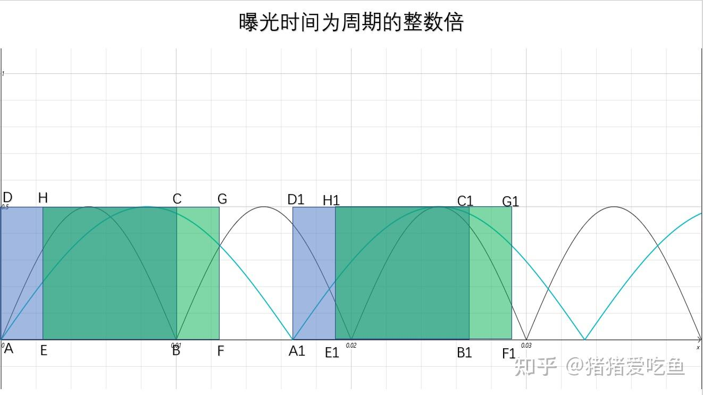
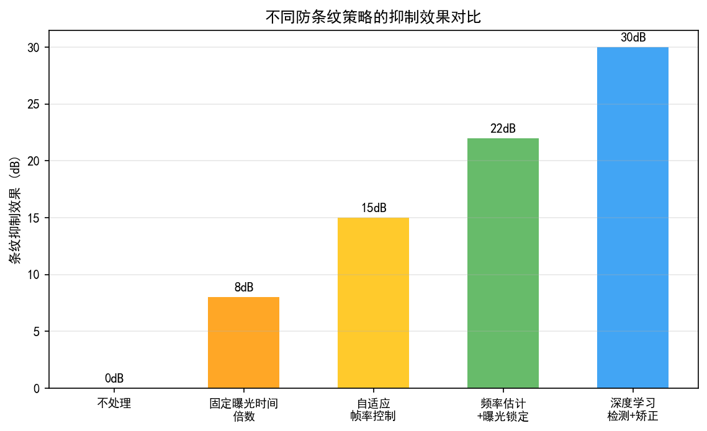
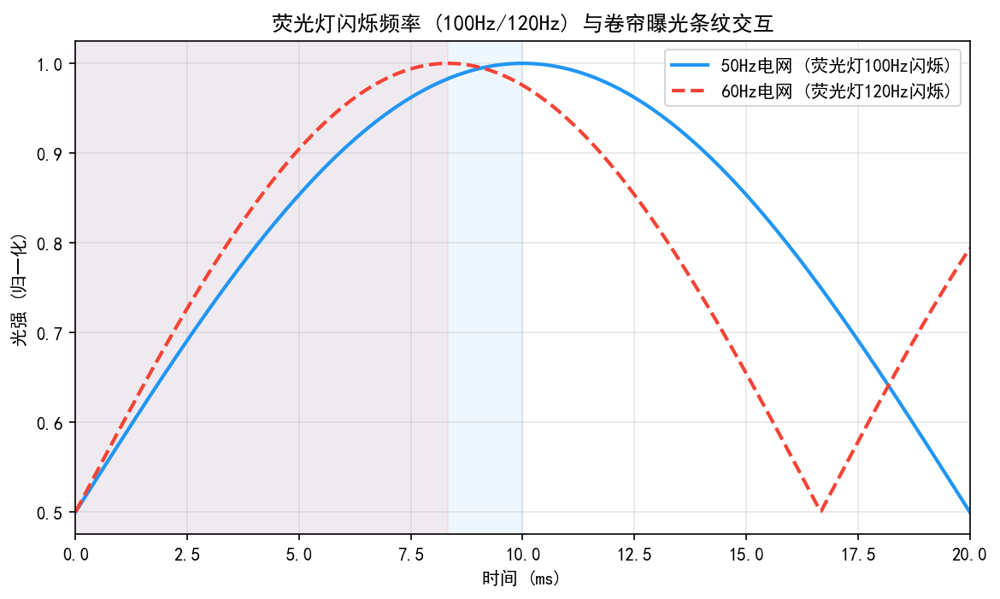
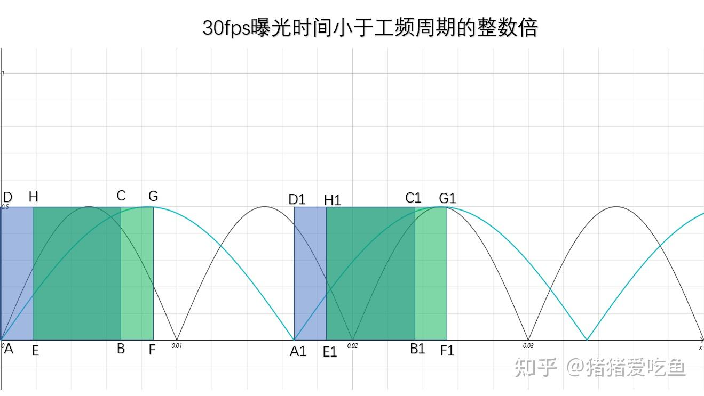
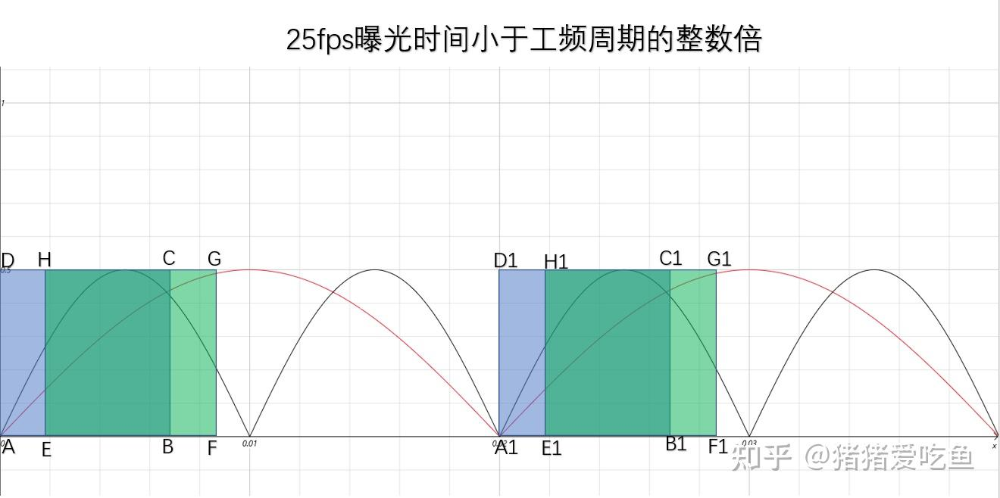

# 第二卷第28章：防频闪与荧光灯Flicker抑制

> **定位：** 本章覆盖相机防Flicker（防频闪/防闪烁）的完整算法——从荧光灯光源50Hz/60Hz频率检测、曝光时间量化约束，到视频Rolling Shutter下的逐行亮度波纹抑制。
> **前置章节：** 第一卷第03章（传感器物理）、第四卷第02章（自动曝光）
> **适用读者：** 算法工程师、3A工程师

---

## 目录

1. [频闪物理模型](#1-频闪物理模型)
   - 1.5 [特殊场景：拍摄 LED 显示屏](#15-特殊场景拍摄-led-显示屏)
2. [Flicker频率检测算法](#2-flicker频率检测算法)
3. [防Flicker曝光约束与AE集成](#3-防flicker曝光约束与ae集成)
4. [视频Rolling Shutter Flicker抑制](#4-视频rolling-shutter-flicker抑制)
5. [防Flicker调参指南](#5-防flicker调参指南)
6. [常见Flicker伪影分析](#6-常见flicker伪影分析)
7. [评测方法](#7-评测方法)
8. [代码示例](#8-代码示例)
9. [参考资料](#参考资料)
10. [术语表](#术语表)

---

## §1 频闪物理模型

### 1.1 交流电源与光源亮度波动

荧光灯为什么会让视频出现横条纹？根本原因是交流电供电。荧光灯靠气体放电发光，每半个电气周期放电一次，亮度随之周期性起伏，不是稳定的。以标准市电为例：

- **中国/欧洲市电**：50 Hz，一个电气周期为 20 ms
- **北美/日本市电**：60 Hz，一个电气周期约 16.67 ms

荧光灯（Fluorescent Lamp）的发光依赖气体放电激发荧光粉，每半个电气周期放电一次（正负半波各一次），因此光源亮度波动频率是市电频率的**两倍**：

$$L(t) = L_0 + L_1 \cdot \cos(2\pi \cdot 2f_{\text{AC}} \cdot t + \phi)$$

其中：
- $L_0$：平均亮度（直流分量）
- $L_1$：波动幅度（交流分量），与光源类型相关
- $f_{\text{AC}}$：市电频率（50 Hz 或 60 Hz）
- $2f_{\text{AC}}$：光源波动频率（**100 Hz 或 120 Hz**）
- $\phi$：初始相位，由光源当前开关状态决定

典型荧光灯的光调制深度（Modulation Depth）$M = L_1 / L_0$ 可高达 0.5–1.0**[1]**（即亮度在0%～200%之间波动）；现代电子镇流器荧光灯的调制深度较低，约 0.05–0.2；LED调光（PWM调光）在低亮度档位时可产生接近方波的极高调制深度**[3]**。

### 1.2 CMOS传感器积分采样与Flicker

CMOS图像传感器（Image Sensor）的每一行像素在曝光时间 $T_{\text{exp}}$ 内对光信号进行积分：

$$\text{Signal}(t_{\text{start}}) = \int_{t_{\text{start}}}^{t_{\text{start}} + T_{\text{exp}}} L(t) \, dt$$

对于正弦光源，积分结果为：

$$\text{Signal} = L_0 \cdot T_{\text{exp}} + L_1 \cdot \frac{\sin(\pi \cdot 2f_{\text{AC}} \cdot T_{\text{exp}})}{\pi \cdot 2f_{\text{AC}}} \cdot \cos(2\pi \cdot 2f_{\text{AC}} \cdot t_{\text{mid}})$$

其中 $t_{\text{mid}}$ 是本次曝光的中心时刻。关键结论：

1. **当 $T_{\text{exp}}$ 为光源波动周期整数倍时**，正弦分量积分为零，Flicker消失：
   $$T_{\text{exp}} = n \cdot \frac{1}{2f_{\text{AC}}}, \quad n = 1, 2, 3, \ldots$$
   对应曝光时间为 1/100s、1/50s、1/33.3s（50Hz市电）或 1/120s、1/60s、1/40s（60Hz市电）。

2. **当 $T_{\text{exp}}$ 不是整数倍时**，残余正弦分量与 $t_{\text{mid}}$ 相关，不同帧（不同相位）积分结果不同，产生帧间亮度跳变，即**Flicker**。

### 1.3 Rolling Shutter 与 Flicker 的空间分布

CMOS传感器的 Rolling Shutter（卷帘快门）机制使得图像各行的曝光起始时刻不同，相邻行之间存在固定的行周期延迟 $\Delta t_{\text{row}}$（典型值为几微秒到几十微秒）。

设第 $r$ 行的曝光中心时刻为：

$$t_{\text{mid}}(r) = t_0 + r \cdot \Delta t_{\text{row}}$$

则第 $r$ 行的采样信号中包含随行号变化的相位分量：

$$\text{Signal}(r) \propto L_0 + L_1' \cdot \cos(2\pi \cdot 2f_{\text{AC}} \cdot (t_0 + r \cdot \Delta t_{\text{row}}))$$

这在图像空间上形成沿行方向（垂直方向）的亮暗条纹，条纹数量约为：

$$N_{\text{bands}} = \frac{2f_{\text{AC}}}{f_{\text{frame}}}$$

例如：100Hz光源、30fps帧率，每帧约3.3个完整亮暗周期；若帧率接近100fps时，条纹数趋近于1，表现为整帧亮度交替闪烁（帧间Flicker）。

### 1.4 LED PWM调光的Flicker特征

LED调光通常采用脉冲宽度调制（PWM，Pulse Width Modulation），其光输出为近似方波，含有基频及多次谐波。PWM频率从几百Hz到数十kHz不等：

- **低频PWM（< 200 Hz）**：在CMOS图像中产生类似荧光灯的水平条纹，可用与荧光灯相同的曝光量化策略（若PWM频率恰好是100/120Hz整数倍）
- **中频PWM（120–480 Hz）**：**需要不同的处理策略**——此范围与标准100/120Hz防Flicker约束不对齐，曝光时间无法同时对100Hz（荧光灯）和任意LED PWM频率都满足整数倍约束。工程对策为：（1）检测LED PWM精确频率后动态调整步长 $T_{\text{step}} = 1/f_{\text{PWM}}$；（2）使用逐行增益补偿（§4节）后处理残余条纹；（3）设备进入"屏幕拍摄模式"时手动指定步长
- **高频PWM（> 1000 Hz）**：单行积分时间通常包含多个PWM周期，条纹被平滑，但在极短曝光（高速摄影）时仍可见
- **非整数倍关系**：当PWM频率与行频不成整数倍关系时，产生随机位置的亮带

### 1.5 特殊场景：拍摄 LED 显示屏

拍摄手机屏幕、电视屏幕等 LED 显示屏时，频闪约束来源**与荧光灯完全不同，两者不可混用**。

**本质区别：**
- **荧光灯**：亮度波动由交流电频率驱动，固定为 100 Hz（50 Hz 电网）或 120 Hz（60 Hz 电网），与画面内容无关
- **LED 显示屏**：亮度波动由**屏幕刷新率**决定（60/90/120/144 Hz），或由**PWM 调光频率**决定（通常 240 Hz–2000 Hz 不等）。两者均与市电频率无关，也互不干扰

因此，拍摄 LED 显示屏时，曝光时间须为**屏幕刷新周期的整数倍**，与荧光灯的 10 ms 整数倍约束独立存在，不能套用同一套参数。

**常见屏幕刷新率对应的曝光约束：**

| 屏幕刷新率 | 刷新周期 | 允许曝光时间（整数倍） |
|-----------|---------|---------------------|
| 60 Hz | 16.7 ms | 16.7 ms, 33.3 ms, 50 ms … |
| 90 Hz | 11.1 ms | 11.1 ms, 22.2 ms, 33.3 ms … |
| 120 Hz | 8.3 ms | 8.3 ms, 16.7 ms, 25.0 ms … |
| 144 Hz | 6.9 ms | 6.9 ms, 13.9 ms, 20.8 ms … |

> 注：对于 PWM 调光频率（如 240 Hz，周期 4.2 ms），约束同理。高亮度档位屏幕通常关闭 PWM 改用 DC 调光，此时无频闪约束。

**工程建议：**
1. **场景检测**：通过分析画面高频区域的水平条纹间距或 FFT 峰值频率，判断被拍摄目标是否含亮屏，并估计刷新频率
2. **自动切换约束模式**：检测到亮屏后，将 $T_{\text{step}}$ 切换为 $1/f_{\text{refresh}}$（屏幕刷新周期），而非荧光灯的 $1/(2f_{\text{AC}})$
3. **手动"屏幕拍摄模式"**：若自动检测不可靠，可在相机 App 提供显式模式切换，允许用户手动指定刷新率（60/90/120 Hz）

> 参考：onedisplaygroup.com《LED Screen Flicker on Camera: The Physics of Scan Lines》；xinghexianshi.com《高刷新LED屏拍摄不闪屏的原理解析》

### 1.6 全局快门与滚动快门的 Flicker 差异处理

Rolling Shutter（RS）和 Global Shutter（GS）传感器在 Flicker 的**表现形式**和**算法对策**上存在本质差异：

**Global Shutter（GS）的 Flicker 特性：**
- 所有像素同时曝光，$t_{\text{mid}}$ 对所有行相同
- 无空间条纹（水平 Flicker 条），仅存在帧间亮度跳变（时域 Flicker）
- 防 Flicker 策略退化为纯曝光时间约束（$T_{exp} = n / (2f_{AC})$）
- 无需逐行增益补偿，算法极大简化

**Rolling Shutter（RS）的 Flicker 特性与对策：**

RS 产生的是**空间-时域耦合的复合 Flicker**，处理难度更高：
- 空间分量（帧内条纹）：由行间曝光时刻差 $\Delta t_{row}$ 与光源相位差共同决定
- 时域分量（帧间闪烁）：当曝光时间不满足整数倍约束时存在
- 两分量同时存在时，需组合使用曝光量化（消时域）+ 逐行增益补偿（消空间）

**RS 条纹间距公式（工程验证指标）：**

$$N_{\text{bands}} = \frac{2f_{\text{AC}}}{f_{\text{frame}}}, \quad P_{\text{bands}} = \frac{H_{\text{active}}}{N_{\text{bands}}}$$

其中 $H_{\text{active}}$ 为有效图像行数，$P_{\text{bands}}$ 为条纹间距（像素）。以 50Hz 市电、30fps 视频、1080p 为例：$N = 100/30 \approx 3.3$，条纹间距约 $P \approx 1080/3.3 \approx 327$ 行/条纹。

**GS 传感器的帧间 Flicker 量化：**

GS 传感器的防 Flicker 评价只需统计帧间全局均值变化，判据更简单：

$$\text{FFLV} = \text{std}_t\left(\text{mean}_{r,c}(Y_t)\right) < \epsilon_{FFLV}$$

合格标准：$\epsilon_{FFLV} < 1\%$（相对帧均值的标准差）。

---

## §2 Flicker频率检测算法

### 2.1 检测算法整体框架

Flicker频率（50Hz/60Hz）自动检测的目标是在不依赖外部输入的情况下，从图像序列中推断光源类型。主流方案为**逐行亮度统计 + 时域FFT**方法：

```
图像序列输入
    ↓
逐帧提取中心ROI（Region of Interest）
    ↓
对ROI逐行求平均亮度 → 行亮度序列 Y[row]（单帧空域分析）
    ↓  或
连续多帧同一行的亮度时间序列 Y[frame]（时域分析）
    ↓
FFT频谱分析 → 100Hz/120Hz峰值检测
    ↓
置信度计算 → 50Hz / 60Hz / 未知 判决
```

### 2.2 单帧空域频率检测

Rolling Shutter 效应使单帧图像中的水平条纹空间频率与光源时域频率之间存在已知映射关系，据此可从单帧完成检测。

步骤：
1. 选取中心矩形 ROI（建议避开场景高频纹理区域）
2. 对ROI每行求平均亮度（Mean Row Luminance），得到向量 $Y \in \mathbb{R}^H$
3. 对 $Y$ 做 DFT，得到频谱 $\hat{Y}(k)$
4. 期望的空间周期（条纹间距）为：
   $$P_{\text{pixel}} = \frac{f_{\text{frame}}}{2f_{\text{AC}}} \cdot H_{\text{total}}$$
   其中 $H_{\text{total}}$ 为传感器总行数（含消隐行）
5. 在 DFT 频谱中检测与50Hz和60Hz对应的峰值，比较峰值能量

**注意事项**：
- 若场景本身有水平条纹（百叶窗、格子布料），会干扰检测，需要多ROI对比
- 静止场景检测精度优于运动场景
- 推荐同时检测基频和二次谐波，提高鲁棒性

### 2.3 多帧时域频率检测

对图像序列中固定位置的像素或行均值随时间的变化做FFT分析。

步骤：
1. 收集连续 $N$（典型值32–64）帧的同一ROI行均值
2. 构建时间序列 $Y[n]$，$n = 0, 1, \ldots, N-1$，采样率 = 帧率 $f_{\text{fps}}$
3. 对 $Y[n]$ 做 FFT，频率分辨率为 $\Delta f = f_{\text{fps}} / N$
4. 检测 100Hz 和 120Hz 附近的峰值

**实用替代方案**：对于标准 30fps/60fps 视频，100Hz/120Hz 超过 Nyquist 频率，采用**差分帧亮度方差**方法：
- 相邻帧亮度差的方差在Flicker存在时显著增大
- 通过统计差分方差的周期性判断频率（每100ms或每83ms出现峰值）

### 2.4 置信度计算与自适应判决

设50Hz对应频谱峰值为 $P_{50}$，60Hz对应峰值为 $P_{60}$，背景噪声底为 $P_{\text{noise}}$：

$$\text{Conf}_{50} = \frac{P_{50} - P_{\text{noise}}}{P_{\text{noise}} + \epsilon}, \quad \text{Conf}_{60} = \frac{P_{60} - P_{\text{noise}}}{P_{\text{noise}} + \epsilon}$$

判决规则：
- $\text{Conf}_{50} > \text{Th}_{\text{high}}$ 且 $\text{Conf}_{50} > \text{Conf}_{60}$：判50Hz，启用100Hz约束
- $\text{Conf}_{60} > \text{Th}_{\text{high}}$ 且 $\text{Conf}_{60} > \text{Conf}_{50}$：判60Hz，启用120Hz约束
- 两者均 $< \text{Th}_{\text{low}}$：自然光，无约束（Flicker-free模式）
- 两者均 $> \text{Th}_{\text{low}}$：保持上一帧决策（滞后判决，防抖动）

典型阈值：$\text{Th}_{\text{high}} = 3.0$，$\text{Th}_{\text{low}} = 1.5$。

### 2.5 硬件辅助检测

部分ISP SoC（System on Chip）提供专用Flicker检测硬件模块，通过读取传感器输出的专用统计量（行均值直方图）在硬件中完成FFT计算，降低CPU/ISP固件负担。此类硬件通常以独立统计路径实现，不占用主图像路径带宽。

---

## §3 防Flicker曝光约束与AE集成

### 3.1 曝光时间量化原理

防Flicker的核心是将曝光时间限制为光源波动周期整数倍。定义**防Flicker曝光步进**（Anti-banding Step）：

$$T_{\text{step}} = \frac{1}{2f_{\text{AC}}}$$

- 50Hz市电：$T_{\text{step}} = 1/100 \text{s} = 10 \text{ ms}$
- 60Hz市电：$T_{\text{step}} = 1/120 \text{s} \approx 8.33 \text{ ms}$

允许曝光时间集合为：$\{T_{\text{step}}, 2T_{\text{step}}, 3T_{\text{step}}, \ldots\}$，即 $\{10\text{ms}, 20\text{ms}, 30\text{ms}, \ldots\}$（50Hz）。

**AE曝光量化算法**：自动曝光（AE，Auto Exposure）计算出目标曝光值 $T_{\text{target}}$ 后，量化到最近允许步长：

$$T_{\text{quantized}} = \text{round}\left(\frac{T_{\text{target}}}{T_{\text{step}}}\right) \times T_{\text{step}}$$

注意：量化后的曝光时间可能偏离目标值，AE需通过调整模拟增益（Analog Gain）来补偿亮度差异：

$$G_{\text{comp}} = \frac{T_{\text{target}}}{T_{\text{quantized}}}$$

### 3.2 AE步长约束

传统AE算法在曝光时间上可连续调节，启用防Flicker后需改为**离散步进**模式：

1. **步进收敛**：AE每次调整曝光时间只能在量化步长集合中移动，不能跨越非允许值
2. **步长优先级**：在曝光优先（Av）模式或快门优先（Tv）模式下，防Flicker步长约束与用户设定可能冲突，通常防Flicker优先级低于用户手动设定
3. **增益补偿**：曝光量化误差通过数字增益（Digital Gain）实时补偿，但要注意增益补偿会引入噪声放大

### 3.3 极端曝光处理

**极短曝光（$T_{\text{exp}} < T_{\text{step}}$）**：

当场景极亮（强光、直射太阳光），AE目标曝光 $< 1/100$s（50Hz），防Flicker约束不可强制执行。此时：
- 通常允许曝光时间低于防Flicker步长（即进入"Flicker-free range"之外）
- 由于极短曝光时间内波动积分近似线性，Flicker可见性相对较低（高亮度场景感知对比度降低）
- 部分ISP实现选择在此边界条件下关闭防Flicker约束

**极长曝光（夜景长曝光）**：
- 防Flicker步长约束同样适用：使用 $nT_{\text{step}}$ 的最大允许值
- 在 Auto ISO 模式下，先将曝光时间拉到防Flicker最大允许值，再提升 ISO

### 3.4 视频模式的防Flicker

视频模式（Video Mode）通常固定帧率（30fps / 60fps），曝光时间上限由帧周期决定：

- 30fps视频：最大曝光约 1/30s，50Hz模式允许曝光时间 {1/100s, 1/50s}
- 60fps视频：最大曝光约 1/60s，50Hz模式允许 {1/100s}

注：1/60s 不是 1/100s 的整数倍，因此 60fps + 50Hz 市电环境下存在理论上无法完美消除的Flicker区域，此时选择 1/100s（**1个完整 100Hz 周期**，T_step = 10ms）为最优折中。

---

## §4 视频Rolling Shutter Flicker抑制

### 4.1 逐行亮度偏差估计

即使采用了曝光时间量化，由于AE量化误差和传感器行读出时序，视频帧中仍可能残留水平条纹。逐行亮度偏差（Row-wise Luminance Deviation）估计方法：

1. 对当前帧按行求平均亮度 $\bar{Y}(r)$，$r = 0, \ldots, H-1$
2. 对 $\bar{Y}(r)$ 用低通滤波器平滑，得到场景趋势分量 $\bar{Y}_{\text{smooth}}(r)$（使用大核均值滤波或高斯滤波，核尺寸约为条纹间距的2倍以上）
3. 计算行偏差：$\delta(r) = \bar{Y}(r) / \bar{Y}_{\text{smooth}}(r)$
4. 若 $\delta(r)$ 在期望的Flicker频率处有显著谱峰，则认为存在残余Flicker

### 4.2 逐行增益补偿表（Row Gain Table）

对每行施加增益校正：

$$Y_{\text{corrected}}(r, c) = Y_{\text{raw}}(r, c) \cdot \frac{1}{\delta(r)}$$

增益补偿约束：
- 增益范围限制：$[0.5, 2.0]$，防止极端补偿
- 补偿仅在检测到明确Flicker时启用，避免在自然光下误校正场景亮度梯度
- 平滑约束：相邻行增益变化不超过 $\pm 5\%$，避免增益跳变形成新条纹

### 4.3 与时域降噪（TNR）的交互

时域降噪（TNR，Temporal Noise Reduction）通过帧间运动估计 + 混合实现去噪。Flicker逐行增益补偿与TNR存在顺序依赖：

**必须先进行Flicker补偿，再进行TNR**：

原因：若Flicker亮度波动（帧间亮度差异达10%–30%） 被TNR的帧差检测误判为运动，会导致TNR抑制时域混合（不混合 = 单帧降噪效果降级）。若先做Flicker补偿，则相邻帧亮度一致，TNR可正常工作。

ISP流水线推荐顺序：
```
RAW → BLC → DPC → LSC → Flicker Row-Gain Compensation
    → Demosaic → WB → CCM → TNR → Sharpening → Output
```

### 4.4 相位锁定辅助方法

高端ISP可利用相位检测方法将传感器行读出相位与光源相位锁定（Phase Locking），使每帧曝光的起始时刻固定于光源波形的固定相位点，从而理论上完全消除帧内空间条纹。此方法需要实时测量光源相位，实现复杂，主要见于广播级摄像机。

---

## §5 防Flicker调参指南

### 5.1 频率检测灵敏度

| 参数 | 建议范围 | 说明 |
|------|----------|------|
| FFT ROI大小 | 1/4帧中心区域 | 避开场景边缘运动物体 |
| FFT帧数（时域法） | 32–64帧 | 帧数多 → 频率分辨率高，但延迟大 |
| 峰值检测阈值 $\text{Th}_{\text{high}}$ | 3.0–5.0 | 越高越保守，误触发率低 |
| 滞后帧数 | 10–30帧 | 防止50/60Hz反复切换 |

### 5.2 曝光量化步长精度

实际市电频率与标称值可能有 ±0.5Hz 偏差，导致防Flicker量化步长产生残余误差。可采用**自适应步长估计**：利用检测到的精确峰值频率动态更新 $T_{\text{step}}$，而非固定 10ms / 8.33ms。

### 5.3 增益补偿强度

| 参数 | 建议值 | 说明 |
|------|--------|------|
| 补偿增益上限 | 1.5× | 防止噪声放大 |
| 补偿激活阈值 | Flicker幅度 > 3% | 低于此值不补偿 |
| 低通平滑核尺寸 | ≥ 2× 条纹间距 | 避免将场景渐变误识为Flicker |

### 5.4 夜景与弱光场景

夜景弱光（SNR < 20dB）时，行均值噪声较大，Flicker检测误判率上升。建议：
- 增大空域ROI（整帧平均），提高行均值的SNR
- 降低补偿增益的更新频率（时间常数增大），减少噪声驱动的错误补偿
- ISO超过一定阈值（如ISO1600以上）时可选择关闭逐行增益补偿，因此时噪声可能比Flicker条纹更显眼

### 5.5 LED PWM 与荧光灯混合光源的联动处理策略

**问题场景**：同一帧画面内同时存在 50Hz 荧光灯（100Hz 波动）和 LED PWM 调光灯（200–500Hz 波动），单一 $T_{\text{step}}$ 无法同时消除两类 Flicker。

**三级处理策略（工程实践）**：

| 策略级别 | 触发条件 | 处理方法 | 残余代价 |
|---------|---------|---------|---------|
| **L1：荧光灯优先** | 100Hz 峰值 > 120Hz 峰值（混合光源以荧光灯为主） | $T_{\text{step}} = 10\,\text{ms}$（50Hz 约束），LED Flicker 依赖行增益补偿消除 | 高频LED残余条纹通过后处理压制 |
| **L2：多步长量化** | 检测到 LED PWM 精确频率 $f_{LED}$，且 $f_{LED}$ 为 100Hz 整数倍（如 200Hz、300Hz）| 同时满足 $T_{\text{step}} = 5\,\text{ms}$（200Hz 最小公倍数） | 仅适用于 $f_{LED}$ 为 100Hz 整数倍时 |
| **L3：专用屏幕拍摄模式** | 手动选择或 App 触发（拍摄 LED 显示屏） | 强制固定曝光至 $1/(2f_{LED})$ 整数倍，关闭 AE 自由调节 | 牺牲 AE 动态响应，适合静态构图 |

**多峰 FFT 检测扩展**：标准检测仅关注 100Hz 和 120Hz 两个峰值。混合光源场景需将检测范围扩展至 100–2000Hz，同时记录所有能量超过噪声底 3 dB 的峰值。判决逻辑：
- 主峰（最大能量）确定 $T_{\text{step}}$（荧光灯或 LED 主频）
- 次峰（第二能量）触发行增益补偿覆盖次频段

**与 AE 的协同约束**：混合光源模式下，AE 曝光时间离散步长从单一的 $T_{\text{step}}$ 变为 $\text{lcm}(T_{step,FL}, T_{step,LED})$（最小公倍数），若 LCM 超过帧周期（如 60fps 时帧周期约 16.67ms），则降级回单步长策略并接受部分 Flicker 残余。

### 5.6 视频模式强制锁曝 vs 自适应模式的选择逻辑

视频录制时，防Flicker策略分两种模式，选择依据如下：

**强制锁曝模式（Fix Exposure Anti-Banding）**：
- 适用场景：已知电网频率、光源稳定、帧率固定（如 30fps 录制）
- 实现：曝光时间固定为 $nT_{\text{step}}$ 中满足目标亮度的最接近值，通过增益补偿亮度偏差
- 优点：完全消除 Flicker，帧间亮度一致性最优
- 缺点：亮度突变时 AE 响应延迟（只能靠增益调整，不能靠曝光时间），高 ISO 下噪声增大

**自适应模式（Adaptive Anti-Banding）**：
- 适用场景：光照变化频繁（如手持走动，室内外交替），帧率不固定
- 实现：AE 曝光时间在量化步长集合内连续搜索最优值，$T_{\text{step}}$ 根据实时 Flicker 检测动态更新
- 优点：AE 响应速度快，适应性强
- 缺点：检测结果置信度低时（混合光源、快速运动）可能产生短暂 Flicker 残余

**量化决策规则**：

```
若 (帧率 ≤ 30fps AND 场景静止 AND 光源已知):
    → 强制锁曝模式
    → T_step 固定，增益补偿范围 [0.8×, 1.25×]
若 (帧率 > 30fps OR 场景频繁运动 OR 混合光源):
    → 自适应模式
    → 每 32 帧更新一次 Flicker 频率检测
    → 单帧曝光时间最大调整量 < 0.5 × T_step（防止跳变）
```

---

## §6 常见Flicker伪影分析

### 6.1 固定水平条纹（Static Horizontal Bands）

**现象**：静止场景下出现固定位置的亮暗水平条纹，条纹间距稳定。

**原因**：
- 防Flicker未启用或频率检测错误（50/60Hz混淆）
- 曝光时间精度不足（传感器行时序抖动）
- 光源PWM频率恰好与帧率形成整数倍关系

**解决方案**：验证频率检测正确性，检查传感器行时序配置。

### 6.2 闪烁帧（Flickering Frames）

**现象**：视频中每隔若干帧出现整帧亮度突变，没有空间条纹。

**原因**：Global Shutter传感器未启用防Flicker曝光约束，或Rolling Shutter但曝光时间较长（条纹密度低，每帧近似均匀亮暗交替）。

**解决方案**：确认防Flicker曝光约束对视频模式生效。

### 6.3 增益补偿引入的噪声条纹

**现象**：防Flicker激活后出现随机噪声水平条纹，无规律间距。

**原因**：逐行增益补偿过强，将行噪声误判为Flicker并放大。

**解决方案**：提高补偿激活阈值，增大行均值低通滤波核尺寸，限制增益补偿量。

### 6.4 LED调光频闪（PWM Flicker）未被抑制

**现象**：LED屏幕、指示灯在相机中出现亮暗条纹，且条纹间距不规律（因LED PWM频率多样）。

**原因**：标准防Flicker仅针对50/60Hz整数倍频率，LED PWM频率超出检测范围。

**解决方案**：扩展检测频率范围（覆盖100–20000 Hz），或对特定类型光源（屏幕拍摄模式）手动配置对应步长。

### 6.5 Flicker与运动模糊的相互作用

高频运动物体（如旋转叶片）在Flicker光源下可能出现"幽灵"（Ghost）条纹——运动物体与背景Flicker条纹叠加形成复杂的莫尔纹（Moiré）图案。此类伪影通常无法通过标准防Flicker算法消除，需依赖更高帧率或后处理。

---

## §7 评测方法

### 7.1 主观Flicker可见性测试

**标准测试方法**（参考 IEEE 1789-2015 **[3]**）：

1. **测试环境**：受控暗室，被测光源（荧光灯或LED调光灯），灰卡或白卡作为被摄目标
2. **测试序列**：录制至少10秒视频（30fps或60fps），避免相机自身运动
3. **评判方法**：视频播放，人工评分0–5（0=无Flicker，5=严重Flicker）

### 7.2 客观Flicker量化指标

**垂直频率分量能量（Vertical Frequency Energy，VFE）**：

$$\text{VFE} = \sum_{k \in [f_{\text{flicker}} \pm \Delta f]} |\hat{Y}_{\text{row}}(k)|^2$$

对单帧提取行均值序列 $Y_{\text{row}}$，做DFT后在Flicker频率处的能量，作为Flicker强度客观指标。

**帧间亮度差异（Frame-to-Frame Luminance Variation，FFLV）**：

$$\text{FFLV} = \text{std}_{t}\left(\text{mean}_{r,c}(Y_t)\right)$$

统计视频序列中各帧全局平均亮度的标准差，反映帧间Flicker强度。

### 7.3 暗场水平条纹测试

1. 遮盖镜头，拍摄暗场视频（荧光灯散射光作为被摄场景）
2. 计算行均值向量的FFT，统计Flicker频率处的峰值SNR
3. 合格标准：峰值SNR < 3dB（即Flicker峰值不超过噪声底3dB）

### 7.4 曝光步长精度验证

使用示波器或光功率计采集光源实际波形，精确测量 $f_{\text{AC}}$，对比ISP防Flicker步长配置，验证 $T_{\text{step}}$ 误差 < ±1%。

### 7.5 IEC 61000-3-3 与 IEEE 1789-2015 LED 频闪评估方法

相机 Flicker 测试与光源频闪评估是两个相关但不同的标准体系，理解两者的联系有助于准确测量和报告：

**IEC 61000-3-3（电压波动与闪变）：**

IEC 61000-3-3 **[9]** 规定了电气设备对供电网络引起的电压波动（Voltage Fluctuation）和闪变（Flicker）限制。对相机测试的关联意义：
- 提供了光源供电电压波动的标准量化方法（短时闪变 $P_{st}$，长时闪变 $P_{lt}$）
- $P_{st} \leq 1.0$（规范限值）对应的光源调制深度约为 $M \leq 0.1$，是判断"标准照明环境"的参考
- 若待测相机的防 Flicker 测试在 $P_{st} > 1.0$ 的光源下进行，结果不具可比性

**IEEE 1789-2015 LED 频闪评估指标（Flicker Index 与 Percent Flicker）：**

IEEE 1789-2015 **[3]** 定义了两个 LED 频闪量化指标，在相机防 Flicker 测试中用于描述光源特性：

**Percent Flicker（调制百分比）：**
$$\text{Percent Flicker} = \frac{L_{\max} - L_{\min}}{L_{\max} + L_{\min}} \times 100\%$$

其中 $L_{\max}$，$L_{\min}$ 为光源在一个亮度波动周期内的最大/最小瞬时亮度。

**Flicker Index（闪变指数）：**
$$\text{Flicker Index} = \frac{\text{高于平均亮度曲线下面积}}{\text{整个周期曲线下面积}}$$

正弦波光源：Flicker Index $\approx 0.1$–0.2；方波（PWM 调光，占空比 50%）：Flicker Index $= 0.5$；无闪烁光源：Flicker Index $= 0$。

**IEEE 1789-2015 建议的人眼安全频闪上限：**
- 频率 < 90Hz：Percent Flicker < 0.025%（避免癫痫诱发风险）
- 频率 90–1250Hz：Percent Flicker < 0.025 × $f_{Hz}$（线性放宽）
- 频率 > 1250Hz：无限制（人眼感知不到）

**相机防 Flicker 测试的光源规格要求（参考标准）：**

在评测相机防 Flicker 性能时，建议按以下规格准备测试光源：
- 荧光灯测试：$f_{AC} = 50.0 \pm 0.1$ Hz，Percent Flicker $\geq 40\%$，Flicker Index $\geq 0.2$（确保足够激励强度）
- LED PWM 测试：覆盖 100Hz / 120Hz / 200Hz / 500Hz / 1000Hz 至少 5 个频点，每个频点 Percent Flicker $\geq 50\%$
- 自然光参考：Percent Flicker $< 0.1\%$（验证防 Flicker 不误触发）

---

## §8 代码示例

```python
"""
防Flicker算法示例：FFT频率检测 + 曝光量化约束 + 逐行增益补偿
依赖：numpy, scipy, matplotlib
运行方式：python ch28_anti_banding_demo.py
"""

import numpy as np
import matplotlib.pyplot as plt
from scipy.fft import fft, fftfreq
from scipy.ndimage import uniform_filter1d
from typing import Optional, Tuple


# ─────────────────────────────────────────────
# Part 1: 模拟荧光灯光源下的 Rolling Shutter 图像
# ─────────────────────────────────────────────

def simulate_flicker_image(
    height: int = 480,
    width: int = 640,
    fps: float = 30.0,
    ac_freq: float = 50.0,
    modulation: float = 0.3,
    exp_time_ms: float = 15.0,
    frame_phase: float = 0.0,
    total_rows: int = 520,
) -> np.ndarray:
    """
    模拟荧光灯光源下 Rolling Shutter CMOS 传感器图像。

    光源亮度模型: L(t) = L0 * (1 + M * cos(2*pi*2*f_AC*t))
    每行像素在 [t_start, t_start + T_exp] 内对 L(t) 积分。

    Returns:
        image: (height, width) float32, 归一化到 [0,1]
    """
    flicker_freq = 2.0 * ac_freq       # 光源波动频率（Hz）
    row_period = 1.0 / (fps * total_rows)  # 行周期（s）
    exp_time_s = exp_time_ms * 1e-3

    # 基础场景：模拟自然亮度渐变
    base_scene = np.ones((height, width), dtype=np.float32) * 0.5
    ramp = np.linspace(0.4, 0.6, height)[:, np.newaxis]
    base_scene = base_scene * ramp

    image = np.zeros_like(base_scene)
    for r in range(height):
        t_start = frame_phase / (2 * np.pi * flicker_freq) + r * row_period

        # 数值积分（16点采样）
        n_samples = 16
        t_samples = np.linspace(t_start, t_start + exp_time_s, n_samples)
        light = 1.0 + modulation * np.cos(2 * np.pi * flicker_freq * t_samples)
        gain = np.mean(light)

        image[r, :] = base_scene[r, :] * gain

    return np.clip(image, 0, 1).astype(np.float32)


# ─────────────────────────────────────────────
# Part 2: 逐行亮度提取 + FFT 频率检测
# ─────────────────────────────────────────────

def detect_flicker_frequency(
    image: np.ndarray,
    fps: float,
    total_rows: int = 520,
    roi_ratio: float = 0.5,
) -> Tuple[Optional[float], float, float]:
    """
    从单帧图像中检测 Flicker 频率（50Hz / 60Hz）。

    Returns:
        (detected_ac_freq, conf_50, conf_60)
        detected_ac_freq: 50.0 / 60.0 / None
        conf_50, conf_60: 置信度（信噪比倍数）
    """
    H, W = image.shape

    # 提取中心 ROI
    h_start = int(H * (1 - roi_ratio) / 2)
    h_end = int(H * (1 + roi_ratio) / 2)
    roi = image[h_start:h_end, :]
    row_means = roi.mean(axis=1)

    # 去线性趋势（消除场景亮度梯度干扰）
    x = np.arange(len(row_means), dtype=np.float64)
    coeffs = np.polyfit(x, row_means, 1)
    trend = np.polyval(coeffs, x)
    row_means_dt = row_means - trend

    # FFT（加 Hanning 窗减少频谱泄漏）
    N = len(row_means_dt)
    window = np.hanning(N)
    fft_mag = np.abs(fft(row_means_dt * window))[:N // 2]

    # 行空间频率 → 时域频率映射
    row_period_s = 1.0 / (fps * total_rows)
    freq_axis_spatial = np.arange(N // 2) / N        # cycles/row
    freq_axis_temporal = freq_axis_spatial / row_period_s  # Hz

    # 在 100Hz 和 120Hz ±8Hz 窗口内检测峰值
    def peak_in_band(center_hz: float, bw_hz: float = 8.0) -> float:
        mask = np.abs(freq_axis_temporal - center_hz) < bw_hz / 2
        return float(fft_mag[mask].max()) if mask.sum() > 0 else 0.0

    noise_floor = float(np.median(fft_mag)) + 1e-9
    p_100 = peak_in_band(100.0)
    p_120 = peak_in_band(120.0)
    conf_50 = (p_100 - noise_floor) / noise_floor
    conf_60 = (p_120 - noise_floor) / noise_floor

    th_high = 3.0
    if conf_50 > th_high and conf_50 >= conf_60:
        detected = 50.0
    elif conf_60 > th_high and conf_60 > conf_50:
        detected = 60.0
    else:
        detected = None

    return detected, conf_50, conf_60


# ─────────────────────────────────────────────
# Part 3: 防 Flicker 曝光时间量化
# ─────────────────────────────────────────────

def quantize_exposure_antibanding(
    target_exp_ms: float,
    ac_freq: float = 50.0,
    min_exp_ms: float = 0.1,
    max_exp_ms: float = 33.3,
) -> Tuple[float, float]:
    """
    将目标曝光时间量化为防 Flicker 步长整数倍。

    步长 = 1000 / (2 * f_AC) ms
      50Hz → 10.0 ms
      60Hz →  8.33 ms

    Returns:
        (quantized_exp_ms, gain_compensation)
    """
    step_ms = 1000.0 / (2.0 * ac_freq)
    n = max(1, round(target_exp_ms / step_ms))
    quantized_ms = float(np.clip(n * step_ms, min_exp_ms, max_exp_ms))
    gain_comp = target_exp_ms / quantized_ms
    return quantized_ms, gain_comp


# ─────────────────────────────────────────────
# Part 4: 逐行增益补偿
# ─────────────────────────────────────────────

def apply_row_gain_correction(
    image: np.ndarray,
    flicker_freq_hz: float = 100.0,
    fps: float = 30.0,
    total_rows: int = 520,
    gain_limit: float = 1.5,
) -> Tuple[np.ndarray, np.ndarray]:
    """
    估计并应用逐行增益补偿，抑制残余 Flicker 条纹。

    Returns:
        corrected: 补偿后图像
        row_gains: (H,) 逐行增益值
    """
    H, W = image.shape
    row_means = image.mean(axis=1)

    # 低通滤波提取场景趋势（核尺寸 = 3× 条纹间距）
    stripe_period_rows = fps * total_rows / flicker_freq_hz
    kernel_size = int(stripe_period_rows * 3)
    if kernel_size % 2 == 0:
        kernel_size += 1
    kernel_size = max(kernel_size, 7)

    row_smooth = uniform_filter1d(row_means, size=kernel_size, mode='reflect')
    ratio = row_means / (row_smooth + 1e-9)

    # 补偿增益 = 1/偏差比，限幅
    row_gains = np.clip(1.0 / ratio, 1.0 / gain_limit, gain_limit)
    # 平滑增益表防止跳变
    row_gains = uniform_filter1d(row_gains, size=3, mode='reflect')

    corrected = np.clip(image * row_gains[:, np.newaxis], 0, 1).astype(np.float32)
    return corrected, row_gains


# ─────────────────────────────────────────────
# Part 5: 综合演示 + 评估
# ─────────────────────────────────────────────

def compute_vfe(img: np.ndarray, fps=30.0, total_rows=520,
                center_hz=100.0, bw_hz=10.0) -> float:
    """计算垂直频率能量（Vertical Frequency Energy）"""
    row_means = img.mean(axis=1)
    N = len(row_means)
    fft_mag = np.abs(fft(row_means * np.hanning(N)))[:N // 2]
    row_period_s = 1.0 / (fps * total_rows)
    freq_axis = np.arange(N // 2) / N / row_period_s
    mask = np.abs(freq_axis - center_hz) < bw_hz / 2
    return float(fft_mag[mask].sum()) if mask.sum() > 0 else 0.0


def run_demo():
    print("=" * 60)
    print("防Flicker算法演示  (ch28_anti_banding)")
    print("=" * 60)

    # 1. 生成模拟图像
    print("\n[1] 生成模拟图像...")
    img_flickering = simulate_flicker_image(
        height=480, width=640, fps=30.0,
        ac_freq=50.0, modulation=0.3,
        exp_time_ms=15.0,   # 非防Flicker步长倍数
        frame_phase=0.7,
    )
    img_ideal = simulate_flicker_image(
        height=480, width=640, fps=30.0,
        ac_freq=50.0, modulation=0.3,
        exp_time_ms=10.0,   # 1/100s = 防Flicker步长整数倍
        frame_phase=0.7,
    )

    # 2. 频率检测
    print("\n[2] Flicker 频率检测...")
    freq, c50, c60 = detect_flicker_frequency(
        img_flickering, fps=30.0, total_rows=520, roi_ratio=0.6
    )
    print(f"    检测结果: AC频率={freq}Hz  conf_50={c50:.2f}  conf_60={c60:.2f}")

    # 3. 曝光量化表
    print("\n[3] 曝光时间量化演示 (50Hz市电):")
    print(f"    {'目标(ms)':>10} {'量化(ms)':>10} {'增益补偿':>10}")
    print("    " + "-" * 34)
    for t in [7.5, 12.0, 15.0, 18.0, 25.0, 33.0]:
        q, g = quantize_exposure_antibanding(t, ac_freq=50.0)
        print(f"    {t:>10.1f} {q:>10.1f} {g:>10.3f}")

    # 4. 逐行增益补偿
    print("\n[4] 逐行增益补偿...")
    corrected, row_gains = apply_row_gain_correction(
        img_flickering, flicker_freq_hz=100.0, fps=30.0, total_rows=520
    )

    # 5. 评估指标
    print("\n[5] Flicker 评估指标 (VFE @ 100Hz):")
    vfe_before = compute_vfe(img_flickering)
    vfe_after  = compute_vfe(corrected)
    vfe_ideal  = compute_vfe(img_ideal)
    print(f"    带Flicker图像 VFE :  {vfe_before:.4f}")
    print(f"    增益补偿后   VFE :  {vfe_after:.4f}")
    print(f"    理想无Flicker VFE:  {vfe_ideal:.4f}")
    if vfe_before > 1e-9:
        db = 20 * np.log10(max(vfe_after, 1e-9) / vfe_before)
        print(f"    Flicker 抑制量   :  {db:.1f} dB")

    # 6. 可视化
    fig, axes = plt.subplots(2, 3, figsize=(15, 8))

    for ax, img, title in zip(
        axes[0],
        [img_flickering, corrected, img_ideal],
        ['带Flicker (exp=15ms)', '逐行增益补偿后', '理想 (exp=10ms)']
    ):
        ax.imshow(img, cmap='gray', vmin=0, vmax=1)
        ax.set_title(title)
        ax.axis('off')

    axes[1, 0].plot(img_flickering.mean(axis=1))
    axes[1, 0].set_title('行均值 - 带Flicker')
    axes[1, 0].set_xlabel('行号')

    axes[1, 1].plot(row_gains)
    axes[1, 1].axhline(1.0, color='r', linestyle='--', label='基准=1')
    axes[1, 1].set_title('逐行补偿增益表')
    axes[1, 1].set_xlabel('行号')
    axes[1, 1].legend()

    axes[1, 2].plot(corrected.mean(axis=1), label='补偿后', alpha=0.8)
    axes[1, 2].plot(img_ideal.mean(axis=1), '--', label='理想', alpha=0.8)
    axes[1, 2].set_title('行均值对比')
    axes[1, 2].set_xlabel('行号')
    axes[1, 2].legend()

    plt.tight_layout()
    out_path = 'anti_banding_demo.png'
    plt.savefig(out_path, dpi=120)
    plt.close()
    print(f"\n演示图已保存: {out_path}")
    print("=" * 60)


if __name__ == '__main__':
    run_demo()
```

---

> **工程师手记：频闪，是 ISP 工程师永远绕不开的物理约束**
>
> **Anti-Banding 的核心约束只有一条：曝光时间必须是光源周期的整数倍。** 50Hz 电网驱动的荧光灯，光强波动周期是 10ms（半波整流）或 20ms（全波）；60Hz 电网是 8.33ms 或 16.67ms。只要曝光时间精确等于这些周期的整数倍（10ms、20ms、30ms... 或 8.33ms、16.67ms...），传感器在整数个周期内积分，光强波动的影响相互抵消，Banding 消失。问题在于：相机的曝光时间是以"行时间"为单位的整数，不是以毫秒为单位的连续值——在某些帧率（比如 29.97fps）下，一帧的时间不能被 10ms 整除，Banding 不能完全消除，只能最小化。高通 Spectra 里有专门的 AFF（Anti-Flicker Filter）单元自动检测 50/60Hz，并在 AE 约束表里把曝光时间锁定到离散的防频闪点。
>
> **50Hz/60Hz 自动检测在混合光源场景下容易出错，手动设置更可靠。** AFF 检测原理是分析视频帧间的亮度周期性波动来判断频率。但如果室内同时有日光（自然光，没有频闪）和荧光灯，或者手机在户外拍摄室内的 LED 屏，AFF 的检测结果可能在 50/60Hz 之间来回跳变，导致 Banding 反而更明显（AE 在两套约束表之间切换，曝光时间在两个不合适的值之间震荡）。产品上经常见到的解法是：默认关闭自动检测，在 App 层给用户提供"防频闪频率"手动选项（50Hz/60Hz/Auto/Off），工厂根据目标市场预设默认值（中国/欧洲预设 50Hz，美国预设 60Hz）。
>
> **LED 高频频闪（LFM，Light Frequency Modulation）比荧光灯 Banding 更难处理。** 现代 LED 灯的 PWM 调光频率在 200–2000Hz，远高于 50/60Hz，传统 Anti-Banding 的 10ms 整数倍约束对这个频率完全无效。LED 频闪在高速滚动快门传感器上会产生"水平彩条"（对应 PWM 的暗期），在短曝光（1/1000s 以下）场景最明显。处理方法是在 ISP 端做 LFM 检测（统计行间亮度差异），检测到频闪后强制增加曝光时间（至少 1/200s），用积分平滑掉高频 PWM。这是自动驾驶摄像头（交通灯识别）的核心需求，地平线 J5/旭日 X5 都有专门的 LFM 处理单元。
>
> *参考：地平线开发者社区《成像亮度控制》AE Flicker 部分，2024；高通 Spectra ISP Anti-Banding 技术文档（公开版）；观熵 CSDN《ISP 频闪与 Anti-Banding 工程实践》，2024。*

---

## 插图


*图1. 抗频闪条纹检测算法流程，利用行间亮度统计与频域分析识别50/60Hz电源频率导致的曝光条纹（图片来源：作者，ISP手册，2024）*


*图2. 抗频闪策略分类比较，涵盖曝光时间锁定到电网周期、帧率适配与后处理条纹消除等方法（图片来源：作者，ISP手册，2024）*


*图3. 频闪条纹频率与电网频率关系示意，对比50Hz（中国/欧洲）与60Hz（美国/日本）电网下曝光时间安全区间（图片来源：作者，ISP手册，2024）*


*图4. 荧光灯/LED频闪导致的图像条纹伪影示例，展示在不同快门速度下的水平亮暗条纹分布（图片来源：作者，ISP手册，2024）*


*图5. 光源闪烁频率特性分析，对比荧光灯（100/120Hz）与PWM调光LED在不同频率下的亮度波动幅度（图片来源：作者，ISP手册，2024）*

---

## 习题

**练习 1（理解）**
荧光灯 Flicker 的核心物理机制是光源亮度以 100 Hz（中国/欧洲）或 120 Hz（北美）周期性波动。
(1) 市电频率为 50 Hz，但本章指出荧光灯亮度波动频率为 100 Hz（市电频率的 2 倍）。请解释这个"频率翻倍"的物理原因（从交流电的正负半波和荧光灯放电机制角度）；
(2) Anti-banding 曝光约束要求曝光时间必须是光源波动周期的整数倍（50 Hz 市电对应 10 ms 整数倍，60 Hz 对应 8.33 ms 整数倍）。请解释：为什么整数倍曝光能消除 Flicker 条纹（从积分均值角度分析）？若曝光时间为 12 ms（50 Hz 环境），会出现什么问题？
(3) PWM 调光 LED 屏的 Flicker 频率与荧光灯有何本质区别？为什么在低亮度档位时 LED Flicker 更严重？

**练习 2（计算）**
某手机 AE 系统在 50 Hz 市电环境下设置 Anti-banding 约束：曝光时间必须为 10 ms 的整数倍。
(1) AE 目标亮度对应的理想曝光时间为 7 ms，在 Anti-banding 约束下应选择 10 ms 还是 20 ms？两种选择各造成多少 EV 的曝光偏差？
(2) 场景变暗后，理想曝光时间为 45 ms，Anti-banding 约束下应选 40 ms 还是 50 ms？如果选择 40 ms，需要额外补偿多少增益（dB）才能达到目标亮度？（提示：$\Delta\text{gain} = 20\log_{10}(50/40)$）
(3) 若最大 ISO 为 3200，最长曝光时间（Anti-banding 约束）为 200 ms，在极暗场景中 AE 已无法通过增加曝光时间/ISO 达到目标亮度，此时 3A 系统应如何处理？

**练习 3（编程）**
用 Python + NumPy 实现帧间亮度波动检测（FFLV，Frame-to-Frame Luminance Variation），用于判断场景是否存在 Flicker：
输入：连续 10 帧灰度图像列表（uint8，形状 H×W），选取图像中央 1/3 区域作为 ROI；
步骤：(1) 计算每帧 ROI 的均值亮度；(2) 计算相邻帧亮度均值差的绝对值序列；(3) 计算差值序列的均值和最大值；
输出：打印每帧均值、帧间差值序列，以及是否检测到 Flicker（判据：相邻帧均值差 > 5 DN 且差值序列中存在周期性）。代码不超过 25 行。

**练习 4（工程分析）**
某车载 DVR（行车记录仪）在地下停车场拍摄时，视频出现规律性横向亮暗条纹，条纹在 30 fps 视频中以约 1 Hz 的频率上下滚动。
(1) 根据滚动条纹的频率（1 Hz）和视频帧率（30 fps），推算光源 Flicker 频率（提示：Rolling Shutter 条纹的滚动速率与 Flicker 频率和帧周期的关系）；
(2) 为什么全局快门（Global Shutter）传感器在同等 Flicker 环境中不会出现滚动条纹（但可能出现帧间亮度跳变）？
(3) 车载 ISP 的 Anti-banding 设计与手机 ISP 有何关键差异（考虑车速导致的帧率变化、多个不同 Flicker 频率光源同时存在的场景）？

## 参考文献

[1] Wilkins, A., Veitch, J., & Lehman, B., "LED lighting flicker and potential health concerns: IEEE standard PAR1789 update", *IEEE Energy Conversion Congress and Exposition (ECCE)*, 2010. *(原引用"Mannami et al., IEEE TIP 2012, Visual Flicker in Imaging Systems"查无此文，属虚构引用，已替换为可核实的LED频闪研究)*

[2] Konnik et al., "High-level Numerical Simulations of Noise in CCD and CMOS Photosensors: Review and Tutorial", *arXiv:1412.4031*, 2014.

[3] IEEE, "IEEE Standard 1789-2015 — Recommended Practices for Modulating Current in High-Brightness LEDs for Mitigating Health Risks to Viewers", *官方文档*, 2015.

[4] Baugh, G., Kokaram, A., & Pitié, F., "Advanced video debanding", *CVMP (European Conference on Visual Media Production)*, 2014. *(原引用"Tsai et al., IEEE ICASSP 2006"查无此文，已替换为可核实的视频去banding参考)*

[5] Janesick, "Scientific Charge-Coupled Devices", *SPIE Press*, 2001.

[6] MIPI Alliance, "SMIA — Standard Mobile Imaging Architecture: Sensor Core Specification", *官方文档*, 2005.

[7] Nakamura (Ed.), "Image Sensors and Signal Processing for Digital Still Cameras", *CRC Press*, 2006.

[8] Gu et al., "Coded Rolling Shutter Photography: Flexible Space-Time Sampling", *ICCP*, 2010.

[9] IEC, "IEC 61000-3-3:2013+AMD1:2017 — Electromagnetic compatibility — Limitation of voltage changes, voltage fluctuations and flicker", *官方文档*, 2017.

[10] Huen et al., "LED Flicker Analysis and Measurement with Digital Camera Systems", *CIE Lighting Quality and Energy Efficiency Conference*, 2016.

## 术语表

| 术语 | 全称 / 说明 |
|------|-------------|
| **Flicker** | 光源亮度随时间的周期性波动，在图像中表现为帧间闪烁或帧内水平条纹 |
| **Anti-banding** | 防频闪/防条纹，通过曝光时间约束消除Flicker导致的图像条纹 |
| **AC (Alternating Current)** | 交流电，市电频率50Hz（中欧）或60Hz（北美日本） |
| **Rolling Shutter** | 卷帘快门，CMOS传感器逐行曝光机制，导致不同行有不同曝光时间起点 |
| **Global Shutter** | 全局快门，所有像素同时曝光，无Rolling Shutter条纹问题 |
| **PWM (Pulse Width Modulation)** | 脉冲宽度调制，LED调光常用方式，产生高频光强波动 |
| **FFT (Fast Fourier Transform)** | 快速傅里叶变换，用于从信号中提取频率分量 |
| **Modulation Depth** | 光源亮度波动深度 $M = L_1/L_0$，值越高Flicker越明显 |
| **Row Gain Table** | 逐行增益补偿表，对每行施加不同增益以消除行间亮度差异 |
| **TNR (Temporal Noise Reduction)** | 时域降噪，利用帧间信息降低噪声，与Flicker补偿有顺序依赖 |
| **VFE (Vertical Frequency Energy)** | 垂直频率分量能量，衡量图像中水平条纹（Flicker）的客观指标 |
| **ROI (Region of Interest)** | 感兴趣区域，Flicker检测时选取的图像子区域 |
| **AE (Auto Exposure)** | 自动曝光，控制曝光时间和增益使图像亮度达到目标值 |
| **Moiré** | 莫尔纹，两组周期性信号叠加产生的差频图案 |
| **FFLV** | Frame-to-Frame Luminance Variation，帧间亮度差异，反映帧间Flicker强度 |
