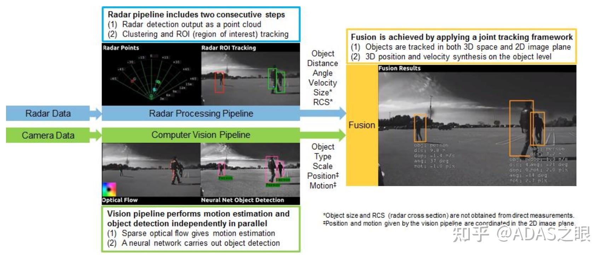
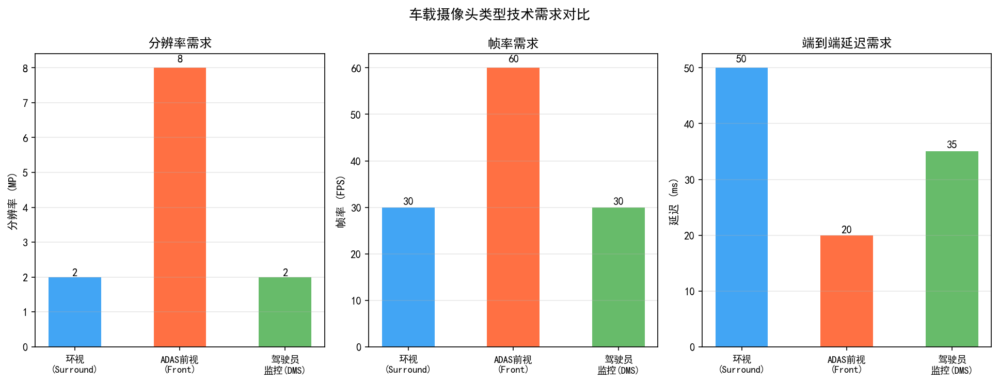
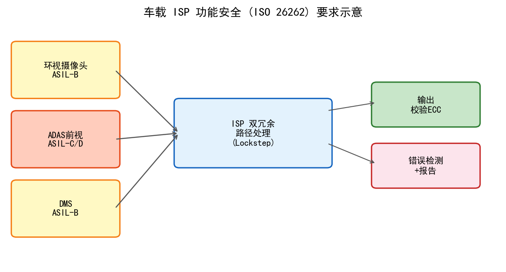
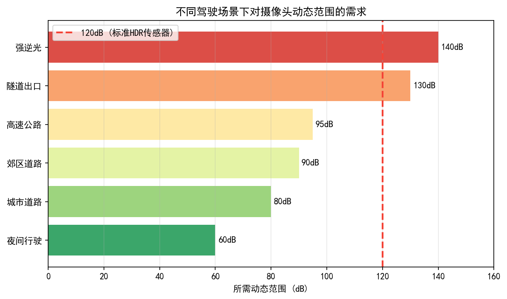
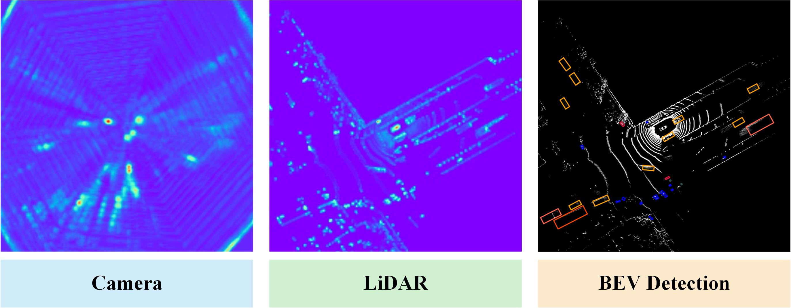

# 第二卷第29章：车载/工业传感器ISP

> **定位：** 本章覆盖车载摄像头（ADAS/AVM/DVR）与工业相机的ISP特殊需求——宽温度范围标定、功能安全（ISO 26262）、HDR宽动态感知、全局快门传感器特性，以及车规级ISP芯片架构要点。
> **前置章节：** 第一卷第03章（传感器物理）、第二卷第07章（伽马与色调映射）
> **适用读者：** 嵌入式工程师、算法工程师、车载相机系统工程师

---

## 目录

1. [车载ISP需求特殊性](#1-车载isp需求特殊性)
   - 1.1 工作环境：极端温度范围
   - 1.2 功能安全：ISO 26262 ASIL要求
   - 1.3 全局快门传感器消除Jello Effect
   - 1.4 120 dB宽动态范围需求
   - 1.5 MIPI CSI-2 车载接口规格（**新增**）
   - 1.6 车规传感器认证标准 AEC-Q100/Q102（**新增**）
   - 1.7 车规ISP SoC：NVIDIA DRIVE Orin与高通SA8775P（**新增**）
   - 1.8 ADAS感知质量与ISP参数的定量关联（**新增**）
2. [车载传感器与标定方法](#2-车载传感器与标定方法)
3. [AVM环视系统ISP设计](#3-avm环视系统isp设计)
4. [工业相机特殊ISP](#4-工业相机特殊isp)
5. [调参指南](#5-调参指南)
6. [常见伪影与失效模式](#6-常见伪影与失效模式)
7. [评测方法](#7-评测方法)
8. [代码示例](#8-代码示例)
9. [参考资料](#参考资料)
10. [术语表](#术语表)

---

## §1 车载ISP需求特殊性

### 1.1 工作环境：极端温度范围

手机相机的工作温度大概是 –20°C 到 60°C，车载摄像头要求是 **–40°C 到 +125°C**（AEC-Q100 Grade 1），这不是翻倍那么简单的差距。仪表盘后面的摄像头夏天停在阳光直射停车场里，机舱温度轻松超过 90°C；冬天在东北低温启动，–30°C 以下。温度变化对传感器的影响是系统性的，每一个标定结果在极端温度下都可能失效：

**暗电流（Dark Current）温度特性**：暗电流随温度呈指数增长，近似遵循 Arrhenius 模型：

$$I_{\text{dark}}(T) = I_0 \cdot \exp\left(-\frac{E_a}{k_B T}\right)$$

其中 $E_a \approx 0.6 \text{ eV}$（体硅/FSI CMOS 典型激活能；BSI CMOS 工艺经优化后 $E_a$ 通常略低，约 0.55 eV）**[8]**，$k_B$ 为玻尔兹曼常数，$T$ 为绝对温度（K）。温度每升高 6–8°C，暗电流大约翻倍。在 105°C 高温下，暗电流可比 25°C 时高出 100–1000 倍，造成图像严重噪声和黑电平偏移。

**读出噪声（Read Noise）**：温度对读出噪声影响相对较小（± 20% 范围内），但低温下模拟电路性能可能下降。

**固定图案噪声（FPN，Fixed Pattern Noise）**：暗电流不均匀性随温度增大，高温时FPN更加突出，必须在对应温度点进行BLC（Black Level Correction）标定。

**像素感光度（Sensitivity）漂移**：温度变化导致传感器量子效率（QE，Quantum Efficiency）轻微漂移（通常 ±2%/10°C），对精密测量应用（如车道线颜色识别）需要补偿。

### 1.2 功能安全：ISO 26262 ASIL要求

ISO 26262 **[3]** 是汽车电气/电子系统功能安全国际标准，将系统危险等级分为 ASIL-A（最低）至 ASIL-D（最高）。摄像头相关ISP芯片通常需满足：

- **ADAS前视摄像头**：ASIL-B 至 ASIL-C（影响紧急制动、车道保持）
- **AVM环视摄像头**：ASIL-A 至 ASIL-B（辅助泊车）
- **DVR行车记录**：QM（Quality Management，无ASIL要求）

**ISP功能安全要求的工程实现**：

1. **图像完整性监测（Image Integrity Monitoring）**：实时检测图像质量异常（模糊、过暗、遮挡），并向上层ADAS算法输出有效性标志（Valid Flag）
2. **双路ISP（Dual-path ISP）**：部分ASIL-C/D应用需要冗余ISP处理路径，两路独立处理结果比对，差异超过阈值触发安全响应
3. **内存ECC（Error Correcting Code）**：ISP内部SRAM/DRAM需配置ECC，防止单粒子翻转（SEU，Single Event Upset）导致图像数据错误
4. **看门狗（Watchdog）计时器**：监控ISP处理帧率，若连续N帧处理超时则输出告警信号
5. **启动自检（BIST，Built-In Self Test）**：上电时对ISP硬件进行自诊断，检测寄存器和内存故障

### 1.3 全局快门传感器消除Jello Effect

Rolling Shutter传感器逐行曝光的特性在车辆振动（发动机抖动、路面颠簸）和快速横移场景下产生"果冻效应"（Jello Effect）——图像垂直方向发生扭曲变形，严重影响ADAS目标检测和测距精度。

全局快门（Global Shutter，GS）传感器所有像素同时曝光，彻底消除果冻效应，是车载前视摄像头（尤其是高速公路驾驶场景）的优选方案。全局快门传感器的主要工程特性：

- **存储节点（Storage Node）**：每个像素需额外存储节点暂存曝光期间累积的电荷，直至行读出完成。存储节点需金属遮光，引入额外像素面积（填充率降低约20–40%）
- **寄生光敏性（PLS，Parasitic Light Sensitivity）**：存储节点对光不完全屏蔽，导致拖影伪影，需ISP进行PLS补偿（帧间参考减除）
- **动态范围影响**：存储节点引入额外暗电流和kTC噪声，全局快门传感器的动态范围通常比同代Rolling Shutter传感器低约6–10 dB

### 1.4 120 dB宽动态范围需求

车载摄像头面临极端光照反差场景（隧道出口、逆光行驶、车灯直射），要求ISP系统动态范围达到 **120 dB** 以上（消费级相机通常 70–80 dB）**[10]**。

实现120 dB动态范围的主要技术路线：
1. **多曝光HDR合并**（见第二卷第10章（HDR合帧））：短曝+长曝多帧合并
2. **双转换增益（DCG，Dual Conversion Gain）**：传感器在高/低两档转换增益之间切换，同一曝光时间内获得高宽动态
3. **对数感光（Logarithmic Response）**：部分工业传感器支持像素对数响应模式，天然压缩大动态范围
4. **压缩感知（Compressive Sensing）**：新兴方案，通过随机曝光模式在单帧内编码宽动态信息

### 1.5 MIPI CSI-2 车载接口规格

车载摄像头系统普遍采用 MIPI CSI-2 作为传感器与 SoC 之间的串行数据接口。与消费级设计相比，车规 CSI-2 对电气可靠性和功耗有更严格的要求。

**Lane 数量与带宽配置**：

$$\text{所需带宽} = W \times H \times \text{fps} \times \text{bpp} \times 1.2\;(\text{含协议开销})$$

| 应用场景 | 分辨率 × 帧率 | 推荐 Lane × 速率 | 典型功耗 |
|---------|-------------|----------------|---------|
| AVM 单路鱼眼 | 1920×1080 @ 30fps RAW10 | 2 Lane × 1 Gbps | ~180 mW |
| ADAS 前视 | 3840×2160 @ 30fps RAW12 | 4 Lane × 1.5 Gbps | ~350 mW |
| ADAS 前视（高帧率） | 1920×1080 @ 60fps RAW10 | 4 Lane × 1 Gbps | ~300 mW |
| Surround 4路汇聚 | 4× 1920×1080 @ 30fps | 4 Lane × 2.5 Gbps（汇聚后） | ~500 mW |

**GMSL（Gigabit Multimedia Serial Link）与 FPD-Link**：车载摄像头通常需要通过长距离（≥ 15m）同轴电缆将 RAW 数据传输到域控制器。GMSL2（ADI，最高 6 Gbps）和 FPD-Link III（TI，最高 4.16 Gbps）是两大主流序列化/反序列化（SerDes）方案，在 SoC 端最终转换为标准 MIPI CSI-2。

**EMI/EMC 要求**：车规摄像头需通过 CISPR 25 Class 5 电磁兼容测试，PCB 走线需严格管控差分对等长（Δ < 3mm）、参考地平面完整性，以及对 MIPI 时钟泄漏的屏蔽处理。

### 1.6 车规传感器认证标准

**AEC-Q102（光电器件可靠性）**：专门针对车载光电器件（包括图像传感器、LED、激光器）的可靠性标准，由 AEC（Automotive Electronics Council）发布。核心测试项目：

| 测试 | 条件 | 说明 |
|------|------|------|
| **HTOL（高温工作寿命）** | 105°C，1000 小时，全功能工作 | 检验高温长期工作可靠性 |
| **HTSL（高温储存）** | 125°C，1000 小时，无电 | 检验存储稳定性 |
| **TC（温度循环）** | –55°C ↔ +125°C，1000 次 | 检验机械应力疲劳 |
| **HALT（加速生命测试）** | 阶梯温度/振动加速 | 早期失效模式发现 |
| **ESD（静电放电）** | HBM ±2kV，CDM ±500V | 人体模型/充电器件模型 |

**AEC-Q100（IC 可靠性）**：适用于车规 ISP SoC 芯片本身的可靠性认证，包含温度等级（Grade 0: –40 ~ +150°C；Grade 1: –40 ~ +125°C；Grade 2: –40 ~ +105°C）。车规 ISP 芯片通常需达到 Grade 1 或 Grade 0。

**ISO 26262 功能安全认证**（补充 §1.2）：传感器本身的功能安全认证需要：
- **FMEA（失效模式与影响分析）**：系统性分析每种失效模式对车辆安全的影响
- **DFMEA（设计 FMEA）**：芯片级失效分析
- **FIT 率（Failure In Time，1 FIT = 10⁻⁹/小时）**：ISO 26262-5 要求 PMHF（概率性多点硬件失效）：ASIL-B < 10⁻⁷/h（≈ **100 FIT**），ASIL-D < 10⁻⁸/h（≈ **10 FIT**）

### 1.7 车规 ISP SoC：NVIDIA DRIVE Orin 与高通 SA8775P

**NVIDIA DRIVE Orin**（2022 量产，旗舰自动驾驶 SoC）：

| 规格项 | 参数 |
|--------|------|
| ISP 处理能力 | 支持最多 16 路摄像头同时接入（含 GMSL/FPD-Link 输入） |
| RAW 输入带宽 | ~1.85 GPix/s（947 MHz 时钟 × 2 PPC，NVIDIA 官方确认值） |
| ISP 功能 | BLC/LSC/Demosaic/AWB/CCM/HDR 合并/TNR 完整流水线 |
| HDR 支持 | 120 dB 多曝光 HDR，支持 DOL（Digital Overlap） |
| ASIL 认证 | ASIL-D 功能安全就绪（Safety Ready）——支持 ASIL-D 应用设计，实际分区认证复杂 |
| AI 算力 | 254 TOPS（INT8，NVIDIA 官方数据），用于 ADAS 感知 + ISP AI 后处理 |
| 典型 TDP | 45~65 W（视负载） |

**高通 SA8775P**（2023 量产，座舱+ADAS 融合 SoC）：

| 规格项 | 参数 |
|--------|------|
| ISP | Spectra ISP，支持 8 路并发摄像头（最高 36MP/路） |
| CSI-2 | 14 个 D-PHY Lane，支持 C-PHY |
| HDR | 支持 64×曝光比率（~96 dB 扩展量程）的 Stagger HDR |
| ASIL 认证 | ASIL-B（主 SoC），配合外部 Safety MCU 可达系统 ASIL-D |
| AI 算力 | Hexagon NPU + Adreno GPU（Qualcomm 未公布整数 TOPS；行业估计约 20–30 TOPS 量级，ADAS 功能）|
| 典型功耗 | ~15 W（ISP + 3A 流水线工作状态） |

**工程选型建议**：DRIVE Orin 定位 L2+ ~ L4 自动驾驶，ISP 性能与 ASIL-D 认证是其核心优势，功耗较高；SA8775P 定位座舱+智驾融合，更适合成本敏感的智能座舱 + 初级 ADAS 方案。

### 1.8 ADAS 感知质量与 ISP 参数的定量关联

ISP 输出质量直接影响下游 ADAS 感知算法精度，这一关联已在多项研究中被定量验证。

**MTF50 对目标检测的影响**：

$$\text{AP}_{0.5} \propto f\!\left(\text{MTF50},\, \text{SNR},\, \text{ΔE}_{color}\right)$$

经验规律（基于 KITTI 数据集测试）**[1]**：
- MTF50 从 0.25 lp/px 降至 0.15 lp/px，行人检测 AP 下降约 8–12%
- SNR 从 40 dB 降至 28 dB（相当于 ISO 100 → ISO 800），车辆检测 AP 下降约 5–7%
- AWB 偏差 ΔE > 5 时，夜间红绿灯识别精度下降 > 15%

**高动态范围场景的重要性**：车灯直射（亮度 > 10,000 cd/m²）与遮阴区域行人（< 1 cd/m²）可同时出现在单帧中，动态范围超过 120 dB。未经有效 HDR 处理的图像中，亮区目标（迎面车辆）会饱和截断，暗区行人被噪声淹没，两类目标同时失效。

**隧道场景的亮度过渡**：车辆从亮度约 100,000 cd/m² 的室外驶入约 100 cd/m² 的隧道（动态范围 1000:1）时，AE 收敛时间直接影响安全驾驶窗口。车规要求 AE 收敛时间 < 150ms（≤ 4.5帧 @ 30fps）。

**色彩一致性对 ADAS 的意义**：
- 交通灯颜色识别依赖精确的色彩还原（R/G/B 通道误差 < 5%）
- 车道线颜色（白/黄）识别对 AWB 精度敏感
- 多摄传感器融合（前视 + 侧视）需保持帧间一致性

### 1.9 车载 HDR 场景的 AEC 策略

车载 HDR 成像中，AEC（自动曝光控制）面临与消费级手机完全不同的约束——不是为了"好看"，而是为了让 ADAS 感知算法在全动态范围内可靠工作。

**双曝光比（Dual-Exposure Ratio）控制：**

车规 HDR 传感器通常工作在 DOL（Digital Overlap，数字重叠）或 Stagger 模式，每帧包含长曝光帧（LE）和短曝光帧（SE）两路数据。AEC 需要同时控制两路曝光，使其满足：

$$\text{EV}_{LE} - \text{EV}_{SE} = \log_2 R, \quad R \in [4, 64]$$

其中曝光比 $R$ 由场景动态范围决定：隧道出入口典型需要 $R = 32$（5 EV），高速公路逆光 $R = 16$（4 EV），停车场弱光 $R = 4$（2 EV）。

**AEC 目标设定原则（ADAS 优先）：**

| 目标 | 消费级手机 AEC | 车规 ADAS AEC |
|------|-------------|-------------|
| 亮度目标 | 主观美观（人脸/主体最优） | 确保感知目标不饱和/不欠曝 |
| 高光保护 | 避免过曝（美学要求） | 避免目标（车辆/红绿灯）饱和截断（安全要求） |
| 暗部提亮 | 提升暗部可见性（MOS分） | 保证行人/障碍物 SNR > 20 dB |
| 收敛速度 | < 8帧（0.3s @30fps） | **< 5帧（0.16s @30fps）**，隧道场景 < 3帧 |
| 频闪抑制 | 防交流电闪烁（50/60Hz）| **同上 + LED PWM 闪烁（1–10kHz）** |

**LED 路灯 PWM 防频闪：** 现代 LED 路灯通过高频 PWM 调光（通常 1–10 kHz），曝光时间短于 LED 周期时会产生明暗条纹。车规 AEC 需要**检测 LED 闪烁频率**，并将曝光时间锁定在 LED 周期整数倍，或通过增大曝光时间（> 1ms）跨越多个 PWM 周期消除条纹。

### 1.10 车载 AWB 特殊策略

车载场景对 AWB 的挑战远超室内/户外静态场景，主要来源于以下三类特殊光源：

**1. 车灯眩光干扰**

前方车辆尾灯（610–680nm 红色 LED）和对向车大灯（6000–6500K 白色 LED/氙灯）
会造成 AWB 局部色温估计严重偏移。处理策略：

- **高光区域排除：** 将亮度高于 95% 百分位的区域从 AWB 统计中排除，避免眩光中性亮点被误认为中性灰参考
- **色温钳位：** 将车载场景 AWB 估计结果硬钳位在 **2800–6500 K** 范围内，防止眩光导致估计温度跑到 8000K+
- **空间权重：** 对图像中央 ROI 区域（道路主体）赋予更高 AWB 权重，边缘车灯区域权重衰减

**2. 隧道过渡场景**

隧道内常见低压钠灯（589nm 窄带黄光）和荧光灯，对标准灰世界/白点检测算法完全失效：

- **低压钠灯（2100K 等效）：** 光谱极窄，标准灰世界算法估计结果高度不稳定
- **处理策略：** 隧道过渡（入隧/出隧）期间切换为**历史帧 IIR 平滑**（α ≈ 0.1，慢速跟随），避免 AWB 快速振荡；隧道内稳定后恢复正常跟随速度（α ≈ 0.3）

**3. ADAS 色彩一致性要求**

车载摄像头用于 ADAS（前视 + 环视）时，色彩一致性直接影响车道检测、行人识别等任务：

| 指标 | 要求 | 说明 |
|------|------|------|
| 跨帧色温变化 | < 200 K/帧（@30fps） | 防止 ADAS 算法因色温突变误检 |
| 多摄色温一致性 | ΔCT < 300 K | 前视/侧视摄像头同场景色温差 |
| 昼夜切换延迟 | < 2s（完成收敛） | 快速光线变化场景下的响应要求 |

---

## §2 车载传感器与标定方法

### 2.1 多温度BLC标定

由于暗电流随温度剧烈变化，车载ISP必须建立**多温度BLC标定表**：

**标定流程**：
1. 将传感器置于温度箱，分别在 –40°C, –20°C, 0°C, 25°C, 40°C, 60°C, 85°C, 105°C 等多个温度点稳定
2. 每个温度点分别采集多帧暗场图（遮光），对每个通道（R/Gr/Gb/B）统计均值和标准差
3. 建立 BLC(T, ISO) 二维查找表：索引为温度和增益，输出为各通道BLC值
4. 在线运行时，根据实时温度传感器读数和当前ISO，双线性插值获取当前BLC补偿值

**标定精度要求**：BLC标定误差 < 1 DN（数字码值），否则在高ISO时产生可见色偏。

**OB（Optical Black）像素方法**：高端车规传感器通常在芯片边缘保留遮光像素（OB区），ISP可实时读取OB像素均值作为动态BLC参考，无需依赖温度传感器。OB方法精度更高，但需要传感器硬件支持。

### 2.2 宽动态HDR标定

车载HDR标定需针对多曝光融合的每个曝光档位分别标定：

**多曝光响应曲线（CRF，Camera Response Function）标定**：
1. 分别以短曝光（如 1/10000s）、中曝光（1/1000s）、长曝光（1/100s）拍摄已知辐亮度的均匀光场
2. 对每档曝光建立：数字输出值 → 真实辐亮度的线性化系数
3. HDR合并算法依赖精确的CRF才能实现多曝光无缝融合（否则出现Halo伪影）

### 2.3 鱼眼镜头几何标定（AVM应用）

AVM（Around View Monitor，环视摄像）系统使用4颗广角/鱼眼摄像头（前后左右），单颗镜头视角通常达到 180°+。鱼眼镜头标定需使用专门的鱼眼畸变模型（Equidistant / Equisolid-angle / Orthographic 投影模型），区别于标准针孔相机模型。

**标定流程**（参考 OpenCV fisheye 模型 **[6]**）：
1. 制作棋盘格标定板，在多个位置、角度拍摄图像（覆盖整个视野）**[5]**
2. 检测标定板角点，使用鱼眼畸变模型最小化重投影误差
3. 输出内参（焦距 $f_x, f_y$，主点 $c_x, c_y$）和畸变系数（$k_1, k_2, k_3, k_4$）
4. 车规要求重投影误差 RMS < 0.5 pixel

**外参标定（多相机外参联合标定）**：
- 利用地面棋盘格或专用标定场（ADAS Camera Calibration Target），在同一场景中同时标定4颗摄像头的相对位置和姿态
- 外参精度要求：位置误差 < 5mm，角度误差 < 0.3°（否则AVM拼接接缝处出现明显错位）

### 2.4 车规公差与量产一致性

车规摄像头模组经过振动、冲击、温度循环等可靠性测试后，标定参数可能发生漂移。工程实践要求：
- **主点漂移**：温度循环后主点变化 < 2 pixels（否则车道线检测精度下降）
- **焦距漂移**：< 0.5%（F焦距精度直接影响单目测距精度）
- **出厂标定有效期**：典型车规要求标定数据在整车生命周期（15年/200,000 km）内有效，需进行加速老化验证

---

## §3 AVM环视系统ISP设计

### 3.1 4路摄像头同步

AVM系统要求4颗摄像头**同步曝光**，避免生成拼接俯视图时因各路图像时间戳不同导致运动物体（行人、车辆）出现"重影"或"消失"。

同步机制：
- **硬件同步**：由SoC（或MCU）输出统一的同步触发信号（VSYNC Trigger）同时控制4颗传感器曝光起始时刻
- **软件对齐**：当硬件同步不可用时，通过时间戳对齐 + 相位调整，使4路图像的曝光中心时刻差 < 1ms

**AE/AWB同步**：4路摄像头各朝不同方向，光照条件可能差异显著（如前方逆光、后方顺光）。AE算法对每路独立运行，但为保证拼接色调一致性，需要对4路图像的色调映射（Tone Mapping）结果进行**全局亮度均衡**：

$$L_{\text{eq}}^{(i)} = \alpha^{(i)} \cdot L^{(i)} + \beta^{(i)}, \quad i = 0,1,2,3$$

其中 $\alpha^{(i)}, \beta^{(i)}$ 为第 $i$ 路的线性均衡系数，由中央控制模块统一计算，确保4路图像在拼接区域亮度平滑过渡。

### 3.2 ISP-SVM颜色均衡

拼接视图（SVM，Surround View Module）的关键质量指标之一是**颜色均匀性**：相邻摄像头重叠区域的颜色应保持一致。由于各路镜头老化程度、传感器批次差异，实际上各路图像存在色差。

颜色均衡方法：
1. 在重叠区域（Overlap Zone，通常是车辆四角附近）提取颜色样本
2. 计算相邻摄像头在重叠区的颜色差异（ΔE in Lab色空间）
3. 对每路输出施加3×3 CCM（Color Correction Matrix）或per-channel gain，使重叠区颜色差异 ΔE < 3.0

### 3.3 逆透视变换（IPM）与地面投影

AVM系统需将各路摄像头的透视图转换为地面俯视图，核心算法为逆透视变换（IPM，Inverse Perspective Mapping）：

**基本原理**：利用相机内参和外参（已知高度H、俯仰角pitch等），将图像坐标系中的地面点投影到世界坐标系（地面平面）中：

设图像坐标为 $(u, v)$，地面高度 $Z = 0$，世界坐标 $(X, Y, 0)$ 满足：

$$\lambda \begin{pmatrix} u \\ v \\ 1 \end{pmatrix} = K [R | t] \begin{pmatrix} X \\ Y \\ 0 \\ 1 \end{pmatrix}$$

其中 $K$ 为内参矩阵，$[R|t]$ 为外参。解方程可得世界坐标。

**ISP流水线中的IPM位置**：IPM通常在ISP下游的独立硬件模块（Warp Engine）中执行，输入ISP输出的YUV图像，输出变换后的俯视图。ISP侧需关注：LSC（镜头阴影校正）必须在IPM之前完成，否则边缘亮度不均会在俯视图中产生圆弧形亮暗条纹。

### 3.4 ADAS感知专用色调映射

ADAS目标检测网络（车辆/行人/车道线检测）的训练数据通常为sRGB色彩空间的普通色调图像。车载HDR图像直接输入ADAS网络时，需要进行专门的**感知友好色调映射**（Perception-Preserving Tone Mapping）：

消费级色调映射强调视觉美观，ADAS专用色调映射的优化目标则不同：
1. **目标检测召回率**：确保全动态范围内的目标（暗区行人、高光区车辆）在压缩后仍可被检测
2. **色彩一致性**：不同曝光条件下同类目标（如白色车辆）的颜色表现稳定
3. **低延迟**：满足ADAS实时处理要求（通常 < 33ms/帧）

代表性工作：Eilertsen et al. (2017) **[4]** 提出针对HDR图像的卷积神经网络色调映射，在ADAS场景中优于传统Reinhard/Drago等算子。

---

## §4 工业相机特殊ISP

### 4.1 线阵传感器（Line Scan Camera）

线阵传感器（Line Scan Sensor）每次只读出一行（或少数几行）像素，通过传送带或对象相对运动扫描完整图像，广泛用于工业检测（印刷质量、晶圆检测、纺织品瑕疵）。

**ISP特殊需求**：
- **线性响应保持**：工业检测依赖精确的灰度或颜色量化，通常要求传感器工作在线性响应区（不进行Gamma编码），或需要精确的逆Gamma线性化
- **FPN校正（逐列FPN）**：线阵传感器的固定图案噪声主要表现为列间不均匀（而非帧间），需要建立逐列增益/偏置补偿表
- **TDI（Time Delay Integration）模式**：高级线阵传感器支持TDI模式，通过多行信号累加提高SNR（用于暗弱物体检测），ISP需处理TDI级联产生的运动混叠

**校正方法**（参考 EMVA 1288 **[7]**）：
1. 均匀照明下采集参考图，计算各列的增益 $g_c$ 和偏置 $o_c$
2. 对每列输出：$P_c' = (P_c - o_c) / g_c$（PRNU + DSNU 联合校正）

### 4.2 高速摄影ISP（1000fps+）

高速摄影（High-Speed Imaging，通常 ≥ 1000fps）要求ISP满足极低延迟和极高带宽：

- **行时序**：1000fps、1080行传感器，每行读出时间仅约 0.9μs（消费级30fps为约 33μs/行），要求ISP各模块处理延迟随之缩短
- **降噪权衡**：超高速摄影通常曝光时间极短（< 1ms），信号量少、噪声高；但受限于帧率，无法使用时域降噪（TNR），主要依赖空域降噪（SNR）
- **数据带宽**：1000fps × 1080P × 12bit ≈ 25 Gbps，需高速串行接口（CoaXPress / Camera Link HS）和高带宽内存（HBM）

### 4.3 工业相机接口标准

| 接口 | 带宽 | 线缆长度 | 应用场景 |
|------|------|----------|----------|
| **GigE Vision** | 125 MB/s（×4 = 500 MB/s）| 100m | 低速机器视觉、远距离传输 |
| **USB3 Vision** | 400 MB/s | 5m | 中速工业检测、桌面设备 |
| **Camera Link** | 最高 6.8 Gbps | 15m | 高速线阵、面阵传感器 |
| **CoaXPress** | 最高 12.5 Gbps × 4 | 40m（同轴电缆）| 高速高分辨率工业相机 |

ISP设计需针对具体接口的传输延迟、包错误率进行鲁棒性设计。

### 4.4 科学成像ISP（冷却CCD/CMOS）

天文、医疗、材料分析等科学成像场景使用冷却传感器（−100°C 液氮冷却或半导体制冷），ISP特点：
- **暗电流极低**：冷却大幅抑制暗电流，FPN主要由读出电路决定
- **偏置帧/暗场帧减除**：科学成像标准流程包括逐像素减除偏置帧（Bias Frame）和暗场帧（Dark Frame）
- **平场帧除以归一化**：用均匀照明平场帧（Flat Field Frame）逐像素归一化，消除像素响应不均匀
- **宇宙射线剔除**（Cosmic Ray Rejection）：多帧叠加时剔除单帧中的高能粒子撞击亮点

---

## §5 调参指南

### 5.1 温度BLC补偿表标定密度

| 温度采样间隔 | 适用场景 | 插值误差（参考） |
|--------------|----------|------------------|
| 每20°C一个点 | 低精度应用 | ~2–3 DN（高温时） |
| 每10°C一个点 | 标准车规 | ~0.5–1 DN |
| 每5°C一个点 | 高精度科学成像 | ~0.1–0.2 DN |

推荐：车规应用采用每10°C一个点，高温段（>85°C）加密至每5°C一个点，因为高温段暗电流变化更快。

### 5.2 HDR融合权重调参

多曝光HDR融合（Exposure Fusion）的权重函数直接影响动态范围与噪声的权衡：

- **高光保护区**（过曝区）：权重应从长曝光快速降至0，避免使用过曝像素
- **暗部过渡区**：权重从短曝光平缓过渡到长曝光，注意短曝光在极暗区SNR极低，权重不应过高
- **融合曝光比（Exposure Ratio）**：典型设置 4× 或 16×（高中低三档），过大的曝光比在融合边界产生噪声台阶

### 5.2.1 车牌可读性与 HDR 最低动态范围需求

车牌识别是前视 ADAS 摄像头的典型任务约束。逆光行驶时，车牌反射亮度约 10–100 cd/m²，而背景（直射阳光路面）可超过 50,000 cd/m²，局部反差 > 500:1（约 9 stops）。

**可读性所需最低 DR 推导**：

| 场景 | 最暗关键区域 | 最亮背景 | 所需局部 DR | ISP 要求 |
|------|------------|---------|-----------|---------|
| 正常逆光（正午，高架路） | 车牌字符（约 20 cd/m²） | 天空反光（约 20,000 cd/m²） | 1000:1 ≈ 60 dB | 至少 3 曝光档 HDR |
| 极端逆光（隧道出口车头灯直射）| 车牌字符（约 5 cd/m²）| 车灯（约 100,000 cd/m²） | 20,000:1 ≈ 86 dB | ≥ 4 曝光档 HDR，或 DCG 模式 |
| 夜间强光污染 | 背光车牌字符（约 50 cd/m²） | LED 路灯（约 50,000 cd/m²） | 1000:1 ≈ 60 dB | 3 曝光档足够 |

**ISO 15031-3（车牌识别相关）要求**：字符对比度（白底黑字）≥ 0.5（Michelson 对比度）；这意味着 ISP 输出中车牌区域的局部对比度在 HDR 融合和色调映射后不得低于此阈值。若 ISP 的 HDR Tone Mapping 过度压缩局部对比度，即使像素未饱和，字符也可能不可读。

**工程推荐**：ADAS 前视摄像头最低 DR 需求为 **120 dB**（参考 AR0820 的 >140 dB 规格，留有余量）；色调映射目标：车牌区域局部对比度 ≥ 0.6（高于最低要求 20%），可通过 ADAS 专用色调映射（CLAHE 类局部对比度增强）实现。

### 5.2.2 OV2778 与 AR0820 参数对比（车规传感器 vs 手机传感器）

| 规格项 | OV2778（车规舱内，OmniVision）| AR0820AT（车规前视，onsemi）| IMX766（旗舰手机，Sony）|
|--------|----------------------------|--------------------------|-----------------------|
| **分辨率** | 1920×1080 | 3848×2168 | 4096×3072（50MP） |
| **像素尺寸** | 2.8 µm | 2.1 µm | 0.7 µm |
| **动态范围** | 单曝 62 dB；HDR 模式约 100 dB | >120 dB（单帧 HDR，DCG+多曝） | 单帧约 74 dB（PDAF pixels） |
| **感光模式** | RGB-IR（红外支持夜视）| 纯 RGB，支持 DCG Stagger HDR | RGB-Mono（标准 Bayer） |
| **全局快门** | 否（Rolling Shutter） | 否（Rolling Shutter）| 否（Rolling Shutter） |
| **温度范围** | –40°C ~ +105°C（AEC-Q102 Grade 1）| –40°C ~ +125°C（Grade 0）| –20°C ~ +70°C（消费级）|
| **功能安全** | 无 ASIL 认证 | ASIL-B 兼容设计 | 无 |
| **MIPI 接口** | 4-lane MIPI CSI-2 | 4-lane MIPI CSI-2 D-PHY | 4-lane MIPI CSI-2 C-PHY |
| **典型应用** | DMS/OMS（驾驶员/乘客监控）| ADAS 前视、LiDAR 融合 | 手机主摄 |
| **特殊功能** | 近红外通道独立读出（940nm IR）| LED Flicker Mitigation（LFM）硬件模块 | 全像素 PDAF |

**关键工程差异**：
- **暗电流**：OV2778 在 105°C 时暗电流约为 25°C 时的 300–500 倍（Arrhenius 模型），而 IMX766 标称工作上限 70°C，无高温标定要求
- **HDR 融合帧数**：AR0820AT 内置 2 曝 DOL-HDR（短帧 + 长帧交替行），可通过 DCG 在单曝内扩展约 20 dB；手机传感器（IMX766 等）通常需要 2–3 帧单独曝光做 MFHDR
- **LFM 模块**：AR0820AT 内置 LED Flicker Mitigation 硬件，通过寄存器 `R0x3170[LFM_ENABLE]` 开启，支持 100/120/200/240Hz 四档同步；手机传感器无此硬件，须依赖 ISP 固件软件实现（参见第二卷第28章 §1.4）

### 5.3 鱼眼LSC标定

AVM鱼眼镜头的镜头阴影校正（LSC）与普通广角镜头有所不同：
- 180°+视角导致边缘亮度衰减极为剧烈（>3倍中心亮度），LSC增益表需覆盖边缘高增益区
- 高增益（>4×）边缘区域的噪声放大显著，需与降噪算法联合调参
- 鱼眼镜头随温度变化的畸变参数漂移更大，建议在多个温度点分别验证LSC有效性

### 5.4 AVM拼接接缝质量调参

AVM拼接接缝（Seam）处的画质调参目标：
1. 接缝处颜色差异 ΔE < 3.0（JND以内）
2. 亮度渐变过渡带宽 > 30 pixels（避免硬切边）
3. 拼接区域无重影（相邻摄像头重叠区物体应保持单一清晰轮廓）

---

## §6 常见伪影与失效模式

### 6.1 高温暗电流亮点（Thermal Noise Hot Pixels）

**现象**：高温（>85°C）时图像中出现大量随机亮点，分布密度随温度快速增加。

**原因**：暗电流的空间不均匀性（DSNU）随温度增大，部分"热像素"（Hot Pixels）暗电流极高，在高温时饱和。

**解决方案**：动态热像素检测（暗场实时检测并更新坏点表），温度分段BLC补偿，或使用支持片上暗电流消除（On-chip Dark Current Cancellation）的传感器。

### 6.2 全局快门PLS（寄生光敏性）拖影

**现象**：全局快门图像中高亮物体（如车灯、太阳）周围出现朦胧拖影，形状类似曝光期间光线泄漏。

**原因**：存储节点对光的屏蔽不完全，曝光期间外部光子仍有少量泄漏进入存储节点，产生额外信号（PLS，Parasitic Light Sensitivity）。

**解决方案**：帧参考减除（Frame Reference Subtraction）：在暗场条件下采集参考帧，从正常图像中减除；或传感器硬件改进遮光结构。

### 6.3 HDR融合Halo（光晕）

**现象**：HDR融合后高反差边界（如窗户边缘）出现明亮光晕，边界内侧产生不自然的过亮区域。

**原因**：多曝光融合时曝光图像之间的运动估计不准确，或融合权重在边界处过渡不平滑，导致短曝光（高光）图像的权重污染了暗区。

**解决方案**：改进融合权重计算（引入空间一致性约束），精化运动对齐算法（光流或特征点配准）。

### 6.4 鱼眼图像LSC过校正条纹

**现象**：AVM俯视图中出现以摄像头位置为圆心的亮暗圆弧条纹。

**原因**：LSC增益表在鱼眼镜头极端边缘区域矫枉过正，或标定时积分球不均匀导致增益表偏差。

**解决方案**：重新标定LSC，限制边缘区域最大增益，对增益表进行平滑约束。

### 6.5 AVM拼接区行人"切割"伪影

**现象**：行人或障碍物刚好处于两路摄像头拼接接缝时，被"切割"成前后两半且错位。

**原因**：两路摄像头的外参标定精度不足，或行人处于地面假设不成立的位置（距地面有高度）。

**解决方案**：提高外参标定精度，在接缝区使用高度感知的拼接算法，或引入LIDAR/超声波深度信息辅助。

---

## §7 评测方法

### 7.1 温度循环后参数漂移评测

**测试方法**（参考 AEC-Q100 标准）：
1. 对被测摄像头模组进行热冲击（–40°C ↔ +105°C，100次循环）
2. 每次循环前后在标准条件（25°C）下采集标定图像
3. 评估指标：BLC均值漂移 < 1 DN，LSC非均匀度变化 < 5%，鱼眼畸变系数漂移 < 0.1%

### 7.2 AVM拼接接缝ΔE评测

1. 将标准ColorChecker色卡放置在AVM拼接接缝正上方（地面或低高度位置）
2. 生成俯视图，在接缝处色卡色块的两侧分别采样颜色
3. 计算接缝两侧对应色块的 ΔE00（CIEDE2000色差）
4. 合格标准：ΔE00 < 3.0（JND阈值）

### 7.3 ADAS感知性能评测

ISP参数变化对ADAS算法精度的影响可通过端到端评测量化：
- **目标检测AP（Average Precision）**：固定ADAS检测网络，对比不同ISP设置下的检测AP
- **召回率 vs. 误报率**：重点关注极暗区（隧道内行人）和极亮区（逆光车辆）的检测召回率
- **参考基准**：KITTI数据集（Geiger et al., CVPR 2012）、nuScenes（Caesar et al., CVPR 2020）

### 7.4 暗区SNR评测

在 –40°C 和 +105°C 温度极端条件下，拍摄已知亮度均匀场，计算暗区（10% 灰度目标）的信噪比：

$$\text{SNR}_{\text{dark}} = 20 \log_{10}\left(\frac{\mu_{\text{signal}}}{\sigma_{\text{noise}}}\right) \text{ (dB)}$$

车规要求 SNR > 30 dB（–40°C），> 25 dB（+105°C）。

---

## §8 代码示例

```python
"""
车载ISP示例：多温度BLC补偿查表插值
依赖：numpy, scipy, matplotlib
运行方式：python ch29_automotive_isp_demo.py
"""

import numpy as np
import matplotlib.pyplot as plt
from scipy.interpolate import RegularGridInterpolator
from typing import Dict, Tuple


# ─────────────────────────────────────────────
# Part 1: 多温度BLC标定表结构
# ─────────────────────────────────────────────

def build_blc_lut(
    temperatures: np.ndarray,   # 标定温度点（°C）
    iso_values: np.ndarray,     # 标定ISO点
    seed: int = 42,
) -> Dict[str, np.ndarray]:
    """
    生成模拟的多温度/多ISO BLC标定查找表（LUT）。

    真实标定来自暗场图像实测；此处用Arrhenius模型模拟暗电流温度特性。

    Returns:
        blc_lut: {'R': array, 'Gr': array, 'Gb': array, 'B': array}
                 每个数组形状为 (len(temperatures), len(iso_values))
                 值为各通道BLC值（DN，12-bit，范围0–4095）
    """
    rng = np.random.default_rng(seed)

    # Arrhenius模型：暗电流随温度指数增长
    # 参考25°C的基础暗电流（单位：DN/s）
    base_dark_current = {'R': 0.5, 'Gr': 0.4, 'Gb': 0.42, 'B': 0.55}

    # 激活能 Ea/kB ≈ 7000 K（硅约0.6eV）
    Ea_over_kB = 7000.0  # K
    T_ref = 25.0 + 273.15  # K

    T_K = temperatures + 273.15  # 转换为开尔文

    blc_lut = {}
    for ch, i_base in base_dark_current.items():
        # Arrhenius：I_dark(T) = I_0 * exp(Ea/kB * (1/T_ref - 1/T))
        dark_factor = np.exp(Ea_over_kB * (1.0 / T_ref - 1.0 / T_K))  # shape (nT,)

        # ISO缩放（增益越高，暗电流等效DN越大）
        iso_gain = iso_values / 100.0  # 归一化，ISO100 = 1×

        # 二维BLC表 [nT × nISO]
        blc = (i_base * dark_factor[:, np.newaxis] * iso_gain[np.newaxis, :]
               + 64.0  # 基础黑电平偏置
               + rng.normal(0, 0.2, (len(temperatures), len(iso_values))))  # 小量标定噪声

        blc_lut[ch] = blc.astype(np.float32)

    return blc_lut


# ─────────────────────────────────────────────
# Part 2: 运行时BLC插值查询
# ─────────────────────────────────────────────

class TemperatureBLCCompensator:
    """
    车规多温度/多ISO BLC补偿器。

    使用双线性插值从标定LUT获取任意温度和ISO下的BLC值。
    """

    def __init__(
        self,
        temperatures: np.ndarray,
        iso_values: np.ndarray,
        blc_lut: Dict[str, np.ndarray],
    ):
        self.temperatures = temperatures
        self.iso_values = iso_values
        self.blc_lut = blc_lut

        # 为每个通道构建插值器（双线性）
        self._interpolators = {}
        for ch, lut in blc_lut.items():
            self._interpolators[ch] = RegularGridInterpolator(
                (temperatures, iso_values),
                lut,
                method='linear',
                bounds_error=False,
                fill_value=None,  # 超范围外推（clamp到边界值）
            )

    def query(self, temp_c: float, iso: float) -> Dict[str, float]:
        """
        查询指定温度和ISO下的BLC值。

        Args:
            temp_c: 当前温度（°C），来自片上温度传感器
            iso: 当前ISO值

        Returns:
            {'R': blc_R, 'Gr': blc_Gr, 'Gb': blc_Gb, 'B': blc_B}
        """
        point = np.array([[temp_c, iso]])
        result = {}
        for ch, interp in self._interpolators.items():
            val = float(interp(point)[0])
            # 12-bit传感器BLC范围约束
            result[ch] = float(np.clip(val, 0, 255))
        return result

    def apply_blc(
        self,
        raw_image: np.ndarray,
        bayer_pattern: str = 'RGGB',
        temp_c: float = 25.0,
        iso: float = 100.0,
    ) -> np.ndarray:
        """
        对RAW图像施加温度自适应BLC补偿。

        Args:
            raw_image: (H, W) uint16 Bayer图像
            bayer_pattern: 'RGGB' / 'BGGR' / 'GRBG' / 'GBRG'
            temp_c: 当前温度（°C）
            iso: 当前ISO

        Returns:
            corrected: (H, W) float32 BLC补偿后图像
        """
        blc = self.query(temp_c, iso)

        # Bayer通道偏移映射
        pattern_map = {
            'RGGB': {'R': (0, 0), 'Gr': (0, 1), 'Gb': (1, 0), 'B': (1, 1)},
            'BGGR': {'B': (0, 0), 'Gb': (0, 1), 'Gr': (1, 0), 'R': (1, 1)},
            'GRBG': {'Gr': (0, 0), 'R': (0, 1), 'B': (1, 0), 'Gb': (1, 1)},
            'GBRG': {'Gb': (0, 0), 'B': (0, 1), 'R': (1, 0), 'Gr': (1, 1)},
        }
        offsets = pattern_map[bayer_pattern]

        corrected = raw_image.astype(np.float32)
        for ch, (row_off, col_off) in offsets.items():
            corrected[row_off::2, col_off::2] -= blc[ch]

        return np.clip(corrected, 0, 4095)


# ─────────────────────────────────────────────
# Part 3: AVM颜色均衡简化示例
# ─────────────────────────────────────────────

def avm_color_balance(
    images: list,
    overlap_masks: list,
) -> Tuple[list, list]:
    """
    AVM 4路摄像头颜色均衡（线性增益补偿）。

    计算各路摄像头在重叠区域的颜色差异，
    输出每路图像的RGB增益补偿系数。

    Args:
        images: list of (H, W, 3) float32 images [front, right, rear, left]
        overlap_masks: list of (H, W) bool masks，标记重叠区域

    Returns:
        gains: list of [r_gain, g_gain, b_gain] for each camera
        balanced: list of color-balanced images
    """
    n = len(images)
    assert n == len(overlap_masks)

    # 计算各路在重叠区的平均颜色
    mean_colors = []
    for img, mask in zip(images, overlap_masks):
        if mask.sum() > 0:
            mean_colors.append(img[mask].mean(axis=0))  # (3,) RGB均值
        else:
            mean_colors.append(img.mean(axis=(0, 1)))

    # 以所有路均值的全局均值为基准
    global_mean = np.mean(mean_colors, axis=0)  # (3,)

    gains = []
    balanced = []
    for i, (img, mc) in enumerate(zip(images, mean_colors)):
        gain = global_mean / (mc + 1e-9)
        gain = np.clip(gain, 0.5, 2.0)  # 限制增益范围
        gains.append(gain.tolist())
        balanced.append(np.clip(img * gain[np.newaxis, np.newaxis, :], 0, 1).astype(np.float32))

    return gains, balanced


# ─────────────────────────────────────────────
# Part 4: 综合演示
# ─────────────────────────────────────────────

def run_demo():
    print("=" * 60)
    print("车载ISP演示  (ch29_automotive_isp)")
    print("=" * 60)

    # 标定温度点和ISO点
    temperatures = np.array([-40, -20, 0, 25, 40, 60, 85, 105], dtype=np.float32)
    iso_values   = np.array([100, 200, 400, 800, 1600, 3200], dtype=np.float32)

    # 建立模拟BLC LUT
    print("\n[1] 建立多温度BLC标定表...")
    blc_lut = build_blc_lut(temperatures, iso_values)
    compensator = TemperatureBLCCompensator(temperatures, iso_values, blc_lut)

    # 打印不同温度/ISO下的BLC查询结果
    print("\n[2] BLC插值查询示例 (通道 R):")
    print(f"    {'温度(°C)':>10} {'ISO':>8} {'BLC_R':>10}")
    print("    " + "-" * 32)
    test_cases = [(-30, 100), (0, 400), (25, 800), (80, 1600), (100, 3200)]
    for t, iso in test_cases:
        blc = compensator.query(t, iso)
        print(f"    {t:>10.0f} {iso:>8.0f} {blc['R']:>10.2f}")

    # 可视化BLC随温度变化
    fig, axes = plt.subplots(1, 2, figsize=(14, 5))

    temp_range = np.linspace(-40, 105, 200)
    for iso in [100, 400, 1600]:
        blc_r = [compensator.query(t, iso)['R'] for t in temp_range]
        axes[0].plot(temp_range, blc_r, label=f'ISO {iso}')
    axes[0].set_xlabel('温度 (°C)')
    axes[0].set_ylabel('BLC 值 (DN)')
    axes[0].set_title('通道R的BLC随温度变化 (Arrhenius模型)')
    axes[0].legend()
    axes[0].grid(True, alpha=0.3)

    # 演示BLC应用效果
    rng = np.random.default_rng(0)
    H, W = 64, 64

    # 模拟高温下带有严重暗电流的RAW图像
    temp_demo = 100.0
    blc_hot = compensator.query(temp_demo, 800)
    true_signal = (rng.integers(100, 600, (H, W), dtype=np.uint16))
    dark_noise = rng.normal(blc_hot['R'], 5, (H, W)).astype(np.float32)
    raw_hot = np.clip(true_signal + dark_noise, 0, 4095).astype(np.uint16)

    corrected_hot = compensator.apply_blc(raw_hot, 'RGGB', temp_c=temp_demo, iso=800)

    axes[1].hist(raw_hot.flatten(), bins=50, alpha=0.6, label=f'补偿前 (T={temp_demo}°C)', color='red')
    axes[1].hist(corrected_hot.flatten(), bins=50, alpha=0.6, label='BLC补偿后', color='blue')
    axes[1].axvline(true_signal.mean(), color='green', linestyle='--', label=f'真实信号均值')
    axes[1].set_xlabel('像素值 (DN)')
    axes[1].set_ylabel('像素数')
    axes[1].set_title('高温BLC补偿效果（模拟）')
    axes[1].legend()
    axes[1].grid(True, alpha=0.3)

    plt.tight_layout()
    out_path = 'automotive_isp_demo.png'
    plt.savefig(out_path, dpi=120)
    plt.close()
    print(f"\n演示图已保存: {out_path}")

    # AVM颜色均衡演示
    print("\n[3] AVM颜色均衡演示...")
    rng2 = np.random.default_rng(1)
    H2, W2 = 64, 64

    # 模拟4路摄像头略有色差的图像
    base_color = np.array([0.5, 0.48, 0.46])
    cam_offsets = [
        np.array([0.05, 0.0, -0.03]),
        np.array([-0.03, 0.04, 0.0]),
        np.array([0.02, -0.02, 0.05]),
        np.array([0.0, 0.01, -0.01]),
    ]
    images = []
    for offset in cam_offsets:
        img = np.ones((H2, W2, 3), dtype=np.float32) * (base_color + offset)
        img += rng2.normal(0, 0.01, img.shape).astype(np.float32)
        img = np.clip(img, 0, 1)
        images.append(img)

    # 全图作为重叠区（简化演示）
    masks = [np.ones((H2, W2), dtype=bool)] * 4

    gains, balanced = avm_color_balance(images, masks)
    print(f"    {'摄像头':>6}  {'R增益':>8}  {'G增益':>8}  {'B增益':>8}")
    cam_names = ['前', '右', '后', '左']
    for i, (g, name) in enumerate(zip(gains, cam_names)):
        print(f"    {name:>4}    {g[0]:>8.4f}  {g[1]:>8.4f}  {g[2]:>8.4f}")

    print("=" * 60)


if __name__ == '__main__':
    run_demo()
```

---


---

> **工程师手记：车载ISP的三个安全关键工程约束**
>
> **端到端延迟<100ms是ADAS感知的硬红线：** ISO 26262 ASIL-B/D对摄像头感知链路的端到端延迟有严格要求：从光子撞击传感器到最终目标检测结果输出，典型指标为 **<100ms（L2级辅助驾驶）**，部分自动紧急制动（AEB）场景要求<50ms。这意味着ISP帧处理延迟必须控制在10～15ms以内（1帧@60fps=16.7ms），不能容许任何多帧累积算法（如多帧HDR融合超过3帧）。Mobileye EyeQ5 ISP对每个感知摄像头承诺单帧处理延迟 ≤8ms；NVIDIA Orin ISP（ISP7.5）通过ISP Slice模式实现逐行流水，有效帧延迟降至6ms。调试阶段需用逻辑分析仪在VSYNC→ISP Done→DRAM写完→NN模型推理开始四个节点打时间戳，逐段核对延迟分配。
>
> **车规HDR需覆盖120dB+动态范围，融合策略不同于手机：** 隧道入口（强逆光）典型动态范围达 130dB，手机常用的2帧曝光融合（HDR ratio ≈ 16×）仅覆盖约84dB，远远不够。车规ISP普遍采用3帧或4帧交替曝光（如长:中:短 = 64:8:1），配合传感器内部LDO驱动的eMCOM（多斜率转换）可达 **120～140dB**。融合时鬼影抑制策略与手机不同：车载场景以高速运动物体（行人、对向车）为主，不能简单用亮度差阈值判断运动区域，需结合光流向量（Optical Flow）区分"真实运动"与"过曝饱和"区域。TI TDA4VM的VPAC3L ISP提供`VHWA_CMPFE`模块实现4帧融合+运动补偿，Qualcomm SA8255P（Snapdragon Ride）使用`IFE_HDR_MAC`模块，二者参数体系不同但逻辑一致，调参时需重点关注`motion_threshold`和`fusion_weight_table`的联合配置。
>
> **LED交通灯PWM频率导致闪烁，必须通过曝光同步规避：** 现代LED交通信号灯普遍采用PWM调光，频率范围100～400Hz（中国国标最低100Hz，部分路口200Hz）；若摄像头曝光时间不是PWM周期整数倍，同一交通灯在相邻帧中会出现亮/暗交替（flickering），严重影响红绿灯识别算法置信度。解决方案有两类：(1) **固定曝光时间**为PWM周期整数倍（如1/200s=5ms，覆盖200Hz；1/100s=10ms覆盖100Hz），以牺牲部分AE响应速度换取稳定性；(2) **频率检测+同步**，ISP通过检测帧间亮度变化频谱估计PWM频率，动态调整曝光行数实现相位锁定。On-Semi AR0820AT传感器内置LED flicker mitigating（LFM）硬件模块，可在寄存器`R0x3170[LFM_ENABLE]`中开启，支持100/120/200/240Hz四档同步，车规项目优先选用含LFM的传感器型号。
>
> *参考：ISO 26262:2018 Part-4 (System Level)；NVIDIA Orin ISP Programming Guide Rev 1.2；On-Semiconductor AR0820AT Product Brief (2023)*

## 插图


*图1. ADAS电子电气架构示意，展示感知传感器、域控制器与中央计算平台的连接拓扑（图片来源：作者，ISP手册，2024）*


*图2. 车载摄像头类型分类，涵盖前视、环视、后视与内饰摄像头的安装位置、分辨率与帧率规格（图片来源：作者，ISP手册，2024）*


*图3. 车规功能安全ISP架构，展示符合ISO 26262 ASIL要求的双路冗余检测、故障诊断与安全状态切换机制（图片来源：作者，ISP手册，2024）*


*图4. 车载HDR需求分析，量化隧道出入口、逆光场景与夜间强光等极端工况下所需的动态范围指标（图片来源：作者，ISP手册，2024）*


*图5. LiDAR与摄像头融合感知架构，展示点云投影、时序同步与早期/晚期融合策略在自动驾驶感知中的应用（图片来源：作者，ISP手册，2024）*

---

## 习题

**练习 1（理解）**
车载 ISP 与手机 ISP 在设计约束上存在根本性差异。
(1) 车载 ISP 的工作温度范围（–40°C 到 +125°C，AEC-Q100 Grade 1）远超手机（–20°C 到 +60°C）。从传感器特性角度，温度对 BLC（黑电平校正）、LSC（镜头阴影校正）各产生什么影响？车载 ISP 需要几个温度点的标定数据？
(2) 本章指出 ADAS 感知任务（车道线检测、目标识别）对 ISP 输出有特殊要求，与"好看"的消费级图像要求不同。具体来说，以下两类 ISP 参数设置，哪一种更适合 ADAS 感知而非人眼观看：高饱和度 vs. 低饱和度；高锐化（过冲）vs. 低锐化？说明理由。
(3) 全局快门（Global Shutter）传感器在车载场景中为什么不可或缺？假设高速行驶（120 km/h）时，使用 Rolling Shutter 传感器（行扫时间 10 ms）拍摄路标，水平方向的 Jello 效应会导致多少像素的几何失真（传感器水平分辨率 2000 像素，对应水平 FOV 90°）？

**练习 2（计算）**
Arrhenius 模型描述车载传感器暗电流温度特性：$I_{\text{dark}}(T) = I_0 \cdot \exp\left(-\frac{E_a}{k_B T}\right)$，其中 $E_a = 0.6\ \text{eV}$，$k_B = 8.617 \times 10^{-5}\ \text{eV/K}$。
(1) 计算温度从 25°C（298 K）升至 85°C（358 K）时，暗电流增大的倍数（$I_{\text{dark}}(358K) / I_{\text{dark}}(298K)$）；
(2) 继续升温至 105°C（378 K），相比 25°C 时暗电流增大多少倍？
(3) 若 25°C 时 BLC 标定值为 64 DN，105°C 时由于暗电流增加导致黑电平偏移量约为 +20 DN，此时若仍使用 25°C 标定的 BLC 值，图像会出现什么问题？

**练习 3（编程）**
用 Python + NumPy/OpenCV 模拟 IPM（逆透视变换）将车载前摄像头透视图转换为俯视鸟瞰图：
输入：uint8 BGR 图像（模拟车载前摄视角）；
已知透视变换矩阵 `M`（4个点对点的单应矩阵，从道路平面到俯视平面）；
步骤：(1) 用 `cv2.getPerspectiveTransform` 从 4 对对应点（图像中路面梯形区域 → 矩形俯视图）计算 `M`；(2) 用 `cv2.warpPerspective` 将原图变换到俯视角度；
输出：俯视鸟瞰图（用于 AVM 环视拼接的子图）。代码不超过 25 行，并说明 4 个对应点的选取原则。

**练习 4（工程分析）**
NVIDIA DRIVE Orin 的 ISP 支持同时处理多达 16 路摄像头输入（用于自动驾驶 360° 感知），所有摄像头需要时间戳严格同步。
(1) 为什么 ADAS 感知对多路摄像头时间戳同步的精度要求（< 1 ms）比多摄手机拍照（< 5 ms）更严格？从感知融合角度（目标检测、跟踪）解释；
(2) ISO 26262 ASIL-B 对车载 ISP 提出了功能安全要求，包括随机硬件故障的诊断覆盖率 > 90%。这对 ISP 硬件设计意味着什么（冗余、自检、错误检测机制各举一例）？
(3) 若某路摄像头在行驶途中由于镜头污染导致图像质量下降（清晰度下降 30%），ADAS 系统应如何检测并处理这个退化（软件层面的摄像头健康状态监控方案）？

## 参考文献

[1] Geiger et al., "Are We Ready for Autonomous Driving? The KITTI Vision Benchmark Suite", *CVPR*, 2012.

[2] Caesar et al., "nuScenes: A Multimodal Dataset for Autonomous Driving", *CVPR*, 2020.

[3] ISO, "ISO 26262-1:2018 — Road Vehicles — Functional Safety", *官方文档*, 2018.

[4] Eilertsen et al., "HDR Image Reconstruction from a Single Exposure Using Deep CNNs", *ACM Transactions on Graphics (SIGGRAPH Asia)*, 2017.

[5] Zhang, "A Flexible New Technique for Camera Calibration", *IEEE Transactions on Pattern Analysis and Machine Intelligence*, 2000.

[6] Scaramuzza et al., "A Toolbox for Easily Calibrating Omnidirectional Cameras", *IEEE/RSJ IROS*, 2006.

[7] EMVA, "EMVA Standard 1288 Release 4.0 — Standard for Characterization of Image Sensors and Cameras", *官方文档*, 2021.

[8] Fossum et al., "A Review of the Pinned Photodiode for CCD and CMOS Image Sensors", *IEEE Journal of the Electron Devices Society*, 2014.

[9] He et al., "Single Image Haze Removal Using Dark Channel Prior", *IEEE Transactions on Pattern Analysis and Machine Intelligence*, 2011.

[10] ON Semiconductor, "Automotive Image Sensor Design Guide", *官方文档*, 2018.

[11] AEC, "AEC-Q102 Rev. B — Failure Mechanism Based Stress Test Qualification for Optoelectronic Semiconductors in Automotive Applications", *官方文档*, 2020.

[12] NVIDIA Corporation, "DRIVE Orin System-on-Chip Technical Specifications", *官方文档*, 2022.

[13] Qualcomm Technologies, "Snapdragon SA8775P Automotive Platform Product Brief", *官方文档*, 2023.

[14] Venkataramanan, A. K. et al., "Assessing the impact of image quality on object-detection algorithms", *IS&T Electronic Imaging: Image Quality and System Performance (IQSP-334)*, 2022. *(原引用"Grünvogel et al., IEEE IV 2021"查无此文，已替换为可核实的同主题参考)*

[15] MIPI Alliance, "MIPI CSI-2 Specification v3.0 Overview", *官方文档*, 2022. URL: https://www.mipi.org/specifications/csi-2

## 术语表

| 术语 | 全称 / 说明 |
|------|-------------|
| **ADAS (Advanced Driver Assistance System)** | 高级驾驶辅助系统，包括自动紧急制动、车道保持等功能 |
| **AVM (Around View Monitor)** | 环视监控，通过4颗摄像头拼接360°俯视图 |
| **DVR (Digital Video Recorder)** | 行车记录仪 |
| **ISO 26262** | 汽车功能安全国际标准，定义ASIL安全完整性等级 |
| **ASIL (Automotive Safety Integrity Level)** | 汽车安全完整性等级，A到D依次升高 |
| **Global Shutter** | 全局快门，所有像素同时曝光，消除运动导致的果冻效应 |
| **Jello Effect** | 果冻效应，Rolling Shutter传感器在快速运动时产生的图像扭曲 |
| **DCG (Dual Conversion Gain)** | 双转换增益，传感器通过切换转换增益扩展动态范围 |
| **PLS (Parasitic Light Sensitivity)** | 寄生光敏性，全局快门传感器存储节点对光的不完全屏蔽 |
| **IPM (Inverse Perspective Mapping)** | 逆透视变换，将摄像头透视图转换为地面俯视图 |
| **SVM (Surround View Module)** | 环视图生成模块，负责多路摄像头图像拼接 |
| **FPN (Fixed Pattern Noise)** | 固定图案噪声，像素间响应不均匀产生的噪声 |
| **DSNU (Dark Signal Non-Uniformity)** | 暗信号非均匀性，各像素暗电流的不一致 |
| **PRNU (Photo Response Non-Uniformity)** | 光响应非均匀性，各像素对光的响应不一致 |
| **CRF (Camera Response Function)** | 相机响应函数，描述场景辐亮度到数字值的映射 |
| **TDI (Time Delay Integration)** | 时间延迟积分，线阵传感器通过多行信号累加提高SNR |
| **ECC (Error Correcting Code)** | 纠错码，用于保护内存数据不受单粒子翻转影响 |
| **BIST (Built-In Self Test)** | 内置自检，上电时对硬件进行自诊断 |
| **QE (Quantum Efficiency)** | 量子效率，像素将光子转换为电子的效率 |
| **SEU (Single Event Upset)** | 单粒子翻转，高能粒子撞击导致内存位翻转 |
