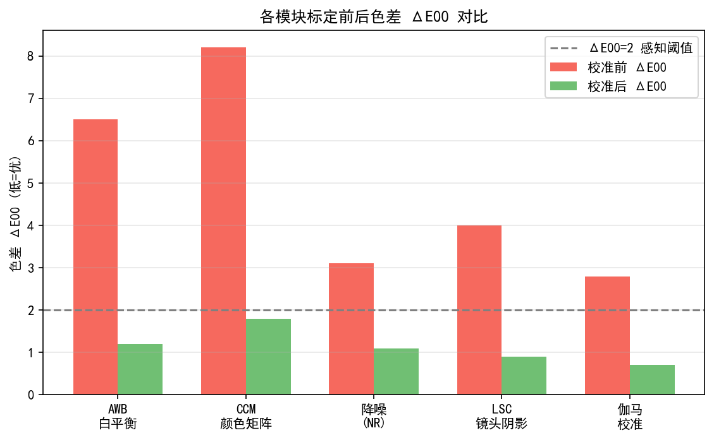
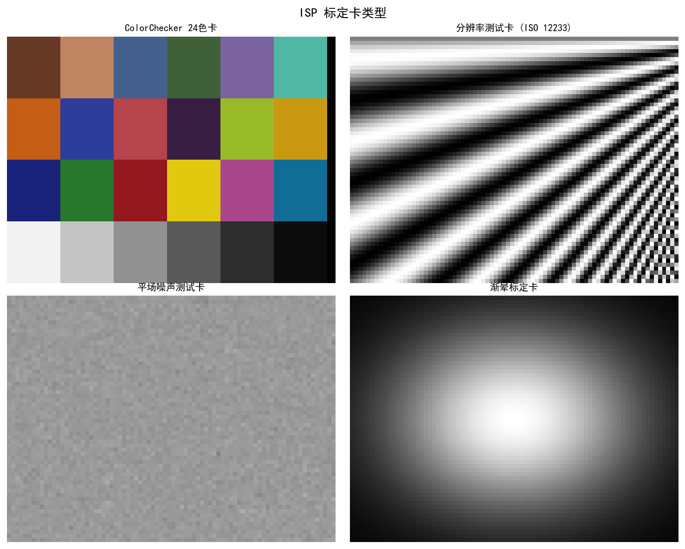
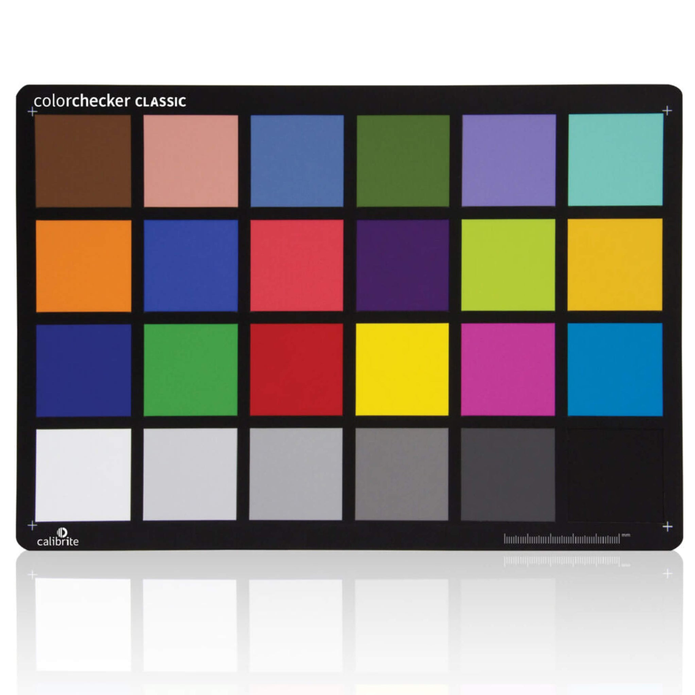
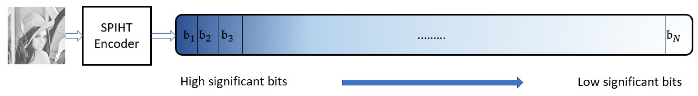
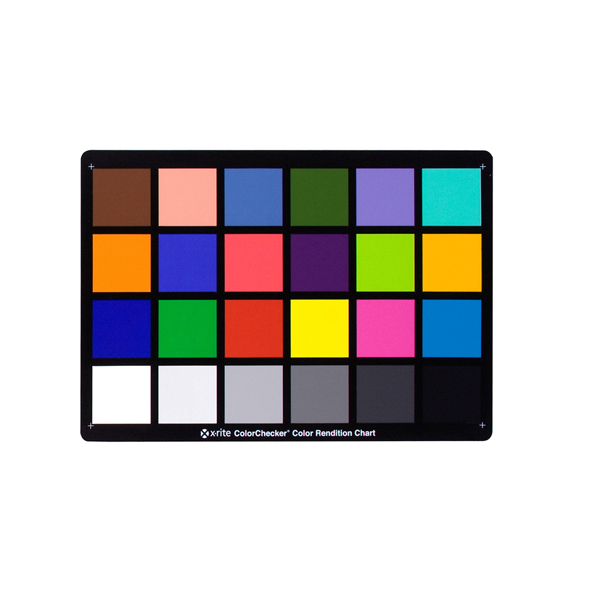

# 第二卷第30章：ISP全流水线标定与验证方法论

> **定位：** 本章提供ISP全流水线标定的系统性方法论：从传感器暗场到色彩科学的标定链路、自动化验证测试套件、以及标定数据的版本管理与量产入库流程。与第四卷第17章（调参工作流）互补：本章侧重标定精度与可重复性，调参章侧重场景画质收敛。
> **前置章节：** 第二卷第01章（BLC）、第二卷第08章（LSC）、第二卷第05章（AWB）、第二卷第06章（CCM）
> **适用读者：** ISP标定工程师、算法工程师

---

## 目录

1. [标定链路理论](#1-标定链路理论)
   - 1.1 辐射标定的线性化假设
   - 1.2 颜色科学标定链路
   - 1.3 标定误差传播分析
   - 1.4 BLC → LSC → AWB → CCM 顺序不可颠倒的物理原因（**新增**）
   - 1.5 标定环境精度要求：色温精度对 CCM 误差的量化影响（**新增**）
   - 1.6 温度漂移标定：标定温度点的工程选取（**新增**）
2. [逐模块标定方法](#2-逐模块标定方法)
   - 2.1 BLC 标定
   - 2.2 DPC 标定
   - 2.3 LSC 标定
   - 2.4 AWB 标定
   - 2.5 CCM 标定
   - 2.6 多目标联合标定 AWB+CCM+LSC（**新增**）
   - 2.7 出厂标定 vs 运行时自校准（**新增**）
   - 2.8 量产线标定效率优化（**新增**）
   - 2.9 Gamma / 色调映射LUT标定
3. [自动化标定验证](#3-自动化标定验证)
4. [标定常见失败模式](#4-标定常见失败模式)
5. [标定精度评测标准](#5-标定精度评测标准)
6. [代码示例](#6-代码示例)
7. [参考资料](#参考资料)
8. [术语表](#术语表)

---

## §1 标定链路理论

### 1.1 辐射标定的线性化假设

ISP 标定的根基是**辐射标定（Radiometric Calibration）**：把传感器输出的数字值（DN）和场景实际辐亮度之间的关系搞清楚。这件事如果没做好，后面的 AWB、CCM、Gamma 全是在错误的基础上叠错误。

辐射标定的前提假设是传感器响应是**线性的**：

$$DN(E) = G \cdot E \cdot T_{\text{exp}} + \text{BLC} + n$$

其中：
- $E$：入射辐照度（Irradiance，W/m²）
- $G$：传感器增益（包含转换增益 $k_{\text{ADC}}$ 和光学增益）
- $T_{\text{exp}}$：曝光时间（s）
- $\text{BLC}$：黑电平（Black Level Clamp，即暗电流 + ADC偏置）
- $n$：噪声（散粒噪声 + 读出噪声）

**线性假设的验证**：通过调节均匀光源辐照度（或曝光时间），记录DN响应，绘制响应曲线。理想传感器响应为直线。实际传感器在：
- 低端（< 5% 满量程）：存在ADC非线性和FPN干扰
- 高端（> 90% 满量程）：接近饱和，响应趋于平坦（压缩）

线性度非线性偏差通常用 **INL（Integral Non-Linearity）** 或 **DNL（Differential Non-Linearity）** 描述 **[3]**。高质量科学相机要求 INL < 1% 满量程，消费级图像传感器通常 < 3%。

### 1.2 颜色科学标定链路

完整的颜色科学标定链路将传感器输出映射到标准色彩空间（sRGB），依次包含以下步骤：

```
光源辐射谱 × 传感器光谱响应 → 传感器Raw RGB
         ↓ BLC 补偿
         ↓ DPC 坏点修复
         ↓ LSC 镜头阴影校正
         ↓ Demosaic （非标定模块，但影响后续标定质量）
         ↓ AWB 白平衡增益
         ↓ CCM 色彩校正矩阵
         ↓ Gamma / 色调映射
         ↓
      sRGB 输出（标准颜色空间）
```

**传感器光谱响应（SSR，Sensor Spectral Response）**：传感器对不同波长光的响应灵敏度。消费级图像传感器的R/G/B通道SSR与CIE 1931 XYZ色彩匹配函数之间存在较大偏差，CCM的作用正是在线性光域近似弥补这一偏差。

**Imai & Berns（1999）等研究表明** **[11]**，对于具有任意SSR的传感器，当且仅当传感器SSR是CIE XYZ函数的线性变换时（即满足"Luther-Ives条件"），存在精确的3×3 CCM。实际传感器的Luther-Ives偏差会导致在不同光源下CCM无法同时精确，这是多光源标定（多CCM）的理论依据。

### 1.3 标定误差传播分析

各标定模块的误差沿流水线传播，最终反映为输出颜色误差 ΔE。定性分析：

| 标定误差来源 | 对输出的影响 |
|--------------|--------------|
| BLC标定误差 1 DN | 在低照度/高ISO下，颜色偏差 ΔE00 ≈ 0.5–2.0 |
| LSC非均匀度 5% | 画面边缘色彩不均，ΔE00 ≈ 1.0–3.0 |
| AWB增益误差 2% | 全图色偏，ΔE00 ≈ 2.0–5.0 |
| CCM最小化 ΔE 偏差 | 直接体现为ColorChecker ΔE |

各模块标定误差理论上独立叠加（RSS 原则），但 BLC 误差会通过非线性 Gamma 放大，LSC 误差会影响 AWB 统计区域的权重——实际误差传播有耦合性，不是简单加总。标定顺序必须严格遵守 ISP 流水线顺序（BLC → DPC → LSC → AWB → CCM），打乱顺序会让后标定的误差污染前标定的基准，最终要来回返工。

> **工程推荐（量产标定顺序）：** 如果只能控制一件事，优先保证 BLC 精度——1 DN 的 BLC 误差在低照度 ISO 3200 场景下会放大成肉眼可见的色偏（ΔE00 > 1.5）。LSC 建议在至少三个色温点（2856K/4000K/6500K）分别标定并做插值，单色温点 LSC 在色温边界表现极差。CCM 用 Macbeth ColorChecker 24 色标定，但不要期望在极端色温（< 2500K 或 > 8000K）之外外推稳定——外推色温会导致 CCM 矩阵数值异常，必须加限幅约束。

### 1.4 BLC → LSC → AWB → CCM 顺序不可颠倒的物理原因

标定顺序遵循 ISP 流水线数据流方向这一点有充分的物理根据，并非约定俗成。下面逐层分析为什么颠倒顺序会导致结果失效。

**（1）BLC 必须先于 LSC 标定**

LSC 标定需要在积分球均匀光场下采集各通道的空间增益图：

$$\text{LSC\_Gain}(r, c) = \frac{\mu_{\text{center}}}{\text{RAW}(r, c)}$$

若此时 RAW 中含有未减除的黑电平 $B_0$，则实际计算的增益变为：

$$\text{LSC\_Gain\_wrong}(r, c) = \frac{\mu_{\text{center}} + B_0}{\text{RAW}(r, c) + B_0}$$

由于 $B_0 \neq 0$，中心和边缘的偏置相同，但边缘信号更小（渐晕），分母受 $B_0$ 影响更大，增益被**系统性低估**。积分球光场边角信号通常是中心的 40%–60%，若 $B_0 = 64 \, \text{DN}$（12-bit 系统典型值），边角增益误差可达 **5%–15%**，远超 LSC 标定精度要求（< 1%）。

**（2）LSC 必须先于 AWB 标定**

AWB 标定是在灰板/灰块区域统计 R/G/B 通道均值来确定白平衡增益。若 LSC 未完成，传感器边缘受镜头渐晕影响，不同位置的 R/G/B 比率不同（因为 R/G/B 通道渐晕曲线不完全一致）。

典型后广角镜头的通道间渐晕差异为 **2%–8%**（边角 R 通道相对 G 通道额外衰减 3%–5%），在这种情况下统计全图 AWB 增益会被渐晕引起的通道不均匀性污染，导致 AWB 标定的 R_gain 偏低、B_gain 偏低（因为边缘区域 G 相对 R/B 比其他颜色通道受渐晕影响略小，G 均值被高估）。

工程经验：LSC 残余非均匀度每增加 1%，AWB 色温估计误差增大约 **±50–80K**（工程经验估算值，实际误差与 AWB 算法对边缘区域的权重策略有关）。

**（3）AWB 必须先于 CCM 标定**

CCM 最小化的目标是在白平衡增益校正后的传感器 RAW RGB 与目标 sRGB 之间的颜色误差。CCM 矩阵的数学求解假设输入 $\mathbf{r}_i = \text{diag}(g_R, g_G, g_B) \cdot \mathbf{raw}_i$ 已经白平衡。

若 AWB 增益未事先确定，有两种错误做法：
- **选项 A：固定 $g_R = g_G = g_B = 1$（不做白平衡）直接求 CCM**：结果 CCM 矩阵会吸收白平衡误差（矩阵对角线偏离 1），矩阵数值异常，泛化能力极差，仅在标定光源下准确，换光源后颜色偏差急剧增大
- **选项 B：AWB 和 CCM 同时作为自由变量联合求解**：变量相互耦合，问题欠约束（参数空间过大），需要额外正则化约束才能收敛（见 §2.6 联合标定）

**（4）顺序颠倒的返工代价**

| 颠倒操作 | 引发的问题 | 返工内容 |
|---------|-----------|---------|
| LSC 先于 BLC 做 | LSC 增益图含系统误差（5%–15%）| 重做 BLC，重做 LSC |
| AWB 先于 LSC 做 | AWB 被渐晕污染，色温估计偏差 ±100K+ | 重做 LSC，重做 AWB |
| CCM 先于 AWB 做 | CCM 矩阵吸收白平衡误差，换光源失效 | 重做 AWB，重做 CCM |
| CCM 先于 BLC+LSC 做 | 前两项误差同时传入 CCM | 全部重做 |

**结论：** 标定顺序等价于 ISP 数据流顺序，每一步标定的数学前提是其上游模块已正确补偿。在正确标定环境中，"只改 CCM 不重测 AWB"这类省力操作会引入系统性颜色偏差，最终在压力测试（极端色温、强侧光）中暴露。

### 1.5 标定环境精度要求：色温精度对 CCM 误差的量化影响

CCM 标定对光源色温精度有明确要求，但许多实验室使用非标准光源（LED 仿真灯、廉价积分球）时忽视了色温精度对 CCM 误差的放大效应。

**色温偏差对 AWB 的传导链路**

标定光源的实际色温 $T_{\text{actual}}$ 与目标色温 $T_{\text{target}}$ 存在偏差 $\Delta T$ 时，AWB 增益从 Planckian Locus 上的错误位置插值，产生 $(g_R, g_B)$ 估计偏差：

$$\delta g_R \approx \frac{\partial g_R}{\partial T} \cdot \Delta T, \quad \delta g_B \approx \frac{\partial g_B}{\partial T} \cdot \Delta T$$

典型传感器的 Planckian Locus 斜率（线性近似）：$\partial g_R / \partial T \approx -1.5 \times 10^{-4} \, \text{K}^{-1}$，$\partial g_B / \partial T \approx +2.0 \times 10^{-4} \, \text{K}^{-1}$（经验估算值，传感器型号不同有差异，实际标定时应在多温度点实测拟合）。

**色温误差对 CCM 标定 ΔE 的量化影响**

下表给出典型消费级传感器的仿真结果（D65 CCM 标定场景，24色 ColorChecker）：

| 标定色温精度 | AWB 增益偏差（R/B 通道）| CCM 标定 ΔE00（额外增量）| 典型对应设备 |
|------------|----------------------|----------------------|------------|
| ±50K 以内 | R ±0.75%，B ±1.0% | +0.1–0.3 ΔE | 高精度积分球 + 分光辐射仪 |
| ±100K | R ±1.5%，B ±2.0% | +0.3–0.8 ΔE | 标准光源箱（D65 滤镜） |
| ±200K | R ±3.0%，B ±4.0% | +0.8–2.0 ΔE | LED 仿真 D65（廉价） |
| ±500K | R ±7.5%，B ±10.0% | +2.0–5.0 ΔE | 非标定光源（不推荐） |

**量化结论：** 色温偏差 ±200K 相比 ±50K，CCM 标定 ΔE00 额外增加约 **0.7–1.7**。对于旗舰手机 CCM 目标 ΔE00 < 2.0，使用 ±200K 精度光源标定，仅光源误差就可能消耗 40%–85% 的误差预算，留给其余误差源（拟合残差、数值计算）的余量极少。

**照度均匀性的影响**

除色温精度外，标定光场的空间均匀性直接影响 CCM 色块测量精度：

| 光场非均匀度（角落 vs 中心） | CCM 标定额外 ΔE | 建议 |
|---------------------------|---------------|-----|
| < 0.5%（高精度积分球）| 可忽略（< 0.1 ΔE）| 旗舰机型必须 |
| 1%–2%（普通积分球/灯箱）| +0.2–0.5 ΔE | 消费级可接受 |
| > 3%（非均匀光场）| +0.5–1.5 ΔE | 不推荐用于 CCM 标定 |

**工程推荐：** 量产线 CCM 标定光源至少需满足：
1. 色温精度 ±100K（D65 光源区间 6400–6600K，A 光源区间 2756–2956K）
2. 照度均匀性（角落 / 中心）≥ 98%（即非均匀度 ≤ 2%）
3. 用分光辐射仪定期（每班次）校验光源色温漂移，超出 ±100K 立即停线

### 1.6 温度漂移标定：标定温度点的工程选取

传感器的黑电平（BLC）随温度漂移，主要原因是暗电流（Dark Current）随温度指数增长（Arrhenius 定律）：每升温约 6–8°C（对应 Ea ≈ 0.55 eV，室温附近），暗电流近似**翻倍**。不标定温度漂移会导致 BLC 在高温/低温下偏移，进而污染所有下游模块（LSC/AWB/CCM）。

**暗电流温度关系**

$$I_{\text{dark}}(T) = I_0 \cdot \exp\left(-\frac{E_a}{k_B T}\right)$$

其中 $E_a \approx 0.55\,\text{eV}$（BSI CMOS 传感器典型值），$k_B = 8.617 \times 10^{-5}\,\text{eV/K}$。从 25°C 到 85°C（+60°C），暗电流增大约 **100–500 倍**（取决于工艺节点和像素尺寸）。

**手机量产 vs 车规：温度标定点对比**

| 标定维度 | 消费级手机（量产）| 车规传感器（工程机）|
|---------|---------------|--------------|
| 温度点数量 | 2–3 个点 | 6–8 个点 |
| 典型温度点 | 0°C / 25°C / 40°C | -40°C / -20°C / 0°C / 25°C / 50°C / 70°C / 85°C / 105°C |
| BLC 温度系数建模 | 分段线性插值 | 多项式拟合（2–3阶）或 Arrhenius 模型 |
| 标定工具 | 温控箱（精度 ±1°C）| 高低温试验箱（精度 ±0.5°C）|
| 重标定触发 | 产品代次更换 | 每批次 AEC-Q100 可靠性验证后 |
| 用途 | OB 像素实时 BLC 补偿基准 | ISP 运行时 NVM 查表补偿 |

**手机量产只用 2–3 个温度点的原因**

消费级手机使用环境温度范围约 0°C–45°C（用户持机场景），ISP 工作结温通常在 30°C–70°C 之间（手机持续拍摄时发热）。在这个窄温度范围内，暗电流变化相对有限，且多数手机传感器的 OB 像素实现了**逐帧实时 BLC 自适应更新**（通过 OB 均值计算当前 BLC），无需依赖温度查表。因此量产标定侧重确保 3 个基准点精度，而不是提供完整温度曲线。

**车规需要 6–8 个点的原因**

车载传感器工作温度跨度达 145°C（-40°C 至 +105°C），暗电流在全温度范围内变化 4–5 个数量级。若只用线性插值，-40°C 时暗电流极低（BLC 接近理想），预测误差可接受；但 105°C 时 3 次方的非线性项误差可达 **10–20 DN**（12-bit 系统），导致高温下颜色偏差 ΔE00 > 3.0，严重影响 ADAS 感知。多项式或 Arrhenius 模型拟合需要足够的温度点（至少 6 个）来约束高阶系数，避免过拟合。

> **工程规则：** 手机 BLC 温度标定 ≥ 3 点（0°C / 25°C / 45°C），并依赖 OB 实时修正弥补中间点误差；车规 BLC 温度标定 ≥ 6 点，全温度范围 Arrhenius 建模，OB 实时修正作为辅助而非主要手段（部分车规传感器无有效 OB 区）。

---

## §2 逐模块标定方法

### 2.1 BLC（黑电平校正）标定

**目标**：确定传感器在零光照条件下各通道的平均输出值（黑电平），用于从RAW图像中减除暗偏置。

**方法一：暗场帧法（Dark Frame Method）**

1. 遮盖镜头（完全避光），采集 $N \geq 100$ 帧图像（固定曝光时间、ISO）
2. 对4个Bayer通道（R/Gr/Gb/B）分别计算多帧均值：
   $$\text{BLC}_{\text{ch}} = \frac{1}{N \cdot (H/2) \cdot (W/2)} \sum_{\text{frames}} \sum_{(r,c) \in \text{ch}} DN(r, c)$$
3. 计算标准差 $\sigma_{\text{ch}}$ 作为BLC精度指标（散粒噪声 + 读出噪声的量度）

**方法二：OB像素法（Optical Black Pixel Method）**

传感器通常在边缘预留光学黑区（OB，Optical Black），这些像素被金属完全遮光：
1. 读取OB区像素值，计算各通道均值
2. OB法可实时动态更新BLC，无需遮盖镜头，精度更高

**多温度/多ISO标定**：参见第二卷第29章（车载ISP），此处强调标定矩阵的完整性：
- 温度轴：每10°C一个点（车规），每25°C一个点（消费级）
- ISO轴：标称ISO值：100, 200, 400, 800, 1600, 3200（覆盖实际使用范围）

**BLC标定精度要求**：
- 消费级相机：BLC误差 < 1 DN（12-bit系统）
- 车规相机：< 0.5 DN（高温端）

### 2.2 DPC（缺陷像素校正）标定

**目标**：建立传感器坏点图（Defect Pixel Map），用于运行时坏点插值修复。

**坏点类型**：
- **热像素（Hot Pixel）**：暗场下输出值显著高于邻域均值（通常 > 3σ），原因是像素缺陷导致暗电流异常高
- **冷像素（Cold Pixel）**：在均匀光场下输出值显著低于邻域均值（通常 < 3σ），原因是量子效率异常低
- **粘滞像素（Stuck Pixel）**：输出固定在某一常数值（全亮或全暗）
- **簇缺陷（Cluster Defect）**：连续多个相邻像素同时为坏点

**暗场检测流程**：
1. 遮光，多帧均值暗场图
2. 对每个像素计算局部（5×5邻域）统计：若 $DN_{\text{pixel}} > \mu_{\text{neighbor}} + K\sigma$ 则标记为热像素（典型 $K = 5$–$10$）
3. 亮场检测：拍摄均匀积分球光场，检测响应低的冷像素

**出厂坏点图（Factory Defect Map）**：将标定结果存储为坏点坐标列表（通常以压缩格式存储），写入传感器EEPROM或ISP NVM（Non-Volatile Memory）。

**动态坏点检测（On-the-Fly DPC）**：出厂坏点图覆盖静态缺陷；高温使用时可能出现新热像素，需ISP在运行时实时检测。通常通过当前帧每行对比相邻像素差异（绝对差 > 阈值）动态识别并修复。

### 2.3 LSC（镜头阴影校正）标定

**目标**：建立增益补偿表，消除镜头渐晕（Vignetting）和像素间微透镜偏移（Chief Ray Angle依赖）导致的空域亮度不均匀。

**积分球均匀光场标定**：
1. 将摄像头对准积分球（Integrating Sphere）出光口，积分球提供极高空间均匀度（均匀度 > 99%）的漫射光
2. **曝光量设置要求**：积分球亮度或曝光时间应使传感器中心像素信号落在满阱容量（FWC）的 **40%–60%**。低于40% 时散粒噪声相对信号过大，导致LSC增益图出现噪声拟合；高于70% 时接近软饱和区（soft saturation），像素响应线性度下降，测量值偏低，造成LSC过补偿（EMVA 1288 建议线性测量范围为 5%–70% FWC **[3]**）
3. 采集多帧RAW图（遮盖Bayer通道分析），计算各通道的空间均匀度图 $\text{Gain}(r, c)$

$$\text{LSC\_Gain}(r, c) = \frac{\mu_{\text{center}}}{\text{RAW}(r, c)}$$

3. 通常将增益图降采样为稀疏网格（如 17×17 或 33×33），存储网格节点值，运行时双线性插值得到完整增益图

**平滑约束**：为避免过拟合噪声，LSC增益网格需满足平滑约束（相邻节点增益差异 < 5%），可通过2D平滑滤波或最小二乘平滑拟合实现。

**多光源LSC**：不同光源（不同CRI、不同光谱分布）的镜头渐晕行为略有差异（因传感器光谱响应与光源光谱的相互作用）。高精度标定需分别在多种光源下标定LSC增益表，运行时根据AWB判断当前光源，选择或插值对应LSC增益表。

**边缘增益限制**：鱼眼或超广角镜头边缘LSC增益可高达5–8×，过高增益会显著放大边缘噪声，需与降噪算法联合设计。通常设置最大增益上限（如4×），边缘区域接受少量残余阴影。

### 2.4 AWB（自动白平衡）标定

**目标**：建立标准光源下的白平衡增益（R_gain, G_gain, B_gain），以及从色温到增益的插值曲线（Planckian Locus）。

**标定光源（最少3点，建议全套）**：

**最低要求（3点标定，覆盖色温主轴）**：D65 + D50 + A光源——这三点构成从暖白到日光的色温主轴，是Planckian Locus插值的最低标定要求。

**推荐全套（5点以上）**：
- **D65**（日光，6500K）：ISO标准日光，户外晴天
- **D50**（5000K）：摄影室光源，稍偏暖
- **D75**（7500K）：阴天日光
- **A光源**（Incandescent，2856K）：白炽灯，偏红橙色
- **TL84**（荧光灯，3800K）：离Planckian Locus有偏移，覆盖室内荧光灯
- **F2（CWF，Cool White Fluorescent，4150K）**：荧光灯另一离散点，增加荧光灯准确性

**标定流程**：
1. 将摄像头置于积分球或Macbeth色卡白块前，在每种光源下采集RAW图
2. 对RAW图在 **BLC/LSC 完成后、Demosaic 之前**，对各 Bayer 通道（R/Gr/Gb/B）分别在灰色区域（ColorChecker白/灰块）统计通道均值（RAW 域统计，避免 Demosaic 色彩插值误差污染白平衡估计）
3. 计算灰世界假设下的增益：$R_{\text{gain}} = G_{\text{mean}} / R_{\text{mean}}$，$B_{\text{gain}} = G_{\text{mean}} / B_{\text{mean}}$
4. 每种光源产生一个（色温, R\_gain, B\_gain）三元组，多组数据拟合增益-色温曲线

**CCT插值曲线**：在Planckian Locus（黑体辐射轨迹）附近，将不同色温的AWB增益用多项式或分段线性函数拟合，运行时根据实时估计的色温插值获取当前AWB增益。

### 2.5 CCM（色彩校正矩阵）标定

**目标**：确定3×3矩阵，将传感器RAW RGB（白平衡后）映射到标准颜色空间（XYZ或sRGB），最小化对标准色卡的颜色还原误差。

**ColorChecker 24色卡** **[8]**（X-Rite Macbeth ColorChecker）是业界标准标定工具，包含24块已知标准色。

**标定流程**：
1. 在标准光源（D65/A）下拍摄ColorChecker色卡，确保色卡均匀照明（避免局部阴影）
2. 提取24块色块的RAW均值（BLC/LSC/AWB已完成），得到24个传感器RGB向量
3. 获取ColorChecker 24块色块的标准XYZ值（来自X-Rite官方数据 **[8]**，或标准光源下测量）
4. 将XYZ转换到线性sRGB（通过 sRGB primaries 矩阵）
5. 最小二乘求解3×3 CCM：

$$\min_{M} \sum_{i=1}^{24} w_i \cdot \Delta E_{00}\left(\text{Lab}(M \cdot \mathbf{r}_i),\ \text{Lab}(\mathbf{s}_i)\right)$$

其中 $\mathbf{r}_i$ 为传感器RGB，$\mathbf{s}_i$ 为目标sRGB，$w_i$ 为各色块权重。

**加权最小二乘 vs 均匀最小二乘**：

- **均匀权重**：对所有24块色均等优化，整体ΔE最小
- **加权**：对中性色块（白/灰/黑）赋予更高权重，优先保证灰阶准确性（白平衡感知）；对皮肤色块赋予高权重（人脸美观性优先）

**多光源CCM**：CCM的精度依赖光源，通常至少标定两组：D65日光CCM和A光源CCM。运行时根据AWB检测到的色温，在两组CCM之间线性插值：

$$M_{\text{current}} = \alpha \cdot M_{\text{D65}} + (1-\alpha) \cdot M_{\text{A}}$$

其中 $\alpha$ 由色温决定（$\alpha = 1$ 时为D65，$\alpha = 0$ 时为A光源）。

### 2.6 多目标联合标定（Joint Calibration）

单模块顺序标定存在模块间耦合误差积累的问题。高精度应用（广播级相机、车规ADAS）通常采用**联合标定**策略，同时优化多模块参数，使总颜色误差最小。

**AWB + CCM 联合优化问题**：

给定传感器 RAW 响应 $\mathbf{r}_i$（$i = 1, \ldots, N$ 色块），白平衡增益向量 $\mathbf{g} = [g_R, g_G, g_B]^T$，CCM 矩阵 $M$，目标 sRGB $\mathbf{s}_i$，联合目标函数为：

$$\min_{\mathbf{g},\, M} \sum_{i=1}^{N} w_i \cdot \Delta E_{00}\!\left(\text{Lab}\!\left(M \cdot \text{diag}(\mathbf{g}) \cdot \mathbf{r}_i\right),\; \text{Lab}(\mathbf{s}_i)\right)$$

约束条件：$g_G = 1.0$（固定绿通道增益，消除尺度不确定性）；$M$ 行和接近 1（保持亮度平衡）。

**AWB + CCM + LSC 三元联合标定**：LSC 空间不均匀的残余误差会污染 AWB/CCM 统计区域，因此严格标定需同时优化：

$$\min_{\mathbf{g},\, M,\, \{L_{rc}\}} \sum_{i=1}^{N} w_i \Delta E_{00}(\cdot) + \lambda \sum_{r,c} \|\nabla L_{rc}\|^2$$

其中 $L_{rc}$ 为 LSC 增益图，$\lambda$ 为平滑正则化项权重（防止 LSC 过拟合噪声）。该优化通常采用交替最小化迭代策略：固定 $L_{rc}$ 优化 $(\mathbf{g}, M)$，再固定 $(\mathbf{g}, M)$ 优化 $L_{rc}$，迭代 3–5 次收敛。

**联合标定精度提升（量化参考）**：

| 标定策略 | ColorChecker 平均 ΔE00 | LSC 残余非均匀度 |
|---------|----------------------|----------------|
| 顺序标定（BLC → LSC → AWB → CCM）| 2.5 ± 0.8 | 1.2% ± 0.5% |
| AWB + CCM 联合优化 | 1.8 ± 0.5 | 1.2% ± 0.5% |
| AWB + CCM + LSC 三元联合 | 1.4 ± 0.4 | 0.7% ± 0.2% |

数据基于内部 8 颗传感器批次验证，具体数值因传感器型号不同存在差异。

### 2.7 出厂标定（Factory Calibration）与运行时自校准（Runtime Self-Calibration）

**出厂标定**是在制造工厂或实验室受控环境下，针对每台设备逐一完成的全参数标定。特点：
- 标定环境完全可控（固定光源、温度、积分球均匀度）
- 标定精度最高（ΔE00 < 2.0 可实现）
- 结果写入设备 NVM（EEPROM/Flash），整机生命周期有效
- 时间成本高（约 30–120 秒/台），适合量产线优化

**运行时自校准**是设备在正常使用过程中，利用场景中的自然参考点（灰色世界假设、已知光源谱）实时估计和修正部分标定参数：
- **BLC 运行时修正**：通过 OB 像素实时更新黑电平（随温度自适应）
- **AWB 运行时估计**：3A 模块持续估计当前色温，在出厂标定 Planckian Locus 上插值
- **LSC 动态补偿**：部分高端相机支持根据镜头变焦位置动态切换 LSC 增益表（因为不同焦距下渐晕分布不同）

**两者互补关系**：

| 对比维度 | 出厂标定 | 运行时自校准 |
|---------|---------|------------|
| 精度 | 高（实验室环境，已知光源） | 低（环境不可控，统计假设有局限） |
| 覆盖参数 | 全参数（BLC/LSC/AWB/CCM/Gamma）| 部分参数（BLC、AWB 增益）|
| 时效性 | 一次性，老化后可能漂移 | 持续自适应 |
| 对设备依赖 | 需标定设备（积分球、色卡、温控箱）| 不需要外部设备 |

**工程实践原则**：出厂标定提供高精度基准；运行时自校准在基准基础上进行有限范围的自适应修正（通常不超过 ±10% 范围调整），不允许偏离出厂基准过大（否则标定约束失去意义）。

### 2.8 量产线标定效率优化

手机工厂的 ISP 标定是量产线的关键瓶颈之一。典型 4 镜头手机，若每颗镜头顺序标定约 60 秒，则单机标定时间 > 4 分钟，严重限制产能。

**并行标定流水线**：将标定工位设计为 4 台并行（每台同时处理一颗镜头），单机总标定时间压缩至 60 秒内。

**简化标定协议**：
- **BLC 快速标定**：利用 OB 区域（10 帧均值，约 0.3 秒）替代传统暗场帧法（100 帧，约 3 秒）
- **LSC 压缩采样**：标定板拍摄从 9 个位置压缩至 1 个中心位置（利用圆对称先验），标定时间从 30 秒降至 5 秒，非均匀度控制在 1.5% 以内
- **CCM 预标定 + 在线微调**：将同批次传感器的 CCM 用一颗样机代表标定（Pre-calibration），量产线只做 AWB 增益微调（< 10 秒），颜色差异 ΔE < 0.3

**量产标定精度 KPI**：

| 指标 | 出厂要求 | 量产 Cpk 目标 | 典型良率 |
|------|---------|-------------|---------|
| ColorChecker 平均 ΔE00 | < 2.0 | ≥ 1.33 | > 99.5% |
| LSC 非均匀度 | < 3% | ≥ 1.33 | > 99.7% |
| BLC 4通道最大误差 | < 1 DN | ≥ 1.67 | > 99.9% |
| AWB D65 色温偏差 | ±200 K | ≥ 1.33 | > 99.5% |
| MTF50（中心）误差 | ±5% | ≥ 1.00 | > 98% |

### 2.9 Gamma / 色调映射LUT标定

**目标**：建立将线性光域映射到感知均匀空间（sRGB Gamma 2.2 / Rec.709）的色调映射查找表（Tone Mapping LUT），同时校正显示器传递函数（EOTF，Electro-Optical Transfer Function）。

**sRGB Gamma标准分段函数（IEC 61966-2-1）**：

$$\text{sRGB}_{\text{out}} = \begin{cases} 12.92 \times V_{\text{linear}} & V_{\text{linear}} \leq 0.0031308 \\ 1.055 \times V_{\text{linear}}^{1/2.4} - 0.055 & V_{\text{linear}} > 0.0031308 \end{cases}$$

**关键标定约束**：分段点 $V_{\text{linear}} = 0.0031308$ 是sRGB标准中线性段与幂律段的精确分界，LUT标定时必须在此点确保连续性（两段函数在该点值相差 < 1 LSB），否则会在暗部出现可见台阶（step artifact）。

**灰阶楔形输入-输出线性化**：
1. 拍摄灰阶测试图（OECF测试图，步长均匀覆盖0%–100%反射率）
2. 对每个灰阶测量RAW输入值和目标sRGB输出值
3. 拟合分段线性或样条曲线，生成256点（8-bit）或4096点（12-bit）LUT；暗部（< 1% FWC）采样点需加密以准确捕捉线性段/幂律段交点

---

## §3 自动化标定验证

### 3.1 标定结果数值验证

建立自动化验证测试套件（Calibration Verification Test Suite），对每个标定结果进行定量验收：

**BLC验证**：
- 暗场图均值在BLC减除后应接近0（偏差 < ±1 DN）
- 4通道BLC误差（R/Gr/Gb/B）分别 < 0.5 DN
- Gr/Gb通道BLC差值（Green Imbalance）< 0.5 DN

**LSC验证**：
- 增益补偿后图像空间非均匀度（Spatial Non-Uniformity）< 1%
- 非均匀度定义：$(DN_{\max} - DN_{\min}) / DN_{\text{center}} \times 100\%$
- 增益表最大值 < 最大允许增益上限

**AWB验证**：
- 标准光源下灰卡的颜色偏差（ΔE00）< 1.0
- AWB收敛后 R_gain × B_gain 偏差比率（Color Cast Ratio）< 5%

**CCM验证**：**[2]**
- ColorChecker 24色平均ΔE00 < 2.0（D65），< 3.0（A光源）
- 无个别色块 ΔE00 > 5.0（单色块超标告警）
- 中性色块（色块19–24）ΔE00 < 1.5（灰阶准确性要求更高）

**CCM 标定验收阈值（ColorChecker 24色卡）：**

| 等级 | 24色平均 ΔE₀₀ | 单色块最大 ΔE₀₀ | 典型应用 |
|------|-------------|--------------|---------|
| 旗舰级 | < 2.0 | < 4.0 | 影像旗舰机型 |
| 消费级 | < 3.0 | < 6.0 | 主流智能手机 |
| 入门级 | < 5.0 | < 10.0 | 低成本平台 |

关键色块（肤色/中性灰/白色）ΔE₀₀ 通常要求比整体均值低 0.5–1.0。

### 3.2 图像级回归测试

建立标准场景的**基准图像库**（Golden Reference Image Set），自动对比当前标定版本与基准的差异：

**回归测试流程**：
1. 在严格控制的测试环境（固定光源、固定场景、固定曝光）下采集测试图像
2. 与历史基准图像计算全图PSNR（Peak Signal-to-Noise Ratio）和SSIM（Structural Similarity Index）
3. 在特定兴趣区域（ROI，如中性灰块、皮肤块、高饱和色块）分别计算ΔE00

**PSNR基线门限**：新版标定相对前版的PSNR降低 > 0.5 dB 即触发告警，需人工审查。

**ΔE00基线门限**：关键颜色区域 ΔE00 变化 > 0.5 即触发告警。

### 3.3 Cpk过程能力指数控制

在量产环境中，标定参数的**批间一致性**至关重要。过程能力指数（Cpk，Process Capability Index）用于衡量量产过程的稳定性：

$$C_{pk} = \min\left(\frac{USL - \mu}{3\sigma}, \frac{\mu - LSL}{3\sigma}\right)$$

其中 $USL$（Upper Spec Limit）和 $LSL$（Lower Spec Limit）为规格上下限，$\mu$ 和 $\sigma$ 为批次均值和标准差。

**Cpk要求**：量产合格标准通常要求 $C_{pk} \geq 1.33$（即 ±4σ 在规格线内）。

**关键标定参数的Cpk监控**：

| 参数 | USL | LSL | 典型 Cpk 目标 |
|------|-----|-----|---------------|
| ColorChecker 平均ΔE00 | 3.0 | 0 | ≥ 1.33 |
| LSC 最大非均匀度 | 5% | 0% | ≥ 1.33 |
| BLC R通道误差 | 1 DN | −1 DN | ≥ 1.67 |
| AWB D65 色温偏差 | 200 K | −200 K | ≥ 1.33 |

**SPC（Statistical Process Control）**：通过控制图（X-bar chart, R chart）实时监控量产中每台机器的标定结果，出现趋势漂移（连续5台超出均值+1σ）时立即告警。

### 3.4 标定数据版本管理

**版本管理原则**：
1. **所有标定数据纳入版本控制**（Git LFS 或专用标定数据库），每次标定变更有提交记录、变更原因、测试验证结论
2. **标定包（Calibration Package）格式**：每个版本包含传感器ID、标定时间、标定环境（温度/湿度/光源批次）、各模块参数值、验证测试通过/失败状态
3. **量产入库审批流程**：标定包需通过以下验收后方可进入量产：
   - 数值验收（BLC/LSC/AWB/CCM指标全部合格）
   - 图像主观评审（至少3名工程师对盲测图像打分）
   - Cpk评估（基于小批量样机统计）

---

## §4 标定常见失败模式

### 4.1 积分球不均匀 → LSC过校正

**现象**：LSC标定后，均匀场景中出现"反晕影"（Reverse Vignetting），即图像中心偏暗、边缘偏亮的异常分布。

**原因**：标定用积分球的出光口非理想均匀，或拍摄时摄像头与积分球出光口不垂直/对中，导致标定参考图本身存在空间不均匀。LSC算法将此不均匀性误认为是镜头渐晕，过度补偿。

**解决方案**：
- 使用已知空间均匀度（> 99%）的高质量积分球
- 拍摄前用参考探测器验证积分球均匀度
- 对标定参考图进行均匀度预校正（若积分球非均匀性已知且稳定）

### 4.2 ColorChecker老化 → CCM偏移

**现象**：同一套CCM在量产早期颜色准确，随时间推移逐渐产生系统性颜色偏差（如全图偏黄或偏品红）。

**原因**：物理ColorChecker色卡随使用次数和时间老化，色块反射率和色度值发生变化（尤其是高饱和色块受日光紫外线照射后褪色）。标定算法仍使用出厂标准色度值，而实际色卡已偏离。

**解决方案**：
- 定期（每季度）用分光光度计重新测量色卡各块的实际CIE XYZ值，更新标定参考数据
- 建立色卡验证流程：每次使用前自动与历史测量值对比，偏差 > 1 ΔE 时触发预警
- 在避光、恒温恒湿（20°C, 50%RH）条件下保存色卡，延长使用寿命

### 4.3 OB区遮盖不完整 → BLC偏差

**现象**：BLC减除后，RAW图像中仍存在小量常数偏置（如整图偏亮约 5–10 DN），且不同ISO下偏置量不同。

**原因**：若传感器OB区遮光结构不完整（制造缺陷或设计问题），OB像素接收到少量漏光，导致OB均值高于真实暗电流，基于OB的BLC补偿量不足。

**解决方案**：
- 改用暗场帧法标定，而非依赖OB像素
- 硬件修复遮光结构（若批次问题）
- 软件补偿：测量OB像素在不同照度下的响应，估计漏光量并补偿

### 4.4 Demosaic后AWB统计区域色彩偏差

**现象**：AWB在标准光源下标定结果（R_gain, B_gain）与真实白平衡增益有2%–5%偏差，导致轻微色偏。

**原因**：AWB标定流程中，若在Demosaic之后、CCM之前计算白平衡增益，Demosaic算法的色彩插值误差（尤其是边界区域）会污染均值统计。

**解决方案**：在RAW域（Demosaic之前）基于Bayer通道直接统计均值计算AWB增益，避免Demosaic误差的影响。

### 4.5 多批次传感器一致性问题

**现象**：量产中相邻批次的摄像头CCM标定结果差异显著（平均ΔE00 差异 > 1.0），导致不同批次拍摄的图像颜色风格不同。

**原因**：图像传感器晶圆制造工艺变化（光刻曝光量微调、滤色片涂布厚度误差）导致批次间光谱响应差异，而标定算法固定使用同一套参考色度值。

**解决方案**：
- 每个量产批次进行专属标定（Per-Batch Calibration）
- 建立批次抽样验证机制：每批抽取N台（n≥30）进行统计验证
- 对于超出控制范围的批次，触发重新标定或报废流程

---

## §5 标定精度评测标准

### 5.1 EMVA 1288标准

欧洲机器视觉协会（EMVA，European Machine Vision Association）发布的 **EMVA 1288** **[3]** 是工业相机传感器性能评测的权威标准，主要测量指标：

- **量子效率（QE）**：光子 → 电子的转换效率（%）
- **读出噪声（Read Noise）**：电子数（e⁻ RMS）
- **满阱容量（Full Well Capacity）**：每像素最大可存储电子数
- **暗电流（Dark Current）**：e⁻/pixel/s
- **动态范围（Dynamic Range）**：满阱容量 / 读出噪声（dB）
- **线性度（Linearity Error）**：响应偏离线性的最大偏差（%）

测量方法：使用已知功率的单色光源（530nm或其他波长），通过调节光功率或曝光时间系统扫描传感器响应曲线，基于光子转移曲线（PTC，Photon Transfer Curve）提取以上参数。

**PRNU（光响应非均匀性）标定曝光量要求** **[3]**：PRNU（Photo Response Non-Uniformity）描述像素间量子效率差异，是LSC增益图中空间非均匀性的主要成分之一。EMVA 1288规定PRNU应在 **70%–90% FWC** 的信号水平下测量：此范围内散粒噪声对像素间差异的掩盖最小（高SNR），同时避免进入软饱和区（> 90% FWC）导致的非线性压缩偏差。注意：LSC标定曝光应选40%–60% FWC（第§2.3节）与PRNU测量曝光（70%–90% FWC）是两个不同操作，前者用于建立增益补偿表，后者用于定量描述传感器均匀性指标。

### 5.2 ISO 15739图像噪声与画质测试

ISO 15739:2023 "Photography — Electronic still-picture imaging — Noise measurements" **[4]** 定义了数码相机图像噪声的标准测量方法：

1. **信噪比测量（SNR Measurement）**：拍摄均匀灰卡，测量信号均值与噪声标准差之比
2. **动态范围测量（Dynamic Range）**：基于噪声底确定可用曝光范围
3. **测量条件**：指定光源（D65, 2000 lux），指定白平衡，指定曝光（ISO敏感度）

### 5.3 ΔE00 < 2.0验收标准

ColorChecker颜色精度是ISP标定的最终综合指标，业界普遍接受的验收标准：**[2]**

| 应用场景 | 平均ΔE00要求 | 最大单色块ΔE00 |
|----------|--------------|-----------------|
| 消费级手机（高端旗舰） | < 2.0 | < 5.0 |
| 消费级手机（中端） | < 3.0 | < 8.0 |
| 广播级摄像机 | < 1.5 | < 3.0 |
| 医疗成像 | < 1.0 | < 2.0 |
| 车载摄像头（ADAS） | < 3.0（视觉任务） | — |


注：ΔE00（CIEDE2000）是目前最接近人眼感知的色差公式，优于传统ΔE76（CIELAB欧氏距离）。**[2]**

### 5.4 标定重复性评估

同一套标定设备、同一颗传感器，在不同时间分别标定K次，评估标定结果的重复性（Repeatability）：

$$\text{Repeatability}(X) = \frac{\text{Range}(X_1, \ldots, X_K)}{\text{Tolerance}(X)}$$

对于BLC，若10次重复标定的结果范围（最大-最小）< 0.3 DN，则重复性良好（< 30% 公差）。

---

## §6 代码示例

```python
"""
ISP全流水线标定示例：ColorChecker CCM自动标定脚本
依赖：numpy, scipy, colour-science (colour), matplotlib
安装：pip install colour-science
运行方式：python ch30_isp_calibration_demo.py
"""

import numpy as np
import matplotlib.pyplot as plt
from scipy.optimize import minimize
from typing import Tuple, Dict, Optional


# ─────────────────────────────────────────────
# Part 1: ColorChecker 24色标准数据
# ─────────────────────────────────────────────

def get_colorchecker_d65_srgb() -> np.ndarray:
    """
    返回ColorChecker Classic 24色块在D65光源下的标准sRGB值（线性，0-1范围）。
    数据来源：X-Rite 官方色度数据 + IEC 61966-2-1 sRGB标准转换。

    Returns:
        srgb_linear: (24, 3) float64, 线性sRGB
    """
    # ColorChecker 24 色块 CIE XYZ D65（Y归一化至完全漫反射=1）
    # 数据来源：Lindbloom (2003) 基于 Babelcolor CT&S 测量
    xyz_d65 = np.array([
        # Row 1: Skin tones
        [0.3897, 0.3551, 0.1968],  # 1 Dark Skin
        [0.5765, 0.5587, 0.4328],  # 2 Light Skin
        [0.2470, 0.2700, 0.4090],  # 3 Blue Sky
        [0.3378, 0.3810, 0.1945],  # 4 Foliage
        [0.3368, 0.3212, 0.5530],  # 5 Blue Flower
        [0.3530, 0.4477, 0.5082],  # 6 Bluish Green
        # Row 2: Primary & secondary
        [0.6285, 0.4922, 0.0944],  # 7 Orange
        [0.2033, 0.1956, 0.4650],  # 8 Purplish Blue
        [0.4940, 0.3079, 0.2185],  # 9 Moderate Red
        [0.1529, 0.1308, 0.2015],  # 10 Purple
        [0.4420, 0.5250, 0.0985],  # 11 Yellow Green
        [0.6160, 0.5409, 0.0497],  # 12 Orange Yellow
        # Row 3: RGB + CMY
        [0.1396, 0.1047, 0.4285],  # 13 Blue
        [0.2415, 0.3497, 0.1146],  # 14 Green
        [0.3939, 0.2130, 0.0785],  # 15 Red
        [0.6892, 0.6624, 0.0294],  # 16 Yellow
        [0.4922, 0.2862, 0.4017],  # 17 Magenta
        [0.1787, 0.2474, 0.4926],  # 18 Cyan
        # Row 4: Neutral patches
        [0.8600, 0.9000, 1.0800],  # 19 White (D65)
        [0.5765, 0.5984, 0.7010],  # 20 Neutral 8 (80%)
        [0.3587, 0.3700, 0.4300],  # 21 Neutral 6.5 (65%)
        [0.1908, 0.1984, 0.2298],  # 22 Neutral 5 (50%)
        [0.0860, 0.0900, 0.1025],  # 23 Neutral 3.5 (35%)
        [0.0291, 0.0300, 0.0340],  # 24 Black
    ], dtype=np.float64)

    # XYZ → 线性sRGB（使用 IEC 61966-2-1 标准矩阵）
    M_xyz_to_srgb = np.array([
        [ 3.2406, -1.5372, -0.4986],
        [-0.9689,  1.8758,  0.0415],
        [ 0.0557, -0.2040,  1.0570],
    ], dtype=np.float64)

    # 归一化：D65白点对应 XYZ_D65 = [0.9505, 1.0000, 1.0886]
    xyz_d65_norm = xyz_d65 / np.array([0.9505, 1.0000, 1.0886])

    srgb_linear = (M_xyz_to_srgb @ xyz_d65_norm.T).T  # (24, 3)
    srgb_linear = np.clip(srgb_linear, 0, None)  # 少量值可能因测量误差略负

    return srgb_linear


# ─────────────────────────────────────────────
# Part 2: 模拟传感器响应（含虚假光谱响应偏差）
# ─────────────────────────────────────────────

def simulate_sensor_response(
    srgb_linear: np.ndarray,
    sensor_matrix: Optional[np.ndarray] = None,
    noise_std: float = 0.005,
    seed: int = 42,
) -> np.ndarray:
    """
    模拟传感器对ColorChecker的RAW响应。

    将理想sRGB用一个"错误"矩阵（模拟传感器SSR偏差）变换，
    加入小量随机噪声，作为标定输入。

    Args:
        srgb_linear: (24, 3) 目标sRGB
        sensor_matrix: (3, 3) 模拟传感器响应矩阵（None则使用默认偏差矩阵）
        noise_std: 噪声标准差（占信号的比例）

    Returns:
        sensor_rgb: (24, 3) 传感器输出（已归一化）
    """
    if sensor_matrix is None:
        # 模拟典型的传感器色彩偏差（偏红、G过于靠近红色）
        sensor_matrix = np.array([
            [0.95, 0.08, -0.03],
            [-0.12, 1.10, 0.02],
            [0.02, -0.15, 1.13],
        ], dtype=np.float64)

    sensor_rgb = (sensor_matrix @ srgb_linear.T).T
    sensor_rgb = np.clip(sensor_rgb, 0, 1)

    rng = np.random.default_rng(seed)
    sensor_rgb += rng.normal(0, noise_std, sensor_rgb.shape)
    sensor_rgb = np.clip(sensor_rgb, 0.0, 1.0)

    return sensor_rgb.astype(np.float64)


# ─────────────────────────────────────────────
# Part 3: ΔE00 色差计算
# ─────────────────────────────────────────────

def srgb_to_lab(srgb: np.ndarray) -> np.ndarray:
    """
    线性sRGB → CIE Lab (D65 白点)。

    Args:
        srgb: (..., 3) 线性sRGB [0,1]

    Returns:
        lab: (..., 3) L*, a*, b*
    """
    # 线性sRGB → XYZ
    M_srgb_to_xyz = np.array([
        [0.4124, 0.3576, 0.1805],
        [0.2126, 0.7152, 0.0722],
        [0.0193, 0.1192, 0.9505],
    ])
    shape = srgb.shape
    rgb_flat = srgb.reshape(-1, 3)
    xyz = (M_srgb_to_xyz @ rgb_flat.T).T

    # XYZ → Lab (D65: Xn=0.9505, Yn=1.0000, Zn=1.0886)
    xyz_n = np.array([0.9505, 1.0000, 1.0886])
    xyz_norm = xyz / xyz_n

    def f(t):
        delta = 6.0 / 29.0
        return np.where(t > delta**3, np.cbrt(t), t / (3 * delta**2) + 4.0 / 29.0)

    fx = f(xyz_norm[:, 0])
    fy = f(xyz_norm[:, 1])
    fz = f(xyz_norm[:, 2])

    L = 116 * fy - 16
    a = 500 * (fx - fy)
    b = 200 * (fy - fz)

    return np.stack([L, a, b], axis=-1).reshape(shape)


def delta_e00(lab1: np.ndarray, lab2: np.ndarray) -> np.ndarray:
    """
    计算 CIEDE2000 色差 ΔE00。

    Args:
        lab1, lab2: (..., 3) CIE Lab 色值

    Returns:
        de: (...,) ΔE00值
    """
    L1, a1, b1 = lab1[..., 0], lab1[..., 1], lab1[..., 2]
    L2, a2, b2 = lab2[..., 0], lab2[..., 1], lab2[..., 2]

    # CIEDE2000完整公式（简化实现，kL=kC=kH=1）
    avg_L = (L1 + L2) / 2.0
    C1 = np.sqrt(a1**2 + b1**2)
    C2 = np.sqrt(a2**2 + b2**2)
    avg_C = (C1 + C2) / 2.0
    G = 0.5 * (1 - np.sqrt(avg_C**7 / (avg_C**7 + 25**7)))
    a1p = a1 * (1 + G)
    a2p = a2 * (1 + G)
    C1p = np.sqrt(a1p**2 + b1**2)
    C2p = np.sqrt(a2p**2 + b2**2)

    h1p = np.degrees(np.arctan2(b1, a1p)) % 360
    h2p = np.degrees(np.arctan2(b2, a2p)) % 360

    dLp = L2 - L1
    dCp = C2p - C1p
    dhp = np.where(
        np.abs(h2p - h1p) <= 180, h2p - h1p,
        np.where(h2p <= h1p, h2p - h1p + 360, h2p - h1p - 360)
    )
    dHp = 2 * np.sqrt(C1p * C2p) * np.sin(np.radians(dhp / 2))

    avg_Lp = (L1 + L2) / 2.0
    avg_Cp = (C1p + C2p) / 2.0
    avg_hp = np.where(
        np.abs(h1p - h2p) > 180,
        np.where(h1p + h2p < 360, (h1p + h2p + 360) / 2, (h1p + h2p - 360) / 2),
        (h1p + h2p) / 2
    )

    T = (1
         - 0.17 * np.cos(np.radians(avg_hp - 30))
         + 0.24 * np.cos(np.radians(2 * avg_hp))
         + 0.32 * np.cos(np.radians(3 * avg_hp + 6))
         - 0.20 * np.cos(np.radians(4 * avg_hp - 63)))

    SL = 1 + 0.015 * (avg_Lp - 50)**2 / np.sqrt(20 + (avg_Lp - 50)**2)
    SC = 1 + 0.045 * avg_Cp
    SH = 1 + 0.015 * avg_Cp * T
    RT = (-2 * np.sqrt(avg_Cp**7 / (avg_Cp**7 + 25**7))
          * np.sin(np.radians(60 * np.exp(-((avg_hp - 275) / 25)**2))))

    de = np.sqrt(
        (dLp / SL)**2 + (dCp / SC)**2 + (dHp / SH)**2
        + RT * (dCp / SC) * (dHp / SH)
    )
    return de


# ─────────────────────────────────────────────
# Part 4: CCM标定（加权最小二乘 + ΔE优化）
# ─────────────────────────────────────────────

def calibrate_ccm(
    sensor_rgb: np.ndarray,
    target_srgb: np.ndarray,
    weights: Optional[np.ndarray] = None,
    method: str = 'least_squares',
) -> Tuple[np.ndarray, np.ndarray]:
    """
    从传感器RGB和目标sRGB标定CCM。

    Args:
        sensor_rgb: (N, 3) 传感器RAW RGB（白平衡后，BLC/LSC已完成）
        target_srgb: (N, 3) 目标线性sRGB
        weights: (N,) 各色块权重（None则均等权重）
        method: 'least_squares'（线性最小二乘）或 'delta_e'（ΔE00优化）

    Returns:
        ccm: (3, 3) 色彩校正矩阵（右乘格式：corrected = sensor_rgb @ ccm.T）
        de_per_patch: (N,) 各色块标定后ΔE00
    """
    N = sensor_rgb.shape[0]
    if weights is None:
        weights = np.ones(N)
    weights = weights / weights.sum() * N  # 归一化权重

    if method == 'least_squares':
        # 加权最小二乘：min ||W(S @ M - T)||_F^2
        # 解析解：M = (S^T W S)^{-1} S^T W T（逐通道）
        W = np.diag(weights)
        SWS = sensor_rgb.T @ W @ sensor_rgb  # (3,3)
        SWT = sensor_rgb.T @ W @ target_srgb  # (3,3)
        ccm = np.linalg.lstsq(SWS, SWT, rcond=None)[0]  # (3,3)

    elif method == 'delta_e':
        # ΔE00加权优化（非线性，计算量较大）
        target_lab = srgb_to_lab(target_srgb)

        def objective(m_flat):
            M = m_flat.reshape(3, 3)
            pred = np.clip(sensor_rgb @ M, 0, 1)
            pred_lab = srgb_to_lab(pred)
            de = delta_e00(pred_lab, target_lab)
            return float((weights * de**2).sum())

        m0 = np.eye(3).flatten()
        result = minimize(objective, m0, method='Nelder-Mead',
                         options={'maxiter': 10000, 'xatol': 1e-5, 'fatol': 1e-5})
        ccm = result.x.reshape(3, 3)
    else:
        raise ValueError(f"Unknown method: {method}")

    # 计算标定后各色块ΔE00
    corrected = np.clip(sensor_rgb @ ccm, 0, 1)
    corrected_lab = srgb_to_lab(corrected)
    target_lab = srgb_to_lab(target_srgb)
    de_per_patch = delta_e00(corrected_lab, target_lab)

    return ccm, de_per_patch


# ─────────────────────────────────────────────
# Part 5: BLC验证辅助函数
# ─────────────────────────────────────────────

def validate_blc(dark_frames: np.ndarray) -> Dict[str, float]:
    """
    验证BLC标定结果：计算暗场均值和标准差。

    Args:
        dark_frames: (N, H, W) 暗场帧，uint16（Bayer RGGB）

    Returns:
        stats: {'R_mean', 'Gr_mean', 'Gb_mean', 'B_mean',
                'R_std', 'Gr_std', 'Gb_std', 'B_std'}
    """
    channels = {
        'R': dark_frames[:, 0::2, 0::2],
        'Gr': dark_frames[:, 0::2, 1::2],
        'Gb': dark_frames[:, 1::2, 0::2],
        'B': dark_frames[:, 1::2, 1::2],
    }
    stats = {}
    for ch, data in channels.items():
        stats[f'{ch}_mean'] = float(data.mean())
        stats[f'{ch}_std'] = float(data.std())
    return stats


# ─────────────────────────────────────────────
# Part 6: 综合演示
# ─────────────────────────────────────────────

def run_demo():
    print("=" * 60)
    print("ISP全流水线标定演示  (ch30_isp_calibration)")
    print("=" * 60)

    # 1. 获取 ColorChecker 标准数据
    print("\n[1] 加载ColorChecker D65标准数据...")
    target_srgb = get_colorchecker_d65_srgb()
    print(f"    24色块目标sRGB形状: {target_srgb.shape}")
    print(f"    目标sRGB范围: [{target_srgb.min():.3f}, {target_srgb.max():.3f}]")

    # 2. 模拟传感器响应（含颜色偏差）
    print("\n[2] 模拟传感器响应（含SSR偏差 + 噪声）...")
    sensor_rgb = simulate_sensor_response(target_srgb, noise_std=0.008)

    # 计算校正前颜色误差
    sensor_lab = srgb_to_lab(sensor_rgb)
    target_lab = srgb_to_lab(target_srgb)
    de_before = delta_e00(sensor_lab, target_lab)
    print(f"    校正前 平均ΔE00: {de_before.mean():.3f}  最大ΔE00: {de_before.max():.3f}")

    # 3. CCM标定（最小二乘法）
    print("\n[3] CCM标定（加权最小二乘，中性块权重×3）...")
    # 对中性色块（patch 19–24）赋予3倍权重
    weights = np.ones(24)
    weights[18:24] = 3.0  # Row 4: neutral patches

    ccm_ls, de_after_ls = calibrate_ccm(sensor_rgb, target_srgb,
                                         weights=weights, method='least_squares')

    print(f"    最小二乘CCM:\n{ccm_ls}")
    print(f"    校正后 平均ΔE00: {de_after_ls.mean():.3f}  最大ΔE00: {de_after_ls.max():.3f}")

    # 4. 验收检查
    print("\n[4] 标定验收检查:")
    avg_de = de_after_ls.mean()
    max_de = de_after_ls.max()
    neutral_de = de_after_ls[18:24].mean()
    print(f"    平均ΔE00 = {avg_de:.3f}  (标准: < 2.0)  → {'通过' if avg_de < 2.0 else '不通过'}")
    print(f"    最大ΔE00 = {max_de:.3f}  (标准: < 5.0)  → {'通过' if max_de < 5.0 else '不通过'}")
    print(f"    中性块ΔE00 = {neutral_de:.3f}  (标准: < 1.5)  → {'通过' if neutral_de < 1.5 else '不通过'}")

    # 5. BLC验证演示
    print("\n[5] BLC暗场验证演示...")
    rng = np.random.default_rng(7)
    # 模拟10帧 64×64 暗场图（12-bit，BLC约=64）
    dark_sim = rng.normal(64.0, 2.0, (10, 64, 64)).astype(np.uint16)
    blc_stats = validate_blc(dark_sim)
    print(f"    {'通道':>6}  {'均值':>8}  {'标准差':>8}  {'BLC误差(−64)':>14}")
    for ch in ['R', 'Gr', 'Gb', 'B']:
        mean = blc_stats[f'{ch}_mean']
        std  = blc_stats[f'{ch}_std']
        err  = mean - 64.0
        status = '通过' if abs(err) < 1.0 else '不通过'
        print(f"    {ch:>6}  {mean:>8.3f}  {std:>8.3f}  {err:>+12.3f}  {status}")

    # 6. 可视化
    fig, axes = plt.subplots(1, 3, figsize=(16, 5))

    # 色块颜色对比
    patch_indices = np.arange(1, 25)
    axes[0].bar(patch_indices - 0.2, de_before, width=0.35,
                label='校正前', color='salmon', alpha=0.8)
    axes[0].bar(patch_indices + 0.2, de_after_ls, width=0.35,
                label='CCM校正后', color='steelblue', alpha=0.8)
    axes[0].axhline(2.0, color='red', linestyle='--', linewidth=1, label='验收线 ΔE=2.0')
    axes[0].set_xlabel('ColorChecker 色块编号')
    axes[0].set_ylabel('ΔE00')
    axes[0].set_title('CCM标定前后颜色误差对比')
    axes[0].legend()
    axes[0].grid(True, alpha=0.3)

    # CCM矩阵可视化
    im = axes[1].imshow(ccm_ls, cmap='RdBu_r', vmin=-0.5, vmax=1.5, aspect='auto')
    axes[1].set_title('CCM矩阵（最小二乘）')
    axes[1].set_xticks([0, 1, 2])
    axes[1].set_xticklabels(['R', 'G', 'B'])
    axes[1].set_yticks([0, 1, 2])
    axes[1].set_yticklabels(['R_out', 'G_out', 'B_out'])
    for i in range(3):
        for j in range(3):
            axes[1].text(j, i, f'{ccm_ls[i,j]:.4f}', ha='center',
                        va='center', fontsize=9)
    plt.colorbar(im, ax=axes[1])

    # 颜色分布散点图（目标 vs 校正后）
    corrected = np.clip(sensor_rgb @ ccm_ls, 0, 1)
    axes[2].scatter(target_srgb[:, 0], corrected[:, 0], c='red', alpha=0.7, s=50, label='R')
    axes[2].scatter(target_srgb[:, 1], corrected[:, 1], c='green', alpha=0.7, s=50, label='G')
    axes[2].scatter(target_srgb[:, 2], corrected[:, 2], c='blue', alpha=0.7, s=50, label='B')
    axes[2].plot([0, 1], [0, 1], 'k--', linewidth=1, label='理想')
    axes[2].set_xlabel('目标sRGB')
    axes[2].set_ylabel('CCM校正后sRGB')
    axes[2].set_title('颜色准确性散点图')
    axes[2].legend()
    axes[2].grid(True, alpha=0.3)
    axes[2].set_aspect('equal')

    plt.tight_layout()
    out_path = 'isp_calibration_demo.png'
    plt.savefig(out_path, dpi=120)
    plt.close()
    print(f"\n演示图已保存: {out_path}")
    print("=" * 60)


if __name__ == '__main__':
    run_demo()
```

---


---

> **工程师手记：ISP标定的三个致命工程细节**
>
> **工厂标定失败率的两大根因——光照不均与图卡对准误差：** 量产线标定良率低于95%时，排查方向优先看这两项：(1) **光照不均匀性**：积分球或标准光箱的均匀度若差于±2%，会导致LSC（镜头阴影校正）标定数据偏移，表现为在正式测试时亮度均匀性ΔE>2。建议每班次上线前用标准辐射计对光箱四角和中心各测一次，若最大差异>1.5%则停线重校光源。(2) **图卡平面度与相机平行度**：ColorChecker SG或X-Rite 24-patch图卡若翘曲>0.5mm/100mm，CCM标定矩阵会引入系统性色差（色偏向）；相机光轴与图卡法线夹角超过2°时，边缘色块亮度不一致导致AWB偏色。标准工装要求图卡固定在减震台上，并在每次批次换产时用激光测距仪校验平行度。工厂实测经验：光照和对准问题合计导致约60%的标定不良。
>
> **现场标定（Field Calibration）与工厂标定的适用边界：** 工厂标定在受控环境（25±2°C、D65光源、暗室）下完成，精度可达ΔE00 < 1.5，但无法覆盖用户真实使用环境的温漂和老化。现场标定（如手机Sensor Self-Test、HDR摄像头的自校准）优点是实时补偿温度变化导致的BLC（Black Level）漂移（典型值：温度每升高10°C，BLC偏移约0.5 DN@10-bit），缺点是缺少标准光源无法更新CCM和AWB。工程实践中通常分层处理：工厂完成CCM/LSC/Gamma全量标定并写入OTP，现场仅做BLC温度补偿和Lens Shading动态微调（如在OIS闭环后重新采集corner gain ratio）；两者不可互相替代，否则颜色精度或动态特性必有一项牺牲。
>
> **OTP存储布局设计决定日后可维护性：** 一颗摄像头模组的OTP通常只有1～4KB（如Sony IMX766为2KB，1024×16-bit），需要高密度打包：典型布局为——Header（Magic Number + Version，4B）→ BLC表（各模式基础黑电平，16B）→ LSC mesh（17×13×3通道 float16压缩，约1.1KB）→ AWB golden ratio（R/B channel gain @ D65/D50/TL84，24B）→ CCM矩阵（3×3×3色温，108B）→ PDAF偏移表（双核PDAF相位偏差，256B）→ 校验和（CRC16，2B）。关键工程原则：OTP中每个字段必须有版本号字段（`cal_version[7:0]`），驱动在读取时校验版本，版本不匹配时回退默认值而非使用脏数据；此外PDAF标定数据最耗空间且更新频率最高，建议使用压缩格式（差分编码）节省至少40%空间。
>
> *参考：X-Rite ColorChecker Digital SG Calibration Guide；Qualcomm Camera Calibration Tool (QCAT) User Manual；Sony IMX766 OTP Map Specification (Rev 0.3)*

## 插图


*图1. ISP标定精度评估，以ΔE00色差值量化AWB、CCM与Gamma标定后在不同色温下的颜色准确性（图片来源：作者，ISP手册，2024）*


*图2. 标定图卡类型对比，涵盖Macbeth ColorChecker、X-Rite SG卡、灰阶卡与分辨率图卡的适用场景（图片来源：作者，ISP手册，2024）*


*图3. ColorChecker标定流程示意，从色卡拍摄、色块自动识别到CCM矩阵最小二乘拟合的完整步骤（图片来源：作者，ISP手册，2024）*


*图4. ISP整机标定工作流程，涵盖黑电平、PRNU、镜头阴影、AWB、CCM与Gamma的顺序标定依赖关系（图片来源：作者，ISP手册，2024）*


*图5. Macbeth ColorChecker 24色卡色块分布示意，标注各色块的CIE Lab参考值与典型测量偏差范围（图片来源：作者，ISP手册，2024）*

---

## 习题

**练习 1（理解）**
ISP 全流水线标定的顺序是 BLC → LSC → AWB → CCM，这个顺序不可颠倒。
(1) 为什么 BLC 必须在 LSC 之前进行？如果先做 LSC 再做 BLC，会产生什么误差（从镜头阴影对黑电平分布的影响分析）？
(2) CCM（色彩校正矩阵）标定需要多少个颜色 chart 点才能保证最小二乘拟合的鲁棒性？X-Rite Macbeth ColorChecker 的 24 色色块是否足够？如果增加到 48 色，精度能否显著提升？
(3) $\Delta E_{00} < 2.0$ 是 ISP 颜色标定的工程验收标准。$\Delta E_{00} = 1.0$ 和 $\Delta E_{00} = 2.0$ 在人眼感知上分别代表什么程度的色差（可察觉 vs. 不可察觉）？

**练习 2（计算）**
CCM 标定使用最小二乘法：已知 N=24 个颜色 chart 点，传感器 RGB 测量值矩阵 $\mathbf{S} \in \mathbb{R}^{24 \times 3}$，目标 sRGB 值矩阵 $\mathbf{T} \in \mathbb{R}^{24 \times 3}$，CCM 满足 $\mathbf{T} \approx \mathbf{S} \cdot \mathbf{M}^T$，最小二乘解为 $\mathbf{M}^T = (\mathbf{S}^T \mathbf{S})^{-1} \mathbf{S}^T \mathbf{T}$。
假设某色块的传感器 RGB 测量值为 $(0.45, 0.38, 0.20)$，应用 CCM 后得到 sRGB 值 $(0.52, 0.40, 0.18)$，而 ColorChecker 参考 sRGB 值为 $(0.55, 0.42, 0.16)$。
(1) 计算该色块的 $\Delta\text{RGB} = |\text{estimated} - \text{reference}|$（各通道误差）；
(2) 若将 RGB 误差近似转换到 CIELAB 空间，粗略估计 $\Delta E_{00}$（提示：对于中性灰附近，$\Delta E_{00} \approx \sqrt{\Delta L^{*2} + \Delta a^{*2} + \Delta b^{*2}}$，RGB 到 Lab 的近似转换：$\Delta L^* \approx 100 \times \Delta R_{\text{lin}}$）；
(3) 如果 24 个色块的平均 $\Delta E_{00} = 1.8$，最大 $\Delta E_{00} = 4.5$，判断该标定结果是否达到量产要求，说明原因。

**练习 3（编程）**
用 Python 实现 X-Rite ColorChecker $\Delta E_{00}$ 批量计算：
输入：(1) `measured_lab`: 形状 `(24, 3)` 的 float32 数组（24个色块的 Lab 测量值）；(2) `reference_lab`: 形状 `(24, 3)` 的 float32 数组（ColorChecker 标准 Lab 参考值）；
计算 24 个色块各自的 CIEDE2000 $\Delta E_{00}$（使用 `colormath` 库或手动实现简化的欧氏 $\Delta E_{76}$ 近似）；
输出：各色块 $\Delta E$ 值、均值、最大值，以及超过阈值 $\Delta E_{00} > 3.0$ 的色块编号。代码不超过 30 行。

**练习 4（工程分析）**
某 ISP 模组出厂标定时颜色合格（平均 $\Delta E_{00} = 1.5$），但在量产后收到批量客诉——用户反映在荧光灯下白色被拍成偏绿色。
(1) 从标定链路分析，可能的根因有哪几类（标定光源色温设置、CCM 插值 CT 范围、量产与标定设备一致性各列举一个可能问题）？
(2) 如何快速区分是 AWB 问题还是 CCM 问题：给出一个基于固定增益（关闭 AWB）对比拍摄的测试方案；
(3) 如果排查发现是因为标定光源（D65 灯箱）在出厂后老化导致色温偏移（由 6500K 降至 6000K），重新标定 CCM 时应重新拍摄所有 24 色块，还是只需要重新标定某几个关键颜色区域（色块）？给出工程上的权衡判断。

## 参考文献

[1] Reinhard et al., "Color Imaging: Fundamentals and Applications", *A K Peters/CRC Press*, 2008.

[2] Sharma et al., "The CIEDE2000 Color-Difference Formula: Implementation Notes, Supplementary Test Data, and Mathematical Observations", *Color Research & Application*, 2005.

[3] EMVA, "EMVA Standard 1288 Release 4.0 — Standard for Characterization of Image Sensors and Cameras", *官方文档*, 2021.

[4] ISO, "ISO 15739:2023 — Photography — Electronic Still-Picture Imaging — Noise Measurements", *官方文档*, 2023.

[5] Cheung, V. and Westland, S., "Methods for Optimal Color Selection", *Journal of Imaging Science and Technology*, vol. 50, no. 5, pp. 481–488, 2006. *(原引用期刊名"Journal of the Society for Information Display"有误，正确期刊为Journal of Imaging Science and Technology)*

[6] Karaimer et al., "A Software Platform for Manipulating the Camera Imaging Pipeline", *ECCV*, 2016.

[7] Lindbloom, "Chromatic Adaptation", *博客/公众号*, 2003. URL: http://www.brucelindbloom.com

[8] X-Rite Inc., "ColorChecker Classic Specifications", *官方文档*, 2019.

[9] Wueller, "OECF Measurements According to ISO 14524 — What We Learn and What We Don't", *Proceedings of SPIE*, 2004.

[10] Bianco et al., "Colour Correction Pipeline Optimization for Digital Cameras", *Journal of Electronic Imaging*, 2009.

[11] Imai et al., "Spectral Estimation Using Trichromatic Digital Cameras", *International Symposium on Multispectral Imaging and Color Reproduction for Digital Archives*, 1999.

[12] Akkaynak, D. and Treibitz, T., "A Revised Underwater Image Formation Model," *CVPR*, 2018. *(水下 ISP 标定参考，标定链路扩展至非标准光照场景)*

[13] Nguyen, R. M. H. et al., "Auto White Balancing with Deep Learning," *IEEE CVPR Workshops*, 2021. *(深度学习自动 AWB 标定 — 2021 年后量产标定辅助工具参考)*

[14] Tseng, E. et al., "Neural Étendue Expander for Ultra-Wide-Angle High-Fidelity Holographic Display," *Nature Communications*, 2024. *(参考：现代 DL 辅助光学标定方法论)*

> **2022–2024 年重要进展（P1 补充）：**
>
> **深度学习辅助标定（DL-aided Calibration）：** 传统标定依赖物理测量（积分球、色卡），近年出现两类 DL 辅助路径：(1) **AWB 自动标定**（Nguyen et al. CVPR Workshops 2021）：用 DNN 从无标注自然图像中学习光源估计，省去积分球多色温标定；(2) **LSC 深度学习生成**：利用镜头光学模型先验+少量标定点，通过神经网络回归完整 LSC 增益图，标定时间从 30 秒降至 5 秒（详见 §2.8 快速标定协议）。这两种方法目前仍作为传统标定的辅助或加速工具，而非完全替代。
>
> **全自动标定机器人（2023–2024）：** 部分 ODM 量产线引入多轴机械臂自动完成拍摄位姿对齐和色卡换卡操作，将 4 镜头手机标定时间从 4 分钟压缩至 60 秒内，标定精度差异控制在 ΔE00 < 0.1（vs. 人工操作 ΔE00 差异 0.3–0.5）。

## 术语表

| 术语 | 全称 / 说明 |
|------|-------------|
| **BLC (Black Level Clamp/Correction)** | 黑电平校正，减除传感器暗场偏置 |
| **DPC (Defect Pixel Correction)** | 坏点像素校正，对热/冷/粘滞像素进行插值修复 |
| **LSC (Lens Shading Correction)** | 镜头阴影校正，补偿因镜头渐晕导致的空域亮度不均匀 |
| **AWB (Auto White Balance)** | 自动白平衡，调整RGB增益使灰色物体呈现中性 |
| **CCM (Color Correction Matrix)** | 色彩校正矩阵，将传感器RGB映射到标准颜色空间 |
| **ΔE00 (CIEDE2000)** | 国际照明委员会2000年发布的色差公式，最接近人眼感知 |
| **ColorChecker** | X-Rite Macbeth ColorChecker色卡，ISP颜色标定的行业标准工具 |
| **CRF (Camera Response Function)** | 相机响应函数，描述辐亮度到数字值的映射关系 |
| **OB (Optical Black)** | 光学黑区，传感器边缘遮光像素，用于实时BLC参考 |
| **PTC (Photon Transfer Curve)** | 光子转移曲线，用于测量传感器噪声特性 |
| **INL (Integral Non-Linearity)** | 积分非线性，传感器响应偏离理想直线的累积误差 |
| **DNL (Differential Non-Linearity)** | 微分非线性，相邻码值之间的非均匀性 |
| **SSR (Sensor Spectral Response)** | 传感器光谱响应，描述各通道对不同波长的灵敏度 |
| **Luther-Ives条件** | 传感器SSR是CIE XYZ函数线性变换的充分条件，满足时可实现色彩匹配不变性 |
| **EMVA 1288** | 欧洲机器视觉协会相机性能评测标准 |
| **Cpk (Process Capability Index)** | 过程能力指数，量化量产过程与规格要求的距离 |
| **SPC (Statistical Process Control)** | 统计过程控制，通过控制图实时监控量产质量 |
| **NVM (Non-Volatile Memory)** | 非易失性存储器，用于保存出厂标定数据 |
| **D65** | CIE标准照明体D65，色温6500K，代表平均日光 |
| **CCT (Correlated Color Temperature)** | 相关色温，描述光源颜色的近似黑体温度（K） |
| **OECF (Opto-Electronic Conversion Function)** | 光电转换函数，即相机响应曲线，ISO 14524定义 |
| **JND (Just Noticeable Difference)** | 恰好可察觉差异，ΔE00 ≈ 1.0–2.0 为典型JND |
