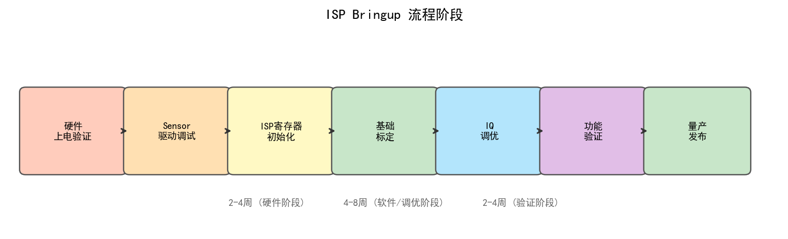
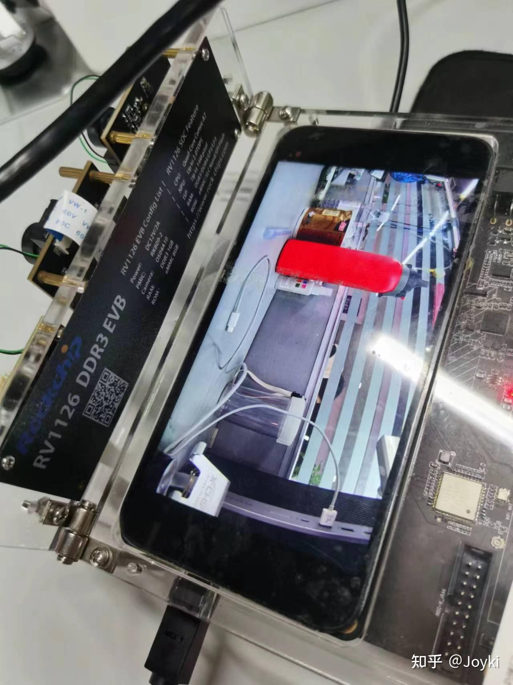
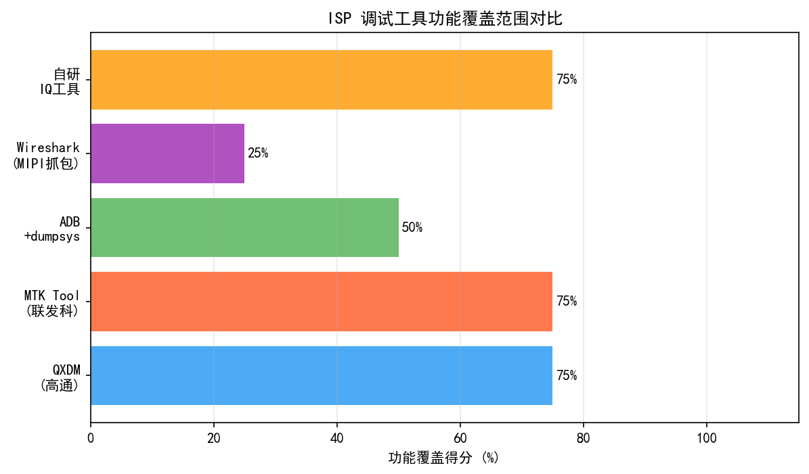
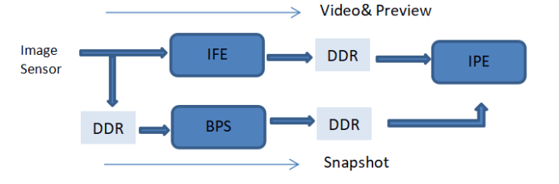
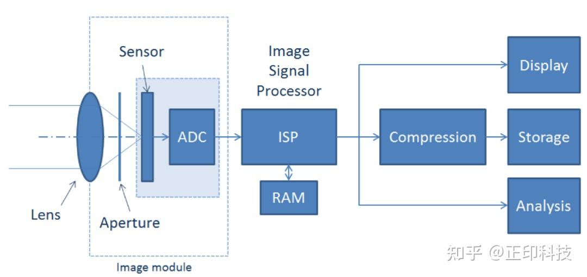
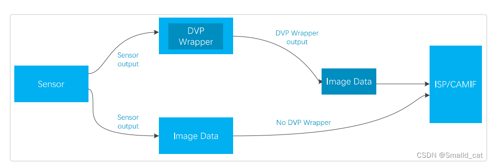
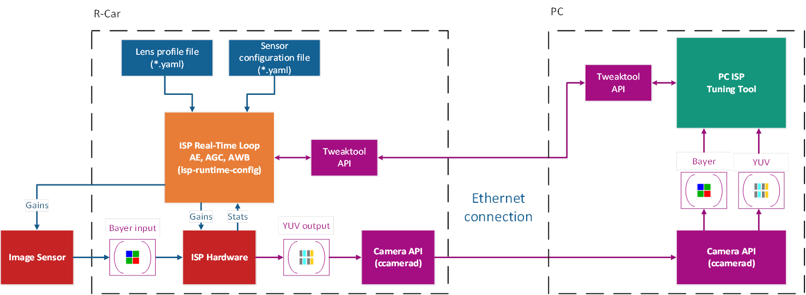

# 第二卷第31章：ISP Bring-up 实战指南

> **适用读者：** BSP 工程师、Camera 驱动工程师、ISP 调试工程师
>
> **前置知识：** 第二卷第01章（BLC/PDPC）、第二卷第02章（Demosaic）、第四卷第01章（3A 系统概述）
>
> **信息来源：** 本章内容基于 Linux 内核开源驱动（kernel.org）、MIPI Alliance 公开规范摘要、Android AOSP 文档及 libcamera 开源项目（libcamera.org），所有示例命令均来自公开可复现的工具链。

---

## 导读

Bring-up（点亮）是将一颗新 Camera 模组从"硬件装机"到"输出可用图像"的全过程。对于 ISP 工程师，bring-up 往往是调试链路中最耗时、最依赖经验的环节。一颗 sensor 可能因供电时序差 1 ms、I2C 地址写错一位，或 MIPI lane 顺序接反，而长时间无法出图。

以下按 Linux + Android 双平台，沿着 bring-up 的自然顺序走：硬件通信 → RAW 数据获取 → ISP 流水线验证 → 3A 集成。每个阶段有明确的验收标准，没过就不往后走——这不是流程主义，是跳过阶段会让后续定位成本指数级增加的教训总结。

---

## §1 原理（Theory）

### 1.1 Bring-up 的定义与阶段

ISP bring-up 就是把一套新的 camera 硬件（sensor + lens + ISP SoC）在目标软件栈上从零调通，最终能稳定出图的全过程。听起来简单，实际上每个阶段都有自己特定的失败方式——供电时序差 1 ms 出不了图，I2C 地址写错一位出不了图，MIPI lane 顺序接反也出不了图，而所有这些症状在最开始看起来都一样：黑屏。

完整 bring-up 分四个阶段，每阶段有明确验收标准：

| 阶段 | 目标 | 验收标准 |
|------|------|---------|
| **阶段一：硬件通信验证** | 确认 SoC 能与 sensor 正常通讯 | I2C/SPI 可读写 Chip ID |
| **阶段二：RAW 数据获取** | 第一帧图像点亮 | 能抓到非全黑、非全白的 RAW 帧 |
| **阶段三：ISP 流水线验证** | 各 ISP 模块逐一验证 | RGB/YUV 输出颜色基本正常 |
| **阶段四：3A 系统集成** | AE/AF/AWB 闭环工作 | 在标准场景下曝光、对焦、白平衡正常收敛 |

每个阶段存在严格的前后依赖关系：阶段一失败则无法进入阶段二，以此类推。在实际工程中，跳过阶段直接调试会极大增加定位难度。

### 1.2 Linux V4L2 框架概述

Linux 的 Camera 子系统以 **V4L2（Video4Linux2）** 框架为基础，配合 **Media Controller** 框架实现灵活的 pipeline 拓扑管理。

#### 1.2.1 核心设备节点

```
/dev/videoX       # 视频捕获/输出节点（V4L2 video device）
/dev/v4l-subdevX  # 子设备节点（sensor、CSI receiver、ISP 各模块）
/dev/mediaX       # Media Controller 节点（管理整条 pipeline 拓扑）
```

典型的 Camera pipeline 拓扑如下：

```
[sensor subdev] --> [MIPI CSI-2 receiver subdev] --> [ISP subdev] --> [video capture node]
   /dev/v4l-subdev0      /dev/v4l-subdev1             /dev/v4l-subdev2    /dev/video0
```

通过 `media-ctl -p` 可打印完整拓扑：

```bash
$ media-ctl -d /dev/media0 -p
```

#### 1.2.2 典型 sensor 驱动结构

以 Linux 内核主线中的 `imx258`（Sony 13MP，公开驱动位于 `drivers/media/i2c/imx258.c`）为例，一个标准 V4L2 sensor 驱动需要实现以下核心接口：

```c
static const struct v4l2_subdev_ops imx258_subdev_ops = {
    .core  = &imx258_core_ops,   /* s_power */
    .video = &imx258_video_ops,  /* s_stream */
    .pad   = &imx258_pad_ops,    /* enum_mbus_code, get_fmt, set_fmt,
                                    enum_frame_size, get_selection */
};
```

关键回调函数：
- `s_power(sd, on)`：控制上电/下电序列（DOVDD/AVDD/DVDD + RESET + MCLK）
- `s_stream(sd, enable)`：启动/停止 sensor streaming（写入 streaming on/off 寄存器）
- `set_fmt()`：配置输出分辨率和像素格式（如 `MEDIA_BUS_FMT_SRGGB10_1X10`）

#### 1.2.3 DTS（Device Tree Source）配置示例

Sensor 的 DTS 节点需描述其物理连接信息。以下为典型的 2-lane MIPI CSI-2 sensor 配置（基于 Linux 内核文档公开示例）：

```dts
&i2c2 {
    clock-frequency = <400000>;  /* I2C Fast Mode: 400 kHz */
    status = "okay";

    camera_sensor: camera@10 {
        compatible = "ovti,ov5675";
        reg = <0x10>;            /* I2C 7-bit 地址 */

        /* 电源管理 */
        avdd-supply   = <&reg_cam_avdd>;   /* 模拟电源 2.8V */
        dvdd-supply   = <&reg_cam_dvdd>;   /* 数字核电源 1.2V */
        dovdd-supply  = <&reg_cam_dovdd>;  /* IO 电源 1.8V */

        /* 控制信号 */
        reset-gpios   = <&gpio3 5 GPIO_ACTIVE_LOW>;
        powerdown-gpios = <&gpio3 6 GPIO_ACTIVE_HIGH>;

        /* Master Clock：由 SoC 提供给 sensor */
        clocks = <&ccu CLK_MCLK0>;
        clock-names = "xvclk";
        assigned-clocks = <&ccu CLK_MCLK0>;
        assigned-clock-rates = <24000000>;  /* 24 MHz MCLK */

        port {
            sensor_out: endpoint {
                remote-endpoint = <&mipi_csi_in>;
                data-lanes = <1 2>;          /* 2-lane MIPI */
                clock-lanes = <0>;
                link-frequencies = /bits/ 64 <456000000>;  /* 456 MHz per lane */
            };
        };
    };
};

&mipi_csi {
    status = "okay";
    port {
        mipi_csi_in: endpoint {
            remote-endpoint = <&sensor_out>;
            data-lanes = <1 2>;
            clock-lanes = <0>;
        };
    };
};
```

**关键字段说明：**
- `link-frequencies`：MIPI CSI-2 的 bit rate，单位 Hz，**必须与 sensor 寄存器配置一致**
- `data-lanes`：lane 编号从 1 开始，顺序必须与 PCB 走线对应
- `clock-lanes`：clock lane 固定为 0

### 1.3 MIPI CSI-2 物理层原理

#### 1.3.1 CSI-2 协议栈

MIPI CSI-2 协议栈从下到上分为四层：

```
+---------------------------+
|  应用层 (Application)      |  RAW8/RAW10/RAW12/YUV422 等数据格式
+---------------------------+
|  像素层 (Pixel/Byte)       |  Data Type (DT) 标识数据类型
+---------------------------+
|  Lane 管理层 (Lane Mgmt)   |  多 lane 数据分发与合并
+---------------------------+
|  物理层 D-PHY / C-PHY      |  差分信号传输
+---------------------------+
```

#### 1.3.2 D-PHY Lane 工作模式

D-PHY 具有两种工作模式，理解其切换时序对 bring-up 至关重要：

| 模式 | 缩写 | 电平特征 | 用途 |
|------|------|---------|------|
| Low Power | LP | 差分 0~1.2V，单端有效 | 控制信号（LP-11/LP-01/LP-00） |
| High Speed | HS | 差分 100~300mV | 高速数据传输 |

**LP → HS 切换序列（MIPI Alliance D-PHY 规范公开摘要）：**

```
LP-11 → LP-01 → LP-00 → HS-0 [SOT] → 数据传输 → [EOT] → LP-11
```

常见的 LP→HS 切换超时错误（`mipi: hs_rx_timeout`）通常由以下原因引起：
1. Sensor MCLK 未就绪（PLL 未 lock）
2. SoC MIPI 接收侧 termination 电阻未使能
3. PCB 走线阻抗不匹配（目标 100Ω 差分阻抗）**[1]**

#### 1.3.3 Lane 数量与带宽计算

MIPI CSI-2 支持 1/2/4/8 lane 配置。带宽计算公式：

```
总带宽 (Gbps) = Lane数 × 单Lane速率 (Gbps/lane)

所需最低带宽 = 宽 × 高 × 帧率 × 每像素比特数 × 1.15（overhead 约15%）**[1]**

示例：4208×3120 @ 30fps RAW10
  = 4208 × 3120 × 30 × 10 × 1.15 ≈ 4.52 Gbps
  → 需要 4-lane @ 1.2 Gbps/lane 或 2-lane @ 2.5 Gbps/lane
```

#### 1.3.4 C-PHY 简介

C-PHY 是 MIPI 推出的更高效物理层规范，使用 3 线制（Trio）传输，每个 symbol 携带约 2.28 bits 信息（16 bits 编码为 7 个 symbol，即 16/7 ≈ 2.286 bits/symbol）。**[1]** 注意：2.28 是每 symbol 的信息熵，**不等于带宽倍率**——相同引脚数下（3 trio vs 3 lane pair），C-PHY 实际带宽约为 D-PHY 的 **1.4–1.5 倍**（含时钟开销和 overhead 后约 40–50% 提升）。主流高端手机 SoC（如部分骁龙平台）已支持 C-PHY。C-PHY bring-up 在 LP/HS 切换机制上与 D-PHY 有所不同，需参考对应 SoC 的 BSP 文档。

**D-PHY 与 C-PHY 版本速率参考（MIPI Alliance 规范 **[1]**）**：

| PHY 规范版本 | 最大速率 | 备注 |
|------------|---------|------|
| D-PHY v1.2 | 2.5 Gbps/lane | 旧款手机主流 |
| D-PHY v2.1 | **4.5 Gbps/lane** | 当前高端 SoC 主流（如骁龙8系）|
| C-PHY v1.1 | 2.8 Gsps/Trio（≈6.4 Gbps/Trio 等效） | — |
| C-PHY v2.1 | **6.0 Gsps/Trio（≈13.7 Gbps/Trio 等效）** | 当前旗舰 SoC 最高规格（标准通道） |

工程注意：DTS `link-frequencies` 字段填写的是 **bit rate（bps）**，对于 D-PHY 不可超过所用版本的最大单 lane 速率；对于 C-PHY 该字段对应等效 bit rate，需参考 SoC 驱动文档的换算规则。

---

## §2 调试流程（Debug Flow）

### 2.1 第一步：I2C 通信验证

在进行任何 sensor 配置之前，必须先验证 I2C 通道可达。

#### 2.1.1 确认 I2C 总线编号

```bash
# 列出系统中所有 I2C 总线
$ i2cdetect -l
i2c-0	i2c         DesignWare HDMI                   I2C adapter
i2c-1	i2c         Tegra I2C adapter                 I2C adapter
i2c-2	i2c         Tegra I2C adapter                 I2C adapter
```

#### 2.1.2 扫描 I2C 设备

```bash
# 在 i2c-2 上扫描所有设备地址（0x03~0x77）
# -y 参数跳过交互确认，-r 使用读操作（更安全）
$ i2cdetect -y -r 2

     0  1  2  3  4  5  6  7  8  9  a  b  c  d  e  f
00:          -- -- -- -- -- -- -- -- -- -- -- -- --
10: 10 -- -- -- -- -- -- -- -- -- -- -- -- -- -- --
20: -- -- -- -- -- -- -- -- -- -- -- -- -- -- -- --
...
```

地址 `0x10` 处有应答（非 `--`），说明 sensor I2C 通信正常。

#### 2.1.3 读取 Chip ID 验证

以 OmniVision 系列 sensor 为例，Chip ID 通常位于固定寄存器地址（各厂商公开 datasheet 均有标注）。以 OV5675 为例（I2C 地址 0x10，16-bit 寄存器地址）：

```bash
# 读取高字节 Chip ID（寄存器地址 0x300A）
# i2ctransfer: -y 总线号, w3 写3字节（设备地址+寄存器高低字节）, r1 读1字节
$ i2ctransfer -y 2 w3@0x10 0x30 0x0A r1
0x56

# 读取低字节 Chip ID（寄存器地址 0x300B）
$ i2ctransfer -y 2 w3@0x10 0x30 0x0B r1
0x75
```

Chip ID = `0x5675`，与 OV5675 datasheet 一致，I2C 通信验证通过。

#### 2.1.4 常见 I2C 问题

| 错误现象 | 原因分析 | 解决方法 |
|---------|---------|---------|
| `i2cdetect` 全部显示 `--` | DOVDD/VCC 未上电；I2C 总线 SCL/SDA 被 pull-down；Reset 未释放 | 用万用表量各路电源；确认 Reset GPIO 为高 |
| 扫描到地址但读 ID 返回 0xFF | Sensor 处于低功耗模式或寄存器访问时序错误 | 发送初始化序列后再读 |
| `i2cdetect` 显示地址但写寄存器 NACK | I2C 时钟频率过高（部分 sensor 最高支持 400kHz） | 降低 `clock-frequency` 为 100000 |
| 连续读写偶发 NACK | I2C 总线电容过大，边沿不够陡 | 增加上拉电阻至 4.7kΩ 或缩短走线 |

### 2.2 第二步：Sensor 上电序列

#### 2.2.1 标准三路电源定义

移动 camera sensor 通常需要三路电源（典型电压值因传感器型号而异，需参考 sensor datasheet）：

| 电源名称 | 典型电压 | 供电范围 | 说明 |
|---------|---------|---------|------|
| **DOVDD**（IO 电源） | 1.8 V | 1.7~1.9 V | 驱动 I2C、MIPI IO，与 SoC IO 电平匹配 |
| **AVDD**（模拟电源） | 2.8 V | 2.6~3.0 V | 供给像素阵列和模拟电路 |
| **DVDD**（数字核电源） | 1.05~1.2 V | ±5% | 供给数字逻辑和 PLL |

#### 2.2.2 标准上电时序

Linux 内核 sensor 驱动通常在 `s_power(sd, 1)` 中按如下顺序控制上电（以主线驱动 `imx258` 为参考模式）：

```
T=0ms:    DOVDD 上电 (1.8V)
T=1ms:    AVDD 上电 (2.8V)
T=2ms:    DVDD 上电 (1.2V)
T=3ms:    MCLK 使能 (24MHz)
T=4ms:    RESET# 拉高（释放复位）
T=8ms:    等待 sensor 初始化完成（>= 5ms，具体参见 datasheet）
T=8ms+:   I2C 可访问（可写初始化寄存器序列）
```

对应的内核驱动代码模式（参考 kernel.org 公开驱动）：

```c
static int sensor_power_on(struct sensor_dev *sensor)
{
    int ret;

    /* 1. 使能 DOVDD */
    ret = regulator_enable(sensor->dovdd);
    if (ret) return ret;
    usleep_range(1000, 1200);  /* 等待稳定 */

    /* 2. 使能 AVDD */
    ret = regulator_enable(sensor->avdd);
    if (ret) goto err_avdd;
    usleep_range(1000, 1200);

    /* 3. 使能 DVDD */
    ret = regulator_enable(sensor->dvdd);
    if (ret) goto err_dvdd;
    usleep_range(1000, 1200);

    /* 4. 使能 MCLK */
    ret = clk_prepare_enable(sensor->xvclk);
    if (ret) goto err_clk;
    usleep_range(1000, 1200);

    /* 5. 释放 RESET（拉高） */
    gpiod_set_value_cansleep(sensor->reset_gpio, 0);  /* ACTIVE_LOW */
    usleep_range(5000, 6000);  /* 等待 sensor 内部 PLL lock */

    return 0;
    /* ... error handling ... */
}
```

#### 2.2.3 上电失败的常见原因

1. **DVDD 短路**：DVDD 电流过大导致 PMIC 过流保护，用电流表监测各路电流
2. **RESET 信号极性反**：DTS 中 `GPIO_ACTIVE_LOW` 与实际硬件不符
3. **MCLK 频率偏差**：实际 MCLK 不是 24MHz（用示波器或频率计测量）
4. **上电顺序错误**：部分 sensor 要求 DOVDD 先于 DVDD 上电，顺序颠倒会导致 latch-up

### 2.3 第三步：MIPI CSI 链路建立

#### 2.3.1 配置 Media Pipeline

在 V4L2 框架下，使用 `media-ctl` 配置 pipeline：

```bash
# 查看当前 media 拓扑
$ media-ctl -d /dev/media0 -p

# 设置 sensor subdev 格式（3840x2160, SRGGB10, 30fps）
$ media-ctl -d /dev/media0 \
  --set-v4l2 '"ov5675 2-0010":0[fmt:SRGGB10_1X10/3840x2160@1/30]'

# 设置 MIPI CSI receiver 格式（与 sensor 输出对应）
$ media-ctl -d /dev/media0 \
  --set-v4l2 '"csi2rx":0[fmt:SRGGB10_1X10/3840x2160]'

# 建立 link：sensor → csi2rx（使能 link）
$ media-ctl -d /dev/media0 \
  --links '"ov5675 2-0010":0 -> "csi2rx":0[1]'
```

#### 2.3.2 用 v4l2-ctl 启动 streaming

```bash
# 查看 sensor 支持的格式
$ v4l2-ctl -d /dev/video0 --list-formats-ext

# 设置输出格式（与 pipeline 一致）
$ v4l2-ctl -d /dev/video0 \
  --set-fmt-video=width=3840,height=2160,pixelformat=RG10

# 抓取 1 帧保存到文件
$ v4l2-ctl -d /dev/video0 \
  --stream-mmap \
  --stream-count=1 \
  --stream-to=frame0.raw

# 持续抓取并显示帧率（验证 streaming 稳定性）
$ v4l2-ctl -d /dev/video0 \
  --stream-mmap \
  --stream-count=100
```

#### 2.3.3 解读 dmesg 中的 MIPI 错误

```bash
# 实时监控 MIPI/CSI 相关 kernel log
$ dmesg -w | grep -iE "csi|mipi|ov5675|imx258"
```

常见 MIPI 错误 log 及含义：

```
# ECC 错误：Lane 0 数据出现 1-bit 位翻转（可纠正）
[12.345] csi2rx: 1-bit ECC error on lane 0, corrected

# ECC 严重错误：2-bit 位翻转（不可纠正，通常为物理层问题）
[12.346] csi2rx: 2-bit ECC error on lane 0, uncorrectable

# CRC 错误：数据包 CRC 校验失败
[12.347] csi2rx: CRC error on virtual channel 0

# Lane 对齐超时：多条 lane 间 skew 过大
[12.348] csi2rx: lane alignment timeout

# HS Rx 超时：sensor 未正常进入 HS 模式
[12.349] csi2rx: HS receive timeout on data lane 0

# FIFO 溢出：SoC 处理速度跟不上 sensor 输出速率
[12.350] csi2rx: FIFO overflow, frame dropped
```

#### 2.3.4 常见 CSI 链路问题排查

| 错误类型 | 根本原因 | 调试手段 |
|---------|---------|---------|
| Lane alignment timeout | PCB lane 等长差 > 5mm | 用示波器测量 D+/D- 波形；要求 layout 修板 |
| ECC/CRC 错误 | 终端匹配电阻缺失；EMI 干扰 | 在 lane 末端加 100Ω 差分终端；排查 PCB 走线 |
| HS Rx timeout | MCLK 未起振；PLL lock 失败 | 检查 MCLK 波形；读取 sensor PLL lock 状态寄存器 |
| 帧率不稳定/掉帧 | link-frequencies 配置与 sensor 寄存器不一致 | 重新计算 pixel clock 与 mipi bit rate |

### 2.4 第四步：第一帧点亮

#### 2.4.1 用 yavta 抓取 RAW 帧

```bash
# 安装 yavta（高级 V4L2 测试工具）
$ git clone https://git.ideasonboard.org/yavta.git && cd yavta && make

# 抓取 1 帧 RAW10（packed，3840x2160）
$ ./yavta -n 4 -c1 -f SRGGB10P -s 3840x2160 \
  --file=capture-#.raw /dev/video0
```

#### 2.4.2 RAW 帧快速预览

```bash
# 使用 raw2rgbpnm 将 RAW 转换为可预览的 PNM 格式
# （raw2rgbpnm 来自 https://git.recoil.org/rawtools/raw2rgbpnm）
$ raw2rgbpnm -s 3840x2160 -f RGGB -b 10 capture-0.raw preview.ppm

# 或使用 ImageMagick 对 RAW 帧进行粗略解析（假设已 debayer）
$ convert -size 3840x2160 -depth 10 gray:capture-0.raw preview.png
```

#### 2.4.3 Bayer Pattern 识别

RAW 图像的 Bayer pattern 决定了 demosaic 的正确性。常见的四种排列：

```
RGGB:  R G R G ...    GRBG:  G R G R ...
       G B G B ...           R B R B ...

BGGR:  B G B G ...    GBRG:  G B G B ...
       G R G R ...           B R B R ...
```

**快速诊断方法：** 在第一帧 RAW 数据上，用程序分别提取偶数行偶数列、偶数行奇数列、奇数行偶数列、奇数行奇数列的均值。在自然光下拍摄中性灰目标：

- 若 (0,0) 位置通道均值 >> 其他三个 → 该通道为 R（RGGB 起始）
- 若两个通道均值接近且最高 → 它们是 G（绿色通道）
- 若某通道均值最低 → 该通道为 B

当 Bayer pattern 配置错误时，图像会呈现固定偏色（如绿色/紫色，或品红色）。

#### 2.4.4 第一帧异常诊断

| 帧状态 | 可能原因 | 下一步 |
|--------|---------|--------|
| **全黑帧**（所有像素 ≤ 黑电平） | BLC offset 过大；sensor 未进入 streaming 状态；曝光设置为 0 | 检查 BLC 设置；确认 streaming on 寄存器；设置最大增益+曝光 |
| **全白帧**（所有像素饱和） | 曝光+增益远超正常；sensor 模拟增益跳档 | 将 AE target 调至自动；手动设置较低曝光值 |
| **固定图案（FPN）** | sensor 未完成初始化；streaming 前 reset 逻辑时序问题 | 检查 sensor 初始化寄存器序列完整性 |
| **半帧 / 拼接错误** | Buffer size 计算错误；stride 不对齐 | 检查 V4L2 格式中的 `bytesperline` 计算 |
| **图像上下颠倒** | MIPI lane order 反转；sensor vertical flip 寄存器未配置 | 尝试在 sensor 驱动中写入 VFLIP 寄存器 |
| **图像左右镜像** | MIPI lane order 反转；sensor horizontal mirror 未配置 | 检查 DTS 中 `data-lanes` 顺序；写入 HMIRROR 寄存器 |

### 2.5 第五步：基础 ISP 模块逐步验证

**验证原则：** 每次只开启一个 ISP 模块，其余旁路（bypass），逐步累积验证。

#### 2.5.1 BLC（黑电平校正）验证

**目标：** 确认光学黑区（OB，Optical Black）均值在合理范围内。

对于 12-bit RAW 数据，典型 OB 均值应在 **64 ± 16 DN**（具体值参考 sensor datasheet 的 OB target）。

```python
import numpy as np

# 加载 RAW 帧（假设 RGGB, 12-bit, 宽 4208, 高 3120）
raw = np.fromfile("frame0.raw", dtype=np.uint16).reshape(3120, 4208)

# 典型 sensor 在图像顶部或左侧保留 OB 行（如顶部 8 行）
ob_rows = raw[:8, :]  # 取前 8 行 OB 区域

print(f"OB均值: {ob_rows.mean():.1f} DN")
print(f"OB标准差: {ob_rows.std():.2f} DN")
print(f"期望范围: 48~80 DN（12-bit）")

# 减去 BLC 后验证
blc_offset = ob_rows.mean()
raw_blc = raw.astype(np.int32) - int(blc_offset)
raw_blc = np.clip(raw_blc, 0, 4095)
print(f"BLC后最小值: {raw_blc.min()}, 最大值: {raw_blc.max()}")
```

**异常判断：**
- OB 均值 > 200 DN → BLC 设置异常或 sensor OB 寄存器未配置
- OB 均值 < 10 DN → sensor 已在内部做了 BLC，无需外部再做

#### 2.5.2 LSC（镜头阴影校正）验证

**目标：** 确认四角相对中心的亮度衰减（Rolloff）符合预期。

```python
# 计算四角与中心的亮度比（以绿通道 Gr 为例）
H, W = raw_blc.shape
# 提取 Gr 通道（RGGB 中偶数行奇数列）
gr = raw_blc[0::2, 1::2]

# 定义中心和四角区域（各 100x100 像素）
hw, ww = gr.shape
margin = 50
center_mean = gr[hw//2-margin:hw//2+margin, ww//2-margin:ww//2+margin].mean()
tl_mean = gr[:margin*2, :margin*2].mean()
tr_mean = gr[:margin*2, -margin*2:].mean()
bl_mean = gr[-margin*2:, :margin*2].mean()
br_mean = gr[-margin*2:, -margin*2:].mean()

print(f"四角/中心亮度比（Rolloff）:")
print(f"  左上: {tl_mean/center_mean:.3f}")
print(f"  右上: {tr_mean/center_mean:.3f}")
print(f"  左下: {bl_mean/center_mean:.3f}")
print(f"  右下: {br_mean/center_mean:.3f}")
# 正常值通常在 0.55~0.85 之间（取决于镜头）
# 若低于 0.4，说明 LSC 必须开启
```

#### 2.5.3 Demosaic 验证

**目标：** Demosaic 后 RGB 图像颜色基本正确（绿色物体偏绿，红色偏红）。

快速验证方法：
1. 拍摄标准 Macbeth 色卡（若手边有）或白纸+彩色物体
2. 用双线性插值 demosaic（计算量最小）得到 RGB 图像
3. 用 ImageMagick 或 Python PIL 打开预览

```bash
# 使用 dcraw 对 RAW 文件进行快速 demosaic 预览
# （dcraw 支持多种 RAW 格式，适合 debug 用途）
$ dcraw -v -w -o 1 -q 0 -T capture-0.dng
# -w: 使用白平衡元数据
# -o 1: sRGB 输出
# -q 0: 双线性 demosaic（最快）
# -T: 输出 TIFF
```

**Demosaic 异常特征：**
- **彩色棋格/莫尔纹**：Bayer pattern 配置错误（详见 §2.4.3）
- **图像整体偏绿**：Bayer 起点错误（将 G 通道当作 R/B）
- **细节边缘出现彩色条纹（zipper artifact）**：正常现象，可通过更高质量的 demosaic 算法改善

#### 2.5.4 AWB 初步验证

**目标：** 在 D65 标准光源（自然日光）下，白色物体在 AWB 开启后接近中性白（R≈G≈B）。

```bash
# 使用 v4l2-ctl 读取当前 AWB 增益值
$ v4l2-ctl -d /dev/video0 --get-ctrl=red_balance
red_balance: 512

$ v4l2-ctl -d /dev/video0 --get-ctrl=blue_balance
blue_balance: 418

# 正常情况下 D65 光源下 R:G:B ≈ 1.6:1.0:1.4 增益
# AWB 增益应在 256~1024 范围（Q8 格式）
```

若 AWB 无法收敛，逐步检查：
1. CCM（色彩校正矩阵）是否加载了针对该 sensor 的标定值
2. AWB 算法的灰色世界假设是否适用于当前场景
3. 曝光是否合理（过曝或欠曝都会导致 AWB 偏差）

### 2.6 第六步：IQ Bring-up 序列调参（BLC → LSC → AWB → CCM → Gamma → NR）

IQ Bring-up（Image Quality Bring-up）是在完成硬件通信和第一帧点亮后，按固定顺序逐模块调通 ISP 参数的标准化流程。每个步骤必须在上一步验证通过后才能进行，避免模块间相互干扰掩盖真实问题。

**IQ Bring-up 序列总览**：

```
Step 1: BLC（黑电平）→ 确保暗场基准正确
    ↓
Step 2: DPC（坏点修复）→ 消除固定坏点对后续模块的干扰
    ↓
Step 3: LSC（镜头阴影）→ 纠正空域亮度不均匀
    ↓
Step 4: Demosaic → 验证 Bayer 图案正确，颜色基本可辨
    ↓
Step 5: AWB（白平衡）→ 在标准光源下实现基本颜色中性化
    ↓
Step 6: CCM（色彩校正）→ 加载标定好的 3×3 矩阵，颜色准确
    ↓
Step 7: Gamma / Tone Mapping → 建立感知均匀的亮度响应
    ↓
Step 8: NR（降噪：BNR + YNR + TNR）→ 最后叠加降噪，避免 NR 掩盖前面模块的问题
    ↓
Step 9: EE（边缘增强）→ 补偿 NR 带来的细节损失
```

**各步骤调参要点**：

**Step 1 — BLC**：

遮盖镜头，拍摄暗场图，读取各通道（R/Gr/Gb/B）均值。目标：BLC 减除后暗场均值 ≈ 0 ± 1 DN。

```bash
# 通过 v4l2-ctl 手动设置 BLC 值（假设 ISP 暴露此控件）
$ v4l2-ctl -d /dev/video0 --set-ctrl=black_level=64
$ v4l2-ctl -d /dev/video0 --get-ctrl=black_level
```

常见异常：4 通道 BLC 不一致（Gr/Gb 不平衡 > 2 DN），导致 Demosaic 后出现绿色网格噪声。

**Step 2 — DPC**：

拍摄均匀光场，目视检查是否有孤立亮点（热像素）或暗点（冷像素）。将检测到的坏点坐标加入坏点表，验证 DPC 修复后坏点不可见。

**Step 3 — LSC**：

拍摄均匀积分球或白墙（均匀漫反射），计算四角/中心亮度比（Rolloff）。加载 LSC 增益表后，Rolloff 非均匀度应 < 1%。

| 典型镜头类型 | 无 LSC 时 Rolloff（四角/中心）| LSC 后目标 Rolloff |
|-------------|---------------------------|------------------|
| 广角 26mm（手机主摄）| 0.65~0.75 | > 0.98 |
| 超广角 14mm | 0.40~0.55 | > 0.95 |
| 鱼眼 180° | 0.20~0.35 | > 0.90（边缘受限）|

**Step 4 — Demosaic**：

拍摄色卡或彩色场景，目视判断颜色基本正确（红色偏红、绿色偏绿、蓝色偏蓝）。此步若颜色完全错误，通常是 Bayer 格式（RGGB/GRBG 等）配置错误。

**Step 5 — AWB**：

在 D65 标准光源（或正常自然日光）下，拍摄白色目标（A4 纸、ColorChecker 白块）。AWB 收敛后，白色目标的 RGB 均值应满足 $|R/G - 1| < 5\%$ 且 $|B/G - 1| < 5\%$。

```python
# 验证 AWB 收敛质量（Python）
import numpy as np

def check_awb_convergence(rgb_image, white_roi):
    """
    rgb_image: (H, W, 3) float32 [0, 1]
    white_roi: (y1, y2, x1, x2) 白色目标区域坐标
    """
    y1, y2, x1, x2 = white_roi
    patch = rgb_image[y1:y2, x1:x2, :]
    mean_rgb = patch.mean(axis=(0, 1))
    r_g_ratio = mean_rgb[0] / (mean_rgb[1] + 1e-9)
    b_g_ratio = mean_rgb[2] / (mean_rgb[1] + 1e-9)
    print(f"R/G = {r_g_ratio:.4f}  (目标: 0.95~1.05)")
    print(f"B/G = {b_g_ratio:.4f}  (目标: 0.95~1.05)")
    converged = abs(r_g_ratio - 1.0) < 0.05 and abs(b_g_ratio - 1.0) < 0.05
    return converged
```

**Step 6 — CCM**：

拍摄 ColorChecker 24 色卡，加载出厂标定的 CCM 矩阵，计算 24 色块平均 ΔE00。目标：ΔE00 < 2.5（Bring-up 阶段接受略宽松的阈值）。若偏差 > 4.0，检查：
1. CCM 是否加载了对应当前传感器型号和光源的标定文件
2. AWB 增益是否在正确范围（CCM 标定时的白平衡状态必须复现）
3. LSC 是否已正确开启（LSC 误差会影响 CCM 统计区域）

**Step 7 — Gamma / Tone Mapping**：

拍摄灰阶楔形测试图（0% ~ 100% 反射率，均匀步长），验证输出灰阶的线性度和对比度。sRGB Gamma 2.2 曲线下，50% 反射率对应输出值约为 188（8-bit）。若 Gamma 曲线偏低（图像偏暗），检查 Gamma 表是否加载了对应 sRGB / Rec.709 标准。

**Step 8 — NR（降噪）**：

NR 必须在所有前置模块正确运行后才能启用。顺序：先开启 BNR（Bayer 域降噪），确认 RAW 噪声基本抑制；再开启 YNR（YUV 域降噪）；最后开启 TNR（时域降噪，视频场景）。

NR 参数调试原则：从弱到强，以不出现过平滑（毛发、纹理"涂抹感"）为上限。

**Step 9 — EE（边缘增强）**：

NR 会导致 MTF50 下降约 10~20%，需要 EE 补偿。EE 强度以不引入色彩伪影（彩色边缘光晕）和过冲（白边/黑边过锐）为限。

### 2.7 平台特异性 Bringup 步骤

通用 IQ Bringup 序列（§2.6）完成后，量产平台还需执行平台特有的配置验证。以下分别针对高通 CamX 和 MTK Imagiq 两大主流手机 ISP 平台进行说明。

#### 高通 CamX 平台 Bringup 关键步骤

高通平台 Bringup 的独特性在于 **CamX Framework** 的配置驱动特性，以下步骤是 Linux 驱动调试成功后必须完成的：

**Step 1：验证 Feature Graph 配置**

CamX 通过 `topologyGraph.json`（位于 `/vendor/etc/camera/`）描述整个 ISP pipeline 的节点连接关系。Bringup 时必须验证该文件被正确解析：

```bash
# 验证 Feature Graph 加载
adb logcat -s CamX | grep -E "FeatureGraphSelector|UseCase|Pipeline"

# 常见错误：TopologyGraph not found → 检查 vendor overlay 路径
# 常见错误：UseCase mismatch → 检查 cameraconfig.json 中 use case ID
```

**Step 2：验证 Chromatix .so 加载**

ISP IQ 参数通过 Chromatix `.so` 文件加载，这是 IQ Bringup 的前提：

```bash
# 确认 Chromatix 库被加载
adb logcat | grep -i "chromatix"
# 期望看到类似："Loaded Chromatix: libchromatix_imx766_common.so"

# 如果看到 "Chromatix load failed"：
# 1. 检查 /vendor/lib64/camera/ 下是否有对应 .so
# 2. 检查 sensor driver 中的 chromatix_name 字段与 .so 文件名是否一致
```

**Step 3：验证 3A 统计数据就绪**

在 CamX 框架中，AEC/AWB 统计（IFE Stats）必须先就绪再开启 3A 算法：

```bash
# 确认 IFE Stats 输出正常
adb logcat -s CamX | grep -E "IFEStatsParser|AWBStats|AECStats"
# 期望：每帧看到 Stats processed 日志
# 异常：如果 Stats 一直为 0，检查 IFE clk 是否使能
```

---

#### MTK Imagiq 平台 Bringup 关键步骤

**Step 1：验证 CCCI 和 P1/P2 节点激活**

MTK ISP pipeline 以 P1（输入处理）→ P2（后处理）为主干，通过 CCCI（Cross-Core Communication Interface）连接 AP 和 ISP 核心：

```bash
# 查看 P1/P2 节点状态
adb logcat | grep -E "P1Node|P2Node|CamIO"

# 确认 ISP 时钟域上电
adb logcat | grep -i "isp_hw\|mtk_isp"

# MTK 特有：验证 ISP tuning 参数（NDD 文件）被加载
adb logcat | grep "NvBuf\|isp_tuning_mgr"
```

**Step 2：验证 Sensor 驱动和 CamIO**

```bash
# MTK sensor 驱动调试
adb logcat | grep -E "SENSOR_DRV|imgsensor"

# 读取 OTP 数据（MTK 平台）
adb shell "cat /proc/driver/CAM_CAL_DRV0" | head -20
# 全 FF 或全 00 表示 EEPROM 读取失败
```

---

### 2.8 ISP 软件 Bringup 验证流程

驱动出图只是第一步，ISP 流水线各模块正确使能才是 Bringup 真正完成的标志。
以下为从"黑白正确出图"到"颜色基本正确"的里程碑验证步骤：

**高通 CamX 平台（SM8x50/8Gen2/8Gen3/8 Elite）：**

```bash
# Step 1：确认 Chromatix XML 已加载
adb logcat -s CamX | grep -i "chromatix" | head -20
# 期望输出：类似 "ChromatixManager: loaded tuning data for sensor_name"

# Step 2：查看 ISP pipeline 各模块使能状态
adb shell setprop persist.camera.isp.dump 1  # 开启 ISP dump（重启相机生效）
adb shell am broadcast -a com.qti.camera.action.DUMP_ISP
adb pull /data/vendor/camera/isp_dump/  # 拉取 dump 文件
# 检查 BLC/AWB/CCM/Gamma 各模块的 enable flag 是否为 true

# Step 3：验证 AWB 收敛（标准 D65 灰卡场景）
adb logcat -s CamX | grep -i "AWB.*gain" | tail -20
# 期望：R/B gain 在 1.5–2.5 范围内，G gain ≈ 1.0

# Step 4：验证 AEC 收敛（正常室内场景）
adb logcat -s CamX | grep -i "AEC.*luma" | tail -10
# 期望：Luma target 与实际 luma 差值 < 5%，无持续振荡
```

**MTK FeaturePipe 平台（天玑 9x00 系列）：**

```bash
# Step 1：确认 NDD 参数注入
adb logcat | grep -i "NDD\|NVRAM\|tuning" | head -20

# Step 2：P1P2 流水线节点使能验证
adb logcat -s P1Node,P2Node | grep -i "enable\|module" | head -30

# Step 3：AWB/AE 状态确认
adb logcat | grep -i "3A.*result\|AWB.*stat" | tail -20
```

**第一次颜色基本正确的里程碑验收：**

| 验收项 | 标准 | 工具 |
|--------|------|------|
| 无 BLC 偏色 | 暗场截图 R/G/B 通道均值差 < 2 DN | ADB 截图 + Python histogram |
| AWB 基本收敛 | D65 标准光源下灰色区域 a*b* < ±5 | ColorChecker + CameraFi Raw |
| Gamma 基本正确 | 灰阶楔形可分辨 ≥ 8 级 | ISP 调参工具灰阶测试 |
| 无绿色/品红偏移 | 白纸拍摄无明显色偏 | 主观目视 |

第一个里程碑达成后，才进入正式标定流程（BLC 温度表 → LSC 增益图 → AWB 光源表 → CCM 矩阵）。

---

## §3 工具链（Toolchain）

### 3.1 开源调试工具一览

| 工具 | 主要用途 | 平台 | 获取方式 |
|------|---------|------|---------|
| **v4l2-ctl** | Sensor 控制、格式设置、RAW 抓帧、控件查询 | Linux | `apt install v4l-utils` |
| **media-ctl** | Media pipeline 拓扑查看与配置 | Linux | `apt install v4l-utils` |
| **v4l2-compliance** | V4L2 驱动合规性测试 | Linux | `apt install v4l-utils` |
| **i2cdetect** | 扫描 I2C 总线设备 | Linux | `apt install i2c-tools` |
| **i2cget / i2cset** | 单次读写 I2C 寄存器 | Linux | `apt install i2c-tools` |
| **i2ctransfer** | 复合 I2C 事务（写地址+读数据） | Linux | `apt install i2c-tools` |
| **yavta** | 高级 V4L2 捕获与控制测试 | Linux | `git clone https://git.ideasonboard.org/yavta.git` |
| **raw2rgbpnm** | RAW 格式快速转 PNM 预览 | Linux | GitHub: linuxtv/v4l-utils 附属 |
| **dcraw** | RAW 解码+demosaic 预览 | Linux/Mac/Win | `apt install dcraw` |
| **cam** | libcamera 命令行客户端 | Linux | libcamera 源码编译 |
| **qcam** | libcamera Qt 图形界面预览 | Linux | libcamera 源码编译 |
| **gst-launch-1.0** | GStreamer pipeline 测试（含 libcamerasrc） | Linux | `apt install gstreamer1.0-tools` |
| **adb** | Android 设备调试 | Android | Android SDK Platform Tools |
| **systrace** | Android camera pipeline 性能分析 | Android | Android SDK |

### 3.2 v4l-utils 详细用法

`v4l-utils` 是 Linux camera bring-up 最核心的工具包。

#### 3.2.1 v4l2-compliance — 驱动合规测试

在新驱动开发完成后，**必须** 通过 `v4l2-compliance` 测试：

```bash
# 对 /dev/video0 进行完整合规测试
$ v4l2-compliance -d /dev/video0 -f

# 对 subdev 进行测试
$ v4l2-compliance -z /dev/media0 -e "ov5675 2-0010"

# 输出示例（通过）：
# Total: 47, Succeeded: 47, Failed: 0, Warnings: 2
```

常见合规失败：
- `VIDIOC_ENUM_FRAMESIZES` 未实现 → 添加 `enum_frame_size` 回调
- Buffer type 未正确设置 → 检查 `queue_setup` 实现

#### 3.2.2 media-ctl pipeline 配置脚本

实际项目中通常将 pipeline 配置写成 shell 脚本：

```bash
#!/bin/bash
# setup_camera_pipeline.sh
# 配置 OV5675 → MIPI CSI → ISP → Video 的完整 pipeline

MEDIA_DEV=/dev/media0
SENSOR="ov5675 2-0010"
CSI_RX="csi2rx"
ISP="isp0"
VIDEO=/dev/video0

FMT="SRGGB10_1X10"
WIDTH=2592
HEIGHT=1944

# 1. 设置 sensor 输出格式
media-ctl -d $MEDIA_DEV \
  --set-v4l2 "\"$SENSOR\":0[fmt:${FMT}/${WIDTH}x${HEIGHT}@1/30]"

# 2. 设置 CSI receiver 输入/输出格式
media-ctl -d $MEDIA_DEV \
  --set-v4l2 "\"$CSI_RX\":0[fmt:${FMT}/${WIDTH}x${HEIGHT}]"
media-ctl -d $MEDIA_DEV \
  --set-v4l2 "\"$CSI_RX\":1[fmt:${FMT}/${WIDTH}x${HEIGHT}]"

# 3. 设置 ISP 输入/输出格式（RAW in → YUV out）
media-ctl -d $MEDIA_DEV \
  --set-v4l2 "\"$ISP\":0[fmt:${FMT}/${WIDTH}x${HEIGHT}]"
media-ctl -d $MEDIA_DEV \
  --set-v4l2 "\"$ISP\":1[fmt:YUYV8_1X16/${WIDTH}x${HEIGHT}]"

# 4. 使能所有 links
media-ctl -d $MEDIA_DEV \
  --links "\"$SENSOR\":0->\"$CSI_RX\":0[1]"
media-ctl -d $MEDIA_DEV \
  --links "\"$CSI_RX\":1->\"$ISP\":0[1]"
media-ctl -d $MEDIA_DEV \
  --links "\"$ISP\":1->\"video0\":0[1]"

echo "Pipeline setup complete. Run: v4l2-ctl -d $VIDEO --stream-mmap"
```

### 3.3 libcamera 调试框架

libcamera（https://libcamera.org/）是 Linux 平台上的现代化开源 camera 框架，设计目标是替代传统的 V4L2 + userspace ISP 调试模式。

#### 3.3.1 libcamera 架构

```
用户应用层：cam / qcam / GStreamer / Android HAL
        ↓
libcamera 核心库（Camera Manager, Camera, Stream, Request）
        ↓
Pipeline Handler（针对不同 SoC 的 pipeline 驱动，如 rkisp1, ipu3, vimc）
        ↓
IPA（Image Processing Algorithms，可信执行隔离的算法模块）
        ↓
V4L2 内核驱动
```

IPA 模块负责 3A 算法，与 pipeline handler 分离，可以是开源实现（如 Raspberry Pi IPA）或私有二进制。

#### 3.3.2 cam 命令行工具使用

```bash
# 列出系统中所有可用摄像头
$ cam -l
Available cameras:
1: Internal Camera [ov5675 2-0010]

# 查看摄像头支持的流配置
$ cam -c 1 --info

# 抓取 10 帧保存到 PPM 文件
$ cam -c 1 --capture=10 --file=frame#.ppm

# 指定流配置（分辨率和格式）
$ cam -c 1 -s width=1920,height=1080,pixelformat=RGB888 --capture=1

# 输出帧统计信息（亮度直方图等，需 IPA 支持）
$ cam -c 1 --capture=30 -v
```

#### 3.3.3 libcamera IPA 模块调试

对于新 sensor 的 libcamera bring-up，需要为 sensor 创建对应的调参配置文件：

```yaml
# /usr/share/libcamera/ipa/rkisp1/ov5675.yaml（示例结构）
version: 1
algorithms:
  - BlackLevelCorrection:
      black_level: 4096   # 16-bit 归一化的 BLC 目标值
  - Lux: {}
  - AGC:
      min_shutter: 100    # 最小曝光时间 μs
      max_shutter: 33333  # 最大曝光时间 μs（对应 30fps）
      min_analogue_gain: 1.0
      max_analogue_gain: 16.0
  - AWB:
      mode: auto
  - CCM: {}
  - GammaToneCurve: {}
```

### 3.4 Android Camera HAL Bring-up

#### 3.4.1 Android Camera 软件栈

```
Camera App (Camera2 API)
    ↓
CameraService (frameworks/av/services/camera/)
    ↓
Camera HAL3 Interface (hardware/interfaces/camera/)
    ↓
Camera HAL Implementation (vendor/xxx/camera/)
    ↓
Kernel V4L2 Driver
```

#### 3.4.2 HAL 枚举验证

```bash
# 在 Android 设备上验证 HAL 是否正确枚举 camera
$ adb shell dumpsys media.camera

# 输出示例：
# Camera 0 (BACK):
#   Facing: BACK
#   Number of streams: 3
#   ...

# 查看 Camera HAL 日志
$ adb logcat -s CameraService:V Camera3Device:V \
  android.hardware.camera.provider@2.4-service:V

# 抓取一帧（需要 camera app 或 CTS 测试触发）
$ adb shell am start -a android.media.action.STILL_IMAGE_CAMERA
```

#### 3.4.3 CTS（Compatibility Test Suite）Camera 测试

```bash
# 运行 Camera CTS 测试验证 HAL 实现
$ cts-tradefed run cts -m CtsCameraTestCases \
  --test android.hardware.camera2.cts.CaptureRequestTest

# 运行快速冒烟测试
$ cts-tradefed run cts -m CtsCameraTestCases \
  --test android.hardware.camera2.cts.StillCaptureTest#testSingleCapture
```

#### 3.4.4 高通 CamX 平台专项调试

国内量产 Android Bringup 绝大多数跑在高通平台，CamX-CHI 架构在调试层面有一套专属的 setprop 机制——这些 property 不上市 ROM，但在 userdebug build 上全部有效。

**Log 分级控制（CamX 专用）：**

```bash
# 开启 CamX 全局 Info 级别日志（logInfoMask 按 bitmask 分模块，0x7FFFFFFF = 全开）
adb shell setprop persist.vendor.camera.logInfoMask 0x7FFFFFFF
adb shell setprop persist.vendor.camera.logVerboseMask 0x7FFFFFFF

# 重启 cameraserver 使 property 生效
adb shell pkill -9 cameraserver

# 实时过滤 CamX 日志（CamX 以标签 "CamX" 输出）
adb logcat -s CamX:V | grep -E "Feature|Pipeline|Node|usecase|ERROR|FATAL"

# 单独过滤 AF 相关日志（logInfoMask bit 对应 0x8000000）
adb shell setprop persist.vendor.camera.logInfoMask 0x8000000
adb logcat | grep -i "AF\|afState\|actuator"
```

> **配置文件位置**：高通平台支持通过 `/vendor/etc/camera/camxoverridesettings.txt` 持久化上述 setprop，格式为 `overrideLogLevels=0x7FFFFFFF`，文件由 `camxsettings.xml` 在编译期生成。具体参数以 `vendor/qcom/proprietary/camx/src/core/camxsettings.xml` 为准（各平台略有差异）。

**Usecase / Topology 配置验证：**

CamX 的 pipeline 拓扑由 `common_usecase.xml`（或平台对应的 `g_Sm8xxx_Usecase.xml`）编译后序列化为二进制，运行时由 CHI 的 `AdvancedCameraUsecase::Create()` 加载。Bringup 阶段最常见的故障是 topology 加载失败导致 HAL 崩溃：

```bash
# 确认 topology 被正确加载（HAL 启动期间打印）
adb logcat | grep -i "topology\|usecase\|UsecaseName\|FeatureGraph"

# 查看 CHI override 层加载情况（CHI .so 位于 /vendor/lib64/hw/）
adb logcat | grep -i "chioverride\|chi_initialize\|override_session"

# 完整 pipeline dump（需 userdebug build + root）
adb shell setprop persist.vendor.camera.debugdump 1
adb shell pkill -9 cameraserver
# 重启拍一张照后 dump 输出到 /data/vendor/camera/
adb pull /data/vendor/camera/ ./camx_dump/
```

**Chromatix / Tuning 文件加载验证：**

Chromatix 是高通 ISP IQ 参数的载体（`.so` 格式），Bringup 最常见的问题之一是 Chromatix 文件名与 sensor module 配置不匹配导致加载失败，IQ 参数全部走 default，图像偏灰或偏绿：

```bash
# 验证 Chromatix .so 被正确加载
adb logcat | grep -i "chromatix\|tuning\|iq_module\|loadChromatix"

# 如出现 "Failed to load chromatix"，检查：
# 1. /vendor/lib/libchromatix_<sensor_name>_preview.so 文件是否存在
# 2. sensor module XML 中 <chromatixName> 字段与 .so 文件名是否一致
adb shell ls /vendor/lib/libchromatix_* | grep <sensor_name>
```

#### 3.4.5 MTK 平台 FeaturePipe 专项调试

联发科平台 Camera HAL3 采用 PipelineModel + FeaturePipe 架构，P1Node 负责 Sensor + ISP 输入，P2Node 负责后处理，两者之间通过 CamIO buffer queue 交互。

```bash
# 查看 P1Node / P2Node 激活状态与 buffer 流转
adb logcat | grep -E "P1Node|P2Node|FeaturePipe|CamIO|PipelineModel"

# 确认 ISP tuning 参数 (NVRAM) 正确加载
adb logcat | grep -i "isp_tuning\|nvram\|ndd\|tuning_mgr"

# MTK 特有：读取 cam_cal 驱动暴露的 OTP/EEPROM 原始数据
# （需 /proc/driver/CAM_CAL_DRVx 节点存在）
adb shell cat /proc/driver/CAM_CAL_DRV0

# FeaturePipe 详细日志（调试 HDR / MFNR 时常用）
adb shell setprop vendor.debug.camera.log.FeaturePipe 1
adb logcat | grep -E "FeaturePipe|MFNRNode|HDRNode|CCCI"
```

> **MTK Sensor Bringup 典型配置路径**：`vendor/mediatek/proprietary/custom/<project>/hal/imgsensor_src/sensorlist.cpp`（custom 层 sensor 列表）；`kernel/drivers/misc/mediatek/imgsensor/src/common/v1_1/imgsensor_sensor_list.h`（kernel 层）；两侧 sensorlist 数组顺序必须一一对应，顺序错误会导致 sensor ID 识别混乱。

#### 3.4.6 EEPROM / OTP 数据验证

OTP 数据是 AF 标定（PDAF/DAC 行程）、AWB 标定（Golden R/G、B/G ratio）、LSC shading 表的来源，Bringup 阶段必须第一时间验证 OTP 读取是否成功，否则后续 IQ 标定结果完全无效。

```bash
# 高通平台：强制 dump OTP 原始数据
adb shell setprop vendor.debug.camera.dumpSensorEEPROMData 1
adb shell pkill -9 cameraserver
# 打开相机 app 触发一次预览，OTP 数据写入 /data/vendor/camera/
adb pull /data/vendor/camera/ ./otp_dump/

# 验证 OTP 是否读取成功（排查 I2C 问题）
adb logcat | grep -i "eeprom\|otp\|calibration\|cam_eeprom"

# 若出现 "EEPROM read failed"，按以下顺序排查：
# 1. 检查 EEPROM I2C slave address（DTS 中 <slaveAddress>）是否与硬件一致
# 2. 确认 cam_eeprom_core.c 中 power sequence 在 sensor 上电后执行
# 3. 对于内嵌 OTP（sensor 集成），确认 OTP page enable 寄存器已写入
```

**OTP 数据有效性判断：**

| 检查项 | 正常 | 异常 |
|--------|------|------|
| AWB Golden R/G | 0.4 ~ 0.7（典型范围） | 全 0x00 或全 0xFF → 未读到 |
| AF Macro/Infinity DAC | 非零且 Macro > Infinity | 两值相同 → OTP 未写入或读取错误 |
| LSC shading table | 各通道增益 1.0 ~ 4.0 | 全 1.0 → 走了 default，OTP 无效 |
| Module Info checksum | 计算值与存储值一致 | 不一致 → I2C 读取数据错位 |

#### 3.4.7 Android 场景 Bringup 推荐检查顺序

Linux 驱动层的 `dmesg` 调试只是第一步，进入 Android Camera 软件栈后的标准检查路径如下：

```
Step 1  adb shell dumpsys media.camera
         → 确认 sensor 被 HAL 枚举（NumCameras > 0、FACING/LEVEL 字段正常）

Step 2  adb logcat -s CamX:V（高通）或 adb logcat | grep P1Node（MTK）
         → 确认 usecase / pipeline 加载无 FATAL；Chromatix / tuning 文件加载成功

Step 3  OTP dump → vendor.debug.camera.dumpSensorEEPROMData=1 或 cat /proc/driver/CAM_CAL_DRV0
         → 确认 EEPROM 数据非全零 / 全 0xFF；AWB Golden ratio 在合理范围

Step 4  预览帧抓取
         adb exec-out screencap -p > preview.png
         → 确认图像非纯黑（exposure/gain 未为 0）、非花屏（MIPI 无误码）

Step 5  IQ Bringup
         → 按 §2（BLC → DPC → LSC → Demosaic → AWB → CCM → Gamma → NR → EE）顺序逐模块标定
```

> **参考来源**：Android AOSP 相机调试文档（`source.android.com/docs/core/camera/debugging`）；高通 CamX setprop 调试（博客园 sheldon\_blogs 及腾讯云开发者社区 CAMX 驱动调试手段）；高通 EEPROM Bringup 指南（`docs.qualcomm.com`）；MTK Camera HAL & FeaturePipe 架构（CSDN zhxin 博客）。

---

## §4 常见 Bring-up 问题速查（Troubleshooting）

以下表格覆盖 bring-up 全阶段的典型问题，按发生频率排列。

| # | 现象 | 可能原因 | 诊断命令 / 方法 | 解决方向 |
|---|------|---------|--------------|---------|
| 1 | `i2cdetect` 全部显示 `--`，无设备应答 | DOVDD 未上电；Reset 未释放；I2C 地址错误 | `cat /sys/kernel/debug/regulator/dovdd/state`；示波器测 RESET 引脚 | 检查电源树和 DTS GPIO 极性 |
| 2 | I2C 能扫到地址，但读 Chip ID 返回 0x00 或 0xFF | 寄存器地址位数错误（8-bit vs 16-bit）；sensor 处于低功耗模式 | 用 `i2ctransfer` 手动构造 16-bit 地址读写事务 | 确认 sensor 寄存器地址宽度；在读 ID 前先发 soft reset 命令 |
| 3 | `dmesg` 显示 `hs_rx_timeout` | MCLK 未就绪；MIPI termination 未使能；Sensor PLL 未 lock | `dmesg \| grep -i "clk\|pll\|mipi"`；示波器测 MCLK 波形 | 确认 MCLK 频率和使能时序；检查 SoC MIPI 接收侧寄存器 |
| 4 | `dmesg` 显示连续 ECC 错误 | PCB lane 等长超标（Δ > 5mm）；MIPI 走线阻抗不匹配 | 测量各 lane D+/D- 对地电阻；联系 PCB Layout 确认等长规则 | 补偿 lane delay（部分 SoC 支持软件 deskew）；要求修板 |
| 5 | `v4l2-ctl --stream-mmap` 报 `RESOURCE_BUSY` | Pipeline link 未建立；另一进程占用 video 节点 | `media-ctl -p`；`fuser /dev/video0` | 先运行 `media-ctl` 建立 links；kill 占用进程 |
| 6 | 抓帧成功但图像**全黑**（所有像素 ≤ BLC） | Sensor 未进入 streaming 状态；曝光/增益设为 0；BLC offset 过大 | `v4l2-ctl --get-ctrl=exposure`；读 sensor streaming 寄存器 | 检查 `s_stream` 回调中 streaming on 寄存器写入；手动设最大增益 |
| 7 | 图像**全白/饱和** | 初始增益过大；AE 收敛前极端曝光 | `v4l2-ctl --set-ctrl=exposure_absolute=100`（强制低曝光）| 在 bring-up 初期关闭 AE，手动设置保守的曝光+增益值 |
| 8 | 图像**整体偏绿**或**紫色** | Bayer pattern 配置错误（RGGB vs GRBG 等） | 分析 RAW 四通道均值（见 §2.4.3）| 修改 DTS 或驱动中 `mbus_code` 为正确的 Bayer 格式 |
| 9 | 图像**上下颠倒** | MIPI lane 极性反转（P/N 接反）；Sensor VFLIP 寄存器未配置 | 检查原理图和 PCB 网表中 MIPI lane P/N 连接 | 写 sensor VFLIP 寄存器软件补偿；或要求硬件修改 PCB |
| 10 | 图像**左右镜像** | MIPI data lane 顺序颠倒（Lane0↔Lane1）；Sensor HMIRROR 未配置 | 检查 DTS `data-lanes` 顺序与原理图一致性 | 修改 DTS `data-lanes = <2 1>` 交换顺序；或写 HMIRROR 寄存器 |
| 11 | 图像出现**水平条纹噪声**（行噪声 / FPN） | Sensor 初始化序列不完整（OTP 未加载）；DVDD 纹波过大 | 示波器测 DVDD 纹波（应 < 20mV）；确认 OTP 初始化代码 | 按 sensor datasheet 加载完整初始化寄存器序列；改善电源滤波 |
| 12a | 图像出现**固定垂直条纹（竖线/竖带）** | **MIPI data lane 故障**（P0）：某条 data lane 开路、短路或信号幅度异常，导致该 lane 的列数据全部错误，在图像上呈现固定位置的亮/暗竖条纹 | 用示波器测量各 MIPI lane 的 D+/D- 波形幅度；切换为1-lane模式验证单 lane 图像 | 检查 PCB 焊接质量和 ESD 损伤；修改 DTS `data-lanes` 配置确认 lane 映射；排除 lane 连接问题 |
| 12b | 图像**中间有竖条纹**（周期性列噪声，无MIPI层错误） | Analog ADC 偏移不均匀（非 MIPI 问题）；sensor 需要 column BLC 校准 | 确认 MIPI 层无 ECC/CRC 错误；读取 sensor 的 column gain 校准寄存器 | 执行 sensor 出厂要求的 column BLC 校准流程 |
| 13 | **帧率低于预期**（如期望 30fps 实际 15fps） | link-frequencies 配置错误（带宽不足）；ISP 处理超时；多曝 HDR 模式意外开启 | `v4l2-ctl --get-parm`；`dmesg` 查看 frame interval log | 重新计算 MIPI bit rate；检查 ISP 处理时间；确认 HDR 模式设置 |
| 14 | **AWB 无法收敛**，图像持续偏色 | CCM 参数未加载（使用了错误 sensor 的标定数据）；AWB 算法灰色假设在非自然场景下失效 | 打印当前 CCM 矩阵值；在标准光源下拍摄 | 加载对应 sensor 的 CCM 标定文件；检查 AWB 算法的场景适应性 |
| 15 | **对焦无法工作**（AF 不收敛） | VCM（音圈马达）驱动未加载；AF 统计区域设置错误；镜头行程被机械限位 | `v4l2-ctl --list-ctrls \| grep focus`；检查 VCM I2C 通信 | 确认 VCM 驱动加载；检查 AF ROI 配置；测量 VCM 线圈阻抗 |
| 16 | **多摄系统中某路 camera 无法枚举** | 共用 I2C 地址冲突；MIPI switch 配置错误 | `i2cdetect` 扫描两路总线；检查 MIPI mux 控制信号 | 为各路 sensor 分配独立 I2C 总线或使用不同 I2C 地址 |
| 17 | Android HAL **camera 枚举失败**（`dumpsys media.camera` 无输出） | HAL so 未加载；manifest 配置错误；SELinux 拒绝访问 | `adb logcat -s android.hardware.camera.provider`；`adb shell dmesg` | 检查 `android.hardware.camera.provider@2.4-service` 启动状态；检查 sepolicy 规则 |

---

## §5 Bring-up 进阶技巧

### 5.1 基于 MIPI 错误寄存器的快速定位

大多数 SoC 的 MIPI CSI 接收器都提供错误状态寄存器，可直接读取：

```bash
# 读取 MIPI CSI 错误状态寄存器（以 i.MX8M Plus 为例，地址示意）
# 实际地址需查阅 SoC 的公开 Reference Manual
$ devmem2 0x32E30060 w   # CSI2RX ERROR register

# 通过 debugfs 读取 CSI 统计（部分 SoC 支持）
$ cat /sys/kernel/debug/csi2rx/statistics
frame_count: 1024
ecc_1bit_errors: 0
ecc_2bit_errors: 0
crc_errors: 0
frame_sync_errors: 0
```

### 5.2 使用 GStreamer 进行实时预览

在 libcamera 或直接 V4L2 场景下，可用 GStreamer 进行实时预览，帮助快速判断图像质量：

```bash
# 直接从 V4L2 设备预览（YUV 格式）
$ gst-launch-1.0 v4l2src device=/dev/video0 \
  ! video/x-raw,width=1920,height=1080,format=NV12 \
  ! videoconvert \
  ! autovideosink

# 通过 libcamera 预览（需安装 gstreamer1.0-libcamera）
$ gst-launch-1.0 libcamerasrc \
  ! video/x-raw,width=1920,height=1080,format=NV12 \
  ! videoconvert \
  ! fpsdisplaysink video-sink=autovideosink sync=false

# 同时预览并保存（T字型 pipeline）
$ gst-launch-1.0 libcamerasrc \
  ! tee name=t \
  t. ! queue ! videoconvert ! autovideosink \
  t. ! queue ! videoconvert ! x264enc ! mp4mux ! filesink location=test.mp4
```

### 5.3 Bring-up 检查清单

完整的 Bring-up 分两阶段：**硬件通信/数据链路验收**和 **IQ Bring-up 验收**。

**阶段一：硬件通信与数据链路（§2.1–§2.4）**

```
[ ] DOVDD/AVDD/DVDD 电压测量值在 spec 范围内（±5%）
[ ] MCLK 频率用示波器/频率计确认（误差 < 100ppm）
[ ] I2C 可读取正确 Chip ID（与 datasheet 一致）
[ ] Sensor 初始化寄存器序列写入完整（与 FAE 提供的 init seq 一致）
[ ] MIPI lane 数量与 DTS data-lanes 配置一致
[ ] link-frequencies 计算值与 sensor 寄存器 PLL 配置一致
[ ] v4l2-compliance 0 failures
[ ] 能抓到非全黑、非全白的 RAW 帧
[ ] OB 均值在合理范围（48~80 DN for 12-bit）
[ ] Bayer pattern 识别正确（通过 RAW 四通道均值诊断）
```

**阶段二：IQ Bring-up（§2.6，按顺序逐项验收）**

```
[ ] BLC：暗场均值 ≈ 0 ± 1 DN，4通道不平衡 < 2 DN
[ ] DPC：均匀光场无孤立亮点/暗点（目视检查 + 程序统计）
[ ] LSC：均匀光场非均匀度 < 1%，四角无明显暗角
[ ] Demosaic：彩色物体颜色基本正确，无 Bayer 格式错误导致的棋格噪声
[ ] AWB：D65 光源下白色目标 R/G ∈ [0.95, 1.05]，B/G ∈ [0.95, 1.05]
[ ] CCM：ColorChecker 平均 ΔE00 < 2.5（Bring-up 验收）
[ ] Gamma：50% 灰阶输出值 ≈ 188（sRGB 2.2，8-bit）
[ ] NR：目视无明显噪声颗粒，无过平滑"涂抹感"
[ ] EE：边缘清晰，无白边/黑边过冲，无彩色边缘光晕
[ ] 在标准光源下 AWB + AE 闭环正常收敛（< 10 帧稳定）
```

### 5.4 ISP 流水线必须先于 3A 集成的工程原因

Bring-up 四阶段中，"阶段三（ISP 流水线验证）先于阶段四（3A 集成）"这个顺序是强制约束，不是习惯。下面逐一说明 3A 每个控制环路在 ISP 未就绪前无法可靠工作的根本原因。

**（1）AE（自动曝光）依赖 ISP 统计正确性**

AE 算法的输入是 ISP 产出的亮度统计（Histogram、AE 分区均值）。这些统计数据来自 ISP 的 **AE 统计模块**，统计的是经过 BLC 减除后的 RAW 数据（部分平台在 Gamma 后统计 YUV 亮度）。

若 ISP 流水线未正确初始化：
- BLC 未配置 → 统计数据含黑电平偏置，AE 算法认为"场景比实际亮"，导致持续低曝光
- Gamma 曲线未加载 → 亮度分布映射错误，AE 目标亮度与实际感知不对应（如目标 Ymean=128 但实际中等灰输出 80）
- ISP 输出 pipeline 中途卡帧 → AE 统计更新延迟，闭环控制出现剧烈震荡或收敛超时

典型症状：AE 开启后图像在 2–5 档 EV 范围内来回震荡，无法收敛。

**（2）AWB（自动白平衡）依赖 LSC + CCM 正确性**

AWB 算法依赖 RAW 域或 RGB 域的统计数据来估计当前光源色温。

若 ISP 流水线未就绪：
- LSC 未加载 → 画面边缘颜色偏移被 AWB 统计区域采样（尤其全图统计模式），导致色温估计偏差 ±500K 以上
- CCM 矩阵全 0 或 Identity → AWB 收敛到错误的 R_gain/B_gain 后，CCM 无法将传感器响应映射到 sRGB，最终输出颜色与 AWB 统计域不匹配，出现 AWB 收敛后图像仍然偏色

典型症状：AWB 收敛（统计域 Rg/Bg 比例达标），但输出图像仍然整体偏橙或偏青。

**（3）AF（自动对焦）依赖 Demosaic + EE 输出**

CDAF（对比度检测 AF）算法的输入是 ISP 输出的 YUV 图像中的 Luma 通道高频能量（Laplacian 或 Sobel 滤波）。

若 ISP 流水线未就绪：
- Demosaic 输出颜色混叠（棋格噪声）→ 高频能量被噪声主导，AF 爬山算法无法找到真正的锐度峰值
- NR 参数设置错误（过度平滑）→ 高频能量被消除，AF 曲线平坦，无法聚焦
- EE 未启用 → MTF50 偏低，AF 对小目标/低对比度目标收敛速度慢（不是不能 AF，但工程验收不好过）

**工程结论（"为什么不能同步并行调 ISP + 3A"）**

| 不正确做法 | 表面现象 | 真实风险 |
|-----------|---------|---------|
| ISP 未完成就开 3A | AE/AWB 快速"收敛" | 收敛到错误稳定点；换场景或光源后立即崩溃 |
| AWB 开启时 LSC 未完成 | 白平衡在标准光源勉强对 | 边缘颜色随 LSC 修正变动后 AWB 增益表失效，需重标 |
| AF 调试时 NR 未稳定 | AF 能对焦（软目标）| 量产 NR 参数变动后 AF 步进曲线变化，对焦距离偏移 |

> **工程规则：** 在 IQ Bring-up 检查清单的最后一项（CCM + Gamma + NR + EE）全部打勾之前，不开启 3A 闭环。3A 的集成始终是在稳定 ISP 基础上的增量调试，而不是与 ISP 并行的竞争调试。

### 5.5 绿屏 / 异色图像的系统化根因分析

Bring-up 最常见的"惊喜"是开机出现整体绿色图像（Green Screen）或颜色完全错乱的图像。这类问题在第一次见到时令人困惑，但原因分类清晰，可以系统化排查。

**绿屏 / 异色图像根因分类树**

```
整体偏绿 / 颜色完全异常
│
├── RAW 域问题（ISP 之前）
│   ├── [A1] Bayer 格式配置错误（RGGB/GRBG/BGGR/GBRG 排列不匹配）
│   ├── [A2] BLC 未初始化（黑电平为 0，全图 DN 值偏小，Demosaic 颜色偏移）
│   └── [A3] OB 均值统计覆盖了有效像素（OB 区域配置偏移）
│
├── Demosaic 配置问题
│   └── [B1] Demosaic 输入格式与实际 Bayer 格式不一致（ISP 通路 mbus_code 写错）
│
├── CCM / AWB 问题（ISP 之后）
│   ├── [C1] CCM 矩阵未加载（默认 Identity 矩阵，传感器偏绿通道不被校正）
│   ├── [C2] 加载了错误传感器型号的 CCM（如用了 IMX766 的 CCM 驱动 OV50A）
│   └── [C3] AWB 增益异常（R_gain/B_gain 设为 1.0 而传感器本身 G 通道 QE 更高）
│
└── 硬件 / 信号链问题
    ├── [D1] MIPI lane 数据错位（部分 lane ECC 错误导致列数据移位）
    └── [D2] 传感器 Bayer 相位被硬件镜像/翻转改变（VFLIP/HMIRROR 改变 Bayer 起点）
```

**最高频原因 [A1]：Bayer 格式配置错误诊断方法**

Bayer 格式定义左上角第一个像素的颜色通道。四种排列对应不同的 DTS/驱动配置：

| Bayer 格式 | 首行像素序列 | Linux mbus_code |
|-----------|------------|----------------|
| RGGB | R Gr / Gb B | `MEDIA_BUS_FMT_SRGGB10_1X10` |
| GRBG | Gr R / B Gb | `MEDIA_BUS_FMT_SGRBG10_1X10` |
| BGGR | B Gb / Gr R | `MEDIA_BUS_FMT_SBGGR10_1X10` |
| GBRG | Gb B / R Gr | `MEDIA_BUS_FMT_SGBRG10_1X10` |

**诊断步骤（不依赖任何 ISP 处理，直接分析 RAW）**：

```python
import numpy as np

def diagnose_bayer_pattern(raw_frame, bit_depth=10):
    """
    通过统计 RAW 四通道均值诊断 Bayer 格式。
    raw_frame: (H, W) uint16, 原始 RAW 数据（未减 BLC）
    """
    H, W = raw_frame.shape
    # 提取 2x2 Bayer 四个子图
    top_left  = raw_frame[0::2, 0::2]  # 位置 (even_row, even_col)
    top_right = raw_frame[0::2, 1::2]  # 位置 (even_row, odd_col)
    bot_left  = raw_frame[1::2, 0::2]  # 位置 (odd_row,  even_col)
    bot_right = raw_frame[1::2, 1::2]  # 位置 (odd_row,  odd_col)

    means = {
        'TL': top_left.mean(),
        'TR': top_right.mean(),
        'BL': bot_left.mean(),
        'BR': bot_right.mean()
    }
    print("四通道 RAW 均值（无 BLC 减除）:", means)

    # 在日光照明下，G 通道 QE 约是 R/B 的 1.5–2x
    # 找出均值最高的两个位置 → 绿通道（Gr/Gb）
    # 均值最低的通道 → 蓝通道
    sorted_means = sorted(means.items(), key=lambda x: x[1], reverse=True)
    print("亮度排序（高→低）:", sorted_means)
    print("推断：最亮两个位置为 Gr/Gb，次亮为 R，最暗为 B")
    return means
```

**[A2] BLC 未初始化的诊断与症状**

BLC 未初始化（ISP 的 BLC offset 寄存器保持复位值 0）时，传感器输出的 RAW 数据包含约 64–256 DN 的黑电平偏置（取决于传感器）。在 Demosaic 之后：
- R/G/B 通道均值整体偏高，但通道比例失衡（G 通道 QE 最高，偏置后 G 均值最大）
- Demosaic 将偏置后的 RAW 解马赛克，产生比实际更高的 G 均值
- AWB 增益估计时 $R_{\text{gain}} = G_{\text{mean}} / R_{\text{mean}}$ 中 $G_{\text{mean}}$ 被 BLC 偏置抬高而 $R_{\text{mean}}$ 相对较低，导致 $R_{\text{gain}}$ 偏大
- 最终图像：整体偏绿 + 暗部偏绿最明显（因为暗部信号 / 偏置比最低，BLC 影响最大）

**鉴别方法**：关闭所有 AWB/CCM，读取 ISP 输入端的 RAW 均值；若暗场（遮盖镜头）各通道均值 > 10 DN，则 BLC 未正确减除。

**[D2] VFLIP/HMIRROR 改变 Bayer 相位**

传感器的 VFLIP（垂直翻转）和 HMIRROR（水平镜像）会改变图像起点，但传感器硬件固定的 Bayer 格式（由像素阵列物理排列决定）不随之改变。翻转后，左上角 Bayer 起点从 RGGB 变为 BGGR（VFLIP）、GRBG（HMIRROR）或 GBRG（VFLIP + HMIRROR）。

若驱动只修改了 VFLIP/HMIRROR 寄存器，但没有同步更新 DTS 中的 `mbus_code`，ISP 将使用错误的 Bayer 格式解析图像，导致异色。

**修复原则**：驱动修改 VFLIP/HMIRROR 时必须同步计算新的 Bayer 相位并更新 `mbus_code`；或在 ISP 端实现"Bayer 相位自适应检测"（通过分析当前图像四通道均值自动推断）。

---

## §6 参考资源

本章所有技术内容均基于以下公开资源，读者可通过以下链接获取原始文档：

### 开源代码库

| 资源 | URL | 说明 |
|------|-----|------|
| Linux kernel sensor drivers | https://github.com/torvalds/linux/tree/master/drivers/media/i2c | 主线 sensor 驱动代码（imx258, ov5675, ov13858 等） |
| v4l-utils | https://git.linuxtv.org/v4l-utils.git | v4l2-ctl, media-ctl, v4l2-compliance 源码 |
| libcamera | https://git.libcamera.org/libcamera/libcamera.git | 完整 libcamera 框架 |
| yavta | https://git.ideasonboard.org/yavta.git | 高级 V4L2 测试工具 |

### 官方文档

| 资源 | URL |
|------|-----|
| V4L2 API 文档 | https://www.kernel.org/doc/html/latest/userspace-api/media/v4l/v4l2.html |
| Media Controller API | https://www.kernel.org/doc/html/latest/userspace-api/media/mediactl/media-controller.html |
| Linux Camera Subsystem | https://www.kernel.org/doc/html/latest/driver-api/media/index.html |
| MIPI Alliance CSI-2 规范（公开摘要） | https://www.mipi.org/specifications/csi-2 |
| Android Camera HAL3 接口 | https://source.android.com/docs/core/camera |
| libcamera 文档 | https://libcamera.org/api-html/ |

---

## 术语表（Glossary）

| 术语 | 全称 | 中文说明 |
|------|------|---------|
| **V4L2** | Video4Linux2 | Linux 视频捕获/输出驱动框架，第二版 |
| **subdev** | Sub-Device | V4L2 子设备，代表 pipeline 中的一个独立模块（sensor、ISP 等） |
| **Media Controller** | — | Linux 媒体控制器框架，用于管理和配置 camera pipeline 拓扑 |
| **DTS** | Device Tree Source | 设备树源文件，描述硬件连接信息供 Linux 内核使用 |
| **MIPI CSI-2** | Camera Serial Interface 2 | MIPI 联盟定义的相机数据传输接口标准，第二版 |
| **D-PHY** | D Physical Layer | MIPI CSI-2 最常用的物理层，使用差分信号传输 |
| **C-PHY** | C Physical Layer | MIPI 新型物理层，使用 3 线制 trio 传输，带宽效率更高 |
| **HS mode** | High Speed Mode | D-PHY 高速数据传输模式，差分摆幅约 200mV |
| **LP mode** | Low Power Mode | D-PHY 低功耗控制模式，用于控制信号和 lane 状态切换 |
| **ECC** | Error Correction Code | MIPI CSI-2 包头的错误纠正码，可纠正 1-bit 错误 |
| **CRC** | Cyclic Redundancy Check | 循环冗余校验，用于验证数据包完整性 |
| **MCLK** | Master Clock | 主时钟，由 SoC 提供给 sensor，通常为 24MHz |
| **DOVDD** | Digital I/O Supply Voltage | Sensor IO 电源，通常 1.8V，与 SoC GPIO 电平匹配 |
| **AVDD** | Analog Supply Voltage | Sensor 模拟电源，通常 2.8V，供给像素阵列 |
| **DVDD** | Digital Core Supply Voltage | Sensor 数字核电源，通常 1.0~1.2V，供给数字逻辑 |
| **OB** | Optical Black | 光学黑区，被金属遮挡的像素区域，用于测量 BLC offset |
| **BLC** | Black Level Correction | 黑电平校正，消除 sensor 读出电路的固定偏置 |
| **LSC** | Lens Shading Correction | 镜头阴影校正，补偿由于镜头光学特性导致的四角变暗 |
| **CCM** | Color Correction Matrix | 色彩校正矩阵，将 sensor RGB 转换到标准色彩空间 |
| **AWB** | Auto White Balance | 自动白平衡，估计并补偿光源色温 |
| **AE** | Auto Exposure | 自动曝光，控制快门时间和增益使图像亮度合适 |
| **AF** | Auto Focus | 自动对焦，控制镜头焦距使目标清晰 |
| **3A** | AE + AF + AWB | 相机三大自动控制系统的合称 |
| **IPA** | Image Processing Algorithms | libcamera 中负责 3A 算法的可信隔离模块 |
| **HAL** | Hardware Abstraction Layer | 硬件抽象层，Android 中连接上层 Camera2 API 与底层驱动的接口层 |
| **VCM** | Voice Coil Motor | 音圈马达，AF 模组中驱动镜片移动的执行器 |
| **FPN** | Fixed Pattern Noise | 固定图案噪声，sensor 由于工艺不均匀产生的固定噪声 |
| **DNG** | Digital Negative | Adobe 定义的开放 RAW 图像格式，广泛用于调试工具 |
| **skew** | Lane Skew | MIPI 多 lane 间的时序偏差，主要由 PCB 走线等长不一致引起 |
| **bring-up** | — | 将新硬件/驱动从零调通到可用状态的全过程 |

---

## 章节小结

ISP bring-up 是逐层验证的工程过程，有几条基本原则：

1. **不要跳层**：必须先确认 I2C 通信，再追求第一帧，再追求图像质量。
2. **善用工具**：`i2c-tools`、`v4l-utils`、`libcamera` 覆盖了 bring-up 全链路，熟练使用可将调试时间从天缩短到小时。
3. **先隔离，后集成**：ISP 各模块（BLC/LSC/Demosaic/AWB）应逐一旁路验证，避免模块间干扰掩盖真实问题。
4. **记录现象**：每次调试都应保存 `dmesg`、RAW 帧和关键寄存器状态，为后续问题追溯提供依据。
5. **硬件问题不能靠软件完全弥补**：MIPI lane skew、电源纹波等硬件问题在 bring-up 阶段必须彻底解决，否则会在量产阶段以概率性故障的形式持续出现。

第三十二章将在本章 bring-up 基础上，介绍 ISP 系统级调参（Tuning）方法论，包括标定工具链、图像质量评价（IQA）体系，以及针对不同应用场景的调参策略。

---


---

> **工程师手记：ISP Bringup的三个关键工程经验**
>
> **首次点亮的10个常见失败原因及快速定位方法：** 新相机Bringup出现无图像时，按以下顺序逐项排查，可覆盖约90%的失败原因：(1) 传感器供电时序错误（VANA/VDIG/VDDIO上电顺序不满足datasheet要求，最常见）；(2) MCLK频率偏差超±1%导致PLL锁相失败；(3) I2C地址冲突或SDA/SCL飞线接错；(4) 传感器处于硬件reset状态（XSHUTDOWN/NRESET未拉高）；(5) MIPI车道数与驱动配置不匹配；(6) BLC未配置导致全黑帧；(7) 传感器输出RAW格式（RGGB/BGGR等）与ISP解析配置不一致导致色彩错乱；(8) MIPI连续时钟模式（continuous clock）vs 非连续时钟（non-continuous）与ISP端不匹配；(9) CSI-2 Virtual Channel设置错误；(10) ISP时钟门控未打开（clock gating）。建议建立标准Bringup Checklist表单，每项附对应的寄存器地址和期望值，团队新人照单操作可将首次成功率从<40%提升至>85%。
>
> **MIPI D-PHY信号完整性问题是中高速摄像头Bringup的最大拦路虎：** 当传感器输出MIPI速率超过1.5 Gbps/lane时（如Sony IMX766 @ 4-lane 2.4 Gbps），PCB走线阻抗不连续（目标100Ω差分，实测±15%以内可接受）、过孔电感、连接器插入损耗叠加后会导致眼图闭合，表现为图像出现随机彩色竖条（MIPI bit error）或周期性花屏。调试工具首选示波器差分探头抓取LP→HS切换时的波形，检查`HS-SETTLE`时间参数（即从LP-11到HS数据开始的settle时间）是否与ISP端接收器配置一致——Qualcomm ISP中对应`CSIPHY_PHY_CLOCK_SETTLE_CNT`，MTK ISP中对应`SENINF_CSI2_SETTLE`。经验值：每100MHz带宽增量，settle time约需增加4～8ns，走线超过10cm时建议加外置100Ω终端电阻并通过Serdes降速验证。
>
> **全黑帧与全白帧的寄存器级debug工作流：** 全黑帧（输出全0）排查顺序：① 确认传感器StreamOn寄存器已写入（如Sony `R0x0100=0x01`）；② 检查ISP的Input Formatter是否收到MIPI帧同步信号（在Qualcomm平台查`CAMIF_STATUS`寄存器VSYNC/HSYNC计数是否递增）；③ 确认BLC值未被配置为裁剪全部输出（`BLC_OFFSET`过大）。全白帧（输出饱和0xFFF）排查顺序：① 检查传感器曝光时间和增益寄存器是否被意外写入最大值；② 确认数字增益寄存器`DIG_GAIN`未溢出（高通平台`IFE_DIGITAL_GAIN`正常范围1.0～4.0×）；③ 排查ISP的White Balance Gain配置（`AWB_CH0_GAIN`/`AWB_CH1_GAIN`）是否异常。MTK平台可用`RAW Dump`功能（`seninf_reg_dump`命令）在ISP处理前直接dump RAW数据，一步定位是传感器问题还是ISP配置问题。
>
> *参考：MIPI Alliance D-PHY Specification v2.5；Qualcomm Camera Bringup Guide (CAMX Platform)；Sony IMX766 Sensor Datasheet Functional Description*

## 插图


*图1. ISP Bringup阶段划分示意，从硬件验证、驱动移植、图像通路调通到ISP调参的分阶段里程碑（图片来源：作者，ISP手册，2024）*


*图2. 瑞芯微平台摄像头Bringup流程，展示RK ISP驱动配置、sensor驱动注册与V4L2框架集成的关键步骤（图片来源：作者，ISP手册，2024）*


*图3. ISP调试工具链概览，涵盖媒体总线分析仪、逻辑分析仪、PC端ISP调试软件与ADB抓图工具的使用场景（图片来源：作者，ISP手册，2024）*


---

*图4. 摄像头完整Bringup流程图，从器件选型、原理图审查、驱动配置到出图验证的全链路工作流（图片来源：作者，ISP手册，2024）*


*图5. 图像传感器Bringup调试步骤，包含I2C通信验证、寄存器初始化、MIPI CSI-2时序调整与RAW图像采集确认（图片来源：作者，ISP手册，2024）*


*图6. ISP Bringup常见问题定位方法，对应无图像输出、图像偏绿/偏色、花屏等典型故障的排查流程（图片来源：作者，ISP手册，2024）*


*图7. ISP PC端调试工具界面示意，展示参数实时调整、直方图监控与3A状态可视化功能（图片来源：作者，ISP手册，2024）*

---

## 习题

**练习 1（理解）**
ISP Bring-up 分为四个阶段：硬件通信验证 → RAW 数据获取 → ISP 流水线验证 → 3A 系统集成。
(1) 为什么 Bring-up 必须严格按阶段顺序进行，不能跳过阶段二直接进入阶段三？如果强行跳过，会造成什么调试困难？
(2) 在阶段三（ISP 流水线验证）中，本章建议**最先**验证 BLC（黑电平校正）模块。请解释：为什么 BLC 异常（黑电平偏置错误）会导致后续所有 ISP 模块（Demosaic、AWB、CCM、Gamma）的输出全部出错？从数学角度说明 BLC 偏置 +20 DN 对颜色通道比例的影响；
(3) 在 MIPI CSI-2 调试阶段，常见的"图像花屏"（随机噪声条纹）和"图像全黑"分别对应什么层面的故障（时序、电气、寄存器配置哪个层面）？

**练习 2（计算）**
某传感器在 RAW 域 BLC 标定时，盖上镜头盖（完全遮光）拍摄得到以下 Bayer 通道平均值：Gr=66 DN，R=64 DN，Gb=65 DN，B=67 DN（12-bit 系统，理想黑电平为 64 DN）。
(1) 各通道的 BLC 偏置修正值应设为多少（需要加/减多少 DN）？
(2) 若在 Bring-up 时忘记设置 BLC，传感器输出的原始黑电平约为 66 DN（以 Gr 为例），经过 ISP 后 Gamma 和色调映射会将这个 +2 DN 的黑电平偏置放大约多少倍输出到最终图像（假设 Gamma=2.2，在低亮度端近似线性增益约为 4×）？
(3) 如果 BLC 标定时环境温度为 25°C，但实际使用温度为 70°C（暗电流使黑电平升高约 8 DN），图像最终会出现什么视觉现象？

**练习 3（编程）**
用 Python + ADB 命令组合实现 ISP Bring-up 调试辅助脚本——自动抓取 RAW 帧并检查 BLC 状态：
步骤：(1) 用 `subprocess.run(['adb', 'shell', 'v4l2-ctl', '--device=/dev/video0', '--stream-mmap', '--stream-count=1', '--stream-to=/sdcard/test.raw'])` 抓取一帧 RAW；(2) `adb pull /sdcard/test.raw ./test.raw` 拉取到 PC；(3) 用 NumPy 读取 RAW 文件（假设 12-bit packed，分辨率 4000×3000），分析 4 个 Bayer 通道的均值；(4) 如果任何通道均值超出 [60, 80] DN 范围，打印警告；
输出：各通道均值、BLC 偏置估算值，以及是否疑似 BLC 异常。代码不超过 30 行（ADB 命令可先用注释说明，核心为 NumPy RAW 解析部分）。

**练习 4（工程分析）**
某新传感器 Bring-up 过程中，阶段二已经能抓到 RAW 帧（非全黑），但经过 ISP 处理后输出图像整体偏绿（Gr/Gb 通道偏亮），且偏绿程度随曝光时间增加而加剧。
(1) 根据"偏绿且随曝光加剧"的症状，最可能的根因是什么（BLC 偏置、镜头颜色滤光片光谱、ISP CCM 配置、Demosaic 算法各从哪些症状特征排除）？
(2) 给出一个分步验证方案：从禁用哪个 ISP 模块开始（BLC、Demosaic、AWB、CCM 按什么顺序逐步启用），每步观察什么现象来缩小故障范围；
(3) 如果最终确认是 BLC 中 R/B 通道的黑电平标定值偏高（导致 AWB 将增益分配给 G 通道），如何通过 ISP Tuning XML 或 ADB setprop 命令临时修改 BLC 参数进行验证？

## 参考文献

[1] MIPI Alliance. "MIPI CSI-2 Specification v3.0." MIPI Alliance, 2017. https://www.mipi.org/specifications/csi-2 （公开摘要；完整规范需 MIPI 会员访问）

[2] Torvalds, L. et al. "Linux Kernel: drivers/media/i2c — Image Sensor Drivers." https://github.com/torvalds/linux/tree/master/drivers/media/i2c （开源，imx258/ov5675 等 sensor 驱动参考实现）

[3] Laurent, L. et al. "libcamera: A Complex Camera Support Library for Linux." https://libcamera.org/ （开源框架，IPA 模块与 pipeline handler 参考实现）

[4] Google LLC. "Android Camera HAL3 Interface Specification." https://source.android.com/docs/core/camera （Android Camera2/HAL3 接口官方文档，2023 更新版）

[5] Qualcomm Technologies. "Snapdragon Camera Architecture Whitepaper." Qualcomm Developer Network, 2024. （CamX-CHI 平台架构参考，需 Qualcomm 开发者账号访问）

[4] Google AOSP. "Android Camera HAL3 Interface." https://source.android.com/docs/core/camera （Android Camera HAL3 接口规范）
