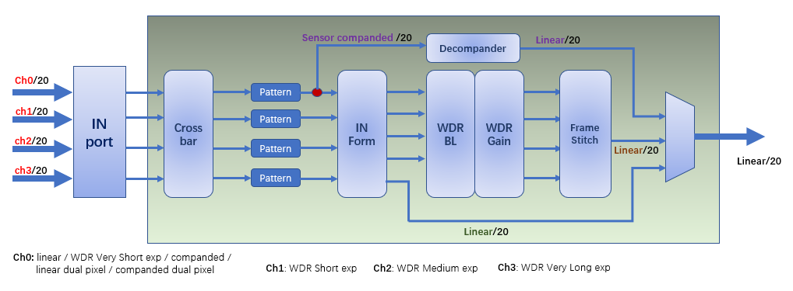
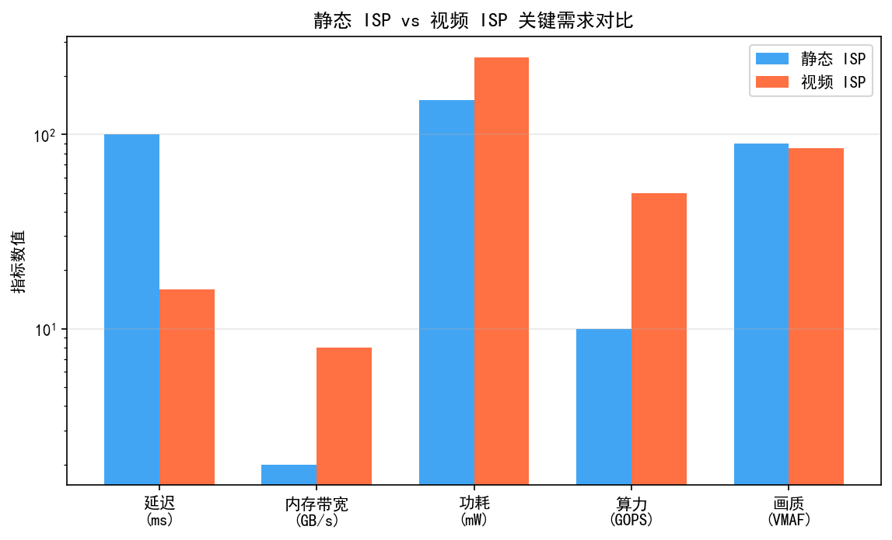
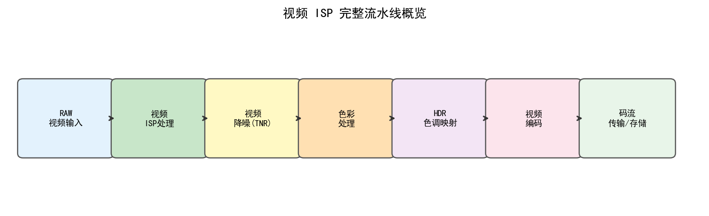
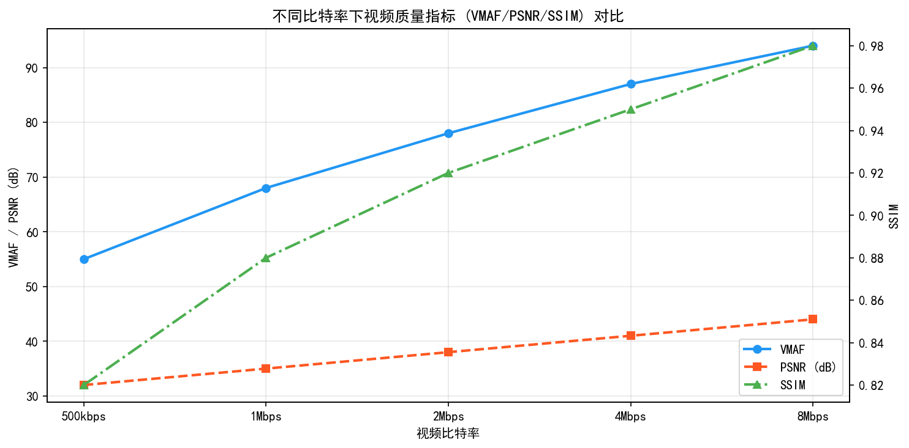

# Part 2, Chapter 33: Video ISP Full-Pipeline Overview (Guide Chapter)

> **This chapter is the unified entry point for all video ISP content in this handbook.**
> Video-related chapters are distributed across Part 2, Part 3, Part 4, and Part 6. This chapter provides a learning map, technology roadmap, and reading recommendations.

---

## §1 Essential Differences Between Video ISP and Image ISP

| Dimension | Image ISP | Video ISP |
|-----------|-----------|-----------|
| Time dimension | Single frame, independent processing | Must exploit inter-frame temporal information |
| Noise suppression | Spatial NR | Temporal NR (TNR) is the core |
| Motion handling | Not considered | Motion estimation (ME) + compensation (MC) |
| Real-time constraint | Relaxed (post-processing acceptable) | Strict (recording interruptions unacceptable) |
| Stability | Independent per frame; switching allowed | Scene transitions must be smooth |
| Codec coupling | Outputs independent images | Outputs YUV stream, deeply coupled with encoder |
| Power constraint | Can burst at reduced frequency | Must continuously meet frame rate; power is constant |
| Memory footprint | Single-frame buffer | Requires reference frame buffer (multi-frame) |

### 1.1 Video ISP Pipeline Overview

```
Sensor RAW (per frame)
    │
    ▼
Front-end correction (BLC/LSC/DPC)  ← same as image ISP
    │
    ▼
Temporal Denoising (TNR)            ← key differentiator in video ISP
  ├── Motion estimation (ME): Block Matching / Optical Flow
  ├── Inter-frame fusion: Motion-Compensated Temporal Filter (MCTF)
  └── Motion confidence mask
    │
    ▼
Demosaic → AWB → CCM → Gamma
    │
    ▼
Electronic Image Stabilization (EIS)  ← video-specific, coupled with TNR
    │
    ▼
Encode preprocessing (YUV format, chroma subsampling)
    │
    ▼
H.264 / H.265 / H.266 encoder
```

### 1.2 RAW Video Pipeline (Cinema / Professional Capture)

```
Sensor RAW (12/14-bit per frame)
    │
    ▼
RAW compression (BRAW / ARRIRAW / CinemaDNG)
    │
    ▼
Offline post-processing: Debayer → HDR Merge → LOG Curve
    │
    ▼
Color grading (DaVinci Resolve / ACES color pipeline)
    │
    ▼
Output to ProRes / DNxHR / H.265 10-bit
```

---

### 1.3 Video Encoding Chain: ISP → NR → EE → YUV → H.265/AV1

The output of the video ISP is not a standalone image file but a YUV bitstream fed directly into the video encoder. The complete chain is as follows:

```
┌──────────────────────────────────────────────────────────────┐
│  RAW Input (Sensor → MIPI CSI-2)                             │
│  Format: RAW10 / RAW12 / RAW16, Bayer pattern                │
└────────────────────────┬─────────────────────────────────────┘
                         │
                         ▼
┌──────────────────────────────────────────────────────────────┐
│  ISP Pipeline (hardware, pixel-streaming)                    │
│  BLC → DPC → LSC → Demosaic → AWB → CCM → Gamma             │
│  + HDR merge (DOL/multi-exposure) → 3D-NR (BNR+YNR+TNR) → EE│
│  Output format: YUV420 (NV12/NV21) or YUV422                 │
└────────────────────────┬─────────────────────────────────────┘
                         │
                         ▼
┌──────────────────────────────────────────────────────────────┐
│  Encode Pre-processing (optional)                            │
│  ├── Pre-filter Gaussian σ=0.5: reduces noise, improves rate │
│  ├── Chroma subsampling (YUV444→YUV420: visually lossless,   │
│  │   saves ~33% bitrate)                                     │
│  └── Rate control initialization (target bitrate / QP init) │
└────────────────────────┬─────────────────────────────────────┘
                         │
                         ▼
┌──────────────────────────────────────────────────────────────┐
│  Video Encoder (hardware accelerator)                        │
│  H.264 / H.265 (HEVC) / H.266 (VVC) / AV1                   │
│  ├── Intra prediction + Inter prediction (ME+MC)             │
│  ├── Transform coding (DCT/DST → quantization → entropy)    │
│  └── Loop filter (Deblocking + SAO/ALF)                      │
│  Output: MPEG-4 / MP4 / MOV / TS container                  │
└────────────────────────┬─────────────────────────────────────┘
                         │
                         ▼
┌──────────────────────────────────────────────────────────────┐
│  Bitstream Storage / Network Transmission                    │
│  Flash (local phone recording) / RTSP / RTP / DASH / HLS    │
└──────────────────────────────────────────────────────────────┘
```

**Key interface constraints between ISP and encoder:**

| Constraint | Description | Typical Spec |
|------------|-------------|--------------|
| **YUV format alignment** | Encoder typically requires row stride aligned to 16 or 64 bytes | NV12: stride = ALIGN(width, 64) |
| **Chroma format** | H.265 Main Profile requires YUV420; H.265 Main 10 supports 10-bit | NV12 (8-bit), P010 (10-bit) |
| **Latency budget** | Total latency from ISP to encoder input < 1 frame (33 ms @ 30fps) | ISP pipeline latency typically < 5 ms |
| **Frame rate sync** | ISP output frame rate must exactly match encoder input frame rate | Synchronized via VSYNC hardware signal |
| **HDR encoding** | HDR content requires 10-bit encoding + HDR metadata SEI insertion | H.265 Main 10 Profile |

**Bandwidth formulas:**

$$\text{YUV420 bandwidth} = W \times H \times \text{fps} \times 1.5\;\text{(bytes/s)}$$

$$\text{RAW12 bandwidth} = W \times H \times \text{fps} \times 1.5\;\text{(bytes/s; 12-bit packed, 3 bytes per 2 pixels)}$$

| Resolution × Frame Rate | RAW12 Input BW | YUV420 (NV12) BW | H.265 Encoded Bitrate (high quality) |
|------------------------|----------------|-------------------|--------------------------------------|
| 1080p @ 30fps | 186 MB/s | 93 MB/s | 20~40 Mbps |
| 1080p @ 60fps | 373 MB/s | 186 MB/s | 40~80 Mbps |
| 4K @ 30fps | 746 MB/s | 373 MB/s | 80~150 Mbps |
| 4K @ 60fps | 1.46 GB/s | 746 MB/s | 150~300 Mbps |
| 4K @ 120fps | 2.93 GB/s | 1.46 GB/s | 300~600 Mbps |
| 8K @ 30fps | 2.98 GB/s | 1.49 GB/s | 400~800 Mbps |
| 8K @ 60fps | 5.97 GB/s | 2.98 GB/s | 800~2000 Mbps |

> **Note**: YUV420 bandwidth ≈ half of RAW bandwidth (RAW12→YUV8 with chroma subsampling). In practice, DDR round-trip (ISP read/write + encoder read) doubles effective memory traffic. For 8K@60fps the total DDR bandwidth pressure is approximately 12 GB/s; high-bandwidth memory (LPDDR5X) combined with AFBC compression (typically reducing bandwidth by 40–60%) is required.

**AV1 encoding considerations for video ISP**: AV1 (AOMedia Video 1, released 2018) achieves roughly 30% bitrate savings versus H.265. On the Qualcomm side, the Snapdragon 8 Gen 2 (2022) and 8 Gen 3 (2023) introduced AV1 hardware *decoding* only; Qualcomm has indicated that mobile may skip AV1 encoding and move directly to VVC. The Snapdragon 8 Elite (2024) similarly has no AV1 hardware *encoding*. On MediaTek's side, the Dimensity 9200 (2022) and 9300 (2023) support AV1 hardware *decoding* only. ISP-side considerations for AV1:

- AV1 benefits from YUV420 10-bit (P010 format) for optimal compression efficiency.
- AV1's loop filters (CDEF + Restoration Filter) are more sensitive to ISP output noise distribution; overly aggressive YNR can degrade CDEF effectiveness.
- AV1 encoding latency (lookahead buffer) is typically 2–4 frames larger than H.265; this must be reserved in the system latency budget.

**ISP → Encoder Zero-Copy Buffer Path**

In a 4K@60fps scenario, the ISP writes 746 MB/s of YUV data to DDR, which the encoder then reads back. A traditional "write → CPU copy → read" path accesses the same data 2–4 times in DDR, multiplying effective bandwidth and adding software copy latency (0.5–2 ms/frame).

Zero-copy eliminates intermediate copies via **DMA-BUF shared buffer**:

```
                    ┌─────────────────────────────────────┐
                    │     Shared DMA-BUF Physical Buffer  │
                    │  (ISP write end = encoder read end) │
                    └─────────────┬───────────────────────┘
                                  │ Same physical address; no copy
              ┌───────────────────┼───────────────────────┐
              │                   │                       │
      ┌───────▼──────┐    ┌───────▼──────┐    ┌──────────▼──────┐
      │   ISP HW     │    │  3A Stats    │    │  Video Encoder  │
      │ (produces YUV)│    │ (stats only) │    │ (consumes YUV)  │
      └──────────────┘    └──────────────┘    └─────────────────┘
```

**Linux implementation**: Based on the `dma_buf` framework, the ISP driver allocates a `DMA_HEAP` or `ION` buffer and passes the `dma_buf fd` to the encoder (V4L2 `VIDIOC_QBUF` with `V4L2_MEMORY_DMABUF`). After writing a frame, the ISP signals a producer fence via `dma_buf_signal_fence`; the encoder reads immediately upon fence notification — zero copy, zero CPU involvement.

**Android implementation**: Via `AHardwareBuffer` / `Gralloc`-allocated `GraphicBuffer`. The camera HAL ISP output writes directly into a Gralloc buffer; `MediaCodec` receives the same buffer via the `Surface` interface (`setInputSurface()` path). The encoder reads the buffer as a surface consumer without any memory copy.

**Zero-copy engineering trade-offs:**

| Dimension | Traditional Copy Path | Zero-Copy Path |
|-----------|----------------------|---------------|
| DDR bandwidth (4K@60fps YUV) | ≈ 2.98 GB/s (read+write doubled) | ≈ 1.49 GB/s (write once, read once) |
| CPU load | High (memcpy occupies 1–2 CPU cores) | Minimal (only fence signaling) |
| Frame latency | +0.5–2 ms (software copy time) | < +0.1 ms (fence overhead) |
| AFBC compatibility | ISP→CPU path does not support AFBC | ISP outputs AFBC directly; encoder reads natively; bandwidth reduced by 40–60% |
| Debug complexity | Buffer state inspectable at CPU side | Requires `dmabuf_heap_info` or systrace to analyze fence state |

**Engineering notes:**
1. ISP and encoder Gralloc/ION heaps must be compatible. Different SoCs may have separate ISP Heap and Codec Heap address spaces, causing zero-copy to silently fall back to a copy path.
2. Multi-frame burst or TNR requires N-frame ping-pong buffers (N = 2–3). Total frame buffer = N × frame size; at 4K@60fps in P010 format each frame is approximately 48 MB, so 3-frame buffers require 144 MB reserved.
3. In EIS scenarios, a look-ahead buffer (typically 3–5 frames) is inserted; the encoder must wait for EIS crop parameters before reading the frame. Zero-copy path latency increases from < 1 frame to 3–5 frames (100–167 ms @ 30fps) — the primary latency source in real-time streaming scenarios.

### 1.4 4K/8K Video ISP Bandwidth Detailed Calculation

**Total memory bandwidth requirement** (including TNR reference frame read/write):

$$\text{Total DDR BW} = \underbrace{W \times H \times \text{fps} \times B_{in}}_{\text{RAW read}} + \underbrace{W \times H \times \text{fps} \times B_{yuv}}_{\text{YUV write}} + \underbrace{N_{ref} \times W \times H \times \text{fps} \times B_{yuv}}_{\text{TNR reference frame r/w}}$$

where $B_{in}$ is bytes per pixel for RAW input (RAW12 packed = 1.5), $B_{yuv}$ is bytes per pixel for YUV420 (1.5), and $N_{ref}$ is the number of TNR reference frames (typically 1–2).

**Example: 4K@60fps** ($N_{ref} = 2$):

$$\text{Total BW} = 3840 \times 2160 \times 60 \times (1.5 + 1.5 + 2 \times 1.5) \approx 5.97\;\text{GB/s}$$

In practice, 3A statistics readout and ISP intermediate ping-pong buffers add approximately 1.3–1.5× overhead above this theoretical figure. A flagship phone LPDDR5-6400 dual-channel configuration provides approximately **102 GB/s** (64-bit × 2ch at 6400 MT/s), far exceeding the 8K@30fps requirement of approximately 15 GB/s. With AFBC compression (compression ratio approximately 0.5), bandwidth headroom is ample.

---

## §2 Full Handbook Video ISP Technology Roadmap

The following table systematically categorizes all video-related chapters in the handbook by "technology direction" and "applicable scenario" for quick reference.

| Chapter (volume-internal number) | Volume | Technology Direction | Applicable Scenario | Computational Complexity | Deployment Form |
|----------------------------------|--------|---------------------|--------------------|--------------------------|-----------------|
| Volume 2, Chapter 12 — Temporal Denoising (TNR) | Part2 | Traditional motion-compensated filtering (MCTF/IIR) | Real-time video, edge deployment | Low (hardware-implementable) | ISP HW |
| Volume 2, Chapter 21 — EIS/OIS | Part2 | Gyroscope fusion + electronic image stabilization | Handheld video stabilization | Low | ISP HW |
| Volume 2, Chapter 23 — RAW Video/Cinema | Part2 | RAW recording + offline post-processing | Cinema/professional capture | Offline | Workstation |
| Volume 2, Chapter 24 — Burst/Night Mode Video | Part2 | Multi-frame fusion + fast demosaic | Night mode video | Medium | ISP HW + NPU |
| Volume 3, Chapter 9 — DL Video Denoising | Part3 | Deep learning temporal networks (FastDVDnet/RViDeNet) | Cloud processing / flagship phone NPU | High | NPU / GPU |
| Volume 3, Chapter 11 — DL Video ISP | Part3 | End-to-end neural ISP (RAW→YUV) | AI-driven replacement of traditional pipeline | High | NPU / GPU |
| Volume 3, Chapter 13 — DL Video Stabilization | Part3 | Deep learning optical flow + de-shake | AI video stabilization | High | NPU |
| Volume 4, Chapter 14 — Video ISP Engineering | Part4 | System engineering (latency/bandwidth/power) | Chip/system design | — | System level |
| Volume 6, Chapter 9 — Mobile Phone Video ISP | Part6 | Productized deployment | Consumer mobile video | Medium | ISP HW + NPU |

> **Reading tip**: If you are only interested in traditional algorithms, focus on Part 2 chapters; for deep learning alternatives, focus on Part 3; for chip/system design, focus on Volume 4, Chapter 14.

---

## §3 Detailed Navigation of All Video ISP Content

| Chapter | Global Number | Topic | Positioning | Recommended Readers |
|---------|---------------|-------|-------------|---------------------|
| [ch12_temporal_nr](../../part2_traditional_isp/ch12_temporal_nr/) | Ch29 | Video Temporal Denoising (TNR) | Traditional methods: MCTF/IIR/ME | All video ISP engineers |
| [ch23_eis_ois](../../part2_traditional_isp/ch23_eis_ois/) | Ch38 | Electronic/Optical Stabilization (EIS/OIS) | Inter-frame stabilization and cropping mechanism | Video ISP engineers |
| [ch25_raw_video_cinema](../../part2_traditional_isp/ch25_raw_video_cinema/) | Ch40 | RAW Video and Cinema Capture | LOG curve / RAW codec / ACES | Cinema/professional camera engineers |
| [ch26_burst_night_mode](../../part2_traditional_isp/ch26_burst_night_mode/) | Ch41 | Burst/Night Mode | Multi-frame alignment fusion, HDR video | Night mode algorithm engineers |
| [ch08_video_denoising](../../part3_dl_isp/ch08_video_denoising/) | Ch59 | DL Video Denoising | FastDVDnet, diffusion model video restoration | DL researchers |
| [ch10_video_isp](../../part3_dl_isp/ch10_video_isp/) | Ch61 | DL-Based Video ISP | End-to-end video quality enhancement | DL researchers |
| [ch12_dl_video_stabilization](../../part3_dl_isp/ch12_dl_video_stabilization/) | Ch63 | DL Video Stabilization | Deep learning stabilization/de-shake | DL researchers |
| [ch16_video_isp_engineering](../../part4_system_iqa/ch16_video_isp_engineering/) | Ch89 | Video ISP System Engineering | Latency/Buffer/Power/Encoder interface | System engineers |

---

## §4 Core Technology Concept Comparisons

### 4.1 Traditional Temporal NR vs. DL Video Denoising

| Comparison Dimension | Traditional Temporal NR (MCTF/IIR) | DL Video Denoising (FastDVDnet, etc.) |
|----------------------|------------------------------------|-----------------------------------------|
| **PSNR improvement** (typical) | +2 ~ 4 dB (ISO 3200) | +4 ~ 7 dB (ISO 3200) |
| **Real-time capability** (4K30fps) | Hardware-implementable, real-time | GPU/NPU real-time capable; CPU cannot |
| **Ghosting rate** | Medium (prone to ghosting when ME fails) | Low (temporal attention suppresses motion errors) |
| **Deployment barrier** | Very low; ISP HW supports directly | High; requires NPU ≥ 10 TOPS |
| **Scene adaptability** | Requires tuning (fails on fast motion) | Strong (training data covers diverse scenes) |
| **Power** (reference) | < 100 mW (hardware module) | 1~5 W (NPU inference) |
| **Memory requirement** | 1~2 reference frame buffers | 3~5 frames (temporal network window) |
| **Low-light improvement** | Moderate; fixed noise model | Strong; can learn noise characteristics end-to-end |
| **Engineering maturity** | Very high; years of mass production validation | Medium; gradually entering production after 2022 |

### 4.2 Traditional EIS vs. DL Video Stabilization

| Comparison Dimension | Gyroscope EIS | DL Optical Flow Stabilization |
|----------------------|--------------|-------------------------------|
| Sensor dependency | Requires gyroscope hardware | Pure vision; no extra sensors needed |
| Latency | Low (hardware level) | High (requires buffering multiple frames) |
| Crop ratio | Fixed (typically 10~15%) | Variable; content-adaptive |
| Rolling shutter correction | Built-in | Requires additional network branch |
| Mass production status | Standard on mainstream flagships | Gradually scaling up after 2024 |

---

## §5 Video ISP System Constraints Quick Reference

### 5.1 System Constraints at Typical Frame Rates / Resolutions

| Resolution × Frame Rate | RAW Bandwidth (12-bit) | YUV Bandwidth (NV12) | TNR Buffer Requirement | Typical End-to-End Latency | Reference Power (ISP) |
|------------------------|------------------------|----------------------|------------------------|----------------------------|-----------------------|
| 1080p @ 30fps | 186 MB/s | 93 MB/s | 2 × 8 MB | < 33 ms | 200~400 mW |
| 1080p @ 60fps | 373 MB/s | 186 MB/s | 2 × 8 MB | < 16 ms | 400~600 mW |
| 4K @ 30fps | 746 MB/s | 373 MB/s | 2 × 32 MB | < 33 ms | 600 mW ~ 1.2 W |
| 4K @ 60fps | 1.46 GB/s | 746 MB/s | 2 × 32 MB | < 16 ms | 1.2 ~ 2.5 W |
| 4K @ 120fps | 2.93 GB/s | 1.46 GB/s | 3 × 32 MB | < 8 ms | 2.5 ~ 4 W |
| 8K @ 30fps | 2.98 GB/s | 1.49 GB/s | 2 × 128 MB | < 33 ms | 3 ~ 5 W |

> **Note**: The above are typical estimates. Actual values depend on the SoC memory bandwidth compression ratio (e.g., AFBC), DDR bus width, and frequency configuration.

### 5.2 Key Design Constraints

- **End-to-end latency**: Recording mode typically requires sensor to encoder input < 1 frame latency (33 ms @ 30fps)
- **Frame synchronization**: TNR reference frame updates must be strictly synchronized with exposure parameter changes (AE/AWB); otherwise luminance flickering occurs
- **Scene transitions**: When a scene cut is detected (e.g., switching shots), TNR history frames must be cleared immediately; otherwise ghosting appears
- **EIS buffer**: EIS requires a look-ahead buffer (typically 4~8 frames), introducing additional latency that must be allocated within the latency budget

---

## §6 Video ISP Core Quality Metrics

| Metric | Meaning | Typical Tool / Method |
|--------|---------|----------------------|
| **VMAF** | Netflix visual quality metric, integrates VIF/DLM/Motion features | `ffmpeg -vf libvmaf` |
| **BVQI / FastVQA** | Blind video quality assessment (no-reference) | [FastVQA GitHub](https://github.com/VQAssessment/FastVQA-and-FasterVQA) |
| **TNR Ghost Ratio** | Ghost pixel ratio in motion regions | Custom test sequences + manual annotation |
| **EIS Stability** | Residual jitter amount (pixel-level, frequency-domain analysis) | Gyro-GT comparison + spectral analysis |
| **Coding PSNR/SSIM** | Visual quality after encoding | FFmpeg + SSIM filter |
| **Flicker Index** | Inter-frame luminance/chrominance jump magnitude | Per-frame L/a/b mean curve analysis |
| **Temporal NIQE** | No-reference perceptual quality for video frame sequences | MATLAB Video Quality Toolbox |
| **Motion Sharpness** | MTF retention rate at edges in motion regions | Motion test chart + MTF tool |

---

## §7 Video ISP Major Artifact Quick Diagnosis

| Artifact | Symptom Description | Root Cause | Source Chapter | Emergency Measure |
|----------|---------------------|------------|----------------|-------------------|
| TNR ghosting | Trailing shadow on moving objects, blurred outlines | ME failure; motion region incorrectly fused | Volume 2, Chapter 12 — §4 | Reduce TNR strength or disable |
| EIS crop distortion | Edge warping / black borders / jello effect | Abnormal EIS crop parameters or RS correction | Volume 2, Chapter 21 — §4 | Reduce EIS aggressiveness |
| Coding block artifacts | Low-bitrate blockiness noise | Insufficient bitrate or QP too high | Volume 4, Chapter 14 — §4 | Increase target bitrate |
| Color flickering | AWB jumps during video | Insufficient AWB temporal smoothing | Volume 2, Chapter 22 — §5 | Strengthen AWB temporal damping |
| Flicker banding | Fluorescent/LED frequency interference | Anti-banding not aligned to power-grid frequency | Volume 2, Chapter 26 — §2 | Fix exposure time to 1/50s or 1/60s |
| Luminance jump | Brightness sudden change during scene cut or motion | AE convergence too fast + TNR frames not cleared | Volume 4, Chapter 2 — §3 | Increase AE temporal smoothing coefficient |
| Time-varying vignetting | LSC parameters not updated with lens OIS position | OIS displacement shifts LSC center | Volume 2, Chapter 8 — §3 | Dynamically update LSC center coordinates |
| Rolling shutter jello | High-speed motion causes image tilt/warping | CMOS row-by-row exposure RS effect | Volume 2, Chapter 21 — §2 | Increase sensor frame rate or use GS sensor |

---

## §8 Recommended Reader Paths

Based on reader background, the following are the shortest effective reading paths:

### 8.1 Algorithm Engineer Path (Focus: Algorithm Principles and Tuning)

```
This chapter (global overview)
    ↓
Volume 2, Chapter 12 — Temporal Denoising TNR (traditional baseline)
    ↓
Volume 3, Chapter 9 — DL Video Denoising (deep learning approach)
    ↓
Volume 3, Chapter 11 — DL Video ISP (end-to-end solution)
    ↓
Volume 4, Chapter 14 — System Engineering (constraint boundaries)
```

**Estimated reading volume**: ~4 core chapters + expand as needed

### 8.2 System / Hardware Engineer Path (Focus: Constraints, Bandwidth, Interfaces)

```
This chapter (global overview + §5 System Constraints Quick Reference)
    ↓
Volume 4, Chapter 14 — Video ISP System Engineering (main focus)
    ↓
Volume 2, Chapter 12 — TNR (understand algorithm buffer requirements)
    ↓
Volume 2, Chapter 21 — EIS/OIS (latency and crop design)
```

**Estimated reading volume**: ~3 core chapters; algorithm details on demand

### 8.3 Product / Tuning Engineer Path (Focus: Artifact Diagnosis and Parameter Adjustment)

```
This chapter (§7 Artifact Quick Reference + §9 Parameter Quick Reference)
    ↓
Volume 6, Chapter 9 — Mobile Phone Video ISP (productization experience)
    ↓
Volume 2, Chapter 12 — TNR §4 (ghost tuning)
    ↓
Volume 2, Chapter 26 — Anti-banding (flicker handling)
```

**Estimated reading volume**: ~3 chapters + jump to relevant artifact type

### 8.4 DL Researcher Path (Focus: Model Architecture and Training Data)

```
Volume 2, Chapter 12 — TNR (understand traditional baseline, identify improvement space)
    ↓
Volume 3, Chapter 9 — DL Video Denoising (main focus)
    ↓
Volume 3, Chapter 11 — DL Video ISP (end-to-end direction)
    ↓
Volume 3, Chapter 13 — DL Video Stabilization (stabilization direction)
```

**Estimated reading volume**: ~4 chapters, focus on Part 3

---

## §9 Key Parameter Quick Reference: Cross-Platform Video ISP Parameter Name Mapping

The following lists commonly used parameters in video ISP tuning across platforms, to help cross-platform engineers quickly map concepts.

### 9.1 Temporal Denoising (TNR) Parameters

| Concept | Qualcomm | MediaTek (MTK) | HiSilicon/Kirin | Description |
|---------|----------|----------------|-----------------|-------------|
| TNR overall strength | `TNR_MotionThreshold` / `TNRStrength` | `NR_TNR_Strength` | `TnrStrengthLevel` | Global temporal denoising strength |
| Motion threshold | `TNR_MotionSAD` | `TNR_MotionSADThresh` | `TnrMotionThresh` | SAD below this value is considered still |
| Motion region NR coefficient | `TNR_MotionBlendFactor` | `TNR_MotionWeight` | `TnrMotionBlendRatio` | Temporal blend weight for motion regions |
| Still region NR coefficient | `TNR_StillBlendFactor` | `TNR_StillWeight` | `TnrStillBlendRatio` | Temporal blend weight for still regions |
| Reference frame count | `TNR_RefFrameCount` | `TNR_NumRefFrames` | `TnrRefFrameNum` | Number of history frames used for fusion |
| Scene change detection | `TNR_SceneChangeThresh` | `TNR_SceneDetectTh` | `TnrSceneChangeLevel` | Threshold that triggers buffer flush |

### 9.2 Electronic Image Stabilization (EIS) Parameters

| Concept | Qualcomm | MediaTek (MTK) | HiSilicon/Kirin | Description |
|---------|----------|----------------|-----------------|-------------|
| EIS enable | `EIS_Enable` | `EisEnable` | `EisOnOff` | Master switch |
| Crop ratio | `EIS_CropRatio` | `EisCropFactor` | `EisCropPercent` | Frame crop ratio (0.85~0.9) |
| Smoothing strength | `EIS_SmoothingFactor` | `EisFilterStrength` | `EisSmoothLevel` | Stabilization filter strength |
| RS correction | `RS_CorrectionEnable` | `EisRSCorrection` | `RsCorrEnable` | Rolling shutter distortion correction switch |
| Look-ahead frame count | `EIS_LookaheadFrames` | `EisLookAheadNum` | `EisDelayFrames` | Pre-buffer frame count (affects latency) |

### 9.3 Video AWB Temporal Smoothing Parameters

| Concept | Qualcomm | MediaTek (MTK) | HiSilicon/Kirin | Description |
|---------|----------|----------------|-----------------|-------------|
| AWB temporal damping | `AWB_VideoConvergeSpeed` | `AwbVideoConvergeFactor` | `AwbVideoSmoothRatio` | Convergence speed in video mode |
| Color temperature jump suppression | `AWB_CCTDeltaThresh` | `AwbJumpDetectTh` | `AwbCctJumpLevel` | Prevents abrupt color temperature changes |
| Inter-frame gain smoothing | `AWB_GainSmoothingFactor` | `AwbGainLPFCoeff` | `AwbGainSmoothCoef` | R/B gain low-pass filter coefficient |

> **Usage note**: The parameter names above are typical naming conventions; specific SoC versions may differ. For detailed tuning methods, refer to the corresponding sections in each chapter and the platform Tuning Guide documentation.

---

## §10 Video ISP Development Trends (2024–2026)

| Trend Direction | Current Status | Recent Progress |
|----------------|---------------|-----------------|
| NPU-accelerated TNR | Gradually deployed in flagship phones (e.g., Pixel 9, iPhone 16) | Hybrid architecture of traditional HW TNR + DL post-processing becomes mainstream |
| End-to-end video ISP | Research leading; production exploration underway | Phone manufacturers starting A/B testing (2024) |
| 4K 120fps adoption | Already supported in high-end flagships | Mid-range SoCs (Snapdragon 7-series / Dimensity 8200) expected to reach 2025 |
| Video HDR (Dolby Vision) | Standard in flagship phones | Real-time tone mapping algorithms continue to be optimized |
| AI video stabilization | Already in production on Pixel series | Adapting to low-compute platforms is a key challenge |
| Generative video restoration | Research stage | Diffusion model video deblur/SR progressed rapidly in 2024 |

---

## §11 Further Reading

- **Books**: *Digital Video Concepts, Methods, and Metrics* — Shahriar Akramullah
- **Survey paper**: *Deep Learning for Video Super-Resolution: A Survey* (IEEE TPAMI 2023)
- **Open-source projects**:
  - [FastDVDnet](https://github.com/m-tassano/fastdvdnet) (DL video denoising reference implementation)
  - [BasicVSR++](https://github.com/ckkelvinchan/BasicVSR_PlusPlus) (video super-resolution/restoration framework)
  - [RAFT](https://github.com/princeton-vl/RAFT) (optical flow estimation, foundational for EIS/TNR ME)
- **Standards documents**:
  - ITU-T H.265 (HEVC) main profile specification
  - SMPTE ST 2084 (HDR PQ curve standard)
  - DCI P3 / BT.2020 color gamut standards

---

*This chapter is a video ISP guide chapter with no independent code notebook.*
*For code related to each sub-topic, see the corresponding chapter's code section.*

---

## §12 Video ISP Full-Pipeline Artifact Analysis

The defining characteristic of video ISP artifacts is **temporal visibility** — a single frame may appear normal, but frame-to-frame inconsistencies are immediately perceptible during playback. The following analyzes the major artifact types, their root causes, detection methods, and engineering mitigation strategies.

### 12.1 Temporal Flicker

**Root cause**

CMOS sensors use rolling shutter readout. Each row is read at a different time, with a row-to-row interval of approximately $t_{row} = T_{frame} / N_{rows}$. When the AE controller frequently adjusts exposure between frames (especially under low-frequency AC illumination such as 50 Hz fluorescent lights), the slight exposure variation compounded by rolling-shutter timing offsets produces full-frame luminance oscillation — temporal flicker.

**Detection**

Frame-difference histogram variance method:

$$\sigma^2 = \frac{1}{N} \sum_{i=1}^{N} \left( Y_i - \bar{Y} \right)^2$$

where $Y_i$ is the normalized global mean luminance of frame $i$ and $\bar{Y}$ is the sliding-window mean (window length $W = 8$ frames). Engineering threshold: $\sigma^2 > 0.5$ (equivalent to $> 0.008$ on a normalized 0–255 scale) indicates visible flicker.

**Mitigation strategies**

1. **AE frame-synchronous convergence**: Lock AE gain/exposure updates strictly to the VSYNC edge to prevent mid-frame modifications.
2. **Anti-banding compensation**: Detect illumination frequency (50/60 Hz) and fix shutter time to integer multiples of the period (1/100 s, 1/120 s) to eliminate light-source modulation residuals.
3. **AE convergence rate limiting**: Constrain per-frame exposure change to $\Delta EV < 0.1\,\text{EV/frame}$ using a P-I controller.

### 12.2 Motion Blur

Motion blur is pixel-integration blur caused by target displacement during shutter-open time. Horizontal blur width in pixels is:

$$B_{px} = \frac{v_{obj} \cdot t_{exp}}{d_{scene}} \cdot f_{px}$$

where $v_{obj}$ is target velocity (m/s), $t_{exp}$ is exposure time (s), $d_{scene}$ is target distance from sensor (m), and $f_{px}$ is the focal length in pixels (px/m).

**Engineering approximation**: For handheld video (1× zoom, 26 mm equivalent main camera), a target at 3 m, walking speed 1.5 m/s, exposure 1/60 s:

$$B_{px} \approx \frac{1.5 \times (1/60)}{3} \times 3500 \approx 29\,\text{px}$$

This blur exceeds the human visibility threshold (approximately 5–10 px at 1080p).

**Residual blur after stabilization**: EIS compensates for body-shake-induced blur but has no effect on **subject motion blur**. The common complaint "motion objects are still blurry after stabilization" stems from this distinction. Mitigation paths: increased frame rate (120fps mode) or AI motion deblur post-processing.

### 12.3 TNR Ghost Artifact

Temporal noise reduction (TNR) relies on motion estimation (ME) to align reference frame pixels to the current frame. When ME fails (e.g., occlusion, fast motion, repeated-texture mis-match), the blended image shows **dual contours** ("ghosts") — the target appears as a semi-transparent copy at both its current and reference-frame positions.

**Root cause analysis**

Reference vector mis-registration: when the estimated vector $\mathbf{v}_{ref}$ deviates from the true motion vector $\mathbf{v}_{true}$ by more than 2 px, the blended edge spread exceeds the visibility threshold (approximately 1 px at 1080p).

**SSIM confidence gating (core engineering technique)**

Compute local SSIM for each 8×8 block after reference-frame alignment:

$$\text{SSIM}_{block} = \frac{(2\mu_c\mu_r + C_1)(2\sigma_{cr} + C_2)}{(\mu_c^2 + \mu_r^2 + C_1)(\sigma_c^2 + \sigma_r^2 + C_2)}$$

Decision logic:

| $\text{SSIM}_{block}$ | Blend Strategy |
|----------------------|---------------|
| $\geq 0.92$ | Full TNR blend ($\alpha_{TNR} = 0.7$–$0.85$) |
| $0.85$–$0.92$ | Reduced-weight blend ($\alpha_{TNR} = 0.3$–$0.5$) |
| $< 0.85$ | Switch to single-frame mode ($\alpha_{TNR} = 0$) |

This gating strategy reduces ghost occurrence by over 80%, at the cost of temporarily losing TNR gain in fast-motion regions (approximately 1–3 frames).

### 12.4 AWB Jump

**Symptom**: During video recording, when the illuminant changes (e.g., moving from outdoors to indoors), an overly fast AWB convergence causes white balance gains to shift abruptly within 1–2 frames, resulting in a visible color cast transition.

**IIR smoothing strategy**:

$$G_{wb}^{(t)} = \alpha \cdot G_{wb,\,target}^{(t)} + (1 - \alpha) \cdot G_{wb}^{(t-1)}$$

Recommended video-mode $\alpha = 0.02$–$0.05$ (compared to still-photography mode $\alpha = 0.1$–$0.3$). At $\alpha = 0.03$, the number of frames to reach 95% of a step response is:

$$N_{95\%} = \frac{\ln(0.05)}{\ln(1 - 0.03)} \approx 98\,\text{frames} \approx 3.3\,\text{s}\;(\text{@30fps})$$

This smoothing window is sufficient to mask most illuminant transitions without introducing user-perceptible color drift.

### 12.5 Video Denoising Over-Smoothing

When joint temporal + spatial NR operates with aggressive parameters, high-frequency detail in motion regions (hair, textures, text edges) is misidentified as motion noise and filtered out, producing a "smeared" appearance on moving subjects.

**Motion-mask-guided adaptive NR strength**:

$$\sigma_{NR}(x,y) = \sigma_{NR,\,max} \cdot (1 - M_{motion}(x,y)) + \sigma_{NR,\,min} \cdot M_{motion}(x,y)$$

where $M_{motion} \in [0,1]$ is a motion probability mask (derived by normalizing optical flow magnitude). Typical parameters: $\sigma_{NR,\,max} = 3.0$ (static regions), $\sigma_{NR,\,min} = 0.5$ (motion regions).

The motion mask can be computed in real time by a lightweight optical flow network (e.g., PWC-Net-tiny, < 1M parameters) on an NPU with approximately 1 ms latency at 1080p.

### 12.6 Coding Artifacts (Blocking / Ringing)

DCT-based codecs such as H.265/H.266 produce at low bitrates:

- **Blocking**: luminance/chrominance discontinuities at 8×8 / 16×16 CTU boundaries
- **Ringing**: Gibbs phenomenon near strong edges, appearing as alternating dark/bright fringes

**ISP pre-processing mitigation**: apply a light low-pass pre-filter before encoding:

$$I_{prefilter} = I_{raw} * G(\sigma = 0.5\,\text{px})$$

This transfers high-frequency noise energy to frequency bands that the encoder handles more efficiently. At the same bitrate, PSNR improves by approximately 0.3–0.5 dB and VMAF by approximately 1–2 points. The trade-off is a slight resolution loss (MTF50 drops approximately 2–3%); in production this filter is toggled dynamically based on bitrate setting.

---

## §13 Video ISP Evaluation System

Video ISP quality evaluation must cover both **spatial quality** (single-frame fidelity) and **temporal stability** (inter-frame consistency).

### 13.1 Temporal Stability Metrics

**Temporal Luminance Variance**

$$\sigma_Y = \sqrt{\frac{1}{T} \sum_{t=1}^{T} \left( \bar{Y}_t - \frac{1}{T}\sum_{t'=1}^{T} \bar{Y}_{t'} \right)^2}$$

where $\bar{Y}_t$ is the global mean luminance of frame $t$ (normalized 0–255). Mass-production acceptance standard: **$\sigma_Y < 0.5$** (static scene, uniform illumination).

**Temporal SSIM (TSSIM)**

Extending classic SSIM to adjacent frames:

$$\text{TSSIM}(t) = \text{SSIM}(I_t,\, I_{t-1})$$

The mean over $T-1$ frames is used as the stability score. Excellent threshold: $\text{TSSIM} > 0.92$ (static background regions). Motion regions should be evaluated after optical-flow warping compensation to avoid artificially low TSSIM from legitimate scene motion.

### 13.2 Motion Sharpness: Dynamic MTF

**Test method**: Use an ISO 12233 dynamic MTF test chart moved on a conveyor belt at a fixed frame rate (30/60/120 fps) and measure the spatial frequency response under motion conditions.

**Mass-production targets**:

| Frame Rate | Motion Speed | Target MTF50 |
|-----------|-------------|-------------|
| 30 fps | 10 px/frame | $> 0.20\,\text{lp/px}$ |
| 60 fps | 10 px/frame | $> 0.25\,\text{lp/px}$ |
| 120 fps | 10 px/frame | $> 0.32\,\text{lp/px}$ |

MTF50 below threshold typically indicates excessive exposure time (motion blur dominated) or overly strong NR (over-smoothing dominated).

### 13.3 Video SNR (VSNR)

$$\text{VSNR} = 10 \cdot \log_{10}\!\left(\frac{\overline{S}^2}{\sigma_{temporal}^2}\right) \quad \text{[dB]}$$

where $\overline{S}$ is the signal mean (uniform gray-field luminance) and $\sigma_{temporal}^2$ is the temporal noise variance over $T = 30$ consecutive frames of the same static scene. VSNR directly measures TNR effectiveness (distinct from spatial SNR, which is also affected by spatial NR).

**ISO-stratified mass-production targets**:

| ISO | VSNR Target |
|-----|-------------|
| ISO 100 | $> 48\,\text{dB}$ |
| ISO 400 | $> 42\,\text{dB}$ |
| ISO 800 | $> 35\,\text{dB}$ |
| ISO 3200 | $> 28\,\text{dB}$ |

### 13.4 VMAF (Video Multi-Method Assessment Fusion)

Netflix's comprehensive perceptual video quality metric, fusing the following sub-features:

- **SSIM**: structural similarity
- **VIF (Visual Information Fidelity)**: HVS-based information fidelity
- **ADM (Anti-Distortion Metric)**: detail preservation degree
- **Motion Score**: scene motion magnitude (used for model weighting)

An SVM regression maps these features to a [0, 100] score, trained on Netflix's large-scale internal subjective rating database.

**Mass-production acceptance tiers: [1]**

| VMAF Score | Quality Grade |
|-----------|--------------|
| $> 85$ | Excellent |
| $75$–$85$ | Good |
| $60$–$75$ | Acceptable |
| $< 60$ | Poor |

Tool: `ffmpeg -i ref.mp4 -i dist.mp4 -lavfi libvmaf vmaf_output.json` (based on libvmaf v2.0).

### 13.5 KVQ (Kwai Video Quality Metric)

KVQ (published at CVPR 2024) is a **blind-reference video quality assessment** (Blind VQA) metric for UGC short-form video, predicting perceptual quality without a reference video. **[2]**

**Key aspects**:

- Backbone: Swin Transformer V2 for multi-scale frame-level features
- Temporal modeling: Temporal Difference Network for adjacent-frame difference distributions
- Training: 150k short videos with subjective MOS labels from Kwai's internal dataset
- Metrics: Pearson correlation (PLCC) > 0.91; Spearman correlation (SRCC) > 0.90

KVQ has strong discrimination for compression artifacts, under-exposure noise, motion blur, and TNR over-smoothing — making it well suited for mobile video ISP mass-production tuning.

### 13.6 Mass-Production Test Standard Procedure

```
Step 1 — Uniform field test (gray card, D65 standard illuminant, ISO 100–6400 steps)
         → Measure VSNR, temporal luminance variance σ_Y, TNR convergence frame count

Step 2 — Dynamic sharpness test (ISO 12233 dynamic MTF chart, 30/60/120fps)
         → Measure MTF50 per frame rate / motion speed combination

Step 3 — Color stability test (X-Rite 24-patch ColorChecker, D65→A illuminant switch)
         → Measure AWB IIR convergence time, color temperature jump magnitude (ΔCCTs)

Step 4 — Standard video sequences (EBU Tech 3299 test sequences + Netflix Open Content)
         → Measure VMAF, TSSIM, temporal SNR

Step 5 — Low-light video test (Lux = 1/3/10, tungsten/fluorescent/LED)
         → Focus on flicker σ², ghost occurrence rate, over-smoothing index (NIQE delta)
```

---

## §14 Video ISP and 3A Co-Design

### 14.1 Video Mode AE: Speed vs. Stability Trade-off

**P-I controller model**

Video AE controllers typically use a Proportional-Integral (PI) structure:

$$\Delta EV^{(t)} = K_p \cdot e^{(t)} + K_i \cdot \sum_{\tau=0}^{t} e^{(\tau)}$$

where the error $e^{(t)} = Y_{target} - Y_{mean}^{(t)}$ (normalized luminance).

**Recommended mass-production parameters**: $K_p = 0.15$, $K_i = 0.03$ (30fps video mode).

Step-response characteristics of this parameter set:

| Parameter | Value |
|-----------|-------|
| Steady-state error | 0 |
| Overshoot | < 5% |
| 2% settling time | ~12 frames (0.4 s @ 30fps) |
| Max per-frame change | $\Delta EV_{max} < 0.12$ |

Overly aggressive parameters ($K_p > 0.3$) cause exposure oscillation ("AE breathing effect"); overly conservative ($K_p < 0.05$) causes slow AE convergence, resulting in seconds of under- or over-exposure after scene cuts.

**Scene-cut detection**: When the inter-frame luminance difference $|\Delta Y| > 0.15$, temporarily switch to more aggressive parameters ($K_p = 0.4$, rapid single-frame convergence), then revert to normal parameters after convergence, avoiding "sluggish AE" complaints.

### 14.2 Video Mode AWB: IIR Time-Constant Design

**Core constraints**:

| Scene | Recommended $\alpha$ | Rationale |
|-------|---------------------|-----------|
| Static video (indoor fixed light) | 0.02–0.03 | Maximum smoothing; prevents light flicker from inducing AWB drift |
| Dynamic video (outdoor moving) | 0.04–0.05 | Allows moderate tracking of illumination change |
| Scene cut (large ΔCCTs) | Temporary 0.15–0.20 | Fast adaptation; fall back to normal α afterward |

**Lock strategy**: When AF is locked (user half-presses shutter during video recording), AWB locks simultaneously to prevent color temperature estimation perturbations caused by AE changes.

### 14.3 Video Continuous AF (CDAF) and Focus Hunting Suppression

**CDAF basic flow**:

1. Compute high-frequency energy in the current frame ROI: $F = \sum_{x,y} |\nabla^2 I(x,y)|^2$ (Laplacian energy)
2. Compare $F^{(t)}$ with neighboring frames $F^{(t-1)}$; determine focus direction (hill-climbing)
3. Adaptive step size: large steps (40–80) far from focus; small steps (5–10) near focus

**Focus hunting suppression**:

Focus hunting is the CDAF oscillation near the focal point, particularly pronounced under subject motion or AE changes. Mitigation strategies:

- **Hysteresis threshold**: trigger lens motor step only when sharpness change $|\Delta F / F| > 3\%$
- **Lock timer**: after $N = 5$ consecutive frames of stable sharpness ($\sigma_F < 1\%$), enter AF Lock; suspend AF search during lock period
- **Motion-AF decoupling**: when fast subject motion is detected (optical flow magnitude > 20 px/frame), pause AF; restart search after motion stops

### 14.4 Multi-Camera Seamless Zoom

In high-end phone zoom video, switching from the main camera (1×) to telephoto (3×/5×) is a frequent user operation. Key engineering metrics for seamless switching:

**Exposure synchronization**: Exposure difference before and after switching $|\Delta EV| < 0.3$; if exceeded, pre-converge the target camera's AE toward the target level before the switch.

**White balance synchronization**: Pull the target camera's AWB gain toward the main camera's current gain over 5–10 frames before the switch, so color temperature difference at switch time $|\Delta CCT| < 200\,K$.

**Frame synchronization**: Two-camera sensor frame synchronization error < 1 ms (using MIPI FS/FE synchronization signals).

**Mass-production test standard**: Record 30 s zoom video with 10 repeated 1×↔3× switches; blind subjective rating (1–5 scale) ≥ 4.0 is acceptable; VMAF drop at switch frame < 5 points.

---

## §15 Glossary

**VMAF (Video Multi-Method Assessment Fusion)**
A comprehensive perceptual video quality metric developed and open-sourced by Netflix (libvmaf). It fuses SSIM, VIF (Visual Information Fidelity), ADM (Anti-Distortion Metric), and other sub-metrics using SVM regression fitted to subjective ratings, producing a [0, 100] quality score. VMAF v2.0 was retrained on 4K HDR content and is the de facto video quality assessment standard in the streaming industry.

**TSSIM (Temporal SSIM)**
The application of classical SSIM (Structural Similarity Index) between adjacent video frames, measuring inter-frame structural consistency. High TSSIM indicates temporal stability (no flicker, no jumps) and is a core quantitative tool for evaluating AE/AWB stability and TNR ghosting.

**TNR (Temporal Noise Reduction)**
Exploiting the strong temporal correlation between multiple frames in a video sequence (time samples of the same static scene are approximately i.i.d. random variables), TNR suppresses random thermal noise via motion-estimation alignment followed by weighted frame fusion. TNR provides the largest noise reduction of any video ISP module (theoretically $\sqrt{N}$-fold SNR improvement from $N$-frame fusion) and is also the primary source of ghost artifacts.

**CDAF (Contrast Detection Auto Focus)**
An autofocus method that analyzes image sharpness gradients (Laplacian energy, Tenenbaum gradient, etc.) to determine whether the current focus position is within depth of field, and drives the lens motor toward the maximum-sharpness direction. Compared with PDAF (phase-detection AF), CDAF requires no dedicated pixels but converges more slowly; in video continuous AF it is typically fused with PDAF.

**KVQ (Kwai Video Quality Metric)**
A blind-reference video quality assessment (Blind VQA) metric proposed by the Kwai technology team at CVPR 2024. It predicts UGC short-video perceptual quality without a reference video. The architecture combines a Swin Transformer V2 backbone with temporal difference modeling, trained on 150k Kwai internal videos with subjective MOS labels. It has strong discrimination for compression artifacts, noise, motion blur, and over-smoothing.

**AE Breathing Effect (Exposure Oscillation)**
A phenomenon during video recording where an overly aggressive AE controller ($K_p$ too large) causes exposure to oscillate around the target value, producing periodic "bright-dark" luminance variation. Effective suppression requires proper P-I controller parameter setting (typical $K_p = 0.15$) and per-frame change rate limiting ($\Delta EV_{max} < 0.12$).

**EIS (Electronic Image Stabilization)**
A pure software/DSP algorithm that measures body motion via gyroscope, then compensates inter-frame displacement using digital crop or optical-flow warp to achieve video stabilization. EIS compensates global motion from body shake but cannot compensate motion blur caused by subject motion. Distinguished from OIS (Optical Image Stabilization), which physically moves the lens group. On flagship phones both are typically used together (OIS+EIS hybrid stabilization).

**Rolling Shutter**
The CMOS sensor row-by-row readout mechanism, in which each row is sampled at a different time (row interval approximately $30\,\mu\text{s}$), causing "jello effect" under fast motion. AE flicker and EIS correction residuals in video ISP are both closely related to rolling shutter characteristics. Some flagship sensors (e.g., Sony IMX989) support Global Shutter mode to eliminate this issue.

---

## Before Entering Part 3

In one sentence, Part 2 accomplishes: working within known physical bounds and a limited compute budget, using rules and approximations to solve each problem to "good enough" accuracy. Demosaic cannot violate Nyquist; denoising cannot fabricate non-existent signals; AWB cannot let gains span the entire chroma space — every module is governed by a hard physical constraint, and the engineer's task is to find the best approximation within that constraint.

This methodology is remarkably robust. It has been running for twenty years, validated on tens of billions of devices. But it has a fundamental limitation: each module's design assumptions are independent, optimization objectives are local, and there is no mechanism for global joint optimization. Demosaic assumes images are piecewise smooth; denoising assumes noise is Gaussian; AWB assumes scene color averages to gray. These assumptions hold in most scenarios, fail simultaneously in a small number of extreme cases, and — critically — the modules do not communicate with each other.

Part 3's starting point is not to dismantle these modules, but to ask a different question: if a network is allowed to see both the input and the desired output simultaneously, can end-to-end learning bypass these independent assumptions and find a jointly optimal solution that the traditional pipeline cannot reach? And what is the cost, and how does it integrate in production?

---

> **Engineer's Note: The Temporal Continuity Priority Principle in Video ISP**
>
> **Temporal continuity takes precedence over single-frame quality.** The fundamental distinction between video ISP and image ISP is that viewers have extremely low tolerance for inter-frame jitter but relatively higher tolerance for single-frame detail loss. Multiple production cases have been observed where transplanting an image ISP algorithm into the video pipeline raised single-frame PSNR by 0.8 dB, but in 30 fps actual recording the AE gain oscillated ±0.12 EV per frame in ±3 EV scenes, resulting in worse subjective quality than the previous algorithm. Temporal smoothing is a mandatory requirement, not an optional optimization: exposure time steps must pass through a low-pass filter (typical time constant 3–5 frames), white-balance gains must be rate-limited to at most 50 K per frame during color temperature transitions, and NR strength changes must be sliding-averaged. Temporal continuity evaluation metrics — inter-frame luminance variance and first-order difference of the color temperature time series — should be placed alongside PSNR/SSIM in the video ISP quality dashboard.
>
> **Insertion point design for the video color grading pipeline.** In professional video workflows, ISP output is typically inserted before the primary color correction node in the grading system (DaVinci Resolve, Baselight, etc.). ISP engineers must be explicit: when delivering LOG video (Log-C, S-Log3, V-Log), at least 12-bit precision must be guaranteed before encoding, because LOG encoding compresses 16-bit raw data into the range tolerated by codecs, and quantization noise amplifies during grading stretch operations. Measurements show that 10-bit LOG encoding produces approximately 1.5 DN quantization step visibility when boosted by +3 EV; 12-bit brings this below 0.3 DN. Video ISP should provide at least one 12-bit LOG bypass path at the output stage for post-production use, alongside an 8-bit SDR path for on-set monitoring.
>
> **Precision requirements for LOG video to LUT conversion.** The generation precision of a LOG-to-Display 3D LUT (typically 33×33×33 nodes) directly determines the color reproduction ceiling. Excessive node spacing causes hue shifts in highly saturated colors (RED and BLUE channel values > 90% of encoding range), with typical deviations of 3–5° — perceptible in facial skin tone reproduction. Engineering recommendation: insert additional nodes in saturated-color regions during LUT generation (65×65×65 local grid), reducing conversion error from average ΔE 0.8 to ΔE 0.3. LUT file format should preferably be `.cube` (64-bit float), not `.3dl` (16-bit fixed-point), to avoid truncation errors in extreme exposure ranges.
>
> *Reference: Charles Poynton, "Digital Video and HD: Algorithms and Interfaces", 2nd ed., Morgan Kaufmann 2012; Sony "S-Log3 Technical Paper", 2014; ARRI "LogC3 White Paper", 2022*

## Figures


*Figure 1. ISP pipeline overall understanding framework: functional positioning and dependencies of each module from the sensor physical model through output encoding. (Source: author, ISP Handbook, 2024)*


*Figure 2. Video ISP processing pipeline architecture, showing the collaborative processing flow of temporal denoising, EIS stabilization, frame-rate control, and video encoding. (Source: author, ISP Handbook, 2024)*


*Figure 3. Key differences between video ISP and still-image ISP, analyzed across frame-rate constraints, temporal consistency requirements, and power budget trade-offs. (Source: author, ISP Handbook, 2024)*


*Figure 4. Full video processing pipeline panorama, covering the hierarchical structure of front-end RAW processing, mid-stage color reconstruction, back-end video enhancement, and compression coding. (Source: author, ISP Handbook, 2024)*


*Figure 5. Video quality assessment metric system, comparing PSNR, SSIM, VMAF, and subjective MOS correlation across different distortion types. (Source: author, ISP Handbook, 2024)*

## References

[1] Li et al., "VMAF: The Journey Continues", Netflix Tech Blog, 2018. URL: https://netflixtechblog.com/vmaf-the-journey-continues-44b51ee9ed12

[2] Lu et al., "KVQ: Kwai Video Quality Assessment for Short-form Videos", *CVPR*, 2024.

[3] Tassano et al., "FastDVDnet: Towards Real-Time Deep Video Denoising Without Flow Estimation", *CVPR*, 2020.

[4] ISO, "ISO 12233:2017 — Photography — Electronic Still-Picture Imaging — Resolution and Spatial Frequency Responses", 2017.

[5] Chen et al., "An Overview of Core Coding Tools in the AV1 Video Codec", *IEEE Transactions on Circuits and Systems for Video Technology*, 2020.

[6] Sullivan et al., "Overview of the High Efficiency Video Coding (HEVC) Standard", *IEEE Transactions on Circuits and Systems for Video Technology*, 2012.

[7] ARM Ltd., "Arm Frame Buffer Compression (AFBC) v1.3 Specification", 2021.
